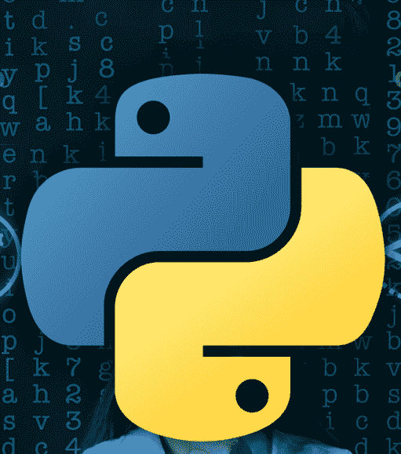
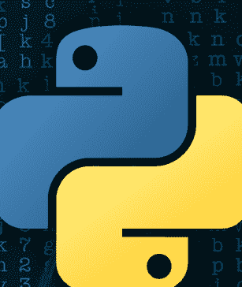

# #1 Python编程书籍



专业程序员 Minhaj Abdullah 著

# #1 Python编程书籍



专业程序员 Minhaj Abdullah 著

# #1 Python编程书籍

从基础编程到人工智能与自动化

Minhaj Abdullah 著

# 目录

[第1章：Python教程简介](Chapter 1: Introduction to Python Tutorial)

[什么是Python？](What is Python?)

[为什么学习Python？](Why Learn Python?)

[Python安装与设置](Python Installation and Setup)

[编写你的第一个Python程序](Writing Your First Python Program)

[任务练习：](Task Exercise:)

[第2章：Python基础](Chapter 2: Python Fundamentals)

[变量](Variables)

[数据类型](Data Types)

[运算符](Operators)

[Python标记](Python Tokens)

[Python字符串](Python Strings)

[任务练习：](Task Exercise:)

[第3章：Python中的数据结构](Chapter 3: Data Structures in Python)

[元组](Tuple)

[列表](List)

[字典](Dictionary)

[集合](Set)

[任务练习：](Task Exercise:)

[第4章：控制流](Chapter 4: Control Flow)

[条件判断（if, elif, else）](Decision Making (if, elif, else))

[循环语句（for, while）](Looping Statements (for, while))

[任务练习：](Task Exercise:)

[第5章：高级Python概念](Chapter 5: Advanced Python Concepts)

[函数](Functions)

[匿名函数](Lambda Functions)

[列表推导式](List Comprehensions)

[迭代器](Iterators)

任务练习：

第6章：Python面向对象编程（OOP）

类与对象

继承

任务练习：

第7章：异常处理与文件处理

异常处理

引发异常

文件处理

任务练习：

第8章：数据结构与算法

数组

栈

队列

链表

搜索算法

排序算法

任务练习：

第9章：Python用于机器学习

NumPy简介

Pandas简介

任务练习：

第10章：Python用于生成式人工智能

生成式人工智能揭秘

用于生成式人工智能的Python库

构建简单的生成模型

任务练习：

第11章：Python用于自动化

Selenium简介

使用Python自动化任务

任务练习：

第12章：使用Python进行GUI开发

Python GUI框架概述

Tkinter中的组件

示例：一个待办事项列表应用

Python书籍关键概念回顾

最后的思考

# 第1章：Python教程简介

## 什么是Python？

Python就像是编程语言中的瑞士军刀。它用途广泛、易于学习，并且功能强大，足以构建几乎任何东西——从简单的脚本到复杂的机器学习模型。当我刚开始编程时，Python是我的首选语言，因为它感觉就像在写纯英文。它对初学者友好，同时也能优雅地扩展用于高级项目。

## 为什么学习Python？

以下是我爱上Python的原因：

1.  易于读写：语法简洁直观。你不需要记住大量规则就能开始。
2.  用途广泛：无论你对Web开发、数据分析、人工智能还是自动化感兴趣，Python都有相应的库。
3.  社区支持：每当我遇到困难，我都能在Stack Overflow或Python论坛上找到答案。社区庞大且乐于助人。
4.  工作机会：Python是当今科技领域需求最高的技能之一。学习它能为无数职业道路打开大门。

## Python安装与设置

让我们开始吧！

1.  下载Python：访问 [python.org](https://www.python.org/) 并下载最新版本。
2.  安装Python：按照安装步骤操作。确保勾选“Add Python to PATH”（将Python添加到PATH）的选项（这会让你的生活更轻松）。
3.  验证安装：打开你的终端或命令提示符，输入：

```bash
python --version
```

如果你看到类似 `Python 3.x.x` 的输出，那就说明安装成功了！

## 编写你的第一个Python程序

让我们来编写经典的“Hello, World!”程序。打开你最喜欢的文本编辑器（我推荐VS Code或PyCharm），输入：

```python
print("Hello, World!")
```

将文件保存为 `hello.py`，然后使用以下命令运行：

```bash
python hello.py
```

如果屏幕上打印出“Hello, World!”，恭喜你！你刚刚编写了你的第一个Python程序。

## 任务练习：

1.  在你的电脑上安装Python。
2.  编写一个Python程序，打印出你的名字和一个关于你自己的有趣事实。

# 第2章：深入Python基础

当我刚开始学习Python时，变量的概念感觉有点抽象。我记得坐在电脑前，试图理解它们到底是什么。然后，我恍然大悟：变量就像贴了标签的容器。把它们想象成你搬家时用的那些可靠的箱子——每个箱子都有一个标签，里面存放着重要的东西。在Python中，这些“箱子”存放数据。例如，我可以创建一个名为 `name` 的变量，并在其中存储字符串 "Alice"。

```python
name = "Alice"
age = 25
```

同样，`age` 成为数字25的容器。然后，我可以使用这些标签（`name`, `age`）轻松访问存储在其中的信息。这就像拥有一个井井有条的系统，用来跟踪我的程序所需的所有零碎信息。

## 理解数据类型

那么，这些容器能存放什么样的“东西”呢？Python有几种内置的数据类型，每种都为特定类型的信息而设计。以下是我最常用的几种：

-   **整数：** 这些是你的整数——计数数字、它们的负数和零。例如：10, -5, 0, 1000。我经常用它们来计数或表示没有小数部分的数量。
-   **浮点数：** 这些是带小数点的数字。可以把它们看作是表示需要更高精度值的方式。例如：3.14, -0.001, 2.0。我用浮点数来计算平均值或表示测量值。
-   **字符串：** 这是Python处理文本的方式。字符串是用单引号（'）或双引号（"）括起来的字符序列。例如："Hello", 'Python', "123", "This is a sentence."。我用字符串来存储名字、消息或任何其他文本信息。
-   **布尔值：** 这些简单但强大——它们表示 True 或 False。布尔值对于在我的代码中做出决策至关重要。

例如：

```python
price = 19.99 # 浮点数
is_available = True # 布尔值
```

这里，`price` 存储了一个表示价格的浮点值，而 `is_available` 是一个布尔值，指示某物是否可用。

## 运算符的威力

一旦我设置好了变量，我就需要一种方法来实际*操作*它们。这就是运算符的用武之地。运算符是用于对变量和值执行操作的特殊符号。把它们想象成Python语言的动词。以下是快速概览：

-   **算术运算符：** 这些是你的基础数学工具：
    -   `+`（加法）：将两个值相加。
    -   `-`（减法）：从一个值中减去另一个值。
    -   `*`（乘法）：将两个值相乘。
    -   `/`（除法）：将一个值除以另一个值。
-   **比较运算符：** 这些让你比较值并查看它们之间的关系：
    -   `==`（等于）：检查两个值是否相等。
    -   `!=`（不等于）：检查两个值是否不相等。
    -   `>`（大于）：检查一个值是否大于另一个值。
    -   `<`（小于）：检查一个值是否小于另一个值。
-   **逻辑运算符：** 这些允许你组合或修改布尔表达式：
    -   `and`：如果两个操作数都为True，则返回True。
    -   `or`：如果至少有一个操作数为True，则返回True。
    -   `not`：对布尔值取反（将True变为False，反之亦然）。

以下是我可能如何使用它们：

```python
x = 10
y = 20
print(x + y) # 加法：输出为 30
print(x > y) # 比较：输出为 False（因为10不大于20）
print(x > 5 and y < 30) # 逻辑：输出为 True（因为两个条件都为真）
```

## Python 词元：构建基石

Python 代码由更小的组件构成，这些组件被称为词元。可以把它们想象成构成建筑的单块砖石。以下是我使用的主要词元类型：

- **关键字：** 这些是在 Python 中具有特殊含义的保留字。你不能将它们用作变量名或标识符。
  示例：if, else, for, while, def, class, import。
- **标识符：** 这些是我为变量、函数、类以及代码中其他元素所起的名称。
  示例：name, age, calculate_sum, my_list。
  在选择标识符时，我尽量使其具有描述性且易于理解。
- **字面量：** 这些是直接出现在代码中的固定值。示例：5（整数字面量）、"Hello"（字符串字面量）、3.14（浮点数字面量）、True（布尔字面量）。
- **运算符：** 正如我们之前讨论的，这些是执行操作的符号。示例：+, -, *, /, =, ==, >, <。

## 处理 Python 字符串

字符串是编程的基础部分，Python 提供了一些处理字符串的优秀工具。正如我之前提到的，字符串是字符的序列。你可以将它们想象成由单个字母、数字或符号组成的一行文本。

```python
greeting = "Hello, Python!"
print(greeting[0]) # 访问第一个字符：输出为 "H"
print(len(greeting)) # 获取字符串长度：输出为 14
```

在上面的示例中，`greeting[0]` 访问字符串中索引为 0（第一个字符）的字符。`len()` 函数返回字符串的长度。

## 动手实践时间：你的第一个任务

好了，理论讲得够多了！让我们付诸实践。这里有一个小练习给你：

1. 创建一个名为 `favorite_food` 的变量，并将你最喜欢的食物名称（当然是字符串形式！）赋值给它。
2. 打印存储在 `favorite_food` 中的字符串的长度。

> 这仅仅是个开始！随着我们深入学习本书，我将分享更多我的经验、技巧和诀窍，帮助你掌握 Python。记住，编程是一段旅程，你写的每一行代码都让你离成为专业人士更近一步。让我们一起努力吧！

# 第三章：探索 Python 中的数据结构

真正为我打开 Python 无限可能的一件事，就是理解数据结构。它们就像专门的容器，允许你以高效的方式组织和管理数据。这就像为工作找到合适的工具；使用正确的数据结构可以使你的代码更简洁、更快、更易于理解。

## 元组：不可变的数据

首先，我们来谈谈元组。当我第一次接触元组时，我想：“好吧，另一种列表？”但它们实际上大不相同。元组是*不可变的*，这意味着一旦创建，你就无法更改其内容。它们就像刻在石头上的东西。
为什么你会想要不可变的东西呢？嗯，当你希望确保某些数据在整个程序中保持不变时，不可变性非常有用。可以把它想象成存储配置设置或数据库连接细节，这些内容绝不应被意外修改。这是为了保护数据。

```python
coordinates = (10, 20)
print(coordinates[0])  # 访问第一个元素：输出为 10
```

在这个例子中，`coordinates` 是一个包含 x 和 y 值的元组。我可以使用索引访问这些值（就像访问列表中的元素一样），但我不能添加、删除或修改它们。尝试这样做会导致错误。

## 多功能的列表：我的首选容器

列表是我的首选数据结构。如果我需要存储一组项目，列表通常是我的第一选择。它们极其灵活——你可以根据需要添加、删除和修改元素。它们就像一个可以不断更新的动态待办事项列表。

```python
fruits = ["apple", "banana", "cherry"]
fruits.append("orange")  # 添加一个项目
print(fruits[1])  # 访问第二个项目：输出为 "banana"
```

上面的代码片段展示了一些常见的列表操作。我可以使用 `append()` 将项目添加到列表末尾。我也可以通过索引访问元素，就像元组一样。
列表真正强大的地方在于它们提供了大量的内置方法：

- `insert(index, element)`：在特定位置插入一个元素。
- `remove(element)`：删除第一个出现的指定元素。
- `pop(index)`：删除并返回特定索引处的元素。
- `sort()`：对列表中的元素进行排序。
- `reverse()`：反转元素的顺序。

## 字典：解锁键值对

字典是游戏规则的改变者。它们以键值对的形式存储数据，这使得查找信息效率极高。我喜欢把它们想象成现实中的字典，你查找一个单词（键）来找到它的定义（值）。

```python
person = {"name": "Alice", "age": 25}
print(person["name"])  # 访问键 "name" 对应的值：输出为 "Alice"
```

在这个例子中，"name" 和 "age" 是键，"Alice" 和 25 是它们对应的值。我可以通过在方括号内使用键来访问值。

字典非常适合表示具有命名属性的对象、配置设置，或者任何需要根据唯一标识符快速检索信息的场景。

## 集合：消除重复项

最后是集合。集合是唯一项目的集合。这意味着如果你尝试向集合中添加重复的元素，它会被简单地忽略。当你需要从数据集合中消除重复项时，它们非常有用。

```python
unique_numbers = {1, 2, 3, 3, 4}
print(unique_numbers)  # 输出：{1, 2, 3, 4}
```

在这个例子中，即使我尝试添加两次 3，集合也只包含每个唯一数字的一个实例。

集合在执行并集、交集和差集等集合操作时也非常高效。

## 动手实践时间：亲自动手

好了，现在轮到你来尝试这些数据结构了。这里有两个任务让你开始：

1. **电影列表：** 创建一个包含你最喜欢电影的列表，并打印列表中的第三部电影。
2. **个人字典：** 创建一个字典来存储你的名字、年龄和最喜欢的爱好。打印你最喜欢的爱好对应的值。

不要只是复制粘贴代码。试着理解*为什么*使用每种数据结构，以及它如何帮助你解决手头的问题。这是真正掌握 Python 数据结构的关键！

# 第四章：控制流

## 决策制定（if, elif, else）

当我第一次学习 Python 中的决策制定时，感觉就像在教计算机做选择。`if`、`elif` 和 `else` 语句就像给你的程序一个大脑，根据特定条件决定做什么。

```python
# 示例：检查一个数字是正数、负数还是零
number = 10

if number > 0:
    print("The number is positive.")
elif number < 0:
    print("The number is negative.")
else:
    print("The number is zero.")
```

我的理解方式：

- `if` 就像在问：“这是真的吗？”
- `elif`（else if）就像在说：“如果第一件事不是真的，那么这个呢？”
- `else` 是当以上条件都不满足时的备选方案。

## 循环语句（for, while）

循环是我在 Python 中最喜欢的工具之一。它们让你可以多次重复一段代码块，而无需一遍又一遍地编写相同的行。

### For 循环

当你知道想要重复多少次时，`for` 循环是完美的选择。

```python
# 示例：打印从 1 到 5 的数字
for i in range(1, 6):
    print(i)
```

我的理解方式：

- `range(1, 6)` 生成从 1 到 5 的数字（第二个数字是不包含的）。
- 循环为范围内的每个数字运行一次。

### While 循环

当你想要重复某件事直到满足某个条件时，`while` 循环非常有用。

```python
# 示例：从 5 倒数到 1
count = 5
while count > 0:
    print(count)
    count -= 1  # 将 count 减少 1
```

我的理解方式：

# 第五章：高级Python概念

## 函数

函数就像是你程序中的小程序。它们帮助你组织代码并避免重复。当我刚开始使用函数时，我把它们看作是执行特定任务的可重用代码块。

```python
# 示例：一个将两个数相加的函数
def add_numbers(a, b):
    return a + b

result = add_numbers(5, 10)
print(result)  # 输出：15
```

我的理解方式：

- `def` 是 "define"（定义）的缩写。它是你创建函数的方式。
- `return` 将结果返回到调用该函数的地方。

## Lambda 函数

Lambda 函数就像是快速的、单行的函数。当我需要一个用于简短任务的简单函数时，我会使用它们。

```python
# 示例：一个将两个数相乘的 lambda 函数
multiply = lambda x, y: x * y
print(multiply(3, 4))  # 输出：12
```

我的理解方式：

- Lambda 函数非常适合小任务，但如果过度使用，可能会使你的代码更难阅读。

## 列表推导式

列表推导式是 Python 风格的创建列表的方式。它们简洁而优雅，我经常使用它们来简化我的代码。

```python
# 示例：创建一个平方数列表
squares = [x**2 for x in range(1, 6)]
print(squares)  # 输出：[1, 4, 9, 16, 25]
```

我的理解方式：

- 这就像是说：“给我从1到5每个数字的平方。”

## 生成器

生成器是一种处理大型数据集的内存高效方式。它们按需生成值，而不是将所有值都存储在内存中。

```python
# 示例：一个生成平方数的生成器
def square_generator(n):
    for i in range(1, n + 1):
        yield i**2

for num in square_generator(5):
    print(num)
```

我的理解方式：

- `yield` 类似于 `return`，但它会暂停函数并记住它停止的位置。

## 迭代器

迭代器是允许你逐一遍历集合中所有元素的对象。

```python
# 示例：在列表上使用迭代器
fruits = ["apple", "banana", "cherry"]
fruit_iter = iter(fruits)

print(next(fruit_iter))  # 输出：apple
print(next(fruit_iter))  # 输出：banana
```

我的理解方式：

- `iter()` 创建一个迭代器，而 `next()` 获取序列中的下一个项目。

## 任务练习：

1. 编写一个函数，接受一个数字列表并返回所有数字的总和。
2. 使用列表推导式创建一个包含前10个立方数的列表。
3. 编写一个生成器函数，生成斐波那契数列直到给定的数字。

# 第六章：Python面向对象编程（OOP）

## 类与对象

OOP 是一种将你的代码组织成代表现实世界实体的“对象”的方式。当我第一次学习 OOP 时，我把类看作蓝图，对象看作是从这些蓝图构建出来的东西。

```python
# 示例：一个简单的类
class Dog:
    def __init__(self, name, age):
        self.name = name
        self.age = age

    def bark(self):
        print(f"{self.name} says woof!")

# 创建一个对象
my_dog = Dog("Buddy", 3)
my_dog.bark()  # 输出：Buddy says woof!
```

我的理解方式：

- `__init__` 是构造函数——它在创建对象时被调用。
- `self` 指的是类的实例。

## 继承

继承允许你基于现有类创建一个新类。这就像将特征从父母传递给孩子。

```python
# 示例：继承
class Animal:
    def __init__(self, name):
        self.name = name

    def speak(self):
        print(f'{self.name} makes a sound.')

class Cat(Animal):
    def speak(self):
        print(f'{self.name} says meow!')

my_cat = Cat("Whiskers")
my_cat.speak()  # 输出：Whiskers says meow!
```

我的理解方式：

- `Cat` 类继承自 `Animal` 类并重写了 `speak` 方法。

## 任务练习：

1. 创建一个名为 `Car` 的类，包含 `make`、`model` 和 `year` 等属性。添加一个名为 `start_engine` 的方法，打印 "Engine started."。
2. 创建一个名为 `ElectricCar` 的子类，继承自 `Car` 并重写 `start_engine` 方法以打印 "Electric engine started."。

# 第七章：异常处理与文件处理

## 异常处理

当我刚开始编程时，我讨厌看到我的程序因为错误而崩溃。那时我发现了异常处理——一种优雅地处理错误并让你的程序继续运行的方法。

### Try, Except, Finally

`try` 块让你测试一段代码是否有错误，`except` 块处理错误，而 `finally` 块无论如何都会运行。

```python
# 示例：处理除以零
try:
    result = 10 / 0
except ZeroDivisionError:
    print("You can't divide by zero!")
finally:
    print("This will always run.")
```

我的理解方式：

- `try` 就像是说：“让我们试试这个，但如果出了什么问题，不要崩溃！”
- `except` 是你的安全网——它捕获特定的错误。
- `finally` 用于必须发生的清理任务。

### 抛出异常

有时，你想抛出自己的异常来处理特定情况。

```python
# 示例：抛出异常
age = -5
if age < 0:
    raise ValueError("Age cannot be negative!")
```

我的理解方式：

- 抛出异常就像是说：“这是不可接受的，我在这里停止程序。”

## 文件处理

处理文件是编程中的常见任务。无论是从文件读取数据还是将结果写入文件，Python 都使其变得简单。

### 读取文件

```python
# 示例：读取文件
with open("example.txt", "r") as file:
    content = file.read()
    print(content)
```

我的理解方式：

- `open()` 打开文件，而 `with` 确保文件在读取后被正确关闭。
- `"r"` 代表读取模式。

### 写入文件

```python
# 示例：写入文件
with open("output.txt", "w") as file:
    file.write("Hello, Python!")
```

我的理解方式：

- `"w"` 代表写入模式。小心——如果文件已存在，它会覆盖该文件！

## 任务练习：

1. 编写一个程序，要求用户输入一个数字并打印其倒数。如果用户输入0，则处理 `ZeroDivisionError`。
2. 创建一个名为 `notes.txt` 的文本文件，并将你最喜欢的名言写入其中。然后，读取该文件并打印其内容。

# 第八章：我在数据结构与算法中的冒险

这一章对我来说变得真正有趣起来。数据结构和算法是高效编程的基石。这就像学习将新手厨师与大师区分开来的秘密技巧。理解这些概念使我能够编写不仅功能齐全，而且针对性能进行了优化的代码。

## 数组：有序集合

数组是基础。它们是存储在连续（相邻）内存位置的项目集合。我喜欢把数组想象成一排储物柜——每个储物柜存放一条信息，如果你知道储物柜的编号，就可以快速访问任何一个。

在 Python 中，我们没有像其他一些语言（如 C 或 Java）那样的内置数组数据结构。相反，我们通常使用列表作为数组。

```python
# 示例：使用列表作为数组
numbers = [10, 20, 30, 40, 50]
print(numbers[2])  # 访问第三个元素：输出是 30
```

**我的理解方式：**

- 数组非常适合以结构化的方式存储和访问数据。当你需要按位置查找值时，数组是你的朋友。关键在于，它们提供*直接访问*——你可以直接到达元素的内存位置。

## 栈：后进先出

栈是一种遵循后进先出（LIFO）原则的数据结构。想象一下自助餐厅里的一摞盘子。你最后放上去的那个盘子，在你准备吃的时候会最先被拿走。

```python
# 示例：使用列表实现一个栈
stack = []
stack.append(10)  # 压入
stack.append(20)
print(stack.pop())  # 弹出（输出：20）
```

### 我的理解方式：

- `append()` 是我将新元素“压入”栈顶的方式。
- `pop()` 是我从栈顶“弹出”元素的方式。妙处在于 `pop()` 还会*返回*该元素，这样我就可以立即使用它。

栈在诸如函数调用管理（你的计算机如何在函数调用后记住返回位置）和表达式求值等场景中非常有用。

## 队列：先进先出

队列与栈相反。它遵循先进先出（FIFO）原则。可以把它想象成电影院的排队——队伍中的第一个人会最先买到票并进入影院。

```python
# 示例：使用列表实现一个队列
from collections import deque

queue = deque()
queue.append(10)  # 入队
queue.append(20)
print(queue.popleft())  # 出队（输出：10）
```

### 我的理解方式：

- `append()` 仍然将元素添加到末尾，在这种情况下就是队列的尾部。
- `popleft()` 是关键——它从队列的前端移除并返回元素，从而维持了先进先出的顺序。

队列对于按顺序管理任务至关重要，例如处理打印作业、处理网络请求或模拟现实世界的排队系统。

## 链表：节点的链条

链表是一个元素（称为节点）序列，其中每个元素都指向序列中的下一个元素。它就像一场寻宝游戏，每条线索都引导你前往下一个地点。

```python
# 示例：实现一个简单的链表
class Node:
    def __init__(self, data):
        self.data = data
        self.next = None

# 创建节点
node1 = Node(10)
node2 = Node(20)
node1.next = node2

print(node1.data)  # 输出：10
print(node1.next.data)  # 输出：20
```

### 我的理解方式：

- 每个 `Node` 对象包含两样东西：`data`（存储在节点中的实际值）和 `next`（指向链表中下一个节点的引用，如果是最后一个节点则为 `None`）。
- 正是 `next` 引用将节点连接在一起，形成了链条。

当你需要频繁地在列表中间插入或删除元素时，链表就很有优势，因为你不必像使用数组那样在内存中移动大量元素。

## 搜索算法

搜索算法是我们如何在数据集合中查找特定项目的方法。

### 线性搜索：简单直接的方法

线性搜索是最基本的搜索算法。它简单地逐个检查列表中的每个元素，直到找到目标值。这就像在书架上找一本书，需要逐本查看。

```python
# 示例：线性搜索
def linear_search(arr, target):
    for i in range(len(arr)):
        if arr[i] == target:
            return i  # 如果找到，返回索引
    return -1  # 如果未找到，返回 -1

numbers = [10, 20, 30, 40, 50]
print(linear_search(numbers, 30))  # 输出：2
```

### 我的理解方式：

- 它实现和理解起来都很直接。
- 然而，对于大型列表来说效率不高，因为在最坏的情况下它必须检查每一个元素。

### 二分搜索：分而治之

二分搜索是一种高效得多的算法，但它只适用于*已排序*的列表。它通过反复将搜索区间一分为二来工作。这就像在字典里查一个单词——你不会从头开始；你会打开字典的中间部分，看看这个单词是在这一页之前还是之后。

```python
# 示例：二分搜索
def binary_search(arr, target):
    low, high = 0, len(arr) - 1
    while low <= high:
        mid = (low + high) // 2
        if arr[mid] == target:
            return mid  # 如果找到，返回索引
        elif arr[mid] < target:
            low = mid + 1  # 在右半部分搜索
        else:
            high = mid - 1  # 在左半部分搜索
    return -1  # 如果未找到，返回 -1

numbers = [10, 20, 30, 40, 50]
print(binary_search(numbers, 40))  # 输出：3
```

### 我的理解方式：

- 二分搜索速度极快，因为每次比较都能排除一半的搜索空间。
- 然而，它*要求*列表事先是排好序的。

## 排序算法

排序算法用于将列表中的元素按特定顺序（例如升序或降序）排列。

### 插入排序：逐步构建

插入排序通过逐个添加项目来构建最终的排序列表。这就像整理你手中的一副牌——你拿起每张牌，并将其插入到手中已排序部分的正确位置。

```python
# 示例：插入排序
def insertion_sort(arr):
    for i in range(1, len(arr)):
        key = arr[i]  # 要插入的元素
        j = i - 1
        while j >= 0 and key < arr[j]:
            arr[j + 1] = arr[j]  # 将元素向右移动
            j -= 1
        arr[j + 1] = key  # 将 key 插入到正确位置
    return arr

numbers = [50, 30, 20, 40, 10]
print(insertion_sort(numbers))  # 输出：[10, 20, 30, 40, 50]
```

### 我的理解方式：

- 插入排序实现简单，对于小型列表或几乎已排序的列表效率很高。
- 然而，对于大型列表来说效率低下，因为它具有二次时间复杂度（O(n^2)）。

### 快速排序：分而治之（再次！）

快速排序是一种分而治之的算法，对于大型数据集通常比插入排序快得多。它通过选择一个“基准”元素，并将列表划分为两个子列表来工作：小于基准的元素和大于基准的元素。然后，递归地对子列表进行排序。

```python
# 示例：快速排序
def quick_sort(arr):
    if len(arr) <= 1:
        return arr  # 基本情况：已排序
    pivot = arr[len(arr) // 2]  # 选择一个基准（中间元素）
    left = [x for x in arr if x < pivot]  # 小于基准的元素
    middle = [x for x in arr if x == pivot]  # 等于基准的元素
    right = [x for x in arr if x > pivot]  # 大于基准的元素
    return quick_sort(left) + middle + quick_sort(right)  # 递归调用

numbers = [50, 30, 20, 40, 10]
print(quick_sort(numbers))  # 输出：[10, 20, 30, 40, 50]
```

### 我的理解方式：

- 快速排序由于其分而治之的方法，通常非常快。
- 然而，与更简单的排序算法相比，它在理解和实现上可能稍微复杂一些。

## 轮到你了：付诸实践

现在，是时候亲自动手，尝试自己实现这些数据结构和算法了。这里有三个任务供你开始：

1.  **栈反转：** 实现一个栈，并用它来反转一个数字列表。
2.  **姓名二分搜索：** 编写一个程序，对一个已排序的姓名列表执行二分搜索。
3.  **快速排序挑战：** 实现快速排序，并在一组随机数字列表上进行测试。

不要只是复制粘贴代码！尝试理解底层原理，并从头开始实现算法。这才是你真正掌握 Python 中数据结构和算法的方式！祝你好运，探索愉快！

# 第9章：用于机器学习的 Python – 我的工具箱

机器学习是我真正感受到 Python 真正潜力的地方。它就像拥有一套工具，让你能够构建可以从数据中学习的智能系统。在本章中，我将带你了解我用于机器学习项目所依赖的核心库。

## NumPy 简介：数值计算的基础

NumPy 是我在 Python 中进行数值计算时几乎所有工作的支柱。当我刚开始处理数据时，NumPy 完全改变了游戏规则。它让你能够高效地处理数组和矩阵，这对于任何机器学习任务都至关重要。它针对数值运算进行了优化，使得在执行相同任务时，它比使用标准 Python 列表要快得多。

```python
# 示例：使用 NumPy 创建和操作数组
import numpy as np

# 创建一个一维数组
array = np.array([1, 2, 3, 4, 5])
print(array)

# 创建一个二维数组
matrix = np.array([[1, 2, 3], [4, 5, 6]])
print(matrix)
```

## 我的理解方式：

- NumPy 数组不仅更快，而且在进行数值运算时比 Python 列表更节省内存。这就像拥有一个为数据处理而生的超级计算器。
- 我使用 NumPy 处理从基础数组创建到复杂线性代数运算的所有任务。它处理多维数组的能力对于机器学习和人工智能项目来说是无价的。
- 除了基本算术，NumPy 还允许重塑和转置数据，这在为机器学习模型准备数据时至关重要。

## Pandas 简介：数据处理的利器

Pandas 是我进行数据处理和分析的首选库。它构建在 NumPy 之上，提供了像 DataFrame 这样强大的数据结构。我喜欢把 DataFrame 想象成 Python 中的 Excel 电子表格。

```python
# Example: Working with Pandas
import pandas as pd

# Create a DataFrame
data = {
    "Name": ["Alice", "Bob", "Charlie"],
    "Age": [25, 30, 35],
    "City": ["New York", "Los Angeles", "Chicago"]
}
df = pd.DataFrame(data)
print(df)

# Accessing data
print(df["Name"])  # Get the "Name" column
print(df.iloc[1])  # Get the second row
```

## 我的理解方式：

- DataFrame 就像表格，而 Pandas 让数据的筛选、排序和分析变得异常简单。我使用 Pandas 进行数据清洗、转换和探索。
- Pandas 中的一维（Series）和二维（DataFrame）数据结构使其适用于各行各业，包括金融、工程和统计学。
- Pandas 直观的语法让我只需几行代码就能快速执行复杂的数据操作。

## 使用 Matplotlib 进行数据可视化：让数据栩栩如生

Matplotlib 是 Python 中创建可视化图表的主力库。当我第一次使用它时，我惊讶于将原始数据转化为富有洞察力的图表是如此简单。

```python
# Example: Creating a simple plot
import matplotlib.pyplot as plt

x = [1, 2, 3, 4, 5]
y = [10, 20, 25, 30, 40]

plt.plot(x, y)
plt.xlabel("X-axis")
plt.ylabel("Y-axis")
plt.title("Simple Line Plot")
plt.show()
```

## 我的理解方式：

- Matplotlib 就像一块画布，你可以在上面绘制几乎任何你能想象到的图表。我用它来创建折线图、散点图、柱状图、直方图等等。
- 它提供了一个底层接口，让你能对图表的每个方面进行精细控制。
- 虽然与 Seaborn 相比，创建视觉上吸引人的图表可能需要更多代码，但 Matplotlib 提供了无与伦比的灵活性。

## 使用 Seaborn 进行高级可视化：风格与统计

Seaborn 构建在 Matplotlib 之上，旨在让创建具有统计信息且视觉吸引力强的图表变得更容易。我经常把 Seaborn 描述为 Matplotlib 的时尚表亲，因为它能让你用最少的努力使可视化图表看起来专业。

```python
# Example: Creating a heatmap with Seaborn
import seaborn as sns
import numpy as np
import matplotlib.pyplot as plt # Import Matplotlib

data = np.random.rand(5, 5)
sns.heatmap(data, annot=True)
plt.show()
```

## 我的理解方式：

- Seaborn 就像 Matplotlib 的时尚表亲——它只需最少的调整就能将你的可视化提升到专业水平。
- 它与 Pandas DataFrame 无缝集成，使得可视化复杂数据集变得轻而易举。
- Seaborn 非常适合生成热力图、分布图和其他统计可视化图表，帮助你理解数据中的潜在模式。
- Seaborn 生成的图表和绘图视觉上美观且吸引人，使其非常适合用于出版物和市场营销。

## 其他机器学习库

还有许多其他库可以帮助你。以下是简要介绍：

- **Scikit-learn：** 一个用于各种机器学习任务的综合库，如分类、回归、聚类和模型选择。它构建在 NumPy 和 SciPy 之上，为初学者和专家都提供了用户友好的接口。
- **TensorFlow：** 一个专注于可微分编程的强大库，使其成为开发和训练深度学习模型及神经网络的理想选择。它在 CPU、GPU 和 TPU 上都能良好运行。
- **Keras：** 一个简化神经网络构建的高级 API，运行在 TensorFlow 或 Theano 之上。它模块化、灵活且对初学者友好，非常适合快速原型设计和研究。
- **PyTorch：** 以其灵活性和速度而闻名，特别是在处理复杂计算图时。它与 Python 工具无缝集成，广泛应用于计算机视觉和自然语言处理。

## 实践时间：融会贯通

好了，理论讲够了！是时候动手实践，开始尝试这些库了。这里有几个任务供你入门：

1. **NumPy 数组统计：** 创建一个包含 10 个随机数的 NumPy 数组，并计算它们的均值和标准差。
2. **Pandas 加载 CSV：** 使用 Pandas 加载一个 CSV 文件（你可以用示例数据创建一个），并显示前 5 行。
3. **Matplotlib 柱状图：** 使用 Matplotlib 创建一个柱状图，可视化 5 个城市的人口。

不要只是复制粘贴代码。去实验、探索，并尝试理解这些库如何帮助你解决现实世界的问题。这才是你真正掌握 Python 用于机器学习的方法！

# 第 10 章：Python 用于生成式 AI

## 揭秘生成式 AI

生成式 AI 是当今科技领域最令人兴奋的领域之一。它的核心是教机器创造新内容——无论是文本、图像还是音乐。当我第一次探索这个领域时，感觉就像魔法，但它实际上只是高级的数学和编程。

## 用于生成式 AI 的 Python 库

Python 拥有一些用于生成式 AI 的惊人库，如 TensorFlow、PyTorch 和 Hugging Face Transformers。

```python
# Example: Using Hugging Face Transformers for text generation
from transformers import pipeline

generator = pipeline("text-generation", model="gpt-2")
text = generator("Once upon a time", max_length=50)
print(text)
```

## 我的理解方式：

- 这些库提供了预训练模型，你可以使用它们来生成内容，而无需从头开始。

好了，让我们使用循环神经网络（RNN）来构建一个基本的文本生成器。可以把这想象成教机器模仿一种写作风格，即使它只是从“hello world”这个短语中学习。

```python
import numpy as np
from keras.models import Sequential
from keras.layers import LSTM, Dense
```

首先，我们导入必要的库。NumPy 用于数值运算，特别是处理数组。从 Keras（一个用于构建神经网络的高级 API）中，我们导入 Sequential 来将我们的模型定义为层的序列，导入 LSTM（一种特别擅长记忆序列的循环层），以及导入 Dense 用于全连接层。

```python
# Sample text
text = "hello world"
chars = sorted(list(set(text)))
char_to_int = {c: i for i, c in enumerate(chars)}
```

接下来，我们定义训练数据。在这个例子中，它就是简单的短语“hello world”。然后我们从这段文本中创建一组唯一的字符并进行排序。之后，我们创建一个名为 `char_to_int` 的字典，将每个字符映射到一个唯一的整数。这至关重要，因为神经网络处理的是数字，而不是直接处理字符。

```python
# Prepare data
X = []
y = []
for i in range(len(text) - 1):
    X.append(char_to_int[text[i]])
    y.append(char_to_int[text[i + 1]])

X = np.reshape(X, (len(X), 1, 1))
X = X / float(len(chars))
y = np.array(y)
```

现在，我们为 RNN 准备数据。我们创建两个列表，X 和 y。X 将存储输入序列，y 将存储这些序列之后的目标字符。例如，如果我们的文本是“hello”，X 将包含 'h', 'e', 'l', 'l'，而 y 将包含 'e', 'l', 'l', 'o'。然后我们将 X 重塑为一个 3D 数组，这是 LSTM 层期望的输入格式。我们还通过将 X 除以唯一字符的数量来进行归一化。这有助于网络更快地学习。最后，我们将 y 转换为 NumPy 数组。

```python
# Build model
model = Sequential()
model.add(LSTM(50, input_shape=(X.shape[1], X.shape[2])))
model.add(Dense(len(chars), activation="softmax"))
model.compile(loss="sparse_categorical_crossentropy", optimizer="adam")
```

在这里，我们构建 RNN 模型。我们从一个 Sequential 模型开始，这意味着我们逐层添加。第一层是一个 LSTM 层，有 50 个单元，输入形状与我们准备好的数据匹配。第二层是一个 Dense 层，其单元数等于唯一字符的数量，并使用“softmax”激活函数。Softmax 使输出成为一个概率分布，告诉我们每个字符作为下一个字符的可能性有多大。然后我们编译模型，指定损失函数为“sparse_categorical_crossentropy”（适用于整数编码的标签）并将优化器设置为“adam”，这是一个流行的选择。

```python
# 训练模型
model.fit(X, y, epochs=100, verbose=2)
```

现在，我们使用 `fit` 方法来训练模型。我们传入准备好的数据 `X` 和 `y`，将训练轮数（模型查看整个数据集的次数）指定为 100，并设置 `verbose=2` 以在训练期间获得详细的输出。

```python
# 生成文本
start = np.random.randint(0, len(X) - 1)
pattern = X[start]
output = ""
for i in range(10):
    prediction = model.predict(pattern, verbose=0)
    index = np.argmax(prediction)
    output += chars[index]
    pattern = np.append(pattern, index)
    pattern = pattern[1:]
    pattern = np.reshape(pattern, (1, 1, 1))

print(output)
```

最后，我们生成一些文本。我们首先从输入序列中随机选择一个字符。然后，我们循环 10 次。在每次迭代中，我们使用模型预测下一个字符，找到概率最高的字符，将其附加到输出中，并更新模式以进行下一次迭代。然后我们打印生成的文本。

就是这样！这是一个基础示例，但它展示了使用 RNN 进行文本生成的核心原理。你可以尝试不同的数据集、模型架构和训练参数，以获得更令人印象深刻的结果。尝试使用更大的文本文件进行训练。

## 任务练习：

- 1. 使用 Hugging Face Transformers 生成一个以“在一个遥远的星系……”开头的短篇故事。
- 2. 尝试上面的 RNN 示例，生成更长的文本序列。

# 第 11 章：Python 自动化

## Selenium 简介

Selenium 是一个强大的网页浏览器自动化工具。我用它来自动化重复性任务，比如填写表单或从网站抓取数据。

```python
# 示例：使用 Selenium 自动化 Google 搜索
from selenium import webdriver
from selenium.webdriver.common.keys import Keys

# 设置浏览器
driver = webdriver.Chrome()
driver.get("https://www.google.com")

# 查找搜索框并输入查询
search_box = driver.find_element("name", "q")
search_box.send_keys("Python programming")
search_box.send_keys(Keys.RETURN)

# 关闭浏览器
driver.quit()
```

我的理解方式：

- Selenium 就像拥有一个可以为你与网站交互的机器人。

## 使用 Python 进行网页抓取

网页抓取是从网站提取数据的过程。我经常用它来收集数据进行分析。

```python
# 示例：从网站抓取名言
import requests
from bs4 import BeautifulSoup

url = "https://quotes.toscrape.com"
response = requests.get(url)
soup = BeautifulSoup(response.text, "html.parser")

quotes = soup.find_all("span", class_="text")
for quote in quotes:
    print(quote.text)
```

我的理解方式：

- BeautifulSoup 使得解析 HTML 并提取所需数据变得容易。

## 使用 Python 自动化任务

Python 可以自动化几乎任何事情——文件管理、发送电子邮件，甚至控制其他软件。

```python
# 示例：自动化文件组织
import os
import shutil

# 创建文件夹
folders = ["Images", "Documents", "Videos"]
for folder in folders:
    if not os.path.exists(folder):
        os.makedirs(folder)

# 将文件移动到正确的文件夹
for file in os.listdir():
    if file.endswith(".jpg"):
        shutil.move(file, "Images")
    elif file.endswith(".pdf"):
        shutil.move(file, "Documents")
    elif file.endswith(".mp4"):
        shutil.move(file, "Videos")
```

我的理解方式：

- 自动化节省时间并减少人为错误。

## 任务练习：

- 1. 使用 Selenium 自动化登录一个网站（你可以使用一个虚拟网站进行练习）。
- 2. 编写一个脚本，从新闻网站抓取前 10 篇新闻文章的标题。
- 3. 自动化按类别整理你的“下载”文件夹中的文件。

# 第 12 章：使用 Python 进行 GUI 开发

Python 中的图形用户界面（GUI）开发允许开发者创建视觉上吸引人且用户友好的应用程序。Python 提供了多个用于构建 GUI 的框架，每个框架都有其独特的特性和优势。本指南将深入探讨一些最受欢迎的选项，主要关注 Tkinter，同时提供示例来说明它们的用法。

## Python GUI 框架概述

- **Tkinter**：Python 的标准 GUI 工具包，包含在大多数安装中。它非常适合简单到中等规模的应用程序。
- **PyQt/PySide**：这些是 Qt 应用程序框架的绑定，适用于创建复杂且功能丰富的应用程序。
- **wxPython**：一个跨平台的 GUI 工具包，在不同操作系统上提供原生的外观和感觉。
- **Kivy**：专为开发多点触控应用程序而设计，Kivy 非常适合移动和桌面应用程序。
- **PySimpleGUI**：围绕其他 GUI 框架的包装器，简化了创建 GUI 的过程。

## Tkinter：标准 GUI 工具包

Tkinter 是 Python 中最常用的 GUI 开发库，因其简单易用而广受欢迎。以下是使用 Tkinter 创建基本应用程序的分步指南。

### 设置基本的 Tkinter 应用程序

**导入 Tkinter 模块：**

```python
import tkinter as tk
```

**创建主窗口：**

```python
root = tk.Tk()
root.title("Basic Tkinter App")
```

**添加控件：**

例如，添加一个标签和一个按钮。

```python
label = tk.Label(root, text="Welcome to Tkinter!")
label.pack(pady=10)

button = tk.Button(root, text="Click Me",
                   command=lambda: print("Button Clicked!"))
button.pack(pady=5)
```

**运行主事件循环：**

```python
root.mainloop()
```

这段代码创建了一个简单的窗口，其中包含一个标签和一个按钮，点击按钮时会打印一条消息。

### 示例：一个简单的计算器

让我们使用 Tkinter 构建一个简单的计算器，它可以执行基本的算术运算。

```python
import tkinter as tk

class Calculator:
    def __init__(self, master):
        self.master = master
        master.title("Simple Calculator")

        self.result_var = tk.StringVar()
        self.entry = tk.Entry(master,
                              textvariable=self.result_var)
        self.entry.grid(row=0, column=0, columnspan=4)

        buttons = [
            '7', '8', '9', '/',
            '4', '5', '6', '*',
            '1', '2', '3', '-',
            '0', '.', '=', '+'
        ]

        row_val = 1
        col_val = 0
        for button in buttons:
            tk.Button(master, text=button,
                      command=lambda b=button:
                      self.on_button_click(b)).grid(row=row_val,
                                                    column=col_val)
            col_val += 1
            if col_val > 3:
                col_val = 0
                row_val += 1

    def on_button_click(self, button):
        if button == '=':
            try:
                result = eval(self.result_var.get())
                self.result_var.set(result)
            except Exception as e:
                self.result_var.set("Error")
        else:
            current_text = self.result_var.get()
            new_text = current_text + button
            self.result_var.set(new_text)

if __name__ == "__main__":
    root = tk.Tk()
    calculator = Calculator(root)
    root.mainloop()
```

在这个例子中，我们创建了一个简单的计算器，可以执行加法、减法、乘法和除法。当用户点击“=”按钮时，`eval` 函数会计算输入的表达式。

## Tkinter 中的控件

Tkinter 提供了各种控件，可用于创建交互式应用程序：

- **Button**：点击时触发一个动作。
- **Label**：显示文本或图像。
- **Entry**：接受单行文本输入。
- **Text**：接受多行文本输入。
- **Checkbutton**：允许用户选择多个选项。
- **Radiobutton**：允许用户从一组选项中选择一个。
- **Listbox**：显示一个项目列表供选择。
- **Frame**：作为组织控件的容器。

### 示例：一个待办事项列表应用程序

这是一个使用 Tkinter 的简单待办事项列表应用程序示例：

```python
import tkinter as tk

class TodoApp:
    def __init__(self, master):
        self.master = master
        master.title("To-Do List")

        self.tasks = []

        self.task_input = tk.Entry(master)
        self.task_input.pack(pady=10)

        self.add_task_button = tk.Button(master,
                                         text="Add Task", command=self.add_task)
        self.add_task_button.pack(pady=5)

        self.task_listbox = tk.Listbox(master)
        self.task_listbox.pack(pady=10)

    def add_task(self):
        task = self.task_input.get()
        if task:
            self.tasks.append(task)
            self.update_task_listbox()
            self.task_input.delete(0, tk.END)

    def update_task_listbox(self):
```

## Python 书籍核心概念回顾

- **Python 简介** Python 编程的历史、特性和应用。
- **安装与设置** 下载安装 Python 及配置开发环境的指导。
- **Python 基础** 涵盖标识符、关键字、语句、表达式、变量、运算符、优先级、数据类型、缩进、注释、内置函数和类型转换。
- **数据结构** 包括列表、元组、集合和字典。
- **控制流** 条件语句（if、elif、else）和循环（for、while）。
- **函数** 函数介绍，包括内置函数与用户自定义函数、创建用户函数，以及 map、filter 和 reduce 函数。
- **面向对象编程（OOP）** 对象、类、继承、多态、封装和抽象的基本概念。
- **异常处理** 使用 try、except 和 finally 块，以及引发异常。
- **文件处理** 文件的读写操作。
- **数据结构与算法** 数组、栈、队列、链表、线性搜索、二分搜索、插入排序、快速排序和归并排序。
- **Python 机器学习应用** 介绍用于数据操作和分析的 NumPy 和 Pandas。
- **数据可视化** 使用 Matplotlib 和 Seaborn 创建图表和图形。
- **Python 生成式 AI 应用** 用于生成式 AI 的 Python 库及构建简单生成模型。
- **Python 自动化应用** 使用 Selenium 进行网页自动化、网络爬取和任务自动化。
- **GUI 开发** 使用 Tkinter 构建图形用户界面。

## Python 进阶学习资源

- **在线教程与课程**：可自主安排学习进度的交互式平台和课程。
- **书籍**：从初学者到高级学习者的全面指南。
- **官方文档**：获取深入知识的 Python 官方文档。
- **社区论坛**：与其他 Python 开发者交流、提问和分享知识。
- **开源项目**：参与开源项目以获得实践经验。

## 结语

作为行业内的资深专业程序员，我，Minhaj Abdullah，相信本书为任何想要学习 Python 的人奠定了坚实的基础。掌握 Python 的关键，如同掌握任何编程语言一样，在于持续的实践和真实世界的应用。不要仅仅阅读代码；要动手编写、实验，并构建自己的项目。拥抱挑战，利用丰富的在线资源，并永不停止学习。Python 的多功能性使其成为任何开发者工具箱中的宝贵资产。