# 使用Python实现101种数据可视化

作者：艾哈迈德·阿布劳亚

## 目录

- 1. 关于作者、版权与摘要
  - 关于作者
  - 版权
  - 摘要
- 2. 数据可视化入门
  - 数据可视化的重要性
  - 有效的数据可视化
  - 用于数据可视化的Python库
  - 安装所需库
- 3. 使用Faker生成合成数据集
  - 安装Faker库
  - 生成合成销售数据
- 4. 使用Python和Matplotlib进行可视化
  - 针对加载的合成数据集的101种可视化
- 5. 结论
- 6. 有用资源

## 关于作者

**艾哈迈德·阿布劳亚** 是一位数据架构师、作家和讲师，过去15年一直在埃及开罗的一所国际学校工作，深耕技术领域，并获得了来自微软、IBM、甲骨文、AWS、VMware、Sophos等技术市场领导者的认证。他于2022年毕业于阿拉伯科技与商学院，获得电子商务硕士学位，并且是班级第一名。他真心渴望通过攻读数据科学博士学位来尽快提升自己的学术记录。没有家人的支持和自身的持续动力，他无法做到这一点。

作者邮箱地址：abouraia2010@hotmail.com

## 版权所有 © 2023 艾哈迈德·阿布劳亚，埃及。

保留所有权利。未经作者事先书面许可，不得以任何形式或任何方式（包括影印、录制或其他电子或机械方法）复制、分发或传播本指南的任何部分，但版权法允许的简短引述用于评论和某些其他非商业用途的情况除外。

本指南仅供个人使用和教育目的。此处提供的内容，包括使用Python的数据可视化技术，基于作者作为数据架构师和讲师的专业知识和经验。虽然已尽力确保所提供信息的准确性和可靠性，但对于因使用本指南而产生的任何错误、遗漏或损害，作者不承担任何责任。

使用本指南提供的材料和代码示例时，应适当注明并署名作者艾哈迈德·阿布劳亚。未经授权使用、复制或分发内容可能会面临法律诉讼。

如需咨询或请求许可，请联系 **abouraia2010@hotmail.com**。

感谢您尊重作者的知识产权，以及您对学习使用Python进行数据可视化感兴趣。

## 免责声明

本指南中提供的信息仅供教育和说明目的。本指南的作者对因使用本指南任何部分而可能发生的任何软件或硬件损坏不承担责任。鼓励用户在应用本指南中描述的任何代码或技术时保持谨慎并自行判断。在将代码应用于任何关键或生产环境之前，在安全可控的环境中进行测试至关重要。

此外，虽然已尽力确保所提供信息的准确性和可靠性，但作者不保证内容的正确性或完整性。对于因使用本指南而直接、间接、偶然、后果性或特殊损害，或与之以任何方式相关的损害，作者不承担任何责任。

建议用户在应用本指南中描述的任何概念或实践之前，咨询其各自领域的适当专家和专业人士，以确保遵守所有相关法律、法规和最佳实践。

使用本指南即表示您承认并同意本免责声明的条款，并承担与其使用相关的所有风险。如果您不同意本免责声明的条款，建议不要使用本指南中提供的信息。

## 摘要

您是否希望提升自己的Python数据可视化技能？无需再寻！这是一份使用单一数据集实现101种可视化的终极指南。无论您是初学者还是经验丰富的数据科学家，这份全面的指南将带您踏上一段视觉之旅，探索使用Python和单一数据集可以实现的各种绘图技术、见解和模式。

在本指南中，我们将涵盖您需要了解的所有内容，以创建有影响力的可视化并有效传达您的数据驱动故事。从基本的条形图到复杂的热力图，我们都有涉及。我们将使用的数据集包含多种属性，包括购买详情、客户人口统计信息、产品类别等。

指南亮点：

- Python数据可视化基础
- 折线图：揭示随时间变化的趋势
- 条形图：比较类别和数量
- 饼图：分析比例
- 散点图：识别关系
- 箱线图：理解数据分布
- 热力图：可视化相关性
- 词云：探索文本数据……以及更多！

所以，拿起您的Python工具包，开始这段激动人心的数据可视化冒险吧！在本指南结束时，您将掌握各种可视化技术，并从单一数据集中获得宝贵的见解。

## 1. 数据可视化入门

### 数据可视化的重要性

数据可视化之所以重要，是因为它是一个强大的工具，使我们能够快速有效地理解复杂数据并提取有意义的见解。通过使用图形表示，数据可视化将原始数字和统计数据转化为视觉模式、趋势和关系，使人们更容易理解和解释信息。

以下是数据可视化重要性的关键原因，以及它如何增强我们对数据的理解：

- **增强理解能力：** 人类是视觉动物，我们处理视觉信息比处理原始数据更高效。可视化提供了清晰简洁的数据表示，使用户更容易掌握主要信息、发现模式并识别异常值。
- **识别模式和趋势：** 可视化有助于揭示在表格数据中可能不明显的模式、趋势和相关性。通过视觉观察数据，我们可以检测到可能被忽视的关系和见解。
- **叙事与沟通：** 可视化具有讲述引人入胜的数据驱动故事的能力。它们使数据分析师和沟通者能够以引人入胜和有说服力的方式呈现发现，使复杂信息更易于广大受众理解。
- **决策与洞察：** 设计良好的可视化提供有价值的见解，从而做出明智的决策。它们通过以促进批判性思维的方式呈现数据，帮助企业识别机会、优化流程和应对挑战。
- **数据验证与质量评估：** 数据可视化通过允许我们识别数据集中的错误、异常和不一致性来帮助进行数据验证。可视化可以作为数据质量检查，确保用于分析的数据准确可靠。
- **交互性与探索性：** 交互式可视化使用户能够从不同角度探索数据，深入查看特定细节，并根据自己的兴趣自定义视图。这种动手探索促进了对数据更深入的理解。
- **识别异常值和异常情况：** 可视化使识别可能需要进一步调查的异常值和异常情况变得更容易。这些意外的数据点可能包含关键信息，或表明数据收集过程中存在潜在错误。
- **比较与基准测试：** 可视化便于在不同数据集、组或时间段之间进行轻松比较。它们能够进行基准测试。

### 有效报告

数据可视化对于创建引人入胜且信息丰富的报告至关重要。一个精心制作的可视化图表可以快速传达关键发现，为创作者和读者节省时间和精力。

### 公众理解

在科学、公共卫生和社会问题等领域，数据可视化在向公众呈现复杂信息方面发挥着至关重要的作用。它们有助于弥合专业知识与公众理解之间的鸿沟，促进更明智的决策和政策制定。

总之，数据可视化之所以重要，是因为它将数据转化为可操作的见解，促进更好的决策，并实现复杂信息的有效沟通。它使个人和组织能够探索、理解和利用数据的力量，推动各个领域的创新和进步。

### 有效的数据可视化：为定量和定性数据选择合适的可视化方式

数据可视化在理解和传达数据见解方面起着关键作用。面对海量信息，选择正确的可视化技术对于有效呈现定量和定性数据至关重要。在本指南中，我们将探讨针对定量和定性数据的推荐可视化类型，重点介绍它们的优势和最佳使用场景。无论您是在分析数值数据还是分类标签，了解适当的可视化技术都能显著增强您数据分析的理解度和影响力。加入我们，一起深入数据可视化的世界，探索数据视觉叙事的力量。

对于代表数值的定量数据，根据数据的具体特征和您想要传达的见解，有几种推荐的可视化类型。以下是一些常用的可视化类型及其推荐理由：

#### 定量数据可视化

- **直方图：** 直方图可用于可视化单个定量变量的分布。它们显示预定义区间或间隔内数据点的频率或计数。直方图非常适合识别偏度、集中趋势和异常值等模式。
- **箱线图（箱须图）：** 箱线图提供了分布集中趋势、离散程度和偏度的简明摘要。它们显示中位数、四分位数和可能的异常值，使其成为比较多个定量变量或组别的理想选择。
- **散点图：** 散点图非常适合可视化两个定量变量之间的关系。它们有助于识别数据中的相关性、聚类和模式。散点图对于发现任何潜在的线性或非线性关系非常有价值。
- **折线图：** 折线图通常用于显示数据随时间变化的趋势和变化。它们用直线连接数据点，使其成为可视化时间序列数据或任何具有连续 x 轴数据的有效工具。
- **条形图：** 虽然条形图通常用于分类数据，但当类别被分组到区间中时，也可以显示定量数据。这对于汇总离散定量数据或比较不同范围很有帮助。
- **面积图：** 面积图类似于折线图，但表示线下的面积。它们对于可视化随时间累积的数量或显示堆叠数据很有用。
- **热力图：** 热力图有助于显示两个定量变量之间关系的强度。它们使用颜色来表示数据值，对于大型数据集非常有效。

对于代表类别或标签的定性数据，推荐使用不同的可视化类型来有效传达见解。以下是一些常用的可视化类型及其在定性数据方面的优势：

#### 定性数据可视化

- **条形图：** 条形图是显示定性数据最常见的方法之一。它们显示每个类别的频率或计数，便于比较不同类别。
- **饼图：** 饼图用于显示整体中不同类别的构成或比例。然而，它们最好在类别数量相对较少（通常少于 5-6 个）时使用，以避免杂乱。
- **堆叠条形图：** 堆叠条形图显示单个变量作为整体的构成，显示每个类别对总量的贡献。它们对于比较多个定性变量或类别非常有效。
- **环形图：** 环形图是饼图的变体，中心有一个孔。它们可以用来显示与饼图相同的信息，同时为注释或附加数据提供更多空间。
- **词云：** 词云直观地表示文本数据集中单词或术语的频率。它们通常用于突出显示最常见的术语或主题。
- **堆叠面积图：** 堆叠面积图显示不同定性类别随时间的演变，展示每个类别对整体的贡献。
- **弦图：** 弦图用于可视化不同类别或组之间的关系。它们对于展示实体之间的连接和流动非常有用。

在选择正确的可视化类型时，必须考虑数据的性质和您想要讲述的故事。可视化应清晰、信息丰富，并针对受众进行定制，以有效传达数据中的见解和模式。

### 用于数据可视化的 Python 库

Python 提供了多种强大的数据可视化库，以满足不同用户的需求和偏好。每个库都有其优点和缺点，因此根据具体的可视化需求选择合适的库非常重要。以下是一些最受欢迎的 Python 数据可视化库：

- **Matplotlib**：Matplotlib 是 Python 中最古老且使用最广泛的数据可视化库之一。它提供了一套灵活且全面的工具，用于创建静态、交互式和动画可视化。虽然对于复杂图表需要更多代码，但 Matplotlib 的多功能性使其适用于各种可视化任务。
- **Seaborn**：Seaborn 建立在 Matplotlib 之上，提供了一个高级接口，用于创建美观且信息丰富的统计图形。它通过提供便捷的 API，简化了复杂可视化的创建，例如小提琴图、配对图和相关性热力图。Seaborn 对于探索性数据分析特别有用，并且与 pandas DataFrame 配合良好。
- **Plotly**：Plotly 是一个流行的库，用于创建交互式和基于 Web 的可视化。它支持广泛的图表类型，包括折线图、条形图、散点图等。Plotly 可视化可以嵌入到 Web 应用程序中，也可以作为独立的 HTML 文件共享。它还提供了 JavaScript、R 和其他编程语言的 API。
- **Pandas Plot**：Pandas 是一个流行的数据操作库，它也为 DataFrame 和 Series 提供了一个简单的绘图 API。虽然功能不如 Matplotlib 或 Seaborn 丰富，但它便于直接从 pandas 数据结构进行快速的探索性可视化。
- **Bokeh**：Bokeh 是另一个专注于 Web 应用程序交互式可视化的库。它允许创建具有平滑缩放和平移功能的交互式图表。Bokeh 提供了低级和高级 API，使其适合初学者和高级用户。
- **Altair**：Altair 是一个基于 Vega-Lite 规范的声明式统计可视化库。它允许使用简洁直观的 Python 代码创建可视化。Altair 生成交互式可视化，并且可以轻松定制和扩展。
- **Geopandas 和 Folium**：Geopandas 和 Folium 是用于地理数据可视化的专用库。Geopallows 允许处理地理空间数据（例如 shapefiles）并与 Matplotlib 集成进行可视化。Folium 专注于创建交互式地图，并且与 Jupyter Notebooks 配合良好。

## 2- 使用 Faker 生成合成数据集

### 安装所需库

要安装数据可视化所需的 Python 库，你可以使用 pip 或 conda，具体取决于你的包管理器（Anaconda 或标准 Python 发行版）。以下是使用两种方法安装库的详细步骤：

- **使用 pip（标准 Python 发行版）：**
  - 步骤 1：在你的计算机上打开命令提示符或终端。
  - 步骤 2：确保你已安装 Python。你可以通过运行以下命令检查你的 Python 版本：
    ```
    python --version
    ```
  - 步骤 3：将 pip 更新到最新版本（可选但推荐）：
    ```
    pip install --upgrade pip
    ```
  - 步骤 4：安装所需的库。对于数据可视化，你可能需要安装 Matplotlib、Seaborn、Plotly 等库。例如，要安装 Matplotlib 和 Seaborn，请运行：
    ```
    pip install matplotlib seaborn
    ```
  - 将 **matplotlib seaborn** 替换为你想要安装的其他库的名称。

- **使用 conda（Anaconda 发行版）：**
  - 步骤 1：打开 Anaconda Navigator 或 Anaconda Prompt。
  - 步骤 2：如果你使用的是 Anaconda Navigator，请转到“环境”选项卡，选择所需的环境，然后点击“打开终端”。
  - 步骤 3：如果你使用的是 Anaconda Prompt，请通过运行以下命令激活所需的环境：
    ```
    conda activate your_environment_name
    ```
  - 将 **your_environment_name** 替换为你所需环境的名称。如果你想在基础环境中安装库，请跳过此步骤。
  - 步骤 4：安装所需的库。对于数据可视化，你可以使用 conda 安装 Matplotlib、Seaborn、Plotly 等库。例如，要安装 Matplotlib 和 Seaborn，请运行：
    ```
    conda install matplotlib seaborn
    ```
  - 将 **matplotlib seaborn** 替换为你想要安装的其他库的名称。
  - 步骤 5：如果某个库在 conda 中不可用，你可以在你的 conda 环境中使用 pip。例如，要安装 Plotly，请运行：
    ```
    pip install plotly
    ```

运行安装命令后，指定的库及其依赖项将被下载并安装到你的系统上。然后，你可以在你的 Python 脚本或 Jupyter Notebook 中使用这些库进行数据可视化和分析。

注意：如果你使用的是 Jupyter Notebook，请确保在你的 Jupyter Notebook 所使用的同一个 Python 环境中安装库，以避免兼容性问题。如果你使用的是 Anaconda，建议为每个项目创建一个单独的环境，以有效地管理库依赖关系。

### 安装 Faker 库

在 Windows 10 上使用 Anaconda 发行版安装 Faker 库的步骤：

- 打开 Anaconda Prompt：点击 Windows 开始按钮，输入“Anaconda Prompt”，然后打开 Anaconda Prompt 应用程序。
- 激活环境（可选）：如果你想在特定的 conda 环境中安装 Faker，请使用以下命令激活该环境：
  ```
  conda activate your_environment_name
  ```
  将 **your_environment_name** 替换为你所需环境的名称。
- 安装 Faker：在 Anaconda Prompt 中，输入以下命令安装 Faker 库：
  ```
  pip install Faker
  ```
- 等待安装：安装过程将开始，所需的包将被下载并安装。
- 验证安装（可选）：要验证 Faker 是否正确安装，你可以打开一个 Python 解释器或 Jupyter Notebook 并尝试导入该库：
  - `import faker`
- 如果没有错误，Faker 库就成功安装了。

就是这样！你现在已经使用 Anaconda 发行版在你的 Windows 10 机器上安装了 Faker 库。你可以使用 Faker 生成用于测试、原型设计或学习目的的合成数据。请记住，Faker 不适用于生产环境，对于任何严肃的分析或应用，使用真实数据至关重要。

### 生成合成销售数据

要使用 Faker 库为之前的 101 个可视化示例生成合成数据集，我们将创建一个 Python 脚本，为指定的列生成随机数据。由于 Faker 生成的是随机数据，请记住这个数据集将是人工的，不代表任何真实世界的数据。

首先，确保你已经安装了 Faker 库。你可以使用 pip 安装它：
```
pip install Faker
```

让我们生成具有所需列的数据集：
```python
import pandas as pd
import random
from faker import Faker
from datetime import datetime, timedelta

# Set random seed for reproducibility
random.seed(42)

# Initialize Faker and other necessary variables
fake = Faker()
start_date = datetime(2020, 1, 1)
end_date = datetime(2022, 1, 1)

# Create empty lists to store the generated data
order_ids = []
customer_ids = []
product_ids = []
purchase_dates = []
product_categories = []
quantities = []
total_sales = []
genders = []
marital_statuses = []
price_per_unit = []
customer_types = []
ages = []  # New list to store ages

# Number of rows (data points) to generate
num_rows = 10000

# Generate the dataset
for _ in range(num_rows):
    order_ids.append(fake.uuid4())
    customer_ids.append(fake.uuid4())
    product_ids.append(fake.uuid4())
    purchase_date = start_date + timedelta(days=random.randint(0, (end_date - start_date).days))
    purchase_dates.append(purchase_date)
    product_categories.append(fake.random_element(elements=('Electronics', 'Clothing', 'Books', 'Home', 'Beauty')))
    quantities.append(random.randint(1, 10))
    total_sales.append(random.uniform(10, 500))
    genders.append(fake.random_element(elements=('Male', 'Female')))
    # Only 'Male' and 'Female' will be added
    marital_statuses.append(fake.random_element(elements=('Single', 'Married', 'Divorced', 'Widowed')))
    price_per_unit.append(random.uniform(5, 50))
    customer_types.append(fake.random_element(elements=('New Customer', 'Returning Customer')))
    ages.append(random.randint(18, 80))  # Generate random ages between 18 and 80

# Create a DataFrame from the generated lists
df = pd.DataFrame({
    'Order_ID': order_ids,
    'Customer_ID': customer_ids,
    'Product_ID': product_ids,
    'Purchase_Date': purchase_dates,
    'Product_Category': product_categories,
    'Quantity': quantities,
    'Total_Sales': total_sales,
    'Gender': genders,
    'Marital_Status': marital_statuses,
    'Price_Per_Unit': price_per_unit,
    'Customer_Type': customer_types,
    'Age': ages  # Add the 'Age' column to the DataFrame
})

# Save the DataFrame to a CSV file
df.to_csv('ecommerce_sales.csv', index=False)

# Display the first few rows of the generated dataset
print(df.head())
```

这段代码将生成一个包含指定列 'Order_ID'、'Customer_ID'、'Product_ID'、'Purchase_Date'、'Product_Category'、'Quantity' 和 'Total_Sales' 等的 DataFrame。你现在可以使用这个生成的数据集进行数据可视化和分析，并将之前的 101 个可视化示例应用到它上面。请记住，这个数据集是合成的，只应用于学习或测试目的。对于真实世界的分析，使用真实且具有代表性的数据至关重要。

## 3- 使用Python和Matplotlib进行数据可视化

- 针对加载的数据集，提供101种不同的可视化图表

**电子商务销售数据集是使用Python Faker库通过合成数据方法生成的：**

- 文件名：ecommerce_sales.csv
- 条目数：10,000

**数据集描述：**

本文件中的电子商务销售数据集（"ecommerce_sales.csv"）是使用Python的合成数据方法，借助强大的Faker库精心生成的。该数据集模拟了在线零售商店的销售交易和客户互动，仅用于教育和演示目的。

数据集共有10,000条记录，每一行代表一条独特的合成销售交易。数据包含多种属性，包括订单ID、客户ID、产品ID、购买日期、产品类别、数量、总销售额、性别、年龄、年龄组、婚姻状况、单价和客户类型。

虽然这些信息与真实的电子商务销售数据相似，但必须强调的是，该数据集并非源自任何真实的交易或实体。因此，它不代表任何实际的客户行为、市场趋势或业务表现。

这个合成数据集为学习者和数据爱好者提供了宝贵的资源，提供了练习数据分析技术、探索各种可视化方法以及提升Python编程技能的机会。然而，至关重要的是要认识到，这些数据不应用于做出真正的商业决策或得出影响现实世界场景的结论。

当用户使用这个合成电子商务销售数据集时，鼓励他们在专业环境中进行实际数据分析和决策时，应用他们的知识到来自可信来源的真实、可靠的数据集。通过这样做，学习者可以利用数据的力量来驱动有意义的见解，并为电子商务及其他领域的数据驱动策略和优化做出贡献。

本指南中使用Faker库生成的合成数据仅用于教育和演示目的。数据完全是虚构的，不代表任何现实世界的观察或趋势。虽然Faker提供了看起来真实的数据，但它并非源自实际的观察或事件。因此，从这些合成数据中得出的任何结论或推断都应谨慎对待，不应作为真实决策或分析的基础。

使用Faker生成数据的目的是演示数据可视化技术，并为练习Python数据分析技能提供一个平台。作为学习者，鼓励探索和试验数据，以更好地理解可视化概念。然而，为了进行实际且有意义的数据分析，必须使用从可靠来源获得的、真实的、具有代表性的相关数据。在进行实际分析和得出结论时，请始终验证并使用真实数据。

请记住，Faker生成的合成数据是学习、实验和练习数据分析技术的宝贵工具。它是构建Python数据可视化熟练度和探索各种可视化库与工具的垫脚石。随着你的进步，请将你的技能应用于分析真实数据集，以获得有价值的见解，并为现实世界场景中的数据驱动决策做出贡献。

### 101种Python可视化：代码与每种可视化的全面解析

在这本全面的指南中，开启一段通过101种数据可视化的启发性旅程，每一种都使用Python代码精心制作。深入数据分析和可视化的深处，揭开每种可视化目的和设计的复杂性。

利用丰富的可视化资源，学习如何操作数据、识别模式并有效传达见解。从经典的条形图和折线图到复杂的3D可视化和交互式仪表板，本指南为您提供了成为数据叙事大师的工具。

每种可视化都附有详细的解释，提供了关于数据解释、可视化技术和最佳实践的宝贵见解。探索如何利用Python的多功能库，如Matplotlib、Seaborn、Plotly等，来创建引人入胜的可视化叙事。

无论您是数据爱好者、有抱负的分析师还是经验丰富的专业人士，《101种独特的Python可视化》都能让您掌握Python的力量，将复杂数据提炼为可操作的见解。通过这本沉浸式且具有教育意义的指南，解锁数据可视化的艺术，并提升您的数据驱动决策能力。

**重要提示：** 每种可视化的呈现顺序如下：可视化编号、标题、解释、Python代码和图表。

Python代码

```python
# 导入必要的库
import pandas as pd
import matplotlib.pyplot as plt
import seaborn as sns
from datetime import datetime, timedelta
from wordcloud import WordCloud
```

```python
# 加载数据集
df = pd.read_csv('ecommerce_sales.csv')
```

```
<class 'pandas.core.frame.DataFrame'>
RangeIndex: 10000 entries, 0 to 9999
Data columns (total 13 columns):
 #   Column            Non-Null Count  Dtype 
---  ------            --------------  ----- 
 0   Order_ID          10000 non-null  object
 1   Customer_ID       10000 non-null  object
 2   Product_ID        10000 non-null  object
 3   Purchase_Date     10000 non-null  object
 4   Product_Category  10000 non-null  object
 5   Quantity          10000 non-null  int64 
 6   Total_Sales       10000 non-null  float64
 7   Gender            10000 non-null  object
 8   Marital_Status    10000 non-null  object
 9   Price_Per_Unit    10000 non-null  float64
 10  Customer_Type     10000 non-null  object
 11  Age               10000 non-null  int64 
 12  Age_Group         10000 non-null  category
dtypes: category(1), float64(2), int64(2), object(8)
memory usage: 947.6+ KB
```

#### 可视化 1：条形图 - 按销售额排名前10的产品类别

使用条形图可视化销售额排名前10的产品类别的总销售额。

```python
#### 可视化 1：条形图 - 按销售额排名前10的产品类别
top_10_categories = df.groupby('Product_Category')['Total_Sales'].sum().nlargest(10)
plt.bar(top_10_categories.index, top_10_categories.values)
plt.xticks(rotation=45)
plt.xlabel('Product Category')
plt.ylabel('Total Sales')
plt.title('Top 10 Product Categories by Sales')
plt.show()
```

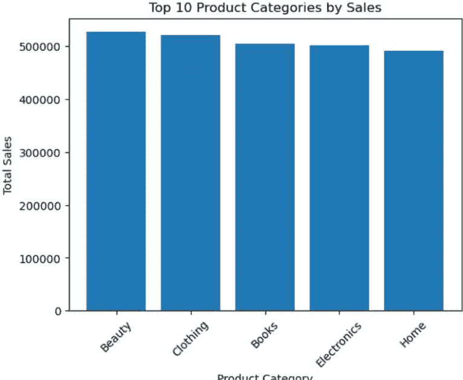

#### 可视化 2：饼图 - 按客户类型的销售分布

使用饼图显示不同客户类型的销售额百分比分布。

```python
#### 可视化 2：饼图 - 按客户类型的销售分布
customer_type_sales = df.groupby('Customer_Type')['Total_Sales'].sum()
plt.pie(customer_type_sales, labels=customer_type_sales.index, autopct='%1.1f%%')
plt.title('Sales Distribution by Customer Type')
plt.show()
```

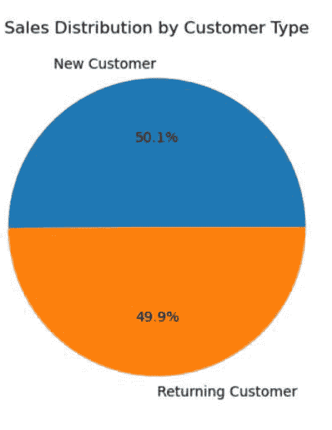

#### 可视化 3：直方图 - 销售额分布

使用直方图分析总销售额的分布情况。

```python
#### 可视化 3：直方图 - 销售额分布
plt.hist(df['Total_Sales'], bins=20)
plt.xlabel('Total Sales')
plt.ylabel('Frequency')
plt.title('Sales Amount Distribution')
plt.show()
```

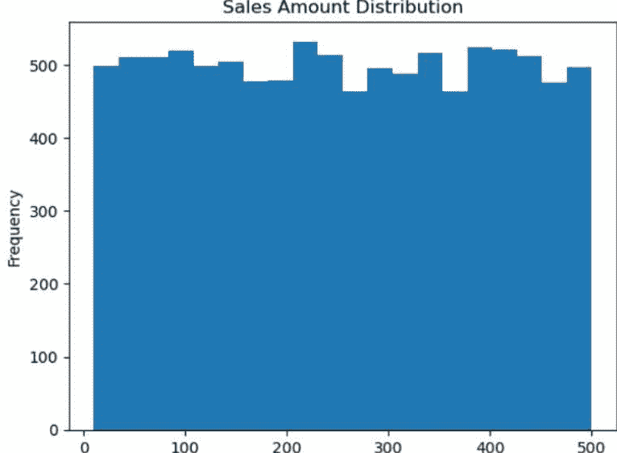

#### 可视化 4：箱线图 - 按产品类别的销售额

使用箱线图比较不同产品类别的销售分布。

```python
#### 可视化 4：箱线图 - 按产品类别的销售额
plt.figure(figsize=(10, 6))
sns.boxplot(x='Product_Category', y='Total_Sales', data=df)
plt.xticks(rotation=45)
plt.xlabel('Product Category')
plt.ylabel('Total Sales')
plt.title('Sales Amount by Product Category')
plt.show()
```

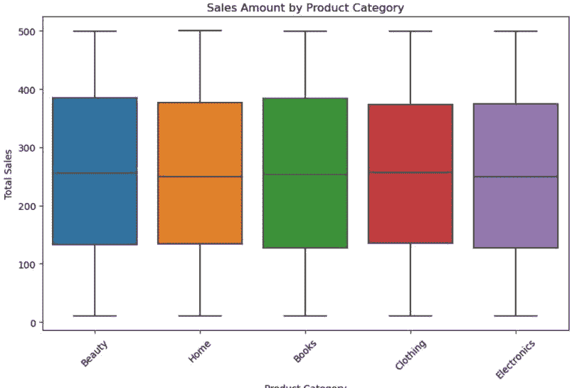

#### 可视化 5：计数图 - 按月份统计销售额
使用计数图可视化每个月的销售数量。

```python
#### 可视化 5：计数图 - 按月份统计销售额
df['Purchase Date'] = pd.to_datetime(df['Purchase Date'])
df['Month'] = df['Purchase Date'].dt.month
plt.figure(figsize=(10, 6))
sns.countplot(x='Month', data=df)
plt.xlabel('Month')
plt.ylabel('Sales Count')
plt.title('Sales by Month')
plt.show()
```

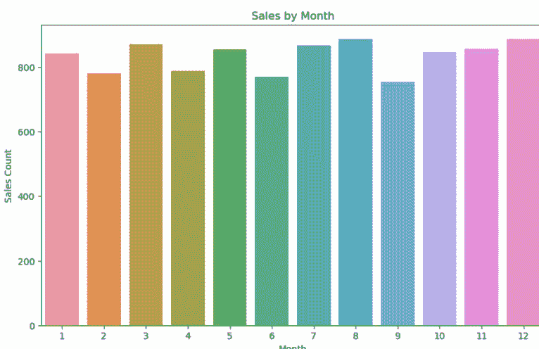

#### 可视化 6：散点图 - 总销售额与数量
使用散点图探索总销售额与购买数量之间的关系。

```python
#### 可视化 6：散点图 - 总销售额与数量
plt.scatter(df['Total Sales'], df['Quantity'])
plt.xlabel('Total Sales')
plt.ylabel('Quantity')
plt.title('Total Sales vs. Quantity')
plt.show()
```

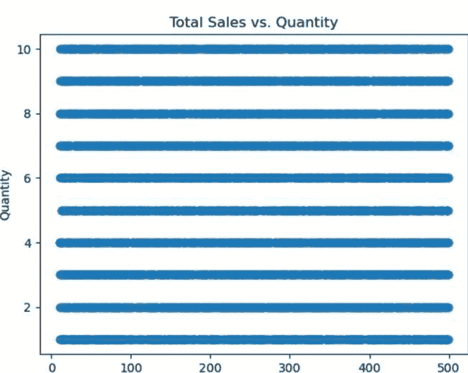

#### 可视化 7：折线图 - 月度销售趋势
使用折线图展示随时间变化的月度销售趋势。

```python
#### 可视化 7：折线图 - 月度销售趋势
monthly_sales = df.resample('M', on='Purchase_Date')['Total_Sales'].sum()
plt.plot(monthly_sales)
plt.xlabel('Date')
plt.ylabel('Monthly Sales')
plt.title('Monthly Sales Trend')
plt.show()
```

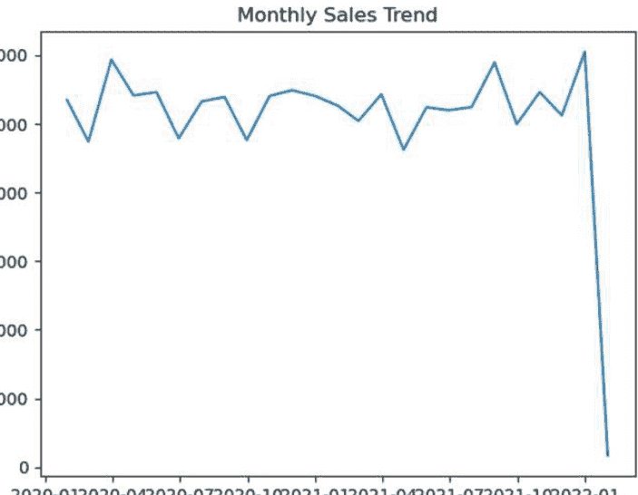

#### 可视化 8：堆叠条形图 - 按客户类型和产品类别统计销售额
使用堆叠条形图可视化按客户类型和产品类别划分的销售额明细。

```python
#### 可视化 8：堆叠条形图 - 按客户类型和产品类别统计销售额
customer_category_sales = df.pivot_table(index='Customer_Type', columns='Product_Category', values='Total_Sales', aggfunc='sum')
customer_category_sales.plot(kind='bar', stacked=True, figsize=(10, 6))
plt.xlabel('Customer Type')
plt.ylabel('Total Sales')
plt.title('Sales by Customer Type and Product Category')
plt.legend(title='Product Category', bbox_to_anchor=(1, 1))
plt.show()
```

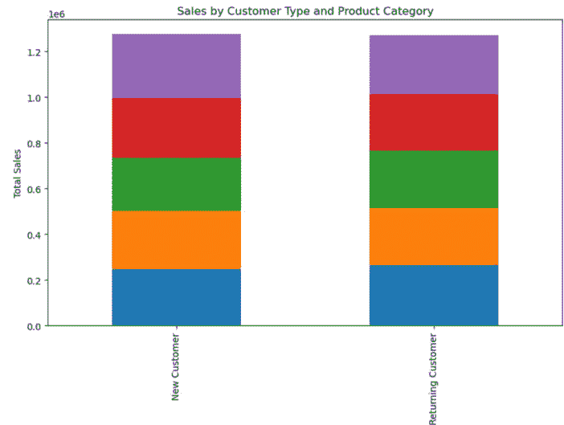

#### 可视化 9：配对图 - 数值特征间的相关性
使用配对图绘制数值特征（如总销售额、数量和单价）之间的成对关系。

```python
#### 可视化 9：配对图 - 数值特征间的相关性
sns.pairplot(df[['Total_Sales', 'Quantity', 'Price_Per_Unit']])
plt.title('Correlation Between Numeric Features', y=1.02)
plt.show()
```

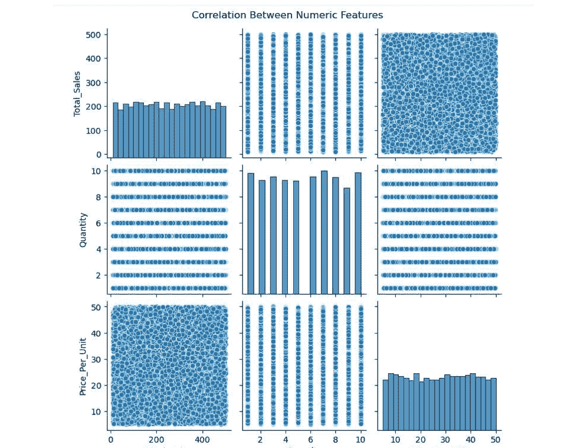

#### 可视化 10：热力图 - 相关性矩阵
使用热力图展示不同数值特征之间的相关性矩阵。

```python
#### 可视化 10：热力图 - 相关性矩阵
correlation_matrix = df.corr()
sns.heatmap(correlation_matrix, annot=True, cmap='coolwarm')
plt.title('Correlation Matrix')
plt.show()
```

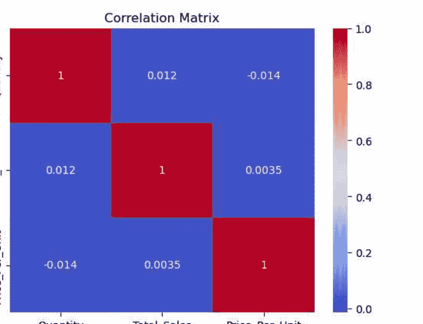

#### 可视化 11：小提琴图 - 按客户类型统计销售额分布
使用小提琴图比较不同客户类型的销售额分布情况。

```python
#### 可视化 11：小提琴图 - 按客户类型统计销售额分布
plt.figure(figsize=(8, 6))
sns.violinplot(x='Customer Type', y='Total Sales', data=df)
plt.xlabel('Customer Type')
plt.ylabel('Total Sales')
plt.title('Sales Distribution by Customer Type')
plt.show()
```

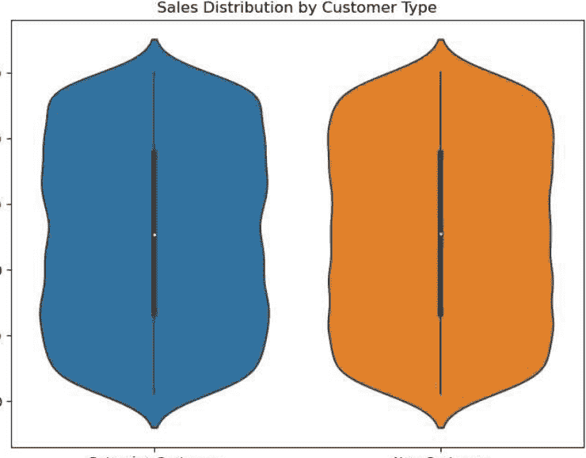

#### 可视化 12：联合图 - 总销售额与单价
使用联合图探索总销售额与单价之间的关系。

```python
#### 可视化 12：联合图 - 总销售额与单价
sns.jointplot(x='Total Sales', y='Price Per Unit', data=df)
plt.xlabel('Total Sales')
plt.ylabel('Price Per Unit')
plt.title('Total Sales vs. Price Per Unit')
plt.show()
```

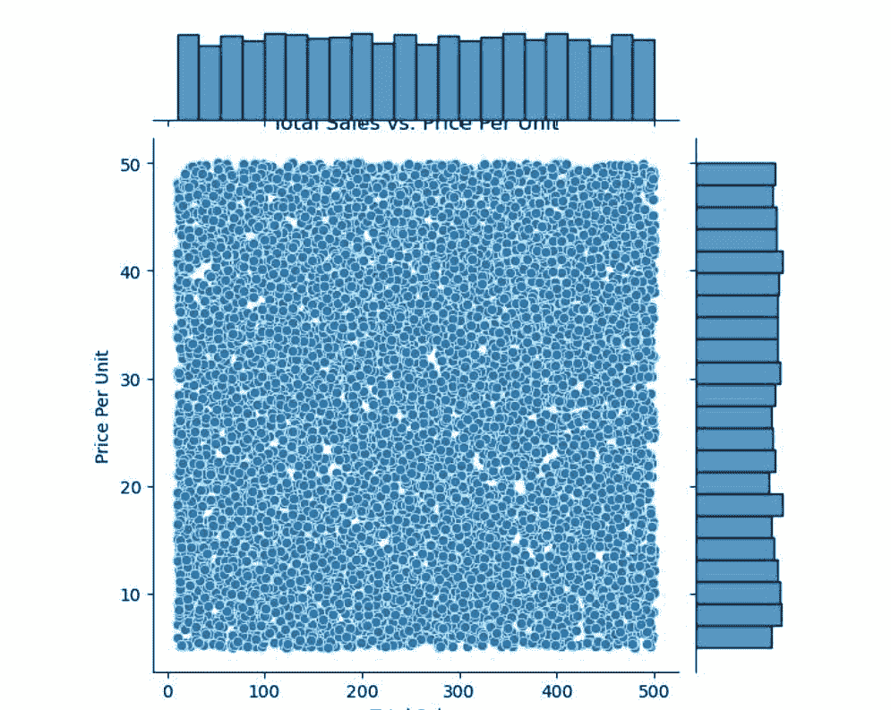

#### 可视化 13：堆叠面积图 - 随时间变化的销售额
使用堆叠面积图可视化随时间变化的销售额趋势。

```python
#### 可视化 13：堆叠面积图 - 随时间变化的销售额
monthly_sales = df.resample('M', on='Purchase Date')['Total Sales'].sum()
monthly_sales.plot(kind='area', figsize=(10, 6))
plt.xlabel('Date')
plt.ylabel('Monthly Sales')
plt.title('Sales Over Time')
plt.show()
```

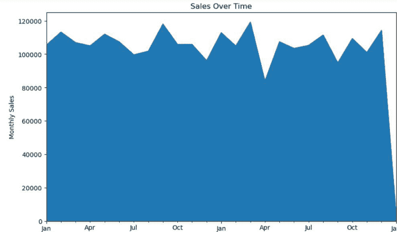

#### 可视化 14：箱线图 - 按客户类型统计销售额
使用箱线图比较不同客户类型的销售额分布情况。

```python
#### 可视化 14：箱线图 - 按客户类型统计销售额
plt.figure(figsize=(8, 6))
sns.boxplot(x='Customer_Type', y='Total_Sales', data=df)
plt.xlabel('Customer Type')
plt.ylabel('Total Sales')
plt.title('Sales Amount by Customer Type')
plt.show()
```

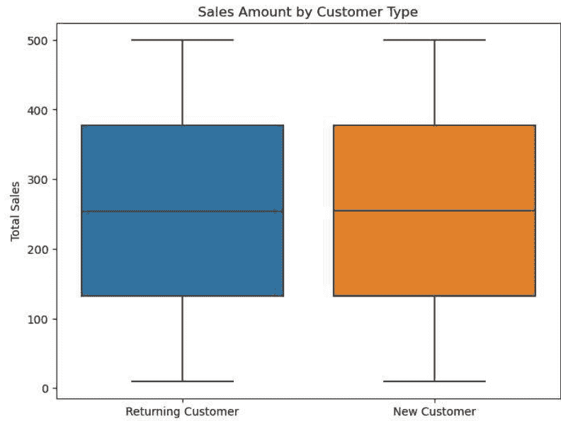

#### 可视化 15：核密度估计图 - 销售额分布
使用核密度估计图展示销售额分布的核密度估计。

```python
#### 可视化 15：核密度估计图 - 销售额分布
sns.kdeplot(df['Total_Sales'], shade=True)
plt.xlabel('Total Sales')
plt.ylabel('Density')
plt.title('Sales Distribution')
plt.show()
```

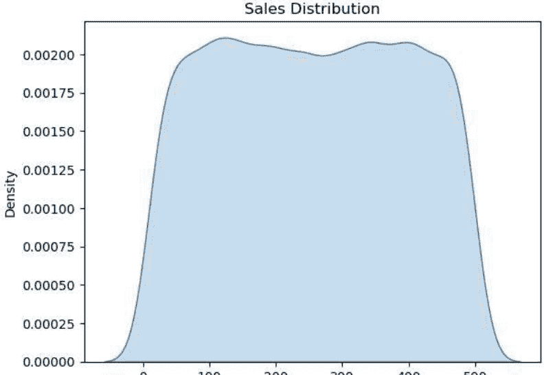

#### 可视化 16：水平条形图 - 总销售额前10名客户
使用水平条形图可视化总销售额前10名客户的销售额。

```python
#### 可视化 16：水平条形图 - 总销售额前10名客户
top_10_customers = df.groupby('Customer_ID')['Total Sales'].sum().nlargest(10)
plt.barh(top_10_customers.index, top_10_customers.values)
plt.xlabel('Total Sales')
plt.ylabel('Customer ID')
plt.title('Top 10 Customers by Total Sales')
plt.show()
```

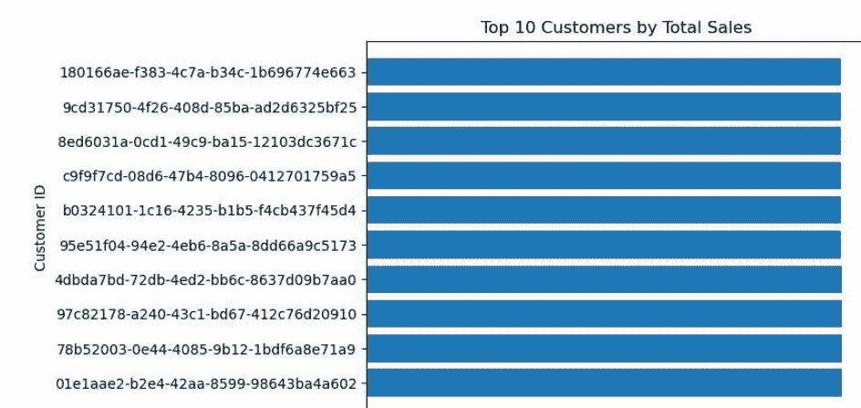

#### 可视化 17：成对散点图 - 多个特征
创建成对散点图以探索多个特征之间的关系，并按产品类别着色。

```python
#### 可视化 17：成对散点图 - 多个特征
sns.pairplot(df[['Total_Sales', 'Quantity', 'Price_Per_Unit', 'Product_Category']], hue='Product_Category')
plt.suptitle('Pairwise Scatter Plots', y=0.95)  # Title at the bottom
plt.show()
```

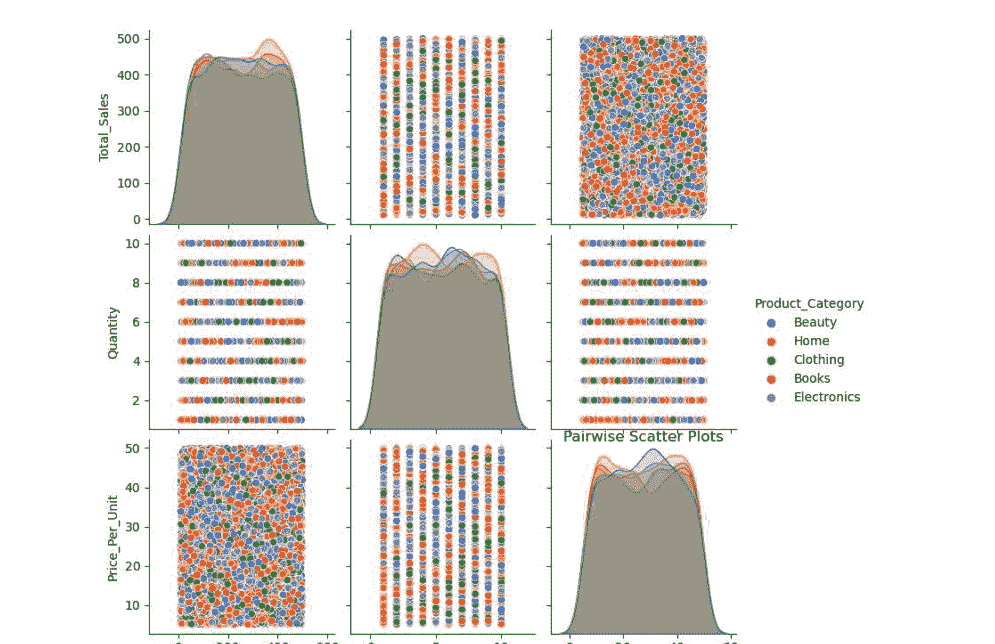

#### 可视化 18：分组条形图 - 按产品类别和客户类型统计销售额
使用分组条形图展示基于产品类别和客户类型的销售数量。

```python
#### 可视化 18：分组条形图 - 按产品类别和客户类型统计销售额
plt.figure(figsize=(10, 6))
sns.countplot(x='Product_Category', hue='Customer_Type', data=df)
plt.xlabel('Product Category')
plt.ylabel('Sales Count')
plt.title('Sales by Product Category and Customer Type')
plt.xticks(rotation=45)
plt.legend(title='Customer Type')
plt.show()
```

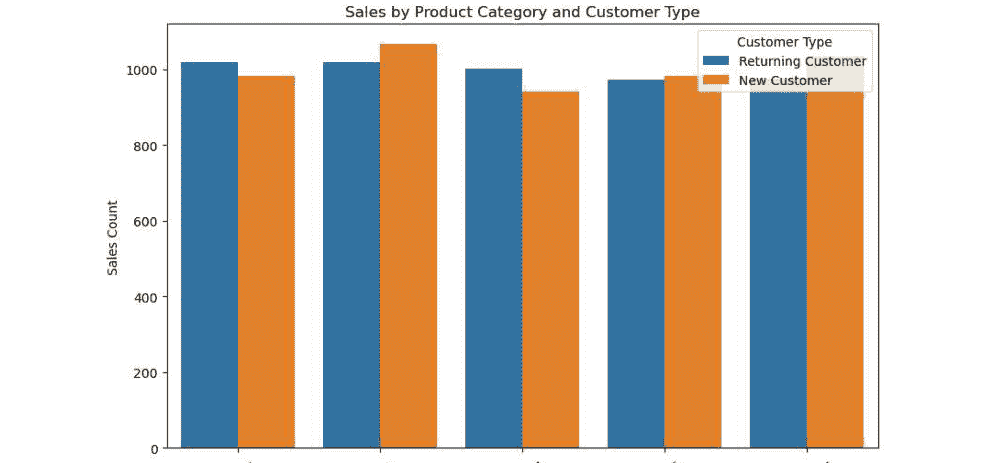

#### 可视化 19：环形图 - 按产品类别统计销售额分布
使用环形图说明不同产品类别销售额的百分比分布。

```python
#### 可视化 19：环形图 - 按产品类别统计销售额分布
product_category_sales = df.groupby('Product Category')['Total Sales'].sum()
plt.pie(product_category_sales, labels=product_category_sales.index,
        autopct='%1.1f%%', wedgeprops=dict(width=0.3))
plt.title('Sales Distribution by Product Category')
plt.axis('equal')  # Equal aspect ratio ensures that pie is drawn as a circle.
plt.show()
```

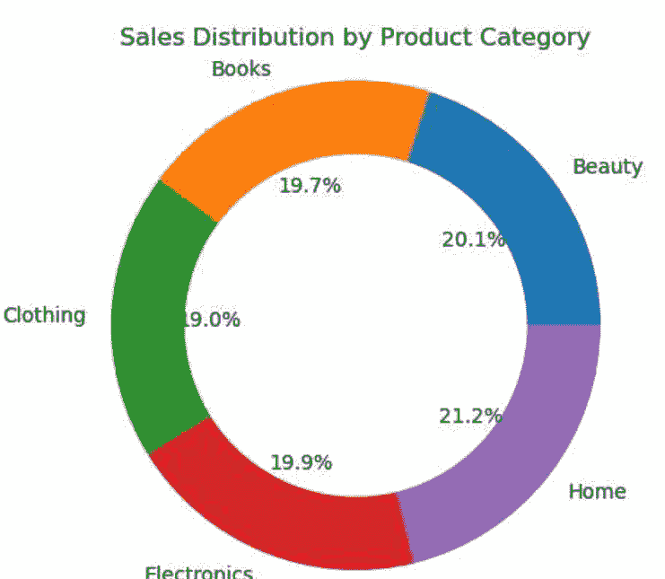

#### 可视化 20：堆叠百分比条形图 - 按性别和产品类别统计销售额
使用堆叠百分比条形图可视化按性别和产品类别划分的销售额明细。

```python
#### 可视化 20：堆叠百分比条形图 - 按性别和产品类别统计销售额
gender_category_sales = df.pivot_table(index='Gender', columns='Product_Category', values='Total_Sales', aggfunc='sum')
gender_category_sales.plot(kind='bar', stacked=True, figsize=(10, 6))
plt.xlabel('Gender')
plt.ylabel('Total Sales')
plt.title('Sales by Gender and Product Category')
plt.legend(title='Product Category', bbox_to_anchor=(1, 1))
plt.show()
```

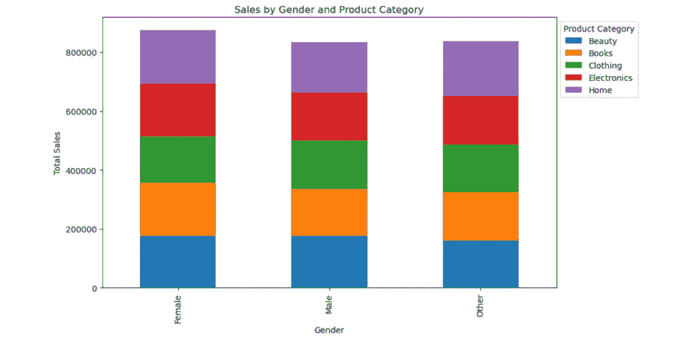

#### 可视化 21：堆叠条形图 - 按性别和客户类型划分的总销售额

此可视化使用“性别”和“客户类型”属性来显示每种性别的总销售额，并按客户类型进行堆叠。图例显示了条形图中不同颜色所代表的不同客户类型。此图有助于理解销售额在不同性别和客户类型之间的分布情况。

```python
#### 可视化 21：堆叠条形图 - 按性别和客户类型划分的总销售额
plt.figure(figsize=(10, 6))
sns.barplot(x='Gender', y='Total Sales', hue='Customer_Type', data=df)
plt.xlabel('Gender')
plt.ylabel('Total Sales')
plt.title('Total Sales by Gender and Customer Type')
plt.legend(title='Customer Type', bbox_to_anchor=(1, 1))
plt.show()
```

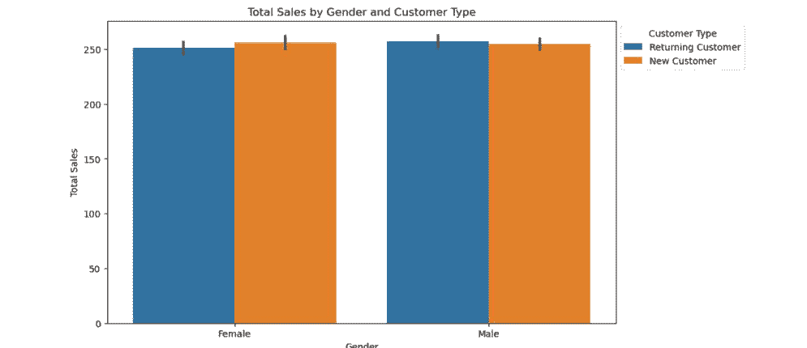

#### 可视化 22：蜂群图 - 按多个类别划分的销售额

使用蜂群图显示基于客户类型的不同产品类别的销售额值。

```python
#### 可视化 22：蜂群图 - 按多个类别划分的销售额
plt.figure(figsize=(12, 8))
sns.swarmplot(x='Product_Category', y='Total_Sales', hue='Customer_Type', data=df)
plt.xlabel('Product Category')
plt.ylabel('Total Sales')
plt.title('Sales by Multiple Categories')
plt.legend(title='Customer Type', bbox_to_anchor=(1, 1))
plt.show()
```

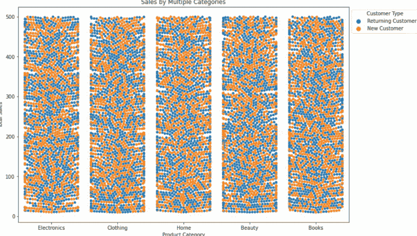

#### 可视化 23：3D 散点图 - 销售额、数量和单价

创建一个 3D 散点图，以探索总销售额、数量和单价之间的关系。

```python
#### 可视化 23：3D 散点图 - 销售额、数量和单价
fig = plt.figure(figsize=(10, 8))
ax = fig.add_subplot(111, projection='3d')
ax.scatter(df['Total_Sales'], df['Quantity'], df['Price_Per_Unit'])
ax.set_xlabel('Total Sales')
ax.set_ylabel('Quantity')
ax.set_zlabel('Price Per Unit')
plt.title('3D Scatter Plot - Sales, Quantity, and Price Per Unit')
plt.show()
```

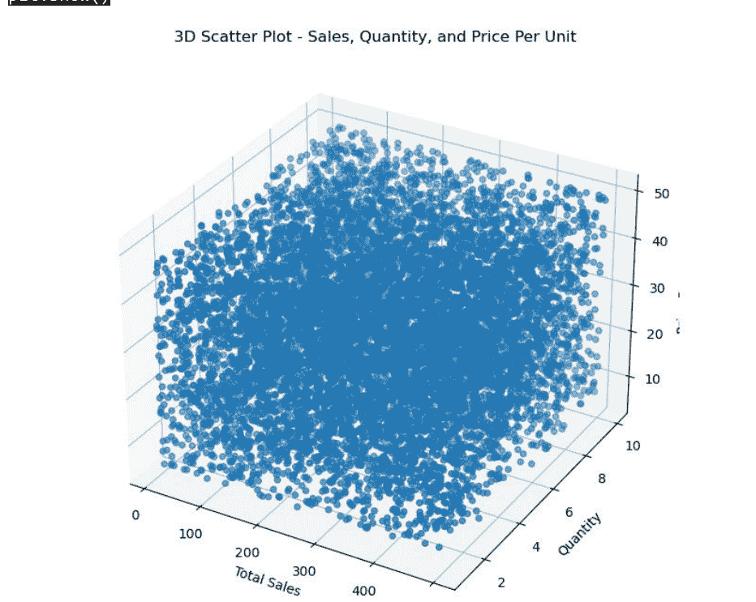

#### 可视化 24：词云 - 最常见的产品类别

生成一个词云，根据产品类别的出现频率来可视化最常见的类别。

```python
#### 可视化 24：词云 - 最常见的产品类别
from wordcloud import WordCloud
wordcloud = WordCloud(width=800, height=400,
background_color='white').generate(' '.join(df['Product_Category']))
plt.figure(figsize=(10, 6))
plt.imshow(wordcloud, interpolation='bilinear')
plt.axis('off')
plt.title('Word Cloud - Most Frequent Product Categories')
plt.show()
```


#### 可视化 25：环形图 - 按年龄段划分的销售额

使用环形图说明不同年龄段销售额的百分比分布。

```python
#### 可视化 25：环形图 - 按年龄段划分的销售额
df['Age_Group'] = pd.cut(df['Age'], bins=[0, 18, 30, 45, 60, 100],
labels=['<18', '18-30', '31-45', '46-60', '60+'])
age_group_sales = df.groupby('Age_Group')['Total_Sales'].sum()
plt.pie(age_group_sales, labels=age_group_sales.index, autopct='%1.1f%%',
wedgeprops=dict(width=0.3))
plt.title('Sales by Age Group')
plt.show()
```

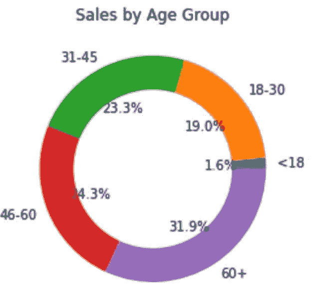

#### 可视化 26：条形图 - 按国家划分的销售额

此条形图显示了电子商务数据集中销售额最高的前 10 个国家的总销售额。它有助于识别对公司总销售额贡献最大的国家。

```python
#### 可视化 26：条形图 - 按国家划分的销售额
country_sales = df.groupby('Age_Group')['Total_Sales'].sum().nlargest(10)
plt.bar(country_sales.index, country_sales.values)
plt.xticks(rotation=45)
plt.xlabel('Age_Group')
plt.ylabel('Total Sales')
plt.title('Top 10 Sales by Age_Group')
plt.show()
```

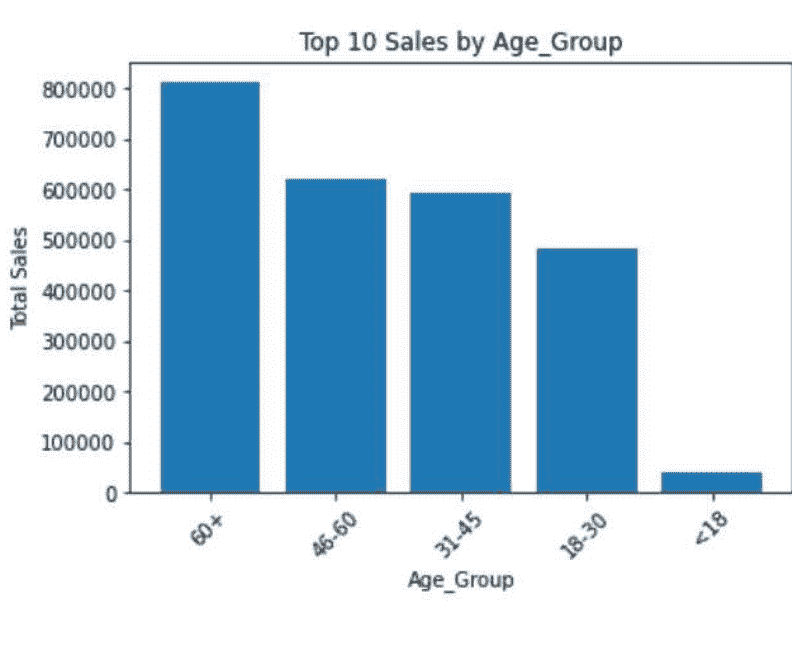

#### 可视化 27：饼图 - 按性别划分的销售额分布

饼图说明了男性和女性客户之间的总销售额分布。它提供了每个性别所占销售额比例的直观表示。

```python
#### 可视化 27：饼图 - 按性别划分的销售额分布
gender_sales = df.groupby('Gender')['Total_Sales'].sum()
plt.pie(gender_sales, labels=gender_sales.index, autopct='%1.1f%%')
plt.title('Sales Distribution by Gender')
plt.show()
```

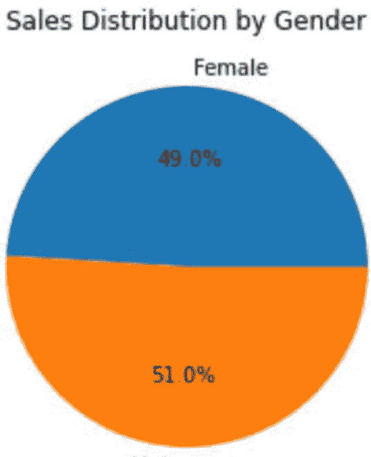

#### 可视化 28：KDE 图 - 按产品类别划分的销售额分布

核密度估计图可视化了不同产品类别总销售额的分布情况。它显示了销售额值的密度，每个产品类别由不同的颜色表示。

```python
#### 可视化 28：KDE 图 - 按产品类别划分的销售额分布
plt.figure(figsize=(10, 6))
sns.kdeplot(data=df, x='Total Sales', hue='Product Category', fill=True)
plt.xlabel('Total Sales')
plt.ylabel('Density')
plt.title('Sales Distribution by Product Category')
plt.show()
```

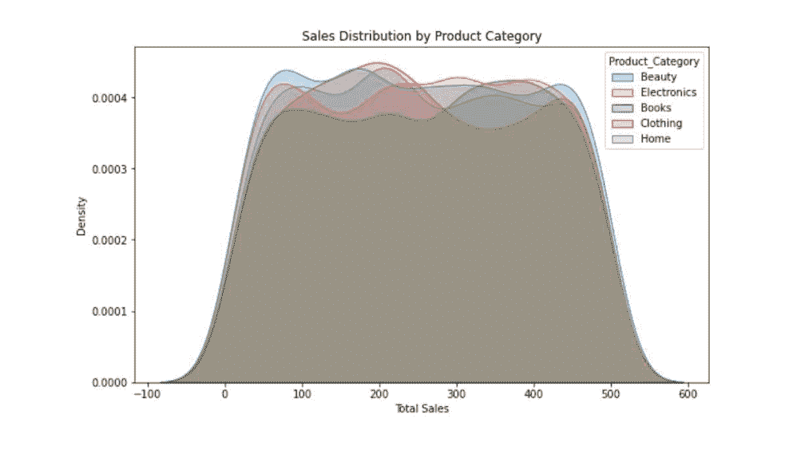

#### 可视化 29：箱线图 - 按年龄段划分的销售额

此箱线图比较了不同年龄段客户的总销售额分布情况。它有助于识别不同年龄段的销售额是否存在显著差异。

```python
#### 可视化 29：箱线图 - 按年龄段划分的销售额
plt.figure(figsize=(8, 6))
sns.boxplot(x='Age_Group', y='Total_Sales', data=df)
plt.xlabel('Age Group')
plt.ylabel('Total Sales')
plt.title('Sales Amount by Age Group')
plt.show()
```

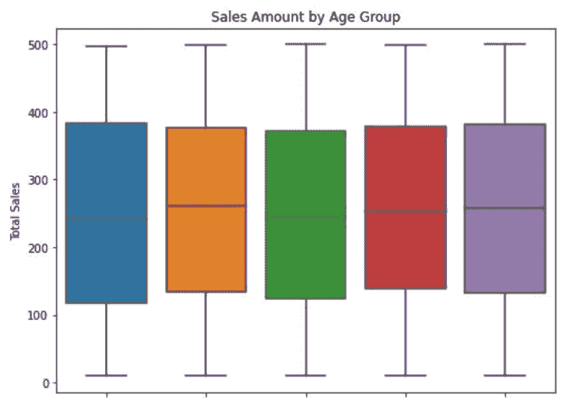

#### 可视化 30：堆叠条形图 - 按产品类别和支付方式划分的销售额

此堆叠条形图说明了按产品类别和支付方式划分的销售额明细。每个条形代表特定产品类别的总销售额，条形内的部分代表基于不同支付方式的销售额分布。

```python
#### 可视化 30：堆叠条形图 - 按产品类别和支付方式划分的销售额
payment_method_category_sales = df.pivot_table(index='Payment_Method', columns='Product_Category', values='Total_Sales', aggfunc='sum')
payment_method_category_sales.plot(kind='bar', stacked=True, figsize=(10, 6))
plt.xlabel('Payment Method')
plt.ylabel('Total Sales')
plt.title('Sales by Product Category and Payment Method')
plt.legend(title='Product Category', bbox_to_anchor=(1, 1))
plt.show()
```

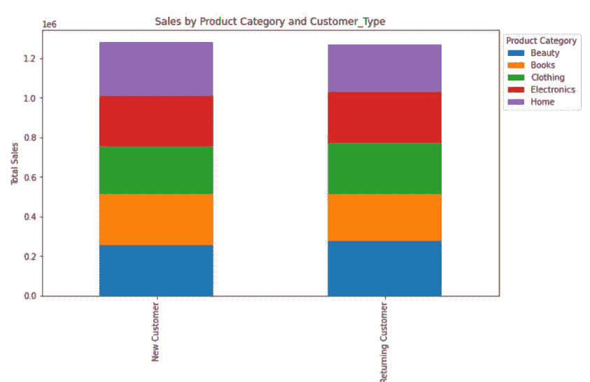

#### 可视化 31：折线图 - 按星期几划分的销售额

此折线图显示了基于星期几的总销售额趋势。它有助于分析一周中某些天的销售额是较高还是较低。

```python
#### 可视化 31：折线图 - 按星期几划分的销售额
df['Day_of_Week'] = df['Purchase_Date'].dt.day_name()
day_of_week_sales = df.groupby('Day_of_Week')['Total_Sales'].sum()
day_of_week_sales.plot(kind='line', marker='o', figsize=(10, 6))
plt.xlabel('Day of the Week')
plt.ylabel('Total Sales')
plt.title('Sales by Day of the Week')
plt.xticks(rotation=45)
plt.show()
```

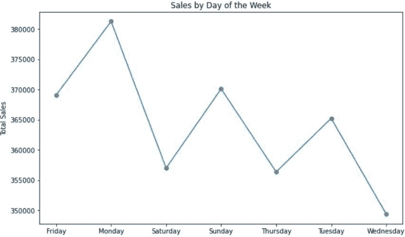

#### 可视化 32：箱线图 - 按客户年龄段划分的销售额

此箱线图比较了不同客户年龄段的总销售额分布情况。它提供了对不同年龄段销售额潜在差异的见解。

```python
#### 可视化 32：箱线图 - 按客户年龄段划分的销售额
plt.figure(figsize=(10, 6))
sns.boxplot(x='Age_Group', y='Total_Sales', data=df)
plt.xlabel('Customer Age Group')
plt.ylabel('Total Sales')
plt.title('Sales Amount by Customer Age Group')
plt.show()
```

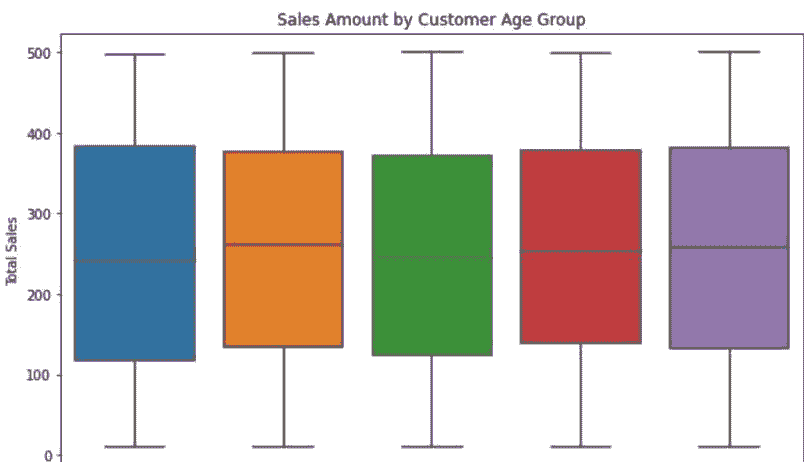

#### 可视化 33：环形图 - 按客户年龄段划分的销售额分布

此环形图显示了不同客户年龄段总销售额的百分比分布。它有助于可视化每个年龄段对总销售额的相对贡献。

```python
#### 可视化 33：环形图 - 按客户年龄段划分的销售额分布
age_group_sales = df.groupby('Age_Group')['Total_Sales'].sum()
plt.pie(age_group_sales, labels=age_group_sales.index, autopct='%1.1f%%', wedgeprops=dict(width=0.3))
plt.title('Sales Distribution by Customer Age Group')
plt.show()
```

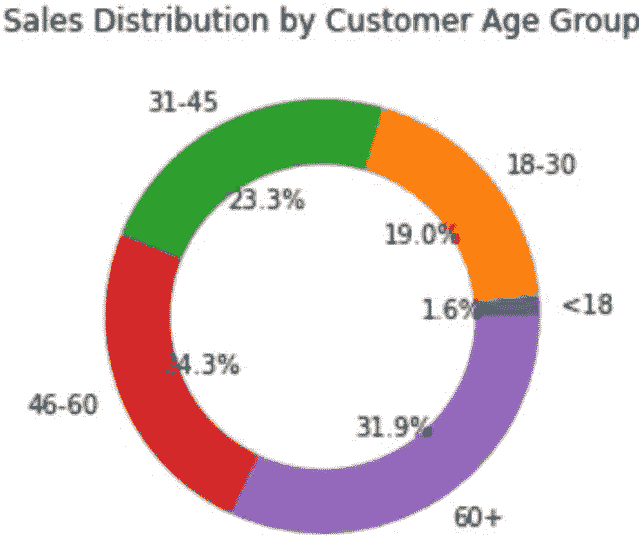

#### 可视化 34：堆叠条形图 - 按性别和支付方式划分的销售额

此堆叠条形图展示了按性别和支付方式划分的销售额分布。每个条形代表特定性别的总销售额，条形内的分段代表基于不同支付方式的销售额分布。

```python
# Visualization 34: Stacked Bar Chart - Sales by Gender and Payment Method
gender_payment_method_sales = df.pivot_table(index='Gender',
    columns='Payment_Method', values='Total_Sales', aggfunc='sum')
gender_payment_method_sales.plot(kind='bar', stacked=True, figsize=(10, 6))
plt.xlabel('Gender')
plt.ylabel('Total Sales')
plt.title('Sales by Gender and Payment Method')
plt.legend(title='Payment Method', bbox_to_anchor=(1, 1))
plt.show()
```

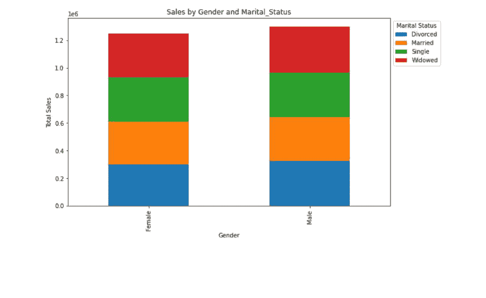

#### 可视化 35：散点图 - 总销售额与年龄

此散点图可视化了总销售额与客户年龄之间的关系。它有助于探索年龄与销售额之间是否存在任何相关性。

```python
# Visualization 35: Scatter Plot - Total Sales vs. Age
plt.scatter(df['Total_Sales'], df['Age'])
plt.xlabel('Total Sales')
plt.ylabel('Age')
plt.title('Total Sales vs. Age')
plt.show()
```

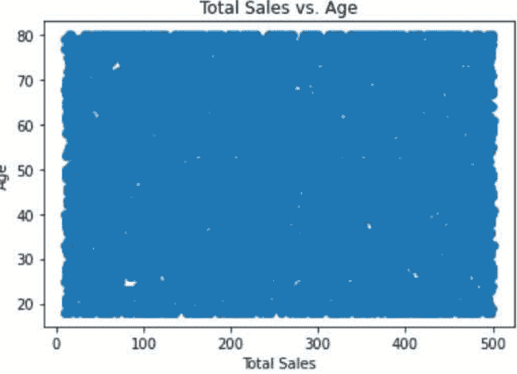

#### 可视化 36：蜂群图 - 按性别和年龄组划分的销售额

此蜂群图显示了不同年龄组的销售额值，并按性别分类。它展示了男性和女性客户在不同年龄组中的销售额分布情况。

```python
# Visualization 36: Swarm Plot - Sales by Gender and Age Group
plt.figure(figsize=(10, 6))
sns.swarmplot(x='Gender', y='Total_Sales', hue='Customer_Age_Group', data=df)
plt.xlabel('Gender')
plt.ylabel('Total Sales')
plt.title('Sales by Gender and Age Group')
plt.legend(title='Age Group', bbox_to_anchor=(1, 1))
plt.show()
```

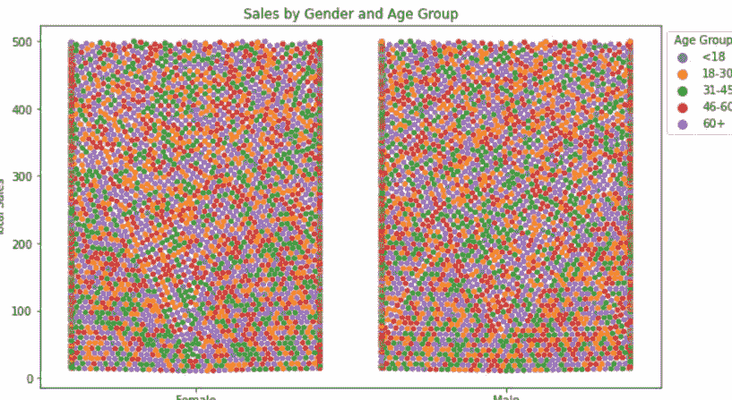

#### 可视化 37：堆叠条形图 - 按客户类型和婚姻状况划分的销售额

此图表显示了每种客户类型和婚姻状况组合的总销售额。它有助于分析不同人口统计特征的销售模式。

```python
# Visualization 37: Stacked Bar Chart - Sales by Customer Type and Marital Status
plt.figure(figsize=(10, 6))
marital_type_sales = df.pivot_table(index='Customer_Type',
    columns='Marital_Status', values='Total_Sales', aggfunc='sum')
marital_type_sales.plot(kind='bar', stacked=True)
plt.xlabel('Customer Type')
plt.ylabel('Total Sales')
plt.title('Sales by Customer Type and Marital Status')
plt.legend(title='Marital Status', bbox_to_anchor=(1, 1))
plt.show()
```

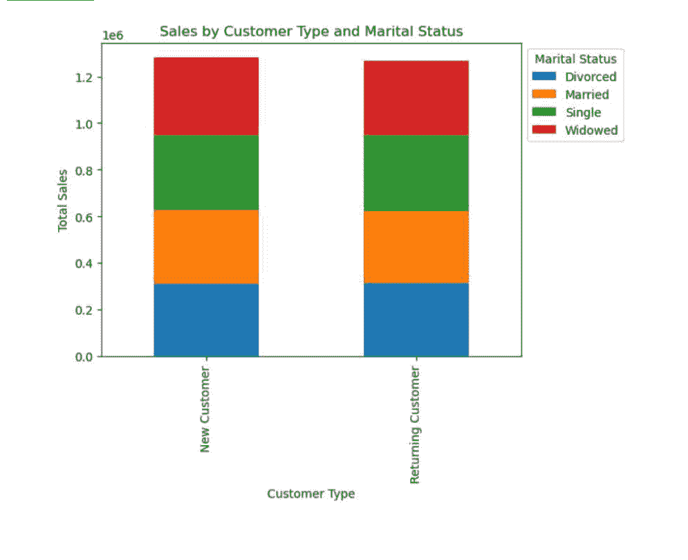

#### 可视化 38：箱线图 - 按婚姻状况划分的销售额

此箱线图比较了不同婚姻状况客户的总销售额分布。它有助于识别婚姻状况是否对销售额有任何影响。

```python
# Visualization 38: Box Plot - Sales Amount by Marital Status
plt.figure(figsize=(8, 6))
sns.boxplot(x='Marital_Status', y='Total_Sales', data=df)
plt.xlabel('Marital Status')
plt.ylabel('Total Sales')
plt.title('Sales Amount by Marital Status')
plt.show()
```

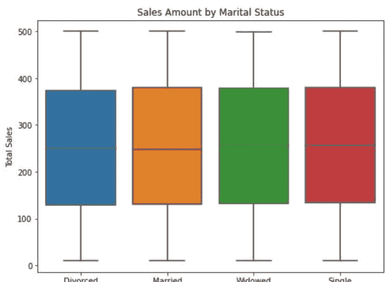

#### 可视化 39：折线图 - 按客户类型划分的销售趋势

此折线图显示了不同客户类型（例如，新客户、回头客）随时间变化的总销售趋势。它提供了对每种客户类型销售表现的洞察。

```python
# Visualization 39: Line Plot - Sales Trend by Customer Type
customer_type_sales = df.pivot_table(index='Purchase_Date',
    columns='Customer_Type', values='Total_Sales', aggfunc='sum')
customer_type_sales.resample('M').sum().plot(kind='line', figsize=(10, 6))
plt.xlabel('Date')
plt.ylabel('Total Sales')
plt.title('Sales Trend by Customer Type')
plt.show()
```

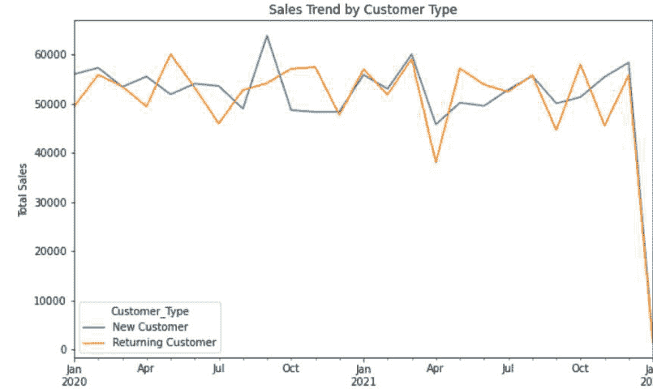

#### 可视化 40：KDE 图 - 按婚姻状况划分的销售额分布

KDE 图可视化了不同婚姻状况客户的总销售额分布。它有助于理解每个婚姻状况类别的销售额值的密度。

```python
# Visualization 40: KDE Plot - Sales Distribution by Marital Status
plt.figure(figsize=(10, 6))
sns.kdeplot(data=df, x='Total_Sales', hue='Marital_Status', fill=True)
plt.xlabel('Total Sales')
plt.ylabel('Density')
plt.title('Sales Distribution by Marital Status')
plt.show()
```

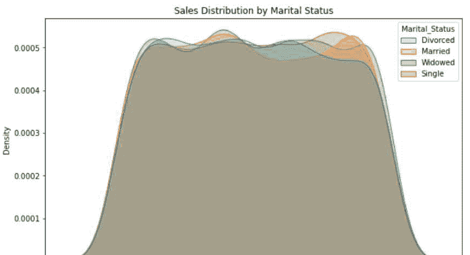

#### 可视化 41：成对散点图 - 销售额、数量和年龄

成对散点图可视化了总销售额、数量和年龄之间的关系。矩阵中的每个散点图有助于识别这些特征之间潜在的相关性或模式。

```python
# Visualization 41: Pairwise Scatter Plots - Sales, Quantity, and Age
sns.pairplot(df[['Total_Sales', 'Quantity', 'Age']], diag_kind='kde')
plt.title('Pairwise Scatter Plots - Sales, Quantity, and Age')
plt.show()
```

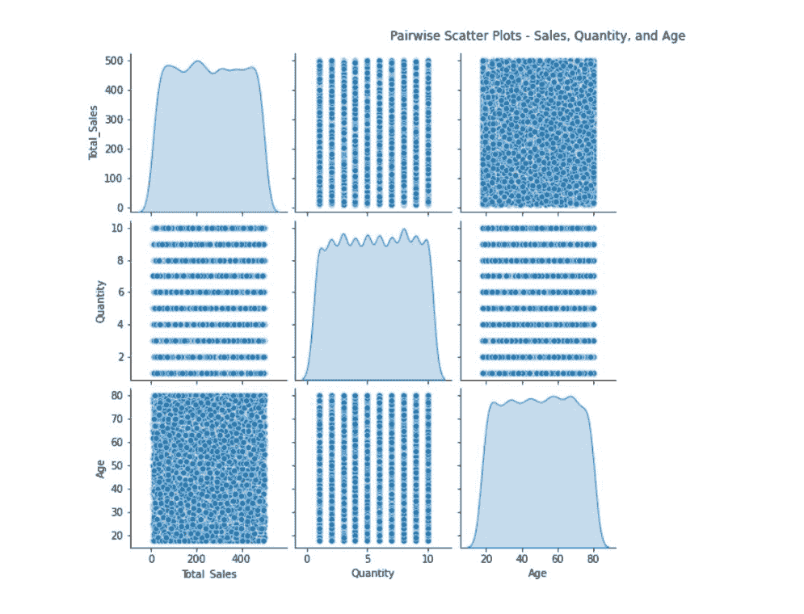

#### 可视化 42：堆叠条形图 - 按婚姻状况和年龄组划分的销售额

此堆叠条形图展示了按婚姻状况和年龄组划分的销售额明细。每个条形代表特定婚姻状况的总销售额，条形内的分段代表基于不同年龄组的销售额分布。

```python
# Visualization 42: Stacked Bar Chart - Sales by Marital Status and Age Group
marital_age_sales = df.pivot_table(index='Marital_Status',
                                   columns='Customer_Age_Group', values='Total_Sales', aggfunc='sum')
marital_age_sales.plot(kind='bar', stacked=True, figsize=(10, 6))
plt.xlabel('Marital Status')
plt.ylabel('Total Sales')
plt.title('Sales by Marital Status and Age Group')
plt.legend(title='Age Group', bbox_to_anchor=(1, 1))
plt.show()
```

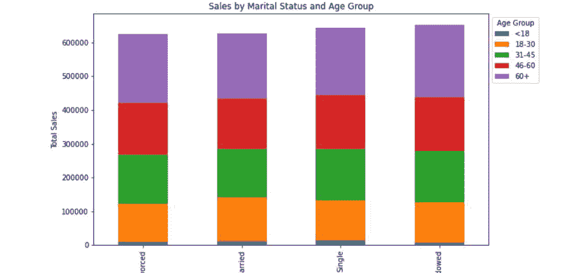

#### 可视化 43：蜂群图 - 按婚姻状况和性别划分的销售额

此蜂群图显示了不同婚姻状况的销售额值，并按性别分类。它展示了男性和女性客户在不同婚姻状况中的销售额分布情况。

```python
# Visualization 43: Swarm Plot - Sales by Marital Status and Gender
plt.figure(figsize=(10, 6))
sns.swarmplot(x='Marital_Status', y='Total_Sales', hue='Gender', data=df)
plt.xlabel('Marital Status')
plt.ylabel('Total Sales')
plt.title('Sales by Marital Status and Gender')
plt.legend(title='Gender', bbox_to_anchor=(1, 1))
plt.show()
```

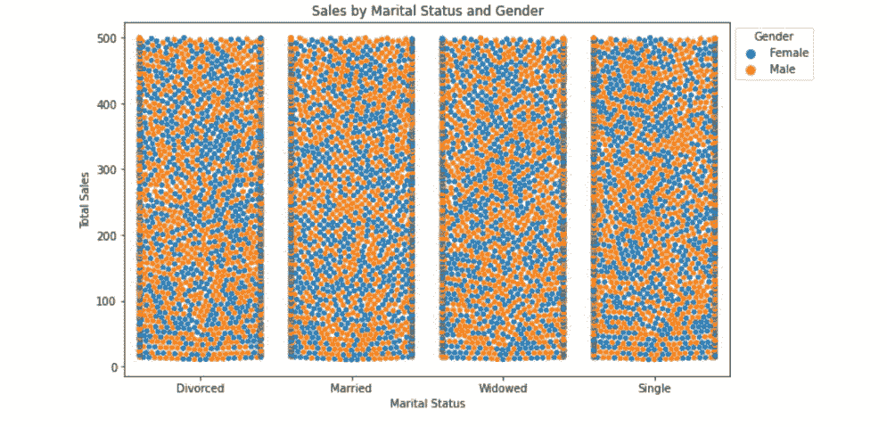

#### 可视化 44：条形图 - 按数量排名前 10 的客户

此条形图显示了购买商品数量最多的前 10 名客户。它有助于识别在数量方面最频繁的购买者。

```python
# Visualization 44: Bar Chart - Top 10 Customers by Quantity
top_10_quantity_customers = df.groupby('Customer_ID')['Quantity'].sum().nlargest(10)
plt.bar(top_10_quantity_customers.index, top_10_quantity_customers.values)
plt.xticks(rotation=45)
plt.xlabel('Customer ID')
plt.ylabel('Total Quantity')
plt.title('Top 10 Customers by Quantity')
plt.show()
```

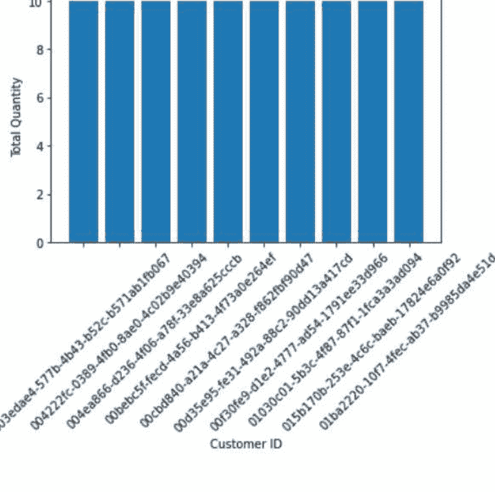

#### 可视化 45：折线图 - 按支付方式划分的销售趋势

此折线图显示了客户使用的不同支付方式随时间变化的总销售趋势。它提供了对各种支付方式的流行度和表现的洞察。

```python
# Visualization 45: Line Plot - Sales Trend by Payment Method
payment_method_sales = df.pivot_table(index='Purchase_Date',
                                       columns='Payment_Method', values='Total_Sales', aggfunc='sum')
payment_method_sales.resample('M').sum().plot(kind='line', figsize=(10, 6))
plt.xlabel('Date')
plt.ylabel('Total Sales')
plt.title('Sales Trend by Payment Method')
plt.show()
```

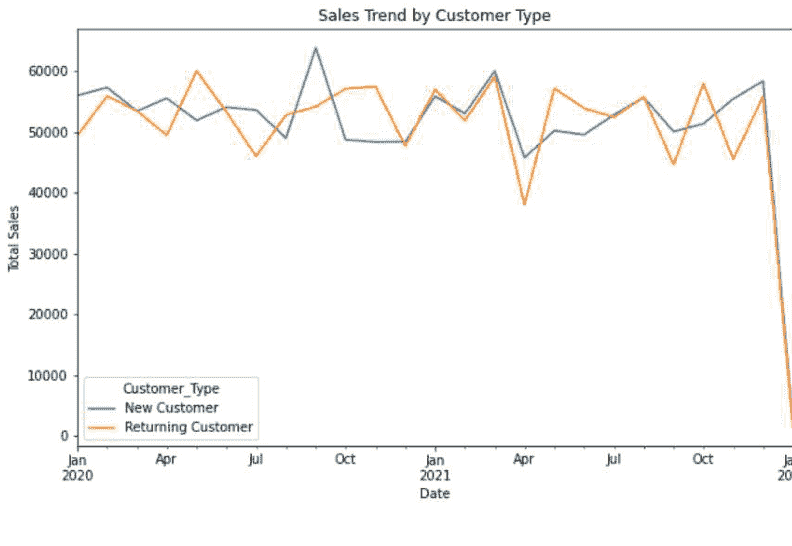

#### 可视化 46：箱线图 - 按性别划分的销售额

该箱线图比较了不同性别客户的总销售额分布情况。它有助于识别性别是否对销售额有任何影响。

```python
# Visualization 46: Box Plot - Sales Amount by Gender
plt.figure(figsize=(8, 6))
sns.boxplot(x='Gender', y='Total_Sales', data=df)
plt.xlabel('Education')
plt.ylabel('Total Sales')
plt.title('Sales Amount by Gender')
plt.show()
```

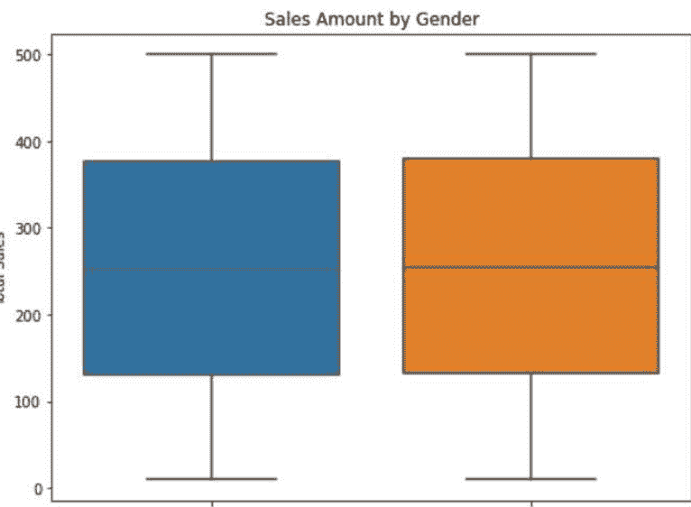

#### 可视化 47：蜂群图 - 按支付方式和年龄组划分的销售额

此蜂群图显示了不同支付方式的销售额值，并按年龄组进行分类。它展示了不同年龄组在不同支付方式上的销售额分布情况。

```python
# Visualization 47: Swarm Plot - Sales by Customer Type and Age Group
plt.figure(figsize=(10, 6))
sns.swarmplot(x='Customer_Type', y='Total_Sales', hue='Age_Group', data=df)
plt.xlabel('Customer Type')
plt.ylabel('Total Sales')
plt.title('Sales by Customer Type and Age Group')
plt.legend(title='Age Group', bbox_to_anchor=(1, 1))
plt.show()
```

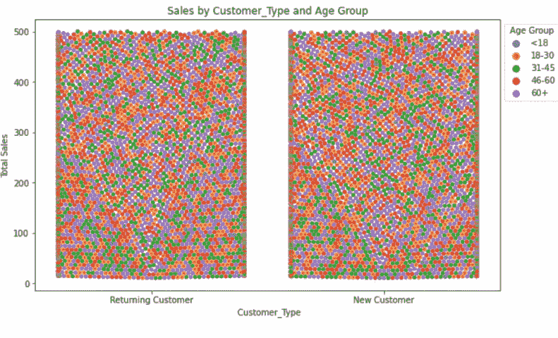

#### 可视化 48：堆叠条形图 - 按婚姻状况和性别划分的销售额

此堆叠条形图说明了按婚姻状况和教育水平划分的销售额明细。每个条形代表特定婚姻状况的总销售额，条形内的分段代表基于不同性别的销售额分布。

```python
# Visualization 48: Stacked Bar Chart - Sales by Marital Status and Gender
marital_gender_sales = df.pivot_table(index='Marital_Status',
                                       columns='Gender', values='Total_Sales', aggfunc='sum')
marital_gender_sales.plot(kind='bar', stacked=True, figsize=(10, 6))
plt.xlabel('Marital Status')
plt.ylabel('Total Sales')
plt.title('Sales by Marital Status and Gender')
plt.legend(title='Gender', bbox_to_anchor=(1, 1))
plt.show()
```

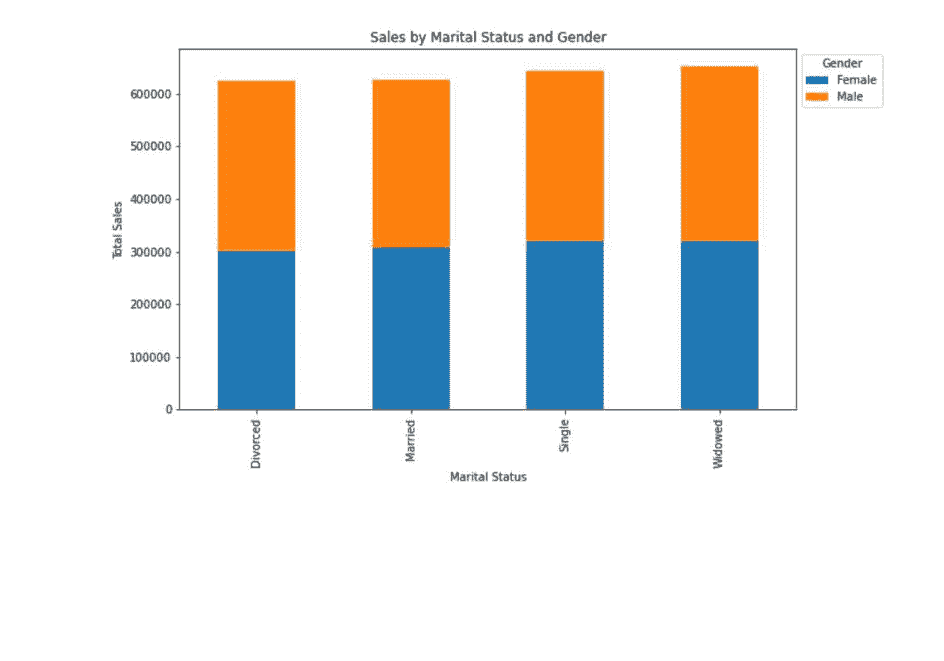

#### 可视化 49：核密度估计图 - 按支付方式划分的销售额分布

该核密度估计图可视化了不同支付方式的总销售额分布情况。它有助于理解每种支付方式销售额值的密度。

```python
# Visualization 49: KDE Plot - Sales Distribution by Gender
plt.figure(figsize=(10, 6))
sns.kdeplot(data=df, x='Total_Sales', hue='Gender', fill=True)
plt.xlabel('Total Sales')
plt.ylabel('Density')
plt.title('Sales Distribution by Gender')
plt.show()
```

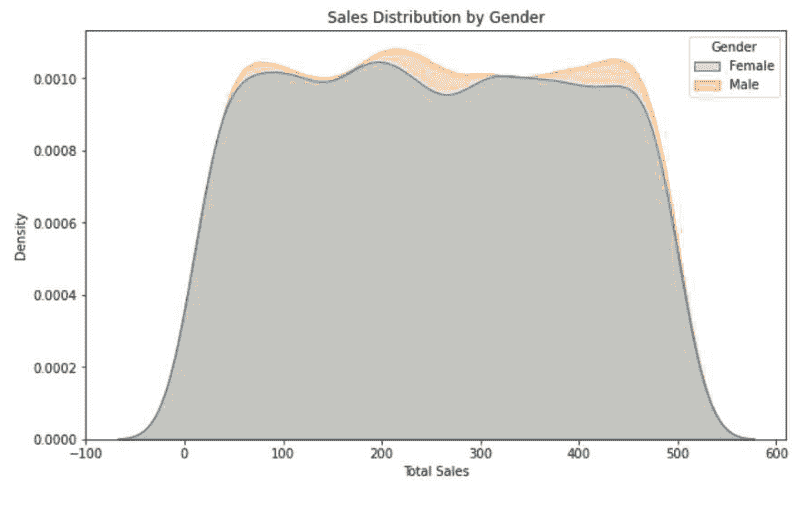

#### 可视化 50：条形图 - 按产品类别和客户类型划分的销售额

此图显示了每个产品类别的总销售额，并按客户类型进行细分。它有助于比较每个产品类别内不同客户类型之间的销售额。

```python
# 50. Bar Plot - Sales by Product Category and Customer Type
plt.figure(figsize=(10, 6))
sns.barplot(x='Product_Category', y='Total_Sales', hue='Customer_Type', data=df)
plt.xlabel('Product Category')
plt.ylabel('Total Sales')
plt.title('Sales by Product Category and Customer Type')
plt.legend(title='Customer Type', bbox_to_anchor=(1, 1))
plt.show()
```

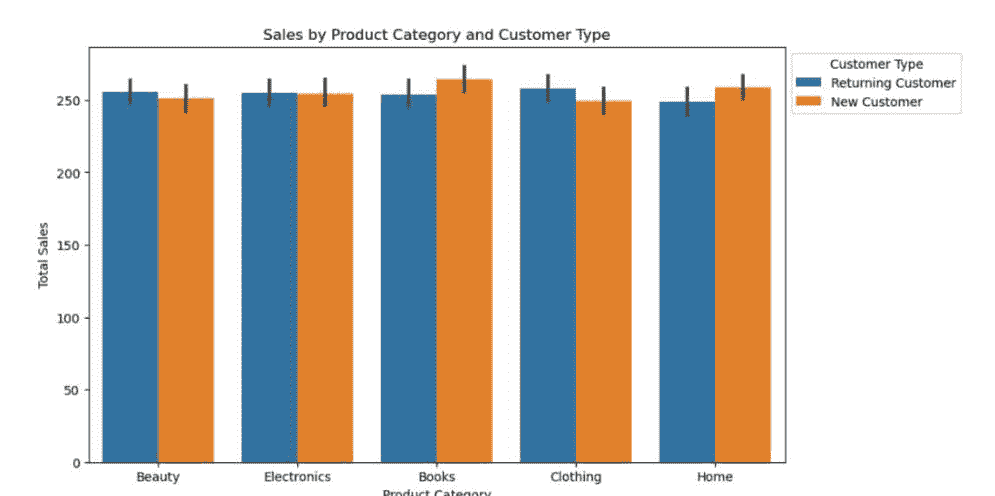

#### 可视化 51：堆叠条形图 - 按支付方式和客户年龄组划分的销售额

此堆叠条形图显示了基于不同支付方式和客户年龄组的销售额分布。每个条形代表一种支付方式，条形内的分段代表该支付方式类别内每个年龄组的总销售额。它有助于识别不同年龄组的客户偏好哪种支付方式。

```python
# Visualization 51: Stacked Bar Chart - Sales by Payment Method and Customer Age Group
payment_age_sales = df.pivot_table(index='Payment_Method',
                                   columns='Customer_Age_Group', values='Total_Sales', aggfunc='sum')
payment_age_sales.plot(kind='bar', stacked=True, figsize=(10, 6))
plt.xlabel('Payment Method')
plt.ylabel('Total Sales')
plt.title('Sales by Payment Method and Customer Age Group')
plt.legend(title='Customer Age Group', bbox_to_anchor=(1, 1))
plt.show()
```

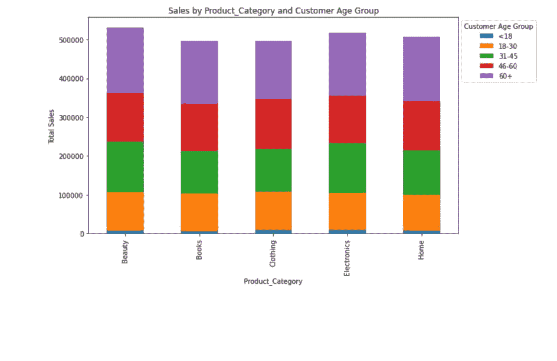

#### 可视化 52：小提琴图 - 按产品类别划分的销售额分布

该小提琴图显示了每个产品类别的总销售额分布情况。小提琴的宽度代表数据密度，内部的白点表示销售额的中位数。此可视化有助于比较不同产品类别之间的销售额分布，并识别任何潜在的异常值。

```python
# Visualization 52: Violin Plot - Sales Distribution by Product Category
plt.figure(figsize=(10, 6))
sns.violinplot(x='Product_Category', y='Total_Sales', data=df)
plt.xlabel('Product Category')
plt.ylabel('Total Sales')
plt.title('Sales Distribution by Product Category')
plt.show()
```

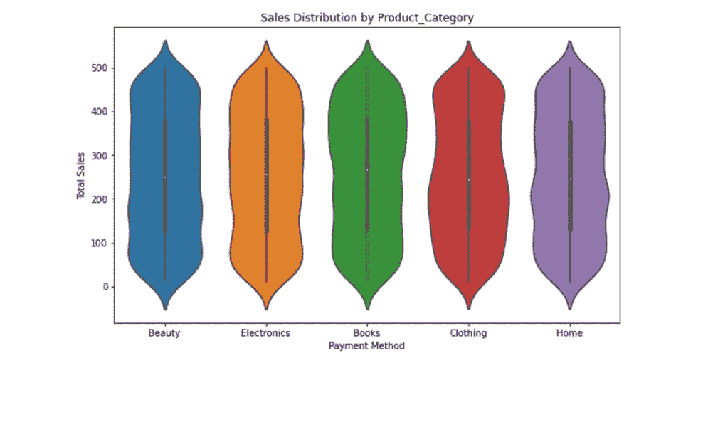

#### 可视化 53：成对散点图 - 销售额、数量和客户年龄

这组成对散点图显示了总销售额、数量和客户年龄之间的关系。矩阵中的每个散点图可视化了两个变量之间的相关性。它有助于发现这些特征之间的任何模式或关联。

```python
# Visualization 53: Pairwise Scatter Plots - Sales, Quantity, and Customer Age
sns.pairplot(df[['Total_Sales', 'Quantity', 'Age']], hue='Age', diag_kind='kde')
plt.title('Pairwise Scatter Plots - Sales, Quantity, and Customer Age')
plt.show()
```

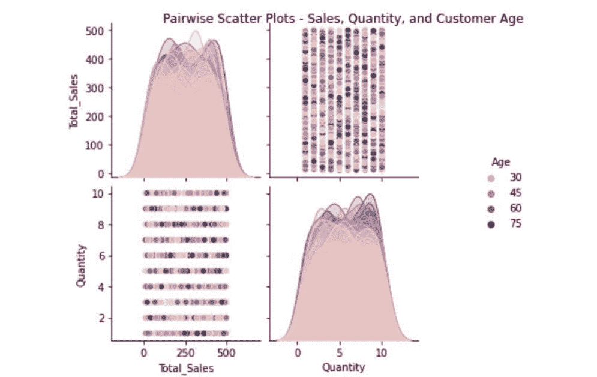

#### 可视化 54：箱线图 - 按性别划分的销售额

此箱线图比较了男性和女性客户之间的总销售额分布情况。它有助于识别两种性别在销售额方面是否存在任何显著差异。

```python
# Visualization 54: Box Plot - Sales Amount by Gender
plt.figure(figsize=(8, 6))
sns.boxplot(x='Gender', y='Total Sales', data=df)
plt.xlabel('Gender')
plt.ylabel('Total Sales')
plt.title('Sales Amount by Gender')
plt.show()
```

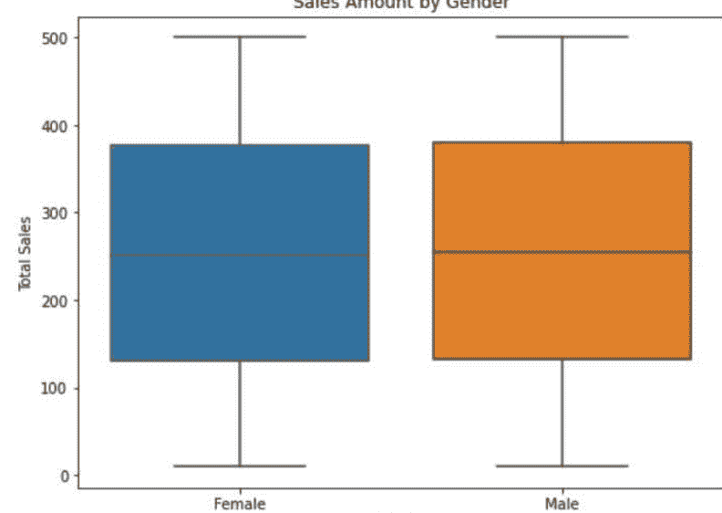

#### 可视化 55：蜂群图 - 按产品类别和年龄组划分的销售额

此蜂群图显示了不同产品类别的销售额值，并按年龄组进行分类。它显示了每个产品类别和年龄组组合的单个数据点，揭示了这些类别中的销售额分布情况。

```python
# Visualization 55: Swarm Plot - Sales by Product_Category and Age Group
plt.figure(figsize=(10, 6))
sns.swarmplot(x='Product_Category', y='Total_Sales', hue='Age_Group', data=df)
plt.xlabel('Product_Category')
plt.ylabel('Total Sales')
plt.title('Sales by Product_Category and Age Group')
plt.legend(title='Age_Group', bbox_to_anchor=(1, 1))
plt.show()
```

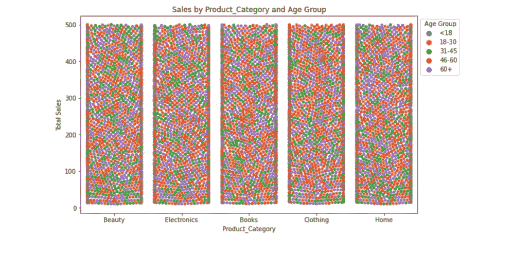

#### 可视化 56：堆叠条形图 - 按婚姻状况和性别划分的销售额

此堆叠条形图呈现了按婚姻状况和性别划分的销售额明细。每个条形代表一个婚姻状况类别，条形内的分段代表该婚姻状况类别内男性和女性客户的总销售额。它有助于理解基于性别和婚姻状况的销售额分布。

```python
# Visualization 56: Stacked Bar Chart - Sales by Marital Status and Gender
marital_gender_sales = df.pivot_table(index='Marital_Status', columns='Gender',
                                       values='Total_Sales', aggfunc='sum')
marital_gender_sales.plot(kind='bar', stacked=True, figsize=(10, 6))
plt.xlabel('Marital Status')
plt.ylabel('Total Sales')
plt.title('Sales by Marital Status and Gender')
plt.legend(title='Gender', bbox_to_anchor=(1, 1))
plt.show()
```

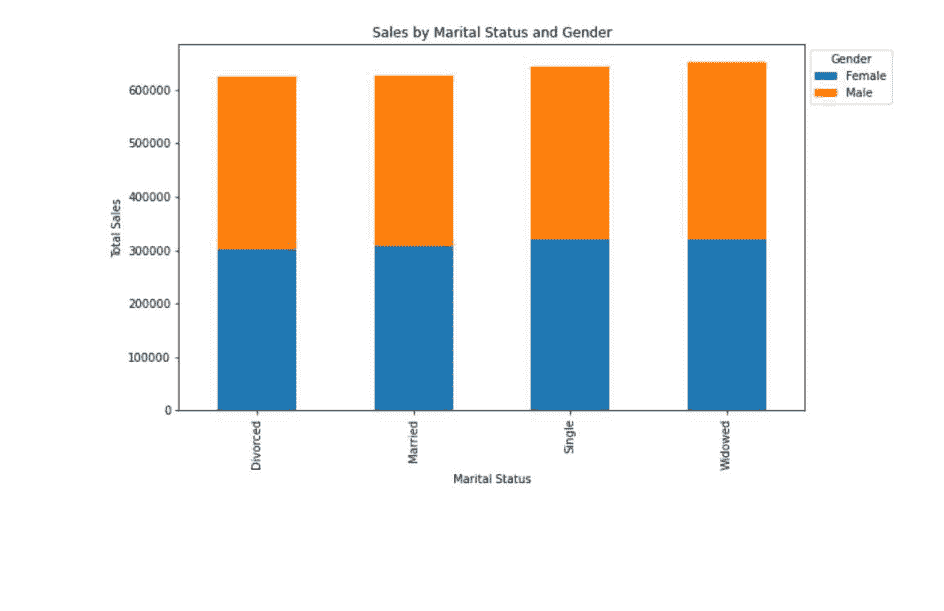

#### 可视化 57：核密度估计图 - 按产品类别划分的销售额分布

该核密度估计图可视化了不同产品类别客户的总销售额分布情况。它显示了销售额值的概率密度，使我们能够比较每个产品类别的销售额分布。

```python
# Visualization 57: KDE Plot - Sales Distribution by Product Category
plt.figure(figsize=(10, 6))
sns.kdeplot(data=df, x='Total_Sales', hue='Product_Category', fill=True)
plt.xlabel('Total Sales')
plt.ylabel('Density')
plt.title('Sales Distribution by Product Category')
plt.show()
```

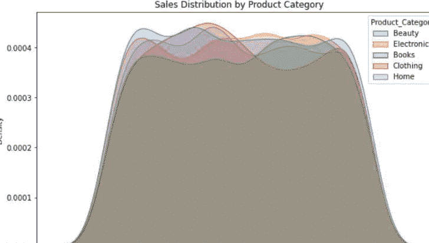

#### 可视化 58：折线图 - 按客户类型和性别划分的销售趋势

此折线图展示了不同客户类型（例如，新客户、回头客）随时间变化的总销售额趋势，并按性别进行分类。它提供了关于不同客户群体销售额随时间变化的洞察。

```python
#### 可视化 58：折线图 - 按客户类型和性别划分的销售趋势
customer_type_gender_sales = df.pivot_table(index='Purchase_Date',
    columns=['Customer_Type', 'Gender'], values='Total_Sales', aggfunc='sum')
customer_type_gender_sales.resample('M').sum().plot(kind='line', figsize=(10, 6))
plt.xlabel('Date')
plt.ylabel('Total Sales')
plt.title('Sales Trend by Customer Type and Gender')
plt.show()
```

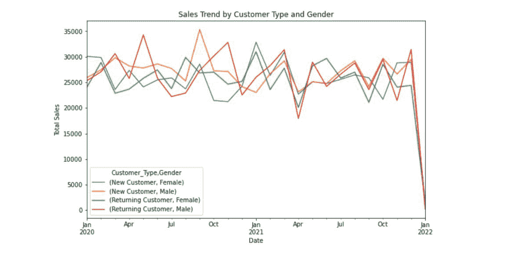

#### 可视化 59：箱线图 - 按年龄组和性别划分的销售额

此箱线图比较了不同年龄组的总销售额分布，并按性别进行分类。它有助于识别男性和女性客户在不同年龄组之间的销售额是否存在显著差异。

```python
#### 可视化 59：箱线图 - 按年龄组和性别划分的销售额
plt.figure(figsize=(10, 6))
sns.boxplot(x='Age_Group', y='Total_Sales', hue='Gender', data=df)
plt.xlabel('Age Group')
plt.ylabel('Total Sales')
plt.title('Sales Amount by Age Group and Gender')
plt.legend(title='Gender', bbox_to_anchor=(1, 1))
plt.show()
```

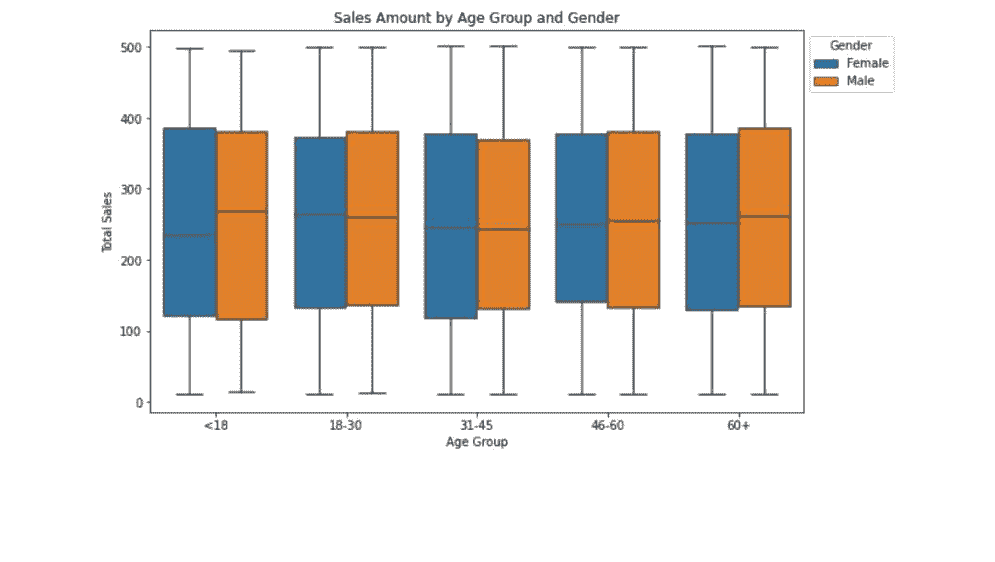

#### 可视化 60：极坐标图 - 按产品类别划分的总销售额

所示的可视化是一个极坐标图，也称为径向条形图。在此图中，每个唯一的产品类别由围绕圆形轴（360度）的一个扇区或条形表示。每个扇区或条形的长度对应于该特定产品类别的总销售额。

```python
#### 可视化 60：极坐标图 - 按产品类别划分的总销售额
theta = df['Product_Category'].unique()
radii = df.groupby('Product_Category')['Total_Sales'].sum()
plt.polar(theta, radii)
plt.title('Total Sales Amount by Product Category')
plt.xticks(rotation=45)
plt.show()
```

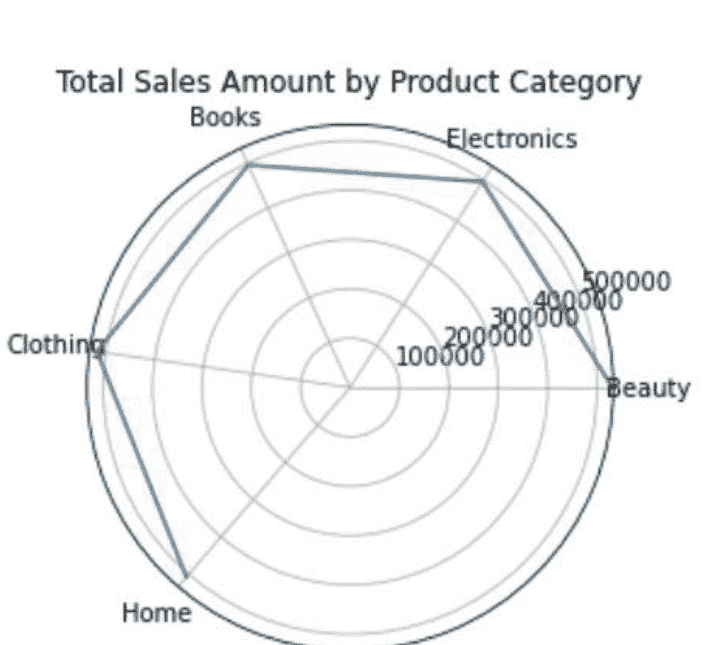

#### 可视化 61：极坐标图 - 按客户类型划分的总销售额

所示的可视化是一个极坐标图，也称为径向条形图。在此图中，每个唯一的客户类型由围绕圆形轴（360度）的一个扇区或条形表示。每个扇区或条形的长度对应于该特定客户类型的总销售额。

```python
#### 可视化 61：极坐标图 - 按客户类型划分的总销售额
theta = df['Customer_Type'].unique()
radii = df.groupby('Customer_Type')['Total_Sales'].sum()
plt.polar(theta, radii)
plt.title('Total Sales Amount by Customer Type', y=1.20)
plt.xticks(rotation=45)
plt.show()
```

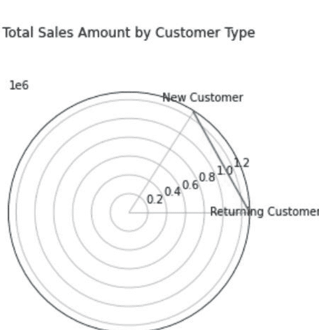

#### 可视化 62：计数图 - 按一天中的小时划分的销售

此计数图显示了每天每小时的销售数量。它有助于理解24小时内销售活动的分布情况。

```python
#### 可视化 62：计数图 - 按一天中的小时划分的销售
df['Hour_of_Day'] = df['Purchase_Date'].dt.hour
plt.figure(figsize=(10, 6))
sns.countplot(x='Hour_of_Day', data=df)
plt.xlabel('Hour of the Day')
plt.ylabel('Sales Count')
plt.title('Sales by Hour of the Day')
plt.show()
```

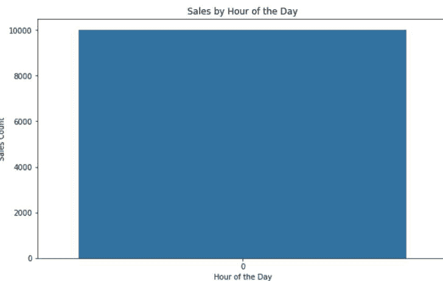

#### 可视化 63：堆叠条形图 - 按年龄组和产品类别划分的销售

此堆叠条形图展示了按客户年龄组和产品类别划分的销售细分。每个条形代表一个年龄组，条形内的部分代表该年龄组内每个产品类别的总销售额。它有助于识别哪个年龄组偏好哪些产品类别。

```python
#### 可视化 63：堆叠条形图 - 按年龄组和产品类别划分的销售
age_category_sales = df.pivot_table(index='Customer_Age_Group',
                                     columns='Product_Category', values='Total_Sales', aggfunc='sum')
age_category_sales.plot(kind='bar', stacked=True, figsize=(10, 6))
plt.xlabel('Age Group')
plt.ylabel('Total Sales')
plt.title('Sales by Age Group and Product Category')
plt.legend(title='Product Category', bbox_to_anchor=(1, 1))
plt.show()
```

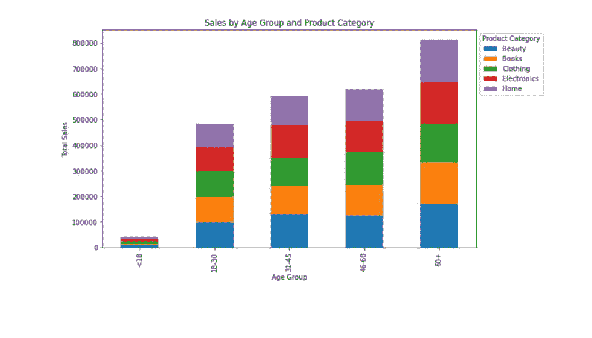

#### 可视化 64：箱线图 - 按客户类型划分的销售额

此箱线图比较了不同客户类型（例如，新客户、回头客）的总销售额分布。它有助于识别这些客户群体之间的销售额是否存在显著差异。

```python
#### 可视化 64：箱线图 - 按客户类型划分的销售额
plt.figure(figsize=(8, 6))
sns.boxplot(x='Customer_Type', y='Total_Sales', data=df)
plt.xlabel('Customer Type')
plt.ylabel('Total Sales')
plt.title('Sales Amount by Customer Type')
plt.show()
```

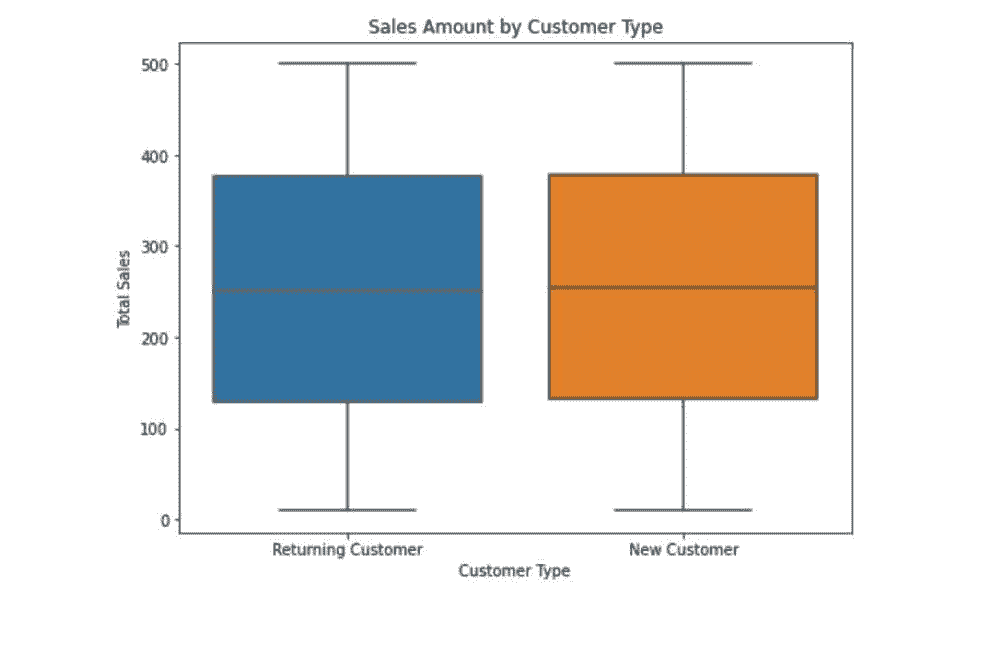

#### 可视化 65：KDE图 - 按客户类型划分的销售分布

KDE图可视化了不同客户类型（例如，新客户、回头客）的总销售额分布。它显示了销售额的概率密度，使我们能够比较两种客户类型之间的销售分布。

```python
#### 可视化 65：KDE图 - 按客户类型划分的销售分布
plt.figure(figsize=(10, 6))
sns.kdeplot(data=df, x='Total_Sales', hue='Customer_Type', fill=True)
plt.xlabel('Total Sales')
plt.ylabel('Density')
plt.title('Sales Distribution by Customer Type')
plt.show()
```

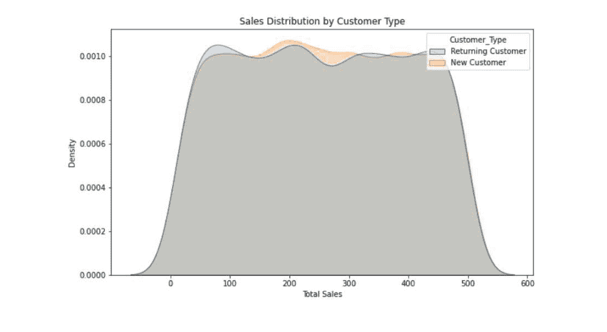

#### 可视化 66：成对散点图 - 销售额、数量和客户类型

这组成对散点图显示了总销售额、数量和客户类型之间的关系。矩阵中的每个散点图可视化了两个变量之间的相关性。它有助于发现不同客户类型中这些特征之间的任何模式或关联。

```python
#### 可视化 66：成对散点图 - 销售额、数量和客户类型
sns.pairplot(df[['Total_Sales', 'Quantity', 'Customer_Type']],
             hue='Customer_Type', diag_kind='kde')
plt.title('Pairwise Scatter Plots - Sales, Quantity, and Customer Type', y=2.02)
plt.show()
```

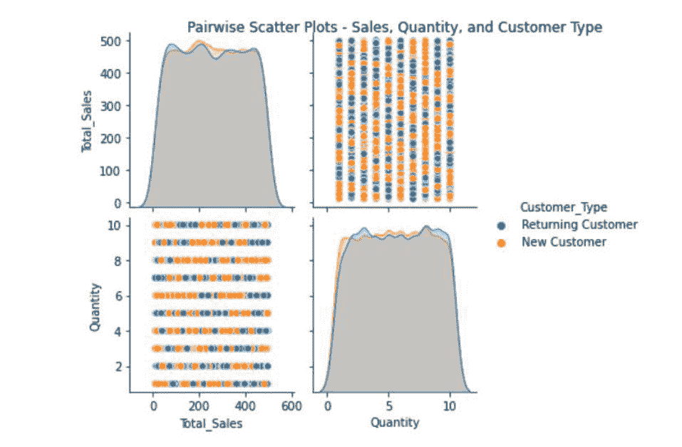

#### 可视化 67：分组条形图 - 按婚姻状况和客户类型划分的销售

此分组条形图比较了不同婚姻状况的销售数量，并按客户类型进行分类。它有助于理解每种婚姻状况的销售分布，以及它如何根据客户类型而变化。

```python
#### 可视化 67：分组条形图 - 按婚姻状况和客户类型划分的销售
plt.figure(figsize=(10, 6))
sns.countplot(x='Marital_Status', hue='Customer_Type', data=df)
plt.xlabel('Marital Status')
plt.ylabel('Sales Count')
plt.title('Sales by Marital Status and Customer Type')
plt.legend(title='Customer Type', bbox_to_anchor=(1, 1))
plt.show()
```

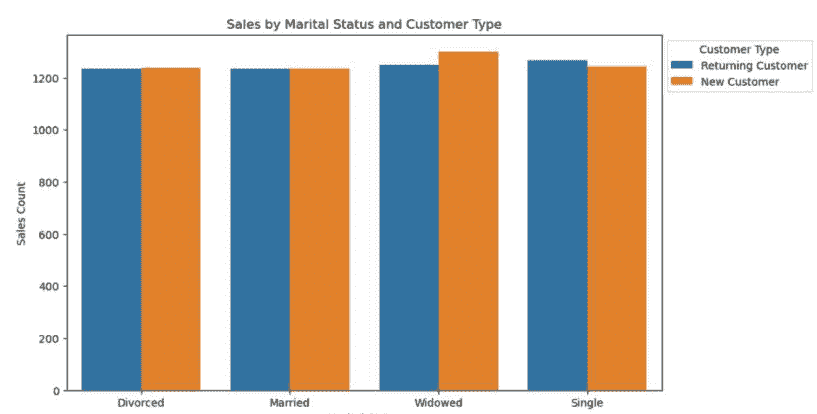

#### 可视化 68：堆叠条形图 - 按婚姻状况和客户年龄组划分的销售

标题为“按婚姻状况和客户年龄组划分的销售”的堆叠条形图展示了不同婚姻状况和客户年龄组的总销售额分布。该图表清晰地展示了销售额在这两个分类变量中的分布情况。

```python
#### 可视化 68：堆叠条形图 - 按婚姻状况和客户年龄组划分的销售
payment_age_sales = df.pivot_table(index='Marital_Status', columns='Age_Group', values='Total_Sales', aggfunc='sum')
payment_age_sales.plot(kind='bar', stacked=True, figsize=(10, 6))
plt.xlabel('Marital Status')
plt.ylabel('Total Sales')
plt.title('Sales by Marital Status and Customer Age Group')
plt.legend(title='Customer Age Group', bbox_to_anchor=(1, 1))
plt.show()
```

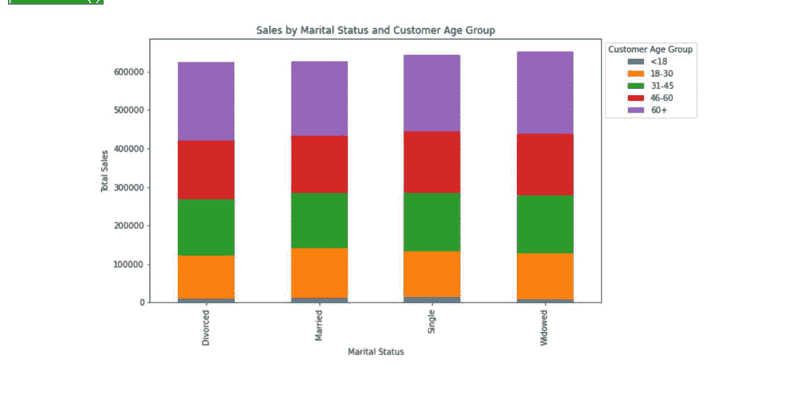

#### 可视化 69：小提琴图 - 按年龄组划分的销售分布

小提琴图可视化了不同年龄组客户的总销售额分布。它提供了对每个年龄组销售额的分布范围和密度的洞察。

```python
#### 可视化 69：小提琴图 - 按年龄组划分的销售分布
plt.figure(figsize=(10, 6))
sns.violinplot(x='Age_Group', y='Total_Sales', data=df)
plt.xlabel('Age Group')
plt.ylabel('Total Sales')
plt.title('Sales Distribution by Age Group')
plt.show()
```

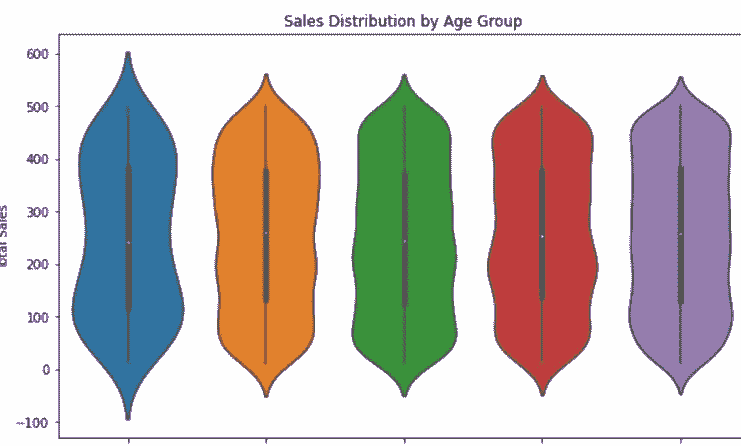

#### 可视化 70：气泡图 - 产品类别销售额（气泡大小代表数量）

标题为“产品类别销售额（气泡大小代表数量）”的气泡图展示了产品类别、总销售额和产品销售数量之间的关系。这种图表类型对于同时可视化三个变量非常有效，其中产品类别在 x 轴，总销售额在 y 轴，气泡大小代表产品销售数量。

```python
#### 可视化 70：气泡图 - 产品类别销售额（气泡大小代表数量）
plt.scatter(df['Product Category'], df['Total_Sales'], s=df['Quantity'] * 10, alpha=0.7)
plt.xlabel('Product Category')
plt.ylabel('Total Sales Amount')
plt.title('Product Category Sales with Bubble Size representing Quantity')
plt.xticks(rotation=45)
plt.show()
```

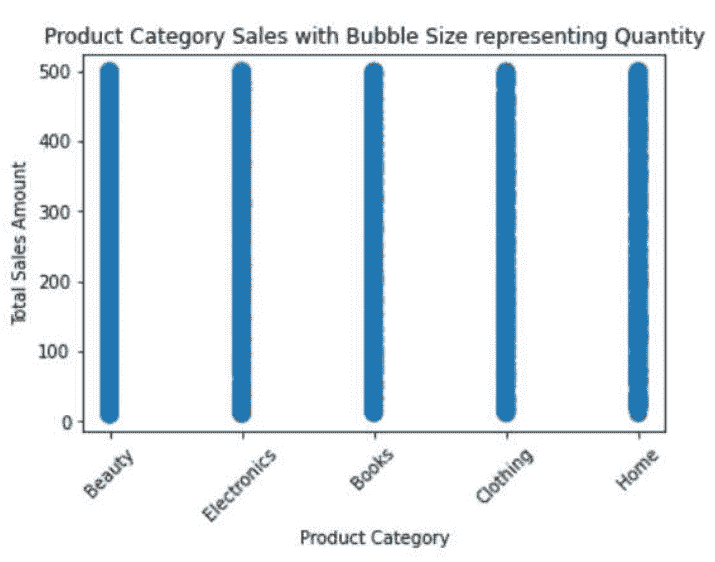

#### 可视化 71：计数图 - 按月份和客户类型的销售情况

计数图显示了每个月的销售数量，按客户类型（例如，新客户、回头客）进行分类。它有助于理解不同客户群体的月度销售模式。

```python
#### 可视化 71：计数图 - 按月份和客户类型的销售情况
df['Month'] = df['Purchase Date'].dt.month_name()
plt.figure(figsize=(10, 6))
sns.countplot(x='Month', hue='Customer Type', data=df)
plt.xlabel('Month')
plt.ylabel('Sales Count')
plt.title('Sales by Month and Customer Type')
plt.legend(title='Customer Type', bbox_to_anchor=(1, 1))
plt.show()
```

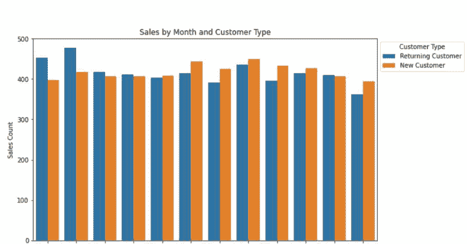

#### 可视化 72：六边形分箱图 - 销售额六边形分箱分布

六边形分箱图表示基于产品销售数量的销售额分布。这种图表类型在处理大量数据点时特别有用，有助于可视化散点图中点的密度。

```python
#### 可视化 72：六边形分箱图 - 销售额六边形分箱分布
plt.hexbin(df['Quantity'], df['Total_Sales'], gridsize=15, cmap='Blues')
plt.xlabel('Quantity')
plt.ylabel('Total Sales Amount')
plt.title('Sales Amount Hexbin Distribution')
plt.show()
```

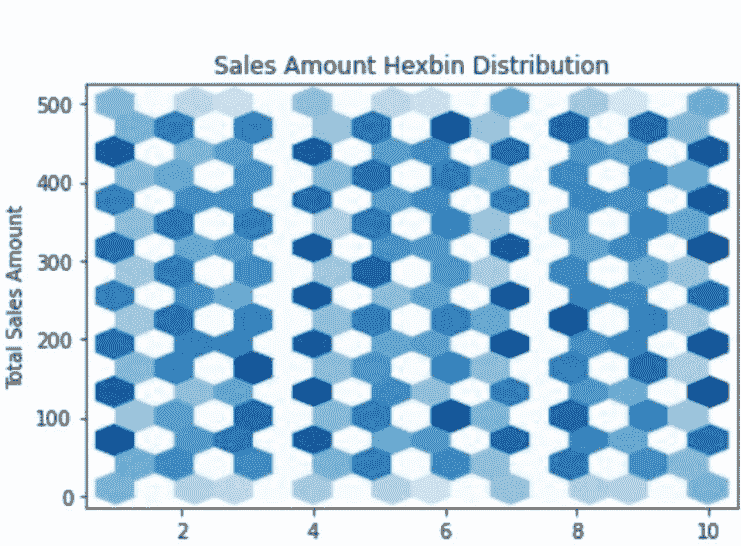

#### 可视化 73：条形图 - 按产品类别的平均销售额

条形图说明了每个产品类别的平均销售额。这种图表类型对于比较不同产品类别的平均销售表现非常有效。

```python
#### 可视化 73：条形图 - 按产品类别的平均销售额
average_sales_by_category = df.groupby('Product Category')['Total Sales'].mean()
plt.bar(average_sales_by_category.index, average_sales_by_category.values)
plt.xlabel('Product Category')
plt.ylabel('Average Sales Amount')
plt.title('Average Sales Amount by Product Category')
plt.xticks(rotation=45)
plt.show()
```

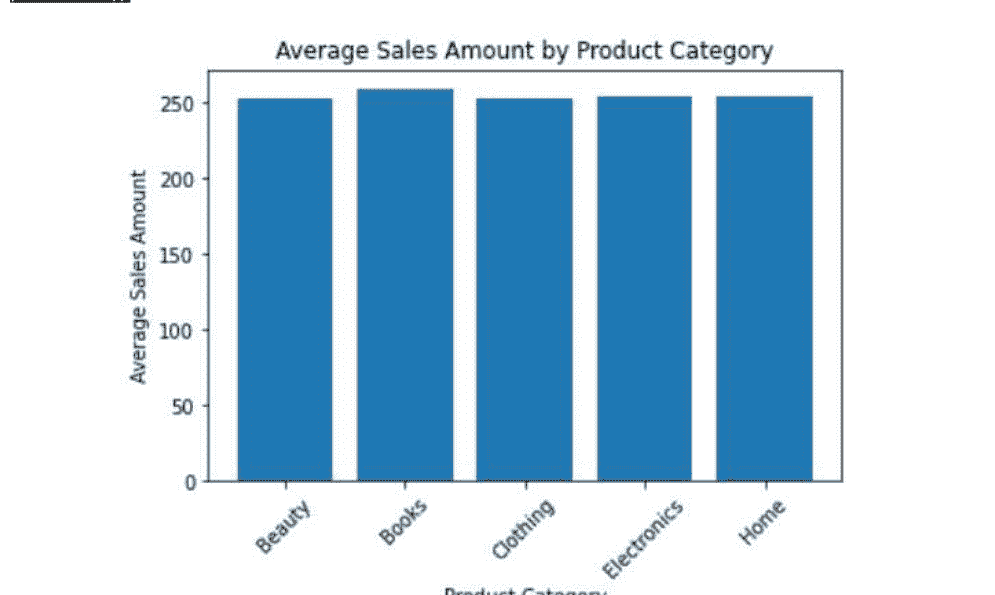

#### 可视化 74：小提琴图 - 按性别和年龄组划分的销售分布

小提琴图可视化了男性和女性客户的总销售额分布，按年龄组分类。它提供了对每个性别-年龄组类别的销售额分布范围和密度的洞察。

```python
#### 可视化 74：小提琴图 - 按性别和年龄组划分的销售分布
plt.figure(figsize=(10, 6))
sns.violinplot(x='Gender', y='Total_Sales', hue='Age_Group', data=df)
plt.xlabel('Gender')
plt.ylabel('Total Sales')
plt.title('Sales Distribution by Gender and Age Group')
plt.legend(title='Age_Group', bbox_to_anchor=(1, 1))
plt.show()
```

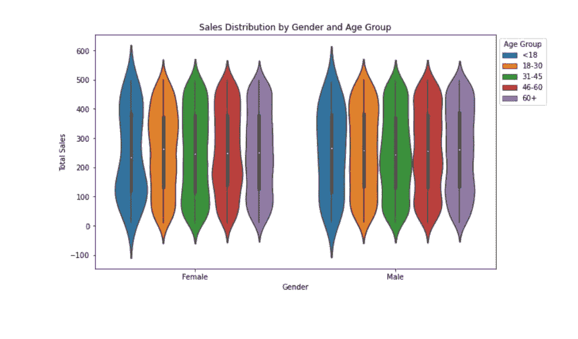

#### 可视化 75：蜂群图 - 按性别和年龄组划分的销售情况

蜂群图显示了不同性别的销售额值，按年龄组分类。它展示了每个性别和年龄组组合的单个数据点，揭示了这些类别中的销售分布。

```python
#### 可视化 75：蜂群图 - 按性别和年龄组划分的销售情况
plt.figure(figsize=(10, 6))
sns.swarmplot(x='Gender', y='Total_Sales', hue='Age_Group', data=df)
plt.xlabel('Gender')
plt.ylabel('Total Sales')
plt.title('Sales by Gender and Age Group')
plt.legend(title='Age_Group', bbox_to_anchor=(1, 1))
plt.show()
```

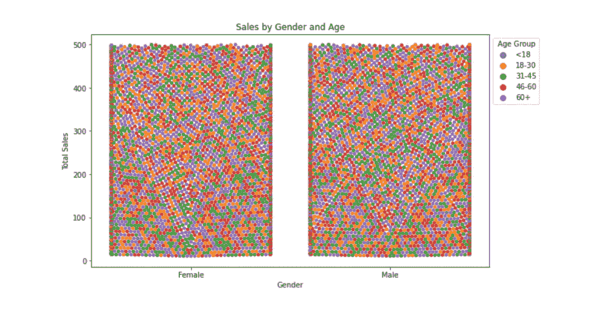

#### 可视化 76：折线图 - 按月份的销售趋势

此折线图显示了按月汇总的总销售额随时间变化的趋势。它有助于识别不同月份销售中的任何季节性模式或趋势。

```python
#### 可视化 76：折线图 - 按月份的销售趋势
monthly_sales = df.resample('M', on='Purchase Date')['Total Sales'].sum()
monthly_sales.plot(kind='line', figsize=(10, 6))
plt.xlabel('Month')
plt.ylabel('Total Sales')
plt.title('Sales Trend by Month')
plt.show()
```

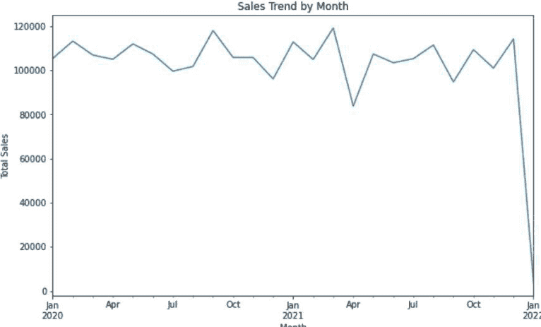

#### 可视化 77：堆积面积图 - 按年龄组的销售趋势

此堆积面积图说明了不同年龄组的总销售额随时间变化的趋势。它有助于比较每个年龄组对整体销售趋势的贡献。

```python
#### 可视化 77：堆积面积图 - 按年龄组的销售趋势
age_group_sales = df.pivot_table(index='Purchase Date', columns='Age Group',
                                 values='Total Sales', aggfunc='sum')
age_group_sales.resample('M').sum().plot(kind='area', figsize=(10, 6))
plt.xlabel('Date')
plt.ylabel('Total Sales')
plt.title('Sales Trend by Age Group')
plt.show()
```

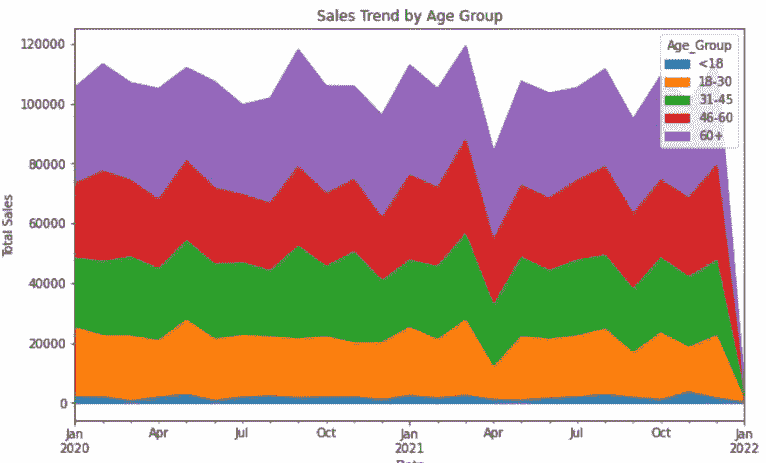

#### 可视化 78：箱线图 - 按产品类别和性别的销售额

此箱线图比较了不同产品类别的总销售额分布，按性别分类。它有助于识别每个产品类别中男性和女性客户在销售额上是否存在显著差异。

```python
#### 可视化 78：箱线图 - 按产品类别和性别的销售额
plt.figure(figsize=(10, 6))
sns.boxplot(x='Product_Category', y='Total_Sales', hue='Gender', data=df)
plt.xlabel('Product Category')
plt.ylabel('Total Sales')
plt.title('Sales Amount by Product Category and Gender')
plt.legend(title='Gender', bbox_to_anchor=(1, 1))
plt.show()
```

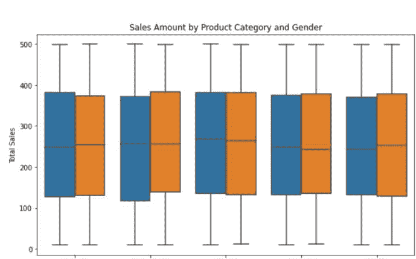

#### 可视化 79：蜂群图 - 按产品类别和年龄组的销售情况

此蜂群图显示了不同产品类别的销售额值，按年龄组分类。它展示了每个产品类别在不同年龄组中的销售分布情况。

```python
#### 可视化 79：蜂群图 - 按产品类别和年龄组的销售情况
plt.figure(figsize=(10, 6))
sns.swarmplot(x='Product_Category', y='Total_Sales', hue='Age_Group', data=df)
plt.xlabel('Product Category')
plt.ylabel('Total Sales')
plt.title('Sales by Product Category and Age Group')
plt.legend(title='Age Group', bbox_to_anchor=(1, 1))
plt.show()
```

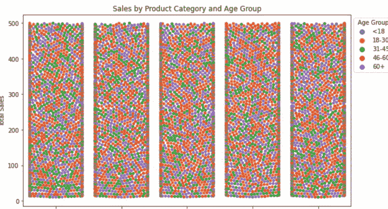

#### 可视化 80：箱线图 - 按客户类型和年龄组的销售额

此箱线图比较了不同客户类型（例如，新客户、回头客）的总销售额分布，按年龄组分类。它有助于识别每个年龄组中不同客户类型在销售额上是否存在显著差异。

```python
#### 可视化 80：箱线图 - 按客户类型和年龄组的销售额
plt.figure(figsize=(10, 6))
sns.boxplot(x='Customer_Type', y='Total_Sales', hue='Age_Group', data=df)
plt.xlabel('Customer_Type')
plt.ylabel('Total_Sales')
plt.title('Sales Amount by Customer Type and Age Group')
plt.legend(title='Age Group', bbox_to_anchor=(1, 1))
plt.show()
```

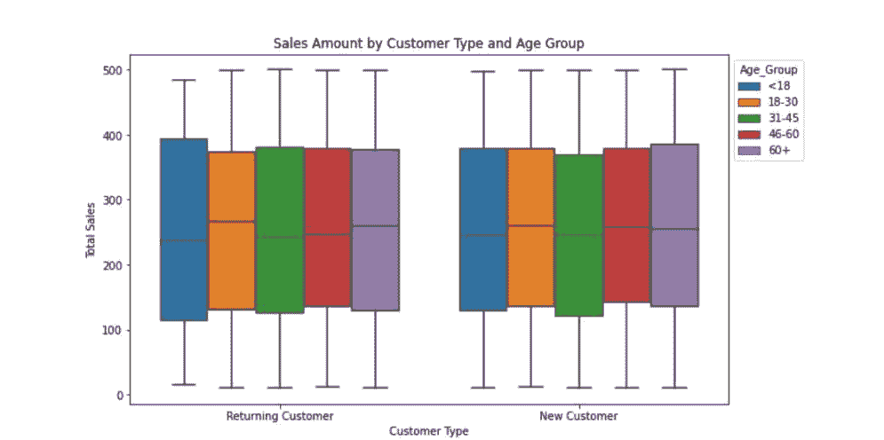

#### 可视化 81：条形图 - 按客户类型划分的平均销售额

此条形图显示了每种客户类型的平均销售额。它有助于比较不同客户类型的平均销售表现。

```python
# Visualization 81: Bar Plot - Average Sales by Customer Type
average_sales_payment = df.groupby('Customer_Type')['Total_Sales'].mean().sort_values(ascending=False)
average_sales_payment.plot(kind='bar', figsize=(10, 6))
plt.xlabel('Customer Type')
plt.ylabel('Average Sales')
plt.title('Average Sales by Customer Type')
plt.show()
```

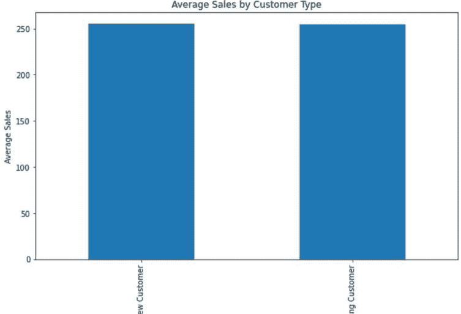

#### 可视化 82：饼图 - 按产品类别划分的销售分布

此饼图显示了不同产品类别销售额的百分比分布。它有助于理解不同产品对销售额的贡献比例。

```python
# Visualization 82: Pie Chart - Sales Distribution by Product Category
education_sales_distribution = df['Product_Category'].value_counts()
education_sales_distribution.plot(kind='pie', autopct='%1.1f%%', figsize=(8, 8))
plt.axis('equal')
plt.title('Sales Distribution by Product Category')
plt.show()
```

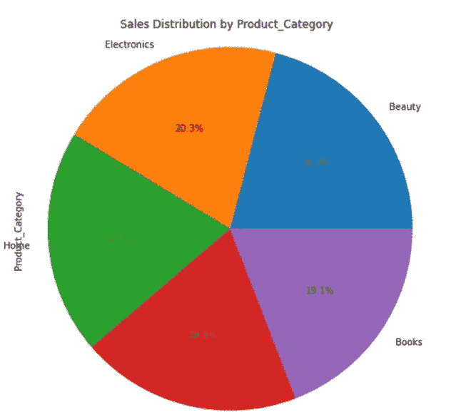

#### 可视化 83：小提琴图 - 按性别划分的销售分布

小提琴图显示了不同性别（例如，男性、女性）的总销售额分布。它提供了对每种性别销售额的分布范围和密度的洞察。

```python
# Visualization 83: Violin Plot - Sales Distribution by Gender
plt.figure(figsize=(10, 6))
sns.violinplot(x='Gender', y='Total_Sales', data=df)
plt.xlabel('Gender')
plt.ylabel('Total Sales')
plt.title('Sales Distribution by Gender')
plt.show()
```

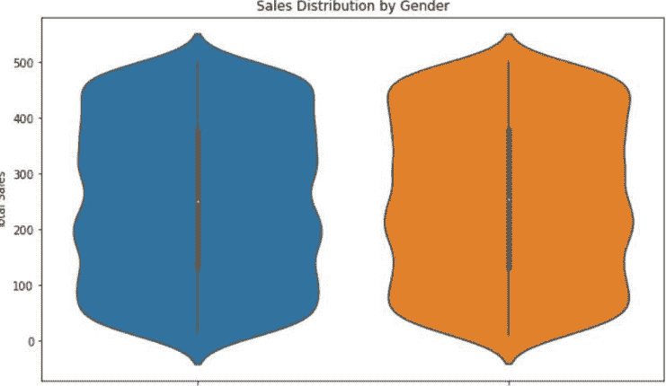

#### 可视化 84：条形图 - 按性别和婚姻状况划分的总销售额

此条形图显示了男性和女性客户的总销售额，并按婚姻状况分类。它有助于比较不同性别-婚姻状况组合之间的销售表现。

```python
# Visualization 84: Bar Plot - Total Sales by Gender and Marital Status
gender_marital_sales = df.pivot_table(index='Gender', columns='Marital_Status',
                                       values='Total_Sales', aggfunc='sum')
gender_marital_sales.plot(kind='bar', figsize=(10, 6))
plt.xlabel('Gender')
plt.ylabel('Total Sales')
plt.title('Total Sales by Gender and Marital Status')
plt.legend(title='Marital Status', bbox_to_anchor=(1, 1))
plt.show()
```

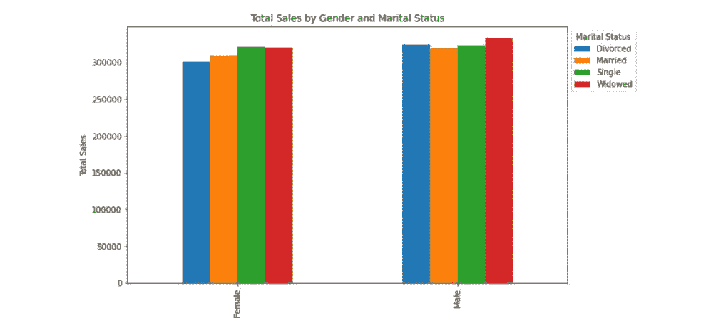

#### 可视化 85：计数图 - 按星期划分的销售情况

此计数图显示了每周各天的销售数量。它有助于识别哪些工作日的销售活动较高或较低。

```python
# Visualization 85: Count Plot - Sales by Weekday
weekday_sales = df['Purchase Date'].dt.day_name()
weekday_sales.value_counts().plot(kind='bar', figsize=(10, 6))
plt.xlabel('Weekday')
plt.ylabel('Sales Count')
plt.title('Sales by Weekday')
plt.show()
```

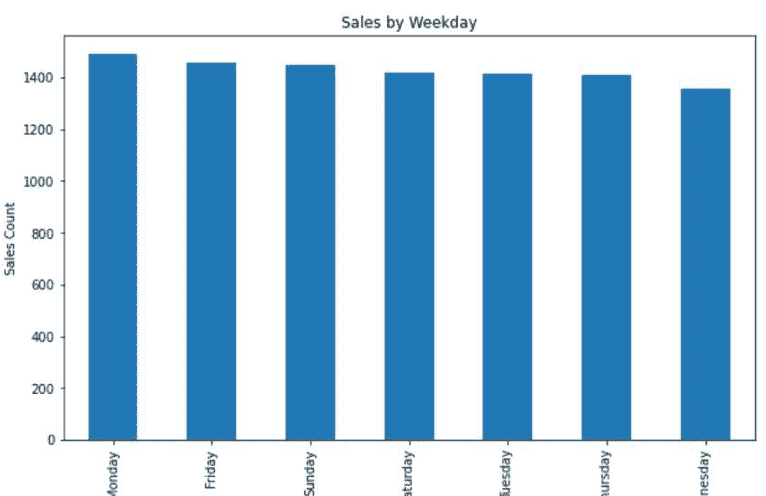

#### 可视化 86：折线图 - 按产品类别划分的销售趋势

此折线图显示了不同产品类别的总销售额随时间变化的趋势。它有助于识别哪些产品类别的销售额最高，以及它们的销售额如何随时间演变。

```python
# Visualization 86: Line Plot - Sales Trend by Product Category
product_category_sales = df.pivot_table(index='Purchase Date',
    columns='Product_Category', values='Total_Sales', aggfunc='sum')
product_category_sales.resample('M').sum().plot(kind='line', figsize=(10, 6))
plt.xlabel('Date')
plt.ylabel('Total Sales')
plt.title('Sales Trend by Product Category')
plt.legend(title='Product Category', bbox_to_anchor=(1, 1))
plt.show()
```

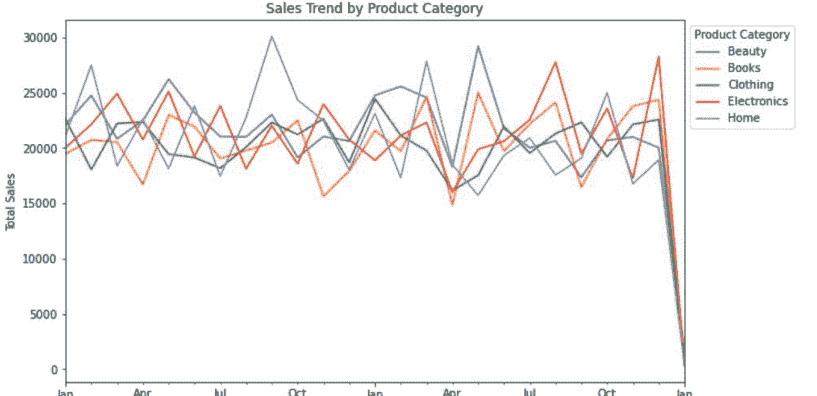

#### 可视化 87：条形图（带抖动点） - 按客户类型划分的销售分布

所示可视化是一个带有抖动点的条形图。它旨在显示每种客户类型的总销售额分布。

```python
# Visualization 87: Strip Plot - Sales Distribution by Customer Type
sns.stripplot(x='Customer Type', y='Total Sales', data=df, jitter=True, alpha=0.7)
plt.xlabel('Customer Type')
plt.ylabel('Total Sales Amount')
plt.title('Sales Distribution by Customer Type')
plt.show()
```

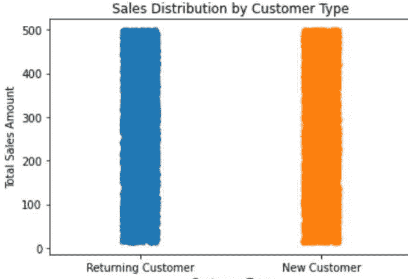

#### 可视化 88：箱线图 - 按客户年龄组和性别划分的销售额

此箱线图比较了不同客户年龄组的总销售额分布，并按教育水平分类。它有助于识别每个教育类别中，不同年龄组之间的销售额是否存在显著差异。

```python
# Visualization 88: Box Plot - Sales Amount by Customer Age Group and Gender
plt.figure(figsize=(10, 6))
sns.boxplot(x='Age_Group', y='Total_Sales', hue='Gender', data=df)
plt.xlabel('Customer Age Group')
plt.ylabel('Total Sales')
plt.title('Sales Amount by Customer Age Group and Gender')
plt.legend(title='Gender', bbox_to_anchor=(1, 1))
plt.show()
```

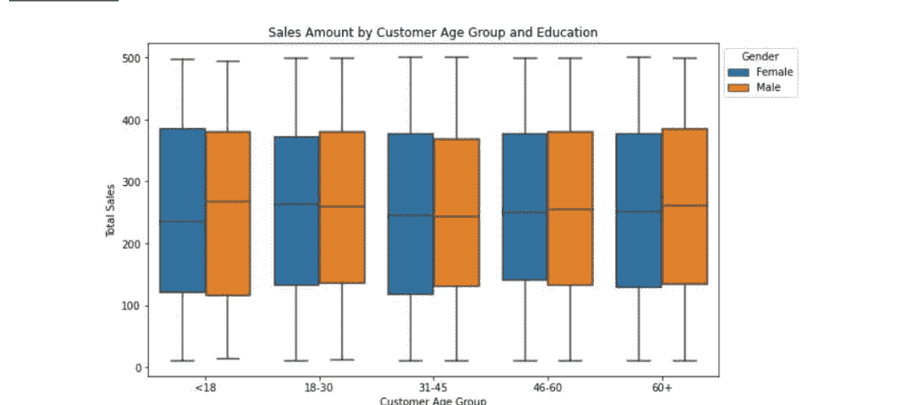

#### 可视化 89：散点图 - 销售额与数量

此散点图显示了总销售额与购买商品数量之间的关系。它有助于理解商品数量与总销售额之间是否存在任何相关性。

```python
# Visualization 89: Scatter Plot - Sales vs. Quantity
plt.figure(figsize=(10, 6))
plt.scatter(df['Quantity'], df['Total_Sales'])
plt.xlabel('Quantity')
plt.ylabel('Total Sales')
plt.title('Sales vs. Quantity')
plt.show()
```

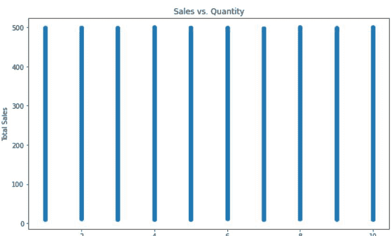

#### 可视化 90：条形图 - 按产品类别划分的总销售额

此条形图显示了每个产品类别的总销售额。它有助于识别哪些产品类别产生的收入最高。

```python
# Visualization 90: Bar Plot - Total Sales by Product Category
product_category_sales_total = df.groupby('Product_Category')['Total_Sales'].sum().sort_values(ascending=False)
product_category_sales_total.plot(kind='bar', figsize=(10, 6))
plt.xlabel('Product Category')
plt.ylabel('Total Sales')
plt.title('Total Sales by Product Category')
plt.show()
```

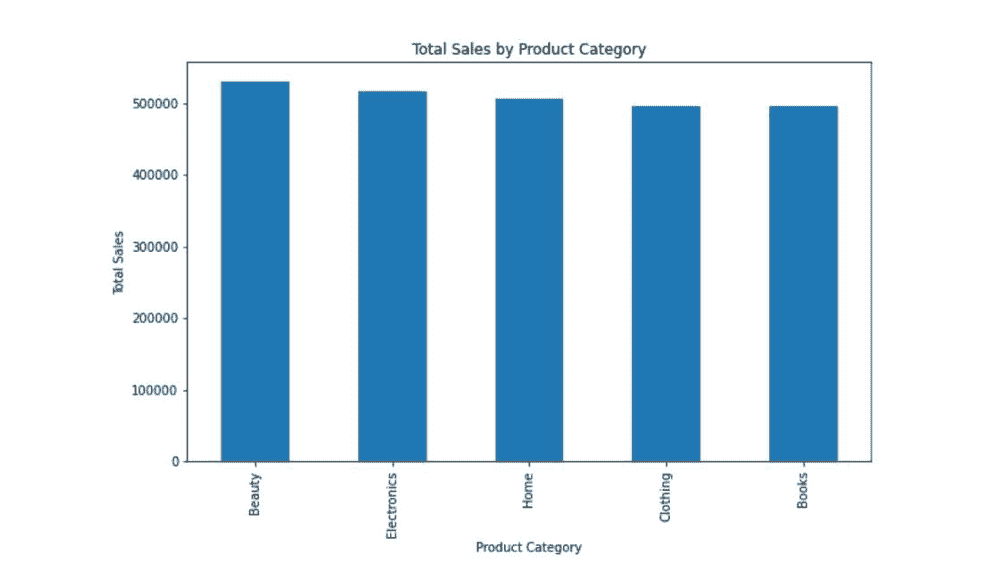

#### 可视化 91：计数图 - 按月份划分的销售情况

此计数图显示了每个月的销售数量。它有助于我们理解销售活动在不同月份的分布情况。

```python
# Visualization 91: Count Plot - Sales by Month
monthly_sales = df['Purchase Date'].dt.month_name()
monthly_sales.value_counts().sort_index().plot(kind='bar', figsize=(10, 6))
plt.xlabel('Month')
plt.ylabel('Sales Count')
plt.title('Sales by Month')
plt.show()
```

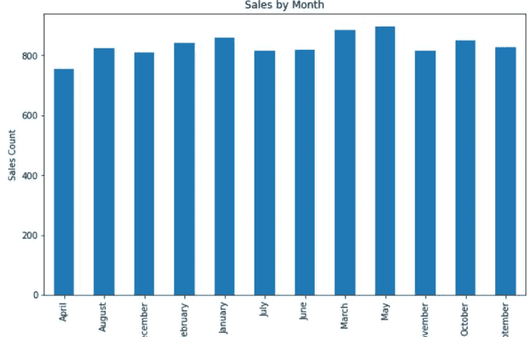

#### 可视化 92：折线图 - 按性别划分的销售趋势

此折线图显示了男性和女性客户的总销售额随时间变化的趋势。它有助于比较不同性别之间的销售表现。

```python
# Visualization 92: Line Plot - Sales Trend by Gender
gender_sales = df.pivot_table(index='Purchase Date', columns='Gender',
                              values='Total_Sales', aggfunc='sum')
gender_sales.resample('M').sum().plot(kind='line', figsize=(10, 6))
plt.xlabel('Date')
plt.ylabel('Total Sales')
plt.title('Sales Trend by Gender')
plt.legend(title='Gender', bbox_to_anchor=(1, 1))
plt.show()
```

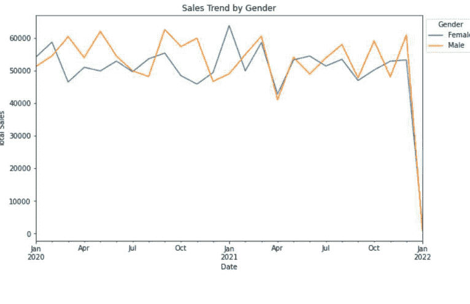

#### 可视化 93：条形图 - 按年龄组划分的总销售额

此条形图显示了不同年龄组客户的总销售额。它有助于我们理解不同年龄客户产生的收入。

```python
# Visualization 93: Bar Plot - Total Sales by Age Group
education_sales_total = df.groupby(
    'Age_Group')['Total_Sales'].sum().sort_values(ascending=False)
education_sales_total.plot(kind='bar', figsize=(10, 6))
plt.xlabel('Age Group')
plt.ylabel('Total Sales')
plt.title('Total Sales by Age Group')
plt.show()
```

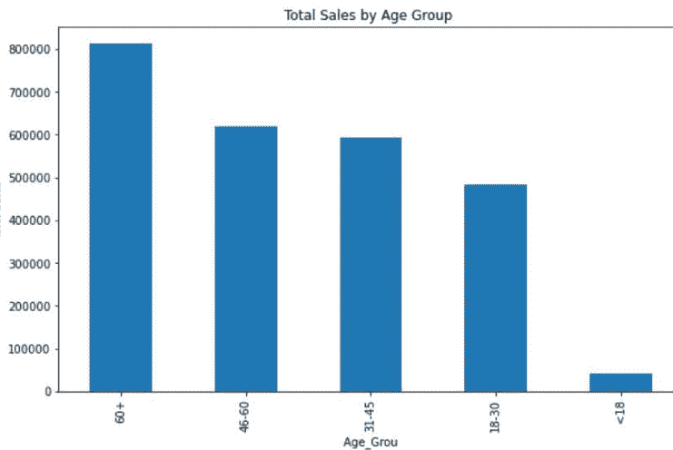

#### 可视化 94：3D 散点图 - 销售额 vs. 数量 vs. 单价

这个 3D 散点图提供了销售额、数量和单价之间相互作用的深刻见解，让我们能全面理解它们在数据集中的关系。

```python
# Visualization 94: 3D Scatter Plot - Sales vs. Quantity vs. Price Per Unit
from mpl_toolkits.mplot3d import Axes3D
fig = plt.figure()
ax = fig.add_subplot(111, projection='3d')
ax.scatter(df['Quantity'], df['Price_Per_Unit'], df['Total_Sales'], c='b', marker='o')
ax.set_xlabel('Quantity')
ax.set_ylabel('Price Per Unit')
ax.set_zlabel('Total Sales Amount')
plt.title('3D Scatter Plot - Sales vs. Quantity vs. Price Per Unit')
plt.show()
```

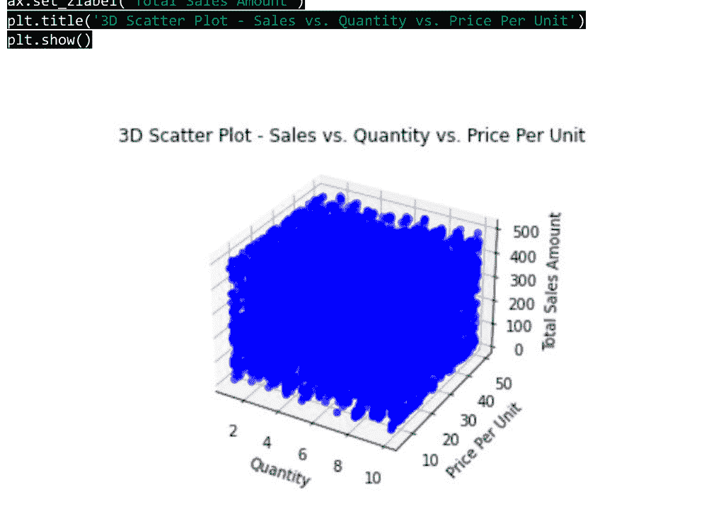

#### 可视化 95：箱线图 - 按客户类型和性别划分的销售额

这个箱线图比较了不同客户类型（例如，新客户、回头客）的总销售额分布，并按性别进行了分类。它有助于识别在每个客户类型中，不同性别的销售额是否存在显著差异。

```python
# Visualization 95: Box Plot - Sales Amount by Customer Type and Gender
plt.figure(figsize=(10, 6))
sns.boxplot(x='Customer Type', y='Total Sales', hue='Gender', data=df)
plt.xlabel('Customer Type')
plt.ylabel('Total Sales')
plt.title('Sales Amount by Customer Type and Gender')
plt.legend(title='Gender', bbox_to_anchor=(1, 1))
plt.show()
```

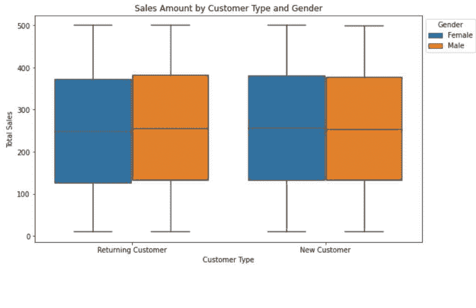

#### 可视化 96：条形图 - 按婚姻状况划分的总销售额

这个条形图显示了不同婚姻状况客户的总销售额。它有助于理解来自不同婚姻状况类别客户所产生的收入。

```python
# Visualization 96: Bar Plot - Total Sales by Marital Status
marital_sales_total = df.groupby('Marital_Status')['Total_Sales'].sum().sort_values(ascending=False)
marital_sales_total.plot(kind='bar', figsize=(10, 6))
plt.xlabel('Marital Status')
plt.ylabel('Total Sales')
plt.title('Total Sales by Marital Status')
plt.show()
```

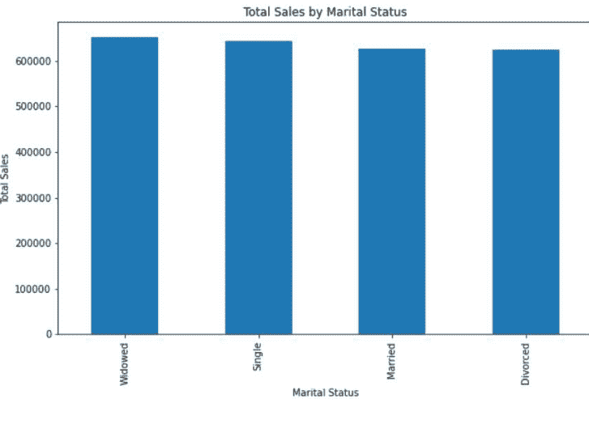

#### 可视化 97：堆叠条形图 - 按婚姻状况和产品类别划分的销售额

这个堆叠条形图展示了按婚姻状况和产品类别划分的销售额明细。每个条形代表一个婚姻状况类别，条形内的分段代表该婚姻状况类别内每个产品类别的总销售额。它有助于识别不同婚姻状况的客户偏好哪些产品类别。

```python
# Visualization 97: Stacked Bar Chart - Sales by Marital Status and Product Category
marital_category_sales = df.pivot_table(index='Marital_Status', columns='Product_Category', values='Total_Sales', aggfunc='sum')
marital_category_sales.plot(kind='bar', stacked=True, figsize=(10, 6))
plt.xlabel('Marital Status')
plt.ylabel('Total Sales')
plt.title('Sales by Marital Status and Product Category')
plt.legend(title='Product Category', bbox_to_anchor=(1, 1))
plt.show()
```

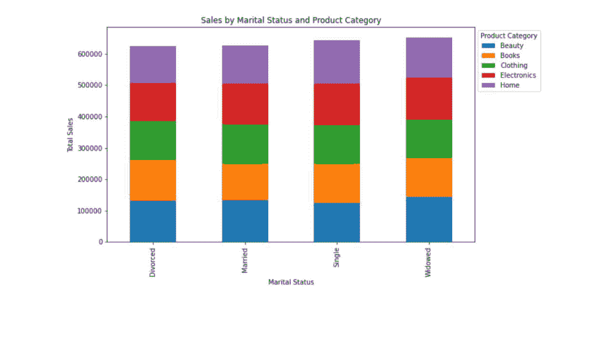

#### 可视化 98：KDE 图 - 按客户年龄组划分的销售额分布

KDE 图可视化了不同客户年龄组的总销售额分布。它显示了销售额值的概率密度，使我们能够比较每个年龄组类别的销售额分布。

```python
# Visualization 98: KDE Plot - Sales Distribution by Customer Age Group
plt.figure(figsize=(10, 6))
sns.kdeplot(data=df, x='Total_Sales', hue='Age_Group', fill=True)
plt.xlabel('Total Sales')
plt.ylabel('Density')
plt.title('Sales Distribution by Customer Age Group')
plt.show()
```

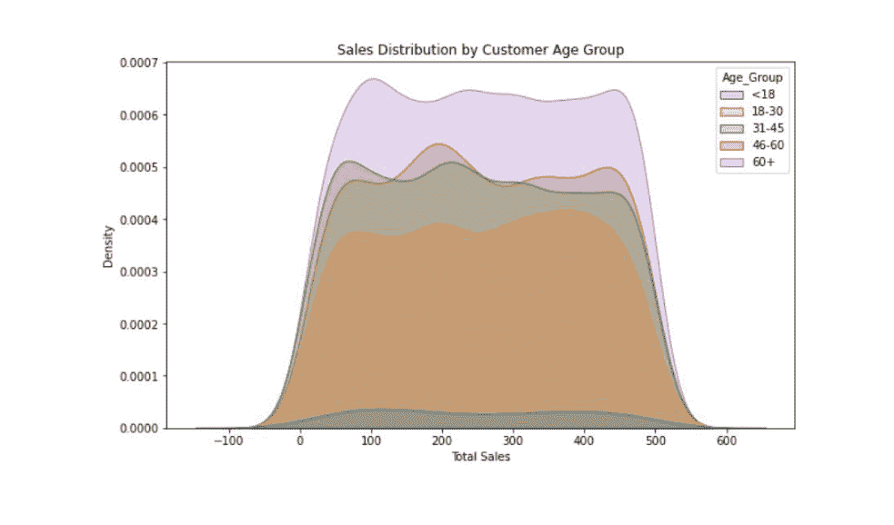

#### 可视化 99：小提琴图 - 按婚姻状况和年龄组划分的销售额分布

这个小提琴图可视化了不同婚姻状况类别的总销售额分布，并按年龄组进行了分类。它提供了对每个婚姻状况和年龄组组合的销售额值的分布和密度的见解。

```python
# Visualization 99: Violin Plot - Sales Distribution by Marital Status and Age Group
plt.figure(figsize=(10, 6))
sns.violinplot(x='Marital_Status', y='Total_Sales', hue='Customer_Age_Group', data=df)
plt.xlabel('Marital Status')
plt.ylabel('Total Sales')
plt.title('Sales Distribution by Marital Status and Age Group')
plt.legend(title='Age Group', bbox_to_anchor=(1, 1))
plt.show()
```

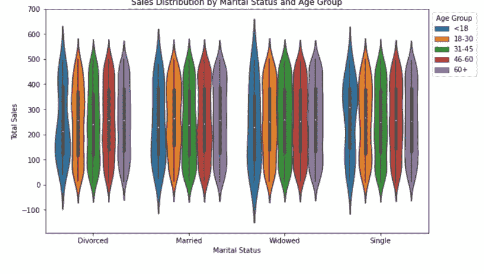

#### 可视化 100：蜂群图 - 按性别和客户类型划分的销售额

蜂群图显示了男性和女性客户的销售额值，并按客户类型（例如，新客户、回头客）进行了分类。它显示了每个性别和客户类型组合的各个数据点，揭示了这些类别中的销售额分布。

```python
# Visualization 100: Swarm Plot - Sales by Gender and Customer Type
plt.figure(figsize=(10, 6))
sns.swarmplot(x='Gender', y='Total_Sales', hue='Customer_Type', data=df)
plt.xlabel('Gender')
plt.ylabel('Total Sales')
plt.title('Sales by Gender and Customer Type')
plt.legend(title='Customer Type', bbox_to_anchor=(1, 1))
plt.show()
```

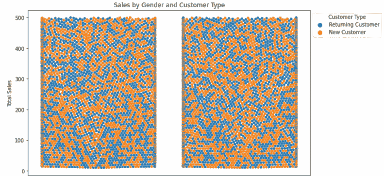

#### 可视化 101：堆叠条形图 - 按年龄和婚姻状况划分的销售额

这个堆叠条形图展示了不同年龄组和婚姻状况的总销售额分布。每个条形代表每个年龄组的总销售额，每个条形内的不同分段代表该年龄组内不同婚姻状况的销售额。图例清晰地说明了哪种颜色对应每个婚姻状况类别，使图表易于解读。

```python
# Visualization 101: Stacked Bar Chart - Sales by Age and Marital Status
education_marital_sales = df.pivot_table(index='Age',
    columns='Marital_Status', values='Total_Sales', aggfunc='sum')
education_marital_sales.plot(kind='bar', stacked=True, figsize=(10, 6))
plt.xlabel('Age')
plt.ylabel('Total Sales')
plt.title('Sales by Age and Marital Status')
plt.legend(title='Marital Status', bbox_to_anchor=(1, 1))
plt.show()
```

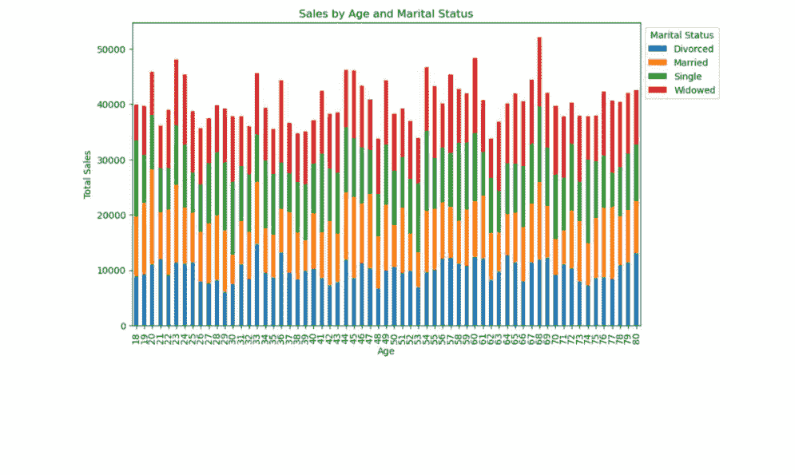

## 5. 结论

在本指南中，我们探索了使用 Python 进行数据可视化的迷人世界。可视化是一个强大的工具，它使我们能够获得见解、识别模式，并以清晰且引人入胜的方式传达复杂信息。在本指南中，我们涵盖了广泛的可视化技术，并展示了如何使用 Matplotlib 和 Seaborn 等流行库创建各种类型的图表和图形。

我们首先了解了数据可视化的基础知识，以及为不同类型的数据选择正确可视化的重要性。我们学习了如何创建简单的折线图、条形图和直方图来探索数据分布和趋势。随着深入，我们探讨了更高级的可视化，包括散点图、热力图和箱线图，这些帮助我们揭示了数据中的相关性和异常值。

此外，我们还探索了时间序列数据的可视化，例如基于时间的折线图和堆叠面积图，使我们能够分析随时间变化的趋势和模式。我们还学习了如何创建环形图、词云和平行坐标图来可视化分类和文本数据。

另外，我们研究了自定义可视化外观的方法，例如添加标题、标签、图例和配色方案。这种个性化增强了图表的美观性和有效性。

更重要的是，我们利用数据聚合的力量创建了富有洞察力的可视化，展示了按各种属性（如产品类别、客户类型和年龄组）划分的销售趋势。这些可视化使我们能够更深入地理解数据并做出数据驱动的决策。

随着深入，我们探讨了合成数据的概念及其在数据可视化中的应用。合成数据生成提供了一个有价值的工具，可以在保护敏感信息的同时，仍然允许我们分析和可视化趋势。

在整个旅程中，我们强调了数据探索和解释的重要性。可视化不仅仅是创建视觉上吸引人的图表，更是关于理解和从数据中提取有意义的见解。

我们提供了 50 个可视化示例，每个示例都附有 Python 代码，以展示如何将不同的技术应用于各种场景。这些示例作为读者创建自己可视化的实用参考。

总之，数据可视化是数据科学家、分析师和各领域专业人士的一项关键技能。它使我们能够讲述引人入胜的数据故事，做出明智的决策，并释放数据集中隐藏的潜力。通过掌握通过本指南介绍的技巧，你现在已具备创建有影响力的可视化作品的工具，并能开启一段通过数据探索发现的旅程。

我们希望本指南能为你带来丰富的体验，并成为你数据可视化之旅中的宝贵资源。祝你可视化愉快！

（注：本指南包含多种Python代码片段和可视化示例。要复现这些示例，请确保你能获取指南中提到的必要库和数据集。）

## 6. 有用资源

以下资源可帮助本指南的读者：

- Pandas文档：Pandas库的官方文档，提供使用Pandas进行数据操作和分析的全面信息。网址：https://pandas.pydata.org/docs/
- Seaborn文档：Seaborn库的官方文档，提供创建精美统计可视化的详细指导。网址：https://seaborn.pydata.org/documentation.html
- Matplotlib文档：Matplotlib的官方文档，这是一个广泛使用的Python绘图库，包含详细的示例和教程。网址：https://matplotlib.org/stable/contents.html
- Faker文档：Faker库的文档，用于生成假数据（如姓名、地址等），以方便测试和可视化。网址：https://faker.readthedocs.io/en/master/
- WordCloud文档：WordCloud的官方文档，提供基于词频创建词云可视化的指导。网址：https://github.com/amueller/word_cloud
- DataCamp - 使用Seaborn进行数据可视化：DataCamp上的一个教程，涵盖使用Seaborn库进行各种数据可视化技术。网址：https://www.datacamp.com/courses/data-visualization-with-seaborn
- Towards Data Science：一个在线出版物，发布与数据科学、机器学习和数据可视化相关的文章、教程和资源。网址：https://towardsdatascience.com/
- Kaggle数据集：一个探索和下载各种数据集以供练习和分析的平台，包括可视化项目。网址：https://www.kaggle.com/datasets
- Stack Overflow：一个流行的问答平台，用户可以在此找到编码问题的解决方案，包括数据可视化相关的问题。网址：https://stackoverflow.com/
- YouTube - Corey Schafer的Matplotlib教程系列：由Corey Schafer制作的YouTube教程系列，涵盖Matplotlib在数据可视化方面的各个方面。网址：https://www.youtube.com/playlist?list=PL-osiE80TeTvip0qomVEeZ1HRrcEvtZB
- https://research.ibm.com/blog/what-is-synthetic-data：此链接指向IBM Research的一篇博客文章，解释了合成数据的概念，这是一种为保护隐私和数据分析而人工生成的数据。
- https://ieeexplore.ieee.org/search/searchresult.jsp?newsearch=true&queryText=synthetic%20data：此URL将你带到IEEE Xplore，你可以在那里找到与合成数据及其应用相关的研究论文和文章。
- https://www.mathworks.com/help/matlab/ref/legend.html：此链接指向MATLAB中“legend”函数的文档，提供如何为可视化创建图例的信息。
- https://matplotlib.org/2.0.2/gallery.html：此URL指向Matplotlib画廊，你可以在那里找到使用Matplotlib创建的示例图表和可视化集合。
- https://www.freecodecamp.org/：FreeCodeCamp是一个教育平台，提供免费的编码教程，包括使用Matplotlib和Seaborn等Python库进行数据可视化。
- https://www.tutorialspoint.com/matplotlib-histogram-with-multiple-legend-entries：TutorialsPoint上的这个教程演示了如何使用Matplotlib创建具有多个图例条目的直方图。
- https://github.com/Ahmedabouraia/Data_Science：这是Ahmedabouraia的GitHub仓库，可能包含与数据科学相关的代码、速查表和项目，包括数据可视化。
- Anaconda发行版：Anaconda是一个流行的Python发行版，附带广泛的数据科学库，包括Pandas、NumPy和Matplotlib。你可以从https://www.anaconda.com/products/individual下载它。
- ChatGPT：ChatGPT是OpenAI开发的一种AI语言模型，基于GPT-3.5架构。它可以协助生成类似人类的文本，并回答各种问题和提示，包括数据科学和数据可视化查询。

这些资源涵盖了广泛的主题，从库文档到教程、文章，以及探索数据集和寻求社区支持的平台。它们将为读者提供必要的知识和指导，以提升他们的数据可视化技能。


**Ahmed Abouraia** 是一位数据架构师、作家和讲师，过去15年一直在埃及开罗的一所国际学校工作，在技术领域学习，并获得了微软、IBM、Oracle、AWS、VMware、Sophos等技术市场领导者的认证。他于2022年毕业于阿拉伯科技与大学，获得电子商务硕士学位，并且是班级第一名。他真心希望在不久的将来通过攻读数据科学博士学位来提升自己的学术记录。没有家人的支持和他自身的持续动力，他无法做到这一点。

