# Python编程100天

朱莉安娜·卡鲁洛

本书可在 [http://leanpub.com/100daysofcoding](http://leanpub.com/100daysofcoding) 购买

本版本发布于 2020年3月22日

这是一本 [Leanpub](https://leanpub.com) 图书。Leanpub 通过精益出版流程赋能作者和出版商。[精益出版](https://leanpub.com/lean-publishing) 是指使用轻量级工具和多次迭代来发布进行中的电子书，以获取读者反馈，不断调整直到找到合适的书籍方向，并在完成后建立市场影响力。

© 2019 - 2020 朱莉安娜·卡鲁洛

## 朱莉安娜·卡鲁洛的其他作品

- 代码审查入门
- 技术领导力
- 身份管理入门
- 停止拖延
- pip install python

## 目录

- 前言
  - 为什么写这本书？
  - 本书适合谁阅读

### 第一部分 - 基础知识

- 引言
  - 学习计划
  - 一切开始的地方

- 基础
  - 令人喜爱的 hello world
    - 命令行
    - .py 代码
  - 主函数
  - 每日编码练习
  - 基本输入/输出
    - 输出操作
    - 给我吧！

- 基本类型
  - 数值类型
  - 字符串
  - 其他类型
  - 每日编码练习

## 目录

-   覆盖

## 目录

- 你刚才对那位程序员撒谎了吗？

## 目录

- **链表**

## 目录

- 代码

## 目录

- 外观模式

## 目录

- 什么是 . . . . . . . . . . . . . . . . . . . . . . . . . . . . . . . . . . . . . . . . . . . . . . . . . . . . . . . . . . . . . . . . . . . . . . . . . . . . . . . . . . . . . . . . . . . . . . . . . . . . . . . . . . . . . . . . . . . . . . . . . . . . . . . . . . . . . . . . . . . . . . . . . . . . . . . . . . . . . . . . . . . . . . . . . . . . . . . . . . . . . . . . . . . . . . . . . . . . . . . . . . . . . . . . . . . . . . . . . . . . . . . . . . . . . . . . . . . . . . . . . . . . . . . . . . . . . . . . . . . . . . . . . . . . . . . . . . . . . . . . . . . . . . . . . . . . . . . . . . . . . . . . . . . . . . . . . . . . . . . . . . . . . . . . . . . . . . . . . . . . . . . . . . . . . . . . . . . . . . . . . . . . . . . . . . . . . . . . . . . . . . . . . . . . . . . . . . . . . . . . . . . . . . . . . . . . . . . . . . . . . . . . . . . . . . . . . . . . . . . . . . . . . . . . . . . . . . . . . . . . . . . . . . . . . . . . . . . . . . . . . . . . . . . . . . . . . . . . . . . . . . . . . . . . . . . . . . . . . . . . . . . . . . . . . . . . . . . . . . . . . . . . . . . . . . . . . . . . . . . . . . . . . . . . . . . . . . . . . . . . . . . . . . . . . . . . . . . . . . . . . . . . . . . . . . . . . . . . . . . . . . . . . . . . . . . . . . . . . . . . . . . . . . . . . . . . . . . . . . . . . . . . . . . . . . . . . . . . . . . . . . . . . . . . . . . . . . . . . . . . . . . . . . . . . . . . . . . . . . . . . . . . . . . . . . . . . . . . . . . . . . . . . . . . . . . . . . . . . . . . . . . . . . . . . . . . . . . . . . . . . . . . . . . . . . . . . . . . . . . . . . . . . . . . . . . . . . . . . . . . . . . . . . . . . . . . . . . . . . . . . . . . . . . . . . . . . . . . . . . . . . . . . . . . . . . . . . . . . . . . . . . . . . . . . . . . . . . . . . . . . . . . . . . . . . . . . . . . . . . . . . . . . . . . . . . . . . . . . . . . . . . . . . . . . . . . . . . . . . . . . . . . . . . . . . . . . . . . . . . . . . . . . . . . . . . . . . . . . . . . . . . . . . . . . . . . . . . . . . . . . . . . . . . . . . . . . . . . . . . . . . . . . . . . . . . . . . . . . . . . . . . . . . . . . . . . . . . . . . . . . . . . . . . . . . . . . . . . . . . . . . . . . . . . . . . . . . . . . . . . . . . . . . . . . . . . . . . . . . . . . . . . . . . . . . . . . . . . . . . . . . . . . . . . . . . . . . . . . . . . . . . . . . . . . . . . . . . . . . . . . . . . . . . . . . . . . . . . . . . . . . . . . . . . . . . . . . . . . . . . . . . . . . . . . . . . . . . . . . . . . . . . . . . . . . . . . . . . . . . . . . . . . . . . . . . . . . . . . . . . . . . . . . . . . . . . . . . . . . . . . . . . . . . . . . . . . . . . . . . . . . . . . . . . . . . . . . . . . . . . . . . . . . . . . . . . . . . . . . . . . . . . . . . . . . . . . . . . . . . . . . . . . . . . . . . . . . . . . . . . . . . . . . . . . . . . . . . . . . . . . . . . . . . . . . . . . . . . . . . . . . . . . . . . . . . . . . . . . . . . . . . . . . . . . . . . . . . . . . . . . . . . . . . . . . . . . . . . . . . . . . . . . . . . . . . . . . . . . . . . . . . . . . . . . . . . . . . . . . . . . . . . . . . . . . . . . . . . . . . . . . . . . . . . . . . . . . . . . . . . . . . . . . . . . . . . . . . . . . . . . . . . . . . . . . . . . . . . . . . . . . . . . . . . . . . . . . . . . . . . . . . . . . . . . . . . . . . . . . . . . . . . . . . . . . . . . . . . . . . . . . . . . . . . . . . . . . . . . . . . . . . . . . . . . . . . . . . . . . . . . . . . . . . . . . . . . . . . . . . . . . . . . . . . . . . . . . . . . . . . . . . . . . . . . . . . . . . . . . . . . . . . . . . . . . . . . . . . . . . . . . . . . . . . . . . . . . . . . . . . . . . . . . . . . . . . . . . . . . . . . . . . . . . . . . . . . . . . . . . . . . . . . . . . . . . . . . . . . . . . . . . . . . . . . . . . . . . . . . . . . . . . . . . . . . . . . . . . . . . . . . . . . . . . . . . . . . . . . . . . . . . . . . . . . . . . . . . . . . . . . . . . . . . . . . . . . . . . . . . . . . . . . . . . . . . . . . . . . . . . . . . . . . . . . . . . . . . . . . . . . . . . . . . . . . . . . . . . . . . . . . . . . . . . . . . . . . . . . . . . . . . . . . . . . . . . . . . . . . . . . . . . . . . . . . . . . . . . . . . . . . . . . . . . . . . . . . . . . . . . . . . . . . . . . . . . . . . . . . . . . . . . . . . . . . . . . . . . . . . . . . . . . . . . . . . . . . . . . . . . . . . . . . . . . . . . . . . . . . . . . . . . . . . . . . . . . . . . . . . . . . . . . . . . . . . . . . . . . . . . . . . . . . . . . . . . . . . . . . . . . . . . . . . . . . . . . . . . . . . . . . . . . . . . . . . . . . . . . . . . . . . . . . . . . . . . . . . . . . . . . . . . . . . . . . . . . . . . . . . . . . . . . . . . . . . . . . . . . . . . . . . . . . . . . . . . . . . . . . . . . . . . . . . . . . . . . . . . . . . . . . . . . . . . . . . . . . . . . . . . . . . . . . . . . . . . . . . . . . . . . . . . . . . . . . . . . . . . . . . . . . . . . . . . . . . . . . . . . . . . . . . . . . . . . . . . . . . . . . . . . . . . . . . . . . . . . . . . . . . . . . . . . . . . . . . . . . . . . . . . . . . . . . . . . . . . . . . . . . . . . . . . . . . . . . . . . . . . . . . . . . . . . . . . . . . . . . . . . . . . . . . . . . . . . . . . . . . . . . . . . . . . . . . . . . . . . . . . . . . . . . . . . . . . . . . . . . . . . . . . . . . . . . . . . . . . . . . . . . . . . . . . . . . . . . . . . . . . . . . . . . . . . . . . . . . . . . . . . . . . . . . . . . . . . . . . . . . . . . . . . . . . . . . . . . . . . . . . . . . . . . . . . . . . . . . . . . . . . . . . . . . . . . . . . . . . . . . . . . . . . . . . . . . . . . . . . . . . . . . . . . . . . . . . . . . . . . . . . . . . . . . . . . . . . . . . . . . . . . . . . . . . . . . . . . . . . . . . . . . . . . . . . . . . . . . . . . . . . . . . . . . . . . . . . . . . . . . . . . . . . . . . . . . . . . . . . . . . . . . . . . . . . . . . . . . . . . . . . . . . . . . . . . . . . . . . . . . . . . . . . . . . . . . . . . . . . . . . . . . . . . . . . . . . . . . . . . . . . . . . . . . . . . . . . . . . . . . . . . . . . . . . . . . . . . . . . . . . . . . . . . . . . . . . . . . . . . . . . . . . . . . . . . . . . . . . . . . . . . . . . . . . . . . . . . . . . . . . . . . . . . . . . . . . . . . . . . . . . . . . . . . . . . . . . . . . . . . . . . . . . . . . . . . . . . . . . . . . . . . . . . . . . . . . . . . . . . . . . . . . . . . . . . . . . . . . . . . . . . . . . . . . . . . . . . . . . . . . . . . . . . . . . . . . . . . . . . . . . . . . . . . . . . . . . . . . . . . . . . . . . . . . . . . . . . . . . . . . . . . . . . . . . . . . . . . . . . . . . . . . . . . . . . . . . . . . . . . . . . . . . . . . . . . . . . . . . . . . . . . . . . . . . . . . . . . . . . . . . . . . . . . . . . . . . . . . . . . . . . . . . . . . . . . . . . . . . . . . . . . . . . . . . . . . . . . . . . . . . . . . . . . . . . . . . . . . . . . . . . . . . . . . . . . . . . . . . . . . . . . . . . . . . . . . . . . . . . . . . . . . . . . . . . . . . . . . . . . . . . . . . . . . . . . . . . . . . . . . . . . . . . . . . . . . . . . . . . . . . . . . . . . . . . . . . . . . . . . . . . . . . . . . . . . . . . . . . . . . . . . . . . . . . . . . . . . . . . . . . . . . . . . . . . . . . . . . . . . . . . . . . . . . . . . . . . . . . . . . . . . . . . . . . . . . . . . . . . . . . . . . . . . . . . . . . . . . . . . . . . . . . . . . . . . . . . . . . . . . . . . . . . . . . . . . . . . . . . . . . . . . . . . . . . . . . . . . . . . . . . . . . . . . . . . . . . . . . . . . . . . . . . . . . . . . . . . . . . . . . . . . . . . . . . . . . . . . . . . . . . . . . . . . . . . . . . . . . . . . . . . . . . . . . . . . . . . . . . . . . . . . . . . . . . . . . . . . . . . . . . . . . . . . . . . . . . . . . . . . . . . . . . . . . . . . . . . . . . . . . . . . . . . . . . . . . . . . . . . . . . . . . . . . . . . . . . . . . . . . . . . . . . . . . . . . . . . . . . . . . . . . . . . . . . . . . . . . . . . . . . . . . . . . . . . . . . . . . . . . . . . . . . . . . . . . . . . . . . . . . . . . . . . . . . . . . . . . . . . . . . . . . . . . . . . . . . . . . . . . . . . . . . . . . . . . . . . . . . . . . . . . . . . . . . . . . . . . . . . . . . . . . . . . . . . . . . . . . . . . . . . . . . . . . . . . . . . . . . . . . . . . . . . . . . . . . . . . . . . . . . . . . . . . . . . . . . . . . . . . . . . . . . . . . . . . . . . . . . . . . . . . . . . . . . . . . . . . . . . . . . . . . . . . . . . . . . . . . . . . . . . . . . . . . . . . . . . . . . . . . . . . . . . . . . . . . . . . . . . . . . . . . . . . . . . . . . . . . . . . . . . . . . . . . . . . . . . . . . . . . . . . . . . . . . . . . . . . . . . . . . . . . . . . . . . . . . . . . . . . . . . . . . . . . . . . . . . . . . . . . . . . . . . . . . . . . . . . . . . . . . . . . . . . . . . . . . . . . . . . . . . . . . . . . . . . . . . . . . . . . . . . . . . . . . . . . . . . . . . . . . . . . . . . . . . . . . . . . . . . . . . . . . . . . . . . . . . . . . . . . . . . . . . . . . . . . . . . . . . . . . . . . . . . . . . . . . . . . . . . . . . . . . . . . . . . . . . . . . . . . . . . . . . . . . . . . . . . . . . . . . . . . . . . . . . . . . . . . . . . . . . . . . . . . . . . . . . . . . . . . . . . . . . . . . . . . . . . . . . . . . . . . . . . . . . . . . . . . . . . . . . . . . . . . . . . . . . . . . . . . . . . . . . . . . . . . . . . . . . . . . . . . . . . . . . . . . . . . . . . . . . . . . . . . . . . . . . . . . . . . . . . . . . . . . . . . . . . . . . . . . . . . . . . . . . . . . . . . . . . . . . . . . . . . . . . . . . . . . . . . . . . . . . . . . . . . . . . . . . . . . . . . . . . . . . . . . . . . . . . . . . . . . . . . . . . . . . . . . . . . . . . . . . . . . . . . . . . . . . . . . . . . . . . . . . . . . . . . . . . . . . . . . . . . . . . . . . . . . . . . . . . . . . . . . . . . . . . . . . . . . . . . . . . . . . . . . . . . . . . . . . . . . . . . . . . . . . . . . . . . . . . . . . . . . . . . . . . . . . . . . . . . . . . . . . . . . . . . . . . . . . . . . . . . . . . . . . . . . . . . . . . . . . . . . . . . . . . . . . . . . . . . . . . . . . . . . . . . . . . . . . . . . . . . . . . . . . . . . . . . . . . . . . . . . . . . . . . . . . . . . . . . . . . . . . . . . . . . . . . . . . . . . . . . . . . . . . . . . . . . . . . . . . . . . . . . . . . . . . . . . . . . . . . . . . . . . . . . . . . . . . . . . . . . . . . . . . . . . . . . . . . . . . . . . . . . . . . . . . . . . . . . . . . . . . . . . . . . . . . . . . . . . . . . . . . . . . . . . . . . . . . . . . . . . . . . . . . . . . . . . . . . . . . . . . . . . . . . . . . . . . . . . . . . . . . . . . . . . . . . . . . . . . . . . . . . . . . . . . . . . . . . . . . . . . . . . . . . . . . . . . . . . . . . . . . . . . . . . . . . . . . . . . . . . . . . . . . . . . . . . . . . . . . . . . . . . . . . . . . . . . . . . . . . . . . . . . . . . . . . . . . . . . . . . . . . . . . . . . . . . . . . . . . . . . . . . . . . . . . . . . . . . . . . . . . . . . . . . . . . . . . . . . . . . . . . . . . . . . . . . . . . . . . . . . . . . . . . . . . . . . . . . . . . . . . . . . . . . . . . . . . . . . . . . . . . . . . . . . . . . . . . . . . . . . . . . . . . . . . . . . . . . . . . . . . . . . . . . . . . . . . . . . . . . . . . . . . . . . . . . . . . . . . . . . . . . . . . . . . . . . . . . . . . . . . . . . . . . . . . . . . . . . . . . . . . . . . . . . . . . . . . . . . . . . . . . . . . . . . . . . . . . . . . . . . . . . . . . . . . . . . . . . . . . . . . . . . . . . . . . . . . . . . . . . . . . . . . . . . . . . . . . . . . . . . . . . . . . . . . . . . . . . . . . . . . . . . . . . . . . . . . . . . . . . . . . . . . . . . . . . . . . . . . . . . . . . . . . . . . . . . . . . . . . . . . . . . . . . . . . . . . . . . . . . . . . . . . . . . . . . . . . . . . . . . . . . . . . . . . . . . . . . . . . . . . . . . . . . . . . . . . . . . . . . . . . . . . . . . . . . . . . . . . . . . . . . . . . . . . . . . . . . . . . . . . . . . . . . . . . . . . . . . . . . . . . . . . . . . . . . . . . . . . . . . . . . . . . . . . . . . . . . . . . . . . . . . . . . . . . . . . . . . . . . . . . . . . . . . . . . . . . . . . . . . . . . . . . . . . . . . . . . . . . . . . . . . . . . . . . . . . . . . . . . . . . . . . . . . . . . . . . . . . . . . . . . . . . . . . . . . . . . . . . . . . . . . . . . . . . . . . . . . . . . . . . . . . . . . . . . . . . . . . . . . . . . . . . . . . . . . . . . . . . . . . . . . . . . . . . . . . . . . . . . . . . . . . . . . . . . . . . . . . . . . . . . . . . . . . . . . . . . . . . . . . . . . . . . . . . . . . . . . . . . . . . . . . . . . . . . . . . . . . . . . . . . . . . . . . . . . . . . . . . . . . . . . . . . . . . . . . . . . . . . . . . . . . . . . . . . . . . . . . . . . . . . . . . . . . . . . . . . . . . . . . . . . . . . . . . . . . . . . . . . . . . . . . . . . . . . . . . . . . . . . . . . . . . . . . . . . . . . . . . . . . . . . . . . . . . . . . . . . . . . . . . . . . . . . . . . . . . . . . . . . . . . . . . . . . . . . . . . . . . . . . . . . . . . . . . . . . . . . . . . . . . . . . . . . . . . . . . . . . . . . . . . . . . . . . . . . . . . . . . . . . . . . . . . . . . . . . . . . . . . . . . . . . . . . . . . . . . . . . . . . . . . . . . . . . . . . . . . . . . . . . . . . . . . . . . . . . . . . . . . . . . . . . . . . . . . . . . . . . . . . . . . . . . . . . . . . . . . . . . . . . . . . . . . . . . . . . . . . . . . . . . . . . . . . . . . . . . . . . . . . . . . . . . . . . . . . . . . . . . . . . . . . . . . . . . . . . . . . . . . . . . . . . . . . . . . . . . . . . . . . . . . . . . . . . . . . . . . . . . . . . . . . . . . . . . . . . . . . . . . . . . . . . . . . . . . . . . . . . . . . . . . . . . . . . . . . . . . . . . . . . . . . . . . . . . . . . . . . . . . . . . . . . . . . . . . . . . . . . . . . . . . . . . . . . . . . . . . . . . . . . . . . . . . . . . . . . . . . . . . . . . . . . . . . . . . . . . . . . . . . . . . . . . . . . . . . . . . . . . . . . . . . . . . . . . . . . . . . . . . . . . . . . . . . . . . . . . . . . . . . . . . . . . . . . . . . . . . . . . . . . . . . . . . . . . . . . . . . . . . . . . . . . . . . . . . . . . . . . . . . . . . . . . . . . . . . . . . . . . . . . . . . . . . . . . . . . . . . . . . . . . . . . . . . . . . . . . . . . . . . . . . . . . . . . . . . . . . . . . . . . . . . . . . . . . . . . . . . . . . . . . . . . . . . . . . . . . . . . . . . . . . . . . . . . . . . . . . . . . . . . . . . . . . . . . . . . . . . . . . . . . . . . . . . . . . . . . . . . . . . . . . . . . . . . . . . . . . . . . . . . . . . . . . . . . . . . . . . . . . . . . . . . . . . . . . . . . . . . . . . . . . . . . . . . . . . . . . . . . . . . . . . . . . . . . . . . . . . . . . . . . . . . . . . . . . . . . . . . . . . . . . . . . . . . . . . . . . . . . . . . . . . . . . . . . . . . . . . . . . . . . . . . . . . . . . . . . . . . . . . . . . . . . . . . . . . . . . . . . . . . . . . . . . . . . . . . . . . . . . . . . . . . . . . . . . . . . . . . . . . . . . . . . . . . . . . . . . . . . . . . . . . . . . . . . . . . . . . . . . . . . . . . . . . . . . . . . . . . . . . . . . . . . . . . . . . . . . . . . . . . . . . . . . . . . . . . . . . . . . . . . . . . . . . . . . . . . . . . . . . . . . . . . . . . . . . . . . . . . . . . . . . . . . . . . . . . . . . . . . . . . . . . . . . . . . . . . . . . . . . . . . . . . . . . . . . . . . . . . . . . . . . . . . . . . . . . . . . . . . . . . . . . . . . . . . . . . . . . . . . . . . . . . . . . . . . . . . . . . . . . . . . . . . . . . . . . . . . . . . . . . . . . . . . . . . . . . . . . . . . . . . . . . . . . . . . . . . . . . . . . . . . . . . . . . . . . . . . . . . . . . . . . . . . . . . . . . . . . . . . . . . . . . . . . . . . . . . . . . . . . . . . . . . . . . . . . . . . . . . . . . . . . . . . . . . . . . . . . . . . . . . . . . . . . . . . . . . . . . . . . . . . . . . . . . . . . . . . . . . . . . . . . . . . . . . . . . . . . . . . . . . . . . . . . . . . . . . . . . . . . . . . . . . . . . . . . . . . . . . . . . . . . . . . . . . . . . . . . . . . . . . . . . . . . . . . . . . . . . . . . . . . . . . . . . . . . . . . . . . . . . . . . . . . . . . . . . . . . . . . . . . . . . . . . . . . . . . . . . . . . . . . . . . . . . . . . . . . . . . . . . . . . . . . . . . . . . . . . . . . . . . . . . . . . . . . . . . . . . . . . . . . . . . . . . . . . . . . . . . . . . . . . . . . . . . . . . . . . . . . . . . . . . . . . . . . . . . . . . . . . . . . . . . . . . . . . . . . . . . . . . . . . . . . . . . . . . . . . . . . . . . . . . . . . . . . . . . . . . . . . . . . . . . . . . . . . . . . . . . . . . . . . . . . . . . . . . . . . . . . . . . . . . . . . . . . . . . . . . . . . . . . . . . . . . . . . . . . . . . . . . . . . . . . . . . . . . . . . . . . . . . . . . . . . . . . . . . . . . . . . . . . . . . . . . . . . . . . . . . . . . . . . . . . . . . . . . . . . . . . . . . . . . . . . . . . . . . . . . . . . . . . . . . . . . . . . . . . . . . . . . . . . . . . . . . . . . . . . . . . . . . . . . . . . . . . . . . . . . . . . . . . . . . . . . . . . . . . . . . . . . . . . . . . . . . . . . . . . . . . . . . . . . . . . . . . . . . . . . . . . . . . . . . . . . . . . . . . . . . . . . . . . . . . . . . . . . . . . . . . . . . . . . . . . . . . . . . . . . . . . . . . . . . . . . . . . . . . . . . . . . . . . . . . . . . . . . . . . . . . . . . . . . . . . . . . . . . . . . . . . . . . . . . . . . . . . . . . . . . . . . . . . . . . . . . . . . . . . . . . . . . . . . . . . . . . . . . . . . . . . . . . . . . . . . . . . . . . . . . . . . . . . . . . . . . . . . . . . . . . . . . . . . . . . . . . . . . . . . . . . . . . . . . . . . . . . . . . . . . . . . . . . . . . . . . . . . . . . . . . . . . . . . . . . . . . . . . . . . . . . . . . . . . . . . . . . . . . . . . . . . . . . . . . . . . . . . . . . . . . . . . . . . . . . . . . . . . . . . . . . . . . . . . . . . . . . . . . . . . . . . . . . . . . . . . . . . . . . . . . . . . . . . . . . . . . . . . . . . . . . . . . . . . . . . . . . . . . . . . . . . . . . . . . . . . . . . . . . . . . . . . . . . . . . . . . . . . . . . . . . . . . . . . . . . . . . . . . . . . . . . . . . . . . . . . . . . . . . . . . . . . . . . . . . . . . . . . . . . . . . . . . . . . . . . . . . . . . . . . . . . . . . . . . . . . . . . . . . . . . . . . . . . . . . . . . . . . . . . . . . . . . . . . . . . . . . . . . . . . . . . . . . . . . . . . . . . . . . . . . . . . . . . . . . . . . . . . . . . . . . . . . . . . . . . . . . . . . . . . . . . . . . . . . . . . . . . . . . . . . . . . . . . . . . . . . . . . . . . . . . . . . . . . . . . . . . . . . . . . . . . . . . . . . . . . . . . . . . . . . . . . . . . . . . . . . . . . . . . . . . . . . . . . . . . . . . . . . . . . . . . . . . . . . . . . . . . . . . . . . . . . . . . . . . . . . . . . . . . . . . . . . . . . . . . . . . . . . . . . . . . . . . . . . . . . . . . . . . . . . . . . . . . . . . . . . . . . . . . . . . . . . . . . . . . . . . . . . . . . . . . . . . . . . . . . . . . . . . . . . . . . . . . . . . . . . . . . . . . . . . . . . . . . . . . . . . . . . . . . . . . . . . . . . . . . . . . . . . . . . . . . . . . . . . . . . . . . . . . . . . . . . . . . . . . . . . . . . . . . . . . . . . . . . . . . . . . . . . . . . . . . . . . . . . . . . . . . . . . . . . . . . . . . . . . . . . . . . . . . . . . . . . . . . . . . . . . . . . . . . . . . . . . . . . . . . . . . . . . . . . . . . . . . . . . . . . . . . . . . . . . . . . . . . . . . . . . . . . . . . . . . . . . . . . . . . . . . . . . . . . . . . . . . . . . . . . . . . . . . . . . . . . . . . . . . . . . . . . . . . . . . . . . . . . . . . . . . . . . . . . . . . . . . . . . . . . . . . . . . . . . . . . . . . . . . . . . . . . . . . . . . . . . . . . . . . . . . . . . . . . . . . . . . . . . . . . . . . . . . . . . . . . . . . . . . . . . . . . . . . . . . . . . . . . . . . . . . . . . . . . . . . . . . . . . . . . . . . . . . . . . . . . . . . . . . . . . . . . . . . . . . . . . . . . . . . . . . . . . . . . . . . . . . . . . . . . . . . . . . . . . . . . . . . . . . . . . . . . . . . . . . . . . . . . . . . . . . . . . . . . . . . . . . . . . . . . . . . . . . . . . . . . . . . . . . . . . . . . . . . . . . . . . . . . . . . . . . . . . . . . . . . . . . . . . . . . . . . . . . . . . . . . . . . . . . . . . . . . . . . . . . . . . . . . . . . . . . . . . . . . . . . . . . . . . . . . . . . . . . . . . . . . . . . . . . . . . . . . . . . . . . . . . . . . . . . . . . . . . . . . . . . . . . . . . . . . . . . . . . . . . . . . . . . . . . . . . . . . . . . . . . . . . . . . . . . . . . . . . . . . . . . . . . . . . . . . . . . . . . . . . . . . . . . . . . . . . . . . . . . . . . . . . . . . . . . . . . . . . . . . . . . . . . . . . . . . . . . . . . . . . . . . . . . . . . . . . . . . . . . . . . . . . . . . . . . . . . . . . . . . . . . . . . . . . . . . . . . . . . . . . . . . . . . . . . . . . . . . . . . . . . . . . . . . . . . . . . . . . . . . . . . . . . . . . . . . . . . . . . . . . . . . . . . . . . . . . . . . . . . . . . . . . . . . . . . . . . . . . . . . . . . . . . . . . . . . . . . . . . . . . . . . . . . . . . . . . . . . . . . . . . . . . . . . . . . . . . . . . . . . . . . . . . . . . . . . . . . . . . . . . . . . . . . . . . . . . . . . . . . . . . . . . . . . . . . . . . . . . . . . . . . . . . . . . . . . . . . . . . . . . . . . . . . . . . . . . . . . . . . . . . . . . . . . . . . . . . . . . . . . . . . . . . . . . . . . . . . . . . . . . . . . . . . . . . . . . . . . . . . . . . . . . . . . . . . . . . . . . . . . . . . . . . . . . . . . . . . . . . . . . . . . . . . . . . . . . . . . . . . . . . . . . . . . . . . . . . . . . . . . . . . . . . . . . . . . . . . . . . . . . . . . . . . . . . . . . . . . . . . . . . . . . . . . . . . . . . . . . . . . . . . . . . . . . . . . . . . . . . . . . . . . . . . . . . . . . . . . . . . . . . . . . . . . . . . . . . . . . . . . . . . . . . . . . . . . . . . . . . . . . . . . . . . . . . . . . . . . . . . . . . . . . . . . . . . . . . . . . . . . . . . . . . . . . . . . . . . . . . . . . . . . . . . . . . . . . . . . . . . . . . . . . . . . . . . . . . . . . . . . . . . . . . . . . . . . . . . . . . . . . . . . . . . . . . . . . . . . . . . . . . . . . . . . . . . . . . . . . . . . . . . . . . . . . . . . . . . . . . . . . . . . . . . . . . . . . . . . . . . . . . . . . . . . . . . . . . . . . . . . . . . . . . . . . . . . . . . . . . . . . . . . . . . . . . . . . . . . . . . . . . . . . . . . . . . . . . . . . . . . . . . . . . . . . . . . . . . . . . . . . . . . . . . . . . . . . . . . . . . . . . . . . . . . . . . . . . . . . . . . . . . . . . . . . . . . . . . . . . . . . . . . . . . . . . . . . . . . . . . . . . . . . . . . . . . . . . . . . . . . . . . . . . . . . . . . . . . . . . . . . . . . . . . . . . . . . . . . . . . . . . . . . . . . . . . . . . . . . . . . . . . . . . . . . . . . . . . . . . . . . . . . . . . . . . . . . . . . . . . . . . . . . . . . . . . . . . . . . . . . . . . . . . . . . . . . . . . . . . . . . . . . . . . . . . . . . . . . . . . . . . . . . . . . . . . . . . . . . . . . . . . . . . . . . . . . . . . . . . . . . . . . . . . . . . . . . . . . . . . . . . . . . . . . . . . . . . . . . . . . . . . . . . . . . . . . . . . . . . . . . . . . . . . . . . . . . . . . . . . . . . . . . . . . . . . . . . . . . . . . . . . . . . . . . . . . . . . . . . . . . . . . . . . . . . . . . . . . . . . . . . . . . . . . . . . . . . . . . . . . . . . . . . . . . . . . . . . . . . . . . . . . . . . . . . . . . . . . . . . . . . . . . . . . . . . . . . . . . . . . . . . . . . . . . . . . . . . . . . . . . . . . . . . . . . . . . . . . . . . . . . . . . . . . . . . . . . . . . . . . . . . . . . . . . . . . . . . . . . . . . . . . . . . . . . . . . . . . . . . . . . . . . . . . . . . . . . . . . . . . . . . . . . . . . . . . . . . . . . . . . . . . . . . . . . . . . . . . . . . . . . . . . . . . . . . . . . . . . . . . . . . . . . . . . . . . . . . . . . . . . . . . . . . . . . . . . . . . . . . . . . . . . . . . . . . . . . . . . . . . . . . . . . . . . . . . . . . . . . . . . . . . . . . . . . . . . . . . . . . . . . . . . . . . . . . . . . . . . . . . . . . . . . . . . . . . . . . . . . . . . . . . . . . . . . . . . . . . . . . . . . . . . . . . . . . . . . . . . . . . . . . . . . . . . . . . . . . . . . . . . . . . . . . . . . . . . . . . . . . . . . . . . . . . . . . . . . . . . . . . . . . . . . . . . . . . . . . . . . . . . . . . . . . . . . . . . . . . . . . . . . . . . . . . . . . . . . . . . . . . . . . . . . . . . . . . . . . . . . . . . . . . . . . . . . . . . . . . . . . . . . . . . . . . . . . . . . . . . . . . . . . . . . . . . . . . . . . . . . . . . . . . . . . . . . . . . . . . . . . . . . . . . . . . . . . . . . . . . . . . . . . . . . . . . . . . . . . . . . . . . . . . . . . . . . . . . . . . . . . . . . . . . . . . . . . . . . . . . . . . . . . . . . . . . . . . . . . . . . . . . . . . . . . . . . . . . . . . . . . . . . . . . . . . . . . . . . . . . . . . . . . . . . . . . . . . . . . . . . . . . . . . . . . . . . . . . . . . . . . . . . . . . . . . . . . . . . . . . . . . . . . . . . . . . . . . . . . . . . . . . . . . . . . . . . . . . . . . . . . . . . . . . . . . . . . . . . . . . . . . . . . . . . . . . . . . . . . . . . . . . . . . . . . . . . . . . . . . . . . . . . . . . . . . . . . . . . . . . . . . . . . . . . . . . . . . . . . . . . . . . . . . . . . . . . . . . . . . . . . . . . . . . . . . . . . . . . . . . . . . . . . . . . . . . . . . . . . . . . . . . . . . . . . . . . . . . . . . . . . . . . . . . . . . . . . . . . . . . . . . . . . . . . . . . . . . . . . . . . . . . . . . . . . . . . . . . . . . . . . . . . . . . . . . . . . . . . . . . . . . . . . . . . . . . . . . . . . . . . . . . . . . . . . . . . . . . . . . . . . . . . . . . . . . . . . . . . . . . . . . . . . . . . . . . . . . . . . . . . . . . . . . . . . . . . . . . . . . . . . . . . . . . . . . . . . . . . . . . . . . . . . . . . . . . . . . . . . . . . . . . . . . . . . . . . . . . . . . . . . . . . . . . . . . . . . . . . . . . . . . . . . . . . . . . . . . . . . . . . . . . . . . . . . . . . . . . . . . . . . . . . . . . . . . . . . . . . . . . . . . . . . . . . . . . . . . . . . . . . . . . . . . . . . . . . . . . . . . . . . . . . . . . . . . . . . . . . . . . . . . . . . . . . . . . . . . . . . . . . . . . . . . . . . . . . . . . . . . . . . . . . . . . . . . . . . . . . . . . . . . . . . . . . . . . . . . . . . . . . . . . . . . . . . . . . . . . . . . . . . . . . . . . . . . . . . . . . . . . . . . . . . . . . . . . . . . . . . . . . . . . . . . . . . . . . . . . . . . . . . . . . . . . . . . . . . . . . . . . . . . . . . . . . . . . . . . . . . . . . . . . . . . . . . . . . . . . . . . . . . . . . . . . . . . . . . . . . . . . . . . . . . . . . . . . . . . . . . . . . . . . . . . . . . . . . . . . . . . . . . . . . . . . . . . . . . . . . . . . . . . . . . . . . . . . . . . . . . . . . . . . . . . . . . . . . . . . . . . . . . . . . . . . . . . . . . . . . . . . . . . . . . . . . . . . . . . . . . . . . . . . . . . . . . . . . . . . . . . . . . . . . . . . . . . . . . . . . . . . . . . . . . . . . . . . . . . . . . . . . . . . . . . . . . . . . . . . . . . . . . . . . . . . . . . . . . . . . . . . . . . . . . . . . . . . . . . . . . . . . . . . . . . . . . . . . . . . . . . . . . . . . . . . . . . . . . . . . . . . . . . . . . . . . . . . . . . . . . . . . . . . . . . . . . . . . . . . . . . . . . . . . . . . . . . . . . . . . . . . . . . . . . . . . . . . . . . . . . . . . . . . . . . . . . . . . . . . . . . . . . . . . . . . . . . . . . . . . . . . . . . . . . . . . . . . . . . . . . . . . . . . . . . . . . . . . . . . . . . . . . . . . . . . . . . . . . . . . . . . . . . . . . . . . . . . . . . . . . . . . . . . . . . . . . . . . . . . . . . . . . . . . . . . . . . . . . . . . . . . . . . . . . . . . . . . . . . . . . . . . . . . . . . . . . . . . . . . . . . . . . . . . . . . . . . . . . . . . . . . . . . . . . . . . . . . . . . . . . . . . . . . . . . . . . . . . . . . . . . . . . . . . . . . . . . . . . . . . . . . . . . . . . . . . . . . . . . . . . . . . . . . . . . . . . . . . . . . . . . . . . . . . . . . . . . . . . . . . . . . . . . . . . . . . . . . . . . . . . . . . . . . . . . . . . . . . . . . . . . . . . . . . . . . . . . . . . . . . . . . . . . . . . . . . . . . . . . . . . . . . . . . . . . . . . . . . . . . . . . . . . . . . . . . . . . . . . . . . . . . . . . . . . . . . . . . . . . . . . . . . . . . . . . . . . . . . . . . . . . . . . . . . . . . . . . . . . . . . . . . . . . . . . . . . . . . . . . . . . . . . . . . . . . . . . . . . . . . . . . . . . . . . . . . . . . . . . . . . . . . . . . . . . . . . . . . . . . . . . . . . . . . . . . . . . . . . . . . . . . . . . . . . . . . . . . . . . . . . . . . . . . . . . . . . . . . . . . . . . . . . . . . . . . . . . . . . . . . . . . . . . . . . . . . . . . . . . . . . . . . . . . . . . . . . . . . . . . . . . . . . . . . . . . . . . . . . . . . . . . . . . . . . . . . . . . . . . . . . . . . . . . . . . . . . . . . . . . . . . . . . . . . . . . . . . . . . . . . . . . . . . . . . . . . . . . . . . . . . . . . . . . . . . . . . . . . . . . . . . . . . . . . . . . . . . . . . . . . . . . . . . . . . . . . . . . . . . . . . . . . . . . . . . . . . . . . . . . . . . . . . . . . . . . . . . . . . . . . . . . . . . . . . . . . . . . . . . . . . . . . . . . . . . . . . . . . . . . . . . . . . . . . . . . . . . . . . . . . . . . . . . . . . . . . . . . . . . . . . . . . . . . . . . . . . . . . . . . . . . . . . . . . . . . . . . . . . . . . . . . . . . . . . . . . . . . . . . . . . . . . . . . . . . . . . . . . . . . . . . . . . . . . . . . . . . . . . . . . . . . . . . . . . . . . . . . . . . . . . . . . . . . . . . . . . . . . . . . . . . . . . . . . . . . . . . . . . . . . . . . . . . . . . . . . . . . . . . . . . . . . . . . . . . . . . . . . . . . . . . . . . . . . . . . . . . . . . . . . . . . . . . . . . . . . . . . . . . . . . . . . . . . . . . . . . . . . . . . . . . . . . . . . . . . . . . . . . . . . . . . . . . . . . . . . . . . . . . . . . . . . . . . . . . . . . . . . . . . . . . . . . . . . . . . . . . . . . . . . . . . . . . . . . . . . . . . . . . . . . . . . . . . . . . . . . . . . . . . . . . . . . . . . . . . . . . . . . . . . . . . . . . . . . . . . . . . . . . . . . . . . . . . . . . . . . . . . . . . . . . . . . . . . . . . . . . . . . . . . . . . . . . . . . . . . . . . . . . . . . . . . . . . . . . . . . . . . . . . . . . . . . . . . . . . . . . . . . . . . . . . . . . . . . . . . . . . . . . . . . . . . . . . . . . . . . . . . . . . . . . . . . . . . . . . . . . . . . . . . . . . . . . . . . . . . . . . . . . . . . . . . . . . . . . . . . . . . . . . . . . . . . . . . . . . . . . . . . . . . . . . . . . . . . . . . . . . . . . . . . . . . . . . . . . . . . . . . . . . . . . . . . . . . . . . . . . . . . . . . . . . . . . . . . . . . . . . . . . . . . . . . . . . . . . . . . . . . . . . . . . . . . . . . . . . . . . . . . . . . . . . . . . . . . . . . . . . . . . . . . . . . . . . . . . . . . . . . . . . . . . . . . . . . . . . . . . . . . . . . . . . . . . . . . . . . . . . . . . . . . . . . . . . . . . . . . . . . . . . . . . . . . . . . . . . . . . . . . . . . . . . . . . . . . . . . . . . . . . . . . . . . . . . . . . . . . . . . . . . . . . . . . . . . . . . . . . . . . . . . . . . . . . . . . . . . . . . . . . . . . . . . . . . . . . . . . . . . . . . . . . . . . . . . . . . . . . . . . . . . . . . . . . . . . . . . . . . . . . . . . . . . . . . . . . . . . . . . . . . . . . . . . . . . . . . . . . . . . . . . . . . . . . . . . . . . . . . . . . . . . . . . . . . . . . . . . . . . . . . . . . . . . . . . . . . . . . . . . . . . . . . . . . . . . . . . . . . . . . . . . . . . . . . . . . . . . . . . . . . . . . . . . . . . . . . . . . . . . . . . . . . . . . . . . . . . . . . . . . . . . . . . . . . . . . . . . . . . . . . . . . . . . . . . . . . . . . . . . . . . . . . . . . . . . . . . . . . . . . . . . . . . . . . . . . . . . . . . . . . . . . . . . . . . . . . . . . . . . . . . . . . . . . . . . . . . . . . . . . . . . . . . . . . . . . . . . . . . . . . . . . . . . . . . . . . . . . . . . . . . . . . . . . . . . . . . . . . . . . . . . . . . . . . . . . . . . . . . . . . . . . . . . . . . . . . . . . . . . . . . . . . . . . . . . . . . . . . . . . . . . . . . . . . . . . . . . . . . . . . . . . . . . . . . . . . . . . . . . . . . . . . . . . . . . . . . . . . . . . . . . . . . . . . . . . . . . . . . . . . . . . . . . . . . . . . . . . . . . . . . . . . . . . . . . . . . . . . . . . . . . . . . . . . . . . . . . . . . . . . . . . . . . . . . . . . . . . . . . . . . . . . . . . . . . . . . . . . . . . . . . . . . . . . . . . . . . . . . . . . . . . . . . . . . . . . . . . . . . . . . . . . . . . . . . . . . . . . . . . . . . . . . . . . . . . . . . . . . . . . . . . . . . . . . . . . . . . . . . . . . . . . . . . . . . . . . . . . . . . . . . . . . . . . . . . . . . . . . . . . . . . . . . . . . . . . . . . . . . . . . . . . . . . . . . . . . . . . . . . . . . . . . . . . . . . . . . . . . . . . . . . . . . . . . . . . . . . . . . . . . . . . . . . . . . . . . . . . . . . . . . . . . . . . . . . . . . . . . . . . . . . . . . . . . . . . . . . . . . . . . . . . . . . . . . . . . . . . . . . . . . . . . . . . . . . . . . . . . . . . . . . . . . . . . . . . . . . . . . . . . . . . . . . . . . . . . . . . . . . . . . . . . . . . . . . . . . . . . . . . . . . . . . . . . . . . . . . . . . . . . . . . . . . . . . . . . . . . . . . . . . . . . . . . . . . . . . . . . . . . . . . . . . . . . . . . . . . . . . . . . . . . . . . . . . . . . . . . . . . . . . . . . . . . . . . . . . . . . . . . . . . . . . . . . . . . . . . . . . . . . . . . . . . . . . . . . . . . . . . . . . . . . . . . . . . . . . . . . . . . . . . . . . . . . . . . . . . . . . . . . . . . . . . . . . . . . . . . . . . . . . . . . . . . . . . . . . . . . . . . . . . . . . . . . . . . . . . . . . . . . . . . . . . . . . . . . . . . . . . . . . . . . . . . . . . . . . . . . . . . . . . . . . . . . . . . . . . . . . . . . . . . . . . . . . . . . . . . . . . . . . . . . . . . . . . . . . . . . . . . . . . . . . . . . . . . . . . . . . . . . . . . . . . . . . . . . . . . . . . . . . . . . . . . . . . . . . . . . . . . . . . . . . . . . . . . . . . . . . . . . . . . . . . . . . . . . . . . . . . . . . . . . . . . . . . . . . . . . . . . . . . . . . . . . . . . . . . . . . . . . . . . . . . . . . . . . . . . . . . . . . . . . . . . . . . . . . . . . . . . . . . . . . . . . . . . . . . . . . . . . . . . . . . . . . . . . . . . . . . . . . . . . . . . . . . . . . . . . . . . . . . . . . . . . . . . . . . . . . . . . . . . . . . . . . . . . . . . . . . . . . . . . . . . . . . . . . . . . . . . . . . . . . . . . . . . . . . . . . . . . . . . . . . . . . . . . . . . . . . . . . . . . . . . . . . . . . . . . . . . . . . . . . . . . . . . . . . . . . . . . . . . . . . . . . . . . . . . . . . . . . . . . . . . . . . . . . . . . . . . . . . . . . . . . . . . . . . . . . . . . . . . . . . . . . . . . . . . . . . . . . . . . . . . . . . . . . . . . . . . . . . . . . . . . . . . . . . . . . . . . . . . . . . . . . . . . . . . . . . . . . . . . . . . . . . . . . . . . . . . . . . . . . . . . . . . . . . . . . . . . . . . . . . . . . . . . . . . . . . . . . . . . . . . . . . . . . . . . . . . . . . . . . . . . . . . . . . . . . . . . . . . . . . . . . . . . . . . . . . . . . . . . . . . . . . . . . . . . . . . . . . . . . . . . . . . . . . . . . . . . . . . . . . . . . . . . . . . . . . . . . . . . . . . . . . . . . . . . . . . . . . . . . . . . . . . . . . . . . . . . . . . . . . . . . . . . . . . . . . . . . . . . . . . . . . . . . . . . . . . . . . . . . . . . . . . . . . . . . . . . . . . . . . . . . . . . . . . . . . . . . . . . . . . . . . . . . . . . . . . . . . . . . . . . . . . . . . . . . . . . . . . . . . . . . . . . . . . . . . . . . . . . . . . . . . . . . . . . . . . . . . . . . . . . . . . . . . . . . . . . . . . . . . . . . . . . . . . . . . . . . . . . . . . . . . . . . . . . . . . . . . . . . . . . . . . . . . . . . . . . . . . . . . . . . . . . . . . . . . . . . . . . . . . . . . . . . . . . . . . . . . . . . . . . . . . . . . . . . . . . . . . . . . . . . . . . . . . . . . . . . . . . . . . . . . . . . . . . . . . . . . . . . . . . . . . . . . . . . . . . . . . . . . . . . . . . . . . . . . . . . . . . . . . . . . . . . . . . . . . . . . . . . . . . . . . . . . . . . . . . . . . . . . . . . . . . . . . . . . . . . . . . . . . . . . . . . . . . . . . . . . . . . . . . . . . . . . . . . . . . . . . . . . . . . . . . . . . . . . . . . . . . . . . . . . . . . . . . . . . . . . . . . . . . . . . . . . . . . . . . . . . . . . . . . . . . . . . . . . . . . . . . . . . . . . . . . . . . . . . . . . . . . . . . . . . . . . . . . . . . . . . . . . . . . . . . . . . . . . . . . . . . . . . . . . . . . . . . . . . . . . . . . . . . . . . . . . . . . . . . . . . . . . . . . . . . . . . . . . . . . . . . . . . . . . . . . . . . . . . . . . . . . . . . . . . . . . . . . . . . . . . . . . . . . . . . . . . . . . . . . . . . . . . . . . . . . . . . . . . . . . . . . . . . . . . . . . . . . . . . . . . . . . . . . . . . . . . . . . . . . . . . . . . . . . . . . . . . . . . . . . . . . . . . . . . . . . . . . . . . . . . . . . . . . . . . . . . . . . . . . . . . . . . . . . . . . . . . . . . . . . . . . . . . . . . . . . . . . . . . . . . . . . . . . . . . . . . . . . . . . . . . . . . . . . . . . . . . . . . . . . . . . . . . . . . . . . . . . . . . . . . . . . . . . . . . . . . . . . . . . . . . . . . . . . . . . . . . . . . . . . . . . . . . . . . . . . . . . . . . . . . . . . . . . . . . . . . . . . . . . . . . . . . . . . . . . . . . . . . . . . . . . . . . . . . . . . . . . . . . . . . . . . . . . . . . . . . . . . . . . . . . . . . . . . . . . . . . . . . . . . . . . . . . . . . . . . . . . . . . . . . . . . . . . . . . . . . . . . . . . . . . . . . . . . . . . . . . . . . . . . . . . . . . . . . . . . . . . . . . . . . . . . . . . . . . . . . . . . . . . . . . . . . . . . . . . . . . . . . . . . . . . . . . . . . . . . . . . . . . . . . . . . . . . . . . . . . . . . . . . . . . . . . . . . . . . . . . . . . . . . . . . . . . . . . . . . . . . . . . . . . . . . . . . . . . . . . . . . . . . . . . . . . . . . . . . . . . . . . . . . . . . . . . . . . . . . . . . . . . . . . . . . . . . . . . . . . . . . . . . . . . . . . . . . . . . . . . . . . . . . . . . . . . . . . . . . . . . . . . . . . . . . . . . . . . . . . . . . . . . . . . . . . . . . . . . . . . . . . . . . . . . . . . . . . . . . . . . . . . . . . . . . . . . . . . . . . . . . . . . . . . . . . . . . . . . . . . . . . . . . . . . . . . . . . . . . . . . . . . . . . . . . . . . . . . . . . . . . . . . . . . . . . . . . . . . . . . . . . . . . . . . . . . . . . . . . . . . . . . . . . . . . . . . . . . . . . . . . . . . . . . . . . . . . . . . . . . . . . . . . . . . . . . . . . . . . . . . . . . . . . . . . . . . . . . . . . . . . . . . . . . . . . . . . . . . . . . . . . . . . . . . . . . . . . . . . . . . . . . . . . . . . . . . . . . . . . . . . . . . . . . . . . . . . . . . . . . . . . . . . . . . . . . . . . . . . . . . . . . . . . . . . . . . . . . . . . . . . . . . . . . . . . . . . . . . . . . . . . . . . . . . . . . . . . . . . . . . . . . . . . . . . . . . . . . . . . . . . . . . . . . . . . . . . . . . . . . . . . . . . . . . . . . . . . . . . . . . . . . . . . . . . . . . . . . . . . . . . . . . . . . . . . . . . . . . . . . . . . . . . . . . . . . . . . . . . . . . . . . . . . . . . . . . . . . . . . . . . . . . . . . . . . . . . . . . . . . . . . . . . . . . . . . . . . . . . . . . . . . . . . . . . . . . . . . . . . . . . . . . . . . . . . . . . . . . . . . . . . . . . . . . . . . . . . . . . . . . . . . . . . . . . . . . . . . . . . . . . . . . . . . . . . . . . . . . . . . . . . . . . . . . . . . . . . . . . . . . . . . . . . . . . . . . . . . . . . . . . . . . . . . . . . . . . . . . . . . . . . . . . . . . . . . . . . . . . . . . . . . . . . . . . . . . . . . . . . . . . . . . . . . . . . . . . . . . . . . . . . . . . . . . . . . . . . . . . . . . . . . . . . . . . . . . . . . . . . . . . . . . . . . . . . . . . . . . . . . . . . . . . . . . . . . . . . . . . . . . . . . . . . . . . . . . . . . . . . . . . . . . . . . . . . . . . . . . . . . . . . . . . . . . . . . . . . . . . . . . . . . . . . . . . . . . . . . . . . . . . . . . . . . . . . . . . . . . . . . . . . . . . . . . . . . . . . . . . . . . . . . . . . . . . . . . . . . . . . . . . . . . . . . . . . . . . . . . . . . . . . . . . . . . . . . . . . . . . . . . . . . . . . . . . . . . . . . . . . . . . . . . . . . . . . . . . . . . . . . . . . . . . . . . . . . . . . . . . . . . . . . . . . . . . . . . . . . . . . . . . . . . . . . . . . . . . . . . . . . . . . . . . . . . . . . . . . . . . . . . . . . . . . . . . . . . . . . . . . . . . . . . . . . . . . . . . . . . . . . . . . . . . . . . . . . . . . . . . . . . . . . . . . . . . . . . . . . . . . . . . . . . . . . . . . . . . . . . . . . . . . . . . . . . . . . . . . . . . . . . . . . . . . . . . . . . . . . . . . . . . . . . . . . . . . . . . . . . . . . . . . . . . . . . . . . . . . . . . . . . . . . . . . . . . . . . . . . . . . . . . . . . . . . . . . . . . . . . . . . . . . . . . . . . . . . . . . . . . . . . . . . . . . . . . . . . . . . . . . . . . . . . . . . . . . . . . . . . . . . . . . . . . . . . . . . . . . . . . . . . . . . . . . . . . . . . . . . . . . . . . . . . . . . . . . . . . . . . . . . . . . . . . . . . . . . . . . . . . . . . . . . . . . . . . . . . . . . . . . . . . . . . . . . . . . . . . . . . . . . . . . . . . . . . . . . . . . . . . . . . . . . . . . . . . . . . . . . . . . . . . . . . . . . . . . . . . . . . . . . . . . . . . . . . . . . . . . . . . . . . . . . . . . . . . . . . . . . . . . . . . . . . . . . . . . . . . . . . . . . . . . . . . . . . . . . . . . . . . . . . . . . . . . . . . . . . . . . . . . . . . . . . . . . . . . . . . . . . . . . . . . . . . . . . . . . . . . . . . . . . . . . . . . . . . . . . . . . . . . . . . . . . . . . . . . . . . . . . . . . . . . . . . . . . . . . . . . . . . . . . . . . . . . . . . . . . . . . . . . . . . . . . . . . . . . . . . . . . . . . . . . . . . . . . . . . . . . . . . . . . . . . . . . . . . . . . . . . . . . . . . . . . . . . . . . . . . . . . . . . . . . . . . . . . . . . . . . . . . . . . . . . . . . . . . . . . . . . . . . . . . . . . . . . . . . . . . . . . . . . . . . . . . . . . . . . . . . . . . . . . . . . . . . . . . . . . . . . . . . . . . . . . . . . . . . . . . . . . . . . . . . . . . . . . . . . . . . . . . . . . . . . . . . . . . . . . . . . . . . . . . . . . . . . . . . . . . . . . . . . . . . . . . . . . . . . . . . . . . . . . . . . . . . . . . . . . . . . . . . . . . . . . . . . . . . . . . . . . . . . . . . . . . . . . . . . . . . . . . . . . . . . . . . . . . . . . . . . . . . . . . . . . . . . . . . . . . . . . . . . . . . . . . . . . . . . . . . . . . . . . . . . . . . . . . . . . . . . . . . . . . . . . . . . . . . . . . . . . . . . . . . . . . . . . . . . . . . . . . . . . . . . . . . . . . . . . . . . . . . . . . . . . . . . . . . . . . . . . . . . . . . . . . . . . . . . . . . . . . . . . . . . . . . . . . . . . . . . . . . . . . . . . . . . . . . . . . . . . . . . . . . . . . . . . . . . . . . . . . . . . . . . . . . . . . . . . . . . . . . . . . . . . . . . . . . . . . . . . . . . . . . . . . . . . . . . . . . . . . . . . . . . . . . . . . . . . . . . . . . . . . . . . . . . . . . . . . . . . . . . . . . . . . . . . . . . . . . . . . . . . . . . . . . . . . . . . . . . . . . . . . . . . . . . . . . . . . . . . . . . . . . . . . . . . . . . . . . . . . . . . . . . . . . . . . . . . . . . . . . . . . . . . . . . . . . . . . . . . . . . . . . . . . . . . . . . . . . . . . . . . . . . . . . . . . . . . . . . . . . . . . . . . . . . . . . . . . . . . . . . . . . . . . . . . . . . . . . . . . . . . . . . . . . . . . . . . . . . . . . . . . . . . . . . . . . . . . . . . . . . . . . . . . . . . . . . . . . . . . . . . . . . . . . . . . . . . . . . . . . . . . . . . . . . . . . . . . . . . . . . . . . . . . . . . . . . . . . . . . . . . . . . . . . . . . . . . . . . . . . . . . . . . . . . . . . . . . . . . . . . . . . . . . . . . . . . . . . . . . . . . . . . . . . . . . . . . . . . . . . . . . . . . . . . . . . . . . . . . . . . . . . . . . . . . . . . . . . . . . . . . . . . . . . . . . . . . . . . . . . . . . . . . . . . . . . . . . . . . . . . . . . . . . . . . . . . . . . . . . . . . . . . . . . . . . . . . . . . . . . . . . . . . . . . . . . . . . . . . . . . . . . . . . . . . . . . . . . . . . . . . . . . . . . . . . . . . . . . . . . . . . . . . . . . . . . . . . . . . . . . . . . . . . . . . . . . . . . . . . . . . . . . . . . . . . . . . . . . . . . . . . . . . . . . . . . . . . . . . . . . . . . . . . . . . . . . . . . . . . . . . . . . . . . . . . . . . . . . . . . . . . . . . . . . . . . . . . . . . . . . . . . . . . . . . . . . . . . . . . . . . . . . . . . . . . . . . . . . . . . . . . . . . . . . . . . . . . . . . . . . . . . . . . . . . . . . . . . . . . . . . . . . . . . . . . . . . . . . . . . . . . . . . . . . . . . . . . . . . . . . . . . . . . . . . . . . . . . . . . . . . . . . . . . . . . . . . . . . . . . . . . . . . . . . . . . . . . . . . . . . . . . . . . . . . . . . . . . . . . . . . . . . . . . . . . . . . . . . . . . . . . . . . . . . . . . . . . . . . . . . . . . . . . . . . . . . . . . . . . . . . . . . . . . . . . . . . . . . . . . . . . . . . . . . . . . . . . . . . . . . . . . . . . . . . . . . . . . . . . . . . . . . . . . . . . . . . . . . . . . . . . . . . . . . . . . . . . . . . . . . . . . . . . . . . . . . . . . . . . . . . . . . . . . . . . . . . . . . . . . . . . . . . . . . . . . . . . . . . . . . . . . . . . . . . . . . . . . . . . . . . . . . . . . . . . . . . . . . . . . . . . . . . . . . . . . . . . . . . . . . . . . . . . . . . . . . . . . . . . . . . . . . . . . . . . . . . . . . . . . . . . . . . . . . . . . . . . . . . . . . . . . . . . . . . . . . . . . . . . . . . . . . . . . . . . . . . . . . . . . . . . . . . . . . . . . . . . . . . . . . . . . . . . . . . . . . . . . . . . . . . . . . . . . . . . . . . . . . . . . . . . . . . . . . . . . . . . . . . . . . . . . . . . . . . . . . . . . . . . . . . . . . . . . . . . . . . . . . . . . . . . . . . . . . . . . . . . . . . . . . . . . . . . . . . . . . . . . . . . . . . . . . . . . . . . . . . . . . . . . . . . . . . . . . . . . . . . . . . . . . . . . . . . . . . . . . . . . . . . . . . . . . . . . . . . . . . . . . . . . . . . . . . . . . . . . . . . . . . . . . . . . . . . . . . . . . . . . . . . . . . . . . . . . . . . . . . . . . . . . . . . . . . . . . . . . . . . . . . . . . . . . . . . . . . . . . . . . . . . . . . . . . . . . . . . . . . . . . . . . . . . . . . . . . . . . . . . . . . . . . . . . . . . . . . . . . . . . . . . . . . . . . . . . . . . . . . . . . . . . . . . . . . . . . . . . . . . . . . . . . . . . . . . . . . . . . . . . . . . . . . . . . . . . . . . . . . . . . . . . . . . . . . . . . . . . . . . . . . . . . . . . . . . . . . . . . . . . . . . . . . . . . . . . . . . . . . . . . . . . . . . . . . . . . . . . . . . . . . . . . . . . . . . . . . . . . . . . . . . . . . . . . . . . . . . . . . . . . . . . . . . . . . . . . . . . . . . . . . . . . . . . . . . . . . . . . . . . . . . . . . . . . . . . . . . . . . . . . . . . . . . . . . . . . . . . . . . . . . . . . . . . . . . . . . . . . . . . . . . . . . . . . . . . . . . . . . . . . . . . . . . . . . . . . . . . . . . . . . . . . . . . . . . . . . . . . . . . . . . . . . . . . . . . . . . . . . . . . . . . . . . . . . . . . . . . . . . . . . . . . . . . . . . . . . . . . . . . . . . . . . . . . . . . . . . . . . . . . . . . . . . . . . . . . . . . . . . . . . . . . . . . . . . . . . . . . . . . . . . . . . . . . . . . . . . . . . . . . . . . . . . . . . . . . . . . . . . . . . . . . . . . . . . . . . . . . . . . . . . . . . . . . . . . . . . . . . . . . . . . . . . . . . . . . . . . . . . . . . . . . . . . . . . . . . . . . . . . . . . . . . . . . . . . . . . . . . . . . . . . . . . . . . . . . . . . . . . . . . . . . . . . . . . . . . . . . . . . . . . . . . . . . . . . . . . . . . . . . . . . . . . . . . . . . . . . . . . . . . . . . . . . . . . . . . . . . . . . . . . . . . . . . . . . . . . . . . . . . . . . . . . . . . . . . . . . . . . . . . . . . . . . . . . . . . . . . . . . . . . . . . . . . . . . . . . . . . . . . . . . . . . . . . . . . . . . . . . . . . . . . . . . . . . . . . . . . . . . . . . . . . . . . . . . . . . . . . . . . . . . . . . . . . . . . . . . . . . . . . . . . . . . . . . . . . . . . . . . . . . . . . . . . . . . . . . . . . . . . . . . . . . . . . . . . . . . . . . . . . . . . . . . . . . . . . . . . . . . . . . . . . . . . . . . . . . . . . . . . . . . . . . . . . . . . . . . . . . . . . . . . . . . . . . . . . . . . . . . . . . . . . . . . . . . . . . . . . . . . . . . . . . . . . . . . . . . . . . . . . . . . . . . . . . . . . . . . . . . . . . . . . . . . . . . . . . . . . . . . . . . . . . . . . . . . . . . . . . . . . . . . . . . . . . . . . . . . . . . . . . . . . . . . . . . . . . . . . . . . . . . . . . . . . . . . . . . . . . . . . . . . . . . . . . . . . . . . . . . . . . . . . . . . . . . . . . . . . . . . . . . . . . . . . . . . . . . . . . . . . . . . . . . . . . . . . . . . . . . . . . . . . . . . . . . . . . . . . . . . . . . . . . . . . . . . . . . . . . . . . . . . . . . . . . . . . . . . . . . . . . . . . . . . . . . . . . . . . . . . . . . . . . . . . . . . . . . . . . . . . . . . . . . . . . . . . . . . . . . . . . . . . . . . . . . . . . . . . . . . . . . . . . . . . . . . . . . . . . . . . . . . . . . . . . . . . . . . . . . . . . . . . . . . . . . . . . . . . . . . . . . . . . . . . . . . . . . . . . . . . . . . . . . . . . . . . . . . . . . . . . . . . . . . . . . . . . . . . . . . . . . . . . . . . . . . . . . . . . . . . . . . . . . . . . . . . . . . . . . . . . . . . . . . . . . . . . . . . . . . . . . . . . . . . . . . . . . . . . . . . . . . . . . . . . . . . . . . . . . . . . . . . . . . . . . . . . . . . . . . . . . . . . . . . . . . . . . . . . . . . . . . . . . . . . . . . . . . . . . . . . . . . . . . . . . . . . . . . . . . . . . . . . . . . . . . . . . . . . . . . . . . . . . . . . . . . . . . . . . . . . . . . . . . . . . . . . . . . . . . . . . . . . . . . . . . . . . . . . . . . . . . . . . . . . . . . . . . . . . . . . . . . . . . . . . . . . . . . . . . . . . . . . . . . . . . . . . . . . . . . . . . . . . . . . . . . . . . . . . . . . . . . . . . . . . . . . . . . . . . . . . . . . . . . . . . . . . . . . . . . . . . . . . . . . . . . . . . . . . . . . . . . . . . . . . . . . . . . . . . . . . . . . . . . . . . . . . . . . . . . . . . . . . . . . . . . . . . . . . . . . . . . . . . . . . . . . . . . . . . . . . . . . . . . . . . . . . . . . . . . . . . . . . . . . . . . . . . . . . . . . . . . . . . . . . . . . . . . . . . . . . . . . . . . . . . . . . . . . . . . . . . . . . . . . . . . . . . . . . . . . . . . . . . . . . . . . . . . . . . . . . . . . . . . . . . . . . . . . . . . . . . . . . . . . . . . . . . . . . . . . . . . . . . . . . . . . . . . . . . . . . . . . . . . . . . . . . . . . . . . . . . . . . . . . . . . . . . . . . . . . . . . . . . . . . . . . . . . . . . . . . . . . . . . . . . . . . . . . . . . . . . . . . . . . . . . . . . . . . . . . . . . . . . . . . . . . . . . . . . . . . . . . . . . . . . . . . . . . . . . . . . . . . . . . . . . . . . . . . . . . . . . . . . . . . . . . . . . . . . . . . . . . . . . . . . . . . . . . . . . . . . . . . . . . . . . . . . . . . . . . . . . . . . . . . . . . . . . . . . . . . . . . . . . . . . . . . . . . . . . . . . . . . . . . . . . . . . . . . . . . . . . . . . . . . . . . . . . . . . . . . . . . . . . . . . . . . . . . . . . . . . . . . . . . . . . . . . . . . . . . . . . . . . . . . . . . . . . . . . . . . . . . . . . . . . . . . . . . . . . . . . . . . . . . . . . . . . . . . . . . . . . . . . . . . . . . . . . . . . . . . . . . . . . . . . . . . . . . . . . . . . . . . . . . . . . . . . . . . . . . . . . . . . . . . . . . . . . . . . . . . . . . . . . . . . . . . . . . . . . . . . . . . . . . . . . . . . . . . . . . . . . . . . . . . . . . . . . . . . . . . . . . . . . . . . . . . . . . . . . . . . . . . . . . . . . . . . . . . . . . . . . . . . . . . . . . . . . . . . . . . . . . . . . . . . . . . . . . . . . . . . . . . . . . . . . . . . . . . . . . . . . . . . . . . . . . . . . . . . . . . . . . . . . . . . . . . . . . . . . . . . . . . . . . . . . . . . . . . . . . . . . . . . . . . . . . . . . . . . . . . . . . . . . . . . . . . . . . . . . . . . . . . . . . . . . . . . . . . . . . . . . . . . . . . . . . . . . . . . . . . . . . . . . . . . . . . . . . . . . . . . . . . . . . . . . . . . . . . . . . . . . . . . . . . . . . . . . . . . . . . . . . . . . . . . . . . . . . . . . . . . . . . . . . . . . . . . . . . . . . . . . . . . . . . . . . . . . . . . . . . . . . . . . . . . . . . . . . . . . . . . . . . . . . . . . . . . . . . . . . . . . . . . . . . . . . . . . . . . . . . . . . . . . . . . . . . . . . . . . . . . . . . . . . . . . . . . . . . . . . . . . . . . . . . . . . . . . . . . . . . . . . . . . . . . . . . . . . . . . . . . . . . . . . . . . . . . . . . . . . . . . . . . . . . . . . . . . . . . . . . . . . . . . . . . . . . . . . . . . . . . . . . . . . . . . . . . . . . . . . . . . . . . . . . . . . . . . . . . . . . . . . . . . . . . . . . . . . . . . . . . . . . . . . . . . . . . . . . . . . . . . . . . . . . . . . . . . . . . . . . . . . . . . . . . . . . . . . . . . . . . . . . . . . . . . . . . . . . . . . . . . . . . . . . . . . . . . . . . . . . . . . . . . . . . . . . . . . . . . . . . . . . . . . . . . . . . . . . . . . . . . . . . . . . . . . . . . . . . . . . . . . . . . . . . . . . . . . . . . . . . . . . . . . . . . . . . . . . . . . . . . . . . . . . . . . . . . . . . . . . . . . . . . . . . . . . . . . . . . . . . . . . . . . . . . . . . . . . . . . . . . . . . . . . . . . . . . . . . . . . . . . . . . . . . . . . . . . . . . . . . . . . . . . . . . . . . . . . . . . . . . . . . . . . . . . . . . . . . . . . . . . . . . . . . . . . . . . . . . . . . . . . . . . . . . . . . . . . . . . . . . . . . . . . . . . . . . . . . . . . . . . . . . . . . . . . . . . . . . . . . . . . . . . . . . . . . . . . . . . . . . . . . . . . . . . . . . . . . . . . . . . . . . . . . . . . . . . . . . . . . . . . . . . . . . . . . . . . . . . . . . . . . . . . . . . . . . . . . . . . . . . . . . . . . . . . . . . . . . . . . . . . . . . . . . . . . . . . . . . . . . . . . . . . . . . . . . . . . . . . . . . . . . . . . . . . . . . . . . . . . . . . . . . . . . . . . . . . . . . . . . . . . . . . . . . . . . . . . . . . . . . . . . . . . . . . . . . . . . . . . . . . . . . . . . . . . . . . . . . . . . . . . . . . . . . . . . . . . . . . . . . . . . . . . . . . . . . . . . . . . . . . . . . . . . . . . . . . . . . . . . . . . . . . . . . . . . . . . . . . . . . . . . . . . . . . . . . . . . . . . . . . . . . . . . . . . . . . . . . . . . . . . . . . . . . . . . . . . . . . . . . . . . . . . . . . . . . . . . . . . . . . . . . . . . . . . . . . . . . . . . . . . . . . . . . . . . . . . . . . . . . . . . . . . . . . . . . . . . . . . . . . . . . . . . . . . . . . . . . . . . . . . . . . . . . . . . . . . . . . . . . . . . . . . . . . . . . . . . . . . . . . . . . . . . . . . . . . . . . . . . . . . . . . . . . . . . . . . . . . . . . . . . . . . . . . . . . . . . . . . . . . . . . . . . . . . . . . . . . . . . . . . . . . . . . . . . . . . . . . . . . . . . . . . . . . . . . . . . . . . . . . . . . . . . . . . . . . . . . . . . . . . . . . . . . . . . . . . . . . . . . . . . . . . . . . . . . . . . . . . . . . . . . . . . . . . . . . . . . . . . . . . . . . . . . . . . . . . . . . . . . . . . . . . . . . . . . . . . . . . . . . . . . . . . . . . . . . . . . . . . . . . . . . . . . . . . . . . . . . . . . . . . . . . . . . . . . . . . . . . . . . . . . . . . . . . . . . . . . . . . . . . . . . . . . . . . . . . . . . . . . . . . . . . . . . . . . . . . . . . . . . . . . . . . . . . . . . . . . . . . . . . . . . . . . . . . . . . . . . . . . . . . . . . . . . . . . . . . . . . . . . . . . . . . . . . . . . . . . . . . . . . . . . . . . . . . . . . . . . . . . . . . . . . . . . . . . . . . . . . . . . . . . . . . . . . . . . . . . . . . . . . . . . . . . . . . . . . . . . . . . . . . . . . . . . . . . . . . . . . . . . . . . . . . . . . . . . . . . . . . . . . . . . . . . . . . . . . . . . . . . . . . . . . . . . . . . . . . . . . . . . . . . . . . . . . . . . . . . . . . . . . . . . . . . . . . . . . . . . . . . . . . . . . . . . . . . . . . . . . . . . . . . . . . . . . . . . . . . . . . . . . . . . . . . . . . . . . . . . . . . . . . . . . . . . . . . . . . . . . . . . . . . . . . . . . . . . . . . . . . . . . . . . . . . . . . . . . . . . . . . . . . . . . . . . . . . . . . . . . . . . . . . . . . . . . . . . . . . . . . . . . . . . . . . . . . . . . . . . . . . . . . . . . . . . . . . . . . . . . . . . . . . . . . . . . . . . . . . . . . . . . . . . . . . . . . . . . . . . . . . . . . . . . . . . . . . . . . . . . . . . . . . . . . . . . . . . . . . . . . . . . . . . . . . . . . . . . . . . . . . . . . . . . . . . . . . . . . . . . . . . . . . . . . . . . . . . . . . . . . . . . . . . . . . . . . . . . . . . . . . . . . . . . . . . . . . . . . . . . . . . . . . . . . . . . . . . . . . . . . . . . . . . . . . . . . . . . . . . . . . . . . . . . . . . . . . . . . . . . . . . . . . . . . . . . . . . . . . . . . . . . . . . . . . . . . . . . . . . . . . . . . . . . . . . . . . . . . . . . . . . . . . . . . . . . . . . . . . . . . . . . . . . . . . . . . . . . . . . . . . . . . . . . . . . . . . . . . . . . . . . . . . . . . . . . . . . . . . . . . . . . . . . . . . . . . . . . . . . . . . . . . . . . . . . . . . . . . . . . . . . . . . . . . . . . . . . . . . . . . . . . . . . . . . . . . . . . . . . . . . . . . . . . . . . . . . . . . . . . . . . . . . . . . . . . . . . . . . . . . . . . . . . . . . . . . . . . . . . . . . . . . . . . . . . . . . . . . . . . . . . . . . . . . . . . . . . . . . . . . . . . . . . . . . . . . . . . . . . . . . . . . . . . . . . . . . . . . . . . . . . . . . . . . . . . . . . . . . . . . . . . . . . . . . . . . . . . . . . . . . . . . . . . . . . . . . . . . . . . . . . . . . . . . . . . . . . . . . . . . . . . . . . . . . . . . . . . . . . . . . . . . . . . . . . . . . . . . . . . . . . . . . . . . . . . . . . . . . . . . . . . . . . . . . . . . . . . . . . . . . . . . . . . . . . . . . . . . . . . . . . . . . . . . . . . . . . . . . . . . . . . . . . . . . . . . . . . . . . . . . . . . . . . . . . . . . . . . . . . . . . . . . . . . . . . . . . . . . . . . . . . . . . . . . . . . . . . . . . . . . . . . . . . . . . . . . . . . . . . . . . . . . . . . . . . . . . . . . . . . . . . . . . . . . . . . . . . . . . . . . . . . . . . . . . . . . . . . . . . . . . . . . . . . . . . . . . . . . . . . . . . . . . . . . . . . . . . . . . . . . . . . . . . . . . . . . . . . . . . . . . . . . . . . . . . . . . . . . . . . . . . . . . . . . . . . . . . . . . . . . . . . . . . . . . . . . . . . . . . . . . . . . . . . . . . . . . . . . . . . . . . . . . . . . . . . . . . . . . . . . . . . . . . . . . . . . . . . . . . . . . . . . . . . . . . . . . . . . . . . . . . . . . . . . . . . . . . . . . . . . . . . . . . . . . . . . . . . . . . . . . . . . . . . . . . . . . . . . . . . . . . . . . . . . . . . . . . . . . . . . . . . . . . . . . . . . . . . . . . . . . . . . . . . . . . . . . . . . . . . . . . . . . . . . . . . . . . . . . . . . . . . . . . . . . . . . . . . . . . . . . . . . . . . . . . . . . . . . . . . . . . . . . . . . . . . . . . . . . . . . . . . . . . . . . . . . . . . . . . . . . . . . . . . . . . . . . . . . . . . . . . . . . . . . . . . . . . . . . . . . . . . . . . . . . . . . . . . . . . . . . . . . . . . . . . . . . . . . . . . . . . . . . . . . . . . . . . . . . . . . . . . . . . . . . . . . . . . . . . . . . . . . . . . . . . . . . . . . . . . . . . . . . . . . . . . . . . . . . . . . . . . . . . . . . . . . . . . . . . . . . . . . . . . . . . . . . . . . . . . . . . . . . . . . . . . . . . . . . . . . . . . . . . . . . . . . . . . . . . . . . . . . . . . . . . . . . . . . . . . . . . . . . . . . . . . . . . . . . . . . . . . . . . . . . . . . . . . . . . . . . . . . . . . . . . . . . . . . . . . . . . . . . . . . . . . . . . . . . . . . . . . . . . . . . . . . . . . . . . . . . . . . . . . . . . . . . . . . . . . . . . . . . . . . . . . . . . . . . . . . . . . . . . . . . . . . . . . . . . . . . . . . . . . . . . . . . . . . . . . . . . . . . . . . . . . . . . . . . . . . . . . . . . . . . . . . . . . . . . . . . . . . . . . . . . . . . . . . . . . . . . . . . . . . . . . . . . . . . . . . . . . . . . . . . . . . . . . . . . . . . . . . . . . . . . . . . . . . . . . . . . . . . . . . . . . . . . . . . . . . . . . . . . . . . . . . . . . . . . . . . . . . . . . . . . . . . . . . . . . . . . . . . . . . . . . . . . . . . . . . . . . . . . . . . . . . . . . . . . . . . . . . . . . . . . . . . . . . . . . . . . . . . . . . . . . . . . . . . . . . . . . . . . . . . . . . . . . . . . . . . . . . . . . . . . . . . . . . . . . . . . . . . . . . . . . . . . . . . . . . . . . . . . . . . . . . . . . . . . . . . . . . . . . . . . . . . . . . . . . . . . . . . . . . . . . . . . . . . . . . . . . . . . . . . . . . . . . . . . . . . . . . . . . . . . . . . . . . . . . . . . . . . . . . . . . . . . . . . . . . . . . . . . . . . . . . . . . . . . . . . . . . . . . . . . . . . . . . . . . . . . . . . . . . . . . . . . . . . . . . . . . . . . . . . . . . . . . . . . . . . . . . . . . . . . . . . . . . . . . . . . . . . . . . . . . . . . . . . . . . . . . . . . . . . . . . . . . . . . . . . . . . . . . . . . . . . . . . . . . . . . . . . . . . . . . . . . . . . . . . . . . . . . . . . . . . . . . . . . . . . . . . . . . . . . . . . . . . . . . . . . . . . . . . . . . . . . . . . . . . . . . . . . . . . . . . . . . . . . . . . . . . . . . . . . . . . . . . . . . . . . . . . . . . . . . . . . . . . . . . . . . . . . . . . . . . . . . . . . . . . . . . . . . . . . . . . . . . . . . . . . . . . . . . . . . . . . . . . . . . . . . . . . . . . . . . . . . . . . . . . . . . . . . . . . . . . . . . . . . . . . . . . . . . . . . . . . . . . . . . . . . . . . . . . . . . . . . . . . . . . . . . . . . . . . . . . . . . . . . . . . . . . . . . . . . . . . . . . . . . . . . . . . . . . . . . . . . . . . . . . . . . . . . . . . . . . . . . . . . . . . . . . . . . . . . . . . . . . . . . . . . . . . . . . . . . . . . . . . . . . . . . . . . . . . . . . . . . . . . . . . . . . . . . . . . . . . . . . . . . . . . . . . . . . . . . . . . . . . . . . . . . . . . . . . . . . . . . . . . . . . . . . . . . . . . . . . . . . . . . . . . . . . . . . . . . . . . . . . . . . . . . . . . . . . . . . . . . . . . . . . . . . . . . . . . . . . . . . . . . . . . . . . . . . . . . . . . . . . . . . . . . . . . . . . . . . . . . . . . . . . . . . . . . . . . . . . . . . . . . . . . . . . . . . . . . . . . . . . . . . . . . . . . . . . . . . . . . . . . . . . . . . . . . . . . . . . . . . . . . . . . . . . . . . . . . . . . . . . . . . . . . . . . . . . . . . . . . . . . . . . . . . . . . . . . . . . . . . . . . . . . . . . . . . . . . . . . . . . . . . . . . . . . . . . . . . . . . . . . . . . . . . . . . . . . . . . . . . . . . . . . . . . . . . . . . . . . . . . . . . . . . . . . . . . . . . . . . . . . . . . . . . . . . . . . . . . . . . . . . . . . . . . . . . . . . . . . . . . . . . . . . . . . . . . . . . . . . . . . . . . . . . . . . . . . . . . . . . . . . . . . . . . . . . . . . . . . . . . . . . . . . . . . . . . . . . . . . . . . . . . . . . . . . . . . . . . . . . . . . . . . . . . . . . . . . . . . . . . . . . . . . . . . . . . . . . . . . . . . . . . . . . . . . . . . . . . . . . . . . . . . . . . . . . . . . . . . . . . . . . . . . . . . . . . . . . . . . . . . . . . . . . . . . . . . . . . . . . . . . . . . . . . . . . . . . . . . . . . . . . . . . . . . . . . . . . . . . . . . . . . . . . . . . . . . . . . . . . . . . . . . . . . . . . . . . . . . . . . . . . . . . . . . . . . . . . . . . . . . . . . . . . . . . . . . . . . . . . . . . . . . . . . . . . . . . . . . . . . . . . . . . . . . . . . . . . . . . . . . . . . . . . . . . . . . . . . . . . . . . . . . . . . . . . . . . . . . . . . . . . . . . . . . . . . . . . . . . . . . . . . . . . . . . . . . . . . . . . . . . . . . . . . . . . . . . . . . . . . . . . . . . . . . . . . . . . . . . . . . . . . . . . . . . . . . . . . . . . . . . . . . . . . . . . . . . . . . . . . . . . . . . . . . . . . . . . . . . . . . . . . . . . . . . . . . . . . . . . . . . . . . . . . . . . . . . . . . . . . . . . . . . . . . . . . . . . . . . . . . . . . . . . . . . . . . . . . . . . . . . . . . . . . . . . . . . . . . . . . . . . . . . . . . . . . . . . . . . . . . . . . . . . . . . . . . . . . . . . . . . . . . . . . . . . . . . . . . . . . . . . . . . . . . . . . . . . . . . . . . . . . . . . . . . . . . . . . . . . . . . . . . . . . . . . . . . . . . . . . . . . . . . . . . . . . . . . . . . . . . . . . . . . . . . . . . . . . . . . . . . . . . . . . . . . . . . . . . . . . . . . . . . . . . . . . . . . . . . . . . . . . . . . . . . . . . . . . . . . . . . . . . . . . . . . . . . . . . . . . . . . . . . . . . . . . . . . . . . . . . . . . . . . . . . . . . . . . . . . . . . . . . . . . . . . . . . . . . . . . . . . . . . . . . . . . . . . . . . . . . . . . . . . . . . . . . . . . . . . . . . . . . . . . . . . . . . . . . . . . . . . . . . . . . . . . . . . . . . . . . . . . . . . . . . . . . . . . . . . . . . . . . . . . . . . . . . . . . . . . . . . . . . . . . . . . . . . . . . . . . . . . . . . . . . . . . . . . . . . . . . . . . . . . . . . . . . . . . . . . . . . . . . . . . . . . . . . . . . . . . . . . . . . . . . . . . . . . . . . . . . . . . . . . . . . . . . . . . . . . . . . . . . . . . . . . . . . . . . . . . . . . . . . . . . . . . . . . . . . . . . . . . . . . . . . . . . . . . . . . . . . . . . . . . . . . . . . . . . . . . . . . . . . . . . . . . . . . . . . . . . . . . . . . . . . . . . . . . . . . . . . . . . . . . . . . . . . . . . . . . . . . . . . . . . . . . . . . . . . . . . . . . . . . . . . . . . . . . . . . . . . . . . . . . . . . . . . . . . . . . . . . . . . . . . . . . . . . . . . . . . . . . . . . . . . . . . . . . . . . . . . . . . . . . . . . . . . . . . . . . . . . . . . . . . . . . . . . . . . . . . . . . . . . . . . . . . . . . . . . . . . . . . . . . . . . . . . . . . . . . . . . . . . . . . . . . . . . . . . . . . . . . . . . . . . . . . . . . . . . . . . . . . . . . . . . . . . . . . . . . . . . . . . . . . . . . . . . . . . . . . . . . . . . . . . . . . . . . . . . . . . . . . . . . . . . . . . . . . . . . . . . . . . . . . . . . . . . . . . . . . . . . . . . . . . . . . . . . . . . . . . . . . . . . . . . . . . . . . . . . . . . . . . . . . . . . . . . . . . . . . . . . . . . . . . . . . . . . . . . . . . . . . . . . . . . . . . . . . . . . . . . . . . . . . . . . . . . . . . . . . . . . . . . . . . . . . . . . . . . . . . . . . . . . . . . . . . . . . . . . . . . . . . . . . . . . . . . . . . . . . . . . . . . . . . . . . . . . . . . . . . . . . . . . . . . . . . . . . . . . . . . . . . . . . . . . . . . . . . . . . . . . . . . . . . . . . . . . . . . . . . . . . . . . . . . . . . . . . . . . . . . . . . . . . . . . . . . . . . . . . . . . . . . . . . . . . . . . . . . . . . . . . . . . . . . . . . . . . . . . . . . . . . . . . . . . . . . . . . . . . . . . . . . . . . . . . . . . . . . . . . . . . . . . . . . . . . . . . . . . . . . . . . . . . . . . . . . . . . . . . . . . . . . . . . . . . . . . . . . . . . . . . . . . . . . . . . . . . . . . . . . . . . . . . . . . . . . . . . . . . . . . . . . . . . . . . . . . . . . . . . . . . . . . . . . . . . . . . . . . . . . . . . . . . . . . . . . . . . . . . . . . . . . . . . . . . . . . . . . . . . . . . . . . . . . . . . . . . . . . . . . . . . . . . . . . . . . . . . . . . . . . . . . . . . . . . . . . . . . . . . . . . . . . . . . . . . . . . . . . . . . . . . . . . . . . . . . . . . . . . . . . . . . . . . . . . . . . . . . . . . . . . . . . . . . . . . . . . . . . . . . . . . . . . . . . . . . . . . . . . . . . . . . . . . . . . . . . . . . . . . . . . . . . . . . . . . . . . . . . . . . . . . . . . . . . . . . . . . . . . . . . . . . . . . . . . . . . . . . . . . . . . . . . . . . . . . . . . . . . . . . . . . . . . . . . . . . . . . . . . . . . . . . . . . . . . . . . . . . . . . . . . . . . . . . . . . . . . . . . . . . . . . . . . . . . . . . . . . . . . . . . . . . . . . . . . . . . . . . . . . . . . . . . . . . . . . . . . . . . . . . . . . . . . . . . . . . . . . . . . . . . . . . . . . . . . . . . . . . . . . . . . . . . . . . . . . . . . . . . . . . . . . . . . . . . . . . . . . . . . . . . . . . . . . . . . . . . . . . . . . . . . . . . . . . . . . . . . . . . . . . . . . . . . . . . . . . . . . . . . . . . . . . . . . . . . . . . . . . . . . . . . . . . . . . . . . . . . . . . . . . . . . . . . . . . . . . . . . . . . . . . . . . . . . . . . . . . . . . . . . . . . . . . . .

## 目录

- **数据结构**

# 前言

欢迎来到这个高强度的学习课程，在这里你将学习Python。这本书将在接下来的100天里成为你的朋友，帮助你踏上学习计算机科学基础以及如何用Python编程的旅程。

本书将为你提供循序渐进、专注每日的理论与实践，帮助你掌握：

1.  Python编程基础；
2.  主要算法概念；
3.  作为程序员在职业生涯中会经常遇到的流行数据结构；
4.  能帮助你编写出卓越代码的设计模式。

# 为什么选择这本书？

当然，关于Python的书籍已经汗牛充栋，官方文档[PSF]是——并且永远是——知识的源泉，是解决疑问的首选。

然而，本书专门设计用于引导你——循序渐进地——不仅学习Python语法，还学习计算机科学的基础知识，从而让你成为一名全面的程序员。

# 本书的目标读者

如果你是编程新手——总体而言——这本书非常适合你。它确实涵盖了编程的核心概念，并详细介绍了相关的Python实现。

# 第一部分 - 基础

## 引言

本书分为5个部分：

1.  **引言**：涵盖面向对象编程的基本概念及其Python实现。
2.  **算法**：包括贪心方法、动态规划以及NP难问题的介绍。
3.  **数据结构**：解释你在程序员生涯中会遇到的主要数据结构。
4.  **设计模式**：提供软件架构的基础。
5.  **解答**：针对所有编程练习的解答。

# 学习计划

# 一切开始的地方

## 引言

# 基础

让我们从Python语言的总体介绍开始。

本章的目标是为你提供语言的基本要素，并开始熟悉Python代码。在前几章中，我将要做的是通过练习，为你提供足够的知识和动手实践，开始编写你在现实生活中会遇到的基本代码。

这与本书的总体理念一致：它并非旨在涵盖语言的所有细节和细微差别，而是旨在以最短的时间，引导你轻松完成你的第一个Python程序。

本章的其余部分假设你已经设置好了环境（即安装了Python），并且了解基本的终端交互。

如果你对Python或编程并非完全陌生，你可能想快速浏览本章，或者根据你的知识水平完全跳过它。

# 亲爱的“Hello World”

是的，以“Hello World”开始每种编程语言几乎是一种传统。然而，从一个简单的练习开始，你可以逐渐熟悉语法。在学习开车之前，你需要先坐进车里。这就是我们将在本节中要做的。我们将——确实——介绍运行Python代码的不同方式。

在Python中，打印“Hello, World”的代码是：

```python
print('Hello, World')
```

# 命令行

要执行我们的代码，让我们打开终端并首先运行命令

```python
>>> python
```

此命令允许你逐行运行代码。输入上面的hello-world代码，看看奇迹发生吧！

开个玩笑，让我们热身一下！

# .py 代码

命令行适用于快速测试几行代码。在任何实际场景中，你都希望编写可以运行、重复运行和重用的代码。因此，让我们将代码保存到文件中。

1.  创建一个扩展名为.py的文件（hello.py）
2.  使用首选的编辑器（或IDE，例如Pycharm）打开该文件
3.  输入示例并保存
4.  打开终端，根据需要导航到包含你的hello.py的文件夹
5.  通过以下方式运行代码

```python
>>> python hello.py
```

不同的过程，相同的输出。

# main函数

`main()`是大多数编程语言提供的一个函数，用于定义程序的开始位置。通常，这个特殊函数有一个特定的签名，定义了其输入（参数）和输出（返回值）。

Python会自动从上到下逐行运行脚本程序。然而，该语言仍然提供了一种改变执行流程的方法。正如你所想，最基本的方法之一就是`main`。

回到我们的例子。

创建另一个名为`hello_main.py`的文件，并输入以下代码。

```python
if __name__ == "__main__":
    print("Hello, World")
```

如果没有拼写错误或语法问题，你将得到与前面示例相同的结果。

## 今日编程练习

## 热身

尝试使用本节提供的代码。更改缩进，删除部分代码，并熟悉因更改而产生的错误信息。

## 中等难度

尝试修复以下代码：

```python
1  if __name__ == "__main__":
2      print("Hello, "World"")
```

预期结果是打印出这一行：Hello, “World”。

> 明天见！

# 基本输入/输出

我们从一个简单的练习开始，学习如何使用`print`命令打印一个简单的句子（字符串）。然而，在大多数常见情况下，你可能想要连接几个句子，也许是数字等。因此，在接下来的内容中，我们将学习一些基本操作以及如何实现它。

# 输出操作

# 字符串连接

考虑一个例子，你想打印两个独立的单词：“Hello, ”和“World”。

最简单的方法是使用“+”运算符，如下所示：

```python
print('Hello, ' + 'World')
```

# 字符串字面量

# 序列转义

## 今日编程练习


热身
待定

中等难度
待定

进阶
待定

明天见！

# 交给我吧！

我们学习了如何打印，现在让我们尝试获取一些自定义输入。Python为我们提供的最基本的工具是`input()`函数。

## 今日编程练习

- **热身**
  待定
- **中等难度**
  待定
- **进阶**
  待定

> 明天见！

# 基本类型

## 数值类型

Python中的基本数值类型有：

- 整数
- 浮点数
- 复数

整数是有限的数字，可以是正数或负数，没有小数部分。

```python
1  num_int_pos = 42
2  num_int_neg = -42
```

浮点数是带有小数部分的数字，可以是正数或负数。Python还支持科学计数法，如下面的代码片段所示（第3行）。

```python
1  num_float_pos = 42.0
2  num_float_neg = -42.0
3  num_float_scientific = 42e2
```

提醒一下，科学计数法——用*e*或*E*表示——定义了给定数字的10的幂。在上面的例子中，我们声明了一个科学计数法数字，它是42的10的2次方。

将所有内容放在一起，运行以下代码以将数字与其相对的*类型*对应起来。

```python
1  numbers = (42, -42, 42.0, -42.0, 42e2)
2
3  for n in numbers:
4      print(type(n))
```

输出将如下所示：

```python
1  >>> <class 'int'>
2  >>> <class 'int'>
3  >>> <class 'float'>
4  >>> <class 'float'>
5  >>> <class 'float'>
```

即使你在日常编程中遇到它们的频率要低得多，但值得一提的是Python也支持**复数**。在数学术语中，复数是具有*实部*和*虚部*的数字。这种类型的数字可以表示为：

```python
1 num_complex = 42+1j
```

在这个例子中，42是实部，而*j*表示虚部。

# 字符串

字符串是字符的序列。在Python中，字符串通过用单引号或双引号包裹字符来声明。

因此：

```python
1 var_string = 'hello Python! '
```

等同于：

```python
1 var_string = "hello Python!"
```

尽管我建议为了统一性和可读性，在代码中保持使用符号的一致性。

# 其他类型

## 今日编程练习

## 热身

编写一个Python程序，计算字符串中的字符数量。打印结果。

## 中等难度

待定

## 进阶提升

待定

明天见！

## Python程序的结构

我知道，我听到了。我们已经学过Python了，但我们想深入研究我们的第一个程序。让我们开始吧。只需要再了解几个概念。

## 语句与表达式

**语句**是解释器（以Python为例）可以执行的一条指令。

**赋值**，正如我们目前所见，是一种特定类型的语句，称为：**表达式**。一般来说，表达式的其他例子包括：

- 任何算术运算（例如，加法、减法、除法）
- 字符串操作（例如，连接）
- 调用函数

例如：

```python
# 将前四个数字相加是一个表达式
sum = 1 + 2 + 3 + 4

# 字符串连接是一个表达式
signature = "name" + "surname"
```

语句可能被错误地定义为：一行代码。但这并不完全正确。它可以是一行代码，就像*赋值*的情况一样（通常确实如此），但它也可以是更复杂/更长的指令。事实上，语句可以是**多行的**，即使是简单的语句也是如此。例如：

```python
# 单行语句
signature = "name" + "surname"
```

与以下内容具有相同的结果：

```python
# 多行语句
signature = "name" + \
"surname"
```

以及：

```python
# 另一种多行语句
signature = "name" +
/ "surname"
```

指令是相同的，但它分散在几个连续的行上。第一种多行变体称为**显式行继续**，而第二种是**隐式**变体。

## 函数

一组对执行逻辑上连贯的代码块有功能的语句可以组合在一起形成一个**函数**。Python中*函数*的一般形式（伪代码）是：

```python
# 通用函数
def foo_bar(params):
    statement1
    statement2
    ...
    return "done"
```

函数由以下部分组成：

- **签名**：
  - **def**关键字
  - 函数名称（例如，foo_bar）
  - 可变数量的参数（在我们的例子中是*params*）。参数用于向函数提供**输入**。
- 函数的**主体**，即共同表达逻辑的语句集合
- **return**语句：
  - 形式为*return value*
  - 用于定义函数的输出
  - 可以是可选的

## 模块

模块是Python中组织代码的基本方式。它们是以下内容的任意组合：

- 变量
- 函数
- 类

以下代码片段展示了世界上最简单的模块：*hello.py*。

```python
name = 'Giuliana'

def hello():
    print('Hi {}, my dear! '.format(name))

if __name__ == "__main__":
    hello()
```

使用模块的主要好处之一——除了简单地构建我们的代码——是编写一次，每次需要时都可以重复使用。

考虑另一个模块*multiple.py*，它希望问候任意次数，而不仅仅是一次。这个愉快的模块可以如下重用*hello.py*。

```python
import basics.modules.hello as greet

def multiple_hello(number:int):
    i = 0
    while i < number:
        greet.hello()
        i+=1

if __name__ == "__main__":
    number = input("How many times? ")

    # 将数字从字符串转换为整数
    number = int(number)
    multiple_hello(number)
```

## input()函数

此函数允许从键盘读取。具体来说，它显示消息，然后等待用户输入。*input()*返回在提示消息时按下*enter*键之前输入的任何内容的*字符串*表示形式。

*import*函数在此时对你来说可能仍然相当晦涩，但……别担心！我们将在本章中深入探讨它。

## 包

简单来说，包是将多个模块组合在一起的一种方式。它们为什么存在？！想象一下，你笔记本电脑上的所有文件都在一个巨大的文件夹里……很混乱，不是吗？

包是以逻辑上内聚的方式构建你的代码（模块）的一种方式，从而创建代码的层次结构。

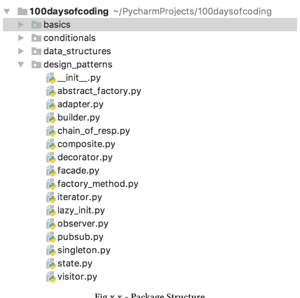

图 x.x - 包结构

很简单，对吧？

## 模块化编程

除了将我们从混乱的代码中简化出来，函数、模块和包允许我们实现**模块化编程**。使用这种方法有很多好处：

- **作用域**，即变量和函数所在的位置（称为**命名空间**）。通过分解变量、函数和模块的*可见性*，可以更好地避免标识符之间的冲突。
- **降低复杂性**，类似于文件夹的例子。通过将代码分解成小块，可以轻松地专注于手头问题的单个方面。
- **可重用性**，即编写一次代码并重复使用两次的能力。没有模块化编程，你将有一个巨大的单块代码。如果你想重用几行代码怎么办？复制粘贴。复制代码不仅痛苦，而且是一种不好的做法（我们将在本书后面更详细地讨论可重用性）。
- **可维护性**：通过将代码逻辑地分割成内聚的小块，并在其上添加一些良好的实践（例如，低内聚，这意味着保持不同软件组件之间的依赖关系最小），代码将更不容易出错，并且随着时间的推移更容易更改、扩展和重用。

## 导入

我们谈到了作用域和可重用性。一个限制可见性，另一个允许重用代码。但我们如何使用可见性有限的代码呢？导入！

让我们处理世界上最简单的导入，如下图所示。

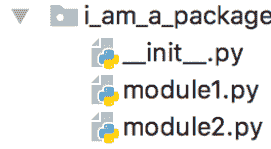

图 x.x - 简单导入

其中*module1.py*是

```python
print('Imports are so cool!')
```

而*module2.py*是

```python
import module1
```

上述代码的输出是：


图 x.x - 简单导入：结果

任务完成！

## 绝对导入与相对导入

## 导入包

## 综合运用

## 今日编程练习

- **热身**
  待定
- **中等难度**
  待定
- **进阶提升**
  待定

> 明天见！

# 变量

如果你是变量的新手，让我们从一个定义开始讨论：

> **变量**是一种用于存储或引用数据的机制，这些数据可以：
>
> 1. 初始化
> 2. 随时间修改
> 3. 引用内存位置
> 4. 被丢弃

换句话说，我们可以将变量定义为：

> 内存中某个位置的符号化（即人类可读的）表示

在Python中创建变量非常简单：

```python
my_first_var = 42
```

如果你已经有其他编程语言的经验，让我们用你的知识作为参考，更好地理解Python在这里做什么。例如，在Java中，变量可以声明为：

```java
int my_first_var = 42
```

Python与其他语言（包括Java、C、C++）之间的一个主要区别是，不需要声明变量的类型。在Java中创建变量时，会执行以下步骤：

1. 嘿！这是一个整数：让我分配足够的内存来存储一个整数
2. 让我引用那个位置
3. 很酷，现在我必须在那个位置保存42

主要的结果（和区别）是，在其他编程语言中，类型要严格得多。因此，Python中的变量可以随时间变化：

- 在数据方面（与其他所有编程语言一样）
- 在类型方面（Python的特性）

事实上，在Python中，像这样的东西：

```python
my_first_var = 42
my_first_var = "I am now a string!"
```

是完全没问题的。

## 引用

让我们深入了解变量发生了什么。变量是对内存中**对象**的**引用**。对象可能是基本类型——例如，*整数*，数据结构，例如*列表*，或自定义对象，即使用*Class*定义的对象。

## 关键字

关键字是 Python 保留的词汇。没错：Python 可以使用它们。而且你只能按照 Python 预设的方式使用它们。以下是关键字列表。

and as assert break
class continue def del
elif else except False
for from finally global
if import is in
lambda None nonlocal not
or pass raise return
True try while with
yield

目前，你只需知道不能将它们用于：
- 标识符，
- 函数名，
- 类名，
- 诸如此类的用途。

它们的具体作用将在本书的各个章节中讲解，所以请继续阅读和学习。

## 命名约定

命名约定作为一个主题，可能值得——单独成章——我确实在《代码审查入门》中这样做了。不过，我会尽量让你在这个问题上保持头脑清醒和安静。
首先，不要跳过本节，虽然内容确实有点啰嗦（我们想要代码！我听到了！）。但它们的存在是有充分理由的：可读性。

## 应避免的事项

规则一：不要使用关键字作为变量名。规则二：不要使用关键字作为变量名。你明白了。

## 转换

以下是 Python 的基本转换规则：

- **包和模块**：全部小写，简洁明了。如果超过一个单词，使用下划线（_）作为分隔符。
- **类**：驼峰命名法（CamelCase）。如果你讨厌 Java，也可以称其为大写单词（CapWords）。
- **变量、函数和方法**：与包和模块的规则相同。不过**混合大小写（mixedCase）**也可以使用。选择哪种？基于：一致性。
- **全局变量**：不要使用它们。如果你真的真的（真的）必须使用它们（最小作用域），那么遵循与普通变量相同的规则集。
- **常量**：在代码中很容易识别：全部大写。例如：

```
1 CONSTANT= 'I am a constant'
```

## 今日编码练习

- **热身**
  待定
- **中等**
  待定
- **进阶**
  待定

明天见！

# Python 对象

类

初始化

属性

方法

函数

## @properties

属性提供了一种*符合 Python 风格*的方式来访问和设置变量（即，getter 和 setter）。

让我们从一个例子开始。

```python
class Book():
    def __init__(self, title):
        self._title = title
```

假设上面的代码需要与另一个收集书名的应用程序集成。我们还假设在某个时候，这个外部应用程序对书名的长度施加了限制：不能超过 20 个字符（一个有点奇怪的约束，但是... 嘿！我们能怎么办呢？！）

因此我们修改代码，以便在设置书名时可以添加约束：

```python
class BookConstraints():
    def __init__(self, title):
        self._title = title

    def get_title(self):
        return self._title

    def set_title(self, new_title):
        if len(new_title) > 20:
            raise ValueError("Title '{}' is too long".format(new_title))
        self._title = new_title
```

查看执行情况：

```python
if __name__ == "__main__":

    book_with_constraints = BookConstraints ("pip install python")
    book_with_constraints.set_title("pip install --target=your:brain python")
```

我们得到以下输出：

```
Traceback (most recent call last):
  ...
ValueError: Title 'pip install --target=your:brain python' is too long
```

它起作用了！但我们有更符合 Python 风格的方式来实现这个结果。

```python
class PythonicBook():
    def __init__(self, title):
        self._title = title

    def get_title(self):
        return self._title

    def set_title(self, new_title):
        if len(new_title) > 20:
            raise ValueError("Title '{}' is too long".format(new_title))
        self._title = new_title
        print("This is magic!")

    title = property(get_title, set_title)
```

注意，最后一行创建了一个属性对象 *title*。实际操作发生在私有属性 *title* 上，然而 *_title*（公有）构成了它的接口。

如果我们运行代码：

```python
if __name__ == "__main__":

    pybook = PythonicBook("pip install python")
    pybook.title = "pip install python"
    pybook.title = "pip install --target=your:brain python"
```

我们得到以下输出：

```
This is magic!

Traceback (most recent call last):
    ...
ValueError: Title 'pip install --target=your:brain python' is too long
```

其中第一次设置通过了检查，因此打印了“*This is Magic*”，而第二次设置触发了我们的错误。

## 今日编码练习

- **热身**
  待定
- **中等**
  待定
- **进阶**
  待定

明天见！

# 多态

多态是面向对象编程中的一个基础概念。它指的是访问相同方法的能力，该方法——根据被调用的对象——呈现不同的行为/输出。

多态应用的一个简单例子是*内置*函数 *type()*。

```python
print(type(1))
print(type('hello'))

>>> <class 'int'>
>>> <class 'str'>
```

## 继承

继承是实现多态的一种方式。具体来说，它使一个对象能够嵌入并可能扩展或重新定义另一个对象的属性。

被继承的类称为：

- 超类，
- 基类或
- 父类。

另一方面，从超类继承的对象称为：

- 子类，
- 孩子类或
- 派生类

继承也可以表示为：

> 一个子类*实现*了一个超类。

以下是继承的一个简单例子。

```python
class Car():
    def move_front(self):
        return 'move front'

    def move_back(self):
        return 'Move back'

    def brake(self):
        return 'Break'

class Berlina(Car):

    def shape(self):
        return 'I can do everything a car can, but with a different shape!'

if __name__ == "__main__":
    car_generic = Car()
    print ('I can: {}, {}, {}'.format(car_generic.move_front(),
                                    car_generic.move_back(), car_generic.brake()))
    car_berlina = Berlina()
    print('I can: {}, {}, {}. {}'.format(car_generic.move_front(),
                                    car_berlina.move_back(),
                                    car_berlina.brake(),
                                    car_berlina.shape()))
```

从逻辑上讲，当*子类*和*超类*之间可以应用“is”关系时，就可以应用继承。

## 这是...Super！

到目前为止，我们看到了如何扩展一个类。然而，我们隐式地使用了另一个方法：*super()*（在前面代码片段的第 21/22 行）。

你可能已经注意到，我们没有为 Berlina 类定义任何 *brake()* 方法，而 *Car* 仍然可以刹车。

这种情况可以通过以下 Python 代码明确说明（不需要，只是为了说明发生了什么）。

```python
class Berlina(Car):

    def shape(self):
        return 'I can do everything a car can, but with a different shape!'

    def brake(self):
        return super().brake()
```

其一般形式（Python 3）是：

```python
super().methodName(args)
```

## 重载

当我们想在子类中为特定函数提供增强版本时，*Super()* 也变得非常方便。

例如：

```python
class CustomBerlina(Berlina):

    def __init__(self):
        self._color = None

    # 重载的一个例子
    def shape(self, color=None):
        super().shape()
        self._color = color
        print('Now I am {}'.format(color))
        return 'Always a Berlina, but I am {}'.format(self._color)

if __name__ == "__main__":
    car_berlina = CustomBerlina()
    print('I can: {}, {}, {}. {}'.format(car_berlina.move_front(),
                                           car_berlina.move_back(),
                                           car_berlina.brake(),
                                           car_berlina.shape('red')))
```

我们所做的就是通过向相对签名添加*可选*参数来**重载**超类的一个方法。

## 方法重写

为了讲解另一个概念（即**重写**），我们来基于Berlina创建一个Limousine。

```python
class Limo(Berlina):

    # 重写示例
    def shape(self):
        print('Just a little of a stretch')


if __name__ == "__main__":
    car_berlina = Limo()
    car_berlina.shape()
```

通过重写方法，我们用子类中指定的代码替换了父类中的代码。

如示例所示，方法签名保持不变（且必须如此），但方法的代码发生了变化。

恭喜！经过一点“拉伸”，我们成功将Berlina变成了Limo！

## 继承类型

## 今日编程练习

- **热身**
  待定
- **中等难度**
  待定
- **进阶挑战**
  待定

## 组合

与继承不同，组合用于对象之间的“拥有”关系。以下代码片段展示了一个简单的组合示例。

```python
class Windscreen():
    def __str__(self):
        return 'windscreen'

class Gear():
    def __str__(self):
        return 'gear'

class Car():
    def __init__(self):
        self._windscreen = Windscreen()
        self._gear = Gear()

    def __str__(self):
        return 'I have : {} and {}.'.format(self._windscreen, self._gear)


if __name__ == "__main__":
    car = Car()
    print(car)
```

## 经验法则

在权衡继承与组合时，一个常用的原则是：

> 为实现多态，应优先选择组合而非继承。

组合通常提供更灵活的设计，因此从长远来看更易于维护。不仅基于组合的设计可能更容易编写，它还能适应未来的需求和变化，而无需完全重构层次结构。

## 今日编程练习

- **热身**
  待定
- **中等难度**
  待定
- **进阶挑战**
  待定

明天见！

# 条件流程

条件语句用于在逻辑上改变代码的“*正常*”执行路径。

最常用的条件语句是：

- *if语句*
- *循环*（我们将在下一章讨论）

条件语句使用数学运算，例如：

- 等于：$a == b$
- 不等于：$a != b$
- 小于：$a < b$
- 小于或等于：$a <= b$
- 大于：$a > b$
- 大于或等于：$a >= b$

以在特定运行时条件发生时强制改变流程。

一个简单的例子：

```python
a = 10
b = 1
print(a==b)

b = 10
print(a==b)

>>> False
>>> True
```

上述代码的行为与其显式版本完全相同：

```python
if a==b:
    print(True)
else:
    print(False)
```

## If语句

这也是我们第一个*if语句*示例。其一般形式为：

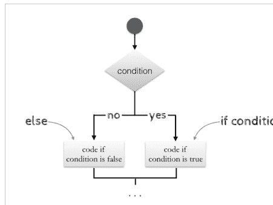

图 n.n - 基本if流程

相关伪代码：

```python
if condition_is_true:
    print(True)
    # 条件为真时的代码流程
else:
    print(False)
    # 否则的代码流程
```

## 多重检查

流程也可以通过使用*elif*进一步改变：

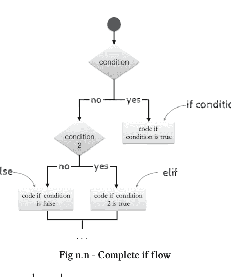

相关伪代码：

```python
if condition_is_true:
    print(True)
    # 条件为真时的代码流程
elif condition_2_is_true:
    print(True)
    # 条件2为真时的流程
else:
    print(False)
    # 条件和条件2都不为真时的代码流程
```

总之，*if/elif*结构允许进行级联检查。Python还支持*AND*和*OR*运算符来同时执行多个检查。当需要在例如上述示例中*condition*或*condition2*任一为真时应用相同行为时，这非常方便。

在这种情况下，前面的代码片段可以重写为：

```python
if condition or condition_2:
    print(True)
    # 条件为真时的代码流程
else:
    print(False)
    # 条件和条件2都不为真时的代码流程
```

## 成员关系

Python还支持对结构化数据进行更复杂的检查，包括：

- 成员关系：*in*
- 非成员关系：*not in*

使用形式如下：

```python
if condition in data:
    # 执行某些操作
else:
    # 执行其他操作
```

使用成员关系的一个简单例子是：

```python
i = 3
if i in range(5):
    print('I am included in the range!')
```

## 今日编程练习

热身
编写一个Python程序，输入一个字母*l*，打印出*l*是元音还是辅音。

中等难度
编写一个Python程序，输入一个对象*o*，检查其类型（字符串、整数或都不是）。

提示：研究一下*isinstance()*的工作原理。

进阶挑战
待定

明天见！

# 循环

循环是一种在满足条件之前多次应用通用逻辑（代码块）的方式。
循环的流程图如下所示：

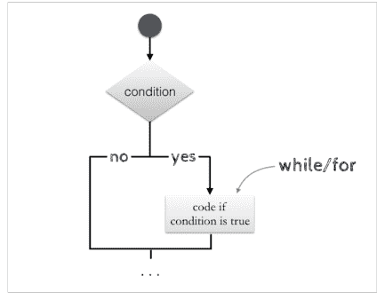

图 n.n - 基本if流程

Python支持两种类型的循环：

- while
- for

## While

*while*结构的语法如下：

```python
while condition:
    # 重复执行的代码块
    ...
```

## For

*for*结构的语法如下：

```python
for condition:
    # 重复执行的代码块
    ...
```

## 进一步修改流程

### Break

**Break**和**continue**是另外两个用于改变循环流程的语句。

```python
for i in range(10):
    if i == 4:
        print('Got bored: interrupting the loop')
        break
    print('Iter {} - Looping again!'.format(i))
```

上述代码的输出为：

```
>>> Iter 0 - Looping again!
>>> Iter 1 - Looping again!
>>> Iter 2 - Looping again!
>>> Iter 3 - Looping again!
>>> Got bored: interrupting the loop
```

Break会中断循环，即使条件（在我们的例子中是*i in range(10)*）仍然为真。

### Continue

**Continue**允许在特定条件为真时跳过当前迭代。回到我们之前的例子，使用continue代替break。

```python
for i in range(10):
    if i == 4:
        print('Got bored: interrupting this iteration')
        continue
    print('Iter {} - Looping again!'.format(i))
```

上述代码的输出为：

```
>>> Iter 0 - Looping again!
>>> Iter 1 - Looping again!
>>> Iter 2 - Looping again!
>>> Iter 3 - Looping again!
>>> Got bored: interrupting this iteration
>>> Iter 5 - Looping again!
>>> Iter 6 - Looping again!
>>> Iter 7 - Looping again!
>>> Iter 8 - Looping again!
>>> Iter 9 - Looping again!
```

因此，它只跳过了第五次迭代。

### pass

_pass语句_允许代码变得“懒惰”，什么都不做。什么都不做！例如：

```python
import time

start = time.time()
for i in range(5):
    # 忙等待
    time.sleep(1)
    pass

print('I have been doing nothing for {} seconds.'.format(time.time()-start))
```

输出将是：

```
I have been doing nothing for 5.01263427734375 seconds.
```

与break和continue不同，pass也可以在方法或函数内部使用，使其（再次）什么都不做。

```python
def feeling_lazy():
    pass
```

## 今日编程练习

- **热身**
  待定
- **中等难度**
  待定
- **进阶挑战**
  待定

> 明天见！

## 错误处理

## 今日编程练习

- **热身**
  待定
- **中等难度**
  待定
- **进阶挑战**
  待定

明天见！

# 文档

剧透警告：文档和注释——如果做得好——很重要。咕哝，咕哝。

本章将直奔主题：如何编写好的注释来支持你的同事和……未来的你！我们将介绍一些不良实践，并提供如何编写文档的指导……以确保其真正有用。

## 语法

与其他编程语言类似，Python 支持两种类型的注释：* **行内注释**，通过在实际注释前放置 # 字符实现（单行）；* **扩展文档**，通过将多行文本包裹在 """ 中实现。

到目前为止，我们已经见过 *行内* 注释，但为了完整性，这里提供一个这种注释风格的示例。

```
while condition:
    # 我是一个行内注释
    ...
```

扩展文档的示例如下所示。

```
"""
我是一个扩展文档。
在此例中，我为以下函数编写文档。
嘟囔嘟囔。
"""

def mumble_mumble():
    pass
```

扩展文档也被称为 *文档字符串*。

## 如果代码写得好，我不需要注释的哲学

有人推崇“*如果代码写得好，我不需要注释*”的哲学。这在一定程度上是正确的，拥有一段优秀的代码当然是正道（毕竟，这本书讲的就是编写良好的代码）。然而，这种哲学可能只适用于非常小的代码库。

一旦代码规模增长，你可能最终需要逐行阅读代码，以理解你需要构建的每一部分。如果代码写得很好，但实现的是复杂算法呢？如果命名也不规范，你就是在为你未来的自己和你的同事埋下失败的种子。

我绝不推荐写长达数页的注释，但注释应该存在并且写得好（如下文所述），即使是对于好的代码。另外一点：人们会抱怨文档不全的代码，但他们不会抱怨描述过于详细的注释。

## 条件与流程

注释的目的是说明方法/过程如何执行其任务。它们不是用来惩罚写得一般的代码的。注释是一种用通用语言简洁地抽象代码内部工作的方式。并且，用前置条件和后置条件来补充注释是有益的。

**前置条件**定义为在调用方法或函数时需要成立的一组条件。

**后置条件**是描述方法或函数执行完其职责后状态的陈述。

将它们嵌入注释中，不仅从可读性角度有益，而且在测试设计时也会有所帮助。例如，考虑这样一种场景：团队中有一部分人专注于设计和开发测试。在这种情况下，如果能明确指定调用前后需要成立的条件，对他们来说肯定能节省成本。他们检查边界情况、可能的错误以及设计整体更好、更完整的测试用例，肯定会更快、更容易。

清晰的前置和后置条件也有助于定义代码块的**流程**（即逻辑）。应该期待什么？记录流程还应包括任何引发的异常。是的，请务必告诉我，我使用的代码是否可能在某个点“爆炸”。

## 输入/输出定义

注释应清楚地记录输入和输出的类型。对于像 Python 这样的动态类型语言尤其如此。让我们看下面的代码片段。这是一个命名一般以及因文档中缺少类型定义而造成混淆的例子。

```
def add(first, second):
    # 方法体
    ...
```

很明显，这个方法执行的是加法操作。然而，输入的类型不清楚。这些是操作数吗？是整数吗？浮点数？字符串？这个方法是否对数据结构执行更复杂的操作？参数 first 可能是一个字典、一个列表或其他任何东西，它可能执行更复杂的操作将参数 second 添加到其中。或者它们可能都是数据结构，而这个方法是将第二个数据结构的元素添加到第一个中。

是的，你可以阅读代码来理解输入的类型。这是最有效的解决方案吗？在这个例子中，代码片段很简单，所以是的，花点时间检查一下就行。否则，我们就又回到了“如果代码写得好，我不需要注释”哲学的后果。

你可能还会想：“嗯……如果我改进参数的名称（first 和 second），我就可以避免写注释了吗？”答案仍然是：可能不行。方法的抽象能力怎么办？它的可复用性呢？当然，这可能取决于上下文。但经验法则是，清楚地说明输入/输出的类型。

## 行内注释

太多的行内注释，而不是——举个例子——在方法顶部写一个清晰的注释，会让我抓狂。这并不意味着要不惜一切代价避免行内注释。它们应该在真正需要的地方出现。无论如何，当一个方法可以用文档字符串有效描述时，我肯定会选择这个选项。

时不时地，太多的行内注释也可能暗示代码中存在其他问题。确实，这可能是代码过于复杂、过长、实现了不止一个功能的情况。当你不容易简短而有效地描述你写的代码时，请再次检查代码。它是否只实现了一个功能？它是否太长？是否可以拆分？如果是这样，你就有不止一个缺陷需要修复。

## 待办事项

行内注释也用于标记需要调试、测试或通常需要改进的代码块。换句话说，它们就是我们方便使用的 TODO 和 FIX-ME 注释，我们在代码中引入它们，以避免打断我们编写最具创造性、最高效的编码艺术作品的过程。
一个不错的例子可以是：

```
def my_magnificent_method():
    # TODO: 给我加注释，Giuliana 是这么说的
    ...
```

即使我很乐意阅读这样的代码，也请不要等上十年才修复任何 TODO 和 FIX-ME。它们本应是临时的，也应该保持如此。更重要的是，在你发布的代码中，不要有 TODO 和 FIX ME。

## 这很明显

写注释是好的。写好注释是极好的！然而，对显而易见的事情进行注释是不合适的。如果代码真的很简单，就没有必要逐行注释。考虑以下示例：

```
...
# 获取本书的术语表
glossary = book.get_glossary()
# 检查我们正在查找的关键字
if keyword in glossary:
    # 返回关联的定义
    return glossary[keyword]
else:
    # 返回 None，因为关键字不在术语表中
    return None
...
```

代码在做什么是显而易见的，良好的变量命名很有帮助。非常有帮助。更好的注释风格应该是：

```
...
# 如果关键字存在，则返回其定义。
# 否则返回 None。
glossary = book.get_glossary()
if keyword in glossary:
    return glossary[keyword]
else:
    return None
...
```

这样可读性更强，不是吗？

## 你刚刚对那个程序员撒谎了吗？

注释本质上是值得赞扬和奖励的。它们确实如此。写出好的注释，让程序员能够轻松理解功能并一目了然，这是好事，但撒谎是绝对不行的。

如果你写了顶级的注释，但你在其中撒谎，我欣赏你的幽默感。我真的欣赏。但请不要这样做。

## 注释驱动开发

注释驱动开发以首先编写代码的纯文本描述，然后才是实际实现为中心。它们有助于集思广益解决方案，设定清晰的输入和输出，并描述将要实现的功能类型。

打个比方，想想教某人某事。为了用自然语言恰当地表达某个概念，你必须对它有很好的理解。CDD 也是如此：只有当你认真思考过那段代码将要实现什么时，你才能写出注释。

此外，很多时候我们灵感迸发，开始不由自主地输入一行又一行代码，结果到最后才发现，我们必须回到过去，才能记起它们原本应该做什么。

即使我不认为实施CDD是绝对必要的，它也可能派上用场。

## 编码规范

一些编码规范，例如Python的PEP8 [Python Software Foundation]，仅要求公共模块、函数、类和方法必须包含文档字符串。对于私有或受保护的部分，文档字符串是可选的，通常在函数签名之后添加注释来描述该方法。

一旦你确定了项目将使用的语言，就应查阅编码规范并严格遵守。

## 今日编码练习

- ☕ **热身**
  待定
- **中等**
  待定
- 💣 **进阶**
  待定

明天见！

## 第二部分 - 算法

## 引言

到目前为止，我们学习了Python语法的主要元素及其背后的逻辑：它们的作用和使用方法。
然而，如果不放在解决问题的背景下，语法本身毫无意义。
算法，甚至在编写第一行代码之前，就可以被定义为一种逻辑上解决问题的方法。
更广泛地说，算法可用于解决并应用于各种应用场景。
在本章中，我们将学习：

- 算法背后的基础知识，包括性能如何定义；
- 你作为程序员可能会遇到的一些算法类别。

你可能会想：为什么我需要了解算法？

剧透警告：嗯，大多数面试都会问到算法。
玩笑归玩笑，有些应用乍一看可能并不明显，但它们可以在许多现实场景中使用。

## 递归

## 今日编码练习

- **热身**
  待定
- **中等**
  待定
- **进阶**
  待定

明天见！

## 迭代

---

## 今日编码练习

- **热身**
  待定
- **中等**
  待定
- **进阶**
  待定

明天见！

## 贪心算法

思考贪心

## 今日编码练习

- **热身**
  待定
- **中等**
  待定
- **进阶**
  待定

明天见！

## 动态规划

## 今日编码练习

- **热身**
  待定
- **中等**
  待定
- **进阶**
  待定

明天见！

### NP难问题

自第一种编程语言诞生以来，我们编写了海量的代码，这些代码被使用、重用，甚至被误用。

然而，如此多的问题都是NP难的。这难道不令人着迷吗？

## 今日编码练习

- **热身**
  待定
- **中等**
  待定
- **进阶**
  待定

明天见！

## 第三部分 - 数据结构

## 引言

欢迎来到对最美丽的艺术作品之一的介绍：数据结构！

### 数据结构简介

数据结构存在于任何一段代码中，即使是最简单但有用的代码也不例外。它们在构建你的编码技能方面扮演着重要角色。在选择和使用它们时，需要考虑许多权衡和场景。当它们被恰当地实现在你的代码上下文中时，可以带来以下好处：

- 可读性：使用合适的数据结构可以让你避免过度复杂化代码，从而提高代码的易读性和易理解性。
- 更好的整体设计。从项目需求开始思考数据结构是基础，它允许组织良好的数据，并在时间和内存方面提升性能。值得进一步强调的是，性能不应是编码过程中的事后考虑。因此，数据结构越合适，你的代码就越优化、越有效、越高效。

主要数据结构总结在下表中，以及它们对于基本操作（包括：访问、插入、删除、搜索）的相对平均时间复杂度。

| 数据结构 | 访问 | 插入 | 删除 | 搜索 |
|---|---|---|---|---|
| 数组 | O(1) | O(n) | O(n) | O(n) |
| 链表 | O(n) | O(1) | O(1) | O(n) |
| 双向链表 | O(n) | O(1) | O(1) | O(n) |
| 队列 | O(n) | O(1) | O(1) | O(n) |
| 栈 | O(n) | O(1) | O(1) | O(n) |
| 哈希表 | 常数（平均） | O(1) | O(1) | O(1) |
| 二叉搜索树 | O(log n) | O(log n) | O(log n) | O(log n) |

表 3.1 - 时间复杂度（平均）

## 数组

数组是最简单和最常用的数据结构之一。它由一组元素组成，可以通过它们的位置（即*索引*）来访问。数组可以是*线性*（即单维）或*多维*（例如，矩阵）。

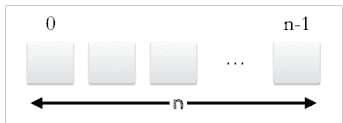

**图 3.2 - 数组**

数组通常是固定大小的（即，它们包含多少元素），这在初始化时定义。它们是同构的数据结构。换句话说，它们只支持单一类型（例如，所有整数）。

一些语言支持动态大小以及不同的数据类型。在Python中，这种经典数组的变体被称为*列表*。列表的底层实现与数组不同，在本节的剩余部分，我们将使用更灵活的列表作为示例。在Python中，列表定义如下：

```python
array = [1, "string", 0.2]
```

所有类型都被妥善管理：

```python
type(array[0])
>>> <type 'int'>

type(array[1])
>>> <type 'str'>

type(array[2])
>>> <type 'float'>
```

它们有若干优点和缺点。
使用这种数据结构的好处来自于它们的简单性和对元素的线性访问，如*表 4.1*所示——其中 *n* 是列表中的元素数量。
主要缺点是，由于需要移位操作，从列表中插入和删除项目代价高昂。最坏的情况如下：考虑删除列表中索引为0的第一个元素。此操作会创建一个空位。为了维护索引和顺序，索引为1及之后的所有项目都需要向后移动一个位置。这给我们带来了 *O(n)* 的复杂度。插入操作也有类似的考虑。

### 内部实现

## 今日编码练习

## 热身

给定一个整数数组A作为输入，将其逆序打印。

示例

A = [1,2,3,4,5]

打印结果：

5 4 3 2 1

# 中等

给定一个整数数组A作为输入，在不使用内置函数的情况下将其逆序并打印。

示例

A = [1,2,3,4,5]

逆序后：

A = [5,4,3,2,1]


# 进阶

给定两个数组 $A$ 和 $B$，计算 $B$ 作为 $A$ 元素子集的出现次数。

示例 1

A = [1,1,1,1,1]

B = [1,1]

出现次数 = 4

示例 2

A = [0,1,1,0,1,0]

B = [0,1]

出现次数 = 2

明天见！

## 链表

链表是一个节点的集合，其中每个节点由一个*值*和一个指向列表中下一个节点的*指针*组成。

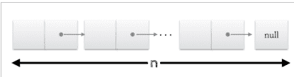

图 3.3 - 链表

与数组相比，*添加*和*删除*操作实现了稍微复杂的逻辑——但由于不需要移位。具体来说，从列表中删除一个项目可以通过更改需要删除元素之前的元素的指针来实现。前一个元素需要指向需要从列表中删除的元素之后的元素。时间复杂度在最坏情况下仍然是 *O(n)*。确实，由于我们失去了数组提供的索引直接访问，为了找到需要删除的项目，我们需要遍历整个列表直到找到它的前驱。删除列表的最后一个元素代表了最坏的情况。

### 内部实现

## 今日编码练习

- **热身**
  待定
- **中等**
  待定
- **进阶**
  待定

明天见！

### 双向链表

双向链表与前一种类似。然而，每个元素（也称为节点或项）还存储一个指向列表中前一个元素的指针。

## 内部原理

## 今日编程练习

- **热身**
  待定
- **中等难度**
  待定
- **进阶**
  待定

> 明天见！

## 栈

栈是一种按照*后进先出*（LIFO）策略管理的元素集合。其内部实现方式多样，可以使用数组或链表来实现。

栈这种数据结构主要暴露三个方法：

1.  `top()`，返回栈顶元素，
2.  `pop()`，移除并返回栈顶元素，
3.  `put()`，在栈顶添加一个新元素。

得益于其LIFO策略，许多问题尤其适合利用栈来解决，例如模式验证（如括号匹配表达式）以及一般的解析问题。

## 内部原理

## 今日编程练习

## 热身

给定一个整数数组A，使用栈将其元素逆序打印。

示例

A = [1,2,3,4,5]

打印结果

5 4 3 2 1

## 中等难度

待定

# 进阶

实现一个栈类，并提供主要方法的逻辑：`top()`、`pop()` 和 `put()`。

> > 明天见！

## 队列

队列被定义为一种按照*先进先出*（FIFO）策略管理的元素集合。与栈类似，它也可以使用数组或链表来实现。

队列提供了三个主要方法，其作用与栈的方法类似：

1.  `peak()`，返回队列中的第一个（从左到右）元素，
2.  `remove()`，移除并返回第一个元素，
3.  `add()`，在队列末尾添加一个新元素。

队列常用于并发编程，其中多个任务需要执行，也用于消息交换模式。更广泛地说，队列非常适合需要保持顺序的场景，因此受益于FIFO方法。

## 内部原理

## 今日编程练习

- **热身**
  待定
- **中等难度**
  使用栈实现队列的主要方法。
- **进阶**
  待定

明天见！

## 哈希表

哈希表对数据的存储策略截然不同：每个元素被分解为一个（键，值）对。

尽管内部逻辑更为复杂，但使用哈希表的主要好处在于，它能在平均情况下以 $O(1)$ 的时间复杂度完成插入、删除和查找操作。

正如这种数据结构的名称所示，键根据其**哈希码**存储在特定位置（也称为*槽*）。插入新元素时，会对键应用一个哈希函数，生成一个*哈希码*，然后用它来放置并关联相应的输入值。

不同的实现可以使用不同的哈希函数。但它们有一个共同特点：相同的键必须始终对应唯一的一个哈希码。一个好的哈希函数还必须尽量减少两个不同键对应相同哈希码的情况，这种情况会产生**冲突**。

同样值得注意的是，运行时性能的提升严格依赖于哈希函数的强度。实际上，一个健壮的哈希函数的另一个特点是它能够均匀地分布所有可用的槽，即**桶**（例如，一个键数组）。
哈希表在许多现实场景中表现出色。

## 内部原理

## 今日编程练习

- **热身**
  待定
- **中等难度**
  待定
- **进阶**
  待定

## 明天见！

## 二叉搜索树

树是另一种在建模现实场景时相当常用的数据结构。

形式上，树是一个元素的集合，其中每个元素都有一个*值*和指向其他节点（即*子节点*）的可变数量的*指针*。树中的节点以*自上而下*的方式组织，这意味着指针通常将节点从*顶部*链接到*底部*，并且每个节点只有一个指向它的指针。

顶部的节点称为树的*根*。最底部的节点没有*子节点*，称为树的叶子。

许多问题需要一种特定类型的树：*二叉树*。二叉树与普通树的区别在于，二叉树中的每个节点最多有两个*子节点*，即*左*子节点和*右*子节点。

当需要排序时，会使用二叉树的一种扩展：*二叉搜索树*。二叉搜索树通过在其元素间嵌入排序规则来构建，使得对于每个节点：

- 左子节点的值始终小于或等于该节点的值；
- 右子节点的值始终大于或等于该节点的值。

正如这种数据结构的名称所示，其使用带来的好处在需要快速搜索元素时显现出来。

这得益于节点创建时强制执行的排序，它允许在搜索的每一步（在*平均*情况下）排除掉一半的树。

总的来说，递归问题非常适合用树来建模。

## 内部原理

## 今日编程练习

- **热身**
  待定
- **中等难度**
  待定
- **进阶**
  待定

明天见！

## 要点总结

本章关于数据结构的内容并非旨在成为一本数据结构教科书。它旨在为你提供一个快速而实用的介绍，讲解如何在常见场景中使用数据结构。

我很想在结束本章时，也为你提供一些指标，以便在选择一种数据结构而非另一种时作为参考：

- 数据的规模，
- 数据变化的频率及其类型，
- 在你的上下文中哪些操作更频繁。

一些经验法则：

1.  不要强行使用某个给定数据结构的API。如果你正在考虑用它不原生支持的操作来扩展它，那么你可能最好切换到另一种数据结构；
2.  不要只考虑你当前面临的场景。要从长远考虑。在思考数据规模及其未来可能如何演变时，这一点很常见。
3.  使用80/20帕累托原则来帮助你选择最佳的数据结构。这对于优化目的很有用。你最常执行哪个操作？那么它通常就需要被优化。
4.  不要过度复杂化。更复杂的数据结构仍然需要更多的内存管理和处理。

## 延伸阅读

我热爱数据结构。市面上有许多精彩的书籍，它们更深入地探讨了各种数据结构以及通用的算法。如果还没读过，[Cormen等人]的著作是必读的。

## 第四部分 - 设计模式

## 引言

在本书的这一部分，我们将探讨一些关于软件架构的通用概念，具体包括：

- 常见且广泛使用的设计模式；
- 注意事项与禁忌；
- 在设计阶段可能遇到的主要问题。

## 设计模式

让我们来改善一个糟糕的架构。改进设计的常用方法之一是使用合适的设计模式。模式仅仅是组织概念性问题及其相关代码以解决常见问题的一种方式。

它们被分为4个主要类别：

- **创建型**，旨在专注于对象创建的设计模式；
- **结构型**，简化并优化不同对象之间的关系；
- **行为型**，为组件间的通信建立通用模式；
- **并发型**，专门设计用于解决多线程场景。

在本节中，我们将学习前三个类别中的常见模式，如下表所示。

并发模式有点超出范围，不是本书的一般目标。然而，关于并发编程的基础知识将在*并发、并行与性能*章节中讨论。

## 创建型

在本节中，我们将探讨一些主要的*创建型*设计模式。

| 类别 | 模式 |
| :--- | :--- |
| 创建型 | 单例<br>懒初始化<br>建造者<br>抽象工厂<br>工厂方法 |
| 结构型 | 适配器<br>装饰器<br>外观<br>组合 |
| 行为型 | 观察者<br>发布-订阅<br>迭代器<br>访问者<br>状态<br>责任链 |

## 单例

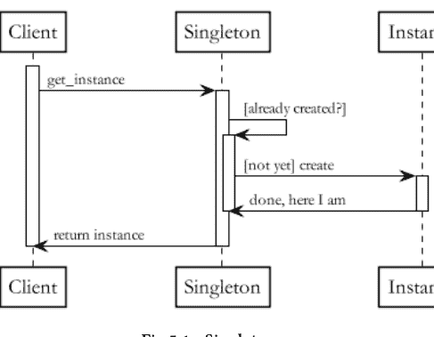

**单例**是你能学到的最简单的模式。它的目标是限制一个类的实例数量。

这个目标是通过将类的构造函数声明为*私有*来实现的。取而代之的是，使用一个*get_instance()*方法来创建单例对象。这个方法确实只会在第一次调用时实例化对象。后续的调用将导致该方法简单地返回之前创建的实例。

当需要对资源（例如，并发）进行共享但受控的访问时，单例可能很有用。一般来说，当需要创建一个且仅一个对象时，就会实现单例。一个简单的场景包括日志记录。

## 代码

以下代码片段提供了Python中单例模式的一个简单实现。

```python
class Singleton:

    def __init__(self):
        if Singleton.__instance:
            raise Exception("I am a singleton!")
        else:
            Singleton.__instance = self

    @staticmethod
    def get_instance():
        if not Singleton.__instance:
            Singleton()
        return Singleton.__instance
```

# 注意事项

单例的声誉并非最佳，在少数情况下被指出是一种“代码异味”。原因之一是，如果实现不当，程序员可能会陷入“第一夫人”异味的陷阱。换句话说，一个单例——如果被滥用——可能导致一个庞大的组件试图自己完成所有事情。就像地球上几乎所有事物一样，我并不认为单例本身有问题。互联网可以用于好的方面，也可以用于坏的方面。单例可以被善用，也可以被滥用。

然而，如果你发现自己随着时间的推移不断增长单例的逻辑，那么你可能正在为试图解决的问题使用错误的模式。

## 今日编码练习

- ☕ **热身**
  待定
- 🅼 **中等**
  待定
- 💣 **进阶**
  待定

> > 明天见！

## 懒初始化

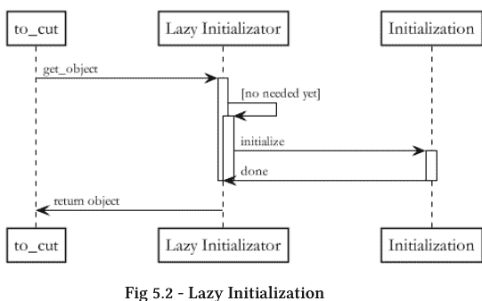

懒初始化模式的目标是仅在真正需要时才实例化对象。

这种模式不是在构造函数中创建对象，而是在对象首次通过其某个方法被调用时才调用构造函数。

这种模式背后的主要原理是，对象创建中涉及的一些逻辑可能计算量很大。因此，通过将其推迟到真正需要执行的时刻，可以优化性能。

*懒加载*是这种模式应用于数据库（DB）的一个常见变体和实现。你会提前加载整个数据库并将其放在手边以防需要吗？不，不会。因此，懒加载只在需要实际计算时检索所需的数据部分并将其存储在内存中。

## 代码

以下代码片段提供了Python中懒初始化的一个示例。

```python
class MyHeavyObject:
    def __init__(self):
        self._heavy = []

    @property
    def heavy(self):
        if not self._heavy:
            print('I am doing heavy computation.')
            # expensive computation
            ...
```

# 注意事项

对于大多数模式：不要过度复杂化你的解决方案。具体来说，如果你有性能瓶颈（例如，经常访问的小而简单的对象），不要使用懒初始化。

## 今日编码练习

- ☕ **热身**
  待定
- 🅼 **中等**
  待定
- 💣 **进阶**
  待定

> > 明天见！

## 建造者

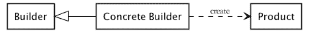

**建造者**模式遵循*KISS*（保持简单，愚蠢）原则，将复杂对象的创建分解为更小的、分离的创建任务。

具体来说，*建造者*模式提供了一个外部接口，允许将复杂对象的创建作为单个任务。然而，它内部使用所谓的*具体建造者*来处理将大对象分解为更小对象的过程，每个具体建造者执行整个处理管道中的一个步骤。

因此，当要构建的对象可以通过任意数量的任务来构造时，这种模式很有帮助。

## 代码

下面的示例代码展示了笔记本电脑的创建。实际上，笔记本电脑可以分解为几个需要按顺序执行的创建任务，以获得最终产品，例如CPU、内存、硬盘等。

```python
# Abstract Builder
class Builder(object):
    def __init__(self):
        self.laptop = None

    def new_laptop(self):
        self.laptop = Laptop()


# Concrete Builder
class BuilderVirtualLaptop(Builder):
    def build_cpu(self):
        self.laptop.cpu ='whatever cpu'

    def build_ram(self):
        self.laptop.ram = 'whatever ram'

    ...


# Product
class Laptop(object):
    def __init__(self):
        self.cpu = None
        self.ram = None
        ...

    # print of laptop info
    def __repr__(self):
        return 'Laptop with cpu = {} and ram = {}'.format(self.cpu, self.ram)

# Director
class Director(object):
    def __init__(self):
        self.builder = BuilderVirtualLaptop()

    def construct_laptop(self):
        self.builder.new_laptop()
        self.builder.build_cpu()
        self.builder.build_ram()
        ...

    def get_building(self):
        return self.builder.laptop

#Simple Client
if __name__=="__main__":
    director = Director()
    director.construct_laptop()
    building = director.get_building()
    print building
```

# 注意事项

定义相当简单，因此请坚持使用它，同时要考虑到采用这种设计模式有一些小缺点，包括编写更多的代码行（LOCs）。一个建造者不合适的信号是，当*建造者*构造函数有一个很长的参数列表，需要处理每个*具体建造者*时。

## 今日编码练习

- ☕ **热身**
  待定
- 🅼 **中等**
  待定
- 💣 **进阶**
  待定

> > 明天见！

## 抽象工厂

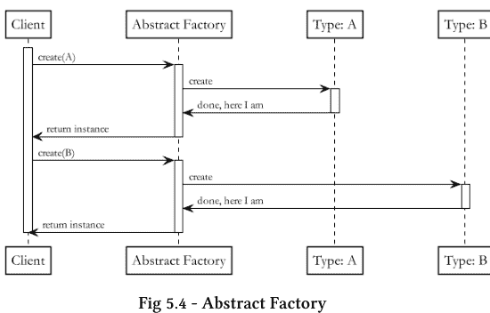

**抽象工厂**模式在需要构建同一对象的略有不同的版本时，隐藏了对象创建的复杂性。

换句话说，*抽象工厂*组件内部管理着代表最终对象不同变体的不同组件。

一个（非常）形象的例子是操作系统（OS）的情况。操作系统可以被建模为一个*抽象工厂*，它返回其支持的不同变体（不同组件）之一的实例（例如，Linux、Mac、Windows）。

一般来说，每当我们想要支持概念上单一对象的扩展时，都可以使用这种模式。

## 代码

Python实现的示例如下。

```python
# Interface for operations supported by the factory
class AbstractFactory():

    def create_linux(self):
        pass

    def create_win(self):
        pass

# Concrete factory. Managing object creation.
class ConcreteFactoryOS(AbstractFactory):

    def create_linux(self):
        return ConcreteProductLinux()

    def create_win(self):
        return ConcreteProductWin()

# Abstract Linux product
class AbstractProductLinux():

    def interface_linux(self):
        pass

# Concrete linux product
class ConcreteProductLinux(AbstractProductLinux):

    def interface_linux(self):
        print 'running linux'

# Abstract win product
class AbstractProductWin():
```

## 工厂方法

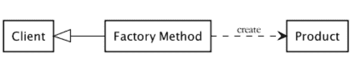

此模式与抽象工厂类似，因此常被混淆。猜猜看？此模式并非构建一个*工厂*对象，而是可以概括为一个*工厂*（实际）方法。

工厂方法与抽象工厂不同，它不处理不同子对象的组合，而是旨在创建一个隐藏内部细节的对象，同时它本身是一个具体的单一产品。

## 代码

以下代码片段展示了该模式的一个简单实现。

```python
# First Product
class ProductA(object):
    def __init__(self):
        print ('Building Product A')

# Second Product
class ProductB(object):
    def __init__(self):
        print ('Building Product B')
```

```python
# Factory Method
def factory_method(product_type):
    if product_type == 'PA':
        return ProductA()
    elif product_type == 'PB':
        return ProductB()
    else:
        raise ValueError('Cannot find: {}'.format(product_type))

# Client: testing out
if __name__ == '__main__':
    for product_type in ('PA', 'PB'):
        product = factory_method(product_type)
        print(str(product))
```

# 注意事项

建议遵循相同的准则：当不需要对象抽象时，不要选择工厂。

## 今日编码练习

- **热身**
  待定
- **中等**
  待定
- **进阶**
  待定

明天见！

# 结构型

本节将介绍主要的*结构型*模式。我喜欢将这一类别想象成一个大拼图。你已经有了现成的接口和代码，但你仍然需要让所有组件以最佳方式交互和工作。以下模式有助于实现这一点。

| 类别 | 模式 |
|---|---|
| 结构型 | 适配器 |
| | 装饰器 |
| | 外观 |
| | 组合 |

## 适配器

拼图的一块。

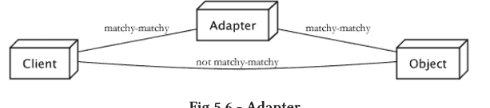

# 是什么

适配器也称为*包装器*。它包装另一个对象，重新定义其接口。

# 如何实现

一个新类简单地封装了不兼容的对象，从而提供了所需的接口。

以下是该模式的一个通用实现。

```python
# Adapter: our wrapping class
class Adapter:

    def __init__(self):
        self._adaptee = Adaptee()

    def request(self):
        self._adaptee.legacy_request()

# Adaptee: existing interface
class Adaptee:

    def legacy_request(self):
        print 'Matchy-matchy now! yay!'

# Client: testing out
if __name__ == "__main__":
    adapter = Adapter()
    adapter.request()
```

# 何时使用

它提供了一种解决不同接口之间兼容性问题的简单方法。假设一个*调用者*期望从某个对象（*被调用者*）获得不同的接口，可以通过*适配器*使其兼容。它们对于遗留软件非常有用。它以较低的成本实现了可重用性。

# 注意事项

相当简单，留给读者自行体会。

## 今日编码练习

- **热身**
  待定
- **中等**
  待定
- **进阶**
  待定

明天见！

## 装饰器

一些软件工艺。

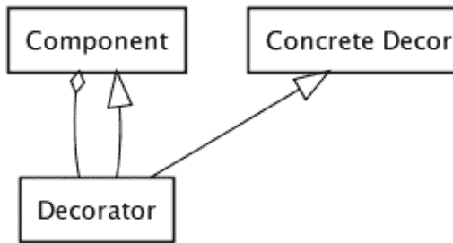

# 是什么

装饰器也通过增强对象行为来实现可重用性。

# 如何实现

与前一个模式类似，它包装对象并添加所需的功能。

以下代码片段展示了装饰器的一个简化示例。

```python
# Decorator interface
class Decorator:
    def __init__(self, component):
        self._component = component

    def operation(self):
        pass

# Decorator
class ConcreteDecorator(Decorator):
    """
    Add responsibilities to the component.
    """

    def operation(self):
        self._component.operation()
        print 'And some more makeup!'

# Component that needs to be decorated
class Component:

    def operation(self):
        print 'I have some makeup on!'

# Client: testing out
if __name__ == "__main__":
    component = Component()
    decorator = ConcreteDecorator(component)
    decorator.operation()
```

# 何时使用

它有助于解决“第一夫人组件”代码异味。因此，它在保持单一职责原则的同时，为对象添加功能。实际上，装饰器允许在不影响被装饰组件的情况下添加额外行为。

# 注意事项

简单而强大，无需多言。但是，不要让装饰器成为新的“第一夫人”。

## 今日编码练习

- **热身**
  待定
- **中等**
  待定
- **进阶**
  待定

明天见！

## 外观

整合一切。

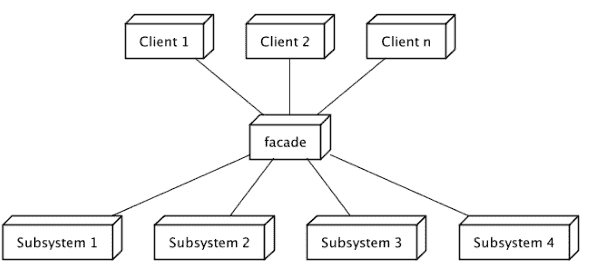

图 5.8 - 外观

# 是什么

外观在某种程度上可以理想地与抽象工厂相关联。然而，它不是创建对象，而是为其他更复杂的接口提供一个更简单的接口。

# 如何实现

此模式提供了一个全新的更高级别的接口，以使子系统（通常是具有复杂逻辑的独立类）更易于使用和交互。

```python
# Facade
class Facade:

    def __init__(self):
        self._subsystem_1 = Subsystem1()
        self._subsystem_2 = Subsystem2()

    def operation(self):
        self._subsystem_1.operation1()
        self._subsystem_2.operation2()

# Subsystem
class Subsystem1:

    def operation1(self):
        print 'Subsystem 1: complex operations'

# Subsystem
class Subsystem2:

    def operation2(self):
        print 'Subsystem 2: complex operations'

# Client
if __name__ == "__main__":
    facade = Facade()
    facade.operation()
```

# 何时使用

如果你审视自己的架构，发现它耦合度很高，那么外观模式可能有助于降低耦合度。

# 注意事项

很容易创建一个充当“单身女士”的外观，请务必避免这种情况。

## 今日编码练习

- **热身**
  待定
- **中等**
  待定
- **进阶**
  待定

明天见！

## 组合

统一是好的。

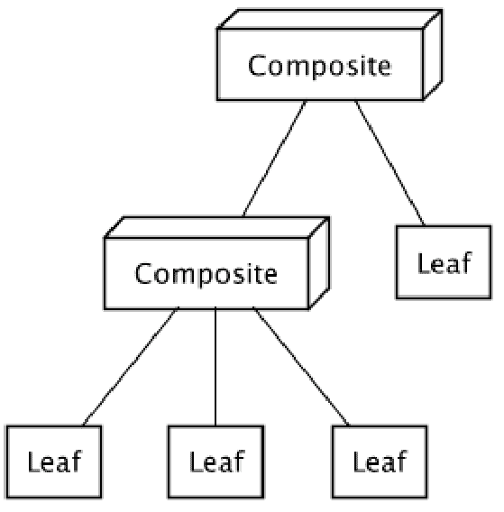

# 是什么

组合模式再次提供了一个接口。它旨在以统一的方式管理一组复杂对象和单个对象，这些对象暴露相似的功能。

# 如何实现

它将对象组合成树形结构，使得树中的节点——无论它们是叶子（单个对象）还是复杂对象（即非叶子节点）——都可以以类似的方式访问，将复杂性抽象给*调用者*。特别是，当在一个节点上调用方法时，如果它是叶子节点，则节点自主处理。否则，节点会对其子节点调用该方法。

```python
# Abstract Class
# Defining the interface for all the components in the composite
class Component():

    def operation(self):
        pass

# Composite: managing the tree structure
class Composite(Component):

    def __init__(self):
        self._children = set()

    def operation(self):
        print 'I am a Composite!'
        for child in self._children:
            child.operation()

    def add(self, component):
        self._children.add(component)

    def remove(self, component):
```

## 组合模式

```python
class Composite(Component):
    def __init__(self):
        self._children = set()

    def add(self, component):
        self._children.add(component)

    def remove(self, component):
        self._children.discard(component)

    def operation(self):
        for child in self._children:
            child.operation()

# 叶节点
class Leaf(Component):
    def operation(self):
        print('I am a leaf!')

# 客户端：测试
if __name__ == "__main__":
    # 树形结构
    leaf = Leaf()
    composite = Composite()
    composite.add(leaf)
    composite_root = Composite()
    leaf_another = Leaf()
    composite_root.add(composite)
    composite_root.add(leaf_another)

    # 对整个树执行相同操作
    composite_root.operation()
```

## 适用场景

当你需要将一组异构且具有层次结构的对象作为一个整体来管理，就像它们是同一个对象一样时，可以使用此模式。实际上，该模式允许以相同的方式遍历层次结构，而无需关心节点类型（即叶节点和组合节点）。

# 注意事项

深入审视你的树结构。如果在边界（即叶节点）存在大量已初始化但未使用的节点，可能意味着需要进行重构。

## 今日编码练习

- **热身**
  待定
- **中等**
  待定
- **进阶**
  待定

> 明天见！

## 行为型模式

最后，本节探讨行为型模式，即那些有助于设计组件间常见关系的结构。

| 类别 | 模式 |
|---|---|
| 行为型 | 观察者模式 |
| | 发布-订阅模式 |
| | 迭代器模式 |
| | 访问者模式 |
| | 状态模式 |
| | 责任链模式 |

## 观察者模式

一图胜千言。

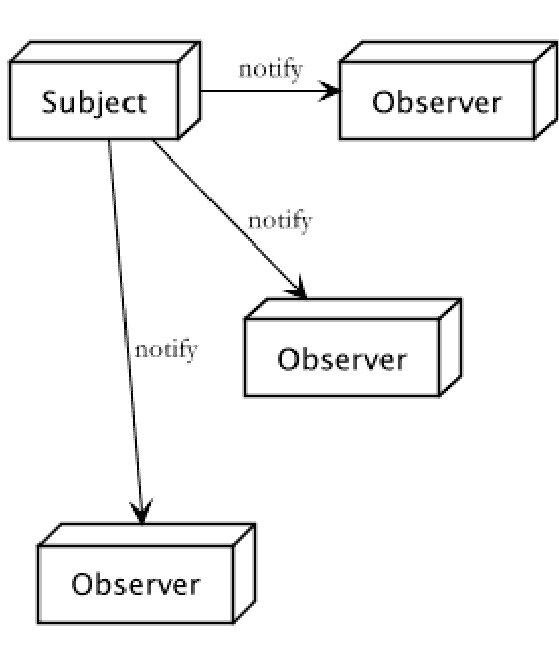

# 是什么

在操作系统中，通知系统状态变化的常见方式是*轮询*和*中断*机制。在高级编程的语境下，人们构想出一种更智能的变化通知方式：*观察者*模式。

# 如何实现

一个需要通知其状态变化的组件会存储一个依赖列表。每当状态发生变化时，它就会通知列表中的所有依赖项。

```python
# 被观察的主题
class Subject:
    def __init__(self):
        self._observers = set()
        self._state = None

    def subscribe(self, observer):
        observer._subject = self
        self._observers.add(observer)

    def unsubscribe(self, observer):
        observer._subject = None
        self._observers.discard(observer)

    def _notify(self):
        for observer in self._observers:
            observer.update(self._state)

    def set_state(self, arg):
        self._state = arg
        self._notify()

# 观察者接口
class Observer():
    def __init__(self):
        self._subject = None
        self._observer_state = None

    def update(self, arg):
        pass

# 具体观察者
class ConcreteObserver(Observer):
    def update(self, subject_state):
        self._observer_state = subject_state
        print('Uh oh! The subject changed state to:\n{}'.format(subject_state))
        # ...

# 测试
if __name__ == "__main__":
    subject = Subject()
    concrete_observer = ConcreteObserver()
    subject.subscribe(concrete_observer)

    # 外部变化：用于测试
    subject.set_state('Ping')
    subject.set_state('Pong')
```

## 适用场景

当你需要不同的对象根据另一个对象的状态自动执行某些功能时（一对多关系）。

# 注意事项

再次强调，保持简单。评估上述条件是否满足，不要增加不必要的复杂性。

## 今日编码练习

- **热身**
  待定
- **中等**
  待定
- **进阶**
  待定

明天见！

## 发布-订阅模式

请让我知道。

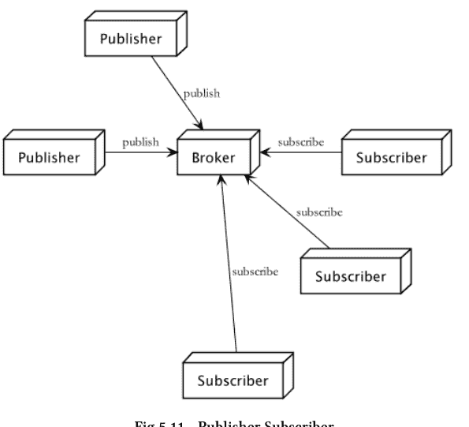

图 5.11 - 发布-订阅模式

# 是什么

与观察者模式类似，它也用于监控状态变化。

# 如何实现

尽管初听起来可能令人困惑，但此模式与观察者模式非常相似，但它们实际上并不相同。

它包含两个基本组件：**发布者**（其状态被监控的实体）和**订阅者**（对接收状态变化感兴趣的实体）。主要区别在于，它们之间的依赖关系被一个第三方组件（通常称为**代理**）抽象化，由该代理管理状态更新。

```python
# 发布者
class Publisher:
    def __init__(self, broker):
        self.state = None
        self._broker = broker

    def set_state(self, arg):
        self._state = arg
        self._broker.publish(arg)

# 订阅者
class Subscriber():
    def __init__(self):
        self._publisher_state = None

    def update(self, state):
        self._publisher_state = state
        print('Uh oh! The subject changed state to:\n{}'.format(state))
        # ...

# 代理
class Broker():
    def __init__(self):
        self._subscribers = set()
        self._publishers = set()

    # 设置一个发布者用于测试
    def setup_publisher(self):
        pub = Publisher(self)
        self._publishers.add(pub)

    # 触发变化：仅用于测试
    def trigger(self):
        for pub in self._publishers:
            pub.set_state('Ping')

    def subscribe(self, subscriber):
        self._subscribers.add(subscriber)

    def unsubscribe(self, subscriber):
        self._subscribers.discard(subscriber)

    def publish(self, state):
        for sub in self._subscribers:
            sub.update(state)

# 测试
if __name__ == "__main__":
    # 设置一个示例
    broker = Broker()
    subscriber = Subscriber()
    broker.subscribe(subscriber)

    # 外部变化：用于测试
    broker.trigger()
```

请注意，上面提供的代码仅用于展示两个主要组件之间的交互。某些方法（例如 *trigger()*）的添加只是为了允许一个简单的执行流程。

## 适用场景

这种第三方交换在任何需要消息交换，但组件（发布者及其订阅者）彼此无需知道对方存在的场景中都很有用。

# 注意事项

不要忽视你解决方案的可扩展性要求。代理可能会成为整个消息交换的瓶颈。

## 今日编码练习

☕ **热身**
待定

Ⓜ️ **中等**
待定

💣 **进阶**
待定

> 明天见！

## 迭代器模式

展望未来。

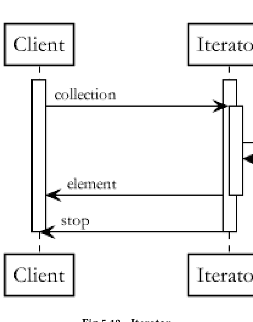

图 5.12 - 迭代器模式

# 是什么

迭代器允许遍历对象中的元素，同时抽象了内部管理细节。

# 如何实现

通常，此模式会暴露两个方法 *next()* 和 *has-Next()* 来执行遍历。

Python 的实现通常要求一个可迭代对象实现：

1. **iter**，返回实例对象本身。
2. **next**，返回可迭代对象的下一个值。

以下代码片段展示了这两个方法的简单实现。

```python
# 我们的元素集合
class MyCollection():
    def __init__(self):
        self._data = list()

    def populate(self):
        for el in range(0, 10):
            self._data.append(el)

    def __iter__(self):
        return Iterator(self._data)

# 我们的迭代器
class Iterator():
    def __init__(self, data):
        self._data = data
        self._counter = 0

    def next(self):
        if self._counter == len(self._data):
            raise StopIteration
        to_ret = self._data[self._counter]
        self._counter = self._counter + 1
        return to_ret

# 测试
if __name__ == "__main__":
    collection = MyCollection()
    collection.populate()
    for el in collection:
        print(el)
```

在上面的例子中，*StopIteration* 表示集合中没有更多元素了。

## 适用场景

最常见的应用之一是在数据结构中，可以在不知道其内部工作原理的情况下（通常是顺序地）访问其中的元素。然而，任何需要遍历而无需修改当前接口的场景都可以使用它。

# 注意事项

如果集合很小且简单，可能并不真正需要此模式。

# 每日编码练习

- ☕ **热身**
  待定
- 🅼 **中等**
  待定
- 💣 **进阶**
  待定

> 明天见！

# 访问者模式

我马上就到。

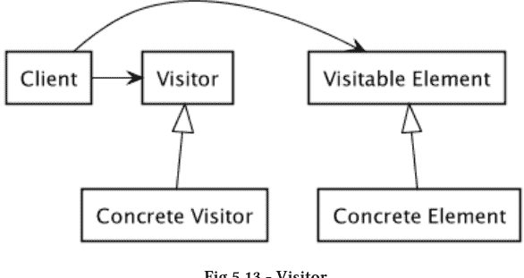

# 是什么

访问者模式允许将操作逻辑（即算法）与原本会分散在不同相似对象中的逻辑解耦。

# 如何实现

一个提供 `visit()` 接口的 *访问者*，用于遍历对象。一个实现实际遍历逻辑的 *具体访问者*。一个定义 `accept()` 方法的 *可访问者* 接口。一个给定访问者对象后实现接受操作的 *具体可访问者*。

```python
# Visitable supported operations
class VisitableElement():
    def accept(self, visitor):
        pass

# Concrete element to be visited
class ConcreteElement(VisitableElement):
    def __init__(self):
        self._el = 'Concrete element'

    def accept(self, visitor):
        visitor.visit(self)

# Visitor allowed operations
class Visitor():

    def visit(self, concrete_element_a):
        pass

# Implementing actual visit
class ConcreteVisitor(Visitor):

    def visit(self, concrete_element):
        print('Visiting {}'.format(concrete_element._el))

# Testing out
if __name__ == "__main__":
    concrete_visitor = ConcreteVisitor()
    concrete_element = ConcreteElement()
    concrete_element.accept(concrete_visitor)
```

# 何时使用

访问者模式的一个应用实例是在树形数据结构的遍历中（例如，前序、中序、后序遍历）。它非常适合树状结构（例如，语法解析），但并不严格局限于这些情况。访问者模式不仅用于树状结构。

# 注意事项

避免围绕不稳定的组件构建访问者。

# 每日编码练习

- ☕ **热身**
  待定
- 🅼 **中等**
  待定
- 💣 **进阶**
  待定

明天见！

# 状态模式

你最近怎么样？

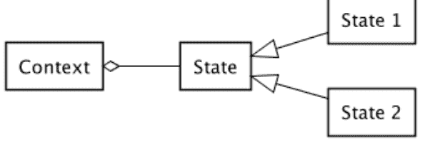

图 5.14 - 状态模式

# 是什么

此模式使对象能够感知上下文。

# 如何实现

其设计相当简单：一个表示外部接口的 *上下文*，一个 *状态* 抽象类，以及定义实际状态的不同 *状态实现*。
以下是该设计模式的一个简单实现。

```python
# Context definition
class Context:

    def __init__(self, state):
        self._state = state

    def manage(self):
        self._state.behave()

# Abstract State class
class State():

    def behave(self):
        pass

# Concrete State Implementation
class ConcreteState():

    def behave(self):
        print('State specific behaviour!')

# Testing out
if __name__ == "__main__":
    state = ConcreteState()
    context = Context(state)
    context.manage()
```

# 何时使用

当对象的行为依赖于其状态时，状态模式就很有帮助。换句话说，当对象需要根据状态的变化而改变行为时，它就适用。

# 注意事项

请仔细考虑何时实际使用它。状态的数量可能会呈指数级增长。

# 每日编码练习

- ☕ **热身**
  待定
- 🅼 **中等**
  待定
- 💣 **进阶**
  待定

> 明天见！

# 责任链模式

事无巨细的管理绝非良策。

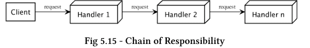

# 是什么

*责任链* 模式促进了请求发送者与接收者之间的解耦。

# 如何实现

流水线中的多个对象都有机会处理传入的请求。具体来说，请求会按顺序通过流水线传递，直到有一个对象能够实际处理它。

```python
# Handler Interface
class Handler():

    def __init__(self, request=None, successor=None):
        self._successor = successor

    def handle_request(self):
        pass

# Concrete Handler
class IntegerHandler(Handler):

    def handle_request(self):
        if request.get_type() is int:
            print(self.__class__.__name__)
        elif self._successor is not None:
            self._successor.handle_request()

# Another Concrete Handler
class StringHandler(Handler):

    def handle_request(self):
        if request.get_type() is str:
            print(self.__class__.__name__)
        elif self._successor is not None:
            self._successor.handle_request()

# Simple Request object
class Request():

    def __init__(self):
        self._el = 'I am a string'

    def get_type(self):
        return type(self._el)

# Testing out
if __name__ == "__main__":
    request = Request()
    string_handler = StringHandler(request=request)
    int_handler = IntegerHandler(request=request, successor=string_handler)
    int_handler.handle_request()
```

# 何时使用

当你想要简化请求对象，并且可能在运行时添加不同的对象来实际处理它时，此模式非常方便，因为你可以决定哪些处理者以及以何种顺序添加到链中。

# 注意事项

回到非功能性需求。请关注所需的性能。过多的处理者（按顺序执行，最坏情况下可能跳过直到链中的最后一个处理者）可能会影响代码性能。同时请记住，调试这种模式可能相当困难。

# 每日编码练习

- **热身**
  待定
- **中等**
  待定
- **进阶**
  待定

> 明天见！

# 第5部分 - 解答

# 基础知识

---

# 基础类型

热身
编写 Python 代码来计算字符串中的字符数量。打印结果。

### 解答

```python
def count_char(text):
    return len(text)

count = count_char('Welcome to the Python World')
print(count)
```

基础知识

223


# 中等
待定

### 解答

1

# Python 程序结构


热身
待定

解答

# 中等 待定

解答

1

# 变量


## 热身
待定

### 解答

1

# 中等
待定

### 解答

1

# Python 对象


## 热身
待定

### 解答

# 中等
待定

解答

1

# 多态

热身 待定

解答

中等
待定

### 解答

1

# 条件流程

**热身**
实现一个 Python 程序，给定输入一个字母 *l*，打印 *l* 是元音还是辅音。

### 解答

```python
def vowel_or_consonant(l):
    vowels = ['a', 'e', 'i', 'o', 'u']
    if l in vowels:
        print('I am {} and I am a vowel!'.format(l))
    else:
        print('I am {} and I am a consonant!'.format(l))

if __name__ == "__main__":
    l = 'a'
    vowel_or_consonant(l)
    l = 'g'
    vowel_or_consonant(l)
```

# 中等

实现一个 Python 程序，给定输入一个对象 o，检查其类型（字符串、整数或都不是）。

提示：研究 isinstance() 的工作原理。

### 解答

```python
def check_types(o):
    if isinstance(o, str):
        print('I am {} and I am a string')
    elif isinstance(o, int):
        print('I am {} and I am an integer')
    else:
        print('I am a mysterious type. hee-hee')

if __name__ == "__main__":
    o = "I am a string"
    check_types(o)

    o = 42
    check_types(o)

    o = list()
    check_types(o)
```


# 进阶

待定

# 循环

热身
待定

解答

# 中等 待定

解答

# 错误


## 热身
待定

### 解答

1

# 中等 待定

解答

1

# 文档

☕ **热身**
待定

**解答**

1

# 中等 待定

解答

1

# 算法

## 数据结构

## 数组


### 热身练习

给定一个整数数组 A，将其逆序打印。

示例

A = [1,2,3,4,5]

打印结果：

5 4 3 2 1

### 解答

```
def reverse_array(A):
    for i in reversed(range(len(A))):
        print(A[i])
```

## 中等难度

给定一个整数数组 $A$，在不使用内置函数的情况下，将其逆序并打印。

示例

$A = [1,2,3,4,5]$

逆序后：

$A = [5,4,3,2,1]$

### 解答

```
def reverse_array(A):
    start = 0
    end = len(A)-1

    while start<end:
        A[start], A[end] = A[end], A[start]
        start+=1
        end-=1

    print(A)
```

## 进阶挑战

给定两个数组 $A$ 和 $B$，统计 $B$ 作为 $A$ 中元素子集的出现次数。

示例 1
A = [1,1,1,1,1]
B = [1,1]
出现次数 = 4

示例 2
A = [0,1,1,0,1,0]
B = [0,1]
出现次数 = 2

### 解答

```
def count_occurrences(A,B):
    # 边界情况
    if len(B) > len(A):
        return 0
    no_occur = 0
    for i in range(len(A)):
        flag = True
        tmp = i
        for j in range(len(B)):
            if tmp >= len(A) or A[tmp] != B[j]:
                flag = False
                break
            tmp += 1
        if flag:
            no_occur+=1

    return no_occur
```

## 链表

### 热身练习
待定

### 解答

## 中等难度

待定

### 解答

1

## 进阶挑战 待定


### 解答

1

## 栈

### 热身练习

给定一个整数数组 A，使用栈将其元素逆序打印。

示例

A = [1,2,3,4,5]

打印结果

5 4 3 2 1

### 解答

```
def reverse_array(A):
    # 使用列表作为栈
    stack = []
    for el in A:
        stack.append(el)
    for i in range(len(stack)):
        print(stack.pop())
```

## 中等难度

待定

### 解答

1

## 进阶挑战

实现一个栈类，并提供主要方法的逻辑：top()、pop() 和 put()。

### 解答

```
class Stack:
    def __init__(self, elements=[]):
        self._stack = []

        # 可选地初始化栈
        if elements:
            for el in elements:
                self.put(el)

    def top(self):
        if self._stack:
            return self._stack[len(self._stack) - 1]

        raise Exception('Empty stack')

    def pop(self):
        to_ret = self.top()
        self._stack.remove(self._stack[len(self._stack) - 1])
        return to_ret

    def put(self, el):
        self._stack.append(el)
```

## 队列

### 热身练习
待定

### 解答

## 中等难度 待定

### 解答

1

## 进阶挑战 待定


### 解答

1

## 哈希映射

### 热身练习
待定

### 解答

## 中等难度

待定

### 解答

1

## 进阶挑战

待定

### 解答

1

## 二叉搜索树

### ☕ **热身练习**
待定

**解答**

## 中等难度

待定

### 解答

1

## 进阶挑战 待定


### 解答

1

## 设计模式

## 结论

---

## 关于作者

Giuliana Carullo，CCSK 认证专家，计算机科学是她的基因，编程经验超过十年。她拥有计算机科学硕士学位，过去六年一直从事研究工作，同时还兼任项目经理。

Giuliana 热爱科学与人类行为的交叉领域。她相信行善之道不止一条，作恶之途则更多，但她最终对何为“善”形成了非常坚定的看法。

在业余时间，她喜欢写作，并帮助他人在工作和职业发展中做到最好。

### 更多来自 Giuliana Carullo 的作品

### 更多来自 Giuliana Carullo 的作品

**代码审查入门：优秀编码的智慧**

凭借其在软件工程领域的深厚背景，Giuliana Carullo 向读者展示了如何进行代码审查。从这本书中，你将获得涵盖广泛挑战和良好编码实践的知识，从代码、设计和架构的坏味道，到度量、流程和执行审查的正确方法。如果你想获得一些乐趣，不妨一读。[代码审查入门](https://leanpub.com/codereviews101thewisdomofgoodcoding)

**技术领导力：梦想、成功与独角兽。**

基于她在软件工程团队的经验，Giuliana Carullo 向读者呈现了——非常个人化的——关于什么成就或破坏一个优秀技术领导者的观点。

这本书不是又一本关于影响他人和如何正确沟通的书。这些技能极其重要，已有大量精彩的书籍论述过这些主题。它源于一种愿景——常常是非常个人化的——关于技术领导者是谁，他/她如何行动，以及成为一个好的技术领导者需要什么。[技术领导力](https://leanpub.com/technicalleadership)

## 反馈与勘误

非常欢迎并高度重视读者的反馈。请告诉我你对这本书的看法。你喜欢什么？不喜欢什么？你希望在未来的版本中读到关于这个主题的哪些内容？

尽管已尽力确保本书的准确性，但错误仍可能发生。

> 任何可能出错的事情都会出错 - 墨菲定律

如果你发现错误、错别字或遗漏之处，请报告给我，以便我改进本书。

## 参考文献

[Cormen et al.]

[PSF] Python 软件基金会。https://docs.python.org/3/

[Python Software Foundation]