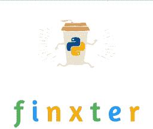
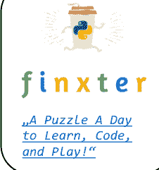
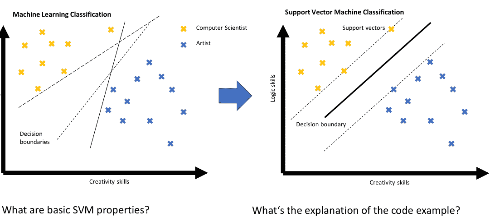

# Python 速查表 - 关键字

“每日一题，学习、编码、畅玩” → 访问 [finxter.com](https://finxter.com)

| 关键字 | 描述 | 代码示例 |
| :--- | :--- | :--- |
| **False, True** | 布尔数据类型的数据值 | `False == (1 > 2)`, `True == (2 > 1)` |
| **and, or, not** | 逻辑运算符：<br>(x and y) → x 和 y 都必须为 True<br>(x or y) → x 或 y 必须为 True<br>(not x) → x 必须为 False | `x, y = True, False`<br>`(x or y) == True` # True<br>`(x and y) == False` # True<br>`(not y) == True` # True |
| **break** | 提前结束循环 | `while(True):`<br>`    break # 避免无限循环`<br>`print("hello world")` |
| **continue** | 结束当前循环迭代 | `while(True):`<br>`    continue`<br>`print("43") # 死代码` |
| **class** | 定义一个新类 → 一个现实世界的概念<br>（面向对象编程） | `class Beer:`<br>`    def __init__(self):`<br>`        self.content = 1.0`<br>`    def drink(self):`<br>`        self.content = 0.0`<br><br>`becks = Beer() # 构造函数 - 创建类`<br>`becks.drink() # 啤酒喝完：b.content == 0` |
| **def** | 定义一个新函数或类方法。对于后者，<br>第一个参数（“self”）指向类对象。<br>调用类方法时，第一个参数是隐式的。 | |
| **if, elif, else** | 条件程序执行：程序从<br>“if”分支开始，尝试“elif”分支，最后以<br>“else”分支结束（直到某个分支求值为 True）。 | `x = int(input("your value: "))`<br>`if x > 3: print("Big")`<br>`elif x == 3: print("Medium")`<br>`else: print("Small")` |
| **for, while** | # For 循环声明<br>`for i in [0,1,2]:`<br>`    print(i)` | # While 循环 - 语义相同<br>`j = 0`<br>`while j < 3:`<br>`    print(j)`<br>`    j = j + 1` |
| **in** | 检查元素是否在序列中 | `42 in [2, 39, 42] # True` |
| **is** | 检查两个元素是否指向同一个<br>对象 | `y = x = 3`<br>`x is y # True`<br>`[3] is [3] # False` |
| **None** | 空值常量 | `def f():`<br>`    x = 2`<br>`f() is None # True` |
| **lambda** | 无名函数（匿名函数） | `(lambda x: x + 3)(3) # 返回 6` |
| **return** | 终止函数的执行，并将<br>执行流程传递给调用者。return 关键字后的<br>可选值指定函数结果。 | `def incrementor(x):`<br>`    return x + 1`<br>`incrementor(4) # 返回 5` |

# Python 速查表 - 基本数据类型

“每日一题，学习、编码、畅玩” → 访问 [finxter.com](https://finxter.com)

| | 描述 | 示例 |
|---|---|---|
| **布尔型** | 布尔数据类型是一个真值，要么是 True，要么是 False。<br><br>按优先级排序的布尔运算符：<br>not x → “如果 x 为 False，则结果为 x，否则为 y”<br>x and y → “如果 x 为 False，则结果为 x，否则为 y”<br>x or y → “如果 x 为 False，则结果为 y，否则为 x”<br><br>以下比较运算符求值为 True：<br>1 < 2 and 0 <= 1 and 3 > 2 and 2 >=2 and<br>1 == 1 and 1 != 0 # True | python
## 1. 布尔运算
x, y = True, False
print(x and not y) # True
print(not x and y or x) # True

## 2. 如果条件求值为 False
if None or 0 or 0.0 or '' or [] or {} or set():
    # None, 0, 0.0, 空字符串或空
    # 容器类型求值为 False
    print("Dead code") # 不会执行
 |
| **整数、浮点数** | 整数是没有浮点数的正数或负数（例如 3）。浮点数是具有浮点精度的正数或负数（例如 3.14159265359）。<br><br>‘//’ 运算符执行整数除法。结果是一个向较小整数方向舍入的整数值（例如 3 // 2 == 1）。 | python
## 3. 算术运算
x, y = 3, 2
print(x + y) # = 5
print(x - y) # = 1
print(x * y) # = 6
print(x / y) # = 1.5
print(x // y) # = 1
print(x % y) # = 1
print(-x) # = -3
print(abs(-x)) # = 3
print(int(3.9)) # = 3
print(float(3)) # = 3.0
print(x ** y) # = 9
 |
| **字符串** | Python 字符串是字符序列。<br><br>创建字符串的四种主要方式如下。<br><br>1. 单引号<br>'Yes'<br>2. 双引号<br>"Yes"<br>3. 三引号（多行）<br>"""Yes<br>We Can"""<br>4. 字符串方法<br>str(5) == '5' # True<br>5. 连接<br>"Ma" + "hatma" # 'Mahatma'<br><br>以下是字符串中的空白字符。<br>• 换行符 \n<br>• 空格 \s<br>• 制表符 \t | python
## 4. 索引和切片
s = "The youngest pope was 11 years old"
print(s[0])       # 'T'
print(s[1:3])     # 'he'
print(s[-3:-1])   # 'ol'
print(s[-3:])     # 'old'
x = s.split()     # 创建单词字符串数组
print(x[-3] + " " + x[-1] + " " + x[2] + "s")
                  # '11 old popes'

## 5. 最重要的字符串方法
y = "    This is lazy\t\n   "
print(y.strip()) # 移除空白：'This is lazy'
print("DrDre".lower()) # 转为小写：'drdre'
print("attention".upper()) # 转为大写：'ATTENTION'
print("smartphone".startswith("smart")) # True
print("smartphone".endswith("phone")) # True
print("another".find("other")) # 匹配索引：2
print("cheat".replace("ch", "m")) # 'meat'
print(','.join(["F", "B", "I"])) # 'F,B,I'
print(len("Rumpelstiltskin")) # 字符串长度：15
print("ear" in "earth") # 包含：True
 |

# Python 速查表 - 复合数据类型

“每日一题，学习、编码、畅玩” → 访问 [finxter.com](https://finxter.com)

| | 描述 | 示例 |
|---|---|---|
| **列表** | 存储元素序列的容器数据类型。与字符串不同，列表是可变的：可以修改。 | `l = [1, 2, 2]`
`print(len(l)) # 3` |
| **添加元素** | 使用 (i) append、(ii) insert 或 (iii) 列表连接向列表添加元素。append 操作非常快。 | `[1, 2, 2].append(4) # [1, 2, 2, 4]`
`[1, 2, 4].insert(2,2) # [1, 2, 2, 4]`
`[1, 2, 2] + [4] # [1, 2, 2, 4]` |
| **移除** | 移除元素可能较慢。 | `[1, 2, 2, 4].remove(1) # [2, 2, 4]` |
| **反转** | 反转列表元素的顺序。 | `[1, 2, 3].reverse() # [3, 2, 1]` |
| **排序** | 对列表进行排序。对于 n 个列表元素，排序的计算复杂度为 O(n log n)。 | `[2, 4, 2].sort() # [2, 2, 4]` |
| **索引** | 查找列表中元素首次出现的位置并返回其索引。由于需要遍历整个列表，可能较慢。 | `[2, 2, 4].index(2) # 元素 4 的索引是 "0"`
`[2, 2, 4].index(2,1) # 位置 1 之后元素 2 的索引是 "1"` |
| **栈** | Python 列表可以通过 append() 和 pop() 两个列表操作直观地用作栈。 | `stack = [3]`
`stack.append(42) # [3, 42]`
`stack.pop() # 42 (栈：[3])`
`stack.pop() # 3 (栈：[])` |
| **集合** | 集合是元素的无序集合。每个元素只能存在一次。 | `basket = {'apple', 'eggs', 'banana', 'orange'}`
`same = set(['apple', 'eggs', 'banana', 'orange'])` |
| **字典** | 字典是存储（键，值）对的有用数据结构。 | `calories = {'apple' : 52, 'banana' : 89, 'choco' : 546}` |
| **读写元素** | 通过在括号内指定键来读写元素。使用 keys() 和 values() 函数访问字典的所有键和值。 | `print(calories['apple'] < calories['choco']) # True`
`calories['cappu'] = 74`
`print(calories['banana'] < calories['cappu']) # False`
`print('apple' in calories.keys()) # True`
`print(52 in calories.values()) # True` |
| **字典循环** | 你可以使用 items() 方法遍历字典的（键，值）对。 | `for k, v in calories.items():`
`    print(k) if v > 500 else None # 'chocolate'` |
| **成员运算符** | 使用 'in' 关键字检查集合、列表或字典是否包含某个元素。集合包含检查比列表包含检查更快。 | `basket = {'apple', 'eggs', 'banana', 'orange'}`
`print('eggs' in basket) # True`
`print('mushroom' in basket) # False` |
| **列表和集合推导式** | 列表推导式是创建列表的简洁 Python 方式。使用方括号加一个表达式，后跟一个 for 子句。以零个或多个 for 或 if 子句结束。集合推导式类似于列表推导式。 | `# 列表推导式`
`l = [('Hi ' + x) for x in ['Alice', 'Bob', 'Pete']]`
`print(l) # ['Hi Alice', 'Hi Bob', 'Hi Pete']`
`l2 = [x * y for x in range(3) for y in range(3) if x>y]`
`print(l2) # [0, 0, 2]`
`# 集合推导式`
`squares = { x**2 for x in [0,2,4] if x < 4 } # {0, 4}` |

# Python 速查表 - 类

“每日一题，学习、编码、畅玩” → 访问 [finxter.com](https://finxter.com)

| | 描述 | 示例 |
|---|---|---|
| **类** | 类封装了数据和功能——数据作为属性，功能作为方法。它是在内存中创建具体实例的蓝图。 | python
class Dog:
    """ 一只狗的蓝图 """

    # 所有实例共享的类变量
    species = ["canis lupus"]

    def __init__(self, name, color):
        self.name = name
        self.state = "sleeping"
        self.color = color

    def command(self, x):
        if x == self.name:
            self.bark(2)
        elif x == "sit":
            self.state = "sit"
        else:
            self.state = "wag tail"

    def bark(self, freq):
        for i in range(freq):
            print("[" + self.name
                  + "]: Woof!")


python
bello = Dog("bello", "black")
alice = Dog("alice", "white")

print(bello.color) # black
print(alice.color) # white

bello.bark(1) # [bello]: Woof!

alice.command("sit")
print("[alice]: " + alice.state)
# [alice]: sit

bello.command("no")
print("[bello]: " + bello.state)
# [bello]: wag tail

alice.command("alice")
# [alice]: Woof!
# [alice]: Woof!

bello.species += ["wulf"]
print(len(bello.species)
      == len(alice.species)) # True (!)
 |
| **实例** | 你是人类这个类的一个实例。实例是类的具体实现：实例的所有属性都有一个固定的值。你的头发是金色、棕色或黑色——但绝不是未指定的。

每个实例都有独立于其他实例的自己的属性。然而，类变量则不同。这些是与类相关联的数据值，而不是与实例相关联。因此，在示例中，所有实例共享相同的类变量 **species**。 | |
| **Self** | 定义任何方法时的第一个参数总是 **self** 参数。此参数指定调用该方法的实例。

**self** 向 Python 解释器提供有关具体实例的信息。要*定义*一个方法，你使用 **self** 来修改实例属性。但要*调用*一个实例方法，你不需要指定 **self**。 | |
| **创建** | 你可以“动态”创建类，并将它们用作存储复杂数据类型的逻辑单元。

python
class Employee():
    pass
employee = Employee()
employee.salary = 122000
employee.firstname = "alice"
employee.lastname = "wonderland"

print(employee.firstname + " "
      + employee.lastname + " "
      + str(employee.salary) + "$")
# alice wonderland 122000$
 | |

# Python 速查表：函数与技巧

“每日一题，学习、编码、畅玩” → 访问 [finxter.com](https://finxter.com)

| | 描述 | 示例 | 结果 |
|---|---|---|---|
| **高级** | | | |
| map(func, iter) | 对可迭代对象的所有元素执行函数 | list(map(lambda x: x[0], ['red', 'green', 'blue'])) | ['r', 'g', 'b'] |
| map(func, i1, ..., ik) | 对 k 个可迭代对象的所有 k 个元素执行函数 | list(map(lambda x, y: str(x) + ' ' + y + 's' , [0, 2, 2], ['apple', 'orange', 'banana'])) | ['0 apples', '2 oranges', '2 bananas'] |
| string.join(iter) | 连接由字符串分隔的可迭代元素 | ' marries '.join(list(['Alice', 'Bob'])) | 'Alice marries Bob' |
| **函数** | | | |
| filter(func, iterable) | 过滤掉可迭代对象中函数返回 False (或 0) 的元素 | list(filter(lambda x: True if x>17 else False, [1, 15, 17, 18])) | [18] |
| string.strip() | 移除字符串的前导和尾随空白字符 | print("\n \t 42 \t ".strip()) | 42 |
| sorted(iter) | 按升序对可迭代对象排序 | sorted([8, 3, 2, 42, 5]) | [2, 3, 5, 8, 42] |
| sorted(iter, key=key) | 根据键函数按升序排序 | sorted([8, 3, 2, 42, 5], key=lambda x: 0 if x==42 else x) | [42, 2, 3, 5, 8] |
| help(func) | 返回 func 的文档 | help(str.upper()) | '... to uppercase.' |
| zip(i1, i2, ...) | 将迭代器 i1, i2, ... 的第 i 个元素分组在一起 | list(zip(['Alice', 'Anna'], ['Bob', 'Jon', 'Frank'])) | [('Alice', 'Bob'), ('Anna', 'Jon')] |
| 解包 | 等同于：1) 解包已打包的列表，2) 对结果进行打包 | list(zip(*[('Alice', 'Bob'), ('Anna', 'Jon')])) | [('Alice', 'Anna'), ('Bob', 'Jon')] |
| enumerate(iter) | 为可迭代对象的每个元素分配一个计数器值 | list(enumerate(['Alice', 'Bob', 'Jon'])) | [(0, 'Alice'), (1, 'Bob'), (2, 'Jon')] |
| **技巧** | | | |
| python -m http.server <P> | 在 PC 和手机之间共享文件？在 PC 的 shell 中运行命令。<P> 是 0–65535 之间的任意端口号。在手机浏览器中输入 <PC 的 IP 地址>:<P>。你现在可以浏览 PC 目录中的文件了。 | | |
| 阅读漫画 | import antigravity | 在你的网络浏览器中打开漫画系列 xkcd | |
| Python 之禅 | import this | '...Beautiful is better than ugly. Explicit is ...' | |
| 交换数字 | 在 Python 中交换变量是小菜一碟。无意冒犯，Java！ | a, b = 'Jane', 'Alice'<br>a, b = b, a | a = 'Alice'<br>b = 'Jane' |
| 解包参数 | 通过星号运算符 * 使用序列作为函数参数。通过双星号运算符 ** 使用字典（键，值） | def f(x, y, z): return x + y * z<br>f(*[1, 3, 4])<br>f(**{'z' : 4, 'x' : 1, 'y' : 3}) | 13<br>13 |
| 扩展解包 | 使用解包实现 Python 中的多重赋值特性 | a, *b = [1, 2, 3, 4, 5] | a = 1<br>b = [2, 3, 4, 5] |
| 合并两个字典 | 使用解包将两个字典合并为一个 | x={'Alice' : 18}<br>y={'Bob' : 27, 'Ann' : 22}<br>z = {**x, **y} | z = {'Alice': 18, 'Bob': 27, 'Ann': 22} |


# Python 速查表：14 个面试问题

“每日一题，学习、编码、畅玩” →

*免费* Python 邮件课程 @ http://bit.ly/free-python-course

| 问题 | 代码 | 问题 | 代码 |
| :--- | :--- | :--- | :--- |
| 检查列表是否包含整数 x | `l = [3, 3, 4, 5, 2, 111, 5]`<br>`print(111 in l) # True` | 获取 [1...100] 中缺失的数字 | `def get_missing_number(lst):`<br>`    return set(range(lst[len(lst)-1]+1)) - set(l)`<br>`l = list(range(1,100))`<br>`l.remove(50)`<br>`print(get_missing_number(l)) # 50` |
| 在整数列表中查找重复数字 | `def find_duplicates(elements):`<br>`    duplicates, seen = set(), set()`<br>`    for element in elements:`<br>`        if element in seen:`<br>`            duplicates.add(element)`<br>`        seen.add(element)`<br>`    return list(duplicates)` | 计算两个列表的交集 | `def intersect(lst1, lst2):`<br>`    res, lst2_copy = [], lst2[:]`<br>`    for el in lst1:`<br>`        if el in lst2_copy:`<br>`            res.append(el)`<br>`            lst2_copy.remove(el)`<br>`    return res` |
| 检查两个字符串是否是变位词 | `def is_anagram(s1, s2):`<br>`    return set(s1) == set(s2)`<br>`print(is_anagram("elvis", "lives")) # True` | 在未排序列表中查找最大值和最小值 | `l = [4, 3, 6, 3, 4, 888, 1, -11, 22, 3]`<br>`print(max(l)) # 888`<br>`print(min(l)) # -11` |
| 从列表中移除所有重复项 | `lst = list(range(10)) + list(range(10))`<br>`lst = list(set(lst))`<br>`print(lst)`<br>`# [0, 1, 2, 3, 4, 5, 6, 7, 8, 9]` | 使用递归反转字符串 | `def reverse(string):`<br>`    if len(string)<=1: return string`<br>`    return reverse(string[1:])+string[0]`<br>`print(reverse("hello")) # olleh` |
| 在列表中查找和为整数 x 的整数对 | `def find_pairs(l, x):`<br>`    pairs = []`<br>`    for (i, el_1) in enumerate(l):`<br>`        for (j, el_2) in enumerate(l[i+1:]):`<br>`            if el_1 + el_2 == x:`<br>`                pairs.append((el_1, el_2))`<br>`    return pairs` | 计算前 n 个斐波那契数 | `a, b = 0, 1`<br>`n = 10`<br>`for i in range(n):`<br>`    print(b)`<br>`    a, b = b, a+b`<br>`# 1, 1, 2, 3, 5, 8, ...` |
| 检查字符串是否是回文 | `def is_palindrome(phrase):`<br>`    return phrase == phrase[::-1]`<br>`print(is_palindrome("anna")) # True` | 使用快速排序算法对列表排序 | `def qsort(L):`<br>`    if L == []: return []`<br>`    return qsort([x for x in L[1:] if x< L[0]]) + L[0:1] +`<br>`qsort([x for x in L[1:] if x>=L[0]])`<br>`lst = [44, 33, 22, 5, 77, 55, 999]`<br>`print(qsort(lst))`<br>`# [5, 22, 33, 44, 55, 77, 999]` |
| 将列表用作栈、数组和队列 | `# 作为列表 ...`<br>`l = [3, 4]`<br>`l += [5, 6] # l = [3, 4, 5, 6]`<br>`# ... 作为栈 ...`<br>`l.append(10) # l = [4, 5, 6, 10]`<br>`l.pop() # l = [4, 5, 6]`<br>`# ... 以及作为队列`<br>`l.insert(0, 5) # l = [5, 4, 5, 6]`<br>`l.pop() # l = [5, 4, 5]` | 查找字符串的所有排列 | `def get_permutations(w):`<br>`    if len(w)<=1:`<br>`        return set(w)`<br>`    smaller = get_permutations(w[1:])`<br>`    perms = set()`<br>`    for x in smaller:`<br>`        for pos in range(0,len(x)+1):`<br>`            perm = x[:pos] + w[0] + x[pos:]`<br>`            perms.add(perm)`<br>`    return perms`<br>`print(get_permutations("nan"))`<br>`# {'nna', 'ann', 'nan'}` |



# Python 速查表：NumPy

“每日一题，学习、编码、娱乐” → 访问 [finxter.com](https://finxter.com)

| 名称 | 描述 | 示例 |
| :--- | :--- | :--- |
| `a.shape` | NumPy 数组 `a` 的 `shape` 属性是一个整数元组。每个整数描述对应轴的元素数量。 | `a = np.array([[1,2],[1,1],[0,0]])`<br>`print(np.shape(a))`<br># (3, 2) |
| `a.ndim` | `ndim` 属性等于 `shape` 元组的长度。 | `print(np.ndim(a))`<br># 2 |
| `*` | 星号（`*`）运算符执行哈达玛积，即逐元素地乘以两个形状相同的矩阵。 | `a = np.array([[2, 0], [0, 2]])`<br>`b = np.array([[1, 1], [1, 1]])`<br>`print(a*b)`<br># [[2 0] [0 2]] |
| `np.matmul(a,b)`, `a@b` | 标准矩阵乘法运算符。等同于 `@` 运算符。 | `print(np.matmul(a,b))`<br># [[2 2] [2 2]] |
| `np.arange([start, ]stop, [step, ])` | 创建一个新的、具有均匀间隔值的一维 NumPy 数组。 | `print(np.arange(0,10,2))`<br># [0 2 4 6 8] |
| `np.linspace(start, stop, num=50)` | 创建一个新的、在给定区间内均匀分布元素的一维 NumPy 数组。 | `print(np.linspace(0,10,3))`<br># [ 0. 5. 10.] |
| `np.average(a)` | 计算 NumPy 数组中所有值的平均值。 | `a = np.array([[2, 0], [0, 2]])`<br>`print(np.average(a))`<br># 1.0 |
| `<slice> = <val>` | 将切片运算符选中的 `<slice>` 替换为值 `<val>`。 | `a = np.array([0, 1, 0, 0, 0])`<br>`a[::2] = 2`<br>`print(a)`<br># [2 1 2 0 2] |
| `np.var(a)` | 计算 NumPy 数组的方差。 | `a = np.array([2, 6])`<br>`print(np.var(a))`<br># 4.0 |
| `np.std(a)` | 计算 NumPy 数组的标准差。 | `print(np.std(a))`<br># 2.0 |
| `np.diff(a)` | 计算 NumPy 数组 `a` 中连续值之间的差值。 | `fibs = np.array([0, 1, 1, 2, 3, 5])`<br>`print(np.diff(fibs, n=1))`<br># [1 0 1 1 2] |
| `np.cumsum(a)` | 计算 NumPy 数组 `a` 中元素的累积和。 | `print(np.cumsum(np.arange(5)))`<br># [ 0 1 3 6 10] |
| `np.sort(a)` | 创建一个新的 NumPy 数组，其值来自 `a`（升序排列）。 | `a = np.array([10,3,7,1,0])`<br>`print(np.sort(a))`<br># [ 0 1 3 7 10] |
| `np.argsort(a)` | 返回 NumPy 数组的索引，使得索引后的值会被排序。 | `a = np.array([10,3,7,1,0])`<br>`print(np.argsort(a))`<br># [4 3 1 2 0] |
| `np.max(a)` | 返回 NumPy 数组 `a` 的最大值。 | `a = np.array([10,3,7,1,0])`<br>`print(np.max(a))`<br># 10 |
| `np.argmax(a)` | 返回 NumPy 数组 `a` 中最大值元素的索引。 | `a = np.array([10,3,7,1,0])`<br>`print(np.argmax(a))`<br># 0 |
| `np.nonzero(a)` | 返回 NumPy 数组 `a` 中非零元素的索引。 | `a = np.array([10,3,7,1,0])`<br>`print(np.nonzero(a))`<br># [0 1 2 3] |

# Python 速查表：面向对象术语

“每日一题，学习、编码、娱乐” → 访问 [finxter.com](https://finxter.com)

| 术语 | 描述 | 示例 |
| :--- | :--- | :--- |
| **类** | 创建**对象**的蓝图。它定义了对象的数据（**属性**）和功能（**方法**）。你可以通过点号表示法访问属性和方法。 | ```python
class Dog:
    # 类属性
    is_hairy = True

    # 构造函数
    def __init__(self, name):
        # 实例属性
        self.name = name

    # 方法
    def bark(self):
        print("Wuff")


bello = Dog("bello")
paris = Dog("paris")

print(bello.name)
"bello"

print(paris.name)
"paris"
``` |
| **对象**（=实例） | Python 程序中根据**类**定义构建的、封装了数据和功能的一段代码。通常，一个对象对应现实世界中的一个事物。例如，根据类定义“Person”创建的对象“Obama”。一个对象由任意数量的**属性**和**方法****封装**在一个单元中。 | |
| **实例化** | 创建**类**的**对象**的过程。这通过构造函数方法 `__init__(self, ...)` 完成。 | |
| **方法** | **对象**整体功能的一个子集。方法在**类**定义中类似于函数（使用关键字“def”）进行定义。一个对象可以有任意数量的方法。 | |
| **Self** | 定义任何方法时的第一个参数始终是 `self` 参数。此参数指定调用**方法**的**实例**。`self` 为 Python 解释器提供有关具体实例的信息。要*定义*一个方法，你使用 `self` 来修改实例属性。但要*调用*实例方法，你不需要指定 `self`。 | |
| **封装** | 将数据和操作数据的功能绑定在一起。 | ```python
class Cat:
    # 方法重载
    def miau(self, times=1):
        print("miau " * times)


fifi = Cat()

fifi.miau()
"miau "

fifi.miau(5)
"miau miau miau miau miau "

# 动态属性
fifi.likes = "mice"
print(fifi.likes)
"mice"
``` |
| **属性** | 为**类**（**类属性**）或**对象**（**实例属性**）定义的变量。你使用属性将数据打包到封闭单元（类或实例）中。 | |
| **类属性** | （=类变量，静态变量，静态属性）在**类**定义中静态创建的变量，由所有类**对象**共享。 | |
| **实例属性**（=实例变量） | 仅属于单个实例的数据变量。其他实例不共享此变量（与**类属性**相反）。在大多数情况下，你在创建实例本身时在构造函数中使用 `self` 关键字（例如 `self.x = <val>`）创建实例属性 `x`。 | |
| **动态属性** | 在程序执行期间动态定义的**实例属性**，未在任何**方法**中定义。例如，你可以通过调用 `o.neew = <val>` 简单地向任何**对象** `o` 添加一个新属性 `neew`。 | |
| **方法重载** | 你可能希望以一种有多种调用选项的方式定义一个方法。例如，对于类 `X`，你定义一个**方法** `f(...)`，可以通过三种方式调用：`f(a)`、`f(a,b)` 或 `f(a,b,c)`。为此，你可以使用默认参数定义该方法（例如 `f(a, b=None, c=None)`）。 | |
| **继承** | **类** A 可以从类 B 继承某些特性（如**属性**或**方法**）。例如，类“Dog”可以从类“Animal”继承属性“number_of_legs”。在这种情况下，你将定义继承类“Dog”如下：`"class Dog(Animal): ..."` | ```python
# 继承
class Persian_Cat(Cat):
    classification = "Persian"

mimi = Persian_Cat()
print(mimi.miau(3))
"miau miau miau "

print(mimi.classification)
``` |

# [测试表] 帮助爱丽丝找到她的编程爸爸！

finxter „在你的咖啡休息时间持续提升 Python！“

# [速查表] 6 大支柱机器学习算法

完整课程：https://academy.finxter.com/

## 线性回归

https://blog.finxter.com/logistic-regression-in-one-line-python/

## K-均值聚类

https://blog.finxter.com/tutorial-how-to-run-k-means-clustering-in-1-line-of-python/

## K 近邻

https://blog.finxter.com/k-nearest-neighbors-as-a-python-one-liner/

## 支持向量机分类

https://blog.finxter.com/support-vector-machines-python/

## 决策树分类

https://blog.finxter.com/decision-tree-learning-in-one-line-python/

## 多层感知器

https://blog.finxter.com/tutorial-how-to-create-your-first-neural-network-in-1-line-of-python-code/

finxter

„在你的咖啡休息时间持续提升 Python！“

## 简易 Git 速查表 – 实用图解指南

### 集中式 Git 工作流

-   每位开发者都拥有项目的独立副本
-   工作流相互独立
-   无需高级的分支与合并操作


#### Git 主分支

##### 远程仓库：主分支


###### Alice


###### Bob

```bash
git init
```

创建新仓库

```bash
git clone alice@host:/path/repos
```

克隆仓库

```bash
git add main.py
```

将文件 „main.py“ 添加到项目

```bash
git clone bob@host:/path/repos
```

```bash
git commit -m "new file"
```

提交更改，并向主分支添加消息 „new file“

```bash
git push origin master
```

将主分支发送到远程仓库

```bash
git pull
```

使用主分支更新本地仓库

```bash
git add *
```

将所有更改添加到主分支

```bash
git rm main.py
```

从主分支移除文件 „main.py“

```bash
git commit -m "add 2, rem 1"
```

提交更改，并向主分支添加消息

```bash
git push origin master
```

将主分支发送到远程仓库



„每日一题，学习、编码、玩乐！“

## [机器学习速查表] 支持向量机

基于文章：https://blog.finxter.com/support-vector-machines-python/

> 核心思想：最大化分隔区域的宽度 → 增加分类的 „安全边际“



### 支持向量机的基本属性是什么？

| 支持向量机 | |
|---|---|
| 别名： | SVM，支持向量网络 |
| 学习类型： | 分类，回归 |
| 优点： | 对高维空间具有鲁棒性<br>内存效率高（仅使用支持向量）<br>灵活且可定制 |
| 缺点： | 在高维空间中有过拟合的风险<br>无法像决策树那样提供分类概率 |
| 边界： | 线性与非线性 |

### 代码示例的解释是什么？

**解释：基于 SVM 的学习推荐系统**

-   NumPy 数组存储带标签的训练数据（每行代表一个用户，每列代表一个特征）。
-   特征：数学、语言和创造力的技能水平。
-   标签：最后一列是推荐的学习领域。
-   三维数据 → SVM 使用二维平面（线性分隔器）而非一维直线来分离数据。
-   单行代码：
    1.  使用 scikit-learn 的 svm.SVC 类的构造函数创建模型（SVC = 支持向量分类）。
    2.  调用 fit 函数，基于带标签的训练数据执行训练。
-   结果：对新观测值调用 predict 函数
    -   student_0（技能：数学=3，语言=3，创造力=6）→ SVM 预测为 „艺术“
    -   student_1（数学=8，语言=1，创造力=1）→ SVM 预测为 „计算机科学“
-   单行代码的最终输出：

### 最基本的 Python 代码示例是什么？

```python
## 依赖项
from sklearn import svm
import numpy as np

## 数据：学生在（数学、语言、创造力）上的分数
## --> 学习领域
X = np.array([[9, 5, 6, "computer science"],
              [10, 1, 2, "computer science"],
              [1, 8, 1, "literature"],
              [4, 9, 3, "literature"],
              [0, 1, 10, "art"],
              [5, 7, 9, "art"]])

## 单行代码
svm = svm.SVC().fit(X[:,:-1], X[:,-1])

## 结果与谜题
student_0 = svm.predict([[3, 3, 6]])
print(student_0)

student_1 = svm.predict([[8, 1, 1]])
print(student_1)
```

```python
## 结果与谜题
student_0 = svm.predict([[3, 3, 6]])
print(student_0)
# ['art']

student_1 = svm.predict([[8, 1, 1]])
print(student_1)
## ['computer science']
```

finxter

„每日一题，学习、编码、玩乐！“

## Python 速查表：列表方法

“每日一题，学习、编码、玩乐” → 访问 [finxter.com](https://finxter.com)

| 方法 | 描述 | 示例 |
| :--- | :--- | :--- |
| `lst.append(x)` | 将元素 `x` 追加到列表 `lst`。 | `>>> l = []`<br>`>>> l.append(42)`<br>`>>> l.append(21)`<br>`[42, 21]` |
| `lst.clear()` | 移除列表 `lst` 中的所有元素——列表变为空。 | `>>> lst = [1, 2, 3, 4, 5]`<br>`>>> lst.clear()`<br>`[]` |
| `lst.copy()` | 返回列表 `lst` 的副本。仅复制列表本身，不复制列表中的元素（浅拷贝）。 | `>>> lst = [1, 2, 3]`<br>`>>> lst.copy()`<br>`[1, 2, 3]` |
| `lst.count(x)` | 统计元素 `x` 在列表 `lst` 中出现的次数。 | `>>> lst = [1, 2, 42, 2, 1, 42, 42]`<br>`>>> lst.count(42)`<br>`3`<br>`>>> lst.count(2)`<br>`2` |
| `lst.extend(iter)` | 将可迭代对象 `iter`（例如另一个列表）的所有元素添加到列表 `lst`。 | `>>> lst = [1, 2, 3]`<br>`>>> lst.extend([4, 5, 6])`<br>`[1, 2, 3, 4, 5, 6]` |
| `lst.index(x)` | 返回值 `x` 在列表 `lst` 中首次出现的位置（索引）。 | `>>> lst = ["Alice", 42, "Bob", 99]`<br>`>>> lst.index("Alice")`<br>`0`<br>`>>> lst.index(99, 1, 3)`<br>`ValueError: 99 is not in list` |
| `lst.insert(i, x)` | 在列表 `lst` 的位置（索引）`i` 处插入元素 `x`。 | `>>> lst = [1, 2, 3, 4]`<br>`>>> lst.insert(3, 99)`<br>`[1, 2, 3, 99, 4]` |
| `lst.pop()` | 移除并返回列表 `lst` 的最后一个元素。 | `>>> lst = [1, 2, 3]`<br>`>>> lst.pop()`<br>`3`<br>`>>> lst`<br>`[1, 2]` |
| `lst.remove(x)` | 移除并返回列表 `lst` 中元素 `x` 的首次出现。 | `>>> lst = [1, 2, 99, 4, 99]`<br>`>>> lst.remove(99)`<br>`>>> lst`<br>`[1, 2, 4, 99]` |
| `lst.reverse()` | 反转列表 `lst` 中元素的顺序。 | `>>> lst = [1, 2, 3, 4]`<br>`>>> lst.reverse()`<br>`>>> lst`<br>`[4, 3, 2, 1]` |
| `lst.sort()` | 将列表 `lst` 中的元素按升序排序。 | `>>> lst = [88, 12, 42, 11, 2]`<br>`>>> lst.sort()`<br>`# [2, 11, 12, 42, 88]`<br>`>>> lst.sort(key=lambda x: str(x)[0])`<br>`# [11, 12, 2, 42, 88]` |


## 终极 Python 速查表

### 关键字

| 关键字 | 描述 | 代码示例 |
| :--- | :--- | :--- |
| False, True | 布尔数据类型 | `False == (1 > 2)`<br>`True == (2 > 1)` |
| and, or, not | 逻辑运算符<br>→ 两者都为真<br>→ 任一为真<br>→ 翻转布尔值 | `True and True` # True<br>`True or False` # True<br>`not False` # True |
| break | 提前结束循环 | `while True:`<br>`    break # 有限循环` |
| continue | 结束当前循环迭代 | `while True:`<br>`    continue`<br>`    print("42") # 死代码` |
| class | 定义新类 | `class Coffee:`<br>`    # 定义你的类` |
| def | 定义新函数或类方法。 | `def hi():`<br>`    print('hi')` |
| if, elif, else | 条件执行：<br>- “if 条件 == True?”<br>- “elif” 条件 == True?<br>- 回退：else 分支 | `x = int(input("ur val:"))`<br>`if x > 3: print("Big")`<br>`elif x == 3: print("3")`<br>`else: print("Small")` |
| for, while | # For 循环<br>for i in [0,1,2]:<br>    print(i) | # While 循环做同样的事<br>`j = 0`<br>`while j < 3:`<br>`    print(j); j = j + 1` |
| in | 序列成员关系 | `42 in [2, 39, 42] # True` |
| is | 同一对象内存位置 | `y = x = 3`<br>`x is y # True`<br>`[3] is [3] # False` |
| None | 空值常量 | `print() is None # True` |
| lambda | 匿名函数 | `(lambda x: x+3)(3) # 6`<br>`'Mahatma'` |
| return | 终止函数。可选的返回值定义函数结果。 | `def increment(x):`<br>`    return x + 1`<br>`increment(4) # 返回 5` |

### 基本数据结构

| 类型 | 描述 | 代码示例 |
| :--- | :--- | :--- |
| 布尔 | 布尔数据类型为 True 或 False。布尔运算符按优先级排序：not → and → or | `## 求值为 True：`<br>`1<2 and 0<1 and 3>2 and 2>=2 and 1==1`<br>`and 1!=0`<br><br>`## 求值为 False：`<br>`bool(None or 0 or 0.0 or '' or [] or {}) or set()`<br><br>`规则：None, 0, 0.0, 空字符串或空容器类型求值为 False` |
| 整数，浮点数 | 整数是没有小数点的正数或负数，例如 3。<br><br>浮点数是具有浮点精度的正数或负数，例如 3.1415926。<br><br>整数除法向较小的整数方向舍入（例如：3//2=1）。 | `## 算术运算`<br>`x, y = 3, 2`<br>`print(x + y) # = 5`<br>`print(x - y) # = 1`<br>`print(x * y) # = 6`<br>`print(x / y) # = 1.5`<br>`print(x // y) # = 1`<br>`print(x % y) # = 1`<br>`print(-x) # = -3`<br>`print(abs(-x)) # = 3`<br>`print(int(3.9)) # = 3`<br>`print(float(3)) # = 3.0`<br>`print(x ** y) # = 9` |
| 字符串 | Python 字符串是字符序列。<br><br>字符串创建方法：<br>1. 单引号<br>>>> 'Yes'<br>2. 双引号<br>>>> "Yes"<br>3. 三引号（多行）<br>>>> """Yes<br>We Can"""<br>4. 字符串方法<br>>>> str(5) == '5'<br>True<br>5. 连接<br>>>> 'Ma' + 'hatma'<br>'Mahatma'<br><br>空白字符：<br>换行符 \n,<br>空格 \s,<br>制表符 \t | `## 索引和切片`<br>`s = "The youngest pope was 11 years"`<br>`s[0] # 'T'`<br>`s[1:3] # 'he'`<br>`s[-3:-1] # 'ar'`<br>`s[-3:] # 'ars'`<br><br>`x = s.split()`<br>`x[-2] + " " + x[2] + "s" # '11 popes'`<br><br>`## 字符串方法`<br>`y = "    Hello world!\n    "`<br>`y.strip() # 移除空白`<br>`"Hi".lower() # 小写：'hi'`<br>`"hi".upper() # 大写：'HI'`<br>`"hello".startswith("he") # True`<br>`"hello".endswith("lo") # True`<br>`"hello".find("ll") # 匹配位置 2`<br>`"cheat".replace("ch", "m") # 'meat'`<br>`''.join(["F", "B", "I"]) # 'FBI'`<br>`len("hello world") # 长度：15`<br>`"ear" in "earth" # True` |

### 复杂数据结构

| 类型 | 描述 | 示例 |
| :--- | :--- | :--- |
| 列表 | 存储元素序列。与字符串不同，你可以修改列表对象（它们是可变的）。 | `l = [1, 2, 2]`<br>`print(len(l)) # 3` |
| 添加元素 | 使用 (i) append, (ii) insert, 或 (iii) 列表连接向列表添加元素。 | `[1, 2].append(4) # [1, 2, 4]`<br>`[1, 4].insert(1,9) # [1, 9, 4]`<br>`[1, 2] + [4] # [1, 2, 4]` |
| 移除 | 对列表来说较慢 | `[1, 2, 2, 4].remove(1) # [2, 2, 4]` |
| 反转 | 反转列表顺序 | `[1, 2, 3].reverse() # [3, 2, 1]` |
| 排序 | 使用快速的 Timsort 对列表排序 | `[2, 4, 2].sort() # [2, 2, 4]` |
| 索引 | 查找元素的首次出现并返回索引。最坏情况需遍历整个列表，速度较慢。 | `[2, 2, 4].index(2)`<br>`# 项目 2 的索引是 0`<br>`[2, 2, 4].index(2,1)`<br>`# 位置 1 之后项目 2 的索引是 1` |
| 栈 | 通过列表操作 append() 和 pop() 使用 Python 列表 | `stack = [3]`<br>`stack.append(42) # [3, 42]`<br>`stack.pop() # 42 (栈: [3])`<br>`stack.pop() # 3 (栈: [])` |
| 集合 | 唯一元素的无序集合（最多出现一次）→ 快速成员关系检查 O(1) | `basket = {'apple', 'eggs',`<br>`          'banana', 'orange'}`<br>`same = set(['apple', 'eggs',`<br>`            'banana', 'orange'])` |

| 类型 | 描述 | 示例 |
| :--- | :--- | :--- |
| 字典 | 存储（键，值）对的有用数据结构 | `cal = {'apple' : 52, 'banana' : 89,`<br>`        'choco' : 546} # 卡路里` |
| 读写元素 | 通过在括号内指定键来读写元素。使用 **keys()** 和 **values()** 函数访问字典的所有键和值 | `print(cal['apple'] < cal['choco'])`<br>`# True`<br>`cal['cappu'] = 74`<br>`print(cal['banana'] < cal['cappu'])`<br>`# False`<br>`print('apple' in cal.keys()) # True`<br>`print(52 in cal.values()) # True` |
| 字典迭代 | 你可以使用 **items()** 方法访问字典的（键，值）对。 | `for k, v in cal.items():`<br>`    print(k if v > 500 else '')`<br>`# 'choco'` |
| 成员关系运算符 | 使用 **in** 关键字检查集合、列表或字典是否包含某个元素。集合的成员关系检查比列表快 | `basket = {'apple', 'eggs',`<br>`          'banana', 'orange'}`<br>`print('eggs' in basket) # True`<br>`print('mushroom' in basket) # False` |
| 列表与集合推导式 | 列表推导式是创建列表的简洁 Python 方式。使用方括号加一个表达式，后跟一个 for 子句。以零个或多个 if 或 for 子句结束。集合推导式的工作方式与列表推导式类似。 | `l = ['hi ' + x for x in ['Alice',`<br>`     'Bob', 'Pete']]`<br>`# ['Hi Alice', 'Hi Bob', 'Hi Pete']`<br><br>`12 = [x * y for x in range(3) for y`<br>`     in range(3) if x>y] # [0, 0, 2]`<br><br>`squares = { x**2 for x in [0,2,4]`<br>`           if x < 4 } # {0, 4}` |

## finxter 书籍：简约——创造软件的精妙艺术

复杂性

> “一个由部分组成的整体——难以分析、理解或解释”。

复杂性出现在
- 项目生命周期
- 代码开发
- 算法理论
- 流程
- 社交网络
- 学习与日常生活

→ 复杂性会降低生产力和专注力。它会消耗你宝贵的时间。保持简单！

80/20 法则

大多数结果源于少数原因。

帕累托建议

1.  确定你的成功指标。
2.  明确你人生中的宏大目标。
3.  寻找用更少资源实现相同目标的方法。
4.  反思你自己的成功。
5.  反思你自己的失败。
6.  多阅读你所在行业的书籍。
7.  将大部分时间用于改进和调整现有产品。
8.  微笑。
9.  不做降低价值的事情。

最大化成功指标：
#编写的代码行数

最小可行产品（MVP）

软件意义上的最小可行产品是指剥离了所有功能，专注于核心功能的代码。

如何进行 MVP？

- 提出假设
- 省略不必要的功能
- 进行拆分测试以验证每个新功能
- 专注于产品市场契合度
- 寻求高价值、低成本的功能

整洁代码原则

1.  你不会需要它
2.  最小惊讶原则
3.  不要重复自己
4.  为人类而非机器编写代码
5.  站在巨人的肩膀上
6.  使用恰当的名称
7.  单一职责原则
8.  使用注释
9.  避免不必要的注释
10. 保持一致性
11. 测试
12. 从大局思考
13. 只与你的朋友交谈
14. 重构
15. 不要过度工程化
16. 不要过度使用缩进
17. 小即是美
18. 使用度量指标
19. 童子军规则：离开营地时比你来时更干净

Unix 哲学

1.  简单胜于复杂
2.  小即是美（再次强调）
3.  让每个程序做好一件事
4.  先构建原型
5.  可移植性优于效率
6.  将数据存储在纯文本文件中
7.  利用软件杠杆
8.  避免强制用户界面
9.  程序 = 过滤器
10. 更坏即是更好
11. 整洁 > 聪明的代码
12. 设计相互连接的程序
13. 使你的代码健壮
14. 修复你能修复的——但要尽早且大声地失败
15. 编写用于编写程序的程序

过早优化

> “程序员浪费大量时间思考他们程序中非关键部分的运行速度。我们应该忘记小的效率提升，大约 97% 的时间都应如此：过早优化是万恶之源。” —— 唐纳德·克努特

性能调优入门

1.  先测量，再改进
2.  专注于慢的 20%
3.  算法优化是王道
4.  缓存至上
5.  解决更简单的问题版本
6.  知道何时停止

心流

> “……人类巅峰表现的源代码” – Kotler

程序员的心流技巧

1.  始终从事一个明确的实际代码项目
2.  从事能实现你目标的有趣项目
3.  发挥你的优势
4.  大块的编码时间
5.  减少干扰：智能手机 + 社交媒体
6.  多睡觉，健康饮食，阅读优质书籍，锻炼身体 → 垃圾进，垃圾出！

如何达到心流？（1）明确的目标，（2）即时反馈，以及（3）机会与能力的平衡。

设计中的少即是多

如何简化设计？

1.  使用留白
2.  移除设计元素
3.  移除功能
4.  减少字体、字体类型、颜色的变化
5.  在所有界面中保持一致

专注

你可以获取原始资源，并通过专注于实现更大计划的努力，将其从高熵状态转变为低熵状态。

高效软件创建的三步法

1.  规划你的代码
2.  集中精力将其变为现实。
3.  寻求反馈

订阅 11 个免费的 Python 速查表课程：https://blog.finxter.com/python-cheat-sheets/