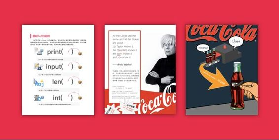

# 写在前面：你需要这本书的原因

有没有哪一个瞬间，让你想要放弃学习编程？

在我决心开始学编程的时候，我为自己制定了一个每天编程 1 小时的计划，那时候工作很忙，我只能等到晚上 9 点，同事都下班之后，独自留在办公室编程。在翻遍了我能找到的几十本国内外的 Python 编程教程之后，我还是似懂非懂。那些教程里面到处都是抽象的概念、复杂的逻辑，对于专业开发者这些再平常不过，而对于我这样一个学设计出身的编程小白，没有被视觉化的东西是无法被理解的。

而且，这些书大多着重于一步步构建一个完整体系，但事实上，现实生活中没有哪个技能是这么习得的。难道要练习 1 年切菜才能给自己做一顿饭么？难道要到体校学习 3 年才能开始晨跑么？难道要苦练 5 年基本功才能开始拿起吉他弹第 1 首曲子么？

做任何事情一定有在短期内简单可行的方法。学习不应该是苦差事，而应该是快乐的，重要的是找到适合自己的学习方法。

**既然笨办法不能让我学会 Python，那么我决定用一种聪明方法来学，为自己创造学习的捷径。**这种高效学习法的核心在于：

1、**精简**：学习最核心的关键知识；

2、**理解**：运用类比、视觉化的方法来理解这些核心知识；

3、**实践**：构建自己的知识体系之后，再通过实践去逐渐完善知识体系。

实际上，如果你听说过《如何高效学习》中的整体学习法，你会发现它和我的高效学习法很相似，作者斯科特·杨用一年的时间学完了麻省理工四年的课程。既然这种高效学习法可以用来学习经济学、数学、物理，那么当然也可以用来学编程。

运用了高效学习法之后，我的编程学习速度突飞猛进，不到一个月时间就完成了一个爬虫加上 Django 的网站。为了追求最大程度的精简，我借用了许多强大的库和框架，这让我不需要重新发明轮子，而是专注于最核心的功能。在一次项目合作中，我惊讶的发现，我用 70 行代码实现的功能，一名工程师竟然用了 800 行代码来实现。在运动场上，第一名和最后一名的差距也许只有几十秒。然而在编程这个竞技场上，**不同方法的效率竟然会有 10 倍的差距，这也正是追求高效学习的价值所在。**

为了能让更多的编程小白轻松地入门编程，我把高效学习法结合 Python 中的核心知识，写成了这本书。随意翻上几页，你就会发现这本书和其他编程书的不同，其中有大量的视觉化场景帮你理解概念，穿插了若干有趣的小项目，**最重要的是，这本书是为零基础小白而设计的。**

考虑到很多书都标榜是针对零基础读者的，所以有必要说明一下这一本有哪些独到之处。

我不写字典式的知识体系，有些编程书像字典一样，各种细枝末节的知识都涵盖在内。但我认为，正如不应该让小孩拿着字典学汉语，也不应该让初学者拿着这样的厚书学编程。在汉语中，掌握常见的 1500-2000 个字就能看懂 80%的文字。在编程中，同样有着最核心的关键知识。**先用这些关键的知识构建你的知识体系会让学习效率加速，这是比一开始就钻到各种细枝末节里面更好的学习方式。**这是精简的意义。

我不去对比各种语言的特点，许多程序员背景的作者喜欢去对比 Python 和其他语言有什么异同，或者试图让你通过理解 C 语言从而理解 Python，但我不会这么做。我知道对于大多数读者，Python 很可能是将要学习的第一门编程语言，所以我不会用一个陌生概念讲解另一个陌生概念，反过来，**我会运用类比和视觉化的方法讲解 Python 中的抽象概念，把复杂的东西简单的讲清楚。**这是理解的捷径。

我不追求让你达到精通的程度，事实上我也很怀疑有哪本书能真正做到 21 天从入门到精通。精通一门语言，需要在实际项目开发中踩过许多坑，需要熟悉计算机运作的底层原理。我是一名实用主义的开发者，我相信你也一样，学习编程是为了真正做出点东西来，也许你想爬取大量的数据和信息，方便用来分析与决策。也许你想快速搭建一个网站，展示自己的产品。也许你对量化交易感兴趣，想试着把自己的投资策略程序化。对于实用主义的开发者来说，更应该追求的是“达成”而不是“精通”。**先掌握项目所需的最少必要知识，然后把热情和精力投入到搭建真实项目中，而不是死磕半年的基础知识，直到把所有兴趣都耗竭了也没做出来什么像样的东西。**在实践过程中，你自然会逐渐完善知识体系。在这本书里面，会穿插一些真实项目的片段，让你知道学了这个基础知识能用在哪，并且完成一些小型项目。这是让你最有成就感的实践。

说了这么多，就是为了让你能放下疑虑。这不是一本让你中途放弃的编程书，这是一本黏着你看完的编程书。大多数读者都能在一周内读完，其中有 35 岁才开始学编程的中年男子、有工作非常忙碌的女性创业者、还有对编程感兴趣的高中生。所以，相信你也可以跟着这本书一起从零到一。

放轻松，如果你准备好了，那就翻开下一页吧。

> 注：除了在这里在线阅读，你还可以到「随书下载」中免费下载 pdf 版本的电子书或是推送 mobi 版。

作者：侯爵

麻瓜编程创始人。网易云课堂上最畅销的课程《Python 实战》系列课程讲师，目前已有超过 4 万名学员。

设计专业背景，拥有设计与编程跨界思维，善于找到学习技能的最佳路径，擅长把复杂的东西简单的讲清楚。

初学编程时，发现市面上很难找到适合小白的学习资料，于是开始用生动易懂、视觉化的方式来写这本教程。