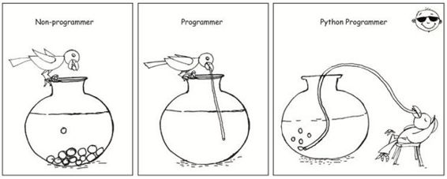
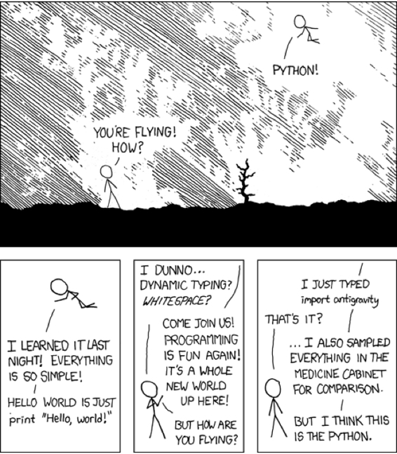
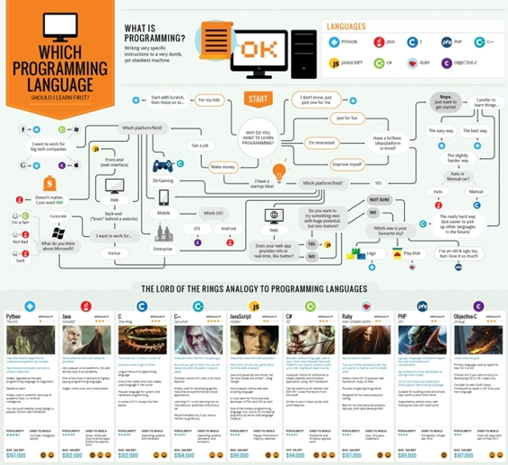

# 第一章 为什么选择 Python ?

## 1.1 Python 能做什么？

> 那些最好的程序员不是为了得到更高的薪水或者得到公众的仰慕而编程，他们只是觉得这是一件有趣的事情。 ——Linux 之父 Linus Torvalds

作为一个实用主义的学习者，最关心的问题一定是 “我为什么要选择学 Python，学会之后我可以用来做什么？”

首先，对于初学者来说，比起其他编程语言，Python 更容易上手。

Python 的设计哲学是优雅、明确、简单。在官方的 *The Zen of Python*（《Python 之禅》）中，有这样一句话，

> There should be one-- and preferably only one --obvious way to do it.

Python 追求的是找到最好的解决方案。相比之下，其他语言追求的是多种解决方案。

如果你试着读一段写的不错的 Python 代码，会发现像是在读英语一样。这也是 Python 的最大优点，它使你能够专注于解决问题而不是去搞明白语言本身。

> 注：漫画《口渴的 Python 开发者》，形容了 Python 开发者是多么轻松，来自 Pycot 网站

其次，Python 功能强大，很多你本来应该操心的事情，Python 都替你考虑到了。当你用 Python 语言编写程序的时候，你不需要考虑如何管理你的程序使用的内存之类的底层细节。并且，Python 有很丰富的库，其中有官方的，也有第三方开发的，你想做的功能模块很有可能已经有人写好了，你只需要调用，不需要重新发明轮子。这就像是拥有了智能手机，可以任意安装需要的 app。

> 漫画 Python, 作者 xkcd

这幅漫画形容了 Python 的库有多强大，导入一个反重力库就可以飞起来了。

第三，Python 能做的事情有许多。

在职场中，使用 Python 工作的主要是这样几类人：

*   网站后端程序员：使用 Python 搭建网站、后台服务会比较容易维护，当需要增加新功能，用 Python 可以比较容易的实现。不少知名网站都使用了 Python 开发，比如：

    

*   自动化运维：越来越多的运维开始倾向于自动化，批量处理大量的运维任务。 Python 在系统管理上的优势在于强大的开发能力和完整的工具链。

*   数据分析师：Python 能快速开发的特性可以让你迅速验证你的想法，而不是把时间浪费在程序本身上，并且有丰富的第三方库的支持，也能帮你节省时间。

*   游戏开发者：一般是作为游戏脚本内嵌在游戏中，这样做的好处是即可以利用游戏引擎的高性能，又可以受益于脚本化开发的优点。只需要修改脚本内容就可以调整游戏内容，不需要重新编译游戏，特别方便。

*   自动化测试：对于测试来说，要掌握 Script 的特性，会在设计脚本中，有更好的效果。Python 是目前比较流行的 Script。

如果你是一名业余开发者，只是想在资源少的情况下快速做出自己想要的东西、自动化的解决生活中的问题，那么 Python 可以帮你做到这几类事情：

*   网站的开发

    借助功能丰富的网站框架 django、flask 等等，你可以快速搭建自己的网站，还可以做到移动端自适应。

    

    > 注：Python 全栈实战课程的项目：十分钟短视频平台

*   用爬虫爬取或处理大量信息

    当你需要获取大批量数据或是批量处理的时候，Python 爬虫可以快速做到这些，从而节省你的重复劳动时间。比如：微博私信机器人、批量下载美剧、运行投资策略、刷折扣机票、爬合适房源、系统管理员的脚本任务等等。

    

    > 注：Python 爬虫实战课程的项目：二手行情网站

*   再包装其他语言的程序

    Python 又叫做胶水语言，因为它可以用混台编译的方式使用 c/c++/java 等等语言的库。

*   智能硬件

    树莓派作为微型电脑，也使用了 Python 作为主要开发语言。

    

    > 用红外线遥控器控制树莓派，作者八宝粥

最后，附一张选择编程语言的小测试，你可以根据你的需要，选择学习哪种语言。

> The lord of the rings, 作者 carlcheo