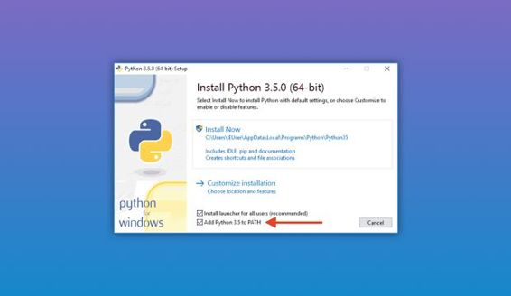
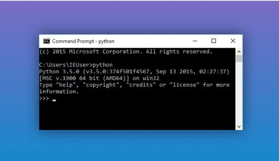
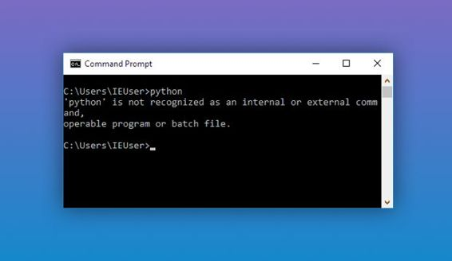
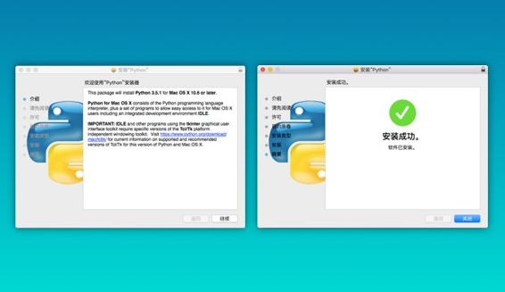
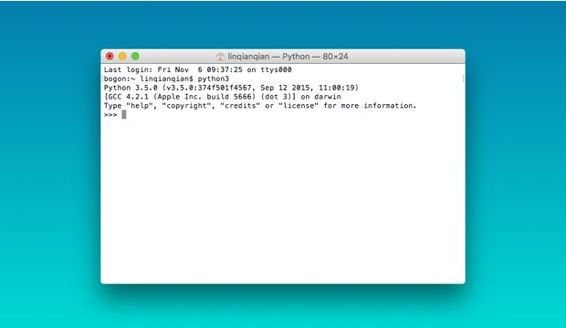
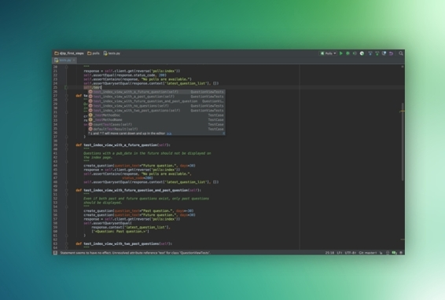

# 第二章 现在就开始

## 2.1 安装 Python 环境

在你开始学习 Python 之前最重要的是——对，你要安装 Python 环境。许多初学者会纠结应该选择 2.x 版本还是 3.x 版本的问题，在我看来，世界变化的速度在变得更快，语言的更新速度速度亦然。没有什么理由让我们只停留在过去而不往前看。对于越来越普及、同时拥有诸多炫酷新特性的 Python 3.x，我们真的没有什么理由拒绝它。如果你理解了 life is short，you need Python 的苦衷，就更应该去选择这种「面向未来」的开发模式。

所以，我们的教材将以最新的 Python 3.x 版本为基础，请确保电脑上有对应版本。

### 在 Windows 上安装 Python

#### 第一步

根据你的 Windows 版本（64 位还是 32 位），从 Python 的官方网站下载对应的 Python 3.5，另外，Windows 8.1 需要选择 Python 3.4，地址如下：

*   [Python 3.5 64 位安装程序下载地址](https://www.Python.org/ftp/Python/3.5.0/Python-3.5.0-amd64.exe)

*   [Python 3.5 32 位安装程序下载地址](https://www.Python.org/ftp/Python/3.5.0/Python-3.5.0.exe)

*   [Python 3.4 64 位安装程序下载地址](https://www.Python.org/ftp/Python/3.4.3/Python-3.4.3.amd64.msi)

*   [Python 3.4 32 位安装程序下载地址](https://www.Python.org/ftp/Python/3.4.3/Python-3.4.3.msi)

*   网速慢的同学请移步[国内镜像](http://pan.baidu.com/s/1bnmdlZx)

然后,运行下载的 EXE 安装包：



特别要注意勾上 `Add Python 3.5 to PATH` ，然后点 `Install Now` 可完成安装。默认会安装到 `C:\Python35` 目录下。

#### 第二步

打开命令提示符窗口（方法是点击“开始”-“运行”- 输入：“cmd”），敲入 `Python` 后，会出现两种情况：

*   情况一：

    

    看到上面的画面，就说明 Python 安装成功！

    你看到提示符 `>>>` 就表示我们已经在 Python 交互式环境中了，可以输入任何 Python 代码，回车后会立刻得到执行结果。现在，关掉命令行窗口，就可以退出 Python 交互式环境。

*   情况二：得到一个错误：

    > 'Python' 不是内部或外部命令，也不是可运行的程序或批处理文件。

    

    这是因为 Windows 会根据一个 Path 的环境变量设定的路径去查找 Python.exe，如果没找到，就会报错。如果在安装时漏掉了勾选 `Add Python 3.5 to PATH` ，那就要手动把 `Python.exe` 所在的路径添加到 Path 中。

    如果你不知道怎么修改环境变量，建议把 Python 安装程序重新运行一遍，务必记得勾上`Add Python 3.5 to PATH`。

### 在 Mac 上安装 Python



如果你正在使用 Mac，系统是 OS X 10.8～10.10，那么系统自带的 Python 版本是 2.7，需要安装最新的 Python 3.5。

#### 第一步：

*   方法一：下载安装

    *   从 Python 官网下载 [Python 3.5 安装程序](https://www.Python.org/ftp/Python/3.5.0/Python-3.5.0-macosx10.6.pkg)

    *   网速慢的同学请移步[国内镜像](http://pan.baidu.com/s/1sjqOkFF)

    Mac 的安装比 Windows 要简单，只需要一直点击继续就可以安装成功了。

*   方法二： Homebrew 安装

    如果安装了 Homebrew，直接通过命令 `brew install Python3` 安装即可。

#### 第二步:

如果不放心，可以再检查一下。操作方法是打开终端，输入 `Python3`（不是输入 `Python 3` ，也不是 `Python` )



得到这样的结果，就说明安装成功了。

### 在 Linux 上安装 Python

一个好消息是，大多数 Linux 系统都内置了 Python 环境，比如 Ubuntu 从 13.04 版本之后，已经内置了 Python 2 和 Python 3 两个环境，完全够用，你不需要再折腾安装了。

如果你想检查一下 Python 版本，打开终端，输入：

```py
python3 --version
```

就可以查看 Python 3 是什么版本的了。

如果你需要安装某个特定版本的 Python，在终端输入这一行就可以：

```py
sudo apt-get install python3.5
```

其中的 `3.5` 可以换成你需要的版本，目前 Python 最新是 3.5 版。

## 2.2 使用 IDE 工具

安装好环境之后，还需要配置一个程序员专属工具。正如设计师使用 Photoshop 做图、产品经理使用 Axure 做原型，程序员也有编程的工具，叫做：IDE。

在这里推荐公认最智能最好用的 Python IDE，叫做 PyCharm ，同时支持 Windows 和 Mac 用户，本教程使用的版本是目前最新的 3.4 版本。

这里是 [PyCharm 的官网下载链接](https://www.jetbrains.com/pycharm/) 。

社区版是免费的，专业版是付费的。对于初学者来说，两者的差异微乎其微，使用社区版就够用了。



到这里，Python 开发的环境和工具就搭建好了，我们可以开始安心编程了。

如果你是第一次上手编程，可能会对 IDE 感到很陌生，甚至不知道怎样创建一个新文件。在这里推荐一些容易上手的 PyCharm 学习视频：

*   [快速上手的中文视频](http://v.youku.com/v_show/id_XODMyMzM1NzQ4.html)，简单介绍了如何安装、如何创建文件、如何设置皮肤。新手先掌握这些就够用了。

*   [PyCharm 官方的快速上手视频](https://www.jetbrains.com/pycharm/documentation/)，第一节视频就让你快速掌握这个工具的基本使用方法，如果你想继续深入了解，可以继续看后面 8 节短视频，每个在 3-5 分钟，全面的介绍了如何更有效率的使用 PyCharm。

*   [如何高效使用 PyCharm 的系列文档](http://pedrokroger.net/getting-started-pycharm-python-ide/)，图文并茂的介绍了许多高效的技巧，比如快捷键设置等等，可以在上手之后持续学习。

可能有些同学会有疑问，在这里解答一下。

**为什么不需要安装 Python 解释器？**

> 因为在 Python 官方网站下载了 Python 3.5 之后，就自带了官方版本的解释器，所 以不需要再次安装。

**为什么不使用文本编辑器，比如 Sublime ？**

> 因为文本编辑器是相对轻量级的，和 IDE 相比功能太弱了，尤其在 debug 的时候会遇到很多问题。

**能不能不安装 IDE，直接在命令行或者终端里编程？**

> 可以。但是在命令行中保存完整代码很麻烦，最重要的是编辑器是交互式的，不小心手滑写错的代码无法修改，要重新敲一遍。珍惜时间，善用工具。