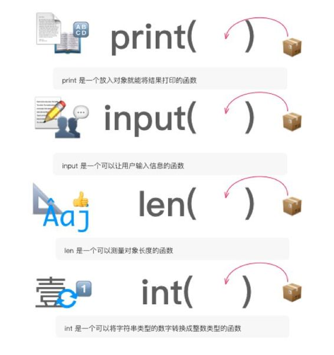
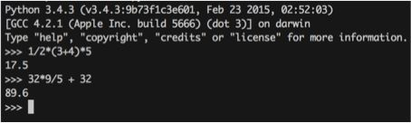
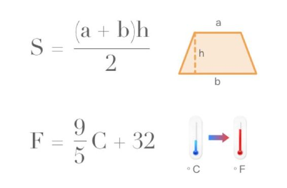
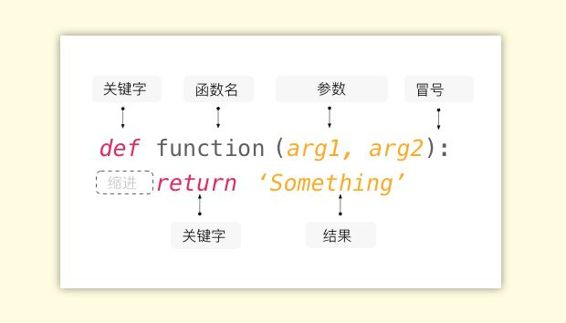
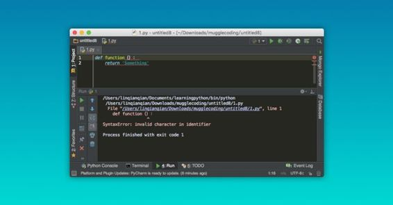
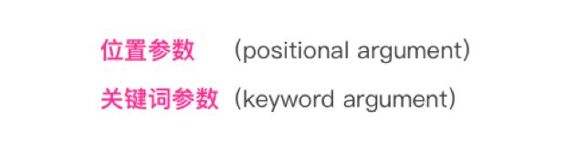
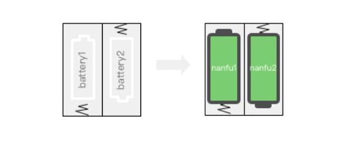
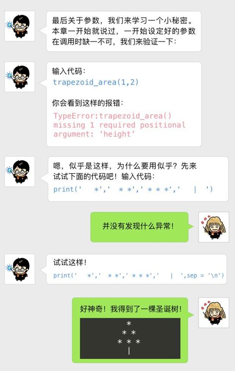
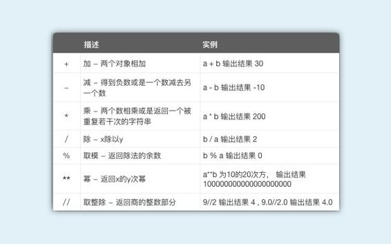

# 第四章 函数的魔法

## 4.1 重新认识函数

我们先不谈 Python 中的函数定义，因为将定义放在章节的首要位置，这明显就是懒得把事情讲明白的做法，相信你在阅读其他教材时对这点也深有体会。而我要说的是，经过第一章的阅读与训练，其实你早已掌握了函数的用法：



通过观察规律其实不难发现，Python 中所谓的使用函数，就是把你要处理的对象放到一个名字后面的括号里。简单来说，函数就是这么使用的，往里面塞东西就可以得到处理结果。这样的函数在 Python 中还有这些：


以最新的 3.50 版本为例，一共存在 68 个这样的函数，它们被统称为内建函数（Built-in Functions)。之所以被称为内建函数，并不是因为还有“外建函数”这个概念，内建的意思是在 3.50 版本安装完成后，你就可以使用这些函数，是“自带”的而已。千万不要被这些术语搞晕了头，往后学习我们还能看见更多这样的术语，因为在一个专业领域内，为了表达准确和高效，往往会使用专业术语来表达，其实都是很简单的概念。

不必急着把这些函数是怎么用的都搞明白，其中一些内建函数很实用，但是另外一些就不常用，比如涉及字符编码的函数 ascii()，bin()，chr()等等，这些都是相对底层的编程设计中才会使用到的函数，在你深入到一定程度的时候才会派上用场。

附上 [Python 官网中各个函数的介绍](https://docs.Python.org/3/library/functions.html)，有兴趣深入了解的话可以看一眼。

## 4.2 开始创建函数

我们需要学会使用已有的函数，更需要学会创建新的函数。自带的函数数量是有限的，想要让 Python 帮助我们做更多的事情，就要自己设计符合使用需求的函数。创建函数也很简单，其实我们在多年前的初中课堂上早已掌握了其原理。

先试着在命令行/终端中进入 Python 环境，输入这样的公式：



看着有点眼熟吧？第一个是数学的梯形计算公式，第二个是物理的摄氏度与华氏度的转换公式。



函数是编程中最基本的魔法，但同时一切的复杂又都隐含其中。它的原理和我们学习的数学公式相似，但是并不完全一样，等到后面你就知道为什么这么说了，这里面先介绍几个常见的词：

*   `def`（即 define，定义）的含义是创建函数，也就是定义一个函数。
*   `arg` （即 argument，参数）有时你还能见到这种写法：parameter，二者都是参数的意思但是稍有不同，这里不展开说了。
*   `return` 即返回结果。 好，现在我们读一遍咒语：`Define a function named ‘function’ which has two arguments : arg1 and arg2，returns the result——‘Something’` 是不是很易读很顺畅？代码的表达比英文句子更简洁一点：



需要注意的是：

*   `def` 和 `return` 是关键字（keyword），Python 就是靠识别这些特定的关键字来明白用户的意图，实现更为复杂的编程。像这样的关键字还有一些，在后面的章节中我们会细致讲解。

*   闭合括号后面的冒号必不可少，而且非常值得注意的是你要使用英文输入法进行输入，否则就是错误的语法，如果你在 IDE 中输入中文的冒号和括号，会有这样的错误提示：



*   如果在 IDE 中冒号后面回车（换行），你会自动地得到一个缩进。函数缩进后面的语句被称作是语句块（block），缩进是为了表明语句和逻辑的从属关系，是 Python 最显著的特征之一。很多初学者会忽视缩进问题，导致代码无法成功运行，需要特别注意。

现在我们看一下之前提到的摄氏度转化公式，按照上面定义函数的方法来实现一遍。我们把摄氏度转化定义为函数 `fahrenheit_Converter()` ，那么将输入进去的必然是摄氏度（Celsius）的数值，我们把 C 设为参数，最后返回的是华氏度（fahrenheit）的数值，我们用下面的函数来表达，输入代码：

```py
def fahrenheit_converter(C):
     fahrenheit = C * 9/5 + 32
     return str(fahrenheit) + '˚F'
```

> 注：计算的结果类型是 int，不能与字符串“ºF”相合并，所以需要先用 str()函数进行转换

输入完以上代码后，函数定义完成，那么我们开始使用它。我们把使用函数这种行为叫做**“调用”（call）**，你可以简单地理解成你请求 Python 帮你去做一件事情，就像是我们之前学习到的函数 len()一样：“请帮我测量这个（对象）的长度，并将结果打印出来。”

```py
lyric_length = len('I Cry Out For Magic!')
print(lyric_length)
```

就像我们使用 len() 函数一样，下面这段代码意味着——“请使用摄氏度转换器将 35 摄氏度转换成华氏度，将结果储存在名为 C2F 的变量并打印出来。”这样我们就完成了函数的调用同时打印了结果。

```py
C2F = fahrenheit_converter(35)
print(C2F)
```

对应的结果应该是 `95.0°F` ，你可以找一个摄氏度转换器计算一下，下面是我使用 Mac 自带的 Spotlight 的计算结果。


好，到了这里函数的定义和基本用法你就已经了解，在很长一段时间内你知道上面所讲的这些内容就基本够用了，但为了让你在深入使用函数的时候不产生困惑和挣扎，接下来我们试着解决一个更复杂的问题。

我们把刚才的函数按照如下进行修改：

```py
def fahrenheit_converter(C):
     fahrenheit = C * 9/5 + 32
     print(str(fahrenheit) + '˚F')
```

怎么样？看上去很相似吧？没错，我们仅仅就是把最后一行的 `return` 换成了 `print` 函数，一个很小的改动，而且似乎 IDE 也并没有对语法进行报错预警，那么我们来试一下调用函数会是什么情况吧：

```py
C2F = fahrenheit_converter(35)
print(C2F)
```

运行起来的结果是这样的：

```py
95.0˚F 
None
```

为什么会这样？

其实，得到这样的结果是因为 `print` 是一个函数，并非关键字（如果你的 print 不是函数那说明你的版本还停留在 2.x 系列，现在就赶紧安装 3.0 以上的版本！）。如果你足够细心的话可以发现，在 IDE 中，虽说 `print` 与 `return` 它们都是蓝色，但实际是有区分的：一个是正常体，一个是斜体。`return` 作为关键字在函数中起到了返回值的作用，而 `print` 顾名思义，只是在函数中展示给我们打印的结果，**是为人类设计的函数**。因此上面的 95.0ºF 实际上是**调用函数后产生的数值**，而下面的 `None` 正是此时变量 C2F 中所被返回到的数值——什么都没有，就因为没有关键字 `return` 。这就好比你对着一个人喊了一声他的名字（call），他只是“哎”地回应你一声，这是因为你并没有告诉他该做什么（return）。

没有 return 也没关系，不代表没有用，在 Python 中 `return` 是可选的（optional），这意味着你可以不用写 `return` 也可以顺利地定义一个函数并使用，只不过返回值是 `‘None’` 罢了。在后面我们还能见到不同使用方式的函数，这里只需要记住函数的基本设定即可。

在前面我们提到过，定义一个函数是使用 `def`（define），同时我们还能在各种教材不同版本的翻译中看到声明（declare）这个词，我们不难推测，从表达的目的上来说他们是一样的，但对于有其他语言基础的人来说，这两个词意味着两种不同的行为。其实没关系，在 Python 中 definition 和 declaration 是一体的，在这里说明仅仅是为了解答此困惑，深究则无意。

## 练习题

一、初级难度：设计一个重量转换器，输入以“g”为单位的数字后返回换算成“kg”的结果。

二、中级难度：设计一个求直角三角形斜边长的函数（两条直角边为参数，求最长边） 如果直角边边长分分别为 3 和 4，那么返回的结果应该像这样：

```py
The right triangle third side's length is 5.0
```

建议你动手练习一次，然后在微信公众号中回复 `函数` 获得答案，微信公众号是：easypython


## 4.3 传递参数与参数类型

前面大刀阔斧地说了关于函数定义和使用，在这一节我们谈论一些细节但是重要的问题一一参数。对于在一开始就设定了必要参数的函数来说，我们是通过打出函数的名称并向括号中传递参数实现对函数的调用（call），即只要把参数放进函数的括号中即可，就像是这样：

```py
fahrenheit_converter(35)
fahrenheit_converter(15)
fahrenheit_converter(0)
fahrenheit_converter(-3)
```

事实上，传递参数的方式有两种：



现在从似乎被我们遗忘的梯形的数学公式开始入手，首先还是创建函数。

我们把函数的名称定为 `trapezoid_area`，也就是梯形面积，设定参数为 `base_up`（上底），`base_down`（下底），`height`（高），每一个都用英文输入法的逗号隔开。梯形的面积需要知道这三个值才能求得，因此对于构造梯形面积的函数来说，这三个参数缺一不可。

```py
def trapezoid_area(base_up, base_down, height):
     return 1/2 * (base_up + base_down) * height
```

接下来我们开始调用函数。

```py
trapezoid_area(1,2,3)
```

不难看出，填入的参数 `1`，`2`，`3` 分别对应着参数 `base_up`，`base_down` 和 `height`。 这种传入参数的方式被称作为**位置参数**。

接着是第二种传入方式：

```py
trapezoid_area(base_up=1, base_down=2, height=3)
```

更直观地，在调用函数的时候，我们将每个参数名称后面赋予一个我们想要传入的值。这种以名称作为一一对应的参数传入方式被称作是**关键词参数**。

想一想去餐厅预约与就餐的流程：找到你预约的座位一般是用你留下的姓名，你就是一个参数，你会被按照姓名的方式传入你预定的座位，这个就是关键词参数传入；接下来是上菜，菜品按照你的座位号的方式来传入你的桌子，而这就相当于是位置传入参数。

也许你现在想不太明白这种传入方式有何作用，没有关系，后面我们会和其他知识一并进行讲解，到那时你就会对参数的传入方式有更高层次的认识。

避免混乱的最好方法就是先制造混乱，我们试着解决一个更复杂的问题，按照下面几种方式调用函数并打印结果：

```py
trapezoid_area(height=3, base_down=2, base_up=1)   # RIGHT!
trapezoid_area(height=3, base_down=2, 1)           # WRONG!
trapezoid_area(base_up=1, base_down=2, 3)          # RIGHT!
trapezoid_area(1, 2, height=3)                     # RIGHT!
```

*   第一行的函数参数按照反序传入，因为是关键词参数，所以并不影晌函数正常运作；
*   第二行的函数参数反序传入，但是到了第三个却变成了位置参数，遗憾的是这种方式是错误的语法，因为如果按照位置来传入，最后一个应该是参数 height 的位置。 但是前面 height 已经按照名称传入了值 3，所以是冲突的。
*   第三行的函数参数正序传入，前两个是以关键词的方式传入，最后一个以位置参数传入，这个函数是可以正常运行的；
*   第四行的函数参数正序传入，前两个是以位置的方式传入，最后一个以关键词参数传入，这个函数是可以正常运行的。

> 注：正确运行的结果应该是 4.5，也就是这个梯形的面积。

我们现在给一组变量赋值，然后再调用函数：

```py
base_up = 1
base_down = 2
height = 3

trapezoid_area(height, base_down, base_up)
```

然而这次函数调用的结果应该是 2.5，为什么？

如果你有这样的困惑，说明你已经被参数的命名和变量的命名搞晕，我们来把这两者区分清晰。首先，我们在定义函数的时候会定义参数的名称，其作用是使用函数时指导我们传入什么参数，它们从哪里来，是什么类型等，提供与使用函数相关的上下文。下面这段代码也许能够帮助你摆脱函数来自参数名称的困扰：

```py
def flashlight (battery1, battery2):
    return 'Light!'
```

我们定义一个叫做手电筒（flashlight）的函数，它需要两个参数 `battery1` 和 `battery2` 意为电池。这时候你去商店买电池，买回了两节 600 毫安时的南孚电池，于是：

```py
nanfu1 = 600
nanfu2 = 600

flashlight(nanfu1, nanfu2)
```



看明白了吗？南孚是电池的一种，是可以让手电筒发光的东西，将南孚电池放入就意味着我们放入了手电筒所需的电池，换句话说，`nanfu1`，`nanfu2` 是变量，同时也是满足能够传入的函数的 flashlight 函数的参数，传入后就代替了原有的 `battery1` 和 `battery2` 且传入方式仍旧是位置参数传入。`battery1` 和 `battery2` 只是形式上的的占位符，表达的意思是函数所需的参数应该是和电池即 battery 有关的变量或者是对象。



你看到的这个魔法就是我们将要提到的神奇的默认参数。默认参数是可选的，这意味着即使你上来不给它传入什么东西，函数还是可以正常运作。

你只需要这样输入代码：

```py
def trapezoid_area(base_up, base_down, height=3):
     return 1/2 * (base_up + base_down) * height
```

给一个参数设定默认值非常简单，我们只需要在**定义参数的时候给参数赋值即可**。这个也许跟传入参数的方式有点像，但是干万别记混了！这可是在定义的时候做的事情！这样一来，我们只需要传入两个参数就可以正常进行了：

```py
trapezoid_area(1, 2)
```

你肯定会疑惑，如果设定默认值的话，那么所有梯形的高岂不是都固定成 3 了啊？ 然而并没有，默认值的理念就是让使用函数尽可能的简单、省力。正如同我们安装软件都会有默认目录，但是如果你又想安装在其他地方，你可以选择自定义修改。之前看到的 print 函数的小把戏也正是如此，print 的可选参数 sep（意为每个打印的结果以…分开）的默认值为‘ ’空格，但是我们将其重新传入`‘／n’`也就是换行的意思，一句话说，也就是将每个打印的数以换行符号进行分割。下面我们来调用自己的参数：

```py
trapezoid_area(1, 2, height=15)
```

只需要传入我们想要的值就可以了，就是这么简单。

默认值并非是你掌握参数使用的必要知识，却是能帮助我们节省时间的小技巧。在实际项目中也经常会看见这样：

```py
requests.get(url, headers=header)
```

> 注：请求网站时 header，可填可不填

```py
img.save(img_new, img_format, quality=100)
```

> 注：给图片加水印的时候，默认的水印质量是 100

## 4.4 设计自己的函数

到了这里，我们应该可以十分有自信地设计一个符合自己项目需求的函数了，我们将上面各种所有知识进行整合，来设计一个简易的敏感词过滤器，不过在这之前，先来认识一个新的函数一一`open`。

这个函数使用起来很简单，只需要传入两个参数就可以正常运转了：文件的完整路径和名称，打开的方式。

先在桌面上创建一个名为 text.txt 的文件。Windows 用户在桌面点击右键唤出菜单创建即可，Mac 用户则打开 Pages 创建文件后点击导出格式选择 txt 格式即可。现在我们使用 open 函数打开它：

```py
open('/Users/Hou/Desktop/text.txt')
```

如果是 Windows 用户，应该像这样写你的路径：

```py
open('C://Users/Hou/Desktop/')
```

如果你照着代码敲入的话其实这时候文件应该已经是打开的了，但是……貌似我们看不出来，所以，我们再认识一个新的方法一一`write` 。在第一章我们已经提到过如何使用方法（如果你现在困惑函数和方法到底是什么关系的话，为了顺利地往后进行，我可以告诉你方法就是函数的一种，只不过在不同的位置而已，使用原理和函数非常相似），在这里我们就照抄第三章的 replace 用法来学着使用 write 方法：

```py
file = open('/Users/Hou/Desktop/text.txt','w')
file.write('Hello World')
```

写完后我们运行程序看看效果：


掌握了 open 与 write 的基本用法之后，我们就可以开始着手设计函数了，需求是这样的：传入参数 name 与 msg 就可以在桌面写入文件名称和内容的函数 text_create，并且如果当桌面上没有这个可以写入的文件时，就要创建一个之后再写入。现在我们开搞吧！

```py
def text_create(name, msg):   
    desktop_path = '/Users/Hou/Desktop/'    
    full_path = desktop_path + name + '.txt' 
    file = open(full_path,'w')             
    file.write(msg) 
    file.close() 
    print('Done')
text_create('hello','hello world') # 调用函数
```

我们来逐行解释这段代码。

*   第一行：定义函数的名称和参数；
*   第二行：我们在最开始知道，open 函数要打开一个完整的路径，所以首先是桌面路径；
*   第三行：我们给文件起什么名字，就是要传入的参数加上桌面路径再加上后缀就是完整的文件路径了；
*   第四行：打开文件，'w'参数代表作为写入模式，意思是：如果没有就在该路径创建一个有该名称文本，有则追加覆盖文本内容；
*   第五行：写入传入的参数 msg，即内容；
*   第六行：关闭文本。

这样一来敏感词过滤器的第一部分我们就完成了。顺带一提，这个函数就是我们在前面提及到的并不需要 `return` 也能发挥作用的函数，最后的 `print` 仅仅是为了表明上面的所有语句均已执行，一个提示而已。接下来我们实现第二部分，敏感词过滤，需求是这样的：定义一个为函数 text_filter 的函数，传入参数 word，cencored_word 和 changed_word 实现过滤，敏感词 cencored_word 默认为‘lame’，替换词 changed_word 默认为‘Awesome’。现在继续：

```py
def text_filter(word,censored_word = 'lame',changed_word = 'Awesome'):
    return word.replace(censored_word, changed_word)
text_filter('Python is lame!')     # 调用函数
```

这个函数就简单的多了，第一行我们按照设定默认参数的方式来定义函数，第二行直接返回使用 replace 处理后的结果。现在两个函数均已完成，本着低风险的原则，你可以尝试调用一下函数看看返回结果。

现在我们试着解决一个更复杂的问题，把两个函数进行合并：创建一个名为 text_censored_create 的函数，功能是在桌面上创建一个文本，可以在其中输入文字， 但是如果信息中含有敏感词的话将会被默认过滤后写入文件。其中文本的文件名参数为 name，信息参数为 msg，你可以先试着自己写一下，写完了再对照看下：

```py
def censored_text_create(name, msg):
    clean_msg = text_filter(msg)
    text_create(name,clean_msg)
censored_text_create('Try','lame!lame!lame!') # 调用函数
```

我们使用第一个函数，将传入的 msg 进行过滤后储存在名为 clean_msg 的变量中，再将传入的 name 文件名参数和过滤好的文本 clean_msg 作为参数传入函数 text_create 中，结果我们会得到过滤后的文本。

完成之后，你就会得到一个文本过滤器了！

本章只是借助数学阐明了函数的运作方式而已，但是如果你确实需要解决许多数学上的问题，可以参考以下表格，至于怎么用，多尝试就知道了。一定要敢于尝试，反正电脑也不会因为你的一行代码爆炸。

假设 a=10, b=20，则运算示例如下：

