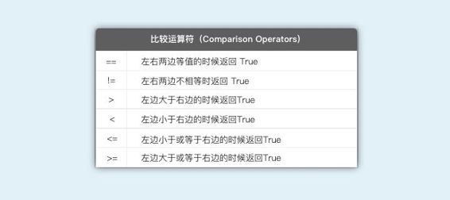
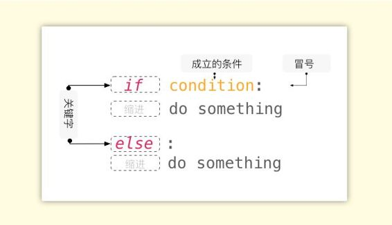
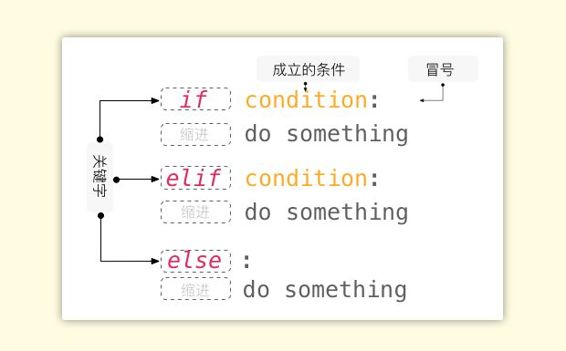
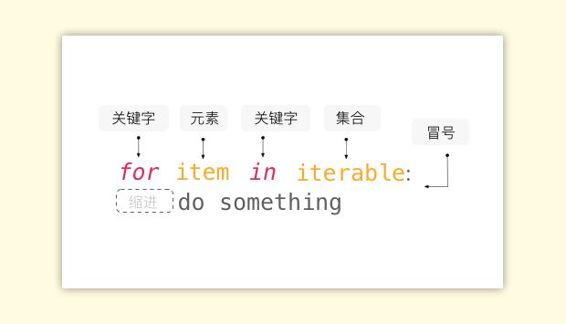
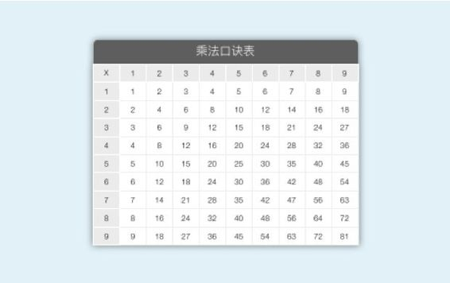
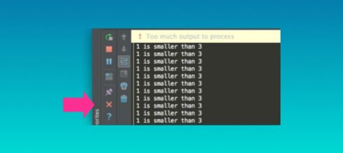
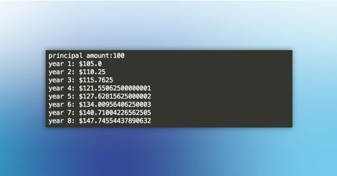
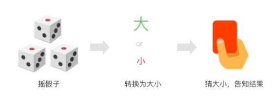
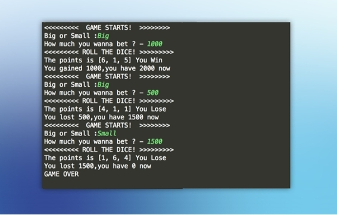
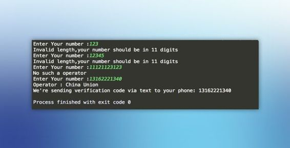

# 第五章 循环与判断

## 5.1 逻辑控制与循环

### 逻辑判断一一 True & False

逻辑判断是编程语言最有意思的地方，如果要实现一个复杂的功能或程序，逻辑判断必不可少。if-else 结构就是常见的逻辑控制的手段，当你写出这样的语句的时候，就意味着你告诉了计算机什么时候该怎么做，或者什么是不用做的。学完了前面几章内容之后，现在的你也许早已对逻辑控制摩拳擦掌、跃跃欲试，但是在这之前我们需要先了解逻辑判断的最基本准则一一布尔类型（Boolean Type）。

在开始前，想强调一点，如果你怀疑自己的逻辑能力，进而对本章的内容感到畏惧，请不要担心，我可以负责任地说，没有人是“没有逻辑的”，正如我们可以在极其复杂的现实世界中采取各种行动一样，你所需要的只不过是一些判断的知识和技巧而已。

布尔类型（Boolean）的数据只有两种，True 和 False （需要注意的是首字母大写）。人类以真伪来判断事实，而在计算机世界中真伪对应着的则是 1 和 0。

接下来我们打开命令行／终端进入 Python 环境，或者直接在 PyCharm 中选择 Python Console ，这样会更方便展示结果。True & False 这一小节的内容我们都在命令行／终端环境里输入代码。


> 注：此处使用命令行/终端只为更快展现结果，在 IDE 返回布尔值仍旧需要使用 print 函数来实现。

输入这些代码：

```py
1>2
1<2<3
42 != '42'
'Name' == 'name'
'M' in 'Magic'
number = 12
number is 12
```

我们每输入一行代码就会立即得到结果，这几行代码的表达方式不同，但是返回结果却只有 True 和 False 这两种布尔类型，因此我们称**但凡能够产生一个布尔值的表达式为布尔表达式（Boolean Expressions）**。

```py
1 > 2              # False
1 < 2 <3           # True
42 != '42'         # True
'Name' == 'name'   # False
'M' in 'Magic'     # True
number = 12 
number is 12       # True
```

可以看到，上面这些能够产生布尔值的方法或者公式不尽相同，那么我们来一一讲解这些运算符号的意义和用法。

### 比较运算（Comparison)

对于比较运算符，顾名思义，如果比较式成立那么则返回 True，不成立则返回 False。



除了一些在数学上显而易见的事实之外，比较运算还支持更为复杂的表达方式，例如：

*   多条件的比较。先给变量赋值，并在多条件下比较大小：

    ```py
    middle = 5
    1 < middle < 10
    ```

*   变量的比较。将两个运算结果储存在不同的变量中，再进行比较：

    ```py
    two = 1 + 1
    three = 1 + 3
    two < three
    ```

*   字符串的比较。其实就是对比左右两边的字符串是否完全一致，下面的代码就是不一致的，因为在 Python 中有着严格的大小写区分：

    ```py
    'Eddie Van Helen' == 'eddie van helen'
    ```

*   两个函数产生的结果进行比较：比较运算符两边会先行调用函数后再进行比较， 真结果等价于 `10 > 19` ：

    ```py
    abs(-10) > len('length of this word')
    ```

    > 注：`abs( )`是一个会返回输入参数的绝对值的函数。

### 比较运算的一些小问题

不同类型的对象不能使用“<,>,<=,>=”进行比较，却可以使用’==’和’!=’，例如字符串和数字：

```py
42 > 'the answer'      #无法比较  
42 == 'the answer'    #False
42 != 'the answer'    #True
```

需要注意的是，浮点和整数虽是不同类型，但是不影响到比较运算：

```py
5.0 == 5              #True
3.0 > 1               #True
```

你可能会有一个疑问，“为什么 1 ＝ 1 要写作 1 == 1 ?”，前面提及过 Python 中的符号在很多地方都和数学中十分相似，但又不完全一样。`“＝”` 在 Python 中代表着赋值，并非我们熟知的“等于”。所以，“1 ＝ 1”这种写法并不成立，并且它也不会给你返回一个布尔值。使用 `“＝＝”` 这种表达方式，姑且可以理解成是表达两个对象的值是相等的，这是一种约定俗成的语法，记得就可以了。

比较了字符串、浮点、整数……还差一个类型没有进行比较：布尔类型，那么现在实验一下：

```py
True > False
True + False > False + False
```

这样的结果又怎么理解呢？还记得前面说过的吗，True 和 False 对于计算机就像是 1 和 0 一样，如果在命令行中敲入 True + True + False 查看结果不难发现，True ＝ 1， False ＝ 0 也就是说，上面这段代码实际上等价于：

```py
1 > 0
1 + 0 > 0 + 0
```

至于为什么是这样的原因，我们不去深究，还是记得即可。

最后一个小的问题，如果在别的教材中看到类似 `1<>3` 这种表达式也不要大惊小怪，它其实与 `1!=3` 是等价的，仅仅知道就可以，并不是要让你知道“茴字的四种写法”。

### 成员运算符与身份运算符（Membership & Identify Operators)

成员运算符和身份运算符的关键词是 `in` 与 `is`。把 `in` 放在两个对象中间的含义是，测试前者是否存在于 `in` 后面的集合中。说到集合，我们先在这里介绍一个简单易懂的集合类型一一列表（List)。

字符串、浮点、整数、布尔类型、变量甚至是另一个列表都可以储存在列表中，列表是非常实用的数据结构，在后面会花更多篇幅来讲解列表的用法，这里先简单了解一下。

创建一个列表，就像是创建变量一样，要给它起个名字：

```py
album = []
```

此时的列表是空的，我们随便放点东西进去，这样就创建了一个非空的列表：

```py
album = ['Black Star','David Bowie',25,True]
```

这个列表中所有的元素是我们一开始放好的，那当列表创建完成后，想再次往里面添加内容怎么办？使用列表的 `append` 方法可以向列表中添加新的元素，并且使用这种方式添加的元素会自动地排列到列表的尾部：

```py
album.append('new song')
```

接着就是列表的索引，如果在前面的童节你很好地掌握了字符串的索引，相信理解新的知识应该不难。下面代码的功能是打印列表中第一个和最后一个元素：

```py
print(album[0],album[-1])
```

接下来我们使用 `in` 来测试字符串 ‘Black Star’ 是否在列表 album 中。如果存在则会显示 True，不存在就会显示 False 了：

```py
'Black Star' in album
```

是不是很简单？正如前面看到的那样，`in` 后面是一个集合形态的对象，字符串满足这种集合的特性，所以可以使用 `in` 来进行测试。

接下来再来讲解 `is` 和 `is not`，它们是表示身份鉴别（Identify Operator）的布尔运算符，`in` 和 `not in` 则是表示归属关系的布尔运算符号（Membership Operator）。

在 Python 中任何一个对象都要满足身份（Identity）、类型（Type）、值 （Value）这三个点，缺一不可。`is` 操作符号就是来进行身份的对比的。试试输入这段代码：

```py
the_Eddie = 'Eddie'
name = 'Eddie'  
the_Eddie == name
the_Eddie is name
```

你会发现在两个变量一致时，经过 is 对比后会返回 True。

其实在 Python 中任何对象都可判断其布尔值，除了 0、None 和所有空的序列与集合（列表，字典，集合）布尔值为 False 之外，其它的都为 True ，我们可以使用函数 `bool()` 进行判别：

```py
bool(0)      #False
bool([])     #False
bool('')     #False
bool(False)  #False
bool(None)   #False
```

可能有人不明白，为什么一个对象会等于 None。还记得在函数那章的敏感词过滤器的例子吗？在定义函数的时候没有写 return 依然可以使用，但如果调用函数，企图把根本就不存在的“返回值”储存在一个变量中时，变量实际的赋值结果将是 None。

当你想设定一个变量，但又没想好它应该等于什么值时，你就可以这样：

```py
a_thing = None
```

### 布尔运算符（Boolean Operators）

and、or 用于布尔值的之间的运算，具体规则如下：


and 和 or 经常用于处理复合条件，类似于 1 < n < 3 ，也就是两个条件同时满足。

```py
1 < 3 and 2 < 5  #True
1 < 3 and 2 > 5  #False
1 < 3 or 2 > 5   #True
1 > 3 or 2 > 5   #False
```

## 5.2 条件控制

条件控制其实就是 `if…else` 的使用。先来看下条件控制的基本结构：



用一句话概括 if...else 结构的作用：**如果...条件是成立的，就做...；反之，就做...**

所谓条件（condition）指的是成立的条件，即是**返回值为 True 的布尔表达式**。知道了这点后使用起来应该不难。

我们结合函数的概念来创建这样一个函数，逐行分析它的原理：

```py
def account_login(): 
    password = input('Password:') 
    if password == '12345': 
        print('Login success!')  
    else:   
        print('Wrong password or invalid input!')                                             
        account_login() 
account_login()
```

*   第 1 行：定义函数，并不需要参数；
*   第 2 行：使用 input 获得用户输入的字符串并储存在变量 password 中；
*   第 3、4 行：设置条件，如果用户输入的字符串和预设的密码 12345 相等时，就执行打印文本‘Login success！’；
*   第 5、6 行：反之，一切不等于预设密码的输入结果，全部会执行打印错误提示，并且再次调用函数，让用户再次输入密码；
*   第 7 行：运行函数；
*   第 8 行：调用函数。

值得一提的是，如果 if 后面的布尔表达式过长或者难于理解，可以采取给变量赋值的办法来储存布尔表达式返回的布尔值 True 或 False。因此上面的代码可以写成这样：

```py
def account_login():
    password = input('Password:')
    password_correct = password == '12345'     #HERE！
    if password_correct:
        print('Login success!')
    else:
        print('Wrong password or invalid input!')
        account_login()
account_login()
```

一般情况下，设计程序的时候需要考虑到逻辑的完备性，并对用户可能会产生困扰的情况进行预防性设计，这时候就会有多条件判断。

多条件判断同样很简单，只需在 if 和 else 之间增加上 `elif`，用法和 if 是一致的。而且条件的判断也是依次进行的，首先看条件是否成立，如果成立那么就运行下面的代码，如果不成立就接着顺次地看下面的条件是否成立，如果都不成立则运行 else 对应的语句。



接下来我们使用 elif 语句给刚才设计的函数增加一个重置密码的功能：

```py
password_list = ['*#*#','12345']  
def account_login():   
    password = input('Password:')  
    password_correct = password == password_list[-1] 
    password_reset = password == password_list[0] 
    if password_correct:  
        print('Login success!') 
    elif password_reset: 
        new_password = input('Enter a new password:')   
        password_list.append(new_password)  
        print('Your password has changed successfully!') 
        account_login() 
    else: 
        print('Wrong password or invalid input!') 
        account_login()  
account_login()
```

*   第 1 行：创建一个列表，用于储存用户的密码、初始密码和其他数据（对实际数据库的简化模拟）；
*   第 2 行：定义函数；
*   第 3 行：使用 input 获得用户输入的字符串并储存在变量 password 中；
*   第 4 行：当用户输入的密码等于密码列表中最后一个元素的时候（即用户最新设定的密码），登录成功；
*   第 5～9 行：当用户输入的密码等于密码列表中第一个元素的时候（即重置密码的“口令”）触发密码变更，并将变更后的密码储存至列表的最后一个，成为最新的用户密码；
*   第 10 行：反之，一切不等于预设密码的输入结果，全部会执行打印错误提示，并且再次调用函数，让用户再次输入密码；
*   第 11 行：调用函数。

在上面的代码中其实可以清晰地看见代码块（Code Block）。代码块的产生是由于缩进，也就是说，具有相同缩进量的代码实际上是在共同完成相同层面的事情，这有点像是编辑文档时不同层级的任务列表。

## 5.3 循环（Loop)

### for 循环

我们先来看一个例子，输入代码：

```py
for every_letter in 'Hello world':
    print(every_letter)
```

得到这样的结果：

```py
H
e
l
l
o

w
o
r
l
d
```

这两行代码展示的是：用 for 循环打印出 “hello world” 这段字符串中的每一个字符。for 循环作为编程语言中最强力的特性之一，能够帮助我们做很多重复性的事情，比如批量命名、批量操作等等。

把 for 循环所做的事情概括成一句话就是：**于...其中的每一个元素，做...事情。**



*   `for` 是关键词，而后面紧接着的是一个可以容纳“每一个元素”的变量名称，至于变量起什么名字自己定，但切记不要和关键词重名。

*   在关键词 `in` 后面所对应的一定是具有“可迭代的”（iterable）或者说是像列表那样的集合形态的对象，即可以连续地提供其中的每一个元素的对象。

为了更深入了解 for 循环，试着思考以下问题，如何打印出这样的结果？

```py
1 + 1 = 2  
2 + 1 = 3
.
.
10 + 1 = 11
```

这需要用到一个内置函数一一 range。我们只需要在 range 函数后面的括号中填上数字，就可以得到一个具有连续整数的序列，输入代码：

```py
for num in range(1,11): #不包含 11，因此实际范围是 1～10
    print(str(num) + ' + 1 =',num + 1)
```

这段代码表达的是：将 1～10 范围内的每一个数字依次装入变量 `num` 中，每次展示一个 `num +1` 的结果。在这个过程中，变量 `num` 被循环赋值 10 次，你可以理解成等同于：

```py
num = 1
print(str(num) + ' + 1 =',num + 1)
num = 2
print(str(num) + ' + 1 =',num + 1)
              .
              .
num = 10
print(str(num) + ' + 1 =',num + 1)
```

现在我们试着解决更复杂的问题，把 for 和 if 结合起来使用。实现这样一个程序：歌曲列表中有三首歌“Holy Diver, Thunderstruck, Rebel Rebel”，当播放到每首时，分别显示对应的歌手名字“Dio, AC/CD, David Bowie”。

代码如下：

```py
songslist = ['Holy Diver', 'Thunderstruck', 'Rebel Rebel']
for song in songslist:
    if song == 'Holy Diver':
        print(song,' - Dio')
    elif song == 'Thunderstruck':
        print(song,' - AC/DC')
    elif song == 'Rebel Rebel':
        print(song,' - David Bowie')
```

在上述代码中，将 songslist 列表中的每一个元素依次取出来，并分别与三个条件做比较，如果成立则输出相应的内容。

### 嵌套循环

在编程中还有一种常见的循环，被称之为嵌套循环（Nested Loop），其实这种循环并不复杂而且还非常实用。我们都学过乘法口诀表，又称“九九表”。



接下来我们就用嵌套循环实现它：

```py
for i in range(1,10):
    for j in range(1,10):
        print('{} X {} = {}'.format(i,j,i*j))
```

正如代码所示，这就是嵌套循环。通过观察，我们不难发现这个嵌套循环的原理：最外层的循环依次将数值 1～9 存储到变量 `i` 中，变量 `i` 每取一次值，内层循环就要依次将 1～9 中存储在变量 `j` 中，最后展示当前的 `i`、`j` 与 `i*j` 的结果。如果忘了 {} 的用法，可以往回翻第三章最后一页看看。

### While 循环

Python 中有两种循环，第一种 for 循环我们已经介绍过了，第二种则是 while 循环。它们的相同点在于都能循环做一件重复的事情，不同点在于 for 循环会在可迭代的序列被穷尽的时候停止，while 则是在条件不成立的时候停止，因此 while 的作用概括成一句话就是：**只要…条件成立，就一直做…。**


看一个简单的例子：

```py
while 1 < 3:
    print('1 is smaller than 3')
```

在这里先行提醒一下，一定要记得及时停止运行代码！



注：在终端或者命令行中搜 Ctrl + C 停止运行，在 PyCharm 中则点击红色的 X 停止。

因为在 while 后面的表达式是永远成立的，所以 print 会一直进行下去直至你的 cpu 过热。这种条件永远为 True 的循环，我们称之为死循环（Infinite Loop）。

但如果 while 循环不像 for 循环那样，在集合被穷尽之后停下来，我们怎样才能控制 while 循环呢？其中一种方式就是：**在循环过程中制造某种可以使循环停下来的条件**，例如：

```py
count = 0
while True:
    print('Repeat this line !')
    count = count + 1
    if count == 5:
        break
```

在上面这段代码中，有两个重要的地方，首先是我们给一个叫 count 的变量赋值为 0，其目的是计数。我们希望在循环次数为 5 的时候停下来。接下来的是 break ，同样作为关键词写在 if 下面的作用就是告诉程序在上面条件成立的时候停下来，仅此而已。

然而你也一定发现了什么奇怪的地方，没错，就是这个 `count ＝ count ＋ 1` ！其实我已经不止一次强调过编程代码和数学公式在某些地方很相似，但又不完全相同，而这又是一个绝好的例子。首先在 Python 中 “=” 并非是我们熟知的“等于”的含义，所以我们不必按照数学公式一样把重复的变量划掉。其次 count 被赋值为 0，count ＝ count +1 意味着 count 被重新赋值！等价于 count ＝ 0 + 1，随着每次循环往复，count 都会在上一次的基础上重新赋值，都会增加 1，直至 count 等于 5 的时候 break，跳出最近的一层循环，从而停下来。

利用循环增加变量其实还是一个挺常见的技巧，随着循环不仅可以增加，还可以随着循环减少（n = n - 1），甚至是成倍数增加 ( n = n * 3 )。

除此之外，让 while 循环停下来的另外一种方法是：**改变使循环成立的条件**。为了解释这个例子，我们在前面登录函数的基础上来实现，给登录函数增加一个新功能：输入密码错误超过 3 次就禁止再次输入密码。你可以尝试写一下，答案在下面揭晓。

```py
password_list = ['*#*#','12345']

def account_login():
    tries = 3
    while tries > 0:  
        password = input('Password:')
        password_correct = password == password_list[-1]
        password_reset = password == password_list[0]

        if password_correct:
            print('Login success!')
        elif password_reset:
            new_password = input('Enter a new password :')
            password_list.append(new_password)
            print('Password has changed successfully!')
            account_login()
        else:
            print('Wrong password or invalid input!')
            tries = tries - 1  
            print( tries, 'times left')

    else:
        print('Your account has been suspended')
account_login()
```

这段代码只有三处与前面的不一样：

*   第 4～5 行：增加了 while 循环，如果 tries ＞0 这个条件成立，那么便可输入密码，从而执行辨别密码是否正确的逻辑判断；
*   第 20～21 行：当密码输入错误时，可尝试的次数 tries 减少 1；
*   第 23～24 行：while 循环的条件不成立时，就意味着尝试次数用光，通告用户账户被锁。

在这里 while 可以理解成是 if 循环版，可以使用 while-else 结构，而在 while 代码块中又存在着第二层的逻辑判断，这其实构成了嵌套逻辑（Nested Condition）。

### 练习题

一、设计这样一个函数，在桌面的文件夹上创建 10 个文本，以数字给它们命名。


二、复利是一件神奇的事情，正如富兰克林所说：“复利是能够将所有铅块变成金块的石头”。设计一个复利计算函数 invest()，它包含三个参数：amount（资金），rate（利率），time（投资时间）。输入每个参数后调用函数，应该返回每一年的资金总额。它看起来就应该像这样（假设利率为 5%）：



三、打印 1～100 内的偶数

建议你动手练习一次，然后在微信公众号中回复 `循环` 获得答案，微信公众号是：easypython


## 5.4 综合练习

我们已经基本学完了逻辑判断和循环的用法，现在开始做一点有意思的事情：设计一个小游戏猜大小，这个在文曲星上的小游戏陪伴我度过了小学时的无聊时光。

在此之前，还是先行补充一些必要知识。

首先，创建一个列表，放入数字，再使用 sum() 函数对列表中的所有整数求和，然后打印：

```py
a_list = [1,2,3]
print(sum(a_list))
```

结果是 6，这应该很好理解。

接着，Python 中最方便的地方是有很多强大的库支持，现在我们导入一个 random 的内置库，然后使用它生成随机数：

```py
import random

point1 = random.randrange(1,7)
point2 = random.randrange(1,7)
point3 = random.randrange(1,7)

print(point1,point2,point3)
```

结果就不展示了，因为每次打印结果肯定是不一样的，其中 random 中的 randrange 方法使用起来就像是 range 函数一样，两个参数即可限定随机数范围。

在正式开始创建函数之前，我们先把游戏规则细化一下：

游戏开始，首先玩家选择 Big or Small（押大小），选择完成后开始摇三个骰子计算总值，11 <= 总值 <=18 为 “大”，3 <= 总值 <= 10 为 “小”。然后告诉玩家猜对或是猜错的结果。看起来就像是这样：

```py
<<<<< GAME STARTS! >>>>>
Big or Small:Big
<<<<< ROLE THE DICE!>>>>>
The points are [2, 6, 3] You Lose!
```

好，现在我们就可以开始来制作小游戏了！

我们先来梳理一下这个小游戏的程序设计思路：



首先，需要让程序知道如何摇骰子，我们需要构建一个摇骰子的函数。这里面有两个关键点，一是需要摇 3 个骰子，每个骰子都生成 1~6 的随机数，你需要考虑一下，用什么方式可以实现依次摇 3 个骰子，这是我们在这一章里面学到的知识点；二是创建一个列表，把摇骰子的结果存储在列表里面，并且每局游戏都更换结果，也就是说每局游戏开始前列表都被清空一次，这里也需要好好考虑下用什么方式实现。

其次，我们摇出来的结果是 3 个骰子分别的点数，需要把点数转换为“大”或者“小”，其中“大”的点数范围是 11 <= 总值 <=18，“小”的点数范围是 3 <= 总值 <= 10。

最后，让用户猜大小，如果猜对了就告诉用户赢的结果，如果猜错了就告诉用户输的结果。

只要你掌握了本章的内容，这个小游戏的编程过程并不困难。如果你决心掌握编程这种魔法，实际上最需要的是，发展出设计与分解事物的思路。所谓逻辑关系就是不同事物之间的关联性，它们以何种方式连接、作用，又在什么边界条件下能实现转换或互斥。与其说是编程有趣，倒不如说是编程引发的这种思考给开发者带来了乐趣。

有思路了吗？先试试自己动手做吧。下面会揭晓答案。

首先，我们先来构造可以摇骰子的函数 `roll_dice` 。这个函数其实并不需要输入任何参数，调用后会返回储存着摇出来三个点数结果的列表。

```py
import random
def roll_dice(numbers=3, points=None):   
    print('<<<<< ROLL THE DICE! >>>>>')   
    if points is None:  
        points = []  
    while numbers > 0:  
        point = random.randrange(1,7)  
        points.append(point)  
        numbers = numbers - 1  
    return points
```

*   第 2 行：创建函数，设定两个默认参数作为可选，`numbers`——骰子数量，`points`——三个筛子的点数的列表；
*   第 3 行：告知用户开始摇骰子；
*   第 4~5 行：如果参数中并未指定 `points`，那么为 `points` 创建空的列表；
*   第 6~9 行：摇三次骰子，每摇一次 `numbers` 就减 1 ，直至小于等于 0 时，循环停止；
*   第 10 行：返回结果的列表。

接着，我们再用一个函数来将点数转化成大小，并使用 if 语句来定义什么是“大”，什么是“小”：

```py
def roll_result(total):                                   
    isBig = 11 <= total <=18                                
    isSmall = 3 <= total <=10                               
    if isBig:                                              
        return 'Big'                                       
    elif isSmall:                                         
        return 'Small'
```

*   第 1 行：创建函数，其中必要的参数是骰子的总点数；
*   第 2~3 行：设定“大”与“小”的判断标准；
*   第 4~7 行：在不同的条件下返回不同的结果。

最后，创建一个开始游戏的函数，让用户输入猜大小，并且定义什么是猜对，什么是猜错，并输出对应的输赢结果。

```py
def start_game():  
    print('<<<<< GAME STARTS! >>>>>')  
    choices = ['Big','Small']  
    your_choice = input('Big or Small :')  
    if your_choice in choices:  
        points = roll_dice()  
        total = sum(points)
        youWin = your_choice == roll_result(total)                                          
        if youWin: 
            print('The points are',points,'You win !') 
        else:  
            print('The points are',points,'You lose !')  
    else:  
        print('Invalid Words') 
        start_game() 
start_game()
```

*   第 1 行：创建函数，并不需要什么特殊参数；
*   第 2 行：告知用户游戏开始；
*   第 3 行：规定什么是正确的输入；
*   第 4 行：将用户输入的字符串储存在 your_choice 中；
*   第 5、13～15 行：如果符合输入规范则往下进行，不符合则告知用户并重新开始；
*   第 6 行：调用 roll_dice 函数，将返回的列表命名为 points；
*   第 7 行：点数求和；
*   第 8 行：设定胜利的条件——你所选的结果和计算机生成的结果是一致的；
*   第 9~12 行：成立则告知胜利，反之，告知失败；
*   第 16 行：调用函数，使程序运行。

完成这个小游戏之后，你就可以试着和自己设计的程序玩猜大小了。同时你也掌握了循环和条件判断混用的方法，初步具备了设计更复杂的程序的能力了。

### 练习题

一、在最后一个项目的基础上增加这样的功能，下注金额和赔率。具体规则如下：

*   初始金额为 1000 元；
*   金额为 0 时游戏结束；
*   默认赔率为 1 倍，也就是说押对了能得相应金额，押错了会输掉相应金额。



二、我们在注册应用的时候，常常使用手机号作为账户名，在短信验证之前一般都会检验号码的真实性，如果是不存在的号码就不会发送验证码。检验规则如下：

*   长度不少于 11 位；
*   是移动、联通、电信号段中的一个电话号码；
*   因为是输入号码界面，输入除号码外其他字符的可能性可以忽略；
*   移动号段，联通号段，电信号段如下：

    ```py
    CN_mobile = [134,135,136,137,138,139,150,151,152,157,158,159,182,183,184,187,188,147,178,1705]
    CN_union = [130,131,132,155,156,185,186,145,176,1709]
    CN_telecom = [133,153,180,181,189,177,1700]
    ```

程序效果如下：



建议你动手练习一次，然后在微信公众号中回复 `循环与判断提示` 可以获得提示，回复 `循环与判断答案` 可以获得参考答案，微信公众号是：easypython

