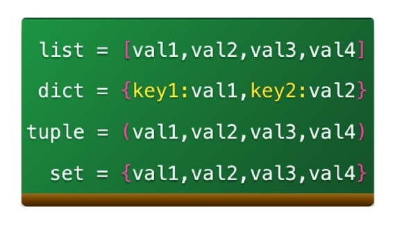
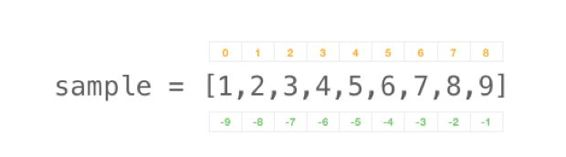
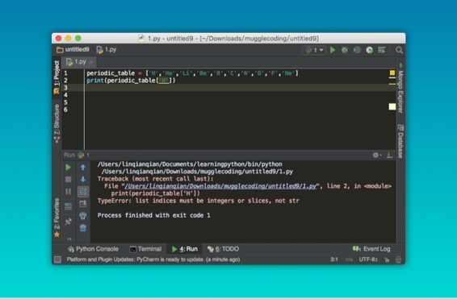
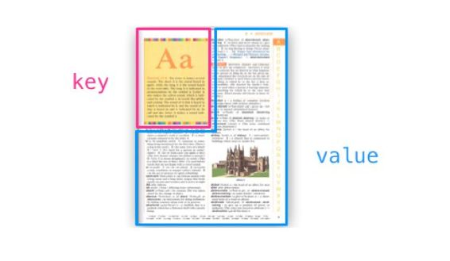
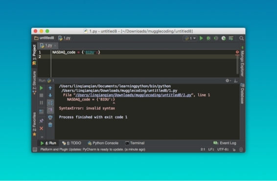
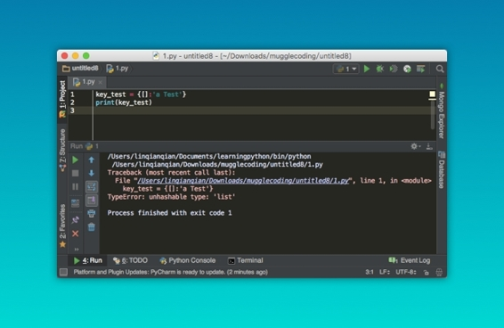
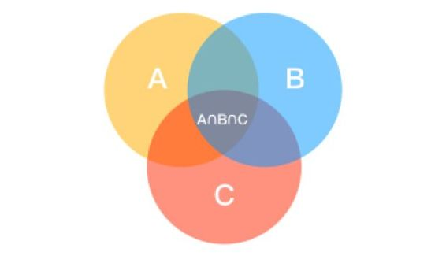
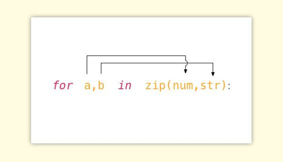
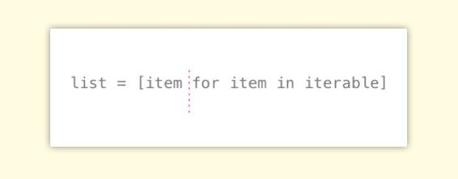

# 第六章 数据结构

## 6.1 数据结构（Data Structure)

正如在现实世界中一样，直到我们拥有足够多的东西，才迫切需要一个储存东西的容器，这也是我坚持把数据结构放在后面的原因一一直到你掌握足够多的技能，可以创造更多的数据，你才会重视数据结构的作用。这些储存大量数据的容器，在 Python 称之为内置数据结构（Built-in Data Structure）。

我们日常使用的网站、移动应用，甚至是手机短信都依赖于数据结构来进行存储，其中的数据以一种特定的形式储存在数据结构中，在用户需要的时候被拿出来展现。


> 注：豆瓣电影列表运用的数据结构的展现

Python 有四种数据结构，分别是：列表、字典、元组，集合。每种数据结构都有自己的特点，并且都有着独到的用处。为了避免过早地陷入细枝末节，我们先从整体上来认识一下这四种数据结构：



从最容易识别的特征上来说，列表中的元素使用方括号扩起来，字典和集合是花括号，而元组则是圆括号。其中字典中的元素是均带有 `‘：’` 的 key 与 value 的对应关系组。

## 6.2 列表（list)

首先我们从列表开始，深入地讲解每一种数据结构。列表具有的最显著的特征是：

1.  列表中的每一个元素都是可变的；
2.  列表中的元素是有序的，也就是说每一个元素都有一个位置；
3.  列表可以容纳 Python 中的任何对象。

列表中的元素是可变的，这意味着我们可以在列表中添加、删除和修改元素。

列表中的每一个元素都对应着一个位置，我们通过输入位置而查询该位置所对应的值，试着输入：

```py
Weekday = ['Monday','Tuesday','Wednesday','Thursday','Friday']
print(Weekday[0])
```

第三个特征是列表可以装入 Python 中所有的对象，看下面的例子就知道了：

```py
all_in_list = [
    1,                              #整数
    1.0,                            #浮点数
    'a word',                       #字符串
    print(1),                       #函数
    True,                           #布尔值
    [1,2],                          #列表中套列表
    (1,2),                          #元组
    {'key':'value'}                 #字典
]
```

### 列表的增删改查

对于数据的操作，最常见的是增删改查这四类。从列表的插入方法开始，输入：

```py
fruit = ['pineapple','pear']
fruit.insert(1,'grape')
print(fruit)
```


在使用 `insert` 方法的时候，必须指定在列表中要插入新的元素的位置，插入元素的实际位置是在**指定位置元素之前的位置**，如果指定插入的位置在列表中不存在，实际上也就是超出指定列表长度，那么这个元素一定会被放在列表的最后位置。

另外使用这种方法也可以同样达到“插入”的效果：

```py
fruit[0:0] = ['Orange']
print(fruit)
```

删除列表中元素的方法是使用 remove()：

```py
fruit = ['pinapple','pear','grape']
fruit.remove('grape')
print(fruit)
```

如果要是想替换修改其中的元素可以这样：

```py
fruit[0] = 'Grapefruit'
```

删除还有一种方法，那就是使用 del 关键字来声明：

```py
del fruit[0:2]
print(fruit)
```

列表的索引与字符串的分片十分相似，同样是分正反两种索引方式，只要输入对应的位置就会返回给你在这个位置上的值：



接下来我们用元素周期表来试验一下：

```py
periodic_table = ['H','He','Li','Be','B','C','N','O','F','Ne']
print(periodic_table[0])
print(periodic_table[-2])
print(periodic_table[0:3])
print(periodic_table[-10:-7])
print(periodic_table[-10:]) 
print(periodic_table[:9])
```

你会发现列表的索引和字符串是一样的，十分简单对吧？但是如果要是反过来，想要查看某个具体的值所在的位置，就需要用别的方法了，否则就会报错：



报错是因为列表只接受用位置进行索引，但如果数据量很大的话，肯定会记不住什么元素在什么位置，那么有没有一种数据类型可以用人类的方式来进行索引呢？其实这就是字典，我们一起来继续学习。

## 6.3 字典（Dictionary)

编程世界中其实有很多概念都基于现实生活的原型，字典这种数据结构的特征也正如现实世界中的字典一样，使用名称－内容进行数据的构建，在 Python 中分别对应着键（key）－值（value），习惯上称之为键值对。



字典的特征总结如下：

1.  字典中数据必须是以键值对的形式出现的；
2.  逻辑上讲，键是不能重复的，而值可以重复；
3.  字典中的键（key）是不可变的，也就是无法修改的；而值（value）是可变的，可修改的，可以是任何对象。

用下面这个例子来看一下，这是字典的书写方式：

```py
NASDAQ_code = {
    'BIDU':'Baidu',
    'SINA':'Sina',
    'YOKU':'Youku'
}
```

一个字典中键与值并不能脱离对方而存在，如果你写成 `{'BIDU':}` 会引发一个语法错误：



我们再试着将一个可变（mutable）的元素作为 key 来构建字典，比如列表：

```py
key_test = {[]:'a Test'}
print(key_test)
```

会引发另一个语法错误：



想必一次次的报错会让你深深记住这两个特征： key 和 value 是一一对应的，key 是不可变的。

同时字典中的键值不会有重复，即便你这么做，相同的键值也只能出现一次：

```py
a = {'key':123,'key':123}
print(a)
```

### 字典的增删改查

首先我们按照映射关系创建一个字典，继续使用前面的例子：

```py
NASDAQ_code = {'BIDU':'Baidu','SINA':'Sina'}
```

与列表不同的是，字典并没有一个可以往里面添加单一元素的“方法”，但是我们可以通过这种方式进行添加：

```py
NASDAQ_code['YOKU'] = 'Youku'
print(NASDAQ_code）
```

列表中有用来添加多个元素的方法 extend() ，在字典中也有对应的添加多个元素的方法 `update()`：

```py
NASDAQ_code.update({'FB':'Facebook','TSLA':'Tesla'})
```

删除字典中的元素则使用 `del` 方法：

```py
del NASDAQ_code['FB']
```

需要注意的是，虽说字典是使用的花括号，在索引内容的时候仍旧使用的是和列表一样的方括号进行索引，只不过在括号中放入的一定是——字典中的键，也就是说需要通过键来索引值：

```py
NASDAQ_code['TSLA']
```

同时，字典是不能够切片的，也就是说下面这样的写法应用在字典上是错误的：

```py
chart[1:4]  # WRONG!
```

## 6.4 元组（Tuple)

元组其实可以理解成一个稳固版的列表，因为元组是不可修改的，因此在列表中的存在的方法均不可以使用在元组上，但是元组是可以被查看索引的，方式就和列表一样：

```py
letters = ('a','b','c','d','e','f','g')
letter[0]
```

## 6.5 集合（Set)

集合则更接近数学上集合的概念。每一个集合中的元素是无序的、不重复的任意对象，我们可以通过集合去判断数据的从属关系，有时还可以通过集合把数据结构中重复的元素减掉。



集合不能被切片也不能被索引，除了做集合运算之外，集合元素可以被添加还有删除：

```py
a_set = {1,2,3,4}                                              
a_set.add(5)
a_set.discard(5)
```

## 6.6 数据结构的一些技巧

### 多重循环

有很多函数的用法和数据结构的使用是息息相关的。前面我们学习了列表的基本用法，而在实际操作中往往会遇到更多的问题。比如，在整理表格或者文件的时候会按照字母或者日期进行排序，在 Python 中也存在类似的功能：

```py
num_list = [6,2,7,4,1,3,5]
print(sorted(num_list))
```

怎么样，很神奇吧？`sorted` 函数按照长短、大小、英文字母的顺序给每个列表中的元素进行排序。这个函数会经常在数据的展示中使用，其中有一个非常重要的地方，`sorted` 函数并不会改变列表本身，你可以把它理解成是先将列表进行复制，然后再进行顺序的整理。

在使用默认参数 reverse 后列表可以被按照逆序整理：

```py
sorted(num_list,reverse=True)
```

在整理列表的过程中，如果同时需要两个列表应该怎么办？这时候就可以用到 `zip` 函数，比如：

```py
for a,b in zip(num,str):
    print(b,'is',a)
```



### 推导式

现在我们来看数据结构中的推导式（List comprehension），也许你还看到过它的另一种名称叫做列表的解析式，在这里你只需要知道这两个说的其实是一个东西就可以了。

现在我有 10 个元素要装进列表中，普通的写法是这样的：

```py
a = []
for i in range(1,11):
    a.append(i)
```

下面换成列表解析的方式来写：

```py
b = [i for i in range(1,11)]
```

列表解析式不仅非常方便，并且在执行效率上要远远胜过前者，我们把两种不同的列表操作方式所耗费的时间进行对比，就不难发现其效率的巨大差异：

```py
import time

a = []
t0 = time.clock()
for i in range(1,20000):
    a.append(i)
print(time.clock() - t0, seconds process time")

t0 = time.clock()
b = [i for i in range(1,20000)]
print(time.clock() - t0, seconds process time")
```

得到结果：

```py
8.999999999998592e-06 seconds process time
0.0012320000000000005 seconds process time
```

列表推导式的用法也很好理解，可以简单地看成两部分。红色虚线后面的是我们熟悉的 for 循环的表达式，而虚线前面的可以认为是我们想要放在列表中的元素，在这个例子中放在列表中的元素即是后面循环的元素本身。



为了更好地理解这句话，我们继续看几个例子：

```py
a = [i**2 for i in range(1,10)]
c = [j+1 for j in range(1,10)]
k = [n for n in range(1,10) if n % 2 ==0]
z = [letter.lower() for letter in 'ABCDEFGHIGKLMN']
```

字典推导式的方式略有不同，主要是因为创建字典必须满足键－值的两个条件才能达成：

```py
d = {i:i+1 for i in range(4)}

g = {i:j for i,j in zip(range(1,6),'abcde')}
g = {i:j.upper() for i,j in zip(range(1,6),'abcde')}
```

### 循环列表时获取元素的索引

现在我们有一个字母表，如何能像图中一样，在索引的时候得到每个元素的具体位置的展示呢？

```py
letters = ['a', 'b', 'c', 'd', 'e', 'f', 'g']
```

```py
a is 1
b is 2
c is 3
d is 4
e is 5
f is 6 
g is 7
```

前面提到过，列表是有序的，这时候我们可以使用 Python 中独有的函数 enumerate 来进行：

```py
letters = ['a', 'b', 'c', 'd', 'e', 'f', 'g']
for num,letter in enumerate(letters):
    print(letter,'is',num + 1)
```

## 6.7 综合项目

为了深入理解列表的使用方法，在本章的最后，我们来做一个词频统计。需要瓦尔登湖的文本，可以在这里下载：http://pan.baidu.com/s/1o75GKZ4，下载后用 PyCharm 打开文本重新保存一次，这是为了避免编码的问题。

之前还是提前做一些准备，学习一些必要的知识。

```py
lyric = 'The night begin to shine, the night begin to shine'
words = lyric.split()
```

现在我们使用 split 方法将字符串中的每个单词分开，得到独立的单词：

```py
['The', 'night', 'begin', 'to', 'shine']
```

接下来是词频统计，我们使用 count 方法来统计重复出现的单词：

```py
path = '/Users/Hou/Desktop/Walden.txt'
with open(path,'r') as text:
    words = text.read().split()
    print(words)
    for word in words:
        print('{}-{} times'.format(word,words.count(word)))
```

结果出来了，但是总感觉有一些奇怪，仔细观察得出结论：

1.  有一些带标点符号的单词被单独统计了次数；
2.  有些单词不止一次地展示了出现的次数；
3.  由于 Python 对大小写敏感，开头大写的单词被单独统计了。

现在我们根据这些点调整一下我们的统计方法，对单词做一些预处理：

```py
import string

path = '/Users/Hou/Desktop/Walden.txt'

with open(path,'r') as text:
    words = [raw_word.strip(string.punctuation).lower() for raw_word in text.read().split()]
    words_index = set(words)
    counts_dict = {index:words.count(index) for index in words_index}

for word in sorted(counts_dict,key=lambda x: counts_dict[x],reverse=True):
    print('{} -- {} times'.format(word,counts_dict[word]))
```

*   第 1 行：引入了一个新的模块 `string` 。其实这个模块的用法很简单，我们可以试着把 string.punctuation 打印出来，其实这里面也仅仅是包含了所有的标点符号—— !"#$%&'()*+,-./:;<=>?@[]^_`{|}~
*   第 4 行：在文字的首位去掉了连在一起的标点符号，并把首字母大写的单词转化成小写；
*   第 5 行：将列表用 `set` 函数转换成集合，自动去除掉了其中所有重复的元素；
*   第 6 行：创建了一个以单词为键（key）出现频率为值（value）的字典；
*   第 7-8 行：打印整理后的函数，其中 `key=lambda x: counts_dict[x]` 叫做 lambda 表达式，可以暂且理解为以字典中的值为排序的参数。