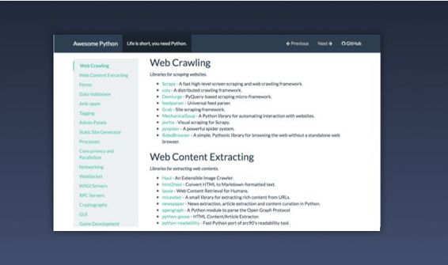
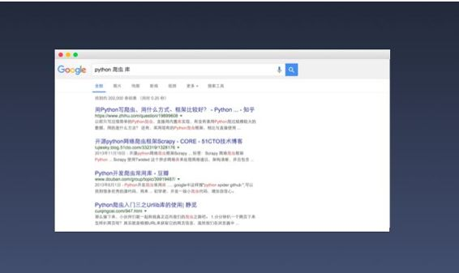
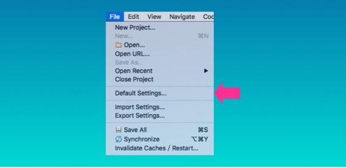
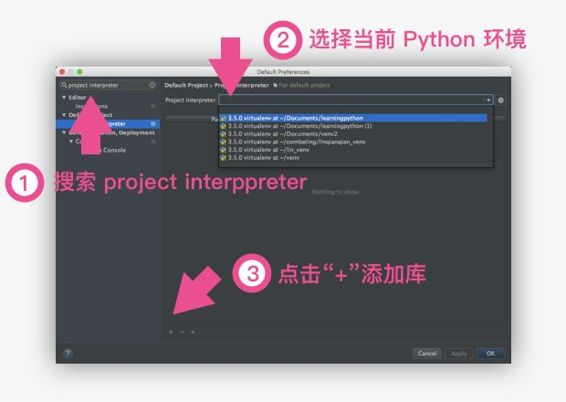
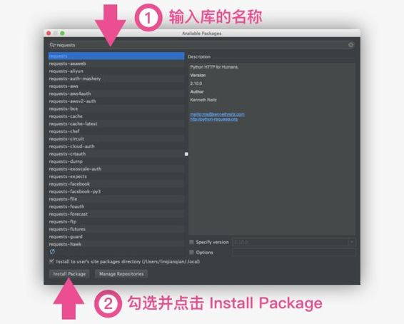
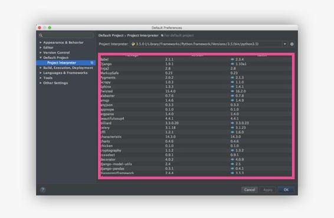
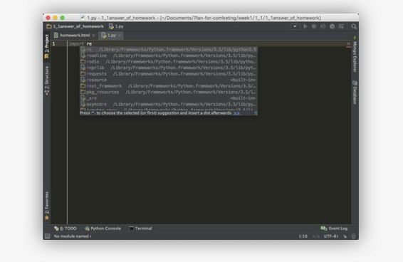

# 第八章 开始使用第三方库

## 8.1 令人惊叹的第三方库

如果用手机来比喻编程语言，那么 Python 是一款智能机。正如海量的手机应用出现在 iOS、Android 平台上，同样有各种各样的第三方库为 Python 开发者提供了极大的便利。

当你想搭建网站时，可以选择功能全面的 Django、轻量的 Flask 等 web 框架；当你想写一个小游戏的时候，可以使用 PyGame 框架；当你想做一个爬虫时，可以使用 Scrapy 框架；当你想做数据统计分析时，可以使用 Pandas 数据框架……这么多丰富的资源可以帮助我们高效快捷地做到想做的事，就不需要再重新造轮子了。

那么，如何根据自己的需求找到相应的库呢？

可以在 [awesome-python](http://awesome-python.com) 这个网站上按照分类去寻找，上面收录了比较全面的第三方库。比如当我们想找爬虫方面的库时，查看 Web Crawling 这个分类，就能看到相应的第三方库的网站与简介：



可以进入库的网站查看更详细的介绍，并确认这个库支持的是 python 2 还是 python 3，不过绝大多数常用库已经都支持了这两者。

另外，还可以直接通过搜索引擎寻找，比如：



如果你能尝试用英文搜索，会发现更大的世界，比如 stackoverflow 上的优质讨论。


## 8.2 安装第三方库

无论你想安装哪一种库，方法基本都是通用的。下面开始介绍安装第三方库的方法。

### 最简单的方式：在 PyCharm 中安装

推荐大家使用 PyCharm ，就是因为它贴心地考虑了开发者的使用体验，在 PyCharm 中可以方便快捷地安装和管理库。

*   第一步：在 PyCharm 的菜单中选择：`File` > `Default Settings`



*   第二步：



*   第三步：



在安装成功后，PyCharm 会有成功提示。你也可以在 `project interpreter` 这个界面中查看安装了哪些库，点`-`号就可以卸载不再需要的库。



### 最直接的方式：在终端/命令行中安装

#### 安装 pip

在 Python 3.4 之后，安装好 Python 环境就可以直接支持 pip，你可以在终端/命令行里输入这句检查一下：

```py
pip --version
```

如果显示了 pip 的版本，就说明 pip 已经成功安装了。 如果发现没有安装 pip 的话,各系统安装的方法不同：

*   [在 Windows 上安装 pip](https://taizilongxu.gitbooks.io/stackoverflow-about-python/content/8/README.html)
*   [在 Mac 上安装 pip](https://www.mobibrw.com/p=1274)
*   [在 Linux 上安装 pip](http://pip-cn.readthedocs.org/en/latest/installing.html)

#### 使用 pip 安装库

在安装好 pip 之后，以后安装库，只需要在命令行里面输入：

```py
pip3 install PackageName
```

> 注：PackageName 需要替换成你要安装的库的名称；如果你想安装到 python 2 中，需要把 pip3 换成 pip。

如果你安装了 python 2 和 3 两种版本，可能会遇到安装目录的问题，可以换成:

> 注：如果你想安装到 python 2 中，需要把 python3 换成 python

```py
python3 -m pip install PackageName
```

如果遇到权限问题，可以输入：

```py
sudo pip install PackageName
```

安装成功后会提示：

> Successfully installed PackageName

再介绍几个 pip 的常用指令：

```py
pip install --upgrade pip                  #升级 pip
pip uninstall flask                        #卸载库
pip list                                   #查看已安装库
```

异常情况：安装某些库的时候，可能会遇到所依赖的另一个库还没安装，导致无法安装成功的情况，这时候的处理原则就是：缺啥装啥，举个例子，如果出现这样的错误提示：

```py
danbao$ scrapy version -v 
:0: UserWarning: You do not have a working installation of the service_identity module: 'No module named service_identity'.  Please install it from <https://pypi.python.org/pypi/service_identity> and make sure all of its dependencies are satisfied.  Without the service_identity module and a recent enough pyOpenSSL to support it, Twisted can perform only rudimentary TLS client hostname verification.  Many valid certificate/hostname mappings may be rejected.
Scrapy  : 0.24.6 
lxml    : 3.4.4.0 
libxml2 : 2.9.0 
Twisted : 15.2.1 
Python  : 2.7.9 (default, May 27 2015, 22:47:13) - [GCC 4.2.1 Compatible Apple LLVM 6.1.0 (clang-602.0.53)]
```

这时候的解决方法是：

```py
pip install service_identity
```

### 最原始的方式：手动安装

为了应对异常情况，再提供一种最原始的方法：手动安装。往往是 Windows 用户需要用到这种方法。

进入 pypi.python.org，搜索你要安装的库的名字，这时候有 3 种可能，

*   第一种是 exe 文件，这种最方便，下载满足你的电脑系统和 python 环境的对应的 exe，再一路点击 next 就可以安装。
*   第二种是 .whl 类文件，好处在于可以自动安装依赖的包。
*   第三种是源码，大概都是 `zip` 、 `tar.zip`、 `tar.bz2` 格式的压缩包，这个方法要求用户已经安装了这个包所依赖的其他包。 例如 pandas 依赖于 numpy, 你如果不安装 numpy, 这个方法是无法成功安装 pandas 的。如果没有前两种类型的文件，那只能用这个了。

#### 一、如果你选择了下载.whl 类文件，下面是安装方法：

1.  到命令行输入：

    ```py
    pip3 install wheel
    ```

    等待执行完成，不能报错。(如果是在 python2 环境安装，pip3 要换成 pip)

2.  从资源管理器中确认你下载的.whl 类文件的路径，然后在命令行继续输入：

    ```py
    cd C:\download
    ```

    > 注：此处需要改为你的路径，路径的含义是文件所在的文件夹，不包含这个文件名字本身。

    然后再在命令行继续输入：

    ```py
    pip3 install xxx.whl
    ```

    > 注：xxx.whl 是你下载的文件的完整文件名。

#### 二、如果你选择了下载源码压缩包，下面是安装方法：

1.  解压包，进入解压好的文件夹，通常会看见一个 setup.py 的文件。从资源管理器中确认你下载的文件的路径，打开命令行（cmd），输入：

    ```py
    cd C:\download
    ```

    > 注：此处需要改为你的路径，路径的含义是文件所在的文件夹，不包含这个文件名字本身。

2.  然后在命令行中继续输入：

    ```py
    python3 setup.py install
    ```

    这个命令，就能把这个第三库安装到系统里，也就是你的 Python 路径，Windows 一般是在 C:\Python3.5（或 2.7）\Lib\site-packages。

    想卸载库的时候，找到 python 路径，进入 site-packages 文件夹，在里面删掉库文件就可以了。

## 8.3 使用第三方库

在 PyCharm 中输入库的名字，就会自动提示补全了：



输入之后你会发现是灰色的状态 import pandas，这是因为还没有在程序中使用这个库，而不是因为库还没安装（想检查库是否安装的话，可以使用前面提到的 PyCharm 或者 pip 的方式来确认）。

关于库的使用指南到这里就结束了。