# 必读：给编程小白的学习资源

这本书到这里就告一段落了，相信你已经迫不及待地想要找点项目练练手了。在这里推荐一些精选的学习资源，让你持续提升：

### 练手项目

在前言也说过，通过项目实践去提升是最快的，毕竟编程是一个 learning by doing 的技能。但是新手又不适合直接做难度很高的项目，最好的实践方式是：分解练习+循序渐进。其实这和学习吉他很像，分解练习能让你对每一个知识点都熟练运用，循序渐进则能让你的能力随着任务难度不断提升。但是，这种实践方式需要被精心设计，作为缺乏经验的新手可能很难制定出这样的学习计划，推荐你选择精心设计的、以练手项目为主的实践课程。

1.[麻瓜编程的 Python 实战计划课程](http://study.163.com/course/introduction.htm?courseId=1002794001)

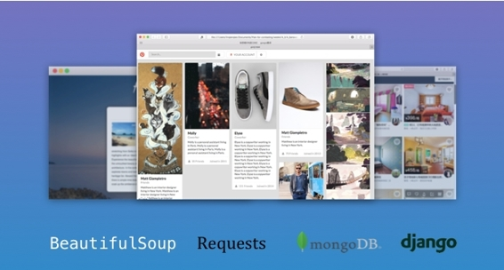

如果你喜欢这本书，相信你也会喜欢这门 Python 实战课程，这也是我们团队的作品，延续了这本书的风格，生动、易懂、好看。有零基础学员说： “这是我唯一能听懂的编程课，和看美剧似的，会上瘾。”

这门课程以实战为主，把一个涉及了爬虫、数据分析、网站开发的二手行情网站作为主项目，拆解成四个 level 的课程循序渐进。为了更好地分解练习，每节视频课程后面都穿插一个小项目。这门课提供了一条实战学习的最优路径，让你在最短时间掌握最关键的实战技能点。

发布了半年多，这门课已经成为网易云课堂上最畅销的 Python 课程，免费课程有 4 万多学员，付费课程有接近 1 千名学员。如果你想要快速上手实战项目，先掌握项目实践中最必要的技能，这会是适合你的选择。

目前有一个限时的读者优惠活动，[点这里](https://www.wenjuan.com/s/JjU3uy/)可以申请 50 元的课程优惠券。

2.[CodeCademy](https://www.codecademy.com)

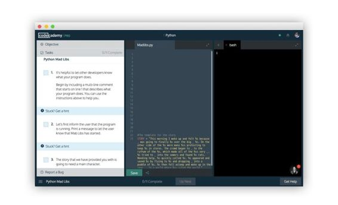

CodeCademy 在增加了 pro 功能之后，变得更有竞争力了。付费每月 20 刀之后，在学习路径中除了知识点练习，还会阶段性地出现测试和真实项目。之前一直被诟病的缺少讲解环节，现在也通过更详细的文字讲解、论坛互动来解决了。

如果想要系统地把语法过一遍，是个不错的选择。不过由于课时拆解的太细，会出现一些 100*6% 之类的题目，可能会让你觉得无聊又漫长，导致难以坚持下来。

### 资料库参考

在实践的过程中，你会不断发现更多需要解决的问题，更多需要连接的未知，这时候到哪里去查阅资料呢？

1.[safari online book](https://www.safaribooksonline.com)

知乎上有人问，送程序员男友什么礼物好，其中一个答案就是 safari online。编程的英文书一般都很贵，但在这里只需要 39 刀的价格，就能包月看到几乎所有已经出版的专业开发书籍，甚至还有没出版的新书。很适合用来扫书，几乎你想要的答案在里面找到。

2.[图灵社区](http://www.ituring.com.cn)

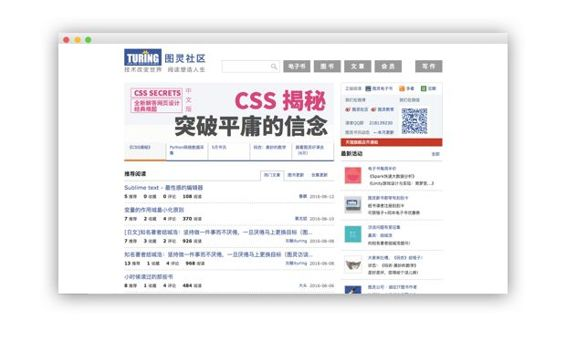

技术方面的中文书籍，图灵出品，必属精品，我们这本书也是在图灵首发的。在图灵社区里面，有许多的免费或付费电子书，最新的翻译书籍也能在这里找到。还有一点我觉得和其他电子书平台很不一样，许多书会提供 PDF 版本，不是那种扫描的 PDF，而是和纸质书一样排版精良、易于阅读的 PDF 版本。由于技术书一般都是在电脑上看，这样会很方便。

3.[stackoverflow](http://stackoverflow.com)

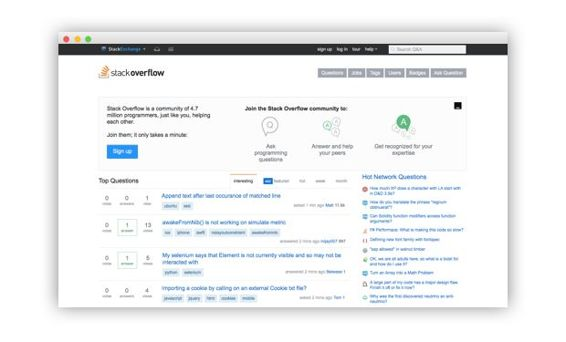

程序员的问答社区，试着把你的问题转换成一些关键词，里面总是会有非常好的回答，你会发现你踩过的坑总有人已经踩过了。

4.[Python 官方文档](http://python.usyiyi.cn/python_343/tutorial/index.html)

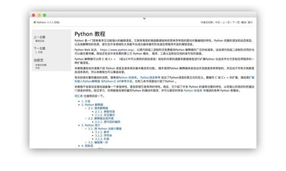

遇到需要较真的问题时，没有什么比 Python 官方文档说得更清楚的了。别对文档感到害怕，现在你已经熟悉一些 Python 基本常识了，只要有耐心就能读懂。

### 基础教程与书籍

这本书提供的是让读者从零到一入门，那么入门之后，读哪些书能进一步精深呢？

1.[老齐的《零基础学 python》](https://www.gitbook.com/book/looly/python-basic/details)

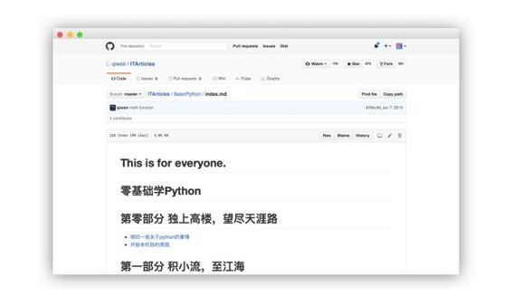

国内少见的不错的免费教程，适合补一下基础知识，缺点在于有点啰嗦，喜欢大段引用诗词、维基百科。

2.[tutorialspoint](http://www.tutorialspoint.com/python/) 的[中文仿站](http://www.runoob.com/python3/python3-tutorial.html)

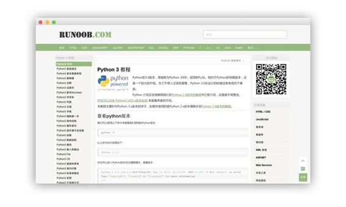

简单易懂的基础教程，同样适合补一下基础知识。

3.[Python 核心编程](http://item.jd.com/11936238.html)

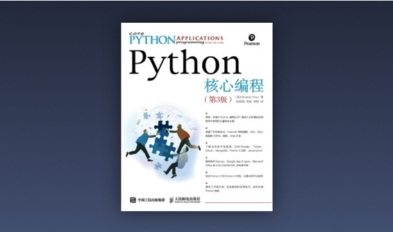

这本书有众多“权威”和“精通”系列无法比拟的简洁和和精确，如果想深入细节，这本为最佳的选择。第 3 版比第 2 版增加了不少内容，务必选择第 3 版。

4.[深入 Python](http://dipyzh.bitbucket.org)

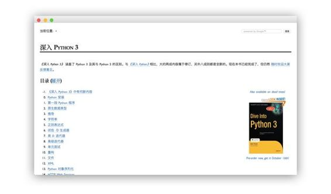

这是一本被低估甚至被诋毁的好书，事实上看不懂的部分你甚至可以当作科普读物来读都没有关系，因为它真得很有意思。

5.[Real Python](https://realpython.com)

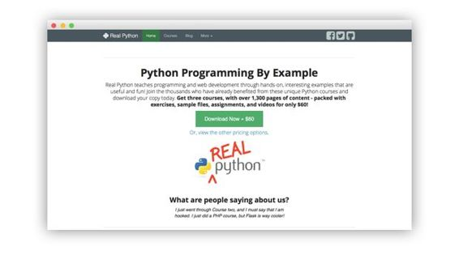

鉴于国外的 python 生态环境比国内的要好上一大截，再加上作者是经验非常丰富的 Python 全栈开发者，所以以非常宽阔的视野写了这本由浅入深，非常实用的电子教程。作者还运营了 full stack python 这个网站。

6.[python course](http://www.python-course.eu/python3_course.php)

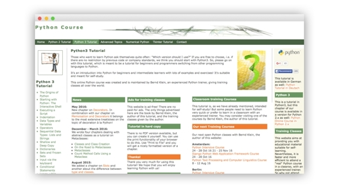

就职于 Saarland University 大学的计算机教授 Bernd Klein 所写的 python3 教程。别看网站有些简陋，这是我看过将近百余个 python 教程中集准确，通俗易懂，有趣众多优点于一身的优秀网络教程。