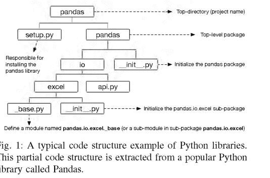
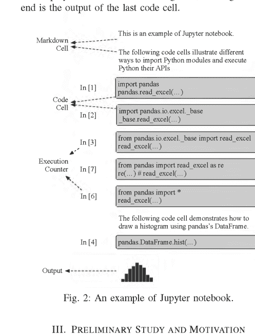
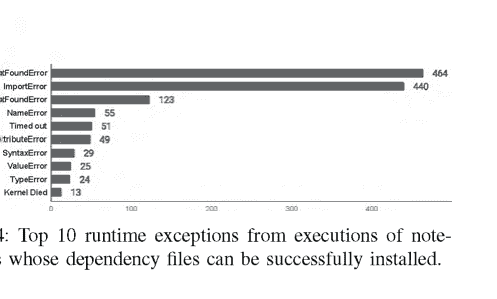
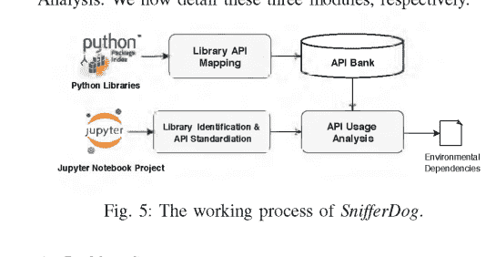
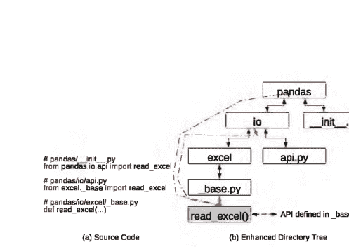
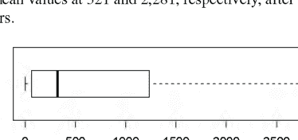
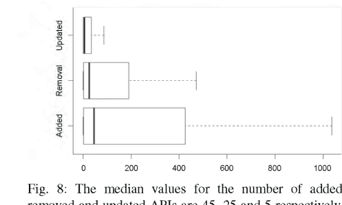
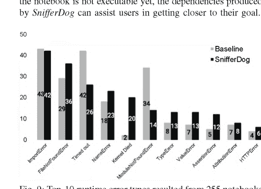
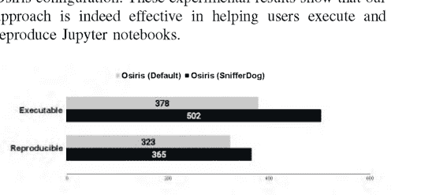

# 恢复 Jupyter Notebook 的执行环境

王嘉伟
信息技术学院
莫纳什大学
墨尔本，澳大利亚
jiawei.wang1@monash.edu

李力$^{\alpha}$
信息技术学院
莫纳什大学
墨尔本，澳大利亚
li.li@monash.edu

安德烈亚斯·泽勒
CISPA 亥姆霍兹信息安全中心
萨尔布吕肯，德国
zeller@cispa.saarland

**摘要**—超过百分之九十的已发布 Jupyter Notebook 未声明对外部包的依赖。这使得它们无法执行，从而阻碍了科学结果的可复现性。我们提出了 *SnifferDog*，一种方法，它 1) 收集 Python 包及其版本的 API，创建一个 API 数据库；2) 分析 Notebook 以确定所需包及其版本的候选者；3) 检查哪些包是使 Notebook 可执行（并理想情况下，复现其存储的结果）所必需的。在其评估中，我们表明 *SnifferDog* 能够为绝大多数 Notebook 精确恢复执行环境，使其立即可供最终用户执行。

**索引术语**—Jupyter Notebook，环境，Python，API

## I. 引言

Jupyter Notebook——结合了代码、文本、数学、绘图和富媒体的交互式文档——已成为科学家记录、复制和阐释其发现的主要媒介。与常规科学论文不同，Notebook 允许其作者直接与数据和代码交互，即时更新表格和图表。这也延伸到用户，他们可以重新执行 Notebook 代码，例如使用自己的数据或对算法进行更改，并查看这如何影响最终结果。这使得 Jupyter Notebook 成为实现研究结果广泛复制和重用的最有前途的工具之一。

然而，理论上听起来不错的东西在实践中未必如此，Jupyter Notebook 也不例外。最近的研究 [1] 表明，绝大多数已发布的 Jupyter Notebook 只能被用户阅读，而不能被重新执行。一个原因是*不完整性*，例如未提供原始数据；对此用户无能为力。然而，也存在一些可以轻松避免的导致 Notebook 无法执行的原因。一个原因是 Notebook 代码单元可以*以任何顺序*交互式执行（数据科学家们乐于这样做）；因此，最近的方法 [2] 侧重于基于内部依赖关系恢复实际执行顺序。然而，另一个重要原因是 Jupyter Notebook *依赖于其创建时的特定环境*，例如特定版本的特定库。

原则上，Notebook 中的 Python 代码提供了 *import* 语句，声明了要使用的（外部）模块。

然而，Python 用户安装的是*包*，而不是模块；并且导入的模块名称可能与提供它们的包的名称不同。不同版本的包可能提供不同的 API；因此必须确定兼容的版本。此外，包可能依赖于其他工具或包的安装。

这就是为什么 Python（像其他语言一样），在良好的软件工程传统中，早已引入了*显式指定库和包之间依赖关系*的方法。例如，Python 包管理器（如 pip 和 conda）期望 Python 包提供一个显式的*依赖列表*，说明需要安装哪些其他包及其版本。然而，Jupyter Notebook 的作者首先是数据科学家，而不是软件工程师 [3]；因此，他们既不了解可重用软件的原则，也不会将其作为重点。事实上，正如我们在本文中所示，*大约 94% 的 Notebook 没有正式声明或记录依赖关系*；在那些声明了的 Notebook 中，近 30% 并不可靠。因此，想要执行已发布且完整的 Jupyter Notebook 的用户很可能会遇到缺少包或版本不兼容的错误。

在本文中，我们介绍了一种*自动恢复 Jupyter Notebook 实验依赖关系*的新方法。我们的 *SnifferDog* 工具接受一个 Python Jupyter Notebook，并自动检测复现 Notebook 结果所需的包。为此，*SnifferDog* 创建了一个 *API 库*，这是一个保存每个 Python 库（及每个版本）API 信息的数据库。通过分析嵌入在 Notebook 中的 Python 代码，*SnifferDog* 然后确定 API 兼容的库候选者。*SnifferDog* 随后可以自动安装推荐的依赖项，并检查它们是否允许 Notebook 1) 被执行，以及 2) 复现存储在 Notebook 中的原始结果。因此，当用户在 Notebook 上应用 *SnifferDog* 时，他们至少可以获得检测到的所需库及其版本的列表。如果这些是完整的，Notebook 就可以变得可执行；在理想情况下，Notebook 被证明可以完全复现原始结果。追求可执行性、可复现性并考虑库版本，也是 *SnifferDog* 区别于早期特定于 Python 的方法 [4] 的地方。

*SnifferDog* 高效且有效：它在 18,141.29 秒（每个 Notebook 3.63 秒）内完成了 5,000 个 Notebook 的分析。在一个包含 315 个已知可执行 Notebook 的实验中，*SnifferDog* 能够为其中超过 90% 的 Notebook 自动确定依赖关系。

本文的其余部分组织如下。在提供关于 Python 包和 Jupyter Notebook 的背景知识（第 II 节）之后，我们做出以下贡献：

- **关于 Jupyter Notebook 中依赖问题普遍性的研究**（第 III 节）。在一项初步研究中，我们调查了导致 Jupyter Notebook 无法执行的原因，包括有和没有环境依赖的情况。
- **恢复 Jupyter Notebook 依赖关系的新方法**（第 IV 节）。我们介绍了我们方法的设计及其在 *SnifferDog* 原型中的实现。
- **我们方法的评估**（第 V 节）。我们在各种 Notebook 上评估了 *SnifferDog* 的有效性，表明它能够为绝大多数 Notebook 精确恢复执行环境。

在讨论了相关工作（第 VI 节）之后，我们以结论和未来工作（第 VII 节）结束。

## II. 背景

我们首先讨论背景知识，包括 Python 库和 Jupyter Notebook。

### A. Python 库

Python 以其庞大的生态系统而闻名，为开发者提供了超过 200,000 个第三方包（也称为库）。此类 Python 库需要在访问之前本地安装到开发者的实现环境中。Python 打包权威团队官方维护一个名为 *pip* 的标准包管理工具，允许用户从不同来源（PyPI）[5] 安装这些库。除了包管理系统，Python 开发者也可以从其源代码项目安装库。

图 1 展示了一个典型的 Python 库代码结构示例。一个名为 *setup.py* 的 Python 文件将库本地安装。但是，此文件不会安装库的环境依赖项，因此需要用户事先满足这些依赖。一个*顶层包*赋予库名称（即 pandas），存储在与 *setup.py* 相同的层级。Python 中的这样一个*包*是一个包含特定文件 *\_\_init\_\_.py* 的目录，该文件负责初始化包。Python 包提供了一种构建 Python 模块命名空间的方式，为库用户提供了访问其 API 的简便方法。Python 中的*模块*是 Python 中用于指定 Python 源代码（即包含 Python 定义和语句的文件）的特定术语。每个 Python 文件代表一个 Python 模块；例如，*setup.py* 定义了一个名为 setup 的 Python 模块。顶层包下的目录是库的*子包*。类似地，子包下的 Python 文件被视为*子模块*。例如，如图 1 所示，Python 文件 *base.py* 被定义为子包 *pandas.io.excel* 中名为 *base* 的子模块。



在每个 Python 模块（或 Python 文件）中，可以声明和实现一组方法。这些方法可以被其他模块（或模块用户）访问，因此被称为 *API*。例如，*pandas.io.excel.base* 模块包含一个名为 *read\_excel()* 的 API，其*完全限定名*为 *pandas.io.excel.\_base.read\_excel()*）。当 Python 库演进时，其声明的 API 集合可能会更新。在这项工作中，我们将利用此信息来实现 *SnifferDog*，以便为 Python Jupyter Notebook 推断环境依赖。

### B. Jupyter Notebook

Jupyter Notebook 是*单元格*的序列，这些单元格包含*文本*（Markdown 格式）或*可执行代码*（及其结果）。在*文本单元格*中，作者（使用 Markdown 和 HTML 进行富格式化）描述 Notebook 的目标以及后续单元格中代码背后的原理。在*代码单元格*中，作者编写实际的编程代码，最常见的是 Python 代码。图 2 展示了一个典型的 Jupyter Notebook 示例，包含三个文本单元格和六个 Python 代码单元格。

每个代码单元格都可以由底层的 Jupyter 引擎直接执行，该引擎提供必要的计算环境，例如库依赖。Jupyter Notebook 中的代码单元格可以以任何顺序执行（如果其先决条件未满足，则会产生错误）。在一个单元格执行后，Jupyter 将分配一个与其执行顺序一致的执行顺序号。例如，第一个执行的单元格将被标记为“In [1]”，而第四个执行的单元格将被标记为“In [4]”。单元格可以重复执行。在这种情况下，最新的执行计数器将覆盖之前的计数器。

仔细观察图 2，我们看到最后一个代码单元格在第四个和第五个代码单元格之前执行。敏锐的读者可能还观察到，没有信息（即“In [5]”）指示第五个执行的代码单元格。这是因为当代码单元格被重复执行时，原始执行计数器将被最后的执行计数器覆盖——称为执行计数器的*跳过*。跳过使得由于跳过的执行计数器完全没有被记录，因此很难重现笔记本的原始输出[2]。

如果代码单元的执行产生了输出（文本或图片，如图表），该输出也会被记录并显示在笔记本中。在图2中，末尾的直方图就是最后一个代码单元的输出。



## III. 初步研究与动机

2019年，Pimentel等人对Jupyter笔记本的质量和可重现性进行了一项大规模实证研究[1]。在该研究中，作者调查了从GitHub收集的1,159,166个笔记本，其中只有149,259个（大约**12.9%**）提供了描述笔记本环境依赖应如何设置的模块依赖信息。换句话说，社区中绝大多数现有笔记本没有提供足够的信息，使得笔记本用户无法执行和复制它们。由于易于复制是Jupyter笔记本的承诺之一，因此需要可靠的自动化方法来推断Jupyter笔记本的环境依赖。

这个问题有多严重？我们对Pimentel等人近期Jupyter笔记本的工作进行了一项轻量级的复制研究。我们将复制研究限制在复制笔记本在提供笔记本作者提供的依赖项时的可执行性，以识别不可重现的主要原因，从而专门解决执行环境问题。为实现此目的，我们提出回答以下研究问题：

- RQ1：（公共）Jupyter笔记本在多大程度上提供了环境设置信息？
- RQ2：依赖信息在帮助笔记本用户配置执行环境方面有多大用处？
- RQ3：提供的环境信息是否有助于笔记本用户执行和复制笔记本？如果没有，导致它们不可执行的根本原因是什么？

为了回答这些研究问题，我们收集了一个包含有和没有实验设置信息的笔记本的数据集。我们的笔记本来源是*GitHub*，这是全球领先的软件代码托管平台之一。我们从GitHub随机下载了100,000个笔记本。

表I总结了我们的研究结果。在100,000个笔记本中，只有不到6%（或分别针对三个选定标准为4.74%、1.15%和0.12%）提供了环境依赖信息¹。这个比率甚至低于Pimentel等人两年前报告的比率（以类似方式计算）。

请注意，Pimentel等人的先前工作调查了笔记本环境设置信息的三个来源：(1) requirements.txt，(2) Pipfile，和(3) setup.py。如前所述，*setup.py*通常用于从源代码本地安装Python库。它不负责安装库依赖项。在手动调查使用*setup.py*的笔记本后，我们确认*setup.py*确实与Jupyter笔记本的环境设置无关。因此，我们在这项研究中排除了第三个标准*setup.py*。此外，在进行先前的手动分析时，我们额外发现笔记本贡献者可能通过Anaconda（例如，通过*environments.yml*）提供环境设置信息。因此，在我们的研究中，我们用Anaconda环境替换了第三个标准*setup.py*。

表I：根据选定的三个标准，提供环境依赖信息的笔记本分布。

| | requirements.txt | environments.yml (Anaconda) | Pipfile | 总计 |
|---|---|---|---|---|
| 笔记本 | 4741 | 1146 | 117 | 5826 |
| 笔记本 (≥3.5) | 2923 | 868 | 77 | 3740 |
| 可安装 | 2064 | 563 | 77 | 2646 |
| 可执行 | 518 | 207 | 14 | 725 |

> RQ1：（公共）Jupyter笔记本在多大程度上提供了环境设置信息？

在100,000个笔记本中，只有不到6%提供了环境依赖信息以帮助用户执行其笔记本。

对于那5,826个*已*提供环境依赖的笔记本，我们进一步检查了这些信息的*可靠性*。为此，我们实现了脚本来自动安装这些依赖项，使用Anaconda[6]为上述每个Jupyter笔记本创建独立的环境。之后，我们利用一个名为nbconvert²的工具来评估笔记本的执行情况。由于Python 3.5或其更低版本的nbconvert已不再得到官方Jupyter团队的支持，我们不得不排除2,086个无法通过我们的脚本进行分析的笔记本。

在自动安装剩余的3,740个笔记本后，我们查看其日志以检查安装是否成功。根据我们的观察，当安装失败时，它会包含以下三种消息之一：(a) 运行时异常中出现“InstallationError”，(b) “ERROR:”，以及 (c) “cannot find a version for”。在3,740个笔记本中，有1094个笔记本未能成功安装其依赖信息，失败率为29.25%。

> RQ2：依赖信息在帮助笔记本用户配置执行环境方面有多大用处？

在我们的评估中，发现笔记本贡献者提供的29.25%的环境依赖信息不可靠和/或不充分。

对于我们能够成功安装其环境依赖的笔记本，我们进一步检查已安装的依赖项是否足以支持笔记本的执行。回想一下，笔记本代码单元可以按任何顺序执行，并且可以重复执行（导致跳过的执行计数器）。因此，实际上不可能推断出笔记本贡献者最初进行的实际执行顺序。在这项初步研究中，我们简单地从上到下执行代码单元。我们相信这个顺序反映了自然的流程，表明其贡献者是如何尝试实现该笔记本的。每个笔记本的执行时间设置为10分钟。

²https://github.com/jupyter/nbconvert



表I的最后一行展示了可以无错误执行的笔记本数量（即可安装的笔记本）。换句话说，在2,646个提供了可安装依赖信息的笔记本中，有72.6%的笔记本无法按照简单的从上到下的执行策略成功执行。

导致这些笔记本执行失败的原因多种多样。确实，一方面，提供的依赖信息可能并非完全可靠，导致依赖相关的错误。另一方面，即使环境依赖设置正确，笔记本本身也可能包含实现错误，这些错误同样会导致运行时异常。

图4列举了从执行失败的笔记本中总结出的前10个错误。排名第一的错误与环境依赖相关这一事实表明，环境依赖似乎是导致上述笔记本执行错误的主要原因。排名前两位的错误（即找不到模块和导入错误）确实是由不充分的运行时环境引起的，其中导入的模块无法定位[7]。事实上，与这两个错误相关的笔记本几乎占了上述执行失败笔记本的一半（分别为24.15%和22.90%）。

```
### 示例 (1): ModuleNotFoundError
#### 来自GitHub项目 BenjaminBossan@mink
#### requirements.txt
scikit-learn
...

#### 模块 'sklearn.grid_search' 自 scikit-learn 版本 XXX 起已被移除
Error: No module named 'sklearn.grid_search'

### 示例 (2): ImportError
#### 来自GitHub项目 stargaser@astrodata2016
#### requirements.txt
astroquery
...

#### scale_image API 自 astroquery 版本 XXX 起已从模块 'astropy.visualization' 中移除
Error: cannot import name 'scale_image' from
'astropy.visualization'
```

代码清单1：两个因库版本不匹配而遭受运行时错误的真实示例。

¹一些笔记本可能提供两种类型的信息来帮助用户设置执行环境。例如，有101个笔记本同时包含*requirements.txt*和Anaconda信息。

在导致笔记本电脑执行失败的众多原因中，我们进一步研究了与前两类错误相关的一些失败案例，发现大量失败是由于安装了不同版本的库所致。事实上，在提供环境依赖时（参见图3），笔记本电脑贡献者无需指定依赖库的*确切版本*。因此，可能会安装不匹配的库版本，从而导致运行时错误。清单1展示了从真实笔记本电脑中获得的两个此类示例（分别对应*ModuleNotFoundError*和*ImportError*）。由于Python库等软件系统发展迅速，某些API可能已被弃用并随后移除。如果使用了错误的库版本，客户端应用程序（如果未更改）很可能会遇到兼容性问题，从而导致运行时错误。因此，我们认为在为Jupyter笔记本电脑指定环境依赖时，*清晰地指定所需库的所需版本*至关重要。

> **RQ3：** 提供的环境信息是否有助于笔记本电脑用户执行和重现笔记本电脑？

对于72.6%的笔记本电脑，提供的依赖不足以在没有错误的情况下重新执行它们。

## IV. SnifferDog

在本节中，我们介绍了我们自动推断Python Jupyter笔记本电脑环境依赖的方法，该方法在我们的*SnifferDog*原型中实现。图5总结了*SnifferDog*的工作流程，主要包括三个模块：（1）库API映射，（2）库识别和API标准化，以及（3）API使用分析。我们现在分别详细介绍这三个模块。



### A. 问题陈述

在提供方法的详细信息之前，我们正式定义了本工作中计划解决的问题。首先，我们需要预构建一个API库$\mathcal{L} = \{L_1^v, L_2^v, L_3^v, \dots\}$，记录大量流行Python库的API集，其中$L_j^v$表示库$L_j$在版本$v$中定义的API集。然后，给定一个Python Jupyter笔记本电脑$N$作为输入，我们需要精确解析其访问的API集$P = \{A_1, A_2, A_3, \dots\}$，其中$A_i$是$P$中使用的API。之后，基于预构建的API库$\mathcal{L}$，该方法的目标是识别一组库$L$，满足以下约束：（1）$L \subset \mathcal{L}$，且（2）$\forall A_i \in P, \exists L_j^v \in L$使得$A_i \in L_j^v$。

### B. 库API映射

第一个模块*库API映射*与分析具体Jupyter笔记本电脑的工作流程没有直接关系，但在构建我们方法的核心基础设施中扮演着独立的步骤。该模块的输出将是一个API库，提供一个可扩展（且不断增长）的数据库，记录从流行Python库到其API的映射。

给定一个计划包含在API库中的Python库，该模块首先根据库的文件和目录结构构建目录树，旨在提供一种清晰的方式来引用库API（例如，从顶层包到叶子模块）。在此目录树中，Python包（或子包）由非叶节点表示，Python源代码文件由叶节点表示。图1展示了一个这样的例子，表示流行Python库*pandas*的部分代码结构树。然后，该模块为每个叶节点（或Python文件）构建抽象语法树（AST）树，并遍历这些树以定位公共函数，包括它们的位置参数和关键字参数。此步骤的输出已经可以构建从库（在特定版本中）到其定义的API的映射。

不幸的是，这种方法可能会忽略某些API用法。将其应用于*pandas*（图1），API *read_excel()*（在*base.py*模块中定义）可以通过其全限定名*pandas.io.excel._base.read_excel()*引用，或者如果导入了模块*pandas.io.excel._base*（或API本身*pandas.io.excel._base.read_excel*），则可以通过*_base.read_excel()*（或*read_excel()*）引用，如图2中第二个和第三个代码单元格所示。然而，如图2中第一个、第四个和第五个代码单元格所示，API *read_excel()*可以通过另一种形式调用，例如*pandas.read_excel()*，即尽管它在*pandas.io.excel._base*模块中定义，但可以直接从*pandas*模块导入。

这种歧义是复杂的Python导入机制的一部分，该机制以传递方式实现。令$X \xrightarrow{f} Y$表示通过语句“from $X$ import $f$”在$Y$的源代码中从模块$X$导入API $f$到模块$Y$。传递性使得如果$Y \xrightarrow{f} Z$且$X \xrightarrow{f} Z$，则$X \xrightarrow{f} Y$。Python运行时提供的这一特性已被许多Python库频繁利用，为用户提供简化的API访问方式，因为它可以透明地缩短全限定API名称。

为了解决这一特性，在解析Python源代码时，我们进一步进行*导入流*分析，以找到直接定义的API的所有可能替代项（或别名）。再次以API *read_excel*为例，关于图6(a)中显示的简化源代码，*导入流*分析将导致以下两个流。

```
pandas.io.excel._base \xrightarrow{read\_excel} pandas.io.api
pandas.io.api \xrightarrow{read\_excel} pandas
```



可能已经观察到，我们的方法将导致同一API *read_excel()*有两个全限定名。事实上，在此阶段，我们的方法通过简单地分析笔记本电脑代码来意识到这一点并非易事。因此，我们将它们视为两个独立的API。然而，如前一小节所述，由于*导入流*分析，这两个全限定API名称都将记录在API库中。因此，分析中的任何不精确都不会影响我们方法的整体精度。

通过考虑传递性，我们可以进一步推导出以下流。

$pandas.io.excel._base \xrightarrow{read\_excel} pandas$

随后，在此模块结束时，我们进一步利用这些推断和推导的导入流来增强最初为库构建的目录树（参见图6(b)），然后将它们记录到API库中。增强的目录树允许我们为集成到API库中的每个库生成完整的API列表。

此外，Python代码可能涉及通过调用构造函数方法初始化的库类实例。这些实例调用的API也应被适当识别和扩展。然而，在Python中，初始化构造函数方法和访问标准方法之间通常没有语法级别的区别。因此，需要额外的努力来区分它们，从而允许识别类的实例及其访问的API。例如，考虑清单2中的代码片段：

### C. API识别和标准化

```python
1 from x import y
2 m = y()
3 m.fun()
```

如图5所示，第二个模块*API识别*侧重于分析*Jupyter笔记本电脑*项目（而非第一个模块针对的Python库），以识别和标准化库API使用。笔记本电脑中的Python代码可以访问（1）*本地模块*中可用的方法，这些方法通常由笔记本电脑贡献者开发，（2）*Python标准方法*（即通常称为系统API），由核心Python模块提供，以及（3）*库方法*（即通常称为库API），由第三方开发，应从外部资源导入。在此模块中，我们只对第三种方法感兴趣，即库API。为了将库方法与本地模块和系统API区分开来，我们将所有未在本地定义且不属于Python系统API的方法视为库API [8]–[13], [13]–[16]。

清单2：限定对象成员函数调用的示例。

在清单2中，我们的方法将首先识别*m.fun*是一个成员函数调用，然后追溯到其构造调用*m = y()*；因此方法*fun()*是模块*x*中的API。随后，此API的全限定名将是*x.y.fun*。

### D. 库使用分析

*SnifferDog*的最后一个模块*库使用分析*是直接的。基于第二个模块的输出（即一组API），此模块查询这些API以在API库中找到可能提供这些API的库候选者。通常，由于每个API都提供了全限定名，API库通常可以精确定位其所属库。查询输出将是同一库的多个发行版（或版本）。通过整合所有已识别API的查询结果，此模块的目标是找到一个（最小的）库列表及其（最大的）版本范围，以覆盖输入笔记本电脑使用的所有已识别API。*SnifferDog*随后将以描述Python环境依赖的通用格式（如*Pipfile*或*requirements.txt*）生成其输出。

遵循*库API映射*模块中实现的相同方法，我们首先为笔记本电脑的Python代码构建AST树，然后遍历这些树以识别库API。之后，此步骤更进一步，根据从*import*和*from-import*语句中提取的信息，将已识别的API扩展为其全限定名。例如，对于图2中第二个代码单元格中的API调用语句*base.read_excel()*，标准化的API将是*pandas.io.excel._base.read_excel()*。如果已识别的API是别名，即图2中第五个代码单元格中由语句*from pandas import read_excel as re*定义的*re()*，我们将在执行API标准化步骤时进一步将其替换为其实际名称。标准化版本将是*pandas.read_excel()*. 敏锐的读者

## V. 评估

为了评估*SnifferDog*的有效性，我们解决以下研究问题：

- **RQ4**：*SnifferDog*在将Python库映射到其API方面是否有效？
- **RQ5**：*SnifferDog*在推断Python Jupyter笔记本电脑的环境依赖方面有多准确？
- **RQ6**：*SnifferDog*能在多大程度上帮助用户重现Jupyter笔记本电脑？

### A. 实验设置

**Jupyter笔记本数据集。** 回顾一下，本工作的目标是自动推断Jupyter笔记本的环境依赖，以帮助用户执行和复现笔记本输出。为了评估我们的方法能否实现这一目标，我们采用了Pimentel等人[1]介绍的方法，从GitHub收集了100,000个Jupyter笔记本用于实验。GitHub是全球领先的软件开发平台，托管着数百万个软件仓库。这100,000个笔记本是从包含`.ipynb`格式文件并声明Python为编程语言的GitHub项目中检索到的。

**选定Python库的数据集。** 回顾一下，我们方法的API库是基于现有库构建的，并且可以轻松扩展以包含更多库。通常，考虑的库越多，API库就越全面，随后*SnifferDog*就能获得更精确、更可靠的结果。由于我们的目标是为尽可能多的笔记本生成依赖，我们首先从上述100,000个Jupyter笔记本中选择最常用的1,000个模块。然后，我们利用PyPI（Python官方包索引）查询包含这些选定模块库实现源代码的安装轮子文件。由于多个模块可能属于同一个库，或者某些模块尚未被PyPI索引，我们只能为选定的前1000个模块定位到488个Python库（包含17,947个不同的版本）。因此，在本工作中，我们利用488个不同的Python库及其17,947个版本来构建API库。

### B. 研究问题4：API库的有效性

在这个研究问题中，我们感兴趣的是评估API库的实用性。从选定的488个Python库中，库API映射模块提取了1,013,718个API来填充API库。图7展示了每个选定库中API数量的分布，在排除异常值后，中位数和平均值分别为321和2,281。



为了评估构建的API库的正确性，我们采用人工流程来检查这些API是否被正确记录在API库中。为此，我们从API库中随机选择了166个API进行人工验证。选择的API数量由在线样本量计算器[17]决定，置信水平为99%，置信区间为10。对于每个选定的API，我们手动对照其源代码进行检查，发现其中164个是正确结果，这使得我们的API库构建方法的精确度达到98.8%。

除了上述人工调查外，我们进一步采用*动态测试方法*来评估构建的API库的正确性。给定一个库版本到其API的映射，当安装该库（给定版本）时，其所有API都应该能够被导入。为此，我们实现了一个原型工具来自动完成此过程。具体来说，我们首先从API库中随机选择20个库（总计3,982个API），并分别安装它们。对于每个已安装的库，我们然后从API库中提取其所有记录的API，并进行运行时导入测试，以检查这些API是否能在运行时被导入。在考虑的3,982个API中，只有252个在我们的实验中未能成功导入，成功率为93.6%。在分析了导入错误的回溯信息后，我们发现大多数此类失败与被评估库进一步依赖的缺失依赖项有关。

> 研究问题4：（库映射的有效性）*SnifferDog*在将Python库映射到其API方面是否有效？

库API映射模块构建的API库是精确的：98.8%的API被正确提取；93.6%可以成功导入。

在从488个库推断出的1,013,718个API中，有686,915个API可能会进一步给其客户端应用程序引入兼容性问题（如果安装了不正确的库版本），例如导致模块未找到错误和导入错误。不兼容的API包括543,387个（53.60%）在库首次发布后新增的API，345,234个（34.06%）与库最新版本相比被移除的API，以及58,594个（5.78%）在库演进过程中参数发生变化的API。图8进一步展示了每个考虑的库中新增、移除和更新API的分布情况。

鉴于67.76%的API（包括新增、移除和更新的API，无重复）可能引入兼容性问题，在推断Jupyter笔记本的环境依赖时，强烈需要同时推断依赖库的正确版本。我们的API库记录了考虑库的详细演进变化，旨在不仅推断依赖库，还推断其正确版本。

> 研究问题4（API库的实用性）*SnifferDog*在将Python库映射到其API方面是否有效？

在我们的评估中，超过一半的库API在库生命周期的某个时间点被添加、移除或更新。这强调了检查兼容库版本的必要性，正如*SnifferDog*所做的那样。



图8：在排除异常值后，新增、移除和更新API数量的中位数分别为45、25和5。

### C. 研究问题5：SnifferDog的有效性

现在让我们评估*SnifferDog*在推断Jupyter笔记本环境依赖方面的有效性。我们通过一个*实验室*实验和一个*现场*实验来评估其有效性。

1) *实验室实验*：回顾一下，我们的初步研究已经确定了725个笔记本，这些笔记本（1）提供了可安装的所需依赖项，并且（2）在安装提供的依赖项后被证明是可执行的。因此，我们以这725个笔记本作为基准事实来完成我们的实验室实验（因为这些笔记本是已知可执行的）。不幸的是，725个笔记本中有385个访问了当前API库（基于约488个库构建）尚未考虑的库。因此，我们不得不将它们从基准事实中排除。我们最终的基准事实由340个Jupyter笔记本及其所需的库组成。

对于这340个笔记本，我们然后应用*SnifferDog*自动生成实验依赖项。之后，我们遵循相同的方法（如第III节所述）自动安装生成的库并执行相应的笔记本。实验结果表明，*SnifferDog*可以成功为315个（92.65%）笔记本生成安装要求，其中284个成功执行，召回率为83.52%。

安装失败主要与所选Python版本（通常由笔记本贡献者未提供）和底层Python setuptools[18]带来的库兼容性问题有关。对于31个不可执行的情况，我们的人工调查揭示，失败（8个ImportError，7个ModuleNotFoundError和16个其他类型的运行时错误）是由*SnifferDog*产生的不准确版本约束引起的。

> **研究问题5：（实验室）*SnifferDog*在推断Python Jupyter笔记本的环境依赖方面有多准确？**

在实验室环境中，*SnifferDog*在自动推断Jupyter笔记本的执行环境方面是有效的，成功为315/340（92.6%）的笔记本生成了安装要求。284/315（90.2%）的笔记本可以自动执行。

2) *现场实验*：在这种设置下，我们随机选择5,000个笔记本，并启动*SnifferDog*为它们生成执行环境。*SnifferDog*在18,141.29秒内完成分析，平均每个笔记本3.63秒。

我们现在检查生成的环境在多大程度上支持笔记本的执行。为了将人为影响降至最低，我们限制自己只评估一部分笔记本，因为评估一个笔记本（涉及安装所有依赖项并执行其所有代码单元）非常耗时。为此，我们应用以下纳入标准来保留笔记本：（1）已提供预定义依赖项，但这些依赖项无法支持其执行；（2）在我们的API库能力范围内。这为我们提供了722个笔记本用于现场实验。

在这722个笔记本中，*SnifferDog*可以成功为其中667个生成可安装的依赖项，其中223个可以进一步导致相应笔记本的成功执行。

请注意，超过一半的笔记本仍然不可执行。为什么会这样？我们的人工分析揭示了以下两个主要原因（除了笔记本代码质量问题之外）。

- **原因1：** 大多数笔记本执行失败是因为存在所谓的*可选依赖项*，这些依赖项未被笔记本直接访问（因此被*SnifferDog*忽略），但却是笔记本直接依赖的库所必需的。
- **原因2：** 一些失败的笔记本是由于使用了*魔术函数*，这是一种特殊的Jupyter笔记本功能，允许在不遵循Python语法[19]的情况下访问Python模块。目前，*SnifferDog*简单地忽略了魔术函数。

此外，对于失败的笔记本，我们进一步查看其错误信息，并将其与使用其自身依赖项（视为基线）执行时输出的错误信息进行比较。在此实验中，仅考虑在两边都失败的笔记本。图9展示了比较结果。显然，与执行环境相关的*SnifferDog*错误数量明显少于基线。相反，与笔记本代码质量相关的错误（例如FileNotFoundError、NameError或HTTPError），*SnifferDog*比基线更多。这一实验结果表明，虽然笔记本在两种环境设置下都执行失败，但由*SnifferDog*产生的设置更有可能比其对应物更准确（当提供依赖项时，可能会进一步触发新的运行时异常，例如，对于`FileNotFoundError`，文件未提供）。因此，即使笔记本尚未可执行，*SnifferDog*生成的依赖项也能帮助用户更接近目标。

当基于*SnifferDog*的输出设置执行环境时，失败率降至1%以下³。关于可复现性，Osiris报告称，在*SnifferDog*的帮助下，与使用默认Osiris配置复现的323个笔记本相比，额外复现了42个笔记本。这些实验结果表明，我们的方法确实能有效帮助用户执行和复现Jupyter笔记本。





> **RQ5:** （实地研究）*SnifferDog*在推断Python Jupyter笔记本的环境依赖项方面有多准确？

应用于随机笔记本时，*SnifferDog*在自动推断执行环境方面是有效的。当笔记本仍然不可执行时，*SnifferDog*推断的依赖项有助于用户更接近目标。

> **RQ6:** *SnifferDog*能在多大程度上帮助用户复现Jupyter笔记本？

与默认环境设置相比，由*SnifferDog*恢复的环境使显著更多的笔记本变得可执行和可复现。

### D. RQ6：复现Jupyter笔记本

在最后一个研究问题中，我们评估*SnifferDog*是否不仅帮助用户执行，而且*复现*Jupyter笔记本（即，获得与笔记本中最初记录的相同输出）。为了解决单元排序问题，我们利用了一个名为Osiris的原型工具，该工具恢复了单元的执行顺序[2]。

为了我们的评估，我们使用了先前已证明可执行的507个笔记本。我们尝试通过以下两个实验来复现这507个笔记本：

- **实验1：Osiris（基线）。** 我们为不同的Python版本创建执行环境，并安装所有默认包（包括超过200个库包）。然后我们在此环境中应用Osiris来分析这507个笔记本。
- **实验2：Osiris（SnifferDog）。** 在此实验中，我们使用*SnifferDog*推荐的依赖项来设置环境，并在此环境中对相同的507个笔记本启动Osiris。

图10展示了实验结果。有趣的是，尽管执行环境中安装了超过200个流行的Python库，但大约四分之一的笔记本无法完全执行。与默认环境相比，

### E. 有效性威胁

实验发现可能受到各种有效性威胁。本工作中选择的笔记本可能不具有代表性。我们试图通过从100,000个真实的Jupyter笔记本开始来缓解这一威胁。我们还借助手动分析来总结执行错误并确认我们的一些实验结果。众所周知，这种手动过程容易出错。我们已经交叉验证了结果以减轻潜在的错误。

## VI. 相关工作

我们现在从三个方面讨论密切相关的工作：恢复执行环境、Jupyter笔记本研究以及Python依赖项分析。

### A. 恢复执行环境

与我们工作最相关的是*DockerizeMe* [4]，它推断从GitHub Gist收集的Python代码片段的环境依赖项配置。*DockerizeMe*基于使用静态分析预先获取的已知Python包知识库实现，这与我们的方法类似。然而，除了静态分析，它还进一步利用动态分析来实现其目的，在减少*ImportError*消息方面能够实现30%的改进。虽然原则上*DockerizeMe*也可以应用于完全分析的Jupyter笔记本，但与我们的方法存在重要的概念差异。首先，*DockerizeMe*只考虑包的最新版本。因此，它无法处理包含最新版本包中已弃用、已移除、已重命名API的程序。事实上，正如Horton等人[20]通过一项关于GitHub上Python代码片段可执行性的实证研究经验性报告的那样。他们的实验结果显示，大多数Gist在默认Python环境中不可执行，虽然简单的方法可以为一些Gist推断依赖项，但在大多数情况下它无法做到。其次，*DockerizeMe*不*执行*代码来验证其发现，更不用说将结果与已发布的结果进行比较——而*SnifferDog*自动确定使笔记本可执行的配置，理想情况下甚至能复现结果。作者进一步提出了工具V2，该工具利用程序崩溃信息来指导搜索正确的环境依赖项[21]。然而，这种方法依赖于代码片段的重复执行，并且不处理没有崩溃发生但依赖项不正确的情况。相反，*SnifferDog*是一种静态方法，它使用预构建的知识来分析依赖项。

### B. Jupyter笔记本研究

尽管Jupyter笔记本很受欢迎，但对其的研究仍然有限。2019年，Pimentel等人对超过一百万个选定笔记本的可执行性和可复现性问题进行了大规模研究[1]。他们的实验结果显示，大约25%的笔记本可以在没有任何运行时错误的情况下执行，其中只有4.03%最终能产生原始结果。Loenzen等人[22]实证研究了Jupyter笔记本中的代码重复和重用，发现笔记本仓库的平均自重复率为7.6%。最近，Wang等人[23]对代码质量进行了大规模研究，并实证发现即使是著名的Jupyter笔记本也经常遭受技术债务（例如，使用已弃用的API）。

在发现Jupyter笔记本中存在低可复现性问题后，Wang等人[2]进一步提出通过向社区提供名为Osiris的工具来解决导致笔记本不可复现的根本原因。该工具试图通过利用代码插桩来找出并解决执行Jupyter笔记本时的不确定性，从而复现Jupyter笔记本。然而，由于缺乏适当的执行环境，大约80%选定的笔记本未能完全执行。沿着这一研究方向，Fangohr等人[24]进一步提出了另一个名为*nbval*的工具（实现为pytest的插件），旨在支持Jupyter笔记本的自动化测试和验证。正如作者所论证的，nbval可以用来促进可复现的科学，例如检查部署的软件是否按照其文档所述运行。

除了软件工程界的研究，Jupyter笔记本也经常被其他领域的同行研究人员选作研究对象[25]–[33]。例如，Perkel等人[3]研究了为什么Jupyter笔记本在数据科学家中很受欢迎。Kery等人[26]引入了一个名为*Verdant*的工具，以支持用户高效检索和理解混乱的版本数据。它允许用户比较、重放和追踪编辑器中非代码和代码工件不同版本之间的关系。此外，Rule等人[34]从人因工程的角度研究笔记本，并实证观察到计算笔记本可能缺乏解释性的文本信息。

### C. 依赖项分析

针对Python依赖项最具代表性的工作之一是Ying等人最近提出的工作，他们试图解决Python库生态系统中的依赖项冲突[35]。他们设计并实现了一个名为*Watchman*的工具，用于检测PyPI仓库索引的库之间的依赖项冲突。他们还向相应项目的开发者报告了117个潜在的依赖项问题。尽管Python如今已成为最流行的编程语言之一，但对Python项目的研究集中在库API问题及其演化模式[36]、[37]，针对解决Python依赖项的相关研究并不多。然而，依赖项分析一直是许多其他编程语言的热门研究课题[38]–[44]。这些方法的概念，例如解决由库演化引起的兼容性问题[45]、[46]，自动替换过时的库[47]，或更新已弃用的库API[48]，我们相信也应该适用于Python软件应用程序。

## VII. 结论与未来工作

Jupyter笔记本可能被誉为获得可复现和可复制研究成果的主要手段。然而在实践中，它们存在软件工程早已解决的问题：代码质量差、文档不足，以及——如本文所示——几乎没有依赖项管理。Jupyter笔记本作者社区需要时间学会不仅将他们的笔记本视为待发布的实体，而且视为应设计为可读、可重用和可维护的活代码。在那之前，将由软件工程社区对笔记本进行逆向工程，使其能够被执行和测试。

在本文中，我们朝着这个目标迈出了重要一步，即恢复Jupyter笔记本的执行环境。我们发现依赖项几乎从未被明确说明，这个问题严重阻碍了Jupyter笔记本的重新执行。通过分析笔记本中的导入和API使用情况，并将其与各种版本的Python库进行匹配，我们的工具*SnifferDog*可以识别用于创建笔记本的库候选。通过搜索使笔记本再次可执行（因此完全可复现）的候选配置，*SnifferDog*为笔记本用户提供关键信息，使其重新可用。鉴于笔记本的流行，*SnifferDog* 由此展示了软件工程如何为可复现和可扩展的科学做出重要贡献。

然而，仍有许多工作要做。我们的未来工作将聚焦于以下主题：

### 更大的 API 库。
我们的 API 库仅基于 488 个库构建。虽然这些库构成了最受欢迎的库，但拥有更大的 API 库将进一步扩展我们方法的能力。

### Python 和 C 代码。
少数“Cython”库结合了 C 和 Python 语法以实现类似 C 的性能，这使得一小部分库 API 被忽略。

### 高级功能。
如第五节所述，一些高级的 Jupyter notebook 和 Python 功能尚未被 *SnifferDog* 支持，特别是魔法函数和间接依赖。

### 超越 Python。
*SnifferDog* 的原理不限于 Python。我们计划将 *SnifferDog* 扩展到其他流行的 Jupyter notebook 语言，如 R 和 Julia。

### 超越笔记本。
*SnifferDog* 的原理也超越了笔记本。*SnifferDog* 同样可以应用于 C 源代码，以确定构建和执行所需的库版本。一个自动确定所需包和版本的 LaTeX 版本的 *SnifferDog* 可能特别受科学界欢迎。

*SnifferDog* 以开源形式提供（当然，具有显式依赖）。包含所有实验数据的完整*复现包*可在以下地址获取：

https://github.com/SMAT-Lab/SnifferDog.git

## 参考文献

[1] J. F. Pimentel, L. Murta, V. Braganholo, and J. Freire, “A large-scale study about quality and reproducibility of Jupyter notebooks,” in *2019 IEEE/ACM 16th International Conference on Mining Software Repositories (MSR)*. IEEE, 2019, pp. 507–517.

[2] J. Wang, T.-Y. Kuo, L. Li, and A. Zeller, “Assessing and restoring reproducibility of Jupyter notebooks,” in *The 35th IEEE/ACM International Conference on Automated Software Engineering (ASE 2020)*, 2020.

[3] J. M. Perkel, “Why Jupyter is data scientists’ computational notebook of choice,” *Nature*, vol. 563, no. 7732, pp. 145–147, 2018.

[4] E. Horton and C. Parnin, “DockerizeMe: Automatic inference of environment dependencies for Python code snippets,” in *Proceedings of the 41st International Conference on Software Engineering*, ser. ICSE ’19. IEEE Press, 2019, pp. 328–338. [Online]. Available: https://doi.org/10.1109/ICSE.2019.00047

[5] “Pip user guide.” [Online]. Available: https://pip.pypa.io/en/stable/user_guide/#requirements-files

[6] “Anaconda software distribution,” 2020. [Online]. Available: https://docs.anaconda.com/

[7] “The Python language reference.” [Online]. Available: https://docs.python.org/3/reference/import.html

[8] “Python module index.” [Online]. Available: https://docs.python.org/2.7/py-modindex.html

[9] “Python module index.” [Online]. Available: https://docs.python.org/3.1/modindex.html

[10] “Python module index.” [Online]. Available: https://docs.python.org/3.2/py-modindex.html

[11] “Python module index.” [Online]. Available: https://docs.python.org/3.3/py-modindex.html

[12] “Python module index.” [Online]. Available: https://docs.python.org/3.4/py-modindex.html

[13] “Python module index.” [Online]. Available: https://docs.python.org/3.5/py-modindex.html

[14] “Python module index.” [Online]. Available: https://docs.python.org/3.6/py-modindex.html

[15] “Python module index.” [Online]. Available: https://docs.python.org/3.7/py-modindex.html

[16] “Python module index.” [Online]. Available: https://docs.python.org/3/py-modindex.html

[17] “Sample size calculator.” [Online]. Available: https://www.surveysystem.com/sscalc.html

[18] “Documentation¶.” [Online]. Available: https://setuptools.readthedocs.io/en/latest/

[19] “Built-in magic commands¶.” [Online]. Available: https://ipython.readthedocs.io/en/stable/interactive/magics.html

[20] E. Horton and C. Parnin, “Gistable: Evaluating the executability of python code snippets on github,” in *2018 IEEE International Conference on Software Maintenance and Evolution (ICSME)*. IEEE, 2018, pp. 217–227.

[21] ——, “V2: Fast detection of configuration drift in python,” in *Proceedings of the 34th IEEE/ACM International Conference on Automated Software Engineering*, ser. ASE ’19. IEEE Press, 2019, pp. 477–488. [Online]. Available: https://doi.org/10.1109/ASE.2019.00052

[22] A. Koenzen, N. Ernst, and M.-A. Storey, “Code duplication and reuse in jupyter notebooks,” *arXiv preprint arXiv:2005.13709*, 2020.

[23] J. Wang, L. Li, and A. Zeller, “Better code, better sharing: On the need of analyzing Jupyter notebooks,” in *The 42nd International Conference on Software Engineering, NIER Track (ICSE 2020)*, 2020.

[24] H. Fangohr, V. Fauske, T. Kluver, M. Albert, O. Laslett, D. Cortés-Ortuño, M. Beg, and M. Ragan-Kelly, “Testing with jupyter notebooks: Notebook validation (nbval) plug-in for pytest,” *arXiv preprint arXiv:2001.04808*, 2020.

[25] D. Koop and J. Patel, “Dataflow notebooks: encoding and tracking dependencies of cells,” in *9th USENIX Workshop on the Theory and Practice of Provenance (TaPP 2017)*, 2017.

[26] M. B. Kery and B. A. Myers, “Interactions for untangling messy history in a computational notebook,” in *2018 IEEE Symposium on Visual Languages and Human-Centric Computing (VL/HCC)*. IEEE, 2018, pp. 147–155.

[27] M. S. Rehman, “Towards understanding data analysis workflows using a large notebook corpus,” in *Proceedings of the 2019 International Conference on Management of Data*, 2019, pp. 1841–1843.

[28] A. Rule, I. Drosos, A. Tabard, and J. D. Hollan, “Aiding collaborative reuse of computational notebooks with annotated cell folding,” *Proceedings of the ACM on Human-Computer Interaction*, vol. 2, no. CSCW, pp. 1–12, 2018.

[29] S. Samuel and B. König-Ries, “ProvBook: Provenance-based semantic enrichment of interactive notebooks for reproducibility,” in *International Semantic Web Conference (P&D/Industry/BlueSky)*, 2018.

[30] A. Watson, S. Bateman, and S. Ray, “PySnippet: Accelerating exploratory data analysis in Jupyter notebook through facilitated access to example code,” in *EDBT/ICDT Workshops*, 2019.

[31] H. Nguyen, D. A. Case, and A. S. Rose, “NGLview-interactive molecular graphics for Jupyter notebooks,” *Bioinformatics*, vol. 34, no. 7, pp. 1241–1242, 2018.

[32] H. Fangohr, M. Beg, M. Bergemann, V. Bondar, S. Brockhauser, C. Carinan, R. Costa, C. Fortmann, D. F. Marsa, G. Giovanetti et al., “Data exploration and analysis with jupyter notebooks,” in *17th Biennial International Conference on Accelerator and Large Experimental Physics Control Systems*, no. TALK-2020-009, 2019.

[33] M. García-Domínguez, C. Domínguez, J. Heras, E. Mata, and V. Pascual, “Jupyter notebooks for simplifying transfer learning,” in *International Conference on Computer Aided Systems Theory*. Springer, 2019, pp. 215–221.

[34] A. Rule, A. Tabard, and J. D. Hollan, “Exploration and explanation in computational notebooks,” in *Proceedings of the 2018 CHI Conference on Human Factors in Computing Systems*, 2018, pp. 1–12.

[35] Y. Wang, M. Wen, Y. Liu, Y. Wang, Z. Li, C. Wang, H. Yu, S.-C. Cheung, C. Xu, and Z. Zhu, “Watchman: monitoring dependency conflicts for python library ecosystem,” in *Proceedings of the ACM/IEEE 42nd International Conference on Software Engineering*, 2020, pp. 125–135.

[36] J. Wang, L. Li, K. Liu, and H. Cai, “Exploring how deprecated Python library APIs are (not) handled,” in *The 28th ACM Joint Meeting on European Software Engineering Conference and Symposium on the Foundations of Software Engineering (ESEC/FSE 2020)*, 2020.

[37] Z. Zhang, H. Zhu, M. Wen, Y. Tao, Y. Liu, and Y. Xiong, “How do Python framework APIs evolve? an exploratory study,” in *2020 IEEE 27th International Conference on Software Analysis, Evolution and Reengineering (SANER)*. IEEE, 2020, pp. 81–92.

[38] C. Tucker, D. Shuffelton, R. Jhala, and S. Lerner, “Opium: Optimal package install/uninstall manager,” in *29th International Conference on Software Engineering (ICSE’07)*. IEEE, 2007, pp. 178–188.

[39] J. Patra, P. N. Dixit, and M. Pradel, “ConflictJS: finding and understanding conflicts between JavaScript libraries,” in *Proceedings of the 40th International Conference on Software Engineering*, 2018, pp. 741–751.

[40] C. Soto-Valero, A. Benelallam, N. Harrand, O. Barais, and B. Baudry, “The emergence of software diversity in Maven Central,” in *2019 IEEE/ACM 16th International Conference on Mining Software Repositories (MSR)*. IEEE, 2019, pp. 333–343.

[41] Y. Wang, M. Wen, Z. Liu, R. Wu, R. Wang, B. Yang, H. Yu, Z. Zhu, and S.-C. Cheung, “Do the dependency conflicts in my project matter?” in *Proceedings of the 2018 26th ACM Joint Meeting on European Software Engineering Conference and Symposium on the Foundations of Software Engineering*, 2018, pp. 319–330.

[42] Y. Wang, M. Wen, R. Wu, Z. Liu, S. H. Tan, Z. Zhu, H. Yu, and S.-C. Cheung, “Could I have a stack trace to examine the dependency conflict issue?” in *2019 IEEE/ACM 41st International Conference on Software Engineering (ICSE)*. IEEE, 2019, pp. 572–583.

[43] L. Li, T. Riom, T. F. Bissyandé, H. Wang, J. Klein, and Y. Le Traon, “Revisiting the impact of common libraries for android-related investigations,” *Journal of Systems and Software (JSS)*, 2019.

[44] X. Zhan, L. Fan, T. Liu, S. Chen, L. Li, H. Wang, Y. Xu, X. Luo, and Y. Liu, “Automated third-party library detection for android applications: Are we there yet?” in *The 35th IEEE/ACM International Conference on Automated Software Engineering (ASE 2020)*, 2020.

[45] L. Li, T. F. Bissyandé, H. Wang, and J. Klein, “Cid: Automating the detection of api-related compatibility issues in android apps,” in *The ACM SIGSOFT International Symposium on Software Testing and Analysis (ISSTA 2018)*, 2018.

[46] H. Cai, Z. Zhang, L. Li, and X. Fu, “A large-scale study of application incompatibilities in android,” in *The 28th ACM SIGSOFT International Symposium on Software Testing and Analysis (ISSTA 2019)*, 2019.

[47] Y. Wang, B. Chen, K. Huang, B. Shi, C. Xu, X. Peng, Y. Wu, and Y. Liu, “An empirical study of usages, updates and risks of third-party libraries in java projects,” in *2020 IEEE International Conference on Software Maintenance and Evolution (ICSME)*. IEEE, 2020, pp. 35–45.

[48] L. Li, J. Gao, T. F. Bissyandé, L. Ma, X. Xia, and J. Klein, “Cda: Characterising deprecated android apis,” *Empirical Software Engineering (EMSE)*, 2020.