O'REILLY®

# 用Python进行3D数据科学

利用3D点云工作流构建精确的数字环境


弗洛朗·普（Florent Poux）

乌韦·巴赫博士（Dr. Uwe Bacher）作序

> “我很少看到一本书能让高级的3D数据工作流感觉如此平易近人。对于任何认真对待3D的人来说，这都是必备之书。”

塔伦·纳拉亚南·文卡塔查拉姆（Tarun Narayanan Venkatachalam），Unstructured公司AI工程师

> “这本书确实为数据科学增添了一个全新的维度。既然可以进行3D思考，为何还要满足于平面的洞察呢？”

利皮·迪帕克希·帕特奈克（Lipi Deepaakshi Patnaik），Zeta公司高级软件开发人员

# 用Python进行3D数据科学

我们的物理世界建立在三维空间之上。要创建能够推理并与之交互的技术，我们的数据也必须是三维的。这本实用指南为数据科学家、工程师和研究人员提供了一种使用Python处理3D数据的实践方法。从3D重建到3D深度学习技术，你将学习如何从海量数据集中提取有价值的见解，这些数据集包括点云、体素、3D CAD模型、网格、图像等。

弗洛朗·普博士帮助你利用前沿算法和空间AI模型的潜力，开发以自动化为重点的生产就绪系统。你将获得3D数据科学知识和代码，以：

- 理解3D数据的核心概念和表示方法
- 使用强大的Python库加载、操作、分析和可视化3D数据
- 应用先进的AI算法进行3D模式识别（监督和无监督）
- 使用3D重建技术生成3D数据集
- 实现自动化3D建模和生成式AI工作流
- 探索计算机视觉/图形学、地理空间智能、科学计算、机器人和自动驾驶等领域的实际应用
- 构建空间AI解决方案可以利用的精确数字环境

**弗洛朗·普**是3D数据科学领域的杰出权威，在欧洲顶尖大学从事教学和研究工作。他还是3D地理数据学院的首席教授以及法国科技120强公司的创新总监。

DATA

美国售价 79.99美元 加拿大售价 99.99美元
ISBN: 978-1-098-16133-0

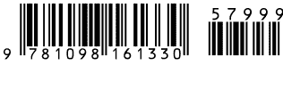


## 对《用Python进行3D数据科学》的赞誉

> 弗洛朗有一种独特的能力，能够将复杂的现实世界问题分解，让读者能够自信地理解和解决问题。这本书为工作解决方案和实际应用提供了坚实的基础。

—亚当·廷德尔（Adam Tindall），顾问/问题解决者

> 这本书确实为数据科学增添了一个全新的维度。既然可以进行3D思考，为何还要满足于平面的洞察呢？作者的一句话提醒我们，全新的视角可以改变一切。凭借其实践方法和真实案例，这本书不仅仅是教学——你将亲身体验如何通过3D数据科学的视角解决复杂问题。从医疗保健到自动驾驶汽车，它揭示了3D技术与数据科学的融合如何塑造未来。

—利皮·迪帕克希·帕特奈克（Lipi Deepaakshi Patnaik），Zeta公司高级软件开发人员

> 3D点云的处理是一个复杂的数字编码过程，始于非批判性的仪器采集，最终必须产生一个能够保存新定义的数字本体中意义、关系和属性的代表性产品。这本书是一个优秀的基础参考，为选择和应用旨在保持记录环境语义的技术和工作流提供了方法论分解。通过清晰易懂的语言，弗洛朗为科学和操作领域的潜在研究应用提供了宝贵的支持。

—里卡多·塔沃拉雷（Riccardo Tavolare），意大利巴里理工大学MAULab负责人

> 弗洛朗·普博士的工作对我的学术旅程至关重要，尤其是在我撰写毕业论文期间。他清晰而引人入胜的教学风格，结合其内容的深度，不仅使复杂主题易于理解，还激发了新想法并支持了实际应用的开发。

—达维·里贝罗（Davi Ribeiro），福特汽车公司AI研究员

> 《用Python进行3D数据科学》通过融合清晰的理论、实践项目和贯穿始终的分步指导，揭开了处理3D数据的神秘面纱。我很少看到一本书能让高级的3D数据工作流感觉如此平易近人。对于任何认真对待3D的人来说，这都是必备之书。

—塔伦·纳拉亚南·文卡塔查拉姆（Tarun Narayanan Venkatachalam），Unstructured公司AI工程师

# 用Python进行3D数据科学

利用3D点云工作流构建精确的数字环境

弗洛朗·普（Florent Poux）

乌韦·巴赫博士（Dr. Uwe Bacher）作序


# 用Python进行3D数据科学

作者：弗洛朗·普（Florent Poux）

版权所有 © 2025 弗洛朗·普。保留所有权利。

印刷于美国。

由O'Reilly Media, Inc.出版，地址：1005 Gravenstein Highway North, Sebastopol, CA 95472。

O'Reilly书籍可用于教育、商业或销售推广用途。大多数书籍也提供在线版本（[http://oreilly.com](http://oreilly.com)）。欲了解更多信息，请联系我们的企业/机构销售部门：800-998-9938 或 [corporate@oreilly.com](mailto:corporate@oreilly.com)。

**策划编辑：** 亚伦·布莱克（Aaron Black）
**开发编辑：** 吉尔·伦纳德（Jill Leonard）
**制作编辑：** 伊丽莎白·费尔姆（Elizabeth Faerm）
**文字编辑：** 查尔斯·鲁梅利奥蒂斯（Charles Roumeliotis）
**校对：** 克里斯塔技术解决方案（Krsta Technology Solutions）

**索引编制：** BIM Creatives, LLC
**内页设计：** 大卫·富塔托（David Futato）
**封面设计：** 何塞·马尔赞二世（José Marzan Jr.）
**插图：** 凯特·杜利亚（Kate Dullea）

2025年4月：第一版

## 第一版修订历史

2025-04-09：首次发布

详情请参见 [http://oreilly.com/catalog/errata.csp?isbn=9781098161330](http://oreilly.com/catalog/errata.csp?isbn=9781098161330)。

O'Reilly标志是O'Reilly Media, Inc.的注册商标。《用Python进行3D数据科学》、封面图片及相关商业外观是O'Reilly Media, Inc.的商标。

本书所表达的观点均为作者个人观点，不代表出版商的观点。虽然出版商和作者已尽最大努力确保本书所含信息和说明的准确性，但出版商和作者对任何错误或遗漏概不负责，包括但不限于因使用或依赖本书而造成的损害。使用本书所含信息和说明的风险由您自行承担。如果本书包含或描述的任何代码示例或其他技术受开源许可或他人知识产权的约束，您有责任确保您的使用符合此类许可和/或权利。

978-1-098-16133-0

[LSI]

## 目录

序言 ................................................................................................ xv

前言 ................................................................................................ xvii

1. 3D数据科学简介 .............................................................................................. 1

- 3D数据科学概述
- 维度与3D数据科学
- 空间AI：从现实到虚拟
- 3D数据：基本构建块
- 几何、拓扑和语义
- 整合几何、拓扑和语义
- 3D点云简介
- 3D数据科学模块化工作流
- 数据采集
- 预处理
- 配准
- 3D数据分类（语义注入）
- 结构化/建模
- 3D数据分析
- 3D数据可视化
- 应用（软件）开发
- 自动化的理由
- 3D数据科学中的工作流挑战
- 工业中的3D数据科学
- 总结

2. 资源与软件基础 ......................................................................................... 43

- 基础资源

## 3. 3D Python 与 3D 数据设置

- 3D Python 设置与库 74
- 操作系统选择 75
- 环境设置 76
- 基础 Python 库 78
- 3D Python 库 80
- Python IDE 81
- 创建 3D Python 程序 83
- 在 Python 中导入 3D 数据 84
- 提取特定属性 85
- 进行基于属性的数据分析 86
- 3D 数据可视化与导出 87
- 3D 重建方法 88
- 真实世界 3D 重建（基于传感器） 89
- 创意 3D 重建 92
- 3D 数据集：整理 94
- 基于图像重建的 3D 数据 94
- 多模态网络爬虫 97
- 总结 103

## 4. 3D 数据表示与结构化

- 3D 数据表示 106
- 3D 点云 106
- 基于图像的表示 112
- 体素（Voxel）模型 121
- 高级 3D 数据表示 123
- 3D 表面模型 124
- 3D 数据规范链接 131
- 网格到点云 132
- 体素到点云 133
- 栅格到点云 134
- 3D 数据结构：k-d 树、八叉树、BVH 139
- k-d 树 140
- 八叉树 142
- 文件组织 144
- 总结 146

## 5. 使用 Python 开发多模态 3D 查看器 149

- 3D Python 与代码设置 151
- 3D 数据整理 152
- 3D 数据准备 152
- 初始分析 153
- 3D 数据降采样 153
- 数据预处理 155
- 3D 数据可视化 155
- 多模态 3D 体验 157
- 兴趣点查询 157
- 手动边界选择 160
- 查找高点和低点 162
- 点云体素化 164
- 建筑覆盖范围提取 167
- 总结 169

## 6. 点云数据工程 171

- 基础知识 172
- 初始预处理 173
- 特征提取基础 179
- 点云特征提取策略 179
- 全局特征提取 180
- 局部特征提取 181
- 主成分分析 182
- Python 与数据准备 184
- 使用 pandas 进行聚类识别 185
- 3D 数据归一化 186
- 提取主成分 186
- PCA 的 3D 可视化 188
- 3D 数据配准：统一视角 190
- 3D 数据配准基础 191
- 配准初始化 192
- 粗配准 193
- 迭代最近点 196
- 精配准：ICP 197
- 总结 199

## 7. 构建 3D 分析应用 201

- 3D 项目环境准备 203
- 收集数据集 203
- Python 与环境设置 204
- 使用 PyVista 的 3D 数据基础 205
- 3D 数据结构创建（KDTree） 207
- 协方差矩阵、特征值和特征向量 209
- 平面性、线性、全方差、垂直性、法线 211
- 邻域定义与选择 212
- 自动化与扩展 214
- 交互式阈值处理 216
- 3D 数据结果导出 218
- 总结 219

## 8. 3D 数据分析 221

- 3D 数据分析类型 222
- 3D 描述性数据分析 223
- 3D 探索性数据分析 224
- 3D 预测性数据分析 225
- 3D 规范性数据分析 226
- 其他考虑因素 226
- 3D 数据分析工具 227
- 环境与数据准备 228
- 元数据分析与数据剖析 231
- 几何与形状分析 232
- 统计分析 239
- 属性分析 254
- 3D 诊断工具 258
- 3D 偏差分析：平面案例 259
- 3D 偏差分析：网格案例 263
- 总结 267

## 9. 3D 形状识别 269

- 从零开始实现 RANSAC：3D 平面形状识别 270
- RANSAC 271
- 数据与环境设置 273
- 几何模型选择 273
- 3D 形状拟合 274
- 迭代与函数定义 281
- 应用 1：RANSAC 用于分割任务 282
- 应用 2：RANSAC 用于分析任务 284
- 应用 3：RANSAC 用于建模任务 286
- 区域生长用于 3D 形状检测 298
- 区域生长原理 299
- 区域生长：真实世界设置 301
- 区域生长：实现 302
- 混合方法：RANSAC 与区域生长 308
- 总结 311

## 10. 3D 建模：高级技术 315

- 高保真网格化 316
- 高保真 3D 网格概述 316
- 任务目标 320
- 数据准备 320
- 选择网格化策略 320
- 其他 3D 网格化策略 326
- 使用 Python 进行 3D 网格化 327
- 细节层次创建 328
- 可视化与软件 330
- 3D 体素与体素化 331
- Python 环境初始化 332
- 加载数据 333
- 创建体素网格 334
- 生成体素立方体（3D 网格） 335
- 导出网格对象（.ply 或 .obj） 336
- 参数化建模 337
- CadQuery 与环境设置 339
- 参数化模型的输入/输出：2D（DXF）和 3D（STL） 342
- 参数化建模技术 345
- 布尔运算 349
- 建模各种部件 350
- 结论 352
- 基于单目图像的 3D 建模：深度估计与重建 353
- 设置环境并安装库 354
- 收集数据集 355
- 图像预处理与模型设置 355
- 模型的深度估计预测 357
- 点云生成 358
- 定义相机内参 359
- 3D 建模：3D 点云到网格 362
- 总结 363

## 11. 基于 LiDAR 数据的 3D 建筑重建 365

- 阶段 1：3D Python 设置 366
- 项目环境设置 366
- 项目笔记本设置 368
- 阶段 2：数据准备 370
- 机载 LiDAR 数据整理 370
- 机载 LiDAR 数据预处理 371
- 阶段 3：实验 374
- 无监督点云分割 375
- 3D 房屋片段隔离 377
- 2D 建筑足迹提取 378
- 语义与属性提取 379
- 2D 到 3D 向量 383
- 3D 模型创建：网格 385
- 阶段 4：自动化与扩展 387
- 总结 390

## 12. 3D 机器学习：聚类 393

- 用于无监督分割的聚类 396
- 聚类基础 397
- 聚类代表性 401
- 聚类算法类型 408
- k-Means 聚类 410
- k-Means：工作流定义 412
- 3D Python 上下文定义 414
- LiDAR 数据预处理 416
- k-Means 实现 418
- 用于无监督分割的 DBSCAN 421
- DBSCAN 原理 422
- 策略 423
- 实验设置 424
- 使用 RANSAC 进行 3D 平面形状识别 425
- 用于 3D 点云分割的 DBSCAN 427
- Multi-RANSAC 框架 429
- 使用 DBSCAN 进行 Multi-RANSAC 精化 431
- DBSCAN 精化 432
- DBSCAN 与 k-Means 对比 433
- 总结 436

## 13. 用于无监督分割的图与基础模型 439

- 基于连通性的聚类 440
- 任务简报 442
- 核心原理 443
- 步骤 1：环境设置 445
- 步骤 2：用于 3D 聚类的图论 447
- 步骤 3：图分析 453
- 步骤 4：绘制图（可选） 454
- 步骤 5：点云的连通分量 455
- 步骤 6：3D 点云的欧几里得聚类 457
- 讨论与展望 460
- Segment Anything 模型 461
- 任务目标 462
- 3D 项目设置 463
- Segment Anything 模型核心概念 466
- 3D 点云到图像投影 472
- 使用 SAM 进行无监督分割 474
- 总结 478

## 14. 监督式 3D 机器学习基础 481

- 从无监督到监督学习 483
- 监督学习概念 484
- 监督学习分类 488
- 3D 语义分割示例 489
- 3D 点云语义分割 490
- 3D Python 与数据设置 493
- 特征选择与准备 494
- 指标与模型 499
- 推理与泛化 503
- 使用 3D 深度学习专业化 3D 机器学习 510
- 总结 512

## 15. 使用 PyTorch 的 3D 深度学习 515

- 3D 深度学习骨干网络 517
- 网络架构 517
- 数据准备 520
- AI 模型训练 521
- 部署训练好的模型 524
- 使用 PyTorch 实现 525
- 安装 PyTorch（带 CUDA） 526
- 张量：构建模块 526
- 神经网络模块 527
- 定义 3D 神经网络 528
- 超参数定义 531
- 优化器与损失函数 531
- PyTorch DataLoader 532
- PyTorch 训练循环 533
- PyTorch 推理 534
- 3D 深度学习：架构 535
- 3D 卷积神经网络：体素 536
- 3D 图神经网络 538
- 基于点的架构：PointNet 与点云 541
- 多视图 CNN 542
- 3D 机器学习与 3D 深度学习对比 545
- 微调、迁移学习与 3D 数据增强 546
- 迁移学习 546
- 微调 547
- 3D 数据增强：扩展数据集 548
- 总结 549

## 16. 用于 3D 物体分类的 PointNet

- PointNet：基于点的 3D 深度学习架构 553
- 3D 物体分类 560
- 3D 物体分类基础 560
- 环境设置 562
- 数据集整理 562
- PointNet：数据集准备 564
- PointNet 架构定义 565
- PointNet 损失定义 568
- PointNet 训练 570
- PointNet 指标与评估 572
- PointNet 真实世界推理 575
- 大规模语义分割考虑因素 579
- 总结 584

## 17. 3D 数据科学工作流

- 3D 数据获取 588
- 3D 数据准备与工程 590
- 噪声去除 590

## 18. 从3D生成式AI到空间AI

- 下采样 591
- 特征提取 592
- 3D数据建模 593
- 3D网格重建 594
- 3D数字环境的体素化 596
- k-d树 597
- 八叉树 598
- 语义提取 600
- 聚类与无监督分割 600
- 语义分割 602
- 3D物体分类 604
- 3D数据可视化与分析 607
- 3D形状识别 607
- 3D数据分析工具 608
- 3D多模态Python查看器 609
- 总结 610

- 高级3D项目 612
- 用于3D重建的生成式AI 612
- 3D深度点云配准 618
- 3D语义建模 620
- 使用Transformer进行3D语义提取 622
- 用于3D可视化的3D高斯溅射 628
- 空间AI：3D体验的未来 632
- 使用开放词汇的3D场景理解 634
- 3D空间AI推理 636
- 结论 638

# 索引

## 前言

我们周围的世界极其多样，最重要的是，它是三维的。万物皆有其位置和意义。为了更好地理解我们的环境并回答当前的问题，我们需要在虚拟世界中精确地表示现实世界。这些表示通常被称为*数字孪生*。虽然数字孪生通常不仅仅包含三维图像，它们还包括尽可能多的附加数据和信息。然而，几乎所有数字孪生都有一个共同点：它们需要一个三维的，甚至在包含时间维度时常常是四维的基础数据集。因此，3D数据正在许多领域改变我们的世界，无论是地球科学、自动驾驶汽车还是医学。

在《*Python 3D数据科学*》一书中，Florent展示了为什么这些数据如此有价值，以及如何有效地利用和发挥其作用。生成3D数据的方法有很多，例如通过摄影测量方法从图像生成点云、使用激光扫描仪“扫描”环境，或使用MRI机器创建身体图像，仅举几例。所有这些方法的共同点在于，尽管它们生成了高度精确的数据，但这些数据缺乏语义信息。真正的价值是通过数据的处理和分析创造出来的。为了实现价值，如今人们无法避免使用AI方法及其在Python中的实现。

我曾参与过从机载系统（如激光扫描仪和相机）捕获和分析高精度空间数据的项目。这些数据通常用作数字孪生的基础，并初步提供有关空间上下文的宝贵信息。然而，真正的价值是通过为最终用户处理、分析和可视化数据而创造的。例如，基于AI的方法可以自动推断土地利用、提取建筑物或树木等单个对象，或创建场景的3D模型。在本书中，Florent结合实际应用，阐述了如何操作、分析和可视化数据以获得令人印象深刻的成果。

3D数据的意义远不止于捕获空间信息。它能够实现对世界更深入的理解和更彻底的分析。在医疗保健领域，3D数据有助于更精确的诊断和个性化的治疗方案。在制造业中，复杂的产品得以设计和优化，效率得以提高，生产成本得以降低。在文化遗产保护方面，3D数据有助于记录和保存历史遗迹和文物。

3D数据科学的一个关键方面是操作和可视化数据的能力。Python提供了多种专门为这些任务开发的库和工具。从使用NumPy和pandas进行基本数据操作，到使用Open3D和PyVista进行高级可视化，Florent展示了如何操作，并提供了易于理解的教程，以便轻松成功地进入3D数据分析的世界。

凭借超过十年的研究经验，Florent已声名鹊起，并在本书中分享了他广博的知识。他专注于使用现代方法和工具，例如将Python作为编程语言，将AI用于3D数据分析。他通过易于理解的教程向读者介绍各种主题，并提供简单、可复现的示例，让读者能够自己跟随解决方案路径。他定期在LinkedIn、他创立的3D地理空间数据学院以及Medium.com等平台上发表文章。这些出版物补充并深化了他书中涵盖的主题。

AI领域对于高效分析3D数据正变得越来越重要。通过应用机器学习和深度神经网络等技术，可以检测到人眼无法察觉的3D数据中的模式。这使得能够获得新的见解并开发创新的解决方案。

本书提供了实际示例和练习，帮助你理解和应用这些技术以及更多内容，包括3D数据的核心概念、加载、操作和可视化3D数据、执行高级模式识别、生成3D数据集以及为空间AI创建数字环境。Florent分享了他从测量员到3D数据科学专家的个人历程，强调了在这个引人入胜的领域中好奇心和持续学习的重要性。

Florent和我都对3D数据分析充满热情，并努力与尽可能多的感兴趣的人分享这种热情。我邀请你阅读本书，探索3D数据科学的世界。获得灵感，并利用3D数据提供的可能性来开发创新的解决方案并塑造未来。

— Dr. Uwe Bacher
技术总监，Hexagon AB
慕尼黑，2025年3月

## 序言

我们生活的物理世界建立在三维空间之上。借助新技术，我们可以数字化或模拟其几何形状，这开启了奇妙的空间游乐场。从用于创建内脏器官详细可视化的医学扫描，到使用3D数据创建详细道路网络地图的自动驾驶汽车，3D数字资产正成为关键决策的支柱。

本书《*Python 3D数据科学*》以其实践方法脱颖而出。它通过分享解锁空间AI力量的理念、工具和方法，让你积极参与其中。

但为什么不能完全依赖计算机视觉和计算机图形学？为什么传统的非3D数据科学方法不足以有效处理3D数据？

这些初步问题很好地传达了我们在现代世界中处理3D数据科学的方式。请跟随我，我将带你踏上一段旅程，这将改变你思考和处理复杂三维数据的方式。不过要小心，因为在阅读之后，你很难停止分析你的感官（视觉、听觉和触觉）带回给你的一切。

3D数据科学是数学卓越性、计算严谨性和3D数据专业知识的巅峰。这些领域相结合，创造了一个新的数据科学分支，具有广泛的应用，并集成到最先进的工作流程中，确保你保持与时俱进并与现代技术前沿保持联系。

以下是3D数据科学正在产生重大影响的六个领域的一些关键应用：

*假肢（医疗保健与医学）*
设计与患者解剖结构无缝贴合的定制假肢

*产品设计（制造与工程）*
在物理生产之前，虚拟创建和测试产品原型

*遗产保护（建筑与城市规划）*
将历史遗迹数字化，以保护其文化遗产并促进修复

*自动驾驶汽车（机器人与自动化）*
使汽车能够感知、绘制地图并导航其周围环境

*沉浸式现实（娱乐与游戏）*
设计用户可以实时交互的虚拟世界（游戏、虚拟现实、增强现实、混合现实）

*地理空间分析（地球科学与环境监测）*
使用来自卫星、无人机或激光扫描仪的3D数据研究地球表面和自然资源

## 谁应该阅读本书？

本书是数据科学家、工程师以及任何对处理3D数据感到好奇的人的实用参考。它假设你几乎没有任何基础，即使你对Python编程一无所知，对基础数据科学概念也不太熟悉，你也会发现它的价值。

此外，无需任何3D数据处理经验。我将逐步引导你了解必要的*库*和*技术*，确保你能够以从0到1的方式将知识应用于现实场景。

## 你将学到什么？

在本书中，我们将深入探讨使用Python的3D数据科学，构建3D工作流程并运用Python来实现解决方案。你将学到：

- 3D数据的核心概念和表示方法（网格、点云、体素、CAD）
- 如何使用强大的Python库加载、操作和可视化3D数据
- 3D模式识别的高级技术（监督和无监督）
- 如何生成3D数据集并利用3D自动化建模工作流程

## 为何写这本书？

“为何写这本书？”这可能是我问自己的第一个问题。我为什么要写一本关于这个主题的书？

嗯，如果你正在阅读这些文字，毫无疑问，在人工智能时代，你依然重视人类知识的输入。而这正是我写作的核心动力。我希望确保我们能透彻理解我们所掌握的工具。未来的3D系统应建立在坚实的代码基础之上，并尽可能减少偏见地实现。但最重要的是，我希望这本书能激发你的创造力和创新能力，在这个每周都有新机遇涌现的领域。

当然，挑战在于3D数据科学领域发展日新月异，新工具和新技术层出不穷。它们都建立在一个基础框架之上，而这个框架在设计新解决方案时具有变革性的力量。在书中，我会尽可能提供链接和参考文献，以获取最新的信息。

我的目标是为你提供一份最全面、最实用的指南，助你驾驭这个令人兴奋的领域。本书以Python为重点，你将能够在未来许多年里解决各种各样的3D数据问题。

## 作者寄语

坦白说：我踏入3D数据科学领域的旅程，并非始于令人惊叹的算法，而是始于沾满泥巴的靴子。我曾是一名土地测量员，一丝不苟地将现实世界转化为数字规划，一次一个点。每天感觉都像电视重播——发现的兴奋早已消失，取而代之的是重复性工作的麻木感。正是在这种平凡的环境中，我第一次邂逅了3D数据科学的潜力。

我清楚地记得一个晚上：我独自在办公室，盯着一个包含2,587行的.csv文件，每一行都记录着现场测量的特定数据点。我必须在第二天提交地形图。我感到一种压力，不知道如何才能找到完成这项工作的意志和时间。在浏览这些单调的数据点时，我灵光一闪：“这难道不能自动化吗？”这个问题，在深夜一杯咖啡的催化下，改变了一切。它让我一头扎进了研究的兔子洞，引领我进入了3D数据科学的世界。

学习曲线很陡峭——比我每次骑上自行车在比利牛斯山脉我最爱的地方爬山时遇到的山坡还要陡峭。教科书成了我的圣经，在线论坛成了我的生命线。从蓝领工作到博士项目的转变是一段疯狂的旅程，但由新发现的热情所驱动。经过多年的博士后研究，甚至成为教授，这段旅程展开了一次又一次令人兴奋的发现。

但我的热情并不局限于学术界。我渴望看到这些工具应用于现实世界，于是我投身工业界，帮助顶尖公司利用3D数据进行创新。亲眼目睹其影响——从优化工厂布局到设计挽救生命的医疗植入物——确实令人鼓舞。

今天，作为一所学院的院长，我致力于用3D数据科学的魔力赋能专业人士。猜猜看？最有成就感的部分并非看到他们出色地完成项目，而是目睹他们眼中燃起3D创造力的火花——那正是我第一次敢于问出“这能自动化吗？”时所感受到的火花。

这本书是为你而写的，这位渴望摆脱常规、释放3D数据潜力的求知者。请记住，突破性的发现往往始于一个简单的问题。你准备好提出你的问题了吗？

## 如何使用本书

我创作本书是为了帮助你获取成为3D专家（或根据你的目标专攻特定领域）所需的所有知识。根据我在3D领域的经验，我识别出几种在不同但互补的边界内工作的角色。

本书的结构旨在适应不同的学习风格，包含理论解释、实践示例和动手练习。它确保你可以按照自己的节奏和最适合自己的方式进行学习。

我建议按顺序阅读本书，因为学习曲线与所涉及的挑战是相匹配的。此外，在你阅读后续章节时，会引用前面的章节。不过，为了确保最大的灵活性，我设计本书时让你可以根据自己的角色独立掌握每一章（或一组章节），如图P-1所示。

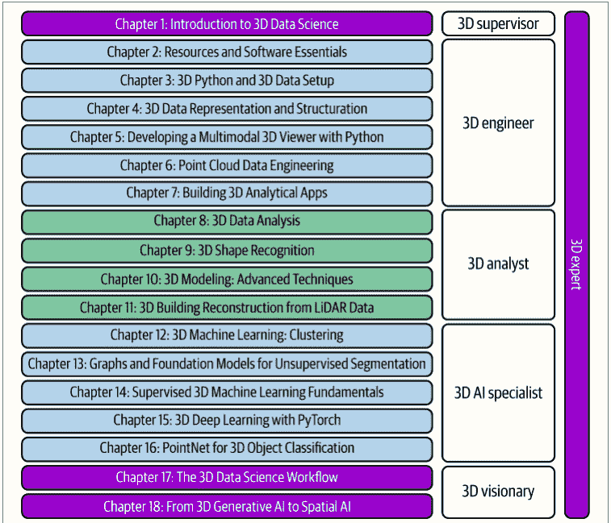

本书呈现了五条路径（3D主管、3D工程师、3D分析师、3D AI专家、3D远见者），可以独立遵循，也可以组合形成终极组合（3D专家），如图P-2所示。

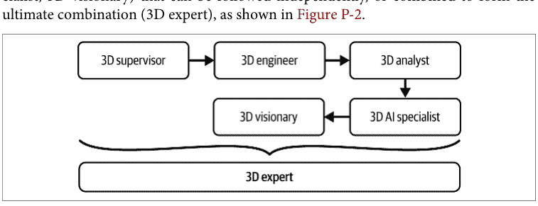

在本书的其余部分，我将这些角色称为你可以通过实践解锁的人物！让我们来定义它们：

### 3D主管

3D主管负责监督和管理3D数据科学团队或项目。他们提供指导，设定项目优先级，并确保团队达成目标。此外，他们与利益相关者联络并沟通项目进展。除了是一位优秀的管理者，他们还必须清楚地了解可能的挑战以及如何组建一个优秀的团队。他们也对用于3D数据科学的Python编程有基本的了解。

### 3D工程师

3D工程师专攻处理3D数据的技术方面。他们擅长使用软件工具和编程语言来操作、处理和分析3D数据集。他们的专业知识对于数据获取、特征工程、3D重建以及清晰建立工作流程等任务至关重要。他们非常 versatile，能够快速适应多种场景，但他们并不专攻3D机器学习或软件生产。

### 3D分析师

3D分析师专注于检查、建模和解释3D数据，以提取有意义的见解。他们使用专业软件和分析技术来分析3D数据中的空间关系、模式和结构。他们的发现有助于各行各业的决策制定和问题解决。

### 3D AI专家

3D AI专家是利用专为3D数据应用量身定制的人工智能技术和算法的专家。他们对AI和3D数据科学有深刻的理解，使他们能够开发和实施在三维空间中运行的先进AI模型。他们的专业知识对于3D物体识别、场景理解以及3D环境中的其他复杂认知任务至关重要。他们致力于将AI能力与3D数据相结合的前沿应用，以在各行各业实现创新解决方案。

### 3D远见者

3D远见者是对使用3D数据科学可以实现的潜在应用和创新有深刻理解的个人。他们构思和展望项目，常常推动三维信息所能实现的边界。

### 3D专家

3D专家是拥有3D数据科学综合知识和经验的高技能专业人士。他们精通前面提到的所有方面，包括数据获取技术、软件工具、分析方法和特定行业的应用。3D专家通常是最复杂3D项目的首选资源。

## 前置条件

为了最好地准备阅读本书，你需要：

- 一台装有Windows、macOS或Linux的电脑
- 100 GB的可用硬盘空间（用于下载数据）和16 GB的内存（以确保流畅运行）
- 一个性能不错的CPU（用于性能）和一个NVIDIA GPU（可选但推荐）
- 准备好迎接一次变革性的体验

## 代码、数据和资源

处理3D数据意味着我们严重依赖可视化模块。虽然我们可以通过访问计算服务器进行远程工作，但对于3D创新来说，通常更高效的是利用本地机器的能力，在本地工作和设计一手解决方案。

这意味着我们将依赖本地Python环境，并辅以几个知名的开源工具，如CloudCompare、MeshLab、Blender和Meshroom。理想的“入门包”在第3章中介绍，我确保除了你的电脑（最好配备支持CUDA的最新GPU，稍后详述）之外，避免任何额外成本。

关于数据集，我很高兴从我的收藏中提供所有必要的数据，你可以根据许可指南（主要是开放的）自由使用。最后，所有代码也提供给你，可以是notebook（.ipynb）文件格式，也可以是Python脚本（.py）。它也包含在文本中以确保最大的清晰度，例如：

```python
import numpy as np
x = np.array([1, 2, 3])
```

图P-3展示了一个二维码，允许你访问本书提供的资源，这些资源由3D Geodata Academy托管。你会发现一个免费课程、代码、数据集和任何相关资源。这是你的学习中心。总而言之，这是一个独立的体验，除了我们将使用的少数Python库（少于20个）、提到的开源软件以及书中提供的代码和数据之外，没有额外的依赖项。

## 本书使用的约定

本书使用以下排版约定：

- *斜体*
  表示新术语、URL、电子邮件地址、文件名和文件扩展名。
- **等宽字体**
  用于程序清单，以及在段落中引用程序元素（如变量或函数名、数据库、数据类型、环境变量、语句和关键字）。
- **等宽粗体**
  显示用户应原样输入的命令或其他文本。
- *等宽斜体*
  显示应替换为用户提供的值或由上下文确定的值的文本。

此元素表示提示或建议。

此元素表示一般性说明。

此元素表示警告或注意事项。

## 使用代码示例

补充材料（代码示例、练习等）可从 [3D Geodata Academy](https://3dgeodata.academy) 下载。

如果您对代码示例有技术问题或遇到问题，请发送电子邮件至 [support@oreilly.com](mailto:support@oreilly.com)。

本书旨在帮助您完成工作。通常，如果本书提供了示例代码，您可以在程序和文档中使用它。除非您要复制代码的大部分，否则无需联系我们获取许可。例如，编写一个使用本书中多个代码块的程序不需要许可。销售或分发 O'Reilly 书籍中的示例则需要许可。通过引用本书和引用示例代码来回答问题不需要许可。将本书中大量的示例代码整合到您的产品文档中则需要许可。

我们感谢但通常不要求署名。署名通常包括书名、作者、出版商和 ISBN。例如：“*3D Data Science with Python* by Florent Poux (O'Reilly). Copyright 2025 Florent Poux, 978-1-098-16133-0.”

如果您认为您对代码示例的使用超出了合理使用范围或上述许可范围，请随时通过 [permissions@oreilly.com](mailto:permissions@oreilly.com) 联系我们。

## O'Reilly 在线学习

40 多年来，*O'Reilly Media* 一直提供技术和商业培训、知识和见解，以帮助公司取得成功。

我们独特的专家和创新者网络通过书籍、文章和我们的在线学习平台分享他们的知识和专业知识。O'Reilly 的在线学习平台为您提供按需访问的实时培训课程、深入的学习路径、交互式编码环境，以及来自 O'Reilly 和 200 多家其他出版商的大量文本和视频。更多信息，请访问 [https://oreilly.com](https://oreilly.com)。

## 如何联系我们

请将有关本书的意见和问题发送给出版商：

O'Reilly Media, Inc.
1005 Gravenstein Highway North
Sebastopol, CA 95472
800-889-8969 (美国或加拿大)
707-827-7019 (国际或本地)
707-829-0104 (传真)
[support@oreilly.com](mailto:support@oreilly.com)
[https://oreilly.com/about/contact.html](https://oreilly.com/about/contact.html)

我们为本书设有一个网页，其中列出了勘误、示例和任何其他信息。您可以通过 [https://oreil.ly/3d-data-science](https://oreil.ly/3d-data-science) 访问此页面。

有关我们书籍和课程的新闻和信息，请访问 [https://oreilly.com](https://oreilly.com)。

在 LinkedIn 上找到我们：[https://linkedin.com/company/oreilly-media](https://linkedin.com/company/oreilly-media)。

在 YouTube 上观看我们：[https://youtube.com/oreillymedia](https://youtube.com/oreillymedia)。

## 致谢

如果没有杰出人士的支持，开启这段 3D 数据科学之旅是不可能的。首先，我由衷地感谢我过去和现在的学生。他们的好奇心、坚定不移的决心和“啊哈！”时刻激发了我对这个领域的热情，并使教学成为无尽的快乐源泉。

我要特别感谢我的行业合作者，他们不仅提供了关于实际应用的宝贵见解，还信任我成为他们创新事业的合作伙伴。亲眼目睹 3D 数据科学在实践中的影响，是一次真正令人谦卑的经历。

感谢我的同行研究人员和教授们，感谢你们富有启发性的讨论、分享的知识和坚定不移的支持。你们的专业知识和情谊推动我在学术道路上不断前进。

我还要感谢我的家人和朋友，感谢你们容忍我熬夜、对 3D 点云的热情讨论，以及对我完成这个项目能力的坚定信念。你们的爱和鼓励是我展翅高飞的风。

我还要衷心感谢那些一丝不苟地审阅这份手稿的敬业编辑和审稿人。他们富有洞察力的反馈、改进建议以及对细节的敏锐关注，显著提升了本书的清晰度和全面性。他们的专业知识无疑使本书成为所有有志于成为 3D 数据科学家的宝贵资源。

# 第 1 章

## 3D 数据科学简介

你看过电影《黑客帝国》吗？你能想象在黑色背景下移动的成千上万个绿色字符吗？这些代表了计算机程序的“世界”，其中有一套规则和算法决定了事物的运作方式。在不过度延伸基本原理的前提下，我们为 3D 数据科学设定的场景与此想法相去不远。

想象一下，能够创建现实世界现象的精确数字环境。从现有的工厂出发，你可以研究带有机器人和传送带的新虚拟装配线的影响。在医疗保健领域，你可以模拟不同治疗方法对患者虚拟模型的影响。基于城市模型，你可以预测自然灾害的影响并提出最佳应急响应方案。通过数字化我们的世界，我们能收获很多。但我们从哪里开始呢？

在 3D 数据科学中，我们生成并处理描述环境（如你的城市）的电子表格。然后，我们结合跨学科技术来提取有价值的见解，并设计能够增强三维基础工作的工具。这通过建立与现实的精确数字链接，彻底改变了我们的决策能力。

最棒的是？你不需要博士学位就能入门。基本的好奇心和一点编程技能（比如非常基础的 Python）就是你投身这个激动人心领域所需的一切。

本章为我们探索 3D 数据科学奠定了基础。我解释了维度在科学中的重要性，以及空间 AI 如何利用几何来模拟我们大脑分析 3D 数据的方式。我们探讨了 3D 数据科学的定义及其快速增长的原因。然后，我介绍了 3D 数据科学模块化工作流程，并讨论了相关的挑战，包括 3D 数据获取、预处理、增强、标注数据集的稀缺性、计算需求、模型构建、可解释性、性能和稳定性。为了确保对这些概念有扎实的理解，我包含了一个实践练习，我们在其中探索和操作来自 OpenTopography 仓库的点云数据。

## 3D 数据科学简述

科学是向我们周围的世界提问、收集证据来回答这些问题，并利用这些证据来发展可以检验和完善的解释的过程。它基于观察、测量、实验和逻辑推理。当它利用 3D 数据时，就形成了一个蓬勃发展的领域：3D 数据科学（图 1-1）。

这个领域弥合了我们的三维世界与从数据中提取知识和见解的科学之间的鸿沟。它涵盖了一系列技术，从处理复杂的 3D 模型到制作揭示隐藏模式的惊人可视化。

要入门，我们需要理解这个三维世界。下一节将分解什么是维度，以及是什么让它成为 3D。

## 维度与 3D 数据科学

“维度”这个词让你联想到什么？是与科幻小说相关的东西，比如某个空灵世界的黑暗维度？虽然并非与小说无关，但在科学背景下，特别是 3D 数据科学中，我们探索的维度有着完全不同的含义。

本质上，维度是事物的可测量方面或特征。从数学角度来看，维度指的是描述一个系统或对象所需的变量数量。从 3D 数据科学的角度来看，维度通常指空间范围。现在，让我给你一些例子。

一维对象可以用单个变量来描述，比如沸水的温度或本章的页数。2D 数据是指在两个维度中表示的信息，通常使用 x 和 y 坐标。使用这些 x 和 y 坐标，可以创建由像素组成的数字图像，类似于使用经纬度坐标在平面区域描绘地点和特征的地理地图。

延伸这一逻辑，我们能够理解我们所处的现实世界被认为是三维的，空间中的点由x、y和z坐标定义。这就是为什么当我们将维度与我们的视觉感知系统联系起来时，我们本质上指的是将物体与周围环境联系起来的三维空间。例如，椅子是一个三维物体，因为它有长度、宽度和高度，这使我们能够将其与椅子的图片区分开来，后者是二维表示。


我们可以进一步推进维度概念。一个*n*维物体或空间可以由*n*个变量来描述。虽然难以可视化，但高维空间等数学概念经常在物理学和几何学等领域进行探索。例如，弦理论假设宇宙可能存在于10或11个维度中。但当然，随着我们增加维度的数量，我们为描述物体和系统增加了更多的复杂性和可能性。

维度成为让我们能够锚定所体验现实的基础。借助三维数据科学，我们有了一种新的方式来尝试模拟我们大脑处理这些“三维数据”的分析部分。因此，假设我们能够以某种方式获得观察到的三维形状的虚拟副本，这可以作为我们进行科学研究的数据基础。空间AI为令人难以置信的、受大脑启发的可能性打开了数字之门。

## 空间AI：从现实到虚拟

空间AI是一个强大的工具，它使机器能够以模仿人类空间智能的方式感知、推理并与世界互动。它就像给计算机一双能够超越平面屏幕观看的眼睛，理解深度、距离和方向的细微差别。它由以下基础组件构成：

- **感知**
  机器如何在三维中“看到”世界？像激光雷达、摄像头和深度传感器这样的传感器捕捉空间信息。
- **推理**
  一旦机器感知了世界，它们如何理解它？算法和技术使空间推理和决策成为可能。
- **行动**
  机器如何将其对三维世界的理解转化为有意义的行动？精确的数字环境构成了坚实的基础。

让我们进一步分解这一点。三维形状主导着我们的物理世界。如果有人要求你描述你所在的房间，你很可能会将你的环境描述为三维形状和几何体的集合。当我写下这些文字时，我将我的键盘识别为主要的三维主体，并勾勒出每个按键，其形状与变形的立方体密切相关。当我抬起头时，我的屏幕在我当前办公室的局部空间表示中，静静地立在我前方一米处。

当你分解这种定位和观察行为时，我们大脑的能力令人惊叹。A. M. Treisman在1980年用简单的术语解释了人类视觉感知的复杂机制：

> 当我们睁开眼睛看到熟悉的场景时，我们会立即形成对可识别物体的印象，这些物体在空间框架中连贯地组织在一起。¹

对于没有障碍的人类来说，这通常是我们认知决策系统所依据的主要信息来源。我们的大脑会延伸自身并快速适应新环境，保留视觉中最关键的信息。如果我们深入观察，大脑每秒只接收三个“图像”。然后这些图像被分类并与可用的先验知识相结合，以创造我们所体验的现实。²

这种高效的机制使我们能够在红灯时刹车或阅读并理解文本。我们的视觉也能适应不同的注意力模式，例如*定向注意力*，它通过不完全处理周围环境来节省能量；以及*发现注意力*，它在“慢速模式”下运行，同时大脑从我们的记忆中收集数据以获得对场景的完整理解。

借助先进的计算能力和去物质化，现在可以虚拟复制复杂的过程。尽管复制某些操作具有挑战性，但研究人类如何与环境互动可以帮助我们更好地理解可以有效利用的限制和机制。让我分享一个例子。

**图1-2**描述了物理世界和数字世界之间的关系，特别是在数字孪生的背景下。这个过程始于现实世界，传感器捕捉各种物理对象或系统的方面。这些传感器可以是任何东西，从捕捉建筑立面的摄像头到记录温度的温度计。捕捉到的数据代表了物理世界的实际/建成状态。然后，这些捕捉到的数据被处理并用于创建物理对象或系统的数字副本。

1 A.M. Treisman and G. Gelade, “A Feature-Integration Theory of Attention”, *Cognitive Psychology*, vol. 136, pp. 97–136, 1980.
2 F. Poux, “The Smart Point Cloud: Structuring 3D Intelligent Point Data”, doctoral dissertation, Université de Liège, 2019.

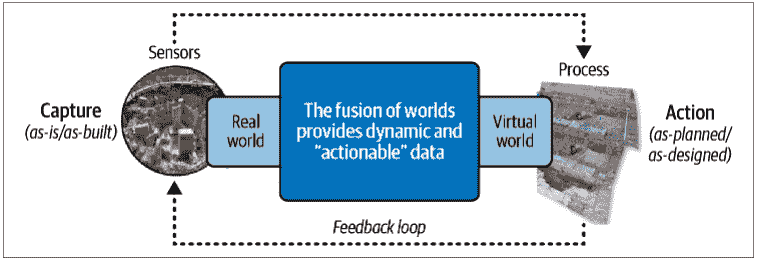

图1-2. 在数字孪生背景下，从现实到虚拟的过程

这个数字孪生存在于虚拟世界中。融合过程允许将来自现实世界传感器的数据链接起来，这些数据可以反馈到数字孪生中。模拟或模型可以更新以反映现实世界中不断变化的条件。这在两个世界之间创造了一个反馈循环。

即使在分子水平上，构成的粒子也使用特定的几何形状，赋予它们所描述的事物以功能意义。这个迷人的特征主要可以通过三维数据科学来研究：数学、计算机科学和三维数据专业知识的完美结合（图1-3）。它利用这种协同作用，将三维机器学习、三维数据处理以及几何与空间分析推向新的前沿。综合起来，我们获得了一个强大的新分支，它具有广泛的应用，并与最前沿的工作流程交织在一起。这是一个强大的研究领域，正在推动利用三维机器学习、三维数据处理、几何和空间的空间AI进步。

三维数据科学提供了探索先进技术并帮助解决现实世界问题的绝佳机会。有许多三维数据应用，对熟练专业人员的需求也在增长，这使其成为未来一个可靠的职业选择。三维数据科学推动创新和创造力，帮助创造沉浸式虚拟体验、新产品设计和先进的AI系统。通过掌握这个领域，你可以帮助进行重要的研究，解决困难的问题，并影响技术的未来。第2章回顾了数学、计算机科学和三维数据专业知识的主要概念，以帮助分解主要组成部分。

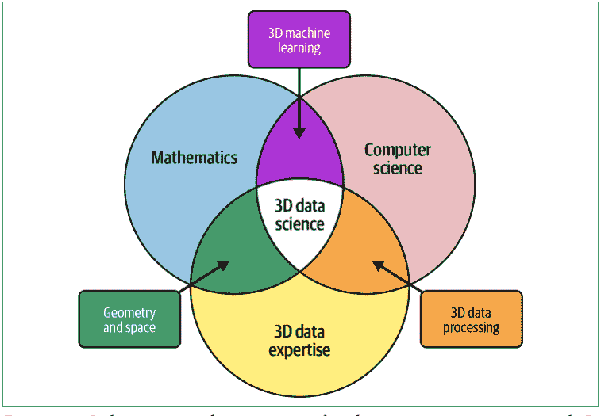

图1-3. 三维数据科学是数学、计算机科学和三维数据专业知识的交叉点

现在让我们转换话题，进入具体细节：建立三维数据科学的工作流程。

## 三维数据：基本构建块

三维数据科学的主要目标是定义“数字环境”的边界。本质上，我们想要创建一个我们所居住世界的副本，它将作为我们数字应用的坚实基础。这个现实世界的精确数字表示将使智能代理能够以类似于人类行为的方式执行任务。一旦这些基础建立起来，我们就可以连接到可以通过语音命令、操作和其他方式触发的决策元素。

第一步是理解我们有一个基础，那就是现实世界。然后，我们利用这个基础创建我们所谓的低级数字模型（图1-4）。它本质上是我们所观察到的事物的几何描述。通常，大多数工作流程到此为止。但要达到这些所谓的“智能系统”或你可以采取行动和做出决策的数字环境，你需要多走一步，创建一个高级数字模型。这是一个可用于推理服务的模型。

## 几何、拓扑与语义

理解几何、拓扑与语义之间的相互作用，对于从三维数据中提取有意义的信息至关重要。这三个概念分别从不同角度揭示了空间信息的结构与含义。

### 几何

几何学研究空间属性，根据尺寸、位置、方向和比例来刻画三维形状。为更好地说明这一点，让我们以一栋房屋（图1-5）为例。在此背景下，几何定义了房屋的物理属性，包括其尺寸、形状和空间布局。

它允许提取可量化的方面，例如墙壁的长度和宽度、屋顶的高度以及不同表面相交的角度。房屋的几何特征可以通过多种方法描述。例如，你可以在房屋结构元素的表面上生成许多离散的采样点。或者，你可以将其视为由点、线和面定义的、描述物理轮廓的多边形集合。你也可以组合几个基本的三维形状（见图1-6），然后对其进行变形和组合，以获得最终的三维几何体。

总体而言，获取几何信息通常是三维数据科学工作流的第一步。但如果我们止步于此，就无法收集到复杂决策场景所需的深刻见解。这就是为什么在获得可靠的几何信息后，你需要定义拓扑。

### 拉扑

拓扑关注的是空间在连续变换（如拉伸、弯曲或撕裂）下保持不变的内在性质。它处理连通性、邻接性、包含性和连续性等概念。

它可能较难理解，因此让我尝试用我们的房屋示例（图1-7）来阐明。拓扑帮助我们理解其组成部分之间的关系。例如，它识别出墙壁相互连接形成房间，而门道则连接着各个房间。拓扑使我们能够分析房屋不同元素在空间上的关联，从而洞察结构的布局和连通性。

这是一种将感兴趣的物体置于三维几何场景中进行情境化的方法。这一切在实践中听起来很棒，但我们如何为我们正在操作和拓扑定义的实体赋予意义呢？我们如何知道某个东西是地板，而另一个是柱子？嗯，这就需要语义了。

### 语义

语义指的是与数据集中元素或结构相关的含义、解释或意义。它涉及分配标签、属性或分类，为数据提供上下文和理解。同样，在房屋的语境下，语义使我们能够描述和分类其组成部分（图1-8）。

语义使我们能够识别并标记房屋内的厨房、卧室和客厅。这层额外的信息超越了几何表示，提供了对房屋各部分用途和功能的更高层次理解。

自然地，这三个支柱中的每一个都可以独立考虑。然而，要开发最稳健的三维数据科学解决方案，整合几何、拓扑和语义是必要的组成部分。

### 整合几何、拓扑与语义

几何、拓扑与语义之间的协同作用对于全面的三维数据分析至关重要。通过结合这些概念，我们获得了对空间数据的整体理解。例如，在一个三维城市环境中，几何提供了关于物理结构的信息，拓扑定义了这些结构如何连接，而语义则赋予了建筑物、道路和公园等各种元素以意义。

但我们甚至可以描述我们视为基础对象的物体，例如一把椅子。我们可以将这个对象细化为其组成部分，并定义每个部分如何与其他部分互动。在图1-9中，我们有一个靠背、一个座面和四条腿（腿1到4），它们位于一个厨房中。

现在我们已经理解了我们在寻找什么以及为什么寻找，让我快速说明一种通常构成研发解决方案基础层的核心数据模态：三维点云数据。

## 三维点云简介

实体和对象可以在不同的细节层次上被描述。例如，一个点可以代表一座城市、一个人或一个国家。然而，在三维数据科学领域，数据点通常使用一组传感器收集。虽然单个光栅图像或视频流在某些情况下可能有用，但它们可能只能提供必要的深度信息来准确模拟我们的三维视觉感知。因此，通常需要一个更全面和多样化的数据基础。

现实捕捉设备能够以点云的形式捕捉全面的三维空间信息，点云是由{X, Y, Z}坐标组成的空间集合，以及基于传感器的能力和局限性来表示所记录环境的属性。

合适的硬件、软件和方法选择的格局已经成熟到可以创建现实世界的数字副本，从微观尺度到国家尺度，如图1-10所示。

随着低成本解决方案的出现，获取点云变得更快、更易于实现。然而，支持这些硬件进步的软件并未跟上步伐，并且仍然面临着大数据的五大挑战，即容量、速度、价值、真实性和多样性，如图1-11所示。

简单来说，当我们使用不同的传感器和方法收集数据时，我们最终会得到多样化且规模庞大的点云数据集。这在处理速度和准确性方面带来了挑战，因为我们需要确保数据可靠并能转化为有用的信息。因此，及时高效地验证数据的真实性并从中提取可操作的见解至关重要。

## 3D数据科学模块化工作流

你是否曾好奇，研发成果如何转化为现实世界的应用？在构建生产就绪系统或应对工程挑战时，理解工作流在3D数据科学中的重要性至关重要。回顾图1-1，这是四个阶段中的第三阶段。

确实，拥有一套按特定顺序管理重复流程和任务的系统，有助于我们把握全局，同时清晰界定每个步骤。在3D数据科学中，工作流通常共享相同的结构，但会根据应用需求提供不同的序列或组合。“应用”一词意义重大，因为无数工作流可用于数据科学应用。根据你的具体目标，你可能需要朝特定方向推进。

然而，我建议采取更高层次的方法，识别可更广泛、更整体使用的工作流族。这样，你可以选择其中任何一种工作流，并根据需求进行定制。有八类已定义的工作流属于此类（图1-12）。

图1-12. 3D数据科学工作流的高层视图

让我们探索3D数据科学工作流的每个关键组成部分，以及它们如何协同工作以创造有价值的解决方案。

## 数据获取

获取这种额外数字表示的第一步是拥有捕获它的方法。这主要（但不限于）依赖于3D传感器，使我们能够捕获物体和场景的三维形状，有时甚至包括其他属性。现在，3D传感器并非单一实体。它们有多种类型，各有优缺点。如果你想全面了解这些系统，我撰写了一份补充指南，你可以在[3D数据科学资源中心](https://3d-datascience.com)找到。它专门探讨了立体视觉、结构光、飞行时间（ToF）和激光雷达传感器。

我们还有其他不源自现实场景而是源自纯粹创造力的数据捕获方式，例如模拟和视频游戏。第2章和第3章包含获取这些数据集的明确方法或如何最好地获取所需信息。此外，第18章将展示如何使用生成式AI工具进行3D数据集生成。

本质上，这意味着在三维空间中捕获数据使我们能够创建现实世界物体和环境的精确表示。我们可以通过使用数据捕获向量和方法来评估给定物体（如城市），从而从现实世界物体创建3D数据表示。然后，数据经过处理，可以创建3D表示。

这些方法对于创建精确的数字环境至关重要，这些环境为城市规划、基础设施管理和灾害响应等关键应用提供了基础。整合3D数据提高了我们依赖准确可靠的数据表示进行决策的能力。此外，将这些数据集成到数字环境中可以产生极其逼真的现实世界资产和系统副本，从而提高模拟和分析的效率。

## 3D数字孪生

关于3D数据表示，还有一个重要概念需要讨论：3D数字孪生。这是一个你可能听过或使用过的术语，但理解其内涵很重要。我倾向于避免模糊的定义，因此，与其简单地称之为“虚拟表示”，不如让我们分解其真正含义。3D数字孪生是现实世界中存在的物理对象或系统的动态、数据驱动的副本。这个副本不仅仅是一个静态的3D模型；它不断用实时数据更新，反映其物理对应物的状态和行为。可以将其视为一个活生生的数字镜像。

这种实时连接是关键。想象一下风力涡轮机。这台涡轮机的3D数字孪生不仅会显示其形状和位置。真实涡轮机上的传感器会将有关其转速、温度、振动水平甚至周围风况的信息馈送到数字孪生中。这使我们能够远程监控涡轮机的性能、预测潜在故障并优化其运行——所有这些都在数字领域内进行。

“3D”方面也至关重要。虽然数字孪生可以存在于2D甚至纯数字表示中，但3D方面允许进行空间理解和分析。我们可以可视化涡轮机叶片与风的相互作用，模拟不同负载下的应力点，甚至在虚拟环境中规划维护操作，然后再在现实世界中应用。这种空间背景增加了巨大的价值，特别是在工程、制造和城市规划领域。

那么，我们实际上如何构建这些数字孪生呢？这是一个多阶段过程，首先需要物理对象的高精度3D表示。接下来，我们将此3D模型集成到我们的3D数据科学流程中。最后，我们需要一个平台来可视化和与数字孪生交互，使我们能够提取洞察并做出明智决策。

值得注意的是，依赖点云数据集的3D数据科学工作流通常是特定于应用的。该工作流遵循从收集相关数据到创建交付物的经典流程。虽然数据获取步骤可能特定于可用的传感器和平台，但“点云即交付物”正变得越来越流行，现在已成为许多行业的首选。在这种面向任务的场景中，点云作为空间参考，专家使用它们来创建其他交付物。因此，它是项目与现实最紧密的联系，提供准确的现实世界信息，以促进基于数字现实而非过时或解释性信息进行决策。

在许多生产操作中，专家手动处理点云数据以提取有用信息。这个特定过程耗时且通常容易出错。3D数据科学背后的一个核心思想是将尽可能多的专家知识集成到数据本身中，以自动化的方式赋予空间实体语义和拓扑意义。这节省了时间，减少了错误，并提高了此类操作的整体效率。

集成组件以允许在3D点云模型上进行自动化决策场景，指的是智能点云的概念，该概念由Poux等人于2016年首次提出。如果这个概念激发了你的好奇心，你也可以参考公开可访问的“智能点云”论文，以构建3D智能点数据。

此外，将点云转换为特定于应用的交付物可能非常耗时，并且通常需要大量人工干预。由于我们必须处理的信息量和复杂性不断增长，人类专家有效管理它变得越来越具有挑战性，尤其是在处理分散在各个项目利益相关者和平台之间的冲突数据时。

因此，将大型点云数据转化为更高效的流程是可持续系统的关键。这开启了新一代的产品和服务，有助于决策和信息提取。在下一节中，我们将深入探讨高效的工作流，以避免特定于任务且不可持续的系统。

在继续之前，需要补充一个重要说明。我特意用3D点云来说明3D挑战，以提供视觉表示。但当然，与任何3D数据科学工作流一样，独立于3D数据模态查看视觉效果并不能展示全貌。在本章的其余部分，我将提供初步的工作流定义，为各种应用奠定稳定的基础。

因此，可以将数字孪生视为特定物理实体或系统的动态、数据驱动的虚拟表示，并与其现实世界的对应物持续同步。而数字环境虽然也是一个虚拟空间，但它代表的是更广泛的背景或场景——例如工厂车间、城市或自然景观——并不一定与物理对应物保持实时的、个性化的连接。

这应该有助于澄清整个概念，并解释为什么我在本书中特别使用“数字环境”这一术语，以避免不准确的炒作分类。

现在，我们准备看看来自3D数据采集技术的3D数据集在实践中是什么样子。让我们按照图1-13所示，通过一个利用开放数据仓库的六步流程。

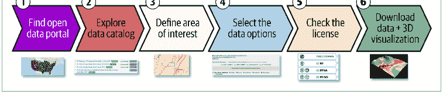

图1-13. 一个利用开放数据仓库而非依赖现场3D数据采集的数据整理工作流示例

第一步是识别一个开放数据门户。本示例使用开放数据，因为出于这些目的，我们不想去现场进行数据采集，而这给了我们一个机会来评估哪些数据是公开可用的。让我们从一个获取3D点云数据集的优秀资源开始：OpenTopography。

从这个网站，我们可以探索数据目录（步骤2），并从中选择我们想要探索的内容。对于本示例，让我们选择新西兰马纳瓦图-旺加努伊2022-2023。在步骤3中，选择一个小区域以访问点云数据。接下来，选择生成3D点云网络浏览器的选项，并移除TIN的生成。最后，检查使用许可（CC BY 4.0）和数据引用³，以提交我们的任务并获取我们的3D结果。如果满意，我们可以下载我们的数据集和许可以明确用途。

现在我们有了3D数据集，让我们考虑整个流程中的下一步。

3 Horizons Regional Council, Toitū Te Whenua Land Information New Zealand (LINZ) (2023). Manawatu - Whanganui, New Zealand 2022-2023. Collected by Landpro, distributed by OpenTopography and LINZ. Accessed: 2023-11-14.

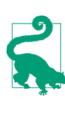

本节旨在确保您能快速掌握实用事项。为避免在此阶段超出我们的认知能力，我们将进入工作流的下一阶段。您将在第2章（软件）、第3章（方法和工具）和第18章（结合空间AI的3D生成式AI）中找到更多关于3D数据采集的方法和工具。

## 预处理

在3D数据科学工作流中，经过数据预处理步骤至关重要。需要干净、无噪声且易于管理的数据集，作为提取显著特征以进行进一步处理（如配准、分割和分类）的基础。

此过程分为六个主要类别（图1-14）：数据剖析、数据清洗、数据缩减、数据转换、数据丰富和数据验证。预处理流程几乎系统性地关注解决噪声减少和缺失数据问题。

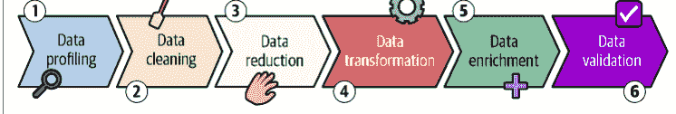

图1-14. 数据预处理工作流六个主要组成部分的高级视图

我们将在第5章和第6章中更详细地探讨每个步骤，但首先，让我非常简单地综合每个步骤。数据剖析很直接：它涉及深入理解手头的数据。数据清洗则专注于处理噪声和缺失数据，特别是在恶劣天气条件下收集数据等场景中。数据缩减涉及采样策略和降维技术，而数据转换包括归一化、缩放和特征选择。

这些步骤可以通过各种策略来实现，利用编程语言。如您所知，我们将在本书中专注于Python。让我们执行一些代码来揭开数据预处理的神秘面纱。为此，无需设置本地环境（我们将在第3章介绍），我们可以使用云解决方案，例如Google Colab。


让我对Google Colab做一些说明，将其与熟悉的东西进行类比——一个在云端的全配置工作站。它类似于一台通过网络浏览器访问的计算机，预装了数据科学工具，如Python库、Jupyter Notebook界面，以及访问处理单元（GPU、CPU和TPU）。本质上，这就是Google Colab。它允许您在浏览器中编写和执行Python代码，利用硬件加速，无需本地安装或资源管理。这对于尝试新想法、共享交互式分析或深入资源密集型任务而无需大量前期投资非常方便。可以将其视为您的按需编码环境。我喜欢用它来进行不需要大量3D可视化的快速演示，本节就是这种情况。

要跟随操作，您可以打开并执行我创建的Colab上托管的Python脚本[First 3D Steps](https://colab.research.google.com/)，或者如果您已经精通Python，可以使用以下代码：

```
# Import the first library
import numpy as np

# Import the second library
import matplotlib.pyplot as plt

# Define the coordinates of the cube vertices
vertices = np.array([
    [-1, -1, -1], [1, -1, -1], [1, 1, -1], [-1, 1, -1], [-1, -1, 1], [1, -1, 1],
    [1, 1, 1], [-1, 1, 1]
])

# Define the edges of the cube
edges = np.array([
    [0, 1], [1, 2], [2, 3], [3, 0], [4, 5], [5, 6], [6, 7], [7, 4], [0, 4], [1, 5],
    [2, 6], [3, 7]
])

# Create a figure and axes object
fig = plt.figure()
ax = fig.add_subplot(111, projection='3d')

# Plot the cube vertices
ax.scatter(vertices[:, 0], vertices[:, 1], vertices[:, 2])

# Plot the cube edges
for edge in edges:
    ax.plot(vertices[edge, 0], vertices[edge, 1], vertices[edge, 2], color='black')

# Set the axis labels
ax.set_xlabel('X')
ax.set_ylabel('Y')
ax.set_zlabel('Z')

# Show the plot
plt.show()
```

这里，我们简单地创建一个由顶点（点）和边（点之间的线）组成的3D立方体，然后在欧几里得空间中绘制它。之后，我们可以通过平移和缩放来变换立方体：

```
# Translate the cube by (1, 1, 1)
vertices_translated = vertices + np.array([1, 1, 1])

# Scale the cube by a factor of 2
vertices_scaled = vertices * 2

# Create a figure and axes object
fig = plt.figure()
ax = fig.add_subplot(111, projection='3d')

# Plot the original cube vertices
ax.scatter(vertices[:, 0], vertices[:, 1], vertices[:, 2], label='Original Cube')

# Plot the translated cube vertices
ax.scatter(vertices_translated[:, 0], vertices_translated[:, 1],
vertices_translated[:, 2], label='Translated Cube')

# Plot the scaled cube vertices
ax.scatter(vertices_scaled[:, 0], vertices_scaled[:, 1], vertices_scaled[:, 2],
label='Scaled Cube')

# Set the axis labels
ax.set_xlabel('X')
ax.set_ylabel('Y')
ax.set_zlabel('Z')

# Add a legend
ax.legend()

# Show the plot
plt.show()
```

在前面的示例中，您应该能看到原始立方体的角点为蓝色，缩放后的立方体为绿色，平移后的立方体为橙色。变换扩展了平移和缩放的情况，我们将在本书的其余部分深入探讨这一方面。一旦这一点得到良好约束，我们通常会进入数据丰富阶段。这与所谓的特征提取相关。我们的目标是从数据中派生出能丰富整体理解的值。

这些值是*特征*，它们需要满足三个主要属性：

- 它们需要是信息丰富的。派生那些不能比我们已有信息提供更多新信息的东西是没有用的。
- 它们不应是冗余的。如果可能，我们必须将它们限制在提供实质性信息而非非常有限信息的事物上。
- 最后，它们需要在下游过程中扮演促进者的角色。

让我举一个经典的3D物体分类任务的例子：你想知道一个3D物体是椅子还是桌子。你需要从数据中提取一些信息作为特征，以便它能对你的模型有所帮助（例如，尺寸、沿z轴的点分布、高度）。存在各种方法，无论是特征工程阶段的一部分（见第6章和第7章），还是包含在主要的3D机器学习架构中（涵盖在第12章至第16章）。

在这个阶段，我们已经可以注意到理解目标应用更大目标的影响和重要性。不同的应用，如结构偏差分析、语义分割、分类和3D建模，需要不同程度的预处理和特征计算。最后，我们经过数据验证阶段，以确保我们回答了我们建立的特定标准。


处理数据时通常需要额外的步骤。这些可能包括准备提供更详细信息的兴趣区域、创建加速结构数据、计算预特征，以及将3D数据集转换为对我们目标有用的格式。因此，重要的是要记住，工作流模块的序列化在实践中可能会有所不同。

3D数据预处理在每一章中都被广泛使用，根据最终目标的不同，深度也不同。一旦我们实现了将初始混乱数据转换为精炼且有价值的数据集的目标，我们就准备好应对数据集之间的配准挑战了。

## 配准

当处理来自不同视角的多个数据集时，将它们对齐到一个统一的参考框架变得至关重要。无论是将同一物体的扫描数据合并，还是将从不同角度拍摄的照片合并，配准工作流都能实现整体分析和理解。此外，数据配准处理的是您拥有不完整数据，并且需要能够平移、旋转和缩放其中组件的场景。

一个典型场景是，如果您有两个来自不同视角的“扫描”，并且您想将它们都带入一个视角（例如，图1-15）。在这种情况下，我们想要要合并来自摄影测量资产的两个扫描数据，我们首先提取一些感兴趣的特征，然后应用一种配准技术，利用这些特征将两个数据集对齐到一个共同的参考坐标系中。

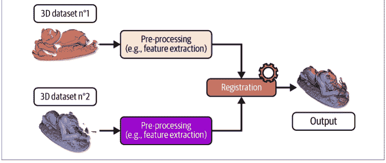

我们将此任务称为数据配准，其目标是从两个局部坐标系转换到一个共同的参考坐标系，使数据集能够连贯地对齐。这也指跨平台配准，即你拥有不同的视角、不同的采集尺度以及最终不同的数据类型。

然而，这个过程更为复杂，可能涉及数据校准或数据融合子任务，这将超出本书的范围。对于感兴趣的人，这些内容在3D资源中心有深入介绍。

> 数据配准对于创建精确的数字环境至关重要。第6章提供了一个完整的解决方案，包含一个从全局到局部的配准方案，使用Python实现，你可以复现并扩展到自己的项目中。

现在，让我们转向3D数据科学工作流中最主要的模块：语义化。

## 3D数据分类（语义注入）

我们在3D场景理解框架中经典涵盖的任务是语义化，我们将其称为分类。此步骤的主要目标是理解输入数据并解释传感器数据的不同部分。例如，我们有一个由自主机器人或汽车采集的户外场景点云，比如高速公路。

分类的目标是找出场景的主要部分。换句话说，我们需要知道这个点云的哪些部分是道路，哪些部分是建筑物，或者人类在哪里。从这个意义上说，它是一个旨在从我们的传感器数据中提取特定语义意义的总体类别。然后，我们希望在不同的粒度上添加语义。让我更详细地描述每种技术（如图1-16所示）：

*3D目标检测*
3D目标检测技术，或边界框检测技术，将目标包围起来。它们是许多应用的关键组成部分。基本上，它们使系统能够捕捉目标在世界中的大小、方向和位置。因此，我们可以在现实世界场景中使用这些3D检测，例如增强现实应用、自动驾驶汽车或通过有限的空间/视觉线索感知世界的机器人。漂亮的3D立方体包含不同的目标。但如果我们想微调目标的轮廓呢？

*3D语义分割*
通过语义分割技术，我们能够攻克最具挑战性的任务之一：为属于感兴趣目标的每个基本单元（即点云中的每个点）分配语义标签。本质上，3D语义分割旨在更好地勾勒场景中存在的目标。可以说，这是加强版的3D边界框检测。这种方法提供每个点的语义信息，使我们能够深入分析。然而，一个限制仍然存在：我们无法直接处理我们处理的每个类别（类）中的不同目标。我们也有相应的技术吗？

*3D实例分割*
是的！它被称为3D实例分割。它具有更广泛的应用，从自主系统中的3D感知到制图和数字孪生中的3D重建。例如，我们可以想象一个库存机器人，它能识别椅子，能够计算数量，然后通过抓住第四条腿来移动它们。实现这个目标需要区分不同的语义标签和具有相同语义标签的实例。可以将实例分割看作是超级加强版的语义分割步骤。

在这个阶段，3D几何和语义被提取并附加到实体上。接下来，让我们考虑结构化和建模模块。

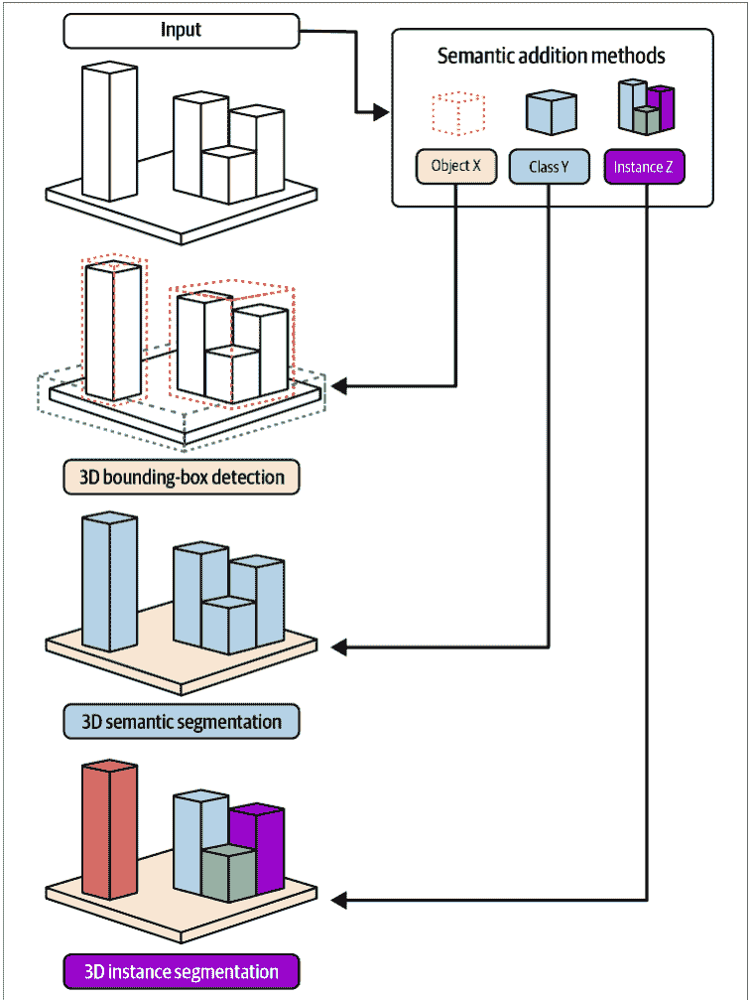

图1-16。三种主要的语义化技术：3D目标检测（边界框检测）、3D语义分割和3D实例分割


语义化模块是新AI方法的重点目标，见证了3D机器学习和3D深度学习方法之间的相互作用。本书的大部分内容都致力于这些主题，以确保你拥有最前沿的理解和方法来处理这些复杂任务。你可以在第9章和第12至18章中找到利用原理、算法和AI方法的方法论和Python解决方案。

## 结构化/建模

构建3D数据集的结构常常被忽视，但这是一个关键步骤。它确保数据以易于操作和理解的方式组织。它还确保你可以创建完全适合模拟或数据试图捕捉的底层现象的连贯模型。我们可以利用结构化技术，如构建层次树等，以促进更快的处理和分析（图1-17）。

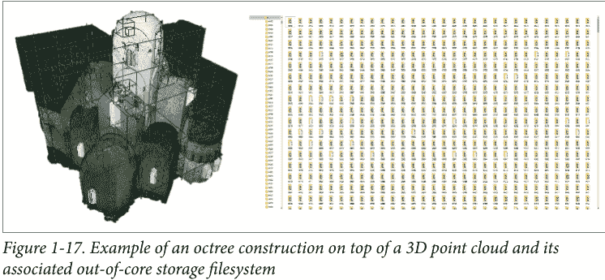

确实，我们经常需要在交付的数据结构和其直接底层之间切换。当我们处理3D数据时，我们有一组几何体，需要通过一个拓扑数据结构将它们连接起来，并提取语义指针。我们需要克服这个障碍，通常可以实现一个数据结构，连贯地组织我们的几何、语义和拓扑三大支柱，以适应应用或多个应用。

在这个阶段，如果我们保持模块的线性进展，我们将拥有一个具有健全3D几何、语义和拓扑的数据集。因此，我们拥有了进行分析步骤所需的所有元素。


在处理3D几何时，我们经常借助加速结构，如*k*-d树、二叉树和八叉树来加速过程。**第4章**将介绍如何使用Python和方法论来最好地构建你的3D数据集。然后，**第10章**通过提供高级3D建模技术来补充**第4章**。

## 3D数据分析

一旦结构清晰，分析工作流就发挥作用了。这里的目标是准确描述数据、理解趋势并进行推断。这一阶段构成了整个工作流的重要部分，因为它揭示了隐藏在海量数据中的见解（图1-18）。

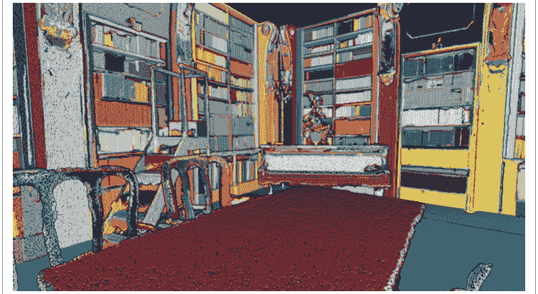

图1-18。将图书馆的3D点云数据集分解为其主要组成部分的示例

例如，通过分析目标之间的空间关系、它们的几何形状和语义意义，我们可以提取有价值的见解，以更好地理解底层的3D数据。这些分析任务使我们能够识别模式、检测异常并预测未来趋势，这在各个领域都非常有用。

此外，通过利用3D几何和拓扑，我们可以执行使用传统非3D数据科学方法无法实现的复杂分析。最终，从3D数据中提取有用信息的能力为创新和解决问题开辟了新的可能性，使分析任务成为3D数据科学工作流的关键组成部分。


分析任务与应用紧密相连。然而，我们通常依赖一个标准的子工作流，该工作流利用模型进行推断和预测。由于这是我们在3D建模中遇到的大部分挑战，我在第8章深入介绍了这一阶段。此外，我们通过第9章扩展了3D数据分析的使用，该章专注于3D形状识别。

## 3D数据可视化

构建可视化和渲染管道为数据增添了更多理解。可视化工作流通过增强有效呈现数据的能力，使人们更容易掌握复杂信息。这是一个至关重要的组成部分，将其他工作流模块联系在一起。当你思考某件事时，你是否觉得自己在创建某种视觉表示？如果我们谈论稀有物种，比如独角鲸（*Monodon monoceros*），如果你已经有一些关于它的数据或知识要点，你会立即想象出这些“海洋独角兽”，以其长长的螺旋形长牙而闻名。⁴

这个例子展示了数据可视化对我们来说是多么本能。我们拥有巨大的能力，通过视觉支持来有力地理解、综合或呈现各种主题。图1-19分解了分析、发现、呈现、感知和交互，这些都融入了数据可视化背后的科学。

> 4 我最近对独角鲸有点着迷。我从未见过任何一只，但现在我知道我需要去加拿大和格陵兰附近的北极水域才有机会看到这些美丽的生物。我了解到它们是群居动物，通常成群出现，并且具有令人印象深刻的潜水能力。我的意思是，如果我能在水下坚持1.5分钟我就很高兴了；独角鲸可以潜入深达1,500米（4,921英尺）的深度，并且经常在水下停留超过25分钟。多么神奇的力量啊！

比我们直觉更强大的，是我们的现代计算系统处理三维几何体和代表真实物体的属性的能力。事实上，这构成了我们创造更佳视觉效果的核心工具，使我们能够以更高的精度服务于任何设定的目标。

说到针对性，你听说过雅克吗？不是比利时歌手雅克·布雷尔，不是法国前总统雅克·希拉克，也不是海军军官雅克·库斯托，而是法国制图师**雅克·贝尔坦（1918–2010）**？

谈论数据可视化，很难不提及贝尔坦的视觉变量。它们由贝尔坦提出，由于其以视觉方式清晰、有效地编码信息，至今仍是图形化表示数据的基本属性。**图1-20**展示了这些变量，包括方向、大小、形状、颜色、纹理、明度和位置。

通过策略性地选择和组合视觉变量，我们可以创建有效的可视化，简化复杂信息，便于观众解读（对于制图和二维应用，这些可视化最常见形式是地图）。现在，是时候将这些模块与应用层联系起来了。

你将在第5章和第7章找到一些关于三维可视化目标的灵感。在第5章，我们将创建一个多模态三维查看器来处理各种三维模态。在第7章，我们将开发一些分析工具，如阈值滑块，以便与我们的数据集进行实时交互，并为三维体验带来沉浸式组件。

图1-20. 贝尔坦的视觉变量

## 应用（软件）开发

这是一个可选步骤，专注于我们开发的模型和算法的细致开发和部署。虽然本书无意为你提供应用开发的完整解决方案，但让我分享一下这个关键阶段的简单视图，如图1-21所示。

图1-21. 创建提供生产就绪解决方案的应用模块的主要步骤

正如你可能注意到的，到那时，你应该已经完成了阶段1（环境设置）和阶段2（模型/算法栈）。这将通过之前的步骤完成。然而，在这个生产周期中，我们通常会重构代码并确保其优化以尽可能平稳地运行。此外，还会进行兼容性检查，以提供与目标部署环境的无缝集成，无论是基于云的基础设施、边缘计算设备还是现有系统。这意味着，特别是对于模型，我们必须考虑依赖关系，并精心设计一个能无缝处理三维数据集的数据处理管道。这里的重点是优化——确保效率和处理能力。

想象一下，你正在为建筑设计开发一个三维计算机辅助设计（CAD）应用。在这个例子中，环境设置涉及安装和配置软件库，如用于几何建模的OpenCASCADE和用于深度学习集成的PyTorch，并确保与建筑师和设计师使用的目标操作系统兼容。

这就是我们通常决定与现实场景相匹配的部署策略的地方。其理念是定义将软件变更从开发环境部署到生产环境的方法。这是你软件架构定义的一部分。我鼓励你阅读马克·理查兹和尼尔·福特（O'Reilly）所著的《软件架构基础》，如果你打算将你的三维数据科学之旅变成真正的产品。

如果你打算将你的计算机代码解决方案转化为一个有形的、可销售的产品，那么你有多种产品化方法可供选择。你可以创建一个独立应用程序、软件即服务（SaaS）、嵌入式软件、一个软件组件，甚至提供专业服务。创造力并不仅限于数据背后的科学。然而，提供方式的选择自然会影响你的软件架构。

如今，你可以受益于云部署，它提供了可扩展性和可访问性，并可能帮助你最小化停机时间、降低风险，并确保成功高效的实施。让我们考虑另一个例子。在地理空间分析领域，利用亚马逊网络服务、微软Azure或谷歌云平台等云服务，确保了全球用户对大规模三维空间数据集进行分析和可视化的可扩展性和可访问性。

一旦你的解决方案上线，还有一些重要阶段：严格的生产测试对于验证你部署的三维数据科学应用的稳健性和可扩展性至关重要。这包括性能测试以评估响应时间和资源利用率，压力测试以评估峰值负载处理能力，以及安全测试以加固防御漏洞。这是第一阶段，主要涉及内部测试。

想象部署一个用于肿瘤检测的三维医学成像应用。在生产测试阶段，性能测试评估应用高效处理高分辨率三维医学图像的能力。压力测试评估系统如何处理来自多个医疗专业人员的并发请求，而安全测试则确保患者数据的机密性。

然而，还有一个主要组成部分缺失，这就是我所谓的生产测试第二阶段所处理的内容。它通常涉及一个试点阶段，该阶段向有限的用户群推出并收集初步反馈和见解。随后是分阶段部署，逐步扩展到更大的用户群体。

这个特定过程是一个“自成一体的世界”。它在很大程度上超出了本书的范围，但当你准备好将你的想法转化为产品时，它也非常有趣。因此，我可以推荐一系列七本书，它们将一步步指导你完成实现一个优秀软件产品的过程：

- 《程序员修炼之道》作者：大卫·托马斯和安德鲁·亨特（Addison Wesley Longman）
- 《现代软件工程》作者：大卫·法利（Pearson Education）
- 《代码大全：软件构造实用手册》作者：史蒂夫·迈克康奈尔（Microsoft Press）
- 《谷歌软件工程之道》作者：泰特斯·温特斯、汤姆·曼施雷克和海勒姆·赖特（O'Reilly）
- 《软件架构基础》作者：马克·理查兹和尼尔·福特（O'Reilly）
- 《软件架构：艰难的部分》作者：尼尔·福特、马克·理查兹、普拉莫德·萨达拉格和扎马克·德赫加尼（O'Reilly）
- 《设计机器学习系统》作者：许欣（O'Reilly）

在这个阶段，你应该对三维数据科学工作流背后的内容有了更清晰的认识。理解这些过程为数据捕获、预处理、配准、语义提取、数据集优化、分析、可视化以及针对特定应用的定制化方面的突破性进展铺平了道路。

但理解基础并不止于此。在三维数据科学的世界里，自动化至关重要。虽然自动化这些工作流并非易事，但实现一定程度的自动化会带来巨大的好处。接下来让我们探讨这一点。

## 自动化的理由

在生产中简化我们团队的任务和工作流可以极大地提高项目执行效率。事实上，有效的工作流管理使我们能够构建、自动化和管理工作流，从而清晰地理解整个过程。它有助于消除混乱和无序，并简化流程。其中一个方面尤其核心：自动化。自动化任务能带来好处，如图1-22所示。

与三维数据科学相关，我们可以将我们的思维从以人为中心的过程扩展到自主工作流。这使我们的目标定位于开发自动化和空间人工智能，以加速推理过程。当开发包含语义化任务（例如必须识别物体）的工作流时，这一点至关重要。

当我们审视行业视角时，我们看到机器人研究在提供自主三维记录系统方面取得了重大进展。这些系统可以在没有任何人为干预的情况下捕获环境的三维点云。然而，仅仅在没有上下文的情况下收集数据集不足以形成一个有效的决策。我们需要专家的知识来提取必要信息，并为决策创建可行的数据支持。

实现完全自主认知决策系统的自动化是一个极具吸引力的前景。然而，它也带来了重大挑战，主要涉及知识提取、集成以及3D数据的表示。因此，3D数据集的结构化设计必须允许计算机将其作为基础，通过推理和基于代理的系统进行信息提取。这为理解3D数据科学如何依赖3D数据专业知识铺平了道路，而后者需要熟练的知识管理。实现这一点是自动化工作流的最终阶段（图1-23）。

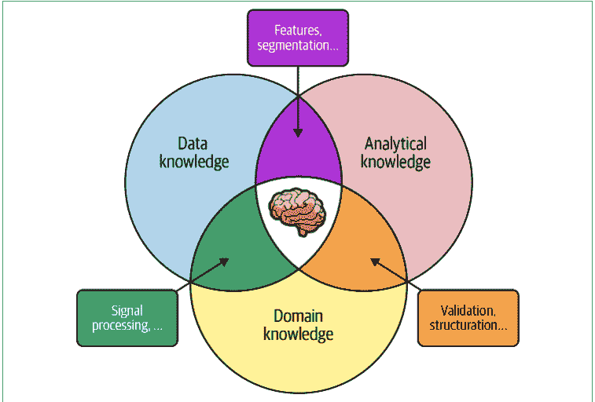

想象一下，如果我们试图通过理解采集过程特征的影响以及影响它的不同因素来理解数据特征的起源。这种理解使得预测数据特征成为可能。这种以数据为中心的过程需要明确了解数据、场景和数据处理领域的知识，以及这些领域之间的相互影响。因此，我们确定了三个主要领域：

- **数据知识**：数据领域由关于数据特征的知识和关于采集过程的知识（例如，采集方法、采集技术、采集仪器）组成。
- **领域知识**：数字化场景的领域由关于对象、它们在场景中的分布、场景上下文以及外部因素的知识组成。
- **分析知识**：最后，我们需要了解工作流中使用的算法知识（例如，使用条件、算法目的、配置、首选使用条件）。

如果我们能在设计系统时考虑到这些，我们就可以确信，向完全自动化的转变不会导致我们的模块出现棘手的逆向工程问题。

既然我们已经列出了各种工作流模块以及自动化的理由，我们是否走在一条笔直的道路上呢？嗯，有相当多的挑战需要你了解，以便更好地把握前方的道路。

## 3D数据科学中的工作流挑战

我们关注的是实际应用，因此理解我们将要面临的挑战非常重要。我们应该注意什么？3D数据科学的局限性是什么？让我们以综合的方式探讨一下我在这里为你整理的内容。

基本上，每当我们有一个现实世界的数据科学工作流时，我们总会经历三个主要阶段：数据准备、构建模型以回答特定任务，以及推理和分析。考虑到这些步骤，我总结了我们将要面临的八个主要挑战（图1-24）。

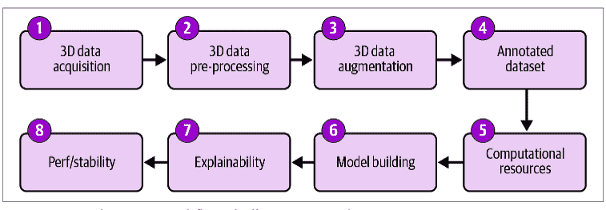

这些挑战没有特定的顺序，但我以逻辑方式将它们联系起来，灵感来源于图1-12中展示的主要工作流。

### 3D数据采集挑战

理解数据来源非常重要，尤其是在你尝试构建架构时，以确保它能针对你的应用进行调整。请记住，数据科学的这种应用非常专业化，并且在特定的实际应用中表现出色。在这种情况下，你有不同的传感器，例如，LiDAR传感器、主动传感器和被动传感器。你有不同的平台，可以是移动的或静态的。你还有其他采集方法，这使得数据收集过程不那么直接，因此在使用数据之前，最好先明确数据是如何收集的。

### 3D数据预处理

在将数据集输入架构之前，几乎总是需要对数据进行预处理，以确保它能正常工作，如前所述。这可以很简单，比如只是平移、旋转数据，归一化到特定范围，或者分块和采样，以确保你总是有相同数量的点通过网络。这些是3D深度学习应用中3D数据预处理的一般示例。这个阶段带来了一些挑战，比如我们应该做哪些预处理以及如何做。

### 3D数据增强

通常，我们不会有足够数量的标注数据集，这意味着为了确保我们涵盖应用中的全部变化范围，我们需要进行一些增强。这可以是噪声注入、数据合成，或者其他对数据执行旋转、平移或缩放的方法，所有这些都是为了扩展数据集的可能配置，例如。

### 缺乏标注数据集

3D数据科学最大的挑战之一是需要标注数据集。确实，我们经常依赖于从标注数据中学习的模型。要以监督方式训练这样的模型，你需要有标签的数据。在处理3D数据时，这一点尤为关键。很少有同时包含数据和语义（标签）的已标注3D场景可用，对于特定应用来说，找到它们甚至更难。这使得使用监督学习技术准确训练模型变得具有挑战性。

让我们考虑一个例子。我曾经参与文化遗产项目。在这类工作中，拥有你在现场收集的数据集意味着你通常不会找到该特定对象的另一个样本。你需要提供另一层抽象，即你想要将数据分类到的包含类。所有应用都需要找到每个类足够多的对象，以充分标注分割工作流。这通常归结为拥有大量数据，而这实际上并不可能。这是一个大问题。当试图提供标注良好的多模态数据集时，这种复杂性会进一步增加。有一句名言：垃圾进，垃圾出。当你想将某些东西投入生产就绪的环境时，你需要确保你训练使用的是顶级的标签数据。通常，这意味着大量的人工监督和有限的无监督机制来尝试促进标注过程，因为它可能相当耗时。这是一个巨大的挑战。

### 计算资源

这也是一个巨大的挑战。我们处理的是巨大的数据集，这将促使我们转向深度学习而非经典机器学习。然而，如果你的数据集非常小，机器学习通常能表现良好，如果你只是追求最佳结果而非并集的交集。这是第一个挑战。然后，还有另一个挑战：你可用的计算资源。

我们处理的是极其复杂的任务。我们需要以最有效的方式执行大量连续操作。通常，不建议在中央处理单元（CPU）上训练深度学习模型用于生产就绪的应用（尽管在CPU上进行推理是可能的）。对于训练，我们需要小心确保我们的计算在图形处理单元（GPU）上执行，它更注重性能，或者在张量处理单元（TPU）上执行。这意味着我们经常需要转向云计算或并行计算。如果你使用的是带有CUDA的GPU，我们稍后会介绍这一点。在这种情况下，你通常所有的并行计算都由系统处理，这使得使用你可用的所有CUDA核心变得更加高效。

### 模型构建

模型构建是一个重大挑战，因为首先，我们需要定义我们将选择哪种范式以及使用哪种机制。然后，我们必须选择一个特定的任务，接着选择一个特定的方法来实现我们想要的功能。然后，我们需要确保我们定义了训练、推理，以及如何以正确的比例进行泛化以获得稳健的性能。这也意味着要监控性能并确保我们获得尽可能高的性能。这是最大的挑战。

### 可解释性

可解释性和可解释性意味着什么？模型有多个层次，模型将进行大量复杂的计算以找到执行特定任务的最佳参数，这意味着通常很难确切理解模型工作背后的规则或逻辑。这是你在处理人工神经网络时经常会发现的事情。有趣目前，深度学习、可解释性以及可解释人工智能领域正在开展相关工作，这些内容将在第8章和第10章中进行介绍。

## 性能与稳定性

最终的挑战在于性能与稳定性。你希望模型在特定任务或多项任务上都能达到最佳性能，同时也希望它具备稳定性，这意味着无论是在训练阶段、推理阶段，还是两者兼有，你都希望模型能够表现得智能且稳健。对于训练而言，这意味着你希望每个训练周期（epoch）的变异数量是可控的。而在推理阶段，你的目标是获得良好的泛化能力。请确保你以能够真实反映实际应用场景的方式来准备数据。

请记住，我们并非从学术或研究视角看待问题——在那些领域，构建一个没有直接应用的理论是可以接受的。我们要解决的是现实世界中的实际问题。这就是为什么在解决手头问题时，我们需要确保所有这些挑战都得到妥善应对。在思考3D数据科学时，牢记这八点是非常有益的。它将引导你贯穿本书的全部内容乃至更远，确保你构建的任何东西都能恰当地应对所有这些挑战。

表1-1总结了3D数据科学中的工作流挑战，应能为未来的开发工作提供指导。

表1-1. 3D数据科学中的工作流挑战

| 挑战类别 | 描述 | 缓解策略 |
|---|---|---|
| 3D数据获取挑战 | 理解3D数据的来源和特性至关重要，特别是要考虑传感器类型（激光雷达、主动式、被动式）、平台（移动式、固定式）和获取方法等因素。 | 在数据收集过程中仔细考虑传感器特性、平台限制和获取方法。传感器、平台和方法的选择应与应用需求相匹配。 |
| 3D数据预处理 | 此步骤确保数据质量以及与后续处理步骤的兼容性。关键操作包括平移、旋转、归一化、分块和采样。 | 根据数据特性和后续处理步骤的要求，应用适当的预处理技术。降噪、异常值移除和数据归一化等技术可以提升数据质量和模型性能。 |
| 3D数据增强 | 此步骤有助于解决标注数据集有限的挑战。它涉及噪声注入、合成数据生成、旋转、平移和缩放等技术，以增加数据多样性并提升模型泛化能力。 | 利用各种数据增强技术来扩展训练数据集并提升模型鲁棒性。旋转、缩放和添加噪声等增强技术可以创建现有数据的变体，降低过拟合风险并提升模型泛化能力。 |
| 缺乏标注数据集 | 获取足够的标注3D数据用于监督学习是一个重大挑战。对于标注数据集稀缺的专业应用尤其如此。 | 当标注数据有限时，探索半监督或无监督学习等替代方法。利用迁移学习技术，使用在相关数据集上预训练的模型来启动训练过程。投入数据标注工作，为特定应用创建高质量的标注数据集。 |
| 计算资源 | 3D深度学习通常需要大量的计算资源。在大型数据集上训练大型模型需要强大的硬件，如GPU或TPU，可能需要云计算解决方案来实现高效处理。 | 优化代码和算法以实现高效计算，考虑并行处理和GPU利用。探索提供按需可扩展计算资源的云计算平台，以支持大型3D模型的训练和部署。 |
| 模型构建 | 选择合适的模型架构、训练方法和性能评估指标至关重要。在确保稳健的训练和推理过程的同时，平衡模型复杂性与泛化能力是一个关键挑战。 | 根据具体的3D数据分析任务和数据集特性，仔细选择模型架构。尝试不同的训练策略、超参数调优和正则化技术，以实现最佳模型性能。持续监控训练进度，并在独立数据集上验证模型性能，以防止过拟合并确保泛化能力。 |
| 可解释性 | 理解3D深度学习模型预测背后的推理过程可能具有挑战性。解释复杂的模型决策并为预测提供清晰的解释，对于建立信任和确保负责任的AI开发至关重要。 | 研究可解释性技术，如特征可视化或注意力图，以提供对模型决策过程的洞察。开发生成人类可解释的模型预测解释的方法，增强透明度和可问责性。 |
| 性能与稳定性 | 在保持训练和推理稳定性的同时实现强大的模型性能至关重要。管理训练变异性并在实际应用中确保一致、可靠的模型预测是一个持续的挑战。 | 实施稳健的训练流程，采用适当的正则化技术和学习率调度策略，以缓解训练不稳定性。在多样化数据集上全面评估模型性能，以确保在现实场景中实现稳定可靠的预测。 |

## 行业中的3D数据科学

在结束本章之前，我想为你提供一个关于3D数据科学在实践中如何应用的可选视角（图1-1中的阶段4）。你将在3D数据科学资源中心找到更详细的视图，该视图概述了可能涵盖你在处理3D数据科学时遇到的大多数应用的主要领域。

每个领域都有许多任务，由3D工程、3D分析、3D重建和3D可视化等角色提供支持。然后，对于这些任务和角色中的每一个，你都可以围绕各种知识支柱定义一个工作流。以这种方式构建，一条清晰的路径就出现了，使我们能够了解如何进入这些不同的类别（图1-25）。

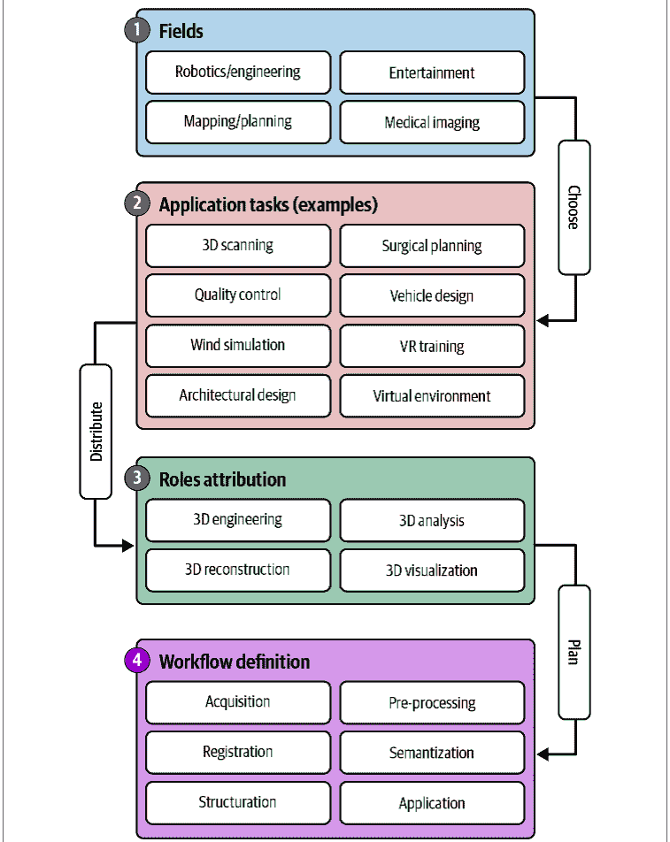

识别领域、应用和角色可以让你在定义工作流之前，对流程和目标有一个概念。这样的工作流可以从对当前行业参与者的仔细观察和研究整理中得出。


除了学术界，还有一个充满活力的3D数据科学行业领导者格局，例如NVIDIA、微软、谷歌、亚马逊和Facebook。他们通过复杂的解决方案推动了创新。这些以技术实力著称的公司，为推动3D数据科学应用做出了重大贡献。

## 总结

至此，你已经迈出了进入3D数据科学的第一步。我们研究了维度在科学中的作用，以及空间AI如何利用几何作为基础来模拟我们大脑处理3D数据的分析部分。在继续下一章之前，有九个关键学习点需要理解：

- 3D数据科学分析三维数据以提取知识和见解。它弥合了我们三维世界与数据科学之间的鸿沟。
- 空间AI是人工智能的一个专门领域，专注于在三维空间中理解和与世界交互。它是最佳3D数据科学工作流的成果。
- 维度是事物的可测量方面或特征。在3D数据科学中，维度通常指空间范围。
- 3D数据科学提供了许多机会，例如低入门成本、高通用性和有前景的职业道路。
- 几何、拓扑和语义对于从三维数据中提取有意义的信息至关重要。几何涵盖空间属性的研究。拓扑关注空间的内在属性。语义指与元素或结构相关的意义、解释或重要性。
- 点云数据是3D数据科学中的核心数据模态。点云是表示所记录环境的离散空间集合。
- 3D数据科学模块化工作流包括数据获取、预处理、配准、3D数据分类、结构化、3D建模、3D数据分析、3D数据可视化和应用开发。

自动化3D数据科学工作流对于提升效率和可扩展性至关重要。3D数据科学中的工作流挑战包括3D数据获取、3D数据预处理、3D数据增强、标注数据集缺乏、计算资源、模型构建、可解释性、性能和稳定性。

本章建立的工作流定义构成了我们在本书中努力的基础。接下来，我们将探索帮助您开启3D数据科学之旅的基本资源和工具。

## 实践项目

随着您在本书中的学习深入，您会发现每章都包含一个练习，您可以通过一个小型实践项目来完成，以自我评估应用所学知识的能力。对于本章，请熟悉点云数据——3D数据科学的核心组成部分。您可以通过六个步骤来完成：

1.  OpenTopography提供了多种3D点云数据集。访问[网站](https://opentopography.org/)并选择一个您感兴趣的数据集。考虑位置、大小和点密度等因素。
2.  下载所选数据集的一小部分。
3.  可视化点云：有许多工具可用于点云可视化，我们将在下一章介绍。作为初步探索，您可以使用OpenTopography生成的查看器来查看您的点云，以避免在此阶段安装软件。
4.  观察点云并尝试识别不同的特征或对象。您能辨认出哪些形状或模式？您能对点云中捕获的环境或对象做出任何推断吗？
5.  当您处理小型点云子集时，请思考在处理大规模点云数据时，五个V（Volume, Velocity, Value, Veracity, Variety）可能带来的挑战。
6.  考虑可能需要的预处理步骤，以清理和准备此点云数据，用于进一步分析或模型训练。

本练习侧重于使用外部工具和资源对点云数据进行动手探索。预计需要30到45分钟完成。

# 第2章

## 资源与软件基础

从零开始既令人兴奋又令人畏惧。令人兴奋是因为您将全新开始，一切皆有可能。我喜欢从头开始一个项目，用第一性原理的方法寻找解决方案。但我也知道，我可能会很快陷入“建造者困境”：盯着屏幕或白纸，直到感到迷茫。

进入一个新领域可能相当令人畏惧，因为一切都是新的，您需要从头开始构建。可能很难知道从哪里开始，尤其是在我们试图利用互联网上可用的全部信息来加快学习速度时。

本章将帮助您避免这些常见的陷阱，并为构建3D产品奠定健康的基础。3D数据科学项目中的第一个战略步骤是确保正确获取合适的资源和工具。这一阶段先于建立可扩展并受益于自动化的系统、流程和方法。

图2-1展示了基础知识资源、3D开发的硬件推荐以及为3D数据科学奠定基础的软件解决方案。我将此框架称为“3D数据科学入门包”。

第45页的“基础资源”将探讨可用的资源，包括3D数据科学所需的基本数学、计算机科学和专业AI概念。这延伸到已建立的学科、方法、工作流以及严重受益于其应用的行业。

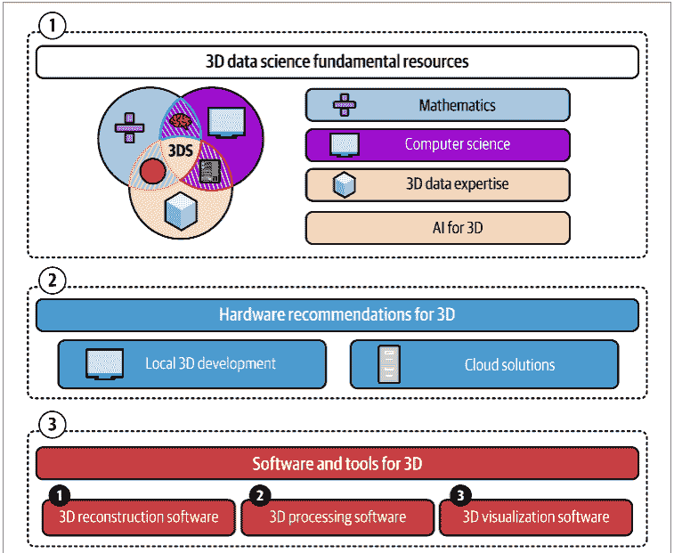

下一阶段是审视您特定的硬件设置。您需要一台计算机来创建3D数据工具。但什么是最适合您情况的配置？如何确保一个精简的设置以实现灵活的3D开发？这些都是相关的问题，我将引导您了解一些建议。我还包含了一份我推荐的用于3D重建、3D处理和3D可视化任务的软件清单。

本书允许您使用Python从头开始创建3D数据工具和解决方案。然而，在进行大量3D编码之前，利用现有软件和算法来快速迭代和测试您的想法是一个好主意。了解哪些软件可以帮助您缩短迭代时间是一项巨大的优势。

## 基础资源

有许多重要的3D数据科学概念。由于这是许多读者可能熟悉的基础信息，我在此提供概述，更完整的内容请参阅[3D仓库中心](https://example.com)。我的目标是快速勾勒本书中使用的概念和分类法。我建议您收藏此部分，以便日后参考，如果您想加强对成功3D数据科学项目基础的理解。

## 数学

希腊词源将数学视为“所学之物”。通过纯粹推理证明来发现抽象对象的性质，这是一种美妙的方式。如今，数学将我们大多数科学原理引向了数据分支。在本节中，我将概述对利用3D数据科学创建强大创新有用的数学分支。

在3D数据科学的背景下研究时，四个主要的数学概念是线性代数、微积分、统计学和组合数学。这些概念用于表示3D数据、分析数据并从中提取见解。虽然您不需要拥有数学博士学位才能跟上进度，但建议您掌握一些基础知识。为确保您获得足够的指导，我在[表2-1](https://example.com)中汇编了我偏好的资源列表。

在整理资源时，很难做到面面俱到。因此，我限制自己只为您提供免费资源。我包含了三种媒介以最好地适应您的学习偏好：书籍、视频和文章。同样，这些是我的建议，旨在以零额外成本补充本书的知识，但请知道，在这些之外还有很棒的资源，例如，在O'Reilly系列中（*《AI必备数学》*和*《数据科学必备数学》*）。

> 即使您不是熟练的数学家，直接深入本书的材料和教学也是完全可以的。只需知道，如果您在任何时候感到理解受限，您可以回过头来参考可用的资源。


表2-1. 额外的概率与统计资源

| 媒介 | 资源 |
| :--- | :--- |
| 书籍 | 统计学：*《统计学思维：程序员的概率与统计》*，Allen B. Downey (Green Tea Press)<br>线性代数：*《数据科学实用线性代数：从核心概念到Python应用》*，Mike X. Cohen (O'Reilly)<br>组合数学：*《图论导论》*，Richard J. Trudeau (Dover)<br>微积分：*《微积分》*，James Stewart (Cengage Learning) |
| 视频/课程 | 统计学："统计与概率"（可汗学院）<br>线性代数："线性代数"（可汗学院），"线性代数的精髓"<br>组合数学："图论详解"<br>微积分："积分微积分"（可汗学院） |
| 文章 | 统计学："统计学中的变量是什么？"，"什么是假设检验？"（Stat Trek）<br>线性代数："线性代数"（MIT OpenCourseWare）<br>组合数学：图论笔记（"编程竞赛导论"）（斯坦福大学）<br>微积分："积分：为什么我们需要学习积分？"（交互式数学） |

统计学、线性代数、组合数学和微积分驱动了本书的大部分应用，但计算机科学塑造了它们。

## 计算机科学

在现代社会，计算机科学包括对计算机和计算系统的研究。它通过研究、创新和产品周期影响我们社会的运作。正如您可能从图1-3中回忆起的，3D数据科学的研究处于数学、计算机科学和3D数据专业知识的交叉点。当我们通过计算机科学的视角来思考这一点时，有三个家族需要掌握：核心计算机科学概念、3D机器学习中使用的计算机科学概念，以及在3D数据处理中大量使用的计算机科学概念（图2-2）。

## 计算机科学

本节剩余部分将聚焦于计算机科学的核心概念，我将在此过程中分享必要的资源。其余分支（科学计算、计算机图形学、人工智能、数学基础、计算理论、计算机视觉、算法、数据结构、AR、VR 和沉浸式可视化）也是本书主要学习成果的一部分，但将在后续章节中详细阐述。表 2-2 包含一些有用的计算机科学资源。

表 2-2. 计算机科学核心概念

| 媒介 | 资源 |
|---|---|
| 书籍 | *《计算机科学导论》（第7版）*（O'Reilly）。由获奖团队 Nell Dale 和 John Lewis 撰写，这是一本出色的计算机科学入门书籍，兼具可读性和深度，同时涵盖了计算机科学前沿问题的全新内容。 |
| 视频/课程 | "计算机科学 101"（StanfordOnline）。面向零基础受众的计算机科学入门课程。 |

由于本章将使用 Python，让我们从 Python 编程的一些基础知识开始。有几个关键概念对于建立坚实的编程基础至关重要，尤其是在 Python 中。以下是一些最重要的概念：

- *变量和数据类型*
    理解如何声明、赋值和使用不同类型的数据（整数、浮点数、字符串）是编程的基础。

- *控制结构*
    这包括循环（例如，for、while）和条件语句（例如，if、else、elif）。这些允许你控制程序的执行流程。

- *函数*
    函数允许你将可重用的代码块分组。学习定义、调用和使用函数对于编写模块化和可维护的代码至关重要。

- *数据结构*
    理解列表、字典、元组和集合等数据结构以及如何操作和访问其中的数据至关重要。

- *算法*
    学习排序和搜索等基本算法对于高效解决问题至关重要。

- *面向对象编程（OOP）*
    在 OOP 中，你围绕对象及其交互来组织代码。这涉及类、对象、继承、多态和封装。

- *错误处理*
    对于健壮可靠的代码，了解如何优雅地处理异常和错误非常重要。

- *文件处理*
    许多应用程序通常涉及处理文件和文件系统，包括读取和写入数据到文件。

- *库和模块*
    理解如何使用库和模块来扩展 Python 的功能至关重要。

我们在本书中使用 Python，因为它已成为首选语言，原因众多且难以忽视。Python 的流行源于其广度、可读性以及丰富的库和工具集合。像 NumPy、SciPy、pandas 和 Matplotlib 这样的库为数值运算、数据操作和可视化提供了强大的支持——这些都是 3D 数据科学的核心任务。此外，Python 的简洁性和清晰的语法使其对初学者和经验丰富的程序员都易于上手，促进了快速开发和实验。然而，本书涵盖的概念可以利用 Matlab 或 R 来实现，无需太多重构。如果你想提升性能，我建议研究 Java、C++ 或 Rust，但代价是学习曲线更陡峭且代码更冗长（不太适合快速原型设计和探索性数据分析，而这在 3D 数据科学中至关重要）。

## 3D 数据专业知识

3D 数据科学需要 3D 数据方面的专业知识。这包括了解不同类型的 3D 数据以及如何获取和表示它。与数学和计算机科学相比，这方面的资源较少。我区分了在 3D 数据科学中广泛使用的三类数据专业知识，如图 2-3 所示。

首先，我们考虑在与数学交叉领域广泛使用的领域，即几何和空间概念（位于图 2-3 中维恩图的左侧交集）。这里所需的 3D 数据专业知识包括几何特征工程和空间算法。这些概念贯穿于 3D 数据科学项目的整个生命周期，并在本书中进行了深入探讨。

如果我们转向维恩图的右侧，我们会发现有助于 3D 数据处理工作流的元素，例如 3D 数据管理、大数据、语义/元数据和 3D 数据集成。同样，其理念是能够在利用多个计算机科学概念（例如，计算机图形学、计算机视觉、算法和数据结构、AR、VR 和沉浸式可视化）的数据处理工作流范围内处理 3D 数据集的特殊性。

最后，我们剩下 3D 数据专业知识的核心概念，即为 3D 数据从生成到质量、安全和管理奠定基础。我们需要阐明的最后一个分支位于数学和计算机科学的交叉点：面向 3D 的人工智能。

## 面向 3D 的人工智能

人工智能领域涵盖了广泛的概念和技术。这是一个高度活跃且令人兴奋的领域，可能会导致“错失恐惧症”（FOMO）。确实，每周我们都会看到作为研究工作或初创企业一部分的新架构或 AI 解决方案。

我的目标是确保你对每项技术的作用有一个高层次的概览，以便当我们在本书中利用 AI 时，你知道应该学习哪个专业方向。图 2-4 中的圆圈展示了三个主要的 AI 专业领域（机器学习、深度学习和生成式 AI）以及一些已知解决方案的示例。

为了确保我们对 AI 的这些领域都有相同的理解，让我们回顾一些简要定义：

- *人工智能（AI）*
    任何使机器能够以类似人类的方式解决任务的技术

- *机器学习（ML）*
    允许计算机从示例中学习而无需显式编程的算法

- *深度学习（DL）*
    机器学习的一个子集，使用深度人工神经网络作为模型，并自动构建数据表示的层次结构

- *生成式 AI（GenAI）*
    利用深度学习和神经网络生成与真实世界示例相似的输出

为了将这些与你的 3D 数据科学之旅联系起来，我精心编制了一份包含 18 个概念的列表，定义可在 3D 资源中心找到（监督/无监督学习、回归、聚类、ANN、CNN、RNN、NLP 等）。虽然这对任何人来说都是一个很好的复习，但如果你还没有太多接触过 AI 或 ML，请花点时间阅读这份列表，以确保你对这些术语有基本的理解，并能从本书中获得最大收益。

在本书的背景下，我们关注的是这些概念如何用于 3D 数据集和 3D 数据科学。后续章节，特别是第 12 至 16 章，将对此进行深入探讨。由于本书将详细讨论这个主题，我推荐的机器学习和深度学习资源列表相当简短（表 2-3）。

表 2-3. 学习 AI 和机器学习的资源

| 媒介 | 资源 |
|---|---|
| 书籍 | *《使用 Scikit-Learn、Keras 和 TensorFlow 进行机器学习实战（第2版）》*，作者 Aurélien Géron（O'Reilly） |
| 视频/课程 | "机器学习专项课程"，作者 Andrew Ng |
| 文章 | "机器学习算法"（可汗学院） |

至此，我们已经回顾了用于 3D 数据科学的所有基本概念和资源。现在，我们可以探讨一些 3D 的硬件建议。

## 3D硬件推荐

仅依赖Python进行3D数据科学是可行的。然而，当我们创建实际解决方案时，尤其是在生产环境中，我们需要将新开发的内容整合到更广泛的软件和工具生态系统中（参见图2-5）。如果您还记得图2-1中提到的3D数据科学入门包，我们现在正转向第二步。

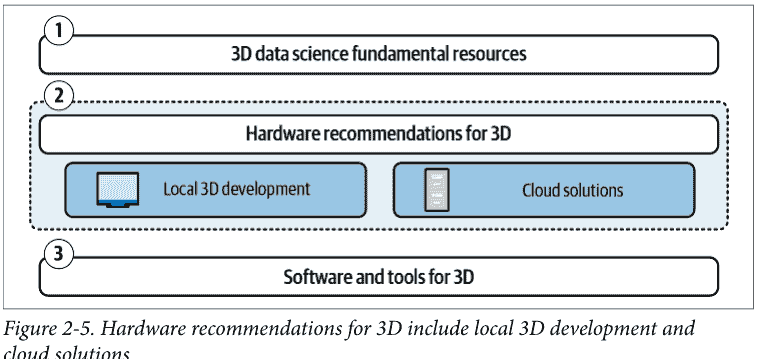

此外，在设计阶段，利用现有软件功能来加速分析和评估我们方法有效性的过程通常是个好主意。幸运的是，我们可以使用一些以主要目标为导向开发的开源软件。但首先，我们需要确定计算系统的关键组件，以确保我们为未来五年做好准备。

## 本地3D开发

硬件配置是我们开发3D数据科学项目的基石。明智选择的硬件设置可以加速计算，并释放处理大型数据集的全部潜力。让我们仔细看看针对3D数据科学需求量身定制的最优硬件配置的关键组件和考虑因素（参见图2-6）。

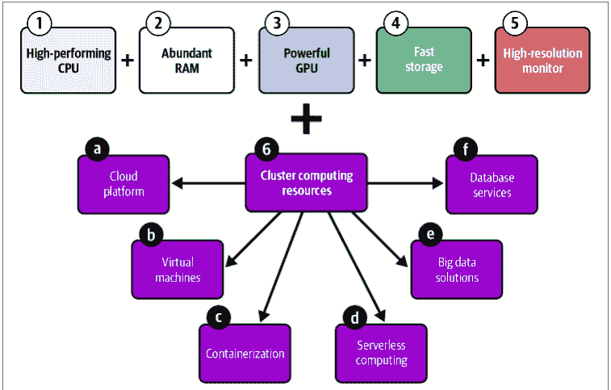

图2-6. 3D数据科学硬件推荐

### 多核中央处理器

强大的中央处理器（CPU）对于整体系统性能至关重要，有助于数据预处理、特征提取和网格处理等任务。我建议您选择能够实现高时钟速度的多核处理器。像英特尔的酷睿i9或AMD的锐龙9系列这样的CPU提供了多核和高频率之间的平衡。

### 随机存取存储器

由于3D数据集通常规模庞大，充足的随机存取存储器（RAM）对于确保分析和建模过程中体积数据的顺畅加载和操作至关重要。我建议至少配备16 GB RAM，这对于处理中等规模的3D数据集是可取的，而更大型的数据集可能需要64 GB或更高。

### 图形处理器

图形处理器（GPU）在加速3D数据科学任务中固有的复杂计算方面发挥着关键作用，例如渲染、模拟和深度学习。我建议使用具有并行处理能力的高端GPU，如GeForce RTX 4060+系列。

### 存储配置

由于3D信息的规模，存储速度对于有效的数据检索和处理至关重要。固态硬盘（SSD）显著提高了读写速度。因此，将快速的NVMe SSD（例如2 TB）用于操作系统（OS）和频繁访问的数据，再加上更大容量的HDD或SSD用于长期存储（例如5 TB），提供了一个最佳的平衡。

### 高分辨率显示器

鉴于3D数据科学的视觉特性，具有色彩准确性的高分辨率显示器对于精确的可视化和分析至关重要。选择具有良好色彩再现能力的4K显示器或多显示器以增强工作空间的灵活性。

### 大型数据集的集群计算

为了处理大规模数据集，使用多台互连机器的集群计算可以分配计算任务，从而实现可扩展性。部署具有高速互连和负载平衡机制的集群可以高效地处理大规模3D数据处理。这个集群将要么是您公司硬件的一部分，要么可以通过云解决方案访问。这些是我的建议。此外，如果您想利用本地环境之外的资源，可以利用云计算。

## 云计算

简单来说，*云*这个词指的是互联网，而*云计算*则针对通过互联网提供的一组计算服务。用户可以按照按需付费的模式从云提供商租用物理数据服务器、数据库、存储和计算能力。在某些情况下，云提供商还在云上提供软件和分析服务。云计算有三个主要特征，即服务、任务和特性，如图2-7所示。

[3D资源中心](https://www.3dresourcehub.com)上有一份指南，可以帮助初学者更好地了解如何开始使用云计算。如果您想理解那些可能令人不知所措的技术术语（XaaS、SaaS、PaaS、IaaS），这份指南会很有用。这些术语塑造了云计算如何结合计算、存储和数据库来形成基础架构。

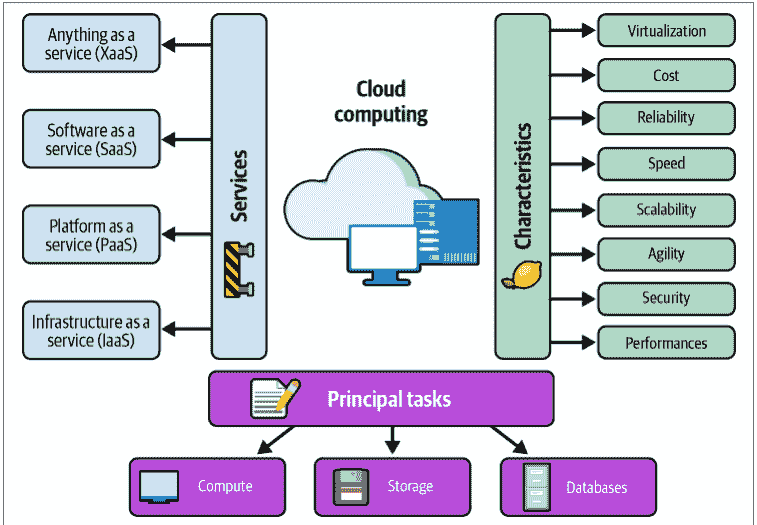

图2-7. 云计算的主要组成部分

## 行业平台

您知道吗？3D数据科学和云计算不仅仅是财力雄厚的大公司的专利。较小的公司也可以从这些技术中受益，这些技术帮助它们存储和分析大量数据，而无需花费巨资。查找和访问数据也可能是一个真正的挑战。没有云计算，较小的公司就必须将数据存储在本地服务器上，并且每次数据科学家需要分析时都要手动传输。幸运的是，云计算使小公司能够轻松访问大数据，使数据民主化并让每个人都能使用。此类基础设施有三个主要提供商。第一个是亚马逊网络服务。他们为各种使用类型提供云计算平台。它是最受欢迎的平台之一，提供多种产品，可用于计算、存储或数据库需求。谷歌云是谷歌提供的云计算平台，提供类似的解决方案。最后，我们有微软Azure，这是微软创建的另一个受欢迎的云计算平台。

既然我们更好地理解了开始需要投资什么，让我们看看一些开源解决方案来补充您在3D数据科学方面的工作。

## 3D必备软件和工具

选择正确的软件栈和工具是3D创新的加速器。虽然基于云的解决方案提供了便利，但本地设置通常提供更大的控制、性能和隐私（参见图2-8）。如果您还记得图2-1中的3D数据科学入门包，我们现在处于第三步。

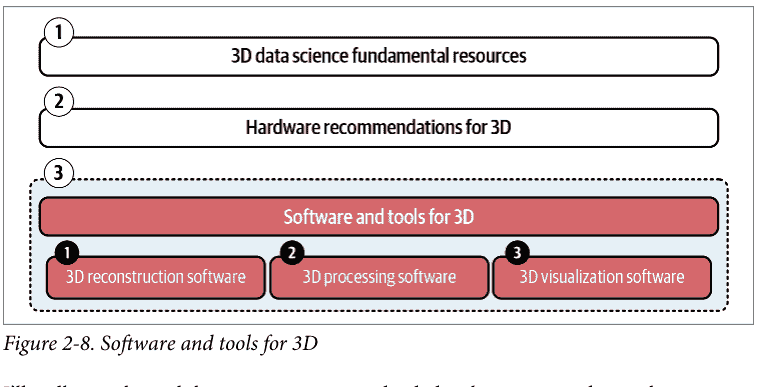

我将引导您了解如何设置完全本地的体验，使其能够在几乎不依赖大型基础设施的情况下进行离线工作。通过在您的机器上设置3D软件环境，您可以灵活地自定义工作流程，确保数据安全，并根据您的特定需求优化性能。

虽然Python是3D数据科学的强大语言，但我建议从专业的3D建模和可视化工具开始，以获得对基础知识的扎实理解。一旦您有了坚实的基础，您可以逐步引入Python及其库来增强您的工作流程并处理更复杂的任务。

一个强大的3D数据科学工具包通常涉及开源软件和专业工具的组合。这种方法促进了互操作性和简单性，允许您根据手头的具体任务定制您的3D数据科学工作流程。我决定介绍免费使用的软件，这些软件可以分为三类：3D重建软件、3D处理软件和3D可视化软件。

## 3D重建软件

既然我们已经探讨了3D数据的基础知识，让我们深入3D重建软件的世界。这些强大的工具可以将看似普通的照片或扫描转化为令人惊叹的详细3D模型。

### RealityCapture

RealityCapture是一款专门从照片和激光扫描创建3D模型的软件解决方案。与传统的建模技术不同，RealityCapture不需要用户是3D雕刻或设计专家。相反，它利用摄影测量法，自动分析并拼接图片或扫描，以构建逼真的数字副本（图2-9）。这使其成为许多领域中无价的工具，从保存历史建筑的建筑师到创建沉浸式虚拟环境的游戏开发者。

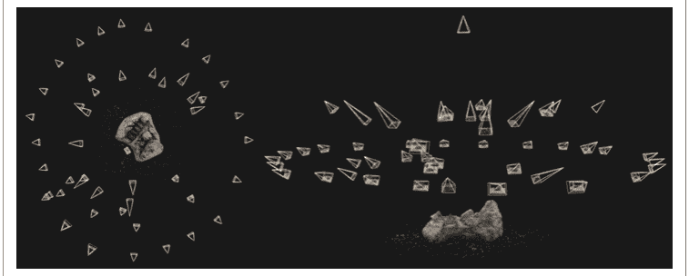

图2-9. 点云和相机位置：俯视图（左），侧视图（右）

从本质上讲，摄影测量法是一种复杂的3D重建技术。它利用三角测量原理，从不同视角拍摄的场景或物体的多张2D图像中推断3D空间信息。可以这样想：我们的大脑通过处理两只眼睛捕捉到的略有不同的视角，毫不费力地感知深度和三维性。摄影测量法扩展了这一概念，使用许多图像，仔细分析它们之间的对应特征，并通过数学方法确定它们在空间中的3D坐标。这个过程生成一个密集的点云，可以进一步处理成网格，即由相互连接的三角形组成的表面表示，有效地创建物理对象或场景的数字模型（这些原理将在第3章、第10章和第18章中更详细地介绍）。

然而，RealityCapture确实有局限性。虽然它自动化了大部分过程，但用户仍然需要捕获高质量的图像或扫描以获得最佳结果。

此外，该软件的处理能力与项目的复杂性直接相关。因此，创建具有大量细节的复杂模型可能需要大量的时间和计算资源。

RealityCapture的网站使得下载和安装该软件变得非常简单。安装程序后，你可以参考在线教程和讨论来帮助你入门。RealityCapture和摄影测量法可以非常高效且出奇地简单易用，即使对于该领域的非专家也是如此。

我对产品推广持谨慎态度，并坚信客观测试。我不希望为特定解决方案背书，而是希望提供明确的信息和知识，以指导用户做出明智的决定。因此，我想说明的是，在所有摄影测量解决方案中，RealityCapture在某些方面非常出色，但其他解决方案在其他方面可能更好。不过，在撰写本文时，RealityCapture目前为年收入低于100万美元的个人和公司提供免费许可证。

### Meshroom

Meshroom是一款开源的3D重建软件，可以从其网站下载。这使得它对爱好者和教育工作者来说易于获取，而其底层框架AliceVision则为研究人员和开发者提供了强大的工具包。Meshroom的界面允许用户通过连接不同的处理节点来构建工作流程。这为根据特定需求定制重建过程提供了灵活性（参见图2-10）。

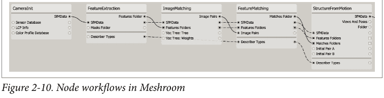

然而，这种自由度对于新手来说可能令人不知所措，要获得高质量的结果通常需要一些实验和对底层3D重建技术的理解。此外，虽然Meshroom可以处理大型数据集，但它对强大显卡的依赖可能会限制其在计算机系统配置较低的用户中的可访问性。

### 开源摄影测量解决方案

Meshroom可以与其他你可能觉得有用的开源资源互补：

- **MicMac**
  由IGN（法国国家地理研究所）开发的开源摄影测量套件。它对于处理具有挑战性的数据集特别稳健，并提供了广泛的功能。
- **OpenMVG (Open Multiple View Geometry)**
  一个专注于多视图重建几何方面的库，为摄影测量处理提供了坚实的基础。
- **Colmap**
  一个通用的运动恢复结构（SfM）和多视图立体（MVS）流程，具有用户友好的图形界面和稳健的性能。它对于有序和无序的图像集都非常出色。

### Postshot

Postshot是一款尖端软件，使用户能够从一组输入图像创建辐射场。辐射场（以及神经辐射场，即NeRF）是场景的表示，它捕获颜色、深度和光照信息，提供丰富且身临其境的体验。想象一下，你正在观察一个场景，任何一个场景——一个繁忙的街角、一片宁静的森林，甚至你的客厅。从你的视角看，光线从该场景的每个点传播到你的眼睛，携带颜色和强度信息。辐射场本质上是一个模拟这个过程的数学函数。给定空间中的一个特定3D点和一个观察方向，该函数预测从该点沿特定方向辐射出的光的颜色和密度。因此，辐射场不是用多边形或体素来显式地表示场景，而是根据光与场景的交互方式隐式地捕获其外观。这允许进行逼真的新视角合成以及其他在第18章中详述的令人兴奋的应用。

Postshot的关键优势之一是其用户友好的界面，它简化了辐射场的创建过程，使其对所有技能水平的用户都易于使用。该软件利用了NeRF和高斯溅射等先进算法，即使使用大型数据集也能确保快速且节省内存的训练。此外，Postshot优先考虑用户隐私，在用户设备上本地处理所有数据，无需基于云的解决方案（参见图2-11）。

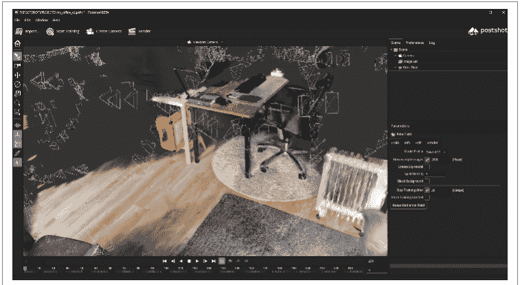

图2-11. Postshot生成的3D高斯溅射数据集示例

Postshot与流行的数字内容创作工具（如Adobe After Effects）集成，允许用户轻松地将辐射场整合到他们的项目中。这种集成扩展了创建沉浸式和交互式体验的可能性。

因此，Postshot是研究人员、艺术家和处理3D数据的专业人士的宝贵工具。其易用性、高效的算法和本地处理能力使其成为创建高质量辐射场的强大选择。

## 3D数据处理软件

3D数据处理软件是一套专门设计的工具，用于处理、分析和操作三维数据（点云、网格和体数据），这些数据通常由3D扫描仪、相机、模拟和3D重建软件生成。

### CloudCompare（点云处理）

CloudCompare是一款专门处理、编辑和分析3D点云数据的开源软件，脱颖而出。与一些专注于创建最终模型的重建软件不同，CloudCompare使用户能够深入进行3D数据处理，用于各种任务，如配准（对齐多个点云）、分割（隔离特定特征）和空间属性的复杂分析（参见图2-12）。

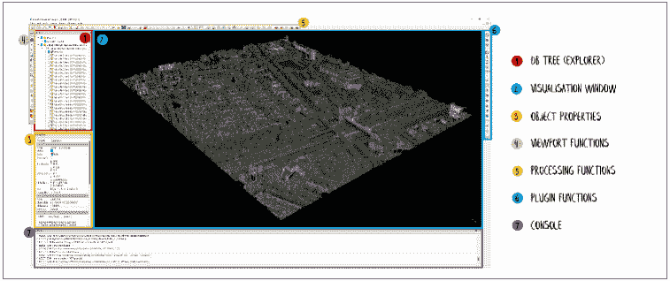

图2-12. 包含LiDAR点云的CloudCompare图形用户界面

这使得CloudCompare在地质学、测量学和机器人学等领域对研究人员来说非常宝贵，在这些领域中，精确操作和理解3D点云数据至关重要。然而，与更用户友好的重建软件相比，CloudCompare广泛的功能集可能带来更陡峭的学习曲线。虽然有教程和支持社区，但要掌握其功能可能需要一些3D数据处理概念的经验。我们在本书中利用CloudCompare来操作3D数据集。

### QGIS（地理空间解决方案）

QGIS更偏向地理空间。同样，它是一个开源项目，你可以下载最适合你操作系统的版本。安装所有内容后，你就有能力导入你的数据，包括3D点云。有趣的是，你拥有空间上下文。无论你的点云相对于参考点在哪里，你都会看到它与Open Street Map图层对齐（参见图2-13）。

正如你所看到的，它在图层之间创建了很好的叠加效果。每当你处理需要进行一些查询或处理不同类型模态（如空间栅格图像、矢量数据集和点云/CityGML模型）的地理空间应用时，QGIS都是我的首选推荐。

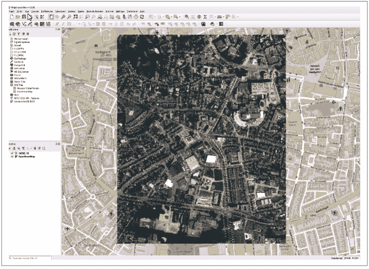

图2-13. 叠加了点云和Open Street Map图层的QGIS图形用户界面

### Blender（几何建模和渲染）

Blender在计算机图形学界非常有名，尤其是在几何建模和渲染方面。不仅如此，Blender还提供了在各种任务中处理网格和3D模型的可能性：渲染、绑定、视觉特效、雕刻、模拟、动画、建模、运动跟踪等等。你经常会看到Blender被用于创建动画电影、3D应用程序、视觉特效等（参见图2-14）。

假设我们将Blender与3D数据科学联系起来。现在，我们可以使用脚本将我们的任何工作流程与Blender的能力联系起来，以改进数据可视化和建模阶段。

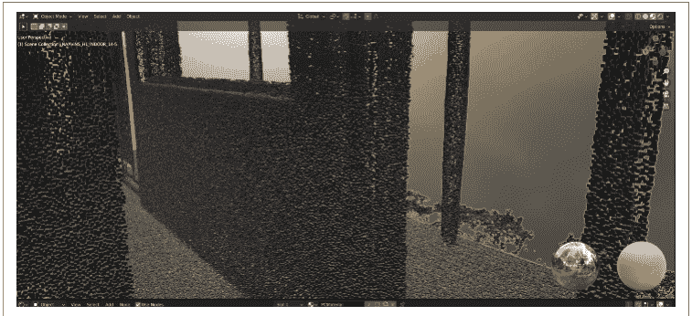

图2-14. Blender中的一个3D点云

### MeshLab（几何建模）

MeshLab是另一个开源项目（参见图2-15）。该软件主要面向处理和编辑3D三角网格模态，但实际上你也可以将其用于点云。虽然图形用户界面可能看起来有点过时，但它包含了一些最先进的功能，如对齐数据集、颜色处理、3D重建、3D变化检测、模型转换、简化、细化等。MeshLab是3D网格处理的开源参考，而CloudCompare是3D点云处理的参考。因此，将其作为你入门工具包的一部分，对于快速原型开发解决方案是一个重大优势。

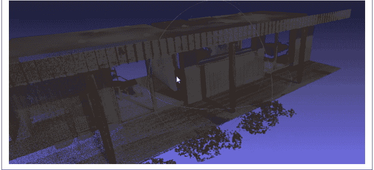

图2-15. MeshLab中的同一个3D点云

### MagicaVoxel（体素编辑）

MagicaVoxel是另一款开源软件，专注于使用3D体素进行可视化、编辑和创建精美的渲染效果。下载后，您可以直接运行它，开始可视化和编辑您的3D数据。一个很棒的功能是允许您直接导入网格，这些网格会即时显示为体素组合。这也是一种非常直观的方式来理解数据结构或场景中各组成部分之间的关系（参见图2-16）。

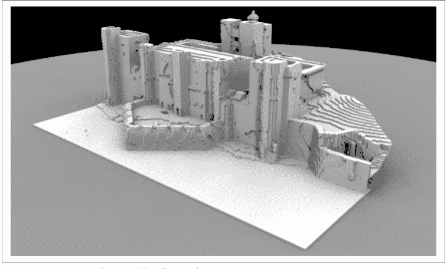

如果您只想可视化自己的数据集，有一个独立的程序叫做MagicaVoxel Viewer。通过它，您可以将网格文件（.obj）或深度图添加到一个文件夹中，并即时将它们可视化为体素组合。MagicaVoxel是一个有用的辅助工具，能让您的3D数据科学项目获得更广阔的视野。

### FreeCAD（CAD）

谈到计算机辅助设计（CAD），您可能知道的最大参考是AutoCAD（Autodesk）。遗憾的是，它不属于开源计划；因此，这里有一个替代方案：FreeCAD。FreeCAD是一个开源的3D建模器，旨在设计任何尺寸的真实3D物体。它也主要基于参数化建模方法，允许编辑各个组件的尺寸并查看其关系的变化。此外，FreeCAD还有一些有趣的有限元分析（FEA）工具和专用的建筑信息模型（BIM）工具。因此，FreeCAD对于探索与工程应用相关的3D数据集非常有用（参见图2-17）。

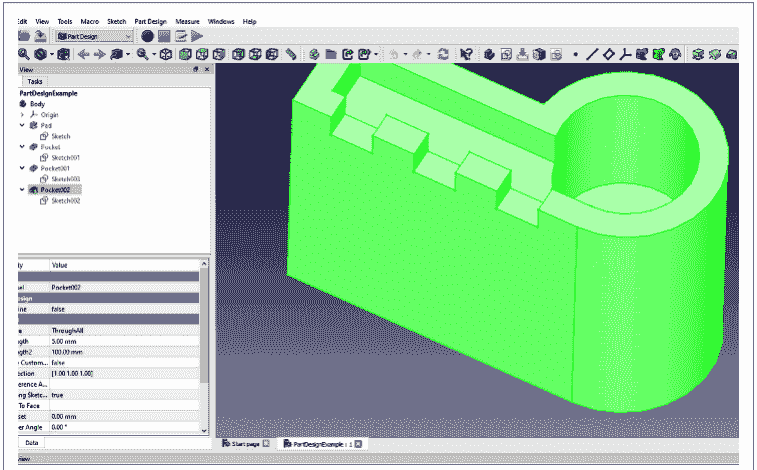

图2-17. FreeCAD图形用户界面

## 3D可视化软件

3D数据可视化软件旨在创建3D数据的视觉表示。通过将复杂的数据集转化为交互式且易于理解的体验，它们极大地帮助了3D信息的分析、解释和沟通。特别是，它们使用户能够进行交互式探索，与沉浸式场景进行互动。

### Unity（游戏引擎）

Unity帮助您将复杂的3D数据转化为引人入胜且信息丰富的交互式沉浸式体验。作为一个以游戏开发能力闻名的平台，Unity在3D数据可视化方面也表现出色。Unity的一个突出特点是其实时渲染引擎。这使您能够以惊人的视觉效果和流畅的动画来可视化3D数据，以一种既吸引人又信息丰富的方式让您的数据集栩栩如生（参见图2-18）。

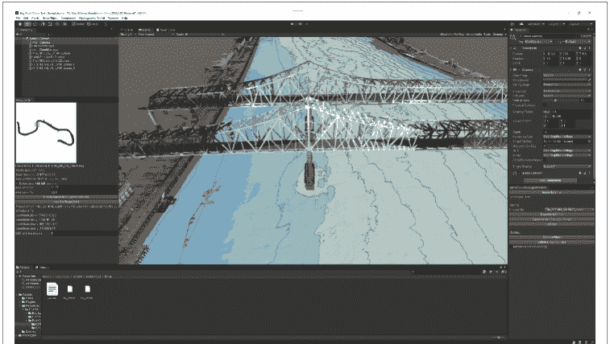

图2-18. Unity游戏引擎中的3D数据集图形用户界面

Unity的交互功能使用户能够从各个角度探索数据，实时操作对象并与模拟进行交互。这营造了一种更具沉浸感和吸引力的体验，使用户能够从数据中获得更深入的见解。Unity的另一个优势是其跨平台兼容性。无论您是针对台式计算机、移动设备还是虚拟现实头显，Unity都能让您在各种平台上创建无缝的体验。

Unity提供了一个庞大的资产商店，里面充满了预构建的资产和工具，以简化开发过程。这意味着您可以快速找到并将模型、纹理和脚本等元素整合到您的可视化中，节省您的时间和精力。

### Unreal Engine（游戏引擎）

虽然Unity已经确立了自己在3D数据可视化领域的强大地位，但另一个强大的竞争者是Unreal Engine。作为一个探索过这两个平台的人，Unreal Engine最引人注目的特点之一是其视觉保真度。其专为游戏行业精心打造的实时渲染引擎，将图形细节推向了新的高度。您可以使用令人惊叹的灯光效果、照片级真实的纹理和惊人的粒子系统来展示复杂的3D数据集。这种级别的视觉打磨确实能吸引您的观众，让他们沉浸在数据本身之中（参见图2-19）。

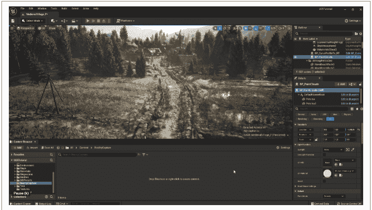

图2-19. Unreal Engine视频游戏示例

与Unity类似，Unreal Engine也具有交互功能。用户可以从各个角度探索数据，实时操作对象并触发模拟，从而创造更深层次的参与感和对所呈现信息的直观理解。Unreal Engine有许多用例，包括可视化科学模型、建筑设计或工程项目。Unity和Unreal Engine都可以帮助您通过虚拟现实和增强现实释放创建沉浸式3D数据体验的潜力。

### Potree（点云Web可视化）

我的第三个推荐是一个用于在Web上分享项目的解决方案。这个“软件”就是Potree。Marcus Shutz主要基于维也纳工业大学（TU Wien）名为Scanopy的工作开发了它（参见图2-20）。

使用Potree，您基本上可以通过利用一种数据结构——一种改进的嵌套八叉树——将您的3D点云推送到Web上，该结构将处理海量数据集并允许您实时与点云进行交互。要开始使用，您可以尝试桌面版本，它是用Electron构建的。要获取它，只需访问这个[GitHub仓库](https://github.com)并下载最新版本。

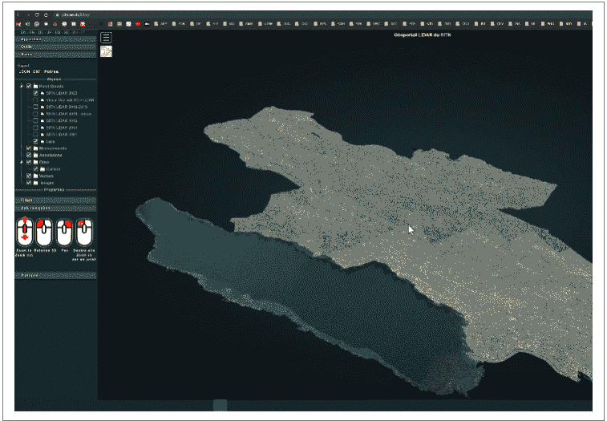

图2-20. Potree桌面点云可视化

从那里，您可以解压缩存档，启动Potree，并在图形用户界面中拖放.las文件格式的3D点云。这将触发一个索引过程（例如，Potree 2.0版本），完成后，您的点云就可以通过一种out-of-core机制实时使用了。您可以使用Potree非常快速地与他人分享您的创作，并让他们访问诸如测量、获取某些表面、提取信息等工具。能够在Web上以完整的3D方式可视化和轻微交互点云，而无需依赖特定的硬件配置，这真是太棒了。

### ParaView（3D数据可视化与分析）

我发现[ParaView](https://www.paraview.org/)是我工具库中一个无价的工具。它不是一个花哨的游戏引擎，但它在自己最擅长的领域表现出色：为科学数据可视化和分析提供一个强大而通用的平台。

ParaView的优势在于其处理各种数据格式的能力，从点云和网格到复杂的体素数据。无论您处理的是复杂的模拟、医学扫描还是地质调查，ParaView都能处理（参见图2-21）。

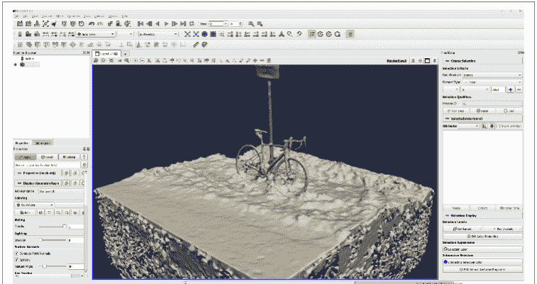

图2-21. 用于处理3D数据集的ParaView软件

加载数据后，您会看到各种可视化工具。从基本的渲染技术到高级的过滤和体绘制，ParaView帮助您创建清晰、信息丰富且美观的数据可视化。

ParaView注重交互性，因此您可以从各个角度探索数据，实时进行切片和分析，并即时应用不同的可视化技术。这使您能够更深刻地理解数据中的基本联系和模式。

此外，ParaView与Python无缝集成，允许我们自动化任务并创建适合特定需求的自定义工作流程。以下是ParaView对我真正闪光的地方：

*科学数据探索*
深入研究复杂的科学数据集，如气候模型、流体模拟或蛋白质结构，通过交互式可视化揭示隐藏的趋势和模式。

*工程分析*
可视化工程模拟的结果，例如桥梁中的应力分布或车辆周围的气流，为设计优化获得宝贵的见解。

### 医疗数据可视化

仔细检查MRI或CT等医疗扫描图像，对其进行细致的调整和查看，以辅助诊断和治疗规划。

如果您正在寻找一个功能强大且用户友好的科学数据可视化与分析平台，ParaView值得探索。

为确保顺利整理，我通过[3D资源中心](https://3dresourcehub.com)上的仓库编制了一份完整的（已更新）所有3D软件（开源和付费）清单。虽然这些工具非常便捷，但要充分掌握3D数据科学的强大功能，关键在于利用Python，这正是我们下一章的目标。

## 总结

在本章中，我介绍了成功项目的基本要素：可依赖的资源、健全的硬件配置以及本地软件解决方案。您可以将本章及其涵盖的主题视为您的3D数据科学入门包。

以下是关键组成部分：

- **知识与资源**：扎实的数学、计算机科学和3D数据基础使知识易于掌握。我们探讨了线性代数、几何和人工智能等领域，这些在我们深入更深层次时非常有用。
- **硬件配置**：搭建本地3D开发环境的硬件建议，以及选择云计算的可能性。
- **软件与工具**：合适的工具能带来天壤之别。我们介绍了3D数据科学中必备的软件类别及其应用。

有了这些基础模块，您就能从容应对最复杂的项目。接下来，我们将探讨如何设置编程环境，以及如何获取、创建和管理3D数据。

## 动手实践项目

要在3D数据科学领域取得成功，您需要合适的资源。在本章中，我分享了大量关于数学、计算机科学和3D数据的资源。本练习将帮助您加深理解，并构建个性化的资源指南。

思考您想要构建的3D数据科学项目构想。参考以下清单，写下您需要掌握的核心概念：

1. 回到本章第45页的“基础资源”部分。
2. 仔细回顾数学概念。找出需要改进的领域。从每个数学分支的精选列表中选择相关资源。
3. 检视计算机科学概念。注意需要补充知识的领域。从每个分支的精选列表中选择合适的资源。
4. 关注第49页的“3D数据专业知识”。找出对您项目至关重要的概念。参考本书特定章节以获取深入讲解。
5. 将选定的资源（书籍、文章和视频）汇编成结构化的指南。按主题或关注领域进行组织。

## 第三章

## 3D Python 与 3D 数据设置

将想法转化为创新产品是一种改变人生的体验。当您构建出自己发明的东西时，会带来强烈的成就感。回想起我的第一次执行——将我的3D建模想法转化为一个自动化的3D Python应用程序，我至今仍会感到一阵兴奋。我凭借自己的双手、电脑以及一套精选的方法和工具做到了这一点。

同样，没有什么比拥有一个改变人生的想法，却不知如何实现更令人沮丧的了。或者更糟的是，在搭建实现它所需的必要组件和工具时陷入困境。我曾经历过，那很痛苦。如果说我学到了什么，那就是第一性原理思维是关键，尤其是在3D产品开发的早期阶段。

在本章中，您将使用Python搭建自己的3D数据科学实验室。可以将其想象成设置一个工作坊，但我们使用的不是锤子和锯子，而是Python和一小部分健壮而强大的库。您将学习如何加载、操作、分析、可视化和导出点云数据，为开发创新的3D产品和解决方案奠定基础。这个过程将包括四个步骤，如图3-1所示。

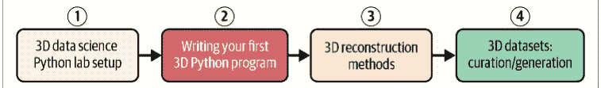

我们的第一阶段是为构建数字环境打下坚实基础。这意味着设置我们的3D数据科学Python实验室，以便我们能够最高效地开发3D程序。

实验室设置完成后，我们将深入核心：编写您的第一个3D Python程序。这就像在一个新星球上迈出第一步，借助一组最小的库，您将拥有探索这个激动人心的新世界的工具。

您可以在[3D数据科学资源中心](https://3d-data-science-resource-hub.com)找到本章的所有材料。您可以使用基础链接并添加“/chapter-X”来访问文件（代码、数据集、文章）和资源；您可能需要提供电子邮件地址、个人密码或证明您是本书所有者。

但在我们开始搭建这个实验室之前，我们需要收集材料。这就是3D数据整理的用武之地。我们将讨论获取3D数据集的不同方法，从现实世界扫描到利用开源仓库。一个特别有趣的方法是摄影测量法，我们可以使用一系列图像来重建3D模型。

## 3D Python 设置与库

现在是时候设置我们的第一个3D数据科学环境了（请回顾[图3-1](#figure-3-1)了解完整的3D数据科学解决方案工作流程）。让我们逐步介绍使用Python创建3D数据科学设置所需的主要组件。

如[图3-2](#figure-3-2)所示，我们将涵盖操作系统的选择（1）、环境设置（2）、要安装的库（3, 4）以及集成开发环境（IDE）设置（5）。然后，我们将使用一个3D数据集（6）测试一切是否正常工作，我们将在Python中对其进行可视化，并导出以便在CloudCompare中处理（7）。


在这个示例中，我将介绍一个适合初学者的设置，使您能够在十分钟内开始本地编码。因此，某些选择优先考虑简单性而非效率。我们将在未来的章节中介绍如何深化设置（例如，其他IDE、基于云的设置、GPU和CUDA管理、虚拟环境管理等）。

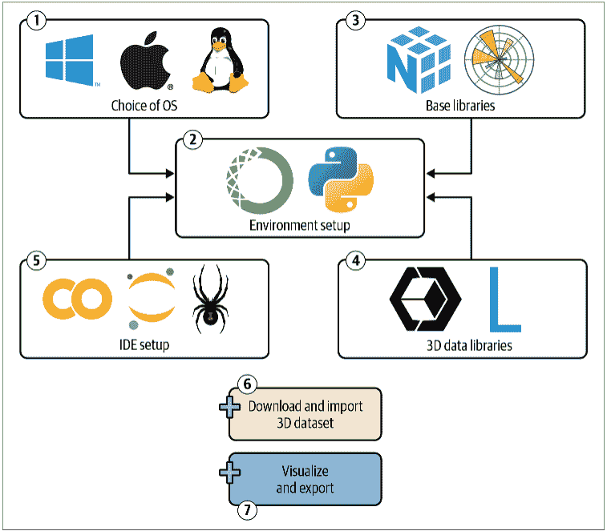

图3-2. 3D数据科学Python项目的主要组件

## 操作系统的选择

在选择操作系统时，我们相当自由。事实上，操作系统的选择对您从项目中获得的成果影响甚微。因此，让我大胆一步：我将采取民主的方式，首先收集全球常用操作系统的数据点。如果我们看计算机（笔记本电脑和台式机），微软的Windows是最流行的操作系统，在撰写本文时占所有用户的69%。苹果的macOS以17%位居第二，其次是谷歌的ChromeOS占3.2%（在美国高达8.0%），桌面Linux占2.9%。此外，5%的用户使用“未知”操作系统，可能是某种BSD或不常见的Linux变体。因此，我将描述一个满足大多数用户需求的设置，并涵盖Windows和macOS。

## 环境设置

我们希望确保环境稳定。因此，我们不会直接从[Python网站](https://www.python.org/)下载并安装Python。首先，让我们探索[Anaconda](https://www.anaconda.com/)和[Miniconda](https://docs.conda.io/en/latest/miniconda.html)，它们是旨在管理Python环境和包的软件包。它们提供了一种便捷的方式来安装和管理多个Python版本，以及我们将要利用的各种库和包。

使用Anaconda或Miniconda的一个关键优势是其创建隔离环境的能力，每个环境都有自己的一套Python版本和包。当管理众多具有冲突需求的项目时，此功能尤其有益，因为它确保每个项目都有自己专用的环境。


Anaconda和Miniconda之间的选择取决于您的具体需求。Anaconda提供更大的预构建包集合和更用户友好的界面，而Miniconda提供更小、更轻量级的安装，并允许更大的自定义。我鼓励您查阅[文档](https://docs.conda.io/)以获取清晰的分步指导。

要创建您自己的3D数据科学Python环境：

1. 下载Anaconda或Miniconda：访问相关网站（[Anaconda](https://www.anaconda.com/)或[Miniconda](https://docs.conda.io/en/latest/miniconda.html)），并为您的操作系统选择安装程序。
2. 安装Miniconda：
   a. 对于Windows：执行`.exe`文件并遵循安装说明。
   b. 对于macOS/Linux：打开终端并运行`bash Miniconda3-latest-MacOSX-x86_64.sh`（替换为您下载的文件名）。
3. 验证安装：
   a. 打开一个新的Anaconda（或Miniconda）提示终端窗口。
   b. 运行`conda --version`以确认安装并获取当前版本。
4. 创建新环境：在终端窗口中，默认处于“base”环境。最好创建一个带有Python 3.9的新隔离环境。为此，您可以输入`conda create --name DATAS3D python=3.9`。
5. 通过输入`conda activate myenv`激活环境。
6. 安装名为“pip”的包管理器以处理所有未来库的安装。您只需输入`conda install pip`。

完成这些步骤将创建一个名为“DATAS3D”的新环境，我们可以在其中组织我们的小型3D实验室。此外，你还可以找到一些便捷的命令，用于进出环境以及其他conda命令（表3-1），这些命令摘自这份完整的速查表。

表3-1. Anaconda命令摘要

| 目标 | 终端命令 |
| :--- | :--- |
| 创建指定Python版本的环境 | `conda create -n DATAS3D python=3.10` |
| 激活环境（安装包之前执行此操作） | `conda activate DATAS3D` |
| 克隆环境 | `conda create --clone DATAS3D -n DATAS4D` |
| 按名称删除环境 | `conda remove -n DATAS4D --all` |
| 导出跨平台兼容的环境 | `conda export --from-history>DATAS3D.yml` |
| 从.yml文件导入环境 | `conda env create -n D3D --file DATAS3D.yml` |
| 获取任何命令的帮助 | `conda COMMAND --help` |

为了完整性，请注意，一旦你安装了与操作系统匹配的Anaconda软件，就可以使用提供的图形用户界面（Anaconda Navigator）来完成相同的Anaconda相关设置，而无需使用终端。


使用名为“Anaconda Navigator”的图形界面，转到左侧的“环境”选项卡。通过点击“创建”来创建一个全新的隔离Python环境。创建环境后，点击它。你会看到其名称旁边有一个“播放”图标。这开启了直接在选定环境中启动Anaconda终端的可能性，这又回到了第一种基于终端的管理Anaconda环境的方式。

此时，我们已准备好进入下一阶段：为我们的环境填充有价值的库。


我花了无数时间在各种配置和不同操作系统的各种机器上测试所有代码。我的目标是确保本书提供给你的所有代码具有最大的灵活性和健壮性。然而，确保100%复现而无需微调是困难的，尤其是版本并非静态，而是随时间演变。如果你想尽可能接近我的Python设置，所有实验都是在`conda 23.3.1`和`Python version 3.9.19`（在Windows 11、macOS和Ubuntu上）下运行的。

## 基础Python库

让我们首先介绍基础库，它们为高效处理、操作和可视化数据提供了构建模块。有三个基石库：**NumPy**、**pandas**和**Matplotlib**。这些多功能工具将成为你探索3D数据复杂性时的首选伙伴。在我们的环境（DATAS3D）中，我们可以使用包管理器pip从Anaconda终端安装这三个库，一次一行（对于初学者）：

```
pip install numpy
pip install matplotlib
pip install pandas
```


如果在某个时候被要求同意安装某些组件，只需按Y，安装就会继续。安装会从互联网检索必要的组件；这是你唯一一次需要访问互联网。

现在它们已安装，让我们测试它们的用法。为此，在终端中，你可以输入：

```
python
```

这将启动**Python**，我们可以在其中编写指令。让我们从NumPy开始。这个库用于操作数组和矩阵。NumPy是一个高性能库，提供对大型多维数组的快速高效操作，使其成为科学计算和数据处理的强大工具。要在我们当前的Python会话中使用它，我们首先必须导入该库（并使用别名“np”以便后续更快捷）：

```
import numpy as np
```

从那里，我们可以进入一个实践示例，展示如何使用NumPy在**3D欧几里得空间**中创建一个点云作为一组数据点。为此，你可以创建一个具有三列的NumPy数组，其中每一行代表点云中的一个点：

```
point_cloud = np.array([[1, 2, 3], [4, 5, 6], [7, 8, 9]])
```

这个示例包含一个具有三个点的点云，坐标分别为(1, 2, 3)、(4, 5, 6)和(7, 8, 9)。要打印`point_cloud`变量，你可以输入：

```
print(point_cloud)
```

那么，另一个库呢？让我们尝试一个pandas的示例。这个库更侧重于数据操作和分析。它为处理结构化数据（如CSV文件、电子表格和数据库）提供了强大的数据结构。虽然它不是专门为3D数据处理设计的，但仍然可以用于以表格格式写入和访问点云。首先，我们在当前的Python会话中导入pandas：

```
import pandas as pd
```

随后，我们构建一个具有三列的DataFrame对象。它们分别保存每个点的X、Y和Z坐标：

```
points_df = pd.DataFrame({ 'X': [1, 4, 7], 'Y': [2, 5, 8], 'Z': [3, 6, 9]})
```

最后，我们可以将DataFrame保存为CSV文件到结果文件夹中，我们提供一个绝对路径：

```
points_df.to_csv('absolutepath/point_cloud.csv', index=False)
```

这个示例包含一个具有三个点的点云，坐标分别为(1, 2, 3)、(4, 5, 6)和(7, 8, 9)，如使用NumPy推导所得。


pandas可以用另一个Python模块扩展：GeoPandas。这个库使得可以直接处理存储在例如shapefile或PostGIS数据库中的空间数据。这扩展了当前教程的范围，但了解它很有好处，因为我们将在其他情况下使用它。

好的，这为我们处理数据提供了两个有趣的库。但是可视化呢？嗯，没有Matplotlib就不完整了。这个库以其数据可视化支持而闻名。它提供了许多工具来创建高质量的图表、图形和其他可视化。首先，让我们从Matplotlib导入所需的模块和函数，以及NumPy：

```
import matplotlib.pyplot as plt
from mpl_toolkits.mplot3d import Axes3D
import numpy as np
```

虽然它不是专门为3D数据可视化设计的，但它仍然可以创建点云的3D散点图。为此，让我们首先利用NumPy随机生成一个包含1,000个点的点云：

```
points = np.random.rand(1000, 3)
```

然后，我们使用Axes3D类创建一个3D绘图，并使用scatter函数用点云填充绘图：

```
fig = plt.figure()
ax = fig.add_subplot(111, projection='3d')
ax.scatter(points[:,0], points[:,1], points[:,2])
```

剩下的就是显示绘图：

```
plt.show()
```

这将返回包含1,000个随机点的点云，如图3-3所示。

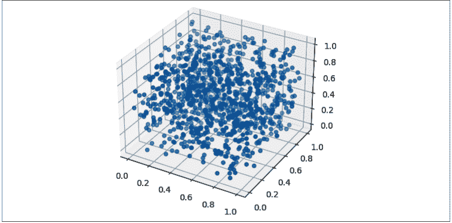

图3-3. 在Matplotlib中可视化的点云

当如这里讨论的那样使用时，Matplotlib会打开一个新的上下文窗口，你必须关闭它才能再次使用终端。我们稍后将看到的一些其他函数和工具也是如此。

这些库，结合你对3D数据的理解，构成了你3D项目的基石。安装并测试了它们的功能后，我们现在可以退出Python并返回到我们环境中的包。为此，你可以输入这一行：

```
exit()
```

这将退出Python并自动返回到你当前的Anaconda环境。现在让我们转向有趣的部分：3D Python库。

## 3D Python库

到现在，你应该知道最好保持简单。当涉及到3D Python库时，让我们找一个能够处理处理三维信息独特挑战的库。Open3D是一个强大且灵活的库，用于3D数据的处理和可视化。这是一个用C++开发并带有Python绑定的开源库，使其对C++和Python开发者都可用。让我们安装Open3D：

```
pip install open3d
```

安装完成后，让我们再次进入Python环境来测试一下。对此，你已经知道流程了；在终端中输入以下命令：

```
python
```

Open3D是一个专门用于处理和可视化3D数据的库。它提供了操作点云、网格和其他类型3D数据（包括体素）的功能。首先，我们导入该库：

```
import open3d as o3d
```

现在，我们使用Open3D的内置函数创建一个空的点云对象：

```
point_cloud = o3d.geometry.PointCloud()
```

接下来，我们可以向点云中添加一些点：

```
point_cloud.points = o3d.utility.Vector3dVector([[1,9,3], [8,5,9], [8,8,9]])
```

在这个特定的示例中，点云由三个点组成，坐标分别为：(1, 9, 3)、(8, 5, 9)和(8, 8, 9)。

在前面的代码块中，我们创建了一个Open3D PointCloud对象，然后通过`o3d.utility.Vector3dVector`函数传递了一个点属性列表，该函数将点列表转换为可以添加到点云对象的格式。

为了可视化，我们也可以利用Open3D，并将一个列表传递给`draw_geometries`函数：

```
o3d.visualization.draw_geometries([point_cloud])
```

这将打开一个窗口，我们可以看到三个小方块，它们就是我们的浮点数。秉持极简主义的心态，我们已完全准备好进入下一阶段：升级我们的3D数据科学实验室。

## Python IDE

现在，是时候通过选择一个Python IDE来简化我们的编码方式了。IDE代表集成开发环境，它为开发、测试和调试Python代码提供了一整套有用的工具。它们提供了一个一体化的环境，我们可以在其中编写、编辑和执行代码；管理项目文件；跟踪更改；并与其它开发者协作。一些流行的桌面Python IDE包括PyCharm、Visual Studio Code、Cursor AI和Spyder，每个IDE都提供独特的功能和能力，以适应不同的编程需求。

### 桌面IDE：Spyder

在Anaconda GUI中或使用Anaconda提示符，你可以安装Spyder。使用包管理器，这就像输入以下命令一样简单：

```
pip install spyder
```

一旦所有内容都安装在你的虚拟环境中，你可以通过输入以下命令来启动Spyder：

```
spyder
```

Spyder是一个极好的选择，特别是对于初学者来说，因为它具有用户友好的界面和专门为科学计算设计的功能。它提供了干净整洁的布局，使你能够轻松导航代码、数据和变量。此外，Spyder拥有强大的功能，如代码自省、变量探索和内联绘图，这些都是理解、调试和可视化3D数据操作的基本工具。使用Spyder，你可以无缝地在编写代码、检查数据和可视化结果之间切换，使其非常适合3D数据科学项目。

另一个令人印象深刻的工具是JupyterLab，它以其能够以视觉上吸引人的方式呈现交互式代码而闻名，这使其非常适合向高层管理人员展示。

### 基于Web的IDE：JupyterLab（Jupyter Notebook）

JupyterLab的主要优势之一是其笔记本界面，它为处理代码提供了一个可视化、交互式的环境。它使得实时创建、编辑和运行代码单元格变得容易，无需在不同的窗口或应用程序之间切换。此外，JupyterLab提供了多样化的数据可视化工具，使其成为处理各种数据科学或3D机器学习工作的有用选择。

JupyterLab IDE还支持多种编程语言，包括Python、R和Julia。这允许你在单一环境中使用各种工具和库，这非常酷，因为R和Julia都是很棒的语言。

在使用JupyterLab之前，我们需要在当前的Anaconda环境中安装它。与Spyder或我们的库类似，在Anaconda终端中，输入以下行：

```
pip install jupyterlab
```

请注意，它可能会要求你批准安装一些所需的库，你需要通过输入“y”然后按回车键来接受。

一旦过程完成，你就已经在你的conda环境中安装了JupyterLab IDE。不要关闭控制台；我们将通过四个简单的步骤来测试一切是否顺利运行：

1.  要启动JupyterLab，在控制台中输入命令**jupyter lab**。执行后，JupyterLab界面将无缝地在你的默认网络浏览器中打开。
2.  让我们创建一个新的笔记本。要启动一个新笔记本并开始编码，请选择“文件”菜单。你可以在JupyterLab界面的左上角找到该菜单。从那里，选择“新建笔记本”以开始。
3.  开始编码。现在是在笔记本中编写代码的时候了。要添加一个新的代码单元格，点击“+”按钮（从工具栏），或者，你可以使用快捷键Ctrl + Shift + Enter。在这个阶段，你可以在“单元格”组件中编写你的Python代码，并通过按Shift + Enter来运行它。
4.  确保你的工作安全。定期保存你的工作至关重要，可以使用工具栏中的“保存”按钮或方便的Ctrl + S键盘快捷键。

这些是开始使用JupyterLab的基本步骤。随着你对界面的熟悉，你可能会很高兴能够使用更高级的功能，例如添加Markdown文本、导入和导出数据以及使用JupyterLab扩展。

> 当你启动JupyterLab时，它会在你的本地机器上启动一个服务器进程。该服务器管理你的网络浏览器和执行代码的Python内核之间的通信。如果你想中断服务器进程并关闭JupyterLab，请在启动JupyterLab的控制台中按Ctrl + C。

## 创建3D Python程序

既然你已经设置了3D数据科学环境，是时候编写你的第一个Python程序了（如图3-1所示工作流中的步骤2）。有了合适的工具和一点指导，你很快就能探索令人兴奋的3D数据世界。

本节将引导你完成一个简单但信息丰富的示例。我们将创建一个Python脚本，该脚本加载一个3D点云，对其进行可视化，并执行基本操作，如过滤和降采样。让我们开始吧！

为了我们的实验，让我们使用一个可以从本章仓库中获取的采样点云。图3-4展示了来自哥本哈根新嘉士伯美术馆的一座雕像的三维点云，该点云是通过摄影测量创建的。别担心；我会介绍如何仅使用手机相机自己制作这样的模型。

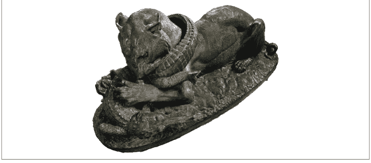

图3-4. 一个美洲豹的示例点云

从仓库中，使用本章现有的文件夹结构；你应该在*CHAPTER_3*文件夹中有类似这样的内容：

```
CHAPTER_3
-- CODE
---- first_steps.py
-- DATA
---- sample.xyz
```

这意味着如果你使用*first_steps.py*脚本，你的工作目录是*CODE*文件夹。随着你在本书中的深入，你将看到检索数据集是通过使用相对路径完成的，即数据路径以包含脚本的文件夹开头。

> 从*CODE*文件夹使用相对路径意味着我们需要在进入*DATA*文件夹之前退出该文件夹。要向上一级，你可以使用：../。

## 在Python中导入3D数据

首先，我们将利用NumPy库。你可以开始编写你的初始简短代码：

```
import numpy as np
file_data_path='../DATA/sample.xyz'
point_cloud= np.loadtxt(file_data_path, skiprows=1, max_rows=1000000)
```

这段代码片段导入NumPy库并为其分配别名np。然后，它创建一个变量来存储包含点的文件的文件路径，并将点云数据导入名为point_cloud的变量中。文件的第一行（通常包含点数等信息）被跳过。此外，设置了最大行数以防止测试期间内存不足。

要访问包含数据的实体（point_cloud）的第一个点，你现在可以在控制台中输入以下命令：

```
point_cloud[0]
```

随后，你将收到一个数组，其中包含第一个点的内容，包括X、Y和Z坐标。输出是一个值为0.480、1.636和1.085的数组。

这是你首次接触使用Python进行3D数据分析。既然你已经熟悉了加载点数据的方法，让我们来研究一些高效的第一手操作。

## 提取特定属性

我们拥有一个包含六个属性的点云：X、Y、Z、R、G和B。值得一提的是，当使用NumPy数组时，索引总是从0开始。因此，如果数据加载时没有字段名称，可以通过在控制台中输入以下内容来获取第二个点：

```
point_cloud[1]
```

这将返回一个数组：

```
array([0.480, 1.636, 1.085, 25, 44, 68])
```

要获取红色（R）属性（NumPy“列”索引为3），我们可以这样做：

```
point_cloud[1][3]
```

这将返回25。要获取点云中每个点的Z属性，我们可以执行以下步骤：

```
point_cloud[:,1]
```

这将返回数组值：[2.703, 2.716, 2.712, ..., 2.759, 2.741, 2.767]。如果我们想专门隔离每个点的X、Y和Z属性：

```
point_cloud[:,:3]
```

这将返回如下数组：

```
array([
    [4.933, 2.703, 2.194],
    ...,
    [5.191, 2.767, 0.279]
])
```

你刚刚尝试了多维索引。在给定的示例中，第三列（R）未被选中。如果某个结果需要多次使用，可以将其保存在变量中。我们可以将几何坐标放入xyz变量：

```
xyz = point_cloud[:,:3]
```

将颜色放入rgb变量：

```
rgb = point_cloud[:,3:]
```

## 基于属性的数据分析

现在，让我们进行一些有用的分析。要计算点云的平均高度，你可以按照以下步骤操作：

```
np.mean(point_cloud,axis=0)[2]
```

这将返回2.6785763（米）。

通过将轴设置为0，我们指示分别分析每个“列”。如果忽略该值，将计算所有值的平均值。如果将值设置为1，则将计算每行的平均值。如果你现在想提取位于平均高度（假设该值保存在mean_Z中）1米缓冲区内的点：

```
point_cloud[abs( point_cloud[:,2] - mean_Z) < 1]
```

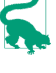

Python，与一般的编程一样，提供了多种解决问题的方法。所提供的方法简洁高效；然而，它可能不是最直接的。使用for循环来解决它是一种值得称赞的方法。目标是达到清晰度和效率的平衡状态，正如PEP-8指南中所规定的那样。

现在，你已经掌握了配置工作环境以及利用Python、JupyterLab和NumPy进行编码所需的知识。你可以导入点云并操作其属性，还可以探索其他可能性，例如颜色过滤和分析点邻近度。

## 3D数据可视化与导出

为了开始我们绘制3D点云的第二个示例，我们将使用Matplotlib。我们在原始脚本的导入部分包含相关包，以便利用其功能：

```
import matplotlib.pyplot as plt
from mpl_toolkits import mplot3d
```

matplotlib.pyplot管理绘图，而mpl_toolkits.mplot3d则便于创建三维投影。随后，我们可以整合之前检查过的代码：

```
file_data_path="../DATA/sample.xyz"
point_cloud= np.loadtxt(file_data_path,skiprows=1)

mean_Z = np.mean(point_cloud,axis=0)[2]
spatial_query = point_cloud[abs( point_cloud[:,2]-mean_Z)<1]

xyz=spatial_query[:,:3]
rgb=spatial_query[:,3:]
```

对初始点云进行空间查询的结果产生了两个变量：xyz和rgb。现在，让我们探索如何以图形方式表示结果。首先，让我们生成一个三维坐标轴对象。为此，我们在调用plt.axes时指定参数projection='3d'，这将返回一个Axes3D子图对象：

```
ax = plt.axes(projection='3d')
```

这就是我们将要创作的空白画布（图3-5）。接下来，我们将创建一个散点图，并旨在为每个点分配颜色。这个过程可能相当繁琐，但以下代码行使其变得更容易：

```
ax.scatter(xyz[:,0], xyz[:,1], xyz[:,2], c = rgb/255, s=0.01)
```

该函数通过xyz [:, 0]、xyz [:, 1]和xyz [:, 2]传递x、y和z坐标。每个点的颜色通过c = rgb/255传递，该值通过除以最大值被归一化到[0:1]区间。每个点在屏幕上的大小设置为s = 0.01。

最终，我们使用提供的命令生成图形并欣赏其视觉呈现：

```
plt.show()
```

太棒了！我们现在已成功用几行Python代码可视化并处理了我们的点云（图3-6）。

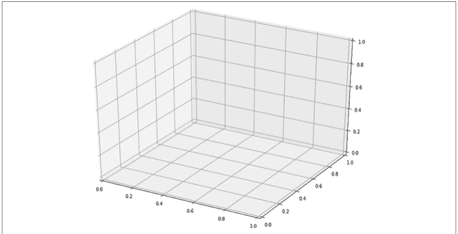

图3-5. Matplotlib的空白画布

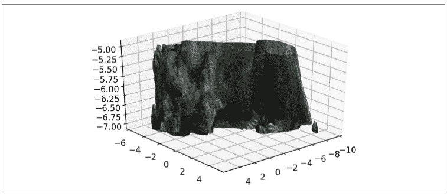

图3-6. 点云切片的结果

让我们进入下一阶段：我们如何收集数据集，特别是，如何使用3D重建方法收集数据集？

## 3D重建方法

3D数据科学通常始于从零开始创建3D模型或从各种来源重建模型。这涉及到3D重建方法，即3D数据科学工作流的第三阶段（图3-1）。让我引导你了解一些我最喜欢的技术，将传感器输出或生成内容转化为3D数字环境。

在使用3D数据集之前，了解它们的来源、每个数据集相关的背景以及我们所处理数据的内在本质至关重要。为了说明这一点，我概述了我们获取3D数据集的六种方式（图3-7）。

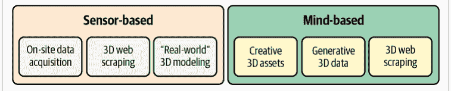

图3-7. 如何使用基于传感器和基于思维的方法重建3D数据

为了提供背景信息，我们之前使用的数据集（美洲豹）是在挪威旅行时，利用摄影测量技术从一组图片生成的。你将在本书所有后续章节中发现，我提供了来自我自己收藏的3D数据集供你使用。这些通常源自我管理的3D数据采集任务。这意味着它们大多数是基于传感器的，并与使用真实世界重建技术的现场数据采集有关。在整本书中，我将使用各种技术（ToF、立体视觉、LiDAR等）。因此，我认为有必要定义这些术语并解释其背后的概念。让我现在就来做这件事。

### 真实世界3D重建（基于传感器）

如今，我们有能力在不同尺度上描述地球上的物体，这非常有趣。通过使用3D现实捕捉，我们可以获得描述整个国家的数据集，例如荷兰的A4高速公路。我们甚至可以更进一步，描述整个城市，就像你在大多数开放数据门户上看到的那样，甚至更深入地描述一栋建筑或一个物体。这个物体可以是任何东西，从雕像到分子，甚至是一杯咖啡。为了实现这一点，我们可以利用各种平台和传感器，并且必须注意它们之间存在显著区别。

重要的是要理解，传感器必须连接到一个平台，该平台将作为其宿主。例如，你可以有一个连接到背包上的LiDAR传感器，从而产生背包式LiDAR扫描。或者，你可以将同一个LiDAR传感器连接到无人机上，生成基于无人机的区域LiDAR地图。这意味着你总是可以根据想要完成的任务来选择使用哪个平台搭配哪个传感器，以收集特定应用的数据。你遇到的大多数平台将是静态的，意味着它们不会从单个位置移动。然而，你可能会遇到移动测绘平台，它们可以在不同高度（如低空、高空和卫星级别）的地面上移动。关于可用平台类型有很多内容可说，因此仔细考虑哪一个最适合你的需求非常重要。

传感器主要有两类：主动式和被动式。主动式传感器发射信号，然后测量该信号。这使得它们更昂贵，但也让你对测量内容有更多控制。另一方面，被动式传感器不发射任何信号。相反，它们依赖于测量周围物体反射的光。例如，你智能手机上的摄像头就是一个被动式传感器。然而，为了使其工作，需要有足够的光线供其测量。

所以，我来解释一下发生了什么。当你想在黑暗中拍照时，除非你有一个带有非常低压力计时器或类似功能的相机，否则通常什么也拍不到。总的来说，要在低光照条件下获得一张好照片，你需要处于良好的光照条件下。否则，你可能不得不处理大量噪声或其他问题。这突显了平台和传感器之间的主要区别。

#### 现场数据采集

现场数据采集是获取3D数据集最普遍的方法（图3-8）。想象一下，当你勘测特定区域时，手头有一台相机或激光扫描仪，以点云的形式捕获数据点，这些点云精美地表示了该区域的几何细节。这种方法允许对所使用的传感器和收集数据的精度进行精确控制。所以这是一种获取数据的方式。但如果我们回溯历史，我们不必等待生成大规模数据集。

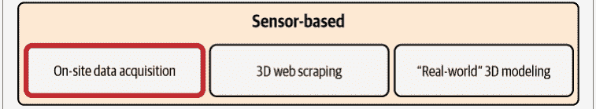

图3-8. 基于传感器的方法，包括现场数据采集

假设我们进行现场作业，例如使用全站仪或经纬仪直接选择感兴趣的点。我们瞄准一个点，例如描述房屋屋顶的角落。然后我们发射一些激光，借助ToF技术记录从这个初始种子点出发的角度和方向，以便我们可以计算从我们系统中心出发的距离。然后，我们可以创建3D点来描述这个与我们想要描述的几何体相关联的语义。

#### 基于传感器的网络爬取

首先需要明确的是传感器、平台和方法之间的互补关系。平台承载传感器，而方法则便于针对特定场景进行灵活调整。你可能会遇到主动传感器（如激光雷达系统、单次测量系统、合成孔径雷达、雷达）和被动传感器（如基于图像的重建、摄影测量），这些都是从现场采集获取三维点云数据的方式。如果你想进一步探索，我建议你阅读三维数据科学资源中心深度学习板块中提供的相关教程。

你拥有的大部分数据集都将属于这一类别。

第二类数据集同样依赖于传感器，但通过三维网络爬取收集。在这种情况下，你将通过网络获取与传感器相关的数据。例如，有许多开放数据目录和开放数据平台可以让你获取某些数据集，同时也有商业数据可以购买或通过许可获取。

这种方法在今天非常强大，但在五年前并非如此。随着各种快速生成数据方式的出现，我们现在在网上能找到大量数据。然而，现场数据采集和三维网络爬取各有优缺点。

通过三维网络爬取，我们依赖现有数据库，如果所需数据尚未创建，则无法立即获取。另一方面，我们几乎可以即时访问数据。我们无需前往特定地点获取建筑物的精美重建；我们可以爬取网络并自行获取数据。然而，缺点是我们无法控制所获取数据的精度和准确性。

基于传感器的三维网络爬取技术每年都在进步。事实上，我们看到许多国家（以及国际）项目正在将其全国范围的高程图、激光雷达点云和三维城市模型作为开放数据计划开放。我们在第二章中已经介绍了如何获取这些数据集。如果你想了解更多并查看最相关的开放三维数据集，我建议你探索三维数据科学资源中心深度学习板块中提供的相关教程。

#### 与传感器相关的三维建模

第三类是我所说的“真实世界三维模型”，它与传感器相关，但侧重于三维建模。在这一类别中，我们处理的是经过解释的数据，这些数据并非直接从传感器本身获取，而是通过建模获得。我们从现实世界中存在的某个事物的表示开始，然后使用传感器数据构建三维模型。本质上，我们仍然在表现现实，但以一种修改或扩展的方式。

这种建模的基础层是真实的，并通过收集信息的传感器获得。这种与传感器相关的三维建模应用广泛，可用于三维数据采集或三维网络爬取。它通过允许我们修改或转换现有元素为新的标准、格式和数据集使用方式来扩展技术。

为了提供一个清晰的例子，让我们考虑建筑行业中的一个著名应用：悬臂梁。在施工现场工作时，我们可能会获取描述建筑物的点云数据。然而，我们实际想要的是一个扩展模型，称为建筑信息模型（BIM），它包括三维模型、语义、属性和关系。这个模型对于从项目开始就监控建筑物的整个生命周期非常有用。

通过与传感器相关的三维建模，我们从与现实相关的基础层开始，但我们需要为特定应用创建一些东西。这个概念非常强大，并且存在于数字孪生工作流中，这些工作流旨在创建现实世界的数字表示。在这些工作流中，我们几乎总是需要经过一个建模阶段以适应特定应用。经过这个额外步骤是获取数据集的第三种方式。

### 创意三维重建

在了解如何将传感器输出转换为三维数据表示的同时，我们也可以考虑帮助生成全新三维形式的技术。

#### 创意三维资产

除了虚拟与现实的范式之外，还有另一种可能性。它涉及在不复制任何东西的情况下创建三维资产或数据集（图3-9）。这是纯粹的创造力，就像艺术家从空白画布开始一样。这种方法在视频游戏开发中广泛使用。

图3-9. 基于思维的方法，包括创意三维资产

如果你需要基于现实物体创建某些东西，比如森林，那么你需要使用与传感器相关的三维建模。但如果你正在制作一个设定在太空或任何其他想象世界中的视频游戏，你就需要用想象力从头开始创建一切。这就是三维数据集派上用场的地方。

此外，你可以使用三维网络爬取或与传感器相关的三维数据获取来激发或生成新想法。这些技术非常强大，可以帮助你创造出令人惊叹的东西。

#### 生成式三维

获取三维数据集的另一种选择是我们所说的生成式三维。这包括依赖人工智能或非人工智能算法的生成式三维方法。选择通常首先由你生成数据的范围和规模触发。如果你想创建某个特定事物的多个版本，或者希望增强你的数据集，这可能是一种强大的方法。我们将为使用生成算法或生成方法生成的数据集使用特定标签。

随着生成式人工智能的兴起，三维数据科学工作流的新解决方案已经出现。我们可以生成具有不同细节层次和保真度/创造性的三维模型，特别是在从文本或图像提示重建三维数据集时。由于这对许多应用产生了巨大影响，我们将在第18章中探索一个使用生成式人工智能处理三维数据集的实践解决方案。

#### 三维创意网络爬取

获取三维数据集的最后一种方式是爬取网络。但在这里，我们爬取的是创意三维资产，而不是基于传感器的资产。通过这些类别，你了解了收集三维数据集的全部范围。接下来，让我向你展示如何仅用相机从真实场景中策划或生成你的三维数据集。

## 三维数据集：策划

在开始你的三维数据科学之旅之前，掌握获取高质量三维数据集的可靠方法至关重要。本节将指导你完成三维数据策划的过程，帮助你获取、创建和管理将为你的项目提供动力的数据。将三维数据想象成你三维宇宙的原材料。就像雕塑家需要合适的粘土来创作杰作一样，你需要正确的三维数据来构建你的数据科学项目。在本节中，我们探讨获取三维数据集的各种方法，从现实世界扫描到利用开源存储库。

请记住，你可以利用上一章中分享的软件栈来可视化和交互本章中收集的数据集。我建议采用这种方法，尤其是在开发的早期阶段。事实上，在没有至少启动公式化和假设测试的情况下开始开发解决方案通常是适得其反的。使用带有已实现工具的软件通常是绕过这种摩擦的好方法。

### 基于图像重建的三维数据

作为三维数据科学领域的年轻专家，从现实物体生成数据集能给你带来巨大优势。然而，在神经辐射场（NeRF）和三维高斯溅射等先进技术兴起的背景下，理解基本原理非常重要。这使你能够穿越炒作并应对各种挑战。

首先，让我们考虑从图像重建三维物体，这一直是广泛研究的主题。它有着迷人的历史，可以分为三个主要研究领域：计算机视觉、机器人学和地理信息学。计算机视觉专注于立体视觉和运动恢复结构（SfM）等技术，而机器人学探索同步定位与地图构建（SLAM）的不同迭代。另一方面，地理信息学从摄影测量的角度来处理问题。这些术语侧重于传感器确定其相对于周围环境的位置和方向的能力，同时创建这些环境的三维地图。

度量方法能够将一组非结构化的重叠图像转换为复杂的三维物体。还有什么比亲身参与过程更好的理解方式呢？

让我快速提供一个如图3-10所示的工作流程，它利用了Reality-Capture和Meshroom。它包括五个主要步骤：主题定义、场景参数设置、传感器参数设置、数据准备以及使用摄影测量进行三维重建。

#### 3D 摄影测量工作流程

这个过程使你能够拍摄几张感兴趣场景的照片，并获得主体的 3D 数字重建。本章前面使用的 Glyptotek 雕像的 3D 数据集就来自这个过程。

所需设备相当容易获取。只需要一台相机（你的智能手机就可以），如果需要更高的稳定性和控制力，可以使用三脚架，但没有三脚架也可以工作。在实验中，我们将相机参数设置如下：

*焦距*
固定焦距为 28 mm，在拍摄距离和可用区域之间取得了良好的平衡。

*ISO*
400，这是一个很好的起始值，但如果你的场景看起来太暗，你可以将此值提高到 1600（风险自负）。

*光圈*
F/3.5，这允许足够的光线进入，但代价是景深有限。在我们的案例中，由于我们只专注于一个小物体，所以这里没问题。

*快门速度*
125 ms (1/8 s)，由于三脚架提供了更高的稳定性，我们可以使用这个速度。没有三脚架的话，低于 1/200s 会非常棘手。

*白平衡*
4000 K。这适应了我们场景的环境光照。

采集策略很简单。我们将相机放在三脚架上，调整高度和角度，使物体完全进入视野。然后，我们沿着物体周围的圆形轨迹移动三脚架。我们需要与物体保持恒定的距离，以便焦点保持正确。我们边拍边检查照片。一旦我们完成了围绕物体的第一圈拍摄，我们就缩短三脚架的腿并降低相机的向下角度。我们再围绕主体拍摄几张照片。

最后，我们将相机从三脚架上取下，拍摄整个物体的垂直照片。为此，我们再次调整焦点。然后，我们拍摄详细的照片，以确保物体所有部分的纹理都足够精细。基本思路是拍摄足够多的图像，以实现完整而详细的重建，同时要记住，不必要的大量输入只会减慢并使过程复杂化。理想情况下，对于这样的物体，你需要 25 张照片（八个水平位置乘以三个高度层，再加上顶部一张；参见图 3-11）。

在这个阶段之后，你可以利用 3D 重建软件将图像转换为 3D 模型。这个视频教程会很有帮助：“2D Images to 3D Models: Quick Guide (End-to-End 3D Reconstruction)”。这种方法让我想到了另一个解决方案：如何通过网络爬虫快速访问各种多模态数据集？

#### 多模态网络爬虫

首先，这个词是什么意思：多模态？它指的是跨越不同类型和上下文的数据，例如图像、点云、文本和声音。

在这个阶段，我不会讨论每种模态的具体特性，而是帮助你构建一个基础数据集层，我们可以在深入 3D 专业知识和 3D 数据科学技能时使用它。

我的目标是确定一个感兴趣的区域，并收集尽可能多的数据，以便我们在本书的学习过程中构建强大的 3D 数据科学解决方案。选定的感兴趣的区域是荷兰东部上艾瑟尔省（特温特地区）恩斯赫德市的一部分。

这个地点对我来说既近又亲切，因为我曾有机会在特温特大学工作，并向来自各个国家的学生教授地理空间数据处理。当然，你可以自由选择任何其他区域并复制相同的方法。

我们将获取八种模态，如图 3-12 所示。我们使用各种 2D/2.5D/3D 模态，包括 3D 点云、3D 网格、城市模型、体素、空间栅格、360° 图像、表格数据和矢量数据。

我们现在准备获取不同的数据集。为了清晰起见，我将此获取过程组织为四个类别：搜索 3D 数据集、空间栅格、矢量数据集，最后是其他来源，如图 3-13 所示。

*图 3-13. 如何分四步获取数据集*

## 3D 数据获取

第一步是从一个开放数据仓库获取数据集，该仓库的数据许可证允许我们进行一些实验。在这方面，对于荷兰，有一个地方可以获取 LiDAR 数据、高程数据模型和栅格图像：[GeoTiles.nl](https://geotiles.nl)。你可以放大原始图块并访问各种数据集的下载链接，如图 3-14 所示。

*图 3-14. 通过 GeoTiles.nl 提取 AHN4 数据集的 34FN2 图块*

你可以探索的第二个获取城市模型的地方是 3DBAG，它代表 3D 建筑物和地址登记处；它是荷兰最详细、公开可用的建筑物和地址数据集。它包含多个细节级别的 3D 模型，通过组合两个开放数据集生成：来自 [BAG 网站](https://bagviewer.kadaster.nl/lvbag/bag-viewer/) 的建筑数据和来自 [AHN（荷兰国家高程模型）网站](https://www.ahn.nl) 的高度数据。使用带有图块查询功能的 3DBAG 查看器，你可以探索和访问建筑物（图 3-15）。

*图 3-15. BAG 查看器（此数据根据 CC BY 4.0 许可，由 tudelft3d 和 3DBAG 提供）*

图块范围与我们从 [GeoTiles.nl](https://www.geotiles.nl) 获得的不同，这使得我们在处理集成阶段时很有趣。在这个阶段，我们已经有了令人兴奋的数据集可用。我们现在可以继续探索空间栅格数据集。

有几个开放数据门户可以帮助你从国家项目中收集航空 LiDAR 数据集。你可以从 [OpenTopography](https://opentopography.org)、[LiDAR HD](https://www.lidarhd.fr)、[National LiDAR Program](https://www.nationalmap.gov/lidar) 等收集数据集。列表还在继续，搜索引擎可能是找到与你目标相关的最相关开放数据的最佳来源。

### 空间栅格数据源

如果我们想获取卫星图像，[USGS EarthExplorer](https://earthexplorer.usgs.gov) 是最大的免费数据源之一。它在全球范围内可用，用户界面友好，使访问遥感数据变得简单。对于某些需要获取多个数据图块的情况，也可以购买下载（图 3-16）。如果这是你第一次访问此数据源，你需要执行一个额外的步骤：创建一个账户，这是免费且快速的。

*图 3-16. USGS EarthExplorer（开放数据属于美国公共领域，由 USGS 提供）*

我从 Web UI 绘制了一个多边形，然后请求获取 *Landsat > Landsat Collection 2—Level 1* 组（最新的 Landsat 图像是 L8–9 OLI/TIRS 和 L7 ETM+）。两个集合之间的主要区别与数据质量以及所涉及的处理级别有关。USGS 根据质量和处理级别将[图像分为不同等级](https://www.usgs.gov/landsat-missions/landsat-collection-2-level-1-science-products)（请参阅此关于下载 Landsat 数据的教程）。进入“结果”部分后，你可以在决定哪个最适合你的需求之前检查足迹，如图 3-17 所示。

*图 3-17. 用于提取 Landsat 图像的多边形*

对于数字高程模型，我建议坚持使用 [GeoTiles.nl](https://geotiles.nl) 数据服务，因为它已经提供了来自 AHN 的最新、最精确的高程模型。

### 矢量数据整理

如果你在 GIS 社区，我希望介绍 [OpenStreetMap (OSM)](https://www.openstreetmap.org) 的强大功能不会冒犯你的知识库（图 3-18）。OSM 提供不同的地图和图层，通过众包倡议使其非常详尽，包括精度标志。事实上，OSM 对公众开放，由普通大众创建。

这意味着准确性可能因创建者及其制图专业水平而异。然而，OSM 是开放许可街道级 GIS 数据的金矿。我们有几种方法可以下载 OSM 数据来获取这些黄金。方便的是，甚至有一个 [OSM 数据维基百科页面](https://en.wikipedia.org/wiki/OpenStreetMap#Data)，其中包含所有可用的 OSM 提取数据。

*图 3-18. OpenStreetMap 数据整理门户（数据根据开放数据库许可证 [ODbL] 提供，由 OpenStreetMap 提供）*

我的建议是使用 [Geofabrik](https://download.geofabrik.de) 工具。然后你可以利用按语义空间范围（例如，国家、州、大陆等）组织的数据。你可以快速选择一个地理位置，然后下载 OSM 数据，如图 3-19 所示。

### 其他来源

谈到数据集整理，网络是你的得力助手。从网页、新闻、声音到实时数据源，你能找到任何想与分析相关联的内容。天空（或你的带宽）才是极限！但让我务实地引导你关注一个平台：**Mapillary**。

Mapillary 是一个大规模提供街景图像和地图数据的平台。通过地图浏览器，你可以探索并下载 360° 图像和兴趣点（图 3-20）。你还可以按类别筛选元素，例如只选择某些感兴趣的方面，或与 OSM 数据进行交叉验证。

图 3-20. Mapillary 数据库门户（如果你下载图像，它们由 Mapillary 以 CC-BY-SA 许可证授权）

总之，现场数据采集和 3D 网络爬虫都是基础支柱，对我们选择的数据获取策略有重大影响。根据你的需求，你可以选择最合适的方法。

## 总结

在本章中，我们介绍了 3D 数据科学实验室工具包，这对于创建成功的 3D 数据科学项目至关重要。它补充了上一章的资源和工具，构成了一个包含四个主要组件的入门包：3D 数据科学的知识和资源、带有 3D 工具的软件、包含库的编程/环境设置以及 3D 数据集。至此，你已经拥有了一份清晰的指南，用于在 Python 中设置 3D 数据科学环境，并利用各种方法获取和利用 3D 数据集。

学完本章，你应该理解如何处理以下任务：

- 设置和管理 3D Python 项目
- 使用关键的 Python 库进行 3D 数据操作和可视化，特别是使用 NumPy、pandas、Matplotlib 和 Open3D 进行基本操作
- 编写 Python 脚本从文件加载数据，从点云中提取特定属性，执行基于属性的分析，并使用 Matplotlib 可视化结果
- 3D 数据集的起源和性质，将其分为五类：真实世界 3D 重建、依赖传感器的网络爬虫、与传感器相关的 3D 建模、创意 3D 资产和生成式 3D
- 利用基于图像的 3D 重建技术，通过摄影测量从图像创建 3D 模型（包括设备、相机设置、采集策略和软件使用等方面）
- 处理多模态数据集的价值，涵盖 3D 点云、网格、CityGML 模型、体素、空间栅格、360° 图像、表格数据和矢量数据

既然你已经按照本章所示设置并测试了一切，你已经准备好应对整本书了。在此基础上，我们将在后续过程中改进某些方面或添加新的库，但基础永远不会改变。接下来，我们将探讨构建 3D 数据工具来处理表示和数据结构。

## 动手实践

我为你准备了一个快速的动手练习：测试你的点云操作和可视化设置：

1. 下载第 3 章资源。这包括一个示例点云（*sample.xyz*）和一个 Python 脚本（*first_steps.py*）。
2. 检查 *sample.xyz* 文件的结构。识别与每个点相关的属性（例如 X、Y、Z、R、G、B），并创建另一个示例文件以进行泛化。
3. 在你首选的 IDE（Spyder 或 JupyterLab）中打开提供的 Python 脚本。
4. 使用 NumPy（np.loadtxt()）将点云数据导入变量（例如 point_cloud）。记住跳过标题行（如果适用）并设置最大行数以防止内存问题。
5. 提取所有点的属性并将其存储在变量中。
6. 使用空间查询进行一些基本的 3D 数据分析：
   a. 计算点云统计信息。
   b. 计算点云的平均高度（z 坐标）。
   c. 计算高度值的标准差以了解高度分布。
   d. 执行空间查询：从你选择的点（例如 z 坐标最高的点）提取一米半径内的所有点。你可以使用 NumPy 的数组操作计算点之间的距离来实现这一点。
7. 使用 Matplotlib 可视化点云，创建点云的 2D 和 3D 散点图。

这个练习遵循了你的第一个 3D Python 程序的逻辑，但它应该留有足够的空间让你犯一些小错误，从而帮助你掌握 3D Python 代码的复杂性。

# 第 4 章

## 3D 数据表示与结构化

3D 数据表示，如点云、网格、参数化模型、体素和深度图，提供了描述和处理 3D 几何实体的各种方法。了解它们的区别以及如何管理其独特性至关重要。它帮助我们为任务选择正确的格式，改进工作流程，并确保不同的应用程序协同工作。

此外，随着 3D 数据量的增长，我们需要高效的方法来处理日益复杂的 3D 数据集，这些数据集通常以不同的形状和格式出现。事实上，当试图整合并建立稳健的 3D 分析工作流程时，这可能会导致重大问题。想想你花在格式转换、处理兼容性问题以及试图为你的分析寻找共同点上的时间。这些不仅仅是小问题；它们影响你的生产力，并限制你高级工作的潜力。

一种统一的 3D 数据表示方法对于开辟新机会和克服不同格式的挑战至关重要。想象一个你可以轻松地在 3D 网格、点云和体积模型之间切换的过程。

本章将点云作为关键数据环节进行研究，并展示它们如何连接不同的表示。我们还将介绍如何整合各种 3D 数据表示，以建立核心数据结构来加速计算（见图 4-1）。

这个工作流程涵盖了（1）我们如何表示 3D 数据，（2）我们如何将其链接到基础 3D 数据层，以及（3）如何构建它以在计算任务中获得效率。只有这样，我们才能直接在 Python 中开发多模态 3D 查看器，这也是第 5 章的目的。

你可以在 3D 数据科学资源中心找到本章的所有材料。你可以使用基础链接并添加“/chapter-X”来访问文件（代码、数据集、文章）和资源。请注意，你可能需要提供电子邮件地址、个人密码或证明你是本书所有者。

## 3D 数据表示

正如你从简短的介绍中所理解的，有多种方法可以表示 3D 几何实体。它们在图 4-2 中进行了总结和组织。

图 4-2. 3D 数据表示

在左侧你会看到原始数据，即最接近传感器输出的数据，向右是表面数据，在 Python 中通常表示为 3D 模型。

## 3D 点云

点云由一组数据点组成，通常在三维坐标系中表示（见图 4-3）。在笛卡尔坐标系中，这些点由 x、y 和 z 坐标在空间上定义，通常表示物体的包络。现实捕捉设备获取三维外部表面以生成点云。这些通常通过摄影测量、LiDAR（地面激光扫描、移动测绘、机载 LiDAR）、深度感知，以及最近通过生成对抗网络的深度学习（见第 18 章）获得。

图 4-3. 一个“表示”球体表面的 3D 点云

点云提供了简单而高效的 3D 数据表示。我在表 4-1 中总结了与之相关的主要操作、优点和缺点。

表 4-1. 点云操作、优点和缺点概述

| 主要操作 | 主要优点 | 主要缺点 |
| :--- | :--- | :--- |
| • 变换：你可以用线性变换矩阵乘以点列表中的点。<br>• 组合：可以通过合并点列表来组合对象。<br>• 渲染：将点投影并绘制到图像平面上。 | • 渲染速度快<br>• 精确表示<br>• 变换速度快 | • 点数众多（对象曲线、精确表示）<br>• 内存消耗高<br>• 组合操作有限 |

由于渲染速度快且变换容易，点云易于操作。最近的发展趋势是，在基于纯网格的渲染平台中提供更好的支持，最近的一个例子是在虚幻 5 游戏引擎中。

## Python 中的 3D 点云

那么，在 Python 中这是什么样子的呢？我们有一个点云加载器函数，其用法取决于是否需要支持特定文件格式并利用一组库。在 Python 中最直接的方法是使用 NumPy，它非常适合 ASCII 文件，并允许将任何额外属性作为表格文件处理。为此，我们可以使用以下代码行：

```python
import numpy as np
pcd_np = np.loadtxt('../DATA/bike_florent.txt', delimiter=';', skiprows=1)
pcd_np[0:5]
```

此脚本使用 `np.loadtxt` 从位于 `../DATA/` 目录下的文件 *bike_florent.txt* 加载点云数据。它跳过第一行（包含表头），并指定分号作为数据分隔符。最后，要打印加载的点云数据子集，我们可以使用变量名，然后根据点的索引进行过滤（索引从 0 开始），例如：

```python
#Print the first point
print('First point of the data\n',pcd_np[0])

#Print the first 5 points
print('First 5 points\n',pcd_np[0:5])

#Print the first three columns (i.e., X, Y, Z) for all points
print('First three columns X,Y,Z\n',pcd_np[:,0:3])

#Print the last three columns (i.e., X, Y, Z) for the first 4 points
print('R,G,B information of the first four-point \n', pcd_np[0:4,3:6])
```

现在，处理这类数据还有另一种方法。我们可以使用 DataFrame，其中 **pandas** 可能是更合适的选择，以结构化的方式处理数据：

```python
import pandas as pd

# Load the point cloud data from the specified CSV file using pd.read_csv
pcd_pd = pd.read_csv('../DATA/bike_florent.txt', delimiter=';')

# Display the subset of the loaded point cloud data (rows 1 to 5, index 0 to 4)
pcd_pd.iloc[0:5]
```

这将得到表 4-2 中的数据。

表 4-2. 加载为 pandas DataFrame 的点云数据示例

| | X | Y | Z | R | G | B |
|---|---|---|---|---|---|---|
| 0 | 1.171487 | 1.247825 | 2.320436 | 205 | 201 | 190 |
| 1 | 1.459993 | 1.341689 | 2.305161 | 197 | 197 | 189 |
| 2 | 1.329194 | 1.299692 | 2.297502 | 162 | 161 | 157 |
| 3 | 1.515316 | 1.356915 | 2.300854 | 198 | 199 | 193 |
| 4 | 1.350535 | 1.296824 | 2.292063 | 122 | 121 | 115 |

对于大型点云，建议使用内存映射（参见第 139 页的“3D 数据结构：k-d 树、八叉树、BVH”）。

对于 *.ply* 等文件格式的点云，我们还有第二种可能性：利用 **Open3D**。导入语句如下所示：

```python
import open3d as o3d
pcd_o3d = o3d.io.read_point_cloud("../DATA/Seychelles-beach.ply")
o3d.visualization.draw_geometries([pcd_o3d])
```

在此示例中，函数 `o3d.visualization.draw_geometries([pcd])` 调用了 Open3D 可视化模块中的 `draw_geometries()` 函数。该函数接受一个几何体集合作为参数，并在可视化窗口中呈现它们。这里，列表仅包含一个几何体，由变量 `pcd` 表示，代表点云。`draw_geometries()` 函数生成一个三维查看窗口并显示点云。您可以操作可视化窗口来旋转、缩放，并从不同视角检查点云。

上面是一个双向系统，用于在 NumPy 点云之间进行转换。因此，我们处于一个非封闭系统中：

```python
# Create an Open3D PointCloud object
pcd_np_o3d = o3d.geometry.PointCloud()

# Set the points of the PointCloud using the x, y, z coordinates from pcd_np
pcd_np_o3d.points = o3d.utility.Vector3dVector(pcd_np[:, 0:3])

# Set the scaled colors of the PointCloud using the RGB values from pcd_np
pcd_np_o3d.colors = o3d.utility.Vector3dVector(pcd_np[:, 3:6] / 255)

# Visualize the PointCloud using Open3D's visualization capabilities
o3d.visualization.draw_geometries([pcd_np_o3d])
```

一个面具被捕捉为 3D 点云并放置在海滩上（参见图 4-4）。

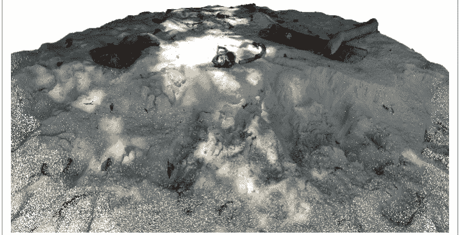

让我们考虑使用 pandas 处理相同的数据：

```python
# Create an Open3D PointCloud object
pcd_pd_o3d = o3d.geometry.PointCloud()

# Set the points of the PointCloud using the x, y, z coordinates from pcd_pd
pcd_pd_o3d.points = o3d.utility.Vector3dVector(np.array(pcd_pd[['X', 'Y','Z']]))

# Set the colors of the PointCloud using the RGB values from pcd_pd
pcd_pd_o3d.colors = o3d.utility.Vector3dVector(np.array(pcd_pd[['R', 'G', 'B']]/255))

# Visualize the PointCloud using Open3D's visualization capabilities
o3d.visualization.draw_geometries([pcd_pd_o3d])
```

最后，最后一种解决方案是使用特定的加载器来处理通常在 .las 或 .laz 文件格式中找到的海量点云。为此，我们使用 laspy 库，它稍微复杂一些：

```python
import laspy as lp

# Load LAS file using laspy
las = lp.read('../DATA/beach-5M.las')

# Extract x, y, and z coordinates and RGB colors from the LAS file
points = np.stack([las.x, las.y, las.z]).T
colors = np.stack([las.red, las.green, las.blue]).T / 65535

# Create an Open3D PointCloud object and set points and colors
pcd_las_o3d = o3d.geometry.PointCloud()
pcd_las_o3d.points = o3d.utility.Vector3dVector(points)
pcd_las_o3d.colors = o3d.utility.Vector3dVector(colors)

# Visualize the PointCloud using Open3D
o3d.visualization.draw_geometries([pcd_las_o3d])
```

一个自行车的 3D 点云被赋予了 RGB 颜色信息，从而产生了更具视觉吸引力的表示（参见图 4-5）。

这些本质上是我们加载点云的三种方式。如您所见，一旦进入 Python，如果需要可视化或访问特定的 Open3D 函数，就很容易将您的各种数据集转换为 Open3D 点云对象。

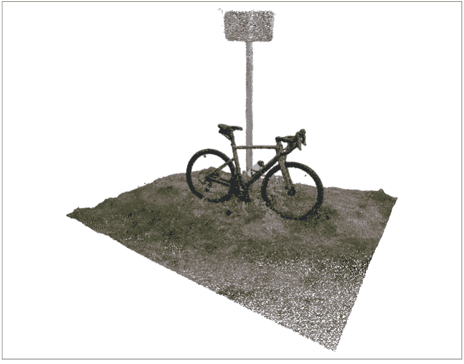

## 常见点云文件格式

随着您深入参与 3D 数据科学，您可能会接触到各种点云文件格式。表 4-3 展示了以 Python 为重点的常见点云格式。

表 4-3. 常见点云文件格式及其 Python 库

| 文件格式 | 定义和链接 | 类型 | 首选 Python 库 | 备注 |
|---|---|---|---|---|
| .ply | 多边形文件格式 | ASCII/二进制 | open3d, pyvista | 简单、通用。非常适合快速原型设计或需要人类可读性的情况。可以处理各种数据属性。 |
| .las/.laz | LAS/LAZ 格式 | 二进制（.laz 是压缩的） | laspy | 激光雷达的行业标准。.laz 为大型数据集提供了显著的压缩优势——对于高效存储和处理至关重要。 |
| .xyz | 简单文本文件 | ASCII | pandas, numpy | 一种通常用于基本点坐标 (x, y, z) 的精简格式。简单是其优点，但缺乏元数据能力。 |
| .pts | Leica 点云格式 | ASCII/二进制 | pdal, open3d | 常用于测量和 CAD。虽然通用，但由于其专有性质，有时需要定制解析。 |
| .e57 | ASTM E57 3D 成像数据交换格式 | 二进制 | pye57, e57, pdal | 一种旨在实现互操作性的新兴标准。处理丰富的元数据和点属性，对于复杂的 3D 项目至关重要。 |
| .obj | Wavefront OBJ | ASCII | open3d, pywavefront | 更侧重于网格数据，但可以表示点云。常用于计算机图形学和 3D 建模。通常与 .mtl 文件配对用于材质定义。 |
| .pcd | 点云数据文件格式 | 二进制 | open3d, pcl, pyntcloud | 点云库 (PCL) 的首选格式，常用于机器人和计算机视觉研究。 |

对于不太常见或专有的格式（如 .pts），您可能需要亲自动手编写一些 Python 解析逻辑。一些库在这些情况下可能有益，但使用 NumPy 通常是确保开放 I/O 操作的最佳方式。请记住，选择正确的格式在很大程度上取决于具体的应用和所涉及的工具。现在，让我们详细说明基于栅格的表示，例如深度图和投影。

## 基于图像的表示

处理图像非常吸引人。我们从很小的时候就开始处理图像，查看家庭成员的照片和婴儿相册。在数字时代，图像是最常用的数据集之一，尤其是在谈论数据科学时。这意味着我们可以轻松找到一些专门用于快速处理图像的库，而且如今，许多深度学习模型都是针对图像定制的。了解这一点后，很明显，在我们的数据表示工具箱中增加另一种方法可能对未来应用有所帮助。但是，我们如何将 3D 表示与 2D 图像联系起来呢？让我们首先详细说明深度图。

## 深度图

深度图是栅格图像，其中主要图像通道提供了从特定视角观察场景时，构成场景的像素之间的深度分离。尽管我们习惯于处理 RGB 图像，但在一个通道上对强度值进行颜色编码是传达深度的最简单方式（参见图 4-6）。

## RGB-D 图像

正如刚才提到的，有一个特殊情况称为 RGB-D：即在 RGB 图像基础上增加了一个深度通道。要创建 RGB-D 图像对象，我们首先必须从 RGB 图像中加载深度通道和 RGB 通道：

```
color_raw = o3d.io.read_image("../DATA/rgb.jpg")
depth_raw = o3d.io.read_image("../DATA/depth.png")
```

转换为灰度后，彩色图像以浮点数范围 [0, 1] 保存。深度图像以米为单位表示深度值，并以浮点数保存：

```
# 创建一个 RGB 图像对象
rgbd_image = o3d.geometry.RGBDImage.create_from_color_and_depth(
    color_raw, depth_raw, convert_rgb_to_intensity=False)
```

我们可以使用 Matplotlib 将转换后的照片渲染为 NumPy 数组：

```
plt.subplot(1, 2, 1)
plt.title('橄榄枝灰度图像')
plt.imshow(rgbd_image.color)
plt.subplot(1, 2, 2)
plt.title('橄榄枝深度图像')
plt.imshow(rgbd_image.depth)
plt.show()
```

这使我们能够将灰度图像和深度图像并排可视化，以说明捕获的不同类型的信息（参见图 4-7）。

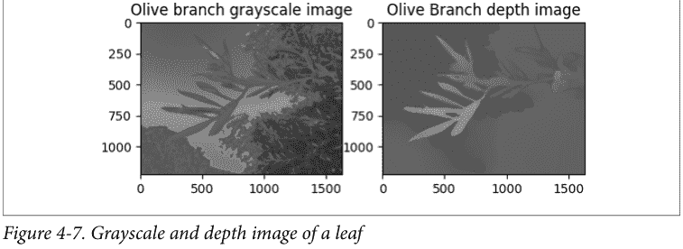

如果你的图像是 16 位编码的，你可能需要将其转换才能传递给 Open3D 构造函数对象。为此，你需要通过 NumPy 处理，然后再转换回 Open3D Image 对象：

```
depth_8 = (np.array(depth_raw)/256).astype('uint8')
depth_raw_8 = o3d.geometry.Image((depth_8).astype(np.uint8))
rgbd_image = o3d.geometry.RGBDImage.create_from_color_and_depth(color_raw,
depth_raw_8)
```

除了成本低廉之外，RGB-D 数据还是三维物体的一种直接但高效的表示方式，适用于各种应用，包括对应关系、姿态回归和身份识别。与其他 3D 数据集（如点云或 3D 网格）相比，可用的 RGB-D 数据集数量巨大。因此，它是使用大规模训练数据集训练深度学习模型的推荐方法。

## 投影

显示原始 3D 数据的另一种方法是将其投影到不同的 2D 空间，从而捕获原始 3D 形状的一些基本特征（参见图 4-8）。

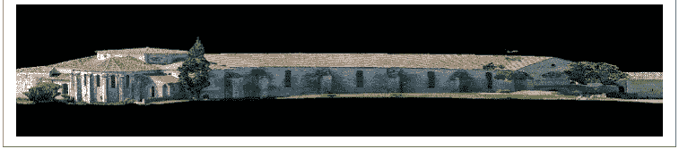

图 4-8. 点云广泛变形的圆柱投影示例

存在多种投影方式，每种都将 3D 对象转换为包含特定数据的 2D 网格。一种以这种格式表示 3D 数据的流行方法是将其投影到球面和圆柱域。由于其欧几里得网格结构，这些投影便于处理 3D 数据，并有助于投影数据在绕主轴旋转时保持不变性。

然而，由于投影会丢失信息，它们并不适合复杂的 3D 计算机视觉应用，例如密集对应。处理投影图像并未直接包含在核心库中；因此，让我给你一些从投影获取 3D 表示的方法。一旦掌握，我们就可以基于一定数量的姿态迭代投影，以创建多视图数据集。

一个核心概念是理解相机与真实场景之间的关系。投影通常涉及在 3D 场景（世界空间）中放置一个虚拟相机，以渲染该相机捕获的内容（每个对象都有一个局部空间）到视图空间（参见图 4-9）。

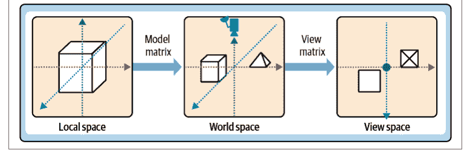

图 4-9. 局部空间、世界空间和视图空间之间的关系

视图空间受相机参数的影响：其内参（焦距、畸变参数）和外参（位置和方向），如图 4-10 所示。

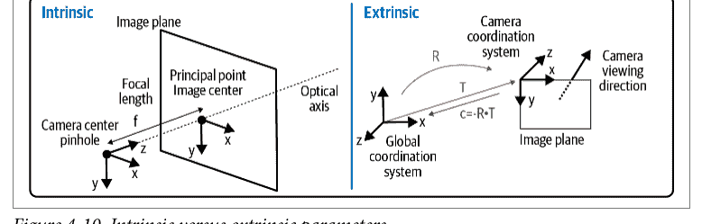

图 4-10. 内参与外参

让我用 Python 来澄清这意味着什么。首先，我们加载一个点云并获取颜色向量：

```
x,y,z,r,g,b = np.loadtxt('../DATA/bike_florent.txt', delimiter=';', skiprows=1,
    unpack=True)
colors = np.transpose(np.stack([r,g,b]))
```

如果我们有无限的视点，我们可以绘制一个正交投影，这是 3D 场景的一个视图（参见图 4-11A）：

```
def orthographic_projection(x, y, z):
    fig = plt.figure()
    ax = fig.add_subplot(111, projection='3d')
    ax.scatter(x, y, z, s =0.001, c = colors/255)
    plt.show()

orthographic_projection(x, y, z)
```

下一步是定义一个具有特定参数的相机并将其放置在场景中：

```
def plot_3d_scene(x, y, z, colors, camera_params):
    fig = plt.figure(figsize=(10, 8))
    ax = fig.add_subplot(111, projection='3d')

    # 绘制点云
    ax.scatter(x, y, z, c=colors/255, s = 0.005)

    # 绘制相机位置
    camera_position = np.array(camera_params['position'])
    ax.scatter(camera_position[0], camera_position[1], camera_position[2], c='r',
               marker='x', s=100, label='Camera')

    ax.set_xlabel('X')
    ax.set_ylabel('Y')
    ax.set_zlabel('Z')
    ax.set_title('3D Scene with Point Cloud and Camera Position')
    ax.legend()

    plt.show()

# 相机参数
camera_params = {
    'focal_length': 5,
    'position': [0, 0, 5],
    'orientation': (np.pi/4, np.pi/4, np.pi/4)  # (roll, pitch, yaw) in radians
}

# 绘制 3D 场景
plot_3d_scene(x, y, z, colors, camera_params)
```

我们看到相机的位置（图 4-11B 左上角的 X）。这使得理解各种投影变得容易。

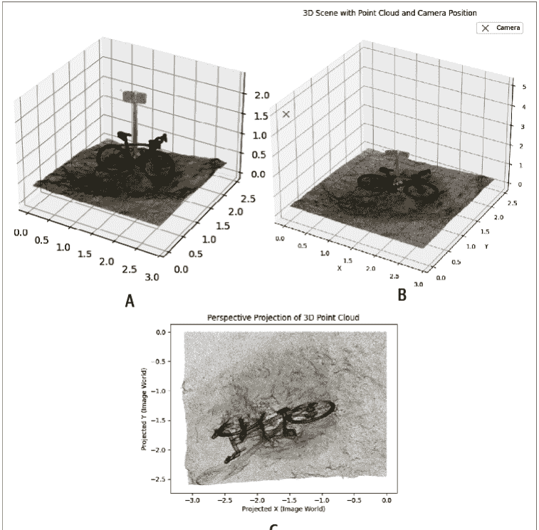

图 4-11. (A) 3D 点云局部空间；(B) 3D 透视投影，世界空间；(C) 透视投影，视图空间

最后一步是定义一个投影函数。我们首先定义一个变换矩阵，由旋转矩阵和平移矩阵组成：

```
def perspective_projection_3d(x, y, z, colors, camera_params):
    # 提取相机参数
    focal_length = camera_params['focal_length']
    camera_position = camera_params['position']
    camera_orientation = camera_params['orientation']

    # 考虑相机位置和方向的变换矩阵
    rotation_matrix = np.array([
        [np.cos(camera_orientation[1]) * np.cos(camera_orientation[2]),
```

## 多视图

我们可以从多视图图像中获取三维信息，这是一种基于二维的三维表示方法，通过匹配同一物体从不同视角拍摄的多张二维图像来获取信息（参见图4-13）。

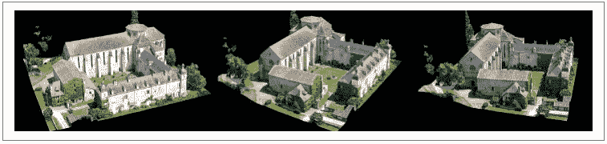

图4-13. 三维数据集的多视图示例

使用这种三维数据表示方法有助于学习各种特征集，从而减轻噪声、不完整性、遮挡和光照问题对采集数据的影响。摄影测量重建的采集过程与一个尚未解决的问题相关联：需要多少视图才能建模三维形状？视图过少的物体可能无法捕捉整个三维形状的属性（尤其是三维场景），并可能导致过拟合问题。多视图数据集更适合分析变形最小的刚性数据。体素模型对此进行了补充。

## 体素（Voxel）模型

如果你喜欢乐高（或现在的《我的世界》），使用体素可能非常有吸引力。为什么？简单来说，体素是二维像素的三维类比。这是一种初步构建无序三维数据集（如点云）的简单方法。你会得到一组可以轻松与乐高组件关联的原始积木。除了物理与数字属性的区别外，主要区别在于体素只使用一种基本元素（立方体）。图4-14展示了一个三维体素模型，它使用称为体素的离散体元素来表示三维物体。

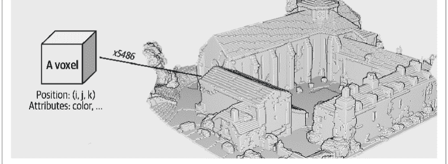

图4-14. 三维体素模型

相比之下，乐高让你可以玩各种不同尺寸的零件。但如果我们采用多尺度视觉和理论推理，“体素是复制现实的完美建模技术，其潜力远超我们的想象。”¹

事实上，我们三维宇宙中的许多材料都可以用极小的体素来近似。因此，如果你将足够的密度与合适的渲染方法相结合，*你可以使用体素来复制现实世界中的物体，使其在外观和行为上与真实物体无法区分。*

与原始点云相比，这是一个有趣的优势：你获得了一种模拟现实世界物理行为的可能性，而这用其他建模方法要么不可能实现，要么是令人抓狂的技术（参见表4-5）。体素可以存储真正的“物质”体积。这使得它们便于解锁其他方法难以实现的新模拟技术。

*表4-5. 基于体素建模的优缺点*

| 优点 | 缺点 |
| :--- | :--- |
| 体素可以在结构和精度之间取得良好平衡来描绘几何形状。 | 不使用三维扫描技术，使用体素构建物体并不直接。 |
| 没有体素，其他建模技术将不可行，从而开辟了新的模拟方法。 | 体素建模缺乏其他建模方法（如边界表示）的数学精度。 |
| 体素是建模和可视化体数据最快的方法之一。 | 我们缺乏高效生成高分辨率体素的专业技术，而当前的计算机硬件针对生成多边形进行了优化。 |

我将在第10章深入介绍体素的理论和实现。体素在渲染和流体可视化方面表现良好，但在近似原始几何形状时会引入走样问题。体素模型高度有序的网格结构有助于使用三维卷积神经网络进行分类等处理任务（参见第16章）。

要尝试体素，我们可以使用Open3D，它有一个体素对象的加载器：

```
vox_read = o3d.io.read_voxel_grid("../DATA/voxels.ply", format='auto')
o3d.visualization.draw_geometries([vox_read])
```

然后你可以决定如何表示你的体素（中心点+长度、宽度和高度等）。

¹ 此引文摘自博客文章“体素建模的主要优点和缺点”，你可以在其中了解更多内容。

## 高级三维数据表示

让我快速讨论一些三维表示的替代方案：空间图和三维描述符，如有符号距离函数（SDF）。它们都为某些应用提供了独特的优势。

我们可以将三维数据视为一个图，其中节点是点，边连接附近的点。我在第13章专门用一整章来介绍将图用于三维数据科学，包括图论基础。这些表示方法很有趣，因为它们允许使用实用的基于图的算法来执行分割、分类和形状分析等任务。基于图的表示有助于显示点之间的复杂关系，尤其是在处理噪声或不规则数据时。你可以在三维资源中心找到生成三维图（如图4-15所示）的完整Python代码。以下是一个片段：

```
import networkx as nx
import matplotlib.pyplot as plt
from mpl_toolkits.mplot3d import Axes3D
import numpy as np

def create_3d_graph():
    # 创建一个随机图
    G = nx.erdos_renyi_graph(10, 0.3)

    # 生成三维位置
    pos = {node: (np.random.uniform(0, 10), np.random.uniform(0, 10),
                  np.random.uniform(0, 10)) for node in G.nodes()}

    # 创建三维绘图
    fig = plt.figure(figsize=(10, 8))
    ax = fig.add_subplot(111, projection='3d')

    # 绘制边
    for edge in G.edges():
        x = [pos[edge[0]][0], pos[edge[1]][0]]
        y = [pos[edge[0]][1], pos[edge[1]][1]]
        z = [pos[edge[0]][2], pos[edge[1]][2]]
        ax.plot(x, y, z, color='gray', alpha=0.6)

    # 绘制节点
    xs, ys, zs = zip(*[pos[node] for node in G.nodes()])
    ax.scatter(xs, ys, zs, c='red', s=100)

    ax.set_title('3D Network Graph')

    plt.show()

# 运行三维图可视化
create_3d_graph()
```

## 3D 表面模型

这些模型描绘的是物体的表面或边界，而非其体积。边界表示法（B-reps）几乎存在于游戏、电影和现实捕捉工作流中使用的所有视觉模型中。如果不与实体3D模型（我们将在第10章学习）进行比较，我们的介绍就不完整。事实上，这些实体模型通常定义了它们所表示物体的体积。这些实体模型常用于模拟（例如工程和医学应用），并通过构造实体几何或体素组合构建而成。

实体建模和表面建模可以产生具有相同功能的物体。它们之间的主要区别在于用于创建和修改它们的方法。这自然使得某些标准在不同领域以及模型与现实之间的近似方面有所侧重。

有三种主要策略允许通过3D建模来描述几何：构造实体几何、参数化建模（包括B-reps）和3D网格。构造实体几何很令人兴奋，但我们将等到第10章再深入探讨。首先，让我们聚焦于最常见的3D模型：3D网格。

## 3D 网格

网格是一种几何数据结构，它使一组多边形能够表示表面细分。在建模中，网格用于离散化连续或隐式的表面，或用于在计算机图形学中表示表面。网格由多边形形状的面（也称为面片）组成，这些面由顶点（也称为顶点）通过边连接而成。当所有面都是三角形时，称为三角网格。这在3D数据科学工作流中最为常见（参见图4-16）。

四边形网格也非常有趣，但通常通过网格优化技术获得，以得到更紧凑的表示。也可以使用体网格，通过四面体、六面体（长方体）和棱柱连接顶点。网格基于边界表示法，而边界表示法依赖于线框模型。3D线条简化了物体，模型中的每条线代表物体的一条边。让我们进一步阐述其理论。

拓扑、基本元素排列和几何构成了3D物体（表面、曲线和点）边界表示的大部分内容。面、边和顶点是主要的拓扑元素。我已将立方体的基本B-rep示意出来，如图4-17所示。关于B-rep操作、优点和缺点的概述，请参见表4-6。

表4-6. 边界表示法（B-rep）操作、优点和缺点概述

| 操作 | 优点 | 缺点 |
|---|---|---|
| • 变换：所有点都通过线框模型进行变换（将点列表中的点与线性矩阵相乘）。此外，表面方程或法向量也可以被变换。<br>• 组合：可以通过组合点列表和边来组合物体；对多边形进行操作（基于交集分割、移除冗余多边形并组合它们）。<br>• 渲染：由于物体的表面是已知的，因此可以使用隐藏面或隐藏线算法来计算可见性。 | • 被广泛采用的表示法<br>• 通过“新一代扫描”生成模型<br>• 变换快速且简便 | • 内存需求高<br>• 组合操作代价昂贵<br>• 曲面物体是近似的 |

网格是表达点云几何的绝佳工具，并且通常可以显著减少必须用作顶点的点数。除此之外，它还允许我们通过面的连接关系来感知物体之间的关系。

然而，由于网格的复杂性，网格化通常是对原始基于点的几何的近似，并且只能部分反映数据。那么，我们如何在Python中处理这些集合呢？嗯，我们可以使用Open3D库，它附带了一组用于各种数据格式的特定加载器：

```python
# Import the open3d library and alias it as 'o3d'
import open3d as o3d

# Read a triangle mesh from a PLY file at '../DATA/mesh_terrain.ply.'
mesh = o3d.io.read_triangle_mesh('../DATA/mesh_terrain.ply')

# Compute vertex normals for the mesh. This step is essential for
# lighting calculations and visualization.
mesh.compute_vertex_normals()

# Visualize the mesh using open3d's built-in visualization tool.
# The draw_geometries function takes a list of geometry objects as input and
# displays them.
o3d.visualization.draw_geometries([mesh])
```

## 3D 网格常见文件格式

此时，我们无需费力去了解加载3D网格的每一种可能方式。其他库、文件格式及其使用方法也存在，并且本书将在项目中展示它们。为了完整性，表4-7提供了一个我认为有用的细分，专为Python用户量身定制。

表4-7. 面向Python用户的常见3D网格文件格式

| 文件格式 | 定义和链接 | 类型 | 首选Python库 | 备注 |
|---|---|---|---|---|
| .stl | 立体光刻 | ASCII/ 二进制 | meshio, open3d | 广泛用于3D打印。简单，将表面表示为三角形。二进制版本更紧凑。ASCII更易于调试。 |
| .obj | Wavefront OBJ | ASCII | pywavefront, trimesh, open3d | 在计算机图形学中常见。支持材质、纹理和顶点法线。通常伴有.mtl（材质库）文件。 |
| .ply | 多边形文件格式 | ASCII/ 二进制 | plyfile, trimesh, open3d | 通用格式，也可表示点云。处理各种数据属性。 |
| .glb/.gltf | glTF（GL传输格式） | 二进制 (.glb), JSON (.gltf) | pygltf, trimesh, open3d | 针对Web和实时应用优化的现代格式。.glb是单个二进制文件，而.gltf使用单独的JSON和二进制文件。 |
| .fbx | Autodesk FBX | 二进制 | Blender（可在Blender内进行Python脚本编写） | 用于许多3D建模和动画软件包。处理复杂场景、动画和绑定信息。通常需要处理专有SDK。 |
| .off | 对象文件格式 | ASCII | trimesh, open3d | 一种简单的格式，主要用于学术和研究环境。将网格表示为顶点、面和边的列表。 |
| .dae | COLLADA（协作设计活动） | 基于XML | pycollada, cloudcompare | 旨在用于不同3D应用程序之间的数据交换。支持复杂场景和动画。 |

选择最佳格式完全取决于您的项目需求，此表应为您提供做出明智决策的良好起点。

## 参数化模型（例如，B-reps）

“参数化”一词指的是形状通过调整参数到所需值来改变其底层几何的能力。如果您只想通过设置方向、长度、宽度和高度来表示墙壁，这将非常有用。

参数化建模适合利用计算能力来建模组件属性，以实现真实世界行为。参数化模型使用基于特征（参数化）、实体和表面建模的组合，以允许操作模型的属性。参数化建模最重要的特性之一是相互关联的属性可以自动更改值。换句话说，参数化建模允许定义整个形状类别，而不仅仅是特定实例。然而，将模型对象分解为更小的实体（如图4-18所示的线段）并组合成类别，需要对底层点云几何进行非常智能的结构化。

这些参数化模型通常可以使用2D+Z CAD文件进行组合或提取。然而，在Python中使用参数化模型是有限的，因此我们经常求助于外部软件。

B-rep参数化模型是计算工作流中的重要资产。但是，当我们需要显示它们时，我们通常使用3D网格来近似几何。尽管如此，它们在制造业和计算机辅助设计（CAD）工作流中被广泛使用，您可以在3D资源中心找到更多资源。

## 3D参数化模型常见文件格式

这些格式可通过调整参数进行修改，是CAD、工程和产品设计的基础。表4-9展示了常见格式及其与Python的交互方式。

表4-9. 3D参数化模型文件格式概览

| 文件格式 | 定义与链接 | 类型 | 首选Python库 | 备注 |
|---|---|---|---|---|
| .step/.stp | STEP文件格式 | ASCII | FreeCAD, OCPNet | 用于交换产品模型数据的ISO标准。在CAD系统间具有出色的互操作性。 |
| .iges/.igs | IGES文件格式 | ASCII | FreeCAD, pythonOCC | 一种较旧但仍广泛使用的标准。由于其冗长特性，解析可能较为复杂。 |
| .stl | STL文件格式 | 二进制/ASCII | open3d, meshio | 主要用于3D打印和快速原型制作。将表面表示为三角形集合。 |
| .obj | Wavefront OBJ | ASCII | pywavefront, trimesh, open3d | 在计算机图形学中常见。可同时表示网格和参数化表面。 |

此外，.stl等格式将表面表示为三角网格，而.step使用参数化表示，存储表面的底层数学定义。根据分析需求选择格式时，这一区别至关重要。基于网格的格式更简单，但对于复杂形状可能损失精度；而参数化格式允许进行精确的几何操作。然而，.step和.iges文件可能变得非常大且复杂，尤其是对于精细模型。这会影响加载和处理时间。在适当情况下，可考虑简化模型或使用更紧凑的格式，如.glb/.gltf。

现在你已经牢固理解了表示3D数据的各种方式，让我们考虑一种将流程集中于中心表示的方法：3D点云。

## 3D数据规范链接

有趣的是，我们可以成功地将所有见过的3D表示转换为点云，因为点云是规范化的（见图4-21）。事实上，我们之前阐明的简洁性使我们能够直接在3D点云中捕捉几何表示的最本质方面。但如何做到这一点呢？本节将为你提供主要方法，以便在基于点云的连贯工作流中进行选择，然后链接到你选择的模态。

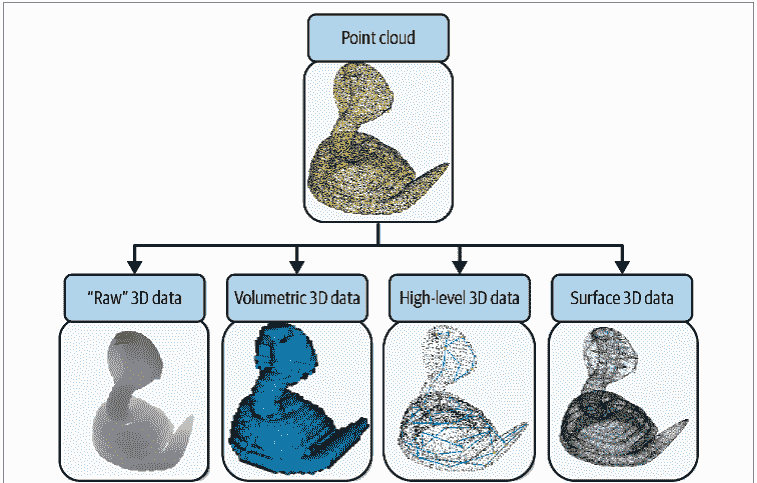

图4-21. 点云作为规范数据链接

## 网格到点云

网格已经保留了我们可以作为点云持有的顶点。然而，如果我们想更好地转录几何形状，可能还需要从边和面中获取一些点。这意味着通过定义参数将表面采样为点云。以下是使用Python从3D网格到3D点云的方法：

```python
bunny = o3d.data.BunnyMesh()
mesh = o3d.io.read_triangle_mesh(bunny.path)
```

或者，你可以从以下链接下载后导入：

```python
mesh = o3d.io.read_triangle_mesh("data/bunny.ply")
```

从那里，我们可以显示3D模型以查看其外观。你可以移动鼠标从不同视角查看：

```python
# 可视化：
mesh.compute_vertex_normals() # 计算顶点或面的法线
o3d.visualization.draw_geometries([mesh])
```

现在，要采样点云，存在多种方法。在此示例中，我们从导入的网格中均匀采样1,000个点，并进行可视化：

```python
# 采样1000个点：
pcd = mesh.sample_points_uniformly(number_of_points=1000)

o3d.visualization.draw_geometries([pcd])
```

我们可以将创建的点云保存为.ply格式，如下所示：

```python
o3d.io.write_point_cloud("output/bunny_pcd.ply", pcd)
```

就这样：从3D网格到3D点云的直接路径。

## 体素到点云

体素实体可以用多种方式描述。你通常遇到的体素被描述为一个点，具有立方体范围（宽度=长度=高度），与点位置相关。这个点位置描述了体素，通常是左下点或中心点。

对于体素实体，转换为点云可以遵循之前使用的相同原则：采样。然而，这里的采样是在体积上进行的，或者你为每个实体保留代表点。这是将体素实体转换为3D点云的最简单方法：

```python
pcd_vox_np = np.array([voxels_dataset.origin +
pt.grid_index*voxels_dataset.voxel_size for pt in voxels_dataset.get_voxels()])
```

通过这个小技巧，我们可以将其转换为Open3D对象并获得可视化：

```python
pcd_vox_o3d = o3d.geometry.PointCloud()
pcd_vox_o3d.points = o3d.utility.Vector3dVector(pcd_vox_np)
o3d.visualization.draw_geometries([pcd_vox_o3d])
```

图4-22显示了一个加载的社区点云，用于进一步处理。

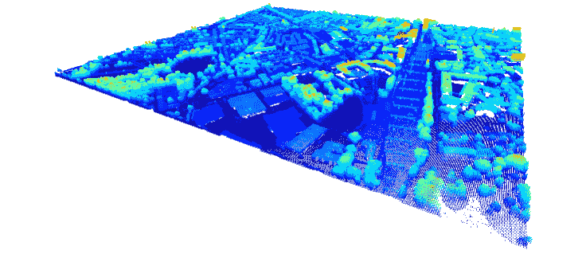

最后，如果你需要颜色，可以输入以下内容：

```python
color_voxels=[v.color for v in voxels_dataset.get_voxels()]
pcd_vox_o3d.colors = o3d.utility.Vector3dVector(color_voxels)
o3d.visualization.draw_geometries([pcd_vox_o3d])
```

漂亮！现在，让我们研究如何从深度图生成3D点云。

## 栅格到点云

正如我们在上一节所看到的，找到栅格投影与笛卡尔坐标之间的关系开辟了许多可能性。图4-23说明了三种主要情况：透视投影、正交投影和球面投影。注意透视视图如何与单个视点相关联，该视点会扭曲尺寸。

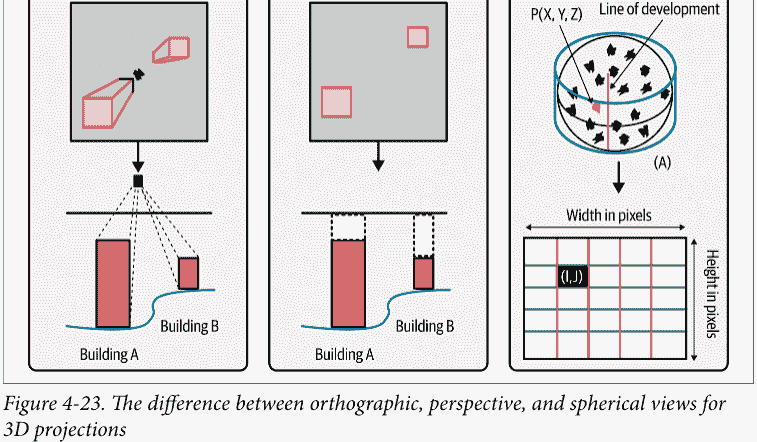

在上一节中，我们使用了具有内参和外参的相机模型并生成了点云，其中就用到了透视投影。这意味着，结合之前的深度图，我们可以将图像中的深度信息解释为沿视线方向的z分量，从而生成三维点：

```python
pcd = o3d.geometry.PointCloud.create_from_rgbd_image(
    rgbd_image,
    o3d.camera.PinholeCameraIntrinsic(
        o3d.camera.PinholeCameraIntrinsicParameters.PrimeSenseDefault))
o3d.visualization.draw_geometries([pcd])
```

在上面的代码片段中，我们使用了标准的针孔相机模型。你可以探索3D资源中心以获取更多模型和透视投影案例。现在，让我们来考虑正交投影。

## 正交投影

正交投影，或称正射投影，是连接三维点云的多维复杂性与二维图像的可理解世界之间的绝佳桥梁。通过正交投影，我们展平维度，并揭示了一种将点云转换为栅格数据表示的直接方法，同时保留了维度信息。其核心思想是生成一个自上而下的视图平面，以及一张不受单一视角限制的图像。你可以将正交投影想象成将点云中的可见点（最高的点）推送到承载空白图像的平面上，以填充这些点正上方所有必要的像素。

为了实现这一过程，我们可以定义一个三维到二维的投影函数，该函数接收点云的点及其颜色和所需分辨率，计算正交投影并返回点云的正射影像。这可以转化为以下代码：

```python
def cloud_to_image(pcd_np, resolution):
    minx = np.min(pcd_np[:, 0])
    maxx = np.max(pcd_np[:, 0])
    miny = np.min(pcd_np[:, 1])
    maxy = np.max(pcd_np[:, 1])
    width = int((maxx - minx) / resolution) + 1
    height = int((maxy - miny) / resolution) + 1
    image = np.zeros((height, width, 3), dtype=np.uint8)
    for point in pcd_np:
        x, y, *_ = point
        r, g, b = point[-3:]
        pixel_x = int((x - minx) / resolution)
        pixel_y = int((maxy - y) / resolution)
        image[pixel_y, pixel_x] = [r, g, b]
    return image
```

这有效地将三维点云（作为NumPy数组）投影到二维正射影像上，其中每个点的位置被转换为像素位置，并保留其颜色，从而创建点云数据的自上而下视图。为此，让我们加载一个点云数据集，将其转换为NumPy数组，应用该函数，并导出此点云的图像：

```python
# 使用laspy读取点云
pcd = laspy.read("../DATA/34FN2_18.las")

# 将点云转换为NumPy数组
pcd_np = np.vstack((pcd.x, pcd.y, pcd.z, (pcd.red/65535*255).astype(int),
    (pcd.green/65535*255).astype(int), (pcd.blue/65535*255).astype(int))).transpose()

## 正交投影
orthoimage = cloud_to_image(pcd_np, 1.5)

# 绘图并导出
fig = plt.figure(figsize=(np.shape(orthoimage)[1]/72, np.shape(orthoimage)[0]/72))
fig.add_axes([0,0,1,1])
plt.imshow(orthoimage)
plt.axis('off')
plt.savefig("../DATA/34FN2_18_orthoimage.jpg")
```

## 三维点云球面投影

球面投影提供了一种独特的视角，使我们能够通过模拟虚拟的360°扫描站来可视化数据。为此，我们按照图4-24所示的四个步骤进行：

1.  加载一个三维点云。
2.  将每个点投影到一个球面上。
3.  定义一个将检索像素的几何体。
4.  将此几何体“展平”以生成图像。

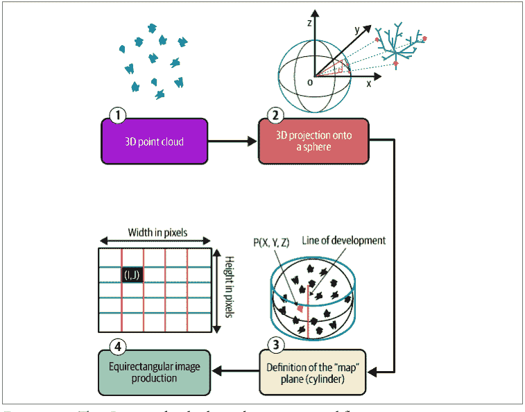

这意味着我们设计了一种机制，将三维点投影到球面上，并将它们作为像素展开到圆柱面上。现在让我详细说明实现此功能的函数：

```python
def generate_spherical_image(center_coordinates, point_cloud, colors,
    resolution_y=500):
    # 通过中心坐标的负值平移点云
    translated_points = point_cloud - center_coordinates

    # 将三维点云转换为球坐标
    theta = np.arctan2(translated_points[:, 1], translated_points[:, 0])
    phi = np.arccos(translated_points[:, 2] / np.linalg.norm(translated_points,
        axis=1))

    # 将球坐标映射到像素坐标
    x = (theta + np.pi) / (2 * np.pi) * (2 * resolution_y)
    y = phi / np.pi * resolution_y

    # 创建具有RGB通道的球面图像
    resolution_x = 2 * resolution_y
    image = np.zeros((resolution_y, resolution_x, 3), dtype=np.uint8)

    # 创建点云与图像坐标之间的映射
    mapping = np.full((resolution_y, resolution_x), -1, dtype=int)

    # 将点分配给图像像素
    for i in range(len(translated_points)):
        ix = np.clip(int(x[i]), 0, resolution_x - 1)
        iy = np.clip(int(y[i]), 0, resolution_y - 1)
        if mapping[iy, ix] == -1 or np.linalg.norm(translated_points[i]) < \
            np.linalg.norm(translated_points[mapping[iy, ix]]):
            mapping[iy, ix] = i
            image[iy, ix] = colors[i]
    return image, mapping
```

> 理解这个函数至关重要。它看起来相当直接，但在几个阶段都有巧妙的技巧。例如，你对三维点云到球坐标这一步有什么看法？映射的作用是什么？在将点分配给像素时，将映射用作条件语句的意义何在？

为了理解看似分散的信息，我们将非结构化的点数据转换为结构化的栅格表示。在通过二维投影处理三维点云时，指引我们的指南针被称为点云映射。现在，要使用这个便捷的函数，让我们先加载并准备点云：

```python
# 从磁盘加载las文件
las = laspy.read("../DATA/NAAVIS_EXTERIOR.las")

# 转换为numpy数组
coords = np.vstack((las.x, las.y, las.z))
point_cloud = coords.transpose()

# 收集颜色信息
r = (las.red/65535*255).astype(int)
g = (las.green/65535*255).astype(int)
b = (las.blue/65535*255).astype(int)
colors = np.vstack((r, g, b)).transpose()
```

准备就绪后，我们可以定义投影所需的参数。这些参数是投影中心（基本上是我们希望虚拟扫描站所在的位置）和最终图像的分辨率（以像素为单位，表示图像的较短边）：

```python
resolution = 500

# 定义点云中用于生成全景图的位置
center_coordinates = [189, 60, 2]
```

最后，我们可以调用新函数，绘图，并将结果导出为图像：

```python
# 执行函数
spherical_image, mapping = generate_spherical_image(center_coordinates,
    point_cloud, colors, resolution)

# 使用matplotlib绘图
fig = plt.figure(figsize=(np.shape(spherical_image)[1]/72,
    np.shape(spherical_image)[0]/72))
fig.add_axes([0,0,1,1])
plt.imshow(spherical_image)
plt.axis('off')

# 保存到磁盘
plt.savefig("../DATA/ITC_BUILDING_spherical_projection.jpg")
```

此过程生成了图4-25。你可以尝试调整各种参数，例如分辨率或投影中心，以确保在无数据像素和相关全景图之间取得平衡。

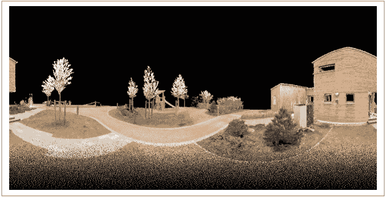

*图4-25. 三维点云通过投影转换为等距矩形图像*

通过将三维点云生成等距矩形图像，你刚刚解锁了一项强大的新能力。它允许你在任何有意义的地方创建虚拟扫描，这为使用深度学习和图像处理技术分析照片开辟了前景。我们将在第13章中利用这些成果。

## 三维数据结构：k-d树、八叉树、BVH

随着我们深入三维数据的世界，高效的组织变得至关重要。三维表示描述和存储三维对象（或场景）的几何信息，而三维数据结构则是组织和管理三维数据以进行高效处理和分析的方法。这些结构不关心三维数据是如何表示的（例如，作为点云或## k-d 树

*k-d 树*是一种用超平面分割空间的数据结构。它们在工业界被广泛使用和重点研究。从名称上看，它有三个主要组成部分：“k”、“d”和“树”。让我们从后往前来看。

树是一种具有分支的结构，就像你日常（希望如此）看到的那些对我们的福祉和社会运作至关重要的树木一样。在数字世界中，这意味着我们有一个精炼的过程可以驱动它所持有的数据。那么我们如何构思它们呢？首先有根，这是树开始生长的地方。根通常指向整个数据集。然后树生长并创建分支，这些分支又有其他分支，直到某个时刻，叶子出现！

*k-d 树*具有相同的结构，但控制程度更高。它将初始根二分为两个分支，这些分支也会被二分，依此类推（见图 4-27）。这就是“d”代表的维度。

因此，总的来说，我们有一种分割方法来决定数据应如何在我们的结构中分布（或链接）。*k* 意味着我们可以处理二维数据、三维数据和 *k* 维数据，同时保持二分。但那么我们如何分割呢？使用 *k-d 树*，我们试图让“超平面”定义的每个分支上具有相同数量的“数据点”。为什么是超平面？因为在二维中，它是一条线；在三维中，它是一个平面；在 *k* 维中，它是一个超平面。

我们可以使用 Open3D 或 SciPy 来构建 *k-d 树*：

```python
# Calculate the k-d tree from the point cloud
pcd_tree = o3d.geometry.KDTreeFlann(point_cloud)

# k-d tree (using scipy)
points = np.array(point_cloud.points)
kdtree = cKDTree(points)
```

*k-d 树*在三维数据科学中扮演着至关重要的角色，因为它们能高效地处理空间数据结构。它们尤其因其在多维空间中执行快速最近邻搜索和范围查询的能力而极具价值。*k-d 树*的一个关键优势是其在平均情况下搜索具有对数时间复杂度，即使在处理大型数据集时也能保持高性能。

这些树结构非常适合低维到中维数据，通常高达约 20 维，涵盖了大多数三维应用。由于其多功能性，它们非常适合涉及三维数据处理和解释的各种任务。它们在点云处理中得到广泛应用，促进了诸如为表面重建、法线估计和特征匹配寻找最近邻等操作。

在未来的章节中，你将看到它们如何在匹配图像或三维场景之间的特征方面发挥重要作用。机器人领域受益于 *k-d 树*在碰撞检测和路径规划等应用中的使用，其中空间感知至关重要。另一个重要的应用领域是三维物体识别，其中 *k-d 树*有助于匹配局部描述符或关键点。它们在空间数据库中也被证明是无价的，能够高效查询三维空间数据。在科学模拟中，特别是涉及粒子模拟或 *n* 体问题的模拟中，*k-d 树*为空间组织和查询提供了一种高性能的解决方案。

## 八叉树

**八叉树**是另一种用另一种层次结构来组织空间的方式：立方体（或体素）。它们是将空间细分为八个象限，即八个立方体递归地细分为八个子节点，直到满足特定标准。这是一种分而治之的方法，其中这些立方体（节点）有八个子节点，代表空间的八个部分，称为八分体（见图 4-28）。

为什么叫“八叉树”？它是 *oct*（意为八）和 *tree*（嗯，因为它结构像一棵树）的组合。让我们深入 Python 代码，探索八分体如何分解我们三维数据集中的数据结构。使用以下代码加载一个新的点云并计算一个最大深度为 8 的八叉树：

```python
curr_max_depth = 8

point_cloud = o3d.io.read_point_cloud('../DATA/structure_verviers.ply')

octree = o3d.geometry.Octree(max_depth = curr_max_depth)
octree.convert_from_point_cloud(point_cloud)
o3d.visualization.draw_geometries([octree])
```

你可以在图 4-29 中看到八叉树，它代表了三维数据集的层次划分，用于高效的空间数据管理。

从那里，你可以改变深度，以直观地看到数据结构对数据存储方式的影响。现在我们已经划分了三维空间，是时候在八分体的迷宫中导航了。以下是在八叉树中搜索一个点的代码片段：

```python
# Check if the target point is within the bounds of the current octant
octree.locate_leaf_node(point_cloud.points[0])
```

就这样——一个在八叉树复杂分支中导航的指南针。现在，让我强调一下八叉树和 k-d 树之间的一些性能差异。

让我们导入四个库：

```python
import numpy as np
from scipy.spatial import cKDTree
import open3d as o3d
import time
```

然后，我们生成一个包含 100 万个点的随机点云：

```python
num_points = 1000000
points = np.random.rand(num_points, 3)
```

如果你检查计时（代码见 3D 资源中心），你会发现 *k-d 树*比八叉树构建得更快。对于 1000 万个点：

```
KD-Tree build time: 5.211558 seconds
Octree build time: 23.283945 seconds
```

虽然这在很大程度上取决于两者的实现，但 *k-d 树*构建的效率与八叉树相比仍然存在差异。尽管如此，八叉树在三维数据科学中很重要，因为它们能高效地划分和组织三维空间。与 *k-d 树*相比，八叉树具有一些独特的特点。*k-d 树*在每一层使用轴对齐的分割平面来划分空间，而八叉树总是将空间划分为八个大小相等的八分体。这使得八叉树特别适合均匀的空间细分以及数据在三个维度上分布大致均匀的情况。

当处理受益于规则空间划分的三维数据时，它们通常比 *k-d 树*更受青睐。它们在体素网格场景中表现出色，因为自然的八分体结构与数据表示非常契合。八叉树在三维空间的范围查询方面也往往表现更好，因为它们的结构允许高效地剪枝大的空间区域。另一方面，*k-d 树*在分区策略上更灵活，能更好地适应非均匀的数据分布。它们在内存效率至关重要的场景中尤其具有优势，因为它们可以非常紧凑地表示大的空空间区域。

还存在其他三维数据结构，但全部涵盖它们会扩大本书的范围。你可以在三维数据科学资源中心找到这些，我建议特别关注包围体层次结构（BVH）。它们将整体空间或数据集分解为包围体，通常是具有尺度和层次概念的包围盒。它们在光线追踪和复杂三维场景的碰撞检测中非常有用，尤其是那些具有动态或可变形物体的场景。

## 文件组织

三维数据科学处理大数据问题。因此，理解你如何组织数据集可能会影响你如何处理计算至关重要。让我试着更详细地描述一下我们在这里处理的内容。你计算机的内存就像一个舒适的图书馆，你的三维数据集是一堆厚重的书籍。困难是什么？并非所有的书都能同时放在书架上。内存与外部存储成为图书管理员的选择——我们是把所有的书都挤到书架上，冒着雪崩的风险，还是把一些放在地下室，需要时再去取（见图 4-30）？

## 总结

本章介绍了捕捉三维数据集复杂性和细微差别的方法。更具体地说，你现在可以利用一个强大且适应性强的框架，该框架允许你在保持几何保真度的同时，无缝地在不同的3D数据模态之间切换。随着你继续阅读，本章将刷新你对3D数据表示的深入探索（点云、网格、参数化模型、体素模型以及基于图像的表示，如深度图和多视图图像）。

理解每种表示的独特属性、优势和局限性非常重要。这将使你能够根据应用需求做出明智的决策。我介绍了点云作为规范表示的关键作用，展示了如何将其他模态有效地转换为点云格式，为你的3D数据科学工作流提供了统一的基础。你现在已具备充分的能力，可以利用这些表示和结构来开发复杂的算法和应用。从本章中获得的见解将使你能够：

-   提高3D数据处理流程的准确性和效率。
-   为3D物体识别、分割和重建设计更强大、适应性更强的算法。
-   创建创新的可视化和交互式体验。

在第5章中，我将指导你直接在Python中创建一个3D多模态查看器体验，该体验利用了本章的数据结构和表示。但在进入该章之前，我设计了一个实践项目，以帮助你确保掌握这些技术。

## 实践项目

在本章中，我们探讨了3D数据表示和结构的主题。你现在对3D数据集可以采取的不同形式以及如何构建它以在计算任务和其他任务中获得效率有了非常清晰的理解。作为3D数据科学家，我们经常面临从复杂的点云数据中提取有意义见解的挑战。一种实用的方法是将点云投影到2D图像平面上，创建一个更易于管理的表示形式以供分析。让我们探索如何通过正交投影和球面投影来增强3D场景理解。以下是你可以在Python中实施的工作流程：

1.  *加载点云数据*：首先使用合适的库（如laspy）加载你的点云数据。
2.  *提取点坐标和颜色*：提取每个点的x、y和z坐标，以及任何相关的颜色信息（R、G、B）。将这些值存储在NumPy数组中以便于操作。
3.  *正交投影*：要创建正交图像，请从自上而下的视角将点云投影到2D平面上。本章提供的代码片段演示了如何实现此投影。我鼓励你尝试不同的分辨率，以找到细节和图像大小之间的最佳平衡。
4.  *球面投影*：你可以将点云投影到球体上，以获得更具沉浸感的视角。此技术涉及将点云转换为球坐标，然后将这些坐标映射到等距矩形图像上。你可以尝试不同的中心坐标，以模拟场景中的各种视点。
5.  *可视化和分析*：一旦你生成了正交和球面投影，就可视化生成的图像。这些投影为点云数据的空间分布提供了有价值的见解。正如你将在第12章及后续章节中看到的，它们可用于物体检测、分类和分割任务。

掌握这些投影技术是从复杂的3D点云中提取有意义信息的强大工具。

# 第5章
使用Python开发多模态3D查看器

我可以毫无风险地说，当你探索3D数据科学时，你将处理不止一种3D模态。然而，我们有一个不公平的优势：我们可以将3D数据表示为点云、网格、参数化模型或体素集合（参见第4章）。每种模态都提供了独特的视角和见解，但有效地集成和可视化这些多样化的格式仍然具有挑战性。

当前的3D查看器通常难以处理多模态数据，限制了我们全面分析和解释复杂3D场景的能力。我们需要一个能够无缝结合这些模态的解决方案，使我们能够在统一的环境中可视化和交互它们。

想象一个场景，你需要分析一个易受洪水影响的区域。你可以访问地形的3D点云、建筑物的网格模型以及其他相关的地理空间数据。传统的3D查看器可能只能分别显示这些数据集，使得评估空间关系和理解整体情况变得困难。你需要一个强大的工具来组合这些数据集，使你能够在单一的交互式环境中可视化建筑物高度、建筑覆盖率和其他关键信息。

但是，是否有可能在一个简单的解决方案中结合所有这些？这会是多模态数字环境的基础吗？

是时候将第4章学到的内容更进一步，整合这些模态了。在本章中，我将提供一个分步指南，介绍如何使用Python开发多模态3D查看器。你将学习如何组合点云、网格和其他数据格式，创建一个交互式可视化，使你能够高效地探索和分析3D场景。

本章的其余部分将使用以下场景作为示例。你是荷兰一个前沿3D数据科学团队的一员。你最近被荷兰危机部门警告，洪水很可能在接下来的48小时内发生。经过初步调查，他们确定了一个风险极高的区域，希望你进行检查。

在这个区域，他们想知道住宅建筑的高度和建筑覆盖率，以便规划保护措施。怀着为社区提供最佳服务和保护的愿望，你开发了一个3D查看器，它可以组合可用的数据集，并为答案提供基础。你建立了一个由四个主要阶段组成的合理工作流程，如图5-1所示。

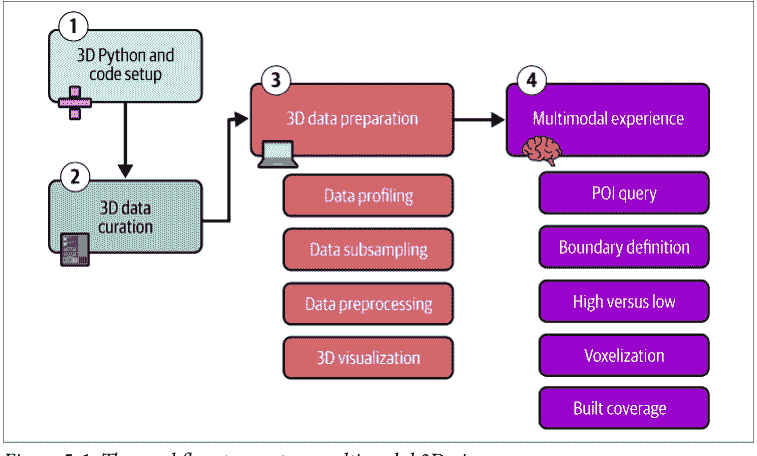

图5-1. 创建多模态3D查看器的工作流程


本章基于一个真实场景，并为3D数据预处理和特定模态的解决方案提供了新的方法。这是将先前的实践知识结合到一个综合项目中的绝佳方式，以确保你正确掌握到目前为止本书的学习内容。你可以在3D数据科学资源中心找到本章的所有材料。你可以使用基础链接并添加“/chapter-X”来访问文件（代码、数据集、文章）和资源。请注意，你可能需要提供电子邮件地址、个人密码或证明你是本书所有者的凭证。

## 3D Python 与代码设置

创建多模态 3D 查看器的第一步是启动我们的 Python 虚拟环境管理器（如果需要复习，请回顾第 3 章）。使用 Anaconda 是一个很好的方式来巩固知识并将其融入你的技能集。你可以使用图形界面或命令行解决方案。本章我们将使用五个关键库：NumPy、pandas、Open3D、Matplotlib 和 Shapely。


如果你想使用上述库，我们必须确保它们已安装并在你的 Python 环境中可用。正如你在第 3 章所记得的，你必须首先创建这个环境。假设你已经安装了 Anaconda，启动一个 Anaconda 终端会话并创建你的环境：`conda create -n NEWENV python=3.10`。环境创建后，激活它：`conda activate NEWENV`。现在，你已准备好安装库。

我们将首先探索使用 pip 进行库设置。首先，确保你的 Anaconda 环境处于活动状态。然后，你可以安装这些库：

```
pip install numpy pandas matplotlib open3d shapely
```

正如第 3 章所定义的，我们坚持使用最少数量的库来深化我们对其使用的专业知识。如果你没有 IDE，一种开始的方式是使用 JupyterLab 来处理笔记本（`pip install jupyterlab`）。安装完成后，只需在终端中输入：

```
jupyter lab
```

我们现在准备好在 Python 笔记本中编写一些代码了。首先，我们使用以下代码片段导入前面提到的库：

```
import numpy as np
import pandas as pd
import open3d as o3d
import matplotlib.pyplot as plt
from shapely.geometry import Polygon
```

现在，我们一切就绪，可以继续加载数据集了。

## 3D 数据整理

我们现在进入第二步：3D 数据整理。我们的目标是在使用 Python 进行分析之前收集数据集。因此，这一步也充当了 3D 数据可视化阶段，我们可以在此定性评估我们正在处理的内容。如果你准备好了，让我们开始吧。为了实现一个稳健的 3D 城市社区分析，我们首先从开放数据源收集一些优秀的数据集。我以荷兰的一个特定感兴趣区域为例，但我鼓励你研究你的房子或任何感兴趣的地点。

点云是使用 [GeoTiles.nl](https://geotiles.nl) 门户收集的（参见第 3 章），该门户在 CC-BY 4.0 许可下提供了优秀的数据集。网格数据集是从我们下载的 LiDAR 区域的同一地点收集的。因此，我们使用由代尔夫特理工大学创建的 3DBAG 平台，该平台允许我们从 CityGML 规范中检索荷兰的 1000 万栋建筑，包括 LoD1.2、LoD1.3 和 LoD2.2 级别。在这一步，我们主要关注几何形状。


下载数据集后，你应该有一个 .laz 文件格式的点云和一个或多个 .obj 数据集（及其附带的 .mtl 文件），它们描述了大致相同的范围，但具有不同的细节层次。为了方便起见，你可以从本章的资源中下载选择，以避免从 .laz 转换到 Open3D 对象。

让我们定义我们的路径：

```
data_folder="../DATA/"
results_folder="../DATA/RESULTS/"

pc_dataset = "30HZ1_18_sampled.xyz"
mesh_dataset = "NL.IMBAG.Pand.0637100000139735.obj"
```

我们可以使用任何 ASCII 读取器加载 .obj 格式的网格。不过，我们将等待下一步来利用 Open3D 加载和可视化网格的能力。我们现在可以继续进行数据准备了。

## 3D 数据准备

3D 数据准备是 3D 数据处理流程中的关键步骤，因为它确保了数据的质量和一致性。这涉及清理、过滤和规范化数据，以去除噪声、异常值和不一致性。通过准备数据，我们可以提高下游流程的准确性并降低计算成本。虽然我们在第 6 章深入介绍了这一点，但让我在这里给你一个快速入门。

### 初始分析

首先，我们将使用一个名为 pcd_df 的 pandas DataFrame 对象来准备点云，该对象承载点云数据：

```
pcd_df = pd.read_csv(data_folder + pc_dataset, delimiter=";")
print(pcd_df.columns)
```

这将返回此 pcd_df DataFrame 中列的名称：['X', 'Y', 'Z', 'R', 'G', 'B', 'Classification']。这对于仅选择明确的“列”而不使用模糊索引非常方便。在此阶段，快速分析我们的 pandas DataFrame 将很有用。为此，我建议打印以下命令：

```
print(pcd_df.shape)
print(pcd_df.describe())
```

第一行返回形状，即 DataFrame 的大小，包括行数（7,103,848 行，每行是一个点）和列数（7 列，如前所述，每列一个特征）。第二行返回每个特征的主要分布，可以帮助我们调整后续流程。

我们看到我们有较大的坐标可能需要调整，并且有超过 700 万个点，我们可以尝试在实验中快速将其减少到 500 万以下。这为 3D 数据子采样铺平了道路，这是第 6 章介绍的一个特征工程步骤。

### 3D 数据降采样

让我们开始一些初步处理。首先，我们将进行一些轻量子采样以加速后续步骤。3D 数据子采样是处理大型 3D 数据集复杂性和内存需求的基本方法。子采样通过减少数据点的数量来加速处理、分析和可视化。当迭代实验或需要有效管理大型数据集的实时应用时，它非常有益。子采样可以减少噪声并提高信噪比，从而获得更准确可靠的结果。

通过选择合适的子采样方法，我们可以在减少数据和保留重要信息之间取得平衡，确保子采样数据仍然反映原始数据集。虽然这在第 6 章有详细介绍，但让我们在本章中感受一下它的影响。我们选择 DataFrame 并应用抽取，每两个点保留一个点。这使我们能够以随机方式将点数减少到 500 万以下：

```
pcd_subsampled = pcd_df.iloc[::2, :]
```

接下来，我们准备数据以便在 Open3D 中使用。我们将创建一个 Open3D PointCloud 对象，并仅选择点的 ['X', 'Y', 'Z'] 坐标和颜色的 ['R', 'G', 'B']：

```
pcd_o3d=o3d.geometry.PointCloud()
pcd_o3d.points=o3d.utility.Vector3dVector(np.array(pcd_subsampled[['X','Y','Z']]))
pcd_o3d.colors=o3d.utility.Vector3dVector(np.array(pcd_subsampled[['R','G','B']])/255)
```

这是一个很好的方式来理解，使用不同的库，我们使用不同的机制将数据集转换为 Python 对象。在这里，我们从 pandas DataFrame 转换到 Open3D PointCloud，这是使用 Open3D 库中实现的函数所必需的。如你所见，我们必须注意将 R、G 和 B 值转换为 [0,1] 之间的浮点值，并确保我们传递一个 Vector3dVector 对象给 colors 属性。现在，我们可以使用 Open3D 的 read_triangle_mesh() 方法将 3D 网格加载到 mesh 变量中。我们也可以使用 paint_uniform_color() 方法为网格着色：

```
mesh=o3d.io.read_triangle_mesh(data_folder+mesh_dataset)
mesh.paint_uniform_color([0.1, 0.4, 0.8])
```

你可以使用 Open3D 独立可视化这些对象（结果如图 5-2 所示）：

```
# 完成后，关闭渲染窗口，它会阻塞 Python 流程。
o3d.visualization.draw_geometries([pcd_o3d])
o3d.visualization.draw_geometries([mesh])
```

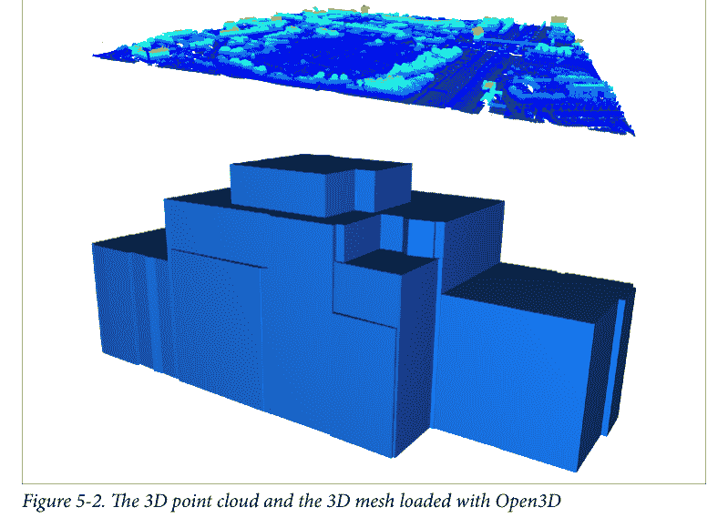

一旦子采样步骤完成，我们将得到一个结果子采样点云，可用于下游流程。我们现在有两个 Open3D 对象：一个包含 3,551,924 个点的 PointCloud 和一个包含 674 个点和 488 个三角形的 TriangleMesh。现在让我们确保在本地环境中处理数据时轻松自如。

### 数据预处理

现实世界是混乱的，我们的点云也是如此。确实，由于传感器故障和反射，我们有一些零散的数据点。这些异常值可能会扭曲我们的分析。我们可以通过探索统计分析技术来识别和移除这些干扰点，从而应对这一挑战。然而，让我们将其留到第 6 章，以便我们能看到此类噪声对我们分析的影响。接下来，我们将居中我们的数据集，以确保在查看 3D 数据集时避免因大坐标引起的问题（这可能导致渲染故障）：

```
pcd_center = pcd_o3d.get_center()
pcd_o3d.translate(-pcd_center)
mesh.translate(-pcd_center)
```

### 3D 数据可视化

要在 Open3D 中可视化不同的 3D 对象，我们必须传递一个包含这些 Open3D 对象的 Python 列表，如前所述。因此，我们的列表由一个 Open3D PointCloud 和一个 Open3D TriangleMesh 组成，即 [pcd_o3d, mesh]。要在独立窗口中可视化此组合，请使用以下代码：

```
o3d.visualization.draw_geometries([pcd_o3d,mesh])
```

为了改善对光线传播方式的感知，我们可以使用法线，这是许多过程中非常有用的特性（我们将在第 6 章介绍），我们可以使用 Open3D 快速计算：

```
pcd_o3d.estimate_normals()
mesh.compute_vertex_normals()
```

有一个方便的技巧可以处理要显示的颜色：使用一个颜色变量，我们将其传递给 PointCloud Open3D 对象的 colors 属性。该变量应包含范围在 0 到 1 之间的 R、G 和 B 浮点值。假设我们想根据分类属性可视化点云。为此，我们将遵循图 5-3 中概述的四个阶段过程。这对应于以下Python代码，并得到图5-4所示的结果：

```python
pcd_subsampled['Classification'].unique()
colors=np.zeros((len(pcd_subsampled), 3))
colors[pcd_subsampled['Classification'] == 1] = [0.611, 0.8, 0.521]
colors[pcd_subsampled['Classification'] == 2] = [0.8, 0.670, 0.521]
colors[pcd_subsampled['Classification'] == 6] = [0.901, 0.419, 0.431]
colors[pcd_subsampled['Classification'] == 9] = [0.564, 0.850, 0.913]
colors[pcd_subsampled['Classification'] == 26] = [0.694, 0.662, 0.698]
pcd_o3d.colors = o3d.utility.Vector3dVector(colors)
o3d.visualization.draw_geometries([pcd_o3d,mesh])
```

因为我们希望手动控制每个类别的颜色，所以可以将前面的代码调整为适应唯一类别的数量。然后，对应关系基于LAS（1.4）规范完成。我们已经加载了变量，可以看到点云和三维网格，并且一切似乎都运行顺畅（图5-4）！现在是时候定义我们想要执行的各种三维城市分析任务了。为此，我们参考整体的高级工作流程，并将其调整以适应我们的应用。这意味着对于每个场景，我们都有输入、处理流程和输出。在点云数据背景下，从输入到输出的概念性工作流程如图5-5所示。

输入可以变化，但在大多数情况下，它是一个包含空间信息的NumPy数组。输出可以是一个整数、一个列表、另一个NumPy数组，或者你需要的任何其他东西。

## 多模态三维体验

我们将完成这项任务。这意味着我们希望通过利用多模态三维数据表示来找到解决四个挑战的方案：兴趣点查询、边界定义、高点提取和建筑覆盖。让我们从兴趣点查询开始。

## 兴趣点查询

此挑战的目标是仅保留位于兴趣点（建筑物）一定距离内的数据点。我们的输入是点云和网格（Open3D对象），我们的输出是过滤后的点云，它满足到兴趣点（POI）的距离标准（见图5-6）。为了实现这一点，我们将遵循一个六阶段过程，如图5-7所示。

图5-6. 半径查询的特写视图

图5-7. 三维点云中半径搜索的概念性工作流程

要设置距离阈值，我们将要用作阈值的半径值（例如，50）传递给一个新变量`dist_POI`（1）。然后，我们使用网格对象的`get_center()` Open3D方法从BAG数据集网格中获取POI（2）。这使我们获得网格的中心作为POI：

```python
dist_POI=50
POI=mesh.get_center()
```

之后，我们可以创建一个*k*-d树（3）来组织空间中的点，并允许快速的最近邻搜索和范围查询。使用*k*-d树可以快速找到最接近给定点的点，或者在一定距离内（我们的POI）的所有点，而无需搜索点云中的所有点。你可以使用Open3D或SciPy版本：

```python
# 创建k-d树数据结构
pcd_tree = o3d.geometry.KDTreeFlann(pcd_o3d)
```

提醒一下，*k*-d树的工作原理是递归地将空间划分为更小的区域，在每一层沿其中一个维度的中位数进行划分（x是一个维度，y是另一个，z是另一个）。结果，创建了一个“树”结构，其中每个叶节点代表一个点，每个节点代表一个空间分割。从那里，我们可以使用`search_radius_vector_3d()` Open3D方法，并从输出索引中选择点，最终可视化我们的结果（4 + 5 + 6）：

```python
# 使用k-d树根据与POI（你的房子）的距离选择点
[k, idx, _] = pcd_tree.search_radius_vector_3d(POI, dist_POI)
pcd_selection=pcd_o3d.select_by_index(idx)
o3d.visualization.draw_geometries([pcd_selection,mesh])
```

使用此Python代码在三维点云中执行半径搜索的结果如图5-8所示。现在你有了一个可行的解决方案，让我们从该选择中提取地块区域。

## 手动边界选择

要提取非官方边界，我们需要转向半自动和交互式的方法。好消息是，我们可以直接在Python中使用Open3D完成此操作。

第一步是使用以下`draw_geometries_with_vertex_selection()`方法创建一个交互式Open3D窗口：

```python
o3d.visualization.draw_geometries_with_vertex_selection([pcd_selection])
```

然后，你可以选择定义地块角落的点。手动边界选择过程使用Open3D GUI；你按住Shift + 鼠标来选择感兴趣的点。关闭窗口后，结果将出现在你的笔记本（或REPL）中的单元格下方。

在此步骤中，使用R、G和B着色可能更容易。如果你想使用正确的索引，需要在选择之前更改此设置。如果你想提取地籍边界，可以导入官方的二维矢量形状并基于此数据约束进行裁剪。

从你的REPL中，你可以将所选点的不同索引（例如，34335,979,21544,19666,5924,21816,38008）复制并粘贴到`select_by_index()`方法中，以定义一个`o3d_parcel_corners`变量：

```python
o3d_parcel_corners=pcd_selection.select_by_index([34335 ,979 ,21544 ,19666 , 5924 ,21816 ,38008 ])
```

我们仍然需要进一步处理角落以避免考虑z值。因此，我们将过滤坐标以丢弃z值，但要注意：这样做意味着我们假设我们处于平坦区域（在荷兰就是这种情况）：

```python
o3d_parcel_corners=np.array(o3d_parcel_corners.points)[:,:2]
```

从那里，是时候使用Shapely库计算地块面积了。为此，我们可以直接使用`Polygon`函数从提供的角落集合创建一个多边形（见图5-9）：

```python
Polygon(o3d_parcel_corners)
```

这看起来有些不对。如果你不相信我，我们可以计算面积来检查：

```python
pgon = Polygon(o3d_parcel_corners)
print(f"This is the obtained parcel area: {pgon.area} m²")
```

这输出43.583 m²。对于一个大建筑来说，这听起来很奇怪。哈，一个简单的问题变得有点复杂了！确实，这里的问题是计算面积需要一个多边形，该多边形必须构成一个封闭的形状。这并不总是如此，并且取决于角落被添加到数据结构中的“顺序”。现在，问题变成了对坐标进行排序以避免边交叉。处理这个问题的一种方法是从中心点的角度感知所有坐标。然后，我们可以计算列表中每个角落与中心点之间的角度。我们这样做是为了知道各个角度有多宽，并为我们提供基于其值对坐标进行排序的方法。将其转换为代码允许定义一个排序函数，如下所示：

```python
def sort_coordinates(XY):
    cx, cy = XY.mean(0)
    x, y = XY.T
    angles = np.arctan2(x-cx, y-cy)
    indices = np.argsort(-angles)
    return XY[indices]
```

我使用NumPy的`arctan2()`方法来估计每个坐标的角度。这将返回以弧度为单位的角度数组。剩下的就是将角度按升序排序，以正确接收索引列表。然后，该列表可以使用`argsort()`方法修复原始列表索引。在此步骤中，它不适用于U形建筑。

从那里，我们可以将排序函数应用于角落，创建一个新的排序变量，并计算多边形及其相关面积：

```python
np_sorted_2D_corners=sort_coordinates(o3d_parcel_corners)
pgon = Polygon(np_sorted_2D_corners)
Polygon(np_sorted_2D_corners)
print(f"This is the parcel area: {pgon.area} m²")
```

这返回一个面积为3408.9 m²的多边形，这是一个更合理的数字（见图5-10）。

图5-9. 错误的几何形状

图5-10. 正确的几何形状

我们现在已经通过利用3D点云、3D网格和2D多边形向量，对地块的面积有了清晰的认识。接下来，让我们找出该区域内的最高点和最低点。

## 查找最高点和最低点

要获取区域的最低点和最高点，一个选择是使用Open3D的`get_max_bound()`和`get_min_bound()`方法：

```
pcd_selection.get_max_bound()
pcd_selection.get_min_bound()
```

然而，这样做并不能提示哪个点是最高点，哪个是最低点。我们需要的是点的索引，以便检索其坐标。

首先，从仅包含x、y和z坐标的Open3D PointCloud对象创建一个NumPy数组对象`np_pcd_selection`。然后，使用`argmax()`方法收集z维度上的最小值和最大值的索引，并将结果存储在`lowest_point_index`和`highest_point_index`中：

```
np_pcd_selection=np.array(pcd_selection.points)
lowest_point_index=np.argmin(np_pcd_selection[:,2])
highest_point_index=np.argmax(np_pcd_selection[:,2])
```

我们可以通过生成参数化模型来检查结果。为此，我们选择具有这些索引的点，创建球体，将它们平移到所选点的位置，并进行可视化：

```
# 我们创建3D球体以将其添加到我们的可视化场景中
lp=o3d.geometry.TriangleMesh.create_sphere()
hp=o3d.geometry.TriangleMesh.create_sphere()

# 我们将3D球体平移到正确的位置
lp.translate(np_pcd_selection[lowest_point_index])
hp.translate(np_pcd_selection[highest_point_index])

# 我们计算一些法线并为每个3D球体着色
lp.compute_vertex_normals()
lp.paint_uniform_color([0.8,0.1,0.1])
hp.compute_vertex_normals()
hp.paint_uniform_color([0.1,0.1,0.8])

# 我们生成场景
o3d.visualization.draw_geometries([pcd_selection,lp,hp])
```

我们现在拥有了包含最高点和最低点的3D场景（见图5-11）。

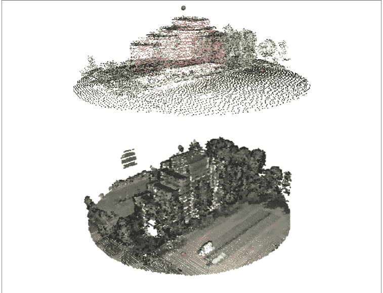

如你所见，噪声会影响我们的结果：如果我们不进行离群点过滤，结果可能会出现偏差。这提示了3D数据工程的重要性（我们将在第6章更详细地介绍）。最后，让我们研究350米范围内的建筑覆盖率。为此，我们使用POI = 150米重新执行代码。

## 点云体素化

我们想要提取建筑覆盖范围。为此，我们采用一种直观的方法，首先将点云模态转换为2D像素的填充模拟物：3D体素。这使我们能够遵循图5-12中概述的方法。

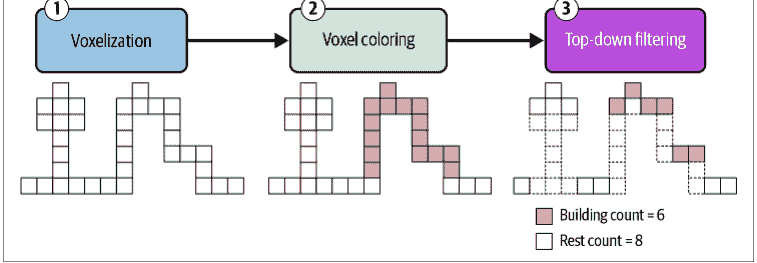

我们通过构建3D体素数据结构来提取高点。首先，我们对点云进行体素化，然后从二元视角为每个体素着色，最后通过自上而下的索引进行过滤。

在此之前，让我向你展示如何选择点的子集并对其进行体素化。要对地面进行体素化，请输入以下内容：

```
df_vox = pcd_subsampled[pcd_subsampled['Classification'] == 2]
color_vox = np.tile([0.8, 0.670, 0.521], (len(df_vox), 1))
pcd_vox=o3d.geometry.PointCloud(o3d.utility.Vector3dVector(np.array(df_vox[['X', 'Y', 'Z']])))
pcd_vox.colors=o3d.utility.Vector3dVector(color_vox)
pcd_vox.translate(-pcd_center)
o3d.visualization.draw_geometries([pcd_vox])
```

我们本质上是过滤出分类为地面的点，并创建一个点云，然后我们对其进行平移并赋予特定颜色。下一阶段是对几何体进行体素化。这使我们能够将所有不同的模态组合成一个（图5-13）：

```
voxel_grid = o3d.geometry.VoxelGrid.create_from_point_cloud(pcd_selection_vox,
    voxel_size=2)
o3d.visualization.draw_geometries([pcd_selection,lp,hp, mesh, voxel_grid])
```

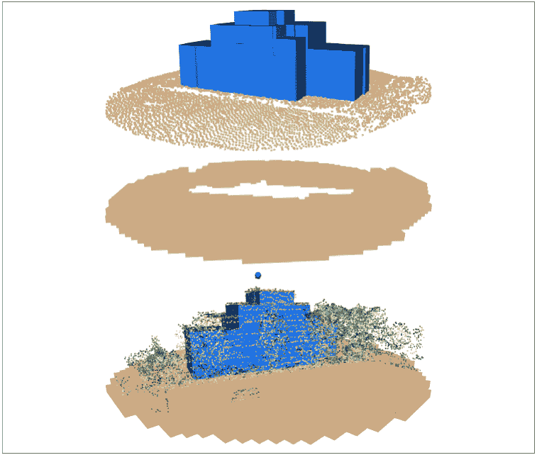

图5-13. 地面的体素化过程，从带点云的网格到体素地面再到多模态视图

使用这种特定的着色技巧，我们（1）在存在点的地方生成体素，然后（2）根据它们所包含的点的分类为它们着色。最后，我们过滤体素，仅保留并计算每个x和y坐标的最高体素。这样，我们可以避免计算那些会偏差建筑覆盖范围的元素。第一步是创建一个体素网格。我们将体素网格拟合到点云，其中每个体素是一个20厘米的立方体：

```
voxel_grid = o3d.geometry.VoxelGrid.create_from_point_cloud(pcd_selection,
voxel_size=2)
```

使用Open3D，我们必须更改体素点的颜色。然后，VoxelGrid方法将对颜色取平均值，并将结果保留为体素的颜色。现在我们知道如何从点云生成3D体素，我们使用它们的着色方案来绕过颜色平均问题。

为此，一个简单的方法是以二元方式处理颜色：要么是黑色（[0,0,0]），要么不是（所有其他颜色）。这意味着我们可以将colors变量初始化为0，然后选择所有分类为建筑的点并赋予它们另一种颜色，例如红色（[1,0,0]）：

```
colors=np.zeros((len(pcd_df), 3))
colors[pcd_df['Classification'] == 6] = [1, 0, 0]
pcd_o3d.colors = o3d.utility.Vector3dVector(colors)
```

现在，因为我们操作了原始点云，我们必须根据我们的选择重新定义POI和选择范围。为了提高效率，你可以找到以下代码块来运行，以将你的体素渲染更新为新的着色方案：

```
# 定义POI和研究区域中心
dist_POI=150
POI=mesh.get_center()

# 基于k-d树查询所有落入范围内的点
pcd_tree = o3d.geometry.KDTreeFlann(pcd_o3d)
[k, idx, _] = pcd_tree.search_radius_vector_3d(POI, dist_POI)
pcd_selection=pcd_o3d.select_by_index(idx)

# 计算体素网格并可视化结果
voxel_grid = o3d.geometry.VoxelGrid.create_from_point_cloud(pcd_selection,
                                                            voxel_size=2)
o3d.visualization.draw_geometries([voxel_grid])
```

太棒了！现在，我们需要获取每个体素的离散整数索引列表，以及颜色和边界。这将允许我们稍后遍历每个体素及其颜色，以检查某个体素是否是“体素列”中最高的。为了实现这一点，一个有效的方法是使用列表推导式来向量化我们的计算并避免不必要的循环：

```
idx_voxels=[v.grid_index for v in voxel_grid.get_voxels()]
color_voxels=[v.color for v in voxel_grid.get_voxels()]
bounds_voxels=[np.min(idx_voxels, axis=0),np.max(idx_voxels, axis=0)]
```

我们在150米的选择范围内有一个150 × 150 × 16的体素网格，这相当于360,000个填充的体素。接下来，我们将提取建筑覆盖范围。

## 建筑覆盖范围提取

现在我们有了一个带有二元颜色的体素化点云，我们可以专注于图5-12中的第三阶段。正如我们所看到的，仅选择顶部体素比看起来要复杂一些。因此，让我们设计一个稳健的流程（图5-14）。

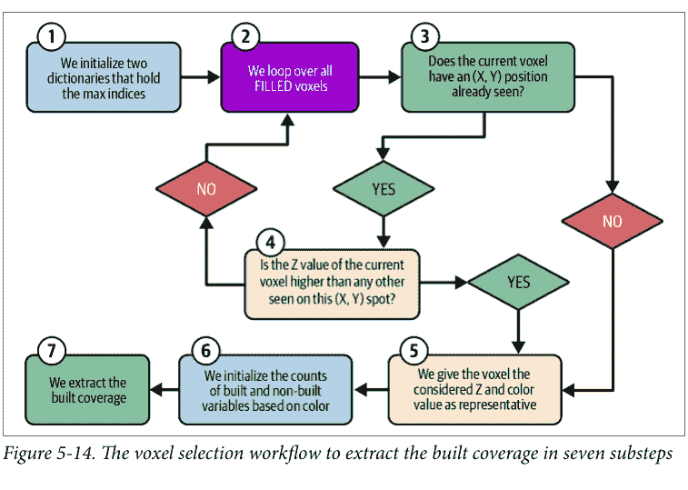

让我们逐步讲解：

步骤1：首先，我们初始化两个字典来保存最大索引：

```
max_voxel={}
max_color={}
```

步骤2到5：我们遍历所有填充的体素，检查它们是否是体素列中最高的，或者应该被丢弃，这给出了以下for循环：

```
for idx, v in enumerate(idx_voxels):
    if (v[0],v[1]) in max_voxel.keys():
        if v[2]>max_voxel[(v[0],v[1])]:
            max_voxel[(v[0],v[1])]=v[2]
            max_color[(v[0],v[1])]=color_voxels[idx]
    else:
        max_voxel[(v[0],v[1])]=v[2]
        max_color[(v[0],v[1])]=color_voxels[idx]
```

首先要注意的是循环定义中的`enumerate()`方法。这允许在遍历`idx_voxels`变量的每个值的同时，跟踪列表的索引。第二点是我们使用“元组”数据类型作为(x, y)，它给出了我们体素的整数位置。这确保了我们持续检查相同的x和y网格位置。最后，“if”语句允许测试表达的条件，如果条件返回true则执行。如果不返回true，则执行else语句（如果有的话）或跳过并退出条件检查。

步骤6：我们初始化标记为已建和未建的体素计数，并检查保留的顶部体素的颜色是否为黑色，如果不是，则更新相应类别的体素计数：

```
count_building_coverage,count_non_building=0,0
for col in list(max_color.values()):
    if np.all(col==0):
        count_non_building+=1
    else:
        count_building_coverage+=1
```

`np.all()`也是一个布尔检查，只有当所有值都为true时才返回true。在我们的例子中，黑色是[0,0,0]，因此将返回true，因为在这种情况下所有R、G和B都设置为0。如果其中任何一个不为零，则并非所有值都为0，`np.all()`将返回false，从而触发else语句。

步骤7：我们可以提取每种类型（已建和未建）的覆盖面积，不要忘记将计数变量乘以实际的2D体素面积（在我们的例子中是4平方米），并得到比率：

```
print(f"Coverage of Buildings: {count_building_coverage*4} m²")
print(f"Coverage of the Rest: {count_non_building*4} m²")
print(f"Built Ratio: {(count_building_coverage*4)/(count_building_coverage*2+count_non_building*2)} m²")
```

对于150米，这给出了17.9%的覆盖率，相当于12,812平方米的建筑面积和58,372平方米属于其余部分。因此，与其余部分相比，我们在选定的兴趣点上拥有良好的建筑占用平衡。我们的3D流程完全正常运行，因此我们可以将结果保存到一个或多个文件中，以便在Python之外处理它们。为此，我们将使用两种有价值的可能性。对于复杂的输出，其中你想保存任何属性，我建议使用NumPy，使用以下代码行：

```
np.savetxt(result_folder+pc_dataset.split(".")[0]+"_selection.xyz",
np.asarray(o3d_parcel_corners),delimiter=';', fmt='%1.9f')
```

如果你只想使用带有颜色和法线的空间属性，Open3D会很有用：

```
o3d.io.write_point_cloud(result_folder+pc_dataset.split(".")[0]+
"_result_filtered_o3d.ply", pcd_selection, write_ascii=False, compressed=False,
print_progress=False)
```


`split(".")`允许我们将`pc_dataset`字符串对象分割成两个字符串的列表，即`.`之前和之后的部分，我们只保留第一个元素`[0]`。NumPy将一个变量`o3d_parcel_corners`导出到一个以`.`为分隔符的`.xyz` ASCII文件中。Open3D将从Open3D对象`pcd_selection`写入一个`.ply`文件。

Python自动化结构的主体部分现在已经搭建完成！我们已经导入了库，将数据集存储在不同的显式变量中，并确保我们可以在一个支持交互的多模态查看器体验中处理各种3D数据表示。

## 总结

你应该为自己成功开发了一个强大且多功能的3D查看器而感到自豪。通过利用各种库和技术，我们创建了一个强大的工具，能够结合多样化的数据集、可视化复杂的3D模型并提取有价值的见解。

结合我们的场景，这个3D查看器在荷兰即将发生的洪水背景下至关重要。通过整合高程数据、建筑足迹和其他相关信息，你的程序可以：

-   以3D方式可视化受影响区域，全面了解地形、建筑高度和潜在的洪水区域。
-   识别脆弱区域，分析建筑高度和覆盖范围，以确定最容易受到洪水影响的位置。
-   通过3D查看器支持决策，以协助规划防护措施，如疏散和沙袋工作。

展望未来，这个3D查看器可以通过整合更多功能来进一步增强，例如洪水模拟、与物联网传感器的集成以及高级分析能力。但在继续开发这个工具之前，让我们探索3D数据工程的关键方面，这些方面对于从3D数据集中提取相关见解并朝着为空间AI系统创建数字环境更近一步是必需的。

## 实践项目

本章的练习将把点云数据与网格模型结合起来。我们将在Open3D中可视化这两种数据类型，这对于洪水分析等任务很有用，在这些任务中，建筑物需要在地形的背景下被看到：

1.  *数据获取*：首先，收集同一区域的地形点云数据集和建筑物网格模型。你可以在网上找到示例数据集，或使用你自己项目中的数据。
2.  *库设置*：确保你的Python环境中安装了Open3D和NumPy。然后，将这些库导入到你的脚本中。
3.  *加载和准备数据集*：使用Open3d的`read_point_cloud`和`read_triangle_mesh`函数加载点云和网格。你可以使用点云的`colors`属性为其添加颜色。
4.  *创建可视化*：将点云和网格组合到一个列表中。使用`draw_geometries`函数在独立的Open3D窗口中可视化两者。
5.  *添加交互性*：利用Open3D与查看器交互的能力，允许用户进行测量、提取坐标，并基于3D点云的自定义着色预览计算结果。

确保用户可以通过旋转、平移和缩放来探索场景。尝试不同的配色方案，以突出显示数据的特定特征。

# 第6章
点云数据工程

是时候揭示3D——特别是点云——数据工程的复杂性了。虽然点云提供了丰富的3D几何表示，但提取有意义的信息需要专门的技术来处理噪声和冗余，并帮助识别相关模式。我们需要一种方法将原始点云数据转换为精炼的形式，提取基本特征，以增强下游任务（如3D形状检测（第9章）、分类（第15章）和目标检测（第16章））的性能。基础单元是我们的数据。我们希望对其进行精炼，使其对我们的最终应用更有意义。

让我们考虑一个简短的例子。假设你想分析大脑的MRI扫描（大脑的2D切片选择），以确定特定区域是否受到肿瘤的潜在威胁。我们可以将构成数据集的图像集直接交给一位经验丰富的神经外科医生。由他的专业知识来解释第一张图像，在各种切片上重复这个预测，然后给出他的诊断和分析。这对数据质量提出了很高的要求。如果你有很多噪声（例如，患者在采集数据时移动），或者你有一个未校准的颜色范围，解释的质量可能会急剧下降。

但假设我们注入一点数据工程。在这种情况下，我们或许能够通过处理我们获得的初始通道来消除噪声并突出显示数据的特定边缘和部分，而无需进入解释步骤。我们的数据工程步骤的目标就是做到这一点：我们希望确保我们的下游流程处于最佳条件下。然而，没有任何上下文，特别是如果我们没有澄清我们应用数据工程的3D几何体，可能很难完全理解数据工程能帮助我们实现什么。

在本章中，我们的目标是3D点云数据工程。我们之前看到点云具有出色的规范特性，使其成为集中处理和理解的良好候选者。然后我们可以将中间结果推送到我们工作流中的其他数据模态。这就是为什么从3D点云开始将使理解和构建3D数据工程管道变得容易，以更高的稳健性推动我们进一步的下游流程。

我将引导你了解点云数据工程的基础知识，重点关注关键的特征提取步骤。你将学习如何推导有意义的、非冗余的特征，这些特征捕捉了点云的基本几何属性。这也有助于突出显示基本的3D预处理阶段，包括主成分分析（PCA）和3D数据配准，如图6-1所示。

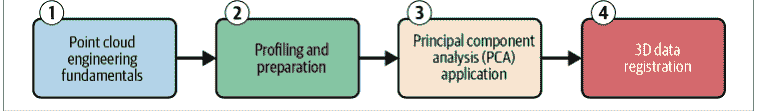

图6-1. 点云数据工程工作流的四个核心步骤


你可以在3D数据科学资源中心找到本章的所有材料。你可以使用基础链接并添加"/chapter-X"来访问文件（代码、数据集、文章）和资源。请注意，你可能需要提供电子邮件地址、个人密码或证明你是本书所有者。

## 基础知识

大多数3D项目的基础涉及原始数据本身：点云。本节深入探讨点云数据工程基础知识，为你提供处理这些复杂数据集的知识（见图6-2）。我们探索如何高效地存储、预处理和管理点云。

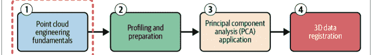

图6-2. 点云数据工程基础知识

我们使用一个简单的Python设置，如第3、4和5章所示。然后，我们在一个基于Python 3.10的Anaconda环境上构建解决方案，利用Open3D、NumPy、pandas和Matplotlib。

## 初始预处理

在之前研究过这个主题后，我们可以立即展示在3D点云中常用的一些特定预处理程序的结果。在这个例子中，我们使用一个通过地面激光扫描仪获取的数据集（见图6-3）。

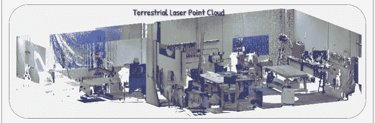

图6-3. 本章中使用的3D数据集由三个主要区域组成（室内1、室内2和室外）

在本地系统上彻底理解数据后，你可以轻松地使用Open3D仅用两行代码将数据集导入到你的Python执行运行时中：

```
import open3d as o3d
pcd = o3d.io.read_point_cloud("../DATA/techshop.ply")
```

`pcd`变量现在包含点云数据。随后，必须采用各种预处理方法来提高质量并提取重要数据：变换、降采样、去噪、异常值移除、归一化和特征提取（图6-4）。

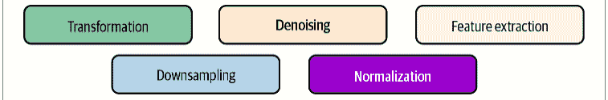

图6-4. 对所有应用都有用的各种处理任务

让我们用Python详细地介绍每个步骤。

## 变换：初始平移

如果您计划使用 Open3D 可视化点云，或者希望在计算过程中避免截断或精度损失，建议进行变换。在这种情况下，最好将点云重新定位，以避免对巨大坐标的近似处理。要对您的 `pcd` 点云应用平移，首先需要获取点云的中心。然后，通过从原始变量中减去中心来执行平移（之后您可以使用 `o3d.visualization.draw_geometries([pcd])` 进行可视化）：

```
pcd_center = pcd.get_center()
pcd.translate(-pcd_center)
```

很好。我们已经完成了必要的准备工作，可以评估各种采样技术以简化我们的下游流程。下采样的目的是减少数据集中的样本或数据点数量。

## 点云子采样

让我们研究一下能够有效减小点云尺寸，同时保持其整体结构完整性和代表性的采样技术。点云可以定义为一个维度为 *m* × *n* 的矩阵。在矩阵层面，通过根据 *n* 因子的值保留每 *n* 行中的点来执行抽取（参见图 6-5）。当然，这源于点在文件中的记录方式。Open3D 的 `random_down_sample()` 函数用于使用指定的 `retained_ratio` 随机下采样原始点云 `pcd`：

```
retained_ratio = 0.2
sampled_pcd = pcd.random_down_sample(retained_ratio)
```

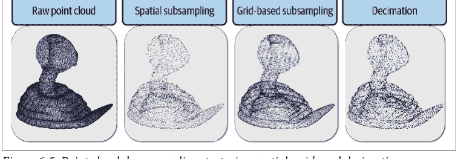

生成的下采样点云存储在变量 `sampled_pcd` 中。`retained_ratio` 参数指定了下采样后将保留的点的百分比。例如，当 `retained_ratio` 设置为 0.5 时，大约 50% 的点将被随机选择并保留在采样点云中。

在三维点云研究中，随机采样受到限制，可能导致遗漏关键信息和分析不准确。它未能考虑空间方面或点之间的连接。因此，采用替代技术以保证更彻底的检查是很有趣的，例如空间或基于网格的子采样，如图 6-5 所示。我们将在第 18 章（涵盖混合方法）中进一步探讨这一点。接下来，让我们使用统计技术处理任何异常值以将其移除。这保证了数据的质量和可靠性，以便进行进一步的分析和处理。

让我们看看网格子采样方法，它涉及将三维空间划分为均匀的体素单元。网格中的每个单元由单个点表示，并且有多种方法可以选择这个代表性点。在子采样过程中，我们可以选择每个单元中距离其重心最近的点。具体来说，我们定义一个 `voxel_size`，然后用它来过滤我们的点云：

```
voxel_size = 0.05
pcd_downsampled = filtered_pcd.voxel_down_sample(voxel_size = voxel_size)
```

此函数对过滤后的点云 `filtered_pcd` 执行体素下采样。参数 `voxel_size` 确定了用于降低点云分辨率的每个体素的尺寸。增大会导致点云密度更大程度地降低。使用 `o3d.visualization.draw_geometries([pcd_downsampled])` 检查下采样后的分布。我们有一组尚未修改以进行进一步处理的异常点，所以让我们解决这个问题。

## 去噪（异常值移除）

三维点云中的噪声是指由各种来源（如传感器不准确、环境因素或物体移动）引起的不需要或错误的数据点。移除噪声至关重要，因为它提高了三维数据的质量。对三维点云数据应用异常值过滤器可以有效检测并排除任何与整体数据集偏差相当大的数据点。这些异常值可能是由于测量误差或其他可能扭曲结果的变量引起的。

消除这些极端值可能使我们能够获得更准确的数据描述，并对算法进行更精确的调整。然而，我们必须谨慎，避免擦除重要方面。现在让我们定义一个统计异常值移除过滤器，以移除所有远离其邻居的点，以整个点云中点之间的平均距离为基础。

为此，我们接受两个输入参数。第一个 `nb_neighbors` 指定了为计算任何给定点的平均距离而考虑的邻居数量。第二个 `std_ratio` 允许我们设置阈值级别。它基于整个点云中平均距离的标准差。值得注意的是，这个数字越低，过滤器就越激进。这相当于以下内容：

```
nn = 16
std_multiplier = 10
filtered_pcd, filtered_idx = pcd.remove_statistical_outlier(nn, std_multiplier)
```

我们通过使用定义的最近邻数量 (`nn`) 和标准差乘数 (`std_multiplier`) 对点云应用统计异常值消除。该函数产生两个输出：`filtered_pcd` 和 `filtered_idx`。第一个保存过滤后的点云，而 `filtered_idx` 包含在移除异常值后保留的原始点云中点的索引。为了表示此过滤过程的结果，我们将异常值分配为红色，并将其包含在我们打算描绘的点云对象列表中：

```
outliers = pcd.select_by_index(filtered_idx, invert=True)
outliers.paint_uniform_color([1, 0, 0])
o3d.visualization.draw_geometries([filtered_pcd, outliers])
```

显著偏离规范的数据点被识别并在点云中以较深的色调显示（参见图 6-6）。一旦统计异常值从点云中消除，最后阶段涉及归一化策略。

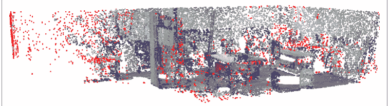

图 6-6. 显著偏离规范的数据点被识别并在点云中以较深的色调显示。

## 三维数据归一化

让我们讨论三维数据归一化。这是一个关键的预处理步骤，特别是在处理来自不同来源或采集技术的多样化三维数据集时。例如，来自建筑物激光雷达扫描的点云与从结构光扫描仪生成的人手三维网格相比，其尺度和方向将截然不同。如果不进行归一化，这些差异会严重影响下游任务（如配准、分割，尤其是深度学习模型）的性能。

我亲眼目睹了忽视归一化如何导致人工智能模型过度拟合特定数据集特征，从而导致对未见数据的泛化能力差。想象一下，训练一个模型来识别来自三维扫描的不同类型的家具。如果训练集仅包含沙发和桌子等大型物体，如果模型在训练期间未接触过该尺度，它可能难以分类一把小椅子。那么，我们能做些什么呢？

几种归一化技术与三维数据特别相关。让我们分解几个关键的：

**中心化**
这涉及平移三维对象，使其质心位于原点。我们计算点云中所有点或网格中顶点的平均坐标，并从每个点的坐标中减去此平均值。这确保了对象在坐标系中居中。

**缩放**
我们本质上是调整对象大小。一种常见的方法是将对象缩放以适应单位边界框或球体。这可以通过将每个坐标除以最大绝对坐标值或对象的直径来实现。这一步有助于标准化不同对象的大小。

**对齐**
这会旋转对象以使其与特定轴或平面对齐。主成分分析（PCA）通常用于确定三维对象的主轴，使我们能够沿这些轴对齐对象。这对于对齐具有不同方向的对象很有益。

这是一个简化的 Python 示例，演示了使用 NumPy 进行中心化和缩放：

```
def normalize_3d_data(data):
    centroid = np.mean(data, axis=0)
    data_centered = data - centroid
    max_abs_coord = np.max(np.abs(data_centered))
    data_normalized = data_centered / max_abs_coord
    return data_normalized
```

请记住，归一化技术的选择应与您的特定应用保持一致。例如，对齐和缩放在形状检索任务中至关重要，而中心化可能足以用于对象检测。现在，让我们在预处理的背景下探讨特征提取。为此，我们将强调法线的作用。

## 特征提取预览：法线估计

点云法线通常表示三维点云中特定点处的表面方向。该技术的一个可能应用是分割，即通过将点云划分为具有相似法线的区域来实现（图6-7）。在我们的场景中，法线将有助于识别点云内的物体和表面，从而便于可视化。

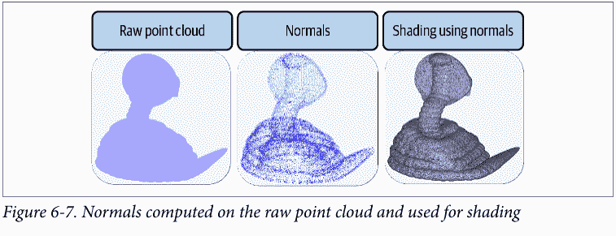

此外，这是一个绝佳的机会，可以提供一种半自动化计算这些法线的方法。首先，我们建立点云中每个点与其邻近点之间的平均距离：

```
nn_distance = 0.05
```

随后，我们利用这些数据在特定邻域内获取有限数量的最大最近邻点：

```
# Compute a normal for each point in the 3D point cloud:
radius_normals=nn_distance*4
pcd_downsampled.estimate_normals(search_param=o3d.geometry
.KDTreeSearchParamHybrid(radius=radius_normals, max_nn=16),
fast_normal_computation=True)
```

点云对象 `pcd_downsampled` 现在已具备法线，并准备好展示其最美观的一面。你现在已经熟悉这个流程了：

```
pcd_downsampled.paint_uniform_color([0.6, 0.6, 0.6])
o3d.visualization.draw_geometries([pcd_downsampled,outliers])
```

如你所见，仅在此阶段，我们就能理解特征如何有助于后续的处理过程。让我们来完善这些特征提取的基础知识。

## 特征提取基础

这里的目标很明确：我们旨在从点云数据中提取有意义的信息，即特征。这些特征必须遵循三个关键标准。首先，它们必须具有信息性。提取不提供额外见解的数据是毫无意义的。其次，它们不应是冗余的。专注于提供重要、独特信息的数据至关重要。最后，它们必须有助于后续过程，特别是在分类任务中。特征应具有实用性，并能提升分类模型的性能。

从点云数据中提取特征的过程需要一种策略性的方法。直接提取这些特征并不可行。相反，我们利用数据固有的几何结构，其中蕴含着丰富的信息。然而，识别每个点周围的特定邻域对于有效描述每个点至关重要。

## 点云特征提取策略

要揭示点云中隐藏的洞见，需要提取其关键特征。这通过分析和准备我们的数据来完成，即图6-1中的第二阶段。可以将其想象为识别定义三维物体形状和属性的构建模块。我们有两种主要方法来分析局部几何属性、捕捉点云的整体形状，甚至识别表面纹理：全局特征提取和局部特征提取（见图6-8）。让我们首先介绍全局特征提取。

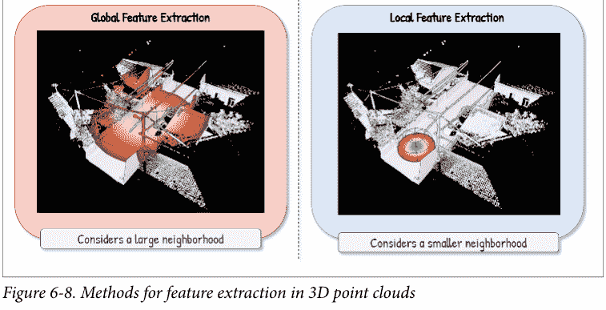

## 全局特征提取

全局特征提取是点云处理中的一个关键方法。它侧重于描绘给定点云的整体形状和结构。它通常涉及分析整个点云，而不是隔离单个点或局部区域（见图6-9）。

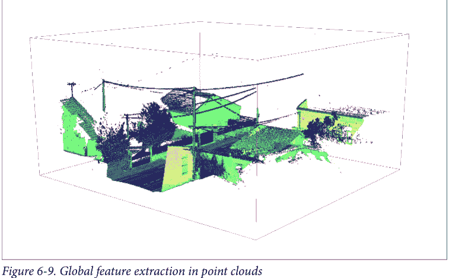

全局特征提取的主要目标是从点云中提炼关键信息，这对于许多应用（包括物体识别、场景分割和配准过程）都具有不可估量的价值。提取的特征包括统计指标（如均值、方差和偏度）以及几何特征（如曲率和各种形状描述符）。

采用全局特征提取的一个显著优势在于，它能够将点云浓缩为一个精简的表示，该表示概括了其基本特征。这种精简的表示极大地简化了可能包含数百万或数十亿个点的海量点云的存储和处理。此外，全局特征通过检查不同点云的几何和结构属性，便于对它们进行比较和分类（见第8章）。本质上，全局特征提取是点云处理中的一个关键策略，能够从庞大而复杂的数据集中提取有价值的洞见。

## 局部特征提取

为了有效地提取逐点特征，采用局部或更全面的全局方法来描述点的周围区域至关重要。这种邻域上下文至关重要，因为定义它的不同策略可能导致不同的特征值。这一点的重要性怎么强调都不为过；例如，一个狭窄定义的邻域，仅关注一个点及其直接邻居，会严重限制可获取信息的范围（见图6-10）。

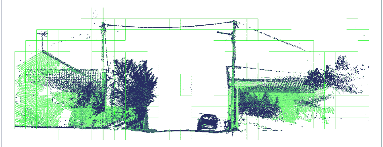

相反，一个更广泛的邻域可能会错过更精细的细节，例如边缘的存在或表面的平面或球形特性，而这些对于理解所涉及的几何形状至关重要。从这些观察中得出的特征需要一个适当大小的邻域（见图6-11）。

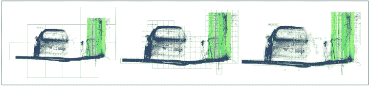

一种标准方法涉及 *k*-近邻（*k*-NN）方法。该策略可能包括收集五个周围的点作为焦点的邻域。这就是 *k*-NN 技术的本质，在此场景中“*k*”设置为5。

或者，一种策略可能围绕一个定义的半径展开，建立一个球形或圆柱形邻域。例如，识别焦点一米半径内的所有点可能只包括三个点，这基于半径的比例参数提供了对邻域的不同视角。

除此之外，还有更多的邻域定义技术，例如使用网格包含体素内的所有点，或采用多尺度方法。后者在不同级别上改变比例参数以提取一系列特征，这强调了在进行特征提取之前选择邻域的关键性。

一旦围绕感兴趣点建立了一个连通的三维邻域，下一步就是为特定应用提取相关特征。在这里，我们主要关注从协方差分析等方法得出的几何特征。然而，根据应用的要求，需要注意的是，特征可以超越几何范畴，包括颜色（RGB）、辐射度、语义，甚至拓扑结构（有关这些的更深入解释，请参见第9章）。

在特征提取阶段，使用我们选择的邻域——无论是通过半径还是其他方法定义的——我们旨在从点及其XYZ坐标中推导出有意义的特征。一个需要强调的重点是特定提取方法的重要作用，特别是那些对各种应用（包括室内制图和航空分类）非常有效的方法。虽然这些方法非常宝贵，但它们也有局限性，并且仍然是我们处理工具库中的高效工具。现在是时候探索最基本的特征提取方法之一了：PCA。

## 主成分分析

我们之前讨论过主成分分析（PCA），但现在我们将进一步探讨它。PCA是处理三维点云的一项重要技术，也是我们点云数据工程工作流的第三步（如图6-1所示）。

然而，为简单起见，这里我们考虑一个涉及x轴和y轴的二维点云。该方法的核心是重新定位数据，使其与反映其最大方差的轴对齐。PCA主要用于特征提取，显著有助于将数据的维度从可能的众多维度降低到一个、两个或三个主成分。这些成分非常具有揭示性，通常包含了数据的大部分方差。在此上下文中，方差指的是数据点围绕均值的分布。例如，考虑x轴，我们可以观察到数据从最小值到最大值的分布，而方差衡量的是围绕数据集均值的离散程度。

PCA的目标是将第一主成分与最大方差方向对齐，然后识别捕获剩余方差的后续正交轴。

## 主成分分析

方差按显著性排序（见图6-12）。在三维场景中，这将产生三个主轴。该过程直观地涉及识别一条（或在更高维度中，一个平面或超平面）数据方差最大化的线。这条线代表第一主成分，随后的正交成分则捕捉其他方向的方差。

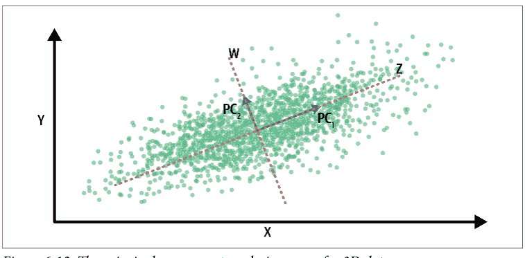

至关重要的是，每个主成分都与一个特征向量相关联，指示最大方差的方向，以及一个特征值，量化该方差的大小。通过PCA，这些特征值可以被巧妙地利用来推导更细致的特征，如全方差、平面度等，通过定量描述数据的几何特性来丰富分析。

让我们研究PCA在提取有意义特征方面的实际应用，并直观地展示该过程在揭示点云内在结构方面的功效。让我们重新开始，专注于一个被视为单一实体的3D点云。想象一下处理一个包含各种片段（从第12章所示过程中提取）的点云；在本练习中，我们只关注其中一个片段，将其视为一个独立的实体（见图6-13）。我们的目标是找到该片段点分布内的三个主要方向。我们旨在识别点样本中方差最大的方向，其次是第二和第三大方差，确保每个方向都是正交的。我们的PCA方法对于为后续处理步骤奠定基础至关重要。

那么，我们准备好深入研究了吗？我们处理的第一个重要步骤是数据准备。

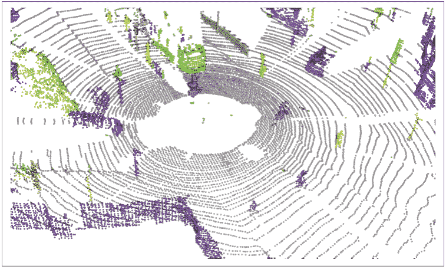

## Python与数据准备

让我们使用三个基本库：NumPy、pandas和Matplotlib。Open3D将不包含在此设置中，以使用第一性原理逻辑（低抽象级别）。包含time库严格是为了性能分析目的：

```python
# Base libraries
import numpy as np
import pandas as pd
# Viz' libraries
import matplotlib.pyplot as plt
# To monitor timings
import time
```

要提高图形的分辨率，请通过运行以下命令调整特定设置：

```python
plt.rcParams['figure.dpi'] = 600
```

将图形DPI设置为600可确保高分辨率视觉效果，便于详细可视化。现在，让我们用pandas加载点云数据。

pandas是我们在第4章中介绍的处理点云的多种方法之一。让我们使用这种方法从ASCII格式文件（例如.xyz）加载点云数据，该文件由DBSCAN（第12章）等过程生成。以下示例代码展示了如何使用pd.read_csv方法加载此类文件并分配列名以便于简单的数据操作：

```python
# Load a point cloud .xyz from the previous step with pandas
data_folder="../DATA/"
dataset="velodyne_pca.XYZ"
pcd = pd.read_csv(data_folder+dataset, delimiter=";", names=['X', 'Y', 'Z',
    'LABEL'], header=None)
pcd['LABEL'] = pcd['LABEL'].astype(int)
```

此方法通过分配有意义的列名并确保数据类型适合后续操作，简化了加载点云文件并为分析准备数据的过程。使用pandas处理点云数据时，通过命名每列直接指定数据结构被证明是有帮助的，特别是对于没有标题的文件。这种方法允许直观且直接的数据操作和分析。现在，让我们为分析准备我们的聚类。

## 使用pandas进行聚类识别

接下来，我们的重点转向为深入分析准备聚类。这始于检查分配给数据集中每个点的标签。目标是将具有相同标签的点聚合成不同的聚类，这一步增强了我们分析的一致性和结构性。为了完成此任务，我们使用pandas库中可用的groupby函数。此功能允许我们根据标签将数据集划分为聚类：

```python
segments=pcd.groupby(['LABEL'])
```

pandas中的groupby功能有时会呈现一种奇特的语法，但其在组织数据方面的效用是显而易见的。通过指定列名（在本例中为'LABEL'）作为分组标准，我们开始创建聚类。这会产生一个groupby对象，一个可以根据需要从中提取特定聚类的结构。例如，要探索特定聚类的内容——比如第二个或第三个——一个涉及.get_group()的简单方法链就足够了。此外，假设某人的兴趣在于聚类内点的索引。在这种情况下，pandas通过groups属性提供了一条直接获取此信息的途径，后跟感兴趣的聚类标签。

我们可以对整齐组织的聚类应用特定操作。最初，我们选择一个聚类以确保我们预期操作的有效性，通常涉及数据转换或分析技术，如PCA。在我们的示例中，我们选择第三个聚类进行初步测试。此操作的一个关键方面是选择相关的数据维度，即x、y和z坐标，用于分析。此选择过程通过在方括号内指定所需的列来实现：

```python
cluster=segments.get_group(3)[['X','Y','Z']]
```

这种系统方法确保每个聚类都得到精确准备，允许将复杂的分析技术应用于数据集的明确定义的子集。结果是一个简化的工作流程，增强了更广泛项目框架内数据分析的清晰度和有效性。

## 3D数据归一化

让我们从归一化数据集开始，如上一节所示。这涉及调整我们的数据以围绕一个共同的原点居中，这是PCA有效识别模式的基本步骤。归一化的初始阶段包括计算数据集的均值：

```python
# Compute the mean and center it
m = np.mean(cluster, axis=0)
```

使用NumPy的np.mean函数可以轻松完成此操作。我们将此函数应用于先前确定的聚类，指定axis=0。这会按列计算数据集的均值。接下来，我们通过从每个点中减去计算出的均值来归一化我们的聚类：

```python
cluster_norm = cluster-m
```

此步骤有效地将我们的数据集围绕原点居中，这是PCA的必要条件。

## 提取主成分

数据归一化后，我们继续进行协方差矩阵。该矩阵在PCA中至关重要，是我们推导特征值和特征向量的基础（见图6-14）。我们从步骤3开始：提取协方差矩阵。然后我们将进入步骤4和5。

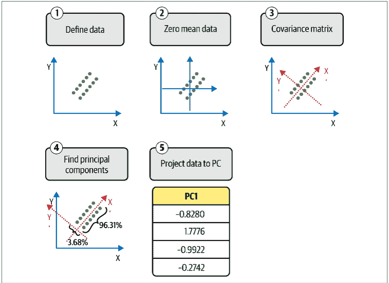

NumPy的`np.cov`函数有助于构建**协方差矩阵**（更多信息请参见**3D资源中心**），该矩阵应用于转置后的归一化聚类。这种转置使数据正确对齐以进行协方差计算。随后，我们提取特征值和特征向量，这是PCA的核心组件。此提取使用NumPy中的线性代数模块`np.linalg.eig`应用于协方差矩阵来实现。这些特征值及其对应的特征向量分别揭示了数据集各维度的方差以及这些方差的方向：

```python
cov = np.cov(cluster_norm.T)
eig_val, eig_vec = np.linalg.eig(cov.T)
```

执行后，我们观察到特征值：一个展示方差（如5.5、0.02和0.77等）的数组。这让我们对每个主成分捕捉的方差有了一个快照。另一方面，特征向量提供了这些方差的方向。

让我解释一下这些特征值的意义和量级。特征值根据我们数据中的方差，对每个对应特征向量的重要性进行排序。然后我们可以对这些特征值（及其对应的特征向量）进行排序，以优先处理我们的分析。目标是将它们从最重要到最不重要进行排列，本质上就是从最高方差到最低方差。我们使用 `np.argsort` 函数来实现这一点，它巧妙地返回能够对数组进行排序的索引。然而，这里有个转折——我们希望按降序对特征值进行排序，确保具有最高方差的主成分排在最前面：

```python
sorted_indexes = np.argsort(eig_val)[::-1]
eig_val = eig_val[sorted_indexes]
eig_vec = eig_vec[:,sorted_indexes]
```

通过对特征值及其对应的特征向量进行排序，我们现在可以定义可视化PCA的方法。

## PCA的3D可视化

当我们按降序对特征值进行排序时，对应的特征向量也会对齐，形成主成分。这种简化引导我们得到第一和第二主轴。让我们定义一个函数，允许我们绘制数据点，以及数据集中每个簇的PCA轴。`DrawPCA` 函数接收点和簇ID，计算PCA，并通过在3D空间中将前三个主成分绘制为向量来可视化它，突出显示该簇的空间方差：

```python
def DrawPCA(points,id_cluster):
    m = np.mean(points, axis=0)
    cluster_norm = points-m

    cov = np.cov(cluster_norm.T)
    eig_val, eig_vec = np.linalg.eig(cov.T)

    sorted_indexes = np.argsort(eig_val)[::-1]
    eig_val = eig_val[sorted_indexes]
    eig_vec = eig_vec[:,sorted_indexes]

    u = eig_vec[0]
    v = eig_vec[1]
    w = eig_vec[2]

    fig= plt.figure()
    ax = plt.axes(projection='3d')
    ax.set_xlim([min(cluster['X'])-1,max(cluster['X']+1)])
    ax.set_ylim([min(cluster['Y'])-1,max(cluster['Y']+1)])
    ax.set_zlim([min(cluster['Z'])-1,max(cluster['Z']+1)])
    ax.set_xticklabels([])
    ax.set_yticklabels([])
    ax.set_zticklabels([])
    # ax.set_xlabel('X')
    # ax.set_ylabel('Y')
    # ax.set_zlabel('Z')
    ax.set_title('PCA of Cluster '+str(id_cluster),fontsize = 10)

    ax.scatter(cluster['X'], cluster['Y'], cluster['Z'], color='steelblue',
alpha=0.2)
    ax.quiver(m[0],m[1],m[2],u[0],u[1],u[2], color ='dark turquoise')
    ax.quiver(m[0],m[1],m[2],v[0],v[1],v[2], color ='royal blue')
    ax.quiver(m[0],m[1],m[2],w[0],w[1],w[2], color ='salmon')
    return
```

然后你可以遍历各个簇。这里，我们指定预先准备好的图像文件夹。然后，我们启动循环，比如处理10张图像：

```python
image_folder="../RESULTS/"
for i in range(10):
    cluster=segments.get_group(i)[['X','Y','Z']]
    DrawPCA(cluster,i)
    plt.savefig(image_folder+'PCA of Cluster '+str(i)+'.png', dpi=600)
```

这将生成图6-15。

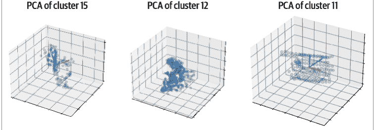

图中显示了每个簇的PCA的三个主轴。现在，让我们对结果进行定量分析。这使我们能够理解每个簇的主要方向，如果你想要进行高级分析（参见第7章），这非常有用。在进入测试阶段之前，让我们定义一个自定义PCA函数。这个自定义PCA函数接受点作为输入，但不生成绘图：

```python
def CustomPCA(points):
    m = np.mean(points, axis=0)
    cluster_norm = points-m

    cov = np.cov(cluster_norm.T)
    eig_val, eig_vec = np.linalg.eig(cov.T)

    sorted_indexes = np.argsort(eig_val)[::-1]
    eig_val = eig_val[sorted_indexes]
    eig_vec = eig_vec[:,sorted_indexes]
    return eig_val, eig_vec
```

由此，我们可以初始化空列，然后确保用特征值和特征向量填充它们：

```python
pcd['eig_1'],pcd['eig_2'],pcd['eig_3']=0,0,0
pcd['nx'],pcd['ny'],pcd['nz']=0,0,0

t1= time.time()
for i in range(len(segments)):
    cluster=segments.get_group(i)[['X','Y','Z']]
    eig_val, eig_vec = CustomPCA(cluster)
    pcd.loc[cluster.index.values,['eig_1','eig_2','eig_3']] = eig_val[0],
    eig_val[1],eig_val[2]
    pcd.loc[cluster.index.values,['nx','ny','nz']] = eig_vec[2][0],eig_vec[2][1],
    eig_vec[2][2]
t2=time.time()
print("Time to attribute features to segments ", t2-t1, " seconds")
```

一旦过程完成，数据集就可以导出了（为了更清晰的数据集呈现，我们排除了索引列）：

```python
pcd.to_csv("result_pca.xyz",float_format='%1.9f',index=False)
```

PCA对于降维非常有效，并且对于提取有用的模式很重要。它有助于识别数据集中显示出最显著差异的主要成分，使数据更容易表示和分析。PCA还可以通过降低高维点云或体素网格的复杂性来简化3D数据，使其在后续处理步骤中更容易处理。需要注意的是，无论你是将其用于特征提取、降噪还是数据可视化，PCA都能提高处理过程的质量。它还支持3D物体识别、场景理解和高级AI解决方案的成功，如第18章所述。在进入该章之前，让我们详细说明3D数据配准的过程。

## 3D数据配准：统一视角

既然我们已经研究了基于PCA的特征提取和归一化，让我们看看一般工作流程中的下一步：3D数据配准（请参考图6-1的工作流程）。我将详细说明配准基础、迭代最近点（ICP）算法的作用以及其他核心概念，如图6-16所示。

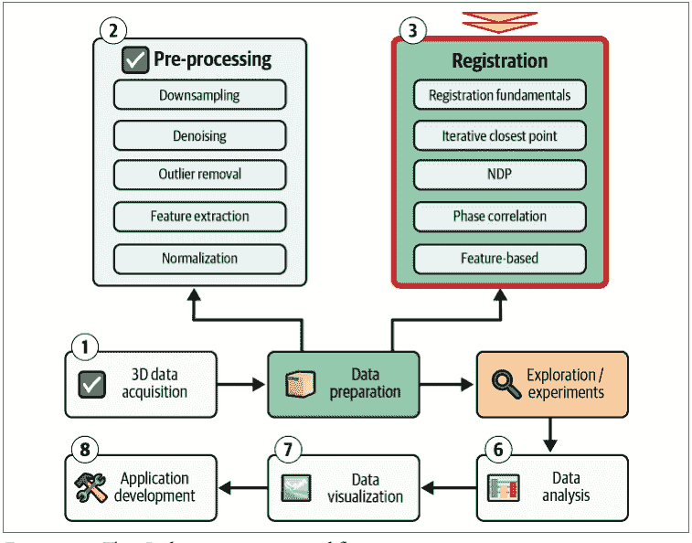

图6-16. 3D数据配准工作流程

让我们设想另一个用例。当一个装有激光雷达扫描仪的机器人在房间里移动时，它会从不同的视角捕获“数据片段”。那么，我们如何利用这些点云来构建“环境地图”并弄清楚它们之间的相对运动呢？这就引出了数据配准的挑战。

### 3D数据配准基础

很明显，即使在获取数据的最佳情况下，数据也是不完整的，有必要将其对齐到一个标准坐标系。地理参考或数据融合等应用与此相关；你可以在3D资源中心找到详细信息。在本节中，我们希望理解如何将来自不同视角的3D数据集合并到一个共同的坐标系中。在3D数据科学的背景下，有三种主要的配准策略：基于GPS或GNSS信息的定位、使用目标作为参考数据，以及无需额外信息的从粗到细配准。

在第一种方法（传感器融合）中，我们有一些位置数据可用，例如来自GNSS系统的WGS84定位信息（经度、纬度、高度），这些信息经过校准以与生成传感器相关联。在第二种方法中，我们可以使用目标或各个扫描中共享的兴趣点来对齐多个扫描。这些可以是平面目标或球形标记，它们会出现在两次扫描中，作为对齐单独扫描的信息源。

对齐两次或多次扫描的最后一种方法是不使用额外的测量信息。在这种情况下，你使用一种方法使扫描几乎循环对齐，例如使用低参数粗配准，然后进行精配准，其中可以利用匹配算法的几何知识和数据中发现的不同形状进行粗略对齐。

让我们深入探讨这些过程，直到粗配准阶段，基于识别扫描之间的共同点以获得初始变换。使用不同的方法来获取共同点，主要是点对点、线对线和面对面方法。每种方法根据数据密度和噪声都有其优缺点。让我为你提供一个最佳策略的解决方案：从粗到细的配准。

从粗到细的配准策略是一种对齐3D数据集的强大技术，尤其是在处理大型数据集或存在显著初始错位时。这涉及从粗级别到细级别逐步细化对齐。最初，使用鲁棒的特征匹配技术建立粗对齐，以识别源点云和目标点云之间的对应点。这种粗对齐提供了变换参数（如旋转和平移）的初始估计。然后，通过优化技术实现更细粒度的对齐，通过最小化对应点之间的距离来迭代地细化变换参数。这种多尺度方法是实用的，因为它能够高效处理大规模变换，同时确保在细级别上的精确对齐。接下来，让我们为这个想法开发一个Python解决方案。

### 配准初始化

首先，让我们导入一些有用的库：

```python
# 基础库
import numpy as np

# 3D库
import open3d as o3d

import copy
```

现在，我们定义将要处理的源点云和目标点云：

```python
# Load point clouds
source = o3d.io.read_point_cloud("../DATA/registration_source.ply")
target = o3d.io.read_point_cloud("../DATA/global_todo_registration_target.ply")
```

可视化两个点云时，我们可以看到它们如下所示：

```python
o3d.visualization.draw_geometries([source, target])
```

很明显，源点云和目标点云是同一环境在不同角度下的点云（见图6-17）。

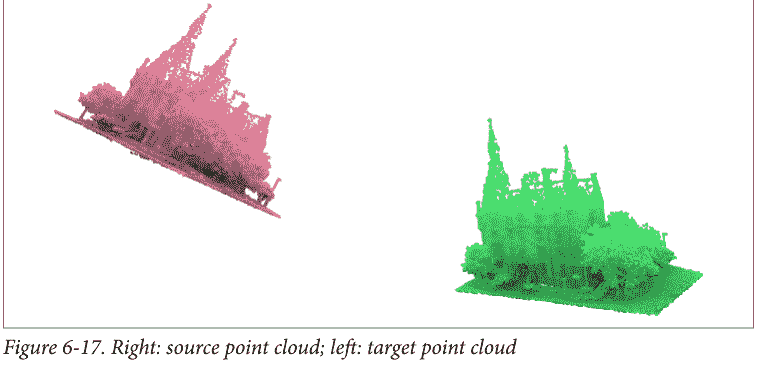

现在，让我们尝试通过首先进行全局配准步骤来对齐这些点云。

## 粗配准

在点云配准过程中，像ICP这样的常见算法不会收敛到全局误差最小值，而是收敛到局部最小值。因此，ICP配准被称为局部配准。它依赖于一个近似对齐作为初始步骤。另一类配准方法是全局配准。这些算法不依赖于对齐进行初始化。通常，它们产生的对齐结果精度较低，但有助于收敛到全局最小值，并被用作局部方法的初始步骤。让我们来看一种实现方法。首先，我们定义一个函数来为配准准备点云：

```python
def preprocess_point_cloud(pcd, voxel_size):
    pcd_down = pcd.voxel_down_sample(voxel_size)
    pcd_down.estimate_normals(o3d.geometry.KDTreeSearchParamHybrid(radius=voxel_size * 2, max_nn=30))
    return pcd_down
```

如你所见，我们正在执行两个主要操作：

- **体素下采样**
  这通过创建一个体素网格，并将每个体素内的所有点替换为其质心来减少点云中的点数。这有助于降低计算复杂度和噪声。

- **法线估计**
  这为配准过程中使用的每个点计算表面法线。

现在，让我们创建另一个函数来为全局配准准备我们的点云：

```python
def prepare_dataset(source, target, voxel_size):
    source_down = preprocess_point_cloud(source, voxel_size)
    target_down = preprocess_point_cloud(target, voxel_size)

    source_fpfh = o3d.pipelines.registration.compute_fpfh_feature(
        source_down, o3d.geometry.KDTreeSearchParamHybrid(radius=voxel_size * 5,
        max_nn=100))
    target_fpfh = o3d.pipelines.registration.compute_fpfh_feature(
        target_down, o3d.geometry.KDTreeSearchParamHybrid(radius=voxel_size * 5,
        max_nn=100))
```

该函数对源点云和目标点云都调用`preprocess_point_cloud()`，并为两个下采样后的点云计算**快速点特征直方图（FPFH）**特征。FPFH是一种描述符，它捕捉每个点周围的局部几何信息，在全局配准步骤中用于寻找两个点云之间的初始对应关系。现在，我们准备好编写全局配准函数了：

```python
def execute_global_registration(source_down, target_down, source_fpfh,
target_fpfh, voxel_size):
    distance_threshold = voxel_size * 1.5
    result = o3d.pipelines.registration.registration_ransac_based_on_feature_matching(
        source_down, target_down, source_fpfh, target_fpfh, True,
        distance_threshold,
        o3d.pipelines.registration.TransformationEstimationPointToPoint(False),
        3,
        [o3d.pipelines.registration.CorrespondenceCheckerBasedOnEdgeLength(0.9),
        o3d.pipelines.registration.CorrespondenceCheckerBasedOnDistance
        (distance_threshold)],
        o3d.pipelines.registration.RANSACConvergenceCriteria(100000, 0.999))
    return result
```

此函数使用RANSAC（随机采样一致性）算法执行全局配准。其目标是找到源点云和目标点云之间的初始对齐。以下是它的具体操作：

- 根据体素大小设置距离阈值
- 使用RANSAC（见第9章）基于FPFH特征反复采样点对应关系并估计变换
- 应用对应关系检查器来过滤掉不良匹配
- 返回将源点云对齐到目标点云的最佳变换

这一步对于找到良好的初始对齐至关重要，特别是当点云相距较远时（就像我们的情况一样）。现在，让我们设置一个用于下采样的体素大小，并使用定义的函数准备我们的数据集：

```python
# Set voxel size for downsampling
voxel_size = 1.5

# Prepare dataset
source_down, target_down, source_fpfh, target_fpfh = prepare_dataset(source,
    target, voxel_size)
```

我们现在处于源点云和目标点云没有一个重叠点的阶段。现在让我们应用全局配准：

```python
result_ransac = execute_global_registration(source_down, target_down,
    source_fpfh, target_fpfh, voxel_size)
```

接下来，我们使用两个指标来评估配准质量：

- **fitness（匹配度）**
  衡量重叠区域（内点对应数 / 目标点云中的点数）。值越高越好。

- **inlier_rmse（内点均方根误差）**
  衡量所有内点对应关系的均方根误差。值越低，配准结果越好。

```python
print("Global registration result:")
print(result_ransac)
```

我们得到一个匹配度分数为0.9984，内点均方根误差为0.8278517（对应集大小为4444个点）。对于初步尝试来说，这听起来是合理的。现在，让我们打印变换矩阵和结果：

```python
print("Transformation matrix:")
print(result_ransac.transformation)

# Visualize
source_global = copy.deepcopy(source)
source_global.transform(result_ransac.transformation)

o3d.visualization.draw_geometries([source_global, target])
```

你可以在图6-18中看到结果。

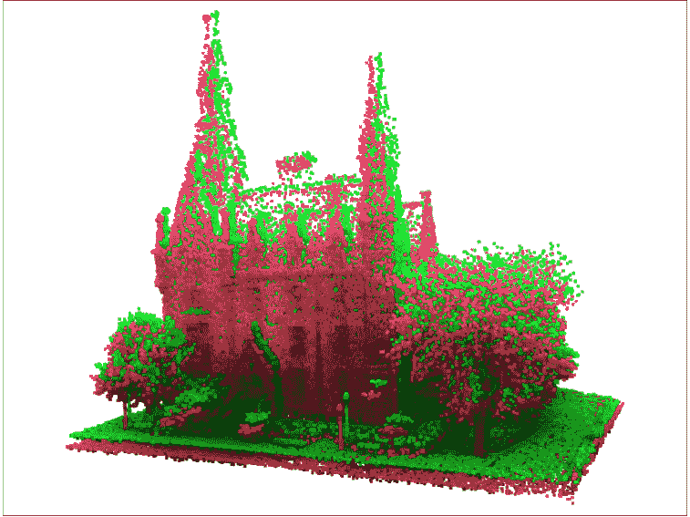

图6-18. 点云全局配准

现在，提高匹配度分数并微调配准过程将是很有趣的。让我们使用一种局部配准方法——ICP，来优化我们的结果。

## 迭代最近点

ICP方法是一种基础技术，广泛用于优化点云对齐，因为迭代优化将所有点对放置在它们的最近点上。它用于最小化两个点云之间的差异。利用这种策略，我们可以在两组点云中识别最近点，并利用这些信息建立最优变换。

这是通过确定给定点云的最近对应点，并求解一个优化方程来实现的，使得源点云（或点云）中的每个点在目标点云中尽可能准确地反映出来。这个过程会迭代重复，直到达到可接受的配准优化水平。ICP的通用性和有效性使其在配准技术中占据前沿地位，其实际性也是如此：它几乎可以在任何情况下使用。如前所述，在ICP配准过程中，其中一个点云被保持为参考（源），而另一个（目标）被变换以大致将点云（源）对齐到目标点云。

输出是一个精细的变换，使两个点云紧密对齐。ICP有两种变体：点到点ICP和点到平面ICP。它们在概念上相似。主要区别在于代价函数。与点到点ICP（我们为所有点在另一个点云中寻找最近点，然后尝试最小化它们之间的平方距离）不同，在点到平面ICP中，我们额外考虑了法线信息。

我们通过计算目标点云上的表面法线，投影误差向量，并取其与源点云和目标点云上点之间欧几里得距离的点积来实现：

代价函数 = min Σ ||y_n - x_n||^2
点到点
↓
代价函数 = min Σ (||y_n - x_n|| · n_y)^2
点到平面

如第二个方程所示，代价函数的唯一修改是增加了目标点云数据中法线向量（表示为n_y）的点积，其中y_n是目标点云数据中的目标点，x_n是源点云数据中的源点。

## 精配准：ICP

我们从这样一个阶段开始：我们有两个点云，以及一个导致相当好拟合的变换初始化。现在是时候通过ICP优化来迭代地精炼它了。让我们为此目标定义一个函数：

```python
def refine_registration(source, target, result_ransac, voxel_size):
    distance_threshold = voxel_size * 0.4
    result = o3d.pipelines.registration.registration_icp(
        source, target, distance_threshold, result_ransac.transformation,
        o3d.pipelines.registration.TransformationEstimationPointToPlane())
    return result
```

此函数使用ICP算法精炼从全局配准获得的初始对齐。它执行以下步骤：

- 为点匹配设置更精细的距离阈值
- 使用全局配准的变换初始化ICP

## 总结

我们探讨了三维点云数据工程的基础知识，特别聚焦于点云特征提取。我们了解了如何优化数据以实现功能目标、满足需求，并使下游流程更加稳健。我还通过一个分步实践示例，展示了如何将预处理技术应用于点云数据集，随后进行特征提取。这些预处理技术包括初始偏移、降采样、离群点去除和法线估计。通过应用这些技术，我们可以在提取有意义信息的同时提升三维数据集的质量。现在，您应该能够熟练运用三维点云数据工程来提升下游任务（如分类、目标检测和场景理解）的性能。

本章至关重要，因为特征是任何后续工作流的一部分，理解其含义能带来极高的计算优势。因此，请确保您有一个直接的项目来检验自己：创建一个利用三维点云特征的三维分析应用。

## 实践项目

从点云中提取特征对于许多三维数据科学任务至关重要。我们需要一种方法使数据对下游处理更有用。本练习将指导您使用主成分分析（PCA）提取几何特征。然后，我们将可视化结果，以了解PCA如何帮助我们理解点云的结构：

- 1. *数据获取*：您需要一个点云数据集来完成此练习。选择一个能代表您通常处理的数据类型的数据集。例如，如果您对城市分析感兴趣，可以使用一个城市的点云。
- 2. *准备环境*：确保您已安装必要的库：NumPy、pandas和Matplotlib。在脚本开头导入它们。
- 3. *加载数据*：使用pandas库加载您的点云数据集。这将创建一个DataFrame，便于操作和分析数据。
- 4. *数据归一化*：归一化点云的x、y和z坐标。这确保所有特征对PCA计算的贡献相等。
- 5. *执行PCA*：计算归一化点云数据的协方差矩阵的特征向量和特征值。按特征值降序对特征向量进行排序。
- 6. *可视化结果*：创建点云数据的三维散点图。在同一图上绘制特征向量，并按其特征值进行缩放。这将直观地显示数据的主轴。

观察主轴如何与点云中的主要方差方向对齐。第一主轴代表最大方差的方向，第二主轴代表次大方差的方向，依此类推。

# 第7章
## 构建三维分析应用

我们不断寻求将原始三维数据转化为可操作见解的方法。虽然传统分析方法提供了有价值的信息，但它们往往缺乏深入数据探索所需的灵活性和交互性。静态可视化和手动数据操作阻碍了您有效分割、标记和从复杂三维数据集中提取知识的能力。您需要动态工具来实时可视化和操作特征。

想象一下分析一个旧工厂的点云，目标是隔离特定机械并理解其空间背景。传统方法可能涉及繁琐的手动分割或脚本编写，限制了我们快速探索不同特征组合和阈值的能力。我们需要一个交互式应用来可视化平面度、线性度和高程差等特征。这将能够定义阈值，并根据实时反馈来构建我们的数据集。

本章的目标是设计这样一种交互式阈值方法，使我们能够直接在应用中根据指定的阈值选择性地提取片段。这项工作服务于两个主要目标：首先，建立一个标记三维数据的工作流；其次，利用三维机器学习的力量来开发AI模型。图7-1展示了这一工作流。

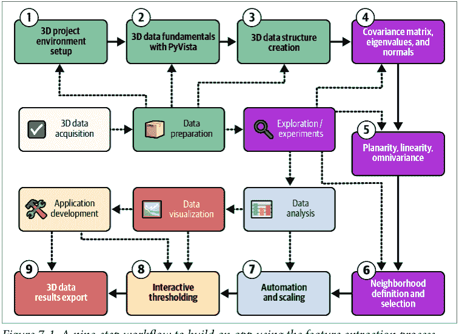

图7-1. 使用特征提取过程构建应用的九步工作流

我们首先收集数据集，然后设置Python环境。接下来，我们探索三维数据输入和输出的基础知识，主要关注PyVista库。从那里，我们进入更具实验性的阶段。这包括预处理和组织数据，包括定义用于计算特征（如主成分）的三维数据结构。我们的第二阶段专注于自动化、可视化、准备和分割。

本章提供了一个构建交互式三维分析应用的实用指南，用于点云特征。我们将利用三个Python库的强大功能：PyVista（用于三维可视化和交互，进行三维点云和网格分析）、SciPy（用于科学计算和技术计算；特别是KDTree模块用于三维空间中的高效最近邻搜索）和NumPy。您可以在三维数据科学资源中心找到本章的所有材料。您可以使用基础链接并添加“/chapter-X”来访问文件（代码、数据集、文章）和资源。请注意，您可能需要提供电子邮件地址、个人密码或证明您是本书所有者。

## 3D 项目环境准备

为任何成功的 3D 数据科学项目奠定基础至关重要。让我们退一步，确保我们拥有所有必要的工具。我将指导你设置一个专门为 3D 数据科学任务量身定制的 Python 环境，选择 Spyder 作为集成开发环境（IDE）以简化你的工作流程，并分享合适的 3D 数据集来练习你的技能（参见图 7-2）。

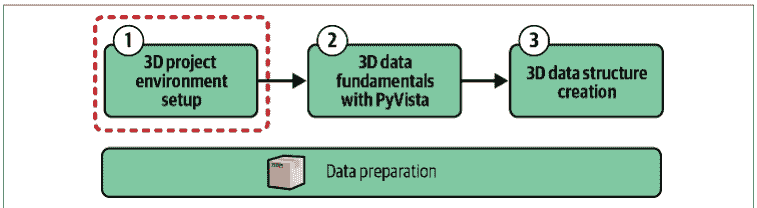

图 7-2. 准备 3D 项目环境

## 收集数据集

在深入编码方面之前，我们的第一步涉及数据收集。如今，这个过程相当简单。你只需访问 [3D 数据科学资源中心](https://example.com) 并导航到第 7 章文件夹，你就会发现一个来自比利时一家旧羊毛工厂的有趣数据集。仔细检查该数据集后，你会发现它是一个详细的点云，展示了曾经用于羊毛加工的各种古老机械。

我们针对这个特定点云的目标是雄心勃勃的；我们旨在承担众多任务。然而，为了有效地操作和分析这些数据，我们必须首先识别并提取某些特征。这些特征将有助于区分我们希望在该数据集中定位的地面、墙壁和机械（参见图 7-3）。获取数据集后，你的下一步是在你的数据文件夹中组织它。

> 我为这个项目遵循一个简单的组织结构。在数据文件夹内，我有三个子文件夹，即 code、data 和 results，它们都位于同一层级。在我的设置中，数据集位于 code 文件夹中。

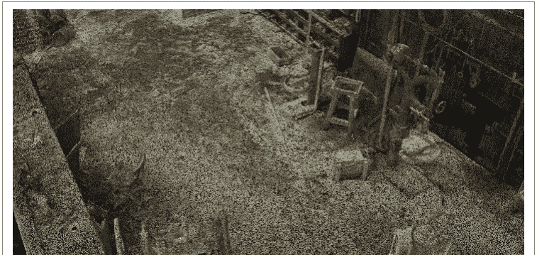

图 7-3. 3D 点云数据集摘录

## Python 和环境设置

让我们继续设置 Python 环境的初始阶段。在本章中，我们将略过设置环境的详细步骤（详见第 3 章）。我建议需要更深入解释的读者查看前面的章节。假设你的环境已准备就绪，下一步涉及为我们的项目安装一些必要的库。这些库包括 NumPy、SciPy 和 PyVista，它们对于 3D 可视化任务特别有用。仅这三个库就是执行复杂特征提取的强大工具。安装这些库很简单，使用 pip 命令：

```
pip install numpy scipy pyvista
```

设置好环境并安装这些库后，你可以安装并启动你的 IDE（对于本章，我使用 Spyder：`pip install spyder`）。

现在，让我们导入项目所需的库。我们导入 NumPy（为方便起见，别名为 np），导入 time 库以跟踪操作持续时间，并从 SciPy 中，我们专门导入 KDTree 模块以满足空间数据结构需求。最后，我们导入 PyVista（别名为 pv），这是一个在处理 3D 可视化方面将发挥重要作用的库：

```python
#%% 1. Python Environment and Library setup

# Base libraries
import numpy as np
import time

# [OPTIONAL] Project Module
from scipy.spatial import KDTree

# 3D library
import pyvista as pv
```

这些导入为我们的 Python 环境和库设置奠定了基础。在执行这些导入之前，请确保工作目录已正确设置。完成设置后，我们准备进入下一步：加载数据并探索使用 PyVista 处理此类数据的基础知识。

## 使用 PyVista 的 3D 数据基础

让我们深入探讨使用 PyVista 处理和可视化点云数据（参见图 7-4）。最初，我们需要使用 PyVista 的 read 函数将数据加载到名为 PCD_PV 的变量中。具体操作如下：

```python
pcd_pv = pv.read('../DATA/structure_verviers.ply')
```

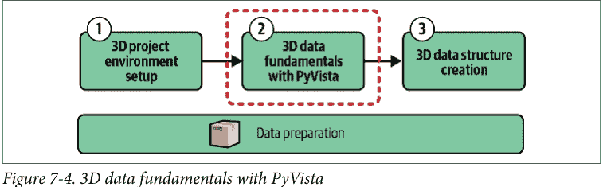

加载数据后，将其可视化以更好地理解其结构是有益的。我们可以使用增强的可视化选项（如眼穹顶照明）快速绘制加载的点云：

```python
#Plot quickly with EDL on
pcd_pv.plot(eye_dome_lighting=True, rgb=True)
```

执行此代码后，会打开一个窗口，利用 PyVista 的渲染能力，为我们提供点云的交互式 3D 视图（参见图 7-5）。

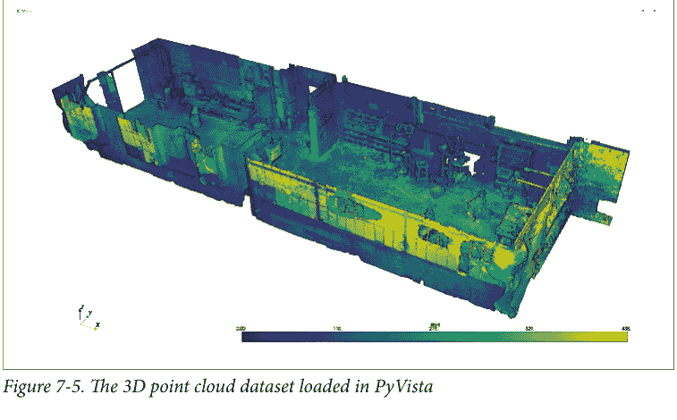

接下来，我们深入研究 PCD_PV 变量的结构，该变量属于 PolyData 类型。这种格式特别适合处理像点云这样的 3D 数据。为了更深入地了解数据及其结构，我们可以打印或检查 PCD_PV 以查看其属性，包括点（顶点）的数量和其他元数据。PolyData 的优势在于其灵活性和它支持的全面操作集，使其成为 3D 数据操作的绝佳选择。

为了进一步探索 PyVista 的功能，我们可以向点云添加自定义数据。例如，我们可能希望可视化高程或基于点坐标创建一个随机变量。这在 PyVista 中很简单：

```python
# Storing in variable for pyvista
pcd_pv['elevation'] = pcd_pv.points[:,2]
pcd_pv['random'] = pcd_pv.points[:,0] * pcd_pv.points[:,1]
```

这里，elevation 直接从点的 z 轴坐标派生，而 random 是通过对 x 和 y 坐标进行简单操作创建的自定义变量。

为了获得更引人入胜的可视化效果，我们可以将点渲染为球体，而不是默认的点表示。这使数据更具实体感，特别是在突出显示特定特征或变量（如我们的随机变量）时。我们通过再次调用 pv.plot 来实现这一点，参数设置为将点渲染为球体，并根据随机变量映射颜色，同时省略标量条以获得更清晰的视图：

```python
# Render as spheres
pv.plot(pcd_pv, scalars = pcd_pv['random'], render_points_as_spheres=True,
point_size=5, show_scalar_bar=False)
```

此命令改变了我们的点云可视化，通过应用自定义颜色映射和改变点表示，提供了一个新的视角。它展示了 PyVista 在自定义 3D 数据可视化方面的多功能性，使其成为数据探索和展示的宝贵工具（参见图 7-6）。

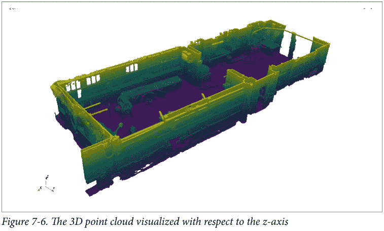

让我们将重点转移到预处理和构建 3D 数据以进行进一步分析。我们探索使用 KDTree 来实现这一目的，强调 PyVista 在为复杂计算任务或分析准备数据方面的实用性。

## 3D 数据结构创建（KDTree）

接下来，我们将探讨 3D 数据结构创建（参见图 7-7）。到现在，你应该对 k-d 树有了相当好的理解（参见第 4 章）。如果你碰巧在打开书时看到这些内容，那么，k-d 树结构允许我们快速遍历其层次结构，显著减少搜索空间和时间。我们已经使用 Open3D 和 SciPy 库在 Python 中实际应用了这个概念。

让我们考虑使用 PyVista 库的另一个实现，它简化了 3D 数据操作和可视化。使用 PyVista 查找给定点的 20 个最近点的示例代码片段可能如下所示：

```python
temp = pcd_pv.find_closest_point((1, 1, 0), n = 20)
print(temp)
```

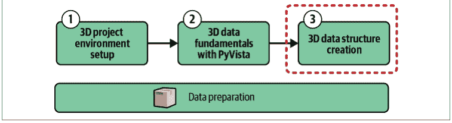

PyVista 的一个重大限制是它一次只能处理一个点。为了说明这一点，考虑我定义一个临时变量来使用 PyVista 的 `find_closest_point` 函数的场景。通过指定坐标 (1, 1, 0)，我请求 20 个最近点：

```
[1584544 1584611 1688219 1584564 1688248 1360375 1688402 1539639 1584601
 1447384 1446717 1584145 1688177 1360343 1539641 1688409 1688254 1584613
 1584259 1688374]
```

执行此操作后，输出是一个点索引数组，提供了一种识别和进一步利用这些点的宝贵方法。然而，当处理大型数据集（例如包含 500,000 个点的点云）时，由于需要逐个迭代每个点，这种方法的效率会显著下降。

为了克服这一点，推荐的方法是为整个点云构建一个 *k*-d 树。这个过程从创建一个树对象开始，为简单起见，幽默地命名为 tree。该对象使用 `KDTree` 函数初始化，并应用于感兴趣的数据集 `pcd_pv.points`，有效地为使用准备树结构：

```python
# Build a k-d tree for each point cloud
tree = KDTree(pcd_pv.points)
```

接下来，目标是查询树中云中的每个点：

```python
t0 = time.time()

# Find nearest neighbors for each point in the point cloud
lists, indices = tree.query(pcd_pv.points, k=20)

# Get the neighbor points for each point
```

## 协方差矩阵、特征值与特征向量

现在，让我们聚焦于协方差矩阵、特征值和法向量，如图7-8所示。对于数据集中的每个点，我们已经确定了其邻近点。接下来，我们将选择一个特定的邻居进行更仔细的检查，这里我们任意选择选择器为1。我们创建一个名为`PCA_of_the_cloud`的函数，该函数封装了我们在第6章中描述的PCA计算。这个函数将接受一个选择器作为参数，使我们能够有选择性地应用我们的分析。

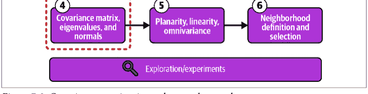

为此，我提取了前面代码中与特征值和特征向量排序相关的核心部分。让我们测试这个函数，并验证其是否能有效产生预期的结果。以下是对点云数据进行PCA计算的初始设置：

```
X = pcd_pv.points

# Compute the mean of the data
mean = np.mean(X, axis=0)

# Center the data by subtracting the mean
centered_data = X - mean

# Compute the covariance matrix
cov_matrix = np.cov(centered_data, rowvar=False)

# Get the eigenvalues and eigenvectors
eigen_values, eigen_vectors = np.linalg.eig(cov_matrix)

# Sort the eigenvectors by decreasing eigenvalues
sorted_index = np.argsort(eigen_values)[::-1]
sorted_eigenvalue = eigen_values[sorted_index]
sorted_eigenvectors = eigen_vectors[:, sorted_index]

print(' sorted_index: ', sorted_index, '\n sorted_eigenvalue: ',
sorted_eigenvalue, '\n sorted_eigenvectors: \n', sorted_eigenvectors)
```

执行此代码段后，确认成功识别了特征值和特征向量，表明我们为所选邻居选择的功能是正确的。

接下来，我们旨在通过PCA从数据中进一步提炼出独特的特征，从而计算出更多的特征。我们按如下步骤进行：

```
sel = 2

def PCA(cloud):
    mean = np.mean(cloud, axis=0)
    centered_data = cloud - mean
    cov_matrix = np.cov(centered_data, rowvar=False)
    eigen_values, eigen_vectors = np.linalg.eig(cov_matrix)
    sorted_index = np.argsort(eigen_values)[::-1]
    sorted_eigenvalue = eigen_values[sorted_index]
    sorted_eigenvectors = eigen_vectors[:, sorted_index]
    return sorted_eigenvalue, sorted_eigenvectors
#Single unit test
f_val, f_vec = PCA(neighbors[sel])

print(' sorted_eigenvalue: ', f_val, '\n sorted_eigenvectors: \n', f_vec)
```

这一步将我们的PCA函数精确地应用于一个新的选择，进一步说明了基于PCA提取细微特征的过程，并加强了我们识别和分析点云数据中特定特征的能力。我们现在可以利用PCA来提取更多独特的特征。

## 平面性、线性、全向方差、垂直度、法向量

在我们应用构建工作流的这一步，我们将深入探讨四个独特的指标，以及均值向量，以评估我们数据集的各个方面：平面性、线性、全向方差和垂直度（见图7-9）。

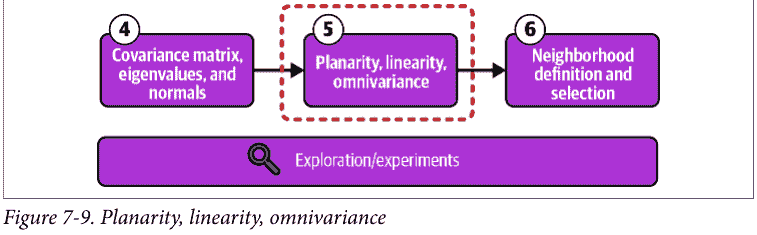

这些特征提供了关于某个区域是否呈现平面特征、线性结构（如杆状物）、在一致方向上的方差或垂直方向的见解。这些概念源自学术研究，特别是Martin Weinmann等人的一篇论文，该论文全面阐述了这些特征。此外，我专注于体素表示与深度学习方法的研究，进一步探讨了这些特征的分布和重要性，强调了它们在此时的相关性。对于那些渴望扩展理解的人，建议深入研究文献中讨论的其他特征，因为它丰富了对这些分析工具的理解和应用。

在本节中，我们引入一个名为`PCA_featuring`的函数，该函数处理特征值和特征向量以计算上述指标。例如，平面性的公式直接源自学术文献，说明了我们方法的理论基础。以下是在我们的函数中计算这些特征的方式：

```
def PCA_featuring(val, vec):
    planarity = (val[1] - val[2]) / val[0]
    linearity = (val[0] - val[1]) / val[0]
    omnivariance = (val[0] * val[1] * val[2]) ** (1/3)
    _, _, normal = vec
    verticality = 1 - normal[2]
    return planarity, linearity, omnivariance, verticality, normal[0], normal[1], normal[2]
```

为了验证函数的有效性，我们进行测试并检查输出，输出以结构化的方式显示了计算出的特征：

```
#test
p, l, o, v, nx, ny, nz = PCA_featuring(f_val, f_vec)
print('', p, '\n', l, '\n', o, '\n', v, '\n', nx, '\n', ny, '\n', nz)
```

此测试的成功执行是一个重要的里程碑，展示了我们识别数据集中复杂特征的能力。然而，这一成就的全部意义可能尚未完全显现。让我们将理解集中在基于特征的邻域定义上，旨在进一步完善我们的分析能力。

## 邻域定义与选择

邻域的概念是三维数据处理的基础，因为它定义了数据集中点之间的空间关系（见图7-10）。通过考虑点之间的接近程度，我们可以执行各种操作，例如降噪、特征提取和表面重建。邻域策略和尺度的选择显著影响这些操作的结果。较小的邻域大小可以捕捉细粒度的细节，而较大的邻域可以识别更大尺度的结构。例如，在点云去噪中，较小的邻域可以移除孤立的点，而较大的邻域可以填补缺失的数据。通过仔细选择合适的邻域策略和尺度，我们可以有效地从三维数据中提取有意义的信息。

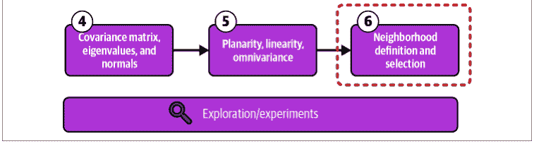

让我们首先讨论*k*-近邻搜索。我强调了采用特定策略进行高效搜索的重要性。例如，尝试执行如下所示的*k*-近邻搜索，并改变邻居的数量：

```
tree_temp = KDTree(pcd_pv.points)
t0 = time.time()
_, idx_temp = tree_temp.query(pcd_pv.points, k=20)
t1 = time.time()
print(f"KNN Search Computation in {t1-t0} seconds")
```

接下来，让我们探索半径搜索。这种技术与前一种类似，但您定义的是搜索半径，而不是指定最近邻的数量。这里，我们使用1米的半径。与返回距离的*k*-近邻搜索不同，半径搜索提供的是索引列表：

```
t0 = time.time()
tree_temp = KDTree(pcd_pv.points)
idx_temp = tree_temp.query_ball_point(pcd_pv.points, 1)
t1 = time.time()
print(f"Radius Search Computation in {t1-t0} seconds")
```

标准搜索耗时15秒，略长于*k*-d树搜索，但仍在可接受范围内。让我们深入探讨一种混合搜索，这是一种自定义的、知识驱动的方法。在这种方法中，我通过从数据集中省略z值构建了一个二维树。这种方法特别擅长处理自上而下的激光雷达数据，允许更有效地检测局部最大值和最小值。请准备好等待更长的时间，大约2分钟，此过程才能完成：

```
t0 = time.time()
tree_2D = KDTree(pcd_pv.points[:,0:2])
idx_2D_rad = tree_2D.query_ball_point(pcd_pv.points[:,0:2], 1)
t1 = time.time()
print(f"Knowledge Driven Custom Search Computation in {t1-t0} seconds")
```

对于下一部分，我们将专注于相对于感兴趣点的特征提取：

```
t0 = time.time()
sel = 1
selection = pcd_pv.points[idx_2D_rad[sel]]

d_high = np.array(np.max(selection, axis = 0) - pcd_pv.points[sel])[2]
d_low = np.array(pcd_pv.points[sel] - np.min(selection, axis = 0))[2]
```

此代码段计算了所选点到其邻域最高点和最低点的垂直距离。结果值表明该点距离地面有多近，以及距离最高障碍物有多远，为地形建模或物体检测等应用提供了宝贵的见解。

现在，让我们讨论自动化、扩展、可视化、交互、准备、导出和结果分割。在此时，至关重要的是要认识到所需的最小库依赖性，以及利用PyVista结合*k*-d树和PCA进行特征提取的有效性。

## 自动化与扩展

为了简化整个流程，我们将以自动化为理念进行操作（参见图7-11）。让我们建立一个特征矩阵，以便简化整个数据集。这里有一个巧妙的技巧，可以减少对众多库的需求。虽然使用pandas可以轻松实现，但我想演示如何使用NumPy的结构化数组：

```python
dt = {'names':['planarity', 'linearity', 'omnivariance', 'verticality', 'nx',
'NY', 'nz', 'd_high', 'd_low'], 'formats':[float, float, float, float, float,
float, float, float, float]}

features = np.empty(len(pcd_pv.points), dtype=dt)
features[:] = np.nan
```

我们构建一个名为`dt`的字典，包含`names`和`formats`。每个格式都设置为`float`，对应于我们特征的名称：平面度、线性度、全方差、垂直度、x、y和z，以及最高点和最低点，共计九个从点云派生的特征。接下来，我们初始化一个空的NumPy数组，其长度为点的数量，数据类型为`dt`，准备所有列并初始化它们。然后，将所有特征设置为NaN值，表示“非数字”。检查特征会发现平面度、线性度等。这里的一个显著优势是能够通过名称而非索引来引用特征，确保特征选择的准确性。现在，让我们循环并自动化特征计算：

```python
pts_number = len(pcd_pv.points)

t0 = time.time()
for idx in range(pts_number):
    f_val, f_vec = PCA(neighbors[idx])
    features['planarity'][idx], features['linearity'][idx],
    features['omnivariance'][idx], features['verticality'][idx],
    features['next'][idx], features['ny'][idx],
    features['nz'][idx] = PCA_featuring(f_val, f_vec)
    if len(idx_2D_rad[idx])>2:
        selection = pcd_pv.points[idx_2D_rad[idx]]
        features['d_high'][idx] = np.array(np.max(selection, axis = 0)) -
        pcd_pv.points[idx][2]
        features['d_low'][idx] = np.array(pcd_pv.points[idx] -
        np.min(selection, axis = 0))[2]
t1 = time.time()

print(f"Full Point Cloud Feature Computation in {t1-t0} seconds")
```

在我们的循环中，我们对过程进行计时。对于每个索引，直到总点数，我们使用先前定义的PCA来获取值和向量。然后将这些输入到我们的特征计算函数中，确保特征数组相应地被填充。我们计算具有两个以上邻居的点的最高和最低特征值。该过程大约需要2分钟来执行。完成后，我们使用PyVista进行快速可视化，并且可以在特征（'d_high'、'planarity'、'verticality'、'omnivariance'）之间切换。每个特征都揭示了特定的细节，例如，提供区分树木或评估地形平坦度的见解：

```python
pv.plot(pcd_pv, scalars = features['planarity'], render_points_as_spheres=True,
point_size=5, show_scalar_bar=False)
```

有趣的是，地形大部分是平坦的。墙壁的外观可能因观察点而异，尽管存在一些噪声（参见图7-12）。

这表明我们的方法可能需要调整，例如用于基于PCA特征的邻居数量，仅使用20可能不是最优的。基于半径的搜索可能会产生更好的结果。关于垂直度的讨论揭示了它可能与平面度重叠或提供细微的区别。然而，垂直度能唯一地识别地面点，为隔离地面数据提供了宝贵的工具。布尔条件可以细化可视化，在数据集中突出显示重要的点。这暗示了使用PyVista的能力来应用阈值。

## 交互式阈值处理

阈值处理涉及根据预定义的强度阈值将特征分类为前景和背景类别。它可以应用于分割3D点云或体素网格中的对象或感兴趣区域。通过设置适当的阈值，我们可以隔离特定特征或分离不同的材料（参见图7-13）。

此功能通过直方图阈值处理实现特征的分割和提取，提供了一种复杂的方法来分析和解释计算出的特征。首先，将我们的特征嵌入到`pcd_pv`变量中，并为它们分配描述性名称至关重要。

我们需要一种独特的方法来可视化和交互特征；我们可以配置一个绘图器对象`pv.Plotter()`，然后添加一个交互式阈值处理工具以进行全面可视化。要处理的特征称为`pcd_pv`，即我们的变量，后跟感兴趣的标量，例如`d_high`或`d_low`；然后我们分配一个标题并执行`show`命令：

```python
# Using the scalars
pcd_pv['d_high'] = features['d_high']
pcd_pv['d_low'] = features['d_low']
pcd_pv['verticality'] = features['verticality']

# Set up a plotter
p = pv.Plotter()

# Add the interactive thresholding tool and show everything
p.add_mesh_threshold(pcd_pv, scalars = 'verticality',
    title = 'Verticality Pointer (%)', all_scalars = True,
    render_points_as_spheres=True, point_size=7)
p.show()
```

此设置允许我们设计一个交互式3D查看器，能够根据与最高点的距离过滤数据（参见图7-14）。

图7-14. 交互式阈值处理应用

此方法对于过滤所需点非常有利。例如，将其应用于低点可以快速消除地面点。潜在的应用，如数据标注或分割，是直接且简单的。

如果您想要另一个有价值的技巧，可以使用交互式选择和阈值处理后的持久性进行进一步交互。这是通过复制初始步骤但包含一条关键行以启用场景拾取来实现的。执行此操作后，可以在管道中执行阈值处理过程以消除不需要的点：消除点，然后处理剩余的点，直到达到满意的结果：

```python
selection = p.picked_mesh
pcd_pv['planarity'] = features['planarity']

p2 = pv.Plotter()

# Add the interactive thresholding tool and show everything
p2.add_mesh_threshold(selection, scalars ='planarity', title = 'planarity (%)',
all_scalars = True, render_points_as_spheres=True, point_size=7)

# p2.enable_mesh_picking(selection)
p2.show()
```

选择后，按P键会将剩余点捕获到一个对象中，创建一个用于未来探索的残余。这个最终拾取的对象存储在`selection`中，允许进一步操作，例如导出选择以进行额外分析或使用。

## 3D数据结果导出

让我们通过3D数据导出来检索结果（参见图7-15）。最初，我们使用变量`selection_path`将选择输出的路径指定为*segmentation_live.obj*。接下来，我们使用交互式会话中先前拾取的网格，启动一个新的绘图器实例来显示并将我们的选择网格导出到指定路径。此过程旨在高效处理非结构化网格格式：

```python
selection_path = '../RESULTS/segmentation_live.obj'

selection = p.picked_mesh
pl = pv.Plotter()
_ = pl.add_mesh(selection)
pl.export_obj(selection_path)
```

尽管导出格式是*.obj*而非*.ply*，但关键的要点是我们成功地隔离了所需部分，没有地面或不必要的部分，展示了我们方法的效率。

像平面度和线性度这样的标量场带来了新的见解，例如精确的杆状物识别。全方差需要轻微调整以突出其价值，展示了它在区分均匀区域与异常区域（如树木）方面的实用性。垂直度，其高低之间的区别，提供了另一个分析视角。此特征有助于快速标注数据集，使用平面度或垂直度与高程数据一起有效地分离地面点。这种方法，结合高低值的区别，允许快速提取各种元素，您现在可以在应用程序中使用它们。

## 总结

我们通过一个完整的流程，使用Python从三维点云数据中提取特征。我们重点介绍了开源库PyVista，并强调了理解主成分分析（PCA）和*k*-d树等基本概念对于高效数据分析的重要性。这些概念与交互式阈值法以及衍生特征相结合，有助于将数据集更好地组织成功能实体，这是三维场景理解的第一步。那么，这里的关键要点是什么？

-   处理大型点云数据集时，高效的空间搜索至关重要。使用*k*-d树尤其有益。
-   使用PCA进行特征提取在从点云数据中提取有意义特征方面起着核心作用。通过分析协方差矩阵的特征向量和特征值，可以量化平面度、线性度和垂直度等特征。
-   邻域定义的选择对提取的特征有显著影响。
-   可视化提取的特征对于理解其在点云中的空间分布和关系至关重要。PyVista在这方面非常有帮助。
-   交互式阈值法是一种基于特定特征值对点云数据进行分割的有价值的技术。该方法允许实时探索和隔离符合定义标准的点，便于数据标注或对象提取。

我认为本章不需要补充练习，因为它主要是实践性的。如果你已经能够理解并复现实验，让我们进入下一阶段：三维数据分析。

# 第8章

## 三维数据分析

你有多久没有分析过眼前所见之物了？如果你的答案是从不，那么好消息：你是少数保持理智的人之一。但我忍不住想：我脚下的地板是完全水平的吗？我现在工作的房间有多大？有足够的空间放一个新的BESTÅ橱柜吗？

这些都是几乎不可能准确回答的简单问题。但我有个好消息：我们可以通过三维数据科学来利用分析所见之物的能力。

嗯，三维数据分析是几乎所有三维数据科学方面的核心阶段。我的意思是，这本身不是一个处理模块，而更像是一个关于我们应如何应对挑战和寻找解决方案的全局框架。因此，很难分离出核心组成部分。公平地说，这就像试图仅用几个要点来讲述一个引人入胜的故事。

三维数据分析深深植根于预处理方法、分割工作流和数据建模。假设你想研究一辆汽车的空气动力学。这个目标很可能会让你经历一个包含多个组件的三维分析工作流。它可能从捕捉车辆状态（作为三维点云）开始，进行预处理以消除异常值，然后分割原始数据以仅保留与研究相关的点，对其外表面进行建模，同时细化三维“网格”以紧密拟合数据点。最后，我们根据设计好的三维汽车模型监控偏差。这将允许执行气流空气动力学模拟，从而建立一个可靠的分析基础，以便采取行动（即改进汽车或设计）。

这个汽车例子支持了三维数据分析是三维数据科学模块组合结果的观点。它是一个多方面的学科，结合了统计、几何和视觉分析技术，以促进沟通和数据理解。它延伸到许多工作流。只要空间信息发挥作用，就有三维数据分析的应用。

在本章中，我将提供用于操作三维分析的工具和启发性案例。目的是从三维模型（如点云、体素、网格或第4章中提到的任何三维数据表示）中提取知识和见解。为此，理解并开发一套我们可以利用来服务于这些目的的分析工具是有意义的：提取见解、呈现可视化效果以及高效沟通。为此，我们首先全面了解三维数据分析，然后深入探讨使用三维分析工具，最后是三维诊断工具（见图8-1）。

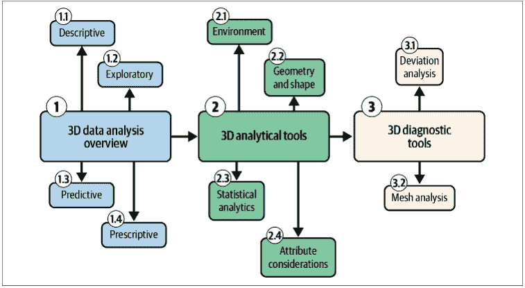

图8-1. 三维数据分析类别的完整概述


你可以在三维数据科学资源中心找到本章的所有材料，包括资产和库列表。要访问文件（代码、数据集、文章）和资源，你可能需要提供电子邮件地址、个人密码或证明你是本书所有者的凭证。

## 三维数据分析的类型

三维数据提供了比二维模态丰富得多的基础信息层。这一点至关重要，尤其是在工程、城市规划或其他必须基于准确数据做出决策的应用中。让我们讨论分析任务如何从三维数据集中受益。

在科学研究中，使用分子的三维模型可以更好地理解蛋白质折叠。事实上，通过直接研究其拓扑结构、几何形状和组成关系，你能够分析其组织模式。如果我们使用二维经典见解，我们将被锁定在更抽象的东西上。

我喜欢的另一个例子是体育分析。以一场足球比赛为例，作为一名分析师，你将研究球员在比赛中的移动和模式，并制定策略。虽然使用二维投影来解释分析结果是高效的，但在其基础三维重建上工作和分析数据，可以成倍地提高提取相关要点的能力。事实上，那些无法在二维模态上排序或简化为单一上下文的见解、信息和模式，现在可以从广泛的空间上下文分析中受益，包括研究空中策略的能力。即使在单个球员层面，分解特定动作（如用三维互补视角击球）的能力，也允许分析肌肉激活、射门角度、手臂间距等等。

你可能对前面例子中的一个关键概念感到好奇：空间认知。三维数据分析对于理解空间关系至关重要，并有助于理解环境。通过传统的二维分析，我们经常忽略数据的特定空间位置和方向。通过使用三维分析，我们弥合了这一差距，这使我们能够理解在办公室环境中，附近的一把椅子如何与一张桌子隐式关联。那么，在我让你头疼之前，让我解释一下你如何进行三维数据分析。你的分析主要用于四个主要领域：三维描述性分析、三维探索性分析、三维预测性分析和三维规范性分析（见图8-2）。

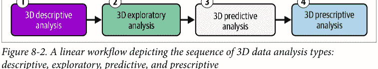

## 三维描述性数据分析

在三维描述性数据分析（DDA）类别中，我们的目标是研究隐藏的模式、关系和潜在的异常值。其真正目的是评估数据基准，并提供必要的摘要，以便清晰地查看新知识/决策的来源。它通常依赖于定量和定性分析步骤，以评估数据点与特征之间的潜在关系，或可能需要推送到预处理解决方案中的异常情况。

DDA通常在数据收集之后进行，旨在为一些更高层次的目标准备数据。我们探索结构，识别缺失值，理解分布，确定变量之间的相关性，并生成关键的摘要统计信息。

我们通常在数据清洗和预处理之前利用DDA。事实上，它可以指导这些步骤来解决不一致性、缺失值、异常值以及任何涉及插补技术（填充缺失值、通过缩放到联合范围来规范化数据以及异常值移除）的问题。DDA还有助于设计特征工程方法，以创建和编码新的特征变量。


三维描述性数据分析是三维数据科学系统中的一个核心环节。在“三维数据分析工具”部分，我们将开发一个可以推广到许多应用的可靠DDA。值得注意的是，DDA在自动化工作流时很有用，因为它可以调整算法以使用通过DDA提取的数据驱动参数。

建立一个可靠的工作流非常重要。一旦你确定了数据集的主要统计组成部分，我们通常会进行更精细的分析：三维探索性分析。

## 三维探索性数据分析

探索性数据分析（EDA）旨在诊断情况：为什么会发生？它比可靠的DDA提供的初始定性和定量评估更深入一步。这类场景还包括对三维几何和空间模式的详细调查。

与通常处理表格数据（行和列）的传统数据分析不同，几何数据分析涉及处理表示形状、对象和空间关系的数据。正如我们在前面章节中看到的，由于传感器技术（如激光雷达）和成像技术（如MRI和CT扫描）的进步，这种数据类型正变得越来越普遍。

它通常与监测技术相关联，例如变形分析，它将特定状态与真实基准元素进行比较。这个领域属于三维监测和碰撞检测，我们希望研究两个或更多形状之间的偏差。为了诊断完整的数据集，我们可以使用几种不同的距离度量方法：

*欧几里得距离*
这是最常见的距离度量。它计算两点之间的直线距离。它适用于表示欧几里得空间中点的形状，例如三维点云。

## 曼哈顿距离

该度量通过计算两点坐标绝对差之和来衡量它们之间的距离。它也被称为L1范数或出租车距离，适用于由网格坐标定义的形状，例如三维体素。

## 豪斯多夫距离

我们通过计算一个点集中任意点与另一个点集中任意点之间的最大距离，来衡量两个点集之间的距离。对于比较不一定全等的形状，这是一个有价值的度量指标。

## 弗雷歇距离

这是两条曲线之间的距离，定义为连接它们且同时保持在两条曲线一定距离范围内的最短路径长度。对于比较不一定刚性的形状（如曲线或曲面）很有用。

距离度量的选择取决于具体应用和所研究形状的特性。选择适合数据并能捕捉相关几何特征的度量指标非常重要。

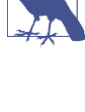

三维监测和碰撞检测通常依赖于三维形状识别任务。这意味着我们需要将感兴趣的三维对象分解为其组成部分，以更好地理解其状态。在第9章中，我将分享一些工具、示例和流程，帮助你诊断三维场景的垂直度和平面度（是否水平），获取相对于参考的偏差，并对三维场景形成整体的精细理解。

既然你已经理解了三维EDA（三维几何分析），让我们将重点转向三维预测性数据分析。

## 三维预测性数据分析

三维预测性数据分析关注的是未来可能发生的情况。这是一种高级分析类型，通常旨在构建能够基于现有数据模式预测未来结果的模型。

它通常使我们能够预测趋势并做出数据审查决策。然而，当我们进行三维预测性数据分析时，通常已经积累了处理/分析层的历史数据，这些数据提供了额外的信息基础。正如本书前面所述，你可能会从先前的特征工程步骤（参见第6章）中获取相关特征来处理这一类别。


三维预测性数据分析与后续章节涉及的概念相关：分割（第12章）、聚类（第13章）和监督式人工智能（第14章）。因此，为避免内容重叠，建议你参考这些后续章节，了解我们如何在这些其他主题的背景下处理三维预测分析任务。

在与三维预测分析相关的场景中，我们通常需要将三维数据表示与预测模型的创建和使用相结合，包括模型训练、评估、微调和部署。此类主题未包含在本章中，因为内容会过于冗长。这些模型的构建、架构和部署的详细细节将在第12至18章中给出。

## 三维规范性数据分析

三维规范性数据分析旨在利用各种类型分析的洞察力，根据预测结果推荐具体的行动或策略。这意味着制定优化问题或创建决策支持系统和体验。在这种情况下，可视化表示和可能的人机交互非常有用。因此，我们如何传达发现和信息至关重要。

因此，三维规范性数据分析高度依赖于具体应用。我们通常处于已经确定需要做出决策的环境中。目标是识别、优化或支持一系列行动或决策。


我提到过，我想提供精确的分析工具和解决方案。因此，我将专注于DDA和EDA，它们在后续面向应用的领域中被利用。它们在学习曲线和应用可扩展性之间取得了很好的平衡。一如既往，你的创新精神是关键区别因素。然而，为了加深你的专业知识，欢迎探索三维资源中心。

## 其他考虑因素

可视化和沟通在三维数据分析中至关重要。它们在向所有项目利益相关者传达复杂数据和独特关系方面发挥着重要作用。它们还增强了协作，提高了利益相关者对复杂现象的理解，使其成为分析过程中的关键步骤。

通过分析过程，我们创建信息丰富的可视化，以便有效地传达我们的发现。我们需要根据想要传达的分析内容，使用适当的图表、渲染方法和工作流程。只有在清晰的展示和沟通基础上，我们才能进入解释阶段。基于获得的证据分析结果并得出结论至关重要。我们必须确保这一结论在统计上是可靠的，并有数据支持。然后，我们必须清晰简洁地向受众传达这一发现（参见图8-3）。

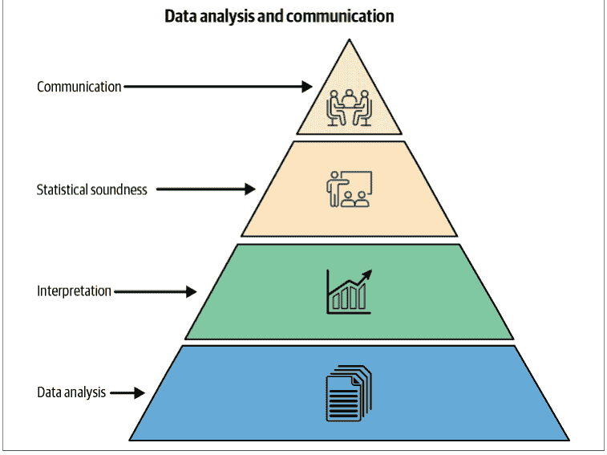

这可能意味着需要报告、演示和交互式体验来展示我们的工作。理解并记住这些步骤可能并不总是严格线性的，并且我们可能需要在某个时候重新审视前一步骤，这一点很重要。因此，结构化的方法对于系统地从数据中提取知识和价值至关重要。既然我们已经完成了对三维数据分析的广泛介绍，让我们深入探讨一个具体的案例，该案例将涉及描述性、探索性、预测性和规范性分析。

## 三维数据分析工具

三维描述性分析旨在回答这个问题：发生了什么（参见图8-4）？因此，我们需要通过总结数据的关键特征来初始化分析，以获得高层次的概览。你需要提供对数据分布、集中趋势和变异性的基础理解。

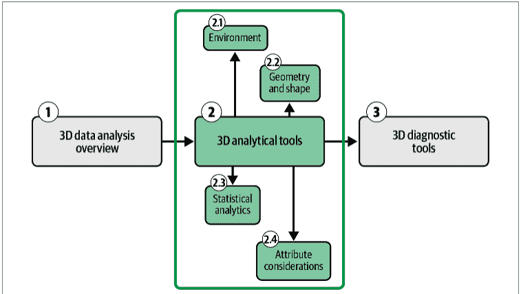

图8-4. 三维数据分析工具概览，侧重于分析工具集

正是这种高层次的概览，将为我们提供即将处理内容的快照。为了最好地解决这个问题，让我将三维描述性分析工作流程分解为五个主要步骤：环境和数据准备、元数据分析、几何和形状分析、统计分析以及属性分析，如图8-5所示。

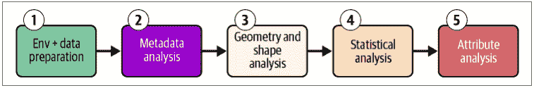

图8-5. 完整的三维数据分析工作流程，展示了从数据准备到属性分析的进展

## 环境和数据准备

三维数据分析工作流程的第一步是确保我们在一个连贯的环境中处理可靠的数据集。让我详细说明这两个方面，以帮助从头开始复制和扩展该过程。

## 数据集

本节的数据集代表一个毛纺工厂，通过结合两种技术获取：地面激光雷达数据采集和摄影测量三维重建。激光雷达数据采集使用地面激光扫描仪进行，这使我能够为每个站点收集表面的360°几何表示。想象一下，我将三脚架放置在特定位置并启动扫描过程（图8-6中的星号）。我收集了数千个代表x、y和z信息的数据点。在这个阶段，我舍弃了强度信息，因为RGB是主要的。

完成一个扫描位置后，我将地面激光扫描仪放置在距离初始位置5到15米的另一个点，并启动另一次扫描。我在多个不同位置重复此操作，以确保每个点至少从两个站点被捕获。

我与Roman Robroek（一位出色的摄影师）合作设计的第二个过程涉及使用一台非常好的相机在不同位置拍摄大量照片，并将这些相机位姿与我的扫描位姿融合（参见图8-6中的蜿蜒路径）。我还重建了在与我的激光扫描设备相同位置拍摄的360°全景图（参见图8-6中的圆圈）。

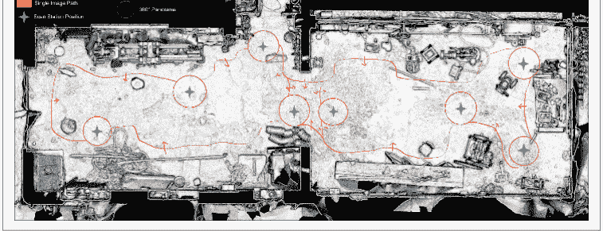

图8-6. 三维数据采集设置（星号：激光雷达扫描位置；蜿蜒路径：图像路径采集，相机指向内部[朝向墙壁]；圆圈：360°相机采集，指向外部）

这些使我们能够以高精度生成场景的几何表示。下一阶段是按照第4章的方法提取额外特征。当然，在这个阶段，我们提取特征时只是隐约知道哪些可能有用，但我们没有明确的可量化或可定性信息来说明它们如何发挥作用。因此，这就是创建数据集并提取其周围上下文的过程。

总结一下待办事项和起点：

- 首先，我前往现场，使用所述方法进行了3D数据采集。
- 然后，我回到电脑前，处理了LiDAR数据与影像，提取出带有RGB信息的3D点云。
- 这些3D点云被输入到第4章的代码中，以计算许多特征。
- 我将每个特征添加到我的数据文件中，然后将其导出为ASCII文件格式（.csv）的采样版本，以便展示数据分析。

现在，让我们开始本阶段的环境设置。

## 环境设置

为了与前面章节保持一致，我在运行Windows 11操作系统的机器上使用Anaconda和Python 3.9设置环境。在我的环境中，我安装了pip：

```
conda install pip
```

然后，使用pip，我安装了所有库（NumPy、pandas、SciPy、Open3D、Matplotlib和Seaborn）：

```
pip install numpy pandas scipy open3d matplotlib seaborn
```

最后一步是使用IDE；如果你没有可用的IDE，可以使用Spyder：

```
pip install spyder
```

现在，启动Spyder（在控制台中输入spyder），我们可以通过首先导入库来开始设置脚本：

```python
#%% 导入库

# 基础库
import numpy as np
import pandas as pd

# 可视化和绘图库
import matplotlib.pyplot as plt
import seaborn as sns

# 数学库
import scipy as sp

# 3D库
import open3d as o3d
```

首先，我们看到NumPy (np) 和 pandas (pd) 的导入语句。这些库分别是处理数值数据（数组、矩阵）和表格数据（DataFrames）的基础。然后，代码导入了SciPy (sp)，这是一组用于科学计算的算法和函数集合。SciPy通过提供高级数学运算、优化、信号处理和其他科学计算任务的额外功能来补充NumPy。

至于3D库，我们使用Open3D；无需介绍该库。数据可视化库有两个选择：Matplotlib (plt) 创建各种图表和图形，而Seaborn (sns) 建立在Matplotlib之上，提供了一个高级接口，用于创建美观且信息丰富的统计图形。这些库使我们能够以可视化方式探索和传达数据中的见解。

> 我想分享一些出色的功能，以彻底改进我们创建的可视化效果。我们可以使用一些样式提示来确保我们拥有深色背景和一致的DPI输出。以下是提示：

```python
plt.style.use('dark_background')
plt.rcParams['figure.dpi'] = 600
```

我们已准备好进入下一阶段：理解我们的各种变量。

## 元数据分析和数据概况分析

我们需要构建前进的方法。如果你还记得第1章，那里有关于如何进行任何数据处理流程的逻辑思考。让我们破个例，用直接的方法来处理3D DDA。

首先，我们将进入概况分析阶段，以获得一个广泛的视角。为了全面了解数据，让我们首先加载数据并将其存储在名为df_pcd的pandas DataFrame中：

```python
df_pcd = pd.read_csv('../DATA/verviers_features.csv', delimiter=' ')
```

这将使我们能够利用各种pandas功能快速总结数据的特征。第一个有用的功能提供了DataFrame的简明概述，包括有关数据类型、每列的非空值（计数）和内存使用情况的信息：

```python
df_pcd.info()
```

这有助于识别潜在的数据质量问题，如缺失值或意外的数据类型。然后，我们检查数据中存在的行数（观测值）和列数（特征）：

```python
df_pcd.shape
```

这使我们能够理解矩阵的整体向量形状。为了补充第一个概况分析，我通常使用这行代码来查看实际的数据点及其值：

```python
df_pcd.head()
```

此方法显示DataFrame的前几行（默认：5行）。它允许我们确保数据的格式和内容。然后，我们检查DataFrame中的列：

```python
df_pcd.columns
```

这阐明了与数据中每个特征相关的含义。最后，我们可以使用一个强大的方法，为DataFrame中的数值列提供各种汇总统计信息：

```python
df_pcd.describe()
```

它计算均值、标准差、最小值、最大值、百分位数（四分位数）等统计数据。这有助于我们理解数值特征的集中趋势、离散程度和潜在的异常值。在这个阶段，我们现在对以下内容有了更清晰的认识：我们的数据集包含500,000个点，每个点在x、y和z之外还有20个特征。有些特征是归一化的，有些则不是。它们的范围不同，分布也不常见。

.csv文件没有关联的外部元数据。我们现在可以继续更好地描述3D几何形状和形状分析。

## 几何形状和形状分析

让我们从创建一个Open3D PointCloud对象开始；然后我们填充这个新Python对象的点和颜色属性，并利用已实现的函数来加速分析：

```python
xyz_o3d = o3d.geometry.PointCloud()
xyz_o3d.points = o3d.utility.Vector3dVector(np.array(df_pcd[['X','Y','Z']]))
xyz_o3d.colors = o3d.utility.Vector3dVector(np.array(df_pcd[['R','G','B']])/255)
```

我们现在准备好提取整体尺寸。

## 整体尺寸

第一阶段是计算轴对齐包围盒（aabb），以更好地描述我们场景/对象的整体范围：

```python
aabb = xyz_o3d.get_axis_aligned_bounding_box()
aabb.color = [1,0,0]
```

我们现在可以可视化带有轴对齐包围盒的3D点云：

```python
o3d.visualization.draw([xyz_o3d, aabb], bg_color = (1, 1, 1, 1),
    show_skybox = False, line_width = 5)
```

这还允许我们计算包围盒的中心以及点云的质心：

```python
centroid = xyz_o3d.get_center()
aabb_center = aabb.get_center()
```

这返回：

```
centroid:          array([ 0.478817 , -2.8190636,  1.3072453])
aabb_center : array([-0.14883376, -3.33756063,  1.68849848])
```

如你所见，我们有一个差异，考虑到我们点的不规则分布，这是正常的。

## 体积估算

现在让我们进入体积估算，因为这是理解可导航空间的关键：

```python
# 体积估算 (BB)
p_aabb_volume = aabb.volume()
print('AABB的体积: ',p_aabb_volume)
```

这返回以下内容：

```
AABB的体积: 605.83 m³
```

然而，在这个阶段，值得注意的是，提取的体积来自轴对齐包围盒。如果我们不在这样的场景中（这很有可能），我们需要基于具有最小体积的定向包围盒来提取物体的形状：

```python
oobb = xyz_o3d.get_minimal_oriented_bounding_box()
```

该方法利用了最小包围盒必须有一条边与凸包的至少一条边共线这一事实。对于凸包中的每个三角形，在三角形的坐标系中找到最小的轴对齐包围盒。最后，它返回内部空间最少的容器。这意味着什么？我们可以找出：

```python
oobb.color = [0,1,0]
oobb.volume()
o3d.visualization.draw_geometries([xyz_o3d, oobb, aabb])
```

如你所见，这返回一个浅灰色的定向包围盒，与深灰色的轴对齐包围盒不同（见图8-7）。至于体积，现在最合适的包围盒体积为：475.83 m³。

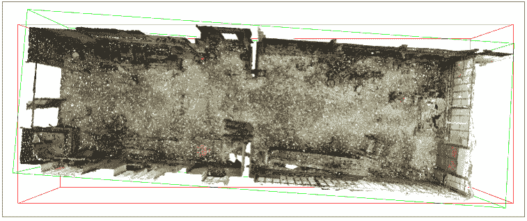

这是基于你可以可视化的凸包：

```python
# 凸包
ch = xyz_o3d.compute_convex_hull()
# 返回三角形网格和点的索引列表

o3d.visualization.draw_geometries([ch[0], xyz_o3d.select_by_index(ch[1])])
ch[0].get_volume()
```

3D轴对齐包围盒（AABB）和3D定向包围盒（OBB）在各种应用中被利用。它们用于视频游戏中的碰撞检测、机场中的物体跟踪、复杂场景渲染的遮挡剔除、路径规划、光线追踪等等。AABB和OBB之间的选择取决于准确性和性能之间的权衡。AABB计算更简单，并且通常比OBB更快地测试重叠，但准确性较低。

在通过全局分析研究了我们场景的范围和特征之后，让我们继续进行基于局部邻域的分析。

## 平面性

第一阶段评估场景中的“平面”主导地位。这至关重要，因为平面表面在现实世界中无处不在，从建筑物的墙壁到有机形状。分析3D数据的平面性使我们能够理解物体的底层结构和几何形状，这对于理解其形状和功能以及识别缺陷或异常至关重要。用Python，这转化为以下内容：print(df_pcd['Planarity_(0.1)'].describe())
pla_as_colors = np.repeat(np.array(df_pcd[['Planarity_(0.1)']]), 3, axis=1)
xyz_o3d.colors = o3d.utility.Vector3dVector(pla_as_colors)

# 更改颜色映射
viridis_cmap = plt.colormaps['viridis']
viridis_array = viridis_cmap(pla_as_colors)
xyz_o3d.colors = o3d.utility.Vector3dVector(viridis_array[:,0,:3])
o3d.visualization.draw_geometries([xyz_o3d])

这表明我们的大部分点云属于平面区域，存在一些局部变化（见图8-8）。那么，它们的曲率如何呢？

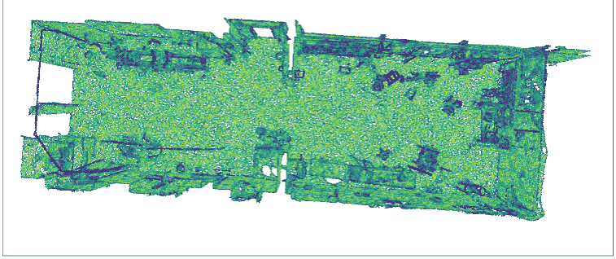

*图8-8. 房间点云的另一种俯视图：阴影变化表明正在可视化另一个属性*

## 曲率

曲率是三维数据集的一个基本属性，它揭示了其形状和结构的关键信息。分析曲率使我们能够识别关键特征，并更好地理解局部和全局几何结构。让我退一步说明。

在医学成像中，曲率分析有助于检测器官和组织的异常，辅助诊断和治疗规划。在一般应用中，它用于物体识别、姿态估计和表面重建，并实现精确导航和避障。此外，曲率可用于分割三维物体、提取特征和分类不同类型的表面。它也可用于表面平滑、插值和变形。

这意味着，通过理解我们三维数据集的曲率，我们可以获得对其底层属性的宝贵见解，并决定应使用哪些后续处理流程。首先，让我们分析该特征：

```
print(df_pcd['Mean_curvature_(0.1)'].describe())
```

这展示了一些有趣的信息：最大值 = 50.160545。这提示我们需要进行数据归一化。

如果你还记得第3章和第4章的内容，三维数据归一化是将三维数据转换为标准尺度或范围的过程。在对三维数据应用数据分析技术之前，这通常是必要的。常见的三维数据归一化技术包括：

- *最小-最大缩放*：将数据缩放到0到1之间的范围。它实现简单，适用于有界数据（第12章）。
- *Z分数归一化*：将数据转换为均值为0、标准差为1。它比最小-最大缩放对异常值更稳健（第16章）。
- *单位球归一化*：将数据缩放以适应单位球，同时保留其形状。
- *局部归一化*：相对于每个点的局部邻域对数据中的每个点进行归一化。它有助于处理分布不均匀的数据（第11章）。
- *PCA归一化*：此方法使用PCA将数据转换到新的坐标系，这有助于降低维度并去除噪声（例如，第6章和第7章）。

最佳技术取决于应用和数据的属性。例如，最小-最大缩放适用于没有异常值的有界数据，而Z分数归一化更适合有异常值的无界数据。在我们的情况下，最小-最大缩放完全适用：

```
# 在pandas中使用.min()和.max()方法应用最小-最大缩放
def min_max_scaling(df):
    # 复制数据框
    df_norm = df.copy()
    # 应用最小-最大缩放
    for column in df_norm.columns:
        df_norm[column] = (df_norm[column] - df_norm[column].min()) / \
                          (df_norm[column].max() - df_norm[column].min())
    return df_norm
```

我们现在可以使用返回的归一化特征向量进行着色，因为我们的函数已经定义好了：

```
# 调用min_max_scaling函数
df_pcd_normalized = min_max_scaling(df_pcd)
df_pcd_normalized['Mean_curvature_(0.1)'].describe()
```

```
# 基于新的归一化曲率进行着色
curv_as_colors = np.repeat(np.array(df_pcd[['Mean_curvature_(0.1)']]), 3, axis=1)
viridis_array = viridis_cmap(curv_as_colors)
xyz_o3d.colors = o3d.utility.Vector3dVector(viridis_array[:,:3])
o3d.visualization.draw_geometries([xyz_o3d])
```

此计算展示了墙壁如何混合平面和曲率丰富的区域（见图8-9）。这些新的见解表明，任何后续处理流程（例如，形状识别、模型拟合、三维分割）都必须考虑分布不均匀的曲率区域。让我们通过尝试提取任何三维数据集的主要方向（全局视图）来推进我们的一系列发现。

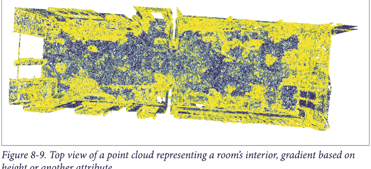

*图8-9. 表示房间内部的点云俯视图，基于高度或另一个属性的渐变*

## 主要方向

主要方向非常重要，尤其是在我们研究单个物体时。让我们假设该物体是一个三维模型。主要方向有助于标准化三维模型的位置，使其更容易比较和分析不同的模型。它还可以优化模型以用于三维打印或制造过程，并可用于理解物体的形状和功能。

依赖PCA（更多信息请参见第6章或三维资源中心）是获取此类信息的一个好方法。让我们定义一个与第6章中所示略有不同的PCA函数：

```
xyz_np = np.array(xyz_o3d.points)
def pca(point_cloud):
    ...
    return eigenvalues, eigenvectors

eig_val, eig_vec  = pca(xyz_np)
principal_dir = eig_vec[:, 0]
print(principal_dir)
```

这返回一个向量（在我们的情况下，接近x轴）：[0.999 -0.015 0.006]。
有了主要方向，我们获得了数据集的另一个“全局特征”。这可以通过分析几何模型的长宽比来进一步扩展。

## 长宽比

确定三维模型的长宽比有助于我们理解模型的比例和整体形状。例如，如果模型的长宽比不正确，它可能无法适应所需的空间或看起来不真实。此外，如果长宽比未针对三维打印进行优化，生产模型可能很困难或不可能。因此，让我们使用定向包围盒并提取其长度（L）、宽度（l）和高度（h）：

```
#长宽比
L, l, h = oobb.extent
```

由此，我们计算三个比率：

```
ratio_lh, ratio_lh, ratio_ll  = [L/h, l/h, L/l]
```

这可以为后续处理流程提供指示，例如三维形状分类。实际上，这些比率可用于分类三维模型是桌子还是椅子。

在这个阶段，你拥有了一套很好的互补信息和全局特征，可以帮助你理解我们主题的几何含义。为了尽可能全面，让我快速展示这些长宽比如何影响三维单物体形状的分析。

## 单个三维网格形状的案例

在本节中，让我们以一辆汽车和一架飞机为例。首先，让我们通过定义文件路径来导入两个新数据集：

```
meshes = ["../DATA/Car.ply", "../DATA/Soviet_Plane.ply"]
```

从那里，我们可以使用以下函数来研究包围盒的差异以及长宽比的影响：

```
for data in meshes:
    mesh = o3d.io.read_triangle_mesh(data)
    mesh.compute_vertex_normals()
    #轴对齐包围盒
    aabb = mesh.get_axis_aligned_bounding_box()
    aabb.color = [1,0,0]

    # 定向包围盒
    oobb = mesh.get_minimal_oriented_bounding_box()
    oobb.color = [0,1,0]

    o3d.visualization.draw_geometries([mesh, oobb, aabb])
```

```
L, l, h = oobb.extent
ratio_lh, ratio_lh , ratio_ll  = [L/h, l/h, L/l]
print(ratio_lh, ratio_lh, ratio_ll)
```

如你所见，与飞机的定向包围盒相比，汽车的定向包围盒是细长的（图8-10A和B）。

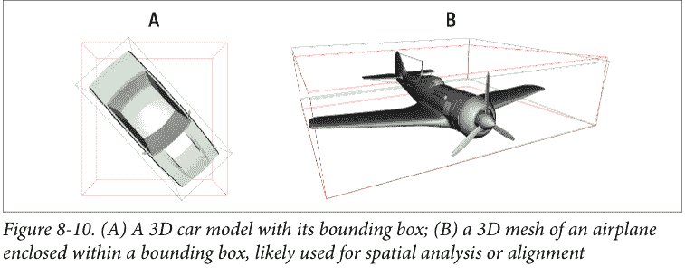

当我们观察比率时，这如何体现？嗯，让我们看看表8-1中的结果。

表8-1. 汽车与飞机三维模型的比率

| 三维汽车模型的长宽比 | | | 三维飞机模型的长宽比 | | |
| :--- | :--- | :--- | :--- | :--- | :--- |
| L/h | l/h | L/l | L/h | l/h | L/l |
| 3.25 | 1.46 | 2.22 | 4.02 | 3.54 | 1.13 |

如你所见，l/h和L/l之间的差异有效地关联了我们视觉上观察到的不同比率。因此，我们可以使用这些比率通过自动化流程（如自动三维形状分类）来绕过人工交互。现在，让我们通过为你提供应用于三维数据集的统计分析工具来说明这一点。

## 统计分析

在这个阶段，我们希望更好地理解数据点和特征的分布。在三维数据科学中，触发点是三维几何。确保我们完全掌握空间属性的分布至关重要。让我们回顾一个简单的流程，以快速识别统计见解。为了支持这个概念，让我们使用一个基于密度的指针，即点云中点之间的距离：

```
nn_distances = xyz_o3d.compute_nearest_neighbor_distance()
```

这使我们能够记录点云中每个点到其邻居的平均距离。

## 集中趋势

在这一阶段，你已经知道如何利用k-d树，并且如果你想调整用于计算值的点数或输出这些点的索引，可以轻松创建一个函数。如有需要，请参考第4章。

首先，让我们研究集中趋势。其核心思想是，一个单一的值可能（在某种程度上）最好地描述所研究的特征。我们可以使用集中度量来快速、简单地了解我们特征的外观。数据的中心可能是一条宝贵的信息，它能准确地告诉我们特征的偏向，因为无论数据围绕哪个值波动，本质上都是一种偏差。我们可以将均值视为平均值，或者所有数据点聚集的中心点。为了定义均值，我们在计算中赋予所有值相等的权重：

```python
mean_dist = round(np.mean(nn_distances),3)
print(f"Mean: {mean_dist} m")
```

在我们的案例中，结果是：均值：0.017米。中位数是数据集的中间值，即，如果我们把数据从小到大（或从大到小）排序，然后取集合中间的值，那就是中位数（50%高于它，50%低于它）：

```python
median_dist = round(np.median(nn_distances),3)
print(f"Median: {median_dist} m")
```

返回结果为：中位数：0.016米。

中位数比均值对异常值更稳健，因为如果存在一些高幅度的异常值，均值会被拉向一边。中位数接近均值通常表明我们处于对称分布中。

既然我们更好地理解了集中趋势，快速识别离散程度通常是一个好习惯。我们特征的离散程度是指它向单个值挤压的程度，或者在更广泛范围内分布的程度。标准差是量化数据离散程度最常用的方法：

```python
std_dist = round(np.std(nn_distances),3)
print(f"Standard Deviation: {std_dist} m")
```

返回的标准差为0.008米。我们可以使用百分位数进一步描述每个数据点在整个范围内的位置。百分位数描述了数据点在值范围内的确切位置，即它处于多高或多低的位置。更正式地说，第p百分位数是数据集的一个值，它可以将数据分成两个主要部分。第一部分，即较低部分，包含p%的数据，即第p百分位数：

```python
percentile25_dist = round(np.percentile(nn_distances, 25),3)
percentile50_dist = round(np.percentile(nn_distances, 50),3)
percentile75_dist = round(np.percentile(nn_distances, 75),3)
percentile95_dist = round(np.percentile(nn_distances, 95),3)
```

返回结果如下：25%百分位数：0.011；50%百分位数：0.016；75%百分位数：0.022；95%百分位数：0.032。最后，我想通过计算我们数据的偏度和众数来完成数据集的统计描述。这些统计工具对于理解分布形状和识别潜在异常值非常有益。它们还能轻松识别数据中的主导趋势或模式，这对于理解潜在现象和做出明智决策至关重要。偏度衡量其不对称性，而众数是数据分布中出现最频繁的值：

```python
skew_dist = sp.stats.skew(nn_distances)
mode_dist = sp.stats.mode(nn_distances)
print(f"Skew: {skew_dist}")
print(f"Mode: {mode_dist} m")
```

返回的偏度为0.675米，众数为：ModeResult(mode=3.65e-05, count=2)。

偏度为正值意味着值集中在数据点中心的左侧；负偏度意味着值集中在中心的右侧。这些对于构建可量化的分析见解非常有用。然而，通常的做法是将它们与清晰的图形支持的定性分析结合起来。而这正是你可以广泛运用各种统计数据可视化工具的地方。

## 直方图

条形图（或直方图）是可视化数据分布的有效方式。它们可以帮助比较类别、识别异常值和跟踪趋势。它们对于理解数据的空间分布特别有用。例如，条形图可以显示3D场景中不同类型对象的数量、平均距离或点云中点的分布。让我们用这个小的Python代码片段来说明如何使用直方图可视化单个特征分布：

```python
plt.hist(nn_distances)
plt.xlabel("Values (m)")
plt.ylabel("Frequency")
plt.title("Distribution of Neighbor Distances")
plt.show()
```

代码生成一个直方图，并附有一张展示nn_distances变量所包含的邻居距离分布的图像（见图8-11A）。但它可能在我们想要查看分布的精细程度上缺乏“分辨率”。此外，最好能叠加之前定义的均值、中位数和众数。为此，你可以利用以下函数：

```python
def hist_styled(feature, f_name):
    # 创建直方图
    n, bins, patches = plt.hist(feature, bins=100, facecolor='#2ab0ff',
                               edgecolor='#e0e0e0', linewidth=0.5, alpha=0.7, zorder=4)
    n = n.astype('int') # 必须是整数

    # 老套的循环。选择你喜欢的颜色映射
    for i in range(len(patches)):
        patches[i].set_facecolor(plt.cm.cool(n[i]/max(n)))

    # 计算统计量
    mean_val = np.mean(feature)
    median_val = np.median(feature)
    mode_val = bins[np.argmax(n)]

    # 为均值、中位数和众数添加垂直线
    plt.axvline(mean_val, color='lightcoral', linestyle='dashed', linewidth=2,
                label=f'均值: {mean_val:.3f}')
    plt.axvline(median_val, color='palegreen', linestyle='dashed', linewidth=2,
                label=f'中位数: {median_val:.3f}')
    plt.axvline(mode_val, color='skyblue', linestyle='dashed', linewidth=2,
                label=f'众数: {mode_val:.3f}')

    # 设置标题和标签
    plt.title(f'{f_name}-特征：分布', fontsize=10)
    plt.xlabel(f'{f_name} 值', fontsize=10)
    plt.ylabel('点数', fontsize=10)

    # 添加网格
    plt.grid(True, c = 'grey', ls = '--', lw = 0.2, zorder=0)

    # 添加图例
    plt.legend(fontsize=7)

    plt.show()
    return
```

这使我们能够使用并创建一个结合了特定分布下均值、中位数和众数的定性分析直方图。让我们使用函数`hist_styled(nn_distances, 'NN_Distance')`，结果如图8-11B所示。

图8-11. (A) 展示点云中相邻点之间距离分布的直方图；(B) 点云内最近邻距离的分布，包括均值、中位数和众数。

## 3D条形图

另一种可视化空间分布的方法是使用3D等效的直方图：3D条形图。通过在传统条形图中添加第三个维度，这些可视化使我们能够探索变量之间的复杂关系，并识别可能隐藏在低维表示中的模式。这对于理解跨多个维度的数据分布特别有用。要使用Python创建这样的3D条形图，我们可以使用Matplotlib的`bar3d`并结合如下脚本：

```python
import matplotlib.colors as colplt
import matplotlib.cm as cm

fig = plt.figure()
ax = fig.add_subplot(projection='3d')
hist, xedges, yedges = np.histogram2d(df_pcd['X'], df_pcd['Y'], bins=100)

xpos, ypos = np.meshgrid(xedges[:-1] + 0.1, yedges[:-1] + 0.1, indexing="ij")

# 缩短并确保我们符合维度要求
xpos, ypos, zpos = [xpos.ravel(), ypos.ravel(), 0]

dx = dy = 0.1 * np.ones_like(zpos)
dz = hist.ravel()

offset = dz + np.abs(dz.min())
fracs = offset.astype(float)/offset.max()
norm = colplt.Normalize(fracs.min(), fracs.max())
colors = cm.cool(norm(fracs))

ax.bar3d(xpos,ypos,zpos,dx,dy,dz, color=colors)
plt.show()
```

返回结果为图8-12A中的条形图。

这段Python代码使用Matplotlib创建了一个3D条形图。它首先导入必要的模块，然后创建一个图形和3D轴对象。接着，它使用`np.histogram2d()`函数生成一个名为`df_pcd`的DataFrame中X和Y列的二维直方图。代码随后设置3D条形图所需的坐标和尺寸，包括基于二维直方图值的条形高度`dz`。它使用`cm.cool()`颜色映射为条形应用颜色，最后使用`plt.show()`显示3D图。

这对于通过理解数据分布的一致性来优化我们的初始可视化非常有用。例如，将此功能用作过滤指针，可以让我们更好地识别属于地面的点。现在，也有可能展示密度。但当然，监控分布是否符合某些经典分布模型始终至关重要。最常见的是正态分布。我们可以计算高斯分布，以更好地理解数据拟合程度。你可以将这些行添加到前面的函数中，让绘图函数计算分布模型：

```python
# Compute the Gaussian curve
mu, sigma = sp.stats.norm.fit(feature)
x = np.linspace(min(feature), max(feature), 100)
gaussian = sp.stats.norm.pdf(x, mu, sigma)

# Scale the Gaussian to match the histogram height
scaling_factor = np.max(n) / np.max(gaussian)
gaussian_scaled = gaussian * scaling_factor
```

这得到了图8-12B：一个可以提供数据分布宝贵见解的直方图。该直方图类似于钟形曲线，表明数据呈正态分布。提醒一下，关键指标包括对称形状，即曲线的左右两侧大致互为镜像。此外，曲线的峰值应位于中心附近。虽然完美的正态分布在现实数据中很少见，但这些特征提供了接近正态分布的有力证据。

这暗示了大部分区域具有均匀的点密度。如果我们能识别出异常值，我们就能获得接近完美的正态分布，这对于后续处理来说要容易得多。

作为我们通过这些步骤所取得成果的一个例子，我们可以使用之前的pandas DataFrame，并用选择器`sel`隔离另一个特征：

```python
sel = feature_names[2]
print(f"{sel} statistics: \n {df_pcd[sel].describe()}")
```

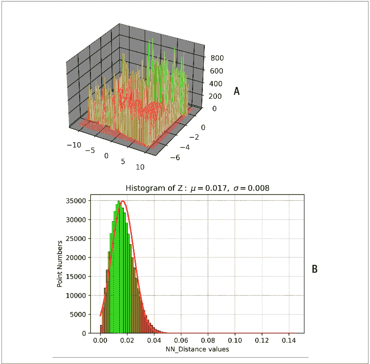

图8-12. (A) 显示点云内点空间分布的3D直方图，按密度着色；(B) 最近邻距离的直方图，附带拟合的高斯分布

这包括主要统计数据，我们看到DataFrame的Z列包含500,000行，平均值为1.3，标准差为0.89，表明数据具有中等变异性。最小值为0.09，而第25、第50和第75百分位数分别为0.44、1.09和2.00。Z列中的最大值为3.27，提供了该数据集中值分布的全面总结。我们的绘图函数允许我们创建图8-13A中的图像。这非常有信息量，因为我们可以立即看到我们的特征Z不符合正态分布。众数也非常有启发性，因为它可以用来识别数据集中可能与地面相关的潜在峰值。我们还可以将我们的分布与其他模型进行比较（见图8-13A和B）。

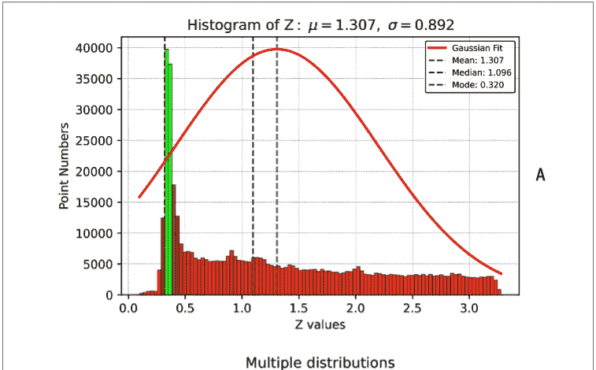

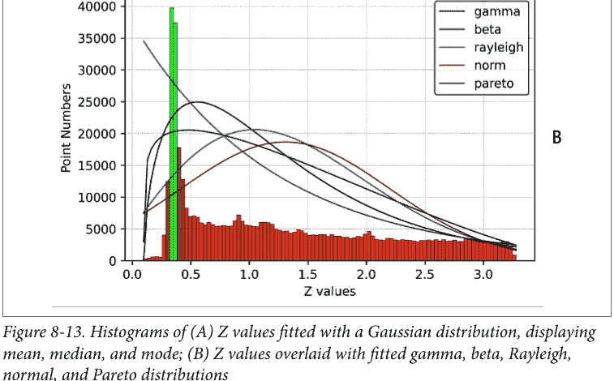

图8-13. 直方图：(A) 拟合了高斯分布的Z值，显示均值、中位数和众数；(B) Z值叠加了拟合的伽马、贝塔、瑞利、正态和帕累托分布


将分布与多个模型进行比较有几个优点。首先，它允许我们评估不同理论分布对观测数据的拟合程度，帮助我们理解潜在的数据生成过程。其次，它使我们能够识别出显著偏离预期分布的潜在异常值或异常点。第三，它提供了每个模型代表数据的定量度量，使我们能够为后续分析选择最合适的模型。最后，它帮助我们基于所选模型做出更准确的预测和推断。

如你所见，利用直方图对于所有3D数据分析任务都非常方便。但我们还有另一个强大的工具可供使用：箱线图。

## 用于3D分析的箱线图

箱线图是可视化3D数据分布的宝贵工具。它们简洁地总结了数据的集中趋势、离散程度和潜在异常值。通过检查箱线图，我们可以快速识别数据中的模式、异常和显著变化。

我发现这些信息对于理解任何3D数据集的潜在特征以及为后续分析或建模任务做出明智决策至关重要。我们回顾一下如何利用箱线图进行分析场景是很自然的。让我们定义一个函数，用于正确生成单个变量的箱线图：

```python
def boxplot_styled(feature, f_name):
    plt.boxplot(feature, patch_artist=True,
    boxprops = dict(facecolor = '#08F7FE', alpha = 0.7),
    medianprops = dict(color = '#FE53BB', linewidth = 1), showfliers = False,
    labels=[f_name])

    plt.ylabel("Value")
    plt.title(f'{f_name}-feature: BoxPlot', fontsize=10)
    plt.grid(True, c = 'grey', ls = '--', lw = 0.1, zorder=0)
    plt.show()
    return
```

这个Python函数`boxplot_styled`为给定的特征（数据集列）和特征名称创建一个自定义的箱线图可视化。它接受两个参数：`feature`（箱线图的数据）和`f_name`（特征的名称）。该函数使用Matplotlib创建箱线图，具有自定义样式，包括浅蓝色的箱体颜色、粉红色的中位数线，并且不显示异常值。它还为绘图添加了y轴标签、标题和灰色网格背景。然后我们使用`plt.show()`显示箱线图并返回该图。让我们使用这个函数：

```python
boxplot_styled(nn_distances, 'NN_Distance')
```

这返回了图8-14a。箱线图也可以同时组合，作为相关性分析的第一步。为此，3D数据集中多个变量的多个箱线图提供了一个强大的可视化工具，用于比较分布和识别属性之间的关系。通过可视化每个变量的集中趋势、离散程度和异常值，我们可以快速检测模式、异常和潜在的相关性。这对于理解一个变量对另一个变量的影响、识别影响因素以及调整后续的数据清洗、预处理和特征工程步骤特别有用。要创建这样的多箱线图，你可以利用以下Python代码：

```python
colors = ['#08F7FE', '#FE53BB']
plt.boxplot(df_pcd[['X', 'Y', 'Z']], patch_artist=True,
            boxprops = dict(facecolor = colors[0], alpha = 0.7),
            medianprops = dict(color = colors[1], linewidth = 1.5), labels=['X', 'Y', 'Z'])
plt.xlabel("Dimension")
plt.ylabel("Value")
plt.title("Boxplot of 3D coordinates")
plt.grid(True, c = 'grey', ls = '--', lw = 0.1, zorder=0)
plt.show()
```

这得到了图8-14A和B。


所有这些工具和策略目前都应用于整个点云。当然，当你将它们组合起来时，它们的全部威力才会显现，从而产生多个粒度级别的分析，例如，研究数据集的局部子集。你可以通过创建多级分析框架来进一步推进这个概念，该框架利用每个变量在多个粒度上的分析。

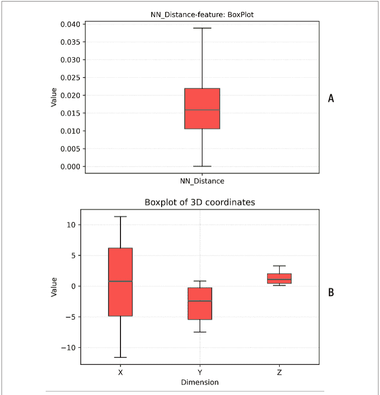

图8-14. 箱线图可视化显示：(A) 点云内最近邻距离的分布；(B) 点云内X、Y和Z坐标的分布

现在，你如何获取关于数据集中可能相关性的线索？首先，让我们绘制基础数据集中所有特征的箱线图（见图8-15）。

这种特定的统计可视化将非常有用，例如，当试图理解底层数据集的哪些特征在描述性方面起着重要作用时。分布紧密的特征通常具有成为良好过滤器的潜力。但是，如何尝试理解特征之间的相关性呢？

## 相关性分析

我们可以利用 Seaborn 库一次性生成多个特征的密度图。

> 密度图是一种可视化方式，用于展示数据集在连续区间上的分布情况。它类似于直方图，但使用平滑曲线来估计变量的概率密度函数。密度图的纵轴代表概率密度，曲线下方的面积总和始终为 1。

为此，我们使用一个函数，该函数利用 Seaborn 和 Matplotlib 库创建三维核密度估计图：

```
sns.kdeplot(df_pcd[['X', 'Y', 'Z']], palette = 'cool', fill = True)
plt.grid(True, c = 'grey', ls = '--', lw = 0.2, zorder=0)
sns.kdeplot(df_pcd[['R', 'G', 'B']], palette = 'cool', fill = True)
plt.grid(True, c = 'grey', ls = '--', lw = 0.2, zorder=0)
sns.kdeplot(df_pcd[[ei1, ei2, ei3]], palette = 'cool', fill = True)
plt.grid(True, c = 'grey', ls = '--', lw = 0.2, zorder=0)
```

此代码创建了点云数据的三维密度图，展示了点在三维空间中的集中区域，并在背景中添加了细微的灰色虚线网格作为参考（见图 8-16A、B 和 C）。

图 8-16. 三维点云内的密度分布：(A) 三维点云中的 X、Y 和 Z 坐标；(B) 红、绿、蓝颜色通道值；(C) 前三个特征值

这种可视化有助于我们揭示在单独检查各个分布时可能不明显的潜在结构或模式。它允许识别点云中的异常值或孤立区域。图的形状表明数据分布在不同维度上具有一定的对称性。在 X、Y 和 Z 图中，存在多个明显的峰值，表明三维空间内存在独立的聚类或模式。R、G 和 B 图展示了密度图的拉伸，这可能表明存在相关性。最后，密度图的整体平坦度或变异性提供了关于点在整个三维空间中分布均匀性的信息。

这些见解在单一可视化中提供了数据结构和分布的全面视图，是相关性分析的第一步。让我们使用 `corr()` 方法计算 DataFrame `df_pcd` 的相关矩阵（DataFrame 中所有列之间的成对相关性），并使用 Seaborn 的 heatmap 函数进行可视化：

```
corr = df_pcd.corr()# plot the heatmap
sns.heatmap(corr, xticklabels=corr.columns, yticklabels=corr.columns,
annot=False, cmap=sns.diverging_palette(220, 20, as_cmap=True))
```

热力图的颜色编码系统（黑色表示高度相关，白色表示弱相关）使我们能够把握变量之间任何关联的方向和强度（见图 8-17）。

这让我们能够快速识别出第三个特征值与多个特征高度相关，以及 Z 分量与垂直性高度相关。这完全合理，因为这些特征是相互推导出来的。因此，如果我们继续选择相关特征，我们会倾向于使用这些特征，并舍弃一些派生特征。

图 8-17. 相关矩阵，显示了从点云中提取的各种几何和比色特征之间的关系

## 属性分析

三维点云是丰富的数据集，包含空间信息以及与每个点相关的各种属性。这些属性提供了关于被扫描物体或环境的表面属性、几何形状和特征的宝贵信息。

由于我们已经在前面的步骤中研究了各种特征，我想探讨数据集中常见的三个关键属性：RGB 颜色、表面法线和特征值。每个属性都提供了对物体本质的独特见解，并在高级三维数据分析中发挥着至关重要的作用。为了最好地辅助学习，让我们通过一些有趣的案例来说明。首先，我们导入库和本章文件夹中的数据集：

```
import numpy as np
import open3d as o3d
import matplotlib.pyplot as plt
from matplotlib import cm
```

```
# Load a point cloud (ensure it has intensity information)
pcd = o3d.io.read_point_cloud("../DATA/chair_colored_notpure.ply")
o3d.visualization.draw_geometries([pcd])
```

### RGB 颜色

RGB（红、绿、蓝）颜色信息在许多三维数据集中是基础性的，尤其是那些由 RGB-D 传感器捕获或使用摄影测量技术着色的数据集。颜色数据显著增强了三维数据集的视觉解释，有助于物体识别和分割任务。此外，它还为创建逼真的三维模型提供了必要的纹理信息。

在分析点云中的 RGB 数据时，有几种技术已被证明是有用的。颜色直方图提供了一种理解数据集中颜色分布的方法，可以揭示模式或异常。基于颜色的分割允许将具有相似颜色的点分组，便于识别不同的物体或区域。此外，分析颜色梯度可以帮助检测基于颜色值变化的边缘或边界，例如：

```
def analyze_rgb(pcd):
    colors = np.asarray(pcd.colors)

    # Color histogram
    plt.figure(figsize=(15, 5))
    for i, color in enumerate(['red', 'green', 'blue']):
        plt.subplot(1, 3, i+1)
        plt.hist(colors[:, i], bins=50, color=color, alpha=0.7)
        plt.title(f'{color.capitalize()} Channel Distribution')
        plt.xlabel('Value')
        plt.ylabel('Frequency')
    plt.tight_layout()
    plt.show()

    # Color-based segmentation (simple example)
    red_mask = colors[:, 0] > 0.1  # Segment points with high red values
    red_cloud = pcd.select_by_index(np.where(red_mask)[0])
    o3d.visualization.draw_geometries([red_cloud])

analyze_rgb(pcd)
```

然而，在点云中处理 RGB 数据并非没有挑战。确保不同光照条件下颜色的一致性可能是个问题，尤其是在处理在不同时间或不同光照条件下捕获的数据时。处理阴影和反射也带来了困难，因为这些因素可能引入颜色失真，而这些失真可能无法反映被扫描表面的实际属性。这就是表面法线发挥作用的地方。

### 表面法线

表面法线是垂直于每个点表面的向量，提供了关于局部几何形状的关键信息。这些法线在各种应用中发挥着至关重要的作用，从表面重建和网格生成到特征提取和物体识别。它们对于精确的光照和阴影计算是不可或缺的。表面法线的分析通常从其估计开始。标准方法包括对局部点邻域进行主成分分析或对附近点拟合局部平面。一旦计算出来，法线可用于评估表面的平滑度和连续性，这对于理解被扫描物体的整体结构非常有价值。基于法线的分割技术将具有相似法线方向的点分组，有助于识别点云中不同的表面或形状（我们将在第 9 章深入研究这一点）：

```
def analyze_normals(pcd, radius=0.1):
    pcd.estimate_normals(search_param=o3d.geometry.KDTreeSearchParamHybrid(radius=radius, max_nn=30))
    normals = np.asarray(pcd.normals)

    # Visualize normal consistency
    consistencies = []
    pcd_tree = o3d.geometry.KDTreeFlann(pcd)
    for i in range(len(pcd.points)):
        [_, idx, _] = pcd_tree.search_knn_vector_3d(pcd.points[i], 10)
        neighborhood_normals = normals[idx[1:]]
        consistency = np.mean(np.abs(np.dot(neighborhood_normals, normals[i])))
        consistencies.append(consistency)

    plt.hist(consistencies, bins=50)
    plt.title('Normal Consistency Distribution')
    plt.xlabel('Consistency')
    plt.ylabel('Frequency')
    plt.show()

    # Visualize point cloud with normals
    pcd.paint_uniform_color([0.6, 0.6, 0.6])
    o3d.visualization.draw_geometries([pcd], point_show_normal=True)

analyze_normals(pcd)
```

处理表面法线也面临其自身的挑战。估计过程可能对点云数据中的噪声和点密度的变化敏感。此外，法线方向通常存在固有的模糊性——确定法线是朝内还是朝外可能很棘手，尤其是对于复杂或不完整的扫描。

## 特征值

正如我们在前一章所讨论的，通过分析邻近点的协方差矩阵，我们可以计算出能够揭示点云形状和局部几何特征的特征值。这些特征值对于计算表征局部点分布的几何属性非常有用；它们代表了点沿主方向的方差。分析特征值通常涉及计算它们之间的比值，以确定局部几何的类型。例如，特定的比值可以表明一个局部区域主要是线性的、平面的还是体状的。研究人员已经开发了一系列基于特征值的维度特征，例如全方差和各向异性，它们提供了对局部点分布的细致描述。了解这一点为我们的三维分析工具箱增添了另一项强大的技术：在不同邻域大小下检查特征值，以检测点云中的多尺度特征。

为了在你认为需要基于特征值的分析时提供帮助，我编写了一些利用你现在已熟悉的库的简单函数。它们可以在3D数据科学中心找到，欢迎你将它们整合到你的工作流程中：

```
def compute_eigenvalue_features(pcd, radius=0.1):
    ...
    return linearity, planarity, sphericity
```

这使我们能够从三维点云数据集中提取和可视化有用的结构信息。半径参数决定了我们用于计算协方差矩阵和特征值的每个点周围的邻域大小。半径的选择是一种平衡——你需要它足够大以捕捉有意义的局部结构，但又不能太大以至于开始丢失重要的细节。特征值分析的主要挑战在于确定计算的合适邻域大小。邻域太小可能对噪声过于敏感，而邻域太大则可能模糊重要的局部细节。此外，具有混合几何类型的区域可能难以仅使用基于特征值的方法来表征，这可能需要额外的定性分析。

虽然每个属性都提供了有价值的信息，但三维分析的真正威力往往在于结合多个属性。例如，将RGB颜色与强度数据相结合可以带来更稳健的材料分类。将表面法线与特征值分析相结合可以实现更准确的特征检测。颜色和几何信息的融合使得高级语义分割任务成为可能，推动了点云分析可能性的边界。在复杂的三维数据中理解和有效利用RGB颜色、表面法线、特征值和强度等属性，不仅仅是一个理论练习。这是获取可在实际情况下直接使用的显著数据的关键过程，揭示了关于被测环境的大量信息。

有了这些探索性工具，让我们制定一些诊断策略来评估我们的三维数据集。

## 三维诊断工具

三维场景诊断对于分析和理解复杂的三维数据集至关重要（见图8-18）。通过检查三维场景的几何属性，我们可以获得关于底层结构以及物体与环境之间关系的宝贵见解。

这些信息可以帮助识别异常、优化三维几何形状，并提高各种三维应用（例如自动驾驶汽车、虚拟现实和机器人技术）的性能。通过进行全面的三维场景诊断，我们可以确保这些系统的准确性、可靠性和效率。让我深入介绍可以完善你工具箱的工具。

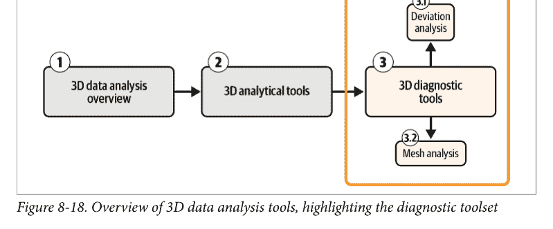

三维诊断工具使我们能够使用三维数据分析来诊断当前的三维状态。这通常意味着我们试图通过研究其几何分解来理解我们的场景：每当我们进行三维场景诊断时，我们通常会研究几何形状。

这就是我在引言中的初始话语应该引起你共鸣的地方。这个分析桶实际上结合了几种三维数据科学方法，包括三维形状检测、三维建模、三维分割、识别等。我将尽可能抽象，并专注于诊断可能偏离三维形状的基本理解和技能。让我们以三维平面为例作为诊断基础。

## 三维偏差分析：平面案例

让我们来看一种非常快速的方法，用于监控三维点云与特定平面的接近程度。这在许多场景中非常有用，例如，监控平面拟合的效果、三维数据集的水平程度，甚至建模物体是否很好地符合平面倾向。


我们研究一个三维点云。当你想要确保一个结合了几何形状全局和局部理解的分析工作流程时，这通常是最佳方法。假设你的基础数据集是一个CAD模型、一个三维网格或一个体素集合。在这种情况下，你通常需要使用采样方法（例如 `mesh.sample_points_uniformly(number_of_points=100)`）对模型进行采样，以从网格对象派生出一个包含100个点的点云。

我们的方法旨在可复制。因此，让我们定义一个如图8-19所示的简单工作流程。

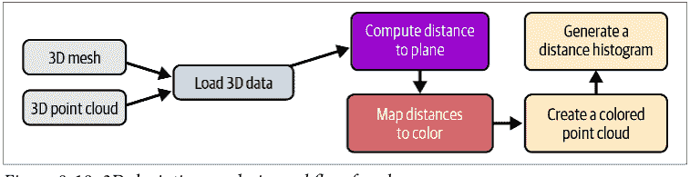

第一步是导入三个库（NumPy、Open3D和Matplotlib）并定义我们的数据集路径：

```
import numpy as np
import open3d as o3d
import matplotlib.pyplot as plt

point_cloud_file = "../DATA/office.ply"
plane_file = "../DATA/ground_plane.ply"
```

然后，我们定义一个 `compute_distance_to_plane` 函数：

```
def compute_distance_to_plane(point_cloud_file, plane_file):
```

接着，我们使用Open3D库从各自的.ply文件加载点云和平面网格：

```
# in compute_distance_to_plane function
    point_cloud = o3d.io.read_point_cloud(point_cloud_file)
    plane_mesh = o3d.io.read_triangle_mesh(plane_file)
```

由此，我们计算到平面的距离。这是通过考虑点云中的每个点，并计算从平面的第一个顶点到该点的向量与平面法向量之间点积的绝对值来完成的。这给出了点到平面的距离：

```
# Compute distances from point cloud to plane
    distances = []
    for point in point_cloud.points:
        min_distance = np.inf
        for i, triangle in enumerate(plane_mesh.triangles):
            v0 = plane_mesh.vertices[triangle[0]]
            v1 = plane_mesh.vertices[triangle[1]]
            v2 = plane_mesh.vertices[triangle[2]]
            normal = np.cross(v1 - v0, v2 - v0)
            normal /= np.linalg.norm(normal)
            distance = np.abs(np.dot(point - v0, normal))
            min_distance = min(min_distance, distance)
        distances.append(min_distance)

    distances = np.array(distances)
```

我选择点积方法是因为它是一种成熟且高效的方法，用于计算点到平面的垂直距离。这种方法在三维计算机图形学中很常用。

让我快速带你过一遍前面的例子。首先，我初始化一个名为 `distances` 的空列表。然后，我遍历 `point_cloud` 对象中的每个点。对于每个点，我找到该点到构成 `plane_mesh` 对象的任何三角形的最小距离。为此，我遍历网格中的每个三角形，计算三角形的法向量，然后计算从该点到三角形第一个顶点的向量与法向量之间点积的绝对值。这给出了点到由三角形定义的平面的垂直距离。我跟踪每个点的最小距离，并将其附加到 `distances` 列表中。处理完所有点后，我将 `distances` 列表转换为NumPy数组。这使我能够轻松地对距离值执行进一步的操作或可视化。

我们可以将距离映射到颜色来传达这种分析。为此，让我们通过使用 `plt.cm.cool()` 将距离值映射到cool颜色图，并将生成的颜色分配给点云，来创建一个彩色点云。请注意，如果需要，你可以使用其他颜色图：

```
# Create a colored point cloud based on the distance to plane
point_cloud.colors = o3d.utility.Vector3dVector(plt.cm.cool(distances /
    np.max(distances))[:, :3])
```

然后，我们将距离值的直方图导出到名为 `distance_histogram.png` 的文件中：

```
# Export the distance histogram
plt.figure()
plt.hist(distances, bins=50, facecolor='#2ab0ff', edgecolor='#e0e0e0',
    linewidth=0.5, alpha=0.7, zorder=4)
plt.xlabel("Distance to plane")
plt.ylabel("Frequency")
plt.savefig("../RESULTS/distance_histogram.png")
```

我们通过返回彩色点云、平面网格和距离值来结束该函数：

```
return point_cloud, plane_mesh, distances
```

为了可视化结果，我们调用该函数并绘制结果，同时附带风格化的直方图：

```
colored_point_cloud, plane_mesh, distances = compute_distance_to_plane(point_cloud_file, plane_file)

# Visualize the colored point cloud
o3d.visualization.draw_geometries([colored_point_cloud, plane_mesh])
```

这给出了图8-20A中的可视化，以及附带的直方图（`hist_styled(distances, "Distance to plane")`）在图8-20B中。

## 3D偏差分析：网格案例

既然你已经了解了如何处理基本的平面案例，那么更复杂的3D模型呢？你如何判断你的电机空气动力学是否完美契合你设计的3D CAD模型？你如何确保你建造的建筑遵循了设计建筑信息模型（BIM）？

嗯，这将偏差分析推向了一个更全局的视角，我们希望将整个3D模型与3D点云进行对比研究。然而，其底层事实是，我们对3D网格进行了采样，以获得一个可以与研究数据集进行比较的3D点云。因此，为了简化问题，让我分享一下这种方法的三个主要组成部分。我们将利用一个已知的数据结构（k-d树）来加速最近点搜索（作为第4章的提醒，递归地将3D空间划分为更小的区域，使我们能够加速搜索操作、最近邻查询和范围查询）。然后，我们将进行迭代距离计算，以找到点云之间的最小距离。最后，我们将对点云进行着色并导出直方图，如前所述。这意味着我们在函数`compute_distance_to_mesh`中进行线性操作，如图8-21所示。

图8-21. 计算和可视化点到平面距离的过程，包括数据加载、k-d树构建、距离计算、点云着色和直方图生成

让我们编写一个Python函数，该函数计算从3D点云到3D网格表面的距离，然后创建一个可视化的点云，其中每个点根据其到网格的距离进行着色：

```
def compute_distance_to_mesh(point_cloud_file, mesh_file):
    # Load point cloud and mesh
    point_cloud = o3d.io.read_point_cloud(point_cloud_file)
    mesh = o3d.io.read_triangle_mesh(mesh_file)

    # Compute KDTree for the mesh
    # mesh.compute_triangle_normals()
    mesh.compute_vertex_normals()
    pcd_mesh = mesh.sample_points_uniformly(number_of_points=1000000)
    mesh_tree = o3d.geometry.KDTreeFlann(pcd_mesh)

    # Compute distances from point cloud to mesh
    distances = []
    for point in point_cloud.points:
        _, inds, dist = mesh_tree.search_knn_vector_3d(point, 1)
        distances.append(np.sqrt(dist[0]))

    distances = np.array(distances)

    # Create a colored point cloud based on the distance to mesh
    point_cloud.colors = o3d.utility.Vector3dVector(plt.cm.jet(distances /
    np.max(distances))[:, :3])

    # Export the distance histogram
    plt.figure()
    plt.hist(distances, bins=50, facecolor='#2ab0ff', edgecolor='#e0e0e0',
    linewidth=0.5, alpha=0.7, zorder=4)
    plt.xlabel("Distance to mesh")
    plt.ylabel("Frequency")
    plt.savefig("distance_histogram.png")

    return point_cloud, mesh, distances
```

让我们逐步解析这个函数。我首先使用Open3D加载点云和网格数据。然后，我计算网格的顶点法线，并从网格中均匀采样100万个点，以创建一个点云表示。我使用这个点云来构建一个*k*-d树，以进行高效的最近邻搜索。

将3D网格采样为3D点云是3D诊断分析中的一项有价值的技术。通过将复杂的网格结构转换为离散点，我们可以简化数据表示并降低计算成本。此外，我们可以利用基于点的算法和技术，使其适用于各种原本不可能实现的3D诊断应用。

接下来，我遍历原始点云中的每个点，并使用*k*-d树在网格上找到最近的点。我计算该点与其在网格上的最近邻之间的欧几里得距离，并将此距离添加到一个列表中。处理完所有点后，我将距离列表转换为NumPy数组。为了可视化结果，我创建了一个新的点云，其中每个点根据其到网格的距离使用jet颜色映射进行着色。我还将距离值的直方图导出到名为*distance_histogram.png*的文件中。jet颜色映射是可视化标量场的常用选择，但你可以根据自己的偏好尝试其他颜色映射。

我在函数中硬编码了一个特殊参数。你能发现它吗？它是采样策略中的点数。这应该谨慎使用，因为它会影响结果的质量。数量过低会导致一些不精确，而数量过高则可能引起性能问题。同样，寻找无监督参数设置的启发式方法是一个值得探索的绝佳方向，我们将在第9章及以后进行探讨。

定义好函数后，我们现在可以调用它并分析结果：

```
python
point_cloud_file = "../DATA/pcd_car.ply"
mesh_file = "../DATA/mesh_car.ply"
colored_point_cloud, distances = compute_distance_to_mesh(point_cloud_file,
                                                          mesh_file)

# Visualize the colored point cloud
o3d.visualization.draw_geometries([colored_point_cloud])
```

图8-22A展示了结果，及其附带的直方图（图8-22B）。如你所见，我们的点云中突出显示了一个轻微的偏移，因为我们的均值、中位数和众数都有轻微的偏移。根据之前的内容，你应该很清楚分析这个直方图将如何帮助你识别汽车与其基础模型相比的设计问题。这是你3D数据科学家之旅中的一个有用“工具”。此外，这可以通过其他算法进行扩展，例如使用Hausdorff距离度量的M3C2分析，或利用你可以在3D数据科学中心找到的更先进的技术。

图8-22. (A) 汽车的3D网格，根据与参考平面的接近程度进行颜色编码，以及 (B) 附带的直方图

> 这个特定案例与我们在上一章中处理3D数据配准（第7章）时所做的工作密切相关。我们的方法实际上考察了两个点云之间的距离拟合，但从数据处理的角度来看。

掌握了这些新的3D分析工具，我们已准备好深入实践项目，特别是通过外部解决方案中的沉浸式体验来传达发现、模拟和解决方案。

## 总结

3D数据分析是3D数据科学的一个重要方面，它提供了强大的工具和方法，从复杂的三维信息中提取重要见解。该领域涵盖了广泛的方法论，从基础统计分析到复杂的几何计算和可视化方法。这也展示了对几何分析的需求，其中形状的作用和数据集之间的距离计算极大地影响了我们分析的质量。

随着3D扫描技术变得更加普及和数据集变得更加复杂，对复杂分析工具的需求也在增加。你可以期待看到以下进步：

- 将机器学习和人工智能方法与3D数据分析相结合，以增强自动化并生成更智能的观察结果
- 开发更高效的算法来处理更大、更复杂的3D数据集
- 改进可视化技术，以更好地传达3D分析结果
- 增强3D计算能力，用于机器人、自动驾驶汽车和增强现实中的分析任务

为了应对这些前景，请确保你熟悉以下内容：

- 理解集中趋势、离散程度和分布在3D数据集中的重要性
- 认识到不同可视化技术（如直方图、箱线图和3D散点图）在理解3D数据方面的价值
- 学习利用Python的库（如Open3D、NumPy、Matplotlib和Seaborn）进行3D数据分析任务
- 掌握PCA在表征3D分析局部几何中的作用
- 理解如何分析点云与参考几何体（平面或网格）之间的偏差。

因此，自然而然地，下一步是进入3D形状检测领域，以利用我们的分析技能。

## 动手实践项目

在进入下一阶段之前，我为你准备了一个实践示例。你可以尝试以下步骤：

1.  加载一个你选择的3D点云数据集（你可以使用本章提供的数据集，或在线查找一个开源数据集）。
2.  对数据集进行基本的描述性分析：使用直方图计算并可视化点沿x、y和z轴的分布；使用箱线图计算并可视化最近邻距离；如果颜色信息可用，则创建一个按RGB值着色的点散点图。
3.  为点云估算表面法线并进行可视化。
4.  计算点云的基于特征值的特征（线性度、平面度、球形度），并在点云上可视化这些特征。
5.  如果可能，将你的点云与一个简单的几何形状（如平面或球体）进行偏差分析，并可视化结果。

请记得记录你的过程，解释结果，并反思通过这次分析你对数据集获得了哪些见解。这个练习将有助于巩固本章涵盖的概念和技术，同时让你获得3D数据分析的实践经验。

# 第9章

## 3D形状识别

你可能还记得本书开头的介绍性文字：人造环境主要是已知形状（平面、球体、圆柱体等）的几何组合。自然地，我们会问自己是否可以利用这一特性，因为它有潜力使3D场景理解任务受益。

如果我们设计一个能够精确识别此类3D形状的系统会怎样？我们可以通过快速检查产品缺陷来帮助自动化制造质量控制流程。我们可以使自动驾驶汽车准确感知周围环境，从而提高安全性和效率。我们可以帮助重建古代文物以用于考古模拟。

赋予机器3D形状识别能力，使它们能够感知并与物理世界互动。作为第一阶段，它有助于理解环境。通过识别物体及其空间关系，系统可以在复杂环境中导航并做出明智的决策。

此外，3D形状识别允许机器自主执行任务。自动化系统可以以显著的精度和效率执行物体操作、装配和检测等功能。这项技术还有助于检测给定3D数据集中的异常情况和分析几何结构。假设你从足够底层的视角进行推理。在这种情况下，你可以在不进入显式功能定义的情况下提取场景分解（即，场景看起来是平面的，但你不需要找出地面是什么）。

由此产生的问题就很直接了。你知道如何在你的体素、网格、深度图像或点云数据集中检测3D形状吗？

本章提供了关于3D形状识别技术的全面知识，重点介绍两种广泛使用的方法：随机采样一致性（RANSAC）和区域生长。我们的目标是为你提供必要的知识和工具，以便将这些算法应用于现实世界的3D数据集（主要是点云），并认识到你在学习过程中的核心作用。


如果你的数据集最初不是点云，你可以查看第4章，了解将你的3D数据集转换为点云的标准映射方法，然后再应用处理方法。然后，可以使用双向映射结合新获得的见解，恢复到原始的3D数据表示。

在本章的第一部分，我们将探讨RANSAC算法，解释其原理、步骤以及在3D形状识别中的应用。然后，我们讨论区域生长算法、其基本概念及其在分割3D点云中的应用。最后，我将提供一个结合两种形状识别策略的混合场景建模实现。

在本章结束时，你将对RANSAC和区域生长算法、它们的优势和局限性，以及如何有效地将它们应用于3D形状识别问题有扎实的理解。


你可以在3D数据科学中心找到本章的所有材料。要访问文件（代码、数据集、文章）和资源，你可能需要提供电子邮件地址、个人密码或证明你是本书所有者的凭证。

## 从零开始实现RANSAC：3D平面形状识别

随着我们深入探讨3D形状识别，重要的是要记住我们处理的是现实世界的数据。这意味着数据远非完美。噪声和异常值很容易破坏现实世界的数据，使得算法难以准确识别形状（图9-1）。

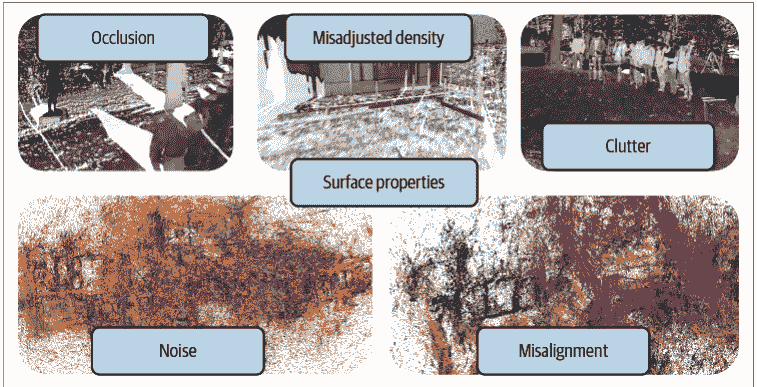

图9-1. 影响3D数据质量的各种现实世界现象示例

遮挡和杂乱会使情况进一步复杂化，因为物体可能部分隐藏或被其他物体包围。我们也不要忘记现实世界中物体的可变性。同一个物体根据角度、光线或位置的不同，看起来可能完全不同。

最重要的是，3D形状识别算法可能要求极高，尤其是在处理大型数据集或复杂形状时。这就是我们引出第一种方法的原因：RANSAC。

## RANSAC

RANSAC并非高深莫测，而是一种针对嘈杂、现实世界数据集的超级实用方法。它是一种试错方法，会将你的数据点分为两组：内点集和外点集。然后，你可以忽略外点，只处理内点（反之亦然）。所以让我用一个微小但简单的例子来说明RANSAC是如何工作的。假设我们想从图9-2的点云中检测一个3D平面。我们该怎么做呢？

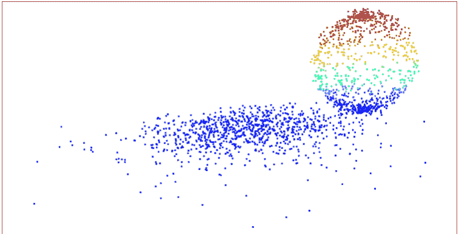

图9-2. 三维空间中的一组点构成一个点云

首先，我们从数据中创建一个平面，为此，我们从点云中随机选择三个点，这是定义一个平面所必需的。然后，我们简单地检查有多少剩余点落在该平面上（在某个阈值内），这将为该提议给出一个分数。然后，我们用三个新的随机点重复这个过程，看看进展如何。是更好了？还是更差了？

我们一遍又一遍地重复这个过程，比如说，10次、100次、1000次，然后我们选择得分最高的平面模型（即，对剩余数据点具有最佳“支持”的模型）。这将是我们的解决方案：支持点加上我们采样的三个点构成了我们的内点集，其余的是我们的外点集。

对于持怀疑态度的人，是否会产生一个问题？我们如何确定应该重复多少次这个过程？我们应该尝试多少次？嗯，这是我们可以计算的，但让我们暂时把它放在一边，专注于手头的问题：我们如何实现RANSAC进行3D点云形状检测？嗯，为了用RANSAC实现这个目标，我们分四个步骤进行（见图9-3）。

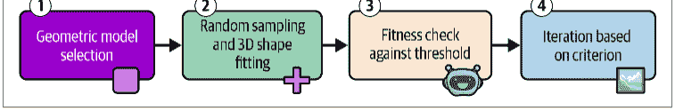

图9-3. RANSAC，一种用于3D数据形状检测的鲁棒方法，涉及四个关键步骤

首先，我们选择一个我们想要在数据中检测的几何模型（一个平面、一个球体等）。其次，我们将这个模型拟合到我们数据集中最小的随机样本（如果我们想定义一个平面，则随机取三个点）。第三，我们想通过检查有多少点接近感兴趣的表面来估计拟合的好坏，以获得内点计数。这意味着分两个阶段工作：定义一个3D形状检测参数（阈值），并计算到3D形状的距离，然后与该阈值进行比较。最后，我们重复这个过程一定的迭代次数，并保留使内点计数最大化的几何形状作为我们最佳的3D形状候选。

现在我们已经准备好了，让我们为我们的测试收集一些数据集。

## 数据与环境设置

在本节中，不止一个，而是有三个数据集可供你选择、下载并用于你的实验。选择这些是为了说明三种不同的场景，并提供可供操作的基础数据。可用的不同点云可以在本章的目录中找到（研究者桌面、汽车、游乐场）。我们想要展示的真实场景如下：

*机器人技术*
我们正在设计一个机器人，它需要在清洁时避开障碍物，同时清洁地面和桌面。我们还希望检测感兴趣元素的位置，并将其作为未来清洁任务的基础，以确定我们最初是否需要重新定位它们。

*ADAS（高级驾驶辅助系统）*
我们感兴趣的是让车辆自动驾驶：一辆自动驾驶汽车。为此，我们使用Velodyne VLP-16扫描的一个周期数据，我们通常对其进行实时分析以进行物体检测。

*建筑施工*
一个几年前建造的游乐场由于地基不稳定而出现问题。因此，我们想评估该元素的平整度，并确定是否需要进行找平操作。

## 几何模型选择

让我们设计一个易于扩展到不同用例的方法。为了获得更直接的体验，我们选择了平面几何。这是快速理解现有大量数据集的最佳方式。但请耐心听我说；我现在将给你一些关键的数学知识，我们用它来描述欧几里得空间中的平面。$\mathbb{R}^3$中平面方程的一般形式是 $ax + by + cz + d = 0$。

在一个法向量 $\vec{n} = (a, b, c)$ 中，该向量垂直于平面或与平面平行，常数 $a$、$b$ 和 $c$ 构成了该向量。一旦你掌握了这一点，处理变换（平移、旋转、缩放）并拟合它就变得非常容易。常数 $d$ 将使平面从原点偏移。

这意味着，如果一个点 $p = (x, y, z)$ 满足该方程，那么它就属于由法向量 $\vec{n}$ 引导的平面。如果你理解了这一点，你就理解了指导几何拟合的第一手原理。


几何拟合涉及为一组三维数据点找到最合适的几何模型，例如直线、平面或曲线。这个过程对于物体识别、运动跟踪和三维重建至关重要。通过将几何模型精确地拟合到数据上，我们可以提取有意义的信息，减少噪声，并提高分析和可视化的整体质量。

## 三维形状拟合

三维形状拟合使我们能够精确地建模和分析复杂的三维物体。通过将数学模型拟合到三维数据，我们可以提取有意义的信息，例如物体的形状、大小和方向。然后，我们可以利用形状拟合来识别和量化与理想形状的偏差，这至关重要，正如第8章所见。

让我们从头开始为三维点云开发一个RANSAC平面检测算法，以更好地理解其内部原理。我们使用三个库来实现这一点：Open3D、NumPy和scikit-learn（用于 $k$-d 树部分）。这已经是最精简的配置了。第一阶段是导入库：

```python
import open3d as o3d
import numpy as np

from sklearn.neighbors import KDTree
```

然后，我们加载一个点云，以解决数据和环境设置中暗示的场景之一：

```python
pcd = o3d.io.read_point_cloud("../DATA/the_researcher_desk.ply")
points = np.asarray(pcd.points)
```

现在，让我们深入了解参数。

## 手动参数设置

我们必须定义一个阈值参数，以确定一个点是属于拟合的平面形状（内点）还是离群点。我们的判断将基于点到平面的距离；因此，我们需要快速掌握点云中的单位。让我们用open3D显示点云：

```python
o3d.visualization.draw_geometries([pcd])
```

结果如图9-4所示。

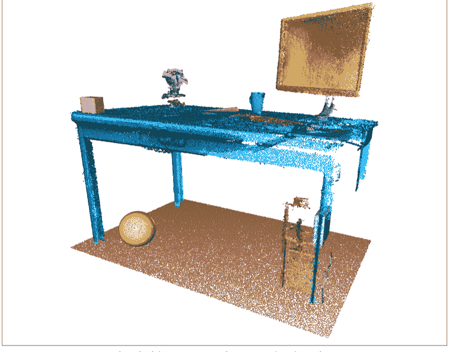

通过利用第3章和第5章的交互工具（以及第8章的分析工具），我们可以提取出，平均而言，相邻点之间的距离为5毫米。因此，我们可以将阈值参数设置为10倍高（完全是经验性的）：threshold = 0.05。

同样，我们可以将迭代次数设置为一个相当大的数字，比如1000次迭代。但是，利用数据驱动的启发式方法来计算这些参数难道不是更有帮助吗？

## 自动参数设置

我们可能受限于需要一些领域知识来设置阈值。因此，尝试绕过这一点以使该方法对非专家开放将是非常令人兴奋的。这里有一个有用的想法：如果我们计算数据集中点之间的平均距离，并以此为基础来设置阈值会怎样？

为了加速为每个点查询最近邻的过程，我们可以利用 $k$-d 树来尝试确定这样一个值。在这个阶段，我建议使用scikit-learn的实现，并在每个节点将 $k$-d 树分成两个超平面：

```python
tree = KDTree(np.array(points), leaf_size=2)
```

接下来，我们可以使用简单的查询方法来找出点云中每个点的 $k$ 个最近邻：

```python
nearest_dist, nearest_ind = tree.query(points, k=8)
```

这分别输出点距离和点索引。如果我们研究最近邻距离：

```python
nearest_dist_mean = np.mean(nearest_dist[:,1:],axis=0)
```

我们看到这八个邻居平均距离其邻居在4毫米到9毫米之间：

```
array([0.00462562, 0.0052954 , 0.00599643, 0.00672068, 0.00744045,
       0.0081288 , 0.00875479])
```

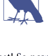

最近邻的第一个距离值总是等于0。你觉得奇怪吗？这是因为我们是用整个点云对自身进行查询；因此，每个点到自身的距离都是0。因此，我们需要过滤每行的第一个元素：nearest_dist, nearest_ind = tree.query(points, k=8)。

很好！所以现在，如果我们想获得每个点到其第 $n$ 个最近邻的平均距离的局部表示，我们可以使用：

```python
nearest_dist_m = np.mean(nearest_dist[:,1:])
```

我们得到6.7毫米。仔细选择参数对于确保RANSAC三维形状检测实验的成功至关重要。通过设置8到15个点的查询范围并平均它们的距离，我们可以有效地处理噪声数据和离群点，同时保持对细微形状变化的敏感性。这提供了点云中噪声比率的良好局部表示。这种方法有助于提高RANSAC算法的准确性和鲁棒性，从而获得更可靠的三维形状检测结果。


有一种自动方法可以每次获得正确的迭代次数。如果我们希望以概率 $p$（例如99%）成功，我们的数据具有离群值比率 $e$（例如60%），并且我们需要 $s$ 个点来创建我们的模型（这里是3），那么以下公式提供了我们需要的试验次数（迭代次数）：

$$T = \frac{\log (1 - p)}{\log \left(1 - (1 - e)^{8}\right)}$$

现在，我们准备好使用RANSAC进行模型拟合了。

## 使用RANSAC进行模型拟合

现在是时候研究RANSAC了，它是一种从包含离群值的数据集中估计数学模型参数的迭代过程。起点：这个数据集可能包含模型的观测值。正如我们之前看到的，我们从随机选择数据点开始这个过程，然后将它们拟合到一个模型。然后确定落在定义容差内的剩余数据点的数量。这个过程重复多次，拟合最多数据点（内点）的模型被选为最佳估计，从而有效地识别并排除离群值，使其不参与最终的模型拟合。

在自动化指定的迭代次数之前，让我们模拟一次迭代。首先，我们想从点云中抓取三个随机点：

```python
sample = points[np.random.choice(points.shape[0], 3, replace=False)]
```

然后，我们想确定平面的方程，例如，找到方程 $ax + by + cz + d = 0$ 的参数 $a, b, c$ 和 $d$。为此，我们可以利用一个奇妙的线性代数性质：两个向量的叉积会生成一个正交向量。

接下来，我们需要从平面上的同一点定义两个向量 v1 和 v2，然后计算它们的法向量，这将是平面的法向量：

```python
v1 = sample[1] - sample[0]
v2 = sample[2] - sample[0]
normal = np.cross(v1, v2)
```


两个向量的叉积总是产生一个垂直于两个输入向量的向量（正交），这不仅仅是一个数学巧合——它深深植根于几何和代数中。从几何上看，当你取两个向量时，它们定义了一个平面，而它们的叉积点垂直于这个平面。这个新向量的大小等于由原始向量形成的平行四边形的面积（|a||b|sin(θ)），而其方向遵循右手定则。这个性质使得叉积在处理旋转运动时特别有用，因为角动量必须垂直于旋转平面。

由此，我们可以归一化我们的法向量。由于我们通常只关心向量的方向（而不是它们的大小）用于计算，我们将其归一化为长度为1。这种归一化确保了无论数据集大小如何，计算都保持一致。然后得到定义向量的 *a*、*b* 和 *c*，并使用落在平面上的三个点之一来找到 *d*：*d* = − (*ax* + *by* + *cz*)：

```python
a,b,c = normal / np.linalg.norm(normal)
d = -np.dot(normal, sample[1])
```

现在，我们准备好计算任何剩余点到我们刚刚定义的平面的距离了。

## 点到平面的距离

如果你愿意相信我，以下是我们需要实现的内容。点到平面的距离使用以下符号表示：

$$D = \frac{|ax_1 + by_1 + cz_1 + d|}{\sqrt{a^2 + b^2 + c^2}}$$

这是点与平面之间的正交距离（即这些实体之间的最短欧几里得距离）。向量 *w* 在单位法向量 *n* 上的投影提供了点 *p* 与指定平面之间距离的大小。已知向量 *n* 的大小等于1，点 *p* 与平面之间的距离等于向量 *w* 和 *n* 点积的绝对值。这个距离是最短的，因为它是点与平面之间的正交距离（见图9-5）。

## 迭代与函数定义

我们需要重复执行一定次数来寻找最佳平面！为此，我们将构建一个函数，该函数以点坐标、阈值和迭代次数作为输入，并返回平面方程和内点索引：

```
def ransac_plane(points, num_iterations=1000, threshold=0.1):
    ...
    return best_plane, best_inliers
```

我们创建一个基于迭代参数的RANSAC循环。在每次循环中，我们将计算最佳拟合的RANSAC平面，并保留其方程和内点索引。通过if语句，我们检查当前迭代的得分是否为最大值，若是，则更新点索引。

现在，让我们来完善我们的RANSAC函数：

```
def ransac_plane(points, num_iterations=1000, threshold=0.1):
    best_inliers = []
    best_plane = None

    for _ in range(num_iterations):
        # 随机采样3个点
        sample = points[np.random.choice(points.shape[0], 3, replace=False)]

        # 计算平面方程 ax + by + cz + d = 0
        v1 = sample[1] - sample[0]
        v2 = sample[2] - sample[0]
        normal = np.cross(v1, v2)
        a, b, c = normal / np.linalg.norm(normal)
        # d = -np.dot(normal, sample[1])
        d = -np.sum(normal*sample[1])

        # 计算所有点到平面的距离
        distances = np.dot(points, [a, b, c]) + d / np.sqrt(a**2 + b**2 + c**2)

        # 统计内点
        inliers = np.where(np.abs(distances) < threshold)[0]

        if len(inliers) > len(best_inliers):
            best_inliers = inliers
            best_plane = (a, b, c, d)

    return best_plane, best_inliers
```

就这样，我们创建了一个用于平面检测的RANSAC函数，它可以处理3D点云。该函数经过充分优化，即使处理大型点云，也不用担心电脑过热！让我们将其扩展到一个实际案例中，即对点云进行分割。

## 应用1：RANSAC用于分割任务

我们从基本原理出发：RANSAC是一种从噪声数据中稳健估计模型参数的算法。有趣的是，当我们将RANSAC作为工作流中应用程序的一部分使用时。当用作3D分割的预处理步骤时，RANSAC有助于识别并移除输入数据中的离群点或噪声。通过将模型拟合到数据点的子集并迭代优化模型参数，RANSAC可以帮助我们检测出希望从一系列后续步骤中分离出来的主要形状。在我们的应用中，我们希望将地面与其他点分离。

因此，让我们将定义函数的结果保存到两个变量中：

```
plane_params, plane_inliers = ransac_plane(points, 1000, 0.14 )
```

现在，我们希望分割原始点云并高效地获取离群点（即非地面点）。这里有一个绝佳的方法。我们创建一个掩码，作为快速过滤器来获取不属于内点的其余点：

```
mask = np.ones(len(points), dtype=bool)
mask[plane_inliers] = False
outliers = points[mask]
```

我们现在有了一个内点集和一个离群点集！让我们用Open3D查看结果：

```
plane_cloud = o3d.geometry.PointCloud()
plane_cloud.points = o3d.utility.Vector3dVector(points[plane_inliers])
plane_cloud.paint_uniform_color([0.8, 0.2, 0.6])
#这会给点赋予统一的颜色

plane_outliers = o3d.geometry.PointCloud()
plane_outliers.points = o3d.utility.Vector3dVector(outliers)
plane_outliers.paint_uniform_color([0.3, 0.1, 0.9])

o3d.visualization.draw_geometries([plane_cloud, plane_outliers])
```

RANSAC准确地检测并分割出地面平面与点云的其余部分（见图9-7）。

我们在这个场景中找到了地面。这意味着我们可以将数据集分割成两组点：地面和其余元素。你可以继续迭代以细化场景中的各个组件。

你已经从头实现了一个完整的用于平面检测和3D点云分割的RANSAC模型拟合算法。此外，你现在可以自动设置RANSAC参数，从而实现100%的自动化，而不仅仅是99%的自动解决方案。这是一个重要的进步！既然你已经掌握了如何使用RANSAC，是时候探索我们场景的水平度了。

## 应用2：RANSAC用于分析任务

让我们探索另一个利用RANSAC的应用。我们可以有效地识别大型平面表面（如地板和墙壁）并拟合平面。通过检测这些主要平面，我们可以评估3D场景的水平度。这些信息对于各种3D分析任务至关重要，包括物体检测、分割和重建。

一个水平度良好的场景通过提供稳定的参考框架并降低分析复杂性，简化了这些任务。此外，检测水平度有助于识别3D数据中的潜在问题或挑战，例如倾斜或变形。

在这个案例研究中，我们首先加载一个点云，例如操场：

```
pcd = o3d.io.read_point_cloud("../DATA/the_playground.ply")
points = np.asarray(pcd.points)
```

然后，我们可以执行RANSAC以及自动参数设置（参见第276页的“自动参数设置”），同时对噪声水平保持高度适应性：

```
# 计算阈值
tree = KDTree(points, leaf_size=2)
nearest_dist, nearest_ind = tree.query(points, k=8)
nearest_dist_mean = np.mean(nearest_dist[:,1:],axis=0)
threshold = np.max(nearest_dist_mean) + np.std(nearest_dist_mean)

# RANSAC形状检测
t0 = time.time()
plane_params, plane_inliers = ransac_plane(points, 1000, threshold)
t1 = time.time()
```

有趣的是，我们可以研究如何提取检测到的形状的平面度。为此，让我们定义一个计算两个向量之间夹角的函数：

```
def angle_between_vectors(v1, v2):
    # 将列表转换为numpy数组
    v1 = np.array(v1)
    v2 = np.array(v2)

    # 计算点积
    dot_product = np.dot(v1, v2)

    # 计算模长
    v1_mag = np.linalg.norm(v1)
    v2_mag = np.linalg.norm(v2)

    # 计算夹角的余弦值
    cos_angle = dot_product / (v1_mag * v2_mag)

    # 使用反余弦函数得到弧度制角度
    angle_rad = np.arccos(np.clip(cos_angle, -1.0, 1.0))


## 转换为角度
angle_deg = np.degrees(angle_rad)

return min(angle_deg, 180 - angle_deg)
```

让我简要解释一下函数中发生的事情。首先，我将两个向量（v1 和 v2）转换为 NumPy 数组（这些向量可以表示检测到的平面或地板的法线方向）。

然后我计算这些向量之间的点积。这告诉我它们的方向有多“相似”。如果向量指向相同方向，点积就大。如果指向相反方向，点积为负。

我还需要知道每个向量的长度（它们的模）。我使用 NumPy 的 norm 函数来完成这个。这就像测量那些假想棍子的长度。接下来，我将点积除以模的乘积。这给了我所准备向量之间夹角的余弦值（以度为单位，这更直观）。如果两个向量几乎平行但指向相反方向，我会得到一个小角度，而不是接近 180 度的角度。

我们现在可以用这个来检查检测到的平面是否水平，方法是将它们的法向量与向上方向 [0,0,1] 进行比较。如果角度接近 0 或 180 度，表面很可能是水平的，比如地板。如果接近 90 度，它可能是一面墙：

```
angle = angle_between_vectors(plane_params[0:3], [0,0,1])
print(f"The angle of the plane is {angle:.2f} degrees")
```

这返回一个 9.41° 的角度，在数据集上得到了验证。这告诉我们我们的平面相对于完美水平面的倾斜或旋转程度。可以把它想象成测量两根指向不同方向的棍子之间的角度。你也可以用这个来检查一个表面是否与地面水平，或者两个平面是否垂直。RANSAC 在 3D 场景中用于分析任务的结果如图 9-8 所示。

最后，让我们探索利用 RANSAC 的第三种场景：如果我们想将内点作为 3D 建模任务的基础会怎样？

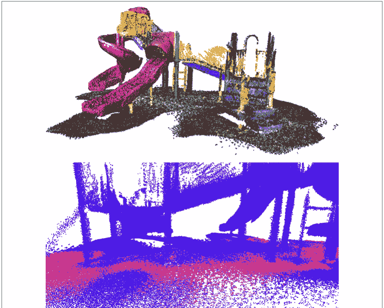

图 9-8. RANSAC 在 3D 场景分析任务中的应用

## 应用 3：用于建模任务的 RANSAC

那么，如果我们想用 RANSAC 来建模一个几何场景呢？嗯，这也是可行的！通过反复采样和拟合，RANSAC 识别出几个最能解释底层形状的模型参数，同时忽略离群点和噪声。

一旦获得了一个稳健的模型，内点就可以用来重建 3D 形状，从而得到一个精细且准确的 3D 模型。如果我们对所有找到的 3D 形状重复这个过程，就可以对整个场景进行建模。为了实现这个想法，我们将分几个步骤进行，如图 9-9 所示。我们首先导入必要的库（见图 9-10）。

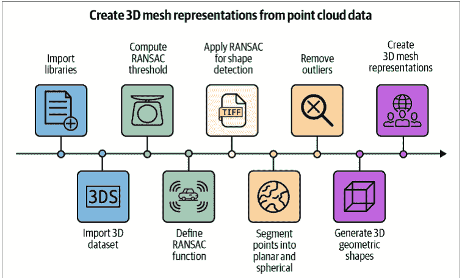

图 9-9. 应用 3：用于建模任务的 RANSAC

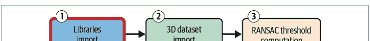

图 9-10. 步骤 1：导入库

Open3D 用于 3D 数据处理和可视化，NumPy 用于数值运算，scikit-learn 用于额外的机器学习功能，如 k-d 树估计：

```
import numpy as np
import open3d as o3d

from sklearn.neighbors import KDTree
```

然后，我们从一个 PLY 文件加载点云数据集（见图 9-11）。

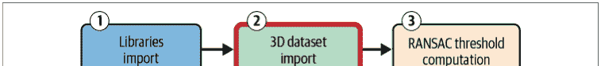

图 9-11. 步骤 2：导入 3D 数据集

点云使用 Open3D 的 `io.read_point_cloud()` 函数读取。然后将点提取为 NumPy 数组以便于操作。为了让我们对正在处理的数据有一个直观的理解，点云使用 Open3D 的可视化函数进行可视化：

```
pcd = o3d.io.read_point_cloud("../DATA/pcd_synthetic.ply")

points = np.asarray(pcd.points)
o3d.visualization.draw_geometries([pcd])
```

我们继续计算一个自适应阈值，该阈值稍后将在形状检测过程中使用（见图 9-12）。

> 让我解释一下为什么自适应阈值在这里对于处理点云数据非常有用。我们正在处理不同环境和物体的 3D 扫描。有时这些扫描非常详细，有很多点紧密排列。其他时候，它们很稀疏，点分布得很开。当扫描仪离物体的某些部分比其他部分更近，或者使用不同的扫描仪时，这种情况经常发生。对于这些场景，拥有一种能够考虑非均匀采样的方法变得至关重要。

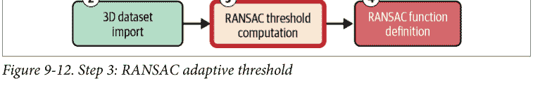

这个小的 Python 代码片段提供了一种自适应方法，使脚本能够有效地处理不同密度的点云：

```
tree = KDTree(points, leaf_size=2)
nearest_dist, nearest_ind = tree.query(points, k=8)
nearest_dist_mean = np.mean(nearest_dist[:,1:],axis=0)
threshold = np.min(nearest_dist_mean) + np.std(nearest_dist_mean)
```

代码首先创建一个 KDTree，它有助于快速找到任何给定点的最近点。我计算每个点到这些邻居的平均距离。有些区域的平均距离小（密集区域），有些区域的平均距离大（稀疏区域）。这就是自适应部分变得重要的地方。我没有使用像“0.1 米”这样的固定阈值，而是让数据告诉我什么是合适的。我取发现的最小平均距离（代表最密集的区域）并加上一个标准差。

标准差解释了整个扫描中这些距离的变化程度。这种自适应方法使我们免于一个常见的麻烦。如果我使用一个对密集扫描效果很好的固定阈值，它可能在稀疏扫描上完全失败。或者如果我为稀疏扫描设置它，对于密集扫描来说又太宽松了。该算法通过适应每个特定的点云，可以自动处理这两种情况。

例如，如果我正在扫描一栋建筑，靠近扫描仪的墙壁可能每隔几毫米就有一个点，而远处的角落可能相隔几厘米才有一个点。自适应阈值自然地调整到这两个区域，使我的形状检测在整个扫描过程中更加可靠。

现在，让我们定义两个 RANSAC 函数（见图 9-13）。第一个，`ransac_plane()`，旨在检测点云中的平面。第二个，`ransac_sphere()`，检测球体。

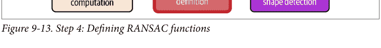

两个函数的工作原理相同：它们从点云中随机采样点，将一个形状拟合到这些点上，然后找到所有与此形状匹配的点（内点），匹配范围在之前计算的阈值内。这个过程重复多次，具有最多内点的形状被认为是最佳拟合：

```
def ransac_plane(points, num_iterations=1000, threshold=0.1):
    best_inliers = []
    best_plane = None

    for _ in range(num_iterations):
        # Randomly sample 3 points
        sample = points[np.random.choice(points.shape[0], 3, replace=False)]

        # Calculate plane equation ax + by + cz + d = 0
        v1 = sample[1] - sample[0]
        v2 = sample[2] - sample[0]
        normal = np.cross(v1, v2)
        a, b, c = normal / np.linalg.norm(normal)
        # d = -np.dot(normal, sample[1])
        d = -np.sum(normal*sample[1])

        # Calculate distances of all points to the plane
        distances = (np.dot(points, [a, b, c]) + d) / np.sqrt(a**2 + b**2 + c**2)

        # Count inliers
        inliers = np.where(np.abs(distances) < threshold)[0]

        if len(inliers) > len(best_inliers):
            best_inliers = inliers
            best_plane = (a, b, c, d)

    return best_plane, best_inliers

def ransac_sphere(points, num_iterations=1000, threshold=0.1):
    best_inliers = []
    best_sphere = None

    for _ in range(num_iterations):
        # Randomly sample 4 points
        sample = points[np.random.choice(points.shape[0], 4, replace=False)]

        # Calculate sphere equation (x-a)^2 + (y-b)^2 + (z-c)^2 = r^2
        A = np.array([
            [2*(sample[1][0]-sample[0][0]), 2*(sample[1][1]-sample[0][1]),
             2*(sample[1][2]-sample[0][2])],
            [2*(sample[2][0]-sample[0][0]), 2*(sample[2][1]-sample[0][1]),
             2*(sample[2][2]-sample[0][2])],
            [2*(sample[3][0]-sample[0][0]), 2*(sample[3][1]-sample[0][1]),
             2*(sample[3][2]-sample[0][2])]
        ])

        B = np.array([
            [sample[1][0]**2 + sample[1][1]**2 + sample[1][2]**2 -
             sample[0][0]**2 - sample[0][1]**2 - sample[0][2]**2],
            [sample[2][0]**2 + sample[2][1]**2 + sample[2][2]**2 -
             sample[0][0]**2 - sample[0][1]**2 - sample[0][2]**2],
            [sample[3][0]**2 + sample[3][1]**2 + sample[3][2]**2 -
             sample[0][0]**2 - sample[0][1]**2 - sample[0][2]**2]
        ])

        center = np.linalg.solve(A, B).flatten()
        radius = np.sqrt(np.sum((sample[0] - center)**2))

        # Calculate distances of all points to the sphere surface
        distances = np.abs(np.sqrt(np.sum((points - center)**2,
                                          axis=1)) - radius)

        # Count inliers
        inliers = np.where(distances < threshold)[0]

        if len(inliers) > len(best_inliers):
            best_inliers = inliers
            best_sphere = (*center, radius)

    return best_sphere, best_inliers
```

让我们分解一下 RANSAC 如何通过这些函数找到平面和球体。对于平面，我随机选择三个点，并使用向量数学找到一个穿过它们的平面方程——想象在三个图钉之间拉伸一张纸。对于球体，我需要四个点，并且需要解一个方程组来找到中心和半径——就像找到一个接触空间中四个特定点的气泡。在两种情况下，我都会多次运行此过程（默认为1000次），并跟踪哪个形状在小距离阈值内拟合了最多的点。这个阈值类似于容差。如果一个点到我的形状的距离小于这个距离，我就将其计为该形状的一部分（一个内点）。在尝试所有迭代后，我返回形状参数和最匹配的点列表。RANSAC的美妙之处在于，即使存在噪声或点属于多个形状，它也能找到形状，正如我们之前观察到的，在3D扫描中找到一个放在地板上的球体。现在我们已经定义了RANSAC函数，我们将它们应用于检测点云中的平面和球体（见图9-14）。

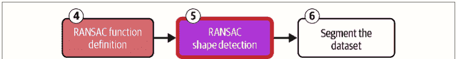

图9-14. 步骤5：检测几何形状

得到的参数从数学上描述了检测到的形状。对于平面，我们得到平面方程的系数（ax + by + cz + d = 0）。对于球体，我们得到其中心坐标和半径：

```
# Find plane and sphere using RANSAC
plane_params, plane_inliers = ransac_plane(points, 1000, threshold)
sphere_params, sphere_inliers = ransac_sphere(points, 1000, threshold)

print(f"Plane equation: {plane_params[0]}x + {plane_params[1]}y + {plane_params[2]}z + {plane_params[3]} = 0")
print(f"Sphere equation: (x - {sphere_params[0]})^2 + (y - {sphere_params[1]})^2 + (z - {sphere_params[2]})^2 = {sphere_params[3]**2}")
```

检测到形状后，我们现在可以对点云进行分割。我们将平面点和球体点的点云分开（见图9-15）。

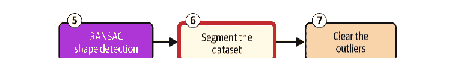

图9-15. 步骤6：点云分割

为了直观地区分它们，平面点为深灰色，球体点为浅灰色。然后分别可视化每个分割后的点云，让我们可以看到形状检测的效果如何（见图9-16）：

```
# Select and segment the planar points
plane_cloud = o3d.geometry.PointCloud()
plane_cloud.points = o3d.utility.Vector3dVector(points[plane_inliers])
plane_cloud.paint_uniform_color([1, 0, 0])  # Red
o3d.visualization.draw_geometries([plane_cloud])
```

```
# Select and segment the spherical points
sphere_cloud = o3d.geometry.PointCloud()
sphere_cloud.points = o3d.utility.Vector3dVector(points[sphere_inliers])
sphere_cloud.paint_uniform_color([0, 1, 0])  # Green
o3d.visualization.draw_geometries([sphere_cloud])
```

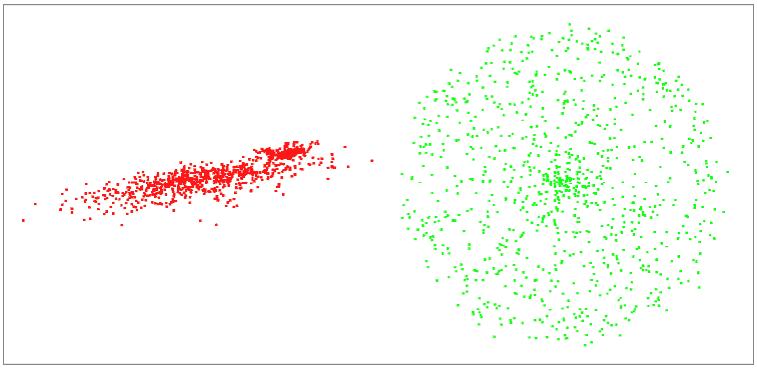

图9-16. 平面点为深灰色，球体点为浅灰色

并非我们原始点云中的所有点都属于检测到的平面或球体（见图9-17）。


图9-17. 步骤7：清除离群点

我们需要识别这些不属于我们检测到的形状的剩余点，并将它们着色为深灰色：

```
from functools import reduce

# Select and segment the remaining points
other_points = np.delete(points, reduce(np.union1d, (plane_inliers, sphere_inliers)), axis=0)

other_cloud = o3d.geometry.PointCloud()
other_cloud.points = o3d.utility.Vector3dVector(other_points)
other_cloud.paint_uniform_color([0.7, 0.7, 0.7])
```


如果处理大型点云，`np.delete`可能不是我的推荐。在这种情况下，更倾向于使用布尔掩码方法。原因如下：`np.delete`会创建整个数组的新副本，然后删除元素，这会使用大量内存，尤其是在处理大型点云时。布尔掩码更高效，因为它只创建一个与点数大小相同的布尔数组，然后执行单次索引操作。这意味着如果我有一百万个点，我只需要一个一百万个布尔值的数组，而不是首先复制整个点数组。

可以这样想：与其复制一本巨大的书然后撕掉页面（`np.delete`），我只需在要保留的页面上贴上便利贴（布尔掩码），然后只阅读这些页面。

现在让我们创建一个包含所有三个点集的可视化：平面点、球体点和其他点。这让我们完整地看到原始点云是如何被分割的（见图9-22A）：

```
o3d.visualization.draw_geometries([plane_cloud, sphere_cloud, other_cloud])
```

在这个阶段，我们有了灰色点（离群点）、深灰色点（平面）和浅灰色点（球体）之间的良好划分。为了接近我们的3D建模目标，让我们采用相同的方法，但使用我们提取的参数来生成网格形式的3D模型。这是我们的下一步（见图9-18）。

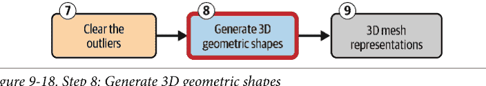

为此，让我们定义两个函数。`create_plane_mesh()`函数创建检测到的平面的网格表示，而`create_sphere_mesh()`对球体执行相同操作。这些函数接受检测到的形状的参数，并生成可以与我们的点云一起可视化的3D网格对象：

```
def create_plane_mesh(plane_params, size=2, resolution=20):
    a, b, c, d = plane_params

    # Create a grid of points on the plane
    x = np.linspace(-size/2, size/2, resolution)
    y = np.linspace(-size/2, size/2, resolution)
    X, Y = np.meshgrid(x, y)

    # Calculate Z coordinates
    Z = (-d - a*X - b*Y) / c

    # Create vertices and triangles
    vertices = np.column_stack((X.ravel(), Y.ravel(), Z.ravel()))
    triangles = []
    for i in range(resolution-1):
        for j in range(resolution-1):
            v0 = i * resolution + j
            v1 = v0 + 1
            v2 = (i + 1) * resolution + j
            v3 = v2 + 1
            triangles.extend([[v0, v2, v1], [v1, v2, v3]])

    # Create Open3D mesh
    mesh = o3d.geometry.TriangleMesh()
    mesh.vertices = o3d.utility.Vector3dVector(vertices)
    mesh.triangles = o3d.utility.Vector3iVector(triangles)
    mesh.compute_vertex_normals()

    return mesh
```

```
def create_sphere_mesh(sphere_params, resolution=50):
    center_x, center_y, center_z, radius = sphere_params

    # Create a UV sphere
    u = np.linspace(0, 2 * np.pi, resolution)
    v = np.linspace(0, np.pi, resolution)
    x = center_x + radius * np.outer(np.cos(u), np.sin(v))
    y = center_y + radius * np.outer(np.sin(u), np.sin(v))
    z = center_z + radius * np.outer(np.ones_like(u), np.cos(v))

    # Create vertices and triangles
    vertices = np.column_stack((x.ravel(), y.ravel(), z.ravel()))
    triangles = []
    for i in range(resolution-1):
        for j in range(resolution-1):
            v0 = i * resolution + j
            v1 = v0 + 1
            v2 = (i + 1) * resolution + j
            v3 = v2 + 1
            triangles.extend([[v0, v2, v1], [v1, v2, v3]])

    # Create Open3D mesh
    mesh = o3d.geometry.TriangleMesh()
    mesh.vertices = o3d.utility.Vector3dVector(vertices)
    mesh.triangles = o3d.utility.Vector3iVector(triangles)
    mesh.compute_vertex_normals()

    return mesh
```

简短说明：`size`和`resolution`值的选择将取决于应用程序的具体需求，在所需的细节层次（LoD）和可用计算资源之间取得平衡。通常，您会希望使用更大的尺寸和更高的分辨率来获得更准确、视觉上更吸引人的网格，同时考虑性能和内存使用方面的权衡。默认参数应该适用于大多数应用程序。


创建平面网格时，关键参数是定义平面方程的`plane_params`元组，以及`size`和`resolution`参数。`size`参数确定平面的物理范围，设置x和y坐标的范围。`resolution`参数控制细节层次，更高的分辨率会导致网格中有更多的顶点和三角形。该函数使用这些输入在平面上生成点网格，然后构建顶点和三角形以形成三角网格。类似地，创建球体网格时，重要参数是指定球体中心坐标和半径的`sphere_params`元组，以及`resolution`参数。`resolution`设置球体经度和纬度轴上的点数，更高的值会产生更详细的网格，但也会增加计算和内存需求。

使用定义的函数，我们现在创建检测到的平面和球体的网格表示（见图9-19）。为了将它们与点云区分开来，平面网格为灰色，球体网格为浅灰色（见图9-22b）。

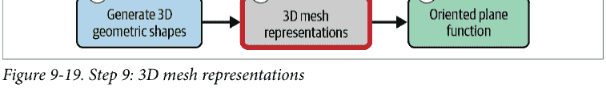

*图9-19. 步骤9：3D网格表示*

在许多场景中，计算有向平面表示可能比仅使用平面方程更有用。平面方程给出了法向量和偏移量，但有向平面还包括两个平面内向量，它们定义了平面的完整3D坐标系。

这种更完整的信息使得更容易推理平面的位置和方向，简化了各种几何计算，并能够实现更准确的可视化以及与其他3D数据结构的集成。虽然确定平面内向量需要一些额外的计算，但拥有完整的有向平面表示的好处通常是值得的，特别是在涉及在3D上下文中对齐、变换或处理平面的任务中。因此，为了接近这些目标，让我们定义一个名为`create_oriented_plane_mesh()`的新函数（见图9-20）。

## 用于三维形状检测的区域生长法

让我与你分享我最喜欢的场景理解技术之一：区域生长法。它非常基础，可以作为强大的形状检测方法，用于需要勾勒几何组成部分的复杂场景。区域生长法是一种分割技术，它从一个种子点开始，如果邻近点满足某些条件，就将其迭代地添加到区域中。

在三维数据集的背景下，这些条件通常涉及空间邻近性、特征值（例如，强度、颜色或法线）的相似性，或其他相关属性。作为首要方法，我们看到测量空间邻近性可以通过使用定义的度量来实现，例如欧几里得距离、曼哈顿距离或马氏距离。

欧氏距离是最直接的度量。它测量两点之间的直接直线距离。想象一只鸟从A点直接飞到B点。曼哈顿距离，也称为城市街区距离或L1距离，是通过计算两点对应坐标差的绝对值之和来计算的。想象一个出租车司机在城市网格中导航。它行驶的距离就是曼哈顿距离，因为它必须沿着街道行驶，不能穿过建筑物。马氏距离是一种更复杂的度量，它考虑了数据的协方差。这意味着它考虑了数据不同维度之间的相关性。在处理分布不均匀或具有相关特征的数据时，它特别有用。

第二个方面是在所选特征内使用相似性度量。三维数据集的常见特征包括强度、颜色（如果适用）、表面法线、曲率或点描述符。我们也可以基于连通性来生长区域，例如4连通性（同一平面上的相邻点）或6连通性（同一平面上或正上方/正下方的相邻点）。但是区域生长是如何工作的呢？

## 区域生长原理

我们基本上遵循一个六步流程，如图9-23所示。首先，我们选择一个种子点。这是区域生长过程的起点。你可以手动选择一个种子点，也可以使用算法根据某些标准自动选择一个。种子点的选择会显著影响分割的质量。然后，一旦你有了种子点，你就创建一个空区域来存储将要添加的点。这个区域充当被分割对象的容器。

然后我们识别当前区域点的邻居。在三维中，这涉及到查看与某个搜索结构相邻的点。定义

我们可以使用PCA根据内点来定向平面。通过这样做，我们可以创建一个更贴合实际数据的平面网格，特别是在检测到的平面可能无法与坐标轴完美对齐的情况下：

```python
def create_oriented_plane_mesh(plane_params, inlier_points):
    a, b, c, d = plane_params
    normal = np.array([a, b, c])

    # Project inlier points onto the plane
    projected_points = inlier_points - (np.dot(inlier_points, normal) +
    d).reshape(-1, 1) * normal / np.dot(normal, normal)

    # Perform PCA to find the principal directions on the plane
    mean = np.mean(projected_points, axis=0)
    centered_points = projected_points - mean
    _, _, vh = np.linalg.svd(centered_points)

    # The first two right singular vectors are the principal directions
    u = vh[0]
    v = vh[1]

    # Calculate the extent of the points along the principal directions
    u_coords = np.dot(centered_points, u)
    v_coords = np.dot(centered_points, v)
    u_range = np.max(u_coords) - np.min(u_coords)
    v_range = np.max(v_coords) - np.min(v_coords)

    # Create a grid of points on the plane
    resolution = 20
    u_grid = np.linspace(-u_range/2, u_range/2, resolution)
    v_grid = np.linspace(-v_range/2, v_range/2, resolution)
    U, V = np.meshgrid(u_grid, v_grid)

    # Calculate the 3D coordinates of the grid points
    grid_points = mean + U.reshape(-1, 1) * u + V.reshape(-1, 1) * v

    # Create vertices and triangles
    vertices = grid_points
    triangles = []
    for i in range(resolution-1):
        for j in range(resolution-1):
            v0 = i * resolution + j
            v1 = v0 + 1
            v2 = (i + 1) * resolution + j
            v3 = v2 + 1
            triangles.extend([[v0, v2, v1], [v1, v2, v3]])

    # Create Open3D mesh
    mesh = o3d.geometry.TriangleMesh()
    mesh.vertices = o3d.utility.Vector3dVector(vertices)
    mesh.triangles = o3d.utility.Vector3iVector(triangles)
    mesh.compute_vertex_normals()

    return mesh
```

作为最后一步，让我们为处理后的数据创建最终的可视化（见图9-21）。

让我们使用新函数生成定向平面网格。这些优化后的网格，连同所有点云（平面点、球体点和其他点），被组合成最终的可视化。这为我们提供了原始点云数据、我们在其中检测到的形状以及这些形状的高质量网格表示的全面视图（见图9-22C）。

这现在展示了处理三维点云数据的完整工作流程，从加载和分析数据到检测形状并创建这些形状的可视化表示。它展示了将RANSAC和PCA的数学技术与现代三维处理库相结合，从复杂三维数据中提取有意义信息的强大能力。现在，在进入下一阶段之前，让我在表9-1中明确一些与使用RANSAC进行三维形状检测相关的限制。

表9-1. RANSAC用于三维形状检测的局限性

| 局限性 | 描述 |
|---|---|
| 对噪声敏感 | RANSAC对点云数据中的噪声和离群点敏感。高噪声水平或随机点可能导致算法无法检测到准确的形状。 |
| 难以处理复杂形状 | RANSAC对简单的几何形状（如平面、球体和圆柱体）效果最好。它可能难以准确检测更复杂或不规则的三维形状。 |
| 参数调整 | RANSAC有几个需要仔细调整的参数，例如距离阈值和迭代次数。找到最优参数可能很耗时，并且依赖于数据集。 |
| 计算复杂度 | RANSAC算法涉及随机采样和迭代模型拟合，这可能计算成本高昂，特别是对于大型点云或高分辨率形状。 |
| 偏向于较大的形状 | RANSAC倾向于检测点云中较大的形状，因为它们会有更多的内点。较小或被遮挡的形状可能会被忽略。 |
| 一次只能处理一种形状类型 | 标准的RANSAC实现一次只能检测一种类型的形状（例如，平面或球体）。同时检测多种形状类型需要更高级的技术。 |
| 缺乏不确定性量化 | RANSAC不提供关于检测到的形状的不确定性或置信度的明确信息，这对于下游应用可能很重要。 |
| 对初始条件敏感 | RANSAC的解可能对初始随机采样点敏感，可能导致在相同数据上运行的结果不同。 |

总的来说，虽然RANSAC是一种强大且广泛使用的三维形状检测算法，但这些是用户在将其应用于现实世界三维数据集时应该意识到的局限性。仔细的参数调整、数据预处理以及使用更高级的技术可能是克服这些挑战所必需的。因此，让我们先搁置这一点，以便在第308页的“混合方法：RANSAC与区域生长”中提供一些解决方案。但首先，让我们继续讨论三维区域生长解决方案。

## 区域生长：实际场景设置

在本节中，我们将深入探讨区域生长在三维点云分割和形状识别中的实际应用。这意味着首先需要针对我们的实际场景进行设置（参见图9-24）。

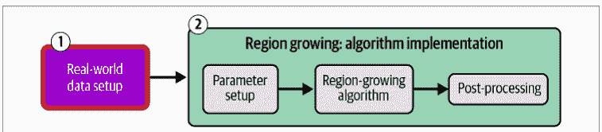

该过程涉及几个关键阶段，首先是导入必要的库，例如用于计算的NumPy和SciPy（利用KDTree模块加速点查询），以及用于可视化的Open3D：

```python
import numpy as np
from scipy.spatial import KDTree
import open3d as o3d
```

选择这些库是因为它们功能强大且开销极小，能够实现流畅高效的处理。这一基础使我们能够精确、灵活地处理点云数据，确保我们可以专注于核心的形状检测任务，而不会被外围问题所困扰。所使用的数据集包括AI生成的点云和通过移动激光扫描系统在工业环境中获取的点云。这是测试其鲁棒性以及集成到生产工作流潜力的好方法。让我们加载点云数据集，这些数据集可以是从AI生成的模型到移动激光系统获取的真实扫描数据（参见图9-25A）：

```python
point_clouds = ["../DATA/darth_vader.ply", "../DATA/depth_anything.ply",
"../DATA/industrial_room_part.ply", "../../DATA/NAAVIS_EXTERIOR.ply"]
pcd = o3d.io.read_point_cloud(point_clouds[-1])
o3d.visualization.draw_geometries([pcd])
```

在此时可视化点云（参见图9-25B和C）可以初步了解其结构和复杂性，为分割算法的参数选择提供指导。这一阶段至关重要，因为它通过将原始点云转换为NumPy数组，为后续处理奠定了基础：

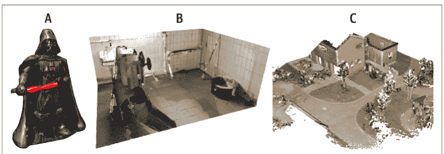

图9-25. (A) 由生成式AI创建的达斯·维达生成模型；(B) 来自地面激光扫描仪的工业房间；(C) 来自移动测绘LiDAR系统的户外场景

```python
# 将Open3D对象转换为NumPy以进行处理
input_points = np.asarray(pcd.points)
normals = np.asarray(pcd.normals)
```

数据准备就绪后，我们进入下一阶段：区域生长的实现。

## 区域生长：实现

此图可视化了区域生长算法中的关键参数（参见图9-26）。

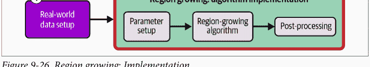

图9-26. 区域生长：实现

正如我们之前所见，要实现区域生长算法，我们首先定义参数。两个关键参数决定了分割效果：角度阈值，根据两点表面法线之间的夹角判断它们是否属于同一区域；以及距离阈值，限制考虑进行区域生长的点的邻近范围：

```python
angle_threshold = np.pi/6
distance_threshold = 0.1
```

这些参数是基于知识驱动的，反映了点云数据的分辨率和特性，对于确保分割捕获有意义的结构至关重要。它们定义了π/6弧度（相当于30度）的角度阈值和0.1米的距离阈值。这些阈值将用于在区域生长过程中确定点是否应包含在同一分割段中。

> 与RANSAC类似，我们可以自动确定距离阈值，从而跳过此定义，更接近完全无监督的方法。当前参数0.1米适用于户外激光扫描场景，但对于其他场景可能证明存在局限性。

接下来，我们进入初始化阶段。我们确定输入点云中的总点数，并将此值存储在变量N中：

```python
N = len(input_points) # 总点数
```

然后，使用输入点创建*k*-d树数据结构。此*k*-d树对于在整个算法中执行高效的最近邻搜索至关重要：

```python
kd_tree = KDTree(input_points)
```

同时初始化两个关键数据结构：`segments`，一个空列表，用于存储生成的分割区域；以及`unsegmented`，一个包含点云中所有点索引的集合。最初，`unsegmented`包含所有点索引，因为尚未进行任何分割：

```python
segments = [] # 算法输出
unsegmented = set(range(N)) # 算法工作集
```

初始化之后，主分割循环开始，并在点云中仍有未分割点时持续运行。每次迭代代表一个新分割段的生长：

```python
while unsegmented:
```

在每个新分割段开始时，算法从`unsegmented`集合中随机选择一个种子点。此种子点成为新分割段的第一个点。然后，算法使用*k*-d树高效地查找此种子点在指定距离阈值内的所有邻居。这些邻居点被添加到一个栈中，该栈将以深度优先方式处理点：

```python
# 开始一个新的分割段
    seed_index = unsegmented.pop()
    segment = [seed_index]
    # 待处理点的栈（邻居索引）
    stack = list(kd_tree.query_ball_point(input_points[seed_index],
    distance_threshold))
```

然后算法进入一个嵌套循环，处理栈中的点直到栈为空。对于从栈中取出的每个点，算法首先检查它是否仍然未分割。如果该点已被分割（即不在`unsegmented`集合中），则跳过它，算法继续处理栈中的下一个点：

```python
while stack:
    point_index = stack.pop()
    if point_index not in unsegmented:
        continue # 确保我们考虑“空闲”点
```

对于仍然未分割的点，算法执行一个关键检查：计算当前点的法向量与种子点的法向量之间的夹角。这是通过两个法向量的点积，然后使用反余弦函数得到角度来完成的。如果此角度小于指定的角度阈值，则该点与种子点属于同一分割段：

```python
normal_angle = np.arccos(np.dot(normals[seed_index], normals[point_index]))
```

当一个点满足角度标准时，会发生几个操作。首先，该点从`unsegmented`集合中移除，标记为已处理。然后将其添加到当前分割段。最后，算法再次使用k-d树查找此新添加点在距离阈值内的所有邻居。这些邻居被添加到栈中以供将来处理。此过程允许分割段有机地生长，并包含所有满足距离和角度标准的连接点：

```python
if normal_angle < angle_threshold:
    unsegmented.remove(point_index)
    segment.append(point_index)
    stack.extend(kd_tree.query_ball_point(input_points[point_index],
    distance_threshold))
```

一旦栈为空，意味着所有满足标准的连接点都已添加到当前分割段。此时，完整的分割段被添加到`segments`列表中，算法返回主循环，使用新的种子点开始一个新的分割段：

```python
segments.append(segment)
```

此区域生长实现有效地将点云分割成点彼此接近（在距离阈值内）且法线方向相似（在角度阈值内）的区域。生成的分割段代表了具有几何属性一致性的点云区域。

该循环的效率得益于使用了 $k$-d 树结构，它加速了最近邻搜索并显著减少了计算时间：区域生长成功完成于：2.682 秒。

是的，我知道，我们目前还不想可视化结果。但是，如果你去探索 `segments` 变量，你就能了解分组是如何处理的。例如：

```
segments[8]
```

这将返回：

```
[1580, 1614, 1669, 1626, 1607, 1653, 1672, 1611, 1624, 1602, 1589, 1659, 1681, 1608, 1662, 1627]
```

这些是属于新分割段的点云中点的索引。

分割后，我们使用一个新函数为识别出的分割段分配标签和颜色，以便进行视觉验证：

```
def coloring_segments(input_points, segments):
    colors_l = np.zeros_like(input_points)
    labels = np.zeros(len(input_points), dtype=int)

    count = 0
    for segment in segments:
        # color = np.random.rand(3)  # Generate a random color
        # Assign the color to all points in the segment
        # Optional
        if len(segment) <= 1:
            labels[segment] = -1
            colors_l[segment] = [0,0,0]
            count-=1
        elif len(segment) > 1 and len(segment) < 10:
            labels[segment] = 0
            colors_l[segment] = [1,0,0]
            count-=1
        else:
            labels[segment] = count
            colors_l[segment] = np.random.rand(3)
            count+=1
    return labels, colors_l
```

```
labels, colors_l = coloring_segments(input_points, segments)
```

这一步不仅有助于定性评估，也为后续的后处理任务铺平了道路。例如，可以过滤掉小的分割段，并可以分析分割段的特定特征，如平面度或空间范围。这些属性可用于更高级的任务，如物体识别或场景理解，从而增强分割数据的实用性。

为了可视化我们的结果并确保我们可以使用它们，我们使用 Open3D 将颜色分配给点云，然后创建等效的 NumPy 点云以供导出：

```
pcd.colors = o3d.utility.Vector3dVector(colors_l)
pcd_segmented = np.hstack((input_points, np.atleast_2d(labels).T))
```

还剩下什么？好吧，让我们可视化我们的结果：

```
o3d.visualization.draw_geometries([pcd])
```

这将返回我们在图 9-27 中看到的内容。

这使我们能够非常高效地将地面和最平整的元素作为单个分割段检索出来，这些分割段随后可用于形状拟合等目的。此外，这还表明改变参数（搜索距离和阈值）实际上会极大地影响结果。例如，在图 9-28 中，我改变了距离阈值。

图 9-28. 改变参数对分割的影响

如你所见，距离越大，我们得到的分割段就越少，所需的时间也越长。但如果我改变角度阈值会怎样（见图 9-29）？

图 9-29. 改变角度阈值的效果

注意，我们得到了更大的分割段，其极限是 90° 不再非常相关。最后，我们导出分割后的点云以供外部使用，确保与 CloudCompare 等其他软件工具的互操作性：

```
python
o3d.io.write_point_cloud("../RESULTS/NAAVIS_EXTERIOR_segmented.ply", pcd)
np.savetxt("../RESULTS/NAAVIS_EXTERIOR_segmented.xyz", pcd_segmented,
           fmt='%1.6f', delimiter=';', header='X;Y;Z;Segment')
```

这一步强调了我们方法的实际应用，使其能够无缝集成到更广泛的工作流程中。通过将我们的分割数据转换为 PLY 或 ASCII 等开放格式，我们促进了在 Python 环境之外进行进一步分析。

我们使用了距离和法线来衡量点之间的距离和相似度，以便对其进行估计和分组。但如果我们想利用颜色信息呢？嗯，这是可能的。只是，有一些技巧，因为我们不能像使用法线分量 (Nx, Ny, Nz) 那样直接使用 R、G、B 信息。我设计了一个 RGB 区域生长解决方案，你可以直接在 3D 资源中心找到它。

现在，让我们设计一个结合 RANSAC 和区域生长的混合解决方案。

## 混合方法：RANSAC 与区域生长

首先，让我们导入两个库和点云，并对点云进行轻度预处理：

```
python
import numpy as np
import open3d as o3d

pcd = o3d.io.read_point_cloud('../DATA/office.ply')
center = pcd.get_center()
pcd.translate(-center)
```

我们使用 Open3D 的 I/O 功能从名为 *office.ply* 的 PLY 文件中读取点云。加载点云后，我们使用 `get_center()` 方法计算其中心。这给出了云中所有点的平均位置。然后我们平移整个点云，使其中心位于原点 (0, 0, 0)。最后，我们使用 Open3D 的可视化模块显示居中的点云，使我们能够直观地检查数据（见图 9-30a）：

```
python
o3d.visualization.draw_geometries([pcd])
```

然后我们可以计算点云中每个点的最近邻距离。此操作计算到每个点最近邻点的距离：

```
python
nn_distance = pcd.compute_nearest_neighbor_distance()
```

由此产生的信息对于在后续步骤中设置适当的参数至关重要，特别是对于法线估计和平面片检测。了解点云中点的密度和分布有助于我们对搜索半径和其他基于距离的参数做出明智的决策。

现在，我们可以定义几个参数，用于后续流程步骤：

```
python
p_radius = np.mean(nn_distance)*3

p_normal_variance_threshold_deg = 45
p_coplanarity_deg = 75
p_outlier_ratio=0.75
p_min_plane_edge_length=0
p_min_num_points=0
```

`p_radius` 设置为平均最近邻距离的三倍，为局部操作提供合理的搜索半径。我们还设置了法线方差和共面性的角度阈值，这些将用于确定如何将点分组到平面片中。离群值比率决定了在一个片中可以被视为离群值的最大点比例。最后，我们设置了平面边缘长度和点数的最小值，在此例中均设置为 0。这意味着我们不对检测到的平面施加任何最小尺寸或点数限制。最后，由于我使用的是一个没有法线的点云，让我为点云中的每个点估计法线向量：

```
pcd.estimate_normals(search_param=o3d.geometry.KDTreeSearchParamHybrid(radius = p_radius, max_nn=30))
```

法线向量垂直于每个点的表面，并提供有关局部几何形状的重要信息。我们使用一种混合搜索方法，结合了半径搜索和最大邻居数。搜索半径设置为我们先前计算的 `p_radius`，并将搜索限制在最多 30 个最近邻点。这种混合方法有助于确保在不同点密度下法线估计的一致性（见图 9-30b）。

我们现在准备使用一种结合了 RANSAC 和区域生长的复杂算法来检测点云中的平面片：

```
oboxes = pcd.detect_planar_patches(
    p_normal_variance_threshold_deg,
    p_coplanarity_deg,
    p_outlier_ratio,
    p_min_plane_edge_length,
    p_min_num_points,
    search_param=o3d.geometry.KDTreeSearchParamKNN(knn=30)
    )
```

此方法能有效识别点云中的平坦表面，如墙壁、地板或桌面。该函数使用我们之前定义的参数来确定如何将点分组到平面片中。它返回一个有向边界框 (oboxes) 列表，其中封装了每个检测到的平面区域。最后，我们打印检测到的片数，让我们了解在点云中发现了多少个不同的平面：

```
print("Detected {} patches".format(len(oboxes)))
```

这返回了 31 个片。

最后阶段是为每个检测到的平面片创建 3D 网格。我们遍历每个有向边界框并从中创建一个三角网格：

```
p_obox = 0.5

geometries = []
obox_volumes = []

for obox in oboxes:
    mesh = o3d.geometry.TriangleMesh.create_from_oriented_bounding_box(obox,
        scale=[1, 1, p_obox])
    mesh.paint_uniform_color(obox.color)
    mesh.compute_vertex_normals()
    geometries.append(mesh)
    obox_volumes.append(obox.volume())
    geometries.append(obox)
```

网格在 z 方向上按 `p_obox`（设置为 0.5）进行缩放，这有助于直观地区分平面片。然后我们使用分配给边界框的颜色为网格着色，并计算其顶点法线以在可视化中实现正确的光照效果。网格和原始边界框都被添加到几何体列表中。此外，我们计算并存储每个边界框的体积，这将用于估计检测到的平面区域的总占用体积。

剩下的就是可视化我们算法的结果：

```
o3d.visualization.draw_geometries(geometries+[pcd])
```

```
struct_vol = np.sum(obox_volumes)
print(f"Estimated Occupied Volume: {struct_vol} m3")
```

这使我们能够看到我们的平面片检测效果如何，以及检测到的平面与原始数据之间的关系：

```
o3d.visualization.draw_geometries(geometries+[pcd])
```

这将得到图 9-31。

## 总结

你可以为你掌握的两个新的3D数据处理方法——RANSAC和区域生长——感到自豪。RANSAC擅长将预定义模型拟合到数据上，即使数据中存在显著的噪声和异常值；而区域生长则专注于基于共享的局部特征对点进行分组，这使其成为无需显式形状模型的分割任务的理想选择。

RANSAC的优势在于其迭代的模型拟合过程。它随机采样数据点的子集，并尝试拟合所需的模型，例如平面或球体。与拟合模型高度吻合的点被归类为内点，而偏差显著的点则被标记为异常值。它处理高噪声和异常值数据集的能力非常出色。这使得RANSAC适用于诸如在杂乱的点云中检测主要平面（墙壁、地板）等应用。

相比之下，区域生长采用自下而上的方法，系统地探索局部邻域，并基于特定的相似性标准进行分组。这些标准可以基于多种因素，例如与种子点的接近度、颜色相似性或表面法线的对齐程度，这使其能够高度适应不同的分割任务。区域生长能够有效地分割点云中共享共同局部属性的对象或区域，即使这些对象不符合简单的几何形状（参见表9-2）。

表9-2. RANSAC与区域生长在点云分割中的比较

| | RANSAC | 区域生长 |
|---|---|---|
| 目标 | 模型拟合 | 分割 |
| 噪声鲁棒性 | 高 | 中等 |
| 形状预定义 | 需要 | 不需要 |
| 起始点 | 随机样本 | 种子点 |
| 生长方式 | 模型驱动 | 特征相似性和邻近性驱动 |

可以首先使用RANSAC来稳健地识别点云中的主要平面，即使在有噪声的数据中也是如此。一旦检测到这些平面，就可以应用区域生长来细化每个平面内的分割。这个细化过程可以利用额外的特征，如颜色信息，从而获得更准确、更详细的分割结果。这种混合方法有效地利用了两种技术的优势：RANSAC提供了对异常值的鲁棒性和初始形状检测能力，而区域生长则贡献了其基于局部特征相似性的分割能力。

至此，你已经清晰地理解了RANSAC和区域生长在3D形状识别任务背后的原理。你也研究了如何选择合适的参数，这对这些算法的有效性有重大影响。现实世界的数据通常需要稳健且自适应的方法才能实现准确的形状识别。

你可以为你新掌握的技能感到自豪，这些技能使你能够：

- 使用Python从零开始实现RANSAC进行平面和球体检测。
- 理解内点、异常值以及迭代的模型拟合过程。
- 确定RANSAC的最佳迭代次数，以及如何自动设置距离阈值等参数。
- 使用几何特征（法线、距离）和颜色信息，实现用于3D点云分割的区域生长。
- 实现一种用于基于平面的建模的混合方法（RANSAC结合区域生长）。

## 实践项目

现在，如果你觉得准备好了，这里有一个项目可以帮助你精进技能：

1.  在提供的数据集或其他3D点云上，尝试结合RANSAC和区域生长的混合方法。
2.  调整两种算法的参数，例如距离和角度阈值，并观察它们对分割结果的影响。
3.  探索不同的种子点选择策略对区域生长性能的影响。
4.  研究使用不同的颜色空间和颜色差异度量进行基于颜色的区域生长。
5.  应用这些技术提取形状特征，用于对你家中物体的基于知识的对象识别。

我们主要利用了几何特征，如法线和距离。要整合更丰富的特征集，需要开发新的相似性度量来包含这些额外特征，或者使用机器学习技术来学习对特定形状识别任务更具区分性的特征表示。这将在第14章中学习。最后，探索混合和高级技术可能会很有趣。例如，开发策略来自动确定最佳的操作顺序（先RANSAC后区域生长，或反之）以及针对不同数据集和形状识别任务的参数。整合其他分割技术，如基于图的分割或聚类，可能会产生更强大、更通用的3D形状识别流程。这是第12章的目标。

虽然这些方法对于形状检测机制非常有用，但要知道它们在建模、分割和分类工作流程中也备受青睐。好消息是？我们将在第10章深入探讨这些内容，并从3D建模开始。

# 第10章
## 3D建模：高级技术

3D建模对于创建现实世界物体和空间的数字版本至关重要。它允许进行精确的分析、模拟和可视化，这对于建筑、科学或娱乐应用非常重要。作为工程师和研究人员，我们始终追求3D模型的精确性和清晰度。第4章中的传统3D建模技术可能无法很好地处理复杂形状或大型点云数据集。低质量的3D数据表示可能导致视觉问题、不正确的模拟和缓慢的数据处理，从而更难获得最佳结果。

在本章中，我们希望提升3D建模技术。让我们通过四种独特而强大的方法来研究使用Python的可靠解决方案：高保真网格化、体素化技术、参数化建模和基于图像的3D建模（参见图10-1）。

本节探讨制作精确、高效和美观3D模型的主要技术。我们将学习如何提高网格质量、从点云创建基于体素的模型，以及使用参数化建模来更好地控制几何形状。

在最后一节，我们还将研究基于图像的3D重建，这涉及使用AI模型从单张图像估计深度并创建3D对象。本章旨在进行实践探索。每种技术都以实用的Python代码为基础，让你可以进行实验。让我们直接开始吧。

你可以在[3D数据科学资源中心](https://example.com)找到本章的所有材料。要访问文件（代码、数据集、文章）和资源，你可能需要提供电子邮件地址、个人密码或证明你是本书所有者的凭证。

## 高保真网格化

请允许我演示一个使用Python的3D表面重建流程，该流程能高效地从点云生成网格。你可以导出、可视化结果，并将其整合到你偏好的3D软件中（参见图10-2）。

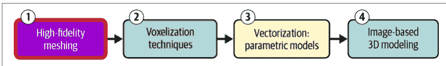

此外，我提供了一种生成多级细节（LoDs）的简便方法，这对于创建虚拟现实应用等实时应用非常有用。

## 高保真3D网格概述

为了补充前面的章节，我想强调网格是如何构成的。3D网格是几何数据结构，通常由相互连接的几何实体（通常是三角形）组成，明确描述了一个表面。网格是定义3D模型表面的顶点、边和面。

网格的质量显著影响其在3D数据科学中的可用性和准确性。事实上，它影响：

- **视觉可靠性**
  高保真网格确保平滑着色，并避免在渲染或动画中出现锯齿边缘等视觉伪影。
- **模拟准确性**
  复杂的模拟，如流体流动分析或结构力学，严重依赖于网格质量。
- **数据处理效率**
  良好结构的网格有利于数据科学中使用的许多数据处理算法，如网格分割或配准。

因此，将目标与底层的网格化策略对齐至关重要。首要考虑的是我们是想创建一个多边形模型，还是另一种表示3D模型的方式。我邀请你参考第4章以获得更广阔的视角，并参考表10-1以补充该视角。

表10-1. 各种3D模型表示（多边形、NURBS、SDF、布尔组合）的主要特征

| 特征 | 多边形 | NURBS (B-rep) | SDF (B-rep) | 布尔组合 |
| :--- | :--- | :--- | :--- | :--- |
| 表示 | 顶点、边和面的网格 | 定义曲线或曲面的数学函数 | 定义到表面距离的函数 | 基本形状的组合 |
| 灵活性 | 通用，可表示广泛的形状 | 高度灵活，可表示复杂的曲线和曲面 | 可表示复杂形状，尤其是有机形状 | 限于所使用基本形状的形状 |
| 编辑 | 直接操作顶点和边 | 操作控制点和权重 | 需要专门的技术和工具 | 对现有形状进行布尔运算 |
| 渲染效率 | 通常高效 | 计算成本可能很高，尤其是对于复杂模型 | 计算成本可能很高，尤其是对于复杂形状 | 取决于组合形状的复杂性 |
| 细节层次 | 可通过添加或移除多边形来调整 | 可通过修改控制点和权重来调整 | 可通过修改SDF函数来调整 | 取决于基本形状的分辨率 |
| 常见用例 | 游戏开发、3D打印、CAD | 工业设计、汽车设计、建筑 | 程序化生成、流体模拟、关卡设计 | 从更简单的形状创建复杂形状 |

让我们从右向左倒推。对3D模型进行布尔运算最适合通过组合更简单的基本形状来创建复杂形状。这种技术在工业设计、建筑和制造中非常有用，因为对物体的形状和拓扑进行精确控制至关重要（我邀请你阅读第4章，了解如何使用布尔运算创建3D模型）。

有符号距离函数（SDF）擅长表示有机形状和隐式表面，使其成为视频游戏中流体模拟和关卡设计的理想选择。SDF通常与布尔组合在内部过程中配合良好。然后，出于相同的需求（可视化和互操作性），它们被转换为多边形3D网格模型。以下是使用此sdf库的一个示例：

```
from sdf import *

f = sphere(1) & box(1.5)

c = cylinder(0.5)
f -= c.orient(X) | c.orient(Y) | c.orient(Z)

f.save('out.stl')
```

这将生成图10-3。

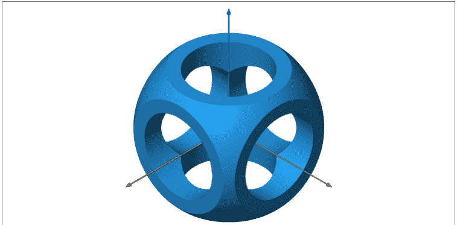

图10-3. 从前面的代码块导出的3D几何体。

非均匀有理B样条（NURBS）具有高度灵活性，可以表示广泛的曲线和曲面，使其适用于汽车设计、造船和航空航天工程，在这些领域中，对曲面的形状和平滑度进行精确控制至关重要。PyNURBS是为创建、操作和分析NURBS曲线和曲面而设计的Python库。它提供了处理B样条函数、曲线和曲面拟合以及几何建模的工具，就像你在专业CAD软件中可能找到的那样。这个Python代码片段是一个如何用控制点定义曲线对象的示例：

```python
from pynurbs import Curve

# Define control points for a NURBS curve
control_points = [[0, 0, 0], [1, 2, 0], [2, 1, 0], [3, 0, 0]]

# Create a NURBS curve object
curve = Curve(control_points=control_points, degree=3)
```

然后，出于可视化和互操作性的目的，这些通常被转换为多边形网格模型：

```python
# Generate a surface mesh from the curve
surface_mesh = curve.extrude(height=1.0)
```

3D多边形网格模型是使用最广泛的3D模型类型，因为它们具有通用性、简单性和高效性。它们由顶点、边和面组成，使其易于表示、操作和渲染。这种简单性允许使用高效的算法进行平滑、细分和碰撞检测等操作。此外，多边形网格可以轻松地在不同的软件应用程序之间导出和导入，确保兼容性和互操作性。它们能够以不同的LoD近似复杂形状，使其适用于从视频游戏开发和3D打印到医学成像和科学可视化等广泛的应用。


多边形模型是3D建模中最常用的网格模型。因此，我们专注于它们。此外，虽然布尔组合不是一种特定的3D模型表示，但它们是一种强大的技术，用于组合不同的形状以创建更复杂的形状。最后，如果你想深入了解NURBS和SDF，我邀请你探索3D数据科学资源中心，获取有关这些策略的教程。

虽然像NURBS和SDF这样的其他表示提供了更高的精度和灵活性，但对于大多数实际用例，多边形网格通常在准确性和性能之间提供了良好的平衡。因此，让我展示我们如何通过创建和编辑网格模型的顶点、边和面来生成3D多边形网格模型。这个过程可以从头开始，或者通过雕刻机制（网格模型像粘土或泥土一样被塑形，通过直接操作物体的表面。雕刻通常与其他建模技术结合使用，以创建逼真和复杂的模型），或者通过3D重建方法（将物理对象转换为3D数字模型）来完成。

程序化建模是大规模生成3D网格的一种令人兴奋的方式。它使用算法和数学函数生成3D网格模型。这个过程对于创建难以手动建模的复杂和详细的模型非常有益，例如自然景观、云或流体：

```python
from procedural import mountain_terrain, generate_forest

# Define parameters for a mountainous terrain
mountain_params = {"peak_height": 2.0, "valley_depth": 1.0, "size": (20.0, 20.0)}

# Generate a mountain terrain mesh
mountain_mesh = mountain_terrain.generate(mountain_params)

# Define parameters for a forest
forest_params = {"tree_type": "pine", "density": 50, "area": mountain_mesh.bbox}

# Generate a forest on the mountain terrain
forest_mesh = generate_forest.generate(forest_params, base_mesh=mountain_mesh)

# Combine and visualize the generated meshes (visualization libraries needed)
combined_mesh = mountain_mesh + forest_mesh
combined_mesh.visualize()
```

现在你对网格有了更好的了解，让我们利用Python来定义一个高保真的网格化工作流程。

## 任务目标

你参观了丹麦的一座博物馆，发现了一尊真正引起你共鸣的雕像。你毫不犹豫，立即按照第3章所示的三维重建方法拍摄了多张照片。你希望通过3D打印将其制作成实体复制品。经过一番研究，你了解到需要将这组图像转换为适合3D打印的三维模型。因此，你需要从数据中生成一致的网格。本任务旨在设计一个高效的工作流程，将三维重建工作流中的三维点云转换为可打印的物体。

## 数据准备

打开你的Python脚本工具（如Spyder GUI、Jupyter或Google Colab），并导入两个库：

```
import numpy as np
import open3d as o3d
```

接下来，我们建立变量来存储数据路径：

```
input_path="your_path_to_file/"
output_path="your_path_to_output_folder/"
dataname="sample.xyz"
point_cloud= np.loadtxt(input_path+dataname,skiprows=1)
```

最后，我们将`point_cloud`变量的数据类型从NumPy转换为Open3D的`o3d.geometry.PointCloud`类型，以便后续处理：

```
pcd = o3d.geometry.PointCloud()
pcd.points = o3d.utility.Vector3dVector(point_cloud[:,:3])
pcd.colors = o3d.utility.Vector3dVector(point_cloud[:,3:6]/255)
pcd.normals = o3d.utility.Vector3dVector(point_cloud[:,6:9])
```

以下命令实例化了Open3D点云对象，并从原始NumPy数组中添加了点、颜色和法线。为了快速查看加载内容的可视化表示，你可以使用以下命令：

```
o3d.visualization.draw_geometries([pcd])
```

## 选择网格化策略

我们已准备好通过从点云生成网格来开始表面重建过程。我将提供我偏好的方法以实现高效的结果。然而，在此之前，我们必须理解基本过程。我遵循两种特定的网格化策略。

## 三维网格化：球旋转算法

球旋转算法利用一个虚拟球体通过模拟从点云创建网格。最初，我们假设提供的点云由从物体表面采样的点组成。这些点必须准确地描绘出在重建网格中明确定义的光滑清晰表面（见图10-4）。基于这个前提，想象让一个小球在点云表面滚动。

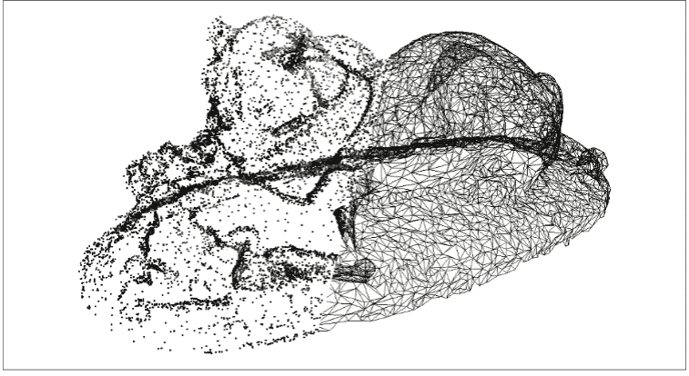

这个小球的大小由网格的尺度决定，应略大于点之间的典型间距。当球被放置到表面上时，它会被困住并停留在三个特定位置，形成一个称为种子三角形的三角形。球从该点开始沿着由两点形成的三角形边缘移动。球停留在不同的位置，利用两个现有顶点形成一个新的三角形。此外，一个新的三角形被添加到网格中。随着我们逐步旋转和移动球，更多的三角形被生成并添加到网格中。球持续滚动，直到网格完全构建完成（见图10-5）。

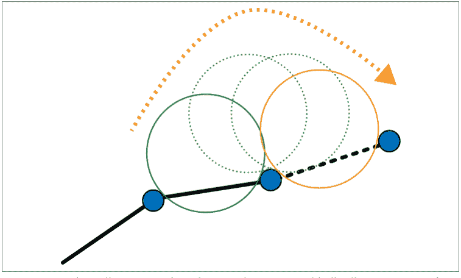

球旋转算法背后的原理很简单，但在过程中还有其他需要考虑的因素：

*选择球半径的标准是什么？*
半径是通过经验分析确定的，需考虑输入点云的大小和尺度。理想情况下，球的直径应略大于点之间的平均距离。

*如果某些区域的点之间距离很大，导致球穿过怎么办？*
当球绕着一条边旋转时，它可能无法击中表面上的正确点，而是与物体上的另一个点甚至之前击中的完全相同的三个位置发生碰撞。在这种情况下，我们验证新形成的三角形面片的法向量是否与相关顶点的法向量一致对齐。如果条件不满足，我们丢弃该三角形并产生一个空洞。

*如果表面有褶皱或凹陷，表面与自身之间的间隙小于球的大小怎么办？*
在这种情况下，球会穿过褶皱并忽略褶皱内的任何点。然而，这种行为并不理想，因为重建的网格会偏离实际形状。

如果表面被分成多个点区域，使得球无法在这些区域之间平滑滚动怎么办？

虚拟球在不同位置反复放置到表面上。此过程确保球覆盖整个网格，即使点分布不均匀。

图10-6中的图形展示了半径影响的五个不同方面。理想的网格在最精确的几何对齐和最少的三角形数量之间实现了和谐的平衡。

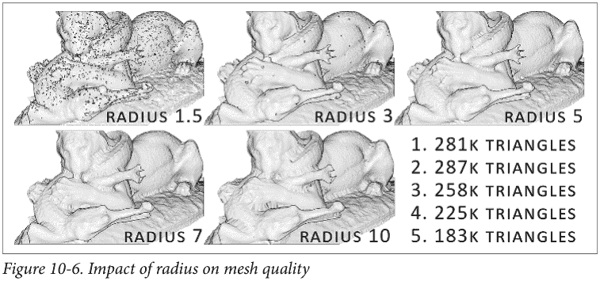

最终，找到完美的半径归结于理解你所处理点云的独特特征，如其密度、噪声水平和底层几何结构。一些实验，结合基于视觉反馈的交互式调整，通常能找到最佳点并产生高质量的网格。

使用球旋转算法对三维点云进行网格化时，确定合适的半径可能很棘手但至关重要。我喜欢从自适应方法开始，根据整个云的局部点密度调整半径。通过分析最近邻距离的分布，我可以将半径设置为平均或中位距离的倍数——足够大以连接密集区域中的点，但又不至于太大以至于在稀疏区域产生不必要的连接。我发现另一种有用的技术是利用八叉树数据结构来划分三维空间，并计算每个八叉树节点处点之间的平均距离。然后，我使用这些节点距离估计值的最小值或平均值来设置球半径，这有助于考虑点密度的局部变化。

然而，在这个阶段，你也可以使用另一种方法：用于三维重建的[泊松算法](https://example.com)。

## 用于三维重建的泊松算法

[泊松重建](https://example.com)是一个更复杂且数学化的过程。所采用的策略是一种隐式网格化方法，它试图将数据包裹在一个光滑的织物状结构中。简而言之，我们的方法涉及构建一组新的点，这些点代表与法线相关的[等值面](https://example.com)，以从原始点集拟合一个水密表面。存在多个参数影响网格化过程的结果：

*哪个深度？*
树深度在重建过程中使用。深度越大，网格越复杂（默认值：8）。当处理有噪声的输入时，算法无法识别异常值。因此，它们被作为顶点包含在生成的网格中。较低的值（通常在5到7之间）会产生平滑效果，但会牺牲精细细节。深度值越高，生成的网格顶点就越多（见[图10-7](https://example.com)）。

*哪个宽度？*
这定义了树结构最详细级别的期望宽度，该树结构是一个八叉树（请参阅[第4章](https://example.com)以复习）。如果深度已确定，则忽略此过程参数。

*你指的是哪个测量尺度？*
这涉及重建立方体的直径与样本边界立方体的直径之比。这个概念非常理论化，默认参数通常在值为1.1时效果最佳。

*哪种拟合？*
如果启用了`linear_fit`参数，重建器将使用线性插值来估计等值顶点的位置。

## 其他三维网格化策略

除了泊松表面重建和球体旋转算法之外，还存在其他几种三维网格化策略。但由于本书篇幅已经相当大，我们决定不包含这些其他方法。不过，让我为您提供一个快速比较，以帮助您判断其他方法是否更能满足您的需求，并向您指出可以在[三维数据科学资源中心](https://www.3d-data-science.com/)找到的补充教程。

首先，[行进立方体算法](https://en.wikipedia.org/wiki/Marching_cubes)在三维标量场上运行，例如体数据集或隐式表面表示。它通过遍历三维网格、分析每个立方体的标量值并生成三角形来近似底层表面。行进立方体算法以处理复杂拓扑结构和生成平滑、水密网格而闻名。它是科学可视化和计算机图形学领域中可视化体数据的首选方法。您可以在[三维数据科学资源中心](https://www.3d-data-science.com/)找到详细的Python教程。

其次，[德劳内三角剖分](https://en.wikipedia.org/wiki/Delaunay_triangulation)是一种通过连接一组三维点来创建网格的方法，旨在最大化所有三角形的最小角度。这会产生高质量、形状良好的三角形单元，这对于依赖网格的有限元分析和其他计算方法至关重要。基于德劳内三角剖分的网格化在计算几何和工程应用中被广泛使用，特别是当输入数据是三维点云时。

最后，[泰森多边形图](https://en.wikipedia.org/wiki/Voronoi_diagram)将三维空间划分为一组多面体单元，每个单元包含最接近特定生成点的点。这种体方法能够很好地处理复杂拓扑和噪声，适用于空间划分、质心泰森多边形细分以及其他受益于多面体网格表示而非三角形网格表示的应用。我在表10-2中总结了这些策略。

表10-2. 不同的三维网格化策略

| 算法 | 噪声处理能力 | 计算复杂度 | 典型应用 |
| :--- | :--- | :--- | :--- |
| 球体旋转算法 (BPA) | 中等 | O(n log n) | CAD，计算机图形学 |
| 泊松表面重建 | 良好 | O(n log n) | 三维扫描，医学成像 |
| 行进立方体算法 | 中等 | O(n) | 体数据可视化，等值面提取 |
| 德劳内三角剖分 | 中等 | O(n log n) | 有限元分析，计算几何 |
| 泰森多边形图 | 中等 | O(n log n) | 空间划分，质心泰森多边形细分 |

掌握了这些方法，我们就能应对非常广泛的解决方案。现在，让我们探索如何用Python实现这一切。

## 使用Python进行三维网格化

让我们深入探讨两种选定的网格化方法：球体旋转算法和泊松重建。

## 球体旋转算法

首先，我们通过利用所有点之间距离的平均长度来计算所需的半径参数：

```
distances = pcd.compute_nearest_neighbor_distance()
avg_dist = np.mean(distances)
radius = 3 * avg_dist
```

使用单个命令行，我们可以生成一个网格并将其保存在名为`bpa_mesh`的变量中：

```
bpa_mesh = o3d.geometry.TriangleMesh.create_from_point_cloud_ball_pivoting(pcd,
o3d.utility.DoubleVector([radius, radius * 2]))
```

在导出网格之前，我们可以选择将输出的分辨率降低到合适的三角形数量，例如100,000个三角形：

```
dec_mesh = mesh.simplify_quadric_decimation(100000)
```

此外，如果您怀疑网格可能包含异常伪影，可以使用以下指令来验证其一致性：

```
dec_mesh.remove_degenerate_triangles()
dec_mesh.remove_duplicated_triangles()
dec_mesh.remove_duplicated_vertices()
dec_mesh.remove_non_manifold_edges()
```

我发现这些后处理操作对于清理和优化输出非常有益。`remove_degenerate_triangles()`会移除任何在网格化过程中可能遗漏的平坦或零面积三角形。然后，我运行`remove_duplicated_triangles()`来识别并移除任何完全相同的冗余面。更进一步，`remove_duplicated_vertices()`有助于合并任何占据完全相同物理位置的顶点，从而简化网格几何结构。最后，`remove_non_manifold_edges()`非常适合处理网格连接不合理的边缘情况，移除任何可能导致后续问题的非流形元素。通过执行这一系列清理操作，您可以优化三维网格，提高其质量，减小文件大小，并确保它们为下游建模、可视化或高级任务做好准备。

## 使用泊松进行三维重建

使用泊松分布获取结果是一个简单直接的过程。您必须如前所述修改提供给函数的参数：

```
poisson_mesh = o3d.geometry.TriangleMesh.create_from_point_cloud_poisson(pcd,
    depth=8, width=0, scale=1.1, linear_fit=False)[0]
```

该函数返回一个由`o3d.geometry`对象和NumPy数组组成的序列。要仅选择`o3d.geometry`，您需要在末尾加上`[0]`。

为了获得纯净的结果，通常需要加入一个裁剪过程，以消除左图中明显标记为灰色的不需要的伪影（参见图10-9）。

为此，我们计算包含未处理点云的初始边界框。然后，我们利用此边界框排除网格中超出其边界的所有表面：

```
bbox = pcd.get_axis_aligned_bounding_box()
p_mesh_crop = poisson_mesh.crop(bbox)
```

恭喜您成功获得了一个或多个存储网格几何结构的变量。为了完成将其纳入应用程序的过程，我们可以将其导出。这正是研究变得有趣的地方。

## 细节层次创建

使用`write_triangle_mesh`函数导出数据简单易行。创建文件时，我们需要包含所需的扩展名（可以是.ply、.obj、.stl或.gltf）以及我们希望导出的网格。

在这里，我们将球体旋转算法和泊松重建都存储为.ply文件：

```
o3d.io.write_triangle_mesh(output_path+"bpa_mesh.ply", dec_mesh)
o3d.io.write_triangle_mesh(output_path+"p_mesh_c.ply", p_mesh_crop)
```

但我们可以通过生成具有多个细节层次的三维网格更进一步。这对于优化各种应用中的性能和视觉质量非常有用。通过创建复杂三维模型的简化版本，您可以根据观察者的距离和可用的计算资源来调整细节层次。

这允许您在近距离渲染更详细的模型，而在远处使用更简单、分辨率更低的模型。这种技术显著提高了帧率并减少了渲染时间，尤其是在视频游戏和虚拟现实等实时应用中。此外，细节层次有助于管理内存使用，因为您可以根据当前视图和可用系统资源选择性地加载和卸载不同的细节层次。

为了高效地生成多个细节层次，我们首先创建您的初始函数。该函数需要一个网格、一个细节层次列表（指定为目标三角形数量）、生成文件的文件格式以及文件将被写入的文件目录。该函数将在脚本中编写，其结构如下：

```
def lod_mesh_export(mesh, lods, extension, path):
    mesh_lods={}
    for i in lods:
        mesh_lod = mesh.simplify_quadric_decimation(i)
        o3d.io.write_triangle_mesh(path+"lod_"+str(i)+extension, mesh_lod)
        mesh_lods[i]=mesh_lod
    print("generation of "+str(i)+" LoD successful")
    return mesh_lods
```

该函数有两个主要功能。首先，它允许您将数据导出到您选择的特定位置，并采用所需的文件格式。其次，它提供了将结果保留在变量中的选项，这对于在Python中进行进一步处理可能很有帮助。它执行复杂的操作，尽管执行时似乎没有可见的变化。请放心，您的应用程序现在已更新了`lod_mesh_export`的定义。因此，您可以轻松地在控制台中使用它，并用您想要的值修改参数：

```
my_lods = lod_mesh_export(bpa_mesh, [100000,50000,10000,1000,100], ".ply", output_path)
```

特别有趣的是，现在不再需要为不同的细节层次反复重写大量代码。该函数需要输入各种参数：

```
my_lods2 = lod_mesh_export(bpa_mesh, [8000,800,300], ".ply", output_path)
```

要在Python中可视化包含100个三角形的特定细节层次，您可以使用以下命令访问并可视化它：

```
o3d.visualization.draw_geometries([my_lods[100]])
```

恭喜您已经建立了一个可以生成具有不同细节层次的三维网格的系统。现在，让我们进入可视化部分。

## 可视化与软件

要在 Python 之外查看数据，你可以使用自己偏好的程序，例如 Blender、MeshLab 或 CloudCompare 等开源工具（完整软件列表请参见第 2 章）。只需将输出文件加载到软件的图形用户界面中即可。通过 WebGL，你可以直接使用网页上的 Three.js 编辑器访问网格。如果你想开发虚拟世界体验，我建议从 Blender 开始，按照我在 3D 数据科学资源中心提供的系列教程进行学习。最终，你可以将其集成到任何 3D 打印软件中，并通过在线打印服务商获取成本估算（参见图 10-10A）。


为确保 3D 打印成功，适当的网格准备工作至关重要。首先，检查网格的水密性以避免打印错误。你可以使用 MeshLab 来识别并修复网格中的任何孔洞或缝隙。其次，优化网格以适应 3D 打印，确保足够的厚度并移除不必要的细节。Blender 或 MeshLab 等工具可以帮助完成这些任务。第三，在打印平台上正确放置模型，以最小化支撑结构并提高打印质量。最后，选择合适的文件格式（如 STL 或 OBJ），并将模型导出用于 3D 打印。请记住查阅你的 3D 打印机的具体要求和限制。

我们讨论了配置自动化 Python 工具以从数据点集合生成三维网格的过程。这个过程是一个精妙的工具，在许多 3D 自动化应用中非常有用。然而，我们假设点云已经去除了噪声，并且法线已正确对齐（参见图 10-10B）。

如果情况并非如此，则需要采取进一步行动，你应该回顾第 4 章进行预处理，以及第 6 章和第 7 章进行特征提取。你刚刚掌握了导入、网格化、导出和查看具有不同细节层次的复杂 3D 点云数据集的技能。这使你能够深化将现实转化为虚拟资产，再转化为修改过的或高保真物理打印品的可能性。现在，是时候用体素数据集来扩展这个过程了。

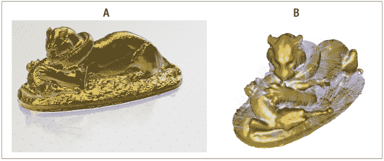

图 10-10. (A) 这是我们 3D 网格的一个可能的“黄金打印”成品，长度为 20 厘米；(B) 3D 网格上法线的可视化

## 三维体素与体素化

我们已经探索了处理 3D 数据的各种方法，从点云到复杂的网格。现在，我们深入迷人的体素世界——像素的 3D 等价物，以及它们如何赋能我们表示和分析复杂的 3D 结构（参见图 10-11）。

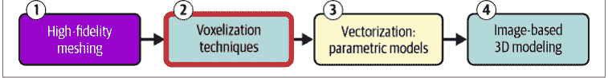

图 10-11. 三维体素与体素化简介

体素化 3D 数据集将任何 3D 数据集（无论是否连续）转换为离散的 3D 网格。这个过程简化了复杂的几何形状，使其更易于分析、处理和可视化。通过将 3D 点云、网格或其他表示形式转换为体素，你可以轻松地应用体积操作，如腐蚀、膨胀和平滑。

体素化还使得 3D 数据与其他数据模态（如医学图像或地球物理数据）的集成成为可能。此外，它通过提供适合训练和推理的规则化、基于网格的表示，促进了机器学习技术，特别是深度学习的应用。但如果你以前玩过《我的世界》，你就知道构建一个交互式数字环境是多么方便。

本节为你提供从点云数据构建 3D 体素表示的知识和 Python 代码。我们从设置 Python 环境和准备点云数据集开始。然后，我们创建一个体素网格，这是我们 3D 体素世界赖以存在的基础。这将使我们能够探索构建单个体素实体，并建立从点云自动生成完整 3D 体素数据集的技术。

### Python 环境初始化

当面对一个已识别的问题时，通常存在多条可行的路径，每条路径都有其自身的优点、缺点和细微差别。作为一名程序员，保持开放和适应性的心态很重要，探索不同的方法，并充分利用可用库和框架的全部功能。


需要强调的是，在编写代码解决已识别的问题时，并不存在唯一正确的方向。我提供的解决方案依赖于巧妙的技术和 Open3D 库中可用工具的战略性使用。它结合了 Open3D 中一些鲜为人知的特性和优化，展示了对可用函数栈的深入理解如何能够带来更具创新性、更高效和更有效的解决问题的方法。再次强调，解决问题的方法往往不止一种。关键在于，在编写代码应对复杂挑战时，要足智多谋、富有创造力，并愿意跳出思维定式。

我们仅依赖三个功能库：laspy、Open3D 和 NumPy。如果你对它们不熟悉（在本书的这个阶段不太可能），可以参考第 3 章。在我们的环境中，让我们使用这三行简单的代码：

```python
import laspy as lp
import numpy as np
import open3d as o3d
```

现在剩下的就是确定一个我们想要进行体素化的点云。幸运的是，你可以在图 10-12 中看到提供的点云。设置完成后，我们就可以开始在环境中加载数据了。

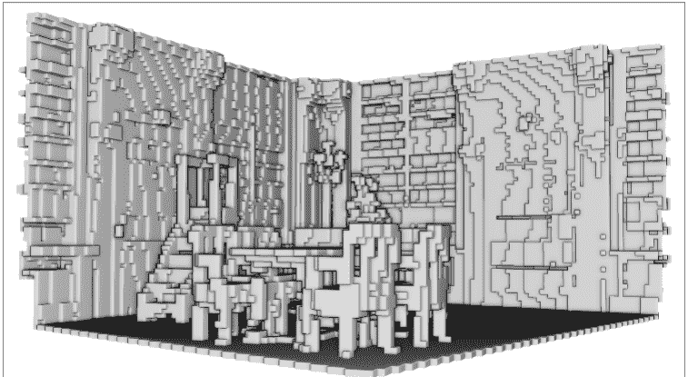

图 10-12. 用于体素化的点云选择。

### 加载数据

首先，我们创建两个变量来处理输入路径（你应该根据自己的情况调整）和数据名称，如下所示：

```python
input_path="C:/DATA/"
dataname="heerlen_table.las"
```

现在，是时候在我们的程序中加载数据了。我们首先将点云存储为一个 laspy 对象到 `point_cloud` 变量中：

```python
point_cloud=lp.read(input_path+dataname)
```

然后，为了使用存储在 `point_cloud` 变量中的数据，我们将其转换为 Open3D 点云格式。如果你还记得之前的教程，我们将颜色信息与空间坐标（x、y 和 z）分开：

```python
pcd = o3d.geometry.PointCloud()
pcd.points = o3d.utility.Vector3dVector(np.vstack((point_cloud.x, point_cloud.y,
point_cloud.z)).transpose())
pcd.colors = o3d.utility.Vector3dVector(np.vstack((point_cloud.red,
point_cloud.green, point_cloud.blue)).transpose()/65535)
```

> 如果你仔细观察，会看到一个奇怪的数字 65535。这是因为在 laspy 格式中，颜色是以 16 位无符号整数编码的，这意味着数值范围从 0 到 +65535；我们希望将其缩放到 [0,1] 区间。

### 创建体素网格

我们有一个点云，并希望将一组体素立方体拟合到它上面以进行近似。为此，我们仅在已建立的 3D 网格上有点的部分生成体素（参见图 10-13）。

要获得体素单元，我们首先需要计算点云的边界框，它界定了我们数据集的空间范围。只有这样，我们才能将边界框离散化为一组小的 3D 立方体：即体素。

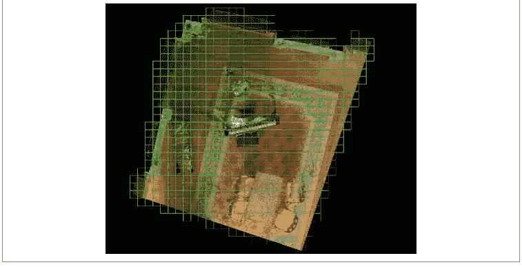

图 10-13. 体素网格创建

我们通过提供一个与初始边界框相关的相对值来计算体素大小，以便在切换输入点云时“泛化”该方法。为此，你可以看到在下面的代码中，我们提取点云的边界框，取其最大边，并决定将体素大小设置为其值的 0.5%（这完全是任意的）。

最后，我们将获得的值四舍五入到四位小数，以避免不精确计算带来的问题：

```python
v_size=round(max(pcd.get_max_bound()-pcd.get_min_bound())*0.005,4)
```

> 这可能是我写过的最边缘化的代码行之一，但它提供了一个很好的例子，展示了通过快速的经验性语句可以实现什么。这里有很多可以改进的地方，特别是关于舍入误差和任意阈值。

既然我们已经定义了体素单元，现在转向一种与空间信息相关但更高效的“表示”方法：二值表（假或真，0或1）。为此，使用Open3D的第一个技巧是通过以下命令行生成体素网格：

```
voxel_grid=o3d.geometry.VoxelGrid.create_from_point_cloud(pcd,voxel_size=v_size)
```

太棒了，你现在拥有了点云的体素表示，可以在（非Jupyter环境下）通过以下代码进行可视化：

```
o3d.visualization.draw_geometries([voxel_grid])
```

你将得到如图10-14所示的数据集。这是一项了不起的成就。但如果止步于此，我们的应用范围将非常有限。实际上，你只能使用Open3D库来操作体素结构，其有限的函数可能无法满足你的特定需求。因此，让我们探索从这种数据结构创建3D网格的过程。我们可以将其导出为开放格式（.ply或.obj），并加载到其他软件中，如MeshLab、Blender、CloudCompare、MagicaVoxel、Unity、Unreal Engine以及第2章列出的所有其他软件。

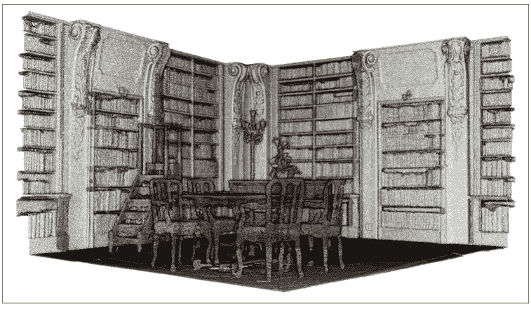

图10-14. 体素化细节层次

## 生成体素立方体（3D网格）

现在我们有了voxel_grid，我们提取已填充的体素，以便后续将它们作为独立实体使用：

```
voxels=voxel_grid.get_voxels()
```

如果我们检查新的voxels变量，会得到一个包含open3d.cpu.pybind.geometry几何体的列表。体素类型通过grid_index (19, 81, 57)和color (0.330083, 0.277348, 0.22266)来保存体素信息。

好的，现在我们将其转换为3D立方体网格的组合（8个顶点和12个三角形描述六个面）。明白我们想要实现的技巧了吗？首先，让我们初始化保存这个立方体组合的三角网格实体：

```
vox_mesh=o3d.geometry.TriangleMesh()
```

现在，我们遍历所有体素 `for v in voxels`，对于每个体素，我们生成一个大小为1的立方体，存储在变量cube中。然后，我们用当前体素的颜色为其上色，并使用grid_index方法提供的索引将其定位在网格上。

最后，我们通过以下方式将新着色并定位的立方体添加到网格实体中：

```
for v in voxels:
    cube=o3d.geometry.TriangleMesh.create_box(width=v_size, height=v_size,
        depth=v_size)
    cube.paint_uniform_color(v.color)
    cube.translate(v.grid_index, relative=False)
    vox_mesh+=cube
```

translate方法的参数决定平移是否相对于第一个给定参数（位置）进行。因为我们将其设置为False，所以第一个参数v.grid_index在我们的系统中充当绝对坐标。现在，我们可以导出基于体素的多边形网格3D模型了。

## 导出网格对象（.ply或.obj）

我们现在有了一个准备好进行I/O操作的3D网格对象……几乎准备好了。实际上，我们仍然处于一个具有任意整数单位的任意系统中。为了定位到输入点云所施加的初始参考系，我们必须应用一个刚性变换（平移、旋转和缩放）以返回到原始位置。为了清晰起见，我将这个目标分解为三行代码。

首先，我们相对平移3D网格（体素组合）半个体素单位。这个过程的原因是，当我们创建初始体素网格时，参考点是体素的左下角点，而不是重心（重心在单位立方体中相对位于[0.5,0.5,0.5]）：

```
vox_mesh.translate([0.5,0.5,0.5], relative=True)
```

然后，我们按体素大小缩放模型，将每个立方体单位转换为其真实大小。这个过程使用scale方法，它接受两个参数。第一个是缩放因子，第二个是缩放时使用的中心点：

```
vox_mesh.scale(voxel_size, [0,0,0])
```

最后，我们需要通过相对平移体素网格原点，将体素组合平移到其真正的原始位置：

```
vox_mesh.translate(voxel_grid.origin, relative=True)
```

很好，现在我们的最终立方体组合已正确定位。一个可选的命令是合并接近的顶点。每当我们生成一个立方体时，可能会出现一个角顶点与另一个立方体角顶点重叠的情况。因此，最好在保持拓扑结构的同时清理这一点：

```
vox_mesh.merge_close_vertices(0.0000001)
```

最后，我们流程中的最后一个元素是将我们的.ply（或.obj，取决于你偏好的扩展名）文件导出到你操作系统浏览器中的目标文件夹：

```
o3d.io.write_triangle_mesh(input_path+"voxel_mesh_h.ply", vox_mesh)
```

从那里，你可以自由地在你选择的软件中使用输出文件。如果在导入时得到一个旋转过的文件，你也可以在你的Python代码中添加以下几行，并将导出的变量更改为 `vox_mesh.transform(T)`：

```
T=np.array([[1, 0, 0, 0], [0, 0, 1, 0], [0, -1, 0, 0], [0, 0, 0, 1]])
o3d.io.write_triangle_mesh(input_path+"4_vox_mesh_r.ply", vox_mesh.transform(T))
```

这简单地创建了一个变换矩阵T，定义了绕y轴逆时针旋转。一些软件（例如Blender）通常显示反转的z轴和y轴。这个过程意味着如果这种情况发生在你身上，你还有另一个技巧可用。当然，这只是你能做的事情的一个提示。你刚刚学会了如何导入点云，将它们转换为体素网格，巧妙地让系统将它们变成3D网格，然后完全自动化地导出它们！有趣的是，在Python中使用体素也能更好地理解任何点云场景的关系和拓扑结构。但让我们把这留到第12章，继续讨论参数化建模。

## 参数化建模

在3D数据科学的世界中，向量化和参数化建模的概念在高效处理和分析复杂3D数据方面起着至关重要的作用。向量化听起来像是一种危险的科幻、激光相关的分解武器。但幸运的是，它比那更微妙（见图10-15）。

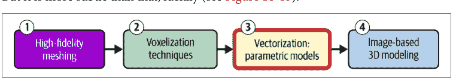

向量化是从某种数据模态（如栅格图像）转换为向量或实体集合的过程。它是许多应用中创建地理空间信息系统的默认首选过程。实际上，向量数据具有对于处理分析和决策任务非常有用的属性。然而，向量化的一个特定分支非常硬核：3D点云到向量数据集。而这正是我们喜欢并将要解决的挑战。本章旨在全面概述这些核心技术，对于任何有志于成为3D数据科学家的人来说都至关重要。让我们先简要谈谈向量化。传统上，3D图形和可视化依赖于光栅化过程，其中3D场景被转换为像素网格（光栅图像）以进行显示。然而，随着3D数据复杂性和规模的增长，光栅化的局限性变得越来越明显。

另一方面，向量化为3D数据处理提供了一种更高效、更灵活的方法。向量化不是将3D数据表示为像素集合，而是将数据转换为可以由现代计算机硬件高效处理的格式，特别是利用GPU的并行处理能力和向量化CPU指令。

3D向量化的核心是将3D数据表示为多维数组或向量。这允许应用强大的线性代数运算，这些运算可以通过现代硬件以高度优化和并行的方式执行。通过利用向量化，我们可以显著提高工作流的性能和可扩展性，以处理更大、更复杂的数据集。

这为依赖向量概念的建模技术创造了机会，特别是参数化建模。参数化建模是3D数据研究武器库中的一项高效技术。它涉及通过使用一组定义对象形状、尺寸和其他特征的因子来描绘三维对象。

参数化模型相比传统3D表示具有多项优势，例如改进的压缩、高效的数据存储以及执行高级几何操作的能力。通过对3D数据进行参数化，3D数据科学家可以轻松地操作和修改对象的形状，从而实现设计优化、形状探索和统计分析等任务（见图10-16）。

在本节中，我们将学习三维参数化建模的基本概念，包括常见的参数化表示方法、构建和操作参数化模型的技术，以及如何使用 CadQuery 库在 Python 中处理参数化数据的实用示例。学完本节后，你将对如何在基于 Python 的三维数据科学工作流中使用 CadQuery 来创建、操作和分析三维数据有深入的理解。

## CadQuery 与环境设置

本节将广泛使用 CadQuery 库，这是一个功能强大的开源 Python 参数化三维建模与设计工具。CadQuery 提供了一个用户友好且直观的界面，用于创建、操作和分析复杂的三维几何体，是你的工具库中一个很好的补充。

> CadQuery 构建在 Open Cascade 几何内核之上，这是一个功能强大且特性丰富的三维建模与工程库。通过使用 CadQuery，我们既能利用 Open Cascade 的强大功能，又能受益于基于 Python 的 API 的简洁性和灵活性。

CadQuery 的一个关键优势是其对参数化建模的支持。这意味着我们可以使用一组参数来定义三维对象，然后可以轻松地修改和更新这些参数，以探索不同的设计方案或适应不断变化的需求。这与我们之前讨论的参数化建模概念完美契合。

因此，我们将采用边界表示法（B-reps）来定义对象，即通过其包围的表面来定义。在 B-rep 系统中，基本的构造定义了形状，每个构造都建立在前一个构造的基础上：

- **顶点**：位于三维空间中的一个独立点。
- **边**：连接两个或多个顶点的链接，遵循特定路径，通常称为曲线。
- **线框**：相互连接的边的组合。
- **面**：围绕表面形成边界的边或线框的集合。
- **壳体**：沿某些边连接在一起的面的组合。
- **实体**：具有完全封闭内部的对象。
- **复合体**：实体对象的聚合。

在使用 CadQuery 时，这些对象可以轻松生成。在当前的 CAD 内核中，还存在额外的几何构造集合。例如，一条弧形边保留了与形成完整圆的基本曲线的连接，而每条直线边都包含一条直线的方程。CadQuery 会为你屏蔽这些底层构造。最后，借助 CadQuery，我们将利用工作平面、构造（二维和三维）、选择器和构造几何。

## 工作平面

大多数 CAD 应用程序都采用工作平面的概念。如果你之前使用过其他 CAD 应用程序，你可能会发现 CadQuery 的工作平面既熟悉又易于使用。然而，如果你缺乏经验，理解工作平面的基本概念至关重要。

工作平面定义了三维空间中的一个二维表面，作为定位其他特征的参考点。该对象拥有一个中心点和一个特定于其位置的坐标系。大多数对象创建操作都是相对于当前工作平面执行的。通常建立的初始工作平面是“XY”平面，也称为“前”平面。定义实体后，创建工作平面的典型方法是选择实体上你希望修改的面，并相对于该面生成一个新的工作平面。可以通过使用偏移或旋转，在全局坐标系内的任何位置或相对于其他平面创建额外的工作平面。

工作平面最具影响力的一个方面是它们能够使用工作平面的坐标系在二维空间中进行工作。然后 CadQuery 会将这些点从工作平面的坐标系转换到世界坐标系，确保你的三维特征能够按照预期精确定位。这极大地简化了创建和管理脚本的过程。

## 构造

建立工作平面后，你就可以在二维空间中进行操作。随后，你可以利用生成的元素来构建三维实体。该软件包含所有标准的二维元素，如圆、线、弧、镜像和点。

可以直接创建三维基本形状，如长方体、楔形体、圆柱体和球体。此外，你还可以选择对二维几何体执行扫掠、拉伸和放样操作，以创建三维特征。实际上，基本的构造过程也是可用的。

扫掠、拉伸和放样是三维建模中的基本操作，允许你从二维几何体创建复杂的三维形状。扫掠涉及获取一个二维轮廓并将其沿路径移动以生成三维对象。拉伸将二维形状沿垂直轴延伸，创建一个三维实体。放样通过在两个或多个二维轮廓之间进行插值来创建三维表面，从而在形状之间实现平滑过渡。这些技术广泛应用于工业设计、建筑和视频游戏开发中，用于创建各种三维对象。

## 选择器

选择器使用户能够通过选择一个或多个现有特征来选择和定义新特征。例如，你可以通过选择顶面作为新元素的位置来扩展一个长方体。或者，你可以通过拉伸创建一个长方体，并选择所有垂直边来对它们应用圆角（圆角是三维几何体中用于平滑尖锐边缘的圆边或圆角）。选择器可以被视为你在使用传统 CAD 系统构建对象时的手和鼠标的对应物。

## 构造几何

构造几何指的是那些并非对象本身固有，但为辅助其构造而专门定义的特征。一个说明性的例子可以是建立一个矩形，并利用其角点来确定一系列孔的精确位置。

## 环境设置

在深入实践示例之前，让我们确保已设置好必要的 Python 环境。对于本章，我们使用本书的环境设置，并利用三个库：

- NumPy (pip install numpy)
- Open3D (pip install open3d)
- CadQuery (pip install cadquery)

一旦你在你的环境中打开了 IDE，让我们开始吧：

```python
import cadquery as cq
import open3d as o3d
import numpy as np
```

我们已准备好定义参数化模型。

## 参数化模型的输入/输出：二维（DXF）和三维（STL）

我们现在准备好深入代码了！让我们简要介绍两种在 Python 之外与你的软件配合使用时非常有用的文件格式：用于二维图纸的 DXF（图形交换格式）和用于三维模型的 STL（立体光刻）。

为此，让我们进行一些草图操作。我定义了一个点列表，这些点构成一个特殊多边形的顶点：

```python
pts = [(0,0),(0,20),(12,20),(12,18),(2,18),(2,16),(8,16),(8,14),(2,14),(2,0)]
```

然后，我创建一个名为“front”的新工作平面，并使用 pts 中的点绘制一条折线：

```python
flo = cq.Workplane("front").polyline(pts).close()
```

close() 方法确保折线形成一个封闭的形状。最后，我将生成的形状导出为名为 *letter.dxf* 的 DXF 文件，保存在 ../RESULTS 目录中。你所要做的就是打开你的 CAD 软件或 CloudCompare，然后可视化我名字首字母的漂亮形状：

```python
cq.exporters.export(flo, "../RESULTS/letter.dxf")
```

此图展示了如何使用 Python 的 close() 方法确保折线形成封闭形状，然后将形状导出为 DXF 文件（参见图 10-17）。

DXF 是一种基于矢量的格式，主要用于在不同软件应用程序之间交换二维 CAD 图纸。它将线、弧、圆和文本等几何实体存储为数学方程。它由一系列组组成，每个组包含一个代码和一个值。这些组定义了图纸的各种元素，包括实体、属性和标题信息。

**优点：**

- 被各种 CAD 软件应用程序广泛支持。
- 可以存储各种二维绘图元素。
- 可以使用文本编辑器或专门的 DXF 编辑工具进行编辑和修改。

**缺点：**

- 对于大型或复杂的图纸，可能会变得复杂且难以理解。
- 可能不适合存储三维模型，因为它主要关注二维几何。

现在，让我们转向 STL 文件。它们是一种简单的三维模型格式，将表面表示为一系列三角形面片。每个面片由其三个顶点和一个法向量定义。STL 文件由一个头部和一系列面片组成。头部包含关于模型的信息，例如其名称和单位。面片部分列出了每个顶点的坐标以及每个面片的法向量。

使用 CadQuery，让我们定义一个在结构工程中常用的三维形状，称为“IPN”型材。代码首先定义四个变量：L、H、W 和 t。它们分别代表 IPN 型材的长度、高度、宽度和厚度：

```
(L, H, W, t) = (100.0, 20.0, 20.0, 1.0)
```

然后，定义一个点列表 `pts`。这些点代表将构成 IPN 横截面的二维多边形的顶点。每个点的坐标根据变量中定义的尺寸计算得出。这些点按特定顺序排列，以创建一个具有圆角的形状：

```
pts = [
    (0, H / 2.0),
    (W / 2.0, H / 2.0),
    (W / 2.0, (H / 2.0 - t)),
    (t / 2.0, (H / 2.0 - t)),
    (t / 2.0, (t - H / 2.0)),
    (W / 2.0, (t - H / 2.0)),
    (W / 2.0, H / -2.0),
    (0, H / -2.0),
]
```

最后，我们创建该形状：

```
result = cq.Workplane("front").polyline(pts).mirrorY().extrude(L)
```

并将其导出为 STL 文件：

```
cq.exporters.export(result, "../RESULTS/IPN.stl")
```

这将在 CloudCompare 中得到图 10-18。

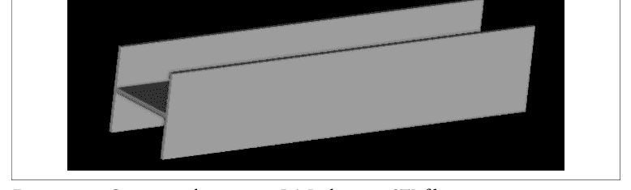

图 10-18. 创建并将二维/三维形状导出为 STL 文件

很好，我们有了一种非常简单的方法来创建二维和三维形状，并将它们导出到 Python 之外。如果我必须总结 STL 模型，我希望你记住以下几点：

优点：

- 简单易懂
- 被 3D 打印和制造软件广泛支持
- 可用于描绘各种三维形式

缺点：

- 可能不适合复杂或精细的模型，因为三角面片可能会引入伪影或降低精度
- 仅限于表示表面，不包含内部结构或材料属性信息

很好。既然我们已经明确知道我们不会被困在 Python 中（即任何数据输出都可以用标准文件格式导出），我们就可以探索我们可以使用的各种参数化建模技术了。

## 参数化建模技术

参数化建模技术使您能够高效且精确地创建复杂的三维模型。从简单的几何图元开始，应用诸如草图绘制、拉伸、旋转、倒圆角、镜像、切割和修剪等操作，您可以轻松构建复杂的设计（见图 10-19）。

让我们利用参数化方法，通过更改底层参数来修改模型的几何形状，使其具有高度的灵活性和适应性。然后，我们可以自动化重复性任务，减少设计时间，并最大限度地减少错误。这在汽车、航空航天和产品设计中尤其重要，因为精度和效率至关重要。让我们从草图绘制开始。

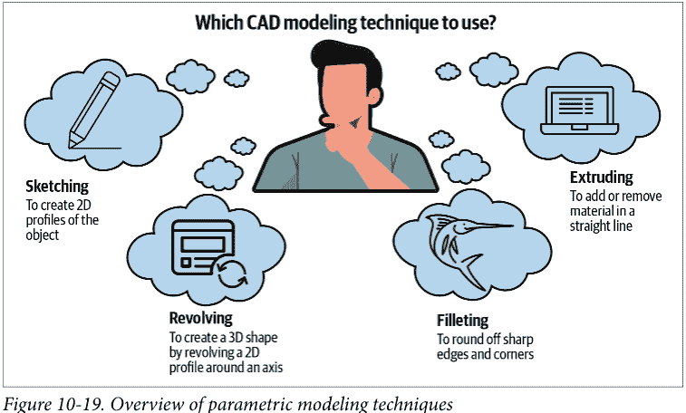

图 10-19. 参数化建模技术概述

## 草图绘制

草图绘制是实体建模的基础：它是创建二维轮廓的过程，这些轮廓作为三维特征的基础。这些轮廓可以是简单的或复杂的，取决于所需的形状。草图通常涉及应用约束以确保几何精度和一致性。约束定义了几何元素之间的关系，例如平行、垂直、相切和尺寸。你可以像我们之前那样，绘制你名字的首字母。

那么，拉伸呢？

## 拉伸

拉伸是一种通过沿指定方向延伸草图来创建三维实体的技术。根据草图的几何形状，生成的实体可以是棱柱、圆柱体或更复杂的形状。拉伸通常涉及控制拉伸特征高度或深度的参数，允许进行动态调整。

让我重新展示我的第一个字母，用 CadQuery 来演示这一点：

```
flo_e = cq.Workplane("front").polyline(pts).close().extrude(1)
cq.exporters.export(flo_e, "../RESULTS/letter.stl")
```

分解代码，我做了以下操作：

- `cq.Workplane("front")` 创建一个名为“front”的新工作平面，形状将在此平面上定义。
- `polyline(pts)` 方法使用 `pts` 列表中的点（在提供的代码中未显示）创建一条折线。这条折线代表形状的横截面。
- `close()` 方法确保折线形成一个封闭的形状。
- `extrude(1)` 方法沿 z 轴拉伸形状，创建一个厚度为 1 个单位的三维对象。

剩下的就是导出形状并进行可视化：

```
cq.exporters.export(flo_e, "../RESULTS/letter.stl")
```

此图像演示了导出参数化模型的最后一步，使用 Python 将形状保存为 STL 文件，以便在三维建模软件中进行可视化（见图 10-20）。

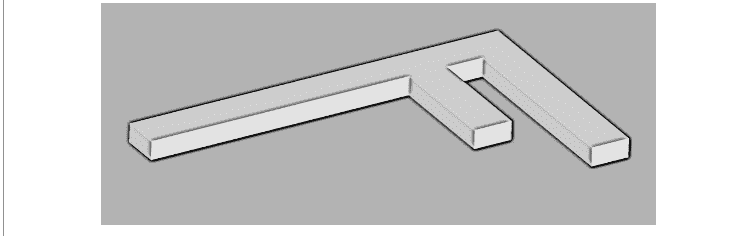

图 10-20. 将形状导出为 STL 格式

你现在有了一种非常快捷的方法来生成三维“标志”字母，你可以利用它们为你的下一个创业项目服务。现在我们可以继续讨论倒圆角和倒角了。

## 倒圆角和倒角

倒圆角和倒角是用于平滑三维模型中尖锐边缘和角落的技术。倒圆角涉及创建圆角边缘，而倒角则创建斜角边缘。圆角的半径或倒角的角度可以指定为参数。

但首先，让我们定义一个非常好的 Python 辅助函数，以便在 Python 中使用 Open3D 可视化我们的结果：

```
def visualize_object(cq_object):
    temp_path = "../RESULTS/temp.stl"
    cq.exporters.export(cq_object, temp_path)
    o3d_mesh = o3d.io.read_triangle_mesh(temp_path)
    o3d_mesh.compute_vertex_normals()
    o3d.visualization.draw_geometries([o3d_mesh])
```

现在，让我用以下代码展示倒圆角：

```
result = cq.Workplane("XY").box(3, 3, 0.5).edges("|Z").fillet(0.125)
visualize_object(result)

result = cq.Workplane("XY").box(3, 3, 0.5).faces("+Z").chamfer(0.1)
visualize_object(result)
```

这使我们能够从一个经典的立方体变为一个倒圆角的立方体和一个倒角的立方体（见图 10-21）。

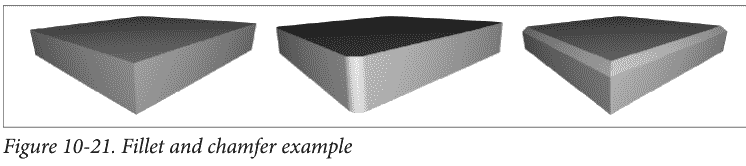

那么镜像呢？

## 镜像

镜像是一种通过将模型的一部分沿平面反射来创建对称特征的技术。它对于创建具有双侧对称性的对象很有用。

以下是 CadQuery 中创建橱柜把手的一个示例：

```
r = cq.Workplane("front").hLine(1.0)  # 1.0 是距离，不是坐标
r = (r.vLine(0.5).hLine(-0.25).vLine(-0.25).hLineTo(0.0))
result = r.mirrorY().extrude(0.25)  # 镜像几何体并拉伸
visualize_object(result)
```

在这里，我从“front”平面开始，使用 `hLine()` 函数绘制一条长度为 1.0 个单位的水平线。然后，我将一系列其他二维草图操作链接在一起——`vLine()` 用于垂直线，`hLine()` 用于水平线，`hLineTo()` 用于绘制一条到特定 x 坐标的水平线。

真正的魔力发生在我对生成的二维草图调用 `mirrorY()` 时。这会将几何体沿 y 轴反射，本质上给我们一个对称的形状。然后，通过调用 `extrude(0.25)`，我可以将这个二维形状变成一个深度为 0.25 个单位的三维对象。

最后，我将生成的三维对象传递给 `visualize_object()` 函数，该函数渲染我所创建几何体的三维预览。这是一种非常方便的方法，可以在可能将其用于更大的 CAD 或工程项目之前，快速验证我所构建形状的尺寸和形状。


我发现 CadQuery 是一个表达力强且直观的三维建模库。能够将二维草图操作链接起来、利用对称性并拉伸到第三维度，使得仅用几行代码就能构建复杂的几何体变得容易。当你需要快速原型制作或迭代三维设计时，它是一个很好的工具。

你还可以探索模式以创建特征或特征组的多个实例，以及切割/修剪以移除实体的部分或修改其形状。这可以使用切割平面、修剪曲线或布尔运算来完成。这可能是探索布尔运算的最佳方式。

## 布尔运算

如果你还记得前面的章节，布尔运算通常通过构造实体几何（CSG）来实现，是强大的技术，允许你组合或减去几何对象以创建复杂的形状。通过执行并集、交集和差集运算，你可以从更简单的组件创建复杂的模型。

让我展示两个模型：一个立方体和一个球体。要生成它们，你可以使用以下代码：

```
Box = cq.Workplane("XY").box(1, 1, 1, centered=(False, False, False))
Sphere = cq.Workplane("XY").sphere(1)
```

现在，让我们用 CadQuery 探索这些运算。

### 并集：组合对象

并集运算将两个或多个对象组合成一个对象。这对于创建装配体或向现有模型添加特征很有用。

要使用 CadQuery 执行并集（`|`），请输入以下内容：

```
result = Box | Sphere
visualize_object(result)
```

### 交集：查找公共区域

交集运算（`&`）查找两个或多个对象之间的公共区域。这可用于在不同形状之间创建孔洞、切口或交集：

```
result = Box & Sphere
visualize_object(result)
```

### 差集：减去对象

差集运算（-）从一个对象中减去另一个对象，留下剩余部分。这对于在模型中创建空腔或移除材料非常有用：

```
result = Box - Sphere
visualize_object(result)
```

图10-22展示了在Python中使用差集运算从一个长方体中减去一个球体的结果，展示了布尔运算如何在3D建模中创建空腔或修改形状。

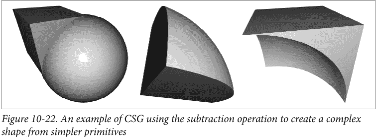

布尔运算对于创建复杂的模型和装配体至关重要。通过组合不同的形状并执行各种操作，你可以实现广泛的几何结果。掌握了这些优秀的工具，你就可以轻松地建模多个部件。

## 建模各种部件

既然我们已经对基本的CAD建模技术和布尔运算有了扎实的理解，让我们探索如何将这些概念应用于建模房间的各种部件。首先，我们来定义墙壁：

```
# 定义参数（修改这些以自定义房屋）
length = 5  # 房屋长度，单位：米
width = 3  # 房屋宽度，单位：米
height = 2.5  # 房屋高度，单位：米

wall_thickness = 0.2

door_width = 1  # 门宽，单位：米
door_height = 4  # 门高，单位：米
window_width = 1.5  # 窗宽，单位：米
window_height = 1  # 窗高，单位：米
roof_pitch = 45  # 屋顶坡度角，单位：度
```

```
result = cq.Workplane("front").rect(length+wall_thickness,
    width+wall_thickness).rect(length, width).extrude(height)
visualize_object(result)
```

然后，我们可以创建门并将它们放置在相对的两侧：

```
s = cq.Sketch().rect(door_width, door_height)

result2 = (
    cq.Workplane("front")
    .rect(length+wall_thickness, width+wall_thickness)
    .rect(length, width)
    .extrude(height)
    .faces(">X")
    .workplane()
    #.transformed((0, 0, -90))
    .placeSketch(s)
    .cutThruAll()
)

visualize_object(result2)
```

在这段代码中，我从“前”平面开始，使用`rect()`函数创建一个尺寸为`length + wall_thickness`和`width + wall_thickness`的矩形底座。然后，我减去一个尺寸仅为`length`和`width`的较小矩形，在较大的底座内创建一个凹陷区域。

接下来，我调用`extrude(height)`为这个二维形状赋予一些深度，将其转变为一个三维对象。然后，我使用`faces(">X")`方法选择正X方向的面，并使用`workplane()`在这些面上创建一个新的工作平面。

最初，我通过取消注释`transformed((0, 0, -90))`行，将这个工作平面绕z轴旋转了90度，但为了保持简单，我后来移除了它。在这个新的工作平面上，我接着调用`placeSketch(s)`，我假设这是放置我单独定义的某种二维草图。

最后，我调用`cutThruAll()`来移除与草图重叠的三维对象部分，从而得到我想要的结果。我将这个修改后的三维对象存储在`result2`变量中，然后将其传递给`visualize_object()`函数以预览最终的几何形状。

最后，我们可以使用布尔运算添加地面：

```
ground = cq.Workplane("XY").box(length+0.2, width+0.2, 0.1)
result_total = result2 | ground
visualize_object(result_total)
```

图10-23演示了使用布尔运算（特别是并集运算）将地面平面添加到三维模型的过程，将现有形状与新的底座组合在一起。

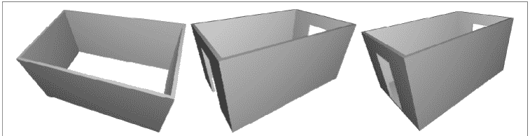

图10-23. 添加地面：使用布尔运算

用几行代码建模一个简单的房间是多么美妙啊。但要知道，你可以建模更复杂的例子，比如[图10-24](#figure-10-24)。

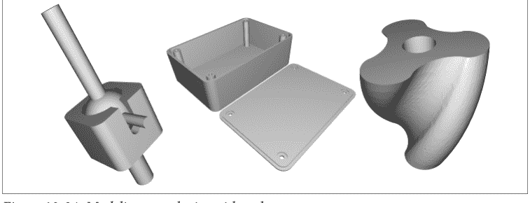

图10-24. 用代码建模复杂性

## 结论

三维参数化建模是一种强大的技术，它允许你通过使用数学方程和参数来定义形状，从而创建复杂的三维模型。与传统的三维网格化和体素化相比，这种方法具有几个优势。通过使用参数化模型，你可以通过调整其参数轻松地修改对象的形状，从而实现快速的设计迭代和探索。此外，参数化模型可以生成基础模型的多种变体，为设计提供灵活性和创造性。此外，参数化模型可用于创建高度精确和详细的三维模型，这对于工程、建筑和产品设计应用至关重要。


为了巩固你的理解，尝试使用本章讨论的技术建模一个简单的对象，比如一把椅子或一张桌子。尝试不同的参数和布尔运算来创建对象的变体。你也可以导入现有的三维模型，并使用参数化建模技术对其进行修改。完成这个练习将为你提供宝贵的实践经验，并进一步发展你的向量化和参数化建模技能。然后，你将为与本章相关的项目做好准备。

三维建模的下一个前沿领域涉及从非三维数据模态（如单目图像）生成三维模型。这个新兴领域被称为从单张图像进行三维重建，它利用深度学习等技术从二维信息中推断三维结构。通过将参数化建模（或本章解锁的其他三维建模方法）的力量与三维重建相结合，我们可以从单张图像或一系列图像创建高度详细和逼真的三维模型，为创建数字环境开辟新的可能性。

## 基于单目图像的三维建模：深度估计与重建

现在让我们关注一个开创性的领域，它允许我们从单张二维图像推断三维结构：基于单目图像的三维重建（见图10-25）。这是一个完全不同的范式，我们的输入并不直接测量精确的空间现象。我们希望从图像中准确地重建三维场景，以便我们可以创建具有基本入口点（智能手机或基本相机）的应用程序。这可以改变我们开发沉浸式虚拟和增强现实体验的方式，使机器人能够在复杂环境中导航，或帮助自动驾驶汽车感知周围环境。此外，这项技术可用于分析历史文物、医学图像和卫星图像，为过去、现在和未来提供有价值的见解。

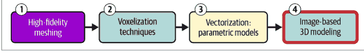

图10-25. 基于单目图像的三维建模：深度估计与重建

这种能力极大地扩展了可能性，超越了传统的多视图重建技术，如摄影测量（见第1章和第18章）。如果你还记得，使用摄影测量，我们需要从不同视角拍摄对象的多张图像来创建三维模型。这可能很耗时，需要专门的设备，并且在所有情况下都不可行。

相比之下，单目重建使我们能够从单张图像创建三维模型，使其更加易于访问和高效。这开辟了新的机会，我很高兴分享一种利用一些Python库和简单步骤的方法。我们可以使用我们拍摄的照片或AI生成的图像。从单张图像开始，我们旨在生成一个三维模型，遵循图10-26所示的工作流程。事不宜迟，让我们直接开始。

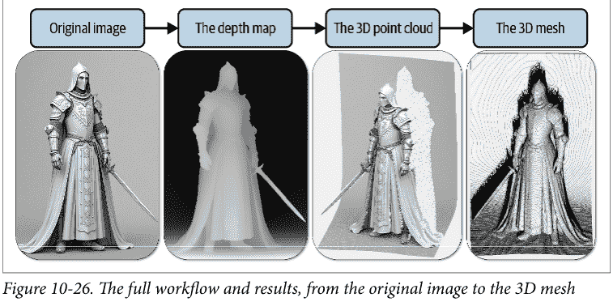

## 设置环境并安装库

设置环境的第一步是使用Anaconda创建一个虚拟环境。此过程确保你为该项目安装的库不会与系统上的其他项目冲突。之后，你可以安装必要的库并激活虚拟环境。我们使用五个库：PyTorch、Pillow、Matplotlib、Transformers和Open3D。

你可以使用pip安装这些库：

```
pip install torch pillow matplotlib transformers open3d
```

Python Transformers 库是一个强大的工具包，用于处理最先进的深度学习模型，尤其是那些基于 Transformer 架构的模型。它允许我们利用预训练模型，支持多种框架，并且非常易于使用。虽然它主要因其在自然语言处理领域的应用而闻名，但在 3D 领域的应用也日益增多。通过利用注意力机制，我们可以有效地处理数据（序列），这对于点云分析、3D 物体检测和 3D 形状生成非常有用。

一旦你安装了所有库，就可以进入下一阶段：收集数据。

## 收集数据集

收集你拥有权利的图像最简单的方法是拍摄你的（私人）环境照片，其中只包含你的目标物体。所以，我用手机拍了照片；你可以在资源文件夹中找到它（参见 3D 数据科学资源中心）。

另一种可能性是使用生成式 AI 工具生成图像。简而言之，生成模型已成为生成逼真且多样化数据的一种突破性方法。目前主要使用两种模型：生成对抗网络（GANs）和扩散模型。我鼓励你查看 3D 数据科学资源中心，了解使用这些方法进行图像生成的实践解决方案。

同样，在资源文件夹中，你可以找到一张使用 Stable Diffusion 生成的骑士图像，其提示词为：“一位骄傲的骑士，简约的布置，身披大斗篷，手持长剑。”现在你至少有两张图像了，我们可以进入下一阶段：图像预处理和模型设置。

## 图像预处理和模型设置

在我们的 IDE 中，我们首先导入库：

```python
import matplotlib
from matplotlib import pyplot as plt
matplotlib.use('TkAgg')
from PIL import Image
import torch
from transformers import GLPNImageProcessor, GLPNForDepthEstimation
```

注意，我们还通过 transformers 选择了要使用的模型。然后，我们进入第二步：设置模型参数。为此，我们利用 transformers 非常高的抽象能力，着手处理 GLPN 图像处理器。

Transformers 库中的 `GLPNImageProcessor` 是一个专门设计的类，用于使用在全局局部补丁网络（GLPN）架构上训练的模型来预处理图像。GLPN 是一种专注于深度估计任务的深度学习架构。这些变换包括调整大小、重新缩放以及管理通道，充当你的原始图像数据与 GLPN 模型所期望格式之间的翻译器。它确保你的图像以模型能够理解和有效处理的方式呈现，以便进行深度估计任务。

因此，让我们通过调用 `from_pretrained()` 方法并传入模型名称 "vinvino02/glpn-nyu" 来创建 `GLPNImageProcessor` 类的一个实例。这使我们能够以与预训练模型兼容的方式预处理图像：

```python
feature_extractor = GLPNImageProcessor.from_pretrained("vinvino02/glpn-nyu")
```

接下来，我同样通过使用相同模型名称调用 `from_pretrained()` 方法来创建 `GLPNForDepthEstimation` 类的一个实例。这使我能够访问预训练的深度估计模型，我可以使用它来预测图像中物体的深度。我使用的特定模型 "vinvino02/glpn-nyu" 是一个在 NYU-Depth 数据集上训练的深度估计模型：

```python
model = GLPNForDepthEstimation.from_pretrained("vinvino02/glpn-nyu")
```

设置好这两个对象后，我们现在就可以使用它们来对图像执行深度估计了。这里的繁重工作量是巨大的，因为如果你不使用这个 transformers 库，完成这项工作将花费更长的时间。现在，关于图像，我们使用 "Pillow" 来加载图像：

```python
image = Image.open("../DATA/gen_AI_knight.jpg")
```

然后，我们操作图像的尺寸，确保宽度和高度都是 32 的倍数，同时保持原始的宽高比（宽度与高度的比例），因为这是我们的模型所要求的：

```python
new_height = 480 if image.height > 480 else image.height
new_height -= (new_height % 32)
new_width = int(new_height * image.width / image.height)
diff = new_width % 32
```

然后，我们根据计算结果完成图像调整大小的过程：

```python
new_width = new_width - diff if diff < 16 else new_width + 32 - diff
new_size = (new_width, new_height)
image = image.resize(new_size)
```

这些行获取计算出的尺寸，可能为了更严格地被 32 整除而调整宽度（可选），然后使用这些尺寸来调整原始图像的大小。此过程确保最终图像的高度不超过 480 像素，并且宽度和高度都是 32 的倍数。

最后阶段是使用预训练的图像处理器来处理图像格式和预处理步骤，为我们的特定深度学习模型（GLPN）准备图像。此过程确保模型接收到其期望格式的图像数据，以获得最佳性能：

```python
inputs = feature_extractor(images=image, return_tensors="pt")
```

这一行利用加载的 `feature_extractor` 来处理提供的图像。`images` 参数指定要处理的图像数据。`return_tensors="pt"` 参数指示函数将处理后的数据作为 PyTorch 张量返回（假设模型使用 PyTorch）。本质上，这一行根据预训练处理器的知识对图像执行任何必要的预处理步骤，可能包括调整大小和格式调整，然后将结果转换为适合模型的格式。

现在一切准备就绪，可以进行深度估算了。

## 模型的深度估计预测

单目深度估计是一种计算机视觉技术，旨在从单个 2D 图像推断场景的深度信息。此过程涉及估计图像中每个像素距离相机的距离。然后，这些信息可用于我们的 3D 重建目标（以及其他方面）。因此，让我们进入此过程的关键步骤：基于准备好的图像数据获取模型的预测。

为此，我们使用以下代码行：

```python
with torch.no_grad():
    outputs = model(**inputs)
    predicted_depth = outputs.predicted_depth
```

此代码片段使我们能够利用预训练模型进行预测。它首先通过暂时关闭训练相关计算（我们不使用梯度）来确保效率。然后，它将图像数据通过模型的层，捕获其输出。最后，它分离出我们正在寻找的特定预测。

从那里，我们细化从模型获得的原始预测：

```python
pad = 16
output = predicted_depth.squeeze().cpu().numpy() * 1000.0
output = output[pad:-pad, pad:-pad]
image = image.crop((pad, pad, image.width - pad, image.height - pad))
```

第一行 `output = output.squeeze().cpu().numpy()` 关注于保存模型未处理深度预测的 `output` 变量。它移除不必要的维度，然后将数据传输到 CPU，最后转换为 NumPy 格式。下一行处理缩放深度值和带填充的切片。最后，我们裁剪图像以匹配。

本质上，此后处理步骤获取模型的原始预测，将其转换为更易于管理的格式，根据需要缩放值，移除潜在的边界问题，并确保预测与原始图像的最终版本对齐。此过程为后续任务准备处理后的深度数据。

如果你想可视化预测，请使用以下代码片段（结果如图 10-27 所示）：

```python
fig, ax = plt.subplots(1, 2)
ax[0].imshow(image)
ax[0].tick_params(left=False, bottom=False, labelleft=False, labelbottom=False)
ax[1].imshow(output, cmap='plasma')
ax[1].tick_params(left=False, bottom=False, labelleft=False, labelbottom=False)
plt.tight_layout()
plt.pause(5)
```

很好。现在我们有了深度图像，让我们将其转换为 3D 点云。

## 点云生成

从深度图像生成 3D 点云是我们第 4 章介绍的一个基本步骤。我们本质上利用深度图像中关于物体距离相机传感器的信息来重建场景的 3D 几何结构。

要实现这一点，首先需要导入必要的库：

```python
import open3d as o3d
import numpy as np
```

之后，我们从图像尺寸中获取宽度和高度，并将深度信息以及上一步输出的图像存储到变量中：

```python
width, height = image.size
depth_image = (output * 255 / np.max(output)).astype('uint8')
image = np.array(image)
```

现在，我们可以按照第4章的指导，利用Open3D进行处理：

```python
depth_o3d = o3d.geometry.Image(depth_image)
image_o3d = o3d.geometry.Image(image)
rgbd_image = o3d.geometry.RGBDImage.create_from_color_and_depth(image_o3d,
    depth_o3d, convert_rgb_to_intensity=False)
```

这段代码利用Open3D创建了一个特定的数据结构，它将普通图像的颜色信息与处理后的深度信息结合在一起。这两个Open3D对象被组合成一个RGB-D图像，可用于Open3D库中更多的3D处理和可视化任务。

## 定义相机内参

稍等一下。定义相机内参对于从深度图像准确生成3D点云至关重要。如果你还记得，相机内参（如焦距和主点）描述了相机的内部参数以及它如何将3D点投影到2D图像平面上。通过了解这些参数，你可以正确地将图像中的深度值映射到真实世界空间中的3D坐标。没有准确的相机内参，生成的点云将会出现失真和不准确，使其在后续处理和分析中不可靠。因此，仔细校准和估计相机内参对于获取高质量的3D点云至关重要。

> ### 关于内参/外参的说明
>
> 准确定义相机内参和外参对于生成3D点云都至关重要。如你所知，相机内参描述了相机的内部参数以及它如何将3D点投影到2D图像平面上。而相机外参则定义了相机在世界坐标系中的位姿，包括其旋转和平移。这可以从深度值中推断出来。通过准确估计这些参数，我们可以正确地将图像中的深度值映射到真实世界中的3D坐标。

为了获取真实世界相机图像的准确内参，我会使用一个定义清晰的校准图案（如棋盘格），并从不同角度拍摄多张图像。然后，我会采用OpenCV中的校准方法来检测图案的角点并估计相机的内参。对于没有EXIF数据的AI生成图像，估计内参更具挑战性，但仍然是可能的。一种方法是使用自校准技术。这涉及分析从不同视角拍摄的同一场景的多张图像。通过识别这些图像中的对应点并应用几何约束，你可以同时估计相机的内参和外参。另一种方法是使用已知的物体尺寸。如果图像中有一个尺寸已知的物体，你可以利用其投影大小和已知距离来估计相机的焦距。然而，这种方法精度较低，并且依赖于精确的测量。

需要注意的是，这些方法通常不如使用校准图案准确。此外，镜头畸变和图像噪声等因素也会影响估计参数的准确性。通常建议尽可能使用校准图案以获得更可靠的结果。

如果你想在本书范围之外深入了解这些方面，可以在3D数据科学资源中心找到指导教程。

所以，正如你所想象的，我们有一张深度图像。我们不知道相机的参数，所以目前我们将使用一个基本模型（我们可以使用校准文件进行更精确的建模）。对于这个任务，让我们利用Open3D：

```python
camera_intrinsic = o3d.camera.PinholeCameraIntrinsic()
```

这个代码块设置了一个虚拟相机的内参。理解相机内参对于3D重建等任务至关重要，因为需要建立真实世界中的3D点与其在图像中对应像素之间的关系。代码首先使用`o3d.camera`创建了一个`PinholeCameraIntrinsic`对象。假设光线沿直线传播并汇聚于一点（针孔），这个过程描述了一个简化的相机模型。现在我们有了一个模型，需要定义一些参数：

```python
camera_intrinsic.set_intrinsics(width, height, 500, 500, width/2, height/2)
```

`set_intrinsics`方法接受多个参数来定义虚拟相机的内参属性：

- **width**：此参数对应图像的宽度（以像素为单位）。
- **height**：此参数对应图像的高度（以像素为单位）。
- **500, 500**：这些值代表虚拟相机的焦距`fx`和`fy`，通常以像素为单位指定。焦距定义了相机中心与光线汇聚的图像平面之间的距离。这里假设使用方形传感器，在水平和垂直方向上都设置为固定的500。
- **width/2, height/2**：这些值定义了虚拟相机的主点，也称为光心。这个主点代表光轴与图像平面的交点。这里通过指定宽度和高度的一半，将其设置为图像的中心。


内参是一组描述相机内部特性的参数。焦距是镜头光心到图像传感器的距离。它决定了相机的视场角，焦距越长，视场角越窄；焦距越短，视场角越宽。另一方面，传感器像素尺寸指的是图像传感器上单个像素的物理尺寸。较小的像素尺寸通常允许更高分辨率的图像，但也可能引入更多噪声。
主点是光轴与图像平面的交点。提醒一下：

- 焦距 [像素] = 焦距 [毫米] / 传感器像素尺寸 [微米/像素]
- 传感器像素尺寸 [微米/像素] = 传感器边缘尺寸 [毫米] / 边缘像素数 [像素]

通过设置这些内参，我们建立了一个基本模型，描述了虚拟相机如何捕获3D点并将其投影到2D图像平面上。现在是时候生成我们的3D点云了：

```python
pcd_raw = o3d.geometry.PointCloud.create_from_rgbd_image(rgbd_image,
    camera_intrinsic)
o3d.visualization.draw_geometries([pcd_raw])
```

这很棒！但我们想再进一步，提供一个3D网格。为此，我们需要进行一些清理和后处理操作——这是重新应用我们在前面章节所学知识的好方法。

## 3D建模：从3D点云到网格

能够仅用Python和开源库就从一张照片生成3D模型，这真是太棒了。我们现在进入一个超级令人兴奋的步骤，即3D网格生成。有趣的是，我们在这里也使用和利用Open3D。因此，我们创建了这段小代码，用于后处理3D点云：

```python
# 移除离群点
cl, ind = pcd_raw.remove_statistical_outlier(nb_neighbors=20, std_ratio=6.0)
pcd = pcd_raw.select_by_index(ind)

# 估计法线
pcd.estimate_normals()
pcd.orient_normals_to_align_with_direction()

o3d.visualization.draw_geometries([pcd])
```

在基于非常高的标准差倍数移除离群点后，我们估计法线，以便在我们的3D点云上使用深度为10的泊松重建。注意`[0]`是为了保留最大的组件。在可视化之前，让我们生成一个旋转矩阵来旋转网格，然后进行可视化：

```python
mesh = o3d.geometry.TriangleMesh.create_from_point_cloud_poisson(pcd, depth=10,
    n_threads=1)[0]
# 旋转网格
rotation = mesh.get_rotation_matrix_from_xyz((np.pi, 0, 0))
mesh.rotate(rotation, center=(0, 0, 0))

# 可视化网格
o3d.visualization.draw_geometries([mesh], mesh_show_back_face=True)
```

正如我们之前讨论的，我们有各种深度可能性；深度越深，结果越精细。结果非常有趣，因为我们的网格也关联了颜色信息。我可以将这些信息传递给修复方法或生成式AI，改变一切，并为我们的网格着色。

最后一步实际上是导出网格并进行可视化：

```python
o3d.io.write_triangle_mesh('../RESULTS/gen_AI_knight.jpg', mesh)
```

至此，我们完成了从2D单目图像到3D重建的解决方案。我们展示了如何使用一张图像或可能多张照片的数据来构建三维场景的数字模型。我们利用了像Transformers和Open3D这样的库来处理图像、提取深度信息，甚至结合颜色和深度数据进行进一步分析。具体来说，你已经清楚地理解并掌握了如何利用预训练的深度估计模型来分析图像，可能对原始预测进行优化，并利用专门的库来处理提取的3D数据。

要扩展此处展示的功能，您可以利用此处列出的最先进的单目深度估计模型：

- **MiDaS**：以其准确性和速度著称。
- **Depth Anything**（及 **Depth Anything V2**）：一个强大的单目深度估计基础模型，它提供了令人印象深刻的性能和灵活性。
- MoGe：一个强大的模型，用于从单目开放域图像中恢复三维几何结构。
- **Depth Pro**：用于零样本度量单目深度估计的基础模型。

## 总结

在探索了构建三维数据模型的各种技术后，您现在已掌握了一个强大的工具包，可以将物体和环境带入数字世界。我们研究了高保真三维网格化，以创建平滑且细节丰富的物体表示。接着，我们转换思路，理解了三维体素化，使用体素来定义物体的体积。然后，我们构建了三维参数化模型，这些模型构成了非常复杂的数据集，并且可以通过参数调整进行更改。最后，我们探索了如何利用人工智能模型将二维图像转换为三维模型。

如果您能掌握以下概念，就可以认为自己是一位经验丰富的建模师：

- 理解不同三维表示方法（网格、体素、参数化模型）之间的权衡，并为给定问题选择合适的方法
- 熟练使用各种文件格式（例如 STL、DXF、PLY），并理解不同三维建模工具和工作流程之间的互操作性
- 结合多种技术，例如网格化和体素化，构建稳健且通用的三维建模流程
- 开发用于三维物体建模的三维参数化建模工作流程
- 利用预训练的人工智能模型进行深度估计，以加速三维重建

随着三维数据科学的不断发展，这些技术将在弥合物理世界与数字世界之间的鸿沟方面发挥日益关键的作用。能够创建精确、灵活且高效的三维模型，为各行业的数据分析、模拟和决策开辟了新的可能性。

## 实践项目

这里有一个场景来检验您的技能。您能否创建一个结合本章所学多种技术的三维建模流程？以下是一个建议的工作流程：

1. 从物体的二维图像开始（您可以拍照或使用人工智能生成的图像）。
2. 使用基于图像的三维重建技术，从图像生成点云。
3. 对生成的点云应用体素化，尝试不同的体素大小。
4. 使用表面重建算法将体素化表示转换回网格。
5. 使用参数化建模技术添加或修改重建物体的特征（例如，为重建的杯子添加底座或手柄）。
6. 将最终模型导出为 STL 和 PLY 两种格式。
7. 可视化每个步骤的结果，并将最终模型与原始图像进行比较。

这将帮助您整合多种三维建模技术，并获得从二维图像到参数化三维模型的整个流程的实践经验。

现在，是时候通过一个真实世界的项目来扩展您的三维建模知识了，即从航空激光雷达数据重建一个街区。

# 第11章

## 从激光雷达数据重建三维建筑

作为前沿应用领域的专家，您理解精确的三维城市模型对于各种任务的重要性，例如城市规划、灾害管理和基础设施开发。您需要可靠的方法从复杂的三维数据集中提取有价值的信息，特别是航空激光雷达点云。当前生成这些模型的方法通常依赖于手动处理或半自动化技术，这些技术耗时且容易出错。我们需要一个稳健、自动化的解决方案来处理大型数据集并提供精确的三维模型。

在本章中，我们将遵循一个虚构的示例，假设您是一位房地产投资者，正在评估一个街区的潜力。您想确定水平和垂直扩展现有房屋的可行性。为了做出明智的决策，您需要关于每栋建筑占地面积和高度的精确信息。如果我们能从现有的开放数据门户策划激光雷达数据，并从我们认为有潜力的区域提取一个街区，那会怎样？从那里，我们可以从杂乱的激光雷达点云中抽象出来，检测房屋，提取它们的占地面积，然后为每栋房屋创建一个详细的模型，以了解其占地面积和高度。

在本章中，我将描述从航空激光雷达数据重建三维建筑模型的四阶段计划（见图11-1），并讨论现有方法的局限性。我们通过设置Python编码环境和安装必要的库来建立工作流程。接下来，我们通过使用掩码分类建筑点并平移坐标以获得最佳可视化效果来准备激光雷达数据。然后，我们自动识别点云中的单个建筑区段。这允许从选定区段提取二维建筑占地面积，并用语义信息（如建筑高度、面积和周长）进行丰富。然后，我们引入一个自动化流程来简化此工作流程，从而能够从单个数据集中高效处理整个街区。

图11-1. 一个工作流程，概述了从激光雷达数据重建三维建筑的四个主要阶段，从环境准备开始，以自动化和扩展结束

一如既往，您可以在三维数据科学资源中心找到本章的所有材料。要访问文件（代码、数据集、文章）和资源，您可能需要提供电子邮件地址、个人密码或证明您是本书所有者。

让我们从Python设置开始。

## 阶段1：三维Python设置

至此，设置您的本地Python环境应该不会涉及太多秘密（见图11-2）。我们要做的第一件事是设置一个带有Python的虚拟环境。

图11-2. 阶段1：三维Python设置

### 项目环境设置

您可以回顾第3章了解本书的总体设置。作为提醒，以下是初始化步骤：

1. 下载Anaconda或Miniconda。
2. 安装然后使用Anaconda启动虚拟环境：

```
conda env list
conda create -n YOUR_ENV python=3.10
conda activate YOUR_ENV
```

就是这样：您已进入环境。从那里，您可以安装实验所需的各种库。因此，首先，我们使用包管理器pip安装三个基础库（我们需要的库是NumPy、pandas和用于绘图的Matplotlib）：

```
pip install numpy matplotlib pandas
```

现在，我们可以继续安装三维库。我们将安装两个三维库。首先，让我们安装Open3D来操作三维数据：

```
pip install open3d
```

最后，为了接近生产环境设置，我们安装laspy及其扩展lazrs和LASzip，以操作LAS和LAZ文件格式的三维点云：

```
pip install laspy[lazrs, laszip]
```

laspy为读取、写入和操作存储在LAS和LAZ格式中的激光雷达数据提供了出色的接口。使用laspy，您可以轻松访问和提取点云中的基本信息，例如点坐标、强度值和分类标签。这使我们能够执行广泛的任务，包括过滤、清理和可视化点云数据。laspy高效的数据处理和处理能力使其成为大规模三维点云分析的宝贵工具。

我们有了基础库（NumPy、pandas和Matplotlib）和两个三维库（Open3D和laspy）。现在，让我们加载几个地理空间库。首先，我们安装Rasterio来操作栅格数据：

```
pip install rasterio
```

然后，我们安装GeoPandas，一个用于地理空间数据处理的pandas扩展：

```
pip install geopandas
```

最后，我们安装Shapely来处理二维矢量数据，以及alphashape库，一个用于计算alpha形状的小型库：

```
pip install shapely alphashape
```

现在我们几乎准备好了。我们的环境是隔离的，我们已经加载了一堆库。最后阶段是在我们的环境中安装一个IDE，以便我们可以正确编码。为了改变我们通常的设置，让我们使用JupyterLab在笔记本中工作。它的交互性质允许快速高效地尝试不同的算法和可视化技术。这使您可以使用代码单元格、markdown单元格和丰富的输出格式（如三维可视化），从而轻松记录您的工作并与他人分享见解。这通常是与技术导向的利益相关者沟通中间结果的好方法。要安装JupyterLab，我们运行以下命令：

```
pip install jupyterlab
```

我们可以通过在Anaconda提示符终端中输入以下命令来启动JupyterLab：

## 项目笔记本设置

现在，让我们在笔记本中初始化脚本。这意味着加载库：

```
# Base libraries
import numpy as np
import pandas as pd

# Plotting library
import matplotlib.pyplot as plt

#3D libraries
import open3d as o3d
import laspy
print(laspy.__version__)

# Geospatial libraries
import rasterio
import alphashape as ash
import geopandas as gpd
import shapely as sh

from rasterio.transform import from_origin
from rasterio.enums import Resampling
from rasterio.features import shapes
from shapely.geometry import Polygon
```

为了更好地使用 Jupyter 笔记本，你可以查阅表 11-1，找到专门的资源来帮助你。

表 11-1. 指导你开发效率的 Jupyter Notebook “速查表”

| 功能 | 描述 | 如何使用 |
| :--- | :--- | :--- |
| 运行单元格 | 执行单元格内的代码或渲染文本 | Ctrl + Enter |
| 运行并移至下一个单元格 | 运行当前单元格并选择下方的单元格 | Shift + Enter |
| 运行并在下方插入 | 运行当前单元格并在其下方插入一个新单元格 | Alt + Enter |
| **更改单元格类型** | | |
| 代码单元格 | 包含要执行的代码 | Y (在命令模式下) |
| Markdown 单元格 | 包含使用 Markdown 格式化的文本 | M (在命令模式下) |
| **插入和删除单元格** | | |
| 在上方插入单元格 | 在当前选定单元格上方添加一个新单元格 | A (在命令模式下) |
| 在下方插入单元格 | 在当前选定单元格下方添加一个新单元格 | B (在命令模式下) |
| 删除单元格 | 移除当前选定的单元格 | D + D (在命令模式下按两次) |
| **单元格导航和操作** | | |
| 选择上方单元格 | 将选择移动到上方的单元格 | 向上箭头键 (在命令模式下) |
| 选择下方单元格 | 将选择移动到下方的单元格 | 向下箭头键 (在命令模式下) |
| 拆分单元格 | 在光标位置分割活动单元格 | Ctrl + Shift + - |
| 多光标 | 允许在单元格内的多个点同时编辑 | Ctrl + Click (在编辑模式下) |
| **内核操作** | | |
| 重启 | 重启内核，清除所有变量和定义 | 菜单：Kernel > Restart |
| 重启并清除输出 | 重启内核并清除单元格下方显示的输出 | 菜单：Kernel > Restart and Clear Output |
| 重启并运行所有 | 重启内核并按顺序运行所有单元格 | 菜单：Kernel > Restart and Run All |
| 中断 | 停止内核的当前计算 | 菜单：Kernel > Interrupt |
| **Markdown 格式** | | |
| 标题 | 创建标题 | # 用于 H1，## 用于 H2，等等。 |
| 粗体 | 变为粗体 | **bold** 或 __bold__ |
| 斜体 | 变为斜体 | *italic* 或 _italic_ |
| 列表 | 创建列表 | 无序：* 或 -，有序：1., 2., 等等。 |
| 超链接 | 添加超链接 | [链接文本](URL) |
| 代码 | 编写代码 | 行内：`code`，代码块：`code` 或缩进 4 个空格 |
| 图片 | 插入图片 |  |
| 魔法命令 | 提供额外功能的特殊命令 | 以 % (行魔法) 或 %% (单元格魔法) 为前缀 |
| %run | 在单元格内执行外部脚本文件 | %run myscript.py |
| %timeit | 测量并报告代码片段的执行时间 | %timeit my_function() |
| %writefile | 将单元格内容保存到文件 | %writefile myfile.txt |
| %store | 保存变量以在不同的笔记本中使用 | %store my_variable |
| %pwd | 打印当前工作目录 | %pwd |
| %%javascript | 将单元格内容作为 JavaScript 代码执行 | %%javascript console.log("Hello"); |

我们已全部设置好，准备进入第二阶段：数据准备。

## 第二阶段：数据准备

在本阶段，我们整理数据、准备数据、分析数据概况，然后进行预处理，以便我们可以直接使用它来运行后续操作（参见图 11-3）。

## 机载 LiDAR 数据整理

我选择的数据来自加拿大温哥华，这是我喜爱的一个地区。你可以访问温哥华门户网站（开放数据门户），并从中选择一个图块（参见图 11-4）。

你可以选择一个图块并下载它；你会得到一个 LAZ 文件。你可以在本章的资源目录中找到社区文件。一些元数据也可能有所帮助。如果你转到信息选项卡，可以访问一些令人兴奋的信息。我们看到数据包含分类信息。现在，让我们加载数据。为此，我们使用 laspy 和 read 函数，并传递数据集的路径。我使用相对路径来表示所有内容：

```
# Neighborhood point cloud
las = laspy.read('../DATA/neighborhood.laz')
```

从这里，我们可以通过获取最后一个分类并打印其唯一值来探索分类字段：

```
# Explore the classification field
print(np.unique(las.classification))
```

然后，最后，我们打印头文件中的所有内容：

```
print([dimension.name for dimension in las.point_format.dimensions])
```

最后，我喜欢打印出坐标系和投影系统。为此，我们将在 LAS 文件的上下文中使用 VLR，即可变长度记录。这是一种灵活的方式来存储额外的元数据，范围从简单的文本描述到复杂的数据结构。VLR 对于存储不适合标准 LAS 格式的信息特别有用，例如特定于传感器的数据、特定于项目的元数据或自定义分类。在这个特定案例中，我们发现投影信息（坐标参考系统，或 CRS）存储在第三个 VLR 中：

```
# Explore CRS info
crs = las.vlrs[2].string
print(las.vlrs[2].string)
```

我们可以输出一个表格，显示从 1 到 7 的类别、XYZ 和许多特征。投影是 EPSG 26910，即 NAD_1983_UTM_Zone_10N。如果你想融合数据集，投影信息至关重要。

投影是一个系统，它定义了我们如何在像地图这样的平面上表示地球的曲面。这就像把一个地球仪展平成一个二维图像。这个过程不可避免地会引入一些变形，但不同的投影可以最小化不同类型的变形。例如，像 EPSG:26910 或 NAD_1983_UTM_Zone_10N 这样的投影是通用横轴墨卡托（UTM）投影，它在南北走向的区域最小化变形。通过理解和选择合适的投影，我们可以为地理空间分析任务表示地理数据。

数据整理到此结束。现在，我们将进行一些预处理。

## 机载 LiDAR 数据预处理

首先，我们想在数据集上创建一个掩码，只保留属于建筑物的点。因为我们受益于分类信息，所以使用 laspy 数据结构只保留建筑物的点到 pts_mask 中是很简单的：

```
# Create a mask to filter points
pts_mask = las.classification == 6
```

然后我们将其转换为 NumPy 数组，并使用 np.vstack() 将点垂直堆叠：

```
xyz_t = np.vstack((las.x[pts_mask], las.y[pts_mask], las.z[pts_mask]))
```

在前面的单元格中，我使用了一个小技巧来传递掩码并仅过滤出属于建筑物类别的点。一旦我们创建了这个 NumPy 数组（它是转置的，因此变量名为 xyz_t），我们就创建一个 PointCloud 类型的 Open3D 几何体，并将数据点传递给这个新的几何体：

```
# Transform to Open3D.o3d.geometry.PointCloud and visualize
pcd_o3d = o3d.geometry.PointCloud()
pcd_o3d.points = o3d.utility.Vector3dVector(xyz_t.transpose())
```

从那里，我们可以确保使用局部坐标进行工作，以避免由于大的地理参考坐标而导致的数据截断，这会导致可视化滞后和不精确。所以，为了做到这一点，我们使用这几行代码，利用其中心来平移我们的点云：

```
# Transform to Open3D.o3d.geometry.PointCloud and visualize
pcd_o3d = o3d.geometry.PointCloud()
pcd_o3d.points = o3d.utility.Vector3dVector(xyz_t.transpose())
```

最后的操作是使用此函数可视化结果：

```
# Visualize the results
o3d.visualization.draw_geometries([pcd_o3d])
```

在 Open3D 窗口中（参见图 11-5），我们看到了使用分类字段提取的小建筑物。

正如你所见，我们在房屋边界处存在一些“标签噪声”，这使得数据在语义空间中不完美（即，真实世界）。在各种实验中，我们必须考虑这种额外的不完美性。

3D LiDAR数据中的标签噪声指的是分配给点云中各个点的标签不准确或存在错误。这些错误可能源于多种因素，包括传感器噪声、环境因素或人工标注错误。标签噪声会显著影响3D处理任务的性能。错误标注的点会误导机器学习模型，降低准确性和鲁棒性。

通过使用相同的过程，让我们仅隔离地面点。你可能对我们在现阶段这样做的原因有所暗示。如果你没有，你必须无条件地信任我（这是危险的）；在第3阶段，我们将揭示为什么我们在实验中保留地面点。这个过程非常相似，只是平移操作不再激活：

```python
# Isolating ground points
pts_mask = las.classification == 2
xyz_t = np.vstack((las.x[pts_mask], las.y[pts_mask], las.z[pts_mask]))

ground_pts = o3d.geometry.PointCloud()
ground_pts.points = o3d.utility.Vector3dVector(xyz_t.transpose())
ground_pts.translate(-pcd_center)

# Visualize the results
o3d.visualization.draw_geometries([ground_pts])
```

最后一步是进行一些分析，以更好地理解所选点的分布。为此，我们使用与第8章相同的方法。让我们计算点之间的最近邻距离，并获取每个点的平均距离。我们可以通过以下代码片段来实现：

```python
# Identifying the average distance between building points
nn_distance = np.mean(pcd_o3d.compute_nearest_neighbor_distance())
print("average point distance (m): ", nn_distance)
```

这表明我们点之间的平均距离为11厘米。这个数据驱动的参数可以保存下来，供我们后续的自动化实验使用。现在是第3阶段，即单体实验。

## 第3阶段：实验

我们转向实验方面，即尝试提取单个建筑的3D模型（见图11-6）。这个阶段包含什么？嗯，从图11-7可以看出，我们经历了一系列步骤。它始于无监督分割，以识别构成建筑单元的聚类。

图11-6. 第3阶段：实验

图11-7. 基于单元的实验：3D模型创建

然后，我们从中选择一栋房屋，并探索我们解决方案作为基于单元的实验的可行性。这意味着我们想要提取一个2D建筑轮廓，它可以包含有益的语义和属性信息。然后，我们将2D轮廓转换为3D向量，这是创建包含网格和面的模型的基础。如果事情清楚了，我们可以深入到实现这一目标的编码部分。

第2章中的3D处理模块是复杂3D数据科学流程的构建块。将这些过程，如噪声去除、分割、2D矢量化、语义提取和3D建模，整合到一个单一的3D数据科学工作流中，具有难以置信的强大能力。通过整合这些步骤，你可以自动化复杂任务，减少人工工作量，并提高3D数据分析解决方案的整体效率和准确性。这种集成方法使你能够解决非常具有挑战性的问题；本章就是这样一个3D工作流成果的例子。

## 无监督点云分割

你可以通过许多令人兴奋的方式来处理无监督点云分割。然而，这在很大程度上超出了本章的范围。幸运的是，你可以通过第12章和第13章获得深入的理解和专业知识。

在本节中，我们将探索一种利用基于密度的带噪声应用空间聚类（DBSCAN）的解决方案。它在具有清晰空间不连续性的欧几里得空间中非常有益。此外，你可以过滤噪声，只返回相关的聚类。

另一种方法是使用k-means。问题在于你必须过滤异常值，并且知道有多少个聚类。因此，它不是“完全”自动化的，因为你需要紧密监督参数。虽然有自动定义此参数的方法，但它可能不是最准确的解决方案。这在第12章中有所展示。另一种解决方案是使用分割任何模型（SAM）。这是一个令人兴奋的选项。然而，你必须经历一个投影阶段，这在计算方面可能很繁重。这在第13章中有所展示。

DBSCAN是一种聚类算法，它将紧密聚集的点分组在一起。它围绕每个数据点定义一个半径为ε（epsilon）的邻域。如果一个点在其ε-邻域内至少有最小数量的点（min_cluster_points），则它被视为核心点。从核心点直接或间接可达的点被分配到同一个聚类。无法从任何核心点到达的点被归类为噪声。

这里我们定义两个参数来使DBSCAN工作：

```python
epsilon = 2
min_cluster_points = 100
```

较大的ε值会导致较大的聚类，而较小的值则会导致较小、更紧密的聚类。同样，较高的min_cluster_points值要求更密集的聚类，而较低的值允许更松散的聚类。通过调整这些参数，你可以有效地识别数据中不同密度和形状的聚类。

DBSCAN算法超出了本章的范围。但请放心，它在第12章及以后有深入的介绍。DBSCAN是一个核心算法，它因其在简单性、准确性和计算效率之间的良好平衡而驱动了许多成功的工作流。

定义了参数后，让我们计算DBSCAN聚类标签。每个点将收到一个对应于特定聚类或标记为“噪声”（-1）的标签：

```python
labels = np.array(pcd_o3d.cluster_dbscan(eps=epsilon,
    min_points=min_cluster_points))
```

这两行旨在获取创建的聚类数量：

```python
max_label = labels.max()
print(f"point cloud has {max_label + 1} clusters")
```

最后，让我们为每个聚类着不同的颜色。为此，我们使用Matplotlib。我们采用tab20离散色域，并且只取大于零的标签，因为噪声被标记为“-1”（因此，我们将其着为黑色）：

```python
# We use a discrete color palette to randomize the visualization
colors = plt.get_cmap("tab20")(labels / (max_label if max_label > 0 else 1))
colors[labels < 0] = 0
pcd_o3d.colors = o3d.utility.Vector3dVector(colors[:, :3])
```

现在，让我们绘制结果：

```python
# Point cloud visualization
o3d.visualization.draw_geometries([pcd_o3d])
```

我们得到了检测良好的房屋，具有不同的色调，这为单独建模提供了坚实的基础（见图11-8）。

图11-8. DBSCAN算法在具有建筑标签的点上的结果（每种颜色是一个独立的聚类）

在当前实验中，我们有31个聚类。这是基础阶段。我们现在可以继续进行单个3D房屋的隔离。

## 3D房屋段隔离

为什么我们要隔离单个房屋？我们想要为每栋建筑建模并注入语义。因此，我们需要在对象层面进行推理，该对象就是一栋房屋（见图11-9）。

图11-9. 第3阶段的第二步：从聚类输出中隔离一栋房屋

这意味着我们所有的过程都应该在单个建筑单元上进行测试，然后再考虑邻里层面。为了获取实例（段），我们使用Open3D的select_by_index函数：

```python
# Selecting a segment to be considered
sel = 1
segment = pcd_o3d.select_by_index(np.where(labels==sel)[0])
```

该函数返回一个包含多个元素的数组，但我们只对点云对象感兴趣；因此，我用[0]取第一个元素。

从这个阶段开始，你可以绘制所选的建筑单元，以验证你的基础思考单元：

```python
o3d.visualization.draw_geometries([segment])
```

这会产生一个3D点云，如图11-10所示。

图11-10. 使用所提供方法可以选择的三个示例建筑

我们的基础单元，一栋建筑，是下一阶段的主题：2D建筑轮廓提取。

## 二维建筑轮廓提取

让我们提取所选建筑轮廓的二维轮廓。首先，我们提取点云的 x 和 y 坐标：

```python
# We extract only the x and y coordinates of our point cloud (Note: it is local)
points_2D = np.asarray(segment.points)[:,0:2]
```

我们需要从初始的 Open3D 对象转换为 NumPy 数组。这就是我添加转换表达式的原因。现在，我们可以继续构建 alpha 形状。为了使用建筑矢量的 alpha 形状，我们使用之前导入的库，传入之前的变量和一个 alpha 参数：

```python
# We compute the shape (alpha shape) and return the result with shapely
building_vector = ash.alphashape(points_2D, alpha=0.5)
```

在计算几何中，alpha 形状（或 α 形状）是一族曲线，用于捕捉欧几里得空间中一组点的基本形状。它源于 Delaunay 三角剖分，提供了一种表示点整体轮廓的方法，同时允许不同的细节层次。α 参数控制细节层次。较小的 alpha 值会创建更详细、更复杂的形状，而较大的值则会产生更简单、更平滑的形状（在极端情况下是凸包）。

我们使用 Shapely 来打印结果。在此单元格中，在末尾输入变量名。然后，按 Enter 键查看发生的神奇效果：

```python
building_vector
```

现在，让我们使用 GeoPandas 创建一些存储此信息的方法。我们使用 GeoDataFrame。你传入几何体、建筑矢量和坐标参考系：

```python
# Store the 2D polygon in a GeoDataFrame
building_gdf = gpd.GeoDataFrame(geometry=[building_vector], crs='EPSG:26910')
building_gdf.head(1)
```

如果你打印第一行，你会看到我们有一个存储在数据框中的几何体，一个多边形。它是一个 GeoDataFrame 实体，一种结合了两者优点的数据结构：pandas DataFrame 的表格格式和地理信息系统（GIS）的空间能力。通过将地理数据（如点、线和多边形）与表格数据集成，GeoDataFrame 使我们能够执行空间分析、制图和可视化。

我们准备好进入下一阶段：语义和属性提取。

## 语义和属性提取

我们已经完成了许多工作，但尚未完成，在进入下一阶段之前，再深入一点可能会很有趣。为此，我们希望解决语义和属性提取问题（参见图 11-11）。

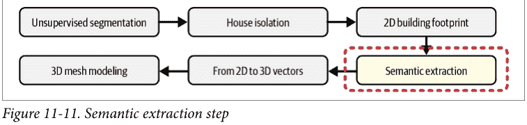

扩展几何理解并从三维 LiDAR 点云中的单个建筑单元提取语义非常有用。通过理解建筑的几何形状和主要组成部分，我们可以深入了解建筑的结构、功能和状况。

然后，这些信息可以用来创建详细的三维模型，在我们的案例中，生成准确的建筑轮廓，并识别潜在的维护问题。因此，我们首先想使用房屋的高度作为相对度量。让我先通过计算海拔向你展示一些东西：

```python
# What is wrong with this line?
altitude = np.asarray(segment.points)[:,2]+pcd_center[2]
height_test = np.max(altitude)- np.min(altitude)
print('Is this correct: ',height_test)
```

> 你认为我这样做有什么问题？我通过仅取所有点的 z 值来计算海拔。我添加一个 z 的平移量以获得真实的 z 坐标。之后，我取分割点云的最大值和最小值，这就是高度。

我们正在处理不完美的数据：一个真实世界的数据集。你可能处于这样一种情况：在描述建筑的分割区域内或房屋所在位置附近，没有靠近地面的测量点。这意味着你可能会有一个偏移，如果你仅使用分割点作为测量高度的基础，你可能会得到 2 米而不是 10 米的结果（即结果将是错误的）。这是我们想要避免的。我们如何解决这个问题？

让我们把点连接起来。你还记得我们在工作流程开始时只提取了地面点吗？嗯，是时候把它放进篮子里，并利用我们可以从中收集的信息了。

我们必须定义局部区域的地面水平。为此，我们基于分割的中心定义一个查询点。然后，我们可以取这个分割的中心，同时去掉 z，因为我们不想要分割的中心在那里，而是 z 最小的分割值（即潜在轮廓的中心）。

让我们通过首先获取一个查询点来定义我们局部区域的地面水平：

```python
query_point = segment.get_center()
query_point[2] = segment.get_min_bound()[2]
```

我们可以利用这个查询点从地面选择所有邻域点，然后计算局部区域的平均海拔值。当我说邻域时，你还记得我们第 4 章的数据结构吗？

好吧，让我们再次利用我们从地面点构建的 k-d 树：

```python
pcd_tree = o3d.geometry.KDTreeFlann(ground_pts)
```

从那里，我们进行 k-NN 搜索，我们保留点的索引（传入查询点并取 200 个邻居）：

```python
[k, idx, _] = pcd_tree.search_knn_vector_3d(query_point, 200)
```

现在，为了进行质量控制，我们创建一个使用此搜索选择的点样本，仅使用地面点，并为选择着色（图 11-12）：

```python
# From the nn search, we extract the points that belong to the ground and paint
# them grey
sample = ground_pts.select_by_index(idx, invert=False)
sample.paint_uniform_color([0.5, 0.5, 0.5])
o3d.visualization.draw_geometries([sample, ground_pts])
```

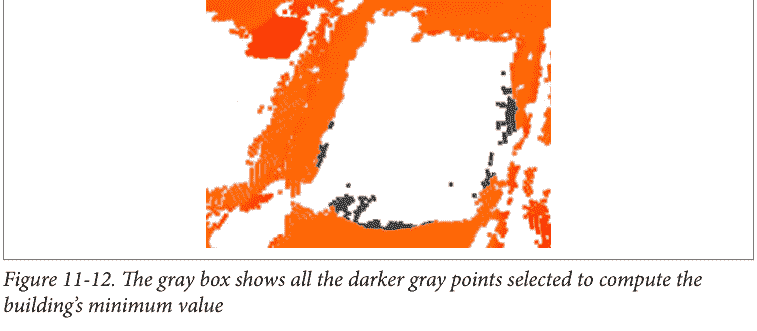

靠近建筑的点是唯一可能以足够相关性暗示建筑位置的数据点。因此，我们使用它来定义下限，最终提取建筑的高度：

```python
# Extract the mean value of the ground in this specific place
ground_zero = sample.get_center()[2]

# Compute the true height of the building, roof included:
height = segment.get_max_bound()[2] - ground_zero
print('True Height: ', height)

# Check the difference:
print('Height Difference: ', height - height_test)
```

> 如果我们检查差异，我们会发现样本有 -12 厘米的偏移。所以，在这种情况下，我们相当接近，但在其他一些存在大遮挡的情况下，你可能会有更大的差异。

现在，让我们继续计算一些可量化的属性。目的是深入了解建筑的大小、形状和方向。这些信息帮助我们理解社区的密度和布局，识别潜在的开发机会，并评估特定区域的宜居性。

首先，让我们确保构建和整理聚类标签：

```python
building_gdf[['id']] = sel
```

现在，让我们计算一些基于对象的属性，即高度、面积和建筑周长（源自 alpha 形状）：

```python
building_gdf[['height']] = segment.get_max_bound()[2] - sample.get_center()[2]
building_gdf[['area']] = building_vector.area
building_gdf[['perimeter']] = building_vector.length
```

最后，让我们检索局部质心坐标以及分割中心和点数，然后打印结果：

```python
building_gdf[['local_cx','local_cy','local_cz']] = \
    np.asarray([building_vector.centroid.x, building_vector.centroid.y,
                sample.get_center()[2]])
building_gdf[['transl_x','transl_y','transl_z']] = pcd_center
building_gdf[['pts_number']] = len(segment.points)

#print
building_gdf.head(1)
```

现在，我想向你展示一些获取额外属性以更好地描述我们场景的方法。例如，分析局部极大值和极小值可以揭示建筑特征，如屋顶峰值和地面层入口，为财产评估和城市规划提供有价值的背景信息。

让我们首先沿 x 轴提取 points_1D 并打印局部极小值和局部极大值：

```python
# Extra attributes
points_1D = np.asarray(segment.points)[:,2]
print('The local minima (along the Z axis)',np.min(points_1D))
print('The local maxima (along the Z axis)',np.max(points_1D))
```

然后，我们绘制直方图。我们可以利用它来提取一些令人兴奋的方法来建模屋顶层，例如。让我们立即看看：

```python
# Extra attributes
points_1D = np.asarray(segment.points)[:,2]
print('The local minima (along the Z axis)',np.min(points_1D))
print('The local maxima (along the Z axis)',np.max(points_1D))

plt.hist(points_1D, bins='auto') # arguments are passed to np.histogram
plt.title("Histogram with 'auto' bins")
plt.show()
```

这将返回图 11-13。

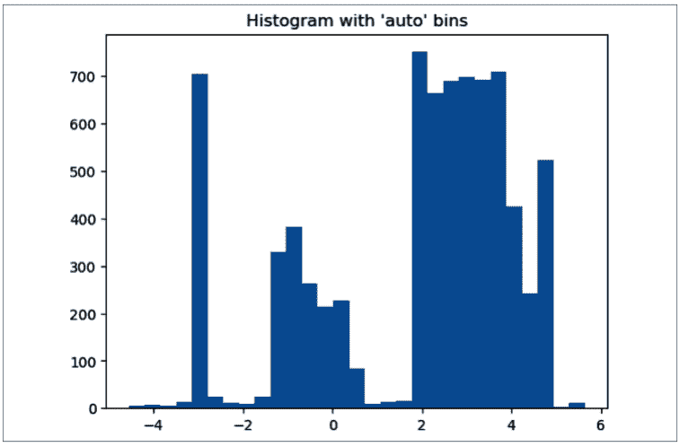

图 11-13. 我们所选房屋点分布沿 z 轴的直方图

如您所见，通过这个沿z轴的直方图，三座建筑的屋顶从图表中清晰地显现出来。这个过程意味着我们可以利用一些断点来识别分界线，从而进一步分割我们的点云。

这些信息有助于我们理解建筑的潜在用途、估算翻新成本，并识别施工或再开发过程中的潜在挑战。此外，通过比较不同建筑的属性，我们可以识别房地产市场的趋势和模式，为投资决策和城市规划策略提供信息。然而，为此，我们需要进一步提取和重建每一个独立的实体。

## 二维到三维向量

我们现在可以开始将二维形状转换为三维模型的艺术了（图11-14）。我们的策略很简单。我们将从二维形状中获取顶点，并利用我们的附加属性（主要是建筑高度）在适当的高度复制这些顶点。

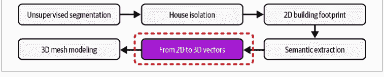

图11-14. 从二维到三维向量

首先，让我们计算二维多边形：

```
# 基础层
# 生成顶点列表
vertices = list(building_vector.exterior.coords)

# 构建Open3D对象
polygon_2d = o3d.geometry.LineSet()
polygon_2d.points = o3d.utility.Vector3dVector([point + (0,) for point in vertices])
polygon_2d.lines = o3d.utility.Vector2iVector([(i, (i + 1) % len(vertices)) for i in range(len(vertices))])
```

这会将我们的二维多边形生成为一个Open3D对象，以GeoPandas作为种子数据框。我们仍然需要计算一个三维向量。

让我为您分解这段Python代码。首先，我将建筑向量的外部坐标提取到一个顶点列表中。然后，我创建一个Open3D LineSet对象，它本质上是一种将多边形表示为一组连接线的方式。为此，我通过添加一个零z坐标（这就是`+ (0,)`的作用）将每个二维点转换为三维点。然后，我通过按顺序将每个点连接到下一个点来定义多边形的边，并使用一个巧妙的技巧——取模运算符`% len(vertices)`——将最后一个点连接回第一个点。这确保了多边形是闭合的，创建了建筑足迹的完整轮廓。生成的`polygon_2d`对象是建筑外部形状的轻量级表示，可用于进一步的三维几何处理。

现在，我们需要为顶层复制这个过程。我们可以简单地平移对象（先制作一个副本），或者使用相同的方法，利用高度进行偏移：

```
# 为挤出部分生成相同的元素
extrusion = o3d.geometry.LineSet()
extrusion.points = o3d.utility.Vector3dVector([point + (height,) for point in vertices])
extrusion.lines = o3d.utility.Vector2iVector([(i, (i + 1) % len(vertices)) for i in range(len(vertices))])
```

最后，我们使用Open3D进行可视化（见图11-15）：

```
o3d.visualization.draw_geometries([polygon_2d, extrusion])
```

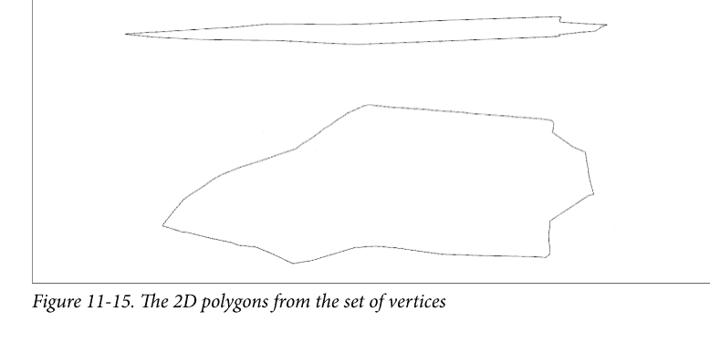

现在，让我岔开话题，展示如何处理顶点。以下是获取它们的方法：

```
# 绘制顶点
temp = polygon_2d + extrusion
temp.points
temp_o3d = o3d.geometry.PointCloud()
temp_o3d.points = temp.points
o3d.visualization.draw_geometries([temp_o3d])
```

我们可以更高效地对数据集进行向量化，这涉及到使用NumPy方法。我首先定义三个变量：a、b和c。a保存我的alpha形状的坐标，b获取alpha形状并去掉高度，c创建一个与a大小相同的单一数组，但填充了带有高度的样本中心。这个过程允许我们定义足迹高度和顶点，然后将它们组合并可视化：

```
# 使用NumPy为三维网格生成基础顶点
a = np.array(building_vector.exterior.coords)
b = np.ones([a.shape[0],1])*sample.get_center()[2]
c = np.ones([a.shape[0],1])*(sample.get_center()[2] + height)

# 定义地面足迹和点的高度数组
ground_pc = np.hstack((a, b))
up_pc = np.hstack((a, c))

# 生成由主要点组成的Open3D“点云”
temp_o3d = o3d.geometry.PointCloud()
temp_o3d.points = o3d.utility.Vector3dVector(np.concatenate((ground_pc, up_pc), axis=0))
o3d.visualization.draw_geometries([temp_o3d])
```

让我们用这些线和顶点来处理三维网格模型创建部分。

## 三维模型创建：网格

我们现在准备计算基础建筑的alpha形状，我们可以使用Open3D来完成。这里，我提供以下代码片段：

```
# 计算三维基础点的alpha形状
alpha = 20
print(f"alpha={alpha:.3f}")
mesh = o3d.geometry.TriangleMesh.create_from_point_cloud_alpha_shape(temp_o3d, alpha)
```

这里的alpha参数至关重要——它控制着网格重建的“紧密度”。通过将alpha设置为20，我本质上是在告诉算法创建一个连接彼此距离在20个单位以内的点的表面。较小的alpha会创建一个更保守、更紧密的网格，点之间的连接较少，而较大的alpha会创建一个更广阔的表面，包含更远的点。

可以将alpha想象成一个“连接阈值”——距离小于此阈值的点将被连接在一起形成三角形。


Alpha形状方法特别有趣，因为它提供了一种灵活且自适应的表面重建方法。与我们回顾过的球旋转或泊松重建等方法不同，Alpha形状允许我们通过调整单个参数来动态控制表面重建。我们本质上可以“调出”我们想要的细节级别，创建一个捕捉底层几何形状的网格，而不会对异常值和稀疏区域过于敏感，也不会对可能不成立的点分布做出假设。请毫不犹豫地利用第10章中的其他网格策略来直观地查看差异。

要显示您的结果，您可以使用以下代码：

```
mesh.compute_vertex_normals()
mesh.paint_uniform_color([0.5, 0.4, 0])
o3d.visualization.draw_geometries([temp_o3d, mesh, segment],
    mesh_show_back_face=True)
```

我们的模型由此呈现。您看到了顶点。如果我们放大，您可以看到我们的点云被封闭在我们的网格中。如果控制台中有警告，您现在可以忽略它们；它们与我们创建中的一个无效四面体网格有关。在导出之前，我们希望将网格重新定位到其世界坐标。您可以使用Open3D的`translate`函数并传递我们刚刚保存的中心点：

```
# 后处理操作与导出
# 将网格从局部坐标重新定位到世界坐标
mesh.translate(pcd_center)
```

然后，您可以导出新模型，以及来自GeoPandas的shapefile：

```
# 导出网格
o3d.io.write_triangle_mesh('../RESULTS/house_sample.ply', mesh,
    write_ascii=False, compressed=True, write_vertex_normals=False,
    write_vertex_colors=False, write_triangle_uvs=False)

# 导出shapefile
building_gdf.to_file("../RESULTS/single_building.shp")
```

如果您打开外部软件，如CloudCompare（见第2章），您可以加载我们在样本房屋顶部拥有的输入数据和shapefile，以查看我们这个小实验的结果（图11-16）。

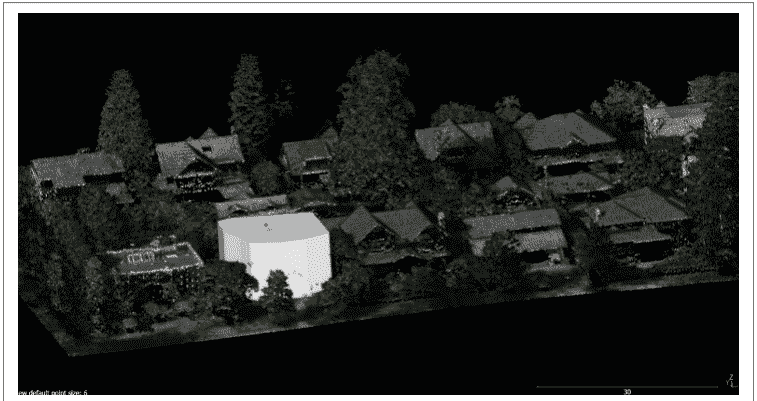

图11-16. 三维模型的后处理与导出

如您所见，我们的形状被很好地定位在建筑原来矗立的地方。这很合理，并且很好地贴合地面。虽然几何形状近似于点云，但我们作为房地产开发商的需求得到了满足。现在正是强调明确目标对于开发合适工作流程至关重要的时候。确实，在这种情况下，使用alpha形状建模方法更好，它提供的几何形状精度较低，但与2.5D Delaunay或球旋转相比，减少了开销。我们只有一栋建筑；那么如何将这个过程自动化应用于整个街区呢？

## 阶段4：自动化与扩展

让我们进入阶段4：三维自动化与扩展（见图11-17）。让我们看看应该如何应对这个自动化挑战。我们正在处理点云数据，逐段提取建筑信息。为了构建我们的循环，我们如下初始化迭代器：

```
for sel in range(max_label+1):
```

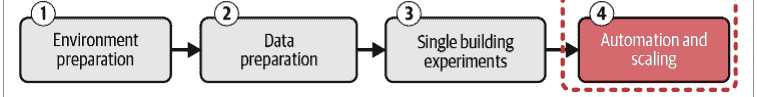

图11-17. 阶段4：自动化三维模型扩展与分割

在每次迭代中，我们选取点云数据的特定片段，使用alpha形状（alpha值为0.5用于形状重建）计算其二维建筑轮廓，然后通过查询附近地面点来确定该片段的高度：

```python
segment = pcd_o3d.select_by_index(np.where(labels==sel)[0])
# o3d.visualization.draw_geometries([segment])

# Compute the building footprint
# altitude = np.asarray(segment.points)[:,2]+pcd_center[2]
points_2D = np.asarray(segment.points)[:,0:2]
building_vector = ash.alphashape(points_2D, alpha=0.5)

# Compute the height of the segment (house candidate)
query_point = segment.get_center()
query_point[2] = segment.get_min_bound()[2]
pcd_tree = o3d.geometry.KDTreeFlann(ground_pts)
[k, idx, _] = pcd_tree.search_knn_vector_3d(query_point, 50)
sample = ground_pts.select_by_index(idx, invert=False)
ground_zero = sample.get_center()[2]
```

我们为每个建筑片段创建一个GeoDataFrame，捕获关键属性，如ID、高度、面积、周长、局部和转换后的质心以及点数。然后，我们将这些建筑条目连接成一个综合数据框：

```python
# Create the geopandas with attributes entry
building_gdf = gpd.GeoDataFrame(geometry=[building_vector], crs='EPSG:26910')
building_gdf[['id']] = sel
building_gdf[['height']] = segment.get_max_bound()[2] - sample.get_center()[2]
building_gdf[['area']] = building_vector.area
building_gdf[['perimeter']] = building_vector.length
building_gdf[['local_cx','local_cy','local_cz']] = \
    np.asarray([building_vector.centroid.x, building_vector.centroid.y, \
    sample.get_center()[2]])
building_gdf[['transl_x','transl_y','transl_z']] = pcd_center
building_gdf[['pts_number']] = len(segment.points)

# Add it to geometries entries
buildings_gdf = pd.concat([buildings_gdf, building_gdf])
```

对于三维几何重建，我们通过垂直拉伸二维轮廓来生成地面和上部点云，创建Open3D点云，然后使用alpha形状三角剖分（alpha值为20）生成建筑的网格表示。我们为每个网格应用随机颜色，将其平移到原始点云中心，最后将三维网格写入PLY文件：

```python
# Compute the 3D vertex geometries
a = np.array(building_vector.exterior.coords)
b = np.ones([a.shape[0],1])*sample.get_center()[2]
c = np.ones([a.shape[0],1])*(sample.get_center()[2] + height)
ground_pc = np.hstack((a, b))
up_pc = np.hstack((a, c))
temp_o3d = o3d.geometry.PointCloud()
temp_o3d.points = o3d.utility.Vector3dVector(np.concatenate((ground_pc, up_pc),
    axis=0))

# Compute the 3D geometry of a house
alpha = 20
mesh = o3d.geometry.TriangleMesh.create_from_point_cloud_alpha_shape(temp_o3d,
    alpha)
mesh.translate(pcd_center)
mesh.paint_uniform_color(random_color_generator())

o3d.io.write_triangle_mesh('../RESULTS/house_'+str(sel)+'.ply', mesh,
    write_ascii=False, compressed=True, write_vertex_normals=False)
```

请注意，我定义了一个可选的实用函数来为每个建筑网格随机着色，你可以在以下位置找到：

```python
import random
def random_color_generator():
    r = random.randint(0, 255)
    g = random.randint(0, 255)
    b = random.randint(0, 255)
    return [r/255, g/255, b/255]
```

因此，总结一下，我们的自动化循环执行以下操作：

1.  对于点云中的每个片段，我们首先使用其标签进行选择。
2.  然后，我们使用alpha形状方法计算建筑轮廓，创建点的简化二维边界。
3.  我们通过找到片段最低点最近的50个地面点并计算它们的平均高度来确定地面水平。
4.  我们创建一个GeoPandas DataFrame来存储建筑属性，如ID、高度、面积、周长以及局部和转换坐标。高度是通过计算片段最大点与地面水平之间的差值来确定的。
5.  我们还通过在地面水平和指定高度创建点云来为每个建筑生成三维顶点。这些点随后创建一个表示建筑几何形状的三角网格。
6.  我们将网格平移到其原始点云位置，并为其赋予随机颜色以进行可视化。
7.  最后，我们将每个建筑的网格写入`../RESULTS/`目录中的PLY文件，以便后续可视化。

这个过程使我们能够从LiDAR点云数据集中系统地提取、表征和重建单个建筑结构（见图11-18）。

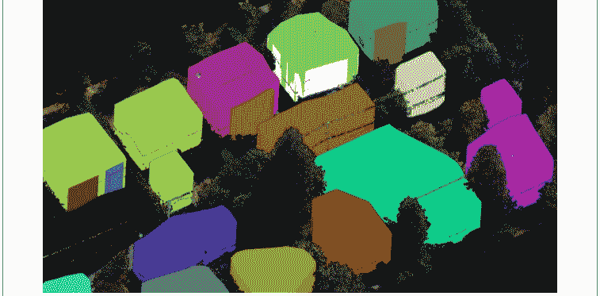

在结束之前，你可以使用以下代码片段导出包含所有轮廓的shapefile：

```python
# Export the shapefile
building_gdf.to_file("../RESULTS/all_building.shp")
```

现在，如果我们查看包含所有房屋的文件夹，你会看到我们所有的建筑都已出现并实例化，以便可以独立选择并在外部软件中加载。

> 我们需要进行一些后处理，例如合并建筑、纠正不确定性以及解决聚类伪影。这是一个很好的直接扩展。你将如何修改该方法以获得更清晰的结果？

## 总结

本章讨论的工作流程提供了一种从LiDAR点云数据重建三维建筑轮廓的实用解决方案。它涵盖了从环境设置到数据准备、分割、矢量化和基本后处理的关键步骤。

作为一名虚构的房地产买家，希望了解你正在考虑投资的社区的住宅建筑模式，这个工作流程如何帮助你？无论你将其应用于哪个行业，你现在都可以利用Python从LiDAR点云中提取数据。你的分步解决方案将建筑从LiDAR点云中分离出来，并提取二维和三维信息，包括轮廓、高度、面积和周长。如果我必须总结关键要点，你现在应该对以下内容相当熟悉：

-   使用Anaconda设置Python虚拟环境
-   使用laspy和NumPy等库加载和探索LiDAR点云数据
-   通过创建掩码、将其转换为NumPy数组以及使用无监督分割算法来预处理LiDAR数据
-   使用alpha形状算法从点云数据中提取建筑轮廓
-   自动化从多个点云文件中提取建筑轮廓的过程
-   计算建筑参数，如高度、面积和周长，并将结果导出为三维模型和shapefile

生成的三维模型和shapefile为各种应用中的后续分析、可视化和决策提供了丰富的基础。这种自动化方法使你能够处理大型数据集并轻松提取准确的建筑信息，节省时间和资源。

我们三维数据科学之旅的下一阶段是探索无监督分割技术，如DBSCAN。让我们继续[第12章](第12章)。


虽然该工作流程提供了坚实的基础，但必须注意，对于复杂场景，可能需要更先进的分割技术，如[第12章](第12章)及后续章节所涵盖的内容。根据具体数据集和所需输出，后处理步骤也可能需要调整或额外工具。最后，我鼓励你将当前工作流程扩展到你的应用中，这应该会揭示令人兴奋的新技巧。

# 第12章

## 三维机器学习：聚类

从三维数据中提取意义并非简单目标。我们从包含丰富几何细节的大型数据集开始，希望从中提取语义理解（第1章），这是高级任务所需的。第一个挑战是原始数据与可用知识之间的差距，这限制了三维机器学习在多个学科（包括机器人、自主导航和场景理解）中的潜力。

确实，虽然我们受益于庞大的可访问语料库来训练图像或文本模态的监督模型，但三维公开可访问的标注数据集却很少见。缺乏固有标签使得监督学习方法具有挑战性或在大规模实施上成本过高。

我们需要一种方法来弥合这一差距，而不广泛依赖昂贵且耗时的人工标注。这催生了让机器自主识别三维数据内在结构的想法。这将提高效率，并使我们能够解决众多困难。我想教你如何通过聚类算法（见图12-1）利用无监督学习的力量来实现这一点。

在本章中，我们专注于通过无监督学习机制进行聚类。第6章和第7章提供降维解决方案；第8章和第9章展示回归技术的使用；而第14、15和16章则深入探讨分类方法。

## 用于无监督分割的聚类

这些方法有助于根据数据点的内在特征（几何形状和属性）对其进行分类，从而实现自动目标检测、场景理解以及后续的语义增强。

理解事物的本质是美妙的。这是我们作为终身学习者共同的特质。在特定领域（如3D数据科学）扩展知识，通常始于一个目标，但会引发新的探索，如同树木的分支。这激发了创造力和创新，并推动了我们的技术演进（以及其他方面）。这就是为什么我非常投入，并且特别兴奋于在本章中与你们分享的内容。让我们向3D场景理解再迈进一步，但不要过于深入以至于专业化到无法回头的地步。

让我们超越物理结构来理解我们的3D世界，并提取其各个组成部分的某种基础含义。让我们将3D几何领域与语义学的初步方法结合起来，目标是：尝试实现场景中对象的“概念化”，使其能够在不同应用之间泛化。

使用聚类模型的无监督学习在实现这一目标中起着至关重要的作用。3D聚类方法旨在将三维模型（例如点云）划分为多个簇或区域，每个簇代表一个不同的对象或部分。它们是无监督的，因为它们基于不需要预先标记训练数据的方法。目标是根据特征（如位置、颜色、强度或几何属性）将相似的单元分组在一起。

例如，分析从地面激光扫描仪获取的、记录历史建筑立面的3D点云所面临的挑战。你的任务是识别单个建筑元素，如窗户、门、柱子和装饰雕塑，用于文档记录和修复。原始点云包含数百万个点，每个点由空间坐标（x, y, z）和颜色、强度等属性表示。缺乏语义标签使得手动识别成为一项繁琐且耗时的工作。我们可以通过基于空间邻近性、颜色和几何特征对相似点进行分组，自动提取代表不同建筑组件的不同簇。

这些方法提供了高度的自主性，不需要任何标记数据集即可运行。因此，它们通常被用作种子过程，以加速为语义分割任务（如3D物体识别）生成标记数据集。它们通常在监督学习之前使用，并提供了在基础单元之上提取语义感知结构的能力，这对于数字环境的3D场景理解非常有前景。

在本章中，我们将探讨图12-2所示的三个主要步骤：我们使用（1）聚类原理，结合两种主要方法，即（2）基于质心的和（3）基于密度的聚类。

我们探索聚类模型（如k-means和DBSCAN）的机制，以及它们与RANSAC（见第9章）的混合用于3D形状识别方法。这为进一步的分析和理解奠定了基础，可能引向更先进的无监督分割方法（第13章）和语义注入（第14章）。

本章重点介绍第408页“聚类算法类型”中详述的两种聚类方法。它们是最基本的，并且由于其灵活性，允许为各种应用创建解决方案。然而，为了完整性，我将在第13章中介绍基于连通性和基于分布（通过图像投影和深度学习）的解决方案。这使我们能够将章节分解为更易于管理的部分。我们利用NumPy、Matplotlib、scikit-learn和Open3D。一如既往，在3D数据科学资源中心，你可以找到本章的所有材料。要访问文件（代码、数据集、文章）和资源，你可能需要提供电子邮件地址、个人密码或证明你是本书所有者的凭证。

为什么无监督分割和聚类被认为是人工智能的主要基础？在使用它们时应考虑哪些因素？如何评估或评价性能？让我们回顾一下原理（图12-3）。

聚类技术能够在不需要监督的情况下将数据划分为称为簇的子组。这些部分自然地将相似的观测值分组在一起。聚类方法在很大程度上依赖于相似性的定义，这通常根据特定应用领域进行调整。例如，如果我们研究一个房间的嘈杂点云表示（见图12-4），很明显，空间邻近性是建立形成分割所需相似性的决定性因素。

聚类技术通常用于探索性数据分析（EDA）。它们也构成了AI分类管道中的大部分程序，这些程序以无监督/自学习方式生成标记良好的数据集。让我们花些时间确保我们完全掌握它们的潜力。

## 聚类基础

LeCun在NIPS 2016上展示的原始蛋糕类比演示，已通过突出显示特定部分进行了更新（见图12-5）。用于无监督分割的聚类技术允许创建分割的数据点集，作为其他过程的基础，包括特征提取、分类和3D建模。除了在3D应用中的使用外，它们还检测其他实体，例如表现出相似行为的客户（用于市场细分目的）、以类似方式使用工具的用户、社交网络中的社区以及金融交易中的重复模式。

它们通常与降维技术一起工作，降维技术使得能够在二维或三维中可视化各种质量（称为维度）。如果一个“视图”显示出显著的去相关性，则可以采用聚类方法来创建这些数据点的子组——称为簇——如图12-6所示。

识别两个簇的一个简单演示是生成一条线将数据集划分为两个子组。因此，我们可以图形化地描绘点之间的连接。或者，可以只显示每个簇的一个代表点，而不是显示整个数据集。在识别簇之后，可以通过从每个簇中选择一个代表并移除其余点来查看数据。

本质上，聚类是一种利用度量（如欧几里得距离、余弦相似性和曼哈顿距离（我们即将研究））从多样化数据集中对相关数据点进行分类的技术。它可以创建具有各种形状的任意簇，我们可以根据算法识别这些簇的能力来定制算法选择。

## 聚类的代表性

与监督学习算法相比，无监督算法缺乏明确的目标，因为监督学习的任务（如分类或回归）是明确定义的。因此，模型的成功与否更具主观性。尽管定义目标存在挑战，但主要有三种性能衡量标准：

- 距离与相似度
- 聚类的形状
- 聚类的稳定性

让我们逐一详细说明。

## 距离与相似度

聚类有助于将彼此接近或最具可比性的点分组在一起。聚类的概念在很大程度上依赖于距离和相似度的概念。因此，对这些原则进行形式化非常有益（参见图12-8）。我们可以利用三个原则：

- 邻近性指的是两个观测值之间的接近程度。
- 邻近性也指一个观测值与一个聚类之间的接近程度。
- 此外，邻近性还可以描述两个聚类之间的接近程度。

欧几里得距离和曼哈顿距离通常被用作距离度量。欧几里得距离指的是欧几里得空间中两个地点之间最短、最直接的距离。曼哈顿距离得名于出租车在曼哈顿街道上行驶的距离，在二维区域中，所有道路要么相互平行，要么相互垂直（参见图12-9）。

因此，可以使用距离度量来建立相似度度量：两个地点之间的距离越大，它们的相似度越低，反之亦然。为了引入一点数学知识，我们可以轻松地使用公式 $s(x, y) = 1/1 + d(x, y)$ 将 $x$ 和 $y$ 之间的距离 $d$ 转换为相似度度量 $s$。

一种常用的相似度度量方法是皮尔逊相关系数。它计算数据居中后向量 x 和 y 之间夹角的余弦值。然而，值得一提的是，皮尔逊相关系数考虑的是分布的形状而非其幅度，而欧几里得距离主要考虑幅度。因此，选择合适的距离度量至关重要。

我们还有哪些其他“工具”可用？其中之一是聚类形状分析。

## 聚类形状

聚类的形状是我们最初需要表征的一个关键方面（参见图12-10）。紧密程度可以为建立内聚聚类提供线索。通常，我们寻求紧密结合在一起的聚类。让我们用一个例子来说明这些特征，采用欧几里得距离。

首先，计算聚类的质心相对简单，它指的是该聚类内点的重心。聚类的同质性可以定义为聚类中每个位置到质心的平均距离。紧密分组的聚类比由分散点组成的聚类具有更低的异质性。为了表征我们数据集中的所有聚类，我们可以计算每个聚类的平均同质性，而不仅仅是一个聚类（参见图12-11）。

此外，我们希望聚类彼此之间相距较远。为了衡量这一点，我们通常定义两个聚类质心之间的距离来量化它们的分离度。我们可以计算所有聚类对的这些量的平均值（参见图12-12）。

目前，我们有两个需要改进的因素：均匀性和区分度。为了简化过程，我们可以将它们归类为一个称为戴维森堡丁指数的单一标准。

该指数衡量聚类内距离（同质性）和聚类间距离（分离度）的差异。我们希望聚类内距离小，聚类间距离大。当所有聚类都同质且分离良好时，该指数对给定聚类的效果较差。

我们可以使用轮廓系数作为评估聚类中同质性和分离度的替代方法。它用于评估给定点 p 是否属于正确的聚类。在此过程中，我们希望解决两个问题：

*p 与其所在聚类中的点的邻近度高吗？*
平均距离，表示为 a(p)，可以通过测量点 p 与其所在聚类内所有其他点之间的平均距离来计算。

*该点与其他点之间的距离是否显著？*
我们确定如果 p 被重新分配到不同的聚类，b(p) 可能具有的最小值。假设 p 已被正确分配，那么 a(x) 小于 b(x)。轮廓系数，表示为 s(x)，使用公式 s(x) = b(x) – a(x) / max(a(x), b(x)) 计算。它是一个介于 –1 到 1 之间的数值。当该值接近 1 时，p 被分配到其聚类的结果更令人满意。

还有其他方法可以评估聚类结果的质量，使用其他度量标准来衡量聚类内的内聚性和聚类间的分离度，但这超出了本书的范围。然而，为了完整性，请允许我提供两种方法：兰德指数和调整兰德指数。兰德指数比较数据点对在预测聚类与“真实”聚类中的分组情况。它提供一个单一分数，表示两个聚类之间一致的比例。调整兰德指数是一种变体，在评估两个数据聚类之间的相似性时对概率进行了调整。

要评估聚类质量，可以计算其平均轮廓系数。这可以使用 scikit-learn 库和 sklearn.metrics.silhouette_score 函数来完成。但让我们记住这一点，稍后再讨论，现在继续讨论需要监控的第三个方面：聚类的稳定性。

聚类可以分为两种类型：硬聚类和软聚类。硬聚类将每个数据点分配到一个特定的聚类，确定其属于一个或另一个聚类。软聚类评估数据点属于多个聚类的可能性，确定其与任一聚类的关联。此概率是为所有数据点计算的。

聚类技术在标记数据成本高昂的情况下非常有益。考虑标注大量点云的情况。根据每个点的表示为其提供标注可能是一项耗时且费力的任务，以至于执行此操作的人员可能由于注意力不集中或疲劳而无意中引入错误。

使用聚类算法对相似点进行分组，并仅让人类操作员为聚类分配标签，是一种更具成本效益且可能更有效的方法。如图12-7所示，您可以看到使用聚类作为标注的切入点而不是获取并标注每个点的好处。在这种特定情况下，您可以估计标注工作量减少了六倍（标注3个聚类而不是18个点）。这些方法可用于将聚类中一个点的属性推广到同一聚类中的所有其他点（如椅子对象所示）。

在地理数据范围之外，推断数据属性对多种目的都有益。这些包括识别可能描绘相同对象、动物或人的相似图像；提取可能讨论相同主题的相似文本；以及搜索图像中属于同一对象的像素，这被称为分割。前面的例子说明了将主题（图片、文本、像素）表示为2D、3D或nD空间中的点，然后将这些点组织成聚类。因此，如果聚类中的单个图像描绘了一只鸭子，那么属于同一聚类的所有其他图像也很可能描绘鸭子。

我们可以建立多个必须优化的标准，以确定一个令人信服的数据划分。然后，这些概念被用于开发一些最有效的聚类算法，我们将在后面详细说明。

## 聚类稳定性

另一个需要考虑的关键方面是分组的均匀性。当对同一数据进行迭代应用时，使用不同的初始化方式，或者应用于数据的不同子集，或者应用于包含一定程度噪声的数据时，该过程是否会产生一致的结果？

这一标准对于确定聚类数量尤为重要。如果选择的聚类数量与数据的内在结构相符，那么聚类将表现出比不相符时更高的稳定性。

为此，你可以使用聚类重新分配率来量化稳定性。我们通过跟踪在多次计算迭代中改变聚类成员身份的点的百分比来计算此指标。较低的重新分配率（通常低于5-10%）表明聚类具有鲁棒性，这意味着在轻微的算法扰动下，空间配置保持一致。该方法涉及使用受控的随机变化生成多个聚类解决方案，然后计算在聚类之间迁移的点的比例。

如果你想将其与质心联系起来，那么研究迭代之间的质心移动可以为聚类结构完整性提供精确的定量视角。我们通过计算聚类质心在不同计算运行中移动的欧几里得距离来衡量这一点。较小的质心移动（小于数据集空间范围的1-2%）表示稳定的聚类几何形状。这种方法涉及在高维空间中跟踪质心轨迹，采用能够捕捉平移和旋转变化的距离度量。该技术使我们能够区分真正的聚类偏移和计算噪声。

最后，我发现使用聚类边界方差作为3D数据集最细致的稳定性评估技术非常有帮助。我们通过检查迭代过程中聚类边界的形态变化来分析这一点，计算诸如边界点密度波动和局部几何变形等指标（你可以使用第10章关于建模的知识来提取几何边界的形状）。一个关键指标包括聚类界面边界点分布的标准差。稳定的聚类保持一致的边界特征。

这些技术将抽象的聚类指标转化为可解释的空间表示，使我们能够在需要时评估聚类质量。让我在一个我们有明确数据划分的数据集上快速说明这一点，例如图12-13。作为示例，我们可以操作一组组织成不同平面形状的点。后续阶段涉及评估聚类算法生成的聚类是否与预先建立的分组一致。

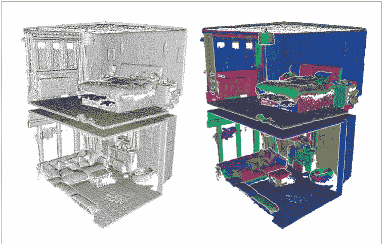

作为最后阶段，为了完美理解3D无监督分割的聚类原理，让我们定义与领域特定知识的兼容性。

## 过分割与欠分割的情况

在复杂的3D数据科学领域，我需要强调一个与相关分割任务相关的关键概念。过分割和欠分割代表了根本上影响我们提取有意义空间信息能力的关键挑战。

过分割发生在聚类算法将一个连贯的对象分割成过多、细粒度的片段时，创建了一种人为碎片化的表示，掩盖了底层的几何结构。这种现象通常在聚类算法优先考虑局部点变化而非全局对象连贯性时出现。

欠分割则代表了相反的挑战，即不同的几何实体被错误地合并到一个聚类中（我们观察到“溢出”自然边界）。当聚类算法未能捕捉细微的空间变化时，就会发生这种情况，导致过度简化的表示，将多个不同的对象或结构组件折叠成一个不充分的片段。

> 当前研究表明，欠分割可能导致灾难性的信息丢失，特别是在复杂的城市地图绘制、地质调查或医学成像等3D环境中。为了应对这些挑战，你可以使用多尺度聚类方法，该方法根据局部几何复杂性动态调整分割粒度。这涉及实现自适应聚类算法，该算法结合了局部点邻域特征和全局空间上下文。通过开发平衡点方差与几何连续性的复杂指标，我们可以有效缓解过分割和欠分割的风险。

虽然这些概念超出了本书的范围，但一些令人兴奋的技术包括开发保留空间相关性的鲁棒边界检测机制。

## 聚类算法的类型

让我们深入探讨一下。聚类有助于处理非结构化数据。图形、最短距离和数据点的密度是驱动聚类形成的几个要素。

我们希望建立一个基于相似性度量来评估对象连接程度的过程。虽然在较小的特征集合中更容易发现相似性度量，但随着特征数量的增加，生成相似性度量会变得更加困难。

根据所使用的聚类算法类型，采用多种策略对数据集中的数据进行分组。让我们回顾一下你可以利用的各种聚类算法类型：

### 基于质心的聚类（划分方法）

属于此类别的算法通过邻近性对数据点进行聚类。它们采用三种主要的相似性度量（曼哈顿距离、闵可夫斯基距离、欧几里得距离），并将输入分成预定数量的聚类。该算法的基本问题是我们必须猜测或使用肘部法则来确定*k*，即组的数量。只有这样，聚类算法才能分配数据点。基于质心的聚类在具有明确、球形或椭球形聚类几何形状的场景中表现出色。像*k*-means这样的算法在空间分布呈现紧凑、大致等距的点配置时，对于3D数据的实现非常出色。当处理不规则形状或不同密度的聚类时，会出现关键限制，这使得预处理和初始参数选择变得复杂。

### 基于密度的聚类（基于模型的方法）

这种方法根据数据点的密度来寻找聚类：它代表了我处理复杂、非线性空间分布的首选方法。基于密度的聚类自动计算聚类数量，并且比基于质心的聚类对初始种子不那么敏感。它们在处理各种形状和大小的聚类时表现良好，使其成为具有重叠聚类的数据集的理想选择。这些方法可以处理密集和稀疏的数据，并通过关注局部密度来区分具有不同形状的组。最著名的基于密度的聚类方法是DBSCAN：它通过优先考虑点密度和局部邻域特征来提供鲁棒的分割。DBSCAN方法动态适应聚类形状，有效处理噪声并捕捉细微的几何过渡，解决了基于质心的困难。本章后面的“用于无监督分割的DBSCAN”（第421页）将更深入地探讨这种方法。

## 基于连通性的聚类

基于连通性的聚类成为捕捉层次空间关系的强大方法。这一族的算法专注于理解点如何相互连接，通过它们的邻域连接揭示复杂的几何结构。连通分量是这种方法的基本构建块，我们基于邻近性和邻域连通性来识别空间上连贯的点聚类。我们通过图论算法来实现这一点，这些算法遍历点云邻域，通过检查局部点关系来建立聚类边界。该方法的关键是定义一个连通性阈值，以平衡局部点交互与全局空间上下文。在本章的最后一节，我们提供了一个利用k-NN图和epsilon邻域连接来系统分解复杂3D数据集的实现。

### 基于分布的聚类

基于分布的聚类根据数据点属于同一概率分布（高斯分布、二项分布）的概率对其进行分组。该方法利用统计分布来捕捉传统聚类技术无法充分表示的复杂几何模式。高斯混合模型（GMMs）是基于分布聚类的主要计算机制。它们将3D数据建模为多个概率高斯分布的组合，从而能够细致地表示空间复杂性。这种方法在具有重叠或复杂几何配置的场景中表现出色，例如医学成像中的场景。通过分配概率性的聚类成员身份，我们可以捕捉确定性聚类方法通常忽略的细微空间变化。主要问题在于分布模型的过拟合。

表 12-1 展示了每种技术族的关键要点。

表 12-1. 3D 数据集的各种聚类方法

| 聚类方法 | 最佳使用场景 | 最常用算法 | 关键特性 |
|---|---|---|---|
| 基于质心 | 均匀几何分布、紧凑空间结构、城市基础设施制图 | k-means | 固定簇数、球形簇形状、对异常值敏感 |
| 基于密度 | 不规则点分布、噪声环境、复杂地质调查 | DBSCAN | 适应非线性形状、有效处理噪声、捕捉局部密度变化 |
| 基于连通性 | 嵌套空间关系、多尺度分析、建筑和森林冠层制图 | 连通分量 | 揭示层次结构、无需预定义簇数、保留空间语义 |
| 基于分布 | 概率空间建模、医学成像、生物力学分析 | 高斯混合模型 | 概率性簇成员关系、捕捉统计变化、处理复杂数据分布 |

现在你已经了解了我们可以利用聚类算法进行 3D 无监督分割的各种方法，让我们用 Python 来创建解决方案。


正如引言中所概述的，本章深入探讨前两种聚类方法：基于质心和基于密度的方法。确实，它们代表了最基本的要素，并且由于其固有的灵活性，便于解决方案的开发。为了全面起见，我在第 13 章中介绍了基于连通性和基于分布方法的深入解决方案（利用图像投影和深度学习）。

首先，让我们利用 *k*-means 聚类。

## k-Means 聚类

*k*-means 是一种非常简单且流行的算法，用于计算场景的“聚类”。在本节中，让我们利用该技术实现通用方法（图 12-14）。

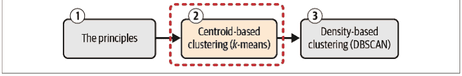

图 12-14. 使用 k-means 进行基于质心的聚类

它通常是一个无监督过程，因此我们不需要任何标签，不像分类问题。但是我们想要聚类哪些数据点呢？

这些可以是任意点，例如用 LiDAR 扫描仪记录的 3D 点。但它们也可以代表数据集（网格、点云等）中的空间坐标、颜色值，或其他特征，例如从图像中提取的关键点描述符，以构建词袋字典。你可以将它们视为空间中的任意向量，每个向量都持有一组属性。然后，我们在一个定义的“特征空间”中收集许多这样的向量，并希望用少量的代表性向量来表示它们。

我们需要知道的唯一信息是一个距离函数，它告诉我们两个数据点相距多远。最简单的形式是欧几里得距离。但根据你的应用，你可能还想选择不同的距离函数，如前所述。然后，我们可以判断两个数据点是否彼此相似，以及它们是否属于同一个簇。

这允许用 *k* 个代表性向量来抽象和表示所有数据点，这也是该算法名称的由来。因此，*k* 是一个用户定义的数字，我们将其输入系统。例如，取所有数据点并用空间中的三个点来表示它们（见图 12-15）。

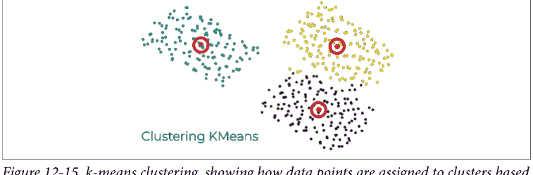

*图 12-15. k-means 聚类，展示数据点如何根据其与簇质心的接近程度被分配到簇中*

*k*-means 的工作原理如下：首先，我们在特征空间中有一些数据点（欧几里得空间中的 x、y 和 z）。然后，我们计算 *k* 个代表性向量，并运行 *k*-means 将数据点分配给由代表性向量表示的簇。

在上面的示例中，我们设置 *k* = 3。这意味着我们希望用三个代表性向量来表示所有数据点。圈出的点说明了这些代表性向量，指导相应数据点分配到“最佳”代表性向量。然后我们得到三个点簇。

k-means 以最小化数据点与其最近代表性向量之间的平方距离的方式进行。实现这一点的算法部分由两个简单的步骤迭代构成，即 (1) 初始化和 (2) 分配：

1.  我们随机初始化 k 个质心点作为代表性向量，并计算每个数据点到最近质心的数据关联。因此，我们在这里进行最近邻查询。
2.  每个数据点被分配到其最近的质心，然后我们重新配置每个质心在空间中的位置。这是通过计算分配给该质心的所有数据点的主向量来完成的，这会改变其位置。

在算法的下一次迭代中，我们得到一个新的分配，然后是一个新的质心位置，我们重复这个过程直到收敛。

> 我们应该注意，k-means 不是一个最优算法。这意味着 k-means 试图最小化距离函数，但我们不能保证找到全局最小值。因此，根据你的起始位置，你可能会得到不同的 k-means 聚类结果。假设我们想快速实现 k-means。在这种情况下，我们通常需要在空间中有一个近似最近邻函数，因为这是该算法中最耗时的操作。

因此，k-means 是一种相对简单的两步迭代方法，用于在高维空间中为可能大量的数据点寻找代表性向量。

## k-Means：工作流定义

你的任务是监控一个广阔的空域。挑战在于如何在海量的 LiDAR 点云中高效地检测和识别单个静止的飞机。这项艰巨的任务对于确保空域安全和预防潜在威胁至关重要。通过分析 3D 点云数据，我们可以识别和定位飞机，评估其大小和类型，并监控其随时间推移的移动。这些信息可用于检测未经授权的飞机，识别潜在的安全风险，并及时应对紧急情况。

通过跟踪飞机位置和配置的变化，我们可以及早发现可疑活动或潜在威胁，使安全人员能够采取适当措施保护关键基础设施和人员。你将构建一种自动化方法来应对这些挑战，节省宝贵的时间和资源，同时最大限度地减少人为错误风险，并允许对潜在安全威胁做出主动响应。

第一步是收集一个优质的数据集！这次，我想分享另一个寻找优质 LiDAR 数据集的好地方：[法国国家地理研究所的地理服务目录](https://geoservices.ign.fr/)。LiDAR HD 活动提供了一个开放数据门户，你可以在其中获取法国某些地区的清晰 3D 点云。对于本节，我访问了该门户，选择了一个图块，从中提取了一个子集，删除了地理参考信息，为 LiDAR 文件准备了一些额外的属性，然后将其提供在本章的文件夹中（见图 12-16 中的步骤 1 到 3）。你感兴趣的数据是 *KME_planes.xyz* 和 *KME_cars.xyz*。我建议遵循一个简单的程序，你可以复制它来标记你的点云数据集，如图 12-16 所示。

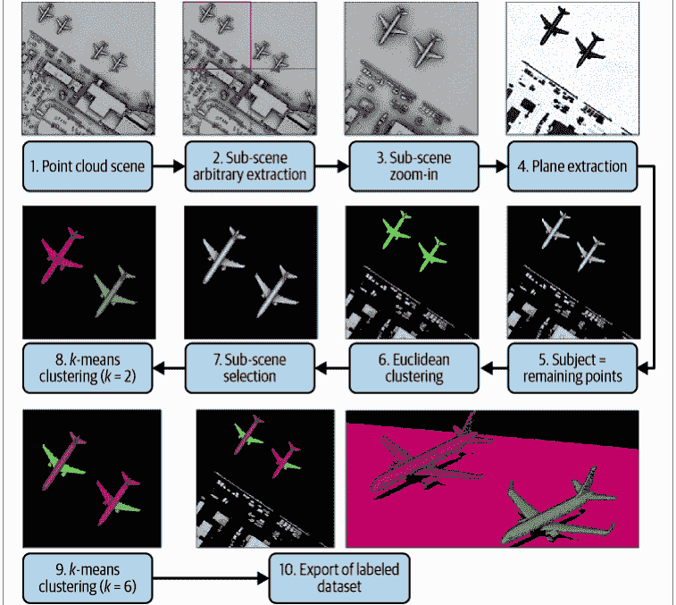

本节涵盖步骤 4 到 10，其他步骤已经是基于前几章的新技能的一部分。现在理论部分结束了，让我们深入 Python 实现。

## 3D Python 上下文定义

一如既往，专注于高效和最小化的库使用是很好的。我们可以完全使用 Open3D 或 PyTorch3D 等库来完成，但为了掌握 3D Python，让我们只使用 NumPy、Matplotlib 和 scikit-learn。六行代码开始你的脚本：

```python
#numpy
import numpy as np

#matplotlib
import matplotlib.pyplot as plt
from mpl_toolkits import mplot3d
# Scikit-learn
from sklearn.cluster import KMeans
from sklearn.cluster import DBSCAN
```

从那里，我建议我们相对地表达我们的路径，将包含数据集的 data_folder 与数据集名称分开，以便轻松切换：

```python
data_folder="../DATA/"
dataset="KME_planes.xyz"
```

然后，让我展示一个用 NumPy 加载点云的好技巧。直观的方法是将所有内容加载到一个点云变量中，例如：

```python
pcd=np.loadtxt(data_folder+dataset)
```

但因为我们将会处理特征，所以让我们通过即时解包每一列到一个变量中来节省一些时间：

```python
x, y, z, illuminance, reflectance, intensity,
nb_of_returns = np.loadtxt(data_folder+dataset,skiprows=1, delimiter=';',
unpack=True)
```

我们现在为后续过程使用变量名。由于 k-means 的本质，我们必须注意地面元素的普遍存在，这可能会提供一些我们并非特别期望的结果，如图 12-17 所示。

## LiDAR 数据预处理

让我们看看如何使用 Matplotlib 通过一个监督步骤来处理这个问题。这也能让我为你提供一些在创建子图和叠加线条时总是派上用场的代码片段。

我们将监控一个二维图，观察点的平均值落在哪里，并看看这是否能在后续步骤中用于过滤地面。首先，让我们创建一个子图元素，用于在 x-z 视图中显示我们的点，并绘制空间坐标的平均值：

```
plt.subplot(1, 2, 1) # row 1, col 2 index 1
plt.scatter(x, z, c=intensity, s=0.05)
plt.axhline(y=np.mean(z), color='r', linestyle='-')
plt.title("First view")
plt.xlabel('X-axis')
plt.ylabel('Z-axis')
```

如果你仔细看代码，我使用了强度字段作为绘图的着色元素。我可以这样做，因为它已经被归一化到 [0,1] 区间。`s` 代表大小，允许我们为点指定大小。然后，让我们使用相同的技巧，但这次是在 y-z 轴上：

```
plt.subplot(1, 2, 2) # index 2
plt.scatter(y, z, c=intensity, s=0.05)
plt.axhline(y=np.mean(z), color='r', linestyle='-')
plt.title("Second view")
plt.xlabel('Y-axis ')
plt.ylabel('Z-axis ')
```

然后，我们可以使用以下命令绘制图形：

```
plt.show()
```

结果如图 12-18 所示。代表平均值的线条被放置在这样一个位置，使得我们可以利用这些信息以一种极简的方式过滤掉地面元素。如果你想要一个更稳健的解决方案，我建议你使用百分位数和四分位距分布，以确保你对异常值具有稳健性。

现在，我们想找到一个掩码，允许我们消除不满足“非地面选择”查询的点。我们感兴趣的查询只考虑 z 值高于平均值的点，即 z>np.mean(z)。

我们可以将结果存储在变量 `spatial_query` 中：

```
pcd=np.column_stack((x,y,z))
mask=z>np.mean(z)
spatial_query=pcd[z>np.mean(z)]
```

> NumPy 的 `column_stack` 函数非常方便，但要小心，因为如果应用于过大的向量，它可能会产生开销。尽管如此，用一组特征向量进行操作使其非常有用。

现在，让我们使用以下命令绘制结果，这次是三维的：

```
# Plotting the results in 3D
ax = plt.axes(projection='3d')
ax.scatter(x[mask], y[mask], z[mask], c = intensity[mask], s=0.1)
plt.show()
```

同样，如果你想要一个非常适合我们 LiDAR HD 数据的俯视图：

```
# Plotting the results in 2D
plt.scatter(x[mask], y[mask], c=intensity[mask], s=0.1)
plt.show()
```

如图 12-19 所见，我们已经去除了异常点。我们现在可以专注于这两个平面，并尝试为每个平面附加语义。

## k-Means 实现

高级 scikit-learn 库的构建是高效利用算法的一大优势。只需一行代码，我们就可以拟合聚类 k-means 机器学习模型。我将强调标准表示法，其中我们的数据集通常表示为“X”用于训练或拟合。在第一种情况下，让我们创建一个仅包含掩码后 X 和 Y 特征的特征空间：

```
X=np.column_stack((x[mask], y[mask]))
```

然后，我们可以运行 k-means 实现，其中 k = 2，看看我们是否能自动检索到这两个平面：

```
kmeans = KMeans(n_clusters=2).fit(X)
plt.scatter(x[mask], y[mask], c=kmeans.labels_, s=0.1)
plt.show()
```

我们通过调用 `sklearn.cluster._kmeans.KMeans` 对象的 `.labels_` 方法，从 $k$-means 实现中检索有序的标签列表。这意味着我们可以直接将列表传递给散点图的颜色参数。我们正确地在两个簇中检索到了这两个平面。增加簇的数量（$k$）将提供不同的结果，你可以进行实验（见图 12-20）。

选择正确的簇数最初可能并不那么明显。如果我们想有一些启发式方法来以无监督的方式帮助决定这个过程，我们可以使用肘部法则。我们在肘部法则中调整参数 $k$，即我们想要提取的簇的数量。

为了实现该方法，我们可以在一个特定范围内循环 $k$，例如 1 到 20，使用 $k$ 参数执行 $k$-means 聚类，并计算一个 WCSS（簇内平方和）值，我们将将其存储在一个列表中：

```
X=np.column_stack((x[mask], y[mask], z[mask]))
wcss = []
for i in range(1, 20):
    kmeans = KMeans(n_clusters = i, init = 'k-means++', random_state = 42)
    kmeans.fit(X)
    wcss.append(kmeans.inertia_)
```

`init` 参数是初始化质心的方法，我们将其设置为 k-means++，以强调加速收敛的聚类。从 `kmeans.inertia_` 生成的 WCSS 值表示簇内每个数据点与质心之间的平方距离总和。

> 如果你注意到了 $k$-means 那行的细节，你可能想知道：为什么是 42？嗯，没有什么特别的原因。数字 42 是科学界的一个持续笑话，源自传奇书籍《银河系漫游指南》，其中一台名为“深思”的巨型超级计算机计算出了“生命终极问题”的答案……

然后，一旦我们的 WCSS 列表完成，我们就可以绘制 WCSS 随 $k$ 值变化的图表，它看起来有点像一个肘部（也许这就是该方法名称的由来？）：

```
plt.plot(range(1, 20), wcss)
plt.xlabel('Number of clusters')
plt.ylabel('WCSS')
plt.show()
```

这看起来像魔法一样，因为我们看到产生肘部形状的值位于簇数为 2 的地方，这完全合理（见图 12-21）。

现在，你可以利用基于质心的聚类，使用 $k$-means 处理三维点云。除此之外，你还可以自动利用肘部法则为特定的三维数据集找到最佳参数。最后，我们只需要将数据导出到一个连贯的结构中，例如一个 .xyz ASCII 文件，其中只包含带有标签信息的空间坐标，可以在外部软件中读取：

```
result_folder="../DATA/RESULTS/"
np.savetxt(result_folder+dataset.split(".")[0]+"_result.xyz",
np.column_stack((x[mask], y[mask], z[mask],kmeans.labels_)), fmt='%1.4f',
delimiter=';')
```

你已经学会了使用 *k*-means 聚类创建自动化的半监督分割。这种技术在三维数据缺少语义标注的情况下非常有价值。你可以通过检查数据中固有的几何模式来推断语义信息。现在，让我们探索一种出色的空间聚类方法：DBSCAN（见图 12-22）。

## 用于无监督分割的 DBSCAN

在我们的机场安全案例之后，我们想开发一个自主机器人，可以在像厨房这样的复杂室内环境中导航。机器人需要理解空间布局和场景中的物体，以执行诸如取特定物品或清洁表面等任务。检测单个平面组成部分，如墙壁、地板和台面，是这种理解的基础。通过识别这些平面，机器人可以建立环境的精确三维地图，从而实现准确的定位、导航和物体交互。没有这些知识，机器人将难以避开障碍物、规划高效路径并可靠地执行任务。

通过准确地将场景分割成平面区域和主要组成部分，我们使我们的机器人能够安全高效地运行。这是我们这个项目的目标。

既然你已经有了处理点云（或任何数据）的经验，你就知道在观察结果中识别模式的重要性。通常，我们需要提取更高级别的知识，这在很大程度上依赖于识别由表现出某种模式的数据点产生的“物体”（见图 12-23）。

我们的视觉认知系统能轻松完成这项任务。然而，通过计算方法复制这种人类才能却构成了重大挑战。本质上，我们旨在利用人类视觉系统固有的对事物集合进行分类的倾向。


点云分割的主要动机可归为三个不同的因素。首先，它允许最终用户使用称为“分割”的更高层次抽象来高效地访问和操作特定内容。此外，它生成了数据的精简描述，使得后续处理可以在区域级别而非单个点级别进行。这可以带来显著的计算优势。最终，它提供了推导邻域、图和拓扑之间联系的能力，这是未处理的基于点的数据集所不具备的特性。分割主要是从点云数据中注释、丰富、分析、分类、归类、提取和总结信息的初步步骤。

我们可以使用哪种方法来完成这项任务？让我介绍DBSCAN的原理。

## DBSCAN原理

处理点云数据集时，经常需要将看起来物理上“连续”的点集合分组。然而，最有效的方法是什么？

DBSCAN算法最初于1996年提出，正是为了满足这一特定目的。该算法获得了广泛的普及和认可，并于2014年获得了一项著名的科学贡献奖，至今仍备受推崇。

DBSCAN按顺序处理数据集中的每个点。对于它检查的每个点，算法会根据密度创建一个可到达的点列表：它计算每个点的邻域，如果该邻域包含的点数超过某个阈值，则将其视为区域的一部分。

每个相邻点都经历相同的过程，直到达到其最大扩展限制。如果被评估的点不是内点，即它没有足够的邻居，它将被分类为噪声。DBSCAN可以通过这种方式有效地处理异常值，将其隔离（见图12-24）。

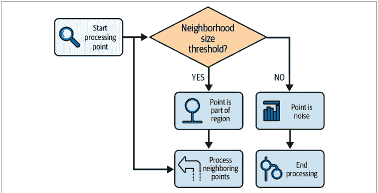

图12-24. 使用DBSCAN进行欧几里得聚类的可视化表示：在点云数据集中识别连续的点组

然而，必须提及参数的使用。确定合适的参数（邻域的ε和最小点数n_min）也可能具有挑战性。

在设置参数时必须谨慎，以确保生成足够数量的内点。如果n_min的值过大或ε过小，可能无法实现这一点。具体来说，DBSCAN在识别具有不同密度的聚类时会遇到困难。然而，与k-means等算法不同，DBSCAN提供了一个显著优势，即计算效率高，无需预定义聚类数量。最后，它能够识别任何形状的聚类。

现在，让我们将所有这些令人困惑和复杂的信息，通过一个五步程序输入到高度实用的“软件”中！让我们开始打开这个盒子。

## 策略

看看我们在分析厨房场景的3D点云时面临的挑战。我们想要提取主要的结构元素，如墙壁、台面、橱柜和电器。逐点手动分割这些组件极其繁琐，尤其是对于大型数据集。

我看到了一个明确的机会，可以通过结合RANSAC和DBSCAN来简化这个过程。我的方法是首先利用RANSAC迭代检测和提取大型平面表面，如墙壁和台面。然后，将这些主要的平面分割从点云中移除，留下剩余的物体，如橱柜和电器。接下来，我们可以在剩余的点云上应用DBSCAN，根据密度和邻近性将这些空间上相邻的点聚类成不同的物体。

图12-25所示的这种策略性工作流程使我们能够以自动化的方式高效地分割厨房场景的主要组成部分，为更高层次的场景理解铺平道路。

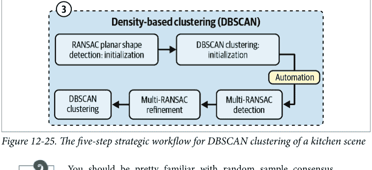

到现在，你应该对随机采样一致性（RANSAC）相当熟悉了。它是一种简单但非常有效的方法，在处理受异常值影响的数据时特别有用，就像我们的情况一样。在实际应用中处理真实传感器时，获得的数据永远不会是完美的。通常，你的传感器数据会受到异常值的影响。RANSAC是一种迭代方法，它将你的数据点分为两组：内点集和外点集。随后，你可以忽略那些显著偏离正常值的数据点，专注于预期范围内的数据点。我建议你参考第9章以获得关于RANSAC的更多清晰度和知识。

让我们执行这个战略计划，首先搭建我们的实验环境。

## 实验设置

让我们使用一个我使用地面激光扫描仪收集的数据集。这是一个厨房的点云，你希望你的机器人能在其中操作。我将省略前面章节讨论的输入/输出过程和文件格式的具体细节（可回顾第4章）。今天，我们立即开始使用广泛认可的.ply文件格式。

我将采取果断的方法以快速获得结果。我们将通过遵循基本的编码策略成功实现精确分割。这意味着在基础库的选择上要极其审慎。我们使用三个高度健壮的库，即NumPy、Matplotlib和Open3D。

要在你的环境中安装此处提到的库包，你知道该怎么做：

```
pip install numpy matplotlib open3d
```

我们选择了Python而不是C++或Julia，因此我们系统的性能就是如此。可以推测，它将足以满足你的应用需求，特别是我们所说的“离线”过程，这些过程不是实时进行的。

现在是时候进入我们策略的前两个步骤了（见图12-26）：定义如何检测平面形状，并验证DBSCAN是否按预期工作。

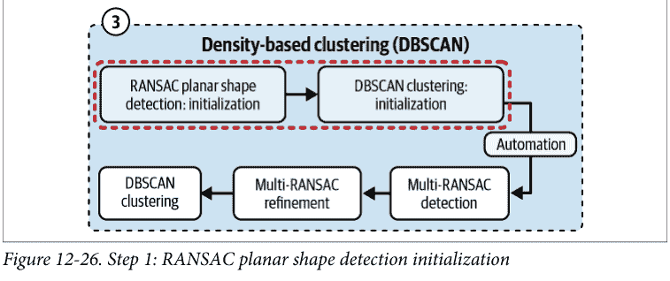

## 使用RANSAC进行3D平面形状识别

让我们先回顾一下使用RANSAC进行平面形状识别。我们首先使用以下代码行将数据导入名为pcd的变量：

```
pcd = o3d.io.read_point_cloud("../DATA/TLS_kitchen.ply")
```

这次，让我们利用Open3D库，其中包含一个专门设计用于检测点云中平面形状的RANSAC实现。需要编写的唯一代码片段如下：

```
plane_model, inliers = pcd.segment_plane(distance_threshold=0.01, ransac_n=3,
num_iterations=1000)
```


`segment_plane()`方法包含三个参数，如图所示。距离阈值（`distance_threshold`）根据点到平面的距离来确定该点是被视为内点还是外点。采样的点数，在本例中为3，用于使用RANSAC算法估计每个平面候选。迭代次数，表示为`num_iterations`，指定了估计过程执行的频率。这些数字被认为是常规的，但根据所使用的具体数据集谨慎行事并验证`distance_threshold`也很重要。为了根据数据特征自动化这些设置，我建议你参考[第9章](#)。

前一行的输出包括存储在变量`plane_model`中的最优平面候选参数a、b、c和d，以及存储在变量`inliers`中的被识别为内点的点的索引。

现在，让我们继续可视化结果。为此，我们必须根据从内点获得的索引专门选择点，并且如果需要，将所有剩余点指定为外点。完成这项任务的方法是什么？这里有一个例子：

```python
inlier_cloud = pcd.select_by_index(inliers)
outlier_cloud = pcd.select_by_index(inliers, invert=True)
```

参数`invert=True`允许选择`inliers`参数中不存在的所有索引，从而选择第一个参数的逆集。现在变量包含了这些点，我建议我们在查看结果之前将内点着色为红色，其他点着色为灰色。为此，你可以提供一个表示R、G和B分量的浮点值列表，如下所示：

```python
inlier_cloud.paint_uniform_color([1, 0, 0])
outlier_cloud.paint_uniform_color([0.6, 0.6, 0.6])
```

现在，让我们用以下代码行可视化结果：

```python
o3d.visualization.draw_geometries([inlier_cloud, outlier_cloud])
```

如果你希望增强对颜色所揭示的几何属性的理解，可以先执行以下命令来计算表面法线：

```python
pcd.estimate_normals(search_param=o3d.geometry.KDTreeSearchParamHybrid(radius=0.1, max_nn=16), fast_normal_computation=True)
```

这将确保你获得更好的渲染效果（见[图12-27A](#)）。

这展示了先前描述的RANSAC脚本的运行结果。位于预期范围内的数据点以较深色调显示（上图），而偏离预期范围的数据点则以灰色显示（下图）。

我们已验证可以将点云划分为两个集合：基于平面的内点集和离群点集。现在，让我们研究使用DBSCAN划分彼此邻近的簇的过程。这将为机器人主要物体的轮廓划分奠定基础。考虑这样一种场景：我们已识别出大型平面，现在需要勾勒出那些看似悬浮的物体。完成这项任务的流程是什么？

## 用于三维点云分割的DBSCAN

首先，我们选择一个样本，假设其中所有平面部分已被移除（参见图12-27B）。我们的目标是使用欧几里得聚类对剩余物体进行分割。数据集可通过本章文件夹访问。让我们开始进行DBSCAN聚类。我们将利用Open3D包中的DBSCAN方法来简化流程。但需要注意的是，如果你需要更高的灵活性，scikit-learn中的实现从长远来看可能是更可行的选择。在计算时间方面，它们几乎相同。

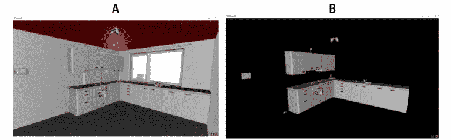

`cluster_dbscan`方法直接在`pcd`点云实体上操作，并在点云初始索引后生成标签列表：

```
labels = np.array(pcd.cluster_dbscan(eps=0.05, min_points=10))
```

标签范围从-1到n，其中-1表示“噪声”点，值0到n是分配给每个关联点的簇标签。需要提及的是，我们的目标是以NumPy数组的形式获取标签。此外，我们使用5厘米的半径来扩展簇，并且仅考虑在扩展后包含至少10个点的簇。欢迎你不受限制地进行实验。

既然我们已经建立了点的分组，并为每个点分配了相应的标签，我们就可以继续为结果分配颜色。虽然不是强制性的，但通过迭代操作寻找参数的最佳值是有利的。为了实现这一目标，我建议使用Matplotlib包来获取精确的颜色范围，例如`tab20`调色板：

```
max_label = labels.max()
colors = plt.get_cmap("tab20")(labels / (max_label
if max_label > 0 else 1))
colors[labels < 0] = 0
pcd.colors = o3d.utility.Vector3dVector(colors[:, :3])
o3d.visualization.draw_geometries([pcd])
```


`max_label`变量的目的显而易见：它用于记录标签列表中的最大值。这使我们可以在颜色方案中将其用作分母，同时通过if语句处理聚类不平衡且仅产生噪声和一个簇的特定情况。接下来，我们确保这些干扰数据点被分配标签-1，对应颜色黑色（0）。然后，我们将代表颜色R、G、B的三“列”二维NumPy数组赋值给点云`pcd`的`colors`属性。

我们的聚类分析结果如图12-28所示。DBSCAN执行时使用的参数为`eps=0.05`和`min_points=10`。

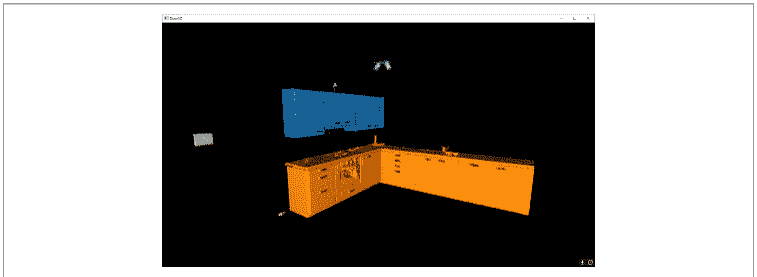

*图12-28. DBSCAN点云聚类：物体的分组与视觉区分*

我们可以清晰地区分上下柜、加热控制器和灯具。所有这些元素都易于识别。

这验证了我们的系统运行顺畅。那么，我们如何在更大规模上有效地实施和自动化这一过程呢？

我们的理念简单明了。首先，我们希望执行RANSAC算法多次（记为*n*次），以识别和提取构成场景的不同平面部分。接下来，我们希望使用基于密度的聚类（DBSCAN）来处理“悬浮元素”问题。因此，提供一种在整个迭代过程中存储结果的机制至关重要。让我们按照图12-29所示的三个阶段来执行。

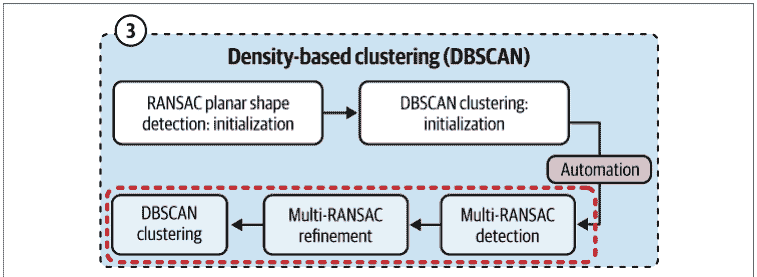

*图12-29. 使用RANSAC和DBSCAN高效聚类场景的自动化循环*

## 多RANSAC框架

让我们建立一个空字典来存储迭代结果。该字典将在`segment_models`中存储平面参数，在`segments`中存储从点云中识别出的平面区域：

```
segment_models={}
segments={}
```

接下来，我们希望确保能够控制未来平面检测所需的迭代次数。为了实现这一目标，我们将定义一个名为`max_plane_idx`的变量来存储迭代次数：

```
max_plane_idx=20
```

这里，我们表示希望迭代20次以定位20个平面，尽管存在更智能的方法来建立这样的参数，如第9章所示。让我们进入一个功能循环，我将简要演示。在第一次迭代（循环i=0）中，我们区分内点和离群点。内点存储在`segments`中，剩余的点是后续循环n+1（循环i=1）的关注焦点。

这意味着我们打算将前一阶段的离群点视为基础点云，直到达到指定的迭代阈值（不同于RANSAC迭代）。这可以表示如下：

```
rest=pcd
for i in range(max_plane_idx):
    colors = plt.get_cmap("tab20")(i)
    segment_models[i],
    inliers = rest.segment_plane(
    distance_threshold=0.01,ransac_n=3,num_iterations=1000)
    segments[i]=rest.select_by_index(inliers)
    segments[i].paint_uniform_color(list(colors[:3]))
    rest = rest.select_by_index(inliers, invert=True)
    print("pass",i,"/",max_plane_idx,"done.")
```

我们将为每个检测到的段分配`tab20`颜色映射中的一种颜色以进行可视化。我们可以通过在循环中使用`plt.get_cmap("tab20")(i)`函数来实现：

```
o3d.visualization.draw_geometries([segments[i] for
i in range(max_plane_idx)]+[rest])
```

我们作为参数提供给函数`o3d.visualization.draw_geometries()`的列表`[segments[i] for i in range(max_plane_idx)]`本质上是一个“列表推导式”。它有助于编写一个for循环，将初始元素`segments[i]`添加到列表中。此外，我们可以将剩余元素包含在此列表中，`draw.geometries()`方法将明智地理解我们想要包含一个点云进行绘制（参见图12-30）。

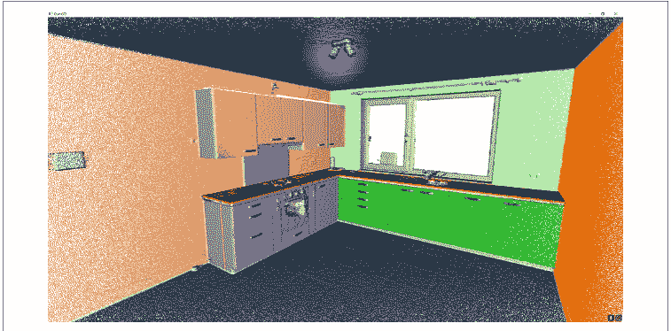

在这个阶段，我们可能认为已经获得了期望的结果。但是，你观察到这种情况有什么异常吗？仔细观察，你可以辨别出一些伪影，例如“线条”，它们有效地切断了一些平面部分。原因是什么？

确实，由于我们将所有点拟合到RANSAC平面候选，无论点的密度连续性如何，我们都会遇到这些“线条”伪影，其变化取决于平面被发现的顺序。值得注意的是，这些平面候选在欧几里得空间中没有限制。因此，接下来的行动是阻止这种行为。

为了实现这一点，我建议在迭代过程中加入基于另一种类型密度聚类的条件。这将允许细化位于相邻簇中的内点集。你准备好了吗？

## 使用DBSCAN进行多RANSAC优化

为了实现这一目标，我们依赖于DBSCAN算法。请允许我阐述逻辑过程，尽管不是以简单的方式。在先前指定的for循环中，我们在分配内点（`segments[i]=rest.select_by_index(inliers)`）后立即执行DBSCAN算法。这是通过直接在其后插入以下行来完成的：

```
labels = np.array(segments[i].cluster_dbscan(eps=d_threshold*10, min_points=10))
```


我在函数中将epsilon设置为RANSAC平面搜索初始阈值的10倍。这不是一个复杂的科学问题；相反，这仅仅是一个观察性的决定，但它通常能产生良好的结果，并简化参数设置。我们通常从点云的特性中推导出这个值，将平均点间距（`d_threshold`）乘以一个因子（此处设置为10）。这种乘法确保我们捕获有意义的局部点邻域，同时考虑不同的点密度。

接下来，在循环内部，我们使用列表推导式统计每个已识别簇中的点数。结果记录在变量`candidates`中：

```
candidates=[len(np.where(labels==j)[0]) for j in np.unique(labels)]
```

由此，我们希望识别“最佳候选”，通常是包含最多点的簇：

```
best_candidate=int(np.unique(labels)[np.where(candidates==np.max(candidates))[0]])
```

幕后正在执行几个复杂的操作。但从根本上说，我们利用NumPy的专业知识来搜索和检索点的索引属于最大簇的点。随后，在每次迭代中都必须包含剩余的簇，以考虑后续的RANSAC迭代。

我建议多次阅读这几行以完全理解其含义：

```
rest = rest.select_by_index(inliers,
    invert=True) + segments[i].select_by_index(list(np.where(labels!=best_candidate)
    [0]))
segments[i]=segments[i].select_by_index(list(np.where(labels== best_candidate)
    [0]))
```

`rest`变量现在存储了从RANSAC和DBSCAN算法中获得的剩余点。此外，通过仅从原始RANSAC内点集中选择最显著的簇，对内点进行了精炼。循环完成后，你将获得一组纯净的线段集合，其中包含符合平面几何形状的空间相邻点集，如图12-31所示。

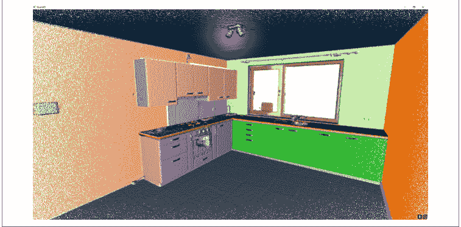

我们已经成功解决了“线”的问题。然而，某些元素仍未被分配（请参考你的实验）。如果我们希望机器人后续能够使用灯板、更换灯泡或在窗户上安装遮光罩，那么我们也需要对这些元素进行聚类。

## DBSCAN 精炼

在此阶段，我们在循环外部进行推理，新的输入由`rest`变量中尚未分配给任何线段的剩余元素构成。为了处理它们，我们可以像最初介绍的那样，直接应用基于密度的DBSCAN聚类算法：

```
labels = np.array(rest.cluster_dbscan(eps=0.05, min_points=5))
max_label = labels.max()
print(f"point cloud has {max_label + 1} clusters")
colors = plt.get_cmap("tab10")
(labels / (max_label if max_label > 0 else 1))
colors[labels < 0] = 0
rest.colors = o3d.utility.Vector3dVector(colors[:, :3])
```

我使用它的方式与之前相同。我确保使用一致的参数来增强聚类效果，并获得如图12-32所示的类似结果。

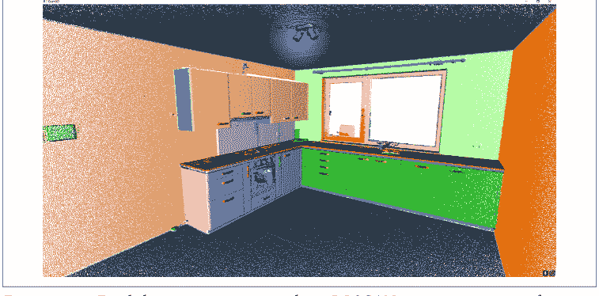

图12-32. 最终聚类结果：对剩余点应用DBSCAN以实现完整的点云分割

这是使用当前方法得到的最终聚类结果。恭喜你完成了最先进的平面方式物体检测。现在，它可以作为进一步高级视觉处理的基础进行操作！

## DBSCAN 与 k-Means 的比较

DBSCAN是分割3D点云的宝贵工具，尤其适用于处理形状和大小各异的簇。其基于密度的方法使其能够有效地识别噪声数据中的簇。

然而，为了获得最佳结果，适当的参数调整和预处理至关重要。此外，评估指标可以帮助定量评估算法在给定数据集上的性能。虽然DBSCAN在处理密度不同或形状细长的簇时可能面临挑战，但它仍然是许多3D点云分割任务中强大且通用的选择。

重要的是，在处理形状和大小各异的簇时，它比*k*-means聚类具有明显优势。*k*-means假设簇呈球形，并且需要预先指定簇的数量。相比之下，DBSCAN是基于密度的，它根据高密度区域识别簇，而无需事先知道簇的数量。这使其更适合具有复杂结构或簇数量未知的数据。与*k*-means相比，DBSCAN对噪声和异常值也更不敏感。考虑到这一点，你应该清楚在何时使用哪种方法。

## 视觉比较

你可能想知道，在3D点云的情况下，是否存在*k*-means优于DBSCAN的场景。让我说明一些你可能想要切换方法的情况。在下图中，你可以看到一个航空LiDAR数据集，其中包含三辆彼此靠近的汽车。让我们运行*k* = 3的*k*-means：

```
data_folder="../DATA/"
dataset="KME_cars.xyz"
x,y,z,r,g,b = np.loadtxt(data_folder+dataset,skiprows=1, delimiter=';',
    unpack=True)
X=np.column_stack((x,y,z))
kmeans = KMeans(n_clusters=3).fit(X)
```

在这个例子中，我们使用*k*-means算法来分割包含三辆汽车的航空LiDAR数据集的一部分。当我们设置*k* = 3时，*k*-means将点云分成三个簇（见图12-33）。

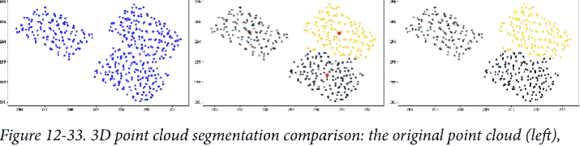

如你所见，即使我们无法在空间上勾勒出物体的轮廓，我们也得到了出色的聚类效果。那么DBSCAN的效果如何呢？让我们用以下代码行来检查：

```
# Analysis on DBSCAN
clustering = DBSCAN(eps=0.5, min_samples=2).fit(X)
plt.scatter(x, y, c=clustering.labels_, s=20)
plt.show()
```

在DBSCAN方法中，聚类过程更灵活，更能适应数据的自然分布（见图12-34）。如你所见，除了难以设置epsilon参数外，我们至少无法用这些特征勾勒出右边两辆汽车的轮廓；在这种情况下，*k*-means以1-0领先。

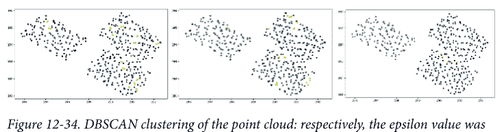

至此，我们仅使用空间特征展示了*k*-means。但我们可以使用任何特征组合，这使其在不同应用中具有超强的灵活性。就本节而言，你也可以尝试使用照度、强度、回波次数和反射率。以下是使用这些特征的两个示例（见图12-35）：

```
X=np.column_stack((x[mask], y[mask], z[mask], illuminance[mask],
    nb_of_returns[mask], intensity[mask]))
kmeans = KMeans(n_clusters=3, random_state=0).fit(X)
plt.scatter(x[mask], y[mask], c=kmeans.labels_, s=0.1)
plt.show()

X=np.column_stack((z[mask] ,z[mask], intensity[mask]))
kmeans = KMeans(n_clusters=4, random_state=0).fit(X)
plt.scatter(x[mask], y[mask], c=kmeans.labels_, s=0.1)
plt.show()
```

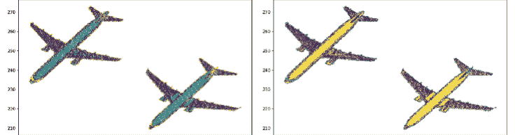

为了更深入，我们可以更好地描述每个点周围的局部邻域，例如，通过主成分分析（见第6章和第7章）。实际上，这可以提取大量或多或少相关的几何特征；请随意尝试。

## 总结

在本章中，我们通过无监督学习的视角研究了3D机器学习。我们专注于主要的聚类算法，以开启迈向3D场景理解的第一步。3D聚类方法将三维模型（如点云）划分为不同的簇或区域，每个区域代表一个不同的物体或部分。我们发现这些方法提供了高度的自主性，无需标记数据集。这使它们成为加速创建用于语义分割任务（如3D物体识别）的标记数据集的理想种子过程。通过在基础单元之上提供语义感知结构，聚类使我们能够理解3D数字环境，从而可能实现更先进的分割和语义注入技术。

在本章中，我们深入研究了监控这些结果的艺术，确保分组准确反映数据的底层结构。然后，我们探索了基于质心的聚类（以*k*-means为代表）和基于密度的聚类（以DBSCAN为典型例子）。我们将这些方法与RANSAC混合，用于鲁棒的3D形状识别。这意味着你可以自豪地展示你的新技能：

- 你可以基于邻近性或基于特征对相似的数据点进行分组。
- 你可以利用*k*-means进行基于质心的划分聚类。
- 你可以利用DBSCAN进行基于密度的聚类，这非常适合任意形状。
- 你可以使用RANSAC进行3D形状检测和二值分割。
- 你可以利用不同的距离度量来衡量组之间的相似性。

此外，无监督学习正在快速发展，前景广阔。随着硬件能力的提升，我们可以期待看到更复杂和大规模的应用。这推动了能够高效处理此类数据的新算法的开发。此外，将深度学习技术与传统聚类方法相结合前景广阔。深度学习模型可以从大型数据集中学习复杂的模式和特征，从而实现更准确、更鲁棒的分割结果。这是我们下一章的目标，[第13章](https://example.com)，重点是使用图和基础模型来扩展你的无监督学习技能。

但在下马之前，我鼓励你用本章的项目来测试你新获得的技能。

## 动手实践项目

现在，让我们来测试一下你的技能。你能否构建一个3D点云分割脚本，实现以下功能？

- 1. 使用合适的库（例如 Open3D）加载点云。
- 2. 预处理数据（例如，去除异常值、归一化）。
- 3. 使用合适的聚类数量应用 k-means 聚类。
- 4. 使用不同的 eps 和 minPts 值应用 DBSCAN 聚类。
- 5. 为选定的模型（例如，平面、球体）应用 RANSAC 分割。
- 6. 比较结果并分析其优缺点。
- 7. 探索特征工程以提升性能。
- 8. 考虑结合不同算法的混合方法。

# 第13章

## 用于无监督分割的图与基础模型

从3D数据集中提取有意义的信息是一项挑战。我们拥有海量且细节复杂的数据，但缺乏用于高级任务所需的整合智能。这种差距限制了高级3D场景理解的潜力：没有语义和拓扑信息，我们就无法提取单个物体及其关系，例如椅子和桌子，以及它们在房间内的布局。让我们利用3D机器学习来提取这些信息。

监督学习依赖于标注数据，这是我们首先要研究的。然而，一个主要障碍是3D数据标注数据集的稀缺：没有大量数据，构建这样的系统会受到限制。好消息是技术飞跃是惊人的，特别是当我们利用无监督分割的前沿研究时。但要将人类水平的推理能力赋予计算机，从我们观察到的3D实体中提取形式化的意义至关重要。

这就是为什么我们在本章中结合3D点云、图论和深度学习，以解锁新的场景理解能力来解读我们的视觉世界。在这些进展中，我想重点介绍两个主要的解决方案：

- 基于连通性的聚类（参见第12章），利用图论的力量
- 使用基础模型的基于图像的3D分割：Segment Anything Model

在继续之前，我想强调一个关键点：语义分割与我们在本章讨论的内容之间存在关键区别。语义分割旨在分配具有预定义含义的标签，如“椅子”或“轮子”。相反，正如第12章所述，我们关注的是旨在将点或表面分组而没有这种概念化标签（组1、组2、组n）的模型。

这种策略提供了许多好处。与语义分割相比，使用聚类的无监督分割不需要训练数据，从而具有更高的效率和成本效益。

相反，语义分割通常依赖于大量的标注数据，获取这些数据可能非常昂贵且通常耗时。因此，由于标注3D数据集的稀缺性，无监督模型是3D机器学习的核心。此外，无监督学习提供了无限的可能性。模型不受特定标签集的束缚。它可以基于数据本身发现新的分组，可能揭示以前未知的结构，并开辟新的探索途径。

### 章节资源

在本章中，我将介绍两种强大的无监督分割技术。首先，我们探索如何将点云表示为图，利用图论原理和基于连通性的聚类，根据空间邻近性对点进行分组。我们使用 Python 实现这种方法，使用 k-d 树进行邻居搜索，并使用连通分量分析来划分不同的物体。第二个解决方案介绍了 Segment Anything Model (SAM)，这是一个革命性的基础模型，能够实现图像的全自动和无监督分割。通过利用2D投影，我们可以利用 SAM 的力量，在无需手动标注或训练数据的情况下实现准确的分割结果。

一如既往，你可以在 3D Data Science Resource Hub 上找到本章的所有材料。要访问文件（代码、数据集、文章）和资源，你可能需要提供电子邮件地址、个人密码或证明你是本书所有者。

让我们从一个利用图的力量的解决方案开始。

## 基于连通性的聚类

退一步讲，我们的眼睛可以捕捉空间信息，并通过我们的认知系统进行处理。这就是魔力所在：我们的大脑帮助我们理解场景及其关系分解。通过内部知识表示，你可以立即知道你的场景由地板和墙壁组成，地板上摆放着椅子和桌子，而杯子、微波炉和笔记本电脑又放在桌子上（见图13-1）。

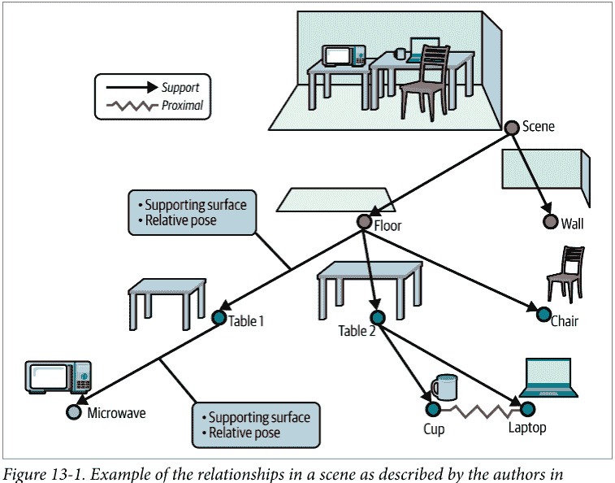

用3D技术模拟这一点意味着我们需要找到一种方法来利用代表场景的3D数据集，然后将其分解为主要组成部分：聚类。

从我的例子中，你可以理解“连通性”如何发挥重要作用：区分不接触的“物体”很简单（一旦移除了支撑物，即地面）。但我们能否用3D数字数据集高效地实现这种分解？让我们为3D数据集开发一个基于图论的高级解决方案，该方案建立在图13-2所示的工作流程之上。我们将从任务简报开始。

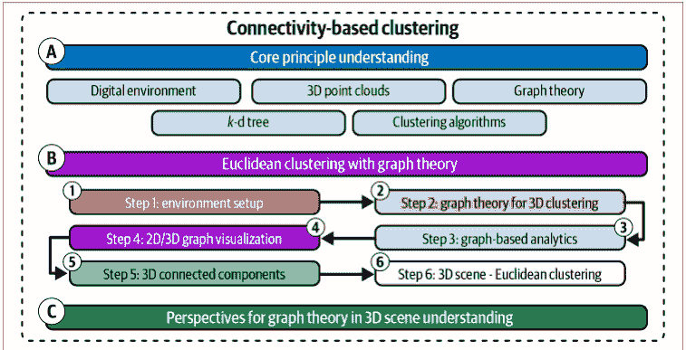

## 任务简报

你正在组织一个庞大的3D物体库，以开发一个能够实时识别每件家具型号的下一代AI系统。问题是：你有三天时间完成10栋完整的建筑。

你加载了你的3D点云，并尝试了第一种方法：手动分割。这成为识别扫描环境中椅子、桌子和灯具等单个物体的重大瓶颈。你遇到了内存限制，并在多个软件平台之间来回切换，每个平台都引入了自己的约束、学习曲线和错误。

在经历了导出、导入和在各种工具之间转换数据的繁琐循环，浪费了一天时间后，你对这种割裂的工作流程感到沮丧，因为它阻碍了生产力和可扩展性。你决定好好睡一觉，在梦中，你想象了一个简化的解决方案，利用图论的力量来重新定义你处理点云分割的方式。

小梦蜂告诉你，通过在 Python 中使用欧几里得聚类来自动化这个过程，消除对人工干预的依赖。这种创新方法将点云组织成结构化的图，其中每个点都是一个节点，由表示邻近性的边连接。然后，通过连通分量分析算法，你可以实现对物体的高效、自动划分，从而改变你分析和解释3D数据的方式。

你醒了，就是这样。你将开发一个清晰有效的解决方案：在 Python 中利用图论进行欧几里得聚类。首先，你消除重要的结构组件，如墙壁和地板，这些可以使用 RANSAC 等替代方法进行分割，从而隔离出感兴趣的物体。

接下来，你想创建一个图，其中每个点表示为一个节点和连接。这种图形表示和实用算法应该能够利用连通分量分析来实现单个物体的自动划分，这比手动分割效率高得多。是时候深入研究解决方案了！但首先，让我们讨论一下我们所使用的核心原理。

## 核心原理

聚类描述了将数据点集合进行分类的过程，使得同一类别（称为簇）中的点更加“相似”。虽然与“无监督分割”一词互换使用，但当我们旨在将整个3D空间划分为有意义的区域或物体时，我们通常指后者。相反，聚类主要用于表示算法和“特征级别”，不一定导致3D数字环境的完整划分。要运用基于连通性的聚类，必须理解我们的数字环境、点云的作用、图论、k-d 树和聚类算法（见图13-3）。

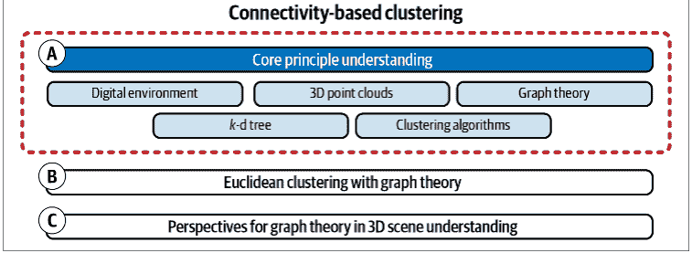

除了数字环境，让我强调一下我们利用的核心概念以及相关资源，如果你觉得需要复习的话：

**3D点云（非结构化数据）**
点云将3D场景表示为单个点的集合，每个点都有自己的3D坐标。与明确定义表面连通性的网格数据不同，点云数据是非结构化的。点之间缺乏固有关系，这对分割构成了挑战。

## 图论基础

图论为表示实体间的关系提供了一个强大的框架。图由通过*边*连接的*节点*（顶点）组成。在我们的案例中，点云中的每个点都成为一个节点。边连接空间上邻近的点，从而将无结构的点云转化为结构化的图。

## k-d 树

*k*-d 树（*k*维树）是一种空间划分数据结构，它能高效地组织*k*维空间（在我们的案例中是3D空间）中的点。它通过超平面递归地划分空间，创建出树状结构。这首先实现了快速的最近邻搜索，这对于在给定半径内高效查找点至关重要。

## (3D) 聚类

我们的方法以聚类为核心，它将不相连的点转化为有意义的组，这些组代表了3D场景中的物体或不同区域。虽然存在其他方法，如*k*-means或DBSCAN（参见第12章），但我们揭示基于图的聚类以利用连通性。我们的方法依赖于从点云构建图，然后识别该图中的连通分量。每个连通分量代表一个聚类。

我们现在可以进行一个全面的Python实现。让我使用一个合成演示数据集和一个真实世界的点云来说明图13-4中的六步工作流程，以突出其实际应用。该解决方案旨在为管理点云数据并最大化其在无监督分割场景中的潜力提供一个有效的工具。

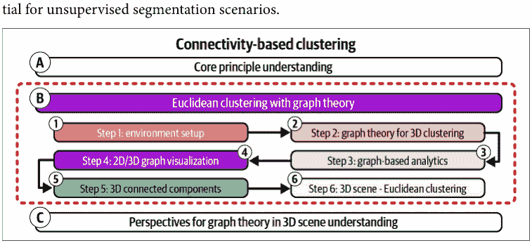

## 步骤 1：环境设置

第一阶段是为成功的项目设置我们的环境。我们有三个主要组成部分：Python设置、数据设置和实用工具（图13-5）。

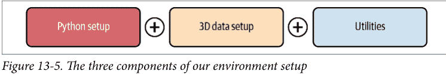

关于我们的Python设置，我们使用Anaconda的Python 3.10。使用Anaconda创建虚拟环境后，我们安装以下五个库：

- NumPy 用于数值运算
- SciPy 用于科学计算，包括k-d树实现
- NetworkX 用于图操作和分析
- Matplotlib 用于可视化和颜色映射
- Open3D 用于高级3D数据处理和可视化

要安装这些库，我们使用pip包管理器，如下所示：

```
pip install numpy scipy networkx matplotlib open3d
```

> 如果你想确保快速了解如何为本地3D开发设置环境，我建议你观看这个视频教程。你可能想使用IDE以便于开发；我使用Spyder，通过`pip install spyder`安装，并通过`spyder`启动。

然后，我们收集一个室内场景的3D点云，我们的方法将对其进行处理（见图13-6）。该数据集是使用Naavis VLX2手持激光扫描仪获取的。最后，我们将利用CloudCompare作为Python环境之外的可视化和演示的补充工具。

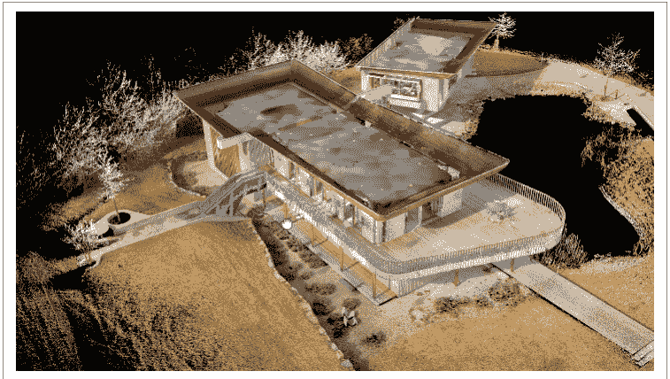

图13-6. 本项目的源数据集

现在我们准备好了，让我们通过将点云（例如，PLY格式）加载到Python中来测试我们的系统：

```
# Importing the libraries
import numpy as np
from scipy.spatial import KDTree
import networkx as nx
import matplotlib.pyplot as plt
import open3d as o3d

# Load point cloud (PLY format)
pcd = o3d.io.read_point_cloud("../DATA/room_furnitures.ply")
translation = pcd.get_min_bound()
pcd.translate(-translation)

# Visualization with Open3D
o3d.visualization.draw_geometries([pcd])
```

我们利用Open3D (o3d) 加载一个代表我们带家具房间的点云数据集，如图13-7所示。

这里的关键操作是将点云平移到其最小边界，从而有效地将数据集中心置于原点。这个预处理步骤对于后续的几何操作至关重要，确保我们的空间分析从一个标准化的参考点开始。通过调用`pcd.translate(-translation)`，我们移动整个点云，这有助于在进一步处理过程中保持一致的空间关系。

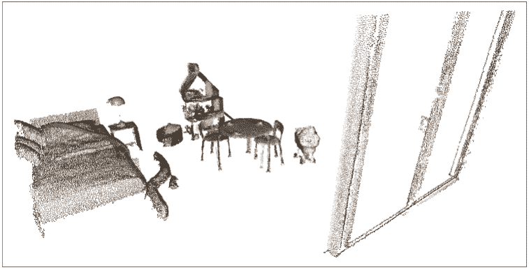

图13-7. 需要聚类的浮动元素


使用`o3d.visualization.draw_geometries([pcd])`进行可视化，使我们能够直观地检查加载的点云，立即验证数据的完整性和空间配置。这一步在3D数据科学中是基础性的，因为视觉确认可以帮助我们在深入复杂的分析程序之前，快速识别数据集中的潜在问题或特征。

很好，我们可以进入第二阶段：构建我们的图。

## 步骤 2：用于3D聚类的图论

让我们用Python生成图。但在进入之前，我想给你介绍我们将要利用的图论基础知识，这样我编写的代码才有意义（工作流程中的6个步骤中的第2步；见图13-8）。

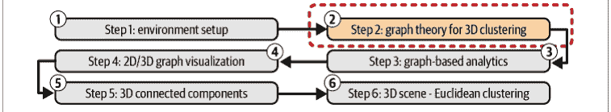

图13-8. 用于3D聚类的图论

让我们探索图论的基本概念，这些概念用于我们的点云聚类方法，直接借鉴音频教程中呈现的交互式解释。可视化这些概念使它们更加直观和引人入胜。

### 什么是图？

图是由*顶点*（也称为节点）和*边*组成的结构（示例见图13-9）。将顶点视为独立的实体，边视为这些实体之间的连接或关系。图13-9中的图由六个顶点和七条边组成，我们表示如下：

```
$V = \{v_1, v_2, v_3, v_4, v_5, v_6\}$
$E = \{v_5v_6, v_5v_4, v_6v_4, v_4v_3, v_6v_3, v_6v_1, v_3v_2\}$
```

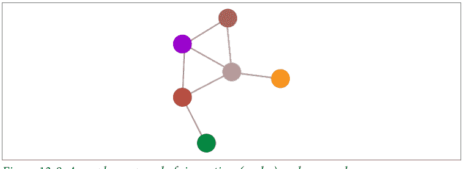

图13-9. 一个由六个顶点（节点）和七条边组成的图

顶点（节点）保存与其所代表实体相关的信息。在我们的点云场景中，每个点的3D坐标将与一个顶点相关联。边（连接）表示为连接顶点的线。它们表示顶点所代表实体之间的关系。在我们的案例中，两个顶点之间的边表示点云中对应的点在空间上彼此接近，在定义的半径内。现在，你有一些关键的图属性需要了解。让我们考虑图13-10中的图。首先，图的*阶*就是它包含的顶点数。在示例中，你有10个顶点，因此阶是10。添加或删除顶点会改变图的阶。在我们的点云图中，阶等于点云中的点数。

然后，图的*大小*指的是边的数量（在这个例子中是7）。当我们连接或断开顶点时，图的大小会相应改变。在我们的点云图中，大小反映了基于所选半径和`max_neighbors`参数的连接密度。最后，顶点的*度*是连接到它的边的数量（见图13-11）。

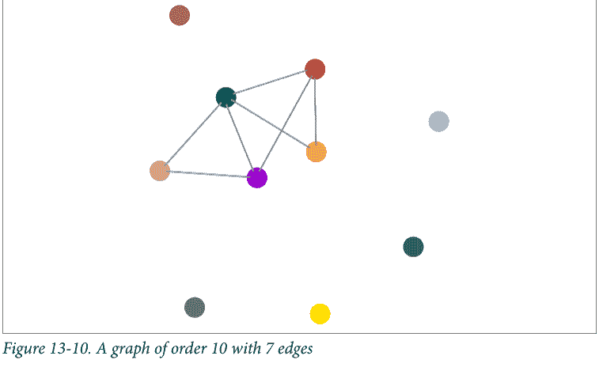

*图13-10. 一个阶为10、有7条边的图*

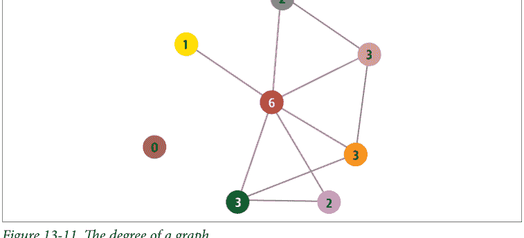

*图13-11. 图的度*

一个具有高度的顶点连接到许多其他顶点，表示一个中心或高度连接的实体。在点云的背景下，一个具有高度的点可能表示它位于一个密集区域或是一个大物体的一部分。

现在，想象一个场景，其中一个顶点代表地面平面，其他顶点代表放置在地面上的物体（即，一个节点与一个聚类而不是单个点相关联）。连接物体顶点到地面顶点的边表示“在...上”的关系。通过分析图结构，我们可以推断出连接到中心“地面”顶点的高度顶点很可能代表放置在该表面上的物体。

### 3D中的连通分量案例

*连通分量*的概念对于我们的聚类方法至关重要。连通分量是一个子图，其中子图内任意两个顶点之间都存在路径，但子图中的任何顶点与子图外的任何顶点之间都不存在路径。以图13-12所示的图为例。在示例中，你可以看到一个不连通的图，有七个连通分量，其中三个是孤立的顶点，意思是分量中没有与之相连的顶点，也没有“外部”顶点与之相连。

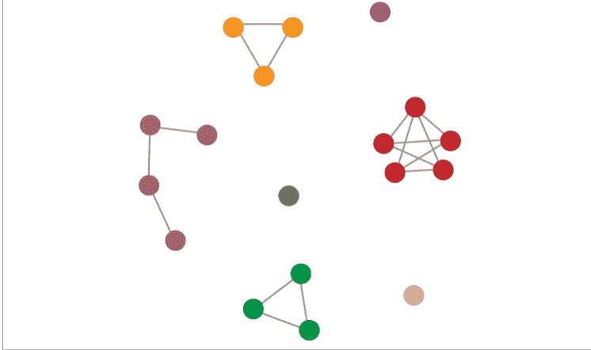

简单来说，它是一个自包含的互连顶点组。在交互式可视化中，我们可以看到不连通的图如何具有多个连通分量。在我们的点云场景中，每个连通分量对应一个潜在的物体。通过识别这些连通分量，我们可以有效地将点云分割成有意义的聚类。

如果你想交互式地探索图论，我强烈推荐使用在线工具 [D3 Graph Theory](https://www.d3-graph-theory.com/)。它允许进行交互式图操作，以阐释许多非常有用的概念。

既然你已经对如何将非结构化的点云数据转换为结构化的图表示有了扎实的理解，现在让我们用 Python 来实现它。

## Python 函数定义

我们介绍一种复杂的图构建方法 `build_radius_graph()`，它将点云数据转换为网络化表示。该函数利用 *k*-d 树进行高效的空间查询，连接指定半径内的点，并可选择性地限制每个节点的邻居数量：

```python
def build_radius_graph(points, radius, max_neighbors):
    # Convert points to numpy array if not already
    points = np.asarray(points)

    # Create k-d tree
    kdtree = KDTree(points)

    # Initialize graph
    graph = nx.Graph()

    # Add nodes with position attributes
    for i in range(len(points)):
        graph.add_node(i, pos=points[i])

    # Query the k-d tree for all points within radius
    pairs = kdtree.query_pairs(radius)

    # Add edges to the graph with distances as weights
    for i, j in pairs:
        dist = np.linalg.norm(points[i] - points[j])
        graph.add_edge(i, j, weight=dist)

    # If max_neighbors is specified, prune the graph
    if max_neighbors is not None:
        prune_to_k_neighbors(graph, max_neighbors)

    return graph
```

通过使用 NetworkX 的图结构，我们创建了一个灵活的拓扑分析框架，能够捕捉局部空间关系。

$k$-d 树在建立点云中点之间的连接方面起着关键作用。对于每个点，我们查询 $k$-d 树以找到其在定义半径内的邻居。这些邻居是图中边创建的候选对象。$k$-d 树的高效性使我们能够快速执行这些邻居搜索，即使对于大型点云也是如此。

这种方法的优势在此显现：我们利用 $k$-d 树邻居搜索来构建图。点云中的每个点都成为图中的一个节点。当且仅当两个节点在 $k$-d 树搜索期间被识别为在指定半径内的邻居时，它们之间才会创建一条边。让我们先将这个“参数”搁置，用当前的数据集来探索它。最后，我定义了一个配套的 `prune_to_k_neighbors()` 函数，它实现了一种关键的图精炼技术。这确保每个节点仅保留其 $k$ 个最近邻（$k$-NN），从而有效控制图的复杂性并减少计算开销：

```python
def prune_to_k_neighbors(graph, k):
    for node in graph.nodes():
        edges = [(node, neighbor, graph[node][neighbor]['weight'])
                 for neighbor in graph[node]]
        if len(edges) > k:
            # Sort edges by weight
            edges.sort(key=lambda x: x[2])
            # Remove edges beyond k nearest
            edges_to_remove = edges[k:]
            graph.remove_edges_from([(e[0], e[1]) for e in edges_to_remove])
```

这种剪枝机制在高维点云中尤其有价值，因为在这些情况下，不受约束的图构建可能导致指数级复杂度，从而使我们的方法在计算上高效且在拓扑上有意义。

太棒了！我们现在有了一种生成图的方法，那么很自然地，让我们来测试一下！为此，让我先生成一些虚拟数据（一个二维点云）：

```python
np.random.seed(42)
n_points = 300
xyz = np.random.rand(n_points, 2)
```

我们现在可以使用 xyz 点云进行一些二维测试。它是一个数组，如下所示：

```
array([[0.37454012, 0.95071431],
       [0.73199394, 0.59865848],
       [0.15601864, 0.15599452],
       [0.05808361, 0.86617615],
       ...
       [0.60111501, 0.70807258],
       [0.02058449, 0.96990985],
       [0.83244264, 0.21233911],
       [0.18182497, 0.18340451]])
```

让我们使用我们定义的函数，设置半径为 0.1，邻居数为 4：

```python
simulation_graph = build_radius_graph(xyz, radius=0.1, max_neighbors=4)
```

现在，如果你尝试调用你模拟的图，你会得到：

```
<networkx.classes.graph.Graph at 0x1e86ec99460>
```

这意味着我们的函数有效！并且从 Graph 类中，你可以探索节点（simulation_graph.nodes()）或边（simulation_graph.edges()），例如：

```
#对于节点，你会得到：
NodeView((0, 1, 2, ...))

#对于边，你会得到：
EdgeView([(0, 205), (0, 197), ...])
```

但是没有办法提取其关键特征吗？让我们通过提出一个分析步骤来解决这个问题。

## 步骤 3：图分析

我们希望将图论中强调的概念（连通分量）用于我们的分析任务（图 13-13）。

为此，我们构建了一个 `analyze_components()` 函数，它提供全面的统计图连通性分析：

```python
def analyze_components(graph):
    components = list(nx.connected_components(graph))
    analysis = {
        'num_components': len(components),
        'component_sizes': [len(c) for c in components],
        'largest_component_size': max(len(c) for c in components),
        'smallest_component_size': min(len(c) for c in components),
        'avg_component_size': np.mean([len(c) for c in components]),
        'isolated_points': sum(1 for c in components if len(c) == 1)
    }
    return analysis
```

通过计算诸如分量数量、它们的大小以及孤立点计数等指标，我们能够深入理解点云的拓扑结构。这些指标对于理解数据集的空间分布和聚类特征至关重要。

让我们来测试一下：

```python
component_analysis = analyze_components(simulation_graph)
print("\nComponent Analysis:")
for metric, value in component_analysis.items():
    print(f"{metric}: {value}")
```

这将返回：

```
Component Analysis:
num_components: 9
component_sizes: [169, 10, 32, 43, 2, 23, 11, 5, 5]
largest_component_size: 169
smallest_component_size: 2
avg_component_size: 33.333333333333336
isolated_points: 0
```

如你所见，分析揭示了关于图拓扑的关键信息：存在多少个不同的聚类、它们的相对大小以及是否存在孤立点。这种方法将原始的几何数据转化为对空间关系的丰富、定量的描述，我们现在可以利用它来进一步处理我们的点云。现在，让我们绘制我们的图。

## 步骤 4：绘制图（可选）

我们现在可以专注于基于连通性的工作流程的第 4 阶段（图 13-14）。你可以定义一个 `plot_components()` 函数，用于一种复杂的基于图的点云表示可视化技术。在这个阶段，你应该已经对 Python 代码足够熟悉，创建这样的函数是掌握 Python 3D 应用的一个绝佳练习。为了帮助你，我鼓励你首先获取连通分量，创建一个颜色迭代器，并创建一个图形，通过迭代分量来填充它。

以下是一些示例代码，帮助你入门：

```python
# Get connected components
components = list(nx.connected_components(graph))
n_components = len(components)

# Create color iterator
colors = plt.colormaps[cmap](np.linspace(0, 1, max(n_components, 1)))
```

通过对连通分量进行颜色编码并渲染它们的边和节点，我们可以创建一个直观的图拓扑可视化表示。

最好的方法是设计一种可视化策略，使用 Matplotlib 的颜色映射来区分不同的图分量，从而提供对空间聚类的即时视觉理解。通过根据分量数量动态生成颜色，并以不同的透明度渲染边，我们可以创建一个令人愉悦的图结构表示。

## 步骤 5：点云的连通分量

让我们使用我们的合成点云数据来演示图构建和分析技术（图 13-15）。我们用来识别聚类的算法是*连通分量分析*。这个基本的图算法能够高效地找到图中的所有连通分量。

*图 13-15. 工作流程的步骤 5：连通分量*

提醒一下，连通分量是一个极大子图，其中每一对节点都通过一条路径相连。在我们的上下文中，每个连通分量代表场景中的一个潜在对象。NetworkX，我们选择的用于图操作的 Python 库，提供了高效的连通分量分析实现，我们正是利用了这一点。

我们创建受控场景来探索图在不同参数下的行为。代码系统地改变半径和邻居数量，使我们能够观察这些参数如何影响图的拓扑结构。

仿真方法是理解图构建算法的强大手段。通过受控实验探索参数敏感性，我们可以开发出适应多样化点云特性的鲁棒图聚类策略。

半径作为关键参数，控制着聚类的粒度。让我们通过执行以下Python代码片段来检验并调整该参数：

```python
for radius_simulation in [0.05, 0.1, 0.5]:
    simulation_graph = build_radius_graph(xyz, radius=radius_simulation,
                                          max_neighbors=5)
    plot_components(simulation_graph, xyz, radius_simulation, 5)
    plt.show()
```

较小的半径会导致更碎片化的聚类，而较大的半径则会产生更少、连接更紧密的聚类（参见以下图像）：

如图所示，通过定义固定的空间距离，我们控制了局部邻域交互，本质上创建了一种拓扑约束，捕捉了数据集内的内在几何关系。该参数的敏感性直接影响聚类形成：较小的半径可能将点云碎片化为众多小组件，而较大的半径则有过度合并不同空间结构的风险。

小半径导致高度局部化的连接性，产生大量细小、碎片化的聚类。这种方法有利于隔离细节；然而，它也增加了过分割的可能性，可能因噪声或采样密度差异将单个物体分割成多个聚类。较大的半径导致更广泛的连接，可能导致独立物体的合并，特别是在物体紧密排列的杂乱环境中。最优半径显著受可用数据影响。

我们还引入了*剪枝*步骤，限制连接到每个节点的最大边数。这防止了密集区域的过度连接，确保生成的聚类反映有意义的物体边界。为检验该参数的影响，让我们使用以下Python代码：

```python
for neighbors_simulation in [2,5,10]:
    simulation_graph = build_radius_graph(xyz, radius=0.1,
        max_neighbors=neighbors_simulation)
    plot_components(simulation_graph, xyz, 0.1, neighbors_simulation)
    plt.show()
```

让我们探讨`max_neighbors`参数如何影响我们的结果：

`max_neighbors`参数充当计算和拓扑正则化机制，通过限制每个节点的连接数来防止图过度复杂。如我们所见，该参数在局部表示保真度和全局图可解释性之间引入了关键权衡。

邻居过少可能断开有意义的空间关系，而过多则可能引入噪声并降低图表示的判别力。选择最优值需要迭代实验，考虑点云的具体几何特征和预期的分析目标。这种方法对于开发空间数据分析的通用算法至关重要。现在我们已经在模拟数据集上验证了所有看似有效的步骤，接下来让我们对3D点云进行聚类。

## 步骤6：3D点云的欧几里得聚类

我们希望利用图结构进行欧几里得聚类（图13-16）。我们使用点之间的距离，定义为它们3D坐标之间的欧几里得距离（直线距离）。对于许多应用而言，这是一个自然的选择，因为它反映了点在现实世界中的空间邻近性。然而，根据应用需求，也可以使用其他距离度量，如曼哈顿距离或测地距离。

图13-16. 步骤6：欧几里得聚类

从模拟数据过渡到真实世界数据，我们使用实际点云数据集构建图。这里的创新方法是基于点云的最近邻距离计算图的半径，创建数据驱动的连接策略：

```python
# 可视化输入点云
o3d.visualization.draw_geometries([pcd])

# 获取点云坐标
xyz = np.asarray(pcd.points)
nn_d = np.mean(pcd.compute_nearest_neighbor_distance()[0])
```

我们通过将半径缩放为平均最近邻距离的三倍来自适应地捕捉局部空间关系。然后，我们可以使用图构建过程来展示点云分析方法：

```python
# 构建图
graph = build_radius_graph(xyz, radius=nn_d*3, max_neighbors=10)

# 分析连通分量
component_analysis = analyze_components(graph)
print("\nComponent Analysis:")
for metric, value in component_analysis.items():
    print(f"{metric}: {value}")
```

通过分析真实世界数据集中的连通分量，我们可以提取有意义的结构信息，可能识别出不同的物体片段或空间聚类：

```
Component Analysis:
num_components: 52
component_sizes: [5836, 743, 214, 6, 1, 2, 1, 1, 1, 16771, 1935, 3567, 1872, 16, 266, 1359, 352, 1648, 8792, 1246, 2710, 81, 74, 47, 5, 18, 8, 13, 1, 3, 14, 4, 8, 1, 2, 8, 2, 1, 7, 2, 8, 1, 1, 1, 2, 2, 1, 1, 1, 1, 1, 1]
largest_component_size: 16771
smallest_component_size: 1
avg_component_size: 916.5192307692307
isolated_points: 16
```

我们有52个主要分量，其中16个是孤立点。平均大小为917个点，最大的（可能是床）有16,771个点。

最后，让我们可视化聚类结果。为此，我们创建plot_cc_o3d()，一个使用Open3D可视化3D点云中连通分量的专用函数：

```python
def plot_cc_o3d(graph, points, cmap = 'tab20'):
    # 获取连通分量
    components = list(nx.connected_components(graph))
    n_components = len(components)

    # 创建颜色迭代器
    colors = plt.colormaps[cmap](np.linspace(0, 1, max(n_components, 1)))
    rgb_cluster = np.zeros(np.shape(points))

    # 为每个分量绘制不同颜色
    for idx, component in enumerate(components):
        if len(component)<=10:
            rgb_cluster[list(component)] = [0, 0, 0]
            idx-=1
        else:
            color = colors[idx][:3]
            rgb_cluster[list(component)] = color

    pcd_clusters = o3d.geometry.PointCloud()
    pcd_clusters.points = o3d.utility.Vector3dVector(xyz)
    pcd_clusters.colors = o3d.utility.Vector3dVector(rgb_cluster)
    return pcd_clusters
```

通过对分量进行颜色编码并以不同方式处理小聚类，我们创建了一种细致的可视化，突出了重要的空间结构，同时最小化了次要分量带来的视觉杂乱。

该实现特别巧妙地处理了小聚类，为它们分配中性颜色以区别于主要分量。这种方法提供了清晰、信息丰富的可视化，帮助研究人员快速理解复杂点云数据集的空间组织，将计算分析与直观视觉解释联系起来。现在让我们绘制场景：

```python
pcd_cluster = plot_cc_o3d(graph, xyz)
pcd_cluster.estimate_normals()
o3d.visualization.draw_geometries([pcd_cluster])
```

在真实点云上演示的欧几里得聚类结果因其在实际场景中的有效性而特别引人注目。我们可以看到算法成功地隔离了单个家具，包括床、椅子、桌子、灯、篮子，甚至玩偶屋内的小玩具。

即使在物体大小和形状各异、场景杂乱的情况下，这种划定物体边界的能力也展示了该方法的鲁棒性。值得注意的是，它处理了像椅子和桌子这样的重叠物体，尽管在俯视图中存在重叠，仍将它们分离成不同的聚类。现在，让我们分析一下如何扩展解决方案。

## 讨论与展望

让我们关注新方法的优势以及如何改进它（图13-17）。这种方法最显著的优势之一是其自动化。从图构建到聚类可视化的整个过程都在Python脚本中自动化完成。这消除了手动分割的需要，显著节省了时间和精力。

此外，聚类过程本身也充当了降噪技术。小的、孤立的聚类（通常代表噪声或虚假点）被过滤掉，留下了代表实际物体的更实质性的聚类。

图13-17. 项目的最后部分：展望

这种方法的另一个关键优势是其可扩展性。k-d树用于邻居搜索的效率以及连通分量分析算法，使得处理大型、复杂的点云成为可能，为城市测绘、3D建模和机器人技术等领域的应用开辟了可能性。

分割后的聚类为进一步分析奠定了坚实基础。从每个聚类中提取大小、形状、位置和方向等特征，可以实现物体识别、场景理解和其他下游应用。例如，在表示彩色物体的点云中，将颜色信息整合到边权重中，有助于区分空间上接近但颜色不同的区域。此外，像谱聚类和社区检测这样的高级图算法可以揭示聚类之间的更高层次关系，促进场景理解与物体识别。下一步合乎逻辑的步骤是在这些分割后的聚类上实现分类器，以自动化物体识别与分类。


通过将空间邻近性之外的属性（例如颜色、强度或法向量）纳入边权重方案，我们显著提升了分割的鲁棒性和准确性。此外，可以应用社区检测等高级图算法来识别聚类之间的更高层次关系，从而揭示数据中的层次结构。这为三维场景理解和物体识别开辟了令人兴奋的可能性。

结果表明，基于图的欧几里得聚类在现实世界的无监督分割中具有实际效用。其自动化特性、对复杂场景的鲁棒性、降噪能力以及可扩展性，使其成为从三维数据中提取有意义信息的强大工具。从计算几何的角度来看，我们的图表示将点云转化为鲁棒的拓扑网络，捕捉其内在的空间关系。将几何信息编码为图，使得拓扑提取和连通性分析成为可能。例如，在城市测绘中，这些图不仅可以表示空间邻近性，还可以表示建筑结构、基础设施和地形之间的语义关系。图的边权重和连通模式成为机器学习模型的有用特征，用于在几何基础上训练具有空间上下文的算法。

基于图的欧几里得聚类的有效性在于其能够将点云数据的非结构化特性转换为结构化且可分析的格式。我们还有另一种实现方式：通过第4章所示的投影机制进行基于栅格的表示。为了利用这一点，我提议使用一个基础模型：分割一切模型。

## 分割一切模型

让我们利用分割一切模型（SAM）实现无监督自动化（图13-18）。本节探讨使用SAM进行无监督分割。它包含一个图像编码器、图像嵌入以及一些预处理操作，最终传递给解码器和提示编码器，输出掩码作为结果。目标是通过基于图像的机制，将复杂的三维点云转换为分割后的表示，无需手动标注。

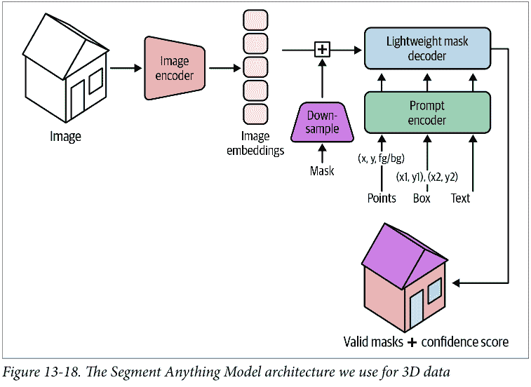

图13-18. 我们用于三维数据的分割一切模型架构

## 任务

好了，任务简报时间。你现在是国家特种部队的多技能成员，必须在不被发现的情况下，找到隐藏在特定建筑物内的某些危险材料。凭借你高超的网络黑客技能，你找到了你感兴趣的建筑物部分的三维扫描数据。现在你需要找到一种方法，为你的危险物质回收团队快速定义路径。之后，团队可以神不知鬼不觉地前往回收材料，而你拯救了这一天！

经过仔细研究并运用你的各种技能，你开发了一个三维数据处理工作流程。这包括建立一个三维Python代码环境，通过使用SAM来处理三维点云，以突出场景的构成（图13-19）。我们有四个主要步骤（三维项目设置、SAM、三维点云投影和无监督分割）。

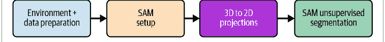

图13-19. 使用分割一切模型进行三维数据处理的工作流程

这个工作流程使你能够生成一个三维语义地图，从而在团队到达现场前至少90分钟精确定位材料的位置。你准备好了吗？

## 三维项目设置

在深入探讨SAM的奇妙之处之前，建立一个坚实的基础至关重要。设置合适的环境可确保我们整个过程顺利进行，允许无缝的实验和探索。在这个阶段，我们希望确保我们的编码环境已正确设置，并包含强大的库。

### 三维代码环境设置

是时候动手实践了！我们的目标是使用SAM对三维点云进行语义分割。这并非易事。第一个想法是查看分割一切的依赖项：[SAM GitHub](https://github.com/facebookresearch/segment-anything)。从中，我们查看该包的必要先决条件（图13-20）。

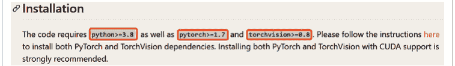

图13-20. 在分割一切仓库中高亮显示的依赖项

> 处理深度学习库或新的研究代码时，务必查看依赖项和安装建议。这确实会强烈影响你后续的实验以及复现所需的时间。

我们需要使用以下库版本：

```
python >= 3.8
pytorch >= 1.7
torchvision >= 0.8
```

有了这些信息，我们将生成一个虚拟环境以确保顺利进行。但是，为了不让你束手无策，让我们利用我们在[第3章](https://example.com/chapter3)中使用[Miniconda](https://docs.conda.io/en/latest/miniconda.html)建立的快速轻量级设置。

提醒一下，以下是确保一致设置的步骤：

1. 创建一个新环境：`conda create -n SAMSEG python=3.10`
2. 切换到新创建的环境：`conda activate SAMSEG`
3. 在新环境中安装pip：`conda install pip`

我们现在准备好安装使用SAM所需的库了。我们安装使用SAM所需的基础库：NumPy、laspy、OpenCV和Matplotlib。要安装这些库，我们可以使用pip：

```
pip install numpy matplotlib laspy opencv-python
```

除了OpenCV（提供计算机视觉和图像处理功能）之外，我们在前面的章节中已经使用过这些库。我们现在可以开始探索深度学习库的安装，从我最喜欢的开始：PyTorch。自2017年推出以来，PyTorch一直优先考虑灵活性与性能。如今，如果你想获得高性能执行、Pythonic的内部实现以及对重要任务的有效抽象，使用PyTorch进行深度学习应用是一个绝佳的选择。

> 自2017年以来，硬件加速器（如GPU）在计算任务中的速度大约提高了15倍。人们只能想象未来几年会有怎样的进步。因此，密切关注能够快速适应的灵活库至关重要，包括那些能够将其“内部”重构为C++等语言的库，就像PyTorch所做的那样。

为了简化适当PyTorch发行版的安装并避免安装CUDA的复杂性，开发者创建了一个网络应用，为你生成确切的命令以复制粘贴到终端。你可以访问这个[PyTorch入门页面](https://pytorch.org/get-started/locally/)，并选择最相关的安装方式。

> 我们希望利用我们的GPU。因此，必须注意我们需要一个带有CUDA的安装。但这只有在你拥有NVIDIA GPU时才可能（截至撰写本文时）。如果没有，你可能想使用CPU或切换到云计算服务，如Google Colab。如果你需要CUDA方面的指导，请使用额外的[三维数据科学中心资源](https://www.3d-datascience-hub.com/)。

因此，我们的代码如下：

```
conda install pytorch torchvision torchaudio pytorch-cuda=11.7 -c pytorch -c nvidia
```

这一行触发了PyTorch正常运行所需必要元素的检索和安装。我们想要使用的第二个深度学习库是分割一切。在PyTorch安装的同时，我们可以下载并安装“软件”，这将使我们更容易管理版本和访问在线库。这个软件是*Git*，可以从[Git网站](https://git-scm.com/)获取。安装完成后，PyTorch应该已安装在你的环境中。要安装分割一切，我们可以写下面这行：

```
pip install git+https://github.com/facebookresearch/segment-anything.git
```

在这个阶段，我们已经安装了基础库和深度学习库。在使用它们之前，让我们安装一个IDE以确保更顺畅的工作流程（例如，对于Spyder：`pip install spyder`）。

接下来，我们将已安装的包导入到我们的Python会话中：

```
# 基础库
import numpy as np
import matplotlib.pyplot as plt
import cv2
import laspy

# 深度学习库
import torch
from segment_anything import sam_model_registry
from segment_anything import SamAutomaticMaskGenerator
```

我们已经全部设置好了。在继续编码模型的下一步之前，让我们先获取数据。

### 三维数据集整理

本章使用通过地面激光扫描仪获取的数据集。该数据集涉及一个室内场景。你可以从本章的文件夹下载数据，并将其放入存放数据集的文件夹中（在我的情况下是“*DATA*”）。在这个处理阶段，我们有一个编码设置，所有必要的库都在一个轻量级、隔离的conda环境中。你可以测试你的CUDA设置：

```
import torch
print('CUDA available -> ', torch.cuda.is_available())
print('CUDA GPU number -> ', torch.cuda.device_count())
print('GPU -> ', torch.cuda.get_device_name())
```

现在是时候设置我们的模型了。

## Segment Anything 模型核心概念

SAM 提出了一种创新的架构和训练流程，使其成为在室内应用中进行测试的完美候选。让我们首先阐明其核心概念。

## Segment Anything 基础

Meta AI 通过其 SAM 深入探索了自然语言处理（NLP）和计算机视觉的迷人领域，该模型能够利用基础模型在新颖的数据集和任务上实现 *零样本* 和 *少样本学习*。


为了清晰起见，让我总结一下这些术语：零样本学习指的是在完全没有见过（零次）的情况下识别某物的能力。类似地，少样本学习涉及为每个新类别使用有限数量的标记样本，仅基于这些少量的标记数据样本来对新类别进行预测。

总的来说，SAM “AI” 算法可以显著减少图像分割所需的人力。为此，你需要向模型提供前景/背景点、一个粗略的框或掩码、一些文本，或任何其他指示你想要在图像中分割什么的输入。Meta AI 团队训练 SAM 以生成合适的分割掩码。这个掩码是模型的输出，应该是一个合适的掩码，用于勾勒提示可能指代的某个对象。例如，如果你在房子的屋顶上指示一个点，输出应该正确识别出你指的是房子的屋顶（图 13-21）。

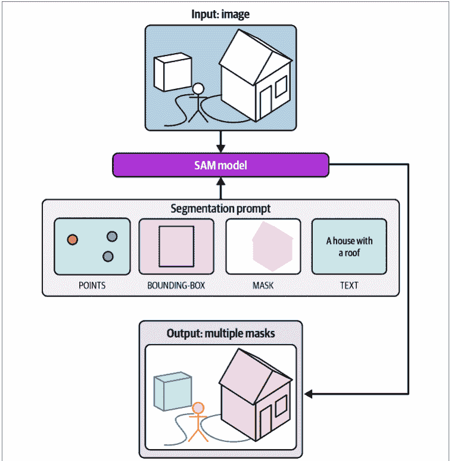

图 13-21. 生成有效掩码的分割提示（以房子为例）

然后，这个分割任务可以作为模型预训练，并指导各种下游分割问题的解决方案。在技术层面，图像编码器为每张图像创建一个独特的嵌入（表示），而一个轻量级编码器则快速将任何查询转换为嵌入向量。这两个数据源使用一个（轻量级）掩码解码器进行合并，以预测分割掩码（图 13-22）。

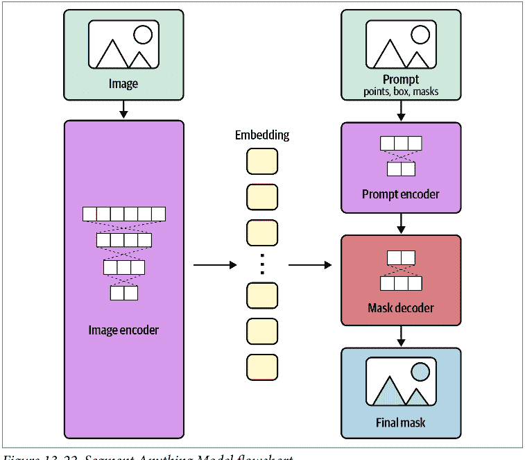

图 13-22. Segment Anything 模型流程图

这种有效的架构，结合大规模训练阶段，使 SAM 达到了四个里程碑：

- *轻松的对象分割*
  使用 SAM，用户可以通过简单地选择他们想要包含或排除在分割之外的点来轻松分割对象。你也可以使用边界框作为模型的提示。

- *处理不确定性*
  SAM 能够处理关于待分割对象的不确定情况。它可以生成多个有效的掩码，这对于有效解决现实世界的分割挑战至关重要。

- *自动对象检测和掩码生成*
  SAM 使自动对象检测和掩码生成变得轻而易举。它简化了这些任务，为你节省了时间和精力。

- *实时交互*
  由于预计算的图像嵌入，SAM 可以为任何提示即时提供分割掩码。这意味着你可以与模型进行实时交互。

现在让我们使用它。

## SAM 参数

SAM 模型可以使用三种不同的编码器加载：ViT-B、ViT-L 和 ViT-H。ViT-H 的效果优于 ViT-B，但相对于 ViT-L 仅有边际提升：

| 编码器 | 参数数量 | 速度 | 质量 |
|---|---|---|---|
| ViT-B (基础) | 91M | 最快 | 低 |
| ViT-L (大型) | 308M | 快 | 高 |
| ViT-H (巨型) | 636M | 慢 | 最高 |

这三种编码器具有不同的参数数量，为调整应用提供了更多自由度。ViT-B（最小）有 9100 万个参数，ViT-L 有 3.08 亿个参数，ViT-H（最大）有 6.36 亿个参数。

这种大小差异也会影响推理速度，因此这应该有助于你为特定用例选择编码器。按照本指南，我们将使用重型武器：ViT-H，其模型检查点你可以从 GitHub 下载（2.4 GB）并放置在当前父文件夹中。在这里，我们可以定义两个变量，使你的代码更灵活一些：

```
MODEL = "../../MODELS/sam_vit_h_4b8939.pth"

# You can run the line below to test if you have the ability to leverage CUDA
torch.cuda.is_available()

# Choose between cpu or cuda training. For cpu, input 'cpu' instead 'cuda:0'
USED_D = torch.device('cuda:0')
```

从那里，我们可以用以下两行代码初始化我们的 SAM 模型：

```
sam = sam_model_registry["vit_h"](checkpoint = MODEL)

#Cast your model to a specific device (cuda or cpu)
sam.to(device = USED_D)
```

我们都设置好了。最后一步是看看它在桌面上随机图像上的表现如何。

## 在 2D 图像上的性能

让我们测试一下，看看一切是否按预期在随机图像上工作。你可以前往 Google Earth 并放大到感兴趣的地点（图 13-23）。接下来，使用 OpenCV 将图像加载到内存中：

```
# When loading an image with OpenCV, it is in bgr by default
loaded_img = cv2.imread("../DATA/biscarosse.jpg")

# Now we get the R,G,B image
image_rgb = cv2.cvtColor(loaded_img, cv2.COLOR_BGR2RGB)
```

如你所见，默认情况下，OpenCV 通过切换到蓝色、绿色和红色通道（BGR）来加载图像，我们在第二行将其排序为 RGB 并存储在 image_rgb 变量中。现在，是时候用两行代码将 SAM 应用于图像了：

```
mask_generator = SamAutomaticMaskGenerator(sam)
result = mask_generator.generate(image_rgb)
```

大约 6 秒后，这将返回一个填充了字典的列表，每个字典代表一个为特定对象自动生成的掩码，并附带其分数和元数据。详细来说，结果是一个字典列表，其中每个字典包含以下信息：

- **segmentation**
  这给出了形状为 (W, H)（且为 Bool 类型）的掩码，其中 W（宽度）和 H（高度）对应于原始图像尺寸。

- **area**
  这是掩码的面积，以像素为单位表示。

- **bbox**
  这是 xywh 格式的边界框检测。

- **predicted_iou**
  模型预测的交并比（IoU）指标，用于衡量掩码的质量。

- **point_coords**
  这是用于生成掩码的采样输入点的列表。

- **stability_score**
  稳定性分数是掩码质量的额外度量。

- **crop_box**
  这是用于生成此掩码的 crop_box 坐标的列表，采用 xywh 格式（可能与边界框不同）。

现在你对我们正在处理的内容有了更好的了解，要查看结果，我们可以使用以下函数将掩码绘制在图像上：

```
def sam_masks(anns):
    if len(anns) == 0:
        return
    sorted_anns = sorted(anns, key=(lambda x: x['area']), reverse=True)
    ax = plt.gca()
    ax.set_autoscale_on(False)
    c_mask=[]
    for ann in sorted_anns:
        m = ann['segmentation']
        img = np.ones((m.shape[0], m.shape[1], 3))
        color_mask = np.random.random((1, 3)).tolist()[0]
        for i in range(3):
            img[:,:,i] = color_mask[i]
        ax.imshow(np.dstack((img, m*0.8)))
        c_mask.append(img)
    return c_mask
```

我承认这有点粗糙。但在这个函数中，我按面积对掩码进行排序，并使用随机颜色和透明度参数将它们绘制在图像上：

```
print('Mem allocated by other programs: ', torch.cuda.memory_allocated(),
'reserved:', torch.cuda.memory_reserved())

import os
os.environ["PYTORCH_CUDA_ALLOC_CONF"] = "max_split_size_mb:512"
import gc
gc.collect()
torch.cuda.empty_cache()
```

如果没有足够的 GPU 内存空闲，请尝试重启你的（Windows）计算机。如果内存问题持续存在，你也可以使用以下行：

```
mask_generator = SamAutomaticMaskGenerator(sam, points_per_batch=16)
```

现在，要绘制和导出图像，我们编写以下代码：

```
fig = plt.figure(figsize=(np.shape(image_rgb)[1]/72, np.shape(image_rgb)[0]/72))
fig.add_axes([0,0,1,1])
plt.imshow(image_rgb)
color_mask = sam_masks(result)
plt.axis('off')
plt.savefig("../test_result.jpg")
```

这得到了图13-23。

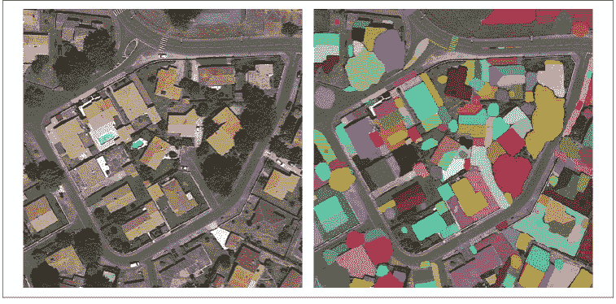

在这个阶段我们得到了令人兴奋的结果，SAM运行得非常好！例如，你可以看到几乎所有的屋顶都是分段的，三个游泳池（两个蓝色和一个绿色）也是分段的。因此，这很可能是一个完全自动检测的起点。如果你在绘制掩码时根据你的计算机配置遇到内存错误，加载一个更轻量的SAM模型应该能解决你的问题。既然我们有了一个可用的SAM设置，让我们将所有这些来之不易的知识应用到3D点云上。

## 3D点云到图像的投影

为了理解复杂的3D世界，我们重用了第4章的投影知识，特别是`generate_spherical_image`函数。现在，为了使用这个方便的函数，让我们先加载并准备室内点云：

```python
# Loading the las file from the disk
las = laspy.read("../DATA/indoorpcd.las")

# Transforming to a numpy array
coords = np.vstack((las.x, las.y, las.z))
point_cloud = coords.transpose()

# Gathering the colors
r = (las.red / 65535 * 255).astype(int)
g = (las.green / 65535 * 255).astype(int)
b = (las.blue / 65535 * 255).astype(int)
colors = np.vstack((r, g, b)).transpose()
```

准备好之后，我们可以定义投影所需的参数。这些参数是投影中心（基本上是我们想要虚拟扫描站的位置）和最终图像的分辨率（以像素为单位，表示为图像的最短边）：

```python
resolution = 500

# Defining the position in the point cloud to generate a panorama
center_coordinates = [189, 60, 2]
```

最后，我们可以调用新函数来绘制并将结果导出为图像：

```python
# Function execution
spherical_image, mapping = generate_spherical_image(center_coordinates,
    point_cloud, colors, resolution)

# Plotting with matplotlib
fig = plt.figure(figsize=(np.shape(spherical_image)[1] / 72,
    np.shape(spherical_image)[0] / 72))
fig.add_axes([0, 0, 1, 1])
plt.imshow(spherical_image)
plt.axis('off')

# Saving to the disk
plt.savefig("../DATA/ITC_BUILDING_spherical_projection.jpg")
```

这个过程得到了图13-24。

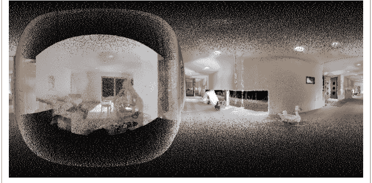

你可以尝试调整各种参数，例如分辨率或投影中心，以确保在“无数据”像素和相关全景图之间取得良好的平衡。现在让我们应用SAM。

## 使用SAM进行无监督分割

在非标记输出的情况下，我们利用SAM的分割架构，这属于聚类应用。需要提醒的是，这与提供标记输出的监督学习方法相反。因此，像素预测的转移，加上无缝的点云导出，展示了在目标检测和场景理解等应用中实现革命的潜力。

### SAM分割

要执行程序，我们可以重新执行用于在2D图像上测试SAM功能的代码片段，这些代码是：

```python
sam = sam_model_registry["vit_h"](checkpoint=MODEL)
sam.to(device=USED_D)

mask_generator = SamAutomaticMaskGenerator(sam)

temp_img = cv2.imread("../DATA/ITC_BUILDING_spherical_projection.jpg")
image_rgb = cv2.cvtColor(temp_img, cv2.COLOR_BGR2RGB)

t0 = time.time()
result = mask_generator.generate(image_rgb)
t1 = time.time()
```

之后，我们可以在图像本身上绘制结果：

```python
fig = plt.figure(figsize=(np.shape(image_rgb)[1] / 72, np.shape(image_rgb)[0] / 72))
fig.add_axes([0, 0, 1, 1])

plt.imshow(image_rgb)
color_mask = sam_masks(result)
plt.axis('off')
plt.savefig("../DATA/ITC_BUILDING_spherical_projection_segmented.jpg")
```

这得到了图13-25。

它看起来已经像是在勾勒图像的重要部分了。让我们继续下一步。

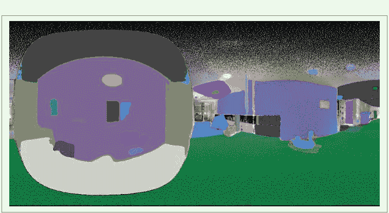

图13-25. 分割一切模型在3D点云投影上的结果

### 点预测转移

我们可以通过定义一个着色函数，用这张图像为点云着色，如下所示：

```python
def color_point_cloud(image_path, point_cloud, mapping):
    image = cv2.imread(image_path)
    h, w = image.shape[:2]
    modified_point_cloud = np.zeros((point_cloud.shape[0],
        point_cloud.shape[1] + 3), dtype=np.float32)
    modified_point_cloud[:, :3] = point_cloud
    for iy in range(h):
        for ix in range(w):
            point_index = mapping[iy, ix]
            if point_index != -1:
                color = image[iy, ix]
                modified_point_cloud[point_index, 3:] = color
    return modified_point_cloud
```

这意味着，要为我们的点云着色，我们可以使用以下代码行来调用我们的新函数：

```python
modified_point_cloud = color_point_cloud(image_path, point_cloud, mapping)
```

这返回一个包含点云的NumPy数组。

### 点云导出

要导出点云，你可以使用NumPy或laspy直接提取.las文件。我们采用第二种方案：

```python
def export_point_cloud(cloud_path, modified_point_cloud):
    # 1. Create a new header
    header = laspy.LasHeader(point_format=3, version="1.2")
    header.add_extra_dim(laspy.ExtraBytesParams(name="random", type=np.int32))

    # 2. Create a Las
    las_o = laspy.LasData(header)
    las_o.x = modified_point_cloud[:, 0]
    las_o.y = modified_point_cloud[:, 1]
    las_o.z = modified_point_cloud[:, 2]
    las_o.red = modified_point_cloud[:, 3]
    las_o.green = modified_point_cloud[:, 4]
    las_o.blue = modified_point_cloud[:, 5]
    las_o.write(cloud_path)

    print("Export successful at: ", cloud_path)
    return
```

这样，我们就可以导出我们的modified_point_cloud变量：

```python
export_point_cloud("../DATA/pcd_results.las", modified_point_cloud)
```

在这个阶段之后，我们成功地获取了从3D点云投影过程得到的各种2D图像。我们应用了SAM算法，根据其预测进行了着色，并导出了一个彩色点云。我们现在可以继续深入了解我们所获得的内容。如你所见，即使点分布不均匀且存在“黑色区域”，SAM也能够识别出点云的主要部分。具体来说，它可能突出了左侧类似鸭子的家具，那里是“任务危险材料所在的位置”，以及门窗，为提取团队提供最直接的路线。

当我们浏览3D点云时，SAM的分割预测为经典的“点云混乱”带来了清晰度，展示了其在现实世界应用中的潜力（图13-26）。我们看到了构成场景的主要元素之间的显著区分。我们通过100%自动化的分割过程，在点和像素之间建立了直接联系。

承认沿途的坎坷将完成我们的探索。虽然令人印象深刻，但SAM并非没有局限性。通过认识到这些不足，我们为改进和成长铺平了道路。首先，所有“未见”的点仍然未被标记。这可能会限制完整的处理；如果你使用基础或大型模型，你会注意到比Vit-H模型更多的未标记点。在这个阶段，我们使用了自动提示引擎，它触发了大约50个兴趣点，即分割任务的种子。虽然这对于获得直接结果很棒，但能够调整它将是理想的。最后，映射在这个阶段有些简单；它将从遮挡剔除和针对特定兴趣像素的点选择中大大受益。

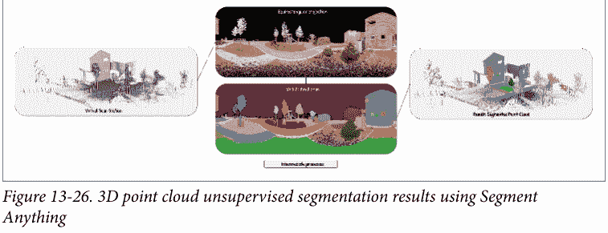

## 展望

就目前而言，我们的实现应该适用于任何你可以为SAM提供一些独特初始特征的应用。如图13-27所示，它也适用于自上而下的航空点云。

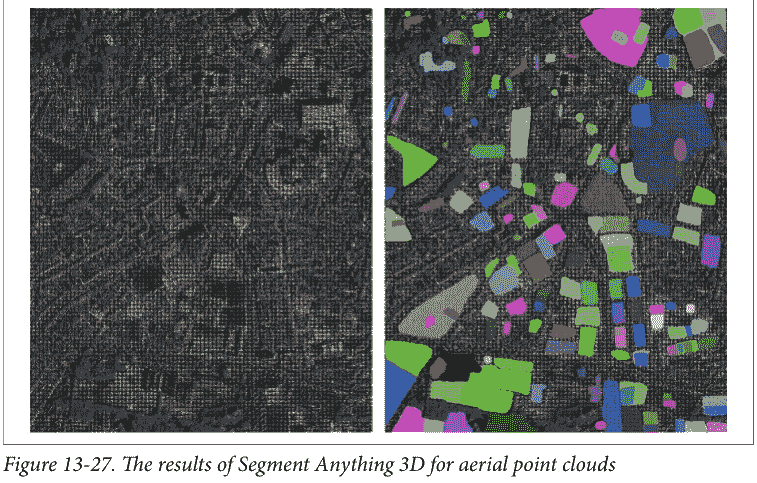

扩展到其他室内场景，你也可以获得一些不错且有趣的结果（图13-28）。这甚至可能对更换大厅的灯泡有用。

当然，这由机器人自动完成（换一个灯泡需要多少个机器人？）。

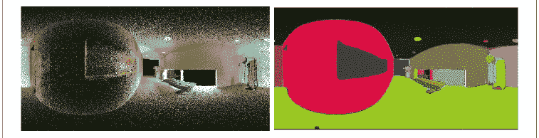

图 13-28. Segment Anything 3D 在另一个室内场景中的结果

因此，除了泛化能力，一个思路是寻找生成全景图并融合不同视角预测的方法。另一个方向是扩展到自定义提示，并解决在二维到三维映射中提高点到像素精度的挑战。

## 总结

在本章中，我们通过无监督学习和分割模型的视角，探讨了几何与语义。我们利用了图论和 SAM 的强大功能，这是一个基于几何和语义特征对点进行分组的多功能工具。

这为通过投影技术混合匹配图以及二维和三维领域开辟了广阔的道路。当然，这表明如果你想扩展这项工作，探索如何融合来自多个视角的预测将有助于实现更全面的分割。此外，我们可以开发自定义提示以提高分割精度，或改进点到像素的映射以获得更好的二维-三维对应关系。最后，扩展到复杂的室内外场景并整合其他人工智能模型，是增强语义理解的潜在方向。这意味着你现在能够为以下任务提供解决方案：

-   为三维点云处理和深度学习搭建 Python 环境
-   使用图论对三维数据集进行欧几里得聚类
-   将三维点云转换为二维投影，反之亦然
-   将 SAM 应用于二维和三维数据
-   导出和可视化分割后的点云
-   理解无监督分割技术的优势和局限性

掌握了这些分割技能，我们现在为下一章做好了准备，该章将探讨监督学习。在这里，我们将从无监督学习过渡到人类指导至关重要的系统。

## 动手实践项目

我为你准备了一个练习。选取一个不同的三维点云数据集（例如，一个室外场景或不同的室内环境），并应用我们所学的 Segment Anything Model 流程。尝试不同的投影方法、SAM 模型大小和分割参数。比较结果并思考以下问题：

1.  SAM 在你选择的数据集上表现如何？
2.  你遇到了哪些挑战，又是如何克服的？
3.  你能想到你所获得的分割结果有哪些具体应用吗？
4.  你将如何进一步改进分割结果？

完成这个练习将让你获得处理真实世界数据的实践经验，并加深你对使用前沿人工智能模型进行无监督三维点云分割的理解。

# 第 14 章

## 监督式三维机器学习基础

我们的目标是设计能够像人类一样精确感知空间的机器。这意味着理解深度、预测空间关系、识别物体，并在数字环境中做出智能决策。这是一个复杂的目标，但分解成小块后就更易于管理。在前面的章节中，我们解决了前两个部分：理解深度和发现空间关系。但是，如何识别带有明确概念的物体呢？

这将使我们能够构建分析医学图像以检测肿瘤等异常的系统，帮助医生制定诊断和治疗计划。除了医疗保健，自动驾驶汽车也严重依赖三维感知来安全地在复杂环境中导航。我们可以利用激光雷达传感器和摄像头识别障碍物、行人和交通标志，从而创建自动驾驶辅助系统。同样，第 1 章中详述的每一个三维数据科学应用都依赖于语义提取。

然而，将复杂的三维数据转化为有意义的见解是根本性的挑战。在这个背景下，带有监督学习模型的三维机器学习带来了关键的范式转变。

点云、深度图、网格和体素表示都包含着经典算法难以解读的复杂信息。我们之前看到，无监督学习可以帮助我们“解码”三维环境的整体含义。这是实现物体完整语义描述的第一步。但我们需要再进一步，即赋予我们的主要组成部分以意义，从而完整地理解三维场景。

本章旨在寻找一种监督学习解决方案，帮助“教会”计算系统理解空间数据。我们希望利用复杂的特征（如第 6 至 9 章提取的特征），并将其与“真实标签”相结合，设计一个能够在未见过的三维数据集中预测语义标签的三维机器学习模型。


让我重点介绍三个你可能认出监督学习人工智能印记的高级任务：三维重建、三维场景理解和三维可视化。在这些领域内，更专业的方向利用了上一章讨论的生成式人工智能、差异化渲染和大型语言模型。虽然这些是令人兴奋的途径，但理解如何基于本章教学中的一些核心概念进行构建至关重要。

在本章结束时，你将掌握创建、训练和部署自己的三维场景理解模型的技能，这需要通过图 14-1 所示工作流的三个主要部分。

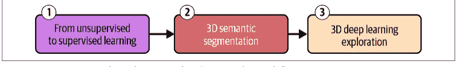

第一部分将监督学习与无监督学习进行比较，强调监督学习如何通过赋予场景中物体意义来实现对三维场景更深入的理解。然后，本章重点介绍三维语义分割，这是一种特定类型的监督学习，其中每个数据单元（如点、体素或三角形）都被分类，从而实现对三维环境的全面理解。最后，我们过渡到与三维深度学习架构的差异，介绍我们未来的章节。


在本章中，我们着手创建能够感知三维世界并真正理解它的系统。仅仅捕捉几何形状是不够的；我们需要赋予我们的系统理解这些形状和点所代表含义的能力。这引出了本章的核心：监督学习，特别是在三维语义分割的背景下。通过向我们的算法提供标记数据和精心选择的特征，我们展示了如何训练模型来区分三维点云中不同类别的物体，并达到令人印象深刻的准确度。我们利用了 pandas、scikit-learn、Matplotlib、Pickle（用于将训练好的机器学习模型保存到文件以供后续使用）和 NumPy Python 库。一如既往，你可以在三维数据科学资源中心找到本章的所有材料。要访问文件（代码、数据集、文章）和资源，你可能需要提供电子邮件地址、个人密码或证明你是本书所有者。

## 从无监督学习到监督学习

大多数现代应用都建立在能够以明确的界定策略识别感兴趣物体的能力之上。这些方法的基础通常取决于系统从场景中注入/检索语义的能力。

通过在大型三维数据集上训练算法，我们可以开发出能够执行曾经是人类专家专属任务的系统。在第 12 和 13 章中，我们看到了如何通过无监督学习技术加速三维数据集标签的生成。本章重点介绍第二个主要方向：监督学习，如图 14-2 所示。在进入 Python 开发的实践之前，让我先分享一些关于三维场景理解背景下监督学习的初步说明。

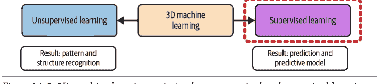

图 14-2. 三维机器学习主要方向：无监督学习和监督学习

除了无监督学习和监督学习，你还有其他一些学习路径，它们超出了本章的范围。第一种是强化学习，它通过与环境进行试错交互来发展最优决策策略，以最大化累积奖励。然后，你还有混合学习方法，例如自监督学习（从数据中生成监督信号，创建代理任务，从而无需显式的人工标注即可学习表征）、半监督学习（利用少量标注数据与大量未标注数据相结合来提升学习性能），或主动学习（策略性地选择最具信息量的数据点进行人工标注，以最小化标注工作量，同时最大化模型性能）。

## 监督学习概念

监督机器学习需要使用标注数据来训练模型，以识别模式和关系（图14-3中的阶段1）。然后，捕获该逻辑并随后应用于在未见数据上生成准确的预测（图14-3中的阶段2）。

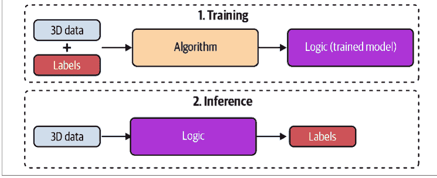

因此，训练涉及在标注数据上“教”模型内部逻辑，这意味着每个输入都与一个真实标签配对。然后，模型可以通过迭代地将其猜测与这个真实标签进行比较来提高其预测质量。

监督学习的总体目标在第二阶段实现：推理。一旦我们有了一个连贯的训练好的模型，我们就想在它之前未见过的新数据上测试其逻辑，并监控预测的质量。以图14-4所示的情况为例，它展示了一个训练好的3D机器学习模型的构成，用于将3D形状分类为地面或建筑物。

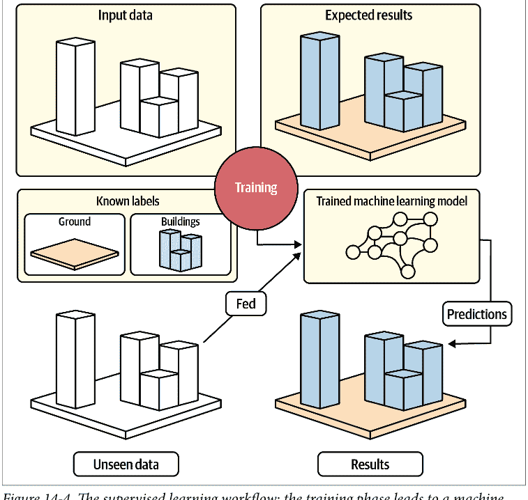

我们的输入数据（特征；参见第6章）与已知标签（地面和建筑物）相关联，构成了我们的训练数据。然后，我们将为未见数据定义特定模型逻辑的任务交给训练过程。当模型能够为我们要检测建筑物和地面的未见数据集提出良好的预测时，它就准备就绪了。


我知道，在这个阶段，你有很多问题。我们如何定量地知道一个预测何时是好的？如果未见数据呈现出截然不同的统计分布怎么办？如果我们在训练数据上得到好结果，但在测试数据上没有怎么办？让我们保留这些问题，并在接下来的章节中用实际的Python代码来回答它们。

因此，在训练阶段，我们有两个主要阶段来构建一个可靠的3D机器学习模型：

*训练数据准备*
你给模型一个准备好的训练数据集，该数据集包含相关的输入数据（特征）以及与之对应的输出数据（标签）。

*学习*
通过处理训练数据和一些参数，算法学习如何将其接收到的特征与其给出的标签联系起来。一种方法是改变模型的设置，使其所说和所发现之间的差异尽可能小。

一旦锁定在某个状态，我们的3D机器学习模型就可以使用新的输入特征和输出标签。

在第12章和第13章中，我们专注于无监督学习。这可以帮助你更高效地创建标注数据集（以及其他事情），这解决了3D数据的一个主要挑战。但通常，当我们需要推动系统获得高度准确/详尽/精确的预测时，我们必须依赖3D机器学习的第二个方面：监督学习。在这个“次要”主干上，我们有两个主要分支：分类和回归，如图14-5所示。

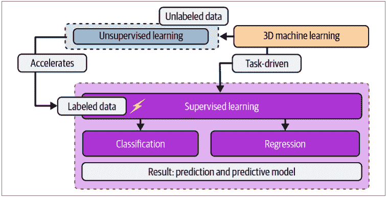

图14-5. 3D机器学习：用于分类任务的监督学习

在回归场景中，我们想要预测一个连续变量，例如，估计一组点的数学最佳拟合。相反，对于分类场景，我们想要分配一个离散的类别标签（标签1，标签2，标签n），例如，这个数据点是汽车（标签1），另一个是树（标签2）。我在图14-6中说明了这些差异。

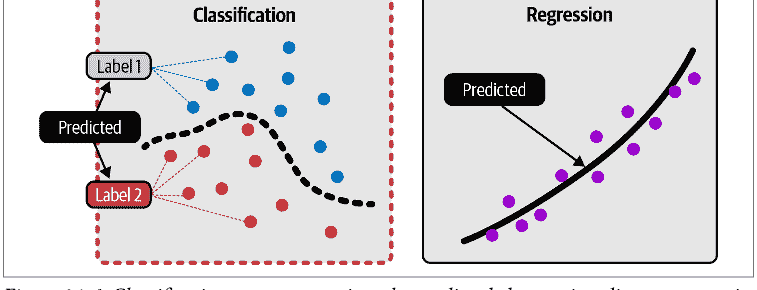

图14-6. 分类与回归：预测元素是离散类别值（分类）还是连续变量（回归）

我在表14-1中汇编了我们通常为每个任务驱动型任务使用的主要目标、输出、特性和性能指标。

表14-1. 回归与分类任务

| 模型类型 | 主要目标 | 输出类型 | 关键特性 | 性能指标 |
|---|---|---|---|---|
| 回归 | 预测连续数值 | 连续标量/向量 | 预测精确的数值<br>处理连续数据分布 | 均方误差 (MSE)<br>R平方 (R²)<br>平均绝对误差 (MAE) |
| 分类 | 分配离散类别标签 | 离散类别标签 | 确定类别归属<br>可能的概率输出 | 准确率<br>精确率<br>召回率<br>F1分数, mAP |

如你所见，为了评估我们模型性能的质量，我们有各种指标，在资源中心有深入的解释。

前面的章节，特别是第9章和第10章，讨论了回归（线性和非线性）案例，用于从3D点云生成3D形状。因此，在本章中，我们专注于分类模型。让我们快速讨论一下我们可以采用的策略，以某种预定义的粒度（在点级别、组级别、对象级别、数据集级别）来检测和勾勒对象。

## 监督学习分类

如果你还记得第2章，我们可以通过各种策略为3D场景添加语义。让我强调一下你在学习过程中可能遇到的三个主要分类任务：语义分割、实例分割和3D目标检测，如表14-2所示。

表14-2. 分类策略的三个子类别：语义分割、实例分割和3D目标检测

| 模型类型 | 主要目标 | 输出类型 | 关键特性 |
|---|---|---|---|
| 语义分割 | 为每个空间数据单元（点、三角形、片段等）分配语义标签 | 单元/逐点类别标签 | 细粒度场景理解<br>逐点分类<br>保留空间关系 |
| 实例分割 | 识别和区分单个对象实例 | 每个对象的唯一实例标签 | 区分同类别的对象<br>分配唯一标识符<br>结合检测和分割 |
| 3D目标检测 | 定位和分类具有空间信息的3D对象 | 带有类别标签的3D边界框 | 提供3D空间坐标<br>方向和尺寸<br>高空间感知能力 |

选择通常由任务驱动，并高度依赖于你的应用所需的分析粒度。3D语义分割通过分类每个数据单元（点、体素、三角形）来提供对空间环境更全面的理解，从而实现整体场景理解。

与专注于单个对象边界或特定实例的实例分割或目标检测不同，语义分割捕获整个3D空间内的内在关系和上下文信息，这通常揭示了细微的结构和类别见解，这些对于智能空间推理和决策至关重要。利用第12章和第13章提供的方法，我们可以使用聚类方法，将每个类别独立作为输入来检测实例。因此，让我们专注于开发一个3D语义分割系统。

## 3D语义分割示例

我们处于监督学习的背景下：我们想要开发一个算法，能够将输入数据与指定的输出值关联起来。这意味着使用一个标注数据集来训练模型，其中每个输入都提供了输出。

训练完成后，模型应该能够在新的、未观察到的数据上生成预测。这意味着模型在训练过程中学会了将输入数据（特征）映射到相应的输出值（标签）。

让我用scikit-learn分享一些例子：

```
import numpy as np
from sklearn.neighbors import KNeighborsClassifier
from sklearn.metrics import accuracy_score
```

特征是从输入数据中提取的特定特征或属性。在3D数据的背景下，特征可以包括几何属性，如形状、大小和方向；统计度量，如均值和方差；或手工制作的描述符。为简单起见，让我们假设我们将使用最近邻距离作为特征。这可以使用scikit-learn的NearestNeighbors类来计算：

```
from sklearn.neighbors import NearestNeighbors

# Find the k-nearest neighbors for each point
knn = NearestNeighbors(n_neighbors=5)
knn.fit(point_cloud)
distances, _ = knn.kneighbors(point_cloud)

# Calculate the mean distance to neighbors as a feature
features = np.mean(distances, axis=1)
```

现在，我们几乎准备好在这些特征上训练一个监督模型，例如k-NN分类器。我们只需要标签。标签是与每个数据点相关联的期望输出值。这些是类别性的，例如“汽车”、“行人”或“树”。（对于

## 3D点云语义分割

我们的目标是提取语义信息并将其整合到以点云形式表示的3D数据中。为此，我们将探讨一种特定的策略，帮助我们从传感器中获取这些信息。我们聚焦于一个特定的算法族——监督学习方法，这与上一章展示的无监督方法形成对比。

一个结构良好的3D机器学习系统对于实现最佳性能和可扩展性至关重要。该系统设计涉及特定阶段的衔接以及多种因素，包括数据预处理、特征工程、模型选择、训练方法和推理优化（图14-7）。

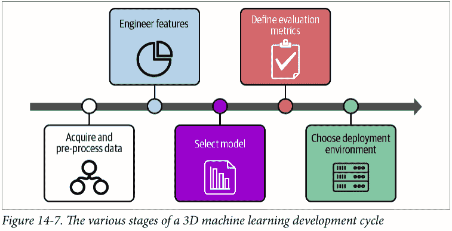

图14-7. 3D机器学习开发生命周期的各个阶段

## 3D机器学习清单

作为简单的指南，最好记住以下几点：

- 数据获取与预处理
  - 识别可靠且多样化的数据源
  - 数据清洗以去除噪声、异常值和不一致性
  - 数据增强以增加数据变异性
  - 数据格式转换（例如，点云转换为体素网格）
  - 数据归一化和标准化
- 特征工程（仅适用于非深度学习设计）
  - 从原始数据中提取相关信息
  - 手工特征（例如，几何特征、统计特征）
  - 学习到的特征（例如，深度学习嵌入）
  - 特征选择和降维
- 模型选择
  - 根据问题类型和数据集特征选择合适的算法
  - 考虑准确性、速度和可解释性之间的权衡
  - 探索不同的模型架构
- 评估指标
  - 定义相关的性能指标（准确率、精确率、召回率）
  - 考虑特定领域的指标（例如，用于分割的交并比）
- 部署环境
  - 选择用于训练和推理的硬件和软件基础设施
  - 考虑可扩展性、性能和成本效益
  - 为实时或批处理进行设计

我提出一个简单直接的流程，你可以轻松复现，用于训练3D机器学习模型并将其应用于现实场景（图14-8）。

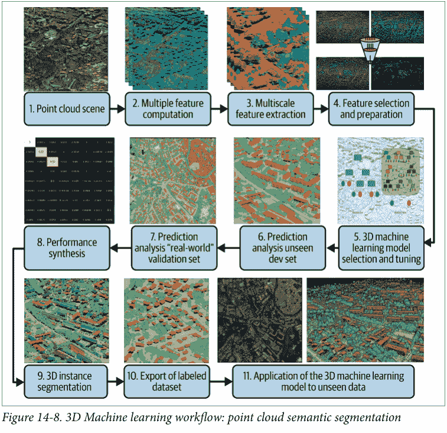

由于我们已经在前面的章节中涵盖了步骤1到3，让我们继续我们旅程的下一阶段。但首先，让我们设置我们喜欢的Python环境。

## 3D Python与数据设置

我们首先从准备数据集和Python环境开始。

## 3D LiDAR数据

我们采取的第一步是深入网络，寻找一些3D数据。这次，我想探索一个法国来源的优质LiDAR数据集：法国国家地理研究所（IGN）。通过他们的LiDAR HD计划，法国启动了一项开放数据工作，提供各个区域的清晰3D点云。更棒的是，其中一些数据集包含标签，使得无需从头构建所有内容就能更容易地开始，你可以在以下位置找到：[LiDAR HD](https://www.data.gouv.fr/fr/datasets/donnees-georeferencees-du-remisage-hd-de-la-lidar-hd/)。

为了保持简单，我访问了该门户，选择了覆盖卢昂市部分区域的数据，移除了地理参考信息，计算了一些额外的属性（在第6章中有解释），并使其可用。在图14-9中，左侧我们看到带有RGB颜色的点云，右侧是我们将要研究的三个感兴趣的类别（地面、植被和建筑物）。你感兴趣的数据是`3DML_urban_point_cloud.xyz`和`3DML_validation.xyz`。

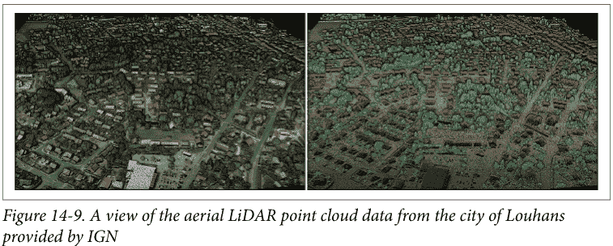

## 3D Python环境设置

让我们专注于高效且最小化的库使用，只使用两个库：pandas和scikit-learn。有了它们，我们只需五行代码就能取得很好的效果来启动你的脚本：

```python
import pandas as pd

# scikit-learn imports
from sklearn.model_selection import train_test_split
from sklearn.metrics import classification_report
from sklearn.ensemble import RandomForestClassifier
from sklearn.preprocessing import MinMaxScaler
```

如图所示，我以不同的方式从库中导入函数和模块。对于pandas，我使用`import`模块，这需要更少的导入语句维护。然而，当你想更精确地控制模块中哪些项目可以被访问时，我建议使用`from module import foo`。

接下来，我建议我们相对地定义路径，将包含数据集的`data_folder`与数据集名称分开，以便轻松切换：

```python
data_folder="../DATA/"
dataset="3DML_urban_point_cloud.xyz"
```

现在，我们可以使用pandas快速将数据集加载到`pcd`变量中。由于原始文件不干净且包含NaN值，我们将使用非常方便的`dropna`方法，确保我们从一个只包含完整行的过滤后的DataFrame开始。这意味着我们将丢弃一些点（<1%的记录），但这次我们接受这一点：

```python
pcd=pd.read_csv(data_folder+dataset,delimiter=' ')
pcd.dropna(inplace=True)
```

将`inplace`参数设置为`True`允许我们直接替换Python对象，而不是创建DataFrame副本。我们现在可以继续进行特征选择和准备。

## 特征选择与准备

要理解我们使用机器学习框架时所做的工作，重要的是要理解我们依赖于具有不同代表性的特征集或特征向量。在我们的方法中，关键在于彻底理解我们所处的环境，并创造性地设计我们认为能有效描述数据方差或至少能帮助我们区分感兴趣类别的特征。

遵循第7章的特征提取过程，我们将使用：

- 空间特征：X、Y、Z坐标
- 辐射特征：R、G、B值
- 平面度（来自协方差矩阵）
- 垂直度（来自协方差矩阵）
- 全向方差（来自协方差矩阵）
- 法线和法线变化率

这些在图14-10中进行了说明。

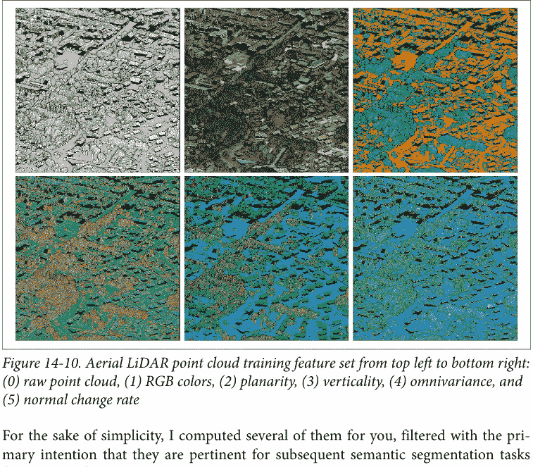

为了简单起见，我为你计算了其中几个，并进行了过滤，主要目的是确保它们与后续的语义分割任务相关（图14-11）。

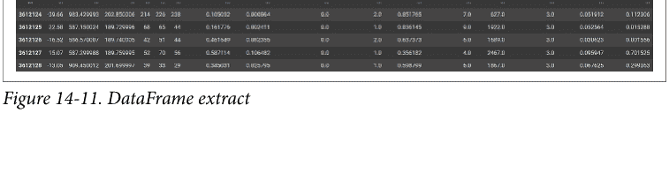

为了建立坚实的基础，我们将数据组织成标签——我们想要预测的内容——和特征——我们将用来进行预测的内容。使用pandas，我们只需两行代码就能轻松完成：

```python
labels=pcd['Classification']
features=pcd[['X', 'Y', 'Z', 'R', 'G', 'B']]
```

这种DataFrame结构允许快速切换到特定的相关特征集，而无需使用数字索引。因此，请随时返回此步骤并更改特征向量集。

## 选择特征

特征选择是通过仅保留最相关的变量并丢弃无关数据，来最小化模型所使用的输入变量的过程。这是根据你旨在解决的具体问题，选择与你的机器学习模型相关的特征的过程。如果机械地执行，这涉及到将机器学习自动化应用于实际问题的AutoML技术。

你有两个选择：要么是完全无监督的方法（例如，减少特征之间的相关性），要么是有监督的方法（例如，旨在通过调整特征和参数来提高模型的最终分数）。为确保清晰，我们以监督的方式手动修改现有特征向量的选择：我们将进行实验，并在结果不满意时进行调整。准备好了吗？

## 准备特征

一旦我们的初始特征向量准备就绪，我们就可以急于处理了。或者真的可以吗？

要小心！根据我们使用的机器学习模型，我们可能会遇到一些意外。确实，让我们看一个简单的场景。假设我们选择的特征向量如下：

```python
features=pcd[['X', 'Y']]
```

如果我们使用它来训练算法，我们将受限于观察到的范围，例如，X在0到100之间变化。如果在这个范围上训练后，模型被输入具有相似分布但不同范围的未来数据，例如，X从1100到1200，那么我们可能会得到灾难性的结果，即使它是同一个数据集只是进行了平移。确实，对于某些模型，X值超过100可能会导致模型预测错误的值，而如果我们确保将数据平移到训练中观察到的相同范围，预测结果将更有可能合理。

让我们转向特征缩放和归一化的概念。这是数据预处理阶段的关键部分，但我见过许多初学者忽视了它（这对他们的机器学习模型是有害的）。这是我们不想犯的错误。

归一化和标准化是3D数据科学中至关重要的预处理技术，它们将原始空间数据转换为数学上一致且可比较的表示形式。这些方法通过为数据集做好准备，以优化模型性能和解释性，从而应对基本挑战。

最小-最大缩放是最直观的归一化方法，它将特征值线性映射到预定义的范围，通常在零和一之间。通过在约束值的同时保留原始数据分布的形状，此技术确保每个特征按比例贡献，而不会被极端量级所主导。由于我们处于空间密集型的上下文中，这是避免泛化问题的好方法。为此，我们可以使用 `MinMaxScaler` 函数：

```
from sklearn.preprocessing import MinMaxScaler
features_scaled = MinMaxScaler().fit_transform(features)
```


其他方法也值得一提。**Z分数归一化**，或称标准化，将数据以零为中心并具有单位方差，使其对于正态分布的数据集特别有效。对于3D点云，Z分数归一化有助于缓解由传感器噪声、校准差异或测量不一致引起的变异。**鲁棒缩放**是一个很好的替代方案，它利用中位数和四分位距来最小化异常值的影响。此技术对于呈现显著测量变异的数据尤其有价值，例如来自地面激光扫描或移动测绘系统的点云。通过降低对极端值的敏感性，鲁棒缩放为复杂空间数据集提供了更稳定的归一化方法。

现在我们的特征向量已准备就绪，我们可以进入下一阶段：设置我们的训练工作台。

## 3D机器学习训练设置

我们有一个标签向量和一个合适的特征向量。现在，我们需要为训练阶段准备一个设置。训练3D机器学习模型涉及在其数据集上迭代改进其性能。如果我必须总结关键步骤，我会包括：

- **数据划分**
  将数据集划分为训练集、验证集和测试集
- **超参数调优**
  通过网格搜索、随机搜索或贝叶斯优化等技术优化模型参数
- **模型训练**
  使用优化算法迭代更新模型参数以最小化损失函数
- **正则化**
  通过向模型添加约束或惩罚来防止过拟合
- **早停**
  通过监控验证集上的性能来终止训练以避免过拟合

首先，我们划分两个向量——同时保持标签和特征之间的正确索引匹配——一部分用于训练机器学习模型，另一部分仅用于检查性能。

我们使用60%的数据进行训练，40%用于查看性能，两者均从同一分布中随机抽取。我们使用scikit-learn中的 `train_test_split` 函数进行划分：

```
X_train, X_test, y_train, y_test = train_test_split(features_scaled, labels, test_size=0.4)
```

在处理机器学习任务的数据时，我们应用命名约定。X表示馈送到模型的特征（或数据），y表示标签。每个根据其最终用途被分解为 `_train` 或 `_test`。

然后，我们通过以下方式创建一个“分类器对象”：

```
rf_classifier = RandomForestClassifier()
```

上述分类器是一个随机森林分类器。它在不同的特征子样本上使用多个决策树分类器，并使用平均法来提高预测准确性并减轻过拟合。

分类器初始化后，我们将分类器拟合到训练数据以调整其核心参数。此阶段是训练阶段，根据我们预先使用的超参数（即定义机器学习模型架构的参数）（树的数量、深度），可能需要几分钟：

```
rf_classifier.fit(X_train, y_train)
```

最后，我们得到了一个训练好的模型。是的，就这么简单！走捷径也很容易。在预测阶段，无论你是否有标签，你都需要执行以下操作：

```
rf_predictions = rf_classifier.predict(X_test)
```

然后，你可以使用以下代码块可视化结果和差异，该代码块将创建三个子图：3D点云数据真实值、预测值以及两者之间的差异：

```
fig, axs = plt.subplots(1, 3, figsize=(20,5))
axs[0].scatter(X_test['X'], X_test['Y'], c =y_test, s=0.05)
axs[0].set_title('3D Point Cloud Ground Truth')
axs[1].scatter(X_test['X'], X_test['Y'], c = rf_predictions, s=0.05)
axs[1].set_title('3D Point Cloud Predictions')
axs[2].scatter(X_test['X'], X_test['Y'], c = y_test-rf_predictions,
    cmap = plt.cm.rainbow, s=0.5*(y_test-rf_predictions))
axs[2].set_title('Differences')
```

如果你想查看一些指标，我们可以使用scikit-learn的 `classification_report` 函数打印包含大量数字的分类报告：

```
print(classification_report(y_test, rf_predictions))
```

现在让我们分析指标，以评估我们训练好的3D机器学习模型的质量。

## 指标和模型

评估模型性能对于理解其能力和局限性至关重要。让我们深入了解最重要的指标。

### 性能和指标

我们可以使用几个定量指标来评估3D语义分割和分类结果。我将介绍四个对3D点云语义分割评估有用的指标：精确率、召回率、F1分数和总体准确率。它们都取决于我们所谓的真正例和真负例：

- **真正例 (TP)**
  观测值为正且被预测为正。
- **假负例 (FN)**
  观测值为正但被预测为负。
- **真负例 (TN)**
  观测值为负且被预测为负。
- **假正例 (FP)**
  观测值为负但被预测为正。

这些是从混淆矩阵中提取的，如图14-12所示。

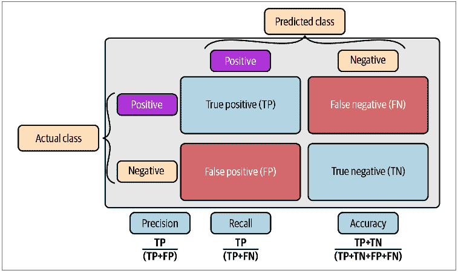

图14-12. 3D机器学习的指标：分类案例

*总体准确率*是一个综合指标，评估分类器在所有观测值中准确预测标签的有效性。*精确率*指的是分类器避免将负样本错误标记为正的能力，而*召回率*直观地表示分类器识别所有正例的能力。F1分数是精确率和召回率的加权调和平均值，提供了一个用于评估分类器性能的单一指标。

当类别频率不平衡时，替代的全局准确率指标是不合适的评估措施，这在自然室内和室外环境中都很常见，因为占主导地位的类别会使结果产生偏差。因此，在我们的实验中，F1分数表示所提出分类器的平均性能。你也可以探索平均精度均值 (mAP)、交并比 (IoU) 或Dice系数作为分类指标。至于回归指标，则是均方误差 (MSE)、平均绝对误差 (MAE) 或R平方。

现在，让我们选择一个模型。

### 模型选择

是时候选择一个特定的3D机器学习模型了。在本章中，我将选择范围限制在三种机器学习模型：随机森林、*k*-近邻和属于深度学习范畴的多层感知器。要使用它们，我们将首先使用以下代码导入必要的函数：

```
from sklearn.ensemble import RandomForestClassifier
rf_classifier = RandomForestClassifier()
```

```
from sklearn.neighbors import KNeighborsClassifier
knn_classifier = KNeighborsClassifier()
from sklearn.neural_network import MLPClassifier
mlp_classifier = MLPClassifier(solver='lbfgs',
    alpha=1e-5,hidden_layer_sizes=(15, 2), random_state=1)
```

然后，你只需在以下代码块中将 XXXClassifier() 替换为你想要的算法栈：

```
XXX_classifier = XXXClassifier()
XXX_classifier.fit(X_train, y_train)
XXX_predictions = XXX_classifier.predict(X_test)
print(classification_report(y_test, XXX_predictions, target_names=['ground',
'vegetation','buildings']))
```

为简单起见，我将对应于我们数据集中存在的地面、植被和建筑物的三个类别的列表传递给了 classification_report。现在，使用以下参数，通过三个分类器进入测试阶段：

```
训练/测试数据：60%/40%
测试集中的点数：1,351,791 / 3,379,477 个点
选择的特征：['X','Y','Z','R','G','B'] - 已归一化
```

让我们首先探索随机森林的结果。

### 随机森林

我们从随机森林开始。某种通过集成算法实现的神奇树召唤，该算法结合多个决策树为我们提供最终结果：基于130万个点的支持，总体准确率为98%：

| 类别 | 精确率 | 召回率 | F1分数 | 支持数 |
|---|---|---|---|---|
| 地面 | 0.99 | 1.00 | 1.00 | 690670 |
| 植被 | 0.97 | 0.98 | 0.98 | 428324 |
| 建筑物 | 0.97 | 0.94 | 0.96 | 232797 |

它在图14-13中进一步分解。

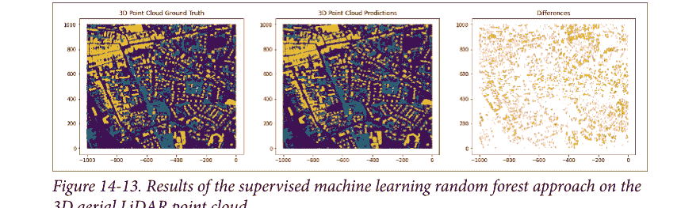

地面点几乎被完美分类：1.00的召回率意味着所有属于地面的点都被找到了，而0.99的精确率意味着仍有微小的改进空间以确保没有误报。我们可以看到误差分布得有点分散，如果需要手动修正，这可能会带来问题。

那么，*k*-NN能提出什么方案呢？

## k-近邻

*k*-NN分类器利用邻近性来对单个数据点的分组进行预测。我们获得了91%的整体准确率：

| 类别 | 精确率 | 召回率 | f1分数 | 支持数 |
|---|---|---|---|---|
| 地面 | 0.92 | 0.90 | 0.91 | 690670 |
| 植被 | 0.88 | 0.91 | 0.90 | 428324 |
| 建筑物 | 0.92 | 0.92 | 0.92 | 232797 |

这在图14-14中进一步分解。

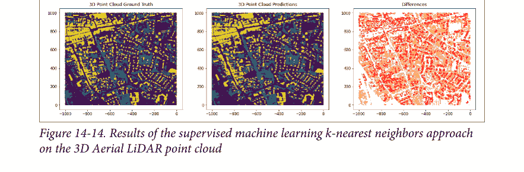

结果比随机森林差，这是预料之中的，因为在当前向量空间中我们更容易受到局部噪声的影响。我们在所有类别上具有均匀的精确率/召回率平衡，这是一个好迹象，表明我们避免了过拟合问题（至少在当前分布下）。

现在，让我们探索一个特定人工神经网络的案例：多层神经感知机。

## 多层感知机

多层感知机（MLP）是一种学习线性和非线性数据相关性的神经网络技术。MLP需要调整多个超参数，包括隐藏神经元的数量、层数和迭代次数，这使得立即达到最佳性能变得复杂。例如，在设定超参数后，我们获得了64%的整体准确率：

| 类别 | 精确率 | 召回率 | f1分数 | 支持数 |
|---|---|---|---|---|
| 地面 | 0.63 | 0.76 | 0.69 | 690670 |
| 植被 | 0.69 | 0.74 | 0.71 | 428324 |
| 建筑物 | 0.50 | 0.13 | 0.20 | 232797 |

这在图14-15中进行了说明。

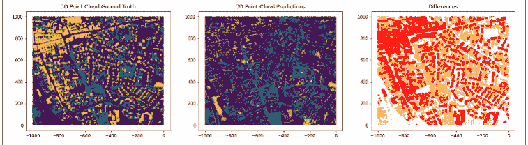

*图14-15. 监督深度学习多层感知机方法在3D航空LiDAR点云上的结果*

有意地，MLP指标展示了什么构成了较差的性能。我们的准确率分数低于75%，这通常是主要的目标指标。此外，类内和类间性能存在显著差异。值得注意的是，建筑物类别远不够稳健，表明可能存在过拟合问题。这在视觉上也很明显，因为它是深度学习模型的主要混淆来源。

在这个阶段，我们不会通过特征选择来改进，但我们始终有这个选项可用。我们将选择性能最好的模型：随机森林方法。让我们研究一下当前训练的模型在具有挑战性的未见场景下表现如何。

## 推断与泛化

现在，情况变得棘手。考虑到我们已经讨论过的内容，将当前模型扩展到超出现有样本数据集范围的实际应用可能会带来重大挑战。因此，让我们进行模型的全面部署。

## 测试数据集

除了使用来自同一分布的训练数据集和验证数据集外，拥有另一个具有不同特征的未见数据集来衡量真实世界的性能至关重要。这是一个关键概念，有助于避免与过拟合相关的问题。因此，我们有：

*训练数据*
用于拟合模型的数据样本。

*验证数据*
用于对在训练数据上训练的模型进行公正评估的数据集，同时调整模型的超参数和特征向量。由于使用此数据来调整输入参数，评估结果因此有些偏差。

*测试数据*
此不相关的数据样本用于对在训练数据上校准的最终模型进行公正评估。

验证数据集也可能有助于模型准备的其他方面，包括特征选择。最终模型可能已经使用组合的训练和测试数据进行了拟合；然而，我们选择不这样做。

所选的验证数据来自马诺斯克市，它呈现了不同的城市背景，具有不同的地形和截然不同的城市环境（图14-16）。这样，我们增加了应对泛化的挑战。在图14-16的左侧，是我们用于训练和评估的数据集（40%未见）。在右侧，我们有一个不同的验证数据集，这将是我们的模型在现实世界中可能性的重要标志。

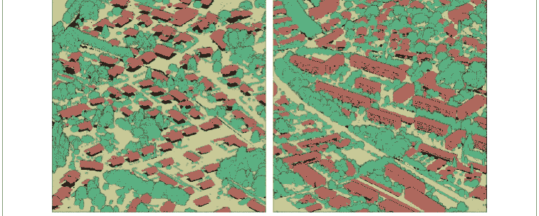

*图14-16. 训练数据集（左）和来自马诺斯克市的验证数据（右）*

如果您还没有，可以从提供的数据中下载*3DML_validation.xyz*数据集。如下所述，您还将找到标签，以研究不同迭代上的指标和潜在增益。

## 改进泛化结果

目标是检查测试数据集的结果，看看我们是否绕过了一些可能性。首先，我们用以下三行代码将测试数据导入我们的脚本：

```
val_dataset="3DML_validation.xyz"
val_pcd=pd.read_csv(data_folder+dataset,delimiter=' ')
val_pcd.dropna(inplace=True)
```

然后，我们准备特征向量，使其与用于训练模型的特征相同：不多不少。我们进一步标准化我们的特征向量，使其与训练数据处于相同条件：

```
val_labels=val_pcd['Classification']
val_features=val_pcd[['X','Y','Z','R','G','B']]
val_features_scaled = MinMaxScaler().fit_transform(val_features)
```

然后我们将已经训练好的模型应用于测试数据，并打印结果：

```
val_predictions = rf_classifier.predict(val_features_scaled)
print(classification_report(val_labels, val_predictions, target_names=['ground',
'vegetation','buildings']))
```

这使得验证数据集中存在的310万个点（与包含130万个点的测试数据集的98%相比）的最终准确率为54%：

| 类别 | 精确率 | 召回率 | f1分数 | 支持数 |
|---|---|---|---|---|
| 地面 | 0.65 | 0.16 | 0.25 | 1188768 |
| 植被 | 0.59 | 0.85 | 0.70 | 1315231 |
| 建筑物 | 0.43 | 0.67 | 0.53 | 613317 |

这在图14-17中进行了分解。

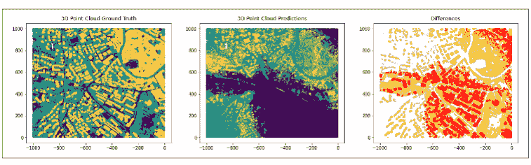

您刚刚见证了机器学习真正的黑暗面力量：将模型过拟合到样本分布，并在泛化时遇到巨大困难。因为我们已经确保对数据进行了标准化，所以我们可以研究这种低性能行为是否可能是由于特征不够独特。

我们使用了一些最常见/基本的特征。因此，让我们通过更好的特征选择来改进这一点，例如，使用以下特征：

```
features=pcd[['Z','R','G','B','omnivariance_2','normal_cr_2','NumberOfReturns',
'planarity_2','omnivariance_1','verticality_1']]

val_features=val_pcd[['Z','R','G','B','omnivariance_2','normal_cr_2',
'NumberOfReturns','planarity_2','omnivariance_1','verticality_1']]
```

我们现在在验证数据上重新启动训练阶段。我们检查模型的性能，然后检查它在验证数据集上的表现：

```
features_scaled = MinMaxScaler().fit_transform(features)
X_train, X_test, y_train, y_test = train_test_split(features_scaled, labels,
test_size=0.3)
rf_classifier = RandomForestClassifier(n_estimators = 10)
rf_classifier.fit(X_train, y_train)
rf_predictions = rf_classifier.predict(X_test)
print(classification_report(y_test, rf_predictions, target_names=['ground',
'vegetation','buildings']))
val_features_scaled = MinMaxScaler().fit_transform(val_features)
val_rf_predictions = rf_classifier.predict(val_features_scaled)
print(classification_report(val_labels, val_rf_predictions,
target_names=['ground','vegetation','buildings']))
```

让我们研究一下结果。我们现在在验证数据上获得了97%的准确率，进一步分解如下：

| 类别 | 精确率 | 召回率 | f1分数 | 支持数 |
|---|---|---|---|---|
| 地面 | 0.97 | 0.98 | 0.98 | 518973 |
| 植被 | 0.97 | 0.98 | 0.97 | 319808 |
| 建筑物 | 0.95 | 0.91 | 0.93 | 175063 |

与仅使用基础X, Y, Z, R, G, B集合相比，添加特征导致性能略有下降，这表明我们引入了一些噪声。

但为了泛化，这是值得的。我们现在在测试集上获得了85%的整体准确率，因此仅通过特征选择就提高了31%。这是巨大的。正如您所看到的，建筑物是损害性能的主要方面：

| 类别 | 精确率 | 召回率 | f1分数 | 支持数 |
|---|---|---|---|---|
| 地面 | 0.89 | 0.81 | 0.85 | 1188768 |
| 植被 | 0.92 | 0.92 | 0.92 | 1315231 |
| 建筑物 | 0.68 | 0.80 | 0.73 | 613317 |

这主要可以解释为，它们与验证集中的样本差异很大，并且特征集无法在不相关的上下文中真正代表它们（图14-18）。

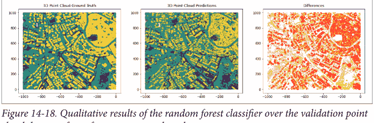

这非常好。我们现在拥有一个模型，其性能超越了大多数现有方法，甚至包括使用深度学习架构的方法。

假设我们希望进一步扩展规模。在这种情况下，注入一些来自测试分布的数据可能很有趣，以检查这是否是模型所需要的，代价是我们的测试集失去了其独立地位，成为验证集的一部分。我们从测试数据集中取出10%，从初始数据集中取出60%来训练一个随机森林模型。然后，我们使用该模型，并在剩余的40%验证数据和90%的测试数据上检查结果：

```
val_labels=val_pcd['Classification']
val_features=val_pcd[['Z','R','G','B','omnivariance_2','normal_cr_2',
    'NumberOfReturns','planarity_2','omnivariance_1','verticality_1']]
val_features_sampled, val_features_test, val_labels_sampled,
    val_labels_test = train_test_split(val_features, val_labels, test_size=0.9)
val_features_scaled_sample = MinMaxScaler().fit_transform(val_features_test)
labels=pd.concat([pcd['Classification'],val_labels_sampled])
features=pd.concat([pcd[['Z','R','G','B','omnivariance_2','normal_cr_2',
    'NumberOfReturns','planarity_2','omnivariance_1','verticality_1']],
    val_features_sampled])
features_scaled = MinMaxScaler().fit_transform(features)
X_train, X_test, y_train, y_test = train_test_split(features_scaled, labels,
    test_size=0.4)

rf_classifier = RandomForestClassifier(n_estimators = 10)
rf_classifier.fit(X_train, y_train)
rf_predictions = rf_classifier.predict(X_test)
print(classification_report(y_test, rf_predictions,
    target_names=['ground','vegetation','buildings']))

val_rf_predictions_90 = rf_classifier.predict(val_features_scaled_sample)
```

```
print(classification_report(val_labels_test, val_rf_predictions_90,
    target_names=['ground','vegetation','buildings']))
```

令我们非常高兴的是，我们看到我们的指标提升了至少5%（第二个表格），而在验证集上仅损失了1%（第一个表格），代价是最小的特征噪声，如图14-19所示：

| 类别 | 精确率 | 召回率 | F1分数 | 支持数 |
|---|---|---|---|---|
| 地面 | 0.97 | 0.98 | 0.97 | 737270 |
| 植被 | 0.97 | 0.97 | 0.97 | 481408 |
| 建筑物 | 0.94 | 0.90 | 0.95 | 257806 |

| 类别 | 精确率 | 召回率 | F1分数 | 支持数 |
|---|---|---|---|---|
| 地面 | 0.88 | 0.92 | 0.90 | 237194 |
| 植被 | 0.93 | 0.94 | 0.94 | 263364 |
| 建筑物 | 0.87 | 0.79 | 0.83 | 122906 |

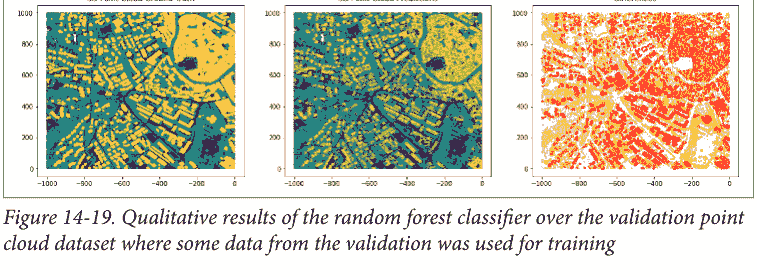

通常有趣的是，使用不同的模型和相同的参数检查最终结果，然后进行最后的超参数调优阶段。但那是以后的事了。

## 导出标注数据集

标题说明了一切：是时候将结果导出以在另一个应用程序中使用了（图14-20）。让我们将其导出为ASCII文件，包含以下行：

```
val_pcd['predictions']=val_rf_predictions
result_folder="../DATA/RESULTS/"
val_pcd[['X','Y','Z','R','G','B','predictions']].to_csv(result_folder+
dataset.split(".")[0]+"_result_final.xyz", index=None, sep=';')
```

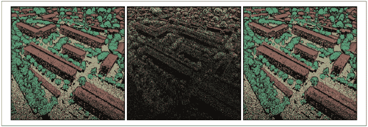

图14-20. 点云语义分割机器学习工作流最终结果的放大视图：真实值（左），选定的差异（中），预测值（右）

## 导出3D机器学习模型

当然，如果你对模型满意，可以将其永久保存，以便在生产中用于未见过或未标注的数据集。我们可以使用pickle模块，只需两行代码即可完成：

```
import pickle
pickle.dump(rf_classifier, open(result_folder+"urban_classifier.poux", 'wb'))
```

当你需要重用模型时：

```
model_name="urban_classifier.poux"
loaded_model = pickle.load(open(result_folder+model_name, 'rb'))
predictions = loaded_model.predict(data_to_predict)
print(classification_report(y_test, loaded_predictions,
    target_names=['ground','vegetation','buildings']))
```

就这样——你的第一个AI模型，从头开始训练、评估、基准测试并针对此应用进行了调优。

虽然现在看起来可能很简单，但我们应用的基本原理实际上是至关重要的，尤其是在转向与深度学习解决方案相关的更“黑箱”方面之前。

在某些高级情况下，你可能希望集成一个良好的反馈循环，以确保你的系统保持相关性并确保持续的性能。这通常意味着你需要添加另一层来监控、识别和更新生产中的模型，考虑以下四个组成部分：

- *数据漂移*：跟踪数据分布随时间的变化
- *模型退化*：监控性能指标以发现退化迹象
- *重训练*：安排定期重训练以适应数据变化
- *可解释性*：理解模型预测背后的原因

当你达到这一点时，通常表明你的项目是成功的。

## 用3D深度学习专业化3D机器学习

在这个阶段，你知道如何利用3D机器学习来完成高级任务，例如3D点云语义分割。流程很清晰：我们准备数据集，计算和选择相关特征，建立训练设置（模型、超参数、数据集划分），并生成3D机器学习语义分割模型。根据我们密切监控的训练轮次性能，我们选择最佳候选者并确保泛化测试成功。

然而，这个系统依赖于从3D数据中提取有意义特征的关键任务。这些特征应捕获数据的几何、拓扑和统计属性。这个过程通常需要领域专业知识和仔细考虑。

已经探索了一些有前景的方向来克服这些挑战。特别是从2D世界来看，深度学习，尤其是卷积神经网络（CNN），在处理复杂数据集方面取得了显著成功。CNN可以从原始数据中自动学习特征，减少了对大量特征工程的需求。这值得研究，更重要的是，值得积累一些深度学习的实践经验。

然而，深度学习与3D深度学习非常不同。在大多数情况下，这不仅仅是增加一个维度的问题，而是改变我们看待算法的视角。但这是下一章的内容。

> **AI学习范式**
> 作为研究人员，我们正在研究开发更准确模拟人类智能的AI系统的各种方法。一个有前景的途径是无监督和半监督学习。这些方法旨在通过允许模型直接从原始数据中学习模式来减少对标注数据的依赖。当标注数据有限或获取成本高昂时，这尤其有益。我们已经在前面的章节中探讨过这些，但值得了解的是，AI领域正在开发新的方法。
> 强化学习具有巨大潜力。通过试错学习，强化学习智能体可以在没有明确编程的情况下获得复杂行为。这可以应用于需要决策和解决问题的任务，例如3D游戏或机器人技术。在3D数据科学中，其应用仍然有限，通常是在我们可以明确制定一些目标的情况下，如示例所示。
> 迁移学习是另一种有价值的技术，可以帮助解决数据稀缺问题。通过利用从一个任务中获得的知识来提高相关任务的性能，迁移学习可以使AI系统更高效、更有效地学习。例如，在大型3D模型数据集上训练的AI系统可以将其知识转移到新任务，例如在不同领域识别物体。
> 神经符号AI是另一种有前景的方法。它将神经网络的优势与符号推理相结合。通过结合这两种范式，研究人员希望创建能够更有效地推理和解释其决策的AI系统。这可以增强AI系统的透明度和可信度，这是当前通过可解释AI的研究方向。
> 最后，具身AI是一个相对较新的领域，旨在开发与物理世界交互的AI系统。通过将AI置于现实世界中，研究人员希望创造更像人类的学习能力。具身AI在机器人技术、自动驾驶汽车以及其他AI系统需要与物理环境交互的领域有应用。自然，这是3D数据科学可以极大受益的领域，并且应该继续为工作流、系统和挑战提供新的解决方案。

既然我已经给了你一些思考的东西，我希望这种对人类学习和机器学习之间根本区别的新理解将帮助你开发有效的AI系统。通过克服现有方法的缺点并模拟人类认知，我们可以开发出更像人类一样学习和推理的AI。

如前所述，当监督学习方法应用于狭窄任务时，AI学习目前能提供最高效的结果。让我们深入了解监督学习及其在3D领域的应用细节。

随着3D AI系统变得越来越复杂，伦理考虑变得至关重要。我们可以概述四个主要指导原则：

- **偏见与公平**：确保3D AI系统不会延续或放大数据或社会中现有的偏见
- **隐私**：保护3D数据中包含的敏感信息
- **透明度**：使AI系统易于理解和负责

## 安全性

确保3D AI系统安全可靠地运行，尤其是在关键应用中。考虑到这一点，创新极有可能对我们的生活产生积极影响。

## 总结

在结束本章之际，我不禁为你能够利用能够解读复杂3D环境的先进语义分割模型所创造的新创新感到兴奋。人工智能并不仅仅围绕深度学习方法。机器学习，特别是随机森林的力量，已在准确分类城市元素的能力中得到证明。然而，我们也揭示了泛化的挑战以及深思熟虑的特征选择和模型评估的重要性。

现在，探索3D深度学习方法以扩展特征提取和复杂模式识别的更大能力是合乎逻辑的。随着数据集变得更大，计算资源变得更加普及，我们可以预期更复杂的模型能够处理日益复杂的场景和更细粒度的分类。但在我们继续之前，我认为让你对本章的关键学习点充满信心至关重要：

- 理解数据预处理和归一化在3D机器学习中的重要性
- 将数据划分为训练集、测试集和验证集的技术
- 使用精确率、召回率和F1分数等指标评估模型性能的方法
- 开发3D机器学习解决方案，如随机森林
- 提高模型对未见数据泛化能力的策略
- 导出和部署训练模型以供实际使用的过程

随着我们继续前进，重要的是要记住，这只是我们探索3D AI世界的开始。监督学习虽然强大，但只是拼图的一部分。在下一章中，我们将探索令人兴奋的3D深度学习领域，在那里，自动特征提取和处理日益复杂模式的能力将为我们带来更大的能力。当然，我鼓励你首先确保能够通过提供的练习来复制和扩展本章当前的教学内容。

## 动手项目

为了巩固你的学习并扩展你的技能，尝试以下“城市对象分类挑战”：

1. 从开源仓库下载一个新的城市LiDAR数据集（例如，ISPRS基准数据集）。
2. 预处理数据并提取相关特征，包括至少两个本章未使用的特征（例如，局部点密度、离地高度）。
3. 实现三种不同的机器学习分类器（例如，随机森林、支持向量机（SVM）、梯度提升）进行语义分割，旨在分类至少四个城市对象类别。
4. 使用合适的度量评估每个分类器的有效性并说明结果。
5. 尝试特征选择技术以提高模型性能。
6. 撰写一份简短报告，比较不同分类器的性能并讨论特征选择对结果的影响。

这项活动将促进在新情境中应用所学概念，促进对3D场景理解任务中特征工程、模型选择和性能评估的批判性思维。

# 第15章

## 使用PyTorch进行3D深度学习

事情在这里变得有点复杂。在深度学习架构中处理3D数据与处理文本或图像大不相同。但别担心——我们会以舒适的节奏一步步解决它。主要障碍之一在于数据表示。3D数据可以以多种格式呈现，如点云、3D网格或体素网格，如第4章所示。

你还记得我们之前关于3D数据结构和表示的实验和写作吗？你会很高兴知道，这些在处理3D深度学习时是至关重要的因素。事实上，3D数据表示的选择会显著影响你的3D深度学习解决方案的架构和范式。在这个阶段，我们可以区分3D深度学习方法支持的四种数据表示：3D点云、3D体素网格、3D网格和多视图图像数据集。

每种表示都有其优势和挑战，影响着选择哪种深度学习架构是合适的。在这个阶段深入细节，就像在你学会游泳之前就把你扔进深水区。你可能会被层层复杂性压倒，最终完全迷失。玩笑归玩笑，在我们深入3D深度学习架构之前，让我先分享一些关键概念和工具，这将有所帮助。我构建本章是为了引导你通过PyTorch学习3D深度学习的基础知识（图15-1）。

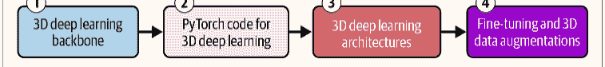

本章内容相当密集，插图较少，主题复杂。我建议在第二次深入代码之前先进行一次高层次的通读。

我们将首先探索构成3D深度学习骨干的核心概念和组件。然后，我们深入使用PyTorch进行实际实现，为你提供建立3D深度学习模型的实践经验。我们讨论的核心聚焦于各种3D深度学习架构，包括用于体素数据的3D卷积神经网络（3D CNNs）、用于网格处理的图神经网络（GNNs）、用于点云分析的基于点的架构（如PointNet），以及用于3D物体2D投影的多视图CNNs（MVCNNs）。

然后，我们将比较3D机器学习与3D深度学习，帮助你理解何时应用每种方法。最后，我们探索高级技术，如微调、迁移学习和3D数据增强，为你提供增强模型性能和泛化能力的策略。


本章全面介绍了使用PyTorch进行3D深度学习，概述了关键概念和实际实现，适用于前沿应用领域的专家。我们探索了3D深度学习的基础元素，包括数据表示和模型架构的独特挑战。我们讨论了根据所使用的3D数据类型选择适当3D深度学习架构（3D CNNs、GNNs、PointNet、MVCNNs）的重要性。我们专注于使用PyTorch进行实际实现，涵盖张量、神经网络模块和数据加载器等主题。你可以找到关于构建简单3D深度学习模型的分步指导，并附有代码示例来指导你的工作。最后，我们探讨了迁移学习、微调和3D数据增强如何帮助你克服泛化限制并增强模型性能。一如既往，你可以在3D数据科学资源中心找到本章的所有材料。要访问文件（代码、数据集、文章）和资源，你可能需要分享电子邮件地址、个人密码或证明你是本书所有者。

## 3D深度学习骨干

3D深度学习的基础与深度学习相关联。最终目标是为特定目标（分类、分割、回归）创建一个3D深度学习模型。但要制作这样的模型，我们必须首先设计架构，即你想要构建神经网络的全局结构（图15-2）。

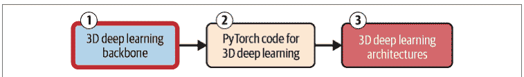

例如，你希望有几个卷积层从体素网格中提取视觉特征，一些全连接层，以及一个softmax层来进行预测。这是一个很好的时刻，确保你区分深度学习模型（即神经网络本身，具有特定的内核大小、激活函数、节点数量等）与架构。它是一个虚拟对象，你可以保存、加载、训练并部署到生产中，以对新数据进行预测。

我知道许多术语可能听起来不熟悉，这正是我们将确保你理解的内容。在这个阶段，了解我们有三个主要组件对于设计3D深度学习模型非常重要：网络架构、数据应如何为此架构准备，以及训练过程应如何开展。让我们首先介绍你将遇到的关于网络架构的术语。

### 网络架构

你的神经网络架构指的是其整体结构，决定了不同层中的神经元如何相互连接以及信息如何在网络中流动。你已经在我们的讨论中遇到过层。在标准神经网络中，我们可以根据它们相对于输入数据的位置来区分层。第一层称为“输入层”。然后我们将进入一个或多个隐藏层，最后确保通过输出层共享预测。

每一层包含一个或多个神经元。它是一个数学函数，接收数值数据并将其乘以权重系数以产生新值（图15-3）。

## 神经网络基础

一个神经元，称为感知器，及其功能。

有些神经元在接收到特定输入时是“开启”的（即正在激活或放电）；其他神经元则是“关闭”的。开启的神经元会将其信号发送到下一层（图15-4）。

激活神经元的激活函数的作用。

关闭的神经元则不会。一旦信号传递到输出层，网络就完成了其“计算”。然后，你可以使用代价函数来衡量输出的准确性。

所有这些都围绕着任何神经网络模型最基本的组成部分：层。神经网络可以看作是构成其结构的层的堆栈（图15-5）。

神经网络中的三层。

每一层包含多个神经元，它们对输入张量的每个元素执行“变换”。这种“变换”由输入的加权和加上在训练过程中获得的偏置项组成。众多层类型之间的主要区别在于神经元的行为。

我们通常将三种主要层进行分类：输入层，接收原始数据；隐藏层，分析复杂的模式和相关性；以及输出层，生成输出或预测。

作为一个良好的起点，以下是你可能遇到的五种最常用的层：

- **卷积层**：这些层通过将滤波器或核应用于输入“图像”来从输入数据中提取特征。滤波器检测特定的模式，如边缘、角点或纹理。

- **池化层**：池化层对卷积层生成的特征图进行下采样，在保留最关键信息的同时降低空间维度。这减轻了计算复杂性。

- **全连接层**：在全连接层中，每个神经元都与前一层中的每个神经元互连。这意味着前面层提取的每个特征都可以影响最终输出。与专注于局部模式的卷积层不同，全连接层负责将提取的特征组合成全局表示并执行高级推理。

- **归一化层**：归一化层通过归一化一层中神经元的激活来帮助稳定训练过程。这可以提高收敛速度并防止所谓的“梯度消失”或“梯度爆炸”。

- **正则化层**：这些通常有助于防止过拟合。正则化层用于改善模型的学习。通过归一化，我们简化了模型的任务，而通过正则化，我们使其更加复杂。实际上，正则化（例如，dropout层）将我们张量的一些值转换为0。这种策略将增强我们模型的复杂性，但矛盾的是，它将提高其效率。

还有其他可用的层。循环层，称为RNN，主要用于自然语言处理中的文本分析。该层旨在使深度学习模型具备记忆能力。循环层将重复评估传入的数据。

注意力层无疑是最复杂的方法。注意力层的原理是增强RNN并可能超越其性能。在循环神经网络中，每个先前评估的词都保留在内存中，以帮助理解后续的词语。问题在于我们的句子分析是从开头到结尾进行的，而不是反向进行。

通过注意力机制，我们可以检查句子中每个词之间的相互联系，以理解将它们联系在一起的关系。因此，它是对RNN的增强，因为注意力有助于从正在研究的同一主题（例如，短语）中提取更多信息。

你可能已经看到我使用了“激活”这个词。这涉及到“激活函数”的使用。它们在使神经网络能够以非线性方式学习方面发挥着至关重要的作用。它们通过在神经网络的每一层之后应用，将该层输入的加权和转换为该层的输出来实现这一点。

**激活函数**通过使输入的加权和非线性来“激活”层的输出。没有这种非线性，神经网络就没有其形状——或者说无法学习其形状——因此就没有我们所谓的“智能”。

**Sigmoid函数**将输入转换为适合二元分类任务的缩放输出，但当神经元产生大的负输入时，会遭受梯度消失问题。tanh函数与sigmoid类似，因为它也在有界范围内产生输出，但以零为中心，因此在将函数可视化为神经网络时，似乎不具备与sigmoid相同的缺点。

**修正线性单元（ReLU）函数**通常是深度前馈神经网络的首选激活函数，因为其处理效率和规避梯度消失问题的能力。然而，在某些情况下，其他函数（如sigmoid或tanh）可能是更合适的选择。

你现在对深度学习架构有了一个更连贯的宏观图景。让我们介绍一些关于如何向这种架构传递信息的基础知识。

## 数据准备

在深入研究之前，我们通常会经历一个数据准备阶段。数据收集之后，有三个你已经熟悉的主要步骤：

1.  数据清洗，以删除或纠正数据集中的不一致、噪声和错误。
2.  数据规范化，将数据缩放到一个共同的范围（例如，[0,1]或[-1,1]），以确保处理的一致性。
3.  数据增强，通过创建数据变体来增加数据集大小并改善模型泛化能力。这通常包括3D旋转、平移和缩放。

这些阶段是通过创建一个自定义的“数据集类”来实现的，该类对这三个方面提出一些自定义的处理步骤。然而，虽然有些过程是可选的（例如，数据增强），但数据集类应该包含这三个组成部分：

- 从磁盘或内存加载数据。
- 应用必要的转换。
- 以模型期望的格式返回数据。

为了进一步澄清，这意味着对于3D数据，输入可能是：

- N × 3 用于点云（N个点，具有x、y、z坐标）
- H × W × D × C 用于体数据（高度、宽度、深度和体素的通道）

输出取决于任务（例如，分类的单个类别标签或重建任务的另一个3D结构）。当你成功准备了数据集后，我们将进入第二阶段：训练我们的3D深度学习模型。

## AI模型训练

3D神经网络的训练过程本质上是一个从错误中学习的循环过程。神经网络在训练过程中系统地修改其内部参数（权重和偏置）。这被称为减少其预测输出与我们实际希望它预测的内容之间的差异：指定训练实例集合的实际目标输出。

这个学习过程通过一些超参数（即配置变量）来控制。你将遇到以下内容：

- **学习率**：这控制了我们所谓的“优化”过程中的步长大小。
- **批大小**：这是在更新模型之前处理的数据样本数量。数据通常以批处理的方式处理，以提高计算效率。批大小是一个超参数，指定了在更新模型内部参数之前处理的样本数量。
- **训练轮数**：模型处理整个数据集的次数。

这个学习过程也包含以下步骤：初始化、前向传播、损失计算、反向传播以及通过多次迭代进行优化，如图15-6所示。

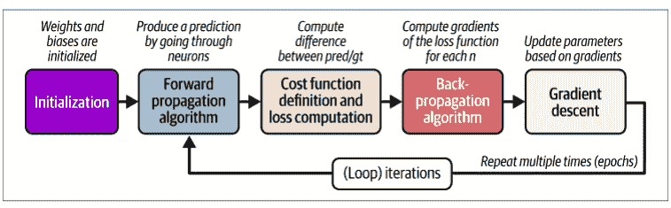

图15-6. 神经网络训练阶段发生的学习过程

在初始化阶段，神经网络的权重和偏置被随机初始化。这些初始值为学习过程奠定了基础。随后，我们将数据输入神经网络。每一层中每个神经元的激活值通过一系列矩阵乘法和激活函数计算得出。这个过程被称为前向传播，它产生神经网络的预测输出。预测输出与实际目标输出（真实值）之间的差异通过选定的损失函数计算得出。该损失函数量化了模型的性能。

常见的**损失函数**包括：

-   用于回归任务的MSE（均方误差）
-   用于分类任务的交叉熵
-   用于特定3D任务的自定义损失函数（例如，用于点云的Chamfer距离）

在这个阶段，我们已经完成了一次带有损失度量的完整前向传播。这意味着我们可以利用这个度量，通过反向传播策略来优化网络的权重和偏置。这可以通过使用**优化器算法**来实现，其目标是最小化损失函数。

优化器首先计算损失函数相对于网络权重和偏置的梯度。然后根据计算出的梯度更新它们；这个过程会重复多次迭代，直到损失函数收敛到最小值。最常见的优化器包括**梯度下降**（沿损失函数最陡下降方向更新权重；见图15-7）、**随机梯度下降**（梯度下降的一种变体，每次迭代使用单个训练样本来更新权重，提高了大数据集的效率）、Adam（一种流行的优化器，结合了自适应矩估计和RMSprop的优点）、RMSprop（一种自适应学习率算法，根据过去的梯度数据为每个参数调整学习率）以及AdaMax（Adam的一个变体，使用不同的无穷范数进行学习率更新）。

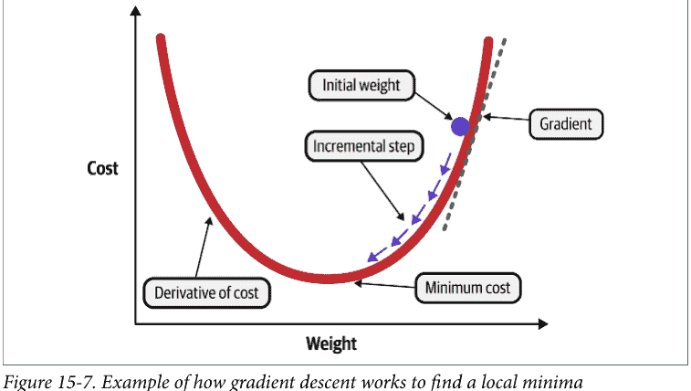

学习率是控制此更新幅度的超参数。一旦所有权重和偏置都被修改，我们就会对每个训练数据批次重复此过程，直到所有批次都被处理完毕，从而完成第一个训练轮次（epoch）。剩下的就是多次重复这个过程（多个轮次），直到神经网络在训练数据上的性能达到令人满意的水平、收敛到一个解，或者达到一定的迭代次数。然后，在一个称为验证集的独立数据集上评估网络，以检查是否过拟合（模型在训练数据上表现良好，但在新数据上表现不佳）。

当然，我们对模型的学习方式有控制权。神经网络通过根据一个特定特征——损失函数的梯度——逐步修改其参数来获取知识。记住这一点非常重要，因为这个过程通常计算量很大，尤其是在大型和深层网络中。因此，训练神经网络通常在强大的硬件或专用硬件加速器（GPU或TPU）上进行，以加速该过程。

完成训练阶段后，神经网络通常应该已经吸收了基本的描述符。这些描述符应关联训练数据中的模式和关系，使其能够在新的、未见过的数据上生成精确的预测。这时，我们就可以修复我们的模型，并继续对其进行部署和测试。

## 部署训练好的模型

成功训练后，我们的模型可以被部署以在新的、未观察到的数据上提供预测。这个过程被称为模型服务。部署模型的第一阶段是将其保存为指定的格式。

流行的格式包括`TensorFlow的SavedModel`、`PyTorch的TorchScript`和`ONNX`。格式的选择取决于部署环境和所使用的工具。

模型保存后，需要将其部署到合适的平台。标准选项包括云平台（例如AWS、GCP、Azure）、边缘设备（例如物联网设备、智能手机）或本地服务器。特定平台的选择将取决于延迟要求、可扩展性需求和安全考虑等因素。

要服务模型，必须首先将其加载到部署环境中。这涉及使用适当的工具和库来加载保存的模型并为其推理做准备。这可能包括设置输入和输出张量、加载必要的数据预处理步骤以及初始化任何所需的资源。

在将数据传递给模型之前，必须对其进行预处理，以匹配模型预期的格式和缩放比例。这与涉及归一化和调整大小等任务的“数据准备”阶段相同。数据预处理后，就可以将其输入模型以获得预测。

预测输出可能需要进行后处理，使其更有意义。例如，如果模型预测概率，输出可能需要转换为类别标签。

最后，必须设置一个服务基础设施来处理传入的请求、处理数据并返回预测。这种服务可以通过使用Web服务器、REST API或其他合适的基础设施来实现。为了确保模型持续表现良好，监控其性能并根据需要重新训练非常重要。这涉及持续评估模型的准确性并进行必要的调整。

但关于理论概念就讲到这里。让我们继续讨论如何实际实现一个3D深度学习模型。

## 使用PyTorch实现

让我们继续讨论使用PyTorch的实现。当我们想要深入3D深度学习时，我们依赖于深度学习框架（图15-8）。目前，我推荐三个正在使用的通用库：

*TensorFlow*
由Google开发，TensorFlow是一个用于机器学习（包括深度学习）的多功能平台。它提供了灵活的架构并支持多种任务。

*PyTorch*
由Meta创建，PyTorch以其动态计算图和易用性而闻名。它在研究人员和原型设计中很受欢迎。

*Keras*
一个能够运行在TensorFlow或Theano之上的高级API，Keras简化了深度学习模型的构建和训练。

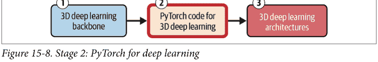

除此之外，还出现了其他库，如Caffe、MXNet、Chainer和FastAI。

这些库提供了广泛的功能和特性，以满足不同的需求和偏好。PyTorch是目前使用最广泛、最有前途的框架，也是我将在本书中使用的框架。由于其动态计算图、易用性和强大的社区支持，它已成为3D数据科学的热门选择。它与其他工具集成的能力以及高效的GPU利用率使其非常适合与3D数据相关的计算密集型任务。PyTorch内置的3D数据操作函数及其对几何深度学习的支持，使其成为各种3D数据科学项目的多功能工具。

让我们先安装PyTorch。

## 安装PyTorch（带CUDA）

处理3D数据时，我们应优先考虑在GPU上进行训练。这意味着需要安装CUDA。第一阶段是检查CUDA兼容性。确保您的GPU与最新的CUDA版本兼容。您可以访问[NVIDIA的网站](https://www.nvidia.com)了解详情。然后，下载相应的CUDA Toolkit，并按照安装程序屏幕上的说明进行安装。

我建议创建一个新的conda环境，使用Python 3.9+，并使用PyTorch安装命令，按照[PyTorch本地开始网站](https://pytorch.org/get-started/locally/)的建议指定CUDA版本。以我为例（GPU NVIDIA 3090 GTX，CUDA 12.1），这对应于：

```
conda install pytorch torchvision torchaudio pytorch-cuda=12.1 -c pytorch -c nvidia
```

过程完成后，您可以通过启动Python会话并输入以下内容来检查一切是否顺利：

```
import torch
torch.cuda.is_available()
```

如果结果为true，您就可以利用CUDA GPU进行计算了！如果没有成功，我建议您查阅这个[故障排除指南](https://pytorch.org/docs/stable/notes/cuda.html)。那么，对于处理3D数据，PyTorch有哪些关键概念和组件是必不可少的呢？

## 张量：构建块

PyTorch的核心是张量，它们是类似于NumPy的ndarray的多维数组，但额外具有GPU加速的优势（图15-9）。

在3D深度学习中，我们可能会处理5D张量：

```
import torch

# 创建一个5D张量：(batch_size, channels, depth, height, width)
x = torch.randn(32, 1, 64, 64, 64)
```

这个张量可以表示一批32个特征（1个通道），维度为64 × 64 × 64体素。由于3D数据的内存要求，您可能需要使用较小的批处理大小。同时，相应地调整学习率是一个很好的实践。现在，让我们来开发神经网络模块。

## 神经网络模块

PyTorch 提供了 `nn` 模块，其中包含了构建神经网络的基本组件。对于 3D 操作，我们有专门的层，例如：

```python
import torch.nn as nn

# 3D convolutional layer
conv3d = nn.Conv3d(in_channels=1, out_channels=16, kernel_size=3, stride=1, padding=1)

# 3D max pooling layer
maxpool3d = nn.MaxPool3d(kernel_size=2, stride=2)
```

## 定义一个 3D 神经网络

让我们使用 PyTorch 创建一个简单的 3D 深度学习模型，该模型接收 3D 体素并预测其类别。我们将为此任务构建一个基础的 3D CNN。我们首先要做的就是创建一个 `VoxelClassifier` 类来定义模型架构。我们将创建三个卷积层，后接两个全连接层，这是 CNN 中的典型模式，此处针对 3D 数据进行了调整。为此，让我先展示完整的类定义，然后我会将其分解，以确保你理解其主要组成部分：

```python
class VoxelClassifier(nn.Module):
    def __init__(self, num_classes):
        super(VoxelClassifier, self).__init__()
        self.conv1 = nn.Conv3d(1, 32, kernel_size=3, padding=1)
        self.conv2 = nn.Conv3d(32, 64, kernel_size=3, padding=1)
        self.conv3 = nn.Conv3d(64, 128, kernel_size=3, padding=1)
        self.pool = nn.MaxPool3d(kernel_size=2, stride=2)
        self.fc1 = nn.Linear(128 * 4 * 4 * 4, 512)
        self.fc2 = nn.Linear(512, num_classes)
        self.relu = nn.ReLU()

    def forward(self, x):
        x = self.pool(self.relu(self.conv1(x)))
        x = self.pool(self.relu(self.conv2(x)))
        x = self.pool(self.relu(self.conv3(x)))
        x = x.view(-1, 128 * 4 * 4 * 4)
        x = self.relu(self.fc1(x))
        x = self.fc2(x)
        return x
```

现在，让我来分解这段代码。首先需要理解的是，在 PyTorch 中，你在 `__init__` 中定义层，并在 `forward` 中指定它们如何连接。当你将数据传递给模型时，`forward` 方法会被自动调用。PyTorch 使用动态计算图，这意味着 `forward` 方法可以包含任意的 Python 代码，而不仅仅是固定的操作序列。

其次需要注意的是，数据在通过网络时维度会发生变化。卷积层保持空间结构但改变通道数，而池化层则降低空间维度。`view` 操作将数据重塑为一维向量，以便输入全连接层。

首先，让我们看看类定义：

```python
class VoxelClassifier(nn.Module):
```

这一行定义了一个名为 `VoxelClassifier` 的新类，它继承自 `nn.Module`。在 PyTorch 中，`nn.Module` 是我所认为的所有神经网络模块的基类。通过继承它，我们的类获得了构建神经网络所需的几个有用方法和属性。

现在，让我们逐一介绍这个类的方法。首先是初始化方法：

```python
def __init__(self, num_classes):
    super(VoxelClassifier, self).__init__()
    self.conv1 = nn.Conv3d(1, 32, kernel_size=3, padding=1)
    self.conv2 = nn.Conv3d(32, 64, kernel_size=3, padding=1)
    self.conv3 = nn.Conv3d(64, 128, kernel_size=3, padding=1)
    self.pool = nn.MaxPool3d(kernel_size=2, stride=2)
    self.fc1 = nn.Linear(128 * 4 * 4 * 4, 512)
    self.fc2 = nn.Linear(512, num_classes)
    self.relu = nn.ReLU()
```

这是构造函数方法。当你创建类的实例时，它会被调用。`super(VoxelClassifier, self).__init__()` 调用父类（`nn.Module`）的构造函数，这使我们能够直接利用 `nn.Module` 的功能。

`super` 给你提供一个类所继承的基类。所以，如果你有一个继承自 `animals` 类的 `cat` 类，那么在 `cat` 上调用 `super` 将会得到 `animals`。大多数 PyTorch 模型都继承自 `nn.Module`，因此在你的神经网络类上调用 `super` 将允许你调用基类 `nn.Module` 的方法。`__init__()` 只是对基类构造函数的调用。面向对象编程的好处在于，你实际上不需要担心预定义类的构造函数做什么。调用它们是惯例，除此之外，你假设它们会执行一些必要的操作，使基类的所有方法可用，初始化变量等等。

这个 `__init__` 函数（称为方法，因为它是类的一部分）定义了神经网络的几个层：

- 三个 3D 卷积层（`nn.Conv3d`），分别为 `self.conv1`、`self.conv2`、`self.conv3`
- 一个 3D 最大池化层（`self.pool`），它将每个方向的空间维度减半
- 两个全连接（线性）层（`self.fc1` 和 `self.fc2`）
- ReLU 激活函数（`self.relu`）

现在，如果我以第一个 3D 卷积层为例，我们有：

```python
self.conv1 = nn.Conv3d(1, 32, kernel_size=3, padding=1)
```

如果我需要更详细地说明其定义，那么第一个参数是输入通道数（1）；第二个是输出通道数（32）；`kernel_size` 为 3 意味着卷积核是 3 × 3 × 3；而 `padding=1` 在输入周围添加了一个体素的边界，这有助于保持空间维度。

因此，我们的网络呈现了三个连续的 3D 卷积层（`conv1`、`conv2`、`conv3`），它们将特征图的数量从 1 逐步增加到 32，然后是 64，最后是 128，每个卷积层后都跟着一个 ReLU 激活函数和一个最大池化层，后者降低了空间维度，使网络能够从输入的体素数据中提取越来越复杂和抽象的特征。在卷积层之后，张量被展平并通过两个全连接层（`fc1` 和 `fc2`），第一个产生一个 512 维的表示，第二个生成最终的分类输出，输出类别的数量由初始化时传入的 `num_classes` 参数决定。

现在，让我们关注 `forward` 方法，它定义了网络的前向传播——数据如何流经各层：

```python
def forward(self, x):
    x = self.pool(self.relu(self.conv1(x)))
    x = self.pool(self.relu(self.conv2(x)))
    x = self.pool(self.relu(self.conv3(x)))
    x = x.view(-1, 128 * 4 * 4 * 4)
    x = self.relu(self.fc1(x))
    x = self.fc2(x)
    return x
```

在该方法中，输入 `x` 依次通过每个卷积层，然后是 ReLU 激活和最大池化。在卷积层之后，`x.view()` 重塑张量，将其展平以输入全连接层。然后数据通过全连接层，层间有 ReLU 激活。最终输出将是类别预测（基于类别数量的概率），并被返回。

现在，让我们将类别数设置为 10：

```python
num_classes = 10
```

我们可以初始化模型：

```python
model = VoxelClassifier(num_classes)
```

这将得到：

```
VoxelClassifier(
  (conv1): Conv3d(1, 32, kernel_size=(3, 3, 3), stride=(1, 1, 1), padding=(1, 1, 1))
  (conv2): Conv3d(32, 64, kernel_size=(3, 3, 3), stride=(1, 1, 1), padding=(1, 1, 1))
  (conv3): Conv3d(64, 128, kernel_size=(3, 3, 3), stride=(1, 1, 1), padding=(1, 1, 1))
  (pool): MaxPool3d(kernel_size=2, stride=2, padding=0, dilation=1, ceil_mode=False)
  (fc1): Linear(in_features=8192, out_features=512, bias=True)
  (fc2): Linear(in_features=512, out_features=10, bias=True)
  (relu): ReLU()
)
```

很好，我们已准备好进入下一阶段。

## 超参数定义

一旦我们的架构确定，我们就可以定义将指导训练过程并可能影响模型性能的超参数：

```python
# Hyperparameters
learning_rate = 0.001
batch_size = 32
num_epochs = 5
```

较小的学习率（如 0.001）通常会导致更平缓的更新，这有助于避免过拟合。然而，过小的学习率可能会导致收敛缓慢。

我们的训练过程将以 0.001 的速率进行学习，这意味着模型的权重在每次迭代中根据梯度更新 0.1%。通过以 32 为一批次来处理数据，我们试图在训练速度和稳定性之间找到平衡。确实，较小的批次大小可能会在更新中引入更多噪声，这有时有助于防止过拟合。最后，我们将迭代 5 个 epoch。请注意，更多的 epoch 通常会带来更好的模型性能。但是，如果模型对训练数据学习得太好，而难以泛化到新数据，则存在过拟合的风险。

## 优化器和损失函数

PyTorch 提供了各种优化器和损失函数。优化器根据计算出的梯度更新模型参数，而损失函数量化预测输出与真实值之间的差异。

我们首先需要导入一个特定的模块：

```python
import torch.optim as optim
```

然后我们可以定义我们的损失准则（例如，交叉熵损失，常用于多分类）和我们的优化器 Adam（自适应矩估计）：

```python
criterion = nn.CrossEntropyLoss()
optimizer = optim.Adam(model.parameters(), lr=learning_rate)
```

现在你知道了如何使用 PyTorch 处理各种组件，那么我们如何将数据传递给我们的网络呢？

## PyTorch DataLoader

训练深度学习模型需要数据。数据通常以数据集的形式提供。数据集包含多个数据样本。可以要求模型一次处理单个样本；然而，通常更高效的做法是让模型同时处理一批多个样本。

可以通过使用张量的切片语法从数据集中提取一个片段来生成一个批次。为了提高训练质量，我们通常在每个epoch打乱整个数据集，以确保在整个训练过程中没有两个批次是相同的。有时，我们可能会实施数据增强来人为地增加数据集的波动性。人们可能会想象需要大量代码来完成所有这些任务。然而，使用DataLoader可以大大简化这个过程。

PyTorch中的DataLoader是一个实用工具类，它遍历数据集，创建数据批次并对其应用转换。它是PyTorch框架的关键组件，提供了一种便捷的方式将数据输入到你的神经网络模型中。为了防止过拟合，DataLoader可以在每个epoch内随机打乱数据。为了加快训练速度，可以使用多个工作进程并行加载数据。

DataLoader还提供了处理不同数据类型和格式的灵活性。整理函数定义了如何将数据样本组合成批次，这对于可变长度的序列或张量特别有用。DataLoader可以对数据应用各种转换，例如归一化、增强和张量转换，以增强模型的性能和鲁棒性。

我将创建一个自定义的Dataset和DataLoader，用于生成合成的3D体素数据。这种方法在没有实际数据或想要验证模型架构时，对于测试和开发模型非常有用。

首先，让我们导入一些工具：

```
from torch.utils.data import Dataset, DataLoader
```

然后，我们创建我们的SyntheticVoxelDataset类：

```
class SyntheticVoxelDataset(Dataset):
    def __init__(self, num_samples, num_classes, voxel_size=32):
        self.num_samples = num_samples
        self.num_classes = num_classes
        self.voxel_size = voxel_size

    def __len__(self):
        return self.num_samples

    def __getitem__(self, idx):
        # Generate a random voxel grid
        voxel = torch.randn(1, self.voxel_size, self.voxel_size, self.voxel_size)

        # Generate a random label
        label = torch.randint(0, self.num_classes, (1,)).item()

        return voxel, label
```

这个自定义的Dataset类动态生成num_samples个合成体素数据和num_classes个标签。我创建了两个方法：`__len__`，返回我们想要生成的样本总数；以及`__getitem__`，每次调用时创建一个随机的体素网格和一个随机标签。

然后，我们可以用我们期望的体素数量（1600，一个固定的dataset大小以给我们固定数量的批次）和类别数（num_classes）创建一个SyntheticVoxelDataset的实例：

```
dataset = SyntheticVoxelDataset(num_samples=1600, num_classes=num_classes)
```

DataLoader使用这个数据集创建，指定了批次大小并启用了打乱：

```
# Create the DataLoader
dataloader = DataLoader(dataset, batch_size=batch_size, shuffle=True)
```

这种方法模拟了现实世界的场景，你准备一个固定的数据集大小并选择一个批次大小进行训练。然后DataLoader处理从这个数据集中创建批次。

通过这种方式构建，我们保持了灵活性。例如，如果你想将批次大小更改为64，你可以在不改变总数据集大小的情况下这样做，并且你会自动获得每个epoch 25个批次，而不是50个。

DataLoader以批次大小32创建并启用了打乱。它遍历数据集，生成输入和标签张量的批次。现在，在训练循环中它是什么样子的？

## PyTorch Training Loop

训练循环是学习过程的核心。在下面，我为我们的合成案例设计了一个PyTorch训练循环，然后我们详细检查它：

```
for epoch in range(num_epochs):
    for batch_idx, (inputs, labels) in enumerate(dataloader):
        # Forward pass
        outputs = model(inputs)
        loss = criterion(outputs, labels)

        # Backward pass and optimize
        optimizer.zero_grad()
        loss.backward()
        optimizer.step()

        if batch_idx % 10 == 0:  # Print every 10 batches
            print(f'Epoch [{epoch+1}/{num_epochs}], Batch [{batch_idx+1}/{len(dataloader)}], Loss: {loss.item():.4f}')

print("Training finished!")
```

外层循环遍历epoch，定义为对整个数据集的完整运行：

```
for epoch in range(num_epochs):
```

在每个epoch内，我们遍历由dataloader提供的数据批次，其中inputs是一批体素数据，labels是相应的类别标签。这意味着对于每个单独的批次：

1.  我们通过模型执行一次前向传播（`outputs = model(inputs)`）。
2.  我们计算损失（`loss = criterion(outputs, labels)`）。
3.  我们执行反向传播和优化：清除上一次迭代的梯度（`optimizer.zero_grad()`），计算损失相对于模型参数的梯度（`loss.backward()`），并根据计算出的梯度更新模型参数（`optimizer.step()`）。
4.  每个批次的损失被累积以计算该epoch的平均损失。
5.  我们更新模型参数（`loss.backward()`）。

在每10个批次结束时，我们打印当前的损失。一旦模型最终确定，我们的权重设置好，我们就可以进行推理了。

## PyTorch Inference

为了演示我们模型的推理模式，让我们创建一个随机的体素网格作为测试输入：

```
test_input = torch.randn(1, 1, 32, 32, 32)
```

然后，我们构建推理代码：

```
with torch.no_grad():
    prediction = model(test_input)
    predicted_class = torch.argmax(prediction).item()
    print(f"Predicted class: {predicted_class}")
```

`torch.no_grad()`是一个上下文管理器，它禁用梯度计算，这在推理期间不需要，并且可以节省内存。然后，我们将模型应用于test_input以获得预测，我们使用`torch.argmax()`来找到预测中最高值的索引，这对应于预测的类别。注意`.item()`将张量转换为Python标量。

最后，我们打印预测的类别：

```
Predicted class: 5
```

就是这样：一个使用PyTorch的完全功能的3D深度学习模型！你所要做的就是调整你的数据集类以适应你的自定义数据并进行测试。但这可能并不那么简单，因为你的数据集可能不是体素数据集。

那么，我们可以利用哪些类型的3D深度学习架构呢？

## 3D Deep Learning: The Architectures

选择合适的神经网络设计对于处理3D数据时的最佳性能至关重要。以下是根据3D数据类型（体素、点云、网格或多视图图像）的一些常见选择：

*3D CNNs*
体素数据将3D空间表示为体素网格，非常适合**3D CNNs**。这些网络将传统的2D CNNs扩展到三维，使它们能够捕获3D数据中的空间关系。

*PointNet-based architectures*
点云是表示3D对象的无结构点集。**PointNet**及其变体，如PointNet++和DGCNN，专门设计用于处理点云。这些架构直接从原始点坐标学习特征，使其在分类和分割等点云任务中非常高效。

*Graph neural networks (GNNs)*
网格表示为图，其中节点对应于顶点，边表示它们之间的连接。**GNNs**非常适合处理网格数据。它们可以从图结构和节点特征中学习，以从网格中提取有意义的信息。

*Multiview CNNs*
多视图数据由3D对象的多个2D视图组成。**Multiview CNNs**结合这些视图的信息来学习3D特征。它们可用于3D对象识别和重建等任务。

为3D数据选择神经网络架构取决于几个因素，包括3D数据的类型（体素、点云、网格或多视图）、要执行的具体任务（例如，分类、分割、重建）以及可用的计算资源。这些因素无疑将指导你为你的3D数据科学项目选择最合适的架构。可能仍然让你困惑的是这些架构是如何定义的。

## 3D卷积神经网络：体素

在深入探讨3D CNN的具体细节之前，理解CNN的基础知识及其向3D空间的扩展（图15-10）非常重要。CNN在处理2D图像数据方面取得了巨大成功。它们使用卷积层在整个输入上应用滤波器，以捕获局部模式和特征。

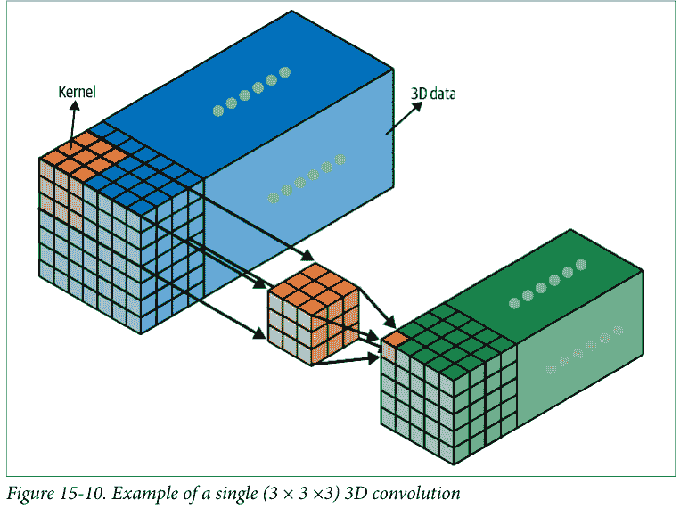

图15-10. 单个（3 × 3 × 3）3D卷积示例

其核心思想是在空间维度上共享权重，这减少了参数数量并使网络具有平移不变性。当处理3D数据时，我们需要将这些概念扩展到三维。

这引导我们走向用于规则、结构化数据集的3D CNN。如果你还记得，体素是像素在3D空间中的类比。因此，3D CNN非常适合处理3D体素网格。体素网格可以被视为一个维度为（深度，高度，宽度，通道）的3D张量。对于二值体素占用网格，通常只有一个通道，而多通道体素网格可以表示颜色或密度等额外属性。3D CNN将2D卷积的思想扩展到了三维。

正如我们之前所见，主要组件包括：

- 3D卷积层：这些层使用3D滤波器（例如，3 × 3 × 3 或 5 × 5 × 5），这些滤波器在输入的深度、宽度和体积上滑动。
- 3D池化层：这些层减少特征图的空间维度，通常在所有三个维度上使用最大池化或平均池化。
- 全连接层：这些层在网络末端用于分类或回归任务。
- 激活函数：ReLU是常用选择，但其他函数如LeakyReLU或ELU也可能有效。
- 批归一化：这有助于稳定训练，可以在卷积层之后应用。

以下是使用PyTorch实现的一个基本3D CNN：

```python
import torch
import torch.nn as nn

class Simple3DCNN(nn.Module):
    def __init__(self, in_channels, num_classes):
        super(Simple3DCNN, self).__init__()

        self.conv1 = nn.Conv3d(in_channels, 32, kernel_size=3, padding=1)
        self.bn1 = nn.BatchNorm3d(32)
        self.pool1 = nn.MaxPool3d(kernel_size=2, stride=2)

        self.conv2 = nn.Conv3d(32, 64, kernel_size=3, padding=1)
        self.bn2 = nn.BatchNorm3d(64)
        self.pool2 = nn.MaxPool3d(kernel_size=2, stride=2)

        self.conv3 = nn.Conv3d(64, 64, kernel_size=3, padding=1)
        self.bn3 = nn.BatchNorm3d(64)
        self.pool3 = nn.MaxPool3d(kernel_size=2, stride=2)

        self.fc1 = nn.Linear(64 * 4 * 4 * 4, 512)
        self.fc2 = nn.Linear(512, num_classes)

    def forward(self, x):
        x = self.pool1(torch.relu(self.bn1(self.conv1(x))))
        x = self.pool2(torch.relu(self.bn2(self.conv2(x))))
        x = self.pool3(torch.relu(self.bn3(self.conv3(x))))

        x = x.view(-1, 64 * 4 * 4 * 4)
        x = torch.relu(self.fc1(x))
        x = self.fc2(x)

        return x
```

现在，要使用这样的模型，我们可以定义模型变量，进行初始化，创建一个输入张量，并将模型应用于该变量：

```python
model = Simple3DCNN(in_channels=1, num_classes=10)
input_tensor = torch.randn(1, 1, 32, 32, 32)  # (batch_size, channels, depth, height, width)

output = model(input_tensor)
```

在这个阶段，我们使用的是一个随机初始化的模型。因此，预测结果可能非常非常差。这就是训练阶段发挥作用的地方，如前一节所述。之后，你可能会在准备好的数据集上使用你新获得的模型，看看它的表现如何。重要的是要理解，3D CNN将2D CNN的概念扩展到了体数据，并且可以使用3D核在宽度、高度和深度上进行卷积。此外，它们可以在所有三个维度上保持空间关系，是处理密集3D数据表示的有效方法。它们通常遵循这样的流程：

输入 (N × D × H × W × C) → 3D卷积 → 3D池化 → ... → 全连接 → 输出

其中N是批大小，D是深度，H是高度，W是宽度，C代表通道。这种方法仍然受限于其计算密集型的方式以及对高分辨率输入的内存限制（表15-1）。

表15-1. 3D CNN的优势与局限性

| 架构 | 优势 | 局限性 | 最佳用例 |
|---|---|---|---|
| 3D CNNs | 基于规则网格的数据，局部空间依赖性，利用2D CNNs | 对不规则点云效率低，需要体素化 | 体数据图像，转换为体素的点云 |

## 3D图神经网络

GNN是处理图结构数据的强大工具。与主要处理网格状数据的CNN模型不同，GNN旨在捕获图结构数据中固有的复杂关系和依赖性（图15-11）。

GNN由四个关键组件组成：图表示、消息传递机制、聚合函数和更新函数。如果你需要复习图论知识，我建议你回到第13章。如果你还记得，图是由一组节点（顶点）和连接它们的边定义的。每个节点和边都可以有关联的特征。消息传递是GNN的基本活动，节点向其相邻节点传播信息。

聚合函数决定了如何组合来自相邻节点的消息。聚合消息后，每个节点根据聚合信息及其原始特征更新其状态。

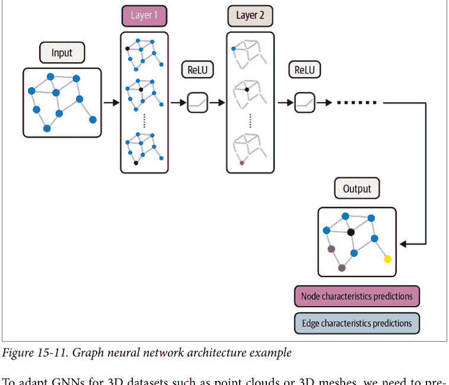

图15-11. 图神经网络架构示例

为了将GNN应用于3D数据集（如点云或3D网格），我们需要将数据集准备成图表示。对于点云，可以使用$k$-近邻图或半径图，而网格本身可以直接用作图。在消息传递中，点云中的点可以从其邻居聚合特征，同时考虑几何信息。在3D网格中，消息可以沿着边或面传递，评估它们的属性。聚合函数可以适应点云和网格的特定特征。例如，对于3D网格，可以使用加权和或几何平均值。更新函数也可以根据数据类型进行定制。对于点云，可以使用神经网络或几何变换，而对于3D网格，可以应用顶点更新或边/面更新。

那么，这在PyTorch中如何实现呢？首先，我们需要加载带有几何扩展的PyTorch：

```python
import torch
import torch_geometric
from torch_geometric.data import Data, DataLoader
from torch_geometric.nn import GCNConv, global_mean_pool
```

然后，假设你面临一个3D形状分类问题。你想利用宜家家具数据库来创建一个3D GNN模型，该模型可以预测从深度扫描仪计算出的网格的特定类别。我们可以定义一个MeshGCN类，它使用来自PyTorch Geometric的图卷积层（GCNConv）：

```python
class MeshGCN(nn.Module):
    def __init__(self, num_features, num_classes):
        super(MeshGCN, self).__init__()
        self.conv1 = GCNConv(num_features, 64)
        self.conv2 = GCNConv(64, 128)
        self.conv3 = GCNConv(128, 256)
        self.fc = nn.Linear(256, num_classes)

    def forward(self, data):
        x, edge_index, batch = data.x, data.edge_index, data.batch
        x = torch.relu(self.conv1(x, edge_index))
        x = torch.relu(self.conv2(x, edge_index))
        x = torch.relu(self.conv3(x, edge_index))
        x = global_mean_pool(x, batch)
        x = self.fc(x)
        return x
```

然后，我们可以定义一个网格加载函数，读取.ply文件并将其转换为PyTorch Geometric数据对象。然后，可以将此函数传递给一个数据加载器函数，该函数可以从目录中加载所有网格，并按类别进行组织。从那里，我们可以训练我们的模型，并在这个新获得的网格上进行测试。

节点特征的选择会显著影响GNN的性能。常见的特征包括顶点坐标、法线、曲率和其他几何属性。这些特征提供了关于网格结构和几何形状的有价值信息。此外，可以使用不同的聚合函数来组合来自相邻节点的消息。例如，可以使用均值、求和或最大值聚合。聚合函数的选择会影响GNN从图中捕获不同类型信息的能力。可以将各种更新函数应用于聚合的消息以计算新的节点特征。ReLU、LeakyReLU和tanh是一些常见的选择。这些函数引入了非线性，并帮助GNN学习复杂的模式。

通过仔细考虑这些因素并自定义GNN架构，你可以有效地处理3D网格数据，用于分类、分割和重建任务。假设你已将网格数据加载到DataLoader中，以下是你可以调整以利用模型的代码示例：

```
model = MeshGCN(num_features, num_classes).to(device)
optimizer = torch.optim.Adam(model.parameters(), lr=0.01)
criterion = torch.nn.CrossEntropyLoss()

for epoch in range(num_epochs):
    for data in data_loader:
        optimizer.zero_grad()
        output = model(data)
        loss = criterion(output, data.y)
        loss.backward()
        optimizer.step()
```

当你有一个希望直接处理的3D网格时，3D图神经网络可能具有决定性作用，但它们通常容易产生极高的计算成本（表15-2）。

表15-2. 图神经网络的优势与局限性

| 架构 | 优势 | 局限性 | 最佳应用场景 |
|---|---|---|---|
| 用于3D的GNN | 处理不规则点云、复杂关系、3D形状任务 | 计算成本高、图构建复杂 | 3D形状分类、分割、生成 |

我们已经了解了直接处理体素或网格的方法，但点云呢？如果我们不想将其表示抽象为体素或网格呢？

## 基于点的架构：PointNet与点云

基于点的架构已成为处理3D点云的强大方法。这些架构直接操作原始点云数据，避免了使用体素或网格等中间表示的需要。事实上，这些以2D卷积和MLP为核心的“传统”计算机视觉技术，在面对点云时被证明是不够的。这些缺乏固定网格或基于像素表示的非结构化数据集带来了巨大的挑战。为了解决这个问题，开创性的PointNet架构应运而生，开创了处理点云的新方法。

PointNet由一个对称函数组成，该函数聚合来自点云中所有点的信息，随后是一个用于提取特征的MLP。它对点的顺序具有不变性，使其适用于分类和分割等任务。PointNet++是PointNet的扩展，通过引入分层特征学习来解决其局限性。它使用分组机制将点云划分为局部区域，对每个区域应用PointNet，然后聚合结果。这种分层方法能够捕捉点云的局部和全局特征。


自PointNet（2016年）和PointNet++（2017年）以来，许多其他提取器和架构相继出现，例如PointCNN（2018年）、DGCNN（2019年）、PointNeXt（2022年）、PointMLP（2022年），甚至——如今被认为是尖端技术的——Point Transformer v3（2023/2024年）。Point Transformer是一种利用Transformer架构进行点云处理的近期架构。它使用自注意力机制来捕捉点之间的全局依赖关系，使其能够学习复杂的关系，并在各种3D任务上实现最先进的性能。

表15-3. PointNet架构的优势与局限性

| 架构 | 优势 | 局限性 | 最佳应用场景 |
|---|---|---|---|
| PointNet | 直接处理点云、高效、3D形状分类 | 空间关系有限、对噪声敏感 | 3D形状分类、部件分割 |
| Point Transformer | 捕捉全局依赖、处理大规模点云 | 计算成本高、超参数调优复杂 | 3D形状任务、大规模点云 |

这一系列3D深度学习架构，凭借其处理“原始数据”的能力，使得超越简单应用、瞄准非常高级的创新成为可能。由于PointNet是基于点的监督学习的核心组件，并且我们已经了解了如何从3D数据集到点云，因此拥有这些方法的实践经验是一项巨大的成就。我将在第16章专门用一整章来介绍PointNet以及如何构建监督学习分割和分类系统。

## 多视图CNN

多视图CNN（MVCNN）是处理3D数据的另一种强大方法（图15-12）。它们通过分析3D物体的多个2D视图，利用了2D CNN的优势。

这使得MVCNN能够有效地学习3D特征，并执行分类、检测和分割任务。MVCNN的核心组件包括视图生成、特征提取、特征聚合和分类。

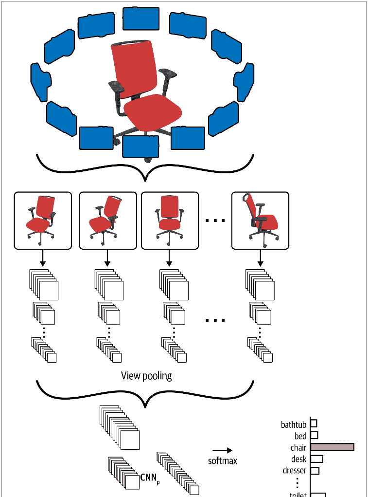

图15-12. 多视图CNN架构示例

视图生成涉及从不同角度创建3D物体的多个2D图像。然后，一个2D CNN处理每个2D图像以提取特征。这些特征被聚合成一个单一的3D表示，最后输入到分类或回归层中。MVCNN面临的挑战之一是为给定物体选择最佳视点数量。可以采用各种技术来解决这个问题，例如随机采样、规范视图或学习视图选择。另一个挑战是如何有效地组合来自多个视图的特征。可以使用平均、拼接或注意力机制等技术来实现这一点。

先进的MVCNN架构结合了残差连接、注意力机制以及与其他3D深度学习方法的混合方法等技术。这些发展提高了MVCNN的性能和功能。

以下是创建这样一个模型的代码：

```
import torch
import torch.optim as optim

import torch.nn as nn

import torchvision.transforms as transforms
import torchvision.datasets as datasets

from torchvision.models import resnet18

class MVCNN(nn.Module):
    def __init__(self, num_views, feature_dim, num_classes):
        super(MVCNN, self).__init__()
        self.num_views = num_views
        self.feature_dim = feature_dim
        self.num_classes = num_classes

        # Load pretrained 2D CNN (e.g., ResNet18)
        self.backbone = resnet18(pretrained=True)
        self.backbone.fc = nn.Linear(self.backbone.fc.in_features, feature_dim)

        # Feature aggregation layer
        self.aggregation = nn.AdaptiveAvgPool2d((1, 1))

        # Classification layer
        self.classifier = nn.Linear(feature_dim * num_views, num_classes)

    def forward(self, x):
        batch_size, num_views, channels, height, width = x.size()

        features = []
        for i in range(num_views):
            view = x[:, i, :, :, :]
            view_features = self.backbone(view)
            features.append(view_features)

        features = torch.cat(features, dim=1)
        features = self.aggregation(features).view(batch_size, -1)
        output = self.classifier(features)
        return output
```

如你所见，我们利用了现有的预训练2D CNN（如ResNet18）作为骨干网络的一部分（表15-4）。

表15-4. 多视图CNN的优势与局限性

| 架构 | 优势 | 局限性 | 最佳应用场景 |
|---|---|---|---|
| 多视图CNN | 利用2D CNN、3D物体识别 | 需要预处理、3D结构信息有限 | 3D物体识别、姿态估计 |

## 3D机器学习与3D深度学习

在3D（非深度）机器学习和3D深度学习之间做出选择是一个关键决策，受到多种因素的影响，其中一些因素如图15-13所示。

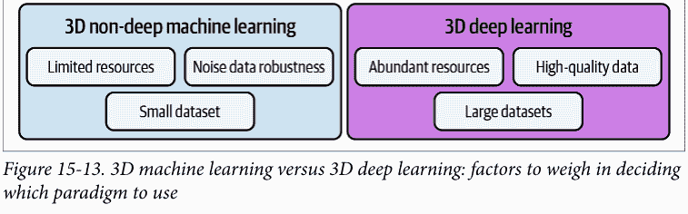

对于小型数据集，传统机器学习算法通常表现更好，因为它们的模型更简单，参数更少。相比之下，深度学习模型可以利用大型数据集来学习复杂的模式并实现高性能。高质量的标注数据有助于深度学习模型提取有意义的特征，而传统机器学习算法可能对噪声或不完整的数据更稳健。

计算资源是另一个考虑因素：传统机器学习模型通常要求较低，而深度学习模型可能计算密集。传统机器学习算法可能足以解决特征明确、模式清晰的简单问题。相反，具有非线性关系的复杂问题更适合深度学习模型。

可解释性也是一个因素：传统机器学习模型通常更具可解释性，允许理解决策过程，而深度学习模型通常缺乏可解释性，但可以实现高性能。

最终，时间限制是重要因素：传统机器学习模型可能更快地被教授和实现，而深度学习算法有时需要较长时间进行实验和优化。表15-5总结了使用3D机器学习与3D深度学习的考量因素。

表15-5. 3D机器学习与3D深度学习对比

| 何时使用3D机器学习 | 何时考虑3D深度学习 |
| :--- | :--- |
| 小型数据集：有限的数据可用性需要特征工程和谨慎的模型选择。 | 大型数据集：有充足的数据可用于训练复杂模型。 |
| 可解释性：理解模型的决策过程至关重要。 | 高性能：实现最先进的结果是主要目标。 |
| 快速部署：需要快速的周转时间。 | 复杂模式：问题涉及数据中错综复杂的关系和模式。 |
| 简单问题：问题可以通过明确定义的特征和线性关系来解决。 | 特征学习：需要自动特征提取。 |

在许多情况下，传统机器学习和深度学习的结合可以产生最佳结果。例如，深度学习可用于目标检测和分割，而传统机器学习可用于路径规划和决策。在工业检测中，深度学习可用于缺陷检测，结合传统机器学习进行质量评估。

在3D机器学习和3D深度学习之间的选择并非总是明确的。仔细评估问题、可用数据、计算资源和期望结果至关重要。整合两种技术的混合策略通常能产生最佳结果。

## 微调、迁移学习与3D数据增强

在大规模数据集上训练的预训练模型已成为现代深度学习的基石。这些模型捕获了丰富的特征表示，对于领域外任务或数据有限的情况可能非常有益。但我们如何利用这些模型呢？这通常依赖于两种流行的方法：微调和迁移学习。这些方法使我们能够利用已建立模型中封装的信息和专业知识。

## 迁移学习

迁移学习涉及利用预训练模型作为新任务或领域的基础。目标是利用预训练模型在大规模数据集上获得的信息，并将其应用于数据集更有限的相关任务。通过这样做，我们可以利用预训练模型获得的总体特征和模式，节省时间和计算资源。迁移学习通常包括两个主要阶段：

- *特征提取*
  在此阶段，我们利用预训练模型作为静态特征提取器。我们移除用于分类的最后几层，并用针对我们特定目标的新层替换它们。预训练模型的权重是固定的，只有新添加层的权重在有限的数据集上进行训练。

- *精炼*
  微调通过解冻预训练模型的某些层来推进这一过程，允许它们用新数据集进行修改。此阶段允许模型调整并获取与当前任务或领域相关的更专业特征。

在某些情况下，迁移学习是相关的。在其他情况下，微调可能是最佳选择。

## 微调

迁移学习涉及冻结预训练模型的权重并仅训练新层，但微调通过允许更新预训练层来推进这一过程。当新数据集足够大且与用于训练预训练模型的原始数据集相似时，这个额外的步骤是有利的。

这意味着我们可以利用：

- *特征提取*
  将预训练模型用作特征提取器。倒数第二层的输出可以作为新分类器或回归器的输入。

- *微调整个模型*
  解冻所有层并重新训练整个模型可以带来更好的性能，但需要更多的计算资源。

- *微调特定层*
  仅解冻顶层，同时保持底层冻结，在性能和计算效率之间取得平衡。

然而，必须理解的是，微调模型的性能可能会受到预训练模型和目标任务之间领域差距的影响。有时，我们需要通过处理数据的统计分布来减少这种差距。此外，用有限数据进行微调可能导致过拟合，需要正则化技术。最后，微调大型预训练模型可能计算要求很高，这也要求我们平衡投入。这些挑战可以通过3D数据增强技术部分解决。

## 3D数据增强：扩展数据集

数据增强是增强训练数据集多样性和数量的有效方法，从而提高模型的泛化能力和鲁棒性。对于3D数据，我们本质上依赖于几何变换：

- *旋转*
  绕随机轴旋转3D对象

- *缩放*
  均匀或非均匀地缩放对象

- *平移*
  沿x、y和z轴移动对象

- *剪切*
  对对象应用剪切变换

你可以在图15-14中看到一些效果。

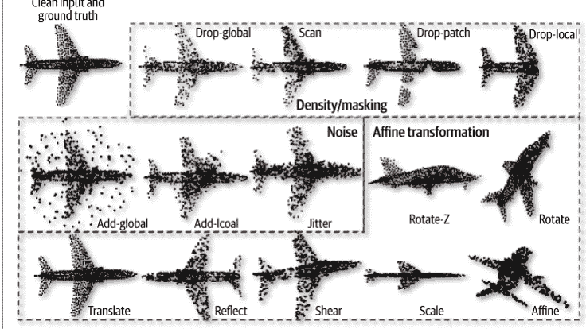

我们也可以通过更局部的增强来添加噪声并调整局部数据分布，例如：

- *随机点丢弃*
  移除随机点子集

- *点抖动*
  向点坐标添加随机噪声

- *特征扰动*
  向点特征添加随机噪声

最后，对于3D对象分类等情况，我们总是可以依赖数据合成，它使用生成模型或基于规则的方法生成合成3D数据。

在下一章中，我们将使用特定的3D数据增强技术来增加我们用于PointNet的3D深度学习应用的训练数据集规模。同时，将微调与数据增强相结合可以显著提升模型性能。通过增强有限的目标数据集，你可以为微调模型提供更丰富、更多样的训练体验。

## 总结

虽然我们已经探讨了使用PyTorch进行3D深度学习的基础、技术和应用，但退一步提醒自己所有这些信息的含义可能会有所帮助。

首先，3D深度学习需要仔细考虑数据表示和模型架构。正如我们所了解的，PyTorch为实现3D深度学习模型提供了强大的工具。但这当然意味着我们需要使用不同的架构（3D CNNs、GNNs、PointNet、MVCNNs），每种架构都适用于不同的3D数据表示。当我们涉及数据时，要理解我们在3D领域拥有的“样本”远不及海量的2D标注数据。因此，迁移学习和微调可以显著提升性能，尤其是在数据有限的情况下。此外，数据增强对于提高3D深度学习模型的泛化能力至关重要。

那么，在这个阶段，你可以依靠哪些新获得的技能？

- 理解各种3D深度学习架构的优势和限制
- 在PyTorch中为3D数据实现自定义数据集和数据加载器
- 掌握用于3D深度学习模型的PyTorch训练循环
- 识别何时对3D任务使用传统机器学习与深度学习
- 将迁移学习和微调技术应用于3D模型

请记住，3D深度学习是发展空间AI系统感知和推理能力的好方法。如果你想深化你的技能，可以按照本章的实践练习进行。

## 实践项目

一如既往，为了巩固你对使用PyTorch进行3D深度学习的理解，尝试创建一个用于体素分类的简单3D CNN的PyTorch实现。使用本章提供的`SyntheticVoxelDataset`类作为起点。实现以下步骤：

1. 定义一个3D CNN架构，至少包含两个卷积层和两个全连接层（如果你有心的话）。
2. 创建一个自定义数据集类，生成合成体素数据（你可以参考提供的`SyntheticVoxelDataset`类）。
3. 设置一个`DataLoader`以高效地批处理和打乱你的数据。
4. 实现一个训练循环，训练你的模型指定的轮数。
5. 添加一个简单的推理函数，该函数接受单个体素网格并返回预测的类别。

作为额外奖励，你可以尝试实验特定于3D体素数据的数据增强技术，例如随机旋转或向体素网格添加噪声。这个练习将帮助你练习在PyTorch中实现完整的3D深度学习流程，从数据准备到模型训练和推理。

# 第16章

## 用于3D物体分类的PointNet

3D场景理解是空间AI系统的关键方面，它在很大程度上依赖于对3D数据的有效语义提取。第12至14章让我们能够在标注数据集有限的情况下，利用无监督和有监督的3D机器学习来实现这一目标。然而，当你拥有大规模数据资源库时，3D深度学习展现出巨大潜力，我们在第15章通过3D CNNs对此进行了重点介绍。

然而，3D CNNs不足以处理点云的复杂性，点云是一种没有固定网格或基于像素表示的非结构化数据集。这一局限性凸显了对创新方法的迫切需求，以直接处理和解释点云数据。

确实，存在多种表示和处理3D数据的方法，例如体素、网格和多视图图像（参见第4章）。然而，每种表示方法都有其缺点。体素虽然适用于3D CNNs，但计算密集且内存需求大，尤其是在处理高分辨率输入时。使用图神经网络处理的网格或边界表示，在图构建和计算开销方面存在挑战。多视图CNNs利用2D CNNs处理多个2D视图，需要大量的预处理，并且可能无法完全捕捉固有的3D结构。这些局限性强调了需要一种更高效、更直接的3D数据处理方法（参见第15章）。

PointNet作为一种关键解决方案应运而生，旨在解决这些局限性并实现实际的3D场景理解。这一开创性的架构直接处理原始点云数据，避免了对体素或网格等中间表示的需求。通过直接操作非结构化（表格化）的点数据，PointNet简化了处理流程，并避免了将点云转换为其他表示时可能造成的信息损失。这一特性使得PointNet成为推进3D深度学习方法以实现3D场景理解的一个引人注目的研究领域。

本章深入探讨了该架构的复杂性，并重点介绍了其在3D物体分类和3D语义分割方面的可能性。我们探索了为PointNet准备点云数据的基本概念，讨论了其架构和组件，并实现了物体分类的解决方案。


在本章中，我们使用了多个Python库：NumPy、PyTorch、Matplotlib、Plotly、Open3D、urllib（用于从互联网下载文件，特别是ModelNet10数据集）、zipfile（用于从ZIP存档中提取文件，特别是解压下载的ModelNet10数据集）、pathlib（以更面向对象的方式处理文件路径）以及scikit-learn（提供confusion_matrix函数来评估训练好的PointNet的性能）。一如既往，您可以在3D数据科学资源中心找到本章的所有材料。要访问文件（代码、数据集、文章）和资源，您可能需要提供电子邮件地址、个人密码或证明您是本书的所有者。

通过理解和实现PointNet，我们解锁了一个强大的工具，它将增强您处理数字环境生成的能力。

## PointNet：一种基于点的3D深度学习架构

让我们退一步，更好地理解PointNet架构的工作原理。PointNet是3D深度学习神经网络的先驱之一（图16-1）。如果您理解了PointNet，就可以使用所有其他高级模型。但是，当然，理解只是等式的一部分。

主要挑战在于让这个复杂的系统运行起来，并将其调整为适用于您的数据！即使对于经验丰富的编码人员来说，这也是一项艰巨的任务。因此，我们将这个过程分为几个部分，包括为架构在现实条件下工作而进行的数据准备。

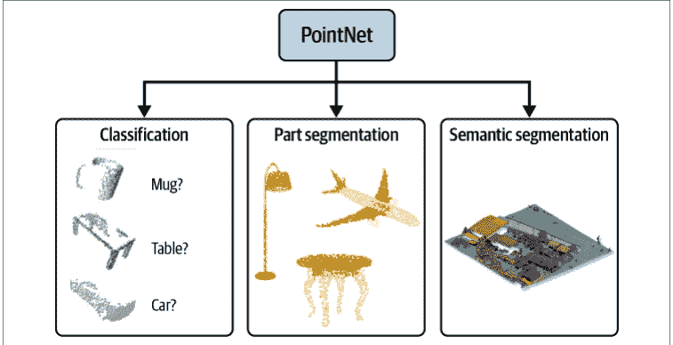

图16-1. PointNet架构能够处理三种语义化应用：分类、部件分割和语义分割

理解网络的构建模块对于正确准备数据至关重要。图16-2展示了使用该网络准备数据时需要考虑的关键方面。

PointNet架构由多层神经网络组成，用于处理点云数据。PointNet的输入是一组简单的点，每个点由其3D坐标和附加特征（如颜色或强度）表示。这些点被输入到连续的共享MLP网络中，这些网络学习从每个点提取局部特征（图16-3）。

### 分类网络

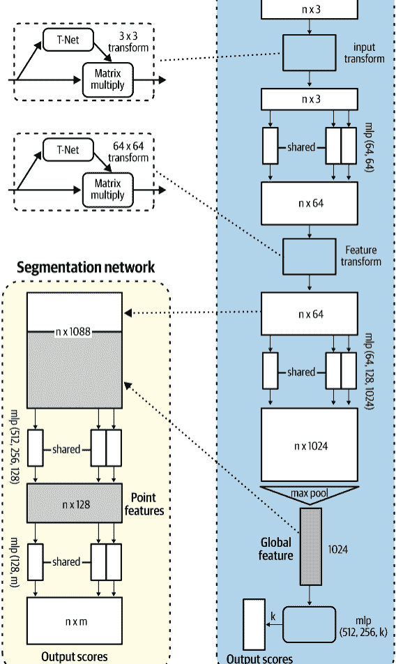

### 分割网络

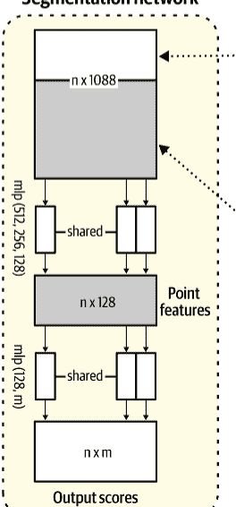

图16-2. PointNet模型架构，如其作者所述

554 | 第16章：用于3D物体分类的PointNet

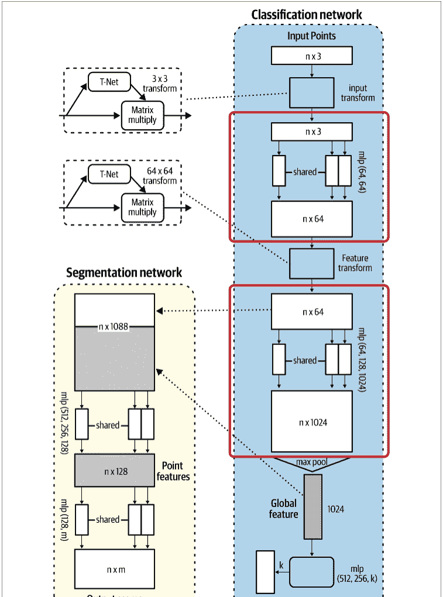

图16-3. PointNet架构中的MLP网络（ArXiv论文）

MLP是一种由多层连接节点或神经元组成的神经网络。MLP中的每个神经元首先接收来自构成前一层的所有神经元的输入。然后，它使用权重和偏置对该输入应用转换，并将结果传递给下一层的神经元。值得注意的是，MLP中的权重和偏置是在训练过程中通过反向传播学习的两个变量。它们被调整以最小化网络预测与真实输出之间的差异。

这些MLP是全连接层，每层之后都跟着我们所谓的“非线性激活函数”（如ReLU函数）。每层的神经元数量（例如64）和层数本身（例如2）可以根据具体任务和输入点云数据的复杂性进行调整。正如您所猜测的，神经元和层数越多，由于架构可塑性提供的组合可能性，目标问题就可以越复杂。如果我们继续探索PointNet架构，我们会看到我们用从初始点（x、y和z）中提取的1024个特征来描述原始的*n*个输入点。

这正是架构使用最大池化操作对局部学习到的特征进行处理，以获得总结整个点云的全局特征向量，从而提供输入点云的全局描述的地方。然后，这个全局特征向量通过几个全连接层，产生分类头的最终输出，即*k*个类别的得分（图16-4）。

请注意，PointNet中的语义分割头是一个全连接网络，它将全局特征向量和局部特征向量连接起来，为输入点云数据中的每个点产生逐点得分或标签。

语义分割头由几个带有ReLU激活函数的全连接层和一个最终的softmax层组成。最终softmax层的输出表示每个点在不同语义标签或类别上的概率分布（图16-5）。

PointNet架构通过学习输入点云中每个点的局部和全局特征，能够捕捉重要的几何和上下文信息，用于3D数据中的物体分类和分割等任务。PointNet的关键创新之一是在最大池化操作中使用对称函数，这确保了输出对输入点的顺序不变。这使得PointNet对输入点顺序的变化具有鲁棒性，这在3D数据分析中至关重要。

### 分类网络

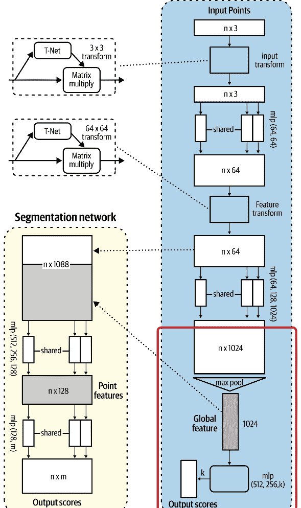

### 分割网络

图16-4. 在PointNet架构中使用最大池化获取全局特征向量（ArXiv论文）

### 分类网络

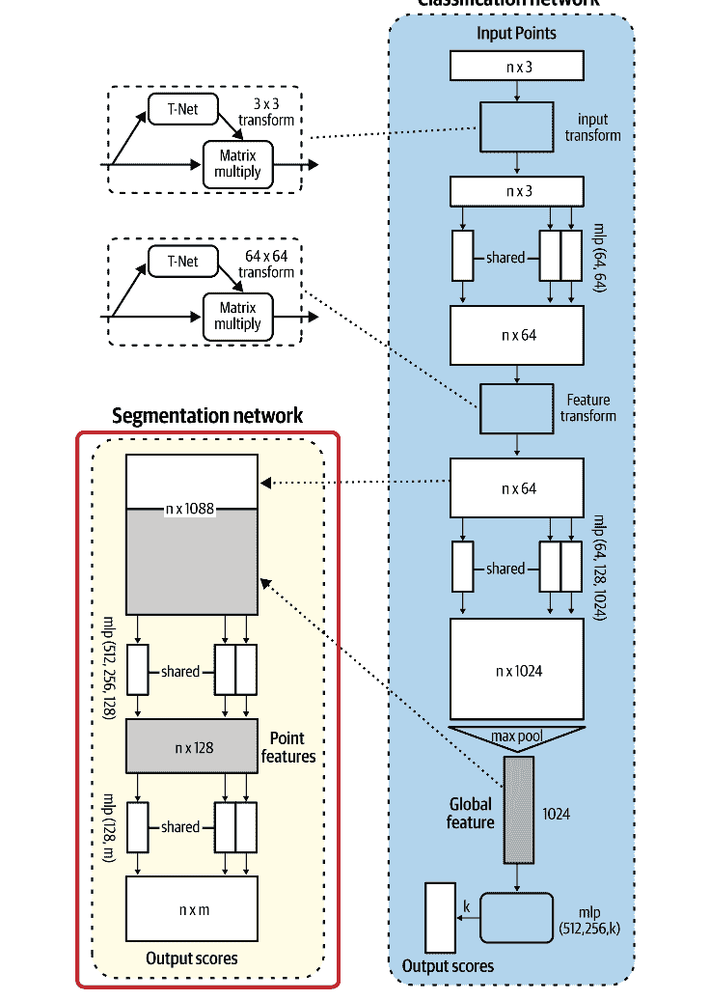

### 分割网络

图 16-5. PointNet 架构的分割头（ArXiv 论文）

从高层次来看，如果我们研究原始论文，会发现 PointNet 的工作方式非常直接（见图 16-6）：

1.  我们获取一个点云，并将数据规范化到标准空间。
2.  我们计算一系列特征（不依赖我们的专家知识，而是利用网络能力来创建相关特征）。
3.  我们将这些特征聚合成所考虑点云的全局签名。
4.  *选项 1*：我们使用这个全局签名来对点云进行分类。
5.  *选项 2*：我们将这个全局签名与局部签名结合，构建更精细的特征用于语义分割。

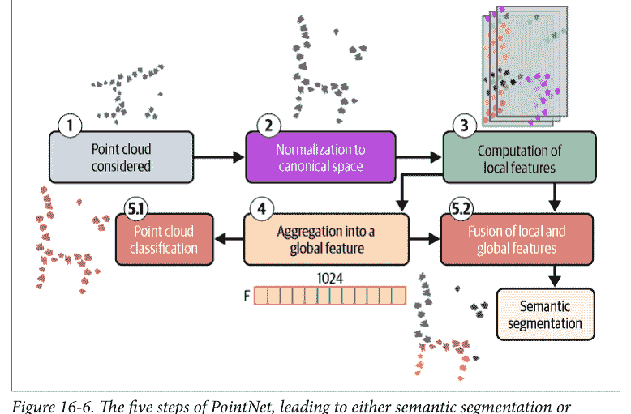

图 16-6. PointNet 的五个步骤，最终导向语义分割或分类任务

这一切都关乎特征，意味着我们提供给网络的数据块必须非常相关。那么，我们该如何着手呢？

## 3D 物体分类

让我们来设定你的任务背景。你是一位勇敢的工程师，希望改善市民的生活。你有一个想法，为你的机器人伙伴配备感知和理解周围环境的能力。使用激光雷达，你的机器人必须学会检测和分类各种类型的家具。想象一下可能性！凭借这项新获得的能力，你的机器人将能够识别床、椅子、桌子等，然后派遣其他机器人执行特定任务，如整理床铺或重新布置家具。

为了实现这一目标，你开发了一个复杂的 3D 深度学习系统。该系统分析激光雷达数据，从点云中提取有意义的特征。然后，它学习将这些特征分类为不同的家具类型，使你的机器人能够做出明智的决策。自然，凭借你对 PointNet 的第一手经验，这正是你将要探索的内容（图 16-7）。

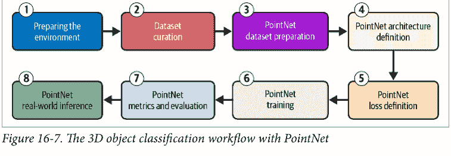

这项探索的成功不仅将增强你的机器人的能力，还将为机器人无缝融入我们日常生活的未来铺平道路，协助我们处理日常任务，使我们的家庭更高效、更舒适。让我们开始吧。

## 3D 物体分类基础

如果你还记得，PointNet 允许我们预测标签以实现 3D 语义分割目标。但 PointNet 为此划定了两个主要粒度：要么在点级别（3D 语义分割，为点云中的每个点分配标签），要么在点云级别（3D 物体分类，旨在为整个点云分配一个标签），如图 16-8 所示。

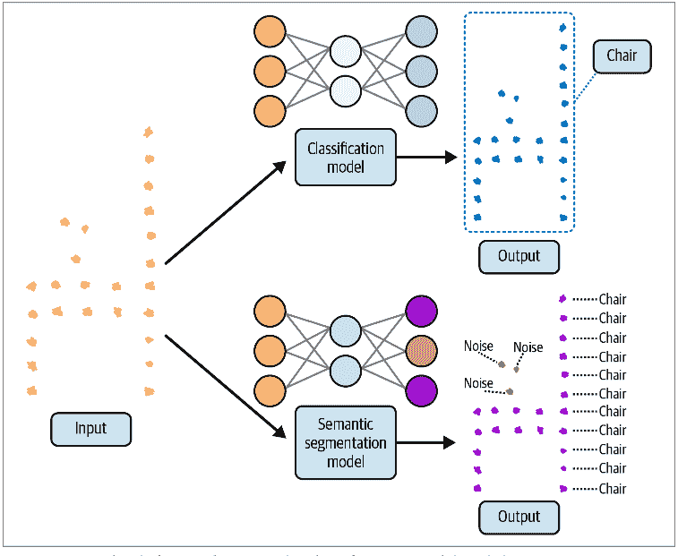

图 16-8. 分类模型与语义分割模型的区别

在这两种情况下，我们都输入一个点云，但对于分类任务，整个点云是实体，而在语义分割的情况下，每个点都是要分类的实体。例如，使用 PointNet 架构，3D 点云分类涉及将整个点云通过网络，并输出一个代表整个云的单一标签。相比之下，语义分割“头”将为云中的每个点分配一个标签。方法上的差异是因为分割需要对所表示的 3D 空间有更详细的理解，因为它试图识别和标记点云中的单个对象或区域。相比之下，分类只需要对点云的整体形状或组成有高层次的理解。

总的来说，虽然 3D 语义分割和分类是分析 3D 点云数据的基本任务，但主要区别在于标记过程中所需的细节和粒度水平。考虑到这一点，让我们为 3D 物体分类目标开发一个完整的解决方案，该方案由八个阶段组成，如图 16-9 所示。让我们从设置环境开始。

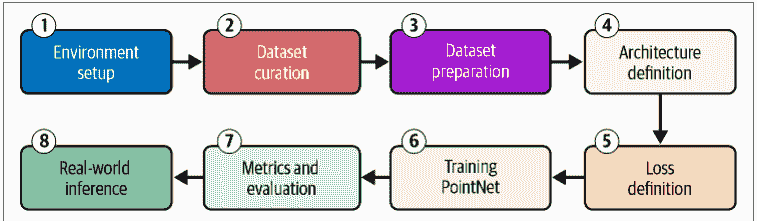

图 16-9. 用于 3D 物体分类的完整 PointNet 实现工作流

## 环境设置

让我们探索一个完全基于 Python 的解决方案，包括数据集获取。我们首先加载数据科学基础库：

```
# Data science base libraries
import numpy as np
import random
import math
import scipy.spatial.distance
```

接着是实用工具库：

```
import os
import copy
import urllib.request
import zipfile
from pathlib import Path
```

最后，我们导入 PyTorch 及其相关方法和工具：

```
# PyTorch and dependencies
import torch
from torch.utils.data import Dataset, DataLoader
from torchvision import transforms, utils
import torch.nn as nn
import torch.nn.functional as F
```

从那里，我们可以获取我们的数据集。

## 数据集整理

我想展示研究和开放倡议的力量。在某些情况下，你不必自己构建数据集，可以使用现有的数据集。在我们的案例中，我们利用 *ModelNet10*，这是一个广泛使用的基准数据集，专门用于物体分类任务。它包含 10 个物体类别，每个类别包含 984 个 CAD 模型。这些模型经过精心清理和对齐，使其适合用于训练和测试 3D 物体识别的深度学习模型。ModelNet10 包含 10 个类别（飞机、浴缸、床、书架、瓶子、椅子、杯子、灯、笔记本电脑、桌子），确保对 3D 物体分类模型进行全面评估。

首先，让我们获取数据集并将其下载到本地 *DATA* 文件夹：

```
file_path_zip = "../DATA/ModelNet10.zip"

urllib.request.urlretrieve("http://3dvision.princeton.edu/projects/2014/3DShapeNets/ModelNet10.zip", file_path_zip)
```

这利用了 urllib 库将指定文件直接下载到指定路径。如你所见，这是一个 .zip 文件，我们需要解压它：

```
with zipfile.ZipFile(file_path_zip,"r") as zip_ref:
    zip_ref.extractall("../DATA/")
```

完成后，我们创建三个变量，即 path、folders 和 classes，我们可以在脚本的后续部分使用它们：

```
path = Path("../DATA/ModelNet10/")

folders = [dir for dir in sorted(os.listdir(path)) if os.path.isdir(path/dir)]
classes = {folder: i for i, folder in enumerate(folders)};
```

现在，是时候读取我们的文件了，这些文件采用 .off 文件格式（见图 16-10）。一个简单的解决方案是利用 Open3D 来完成：

```
import open3d as o3d
mesh = o3d.io.read_triangle_mesh(str(path / "bed/train/bed_0001.off"))
mesh.compute_vertex_normals()
o3d.visualization.draw_geometries([mesh], mesh_show_back_face = True)
```

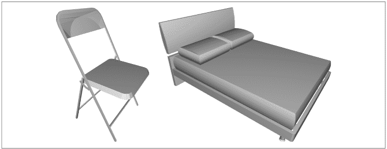

图 16-10. 使用 Open3D 可视化的 3D 物体示例

然而，为了自定义，如果你遇到未知格式怎么办？这意味着我们需要开发一个数据读取器。如果我们检查 ModelNet10 数据集的文件格式，会发现它是一个 .off 文件。让我们开发一个读取器来读取 .off 文件：

```
def read_off(file):
    if 'OFF' != file.readline().strip():
        raise('Not a valid OFF header')
    n_verts, n_faces, __ = tuple([int(s) for s in file.readline().strip().split(' ')])
    verts = [[float(s) for s in file.readline().strip().split(' ')] for i_vert in range(n_verts)]
    faces = [[int(s) for s in file.readline().strip().split(' ')][1:] for i_face in range(n_faces)]
    return verts, faces
```

你现在可以使用这个读取器，它将几何体作为两个变量返回：一个顶点列表和一个面列表。现在，我们可以开始创建我们的数据集类了。

## PointNet：数据集准备

第一阶段是定义一个函数，将网格转换为 3D 点云。你可以利用第 4 章的知识，这些知识被整合到一个用于处理 3D 物体分类点云数据的 PyTorch Dataset 类中：

```
class PointCloudData(Dataset):
    def __init__(self, root_dir, valid=False, folder="train",
                 transform=default_transforms()):
        self.root_dir = root_dir
        folders = [dir for dir in sorted(os.listdir(root_dir)) if
                   os.path.isdir(root_dir/dir)]
        self.classes = {folder: i for i, folder in enumerate(folders)}
        self.transforms = transform if not valid else default_transforms()
        self.valid = valid
        self.files = []
        for category in self.classes.keys():
            new_dir = root_dir/Path(category)/folder
            for file in os.listdir(new_dir):
                if file.endswith('.off'):
                    sample = {}
                    sample['pcd_path'] = new_dir/file
                    sample['category'] = category
                    self.files.append(sample)

    def __len__(self):
        return len(self.files)

    def __preproc__(self, file):
        verts, faces = read_off(file)
        if self.transforms:
            pointcloud = self.transforms((verts, faces))
        return pointcloud

    def __getitem__(self, idx):
        pcd_path = self.files[idx]['pcd_path']
        category = self.files[idx]['category']
        with open(pcd_path, 'r') as f:
```

pointcloud = self.__preproc__(f)
return {'pointcloud': pointcloud,
        'category': self.classes[category]}

让我们来分解一下。首先，我们使用 `__init__` 方法初始化所有内容（数据集包含根目录、验证标志、文件夹名称、变换、文件夹映射字典和文件列表）。然后，`__len__` 方法返回数据集中的样本总数。

最有用的方法是 `__preproc__` 方法，它通过读取网格并应用指定的变换来预处理单个点云文件。最后，`__getitem__` 方法从数据集中检索单个样本，读取、预处理并返回一个包含处理后的点云及其类别索引的字典。

因此，在这个阶段，我们的数据集加载器类已经准备就绪。现在，按照第15章的建议，让我们来定义3D深度学习架构：PointNet架构。

## PointNet 架构定义

该架构包含三个主要类：Tnet、Transform 和 PointNet。Transformer 网络类，即 Tnet，是一个用于学习输入变换的变换网络。它是 PointNet 的一个关键组件，有助于使网络对某些几何变换保持不变。这是我们的 Tnet 类：

```python
class Tnet(nn.Module):
    def __init__(self, k=3):
        super().__init__()
        self.k=k
        self.conv1 = nn.Conv1d(k,64,1)
        self.conv2 = nn.Conv1d(64,128,1)
        self.conv3 = nn.Conv1d(128,1024,1)
        self.fc1 = nn.Linear(1024,512)
        self.fc2 = nn.Linear(512,256)
        self.fc3 = nn.Linear(256,k*k)

        self.bn1 = nn.BatchNorm1d(64)
        self.bn2 = nn.BatchNorm1d(128)
        self.bn3 = nn.BatchNorm1d(1024)
        self.bn4 = nn.BatchNorm1d(512)
        self.bn5 = nn.BatchNorm1d(256)

    def forward(self, input):
        # input.shape == (bs,n,3)
        bs = input.size(0)
        xb = F.relu(self.bn1(self.conv1(input)))
        xb = F.relu(self.bn2(self.conv2(xb)))
        xb = F.relu(self.bn3(self.conv3(xb)))
        pool = nn.MaxPool1d(xb.size(-1))(xb)
        flat = nn.Flatten(1)(pool)
        xb = F.relu(self.bn4(self.fc1(flat)))
        xb = F.relu(self.bn5(self.fc2(xb)))

        #initialize as identity
        init = torch.eye(self.k, requires_grad=True).repeat(bs,1,1)
        if xb.is_cuda:
            init=init.cuda()
        matrix = self.fc3(xb).view(-1,self.k,self.k) + init
        return matrix
```

该网络默认输入维度为3（用于3D点云），由三个1D卷积层和三个全连接层组成。该架构将通道数从输入维度逐步增加到64，然后是128，最后是1024，并配有相应的批归一化层以稳定和加速训练过程。之后，卷积层之后是三个全连接层，将特征表示从1024减少到512，然后到256，最后到一个维度为 $k \times k$ 的变换矩阵。

前向方法实现了实际的变换学习过程，其中输入点云经过一系列操作：首先，应用带有批归一化的ReLU激活1D卷积，然后使用最大池化聚合所有点的特征并展平结果。网络随后将此表示通过另外两个带有ReLU和批归一化的全连接层。

此实现的一个独特之处在于最终变换矩阵的生成：它创建一个单位矩阵作为初始变换，加上从网络学习到的变换，并返回一个可用于对输入点云进行空间变换的矩阵，有效地学习一种对齐方式，使点云特征对几何变化更具不变性。

现在，我们可以继续介绍 `Transform` 类，它负责应用两个 Tnet，一个用于输入变换，另一个用于特征变换：

```python
class Transform(nn.Module):
    def __init__(self):
        super().__init__()
        self.input_transform = Tnet(k=3)
        self.feature_transform = Tnet(k=64)
        self.conv1 = nn.Conv1d(3,64,1)

        self.conv2 = nn.Conv1d(64,128,1)
        self.conv3 = nn.Conv1d(128,1024,1)

        self.bn1 = nn.BatchNorm1d(64)
        self.bn2 = nn.BatchNorm1d(128)
        self.bn3 = nn.BatchNorm1d(1024)

    def forward(self, input):
        matrix3x3 = self.input_transform(input)
        # batch matrix multiplication
        xb = torch.bmm(torch.transpose(input,1,2), matrix3x3).transpose(1,2)

        xb = F.relu(self.bn1(self.conv1(xb)))

        matrix64x64 = self.feature_transform(xb)
        xb = torch.bmm(torch.transpose(xb,1,2), matrix64x64).transpose(1,2)

        xb = F.relu(self.bn2(self.conv2(xb)))
        xb = self.bn3(self.conv3(xb))
        xb = nn.MaxPool1d(xb.size(-1))(xb)
        output = nn.Flatten(1)(xb)
        return output, matrix3x3, matrix64x64
```

它还包含三个带有批归一化的1D卷积层。在其前向传播中，Transform 类首先使用第一个 Tnet 应用输入变换，然后通过卷积层处理数据，最后使用第二个 Tnet 应用特征变换。该类的输出是变换后的特征以及两个变换矩阵（3 × 3 和 64 × 64）。

最后，PointNet 类是连接所有部分的主架构。它首先使用 Transform 类来处理点云数据：

```python
class PointNet(nn.Module):
    def __init__(self, classes = 10):
        super().__init__()
        self.transform = Transform()
        self.fc1 = nn.Linear(1024, 512)
        self.fc2 = nn.Linear(512, 256)
        self.fc3 = nn.Linear(256, classes)

        self.bn1 = nn.BatchNorm1d(512)
        self.bn2 = nn.BatchNorm1d(256)
        self.dropout = nn.Dropout(p=0.3)
        self.logsoftmax = nn.LogSoftmax(dim=1)

    def forward(self, input):
        xb, matrix3x3, matrix64x64 = self.transform(input)
        xb = F.relu(self.bn1(self.fc1(xb)))
        xb = F.relu(self.bn2(self.dropout(self.fc2(xb))))
        output = self.fc3(xb)
        return self.logsoftmax(output), matrix3x3, matrix64x64
```

在 `__init__` 方法中，网络由几个关键组件构建：一个学习输入点云空间对齐的变换模块；三个全连接层，将特征维度从1024逐步降低到512，然后到256，最后到分类类别数（默认为10）；以及批归一化层（用于稳定学习过程）。选择0.3的丢弃率是一种正则化技术，通过在训练期间随机将一部分输入单元置零来防止过拟合，而最后的LogSoftmax激活确保输出代表跨分类类别的对数概率分布。

前向方法实现了网络的推理过程，其中输入点云首先使用 Transform 模块进行空间变换，该模块返回变换后的点云特征以及两个变换矩阵（3 × 3 和 64 × 64）。这些矩阵对于学习点云对齐和特征提取至关重要。然后，特征通过两个带有ReLU激活和批归一化的全连接层，丢弃层应用于第二层和第三层之间以引入额外的正则化。

最后的全连接层产生类别逻辑值，然后使用LogSoftmax转换为对数概率。该方法返回三个元素：对数概率预测和两个变换矩阵，这些矩阵可用于可视化、进一步分析，或作为损失函数的一部分以鼓励点云表示中的空间不变性。

该架构的一个关键方面是它能够直接处理点云，无需体素化或渲染。使用 Tnet 使网络对某些几何变换保持不变，这对于处理3D数据至关重要。另一个重要特征是使用最大池化来创建全局特征向量，这使得网络对输入中点的顺序保持不变（排列不变性）。

数据集类已创建，PointNet 模型已定义；那么，损失函数呢？

## PointNet 损失定义

让我们定义一个名为 `pointnetloss` 的函数。它使用几个重要参数：网络的预测（outputs）、真实标签（labels）、来自输入变换的3 × 3变换矩阵（m3×3）、来自特征变换的64 × 64变换矩阵（m64×64），以及一个默认为0.0001的正则化参数 alpha：

```python
def pointnetloss(outputs, labels, m3x3, m64x64, alpha = 0.0001):
    criterion = torch.nn.NLLLoss()
    bs=outputs.size(0)
    id3x3 = torch.eye(3, requires_grad=True).repeat(bs,1,1)
    id64x64 = torch.eye(64, requires_grad=True).repeat(bs,1,1)
    if outputs.is_cuda:
        id3x3=id3x3.cuda()
        id64x64=id64x64.cuda()
    diff3x3 = id3x3-torch.bmm(m3x3,m3x3.transpose(1,2))
```

## PointNet 训练

让我们为深度学习模型构建一个典型的训练循环，但针对 PointNet 进行一些特定的调整。我们来详细了解一下：

```python
def train(model, train_loader, val_loader=None, epochs=15, save=True):
    for epoch in range(epochs):
        pointnet.train()
        running_loss = 0.0
        for i, data in enumerate(train_loader, 0):
            inputs, labels = data['pointcloud'].to(device).float(),
            data['category'].to(device)
            optimizer.zero_grad()
            outputs, m3x3, m64x64 = pointnet(inputs.transpose(1,2))

            loss = pointnetloss(outputs, labels, m3x3, m64x64)
            loss.backward()
            optimizer.step()

            # print statistics
            running_loss += loss.item()
            if i % 10 == 9:    # print every 10 mini-batches
                print('[Epoch: %d, Batch: %4d / %4d], loss: %.3f' %
                      (epoch + 1, i + 1, len(train_loader), running_loss / 10))
                running_loss = 0.0

        pointnet.eval()
        correct = total = 0

        # validation
        if val_loader:
            with torch.no_grad():
                for data in val_loader:
                    inputs, labels = data['pointcloud'].to(device).float(),
                    data['category'].to(device)
                    outputs, __, __ = pointnet(inputs.transpose(1,2))
                    _, predicted = torch.max(outputs.data, 1)
                    total += labels.size(0)
                    correct += (predicted == labels).sum().item()
            val_acc = 100. * correct / total
            print('Valid accuracy: %d %%' % val_acc)

        # save the model
        if save:
            torch.save(pointnet.state_dict(), "save_"+str(epoch)+".pth")
```

如你所见，该函数接受几个参数：模型（pointnet）、训练数据加载器、验证数据加载器（可选）、训练轮数以及一个用于保存模型的标志。

对于每个训练轮，函数首先使用 `pointnet.train()` 将模型设置为训练模式。这确保了像 Dropout 这样的层在训练期间是激活的。然后，它遍历训练数据。对于每个批次，它将输入点云及其标签移动到指定的设备（很可能是 GPU）。优化器的梯度被清零，以防止从之前的批次中累积。

点云数据被传递给 PointNet 模型。注意 `transpose(1,2)` 操作，这可能是为了调整输入形状以匹配 PointNet 的期望。模型返回类别预测，以及 3 × 3 和 64 × 64 的变换矩阵。

然后，使用我们之前讨论过的自定义 PointNet 损失函数计算损失。网络反向传播此损失，优化器更新模型的参数。

函数跟踪运行损失，并每 10 个小批次打印一次统计信息。这提供了训练进展的实时指示。在一个训练轮处理完所有批次后，如果提供了验证加载器，函数将在验证集上评估模型。它使用 `pointnet.eval()` 将模型切换到评估模式，并使用 `torch.no_grad()` 禁用梯度计算以提高效率。

在验证期间，每个批次通过模型，并将预测类别（通过取输出的最大值获得）与真实标签进行比较。它统计正确预测的数量和总样本数，以计算验证的准确率。

最后，如果保存标志为真，它会在每个训练轮后保存模型的状态字典。这允许进行检查点保存，并可能根据验证性能使用最佳模型。

这个训练函数封装了 PointNet 的整个训练过程，包括前向传播、损失计算、反向传播、优化和验证。它旨在满足 PointNet 的特定要求，例如自定义损失函数和需要转置输入数据。现在让我们训练我们的模型，根据我的配置，15 个训练轮大约需要 3 小时：

```python
train(pointnet, train_loader, valid_loader, save=False)
```

定期打印损失和准确率统计信息可以监控训练进度，这对于诊断问题和调整超参数至关重要。此外，你可以看到关于批次数的进展：

```
Batch [ 3 / 15]
Batch [ 4 / 15]
Batch [ 5 / 15]
...
```

模型训练完成后，你可以使用以下命令保存其权重：

```python
torch.save(pointnet.state_dict(), "../MODEL/pointnet_classification_15.torch")
```

一旦我们的模型训练完成，我们可以通过在验证集上以推理模式运行来检查其性能。

## PointNet 指标与评估

让我们在验证数据集上评估一个训练好的 PointNet 模型。首先，让我们从 scikit-learn 导入 `confusion_matrix` 函数，该函数将用于评估模型的性能：

```python
from sklearn.metrics import confusion_matrix
```

然后，我们创建一个新的 PointNet 模型实例，并从我们之前保存的状态加载其权重。调用 `.eval()` 方法将模型设置为评估模式，这对于 BatchNorm 和 Dropout 等层很重要：

```python
pointnet = PointNet()
pointnet.load_state_dict(torch.load("../MODEL/pointnet_classification_15.torch"))
pointnet.eval();
```

接下来，我们定义两个空列表：`all_preds` 和 `all_labels`。它们被初始化为分别存储所有预测和真实标签：

```python
all_preds = []
all_labels = []
```

然后，我们可以进入一个循环，遍历验证数据加载器。对于每个批次：

1.  它打印当前批次号以跟踪进度。
2.  从批次中提取点云数据和标签。
3.  点云数据被传递给 PointNet 模型。注意转置操作，它正在调整输入形状以匹配 PointNet 的期望。
4.  处理模型的输出以获得预测类别（使用 `torch.max`）。
5.  预测和真实标签都被添加到各自的列表中。

这通过以下 Python 代码实现：

```python
with torch.no_grad():
    for i, data in enumerate(valid_loader):
        print('Batch [%4d / %4d]' % (i+1, len(valid_loader)))

        inputs, labels = data['pointcloud'].float(), data['category']
        outputs, _, _ = pointnet(inputs.transpose(1,2))
        _, preds = torch.max(outputs.data, 1)
        all_preds += list(preds.numpy())
        all_labels += list(labels.numpy())
```

所有这些都在 `torch.no_grad()` 上下文中完成，该上下文会禁用梯度计算以提高推理效率。让我们首先对验证集进行采样，以探索一些预测结果。采样结果显示了真实标签与预测结果之间的等价性（图16-11）。当观察到模型能够识别床和梳妆台等复杂物体时，这一点尤为令人印象深刻。

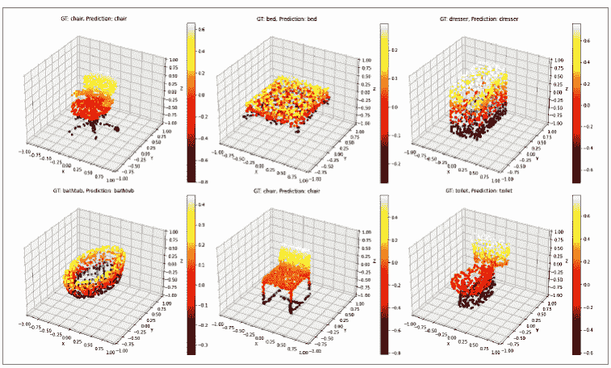

图16-11. 各种预测结果以及使用Matplotlib绘制的点云图

除了这种定性分析，让我们转向定量探索。在处理完所有批次后，我们可以使用累积的预测结果和真实标签创建一个混淆矩阵，以展示模型在每个类别上的性能。这使我们不仅能看到整体准确率，还能看到模型可能将哪些类别相互混淆（图16-12）：

```python
cm = confusion_matrix(all_labels, all_preds)
cm
```

这对于理解训练好的PointNet模型在未见数据上的表现至关重要，并提供了模型在不同类别上优势和劣势的详细视图，这对于进一步改进模型或理解其局限性非常有价值。

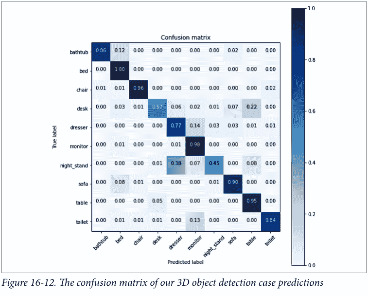

图16-12. 我们3D物体检测案例预测的混淆矩阵

观察这个混淆矩阵，我们可以清楚地看到一条对角线，但也有一些例外，比如床头柜和书桌，它们似乎带来了一些额外的挑战。如果我们再深入一步，可以生成一个分类报告：

```python
from sklearn.metrics import classification_report

target_names = ['bathtub', 'bed', 'chair', 'desk', 'dresser', 'monitor',
                'night_stand', 'sofa', 'table', 'toilet']

print(classification_report(all_labels, all_preds, target_names=target_names))
```

这为我们提供了以下结果：

| | precision | recall | f1-score | support |
|---|---|---|---|---|
| bathtub | 0.93 | 0.82 | 0.87 | 50 |
| bed | 0.82 | 0.97 | 0.89 | 100 |
| chair | 0.96 | 0.97 | 0.97 | 100 |
| desk | 0.83 | 0.58 | 0.68 | 86 |
| dresser | 0.62 | 0.77 | 0.69 | 86 |
| monitor | 0.76 | 0.97 | 0.85 | 100 |
| night_stand | 0.91 | 0.48 | 0.63 | 86 |
| sofa | 0.90 | 0.94 | 0.92 | 100 |
| table | 0.80 | 0.92 | 0.86 | 100 |
| toilet | 0.97 | 0.84 | 0.90 | 100 |
| accuracy | | | 0.84 | 908 |
| macro avg | 0.85 | 0.83 | 0.83 | 908 |
| weighted avg | 0.85 | 0.84 | 0.83 | 908 |

我们可以看到，我们有一个相当均衡的预测分数，F1分数在63到90分之间。如果我们想进一步提升模型，首要目标可能是尝试缩小这个差距。然后，我们也可以尝试将其提升到90%以上，但这通常是一个艰巨的挑战。如果我们检查整体准确率，会发现当前模型的准确率是84%，这已经是一个巨大的成就了！

> 值得注意的是，这段代码假设模型和数据都在CPU上，因为它使用了 `.numpy()` 将张量转换为NumPy数组。如果你使用的是GPU，可能需要在 `.numpy()` 之前添加 `.cpu()`。

那么，实际性能如何呢？

## PointNet 实际推理

大家期待的时刻到来了。让我们利用模型进行纯粹的推理工作。为了让我们的PointNet模型以推理模式运行，我们必须确保重用相同的组件：

- PointNet模型架构定义，用于创建PointNet实例
- 模型权重（我们可以加载）
- 类别定义
- 一个预处理阶段，允许我们以与训练相同的方式准备数据

当我们尝试简化这个过程时，我们可以去掉大部分库。我们只需要这些：

```python
import numpy as np
import matplotlib.pyplot as plt

import open3d as o3d

import torch
import torch.nn as nn
import torch.nn.functional as F
```

从那里，我们可以确保我们的PointNet类是可用的。之后，我们可以实例化一个PointNet模型，用训练好的权重初始化它，并定义我们的类别：

```python
pointnet = PointNet()
pointnet.load_state_dict(torch.load("../MODEL/pointnet_classification_15.torch"))

classes = {'bathtub': 0, 'bed': 1, 'chair': 2, 'desk': 3, 'dresser': 4,
           'monitor': 5, 'night_stand': 6, 'sofa': 7, 'table': 8, 'toilet': 9}
```

现在，我们可以获取一个我们想要进行推理的物体的3D点云。这将是上一章中的椅子，它是通过混合方法（LiDAR + 摄影测量）重建的：

```python
pcd = o3d.io.read_point_cloud('../DATA/FURNITURES/verviers_chair.ply')
```

我们现在以与训练过程相同的方式准备它：

```python
pcd = pcd.farthest_point_down_sample(1024)
center = pcd.get_center()
pcd.translate(-center)
scale = 1 / np.max(np.abs(np.asarray(pcd.points)))
pcd.scale(scale, center=(0, 0, 0))
o3d.visualization.draw_geometries([pcd])
```

这将产生如图16-13所示的点云。

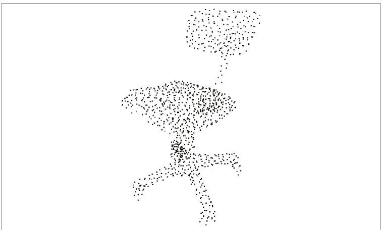

最后一步是将我们的点云“张量化”，以确保它符合输入定义：

```python
pcd_in = torch.from_numpy(np.asarray(pcd.points)).float()
```

现在，我们可以使用预训练的PointNet模型对点云进行推理，获得类别预测，然后可视化这些预测。但正如我所说，可视化预测时，创建一个小型的可选函数来可视化点云及其真实标签（如果可访问）和预测结果也会很好。为此，你可以使用这个函数：

```python
def plotPrediction(inputs, i, classes, labels, preds):
    xs, ys, zs = inputs[i].numpy().T

    fig = plt.figure(figsize=(12,7))
    ax = fig.add_subplot(projection='3d')
    img = ax.scatter(xs, ys, zs, c=zs, cmap=plt.hot())
    fig.colorbar(img)

    ax.set_xlabel('X')
    ax.set_ylabel('Y')
    ax.set_zlabel('Z')

    ax.set_xlim([-1, 1])
    ax.set_ylim([-1, 1])
    ax.set_zlim([-1, 1])

    try:
        GTName = list(classes.keys())[list(classes.values()).index(labels[i].numpy())]
    except:
        GTName = 'Unknown'

    PRED = list(classes.keys())[list(classes.values()).index(preds[i].numpy())]

    plt.title(f'GT: {GTName}, Prediction: {PRED}')

    plt.show()
```

让我们首先创建一个PyTorch不计算梯度的上下文，以节省内存并加快计算速度；在推理（预测）时，我们不需要梯度进行反向传播，因为我们没有在训练。我们应该确保以评估模式使用我们的模型：

```python
pointnet.eval()

with torch.no_grad():
```

然后，我们可以添加以下四行代码：

```python
input_data = pcd_in.unsqueeze(0)
output, _, _ = pointnet(input_data.transpose(1,2))
_, preds = torch.max(output.data, 1)

plotPrediction(input_data, 0, classes, 'None', preds)
```

`unsqueeze(0)` 操作在索引0处添加一个维度以创建批次维度。这是必要的，因为我们的神经网络期望以批次形式输入。然后，我们在输入数据上运行PointNet模型。`transpose(1,2)` 操作重新排列输入的维度以匹配PointNet的期望。解包中的 `_` 表示PointNet模型返回的其他输出在此上下文中被忽略。

我们从模型输出中获取预测。`torch.max(output.data, 1)` 返回两个值：沿维度1的最大值及其索引。`_` 用于丢弃最大值，只保留 `preds` 中的索引。这些索引对应于每个点云的批次预测类别。这将产生图16-14。

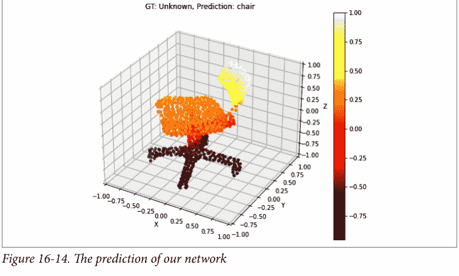

图16-14. 我们网络的预测结果

就是这样。剩下的就是将此服务作为系统中的一个内部组件推出，例如，在聚类阶段之后，基于预训练的PointNet模型预测每个聚类是什么。当然，如果你传入一个域外的点云，你仍然会得到一个预测（见图16-15）。对于这些物体，我们有一些预测结果不一定与真实标签一致（1 = 显示器，2 = 经纬仪，3 = 马克杯，4 = 噪声，5 = 盒子，6 = 桌子）。

在这个阶段，你已经成功获得了一个使用预训练模型预测点云类别的完整方法。如果这对你的特定情况有意义，你可以按照第15章中强调的策略对模型进行微调。在结束本章之前，我想强调一个特定方面：我们如何为语义分割场景准备大型数据集？

## 大规模语义分割的注意事项

3D深度学习框架中最容易被忽视的痛点之一，是为选定的学习架构准备数据。我指的不是精心策划的研究数据集，而是你想用来开发应用程序的真实世界（杂乱的）数据孤岛。

在处理大型复杂的3D点云数据集时，这一点尤为突出。因此，让我为你提供一系列清晰直接的步骤，以帮助你应对这种情况。

你可以使用前面章节中的任何点云，并为其准备用于PointNet进行语义分割。我将通过利用一个城市场景的航空LiDAR点云来说明该方法。

当使用PointNet架构进行3D点云语义分割时，特征选择对于准备训练数据至关重要。在第13章和第14章中看到的3D机器学习方法中，需要进行特征工程来从数据中选择和提取相关特征。使用PointNet等深度学习技术可以绕过这一步骤，模型可以自主学习从数据中提取特征。

然而，确保输入数据包含模型学习相关和推导特征所需的信息仍然至关重要。建议利用任何协方差非常低的特征，并让网络有能力利用这些特征。

对于LiDAR点云，你可以使用七个特征：X、Y、Z（空间属性），R、G、B（辐射属性），以及强度I（LiDAR衍生）：

```
X          Y          Z          R  G  B  INTENSITY
205980.49800000 465875.02398682 7.10500002 90 110 98 1175.000000
205980.20100001 465875.09802246 7.13500023 87 107 95 1115.000000
205982.29800010 465875.00000000 7.10799980 90 110 98 1112.000000
```

这是我们的参考。这意味着我们使用此输入构建模型，任何我们希望用训练好的PointNet模型处理的其他数据集都必须包含这些相同的特征。

在继续我们之前回顾的任务之前，我们必须根据架构规范来组织数据。在使用神经网络PointNet架构处理3D点云时，将其组织成方形图块至关重要。

实际上，PointNet要求输入数据具有固定大小，这意味着所有输入样本应具有相同数量的点。通过将3D点云划分为方形图块，我们可以确保每个图块具有更均匀的点数，从而允许PointNet一致且有效地处理它们，而无需在采样到最终固定点数时产生额外开销或不可逆的损失（图16-16）。

使用PointNet时，我们需要将输入图块设置为固定数量的点，原始论文作者建议为4,096个点。这意味着需要一种采样策略。从图16-17可以看出，使用不同策略对点云进行采样会产生不同的结果和物体识别能力（例如，右侧的电线杆），这可能会影响模型的整体性能。

其次，PointNet的架构涉及一个应用于每个点的共享MLP，这意味着网络独立于其邻居处理每个点。通过将点云组织成图块，我们可以在保留每个点在其图块内的局部上下文的同时，仍然允许网络独立处理点，从而使其能够从数据中提取一些有意义的特征。

最终，将3D点云组织成图块通过促进图块的并行处理，增强了神经网络的计算效率，从而减少了在GPU上分析完整点云所需的总处理时间。

在使用PointNet进行语义分割任务时，将3D点云组织成方形图块是一个关键的预处理步骤。它允许一致的输入数据大小，保留“局部”上下文，并提高计算效率，所有这些都有助于更准确、更高效地处理数据。

在将3D点云图块输入PointNet架构之前进行归一化至关重要，主要有三个原因（图16-18）。首先，归一化确保输入数据以原点为中心，这对于PointNet的架构至关重要，该架构对每个点独立应用MLP。当输入数据以原点为中心时，MLP更有效，这允许更有意义的特征提取和更好的整体性能。

> 提前有一些直觉是有帮助的，而不是盲目应用归一化。例如，我们主要使用基于重力的场景，这意味着z轴几乎总是与基于重力的轴共线。那么，你将如何处理这种归一化？

对于我们的实验，我们可以在`min_f`中捕获特征的最小值，在`mean_f`中捕获平均值：

```
cloud_data=temp.transpose()
min_f=np.min(cloud_data,axis=1)
mean_f=np.mean(cloud_data,axis=1)
```

然后我们可以归一化不同的特征以用于我们的PointNet网络。首先，我们处理空间坐标X、Y和Z。我们将数据在平面轴（X和Y）上居中，并确保减去Z的最小值，以考虑例如屋顶和地面之间的区分：

```
n_coords = cloud_data[0:3]
n_coords[0] -= mean_f[0]
n_coords[1] -= mean_f[1]
n_coords[2] -= min_f[2]
print(n_coords)
```

现在我们可以通过确保颜色在[0,1]范围内来缩放颜色。这是通过将所有颜色除以最大值（255）来完成的：

```
colors = cloud_data[3:6]/255
```

这种归一化将点云数据缩放到一致的范围，有助于防止MLP内的激活函数饱和。这允许网络从整个输入值范围中学习，提高其准确分类或分割数据的能力。它还有助于减少点云数据中不同尺度的影响，这可能是由传感器分辨率差异或与扫描物体的距离差异造成的（在航空LiDAR数据的情况下，这一点有点被淡化）。这提高了数据的一致性以及网络从中提取有意义特征的能力。以图16-19中的强度为例。

图16-19. 通过3D点云的强度字段说明[0,1]缩放的问题

在这里，我们使用分位数来获得对异常值稳健的归一化，正如我们在探索数据时所看到的。这是通过三个阶段完成的。首先，我们计算四分位距（IQR），即第75百分位数和第25百分位数之间的差值。然后，我们从所有观测值中减去中位数，并除以四分位距。最后，我们减去强度的最小值以实现显著的归一化：

```
# 四分位距是第75百分位数和第25百分位数之间的差值
IQR = np.quantile(cloud_data[-2],0.75)-np.quantile(cloud_data[-2],0.25)
# 我们从所有观测值中减去中位数，然后除以四分位距
n_intensity = ((cloud_data[-2] - np.median(cloud_data[-2])) / IQR)
# 这为我们提供了对异常值稳健的缩放（这通常是需要的）
n_intensity -= np.min(n_intensity)
print(n_intensity)
```

在这个阶段，我们有了一个归一化并准备好输入到PointNet架构的点云。如果你想探索3D语义分割的完整方法，可以参考3D资源中心的补充资源。

具体包括用于3D语义分割实验的代码（或者你也可以直接利用3D物体分类的代码，并激活语义分割头）。

## 总结

本章探讨了如何使用PointNet进行3D物体分类和语义分割，特别关注为3D场景理解目标准备真实世界数据。我想强调拥有正确格式数据的重要性，这对于3D深度学习任务中的成功训练和推理至关重要。此时，你应该对以下学习要点列表充满信心（以帮助你自我评估新获得的技能）：

- 你可以理解并构建PointNet架构，包括Tnet和核心PointNet类等关键组件。
- 你可以构建一个数据准备流程，包括：
    - 3D数据整理：下载并理解3D数据集的结构和元数据
    - 3D数据分析：在处理之前，可视化检查数据、识别异常值并理解特征分布
    - 3D数据标注：优化现有标签、拼接点云并建立清晰的标注方案
    - 3D特征选择：选择相关特征，如空间坐标（X, Y, Z）、颜色（R, G, B）和强度
    - 数据结构化（分块）：将点云划分为固定大小的块，以确保PointNet的一致输入并保留局部上下文
    - 3D Python数据加载与归一化：使用NumPy和PyTorch等库，实现Python代码来加载、归一化并为PointNet准备数据
- 你可以制定归一化策略，确保输入数据经过适当的中心化和缩放，这对于PointNet的MLP层有效运行至关重要。
- 你已拥有一个训练好的PointNet模型，可用于对新点云进行真实世界推理。

那么，如何实际扩展你的专业知识呢？在本章中，我们专注于使用PointNet进行3D物体分类。现在，你可以利用这些新知识来探索解决数据集不平衡问题的技术，这是一个常见问题，尤其是在处理像LiDAR点云这样的真实世界数据时。此外，你可以进一步研究不同的点云采样策略和块大小对PointNet性能的影响，并探索使用额外特征（如近红外通道）来改善植被分割。为了更深入地了解该领域，探索更先进的PointNet变体（如PointNet++）和其他基于点的深度学习模型，是拓宽你对3D感知技术演进视野的下一个合乎逻辑的步骤。

## 实践项目

作为前沿应用专家，你明白3D深度学习提供了强大的技术，可以从3D数据中提取有意义的信息。本项目专注于将PointNet应用于涉及航空LiDAR数据的3D语义分割的真实场景。你将处理原始的航空LiDAR数据，并学习如何为PointNet准备这些数据，以创建一个能够将LiDAR点云分割为不同类别（植被、建筑物和地面）的模型：

### 步骤1：数据获取与探索

- 从开源仓库下载一个航空LiDAR数据集。该数据应包括点坐标（X, Y, Z）、强度和颜色（R, G, B）信息。
- 使用CloudCompare等软件分析数据。这将使你能够可视化点云，理解特征分布，并识别任何异常值或数据潜在问题。

### 步骤2：数据预处理

- 通过隔离并可能清理现有标签来优化标签，以创建不同的类别（地面、植被、建筑物、水体等）。
- 使用CloudCompare等工具将点云结构化为固定大小（例如100米 × 100米）的块。此步骤确保PointNet的一致输入并便于并行处理。

### 步骤3：特征工程与归一化

- 从LiDAR数据中选择相关特征。作为起点，使用X、Y、Z坐标、强度和颜色（R, G, B）。
- 为特征制定归一化策略。
- 在Python中实现数据加载和归一化过程。

### 步骤4：PointNet实现与训练

- 在PyTorch中实现PointNet架构，包括TNet模块和分类头。
- 定义一个自定义损失函数，将分类损失与一个正则化项相结合，该正则化项鼓励学习到的变换矩阵是正交的。
- 使用你预处理过的LiDAR数据训练PointNet模型。尝试不同的超参数和训练策略以优化性能。

### 步骤5：模型评估与部署

- 在单独的LiDAR块测试集上评估训练好的PointNet模型。
- 通过将预测标签叠加在点云上来可视化分割结果。
- 部署训练好的PointNet模型，用于航空LiDAR数据的语义分割。

本项目提供了一个实践机会，将PointNet应用于涉及3D点云数据的具有挑战性的现实问题。

现在是时候确保从数据获取到数字环境定义的完整3D数据科学工作流程是稳健且可扩展的了。

# 第17章
3D数据科学工作流程

我们共同探索3D数据科学的旅程即将结束。你应该为所有利用Python力量实现的模块化方面感到自豪。我们为任何3D数据集开发了端到端的工作流程，并运行了释放关键输出的高级科学实验。现在，让我们退一步，从更宏观的角度来看。

从一开始，我们就了解到3D数据科学能够实现基于3D数据的最强大的空间AI系统——这些系统试图模仿人类行为。这本质上意味着理解现实的复杂性，并设计在3D数字世界中表现得像人类一样的智能体。那么，在第17章，我们处于什么位置呢？

在本章中，我们将调整焦距，专注于3D数据科学使我们能够做的事情：设计3D数字环境，这是推理智能体行动的候选对象。这意味着回顾你现在引以为豪掌握的主要技术，确保学习内容清晰，并为创建任何3D数据科学系统制定蓝图。非常务实地讲，此时我们拥有一个完整的3D数据科学模块化工作流程。这意味着你拥有一个输入/输出工作流程，可以将任何模态转化为3D输出或分析见解。

此外，我们可以自动化复杂的3D处理流程，这意味着拥有许多不同的模块来处理流程的特定部分。该流程通常被定义为解决某个应用挑战。它可以计算房间里的椅子数量、为自动驾驶汽车检测障碍物、从MRI推断大脑结构等等。但现在，如果我们更深入一点，让我们确保你对自己在定义数字环境的流程中应对各种挑战的能力充满信心，如图17-1所示。让我们综合这些概念，同时强调它们的现实世界影响和相互联系。

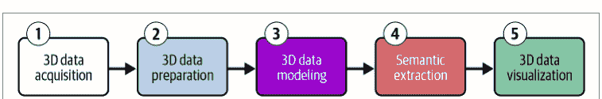

图17-1. 使用3D数据科学开发的主要工作流程模块

### 3D数据获取

第一个确定的模块是3D数据获取（图17-2）。虽然我们在这里快速推进以避免整本书内容过于冗长，但你已有从多视图图像创建3D数据集的解决方案。此时，这些是3D点云，并有可能派生出带纹理的3D网格。

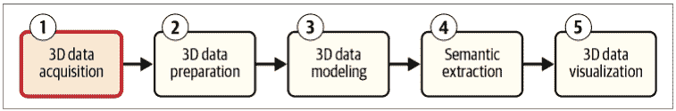

图17-2. 阶段1：3D数据获取

随着新的技术进步，我们可以使用推理过程、新的空间AI系统和深度学习架构来捕获这些信息。例如，我们看到了如何利用基于单目（单视图）图像的重建（如MiDaS或Depth Anything）来获取深度信息并生成3D点云。这提供了从环境中检索深度信息的其他令人兴奋的方式。

然而，多视图重建提供了一种更完整的方式来生成3D数据集，它结合了不同的相机视角。它使用同一场景或物体的多张图片来制作3D模型。这种方法通常比仅使用单图像3D重建过程产生更准确或更详尽的结果（图17-3）。

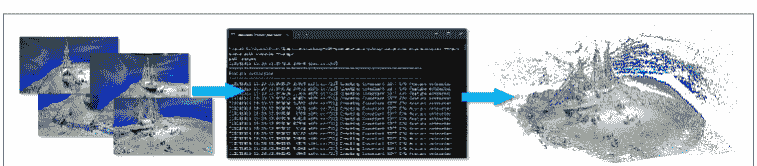

图17-3. 从多视图图像进行3D重建的过程

大规模生产中的系统依赖于运动恢复结构（SfM）来获取相机位姿，并从多张图像重建稀疏的3D点。这使我们能够从相机估计结构（即内参和外参）。

通过特征检测和特征匹配实现运动估计。多视图立体视觉（MVS）通过密集匹配，能够在已知相机位姿的情况下创建密集的三维重建。在第2章和三维资源中心，我们了解了如何利用这些摄影测量概念，通过结合SfM和MVS技术的软件和工具来创建精确的三维模型。

使用Python时，COLMAP是用于对齐图像集并生成密集点云的最流行解决方案。你可以使用PyCOLMAP或Python封装的命令行界面，从一组图像中实现完整的三维重建。你可以使用三维资源中心提供的数据集和以下Python脚本，自动化地从输入图像重建三维点云：

```python
import subprocess

def run_colmap(image_dir, output_dir):
    # Feature extraction
    subprocess.run(["colmap", "feature_extractor",
                    "--database_path", f"{output_dir}/database.db",
                    "--image_path", image_dir])

    # Feature matching
    subprocess.run(["colmap", "exhaustive_matcher",
                    "--database_path", f"{output_dir}/database.db"])

    # Sparse reconstruction
    subprocess.run(["colmap", "mapper",
                    "--database_path", f"{output_dir}/database.db",
                    "--image_path", image_dir,
                    "--output_path", f"{output_dir}/sparse"])

    # Dense reconstruction
    subprocess.run(["colmap", "image_undistorter",
                    "--image_path", image_dir,
                    "--input_path", f"{output_dir}/sparse/0",
                    "--output_path", f"{output_dir}/dense"])

    subprocess.run(["colmap", "patch_match_stereo",
                    "--workspace_path", f"{output_dir}/dense"])

    subprocess.run(["colmap", "stereo_fusion",
                    "--workspace_path", f"{output_dir}/dense",
                    "--output_path", f"{output_dir}/dense/fused.ply"])

# Usage
run_colmap("path/to/images", "path/to/output")
```

当然，在阅读第10章后，你也可以从单目图像生成三维数据集。然而，在将三维重建泛化到任何场景时，我们仍面临一些直接挑战，例如扩展能够处理低光反射率、透明或有孔洞表面的应用，以及优化成本、效率、简洁性和鲁棒性。

当前的工业趋势指向更高的自动化、互联性和实时处理。这使得多个系统和配备机器视觉的机器人能够协同工作，从而实现更高效、更明智的决策。考虑到这一点，让我们开始探讨三维数据准备与工程。

## 三维数据准备与工程

下一个逻辑上的高级模块为我们的高级任务准备三维几何基础（图17-4）。

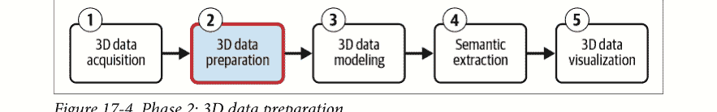

在这里，我们可以找到预处理算法（尝试清理、过滤异常值，并查看遮挡情况）。我还整合了利用数据工程的解决方案，例如特征提取。如果这还不是你知识体系的一部分，请允许我再次指出那句古老的格言：“垃圾进，垃圾出”。这对于三维数据科学任务尤其适用。

你的三维数据的质量和结构可能决定你整个流程的成败，以及你的数字环境与空间AI系统的兼容性。让我最后一次带你了解，为了准备最高质量的三维基础，你必须掌握的关键步骤。

## 噪声去除

三维数据中的噪声是一个持续存在的难题，通常源于传感器缺陷、环境因素或配准误差。还记得我们处理城市环境激光雷达扫描的项目吗？原始点云充满了噪声——空中漂浮的点、扭曲的表面或基于密度的噪声。

我们常用的噪声去除方法通常结合了统计异常值去除和基于半径的过滤。以下是使用Python中Open3D库的一个参考代码片段：

```python
import open3d as o3d

def remove_noise(pcd, nb_neighbors=20, std_ratio=2.0):
    cl, ind = pcd.remove_statistical_outlier(nb_neighbors, std_ratio)
    return cl, ind

# Load point cloud
pcd = o3d.io.read_point_cloud("DATA/noisy_point_cloud.ply")

# Remove noise and color
clean_pcd, noise_idx = remove_noise(pcd)
clean_pcd.paint_uniform_color([1, 0.706, 0])

# Select the noise
noise = pcd.select_by_index(noise_idx, invert=True)
noise.paint_uniform_color([1, 0.0, 0])

#visualize
o3d.visualization.draw_geometries([noise, clean_pcd])
```

此生成点云的结果如图17-5所示。

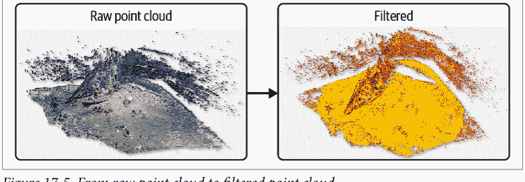

图17-5. 从原始点云到过滤后的点云

然而，我们的基本学习点是，不同类型的三维数据需要不同的噪声去除策略。对于像深度图这样的结构化数据，保边滤波器（如双边滤波器）效果显著。对于非结构化点云，尤其是在室外环境中，基于机器学习的方法和训练模型来区分噪声和有效数据点也是可行的。

## 子采样

在处理海量数据集（例如包含数亿个点的点云）时，子采样对于计算可行性至关重要。但这不仅仅是随机丢弃点。根据你的应用（语义分割、可视化、建模），调整采样策略通常是优化结果的关键。

你可以通过开发一种多尺度子采样方法来直接扩展我们的学习，该方法在复杂区域保留细节，同时积极简化平坦或均匀区域。以下是实现此方法的一个简化版本：

```python
def adaptive_downsample(pcd, voxel_size=0.05, detail_size=0.02):
    # Compute normals
    pcd.estimate_normals()

    # Identify high-detail areas
    normals = np.asarray(pcd.normals)
    curvature = np.var(normals, axis=0)
    high_detail = curvature > np.percentile(curvature, 75)

    # Separate high and low detail points
    points = np.asarray(pcd.points)
    high_detail_pcd = o3d.geometry.PointCloud()
    high_detail_pcd.points = o3d.utility.Vector3dVector(points[high_detail])
    low_detail_pcd = o3d.geometry.PointCloud()
    low_detail_pcd.points = o3d.utility.Vector3dVector(points[~high_detail])

    # Downsample
    high_detail_down = high_detail_pcd.voxel_down_sample(detail_size)
    low_detail_down = low_detail_pcd.voxel_down_sample(voxel_size)

    # Combine
    return high_detail_down + low_detail_down
```

这种方法为我节省了大量时间，尤其是在处理大规模环境扫描时，你必须保留精细细节（如建筑立面），同时简化大面积的均匀区域（如开阔的田野或水体）。

现在，进入下一个数据准备候选步骤：特征提取。

## 特征提取

正如我们在第6章和第7章所讨论的，特征提取至关重要。它是三维数据工程中理论与实践结合的关键。它关乎将原始几何数据转换为我们的下游流程和AI模型可以使用的有意义的描述符。

我们已经成功地结合了局部和全局特征，用于点云分类、分割任务和配准目的。特征的质量不容忽视！我们还看到，通常有一个基本需求，即梳理我们特征的质量和相关性；特别是对于深度学习应用，“少即是多”通常是一个值得遵循的绝佳格言。

这里有一个例子，指导你提取一些与三维世界相关的特征：

```python
import open3d
import numpy

def extract_features(pcd, radius=0.1):
    # Compute normals
    pcd.estimate_normals(search_param=o3d.geometry.KDTreeSearchParamHybrid
    (radius=radius, max_nn=30))

    # Compute local features
    fpfh = o3d.pipelines.registration.compute_fpfh_feature(pcd,
    o3d.geometry.KDTreeSearchParamHybrid(radius=radius*5, max_nn=100))

    # Compute global features
    points = np.asarray(pcd.points)
    centroid = np.mean(points, axis=0)
    distances = np.linalg.norm(points - centroid, axis=1)

    features = {
        'fpfh': np.asarray(fpfh.data).T,
        'distance_to_centroid': distances,
        'height': points[:, 2]  # Assuming Z is up
    }

    return features
```

要可视化特征，你可以参考第7章中使用PyVista的解决方案。但有趣之处在于——不同的任务需要不同的特征。

对于目标检测，我们发现几何基元（平面、圆柱、球体）可能非常强大。捕捉场景不同部分之间关系的拓扑特征对于理解也至关重要，如第13章所示。

最后，高分辨率点云、网格和几何模型需要大量的计算资源和存储空间。对高效处理、压缩和存储解决方案的研究对于管理由三维空间测量（或其他方法）生成的大型数据集至关重要。那么，让我们深入探讨三维数据建模。

## 三维数据建模

塑造三维形状非常迷人（图17-6）。我们深入探讨了三维数据建模和结构化，你现在可以像运用第三种感官一样在三维数据表示之间自如转换。你知道如何从三维点云转换到基于体素的组装、CAD元素，甚至三维网格。这些都是你现在掌握的各种方法、算法和技术，以便应对三维数据表示的挑战。

此外，你始终可以将流程统一到三维点云上，以将预测/过程反向投影回原始输入数据表示。这也体现了结构化的力量。每当需要优化计算时，我们通常需要借助*k*-d树、八叉树数据结构或包围体层次结构（BVH），这些工具能让我们更高效地分析和处理数据。

你现在应该已经深刻理解了体素在许多流程中的关键作用，尤其是在三维数据建模方面，无论是作为处理阶段的一部分，还是作为结构感知深度学习方法的输入。

同时，我们也认识到，数据的建模和结构化方式与数据本身同样重要。这不仅仅是关于在空间中存储点，更是关于创建能够支持高效查询、分析和操作的表示形式。

我们在第4章和第10章中已经介绍了可能适用于你99%工作流程的所有方法。我精选了这些功能强大的新型三维技术，以总结和提升你的技能。

## 三维网格重建

将点云转换为网格对于创建更易于管理且视觉效果更佳的三维模型至关重要（图17-7）。然而，正如我们所见，这远非易事，尤其是在处理噪声数据或不完整数据时。

我们成功应用了多种表面重建方法，例如泊松重建、球旋转算法和德劳内三角剖分。以下是一个使用Open3D实现表面重建的代码片段：

```python
import open3d as o3d
import numpy as np

def point_cloud_to_mesh(pcd, depth=8):
    # Estimate normals if not already present
    if not pcd.has_normals():
        pcd.estimate_normals(search_param=o3d.geometry.KDTreeSearchParamHybrid
        (radius=0.1, max_nn=30))

    # Poisson surface reconstruction
    mesh, densities = o3d.geometry.TriangleMesh.create_from_point_cloud_poisson
    (pcd, depth=depth)

    # Remove low-density vertices
    vertices_to_remove = densities < np.quantile(densities, 0.1)
    mesh.remove_vertices_by_mask(vertices_to_remove)

    return mesh

mesh = point_cloud_to_mesh(pcd, depth=8)
mesh.compute_vertex_normals()
o3d.visualization.draw_geometries([mesh])
```

图17-8展示了结果。

图17-8. 从原始点云到泊松网格再到彩色网格

但这里有个关键点——泊松重建对有机形状效果极佳，但在处理尖锐边缘和平面时可能遇到困难。对于建筑或机械模型，我们通常采用混合方法：对大型平面区域使用平面分割，对更复杂的区域使用泊松重建。还记得我们从航空激光雷达数据建模整个城市的项目吗？我们开发了一个定制流程，提取建筑轮廓，使用基元拟合重建形状，然后对其他有机元素使用Alpha形状重建（参见第11章）。

关键在于根据数据的性质调整我们的方法——这是一个很好的提醒。现在，让我转向我一直以来最喜欢的主题之一：体素和体素化技术。

## 三维数字环境的体素化

体素是立方体，类似于二维像素，但存在于三维空间中。体素化是使用体素离散化三维空间的技术，这使其在体积分析和某些类型的机器学习任务中特别有用。这也是医学成像和满足体积表示需求的数据集的首选表示方式。

我喜欢使用体素通过规则网格来构建数字环境，即尝试获得一种可以像二维像素一样被利用的三维表示（例如，用于卷积算法）。然而，体素在提取拓扑特征和分析连通性图方面也至关重要，你可以基于体素数据结构来定义这些图。

作为参考，这里提供一个与前面章节中讨论的解决方案略有不同的基本体素化实现：

```python
import open3d as o3d
import numpy as np

def voxelize(pcd, voxel_size):
    # Compute bounds
    points = np.asarray(pcd.points)
    min_bound = np.min(points, axis=0)
    max_bound = np.max(points, axis=0)

    # Compute voxel indices
    voxel_indices = np.floor((points - min_bound) / voxel_size).astype(int)

    # Create voxel grid
    grid_size = np.ceil((max_bound - min_bound) / voxel_size).astype(int)
    voxel_grid = np.zeros(grid_size, dtype=bool)

    # Fill voxels
    voxel_grid[voxel_indices[:, 0], voxel_indices[:, 1],
               voxel_indices[:, 2]] = True

    # Make it with open3d
    voxel_grid_o3d = o3d.geometry.VoxelGrid.create_from_point_cloud(pcd,
                                                                    voxel_size)

    return voxel_grid_o3d

voxels = voxelize(pcd, 0.1)
o3d.visualization.draw_geometries([voxels])
```

这将生成图17-9。请注意，你可以通过利用第8章和第9章中展示的启发式方法来自适应调整体素大小。

图17-9. 体素化后的原始点云，带有颜色

但体素化不仅仅是创建一个二值占用网格。我们发现，在每个体素中存储额外信息可以非常强大。例如，在最近一个分析森林结构的项目中，我在每个体素中存储了占用情况、点密度、平均强度以及派生特征（如局部点分布熵）。这种丰富的体素表示允许对森林结构和健康状况进行复杂分析。

好了，谈到数据结构，我们在实验中无法避免使用*k*-d树。

## k-d树

让我再分享一些关于第4章中讨论的*k*-d树的补充内容。这些是你在三维空间中进行高效最近邻搜索的首选数据结构。它们对于法线估计、特征计算和局部邻域分析等任务特别有用。

以下是如何使用*k*-d树进行高效半径搜索的示例：

```python
from sklearn.neighbors import KDTree

def radius_search(points, query_point, radius):
    tree = KDTree(points)
    indices = tree.query_radius([query_point], r=radius)[0]
    return points[indices]
```

但这里有个专业提示：当处理海量点云时，为整个数据集构建*k*-d树可能非常消耗内存。我经常采用分块策略，为空间分块构建单独的*k*-d树，并且只在需要时将相关的分块加载到内存中。这种方法使我能够在普通硬件上处理数十亿点的数据集。

然而，在数据均匀采样的情况下，利用八叉树的能力也是一个巨大的优势。

## 八叉树

八叉树是你可利用的另一种关键三维数据结构。它们非常适合三维数据的多分辨率表示，特别是在细节层次渲染和层次化空间查询方面，正如我们在可视化实验中所见。

为了补充你在这方面的知识，我提供了一个精简的八叉树实现，并鼓励你参考第4章以获得更全面的视角：

```python
class OctreeNode:
    def __init__(self, center, size, points):
        self.center = center
        self.size = size
        self.points = points
        self.children = []

    def subdivide(self):
        if len(self.points) <= 100:  # Arbitrary threshold
            return

        new_size = self.size / 2
        for i in range(8):
            new_center = self.center + new_size * np.array([
                (i & 1) - 0.5,
                ((i >> 1) & 1) - 0.5,
                ((i >> 2) & 1) - 0.5
            ])
            mask = np.all(np.abs(self.points - new_center) <= new_size, axis=1)
            self.children.append(OctreeNode(new_center, new_size,
                self.points[mask]))

def build_octree(points):
    center = np.mean(points, axis=0)
    size = np.max(np.abs(points - center)) * 2
    root = OctreeNode(center, size, points)
    root.subdivide()
    return root
```

本质上，八叉树对于大规模三维可视化非常强大。在我们可视化城市级三维模型的项目中，我们使用八叉树结构根据观察者的位置和缩放级别动态加载和卸载模型部分（图17-10）。这使我们能够流畅地渲染海量数据集。

## 语义提取

在我多年处理空间数据的经验中，我见证了语义提取领域的巨大发展（图17-11）。在我们的三维数据科学工作流中，它代表着最引人入胜的挑战之一。

首先，我们通过无监督学习技术研究了聚类和分割场景（第12章和第13章）。从一个无标签的三维数据集出发，我们的目标是以适合任务驱动场景的粒度级别来划分主要组成部分。接着，我们深入探讨了监督学习方法，既涉及非深度学习架构，也涉及三维深度学习。

我们已经看到，在处理复杂元素（例如，独特的建筑元素）时，某些语义提取可能会失败。这促使我们对三种基本的“分割路径”形成了更细致的理解和实践知识：

1.  聚类（第12章）和无监督分割（第13章）
2.  语义分割（第14章）和实例分割（第15章）
3.  三维目标检测（第16章）

让我们继续探讨第一条分割路径：聚类和无监督分割。

## 聚类和无监督分割

我们通常不需要在单元级别进行精确推理，对于点云来说这是点级别，对于网格来说则是三角形级别。如果我们遵循格式塔理论，我们需要将元素集合分组，以更好地理解它们之间的关系。因此，在分割级别上工作是形成有意义的图状关系结构的好方法。

这些分割不一定与我们应用的对象（例如，椅子）直接对应，而是该对象的一小部分（属于该椅子的一组几何实体）。这类似于超像素、超点或超体素框架，我们试图将具有共同特征空间的基础单元分组到一些能带来更多信息的粒度组中。这在许多过程中至关重要，尤其是当我们希望推广某些方法时。

首先，我们研究了主要的聚类方法：*k*-均值和DBSCAN（第12章）。我们发现，在处理非结构化点云时，使用这些方法进行基于几何的聚类效率非常高。然后，我们探索了基础模型和图的力量，将无监督学习能力推向非常先进的解决方案（第13章）。这使我们能够通过处理衍生模态和潜在空间来提取分割。像之前一样，让我分享一些伪代码来引导你新掌握技能的思维导图：

```python
def dbscan_3d(points, eps, min_points):
    # k-d tree for efficient neighbor search
    tree = KDTree(points)
    clusters = []
    visited = set()

    def expand_cluster(point_idx, neighbors):
        cluster = [point_idx]
        for neighbor in neighbors:
            if neighbor not in visited:
                visited.add(neighbor)
                new_neighbors = tree.query_ball_point(points[neighbor], eps)
                if len(new_neighbors) >= min_points:
                    cluster.extend(expand_cluster(neighbor, new_neighbors))
        return cluster

    for i in range(len(points)):
        if i not in visited:
            neighbors = tree.query_ball_point(points[i], eps)
            if len(neighbors) >= min_points:
                visited.add(i)
                cluster = expand_cluster(i, neighbors)
                clusters.append(cluster)

    return clusters
```

这种方法非常有益，尤其在我们对工业设施进行实验时效率很高。这些算法根据空间分布和局部几何特征来识别管道和结构元素（图17-12）。

然而，真正的突破来自于引入局部几何描述符，如基于特征值的特征和法向量。正如我们在项目中所见（第7章和第9章），通过组合多种描述符——表面变化度、线性度和平面度——而不是依赖单一的几何属性，我们始终能取得更优的结果。

因此，我们无监督方法的关键在于定义最强大的特征。通常，这意味着创建一个潜在空间，在特征数量少和协同作用之间取得最佳平衡，从而能够创建最能分割场景的基础单元组。

这意味着我们必须警惕欠分割和过分割的陷阱。事实上，基于分割的最佳结构化永远不会溢出形状的自然边界。这也突显了我们处理的是许多几何形状的组合，尤其是在人工环境中。

在获得这样的基于分割的分解后，标记过程也得到了加速。我们不再在单元级别工作，而是在分割级别进行标记，这加快了速度并允许构建稳健的标记流程。这对于利用三维语义分割的监督学习场景至关重要。

## 语义分割

语义分割是智能推理服务的核心。确实，在指定的粒度级别上识别构成场景的各种实体，对于推理型人工智能智能体至关重要。在我们的三维数据科学之旅中，我们自然地在几个章节中探讨了这个方面：第14章、第15章和第16章。

首先，我们通过使用手工特征的非深度架构进行了三维机器学习。至少在第一轮中，特征的选择是由我们对数据、算法和应用领域的先验知识指导的。

其思想是能够为每个点（在我们的点云中）从预定义的类别集合中分配一个特定的类别。这个过程是以监督学习的方式进行的，这至少对于获得第一级的工作方法论至关重要。作为你实验的指南，你可以在下面的三维语义分割伪代码中找到，它接受一个三维网格并利用随机森林来预测每个顶点的语义标签：

```python
import numpy as np
from sklearn.ensemble import RandomForestClassifier
from sklearn.preprocessing import StandardScaler
from sklearn.model_selection import train_test_split

def train_rf(point_cloud, labels=None, test_size=0.2, n_estimators=100):
    # Normalize features
    scaler = StandardScaler()
```

X_scaled = scaler.fit_transform(point_cloud)

# 划分数据
X_train, X_test, y_train, y_test = train_test_split(X_scaled, labels,
    test_size=test_size, random_state=42)

# 训练随机森林分类器
rf_classifier = RandomForestClassifier(n_estimators=n_estimators,
    random_state=42)
rf_classifier.fit(X_train, y_train)

# 可选：打印模型性能
train_accuracy = rf_classifier.score(X_train, y_train)
test_accuracy = rf_classifier.score(X_test, y_test)
print(f"训练准确率: {train_accuracy:.2f}")
print(f"测试准确率: {test_accuracy:.2f}")

return rf_classifier

# 加载训练数据集并准备我们的特征向量
x, y, z, r, g, b, label, nx, ny, nz = np.loadtxt("DATA/training_data.txt",
    delimiter=' ', skiprows=1, unpack=True)
pcd_features = np.column_stack((x, y, z, r, g, b, nx, ny, nz))

# 训练我们的分类器
classifier = train_rf(pcd_features, labels=label.astype(int), test_size=0.2,
    n_estimators=100)
#% 预测整个点云的标签

def prediction(pcd, model):

    #Open3d转numpy
    points = np.asarray(pcd.points)
    colors = np.asarray(pcd.colors)
    normals = np.asarray(pcd.normals)
    point_cloud = np.hstack((points,colors,normals))

    # 归一化特征
    scaler = StandardScaler()
    point_cloud_scaled = scaler.fit_transform(point_cloud)

    # 推理
    predicted_labels = model.predict(point_cloud_scaled)

    return predicted_labels

label_results = prediction(pcd, classifier)

结果如图17-13所示。

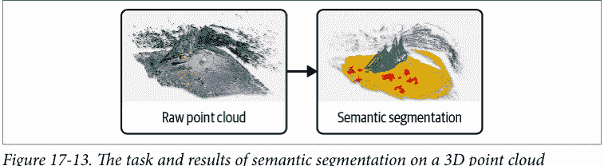

图17-13. 3D点云语义分割的任务与结果

这是3D机器学习能力的一个绝佳示例。当然，其缺点在于你需要找到带标签的3D数据集，而这很难获得。我们研究了一些增强策略和解决方案，可以减少这一阶段的阻力。

接着是范式的转变。手工特征让位于深度学习方法。这主要是为了摆脱先验知识注入，并通过提供的训练数据集，基于数据驱动的洞察力，找出如何最好地划分各种语义类别。

这将我们带入了3D深度学习领域和各种架构研究。虽然许多传统架构（如CNN、RNN和Transformer）的相关工作可用于2D数据集，但不幸的是，当我们涉及3D数据集时，情况并非如此。这就是我们专注于PointNet等架构来处理3D数据集的原因，这在某些情况下很有用，例如对相关关键因素有字面意义上的理解。

在我们对城市环境的实验中，我们观察到结合基于点和基于体素表示的混合网络优于单一表示方法。关键在于在保持几何精度的同时捕获层次特征。这就是对能够处理不同点密度的注意力机制特别感兴趣的地方——这是现实世界扫描中一个常见的挑战，但在学术论文中经常被忽视。

## 3D物体分类

与语义分割密切相关，3D物体/场景分类是您技能组合的另一个绝佳补充（见图17-14）。我们将完整数据视为一个单一的研究单元，因此需要对其进行语义标注。我们开发了一个基于PointNet的解决方案，以确定每个以3D网格表示的单件家具的类别（第16章）。这个点云是椅子吗？是床吗？是橱柜吗？

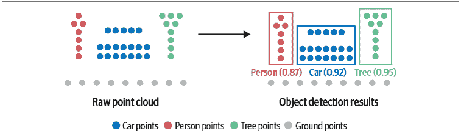

图17-14. 3D物体分类原理

为了指导您进行代码编写，您可以在此处找到伪代码，总结了我们通过PointNet架构推进的内容（如果您难以理解这些值或组织方式，我建议回顾第15章，然后是第16章）：

```python
class pointnet_architecture():
    # 输入变换网络
    def tnet(points):
        # 学习3x3变换矩阵
        net = shared_mlp(points, [64, 128, 1024])
        net = max_pool(net)  # 全局特征
        transform = mlp(net, [512, 256, 9])
        return transform

    # 主PointNet
    def pointnet(points):
        # 输入变换
        transform = tnet(points)
        points_transformed = apply_transform(points, transform)

        # 特征提取
        features = shared_mlp(points_transformed, [64, 64])

        # 特征变换
        feature_transform = tnet(features)
        features_transformed = apply_transform(features, feature_transform)

        # 全局特征提取
        net = shared_mlp(features_transformed, [64, 128, 1024])
        global_feature = max_pool(net)

        # 分类
        net = mlp(global_feature, [512, 256, n_classes])
        return softmax(net)

    return pointnet
```

这会为每个3D模型返回一个标签，如图17-15所示。

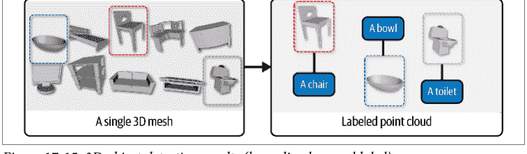

虽然全局描述符在许多需要元级理解的工作流程中至关重要（尤其是在受控的室内环境中），但利用多尺度方法具有巨大潜力。这是成功实施层次特征学习网络的绝佳途径，这些网络可以识别不同尺度的物体——从单个建筑元素到整个建筑结构。

我发现真正的挑战在于开发这些单独的技术，并创建能够处理现实世界数据可变性的稳健管道。在第4章到第16章的各种实现中，我们了解到最成功的方法结合了多种语义提取方法，使用置信度指标来确定对不同场景部分最合适的方法。

> 值得了解的是，将时间维度集成到语义提取中具有巨大潜力。您已经可以为监测城市基础设施的项目做到这一点。对于这些项目，您可以开始制定方法来识别物体并跟踪其形状和意义随时间的变化。这个时间因素使得3D场景理解更加复杂，但对于诸如监控建筑物健康状况和发现城市变化等任务是必要的。

自PointNet发布以来，许多新架构（例如PointNet++、KPConv和Point Transformer）已经提高了基于点的语义分割的性能/可靠性。例如，自动驾驶汽车可以在交通繁忙的城市中行驶，机器人可以很好地完成复杂的工作，增强现实可以使数字世界和现实世界完美融合。

为了实现这一点，我们必须推动领域适应、多模态融合、实时推理和语义提取的边界。通过解决这些挑战，我们可以确保基于健全数字环境的空间AI技术的安全可靠部署。但这自然缺少一个组成部分。3D数据可视化呢？它如何帮助我们创建3D分析？

## 3D数据可视化与分析

在本书中，我们主要开发了工具和技术，以帮助我们更好地应对特定且关键的挑战，例如检查点云与网格之间的偏差（第9章）或理解我们数据集中的分布（第8章）。

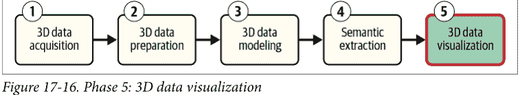

具体来说，我们看到了如何开发一个多模态查看器（第5章）来处理任何3D数据表示，包括网格、体素、CAD、点云和深度图像。掌握了这项技能，您就可以使用一套健全的3D数据科学工具来解决任何工程问题。当然，这也意味着随着新方法的出现，您最终需要改进一些模块。但它们将建立在本书中阐述的基本原理之上。

随着我们捕获高保真3D数据的能力超过了我们有效分析它的能力，这个主题变得越来越重要。因此，让我根据我们处理复杂空间数据集的广泛经验，分享我们关于3D数据分析和可视化的最终见解。

## 3D形状识别

在第9章中，我们发现3D形状识别构成了有意义的空间分析的基石。RANSAC已被证明特别强大，即使在其基本形式下，大多数从业者也可以使用。我们已经开发了自适应RANSAC变体，可以根据局部点密度和噪声水平动态调整其参数。

例如，我们开发了一种多尺度RANSAC方法，可以适应局部密度，这里的伪代码和本书的教学可以帮助您复制：

```python
# 我的自适应方法的简化伪代码
def adaptive_ransac(point_cloud, local_density):
    threshold = compute_adaptive_threshold(local_density)
    min_points = adjust_minimum_points(local_density)
    return detect_shapes(point_cloud, threshold, min_points)
```

虽然计算量更大，但区域生长技术为有机形状提供了更优越的结果。我们发现它们在分析地质构造时特别有效。关键在于选择合适的种子点和生长标准。你可以通过将曲率分析与法线一致性检查相结合来扩展本章的项目，从而实现稳健的分割，即使在点密度变化的区域也能有效。

最后，通过结合两者，我们得以开发出一套针对室内数据集的全自动多尺度形状识别与重建解决方案。虽然RANSAC在识别平面、圆柱体和球体等基本形状方面表现出色，但我们发现，将其与区域生长算法结合，能提供一种更稳健的方法。

这在复杂项目中被证明非常有效，因为不规则表面和风化元素需要更复杂的检测方法，以及深入的数据驱动分析。然而，我们看到3D几何分析代表了工作流中数学密集的部分。通过更多经验，你会发现结合多种分析技术能产生最稳健的结果。

例如，在分析结构构件的表面变形时，一种结合曲率分析、法线向量统计和局部特征直方图的混合方法，可以完善从形状中提取的特征。这种多模态分析在检测单一指标方法可能遗漏的细微几何异常方面，已被证明特别有效。要进行这些分析，我们可以利用哪些工具？

## 3D数据分析工具

谈到3D数据分析工具，你已经开发了一个超越基本统计度量的综合框架。虽然直方图和基于阈值的分析仍然有用（例如，第7章），但我们发现多维特征空间能提供更丰富的见解（第8章）。这就是我们可以称之为“几何指纹”的东西，它基于这三个简单的类别：

- **基于密度的分析**
  实现自适应核密度估计用于表面方向，而非简单的点密度度量。
- **局部特征直方图**
  将多种几何属性（曲率、粗糙度、法线变化）组合成多维直方图，以更好地表征复杂表面。
- **统计分析**
  扩展本章的实现方法，生成遵循复杂几何形状的非线性分析。这将有助于分析复杂的几何结构。

关于这些3D数据分析工具，我们观察到向集成分析流程的重大转变。NumPy、SciPy以及基于Open3D构建的专业库的结合，彻底改变了我们处理空间信息的方式，而现在这一切都掌握在你手中。


在我参与城市数字孪生的工作中，我开发了将传统统计分析与空间查询相结合的分析工作流，使我们能够将建筑几何与能耗模式关联起来。关键在于维护空间索引结构，以促进快速邻域查询，同时保留执行复杂几何计算的能力。

最后，让我们谈谈可视化在数字环境中的力量。

## 3D多模态Python查看器

3D多模态Python查看器的发展对于理解复杂空间数据至关重要。在我们的项目中，我们已经超越了简单的可视化，转向交互式分析平台。通过利用Open3D和PyVista，我们创建了将几何属性与语义信息动态链接的可视化系统。例如，在我们第7章的项目中，我们的查看器可以同时显示点云几何形状，并具备基于空间和语义查询的实时过滤功能。

常常被忽视的是交互设计在3D可视化中的重要性，需要利用一套成熟的交互范式经验，使复杂分析工具对非专业用户易于访问，同时保持详细技术分析所需的深度。这可以包括适应所分析几何类型的上下文敏感测量工具。此外，在几何和语义域中运行的交互式过滤机制，是为专家提供有用工具组合以支持3D可视化的绝佳方式。

然而，3D数据分析和可视化的下一阶段与将机器学习方法与传统几何处理紧密结合息息相关。例如，你可以定义一个系统，从用户交互中学习，以自动改进可视化参数和分析工作流。这代表了从静态可视化工具向随使用而演进的自适应系统的转变。

## 总结

我们通过从基本原理到完整解决方案，建立了一个完整的3D数据科学模块库。未来的关键挑战不在于各个组件，而在于创建在所有阶段保持数据保真度和计算效率的连贯工作流。我发现，仔细关注数据结构和流程处理对于管理现代3D分析工作流的复杂性至关重要，例如我们在本书中涵盖的图17-17。

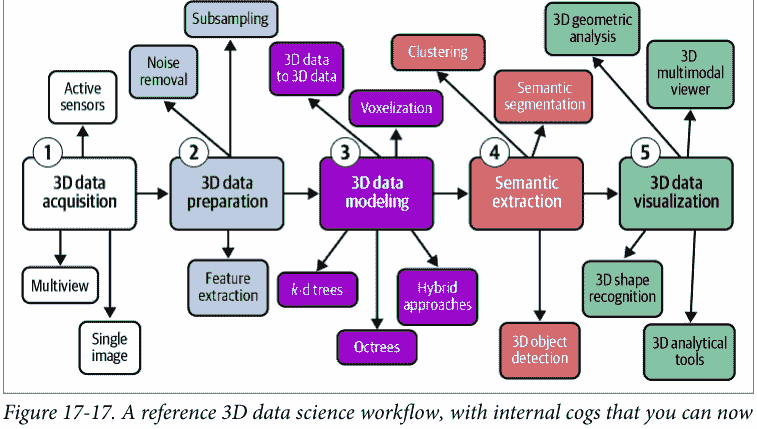

因此，我的自然触发点不是止步于此。作为终身学习者，旅程仍在继续。我很高兴与你们分享后续的、直接的自然路径，以利用最新创新扩展本书的学习，为构建精确的3D数字环境做好准备。

在下一章中，我选择了几个你可以直接研究的Python项目，以改进你选择的3D数据科学模块。这是迈向空间AI系统集成的又一块垫脚石。

# 第18章
## 从3D生成式AI到空间AI

作为前沿应用的专家，你理解3D数据科学解决现实世界问题的力量。我们可以使用点云工作流创建数字3D环境。然而，我们需要提出一个更大的问题：我们当前的发展是否接近复制人类的感知？本章探讨如何扩展3D数据科学，以推进我们旅程的下一步：3D空间AI。

空间AI系统不仅仅是工具；它们增强了我们感知和与物理世界互动的能力，反映了人类的思考和理解方式。这涉及帮助计算机以三维方式观察世界，理解其环境，并根据其周围感知做出决策。

想想人们如何自然地穿越复杂空间，把握不同区域之间的联系，并与各种物体互动。空间AI旨在赋予计算机类似人类的能力。在本章中，我将分两部分解释构建智能空间系统的主要思想和挑战，这些系统能够感知、理解和推理3D环境，如图18-1所示。

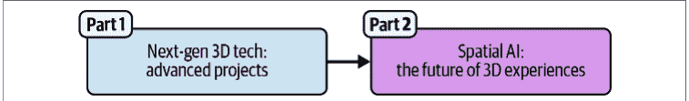

图18-1. 本章第一部分将聚焦于五个前沿3D项目，而第二部分将针对空间AI的展望

我们首先研究直接扩展或改进本书解决方案的3D模块附加组件。其想法是缩小与前沿研究的差距，并为你提供五个可以用Python构建的高级项目。这包括用于3D重建的生成式AI、3D深度点云配准、3D语义建模、高效语义提取以及使用3D高斯溅射的高级沉浸式体验。

最后，我们将探讨3D的未来。我们的数字模型中缺少哪些要素才能实现完整的3D场景理解？从这个角度，我们为解锁具有高级推理能力的3D空间AI系统铺平了最直接的道路。

这是我们最后一次深入探讨；让我们确保这些话语能引起你的共鸣，并激发你后续的创新工作。

## 高级3D项目

我选择了五个主要项目，它们将扩展本书的课程，同时缩小与撰写时最有前景的研究之间的差距。这些项目广泛基于我们在本书其余部分中发展的概念。因此，我最后的建议是巩固你的知识和技能，以便你拥有坚实的基础。如图18-2所示的这五个项目，涵盖了3D数据科学的全部范围，从3D获取到3D可视化。

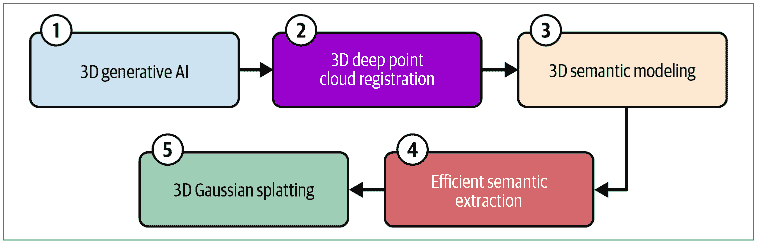

让我们从第一个项目开始：用于3D重建的生成式AI。我们将探讨3D数据科学的进步和新的AI方法如何帮助我们创造更智能的机器，使其能够以更像人类的方式观察和与世界互动。

## 用于3D重建的生成式AI

在这个项目中，我们旨在利用生成式AI，从文本或图像提示创建合成3D数据集（图18-3）。正如我们在第1到5章所看到的，3D重建是将想法转化为实际3D数据表示的引人注目的解决方案。通过被动（例如，相机）和主动（例如，LiDAR）传感器，我们看到了如何相对轻松地生成3D点云。

然而，尽管我们了解了如何将传感器输出转化为3D数据表示，我们也可以探索能够生成全新3D形态的技术：创造性3D重建（如第3章所述）。长期以来，这完全依赖于纯粹的创造力和手动3D建模（使用3D建模软件），以确保想法能够转化为最合适的3D表示。其产物通常被称为“3D模型”，源自3D艺术家或3D建模师。

但借助3D生成式AI，我们可以利用新方法，主要通过自然语言处理来重建3D数据，这有助于我们更自然地理解和与系统沟通。具体到3D领域，这展示了两种主要输入：文本或图像，如图18-4所示。让我们先关注第一种：文本到3D。

## 文本到3D

文本到3D模型根据文本描述生成3D对象或场景。这可以来自你的语音，也可以通过输入一些提示词，例如“生成一只大眼睛、毛茸茸的小猫”。一旦我们有了提示词，下一步就是将其输入我们的3D生成式AI系统，该系统可以生成一个3D重建。这个3D重建随后可以以点云、网格、体素或第4章中看到的任何3D数据表示形式来塑造。

让我们看看具体细节。所描述的过程之所以可能，得益于自然语言处理和深度学习技术的最新进展。首先，自然语言处理将文本输入分解为单个单词或标记，并将其表示为数值向量。这些向量本质上捕捉了单词的语义含义及其之间的关系。

接下来，模型学习一个潜在的、高维的数学空间，其中可以表示文本和3D对象之间的复杂关系。文本嵌入被映射到这个潜在空间中的点。最后，一个生成模型，如变分自编码器（VAE）或生成对抗网络（GAN），将潜在表示解码为3D坐标。模型可能会根据来自判别器网络或重建损失的反馈，迭代地优化生成的3D结构。

例如，在2023年，OpenAI正式发布了Shap-E。与其前身Point-E类似，Shap-E可以根据文本提示生成3D模型。Shap-E由一个编码器和一个潜在扩散过程组成。编码器将3D资产转换为表示3D形状和纹理的参数，作为隐式函数。这意味着生成的隐式函数可以从任何角度进行解释。然后，潜在扩散过程根据文本描述创建新的隐式函数。它产生需要线性投影以获得最终隐式函数参数的潜在变量。

你可以按照GitHub上的说明使用该模型。安装后，例如，你可以创建一个新的Python文件并定义导入语句：

```python
import torch

from shap_e.diffusion.sample import sample_latents
from shap_e.diffusion.gaussian_diffusion import diffusion_from_config
from shap_e.models.download import load_model, load_config
from shap_e.util.notebooks import create_pan_cameras, decode_latent_images
```

然后，我们可以如下实例化编码器和潜在扩散模型：

```python
device = torch.device('cuda' if torch.cuda.is_available() else 'cpu')

xm = load_model('transmitter', device=device)
model = load_model('text300M', device=device)
diffusion = diffusion_from_config(load_config('diffusion'))
```

在首次运行时，它将下载几个配置文件和检查点（约4 GB）。为了使扩散过程工作，我们需要定义超参数（详细理解请参见第15章）：

```python
batch_size = 4
guidance_scale = 15.0
prompt = "a big boat"

latents = sample_latents(
    batch_size=batch_size,
    model=model,
    diffusion=diffusion,
    guidance_scale=guidance_scale,
    model_kwargs=dict(texts=[prompt] * batch_size),
    progress=True,
    clip_denoised=True,
    use_fp16=True,
    use_karras=True,
    karras_steps=64,
    sigma_min=1e-3,
    sigma_max=160,
    s_churn=0)
```

最后，你可以使用以下代码片段将生成的潜在变量保存为单个.ply文件：

```python
from shap_e.util.notebooks import decode_latent_mesh

for i, latent in enumerate(latents):
    with open(f'example_mesh_{i}.ply', 'wb') as f:
        decode_latent_mesh(xm, latent).tri_mesh().write_ply(f)
```

这将得到图18-5。

尽管取得了显著进展，但挑战依然存在，例如实现对生成的3D对象的细粒度控制、逼真地渲染它们以及高效地训练模型。然而，撇开这些不谈，驱动该系统的核心本质上是你掌握的3D数据科学概念（如3D重建和3D深度学习）与用于解码提示词的大语言模型（LLMs）的结合。

例如，如果你想用生成式AI生成一个3D重建，你可以使用视频作为提示。然后系统会将该视频分割成一系列帧，然后使用单目深度估计模型提取深度信息。这被用作生成式AI的入口点，生成一系列3D重建，然后根据特定策略组合并导出为3D点云或3D网格。

你可以找到文本到3D方法的变体，例如文本到3D运动。它涉及生成静态3D对象并根据文本描述对其进行动画处理。这允许用户描述动态场景、动作或行为，并让AI生成相应的3D动画。虽然现成的解决方案不多，但一些研究方向包括将文本到图像模型与3D绑定技术相结合、使用大语言模型生成动画参数，或调整文本到视频模型以用于3D角色动画。这里有一个示例实现：从文本生成多样且自然的3D人体动作（[项目页面](https://example.com) | [论文](https://example.com) | [GitHub](https://example.com)）。

如果你想探索其他方法，我在表18-1中选择了另外两项值得注意的研究工作进行回顾。现在，我们可以关注3D生成式AI的第二个核心方面：图像到3D。

*表18-1. 其他文本到3D架构*

| 年份 | 名称 | 方法 | 资源 |
|---|---|---|---|
| 2022 | DreamFusion：使用2D扩散的文本到3D | 文本到3D | [arXiv](https://arxiv.org), [项目](https://example.com) |
| 2023 | Point-E：一个从复杂提示生成3D点云的系统 | 文本到3D | [arXiv](https://arxiv.org), [代码](https://github.com) |

## 图像到3D

图像到3D也非常有趣，因为你可以扩展我们之前在单目深度估计中回顾的范围，即你试图重建未看到的部分，而不仅仅是从单张图像推断深度。请记住，单张图像深度估计也可以走得很远，正如我们在第14章中看到的Foundation模型（如Depth Anything、MiDaS和Depth Anything V2）所示。

如果你想探索此类系统的能力，你可以利用表18-1中的任何解决方案。例如，作为文本到3D的自然延伸，TRELLIS是一个原生的3D生成模型，它建立在统一的结构化潜在表示和用于3D资产创建的整流流变换器之上。图18-6展示了使用该架构从单张图像获得的结果。你可以看到，该网络恢复了在使用单目深度估计时会被忽略的细节。

图18-6. 基于虚拟城堡图像提示使用TRELLIS架构生成的3D模型

要使用TRELLIS，你可以按照GitHub仓库中的说明进行安装。要使用预训练模型，你可以启动一个Python环境并使用以下脚本：

```python
import os
import imageio
from PIL import Image
from trellis.pipelines import TrellisImageTo3DPipeline
from trellis.utils import render_utils, postprocessing_utils

# Load a pipeline from a model folder or a Hugging Face model hub.
pipeline = TrellisImageTo3DPipeline.from_pretrained("JeffreyXiang/TRELLIS-image-large")
pipeline.cuda()

# Load an image
image = Image.open("your_image.png")

# Run the pipeline
outputs = pipeline.run(image, seed=1)

# outputs is a dictionary containing generated 3D assets in different formats:
# - outputs['gaussian']: a list of 3D Gaussians
# - outputs['radiance_field']: a list of radiance fields
# - outputs['mesh']: a list of meshes

# GLB files can be extracted from the outputs
glb = postprocessing_utils.to_glb(
    outputs['gaussian'][0],
    outputs['mesh'][0],
    simplify=0.95,
    texture_size=1024)
glb.export("sample.glb")
```

如果你想扩展你的理解和知识，我在表18-2中选择了三种有趣且互补的Python方法。既然我们已经

## 3D深度点云配准

在第二个项目中，我们将深入探讨3D数据准备。其核心思想是创建一种自动化的点云配准方法，通过利用深度特征（图18-7），使其性能超越第4章介绍的全局到局部配准方法。

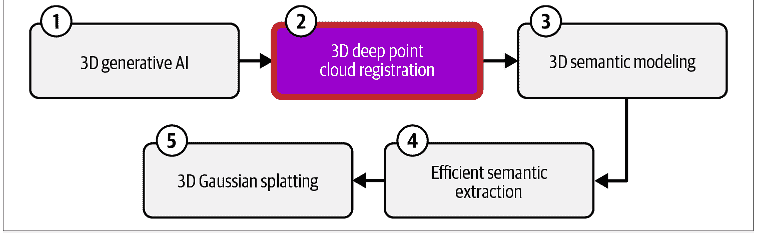

如果你还记得，预处理、配准和特征提取是你已经熟练掌握的三个模块示例。但是，如何利用深度学习来拓展可能性的边界呢？如果你想改进配准模块，我们可以利用三个步骤，如图18-8所示。

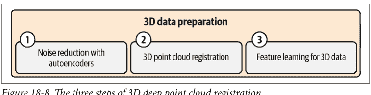

让我们首先从降噪机制开始。如何从有价值的点中筛选出噪声？离群点剔除确实是一个关键步骤，我认为它常常被低估。它能过滤掉那些会严重扭曲最终对齐结果的错误对应关系。

为了应对这一挑战，你可以利用监督和无监督方法，包括RANSAC的变体和可微分共识最大化。降噪自编码器提供了另一种优雅的解决方案，它通过学习从带噪声的输入中重建干净的3D数据。


一个活跃的研究方向是将学习到的先验知识融入自编码器架构。通过整合关于底层3D结构的先验知识，自编码器可以实现更优的降噪性能，尤其是在高噪声水平的挑战性场景中。

当你对清洗后的数据集感到满意时，我们就可以利用深度学习对点云配准的变革性影响。在这个阶段，你可以将基于深度学习的配准方法分为基于对应关系和无对应关系两类。

受传统技术启发，基于对应关系的方法侧重于学习鲁棒的特征描述符，以改善源点云和目标点云之间的对应匹配。另一方面，无对应关系的方法则绕过了显式的对应关系，直接从全局特征预测变换参数。这提供了潜在的速度优势，但对输入数据的变化可能不够鲁棒。

深入研究基于对应关系的方法，可以揭示其核心模块的复杂性。特征提取作为第一个关键步骤，专注于学习每个点局部几何的判别性表示。你可以利用基于PointNet的架构，并巧妙地将其调整用于此目的。这应该是改进配准过程的一个绝佳起点。匹配模块负责在特征空间中建立对应关系，可以采用从最近邻搜索到“虚拟点”生成和加权平均等多种技术。

如果你想深入研究一些令人兴奋的工作，我建议你查阅这篇论文及其实现，它将指导你完成这个3D深度点云配准方法的开发。


这个项目是一个直接的扩展。当然，你也有能力通过将语义先验整合到你的流程中来改进它，以指导配准过程。创造力应该引导你走向一个完美的流程融合，从而提供更鲁棒、更高效的工作流。

在这个阶段，你已经拥有了通过生成式AI进行3D重建来扩展学习的项目，以及通过深度配准进行3D数据准备的项目。正如我们在第10章所看到的，我们可以使用准备好的3D数据集，通过各种3D建模策略来创建3D模型。然而，我们也看到，由于缺乏局部或上下文中的几何微调，我们可能会受到限制。因此，让我们将3D场景理解概念（第12至17章）与3D建模结合起来。

## 3D语义建模

让我们设计第三个项目：3D语义建模（图18-9）。语义建模本质上旨在利用语义先验来指导3D建模过程，以使几何形状最佳地适应局部特征的特定上下文。这意味着我们可以根据场景的语义分解（通过语义先验完成）来组合不同的3D建模策略。

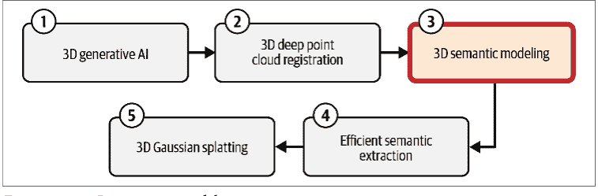

语义先验包含了关于场景中物体的额外知识（如它们的类别、形状和空间关系），这可以显著改善建模过程。通过将语义信息整合到点云数据中，我们可以在建模过程中做出更明智的决策。我建议你利用语义先验来：

- **约束物体形状**
  例如，知道一个物体是椅子，就限制了其可能的形状。
- **识别和分割物体**
  语义理解有助于将物体与背景区分开来。
- **指导几何基元拟合**
  语义信息可以指导将形状拟合到点云数据的过程。

例如，如果我们知道一个物体是椅子，即使它的部分被遮挡，我们也可以推断出其可能的形状和方向。这些信息可以帮助你准确地建模被遮挡的部分。

我们甚至可以通过将语义先验与其信息模型联系起来来深化这种方法。这可以通过本体论来实现，这是一种形式化的方式，用于描述物体的知识，以便计算机在自主过程中使用。它提供了一个结构化的词汇表来描述物体及其关系，以便计算机可以利用它进行推理。这是可选的，因为你可以为此创建规则或利用LLM系统，但本体论主要通过三种方式指导建模过程。

首先，它提供了一种共享的语言来描述物体。这个词汇表（RDF，一种用于网络数据交换的标准模型）定义了基本类别（例如，家具、椅子）和属性（高度、颜色和位置），并处理实例。

然后，它定义了推断物体信息的规则。这些可以是确定家具是否相邻的规则，或者基于现有数据创建新关系的规则。最后，它处理约束的定义以创建验证规则。

现在，根据你如何定义你的本体论以及如何提取你的语义先验，你可以利用局部化的3D形状匹配技术来实现基于部件的3D建模。为了扩展前面章节的内容，你可以将场景中的实体拟合到已知形状的数据库（例如，用于椅子的ModelNet40）。然后使用数据库中的最佳匹配来创建详细的模型。

此外，你可以生成多个细节层次的3D模型，类似于本文提出的方法。这种灵活性对于各种应用至关重要。例如，低细节模型可能足以用于导航，而高细节模型对于可视化或模拟则是必不可少的。

当你将语义先验添加到3D建模过程中时，你可以使基于点云数据的3D模型更加准确和快速。作为额外的好处，根据你的任务，你还可以旨在指导算法（如第10章所见的泊松、球旋转、行进立方体或德劳内三角剖分）以实现鲁棒且高效的点云网格化方法。这也意味着通过自动参数（如体素大小和ISO级别）来控制网格化过程，根据你的需求定制输出。

我们谈到了语义先验，这意味着我们需要语义！虽然你有许多策略，但让我们考虑一些关于改进你当前语义提取模块Transformer的视角。

表18-2. 图像到3D的先进架构

| 年份 | 名称 | 方法 | 资源 |
|---|---|---|---|
| 2024 | TripoSR：从单张图像快速重建3D物体 | 图像到3D | arXiv, 模型, 代码 |
| 2024 | InstantMesh：利用稀疏视图大型重建模型从单张图像高效生成3D网格 | 图像到3D | arXiv, 代码 |
| 2024 | CRM：使用卷积重建模型从单张图像生成带纹理的3D网格 | 图像到3D | arXiv, 演示, 代码 |

## 基于Transformer的3D语义提取

本项目利用Point Transformer架构来提升点云（或网格）语义分割任务的性能（图18-10）。3D语义分割旨在为每个单元（3D点云中的点、体素数据集中的体素、3D网格中的面）分配一个语义标签（例如，椅子、桌子、墙壁）。可以将其想象为给房间的3D扫描结果上色，每个物体都被赋予独特的颜色。虽然我们在第14、15和16章中深入探讨了这个主题，但你可能希望探索新的方法来扩展你的语义分割模块。

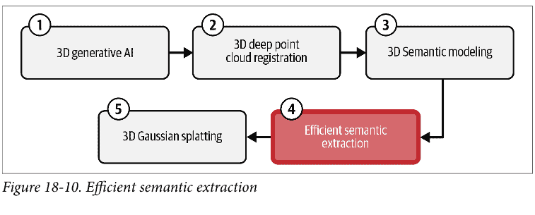

如第16章所述，直接处理点云而无需任何预处理的原始点方法令人兴奋，因为它们增强了我们系统解决方案的鲁棒性。实际上，我们利用单一方法直接处理原始数据集，而不是将许多步骤串联起来，后者会为解决方案增加潜在的故障点。

这些方法因其处理不规则和无序数据的能力而备受关注。虽然PointNet是一个颠覆性的创新，但它在捕捉局部特征方面存在局限性。PointNet++的创建就是为了解决这个问题。它使用分层特征学习来收集局部和全局数据。研究人员在看到CNN在2D图像上的出色表现后，改变了CNN的设计以处理点云。Dynamic Graph CNN、PointCNN、RGCNN、Pointwise CNN、PointConv和SpiderCNN都是为点云特征学习开发的基于CNN的方法示例。这些方法在应用CNN操作之前，将规则表示引入网络。

然而，最有前景的方向之一是使用自编码器（AEs），它可以学习潜在的数据表示。自编码器积极使用Transformer。Transformer最初是为自然语言处理（NLP）设计的，它已经彻底改变了包括3D数据科学在内的多个领域。它们捕捉长程依赖关系和全局上下文的能力使其非常适合3D特征提取。网上有许多资源可以深入了解Transformer和注意力机制的作用，起点可以是论文《Attention Is All You Need》。

FoldingNet、PPFNet、NeuralSampler、3dAAE和3D点胶囊网络是基于AE的点云特征学习方法示例。这些方法能够编码点云的不规则性和稀疏性。

图18-11中描述的方法在点云数据的特征提取方面提供了显著的提升。它们通过记录点云的局部和全局特征，允许获取更详细和完整的特征。这导致了更详细的特征描述，能更好地展示底层的3D结构。此外，许多这些方法实现了对旋转和平移等变换的不变性，确保无论点云的方向如何，都能获得一致的特征表示。此外，这些方法有效地处理了点云数据不规则和稀疏的特性。因此，我们受益于与PointNet相同的特性，但在用于3D语义分割目的时，极大地扩展了系统的性能。

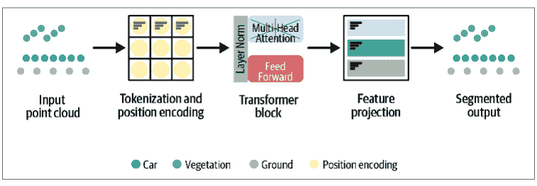

此外，我们观察到学习到的特征也有助于减少过拟合，从而产生更具泛化能力的模型。一些方法还提供了计算效率，能够实现更快的训练和推理，这为实时应用提供了潜力。

为了指导你的下一步，我选择了一种你可以高效利用的方法：Point Transformer。该技术还提供了变体和扩展，例如Point Transformer V2和Point Transformer V3。

Point Transformer是一种神经网络架构，它使用类似Transformer的方法来理解点之间的局部和全局几何关系。它不同于早期依赖局部几何方法（如局部聚合或图卷积）的点云网络。相反，Point Transformer采用自注意力机制，使每个点能够与其周围环境进行交互，并根据附近点的几何和特征相似性调整它们的重要性（图18-12）。

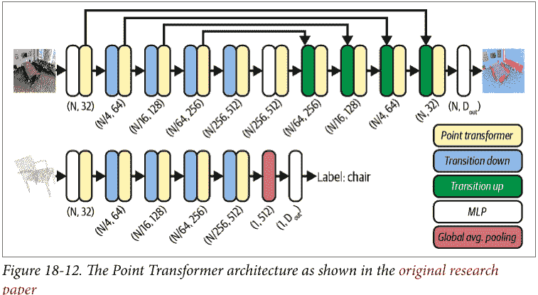

图18-12. *原始研究论文*中展示的Point Transformer架构

其主要创新在于受Transformer启发的特征聚合模块。它有三个主要部分：一个位置感知特征Transformer、一个相对位置编码和一个自注意力机制。这些实现在架构的浅灰色区域内，你可以使用PyTorch设计如下：

```python
class PointTransformerBlock(nn.Module):
    def __init__(self, in_features, out_features, position_dim):
        super(PointTransformerBlock, self).__init__()
        self.fc1 = nn.Linear(in_features, out_features)
        self.point_transformer_layer = PointTransformerLayer(out_features, position_dim)
        self.fc2 = nn.Linear(out_features, out_features)

    def forward(self, x, p):
        residual = x # Save

        x = self.fc1(x) # Apply the first linear layer
        x = self.point_transformer_layer(residual, p) # Apply the Point
        # Transformer layer
        y = self.fc2(x) # Apply the second linear layer

        y += residual # Add residual connection

        return y, p
```

现在，让我们看看位于PointTransformerLayer类中的三个组件。

位置感知系统允许通过查看每个点的邻近点来更新其特征值。注意力权重是根据点之间的距离和特征差异计算的。因此，PointTransformer Layer的目的是在点云的局部区域执行自注意力。为此，你可以使用以下类定义：

```python
class PointTransformerLayer(nn.Module):
    def __init__(self, feature_dim, position_dim):
        super(PointTransformerLayer, self).__init__()
        self.gamma_mlp = GammaMLP(feature_dim, feature_dim, feature_dim)
        self.phi = nn.Linear(in_features, out_features)
        self.psi = nn.Linear(in_features, out_features)
        self.alpha = nn.Linear(in_features, out_features)
        self.position_encoder = PositionEncoder(position_dim, feature_dim,
                                               feature_dim)
        self.rho = nn.Softmax(dim=-1)

    def forward(self, x, p):
        # calculate position embedding
        N = x.size(0)
        delta_p = p.unsqueeze(1) - p.unsqueeze(2)
        delta_p = delta_p.view(-1, delta_p.size(-1))
        position_encoding = self.position_encoder(delta_p)
        position_encoding = position_encoding.view(N, N, -1)

        # calculate attention generation branch
        phi_x = self.phi(x).unsqueeze(1)
        psi_x = self.psi(x).unsqueeze(0)
        gamma_output = self.gamma_mlp(phi_x - psi_x + position_encoding)
        attention_generation_branch = self.rho(gamma_output)

        # calculate feature transformation branch
        feature_transformation_branch = self.alpha(x).unsqueeze(0) + \
            position_encoding

        y = torch.sum(attention_generation_branch *
        feature_transformation_branch, dim=1)

        return y
```

该层接受输入特征x及其对应的位置p，并通过多个关键步骤计算变换后的表示。它通过计算点之间的相对距离来计算位置嵌入，然后使用PositionEncoder进行编码。这允许相对位置编码帮助网络掌握空间关系。要设计这样的编码器，你可以使用这个PyTorch类：

```python
class PositionEncoder(nn.Module):
    def __init__(self, input_dim, hidden_dim, output_dim):
        super(PositionEncoder, self).__init__()
        self.fc1 = nn.Linear(input_dim, hidden_dim)
        self.fc2 = nn.Linear(hidden_dim, output_dim)
```

def forward(self, p_i, p_j):
    x = p_i - p_j
    x = F.relu(self.fc1(x))
    x = self.fc2(x)

    return x

最后，自注意力机制使点能够选择性地从其周围环境中收集信息。该注意力机制通过创建成对特征差异并结合位置编码（通过`gamma_mlp`）来生成，`gamma_mlp`使用softmax函数生成注意力权重。特征变换分支将输入特征与位置信息相结合，最终输出通过将注意力权重应用于变换后的特征来计算，从而有效地允许每个点根据几何和特征相似性，从其邻域中选择性地聚合信息。

这种设计有助于网络更好地理解点表示，在分数上取得了显著提升（例如，对于S3DIS室内数据集，PointNet达到49.0 mAcc，而Point Transformer如原文所述达到76.5）。至此，我们对这些高级3D感知任务的探索告一段落。

## 关于多任务学习

Point Transformer或PointNet用于单模态场景。目前许多方法采用多模态或多任务学习技术。后者不同于传统的单任务学习，即为每个任务训练一个单独的模型。正如前面章节所讨论的，目标检测和分割是3D数据科学的关键组成部分。它们大放异彩的一个应用领域是自动驾驶系统。

然而，单独开发和部署这些模型可能很繁琐，需要为每个任务进行单独的数据处理、训练和优化。我在工作中经常遇到这个挑战，这促使我去研究更精简、更高效的方法。这种追求让我发现了HybridNets，一个出色的端到端感知网络，它同时处理目标检测和分割任务。

顾名思义，HybridNets结合了不同的架构元素来实现其多任务目标。该网络设计用于目标检测、可行驶区域分割和车道线检测，并在BDD100K数据集上进行训练。最吸引我的是它在单个模型中优雅地结合这些任务的方法，取得了有趣的目标和车道线检测结果。HybridNets的架构围绕一个共享编码器和两个不同的解码器构建。这个共享编码器基于EfficientNet-B3，并在ImageNet上进行了预训练，作为特征提取的稳健骨干网络。我欣赏选择EfficientNet-B3，因为它在准确性和计算效率之间取得了平衡，这对于自动驾驶等实时应用至关重要。

此外，在网络颈部引入BiFPN层进一步增强了模型提取多尺度特征的能力，这对于捕捉不同大小的物体和特征至关重要。这种强大的骨干网络与多尺度特征融合网络的巧妙结合，使模型能够从输入图像中提取丰富且信息量大的表示。

然后，两个解码器从这个共享编码器分支出来，各自专注于其任务。受YOLO框架启发，检测解码器采用通过k-means聚类确定的锚框。这使得模型能够直接预测边界框和类别概率，为目标检测提供了一种精简的方法。

另一方面，分割解码器专注于将每个像素分为三类：背景、可行驶区域和车道线。解码器采用多级特征融合方法，结合不同尺度的特征以提高分割输出的精度。

如果你想利用HybridNets，我建议查看代码实现（GitHub）。与其从头开始训练（这可能计算密集），我鼓励你使用预训练权重并在自定义数据上进行推理。设置好新环境并安装必要的依赖项后，下载预训练权重并运行图像和视频的推理脚本。即使在相对普通的硬件上，结果也很有趣，展示了模型准确检测物体以及分割可行驶区域和车道线的能力。

当然，下一步是在3D环境中实现这一点；到这个阶段，这对你来说应该很容易了！

在探讨了语义提取和注入技术之后，让我们探索一个有前景的新研究方向：3D高斯溅射。

## 用于3D可视化的3D高斯溅射

我们的最后一个项目是利用3D高斯溅射来改善可视化体验（图18-13）。3D高斯溅射自“3D Gaussian Splatting for Real-Time Radiance Field Rendering”一文提出以来，获得了广泛关注。它标志着3D场景表示演进中的一个关键时刻，是对3D重建场景的补充。它也可用于新视角合成，以高保真度生成新的视点。

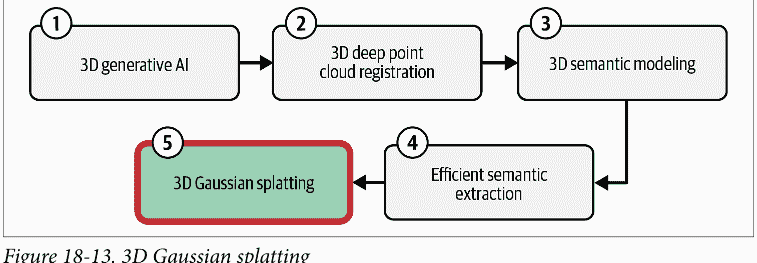

高斯溅射将3D点云转换为视觉上引人注目的表示，并创造出坚实、有形的3D物体的错觉（见图18-14）。然而，与第10章学习的3D建模技术不同，它不需要多边形或网格；相反，它使用高斯分布来捕捉和渲染细节。

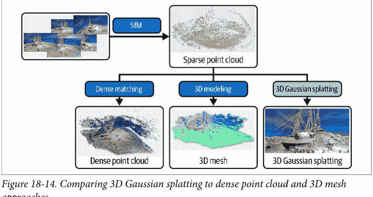

让我快速介绍一下3D高斯溅射是如何从3D重建场景中发展起来的。正如我们在第1到4章所看到的，我们可以利用摄影测量从一组照片生成密集的3D点云或3D模型，如图18-14所示。

SfM算法（以及其他算法）处理大量图像，找到共同点，分析它们在图像中的相对位移，并生成点云，然后可以将其转换为带纹理的三角网格（第10和11章）。这种方法虽然通过全自动工作流程加速了3D建模工作，但存在一些限制，使其无法扫描各种物体：透明度（如玻璃）、反射（如抛光金属）和精细细节（如头发）。你会得到很多不需要的伪影。然而，在其他情况下，例如高纹理元素和自然物体（如岩石、树木和土壤），摄影测量效果很好。它也适用于工业物体，如混凝土、砖块、涂漆金属和石头，并广泛用于人物建模，特别是当头发被遮挡时。

2020年，论文“NeRF: Representing Scenes as Neural Radiance Fields for View Synthesis”提出了一种新的解决方案，克服了摄影测量的一些局限性：神经辐射场（NeRFs）。使用NeRFs创建的物体看起来极其逼真，从某些角度看，它们几乎与照片无法区分。该方法能很好地处理透明度、反射甚至折射。然而，存在重大缺点。NeRFs建立在神经网络架构（第15章）之上，其训练阶段计算密集。


NeRF能够将场景表示为从图像学习的连续体积函数，它革新了新视角合成，实现了从任何视点进行逼真渲染。然而，这种保真度是以计算成本为代价的。NeRF渲染的核心依赖于光线行进——为每一帧追踪数百万条光线穿过学习到的体积。虽然它产生了惊人的结果，但这个过程本质上很慢，阻碍了实时应用。

除此之外，它不容易泛化，因为你需要为每次拍摄训练一个模型，这意味着每次都要重新训练整个模型。最初确定的实时3D场景表示目标仅限于少数需要强大GPU的配置。最后，编辑很复杂，因为模型相当大，很难有效地压缩它们。

这就是2023年高斯溅射出现的地方。3D高斯溅射标志着3D场景表示演进中的一个关键时刻。它引入了一种强大的NeRF替代方案，在保持令人印象深刻的视觉质量的同时，解决了一个关键限制。

高斯溅射为这一性能瓶颈提供了解决方案。它不采用隐式体积表示，而是利用一组三维高斯函数或“溅射点”来表示场景。每个溅射点由其位置、协方差、颜色和不透明度定义，充当一个局部化、有方向且带颜色的光点。

关键优势在于渲染过程。将这些高斯函数投影到图像平面上仅需简单的解析计算，与NeRF的光线步进相比，显著降低了计算负担。这使得实时或近实时渲染成为可能，为需要即时视觉反馈的交互式应用打开了大门。

高斯溅射的优势不仅限于其速度。基于溅射点的表示法本质上比NeRF的隐式体积更紧凑，所需内存和存储空间更少（图18-15）。

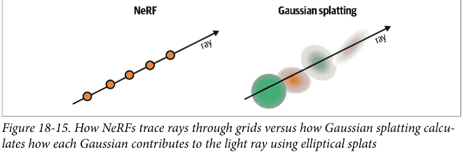

此外，这种显式表示提供了NeRF所缺乏的可编辑性。可以对单个溅射点进行操作，从而轻松修改场景的几何形状和外观。

你可以快速改变场景中汽车的颜色或调整建筑物的形状，就像编辑点云一样。本质上，一个三维高斯溅射场景就是一个三维点云，它拥有远不止x、y、z坐标的更多属性。渲染引擎随后利用球谐函数来提供更优的体验。

在三维数据科学的扩展中，三维高斯溅射为AR、VR特效和科学可视化应用（以及其他领域）提供了极佳的新方向。事实上，如果你剥离高斯特征，只保留欧几里得位置，你本质上就得到了作为标准参考框架的三维点云。这使得点云再次成为空间AI系统可用数字环境的最佳候选者。如果你想了解点云的高级应用，我建议你查阅《智能点云》论文（可在线下载）。

与NeRF类似，高斯溅射允许视角无关的渲染，从而可以自由探索重建的三维场景。现在，为了让你获得额外优势，我将详细阐述这一解决方案背后优雅而计算高效的数学原理：

- 每个高斯函数由一个三维位置（μ）定义。
- 协方差矩阵Σ控制尺度和方向。
- 球谐系数向量处理视角相关的外观。

高斯溅射的潜在应用远不止渲染。其紧凑而显式的表示使其成为各种任务的通用工具。此外，可以为单个溅射点或溅射点组分配语义标签，从而实现场景理解和对象级交互（你可以使用第12至16章进行一些三维高斯溅射实验）。这为创建理解场景语义上下文至关重要的虚拟环境开辟了可能性。

要探索高斯溅射的具体应用，我建议你深入研究《用于实时辐射场渲染的三维高斯溅射》，包括其前身工作（[项目](https://example.com/project)）和实现（[GitHub](https://github.com/example)）。


实现三维高斯溅射涉及几个关键步骤。首先，你需要获取原始数据并创建高斯溅射表示。将高斯函数拟合到点云或将网格转换为一组溅射点是两种实现方法。

一旦你有了高斯溅射表示，渲染就变得相对简单。对于每个高斯函数，你将其投影到图像平面上，并根据其位置、协方差、颜色和不透明度计算其对最终像素颜色的贡献。这涉及为每个像素评估高斯函数，可以使用向量化操作高效完成。

像层次数据结构这样的优化可以进一步加速渲染，特别是对于大量高斯函数。在巨大场景上使用三维高斯溅射意味着要处理保存和处理大量数据带来的问题。一种方法是使用外存技术，即在任何给定时间只将场景的必要部分加载到内存中。可以将其想象成流式播放电影——你不需要下载整个文件才能开始观看，只需当前场景即可。

这些技术不仅在改进可视化——它们从根本上改变了我们捕获、分析和理解三维数据的方式。在保持高视觉保真度的同时支持复杂分析操作的能力，标志着精确数字环境向前迈出了重要一步。

让我兴奋的是，这些方法如何使先进的三维数据科学民主化。如今，标准工作站可以运行过去需要特殊硬件才能完成的任务。这意味着更多的学生和从业者可以使用先进的三维分析。

尽管具有优势，高斯溅射仍面临挑战。准确捕获复杂的光照效果，如全局光照和微妙阴影，仍然是一个活跃的研究领域。表示具有移动物体和变化光照条件的动态场景也构成了重大障碍。最后，开发用于优化溅射点放置和协方差的高效算法，对于以最小计算开销实现高质量重建至关重要。

然而，这些挑战也代表了未来研究的激动人心的方向。解决这些限制的技术的持续发展，进一步巩固了高斯溅射作为三维计算机图形学和视觉领域强大而通用工具的地位。其高质量、实时性能和紧凑表示的独特组合，有望在从交互式虚拟体验到自主导航和机器人技术等领域解锁新的可能性。


这些三维数据科学领域的开创性项目可以彻底改变我们处理空间AI的方式。互联网上的资源量肯定会让你忙于新的创新。如果我必须整理，我会建议浏览O'Reilly的资源、3D数据学院和研究社区。然后，开始仔细研究CVPR、SIGGRAPH、ICRA、ICCV和ISPRS等附带可复现实验代码的科学会议和研讨会论文。然而，先了解方法再看实现总是至关重要的。识别差距，并利用你新获得的专业知识，将两端连接起来以实现你的目标。

我们已经回答了三维数据科学如何成为解决方案，一次一个应用。但如果我们问一个更大的问题呢？我们拥有强大的点云工作流来构建三维数字环境：用于三维虚拟世界的三维数据科学。我们是否接近用现有技术模拟人类认知？

## 空间AI：三维体验的未来

让我们探索三维数据科学之旅的下一个前沿：三维空间AI。它将AI技术与算法与空间数据和过程相结合，帮助计算机系统基于空间关系和模式进行理解和决策。

当我们思考以人为中心的机制时，空间AI变得更有意义。它将成为我们与物理世界交互的个人工具和界面，并通过数字层进行增强。我们已经看到虚拟现实（VR）、增强现实（AR）和扩展现实（XR）朝着更以人为中心的方向发展。


快速回顾一下。虚拟现实使用头戴设备改变我们对世界的整体看法。增强现实利用头戴设备向我们所见添加信息。扩展现实将数字元素与现实世界相结合，专注于通过简单物体进行动手体验，使叠加感觉更真实。VR将我们保持在一个安全的地点，但AR和XR帮助我们探索周围环境，并以物理和数字方式与他人连接。VR、AR和XR只是访问空间AI的工具，而非空间AI本身。空间AI远不止交互式头戴设备。

通过我们的三维数据科学之旅，我们开发了可以感知世界和创建数字环境的层次。一个“智能”机器如何理解它？我们如何利用“空间AI”推理能力进行泛化？首先，让我们分解实现这一目标的三个主要阶段：三维感知、三维场景理解和三维推理（图18-16）。


在三维感知中，我们有三个主要元素：三维重建，这是从其他模态创建某种三维数据的艺术。然后我们回顾三维数据准备，了解预处理、配准、滤波、噪声和三维数据工程。这些对于提取特征以及操作和表示任何数据以用于我们希望获得理解的更高层次场景非常重要。你已经可以通过三维数据科学创建能够利用这一点的系统。

这就是我们进入第二阶段的地方，即三维场景理解。通过三维数据科学，我们本质上处理语义提取。语义的一些专业领域也值得掌握：可供性、功能和物理属性。然后，这些可以用来形成关于场景的足够知识，以获得单个（或多个）语义表示，从而更详细地定义三维场景。

最后，我们希望让AI系统能够基于前序3D感知和3D场景理解阶段获得的洞察，来理解和推理空间关系，包括三维感知能力。通过整合这些视角，我们可以实现更丰富、更全面的理解，使机器能够更智能、更拟人地感知和与世界互动。此类系统的示例包括：

-   设计用于在各种环境中导航和操作物体的机器人
-   需要理解周围环境以实现安全导航的自动驾驶汽车
-   需要让虚拟物品轻松融入现实环境的AR和VR系统

由于这些构成了能够基于数据进行操作和决策的推理系统的切入点，让我们发展出能够扩展本书教学内容的视角，供您利用以加深系统的深度。

## 基于开放词汇的3D场景理解

为了有效地为空间AI系统表示世界场景，我们必须融合一些必要的组件，这些组件扩展了语义分割流程。如果您还记得我们早期的讨论，其核心思想是提取并结合几何、语义和拓扑，构建一个AI智能体可以利用的完整系统。

我们的3D数据科学工作流使我们能够将这些作为核心模块来实现。我们尤其可以利用那些能够识别物体并丰富场景语义理解的方法。但对于空间AI，我们希望锁定两个要素：物体类别，即根据语义意义对物体进行分类的标签或类别（例如，“汽车”、“建筑”、“树木”）；以及属性，即与物体相关的特性，如颜色、纹理、材质、功能、物理属性或可供性。


让我们澄清一些额外的术语：功能、物理属性和可供性。物体的功能是其在场景中的预期目的或角色。物理属性描述物体的内在特征，如尺寸、重量、质量和材料组成。可供性是物体所提供的可感知的行动可能性，它有助于确定如何与物体交互以及它能实现哪些行动。

接下来，我们需要获得拓扑理解。这应在物体层面和场景层面进行，了解每个物体与其外部和内部组成部分的关系。因此，简单来说，对3D场景的完整理解涉及从我们的3D数据流和其他信息源推断场景的各个方面。

这意味着我们希望理解场景中每个组成部分的语义、可供性、功能和物理属性。这正是可以运用场景图分析和知识库集成的地方。其核心思想是确保将物体之间的连接联系起来，包括空间关系（例如，“在...旁边”、“在...前面”）和语义关系（例如，“是...的一部分”、“是一种”）。

例如，给定一个房屋的3D模型，完整的场景理解应识别属于风扇的表面（语义）、由金属制成的表面（材质）、位于厨房内的表面（房间类型）、人可以坐的地方（可供性）、可以工作的地方（功能）以及柔软的表面（物理属性）。这些信息对于未来机器人有效与周围环境交互，以及人类通过交互式查询和可视化来理解场景至关重要。

这引出了我们的另一个挑战：传统的3D场景理解系统受限于其对标注数据集进行训练的依赖，导致模型仅适用于单一任务和封闭的类别集。这种方法在理解稀有物体或超出训练数据范围的查询时举步维艰。

我们开始看到一些开创性的工作，例如“OpenScene：基于开放词汇的3D场景理解”，它正朝着这个方向发展。OpenScene通过利用预训练的文本-图像嵌入模型（如对比语言-图像预训练，CLIP），为3D场景理解提供了一种替代方法。这些模型从海量的带标题图像数据集中学习视觉和语言概念的共享特征空间，从而实现零样本理解（关于零样本方法的更多细节，请参见第12章）。

这种零样本方法使OpenScene能够在不使用标注3D数据的情况下识别物体、材质、可供性、活动和房间类型。尽管在具有足够训练数据的有限任务上，其准确性可能不如完全监督的方法，但OpenScene在类别更多或物体更稀有的任务中表现出色，在此类场景中甚至超越了完全监督的方法。

我喜欢这种方法的地方在于其开放词汇能力。它允许用户使用任意文本描述或图像作为查询来分割和识别物体、材质、可供性、活动和房间类型。此外，OpenScene的开放词汇能力支持创新应用，例如：

-   基于文本查询的开放词汇3D物体搜索
-   使用互联网图像作为查询的基于图像的3D物体检测
-   开放词汇的3D场景理解和探索，以识别属性、材质和活动

此类方法将场景表示为一个图，其中节点是物体，边表示它们之间的关系（例如，“汽车停在路上”）。这提供了一个可以利用的额外层次。

> 您可能没有意识到，尤其是在第13章中，您一直在尝试空间知识图谱。其核心思想是创建一个图结构，其中节点代表概念和实际的3D实体。这些节点之间的边不仅编码语义关系，还编码空间关系——距离、方向、包含关系，等等。当我们基于这些空间知识图谱训练AI模型时，神奇之处就显现了。我们不仅仅是在教AI抽象概念——我们是在教它在三维空间中进行推理。这开启了一个充满可能性的全新世界。

这些进展为空间AI系统带来了新的视角。

## 3D空间AI推理

一旦我们拥有了包含所有这些组件的3D场景，它就成为空间AI（图18-17）系统查询的基础。这就是我们转向3D数据集推理能力的地方。

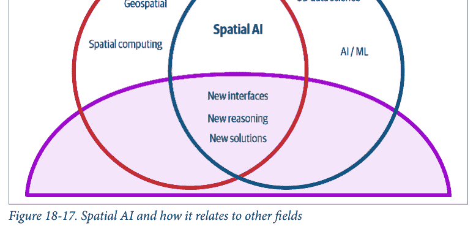

例如，在制造环境中，具有空间感知能力的AI可以通过理解操作顺序以及工作空间的物理约束来优化机器人装配流程。它可以预测潜在的碰撞，建议更高效的移动路径，甚至重新设计装配线布局以获得更好的性能。

或者考虑城市规划。空间AI系统可以分析拟议建筑设计对周围环境的影响。它可以预测一座新摩天大楼如何影响街道层面的风模式，或者从不同有利位置改变天际线的视觉特征。

关键在于，我们正在超越模式识别或3D数据科学。我们正在使空间AI系统能够以与人类根本相似的方式推理空间——但其规模和细节程度远超人类能力。

首先，我们必须认识到，我们已经建立的3D数据科学工作流——从采集到可视化——为我们提供了一个极其丰富的基础。然而，它不仅仅是一个数字环境的基础。真正的力量在于我们能够将AI推理层叠加到这些空间数据之上。

可以这样想：我们拥有充满语义信息和拓扑关系的复杂3D世界模型。但从某种意义上说，它们仍然是被动的。它们在等待某种东西赋予它们生命，使它们真正具有交互性和智能性。

这就是空间AI推理的用武之地。它不仅仅是识别3D中的物体。我们谈论的是一种能够理解物体之间的空间关系、推断隐藏信息并基于3D上下文做出决策的AI。让我给您一个具体的例子。

想象我们已经使用3D数据科学工作流创建了一个高度详细的城市环境模型。我们有建筑、道路、树木和作品。现在，假设我们想要优化新5G天线的放置位置。空间AI系统可以推理视线遮挡以及建筑物可能产生的信号反射，甚至预测季节性植被变化如何影响信号传播。

它不仅仅处理明确建模的内容——它推断并推理复杂的空间关系。但要达到这一点，我们必须解决空间背景下AI知识表示和提取的挑战。这就是事情变得有趣的地方。传统的知识图谱和本体论是首选。图是强大的数学结构，能够有效捕捉3D空间中的复杂关系。在空间AI的背景下，图可以表示物体之间的空间关系、3D结构中的拓扑连接以及空间数据的层次组织。

为了利用这些集合，我们可以利用NetworkX库，它提供了用于创建、操作和分析图的强大工具，如第13章所示。然后，实现空间AI的自动化推理更多是关于务实

## 结论

我们正处在创造真正智能空间系统的门槛上，通过将我们能够捕获和数字化的丰富、详细的3D环境与3D数据科学相结合，并赋予其先进的AI推理能力。这些系统将不仅仅是表征世界——它们将理解世界、对其进行推理，并帮助我们做出更好的决策。人机3D交互是一个充满激动人心的可能性和严峻挑战的前沿领域。关键在于创建能够以真正对人类用户有用的方式对3D空间进行推理的AI系统。这不仅仅是关于空间分析，更是关于理解人类意图，并在3D环境中提供相关的、情境化的辅助。

我们拥有创建生动、沉浸式3D数字世界的技术能力。挑战在于如何以一种真正直观、易于访问且对用户有意义的方式将它们连接起来。这个跨学科的挑战要求我们重新思考关于人机交互的假设，并推动空间计算可能性的边界。

这是一个激动人心的前沿领域，我迫不及待地想看到它如何展开。我们在本书中开发的3D数据科学工作流是至关重要的第一步。现在，是时候向真正智能的空间AI迈出那一步了。

# 索引

# 符号

+   - 2D数据，定义，2
- 3D卷积神经网络（3D CNNs）
  - （参见CNNs）
- 3D数据，6-15
  - 专业知识，49-51
  - 几何，8-9
  - 集成概念，11
  - 点云，13-15
  - 语义，10
  - 拓扑，9
- 3D数据科学，1-42
  - 维度，2-3
  - 基础知识资源，43-52
    - 3D数据专业知识，49-51
    - 3D人工智能，51-52
    - 计算机科学，46-49
    - 数学，45
  - 硬件建议，53-56
    - 云计算，55-56
    - 本地3D开发，53-55
  - 行业实践，39-41
  - 模块化工作流，15-38，587-610
    - 数据获取，16-18，588-590
    - 分析，27，607-609
    - 应用/软件开发，30-33
    - 自动化，33-35
    - 挑战，35-38，42
    - 分类，23-24
    - 定义，41
    - 预处理，19-22，590-593
    - 配准，22
    - 语义提取，600-607
    - 结构化/建模，26，593-599
    - 可视化，28-29，607-609
  - 软件解决方案，57-71
    - 数据处理软件，61
    - 重建软件，58-61
    - 可视化软件，66-71
  - 空间AI，3-6
- 3D数据科学资源中心，39
- 3D数据科学资源中心，144
- 3D数据科学入门包，43，53
- 3D数据科学工作流，15-38，587-610
  - 数据获取，16-18，588-590
  - 分析，27，607-609
    - 形状识别，607-608
    - 工具，608-609
  - 应用/软件开发，30-33
  - 自动化，33-35，42
  - 挑战，35-38
    - 数据获取，36
    - 数据增强，36
    - 计算资源，37
    - 可解释性，37
    - 缺乏标注数据集，36
    - 模型构建，37
    - 性能和稳定性，38
    - 预处理，36
  - 分类，23-24
  - 预处理，19-22，590-593
    - 特征提取，592
    - 噪声去除，590
    - 子采样，591
  - 配准，22
  - 语义提取，600-607
    - 聚类，600-602
    - 物体分类，604-607
    - 语义分割，602-604
    - 无监督分割，600-602
  - 结构化/建模，26，593-599
    - k-d树，597
    - 网格重建，594
    - 八叉树，598-599
    - 体素化，596-597
  - 可视化，28-29，607-609
- 3D点云（参见点云）
- 3D点胶囊网络，623
- 3dAAE网络，623

+   数据分析，27，221-267，274，607-609
  - （另见几何分析）
  - 分析应用开发，201-219
  - 基于属性的，86
  - 诊断工具，258-266
  - 图分析，453
  - RANSAC，284-285
  - 科学分析，223
  - 形状识别，607-608
  - 体育分析，223
  - 工具，608-609
  - 类型，222-227
    - 描述性，223
    - 探索性，224
    - 预测性，225
    - 规范性，226
    - 可视化和通信，226
  - 工作流，227-258
    - 属性分析，254-258
    - 环境和数据准备，228-231
    - 几何和形状分析，232-239
    - 元数据分析和分析，231-232
    - 统计分析，239-253
- 分析应用开发，201-219
  - 自动化，214-215
  - 协方差矩阵，209-210
  - 特征值和特征向量，209-210
  - 交互式阈值处理，216-217
  - 线性度，211
  - 邻域定义和选择，212-213
  - 法线，211
  - 全向方差，211
  - 平面度，211
  - 项目准备，203-205
    - 数据集，203
    - Python和环境设置，204
    - 用于数据处理和可视化的PyVista，205-207
  - 结果导出，218
  - 缩放，214-215
  - 结构创建，207-209
  - 垂直度，211
- 分析知识，35
- 角度阈值，302，307
- 各向异性，257
- 标注数据集，缺乏，36
- Apple macOS，75

# A

+   AABB（轴对齐边界框），232-234
- 加速结构，27
- 数据获取
  - 挑战，36
  - 现场，90
  - 工作流中，16-18，588-590
- 激活函数，神经网络架构中，520，537
- 主动学习，484
- 主动传感器，36，90
- Adam优化器，523
- AdaMax，523
- 自适应标准，300
- 自适应八叉树，599
- 自适应阈值，288
- ADAS（高级驾驶辅助系统），273
- 调整兰德指数，405
- AEs（自编码器），622
- 聚合函数，GNNs中，539
- AI（人工智能）
  - 用于3D，51-52
  - 定义，52
  - 具身智能，511
  - 生成式AI，52，612-618
  - 神经符号，511
  - 空间AI，3-6，632-638
- AliceVision框架，59
- 对齐物体，177
- alpha形状，378，386
- Amazon
  - AWS，32，56
  - 3D数据科学行业领导力，41
- AMD Ryzen 9 CPU，54
- Anaconda，76-77

+   应用/软件开发，30-33
  - 分析应用开发，201-219
  - 云部署，31
  - 性能测试，32
  - 生产测试，31-32
  - Python中，83-88
    - 基于属性的数据分析，86
    - 导出数据，87
    - 提取属性，85
    - 导入数据，84
    - 可视化，87
  - 安全测试，32
  - 压力测试，32
- AR（增强现实），633
- 人工智能（参见AI）
- 宽高比，238-239
- 注意力机制，Transformer架构中，355
- 属性，254-258
  - 基于属性的数据分析，86
  - 特征值，257
  - 提取，85，379-383
  - RGB颜色，255
  - 表面法线，256
- 数据增强，36，548
- 增强现实（AR），633
- Autodesk FBX文件格式，127
- 自编码器（AEs），622
- 自动化
  - 3D数据科学工作流，33-35
  - 分析应用开发，214-215
  - 建筑重建，387-390
  - Segment Anything模型，461-478
- 自动驾驶汽车，273
- 轴对齐边界框（AABB），232-234

+   布尔运算，349-350
  - 差集运算，350
  - 交集运算，349
  - 并集运算，349
- 边界表示（B-reps），124-126，128，340
- 边界选择，手动，160-162
- 包围体层次结构（BVHs），144，594
- 箱线图，248-250
- BPA（球旋转算法），321-323，327，595
- 建筑信息模型（BIM）工具，65
- 建筑重建，365-391
  - 自动化，387-390
  - 实验，374-387
    - 建筑足迹提取，378
    - 房屋分割隔离，377
    - 模型创建，385-387
    - 语义和属性提取，379-383
    - 将2D向量转换为3D，383-385
    - 无监督点云分割，375-376
  - 准备数据，370-373
    - 整理数据，370-371
    - 预处理数据，371-373
  - Python设置，366-369
    - 项目环境设置，366-367
    - 项目笔记本设置，368-369
  - 缩放，387-390
- 建筑覆盖
  - 提取，167-169
  - 点云体素化，164-166
- BVHs（包围体层次结构），144，594

# B

+   B-reps（边界表示），124-126，128，340
- 球旋转算法（BPA），321-323，327，595
- 条形图，244
  - （另见直方图）
- BDD100K数据集，626
- Bertin, Jacques，29
- BIM（建筑信息模型）工具，65
- 二叉树，27
- Blender，63，330
- 布尔掩码，293

# C

+   CAD（计算机辅助设计），65
- CadQuery，339-342
  - 组合对象，349
  - 构造几何，342
  - 构造，341
  - 环境设置，342
  - 拉伸，346
  - 镜像，348
  - 选择器，341
  - 工作平面，340
- 相机内参，359-361
- 相机参数，基于图像的重建中，95

## 算法，48
控制结构，48
数据结构，48
错误处理，49
文件处理，49
函数，48
库与模块，49
面向对象编程，49
变量与数据类型，48

## 点云分割，427-429
原理，422
RANSAC
多RANSAC框架，429
多RANSAC精化，431-432
平面形状识别，425-427
精化，432
策略，423

CSG（构造实体几何），124，349-350

DDA（描述性数据分析），223

CUDA，464

抽取式子采样，174

## GPU，37
使用GPU安装PyTorch，526

深度学习，515-550

## 架构，535-545
CNN，536-538
GNN，538-541
MVCNN，542-545
PointNet，541
数据增强，548
计算资源，37
定义，52
微调，547
基础，517-524
模型训练，521-524
网络架构，517-520
数据准备，520
部署训练好的模型，524
机器学习对比，545
PyTorch，525-535
DataLoader，532-533
定义神经网络，528-530
超参数定义，531
推理，534
使用CUDA安装，526
损失函数，531
神经网络模块，527
优化器，531
张量，526
训练循环，533
专业化应用，510
迁移学习，546

## 数据集整理，94-103
基于图像的重建数据，94-97
LiDAR数据，370-371
多模态3D查看器，152
多模态网络爬取，97-103
物体分类，562-564
Segment Anything模型，465

曲率，235-237

# D

D3 Graph Theory工具，451

数据获取（参见数据获取）

数据分析（参见数据分析）

数据分类（参见分类）

数据知识，35

数据预处理（参见数据预处理）

数据处理软件，61-65

- Blender，63
- CloudCompare，61
- FreeCAD，65
- MagicaVoxel，65
- MeshLab，64
- QGIS，62

数据配准（参见配准）

数据科学（参见3D数据科学）

数据划分，497

数据结构化/建模（参见结构化/建模）

数据合成，549

数据可视化（参见可视化）

DataLoader工具类，532-533

Davies-Bouldin指数，405

DBSCAN，375-376，421-434

- 实验设置，424
- k-means对比，433，434

深度点云配准，618-620

定义半径提取技术，182

变形分析，224

Dehghani, Zhamak，32

Delaunay三角剖分，326，595

去噪

- 在3D数据科学工作流中，590
- 点云，175

密度图，251

基于密度的分析，608

基于密度的聚类，408
基于噪声的密度空间聚类（参见DBSCAN）
Depth Anything模型，363，588
深度估计预测，357
深度图，112-113
Depth Pro模型，363
描述性数据分析（DDA），223
《设计机器学习系统》（Huyen），32
偏差分析
- 网格，263-266
- 平面，259-263
DGCNN（动态图CNN）架构，542，622
Dice系数，500
差集运算，350
扩散模型，355
数字孪生，4，17，92，609
维度，2-3，41
发现注意力，4
距离度量，224，401
距离阈值，303，306
基于分布的聚类，409
DL（参见深度学习）
领域知识，35
下采样，153，174，194
DreamFusion架构，616
DXF（图形交换格式），342-345
动态图CNN（DGCNN）架构，542，622

可解释性，挑战，37
探索性数据分析（EDA），224
扩展现实（XR），633
外部相机参数，359
拉伸，341，346

# F

F1分数，500
Facebook，41
面，在B-rep系统中，340
假阴性（FN）指标，499
假阳性（FP）指标，499
Farley, David，32
快速点特征直方图（FPFH），194
有限元分析（FEA）工具，65
特征提取，178-182，592
- 定义，179
- 全局，180
- 局部，181
- 法线估计，178
- 主成分分析，182-190
- 迁移学习，547
特征扰动，549
小样本学习，466
倒圆角，347
精配准，197-199
微调，547
有限元分析（FEA）工具，65
FN（假阴性）指标，499
焦距，361
FoldingNet网络，623
Ford, Neal，31-32
前向传播，522
FP（假阳性）指标，499
FPFH（快速点特征直方图），194
Fréchet距离度量，225
FreeCAD，65
全连接层，在神经网络架构中，519，537
《软件架构基础》（Richards and Ford），31-32

# E

EDA（探索性数据分析），224
边
- 在B-rep系统中，340
- 在图中，444，448
EfficientNet-B3数据集，626
特征值，183，186-190，209-210，257
特征向量
- 分析应用开发，209-210
- 主成分分析，183，186-190
肘部法则，在k-means聚类中，419
具身智能，511
工程分析，使用ParaView，70
数据丰富化，21
伦理考量，在3D AI系统中，511
欧几里得聚类，427，457-460
欧几里得距离度量，224，299，402

# G

GAN（生成对抗网络），355，614
高斯混合模型（GMM），409
高斯溅射，60，94，628-632
GeForce RTX 4060+ GPU，54
GenAI（生成式AI），612-618

- 定义，52
- 图像到3D模型，616-618
- 文本到3D模型，613-616
泛化，在机器学习中，503-508
生成式3D方法，93
生成对抗网络（GAN），355，614
GeoDataFrames，378
Geofabrik工具，101
地理信息学，94
几何指纹，608
几何，8-9
- 与其他概念整合，11
- 空间AI，41
- 体素化，164
几何分析，232-239
- 长宽比，238-239
- 聚类，403
- 曲率，235-237
- 探索性数据分析，224
- 几何拟合，274
- 主方向，237
- 整体尺寸，232
- 平面度，234
- 体积估算，233
GeoPandas库，79，367
GeoTiles.nl门户，152
全局特征提取，180
全局配准，193
GLPN（全局局部补丁网络）架构，356
glTF（GL传输格式），127
GMM（高斯混合模型），409
GNN（图神经网络），516，535，538-541，551
GNSS位置信息，192
Google
- ChromeOS，75
- 云平台，32，56
- Colab，464
- 在3D数据科学领域的行业领导地位，41
GPU（图形处理单元），37，54，464
梯度下降，522
图神经网络（GNN），516，535，538-541，551
基于图的表示，123，538
图论算法，409
图形处理单元（GPU），37，54，464
图

- 分析，453
- 连通分量，450
- 基于连通性的聚类，440-461
- 定义，448-449
- 顶点度，449
- 基础，447-453
- GNN，538-541
- 节点与边，444，448
- 阶，448
- 绘图，454
- Python函数定义，451-453
- 大小，449
网格子采样，175
真实标签，在监督学习中，484

# H

- 硬聚类，399
硬件加速器，464
硬件建议，53-56
- 云计算，55-56
- 本地3D开发，53-55
  - 集群计算，55
  - GPU，54
  - 高分辨率显示器，55
  - 多核CPU，54
  - RAM，54
  - 存储配置，55
Hausdorff距离度量，225，265
隐藏层，在神经网络架构中，519
高点提取，162-163
高保真网格化，316-330
- 细节层次，328-329
- 概述，316-319
- 数据准备，320
- 策略，320-328
  - 球旋转算法，321-323，327
  - 泊松重建，324-325，328
- 可视化，330
高层表示，6，123
直方图，241-248
- 颜色直方图，255
- 局部特征，608
- 阈值化，216
聚类同质性，403
Hunt, Andrew，32
Huyen, Chip，32
混合方法，用于区域生长，300，308-311

# I

ICP（迭代最近点），193，196-199
IDE（集成开发环境），81-83
- JupyterLab，82-83
- Spyder，82
IGES文件格式，131
IGN（国家地理研究所），413，493
基于图像的表示，112-121
- 深度图，112-113
- 多视图图像，120
- 投影，115-120
- RGB-D图像，114-115
图像到3D模型，616-618
ImageNet数据集，626
内存中处理，145
神经网络中的初始化阶段，522
神经网络架构中的输入层，517-519
实例分割，24，488
InstantMesh架构，618
集成开发环境（参见IDE）
Intel Core i9 CPU，54
跨平台配准，23
交互式阈值处理，216-217，219
交集运算，349
相机内参，359，361
IoU（交并比），500
IPN轮廓，344
迭代最近点（ICP），193，196-199

# J

Jupyter笔记本，368
JupyterLab，82-83，367

# K

k-d树，27，140-142，207-209，452，597
- 与八叉树比较，143
- 计算点间平均距离，276
- 数据建模，594
k-means聚类，410-421
- DBSCAN对比，433，434
- 实现，418-421
- LiDAR数据预处理，416-418
- Python上下文定义，414-415
- 工作流程，412
k近邻（k-NN），181，212，502
KDE（核密度估计）图，251
Keras库，525

# L

标签噪声，373
监督学习中的标签，489
大语言模型（LLMs），615
laspy库，367，440
神经网络架构中的层，517-520，537
LeakyReLU函数，540
LeCun蛋糕类比演示，397
细节层次（LoD），328-329
Python库，78-81
- 3D库，80-81
- 基础库，78-80
LiDAR数据，229，370
- （另见建筑重建）
- 整理，370-371
- IGN地理服务目录，413
- k-means聚类，416-418
- LiDAR HD计划，413
- 点云语义分割，493
- PointNet架构，580
- 预处理，371-373
LiDAR传感器，36，89
线性度，211，218
Linux，75
LLMs（大语言模型），615
局部特征提取，181
局部归一化，236
局部配准，193
LoD（细节层次），328-329
放样，341
损失函数，522，531
低级数字模型，6

# M

M3C2分析，265
机器学习，393-436，481-512
- 聚类，396-410
- DBSCAN，421-434
- 深度学习对比，545
- 定义，52
- 开发周期，490
- k-means聚类，410-421
- 点云语义分割，490-510
    - 导出标注数据集，508
    - 导出模型，509
    - 特征选择与准备，494-497
    - 推理与泛化，503-508
    - k近邻，502
    - LiDAR数据，493
    - 评估指标，499
    - 模型选择，500
    - 多层感知机，502
    - Python环境设置，493
    - 随机森林，501
    - 训练设置，497-499
- 深度学习专业化，510
- 监督学习，393，483-490
    - 分类，488
    - 概念，484-488
    - 语义分割，489-490
- 工作流程，482
MAE（平均绝对误差），500
MagicaVoxel，65
马氏距离度量，299
主方向，237
曼哈顿距离度量，225，299，402
Manshreck, Tom，32
mAP（平均精度均值），500
Mapillary，102
行进立方体算法，326
数学，45
Matplotlib库，49
- 3D柱状图，244
- 3D数据可视化与导出，87
- 基于连通性的聚类，445
- 数据分析工作流程，231
- 数据准备，184
- LiDAR数据预处理，416
- 概述，78
- 无监督分割，440
McConnell, Steve，32
平均绝对误差（MAE），500
平均精度均值（mAP），500
均方误差（MSE），500，522
使用ParaView进行医学数据可视化，71
网格，125-128
- 建筑重建，385-387
- 与点云的规范链接，132
- 偏差分析，263-266
- 文件格式，127
- 高保真网格化，316-330
    - 细节层次，328-329
    - 概述，316-319
    - 数据准备，320
    - 策略，320-328
    - 可视化，330
- 单目图像建模，362-363
- 创建平面和球体网格的参数，295
- 重建，594
- 将3D网格采样为3D点云，264
MeshLab，64，330
Meshroom，59
图神经网络中的消息传递，538
元数据分析，231-232
基于度量的图像重建方法，94
MicMac，60
Microsoft
- Azure，32，56
- 在3D数据科学领域的行业领导地位，41
- Windows，75
MiDaS，363，588
最小-最大缩放，236，497
基于思维的重建方法
- 创意3D资产，92
- 创意网络爬虫，93
- 生成式3D数据，93
Miniconda，76
镜像，348
ML（参见机器学习）
MLPs（多层感知机），502，553
模型检查点，469
模型拟合，277
模型训练
- AI模型训练，521-524
- 在数据集上提升模型性能，497-499
- 监督机器学习与，484-488
建模（参见结构化/建模）
ModelNet10数据集，562
《现代软件工程》（Farley），32
MoGe模型，363
高分辨率显示器，55
单目图像建模，353-363
- 数据集，355
- 定义相机内参，359-361
- 深度估计预测，357
- 环境设置，354
- 库安装，354
- 模型设置，355-357
- 点云生成，358
- 点云转网格，362-363
- 预处理，355-357
MSE（均方误差），500，522
多层感知机（MLPs），502，553
多模态3D查看器，149-169，609
- 边界定义，160-162
- 内置覆盖范围，164-169
- 数据整理，152
- 高点提取，162-163
- 兴趣点查询，157-159
- 数据准备，152-157
    - 下采样，153
    - 初始分析，153
    - 预处理，155
    - 可视化，155-157
- Python和代码设置，151
多模态网络爬虫，97-103
- 3D数据来源，98
- 空间栅格数据源，99-101
- 矢量数据整理，101
多任务学习技术，626
多视图图像，120
MVCNNs（多视图CNN），516，535，542-545，551
MVS（多视图立体），60，589

# N

n维对象或空间，3
NaN值，214
国家地理研究所（IGN），413，493
自然语言处理（NLP），466，613
近红外（NIR）通道，585
邻域定义与选择，212-213
NeRFs（神经辐射场），60，94，629
NetworkX库，440，445，451，455
神经网络
- CNNs，535，536-538，622
- 定义，528-530
- GNNs，535，538-541
- MVCNNs，516，535，542-545
- nn模块，527
- 循环神经网络，519
神经辐射场（NeRFs），60，94，629
NeuralSampler网络，623
神经符号AI，511
NIR（近红外）通道，585
NLP（自然语言处理），466，613
nn（神经网络）模块，527
图中的节点，444，448
噪声
- 聚类与，460
- 去噪
    - 在3D数据科学工作流程中，590
    - 点云，175
- 对形状识别的影响，270
- 标签噪声，373
- 去噪自编码器，619
非均匀有理B样条（NURBS），318
归一化，176，496
- 向量归一化，278
- PointNet架构，581-583
- 主成分分析，186
- 技术，236
神经网络架构中的归一化层，519，537
法线
- 分析应用开发，211
- 粗配准与，194
- 法线估计，178
- 表面法线，256
NumPy库
- 构建3D分析应用，202
- 基于连通性的聚类，445
- 数据分析工作流程，231
- 数据归一化，186
- 数据准备，184
- 使用结构化数组，214
- 估计坐标角度，161
- 提取主成分，187
- 区域生长的混合方法，308-311
- 导入3D数据，84
- 安装与导入，204
- 制作与测试参数化立方体，129
- 概述，49，78
- 区域生长，301
- 保存输出，168
- 形状拟合，274
- 无监督分割，440

# O

OBB（有向包围盒），234
物体分类，551-585，604-607
    架构定义，565-568
    数据集整理，562-564
    环境设置，562
    基础知识，560-561
    大规模语义分割考量，579-584
    损失定义，568
    指标与评估，572-575
    PointNet，553-559
    数据准备，564
    真实世界推理，575-578
    训练循环，570-572
物体检测，24，488
Object文件格式，127
遮挡与杂乱，271
    （另见噪声）
八分体，142
八叉树，27，142-144，594，598-599
全向方差，211，218，257
一维数据，2
本体，621
Open Cascade几何内核，339
开放词汇表，634-636
Open3D库，80
    体素着色，165
    基于连通性的聚类，445
    构建k-d树，141
    数据分析工作流，231
    偏差分析，260
    提取非官方边界，160
    将2D形状生成为3D模型，383
    区域生长的混合方法，308-311
    使用其进行表面重建，595
    将数据集导入Python执行运行时，173
    制作和测试参数化立方体，129
    网格，127，362
    去噪，590
    点云生成，359
    随机下采样点云，174
    区域生长，301
    使用其保存输出，169
    形状拟合，274
    子采样，154
    无监督分割，440
    可视化3D对象，155
OpenCASCADE库，31
OpenCV库，360，440
OpenMVG，60
OpenScene，635
OpenStreetMap (OSM)，101
OpenTopography仓库，2，18，42
优化器，522，531
方向注意力，4
有向包围盒（OBB），234
正交（ortho）投影，134，135
操作系统（OS），选择，75
OSM（OpenStreetMap），101
核外处理，146
离群点
    对形状识别的影响，270
    从点云中移除，175
输出层，在神经网络架构中，519
过分割，407
总体精度指标，500
过拟合，505
过分割，300，456，602
OWL（Web本体语言），638

# P

pandas库，49
    聚类识别，185
    数据分析工作流，231
    数据准备，184
    数据剖析，231-232
    概述，78
并行处理，300
参数化模型，128-131，337-353
    布尔运算，349-350
        差集运算，350
        交集运算，349
        并集运算，349
    CadQuery，339-342
        构造几何，342
        构造，341
        环境设置，342
        选择器，341
        工作平面，340
    检查高点和低点，162
    文件格式，131，339-342
    建模各种部件，350-352
    技术，345-349
        拉伸，346
        倒圆角和倒角，347
        镜像，348
        草图绘制，346
ParaView，69
被动传感器，36，90
PCA（主成分分析），182-190
    聚类识别，185
    提取主成分，186-188
    使用其进行特征提取，219
    归一化，186，236
    数据准备，184
    在点云数据上计算的设置，209
    可视化，188-190
皮尔逊相关系数，402
百分位数，在统计分析中，240
感知，在空间AI中，3
性能测试，32
性能，挑战，38
透视投影，134
摄影测量
    定义，58
    与基于单目图像重建的对比，354
    开源解决方案，60
平面形状识别，270-298
    数据与环境设置，273
    几何模型选择，273
    迭代与函数定义，281
    RANSAC，271-273
        分析任务，284-285
        使用其进行模型拟合，277
        建模任务，286-298
        分割任务，282
    形状拟合，274-280
        自动参数设置，276
        手动参数设置，275
        使用RANSAC进行模型拟合，277
        点到平面距离，278-280
平面度，211，218，234
平面网格，295
游乐场构建，273
POI（兴趣点），157-159
点云，13-15，106-112，171-200
    规范链接，131-139
        网格到点云，132
        栅格到点云，134-139
        体素到点云，133
    连通分量，455-457
    定义，41
    欧几里得聚类，457-460
    特征提取，178-182
        全局，180
        局部，181
        法线估计，178
    文件格式，111
    五个V特性，13
    初始剖析，153
    基于单目图像的建模，358，362-363
    PointNet，541
    预处理，153，173-178
        去噪，175
        法线估计，178
        归一化，176
        子采样，174
        变换，174
    主成分分析，182-190
        聚类识别，185
        提取主成分，186-188
        归一化，186
        数据准备，184
        可视化，188-190
    处理软件，61
        在Python中，107-110
    配准，190-199
        粗配准，193-196
        深度配准，618-620
        精配准，197-199
        基础知识，191
        初始化，192
        迭代最近点，196-199
    Segment Anything模型，472，476
    使用DBSCAN进行分割，427-429
    智能点云，15
    两个点云，194，197，199
    非结构化数据，443
    无监督分割，375-376
    可视化软件，68
    体素化，164-166，596-597
点抖动，549
Point Transformer架构，542，622，623
Point-E架构，616
点到平面距离，278-280
点到平面ICP，197
点到点ICP，197
PointCNN架构，542，622
PointConv架构，622
PointMLP架构，542
PointNet，535，541，553-559，622
    架构定义，565-568
    损失定义，568
    指标与评估，572-575
    物体分类，560
    数据准备，564
    真实世界推理，575-578
    训练循环，570-572
PointNeXt架构，542
兴趣点（POI），157-159
Pointwise CNN架构，622
泊松重建，324-325，328，595
Polygon文件格式，127
多边形网格，319
池化层，在神经网络架构中，519，537
PostgreSQL，638
Postshot，60
Potree，68
PPFNet网络，623
《实用程序员》（Thomas and Hunt），32
精确率指标，500
预测性数据分析，225
数据预处理，19-22，173-178，590-593
    挑战，36
    清洗，19
    去噪，175，590
    丰富化，21
    特征提取，592
    特征缩放与归一化，496
    LiDAR数据，371-373，416-418
    多模态3D查看器，155
    法线估计，178
    归一化，176
    剖析，19
    降维，19
    子采样，174，591
    变换，19，174
    验证，22
规范性数据分析，226
主成分分析（见PCA）
生产测试，31-32
剖析，19，153，231-232
投影，115-120，472
邻近性，在聚类中，401
剪枝步骤，在连通分量分析中，457
PyCLIPS，638
PyCOLMAP，589
PyNURBS库，318
Python，73-103
    创建3D程序，83-88
        基于属性的数据分析，86
        导出数据，87
        提取属性，85
        导入数据，84
        可视化，87
    整理数据集，94-103
        基于图像的重建数据，94-97
        多模态网络爬取，97-103
    环境设置，76-77
    IDE，81-83
        JupyterLab，82-83
        Spyder，82
    库，78-81
        3D，80-81
        基础，78-80
    多模态3D查看器，149-169
    操作系统，75
    点云，107-110
    重建方法，88-93
        创意方法，92-93
        真实世界（基于传感器），89-92
PyTorch，31，525-535
    DataLoader，532-533
    定义神经网络，528-530
    超参数定义，531
    推理，534
    使用CUDA安装，526
    损失函数，531
    神经网络模块，527
    优化器，531
    Segment Anything模型与，464
    张量，526
    训练循环，533
    无监督分割，440
PyVista库，202，204-207

# Q

QGIS，62
四边形网格，125

# R

R平方指标，500
辐射场，60
基于半径的搜索，215
RAM（随机存取存储器），54
兰德指数，405
随机森林，501
随机点丢弃，549
RANSAC（随机采样一致性），271-273
    分析任务，284-285
    DBSCAN与，424
    与区域生长的混合方法，308-311
    局限性，297
    使用其进行模型拟合，277
    建模任务，286-298
    多RANSAC框架，429-432
    平面形状识别，425-427
    分割任务，282
    形状识别，607
栅格图像，134-139
Rasterio库，367
原始3D数据
    深度图，112
    多视图，120
    点云，106-112
    投影，115-120
RDF（资源描述框架），638
RDFLib库，638
真实世界（基于传感器）重建方法，89-92
    现场数据采集，90
    基于传感器的网络爬取，91
    与传感器相关的3D建模，92
现实捕捉设备，13
RealityCapture，58
推理能力
    高层数字模型，6
    空间AI，3，636-638
召回率指标，500
重建，88-93
    从LiDAR数据进行建筑重建，365-391
    创意方法，92-93
    生成式AI，612-618
        图像到3D模型，616-618
        文本到3D模型，613-616
    基于图像的重建数据，94-97
    真实世界（基于传感器）方法，89-92
重建软件，58-61
    Meshroom，59
    Postshot，60
    RealityCapture，58
修正线性单元（ReLU）函数，520，537，540
循环神经网络（RNNs），519
降维，19
区域生长，298-308
    与RANSAC的混合方法，308-311
    实现，302-308
    原理，299-301
    真实世界设置，301-302
配准，22，190-199
    粗配准，192，193-196
    由粗到精，192
    精配准，197-199
    基础知识，191
    初始化，192
    跨平台，23
    迭代最近点，196-199
回归任务，在监督学习中，487
正则化，498
正则化层，在神经网络架构中，519
强化学习，484，510
ReLU（修正线性单元）函数，520，537，540
表示，105-139
    高层，123
    基于图像，112-121
        深度图，112-113
        多视图图像，120
        投影，115-120
        RGB-D图像，114-115
    点云，106-112
        规范链接，131-139
        文件格式，111
        在Python中，107-110
    表面模型，124-131
        网格，125-128
        参数化模型，128-131
    体素，121-122
资源描述框架（RDF），638
RGB颜色信息，255

RGB-D图像，114-115
RGCNN架构，622
Richards, Mark，31-32
RMSprop，523
RNNs（循环神经网络），519
机器人学，94，273
Robroek, Roman，229
鲁棒缩放，497
旋转，在数据增强中，548

# S

Sadalage, Pramod，32
SAM（分割一切模型），375，440，461-478
- 数据集整理，465
- 环境设置，463-465
- 基础原理，466-469
- 参数，469
- 在2D图像上的性能，470-472
- 点云导出，476
- 点云到投影，472
- 点预测迁移，475
- 分割，474
SAM GitHub，463
标量场，218
缩放
- 分析应用开发，214-215
- 建筑重建，387-390
- 在数据增强中，548
- 概述，177
- 鲁棒缩放，497
科学分析，223
科学数据探索，使用ParaView，70
scikit-learn库，274，405
SciPy库，49，202
- 基于连通性的聚类，445
- 构建k-d树，141
- 数据分析工作流，231
- 安装和导入，204
- 区域生长，301
- 无监督分割，440
SDFs（有符号距离函数），123，317
Seaborn库
- 数据分析工作流，231
- 生成多特征密度图，251
安全测试，32
种子点，在区域生长中，299
分割一切模型（参见SAM）

分割，298
- （另见区域生长）
- 建筑重建
    - 房屋片段隔离，377
    - 无监督点云分割，375-376
- 基于颜色，255
- 实例，24
- 基于法线，256
- RANSAC，282
- 语义，24，489-490，602-604
    - 大规模，579-584
    - 点云，490-510
- 无监督，600-602
    - 聚类，396-410
    - 基于连通性的聚类，440-461
    - DBSCAN，421-434
    - 分割一切模型，461-478
选择器，341
自校准技术，用于内参估计，360
自监督学习，484
语义提取，600-607
- 聚类，600-602
- 物体分类，604-607
- 语义分割，602-604
- Transformer，622-627
- 无监督分割，600-602
语义注入（参见数据分类）
语义建模，620-621
语义分割，24，489-490，602-604
- 大规模，579-584
- 点云，490-510
- PointNet，556
- 无监督分割对比，439
语义，10
- 定义，41
- 与其他概念整合，11
- 语义表示，7
半监督学习，484，510
基于传感器的重建方法（参见真实世界重建方法）
依赖传感器的网络爬虫，91
与传感器相关的3D建模，92
传感器，3，16，36，90
SfM（运动恢复结构），60，94，588，629
Shap-E架构，614
形状分析（参见几何分析）
形状拟合，274-280
- 自动参数设置，276
- 手动参数设置，275
- 点到平面距离，278-280
形状识别，269-312，607-608
- 混合方法，308-311
- 平面，270-298
    - 数据和环境设置，273
    - 几何模型选择，273
    - 迭代和函数定义，281
    - RANSAC，271-273，282-298，425-427
    - 形状拟合，274-280
- 区域生长，298-308
    - 实现，302-308
    - 原理，299-301
    - 真实世界设置，301-302
Shapely库，367
剪切，在数据增强中，548
壳体，在B-rep系统中，340
Shutz, Marcus，68
Sigmoid函数，在神经网络架构中，520
有符号距离函数（SDFs），123，317
有符号距离，279
轮廓系数，405
草图绘制，346
偏度，在统计分析中，241
SLAM（同步定位与建图），94
智能点云，15
软聚类，399
《软件架构》（Ford, Richards, Sadalage, and Dehghani），32
软件开发（参见应用/软件开发）
《谷歌软件工程》（Winters, Manshreck, and Wright），32
软件解决方案，57-71
- 数据处理软件，61-65
- 重建软件，58-61
- 可视化软件，66-71
固态硬盘（SSDs），55
实体，在B-rep系统中，340
空间AI，3-6，632-638
- 定义，41
- 推理能力，636-638
- 使用开放词汇的场景理解，634-636
空间认知，223
空间邻近性，298

空间栅格数据，99-101
谱聚类，460
球体网格，295
球面投影，134，136-139
SpiderCNN架构，622
体育分析，223
离散度，在统计分析中，240
Spyder，82，230
SSDs（固态硬盘），55
稳定性
- 挑战，38
- 聚类的，406
统计分析，239-253
- 箱线图，248-250
- 相关性，251-253
- 直方图，241-248
统计分析，608
STEP文件格式，131
立体视觉，94
STL（立体光刻）格式，127，131，342-345
随机梯度下降，522
存储配置，55
压力测试，32
弦理论，3
结构化/建模，26，139-146，315-364，593-599
- 挑战，37
- 文件组织，144-146
- 高保真网格化，316-330
    - 细节层次，328-329
    - 概述，316-319
    - 数据准备，320
    - 策略，320-328
    - 可视化，330
- k-d树，140-142，207-209，597
- 网格重建，594
- 基于单目图像的建模，353-363
    - 数据集，355
    - 定义相机内参，359-361
    - 深度估计预测，357
    - 环境设置，354
    - 库安装，354
    - 模型设置，355-357
    - 点云生成，358
    - 点云到网格，362-363
    - 预处理，355-357
- 八叉树，142-144，598-599
- 参数化模型，337-353
    - 布尔运算，349-350
    - CadQuery，339-342
    - 文件格式，342-345
    - 建模各种部件，350-352
    - 技术，345-349
- RANSAC，286-298
- 语义建模，620-621
- 与传感器相关的3D建模，92
- 体素，331-337，596-597
    - 创建网格，334-335
    - 环境初始化，332
    - 导出网格对象，336
    - 生成体素立方体，335
    - 加载数据，333
运动恢复结构（SfM），60，94，588，629
子采样，153，174，591
SuperPixel框架，600
SuperPoint框架，600
监督学习，393，483-490
- （另见机器学习）
- 分类，488
- 概念，484-488
- 语义分割，489-490
- 训练阶段，484-488
SuperVoxel框架，600
表面模型，124-131
- 网格，125-128
- 参数化模型，128-131
表面法线，256
表面重建方法，595
扫掠，341

- 平铺策略，用于k-d树，597
TN（真阴性）指标，499
拓扑
- 与其他概念整合，11
- 概述，9
- 空间AI，41
TP（真阳性）指标，499
TPU（张量处理单元），37
迁移学习，511，546
数据转换，19，174
Transformers库，355
Transformer，用于语义提取，622-627
平移，在数据增强中，548
Treisman, A. M.，4
TRELLIS，616
三角网格化，125
TripoSR架构，618
真阴性（TN）指标，499
真阳性（TP）指标，499
两个点云，194，197，199

# T

- Tanh函数，540
张量处理单元（TPU），37
TensorFlow，525
张量，526
文本到3D模型，613-616
Thomas, David，32
三维数据（参见3D数据）
三维数据科学（参见3D数据科学）
三维数据科学工作流（参见3D数据科学工作流）
三维点云（参见点云）
阈值处理
- 自适应阈值，288
- 交互式，216-217

# U

- 欠分割，300，407，602
并集运算，349
单位球归一化，236
Unity，66
通用横轴墨卡托（UTM）投影，371
Unreal Engine，67
无监督学习，393
- （另见机器学习）
无监督分割，439-479，600-602
- 聚类，396-410
    - 基础原理，397-400
    - 代表性，401-407
    - 算法类型，408-410
- 基于连通性的聚类，440-461
    - 连通分量，455-457
    - 环境设置，445-447
    - 欧几里得聚类，457-460
    - 图分析，453
    - 图论，447-453
    - 绘制图，454
    - 原理，443-444
- DBSCAN，421-434
    - 实验设置，424
    - k-means对比，433
    - 多RANSAC框架，429

多RANSAC精炼，431-432
基于RANSAC的平面形状识别，425-427
点云分割，427-429
原理，422
精炼，432
策略，423

Segment Anything Model，461-478
数据集整理，465
环境设置，463-465
基础，466-469
参数，469
在二维图像上的性能，470-472
点云导出，476
点云到投影，472
点预测迁移，475
分割，474
语义分割与之对比，439

更新函数，在GNNs中，539
USGS EarthExplorer，99
UTM（通用横轴墨卡托）投影，371

# V

VAEs（变分自编码器），614
数据验证，22
可变长度记录（VLRs），371
矢量数据
- 多模态网络抓取，101
- 将二维矢量转换为三维，383-385
矢量化，337
垂直度，211，218
顶点
- 在B-rep系统中，340
- 在图中，444，448
虚拟现实（VR），633
视觉变量，29
可视化，28-29，607-609
- 高斯溅射，628-632
- 图与基于连通性的聚类，440-461
- 高保真网格化，330
- 多模态三维查看器，155-157，609
- 主成分分析，188-190
- 在Python中，87
- PyVista，205-207
- 软件，66-71
  - ParaView，69
  - Potree，68

Unity，66
Unreal Engine，67
ViT-B编码器，469
ViT-H编码器，469
ViT-L编码器，469
VLRs（可变长度记录），371
体积估算，233
体素模型（参见体素）
Voronoi图，326
体素（体素模型），121-122，331-337
- 与点云的规范链接，133
- CNNs，536-538
- 创建网格，334-335
- 编辑，65
- 环境初始化，332
- 导出网格对象，336
- 生成体素立方体，335
- 加载数据，333
- 点云体素化，164-166，596-597
VR（虚拟现实），633

# W

Wavefront OBJ文件格式，127，131
WCSS（簇内平方和），419
Web本体语言（OWL），638
网络抓取
- 创意性，93
- 多模态，97-103
- 传感器依赖，91
Weinmann, Martin，211
WGS84定位信息，192
Winters, Titus，32
线，在B-rep系统中，340
簇内平方和（WCSS），419
工作流（参见三维数据科学工作流）
工作平面，340
Wright, Hyrum，32

# X

XR（扩展现实），633

# Y

YOLO框架，627

# Z

Z分数归一化，236，497
零样本学习，466
感兴趣区域，22，97

## 关于作者

**Florent Poux** 是三维数据科学领域备受尊敬的权威。他在欧洲顶尖大学从事教学和研究工作。他也是[3D Geodata Academy](https://www.3dgeodata.com/)的首席教授，以及FrenchTech120公司的创新总监。凭借十年的经验，Florent在Python及其在三维数据应用方面的专业知识无与伦比。他的开创性研究和实际贡献在学术界和工业界赢得了广泛赞誉，并获得了多项奖项。他独特的历程融合了深厚的学术视角与创建创新三维产品和解决方案的务实观点。无论你是程序员、数据科学家、工程师还是充满好奇心的研究者，Florent的见解都将推动你在这个快速发展的领域中迈向新的前沿和激动人心的机遇。

## 版权页

*3D Data Science with Python* 封面上的动物是蓝蝰蛇（*Trimeresurus insularis*）。也被称为白唇岛矛头蝮，蓝蝰蛇与白唇矛头蝮关系密切。

顾名思义，蓝蝰蛇以其鲜艳的蓝色鳞片而闻名。这使得它们极为罕见，因为该物种的大多数蛇都是绿色的。鳞片可以从明亮的电蓝色到淡雅的粉蓝色不等，并且通常具有虹彩或金属光泽。

蓝蝰蛇原产于科莫多岛，但在东南亚其他地区也能找到。它们喜欢森林地区，如季风林、灌木丛和竹林，那里的蓝色有助于它们融入周围环境。蓝蝰蛇是树栖的（栖息在树上）且夜行性，等到夜间才捕猎猎物（啮齿动物、鸟类、蜥蜴、青蛙和其他小型哺乳动物）。

虽然通常不具攻击性，但蓝蝰蛇在受到挑衅时会反击。它们拥有中空的毒牙，用于向猎物注射毒液。这些蛇对人类有毒，但有解毒剂。

O'Reilly封面上的许多动物都濒临灭绝；它们对世界都很重要。

封面插图由José Marzan Jr.绘制，基于*Lydekker's Royal Natural History*中的一幅黑白版画。系列设计由Edie Freedman、Ellie Volckhausen和Karen Montgomery完成。封面字体为Gilroy Semibold和Guardian Sans。正文字体为Adobe Minion Pro；标题字体为Adobe Myriad Condensed；代码字体为Dalton Maag的Ubuntu Mono。

## O'REILLY®

## 向专家学习。
成为专家。

60,000+ 图书 | 与专家的现场活动 | 基于角色的课程
互动学习 | 认证准备

免费试用O'Reilly学习平台10天。