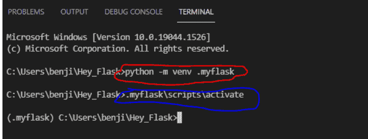
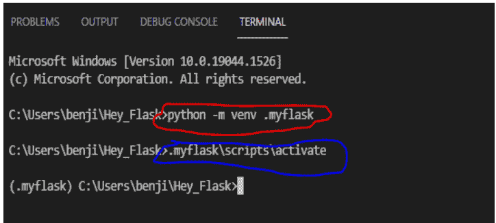
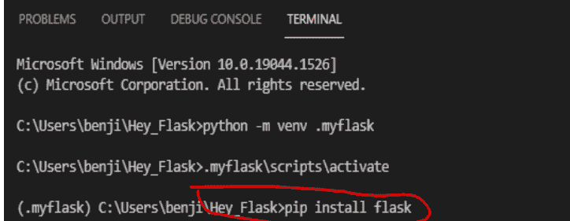

# 50天Python挑战

每日一挑战。


本杰明·贝内特·亚历山大

# 50天Python挑战

## 每日一挑战

本杰明·贝内特·亚历山大

> "Python"和Python标志是Python软件基金会的商标。

版权所有 © 2022 本杰明·贝内特·亚历山大

保留所有权利。未经出版商事先许可，不得以任何形式或任何方式（电子、机械、影印、录音或其他方式）复制、存储在检索系统中或传播本出版物的任何部分。

在编写本书时，我们已尽一切努力确保所提供信息的准确性。但是，我们不保证或声明其完整性或准确性。

## 反馈与评论

我欢迎并感谢您的反馈与评论。请考虑在您购买本书的平台上撰写评论。请将您的问题发送至：[benjaminbennettalexander@gmail.com](mailto:benjaminbennettalexander@gmail.com)。

## 目录

- 反馈与评论.....................................................3
- 目录..............................................................4
- 引言......................................................................9
- 第1天：除法与平方根........................................10
  - 额外挑战：最长值........................................10
- 第2天：字符串转整数..................................................11
  - 额外挑战：重复姓名....................................11
- 第3天：注册检查.........................................................12
  - 额外挑战：小写姓名..................................12
- 第4天：仅浮点数..............................................................13
  - 额外挑战：最长单词的索引 ...............13
- 第5天：我的折扣.............................................................14
  - 额外挑战：学生性别元组.............................14
- 第6天：用户名生成器 ............................................15
  - 额外挑战：两端归零......................................15
- 第7天：字符串范围.........................................................16
  - 额外挑战：姓名字典..............................16
- 第8天：奇数与偶数..........................................................17
  - 额外挑战：质数列表.........................17
- 第9天：最大奇数...............................................18
  - 额外挑战：零移到末尾....................................18
- 第10天：隐藏我的密码........................................19
  - 额外挑战：千位分隔符 .............19
- 第11天：它们相等吗？........................................20
  - 额外挑战：交换值................................20
- 第12天：数点点 ..........................................21
  - 额外挑战：你的年龄（分钟）....................21
- 第13天：缴税..............................................22
  - 额外挑战：蛇形金字塔......................22
- 第14天：展平列表..........................................23
  - 额外挑战：教师工资 ........................23
- 第15天：反转相同........................................24
  - 额外挑战：我的年龄？..........................24
- 第16天：列表求和 ..............................................25
  - 额外挑战：解包嵌套结构............................25
- 第17天：用户名生成器..............................26
  - 额外挑战：按长度排序............................26
- 第18天：任意数量的参数......................27
  - 额外挑战：相加并反转........................27
- 第19天：单词与元素................................28
- 第20天：首字母大写 ..............................29
  - 额外挑战：反转列表............................29
- 第21天：元组列表 ..........................................30
  - 额外挑战：偶数或平均值........30
- 第22天：添加下划线........................................31
- 第23天：简单计算器........................................32
  - 额外挑战：单词相乘 .................................32
- 第24天：平均卡路里............................................33
  - 额外挑战：创建嵌套列表 .......................33
- 第25天：全部相同................................................34
  - 额外挑战：反转字符串 ..............................34
- 第26天：单词排序..................................................35
  - 额外挑战：单词长度..............................35
- 第27天：唯一数字............................................36
  - 额外挑战：两个列表的差值.....................36
- 第28天：返回索引............................................37
  - 额外挑战：最大数字 ...............................37
- 第29天：中间值 ............................................38
- 第30天：最常出现的名字 ..................................39
  - 额外挑战：按姓氏排序.........................39
- 第31天：最长单词..............................................40
  - 额外挑战：创建用户....................................40
- 第32天：密码验证器......................................41
  - 额外挑战：有效邮箱......................................41
- 第33天：列表交集 ........................................42
  - 额外挑战：集合或列表................................................42
- 第34天：仅数字 ....................................................43
- 第35天：全字母句 .......................................................44
- 第36天：计数字符串....................................................45
- 第37天：统计元音..............................................46
- 第38天：猜数字 ................................................47
  - 额外挑战：找出缺失的数字.................47
- 第39天：密码生成器 ............................................48
- 第40天：猪拉丁语.......................................................49
- 第41天：仅含元音的单词 .................................50
  - 额外挑战：汽车类...................................50
- 第42天：拼写检查器..............................................51
  - 额外挑战：创建闹钟 .................51
- 第43天：学生成绩..................................................52
- 第44天：保存邮件 ....................................................53
- 第45天：单词与特殊字符.......................54
- 第46天：创建DataFrame........................................55
  - 额外挑战：使用Pandas处理网站数据 .......55
- 第47天：保存JSON....................................................57
- 第48天：二分查找 ................................................58
- 第49天：创建数据库 ..........................................59
- 第50天：创建Flask应用 ........................................60
- 作者的其他作品................................................146

## 引言

挑战通常是塑造坚强品格的基石。俗话说，杀不死你的东西会让你更强大。将同样的原则应用于你的Python学习之旅，你将势不可挡。本书正是关于挑战。你解决挑战的能力定义了你。本书为你提供了一个机会，通过解决挑战来掌握Python语言最重要的一些概念和基础。本书包含超过80个挑战，要求你在50天内完成。每天解决一个或两个挑战，然后继续你的日常事务，50天结束时，你将掌握Python基础。

## 为何要解决挑战？

程序员的工作是编写代码来解决问题。当你解决一个挑战时，你不仅巩固了知识，还掌握了寻找问题解决方案这一宝贵技能。解决挑战有助于你思考。通过解决挑战，你可以看到你的代码如何解决程序员面临的现实情况。

## 如何使用本书？

要充分利用本书，你必须尽最大努力独立解决问题。不要急于查看答案。记住，你有一整天的时间来解决一个问题。根据你的经验水平，有些问题可能很容易解决。本书中的大多数问题面向Python学习的初学者（初学者和中级者）。请记住，在大多数情况下，解决问题的方法不止一种。你的解决方案和书中的解决方案可能不同。在本书中，你将找到涵盖Python大部分基础知识的挑战。你将创建密码生成器、使用Python模块、翻译字符串和构建字典。你将处理CSV和JSON文件。你将创建一个网站等等。相信我，你会很忙。事不宜迟，让我们开始吧。

## 第一天：除法与平方根

编写一个名为 `divide_or_square` 的函数，该函数接受一个参数（一个数字），如果该数字能被5整除，则返回其平方根；如果不能被5整除，则返回其余数。例如，如果你传入 **10** 作为参数，那么你的函数应该返回 **3.16** 作为平方根。

### 额外挑战：最长值

编写一个名为 `longest_value` 的函数，该函数接受一个字典作为参数，并返回字典中**第一个**最长的值。例如，下面的字典应该返回 **apple** 作为最长的值。

```python
fruits = {'fruit': 'apple', 'color': 'green'}
```

## 第二天：字符串转整数

编写一个名为 **convert_add** 的函数，该函数接受一个字符串列表作为参数，将其转换为整数并求和。例如，['1', '3', '5'] 应该被转换为 [1, 3, 5] 并**求和得到 9**。

### 额外挑战：重复名称

编写一个名为 **check_duplicates** 的函数，该函数接受一个字符串列表作为参数。该函数应检查列表中是否有重复项。如果有重复项，函数应返回重复项。如果没有重复项，函数应返回 "**No duplicates**"。例如，下面的 **fruits** 列表应返回 **apple** 作为重复项，而 **names** 列表应返回 "no duplicates"。

```python
fruits = ['apple', 'orange', 'banana', 'apple']
names = ['Yoda', 'Moses', 'Joshua', 'Mark']
```

## 第三天：注册检查

编写一个名为 **register_check** 的函数，用于检查有多少学生在校。该函数接受一个字典作为参数。如果学生在校，字典显示 '**yes**'。如果学生不在校，字典显示 '**no**'。你的函数应返回在校学生的人数。使用下面的字典。你的函数应返回 3。

```python
register = {'Michael':'yes', 'John': 'no',
            'Peter':'yes', 'Mary': 'yes'}
```

### 额外挑战：小写名称

```python
names = ["kerry", "dickson", "John", "Mary",
         "carol", "Rose", "adam"]
```

给你上面的名称列表。这个列表由小写和大写字母的名称组成。你的任务是编写一段代码，返回一个元组，包含列表中所有仅由小写字母组成的名称。你的元组应按字母降序排列。使用上面的列表，你的代码应返回：

**('kerry', 'dickson', 'carol', 'adam')**

## 第四天：仅浮点数

编写一个名为 `only_floats` 的函数，该函数接受两个参数 `a` 和 `b`，如果两个参数都是浮点数，则返回 **2**；如果只有一个参数是浮点数，则返回 **1**；如果两个参数都不是浮点数，则返回 **0**。如果你传入 **(12.1, 23)** 作为参数，你的函数应返回 **1**。

### 额外挑战：最长单词的索引

编写一个名为 `word_index` 的函数，该函数接受一个参数（一个字符串列表），并返回列表中最长单词的索引。如果没有最长的单词（如果所有字符串长度相同），函数应返回零 (0)。例如，下面的列表应返回 2。

```python
words1 = ["Hate", "remorse", "vengeance"]
```

而下面的列表应返回零 (0)

```python
words2 = ["Love", "Hate"]
```

## 第五天：我的折扣

创建一个名为 **my_discount** 的函数。该函数不接受参数，但会要求用户输入产品的**价格**和**折扣**（百分比）。一旦用户输入价格和折扣，它会计算**折扣后的价格**。函数应返回折扣后的价格。例如，如果用户输入 **150** 作为价格，**15%** 作为折扣，你的函数应返回 **127.5**。

### 额外挑战：学生性别元组

你在一所学校工作，你的老板想知道学校里有多少女生和男生。学校将学生保存在一个列表中。你的任务是编写一段代码来统计列表中有多少男生和女生。下面是一个列表：

```python
students = ['Male', 'Female', 'female', 'male', 'male', 'male',
            'female', 'male', 'Female', 'Male', 'Female', 'Male', 'female']
```

你的代码应返回一个元组列表。上面的列表应返回：

```python
[('Male',7), ('female',6)]
```

## 第六天：用户名生成器

编写一个名为 `user_name` 的函数，该函数根据用户的电子邮件生成用户名。代码应要求用户输入电子邮件，代码应返回 @ 符号之前的所有内容作为用户名。例如，如果有人输入 **ben@gmail.com**，代码应返回 ben 作为用户名。

### 额外挑战：两端置零

编写一个名为 `zeroed` 的代码，该代码接受一个数字列表作为参数。代码应将列表中的第一个和最后一个数字置零 (0)。例如，如果输入是 **[2, 5, 7, 8, 9]**，你的代码应返回 **[0, 5, 7, 8, 0]**。

## 第七天：字符串范围

编写一个名为 `string_range` 的函数，该函数接受一个数字，并返回其范围的字符串。字符串字符应**用点 (.) 分隔**。例如，如果你传入 **6** 作为参数，你的函数应返回 **'0.1.2.3.4.5'**。

### 额外挑战：名称字典

给你一个名称列表，要求你编写一段代码，返回所有以 'S' 开头的名称。你的代码应返回一个字典，包含所有以 **S** 开头的名称及其在字典中出现的次数。下面是一个列表：

```python
names = ["Joseph", "Nathan", "Sasha", "Kelly",
        "Muhammad", "Jabulani", "Sera", "Patel", "Sera"]
```

你的代码应返回：**{"Sasha": 1, "Sera": 2}**

## 第八天：奇数与偶数

编写一个名为 `odd_even` 的函数，该函数有一个参数，并接受一个数字列表作为参数。函数返回列表中最大**偶数**与最小**奇数**之间的差值。例如，如果你传入 **[1,2,4,6]** 作为参数，函数应返回 **6 -1= 5**。

### 额外挑战：质数列表

编写一个名为 `prime_numbers` 的函数。该函数要求用户输入一个数字（整数）作为参数，并返回其范围内所有质数的列表。例如，如果用户输入 10，你的代码应返回 **[2, 3, 5, 7]** 作为质数。

## 第九天：最大奇数

创建一个名为 **biggest_odd** 的函数，该函数接受一个数字字符串，并返回列表中最大的奇数。例如，如果你传入 ‘23569’ 作为参数，你的函数应返回 **9**。使用**列表推导式**。

### 额外挑战：零移到末尾

编写一个名为 **zeros_last** 的函数。该函数接受一个列表作为参数。如果列表中有零 (0)，它会将它们移到列表的开头，并保持列表中其他数字的顺序。如果列表中没有零，函数应返回按升序排序的原始列表。例如，如果你传入 **[1, 4, 6, 0, 7, 0, 9]** 作为参数，你的代码应返回 **[1, 4, 6, 7, 9, 0, 0]**。如果你传入 **[2, 1, 4, 7, 6]** 作为参数，你的代码应返回 **[1, 2, 4, 6, 7]**。

## 第十天：隐藏我的密码

编写一个名为 `hide_password` 的函数，该函数不接受参数。该函数从用户处获取输入（一个密码）并返回一个隐藏的密码。例如，如果用户输入 ‘hello’ 作为密码，函数应返回 ‘****’ 作为密码，并告诉用户密码有 **4 个字符**长。

### 额外挑战：千位分隔符

你的新公司有一个数字列表保存在一个列表中。问题是这些数字**没有分隔符**。数字以以下格式保存：`[1000000, 2356989, 2354672, 9878098]`。

你被要求编写一段代码，将列表中的每个数字转换为**字符串**。然后，你的代码应在每个数字上添加一个逗号作为**千位分隔符**以提高可读性。当你在上面的列表上运行代码时，你的输出应该是：

```python
['1,000,000', '2,356,989', '2,354,672', '9,878,098']
```

编写一个名为 `convert_numbers` 的函数，该函数接受一个参数，即上面的数字列表。

## 第11天：它们相等吗？

编写一个名为 `equal_strings` 的函数。该函数接受两个字符串作为参数并进行比较。如果字符串相等（即它们包含相同的字符且长度相等），则应返回 **True**；如果不相等，则应返回 **False**。例如，‘love’ 和 ‘evol’ 应返回 **True**。

### 额外挑战：交换值

编写一个名为 `swap_values` 的函数。该函数接受一个数字列表，并将第一个元素与最后一个元素交换。例如，如果你传入 **[2, 4, 67, 7]** 作为参数，你的函数应返回 **[7, 4, 67, 2]**。

## 第12天：数点

编写一个名为 `count_dots` 的函数。该函数接受一个由点分隔的字符串作为参数，并计算字符串中有多少个点。例如，‘h.e.l.p.’ 应返回 **4** 个点，而 ‘he.lp.’ 应返回 **2** 个点。

### 额外挑战：你的年龄（分钟）

编写一个名为 `age_in_minutes` 的函数，该函数告诉用户**他们有多少分钟大**。你的代码应要求用户输入他们的**出生年份**，并返回他们的年龄（以分钟为单位）（通过用当前年份减去出生年份）。以下是一些需要注意的事项：

- a. 用户只能输入一个**4位数**的出生年份。例如，1930是有效的年份。但是，输入任何长度超过或少于4位数的数字都应视为无效输入。通知用户输入一个四位数。
- b. 如果用户输入的年份**早于**1900年，你的代码应告诉用户输入无效。如果用户输入的年份**晚于**当前年份，代码应告诉用户输入一个有效的年份。

代码应**持续运行，直到用户输入一个有效的年份**。你的函数应返回用户的年龄（分钟）。例如，如果有人输入1930作为他们的出生年份，你的函数应返回：

**你已经48,355,200分钟大了。**

## 第13天：缴税

编写一个名为 `your_vat` 的函数。该函数不接受任何参数。该函数要求用户输入一件商品的价格和增值税（增值税应为百分比）。该函数应返回商品价格加上增值税后的价格。如果价格是220，增值税是15%，你的代码应返回含税价253。确保你的代码能处理 **ValueError**。确保代码持续运行，直到输入有效的数字。（提示：你的代码应包含一个while循环）。

### 额外挑战：蛇形金字塔

编写一个名为 `Python_snakes` 的函数，该函数接受一个数字作为参数，并使用该数字的范围创建以下形状：（提示：使用循环和emoji库。如果你传入7作为参数，你的代码应打印以下内容：

## 第14天：展平列表

编写一个名为 `flat_list` 的函数，该函数接受一个参数，一个嵌套列表。该函数将嵌套列表转换为一维列表。例如 `[[2,4,5,6]]` 应返回 `[2,4,5,6]`。

### 额外挑战：教师工资

一所学校要求你编写一个程序来计算教师的工资。该程序应要求用户输入教师的**姓名**、一个月内教授的**课时数**以及每课时的**费率**。月薪通过将**课时数**乘以**月费率**来计算。当前每课时的月费率为20美元。如果一位教师一个月内教授超过100课时，超过100课时的部分为加班。加班费为每课时25美元。例如，如果一位教师教授了**105**课时，他们的月总工资应为**2,125**。编写一个名为 `your_salary` 的函数来计算教师的总工资。该函数应返回**教师姓名**、**教授课时数**和**总工资**。以下是你的输出格式：

```
Teacher: John Kelly,
Periods: 105
Gross salary:2,125
```

## 第15天：正反相同

编写一个名为 **same_in_reverse** 的函数，该函数接受一个字符串并检查该字符串正反读是否相同。如果相同，代码应返回 **True**；如果不相同，则应返回 **False**。例如，‘dad’ 应返回 **True**，因为它正反读相同。

### 额外挑战：我的年龄？

编写一个名为 **your_age** 的函数。该函数要求学生输入他们的姓名，然后返回他们的年龄。例如，如果用户输入 **Peter** 作为他们的姓名，你的函数应返回，‘Hi, Peter, you are 27 years old.’ 该函数从数据库（下面的字典）中读取数据。如果姓名不在字典中，你的代码应告诉用户他们的姓名**不在**字典中，并询问他们的年龄。然后，你的代码应将**姓名**和**年龄**添加到下面的 **names_age** 字典中。添加后，你的代码应向用户返回‘Hi, (added name), you are (added age) years old’。记住将用户的输入转换为小写字母。

```
names_age = {"jane": 23, "kerry": 45, "tim": 34, "peter": 27}
```

## 第16天：列表求和

编写一个名为 **sum_list** 的函数，该函数接受一个参数，一个**嵌套**整数列表，并返回整数的总和。例如，如果你传入 **[[2, 4, 5, 6], [2, 3, 5, 6]]** 作为参数，你的函数应返回总和 **33**。

### 额外挑战：拆解嵌套

**Nested_list = [[12, 34, 56, 67], [34, 68, 78]]**

编写一段**代码**，从上面的嵌套列表中生成以下数字的列表 – 34, 67, 78。你的输出应是另一个列表：

**[34, 67, 78]**。列表输出不应有重复项。

## 第17天：用户名生成器

编写一个名为 `user_name` 的函数，为用户创建一个用户名。该函数应要求用户**输入**他们的姓名。然后，该函数应反转姓名，并在姓名末尾附加一个随机生成的0-9之间的数字。该函数应返回**用户名**。

### 额外挑战：按长度排序

```
names = [ "Peter", "Jon", "Andrew"]
```

编写一个名为 `sort_length` 的函数，该函数接受一个字符串列表作为参数，并根据字符串长度按升序排序。例如，上面的列表应返回：

```
['Jon', 'Peter', 'Andrew']
```

不要使用内置的排序函数。

## 第18天：任意数量的参数

编写一个名为 `any_number` 的函数，该函数可以接收任意数量的参数（整数和浮点数），并返回这些整数的平均值。如果你传入 **12**, **90**, **12**, **34** 作为参数，你的函数应返回平均值 **37.0**。如果你传入 **12**, **90**，你的函数应返回平均值 **51.0**。

### 额外挑战：相加并反转

编写一个名为 `add_reverse` 的函数。该函数接受**两个**列表作为参数，将每个对应的数字相加，并**反转**结果。例如，如果你传入 **[10, 12, 34]** 和 **[12, 56, 78]**。你的代码应返回 **[112, 22, 68]**。如果两个列表长度不相等，代码应返回一条消息“the lists are not of equal lengths”。

## 第19天：单词与元素

编写两个函数。第一个函数名为 `count_words`，它接受一个单词字符串并计算字符串中有多少个单词。

第二个函数名为 `count_elements`，它接受一个单词字符串并计算字符串中有多少个元素。不计算空格。第一个函数将返回字符串中的**单词**数量，第二个函数将返回**元素**（减去空格）的数量。如果你传入 ‘I love learning’，`count_words` 函数应返回 **3 words**，`count_elements` 应返回 **13 elements**。

## 第20天：首字母大写

编写一个名为 **capitalize** 的函数。该函数接受一个字符串作为参数，并**将**每个单词的首字母**大写**。例如，‘**i like learning**’ 变成 ‘**I Like Learning**’。

### 额外挑战：反转列表

```
str1 = 'leArning is hard, bUt if You appLy yourSelf ' \n      'you can achieVe success'
```

给你一个单词字符串。字符串中的一些单词包含大写字母。编写一段代码，返回所有包含大写字母的单词。你的代码应返回一个单词列表。列表中的每个单词都应被反转。你的输出应如下所示：

['gninrAel', 'tUb', 'uoY', 'yLppa', 'flesRuoy', 'eVeiHca']

## 第21天：元组列表

编写一个名为 `make_tuples` 的函数，该函数接受两个**相等的列表**，并将它们组合成一个元组列表。例如，如果列表 **a** 是 `[1,2,3,4]`，列表 **b** 是 `[5,6,7,8]`，你的函数应该返回 `[(1,5), (2,6), (3,7), (4,8)]`。

### 额外挑战：偶数或平均值

编写一个名为 `even_or_average` 的函数，该函数要求用户输入五个数字。用户输入完成后，代码应该返回输入数字中最大的偶数。如果列表中没有偶数，代码应该返回所有五个数字的平均值。

## 第22天：添加下划线

创建**三个**函数。第一个名为 `add_hash`，接受一个字符串并在单词之间添加一个井号 #。第二个函数名为 `add_underscore`，移除井号 (#) 并用下划线 "_" 替换它。第三个函数名为 `remove_underscore`，移除下划线并用空字符串替换它。如果你将 'Python' 作为参数传递给这三个函数，并同时调用它们，如：
`print(remove_underscore(add_underscore(add_hash('Python'))))`
它应该返回 'Python'。

## 第23天：简单计算器

创建一个简单的计算器。计算器应该能够执行基本的数学运算：**加法**、**减法**、**除法**和**乘法**。计算器应该接受用户的输入。计算器应该能够处理 **ZeroDivisionError**、**NameError** 和 **ValueError**。

### 额外挑战：单词乘积

```
s = "love live and laugh"
```

编写一个名为 `multiply_words` 的函数，该函数接受一个字符串作为参数，并将字符串中每个单词的长度乘以字符串中其他单词的长度。例如，上面的字符串应该返回 **240 - love (4) live (4) and (3) laugh (5)**。但是，你的函数应该只乘以所有字母都是小写的单词。如果一个单词有一个大写字母，它应该被忽略。例如，以下字符串：

```
s = "Hate war love Peace" 应该返回 12 – war (3) love (4)。Hate 和 Peace 将被忽略，因为它们至少有一个大写字母。
```

## 第24天：平均卡路里

创建一个名为 `average_calories` 的函数，该函数计算用户平均的卡路里摄入量。该函数应该要求用户输入他们**任意**天数的卡路里摄入量，一旦他们输入 **'done'**，它应该计算并**返回**平均摄入量。

### 额外挑战：创建嵌套列表

编写一个名为 `nested_lists` 的函数，该函数接受任意数量的列表，并创建一个二维嵌套列表。例如，如果你将以下列表作为参数传递：`[1, 2, 3, 5]`、`[1, 2, 3, 4]`、`[1, 3, 4, 5]`。
你的代码应该返回：`[[1, 2, 3, 5], [1, 2, 3, 4], [1, 3, 4, 5]]`

## 第25天：全部相同

创建一个名为 `all_the_same` 的函数，该函数接受一个参数，可以是**字符串**、**列表**或**元组**，并检查所有元素是否相同。如果元素相同，函数应该返回 **True**。否则，它应该返回 **False**。例如，`['Mary', 'Mary', 'Mary']` 应该返回 **True**。

### 额外挑战：反转字符串

```
str1 = "the love is real"
```

编写一个名为 `read_backwards` 的函数，该函数接受一个字符串作为参数并将其反转。例如，上面的字符串应该返回：**"real is love the"**

## 第26天：单词排序

编写一个名为 **sort_words** 的函数，该函数接受一个单词字符串作为参数，移除空格，并返回一个按字母顺序排序的字母列表。字母之间用逗号分隔。所有字母在列表中只出现一次。这意味着你需要排序并去重。例如 **'love life'** 应该返回 ['e,f,i,l,o,v']。

### 额外挑战：单词长度

s = 'Hi my name is Richard'

编写一个名为 **string_length** 的函数，该函数接受一个单词字符串（单词和空格）作为参数。此函数应该返回字符串中所有单词的长度。以字典形式返回结果。上面的字符串应该返回：

**{'Hi': 2, 'my': 2, 'name': 4, 'is': 2, 'Richard': 7}**

## 第27天：唯一数字

编写一个名为 `unique_numbers` 的函数，该函数接受一个数字列表作为参数。你的函数将找到列表中所有唯一的数字。然后它将对这些唯一数字求和。你将计算**原始列表中所有数字的总和**与**列表中唯一数字的总和**之间的差值。如果差值是**偶数**，你的函数应该返回**原始列表**。如果差值是**奇数**，你的函数应该返回一个**仅包含唯一数字的列表**。例如 **[1, 2, 4, 5, 6, 7, 8, 8]** 应该返回 **[1, 2, 4, 5, 6, 7, 8, 8]**。

### 额外挑战：两个列表的差集

编写一个名为 `difference` 的函数，该函数接受**两个**列表作为参数。此函数应该返回所有在列表 **a** 中但不在列表 **b** 中的元素，以及所有在列表 **b** 中但不在列表 **a** 中的元素。**例如：**

```
list1 = [1, 2, 4, 5, 6]
list2 = [1, 2, 5, 7, 9]
应该返回：
[4, 6, 7, 9]
```

在你的函数中使用**列表推导式**。

## 第28天：返回索引

编写一个名为 `index_position` 的函数。此函数接受一个字符串作为参数，并返回字符串中所有小写字母的位置或索引。例如，‘LovE’ 应该返回 [1,2]。

### 额外挑战：最大数字

编写一个名为 `largest_number` 的函数，该函数接受一个整数列表，并重新排列各个数字以创建可能的最大数字。例如，如果你将以下内容作为参数传递：list1 = [3, 67, 87, 9, 2]。你的代码应该以这种精确格式返回数字：9,877,632 作为最大数字。

## 第29天：中间元素

编写一个名为 `middle_figure` 的函数，该函数接受两个参数 **a** 和 **b**。这两个参数是字符串。函数**连接**这两个字符串并找到**中间元素**。如果组合后的字符串有中间元素，函数应该返回该**元素**，否则，返回 '**no middle figure**'。使用 '**make love**' 作为 **a** 的参数，使用 '**not wars**' 作为 **b** 的参数。你的函数应该返回 '**e**' 作为中间元素。应移除空格。

## 第30天：最常重复的名字

编写一个名为 `repeated_name` 的函数，在以下列表中找到最常重复的名字。

```
name = ["John", "Peter", "John", "Peter", "Jones", "Peter"]
```

### 额外挑战：按姓氏排序

你在当地一所学校工作。学校有一个保存学生姓名的列表。学校要求你编写一个程序，该程序接受一个姓名列表并按字母顺序排序。姓名应按姓氏排序。以下是姓名列表：

['Beyonce Knowles', 'Alicia Keys', 'Katie Perry', 'Chris Brown', 'Tom Cruise']

你的代码不仅应该按字母顺序排序，还应该交换姓名（姓氏必须在前）。你的代码输出应如下所示：

['Brown Chris', 'Cruise Tom', 'Keys Alicia', 'Perry Katie', 'Knowles Beyonce']

编写一个名为 `sorted_names` 的函数。

## 第31天：最长单词

编写一个具有一个参数的函数，该函数接受一个单词列表作为参数。函数返回列表中最长的单词。将函数命名为 `longest_word`。函数应该返回最长的单词以及该单词中的字母数。例如，如果你传递 `['Java', 'JavaScript', 'Python']`，你的函数应该返回 `[10, JavaScript]` 作为最长的单词。

### 额外挑战：创建用户

编写一个名为 `create_user` 的函数。此函数要求用户输入他们的**姓名**、**年龄**和**密码**。函数将此信息保存在字典中。例如，如果用户输入姓名为 **Peter**，年龄 - **18**，密码 - **love**。函数应将信息保存为：`{'name': 'Peter', 'age': 18, 'password': 'love'}`

信息保存后。函数应向用户打印 "**User saved. Please login**"。

然后函数应要求用户**重新输入**他们的姓名和密码。如果姓名和密码与字典中保存的信息匹配，函数应返回 "**Logged in successfully**"。如果姓名和密码与字典中保存的信息不匹配，函数应打印 '**Wrong password or user name. Please try again**'。函数应持续运行，直到用户输入正确的登录信息。

## 第32天：密码验证器

编写一个名为 **password_validator** 的函数。该函数要求用户输入一个密码。一个有效的密码应至少包含**一个大写字母**、**一个小写字母**和**一个数字**，且长度不得少于**8个字符**。当用户输入密码时，函数应检查密码是否**有效**。如果密码有效，函数应返回**有效密码**。如果密码无效，函数应告知用户密码中的**错误**，并提示用户输入**另一个密码**。代码应仅在用户输入有效密码后停止。（使用 while 循环）。

### 额外挑战：有效邮箱

```
emails = ['ben@mail.com', 'john@mail.cm', 'kenny@gmail.com', '@list.com']
```

编写一个名为 **email_validator** 的函数，该函数接收一个邮箱列表并检查邮箱是否有效。函数返回一个仅包含**有效邮箱**的**列表**。一个有效的邮箱地址应满足以下条件：包含 **@ 符号**（如果 @ 符号位于名称开头，则邮箱无效；如果存在多个 @ 符号，则邮箱无效）。所有有效邮箱必须以 **.com 结尾**，否则邮箱无效。例如，上述邮箱列表应输出以下有效邮箱：

```
['ben@mail.com', 'kenny@gmail.com']
```

如果列表中没有有效邮箱，函数应返回 'all emails are invalid'。

## 第33天：列表交集

编写一个名为 **inter_section** 的函数，该函数接收**两个**列表并找出它们的交集（即两个列表中都存在的元素）。函数应返回一个包含交集元素的元组。在你的解决方案中使用列表推导式。使用下面的列表。你的函数应返回 **(30, 65, 80)**。

```
list1 = [20, 30, 60, 65, 75, 80, 85]
list2 = [42, 30, 80, 65, 68, 88, 95]
```

### 额外挑战：集合还是列表

你想实现一段代码来在某个范围内搜索一个数字。你需要决定是将数字存储在**集合**中还是**列表**中。你的决定将基于时间。你必须选择一种**执行更快**的数据类型。

你有一个范围，你可以根据在**范围内搜索数字**时哪种执行更快，将其**存储**在**集合**或**列表**中。如下所示：

```
a = range(10000000)
x = set(a)
y = list(a)
```

假设你要在上述范围中查找数字 9999999。在**列表**和**集合**中搜索这个数字。你的挑战是找出哪种代码执行更快。你将选择执行更快的那个，列表或集合。**运行两次搜索并计时。**

## 第34天：仅数字

在这个挑战中，复制**下面的文本**并将其保存为 CSV 文件。将其保存在与你的 Python 文件相同的文件夹中。保存为 **python.csv**。
编写一个名为 **just_digits** 的函数，该函数从 CSV 文件中读取文本，并仅返回文件中的数字元素。你的函数应返回 **1991, 2, 200, 3, 2008** 作为字符串列表。

> “Python 于 1991 年首次发布。Python 2 于 2000 年发布，并引入了新特性，例如[列表推导式](https://en.wikipedia.org/wiki/List_comprehension)和[循环检测](https://en.wikipedia.org/wiki/Tracing_garbage_collection)垃圾回收系统（除了[引用计数](https://en.wikipedia.org/wiki/Reference_counting)之外）。Python 3 于 2008 年发布，是该语言的一次重大修订，与 Python 2 不完全[向后兼容](https://en.wikipedia.org/wiki/Backward_compatibility)。”

**来源：维基百科**

## 第35天：全字母句

编写一个名为 `check_pangram` 的函数，该函数接收一个字符串并检查它是否是全字母句。**全字母句是包含字母表中所有字母的句子。** 如果是全字母句，函数应返回 **True**，否则返回 **False**。以下句子是全字母句，因此应返回 **True**：

> 'the quick brown fox jumps over a lazy dog'

### 额外挑战：查找我的位置

编写一个名为 `find_index` 的函数，该函数接收两个参数：一个整数列表和一个整数。函数应返回该整数在列表中的索引。如果整数**不在**列表中，函数应将列表中的所有数字转换为给定的整数。

例如，如果列表是：**[1, 2, 4, 6, 7, 7]**，整数是 **7**，你的代码应返回 **[4, 5]** 作为 **7** 在列表中的索引。如果列表是 **[1, 2, 4, 6, 7, 7]**，整数是 **8**，你的代码应返回 **[8, 8, 8, 8, 8, 8]**，因为 **8** 不在列表中。

## 第36天：字符串计数

编写一个名为 **count** 的函数，该函数接收一个参数**字符串**，并返回一个**字典**，表示每个元素在字符串中出现的次数。例如，**'hello'** 应返回：**{'h':1,'e': 1,'l':2, 'o':1}**。

## 第37天：元音计数

创建一个名为 `count_the_vowels` 的函数。该函数接收一个参数（字符串），并返回字符串中**元音**的数量。例如，‘hello’ 应返回 **2** 个元音。如果一个元音在字符串中出现多次，应**计为一次**。例如，‘saas’ 应返回 1 个元音。你的代码应计算小写和大写元音。

## 第38天：猜数字

编写一个名为 `guess_a_number` 的函数。该函数应要求用户猜测一个随机生成的数字。如果用户猜的数字偏高，代码应告知他们猜得太高；如果用户猜的数字偏低，代码应告知他们猜得太低。用户最多有三次猜测机会。当用户猜对时，代码应宣布他们获胜。三次错误猜测后，代码应宣布他们失败。

### 额外挑战：查找缺失数字

list = [1, 2, 3, 5, 6, 7, 9, 11, 12, 23, 14, 15, 17, 18, 19, 20, 21, 22, 24, 25, 26, 27, 28, 31]

编写一个名为 `missing_numbers` 的函数，该函数接收一个数字序列列表并找出序列中缺失的数字。上述列表应返回：

[4, 8, 10, 13, 16, 29, 30]

## 第39天：密码生成器

创建一个名为 `generate_password` 的函数，该函数为用户生成任意长度的密码。密码应**随机混合大写字母、小写字母、数字和标点符号**。函数应询问用户希望密码有多强。用户应从以下选项中选择：**弱**、**强**和**非常强**。如果用户选择**弱**，函数应生成一个**5个字符**长的密码。如果用户选择**强**，生成一个**8个字符**的密码；如果选择**非常强**，生成一个**12个字符**的密码。

## 第40天：猪拉丁语

编写一个名为 **translate** 的函数，该函数接收以下单词并将它们翻译成猪拉丁语。

```
python
a = 'i love python'
```

规则如下：

1. 如果一个单词以元音（a, e, i, o, u）开头，在末尾添加‘yay’。例如，‘eat’ 将变成 ‘eatyay’。
2. 如果一个单词以非元音字母开头，将第一个字母移到末尾，并在末尾添加‘ay’。例如，‘day’ 将变成 ‘ayday’。

你的代码应返回：

**iyay ovelay ythonpay**

## 第41天：仅含元音的单词

创建一个名为 **words_with_vowels** 的函数，该函数接收一个单词字符串，并返回一个仅包含**含有元音的单词**的**列表**。例如，‘**You have no rhythm**’ 应返回 [‘You’,’have’, ‘no’]。

### 额外挑战：汽车类别

b. 创建三个汽车品牌的类——**Ford**、**BMW** 和 **Tesla**。汽车对象的**属性**将是：**型号**、**颜色**、**年份**、**变速箱类型**以及**汽车是否为电动（布尔值）**。考虑在你的答案中使用继承。

你将为每个汽车品牌创建一个对象：

**bmw1** : 型号: x6, **颜色**: 银色, **年份:** 2018, **变速箱**: 自动, **电动**: False
**tesla1**: 型号: S, **颜色**: 米色, **年份:** 2017, **变速箱**: 自动, **电动**: True
**ford1** : 型号: focus, **颜色**: 白色, **年份:** 2020, **变速箱**: 自动, **电动**: False

你将创建一个名为 **print_cars** 的**类方法**，该方法能够打印类的对象。例如，如果你在 Ford 类的 **ford1** 对象上调用该方法，你的函数应能以以下精确格式打印出**汽车信息**：

```
car_model = focus
Color = White
Year = 2020
Transmission = Auto
Electric = False
```

## 第42天：拼写检查器

编写一个名为 `spelling_checker` 的函数。此代码要求用户输入一个单词，如果用户输入了错误的拼写，它应该通过询问用户是否想输入该单词来建议正确的拼写。如果用户说不，它应该要求用户再次输入单词。如果用户说是，它应该返回正确的单词。如果用户输入的单词拼写正确，函数应该返回**正确的单词**。使用 **textblob** 模块。

### 额外挑战：创建一个闹钟

创建一个名为 `alarm` 的函数，为用户设置一个闹钟。该函数应该询问用户希望闹钟何时响起。用户应该输入**小时**和**分钟**。然后，函数应该打印出闹钟响起的时间。当到达闹钟时间时，代码应该发出声音。使用 **winsound** 模块来发声。

## 第43天：学生成绩

编写一个名为 `student_marks` 的函数，记录学生在测试中取得的成绩。该函数应该要求用户输入学生的姓名，然后要求用户输入学生取得的成绩。信息应该存储在一个字典中。姓名是**键**，成绩是**值**。当用户输入 done 时，函数应该返回一个**包含输入的姓名和值的字典**。

## 第44天：保存电子邮件

创建一个名为 `save_emails` 的函数。此函数不接受参数，但要求用户输入电子邮件，并将其保存到 CSV 文件中。用户可以输入任意数量的电子邮件。一旦他们输入 'done'，函数就保存电子邮件并关闭文件。创建另一个名为 `open_emails` 的函数。此函数打开并读取 CSV 文件的内容。每个电子邮件必须单独占一行。以下是电子邮件必须如何保存的示例：

jj@gmail.com
kate@yahoo.com

而**不是**像这样：

jj@gmail.comkate@yahoo.com

## 第45天：单词与特殊字符

编写一个名为 `analyse_string` 的函数，返回字符串中**特殊字符**（#$%&'()*+,-./:;<=>?@[\]^_`{|}~）、**单词**和**总字符数**（所有字母和特殊字符减去空格）的数量。以字典格式返回所有内容：

```python
{"special character": "number", "words": "number", "total characters": "number"}
```

使用以下字符串作为参数：

> “Python has a string format operator %. This functions analogously to printf format strings in C, e.g. "spam=%s eggs=%d" % ("blah", 2) evaluates to "spam=blah eggs=2".

**来源维基百科。**

## 第46天：创建DataFrame

使用 pandas 创建一个 **DataFrame**。你将编写代码将以下内容放入一个 **DataFrame**。你将使用下表中的信息。基本上，你将使用 pandas 重新创建此表。使用表中的信息重新创建表格。

| 年份 | 标题 | 类型 |
|---|---|---|
| 2009 | Brothers | 剧情 |
| 2002 | Spider-Man | 科幻 |
| 2009 | WatchMen | 剧情 |
| 2010 | Inception | 科幻 |
| 2009 | Avatar | 奇幻 |

### 额外挑战：使用Pandas获取网站数据

编写一个从网站提取数据的代码。你将从网站提取一个表格。从该表格中，你将提取关于Python数据类型及其可变性的列。你将从以下网站提取信息：

[https://en.wikipedia.org/wiki/Python_(programming_language)](https://en.wikipedia.org/wiki/Python_(programming_language))

以下是你将从网站提取的表格。

| 类型 | 可变性 | 描述 | 语法示例 |
|---|---|---|---|
| bool | 不可变 | 布尔值 | True<br>False |
| bytearray | 可变 | 字节序列 | bytearray(b'Some ASCII')<br>bytearray(b"Some ASCII")<br>bytearray([119, 105, 107, 105]) |
| bytes | 不可变 | 字节序列 | b'Some ASCII'<br>b"Some ASCII"<br>bytes([119, 105, 107, 105]) |
| complex | 不可变 | 具有实部和虚部的复数 | 3+2.7j<br>3 + 2.7j |
| dict | 可变 | 键值对的关联数组（或字典）；可以包含混合类型（键和值）；键必须是可哈希类型 | {'key1': 1.0, 3: False}<br>{} |
| types.EllipsisType | 不可变 | 用作NumPy数组索引的省略号占位符 | ...<br>Ellipsis |
| float | 不可变 | 双精度浮点数。精度取决于机器，但实践中通常实现为具有53位精度的64位IEEE 754数字[106] | 1.33333 |
| frozenset | 不可变 | 无序集合；不包含重复项；如果可哈希，可以包含混合类型 | frozenset([4.0, 'string', True]) |
| int | 不可变 | 任意精度的整数[106] | 42 |
| list | 可变 | 列表；可以包含混合类型 | [4.0, 'string', True]<br>[] |
| types.NoneType | 不可变 | 表示值缺失的对象。在其他语言中通常称为null | None |
| types.NotImplementedType | 不可变 | 一个占位符，可以从重载运算符返回，以指示不支持的操作数类型。 | NotImplemented |
| range | 不可变 | 一个数字序列，通常用于在for循环中循环特定次数[107] | range(-1, 10)<br>range(10, -5, -2) |
| set | 可变 | 无序集合；不包含重复项；如果可哈希，可以包含混合类型 | {4.0, 'string', True}<br>set() |
| str | 不可变 | 字符串 | 'wikipedia' |

提取此表格后，你将编写代码提取数据类型及其可变性（两列）。你的输出应如下所示：

| | 类型 | 可变性 |
|---|---|---|
| 0 | bool | 不可变 |
| 1 | bytearray | 可变 |
| 2 | bytes | 不可变 |
| 3 | complex | 不可变 |
| 4 | dict | 可变 |
| 5 | types.EllipsisType | 不可变 |
| 6 | float | 不可变 |
| 7 | frozenset | 不可变 |
| 8 | int | 不可变 |
| 9 | list | 可变 |
| 10 | types.NoneType | 不可变 |
| 11 | types.NotImplementedType | 不可变 |
| 12 | range | 不可变 |
| 13 | set | 可变 |
| 14 | str | 不可变 |
| 15 | tuple | 不可变 |

## 第47天：保存JSON

编写一个名为 `save_json` 的函数。此函数接受下面的字典作为参数，并将其以JSON格式保存到文件中。

编写另一个名为 `read_json` 的函数，该函数**打开**你刚刚保存的文件并读取其内容。

```python
names = {'name': 'Carol','sex': 'female','age': 55}
```

## 第48天：二分查找

编写一个名为 **search_binary** 的函数，在以下列表中搜索数字 **22** 并返回其索引。该函数应接受两个参数：列表和要搜索的项目。使用二分查找（迭代方法）。

```python
list1 = [12, 34, 56, 78, 98, 22, 45, 13]
```

## 第49天：创建数据库

在这个挑战中，你将使用Python的SQLite创建一个**数据库**。你将**导入SQLite**到你的脚本中。创建一个名为 **movies.db** 的数据库。在该数据库中，你将创建一个名为 **movies** 的表。在该表中，你将保存以下电影：

| 年份 | 标题 | 类型 |
|---|---|---|
| 2009 | Brothers | 剧情 |
| 2002 | Spider Man | 科幻 |
| 2009 | WatchMen | 剧情 |
| 2010 | Inception | 科幻 |
| 2009 | Avatar | 奇幻 |

- a) 创建表后，运行SQL查询以查看表中的所有电影。
- b) 运行另一个SQL查询，仅从列表中选择电影 Brothers。
- c) 运行另一个SQL查询，从表中选择所有在2009年上映的电影。
- d) 运行另一个查询，选择奇幻和剧情类型的电影。
- e) 运行一个查询，删除表中的所有内容。

## 第50天：创建Flask应用

在这个挑战中，你将学习使用 **Flask** 创建一个应用。Flask是一个Python Web框架。如果你想进入Web开发领域，学习使用Flask构建网站是一项非常重要的技能。你将使用 **Python**、**HTML** 和 **CSS** 构建一个应用。我建议使用Visual Studio Code进行此挑战。你仍然可以使用任何你熟悉的代码编辑器。你将创建一个包含两个页面的应用：**主页**和**关于页面**。你的网站将有一个**导航栏**，以便你可以在主页和关于页面之间切换。它将有一个背景图片。项目中的图片来自 [Hasan Albari](https://www.pexels.com/) 的 [Pexels](https://www.pexels.com/)。以下是你应该制作的内容：

### 主页


## 关于页面


Flask 并不随 Python 一起安装，因此你需要在自己的机器上安装它，并将其导入到你的脚本中。如果你之前从未制作过网站，这个挑战将需要一些研究。我建议为你的项目使用一个**虚拟环境**。祝你好运。我相信你。

## 答案

## 第一天

在这个挑战中，我们使用**条件语句**来创建两个条件。如果其中任何一个条件的求值结果为 **True**，那么对应的代码块就会被执行。**if 语句**检查该数字是否能被 5 整除，如果能，我们就计算该数字的**平方根**。**else 语句**仅在数字不能被 5 整除时执行。在这种情况下，**else** 代码块将返回除法的余数。

```python
def divide_or_square(number):
    if number % 5 == 0:
        sq_root = number ** 0.5
        return f'The square-root of the number is {sq_root}'
    else:
        remainder = number % 5
        return f'The remainder of the division is {remainder}'

print(divide_or_square(10))
```

**输出：**
The square-root of the number is 3.16

### 额外挑战：最长的值

我们使用 **max** 函数来返回字典值中的最大值。max 函数有一个 **key** 参数。由于我们寻找的是第一个最长的值，我们将 **len** 传递给 key 参数。如果我们不将 **len** 传递给 key 参数，它将返回 green 作为最长的值，因为按字典序 green 大于 apple。

```python
def longest_value(d: dict):
    # Using max and key len to get the longest value
    longest = max(d.values(), key=len)
    return longest

fruits = {'fruit': 'apple', 'color': 'green'}
print(longest_value(fruits))
```

## 第二天

在这个挑战中，我们使用**类型转换**将列表中的字符串转换为整数。一旦转换完成，我们使用内置的 sum 函数对列表 b 中的整数求和。

```python
def convert_add(list1):
    b = []
    for i in list1:
        b.append(int(i))
    return sum(b)
```

```python
print(convert_add(['1','3','5']))
```

输出：

```
('The sum is ', 9)
```

如果你不想使用内置的 **sum()** 函数，你可以在函数中创建第二个 **for 循环**，该循环将遍历整数列表 **list2**。我们将 list2 的所有元素加到变量 **count** 上。

```python
def convert_add(list1:list):
    list2 = []
    count = 0
    for i in list1:
        list2.append(int(i))
    for j in list2:
        count += j
    return count
```

```python
print(convert_add(['1','3','5']))
```

### 额外挑战：重复的名称

下面我们使用一个 **for 循环**和一个**条件语句**来遍历列表，并检查列表中是否有出现超过一次的项目。我们对每个项目使用列表方法 **count()**。一旦找到该项目，我们就返回它。

```python
def check_duplicates(arr: list):
    for item in arr:
        # Using count to find items more than one
        if arr.count(item) > 1:
            return item
    else:
        return 'No duplicates'

# lists
fruits = ['apple', 'orange', 'banana', 'apple']
names = ['Yoda', 'Moses', 'Joshua', 'Mark']

print(check_duplicates(fruits))
print(check_duplicates(names))
```

**输出：**

```
apple
No duplicates
```

## 第三天

要统计字典中的 "yes"，我们需要使用 **for 循环**访问字典的值（**a.values**）。for 循环遍历字典以查找 "yes" 值。每个值都被添加到 **count** 变量中。

```python
register = {'Michael':'yes', 'John': 'no',
            'Peter':'yes',  'Mary': 'yes'}

def register_check(reg: dict):
    # Create a count variable
    count = 0
    for value in reg.values():
        if value == 'yes':
            count += 1
    return 'Number of students in school is', count

print(register_check(register))
```

输出：
('Number of students in school is', 3)

### 另一种方法：

```python
register = {'Michael':'yes', 'John': 'no',
            'Peter':'yes',  'Mary': 'yes'}

def register_check(reg: dict):
    count = 0
    for value, key in reg.items():
        if value == 'yes':
            count += 1
    return 'Number of students in school is', count

print(register_check(register))
```

输出：
('Number of students in school is', 3)

### 额外挑战：小写名称

对于这个挑战，我们需要使用两个函数：**sorted** 函数和 **tuple** 函数。sorted 函数将对列表进行降序排序。要对列表进行降序排序，请将 reverse 设置为 True。

```python
names = ["kerry", "dickson", "John", "Mary",
         "carol", "Rose", "adam"]

# creating an empty list
d = []
# Using sorted function to sort list in descending order
for name in sorted(names, reverse=True):
    if name.islower():
        d.append(name)
        tuple_names = tuple(d)

print(tuple_names)
```

**输出：**

```
('kerry', 'dickson', 'carol', 'adam')
```

## 第四天

在这个挑战中，我们使用 **type()** 函数和条件语句。**type()** 函数用于获取我们参数的类型。我们还使用 **and** 和 **or** 运算符来比较两个参数。

```python
def only_float(a,b):
    if type(a) == float and type(b) == float:
        return 2
    elif type(a) == float or type(b) == float:
        return 1
    else:
        return 0

print(only_float(12.1, 23))
```

输出：
1

### 额外挑战：最长单词的索引

我们做的第一件事是检查列表中的所有字符串是否具有相同的长度。如果是，我们**返回 0**。如果不是，我们使用 **len()** 函数和 **max()** 函数来搜索最长的单词。一旦找到它，我们就使用 **index** 方法搜索它的索引。

```python
def word_index(arr: list):
    for word in arr:
        for j in range(len(arr) - 1):
            # Checking if the lengths of all the words are equal
            if len(arr[j]) == len(arr[j + 1]):
                return 0
            # Using len function and max to find the longest word
            elif len(word) == len(max(arr)):
                # using list method index to find
                # index of the longest word
                return f'The longest word is at index: {arr.index(word)}'

words1 = ["Hate", "remorse", "vengeance"]
words2 = ["Love", "Hate"]
print(word_index(words1))
print(word_index(words2))
```

输出：
The longest word is at index: 2
0

## 第五天

在这段代码中，我们的函数不接受任何参数。我们使用 **input()** 函数向用户请求输入。由于输入是字符串格式，我们在计算折扣之前使用 **int()** 函数将其转换为整数。此代码中的输出假设输入价格为 **150**，折扣为 **15%**。

```python
def my_discount():
    price = int(input('Enter the price: '))
    discount = int(input('Enter the discount: '))
    aft_dsc = price * (100-discount)/100
    return 'Price after discount is ', aft_dsc

print(my_discount())
```

**输出：**

```
('Price after discount is ', 127.5)
```

### 额外挑战：学生性别的元组

这个挑战要做的第一件事是确保我们使用 **lower()** 方法将所有字符串转换为小写字母。因此，我们创建一个新列表，其中的名称已转换为小写。然后我们在列表中搜索 **males** 和 **females**。我们使用 **count** 方法计算每个在 **new_list** 中出现的次数。然后我们将性别及其在列表中出现的次数组合成一个元组 **(sex, new_list.count(sex))**。然后我们将这些元组附加到学生计数列表中。请注意，我们在附加后使用了 **break 语句**，以确保我们只遍历列表一次。

```python
students = ['Male', 'Female', 'female', 'male', 'male', 'male',
           'female', 'male', 'Female', 'Male', 'Female', 'Male', 'female']

def count_students(arr: list) -> list:
    # create an empty list to append lowercase strings
    new_list = []
    student_count = []
    # converting names to lowercase
    # and appending to new_list
    for names in students:
        new_list.append(names.lower())
    # Finding and counting all males in the
    # list and putting it in a tuple
    for sex in new_list:
        if sex == 'male':
            student_count.append((sex, new_list.count(sex)))
            break
    # Finding and counting all females in the
    # list and putting it in a tuple
    for j in new_list:
        if j == 'female':
            student_count.append((j, new_list.count(j)))
            break
            # returning a tuple of students
    return student_count

print(count_students(students))
```

**输出**

```
[('male', 7), ('female', 6)]
```

## 第6天

**split()** 函数在 @ 符号处分割电子邮件地址。一旦电子邮件被分割，我们就可以使用索引来访问电子邮件的各个部分。我们想要用作用户名的部分位于索引 0，这就是为什么我们在代码中使用 [0] 来访问它。

```python
def user_name():
    your_email = input("Enter your email")
    user_name = your_email.split('@')[0]
    return f'Your user name is {user_name}'

print(user_name())
```

### 额外挑战：两端归零

这个挑战需要一点切片操作。只需访问列表的第一个和最后一个元素，并将它们替换为零。

```python
list1 = [2, 5, 7, 8, 9]

def zeroed(arr: list) -> list:
    # 访问并修改第一个元素
    arr[0] = 0
    # 访问并修改最后一个元素
    arr[-1] = 0
    return arr

print(zeroed(list1))
```

**输出：**
[0, 5, 7, 8, 0]

## 第7天

在这段代码中，我们使用**列表推导式**从 range 创建一个列表。然而，要在列表上使用 **join()** 方法，我们必须确保列表元素是字符串格式。我们使用 **str()** 函数在调用 **join()** 函数将字符串用点连接起来之前，将 x 转换为字符串。

```python
def string_range(num: int):
    x = [str(i) for i in range(num)]
    # 使用 join 方法添加点
    x = ".".join(x)
    return x

print(string_range(6))
```

**输出：**
0.1.2.3.4.5

### 额外挑战：姓名字典

在这个挑战中，我们被要求创建一个以 'S' 开头的姓名字典。所以，首先我们需要在列表中找到所有以 'S' 开头的姓名，然后我们需要将这些结果以字典形式返回。查找姓名的简单方法是使用 **startswith** 方法。此方法将返回所有以给定元素开头的姓名。在下面的代码中，我们创建一个空字典；然后我们搜索所有以 'S' 开头的元素。使用字典方法 – **update**，我们用搜索结果更新空字典。

```python
names = ["Joseph", "Nathan", "Sasha", "Kelly",
        "Muhammad", "Jabulani", "Sera", "Patel", "Sera"]

d = {}  # 创建一个空字典
for name in names:
    if name.startswith('S'):
        # 使用字典的 update 方法
        d.update({name: names.count(name)})
print(d)
```

**输出：**
`{'Sasha': 1, 'Sera': 2}`

### 第二种方法

另一种方法是使用 collections 模块中的 **Counter** 类。Counter 类跟踪元素及其计数，并将结果存储在字典中。它返回元素的名称作为键，其计数作为值。请参见下面的代码：

```python
from collections import Counter

count = []  # 创建一个空列表
for name in names:
    if name.startswith("S"):
        # 将以 S 开头的姓名追加到列表中
        count.append(name)
        # 使用 counter 方法返回一个字典
        names = Counter(count)
print(names)
```

**输出：**
`Counter({'Sera': 2, 'Sasha': 1})`

## 第8天

在这个挑战中，我们使用取模运算符来找出列表中的偶数和奇数。然后我们使用 **max()** 和 **min()** 函数来返回**最大**数和**最小**数。

```python
def odd_even(a):
    even = []
    odd = []
    for i in a:
        if i % 2 == 0:
            even.append(i)
        if i % 2 != 0:
            odd.append(i)
    return max(even) - min(odd)
print(odd_even([1, 2, 4, 6]))
```

输出：
5

### 额外挑战：质数列表

质数是只有两个因数的数字：1 和它本身。质数从 2 开始。对于这个挑战，我们使用 range 函数来查找数字的范围。

```python
def prime_numbers() -> list:
    prime_num = []
    n = int(input('Please enter a number (integer): '))
    # 创建输入数字的范围
    # 记住在末尾加 1 以确保
    # 范围内的所有数字都被覆盖
    for i in range(0, n + 1):
        # 只需要大于 1 的数字
        if i > 1:
            for j in range(2, i):
                # 如果范围内的数字能被 j 整除
                # 那么该数字不是质数
                if i % j == 0:
                    break
            else:
                prime_num.append(i)

    return prime_num

print(prime_numbers())
```

## 第9天

使用列表推导式，我们使用 **for 循环**和 **if 语句**来返回一个奇数列表。在这里你可以使用**取模运算符** (%)。取模运算符返回除法的余数。如果余数为零，运算符返回零。如果一个数字除以 2 返回余数，则该数字是奇数。在这段代码中，我们使用 if 语句只返回不能被 2 整除的数字。**max()** 函数将返回列表中最大的奇数。

```python
def biggest_odd(string1: str):
    odd_nums = [i for i in string1 if int(i) % 2 != 0]
    return f' The biggest odd number is {max(odd_nums)}'

print(biggest_odd('23569'))
```

输出：

```
The biggest odd number is 9
```

### 额外挑战：零移到末尾

这个挑战是关于理解索引的。第一步是识别列表中的**非零**数字。一旦我们识别出它们，我们就将它们移动到列表的前面，同时将**索引**加 1。然后我们用列表中的零填充剩余的位置。

```python
def zeros_last(arr: list) -> list:
    i = 0  # 设置索引为 0
    arr1 = arr
    for num in arr:
        # 检查非零数字
        if num != 0:
            # 将非零数字移动到列表前面
            arr[i] = num
            i += 1

    # 将零元素移动到列表末尾。
    while i < len(arr):
        arr[i] = 0
        i += 1
        return arr

    else:
        # 如果没有零，返回按升序排列的原始列表
        return sorted(arr1)

list1 = [1, 4, 6, 0, 7, 0]
list2 = [2, 1, 4, 7, 6]

print(zeros_last(list1))
print(zeros_last(list2))
```

输出：

```
[1, 4, 6, 7, 0, 0]
[1, 2, 4, 6, 7]
```

## 第10天

在这个挑战中，我们使用 **input()** 函数从用户那里获取信息。然后我们使用 **len()** 函数获取密码的长度。我们使用乘法运算符将字符串的每个元素与 '*' 相乘。

```python
def your_password():
    password1 = input('Enter password')
    password = len(password1) * '*'
    return f'Your password is {password} ' \
           f'and its {len(password)} characters long'

print(your_password())
```

### 额外挑战：千位分隔符。

最简单的方法是使用 format 方法。

```python
def convert_numbers(n):
    new_list = []
    for num in n:
        new_list.append("{:,}".format(num))
    return new_list

print(convert_numbers([1000000, 2356989, 2354672, 9878098]))
```

**输出：**
`['1,000,000', '2,356,989', '2,354,672', '9,878,098']`

## 第11天

要比较两个字符串，首先，我们需要对它们进行排序。我们使用 **sorted()** 函数对两个字符串进行排序。然后我们使用 (==) 运算符比较两个字符串。

```python
def equal_strings(st1, st2):
    str1 = sorted(st1)
    str2 = sorted(st2)
    if str1 == str2:
        return True
    else:
        return False
```

```python
print(equal_strings('love', 'evol'))
```

输出：

```
True
```

### 额外挑战：交换值

解决这个挑战的简单方法是为要交换的数字创建单独的变量。使用列表切片来获取值。

```python
def swap_values(arr: list):
    # 为第一个数字创建一个变量
    first_number = arr[0]
    # 为最后一个数字创建第二个变量
    last_number = arr[-1]
    # 将最后一个数字赋值给索引 0
    arr[0] = last_number
    # 将第一个数字赋值给索引 -1
    arr[-1] = first_number
    return arr
```

```python
list1 = [2, 4, 67, 7]
print(swap_values(list1))
```

输出：

```
[7, 4, 67, 2]
```

## 第12天

我们使用 **split()** 函数在点处分割单词。一旦单词被分割，我们使用 **len()** 函数来计算点的数量。

```python
def count_dots(word):
    m = word.split(".")
    return f'The string has {len(m)-1} dots'

print(count_dots("h.e.l.p."))
```

输出：
The string has 4 dots

### 额外挑战：你的年龄（分钟）

请记住为此挑战**导入** datetime 模块。你需要使用 while 循环来保持代码运行，直到输入有效的年份。

```python
from datetime import datetime

def your_age():
    while True:
        birth_year = input('Enter your year of birth: ')
        if len(birth_year) != 4:
            print('Please enter a four digits year')
        elif int(birth_year) < 1900 or int(birth_year) > 2022:
            print('Please enter a valid year')
        else:
            # 这返回当前年份
            now1 = int(datetime.now().strftime("%Y"))
            age = (now1 - int(birth_year)) * 525600
            return f'You are {age:,} minutes old.'

print(your_age())
```

## 第13天

在这个挑战中，你将使用**类型转换**、**input()**函数以及**try**和**except**代码块来处理错误。用户的**输入**始终是字符串格式，因此我们使用**int()**函数将其转换为整数。**except**代码块确保我们处理**ValueError**。我们添加了while循环，以确保代码持续运行，直到输入有效的数字。

```python
def your_vat():
    while True:
        try:
            price = int(input("Enter the price of item: "))
            vat = int(input('Enter vat: '))
        except ValueError:
            print("Enter a valid number")
        else:
            total_price = price + (price * vat / 100 + 1) - 1
            return 'The price VAT inclusive is', total_price

print(your_vat())
```

**输出：**
```
('The price VAT inclusive is', 253.0)
```

### 额外挑战：蛇形金字塔

在这个挑战中，我们使用循环来创建一个蛇形金字塔。我们导入emoji库以获取蛇形表情符号。请参阅以下代码：

```python
from emoji import emojize

def Python_snakes(n: int):
    # 确定金字塔行数的循环
    for i in range(0, n):
        # 确定列数的循环
        for j in range(n, i, -1):
            # 在蛇形符号之间打印空格
            print(end=" ")
        for k in range(0, i):
            # 打印蛇形表情符号
            print(emojize(':snake:'), end=" ")
        print("\n")

money_pyramid(7)
```

**输出：**

## 第14天

注意到我们在下面的代码中如何使用嵌套的**for循环**了吗？第一个**for循环**访问外层列表，内部的**for循环**访问内层列表。一旦我们访问到内层列表的元素，就将它们追加到**list1**中。通过这段简短的代码，我们展平了列表。

```python
def convert_list(lst1: list):
    list1 = []
    for items in lst1:
        for i in items:
            list1.append(i)
    return list1

print(convert_list([[2, 4, 5, 6]]))
```

**输出：**
```
[2, 4, 5, 6]
```

### 额外挑战：教师工资

下面的输出假设用户输入为：姓名：John Kelly，课时：105，时薪：$20。

```python
def your_salary():
    name = input('Enter the name of the teacher: ')
    rate = int(input('Enter rate per period: '))
    period = int(input('Enter the number of periods taught: '))

    if period <= 100:
        gross_salary = rate * period
    else:
        gross_salary = (rate * 100) + ((period-100) * (rate + 5))

    return f'Teacher: {name}, \nPeriods: {period} \nGross salary:{gross_salary:,}'

print(your_salary())
```

**输出：**
```
Teacher: John Kelly,
Periods: 105
Gross salary:2,125
```

## 第15天

这个挑战测试你在Python中使用负数字符串**切片**、**if语句**和**运算符**的能力。`[::-1]`反转字符串，而`==`运算符将原始字符串与反转后的字符串进行比较。

```python
def same_in_reverse(a):
    if a == a[::-1]:
        return True
    else:
        return False

print(same_in_reverse('mad'))
```

**输出：**
```
False
```

### 额外挑战：我的年龄是多少？

这个挑战是关于使用字典的。由于字典中的所有键都是**小写**的，因此将用户的输入转换为小写。然后，我们遍历字典以查看输入的姓名是否存在于我们的数据库中。一旦找到，我们就使用**get**方法访问字典值（即该人的年龄）。如果姓名不在字典中，我们使用**while循环**用用户提供的新信息更新字典。更新字典后，我们将更新后的信息返回给用户。请参阅以下代码：

```python
names_age = {"jane": 23, "kerry": 45, "tim": 34, "peter": 27}

def your_age():
    # 将姓名转换为小写字母
    name = input("Please enter your name: ").lower()
    # 使用for循环遍历字典
    for key in names_age.keys():
        if key == name:
            # 使用get方法访问特定值。
            return f'Hi, {name}! You are {names_age.get(key)} years old'
    else:
        # 如果姓名不在字典中
        while name not in names_age.keys():
            age = input("Your name is not in the dictionary, "
                        "please enter your age? ").lower()
            # 使用姓名和年龄更新字典。
            names_age.update({name: age})
            return f'Hi, {name}! You are {names_age.get(name)} years old'

print(your_age())
```

## 第16天

在这个练习中，我们使用**for循环**来展平嵌套列表。我们创建了一个名为`counta`的变量。列表中的每个数字都被添加到**count**中。在迭代结束时，所有数字都将被添加到计数器中。

```python
def sum_list(lst1: list):
    counta = 0
    for items in lst1:
        for i in items:
            counta += i
    return 'The sum is ', counta

print(sum_list([[2, 4, 5, 6], [2, 3, 5, 6]]))
```

**输出：**
```
('The sum is ', 33)
```

### 额外挑战：解包嵌套结构

对于这个挑战，我们需要编写一个**嵌套循环**来访问嵌套列表的内层列表。然后，我们创建一个包含所有所需数字的新列表。

```python
nested_list = [[12, 34, 56, 67], [34, 68, 78]]

new_list = []
# 一个嵌套的for循环来访问内层列表
for arr in nested_list:
    for num in arr:
        # 创建一个包含所需数字的列表
        if num in [34, 67, 78]:
            # 在追加之前检查数字是否已存在
            if num not in new_list:
                new_list.append(num)
print(new_list)
```

**输出：**
```
[34, 67, 78]
```

## 第17天

在这个练习中，你将使用**random模块**。每次调用该函数时，random模块会生成一个0到10之间的随机数。这个数字使用`+`号添加到姓名的末尾。我们使用切片`[::-1]`来反转姓名。另一种方法是使用**reverse()**方法来反转姓名。

```python
import random

num = random.randint(0,10)

def user_name():
    name = input('Enter name: ')
    name = name[::-1]
    username = name + str(num)
    return username
print(user_name())
```

### 额外挑战：按长度排序

对于这个挑战，我们找到最长的单词，然后将其与较短的单词交换位置。较短的单词排在前面，较长的单词排在后面。

```python
def sort_length(arr: list):
    for item in range(len(arr)):
        for j in range(len(arr) - 1):
            # 检查是否有单词比另一个长
            if len(arr[j]) > len(arr[j + 1]):
                # 交换最长的和最短的
                arr[j], arr[j + 1] = arr[j + 1], arr[j]

    return arr

names = ["Peter", "Jon", "Andrew"]

print(sort_length(names))
```

**输出：**
```
['Jon', 'Peter', 'Andrew']
```

## 第18天

在这个挑战中，你将了解**\*args**。你可以使用任何你想要的单词作为参数，只要在单词开头使用`*`号即可。然而，使用**args**是常见的约定。**\*args**只是告诉函数我们不确定需要多少个参数，因此函数允许我们添加尽可能多的参数。在下面的例子中，我们添加了两个数字作为参数。然而，我们可以添加任意多的数字，函数都能正常工作。**\*args**使函数更加灵活。

```python
def any_num (*args):
    ave = sum(args)/len(args)
    return f'The average is {ave}'

print(any_num(12, 90))
```

**输出：**
```
The average is 51.0
```

在这个函数中，我们添加了更多参数。

```python
def any_num (*args):
    ave = sum(args)/len(args)
    return f'The average is {ave}'

print(any_num(12, 90, 12, 34))
```

**输出：**
```
The average is 37.0
```

### 额外挑战：相加并反转

这个挑战最好使用**range()**函数来解决。第一步是检查列表是否具有相同的长度；我们为此使用**len()**函数。一旦确认列表长度相同，我们就使用range函数获取列表中每个元素的索引。然后，我们将结果相加并追加到我们创建的空列表中。接着，我们对新列表应用列表方法**reverse()**，以反转列表的内容。

```python
def add_reverse(n:list, k:list):
    # 创建一个空列表
    new_list = []
    if len(n) == len(k):
        for i in range(0, len(n)):
            # 相加并追加对应的数字
            new_list.append(n[i] + k[i])
            # 反转新列表
            new_list.reverse()
        return new_list
    else:
        return f'Lists have different lengths'

# 要相加并反转的列表
list1 = [10, 12, 34]
list2 = [12, 56, 78]

print(add_reverse(list1, list2))
```

**输出：**
```
[112, 22, 68]
```

## 第19天

**split()** 函数将字符串分割成更小的字符串。默认情况下，**split()** 函数使用任何空白字符来分割字符串。字符串被分割后，我们使用 **for 循环** 遍历这些字符串，并将它们追加到 **words** 变量中。*len()* 函数计算列表中有多少个项目。

```python
def count_words(arr: str):
    words = []
    for word in arr.split():
        words.append(word)
        print(words)
    return f'There are {len(words)} ' \
           f'words in the sentence'

print(count_words('I love learning'))
```

输出：
There are 3 words in the sentence

## 第二个函数

由于 **len()** 函数将空白字符也计为元素，我们在使用 **len()** 函数之前，使用 **replace()** 方法移除字符串中的空白字符。

```python
def count_characters(a):
    a = a.replace(' ', '')
    return f'The string has ' \
           f'{len(a)} elements '

print(count_characters('I love learning'))
```

输出：
The string has 13 elements

## 第20天

**enumerate()** 函数在遍历字符串时返回元素及其索引。**capitalize()** 方法将字符串的首字母大写。在这段代码中，我们使用 **islower()** 方法检查字符串中哪些单词包含小写字母。然后我们使用 **capitalize()** 方法将这些单词大写，并将它们追加到一个列表中。最后，我们使用 **join()** 方法将输出列表中的元素连接成一个字符串。

```python
def capitalize(a: str):
    upper = []
    for i, word in enumerate(a.split()):
        if word[0].islower():
            upper.append(word.capitalize())
        else:
            upper.append(word)
    return ' '.join(upper)

print(capitalize('i like learning'))
```

输出：
`I Like Learning`

### 额外挑战：反转列表

在这个挑战中，我们导入 **string** 模块以获取大写字母列表（**string.ascii_uppercase**）。我们检查字符串中的任何单词是否包含大写字母，如果包含，就将这些单词追加到 upper_names 列表中。然后我们使用反转（**[::-1]**）来反转列表中的单词。

```python
import string

str1 = 'leArning is hard, bUt if You appLy youRself ' \
        'you can achieVe success'

upper_names = []
for word in str1.split():
    for letter in word:
        # Using string module to find uppercase letters
        if letter in string.ascii_uppercase:
            upper_names.append("".join(word[::-1]))
print(upper_names)
```

输出：
`['gninrAel', 'tUb', 'uoY', 'yLppa', 'flesRuoy', 'eVeiha']`

## 第21天

解决这个问题最简单的方法是使用 Python 内置的 **zip()** 函数。该函数将两个列表组合成元组对。我们使用 **list()** 和 **tuple()** 函数来确保元组会放在一个列表中。

```python
def make_tuples(a,b):
    a = zip(a,b)
    return list(tuple(a))

print(make_tuples([1,2,3,4],[5,6,7,8]))
```

输出：
[(1, 5), (2, 6), (3, 7), (4, 8)]

### 额外挑战：偶数或平均值

在这个挑战中，我们创建两个空列表。第一个列表 **(avg_num)** 我们追加用户输入的所有数字，另一个列表我们只输入偶数 **(even_number)**。然后代码检查偶数列表是否为空；如果为空，代码就转到 **avg_number** 列表并计算平均值。

```python
def even_or_average():
    avg_num = []
    even_number = []
    # Using while loop to ensure code keeps running
    while True:
        number = input("Please enter numbers or done: ")
        avg_num.append(int(number))
        if int(number) % 2 == 0:
            even_number.append(number)
            # Once the user inputs five numbers the code breaks
        if len(avg_num) == 5:
            break
    if len(even_number) > 0: # checking if list empty
        return f'The largest even number: {max(even_number)}'
    else:
        return f'The average is : {sum(avg_num) / len(avg_num):.2f}'

print(even_or_average())
```

## 第22天

在这个挑战中，你必须使用 **string()** 方法，**join()** 来添加井号（#）。然后你使用另一个字符串方法 **replace()** 将井号替换为下划线（_），我们还使用 replace 方法将下划线替换为空。

```python
def add_hash(a: str):
    return "#".join(a)

def add_underscore(a: str):
    return str(a).replace("#", " _")

def remove_underscore(a: str):
    return str(a).replace("_ ", "")

print(remove_underscore(add_underscore(add_hash('Python'))))
```

## 第23天

这是一个执行简单算术运算的简单计算器。我们使用了 operator 模块进行数学运算。我们添加了 **try** 和 **except** 块来确保处理一些异常。制作计算器的方法有很多。你可能制作得不同，甚至更好。

```python
import operator

def calculator():
    try:
        num1 = int(input("Enter number: "))
        # asking the user to pick an operator
        opt = input("Pick operator(+,-,*,/) : ")
        num2 = int(input('Enter another number: '))
        if opt not in ['+', '-', '*', '/'] or len(opt) > 1:
            print('Please enter a valid operator')
    except ValueError:
        print('Please enter a valid number')
    except ZeroDivisionError:
        print('You cannot divide a number by zero.Try again')
    else:
        if opt == '+':
            return f'ans is: {operator.add(num1, num2)}'
        elif opt == '-':
            return f'ans is: {operator.sub(num1, num2)}'
        elif opt == '*':
            return f'ans is: {operator.mul(num1, num2)}'
        elif opt == '/':
            return f' ans is: {operator.truediv(num1, num2)}'
    return 'Try again'

print(calculator())
```

### 额外挑战：单词乘积

在这个挑战中，我们创建一个列表，包含字符串中所有单词的长度。然后我们使用 math 模块中的 **prod** 来乘以这些长度。

```python
import math

def multiply_words(s: str):
    arr = []
    for word in s.split():
        if word.islower():
            arr.append(len(word))
    # Using the math prod to multiply the lengths
    m = math.prod(arr)
    return 'The prod of the word lengths is', m

# strings
str2 = "love live and laugh"
str3 = "Hate war love Peace"

print(multiply_words(str2))
print(multiply_words(str3))
```

**输出：**

```
('The prod of the word lengths is', 240)
('The prod of the word lengths is', 12)
```

## 第24天

这个简单的平均卡路里计算器将一直运行，直到用户输入‘**done**’，然后它将计算平均卡路里。用户的输入被添加到 **scores** 变量中。我们使用 **sum()** 函数和 **len()** 函数来计算 scores 列表中的平均卡路里。while 循环使函数持续运行，直到发生某些情况使其跳出循环。一旦我们输入‘**done**’，循环就会被 **break 语句** 终止。

```python
def average_calories():
    scores = []
    while True:
        score = input('Enter a score or done when quit: ')
        if score == 'done':
            break
        scores.append(int(score))
    return f" Mean of scores is " \
           f"{sum(scores) / len(scores):.2f}"

print(average_calories())
```

### 额外挑战：创建嵌套列表

首先，我们传递 **args** 作为参数，以确保我们的函数可以接受任意数量的参数。然后我们创建一个空列表来追加这些列表。我们使用 range 来跟踪作为参数传递的列表数量。我们使用 for 循环遍历这些列表，并将它们追加到空列表中。

```python
def nested_lists(*args: list):
    list1 =[]
    for i in range(len(args)):
        for j in args:
            list1.append(j)
            break

    return list1
```

```python
print(nested_lists([1, 2, 3, 5], [1, 2, 3, 4], [1, 3, 4, 5]))
```

**输出：**

```
[[1, 2, 3, 5], [1, 2, 3, 4], [1, 3, 4, 5]]
```

## 第25天

我们使用内置的 **all()** 函数。如果可迭代对象的所有元素都为真，**all()** 函数将返回 **True**。

```python
def all_the_same(a):
    a = all(i == a[0] for i in a)
    return a

print(all_the_same(['Mary', 'Mary', 'Mary']))
```

输出：
True

我们也可以使用内置的 **enumerate()** 函数。enumerate 函数将返回一个项目及其索引。我们可以用它来检查字符串、元组或列表中的所有项目是否等于索引 0 处的项目。

```python
def all_the_same(a):
    for i, item in enumerate(a):
        if item[i] == item[0]:
            return True
        else:
            return False

print(all_the_same(['Mary', 'Mary', 'Mary']))
```

输出：
True

### 额外挑战：反转字符串

在这个挑战中，我们使用 **split** 方法按空格分割字符串。然后，我们将字符串追加到空列表中，并使用 [::-1] 反转单词顺序。接着，我们获取列表中的单词，并使用 **join** 方法将它们连接起来。

```
str1 = "the love is real"

def read_backwards(n: str) -> str:
    # 创建一个空列表
    x = []
    for i in n.split()[::-1]: # 使用 split 按空格分割字符串
        x.append(i)
    # 使用 join 方法连接字符串
    return ' '.join(x)

print(read_backwards(str1))
```

**输出：**
real is love the

## 第 26 天

在这个挑战中，我们使用 **replace()** 方法移除单词之间的空格。一旦空格被移除，我们使用 **for 循环** 遍历字符串，并将元素追加到 **list1** 变量中。我们对 **list1** 使用 **not-in** 运算符，以确保不会向列表中添加重复项。我们使用 **join()** 方法在字符串元素之间添加逗号。

```
def sort_words(sentence):
    list1 = []
    sentence = sentence.replace(' ', '')
    for i in sentence:
        if i not in list1:
            list1.append(i)
    list1.sort()
    sorted_words = [','.join(list1)]
    return sorted_words
```

```
print(sort_words('love life'))
```

**输出：**

```
['e,f,i,l,o,v']
```

### 额外挑战：单词长度

这个挑战要求我们创建一个单词长度的字典。单词将作为键，单词的长度作为值。下面，我们使用 split 函数将字符串分割成字符串列表。然后，我们遍历该列表，并用 **单词**（键）和 **单词长度**（值）来 **更新** 我们的空字典。

```
s = 'Hi my name is Richard'

def string_length(s: str) -> dict:
    list1 = []
    dict1 = {}
    # 将字符串转换为字符串列表
    for word in s.split():
        list1.append(word)
        # 用单词长度更新字典
    for word in list1:
        d.update({word: len(word)})
    return dict1

print(string_length(s))
```

**输出：**

```
{'Hi': 2, 'my': 2, 'name': 4, 'is': 2, 'Richard': 7}
```

## 第 27 天

对于这个挑战，一旦我们将唯一的数字追加到 **list1**，我们就使用 **sum()** 函数对原始 **list(a)** 和包含唯一数字的列表 **(list1)** 求和。我们使用取模运算符(%)来检查两个数字的差是偶数还是奇数。

```
def uniq_numbers(a: list):
    list1 = []
    for number in a:
        if number not in list1:
            list1.append(number)
    dif = sum(a) - sum(list1)
    if dif % 2 == 0:
        return a
    else:
        return list1
```

```
print(uniq_numbers([1, 2, 4, 5, 6, 7, 8, 8]))
```

输出：

```
[1, 2, 4, 5, 6, 7, 8, 8]
```

### 额外挑战：两个列表的差集

我们使用两个列表推导式，第一个用于找出在列表1中但不在列表2中的项，第二个用于找出在列表2中但不在列表1中的项。

```
def difference(arr1: list, arr2: list):
    # 找出在列表1中但不在列表2中的项
    list1 = [i for i in arr1 if i not in arr2 ]
    # 找出在列表2中但不在列表1中的项
    list2 = [j for j in arr2 if j not in arr1]
    # 连接两个列表
    return 'The difference between two sets is ', list1 + list2
```

```
print(difference(list1, list2))
```

输出：

```
('The difference between two sets is ', [4, 6, 7, 9])
```

## 第 28 天

使用 **enumerate()** 函数，我们可以获取元素的索引或位置。**isupper()** 方法在字符串中的字母是大写时返回 **True**。一旦我们找到大写字母，我们希望将其索引追加到 idex 列表中。

```
def index_position(a):
    idex = []
    for i, item in enumerate(a):
        if item.islower():
            idex.append(i)
    return idex

print(index_position('LovE'))
```

输出：
[1, 2]

### 额外挑战：最大数字

这个挑战要求我们使用一些字符串方法，如 **strip** 和 **replace**，将数字转换为整数。以下是完整代码：

```
def largest_number(arr: list):
    # 创建空列表
    list1 = []
    # 移除列表中的括号和空格
    n = str(arr).strip('[,]').replace(',', '').replace(' ', '')
    # 将数字追加到空列表
    for i in n:
        list1.append(int(i))
    # 按降序排序列表
    list1.sort(reverse=True)
    # 从排序后的列表中移除括号和空格
    # 并将其转换为整数
    large_number = int(str(list1).strip('[]').replace(',', '').replace(' ', ''))
    # 返回格式化的大数字
    return 'The largest number is, {:,}'.format(large_number)

n = [3, 67, 87, 9, 2]

print(largest_number(n))
```

输出
The largest number is, 9,877,632

## 第 29 天

这个挑战的第一步是连接两个字符串，并使用 **len()** 函数找出新字符串的长度。要找到中间元素，我们使用 **整除(//)**。整除会四舍五入到最接近的整数，即 4。位于位置或索引 4 的元素就是中间元素。只有长度为 **奇数** 的字符串才会返回中间元素。

```
def middle_figure(a: str,b: str):
    c = (a + b).replace(' ','')
    print(c)
    b = len(c)
    middle = b//2
    if len(c)% 2 == 1:
        return c[middle]
    else:
        return 'No middle figure'
```

```
print(middle_figure('make love', 'not wars'))
```

# 输出：

```
('The middle figure is', 'e')
```

## 第 30 天

collections 模块有一个 **counter()** 类，我们可以用它来找出列表中最常见的元素。我们在这里使用它，它返回 Peter，该元素在列表中出现了 3 次。

```
from collections import Counter

name = ["John", "Peter", "John", "Peter", "Jones", "Peter"]

def frequent_name(a):
    return max(Counter(a).most_common())

print(frequent_name(name))
```

输出：
Peter

### 额外挑战：按姓氏排序

```
names = ['Beyonce knowles', 'Alicia Keys',
         'Katie Perry', 'Chris Brown', 'Tom Cruise']

def sorted_names(list1):
    list2 = []

    for i in list1:
        list2.append(i.split())

    list3 = []
    # 为 sorted 函数创建一个键
    x = lambda x: x[-1]
    for j in sorted(list2, key=x):
        # 将排序后的名字追加到 list3
        list3.append(' '.join([j[-1], j[0]]))

    return list3

print(sorted_names(names))
```

输出：
['Brown Chris', 'Cruise Tom', 'Keys Alicia', 'Perry Katie',
'knowles Beyonce']

## 第 31 天

在这个挑战中，我们使用 **append()** 方法将字符串及其长度追加到列表 **b** 中。如果你打印列表 **b**，你会得到一个嵌套列表，其中包含每个单词及其长度。**max()** 函数找出列表 **b** 中最长的单词。

```
def longest_word(a):
    b =[]
    for word in a:
        b.append([len(word), word])
    return max(b)

print(longest_word(['Java','Javascript','Python']))
```

**输出：**
[10, 'Javascript']

### 额外挑战：创建用户

在这个挑战中，我们创建一个空字典，并使用 **update** 方法用用户信息更新它。然后，我们使用 **while 循环** 来确保代码运行，直到输入正确的用户详细信息。

```
def create_user():
    d = {} # 创建一个空字典
    name = input("Enter your name: ")
    age = int(input("Enter your age: "))
    password = input("Enter your password: ")
    # 使用 update 方法更新字典。
    d.update({'name': name})
    d.update({'age': age})
    d.update({'password': password})
        print("User saved. Please login")
    # 使用 while 循环确保代码运行
    # 直到用户输入正确的登录信息
    while True:
        user_name = input("Please enter your user name to login")
        password = input("Please enter your password")
        if user_name == d.get('name') and password == d.get('password'):
            return "Logged in successfully"
        else:
            print('Wrong password or user name please try again')

print(create_user())
```

## 第32天

在这段代码中，我们使用 **while 循环** 来确保代码持续运行，直到输入有效的密码。输入密码中的所有错误都会被添加到 **errors** 列表中。**any()** 函数用于检查密码中的字符是否满足给定条件。如果某个条件不满足，就会引发一个错误。

```
def password_checker():
    errors = []
    while True:
        password = input('Enter your password: ')
        if not any(i.isupper() for i in password):
            errors.append("Please add at least one "
                         "capital letter to your password")
        elif not any(i.islower() for i in password):
            errors.append("Please add at least one "
                         "small letter to your password")
        elif not any(i.isdigit() for i in password):
            errors.append('Please add at least one '
                         'number to your password')
        elif len(password) < 8:
            errors.append("Your password is less "
                         "than 8 characters")
        if len(errors) > 0:
            print('Check the following errors:')
            print(str(errors))
            del errors[0:]
        else:
            return f'Your password is {password}'

print(password_checker())
```

### 额外挑战：有效邮箱

我们使用条件语句来说明哪些条件使一个邮箱有效。

```
def email_validator(arr: list):
    # 创建一个空列表。
    valid_emails = []
    for email in arr:
        # 使邮箱有效的条件
        if "@" in email and email.count('@') == 1 and email[-4:] == '.com':
            if email[0] != '@':
                valid_emails.append(email)
        # 检查邮箱列表是否为空。
    elif len(valid_emails) == 0:
        return 'All emails are invalid'

    return f'The list of valid emails is: {valid_emails}'

emails = ['ben@mail.com', 'john@mail.cm', 'kenny@gmail.com', '@list.com', ]

print(email_validator(emails))
```

**输出：**

```
The list of valid emails is: ['ben@mail.com', 'kenny@gmail.com']
```

## 第33天

使用 **for 循环**，我们查找同时存在于两个列表中的元素。**列表推导式** 将返回一个包含在 **list1** 和 **list2** 中都存在的元素的列表。

```
def inter_section(a, b):
    inter_list = tuple([i for i in a if i in b])
    return inter_list

print(inter_section(list1, list2))
```

**输出：**
(30, 65, 80)

### 额外挑战：集合 vs 列表

为了测试代码的速度，我们将对两段代码都使用 **timeit 函数**。我们创建一个名为 **speed_test** 的变量来存放代码。然后我们将这个变量传递给 **timeit** 函数，并将执行次数设置为3。

### 集合

```
import timeit

# 测试集合中的执行速度
speed_test = '''
a = range(1000000)
b = set(a)
i = 999999

for i in b:
    print('')
'''
print(timeit.timeit(stmt=speed_test, number=3))
```

**输出：**
42.5450625

### 列表

```
# 测试列表中的执行速度
speed_test = '''
a = range(1000000)
b = list(a)
i = 999999

for i in b:
    print('')
'''
print(timeit.timeit(stmt=speed_test, number=3))
```

**输出：**

```
42.667658
```

从结果来看，我们可以得出结论：集合的执行速度略快于列表。你的结论是什么？

## 第34天

打开文件时，使用 **with 语句** 是一个好习惯。这意味着你不必在操作结束时关闭文件，因为 **with 语句** 会自动关闭文件。在这段代码中，我们以 **读取** 模式打开文件。我们使用 **split()** 方法将文本中的单词分割成字符串。默认情况下，split 方法按空格分割文本。**isdigit()** 方法检查哪些字符串元素是 **非数字** 的。这些非数字元素被添加到 list1 变量中。

```
def just_digits():
    with open('python.csv', 'r') as file:
        a = file.read().split()
        list1 = []
        for i in a:
            if i.isdigit():
                list1.append(i)
    return list1

print(just_digits())
```

**输出：**

```
['1991', '2', '2000', '3', '2008']
```

## 第35天

我们使用 **string 模块** 来获取小写字母表。然后我们使用 **replace()** 方法从字符串中移除空格。我们使用 **for 循环** 遍历字符串，移除重复项，并将字符串的元素添加到 **list1** 中。我们使用 **sort()** 方法按字母顺序对 **list1** 的元素进行排序，并使用 **join()** 方法连接字符串元素。然后我们将排序后的句子与字母表进行比较。如果句子变量包含字母表变量中的所有元素，代码将返回 **True**。

```
import string

def check_pangram(sentence):
    list1 = []
    alphabet = string.ascii_lowercase
    # 移除字符串中的空格
    sentence = sentence.replace(' ', '')
    for i in sentence:
        if i not in list1:
            list1.append(i)
    list1.sort()
    sentence = ''.join(list1)
    if alphabet == sentence:
        return True
    else:
        return False

print(check_pangram('the quick brown fox '
                    'jumps over a lazy dog'))
```

**输出：**
True

### 额外挑战：找到我的位置

在这个挑战中，使用 **enumerate** 函数会很容易。由于我们正在寻找一个数字的索引，enumerate 函数将返回列表中所有数字的索引。我们使用 (if j == n) 条件语句来仅返回给定数字的索引。如果该数字不在列表中，我们将列表中的所有数字转换为给定的数字。

```
def find_index(arr: list, n: int) -> list:
    list1 = []
    # 使用 enumerate 查找整数的索引
    for i, j in enumerate(arr):
        if j == n:
            list1.append(i)
    # 如果整数不在列表中
    if n not in arr:
        for j in arr:
            list1.append(n)
            return list1

    return list1

lst1 = [1, 2, 4, 6, 7, 7]

print(find_index(lst1, 7))
print(find_index(lst1, 8))
```

**输出：**

```
[4, 5]
[8, 8, 8, 8, 8, 8]
```

## 第36天

这段代码从一个字符串创建一个字典。代码使用了一个嵌套的 **for 循环**。第一个 **for 循环** 返回字符串的索引元素。第二个 for 循环也返回索引。如果第一个循环的元素索引等于第二个循环的索引，则 count 变量加1。**if 语句** 用于更新字典 d。

```
def count(a):
    d = {}
    for i in range(len(a)):
        x = a[i]
        count = 0
        for j in range(i, len(a)):
            if a[j] == a[i]:
                count = count + 1
        countz = dict({x: count})
        # 更新字典
        if x not in d.keys():
            d.update(countz)
    return d

print(count('hello'))
```

**输出：**

```
{'h': 1, 'e': 1, 'l': 2, 'o': 1}
```

## 第37天

对于这个挑战，我们创建一个元音字符串。代码检查字符串中的字母是否在元音字符串中。如果字母在字符串中，则将其添加到 **元音列表** 中。然后我们使用 **len()** 函数来计算元音列表中的元素数量。

```
def count_vowels(a):
    vowels = []
    for letter in a:
        if letter in 'AEIOUaeiou':
            if letter not in vowels:
                vowels.append(letter)
    return len(vowels)

print(count_vowels('hello'))
```

**输出：**
2

## 第38天

我们使用 **random 模块** 来生成一个0到10之间的随机数。我们使用 **while 循环** 来确保代码持续运行，直到条件变为 False。当用户猜对数字或用完猜测次数时，条件变为 **False**。用户最多有三次（3）猜测机会。

```
import random

random_number = random.randint(0,10)

def guess_number():
    c = 0
    while c < 4:
        guess = int(input("Guess a number "
                         "between 1 and 10: "))
        c += 1
        if c == 3:
            print("You have run out of guesses. "
                  "You lose")
            break
        elif guess > random_number:
            print('Your guess is too high. '
                  'Try again')
        elif guess < random_number:
            print('Your guess is too low. '
                  'Try again')
        else:
            return 'Correct. You win'
    return ''

print(guess_number())
```

### 额外挑战：找出缺失的数字

解决这个挑战的方法有很多。这里我们使用 **range** 函数来找出序列中缺失的数字。

```python
list3 = [1, 2, 3, 5, 6, 7, 9, 11, 12, 23, 14, 15, 17,
         18, 19, 20, 21, 22, 24, 25, 26, 27, 28, 31]

def missing_numbers(arr: list) -> list:
    missing_numz = []
    # 使用 range 找出缺失的数字
    for i in range(arr[0], arr[-1] + 1):
        if i not in arr:
            missing_numz.append(i)

    return missing_numz

print(missing_numbers(list3))
```

**输出：**

```
[4, 8, 10, 13, 16, 29, 30]
```

## 第 39 天

在这个挑战中，我们使用了两个模块：**string 模块**和 **random 模块**。**string 模块**提供了密码所需的所有字符。我们使用 random 模块（random.choice）来打乱变量 **a**。我们让用户选择他们想要的密码长度，因此在我们打乱密码字符后，生成的密码长度就是用户请求的长度。

```python
import string
import random

def password_generator():
    # string 模块常量
    a = string.ascii_letters + \
        string.digits + string.punctuation
    password1 = []
    length = input("Pick your password length "
                   "a,b or c: \na. weak \nb.strong \nc."
                   "Very strong,...: ")

    if length == 'a':
        length = 5
    elif length == 'b':
        length = 8
    elif length == 'c':
        length = 12
    for i in range(length):
        password = str(random.choice(a))
        password1.append(password)
    return 'You password is', ''.join(password1)

print(password_generator())
```

## 第 40 天

使用 **enumerate()** 函数，我们获取字符串中每个字母的索引。**split()** 方法将字符串中的单词转换为字符串列表。我们使用 if 语句检查单词的首字母是否是元音字母。如果是元音字母，我们在末尾添加 **‘yay’**。如果不是，我们将首字母移到末尾并添加 **‘ay’**。

```python
def pig_latin(a):
    output = []
    for i, word in enumerate(a.split()):
        if word[0] in 'aeiou':
            output.append(word[i] + 'yay')
        else:
            output.append(word[1:] + word[0] + 'ay')
    return ' '.join(output)
```

```python
print(pig_latin('i love python'))
```

### 输出：

```
iyay ovelay ythonpay
```

## 第 41 天

注意我们使用了 **嵌套 for 循环** 来查找单词中的字母。我们遍历单词，检查单词中的任何字母是否是元音字母。如果一个单词包含元音字母，我们将其添加到 **元音列表** 中。在 **元音列表** 中，我们只包含含有元音字母的单词。

```python
def vowels_count(a):
    vowels = []
    for word in a.split():
        for i in word:
            if i in 'aeiou':
                if word not in vowels:
                    vowels.append(word)
    return vowels
print(vowels_count('You have no rhythm'))
```

输出：
`['You', 'have', 'no']`

### 额外挑战：汽车类

在这个挑战中，我们创建了 **Cars 类**。这个类是汽车品牌类的父类。这被称为 **继承**。子类继承了父类的属性和方法。子类以 Cars 作为参数。

```python
class Cars:
    def __init__(self, model, color, year,
                 transmission, electric=False):
        self.model = model
        self.color = color
        self.year = year
        self.transmission = transmission
        self.electric = electric

# 创建类方法
    def print_car(self):
        return f'car_model = {self.model}\nColor = ' \
               f'{self.color} \nYear = {self.year}' \
               f' \nTransmission = {self.transmission} ' \
               f'\nElectric = {self.electric}'

class BMW(Cars):
    def __init__(self, model, color, year,
                 transmission, electric=False):
        Cars.__init__(self, model, color, year,
                      transmission, electric=electric)

class Tesla(Cars):
    def __init__(self, model, color, year,
                 transmission, electric=False):
        Cars.__init__(self, model, color, year,
                      transmission, electric=electric)

class Ford(Cars):
    def __init__(self, model, color, year,
                 transmission, electric=False):
        Cars.__init__(self, model, color, year,
                      transmission, electric=electric)

# 实例化类对象
ford1 = Ford("Focus", "White", 2017, "Auto", False)
print(ford1.print_car())
tesla1 = Tesla("S", "Grey", 2016, "Manual", True)
print(tesla1.print_car())
bmw1 = BMW('X6', 'silver', 2018, 'Auto', False)
print(bmw1.print_car())
```

## 第 42 天

**textblob 模块** 用于检查用户输入的单词。如果单词拼写错误，该模块会向用户建议一个正确的拼写。如果用户接受该单词，则返回该单词。如果用户不接受该单词，代码会要求用户输入另一个单词。我们使用 **while 循环**，因此这段代码只有在用户输入正确的单词或接受代码建议的正确拼写单词后才会中断。

```python
from textblob import TextBlob

def spelling_checker():
    while True:
        word = input('Enter a word : ')
        # 检查输入的单词是否正确
        if word != TextBlob(word).correct():
            # 向用户建议正确的单词
            question = input(f'Did you mean '
                             f'{TextBlob(word).correct()}?. '
                             f'type yes/no :')
            if question == 'yes':
                break
            else:
                print('Please try again')
        # 如果输入的单词正确
        # 代码中断并返回单词
        elif word == TextBlob(word).correct():
            break
    return f'Your word is, {TextBlob(word).correct()}'

print(spelling_checker())
```

### 额外挑战：创建一个闹钟

这是一个简单的闹钟。以下是代码：

```python
import winsound
import datetime

def set_alarm():
    # 输入小时
    hour = input("Please enter hour")
    # 输入分钟
    minute = input("Please enter minute")
    # 连接小时和分钟
    alarm_time = hour + ':' + minute
    # 让用户知道设置的闹钟时间
    print("You have set alarm for ", alarm_time)

    while True:
        now = datetime.datetime.now().strftime("%H:%M")
        if alarm_time == now:
            print("Wake up")
            print("Wake up")
            print("Wake up")
            winsound.PlaySound("SystemExit", winsound.SND_ALIAS)
            break

set_alarm()
```

## 第 43 天

在这段代码中，我们要求用户**输入**学生姓名和他们在测试中的分数。代码只有在用户输入‘done’时才会**中断**。当这种情况发生时，字典被返回。我们使用 **get 方法(d.get)** 向字典添加值。**get 方法()** 搜索键，然后向该键添加值。

```python
def get_marks():
    d = {}
    while True:
        name = input('Enter the student name or done: ')
        if name == 'done':
            break
        marks = int(input('Enter the marks: '))
        d[name] = d.get(marks, 0) + marks

    return d

print(get_marks())
```

## 第 44 天

这段代码中有两个函数。第一个函数将电子邮件追加或写入文件。我们以**追加模式**‘a’打开文件（emails.csv），这样我们就不会覆盖文件中已有的内容。如果你以**追加模式**打开文件，如果文件不存在，它将被创建。我们使用转义字符（\n）确保每个电子邮件都追加在新行。由于我们使用了 **with 语句**，文件将自动关闭。第二个函数打开并读取文件。由于我们只是读取文件，我们以读取模式（‘r’）打开文件。

```python
def save_emails():
    w = []
    while True:
        email = input("Enter your email: ")
        w.append(email)
        if email == 'done':
            break
        with open('emails.csv', 'a') as f:
            f.write(email)
            f.write('\n')

# 第二个函数用于读取电子邮件
def open_emails():
    with open('emails.csv', 'r') as f:
        return f.read()

save_emails()

print(open_emails())
```

## 第45天

我们正在使用 **string 模块** 来生成字符串中我们正在寻找的所有元素。我们为特殊字符（**special\_cha**）、数字字符（**numeric\_cha**）以及字典的 **d** 变量创建了变量。**replace()** 方法用于去除字符串元素之间的所有空白。

```python
import string

def char(a):
    special_cha = []
    numeric_cha = []
    d = {
        'numeric': '',
        'special_cha': '',
        'total_char': ''
    }

    for i in a.replace(' ', ''):
        if i in string.punctuation:
            if i not in special_cha:
                special_cha.append(i)
            d['special_cha'] = len(special_cha)
        if i in string.digits:
            if i not in numeric_cha:
                numeric_cha.append(i)
            d['numeric'] = len(numeric_cha)
        else:
            d['total_char'] = len(a.replace(' ', ''))
    return d

print(char('Python has a string format operator %. '
           'This functions analogously to '
           'printf format strings in C, e.g.'
           '"spam=%s eggs=%d" % ("blah", 2) '
           'evaluates to "spam=blah eggs=2"'))
```

**输出：**

```
{'numeric': 1, 'special_cha': 8, 'total_char': 140}
```

## 第46天

我们做的第一件事是 **导入 pandas**。然后我们将信息放入一个字典中。**pd.DataFrame** 创建一个二维表格。这是使用 pandas 创建 DataFrame 的一种方式。你可能已经想出了另一种创建方法。

```python
import pandas as pd

# 创建一个字典
table = {'year': [2009, 2002, 2009, 2010, 2009],
         'title': ["Brothers", "Spider-Man", "WatchMen", "Inception", "Avatar"],
         'genre': ["Drama", "Sci-fi", "Drama", "Sci-fi", "Fantasy"]}

movies = pd.DataFrame(table)

print(movies)
```

**输出：**

```
   year        title    genre
0  2009      Brothers    Drama
1  2002  Spider-Man    Sci-fi
2  2009      WatchMen    Drama
3  2010      Inception    Sci-fi
4  2009        Avatar  Fantasy
```

### 额外挑战：使用 Pandas 获取网站数据

首先要做的是导入 pandas。由于我们是从网站读取数据，我们需要使用 `read_html` 方法。从网站获取的数据是列表形式，所以我们使用切片 `[1]` 来获取我们想要的部分或表格。

```python
import pandas as pd

# 访问网站
web = pd.read_html("https://en.wikipedia.org/wiki/Python_(programming_language)")
# 使用切片获取第1个表格
table = web[1]
print(table)
```

**输出：**

| 类型 | 可变性 | 描述 | 语法示例 |
|---|---|---|---|
| 0 | bool | 不可变 | 布尔值 | TrueFalse |
| 1 | bytearray | 可变 | 字节序列 | bytearray(b'Some ASCII')bytearray(b'Some ASCII... |
| 2 | bytes | 不可变 | 字节序列 | b'Some ASCII'b'Some ASCII'bytes([119, 105, 107... |
| 3 | complex | 不可变 | 包含实部和虚部的复数 | 3+2.7j3 + 2.7j |
| 4 | dict | 可变 | 键值对的关联数组（或字典） | {'key1': 1.0, 3: False}{} |
| 5 | types.EllipsisType | 不可变 | 用作索引的省略号占位符 | ...Ellipsis |
| 6 | float | 不可变 | 双精度浮点数。精度... | 1.33333 |
| 7 | frozenset | 不可变 | 无序集合，不包含重复项；可包含... | frozenset([4.0, 'string', True]) |
| 8 | int | 不可变 | 任意精度的整数[106] | 42 |
| 9 | list | 可变 | 列表，可包含混合类型 | [4.0, 'string', True][] |
| 10 | types.NoneType | 不可变 | 表示值缺失的对象 | None |
| 11 | types.NotImplementedType | 不可变 | 可从重载方法返回的占位符 | NotImplemented |
| 12 | range | 不可变 | 常用于循环的数字序列 | range(-1, 10)range(10, -5, -2) |
| 13 | set | 可变 | 无序集合，不包含重复项；可包含... | {4.0, 'string', True}set() |
| 14 | str | 不可变 | 字符串：Unicode码点的序列 | 'Wikipedia'"Wikipedia"""Spanning multiple lin... |
| 15 | tuple | 不可变 | 可包含混合类型 | (4.0, 'string', True)('single element',)() |

要获取这两列，下面是代码：

```python
# 从表格中获取这两列。
data_types = table[['Type', 'Mutability']]
print(data_types)
```

**输出：**

| | 类型 | 可变性 |
|---|---|---|
| **0** | bool | 不可变 |
| **1** | bytearray | 可变 |
| **2** | bytes | 不可变 |
| **3** | complex | 不可变 |
| **4** | dict | 可变 |
| **5** | types.EllipsisType | 不可变 |
| **6** | float | 不可变 |
| **7** | frozenset | 不可变 |
| **8** | int | 不可变 |
| **9** | list | 可变 |
| **10** | types.NoneType | 不可变 |
| **11** | types.NotImplementedType | 不可变 |
| **12** | range | 不可变 |
| **13** | set | 可变 |
| **14** | str | 不可变 |
| **15** | tuple | 不可变 |

## 第47天

对于这个挑战，我们导入了 JSON 模块。下面是两个函数：

```python
import json

names = {'name': 'Carol','sex': 'female','age': 55}

def save_json(dict1):
    with open('file.json', 'w') as my_file:
        # 保存到文件并添加缩进
        json.dump(dict1, my_file, indent=4)

save_json(names)

## 第二个函数

def read_json():
    with open('file.json', 'r') as my_file:
        json_file = json.load(my_file)
    return json_file

print(read_json())
```

**输出：**

```
{'name': 'Carol', 'sex': 'female', 'age': 55}
```

## 第48天

解决二分查找问题的第一步是确保列表是**已排序的**。二分查找在未排序的列表上无法工作。对于这个挑战，你首先要做的是对数组或列表进行排序。在其基本形式中，二分查找在列表中寻找中间元素。如果列表的中间元素不是你正在搜索的元素，它会检查你正在搜索的元素是**大于**还是**小于**中间元素。如果它更大，那么它将搜索列表**上半部分**的中间元素；如果它更小，那么它将搜索列表下半部分的中间元素。这个过程会重复进行，直到找到该元素。因此，它选取列表的一部分并搜索中间元素。我们在这个挑战中使用迭代方法。

```python
def search_binary(list1, x):
    low = 0
    high = len(list1) - 1
    mid_index = 0

    while low <= high:
        mid_index = (high + low) // 2

        if list1[mid_index] == x:
            return mid_index
        # 如果元素小于中间索引
        # 则搜索列表的下半部分
        elif list1[mid_index] > x:
            high = mid_index - 1
        # 如果元素大于中间索引
        # 则搜索列表的上半部分
        elif list1[mid_index] < x:
            low = mid_index + 1

    # 如果未找到元素，则返回 -1
    return 'no element'

list1 = [12, 34, 56, 78, 98, 22, 45, 13]
list1 = sorted(list1)
number = 22

results = search_binary(list1, number)
if results == 'no element':
    print('Element is not in the list')
else:
    print(f'The element index is {results}')
```

**输出：**
The element index is 2

## 第49天

创建并将电影保存到数据库。第一步是**导入 SQLite** 并创建一个数据库（**movies.db**）。然后我们创建一个名为 **movies** 的表，包含我们需要的所有列（**year, title, and genre**）。有两种方法可以将数据上传到我们的数据库。第一种是使用命令 **cur.execute**。此方法一次只上传一个项目。由于我们想一次上传多个项目，我们使用 **cur.executemany**。为此，我们创建一个包含所有要上传的电影的列表（movies 变量）。一旦上传，我们需要提交并关闭以使这些更改永久生效。

```python
import sqlite3

con = sqlite3.connect('movies.db')
cur = con.cursor()

# 在数据库中创建一个表
cur.execute('CREATE TABLE movies(year,title, genre)')

# 创建一个包含所有电影的变量
movies = [(2009, 'Brothers', 'Drama'),
          (2002, 'Spider-Man', 'Sci-fi'),
          (2009, 'WatchMen', 'Drama'),
          (2010, 'Inception', 'Sci-fi'),
          (2009, 'Avatar', 'Fantasy')]

cur.executemany('''INSERT INTO movies VALUES(?, ?, ?);
''', movies)

# 提交并关闭
con.commit()
con.close()
```

a. 创建一个查询以查看表中的所有电影。首先，我们连接回数据库，然后运行下面的查询：

```python
con = sqlite3.connect('movies.db')
cur = con.cursor()

row = cur.fetchall()
for row in cur.execute('SELECT * FROM Movies;'):
    print(row)
```

输出：

```
(2009, 'Brothers', 'Drama')
(2002, 'Spider-Man', 'Sci-fi')
(2009, 'WatchMen', 'Drama')
(2010, 'Inception', 'Sci-fi')
(2009, 'Avatar', 'Fantasy')
```

b. 要查看电影‘Brothers’，我们在SQL查询中添加**WHERE**子句。WHERE是一个条件语句。

```python
con = sqlite3.connect('movies.db')
cur = con.cursor()

row = cur.fetchall()
for row in cur.execute('SELECT * FROM Movies WHERE '
                      'title ="Brothers";'):
    print(row)
```

输出：

```
(2009, 'Brothers', 'Drama')
```

c. 对于这个查询，我们想查看在**2009**年上映的电影。以下是实现该目标的SQL查询。

```python
con = sqlite3.connect('movies.db')
cur = con.cursor()

row = cur.fetchall()
for row in cur.execute('SELECT * FROM Movies WHERE '
                      'year = 2009'):
    print(row)
```

**输出：**

```
(2009, 'Brothers', 'Drama')
(2009, 'WatchMen', 'Drama')
(2009, 'Avatar', 'Fantasy')
```

d. 这个问题要求我们在查询中设置多个条件。我们需要**'Drama'**和**'Fantasy'**类型的电影。以下是查询语句：

```python
con = sqlite3.connect('movies.db')
cur = con.cursor()

row = cur.fetchall()
for row in cur.execute('SELECT * FROM Movies WHERE '
                      'genre = "Fantasy" OR genre = "Drama";'):
    print(row)
```

**输出：**

```
(2009, 'Brothers', 'Drama')
(2009, 'WatchMen', 'Drama')
(2009, 'Avatar', 'Fantasy')
```

e. 要删除表中的内容，我们可以运行此查询：

```python
con = sqlite3.connect('movies.db')
cur = con.cursor()
cur.execute('DELETE FROM movies;')
con.commit()
```

## 第50天

挑战的第一部分是创建应用程序的后端。应用程序的后端由Python驱动。只需几行代码，Flask就能让应用程序运行起来。安装Flask时，你需要将其导入到你的文件中。你需要导入**Flask**和**render_templates**。render_templates用于渲染或生成我们的HTML模板。下面是运行应用程序的脚本。此文件保存为**app.py**。

```python
from flask import Flask, render_template

app = Flask(__name__)

@app.route('/')
def index():
    return render_template('index.html')

@app.route('/about')
def about():
    return render_template('about.html')

if __name__ == '__main__':
    app.run(debug=True)
```

让我简要概述一下这个项目的情况。尽管我相信你已经凭借强大的研究能力独立完成了这个项目。

在进行项目时，建议创建一个**虚拟环境**。虚拟环境是一个包含项目所有依赖项的环境。你可以在创建的虚拟环境中安装依赖项（如flask），而不是在系统上安装它们。对于这个项目，我使用了**Visual Studio Code**。我将为你提供在Visual Studio中轻松创建虚拟环境的步骤。这些命令适用于Windows系统。如果你使用的是其他系统，请查找相应的命令。

1.  第一步是进入你的C盘，创建一个用于项目的文件夹。
2.  第二步是打开VSC。转到“文件”菜单，在下拉菜单中选择**打开文件夹**。
3.  现在在VSC中打开终端（点击“终端”并选择**新建终端**），然后输入以下命令来创建一个虚拟环境（在下图中以红色高亮显示）：
    **python -m venv myflask**



最后部分**.myflask**是环境的名称，所以你可以随意命名。在屏幕左侧，你的文件夹名称下方，会添加一个新的文件夹名称（即你的环境名称）。

4.  第四步是激活你的虚拟环境。在终端中输入以下命令：
    输入：
    **.myflask\scripts\activate**（在下图中以蓝色高亮显示）。你是否在蓝色高亮行的下一行开头看到了**(.myflask)**？如果你在那里看到了你的虚拟环境名称，这意味着你的虚拟环境已被激活。



5.  现在虚拟环境已激活，是时候将flask安装到我们的项目中了。在终端中输入**pip install flask**。参见下面的示例。



6.  下一步是激活项目的解释器。输入**ctrl + shift + p**，它将打开命令面板。点击Python选择解释器，然后为你的项目选择推荐的Python解释器。
7.  现在为你的项目创建一个名为**app.py**的Python文件。在VSC的左上角，你会看到你为项目创建的文件夹名称。当你的鼠标悬停在文件夹上时，右侧会出现创建文件夹或文件的选项。选择**新建文件**并将其命名为app.py。这就是包含上述Python代码的文件。
8.  当你再次将鼠标悬停在VSC代码左侧的文件夹上时，选择**创建文件夹**并将你的文件夹命名为templates。这是你将保存**HTML文件**的地方。创建另一个名为static的文件夹，这是你将保存项目的**CSS(styles.css)和图片**文件的地方。

以下是项目的**HTML**和**CSS**代码。

### home.html

```html
<!DOCTYPE html>
<html>
<head>
    <title>Home</title>
</head>
<body>
    <div id="container">
        <h1 id="title">Welcome</h1>
        <p>
            <a href="index.html">Home</a>
            <b>Page</b>
        </p>
    </div>
</body>
</html>
```

### about.html

```html
<!DOCTYPE html>
<html>
<head>
    <title>About Us</title>
</head>
<body>
    <div class="container">
        <h1>About Us</h1>
        <p>We are a team of passionate developers dedicated to creating amazing web experiences. Our mission is to build tools that help people connect and share information easily.</p>
        <p>Founded in 2023, we have grown from a small startup to a team of over 50 talented individuals. We believe in open source software and community-driven development.</p>
        <p>Our core values include:</p>
        <ul>
            <li>Innovation</li>
            <li>Collaboration</li>
            <li>Transparency</li>
            <li>Excellence</li>
        </ul>
        <p>Feel free to reach out to us at <b>contact@example.com</b> or visit our office at <b>123 Tech Street, Silicon Valley</b>.</p>
    </div>
</body>
</html>
```

### index.html

```html
<!DOCTYPE html>
<html lang="en">
<head>
    <meta charset="UTF-8">
    <meta name="viewport" content="width=device-width, initial-scale=1.0">
    <title>Document</title>
</head>
<body>
    <div class="container">
        <h1>欢迎来到我的网站</h1>
        <p>这是一个示例段落。</p>
    </div>
</body>
</html>
```

### styles.css

```css
/* CSS code block */
* {
    -webkit-font-smoothing: antialiased;
    -moz-osx-font-smoothing: grayscale;
    -webkit-text-size-adjust: 100%;
    margin: 0%;
    padding: 0%;
}

body {
    font-family: 'Helvetica Neue', Helvetica, Arial, sans-serif;
    font-size: 14px;
    line-height: 1.42857143;
    color: #333;
    background-color: #fff;
    -webkit-font-smoothing: antialiased;
}

body, html {
    font-family: 'Helvetica Neue', Helvetica, Arial, sans-serif;
    font-size: 14px;
    line-height: 1.42857143;
    color: rgb(0, 0, 0);
    background-color: #fff;
    -webkit-font-smoothing: antialiased;
}

a {
    color: #337ab7;
    text-decoration: none;
    background-color: transparent;
    -webkit-text-decoration-skip: objects;
}

a:active,
a:hover {
    outline-width: 0;
}

a:focus {
    outline: 5px auto -webkit-focus-ring-color;
    outline-offset: -2px;
}
```

你能做的最好的事情就是让这段代码运行起来，并尝试理解所有部分是如何协同工作的。不要害怕将其拆解并添加新功能。这就是学习的方式。

## 作者的其他书籍

- 1. 《Python初学者练习题与挑战》。
- 2. 《掌握Python基础：初学者终极指南》
- 3. 《Python技巧与窍门：50个基础与中级技巧》。