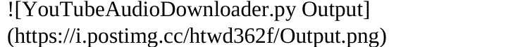

# 53个必做的Python项目大全

作者：Edcorner Learning

# 目录

**简介**

**模块一 项目 1-10**

- 1. 贪吃蛇游戏
- 2. 网站快照
- 3. 太空飞船游戏
- 4. 语音转文本转换器
- 5. 语音转文本
- 6. 网速测试
- 7. 拼写检查器
- 8. 按指定时间段分割视频文件
- 9. 文件分割
- 10. 将文件夹拆分为子文件夹

**模块二 项目 11-20**

- 11. 电子表格自动化
- 12. 将邮件存储为CSV
- 13. 从多个文件中搜索字符串
- 14. 休息提醒
- 15. 基于终端的猜词游戏
- 16. 带图片缩放的终端进度条
- 17. 文本转语音
- 18. 文本编辑器
- 19. 文本文件分析
- 20. 井字棋

**模块三 项目 21-30**

- 21. 井字棋AI
- 22. 网站加载时间
- 23. 使用Flask的待办事项应用
- 24. 无需API的Twitter爬虫
- 25. 打字速度测试
- 26. Instagram取关机器人
- 27. 文本文件中的唯一单词
- 28. 非结构化补充服务数据
- 29. 解压文件
- 30. 网址缩短器

**模块四 项目 31-40**

- 31. Python视频转音频转换器
- 32. 语音翻译器
- 33. 密码哈希处理
- 34. 天气应用
- 35. 网站摘要API
- 36. 网页评论爬虫
- 37. 网站屏蔽器
- 38. WhatsApp机器人
- 39. WhatsApp自动化
- 40. Instagram关注/取关

**模块五 项目 41-50**

- 41. 维基百科信息框爬虫
- 42. Python维基百科爬虫
- 43. Instagram图片下载
- 44. 带GUI的维基百科摘要脚本
- 45. 文字游戏
- 46. 工作环境自动化
- 47. 设置随机桌面背景
- 48. 压缩文件夹和文件
- 49. 整理目录中的文件
- 50. YouTube热门内容爬虫
- 51. LinkedIn人脉关系爬虫
- 52. 下载音频 – YouTube
- 53. YouTube视频下载器

如何下载此项目：

# 简介

Python是一种通用的、解释型的、交互式的、面向对象的、具有动态语义的强大编程语言。它易于学习并精通。Python是少数几种既声称简单又强大的语言之一。Python优雅的语法和动态类型，加上其解释型特性，使其成为在众多大型平台上进行脚本编写和健壮应用开发的理想语言。

Python通过模块和包来辅助开发，这促进了程序的模块化和代码重用。Python解释器以及广泛的标准化库均以源代码或二进制形式免费提供给所有关键平台，并可自由分发。学习Python不需要任何先决条件。然而，应该对编程语言有基本的理解。

**本书包含53个所有开发者/学生必做的Python项目，用于练习不同的项目和场景。将这些知识应用于专业任务或日常学习项目中。**

**在本书的最后，您可以通过我们的链接下载所有这些项目。**

所有53个项目被划分为不同的模块，每个项目在开发者执行日常任务方面都有其独特之处。每个项目都有其源代码，学习者可以复制并在自己的系统上练习/使用。如果任何项目有特殊要求，书中已作说明。

祝学习愉快！！

# 模块一 项目 1-10

## 1. 贪吃蛇游戏

贪吃蛇游戏是一款由Gremlin Industries开发的迷宫街机游戏。玩家的目标是通过收集食物或水果来获得尽可能高的分数。一旦蛇撞到墙壁或撞到自己，玩家就会失败。

### 设置说明

要运行此脚本，您只需要以下3个模块 -

- **Pygame：** 这是一组用于编写视频游戏的Python模块。
- **Time：** 此函数用于计算自纪元以来经过的秒数。
- **Random：** 此函数用于在Python中使用random模块生成随机数。

源代码：

```python
import pygame
import time
import random

pygame.init()

white = (255, 255, 255)
yellow = (255, 255, 102)
black = (0, 0, 0)
red = (213, 50, 80)
green = (0, 255, 0)
blue = (50, 153, 213)

dis_width = 600
dis_height = 400

dis = pygame.display.set_mode((dis_width, dis_height))
pygame.display.set_caption('Snake Game In Python')

clock = pygame.time.Clock()

snake_block = 10
snake_speed = 15

font_style = pygame.font.SysFont("bahnschrift", 25)
score_font = pygame.font.SysFont("comicsansms", 35)

def Your_score(score):
    value = score_font.render("Your Score: " + str(score), True, yellow)
    dis.blit(value, [0, 0])

def our_snake(snake_block, snake_list):
    for x in snake_list:
        pygame.draw.rect(dis, black, [x[0], x[1], snake_block,
        snake_block])

def message(msg, color):
    mesg = font_style.render(msg, True, color)
    dis.blit(mesg, [dis_width / 6, dis_height / 3])

def gameLoop():
    game_over = False
    game_close = False

    x1 = dis_width / 2
    y1 = dis_height / 2
    x1_change = 0
    y1_change = 0

    snake_List = []
    Length_of_snake = 1

    foodx = round(random.randrange(0, dis_width - snake_block) / 10.0) * 10.0
    foody = round(random.randrange(0, dis_height - snake_block) / 10.0) * 10.0

    while not game_over:

        while game_close == True:
            dis.fill(blue)
            message(
                "You Lost! Press 'C' to Play Again or 'Q' To Quit The Game",
                red)
            Your_score(Length_of_snake - 1)
            pygame.display.update()

            for event in pygame.event.get():
                if event.type == pygame.KEYDOWN:
                    if event.key == pygame.K_q:
                        game_over = True
                        game_close = False
                    if event.key == pygame.K_c:
                        gameLoop()

        for event in pygame.event.get():
            if event.type == pygame.QUIT:
                game_over = True
            if event.type == pygame.KEYDOWN:
                if event.key == pygame.K_LEFT:
                    x1_change = -snake_block
                    y1_change = 0
                elif event.key == pygame.K_RIGHT:
                    x1_change = snake_block
                    y1_change = 0
                elif event.key == pygame.K_UP:
                    y1_change = -snake_block
                    x1_change = 0
                elif event.key == pygame.K_DOWN:
                    y1_change = snake_block
                    x1_change = 0

        if x1 >= dis_width or x1 < 0 or y1 >= dis_height or y1 < 0:
            game_close = True
        x1 += x1_change
        y1 += y1_change
        dis.fill(blue)
        pygame.draw.rect(dis, green, [foodx, foody, snake_block,
        snake_block])
        snake_Head = []
        snake_Head.append(x1)
        snake_Head.append(y1)
        snake_List.append(snake_Head)
        if len(snake_List) > Length_of_snake:
            del snake_List[0]

        for x in snake_List[:-1]:
            if x == snake_Head:
                game_close = True

        our_snake(snake_block, snake_List)
        Your_score(Length_of_snake - 1)

        pygame.display.update()

        if x1 == foodx and y1 == foody:
            foodx = round(
                random.randrange(0, dis_width - snake_block) / 10.0) * 10.0
            foody = round(
                random.randrange(0, dis_height - snake_block) / 10.0) * 10.0
            Length_of_snake += 1

        clock.tick(snake_speed)

    pygame.quit()
    quit()

gameLoop()
```

## 3. 太空飞船游戏

- 该Python脚本利用流行的GUI模块Pygame来开发一个交互式多人太空飞船游戏。
- 两名玩家竞争向对方瞄准子弹，首先失去生命值的玩家失败。

### 要求：

运行脚本所需的所有包可以按如下方式安装：

```sh
$ pip install -r requirements.txt
```

### 要求

pygame==2.0.1

源代码文件：

main.py

utility.py

## 2. 网站快照

### 设置

```bash
pip install selenium
pip install chromedriver-binary==XX.X.XXXX.XX.X
```

- 'XX.X.XXXX.XX.X' 是Chrome驱动程序版本。
- 'chrome driver' 的版本需要与您的Google Chrome版本匹配。

*如何查找您的Google Chrome版本*

1. 点击屏幕右上角的菜单图标。
2. 点击帮助，然后点击关于Google Chrome。
3. 您的Chrome浏览器版本号可以在这里找到。

### 执行

```bash
python snapshot_of_given_website.py <url>
```

运行此脚本后，快照位于当前目录中。

**要求：**

**selenium==3.141.0**

## chromedriver-binary==85.0.4183.38.0

**源代码：**

```python
# -*- coding: utf-8 -*-
import sys
from selenium import webdriver
from selenium.webdriver.chrome.options import Options
import chromedriver_binary

script_name = sys.argv[0]

options = Options()
options.add_argument('--headless')
driver = webdriver.Chrome(options=options)

try:
    url = sys.argv[1]

    driver.get(url)
    page_width = driver.execute_script('return document.body.scrollWidth')
    page_height = driver.execute_script('return document.body.scrollHeight')
    driver.set_window_size(page_width, page_height)
    driver.save_screenshot('screenshot.png')
    driver.quit()
    print("SUCCESS")

except IndexError:
    print('Usage: %s URL' % script_name)
```

## 4. 语音转文本转换器

这个Python脚本使用NLP（自然语言处理）将语音输入转换为文本。

### 要求

**需要安装**：

- Python语音识别模块：
    `pip install speechrecognition`

- PyAudio：
    - Linux用户使用以下命令
        `sudo apt-get install python3-pyaudio`
    - Windows用户可以在终端中执行以下命令安装pyaudio
        `pip install pyaudio`

- Python pyttsx3模块：
    `pip install pyttsx3`

### 如何运行脚本

- 通过对着麦克风说话输入音频。
- 运行converter_terminal.py脚本
- 输出文本将被显示

### 要求（使用的Python模块）

PyAudio==0.2.11
SpeechRecognition==3.8.1

**源代码：**

```python
import speech_recognition

def record_voice():
    microphone = speech_recognition.Recognizer()
    with speech_recognition.Microphone() as live_phone:
        microphone.adjust_for_ambient_noise(live_phone)

        print("I'm trying to hear you: ")
        audio = microphone.listen(live_phone)
        try:
            phrase = microphone.recognize_google(audio, language='en')
            return phrase
        except speech_recognition.UnknownValueError:
            return "I didn't understand what you said"

if __name__ == '__main__':
    phrase = record_voice()

    with open('you_said_this.txt','w') as file:
        file.write(phrase)

    print('the last sentence you spoke was saved in you_said_this.txt')
```

## 5. 语音转文本

一个可以使用Python将语音转换为文本的程序

### 依赖项：

*pyttsx3*
```
pip install pyttsx3
```

*pyaudio*
```
pip install pyaudio
```

*SpeechRecognition*
```
pip install SpeechRecognition
```

### 运行：

*文本将保存在output.txt文件中*
```
python speech-to-text.py
```

**源代码：**

```python
import pyttsx3
import speech_recognition as sr
import os

engine = pyttsx3.init('sapi5')
voices = engine.getProperty('voices')
#print(voices[1].id)
engine.setProperty('voice',voices[0].id)

def speak(audio):
    engine.say(audio)
    engine.runAndWait()

def get():
    r = sr.Recognizer()

    with sr.Microphone() as source:
        print('say something!')
        audio = r.listen(source)
        print("done")
        try:
            text = r.recognize_google(audio)
            print('google think you said:\n' +text)
        except Exception as e:
            print(e)

    remember = open('output.txt','w')
    remember.write(text)
    remember.close()

get()
```

## 6. 速度测试

使用Python进行速度测试

### 依赖项：

*youtube_dl*
```
pip3 install speedtest-cli
```

**源代码：**

```python
import subprocess

returned_text = subprocess.check_output("speedtest-cli", shell=True, universal_newlines=True)
print("The Result of Speed Test")
print(returned_text)
```

## 7. 拼写检查器

在这里，你可以输入任何单词并检查其拼写是否正确。

### 先决条件

你需要安装的第一个库是textblob
```
pip install textblob
```
你需要在终端或IDE终端中运行此命令。

如果你使用Jupyter Notebook，你需要使用以下命令
```
import sys
!{sys.executable} -m pip install textblob
```

### 如何运行脚本

你可以先安装textblob库，然后运行Python脚本。

**源代码：**

```python
from textblob import TextBlob  # importing textblob library

t = 1
while t:
    a = input("Enter the word to be checked:- ") # incorrect spelling
    print("original text: "+str(a))   #printing original text

    b = TextBlob(a) #correcting the text

    # prints the corrected spelling
    print("corrected text: "+str(b.correct()))
    t = int(input("Try Again? 1 : 0 "))
```

## 8. 按给定时间段分割视频文件

当给定有效的时间段时，此脚本会将视频分割成两个文件。
```
pip install ffmpeg-python
```

### 用法
```
python videosplitter.py test.mp4 0 50 out1.mp4 out2.mp4
```
或
```
python videosplitter.py -h
```

**要求 - ffmpeg==1.4**

**源代码：**

```python
import ffmpeg
import argparse

parser = argparse.ArgumentParser(description="Split A media file into two chunks")
parser.add_argument('inputfile', help="Input filename")
parser.add_argument('starttime', type=float, help="Start time in seconds")
parser.add_argument('endtime', type=float, help="End time in seconds")
parser.add_argument('outputfile1', help="Output filename")
parser.add_argument('outputfile2', help="Output filename")

args = parser.parse_args()

in1 = ffmpeg.input(args.inputfile)

v1 = in1.filter('trim', start=float(args.starttime), end=(args.endtime))
v2 = in1.filter('trim', start=float(args.endtime))

out1 = ffmpeg.output(v1, args.outputfile1)
out2 = ffmpeg.output(v2, args.outputfile2)

out1.run()
out2.run()
```

## 9. 分割文件

此程序接受分割索引和文件名，然后根据提供的索引进行分割。

### 先决条件

要执行此脚本，主机系统必须安装Python。

### 如何运行脚本

只需在终端中输入：
`python split_files.py <csv/text_file> <split/line_number>`

**要求：**
**pandas==1.1.0**

**源代码：**

```python
import sys
import os
import shutil
import pandas as pd

class Split_Files:
    """
    Class file for split file program
    """
    def __init__(self, filename, split_number):
        """
        Getting the file name and the split index
        Initializing the output directory, if present then truncate it.
        Getting the file extension
        """
        self.file_name = filename
        self.directory = "file_split"
        self.split = int(split_number)
        if os.path.exists(self.directory):
            shutil.rmtree(self.directory)
        os.mkdir(self.directory)
        if self.file_name.endswith('.txt'):
            self.file_extension = '.txt'
        else:
            self.file_extension = '.csv'
        self.file_number = 1

    def split_data(self):
        """
        splitting the input csv/txt file according to the index provided
        """
        data = pd.read_csv(self.file_name, header=None)
        data.index += 1

        split_frame = pd.DataFrame()
        output_file = f"{self.directory}/split_file{self.file_number}{self.file_extension}"

        for i in range(1, len(data)+1):
            split_frame = split_frame.append(data.iloc[i-1])
            if i % self.split == 0:
                output_file = f"{self.directory}/split_file{self.file_number}{self.file_extension}"
                if self.file_extension == '.txt':
                    split_frame.to_csv(output_file, header=False, index=False, sep=' ')
                else:
                    split_frame.to_csv(output_file, header=False, index=False)
                split_frame.drop(split_frame.index, inplace=True)
                self.file_number += 1
        if not split_frame.empty:
            output_file = f"{self.directory}/split_file{self.file_number}{self.file_extension}"
            split_frame.to_csv(output_file, header=False, index=False)

if __name__ == '__main__':
    file, split_number = sys.argv[1], sys.argv[2]
    sp = Split_Files(file, split_number)
    sp.split_data()
```

## 10. 将文件夹拆分为子文件夹

### 执行
python <输入文件夹名> <文件数量>

**源代码：**

```python
import glob
import os
from shutil import copy2
import sys

def get_files(path):
    """
    return a list of files available in given folder
    """
    files = glob.glob(f'{path}/*')
    return files

def getfullpath(path):
    """
    Return absolute path of given file
    """
    return os.path.abspath(path)

def copyfiles(src, dst):
    '''
    This function copy file from src to dst
    if dst dir is not there it will create new
    '''
    if not os.path.isdir(dst):
        os.makedirs(dst)
    copy2(src, dst)

def split(data, count):
    '''
    Split Given list of files and return generator
    '''
    for i in range(1, len(data), count):
        if i + count-1 > len(data):
            start, end = (i-1, len(data))
        else:
            start, end = (i-1, i+count-1)
        yield data[start:end]

def start_process(path, count):
    files = get_files(path)
    splited_data = split(files, count)

    for idx, folder in enumerate(splited_data):
        name = f'data_{idx}'
        for file in folder:
            copyfiles(getfullpath(file), getfullpath(name))

if __name__ == "__main__":
    """
    driver code
    To run this script
    python split_and_copy.py <input folder path> <20>
    """

    if len(sys.argv) != 3:
        print("Please provide correct parameters \n\npython split_and_copy.py <input folder path> <count>")
        sys.exit(0)

    if len(sys.argv) == 3:
        path = sys.argv[1]
        if os.path.isdir(path):
            count = sys.argv[2]
            start_process(path, int(count))
        else:
            print('Given directory name is not an valid directory')
    else:
        print('Wrong parameter are provided')
```

# 模块 2 项目 11-20

## 11. 电子表格自动化

### 电子表格自动化功能：

- 首先上传两个数据集
- 脚本将比较这两个数据集
- 输出将是一个饼图

### 电子表格自动化说明：

#### 步骤 1：

打开终端

#### 步骤 2：

定位到 Python 文件所在的目录

#### 步骤 3：

运行命令：python script.py/python3 script.py

#### 步骤 4：

坐下来放松。让脚本完成工作。

### 依赖项

- pandas
- plotly

**源代码：**

```python
# importing libraries

import pandas as pd
import plotly.express as px

# storing the dataset
data1 = input("Enter first dataset")
data2 = input("Enter second dataset")

# reading the data
data_read_1 = pd.read_excel(data1)
data_read_2 = pd.read_excel(data2)

# print(df_prices, df_home_1)

reference = input("What is the basis of merging? ")
data_total = data_read_2.merge(data_read_1, on=reference)

# print(df_total)
criteria_1 = input("Enter criteria 1")
criteria_2 = input("Enter criteria 2")
fig = px.pie(data_total[[criteria_1, criteria_2]],
             values=criteria_2, names=criteria_1)
fig.show()
```

## 12. 将电子邮件存储为 CSV

此项目包含一个简单的脚本，用于从 IMAP 服务器提取电子邮件消息。

消息将被写入一个简单的四列 CSV 文件。

### 依赖项

此脚本依赖于 BeautifulSoup 库和 `lxml` 来从 HTML 消息中提取文本。

### 运行脚本

您需要有一个名为 `credentials.txt` 的文件，其中包含您的 IMAP 服务器账户名和密码，分别位于不同的行。

Gmail - 以及许多其他 IMAP 提供商 - 要求您创建一个单独的“应用专用密码”才能运行此代码，因此可能需要先完成此操作。然后将该密码放入 `credentials.txt`。

然后只需运行

```
python store_emails.py
```

这将在当前目录生成 `mails.csv`。

生成的 CSV 文件包含每条消息的以下字段：

- 日期
- 发件人
- 主题
- 邮件正文

**依赖项：**
beautifulsoup4
lxml

**源代码：**

```python
#!/usr/bin/env python

import csv
import email
from email import policy
import imaplib
import logging
import os
import ssl

from bs4 import BeautifulSoup

credential_path = "credentials.txt"
csv_path = "mails.csv"

logger = logging.getLogger('imap_poller')

host = "imap.gmail.com"
port = 993
ssl_context = ssl.create_default_context()

def connect_to_mailbox():
    # get mail connection
    mail = imaplib.IMAP4_SSL(host, port, ssl_context=ssl_context)

    with open(credential_path, "rt") as fr:
        user = fr.readline().strip()
        pw = fr.readline().strip()
        mail.login(user, pw)

    # get mail box response and select a mail box
    status, messages = mail.select("INBOX")
    return mail, messages

# get plain text out of html mails
def get_text(email_body):
    soup = BeautifulSoup(email_body, "lxml")
    return soup.get_text(separator="\n", strip=True)

def write_to_csv(mail, writer, N, total_no_of_mails):

    for i in range(total_no_of_mails, total_no_of_mails - N, -1):
        res, data = mail.fetch(str(i), "(RFC822)")

        response = data[0]
        if isinstance(response, tuple):
            msg = email.message_from_bytes(response[1], policy=policy.default)

            # get header data
            email_subject = msg["subject"]
            email_from = msg["from"]
            email_date = msg["date"]
            email_text = ""

            # if the email message is multipart
            if msg.is_multipart():
                # iterate over email parts
                for part in msg.walk():
                    # extract content type of email
                    content_type = part.get_content_type()
                    content_disposition = str(part.get("Content-Disposition"))
                    try:
                        # get the email email_body
                        email_body = part.get_payload(decode=True)
                        if email_body:
                            email_text = get_text(email_body.decode('utf-8'))
                    except Exception as exc:
                        logger.warning('Caught exception: %r', exc)
                    if (
                        content_type == "text/plain"
                        and "attachment" not in content_disposition
                    ):
                        # print text/plain emails and skip attachments
                        # print(email_text)
                        pass
                    elif "attachment" in content_disposition:
                        pass

            else:
                # extract content type of email
                content_type = msg.get_content_type()
                # get the email email_body
                email_body = msg.get_payload(decode=True)
                if email_body:
                    email_text = get_text(email_body.decode('utf-8'))

            if email_text is not None:
                # Write data in the csv file
                row = [email_date, email_from, email_subject, email_text]
                writer.writerow(row)
            else:
                logger.warning('%s:%i: No message extracted', "INBOX", i)

def main():
    mail, messages = connect_to_mailbox()

    logging.basicConfig(level=logging.WARNING)

    total_no_of_mails = int(messages[0])

    # no. of latest mails to fetch
    # set it equal to total_no_of_emails to fetch all mail in the inbox
    N = 2

    with open(csv_path, "wt", encoding="utf-8", newline="") as fw:
        writer = csv.writer(fw)
        writer.writerow(["Date", "From", "Subject", "Text mail"])
        try:
            write_to_csv(mail, writer, N, total_no_of_mails)
        except Exception as exc:
            logger.warning('Caught exception: %r', exc)

if __name__ == "__main__":
    main()
```

## 13. 从多个文件中搜索字符串

在您选择的指定文件夹中查找包含输入字符串的文件。

### 先决条件

Python3 是唯一的先决条件！运行不需要外部模块。

### 如何运行脚本

要运行此脚本，您必须安装 Python3，而不是 Python2。运行此脚本的命令很简单：`python3 findstring.py`，然后您将被提示回答两个问题：要搜索的字符串，以及在哪里查找。

**源代码：**

```python
import os

text = input("input text : ")

path = input("path : ")

# os.chdir(path)

def getfiles(path):
    f = 0
    os.chdir(path)
    files = os.listdir()
    # print(files)
    for file_name in files:
        abs_path = os.path.abspath(file_name)
        if os.path.isdir(abs_path):
            getfiles(abs_path)
        if os.path.isfile(abs_path):
            f = open(file_name, "r")
            if text in f.read():
                f = 1
                print(text + " found in ")
                final_path = os.path.abspath(file_name)
                print(final_path)
                return True
```

## 14. 休息一下

1.  获取或设置一些用户喜欢的网址
2.  计时2小时
3.  提示浏览器打开其中一个设置的网址
4.  通过循环实现此功能

### 源代码文件：


firstTry.py


openURL.py


wait2Hours.py

## 15. 基于终端的猜词游戏

本项目包含一个简单的Python脚本，用于玩基于终端的猜词游戏。

### 前提条件

无

### 如何运行脚本

-   运行 hangman.py 脚本。
-   开始猜测单词。

### 源代码：

```python
import random
from json import load

# function to randomly get one word from words.py and convert the word to uppercase
def get_word():
    with open('words.json') as json_file:
        data = load(json_file)
    wordArray = data["word_list"]
    word = random.choice(wordArray)
    word = word.upper()
    return word

# function to play the game
def play(word):

    # initialise variable
    word_completion = "_" * len(word) # generate a line to show the number of word
    guessed = False # indicate the status of guess
    guessed_letters = [] # store guessed letters
    guessed_words = [] # store guessed words
    tries = 6 # user have 6 times of wrong
    # display message and the format of the hangman
    print("Let's play Hangman!")
    print(display_hangman(tries))
    print(word_completion)
    print("\n")
    print("Length of the word: ", len(word))
    print("\n")

    # user can keep guessing when the tries is more than 0 and the answer is not found yet.
    while not guessed and tries > 0:

        # Display message and ask for user input and convert it into uppercase
        guess = input("Please guess a letter or the word: ").upper()

        # check the length of the user input and is it alpha or not
        if len(guess) == 1 and guess.isalpha():

            # display message when user guess the same letter twice
            if guess in guessed_letters:
                print("You already guessed the letter", guess)

            # display message and deduct the tries when user guess the wrong letter
            elif guess not in word:
                print(guess, "is not in the word.")
                tries -= 1
                guessed_letters.append(guess)

            # display message and store the letter when the user guess the correct letter
            else:
                print("Good job,", guess, "is in the word!")
                guessed_letters.append(guess)
                word_as_list = list(word_completion)

                indices = [i for i, letter in enumerate(word) if letter == guess]
                for index in indices:
                    word_as_list[index] = guess

                # join the guess word in the word_completion
                word_completion = "".join(word_as_list)

                # if there is not blank space in word_completion change the status of guess to true
                if "_" not in word_completion:
                    guessed = True

        # check the length of the user input and is it alpha or not
        elif len(guess) == len(word) and guess.isalpha():
            # display message when user guess the same letter twice
            if guess in guessed_words:
                print("You already guessed the word", guess)

            # display message and deduct the tries when user guess the wrong letter
            elif guess != word:
                print(guess, "is not the word.")
                tries -= 1
                guessed_words.append(guess)

            # change the status of guess
            else:
                guessed = True
                word_completion = word

        # display error message for user
        else:
            print("Not a valid guess.")

        # display the format of hangman each time of guess
        print(display_hangman(tries))
        print(word_completion)
        print("\n")
        print("Length of the word: ", len(word))
        print("\n")

    # if the variable of guess is true means user win the game
    if guessed:
        print("Congrats, you guessed the word! You win!")

    # else means user lose the game.
    else:
        print("Sorry, you ran out of tries. The word was " + word + ". Maybe next time!")

# function to display the format of hangman
def display_hangman(tries):
    stages = ["""
        --------
        |      |
        |      0
        |     \|/
        |      |
        |     / \n        -
    """,
    """
        --------
        |      |
        |      0
        |     \|/
        |      |
        |     /
        -
    """,
    """
        -------
        |   |
        | 0 |
        | \|/
        |   |
        |
        -
    """,
    """
        -------
        |   |
        | 0 |
        | \|/
        |   |
        |
        -
    """,
    """
        -------
        |   |
        | 0 |
        |   |
        |   |
        |
    """,
    """
        -------
        |     |
        |     O
        |
        |
        |
        -
    """,
    """
        -------
        |     |
        |
        |
        |
        -
    """
    ]
    return stages[tries]

# main function to start the game
def main():
    word = get_word()
    play(word)
    while input("Play Again? (Y/N): ").upper() == "Y":
        word = get_word()
        play(word)

if __name__ == "__main__":
    main()
```

## 16. 带图像缩放的终端进度条

这里我以图像缩放为例来展示进度条。当我们同时转换大量图像时，可以使用进度条来显示已缩放了多少图像。

### 为此，我使用了 tqdm 库

```
pip install tqdm
```

此库用于显示进度条

### 用于缩放图像

```
pip install Pillow
```

**要求：**
**tqdm==4.48.2**
**PIL==1.1.6**

**源代码：**

```python
from tqdm import tqdm
from PIL import Image
import os
from time import sleep

def Resize_image(size, image):
    if os.path.isfile(image):
        try:
            im = Image.open(image)
            im.thumbnail(size, Image.ANTIALIAS)
            im.save("resize/" + str(image) + ".jpg")
        except Exception as ex:
            print(f"Error: {str(ex)} to {image}")

path = input("Enter Path to images : ")
size = input("Size Height , Width : ")
size = tuple(map(int, size.split(",")))

os.chdir(path)

list_images = os.listdir(path)
if "resize" not in list_images:
    os.mkdir("resize")

for image in tqdm(list_images, desc="Resizing Images"):
    Resize_image(size, image)
    sleep(0.1)
print("Resizing Completed!")
```

## 17. 文本转语音

执行后，abc.txt 中的文本将被转换为 mp3 文件，保存后在您的设备上播放。

### 前提条件

-   包含您文本的 abc.txt 文件
-   gTTS==2.1.1 模块（通过 `pip install gTTS` 下载）
-   os 模块（通过 `pip install os` 安装）

### 如何运行脚本

将您想要的文本写入 abc.txt 文件，然后执行 txtToSpeech.py 文件。这可以通过在终端中输入 'python txtToSpeech.py' 来完成。

**要求 - gTTS==2.1.1**

**源代码：**

```python
from gtts import gTTS
import os

file = open("abc.txt", "r").read()

speech = gTTS(text=file, lang='en', slow=False)
speech.save("voice.mp3")
os.system("voice.mp3")

#print(file)
```

## 18. 文本编辑器

**源代码：**

```python
from tkinter import *
import tkinter.filedialog

class TextEditor:

    @staticmethod
    def quit_app(event=None):
        root.quit()

    def open_file(self, event=None):

        txt_file = tkinter.filedialog.askopenfilename(parent=root,
            initialdir="./examples")

        if txt_file:

            self.text_area.delete(1.0, END)

            with open(txt_file) as _file:

                self.text_area.insert(1.0, _file.read())

            root.update_idletasks()

    def save_file(self, event=None):
        file = tkinter.filedialog.asksaveasfile(mode='w')

        if file != None:
            data = self.text_area.get('1.0', END + '-1c')

            file.write(data)
            file.close()

    def __init__(self, root):
        self.text_to_write = ""

        root.title("TextEditor")

        root.geometry("600x550")

        frame = Frame(root, width=600, height=550)

        scrollbar = Scrollbar(frame)

        self.text_area = Text(frame , width=600, height=550,
            yscrollcommand=scrollbar.set, padx = 10, pady=10)

        scrollbar.config(command=self.text_area.yview)

        scrollbar.pack(side="right", fill="y")

        self.text_area.pack(side="left", fill="both", expand=True)

        frame.pack()

        the_menu = Menu(root)

        file_menu = Menu(the_menu, tearoff=0)
        file_menu.add_command(label="Open", command=self.open_file)
        file_menu.add_command(label="Save", command=self.save_file)

        file_menu.add_separator()
        file_menu.add_command(label="Quit", command=self.quit_app)

        the_menu.add_cascade(label="File", menu=file_menu)
        root.config(menu=the_menu)

root = Tk()
```

## 19. 文本文件分析

```python
# -*- coding: utf-8 -*-
import os
import sys
import collections
import string

script_name = sys.argv[0]

res = {
    "total_lines":"",
    "total_characters":"",
    "total_words":"",
    "unique_words":"",
    "special_characters":""
}

try:
    textfile = sys.argv[1]
    with open(textfile, "r", encoding = "utf_8") as f:

        data = f.read()
        res["total_lines"] = data.count(os.linesep)
        res["total_characters"] = len(data.replace(" ", "")) - res["total_lines"]
        counter = collections.Counter(data.split())
        d = counter.most_common()
        res["total_words"] = sum([i[1] for i in d])
        res["unique_words"] = len([i[0] for i in d])
        special_chars = string.punctuation
        res["special_characters"] = sum(v for k, v in collections.Counter(data).items() if k in special_chars)

except IndexError:
    print('Usage: %s TEXTFILE' % script_name)
except IOError:
    print('"%s" cannot be opened.' % textfile)

print(res)
```

## 20. 井字棋

### 描述

一个基于Python的双人井字棋游戏。
它接收两位玩家各自的x和y坐标输入。
两位玩家分别命名为X和O，
将轮流输入他们想要的坐标以赢得游戏。

### 前提条件

使用任何Python在线编译器或从 https://www.python.org/ 下载Python IDE。

### 如何运行

只需运行

```sh
python tic_tac_toe.py
```

### 源代码：

```python
def start():
    global board
    board = [
        ["","",""],
        ["","",""],
        ["","",""]
    ]

def print_board():
    print(' ---------')
    for row in board:
        print(' ',row[0],'|',row[1],'|',row[2])
        print(' ---------')

def have_empty_room():
    for row in board:
        for room in row:
            if not room:
                return True
    return False

def set_room_state(roomxy,state):
    x = int(roomxy[0])-1
    y = int(roomxy[1])-1
    row = board[x]
    room = row[y]
    if not room:
        board[x][y] = state
        return True
    return False

def check_xy(xy):
    xy = str(xy)
    if len(xy) != 2:
        return False
    if int(xy[0]) > 3 or int(xy[0]) < 1 or int(xy[1]) > 3 or int(xy[1]) < 1:
        return False
    return True

def check_for_win():
    if board[0][0] == board[0][1] == board[0][2] != "":
        winner = board[0][0]
        print(f'{winner} won!')

    elif board[1][0] == board[1][1] == board[1][2] != "":
        winner = board[1][0]
        print(f'{winner} won!')

    elif board[2][0] == board[2][1] == board[2][2] != "":
        winner = board[2][0]
        print(f'{winner} won!')

    elif board[0][0] == board[1][0] == board[2][0] != "":
        winner = board[0][0]
        print(f'{winner} won!')

    elif board[0][1] == board[1][1] == board[2][1] != "":
        winner = board[0][1]
        print(f'{winner} won!')

    elif board[0][2] == board[1][2] == board[2][2] != "":
        winner = board[0][0]
        print(f'{winner} won!')

    elif board[0][0] == board[1][1] == board[2][2] != "":
        winner = board[0][0]
        print(f'{winner} won!')

    elif board[0][2] == board[1][1] == board[2][0] != "":
        winner = board[0][2]
        print(f'{winner} won!')

    else:
        return False

    return True

turn = 'o'
start()

while have_empty_room():
    print_board()
    print('\n')
    if turn == 'o':
        turn = 'x'
    else:
        turn = 'o'
    print(f'{turn}\'s Turn!')
    while True:
        xy = int(input('enter x and y: '))
        if check_xy(xy):
            if set_room_state(str(xy),turn):
                break
            print('This room is full!')
            continue
        print('Error!')
        continue

    if check_for_win():
        break

print_board()
print('Game Over')
input()
```

# 模块3 项目 21-30

## 21. 井字棋AI

为井字棋游戏添加一个简单的AI：

### 3种模式：

- 玩家对玩家（双人模式）
- 玩家对AI（单人模式）
- AI对AI（*娱乐模式*）

### *参考*

#### *逻辑*

- 最优井字棋走法

### 演示：

#### 每次玩家移动后，棋盘都会被打印出来。

棋盘将如下所示！
这个3x3棋盘的位置与**你键盘右侧的数字小键盘**相同。

### 源代码：

```python
#####     井字棋     #####

#开始;

#函数;

def default():
    #作为默认值打印;
    print("\n欢迎！让我们来玩井字棋！\n")

def rules():
    print("棋盘将如下所示！")
    print("这个3x3棋盘的位置与你键盘右侧的数字小键盘相同。\n")
    print(" 7 | 8 | 9 ")
    print("-----------")
    print(" 4 | 5 | 6 ")
    print("-----------")
    print(" 1 | 2 | 3 ")
    print("\n你只需输入位置(1-9)。")

def play():
    #询问玩家是否准备好;
    return input("\n你准备好玩游戏了吗？输入 [Y]es 或 [N]o。\t").upper().startswith('Y')

def names():
    #玩家姓名输入;

    p1_name=input("\n输入玩家1的姓名：\t").capitalize()
    p2_name=input("输入玩家2的姓名：\t").capitalize()
    return (p1_name, p2_name)

def choice():
    #玩家选择输入;
    p1_choice = ' '
    p2_choice = ' '
    while p1_choice != 'X' or p1_choice != 'O':       #当循环；如果输入的值不是X或O;

        #当循环开始

        p1_choice = input(f"\n{p1_name}, 你想成为X还是O？\t") [0].upper()
        #上面的输入末尾有 [0].upper()];
        #所以用户可以输入x, X, xxxx 或 XXX；输入将始终被视为X;
        #从而，增加了用户输入窗口;

        if p1_choice == 'X' or p1_choice == 'O':
            #如果输入的值是X或O；跳出循环;
            break
        print("输入无效！请重试！")
        #如果输入的值不是X或O，重新运行当循环;

    #当循环结束
    #将值分配给p2，然后显示值;
    if p1_choice == 'X':
        p2_choice = 'O'
    elif p1_choice == 'O':
        p2_choice = 'X'

    return (p1_choice, p2_choice)

def first_player():
    #此函数将随机决定谁先走;
    import random
    return random.choice((0, 1))

def display_board(board, avail):
    print("    " + " {} | {} | {} ".format(board[7],board[8],board[9]) + "        "
          + " {} | {} | {} ".format(avail[7],avail[8],avail[9]))
    print("    " + "-----------" + "        " + "-----------")
    print("   " + " {} | {} | {} ".format(board[4],board[5],board[6]) + "       " + " {} | {} | {} ".format(avail[4],avail[5],avail[6]))
    print("   " + "-----------" + "       " + "-----------")
    print("   " + " {} | {} | {} ".format(board[1],board[2],board[3]) + "       " + " {} | {} | {} ".format(avail[1],avail[2],avail[3]))

def player_choice(board, name, choice):
    position = 0
    #将位置初始化为0^；这样它就能通过当循环;
    while position not in [1,2,3,4,5,6,7,8,9] or not space_check(board, position):
        position = int(input(f'\n{name} ({choice}), 选择你的下一个位置：(1-9) \t'))

        if position not in [1,2,3,4,5,6,7,8,9] or not space_check(board, position) or position == "":
            #检查给定的位置是否在集合[1-9]中，或者是否为空或已被占用;
            print(f"输入无效。请重试！\n")
    print("\n")
    return position

# 这是添加AI的函数：
def CompAI(board, name, choice):
    position = 0
    possibilities = [x for x, letter in enumerate(board) if letter == ' ' and x != 0]

    # 包括X和O，因为如果电脑会赢，它会把选择放在那里，
    # 但如果组件会赢 --> 我们必须阻止那一步
    for let in ['O', 'X']:
        for i in possibilities:
            # 每次都创建棋盘的副本，放置移动并检查是否获胜;
            # 像这样创建副本，而不是 boardCopy = board，因为
            # 对 boardCopy 的更改会改变原始棋盘;
            boardCopy = board[:]
            boardCopy[i] = let
            if(win_check(boardCopy, let)):
                position = i
                return position

    openCorners = [x for x in possibilities if x in [1, 3, 7, 9]]

    if len(openCorners) > 0:
        position = selectRandom(openCorners)
        return position

    if 5 in possibilities:
        position = 5
        return position
```

openEdges = [x for x in possibilities if x in [2, 4, 6, 8]]

if len(openEdges) > 0:
    position = selectRandom(openEdges)
    return position

def selectRandom(board):
    import random
    ln = len(board)
    r = random.randrange(0, ln)
    return board[r]

def place_marker(board, avail, choice, position):
    # 在棋盘列表中标记/替换指定位置；
    board[position] = choice
    avail[position] = ' '

def space_check(board, position):
    # 检查给定位置是空还是已被占用；
    return board[position] == ' '

def full_board_check(board):
    # 检查棋盘是否已满，若满则游戏平局；
    for i in range(1, 10):
        if space_check(board, i):
            return False
    return True

def win_check(board, choice):
    # 检查以下任一模式是否成立；若成立，则对应玩家获胜！

    # 水平检查；
    return (
        ( board[1] == choice and board[2] == choice and board[3] == choice )
        or ( board[4] == choice and board[5] == choice and board[6] == choice )
        or ( board[7] == choice and board[8] == choice and board[9] == choice )
        # 垂直检查；
        or ( board[1] == choice and board[4] == choice and board[7] == choice )
        or ( board[2] == choice and board[5] == choice and board[8] == choice )
        or ( board[3] == choice and board[6] == choice and board[9] == choice )
        # 对角线检查；
        or ( board[1] == choice and board[5] == choice and board[9] == choice )
        or ( board[3] == choice and board[5] == choice and board[7] == choice )  )

def delay(mode):
    if mode == 2:
        import time
        time.sleep(2)

def replay():
    # 用户是否想再玩一局？
    return input('\n你想再玩一次吗？输入 [Y]es 或 [N]o: ').lower().startswith('y')

# 主程序开始；

print("\n\t\t 欢迎！ \n")
input("按回车键开始！")

default()
rules()

while True:

####################################################################################################

# 创建一个列表作为棋盘；将不断用用户输入替换它；
theBoard = [' ']*10

# 创建棋盘上的可用选项：
available = [str(num) for num in range(0, 10)] # 列表推导式
# available = '0123456789'

print("\n[0]. 玩家 vs. 电脑")
print("[1]. 玩家 vs. 玩家")
print("[2]. 电脑 vs. 电脑")
mode = int(input("\n请选择一个选项 [0]-[2]: "))
if mode == 1:
    # 询问姓名；
    p1_name, p2_name = names()
    # 询问选择；打印选择；X 或 O；
    p1_choice, p2_choice = choice()
    print(f"\n{p1_name}:", p1_choice)
    print(f"{p2_name}:", p2_choice)

elif mode == 0:
    p1_name = input("\n请输入将与电脑对战的玩家姓名:\t").capitalize()
    p2_name = "电脑"
    # 询问选择；打印选择；X 或 O；
    p1_choice, p2_choice = choice()
    print(f"\n{p1_name}:", p1_choice)
    print(f"{p2_name}:", p2_choice)

else:
    p1_name = "电脑1"
    p2_name = "电脑2"
    p1_choice, p2_choice = "X", "O"
    print(f"\n{p1_name}:", p1_choice)
    print(f"\n{p2_name}:", p2_choice)

# 随机打印谁将先手；
if first_player():
    turn = p2_name
else:
    turn = p1_name

print(f"\n{turn} 将先手！")

# 询问用户是否准备好开始游戏；输出为 True 或 False；
if(mode == 2):
    ent = input("\n这将会很快！按回车键开始战斗！\n")
    play_game = 1
else:
    play_game = play()

while play_game:

    ###################################
    # 玩家1
    if turn == p1_name:

        # 显示棋盘；
        display_board(theBoard, available)

        # 输入的位置；
        if mode != 2:
            position = player_choice(theBoard, p1_name, p1_choice)
        else:
            position = CompAI(theBoard, p1_name, p1_choice)
            print(f'\n{p1_name} ({p1_choice}) 已放置在 {position}\n')

        # 将 *theBoard* 列表中 *position* 处的 ' ' 替换为 *p1_choice*；
        place_marker(theBoard, available, p1_choice, position)

        # 检查玩家1在当前输入后是否获胜；
        if win_check(theBoard, p1_choice):
            display_board(theBoard, available)
            print("~~~~~~~~~~~~~~~~~~~~~~~~~~~~~~~~~~~~~~~~~~~~~~~~~~~~~~~~~~~~")
            if(mode):
                print(f'\n\n恭喜 {p1_name}！你赢得了游戏！\n\n')
            else:
                print('\n\n电脑赢得了游戏！\n\n')
            print("~~~~~~~~~~~~~~~~~~~~~~~~~~~~~~~~~~~~~~~~~~~~~~~~~~~~~~~~")
            play_game = False

        else:
            # 检查棋盘是否已满；若满，则游戏平局；
            if full_board_check(theBoard):
                display_board(theBoard, available)
                print("~~~~~~~~~~~~~~~~~~~~~~~~~~~~")
                print('\n游戏平局！\n')
                print("~~~~~~~~~~~~~~~~~~~~~~~~~~~~")
                break
            # 若以上情况均不成立，则轮到玩家2；
            else:
                turn = p2_name

    ####################################
    # 玩家2
    elif turn == p2_name:

        # 显示棋盘；
        display_board(theBoard, available)

        # 输入的位置；
        if(mode == 1):
            position = player_choice(theBoard, p2_name, p2_choice)
        else:
            position = CompAI(theBoard, p2_name, p2_choice)
            print(f'\n{p2_name} ({p2_choice}) 已放置在 {position}\n')

        # 将 *theBoard* 列表中 *position* 处的 ' ' 替换为 *p2_choice*；
        place_marker(theBoard, available, p2_choice, position)

        # 检查玩家2在当前输入后是否获胜；
        if win_check(theBoard, p2_choice):
            display_board(theBoard, available)
            print("~~~~~~~~~~~~~~~~~~~~~~~~~~~~~~~~~~~~~~~~~~~~~~~~~~")
            if(mode):
                print(f'\n\n恭喜 {p2_name}！你赢得了游戏！\n\n')
            else:
                print('\n\n电脑赢得了游戏！\n\n')
            print("~~~~~~~~~~~~~~~~~~~~~~~~~~~~~~~~~~~~~~~~~~~~~~~~~~")
            play_game = False

        else:
            # 检查棋盘是否已满；若满，则游戏平局；
            if full_board_check(theBoard):
                display_board(theBoard, available)
                print("~~~~~~~~~~~~~~~~~~~~~~~~~~")
                print('\n游戏平局！\n')
                print("~~~~~~~~~~~~~~~~~~~~~~~~~~")
                break
            # 若以上情况均不成立，则轮到玩家1；
            else:
                turn = p1_name

    # 用户是否想再玩一局？
    if replay():
        # 如果是；
        continue
    else:
        # 如果否；
        break

####################################################################################################

print("\n\n\t\t\t结束！")

## 22. 加载网站所需时间

此脚本从用户处获取一个网址，并返回加载该网站所需的时间。

### 如何使用？

- 1. 只需在命令提示符下输入以下内容：

    python time_to_load_website.py

- 2. 它会要求你提供一个网址。提供网址并按回车键即可看到脚本运行。

### 使用示例：

<p align = "center">
    
</p>

### 源代码：

```python
from urllib.request import urlopen
import time

def get_load_time(url):
    """此函数接受用户定义的网址作为输入，
    并返回加载该网址所需的秒数。

    Args:
        url (string): 用户定义的网址。

    Returns:
        time_to_load (float): 加载网站所需的秒数。
    """

    if ("https" or "http") in url:  # 检查协议是否存在
        open_this_url = urlopen(url)  # 打开用户输入的网址
    else:
        open_this_url = urlopen("https://" + url)  # 为网址添加 https
    start_time = time.time()  # 开始读取网址前的时间戳
    open_this_url.read()  # 读取用户定义的网址
    end_time = time.time()  # 读取网址后的时间戳
    open_this_url.close()  # 关闭 urlopen 对象实例
    time_to_load = end_time - start_time

    return time_to_load
```

## 23. 使用 Flask 构建待办事项应用

### 可执行的操作包括

- 1. 添加任务
- 2. 删除任务
- 3. 更新任务

### 运行应用

- 创建虚拟环境
- 安装依赖
  `pip install requirements.txt`
- 运行应用
  `py app.py`

**依赖项**

Flask==1.1.2

Flask-SQLAlchemy==2.4.4

**源代码：**

```python
from flask import Flask, render_template, url_for, request, redirect
from flask_sqlalchemy import SQLAlchemy
from datetime import datetime

app = Flask(__name__)
app.config["SQLALCHEMY_DATABASE_URI"] = "sqlite:///test.db"
app.config["SQLALCHEMY_TRACK_MODIFICATIONS"] = False
db = SQLAlchemy(app)

class Todo(db.Model):
    id = db.Column(db.Integer, primary_key=True)
    content = db.Column(db.String(200), nullable=False)
    completed = db.Column(db.Integer, default=0)
    pub_date = db.Column(db.DateTime, nullable=False,
                         default=datetime.utcnow)

    def __repr__(self):
        return "<Task %r>" % self.id

@app.route("/", methods=["POST", "GET"])
def index():
    if request.method == "POST":
        task_content = request.form["task"]
        new_task = Todo(content=task_content)
        try:
            db.session.add(new_task)
            db.session.commit()
            return redirect("/")
        except:
            return "There is an issue"
    else:
        tasks = Todo.query.order_by(Todo.pub_date).all()
        return render_template("index.html", tasks=tasks)

@app.route("/delete/<int:id>")
def delete(id):
    task = Todo.query.get_or_404(id)
    try:
        db.session.delete(task)
        db.session.commit()
        return redirect("/")
    except:
        return "This is an Problem while deleting"

@app.route("/update/<int:id>", methods=["POST", "GET"])
def update(id):
    task = Todo.query.get_or_404(id)
    if request.method == "POST":
        task.content = request.form["task"]

        try:
            db.session.commit()
            return redirect("/")
        except:
            return "There is an issue"
    else:
        tasks = Todo.query.order_by(Todo.pub_date).all()

        return render_template("index.html", update_task=task, tasks=tasks)

if __name__ == "__main__":
    app.run(debug=True)
```

## I. 无需 API 的 Twitter 抓取器

### 基于推文标签的抓取器，无需 Twitter API

- 在此，我们利用 snscrape 来抓取与特定标签相关的推文。Snscrape 是一个无需使用 API 密钥即可抓取 Twitter 的 Python 库。
- 我们有两个与该项目相关的脚本：一个使用 snscrape 获取推文并将其存储在数据库中（我们使用 SQLite3），另一个脚本则从数据库中显示推文。
- 使用 snscrape，我们将标签、推文内容、用户 ID 以及推文的 URL 存储在数据库中。

### 依赖项

相关包可以安装如下：

```sh
$ pip install -r requirements.txt
```

### 运行脚本

运行获取与标签相关的推文及其他信息并将其存储在数据库中的脚本：

```sh
$ python fetch_hashtags.py
```

运行显示数据库中存储的推文信息的脚本：

```sh
$ python display_hashtags.py
```

**依赖项：**

- beautifulsoup4==4.9.3
- certifi==2020.12.5
- chardet==4.0.0
- idna==2.10
- lxml==4.6.2
- PySocks==1.7.1
- requests==2.25.1
- snscrape==0.3.4
- soupsieve==2.2
- urllib3==1.26.4

**源代码：**


display_hashtags.py


fetch_hashtags.py

## 25. 打字速度测试

```python
import time
string = "Python is an interpreted, high-level programming language"
word_count = len(string.split())
border = '-+-'*10

def createbox():
    print(border)
    print()
    print('Enter the phrase as fast as possible and with accuracy')
    print()

while 1:
    t0 = time.time()
    createbox()
    print(string,'\n')
    inputText = str(input())
    t1 = time.time()
    lengthOfInput = len(inputText.split())
    accuracy = len(set(inputText.split()) & set(string.split()))
    accuracy = (accuracy/word_count)
    timeTaken = (t1 - t0)
    wordsperminute = (lengthOfInput/timeTaken)*60
    #Showing results now
    print('Total words \t :' ,lengthOfInput)
    print('Time used \t :',round(timeTaken,2),'seconds')
    print('Your accuracy \t :',round(accuracy,3)*100,'%')
    print('Speed is \t :' , round(wordsperminute,2),'words per minute')
    print("Do you want to retry",end="")
    if input():
        continue
    else:
        print('Thank you , bye bye .')
        time.sleep(1.5)
        break
```

## 26. Instagram 取消关注机器人

### bb8 - 你的个人机器人

`bb8` 是一个很棒的机器人的可爱名字，用于检查你在 Instagram 上关注但未回关你的人。

### 如何运行

- 安装最新的 Chrome 驱动程序并将其放置在 'C:\Program Files (x86)\chromedriver.exe'。你可以从[这里](https://chromedriver.chromium.org/)下载。
- 运行脚本，输入你的 Instagram 账户用户名和密码。
- 就这样。终端很快会返回给你一个列表，包含你关注但未回关你的所有账户。

### 附注

请务必下载 [requirements.txt](requirements.txt) 文件中的依赖项！

### 使用的模块

- selenium

### 开发状态

此机器人目前仍在工作。但是，Instagram 前端的更改可能需要编辑此脚本。

**源代码：**

```python
from selenium import webdriver
from getpass import getpass
import time

# Class for the bot

class InstaBot:

    # Initializes bot
    def __init__(self):
        self.username = input('Enter your username:')
        self.pw = getpass('Enter your password(will NOT appear as you type):')
        self.PATH = r"C:\Program Files (x86)\chromedriver.exe"
        self.driver = webdriver.Chrome(self.PATH)

    # Starts Instagram
    def start(self):
        self.driver.get('https://www.instagram.com/')
        time.sleep(2)
        return

    # Logs into your account, also closes various dialogue boxes that open on
    # the way
    def login(self):

        user_field = self.driver.find_element_by_xpath(
            '//*[@id="loginForm"]/div/div[1]/div/label/input')
        pw_field = self.driver.find_element_by_xpath(
            '//*[@id="loginForm"]/div/div[2]/div/label/input')
        login_button = self.driver.find_element_by_xpath(
            '//*[@id="loginForm"]/div/div[3]/button/div')
        user_field.send_keys(self.username)
        pw_field.send_keys(self.pw)
        login_button.click()
        time.sleep(2.5)
        not_now1 = self.driver.find_element_by_xpath(
            '//*[@id="react-root"]/section/main/div/div/div/div/button')
        not_now1.click()
        time.sleep(2)
        not_now2 = self.driver.find_element_by_xpath(
            '/html/body/div[4]/div/div/div/div[3]/button[2]')
        not_now2.click()
        time.sleep(1)
        return

    # Opens your profile
    def open_profile(self):
        profile_link = self.driver.find_element_by_xpath(
            '//*[@id="react-root"]/section/main/section/div[3]'
            '/div[1]/div/div[2]/div[1]/a')
        profile_link.click()
        time.sleep(2)
        return

    # Opens the list of the people you follow
    def open_following(self):
        following_link = self.driver.find_element_by_xpath(
            '/html/body/div[1]/section/main/div/header/section/ul/li[3]/a')
        following_link.click()
        return

    # Gets the list of the people you follow
    def get_following(self):
        xpath = '/html/body/div[4]/div/div/div[2]'
        self.following = self.scroll_list(xpath)
        return

    # Opens the link to 'Followers'
    def open_followers(self):
        followers_link = self.driver.find_element_by_xpath(
            '//*[@id="react-root"]/section/main/div/header/section/ul/li[2]/a')
        followers_link.click()
        return

    # Gets the list of followers
    def get_followers(self):
        xpath = '/html/body/div[4]/div/div/div[2]'
        self.followers = self.scroll_list(xpath)
        return

    # Scrolls a scroll box and retrieves their names
    def scroll_list(self, xpath):

        time.sleep(2)
        scroll_box = self.driver.find_element_by_xpath(xpath)
        last_ht, ht = 0, 1

        # Keep scrolling till you can't go down any further
        while last_ht != ht:
            last_ht = ht
            time.sleep(1)
            ht = self.driver.execute_script(
                """
                    arguments[0].scrollTo(0, arguments[0].scrollHeight);
```

## 27. 文本文件中的唯一单词

用于显示给定文本文件中唯一单词的脚本。

**源代码：**

```python
import re

# 从文本文件中获取唯一排序单词的脚本。
list_of_words = []

# 插入文件的替代方法
# filename = input("Enter file name: ")
filename = "text_file.txt"

with open(filename, "r") as f:
    for line in f:
        # 如果忽略大小写，那么 Great 和 great 是相同的单词
        list_of_words.extend(re.findall(r"[\w]+", line.lower()))
        # 否则使用此替代方法：
        # list_of_words.extend(re.findall(r"[\w]+", line))

# 创建一个字典来存储单词出现的次数
unique = {}

for each in list_of_words:
    if each not in unique:
        unique[each] = 0
    unique[each] += 1

# 创建一个列表来对最终的唯一单词进行排序
s = []

# 如果一个单词(val)的出现次数为1，则它是唯一的
for key, val in unique.items():
    if val == 1:
        s.append(key)

print(sorted(s))
```

## 28. 非结构化补充服务数据

非结构化补充服务数据（USSD），有时也称为“快速代码”或“功能代码”，是一种由GSM蜂窝电话使用的通信协议，用于与移动网络运营商的计算机进行通信。USSD可用于WAP浏览、预付费回拨服务、移动货币服务、基于位置的内容服务、基于菜单的信息服务，以及作为手机网络配置的一部分。

### 所需模块

- 1. random
- 2. time
- 3. sys

### 执行过程

- 1. 分叉代码
- 2. git clone SSH
- 3. 使用Python IDE在设备上打开
- 4. 运行脚本

**源代码：**

```python
import time
import sys

print('Welcome To fastrack USSD Banking Project...')
time.sleep(8)

bank_list='''
1. Access Bank
2. Fidelity Bank
3. Guarantee Trust Bank
4. Heritage Bank
5. Polaris Bank
6. Stanbic IBTC
7. Unity Bank
8. Wema Bank
'''

gen_bvn = " "

def BVN_checker():
    global gen_bvn
    bvn = [str(i) for i in range(5)]
    gen_bvn = "".join(bvn)

def open_acct():
    global gen_bvn
    print("Welcome to our online Account opening services.")
    print("loading...")
    # 创建一个空列表作为临时占位符。
    temp_storage = []
    f_name = input("Enter your first name:")
    s_name = input("Enter your second name:")
    sex = input("Enter sex [M/F]:")
    BVN_checker()
    temp_storage.append(f_name)
    temp_storage.append(s_name)
    temp_storage.append(sex)
    temp_storage.append(gen_bvn)
    details = " ".join(temp_storage)
    split_details = details.split(" ")
    #print(split_details)
    print(split_details[0] + " " + split_details[1])
    print(split_details[2])
    print("Your bvn is :" + split_details[3])
    print("1. Press # to go back to options menu\n2. Press * to exit")
    bck = input(":")
    if bck == '#':
        options_menu()
    else:
        sys.exit()
        exit()

def upgrade_migrate():
    print("Welcome to our online Upgrade/Migration services.\n 1. Upgrade\n 2. Migrate")
    print("press # is go back to the Main Menu.")
    prompt = input("Enter preferred Choice:")
    if prompt == "1":
        time.sleep(5)
        print("Upgrading...")
        exit()
    elif prompt == "2":
        time.sleep(5)
        print("Migrating...")
        exit()
    elif prompt == "#":
        options_menu()
    else:
        sys.exit()

def balance():
    print("ACCOUNT\tBALANCE\n CHECKER")
    print("press # is go back to the Main Menu.")
    pin = input("Enter your 4 digit pin:")
    # isdigit() 用于检查字符串中的数字，而嵌套的 if 用于确保用户输入4位数字。
    if len(pin) != 4:
        print("Make sure its a 4digit pin.")
        time.sleep(5)
        balance()
    else:
        if pin.isdigit():
            time.sleep(5)
            print("Loading...")
            exit()
        elif pin == "#":
            options_menu()
        else:
            time.sleep(15)
            print("wrong pin")
            sys.exit()

def transf():
    print("1. Transfer self\n2. Transfer others")
    print("press # is go back to the Main Menu.")
    trnsf = input(":")
    if trnsf == "#":
        options_menu()
    elif trnsf == "1":
        time.sleep(5)
        print("Sending...")
        exit()
    elif trnsf == "2":
        time.sleep(5)
        num = int(input("Enter receivers mobile number:"))
        print("Transferring to", num)
        exit()
    else:
        if trnsf.isdigit() != True:
            time.sleep(5)
            print("Not an option")
            sys.exit()
        elif trnsf.isdigit() and len(trnsf) > 2:
            time.sleep(5)
            print("wrong password.")
            sys.exit()
        else:
            time.sleep(10)
            print("An error has occurred")
            sys.exit()

def funds():
    time.sleep(3)
    print(bank_list)
    bnk = input("Select receipients Bank:")
    acc_num = input("Enter account number:")
    print("Sending to", acc_num)
    hash = input("1.Press # to go back to options menu\n2. Press * to go exit.")
    if hash == "#":
        options_menu()
    elif hash == "*":
        exit()
    else:
        sys.exit()

# 这是用于选项的函数。
def options_menu():
    print("1. Open Account\n2. Upgrade/Migrate\n3. Balance\n4. Transfer\n5. Funds")
    select_options = {
        '1': open_acct,
        '2': upgrade_migrate,
        '3': balance,
        '4': transf,
        '5': funds
    }
    choice = input("Enter an option:")
    if select_options.get(choice):
        select_options[choice]()
    else:
        sys.exit()

# 这是提示用户是否希望继续或停止交易的函数。
def exit():
    exit = input("Do you wish to make another transaction [Y/N] :")
    if exit == "N":
        sys.exit()
    elif exit == "#":
        options_menu()
    else:
        log_in()

# 这是使用快速代码 *919# 登录的函数。
def log_in():
    try:
        a = 0
        while a < 3:
            a += 1
            USSD = input("ENTER USSD:")
            if (USSD != "*919#"):
                print("please re-enter USSD ...")
            else:
                print("Welcome to our online services how may we help you")
                options_menu()
                exit()
        else:
            time.sleep(10)
            print("checking discrepancies...")
            time.sleep(5)
            print("An error has occured.")
    except:
        sys.exit()

log_in()
```

## 29. 解压文件

### 解压文件功能：

- 上传要解压的zip文件
- 然后脚本将把所有解压后的文件返回到“解压文件”文件夹中

### 解压文件说明：

#### 步骤 1：

打开终端

#### 步骤 2：

定位到Python文件所在的目录

#### 步骤 3：

运行命令：python script.py/python3 script.py

#### 步骤 4：

坐下来放松。让脚本完成工作。

### 要求

+   - zipfile

### 源代码：

```python
import zipfile

target = input(r"Enter file to be unzipped: ")
handle = zipfile.ZipFile(target)
handle.extractall("./Unzip file/Unzip files")
handle.close()
```

## 30. URL 缩短器

```python
from __future__ import with_statement
import contextlib
from urllib.parse import urlencode
from urllib import urlencode
from urllib.request import urlopen
from urllib2 import urlopen
import sys

def short_url(url):
    request_url = ('http://tinyurl.com/api-create.php?' +
urlencode({'url':url}))
    with contextlib.closing(urlopen(request_url)) as response:
        return response.read().decode('utf-8 ')
def main():
    for url in map(short_url, sys.argv[1:]):
        print(url)

if __name__ == '__main__':
    main()
```

# 模块 4 项目 31-40

## 31. Python 视频转音频转换器

```python
from pytube import YouTube
import pytube
import os

def main():
    video_url = input('Enter YouTube video URL: ')

    if os.name == 'nt':
        path = os.getcwd() + '\'
    else:
        path = os.getcwd() + '/'

    name = pytube.extract.video_id(video_url)

    YouTube(video_url).streams.filter(only_audio=True).first().download(filename=name)
    location = path + name + '.mp4'
    renametomp3 = path + name + '.mp3'

    if os.name == 'nt':
        os.system('ren {0} {1}'.format(location, renametomp3))
    else:
        os.system('mv {0} {1}'. format(location, renametomp3))

if __name__ == '__main__':
    main()
```

## 32. 语音翻译器

### 依赖项：

*Google Translate*

```python
pip install googletrans
```

*pyttsx3*

```python
pip install pyttsx3
```

*pyaudio*

```python
pip install pyaudio
```

*speech recognition*

```python
pip install SpeechRecognition
```

### 源代码：

```python
from googletrans import Translator
import pyttsx3
import speech_recognition as sr

engine = pyttsx3.init('sapi5')
voices = engine.getProperty('voices')
engine.setProperty('voice',voices[1].id)

def speak(audio):
    engine.say(audio)
    engine.runAndWait()

def takeCommand():

    r = sr.Recognizer()
    with sr.Microphone() as source:
        print("Listening...")
        r.pause_threshold = 1
    audio = r.listen(source)

try:
    print("Recognizing...")
    query = r.recognize_google(audio, language='en-in')
    print(f"AK47 Said:{query}\n")
except Exception as e:
    print(e)
    print("Say that again Please...")
    speak("Say that again Please...")
    return "None"
return query

def Translate():
    speak("what I should Translate??")
    sentence = takeCommand()
    trans = Translator()

    trans_sen = trans.translate(sentence,src='en',dest='ca')
    print(trans_sen.text)
    speak(trans_sen.text)

Translate()
```

## 33. 密码哈希

## 使用 Python 更换壁纸

### 依赖项：

在此处获取您的 API 密钥：- [Unsplash](https://unsplash.com/developers)

*Wget*

```python
pip install wget
```

### 在 Wallpapers.py 文件中添加 API 密钥：

```python
access_key = " # 在此处添加您的 unsplash api 密钥
```

### 运行：

```python
python wallpapers.py
```

### 源代码：

```python
# 从互联网获取壁纸
# 将其保存到临时目录
# 设置壁纸
# 自动化调用此脚本

import os
import requests
import wget
import subprocess
import time
import ctypes
SPI_SETDESKWALLPAPER = 20

def get_wallpaper():
    access_key = " # 在此处添加您的 unspash api 密钥
    url = 'https://api.unsplash.com/photos/random?client_id=' + access_key
    params = {
        'query': 'HD wallpapers',
        'orientation': 'landscape'
    }

    response = requests.get(url, params=params).json()
    image_source = response['urls']['full']

    image = wget.download(image_source,
    'C:/Users/projects/wallpaper.jpg') # 在此处添加路径
    return image

def change_wallpaper():
    wallpaper = get_wallpaper()
    ctypes.windll.user32.SystemParametersInfoW(SPI_SETDESKTOPWALLPAPER,
    0, "C:\Users\projects\wallpaper.jpg" , 0) # 在此处也添加路径

def main():
    try:
        while True:
            change_wallpaper()
            time.sleep(10)

    except KeyboardInterrupt:
        print("\nHope you like this one! Quitting.")
    except Exception as e:
        pass
if __name__ == "__main__":
    main()
```

## 34. 天气应用

```python
# 从 tkinter 导入所有函数
from tkinter import *
from tkinter import messagebox
def tell_weather() :
    import requests, json
    api_key = "api_key"
    base_url = "http://api.openweathermap.org/data/2.5/weather?"
    city_name = city_field.get()
    complete_url = base_url + "appid =" + api_key + "&q =" + city_name
    response = requests.get(complete_url)
    x = response.json()
    if x["cod"] != "404" :
        y = x["main"]
        current_temperature = y["temp"]
        current_pressure = y["pressure"]
        current_humidiy = y["humidity"]
        z = x["weather"]
        weather_description = z[0]["description"]
        temp_field.insert(15, str(current_temperature) + " Kelvin")
        atm_field.insert(10, str(current_pressure) + " hPa")
        humid_field.insert(15, str(current_humidiy) + " %")
        desc_field.insert(10, str(weather_description) )
    else :
        messagebox.showerror("Error", "City Not Found \n"
        "Please enter valid city name")
        city_field.delete(0, END)

def clear_all() :
    city_field.delete(0, END)
    temp_field.delete(0, END)
    atm_field.delete(0, END)
    humid_field.delete(0, END)
    desc_field.delete(0, END)
    city_field.focus_set()

if __name__ == "__main__" :
    root = Tk()
    root.title("Weather Application")

    # 设置 GUI 窗口的背景颜色
    root.configure(background = "light blue")

    # 设置 GUI 窗口的配置
    root.geometry("425x175")

    # 创建一个天气 GUI 应用程序标签
    headlabel = Label(root, text = "Weather Gui Application", fg = 'white', bg = 'Black')
    # 创建一个城市名称：标签
    label1 = Label(root, text = "City name : ", fg = 'white', bg = 'dark gray')
    # 创建一个城市名称：标签
    label2 = Label(root, text = "Temperature :", fg = 'white', bg = 'dark gray')

    # 创建一个大气压：标签
    label3 = Label(root, text = "atm pressure :", fg = 'white', bg = 'dark gray')

    # 创建一个湿度：标签
    label4 = Label(root, text = "humidity :", fg = 'white', bg = 'dark gray')

    # 创建一个描述：标签
    label5 = Label(root, text = "description :", fg = 'white', bg = 'dark gray')
    headlabel.grid(row = 0, column = 1)
    label1.grid(row = 1, column = 0, sticky ="E")
    label2.grid(row = 3, column = 0, sticky ="E")
    label3.grid(row = 4, column = 0, sticky ="E")
    label4.grid(row = 5, column = 0, sticky ="E")
    label5.grid(row = 6, column = 0, sticky ="E")

    city_field = Entry(root)
    temp_field = Entry(root)
    atm_field = Entry(root)
    humid_field = Entry(root)
    desc_field = Entry(root)

    city_field.grid(row = 1, column = 1, ipadx ="100")
    temp_field.grid(row = 3, column = 1, ipadx ="100")
    atm_field.grid(row = 4, column = 1, ipadx ="100")
    humid_field.grid(row = 5, column = 1, ipadx ="100")
    desc_field.grid(row = 6, column = 1, ipadx ="100")

    button1 = Button(root, text = "Submit", bg = "pink", fg = "black",
    command = tell_weather)

    button2 = Button(root, text = "Clear", bg = "pink" , fg = "black",
    command = clear_all)
    button1.grid(row = 2, column = 1)
    button2.grid(row = 7, column = 1)
    # 启动 GUI
    root.mainloop()
```

## 35. 网站摘要 API

本项目旨在构建一个机器学习模型，用于从 URL 总结网站内容；

### 入门指南

这些说明将帮助您在本地机器上获取项目的副本并运行，以便进行开发和测试。

### 先决条件

Python 发行版

```
Anaconda
```

### 安装

在您的系统上安装 Anaconda Python 发行版。

创建一个名为 env 的虚拟环境。

```bash
python -m venv app
```

激活虚拟环境

```bash
LINUX/Mac: source app/bin/activate

Windows: app\Scripts\activate
```

升级到最新的 pip

```bash
pip install --upgrade pip
```

使用 requirements 文件安装依赖项

```bash
pip install -r requirements.txt
```

**注意：在运行任何命令之前，必须始终激活您的虚拟环境**

### 部署

启动应用（请确保输入一个指向现有网站的有效网址）

有效命令示例

```
python app.py simple --url https://facebook.com --sentence 1 --language english
python app.py simple --url https://facebook.com
python app.py simple --url https://korapay.com
python app.py bulk --path ./csv/valid_websites.csv
```

### API

以下是完整的命令选项：

```
一个用于网站摘要的命令行工具。
-----------------------------------------------
以下是此应用的常用命令。

位置参数：
action 必须为 'summarize'

可选参数：
-h, --help 显示此帮助信息并退出
--website PATH 要摘要的网站网址
```

### 依赖要求：

- utils==1.0.1
- sumeval==0.2.2
- tensorflow==2.3.0
- wget==3.2
- sumy==0.8.1
- model==0.6.0
- numpy==1.19.1
- newspaper==0.1.0.7
- nltk==3.5
- gensim==3.8.3

### 源代码：

```python
#!/usr/bin/python
from utils.summarize import summarize
import csv
import shutil
import os
import textwrap
import logging
import argparse
import sys

def parse_args(argv):
    parser = argparse.ArgumentParser(
        formatter_class=argparse.RawDescriptionHelpFormatter,
        description=textwrap.dedent("""
            A command line utility for website summarization.
            -----------------------------------------------
            These are common commands for this app."""))
    parser.add_argument(
        'action',
        help='This action should be summarize')
    parser.add_argument(
        '--url',
        help='A link to the website url'
    )
    parser.add_argument(
        '--sentence',
        help='Argument to define number of sentence for the summary',
        type=int,
        default=2)
    parser.add_argument(
        '--language',
        help='Argument to define language of the summary',
        default='English')
    parser.add_argument(
        '--path',
        help='path to csv file')

    return parser.parse_args(argv[1:])

def readCsv(path):
    print('\n\n Processing Csv file \n\n')
    sys.stdout.flush()
    data = []
    try:
        with open(path, 'r') as userFile:
            userFileReader = csv.reader(userFile)
            for row in userFileReader:
                data.append(row)
    except:
        with open(path, 'r', encoding="mbcs") as userFile:
            userFileReader = csv.reader(userFile)
            for row in userFileReader:
                data.append(row)
    return data

def writeCsv(data, LANGUAGE, SENTENCES_COUNT):
    print('\n\n Updating Csv file \n\n')
    sys.stdout.flush()
    with open('beneficiary.csv', 'w') as newFile:
        newFileWriter = csv.writer(newFile)
        length = len(data)
        position = data[0].index('website')
        for i in range(1, length):
            if i == 1:
                _data = data[0]
                _data.append("summary")
                newFileWriter.writerow(_data)
            try:
                __data = data[i]
                summary = summarize(
                    (data[i][position]), LANGUAGE, SENTENCES_COUNT)
                __data.append(summary)
                newFileWriter.writerow(__data)
            except:
                print('\n\n Error Skipping line \n\n')
                sys.stdout.flush()

def processCsv(path, LANGUAGE, SENTENCES_COUNT):
    try:
        print('\n\n Processing Started \n\n')
        sys.stdout.flush()
        data = readCsv(path)
        writeCsv(data, LANGUAGE, SENTENCES_COUNT)
    except:
        print('\n\n Invalid file in file path \n\n')
        sys.stdout.flush()

def main(argv=sys.argv):
    # Configure logging
    logging.basicConfig(filename='applog.log',
                        filemode='w',
                        level=logging.INFO,
                        format='%(levelname)s:%(message)s')
    args = parse_args(argv)
    action = args.action
    url = args.url
    path = args.path
    LANGUAGE = "english" if args.language is None else args.language
    SENTENCES_COUNT = 2 if args.sentence is None else args.sentence
    if action == 'bulk':
        if path is None:
            print(
                '\n\n Invalid Entry!, please Ensure you enter a valid file path \n\n')
            sys.stdout.flush()
            return
        # guide against errors
        try:
            processCsv(path, LANGUAGE, SENTENCES_COUNT)
        except:
            print(
                '\n\n Invalid Entry!, please Ensure you enter a valid file path \n\n')
            sys.stdout.flush()
        print('Completed')
        sys.stdout.flush()
        if os.path.isfile('beneficiary.csv'):
            return shutil.move('beneficiary.csv', path)
        return
    if action == 'simple':
        # guide against errors
        try:
            summarize(url, LANGUAGE, SENTENCES_COUNT)
        except:
            print(
                '\n\n Invalid Entry!, please Ensure you enter a valid web link \n\n')
            sys.stdout.flush()
        print('Completed')
        sys.stdout.flush()
    else:
        print(
            '\nAction command is not supported\n for help: run python3 app.py -h'
        )
        sys.stdout.flush()
        return

if __name__ == '__main__':
    main()
```

## 36. 网页抓取评论

- 此脚本将获取YouTube视频的网址，并为用户和评论生成一个CSV文件。

### 前提条件

- 你只需要安装用于自动化的selenium。
- 运行以下脚本安装selenium
- $ pip install selenium

### 如何运行脚本

- 只需在webscrapindcomment.py中替换为你自己的YouTube视频网址
- 然后在同一目录下运行命令
- python webscrapindcomment.py

依赖要求- selenium==3.141.0

源代码：

```python
# -*- coding: utf-8 -*-
from selenium import webdriver
import csv
import time

items=[]
driver=webdriver.Chrome(r"C:/Users/hp/Anaconda3/chromedriver.exe")

driver.get('https://www.youtube.com/watch?v=iFPMz36std4')

driver.execute_script('window.scrollTo(1, 500);')

#now wait let load the comments
time.sleep(5)

driver.execute_script('window.scrollTo(1, 3000);')

username_elems = driver.find_elements_by_xpath('//*[@id="author-text"]')
comment_elems = driver.find_elements_by_xpath('//*[@id="content-text"]')
for username, comment in zip(username_elems, comment_elems):
    item = {}
    item['Author'] = username.text
    item['Comment'] = comment.text
    items.append(item)
filename = 'C:/Users/hp/Desktop/commentlist.csv'
with open(filename, 'w', newline='', encoding='utf-8') as f:
    w = csv.DictWriter(f,['Author','Comment'])
    w.writeheader()
    for item in items:
        w.writerow(item)
```

## 37. 网站屏蔽器

此脚本允许你通过编辑hosts文件来屏蔽计算机上的网站。

### 用法

首先，在两个脚本中将你要屏蔽的网站添加到数组中。

在Linux上：`sudo python website_blocker.py`
在Windows上，以管理员身份运行脚本。

要解除网站屏蔽，运行 `website_unblocker.py` 脚本。

### 网站屏蔽源代码：

```python
import platform

if platform.system() == "Windows":
    pathToHosts=r"C:\Windows\System32\drivers\etc\hosts"
elif platform.system() == "Linux":
    pathToHosts=r"/etc/hosts"

redirect="127.0.0.1"
websites=["https://www.websitename.com"]

with open(pathToHosts,'r+') as file:
    content=file.read()
    for site in websites:
        if site in content:
            pass
        else:
            file.write(redirect+" "+site+"\n")
```

### 网站解除屏蔽源代码：

```python
import platform

if platform.system() == "Windows":
    pathToHosts=r"C:\Windows\System32\drivers\etc\hosts"
elif platform.system() == "Linux":
    pathToHosts=r"/etc/hosts"

websites=["https://www.websitename.com"]

with open(pathToHosts,'r+') as file:
    content=file.readlines()
    file.seek(0)
    for line in content:
        if not any(site in line for site in websites):
            file.write(line)
    file.truncate()
```

## 38. WhatsApp机器人

### 执行操作，例如

1. 输入你的详细信息
2. 连接互联网
3. 传递你的消息

### 运行应用

- 创建虚拟环境
- 安装依赖
`pip install requirements.txt`
- 运行应用
`python main.py`

**源代码：**

```python
import pywhatkit
from datetime import datetime
```

## 39. WhatsApp 自动化

### 如何运行此 Python 脚本？

- 1. 安装 [chromedriver](https://chromedriver.storage.googleapis.com/index.html?path=2.25/)（选择您的特定版本）
- 2. `pip install selenium`
- 3. 确保您已将**正确路径**添加到您的 Chrome 驱动程序
- 4. 输入您要发送消息的人的姓名，**必须与保存时完全一致。**
- 5. 输入您要发送的消息。
- 6. 您将有 **15 秒**时间扫描 WhatsApp 网页版。
- 7. 消息已发送。

源代码：

```python
now = datetime.now()

chour = now.strftime("%H")
mobile = input('Enter Mobile No of Receiver : ')
message = input('Enter Message you wanna send : ')
hour = int(chour) + int(input('Enter hour : '))
minute = int(input('Enter minute : '))

pywhatkit.sendwhatmsg(mobile,message,hour,minute)
```

```python
# Selenium is required for automation
# sleep is required to have some time for scanning
from selenium import webdriver
from selenium.common.exceptions import NoSuchElementException
from selenium.webdriver.support.ui import WebDriverWait
from selenium.webdriver.support import expected_conditions as EC
from selenium.webdriver.common.keys import Keys
from selenium.webdriver.common.by import By
from time import sleep
```

```python
def whatsapp(to, message):
    person = [to]
    string = message
    chrome_driver_binary = "C:\Program Files\Google\Chrome\Application\chromedriver.exe"
    # Selenium chromedriver path
    driver = webdriver.Chrome(chrome_driver_binary)
    driver.get("https://web.whatsapp.com/")
    sleep(15)
    # This will find the person we want to send the message to in the list
    for name in person:
        user = driver.find_element_by_xpath("//span[@title='{}']".format(name))
        user.click()
        text_box = driver.find_element_by_xpath(
            '//*[@id="main"]/footer/div[1]/div[2]/div/div[2]')
        try:
            text_box.send_keys(string)
            sendbutton = driver.find_elements_by_xpath(
                '//*[@id="main"]/footer/div[1]/div[3]/button')[0]
            sendbutton.click()
            sleep(10)
            print('Message Sent!!')
        except:
            print('Error occured....')

if __name__ == "__main__":
    to = input('Who do you want to send a message to? Enter the name: ')
    content = input("What message to you want to send? Enter the message: ")
    whatsapp(to, content)
```

## 40. Instagram 关注-不关注

仅用七行 Python 脚本即可在 WhatsApp 中发送和安排消息。

### 使用的模块

- pywhatkit

```
pip install [requirements.txt]
```

### 工作原理

- 首先通过扫描二维码登录您的 WhatsApp 网页版。
- 只需提供字符串格式（接收者（收件人）带国家代码的电话号码、您要发送给接收者的消息、24 小时制的计划时间）。
- 然后在计划时间，它会在您的默认浏览器中打开 WhatsApp 网页版，并将您的消息发送到接收者电话号码。

**要求 - pywhatkit**

**源代码：**

```python
import pywhatkit
phoneno = input("Enter Receiver(recipient) Phone Number :")
message = input("Enter Message You want to send :")
print("Enter Schedule Time to send WhatsApp message to recipient :")
Time_hrs = int(input("- At What Hour :"))
Time_min = int(input("- At What Minutes :"))
pywhatkit.sendwhatmsg(phoneno, message, Time_hrs, Time_min)
```

**提示：** 您想向任何 WhatsApp 群组发送和安排消息吗？请使用下面的代码并提供内部属性值。

```python
# pywhatkit.sendwhatmsg_to_group(GroupID, message, time_hour, time_min, wait_time)
```

**注意：** 群组 ID 是其邀请链接中的内容。

# 模块 5 项目 41-50

## 41. Wikipedia 信息框抓取器

- 给定的 Python 脚本使用 beautifulSoup 根据给定的用户查询抓取 Wikipedia 页面，并从其 Wikipedia 信息框中获取数据。

### 要求：

```
$ pip install -r requirements.txt
```

**要求：**
- beautifulsoup4==4.9.3
- certifi==2020.12.5
- chardet==4.0.0
- idna==2.10
- requests==2.25.1
- soupsieve==2.2.1
- urllib3==1.26.4

**源代码：**

```python
from bs4 import BeautifulSoup
import requests
from tkinter import *

info_dict = {}

def error_box():
    """
    A function to create a pop-up, in case the code errors out
    """
    global mini_pop

    mini_pop = Toplevel()
    mini_pop.title('Error screen')

    mini_l = Label(mini_pop, text=" !!!\nERROR FETCHING DATA",
                   fg='red', font=('Arial',10,'bold'))
    mini_l.grid(row=1, column=1, sticky='nsew')
    entry_str.set("")

def wikiScraper():
    """
    Function scrapes the infobox lying under the right tags and displays
    the data obtained from it in a new window
    """
    global info_dict

    # Modifying the user input to make it suitable for the URL
    entry = entry_str.get()
    entry = entry.split()
    query = '_'.join([i.capitalize() for i in entry])
    req = requests.get('https://en.wikipedia.org/wiki/'+query)

    # to check for valid URL
    if req.status_code == 200:
        # for parsing through the html text
        soup = BeautifulSoup(req.text, 'html.parser')

        # Finding text within infobox and storing it in a dictionary
        info_table = soup.find('table', {'class': 'infobox'})

        try:
            for tr in info_table.find_all('tr'):
                try:
                    if tr.find('th'):
                        info_dict[tr.find('th').text] = tr.find('td').text
                except:
                    pass

        except:
            error_box()

        # Creating a pop up window to show the results
        global popup
        popup = Toplevel()
        popup.title(query)

        r = 1

        for k, v in info_dict.items():
            e1 = Label(popup, text=k+" : ", bg='cyan4', font=('Arial',10,'bold'))
            e1.grid(row=r, column=1, sticky='nsew')

            e2 = Label(popup, text=info_dict[k], bg="cyan2", font=('Arial',10,
            'bold'))
            e2.grid(row=r, column=2, sticky='nsew')

            r += 1
            e3 = Label(popup, text="", font=('Arial',10,'bold'))
            e3.grid(row=r, sticky='s')
            r += 1

        entry_str.set("")
        info_dict = {}

    else:
        print('Invalid URL')
        error_box()

# Creating a window to take user search queries
root = Tk()
root.title('Wikipedia Infobox')

global entry_str
entry_str = StringVar()

search_label = LabelFrame(root, text="Search: ", font = ('Century Schoolbook L',17))
search_label.pack(pady=10, padx=10)

user_entry = Entry(search_label, textvariable = entry_str, font = ('Century Schoolbook L',17))
user_entry.pack(pady=10, padx=10)

button_frame = Frame(root)
button_frame.pack(pady=10)

submit_bt = Button(button_frame, text = 'Submit', command = wikiScraper, font = ('Century Schoolbook L',17))
submit_bt.grid(row=0, column=0)

root.mainloop()
```

## 42. Python 中的 Wikipedia 抓取器

```python
import wikipedia as wiki

print(wiki.search("Python"))
print(wiki.suggest("Pyth"))
print(wiki.summary("Python"))

wiki.set_lang("fr")
print(wiki.summary("Python"))

wiki.set_lang("en")
p = wiki.page("Python")

#To get the Title
print(p.title)

#To get the url of the article
print(p.url)

#To scrape the full article
print(p.content)

#To get all the images in the article
print(p.images)

#And to get all the referrals used by Wikipedia in the article
print(p.links)
```

## 43. Instagram 图片下载

### Wikipedia 文章的词云图片

一个 Python 脚本，提示用户输入，在 Wikipedia 上搜索相应的文章，并根据搜索到的文章生成词云。

### 先决条件

从命令提示符使用 `pip install` 安装 `requirements.txt` 中的模块。

### 如何运行脚本

像运行任何其他 Python 文件一样运行。执行后，词云图像将保存到当前目录。脚本还会提示用户输入 y/n，以决定是否在执行期间查看生成的图像。


**要求：**
- beautifulsoup4==4.9.1
- certifi==2020.6.20
- chardet==3.0.4
- cycler==0.10.0
- idna==2.10
- kiwisolver==1.2.0
- matplotlib==3.3.1
- numpy==1.19.1

## 44. 带图形界面的维基百科摘要脚本

运行此脚本将打开一个维基百科摘要生成器图形界面，用户可通过该界面获取维基百科上任意主题的摘要。

### 设置说明

要运行此脚本，您的系统需要安装 Python 和 pip。安装完成后，请在终端中导航至项目所在文件夹（目录），然后运行以下命令以安装所需依赖：

```
pip install -r requirements.txt
```

满足所有项目依赖后，在项目文件夹中打开终端并运行：

```
python summary.py
```

或

```
python3 summary.py
```

具体取决于您的 Python 版本。请确保您是在安装了所需模块的同一虚拟环境中运行该命令。

### 依赖项：

Pymediawiki

### 源代码：

```
from tkinter import Tk, Frame, Toplevel, Entry, Button, Text, Scrollbar,
END, INSERT
from tkinter.messagebox import showerror
from mediawiki import MediaWiki
wikipedia = MediaWiki()

# Function to get summary using wikipedia module and display it

def get_summary():
    try:
        # clear text area
        answer.delete(1.0, END)
        # show summary in text area
        topic = keyword_entry.get()
        p = wikipedia.page(topic)
        answer.insert(INSERT, p.summary)
    except Exception as error:
        showerror("Error", error)

# create a GUI window and configure it
root = Tk()
root.title("Wikipedia Summary")
root.geometry("770x650")
root.resizable(False, False)
root.configure(bg="dark grey")

# create a frame for entry and button
top_frame = Frame(root, bg="dark grey")
top_frame.pack(side="top", fill="x", padx=50, pady=10)

# create a frame for text area where summary will be displayed
bottom_frame = Frame(root, bg="dark grey")
bottom_frame.pack(side="top", fill="x", padx=10, pady=10)

# create a entry box where user can enter a keyword
keyword_entry = Entry(top_frame, font=("Arial", 20, "bold"), width=25,
bd=4)
keyword_entry.pack(side="left", ipady=6)

# create a search button
search_button = Button(top_frame, text="Get Summary", font=(
    "Arial", 16, "bold"), width=15, bd=4, command=get_summary)
search_button.pack(side="right")

# create a scroll bar for text area
scroll = Scrollbar(bottom_frame)

# create a text area where summary will be displayed
answer = Text(bottom_frame, font=("Arial", 18), fg="black",
              width=55, height=20, bd=5, yscrollcommand=scroll.set)
answer.pack(side="left", fill="y")
scroll.pack(side="left", fill="y")

# start the GUI
root.mainloop()
```

## 45. 文字游戏

```
import sys
list1=['a','b','c','d','e','f','g','h','i','j','k','l','m']
list2=['n','o','p','q','r','s','t','u','v','w','x','y','z']
w=input("Enter a word ")
prepartner=prepartner1=[]
postpartner1=postpartner=[]
for i in w:
    if(i in list1):
        prepartner.append(i)
    if(i in list2):
        postpartner.append(i)
for j in prepartner:
    list1index=list1.index(j)
    if(list2[list1index] in postpartner):#testing if all prepartners has postpartners
        pass
    else:
        print("YOU LOST")
        sys.exit()
        prepartner1=prepartner
        postpartner1=postpartner
        for k in prepartner:
            x=prepartner.index(k)
            y=postpartner.index(list2[list1.index(k)])
            if(w.index(prepartner[x])<w.index(postpartner[y])):
                if(w.index(postpartner[y])-w.index(prepartner[x])==1):#testing3a
                    prepartner1.pop(x)
                    postpartner1.pop(y)
            else:
                print("YOU LOST")
                sys.exit()
postpartner1.reverse()
count=0
for l in prepartner1:
    if(prepartner1.index(l)==postpartner1.index(list2[list1.index(l)])):#testir
        count+=1
if(count==len(prepartner1)):
    print("GAME WON")
else:
    print("GAME LOST")
```

## 46. 工作站自动化

### 依赖项：

*pyinstaller*

```
pip install pyinstaller
```

### 在此处添加文本编辑器或 IDE 的路径：

```
codePath = "C:\Program Files\Sublime Text 3\sublime_text.exe"#ADD THE PATH OF TEXT EDITOR OR IDE HERE
```

### 运行：

将 Python 文件转换为 .exe 文件

```
pyinstaller -F workstation.py
```

### 启动设置

1. 按下 WINDOWS + R 打开“运行”对话框
2. 输入

```
shell:startup
```

3. 将生成的 exe 文件复制到启动文件夹
4. 重启系统，系统启动时应会自动运行该 exe 文件

### 源代码：

```
import os
import webbrowser as wb

def workstation():
    codePath = "C:\Program Files\Sublime Text 3\sublime_text.exe"#ADD THE PATH OF TEXT EDITOR OR IDE HERE
    os.startfile(codePath)
    chrome_path = 'C:/Program Files (x86)/Google/Chrome/Application/chrome.exe %s'#ADD THE PATH OF CHROME HERE
    URLS = (
        "stackoverflow.com",
        "github.com/",
        "gmail.com",
        "google.com",
        "youtube.com"
    )#ADD THE WEBSITES YOU USE WHILE WORKING
    for url in URLS:
        wb.get(chrome_path).open(url)
workstation()
```

## 47. 设置随机桌面背景

此脚本将从 [unsplash](https://source.unsplash.com/random) 下载一张随机图片并将其设置为桌面背景。

**图片将保存为 "random.jpg"，请确保当前目录中没有名为 "random.jpg" 的文件**

### 依赖项

#### Linux

安装 [Nitrogen](https://wiki.archlinux.org/index.php/Nitrogen)

```
pip install requests
```

### 用法

```
python background_linux.py
```

或

```
python background_windows.py
```

### 源代码：

```
from requests import get
import os
import ctypes
import sys

url = "https://source.unsplash.com/random"
file_name = "random.jpg"

def is_64bit():
    return sys.maxsize > 2 ** 32

def download(url, file_name):
    """
    downloading the file and saving it
    """
    with open(file_name, "wb") as file:
        response = get(url)
        file.write(response.content)

def setup(pathtofile, version):
    name_of_file = pathtofile
    path_to_file = os.path.join(os.getcwd(), name_of_file)
    SPI_SETDESKWALLPAPER = 20
    if is_64bit():
        ctypes.windll.user32.SystemParametersInfoW(SPI_SETDESKWALLPAPER, 0, path_to_file, 0)
    else:
        ctypes.windll.user32.SystemParametersInfoA(SPI_SETDESKWALLPAPER, 0, path_to_file, 0)

if __name__ == "__main__":
    try:
        download(url, file_name)
        setup(file_name)
    except Exception as e:
        print(f"Error {e}")
        raise NotImplementedError
```

## Linux 系统源代码文件：


background_linux.py

## 48. 压缩文件夹和文件

### 用法

python zipfiles.py 文件名（或文件夹名）

示例：

- python zipfiles.py test.txt
- python zipfiles.py ./test （文件夹）

程序运行后将生成一个压缩文件（"filename.zip"）

### 源代码：

```python
import zipfile
import sys
import os

# compress file function
def zip_file(file_path):
    compress_file = zipfile.ZipFile(file_path + '.zip', 'w')
    compress_file.write(path, compress_type=zipfile.ZIP_DEFLATED)
    compress_file.close()

# Declare the function to return all file paths of the particular directory
def retrieve_file_paths(dir_name):
    # setup file paths variable
    file_paths = []

    # Read all directory, subdirectories and file lists
    for root, directories, files in os.walk(dir_name):
        for filename in files:
            # Create the full file path by using os module.
            file_path = os.path.join(root, filename)
            file_paths.append(file_path)

    # return all paths
    return file_paths

def zip_dir(dir_path, file_paths):
    # write files and folders to a zipfile
    compress_dir = zipfile.ZipFile(dir_path + '.zip', 'w')
    with compress_dir:
        # write each file separately
        for file in file_paths:
            compress_dir.write(file)

if __name__ == "__main__":
    path = sys.argv[1]

    if os.path.isdir(path):
        files_path = retrieve_file_paths(path)
        # print the list of files to be zipped
        print('The following list of files will be zipped:')
        for file_name in files_path:
            print(file_name)
        zip_dir(path, files_path)
    elif os.path.isfile(path):
        print('The %s will be zipped:' % path)
        zip_file(path)
    else:
        print('a special file(socket,FIFO,device file), please input file or dir')
```

## 49. 整理目录中的文件

### 按字母顺序整理目录中文件的脚本

### 用法

```bash
python main.py
```

将生成文件夹，并相应地移动文件。

**源代码：**

```python
import os
import shutil

filenames = []

def getfoldername(filename):
    '''
    'Test.txt' --> 't'
    '010.txt' --> 'misc'
    'zebra.txt' --> 'z'
    'Alpha@@.txt' --> 'a'
    '!@#.txt' --> 'misc'
    '''
    if filename[0].isalpha():
        return filename[0].lower()
    else:
        return 'misc'

def readdirectory():
    """
    read the filename in the current directory and append them to a list
    """
    global filenames
    for files in os.listdir(os.getcwd()):
        if os.path.isfile(os.path.join(os.getcwd(), files)):
            filenames.append(files)
    filenames.remove('main.py')  # removing script from the file list

# getting the first letters of the file & creating a file in the current_dir
def createfolder():
    """
    creating a folders
    """
    global filenames
    for f in filenames:
        if os.path.isdir(getfoldername(f)):
            print("folder already created")
        else:
            os.mkdir(getfoldername(f))
            print('creating folder...')

# moving the file into the proper folder
def movetofolder():
    """
    movetofolder('zebra.py','z')

    'zebra.py'(moved to) 'z'
    """
    global filenames
    for i in filenames:
        filename = i
        file = getfoldername(i)
        source = os.path.join(os.getcwd(), filename)
        destination = os.path.join(os.getcwd(), file)
        print(f"moving {source} to {destination}")
        shutil.move(source, destination)

if __name__ == '__main__':
    readdirectory()
    createfolder()
    movetofolder()
```

## 50. YouTube 热门内容抓取器

这是一个包含两个脚本的工具，用于从 YouTube 任何可用类别中抓取并阅读前 10 条热门新闻。无论是当前`正在发生`的`游戏`、`音乐`还是`电影`内容，你都可以在本地机器上获取。

### 安装

- 安装以下 Python 库：
  > `pip3 install selenium pymongo mongoengine pandas`

- 将 ChromeDriver 放置在与脚本相同的目录中。你可以从[这里](https://sites.google.com/a/chromium.org/chromedriver/downloads)下载。（注意：下载与你的 Chrome 浏览器版本相同的驱动。）

- 在你的机器上安装 MongoDB 社区版服务器。你可以参考[这里](https://docs.mongodb.com/manual/administration/install-community/)的安装指南。

### 用法

该脚本允许你使用两种方法保存抓取的内容：

1. 一个名为 `Youtube` 的 MongoDB 数据库，保存在名为 `trending` 的集合中。
2. 一个名为 `Youtube.csv` 的 CSV 文件。

你可以选择使用其中一种或两种方式，这取决于你的需求。`scrap_reader.py` 脚本同样如此，它可以从 MongoDB 或 CSV 文件中读取数据。

- 要保存到/从 MongoDB 读取，请传递 `-m` 参数。
- 要保存到/从 CSV 文件读取，请传递 `-c` 参数。

### 输出

无论使用哪个参数保存数据，保存的内容都将包含以下视频属性：

1. 视频分类
2. 视频标题
3. 视频链接
4. 视频频道
5. 视频观看次数
6. 视频日期

**源代码文件：**


youtube_scrapper.py


scrap_reader.py

## 51. LinkedIn 人脉关系抓取器

这是一个借助 Selenium 和 Pandas 构建的脚本，用于抓取 LinkedIn 的人脉列表，如果你愿意，还可以抓取每个联系人的技能。只需一行命令，你就可以坐等生成一个 CSV 文件以供使用。

### 安装

确保你已安装以下 Python 库：

```bash
pip3 install selenium pandas
```

其余部分应作为 Python 核心模块存在。
接下来，将 ChromeDriver.exe 放置在与脚本相同的目录中。
你可以从[这里](https://sites.google.com/a/chromium.org/chromedriver/downloads)下载。
（注意：下载与你的 Chrome 浏览器版本相同的驱动。）

### 用法

基本用法：

```bash
python scrapper.py -e <email> -p <password>
```

抓取技能：

```bash
python scrapper.py -e <email> -p <password> -s
```

### 进一步说明

- 脚本运行时间取决于账户拥有的联系人数量。对于基本用法，脚本的时间复杂度可能为 O(n^2)。
- 对于技能抓取，时间会进一步增加，具体取决于每个个人资料及其包含的详细信息。
- 脚本会打印一些消息以说明当前所处的阶段。
- 效率也受互联网速度的影响。

### 输出

基本用法将输出一个 "scrap.csv" 文件，其中包含姓名、职位头衔和链接列。会有一个技能列，但它是空的。

使用技能抓取模式会将每个个人资料的技能添加到该列中，每个技能之间用 " -- " 分隔。

**源代码：**

```python
# Linkedin My_Connections Scrapper
from selenium.webdriver.common.action_chains import ActionChains
from optparse import OptionParser
from selenium import webdriver
import pandas as pd
import time
import sys
import re

pattern_name = "\n(.+)\n" # Used to extract names
pattern_headline = 'occupation\n(.+)\n' # Used to extract headlines

# Help menu
usage = """
<Script> [Options]

[Options]
    -h, --help       Show this help message and exit.
    -e, --email      Enter login email
    -p, --password   Enter login password
    -s, --skills     Flag to scrap each profile, and look at its skill set
"""

Operation Modes:
> Basic mode
    This will scrap all LinkedIn connections list with there corresponding Name, Headline, and Profile link.
> Skills scrapper mode (-s/--skills)
    (Time Consuming mode)
    This will do the same job of basic mode but along with visiting each
```

## 52. 下载音频 – YouTube

### 如何下载 YouTube 视频的音频？

1.  如果尚未安装，请先设置 Python 和 pip

2.  安装 virtualenv

```
pip install virtualenv
```

3.  创建虚拟环境

```
virtualenv venv
```

4.  激活虚拟环境

- `source venv/bin/activate` (Linux)
- `venv\Scripts\activate` (Windows)

5.  安装依赖项

```
pip install -r requirements.txt
```

6.  指定你想要其音频的 YouTube 视频的 URL（在 YouTubeAudioDownloader.py 中）

例如：`url = "https://www.youtube.com/watch?v=ZSXN_dpG5jk"`

7.  运行 YouTubeAudioDownloader.py



你将在同一文件夹中找到下载的 .webm 格式文件。

### 如何将 .webm 转换为 .mp3 格式？

1.  在同一环境中安装 moviepy

```
pip install moviepy==1.0.3
```

2.  指定 .webm 文件的路径（在 WebmToMp3.py 中）

```
clip = mp.AudioFileClip("C:/Users/sejal/Desktop/YouTube Audio Downloader/Rainbow.webm").subclip()
```

3.  指定 .mp3 文件应保存的路径（在 WebmToMp3.py 中）

```
clip.write_audiofile("C:/Users/sejal/Desktop/YouTube Audio Downloader/Rainbow.mp3")
```

个人资料并提取每个人的技能。

```python
# 加载参数
parser = OptionParser()
parser.add_option("-e", "--email", dest="email", help="输入登录邮箱")
parser.add_option("-p", "--password", dest="password",
                  help="输入登录密码")
parser.add_option("-s", "--skills", action="store_true", dest="skills",
                  help="标志，用于抓取每个个人资料并查看其技能集")
```

```python
def login(email, password):
    """LinkedIn 自动登录函数"""
    # 获取 LinkedIn 登录页面
    driver = webdriver.Chrome("chromedriver.exe")
    driver.get("https://www.linkedin.com")
    # 定位用户名字段并填写
    session_key = driver.find_element_by_name("session_key")
    session_key.send_keys(email)
    # 定位密码字段并填写
    session_password = driver.find_element_by_name("session_password")
    session_password.send_keys(password)
    # 定位提交按钮并点击
    submit = driver.find_element_by_class_name("sign-in-form__submit-button")
    submit.click()
    # 检查凭据输出
    if driver.title != "LinkedIn":
        print("提供的邮箱/密码错误！")
        driver.quit()
        sys.exit()
    # 返回会话
    return driver
```

```python
def scrap_basic(driver):
    """返回姓名、标题和个人资料链接的3个列表"""
    driver.get("https://www.linkedin.com/mynetwork/invite-connect/connections/")
    # 通过多次上下滚动页面来绕过 Ajax 调用
    # 基本情况是当滚动条高度在两次完整滚动后保持不变时
    time_to_wait = 3  # 适用于 512KB/Sec 下载速度的最佳间隔 - 根据你的网速进行调整
    last_height = driver.execute_script("return document.body.scrollHeight")
    while True:
        # 滚动到底部
        driver.execute_script(
            "window.scrollTo(0, document.body.scrollHeight);")
        # 此循环用于绕过滚动时导致 Ajax 调用被取消的小错误
        for i in range(2):
            time.sleep(time_to_wait)
            driver.execute_script("window.scrollTo(0, 0);") # 滚动到顶部
            time.sleep(time_to_wait)
            # 滚动到底部
            driver.execute_script(
                "window.scrollTo(0, document.body.scrollHeight);")

        new_height = driver.execute_script(
            "return document.body.scrollHeight") # 更新滚动条高度
        if new_height == last_height:
            break
        last_height = new_height

    # 提取没有链接的卡片
    extracted_scrap = driver.find_elements_by_class_name(
        "mn-connection-card__details")
    extracted_scrap = [_.text for _ in extracted_scrap]
    # 将数据附加到单独的列表中
    names = []
    headlines = []
    for card in extracted_scrap:
        # 使用 try 语句以防标题/姓名类型错误
        try:
            names.append(re.search(pattern_name, card)[0])
        except:
            names.append(" ")

        try:
            headlines.append(re.search(pattern_headline, card)[0])
        except:
            headlines.append(" ")

    # 提取链接
    extracted_scrap = driver.find_elements_by_tag_name('a')
    links = []
    for i in extracted_scrap:
        link = i.get_attribute("href")
        if "https://www.linkedin.com/in" in link and not link in links:
            links.append(link)
    # 返回输出
    return driver, names, headlines, links
```

```python
def scrap_skills(driver, links):
    skill_set = []
    length = len(links)
    for i in range(length):
        link = links[i] # 获取个人资料链接
        driver.get(link)

        # 通过滚动个人资料的多个部分来绕过 Ajax 调用
        time_to_wait = 3
        last_height = driver.execute_script(
            "return document.body.scrollHeight")
        while True:
            # 滚动到底部
            driver.execute_script(
                "window.scrollTo(0, document.body.scrollHeight);")

            # 此循环用于绕过滚动时导致 Ajax 调用被取消的小错误
            for i in range(2):
                time.sleep(time_to_wait)
                driver.execute_script(
                    "window.scrollTo(0, document.body.scrollHeight/4);")
                driver.execute_script(
                    "window.scrollTo(0, document.body.scrollHeight/3);")
                driver.execute_script(
                    "window.scrollTo(0, document.body.scrollHeight/2);")
                driver.execute_script(
                    "window.scrollTo(0, document.body.scrollHeight*3/4);")
                time.sleep(time_to_wait)
            # 滚动到底部
            driver.execute_script(
                "window.scrollTo(0, document.body.scrollHeight);")

            new_height = driver.execute_script(
                "return document.body.scrollHeight") # 更新滚动条高度
            if new_height == last_height:
                break
            last_height = new_height

        # 定位按钮
        buttons = driver.find_elements_by_tag_name('button')
        length = len(buttons)
        for button_num in range(length):
            i = buttons[button_num].get_attribute("data-control-name")
            if i == "skill_details":
                button = buttons[button_num]
                break
        # 滚动然后点击按钮
        actions = ActionChains(driver)
        actions.move_to_element(button).click().perform()
        # 最后提取技能
        skills = driver.find_elements_by_xpath(
            "//*[starts-with(@class,'pv-skill-category-entity__name-text')]")
        skill_set_list = []
        for skill in skills:
            skill_set_list.append(skill.text)
        # 将每个技能集附加到其对应的姓名
        # 将所有内容附加到一个字符串中
        skill_set.append(" -- ".join(skill_set_list))
    # 返回会话和技能
    return driver, skill_set
```

```python
def save_to_csv(names, headlines, links, skills):
    # 如果 skills 参数为假
    if skills is None:
        skills = [None]*len(names)
    # 创建一个数据框并附加数据
    df = pd.DataFrame()
    for i in range(len(names)):
        df = df.append({"Name": names[i], "Headline": headlines[i],
                       "Link": links[i], "Skills": skills[i]}, ignore_index=True)
    # 保存到 CSV
    df.to_csv("scrap.csv", index=False, columns=[
              "Name", "Headline", "Link", "Skills"])
```

```python
# 开始检查点
if __name__ == "__main__":
    (options, args) = parser.parse_args()

    # 输入
    email = options.email
    password = options.password
    skills = options.skills

    driver = login(email, password) # 登录阶段
    print("登录成功！")
    print("开始抓取“我的联系人”列表...")
    driver, names, headlines, links = scrap_basic(driver) # 基本抓取阶段
    print("基本抓取完成，已抓取 {}".format(len(names)))

    if skills:
        print("开始抓取“技能”...")
        driver, skill_set = scrap_skills(driver, links) # 技能抓取阶段
        print("技能抓取完成。")
        print("正在保存到 CSV 文件...")
        save_to_csv(names, headlines, links, skill_set) # 保存到 CSV
    else:
        save_to_csv(names, headlines, links, None) # 保存到 CSV

    print("抓取会话已结束。"
    # 结束会话
    driver.quit()
```

## 53. YouTube 视频下载器

## YouTube 视频下载器

本项目的目标是快速、简便地从 YouTube 下载任何类型的视频到你的设备。

在此项目中，用户需要复制他们想要下载的 YouTube 视频 URL，然后将该 URL 粘贴到“在此粘贴链接”部分，并点击下载按钮，视频就会开始下载。当视频下载完成后，下载按钮下方的窗口会显示一条“已下载”的弹出消息。

### 前提条件

要实现此项目，我们使用 Python 的基本概念、tkinter 和 pytube 库。

- **Tkinter** 是一个标准的 GUI 库，是构建 GUI 应用程序最简单的方法之一。
- **pytube** 用于从 YouTube 下载视频。

要安装所需的模块，请在命令行运行 pip 安装命令：

```
pip install tkinter
pip install pytube
```

以下是构建步骤：

#### 步骤 1：导入库

通过导入所需模块来开始项目。

在此脚本实现中，我们导入 Tkinter 和 pytube 模块。

#### 步骤 2：创建显示窗口

- **Tk()** 用于初始化 tkinter 以创建显示窗口
- **geometry()** 用于设置窗口的宽度和高度
- **resizable(0,0)** 设置窗口的固定大小
- **title()** 用于设置窗口的标题
- **Label()** 小部件用于显示用户无法修改的文本。
- **root** 是窗口的名称
- **text** 是我们显示的标签标题
- **font** 是我们文本的字体
- **pack** 以块的形式组织小部件

#### 步骤 3：创建输入链接的字段

- **link** 是一个字符串类型变量，用于存储用户输入的 YouTube 视频链接。
- **Entry()** 小部件用于创建输入文本字段。
- **width** 设置输入小部件的宽度
- **textvariable** 用于将当前文本变量的值检索到输入小部件
- **place()** 用于将小部件放置在特定位置

#### 步骤 4：创建开始下载的函数

`url` 变量通过 **get()** 函数从 link 变量获取 YouTube 链接，然后 **str()** 将链接转换为字符串数据类型。

视频通过 **stream.first()** 方法下载该视频的第一个可用流。

**Button()** 小部件用于在窗口上显示按钮。

- **text** 是我们显示在标签上的文本
- **font** 是文本的字体
- **bg** 设置背景颜色
- **command** 用于调用函数

**root.mainloop()** 是一个在我们想要运行程序时执行的方法。

### 输出

运行此脚本后，你将能够看到以下内容：

**源代码：**

```
from tkinter import *
from pytube import YouTube

root = Tk()
root.geometry('700x300')
root.resizable(0, 0)
root.title("YouTube Video Downloader")

Label(root, text='Copy the link of the video you want to download from YouTube',
      font='arial 15 bold').pack()

# enter link
link = StringVar()

Label(root, text='Paste Link Here:', font='arial 15 bold').place(x=270, y=60)
Entry(root, width=80, textvariable=link).place(x=32, y=90)

# function to download video
def Downloader():
    url = YouTube(str(link.get()))
    video = url.streams.first()
    video.download()
    Label(root, text='DOWNLOADED', font='arial 15').place(x=270, y=210)

Button(root, text='DOWNLOAD', font='arial 15 bold', bg='white',
       padx=2, command=Downloader).place(x=280, y=150)

root.mainloop()
```

### 如何下载此项目：

作为我们的特别读者，你值得享有特殊特权。请使用以下步骤下载所有这些项目以进行进一步练习。

1. 前往 - https://www.edcredibly.com/s/store/courses/description/53-Python-Projects，这是我们的官方网站。
2. 应用优惠券代码 – **SPECIAL**，即可免费获取此课程。
3. 无需支付任何费用即可结账并注册。
4. 下载文件并享受学习。

干杯，学习愉快！！

## 关于作者

**“Edcorner Learning”** 在 **Udemy** 上拥有大量学生，超过 **90000+ 学生，评分为 4.1 或以上。**

**Edcorner Learning 是 Edcredibly 的一部分。**

Edcredibly 是一个在线电子学习平台，提供所有热门技术的课程，旨在最大化学习成果，并为专业人士和学生提供职业机会。Edcredibly 在其自有平台上拥有超过 100000+ 的学生，并且在 **Google Play 商店 – Edcredibly 应用程序上的评分为 4.9。**

欢迎查看或加入我们的课程：

**Edcredibly 网站 -** [https://www.edcredibly.com/](https://www.edcredibly.com/)

**Edcredibly 应用程序 –** [https://play.google.com/store/apps/details?id=com.edcredibly.courses](https://play.google.com/store/apps/details?id=com.edcredibly.courses)

**Edcorner Learning Udemy -** [https://www.udemy.com/user/edcorner/](https://www.udemy.com/user/edcorner/)

**请查看我们在 Kindle 商店提供的其他电子书。**