© 工程师 迈克尔·大卫

版权所有。未经作者许可或确认，不得以任何形式或方式（电子、机械、影印、录制或其他方式）复制、存储于检索系统或传播本作品的任何部分。

## 目录

- Python Web 开发库
    - 目标读者
    - 前提条件
- Python Web 开发库 - 简介
    - 为什么选择 Web 开发？
- Python 框架
    - Django
    - Flask
    - Web2py
    - Pyramid
    - Dash
- Django 框架
    - 为什么应该使用 Django？
    - 谁在使用 Django？
    - 安装并创建 Django 项目和应用
    - 创建 Django 项目
    - 配置 Django
    - 设置 settings
    - 配置数据库
    - 启动 Web 服务器
    - Django 模型
    - 创建应用
    - 创建博客文章模型
    - 为模型在数据库中创建表
    - Django 管理后台
- Flask 框架
    - Flask 启动与配置
    - 使用 Flask 创建应用
    - 创建 URL 路由
- Web2py 框架
    - 安装和配置 Web2py 框架
    - 使用 Web2py 创建应用
    - 在云平台上部署应用
- Pyramid 框架
    - 安装、启动和配置
    - 核心概念
    - 配置
    - URL 生成
    - 视图
    - 可扩展性
    - 运行一个 Hello, Pyramid 程序
- Dash 框架
    - Dash 设置
    - Dash 或应用布局
    - 核心组件
    - 编写简单的 Dash 应用
    - 运行 Dash 应用
    - 关于 HTML 的更多信息
    - 可复用组件
    - 关于可视化的更多信息
    - Markdown
    - 核心组件
    - 调用帮助
    - 选择更好的框架
        - Django
        - Web2py
        - Dash
- 结论

# Python Web 开发库

Python 为 Web 开发提供了多种框架。本书涵盖了五种最常用的、用于 Web 开发的 Python 库。本教程中提到的所有库在特定的项目条件/需求下都是首选。此外，在选择库时，也考虑了开发者的兴趣（基于他们的查询和社区支持）。

## 目标读者

本教程旨在比较一些最常用的 Python 框架的基本特性。本教程的目标读者是：

- 任何想要对 Django、Flask、Pyramid、Web2py 和 Dash 库有基本了解的人。
- 任何想要比较不同 Python 框架并为他们的项目选择最合适框架的人。
- 任何想要详细探索 Python Web 技术的人。

## 前提条件

虽然本教程没有强制性要求，但具备以下任何技术的先验知识将是一个额外的优势：

- 任何 Web 相关技术的知识
- Python 语言
- 之前使用过任何 Python 框架的开发者/用户肯定会发现更容易理解

## Python Web 开发库 - 简介

每当用户打开任何网络浏览器，如 Google Chrome 或 Mozilla，并搜索“Web 开发”时，成千上万的结果会立即出现。是什么让这成为可能？Web 开发！它广义上指与构建、创建和维护用于通过内网或互联网托管的网站相关的工作。与网站设计相关的工作包含多个领域：Web 编程、数据库管理、Web 设计、Web 发布等。

Web 开发包括所有影响网站运行的代码。我们可以将整个 Web 开发过程分为两类：

- 前端
- 后端

尽管前端和后端 Web 开发彼此确实不同，但它们也像同一枚硬币的两面。一个完整的网站依赖于每一方作为单一单元与另一方进行有效的通信和操作。前端和后端在 Web 开发中同等重要。

应用程序的前端或客户端是负责用户在屏幕上直接体验到的一切的代码，从文本颜色到按钮、图像和导航菜单。前端开发者使用的一些常见技能和工具如下所列：

- HTML/CSS/JavaScript
- CSS 预处理器
- 框架
- 库
- Git 和 Github

通常，应用程序的后端/服务器端负责管理数据库中的信息，并将该信息提供给前端。网站的后端由服务器、应用程序和数据库组成。一般来说，它涉及在点击浏览器之前发生的所有事情。后端 Web 开发所需的工具是：

- **编程语言** – Ruby、PHP、Python 等。
- **数据库** – MySQL、PostgreSQL、MongoDB、Oracle 等。

## 为什么需要 Web 开发？

在当今世界，有多种选择来推广你的业务或技能并分享你的想法。其中一些是通过网站、应用商店中的原生应用程序等进行推广。创建新网站作为业务开发工具的趋势正在全球范围内迅速兴起。但是，我们中的一些人可能没有意识到网站在业务增长中的重要性。

目前，有无数初创公司正在努力在开放市场中建立自己的存在感。然而，同样真实的是，其中大多数未能获得他们想要的那么多目标受众。一个导致他们失败的主要原因是，他们低估了功能齐全的网站为他们赢得业务的潜力。为业务或其他目的进行网站开发可以证明是相当有益的。

让我们看看网站开发对业务增长重要的一些重要原因：

### 接触你的受众

在线网站可以接触到最广泛的受众，并且不受限制原生应用程序的平台约束。观众或客户可以轻松访问，即从台式机/笔记本电脑到移动设备，因为网站有能力通过网络浏览器显示内容。

与原生应用程序相比，网络浏览要简单得多，因为它不需要用户访问其设备上的应用商店或下载应用程序（这可能包括访问你的内容的一个或多个过程）。与原生应用程序相比，基于 Web 的应用程序分发你的数据更加灵活和敏捷，因为没有严格的应用商店要求和内容限制需要遵守。

另一个对 Web 开发非常有用的工具是利用 SEO 技术来定位你的受众的能力。

### 全天候可访问

如果企业主开发一个网站作为在线论坛或类似平台，而不是建立一个实体店面，那么很有可能在线获得更大的受众群体来建立联系。这是因为，大多数人整天都与互联网连接。

通常，人们更倾向于选择最聪明的方式，先在线查看，然后再做决定。因此，如果企业主填写产品的所有基本信息，并提供一种安全的方式将产品及时交付给客户，那么人们会更喜欢在线购买，而不是亲自访问店面。这也允许人们即使在一天中最奇怪的时间也能访问它。

### 便利性

一个功能齐全的网站为用户提供了更大的优势，他们可以随时登录并寻找他们需要的东西。通常，如果用户有在线获取的选项，他们会避免亲自去商店。因此，如果你是一个聪明的商人，你会更愿意将你的产品或商店的所有详细信息放在网站上，以赢得你原本可能无法获得的业务。

### 全球营销

通过在线网站，你可以连接到社交论坛，并将你的产品/服务营销给全球大量的受众。通过这种方式，你可以在社交论坛上定期宣传和分享你的作品，以获得更高的目标受众足迹。

### 可信来源

在线门户是任何公司/组织最值得信赖的平台。有时官方网站甚至可以作为他们唯一的办公室。考虑一种情况，即不容易进入公司的实体位置。在这种情况下，你可以通过专注于他们的网站来克服这个担忧。

简而言之，通过开发一个网站，你可以通过几次点击来推广你的服务，并且你可以吸引来自世界不同地区的消费者的注意力。公司的网站可以证明在更短的时间内、以更大的受众群体赢得业务方面非常出色。

## Python 框架

Python 是 Web 和应用程序开发者中最受欢迎的语言之一，因为它非常强调效率和可读性。有许多优秀的 Python Web 框架，每个都有自己的专长和特性。

### Django

在这里，我们将概述 Django 框架的一些必要细节和特性。

**类别** – Django 属于全栈 Python 框架。

**发布** – 最新版本 – 2.1 版本，常用版本 – 1.8、1.6 版本。

**关于** – Django 由经验丰富的开发者构建，是一个高级 Python Web 框架，允许快速、简洁和务实的设计开发。Django 处理了 Web 开发的许多复杂性，因此你可以专注于编写你的应用程序，而无需重新发明轮子。它是免费和开源的。

为了将对象映射到数据库表，Django 使用 ORM，并且同样用于从一个数据库转移到另一个数据库。

它几乎适用于所有重要的数据库，如 Oracle、MySQL、PostgreSQL、SQLite 等。

业界有许多网站使用 Django 作为其后端开发的主要框架。

#### Django 的特性

这个 Python Web 框架的一些示范性特性是：

- URL 路由
- 认证
- 数据库模式迁移
- ORM（对象关系映射器）
- 模板引擎

### Flask

**类别** – Flask 属于非全栈框架。

**发布** – 1.0.2 版本于 2018-05-02 发布

**简介** – 它被归类为微框架，因为我们不需要任何特定的库或工具。它没有表单验证、数据库抽象层或任何其他组件，这些功能通常由现有的第三方库提供通用实现。然而，Flask 支持多种扩展，这些扩展可以扩展应用功能，就像它们是在 Flask 内部实现的一样。扩展涵盖了对象关系映射器、表单验证、上传处理、各种开放认证技术以及多个与常见框架相关的工具。

#### Flask 的特性

-   集成单元测试支持
-   RESTful 请求分发
-   包含开发服务器和调试器
-   使用 Jinja2 模板引擎
-   支持安全 Cookie
-   基于 Unicode
-   100% 符合 WSGI 1.0 标准
-   文档详尽
-   兼容 Google App Engine
-   提供扩展以增强所需功能

### Web2py

**类别** – Web2py 属于全栈框架家族。

**发布** – 2.17.1 版本于 2018-08-06 发布

**简介** – 支持 Python 2.6、2.7 到 Python 3.x 版本。无需额外依赖，它本身就是一个完整的软件包。应用程序的开发、数据库管理、调试、部署、测试和维护都可以通过 Web 界面完成，但通常并非必需。它是一个可扩展的开源框架，自带基于 Web 的 IDE、代码编辑器、一键部署和调试器。

#### Web2py 的特性

该框架附带许多开发工具和内置功能，消除了开发者面临的复杂性困扰。

-   无需安装和配置，易于运行。
-   支持几乎所有主要操作系统，如 Windows、Unix/Linux、Mac、Google App Engine，并通过 Python 2.7/3.5/3.6/ 版本支持几乎所有 Web 托管平台。
-   轻松与 MySQL、MSSQL、IBM DB2、Informix、Ingres、MongoDB、SQLite、PostgreSQL、Sybase、Oracle 和 Google App Engine 通信。
-   防止最常见的漏洞类型，包括跨站脚本攻击、注入缺陷和恶意文件执行。
-   支持错误跟踪和国际化。
-   支持多种协议可读性。
-   采用成功的软件工程实践，使代码易于阅读和维护。
-   通过向后兼容性确保面向用户的改进。

### Pyramid

**类别** – Pyramid 是一个非全栈框架

**发布** – 1.9.2 版本于 2018-04-23 发布

**简介** – Pyramid 是一个小型、快速、务实的 Python Web 框架。它是 Pylons 项目的一部分开发的。它采用类似 BSD 的许可证。它使现实世界的 Web 应用程序开发和部署变得更有趣、更可预测、更高效。

#### Pyramid 的特性

Python Pyramid 是一个开源框架，具有以下特性 –

-   **简单性** – 任何人都可以开始使用它，无需任何先验知识。
-   **极简主义** – 开箱即用，Pyramid 仅附带一些重要工具，这些工具几乎是每个 Web 应用程序都需要的，无论是安全性、提供静态资源（如 JavaScript 和 CSS）还是将 URL 附加到代码。
-   **文档** – 包含独家且最新的文档。
-   **速度** – 非常快速和准确。
-   **可靠性** – 它的开发考虑到了保守性和彻底测试。如果测试不当，它将被视为有缺陷。
-   **开放性** – 它采用宽松和开放的许可证销售。

### Dash

**类别** – Dash 框架属于“其他” Python Web 框架。

**发布** – 0.24.1，核心 Dash 后端。

**简介** – Dash 是一个用于创建交互式 Web 可视化的开源库。Plotly 团队创建了 Dash – 一个利用 Flask、React.js 和 plotly.js 构建自定义数据可视化应用程序的开源框架。该库的关键亮点在于，你只需通过 Python 代码即可构建高度交互式的 Web 应用程序。数据科学家喜欢 Dash 框架，尤其是那些不太熟悉 Web 开发的人。

使用 Dash，开发者可以访问所有可配置属性和底层 Flask 实例。使用 Dash 框架开发的应用程序可以部署到服务器，并最终在 Web 浏览器中渲染。

Dash 应用程序本质上是跨平台的（Linux/Win/Mac）且对移动设备友好，应用程序的功能可以通过丰富的 Flask 插件集进行扩展。

#### Dash 的特性

-   提供对可配置属性和 Flask 实例的访问
-   通过 Flask 插件，我们可以扩展 Dash 应用程序的功能
-   移动端就绪

## Django 框架

在本章中，我们将详细讨论 Django 框架。

Django 是一个用于构建 Web 应用程序的 MVT Web 框架。庞大的 Django Web 框架附带了如此多的“开箱即用”功能，以至于开发者常常惊讶于所有东西是如何协同工作的。添加如此多“电池”的原则是将常见的 Web 功能集成到框架本身中，而不是在后期作为单独的库添加。

Django 框架流行的主要原因之一是庞大的 Django 社区。社区如此庞大，以至于有一个专门的网站，来自世界各地的开发者在上面开发第三方包，包括认证、授权、功能齐全的 Django 驱动的 CMS 系统、电子商务插件等等。你试图开发的功能很可能已经有人开发出来了，你只需要将其引入你的项目即可。

### 为什么应该使用 Django？

Django 的设计鼓励开发者快速、简洁地开发网站，并采用实用的设计。Django 在完成任务方面的实用方法是其脱颖而出的地方。

如果你计划构建一个高度可定制的应用程序，例如社交媒体网站，Django 是最好的框架之一。Django 的优势在于其用户交互能力或共享不同类型媒体的能力。Django 的一个巨大优势是其利用大型社区支持的能力，这为你的应用程序提供了高度可定制的、即用型的第三方插件。

以下是选择 Django 进行 Web 开发的十大理由 –

#### Python

Python 无疑是易于学习的编程语言之一，因为它具有简单的语言结构、流程结构和易于理解的语法。它用途广泛，可以运行网站、桌面应用程序和移动应用程序，嵌入在许多设备中，并作为流行的脚本语言用于其他应用程序。

#### 开箱即用

Django 附带了构建常见功能所必需的通用库，例如 URL 路由、认证、对象关系映射器（ORM）、模板系统和数据库模式迁移。

#### 内置管理后台

Django 有一个内置的管理界面，允许你处理模型、用户/组权限和管理用户。有了模型界面，除了高级数据库功能外，就不需要单独的数据库管理程序了。

#### 不会妨碍你

创建 Django 应用程序不会添加样板代码或不必要的函数。没有强制导入、第三方库和 XML 配置文件。

#### 可扩展

Django 基于 MVC 设计模式。这意味着所有实体，如数据库、后端和前端代码都是独立的实体。Django 允许我们将代码与构成网站的静态媒体（包括图片、文件、CSS 和 JavaScript）分离。

Django 支持一系列完整的第三方库，用于 Web 服务器、缓存、性能管理、集群和负载均衡。Django 提供的优势之一是支持主要的电子邮件和消息应用程序及服务，如 ReST 和 OAuth。

#### 经过实战检验

Django 于 2005 年首次开源。经过 12 年的发展，Django 现在不仅运行新闻出版网站，还运行所有或部分主要全球企业，如 Pinterest、Instagram、Disqus、Bitbucket、EventBrite 和 Zapier。这使其成为一个强大且可靠的 Web 框架。

#### 巨大的包支持

由于其庞大的社区支持和庞大的开发者网络，无论你打算做什么，都很有可能已经有人做过了。庞大的国际开发者社区通过将他们的项目作为开源包发布来为社区做贡献。

这些项目的一个仓库就是 Django Package 网站。目前，Django packages 列出了超过 3400 个可重用的 Django 应用、站点和工具，供我们在 Django 项目中使用。

#### 活跃的开发

与开源项目相关的最大风险之一是其可持续性。我们无法确定它是否能长久存在。

Django 没有这样的风险，因为它已经有 12 年的历史了。它持续的发布、更新/更好的版本以及活跃的社区每天都在增长，有一个由志愿贡献者组成的大型核心团队，他们每天都在维护和改进代码库。

#### 稳定的发布

像 Django 这样的开源软件项目，在许多情况下，比竞争性的专有软件开发更活跃、更安全，因为每天都有许多开发者在开发和测试它。然而，开源软件项目的缺点是缺乏一个稳定的代码库来进行商业上可行的开发。

在 Django 中，我们有软件的长期支持（LTS）版本和一个定义的发布流程，如下图所示 –

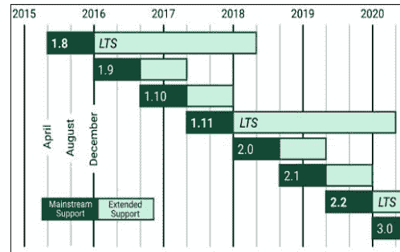

#### 一流的文档

从第一个版本开始，Django 开发者就确保必须提供适当、全面的文档，并且教程易于理解。

### 谁在使用 Django？

由于 Django 的独特优势，有许多流行的网站是基于 Django 框架用 Python 构建的。以下是一些完全或部分基于 Django 构建的主要网站。

#### Disqus

它是全球最受欢迎的博客评论托管网站之一。通过 Disqus，它可以轻松集成到大多数流行的 CMS（内容管理系统）中，如 WordPress 和许多其他系统。Django 能够处理超过 5000 万的用户群，满足网站所有者与他们的社区建立联系的需求。

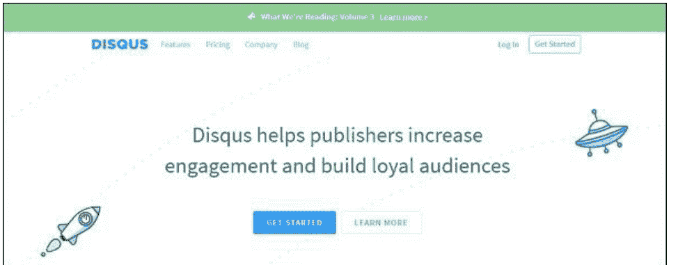

#### The Onion

The Onion 网站为其讽刺报纸提供了一个在线场所，Django 为其提供了框架。


#### Bitbucket

Bitbucket 就像 GitHub，是一个版本控制仓库托管服务。Bitbucket 和 GitHub 之间的唯一区别是 Bitbucket 托管 mercurial 仓库，而 GitHub 托管 git 仓库。由于数百万用户与 Bitbucket 相关联，并且 Bitbucket 提供的所有服务（如创建仓库、推送代码、添加协作者、提交、拉取请求等）都必须稳定。Django 负责运行 Bitbucket 网站。

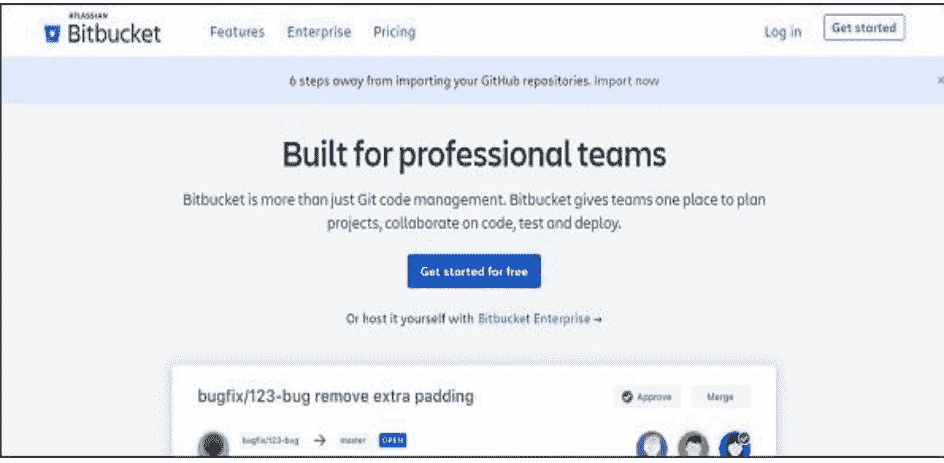

#### Instagram

Instagram 是一个专门为那些喜欢与所有朋友分享照片和视频的人打造的社交网络应用。目前，Instagram 上有很多名人，以便与他们的粉丝保持更近的距离。Django 框架也在运行 Instagram。


#### Mozilla Firefox

世界上仅次于 Google Chrome 的第二大最广泛使用的浏览器是 Mozilla 浏览器。现在，Mozilla 的帮助页面是用 Django 框架构建的。

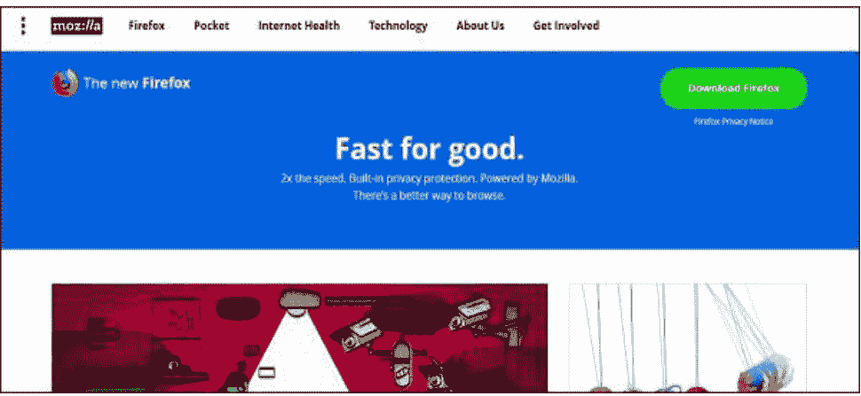

#### Pinterest

全球数百万用户从 Pinterest 发现他们的新想法和灵感。Pinterest 使用 Django 框架（根据他们的需求进行了修改）来运行它。

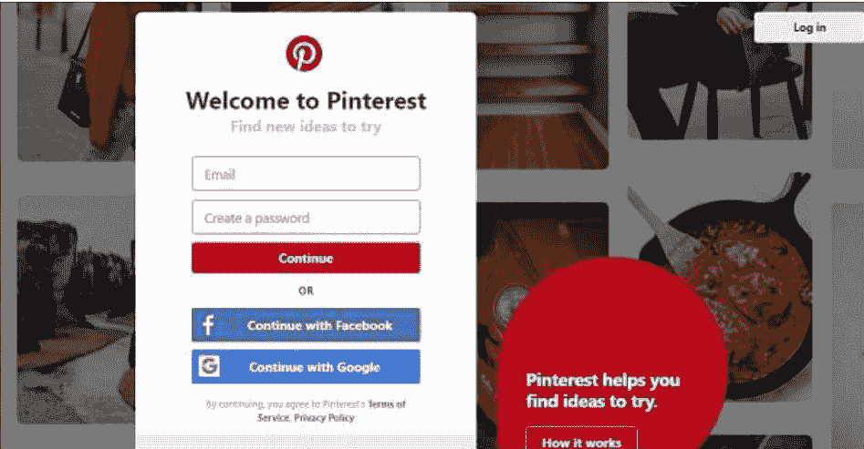

#### NASA

美国国家航空航天局的官方网站是数百万用户访问和查看该顶级机构提供的新闻、图片、视频和播客的地方。Django 开发了 NASA 官方网站的一些特定部分。

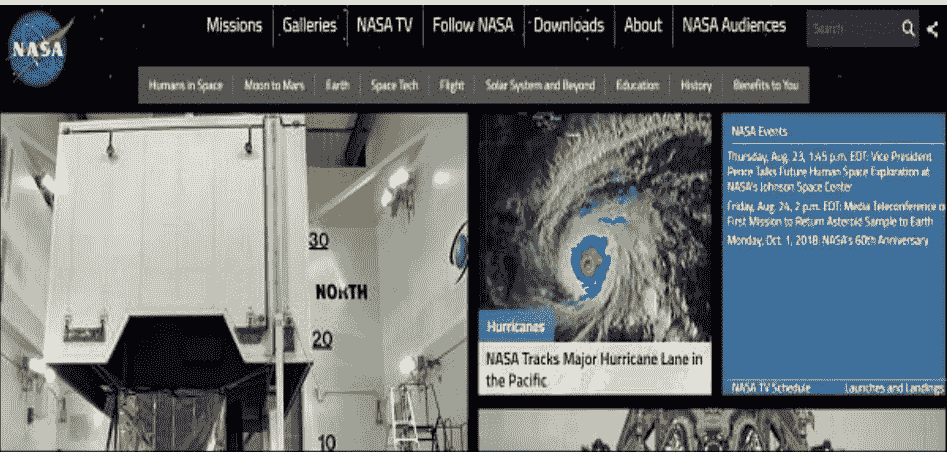

#### The Washington Post

如果说世界上有一份有影响力的报纸，那无疑是《华盛顿邮报》。《华盛顿邮报》的网站是一个非常受欢迎的在线新闻来源，作为其日报的补充。其巨大的浏览量和流量已被 Django Web 框架轻松处理。


#### Reddit Gifts

广受欢迎的 Reddit 网站推出了一个在线、匿名的礼物交换和聚会平台，名为 Reddit Gifts。该网站连接了来自世界各地的用户，并促进了他们之间的礼物交换。Django Web 框架为其功能提供支持。


#### Prezi

Prezi 是一个基于云的、建立在 Django 框架上的 Microsoft PowerPoint 替代品。该网站提供了一个可以操作和缩放的虚拟画布。这提供了演示文稿的完整视图，而不是单个幻灯片。


### 安装和创建 Django 项目和应用

在安装 Django 之前，我们必须确保 Python 已安装。假设你使用 virtualenv，一个简单的 `pip install django` 应该就足够了。

#### 安装虚拟环境和 Django

以下是在你的 Windows 环境中安装虚拟环境和 Django 的过程 –

```
C:\Users\rajesh>mkdir djangoProject

C:\Users\rajesh>cd djangoProject

C:\Users\rajesh\djangoProject>virtualenv djangoEnv
Using base prefix 'c:\python\python361'
New python executable in C:\Users\rajesh\djangoProject\djangoEnv\Scripts\python.exe
Installing setuptools, pip, wheel...done.

C:\Users\rajesh\djangoProject>djangoEnv\Scripts\activate

(djangoEnv) C:\Users\rajesh\djangoProject>pip install django
Collecting django
  Using cached https://files.pythonhosted.org/packages/51/1a/e0ac7886c7123a03014178d7517dc822af0fe51a72e1a6bff26153103322/Django-2.1-py3-none-any.whl
Collecting pytz (from django)
  Using cached https://files.pythonhosted.org/packages/30/4e/27c34b62430286c6d59177a0042ed50dc789ce5d1ec740887653b898779a/pytz-2018.5-py2.py3-none-any.whl
Installing collected packages: pytz, django
Successfully installed django-2.1 pytz-2018.5
```

要验证 Django 是否正确安装，请输入以下代码 –

```
(djangoEnv) C:\Users\rajesh\djangoProject>python
Python 3.6.1 (v3.6.1:69c0db5, Mar 21 2017, 17:54:52) [MSC v.1900 32 bit (Intel)] on win32
Type "help", "copyright", "credits" or "license" for more information.
>>> import django
>>> print(django.get_version())
2.1
>>>
```

#### 创建 Django 项目

安装完成后，我们需要创建一个 Django 项目。

在你的 Windows 机器上运行以下命令将创建以下 Django 项目 –

```
django-admin startproject my_project_name
```

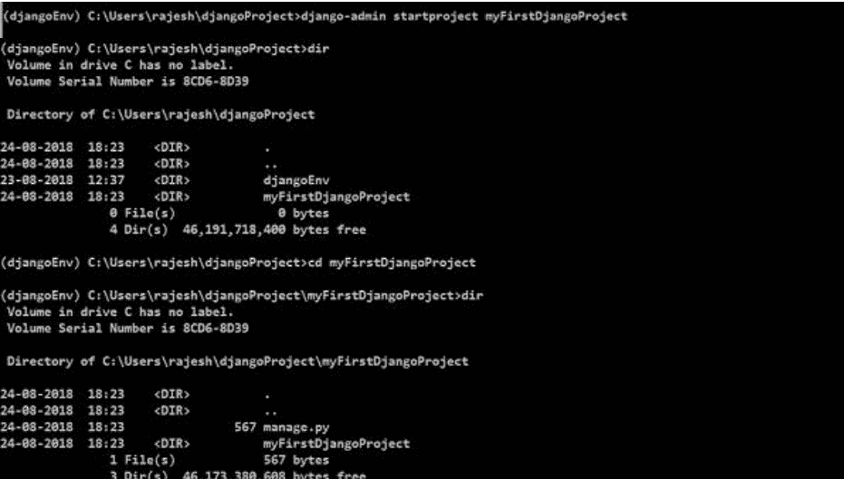

输入 `dir` 将显示一个新文件和一个新目录，如上所示。

**manage.py** – manage.py 是一个命令行可执行的 Python 文件，它只是 django-admin 的一个包装器。它帮助我们管理我们的项目，正如其名称所暗示的那样。

通过此操作，它在 myFirstDjangoProject 内部创建了一个名为 **myFirstDjangoProject** 的目录，该目录代表我们项目的配置根目录。让我们更深入地探索它。

#### 配置 Django

将 myFirstDjangoProject 目录称为“配置根目录”，我们的意思是这个目录包含通常配置 Django 项目所需的文件。此目录之外的几乎所有内容都将专注于与项目模型、视图、路由等相关的“业务逻辑”。所有将项目连接在一起的要点都将指向这里。

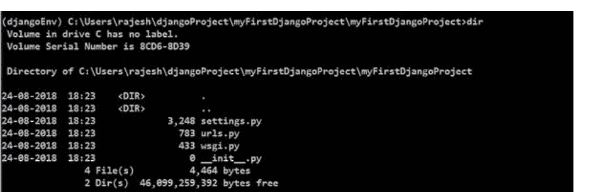

- __init__.py – 这是空的，它将目录更改为可导入的 Python 包。
- settings.py – 顾名思义，这是设置大多数配置项的地方。
- urls.py – URL 使用 urls.py 进行设置。通过这个，我们不必在这个文件中为项目显式编写每个 URL。但是，我们必须告诉 Django URL 在哪里被声明（即，我们需要在 urls.py 中链接其他 URL）。
- Wsgi.py – 这是为了帮助生产环境中的应用程序，类似于其他应用程序，如 Flask、Tornado、Pyramid，它们暴露一些“app”对象。

##### 设置 settings

查看 settings.py 内部会揭示其相当大的规模 – 这些只是默认值。我们需要处理的其他事情包括静态文件、数据库、媒体文件、云集成或 Django 项目可以配置的其他数十种方式。让我们理解 settings.py 文件中提到的一些要点 –

- **BASE_DIR** – 这有助于定位文件。在 setting.py 文件中，BASE_DIR 参数设置基础目录的绝对路径。
- **SECRET_KEY** – 它用于生成哈希。通常，我们使用 secret_key 用于 cookie、会话、csrf 保护和身份验证令牌。
- **DEBUG** – 我们可以将其设置为项目在开发或生产模式下运行。

##### Django 设置

- **ALLOWED_HOSTS** – 我们提供应用程序通过哪些主机名提供服务的列表。在开发模式下，设置此项是可选的；然而，在生产环境中，我们需要为 Django 项目进行设置。

- **INSTALLED_APPS** – 这是当前在 Django 项目中安装并运行的 Django “应用”列表。Django 内置提供了六个已安装的应用，如下所示 –
    - 'django.contrib.admin'
    - 'django.contrib.auth'
    - 'django.contrib.contenttypes'
    - 'django.contrib.sessions'
    - 'django.contrib.messages'
    - 'django.contrib.staticfiles'

- **MIDDLEWARE** – 它有助于我们的 Django 项目运行。它是一个 Python 类，用于挂钩到 Django 的请求/响应处理中。

- **TEMPLATES** – 它定义了文档在前端应如何显示。Django 模板用于生成任何基于文本的格式。

- **WSGI_APPLICATION** – 我们设置的任何服务器都必须知道 WSGI 文件的位置。如果您使用的是外部服务器，它将在其自身的设置中查找。默认情况下，它指向 `wsgi.py` 中的对象。

- **DATABASES** – 它设置为我们的 Django 项目当前正在访问的数据库。设置默认数据库是强制性的。如果我们设置了自选的数据库，我们需要提及一些与数据库相关的内容，例如 - HOST、USER、PASSWORD、PORT、数据库 NAME 和适当的 ENGINE。

- **STATIC_URL** – 这是在引用位于 `STATIC_ROOT` 中的静态文件时使用的 URL。默认情况下，它是 `None`。

然而，我们可能需要为静态文件添加一个路径。滚动到文件末尾，就在 `STATIC_URL` 条目下方，添加一个名为 `STATIC_ROOT` 的新条目，如下所示 –

myFirstDjangoProject/settings.py

```
STATIC_URL = '/static/'

STATIC_ROOT = os.path.join(BASE_DIR, 'static')
```

##### 设置数据库

有很多不同的数据库软件可以为您的网站存储数据。我们将使用默认的 sqlite3。

这已经在您 **myFirstDjangoProject/settings.py** 的以下部分中设置好了 –

```
DATABASES = {
    'default': {
        'ENGINE': 'django.db.backends.sqlite3',
        'NAME': os.path.join(BASE_DIR, 'db.sqlite3'),
    }
}
```

要为我们的博客创建一个数据库，让我们在控制台中运行以下命令 – **python manage.py migrate**（我们需要位于包含 `manage.py` 文件的 `myFirstDjangoProject` 目录中）。

如果一切顺利，您将获得以下输出 –

```
(djangoEnv) C:\Users\rajesh\djangoProject\myFirstDjangoProject>python manage.py migrate
Operations to perform:
  Apply all migrations: admin, auth, contenttypes, sessions
Running migrations:
  Applying contenttypes.0001_initial... OK
  Applying auth.0001_initial... OK
  Applying admin.0001_initial... OK
  Applying admin.0002_logentry_remove_auto_add... OK
  Applying admin.0003_logentry_add_action_flag_choices... OK
  Applying contenttypes.0002_remove_content_type_name... OK
  Applying auth.0002_alter_permission_name_max_length... OK
  Applying auth.0003_alter_user_email_max_length... OK
  Applying auth.0004_alter_user_username_opts... OK
  Applying auth.0005_alter_user_last_login_null... OK
  Applying auth.0006_require_contenttypes_0002... OK
  Applying auth.0007_alter_validators_add_error_messages... OK
  Applying auth.0008_alter_user_username_max_length... OK
  Applying auth.0009_alter_user_last_name_max_length... OK
  Applying sessions.0001_initial... OK
```

##### 启动 Web 服务器

您需要位于包含 `manage.py` 文件的目录中。在控制台中，我们可以通过运行 `python manage.py runserver` 来启动 Web 服务器，如下所示 –

```
(djangoEnv) C:\Users\rajesh\djangoProject\myFirstDjangoProject>python manage.py runserver
Performing system checks...

System check identified no issues (0 silenced).
August 28, 2018 - 20:08:12
Django version 2.1, using settings 'myFirstDjangoProject.settings'
Starting development server at http://127.0.0.1:8000/
Quit the server with CTRL-BREAK.
[28/Aug/2018 20:08:27] "GET / HTTP/1.1" 200 16348
[28/Aug/2018 20:08:31] "GET /static/admin/css/fonts.css HTTP/1.1" 200 423
[28/Aug/2018 20:08:33] "GET /static/admin/fonts/Roboto-Regular-webfont.woff HTTP/1.1" 200 80304
[28/Aug/2018 20:08:34] "GET /static/admin/fonts/Roboto-Bold-webfont.woff HTTP/1.1" 200 82564
[28/Aug/2018 20:08:34] "GET /static/admin/fonts/Roboto-Light-webfont.woff HTTP/1.1" 200 81348
```

现在您需要做的就是检查您的网站是否正在运行。打开您的浏览器（Firefox、Chrome、Safari、Internet Explorer 或您使用的任何浏览器）并输入此地址 –

**http://127.0.0.1:8000/**

或

**http://localhost:8000/** # 因为我们的 Web 服务器仅在本地机器上运行。

恭喜！您刚刚创建了您的第一个网站并使用 Web 服务器运行了它！

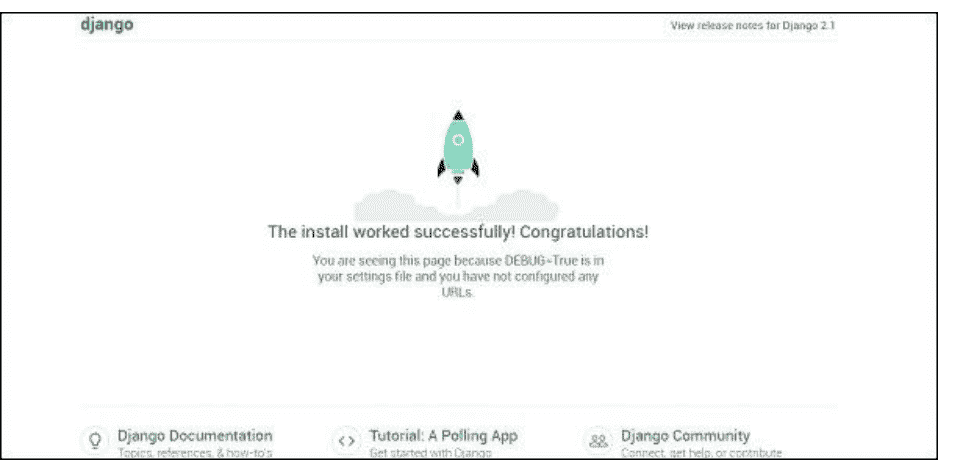

当 Web 服务器运行时，您不会看到新的命令行提示符来输入其他命令。终端将接受下一个文本，但不会执行新命令。这是因为 Web 服务器持续运行以监听传入的请求。

#### Django 模型

我们正在尝试创建一个 Django 模型，该模型将存储我们博客中的所有文章。但为了确保它有效，我们需要了解对象。

##### 对象

对象是属性和行为的集合。让我们通过一个例子来理解这一点。假设我们想对一只猫进行建模，我们将创建一个名为 `Cat` 的对象，它具有诸如颜色、年龄、情绪（好/坏/困倦）和主人等属性。

然后这只猫有一些行为：呼噜、抓挠或喂食。

```
Cat
--------
color
age
mood
owner
purr()
scratch()
feed(cat_food)
CatFood
--------
taste
```

所以基本上，我们试图用代码来描述真实的事物，包括属性（称为对象属性）和行为（称为方法）。

由于我们正在构建一个博客，我们需要一些文本内容和一个标题。还需要作者的姓名、创建日期以及发布日期。

因此，我们的博客将具有以下对象 –

```
Post
--------
title
text
author
created_date
published_date
```

此外，我们需要一些方法来发布该文章。既然我们现在知道了什么是对象，我们就可以为我们的博客文章创建一个 Django 模型。

模型是 Django 中一种特殊类型的对象，它保存在数据库中。我们将把数据存储在 SQLite 数据库中。

##### 创建一个应用

为了保持一切清晰，我们将在项目内部创建一个单独的应用。下面，我们将尝试通过运行下面提到的简单命令来创建一个博客 Web 应用。

现在我们将注意到创建了一个新的 `myBlog` 目录，其中包含许多文件。我们项目中的目录和文件应如下所示 –

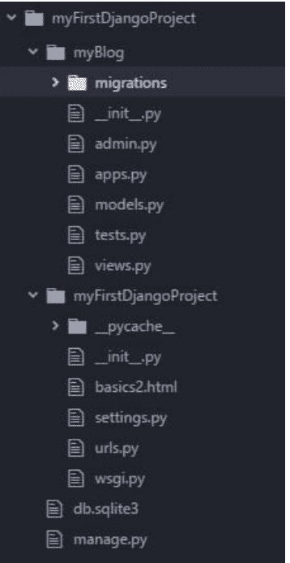

创建应用后，我们还需要告诉 Django 使用它。我们在文件 `myFirstDjangoProject/settings.py` 中进行此操作。

```
INSTALLED_APPS = [
    'django.contrib.admin',
    'django.contrib.auth',
    'django.contrib.contenttypes',
    'django.contrib.sessions',
    'django.contrib.messages',
    'django.contrib.staticfiles',
    'myBlog',
]
```

##### 创建博客文章模型

在 **myBlog/models.py** 文件中，我们定义所有称为模型的对象 – 这是我们定义博客文章的地方。

让我们打开 `myBlog/models.py`，删除其中的所有内容，并编写如下代码 –

```
from django.db import models
from django.utils import timezone

# Create your models here.
class Post(models.Model):
    author = models.ForeignKey('auth.User', on_delete=models.CASCADE)
    title = models.CharField(max_length=220)
    text = models.TextField()
    created_date = models.DateTimeField(default=timezone.now)
    published_date = models.DateTimeField(blank=True, null=True)

    def publish(self):
        self.published_date = timezone.now()
        self.save()

    def __str__(self):
        return self.title
```

首先，我们通过调用 `from` 或 `import` 从其他文件导入一些功能。因此，通过这种方式，我们不必在每个文件中复制和粘贴相同的内容，而是可以使用 **from 和 import** 包含部分内容。

**class Post(models.Model)** – 这行定义了我们的模型（它是一个对象）。

- `class` 是一个特殊的关键字，表示我们正在定义一个对象。
- `Post` 是我们模型的名称。类名始终以大写字母开头。
- `models.Model` 意味着 `Post` 是一个 Django 模型，因此 Django 知道它应该保存在数据库中。

现在让我们讨论一下上面定义的属性：title、text、created_date、published_date 和 author。为此，我们需要定义每个字段的类型。

-   models.CharField – 这是定义有限字符数文本的方式。
-   Models.TextField – 这用于没有限制的长文本。
-   Models.DateTimeField – 这用于日期和时间。
-   Models.ForeignKey – 这是到另一个模型的链接。

我们使用 **def** 定义一个函数/方法，publish 是该方法的名称。

方法通常会返回一些东西。这里当我们调用 `__str__()` 时，我们将获得一个包含文章标题的文本（字符串）。

##### 为数据库中的模型创建表

最后一步是将新模型添加到我们的数据库中。首先，我们必须让 Django 理解我们已经在模型中做了一些更改。让我们在控制台窗口中使用命令 **python manage.py make migrations myBlog** 来执行相同的操作，如下所示 –

```
(djangoEnv) C:\Users\rajesh\djangoProject\myFirstDjangoProject>python manage.py makemigrations myBlog

Migrations for 'myBlog':
  myBlog\migrations\0001_initial.py
    - Create model Post
```

然后，Django 准备一个迁移文件，我们现在必须将其应用到我们的数据库。在控制台中，我们可以输入：**python manage.py migrate myBlog**，输出应如下所示 –

```
(djangoEnv) C:\Users\rajesh\djangoProject\myFirstDjangoProject>python manage.py migrate myBlog
Operations to perform:
  Apply all migrations: myBlog
Running migrations:
  Applying myBlog.0001_initial... OK
```

我们的 Post 模型现在已经在数据库中了。

#### Django 管理后台

为了添加、编辑和删除我们刚刚建模的文章，我们使用 Django 管理后台。

所以让我们打开 **myBlog/admin.py 文件** 并将以下内容放入其中 –

```
from django.contrib import admin
from .models import Post

# Register your models here.
admin.site.register(Post)
```

首先，我们导入（包含）上一章中定义的 Post 模型。为了使我们的模型在管理页面上可见，我们需要使用 `admin.site.register(Post)` 将模型注册到管理站点。

要登录管理站点，您需要创建一个超级用户 – 一个拥有站点上所有控制权的用户帐户。所以停止 Web 服务器并在命令行中输入 `python manage.py createsuperuser`，然后按回车键。

```
(djangoEnv) C:\Users\rajesh\djangoProject\myFirstDjangoProject>python manage.py createsuperuser
Username (leave blank to use 'rajesh'): admin
Email address: hello@gmail.com
Password:
Password (again):
Superuser created successfully.
```

好的，现在是时候查看我们的 Post 模型了。记得在控制台中运行 `python manage.py runserver` 来启动 Web 服务器。转到您的浏览器并输入地址 **https://127.0.0.1:8000/admin/**。使用我们刚刚选择的凭据登录。然后您应该会看到如下所示的 Django 管理仪表板 –

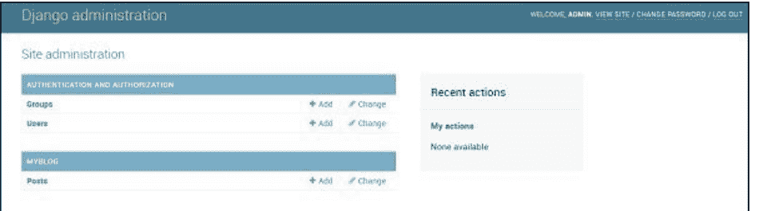

转到文章并稍作尝试。您可以添加许多博客文章和来自任何地方的内容。您的博客将看起来像这样 –

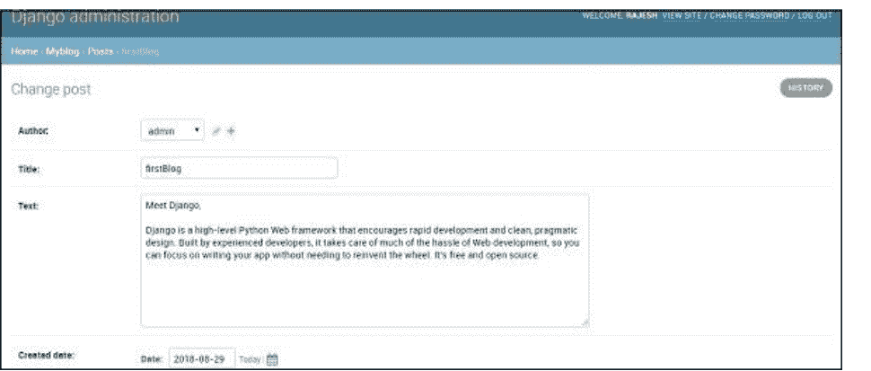

这只是 Django 的一个概述，我们能够仅用几行代码就创建一个博客。

## Flask 框架

Flask 是一个微框架，对外部库的依赖非常少。它是一个非常轻量级的框架，让我们有自由去做任何我们想做的事情。

在本章中，我们将使用 Python 和 Flask 框架构建一个项目。

### Flask 启动和配置

与大多数广泛使用的 Python 库一样，Flask 包可以从 Python 包索引（PyPI）安装。让我们先创建一个目录（在本章中，我们创建了一个名为 **flaskProject** 的目录），然后创建一个虚拟环境（并将其命名为 **flaskEnv**），所有项目相关的依赖项（包括 flask）都将加载到其中。您还可以安装 flask-sqlalchemy，以便您的 Flask 应用程序有一种与 SQL 数据库通信的简单方式。

安装 Flask 后，您的 flaskEnv（我们的虚拟环境名称）将显示如下内容 –

```
(flaskEnv) C:\Users\rajesh\flaskProject>pip freeze
click==6.7
Flask==1.0.2
itsdangerous==0.24
Jinja2==2.10
MarkupSafe==1.0
Werkzeug==0.14.1
```

### 使用 Flask 创建应用

通过安装 Flask，我们可以用很少的几行代码创建一个简单的“**Flask 中的 hello 应用程序**”，如下所示 –

```python
from flask import Flask

app = Flask(__name__)

@app.route('/')
def hello():
    return "Hello, Flask!"

if __name__ == '__main__':
    app.run(debug=True)
```

在终端中输入以下内容 –

```bash
$python flaskapp.py
```

您可以看到以下输出 –

运行在 **http://127.0.0.1:5000/** 或 **localhost:5000**

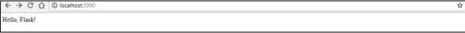

以下是对我们在示例代码中所做内容的解释 –

-   首先，我们导入 Flask 类库。此类的一个实例就是 WSGI 应用。
-   其次，我们创建此类的一个实例。应用程序包或模块名称是我们的第一个参数。Flask 必须知道在哪里可以找到静态文件、模板和其他文件，这是强制性的。
-   接下来是 `route()` 装饰器，我们用它来知道哪个 URL 应该触发我们的方法/函数。

#### 创建 URL 路由

URL 路由使您的 Web 应用程序中的 URL 易于记忆。我们现在将创建一些 URL 路由 –

/hello
/members
/members/name

我们可以根据上述 URL 编写以下代码并将其保存为 app.py。

```
from flask import Flask, render_template

app = Flask(__name__)

@app.route('/')
def index():
    return "Index!"

@app.route('/Hello')
def hello():
    return "Hello, World!"

@app.route("/members")
def members():
    return "Members"

@app.route("/members/<name>/")
def getMember(name):
    return name

if __name__ == '__main__':
    app.run(debug=True)
```

重新启动应用程序后，我们使用以下代码行在不同 URL 上获取不同的输出 –

```
$ python app.py
```

**运行在 http://localhost:5000/**

我们将在浏览器中看到以下输出 –

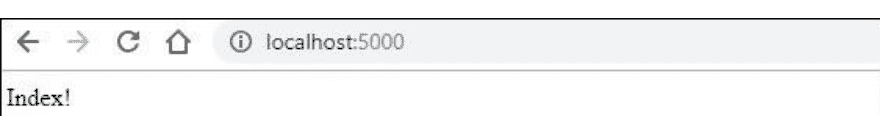

我们可以在浏览器中尝试其他 URL，如下所示 –

**运行在 http://localhost:5000/hello，将给出以下输出 –**

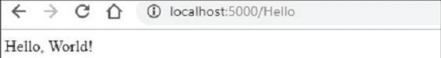

**运行在 http://localhost:5000/members，将给出 –**

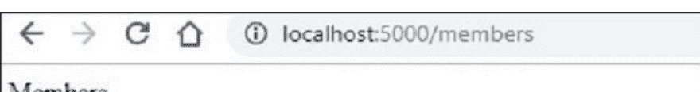

**运行在 http://localhost:5000/members/TutorialsPoint/，将给您以下输出 –**

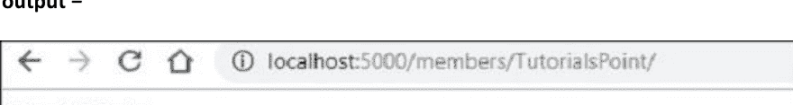

但通常我们不想返回一个字符串（如上所述），我们返回模板。为此，我们想使用 Flask 中的函数 `render_template`，并返回带有某些输入的 `render_template`。所以，下面的函数将完成我们的工作 –

```
from flask import render_template
return render_template('home.html')
```

让我们创建一个名为 template 的文件夹，并将 home.html 文件放入其中。

接下来，我们将讨论布局。我们不会为每个模板都使用 html head 标签和 body 标签，而是设计一个布局来包含 head 和 body 标签，并包装当前视图或当前模板。为此，我们必须创建一个单独的文件并将其命名为 **layout.html**。在这里，我们可以放置我们普通的 head 标签、body 标签和所有其他必需的标签。

我们可以用以下几行代码创建新的 layout.html –

```
<!DOCTYPE html>
<html>
    <head>
        <meta charset="utf-8">
        <title>MyFlaskApp</title>
        <link rel="stylesheet"
href="https://stackpath.bootstrapcdn.com/bootstrap/4.1.3/css/bootstrap.min.css">
    </head>
    <body>
        
        <div class="container">
            
            
        </div>
        <script
src="https://stackpath.bootstrapcdn.com/bootstrap/4.1.3/js/bootstrap.min.js">
        </script>
    </body>
</html>
```

在上面的代码中，我们给出了标题 track，MyFlaskAp，在 head 中使用 css cdn，在 body 块中使用 javascript 来启用 bootstrap。

现在，我们必须为每个页面创建导航栏。为此，我们必须首先创建一个 include 文件夹，然后在其中创建 _navbar.html 文件。现在在 _navbar.html 中，我们必须使用来自 getbootstrap.com 的标准入门模板。新创建的 _navbar.html 文件将如下所示 –

## Web2py 框架

Web2py 是一个易于使用的框架。使用 web2py，无需安装和配置，因为它具有可移植性，甚至可以在 USB 驱动器上运行。它基于 MVC 框架，与许多其他 Python 框架类似。尽管大多数框架不支持旧版本的 Python，但 web2py 仍然支持旧版本：Python 2.6 和 2.7。它还支持目前被广泛接受的 LDAP 进行身份验证。

Web2py 通过专注于三个主要目标，试图降低 Web 开发的入门门槛：

- 快速开发
- 易于使用
- 安全性

考虑到用户视角，Web2py 在内部不断构建和优化，使其成为一个更快、更精简的框架，包括支持向后兼容性。

### 安装和配置 Web2py 框架

运行 web2py 很简单，你需要从以下链接下载 exe 文件：http://www.web2py.com/init/default/download

对于 Windows，你可以下载 zip 文件，解压后直接运行 exe 文件或从命令行运行。你将看到以下屏幕，提示输入管理员密码。

你可以选择一个管理员密码并启动服务器。你将看到以下屏幕。

### 使用 Web2py 创建应用

现在我们准备创建一个新应用。点击底部的 admin 选项卡。因此，在输入管理员密码后，我们将看到以下屏幕。

转到新的简单应用程序，输入一些应用程序名称（如 helloWeb2py）并点击创建。这将显示如下所示的设计界面页面。

你也可以访问你当前的实时网站 helloWeb2py，只需在本地机器上输入 http://127.0.0.1:8000/helloWeb2py，你将获得以下输出。

在 helloWeb2py 应用程序的设计页面中，转到控制器并点击 default.py 旁边的编辑按钮。如果你更改 index() 函数的返回值，将显示以下输出：

```python
# ---- example index page ----
def index():
    response.flash = T("Hello world")
    return "Hello Guys, This is web2py app. This framework is very easy to run and works effortlessly. Fun to work with it"
```

保存更改，现在你可以检查在 helloWeb2py 应用中所做的更改。只需刷新 http://127.0.0.1:8000/helloWeb2py 链接，你将看到以下输出。

### 在云平台上部署应用

现在，如果你想将应用部署到云平台，请返回主页并点击站点。你可以选择任何部署选项。这里，我们选择 “pythonAnywhere”。访问 pythonAnywhere 网站并注册（如果尚未注册）。点击 “**Add a new web app**” 并填写所有凭据（选择 web2py 应用）。全部完成。

现在转到 https://username.pythonanywhere.com/welcome/default/index，点击 admin 选项卡（输入密码）。接下来点击上传并安装打包的应用程序。填写如下凭据并点击安装。

一切完成后，将出现如下所示的弹出消息。

现在要查看你的应用，请打开以下链接：

https://username.pythonanywhere.com/welcome/default/index，你可以看到以下屏幕。

我们的第一个web2py应用已成功创建并部署。

总结一下，Web2py是一个免费、快速、安全的Web开发框架，完全用Python编写，并鼓励在所有可能的地方使用Python（模型、视图、控制器）。它是一个非常适合小型Web应用或原型的框架，但无法满足企业级的质量要求。这是因为在企业级应用中，由于缺乏单元测试、良好且准确的错误报告以及分散的模型，解决bug的复杂性会呈指数级增长。

## Pyramid框架

Pyramid是一个通用的、开源的、用Python构建的Web应用开发框架。它让Python开发者能够轻松创建Web应用。

Pyramid由企业知识管理系统KARL（一个乔治·索罗斯的项目）提供支持。

### 安装、启动和配置

正如所述，“从小处着手，成就大事，保持完成”，Pyramid与Flask非常相似，安装和运行所需的努力非常少。事实上，一旦你开始构建这个应用，你会认识到其中一些模式与Flask相似。

以下是创建Pyramid框架环境的步骤——

- 首先，创建一个项目目录。这里，我们创建了一个名为**pyramidProject**的目录（你可以选择任何你喜欢的名字）。
- 接下来，创建一个虚拟环境，你将在其中安装所有项目特定的依赖项。这里，我们创建了一个名为**pyramidEnv**的虚拟环境文件夹，并在其中安装了Pyramid。
- 然后，进入目录**pyramidEnv**，使用**pip install pyramid**安装pyramid。

一旦按照上述步骤完成所有操作，你的目录结构将如下所示——

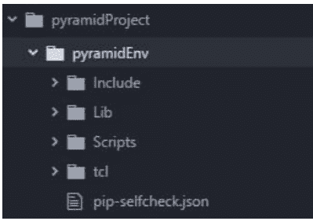

系统中安装的pyramid版本如下——

```
>>> import pkg_resources
>>> pkg_resources.get_distribution("pyramid").version
'1.9.2'
```

### 核心概念

Pyramid框架基于以下核心概念——

- **Zope**（可扩展性、遍历、声明式安全）——Pyramid在可扩展性、遍历概念和声明式安全方面松散地基于Zope。
- **Pylons**（URL调度、对持久化、模板等的非固执己见的观点）——Pyramid借鉴其概念的另一个领域是Pylons项目。Pylons有路由的概念，这在Pyramid框架内部调用URL调度，它们也对持久化层或模板持非固执己见的观点。
- **Django**（视图、文档水平）——Pyramid也从Django中获得启发。我们处理视图、路由URL的方式以及文档水平都非常Django化。

以下是Pyramid框架的特性——

- 它是已知最快的Python Web框架。
- 它支持小型和大型项目（当你的小型框架不够用时，为什么要重写呢）。
- 它支持像微框架一样的单文件Web应用。
- 它具有内置的会话。
- 它支持类似于Plone/Zope的事件。
- 它提供事务管理（如果你已经注意到我们之前使用过Zope）。

#### 配置

配置是影响应用程序操作的设置。有两种方法可以配置Pyramid应用：命令式配置和声明式配置。

Pyramid配置支持——

- 命令式配置，甚至可以覆盖基于装饰器的配置
- 配置冲突检测（包括更局部与更不局部的确定）
- 配置可扩展性（从多个应用包含）
- 灵活的认证和授权策略
- 配置的编程内省（查看路由的当前状态以生成导航）

#### URL生成

在Pyramid中，我们可以为路由、资源和静态资产生成URL。使用URL生成API既简单又灵活。通过Pyramid的各种API生成URL，用户可以随意更改配置，而无需担心破坏任何网页的链接。

所以简而言之，Pyramid中的URL——

- 支持URL生成，以允许对应用进行更改而不会破坏链接。
- 为位于应用内部或外部的静态资源生成URL。
- 支持路由和遍历。

#### 视图

Pyramid的主要工作之一是在请求到达你的应用时找到并调用一个视图可调用对象。视图可调用对象是响应于应用中发出的请求而执行某些有趣操作的代码片段。

当你将视图映射到你的URL调度或Python代码时，可以是任何类型的调用。视图可以是函数声明或实例，它可以在Pyramid中用作视图。

关于视图的一些重要点如下——

- 视图可以从任何可调用对象生成。
- 基于渲染器的视图可以简单地返回字典（不需要返回Web风格的对象）。
- 支持每个路由多个视图（GET vs. POST vs. HTTP头检查等）。
- 视图响应适配器（当你想指定如何处理视图返回值与响应对象时）。

#### 可扩展性

Pyramid在设计时就考虑了可扩展性。因此，如果Pyramid开发者在构建应用时考虑到某些约束，第三方应该能够在不修改源代码的情况下改变应用的行为。遵守某些约束的Pyramid应用的行为可以在没有任何修改的情况下被覆盖或扩展。它被设计用于灵活部署到多个环境（没有单例）。Pyramid具有“Tweens”中间件支持（WSGI中间件，但在Pyramid自身的上下文中运行）。

### 运行一个Hello, Pyramid程序

安装Pyramid框架后，我们能想到的最简单的程序来检查一切是否正常工作，就是运行一个简单的“Hello, World”或“Hello, Pyramid”程序。

下面是我的Pyramid “Hello, Pyramid”程序，运行在8000端口——

```python
from wsgiref.simple_server import make_server
from pyramid.config import Configurator
from pyramid.response import Response

def hello_world(request):
    return Response('<h1>Hello Pyramid!</h1>')

if __name__ == '__main__':
    with Configurator() as config:
        config.add_route('hello', '/')
        config.add_view(hello_world, route_name='hello')
        app = config.make_wsgi_app()
    server = make_server('0.0.0.0', 8000, app)
    server.serve_forever()
```

上面的简单示例很容易运行。将其保存为app.py（在这里，我们将其命名为pyramid_helloW.py）。

运行最简单的程序：-

```
(pyramidEnv) C:\Users\rajesh\pyramidProject>python pyramid_helloW.py
127.0.0.1 - - [09/Sep/2018 19:03:52] "GET / HTTP/1.1" 200 23
127.0.0.1 - - [09/Sep/2018 19:03:53] "GET /favicon.ico HTTP/1.1" 404 164
```

接下来，在浏览器中打开http://localhost:8000/，你将看到如下所示的Hello, Pyramid!消息——

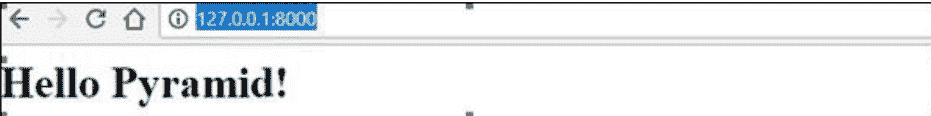

以下是上述代码的解释——

**第1-3行**

在文件开头，我们有导入语句。第一行导入make_server函数，当传递给一个应用时，它可以创建一个简单的Web服务器。第二行和第三行从pyramid导入配置和Response函数。这些函数分别用于配置应用的详细信息和设置参数，以及响应请求。

**第5-6行**

现在我们有一个名为**hello_world**的函数定义。实现生成响应的视图代码。满足视图要求的函数负责渲染将传递回请求实体的文本。在上面的例子中，该函数在被调用时使用了我们之前导入的Response函数。这会将一个值传递回客户端。

**第8行**

if __name__ == '__main__': Python的意思是，“当从命令行运行时从这里开始”，而不是当这个模块被导入时。

**第9-11行**

在第9行，我们使用程序顶部导入的configurator函数创建的对象创建了一个名为config的变量。第10行和第11行调用该对象的add_route和add_view方法。此方法用于定义应用可以使用的视图。正如我们所看到的，我们传递了之前定义的hello_world函数。这就是该函数实际作为视图被纳入的地方。

**第12-14行**

在这里，我们通过调用config对象的make_wsgi_app方法实际创建了WSGI应用。这使用对象的属性，例如我们添加的视图，来创建一个应用。然后，将此应用传递给我们导入的make_server函数，以创建一个可以启动Web服务器来服务我们应用的对象。最后一行启动了这个服务器。

我们的**hello world应用**是最简单、最容易的Pyramid应用之一，采用“命令式”配置。之所以是命令式，是因为在执行配置任务时，Python的全部功能都可供我们使用。

总而言之，Pyramid 是一个开源的 Python Web 框架，拥有庞大且活跃的社区。这个庞大的社区致力于推动 Python Web 框架的普及和相关性。Pyramid Web 框架通过提供一套强大的功能和工具，简化并加速了 Web 应用程序的开发。

## Dash 框架

在本章中，我们将详细讨论 Dash 框架。

Dash 是一个用于构建分析型 Web 应用程序的开源 Python 框架。它是一个强大的库，简化了数据驱动应用程序的开发。对于不熟悉 Web 开发的 Python 数据科学家来说，它尤其有用。用户可以使用 Dash 在浏览器中创建令人惊叹的仪表板。

Dash 构建在 Plotly.js、React 和 Flask 之上，将下拉菜单、滑块和图表等现代 UI 元素直接连接到你的分析 Python 代码。

Dash 应用程序由一个 Flask 服务器组成，该服务器通过 HTTP 请求使用 JSON 数据包与前端 React 组件进行通信。

Dash 应用程序完全用 Python 编写，因此**不需要** HTML 或 JavaScript。

### Dash 设置

如果您的终端中尚未安装 Dash，请安装下面提到的 Dash 库。由于这些库正在积极开发中，请经常安装和升级它们。Python 2 和 3 也受支持。

- pip install dash==0.23.1 # 核心 dash 后端
- pip install dash-renderer==0.13.0 # dash 前端
- pip install dash-html-components==0.11.0 # HTML 组件
- pip install dash-core-components==0.26.0 # 增强型组件
- pip install plotly==3.1.0 # Plotly 绑图库

为了确保一切正常工作，这里我们创建了一个简单的 dashApp.py 文件。

### Dash 或应用布局

Dash 应用程序由两部分组成。第一部分是应用程序的“布局”，它基本上描述了应用程序的外观。第二部分描述了应用程序的交互性。

### 核心组件

我们可以使用 **dash_html_components** 和 **dash_core_components** 库来构建布局。Dash 为应用程序的所有视觉组件提供了 Python 类。我们也可以使用 JavaScript 和 React.js 来自定义我们自己的组件。

```
import dash_core_components as dcc
import dash_html_components as html
```

dash_html_components 用于所有 HTML 标签，而 dash_core_components 用于使用 React.js 构建的交互性。

使用上述两个库，让我们编写如下代码：

```
app = dash.Dash()
app.layout = html.Div(children=[
    html.H1(children='Hello Dash'),
    html.Div(children='''Dash Framework: A web application framework for Python.''')
])
```

等效的 HTML 代码如下所示：

```
<div>
    <h1> Hello Dash </h1>
    <div> Dash Framework: A web application framework for Python. </div>
</div>
```

### 编写简单的 Dash 应用

我们将学习如何在文件 **dashApp.py** 中使用上述库编写一个简单的 Dash 示例。

```
# -*- coding: utf-8 -*-
import dash
import dash_core_components as dcc
import dash_html_components as html

app = dash.Dash()
app.layout = html.Div(children=[
    html.H1(children='Hello Dash'),
    html.Div(children='''Dash Framework: A web application framework for Python.'''),

    dcc.Graph(
        id='example-graph',
        figure={
            'data': [
                {'x': [1, 2, 3], 'y': [4, 1, 2], 'type': 'bar', 'name': 'Delhi'},
                {'x': [1, 2, 3], 'y': [2, 4, 5], 'type': 'bar', 'name': u'Mumbai'},
            ],
            'layout': {
                'title': 'Dash Data Visualization'
            }
        }
    )
])

if __name__ == '__main__':
    app.run_server(debug=True)
```

### 运行 Dash 应用

运行 Dash 应用时请注意以下几点。

```
(MyDjangoEnv) C:\Users\rajesh\Desktop\MyDjango\dash>python dashApp1.py
```

- 正在提供 Flask 应用 "dashApp1"（延迟加载）
- 环境：生产环境
  警告：请勿在生产环境中使用开发服务器。
  请改用生产级 WSGI 服务器。
- 调试模式：开启
- 正在使用 stat 重新启动
- 调试器已激活！
- 调试器 PIN：130-303-947
- 正在 **http://127.0.0.1:8050/** 上运行（按 CTRL+C 退出）

```
127.0.0.1 - - [12/Aug/2018 09:32:39] "GET / HTTP/1.1" 200 -
127.0.0.1 - - [12/Aug/2018 09:32:42] "GET /_dash-layout HTTP/1.1" 200 -
127.0.0.1 - - [12/Aug/2018 09:32:42] "GET /_dash-dependencies HTTP/1.1" 200 -
127.0.0.1 - - [12/Aug/2018 09:32:42] "GET /favicon.ico HTTP/1.1" 200 -
127.0.0.1 - - [12/Aug/2018 09:39:52] "GET /favicon.ico HTTP/1.1" 200 -
```

在您的 Web 浏览器中访问 **http://127.0.0.1:8050/**。您应该会看到一个类似这样的应用程序。

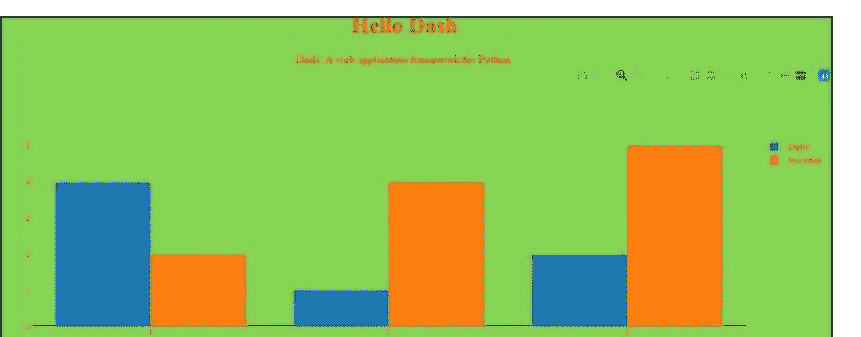

在上面的程序中，需要注意的几个要点如下：

- 应用布局由“组件”树组成，例如 html.Div 和 dcc.Graph。
- dash_html_components 库为每个 HTML 标签都有一个组件。html.H1 (children = 'Hello Dash') 组件在您的应用程序中生成一个 <h1> Hello Dash </h1> HTML 元素。
- 并非所有组件都是纯 HTML。dash_core_components 描述了更高级的交互式组件，这些组件通过 React.js 库使用 JavaScript、HTML 和 CSS 生成。
- 每个组件完全通过关键字属性描述。Dash 是声明式的：您将主要通过这些属性来描述您的应用程序。
- children 属性是特殊的。按照惯例，它始终是第一个属性，这意味着您可以省略它。
- html.H1 (children='Hello Dash') 与 html.H1 ('Hello Dash') 相同。
- 您应用程序中的字体看起来会与这里显示的略有不同。此应用程序使用自定义 CSS 样式表来修改元素的默认样式。允许自定义字体样式，但目前，我们可以添加以下 URL 或您选择的任何 URL：

```
app.css.append_css({"external_url": "https://codepen.io/chriddyp/pen/bWLwgP.css"})
```

以使您的文件获得与这些示例相同的外观和感觉。

### 关于 HTML 的更多信息

dash_html_components 库包含每个 HTML 标签的组件类，以及所有 HTML 参数的关键字参数。

让我们在之前的应用文本中添加组件的内联样式：

```
# -*- coding: utf-8 -*-
import dash
import dash_core_components as dcc
import dash_html_components as html

app = dash.Dash()
colors = {
    'background': '#87D653',
    'text': '#ff0033'
}

app.layout = html.Div(style={'backgroundColor':
colors['background']}, children=[
    html.H1(
        children='Hello Dash',
        style={
            'textAlign': 'center',
            'color': colors['text']
        }
    ),

    html.Div(children='Dash: A web application framework for Python.', style={
        'textAlign': 'center',
        'color': colors['text']
    }),

    dcc.Graph(
        id='example-graph-2',

        figure={
            'data': [
                {'x': [1, 2, 3], 'y': [4, 1, 2], 'type': 'bar', 'name': 'Delhi'},
                {'x': [1, 2, 3], 'y': [2, 4, 5], 'type': 'bar', 'name': 'Mumbai'},
            ],
            'layout': {
                'plot_bgcolor': colors['background'],
                'paper_bgcolor': colors['background'],
                'font': {
                    'color': colors['text']
                }
            }
        }
    )
])

if __name__ == '__main__':
    app.run_server(debug=True)
```

在上面的例子中，我们使用 style 属性修改了 html.Div 和 html.H1 组件的内联样式。

```
html.H1('Hello Dash', style={'textAlign': 'center', 'color': '#7FDBFF'})
```

它在 Dash 应用程序中渲染如下：

```
<h1 style="text-align: center; color: #7FDBFF"> Hello Dash</h1>
```

dash_html_components 和 HTML 属性之间有几个关键区别：

- 对于 Dash 中的 style 属性，您只需提供一个字典，而在 HTML 中，它是分号分隔的字符串。
- 样式字典键是**驼峰式命名**的，因此 text-align 变为 **textAlign**。
- Dash 中的 ClassName 类似于 HTML 的 class 属性。
- 第一个参数是 HTML 标签的子元素，通过 children 关键字参数指定。

### 可重用组件

通过用 Python 编写我们的标记，我们可以创建复杂的可重用组件，如表格，而无需切换上下文或语言。

下面是一个快速示例，它从 pandas dataframe 生成一个“表格”。

```
import dash
import dash_core_components as dcc
import dash_html_components as html
import pandas as pd

df = pd.read_csv(
    'https://gist.githubusercontent.com/chridp/'
    'c78bf172206ce24f77d6363a2d754b59/raw/'
    'c353e8ef842413cae56ae3920b8fd78468aa4cb2/'
    'usa-agricultural-exports-2011.csv')

def generate_table(dataframe, max_rows=10):
    return html.Table(
        # 表头
        [html.Tr([html.Th(col) for col in dataframe.columns])] +
        # 表体
        [html.Tr([
```

### 关于可视化的更多信息

`dash_core_components`库包含一个名为**Graph**的组件。

Graph使用开源的plotly.js JavaScript图表库来渲染交互式数据可视化。Plotly.js支持大约35种图表类型，并能以矢量质量的SVG和高性能的WebGL两种方式渲染图表。

下面是一个使用Pandas数据框创建散点图的示例 –

```python
import dash
import dash_core_components as dcc
import dash_html_components as html
import pandas as pd
import plotly.graph_objs as go

app = dash.Dash()

df = pd.read_csv(
    'https://gist.githubusercontent.com/chridyp/' +
    '5d1ea79569ed194d432e56108a04d188/raw/' +
    'a9f9e8076b837d541398e999dcbac2b2826a81f8/' +
    'gdp-life-exp-2007.csv')

app.layout = html.Div([
    dcc.Graph(
        id='life-exp-vs-gdp',
        figure={
            'data': [
                go.Scatter(
                    x=df[df['continent'] == i]['gdp per capita'],
                    y=df[df['continent'] == i]['life expectancy'],
                    text=df[df['continent'] == i]['country'],
                    mode='markers',
                    opacity=0.7,
                    marker={
                        'size': 15,
                        'line': {'width': 0.5, 'color': 'white'}
                    },
                    name=i
                ) for i in df.continent.unique()
            ],
            'layout': go.Layout(
                xaxis={'type': 'log', 'title': 'GDP Per Capita'},
                yaxis={'title': 'Life Expectancy'},
                margin={'l': 40, 'b': 40, 't': 10, 'r': 10},
                legend={'x': 0, 'y': 1},
                hovermode='closest'
            )
        }
    )
])

if __name__ == '__main__':
    app.run_server()
```

上述代码的输出如下 –

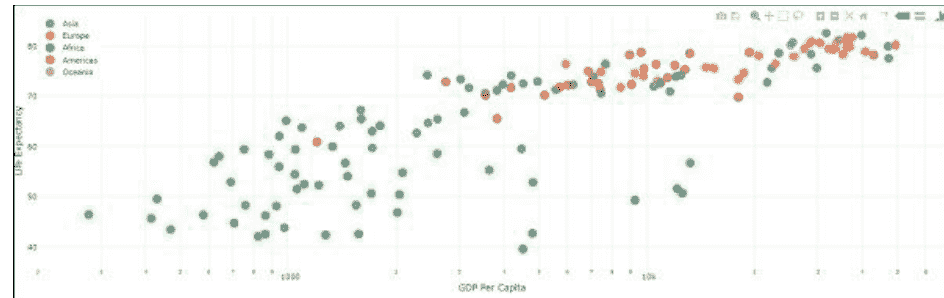

这些图表是交互式和响应式的。你可以将鼠标悬停在数据点上查看其值，点击图例项来切换数据轨迹，点击并拖动进行缩放，按住Shift键并点击拖动进行平移。

## Markdown

虽然Dash通过`dash_html_components`库提供了HTML风格的组件，但用HTML编写文本内容可能比较繁琐。对于编写文本块，你可以使用`dash_core_components`库中的Markdown组件。

### 核心组件

`dash_core_components`包含一组更高级的组件，如下拉菜单、图表、Markdown、文本块等等。

与所有其他Dash组件一样，它们完全以声明式方式描述。每个可配置的选项都作为组件的关键字参数提供。

下面是使用部分可用组件的示例 –

```python
# -*- coding: utf-8 -*-
import dash
import dash_core_components as dcc
import dash_html_components as html

app = dash.Dash()

app.layout = html.Div([
    html.Label('Dropdown'),
    dcc.Dropdown(
        options=[
            {'label': 'New York City', 'value': 'NYC'},
            {'label': u'Montréal', 'value': 'MTL'},
            {'label': 'San Francisco', 'value': 'SF'}
        ],
        value='MTL'
    ),

    html.Label('Multi-Select Dropdown'),
    dcc.Dropdown(
        options=[
            {'label': 'New York City', 'value': 'NYC'},
            {'label': u'Montréal', 'value': 'MTL'},
            {'label': 'San Francisco', 'value': 'SF'}
        ],
        value=['MTL', 'SF'],
        multi=True
    ),

    html.Label('Radio Items'),
    dcc.RadioItems(
        options=[
            {'label': 'New York City', 'value': 'NYC'},
            {'label': u'Montréal', 'value': 'MTL'},
            {'label': 'San Francisco', 'value': 'SF'}
        ],
        value='MTL'
    ),

    html.Label('Checkboxes'),
    dcc.Checklist(
        options=[
            {'label': 'New York City', 'value': 'NYC'},
            {'label': u'Montréal', 'value': 'MTL'},
            {'label': 'San Francisco', 'value': 'SF'}
        ],
        values=['MTL', 'SF']
    ),

    html.Label('Text Input'),
    dcc.Input(value='MTL', type='text'),

    html.Label('Slider'),
    dcc.Slider(
        min=0,
        max=9,
        marks={i: 'Label {}'.format(i) if i == 1 else str(i) for i in range(1, 6)},
        value=5,
    ),
], style={'columnCount': 2})

if __name__ == '__main__':
    app.run_server(debug=True)
```

上述程序的输出如下 –

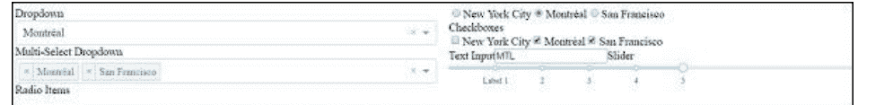

### 调用帮助

Dash组件是声明式的。这些组件的每个可配置方面都在安装时作为关键字参数设置。你可以在Python控制台中对任何组件调用`help`来了解更多关于该组件及其可用参数的信息。下面给出了一些示例 –

```python
>>> help(dcc.Dropdown)
Help on class Dropdown in module builtins:
class Dropdown(dash.development.base_component.Component)
| A Dropdown component.
| Dropdown is an interactive dropdown element for selecting one or more
| items.
| The values and labels of the dropdown items are specified in the `options`
| property and the selected item(s) are specified with the `value` property.
|
| Use a dropdown when you have many options (more than 5) or when you are
| constrained for space. Otherwise, you can use RadioItems or a Checklist,
| which have the benefit of showing the users all of the items at once.
|
| Keyword arguments:
| - id (string; optional)
| - options (list; optional): An array of options
| - value (string | list; optional): The value of the input. If
`multi` is false (the default)
-- More --
```

总而言之，Dash应用的布局描述了应用的外观。布局是一个组件的层次树。`dash_html_components`库为所有HTML标签和关键字参数提供了类，并描述了HTML属性，如`style`、`className`和`id`。`dash_core_components`库则生成更高级的组件，如控件和图表。

## 选择更好的框架

Python Web框架的世界提供了很多选择。一些值得考虑的著名框架包括Django、Flask、Bottle、Diesel、Web2py、Pyramid、Falcon、Pecan等，它们都在争夺开发者的关注。像Pyramid、Django、Web2py和Flask这样的框架各有优缺点；为你的项目只选择一个是一个艰难的决定。

Dash完全是为不同的需求集而设计的。因此，作为开发者，你希望将众多选项缩减到能帮助你按时并完美完成项目的那一个。

如果我们比较Flask、Pyramid和Django框架，Flask是一个微框架，主要针对需求更简单的小型应用，而Pyramid和Django则都针对更大的应用。Pyramid在构建时考虑了灵活性和自由度，因此开发者拥有适合项目的正确工具。在Pyramid的情况下，开发者可以自由选择数据库、URL结构、模板风格等。然而，Django包含了Web应用所需的所有组件，所以我们只需要安装Django并开始工作。

Django自带ORM，而Pyramid和Flask则让开发者自行选择如何（或是否）存储他们的数据。通常，对于非Django Web应用，最常见的ORM是SQLAlchemy，但其他选项可以是DjangoDB、MongoDB、LevelDB和SQLite。

作为开发者，如果我必须在Django和Web2py之间为我的项目做出选择。我需要对这两个框架的优点和局限性有一些了解。所以让我们比较一下Django和Web2py –

### Django

Django的社区是一个很大的优势。这对开发者来说实际上意味着资源会更加丰富。具体来说，这归结为 –

- 文档
- 开源资源
- 第三方应用支持
- 部署支持
- 拥有乐于助人的开发者的IRC频道

Django拥有一个非常庞大的开发团队和文档社区。当我们需要编写复杂的后端时，它是正确的框架，因为它提供了许多第三方应用，可以让你自动化处理诸如用户逻辑（注册、认证）、异步任务、API创建、博客等事务。

### Web2py

Web2py非常适合快速开发简单的Web应用或HTTP服务器。以下是Web2py的一些优点和局限性。

#### Web2py的优点

以下是Web2py框架的一些优点 –

- 与Django和Flask相比，Web2py在开发速度和简洁性方面是一个有潜力的框架。由于Web2py使用基于Python的模板语言，这允许Python开发者在理解编写模板作为视图的基础知识后立即开始编写代码。
- Web2py可以运行Python编译后的代码，作为一种优化以降低运行时间，并允许你以编译的方式分发你的代码。

#### Web2py 的局限性

以下是该框架的一些局限性：

- Web2py 支持 doctest，但不支持单元测试。由于 doctest 的范围有限，目前并非最佳选择。
- 生产环境和开发环境没有区分。一旦发生异常，系统总会生成工单，你必须导航到工单页面查看错误。这对生产服务器可能有帮助，但在开发环境中会很麻烦，因为开发者需要立即看到错误，而不是去查看工单号。
- Web2py 拥有良好的数据库抽象层（DAL），允许你抽象多种数据库引擎，但缺乏强大的 ORM。如果处理相对较大的模型，代码会因所有嵌套定义和属性而变得分散，使事情复杂化。
- 由于 Web2py 对 IDE 的支持非常差，我们无法在不修改的情况下使用标准的 Python 开发工具。

Django 和 Web2py 框架是全栈框架。这意味着它们提供了所有需要的代码——从表单生成器到模板布局和表单验证，让你专注于根据特定需求编写内容。

然而，对于 Flask 和 Pyramid 等非全栈框架，如果你想创建一个功能齐全的网站，你需要自己添加大量代码和额外部分。这需要大量的技能和时间。

### Dash

Dash 完全专为构建仪表板响应式框架这一特定任务而设计。Plotly 的 Dash 是 Python 开发者创建交互式 Web 应用程序的绝佳方式，无需学习 Javascript 和前端 Web 开发。Dash 构建在 Flask、Plotly.js、React 和 React Js 之上。

Dash 与其他框架（上述提到的）没有可比性，因为它们属于不同类别的框架。以下是选择 Dash 而非其他交互式仪表板框架（Jupiter Dashboards、matplotlib 等）的一些原因：

- 仅需 50 行代码，你就可以编写一个简单的 "hello world" Dash 应用程序，因为 Dash 需要的样板代码非常少。
- 整个 Dash 应用程序都使用全球最受欢迎的 Python 语言编写。
- 在你自己的 Python 代码中，你可以将 Dash 交互组件（如下拉菜单、文本输入、滑块和图表）与响应式 Dash "回调"绑定。
- Dash 应用程序中复杂的 UI 可以有多个输入、多个输出以及依赖于其他输入的输入。
- 多个用户可以同时处理 Dash 应用程序。
- 为了使用 React 创建自己的 Dash 组件，Dash 使用 React.js 来渲染组件，并包含一个插件系统。
- 开发者或作者可以编写响应点击、悬停或在图表上选择点的 Dash 应用程序，因为 Dash 的 Graph 组件是交互式的。

## 结论

我们可以得出结论，从众多可用的 Python 框架中选择正确的框架完全取决于项目类型、复杂性、小型或企业级项目、可用的社区支持或在线资源、可扩展性、安全性等。

上述提到的 Python 框架在其类别中都是最好的，但都有各自的优点和缺点（取决于项目需求）。因此，一种类型的框架并不适合所有类型的项目。