# 73个Python面向对象编程练习题 第二卷

Edcorner Learning

# 目录

- [简介](Introduction)
- [模块1 类方法 - 装饰器](Module 1 Class Method - Decorator)
- [模块2 静态方法 - 装饰器](Module 2 Static Method - Decorator)
- [模块3 特殊方法](Module 3 Special Methods)
- [模块4 继承](Module 4 Inheritance)
- [模块5 抽象类](Module 5 Abstract Classes)
- [模块6 综合练习](Module 6 Miscellaneous Exercises)

# 简介

Python是一种通用的、解释型、交互式、面向对象且功能强大的编程语言，具有动态语义。它是一门易于学习和精通的语言。Python是少数既能声称简单又功能强大的语言之一。Python优雅的语法、动态类型以及其解释型特性，使其成为在大型平台上进行脚本编写和健壮应用开发的理想语言。

Python通过模块和包来辅助开发，这促进了程序的模块化和代码重用。Python解释器以及广泛的标准库均以源代码或二进制形式免费提供给所有关键平台，并可自由分发。学习Python不需要任何先决条件。然而，应该对编程语言有基本的理解。

**本书包含73个Python面向对象编程编码练习，用于实践不同的主题。**

在每个练习中，我们给出了需要完成的练习编码语句，并验证你的答案。我们还附上了每个练习的输入输出屏幕截图及其解决方案。

学习者可以使用自己系统上的Python编译器，也可以使用任何可用的在线编译器。

我们在本书中涵盖了所有级别的练习，为所有学习者提供良好且高效的学习方法，以实践Python的不同场景。

# 模块1 类方法 - 装饰器

1. 使用`classmethod`类（以标准方式实现）创建一个名为`Person`的类，该类有一个名为`show_details()`的类方法，该方法向控制台显示以下文本：
'Running from Person class.'
尝试使用`Person`类的适当属性传递类名。
然后，调用`show_details()`类方法。
**预期结果：**
**Running from Person class.**

```python
#Edcorner Learning Python OOPS Exercises

class Person:
    def show_details(cls):
        print(f'Running from {cls.__name__} class.')
    show_details = classmethod(show_details)

Person.show_details()
```

2. 使用`classmethod`类（以标准方式实现）创建一个名为`Person`的类，该类有一个名为`show_details()`的类方法，该方法向控制台显示以下文本：
'Running from Container class.'
尝试使用`Person`类的适当属性传递类名。
然后，调用`show_details()`类方法。

**预期结果：**

**'Running from Container class.'**

```python
#Edcorner Learning Python OOPS Exercises

class Container:
    @classmethod
    def show_details(cls):
        print(f'Running from {cls.__name__} class.')

Container.show_details()
```

3. 给定`Container`类。创建一个名为`container`的该类实例，并从该实例调用`show_details()`方法。

**预期结果：**

**Running from Container class.**

```python
class Container:
    @classmethod
    def show_details(cls):
        print(f'Running from {cls.__name__} class.')

container = Container()
container.show_details()
```

4. 实现一个名为`Person`的类，该类有一个名为`instances`的类属性，初始为空列表。然后，每次创建`Person`类的实例时，将其添加到`Person.instances`列表中（为此使用`__init__()`方法）。
同时实现一个名为`count_instances()`的类方法，该方法返回已创建的`Person`对象数量（`Person.instances`列表中的项目数）。
创建三个`Person`类的实例。然后调用`count_instances()`类方法，并将结果打印到控制台。

**预期结果：**
3

```python
#Edcorner Learning Python OOPS Exercises

class Person:
    instances = []

    def __init__(self):
        Person.instances.append(self)

    @classmethod
    def count_instances(cls):
        return len(Person.instances)

p1 = Person()
p2 = Person()
p3 = Person()
print(Person.count_instances())
```

```
3
```

5. 给定一个名为`Person`的类。修改`__init__()`方法，以便可以设置两个实例属性：`firstname`和`lastname`（裸属性，无需任何验证）。
创建两个`Person`类的实例。然后调用`count_instances()`类方法，并将结果打印到控制台。

**预期结果：**
2

```python
#Edcorner Learning Python OOPS Exercises

class Person:
    instances = []

    def __init__(self, first_name, last_name):
        self.first_name = first_name
        self.last_name = last_name
        Person.instances.append(self)

    @classmethod
    def count_instances(cls):
        return len(Person.instances)

person1 = Person('John', 'Doe')
person2 = Person('Mike', 'Smith')
print(person1.count_instances())
```

```
2
```

# 模块2 静态方法 - 装饰器

6. 定义一个`Container`类，该类有一个静态方法（使用`staticmethod`类 - 以标准方式实现）名为`get_current_time()`，返回格式为`'%H:%M:%S'`的当前时间，例如`'09:45:10'`。
提示：使用内置的`time`模块。

**解决方案：**

```python
import time

class Container:

    def get_current_time():
        return time.strftime('%H:%M:%S', time.localtime())

    get_current_time = staticmethod(get_current_time)
```

7. 定义一个`Container`类，该类有一个静态方法（使用`@staticmethod`装饰器）名为`get_current_time()`，返回格式为`'%H:%M:%S'`的当前时间，例如`'09:45:10'`。
提示：使用内置的`time`模块。

**解决方案：**

```python
import time

class Container:

    @staticmethod
    def get_current_time():
        return time.strftime('%H:%M:%S', time.localtime())
```

8. 完成`Book`类的实现。在`__init__()`方法中，设置实例的裸属性，名称为：

- title
- author
- book_id

使用`uuid`模块设置实例的`book_id`属性。具体使用该模块中的`uuid.uuid4()`函数。使用此函数的示例：

```python
import uuid

str(uuid.uuid4().fields[-1])[:6]
```

返回一个6位字符串。这将是`book_id`属性的值。

使用上述代码，创建`Book`类的一个静态方法（使用`@staticmethod`装饰器）名为`get_id()`，该方法将生成一个6位的`str`对象（`book_id`字段的值）。

然后创建一个名为`book1`的类实例，参数如下：

- title='Python Object Oriented Programming Exercises Volume 2'
- author='Edcorner Learning'

然后，将`book1`的所有`__dict__`属性键打印到控制台。

**预期结果：**
**dict_keys(['book_id', 'title', 'author'])**

```python
import uuid

class Book:

    def __init__(self, title, author):
        self.book_id = self.get_id()
        self.title = title
        self.author = author

    @staticmethod
    def get_id():
        return str(uuid.uuid4().fields[-1])[:6]

book1 = Book('Python Object Oriented Programming Exercises Volume 2', 'Edcorner Learning')
print(book1.__dict__.keys())
```

## 9. `Book` 类已实现。为 `Book` 类添加一个 `__repr__()` 方法，用于表示该类的一个实例（见下文）。
然后创建一个名为 `book1` 的类实例，传入以下参数：

- title = 'Python Object Oriented Programming Exercises Volume 2'
- author = 'Edcorner Learning'

作为响应，将实例 `book1` 打印到控制台。

**预期结果：**
**Book(title='Python Object Oriented Programming Exercises Volume 2', author='Edcorner Learning')**

```python
import uuid

class Book:

    def __init__(self, title, author):
        self.book_id = self.get_id()
        self.title = title
        self.author = author

    def __repr__(self):
        return f"Book(title='{self.title}', author='{self.author}')"

    @staticmethod
    def get_id():
        return str(uuid.uuid4().fields[-1])[:6]

book1 = Book('Python Object Oriented Programming Exercises Volume 2', author='Edcorner Learning')
print(book1)
```

## 解答：

```python
import uuid
class Book:

    def __init__(self, title, author):
        self.book_id = self.get_id()
        self.title = title
        self.author = author

    def __repr__(self):
        return f"Book(title='{self.title}', author='{self.author}')"

    @staticmethod
    def get_id():
        return str(uuid.uuid4().fields[-1])[:6]

book1 = Book('Python Object Oriented Programming Exercises Volume 2', author='Edcorner Learning')
print(book1)
```

# 模块 3 特殊方法

## 10. 定义一个 `Person` 类，它接受两个裸属性：`fname`（名）和 `lname`（姓）。

然后实现 `__repr__()` 特殊方法，以如下所示的形式显示 `Person` 对象的正式表示：

[IN]: person = Person('John', 'Doe')
[IN]: print(person)
[OUT]: Person(fname='John', lname='Doe')

使用给定的属性创建一个 `Person` 类的实例：

fname = 'Mike'
lname = 'Smith'

并将其赋值给变量 `person`。作为响应，将 `person` 实例打印到控制台。

**预期结果：**
**Person(fname='Mike', lname='Smith')**

## 解答：

```python
#Edcorner Learning OOPS Exercises

class Person:

    def __init__(self, fname, lname):
        self.fname = fname
        self.lname = lname

    def __repr__(self):
        return f"Person(fname='{self.fname}', lname='{self.lname}')"

person = Person('Mike', 'Smith')
print(person)
```

## 11. `Person` 类已实现。添加一个特殊方法 `__str__()`，以返回 `Person` 类实例的非正式表示。

示例：

```python
[IN]: person = Person('Mike', 'Smith')
[IN]: print(person)
```

First name: Mike
Last name: Smith

然后创建一个名为 `person` 的实例，使用以下值：

- fname = 'Edcorner'
- lname = 'Learning'

作为响应，将 `person` 实例打印到控制台。

**预期结果：**
**First name: Edcorner**
**Last name: Learning**

```python
#Edcorner Learning OOPS Exercises

class Person:

    def __init__(self, fname, lname):
        self.fname = fname
        self.lname = lname

    def __repr__(self):
        return f"Person(fname='{self.fname}', lname='{self.lname}')"

    def __str__(self):
        return f'First name: {self.fname}\nLast name: {self.lname}'

person = Person('Edcorner', 'Learning')
print(person)
```

## 解答：

## 12. 实现一个名为 `Vector` 的类，该类在创建实例时接受任意数量的参数（n维空间中的向量坐标 - 不进行任何验证），并将其赋值给名为 `components` 的属性。

然后实现 `__repr__()` 特殊方法，以如下所示的形式显示 `Vector` 的正式表示：

[IN]: v1 = Vector(1, 2)
[IN]: print(v1)
[OUT]: Vector(1, 2)

创建一个来自 R³ 空间的向量，坐标为：(-3, 4, 2)，并将其赋值给变量 `v1`。作为响应，将变量 `v1` 打印到控制台。

**预期结果：**
**Vector(-3, 4, 2)**

```python
#Edcorner Learning OOPS Exercises

class Vector:
    def __init__(self, *components):
        self.components = components
    
    def __repr__(self):
        return f'Vector{self.components}'

v1 = Vector(-3, 4, 2)
print(v1)
```

## 13. 给出了 `Vector` 类的一个实现。实现 `__str__()` 特殊方法，以如下所示的形式显示 `Vector` 实例的非正式表示：

```python
[IN]: v1 = Vector(1, 2)
[IN]: print(v1)
[OUT]: (1, 2)
```

创建一个来自 R³ 空间的向量，坐标为：(-3, 4, 2)，并将其赋值给变量 `v1`。作为响应，将变量 `v1` 打印到控制台。

**预期结果：**
**(-3, 4, 2)**

```python
class Vector:

    def __init__(self, *components):
        self.components = components

    def __repr__(self):
        return f'Vector{self.components}'

    def __str__(self):
        return f'{self.components}'

v1 = Vector(-3, 4, 2)
print(v1)
```

## 14. 给出了 `Vector` 类的一个实现。实现 `__len__()` 特殊方法，以返回向量坐标的数量。

示例：

```python
[IN]: v1 = Vector(3, 4, 5)
[IN]: print(len(v1))
[OUT]: 3
```

创建一个来自 R³ 空间的向量，坐标为：(-3, 4, 2)，并将其赋值给变量 `v1`。作为响应，使用内置的 `len()` 函数打印该向量的坐标数量。

**预期结果：**
3

```python
#Edcorner Learning OOPS Exercises

class Vector:

    def __init__(self, *components):
        self.components = components

    def __repr__(self):
        return f'Vector{self.components}'

    def __str__(self):
        return f'{self.components}'

    def __len__(self):
        return len(self.components)

v1 = Vector(-3, 4, 2)
print(len(v1))
```

## 15. 给出了 `Vector` 类的一个实现。实现 `__bool__()` 特殊方法，以返回向量的逻辑值：

- 如果第一个坐标为零，则返回 False
- 反之，返回 True

如果用户没有传递任何参数，则返回逻辑值 `False`。

示例：

```python
[IN]: v1 = Vector(0, 4, 5)
[IN]: print(bool(v1))
[OUT]: False
```

然后创建以下实例：

- v1 = Vector()
- v2 = Vector(3, 2)
- v3 = Vector(0, -3, 2)
- v4 = Vector(5, 0, -1)

作为响应，将给定实例的逻辑值打印到控制台。

预期结果：

False
True
False
True

```python
#Edcorner Learning OOPS Exercises

class Vector:
    def __init__(self, *components):
        self.components = components

    def __repr__(self):
        return f'Vector{self.components}'

    def __str__(self):
        return f'{self.components}'

    def __len__(self):
        return len(self.components)

    def __bool__(self):
        if not self.components:
            return False
        return False if not self.components[0] else True

v1 = Vector()
v2 = Vector(3, 2)
v3 = Vector(0, -3, 2)
v4 = Vector(5, 0, -1)

print(bool(v1))
print(bool(v2))
print(bool(v3))
print(bool(v4))
```

False
True
False
True

## 16. 给出了 `Vector` 类的一个实现。创建该类的以下实例：

- v1 = Vector(4, 2)
- v2 = Vector(-1, 3)

然后尝试将这些实例相加，即执行操作 `v1 + v2`。如果出现错误，请将错误消息打印到控制台。在你的解决方案中使用 `try ... except ...` 子句。

预期结果：

unsupported operand type(s) for +: 'Vector' and 'Vector'

```python
class Vector:

    def __init__(self, *args):
        self.components = args

    def __repr__(self):
        return f"Vector{self.components}"

    def __str__(self):
        return f'{self.components}'

    def __len__(self):
        return len(self.components)
```

```python
#Edcorner Learning OOPS Exercises

class Vector:

    def __init__(self, *components):
        self.components = components

    def __repr__(self):
        return f'Vector{self.components}'

    def __str__(self):
        return f'{self.components}'

    def __len__(self):
        return len(self.components)

v1 = Vector(4, 2)
v2 = Vector(-1, 3)
try:
    v1 + v2
except TypeError as error:
    print(error)
```

```
unsupported operand type(s) for +: 'Vector' and 'Vector'
```

17. 给出了一个 `Vector` 类的实现。请实现 `__add__()` 特殊方法，以实现 `Vector` 实例的相加（按坐标）。为简化起见，假设用户相加的向量长度相同。然后创建两个 `Vector` 类的实例：
v1 = Vector(4, 2)
v2 = Vector(-1, 3)
并执行这些向量的加法。将结果打印到控制台。
**预期结果：**
**(3,5)**

```python
class Vector:

    def __init__(self, *components):
        self.components = components

    def __repr__(self):
        return f'Vector{self.components}'

    def __str__(self):
        return f'{self.components}'

    def __len__(self):
        return len(self.components)
```

```python
#Edcorner Learning OOPS Exercises

class Vector:
    def __init__(self, *components):
        self.components = components

    def __repr__(self):
        return f'Vector{self.components}'

    def __str__(self):
        return f'{self.components}'

    def __len__(self):
        return len(self.components)

    def __add__(self, other):
        components = tuple(x + y for x, y in zip(self.components, other.components))
        return Vector(*components)

v1 = Vector(4, 2)
v2 = Vector(-1, 3)
print(v1 + v2)
```

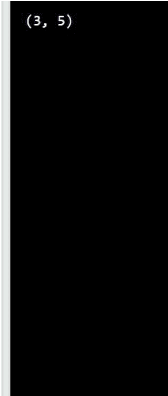

18. 给出了一个 `Vector` 类的实现。创建该类的以下实例：

- v1 = Vector(4, 2)
- v2 = Vector(-1, 3)

然后尝试对这些实例进行减法（执行 v1 - v2 操作）。如果出现错误，请将错误信息打印到控制台。在你的解决方案中使用 `try ... except ...` 子句。

**预期结果：**

unsupported operand type(s) for -: 'Vector' and 'Vector'

```python
class Vector:

    def __init__(self, *args):
        self.components = args

    def __repr__(self):
        return f"Vector{self.components}"

    def __str__(self):
        return f'{self.components}'

    def __len__(self):
        return len(self.components)

    def __add__(self, other):
        components = tuple(x + y for x, y in zip(self.components,
                                                other.components))
        return Vector(*components)
```

```python
#Edcorner Learning OOPS Exercises

class Vector:
    def __init__(self, *args):
        self.components = args

    def __repr__(self):
        return f"Vector{self.components}"

    def __str__(self):
        return f'{self.components}'

    def __len__(self):
        return len(self.components)

    def __add__(self, other):
        components = tuple(x + y for x, y in
zip(self.components, other.components))
        return Vector(*components)

v1 = Vector(3, 2)
v2 = Vector(5, 2)
try:
    v1 - v2
except TypeError as error:
    print(error)
```

```
unsupported operand type(s) for -: 'Vector' and 'Vector'
```

## 解答：

19. 给出了一个 `Vector` 类的实现。请实现 `__sub__()` 特殊方法，以实现 `Vector` 实例的相减（按坐标）。为简化起见，假设用户相减的向量长度相同。然后创建该类的两个实例：

- v1 = Vector(4, 2)
- v2 = Vector(-1, 3)

并执行这些向量的减法。将结果打印到控制台。
预期结果：
(5, -1)

```python
class Vector:

    def __init__(self, *components):
        self.components = components

    def __repr__(self):
        return f'Vector{self.components}'

    def __str__(self):
        return f'{self.components}'

    def __len__(self):
        return len(self.components)

    def __add__(self, other):
        components = tuple(x + y for x, y in zip(self.components,
            other.components))
        return Vector(*components)
```

```python
#Edcorner Learning OOPS Exercises

class Vector:

    def __init__(self, *components):
        self.components = components

    def __repr__(self):
        return f'Vector{self.components}'

    def __str__(self):
        return f'{self.components}'

    def __len__(self):
        return len(self.components)

    def __add__(self, other):
        components = tuple(x + y for x, y in zip(self.components, other.components))
        return Vector(*components)

    def __sub__(self, other):
        components = tuple(x - y for x, y in zip(self.components, other.components))
        return Vector(*components)

v1 = Vector(4, 2)
v2 = Vector(-1, 3)
print(v1 - v2)
```

```
(5, -1)
```

20. 给出了一个 `Vector` 类的实现。请实现 `__mul__()` 特殊方法，以实现 `Vector` 实例的相乘（按坐标）。为简化起见，假设用户相乘的向量长度相同。然后创建该类的两个实例：

- v1 = Vector(4, 2)
- v2 = Vector(-1, 3)

并执行这些向量的乘法。将结果打印到控制台。

预期结果：

(-4,6)

```python
class Vector:

    def __init__(self, *components):
        self.components = components

    def __repr__(self):
        return f'Vector{self.components}'

    def __str__(self):
        return f'{self.components}'

    def __len__(self):
        return len(self.components)

    def __add__(self, other):
        components = tuple(x + y for x, y in zip(self.components,
                                                other.components))
        return Vector(*components)

    def __sub__(self, other):
        components = tuple(x - y for x, y in zip(self.components,
                                                other.components))
        return Vector(*components)
```

解答：

```python
class Vector:
    def __init__(self, *components):
        self.components = components

    def __repr__(self):
        return f'Vector{self.components}'

    def __str__(self):
        return f'{self.components}'

    def __len__(self):
        return len(self.components)

    def __add__(self, other):
        components = tuple(x + y for x, y in zip(self.components, other.components))
        return Vector(*components)

    def __sub__(self, other):
        components = tuple(x - y for x, y in zip(self.components, other.components))
        return Vector(*components)

    def __mul__(self, other):
        components = tuple(x * y for x, y in zip(self.components, other.components))
        return Vector(*components)

v1 = Vector(4, 2)
v2 = Vector(-1, 3)
print(v1 * v2)
```

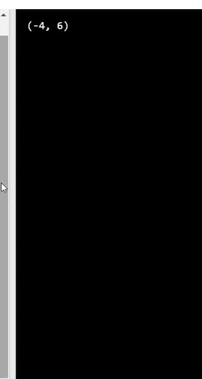

21. 给出了一个 `Vector` 类的实现。请实现 `__truediv__()` 特殊方法，以实现 `Vector` 实例的相除（按坐标除法）。为简化起见，假设用户相除的向量长度相同，且第二个向量的坐标不为零。然后创建该类的两个实例：

- v1 = Vector(4, 2)
- v2 = Vector(-1, 4)

并执行这些向量的除法。将结果打印到控制台。

预期结果：

(-4.0, 0.5)

```python
class Vector:

    def __init__(self, *components):
        self.components = components

    def __repr__(self):
        return f'Vector{self.components}'

    def __str__(self):
        return f'{self.components}'

    def __len__(self):
        return len(self.components)

    def __add__(self, other):
        components = tuple(x + y for x, y in zip(self.components,
                                                other.components))
        return Vector(*components)

    def __sub__(self, other):
        components = tuple(x - y for x, y in zip(self.components,
                                                other.components))
        return Vector(*components)
```

def __mul__(self, other):
    components = tuple(x * y for x, y in zip(self.components,
    other.components))
    return Vector(*components)

解答：

class Vector:

    def __init__(self, *components):
        self.components = components

    def __repr__(self):
        return f'Vector{self.components}'

    def __str__(self):
        return f'{self.components}'

    def __len__(self):
        return len(self.components)

    def __add__(self, other):
        components = tuple(x + y for x, y in zip(self.components,
        other.components))
        return Vector(*components)

    def __sub__(self, other):
        components = tuple(x - y for x, y in zip(self.components,
        other.components))
        return Vector(*components)

    def __mul__(self, other):
        components = tuple(x * y for x, y in zip(self.components,
        other.components))
        return Vector(*components)

    def __truediv__(self, other):
        components = tuple(x / y for x, y in zip(self.components,
        other.components))
        return Vector(*components)

v1 = Vector(4, 2)
v2 = Vector(-1, 4)

print(v1 / v2)

22. 已给出 `Vector` 类的实现。请实现 `__floordiv__()` 特殊方法，以执行 `Vector` 实例的整数除法（按坐标进行除法）。为简化起见，假设用户除以相同长度的向量，且第二个向量的坐标不为零。然后创建该类的两个实例：

- v1 = Vector(4, 2)
- v2 = Vector(-1, 4)

并对这些向量执行整数除法。将结果打印到控制台。

**预期结果：**

**(-4, 0)**

class Vector:

    def __init__(self, *components):
        self.components = components

    def __repr__(self):
        return f'Vector{self.components}'

    def __str__(self):
        return f'{self.components}'

    def __len__(self):
        return len(self.components)

    def __add__(self, other):
        components = tuple(x + y for x, y in zip(self.components,
                                                other.components))
        return Vector(*components)

    def __sub__(self, other):
        components = tuple(x - y for x, y in zip(self.components,
                                                other.components))
        return Vector(*components)

    def __mul__(self, other):
        components = tuple(x * y for x, y in zip(self.components,
        other.components))
        return Vector(*components)

    def __truediv__(self, other):
        components = tuple(x / y for x, y in zip(self.components,
        other.components))
        return Vector(*components)

## 解答：

class Vector:

    def __init__(self, *components):
        self.components = components

    def __repr__(self):
        return f'Vector{self.components}'

    def __str__(self):
        return f'{self.components}'

    def __len__(self):
        return len(self.components)

    def __add__(self, other):
        components = tuple(x + y for x, y in zip(self.components,
        other.components))
        return Vector(*components)

    def __sub__(self, other):
        components = tuple(x - y for x, y in zip(self.components,
        other.components))
        return Vector(*components)

    def __mul__(self, other):
        components = tuple(x * y for x, y in zip(self.components,
        other.components))
        return Vector(*components)

    def __truediv__(self, other):
        components = tuple(x / y for x, y in zip(self.components,
        other.components))
        return Vector(*components)

    def __floordiv__(self, other):
        components = tuple(x // y for x, y in zip(self.components,
        other.components))
        return Vector(*components)

v1 = Vector(4, 2)
v2 = Vector(-1, 4)
print(v1 // v2)

23. 已实现以下 `Doc` 类用于存储文本文档。请实现 `__add__()` 特殊方法，以使用空格字符连接 `Doc` 实例。

示例：

```
[IN]: doc1 = Doc('Object')
[IN]: doc2 = Doc('Oriented')
[IN]: print(doc1 + doc2)
[OUT]: Object Oriented
```

然后为以下文档创建两个 `Doc` 类的实例：

- 'Python'
- '3.8'

作为响应，将这些实例相加的结果打印到控制台。

**预期结果：**

**Python 3.8**

class Doc:
    def __init__(self, string):
        self.string = string

    def __repr__(self):
        return f"Doc(string='{self.string}')"

    def __str__(self):
        return f'{self.string}'

#Edcorner Learning OOPS Exercises
class Doc:

    def __init__(self, string):
        self.string = string

    def __repr__(self):
        return f"Doc(string='{self.string}')"

    def __str__(self):
        return f'{self.string}'

    def __add__(self, other):
        return Doc(self.string + ' ' + other.string)

doc1 = Doc('Python')
doc2 = Doc('3.8')
print(doc1 + doc2)

Python 3.8

24. 已实现以下 `Hashtag` 类用于存储文本文档 - 标签。请实现 `__add__()` 特殊方法，以使用空格字符连接（拼接）`Hashtag` 实例，如下所示（请注意新对象开头的 `#` 字符数量）。

示例：

```
[IN]: hashtag1 = Hashtag('sport')
[IN]: hashtag2 = Hashtag('travel')
[IN]: print(hashtag1 + hashtag2)
[OUT]: #sport #travel
```

然后为以下文本文档创建三个 `Hashtag` 实例：

- python
- developer
- oop

作为响应，打印这些实例相加的结果。

**预期结果：**

**#python #developer #oop**

class Hashtag:

    def __init__(self, string):
        self.string = '#' + string

    def __repr__(self):
        return f"Hashtag(string='{self.string}')"

    def __str__(self):
        return f'{self.string}'

#Edcorner Learning OOPS Exercises
class Hashtag:

    def __init__(self, string):
        self.string = '#' + string

    def __repr__(self):
        return f"Hashtag(string='{self.string}')"

    def __str__(self):
        return f'{self.string}'

    def __add__(self, other):
        return Hashtag(self.string[1:] + ' ' + other.string)

hashtag1 = Hashtag('python')
hashtag2 = Hashtag('developer')
hashtag3 = Hashtag('oop')
print(hashtag1 + hashtag2 + hashtag3)

解答：

25. 已实现以下 `Doc` 类用于存储文本文档。请实现 `__eq__()` 特殊方法以比较 `Doc` 实例。当类实例具有相同的字符串属性值时，它们相等。

示例：

```
[IN]: doc1 = Doc('Finance')
[IN]: doc2 = Doc('Finance')
[IN]: print(doc1 == doc2)
[OUT]: True
```

然后为以下文档创建两个 `Doc` 类的实例：

- 'Python'
- '3.8'

作为响应，打印比较这些实例的结果。

**预期结果：**

**False**

class Doc:

    def __init__(self, string):
        self.string = string

    def __repr__(self):
        return f"Doc(string='{self.string}')"

    def __str__(self):
        return f'{self.string}'

    def __add__(self, other):
        return Doc(self.string + ' ' + other.string)

## Edcorner 学习 OOPS 练习

```python
class Doc:

    def __init__(self, string):
        self.string = string

    def __repr__(self):
        return f"Doc(string='{self.string}')"

    def __str__(self):
        return f'{self.string}'

    def __add__(self, other):
        return Doc(self.string + ' ' + other.string)

    def __eq__(self, other):
        return self.string == other.string

doc1 = Doc('Python')
doc2 = Doc('3.8')
print(doc1 == doc2)
```

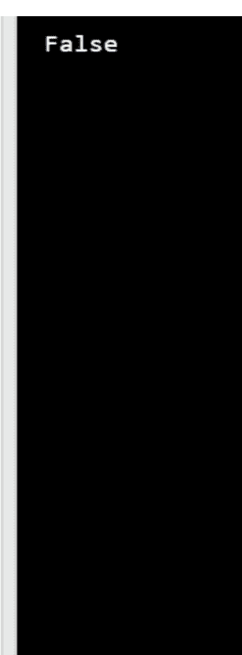

解答：

26. 下面的 `Doc` 类用于存储文本文档。请实现 `__lt__()` 特殊方法来比较 `Doc` 实例。当字符串属性较短时，一个类实例被认为“小于”另一个实例。

示例：
[IN]: doc1 = Doc('Finance')
[IN]: doc2 = Doc('Education')
[IN]: print(doc1 < doc2)
[OUT]: True

然后为以下文档创建两个 `Doc` 类的实例：
- 'sport'
- 'activity'

并赋值给变量：
doc1
doc2

作为响应，打印这些实例的比较结果（执行 `doc1 < doc2`）。

**预期结果：**
**True**

```python
class Doc:
    def __init__(self, string):
        self.string = string

    def __repr__(self):
        return f"Doc(string='{self.string}')"

    def __str__(self):
        return f'{self.string}'

    def __add__(self, other):
        return Doc(self.string + ' ' + other.string)

    def __lt__(self, other):
        return len(self.string) < len(other.string)

doc1 = Doc('sport')
doc2 = Doc('activity')
print(doc1 < doc2)
```

```
True
```

27. 下面的 `Doc` 类用于存储文本文档。请实现 `__iadd__()` 特殊方法以执行扩展赋值。使用字符串 ' & ' 连接两个实例。

示例：
[IN]: doc1 = Doc('Finance')
[IN]: doc2 = Doc('Accounting')
[IN]: doc1 += doc2
[IN]: print(doc1)
[OUT]: Finance & Accounting

然后为以下文档创建两个 `Doc` 类的实例：
- 'sport'
- 'activity'

并按照变量赋值：
- doc1
- doc2

执行扩展赋值：
- `doc1 += doc2`

将 doc1 实例打印到控制台。

**预期结果：**
**sport & activity**

```python
class Doc:
    def __init__(self, string):
        self.string = string

    def __repr__(self):
        return f"Doc(string='{self.string}')"

    def __str__(self):
        return f'{self.string}'

    def __iadd__(self, other):
        return Doc(self.string + ' & ' + other.string)

doc1 = Doc('sport')
doc2 = Doc('activity')
doc1 += doc2
print(doc1)
```

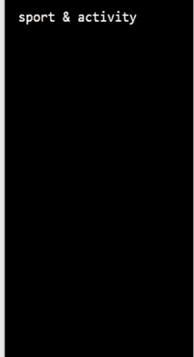

28. 给定 `Book` 类。请实现 `__str__()` 方法，以显示 `Book` 实例的非正式表示（见下文）。

示例：
[IN]: book1 = Book('Python OOPS Vol2', 'Edcorner Learning')
[IN]: print(book1)
[OUT]: Book ID: 214522 | Title: Python OOPS Vol2 | Author: Edcorner Learning

然后使用以下参数创建一个名为 `book` 的实例：
- title='Python OOPS Vol2'
- author='Edcorner Learning'

作为响应，将该实例打印到控制台。

**预期结果：**
**Book ID: 1234 | Title: Python OOPS Vol2 | Author: Edcorner Learning**

注意：Book ID 的值可能有所不同。

```python
import uuid

class Book:
    def __init__(self, title, author):
        self.book_id = self.get_id()
        self.title = title
        self.author = author

    def __repr__(self):
        return f"Book(title='{self.title}', author='{self.author}')"

    def __str__(self):
        return f'Book ID: {self.book_id} | Title: {self.title} | Author: {self.author}'

    @staticmethod
    def get_id():
        return str(uuid.uuid4().fields[-1])[:6]

book = Book('Python OOPS Vol2', 'Edcorner Learning')
print(book)
```

```
Book ID: 247475 | Title: Python OOPS Vol2 | Author: Edcorner Learning
```

## 模块 4 继承

29. 已实现 `Container` 类。请实现两个继承自 `Container` 类的简单类，名称分别为：
- PlasticContainer
- MetalContainer

```python
class Container:
    pass
```

**解答：**

```python
class Container:
    pass

class PlasticContainer(Container):
    pass

class MetalContainer(Container):
    pass
```

30. 已实现以下类：
- Container
- PlasticContainer
- MetalContainer
- CustomContainer

使用内置函数 `issubclass()` 检查以下类：
PlasticContainer
MetalContainer
CustomContainer
是否是 `Container` 类的子类。将结果打印到控制台，如下所示：
True
True
False

```python
class Container:
    pass
class PlasticContainer(Container):
    pass
class MetalContainer(Container):
    pass

class CustomContainer:
    pass
```

**解答：**

```python
class Container:
    pass
class PlasticContainer(Container):
    pass
class MetalContainer(Container):
    pass
class CustomContainer:
    pass
print(issubclass(PlasticContainer, Container))
print(issubclass(MetalContainer, Container))
print(issubclass(CustomContainer, Container))
```

31. 已实现以下类：
- Vehicle
- LandVehicle
- AirVehicle

在 `Vehicle` 类中定义一个 `__repr__()` 特殊方法，该方法返回 `Vehicle`、`LandVehicle` 和 `AirVehicle` 类对象的正式表示。

示例：下面的代码：
```python
instances = [Vehicle(), LandVehicle(), AirVehicle()]
for instance in instances:
    print(instance)
```
返回：
```
Vehicle(category='land vehicle')
LandVehicle(category='land vehicle')
AirVehicle(category='air vehicle')
```

作为响应，运行下面的代码：
```python
instances = [Vehicle(), LandVehicle(), AirVehicle()]
for instance in instances:
    print(instance)
```

**预期结果：**
**Vehicle(category='land vehicle')**
**LandVehicle(category='land vehicle')**
**AirVehicle(category='air vehicle')**

```python
class Vehicle:
    def __init__(self, category=None):
        self.category = category if category else 'land vehicle'
    def __repr__(self):
        return f"{self.__class__.__name__}(category='{self.category}')"

class LandVehicle(Vehicle):
    pass

class AirVehicle(Vehicle):
    def __init__(self, category=None):
        self.category = category if category else 'air vehicle'

instances = [Vehicle(), LandVehicle(), AirVehicle()]

for instance in instances:
    print(instance)
```

```
Vehicle(category='land vehicle')
LandVehicle(category='land vehicle')
AirVehicle(category='air vehicle')
```

32. 已实现以下类：
- Vehicle
- LandVehicle
- AirVehicle

在 `Vehicle` 类中定义一个 `display_info()` 方法，用于显示类名以及 `category` 属性的值。该方法应适用于所有类。

例如，以下代码：
```python
instances = [Vehicle(), LandVehicle(), AirVehicle()]
for instance in instances:
    instance.display_info()
```
返回：
```
Vehicle -> land vehicle
LandVehicle -> land vehicle
AirVehicle -> air vehicle
```

作为响应，运行下面的代码：
```python
instances = [Vehicle(), LandVehicle(), AirVehicle()]
for instance in instances:
    instance.display_info()
```

**预期结果：**
**Vehicle -> land vehicle**
**LandVehicle -> land vehicle**
**AirVehicle -> air vehicle**

**陆地车辆 -> 陆地车辆**
**空中车辆 -> 空中车辆**

```python
class Vehicle:
    def __init__(self, category=None):
        self.category = category if category else 'land vehicle'

class LandVehicle(Vehicle):
    pass

class AirVehicle(Vehicle):
    def __init__(self, category=None):
        self.category = category if category else 'air vehicle'

vehicles = [Vehicle(), LandVehicle(), AirVehicle()]

for vehicle in vehicles:
    vehicle.display_info()
```

```python
#Edcorner Learning OOPS Exercises

class Vehicle:
    def __init__(self, category=None):
        self.category = category if category else 'land vehicle'

    def display_info(self):
        print(f'{self.__class__.__name__} -> {self.category}')

class LandVehicle(Vehicle):
    pass

class AirVehicle(Vehicle):
    def __init__(self, category=None):
        self.category = category if category else 'air vehicle'

vehicles = [Vehicle(), LandVehicle(), AirVehicle()]

for vehicle in vehicles:
    vehicle.display_info()
```

```
Vehicle -> land vehicle
LandVehicle -> land vehicle
AirVehicle -> air vehicle
```

解答：

33. 给定一个 Vehicle 类，它有三个实例属性：

- brand
- color
- year

创建一个继承自 Vehicle 类的 Car 类。接下来，重写 `__init__()` 方法，使 Car 类的构造函数接受四个参数：

- brand
- color
- year
- horsepower

并适当地将它们设置为实例属性。在这种情况下不要使用 `super()`。然后创建以下实例：

- 名称为 vehicle，属性值为：'BMW'、'red'、2020
- 名称为 car，属性值为：'BMW'、'red'、2020、300

作为响应，打印 vehicle 和 car 实例的 `__dict__` 属性的值。

**预期结果：**

```
{'brand': 'BMW', 'color': 'red', 'year': 2020}
{'brand': 'BMW', 'color': 'red', 'year': 2020, 'horsepower': 300}
```

```python
class Vehicle:
    def __init__(self, brand, color, year):
        self.brand = brand
        self.color = color
        self.year = year

class Car(Vehicle):
    def __init__(self, brand, color, year, horsepower):
        self.brand = brand
        self.color = color
        self.year = year
        self.horsepower = horsepower

vehicle = Vehicle('BMW', 'red', 2020)
print(vehicle.__dict__)

car = Car('BMW', 'red', 2020, 300)
print(car.__dict__)
```

```
{'brand': 'BMW', 'color': 'red', 'year': 2020}
{'brand': 'BMW', 'color': 'red', 'year': 2020, 'horsepower': 300}
```

解答：

34. Vehicle 和 Car 类如下所列。在基类 Vehicle 中实现一个名为 `display_attrs()` 的方法，该方法显示实例属性及其值。例如，对于 Vehicle 类：

```python
vehicle = Vehicle('BMW', 'red', 2020)
vehicle.display_attrs()
```

```
brand -> BMW
color -> red
year -> 2020
```

对于 Car 类：

```python
car = Car('BMW', 'red', 2020, 190)
car.display_attrs()
```

```
brand -> BMW
color -> red
year -> 2020
horsepower -> 190
```

然后创建一个 Car 类的实例，命名为 car，属性值为：'Opel'、'black'、2018、160

作为响应，在 car 实例上调用 `display_attrs()`。

预期结果：

```
brand -> Opel
color -> black
year -> 2018
horsepower -> 160
```

```python
class Vehicle:
    def __init__(self, brand, color, year):
        self.brand = brand
        self.color = color
        self.year = year

    def display_attrs(self):
        for attr, value in self.__dict__.items():
            print(f'{attr} -> {value}')

class Car(Vehicle):
    def __init__(self, brand, color, year, horsepower):
        super().__init__(brand, color, year)
        self.horsepower = horsepower

car = Car('Opel', 'black', 2018, 160)
car.display_attrs()
```

```
brand -> Opel
color -> black
year -> 2018
horsepower -> 160
```

解答：

35. Vehicle 和 Car 类如下所列。扩展 Car 类中的 `display_attrs()` 方法，使其在显示属性之前显示以下信息：'Calling from class: Car'，然后显示其余的属性及其值。为此使用 `super()`。例如，对于 Car 类：

```python
car = Car('BMW', 'red', 2020, 190)
car.display_attrs()
```

返回：

```
Calling from class: Car
brand -> BMW
color -> red
year -> 2020
horsepower -> 190
```

然后创建一个 Car 类的实例，命名为 car，属性值为：'BMW'、'black'、2018、260

作为响应，在 car 实例上调用 `display_attrs()`。

**预期结果：**

```
Calling from class: Car
brand -> BMW
color -> black
year -> 2018
horsepower -> 260
```

```python
class Vehicle:
    def __init__(self, brand, color, year):
        self.brand = brand
        self.color = color
        self.year = year

    def display_attrs(self):
        for attr, value in self.__dict__.items():
            print(f'{attr} -> {value}')

class Car(Vehicle):
    def __init__(self, brand, color, year, horsepower):
        super().__init__(brand, color, year)
        self.horsepower = horsepower

    def display_attrs(self):
        print(f'Calling from class: {self.__class__.__name__}')
        super().display_attrs()

car = Car('BMW', 'black', 2018, 260)
car.display_attrs()
```

```
Calling from class: Car
brand -> BMW
color -> black
year -> 2018
horsepower -> 260
```

36. 实现具有以下结构的简单类：

- Container
- TemperatureControlledContainer
- RefrigeratedContainer

TemperatureControlledContainer 类继承自 Container 类，RefrigeratedContainer 类继承自 TemperatureControlledContainer。

**解答：**

```python
class Container:
    pass

class TemperatureControlledContainer(Container):
    pass

class RefrigeratedContainer(TemperatureControlledContainer):
    pass
```

37. 实现了具有以下结构的简单类：

- Container
- TemperatureControlledContainer
- RefrigeratedContainer

使用内置的 `issubclass()` 函数，检查：

- TemperatureControlledContainer 是否是派生自 Container 的类
- RefrigeratedContainer 是否是派生自 TemperatureControlledContainer 的类
- RefrigeratedContainer 是否是派生自 Container 的类

并将获得的逻辑值打印到控制台。

**预期结果：**

```
True
True
True
```

```python
class Container:
    pass

class TemperatureControlledContainer(Container):
    pass

class RefrigeratedContainer(TemperatureControlledContainer):
    pass

print(issubclass(TemperatureControlledContainer, Container))
print(issubclass(RefrigeratedContainer, TemperatureControlledContainer))
print(issubclass(RefrigeratedContainer, Container))
```

```
True
True
True
```

解答：

38. 实现了具有以下结构的简单类：

- Container
- TemperatureControlledContainer
- RefrigeratedContainer

TemperatureControlledContainer 类继承自 Container 类，RefrigeratedContainer 类继承自 TemperatureControlledContainer。

TemperatureControlledContainer。
为TemperatureControlledContainer类添加一个名为`temp_range`的类属性，该属性存储元组`(-25.0, 25.0)`，并为RefrigeratedContainer类添加一个同名且值为`(-25.0, 5.0)`的类属性。
然后，使用`getattr()`函数读取RefrigeratedContainer类的`temp_range`属性值，并将其打印到控制台。

**预期结果：**
**(-25.0, 5.0)**

```python
class Container:
    category = 'general purpose'

class TemperatureControlledContainer(Container):
    pass

class RefrigeratedContainer(TemperatureControlledContainer):
    pass
```

```python
# Edcorner Learning OOPS Exercises

class Container:
    category = 'general purpose'

class TemperatureControlledContainer(Container):
    temp_range = (-25.0, 25.0)

class RefrigeratedContainer(TemperatureControlledContainer):
    temp_range = (-25.0, 5.0)

print(getattr(RefrigeratedContainer, 'temp_range'))
```

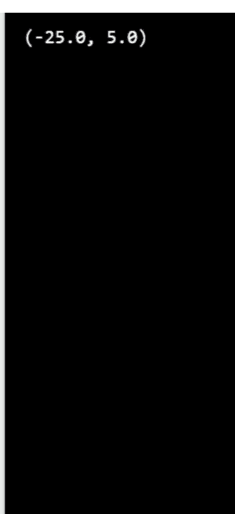

解答：

39. 实现两个名为Person和Department的简单类。然后创建一个Worker类，按给定顺序继承Person和Department类（多重继承）。

**解答：**

```python
class Person:
    pass

class Department:
    pass

class Worker(Person, Department):
    pass
```

40. 定义了以下类。为Person类添加`__init__()`方法，该方法设置三个属性：

- firstname
- lastname
- age

然后创建一个Worker类的实例，传递以下参数：

- 'John'
- 'Doe'
- 35

作为响应，打印该实例的`__dict__`属性值。

**预期结果：**
**{'first_name': 'John', 'last_name': 'Doe', 'age': 35}**

```python
class Person:
    pass

class Department:
    pass

class Worker(Person, Department):
    pass
```

**解答：**

```python
# Edcorner Learning OOPS Exercises

class Person:
    def __init__(self, first_name, last_name, age):
        self.first_name = first_name
        self.last_name = last_name
        self.age = age

class Department:
    pass

class Worker(Person, Department):
    pass

worker = Worker('John', 'Doe', 35)
print(worker.__dict__)
```

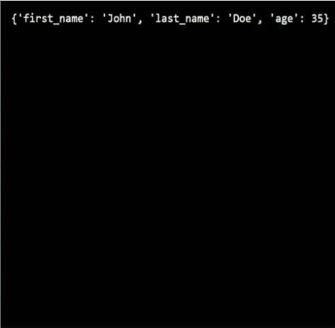

41. 定义了以下类。为Department类添加一个`__init__()`方法，该方法设置以下属性：

- deptname（部门名称）
- short_dept_name（部门简称）

然后使用以下参数创建一个Department类的实例：

- 'Information Technology'
- 'IT'

作为响应，打印该实例的`__dict__`属性值。

**预期结果：**
**{'dept_name': 'Information Technology', 'short_dept_name': 'IT'}**

```python
class Person:
    def __init__(self, first_name, last_name, age):
        self.first_name = first_name
        self.last_name = last_name
        self.age = age

class Department:
    pass

class Worker(Person, Department):
    pass
```

```python
# Edcorner Learning OOPS Exercises

class Person:
    def __init__(self, first_name, last_name, age):
        self.first_name = first_name
        self.last_name = last_name
        self.age = age

class Department:
    def __init__(self, dept_name, short_dept_name):
        self.dept_name = dept_name
        self.short_dept_name = short_dept_name

class Worker(Person, Department):
    pass

dept = Department('Information Technology', 'IT')
print(dept.__dict__)
```

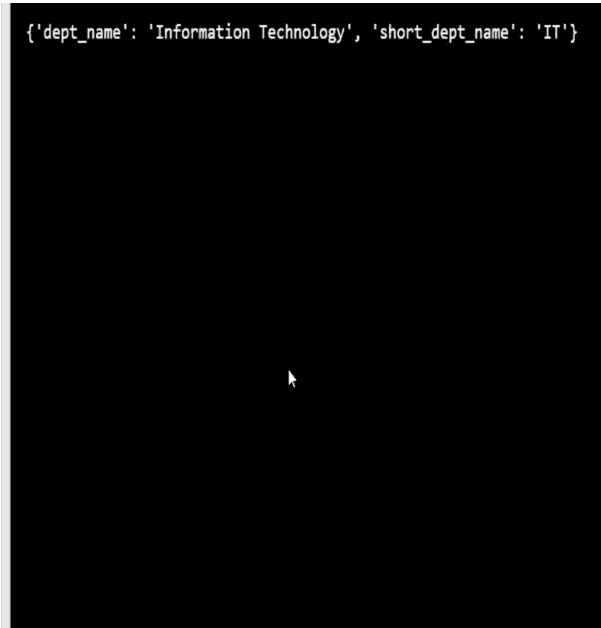

## 解答：

42. 定义了以下类。为Worker类添加`__init__()`方法，以设置来自Person和Department类的所有属性。
然后创建一个Worker类的实例，传递以下参数：

- 'John'
- 'Doe'
- 30
- 'Information Technology'
- 'IT'

作为响应，打印该实例的`__dict__`属性值。

## 预期结果：

{'first_name': 'John', 'last_name': 'Doe', 'age': 30, 'dept_name': 'Information Technology', 'short_dept_name': 'IT'}

```python
class Person:
    def __init__(self, first_name, last_name, age):
        self.first_name = first_name
        self.last_name = last_name
        self.age = age

class Department:
    def __init__(self, dept_name, short_dept_name):
        self.dept_name = dept_name
        self.short_dept_name = short_dept_name

class Worker(Person, Department):
    pass
```

解答：

```python
class Person:
    def __init__(self, first_name, last_name, age):
        self.first_name = first_name
        self.last_name = last_name
        self.age = age

class Department:
    def __init__(self, dept_name, short_dept_name):
        self.dept_name = dept_name
        self.short_dept_name = short_dept_name

class Worker(Person, Department):
    def __init__(self, first_name, last_name, age, dept_name, short_dept_name):
        Person.__init__(self, first_name, last_name, age)
        Department.__init__(self, dept_name, short_dept_name)

worker = Worker('John', 'Doe', 30, 'Information Technology', 'IT')
print(worker.__dict__)
```

```python
# Edcorner Learning OOPS Exercises

class Person:
    def __init__(self, first_name, last_name, age):
        self.first_name = first_name
        self.last_name = last_name
        self.age = age

class Department:
    def __init__(self, dept_name, short_dept_name):
        self.dept_name = dept_name
        self.short_dept_name = short_dept_name

class Worker(Person, Department):
    def __init__(self, first_name, last_name, age, dept_name, short_dept_name):
        Person.__init__(self, first_name, last_name, age)
        Department.__init__(self, dept_name, short_dept_name)

worker = Worker('John', 'Doe', 30, 'Information Technology', 'IT')
print(worker.__dict__)
```

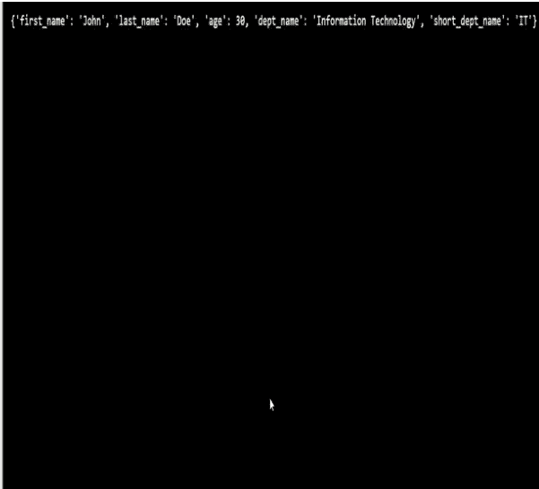

43. 定义了以下类。显示Worker类的MRO（方法解析顺序）。

注意：用户提交的解决方案位于名为`exercise.py`的文件中，而检查代码（对用户不可见）是从名为`evaluate.py`的文件中执行的，该文件位于导入类的层级。因此，响应中将显示实现此模块的模块名称（在此例中为`exercise`），而不是模块`__main__`的名称。

**预期结果：**

[<class 'exercise.Worker'>, <class 'exercise.Person'>, <class 'exercise.Department'>, <class 'object'>]

```python
class Person:
    def __init__(self, first_name, last_name, age):
        self.first_name = first_name
        self.last_name = last_name
        self.age = age

class Department:
    def __init__(self, dept_name, short_dept_name):
        self.dept_name = dept_name
        self.short_dept_name = short_dept_name

class Worker(Person, Department):
    def __init__(self, first_name, last_name, age, dept_name):
        Person.__init__(self, first_name, last_name, age)
        Department.__init__(self, dept_name)
```

解答：

```python
class Person:
    def __init__(self, first_name, last_name, age):
        self.first_name = first_name
        self.last_name = last_name
        self.age = age

class Department:
    def __init__(self, dept_name, short_dept_name):
        self.dept_name = dept_name
        self.short_dept_name = short_dept_name

class Worker(Person, Department):
    def __init__(self, first_name, last_name, age, dept_name):
        Person.__init__(self, first_name, last_name, age)
        Department.__init__(self, dept_name)

print(Worker.mro())
```

# 模块5 抽象类

44. 创建一个名为Figure的抽象类，其中包含一个名为`area`的抽象方法。然后创建一个继承自Figure类的Square类，该类在构造函数中设置正方形的边长。实现`area`方法，以便计算正方形的面积。

然后尝试创建一个Figure类的实例，如果发生错误，请将错误消息打印到控制台。

预期结果：
Can't instantiate abstract class Figure with abstract methods area

```python
# Edcorner Learning OOPS Exercises

from abc import ABC, abstractmethod

class Figure(ABC):
    @abstractmethod
    def area(self):
        pass

class Square(Figure):
    def __init__(self, a):
        self.a = a
    def area(self):
        return self.a * self.a

try:
    Figure()
except TypeError as error:
    print(error)
```

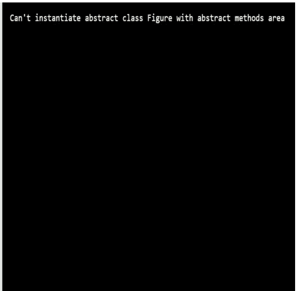

解答：

45. 给出了Figure和Square类的实现。添加向 Figure 类添加一个名为 `perimeter()` 的抽象方法，然后在 Square 类中实现它。`perimeter()` 方法应返回正方形的周长。
创建一个边长为 10 的 Square 类实例，并使用 `area()` 和 `perimeter()` 方法将创建的实例的面积和周长显示到控制台。

**预期结果：**
**100**

```
from abc import ABC, abstractmethod
class Figure(ABC):
    @abstractmethod
    def area(self):
        pass
class Square(Figure):
    def __init__(self, a):
        self.a = a

    def area(self):
        return self.a * self.a
```

**解决方案：**
**from abc import ABC, abstractmethod**

```
class Figure(ABC):
    @abstractmethod
    def area(self):
        pass
    @abstractmethod
    def perimeter(self):
        pass
```

```
class Square(Figure):
    def __init__(self, a):
        self.a = a

    def area(self):
        return self.a * self.a

    def perimeter(self):
        return 4 * self.a
```

```
square = Square(10)
print(square.area())
print(square.perimeter())
```

46. 创建一个名为 Taxpayer 的抽象类。在 `__init__()` 方法中设置一个名为 `salary` 的实例属性（无需验证）。然后添加一个名为 `calculate_tax()` 的抽象方法（使用 `@abstractmethod` 装饰器）。

**解决方案：**

```
from abc import ABC, abstractmethod

class TaxPayer(ABC):
    def __init__(self, salary):
        self.salary = salary

    @abstractmethod
    def calculate_tax(self):
        pass
```

47. 给出了 Taxpayer 抽象类的一个实现。创建一个从 Taxpayer 派生的名为 StudentTaxPayer 的类，该类实现 `calculate_tax()` 方法，该方法计算 15% 的工资税（`salary` 属性）。

然后创建一个名为 `student` 的 StudentTaxPayer 类实例，工资为 40,000。作为响应，通过调用 `calculate_tax()` 将计算出的税款打印到控制台。

**预期结果：**

**6000.0**

```
from abc import ABC, abstractmethod

class TaxPayer(ABC):
    def __init__(self, salary):
        self.salary = salary

    @abstractmethod
    def calculate_tax(self):
        pass
```

**解决方案：**

```
from abc import ABC, abstractmethod

class TaxPayer(ABC):

    def __init__(self, salary):
        self.salary = salary

    @abstractmethod
    def calculate_tax(self):
        pass

class StudentTaxPayer(TaxPayer):
    def calculate_tax(self):
        return self.salary * 0.15
student = StudentTaxPayer(40000)
print(student.calculate_tax())
```

48. 给出了 Taxpayer 抽象类的一个实现。创建一个从 TaxPayer 类派生的名为 DisabledTaxPayer 的类，该类实现 `calculate_tax()` 方法，该方法计算以下两者的最小值：

- 12% 的工资税（`salary` 属性）
- 5000.0

然后创建一个名为 `disabled` 的 DisabledTaxPayer 类实例，工资为 50,000。作为响应，通过调用 `calculate_tax()`，将计算出的税值打印到控制台。

**预期结果：**
**5000.0**

```
from abc import ABC, abstractmethod
class TaxPayer(ABC):
    def __init__(self, salary):
        self.salary = salary

    @abstractmethod
    def calculate_tax(self):
        pass
class StudentTaxPayer(TaxPayer):
    def calculate_tax(self):
        return self.salary * 0.15
```

**解决方案：**

```
from abc import ABC, abstractmethod
class TaxPayer(ABC):

    def __init__(self, salary):
        self.salary = salary

    @abstractmethod
    def calculate_tax(self):
        pass
class StudentTaxPayer(TaxPayer):

    def calculate_tax(self):
        return self.salary * 0.15
class DisabledTaxPayer(TaxPayer):
    def calculate_tax(self):
        return min(self.salary * 0.12, 5000.0)
disabled = DisabledTaxPayer(50000)
print(disabled.calculate_tax())
```

49. 给出了 Taxpayer 抽象类的一个实现。创建一个从 TaxPayer 类派生的名为 WorkerTaxPayer 的类，该类实现 `calculate_tax()` 方法，该方法根据以下规则计算税值：

- 金额不超过 80,000 -> 17% 的税率
- 超过 80,000 的部分 -> 32% 的税率

然后创建两个 WorkerTaxPayer 实例，分别命名为 `worker1` 和 `worker2`，工资分别为 70,000 和 95,000。作为响应，通过调用 `calculate_tax()` 将两个实例计算出的税款打印到控制台。

**预期结果：**
11900.0
18400.0

```
from abc import ABC, abstractmethod
class TaxPayer(ABC):
    def __init__(self, salary):
        self.salary = salary
    @abstractmethod
    def calculate_tax(self):
        pass
class StudentTaxPayer(TaxPayer):
    def calculate_tax(self):
        return self.salary * 0.15
class DisabledTaxPayer(TaxPayer):

    def calculate_tax(self):
        return self.salary * 0.12
```

**解决方案：**

```
from abc import ABC, abstractmethod
class TaxPayer(ABC):

    def __init__(self, salary):
        self.salary = salary

    @abstractmethod
    def calculate_tax(self):
        pass
```

```
class StudentTaxPayer(TaxPayer):

    def calculate_tax(self):
        return self.salary * 0.15
```

```
class DisabledTaxPayer(TaxPayer):
    def calculate_tax(self):
        return self.salary * 0.12
```

```
class WorkerTaxPayer(TaxPayer):
    def calculate_tax(self):
        if self.salary < 80000:
            return self.salary * 0.17
        else:
            return 80000 * 0.17 + (self.salary - 80000) * 0.32
```

```
worker1 = WorkerTaxPayer(70000)
worker2 = WorkerTaxPayer(95000)
print(worker1.calculate_tax())
print(worker2.calculate_tax())
```

50. 给出以下类：

- StudentTaxPayer
- DisabledTaxPayer
- WorkerTaxPayer

创建一个名为 `tax_payers` 的列表，并将四个实例分别赋值给它：

- 一个工资为 50,000 的 StudentTaxPayer 类实例
- 一个工资为 70,000 的 DisabledTaxPayer 类实例
- 一个工资为 68,000 的 WorkerTaxPayer 类实例
- 一个工资为 120,000 的 WorkerTaxPayer 类实例

然后，遍历列表，在给定的实例上调用 `calculate_tax()` 方法，并将税额打印到控制台。

**预期结果：**

**7500.0**

**8400.0**

**11560.0**

**26400.0**

```
from abc import ABC, abstractmethod
class TaxPayer(ABC):

    def __init__(self, salary):
        self.salary = salary
    @abstractmethod
    def calculate_tax(self):
        pass
class StudentTaxPayer(TaxPayer):
    def calculate_tax(self):
        return self.salary * 0.15
class DisabledTaxPayer(TaxPayer):
    def calculate_tax(self):
        return self.salary * 0.12
class WorkerTaxPayer(TaxPayer):

    def calculate_tax(self):
        if self.salary < 80000:
            return self.salary * 0.17
        else:
            return 80000 * 0.17 + (self.salary - 80000) * 0.32
```

**解决方案：**

```
from abc import ABC, abstractmethod
class TaxPayer(ABC):
    def __init__(self, salary):
        self.salary = salary
    @abstractmethod
    def calculate_tax(self):
        pass
class StudentTaxPayer(TaxPayer):
    def calculate_tax(self):
        return self.salary * 0.15
class DisabledTaxPayer(TaxPayer):
    def calculate_tax(self):
        return self.salary * 0.12
class WorkerTaxPayer(TaxPayer):
    def calculate_tax(self):
        if self.salary < 80000:
            return self.salary * 0.17
        else:
            return 80000 * 0.17 + (self.salary - 80000) * 0.32
```

```
tax_payers = [StudentTaxPayer(50000),
DisabledTaxPayer(70000),
              WorkerTaxPayer(68000), WorkerTaxPayer(120000)]
for tax_payer in tax_payers:
    print(tax_payer.calculate_tax())
```

```
7500.0
8400.0
11560.0
26400.0
```

## 模块6 综合练习

51. 给定人员列表。将人员列表中的对象按年龄升序排序。然后按如下所示将姓名和年龄打印到控制台。

预期结果：

Alice -> 19
Tom -> 25
Mike -> 27
John -> 29

```python
class Person:
    def __init__(self, name, age):
        self.name = name
        self.age = age

people = [Person('Tom', 25), Person('John', 29),
          Person('Mike', 27), Person('Alice', 19)]
```

```python
# Edcorner Learning OOPS Exercises

class Person:
    def __init__(self, name, age):
        self.name = name
        self.age = age

people = [Person('Tom', 25), Person('John', 29),
          Person('Mike', 27),
          Person('Alice', 19)]
people.sort(key=lambda person: person.age)

for person in people:
    print(f'{person.name} -> {person.age}')
```

```
Alice -> 19
Tom -> 25
Mike -> 27
John -> 29
```

解答：

52. 给定以下 Point 类。实现一个 `reset()` 方法，允许你将 `x` 和 `y` 属性的值设置为零。然后创建一个坐标为 (4, 2) 的 Point 类实例，并将其打印到控制台。调用此实例的 `reset()` 方法，并再次将实例打印到控制台。

**预期结果：**

**Point(x=4, y=2)**

**Point(x=0, y=0)**

```python
class Point:
    def __init__(self, x, y):
        self.x = x
        self.y = y

    def __repr__(self):
        return f"Point(x={self.x}, y={self.y})"
```

```python
# Edcorner Learning OOPS Exercises

class Point:
    def __init__(self, x, y):
        self.x = x
        self.y = y

    def __repr__(self):
        return f"Point(x={self.x}, y={self.y})"

    def reset(self):
        self.x = 0
        self.y = 0

p = Point(4, 2)
print(p)
p.reset()
print(p)
```

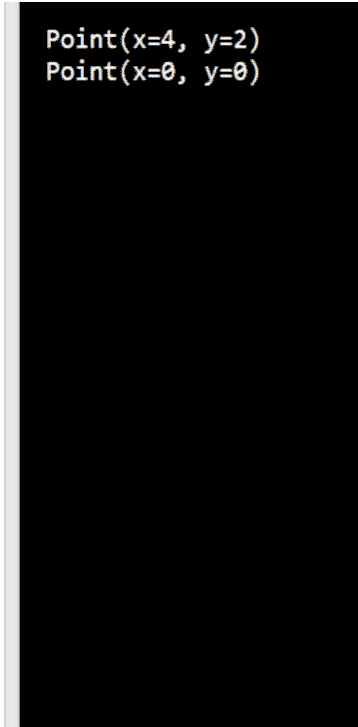

解答：

53. 给定以下 Point 类。实现 `calc_distance()` 方法来计算两点之间的欧几里得距离。
创建两个 Point 类实例，坐标分别为 (0, 3) 和 (4, 0)，并计算这些点之间的距离（使用 `calc_distance()` 方法）。

**预期结果：**

5.0

```python
import math
class Point:
    def __init__(self, x, y):
        self.x = x
        self.y = y

    def __repr__(self):
        return f"Point(x={self.x}, y={self.y})"

    def reset(self):
        self.x = 0
        self.y = 0
```

```python
# Edcorner Learning OOPS Exercises

import math

class Point:
    def __init__(self, x, y):
        self.x = x
        self.y = y

    def __repr__(self):
        return f"Point(x={self.x}, y={self.y})"

    def reset(self):
        self.x = 0
        self.y = 0

    def calc_distance(self, other):
        return math.sqrt((self.x - other.x) ** 2 + (self.y - other.y) ** 2)

p1 = Point(0, 3)
p2 = Point(4, 0)
print(p1.calc_distance(p2))
```

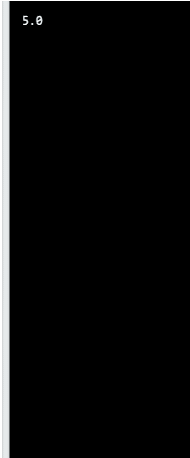

解答：

54. 实现一个名为 `Note` 的类，用于描述一个简单的笔记。创建 `Note` 对象时，将设置一个名为 `content` 的实例属性，用于存储笔记内容。同时添加一个名为 `creation_time` 的实例属性，用于存储创建时间（使用给定的日期格式：`'%m-%d-%Y %H:%M:%S'`）。
接下来，创建两个名为 `note1` 和 `note2` 的 `Note` 类实例，并分配以下内容：
'My first note.'
'My second note.'

```python
Solution:
import datetime
class Note:
    def __init__(self, content):
        self.content = content
        self.creation_time = datetime.datetime.now().strftime('%m-%d-%Y %H:%M:%S')
note1 = Note('My first note.')
note2 = Note('My second note.')
```

55. 给定 `Note` 类。实现一个 `find()` 方法，用于检查给定的单词是否在笔记中（区分大小写）。该方法应分别返回 `True` 或 `False`。
然后创建一个名为 `note1` 的实例，笔记内容为：
'Object Oriented Programming in Python.'
在 `note1` 实例上调用 `find()` 方法，检查笔记是否包含以下单词：
- 'python'
- 'Python'

将结果打印到控制台。

**预期结果：**

**False**

**True**

```python
import datetime

class Note:
    def __init__(self, content):
        self.content = content
        self.creation_time = datetime.datetime.now().strftime('%m-%d-%Y %H:%M:%S')
```

解答：

```python
# Edcorner Learning OOPS Exercises

import datetime

class Note:
    def __init__(self, content):
        self.content = content
        self.creation_time = datetime.datetime.now().strftime('%m-%d-%Y %H:%M:%S')

    def find(self, word):
        return word in self.content

note1 = Note('Object Oriented Programming in Python.')
print(note1.find('python'))
print(note1.find('Python'))
```

```
False
True
```

56. 给定 `Note` 类。实现一个 `find()` 方法，用于检查给定的单词是否在笔记中（不区分大小写）。该方法应分别返回 `True` 或 `False`。

然后创建一个名为 `note1` 的实例，笔记内容为：
'Object Oriented Programming in Python.'

在 `note1` 实例上调用 `find()` 方法，检查笔记是否包含以下单词：
'python'
'Python'

将结果打印到控制台。

**预期结果：**

**True**

**True**

```python
import datetime
class Note:
    def __init__(self, content):
        self.content = content
        self.creation_time = datetime.datetime.now().strftime('%m-%d-%Y %H:%M:%S')
```

```python
# Edcorner Learning OOPS Exercises

import datetime

class Note:
    def __init__(self, content):
        self.content = content
        self.creation_time = datetime.datetime.now().strftime('%m-%d-%Y %H:%M:%S')

    def find(self, word):
        return word.lower() in self.content.lower()

note1 = Note('Object Oriented Programming in Python.')
print(note1.find('python'))
print(note1.find('Python'))
```


解答：

57. 给定 `Note` 类（笔记的表示）。实现 `Notebook` 类（包含笔记的笔记本的表示），包含两个方法：
- `__init__()` 用于创建 `Notebook` 类的一个名为 `notes` 的实例属性（一个空列表，用于存储笔记）。
- `new_note()` 用于创建一个新的 `Note` 对象并将其添加到 `notes` 列表中。

创建一个名为 `notebook` 的 `Notebook` 类实例。然后，使用 `new_note()` 方法向笔记本中添加两条笔记，内容如下：
'My first note.'
'My second note.'
作为响应，将 `notes` 属性的内容打印到控制台。

**预期结果：**
**[Note(content='My first note.'), Note(content='My second note.')]**

```python
import datetime

class Note:
    def __init__(self, content):
        self.content = content
        self.creation_time = datetime.datetime.now().strftime('%m-%d-%Y %H:%M:%S')

    def __repr__(self):
        return f"Note(content='{self.content}')"

    def find(self, word):
        return word.lower() in self.content.lower()
```

解答：

```python
# Edcorner Learning OOPS Exercises

import datetime

class Note:
    def __init__(self, content):
        self.content = content
        self.creation_time = datetime.datetime.now().strftime('%m-%d-%Y %H:%M:%S')

    def __repr__(self):
        return f"Note(content='{self.content}')"

    def find(self, word):
        return word.lower() in self.content.lower()

class Notebook:
    def __init__(self):
        self.notes = []

    def new_note(self, content):
        self.notes.append(Note(content))

notebook = Notebook()
notebook.new_note('My first note.')
notebook.new_note('My second note.')
print(notebook.notes)
```

```
[Note(content='My first note.'), Note(content='My second note.')]
```

58. 给定 `Note` 和 `Notebook` 类的实现。在 `Notebook` 类中实现一个名为 `display_notes()` 的方法，用于将 `notes` 实例属性中所有笔记的内容显示到控制台。

创建一个名为 `notebook` 的 `Notebook` 类实例。然后，使用 `new_note()` 方法向笔记本中添加两条笔记，内容如下：
- 'My first note.'
- 'My second note.'

作为响应，在 `notebook` 实例上调用 `display_notes()` 方法。

**预期结果：**

# 我的第一个笔记。

# 我的第二个笔记。

```python
import datetime

class Note:
    def __init__(self, content):
        self.content = content
        self.creation_time = datetime.datetime.now().strftime('%m-%d-%Y %H:%M:%S')
    def __repr__(self):
        return f"Note(content='{self.content}')"
    def find(self, word):
        return word.lower() in self.content.lower()

class Notebook:
    def __init__(self):
        self.notes = []
    def new_note(self, content):
        self.notes.append(Note(content))
```

解决方案：

# 解决方案：

```python
#Edcorner Learning OOPS Exercises

import datetime

class Note:
    def __init__(self, content):
        self.content = content
        self.creation_time = datetime.datetime.now().strftime('%m-%d-%Y %H:%M:%S')
    def __repr__(self):
        return f"Note(content='{self.content}')"
    def find(self, word):
        return word.lower() in self.content.lower()

class Notebook:
    def __init__(self):
        self.notes = []
    def new_note(self, content):
        self.notes.append(Note(content))
    def display_notes(self):
        for note in self.notes:
            print(note.content)

notebook = Notebook()
notebook.new_note('My first note.')
notebook.new_note('My second note.')
notebook.display_notes()
```

59. Note 和 Notebook 类的实现已给出。在 Notebook 类中实现一个名为 search() 的方法，该方法允许你返回包含特定单词（作为参数传递给该方法，不区分大小写）的笔记列表。你可以为此使用 Note.find 方法。

创建一个名为 notebook 的 Notebook 类实例。然后，使用 new_note() 方法向笔记本中添加以下内容的笔记：

- 'Big Data'
- 'Data Science'
- 'Machine Learning'

作为响应，调用 notebook 实例的 search() 方法，查找包含单词 'data' 的笔记。

**预期结果：**
**[Note(content='Big Data'), Note(content='Data Science')]**

```python
import datetime

class Note:
    def __init__(self, content):
        self.content = content
        self.creation_time = datetime.datetime.now().strftime('%m-%d-%Y %H:%M:%S')
    def __repr__(self):
        return f"Note(content='{self.content}')"
    def find(self, word):
        return word.lower() in self.content.lower()

class Notebook:
    def __init__(self):
        self.notes = []
    def new_note(self, content):
        self.notes.append(Note(content))
    def display_notes(self):
        for note in self.notes:
            print(note.content)
```

# 解决方案：

```python
import datetime

class Note:
    def __init__(self, content):
        self.content = content
        self.creation_time = datetime.datetime.now().strftime('%m-%d-%Y %H:%M:%S')
    def __repr__(self):
        return f"Note(content='{self.content}')"
    def find(self, word):
        return word.lower() in self.content.lower()

class Notebook:
    def __init__(self):
        self.notes = []
    def new_note(self, content):
        self.notes.append(Note(content))
    def display_notes(self):
        for note in self.notes:
            print(note.content)
    def search(self, value):
        return [note for note in self.notes if note.find(value)]

notebook = Notebook()
notebook.new_note('Big Data')
notebook.new_note('Data Science')
notebook.new_note('Machine Learning')
print(notebook.search('data'))
```

60. 实现一个名为 Client 的类，该类有一个名为 all_clients 的类属性（作为一个列表）。然后 __init__() 方法设置两个实例属性（无需验证）：

- name
- email

将此实例添加到 allClients 列表（Client 类属性）中。同时为 Client 类添加一个 _repr_() 方法（见下文）。

通过执行以下代码创建三个客户：

```python
Client1 = Client('Tom', 'sample@gmail.com')
client2 = Client('Donald', 'sales@yahoo.com')
client3 = Client('Mike', 'sales-contact@yahoo.com')
```

作为响应，打印 Client 类的 all_cients 属性。

**预期结果：**

**[Client(name='Tom', email='sample@gmail.com'), Client(name='Donald', email='sales@yahoo.com'), Client(name='Mike', email='sales-contact@yahoo.com')]**

解决方案：

```python
class Client:
    all_clients = []
    def __init__(self, name, email):
        self.name = name
        self.email = email
        Client.all_clients.append(self)
    def __repr__(self):
        return f"Client(name='{self.name}', email='{self.email}')"

client1 = Client('Tom', 'sample@gmail.com')
client2 = Client('Donald', 'sales@yahoo.com')
client3 = Client('Mike', 'sales-contact@yahoo.com')
print(Client.all_clients)
```

61. Client 类已实现。注意类属性 all_clients。尝试实现一个扩展内置 list 类的特殊类，名为 ClientList，除了内置 list 类的标准方法外，它还将有一个 search_email() 方法，该方法允许你返回电子邮件地址中包含文本（value 参数）的 Client 类实例列表。

例如，以下代码：
Clientl = Client('Tom', 'sample@gmail.com')
client2 = Client('Donald', 'sales@yahoo.com')
client3 = Client('Mike', 'sales-contact@yahoo.com')
client4 = Client('Lisa', 'info@gmail.com')
print(Client.all_clients.search_email('sales'))

```python
class ClientList(list):
    def search_email(self, value):
        pass

class Client:
    all_clients = ClientList()
    def __init__(self, name, email):
        self.name = name
        self.email = email
        Client.all_clients.append(self)
    def __repr__(self):
        return f"Client(name='{self.name}', email='{self.email}')"
```

# 解决方案：

```python
class ClientList(list):
    def search_email(self, value):
        result = [client for client in self if value in client.email]
        return result

class Client:
    all_clients = ClientList()
    def __init__(self, name, email):
        self.name = name
        self.email = email
        Client.all_clients.append(self)
    def __repr__(self):
        return f"Client(name='{self.name}', email='{self.email}')"

client1 = Client('Tom', 'sample@gmail.com')
client2 = Client('Donald', 'sales@gmail.com')
client3 = Client('Mike', 'sales@yahoo.com')
client4 = Client('Lisa', 'info@gmail.com')
print(Client.all_clients.search_email('sales'))
```

62. Client 类已实现。创建以下四个 Client 类实例：

例如，以下代码：

```python
Client1 = Client('Tom', 'sample@gmail.com')
client2 = Client('Donald', 'sales@yahoo.com')
client3 = Client('Mike', 'sales-contact@yahoo.com')
client4 = Client('Lisa', 'info@gmail.com')
```

然后搜索所有拥有 gmail 账户（电子邮件地址中包含 'gmail'）的客户。作为响应，将结果打印到控制台，如下所示。

**预期结果：**

```
Client(name='Tom', email='sample@gmail.com')
Client(name='Donald', email='sales@gmail.com')
Client(name='Lisa', email='info@gmail.com')
```

```python
class ClientList(list):
    def search_email(self, value):
        result = [client for client in self if value in client.email]
        return result

class Client:
    all_clients = ClientList()
    def __init__(self, name, email):
        self.name = name
        self.email = email
        Client.all_clients.append(self)
    def __repr__(self):
        return f"Client(name='{self.name}', email='{self.email}')"
```

## 解答：

```python
#Edcorner Learning OOPS Exercises

class ClientList(list):
    def search_email(self, value):
        result = [client for client in self if value in client.email]
        return result

class Client:
    all_clients = ClientList()
    def __init__(self, name, email):
        self.name = name
        self.email = email
        Client.all_clients.append(self)
    def __repr__(self):
        return f"Client(name='{self.name}', email='{self.email}')"

client1 = Client('Tom', 'sample@gmail.com')
client2 = Client('Donald', 'sales@gmail.com')
client3 = Client('Mike', 'sales@yahoo.com')
client4 = Client('Lisa', 'info@gmail.com')

for client in Client.all_clients.search_email('gmail.com'):
    print(client)
```


63. Client 类已实现。以下是 Client 类的四个实例：

例如，以下代码：

```python
Client1 = Client('Tom', 'sample@gmail.com')
client2 = Client('Donald', 'sales@yahoo.com')
client3 = Client('Mike', 'sales-contact@yahoo.com')
client4 = Client('Lisa', 'info@gmail.com')
```

搜索所有电子邮件地址中包含 'sales' 的客户。作为响应，将客户的姓名作为列表打印到控制台。

**预期结果：**
**['Donald', 'Mike']**

```python
class ClientList(list):

    def search_email(self, value):
        result = [client for client in self if value in client.email]
        return result
```

```python
class Client:

    all_clients = ClientList()

    def __init__(self, name, email):
        self.name = name
        self.email = email
        Client.all_clients.append(self)

    def __repr__(self):
        return f"Client(name='{self.name}', email='{self.email}')"
```

```python
client1 = Client('Tom', 'sample@gmail.com')
client2 = Client('Donald', 'sales@gmail.com')
client3 = Client('Mike', 'sales@yahoo.com')
client4 = Client('Lisa', 'info@gmail.com')
```

```python
#Edcorner Learning OOPS Exercises

class ClientList(list):
    def search_email(self, value):
        result = [client for client in self if value in client.email]
        return result

class Client:
    all_clients = ClientList()
    def __init__(self, name, email):
        self.name = name
        self.email = email
        Client.all_clients.append(self)
    def __repr__(self):
        return f"Client(name='{self.name}', email='{self.email}')"

client1 = Client('Tom', 'sample@gmail.com')
client2 = Client('Donald', 'sales@gmail.com')
client3 = Client('Mike', 'sales@yahoo.com')
client4 = Client('Lisa', 'info@gmail.com')

result = [client.name for client in Client.all_clients.search_email('sales')]
print(result)
```

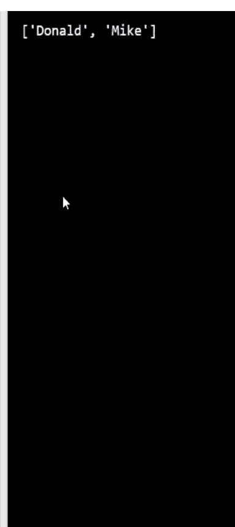

解答：

64. 创建一个名为 CustomDict 的类，它扩展了内置的 dict 类。添加一个名为 is_any_str_value() 的方法，该方法返回一个布尔值：

- 如果创建的字典包含至少一个 str 类型的值，则返回 True
- 否则返回 False。

示例 I：

```python
[IN]: cd = CustomDict(python='mid')
[IN]: print(cd.is_any_str_value())
```

返回：

[OUT]: True

示例 II：

```python
[IN]: cd = CustomDict(price=119.99)
[IN]: print(cd.is_any_str_value())
```

返回：

[OUT]: False

你只需要实现 CustomDict 类。

## 解答：

```python
class CustomDict(dict):

    def is_any_str_value(self):
        flag = False
        for key in self:
            if isinstance(self[key], str):
                flag = True
                break
        return flag
```

65. 创建一个名为 StringListOnly 的类，它扩展了内置的 list 类。修改 append() 方法的行为，使得只有 str 类型的对象才能被添加到列表中。如果你尝试添加不同类型的对象，则引发 TypeError 并显示消息：
'Only objects of type str can be added to the list.'
然后创建一个 StringListOnly 类的实例，并使用 append() 方法添加以下对象：
'Data'
'Science'
作为响应，将结果打印到控制台。

## 预期结果：

['Data', 'Science']

## 解答：

```python
#Edcorner Learning OOPS Exercises

class StringListOnly(list):
    def append(self, string):
        if not isinstance(string, str):
            raise TypeError('Only objects of type str can be added to the list.')
        super().append(string)

slo = StringListOnly()
slo.append('Data')
slo.append('Science')
print(slo)
```

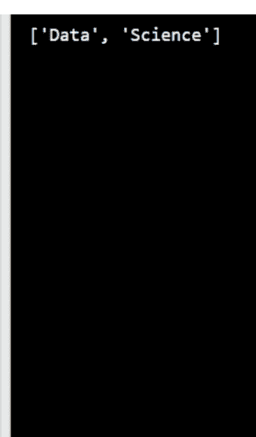

66. 创建一个名为 StringListOnly 的类，它扩展了内置的 list 类。修改 append() 方法的行为，使得只有 str 类型的对象才能被添加到列表中。在将对象添加到列表之前，将所有大写字母替换为小写字母。如果你尝试添加不同类型的对象，则引发 TypeError 并显示消息：
'Only objects of type str can be added to the list.'
然后创建一个 StringListOnly 类的实例，并使用 append() 方法添加以下对象：
'Data'
'Science'
'Machine Learning'

作为响应，将结果打印到控制台。

**预期结果：**
**['data', 'science', 'machine learning']**

## 解答：

```python
#Edcorner Learning OOPS Exercises

class StringListOnly(list):

    def append(self, string):
        if not isinstance(string, str):
            raise TypeError('Only objects of type str can be added to the list.')
        super().append(string.lower())

slo = StringListOnly()
slo.append('Data')
slo.append('Science')
slo.append('Machine Learning')
print(slo)
```

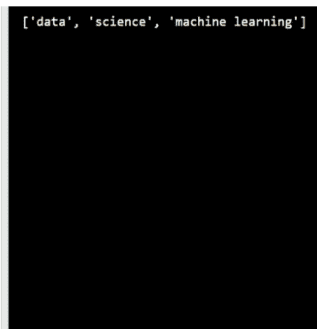

67. 给出了 Product 类的实现。实现一个名为 Warehouse 的类，该类在 init() 方法中将 Warehouse 类的一个名为 products 的实例属性设置为空列表。
然后创建一个名为 warehouse 的 Warehouse 类实例，并将 products 属性的值显示到控制台。

**预期结果：**

```
[]
```

```python
import uuid
```

```python
class Product:

    def __init__(self, product_name, price):
        self.product_id = self.get_id()
        self.product_name = product_name
        self.price = price

    def __repr__(self):
        return f"Product(product_name='{self.product_name}', price={self.price})"

    @staticmethod
    def get_id():
        return str(uuid.uuid4().fields[-1])[:6]
```

解答：

```python
#Edcorner Learning OOPS Exercises

import uuid

class Product:

    def __init__(self, product_name, price):
        self.product_id = self.get_id()
        self.product_name = product_name
        self.price = price

    def __repr__(self):
        return f"Product(product_name='{self.product_name}', price={self.price})"

    @staticmethod
    def get_id():
        return str(uuid.uuid4().fields[-1])[:6]

class Warehouse:

    def __init__(self):
        self.products = []

warehouse = Warehouse()
print(warehouse.products)
```

```
[]
```

68. 给出了 Product 和 Warehouse 类的实现。向 Warehouse 类添加一个名为 add_product() 的方法，该方法允许你将 Product 类的一个实例添加到 products 列表中。如果产品名称已存在于 products 列表中，则跳过添加该产品。

接下来，创建一个名为 warehouse 的 Warehouse 类实例。使用 add_product() 方法添加以下产品：

'Laptop', 3900.0

'Mobile Phone', 1990.0

'Mobile Phone', 1990.0

请注意，第二个和第三个产品是重复的。add_product() 方法应避免添加重复项。将 warehouse 实例的 products 属性打印到控制台。

**预期结果：**

**[Product(product_name='Laptop', price=3900.0), Product(product_name='Mobile Phone', price=1990.0)]**

```python
import uuid

class Product:

    def __init__(self, product_name, price):
        self.product_id = self.get_id()
        self.product_name = product_name
        self.price = price

    def __repr__(self):
        return f"Product(product_name='{self.product_name}', price={self.price})"

    @staticmethod
    def get_id():
        return str(uuid.uuid4().fields[-1])[:6]
```

## 69. 已给出 `Product` 和 `Warehouse` 类的实现。请为 `Warehouse` 类添加一个名为 `remove_product()` 的方法，该方法允许你根据给定的产品名称从 `products` 列表中移除一个 `Product` 类的实例。如果产品名称不在 `products` 列表中，则直接跳过。
接下来，创建一个名为 `warehouse` 的 `Warehouse` 类实例。使用 `add_product()` 方法添加以下产品：
- 'Laptop', 3900.0
- 'Mobile Phone', 1990.0
- 'Camera', 2900.0
然后，使用 `remove_product()` 方法移除名为 'Mobile Phone' 的产品。作为响应，将 `warehouse` 实例的 `products` 属性打印到控制台。

**预期结果：**

```
[Product(product_name='Laptop', price=3900.0),
Product(product_name='Camera', price=2900.0)]
```

**解决方案：**

```python
import uuid

class Product:

    def __init__(self, product_name, price):
        self.product_id = self.get_id()
        self.product_name = product_name
        self.price = price

    def __repr__(self):
        return f"Product(product_name='{self.product_name}', price={self.price})"

    @staticmethod
    def get_id():
        return str(uuid.uuid4().fields[-1])[:6]

class Warehouse:

    def __init__(self):
        self.products = []

    def add_product(self, product_name, price):
        product_names = [product.product_name for product in self.products]
        if not product_name in product_names:
            self.products.append(Product(product_name, price))

    def remove_product(self, product_name):
        for product in self.products:
            if product_name == product.product_name:
                self.products.remove(product)

warehouse = Warehouse()
warehouse.add_product('Laptop', 3900.0)
warehouse.add_product('Mobile Phone', 1990.0)
warehouse.add_product('Camera', 2900.0)
warehouse.remove_product('Mobile Phone')
print(warehouse.products)
```

## 70. 已给出 `Product` 和 `Warehouse` 类的实现。请为 `Product` 类添加一个 `__str__()` 方法，作为 `Product` 类的非正式表示。

`__str__()` 方法工作原理的示例。以下代码：

```python
product = Product('Laptop', 3900.0)
print(product)
```

返回：

```
Product Name: Laptop | Price: 3900.0
```

然后，使用传入的参数创建一个名为 `product` 的 `Product` 类实例：
- 'Mobile Phone', 1990.0

作为响应，将 `product` 实例打印到控制台。

**预期结果：**

**Product Name: Mobile Phone | Price: 1990.0**

**解决方案：**

```python
import uuid

class Product:

    def __init__(self, product_name, price):
        self.product_id = self.get_id()
        self.product_name = product_name
        self.price = price

    def __repr__(self):
        return f"Product(product_name='{self.product_name}', price={self.price})"

    def __str__(self):
        return f'Product Name: {self.product_name} | Price: {self.price}'

    @staticmethod
    def get_id():
        return str(uuid.uuid4().fields[-1])[:6]

class Warehouse:

    def __init__(self):
        self.products = []

    def add_product(self, product_name, price):
        product_names = [product.product_name for product in self.products]
        if not product_name in product_names:
            self.products.append(Product(product_name, price))

    def remove_product(self, product_name):
        for product in self.products:
            if product_name == product.product_name:
                self.products.remove(product)

product = Product('Mobile Phone', 1990.0)
print(product)
```

## 71. 已给出 `Product` 和 `Warehouse` 类的实现。请为 `Warehouse` 类添加一个名为 `display_products()` 的方法，用于显示 `Warehouse` 类的 `products` 属性中的所有产品。

然后，创建一个名为 `warehouse` 的 `Warehouse` 类实例，并执行以下代码：

```python
warehouse.add_product('Laptop', 3900.0)
warehouse.add_product('Mobile Phone', 1990.0)
warehouse.add_product('Camera', 2900.0)
```

作为响应，在 `warehouse` 实例上调用 `display_products()` 方法。

**预期结果：**

**Product Name: Laptop | Price: 3900.0**
**Product Name: Mobile Phone | Price: 1990.0**
**Product Name: Camera | Price: 2900.0**

**解决方案：**

```python
import uuid

class Product:

    def __init__(self, product_name, price):
        self.product_id = self.get_id()
        self.product_name = product_name
        self.price = price

    def __repr__(self):
        return f"Product(product_name='{self.product_name}', price={self.price})"

    def __str__(self):
        return f'Product Name: {self.product_name} | Price: {self.price}'

    @staticmethod
    def get_id():
        return str(uuid.uuid4().fields[-1])[:6]

class Warehouse:

    def __init__(self):
        self.products = []

    def add_product(self, product_name, price):
        product_names = [product.product_name for product in self.products]
        if not product_name in product_names:
            self.products.append(Product(product_name, price))

    def remove_product(self, product_name):
        for product in self.products:
            if product_name == product.product_name:
                self.products.remove(product)

    def display_products(self):
        for product in self.products:
            print(product)

warehouse = Warehouse()
warehouse.add_product('Laptop', 3900.0)
warehouse.add_product('Mobile Phone', 1990.0)
warehouse.add_product('Camera', 2900.0)
warehouse.display_products()
```

## 72. 已给出 Product 和 Warehouse 类的实现。请为 Warehouse 类添加一个名为 `sort_by_price()` 的方法，该方法返回按字母顺序排序的产品列表。`sort_by_price()` 方法还接受一个参数 `ascending`，默认值为 `True`，表示升序排序。如果传入 `False`，则反转排序顺序。

然后创建一个名为 `warehouse` 的 Warehouse 类实例，并执行以下代码：

```
warehouse.add_product('Laptop', 3900.0)
warehouse.add_product('Mobile Phone', 1990.0)
warehouse.add_product('Camera', 2900.0)
warehouse.add_product('USB Cable', 24.9)
warehouse.add_product('Mouse', 49.0)
```

作为响应，使用 `sort_by_price()` 方法将排序后的产品列表打印到控制台，如下所示。

**预期结果：**

```
Product(product_name='USB Cable', price=24.9)
Product(product_name='Mouse', price=49.0)
Product(product_name='Mobile Phone', price=1990.0)
Product(product_name='Camera', price=2900.0)
Product(product_name='Laptop', price=3900.0)
```

**解决方案：**

```
import uuid

class Product:

    def __init__(self, product_name, price):
        self.product_id = self.get_id()
        self.product_name = product_name
        self.price = price

    def __repr__(self):
        return f"Product(product_name='{self.product_name}', price={self.price})"

    @staticmethod
    def get_id():
        return str(uuid.uuid4().fields[-1])[:6]

class Warehouse:

    def __init__(self):
        self.products = []

    def add_product(self, product_name, price):
        product_names = [product.product_name for product in self.products]
        if not product_name in product_names:
            self.products.append(Product(product_name, price))

    def remove_product(self, product_name):
        for product in self.products:
            if product_name == product.product_name:
                self.products.remove(product)

    def display_products(self):
        for product in self.products:
            print(f'Product ID: {product.product_id} | Product name: '
                  f'{product.product_name} | Price: {product.price}')

    def sort_by_price(self, ascending=True):
        return sorted(self.products, key=lambda product: product.price,
                      reverse=not ascending)

warehouse = Warehouse()
warehouse.add_product('Laptop', 3900.0)
warehouse.add_product('Mobile Phone', 1990.0)
warehouse.add_product('Camera', 2900.0)
warehouse.add_product('USB Cable', 24.9)
warehouse.add_product('Mouse', 49.0)
for product in warehouse.sort_by_price():
    print(product)
```

## 73. 已给出 Product 和 Warehouse 类的实现。请完成 Warehouse 类中名为 `search_product()` 的方法实现，该方法允许你返回包含指定名称（`query` 参数）的产品列表。

然后创建一个名为 `warehouse` 的 Warehouse 类实例，并执行以下代码：

```
warehouse.add_product('Laptop', 3900.0)
warehouse.add_product('Mobile Phone', 1990.0)
warehouse.add_product('Camera', 2900.0)
warehouse.add_product('USB Cable', 24.9)
warehouse.add_product('Mouse', 49.0)
```

作为响应，调用 `search_product()` 方法并查找所有包含字母 'm' 的产品。

**预期结果：**

**[Product(product_name='Mobile Phone', price=1990.0), Product(product_name='Mouse', price=49.0)]**

**解决方案：**

```
import uuid

class Product:

    def __init__(self, product_name, price):
        self.product_id = self.get_id()
        self.product_name = product_name
        self.price = price

    def __repr__(self):
        return f"Product(product_name='{self.product_name}', price={self.price})"

    @staticmethod
    def get_id():
        return str(uuid.uuid4().fields[-1])[:6]

class Warehouse:

    def __init__(self):
        self.products = []

    def add_product(self, product_name, price):
        product_names = [product.product_name for product in self.products]
        if not product_name in product_names:
            self.products.append(Product(product_name, price))

    def remove_product(self, product_name):
        for product in self.products:
            if product_name == product.product_name:
                self.products.remove(product)

    def display_products(self):
        for product in self.products:
            print(f'Product ID: {product.product_id} | Product name: '
                  f'{product.product_name} | Price: {product.price}')

    def sort_by_price(self, ascending=True):
        return sorted(self.products, key=lambda product: product.price,
                      reverse=not ascending)

    def search_product(self, query):
        return [prod for prod in self.products if query in prod.product_name]

warehouse = Warehouse()
warehouse.add_product('Laptop', 3900.0)
warehouse.add_product('Mobile Phone', 1990.0)
warehouse.add_product('Camera', 2900.0)
warehouse.add_product('USB Cable', 24.9)
warehouse.add_product('Mouse', 49.0)
print(warehouse.search_product('M'))
```

# 关于作者

**“Edcorner Learning”** 在 **Udemy** 上拥有大量学生，超过 **90000+ 学生，评分为 4.1 或以上。**

## Edcorner Learning 是 Edcredibly 的一部分。

Edcredibly 是一个在线电子学习平台，提供涵盖所有热门技术的课程，旨在最大化学习成果，并为专业人士和学生提供职业机会。Edcredibly 在其自有平台上拥有超过 100000+ 的学生，并在 **Google Play 商店 – Edcredibly 应用上获得了 4.9 的评分。**

欢迎查看或加入我们的课程：

**Edcredibly 网站 -** [https://www.edcredibly.com/](https://www.edcredibly.com/)

**Edcredibly 应用 –**
[https://play.google.com/store/apps/details?id=com.edcredibly.courses](https://play.google.com/store/apps/details?id=com.edcredibly.courses)

**Edcorner Learning Udemy -** [https://www.udemy.com/user/edcorner/](https://www.udemy.com/user/edcorner/)

**请查看我们在 Kindle 商店提供的其他电子书。**