计算机科学本科专题

约翰·亨特

# Python3编程入门指南

第二版

# 计算机科学本科专题

**丛书编辑**
伊恩·麦基，英国布莱顿萨塞克斯大学

**顾问编辑**

- 萨姆森·阿布拉姆斯基，英国牛津大学计算机科学系
- 克里斯·汉金，英国伦敦帝国理工学院计算系
- 迈克·欣奇，爱尔兰利默里克大学Lero – 爱尔兰软件研究中心
- 德克斯特·C·科森，美国纽约州伊萨卡康奈尔大学计算机科学系
- 安德鲁·皮茨，英国剑桥大学计算机科学与技术系
- 汉妮·里斯·尼尔森，丹麦灵比丹麦技术大学应用数学与计算机科学系
- 史蒂文·S·斯基恩纳，美国纽约州石溪石溪大学计算机科学系
- 伊恩·斯图尔特，英国达勒姆大学计算机科学系
- 约瑟夫·米加·基扎，美国田纳西州查塔anooga田纳西大学查塔anooga分校工程与计算机科学学院

“计算机科学本科专题”（UTiCS）为学习计算和信息科学所有领域的本科生提供高质量的教学内容。从核心基础和理论材料到高年级专题和应用，UTiCS系列书籍采用新颖、简洁、现代的方法，非常适合自学或一到两个学期的课程。所有文本均由各自领域的知名专家撰写，经国际顾问委员会审阅，并包含大量示例和问题，其中许多附有完整的解答。

UTiCS的理念依赖于高质量、简洁的平装本图书，通常最多275-300页。对于可能篇幅更长、更具阐述性的本科教科书，Springer继续提供备受推崇的“计算机科学教程”系列，我们向潜在作者推荐该系列。

约翰·亨特

# Python 3编程入门指南

第二版

约翰·亨特
Midmarsh Technology Ltd.
英国威尔特郡奇彭纳姆

ISSN 1863-7310
ISSN 2197-1781（电子版）
计算机科学本科专题
ISBN 978-3-031-35121-1
ISBN 978-3-031-35122-8（电子书）
https://doi.org/10.1007/978-3-031-35122-8

第一版：© Springer Nature Switzerland AG 2019，2020年更正出版
第二版：© Springer Nature Switzerland AG 2023

本作品受版权保护。所有权利由出版商保留，无论涉及材料的全部还是部分，特别是翻译权、转载权、插图重用权、朗诵权、广播权、以缩微胶片或任何其他物理方式复制的权利，以及信息存储和检索、电子改编、计算机软件或通过目前已知或未来开发的类似或不同方法进行传输的权利。
在本出版物中使用通用描述性名称、注册名称、商标、服务标志等，即使没有具体声明，也并不意味着这些名称不受相关保护性法律法规的约束，因此可以自由使用。
出版商、作者和编辑有理由相信，本书中的建议和信息在出版之日是真实和准确的。无论是出版商还是作者或编辑，都不对本文所含材料或可能存在的任何错误或遗漏提供任何明示或暗示的保证。出版商对已出版地图中的管辖权主张和机构隶属关系保持中立。

本Springer印记由注册公司Springer Nature Switzerland AG出版
注册公司地址为：Gewerbestrasse 11, 6330 Cham, Switzerland

本书谨献给丹妮丝，我一生的挚爱。

# 第二版前言

我于2023年年中撰写本书第二版的前言，回顾过去四到五年间Python的发展历程。Python本身日益强大，其受欢迎程度并未减弱，甚至有所增加。我越来越多地遇到各行各业的组织积极使用这门语言。无论是学校、学院或大学、慈善机构、政府组织、研究机构还是商业企业，情况都是如此。Python的应用不断增长，可用的支持库生态系统也在不断壮大。

本版代表了从Python 3.7（本书第一版撰写时的当前版本）到Python 3.11（并展望Python 3.12）的重大更新。它也代表了对原书的重大扩展，增加了八章内容。这些章节涵盖了学习Python的人们表示感兴趣的专题和问题，例如冻结集合、枚举类型和排序函数，以及Python虚拟环境。它还反映了语言中的新特性，例如Python 3.10中引入的模式匹配，以及Python 3.11中引入的异常组处理和异常注释。

本书现在还包括一章名为“Python反击”的内容，为学习Python的人们指出了Python初学者最常犯的14个错误。这一章可以随时阅读，但涵盖了本书讨论的整个语言，因此在阅读完整本书后，某些部分可能更具相关性。

奇彭纳姆，英国

约翰·亨特

# 第一版前言

目前，人们对Python编程语言有着巨大的兴趣。这由几个因素驱动；它在学校的Raspberry Pi平台上的使用，它在DevOps脚本中的应用，它在数据科学和机器学习中的使用，当然还有语言本身。此外，它是免费的！因此，任何地方的任何人都可以下载并安装Python并开始学习。

关于Python的书籍很多；然而，大多数都假设有先前的编程经验，或者专注于Python使用的特定方面，如数据科学或机器学习，或者具有科学色彩。

本书的目的是向那些编程知识很少或几乎没有的人介绍Python，并引导他们成为经验丰富的Python开发者。

因此，本书的前面部分介绍了基本概念，例如什么是*变量*以及*for循环*如何工作。相比之下，后面的章节介绍了高级概念，如函数式编程、面向对象和异常处理。

在中间部分，从Python的角度介绍和讨论了广泛的主题，包括函数、递归、运算符、Python属性、模块和包、协议和猴子补丁等。

在Python的核心元素确立之后，每个新的主题领域都通过一个介绍性章节引入，该章节总体上介绍该主题，提供该主题的背景、重要性等。这些介绍涵盖了结构分析、函数式编程和面向对象。

本书的一些关键方面是：

1.  它假定对Python或编程的知识或经验很少。
2.  它提供了Python的基础介绍以及高级主题，如生成器和协程。
3.  本书广泛涵盖了面向对象以及Python 3中支持类、继承和协议的特性。
4.  还介绍了Python对函数式编程的支持。
5.  在介绍了函数式编程背后的基本思想之后，本书介绍了高级函数式概念（如闭包、柯里化和高阶函数）在Python中的工作原理。
6.  本书在大多数章节末尾包含练习，并提供在线解答。
7.  书中穿插了几个案例研究，以拓宽对前面主题的理解。
8.  所有代码示例（和练习解答）都在一个GitHub仓库中在线提供。

# 章节组织

每章都有一个简短的介绍，然后是章节的主体，接着是一个（通常是）在线参考文献列表，可用于进一步阅读。
之后通常有一个*练习*部分，列出一个或多个练习，这些练习建立在你在该章学到的技能之上。
练习的示例解答可在支持本书的GitHub在线仓库中找到。

# 你需要什么

你当然可以只阅读本书；然而，按照本书中的示例操作将确保你从内容中获得最大收益。
为此，你需要一台计算机。
Python是一种跨平台编程语言，因此你可以在Windows PC、Linux机器或Apple Mac等设备上使用Python。因此，你不受特定类型操作系统的限制；你可以使用任何可用的设备。
但是，你需要在该计算机上安装一些软件。至少你需要Python。
本书专注于Python 3，因此你需要它。关于如何设置环境的一些指导在第2章中提供。
你还需要某种形式的编辑器来编写程序。有许多通用的编程编辑器可用于不同的操作系统，例如Linux上的VIM、Windows上的Notepad++以及Windows和Mac上的Sublime Text都是流行的选择。
然而，使用集成开发环境（IDE）编辑器，如PyCharm或可能的Visual Studio Code，将使编写和运行程序变得更加容易。

# 使用集成开发环境

我偏好的 Python 集成开发环境是 PyCharm，它当然不是唯一的 Python IDE，但确实是一个应用非常广泛的 IDE。
其他可用的 Python IDE 包括：

- Spyder，这是一个科学家和工程师经常使用的 IDE，参见 https://www.spyder-ide.org/。
- Jupyter Notebook，这是一个基于 Web 的 IDE，特别适合数据科学家使用，参见 https://jupyter.org/。
- Visual Studio Code。这是微软推出的一款非常优秀的免费编辑器，具有非常实用的功能，参见 https://code.visualstudio.com。
- Sublime Text 更多是一个为 Python 代码着色的文本编辑器；不过对于简单的项目，它可能就足够了，参见 https://www.sublimetext.com。

本书大部分内容对编辑器或 IDE 是持中立态度的，只有第 3 章“设置 Python 环境”和第 42 章“Python 虚拟环境”真正专注于 PyCharm。因此，你可以使用任何你希望使用的编辑器。

# 约定

在本书中，你会发现使用了多种文本样式约定。这些文本样式用于区分不同类型的信息。
在正文中使用的代码词、变量和 Python 值，使用 `Courier` 字体显示。例如：
这个程序创建了一个顶层窗口（`wx.Frame`）并为其设置了一个标题。它还创建了一个标签（一个 `wx.StaticText` 对象）显示在框架内。
在上面的段落中，`wx.Frame` 和 `wx.StaticText` 是 Python 图形用户界面库中可用的类。
一段 Python 代码块如下所示：

```
num = int(input('Enter another number: '))
if num > 0:
    print(num, 'is positive')
    print(num, 'squared is ', num * num)
print('Bye')
```

请注意，关键字和重点内容以粗体显示。
任何命令行或用户输入以斜体显示，并且也是粗体：

```
> python hello.py

Or

Hello, world
Enter your name: **John**
Hello John
```

# 示例代码和示例解决方案

本书中使用的示例（以及大多数章节末尾练习的示例解决方案）可在 GitHub 仓库中找到。GitHub 提供了一个 Web 界面和一个托管 Git 的服务器环境。

Git 是一个版本控制系统，通常用于管理源代码文件（例如用于创建 Python、Java、C#、C++、Scala 等编程语言系统的文件）。像 Git 这样的系统对于协作开发非常有用，因为它们允许多人处理一个实现并将他们的工作合并在一起。它们还提供了代码的有用历史视图（这也允许开发者在修改被证明不合适时回滚更改）。

如果你的计算机上已经安装了 Git，那么你可以使用以下命令克隆（获取副本）仓库到本地：

```
git clone https://github.com/johnhunt/beginnerspython3_2nd
```

如果你没有安装 git，那么你可以使用 https://github.com/johnhunt/beginnerspython3_2nd/archive/master.zip 获取示例的 zip 文件。

当然，如果你愿意，可以自己安装 Git。具体操作请参见 https://git-scm.com/downloads。这里提供了适用于 Mac OS、Windows 和 Linux/Unix 的 Git 客户端版本。

然而，许多 IDE（如 PyCharm）都内置了 Git 支持，因此提供了另一种获取 Git 仓库的方法。

有关 Git 的更多信息，请参见 http://git-scm.com/doc。这本 Git 指南提供了非常好的入门知识，强烈推荐。

英国巴斯

John Hunt

# 目录

1. 引言
    1.1 什么是 Python？
    1.2 Python 版本
    1.3 Python 历史
    1.4 Python 编程
    1.5 Python 库
    1.6 Python 执行模型
    1.7 运行 Python 程序
        1.7.1 交互式使用 Python 解释器
        1.7.2 运行 Python 文件
        1.7.3 执行 Python 脚本
        1.7.4 在 IDE 中使用 Python
    1.8 Jupyter Notebooks
    1.9 有用资源
2. Python 的应用领域
    2.1 引言
        2.1.1 数据分析
        2.1.2 机器学习与人工智能
        2.1.3 数据库工作
        2.1.4 Python 用于动画
        2.1.5 Python 用于电影制作
        2.1.6 跨平台用户界面
        2.1.7 游戏编程
        2.1.8 集成测试框架
        2.1.9 学术研究
        2.1.10 Web 服务
    2.2 有用资源
3. 设置 Python 环境
    3.1 引言
    3.2 检查 Python 是否已安装
    3.3 在 Windows PC 上安装 Python
        3.3.1 步骤 1：下载 Python
        3.3.2 步骤 2：运行安装程序
        3.3.3 步骤 3：设置 PATH（可选）
        3.3.4 步骤 4：验证安装
        3.3.5 步骤 5：运行一些 Python
        3.3.6 步骤 6：退出 Python 解释器
    3.4 在 Mac 上设置
    3.5 设置 IDE
        3.5.1 下载 PyCharm IDE
        3.5.2 设置 IDE
    3.6 编写 Python 程序
    3.7 关于文件名的说明
    3.8 在线资源
4. 第一个 Python 程序
    4.1 引言
    4.2 Hello World
    4.3 交互式 Hello World
    4.4 变量
    4.5 命名约定
    4.6 赋值运算符
    4.7 Python 语句
    4.8 代码中的注释
    4.9 脚本与程序
    4.10 在线资源
    4.11 练习
5. Python 字符串
    5.5.10 将其他类型转换为字符串
    5.5.11 移除前缀和后缀
    5.5.12 比较字符串
    5.5.13 其他字符串操作
    5.6 字符串提示
        5.6.1 Python 字符串区分大小写
        5.6.2 函数/方法名称
        5.6.3 函数/方法调用
    5.7 字符串格式化
    5.8 字符串模板
    5.9 使用 f-string 进行格式化
    5.10 在线资源
    5.11 练习
6. 数字、布尔值和 None
    6.1 引言
    6.2 数字类型
    6.3 整数
        6.3.1 转换为整数
    6.4 浮点数
        6.4.1 转换为浮点数
        6.4.2 将输入字符串转换为浮点数
    6.5 复数
    6.6 布尔值
    6.7 算术运算符
        6.7.1 整数运算
        6.7.2 负数整数除法
        6.7.3 浮点数运算符
        6.7.4 整数和浮点数运算
        6.7.5 复数运算符
    6.8 赋值运算符
    6.9 None 值
    6.10 在线资源
    6.11 练习
        6.11.1 综合练习
        6.11.2 将公里转换为英里
7. 使用 if 语句进行流程控制
    7.1 引言
    7.2 比较运算符
    7.3 逻辑运算符
    7.4 If 语句
        7.4.1 使用 If 语句
        7.4.2 If 语句中的 Else
        7.4.3 elif 的使用

# 目录

- 7.5 嵌套 if 语句 87
- 7.6 If 表达式 88
- 7.7 关于 True 和 False 的说明 89
- 7.8 提示 89
- 7.9 在线资源 89
- 7.10 练习 90
  - 7.10.1 检查输入是正数还是负数 90
  - 7.10.2 测试一个数字是奇数还是偶数 90
  - 7.10.3 公里到英里转换器 90

# 8 迭代/循环 93

- 8.1 简介 93
- 8.2 While 循环 93
- 8.3 For 循环 95
  - 8.3.1 Python for 循环 96
  - 8.3.2 使用非默认增量进行循环 97
  - 8.3.3 匿名循环变量 98
- 8.4 负数循环 98
- 8.5 Break 循环语句 99
- 8.6 Continue 循环语句 100
- 8.7 带有 Else 的 For 循环 102
- 8.8 关于循环变量命名的说明 103
- 8.9 骰子游戏 103
- 8.10 在线资源 104
- 8.11 练习 104
  - 8.11.1 计算一个数字的阶乘 104
  - 8.11.2 打印一个范围内的所有质数 105

# 9 猜数字游戏 107

- 9.1 简介 107
- 9.2 设置程序 107
  - 9.2.1 创建一个新的 Python 文件 107
  - 9.2.2 添加欢迎消息 108
  - 9.2.3 运行程序 109
- 9.3 程序将做什么？ 110
- 9.4 创建游戏 111
  - 9.4.1 生成随机数 111
  - 9.4.2 从用户获取输入 111
  - 9.4.3 检查玩家是否猜中了数字 112
  - 9.4.4 检查他们是否超过了最大猜测次数 112
  - 9.4.5 通知玩家是猜高了还是猜低了 113
  - 9.4.6 游戏结束状态 114
- 9.5 完整代码清单 114
- 9.6 提示 116
  - 9.6.1 初始化变量 116
  - 9.6.2 代码块内的空行 116
- 9.7 练习 116

# 10 递归

- 10.1 简介 117
- 10.2 递归行为 117
- 10.3 递归的好处 118
- 10.4 递归搜索树 118
- 10.5 Python 中的递归 119
- 10.6 递归计算阶乘 120
- 10.7 递归的缺点 122
- 10.8 在线资源 122
- 10.9 练习 123

# 11 结构化分析简介

- 11.1 简介 125
- 11.2 结构化分析与函数识别 125
- 11.3 功能分解 126
  - 11.3.1 功能分解术语 127
  - 11.3.2 功能分解过程 128
  - 11.3.3 计算器功能分解示例 128
- 11.4 功能流程 130
- 11.5 数据流图 130
- 11.6 流程图 131
- 11.7 数据字典 133
- 11.8 在线资源 134

# 12 Python 中的函数

- 12.1 简介 135
- 12.2 什么是函数？ 135
- 12.3 函数如何工作 136
- 12.4 函数的类型 137
- 12.5 定义函数 137
  - 12.5.1 一个示例函数 138
- 12.6 从函数返回值 139
- 12.7 文档字符串 140
- 12.8 ReStructured Text 141
- 12.9 函数参数 146
  - 12.9.1 多参数函数 146
  - 12.9.2 默认参数值 147
  - 12.9.3 命名参数 148
  - 12.9.4 任意参数 149
  - 12.9.5 位置参数和关键字参数 150
- 12.10 匿名函数 151
- 12.11 在线资源 152
- 12.12 练习 152

# 13 变量的作用域和生命周期 155

- 13.1 简介 155
- 13.2 局部变量 155
- 13.3 Global 关键字 157
- 13.4 非局部变量 158
- 13.5 提示 160
- 13.6 在线资源 160
- 13.7 练习 160

# 14 使用函数实现计算器 161

- 14.1 简介 161
- 14.2 计算器将做什么 161
- 14.3 开始 162
- 14.4 计算器操作 162
- 14.5 计算器的行为 163
- 14.6 识别用户是否完成 164
- 14.7 选择操作 166
- 14.8 获取输入数字 168
- 14.9 确定要执行的操作 169
- 14.10 运行计算器 170
- 14.11 练习 170

# 15 函数式编程简介 171

- 15.1 简介 171
- 15.2 什么是函数式编程？ 171
- 15.3 函数式编程的优点 173
- 15.4 函数式编程的缺点 175
- 15.5 引用透明性 175
- 15.6 延伸阅读 177

# 16 高阶函数 179

- 16.1 简介 179
- 16.2 回顾 Python 中的函数 179
- 16.3 函数作为对象 180
- 16.4 高阶函数概念 182
  - 16.4.1 高阶函数示例 183
- 16.5 Python 高阶函数 184
  - 16.5.1 使用高阶函数 185
  - 16.5.2 返回函数的函数 186
- 16.6 在线资源 187
- 16.7 练习 188

# 17 柯里化函数 189

- 17.1 简介 189
- 17.2 柯里化概念 189
- 17.3 Python 与柯里化函数 190
- 17.4 闭包 191
- 17.5 在线资源 194
- 17.6 练习 194

# 18 面向对象简介 195

- 18.1 简介 195
- 18.2 类 195
- 18.3 类的用途是什么？ 196
  - 18.3.1 一个类应该做什么？ 197
  - 18.3.2 类术语 197
- 18.4 面向对象系统是如何构建的？ 198
  - 18.4.1 我们从哪里开始？ 199
  - 18.4.2 识别对象 200
  - 18.4.3 识别服务或方法 201
  - 18.4.4 细化对象 202
  - 18.4.5 将所有内容整合在一起 203
- 18.5 面向对象程序中的结构在哪里？ 205
- 18.6 延伸阅读 207

# 19 Python 类 209

- 19.1 简介 209
- 19.2 Python 与类 209
- 19.3 类定义 210
- 19.4 创建 Person 类的示例 212
- 19.5 小心赋值 213
- 19.6 打印对象 214
  - 19.6.1 访问对象属性 214
  - 19.6.2 定义默认字符串表示 215
  - 19.6.3 定义默认存储表示 216
- 19.7 提供类注释 217
- 19.8 添加生日方法 218
- 19.9 定义实例方法 219
- 19.10 Person 类回顾 220
- 19.11 Del 关键字 221
- 19.12 自动内存管理 222
- 19.13 内置属性 223
- 19.14 在线资源 224
- 19.15 练习 224

# 目录

## 20 类侧与静态行为
20.1 引言
20.2 类侧数据
20.3 类侧方法
20.3.1 为何需要类侧方法？
20.4 静态方法
20.5 提示
20.6 在线资源
20.7 练习

## 21 类继承
21.1 引言
21.2 什么是继承？
21.3 定义类之间的继承关系
21.4 继承相关术语
21.4.1 层次结构的类型
21.5 类对象与继承
21.6 内置的 `object` 类
21.7 子类的目的
21.8 方法重写
21.9 扩展超类方法
21.10 面向继承的命名约定
21.11 Python 与多重继承
21.12 多重继承被认为有害
21.13 总结
21.14 在线资源
21.15 练习

## 22 为何要使用面向对象？
22.1 引言
22.2 过程式方法
22.2.1 数据结构的过程
22.2.2 包
22.3 面向对象做得更好吗？
22.3.1 包与类
22.3.2 继承
22.4 总结

## 23 运算符重载
23.1 引言
23.2 运算符重载
23.2.1 为何要有运算符重载？
23.2.2 为何不要运算符重载？
23.2.3 实现运算符重载
23.3 数值运算符
23.4 比较运算符
23.5 逻辑运算符
23.6 总结
23.7 在线资源
23.8 练习

## 24 Python 属性
24.1 引言
24.2 Python 属性
24.3 Setter 和 Getter 风格的方法
24.4 属性的公共接口
24.5 更简洁的属性定义
24.6 在线资源
24.7 练习

## 25 抽象基类
25.1 引言
25.2 抽象类的概念
25.3 Python 中的抽象基类
25.3.1 继承一个 ABC
25.3.2 定义一个抽象基类
25.4 定义接口
25.5 虚拟子类
25.6 Mixins
25.7 在线资源

## 26 错误与异常处理
26.1 引言
26.2 错误与异常
26.3 什么是异常？
26.4 什么是异常处理？
26.5 处理异常
26.5.1 访问异常对象
26.5.2 跳转到异常处理程序
26.5.3 捕获任何异常
26.5.4 `else` 子句
26.5.5 `finally` 子句
26.6 抛出异常
26.7 定义自定义异常
26.8 异常链
26.9 异常组
26.10 异常组处理
26.11 异常注释
26.12 以编程方式生成回溯
26.13 在线资源
26.14 练习

## 27 Python 模块与包
27.1 引言
27.2 模块
27.3 Python 模块
27.4 导入 Python 模块
27.4.1 导入模块
27.4.2 从模块导入
27.4.3 导入别名
27.4.4 隐藏模块的某些元素
27.4.5 在函数内导入
27.5 模块属性
27.6 标准模块
27.7 Python 模块搜索路径
27.8 作为脚本的模块
27.9 Python 包
27.9.1 包组织
27.9.2 子包
27.10 在线资源
27.11 练习

## 28 协议、多态与描述符
28.1 引言
28.2 隐式契约
28.3 鸭子类型
28.4 多态
28.5 协议
28.6 长度协议
28.7 序列协议
28.8 上下文管理器协议
28.9 描述符协议
28.10 在线资源
28.11 练习

## 29 装饰器
29.1 引言
29.2 什么是装饰器？
29.3 定义装饰器
29.4 使用装饰器
29.5 带参数的函数
29.6 堆叠装饰器
29.7 参数化装饰器
29.8 方法装饰器
29.8.1 无参数的方法
29.8.2 带参数的方法
29.9 类装饰器
29.10 装饰器何时执行？
29.11 内置装饰器
29.12 `functools.wraps`
29.13 在线资源
29.14 书籍参考
29.15 练习

## 30 可迭代对象与迭代器
30.1 引言
30.2 迭代
30.2.1 可迭代对象
30.2.2 迭代器
30.2.3 迭代相关方法
30.2.4 `Evens` 可迭代类
30.2.5 在 `for` 循环中使用 `Evens` 类
30.3 `itertools` 模块
30.4 在线资源

## 31 生成器与协程
31.1 引言
31.2 生成器
31.2.1 定义生成器函数
31.2.2 在 `for` 循环中使用生成器函数
31.2.3 `yield` 语句何时执行？
31.2.4 一个偶数生成器
31.2.5 嵌套生成器函数
31.2.6 在 `for` 循环外使用生成器
31.3 协程
31.4 练习

## 32 集合、元组与列表
32.1 引言
32.2 Python 集合类型
32.3 集合的特征
32.4 元组
32.4.1 创建元组
32.4.2 `tuple()` 构造函数
32.4.3 访问元组元素
32.4.4 从现有元组创建新元组
32.4.5 元组可以容纳不同类型
32.4.6 遍历元组
32.4.7 元组相关函数
32.4.8 检查元素是否存在
32.4.9 嵌套元组
32.4.10 元组不能做的事情
32.5 列表
32.5.1 创建列表
32.5.2 列表构造函数
32.5.3 访问列表元素
32.5.4 向列表添加元素
32.5.5 向列表插入元素
32.5.6 列表连接
32.5.7 从列表中移除元素
32.5.8 `pop()` 方法
32.5.9 从列表中删除元素
32.5.10 列表方法
32.6 在线资源
32.7 练习

## 33 集合
33.1 引言
33.2 创建集合
33.3 `set()` 构造函数
33.4 访问集合中的元素
33.5 使用集合
33.5.1 检查元素是否存在
33.5.2 向集合添加项
33.5.3 更改集合中的项
33.5.4 获取集合的长度
33.5.5 获取集合中的最大值和最小值
33.5.6 移除项
33.6 在集合中嵌套列表
33.7 集合运算
33.8 集合方法
33.9 在线资源
33.10 练习

## 34 字典
34.1 引言
34.2 什么是字典
34.3 创建字典
34.3.1 `dict()` 构造函数
34.4 使用字典
34.4.1 通过键访问项
34.4.2 添加新条目
34.4.3 更改键的值
34.4.4 移除条目
34.4.5 遍历键
34.4.6 值、键和项
34.4.7 检查键成员资格
34.4.8 获取字典的长度
34.4.9 嵌套字典
34.4.10 检查键是否存在

# 目录

34.5 3.9版本新增的字典操作符 …………………………… 395

34.6 关于字典键对象的说明 …………………………… 396

34.7 字典方法 ………………………………………………… 397

34.8 在线资源 …………………………………………………… 398

34.9 练习 ……………………………………………………………… 398

## 35 冻结集合 ……………………………………………………………… 401

35.1 简介 ………………………………………………………… 401

35.2 冻结集合的特性 ……………………………………… 401

35.3 创建冻结集合 …………………………………………… 401

35.4 冻结集合操作 …………………………………………… 403

35.5 将冻结集合与集合配合使用 …………………………………… 404

## 36 集合相关模块 ……………………………………… 407

36.1 简介 ………………………………………………………… 407

36.2 列表推导式 ……………………………………………… 407

36.3 Collections模块 ………………………………………… 408

36.3.1 Counter容器 …………………………………… 409

36.3.2 Defaultdict容器 ……………………………… 410

36.3.3 Namedtuple容器 …………………………… 412

36.4 Itertools模块 …………………………………………… 413

36.5 在线资源 …………………………………………………… 414

36.6 练习 ……………………………………………………………… 414

## 37 抽象数据类型、队列和栈 ……………………………………… 417

37.1 简介 ………………………………………………………… 417

37.2 抽象数据类型 ……………………………………………… 417

37.3 数据结构 …………………………………………………… 418

37.4 队列 ……………………………………………………………… 418

37.4.1 将Python列表用作队列 ………………………………… 419

37.4.2 定义一个队列类 ………………………………… 419

37.5 栈 ……………………………………………………………… 421

37.5.1 将Python列表用作栈 ………………………………… 422

37.6 在线资源 …………………………………………………… 423

37.7 练习 ……………………………………………………………… 423

## 38 Map、Filter和Reduce ………………………………………… 425

38.1 简介 ………………………………………………………… 425

38.2 Filter ………………………………………………………………… 425

38.3 Map ………………………………………………………………… 427

38.4 Reduce ……………………………………………………………… 429

38.5 在线资源 …………………………………………………… 430

38.6 练习 ……………………………………………………………… 431

## 39 排序与高阶函数

- 39.1 简介

- 39.2 sorted()函数

- 39.3 反向排序

- 39.4 sort()方法

- 39.5 反转sort()方法

- 39.6 更改排序键

- 39.7 对容器的容器进行排序

- 39.8 练习

## 40 Python枚举值

- 40.1 简介

- 40.2 什么是枚举？

- 40.3 使用类语法创建枚举

- 40.4 枚举值

- 40.5 使用Name和Value属性

- 40.6 使用函数调用语法创建枚举

- 40.7 从自动值创建枚举

- 40.8 使用枚举别名

- 40.9 枚举唯一值

- 40.10 遍历枚举值

- 40.11 比较枚举

- 40.12 使用IntEnum的整数枚举

- 40.13 练习

## 41 结构化模式匹配

- 41.1 简介

- 41.2 基本模式匹配

- 41.3 默认情况

- 41.4 捕获默认情况

- 41.5 情况条件中的替代值

- 41.6 匹配序列/容器

- 42.5 Pip虚拟环境 ........................................ 474

- 42.6 安装模块 ................................................ 476

- 42.7 列出和冻结模块 ................................... 478

    - 42.7.1 pip list命令 ........................................ 478

    - 42.7.2 pip inspect命令 ..................................... 479

    - 42.7.3 pip freeze命令 ...................................... 479

- 42.8 卸载模块 .............................................. 481

- 42.9 模块路径搜索顺序 .......................................... 482

- 42.10 在PyCharm中使用虚拟环境 ........................... 483

- 42.11 在线资源 .................................................. 486

## 43 猴子补丁

- 43.1 简介 .................................................... 487

- 43.2 什么是猴子补丁？ ......................................... 487

    - 43.2.1 猴子补丁如何工作？ .............................. 488

    - 43.2.2 猴子补丁示例 ..................................... 488

    - 43.2.3 Self参数 .......................................... 489

    - 43.2.4 向类添加新数据 .................................. 490

- 43.3 在线资源 .................................................. 490

## 44 属性查找

- 44.1 简介 .................................................... 491

- 44.2 Python中的属性 ............................................. 491

- 44.3 处理未知属性访问 ................................. 494

- 44.4 处理未知方法调用 ............................... 495

- 44.5 拦截属性查找 ..................................... 496

- 44.6 拦截设置属性 ................................. 497

- 44.7 练习 ......................................................... 498

## 45 Python的反击

- 45.1 Python中应避免的十四个初学者错误 .................... 499

- 45.2 错误 #1：缩进 .......................................... 499

- 45.3 错误 #2：大小写敏感性 ..................................... 501

- 45.4 错误 #3：使用可变类型作为函数/方法参数的默认初始化 ..................................... 501

- 45.5 错误 #4：使用函数作为函数/方法参数的默认初始化 ...................................... 503

- 45.6 错误 #5：差一范围 ...................................... 504

- 45.7 错误 #5：赋值运算符与相等运算符 ......................................................... 505

- 45.8 错误 #6：假值与真值 .................................... 506

- 45.9 错误 #7：隐藏内置函数和类 ............... 507

- 45.10 错误 #8：隐藏内置模块 ............................. 508

- 45.11 错误 #9：函数引用与函数调用 ............. 509

- 45.12 错误 #10：在迭代列表时修改它 ........... 510

- 45.13 错误 #11：集合只能包含不可变对象 ............ 511

- 45.14 错误 #12：局部变量与全局变量 ........................ 512

- 45.15 错误 #13：引用非局部变量 ...................... 514

- 45.16 错误 #14：复制可变类型 ............................ 515

## 46 井字棋游戏 .................................................... 517

- 46.1 简介 .................................................... 517

- 46.2 游戏中的类 ............................................. 517

- 46.3 Counter类 ................................................... 520

- 46.4 Move类 ...................................................... 521

- 46.5 Player类 ................................................ 521

- 46.6 HumanPlayer类 .......................................... 522

- 46.7 ComputerPlayer类 ....................................... 523

- 46.8 Board类 ................................................. 524

- 46.9 Game类 .................................................. 525

- 46.10 运行游戏 ............................................... 527

# 第1章
简介


## 1.1 什么是Python？

Python是一种通用编程语言，与你可能听说过的其他编程语言（如C++、JavaScript或微软的C#和Java）类似。

它已经存在了相当长的时间，最初由荷兰数学与计算机科学研究所（CWI）的Guido van Rossum在20世纪80年代末构想。该语言以Guido最喜欢的节目之一“蒙提·派森的飞行马戏团”命名，这是一部经典的、有些无政府主义的英国喜剧小品节目，最初于1969年至1974年播出（但此后一直在各个电视台重播），并衍生出多部电影。你甚至可以在Python的文档中找到对该节目的各种引用。

作为一种语言，它近年来越来越受到关注，尤其是在商业领域，许多人想要学习这门语言。对Python兴趣的增加是由几个不同的因素驱动的：

1.  它的灵活性和简单性使其易于学习。
2.  数据科学社区的使用，它提供了一种比R等竞争对手更标准的编程语言。
3.  它适合作为DevOps领域工作人员的脚本语言，它提供了比传统使用的替代语言更高层次的抽象。
4.  它能够在（几乎）任何操作系统上运行，特别是三大操作系统Windows、MacOS和Linux。
5.  有大量可用的库（模块），可用于扩展语言的基本功能。
6.  它是免费的！

Python本身现在由*非营利性*的Python软件基金会（参见[https://en.wikipedia.org/wiki/Python_Software_Foundation](https://en.wikipedia.org/wiki/Python_Software_Foundation)）管理，该基金会成立于2001年3月。该基金会的使命是促进

## 1.2 Python 版本

目前 Python 有一个主要版本，即 Python 3。然而，在 2020 年初之前，流通中曾有两个主要支持版本，分别称为 Python 2 和 Python 3。

- Python 2 于 2000 年 10 月发布，曾被广泛使用。对这个版本 Python 的支持已于 2020 年 1 月 1 日结束。但是，你仍然会找到专注于这个语言版本的代码示例、库和教程。这在互联网上尤其常见，因此在浏览示例或寻求帮助时请务必小心——确保它们与 Python 3 相关。你查找的文章或建议越新，它使用 Python 3 的可能性就越大。
- Python 3 于 2008 年 12 月发布，是对该语言的一次重大修订，不向后兼容。它目前是使用最广泛的版本，也是本书将全程使用的版本。

这两个版本之间的差异可以通过简单的 `print` 功能来凸显：

- 在 Python 2 中，它写作 `print ‘Hello World’`
- 在 Python 3 中，它写作 `print(‘Hello World’)`

这看起来可能没什么大区别，但包含 `‘()’` 标志着一个重大变化，意味着为一个 Python 版本编写的任何代码很可能无法在另一个版本上运行。有一些工具，例如 `2to3` 实用程序，可以（部分地）自动将 Python 2 代码转换为 Python 3，但通常你仍然需要做大量的工作。

JetBrains（PyCharm 编辑器背后的组织）在 2022 年进行的一项 Python 开发者调查发现，只有 2% 的开发者声称使用 Python 2.x 版本，另有 2% 不确定自己使用的版本。其余（96%）使用的是 3.x 系列的某个版本，主要是 3.8、3.9 或 3.10。这项调查是在 3.11 发布之前完成的，超过 70% 的开发者使用的是 Python 最近三个版本中的一个。更多信息请参见 https://www.jetbrains.com/lp/devecosystem-2022/python/。

Python 3 是 Python 语言的未来，正是这个版本引入了许多新的和改进的语言及库特性（尽管其中许多已被移植回 Python 2）。本书完全专注于 Python 3。

在本书的剩余部分，当我们提到 Python 时，我们总是指 Python 3。自那时起，已经发布了众多的点版本和子点版本，例如，除了 Python 3.1、3.2 等之外，还有像 3.1.1、3.1.2 这样的中间版本。

## 1.3 Python 历史

如前所述，Python 已经存在很长时间了，尽管对某些人来说，Python 似乎是一夜之间成功的。事实上，Python 起源于 1980 年代末，当时 Guido Van Rossum 开始实现 Python 的第一个版本。Python 的首次发布是在 1991 年 2 月 20 日。Guido 实际上一直是 Python 的首席开发者，直到 2018 年 7 月 12 日，他卸任了 Python 的“仁慈独裁者”一职。自 2019 年 1 月起，一个五人指导委员会领导着 Python 项目。

Python 2.0 最初于 2000 年 10 月 16 日发布，其生命周期结束于 2020 年 1 月 1 日。Python 3.0 最初于 2008 年 12 月 3 日发布。

值得注意的是，在 Python 世界中，主版本号代表一个时代（因此有 Python 1、Python 2 和 Python 3 时代）。在这个时代内，每个 Python 3 发布版都有一个 3.x 的前缀，因此 3.1 是第二个 Python 3 发布版，依此类推。这与许多其他编程语言不同，例如 Java 的 Java 18 或 Java 19 相当于 Python 的 3.11 和 3.12 等。Python 组织并不总是每年发布一个新版本的 Python，尽管最近的发布倾向于每年一次。然而，尽管语言在不断演进，但许多发布并不代表语言的重大变化，因此例如 Python 3.10 和 Python 3.11 之间的差异相对较小。以下是主要 Python 3 发布版的简要历史：

- Python 3.0 发布于 2008 年 12 月 3 日
- Python 3.1 发布于 2009 年 6 月 27 日
- Python 3.2 发布于 2011 年 2 月 20 日
- Python 3.3 发布于 2012 年 9 月 29 日
- Python 3.4 发布于 2014 年 3 月 16 日
- Python 3.5 发布于 2015 年 9 月 13 日
- Python 3.6 发布于 2016 年 12 月 23 日
- Python 3.7 发布于 2018 年 6 月 27 日
- Python 3.8 发布于 2019 年 10 月 14 日
- Python 3.9 发布于 2020 年 10 月 5 日
- Python 3.10 发布于 2021 年 10 月 4 日
- Python 3.11 发布于 2022 年 10 月 24 日。

一般来说，本书中的几乎所有特性都从 Python 3.8 开始支持。有一两个特性需要更新的版本，例如 3.10。这些要求将在介绍每个主题时注明。就个人而言，在教授 Python 时，我尝试使用最新的稳定版本，例如 3.11 或 3.12。

## 1.4 Python 编程

编程语言可能允许开发者使用几种不同的编程范式，这些范式包括：

- **过程式编程**，其中程序被表示为一系列指令，明确告诉计算机应该做什么。过程和/或函数用于为程序提供结构，并使用控制结构（如 `if` 语句和循环构造）来管理执行哪些步骤以及执行多少次。体现这种方法的语言包括 C 和 Pascal。
- **声明式编程**语言，如 Prolog，允许开发者描述问题应该如何解决，由语言/环境决定如何实现解决方案。SQL（一种数据库查询语言）是你可能遇到的最常见的声明式语言之一，将在本书末尾介绍。
- **面向对象编程**方法，用构成系统的对象来表示系统。每个对象可以保存自己的数据（也称为状态），并定义行为（对象能做什么）。计算机程序由一组相互协作的对象组成。Java 和 C# 等语言体现了面向对象的方法。
- **函数式编程**语言将问题分解为一组函数。每个函数独立于任何外部状态，仅根据接收到的输入来生成输出。编程语言 Haskell 是函数式编程语言的一个例子。

一些编程语言被认为是*混合*语言；也就是说，它们允许开发者在同一个程序中结合使用不同的方法。Python 就是混合编程语言的一个例子，因为它允许你编写非常过程式的代码，以面向对象的方式使用对象，以及编写函数式程序。本书涵盖了所有这些方法。

## 1.5 Python 库

除了核心语言之外，Python 还有非常多的可用库。这些库扩展了语言的功能，使开发应用程序变得更加容易。这些库涵盖：

- Web 框架，如 Django / Flask，
- 电子邮件客户端，如 `smtplib`（一个 SMTP 电子邮件客户端）和 `imaplib`（一个 IMAP4 电子邮件客户端），
- 内容管理操作，如 Zope 库，
- 使用 Stackless 库实现轻量级并发（同时运行多个操作），
- 使用 `openpyxl` 库生成 Microsoft Excel 文件，
- 图形库，如 Matplotlib 和 PyOpenGL，
- 图形用户界面（GUI）库，如 Tkinter 或 PyQt5，
- 使用 Pandas、SciPy 和 NumPy 等库进行数据分析，
- 使用 SKLearn 和 TensorFlow 等库进行机器学习。

一个非常有用的资源是“Python 3 每周模块”网站，可以在 https://pymotw.com/3 找到。它介绍了许多这样的库（也称为模块），列出了许多可用的库/模块，并简要介绍了它们的功能和使用方法。题为“Python 虚拟环境”的章节解释了如何将这些库安装到你的 Python 运行时环境中。

## 1.6 Python 执行模型

Python 不像你可能遇到的其他一些语言（如 C++）那样是预编译语言。相反，它是一种所谓的解释型语言（尽管这也不完全准确）。解释型语言不需要单独的编译阶段将人类可读的格式转换为计算机可以执行的内容。相反，纯文本版本被输入到另一个程序（通常称为解释器）中，然后由该程序为你执行程序。

Python 实际上使用了一种中间模型，它将纯文本的、类似英语的 Python 程序转换为一种中间的“伪”机器代码格式，而执行的就是这种中间格式。下图说明了这一点：

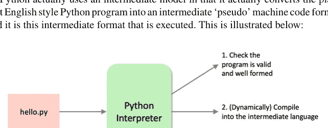

Python 解释器处理 Python 程序的方式分为几个步骤。这里展示的步骤是说明性的（并且简化了），但总体思路是正确的。

1. 首先检查程序以确保它是有效的 Python，即检查程序是否遵循语言的所有规则，以及 Python 环境是否理解每个命令和操作等。

## 1.7 运行 Python 程序

有几种方式可以运行 Python 程序，包括：

-   使用 Python 解释器进行交互式运行。
-   将程序存储在文件中，并使用 `python` 命令运行。
-   作为脚本文件运行，在文件内指定要使用的 Python 解释器。
-   在 Python IDE（集成开发环境）中运行，例如 PyCharm。
-   在网页浏览器中使用 Jupyter Notebooks。

### 1.7.1 使用 Python 解释器进行交互式运行

人们通常会以交互模式使用 Python，这很常见。这种方式使用的是 Python REPL（其名称源于 **读取-求值-打印-循环** 的操作风格）。

使用 REPL，可以在 Python 提示符下输入 Python 语句和表达式，它们会被直接执行。变量的值会被记住，并可在当前会话的后续部分使用。

要运行 Python REPL，必须在你使用的计算机系统上安装 Python。安装完成后，你可以打开命令提示符窗口（Windows）或终端窗口（Mac），并在提示符下输入 `python`。以下是在 Windows 机器上的示例：

```
jeh@Johns-iMac ~ % python
Python 3.11.2 (main, Feb 16 2023, 03:07:35) [Clang 14.0.0 (clang-1400.0.29.202)] on darwin
Type "help", "copyright", "credits" or "license" for more information.
>>> print('Hello World')
Hello World
>>> 5 + 4
9
>>> name = 'John'
>>> print(name)
John
>>>
```

在上面的例子中，我们交互式地输入了几个 Python 命令。Python 解释器‘读取’了我们输入的内容，‘求值’（计算出它应该做什么），‘打印’结果，然后‘循环’回来，准备接受进一步的输入。在这个例子中，我们：

-   打印出了字符串 'Hello World'。
-   将 5 和 4 相加，得到结果 9。
-   将字符串 'John' 存储在一个名为 `name` 的变量中。
-   打印出了变量 `name` 的内容。

要退出交互式 shell（即 REPL）并返回到控制台（系统 shell），在 Windows 上按 Ctrl-Z 然后按 Enter，在 OS X 或 Linux 上按 Ctrl-D。或者，你也可以执行 `quit()` 命令。

你应该注意，一旦退出会话，在会话中创建的任何内容都将丢失。

### 1.7.2 运行 Python 文件

当然，我们可以将 Python 命令存储到一个文件中。这会创建一个程序文件，然后可以作为 `python` 命令的参数来运行。它还允许文件中的程序被多次运行。

例如，给定一个包含以下内容的文件（名为 `hello.py`），其中有 4 条命令：

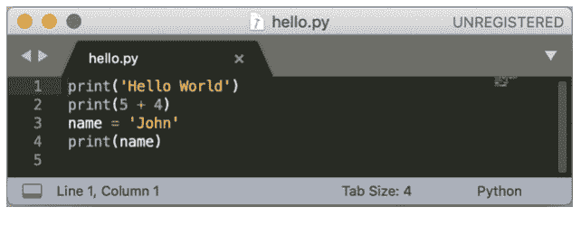

要在使用 Windows 的 PC 上运行 `hello.py` 程序，我们可以使用 `python` 命令，后跟文件名：

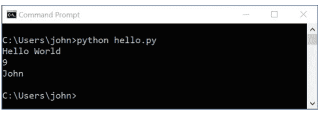

我们也可以在 Apple Mac 上通过 `python` 解释器运行相同的程序。例如，在 Mac 上我们可以这样做：

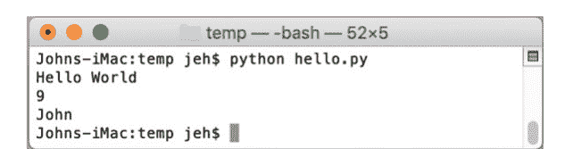

这使得创建可以存储在文件中并在需要时在任何所需平台（Windows、Linux 或 Mac）上运行的 Python 程序变得非常容易。这体现了 Python 的跨平台特性，也是 Python 如此受欢迎的原因之一。

### 1.7.3 执行 Python 脚本

也可以将包含已存储 Python 程序的文件转换为脚本。脚本是一个独立的文件，可以直接运行，无需（显式地）使用 `python` 命令。

这是通过在 Python 文件的开头添加一行特殊指令来实现的，该指令指明了用于文件其余部分的 Python 命令（或解释器）。这一行必须以 `#!` 开头，并且必须位于文件的开头。

要将上一节的文件转换为脚本，我们需要添加 Python 解释器的路径。这里的路径指的是计算机必须遵循的路线，以找到指定的 Python 解释器（或可执行文件）。

Python 解释器在你计算机上的确切位置取决于你（或安装 Python 的人）在设置时选择的选项。通常，在 Windows PC 上，Python 会位于 'Program Files' 目录中，或者可能安装在它自己的 'Python' 目录中。

无论 Python 解释器位于何处，要创建脚本，我们都需要在 `hello.py` 文件中添加第一行。这一行必须以 `#!` 开头。这个字符组合被称为 *shebang*（释伴），它向 Linux 和其他类 Unix 操作系统（如 MacOS）指示文件的其余部分应如何执行。

例如，在 Apple Mac 上，我们可能会添加：

```
#!/Library/Frameworks/Python.framework/Versions/3.11/bin/python3
```

将其添加到 `hello.py` 文件后，我们现在得到：

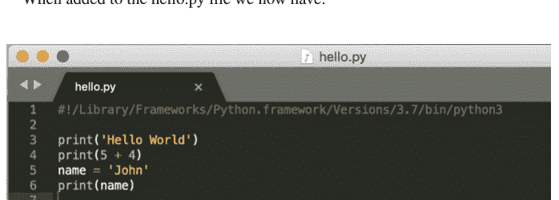

然而，我们不能直接运行这个文件。如果我们尝试不做任何更改就运行该文件，将会得到一个错误，提示执行该文件的权限被拒绝：

```
$ ./hello.py
-bash: ./hello.py: Permission denied
$
```

这是因为默认情况下，你不能直接运行一个文件。我们需要将其标记为可执行文件。有几种方法可以做到这一点，然而在 Mac 或 Linux 机器上最简单的方法之一是使用 `chmod` 命令（该命令可用于修改与文件关联的权限）。要使文件可执行，我们可以在终端窗口中，当位于与 `hello.py` 文件相同的目录时，使用以下命令更改文件权限以包含可执行权限：

```
$ chmod +x hello.py
```

其中 `+x` 表示我们想为文件添加可执行权限。

现在，如果我们尝试直接运行该文件，它会执行，并且文件内命令的结果会被打印出来：

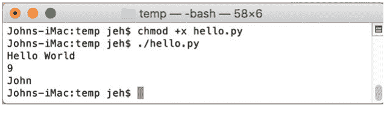

请注意上面文件名前使用的 `./`；这在 Linux 上用于告诉操作系统在当前目录中查找要执行的文件。

不同的系统会将 Python 存储在不同的位置，因此可能需要不同的第一行。例如，在 Linux 上，我们可能会写：

```
#!/usr/local/bin/python3
print('Hello, world')
print(5 + 4)
name = 'John'
print(name)
```

默认情况下，Windows 没有相同的概念。然而，为了促进跨平台可移植性，Windows 的 Python 启动器也支持这种操作风格。它允许脚本使用与 Unix 风格操作系统相同的 `#!`（Shebang）格式来指定对特定 Python 版本的偏好。我们现在可以指明文件的其余部分应被解释为 Python 脚本；如果安装了多个版本的 Python，这可能需要明确指定 Python 3。启动器还知道如何将 Unix 版本转换为 Windows 版本，因此 `/usr/local/bin/python3` 将被解释为需要 python3。

下面是在 Windows 机器上使用 Notepad++ 给出的适用于 Windows 或 Linux 机器的 `hello.py` 脚本示例。

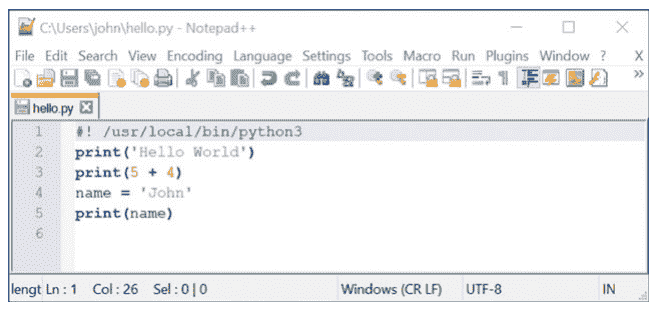

当启动器安装时，它应该已经与 Python 文件（即具有 .py 扩展名的文件）相关联。这意味着如果你在 Windows 资源管理器中双击其中一个文件，Python 启动器将被用来运行该文件。

### 1.7.4 在 IDE 中使用 Python

我们也可以使用 IDE（如 PyCharm）来编写和执行我们的 Python 程序。下面展示了使用 PyCharm 运行的同一个程序：

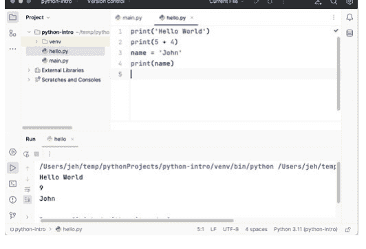

在上图中，简单的命令集再次列在一个名为 hello.py 的文件中。然而，程序是从 IDE 内部运行的，输出显示在底部的输出控制台中。

## 1.8 Jupyter Notebooks

许多数据分析师青睐的一种方法是使用 Jupyter Notebooks 基础设施来运行 Python 命令和程序。为此，他们使用网络浏览器，该浏览器会自动在网页中显示图形和表格格式，这在某些领域非常有用。

Jupyter notebooks 必须安装到你的 Python 环境中，例如使用以下命令

```
pip install jupyter
```

安装完成后，可以使用以下命令启动一个新的 notebook

```
jupyter notebook
```

这将启动一个后台 Python 编译服务器和运行时，并打开一个 Jupyter notebooks 浏览器窗口，如下图所示：

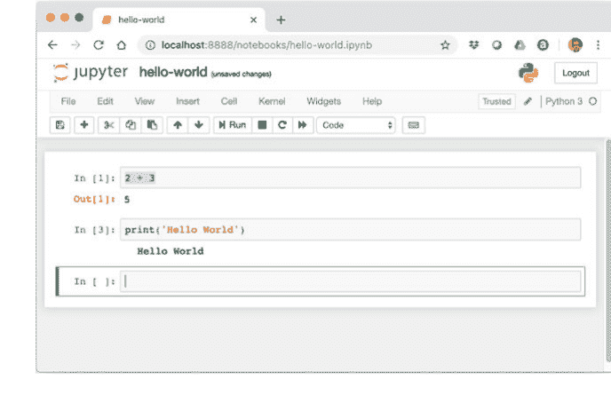

现在你可以在浏览器中输入 Python 语句和表达式，生成的结果将显示在浏览器中。

## 1.9 有用资源

网络上有大量关于 Python 的资源；我们在此列出一些你应该收藏的。我们不会反复提及这些资源以避免重复，但你可以在需要时随时参考本节：

- [https://en.wikipedia.org/wiki/Python_Software_Foundation](https://en.wikipedia.org/wiki/Python_Software_Foundation) Python 软件基金会。
- [https://docs.python.org/3/](https://docs.python.org/3/) 主要的 Python 3 文档站点。它包含教程、库参考、设置和安装指南以及 Python 操作指南。
- [https://docs.python.org/3/library/index.html](https://docs.python.org/3/library/index.html) Python 语言所有内置功能的列表——你可以在这里找到本书中将要使用的各种类和函数的在线文档。
- [https://pymotw.com/3/](https://pymotw.com/3/) Python 3 模块每周精选网站。该网站包含大量 Python 模块，附有简短示例和模块功能说明。Python 模块是一个功能库，它建立在核心 Python 语言之上并对其进行扩展。例如，如果你有兴趣使用 Python 构建游戏，那么 pyjama 就是一个专门为此设计的模块，旨在让开发更轻松。
- [http://www.pythonweekly.com/](http://www.pythonweekly.com/) 是一份免费的每周摘要，涵盖最新的 Python 文章、项目、视频和即将举行的活动。

# 第 2 章
Python 的应用领域

## 2.1 简介

Python 是当今技术世界中最大、最受欢迎的编程语言之一；无论你看哪个指数或调查，Python 通常都位列前三（与 Java 和 JavaScript 并列）。然而，考虑到“数据分析”或“数据科学”这些术语与 Python 同时出现的次数之多，你可能会误以为 Python 是一种专门用于数据分析或数据科学的语言。但实际上，Python 的应用范围广泛而多样。在本章中，我们将探讨 Python 的八种用途，其中一些可能会让你感到惊讶。

### 2.1.1 数据分析

这是 Python 两大最大的应用领域之一，也可能是你阅读本书的初衷。Python 有几个广泛使用的数据分析库，包括 Pandas。数据分析（或分析）是指获取原始数据并对其进行分析，以理解该数据和/或寻找数据中的模式，或者创建能够利用从先前数据中获得的知识来预测未来数据中的新趋势或模式的新系统。无论哪种情况，目标都是以某种方式为组织或企业提供价值，如下图所示。

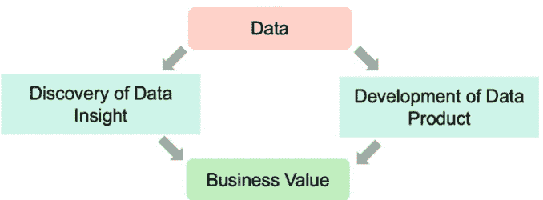

数据分析的方法并非完全独立，而是说明了不同的目的。例如，“数据洞察发现”方面通常涉及理解数据中的趋势、模式或关系，以帮助组织或企业提高其绩效。例如，在线销售商店可能会利用此类洞察来了解如何以及在何处针对特定促销活动，政府卫生组织可能会利用其数据洞察来确定在何处以及何时开展疫苗接种等。

相比之下，“数据产品开发”通常涉及利用数据中的信息来帮助开发新的系统，这些系统将应用于未来的、尚未见过的数据。例如，对数据的分析可能有助于识别欺诈行为模式，这些模式可用于开发新的监控系统，以便更早、更快地发现类似的欺诈行为。

用于此类分析的技术通常围绕统计分析和数据探索展开。这些是 Pandas（参见 https://pandas.pydata.org/）等库提供的功能，Pandas 是迄今为止使用最广泛的 Python 数据分析库。然而，Pandas 本身并不能提供完整的解决方案。例如，Pandas 建立在其他 Python 库之上，例如 NumPy（提供处理数字的复杂功能，参见 https://numpy.org/）。Pandas 也经常与其他库结合使用，例如 SciPy（代表 Scientific Python，参见 https://scipy.org/）和 Matplotlib（参见 https://matplotlib.org/），后者是一个绘图库。Pandas、Python 和其他常用数据分析相关库之间的关系如下图所示。

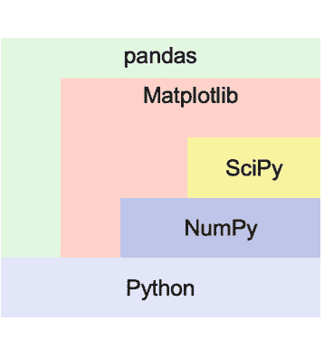

此外，一些在 Python 世界之外使用的数据分析报告系统和工具包也提供了 Python API，允许将任何 Python 分析的结果整合到这些系统中。例如，Tableau（https://www.tableau.com/）工具套件提供了 Python API，允许将 Python 创建的结果整合到 Tableau 仪表板中，以便轻松访问和使用。

### 2.1.2 机器学习与人工智能

继上一节关于数据分析的内容之后，在分析数据时应用一些机器学习技术是很常见的，例如，使用先前看到的数据对新数据进行一些分类。也就是说，机器学习是一种自动化分析模型构建的数据分析方法。机器学习使用从数据中迭代学习的算法，使计算机能够在没有明确编程的情况下发现隐藏的洞察。通用模型如下图所示。

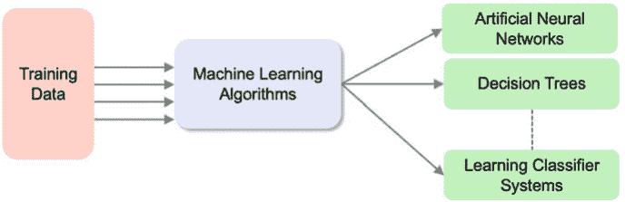

这说明了训练数据（可能是所谓的监督或无监督数据）被输入到机器学习算法中，其输出是一个系统，该系统可用于根据新数据对新数据进行分类、预测行为或做出某些决策。

监督学习任务涉及使用带有已知结果标签或标记的数据来教授学习系统。例如，贷款数据中申请被标记为欺诈或非欺诈等。

相比之下，无监督数据涉及向学习系统提供数据——没有预期结果的指示，然后识别该数据中的模式或聚类。这使用户能够理解或了解更多关于数据的信息。术语“无监督”旨在表明没有已知（或至少未提供）的正确答案（因此没有老师）。在某些情况下，存在大量数据，但只有其中一部分数据可以标记适当的结果或结论。此类问题有时被称为半结构化机器学习。在许多情况下，需要结合监督和无监督技术来分析此类数据。

与 Python 一起使用的每种常用机器学习算法都有其优缺点以及最适合应用的情况。因此，拥有一个可以在适当时应用的此类算法工具箱是非常有用的。

Python 中有几个常用的库可用于此目的，包括 SciKitLearn（又名 SKLearn）、TensorFlow 和 PyTorch。总的来说，SciKitLearn 和 TensorFlow 在 Python 市场上的份额大致相同，PyTorch 紧随其后，尽管就 Python 开发者的使用率而言，三者都接近 30%。

有关机器学习的更多信息，请参阅：

- 哈佛商业评论——“每位经理都应该了解的机器学习知识”
  - http://hbr.org/2015/07/what-every-manager-should-know-about-machine-learning
- 机器学习算法/用途快速参考速查表
  - http://www.lauradhamilton.com/machine-learning-algorithm-cheat-sheet
- 每位数据科学家都应了解的 10 种机器学习方法
  - https://towardsdatascience.com/10-machine-learning-methods-that-every-data-scientist-should-know-3cc96e0eeee9

### 2.1.3 数据库工作

大多数数据都存储在某种形式的数据库中，Python 提供了允许程序员访问这些数据的接口。这些接口使得查询数据库信息并将该信息拉取回 Python 程序中进行进一步处理变得容易。例如，可以查询客户信息数据库

## 2.1.4 Python 在动画制作中的应用

Python 是 Autodesk Maya 工具包中可用的两种编程语言之一。Maya 是一款 3D 动画、建模、模拟和渲染软件系统，被游戏、电影和电视公司广泛使用。在 Maya 中，Python 可用于从创建处理常见任务的脚本，到开发扩展工具核心功能的完整插件等各种用途。Maya 目前支持 Python 2，但将在不久的将来转向 Python 3。

## 2.1.5 Python 在电影制作中的应用

工业光魔由乔治·卢卡斯于 1975 年创立，旨在为最初的《星球大战》电影制作特效。此后，它为大量电影和电影制作人提供了特效支持。早在 1996 年，它就使用 Unix shell 脚本来帮助自动化和控制其制作流程。然而，他们需要开发日益复杂且计算成本高昂的制作流程，并认为现有方法不够灵活。尽管他们考察了几种替代方案（包括 TCL 和 Perl），但最终决定采用 Python。这带来了更快的开发速度和更大的灵活性。多年来，他们重新评估了这一决定并考虑了不同的替代方案，但 Python 仍然是其开发流程的关键。

## 2.1.6 跨平台用户界面

Python 在图形用户界面框架（或 GUI 框架）方面尤其出色。其中大多数是跨平台的，尽管少数框架允许开发者利用底层窗口系统的特定功能，因此绑定到特定平台。广泛使用的 GUI 库包括跨平台的 TKinter、wxPython 和 pyQT，以及特定平台的 PythonWin（用于 Windows）和 PyObjc（用于 MacOS）。例如，以下“Hello World”GUI 应用程序使用 wxPython，并展示了在 Mac OS 和 Windows 系统上运行的情况：

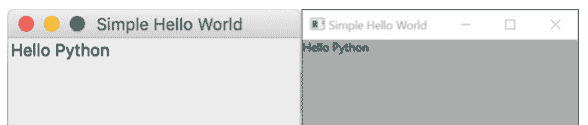

## 2.1.7 游戏编程

Python 也被用于游戏开发，一些知名游戏在某种程度上依赖于它。例如，Digital Illusions CE 开发的《战地 2》是一款军事模拟第一人称射击游戏。在这款游戏中，Python 被用于处理《战地英雄》中涉及游戏模式和计分的部分游戏逻辑。其他使用 Python 的游戏包括《文明 IV》、《加勒比海盗 Online》和《守望先锋》。pygame 库可能是 Python 世界中用于创建游戏最广泛使用的库。还有许多可用的 pygame 扩展，有助于创建各种不同类型的游戏。Pygame 构建在 SDL 库（或 Simple Directmedia Layer）之上。SDL 是一个跨平台开发库，旨在通过 OpenGL 和 Direct3D 提供对音频、键盘、鼠标、游戏杆和图形硬件的访问。为了提高可移植性，pygame 还支持多种额外的后端，包括 WinDIB、X11、Linux Frame Buffer 等。

## 2.1.8 集成测试框架

摩根士丹利开发了一个名为 Testplan 的 Python 集成测试框架，该框架已开源并通过 GitHub 提供。Testplan 旨在简化为多种编程语言和技术配置和驱动集成测试的过程。它支持驱动需要消息服务、RESTful 服务、数据库、文件的集成测试，适用于用 Python、C/C++、Java 等编写的代码。

## 2.1.9 学术研究

Python 在学术界被广泛用于支持研究工作，不仅在计算机科学系，还跨越多个不同学科，包括机械工程、航空航天工程、建筑学、药理学、医学等。在这些环境中，它被用于帮助开发分布式分析系统、识别实验室数据实验中的模式、将设计演进到最优解决方案、为研究应用程序提供自然语言前端（例如，使用 Python NLTK 库）等。

## 2.1.10 Web 服务

Python 也被广泛用作服务器端语言来创建 Web 服务，无论是 RESTful 服务还是较新的基于 GraphQL 的服务。有一系列框架可用于帮助开发此类服务，包括 Flask、Django 和 CherryPy。Flask 和 CherryPy 是轻量级框架，可用于创建 RESTful 服务，而 Django 是一个全栈 Web 框架，旨在开发不仅是 Web 服务，还有完整的网站。许多组织以这种方式使用 Python，例如 Reddit、Spotify 和 Instagram。

### 2.1.10.1 DevOps

DevOps 是当前另一个热门趋势；它代表了软件开发人员和运维人员的协同工作，通常旨在自动化以前手动处理或作为单独步骤执行的运维流程。Python 是 DevOps 领域使用的关键编程语言之一。它可以用作脚本语言来帮助自动化运维活动，也可以作为分析生产数据和进行数据可视化的工具。

## 2.2 有用资源

- https://www.autodesk.co.uk/products/maya/overview 有关 Autodesk Maya 计算机动画软件的信息。
- https://www.pygame.org 有关 pygame 的信息。
- https://www.python.org/about/success/ilm/ ILM 及其对 Python 的使用。
- https://github.com/Morgan-Stanley/testplan Testplan Python 集成测试框架。
- https://devops.com/how-python-is-transforming-the-devops-landscape/ 关于 DevOps 和 Python 的文章。

# 第 3 章
设置 Python 环境


## 3.1 简介

在本章中，我们将检查您的计算机上是否安装了 Python。如果您没有安装 Python，我们将逐步介绍安装 Python 的过程。这是必要的，因为当您运行 Python 程序时，它会查找用于执行您的程序或脚本的 `python` 解释器。如果您的机器上没有安装 `python` 解释器，Python 程序就只是文本文件！

## 3.2 检查是否已安装 Python

您应该做的第一件事是检查您的计算机上是否已经安装了 Python 3。首先检查您是否没有安装 Python。如果已安装，除非是非常旧的 Python 3 版本（如 3.1 或 3.2），否则您无需做任何事情。

在 Windows 11 机器上，您可以通过打开命令提示符窗口（可以通过在 Windows 的“搜索”框中搜索 Cmd 来完成）来检查已安装的版本。

命令窗口打开后，尝试输入 `python`。如下图所示：

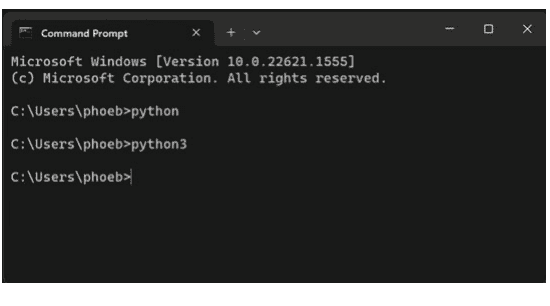

您可能会被提示在 Microsoft Store 中查找，您可以忽略该提示并关闭窗口。

请注意上图中我们尝试了 `python` 和 `python3`，以防最新版本是用该名称安装的。这并不罕见，因为在某些机器上您可能同时拥有 Python 2 和 Python 3。

在 Mac 等系统上，您可以使用终端执行相同的操作。您可能会发现至少预装了 Python (2)。例如，如果您在 Mac 上输入 `python`，您将得到类似以下的内容：

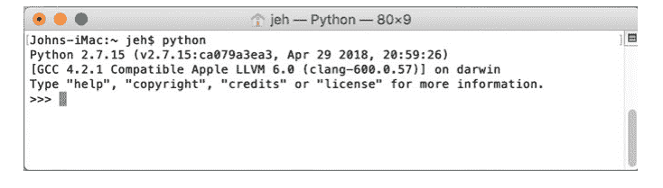

这表明上述用户安装了版本 2.7.15（请注意您可能安装了另一个 2.x 版本）。

但是，如果您发现您的机器上安装了 Python 2，请小心；本书仅专注于 Python 3。

如果您已经启动了 Python 解释器，那么

- 使用 `quit()` 或 `exit()` 退出 Python 解释器；`exit()` 是 `quit()` 的别名，提供它是为了让 Python 更易于使用。

如果 Python 3 不可用，那么以下步骤将帮助您安装它。

如果您的计算机上已经安装了正确版本的Python，那么您可以直接跳到下一章。下面是一个在Mac上输入`python`且已安装Python 3时可能发生的情况示例：

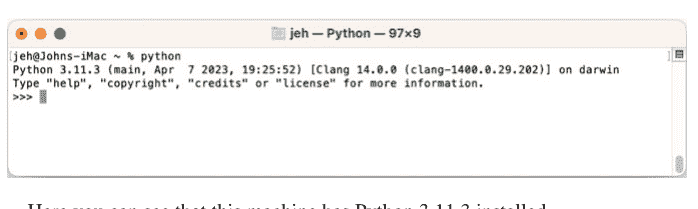

这里您可以看到这台机器安装了Python 3.11.3。

## 3.3 在Windows PC上安装Python

### 3.3.1 步骤1：下载Python

Python适用于从Windows、Mac OS到Linux的多种平台；您需要确保下载适用于您操作系统的版本。

Python可以从其官方网站下载，网址为 http://www.python.org/。

您会看到“Downloads”链接位于搜索框下方大菜单栏从左数第二个位置。点击此链接，您将被带到下载页面；撰写本文时，当前的Python 3版本是Python 3.11，这也是我们将要下载的版本（如果您发现版本是3.12或更高版本，那也没问题）。点击“Download Python 3.x.x”链接。例如，对于一台Windows 11机器，使用3.11.3版本，您会看到：

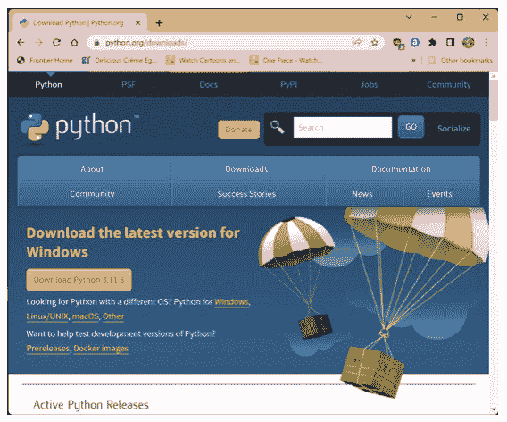

点击“Download”按钮——这可能会将您带到一个包含多个不同选项的页面——找到“Recommended”选项并下载该安装程序。

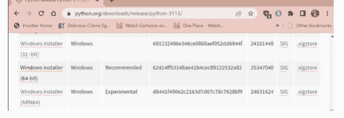

即使有更新版本的Python可用（由于版本更新频繁，这很可能），步骤也应基本相同。

### 3.3.2 步骤2：运行安装程序

下载安装程序后，*打开*它。现在您将被提示选择Python的安装位置，例如：

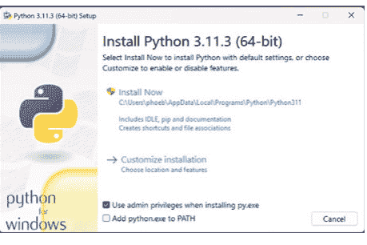

请注意，点击“Add python.exe to PATH”选项是最简单的，因为这将使其可以从命令行使用。如果您没有这样做，也不用担心，我们稍后可以将Python添加到PATH（PATH环境变量被Windows用于查找程序的位置，例如Python解释器）。

接下来选择“Install Now”选项并按照安装步骤操作。

如果一切按预期进行，您现在应该看到一个确认对话框，例如：

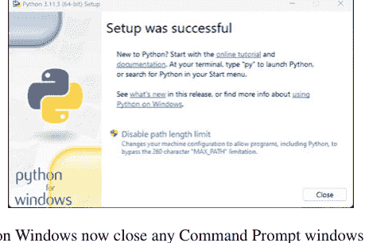

如果您现在在Windows上，请关闭所有已打开的命令提示符窗口（PATH变量不会为现有命令更新）。可以通过输入“exit”或关闭窗口来完成。

### 3.3.3 步骤3：设置PATH（可选）

如果您在安装开始时没有选择“Add python.exe to PATH”，那么现在您需要设置PATH环境变量。如果您已经选择了，则跳到下一步。

您可以使用系统环境变量编辑器来设置PATH环境变量。

找到它的最简单方法是在Windows搜索框中输入“envir”，它将列出所有匹配此模式的应用程序，包括“Edit the system environment variables”编辑器。如果您以具有“admin”权限的用户身份登录到计算机，请使用列出的第一个；如果您以没有管理员权限的用户身份登录，请选择“Edit environment variables for your account”选项。

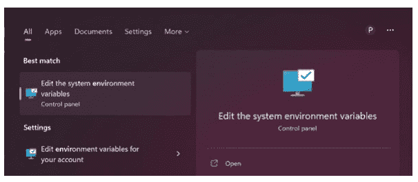

在出现的对话框中，选择页面底部的“Environment Variables …”按钮：


在下一个对话框中，选择`PATH`环境变量并选择编辑：

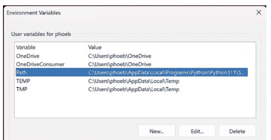

现在添加您安装Python的位置，默认情况下，它类似于：

```
C:\Users\<username>\AppData\Local\Programs\Python\Python311
C:\Users\<username>\AppData\Local\Programs\Python\Python311\Scripts
```

请注意，如果不同，Python311应替换为您正在安装的Python版本。

最终结果应如下所示：

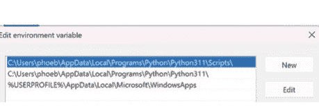

现在点击确定，直到所有窗口关闭。

### 3.3.4 步骤4：验证安装

接下来，打开一个新的命令提示符窗口并输入`python`，如下所示：

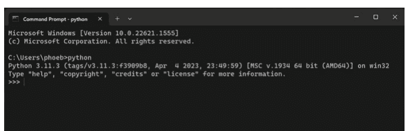

恭喜，您已安装Python并运行了`python`解释器！

### 3.3.5 步骤5：运行一些Python

现在在“>>>”提示符下输入：

```
print('Hello World')
```

请小心确保您对“print”函数使用全小写字母；Python对大小写非常敏感，这意味着就Python而言，`print('Hello World')`和`Print('Hello World')`是完全不同的东西。

还要确保您在Hello World文本周围使用单引号，这使其成为一个字符串。如果您做对了，那么在Windows上您应该看到：

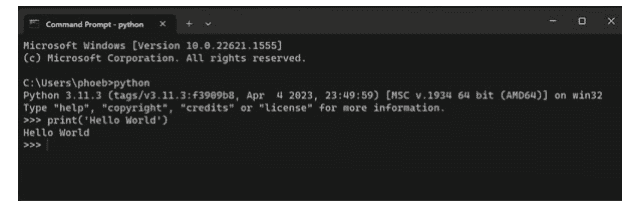

您现在已经运行了您的第一个Python程序。在这种情况下，您的程序打印出了消息“Hello World”（大多数编程语言中的传统第一个程序）。

### 3.3.6 步骤6：退出Python解释器

要退出Python解释器，请使用`exit()`或Ctrl-Z加回车。

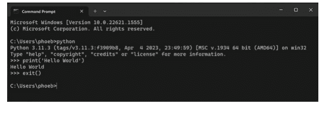

## 3.4 在Mac上设置

在Mac上安装Python类似于在Windows机器上安装，因为您可以从Python软件基金会网站（https://www.python.org）下载适用于Apple Mac的Python安装程序。当然，这次您需要确保选择macOS版本的下载，如下所示：

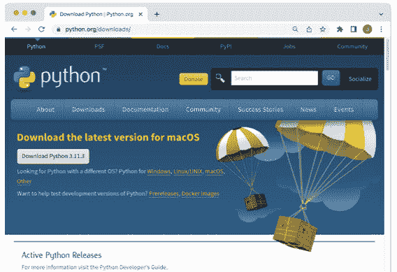

从这里您可以选择macOS 64位安装程序（确保选择适合您操作系统版本的安装程序）。这将下载一个可以安装的Apple包（它的名称类似于python-3.11.3-macos11.pkg，尽管Python和macOS操作系统的版本号可能不同）。您需要运行此安装程序。当您运行此安装程序时，Python安装程序向导对话框将打开，如下所示：

## 3 设置Python环境

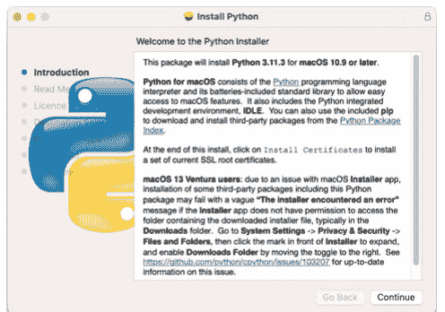

按照安装程序向导呈现给您的对话框操作，接受每个选项，直到安装开始。安装完成后，您将看到一个摘要屏幕，确认安装成功。现在您可以关闭安装程序。

这将在您的应用程序文件夹中创建一个用于Python 3.11的新文件夹。请注意，在已经安装了Python 2（默认安装）的Mac上，Python 3可以与其并行安装，并且可以通过`python3`命令访问（如下所示）。您应该通过打开终端窗口并输入Python 3 REPL来确认Python已成功安装：

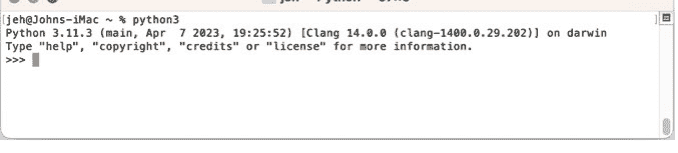

现在在“>>>”提示符下输入：

```
print('Hello World')
```

请小心确保您对“print”函数使用全小写字母；与在Windows机器上一样，Python对大小写非常敏感，这意味着就Python而言，`print('Hello World')`和`Print('Hello World')`是完全不同的东西。

结果应如下所示：

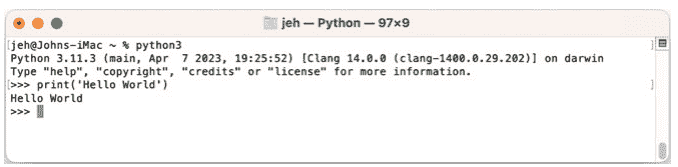

现在您可以使用`exit()`或`quit()`退出REPL。

## 3.5 设置IDE

您可以使用任何您想要的编辑器与本书一起使用，并且大多数章节与IDE无关。但是，如果您希望使用PyCharm编辑器使生活更轻松，那么本节概述了下载、安装和开始使用此编辑器。除了“Python虚拟环境”章节中的一个部分外，几乎所有其他章节都与IDE无关。

### 3.5.1 下载PyCharm IDE

PyCharm由JetBrains提供，他们为多种不同的语言制作工具。PyCharm IDE可以从他们的网站下载——参见 [https://www.jetbrains.com/](https://www.jetbrains.com/)。查找菜单标题“Developer Tools”并选择它。您将看到一个长长的工具列表，其中应包括PyCharm。

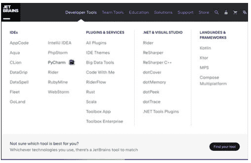

选择PyCharm选项。

## 3.5.2 设置集成开发环境

在显示的下一页上，应该有一个标有“DOWNLOAD”的大按钮，选择此选项：

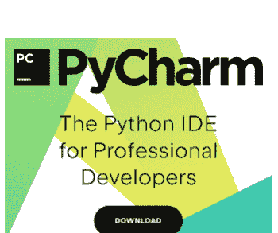

在下一页上，有两个可用的下载选项：*Professional* 和 *Community*。

-   Professional 版本是付费选项，但相比免费的 Community 版本包含了一些额外功能。
-   Community 版本是免费的。

对于我用 Python 完成的大部分工作，Community 版本已经绰绰有余，因此我们将下载并安装此版本（请注意，Professional 版本提供免费试用，但试用期结束后，您需要购买完整版或重新安装 Community 版本）。

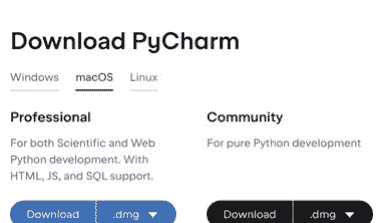

假设您选择了 Community 版本，安装程序现在将开始下载，并会提示您运行它。请注意，如果您愿意，可以忽略订阅请求）。请注意，网络浏览器应为您选择正确的操作系统，但如果未选择，您可以在“Professional”和“Community”标题上方手动选择。

现在您可以运行安装程序并按照提供的说明操作。

您需要首先启动 PyCharm IDE。启动后，显示的第一个对话框会询问您是否要导入可能已有的其他版本 PyCharm 的设置。此时请选择“不导入设置”。
逐步完成接下来的一系列对话框，选择外观和感觉（我喜欢 IDE 的浅色版本）、是否要与 JetBrains 共享数据等。完成后，点击“启动 PyCharm”选项。
现在您应该会看到 PyCharm 的启动屏幕：

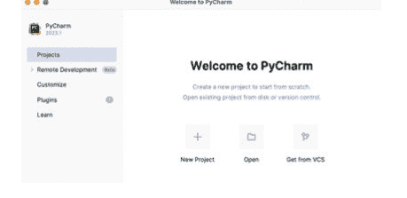

我们现在将为您创建一个项目。PyCharm 中的项目是您编写程序的地方，也是您配置所使用的 Python 版本以及可能需要的任何库（例如图形库等）的地方。
点击启动对话框中的“新建项目”选项。
现在会询问您要在哪里创建这个新项目。同样，您可以使用默认位置，但需要为其命名，我们将我们的项目命名为 *python-intro*。这可以通过将“位置”字段的最后一个元素更改为“python-intro”来完成。
此时还值得确保 IDE 已识别您安装的 Python 解释器。您可以通过打开“项目解释器：新建 Virtualenv 环境”选项，并确保“基本解释器”字段已填充您机器上的 Python 安装路径（这应该会自动为您识别）来完成此操作。如果一切正常，请选择“创建”；如果未指定或指定了错误的基本解释器，请点击字段右侧的“...”按钮并浏览到相应位置。
下面左侧显示的是 Windows 11 的“新建项目”对话框，右侧是 Apple Mac 的：

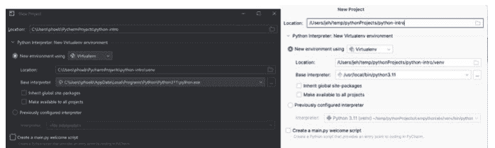

接下来，确保**未**选中“创建 main.py 欢迎脚本”，因为这将为您创建一个包含远不止简单“Hello World”消息的示例程序。

打开 PyCharm 项目后，您可能会看到欢迎消息；点击“关闭”，项目将为您设置完成。

打开项目后，您将看到一个空白的工作空间。在左侧，您应该在细条的顶部看到三个图标：


选择顶部那个看起来有点像文件夹的图标——这是项目视图。它看起来会像这样：

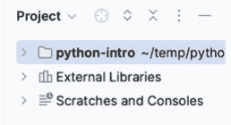

这说明了项目的结构。您应该忽略“外部库”和“草稿和控制台”，并打开顶级节点。如果您将项目命名为 python-intro 以外的其他名称，您会发现此节点具有您输入的名称而不是 python-intro，但这没关系。

打开顶级节点后，您会看到它当前包含一个名为 venv 的目录——也忽略这个目录并关闭此节点，这样您现在应该看到：

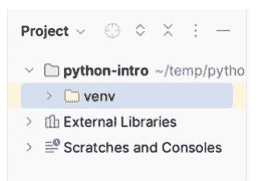

我们现在准备开始了。

## 3.6 编写 Python 程序

在本节中，我们将使用 PyCharm 编写我们的第一个 Python 程序。如果您使用的是不同的 IDE，基本思路是相同的——创建一个扩展名为 .py 的文件并运行它——但是菜单选项和按钮可能会（将会）不同。
第一步是在 PyCharm 中创建一个新文件来存储我们的“Hello World”程序。
首先确保项目树中选中的节点是具有您项目名称的顶级节点。
接下来选择 PyCharm 的“文件”->“新建”菜单选项。这将显示一个“新建”菜单，其中包含创建新“Python 文件”的选项。确保您选择此选项，不要选择普通的“文件”选项。如果您不选择“Python 文件”选项，PyCharm 将不会意识到您希望将关联的文件作为 Python 程序运行。
例如：

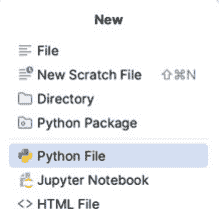

当您选择“Python 文件”选项时，PyCharm 将显示一个新对话框，允许您输入要创建的文件名。所有 Python 文件必须以 .py 扩展名结尾，因此您可以在此对话框中输入名称“main.py”，但是这里的“.py”是可选的，因为 PyCharm 会为您添加该扩展名，因此如果您愿意，只需输入“main”即可：

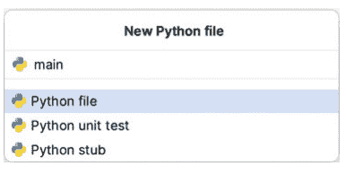

再次确保您选择了“Python 文件”选项，而不是其他两个选项，因为它们不适用于我们正在创建的简单 Hello World 程序。现在按回车键。

输入程序的文件名后，回车键将为您创建文件，例如名为 `main.py`，并将其作为空白文件显示在编辑器的右侧。请注意，编辑器分为两个区域，一个是左侧的项目树，另一个是右侧的编辑器窗口，例如：

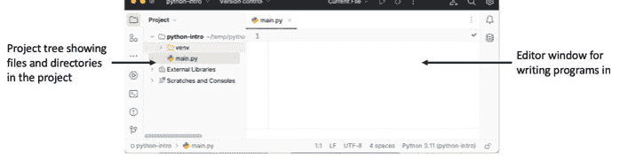

在编辑器窗口中输入打印“Hello World”的代码，例如：

```python
print('Hello World')
```

现在保存文件。例如，

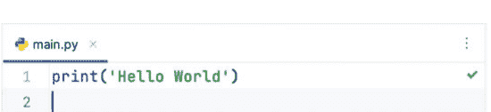

现在您可以运行文件了。为此，请查看编辑器中文件名上方，并检查小绿色箭头旁边的字段是否显示“当前文件”。这表示当您点击绿色箭头时，IDE 将运行当前文件，例如：


现在点击绿色箭头，您的程序应该会运行。下面左侧的屏幕截图来自在 Windows 11 机器上运行的 PyCharm，右侧的来自 Apple Mac。如您所见，它们非常相似：

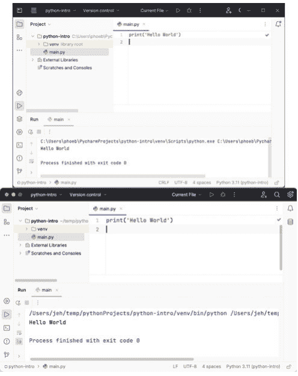

程序的输出显示在 IDE 底部的“运行”窗口中。此输出向您显示了运行的内容（Python 和 `main.py` 文件）、程序的输出“Hello World”以及进程（运行程序的进程）已成功退出，退出代码为“0”。
您现在已经运行了您的第一个 Python 程序！

## 3.7 关于文件名的说明

需要注意的一点是，Python 中的文件名需要稍加注意。
首先，您应该始终使用全小写字母命名文件。例如，文件名 `utils.py` 是可以的，但应避免使用文件 `Utils.py`（按照惯例）。
其次，您应尽量避免将文件名拆分为组成单词，例如 `my_utils.py`，这主要是一个风格问题，并非每个人（包括我自己）都遵守。但是，如果您确实需要拆分文件名以使其更具可读性，请始终使用下划线 `_`，切勿使用连字符 `-`。如果您使用连字符，目前不会造成问题，但在未来的某个时候可能会给您带来麻烦。这是因为如果您需要从一个 Python 文件引用另一个文件，连字符 `-` 将会破坏此操作，因为 `import` 命令会将 `-` 解析为减号，从而尝试从文件名的一部分减去另一部分，导致错误，而不是仅仅作为文件名的一部分。

## 3.8 在线资源

有关以下内容，请参阅 Python 标准库文档：

-   https://docs.python.org/3/using/index.html 包含 Python 设置和使用的文档。
-   https://docs.python.org/3/faq/windows.html Python 在 Windows 上的常见问题解答。
-   https://www.jetbrains.com/pycharm/ PyCharm IDE 主页。

# 第四章
第一个 Python 程序

## 4.1 简介

在本章中，我们将回到上一章的 Hello World 程序，并研究它的工作原理。我们还将修改它，使其更具交互性，并探讨 Python 变量的概念。我们将涵盖诸如命名约定、代码中的注释，以及就本书而言脚本与程序之间的区别等概念。

## 4.2 Hello World

正如前一章所提到的，开始学习一门新的编程语言时，传统做法是编写一个 *Hello World* 风格的程序。这非常有用，因为它确保你的环境——即解释器、任何环境设置、你的编辑器（或 IDE）等——都已正确设置，并且能够处理（或编译）和执行（或运行）你的程序。由于 ‘Hello World’ 程序是任何语言中最简单的程序之一，你可以在不涉及所用语言实际复杂性的情况下完成此操作。

我们的 ‘Hello World’ 程序已在本书的前一章中介绍过，但我们将在此处重新审视它，并更仔细地研究其工作原理。

在 Python 中，最简单的 *Hello World* 程序版本仅仅是打印出一个包含欢迎消息的字符串：

```
print('Hello World')
```

你可以使用任何文本编辑器或集成开发环境（IDE）来创建 Python 文件。常用于 Python 的编辑器示例包括 Emacs、Vim、Notepad++、Sublime Text 或 Visual Studio Code；Python 的 IDE 示例包括 PyCharm 和 Eclipse。使用这些工具中的任何一个，我们都可以创建一个扩展名为 `.py` 的文件。这样的文件可以包含一个或多个代表 Python 程序或脚本的 Python 语句。

例如，我们可以创建一个名为 `hello.py` 的文件，其中包含上述的 `print()` 函数。

这引发了一个问题：`print()` 函数从何而来？

事实上，`print()` 是一个预定义函数，可用于 *打印内容*，例如打印给用户。输出实际上是打印到所谓的输出流。这处理的是数据流（序列），例如字母和数字。这个数据输出流可以发送到输出窗口，例如 Mac 上的终端或 Windows PC 上的命令窗口。在本例中，我们打印的是字符串 ‘Hello World’。

这里的预定义意味着它 *内置于* Python 环境中，并且被 Python 解释器所理解。这意味着解释器知道在哪里可以找到 `print()` 函数的定义，该定义告诉它在遇到 `print()` 函数时该做什么。

当然，你可以编写自己的函数，我们将在本书后面介绍如何做到这一点。

`print()` 函数实际上会尝试打印你传递给它的任何内容：

- 当传递一个字符串时，它会打印一个字符串。
- 如果传递一个整数，例如 42，它会打印 42。
- 如果传递一个实数，例如 23.56，那么它会打印 23.56。

因此，当我们运行这个程序时，字符串 ‘Hello World’ 会被打印到控制台窗口。

还要注意，构成 Hello World 字符串的文本被包裹在两个单引号字符内；这些字符界定了字符串的开始和结束；如果你漏掉其中一个，将会出现错误。

要运行该程序，如果你使用的是像 PyCharm 这样的 IDE，那么你可以点击编辑器窗口右上角的绿色箭头（只要箭头旁边选择了 ‘Current File’ 选项）。

如果你从命令行运行它，请输入 `python` 后跟文件名，例如：

```
> python hello.py
```

这应该在你创建文件的目录中执行。

## 4.3 交互式 Hello World

让我们使程序更有趣一点；让它询问我们的名字并向我们个人问好。

更新后的程序现在列出如下：

```
print('Hello World')
user_name = input('Enter your name: ')
print('Hello ', user_name)
```

现在，在打印出原始的 ‘Hello World’ 字符串之后，程序还有两个额外的语句。

运行此程序的结果是：

```
Hello World
Enter your name: John
Hello John
```

我们将分别查看每个新语句。
第一个语句是：

```
user_name = input('Enter your name: ')
```

这个语句做了几件事。它首先执行另一个名为 `input()` 的函数。这个函数被传递了一个字符串——称为参数——用于在提示用户输入时使用。

这个 `input()` 函数同样是 Python 语言内置函数的一部分。在这种情况下，它将显示你提供的字符串作为提示给用户，并等待用户输入内容后按回车键。

用户输入的任何内容都会作为执行 `input()` 函数的结果返回。在这种情况下，该结果随后被存储在变量 `user_name` 中。

变量是计算机内存中的一个命名区域，可用于保存内容（通常称为数据），例如字符串、数字、布尔值如 `True`/`False`。在本例中，变量 `user_name` 充当内存区域的标签，该区域将保存用户输入的字符串。基本概念如下图所示：

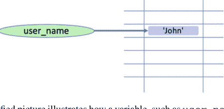

这个简化的图示说明了像 `user_name` 这样的变量如何可以引用包含实际数据的内存区域。在该图中，内存被显示为一个二维的内存位置网格。每个位置都有一个与之关联的地址。这个地址在内存中是唯一的，可用于返回到该位置保存的数据。这个地址通常被称为数据的内存地址。实际上存储在变量 `user_name` 中的就是这个内存地址；这就是为什么 `user_name` 变量被显示为指向包含字符串 ‘John’ 的内存区域。

因此，变量 `user_name` 使我们能够轻松方便地访问这个内存区域。

例如，如果我们想在另一个语句中获取用户输入的名字，我们只需引用变量名即可。事实上，这正是我们在添加到程序的第二个语句中所做的。如下所示：

```
print('Hello', user_name)
```

最后一个语句再次使用了内置的 `print()` 函数，但这次它接受两个参数。这是因为 `print()` 函数实际上可以接受可变数量的参数（我们传递给它的数据项）。每个参数由逗号分隔。在本例中，我们传递了字符串 ‘Hello’ 以及变量 `user_name` 引用的（由其指示的内存地址处存在的）任何值。

需要注意的是，Python 对大小写非常敏感；因此变量 `My_Name` 与 `my_name` 不同！就 Python 而言，这是两个完全独立的变量，因此你应该非常小心使用大小写。通常，所有关键字都是小写的，所有变量都应该是小写的，而大多数内置类型使用小写名称，但也有一些内置类型可能使用首字母大写。

## 4.4 变量

你可能想知道为什么保存用户姓名的元素被称为 *变量*。它被称为 *变量*，是因为它在内存中引用的值在程序的生命周期内可以变化。

例如，我们可以修改我们的 *Hello World* 程序，询问用户他们最好朋友的名字，并向那位最好的朋友打印欢迎消息。如果我们愿意，我们可以 *重用* 这个变量来保存那位最好朋友的名字。例如：

```
print('Hello, world')
name = input('Enter your name: ')
print('Hello', name)
name = input('What is the name of your best friend: ')
print('Hello Best Friend', name)
```

当我们运行这个版本的程序，用户输入 ‘John’ 作为他们的名字，输入 ‘Denise’ 作为他们最好朋友的名字时，我们将看到：

```
Hello, world
Enter your name: John
Hello John
What is the name of your best friend: Denise
Hello Best Friend Denise
```

你好约翰
你最好的朋友叫什么名字：丹妮丝
你好最好的朋友丹妮丝

从这个例子可以看出，当字符串‘Hello Best Friend’被打印时，与之一起打印的是名字‘丹妮丝’。
这是因为之前存储字符串‘约翰’的内存区域现在存储了字符串‘丹妮丝’。
事实上，在Python中，变量名不仅限于存储像‘约翰’和‘丹妮丝’这样的字符串；它还可以存储其他类型的数据，例如数字或布尔值True和False。例如：

```
my_variable = 'John'
print(my_variable)
my_variable = 42
print(my_variable)
my_variable = True
print(my_variable)
```

运行上述示例的结果是

```
John
42
True
```

如你所见，`my_variable`首先存储（或引用包含字符串‘约翰’的内存区域），然后存储数字42，最后存储布尔值True（布尔值只能是True或False）。
这在Python中被称为动态类型。也就是说，变量所存储的数据类型可以在程序执行过程中动态改变。虽然这看起来是理所当然的做法，但它并非许多编程语言（如Java和C#）所采用的方法，这些语言中的变量是静态类型的。这里的“静态”一词表示变量可以存储的数据类型将在程序首次处理（或编译）时确定。之后将无法更改它可以存储的数据类型；因此，如果一个变量要存储数字，它以后就不能存储字符串。
两种方法各有优缺点；但对许多人来说，Python变量的灵活性是其主要优势之一。

## 4.5 命名约定

你可能已经注意到我们上面介绍的一些变量名，比如`user_name`和`my_variable`。这两个变量名都是由一组字符组成的，变量名中的“单词”之间用下划线分隔。
这两个变量名都突出了Python中一个非常广泛使用的命名约定，即变量名应该：

- 全部小写，
- 通常比像*a*或*b*这样的变量名更具描述性（尽管有一些例外，例如在循环结构中使用变量*i*和*j*），
- 根据需要使用下划线分隔各个单词以提高可读性。

最后一点非常重要，因为在Python（以及大多数计算机编程语言）中，空格被视为分隔符，可用于指示一个事物的结束和另一个事物的开始。因此，不可能定义像这样的变量名：

- user name

因为空格被Python视为分隔符，所以Python认为你正在定义两个东西‘user’和‘name’。
当你创建自己的变量时，你应该尝试按照Python接受的风格来命名它们，例如：

- my_name, your_name, user_name, account_name
- count, total_number_of_users, percentage_passed, pass_rate
- where_we_live, house_number,
- is_okay, is_correct, status_flag

都是可以接受的，但

- A, Aaaaa, aaAAAaa
- Myname, myName, MyName 或 MYName
- WHEREWELIVE

不符合公认的约定。
然而，值得一提的是，这些仅仅是普遍遵循的*约定*，甚至Python本身也并不总是遵守这些约定。因此，如果你定义了一个不符合约定的变量名，Python不会报错。

## 4.6 赋值运算符

下面所示语句的最后一个方面尚未考虑

```
user_name = input('Enter your name: ')
```

`user_name`变量和`input()`函数之间的这个‘=’到底是什么？
它被称为*赋值*运算符。它用于将函数`input()`返回的值赋给变量`user_name`。它可能是Python中使用最广泛的运算符。当然，它不仅用于从函数赋值，正如前面的例子所示。例如，当我们直接将字符串存储到变量中时也使用了它：

```
my_variable = 'Jason'
```

## 4.7 Python语句

在本章中，我们一直使用“语句”这个短语来描述Python程序的一部分；例如，下面这行代码是一个语句，它打印出字符串'Hello'和`user_name`中存储的值。

```
print('Hello', user_name)
```

那么，我们所说的语句是什么意思呢？在Python中，语句是Python解释器可以执行的一条指令。这条语句可能由多个元素组成，例如上面的语句包括一个函数调用和一个值到变量的赋值。在许多情况下，语句是你程序中的一行，但语句也可以跨越多行，特别是当这有助于代码的可读性或布局时。例如，下面是一个语句，但它被布局在6行代码中以便于阅读：

```
print('The total population for',
      city,
      'was',
      number_of_people_in_city,
      'in',
      year)
```

除了语句，还有表达式。表达式本质上是一个产生值的计算，例如：

```
4 + 5
```

这是一个将4和5相加并产生值9的表达式。

## 4.8 代码中的注释

在代码中添加注释是一种常见的做法（尽管并非普遍如此），以帮助任何阅读代码的人理解代码的作用、其意图、程序员所做的任何设计决策等。
注释是Python解释器忽略的程序部分——它们不是可执行代码。

在Python中，注释由‘#’字符表示。该字符之后到行尾的任何内容都将被解释器忽略，因为它将被视为注释，例如：

```
# This is a comment
name = input('Enter your name: ')
# This is another comment
print(name) # this is a comment to the end of the line
```

在上面，以#开头的两行是注释——它们仅供我们人类阅读。有趣的是，包含`print()`函数的行也有一个注释——这是可以的，命令从#开始并运行到行尾，#字符*之前*的任何内容都不是注释的一部分。

## 4.9 脚本与程序

Python可以通过几种方式运行：

- 通过Python解释器进入REPL；交互式Python会话，
- 让Python解释器运行一个包含存储的Python命令的文件，
- 在操作系统级别设置关联，以便任何以.py结尾的文件始终由Python解释器运行，
- 在Python文件开头指定要使用的Python解释器。这是通过在文件中包含类似‘#!/usr/bin/env python’的第一行来完成的。这表明文件的其余部分应传递给Python解释器。

所有这些都可以定义为运行Python程序或Python脚本的方式。

然而，出于本书的目的，我们将包含指定Python解释器的第一行的文件视为*脚本*。所有其他代表为特定目的执行某些代码的Python代码将被称为Python程序。然而，这实际上只是为了简化术语而在这里做出的区分。

## 4.10 在线资源

有关Python语句的信息，请参阅Python标准库文档：

- https://docs.python.org/3/reference/simple_stmts.html

## 4.11 练习

此时你应该尝试编写自己的Python程序。从修改我们已经研究过的*Hello World*程序开始可能是最容易的。以下步骤将引导你完成此操作：

1. 如果你还没有运行*Hello World*程序，那么现在就运行它。要运行你的程序，你有几个选项。如果你已经设置了像PyCharm这样的IDE，最简单的方法是使用“运行”菜单选项。否则，如果你已经在计算机上设置了Python解释器，你可以从命令提示符（在Windows上）或终端窗口（在Mac/Linux上）运行它。
2. 现在确保你理解程序实际做了什么。尝试注释掉一些行——会发生什么；这是你预期的行为吗？检查你是否对其功能感到满意。
3. 完成后，用你自己的用户提示（传递给input函数的字符串参数）修改程序。确保每个字符串都用单引号字符（''）括起来；记住这些表示字符串的开始和结束。
4. 尝试创建你自己的变量，并将值存储到这些变量中，而不是变量`user_name`。
5. 在程序中添加一个带有你自己的提示的`print()`语句。
6. 包含一个将两个数字相加（例如，4 + 5）的赋值，然后将结果赋给一个变量。
7. 现在，在变量被赋值后打印出该变量的值。
8. 确保你可以在上述每次更改后运行程序。如果报告了错误，请尝试在继续之前修复该问题。

你还必须注意程序的缩进——Python对代码的布局非常敏感，此时所有语句都应从行首开始。

# 第5章
Python 字符串

## 5.1 简介

在上一章中，我们多次使用了字符串，既作为给用户的提示，也作为 `print()` 函数的输出。我们甚至让用户输入他们的名字，并将其存储在一个变量中，以便在后续时间点访问这个名字。在本章中，我们将探讨字符串是什么，以及如何使用和操作它们。

## 5.2 什么是字符串？

在描述 *Hello World* 程序时，我们多次提到了 Python 字符串，但字符串到底是什么？
在 Python 中，字符串是一系列或一串按顺序排列的字符。在这个定义中，*字符* 是指你可以在键盘上一次按键输入的任何内容，例如字母 ‘a’、‘b’、‘c’ 或数字 ‘1’、‘2’、‘3’，或特殊字符如 ‘\’、‘[’、‘$’，空格也是一个字符 ‘ ’，尽管它没有可见的表示。
还应注意，字符串是 *不可变的*。不可变意味着一旦创建了字符串，就无法更改它。如果你试图更改字符串，实际上会创建一个包含你所做的任何修改的新字符串，而不会以任何方式影响原始字符串。在大多数情况下，你可以忽略这个事实，但这意味着如果你试图获取子字符串或分割字符串，你必须记住存储结果——我们将在本章后面看到这一点。
为了定义字符串的开始和结束，我们使用了单引号字符 ‘；因此，以下所有内容都是有效的字符串：

- ‘Hello’
- ‘Hello World’
- ‘Hello Andrea2000’
- ‘To be or not to be that is the question!’

我们还可以定义一个不包含任何字符的空字符串（它被定义为一个单引号后紧跟第二个单引号，中间没有空格）。这通常用于初始化或重置保存字符串引用的变量，例如

- `some_string = ""`

## 5.3 表示字符串

如上所述，我们使用单引号来定义字符串的开始和结束，然而在 Python 中，单引号或双引号都可以用来定义字符串，因此以下两种形式都是有效的：

- ‘Hello World’
- "Hello World"

在 Python 中，这些形式完全相同，尽管按照惯例我们默认使用单引号。这种方法通常被称为更 Pythonic（这意味着它更符合经验丰富的 Python 程序员使用的惯例），但语言本身并不强制执行。

然而，你应该注意，你不能混合使用两种风格的字符串开始和结束；也就是说，你不能用单引号开始字符串而用双引号结束字符串，因此以下两种形式在 Python 中都是非法的：

- ‘Hello World" # 这是非法的
- "Hello World' # 这也是非法的

然而，能够同时使用 " 和 ' 在你的字符串需要包含另一种类型的字符串分隔符时非常有用。这是因为单引号可以嵌入在使用双引号定义的字符串中，反之亦然；因此我们可以编写以下内容：

```
print("It's the day")
print('She said "hello" to everyone')
```

这两行的输出是：

```
It's the day
She said "hello" to everyone
```

第三种选择是使用三引号，这乍一看可能有点笨拙，但它们允许字符串支持多行字符串，例如：

```
z = """
Hello
World
"""
print(z)
```

这将打印出

```
Hello
World
```

## 5.4 字符串是什么类型？

人们常说 Python 是无类型的，但这并不完全正确——正如第一章所述，它是一种动态类型语言，所有数据都有一个关联的类型。

数据项（如字符串）的类型决定了可以对数据执行哪些合法操作以及各种操作的效果。例如，使用 ‘+’ 运算符的效果将取决于涉及的 *类型*；如果它们是数字，则加法运算符会将它们相加；但如果涉及字符串，则字符串将被连接（组合）在一起，等等。

可以使用内置的 `type()` 函数来找出变量当前持有的类型。此函数接受一个变量名，并返回该变量持有的数据的类型，例如：

```
my_variable = 'Bob'
print(type(my_variable))
```

执行这两行代码的结果是输出：

```
<class 'str'>
```

这是说 `my_variable` 中当前持有的内容是一个字符串类（类型）的简写（实际上字符串是一个类，Python 支持面向对象编程的思想，如类，我们将在本书后面遇到它们）。

## 5.5 你能用字符串做什么？

用 Python 的术语来说，这意味着有哪些可用的或内置的操作或函数可以用来处理字符串。答案是有很多。其中一些将在本节中描述。

### 5.5.1 字符串连接

你可以使用 ‘+’ 运算符（运算符是可以应用于所涉及类型的操作或行为）将两个字符串连接在一起。也就是说，你可以将一个字符串添加到另一个字符串以创建一个新的第三个字符串：

```
string_1 = 'Good'
string_2 = " day"
string_3 = string_1 + string_2
print(string_3)
print('Hello ' + 'World')
```

这将输出

```
Good day
Hello World
```

注意，这里字符串的定义方式并不重要，`string_1` 使用了单引号，但 `string_2` 使用了双引号；但它们都只是字符串。

### 5.5.2 字符串长度

有时知道字符串有多长会很有用；例如，如果你将字符串放入用户界面，你可能需要知道字符串中有多少部分会显示在字段中。要找出 Python 中字符串的长度，你可以使用 `len()` 函数，例如：

```
print(len(string_3))
```

这将打印出变量 `string_3` 当前持有的字符串的长度（以字符串中包含的字符数表示）。

### 5.5.3 访问字符

由于字符串是固定的字母序列，因此可以使用方括号和索引（或位置）从字符串中检索特定字符。例如：

```
my_string = 'Hello World'
print(my_string[4])
```

然而，你应该注意字符串是从零开始索引的！这意味着第一个字符在位置 0，第二个在位置 1，依此类推。因此，[4] 表示我们想要获取字符串中的第五个字符，在本例中是字母 ‘o’。这种索引元素的形式在编程语言中实际上相当常见，被称为基于零的索引。

### 5.5.4 访问字符子集

也可以获取原始字符串的子集，通常称为（原始字符串的）子字符串。这同样可以使用方括号表示法完成，但使用 ‘:’ 来指示子字符串的开始和结束点。如果省略其中一个位置，则假定为字符串的开始或结束（取决于省略的内容），例如：

```
my_string = 'Hello World'
print(my_string[4]) # 位置 4 的字符
print(my_string[1:5]) # 从位置 1 到 5
print(my_string[:5]) # 从开始到位置 5
print(my_string[2:]) # 从位置 2 到结束
```

将生成

```
o
ello
Hello
llo World
```

因此，`my_string[1:5]` 返回包含第 2 到第 6 个字母的子字符串（即 ‘ello’）。反过来，`my_string[:5]` 返回包含第 1 到第 6 个字母的子字符串，而 `my_string[2:]` 返回包含第 3 到最后一个字母的子字符串。

### 5.5.5 重复字符串

我们也可以将 ‘*’ 运算符与字符串一起使用。对于字符串，这意味着将给定的字符串重复一定次数。这会生成一个包含原始字符串重复 n 次的新字符串。例如：

```
print('*' * 10)
print('Hi' * 10)
```

将生成

```
**********
HiHiHiHiHiHiHiHiHiHi
```

### 5.5.6 分割字符串

一个非常常见的需求是需要根据特定字符（如空格或逗号）将字符串分割成多个单独的字符串。

这可以通过 `split()` 函数实现，该函数接受一个字符串作为参数，用于指定如何分割目标字符串。例如：

```python
title = 'The Good, The Bad, and the Ugly'
print('Source string:', title)
print('Split using a space')
print(title.split(' '))
print('Split using a comma')
print(title.split(','))
```

输出结果如下：

```
Source string: The Good, The Bad, and the Ugly
Split using a space
['The', 'Good,', 'The', 'Bad,', 'and', 'the', 'Ugly']
Split using a comma
['The Good', ' The Bad', ' and the Ugly']
```

由此可见，生成的结果要么是字符串中每个单词组成的列表，要么是由逗号定义的三个字符串。

你可能注意到我们调用 `split` 操作的方式有些特别。我们并没有将字符串直接传入 `split()`，而是使用了包含字符串的变量名，后跟一个点号 `.`，然后才是 `split()`。

这是因为 `split()` 实际上是一个*方法*。我们将在探讨类和对象时更深入地讨论这个概念。目前只需记住，方法是使用*点号表示法*应用于字符串等对象的。

例如，给定以下代码：

```python
title = 'The Good, The Bad, and the Ugly'
print(title.split(' '))
```

这意味着取出变量 `title` 所持有的字符串，并基于空格字符进行分割。

## 5.5.7 统计字符串出现次数

可以找出一个字符串在另一个字符串中重复出现的次数。这通过 `count()` 操作完成，例如：

```python
my_string = 'Count, the number of spaces'
print("my_string.count(' '):", my_string.count(' '))
```

输出结果为：

```
my_string.count(' '): 8
```

这表明原始字符串中有 8 个空格。

## 5.5.8 替换字符串

一个字符串可以替换另一个字符串中的子字符串。这通过字符串的 `replace()` 方法完成。例如：

```python
welcome_message = 'Hello World!'
print(welcome_message.replace("Hello", "Goodbye"))
```

产生的输出如下：

```
Goodbye World!
```

## 5.5.9 查找子字符串

你可以使用 `find()` 方法查找一个字符串是否是另一个字符串的子字符串。该方法接受第二个字符串作为参数，并检查该字符串是否存在于调用 `find()` 方法的字符串中，例如：

```python
string.find(string_to_find)
```

如果字符串不存在，该方法返回 -1。否则，它返回一个索引，表示子字符串的起始位置。例如：

```python
print('Edward Alun Rawlings'.find('Alun'))
```

这将打印出值 7（子字符串 'Alun' 首字母的索引）。注意字符串的索引从零开始；因此第一个字母位于位置零，第二个位于位置一，依此类推。

相比之下，以下对 `find` 方法的调用打印出 -1，因为 'Alun' 不再是目标字符串的一部分：

```python
print('Edward John Rawlings'.find('Alun'))
```

## 5.5.10 将其他类型转换为字符串

如果你尝试将 `+` 连接运算符与字符串和另一种类型（如数字）一起使用，将会出错。例如，如果你尝试以下操作：

```python
msg = 'Hello Lloyd you are ' + 21
print(msg)
```

你会得到一条错误消息，表明只能将字符串与字符串连接，而不能将整数与字符串连接。要将数字（如 21）与字符串连接，必须先将其转换为字符串。这可以使用 `str()` 函数完成。该函数将任何类型转换为该类型的字符串表示形式。例如：

```python
msg = 'Hello Lloyd you are ' + str(21)
print(msg)
```

这段代码片段将打印出消息：

```
Hello Lloyd you are 21
```

## 5.5.11 移除前缀和后缀

Python 3.9 中新增了两个与字符串相关的方法。这些方法名为 `removePrefix()` 和 `removeSuffix()`，用于从字符串的开头或结尾移除子字符串。例如：

```python
info = '-John Hunt*'
print(info)
print(info.removeprefix('-'))
print(info.removesuffix('*'))
```

此代码片段的输出为：

```
-John Hunt*
John Hunt*
-John Hunt
```

## 5.5.12 比较字符串

要比较一个字符串与另一个字符串，可以使用 `==` 相等运算符和 `!=` 不等运算符。这些运算符将比较两个字符串，并返回 `True` 或 `False`，指示字符串是否相等。

例如：

```python
print('James' == 'James') # prints True
print('James' == 'John') # prints False
print('James' != 'John') # prints True
```

你应该注意，Python 中的字符串是区分大小写的；因此字符串 'James' 不等于字符串 'james'。因此：

```python
print('James' == 'james') # prints False
```

## 5.5.13 其他字符串操作

实际上，字符串有许多不同的可用操作，包括检查字符串是否以另一个字符串开头或结尾，即大写或小写等。也可以用另一个字符串替换字符串的一部分，将字符串转换为大写、小写或首字母大写等。

下面给出了这些操作的示例（注意所有这些操作都使用点号表示法）：

```python
some_string = 'Hello World'
print('Testing a String')
print('-' * 20)
print('some_string', some_string)
print("some_string.startswith('H')", some_string.startswith('H'))
print("some_string.startswith('h')", some_string.startswith('h'))
print("some_string.endswith('d')", some_string.endswith('d'))
print('some_string.istitle()', some_string.istitle())
print('some_string.isupper()', some_string.isupper())
print('some_string.islower()', some_string.islower())
print('some_string.isalpha()', some_string.isalpha())

print('String conversions')
print('-' * 20)
print('some_string.upper()', some_string.upper())
print('some_string.lower()', some_string.lower())
print('some_string.title()', some_string.title())
print('some_string.swapcase()', some_string.swapcase())
print('String leading, trailing spaces', " xyz ".strip())
```

输出结果如下：

```
Testing a String
--------------------
some_string Hello World
some_string.startswith('H') True
some_string.startswith('h') False
some_string.endswith('d') True
some_string.istitle() True
some_string.isupper() False
some_string.islower() False
some_string.isalpha() False
String conversions
--------------------
some_string.upper() HELLO WORLD
some_string.lower() hello world
some_string.title() Hello World
some_string.swapcase() hELLO wORLD
String leading, trailing spaces xyz
```

## 5.6 字符串使用提示

### 5.6.1 Python 字符串区分大小写

在 Python 中，字符串 'l' 与字符串 'L' 不同；一个包含小写字母 'l'，另一个包含大写字母 'L'。如果大小写对你来说不重要，那么在进行任何比较之前，你应该将要比较的字符串转换为统一的大小写形式；例如，使用 `lower()`，如：

```python
some_string.lower().startswith('h')
```

### 5.6.2 函数/方法名称

要非常注意函数/方法名称的大小写；在 Python 中，`isupper()` 与 `isUpper()` 是完全不同的操作。如果你使用了错误的大小写，Python 将无法找到所需的函数或方法，并会生成错误消息。

### 5.6.3 函数/方法调用

同样要注意，在调用函数或方法时，即使它不接受任何参数，也要始终包含圆括号。`isupper` 和 `isupper()` 之间有显著区别。前者是字符串上某个操作的*名称*，而后者是对该操作的调用，以便执行该操作。两种格式在 Python 中都是合法的，但结果非常不同，例如：

```python
print(some_string.isupper)
print(some_string.isupper())
```

产生的输出为：

```
<built-in method isupper of str object at 0x105eb19b0>
False
```

请注意，第一个打印输出告诉你，你引用的是在字符串类型上定义的名为 `isupper` 的内置方法，而第二个实际上为你运行了 `isupper()` 并返回 `True` 或 `False`。

## 5.7 字符串格式化

Python 为字符串提供了一个复杂的格式化系统，这对于打印信息或记录程序日志非常有用。

字符串格式化系统使用一种称为 *format* 字符串的特殊字符串，它作为定义最终字符串布局的模式。此格式字符串可以包含占位符，这些占位符将在创建最终字符串时被实际值替换。可以使用 `format()` 方法将一组值应用于格式字符串以填充占位符。

*format* 字符串最简单的例子是提供一个由两个花括号（例如 `{}`）表示的单个占位符。例如，以下是一个包含模式 'Hello' 后跟一个占位符的 *format* 字符串：

```python
format_string = 'Hello {}!'
```

这可以与 `format()` 字符串方法一起使用，以提供值（或填充）占位符，例如：

```python
print(format_string.format('Phoebe'))
```

输出结果为：

```
Hello Phoebe!
```

一个 *format* 字符串可以有任意数量的占位符，这些占位符必须被填充；例如，下一个示例有两个占位符，通过向 `format()` 方法提供两个值来填充：

```python
# 允许多个值填充字符串
name = "Adam"
age = 20
print("{} is {} years old".format(name, age))
```

在这种情况下，输出为：

```
Adam is 20 years old
```

这也说明了变量可以像字面值一样为 format 方法提供值。字面值是固定值，如 42 或字符串 'John'。

默认情况下，值是根据提供给 `format()` 方法的顺序绑定到占位符的；但是，可以通过为占位符提供一个*索引*来覆盖此行为，以指定应绑定哪个值，例如：

```python
# 可以为替换指定索引
format_string = "Hello {1} {0}, you got {2}%"
print(format_string.format('Smith', 'Carol', 75))
```

在这种情况下，第二个字符串 'Carol' 将绑定到第一个占位符；注意参数是从*零*开始编号的，而不是从一开始。

上述示例的输出为：

```
Hello Carol Smith, you got 75%
```

当然，在对值进行排序时很容易出错，这可能是因为开发者误以为字符串索引从1开始，或者仅仅是因为他们搞错了顺序。

另一种方法是为占位符使用*命名*值。在这种方法中，花括号内包含要替换的值的名称，例如 `{artist}`。然后在 `format()` 方法中提供一个 `key = value` 对，其中键是 `format` 字符串中的名称；如下所示：

```python
# 可以使用命名替换，顺序无关紧要
format_string = "{artist} sang {song} in {year}"
print(format_string.format(artist='Paloma Faith',
song='Guilty', year=2017))
```

在这个例子中，顺序不再重要，因为与传入 `format()` 方法的参数相关联的名称被用来获取要替换的值。在这种情况下，输出为：

```
Paloma Faith sang Guilty in 2017
```

也可以在格式字符串中指定对齐方式和宽度。例如，如果你希望为占位符指定一个宽度，无论提供的实际值是什么，你可以使用冒号 (`:`) 后跟要使用的宽度来实现。例如，要指定一个25个字符的间隙，可以用替换值填充，你可以使用 `{:25}`，如下所示：

```python
print('|{:25}|'.format('25 characters width'))
```

在上面的例子中，竖线仅用于指示字符串的起始和结束位置作为参考，它们在格式方法中没有意义。这会产生以下输出：

```
|25 characters width |
```

在这个间隙内，你还可以指定对齐方式，其中：

- `<` 表示左对齐（默认）。
- `>` 表示右对齐。
- `^` 表示居中对齐。

这些符号跟在冒号 (`:`) 之后，并在要使用的间隙大小之前，例如：

```python
print('|{:<25}|'.format('left aligned')) # 默认
print('|{:>25}|'.format('right aligned'))
print('|{:^25}|'.format('centered'))
```

产生以下输出：

```
|left aligned           |
|        right aligned  |
|       centered        |
```

另一个格式化选项是指示数字应使用分隔符（如逗号）进行格式化以表示千位：

```python
# 可以使用逗号作为千位分隔符格式化数字
print('{:,}'.format(1234567890))
print('{:,}'.format(1234567890.0))
```

生成以下输出：

```
1,234,567,890
1,234,567,890.0
```

实际上，有许多选项可用于控制格式字符串中值的布局，有关更多信息，请参考 Python 文档。

## 5.8 字符串模板

使用字符串格式化的另一种替代方法是使用字符串*模板*。这些是在 Python 2.4 中引入的，作为大多数字符串格式化需求的一种更简单、更不易出错的解决方案。

字符串模板是一个类（一种东西），通过 `string.Template()` 函数创建。模板包含一个或多个以 $ 符号开头的*命名*变量。然后，模板可以与一组值一起使用，这些值将模板变量替换为实际值。

例如：

```python
import string

# 使用 $变量 初始化模板，
# 这些变量将被替换为实际值
template = string.Template('$artist sang $song in $year')
```

注意，需要在程序开头包含一个 `import` 语句，因为模板在 Python 中不是默认提供的；它们必须从额外的字符串功能库中加载。这个库是 Python 的一部分，但你需要告诉 Python 你想要访问这些额外的字符串功能。

我们将在本书后面讨论 import 语句；现在只需接受它对于访问模板功能是必需的。

因此，上述内容是针对模式 *some-artist sang some-song in some-year* 的模板。

实际值可以使用 `substitute()` 函数替换到模板中。substitute 函数接受一组 *key = value* 对，其中 *key* 是模板变量的名称（去掉前导 $ 字符），*value* 是要在字符串中使用的值。

```python
print(template.substitute(artist='Freddie Mercury', song='The Great Pretender', year=1987))
```

在这个例子中，`$artist` 将被替换为 'Freddie Mercury'，`$song` 被替换为 'The Great Pretender'，`$year` 被替换为 1987。substitute 函数将返回一个包含以下内容的新字符串：

'Freddie Mercury sang The Great Pretender in 1987'

这在以下代码中进行了说明：

```python
import string

# 使用 $变量 初始化模板，
# 这些变量将被替换为实际值
template = string.Template('$artist sang $song in $year')

# 用实际值替换/替换模板变量
# 可以使用 key = value 对，其中 key 是
# 模板变量的名称，value 是要在字符串中使用的值
print(template.substitute(artist='Freddie Mercury', song='The Great Pretender', year=1987))
```

产生以下输出：

```
Freddie Mercury sang The Great Pretender in 1987
```

当然，我们可以通过为模板变量替换其他值来重用模板；每次调用 substitute() 方法时，它都会生成一个新字符串，其中模板变量被替换为相应的值：

```python
print(template.substitute(artist='Ed Sheeran', song='Galway Girl', year=2017))
print(template.substitute(artist='Camila Cabello', song='Havana', year=2018))
```

上述代码产生：

```
Ed Sheeran sang Galway Girl in 2017
Camila Cabello sang Havana in 2018
```

或者，你可以创建一个所谓的字典。字典是由 key:value 对组成的结构，其中键是唯一的。这允许创建一个包含要使用的值的*数据结构*，然后应用于 substitute 函数：

```python
d = dict(artist = 'Billy Idol', song='Eyes Without a Face', year = 1984)
print(template.substitute(d))
```

这会产生一个新字符串：

```
Billy Idol sang Eyes Without a Face in 1984
```

我们将在本书后面更详细地讨论字典。

模板字符串可以包含使用格式 $name-of-variable 的模板变量；然而，有一些变体值得注意：

- `$$` 允许你在字符串中包含一个 '$' 字符，而不会被 Python 解释为模板变量的开始。双 '$$' 被替换为单个 $。这被称为转义控制字符。
- `${template_variable}` 等同于 `$template_variable`。当有效的标识符字符跟在占位符后面但不是占位符的一部分时，需要使用它，例如 "${noun}ification"。

关于 template.substitute() 函数的另一点需要注意的是，如果你未能为所有模板变量提供值，则会生成一个错误。例如：

```python
print(template.substitute(artist='David Bowie', song='Rebel Rebel'))
```

将导致程序无法执行并生成错误消息：

```
Traceback (most recent call last):
  File "template_examples.py", line 18, in <module>
    print(template.substitute(artist='David Bowie', song='Rebel Rebel'))
  File "/usr/local/Cellar/python@3.11/3.11.3/Frameworks/Python.framework/Versions/3.11/lib/python3.11/string.py", line 121, in substitute
    return self.pattern.sub(convert, self.template)
  File "/usr/local/Cellar/python@3.11/3.11.3/Frameworks/Python.framework/Versions/3.11/lib/python3.11/string.py", line 114, in convert
    return str(mapping[named])
KeyError: 'year'
```

这是因为模板变量 $year 没有提供值。如果你不想担心为模板中的所有变量提供值，那么你应该使用 safe_substitute() 函数：

```python
print(template.safe_substitute(artist='David Bowie', song='Rebel Rebel'))
```

这将填充提供的模板变量，并将任何其他模板变量原样保留在字符串中，例如：

```
David Bowie sang Rebel Rebel in $year
```

## 5.9 使用 f-string 进行格式化

字符串格式化的最简单方法是在 Python 3.6 中引入的。从这个版本开始，可以通过在字符串前加上字母 'f' 来表示格式化字符串。这个所谓的 f-string 然后由 Python 运行时解析，允许将数据插入到字符串模板中。要插入的值使用花括号 {} 指示。在花括号内，你可以输入任何有效的 Python 表达式；因此你可以输入变量的名称、像 3 + 5 这样的表达式，或者实际上调用一个 Python 函数，如 len(some_string)。例如：

```python
name = "Natalia"
age = 23

message = f"Hello {name}, you are {age}"
print(message)
```

这段代码在运行时生成以下输出：

```
Natalia is 23 years old
```

另一个例子说明了在花括号内使用表达式：

```python
welcome = 'Hello'
message = f'The value of 2 + 3 is: {2 + 3}, the len of {welcome} is {len(welcome)}'
print(message)
```

输出为：

```
The value of 2 + 3 is: 5, the len of Hello is 5
```

这个主题的一个变体可用于格式化浮点数。这种方法使用格式说明符来指示数字要使用的宽度和要包含的小数位数（或精度），以及一个类型说明符来指示你正在使用浮点数。格式为：

```
f'{value:{width}.{precision}f}'
```

其中：

- `value` 是任何计算结果为数字的表达式。
- `width` 指定用于显示的总字符数，但如果 value 需要的空间超过 width 指定的空间，则会使用额外的空间。这是一个可选字段，留空表示你希望使用所需的空间。

精度表示小数点后使用的字符数。
精度后的 `f` 表示你正在使用定点表示法。

例如，

```
a = 10.1234
message = f'Result: {a:.2f}'
print(message)
```

其输出为：

```
Result: 10.12
```

## 5.10 在线资源

关于 Python 中的字符串，有大量在线文档可供参考，包括：

- https://docs.python.org/3/library/string.html ，介绍了常见的字符串操作。
- https://docs.python.org/3/library/stdtypes.html#text-sequence-type-str ，提供了关于字符串和 Python 中 `str` 类的信息。
- https://pyformat.info ，对 Python 字符串格式化进行了简单介绍。
- https://docs.python.org/3/library/string.html#format-string-syntax ，提供了关于 Python 字符串格式化的详细文档。
- https://docs.python.org/3/library/string.html#template-strings ，提供了关于字符串模板的文档。

## 5.11 练习

我们将尝试一些与字符串相关的操作。

1.  探索替换字符串
    创建一个用逗号分隔单词的字符串，并将逗号替换为空格；例如，将 'Denyse,Marie,Smith,21,London,UK' 中的所有逗号替换为空格。现在打印出结果字符串。
2.  处理用户输入
    本练习的目标是编写一个程序，要求用户输入两个字符串，并将它们连接起来，中间用一个空格分隔，然后存储到一个名为 `new_string` 的新变量中。

接下来：

-   打印出 `new_string` 的值。
-   打印出 `new_string` 内容的长度。
-   现在将 `new_string` 的内容转换为全大写。
-   现在检查 `new_string` 是否包含子字符串 'Albus'。

# 第 6 章
数字、布尔值和 None

## 6.1 简介

在本章中，我们将探讨 Python 内置类型表示数字的不同方式。我们还将介绍用于表示 True 和 False 的布尔类型。作为讨论的一部分，我们还将了解 Python 中的数值运算符和赋值运算符。最后，我们将介绍一个名为 None 的特殊值。

## 6.2 数字的类型

Python 中有三种类型用于表示数字：整数（或整型）类型、浮点数和复数。
这就引出了一个问题：为什么？为什么要用不同的方式表示数字？毕竟，人类可以轻松地处理数字 4 和数字 4.0，而不需要完全不同的书写方式（当然，除了那个小数点）。
这实际上归结为效率问题，包括表示一个数字所需的内存量以及处理该数字所需的处理能力。本质上，整数比实数更易于处理，并且可以占用更少的内存。整数是不需要包含小数部分的整数。当两个整数相加、相乘或相减时，它们总是会生成另一个整数。
在 Python 中，实数表示为浮点数（或浮点数）。它们可以包含小数部分（小数点后的部分）。计算机最擅长处理整数（实际上当然只有 1 和 0）。因此，它们需要一种方式来表示浮点数或实数。这通常涉及表示小数点前后的数字。
术语“浮点”源于这样一个事实：小数点前后的数字位数不是固定的；也就是说，小数点可以“浮动”。

加法、减法、乘法等操作将生成新的实数，这些实数也必须被表示。确保结果正确也更加困难，因为可能涉及非常小和非常大的小数部分。实际上，大多数浮点数实际上是作为近似值表示的。这意味着处理浮点数的挑战之一在于确保近似值能得出合理的结果。如果处理不当，近似值中的微小差异可能会像滚雪球一样累积，导致最终结果变得毫无意义。

因此，大多数计算机编程语言将整数（如 4）与实数（如 4.0000000004）视为不同的类型。

复数是实数的扩展，其中所有数字都表示为实部和虚部的和。虚数是虚数单位（-1 的平方根）的实数倍，其中虚部在数学中通常用 'i' 表示，而在工程中通常用 'j' 表示。

Python 内置了对复数的支持，复数使用工程符号书写；即虚部用 j 后缀表示，例如，3 + 1j。

## 6.3 整数

在 Python 3 中，所有整数值，无论多大或多小，都由整数（或 int）类型表示。例如：

```
x = 1
print(x)
print(type(x))
x = 10000000000000000000000000000000000000000000000000000000000000000000000000000000000000000000000000001
print(x)
print(type(x))
```

如果运行此代码，输出将显示两个数字都是 int 类型：

```
1
<class 'int'>
10000000000000000000000000000000000000000000000000000000000000000000000000000000000000000000000000001
<class 'int'>
```

这使得在 Python 中处理整数非常容易。一些编程语言，如 C# 和 Java，根据数字的大小有不同的整数类型，在某些情况下，小数字必须转换为更大的类型。

在 Python 中，你可以表示的最大整数的大小没有限制。

### 6.3.1 转换为整数

可以使用 `int()` 函数将其他类型转换为整数。例如，如果我们想将一个字符串转换为整数（假设字符串包含一个整数），那么我们可以使用 `int()` 函数来完成。例如

```
total = int('100')
```

当与 `input()` 函数一起使用时，这非常有用。
`input()` 函数总是返回一个字符串。如果我们想要求用户输入一个整数，那么我们需要将 `input()` 函数返回的字符串转换为整数。我们可以通过将对 input 函数的调用包装在对 `int()` 函数的调用中来实现这一点，例如：

```
age = int(input('Please enter your age:'))
print(type(age))
print(age)
```

运行此代码得到：

```
Please enter your age: 21
<class 'int'>
21
```

`int()` 函数也可用于将浮点数转换为整数，例如：

```
i = int(1.0)
```

## 6.4 浮点数

实数，或浮点数，在 Python 中使用 IEEE 754 双精度二进制浮点数格式表示；在大多数情况下，你不需要知道这一点，但如果你愿意，可以查阅并阅读相关内容。
用于表示浮点数的类型称为 float。
Python 使用小数点将数字的整数部分与小数部分分开来表示浮点数，例如：

```
exchange_rate = 1.83
print(exchange_rate)
print(type(exchange_rate))
```

这会产生输出，表明我们将数字 1.83 存储为浮点数：

```
1.83
<class 'float'>
```

使用默认内置浮点类型可以表示的最大浮点数是 1.7976931348623157e+308，这是一个相当大的数字，但是如果你需要表示更大的数字，那么可以使用其他 Python 库（也称为模块）来实现。

### 6.4.1 转换为浮点数

与整数一样，可以将其他类型（如 int 或字符串）转换为浮点数。这是使用 `float()` 函数完成的：

```
int_value = 1
string_value = '1.5'
float_value = float(int_value)
print('int value as a float:', float_value)
print(type(float_value))
float_value = float(string_value)
print('string value as a float:', float_value)
print(type(float_value))
```

此代码片段的输出为：

```
int value as a float: 1.0
<class 'float'>
string value as a float: 1.5
<class 'float'>
```

### 6.4.2 将输入字符串转换为浮点数

正如我们所看到的，`input()` 函数返回一个字符串；如果我们想让用户输入一个浮点数（或实数）会怎样？正如我们上面所看到的，可以使用 `float()` 函数将字符串转换为浮点数，因此我们可以使用这种方法将用户的输入转换为浮点数：

```
exchange_rate = float(input("Please enter the exchange rate to use: "))
print(exchange_rate)
print(type(exchange_rate))
```

使用此方法，我们可以输入字符串 1.83 并将其转换为浮点数：

```
Please enter the exchange rate to use: 1.83
1.83
<class 'float'>
```

## 6.5 复数

复数是 Python 的第三种内置数值类型。复数由实部和虚部定义，形式为 a + bi（其中 i 是虚部，a 和 b 是实数）：

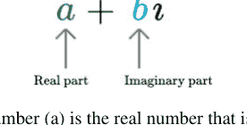

数字的实部（a）是加到纯虚数上的实数。
数字的虚部，即 b，是纯虚数的实数系数。
在 Python 中，字母 'j' 用于表示数字的虚部，例如：

```
c1 = 1j
c2 = 2j
print('c1:', c1, ', c2:', c2)
print(type(c1))
print(c1.real)
print(c1.imag)
```

我们可以运行这段代码，输出将是：

```
c1: 1j , c2: 2j
<class 'complex'>
0.0
1.0
```

如你所见，数字的类型是 'complex'，当直接打印数字时，它会同时打印实部和虚部。
如果这让你感到困惑，请不要担心；除非你正在进行一些非常特定的编码，例如在科学领域，否则你不太可能需要使用复数。

## 6.6 布尔值

Python 支持另一种称为布尔的类型；布尔类型只能是 True 或 False（没有其他值）。请注意，这些值是 True（首字母大写 T）和 False（首字母大写 F）；Python 中的 true 和 false 不是同一回事，本身没有意义。
布尔值的等效类是 bool，类似于 int 或 float 类。

以下示例说明了将两个布尔值存储到变量 all_ok 中：

```
all_ok = True
print(all_ok)
all_ok = False
print(all_ok)
print(type(all_ok))
```

输出如下：

```
True
False
<class 'bool'>
```

布尔类型实际上是整数的子类型（但只有 True 和 False 两个值），因此可以使用 `int()` 和 `bool()` 函数在两者之间轻松转换。例如：

```
print(int(True))
print(int(False))
print(bool(1))
print(bool(0))
```

产生：

```
1
0
True
False
```

你也可以将字符串转换为布尔值，只要字符串包含 True 或 False（且仅此而已）。例如：

```
status = bool(input('OK to proceed: '))
print(status)
print(type(status))
```

当我们运行这个：

```
OK to proceed: True
True
<class 'bool'>
```

## 6.7 算术运算符

算术运算符用于执行某种形式的数学运算，如加法、减法、乘法和除法等。在 Python 中，它们由一个或两个字符表示。下表总结了 Python 算术运算符：

| 运算符 | 描述 | 示例 |
| :--- | :--- | :--- |
| + | 将左右值相加 | 1 + 2 |
| - | 从左值中减去右值 | 3 - 2 |
| * | 将左右值相乘 | 3 * 4 |
| / | 左值除以右值 | 12 / 3 |
| // | 整数除法（忽略任何余数） | 12 // 3 |
| % | 取模（也称为余数运算符）—仅返回余数 | 13 % 3 |
| ** | 指数（或幂）运算符—左值提升到右值的幂 | 3 ** 4 |

### 6.7.1 整数运算

两个整数可以使用 + 相加，例如 10 + 5。同样，两个整数可以相减（10 – 5）和相乘（10 * 4）。整数之间的 +、– 和 * 等运算总是产生整数结果。
下面对此进行了说明：

```
home = 10
away = 15
print(home + away)
print(type(home + away))

print(10 * 4)
print(type(10*4))

goals_for = 10
goals_against = 7
print(goals_for - goals_against)
print(type(goals_for - goals_against))
```

输出如下：

```
25
<class 'int'>
40
<class 'int'>
3
<class 'int'>
```

然而，你可能注意到我们忽略了整数的除法，为什么呢？这是因为返回的类型实际上取决于你使用哪个除法运算符。

例如，如果我们用整数 100 除以 20，那么你可能合理预期的结果是 5；但实际上不是，它是 5.0：

```
print(100 / 20)
print(type(100 / 20))
```

输出是：

```
5.0
<class 'float'>
```

从这里你可以看到结果的类型是 `float`（即浮点数）。为什么会这样呢？

答案是除法不知道涉及的两个整数是否能整除（即是否有余数）。因此，它默认产生一个可以有小数部分的浮点数（或实数）。这在某些情况下当然是必要的，例如，如果我们用 3 除以 2：

```
res1 = 3/2
print(res1)
print(type(res1))
```

在这种情况下，3 不能被 2 整除，我们可以说 2 进入 3 一次，有余数。这就是 Python 所显示的：

```
1.5
<class 'float'>
```

结果是 2 进入 3，1.5 次，结果类型为 `float`。如果你只关心 2 进入 3 的次数，并且愿意忽略小数部分，那么有一个替代版本的除法运算符 `//`。这个运算符被称为整数除法运算符：

```
res1 = 3//2
print(res1)
print(type(res1))
```

产生：

```
1
<class 'int'>
```

但如果你只关心除法的余数部分，整数除法运算符已经丢失了它？那么在这种情况下，你可以使用取模运算（`%`）。这个运算符返回除法运算的余数：例如：

```
print('Modulus division 4 % 2:', 4 % 2)
print('Modulus division 3 % 2:', 3 % 2)
```

产生：

```
Modulus division 4 % 2: 0
Modulus division 3 % 2: 1
```

我们将要研究的最后一个整数运算符是幂运算符，可用于将整数提升到给定的幂，例如 5 的 3 次方。幂运算符是 '**'，下面对此进行了说明：

```
a = 5
b = 3
print(a ** b)
```

生成数字 125。

### 6.7.2 负数整数除法

同样值得探讨的是，当涉及负数时，整数除法和真除法会发生什么。例如，

```
print('True division 3/2:', 3 / 2)
print('True division -3/2:', -3 / 2)
print('Integer division 3//2:', 3 // 2)
print('Integer division -3//2:', -3 // 2)
```

输出如下：

```
True division 3/2: 1.5
True division -3/2: -1.5
Integer division 3//2: 1
Integer division -3//2: -2
```

根据我们之前的讨论，前三个可能完全符合你的预期；然而，最后一个示例的输出可能有点令人惊讶，为什么 3//2 生成 1 但 -3//2 生成 -2？

答案是 Python 总是将 *整数* 除法的结果向负无穷大（即可能的最小负数）舍入。这意味着它将整数除法的结果拉到尽可能小的数字，1 比 1.5 小，但 -2 比 -1.5 小。

### 6.7.3 浮点数运算符

我们还可以对浮点数使用乘法、减法、加法和除法运算。所有这些运算符都会产生新的浮点数：

```
print(2.3 + 1.5)
print(1.5 / 2.3)
print(1.5 * 2.3)
print(2.3 - 1.5)
print(1.5 - 2.3)
```

这些语句产生以下输出：

```
3.8
0.6521739130434783
3.4499999999999997
0.7999999999999998
-0.7999999999999998
```

### 6.7.4 整数和浮点数运算

任何涉及整数和浮点数的运算都将始终产生浮点数。也就是说，如果运算（如加法、减法、除法或乘法）的一侧是浮点数，那么结果将是浮点数。例如，给定整数 3 和浮点数 0.1，如果我们将它们相乘，那么我们将得到一个浮点数：

```
i = 3 * 0.1
print(i)
```

执行这个，我们得到

```
0.30000000000000004
```

这可能符合也可能不符合你的预期（你可能预期是 0.3）；然而，这突出了本章开头关于浮点数（或实数）在计算机系统中表示为近似值的评论。如果这是更大计算的一部分（例如计算一笔非常大的贷款在 10 年期间需要支付的利息金额），那么最终结果可能会有显著的偏差。

可以使用 Python 的一个模块（或库）来克服这个问题。例如，`decimal` 模块提供了 Decimal 类，它将适当地处理 3 和 0.1 的乘法。

### 6.7.5 复数运算符

当然，你可以对复数使用乘法、加法、减法和除法等运算符。例如：

## 6.8 赋值运算符

我们可以运行这段代码，输出结果将是：

```
(-2+0j)
```

你也可以使用 `complex()` 函数将另一个数字或字符串转换为复数。例如：

```
complex(1) # 生成 (1+0j)
```

此外，`math` 模块为复数提供了数学函数。

## 6.8 赋值运算符

在第3章中，我们简要介绍了赋值运算符（`=`），它用于将值赋给变量。实际上，还有几种不同的赋值运算符可以与数值一起使用。

这些赋值运算符实际上被称为*复合运算符*，因为它们将数值运算（如加法）与赋值运算符结合在一起。例如，`+=` 复合运算符是加法运算符和 `=` 运算符的组合，因此

```
x = 0
x += 1 # 与 x = x + 1 的行为相同
```

一些开发者喜欢使用这些复合运算符，因为它们写起来更简洁，并且可以被 Python 解释器更高效地解释。

下表列出了可用的复合运算符。

| 运算符 | 描述 | 示例 | 等价形式 |
| :--- | :--- | :--- | :--- |
| += | 将值加到左侧变量上 | x += 2 | x = x + 2 |
| -= | 从左侧变量中减去值 | x -= 2 | x = x - 2 |
| *= | 将左侧变量乘以该值 | x *= 2 | x = x * 2 |
| /= | 将变量值除以右侧值 | x /= 2 | x = x / 2 |
| //= | 使用整数除法将变量值除以右侧值 | x //= 2 | x = x // 2 |
| %= | 使用取模（余数）运算符将右侧值应用于变量 | x %= 2 | x = x % 2 |
| **= | 使用幂运算符将变量值提升到提供的值 | x **= 3 | x = x ** 3 |

## 6.9 None 值

Python 有一个特殊类型 `NoneType`，它只有一个值 `None`。
它用于表示空值或*无*。
它与 `False`、空字符串或 `0` 不同；它是一个*非值*。当你需要创建一个变量但没有初始值时，可以使用它。例如：

```
winner = None
```

然后你可以使用 `is` 和 `is not` 来测试 `None` 的存在，例如：

```
print(winner is None)
```

当且仅当变量 `winner` 当前被设置为 `None` 时，这将打印出 `True`。
或者你也可以写：

```
print(winner is not None)
```

这仅在 `winner` 的值*不是* `None` 时打印出 `True`。
下面给出了几个使用 `None` 值以及 `is` 和 `is not` 运算符的示例软件：

```
winner = None
print('winner:', winner)
print('winner is None:', winner is None)
print('winner is not None:', winner is not None)
print(type(winner))
print('Set winner to True')
winner = True
print('winner:', winner)
print('winner is None:', winner is None)
print('winner is not None:', winner is not None)
print(type(winner))
```

这段代码片段的输出是：

```
winner: None
winner is None: True
winner is not None: False
<class 'NoneType'>
Set winner to True
winner: True
winner is None: False
winner is not None: True
<class 'bool'>
```

## 6.10 在线资源

请参阅 Python 标准库文档：

- https://docs.python.org/3/library/stdtypes.html#numeric-types-int-float-complex 数值类型。
- https://docs.python.org/3/library/stdtypes.html#truth-value-testing 布尔值和布尔测试。
- https://docs.python.org/3/library/decimal.html 提供有关 Python decimal 模块的信息。
- https://docs.python.org/3/library/cmath.html 讨论复数的数学函数。

如果你对浮点数的表示方式感兴趣，那么一个好的起点是：

- https://en.wikipedia.org/wiki/Double-precision_floating-point-format 提供了浮点表示的概述。
- https://en.wikipedia.org/wiki/IEEE_754 是关于 IEEE 754 双精度浮点数格式的维基百科页面。

## 6.11 练习

本章练习的目的是探索我们一直在研究的数值类型。

### 6.11.1 通用练习

尝试探索 Python 中可用的不同数字类型。
你应该尝试使用不同的数值运算符，并混合使用不同的数字，例如，1 以及 1.0 等。
检查你得到的结果是否符合预期。

### 6.11.2 将公里转换为英里

本练习的目的是编写一个程序，将公里距离转换为英里距离。

1. 从用户处获取给定的公里距离输入。这可以使用 `input()` 函数完成。
2. 使用 `int()` 函数将 `input()` 函数返回的值从字符串转换为整数。
3. 现在将此值转换为英里——这可以通过将公里数除以 0.6214 来完成。
4. 打印一条消息，告诉用户公里数对应的英里数。

# 第7章 使用 if 语句进行流程控制

## 7.1 简介

在本章中，我们将探讨 Python 中的 if 语句。此语句用于根据某些条件控制程序中的执行流程。这些条件代表一些选择点，将被评估为 True 或 False。为了执行此评估，通常使用比较运算符（例如，检查温度是否大于某个阈值）。在许多情况下，这些比较需要考虑多个值，在这些情况下，可以使用逻辑运算符将两个或多个比较表达式组合在一起。本章首先介绍比较和逻辑运算符，然后讨论 if 语句本身。

## 7.2 比较运算符

在探索 if 语句和各种类型的循环机制之前，我们需要讨论*比较运算符*。这些是返回布尔值的运算符。它们是流程控制语句（如 if）条件元素的关键。
比较运算符是执行某种形式测试并返回 True 或 False 的运算符。
这些是我们日常生活中一直在使用的运算符。例如，我是否有足够的钱买午餐，或者这双鞋是否适合我的尺码等。

在 Python 中，有一系列比较运算符，通常由一个或两个字符表示。这些是：

| 运算符 | 描述 | 示例 |
| :--- | :--- | :--- |
| == | 测试两个值是否相等 | 3 == 3 |
| != | 测试两个值是否*不*相等 | 2 != 3 |
| < | 测试左侧值是否小于右侧值 | 2 < 3 |
| > | 测试左侧值是否大于右侧值 | 3 > 2 |
| <= | 测试左侧值是否小于*或*等于右侧值 | 3 <= 4 |
| >= | 测试左侧值是否大于或等于右侧值 | 5 >= 4 |

## 7.3 逻辑运算符

除了比较运算符，Python 还有逻辑运算符。
逻辑运算符可用于将布尔表达式组合在一起。通常，它们与比较运算符一起使用以创建更复杂的条件。同样，我们每天都在使用这些运算符，例如，我们可能会考虑是否买得起冰淇淋*以及*我们是否很快就要吃晚饭等。
Python 中有三个逻辑运算符，如下所列：

| 运算符 | 描述 | 示例 |
| :--- | :--- | :--- |
| and | 如果左右两侧都为真，则返回 True | (3 < 4) and (5 > 4) |
| or | 如果左侧或右侧为真，则返回 True | (3 < 4) or (3 > 5) |
| not | 如果被测试的值为假，则返回 True | not 3 < 2 |

## 7.4 If 语句

if 语句用作一种条件编程形式；这可能是你每天在现实世界中都会做的事情。也就是说，你需要决定是喝茶还是喝咖啡，或者决定早餐是吃吐司还是松饼等。在每种情况下，你都在做出选择，通常基于一些信息，比如我昨天喝了咖啡，所以今天我会喝茶。
在 Python 中，这样的选择通过 `if` 条件语句以编程方式表示。
在此构造中，如果某个条件为真，则执行某个操作；可选地，如果条件不为真，则可能执行其他操作。

### 7.4.1 使用 If 语句

If 语句最基本的形式是：

```
if <求值为布尔值的条件>:
    语句
```

请注意，条件必须求值为 True 或 False。如果条件为 True，那么我们将执行缩进的语句。

请注意缩进，这在 Python 中非常重要；实际上，代码的布局在 Python 中非常、非常重要。缩进用于确定一段代码应如何与另一段代码相关联。

让我们看一个简单的例子：

```
num = int(input('Enter a number: '))
if num < 0:
    print(num, 'is negative')
```

在这个例子中，用户输入了一个数字；如果它小于零，一条说明此情况的消息将被打印给用户。如果数字是正数；那么将不会有任何输出。

例如：

```
Enter a number: -1
-1 is negative
```

如果我们希望在条件为真时执行多条语句，我们可以缩进多行；实际上，if 语句后所有缩进到同一级别的行都将自动成为其一部分。例如：

```
num = int(input('Enter another number: '))
if num > 0:
    print(num, 'is positive')
    print(num, 'squared is ', num * num)
print('Bye')
```

如果我们现在运行这个程序并输入 2，那么我们将看到：

```
Enter another number: 2
2 is positive
2 squared is 4
Bye
```

然而，如果我们输入值 -1，那么我们得到：

```
Enter another number: -1
Bye
```

请注意，缩进的行都没有被执行。

这是因为这两行缩进的行与 if 语句相关联，并且只有在布尔条件求值（返回）为 True 时才会被执行。然而，语句 `print('Bye')` 不是 if 语句的一部分；它只是在 if 语句（及其相关的 `print()` 语句）执行完毕后要执行的下一条语句。

### 7.4.2 If 语句中的 Else

我们还可以定义 *if* 语句的 *else* 部分；这是一个可选元素，可以在 *if* 语句的条件部分返回 `False` 时运行。例如：

```
num = int(input('Enter yet another number: '))
if num < 0:
    print('Its negative')
else:
    print('Its not negative')
```

现在，当这段代码执行时，如果输入的数字小于零，那么第一个 `print()` 语句将被运行，否则（else）第二个 `print()` 语句将被运行。然而，我们*保证*至少有一个（且最多一个）`print()` 语句会执行。

例如，在第一次运行中，如果我们输入值 1：

```
Enter yet another number: 1
Its not negative
```

在第二次运行中，如果我们输入值 -1：

```
Enter yet another number: -1
Its negative
```

### 7.4.3 elif 的使用

在某些情况下，你可能想要测试多个条件，每个条件都在前一个条件失败时进行测试。Python 中的 *if* 语句的 `elif` 元素支持这种 *else-if* 场景。

*if* 语句的 `elif` 元素跟在 *if* 部分之后，并在任何（可选的）*else* 部分之前。它的格式是：

```
elif <求值为布尔值的条件>:
    语句
```

例如：

```
savings = float(input("Enter how much you have in savings: "))
if savings == 0:
    print("Sorry no savings")
elif savings < 500:
    print('Well done')
elif savings < 1000:
    print('Thats a tidy sum')
elif savings < 10000:
    print('Welcome Sir!')
else:
    print('Thank you')
```

如果我们运行这个：

```
Enter how much you have in savings: 500
Thats a tidy sum
```

在这里我们可以看到第一个 if 条件失败了（因为 savings 不等于 0）。然而，下一个 elif 也必须返回了 False，因为 savings 大于 500。事实上，是第二个 elif 语句返回了 True，因此相关的 `print('Thats a tidy sum')` 语句被执行了。执行完这条语句后，if 语句就终止了（剩余的 elif 和 else 部分被忽略）。

## 7.5 嵌套 if 语句

可以将一个 if 语句嵌套在另一个 if 语句内部。术语“嵌套”表示一个 if 语句位于另一个 if 语句的某部分内部，可用于细化程序的条件行为。
下面给出一个例子。请注意，它允许在嵌套的 if 语句执行/运行之前和之后执行某些行为。还要注意，缩进在这里是关键，因为这是 Python 判断 if 语句是否嵌套的方式。

```
snowing = True
temp = -1
if temp < 0:
    print('It is freezing')
    if snowing:
        print('Put on boots')
    print('Time for Hot Chocolate')
print('Bye')
```

在这个例子中，如果温度低于零，那么我们将进入 if 代码块。如果不低于零，我们将跳过整个 If 语句，并跳转到两个 If 语句之后的 `print('Bye')` 语句。
在这种情况下，温度设置为 -1，因此我们将进入 if 语句。然后我们将打印出 'It is freezing' 字符串。此时，另一个 if 语句嵌套在第一个 if 语句内部。现在将检查是否在下雪。注意 snowing 本身已经是一个布尔值，因此它将是 True 或 False，这说明一个布尔值本身可以在这里使用。
由于正在下雪，我们将打印出 'Put on boots'。
然而，打印 'Time for Hot Chocolate' 的语句不是嵌套 if 的一部分。它是外部 if 的一部分（这就是缩进重要的地方）。如果你希望它只在正在下雪时才打印出来，那么它必须缩进到与嵌套 if 块中第一条语句相同的级别，例如：

```
snowing = True
temp = -1
if temp < 0:
    print('It is freezing')
    if snowing:
        print('Put on boots')
        print('Time for Hot Chocolate')
print('Bye')
```

这现在将内部（或嵌套）if 更改为有两条 print 语句与之关联。
这可能看起来很微妙，但它是 Python 如何使用布局将各个语句链接在一起的*关键*。

## 7.6 If 表达式

If 表达式是 *if* 语句的一种简写形式，它返回一个值。实际上，编程语言中表达式和语句的区别就在于此；表达式返回一个值；语句不返回。
根据某些条件将特定值赋给变量是很常见的。例如，如果我们想判断某人是否是青少年，那么我们可能会检查他们是否大于 12 岁且小于 20 岁。我们可以这样写：

```
age = 15
status = None
if (age > 12) and age < 20:
    status = 'teenager'
else:
    status = 'not teenager'
print(status)
```

如果我们运行这个，我们会打印出字符串 'teenager'。
然而，这相当长，而且可能并不明显这段代码的真正意图是为 *status* 赋予一个适当的值。
另一种选择是 *if 表达式*。if 表达式的格式是：

```
<结果1> if <条件满足> else <结果2>
```

也就是说，if 表达式返回的结果是第一个值，除非条件失败，在这种情况下，返回的结果将是 else 之后的值。起初可能看起来令人困惑，但当你看到一个例子时，它会变得更容易。

例如，使用 if 表达式，我们可以执行一个测试来确定要赋给 `status` 的值，并将其作为 if 表达式的结果返回。例如：

```
status = 'teenager' if age > 12 and age < 20 else 'not teenager'
print(status)
```

同样，打印出的结果是 'teenager'，但现在代码更加简洁，并且清楚地表明测试的目的是确定要赋给 `status` 的结果。

## 7.7 关于 True 和 False 的说明

Python 在表示 `True` 和 `False` 的实际内容方面实际上相当灵活，事实上，适用以下规则。

- 0、''（空字符串）、None 等同于 False。
- 非零、非空字符串、任何对象等同于 True。

然而，我们建议只使用 `True` 和 `False`，因为这通常是一种更清晰、更安全的方法。

## 7.8 提示

在 Python 中需要非常小心的一件事是布局。
与 Java 和 C# 等语言不同，你程序的布局是*你程序的一部分*。它决定了语句如何相互关联，以及像 if 语句这样的控制流元素如何影响哪些语句被执行。
另外，要小心 `if` 语句及其对 ':' 字符的使用。这个字符对于将 `if` 语句的条件部分与将根据条件是 `True` 还是 `False` 而执行的语句分开至关重要。

## 7.9 在线资源

请参阅 Python 标准库文档：

- https://docs.python.org/3/library/stdtypes.html#boolean-operations-and-or-not 布尔运算。
- https://docs.python.org/3/library/stdtypes.html#comparisons 比较运算符。
- https://docs.python.org/3/tutorial/controlflow.html 在线 Python 控制流教程。

## 7.10 练习

本节包含三个不同的练习，你可以选择感兴趣的练习，或者完成全部三个。

### 7.10.1 检查输入是正数还是负数

本练习的目标是编写一个小程序，测试一个整数是正数还是负数。
你的程序应该：

1.  提示用户输入一个数字（使用 `input()` 函数）。你可以假设输入是某种数字。
2.  使用 `int()` 函数将字符串转换为整数。
3.  现在检查该整数是正数还是负数。
4.  你还可以添加一个测试来检查数字是否为零。

### 7.10.2 测试数字是奇数还是偶数

本练习要求你编写一个程序，从用户那里获取输入，并确定该数字是奇数还是偶数。同样，你可以假设用户会输入一个有效的整数。
向用户打印一条消息，让他们知道结果。
要测试一个数字是否为偶数，你可以使用

```
(num % 2) == 0
```

如果数字是偶数，它将返回 `True`（注意括号是可选的，但使代码更易读）。

### 7.10.3 公里到英里转换器

在本练习中，你应该回到上一章编写的公里到英里转换器。
我们将为你的程序添加几个新的测试：

1.  修改你的程序，使其验证用户输入的是正距离（即，他们不能输入负数）。
2.  现在修改你的程序，验证输入是否为数字；如果不是数字，则不做任何操作；否则将距离转换为英里。

要检查字符串是否只包含数字，可以使用 `isnumeric()` 方法，例如 `'42'.isnumeric()`；如果字符串只包含数字，则返回 `True`。请注意，此方法仅适用于正整数；但对于本示例来说已经足够。

# 第8章
迭代/循环

## 8.1 简介

本节我们将探讨 Python 中可用的 `while` 循环和 `for` 循环。这些循环用于控制选定语句的重复执行。while 循环通常被称为条件循环，因为它会在某个条件为真时继续循环。for 循环通常被称为计数循环，因为它会循环特定的次数。

## 8.2 While 循环

`while` 循环几乎存在于所有编程语言中，用于迭代（或重复）一个或多个代码语句，只要测试条件（表达式）为真。这种迭代结构通常在我们不知道需要重复执行代码块多少次时使用。例如，它可能需要重复直到找到某个解决方案或用户输入特定值。
while 循环的行为如下图所示。

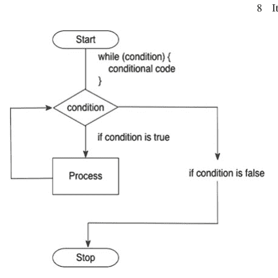

Python while 循环的基本形式是：

```
while <test-condition-is-true>:
    statement or statements
```

如图所示以及从代码中可以推断出的；*当*测试条件/表达式为 `True` 时，while 循环中的语句或语句块将被执行。

请注意，测试是在每次迭代*之前*执行的，包括第一次迭代；因此，如果条件在第一次循环时就失败，语句或语句块可能根本不会被执行。

与 `if` 语句一样，缩进在这里是关键，因为包含在 while 语句中的语句是由缩进决定的。在 while 条件之后缩进到相同级别的每条语句都是 `while` 循环的一部分。

然而，一旦某条语句不再遵循 `while` 块，它就不再是 `while` 循环的一部分，其执行也不再受测试条件的控制。

以下展示了 Python 中一个 `while` 循环的示例：

```
count = 0
print('Starting')
while count < 10:
    print(count, ' ', end="") # while 循环的一部分
    count += 1                 # 也是 while 循环的一部分
print() # 不是 while 循环的一部分
print('Done')
```

在这个例子中，当某个变量 `count` 小于值 10 时，`while` 循环将继续迭代（将被重复）。`while` 循环本身包含两条语句：一条打印 `count` 变量的值，另一条递增 `count`（记住 `count += 1` 等同于 `count = count + 1`）。

我们使用了 `print()` 的版本，它在打印值时不打印回车符（这通过传递给 `print()` 函数的 `end = ''` 选项表示）。

运行此示例的结果是：

```
Starting
0 1 2 3 4 5 6 7 8 9
Done
```

如你所见，打印起始和完成消息的语句只运行一次。然而，打印 `count` 变量的语句运行了 10 次（打印出值 0 到 9）。

一旦 `count` 的值等于 10，循环就结束（或终止）。

请注意，我们需要在循环之前初始化 `count` 变量。这是因为 `while` 循环的第一次迭代需要它有一个值。也就是说，在 `while` 循环执行任何操作之前，程序需要已经知道 count 的第一个值，以便执行第一次测试。这是 while 循环行为的一个特点。

## 8.3 For 循环

在许多情况下，我们知道希望迭代一个或多个语句多少次（正如我们在上一节中所做的那样）。虽然 `while` 循环可以用于这种情况，但 `for` 循环是一种更简洁的方式。通常，对于另一个程序员来说，循环必须迭代特定次数也更清晰。

`for` 循环用于让一个*变量*遍历一系列值，直到满足给定的测试。`for` 循环的行为如下图所示。

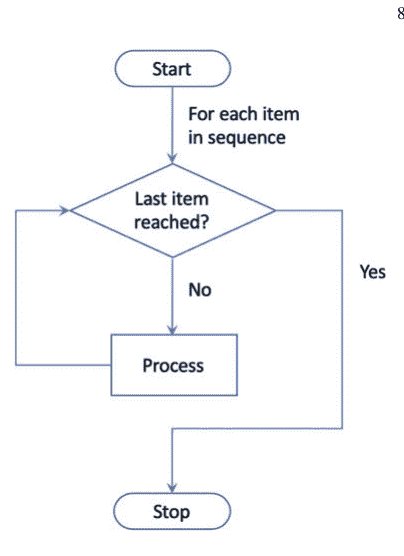

此流程图显示，将使用某个值序列（例如，0 到 9 之间的所有整数值）来迭代要处理的代码块。当到达序列中的最后一项时，循环将终止。

许多语言都有如下形式的 `for` 循环：

```
for i = from 0 to 10
    statement or statements
```

在这种情况下，变量 `i` 将取值 0, 1, 2, 3 等，直到 10。

### 8.3.1 Python for 循环

在 Python 中，方法略有不同，因为从 0 到 10 的值由一个 `range` 表示。这实际上是一个函数，它将生成用作 `for` 循环中序列的值的 `range`。这是因为 Python for 循环非常灵活，不仅可以循环整数值范围，还可以循环数据结构（如整数或字符串列表）中保存的一组值。我们将在后面章节讨论数据集合/容器时再回到 for 循环的这个特性。

使用值范围时，Python `for` 循环的格式是

```
for <variable-name> in range(...):
    statement
    statement
```

下面显示了一个示例，它等同于我们之前看过的 while 循环：

```
# 循环遍历范围中的一组值
print('Print out values in a range')
for i in range(0, 10):
    print(i, ' ', end='')
print()
print('Done')
```

当我们运行这段代码时，输出是：

```
Print out values in a range
0 1 2 3 4 5 6 7 8 9
Done
```

从上面可以看出；最终结果是我们生成了一个 `for` 循环，它产生与之前 `while` 循环相同的一组值。然而，

- 代码更简洁。
- 很清楚我们正在处理从 0 到 9 的值范围（注意它是到但不包括最后一个值）。
- 我们不需要先定义循环变量。

出于这些原因，`for` 循环在程序中通常比 `while` 循环更常见。

请注意，Python for 循环可以描述为左闭右开。也就是说，第一个数字包含在范围内（它是开放的），但最后一个数字不包含在范围内（它是封闭的），因此指定 `range(0, 10)` 实际上创建了从 0 到 9 的数字范围——它不包括数字 10。

### 8.3.2 按非默认增量循环

你可能注意到的一点是，在 while 循环中，我们并不局限于将计数变量递增 1（我们只是碰巧这样做）。例如，我们本可以决定每次循环将计数递增 2（一个非常常见的想法）。事实上，`range` 允许我们做到这一点；可以提供给 `range` 函数的第三个参数是每次循环循环变量递增的值，例如：

```
# 现在使用范围中的值，但增量为 2
print('Print out values in a range with an increment of 2')
for i in range(0, 10, 2):
    print(i, ' ', end='')
```

## 8.3.3 匿名循环变量

for 循环的一个有趣变体是使用通配符（`_`）代替循环变量；如果你只关心循环特定次数，而不关心循环计数器本身的值，这会很有用，例如：

```python
# Now use an 'anonymous' loop variable
for _ in range(0,10):
    print('.', end='')
print()
```

在这种情况下，我们并不关心 `range` 生成的值本身，只关心循环 10 次；因此记录循环变量没有好处。循环变量由下划线字符（`_`）表示。
请注意，实际上这是一个有效的变量，可以在循环内引用；然而，按照惯例，它被视为匿名变量。

## 8.4 负循环

通过将循环增量设置为负数，也可以从较大的数字循环到较小的数字。例如：

```python
for i in range(10, 0, -1):
    print(f'{i},', end='')
print()
```

这个循环将从 10 倒数到零。然而，由于 Python 的 for 循环是*左闭右开*的，这意味着数字 10 会被包含，但数字零不会被包含。表达式 `range(10, 0)` 实际上创建了一个从 10 到 1 的数字范围——它不包含零。因此，此代码片段的输出为：

```
10,9,8,7,6,5,4,3,2,1,
```

## 8.5 Break 循环语句

Python 允许程序员决定是否要提前跳出循环（无论我们使用的是 `for` 循环还是 `while` 循环）。这是通过 `break` 语句完成的。

`break` 语句允许开发者根据某些可能无法提前预测的标准（例如，可能基于某些用户输入）来改变循环的正常周期。

`break` 语句执行时，将终止当前循环，并将程序跳转到循环后的第一行。下图展示了 for 循环的工作原理：

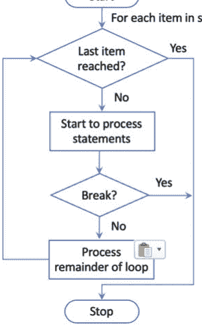

通常，会在 `break` 上放置一个守卫语句（`if` 语句），以便在适当时有条件地应用 `break` 语句。

下面展示了一个简单的应用，其中要求用户输入一个数字，该数字可能在也可能不在 `for` 循环定义的范围内。如果数字在范围内，我们将循环直到达到该值，然后中断循环（即提前终止，不处理循环中的其余值）：

```python
print('Only print code if all iterations completed')
num = int(input('Enter a number to check for: '))
for i in range(0, 6):
    if i == num:
        break
    print(i, ' ', end='')
print('Done')
```

如果我们运行此程序并输入值 7（超出范围），则应打印出循环中的所有值：

```
Enter a number to check for: 7
0 1 2 3 4 5 Done
```

但是，如果我们输入值 3，则在循环中断（提前终止）之前，只会打印出值 0、1 和 2：

```
Enter a number to check for: 3
0 1 2 Done
```

请注意，在这两种情况下都会打印字符串 'Done'，因为它是 `for` 循环之后的第一行，没有缩进，因此不属于 `for` 循环的一部分。

请注意，`break` 语句可以出现在与循环结构（无论是 `for` 循环还是 `while` 循环）关联的代码块中的任何位置。这意味着它的前面和后面都可以有语句。

## 8.6 Continue 循环语句

`continue` 语句也会影响 `for` 和 `while` 循环结构内的控制流。但是，它不会终止整个循环；它只终止当前的循环迭代。这允许你跳过循环迭代中某个特定值的部分，然后继续处理序列中的其余值。

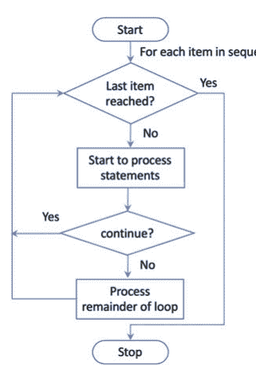

可以使用守卫（if 语句）来确定何时应执行 `continue` 语句。

与 `break` 语句一样，`continue` 可以出现在循环结构主体内的任何位置。这意味着你可以有一些语句在序列的每个值上执行，而另一些语句仅在 `continue` 语句未运行时执行。

如下所示。在此程序中，`continue` 语句仅对奇数执行，因此两个 `print()` 语句仅在 `i` 的值为偶数时运行：

```python
for i in range(0, 10):
    print(i, ' ', end='')
    if i % 2 == 1:
        continue
    print('hey its an even number')
    print('we love even numbers')
print('Done')
```

当我们运行此代码时，得到

```
0 hey its an even number
we love even numbers
1 2 hey its an even number
we love even numbers
3 4 hey its an even number
we love even numbers
5 6 hey its an even number
we love even numbers
7 8 hey its an even number
we love even numbers
9 Done
```

如你所见，我们仅在值为 0、2、4、6 和 8 时打印关于数字为偶数的消息。

## 8.7 带 Else 的 For 循环

for 循环可以在循环末尾有一个可选的 else 块。当且仅当序列中的所有项目都被处理时，else 部分才会执行。如果由于某种原因程序中发生错误（例如，语法错误）或者你中断了循环，for 循环可能无法处理循环中的所有元素。
这是一个带 else 部分的 for 循环示例：

```python
# Only print code if all iterations completed over a list
print('Only print code if all iterations completed')
num = int(input('Enter a number to check for: '))
for i in range(0, 6):
    if i == num:
        break
    print(i, ' ', end='')
else:
    print()
    print('All iterations successful')
```

如果我们运行此代码并输入整数值 7 作为要检查的数字，则 else 块会执行，因为 for 语句中的 if 测试永远不为 True，因此循环永远不会中断，所有值都被处理：

```
Only print code if all iterations completed
Enter a number to check for: 7
0 1 2 3 4 5
All iterations successful
```

但是，如果我们输入值 3 作为要检查的数字；那么当循环变量 'i' 的值为 3 时，if 语句将为 True；因此循环只会处理值 0、1 和 2。在这种情况下，else 部分不会执行，因为并非序列中的所有值都被处理：

```
Only print code if all iterations completed
Enter a number to check for: 3
0 1 2
```

## 8.8 关于循环变量命名的说明

在本书前面我们说过，变量名应该是有意义的，像 'a' 和 'b' 这样的名称通常不是一个好主意。这个规则的一个例外与 for 循环中使用的循环变量名有关。通常会发现这些循环变量被称为 'i'、'j' 等。

这是一个非常常见的惯例，如果一个变量被称为 'i' 或 'j'，人们会期望它是一个循环变量。因此，

- 你应该考虑在循环结构中使用这些变量名，
- 避免在其他地方使用它们。

但这确实提出了一个问题，为什么是 'i' 和 'j'；答案是这一切都源于一种名为 Fortran 的编程语言，该语言最早开发于 1950 年代。在这种编程语言中，循环变量必须被称为 'i'、'j' 等。Fortran 在数学和科学编程中如此普遍，其中循环几乎是*必不可少的*，以至于这已成为其他没有此限制的语言中的惯例。

## 8.9 骰子游戏

以下简短程序说明了如何使用 while 循环来控制主代码体的执行。在这个游戏中，我们将继续掷一对骰子，直到用户表示他们不想再掷为止。当这种情况发生时，while 循环将终止：

```python
import random

MIN = 1
MAX = 6

roll_again = 'y'

while roll_again == 'y':
    print('Rolling the dices...')
    print('The values are....')
    dice1 = random.randint(MIN, MAX)
    print(dice1)
    dice2 = random.randint(MIN, MAX)
    print(dice2)
    roll_again = input('Roll the dices again? (y / n): ')
```

当我们运行此程序时，会显示掷两个骰子的结果。程序将继续循环并打印出两个骰子的值，直到用户表示他们不再想掷骰子：

```
Rolling the dices...
The values are....
```

2
6
再次掷骰子吗？（y / n）：y
正在掷骰子...
数值为....
4
1
再次掷骰子吗？（y / n）：y
正在掷骰子...
数值为....
3
6
再次掷骰子吗？（y / n）：n

## 8.10 在线资源

请参阅 Python 标准库文档，了解：

- https://docs.python.org/3/tutorial/controlflow.html 在线 Python 流程控制教程。

## 8.11 练习

本章有两个练习。第一个练习需要一个简单的 `for` 循环，而第二个更复杂，需要嵌套的 `for` 循环和一个 `break` 语句。

### 8.11.1 计算一个数的阶乘

编写一个程序，能够找到任何给定数字的阶乘。例如，找到数字 5 的阶乘（通常写作 5!），即 1 * 2 * 3 * 4 * 5，等于 120。

负数的阶乘没有定义，零的阶乘是 1；即 0! = 1。

你的程序应该接受用户输入的一个整数（你可以重用上一章的逻辑，使用 `isnumeric()` 来验证他们是否输入了一个正整数值）。

你应该：

1.  如果数字小于零，返回一条错误信息。
2.  检查数字是否为零——如果是，那么答案就是 1——打印出来。
3.  否则，使用一个循环来生成结果并打印出来。

### 8.11.2 打印一个范围内的所有质数

质数是一个大于 1 的正整数，除了数字 1 和它本身之外没有其他除数。
也就是说，它只能被它自己和数字 1 整除；例如数字 2、3、5 和 7 是质数，因为它们不能被任何其他整数整除。然而，数字 4 和 6 不是质数，因为它们都可以被数字 2 整除；此外，数字 6 也可以被数字 3 整除。
你应该编写一个程序，从 1 开始计算质数，直到用户输入的值。
如果用户输入的数字小于 2，打印一条错误信息。
对于任何大于 2 的数字，循环遍历从 2 到该数字的每个整数，并确定它是否能被另一个数字整除（你可能需要两个 `for` 循环；一个嵌套在另一个内部）。
对于不能被任何其他数字整除的每个数字（即它是质数），将其打印出来。

# 第 9 章
猜数字游戏

## 9.1 简介

在本章中，我们将把到目前为止所学的一切结合起来，创建一个简单的猜数字游戏。
这将涉及创建一个新的 Python 程序、处理用户输入、使用 `if` 语句以及使用循环结构。
我们还将首次使用一个额外的库或模块，该模块默认情况下并非你的程序所默认可用；这将是随机数生成器模块。

## 9.2 设置程序

我们希望确保不会覆盖你到目前为止所做的任何工作，并且我们希望这个 Python 程序与你的其他工作分开。因此，我们将创建一个新的 Python 文件来保存这个程序。当然，你不必为此使用 PyCharm，但我们将假设你使用的是；如果你使用的是不同的编辑器或 IDE，你可能需要查找等效的步骤。

### 9.2.1 创建一个新的 Python 文件

我们将创建一个新的 Python 文件来保存你的程序。为此，请在左侧视图中选择项目节点。选择后，使用鼠标右键菜单。在此菜单上，选择“New”，然后选择“Python File”，如下所示：

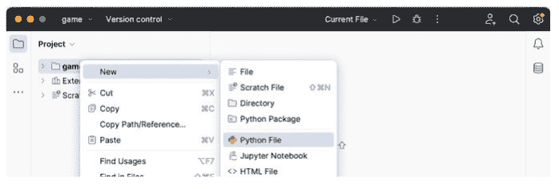

当你这样做时，系统会提示你提供程序文件的名称；你可以随意命名该文件，但我使用名称“number_guess_game”，因为它具有描述性，并且可以帮助我稍后再次找到此文件：

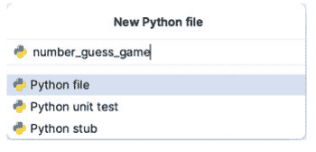

现在点击“OK”，注意我不需要在文件名末尾添加 `.py`；PyCharm 会为我完成（如果你添加了 `.py`，别担心，PyCharm 也会处理好的）。

### 9.2.2 添加欢迎消息

为确保一切正常工作，我们将在文件中添加一个简单的 `print()` 语句，以便我们可以测试运行它。
你可以添加任何你喜欢的内容，包括打印“Hello World”，然而下面显示的示例展示了一个可以在游戏开始时使用的欢迎消息：


### 9.2.3 运行程序

我们现在可以运行我们最初的程序了。为此，我们可以在左侧视图中选择该文件，并使用鼠标右键菜单选择“Run”选项。或者，你可以点击编辑器窗口上方右上角栏中的绿色箭头按钮，只要其旁边显示“Current file”选项：


当我们这样做时，Python 控制台将在 IDE 底部打开，并显示输出：


从现在开始，你只需点击 PyCharm 右上角的小绿色箭头即可重新运行 `number_guess_game` 程序（它允许你重新运行 PyCharm 执行的最后一个程序）。

## 9.3 程序将做什么？

我们的猜数字游戏的目标是猜出程序想出的数字。
程序的主要流程如下图所示：


本质上，程序逻辑是：

-   程序随机选择一个 1 到 10 之间的数字。
-   然后它会要求玩家输入他们的猜测。
-   然后它会检查该数字是否与计算机随机生成的数字相同；如果相同，则玩家获胜。
-   如果玩家的猜测不同，那么它会检查该数字是高于还是低于猜测值，并告诉玩家。
-   玩家将有 4 次机会正确猜出数字；如果他们在此次数内没有猜出数字，他们将被告知输了游戏，并被告知实际数字是什么。

## 9.4 创建游戏

### 9.4.1 生成随机数

我们将首先研究如何生成随机数。到目前为止，我们只使用了 Python 自动提供的内置函数。实际上，Python 附带了许多由 Python 组织本身、第三方供应商和开源（通常是免费的）软件社区提供的模块。

Python 的 `random` 模块或库是作为默认环境的一部分随 Python 提供的；但其中的函数不会自动加载或提供给程序员。这部分是因为 Python 提供了如此多的功能，可能会让人应接不暇；因此，在大多数情况下，Python 默认只提供最常用的功能。然后，程序员可以明确指定他们何时想使用其他库或模块中的某些功能。

`random` 模块提供了伪随机数生成器的实现，用于应用程序。这些随机数生成器被称为*伪*随机数，因为计算机很难真正生成一系列随机数；相反，它尽最大努力使用算法来模拟这一点；而算法本质上基于某种逻辑，这意味着预测下一个数字并非不可能——因此它不是真正的随机数。对于我们的目的来说，这没问题，但在某些应用中，如安全和加密，这可能是一个真正的问题。

要在 Python 中访问 `random` 模块，你需要*导入*它；这使得该模块在 Python 文件的其余部分（在我们的例子中是我们的程序）中可见。这是通过以下方式完成的：

```python
import random
number_to_guess = random.randint(1, 10)
```

一旦我们导入了它，我们就可以使用此模块中的函数，例如 `randint`。此函数返回一个介于第一个和第二个值参数之间的随机整数。在上面的示例中，这意味着生成的随机数将在 1 到 10 之间（包含 1 和 10）。

变量 `number_to_guess` 现在将保存一个整数，游戏玩家必须猜出这个整数。

### 9.4.2 从用户获取输入

我们现在需要从用户那里获取代表他们猜测的输入。我们已经在前面的章节中看到了如何做到这一点；我们可以使用 `input()` 函数，该函数返回一个字符串，然后使用整数函数将该字符串转换为整数（此处我们暂不进行错误检查，以确保用户输入的是数字）。因此我们可以这样写：

```
guess = int(input('Please guess a number between 1 and 10: '))
```

这会将用户猜测的数字存储到变量 `guess` 中。

## 9.4.3 检查玩家是否猜中数字

现在我们需要检查玩家是否猜中了正确的数字。我们可以使用 `if` 语句来实现，但考虑到我们需要重复这个测试，直到玩家猜中或者用完所有猜测机会，因此我们将使用 `while` 循环来检查他们的猜测是否等于待猜数字：

```
guess = int(input('Please guess a number between 1 and 10: '))
while number_to_guess != guess:
```

如果用户输入的数字与待猜数字不匹配，上述循环将重复执行。因此我们可以打印一条消息，告诉玩家他们的猜测是错误的：

```
guess = int(input('Please guess a number between 1 and 10: '))
while number_to_guess != guess:
    print('Sorry wrong number')
```

现在我们需要让玩家再次猜测，否则程序将永远不会终止，因此我们可以再次提示他们输入数字：

```
guess = int(input('Please guess a number between 1 and 10: '))
while number_to_guess != guess:
    print('Sorry wrong number')
    # 待补充 ...
    guess = int(input('Please guess again: '))
```

## 9.4.4 检查是否超出最大猜测次数

我们之前也提到过，玩家不能无限次猜测；他们必须在4次机会内猜中正确的数字。因此我们需要添加一些逻辑，在超出这个次数后停止游戏。我们需要一个变量来跟踪他们已经尝试的次数。

我们应该给这个变量起一个有意义的名字，以便我们知道它代表什么，例如我们可以称它为 `count_number_of_tries` 并将其初始化为1：

```
count_number_of_tries = 1
```

这需要在进入 `while` 循环之前完成。
在 while 循环内部，我们需要做两件事：

- 检查是否已超出尝试次数，
- 如果他们仍然被允许玩游戏，则增加尝试次数。

我们将使用 `if` 语句来检查是否已达到尝试次数；如果达到，我们希望终止循环；最简单的方法是使用 `break` 语句。

```
if count_number_of_tries == 4:
    break
```

如果我们没有跳出循环，我们可以使用 `+=` 运算符来增加计数。因此我们现在有：

```
count_number_of_tries = 1
guess = int(input('Please guess a number between 1 and 10: '))
while number_to_guess != guess:
    print('Sorry wrong number')
    if count_number_of_tries == 4:
        break
    # 待补充 ...
    guess = int(input('Please guess again: '))
    count_number_of_tries += 1
```

## 9.4.5 通知玩家猜测结果是偏高还是偏低

我们在开头也提到过，为了方便玩家猜测数字；我们应该指出他们的猜测是高于还是低于实际数字。为此，我们可以再次使用 `if` 语句；如果猜测偏低，我们打印一条消息，如果偏高，我们打印另一条。

此时我们面临一个选择：是使用一个单独的 `if` 语句来判断是否达到最大次数，还是在那个语句上扩展一个 `elif`。两种方法都可以，但后者表明这些条件都是相关的，因此我们将使用后者。

while 循环现在看起来像这样：

```
count_number_of_tries = 1
guess = int(input('Please guess a number between 1 and 10: '))
while number_to_guess != guess:
    print('Sorry wrong number')
    if count_number_of_tries == 4:
        break
    elif guess < number_to_guess:
        print('Your guess was lower than the number')
    else:
        print('Your guess was higher than the number')
    guess = int(input('Please guess again: '))
    count_number_of_tries += 1
```

注意 if 语句有一个最终的 else，表示猜测偏高；这是可以的，因为到此时这是唯一剩下的选项。

## 9.4.6 游戏结束状态

我们现在已经涵盖了游戏进行中可能发生的所有情况；剩下要做的就是处理游戏结束的消息。
如果玩家猜中了数字，我们想祝贺他们；如果他们没有猜中，我们想让他们知道实际数字是什么。我们将使用另一个 if 语句来检查玩家是否猜中了数字。之后我们将打印一条游戏结束消息：

```
if number_to_guess == guess:
    print('Well done you won!')
    print('You took', count_number_of_tries,
          'goes to complete the game')
else:
    print('Sorry - you loose')
    print('The number you needed to guess was',
          number_to_guess)
print('Game Over')
```

## 9.5 完整代码清单

为便于参考，完整代码清单如下：

```
import random

print('Welcome to the number guess game')

# 初始化待猜数字
number_to_guess = random.randint(1,10)

# 初始化玩家已尝试次数
count_number_of_tries = 1

# 获取他们的初始猜测
guess = int(input('Please guess a number between 1 and 10: '))
while number_to_guess != guess:
    print('Sorry wrong number')

    # 检查是否超出最大尝试次数
    # 如果超出则跳出循环，否则给用户一些反馈
    if count_number_of_tries == 4:
        break
    elif guess < number_to_guess:
        print('Your guess was lower than the number')
    else:
        print('Your guess was higher than the number')

    # 获取他们的下一次猜测并增加尝试次数
    guess = int(input('Please guess again: '))
    count_number_of_tries += 1

# 检查他们是否猜中了正确的数字
if number_to_guess == guess:
    print('Well done you won!')
    print('You took', count_number_of_tries, 'goes to complete the game')
else:
    print("Sorry - you loose")
    print('The number you needed to guess was', number_to_guess)

print('Game Over')
```

程序的示例运行如下所示：

```
Welcome to the number guess game
Please guess a number between 1 and 10: 5
Sorry wrong number
Your guess was higher than the number
Please guess again: 3
Sorry wrong number
Your guess was lower than the number
Please guess again: 4
Well done you won!
You took 3 goes to complete the game
Game Over
```

## 9.6 提示

### 9.6.1 初始化变量

在 Python 中，不需要在赋值之前声明变量；然而，在引用它之前，有必要给它一个初始值。这里 *引用它* 指的是获取变量持有的值。例如

```
count = count + 1
```

这句话的意思是获取 `count` 持有的值，将其加1，然后将新值存回 `count`。
如果在尝试执行此操作之前 `count` 没有值，那么你就是在试图获取一个空值并给它加1；这是无法做到的，因此你的程序中会产生一个错误，例如：

```
NameError: name 'count_number_of_tries' is not defined
```

对于以下情况也是如此：

```
count += 1
```

请记住，这只是 `count = count + 1` 的简写形式，因此仍然依赖于 `count` 在此语句之前具有一个值。
这就是为什么我们需要在使用 `count_number_of_tries` 变量之前对其进行初始化。

### 9.6.2 代码块中的空行

你可能已经注意到，在这个例子中，我们使用了空行来将某些代码行分组在一起。这是为了使代码更易于阅读，在 Python 中是完全允许的。实际上，Python 的布局指南鼓励这样做。
在缩进的代码块中也可以有空行；语句块不会终止，直到遇到另一行具有有效 Python 代码且未缩进到相同级别的行。

## 9.7 练习

本章的练习都与为游戏添加额外功能有关：

- 1. 提供一个作弊模式，例如，如果用户输入 -1，则打印出他们需要猜测的数字，然后再次循环。这不计入他们的猜测次数。
- 2. 如果他们的猜测与实际数字相差1以内，告诉玩家这一点。
- 3. 在游戏结束时，打印 'Game Over' 之前，修改你的程序，使其询问用户是否想再玩一次；如果他们说想，则重新开始整个游戏。

# 第10章
递归

## 10.1 简介

递归是实现某一类问题解决方案的一种非常强大的方法。这类问题的特点是，可以通过将整体问题分解为同一问题的更小实例来生成整体解决方案。然后，通过组合这些更小问题的结果来生成最终结果。

## 10.2 递归行为

在像 Python 这样的编程语言中，递归解决方案是指一个函数为了求解特定问题而调用自身一次或多次。在许多情况下，调用自身的结果会与函数的当前状态相结合以返回结果。

在大多数情况下，递归调用涉及调用函数，但传入一个更小的问题来解决。例如，一个遍历树数据结构的函数可能会调用自身，并传入一个子树进行处理。或者，一个生成阶乘数的函数可能会调用自身，并传入一个更小的数字进行处理，等等。

这里的关键在于，一个整体问题可以通过将其分解为同一问题的更小实例来解决。

通过调用自身来解决问题的函数被称为*递归*函数。

然而，如果这样的函数没有终止点，那么它将无限地调用自身（至少在理论上）。在大多数语言中，这种情况最终会导致错误。

因此，一个递归函数要有用，它必须有一个*终止*条件。即一个条件下，它们不再调用自身，而是直接返回（通常带有某些结果）。终止条件可能是因为：

- 已找到解决方案（在树结构中找到了感兴趣的数据）。
- 问题已经变得足够小，无需进一步递归即可解决。这通常被称为基本情况。也就是说，基本情况是一个无需进一步递归即可解决的问题。
- 已达到某个最大递归级别，可能尚未找到/生成结果。

因此，我们可以说，递归函数是通过自引用表达式来定义自身的函数。该函数将继续使用整体问题的更小变体调用自身，直到满足某个终止条件以停止递归。因此，所有递归函数都共享一个共同的格式：它们有一个递归部分和一个终止点，后者代表基本情况部分。

## 10.3 递归的好处

递归的主要好处在于，某些算法（计算机问题的解决方案）在递归实现时，比使用迭代方法实现时表达得更优雅，且代码量大大减少。

这意味着生成的代码可能更容易编写和阅读。

这两个优点对于最初创建软件的开发者以及必须维护该软件（可能是在相当长一段时间之后）的开发者都很重要。

更容易编写的代码往往更不容易出错。同样，更容易阅读的代码往往更容易维护、调试、修改和扩展。

递归也非常适合生成问题的函数式解决方案，因为从本质上讲，递归函数依赖于其输入和输出，不持有任何隐藏状态。我们将在后面关于函数式编程的章节中回到这一点。

## 10.4 递归搜索树

作为适合递归解决方案的问题示例，我们将研究如何实现一个程序来遍历二叉树数据结构。

二叉树是由节点组成的树数据结构，其中每个节点都有一个值、一个左指针和一个右指针。

根节点是树中最顶层的节点。这个根节点然后引用一个左子树和一个右子树。这种结构重复，直到叶子节点。叶子节点是指右指针和左指针都为空（即值为 `None`）的节点。

下面是一个简单二叉树的示意图：


因此，二叉树要么是空的（由空指针表示），要么由单个节点组成，其中左指针和右指针各自指向一个二叉树。

如果我们现在想知道某个特定值是否在树中，我们可以从根节点开始。

如果根节点包含该值，我们就打印它；否则，我们可以对当前节点的子节点调用 `search` 函数。如果当前节点没有子节点，我们只需返回，不返回结果。

伪代码可能如下所示：

```
search(value_to_find, current_node):
    If current_node.value == value_to_find:
        print('value found:', current_node.value)
    Else If current_node.has_children:
        search(value, current_node.left)
        search(value, current_node.right)
```

这说明了编写一个递归函数来解决一个初看起来可能很复杂的问题是多么容易。

## 10.5 Python 中的递归

大多数计算机程序都支持递归的概念，Python 也不例外。在 Python 中，一个函数调用自身（即在函数体内调用同一个函数）是完全合法的。因此，当函数执行时，它将调用自身。

在 Python 中，我们可以编写一个递归函数，例如：

```
def recursive_function():
    print('calling recursive_function')
    recursive_function()
```

这里，函数 `recursive_function()` 被定义为打印一条消息，然后调用自身。注意，这不需要特殊的语法，因为函数在使用之前不需要完全定义。

当然，在 `recursive_function()` 的情况下，这将导致无限递归，因为没有终止条件。然而，这只有在运行时才会显现出来，届时 Python 最终会生成一个错误：

```
Traceback (most recent call last):
  File "recursion_example.py", line 5, in <module>
RecursionError: maximum recursion depth exceeded while calling a Python object
```

然而，如前所述，递归函数应该有一个*递归*部分和一个*终止*或基本情况部分。终止条件用于识别何时适用基本情况。因此，我们应该添加一个条件来识别终止场景以及基本情况的行为是什么。我们将在下一节中执行此操作，同时研究如何递归生成一个数的阶乘。

## 10.6 递归计算阶乘

我们已经在上一章的练习中看到了如何使用迭代创建一个可以计算数字阶乘的程序；现在我们将创建一个使用递归的替代实现。

回想一下，一个数的阶乘是将该数乘以直到该数的每个整数的结果，例如，要找到数字 5 的阶乘（写作 5!），我们可以计算 1 * 2 * 3 * 4 * 5，结果为 120。

我们可以通过定义一个函数来创建阶乘问题的递归解决方案，该函数接受一个整数来生成阶乘数。如果传入的数字是 1，该函数将返回值 1——这是基本情况。否则，它将把传入的值与使用 n – 1 调用自身（`factorial()` 函数）的结果相乘，这是递归部分。

该函数如下所示：

```
def factorial(n):
    if n == 1: # 终止条件
        return 1 # 基本情况
    else:
        res = n * factorial(n-1) # 递归调用
        return res
print(factorial(5))
```

理解这个函数的关键在于它具有：

1. 一个保证在 n 的值为 1 时执行的终止条件。这是基本情况；我们无法进一步简化问题，因为 1 的阶乘就是 1！
2. 该函数递归调用自身，但参数为 n − 1；这意味着每次调用自身时，n 的值都会变小。因此，从这次调用返回的值是一个更小计算的结果。

为了阐明其工作原理，我们可以在函数中添加一些打印语句（和一个深度指示器）来指示其行为：

```
def factorial(n, depth = 1):
    if n == 1:
        print('\t' * depth, 'Returning 1')
        return 1
    else:
        print('\t'*depth,'Recursively calling factorial(',n-1,')')
        result = n * factorial(n-1, depth + 1)
        print('\t' * depth, 'Returning:', result)
        return result

print('Calling factorial( 5 )')
print(factorial(5))
```

当我们运行这个版本的程序时，输出是：

```
Calling factorial( 5 )
    Recursively calling factorial( 4 )
        Recursively calling factorial( 3 )
            Recursively calling factorial( 2 )
                Recursively calling factorial( 1 )
                Returning 1
            Returning: 2
        Returning: 6
    Returning: 24
Returning: 120
120
```

注意，depth 参数仅用于为打印语句提供一些缩进。

从输出中我们可以看到，每次调用阶乘程序都会导致一个更简单的计算，直到我们要求 1! 的值，即 1。这作为调用 factorial(1) 的结果返回。这个结果与之前的 n 值（即 2）相乘。这导致 factorial(2) 返回值 2，依此类推。

## 10.7 递归的缺点

虽然递归可以是一种非常富有表现力的方式来定义如何解决问题，但它的效率不如迭代。这是因为对于 Python 来说，处理函数调用比处理 `for` 循环的开销更大。部分原因在于函数调用所伴随的基础设施；即需要为每次独立的函数调用设置栈，以确保所有局部变量都独立于对该函数的任何其他调用。这也与函数返回时相关的栈展开有关。然而，它还受到每次递归调用必须使用越来越多的内存来存储栈上所有数据的影响。

在某些语言中，可以通过优化来提高递归解决方案的性能。一个典型的例子涉及一种称为*尾递归*的递归类型。尾递归解决方案是指在递归调用之前执行计算。然后将结果传递给递归步骤，这导致函数中的最后一条语句只是调用递归函数。

在这种情况下，递归解决方案可以在计算机系统内部表示为迭代问题。也就是说，程序员将解决方案编写为递归算法，但解释器或编译器将其转换为迭代解决方案。这使得程序员既能受益于递归的表达能力，又能受益于迭代解决方案的性能。

你可能认为前面介绍的 `factorial` 函数是尾递归的；然而它不是，因为函数中的最后一条语句执行了一个将 `n` 乘以递归调用结果的计算。

然而，我们可以重构 `factorial` 函数使其成为尾递归的。这个版本的 `factorial` 函数通过累加器参数传递不断变化的结果。此处仅供参考：

```
def tail_factorial(n, accumulator=1):
    if n == 0:
        return accumulator
    else:
        return tail_factorial(n - 1, accumulator * n)

print(tail_factorial(5))
```

但是，应该注意的是，Python 目前*不*执行尾递归优化；所以这纯粹是一个理论练习。

## 10.8 在线资源

以下提供了一些关于递归的在线参考资源：

- https://en.wikipedia.org/wiki/Recursion_(computer_science) 提供了维基百科对递归的介绍。
- https://www.sparknotes.com/cs/recursion/whatisrecursion/section1/ 提供了递归概念的介绍。

## 10.9 练习

在这组练习中，你将有机会探索如何在 Python 中使用递归来解决问题。

1.  编写一个程序来判断给定的数字是否是*质数*。使用递归来实现解决方案。以下代码片段展示了这可能如何工作：

```
print('is_prime(3):', is_prime(3)) # True
print('is_prime(7):', is_prime(7)) # True
print('is_prime(9):', is_prime(9)) # False
print('is_prime(31):', is_prime(31)) # True
```

2.  编写一个函数，为指定的行数实现帕斯卡三角形。帕斯卡三角形是一个二项式系数的三角形。三角形中保存的值按如下方式生成：在第 0 行（最顶行），有一个唯一的非零条目 1。每一行的每个条目都是通过将左上方和右上方的数字相加来构建的，将空白条目视为 0。例如，第一行（或任何其他行）的初始数字是 1（0 和 1 的和），而第三行中的数字 1 和 3 相加生成第四行中的数字 4。下面是一个 4 行帕斯卡三角形的示例：


例如，你的函数可能被命名为 `pascals_triangle()`，在这种情况下，以下应用展示了你可能如何使用它：

```
triangle = pascals_triangle(5)
for row in triangle:
    print(row)
```

这可能的输出是：

```
[1]
[1, 1]
[1, 2, 1]
[1, 3, 3, 1]
[1, 4, 6, 4, 1]
```

# 第 11 章
结构化分析简介

## 11.1 引言

在前面的章节中，我们看到的是过程式编程方法的典型特征。在下一章，我们将开始探索函数的定义，这允许更模块化的编程风格。在本章中，我们将介绍一种称为结构化分析/设计的软件系统分析和设计方法。在这个领域有许多具体且文档完善的方法，包括结构化系统分析和设计方法（SSADM）和 Yourden 结构化方法。然而，我们将不专注于任何一种特定的方法；相反，我们将概述大多数结构化分析方法的关键思想和两个基本要素：功能分解和数据流分析。然后我们将介绍用于设计算法的流程图。

## 11.2 结构化分析与功能识别

结构化分析方法通常采用过程驱动的方法（具有一组规定的步骤或阶段），这些步骤或阶段以某种方式考虑系统的输入和输出，以及这些输入如何被转换为输出。这种转换涉及一个或多个函数的应用。结构化分析中涉及的步骤会识别这些函数，并通常会迭代地将它们分解为越来越小的函数，直到达到适当的详细程度。这个过程被称为功能分解。虽然简单的 Python 程序可能只包含一系列语句和表达式，但任何具有一定规模的程序都需要被结构化，以便能够：

-   被其他开发人员轻松理解，
-   被测试以确保其按预期工作，
-   随着新的和现有需求的发展而被维护，
-   被调试以解决意外或不良行为。

鉴于这些需求，通常希望以函数和子函数的形式组织你的 Python 程序。功能分解支持对这些函数的分析和识别。

## 11.3 功能分解

功能分解是将系统分解为其组成部分的一种方式。例如，对于一个计算机工资系统，要计算小时工应得的报酬，可能需要：

1.  从某种形式的永久存储（如文件或数据库）加载员工的详细信息，
2.  加载该员工当周工作的小时数（可能来自另一个记录工作小时数的系统），
3.  将工作小时数乘以员工的小时费率，
4.  在工资数据库或文件中记录员工应得的金额，
5.  打印员工的工资单，
6.  将相应的资金从公司银行账户转移到员工的银行账户，
7.  在工资数据库中记录所有操作已完成。

上述每个步骤都可能代表系统执行的一个功能。这些顶层功能本身可以分解为更底层的功能。例如，打印员工的工资单可能涉及以特定格式打印他们的姓名和地址，打印员工编号、社会保障号码等，以及打印历史信息，例如他们在当前财政年度的工资总额、他们缴纳了多少税款，所有这些都加上打印他们实际获得的金额。这种将高层功能分解为低层功能的过程有助于：

-   测试系统（函数可以单独测试），
-   理解系统，因为函数的组织可以赋予代码意义，并允许每个函数独立于系统的其余部分被理解，
-   维护系统，因为只有那些需要更改的函数可能会受到新的或修改后的需求的影响，
-   调试系统，因为问题可以被隔离到特定的函数，这些函数可以独立于应用程序的其余部分进行检查。

它也被称为自顶向下细化方法。术语“自顶向下细化”（也称为逐步设计）强调了我们将系统分解为构成它的子系统的思想。

通常以树状图的形式表示已识别的功能，以说明高级功能与低级功能之间的关系。如下图所示：


此图说明了如何将信用卡审批过程分解为子功能。

### 11.3.1 功能分解术语

功能分解中使用的关键术语包括：

- **功能。** 这是由设备、系统或过程执行的任务。
- **分解。** 这是将高级功能分解为低级功能的过程，其中每个功能代表高级功能的一部分功能。
- **高级功能。** 这是一个具有一个或多个子功能的功能。此高级功能的行为依赖于低级功能的功能。
- **子功能。** 这是提供高级功能行为的某些元素的功能。子功能也可以按层次结构分解为其自身的子功能。在上图中，*合规性审查*功能既是一个子功能，也有其自身的子功能。
- **基本功能。** 基本功能是没有更小子功能的功能。*执行信用检查*和*根据内部规则审查*功能都是基本功能。

### 11.3.2 功能分解过程

在非常高的层面上，功能分解包括一系列步骤，如下所述：

1.  查找/识别系统的输入和输出。
2.  定义输入如何转换为输出。这将有助于识别最顶层的高级功能。
3.  查看当前功能，并尝试将其分解为子功能列表。识别每个子功能应做什么，以及其输入和输出是什么。
4.  对每个已识别的功能重复步骤2，直到已识别的功能无法或不应进一步分解。
5.  绘制您创建的功能层次结构图。查看功能及其关系是非常有用的事情，因为它允许开发人员从功能角度可视化系统。有许多计算机辅助软件工程（CASE）工具可以帮助完成此操作，但任何绘图工具（如Visio）都可以使用。
6.  检查图表中是否有任何重复的功能。即，执行相同操作但在设计中出现在不同位置的功能。这些可能是更通用的、可以重用的功能。同时检查图表，看看是否可以识别任何缺失的功能。
7.  细化/设计一个功能与另一个功能之间的接口。即，什么数据/信息在功能与子功能之间以及功能之间传递。

### 11.3.3 计算器功能分解示例

作为功能分解的一个例子，让我们考虑一个简单的计算器程序。
我们希望这个程序能够对两个数字执行一组数学运算，例如加法、减法、乘法和除法。因此，我们可能会绘制一个功能分解图（或FDD），如下所示：

## 11.3 功能分解


这说明计算器功能可以分解为加法、减法、乘法和除法功能。
然后我们可能识别出需要输入要操作的两个数字。这将导致添加一个或多个新功能：


我们还可能识别出需要根据用户输入确定应执行哪种数值运算。此功能可能位于数值功能之上或与之并列。这实际上是设计者/开发者必须根据他们对问题的理解以及软件将如何开发/测试/使用等做出的设计决策的一个例子。
在以下版本的功能分解图中，*操作选择*功能与数值运算处于同一级别，因为它向顶级功能提供信息。


## 11.4 功能流

尽管功能分解图中呈现的分解层次结构说明了功能及其层次关系，但它并未捕获数据如何在功能之间流动或功能被调用的顺序。

有几种方法可以描述通过功能分解识别的功能之间的交互，包括使用伪代码、数据流图和序列图：

- **伪代码。** 这是一种结构化英语的形式，不绑定到任何特定的编程语言，但可用于表达简单的想法，包括条件选择（类似于if语句）和迭代（以循环构造为典型）。然而，由于它是一种伪语言，开发人员不受特定语法的约束，可以在不需要详细定义这些函数的情况下包含函数。
- **数据流图。** 这些图表用于以结构化的图形形式绘制功能的输入、处理和输出。数据流图通常没有控制流；没有决策规则，也没有循环。对于每个数据流，必须至少有一个输入和一个端点。每个过程（功能）都可以通过另一个更低级别的数据流图进行细化，该图将此过程细分为子过程。
- **序列图。** 这些用于按顺序表示不同实体（或对象）之间的交互。被调用的功能表示为从一个实体调用到另一个实体。序列图更常用于面向对象的系统。

## 11.5 数据流图

数据流图由一组输入和输出、过程（功能）、流、数据存储（也称为仓库）和终止符组成。

- **过程。** 这是将输入转换为输出的过程（或功能或转换）。过程的名称应具有描述性，表明其功能。
- **数据流。** 流表示数据/信息从一个元素传输到另一个元素（即流具有方向）。流应有一个名称，表明正在交换什么信息/数据。流连接过程、数据存储和终止符。
- **数据存储/仓库。** 数据存储（可能是文件、文件夹、数据库或其他数据存储库）用于存储数据以供以后使用。数据存储的名称是复数名词（例如，员工）。从数据存储流出的流通常表示读取存储在数据存储中的数据，而流入数据存储的流通常表示数据输入或更新（有时也表示删除数据）。
- **终止符。** 终止符表示与系统通信的外部实体（相对于系统）。实体的示例可能是人类用户或其他系统等。

下面给出了一个数据流图的示例，使用了为计算器识别的功能：


在此图中，DFD的层次结构由级别表示，这些级别扩展了上一级别的功能如何由下一级别的功能实现。此DFD还仅呈现了用户选择`add`函数作为要应用的数值运算的情况下的数据流。

## 11.6 流程图

流程图是针对给定问题的算法、工作流或过程的图形表示。

流程图用于软件系统的分析、设计和文档编写。与其他形式的符号（如DFD）一样，流程图帮助设计者和开发人员可视化解决方案中涉及的步骤，从而有助于理解所涉及的过程和算法。

算法中的步骤表示为各种类型的框。步骤的顺序由框之间的箭头指示。控制流由决策框表示。

流程图使用许多常见的符号，其中大多数符号使用以下符号：

这些符号的含义如下：

- **终端。** 此符号用于表示程序或子进程的开始或结束。它们通常包含“开始”、“结束”或“停止”等词语，或表示某个过程开始或结束的短语，如“开始打印运行”。
- **处理。** 此符号代表一个或多个操作（或编程语句/表达式），这些操作以某种方式应用行为或改变系统的状态。例如，它们可能将两个数字相加、运行某种形式的计算或更改布尔标志等。
- **判断。** 这代表算法中的一个判断点；即它代表一个将改变程序流程的判断点（通常在两个不同路径之间）。判断点通常表示为一个带有“是”/“否”响应的问题，这在流程图上通过使用“是”（或“y”）和“否”（或“n”）标签来表示。在Python中，这个判断点可以使用if语句来实现。
- **输入/输出。** 此框表示算法的数据输入或输出。这可能代表从用户获取输入数据或将结果打印给用户。
- **流。** 这些箭头用于表示算法中框的执行顺序。
- **预定义过程。** 这代表在其他地方定义的过程。
- **存储数据。** 表示数据以某种形式存储在持久存储系统中。
- **页外连接符。** 当目标在另一页（另一个流程图）上时使用的带标签的连接符。

使用上述符号，我们可以为我们的简单整数计算器程序创建一个流程图：

上述流程图显示了计算器的基本操作；用户选择要执行的操作，输入两个数字，然后根据所选操作执行相应的操作。然后打印出结果。

## 11.7 数据字典

与结构化分析/设计相关的另一个常见元素是数据字典。数据字典是系统中数据元素的结构化存储库。它存储所有数据流图数据元素的描述。也就是说，它记录了数据流、数据存储、存储在数据存储中的数据以及过程的详细信息和定义。数据字典使用的格式因方法和项目而异。它可以简单到像Excel电子表格，也可以是像Semanta (https://www.semantacorp.com/data-dictionary) 这样的企业级软件系统。

## 11.8 在线资源

有许多在线资源讨论功能分解，既包括理论方面，也包括面向Python的实践方面，包括：

- https://en.wikipedia.org/wiki/Structured_analysis 维基百科结构化分析页面。
- https://en.wikipedia.org/wiki/Top-down_and_bottom-up_design 维基百科关于自顶向下和自底向上设计的页面。
- https://en.wikipedia.org/wiki/Edward_Yourdon#Yourdon_Structured_Method 维基百科关于Yourdon方法的页面。
- https://en.wikipedia.org/wiki/Structured_systems_analysis_and_design_method 维基百科关于SSADM的页面。
- https://en.wikipedia.org/wiki/Functional_decomposition 维基百科关于功能分解的页面。
- https://docs.python.org/3/howto/functional.html Python标准文档中关于功能分解的部分。
- https://en.wikipedia.org/wiki/Data-flow_diagram 维基百科关于数据流图（DFD）的页面。
- https://en.wikipedia.org/wiki/Sequence_diagram 维基百科关于序列图的页面。
- https://en.wikipedia.org/wiki/Data_dictionary 维基百科关于数据字典的页面。
- https://en.wikipedia.org/wiki/Flowchart 维基百科流程图页面。

# 第12章
Python中的函数

## 12.1 引言

如上一章所述，当你构建任何规模的应用程序时，你都会希望将其分解为更易于管理的单元，这些单元可以单独处理、测试和维护。定义这些单元的一种方式是作为Python函数。
本章将介绍Python函数，它们是如何定义的，如何被引用和执行。它还将考虑Python函数中的参数如何工作以及如何从函数返回值。它还将介绍lambda或匿名函数。

## 12.2 什么是函数？

在Python中，函数是可以一起调用的相关语句组，通常执行特定任务，并且可以接受一组参数或返回一个值，也可以不接受或不返回。
函数可以在一个地方定义，在另一个地方调用或调用。这有助于使代码更模块化，更容易理解。
这也意味着同一个函数可以被多次调用或在多个位置调用。这有助于确保即使一段功能在多个地方使用，它也只定义一次，并且只需要在一个位置进行维护和测试。

## 12.3 函数如何工作

我们已经说了它们是什么以及它们为什么可能很好，但没有真正说明它们是如何工作的。

当一个函数被调用（或调用）时，程序的控制流从调用函数的地方跳转到函数定义的地方。然后执行函数体，之后控制权返回到调用它的地方。

作为此过程的一部分，调用函数时存在的所有值都会被存储（存储在称为堆栈的东西上），这样如果函数定义了自己的版本，它们就不会相互覆盖。

函数的调用如下图所示：

每次调用`function_name()`时，程序流都会跳转到函数体并执行其中的语句。一旦函数完成，它就会返回到调用该函数的点。

在上图中，这发生了两次，因为函数在程序中的两个不同点被调用。

## 12.4 函数的类型

从技术上讲，Python中有两种类型的函数：*内置*函数和*用户定义*函数。

*内置*函数是语言提供的函数，我们已经见过其中一些。例如，`print()`和`input()`都是内置函数。我们不需要自己定义它们，因为它们是由Python提供的。

相比之下，*用户定义*函数是由开发人员编写的。我们将在本章的其余部分定义用户定义函数，并且很可能在许多情况下，你编写的大多数程序将包含某种形式的用户定义函数。

## 12.5 定义函数

函数的基本语法如下所示：

```
def function_name(parameter list):
    """docstring"""
    statement
    statement(s)
```

这说明了几点：

1. 所有（命名的）函数都使用*关键字*`def`定义；这表示函数定义的开始。关键字是Python语言语法的一部分，不能被重新定义，也不是函数。
2. 函数可以有一个唯一标识它的名称；你也可以有匿名函数，但我们将把它们留到本章后面讨论。
3. 我们一直采用的变量命名约定也适用于函数，它们都是小写的，函数名的不同元素用`_`分隔。
4. 函数可以（可选地）有一个参数列表，允许将数据传递到函数中。这些是可选的，因为并非所有函数都需要提供参数。
5. 冒号用于标记*函数头*的结束和*函数体*的开始。函数头定义了函数的签名（调用什么以及它接受的参数）。函数体定义了函数的功能。
6. 可以提供可选的文档字符串（`docstring`）来描述函数的功能。我们通常使用三重双引号字符串格式，因为这允许文档字符串在需要时跨越多行。
7. 一个或多个Python语句构成函数体。它们相对于函数定义进行缩进。所有缩进的行都是函数的一部分，直到有一行与`def`行缩进级别相同。
8. 通常使用4个空格（不是制表符）来确定函数体的缩进量。

### 12.5.1 一个示例函数

以下是你能编写的最简单的函数之一；它不接受任何参数，并且只有一条打印消息 'Hello World' 的语句：

```python
def print_msg():
    print('Hello World!')
```

这个函数名为 `print_msg`，当被调用（也称为执行）时，它将运行函数体，打印出该字符串，例如：

```python
print_msg()
```

将产生输出：

```
Hello World!
```

调用函数时请务必包含圆括号 ()。这是因为如果你只使用函数名，那么你只是在引用函数在内存中的存储位置，而并没有调用它。

我们可以通过提供一个参数来修改该函数，使其更具通用性和可重用性。这个参数可用于提供要打印的消息，例如：

```python
def print_my_msg(msg):
    print(msg)
```

现在 `print_my_msg` 函数接受一个参数，这个参数成为一个在函数体内可用的变量。然而，这个参数仅存在于函数体内；在函数外部不可用。

这意味着我们可以用各种不同的消息来调用 `print_my_msg` 函数：

```python
print_my_msg('Hello World')
print_my_msg('Good day')
print_my_msg('Welcome')
print_my_msg('Ola')
```

使用每个字符串作为参数调用此函数的输出为：

```
Hello World
Good day
Welcome
Ola
```

## 12.6 从函数返回值

从函数返回一个值是非常常见的需求。在 Python 中，这可以使用 `return` 语句来完成。每当在函数中遇到 `return` 语句时，该函数将终止并返回 `return` 关键字后的任何值。

这意味着如果提供了值，那么该值将对任何调用代码可用。

例如，以下代码定义了一个简单的函数，它对传入的任何值进行平方运算：

```python
def square(n):
    return n * n
```

当我们调用这个函数时，它会将给定的值乘以自身，然后返回该值。返回的值可以在函数被调用的地方使用，例如：

```python
# 将 square 的结果存储在变量中
result = square(4)
print(result)
# 将 square 的结果立即发送给另一个函数
print(square(5))
# 在条件表达式中使用 square 返回的结果
if square(3) < 15:
    print('Still less than 15')
```

运行此代码时，我们得到：

```
16
25
Still less than 15
```

也可以从函数返回多个值；例如，在这个 `swap` 函数中，参数的顺序在返回时被交换了：

```python
def swap(a, b):
    return b, a
```

然后我们可以在调用函数时将返回的值赋给变量：

```python
a = 2
b = 3
x, y = swap(a, b)
print(x, ',', y)
```

产生：

```
3 , 2
```

实际上，从 swap 函数返回的结果被称为 *元组*，这是一种将数据组合在一起的简单方式。这意味着我们也可以这样写：

```python
z = swap(a, b)
print(z)
```

这将打印出元组：

```
(3, 2)
```

我们将在讨论数据集合时更详细地了解元组。

## 12.7 文档字符串

到目前为止，我们的示例函数都没有包含任何文档字符串（*docstring*）。这是因为文档字符串是 *可选的*，而且我们编写的函数都非常简单。

然而，随着函数变得越来越复杂，并且可能有多个参数，提供的文档可能会变得更加重要。

*文档字符串* 允许函数提供一些指导，说明对传入参数的数据有什么期望，如果数据不正确可能会发生什么，以及函数本身的目的是什么。

在下面的示例中，*文档字符串* 用于解释函数的行为以及参数的使用方式。

```python
def get_integer_input(message):
    """
    此函数将向用户显示消息
    并请求他们输入一个整数。

    如果用户输入的不是数字，
    则输入将被拒绝，
    并显示错误消息。

    然后将要求用户重试。"""
    value_as_string = input(message)
    while not value_as_string.isnumeric():
        print('The input must be an integer')
        value_as_string = input(message)
    return int(value_as_string)
```

使用时，此方法将保证返回一个有效的整数给调用代码：

```python
age = get_integer_input('Please input your age: ')
print('age is', age)
```

运行此代码时发生的情况示例如下：

```
Please input your age: John
The input must be an integer
Please input your age: 21
age is 21
```

*文档字符串* 可以直接从代码中读取，但也可以被 PyCharm 等 IDE 使用，以便它们可以提供有关函数的信息。它甚至可以通过函数的一个非常特殊的属性 `__doc__` 提供给程序员，该属性可以通过点表示法使用函数名访问：

```python
print(get_integer_input.__doc__)
```

生成：

```
此函数将向用户显示消息
并请求他们输入一个整数。

如果用户输入的不是数字，
则输入将被拒绝，
并显示错误消息。

然后将要求用户重试。
```

## 12.8 ReStructured Text

也可以在文档字符串中放置 *格式化* 命令，这些命令可以被 PyCharm 等工具识别，以改善布局和呈现的信息。有几种可用的选项，例如 Google 风格的文档字符串和 NumPy 风格的文档字符串（参见 [https://betterprogramming.pub/3-different-docstring-formats-for-python-d27be81e0d68](https://betterprogramming.pub/3-different-docstring-formats-for-python-d27be81e0d68)）。然而，我们将研究 reStructured Text 风格的文档字符串，因为这是 Python 组织本身推荐的风格。

ReStructured Text（又名 ReST）旨在成为一种易于阅读的标记语法，用于向文档字符串中的文本添加额外含义。与许多其他简单的标记语言一样，它使用内联标记，如 `*` 或 `#` 来表示强调或列表等，因此旨在比 HTML 等更复杂的标记语言更简单、更易于使用。

作为一个简单的例子，考虑以下代码：

```python
def get_integer_input(message):
    """
    此函数将向用户显示消息
    并请求他们输入一个整数。

    :param message: 要打印的消息
    :returns: 用户输入的整数

    """
    value_as_string = input(message)
    while not value_as_string.isnumeric():
        print('The input must be an integer')
        value_as_string = input(message)
    return int(value_as_string)
```

这个函数有一个包含一些 reStructured Text 格式的文档字符串，即 :param 和 :returns 指令。

指令是将被 ReST 解析器用于生成格式化输出的元信息项。

- 在这种情况下，:param 指令表示 message 是函数的一个参数，最后一个 : 之后的信息提供了该参数的描述。
- 相应地，:returns : 指令表示此函数返回一个值，其后的文本描述了返回值的含义。

PyCharm 使用此信息生成参考文档，当程序员将鼠标悬停在对 get_integer_input 函数的调用上时，可以在弹出窗口中查看。如下所示：

```python
response = get_integer_input("Please input total: ")
print(f'The response is {response}')
```


如你所见，`params` 和 `returns` 指令的显示方式使得阅读和理解所提供的信息变得轻松便捷。
你也可以使用 ReST 标记来强调文本、加粗文本或指示某个值是字面量：

- 强调使用星号 `*` 表示，例如：*强调*。
- 加粗使用双星号 `**` 表示，例如：**加粗**。
- 字面量值、变量和小型代码片段可以使用两个反引号表示，例如：``字面量``。

例如：

```
def get_input(prompt):
    """This function is primarily used to illustrate ReST, for example:
    This is used for *emphasis* while this is used for **bold**.
    Finally this is used for a literal "result".
    """
    result = input(prompt)
    return result
```

PyCharm 将其渲染如下：


请注意，如果星号或反引号出现在文本中，并且可能与内联标记分隔符混淆，则应使用反斜杠进行转义，例如：`\*`。
关于此标记，还有一些额外的限制你需要了解，包括：

- 标记不能嵌套；也就是说，你不能在强调元素内嵌套加粗元素。
- 内容不能以空格开头或结尾：`* text*` 是错误的，`*text *` 也是错误的。
- 它必须通过非单词字符与周围的文本分隔开。因此，有必要使用反斜杠转义空格来解决这个问题，例如：`thisis\*one*\ word`。

在 ReST 中也可以创建列表，项目符号列表通过在行首放置星号来表示，编号列表则通过 `'#.'` 表示；也可以显式地为列表编号。下面展示了这些示例：

* 这是一个项目符号列表。
* 它有两个项目，第二个项目使用了两行。

1. 这是一个编号列表。
2. 它也有两个项目。

#. 这是一个编号列表。
#. 它也有两个项目。

例如，在函数文档字符串中使用时：

```
def get_more_input(prompt):
    """This function is used to illustrate lists, for example:

    * This is a bulleted list.
    * It has two items, the second item uses two lines.

    1. This is a numbered list.
    2. It has two items too.

    #. This is a numbered list.
    #. This is a numbered list.

    """
    result = input(prompt)
    return result
```

可以创建嵌套列表，但请注意它们必须通过空行与父列表项分隔开，例如：

* 这是
* 一个列表

    * 带有一个嵌套列表
    * 和一些子项

* 这里父列表继续

下面是一个示例，列表和子列表在一个函数文档字符串中使用，该文档字符串还使用了几个用于参数和返回值的指令。

```
def get_something(prompt):
    """
    We can use lists:

    * this is
    * a list
        * with a nested list
        * and some subitems
    * and here the parent list continues

    :param prompt: the input prompt
    :return: the value entered by the user
    """
    result = input(prompt)
    return result
```

下面对此进行了说明：


节标题通过在标题下方使用标点字符（长度至少与文本相同）进行下划线来创建：

```
This is a heading
=================
```

最后，如果你想在文档字符串中嵌入一些源代码作为示例，可以使用特殊标记 `::`。这将创建一个字面量块，该块不会作为格式化文本进行处理，但必须缩进，并且在 `::` 之后留有空行。例如：

```
def get_another_thing(prompt):
    """
    To use this function see the code block::

        result = get_another_thing("please input data: ")
        print(result)

    This is back to normal text
    """
    result = input(prompt)
    return result
```

PyCharm 将其渲染为：


## 12.9 函数参数

在我们继续之前，有必要澄清一些与向函数传递数据相关的术语。这些术语与函数头中定义的参数以及通过这些参数传递给函数的数据有关：

- *参数* 是在函数头中定义的变量，用于在函数内部提供数据。
- *实参* 是在调用函数时传递给函数的实际值或数据。数据将保存在参数中。

不幸的是，许多开发者可以互换使用这些术语，但明确区分它们是值得的。

### 12.9.1 多参数函数

到目前为止，我们定义的函数只有一个或零个参数；然而，这只是我们的选择。我们完全可以定义一个具有两个或多个参数的函数。在这些情况下，参数列表包含一个由逗号分隔的参数名列表。

例如，

```
def greeter(name, message):
    print('Welcome', name, '-', message)

greeter('Eloise', 'Hope you like Rugby')
```

这里定义的 `greeter` 函数有两个参数：`name` 和 `message`。这些参数（它们是函数的局部变量，在函数外部不可见）然后在函数体内使用。

输出是

```
Welcome Eloise - Hope you like Rugby
```

你可以在函数中定义任意数量的参数（在 Python 3.7 之前，限制是 256 个参数——尽管如果你有这么多参数，那么你的函数设计可能有重大问题——但这个限制现在已经取消了）。

### 12.9.2 默认参数值

一旦你有一个或多个参数，你可能想为其中一些或所有参数提供*默认*值，特别是对于那些在大多数情况下可能不会使用的参数。

在 Python 中可以非常容易地做到这一点；只需要在函数头中与参数名一起声明默认值即可。

如果为参数提供了值，那么它将覆盖默认值。如果在调用函数时没有提供值，则将使用默认值。

例如，我们可以修改上一节中的 `greeter()` 函数，提供一个默认消息，例如 'Live Long and Prosper'。

```
def greeter(name, message = 'Live Long and Prosper'):
    print('Welcome', name, '-', message)

greeter('Eloise')
greeter('Eloise', 'Hope you like Rugby')
```

现在我们可以用一个或两个参数调用 `greeter()` 函数。当我们运行这个例子时，我们将得到：

```
Welcome Eloise - Live Long and Prosper
Welcome Eloise - Hope you like Rugby
```

从这个例子中你可以看到，在第一个例子中（只提供了一个参数），使用了默认消息。然而，在第二个例子中，提供了消息和名称，因此使用了该消息而不是默认消息。

请注意，我们可以使用*必选*和*可选*这两个术语来描述 `greeter()` 中的参数。在这种情况下

- `name` 是一个必选字段/参数。
- `message` 是一个可选字段/参数（因为它有一个默认值）。

一个微妙的点需要注意：函数参数列表中的任意数量的参数都可以有默认值；然而，一旦一个参数有了默认值，其右侧的所有剩余参数也必须有默认值。例如，我们*不能*将 `greeter` 函数定义为

```
def greeter(message = 'Live Long and Prosper', name):
    print('Welcome', name, '-', message)
```

因为这将产生一个*错误*，指出 `name` 必须有一个默认值，因为它位于（在右侧）一个具有默认值的参数之后。

### 12.9.3 命名参数

到目前为止，我们一直依赖于值的位置来确定该值被分配给哪个参数。在许多情况下，这是最简单、最干净的选项。

然而，如果一个函数有多个参数，其中一些有默认值，那么可能无法依赖于使用值的位置来确保它被赋予正确的参数（因为我们可能想使用一些默认值）。

例如，让我们假设我们有一个具有四个参数的函数

```
def greeter(name,
           title = 'Dr',
           prompt = 'Welcome',
           message = 'Live Long and Prosper'):
    print(prompt, title, name, '-', message)
```

这就提出了一个问题：当我们想要使用默认的 `title` 和 `prompt` 时，我们如何提供 `name` 和 `message` 参数？

答案是使用*命名*参数（或*关键字*参数）。在这种方法中，我们提供我们希望参数/值被分配到的参数名；位置不再相关。例如：

```
greeter(message = 'We like Python', name = 'Lloyd')
```

在这个示例中，我们使用了`title`和`prompt`的默认值，并改变了`message`和`name`的顺序。这完全合法，并产生以下输出：

```
Welcome Dr Lloyd - We like Python
```

实际上，我们可以在Python中混合使用*位置*参数和*命名*参数，例如：

```
greeter('Lloyd', message = 'We like Python')
```

这里，'John'被绑定到`name`参数，因为它是第一个参数，但'We like Python'被绑定到`message`参数，因为它是一个命名参数。
然而，你不能在命名参数之后放置位置参数，所以我们不能这样写：

```
greeter(name='John', 'We like Python')
```

因为这会导致Python生成一个错误。

## 12.9.4 任意参数

在某些情况下，你不知道调用函数时会提供多少个参数。Python允许你向函数传递任意数量的参数，然后在函数内部处理这些参数。
要将参数列表定义为任意长度，需要使用星号（*）标记一个参数。例如：

```
def greeter(*args):
    for name in args:
        print('Welcome', name)

greeter('John', 'Denise', 'Phoebe', 'Adam', 'Gryff', 'Jasmine')
```

这将生成

```
Welcome John
Welcome Denise
Welcome Phoebe
Welcome Adam
Welcome Gryff
Welcome Jasmine
```

请注意，这是`for`循环的另一种用法；但这次使用的是一系列字符串，而不是一系列整数。

## 12.9.5 位置参数和关键字参数

Python中的一些函数被定义为方法的参数可以使用可变数量的位置参数或关键字参数来提供。这类函数有两个参数`*args`和`**kwargs`（分别用于位置参数和关键字参数）。

如果你不确定将提供多少个位置参数或关键字参数，它们会很有用。

例如，函数`my_function`同时接受可变数量的位置参数和关键字参数：

```
def my_function(*args, **kwargs):
    for arg in args:
        print('arg:', arg)
    for key in kwargs.keys():
        print('key:', key, 'has value: ', kwargs[key])
```

可以用任意数量的任一类型参数来调用它：

```
my_function('John', 'Denise', daughter='Phoebe', son='Adam')
print('-' * 50)
my_function('Paul', 'Fiona', son_number_one='Andrew', son_number_two='James', daughter='Joselyn')
```

这将产生输出：

```
arg: John
arg: Denise
key: son has value: Adam
key: daughter has value: Phoebe
--------------------------------------------------
arg: Paul
arg: Fiona
key: son_number_one has value: Andrew
key: son_number_two has value: James
key: daughter has value: Joselyn
```

还要注意，用于参数的关键字不是固定的。

你也可以根据需要定义只使用`*args`和`**kwargs`中一种的方法（正如我们上面看到的`greeter()`函数），例如：

```
def named(**kwargs):
    for key in kwargs.keys():
        print('arg:', key, 'has value:', kwargs[key])
```

```
named(a=1, b=2, c=3)
```

在这种情况下，`named`函数只支持提供关键字参数。在上述情况下的输出是：

```
arg: a has value: 1
arg: c has value: 3
arg: b has value: 2
```

总的来说，这些功能最有可能被创建库的人使用，因为它们允许库的使用方式具有极大的灵活性。

## 12.10 匿名函数

我们在本章中定义的所有函数都有一个可以被引用的*名称*，例如`greeter`或`get_integer_input`。这意味着我们可以根据需要多次引用和重用这些函数。

然而，在某些情况下，我们只想创建一个函数并只使用一次；为这一次使用给它命名可能会*污染*程序的命名空间（即，周围有很多名称），并且还意味着有人可能会在我们不期望的时候调用它。

因此，Python在定义函数时提供了另一种选择；可以定义一个*匿名*函数。在Python中，匿名函数是没有名称的函数，只能在定义它的位置使用。

匿名函数使用关键字`lambda`定义，因此也被称为lambda函数。

定义匿名函数的语法是：

```
lambda arguments: expression
```

匿名函数可以有任意数量的参数，但只能有一个表达式（即返回值的语句）作为其主体。表达式被执行，从中生成的值作为函数的结果返回。

例如，让我们定义一个匿名函数来计算一个数的平方：

```
double = lambda i : i * i
```

在这个例子中，lambda定义表明匿名函数有一个参数（'i'），函数的主体定义在冒号':'之后，它计算`i * i`；其值作为函数的结果返回。整个匿名函数然后被存储到一个名为double的变量中。

我们可以将匿名函数存储到变量中，因为所有函数都是function类的实例，可以通过这种方式被引用（我们只是到现在为止还没有这样做）。

要调用函数，我们可以访问变量`double`中保存的函数引用，然后使用圆括号来执行函数，传入用于参数的任何值：

```
print(double(10))
```

当执行时，将打印出值100。
下面给出了lambda/匿名函数的其他示例（说明匿名函数可以接受任意数量的参数）：

```
func0 = lambda: print('no args')
func1 = lambda x: x * x
func2 = lambda x, y: x * y
func3 = lambda x, y, z: x + y + z
```

可以如下使用它们：

```
func0()
print(func1(4))
print(func2(3, 4))
print(func3(2, 3, 4))
```

此代码片段的输出是：

```
no args
16
12
9
```

## 12.11 在线资源

有关以下内容，请参阅Python标准库文档：

- https://docs.python.org/3/library/functions.html 获取Python内置函数列表。
- https://www.w3schools.com/python/python_functions.asp W3 Schools对Python函数的简要介绍。
- https://www.w3schools.com/python/python_lambda.asp 关于lambda函数的简短总结。
- https://devguide.python.org/documentation/markup 有关reStructured Text风格文档字符串的信息。

## 12.12 练习

本章的练习涉及你在上一章创建的`number_guess_game`：

将数字猜测游戏分解成多个函数。这样做不一定有正确或错误的方法；在代码中寻找对你有意义的函数，例如：

- 1. 你可以创建一个函数来从用户那里获取输入。
- 2. 你可以创建另一个函数来实现主要的游戏循环。
- 3. 你还可以提供一个函数来打印一条消息，指示玩家是否获胜。
- 4. 你可以创建一个函数，在游戏启动时打印欢迎消息。

# 第13章
变量的作用域和生命周期

## 13.1 引言

我们已经在本书中一直在处理的示例中定义了几个变量。实际上，这些变量大多数都是所谓的全局变量。也就是说，它们（可能）在我们程序中的任何地方（或全局）都可以访问。
在本章中，我们将再次查看在函数内定义的局部变量、全局变量以及如何在函数内引用它们，最后我们将考虑非局部变量。

## 13.2 局部变量

实际上，开发人员通常会尝试限制程序中全局变量的数量，因为全局变量可以在任何地方被访问和修改，这可能导致意外行为（并且多年来一直是各种程序中许多许多错误的原因）。
然而，并非所有变量都是全局的。当我们定义一个函数时，我们可以创建仅在该函数范围内有效且在函数外部不可访问或不可见的变量。这些变量被称为局部变量（因为它们对函数是局部的）。
这在开发更模块化的代码方面非常有帮助，事实证明这种代码更易于维护，实际上也更易于开发和测试。

在以下函数中，创建了一个名为 `a_variable` 的局部变量，并将其初始化为值 100。

```python
def my_function():
    a_variable = 100
    print(a_variable)
my_function()
```

当调用此函数时，`a_variable` 将被初始化为 100，然后打印到控制台：

```
100
```

因此，当我们运行 `my_function()` 时，它成功打印出了存储在函数局部变量 `a_variable` 中的值 100。
但是，如果我们尝试在函数外部访问 `a_variable`，那么它将是未定义的，并且会产生错误，例如：

```python
my_function()
print(a_variable)
```

当我们运行这段代码时，从 `my_function()` 调用中打印出了数字 100。然而，Python 随后报告了一个错误：

```
100
Traceback (most recent call last):
  File "localvars.py", line 7, in <module>
    print(a_variable)
NameError: name 'a_variable' is not defined
```

这表明 `a_variable` 在顶层（即全局作用域）是*未定义*的。因此，我们可以说 `a_variable` 不是全局定义的。
这是因为 `a_variable` 只存在于 `my_function` 内部并且只在该函数内有意义；在该函数外部是不可见的。
事实上，每次调用函数时，`a_variable` 都会作为一个*新*变量重新出现，因此 `a_variable` 中的值甚至无法从一次函数调用传递到另一次调用。
这就引出了一个问题：如果定义了一个名为 `a_variable` 的*全局*变量会发生什么？例如，如果我们有以下代码：

```python
a_variable = 25
my_function()
print(a_variable)
```

实际上，这是可以的，并且 Python 支持这样做。现在程序中有两个版本的 `a_variable`：一个是在*全局*范围内定义的，另一个是在函数的*上下文*中定义的。
Python 不会混淆这两者，而是将它们视为完全独立的。这就像学校同一个班级里有两个叫 *John* 的人。如果他们只被叫做 John，可能会引起一些混淆，但如果他们有不同的姓氏，那么通过他们的全名（如 *John Jones* 和 *John Smith*）就很容易区分他们。
在这种情况下，我们有 `global a_variable` 和 `my_function a_variable`。因此，如果我们运行上面的代码，我们会得到

```
100
25
```

值 100 不会覆盖值 25，因为它们是完全不同的变量。

## 13.3 Global 关键字

但是，如果你想要在函数内引用全局变量，会发生什么？
只要 Python 不认为你定义了一个局部变量，那么一切都会正常。例如

```python
max = 100
def print_max():
    print(max)
print_max()
```

这会打印出值 100。
然而，如果你试图在函数内修改全局变量，事情就会变得有点混乱。此时 Python 认为你正在创建一个局部变量。如果在赋值过程中你试图引用该（现在的）局部变量的当前值，你将得到一个错误，表明它当前没有值。例如，如果我们写：

```python
def print_max():
    max = max + 1
    print(max)
print_max()
```

然后运行这个例子，我们将得到

```
Traceback (most recent call last):
  File "localvars.py", line 17, in <module>
    print_max()
  File "localvars.py", line 14, in print_max
    max = max + 1
UnboundLocalError: local variable 'max' referenced before assignment
```

这表明我们在赋值之前就引用了 max——即使在函数调用之前它已经在全局范围内被赋值了！

为什么它会这样做？为了保护我们免受自身错误的影响——Python 实际上是在说‘你真的想在这里修改一个全局变量吗？’。相反，它将 max 视为一个局部变量，因此它在被赋值之前就被引用了。

为了告诉 Python 我们知道自己在做什么，并且我们想要在此时引用全局变量，我们需要使用关键字 `global` 加上变量名。例如：

```python
max = 100
def print_max():
    global max
    max = max + 1
    print(max)

print_max()
print(max)
```

现在，当我们尝试在函数 `print_max()` 内更新变量 `max` 时，Python 知道我们指的是变量的 `global` 版本，并使用那个版本。结果是我们现在打印出值 101，并且 `max` 在所有地方都被更新为 101！

## 13.4 Nonlocal 变量

可以在其他函数内部定义函数，这在我们处理数据集合和诸如 `map()`（将函数映射到数据集合的所有元素）等操作时非常有用。

然而，局部变量是特定函数的局部变量；即使在另一个函数内部定义的函数也不能修改外部函数的局部变量（因为内部函数是一个独立的函数）。它们可以引用它，就像我们之前可以引用全局变量一样；问题再次在于修改。

`global` 关键字在这里没有帮助，因为外部函数的变量不是全局的，它们是函数的局部变量。

例如，如果我们定义一个嵌套函数（`inner`）在父外部函数（`outer`）内部，并且希望内部函数修改局部字段，我们就会遇到问题：

```python
def outer():
    title = 'original title'

    def inner():
        title = 'another title'
        print('inner:', title)

    inner()
    print('outer:', title)

outer()
```

在这个例子中，`outer()` 和 `inner()` 函数都修改了 `title` 变量。然而，它们不是同一个 `title` 变量，只要这是我们需要的，那就没问题；两个函数都有自己版本的 `title` 局部变量。

这可以从输出中看出，外部函数保持了自己的 `title` 值：

```
inner: another title
outer: original title
```

然而，如果我们想要 `inner()` 函数修改 `outer()` 函数的 `title` 变量，那么我们就有问题了。

这个问题可以使用 `nonlocal` 关键字来解决。这表明一个变量不是全局的，但也不是当前函数的局部变量，Python 应该在函数定义所在的作用域内查找同名的局部变量：

如果现在我们在 `inner()` 函数中将 `title` 声明为 `nonlocal`，那么它将使用 `outer()` 函数版本的 `title`（它们将共享），因此当 `inner()` 函数更改 `title` 时，它将为两个函数都更改它：

```python
def outer():
    title = 'original title'
    def inner():
        nonlocal title
        title = 'another title'
        print('inner:', title)
    inner()
    print('outer:', title)

outer()
```

运行此代码的结果是

```
inner: another title
outer: another title
```

## 13.5 提示

关于变量作用域和生命周期的要点

1.  变量的作用域是程序中已知该变量的部分。在函数内部定义的参数和变量从外部不可见。因此，它们具有局部作用域。
2.  变量的生命周期是变量存在于 Python 程序内存中的时间段。函数内部变量的生命周期与函数执行的时间一样长。这些局部变量在函数返回或终止时立即被销毁。这意味着函数不会在一次调用到另一次调用之间存储变量中的值。

## 13.6 在线资源

参见 Python 标准库文档：

-   https://docs.python.org/3/faq/programming.html#what-are-the-rules-for-local-and-global-variables-in-python ，其中提供了关于 Python 局部和全局变量规则的更多信息。

## 13.7 练习

回到猜数字游戏——你是否不得不对变量做出任何妥协来克服全局变量问题？如果是，你现在能否使用 `global` 来解决它们？

# 第 14 章
使用函数实现计算器

## 14.1 简介

在本章中，我们将逐步开发另一个 Python 程序；这次的程序将提供一个简单的计算器，可用于加、减、乘、除数字。计算器的实现基于本书前面在结构化分析简介章节中执行的函数分解。
计算器将使用 Python 函数来实现，以帮助模块化代码。

## 14.2 计算器的功能

这将是一个纯粹的命令驱动应用程序，允许用户指定

-   要执行的操作，
-   要与该操作一起使用的两个数字。

当程序启动时，它可以使用循环来持续处理操作，直到用户表示希望终止应用程序。
我们还可以使用 if 语句来选择要执行的操作等。
因此，它还将建立在我们已经使用过的 Python 的其他几个特性之上。

## 14.3 开始

第一步是创建一个新的 Python 文件。如果你使用的是 PyCharm IDE，可以通过 New > Python File 菜单选项来完成（如果记不清如何操作，可以回顾“猜数字游戏”章节）。文件可以随意命名，但 `calculator` 似乎是个合理的名字。

在新创建的（空的）`calculator.py` 文件中，输入一条欢迎打印信息，例如：

```
print('Simple Calculator App')
```

现在运行 `calculator.py` 程序（如果再次忘记如何运行，请回顾“猜数字游戏”章节）。

你应该会在 Python 控制台中看到打印出的消息。这验证了文件已正确创建，并且你可以运行其中定义的 Python 代码。

## 14.4 计算器操作

我们将从定义一组函数开始，这些函数将实现加、减、乘和除操作。

所有这些函数都接受两个数字并返回另一个数字。我们还为每个函数添加了一个文档字符串来说明其用途，尽管在实践中这些函数非常简单且自描述，文档字符串可能是多余的。

函数如下所示；你现在可以将它们添加到 `calculator.py` 文件中：

```
def add(x, y):
    """ Adds two numbers """
    return x + y

def subtract(x, y):
    """ Subtracts two numbers """
    return x - y

def multiply(x, y):
    """ Multiples two numbers """
    return x * y

def divide(x, y):
    """Divides two numbers"""
    return x / y
```

现在我们有了计算器所需的基本函数。

## 14.5 计算器的行为

我们现在可以探讨计算器程序的操作流程。本质上，我们希望允许用户选择他们想要执行的操作，提供与该操作一起使用的两个数字，然后让程序调用相应的函数。操作的结果应呈现给用户。然后，我们想询问用户是否要继续使用计算器或退出程序。下面以流程图形式说明：


基于此流程图，我们可以搭建计算器处理周期的逻辑骨架。我们需要一个 `while` 循环来判断用户是否已完成，以及一个变量来保存结果并打印出来。

以下代码提供了这个骨架：

```
finished = False
while not finished:
    result = 0
    # 从用户获取操作
    # 从用户获取数字
    # 选择操作
    print('Result:', result)
    print('==================')
    # 判断用户是否已完成

print('Bye')
```

如果你现在尝试运行它，你会发现这段代码会无限循环，因为用户还没有被提示是否希望继续。然而，它确实提供了基本框架；我们有

- 一个变量 `finished`，其中包含一个布尔标志，用于指示用户是否已完成。这被称为标志，因为它是一个布尔值，并且用于确定是否终止主处理循环，
- 一个变量用于保存操作结果和两个数字，
- `while` 循环代表计算器的主处理循环。

## 14.6 识别用户是否已完成

接下来我们可以处理几个剩余的区域；然而，我们将选择最后一步——确定用户是否已完成。这将使我们能够开始运行应用程序，以便测试其行为。为此，我们需要提示用户询问他们是否希望继续使用计算器。在某个层面上，这非常直接；我们可以要求用户输入‘y’或‘n’来表示*是*我已完成或*不*我想继续。因此，我们可以使用 `input` 函数如下：

```
user_input = input('Do you want to finish (y/n): ')
```

然后我们可以检查他们是否输入了‘y’字符并终止循环。然而，任何时候如果我们从程序外部（例如用户）获取任何输入，我们都应该验证输入。例如，如果用户输入‘x’或数字‘1’，程序应该怎么做？一个选项是将任何不是‘y’的内容视为——我想继续。然而，这会让我们的简单程序陷入不良实践，并且（在更大的系统中）可能导致潜在的安全问题，当然也可能导致潜在的黑客攻击。更好的做法是验证输入是否符合预期，并拒绝任何输入，直到它是‘y’或‘n’。

这意味着代码比单个 `input` 语句更复杂；例如，这里隐含了一个循环以及一些输入验证的概念。

这意味着这是一个理想的函数候选者，可以将此行为*封装*到一个单独的操作中。然后我们可以测试这个函数，这总是一个好主意。这也意味着在我们使用该函数的地方，我们有一层*抽象*。也就是说，我们可以适当地命名该函数，这将使我们更容易理解其意图，而不是将大量代码堆砌在一个地方。

我们将该函数命名为 `check_if_user_has_finished`；这个名称非常清楚地表明了函数的目的。这也意味着当我们在主处理循环中使用它时，它在该循环中的作用将是显而易见的。

函数如下所示：

```
def check_if_user_has_finished():
    """
    检查用户是否希望完成。
    对输入执行一些验证。"""
    ok_to_finish = True
    user_input_accepted = False
    while not user_input_accepted:
        user_input = input('Do you want to finish (y/n): ')
        if user_input == 'y':
            user_input_accepted = True
        elif user_input == 'n':
            ok_to_finish = False
            user_input_accepted = True
        else:
            print('Response must be (y/n), please try again')
    return ok_to_finish
```

注意函数中使用的两个局部变量：

- 第一个变量 (`ok_to_finish`) 保存函数的结果；是否可以完成。它被赋予默认值 `True`；这遵循了“失败即关闭”的方法——即认为通过关闭应用程序或连接来失败总是更好的。在这种情况下，这意味着如果代码出现问题（如果它包含软件缺陷或逻辑错误），用户将不会永远循环下去。
- 第二个变量 (`user_input_accepted`) 用于指示用户是否提供了可接受的输入（即，他们是否输入了‘y’或‘n’），直到他们这样做，函数内部的循环才会重复。

循环本身很有趣，因为我们在用户输入未被接受时进行循环；注意我们（几乎）可以将 `while` 循环读作纯英文文本。这既是 Python 的一个特性（它旨在易于阅读），也是为变量本身使用有意义名称的结果。

在循环内部，我们从用户获取输入；检查它是否是‘y’或‘n’。如果是这两个选项之一，我们将 `user_input_accepted` 标志设置为 `True`。否则，代码将打印一条消息，表明唯一可接受的输入是‘y’或‘n’。

注意，我们仅在用户输入‘n’时才将 `ok_to_finish` 变量设置为 `False`；这是因为 `ok_to_finish` 变量默认值为 `True`，因此如果用户选择‘n’，没有必要重新赋值 `True`。

我们现在可以将此函数添加到主处理循环中，替换最后一个注释：

```
finished = False
while not finished:
    result = 0
    # 从用户获取操作
    # 从用户获取数字
    # 选择操作
    print('Result:', result)
    print('====================')
    finished = check_if_user_has_finished()

print('Bye')
```

我们现在可以运行应用程序了。你可能想知道为什么在这个时候运行它，因为它还没有为我们进行任何计算；答案是，我们可以验证主循环的整体行为是否正常，以及 `check_if_user_has_finished()` 函数是否正常运行。

## 14.7 选择操作

接下来，让我们实现用于获取要执行的操作的函数。同样，我们希望以有助于提高程序可理解性的方式命名此函数。在这种情况下，我们要求用户选择他们想要执行的操作，因此我们将函数命名为 `get_operation_choice`。这次我们需要向用户展示一个选项列表，然后要求他们做出选择。同样，我们希望以防御性的方式编写函数，以确保用户只输入有效的选项；如果他们没有，函数会提示他们再次输入。这意味着我们的函数将包含一个循环和一些验证代码。用户有四个选项可用：加、减、乘和除。因此，我们将它们编号为 1–4，并要求用户选择 1 到 4 之间的选项。有几种方法可以验证他们是否输入了此范围内的数字，包括

- 将输入的字符串转换为数字并使用数值比较（但随后我们需要检查他们是否输入了整数），
- 使用多个 `if` 和 `elif` 语句（但这似乎有点冗长），
- 通过检查输入的字符是否是一组值中的一个（这是我们将在本例中使用的方法）。

要检查一个值是否*在*其他值的集合中（即它是集合中的某个值），可以使用 `in` 运算符，例如：

```
user_selection in ('1', '2', '3', '4')
```

如果（且仅当）`user_selection` 包含字符串 '1'、'2'、'3' 或 '4' 中的一个，此表达式将返回 True。
因此，我们可以在函数中使用它来验证用户是否输入了有效的输入。
`get_operation_choice` 函数如下所示：

```
def get_operation_choice():
    input_ok = False
    while not input_ok:
        print('Menu Options are:')
        print('\t1. Add')
        print('\t2. Subtract')
        print('\t3. Multiply')
        print('\t4. Divide')
        print('-------------------')
        user_selection = input('Please make a selection: ')
        if user_selection in ('1', '2', '3', '4'):
            input_ok = True
        else:
            print('Invalid Input (must be 1 - 4)')
    print('-------------------')
    return user_selection
```

请仔细研究这个函数，确保你理解其所有元素。字符 `\t` 是一个表示制表符的特殊字符。
现在，我们可以用这个函数来更新我们的主计算器循环：

```
finished = False

while not finished:
    result = 0
    menu_choice = get_operation_choice()

    # Get the numbers from the user

    # Select the operation
    print('Result:', result)
    print('===================')
    finished = check_if_user_has_finished()

print('Bye')
```

## 14.8 获取输入数字

接下来，我们需要从用户那里获取两个数字，以便与所选操作一起使用。
在我们关于 Python 函数的介绍章节中，我们研究了一个函数（`get_integer_input()` 函数），它可以用来从用户那里获取输入并将其（安全地）转换为整数；如果用户输入了非数字，该函数会提示他们输入实际的数字。我们可以在这里重用这个函数。
然而，我们需要向用户询问两个数字；因此，我们将创建一个函数，该函数使用 `get_integer_input()` 函数来提示用户输入两个数字，然后返回这两个数字。两个函数如下所示：

```
def get_numbers_from_user():
    num1 = get_integer_input('Input the first number: ')
    num2 = get_integer_input('Input the second number: ')
    return num1, num2

def get_integer_input(message):
    value_as_string = input(message)
    while not value_as_string.isnumeric():
        print('The input must be an integer')
        value_as_string = input(message)
    return int(value_as_string)
```

一个函数调用另一个函数是非常常见的，实际上我们已经这样做了；`input()` 函数已经被多次使用；这里的唯一区别是我们自己编写了 `get_integer_input()` 函数。
当我们调用 `get_numbers_from_user()` 函数时，可以将返回的结果存储到两个变量中：每个结果一个变量；例如：

```
n1, n2 = get_numbers_from_user()
```

现在，我们可以将这个语句添加到主计算器循环中：

```
finished = False
while not finished:
    result = 0
    menu_choice = get_operation_choice()
    n1, n2 = get_numbers_from_user()
    # Select the operation
    print('Result:', result)
    print('====================')
    finished = check_if_user_has_finished()

print('Bye')
```

## 14.9 确定要执行的操作

我们现在几乎完成了，可以更新我们的主计算循环，添加一些逻辑来确定实际要调用的操作。为此，我们将使用带有可选 `elif` 部分的 `if` 语句。`if` 语句将根据所选的操作进行条件判断，然后调用相应的函数（如加法和减法），如下所示：

```
if menu_choice == '1':
    result = add(n1, n2)
elif menu_choice == '2':
    result = subtract(n1, n2)
elif menu_choice == '3':
    result = multiply(n1, n2)
elif menu_choice == '4':
    result = divide(n1, n2)
```

`if` 语句的每个部分都调用不同的函数，但它们都将返回的值存储到 `result` 变量中。
现在，我们可以将其添加到计算循环中，创建一个功能完整的计算器循环：

```
finished = False
while not finished:
    result = 0
    menu_choice = get_operation_choice()
    n1, n2 = get_numbers_from_user()
    if menu_choice == '1':
        result = add(n1, n2)
    elif menu_choice == '2':
        result = subtract(n1, n2)
    elif menu_choice == '3':
        result = multiply(n1, n2)
    elif menu_choice == '4':
        result = divide(n1, n2)
    print('Result:', result)
    print('==================')
    finished = check_if_user_has_finished()

print('Bye')
```

## 14.10 运行计算器

如果你现在运行计算器，系统会根据情况提示你输入。你可以尝试通过在需要数字时输入字符，或输入超出操作范围的值等方式来“破坏”计算器，它应该足够健壮以处理这些错误输入，例如：

```
Simple Calculator App
Menu Options are:
    1. Add
    2. Subtract
    3. Multiply
    4. Divide
---------------------
Please make a selection: 5
Invalid Input (must be 1 - 4)
Menu Options are:
    1. Add
    2. Subtract
    3. Multiply
    4. Divide
---------------------
Please make a selection: 1
---------------------
Input the first number: 5
Input the second number: 4
Result: 9
=====================
Do you want to finish (y/n): y
Bye
```

## 14.11 练习

本章的练习与计算器的扩展有关：

- 1. 添加一个选项，对用户输入的两个数字应用取模（%）运算符。这将涉及定义一个合适的函数，并将其作为选项添加到菜单中。你还需要扩展主计算器控制循环以处理此选项。
- 2. 为计算器添加一个幂运算（**）选项。
- 3. 修改程序以接受浮点数而不是简单的整数。
- 4. 允许选择除法运算符或整数除法运算符（即同时提供 '/' 和 '//'）。

# 第15章
函数式编程简介

## 15.1 引言

近年来，函数式编程备受关注。然而，函数式编程并非新概念，实际上可以追溯到20世纪50年代和编程语言 LISP。但是，许多人并不清楚函数式编程是什么，而是直接跳到代码示例，从未真正理解与函数式编程相关的一些关键思想，例如引用透明性。
本章介绍函数式编程（也称为 FP）以及引用透明性（或 RT）的关键概念。
需要注意的一个观点是，函数式编程是一种软件编码风格或方法，它与 Python 中函数的概念是分开的。
Python 函数可用于编写函数式程序，也可用于编写过程式程序；因此，不要过于纠结于可能使用的语法或 Python 拥有函数这一事实。相反，应该探索为你的软件设计定义函数式方法的思想。

## 15.2 什么是函数式编程？

维基百科将函数式编程描述为：

> ...一种编程范式，一种构建计算机程序结构和元素的风格，它将计算视为数学函数的求值，并避免状态和可变数据。

关于这个定义，有几点需要注意。首先，它关注的是计算机编程的*计算方面*。这似乎显而易见，但到目前为止我们在 Python 中研究的大部分内容本质上都是过程式的。

另一件需要注意的事情是，计算的表示方式强调基于提供给它们的数据生成结果的函数。也就是说，这些函数仅依赖于它们的输入来生成新的输出。它们不依赖于任何*副作用*，也不依赖于程序的*当前状态*。作为副作用的一个例子，如果一个函数将累计总和存储在一个全局变量中，而另一个函数使用该总和执行某些计算，那么第一个函数具有修改全局变量的副作用，而第二个函数则依赖于某些全局状态来获得结果。

依次来看这些要点：

- 1. **函数式编程旨在避免副作用。** 函数应该可以通过获取它接收的数据并内联生成的结果来替换（这被称为引用透明性）。这意味着函数不应有隐藏的副作用。隐藏的副作用使得理解程序的功能变得更加困难，从而增加了理解、开发和维护的难度。纯函数具有以下属性：
- 2. 唯一可观察的输出是返回值。
- 3. 唯一的输出依赖是参数。
- 4. 参数在生成任何输出之前已完全确定。
- 5. **函数式编程避免诸如状态之类的概念。** 让我们将这些作为单独的问题来讨论。如果某个操作依赖于程序的（可能是隐藏的）状态或程序的某个元素，那么其行为可能会因该状态而异。这可能使其更难以理解、实现、测试和调试。由于所有这些都会影响系统的稳定性和可靠性，基于状态的操作可能导致开发出可靠性较低的软件。由于函数不（不应该）依赖于任何给定的状态（只依赖于它们被赋予的数据），因此它们应该更容易理解、实现、测试和调试。
- 6. **函数式编程提倡不可变数据。** 函数式编程也倾向于避免诸如可变数据之类的概念。可变数据是可以改变其状态的数据。相比之下，*不可变性*表示一旦创建，数据就不能被更改。在 Python 中，字符串是不可变的。一旦你创建了一个新字符串，你就无法修改它。任何应用于字符串的函数，如果在概念上可能改变字符串的内容，都会导致生成一个新字符串。许多开发者更进一步，在他们的代码中默认采用不可变性；这意味着默认情况下，所有数据持有类型都实现为不可变的。这确保了函数不能有隐藏的副作用，从而简化了编程。
- 7. **函数式编程提倡声明式编程**，这意味着编程围绕描述解决方案的表达式展开，而不是专注于大多数过程式编程语言的命令式方法。命令式语言强调解决方案的*如何*实现方面。

派生而来。例如，命令式方法遍历某个容器并依次打印每个结果，其代码可能如下所示：

```
int sizeOfContainer = container.length
for (int i = 1 to sizeOfContainer) do
    element = container.get(i)
    print(element)
enddo
```

而函数式编程方法则可能如下：

```
container.foreach(print)
```

函数式编程源于 lambda 演算，该演算最初于 1930 年代开发，旨在探索可计算性。因此，许多函数式编程语言可被视为对 lambda 演算的扩展。已存在众多纯函数式编程语言，包括 Common Lisp、Clojure 和 Haskell。Python 对函数式编程风格提供了一定支持，尤其是在其优势特别显著的领域（例如处理各种不同类型的数据）。

事实上，若运用得当，函数式编程可以极大地有益并增强开发者的工具箱。

总结如下：

- **命令式编程**是目前被视为传统的编程风格。即，在 C、C++、Java 和 C# 等语言中使用的编程风格。在这些语言中，程序员告诉计算机该做什么。因此，它围绕控制语句、循环结构和赋值操作展开。
- **函数式编程**旨在描述解决方案，即程序需要*做什么*（而非*如何*去做）。

## 15.3 函数式编程的优势

与命令式编程相比，函数式编程具有许多显著优势，包括：

1. **代码更少。** 通常，函数式编程解决方案所需的代码量少于等效的命令式解决方案。由于需要编写的代码更少，需要理解和维护的代码也更少。因此，函数式程序不仅可能读起来更优雅，而且更易于更新和维护。这也能提高程序员的生产力，因为他们花在编写和阅读大量代码上的时间都减少了。
2. **无（隐藏的）副作用（引用透明性）。** 无副作用的编程是好的，因为它使函数更容易被推理（即一个函数完全由输入的数据和返回的结果来描述）。这也意味着在不同情况下重用这些函数是安全的（因为它们没有意外的副作用）。开发、测试和维护此类函数也应该更容易。
3. **递归是自然的控制结构。** 函数式语言倾向于强调递归，将其作为处理结构的一种方式，而在命令式语言中则会使用某种形式的循环结构。虽然通常可以在命令式语言中实现递归，但在函数式语言中通常更容易。同样值得注意的是，尽管递归表达力强，是程序员编写问题解决方案的好方法，但其运行时效率不如迭代。然而，任何可以写成递归例程的表达式，也可以使用循环结构来编写。函数式编程语言通常包含*尾递归优化*，以便在运行时将递归例程转换为迭代例程。尾递归函数是指函数在返回前执行的最后操作是调用自身。这意味着，无需实际调用函数并为其设置上下文，而是可以重用当前上下文，并将其视为围绕该例程的循环进行迭代处理。因此，程序员受益于富有表现力的递归结构，而运行时则受益于使用相同源代码的迭代解决方案。这种选项在命令式语言中通常不可用。
4. **适合原型开发。** 在函数式语言中，可以非常快速地创建算法或行为问题的解决方案，从而允许以快速应用开发的方式探索想法和概念。
5. **模块化功能。** 函数式编程在功能方面是模块化的（而面向对象语言在组件维度上是模块化的）。因此，它们非常适合需要重用或组件化系统*行为*的场景。
6. **避免基于状态的行为。** 由于函数仅依赖于其输入和输出（并避免访问任何其他存储状态），它们展现出更清晰、更简单的编程风格。这种对基于状态的行为的回避，使得编程中许多困难或具有挑战性的领域（例如并发应用中的那些）变得简单。
7. **额外的控制结构。** 重点强调额外的控制结构，如模式匹配、变量作用域管理、尾递归优化等。
8. **并发与不可变数据。** 由于函数式编程系统倡导不可变数据结构，构建并发系统更为简单。这是因为交换和访问的数据是不可变的。因此，多个执行线程或进程不会相互产生不利影响。Akka Actor 模型基于此方法构建，为多个交互的并发系统提供了一个非常清晰的模型。
9. **部分求值。** 由于函数没有副作用，在编译时将一个或多个参数绑定到函数，并将这些带有绑定值的函数作为接受更少参数的新函数来重用，也变得切实可行。

## 15.4 函数式编程的缺点

如果函数式编程具有上述所有优势，为什么它没有成为命令式编程语言那样的主流力量呢？现实是，函数式编程并非没有缺点，包括：

- **在纯函数式语言中，输入-输出更难处理。** 输入-输出流自然地与流式处理对齐，而这并不完全符合函数式系统“数据输入，结果输出”的本质。
- **交互式应用程序更难开发。** 交互式应用程序是通过用户操作发起的请求-响应周期构建的。同样，这些并不自然地契合纯函数式范式。
- **持续运行的程序**（如服务或控制器）可能更难开发，因为它们本质上基于连续循环的思想。
- **函数式编程语言在当前硬件平台上的效率往往较低。** 部分原因是当前硬件平台并非为函数式编程而设计，也因为许多先前可用的系统专注于学术界，而极致性能并非主要关注点。然而，随着 Scala 和 Haskell 等现代函数式语言的出现，这种情况在很大程度上已经改变。
- **非数据导向。** 纯函数式语言并不真正符合当今许多系统主要以数据为导向的需求。许多（大多数）商业系统围绕从数据库检索数据、以某种方式操作数据并将数据存回数据库的需求而构建。此类数据在面向对象语言中可以通过对象自然地表示。
- **程序员对函数式编程概念不太熟悉**，因此发现掌握面向函数的语言更难。
- **函数式编程惯用法对（传统的）过程式程序员来说通常不如命令式惯用法直观**，这可能使调试和维护更难。尽管现在许多其他语言中函数式方法的使用正变得越来越流行（包括 Python 中），但这一趋势正在改变。
- 许多函数式编程语言一直被视为**象牙塔语言**，仅供学术界使用。对于一些较老的函数式语言来说确实如此，但随着 Scala 等语言的出现以及 Python 等更主流编程语言提供的功能，这种情况正在日益改变。

## 15.5 引用透明性

函数式编程世界中的一个重要概念是引用透明性。

如果一个操作在给定参数集的情况下，可以被其对应的值替换而不改变程序的行为，则称该操作是*引用透明*的。

例如，假设我们定义了如下所示的 `increment` 函数。

```python
def increment(num):
    return num + 1
```

如果我们在应用程序中使用这个简单的例子来递增值 5：

```python
print(increment(5))
print(increment(5))
```

如果该函数对于相同的值总是返回相同的结果（即 `increment(5)` 总是返回 6），我们可以说该函数是引用透明的（或 RT）：


任何引用从其周围上下文中捕获且可修改的值的函数，都不能保证是 RT 的。这可能对生成代码的可维护性产生重大影响。例如，如果 `increment` 函数不是将参数加 1，而是加上一个全局值，就会发生这种情况。如果这个全局值被更改，那么该函数将突然开始为之前输入的参数返回不同的值。例如，以下代码不再是引用透明的：

```python
amount = 1
def increment(num):
    return num + amount

print(increment(5))
amount = 2
print(increment(5))
```

此代码的输出不是 6 和 7——因为在调用 `increment()` 函数之间，`amount` 的值发生了变化。

一个密切相关的概念是*无副作用*。也就是说，函数不应该有任何副作用，它的操作应该完全基于它接收到的值，它唯一的影响应该是返回的结果。任何隐藏的副作用都会使软件更难维护。

当然，在大多数应用程序中，副作用是显著需要的；例如，任何记录程序执行操作的日志都有更新某处（通常在文件中）已记录信息的副作用，任何数据库更新都会有一些副作用（即更新数据库）。此外，有些行为本质上是非 RT 的；例如，返回*当前*时间的函数永远不可能是引用透明的。

然而，对于纯函数来说，这是一个值得遵循的有用考虑。

## 15.6 延伸阅读

网上有大量材料可以帮助你了解更多关于函数式编程的知识，包括：

- https://codeburst.io/a-beginner-friendly-intro-to-functional-programming-4f69aa109569 旨在作为函数式编程的友好介绍。
- https://medium.freecodecamp.org/an-introduction-to-the-basic-principles-of-functional-programming-a2c2a15c84 提供了函数式编程基本原理的介绍。
- https://www.tutorialspoint.com/functional_programming 提供了函数式编程基本概念的良好基础。
- https://docs.python.org/3/howto/functional.html 是 Python 标准库关于函数式编程的教程。

# 第 16 章
高阶函数

## 16.1 简介

在本章中，我们将探讨高阶函数的概念。这些函数接受一个函数作为参数，或返回一个函数（或两者兼有）。为此，我们将首先研究 Python 如何在内存中表示函数，并探讨执行 Python 函数时实际发生了什么。

## 16.2 Python 中的函数回顾

让我们首先回顾一些关于 Python 中函数的要点：
函数（大多）有一个名称，当被调用（或执行）时，与该函数名关联的代码体将被运行。
在考虑函数时，有一些重要的想法需要记住：

- 函数可以被视为命名的代码块，是我们可以在 Python 中组织程序的主要方式之一。
- 函数使用关键字 `def` 定义，包含函数头（函数名称和为该函数定义的参数（如果有））和函数体（函数运行时执行的内容）。
- 函数使用其名称后跟圆括号 '()' 来调用或执行，根据函数的定义，可以带参数也可以不带参数。

这意味着我们可以编写如下所示的 `get_msg` 函数：

```python
def get_msg():
    return 'Hello Python World!'
```

然后我们可以通过指定其名称和圆括号来调用它：

```python
message = get_msg()
print(message)
```

这当然会打印出字符串 'Hello Python World!'，这是你现在应该预料到的。

## 16.3 函数作为对象

几章之前，我们提到过，如果你忘记包含圆括号，那么你是在引用函数本身，而不是试图执行它！

这到底是什么意思？让我们看看如果我们忘记包含圆括号会发生什么：

```python
message = get_msg
print(message)
```

现在生成的输出是：

```
<function get_msg at 0x10ad961e0>
```

乍一看可能非常令人困惑。
这实际上是在告诉你，你引用了一个名为 `get_msg` 的函数，它位于内存中的一个（十六进制）地址。

有趣的是，就像数据必须位于内存中一样，程序代码也必须位于内存中（以便可以找到并运行），尽管通常数据和代码位于内存的不同区域（因为数据往往是短暂的）。

另一件有趣的事情是找出 `get_msg` 的类型——嘿，它是一个函数——但这意味着什么？

如果我们发出这个语句并在 Python 中运行它：

```python
print(type(get_msg))
```

那么我们将得到以下结果：

```
<class 'function'>
```

这意味着它属于函数类的事物，就像 1 属于称为整数的事物类，'John' 属于称为字符串的事物类，42.6 属于称为浮点数的事物类一样。

进一步来说，这实际上意味着 `get_msg` 所引用的东西是一个函数对象（函数类的一个示例或实例）。这个 `get_msg` 实际上是一种变量类型，它引用（或指向）内存中的函数对象，我们可以使用圆括号来执行它。

下图说明了这一点：


这意味着当我们运行 `get_msg()` 时，实际发生的是我们转到 `get_msg` 变量，沿着那里的引用（或指针）找到函数，然后因为我们有圆括号，所以我们运行该函数。

这有两个含义：

1. 我们可以传递函数的引用。
2. 我们可以让 `get_msg` 引用（指向）另一个不同的函数。

让我们看看这些含义中的第一个。如果我们将 `get_msg` 表示的引用赋值给其他东西，那么实际上我们有了这个函数的别名。这是因为另一个变量现在也引用了同一个函数。例如，如果我们写：

```python
another_reference = get_msg
print(another_reference())
```

那么结果是字符串 'Hello Python World!' 再次被打印出来。这所做的就是将 `get_msg` 中持有的引用复制到 `another_reference` 中（但它是该引用的副本，而该引用是函数在内存中的地址）。因此，我们现在在内存中有：


所以只是为了强调这一点——我们没有复制函数；只是复制了它在内存中的地址。因此，`get_msg` 和 `another_reference` 中保存的值是相同的，并且这两个值都是对内存中同一个函数对象的引用。

这意味着什么，我们为什么要关心？嗯，这意味着我们可以在程序中传递函数的引用，这可能是一个非常有用的功能，我们将在本章后面探讨。

现在让我们回到上面提到的第二个含义；我们可以将另一个函数重新赋值给 `get_msg`。

例如，假设我们接下来写了这个：

def get_some_other_msg():
    return 'Some other message!!!'

get_msg = get_some_other_msg
print(get_msg())

现在 `get_msg` 不再引用原始函数；它现在引用的是由 `get_some_other_msg` 定义的新函数。这意味着在内存中我们现在有


这意味着调用 `print(get_msg())` 的结果将是字符串 `'Some other message!!!'` 被返回并打印出来（而不是 `'Hello Python World!'`）。

然而，请注意我们并没有覆盖原始函数；它仍然被 `another_reference` 变量引用，并且确实仍然可以通过这个变量调用。例如，代码：

```
print(get_msg())
print(another_reference())
```

现在生成的输出是：

```
Some other message!!!
Hello Python World!
```

这说明了函数在 Python 中如何表示和操作所带来的部分强大功能，但也可能带来潜在的混淆。

## 16.4 高阶函数概念

既然我们可以将函数的引用赋值给一个变量，那么这可能意味着我们也可以使用同样的方法将函数的引用作为参数传递给另一个函数。

这意味着一个函数可以接受另一个函数作为参数。这样的函数被称为高阶函数，是函数式编程中的关键构造之一。

也就是说，一个接受另一个函数作为参数的函数被称为*高阶函数*。

事实上，在 Python 中，高阶函数是至少执行以下操作之一的函数（也可能同时执行两者）：

- 接受一个或多个函数作为参数。
- 返回一个函数作为结果。

Python 中所有其他函数都是*一阶*函数。
Python 库中的许多函数都是高阶函数。这是一种非常常见的模式，一旦你意识到这一点，你就会在许多不同的库中识别出它。

### 16.4.1 高阶函数示例

作为一个抽象的例子，考虑以下高阶函数 `apply`。这个函数（用伪代码编写——不是真正的编程语言）接受一个整数和一个函数。在被定义的函数体内，作为参数传入的函数被应用于整数参数。然后返回被定义的函数的结果：

```
def apply(x, function):
    result = function(x)
    return result
```

函数 `apply` 是一个*高阶*函数，因为它的行为（及其结果）将取决于另一个函数定义的行为——即传入它的那个函数。

我们也可以定义一个将数字乘以 10.0 的函数，例如：

```
def mult(y):
    return y * 10.0
```

现在我们可以将函数 `mult` 与函数 `apply` 一起使用，例如：

```
apply(5, mult)
```

这将返回值 50.0。

## 16.5 Python 高阶函数

正如我们已经看到的，当我们定义一个函数时，它实际上创建了一个由函数名引用的函数对象。例如，如果我们创建函数 `mult_by_two`：

```
def mult_by_two(num):
    return num * 2
```

那么这已经创建了一个由名称 `mult_by_two` 引用的函数对象，我们可以使用圆括号 `()` 调用（执行）它。

它也是一个单参数函数，接受一个数字并返回该数字两倍的值。

因此，一个期望获得一个接受数字并返回数字的函数引用的参数，可以被赋予任何满足这个（隐含）契约的函数的引用。这包括我们的 `mult_by_two` 函数，但也包括以下任何函数：

```
def mult_by_five(num):
    return num * 5

def square(num):
    return num * num

def add_one(num):
    return num + 1
```

所有上述函数都可以与以下高阶函数一起使用：

```
def apply(num, func):
    return func(num)
```

例如：

```
result = apply(10, mult_by_two)
print(result)
```

此代码的输出是：

```
20
```

以下代码清单提供了前面示例函数的完整集合，以及它们如何与 apply 函数一起使用：

```
print(apply(10, mult_by_five))
print(apply(10, square))
print(apply(10, add_one))
print(apply(10, mult_by_two))
```

其输出是：

```
50
100
11
20
```

### 16.5.1 使用高阶函数

查看上一节，你可能想知道为什么你想使用高阶函数，或者为什么定义一个。毕竟，你难道不能直接调用其中一个函数（mult_by_five、square、add_one 或 mult_by_two）并传入要使用的整数吗？是的，我们可以，例如，我们可以这样做：

```
square(10)
```

这与调用具有完全相同的效果：

```
apply(10, square)
```

第一种方法似乎更简单且更高效。
高阶函数如此强大的关键在于考虑如果我们知道某个函数应该应用于值 10，但我们还不知道它是什么，会发生什么。实际的函数将在未来的某个时刻提供。现在我们正在创建一个可重用的代码片段，当该函数已知时，它将能够将适当的函数应用于我们拥有的数据。
例如，让我们假设我们想根据某人的工资计算他们应该缴纳的税额。然而，我们不知道如何计算这个人必须缴纳的税款，因为它取决于外部因素。calculate_tax 函数可以接受一个执行该计算并提供适当税值的函数。
以下代码清单实现了这种方法。函数 calculate_tax 不知道如何计算实际应缴税款，而是必须提供一个函数作为 calculate_tax 函数的参数。传入的函数接受一个数字并返回执行计算的结果。它与也传递给 calculate_tax 函数的 salary 参数一起使用。

```
import math

def simple_tax_calculator(amount):
    return math.ceil(amount * 0.3)

def calculate_tax(salary, func):
    return func(salary)

print(calculate_tax(45000.0, simple_tax_calculator))
```

simple_tax_calculator 函数定义了一个函数，该函数接受一个数字，将其乘以 0.3，然后使用 math.ceil 函数（从 math 库/模块导入）将其向上舍入为整数。然后调用 calculate_tax 函数，将浮点数 45000.0 作为工资和 simple_tax_calculator 函数的引用传入。最后，它打印出计算出的税款。运行此程序的结果是：


因此，函数 `calculate_tax` 是一个可重用的函数，可以为其定义不同的税收计算策略。

### 16.5.2 返回函数的函数

在 Python 中，除了将函数传递给另一个函数外，函数也可以从函数中返回。这可用于在多个不同选项中进行选择，或根据参数创建新函数。

例如，以下代码创建了一个函数，该函数可用于根据传入的字符串检查数字是偶数、奇数还是负数：

```
def make_checker(s):
    if s == 'even':
        return lambda n: n%2 == 0
    elif s == 'positive':
        return lambda n: n >= 0
    elif s == 'negative':
        return lambda n: n < 0
    else:
        raise ValueError('Unknown request')
```

注意 `raise ValueError` 的用法；目前我们只说这是表明代码中存在问题的一种方式，如果使用不合适的参数值 's' 调用此函数，可能会发生这种情况。

这个函数是一个用于创建可执行特定操作的函数的*工厂*。下面用它来创建三个可用于验证数字类型的函数：

```
f1 = make_checker('even')
f2 = make_checker('positive')
f3 = make_checker('negative')
print(f1(3))
print(f2(3))
print(f3(3))
```

当然，不仅可以从函数返回匿名函数；也可以返回命名函数。这是通过只返回函数的名称（即不带圆括号）来完成的。

在以下示例中，一个命名函数被定义在外部函数内部（尽管它也可以在代码的其他地方定义）。然后该函数被返回：

```python
def make_function():
    def adder(x, y):
        return x + y
    return adder
```

接着，我们可以使用这个 `make_function` 来创建 `adder` 函数，并将其存储到另一个变量中。现在我们可以在代码中使用这个函数，例如：

```python
f1 = make_function()
print(f1(3, 2))
print(f1(3, 3))
print(f1(3, 1))
```

这将产生以下输出：

```
5
6
4
```

## 16.6 在线资源

关于 Python 中高阶函数的更多信息，可以参考以下在线资源：

1. https://en.wikipedia.org/wiki/Higher-order_function 维基百科关于高阶函数的页面。
2. https://docs.python.org/3.1/library/functools.html 一个支持创建和使用高阶函数的模块。
3. https://www.tutorialspoint.com/functional_programming/functional_programming_higher_order_functions.htm 一个关于高阶函数的教程。

## 16.7 练习

本练习的目的是探索高阶函数。

你应该编写一个名为 `my_higher_order_function(i, func)` 的高阶函数。该函数接受一个参数和一个要应用于该参数的第二个函数。

现在，你应该编写一个示例程序，使用你刚刚创建的高阶函数来执行操作。下面给出了一个你可能实现的示例：

```python
print(my_higher_order_function(2, double))
print(my_higher_order_function(2, triple))
print(my_higher_order_function(16, square_root))
print(my_higher_order_function(2, is_prime))
print(my_higher_order_function(4, is_prime))
print(my_higher_order_function('2', is_integer))
print(my_higher_order_function('A', is_integer))
print(my_higher_order_function('A', is_letter))
print(my_higher_order_function('1', is_letter))
```

如果你使用上述代码作为测试程序，那么你应该编写每个支持函数；每个函数都应接受一个参数。

此代码片段的示例输出为：

```
4
8
4.0
True
False
True
False
True
False
```

请注意，求一个数的平方根的一个简单方法是使用指数（或幂）运算符并乘以 0.5。

# 第 17 章
## 柯里化函数

### 17.1 简介

柯里化是一种技术，它允许通过将一个或多个参数*绑定*到特定值，从现有函数创建新函数。这是 Python 中函数复用的主要来源，这意味着功能可以编写一次，放在一个地方，然后在多个其他情况下重复使用。

柯里化这个名字可能看起来很晦涩，但该技术是以 Haskell Curry（Haskell 编程语言也以他命名）的名字命名的。

本章介绍了柯里化背后的核心思想，并探讨了如何在 Python 中实现柯里化。本章还介绍了闭包的概念以及它们如何影响柯里化函数。

### 17.2 柯里化概念

在抽象层面上，考虑一个接受两个参数的函数。这两个参数 `x` 和 `y` 在函数体内以 `x * y` 的形式与乘法运算符一起使用。例如，我们可能有：

```python
operation(x, y): return x * y
```

这个 `operation()` 函数可能随后被这样使用：

```python
total = operation(2, 5)
```

这将导致 5 乘以 2 得到 10。或者它可以被这样使用：

```python
total = operation(10, 5)
```

这将导致 5 乘以 10 得到 50。

如果我们需要将一个数字加倍，我们可以多次重用 `operation()` 函数，例如：

```python
operation(2, 5)
operation(2, 10)
operation(2, 6)
operation(2, 151)
```

以上所有调用都会将第二个数字加倍。然而，我们必须记住提供 2，以便数字可以被加倍。但是，在 `operation()` 函数的任何调用之间，数字 2 都没有改变。如果我们固定第一个参数始终为 2，这意味着我们可以创建一个新函数，该函数显然只接受一个参数（要加倍的数字）。例如，假设我们可以这样写：

```python
double = operation(2, *)
```

这样我们现在可以写：

```python
double(5)
double(151)
```

本质上，`double()` 是 `operation()` 的别名，但这个别名为第一个参数提供了值 2，并将第二个参数留给未来调用 `double` 函数时填充。

### 17.3 Python 与柯里化函数

Python 中的柯里化函数是指其一个或多个参数已被*应用或绑定*到一个值的函数，从而创建一个比原始函数少一个参数的新函数。例如，让我们创建一个将两个数字相乘的函数：

```python
def multiply(a, b):
    return a * b
```

这是一个通用函数，完全按照其描述执行；它将任意两个数字相乘。这些数字可以是任何两个整数或浮点数等。
因此，我们可以以正常方式调用它：

```python
print(multiply(2, 5))
```

执行此语句的结果是：

```
10
```

我们现在可以定义一个新方法，该方法接受一个函数和一个数字，并返回一个新的（匿名）函数，该函数接受一个*新*参数，并使用传入的数字和新参数调用传入的函数：

```python
def multby(func, num):
    return lambda y: func(num, y)
```

仔细观察这个函数；它使用或*绑定*了传入 `multby` 函数的数字到传入函数的调用，但它也定义了一个新变量 'y'，该变量必须在调用这个新的匿名函数时提供。然后它返回对匿名函数的引用作为 `multby` 的结果。

`multby` 函数现在可以用于将 `multiply` 函数的第一个参数绑定到我们想要的任何值。例如，我们可以将其绑定到 2，这样它将始终将第二个参数加倍，并将结果函数引用存储到属性 `double` 中：

```python
double = multby(multiply, 2)
```

我们也可以将值 3 绑定到 `multiply` 的第一个参数，以创建一个将任何值三倍的函数：

```python
triple = multby(multiply, 3)
```

这意味着我们现在可以写：

```python
print(double(5))
print(triple(5))
```

这将产生输出：

```
10
15
```

你不仅限于只绑定一个参数；你可以用这种方式绑定任意数量的参数。

因此，柯里化函数对于从现有函数创建新函数非常有用。

### 17.4 闭包

现在你脑海中可能有一个问题：当一个函数引用在其定义作用域内但在其求值时不再可用的数据时会发生什么？这个问题通过一个称为*闭包*的概念的实现来回答。

在计算机科学（特别是编程语言）中，闭包（或词法闭包或函数闭包）是一个函数（或更严格地说，是对函数的引用）加上一个引用环境。这个引用环境记录了函数最初定义的上下文，如果需要，还记录了对该函数使用的每个非局部变量的引用。这些非局部或自由变量允许函数体引用函数外部的变量，但这些变量被该函数使用。这个引用环境是函数式语言与支持函数指针的语言（如 C）之间的区别特征之一。

词法闭包的一般概念最早在 1960 年代发展起来，但直到 1970 年代才在 Scheme 语言中首次完全实现。此后，它被用于许多函数式编程语言，包括 LISP 和 Scala。

在概念层面上，闭包允许函数引用在其最初定义的作用域中可用的变量，但在其执行的作用域中默认不可用。

例如，在以下简单程序中，变量 `more` 定义在名为 `increase` 的函数体外部。这是允许的，因为该变量是一个*全局*变量。因此，变量 `more` 在定义点是*在作用域内*的。

```python
more = 100

def increase(num):
    return num + more

print(increase(10))
more = 50
print(increase(10))
```

在我们的程序中，我们通过传入值 10 来调用 `increase` 函数。这执行了两次，在两次调用之间变量 `more` 被重置为 50。此程序的输出如下所示：

```
110
60
```

请注意，函数执行时使用的是 `more` 的*当前*值，而不是函数定义时 `more` 的值。因此输出是 110 和 60，即 100 + 10 然后 50 + 10。

这似乎很明显，因为变量 `more` 在与 `increase` 引用的函数调用相同的函数中仍然在作用域内。

然而，考虑以下示例：

```python
def increment(num):
    return num + 1

def reset_function():
    global increment
    addition = 50
    increment = lambda num: num + addition

print(increment(5))
reset_function()
print(increment(5))
```

在上面的代码清单中，函数 `increment` 最初会将传入的值加1。然后在程序中，该函数被调用并传入值5，函数返回的结果被打印出来。这个结果将是6。

然而，在此之后，第二个函数 `reset_function()` 被调用。这个函数有一个*局部*于该函数的变量。也就是说，*通常*情况下，它只在 `reset_function` 函数内部可用。这个变量名为 `addition`，其值为50。

但是，变量 `addition` 被用在一个新的匿名函数定义的函数体中。这个函数接收一个数字，并将 `addition` 的值加到该数字上，然后将结果作为函数的返回值。这个新函数随后被赋值给名称 `increment`。请注意，为了确保我们引用的是*全局*名称 `increment`，我们必须使用关键字 `global`（否则我们将创建一个局部变量，只是恰好与函数同名）。

现在，当第二次调用 `increment` 时，`reset_function()` 方法已经执行完毕，*通常*情况下变量 `addition` 甚至应该不再存在。然而，当程序运行时，第二次调用 `increment` 打印出的值是55。也就是说，通过名称 `increment` 引用的函数，在第二次被调用时，是在 `reset_function()` 内部定义的那个，并且使用了变量 `addition`。

实际输出如下所示：


那么，这里发生了什么？需要注意的是，值50并没有被复制到第二个函数体中。相反，这是闭包概念中使用引用环境的一个具体例子。Python 确保变量 `addition` 对函数可用，即使函数的调用位置与其定义位置不同，方法是绑定任何自由变量（在函数作用域之外定义的变量）并存储它们，以便函数的上下文可以访问它们（实际上将变量从一个*局部*变量转变为一个函数在任何地方都可用的变量；但仅对该函数可用）。

## 17.5 在线资源

关于柯里化的更多信息，请参见：

- https://en.wikipedia.org/wiki/Currying 维基百科关于柯里化的页面。
- https://wiki.haskell.org/Currying 介绍柯里化的页面（基于Haskell语言，但仍然是有用的参考）。
- https://www.python-course.eu/currying_in_python.php Python中柯里化的教程。

## 17.6 练习

本练习是关于创建一组函数，使用柯里化来执行基于指定汇率的货币转换。

编写一个函数，该函数将以类似于本章中 `multby` 的方式对另一个函数和一个参数进行柯里化——将此函数命名为 `curry()`。

现在定义一个函数，该函数可用于根据汇率将一个金额转换为另一个金额。这个转换函数的定义非常简单，只涉及将数字乘以汇率。

现在创建一组函数，这些函数可用于根据特定汇率将一种货币的值转换为另一种货币。我们不想记住汇率，只想记住函数名。例如：

```
dollars_to_sterling = curry(convert, 0.77)
print(dollars_to_sterling(5))

euro_to_sterling = curry(convert, 0.88)
print(euro_to_sterling(15))

sterling_to_dollars = curry(convert, 1.3)
print(sterling_to_dollars(7))

sterling_to_euro = curry(convert, 1.14)
print(sterling_to_euro(9))
```

如果运行上述代码，输出将是：

```
3.85
13.2
9.1
10.26
```

# 第18章
面向对象简介

## 18.1 简介

本章介绍面向对象的核心概念。它定义了所使用的术语，并试图澄清与层次结构相关的问题。它还讨论了面向对象方法的一些公认的优势和劣势。然后，它提供了一些关于学习对象方法的指导。

## 18.2 类

类是Python的基本构建块之一。它也是面向对象编程（或OOP）风格中的一个核心概念。OOP提供了一种构建程序/应用程序的方法，使得所持有的数据以及对这些数据执行的操作被捆绑到类中，并通过对象进行访问。

例如，在OOP风格的程序中，员工可能由一个 `Employee` 类表示，其中每个员工都有一个id、一个名字、一个部门和一个办公桌号等。他们也可能有与之相关的操作，例如 `take_a_holiday()` 或 `get_paid()`。

在许多情况下，类用于表示现实世界的实体（如员工），但它们不一定需要如此，它们也可以表示更抽象的概念，例如一个人与另一个人之间的交易（例如，购买一餐的协议）。

类充当*模板*，用于构建一类事物的实例或示例。`Person` 类的每个示例都有一个名字、一个年龄、一个地址等，但它们各自拥有自己的名字、年龄和地址的值。例如，为了表示一个家庭中的人，我们可能会创建一个 `Person` 类，名字为Paul，年龄为52，地址设为伦敦。我们可能还会创建另一个 `Person` 对象（实例），名字为Fiona，年龄为48，地址也是伦敦，依此类推。

因此，实例或对象是类的一个示例。一个类的所有实例/对象都拥有相同的数据变量，但包含各自的数据。一个类的每个实例都响应同一组请求。

类允许程序员单独指定对象的*结构*（即其属性或字段等）及其行为，而不是针对每个对象单独定义。

这很重要，因为程序员逐个定义每个对象将极其耗时（且效率低下）。相反，他们定义类并创建这些类的*实例*或*对象*。

然后，他们可以将相关数据存储在一个命名的概念中，这使得构建和维护代码变得容易得多。

## 18.3 类的用途是什么？

我们已经见过Python中的几种数据类型，如整数、字符串、布尔值等。每种类型都允许我们保存单个数据项（例如整数42或字符串‘John’以及值 `True`）。然而，我们如何表示一个人、一个学生或一个公司的员工呢？一种方法是使用一个类来表示它们。

如上所述，我们可以使用属性（或字段）和行为的组合来表示任何类型的（更复杂的）数据项。这些属性将使用现有的数据类型，可能是整数、字符串、布尔值、浮点数或其他类。

例如，在定义 `Person` 类时，我们可能会给它：

- 一个用于存储人名的字段或属性，
- 一个用于存储年龄的字段或属性，
- 一个用于存储电子邮件的字段或属性，
- 一些行为来让他们过生日（这将增加他们的年龄），
- 一些行为允许我们通过他们的电子邮件给他们发送消息，
- 等等。

因此，在Python中，类被用作：

- 作为创建该类实例（或对象）的模板，
- 定义对象类的实例方法或公共行为，
- 定义属性或字段以在对象内保存数据，
- 接收消息。

另一方面，对象（或实例）可以：

- 从类创建，
- 保存其实例变量的值，
- 接收消息，
- 执行实例方法，
- 在系统中可能有许多副本（每个都有自己的数据）。

### 18.3.1 一个类应该做什么？

一个类应该完成一个特定的目的；它应该只捕捉一个想法。如果一个类封装了多个想法，你可能会降低重用的机会，并且违反面向对象系统中的封装原则。例如，你可能将两个概念合并在一起，使得一个可以直接访问另一个的数据。这很少是可取的。

以下指南可能帮助你决定是否拆分你正在处理的类。查看描述类的注释（如果没有类注释，这本身就是一个坏迹象）。考虑以下几点：

- 类的描述是否简短明了？如果不是，这是否反映了类本身的问题？考虑如何将注释分解为一系列简短清晰的注释。围绕这些注释构建新的类。
- 如果注释简短明了，类和实例变量在注释的上下文中是否有意义？如果没有，那么这个类需要重新评估。可能是注释不合适，或者类和实例变量不合适。
- 查看类的属性的使用方式和位置。它们的使用是否符合类注释？如果不是，那么你应该采取适当的行动。

### 18.3.2 类术语

以下术语在Python（以及其他支持面向对象的语言）中使用：

- *类* 类定义了数据和对这些数据进行操作的行为的组合。类在创建新实例时充当模板。
- *实例或对象* 实例也称为对象，是类的一个示例。一个类的所有实例都拥有相同的数据字段/属性，但包含各自的数据值。一个类的每个实例都响应同一组请求。
- *属性/字段/实例变量* 对象持有的数据由其属性表示（有时也称为字段或实例变量）。对象在任何特定时刻的“状态”与其属性当前持有的值有关。
- *方法* 方法是在对象内定义的过程。
- *消息* 消息被发送给对象，请求执行某个操作或访问某个属性。它是对对象执行某事或返回某事的请求。然而，如何执行该请求由对象决定。消息可以被视为类似于其他语言中的过程调用。

## 18.4 面向对象系统是如何构建的？

此时你可能会想，如何从类以及由这些类实例化的对象来构建一个系统？这样的应用程序会是什么样子？显然，这与编写函数和调用这些函数的独立应用程序代码不同。
让我们用一个现实世界（物理）的系统来探索面向对象应用程序可能的样子。


该系统旨在为上图所示的设备提供诊断辅导。汽车机械诊断课程的学生使用这个软件模拟，而不是使用真实汽车上的洗涤-刮水系统。该软件系统模拟实际系统，因此泵的行为取决于继电器和水瓶提供的信息。
洗涤-刮水系统的操作由一个开关控制，该开关可以处于五个位置之一：关闭、间歇、慢速、快速和洗涤。每个设置都将系统置于不同的状态：

| 开关设置 | 系统状态 |
|---|---|
| 关闭 | 系统未激活 |
| 间歇 | 刮水器每隔几秒刮一次挡风玻璃 |
| 慢速 | 刮水器连续刮挡风玻璃 |
| 快速 | 刮水器连续且快速地刮挡风玻璃 |
| 洗涤 | 泵从水瓶中抽水并喷洒到挡风玻璃上 |

为了使泵和刮水器电机正常工作，继电器必须正常工作。继而，继电器必须由电路供电。该电路是负极熔断的，因此，保险丝必须完好才能形成电路。汽车采用负极开关，因为这降低了短路导致电路意外接通的可能性。

### 18.4.1 我们从哪里开始？

对于面向对象系统的新手来说，这通常是一个非常困难的点。也就是说，他们已经阅读了基础知识并理解了简单的图表，但不知道从哪里开始。这是老生常谈的问题：“我理解这个例子，但不知道如何自己应用这些概念”。这并不罕见，在面向对象的情况下，这可能是正常的。

“我从哪里开始？”这个问题的答案起初可能有些模糊；你应该从数据开始。记住，对象是彼此交换消息的事物。这些事物拥有系统持有的数据，而消息请求与数据相关的操作。因此，面向对象系统从根本上关注的是数据项。

在我们继续考虑系统的面向对象视图之前，让我们停下来思考一会儿。问问自己我可以从哪里开始；你可能会想到“从某种形式的功能分解开始”（根据系统提供的功能来分解问题），因为这很可能是用户对系统的看法。作为这个练习的自然部分，你将识别支持所需功能所需的数据。请注意，重点将放在系统功能上。

让我们进一步考虑上面示例中可能识别出的功能：

| 功能 | 描述 |
| :--- | :--- |
| 洗涤 | 将水从水瓶泵送到挡风玻璃 |
| 刮水 | 将刮水器在挡风玻璃上移动 |

然后，我们将识别重要的系统变量和子功能来支持上述功能。

现在让我们回到面向对象的世界观。在这种观点中，我们更加重视涉及的数据项，并考虑与它们相关的操作（实际上是功能分解视图的逆向）。这意味着我们首先尝试识别系统中的主要数据项；接下来，我们查看对数据项应用或执行了哪些操作；最后，我们将数据项和操作组合在一起形成对象。在识别操作时，我们很可能需要考虑额外的数据项，这些数据项可能是单独的对象或当前对象的属性。识别它们主要是一个技巧和经验的问题。

面向对象设计方法认为操作远不如数据及其关系重要。在下一节中，我们将研究模拟系统中可能存在的对象。

### 18.4.2 识别对象

我们将系统视为一个整体，并询问什么指示了系统的状态。我们可能会说开关的位置或泵的状态很重要。这导致了下面显示的数据项

| 数据项 | 状态 |
| :--- | :--- |
| `开关设置` | 开关是设置为关闭、间歇、刮水、快速刮水还是洗涤？ |
| `刮水器电机` | 电机是否工作？ |
| `泵状态` | 泵是否工作？ |
| `保险丝状况` | 保险丝是否熔断？ |
| `水瓶水位` | 当前水位 |
| `继电器状态` | 电流是否流动？ |

数据项的识别将在后面更详细地讨论。此时，只需注意我们尚未提及系统的功能或它如何组合在一起，我们只提到了重要的项目。由于这是一个如此简单的系统，我们可以假设每个元素都是一个对象，并在简单的对象图中说明它：


请注意，我们根据与数据项关联的元素为每个对象命名（例如，与保险丝状况关联的元素是保险丝本身），并且实际数据（例如，保险丝的状况）是对象的实例变量。这是命名对象及其实例变量的一种非常常见的方法。我们现在拥有了应用程序所需的基本对象。

### 18.4.3 识别服务或方法

目前，我们有一组对象，每个对象都可以保存一些数据。例如，水瓶可以保存一个表示当前水位的整数。虽然面向对象系统围绕数据构建，但我们仍然需要一些过程内容来改变对象的状态或使系统实现某个目标。因此，我们还需要考虑每个对象的用户可能需要的操作。请注意，这里的重点是对象的用户以及他们对对象的需求，而不是对数据执行的操作。

让我们从开关对象开始。开关状态可以取多个值。由于我们不希望其他对象直接访问此变量，我们必须识别开关应提供的服务。作为开关的用户，我们希望能够将其在各种设置之间移动。由于这些设置本质上是枚举类型，我们可以有递增或递减开关位置的概念。因此，开关必须提供 `move_up` 和 `move_down` 接口。具体如何实现取决于编程语言；现在，我们专注于指定所需的功能。

如果我们检查系统中的每个对象并识别所需的服务，我们最终可能会得到以下表格：

| 对象 | 服务 | 描述 |
|---|---|---|
| 开关 | move_up | 递增开关值 |
| | move_down | 递减开关值 |
| | State? | 返回一个表示当前开关状态的值 |
| 保险丝 | working? | 指示保险丝是否熔断 |
| 刮水器电机 | working? | 指示刮水器是否工作 |
| 继电器 | working? | 指示继电器是否激活 |
| 泵 | working? | 指示泵是否激活 |
| 水瓶 | fill | 用水填充水瓶 |
| | extract | 从水瓶中取出一些水 |
| | empty | 清空水瓶 |

我们通过单独检查每个对象来生成此表，以识别可能合理需要的服务。当我们尝试将所有内容组合在一起时，我们很可能会识别出更多的服务。

每个服务都应与对象内的一个方法相关联。例如，moveUp 和 moveDown 服务应与改变对象内状态实例变量的方法相关联。使用通用伪代码，开关对象中的 `move_up` 方法可能包含以下代码：

```
def move_up(self):
    if self.state == "off" then
        self.state = "wash"
    else if self.state == "wash" then
```

### 18.4.4 细化对象

回顾之前的表格，我们可以看到保险丝、雨刮电机、继电器和水泵都拥有一个名为`working?`的服务。这暗示这些对象可能具有共同之处。它们都向外界呈现相同的接口。如果我们再考虑它们的属性，它们都拥有一个共同的实例变量。此时，断言保险丝、雨刮电机、继电器和水泵都是同一类对象（例如，Component类）的实例，或者都是继承自某个公共超类（见下文）的类的实例，还为时过早。然而，这一点我们必须在后续牢记。


### 18.4.5 整合

到目前为止，我们已经确定了系统中的主要对象以及它们应提供的基本服务集。这些服务仅基于对象所持有的数据。我们现在必须考虑如何使系统运作起来。为此，我们需要考虑它可能如何被使用。该系统是一个非常简单的诊断教学程序的一部分；学生使用该系统来学习各种故障对真实雨刮系统运行的影响，而无需昂贵的电子设备。因此，我们希望允许系统用户执行以下操作：

-   更改组件设备的状态
-   询问电机其新状态是什么

开关上的`move_up`和`move_down`操作会改变开关的状态。可以为保险丝、水瓶和继电器提供类似的操作。对于保险丝和继电器，我们可以使用以下算法提供一个`change_state`接口：

```
define change_state(self)
    if self.state == "working" then
        self.state = "notWorking"
    else
        self.state = "working"
```

获取电机的状态则更为复杂。我们遇到了一种情况，其中一个对象的状态（其实例变量的值）依赖于其他对象提供的信息。如果我们以过程化的方式写下其他对象的值如何影响水泵的状态，可能会得到以下伪代码：

```
if fuse is working then
    if switch is not off then
        if relay is working then
            pump status = "working"
```

这个算法表明，水泵的状态取决于继电器的状态、开关的设置以及保险丝的状态。这正是你可能期望在应用程序中找到的算法类型。它将子功能链接在一起并处理数据。

在一个面向对象的系统中，行为良好的对象彼此传递消息。那么，我们如何实现与上述算法相同的效果呢？答案是我们必须让对象传递请求适当信息的消息。一种方法是在水泵对象中定义一个方法，该方法从其他对象获取所需信息并确定电机的状态。然而，这要求水泵与所有其他对象建立链接，以便能够向它们发送消息。这有点牵强，并且失去了底层系统的结构。它也失去了系统中的任何模块化。也就是说，如果我们想添加新的组件，即使新组件只影响开关，我们也必须更改水泵对象。这种方法还表明开发者思考方式过于过程化，而没有真正从对象的角度思考。

在系统的面向对象视图中，水泵对象只需要知道继电器的状态。因此，它应该向继电器请求此信息。反过来，继电器必须向开关和保险丝请求信息。


上图说明了由水泵对象发起的消息链：

1.  水泵向继电器发送`working?`消息，
2.  继电器向开关发送`state?`消息，开关回复继电器，
3.  继电器向保险丝发送第二个`working?`消息：
4.  保险丝回复继电器
5.  继电器回复电机
6.  如果水泵正在工作，则水泵对象向水瓶发送最终消息
7.  水泵向水瓶发送`extract`消息

在第四步中，消息附带了一个参数，因为与之前仅请求状态信息的消息不同，此消息请求状态的更改。该参数表示水泵从水瓶抽水的速率。

水瓶不应记录水泵状态的值，因为它不拥有此值。如果它将来需要电机的状态，它应该向水泵请求，而不是使用之前传递给它的（可能已过时的）值。

在上图中，我们假设水泵提供了`working?`服务，该服务允许流程启动。为完整起见，水泵对象的`working?`方法的伪代码如下：

```
def working?(self)
    self.status = relay.working()
    if self.status == "working" then
        water_bottle.extract(self.status)
```

这个方法比之前展示的过程化程序简单得多。我们从未更改任何不属于水泵的变量的值，尽管它们可能由于发送的消息而被更改。此外，它只向我们展示了与水泵直接相关的部分。这意味着仅通过阅读源代码来推断面向对象系统的操作可能要困难得多。一些Python环境（如PyCharm IDE）通过使用复杂的浏览器在一定程度上缓解了这个问题。

## 18.5 面向对象程序的结构在哪里？

面向对象的新手可能会感到困惑，因为他们失去了帮助他们理解和构建软件系统的一个关键要素：主程序体。这是因为对象及其之间的交互是系统的基石。在许多方面，下图展示了面向对象等价于主程序的部分。这也突出了大多数面向对象方法的一个重要特征：图形化说明。对象技术的许多方面，例如对象结构、类继承和消息链，最容易通过图形来解释。

现在让我们考虑面向对象系统的结构。它由对象之间发送的消息决定。也就是说，一个对象必须持有对另一个对象的引用才能向其发送消息。由此产生的系统结构如下图所示。


在Python中，这种结构是通过使实例变量引用适当的对象来实现的。这是存在于系统实例之间的结构，与作为实例模板的类无关。


我们现在考虑创建实例的类。我们可以假设每个对象都是一个等价类的实例（见上图(a)）。然而，正如已经指出的，其中一些类具有非常强的相似性。特别是，保险丝、继电器、电机和水泵共享许多共同特征。下表比较了这些对象的特征（实例变量和服务）。

| | 保险丝 | 继电器 | 电机 | 水泵 |
|---|---|---|---|---|
| 实例变量 | state | state | state | state |
| 服务 | working? | working? | working? | working? |

从这个表格看，这些对象仅在名称上有所不同。这表明它们都是一个公共类（如Component）的实例。该类将拥有一个额外的实例变量，以简化对象标识。

如果它们都是一个公共类的实例，那么它们的行为必须完全相同。然而，我们希望水泵在收到`working?`消息时启动分析过程，因此它必须拥有与保险丝和继电器不同的`working?`定义。在其他方面，它与保险丝和继电器非常相似，因此它们可以是一个类（比如Component）的实例，而水泵和电机可以是继承自Component（但重新定义了`working?`）的类的实例。这在上图(c)中有所说明。完整的类图如下图所示。

## 18.6 延伸阅读

如果你想更详细地探索本章介绍的一些概念，以下是一些在线参考资料：

- [https://en.wikipedia.org/wiki/Object-oriented_programming](https://en.wikipedia.org/wiki/Object-oriented_programming) 这是关于面向对象编程的维基百科条目，因此提供了该主题许多术语和历史的快速参考，并可作为其他参考资料的起点。
- [https://dev.to/charanrajgolla/beginners-guide---object-oriented-programming](https://dev.to/charanrajgolla/beginners-guide---object-oriented-programming) 该链接以轻松的方式介绍了面向对象中的四个概念，即抽象、继承、多态和封装。
- [https://www.tutorialspoint.com/python/python_classes_objects.htm](https://www.tutorialspoint.com/python/python_classes_objects.htm) Tutorials Point 上关于面向对象编程和 Python 的课程。

# 第19章
Python 类

## 19.1 简介

> 在 Python 中，一切都是对象，因此都是某种类型或类事物的示例。例如，整数是 `int` 类的一个示例，实数是 `float` 类的示例，等等。在本章中，我们将探讨 Python 中的类是什么，它是如何定义的，如何创建类的实例，如何为类定义属性（数据）和方法（行为），并概述 Python 在实例创建和删除方面如何管理内存。

## 19.2 Python 与类

如上所述，Python 中的一切都是对象！下图展示了 Python 中几种不同类型的情况：

```python
print(type(4))
print(type(5.6))
print(type(True))
print(type('Natalia'))
print(type([1, 2, 3, 4]))
```

这会打印出一系列类，这些类定义了 Python 中什么是 `int`、`float` 或 `bool` 等：

```
<class 'int'>
<class 'float'>
<class 'bool'>
<class 'str'>
<class 'list'>
```

也就是说，数字 4 是 `int` 类的一个示例或实例，代表了 Python 中整数的工作方式。同样，数字 5.6 是 `float` 类（代表浮点数）的一个实例。值 `True` 是 `bool` 类的一个实例，字符串 'Natalia' 是 `str` 类（代表 Python 中的字符串）的一个实例。最后，`[1, 2, 3, 4]` 是一种称为列表的集合类型的一个实例（本书稍后会讨论）。

然而，你不仅限于内置类型（也称为类）；也可以定义用户自定义类型（类）。这些可以用来创建你自己的数据结构、数据类型、应用程序等。

本章的剩余部分将考虑 Python 中用于创建用户自定义类的构造。

## 19.3 类定义

在 Python 中，类定义具有以下格式：

```python
class nameOfClass(SuperClass):
    __init__
    attributes
    methods
```

不过你应该注意，你可以在单个类中根据需要混合定义属性和方法的顺序。

以下代码是一个类定义的示例：

```python
class Person:
    def __init__(self, name, age):
        self.name = name
        self.age = age
```

虽然这不是一个硬性规定，但通常会将类定义在以该类命名的文件中。例如，上面的代码将存储在名为 `Person.py` 的文件中；这使得查找与类相关的代码更容易。下图使用 PyCharm IDE 展示了这一点：

`Person` 类拥有两个*属性*（或实例变量），分别名为 *name* 和 *age*。

还有一个名为 `__init__` 的特殊方法。这是该类的初始化器（也称为构造函数）。它指明了创建 `Person` 类的实例时必须提供哪些数据，以及这些数据在内部如何存储。

在这种情况下，创建 `Person` 类的实例时必须提供 *name* 和 *age*。

提供的值将存储在类的实例中（由*特殊*变量 `self` 表示），存储在实例变量/属性 `self.name` 和 `self.age` 中。注意，`__init__` 方法的参数是*局部*变量，当方法终止时它们会消失，但 `self.name` 和 `self.age` 是实例变量，只要对象存在，它们就会存在。

让我们稍作思考一下特殊变量 `self`。这是传递给任何方法的第一个参数。然而，当调用一个方法时，我们不会自己为这个参数传递值；Python 会做这件事。它用于表示执行该方法的对象。这提供了方法运行的上下文，并允许方法访问对象持有的数据。因此，`self` 就是对象本身。

你可能也对 *method*（方法）这个术语感到好奇。方法是直接链接到 `Person` 类的行为的名称；它不是一个独立的函数，而是 `Person` 类定义的一部分。

从历史上看，它源自 Smalltalk 语言；这种语言最初用于模拟一个生产工厂，方法代表了可用于模拟生产线变化的某种行为；因此它代表了一种进行更改的*方法*。

## 19.4 创建 Person 类的示例

可以通过使用类的名称并传递用于初始化方法参数的值（第一个参数 `self` 除外，它由 Python 自动提供）来创建 `Person` 类的新实例/对象（示例）。

例如，以下代码创建了 `Person` 类的两个实例：

```python
p1 = Person('John', 36)
p2 = Person('Phoebe', 21)
```

变量 `p1` 持有对 `Person` 类的*实例或对象*的引用，其属性持有值 'John'（用于 name 属性）和 36（用于 age 属性）。同样，变量 `p2` 引用 `Person` 类的一个实例，其 `name` 和 `age` 属性分别持有值 'Phoebe' 和 21。因此在内存中我们有：

这两个变量引用了 `Person` 类的两个独立*实例*或示例。因此，它们响应相同的方法/操作集，并具有相同的属性集（如 `name` 和 `age`）；然而，它们各自拥有这些属性的值（例如 'John' 和 'Phoebe'）。

每个实例还有一个唯一的标识符——这表明即使两个对象的属性值恰好相同（例如，恰好有两个都叫 John 且都是 36 岁的人）；它们仍然是给定类的独立实例。可以使用 `id()` 函数访问此标识符，例如：

```python
print('id(p1):', id(p1))
print('id(p2):', id(p2))
```

运行此代码时，`p1` 和 `p2` 将生成不同的标识符，例如：

```
id(p1): 4547191808
id(p2): 4547191864
```

请注意，实际生成的数字可能与上述不同，但应该仍然是唯一的（在你的程序内）。

## 19.5 赋值时要小心

鉴于上面的例子，p1 和 p2 引用的是 `Person` 类的不同实例；那么当 p1 或 p2 被赋值给另一个变量时会发生什么？也就是说，在这种情况下会发生什么：

```python
p1 = Person('John', 36)
px = p1
```

px 引用什么？实际上，它完全复制了 p1 持有的值；然而，p1 并不持有 `Person` 类的实例；它持有对象的地址。因此，它将 p1 中持有的地址复制到变量 px 中。这意味着 p1 和 px 现在都引用（指向）内存中的同一个实例；因此我们有：

当你打印 p1 和 px 时，这可能不明显：

```python
print(p1)
print(px)
```

因为这可能只是暗示对象被复制了：

```
John is 36
John is 36
```

然而，如果我们打印 p1 和 px 所引用对象的唯一标识符，那么就很清楚它们是同一个 `Person` 类的实例：

```python
print('id(p1):', id(p1))
print('id(px):', id(px))
```

输出为

```
id(p1): 4326491864
id(px): 4326491864
```

如图所示，唯一标识符是相同的。

当然，如果 p1 随后被赋予一个不同的对象（例如，如果我们执行 p1 = p2），那么这将不会影响 px 中持有的值；事实上，我们现在将拥有：


## 19.6 打印对象

如果我们现在使用 `print()` 函数来打印 p1 和 p2 持有的对象，我们可能会得到一个乍看之下有点奇怪的结果：

```
print(p1)
print(p2)
```

生成的输出是

```
<__main__.Person object at 0x10f08a400>
<__main__.Person object at 0x10f08a438>
```

这显示的是类的名称（在本例中是 Person）和一个十六进制数字，表示它在内存中的存储位置。这两者都不是特别有用，当然也无法帮助我们了解 p1 和 p2 持有什么信息。

### 19.6.1 访问对象属性

我们可以使用所谓的点表示法来访问 p1 和 p2 持有的属性。这种表示法允许我们在持有对象的变量后面加上一个点（'.'）和我们感兴趣的属性。例如，要访问一个人对象的姓名，我们可以使用 p1.name，或者访问其年龄，我们可以使用 p1.age：

```
print(p1.name, 'is', p1.age)
print(p2.name, 'is', p2.age)
```

这样做的结果是，我们输出

```
John is 36
Phoebe is 21
```

这更有意义。
事实上，我们也可以直接更新对象的属性，例如我们可以写：

```
p1.name = 'Bob'
p1.age = 54
```

如果我们现在运行

```
print(p1.name, 'is', p1.age)
```

那么我们将得到

```
Bob is 54
```

我们将在后面的章节（Python 属性）中看到，我们可以通过将这些属性转换为*属性*来限制对它们的访问。

### 19.6.2 定义默认字符串表示

在上一节中，我们通过访问 `name` 和 `age` 属性，打印了 `Person` 类实例的信息。
然而，我们现在需要知道 `Person` 类的内部结构才能打印其详细信息。也就是说，我们需要知道这个类上有名为 `name` 和 `age` 的属性可用。
如果对象本身知道如何将自己转换为要打印的字符串，那将方便得多！
事实上，我们可以通过定义一个可以将对象转换为字符串以供打印的方法，让 `Person` 类做到这一点。
这个方法就是 `__str__` 方法。该方法应返回一个字符串，该字符串可用于表示关于类的适当信息。
该方法的签名是

```
def __str__(self)
```

以双下划线（`__`）开头的方法在 Python 中按惯例被认为是特殊的，我们将在本书后面看到几个这样的方法。目前，我们将只关注 `__str__()` 方法。
我们可以将此方法添加到我们的 `Person` 类中，看看它如何影响使用 `print()` 函数时生成的输出。

我们将从 `__str__` 方法返回一个字符串，提供人的姓名和年龄：

```
class Person:
    def __init__(self, name, age):
        self.name = name
        self.age = age

    def __str__(self):
        return self.name + ' is ' + str(self.age)
```

请注意，在 `__str__` 方法中，我们使用 Python 传入方法的 `self` 参数来访问姓名和年龄属性。还要注意，有必要将年龄数字属性转换为字符串。这是因为 '+' 运算符将执行字符串连接，除非其中一个操作数（'+' 的一侧）是数字；在这种情况下，它将尝试进行算术加法，如果另一个操作数是字符串，这当然行不通！

如果我们现在尝试打印 p1 和 p2：

```
print(p1)
print(p2)
```

生成的输出是：

```
John is 36
Phoebe is 21
```

这更有用。

### 19.6.3 定义默认存储表示

有点令人困惑的是，Python 提供了两种将类实例转换为字符串的方法。一种是上一节描述的 `__str__()` 方法。另一种是 `__repr__()` 方法。下面是一个 `__repr__()` 字符串表示函数的示例：

```
class Person:
    def __init__(self, name, age):
        self.name = name
        self.age = age

    def __repr__(self):
        return f'Person(name = {self.name}, age = {self.age})'
```

如果我们现在使用以下代码打印 Person 类的一个实例：

```
p1 = Person('John', 36)
print(p1)
```

生成的输出是

```
Person(name=John, age=36)
```

那么 `__str__()` 和 `__repr__()` 之间有什么区别呢？答案是：

- `__str__()` 旨在用于创建对象的字符串版本，可用于打印和日志记录目的。
- `__repr__()` 旨在生成对象的字符串表示，可用于重新创建对象——因此使用上面的格式，允许你使用 `Person(name = John, age = 36)` 来重新创建 Person John 的实例。

Python 使用哪个取决于你定义了什么。如果你打印一个对象，那么 Python 首先尝试使用 `__str__()` 方法，如果该方法不存在，则使用 `__repr__()` 方法。因此，你可以选择只使用 `__repr__()` 方法。但是，如果类的实例包含在例如列表中，那么当打印列表时，它将始终使用 `__repr__()` 方法。因此，通常会发现一个类同时具有 `__str__()` 和 `__repr__()` 方法，使用略有不同的格式。或者，其中一个方法可以调用另一个方法。

例如，我们可以将 Person 类定义为：

```
class Person:
    """ An example class to hold a persons name and age"""

    def __init__(self, name, age):
        print('init called with', name, age)
        self.name = name
        self.age = age

    def __str__(self):
        return self.name + ' is ' + str(self.age)

    def __repr__(self):
        return f'Person(name = {self.name}, age = {self.age})'
```

## 19.7 提供类注释

通常会为类提供一个注释，定义该类的功能、目的以及任何需要注意的重要事项。
这可以通过在类声明头之后为类提供一个 *docstring* 来完成；你可以使用三引号字符串（""" """）来创建多行 *docstrings*，例如：

```
class Person:
    """ An example class to hold a
        persons name and age"""

    def __init__(self, name, age):
        self.name = name
        self.age = age

    def __str__(self):
        return self.name + ' is ' + str(self.age)
```

*docstring* 可以通过类的 `__doc__` 属性访问。其目的是使信息对类的用户可用，甚至在运行时也是如此。IDE 也可以使用它来提供有关类的信息。

请注意，类注释也可以包含 reStructured Text 格式化命令和指令。这是一种常见的做法，因为它提供了比基本注释更好的信息布局。

## 19.8 添加生日方法

现在让我们为 `Person` 类添加一些行为。在下面的示例中，我们定义了一个名为 `birthday()` 的*方法*，它不接受任何参数，并将年龄属性增加 1：

```
class Person:
    """ An example class to hold a persons name and age"""

    def __init__(self, name, age):
        self.name = name
        self.age = age

    def __str__(self):
        return self.name + ' is ' + str(self.age)

    def birthday(self):
        print ('Happy birthday you were', self.age)
        self.age += 1
        print('You are now', self.age)
```

请注意，传递给 `birthday` 方法的第一个参数又是 `self`。这代表该方法将与之一起使用的实例（`Person` 类的一个示例）。

如果我们现在创建一个 `Person` 类的实例并对其调用 `birthday()`，年龄将增加 1，例如：

```
p3 = Person('Adam', 19)
print(p3)
p3.birthday()
print(p3)
```

当我们运行这段代码时，我们得到

```
Adam is 19
Happy birthday you were 19
You are now 20
Adam is 20
```

如你所见，Adam 最初是 19 岁；但在他生日之后，他现在是 20 岁。

## 19.9 定义实例方法

上面介绍的 `birthday()` 方法是所谓的实例方法的一个例子；也就是说，它绑定到类的一个实例。在那种情况下，该方法不接受任何参数，也不返回任何参数；然而，实例方法可以两者都做。

例如，让我们假设 `Person` 类也将用于计算某人应得的报酬。我们还假设，如果你的年龄在 21 岁以下，费率为每小时 7.50 英镑，但如果你 21 岁或以上，则有 2.50 英镑的补贴。

我们可以定义一个实例方法，该方法将输入工作小时数，并返回某人应得的金额：

```
class Person:
    """ An example class to hold a persons name and age"""
    #...
    def calculate_pay(self, hours_worked):
        rate_of_pay = 7.50
        if self.age >= 21:
            rate_of_pay += 2.50
        return hours_worked * rate_of_pay
```

我们可以再次使用点表示法调用此方法，例如：

```
pay = p2.calculate_pay(40)
print('Pay', p2.name, pay)
pay = p3.calculate_pay(40)
print('Pay', p3.name, pay)
```

运行此代码显示，Phoebe（21 岁）将获得 400 英镑的报酬，而只有 19 岁的 Adam 只能获得 300 英镑：向 Phoebe 支付 400.0
向 Adam 支付 300.0

在 `Person` 类上定义的另一个实例方法示例是 `is_teenager()` 方法。此方法不接受参数，但会根据 `age` 属性返回一个布尔值：

```python
class Person:
    """ An example class to hold a persons name and age"""
    #...
    def is_teenager(self):
        return self.age < 20
```

请注意，即使方法不接受参数，隐式提供的参数 `self` 仍然会被提供。

## 19.10 Person 类回顾

让我们在 `Person` 类的最终版本中，将目前所学的概念整合起来。

```python
class Person:
    """ An example class to hold a persons name and age"""

    def __init__(self, name, age):
        self.name = name
        self.age = age

    def __str__(self):
        return self.name + ' is ' + str(self.age)

    def birthday(self):
        print ('Happy birthday you were', self.age)
        self.age += 1
        print('You are now', self.age)

    def calculate_pay(self, hours_worked):
        rate_of_pay = 7.50
        if self.age >= 21:
            rate_of_pay += 2.50
        return hours_worked * rate_of_pay

    def is_teenager(self):
        return self.age < 20
```

这个类展示了我们已经见过的几个特性，并扩展了一些其他特性：

- 该类有一个接受 `String` 和 `Integer` 的双参数初始化器。
- 它定义了类的每个实例持有的两个属性：`name` 和 `age`。
- 它定义了一个 `__str__` 方法，以便可以轻松打印 `Person` 对象的详细信息。
- 它定义了三个方法：`birthday()`、`calculate_pay()` 和 `is_teenager()`。
- `birthday()` 方法不返回任何东西（即，它不返回值），由三条语句组成：两条打印语句和一条赋值语句。
- `is_teenager()` 返回一个布尔值（即，返回 `True` 或 `False`）。

下面是一个使用此类的示例应用程序：

```python
p1 = Person('John', 36)
print(p1)
print (p1.name, 'is', p1.age)
print('p1.is_teenager', p1.is_teenager())
p1.birthday()
print(p1)
p1.age = 18
print(p1)
```

此应用程序使用值 'John' 和 36 创建一个 `Person` 类的实例。然后，它使用 `print` 打印 `p1`（这将自动调用传递给它的实例的 `__str__()` 方法）。接着，它访问 `name` 和 `age` 属性的值并打印它们。之后，它调用 `is_teenager()` 方法并打印返回的结果。然后，它调用 `birthday()` 方法。最后，它为 `age` 属性分配一个新值。此应用程序的输出如下：

```
John is 36
John is 36
p1.is_teenager False
Happy birthday you were 36
You are now 37
John is 37
John is 18
```

## 19.11 Del 关键字

在某个时刻创建了某种类型的对象（无论是 `bool`、`int` 还是用户定义的类型如 `Person`）之后，可能需要删除该对象。这可以使用关键字 `del` 来完成。此关键字用于删除对象，从而允许回收它们使用的内存并供程序的其他部分使用。
例如，我们可以编写

```python
p1 = Person('John', 36)
print(p1)
del p1
```

在 `del` 语句之后，`p1` 持有的对象将不再可用，任何引用它的尝试都会产生错误。

你不需要使用 `del`，因为将上面的 `p1` 设置为 `None` 值（代表空无）将具有相同的效果。此外，如果上面的代码是在函数或方法内定义的，那么一旦函数或方法终止，`p1` 将不复存在，这也将具有与删除对象并释放内存相同的效果。

## 19.12 自动内存管理

对象（及其关联内存）的创建和删除由 Python 内存管理器管理。实际上，提供内存管理器（也称为自动内存管理）是 Python 相较于 C 和 C++ 等语言的优势之一。经常听到 C++ 程序员抱怨花费数小时试图追踪一个特别棘手的错误，结果发现是与内存分配或指针操作相关的问题，这并不少见。同样，C++ 开发者经常遇到的问题是内存泄漏，当内存被分配但未被释放时就会发生这种情况。应用程序要么使用所有可用内存，要么空间不足并产生运行时错误。

在 C++ 等语言中，与内存分配相关的大多数问题发生是因为程序员不仅必须专注于（通常复杂的）应用程序逻辑，还必须专注于内存管理。他们必须确保只分配所需的内存，并在不再需要时释放它。这听起来可能很简单，但在大型复杂应用程序中，这绝非易事。

一个有趣的问题是“为什么程序员必须管理内存分配？”。今天很少有程序员会期望管理他们程序使用的寄存器，尽管三四十年前情况非常不同。关于内存管理问题的一个答案，经常被那些喜欢自己管理内存的人引用，是“它更高效，你有更多控制权，它更快，并导致更紧凑的代码”。当然，如果你希望将这些评论推向极端，那么我们都应该用汇编语言编程。这将使我们都能产生比 Python 或 Java 等语言更快、更高效、更紧凑的代码。

然而，关于高级语言的要点是，它们更具生产力，引入的错误更少，更具表现力，并且（考虑到现代计算机和编译器技术）效率足够高。内存管理问题有些类似。如果系统自动处理内存的分配和释放，那么程序员就可以专注于应用程序逻辑。

这使程序员更具生产力，消除了由于内存管理不善导致的问题，并且在高效实现时，仍然可以提供可接受的性能。

因此，Python 提供了自动内存管理。本质上，它根据需要分配一部分内存。当内存不足时，它会查找不再被引用的区域。然后这些内存区域被释放（解除分配），以便可以重新分配。这个过程通常被称为*垃圾回收*。

## 19.13 内置属性

Python 中的每个类（和每个对象）都有一组由 Python 运行时系统设置的*内置*属性。下面列出了类和对象的一些内置属性。

类具有以下内置属性：

- `__name__` 类的名称
- `__module__` 加载它的模块（或库）
- `__bases__` 其基类的集合（参见本书后面的继承部分）
- `__dict__` 一个字典（一组键值对），包含所有属性（包括方法）
- `__doc__` 文档字符串

对于对象：

- `__class__` 对象所属类的名称
- `__dict__` 一个包含对象所有属性的字典

请注意，这些内置属性都以双下划线开始和结束——这表明它们在 Python 中的特殊地位。

下面是一个打印 `Person` 类及其一个实例的这些属性的示例：

```python
print('Class attributes')
print(Person.__name__)
print(Person.__module__)
print(Person.__doc__)
print(Person.__dict__)
print('Object attributes')
print(p1.__class__)
print(p1.__dict__)
```

输出如下：

```
Class attributes
Person
__main__
An example class to hold a persons name and age
{'__module__': '__main__', '__doc__': ' An example class to hold a
persons name and age', 'instance_count': 4, 'increment_instance_
count': <classmethod object at 0x105955588>, 'static_function':
<staticmethod object at 0x1059555c0>, '__init__': <function
Person.__init__ at 0x10595d268>, '__str__': <function Person.__
str__ at 0x10595d2f0>, 'birthday': <function Person.birthday
at 0x10595d378>, 'calculate_pay': <function Person.calculate_
pay at 0x10595d400>, 'is_teenager': <function Person.is_teenager
at 0x10595d488>, '__dict__': <attribute '__dict__' of 'Person'
objects>, '__weakref__': <attribute '__weakref__' of 'Person'
objects>}
Object attributes
<class '__main__.Person'>
{'name': 'John', 'age': 36}
```

## 19.14 在线资源

有关 Python 类的更多信息，请参阅以下内容：

- https://docs.python.org/3/tutorial/classes.html Python 标准库类教程。
- https://www.tutorialspoint.com/python3/python_classes_objects.htm Tutorialspoint 上的 Python 3 类教程。

## 19.15 练习

本练习的目标是创建一个名为 `Account` 的新类。

1. 定义一个新类来表示一种银行账户类型。
2. 当类被实例化时，你应该提供账户号码、账户持有人的姓名、开户余额和账户类型（可以是表示“活期”、“定期”或“投资”等的字符串）。这意味着必须有一个 `__init__` 方法，并且你需要将数据存储在对象中。
3. 为 `Account` 提供三个实例方法：`deposit(amount)`、`withdraw(amount)` 和 `get_balance()`。这些方法的行为应如预期：`deposit` 将增加余额，`withdraw` 将减少余额，`get_balance()` 返回当前余额。
4. 定义一个简单的测试应用程序来验证你的 `Account` 类的行为。

了解你的 `Account` 类预期如何使用会很有帮助。因此，下面给出了一个简单的 `Account` 测试应用程序：

```python
acc1 = Account('123', 'John', 10.05, 'current')
acc2 = Account('345', 'John', 23.55, 'savings')
```

# 第20章
类侧与静态行为

## 20.1 引言

Python类可以包含不属于实例或对象的数据和行为；相反，它们属于类本身。本章介绍类侧数据、行为和静态行为。请注意，在Python中，类侧数据和行为的概念与静态行为的概念是分开的，因此在研究类的这两个方面时应格外小心。

## 20.2 类侧数据

在Python中，类也可以拥有属性；这些被称为*类*变量或属性（相对于实例变量或属性）。在Python中，在类作用域内但在任何方法之外定义的变量与类绑定，而不是与任何实例绑定，因此它们是类变量。例如，我们可以更新`Person`类来记录创建了多少个该类的实例：

```python
class Person:
    """ An example class to hold a persons name and age"""

    instance_count = 0

    def __init__(self, name, age):
        Person.instance_count += 1
        self.name = name
        self.age = age
```

变量`instance_count`不属于单个对象，而是类的一部分，该类的所有实例都可以通过在变量前加上类名来访问这个共享变量。

现在，每次创建该类的新实例时，`instance_count`都会递增，因此如果我们编写：

```python
p1 = Person('Jason', 36)
p2 = Person('Carol', 21)
p3 = Person('James', 19)
p4 = Person('Tom', 31)
print(Person.instance_count)
```

输出将是：

4

这是因为已经创建了4个实例，因此`__init__()`运行了4次，`instance_count`递增了四次。

## 20.3 类侧方法

也可以定义与*类*而非单个对象相关联的行为；这种行为在类方法中定义。

类方法的编写方式与其他方法类似，但使用`@classmethod`进行*装饰*，并接受一个代表类而非单个实例的第一个参数。此装饰器写在方法声明之前。

下面是一个类方法的示例：

```python
class Person:
    """ An example class to hold a persons name and age"""
    instance_count = 0

    @classmethod
    def increment_instance_count(cls):
        cls.instance_count += 1

    def __init__(self, name, age):
        Person.increment_instance_count()
        self.name = name
        self.age = age
```

在这种情况下，类方法递增了`instance_count`变量；请注意，`instance_count`变量是通过Python传递给`increment_instance_count`方法的`cls`参数访问的。由于这是一个类方法，你不需要在类属性前加上类名；相反，类方法的第一个参数`cls`代表类本身。

可以通过*前缀*类名并使用*点表示法*来指示要调用哪个方法来访问类方法。这在`__init__()`方法的主体中得到了说明。

### 20.3.1 *为什么需要类侧方法？*

起初可能不清楚什么应该放在实例方法中，什么应该放在类方法中。毕竟，它们都是在类中定义的。然而，重要的是要记住

- 实例方法定义实例或对象的行为
- 类方法定义类的行为。

类侧方法应仅执行以下角色之一：

- *实例创建* 这个角色非常重要，因为它是你可以将类用作对象工厂的方式，并且可以帮助隐藏大量的设置和实例化工作。
- *回答关于类的查询* 这个角色可以提供通常有用的对象，通常派生自类变量。例如，它们可能返回已创建的此类实例的数量。
- *实例管理* 在这个角色中，类侧方法控制创建的实例数量。例如，一个类可能只允许创建该类的单个实例；这被称为单例类。实例管理方法也可用于访问实例（例如，随机或处于给定状态）。
- *示例* 有时，类方法用于提供有用的示例，解释类的操作。这可以是一个非常好的实践。
- *测试* 类侧方法可用于支持类实例的测试。你可以使用它们来创建实例、执行操作并将结果与已知值进行比较。如果值不同，该方法可以报告错误。这是提供回归测试的一种非常有用的方式。
- *支持* 上述角色之一

任何其他任务都应由实例方法执行。

## 20.4 静态方法

还有一种可以在类上定义的方法；这些是*静态方法*。静态方法在类中定义，但不与类或类的任何实例绑定；它们不接收代表类（类方法的`cls`）或实例（实例方法的`self`）的特殊第一个参数。

它们实际上与*独立函数*相同，但通常在类中定义是为了方便或将此类函数分组在一起。*静态*方法是使用`@staticmethod`装饰器装饰的方法。

下面是一个静态方法的示例：

```python
class Person:
    @staticmethod
    def static_function():
        print('Static method')
```

静态方法通过它们定义的类名来调用，例如：

```python
Person.static_function()
```

给Java和C#程序员的说明；在Java和C#中，术语类侧和静态可以互换使用（使用关键字`static`来定义这些方法对此没有帮助）。然而，在这两种情况下，这些方法都等同于Python中的类侧方法。在Python中，*类*方法和*静态*方法是两个非常、非常不同的东西——不要互换使用这些术语。

## 20.5 提示

Python中有一系列特殊方法可用于类。所有这些特殊方法都以双下划线（`__`）开始和结束。通常，在Python中，任何以这些双下划线开始和结束的东西都被认为是特殊的，因此在使用它们时应格外小心。除非你打算（重新）定义某些默认行为，否则永远不要将你自己的方法或函数命名为`__<something>__`。

## 20.6 在线资源

关于Python的静态和类方法的信息出奇地少（这在一定程度上解释了为什么许多开发者对此感到困惑）；然而，以下资源可用：

- https://python-reference.readthedocs.io/en/latest/docs/functions/staticmethod.html 关于静态方法的文档。
- https://python-reference.readthedocs.io/en/latest/docs/functions/classmethod.html?highlight=classmethod 关于类方法的文档。
- https://www.tutorialspoint.com/class-method-vs-static-method-in-python 关于类方法与静态方法的教程。

## 20.7 练习

本练习的目的是向`Account`类添加管理风格的方法。你应该遵循以下步骤：

1. 我们希望允许上一章的`Account`类跟踪已创建的该类实例的数量。
2. 每次创建`Account`类的新实例时，打印一条消息。
3. 在上一个测试程序结束时打印创建的账户数量。例如，将以下两条语句添加到程序末尾：

```python
print('Number of Account instances created:',
      Account.instance_count)
```

# 第21章
类继承

## 21.1 引言

继承是面向对象编程的核心特性。它允许一个类从另一个类*继承*数据或行为，是实现类内代码复用的关键方式之一。
本章介绍Python中类之间的继承。它将解释什么是继承、如何在Python中定义继承、探讨继承的目的，并讨论单继承和多继承的相关问题（Python同时支持这两种继承方式）。

## 21.2 什么是继承？

继承允许在一个类中定义的特性被*继承*并复用到另一个类的定义中。例如，一个`Person`类可能具有`name`和`age`属性，也可能具有与`Person`相关的行为，如`birthday()`。
我们可能接着决定需要另一个`Employee`类，并且员工也具有`name`和`age`属性，也会过生日。然而，除此之外，`Employee`可能还具有`employee_Id`属性和`calculate_pay()`行为。
此时，我们可以在`Employee`类中重复定义`name`和`age`属性以及`birthday()`行为（例如通过在两个类之间剪切和粘贴代码）。
然而，这不仅效率低下；未来也可能引发问题。例如，我们可能发现`birthday()`的实现存在问题或错误，并在`Person`类中进行了修正；但是，我们可能忘记将同样的修复应用到`Employee`类。
通常，在软件设计和开发中，最佳实践是只定义一次某样东西，并在需要时复用它。
在面向对象系统中，我们可以通过继承实现数据或行为的复用。也就是说，一个类（在此例中是`Employee`类）可以从另一个类（在此例中是`Person`类）*继承*特性。下图展示了这一点：

在此图中，`Employee`类被显示为继承自`Person`类。这意味着`Employee`类获得了`Person`类的所有数据和行为。因此，就好像`Employee`类定义了三个属性`name`、`age`和`id`，以及两个方法`birthday()`和`calculate_pay()`。
定义为扩展父类的类具有以下语法：

```python
class SubClassName(BaseClassName):
    class-body
```

请注意，父类是通过在新（子）类名称后的圆括号中提供类名来指定的。

## 21.3 定义类之间的继承

我们可以像之前一样在Python中定义`Person`类：

```python
class Person:
    def __init__(self, name, age):
        self.name = name
        self.age = age

    def birthday(self):
        print('Happy birthday you were', self.age)
        self.age += 1
        print('You are now', self.age)
```

我们现在可以将`Employee`类定义为一个基于（或继承自）`Person`类定义的类：

```python
class Employee(Person):
    def __init__(self, name, age, id):
        super().__init__(name, age)
        self.id = id

    def calculate_pay(self, hours_worked):
        rate_of_pay = 7.50
        if self.age >= 21:
            rate_of_pay += 2.50
        return hours_worked * rate_of_pay
```

这里我们做了几件事：

1.  类名为`Employee`，但它扩展了`Person`。这通过在类声明中，在被定义的类名后括号内包含被继承的类名来表示（例如，`Employee(Person)`）。
2.  在`__init__`方法内部，我们引用了在`Person`类中定义并用于初始化该类实例的`__init__()`方法（通过`super().__init__()`引用）。这允许执行`Person`所需的任何初始化。这是从`Employee`类的`__init__()`内部调用的，然后允许执行`Employee`所需的任何初始化。请注意，对`super().__init__()`初始化器的调用可以出现在`Employee.__init__()`方法内的任何位置；但按照惯例，它首先出现，以确保`Person`类在初始化期间执行的操作不会覆盖`Employee`类中发生的事情。
3.  `Person`类的所有实例都有一个`name`、一个`age`，并且具有`birthday()`行为。
4.  `Employee`类的所有实例都有一个`name`、一个`age`和一个`id`，并且具有`birthday()`和`calculate_pay(hours_worked)`行为。
5.  在`Employee`类中定义的`calculate_pay()`方法可以像访问`id`属性一样访问`name`和`age`属性。事实上，它使用员工的年龄来确定适用的工资率。

我们可以更进一步，例如使用`SalesPerson`类来创建`Employee`的子类：

```python
class SalesPerson(Employee):
    def __init__(self, name, age, id, region, sales):
        super().__init__(name, age, id)
        self.region = region
        self.sales = sales

    def bonus(self):
        return self.sales * 0.5
```

现在我们可以说`SalesPerson`类具有一个`name`、一个`age`和一个`id`，以及一个`region`和一个销售总额。它还具有`birthday()`、`calculate_pay(hours_worked)`和`bonus()`方法。

在这种情况下，`SalesPerson.__init__()`方法调用`Employee.__init__()`方法，因为那是层次结构中上一级的类，因此我们希望在设置`SalesPerson`类之前运行该类的初始化行为（当然，这又会运行`Person`类的初始化行为）。

我们现在可以编写如下代码：

```python
print('Person')
p = Person('John', 54)
print(p)
print('-' * 25)

print('Employee')
e = Employee('Denise', 51, 7468)
e.birthday()
print('e.calculate_pay(40):', e.calculate_pay(40))
print('-' * 25)

print('SalesPerson')
s = SalesPerson('Phoebe', 21, 4712, 'UK', 30000.0)
s.birthday()
print('s.calculate_pay(40):', s.calculate_pay(40))
print('s.bonus():', s.bonus())
```

输出结果为：

```
Person
John is 54
-------------------------
Employee
Happy birthday you were 51
You are now 52
e.calculate_pay(40): 400.0
-------------------------
SalesPerson
Happy birthday you were 21
You are now 22
s.calculate_pay(40): 400.0
s.bonus(): 15000.0
```

需要注意的是，通过定义`Employee`和`SalesPerson`，我们并没有对`Person`类做任何修改；也就是说，它不受这些类定义的影响。因此，`Person`没有员工ID。同样，`Employee`和`Person`都没有区域或销售总额。

就行为而言，所有三个类的实例都可以运行`birthday()`方法，但是

-   只有`Employee`和`SalesPerson`对象可以运行`calculate_pay()`方法，并且
-   只有`SalesPerson`对象可以运行`bonus()`方法。

## 21.4 继承相关术语

以下术语在包括Python在内的大多数面向对象语言中常用于描述继承：

*类* 类定义了数据和操作这些数据的过程的组合。

*子类* 子类是从另一个类继承的类。例如，`Employee`可能继承自`Person`类。子类本身当然也是类。任何类都可以拥有任意数量的子类。

*超类* 超类是一个类的父类。它是当前类继承自的类。例如，`Person`可能是`Employee`的超类。在Python中，一个类可以拥有任意数量的超类。

*单继承或多继承* 单继承和多继承指的是一个类可以继承的超类数量。例如，Java是单继承系统，一个类只能从一个类继承。相比之下，Python是多继承系统，一个类可以从一个或多个类继承。

请注意，参与继承层次结构的一组类（如上所示）通常以层次结构根（顶部）的类命名；在这种情况下，这将使这些类成为`Person`类层次结构的一部分。

### 21.4.1 层次结构的类型

在大多数面向对象系统中，有两种类型的层次结构；一种指*继承*（无论是单继承还是多继承），另一种指*实例化*。继承层次结构已经描述过了。它是一个类从超类继承特性的方式。

实例层次结构涉及的是实例或对象，而非类，并且在对象执行期间非常重要。

实例关系有两种类型：一种表示*部分-整体*关系，另一种涉及*使用*关系（它被称为*是一种*关系）。下图对此进行了说明：


*是一种*关系与*部分-整体*关系之间的区别常常让新程序员感到困惑（有时对那些在非面向对象语言方面有经验的人也是如此）。上图说明了学生*是一种*人，而引擎是汽车的*一部分*。说学生是人的一部分或引擎是一种汽车是没有意义的！

在Python中，*继承*关系通过子类机制实现。相反，*部分-整体*关系在Python中使用实例属性来实现。

类、继承和*是一种*关系的问题在于，表面上它们似乎捕捉了相似的概念。在下图中，层次结构都捕捉了短语*是一种*使用的某些方面。然而，它们都旨在捕捉不同的关系。

这种混淆是由于在现代英语中，我们倾向于过度使用*是一种*这个术语。例如，在英语中我们可以说员工是一种人，或者说安德鲁是一个人；两者在语义上都是正确的。然而，在Python中，像员工和人这样的类以及像安德鲁这样的对象是不同的事物。我们可以通过在编程语言（如Python）中更精确地定义来区分不同类型的关系。


## 21.5 类对象与继承

Python中的每个类都扩展了一个或多个超类。即使下面显示的Person类也是如此：

```python
class Person:
    def __init__(self, name, age):
        self.name = name
        self.age = age
```

这是因为如果你没有明确指定超类，Python会自动将类对象添加为父类。因此，上面的代码与下面明确将类对象列为Person超类的代码完全相同：

```python
class Person(object):
    def __init__(self, name, age):
        self.name = name
        self.age = age
```

上面两个代码片段都定义了一个名为Person的类，它扩展了类对象。事实上，在Python 2.2到Python 3之间，需要使用这种长格式来确保使用的是新式类（而不是Python 2.2之前定义类的旧方式）。因此，通常会发现Python开发人员在定义直接扩展object的类时仍然使用长格式（显式格式）。

所有类最终都继承自`object`类这一事实意味着在object中定义的行为在所有地方的所有类中都可用。

## 21.6 内置的object类

object类是Python中所有类的基类（根类）。它因此拥有在所有Python对象中都可用的方法。它定义了一组通用的*特殊*方法和*内置*属性。这些方法包括特殊方法`__str__()`、`__init__()`、`__eq__()`（等于）和`__hash__()`（哈希方法）。它还定义了诸如`__class__`、`__dict__`、`__doc__`和`__module__`等属性。

## 21.7 子类的目的

子类用于细化超类的行为和数据结构。
父类可能定义一些通用/共享的属性和方法；这些可以被几个其他（子）类继承和重用，这些子类添加了特定于子类的属性和行为。
事实上，相对于其父类或超类，子类应该做的事情只有少数几件。如果一个提议的子类没有做这些事情中的任何一件，那么你选择的父类就不是最合适的超类。
子类应该修改其父类的行为或扩展其父类持有的数据。这种修改应该通过以下一种或多种方式来细化类：

-   更改类的外部协议或接口，即它应该扩展类提供的方法或属性集。
-   更改方法的实现；即，类提供的行为的实现方式。
-   引用继承行为的附加行为。

如果一个子类没有提供上述一项或多项，那么它就被错误地放置了。例如，如果一个子类实现了一组新方法，但没有引用父类的属性或方法，那么这个类就不是父类的真正子类（它没有扩展它）。


例如，考虑上面说明的类层次结构。定义了一个通用的根类。这个类定义了一个`Conveyance`（交通工具），它有门、燃料（两者都有默认值）和一个启动交通工具引擎的方法`start_up()`。还定义了`Conveyance`的三个子类：`Dinghy`（小艇）、`Car`（汽车）和`Tank`（坦克）。其中两个子类是合适的，但有一个可能不应该继承自`Conveyance`。我们将依次考虑每一个以确定其适用性。

-   `Tank`类覆盖了继承的门的数量，在`move`方法中使用了`start_up`方法，并提供了一个新属性。因此它符合我们所有的三个标准。
-   类似地，`Car`类覆盖了门的数量并使用了`start_up()`方法。它还在一个新方法`accelerate()`中使用了实例变量`fuel`。因此，它也符合我们的标准。
-   `Dinghy`类定义了一个新属性`sails`和一个新方法`set_sail()`。因此，它没有使用从`Conveyance`继承的任何特性。然而，我们可以说它通过提供这个属性和方法扩展了`Conveyance`。然后我们必须考虑`Conveyance`提供的特性。我们可以问自己，它们在`Dinghy`的上下文中是否有意义。如果我们假设小艇是一种小型帆船，没有船舱也没有引擎，那么从`Conveyance`继承的任何东西都没有用。在这种情况下，`Conveyance`可能被错误命名，因为它定义了某种机动车辆，而`Dinghy`类不应该扩展它。

## 21.8 方法重写

当一个方法在一个类（例如`Person`）中定义，并且也在其子类之一（例如`Employee`）中定义时，就会发生重写。这意味着`Person`和`Employee`的实例都响应运行此方法的请求，但每个实例都有自己对该方法的实现。

例如，让我们假设我们在这些类中定义了`__str__()`方法（以便我们有这些对象的字符串表示，可以与print函数一起使用）。在Person中，这个方法的伪代码定义可能是：

```python
def __str__(self):
    return 'Person ' + self.name + ' is ' + str(self.age)
```

在Employee中，它可能被定义为：

```python
def __str__(self):
    return 'Employee(' + str(self.id) + ')'
```

Employee中的方法替换了Person中的版本，适用于所有Employee的实例。如果我们要求一个Employee实例提供`__str__()`的结果，我们会得到字符串'Employee(<some_id>)'。如果你感到困惑，可以这样想：

> 如果你要求一个对象执行某个操作，那么，要确定运行哪个版本的方法，请查看用于创建实例的类。如果该方法在那里没有定义，请查看该类的父类。继续这样做，直到找到实现所请求操作的方法。这就是使用的版本。

作为一个具体的例子，请看下面的Person和Employee类；其中Person中的`__str__()`方法在Employee中被重写。

```python
class Person:
    def __init__(self, name, age):
        self.name = name
        self.age = age
    def __str__(self):
        return self.name + ' is ' + str(self.age)

class Employee(Person):
    def __init__(self, name, age, id):
        super().__init__(name, age)
        self.id = id
    def __str__(self):
        return self.name + ' is ' + str(self.age) + ' - id(' + str(self.id) + ')'
```

这些类的实例都可以使用`__str__()`转换为字符串，但Employee实例使用的版本与Person实例使用的版本不同，例如：

```python
p = Person('John', 54)
print(p)
e = Employee('Denise', 51, 1234)
print(e)
```

生成的输出为：

```
John is 54
Denise is 51 - id(1234)
```

由此可见，Employee类打印了员工的姓名、年龄和ID，而Person类只打印了姓名和年龄。

## 21.9 扩展超类方法

然而，在上一节中，我们不得不在 `Employee` 类中重复 `Person` 类的代码，以便将 `name` 和 `age` 属性转换为字符串。不过，我们可以通过在子类版本中调用父类的方法来避免这种重复（实际上我们在 `__init__()` 初始化器中就是这样做的）。例如：

```python
class Person:
    def __init__(self, name, age):
        self.name = name
        self.age = age

    def __str__(self):
        return self.name + ' is ' + str(self.age)

class Employee(Person):
    def __init__(self, name, age, id):
        super().__init__(name, age)
        self.id = id

    def __str__(self):
        return super().__str__() + ' - id(' + str(self.id) + ')'
```

在这个版本的代码中，`Employee` 类的 `__str__()` 方法首先调用父类的该方法，然后将位置信息添加到该方法返回的字符串中。这意味着我们只有一个地方将 `name` 和 `age` 转换为字符串。代码的输出

```python
p = Person('John', 54)
print(p)
e = Employee('Denise', 51, 1234)
print(e)
```

保持完全相同：

```
John is 54
Denise is 51 - id(1234)
```

## 21.10 面向继承的命名约定

关于 Python 类和继承，有两个命名约定需要注意。它们是：

- **单下划线约定。** 名称以单下划线开头的方法或实例变量/属性（通过 `self` 访问的那些）被认为是受保护的，即它们对类是私有的，但可以从任何子类访问。因此，它们的作用域是该类及其任何子类（无论是直接子类还是任何级别的子子类）。

- **双下划线约定。** 名称以双下划线开头的方法或实例变量/属性（通过 `self` 访问的那些）应被视为该类的*私有*成员，不应从类外部调用。这包括任何子类；私有意味着仅对该类私有。

任何形如 `__somename`（至少两个前导下划线，最多一个尾随下划线）的标识符在文本上会被替换为 `_classname__somename`，其中 `classname` 是当前类名（去掉前导下划线）。

Python 执行所谓的名称修饰，为以双下划线开头的方法提供一些支持。这种修饰不考虑标识符的语法位置，因此可用于定义类私有的实例和类变量、方法、存储在全局变量中的变量，甚至存储在实例中的变量。

## 21.11 Python 与多重继承

Python 支持多重继承的概念；即一个类可以从一个或多个其他类继承（许多面向对象语言将继承限制为单个类，如 Java 和 C#）。

这个概念由下图说明：


在这种情况下，`ToyCar` 类继承自 `Car` 类和 `Toy` 类。而 `Car` 和 `Toy` 类又继承自（默认的）基类 `object`。

在 Python 中定义多重继承的语法允许在父类列表（由类名后的括号定义）中列出多个超类。每个父类用逗号分隔。因此语法如下：

```python
class SubClassName(BaseClassName1, BaseClassName2, ... BaseClassNameN):
    class-body
```

例如：

```python
class Car:
    """ Car """

class Toy:
    """ Toy """

class ToyCar(Car, Toy):
    """ A Toy Car """
```

我们可以说 `ToyCar` 类继承了 `Car`、`Toy` 和 `object` 类中定义的所有属性（数据）和方法（行为）。
这引发的一个基本问题是，在多重继承层次结构中，行为的继承是如何管理的。多重继承带来的挑战可以通过在我们正在研究的类层次结构中添加几个方法来说明。在这个例子中，我们向 `Car` 类和 `Toy` 类都添加了 `move()` 方法：


这里的问题是，当 `ToyCar` 类的一个实例被实例化并调用 `toy_car.move()` 时，将运行哪个版本的 `move()` 方法？
这说明了（一个简单版本的）所谓的“菱形继承”问题。

问题在于，当有多个基类可以继承属性或方法时，通常存在必须解决的歧义。这里，当我们创建 `ToyCar` 类的一个实例并调用 `move()` 方法时，是调用从 `Car` 基类继承的那个，还是从 `Toy` 基类继承的那个？

答案是，在 Python 3 中，使用*广度优先*搜索来查找在父类中定义的方法；这意味着当在 `ToyCar` 上调用 `move()` 方法时，它会首先在 `Car` 中查找；只有在 `Car` 中找不到 `move()` 方法时，才会在 `Toy` 中查找。如果在 `Car` 或 `Toy` 中都找不到该方法，它将在 `object` 类中查找。

因此，它会首先找到 `Car` 中的版本并使用该版本。如下所示：

```python
class Car:
    def move(self):
        print('Car - move()')

class Toy:
    def move(self):
        print('Toy - move()')

class ToyCar(Car, Toy):
    """ A Toy Car """

tc = ToyCar()
tc.move()
```

输出为：

```
Car - move()
```

然而，如果我们改变 `ToyCar` 继承父类的顺序，交换 `Toy` 和 `Car`：

```python
class ToyCar(Toy, Car):
    """ A Toy Car """
```

那么首先搜索 `Toy` 类，输出变为 `Toy - move()`。这表明在 Python 中，一个类继承多个类的顺序是*重要的*。

## 21.12 多重继承被认为有害

乍一看，Python 中的多重继承可能显得特别有用；毕竟它允许你非常容易和快速地将多个概念混合到一个类中。这当然是正确的，如果谨慎使用，它可能是一个非常灵活的特性。然而，这里使用了“谨慎”一词，应该注意。

多重继承也可能非常危险，并且对于程序员和编程语言设计者来说是一个相当有争议的话题。编程中很少有东西本质上是坏的，但多重继承可能导致一定程度的复杂性（和意外行为），这会让开发者陷入困境。

那些反对多重继承的人所强调的部分问题，源于多重继承树可能在不同类之间相互连接，从而增加的复杂性和歧义。思考这个问题的一种方式是，如果一个类从多个类继承，那么该类可能在类层次结构中多次拥有相同的类，这可能使得难以确定哪个版本的方法可能执行，并且可能允许 bug 未被发现，或者由于方法之间的不同交互而引入意想不到的问题。当继承的方法使用相同的方法名调用 `super()` 时，这种情况会加剧，例如：

```python
def get_data(self):
    return super().get_data() + 'FData'
```

下图展示了一个有些复杂的多重继承示例，其中类名使用了 A-X，因此没有语义意义归属于被继承的类。不同的类定义了几个公共方法（`print_info()` 和 `get_data()`）。

层次结构中的所有类都定义了一个返回类名的 `__str__()` 方法；如果该类扩展了 `object` 以外的类，那么也会调用 `__str__()` 的超类版本：


为了避免打断流程，该类层次结构的代码在本节末尾给出。

我们现在可以在一个简单的 Python 程序中使用 X 类：

```python
x = X()
print('print(x):', x)
print('-' * 25)
x.print_info()
```

现在的问题是，这个程序的输出是什么？
打印出来表示 x 的字符串是什么？调用 `print_info()` 方法的结果是什么？

这段简单代码的输出是：

```
print(x): CGFHJX
-------------------------
HCDataGDataFData
```

然而，如果我们改变类 'H' 的继承顺序，从 (F, G) 变为 (G, F)，那么输出会改变：

```
print(x): CFGHJX
-------------------------
HCDataFDataGData
```

这当然是因为回溯类层次结构的搜索顺序现在不同了。

请注意，这种改变不是因为我们对实例化的类（即类 X）进行了修改，而是由于其某个父类继承的类的顺序发生了变化。这可能是多重继承的意外后果之一；在多重类层次结构的某一层改变某些东西，可能会破坏层次结构中更下方某个类的某些行为，而开发者对此并不知情。

还要注意，我们之前展示的类继承图并没有说明任何特定类的父类列出的顺序（这留给了程序员自行决定）。

当然，Python 既不模糊也不会混淆；是人类开发者可能会感到困惑，并对随后呈现的行为感到惊讶。事实上，如果你尝试定义一个 Python 无法解析为一致结构的类层次结构，它会告诉你，例如：

```
Traceback (most recent call last):
  File "multiple_inheritance_example.py", line 65, in <module>
    class Z(H, J):
TypeError: Cannot create a consistent method resolution
order (MRO) for bases F, G
```

令人困惑的是，Python 产生一致结构的能力也可能取决于继承的顺序。例如，如果我们修改 'X' 继承的类，使其顺序为 I 和 J：

```python
class X(I, J):
```

def __str__(self):
    return super().__str__() + 'X'
```

这样编译后，就可以与之前的代码一起使用（尽管输出会有所不同）：

```
print(x): AIX
-------------------
A
```

然而，如果我们改变父类的顺序，交换 `I` 和 `J`：

```
class X(J, I):
    def __str__(self):
        return super().__str__() + 'X'
```

现在会引发一个 `TypeError` 异常：

```
Traceback (most recent call last):
  File "multiple_inheritance_example.py", line 73, in <module>
    class X(J, I):
TypeError: Cannot create a consistent method resolution
order (MRO) for bases J, I
```

因此，一般来说，在使用多重继承时需要谨慎；但这并不意味着这种情况没有用处。在某些情况下，你希望一个类继承自具有完全不同层次结构且彼此完全独立的父类；在这种情况下，多重继承会非常有用——这些所谓的*正交行为*是多重继承的最佳用途之一，不应仅仅因为担心复杂性增加而被忽视。

用于多重继承类层次结构的类定义如下：

```
class A:
    def __str__(self):
        return 'A'
    def print_info(self):
        print('A')
```

```
class B:
    def __str__(self):
        return 'B'
```

```
class C:
    def __str__(self):
        return 'C'
    def get_data(self):
        return 'CData'
```

```
class D:
    def __str__(self):
        return 'D'
    def print_info(self):
        print('D')
```

```
class E:
    def __str__(self):
        return 'E'
    def print_info(self):
        print('E')

class F(C, D, E):
    def __str__(self):
        return super().__str__() + 'F'
    def get_data(self):
        return super().get_data() + 'FData'
    def print_info(self):
        print('F' + self.get_data())

class G(C, D, E):
    def __str__(self):
        return super().__str__() + 'G'
    def get_data(self):
        return super().get_data() + 'GData'

class H(F, G):
    def __str__(self):
        return super().__str__() + 'H'
    def print_info(self):
        print('H' + self.get_data())

class J(H):
    def __str__(self):
        return super().__str__() + 'J'

class I(A, J):
    def __str__(self):
        return super().__str__() + 'I'

class X(J, H, B):
    def __str__(self):
        return super().__str__() + 'X'
```

## 21.13 总结

回顾一下继承的概念。Python 中的类支持继承。例如，一个类可以扩展（子类化）另一个类或一组类。子类继承为父类定义的所有方法和属性，但可以在子类中重写这些方法和属性。
关于继承，我们说：

- 子类从超类继承。
- 子类从超类获取所有代码和属性。
- 子类可以添加新的代码和属性。
- 子类可以重写继承的代码和属性。
- 子类可以调用继承的行为或访问继承的属性。

## 21.14 在线资源

有许多关于类继承的在线资源，包括：

- https://docs.python.org/3/tutorial/classes.html#inheritance Python 软件基金会关于类继承的教程。
- https://en.wikipedia.org/wiki/Multiple_inheritance 该链接提供了关于多重继承及其可能带来的挑战的讨论。

## 21.15 练习

这些练习的目的是通过提供 `DepositAccount`、`CurrentAccount` 和 `InvestmentAccount` 子类，来扩展你在前两章中一直在开发的 `Account` 类。

每个类都应该通过以下方式扩展 `Account` 类：

1. `CurrentAccount` 添加一个透支限额，并重新定义 `withdraw` 方法。
2. `DepositAccount` 添加一个利率。
3. `InvestmentAccount` 添加一个投资类型属性。

这些特性在下面进行讨论：

`CurrentAccount` 类可以有一个 `overdraft_limit` 属性。这可以在创建类实例时设置，并在对象生命周期内更改。透支限额应包含在用于将账户转换为字符串的 `__str__()` 方法中。

`CurrentAccount` 的 `withdraw()` 方法应确保余额永远不会低于透支限额。如果低于，`withdraw()` 方法不应减少余额，而应打印一条警告消息。

`DepositAccount` 应该有一个与之关联的利率，当账户转换为字符串时包含该利率。

`InvestmentAccount` 将有一个 `investment_type` 属性，可以保存诸如 'safe' 或 'high risk' 之类的字符串。

这也意味着不再需要将账户类型作为参数传递——它隐含在所创建的类的类型中。

例如，给定以下代码片段：

```
# CurrentAccount(account_number, account_holder,
#                opening_balance, overdraft_limit)
acc1 = CurrentAccount('123', 'John', 10.05, 100.0)
# DepositAccount(account_number, account_holder, opening_
#                balance, interest_rate)
acc2 = DepositAccount('345', 'John', 23.55, 0.5)
# InvestmentAccount(account_number, account_holder, opening_
#                   balance,
# investment_type)
acc3 = InvestmentAccount('567', 'Phoebe', 12.45, 'high risk')

acc1.deposit(23.45)
acc1.withdraw(12.33)

print('balance:', acc1.get_balance())
acc1.withdraw(300.00)
print('balance:', acc1.get_balance())
```

那么输出可能是：

```
balance: 21.17
Withdrawal would exceed your overdraft limit
balance: 21.17
```

# 第 22 章
为什么要费心使用面向对象？

## 22.1 引言

前四章介绍了面向对象背后的基本概念、术语，并探讨了一些动机。本章探讨面向对象如何解决过程式语言中提出的一些问题。为此，它考察了如何用 C 语言编写程序的一小段代码，考虑了 C 开发者面临的问题，然后看看如何在 Python 等面向对象语言中实现相同的功能。不要过于担心你将看到的语法；它大多是伪代码的形式，不应影响示例的可读性。

## 22.2 过程式方法

考虑以下示例：

```
record Date {
    int day
    int month
    int year
}
```

这定义了一个用于记录日期的数据结构。在许多过程式语言（如 C、Ada 和 Pascal）中都有类似的结构。
那么，这样的结构有什么问题呢？除了可见性问题之外，没有别的问题。也就是说，什么能看到这个结构，什么能更新结构的内容？任何代码都可以直接访问和修改其内容。这是个问题吗？可能是，例如，某些代码可能将 day 设置为 -1，month 设置为 13，year 设置为 9999。

就结构而言，它现在持有的信息是没问题的（即 day = 01, month = 13, year = 9999）。这是因为结构只知道它应该存储整数；它对日期本身一无所知。这并不奇怪，它只是数据。

### 22.2.1 数据结构的过程

这些数据与对其执行操作的过程相关联。这些操作可能是：

- 测试日期是否代表周末或工作日。
- 更改日期（在这种情况下，过程可能还会检查日期是否有效）。

例如：

```
is_day_of_week(date)
in_month(date, 2)
next_day(date)
set_day(date, 9, 3, 1946)
```

我们如何知道这些过程与我们刚刚查看的日期结构相关？通过过程的命名约定以及其中一个参数是数据（记录）这一事实。

问题在于这些过程对数据能做什么没有限制（例如，`setDay` 过程可能由一个假设数据顺序为 day, month, year 的英国人实现。然而，它可能被一个假设日期顺序为 month, day, year 的美国人使用。因此，`set_day(date, 9, 3, 1946)` 的含义将被非常不同地解释。美国人将其视为 1946 年 9 月 3 日，而英国人将其视为 1946 年 3 月 9 日。无论哪种情况，都没有任何东西阻止日期记录被更新为两个版本。显然，`set_day()` 过程可能会检查新日期以确保其合法，但也可能不会。问题在于数据是裸露的，无法防御这些过程对其所做的操作。事实上，它无法防御任何可以访问它的过程可能对其所做的操作。

### 22.2.2 包

一种可能性当然是使用包结构。在 Ada 等语言中，包很常见，用作组织代码和限制可见性的一种方式。例如，

## 22.3 面向对象是否表现更佳？

这是一个重要的问题：“*面向对象是否比上述过程式方法表现更佳？*” 我们将首先探讨类，然后是继承。

### 22.3.1 包与类

有人（至少对我）认为，Ada 的包（package）就像一个类。它提供了一个模板，你可以从中创建可执行代码；它为你的数据提供了一堵墙，并定义了明确的接口等。然而，包和类之间存在一些非常显著的差异。

首先，包往往是比类更大的（至少在概念上）单元。例如，Ada 中的 TextIO 包本质上是一个文本 I/O 功能库，而不是像 Python 中 `string` 类那样的单一概念。因此，包不用于封装像 `string` 或 `Date` 这样的单个小概念，而是用于封装一整套相关的概念（正如它们在 Python 中的用法）。因此，类是比包更细粒度的单元。

其次，包仍然在数据和过程之间提供了一种相对松散的关联。一个 Ada 包实际上可能处理非常多的数据结构和各种各样的方法。数据和方法主要通过包所代表的相关概念集联系在一起。相比之下，类倾向于将数据和方法紧密地关联在一个单一的概念中。事实上，关于良好类设计的一个准则是：如果一个类代表了多个概念，那么你应该将其拆分为两个类。

因此，数据和代码之间的这种紧密关联意味着，最终得到的概念不仅仅是一个数据结构（它更接近于一个概念的具体实现）。例如：

```python
class Date:

    def __init__(self, day, month, year):
        self.day = day
        self.month = month
        self.year = year

    def is_day_of_week(self):
        """Check if date is a week day"""
        # ... To be defined

    def in_month(self, month_index):
        """Check if month is in month_index"""
        return self.month == month_index
```

现在，任何使用 Date 实例的人都会得到一个对象，它可以告诉你它是否是一周中的某一天，并能保存相应的数据。请注意，`is_day_of_week()` 方法除了 `self` 之外不接受任何参数，它不需要，因为它和日期信息是同一事物的一部分。这意味着 Date 对象的用户永远不需要直接接触保存日期的实际数据（即整数 day、month 和 year）。相反，他们应该通过方法来操作。这可能看起来只是一个小步骤，但却是重要的一步，对象外部不应需要访问对象内部的数据。相比之下，过程式版本中的数据结构不仅与过程分开保存，其 day、month 或 year 的值也必须直接修改。

例如，比较一下操作日期的程序片段（使用过程式编程语言）的差异：

```
d: Date;
setDay(d, 28);
setMonth(d, 2);
setYear(d, 1998);
isDayOfWeek(d);
inMonth(d, 2);
```

请注意，这里必须先创建数据，然后设置数据结构中的字段。这里我们做得很好，使用了接口过程来完成这些操作。一旦数据设置好，我们就可以在该数据上调用如 `IsDayOfWeek` 和 `InMonth` 等方法。

相比之下，Python 代码使用构造函数来传递适当的初始化信息。其内部如何初始化对类 Date 的用户是隐藏的。然后我们直接在对象 `date` 上调用如 `is_day_of_week()` 和 `is_month(12)` 等方法。

```python
date = Date(12, 2, 1998)
date.is_day_of_week()
date.in_month(12)
```

这里需要思考的是，代码会被定义在哪里？

### 22.3.2 继承

继承是面向对象语言中的一个关键元素，它允许一个类从另一个类继承数据和方法。

继承最重要的特征之一（具有讽刺意味的是）是，它允许开发者以有限且受控的方式进入封装的“气泡”。

这使得子类可以利用内部的数据结构和方法，而不会损害对象所获得的封装性。例如，让我们定义一个 Date 类的子类：

```python
class Birthday(Date):
    name = ""
    age = 0
    def is_birthday():
        # ... Check to see if it is their birthday
```

方法 `is_birthday()` 可以检查当前日期是否与 Birthday 实例所代表的生日匹配，如果匹配则返回 true，否则返回 false。

然而，请注意，这里有趣的是，我们不仅不必定义表示日期的整数，也不必定义访问这些日期的方法。这两者都从父类 Date 继承而来。

此外，我们现在可以根据需要，将 Birthday 的实例既当作 Date 也当作 Birthday 来对待！

在 C、Pascal 或 Ada 等语言中你会怎么做？一种可能性是定义一个新的包 Birthday，但这个包不会扩展 Dates，它必须导入 Dates 并为其添加接口等。然而，你肯定不能将 Birthday 包当作 Dates 包来使用。

在像 Python 这样的语言中，由于多态性，你可以做到这一点。你可以重用那些只知道 Date 的现有代码，例如：

```python
birthday = Birthday(12, 3, 1974)

def test(date):
    # Do something that works with a date

t.test(birthday)
```

这是因为 `birthday` 确实既是 Date 类型也是 Birthday 类型。

你也可以在 Birthday 上使用为 Date 定义的所有特性：

```python
birthday.is_day_of_week()
```

实际上，你并不知道这个方法是在哪里定义的。这个方法可能在类 Birthday 中定义（它会覆盖在类 Date 中定义的方法）。然而，它也可能在类 Date 中定义（如果 Birthday 中没有定义这样的方法）；不查看源代码是无法知道的！

当然，你也可以在该类的实例（对象）上使用在类 `Birthday` 中定义的新方法。例如：

```python
birthday.is_birthday()
```

## 22.4 总结

面向对象语言中的类提供了一些过程式语言中不具备的特性。总结一下，本章关于面向对象需要记住的要点是：

1.  类提供了继承。
2.  继承提供了代码重用。
3.  继承提供了数据类型的扩展。
4.  继承允许多态性。
5.  继承是面向对象的一个独特特性。

# 第23章 运算符重载

## 23.1 引言

在定义用户自定义类（类型）时，定义运算符可以使使用这些类的实例更加方便。这样的运算符可能包括‘+’加号运算符或‘-’减号运算符。这允许将两个类的实例相加或相减。在本章中，我们将探讨运算符重载；它是什么，如何工作，以及我们为什么需要它。

## 23.2 运算符重载

### 23.2.1 为什么要有运算符重载？

运算符重载允许用户定义的*类*看起来能够以自然的方式使用诸如 +、-、<、> 或 == 以及逻辑运算符如 &（与）和 |（或）等运算符。
这导致了更简洁和可读的代码，因为可以编写如下代码：

```python
q1 = Quantity(5)
q2 = Quantity(10)
q3 = q1 + q2
```

这对开发者和阅读代码的人来说都感觉更自然。另一种选择是创建诸如 `add` 之类的方法，并编写如下代码：

```python
q1 = Quantity(5)
q2 = Quantity(10)
q3 = q1.add(q2)
```

## 23.2.2 为什么没有运算符重载？

如果运算符重载是个好主意，为什么不是所有编程语言都支持它呢？有趣的是，Java 这样一门使用非常广泛的编程语言，就不支持运算符重载！

一个答案是它可能被滥用！例如，下面这段代码是什么意思：

```
p1 = Person('John')
p2 = Person('Denise')
p3 = p1 + p2
```

在这个上下文中，`+` 的含义并不明确；Denise 是以何种方式被加到 John 身上的；这是否意味着他们要结婚了？如果是，那么 p3 中存储的结果又是什么？

这里的问题在于，从设计的角度来看（在这种情况下可能纯粹是直觉，但在其他情况下可能与应用程序的意图相关），加法运算符对于 `Person` 类型来说没有意义。然而，Python 语言中没有任何东西表明这一点，因此任何人都可以将任何运算符编码到任何类中！

作为一个通用的设计原则，开发者应该遵循内置类型的语义，因此只应该为正在开发的类型实现那些合适的运算符。例如，对于像 `Quantity` 这样的算术值类型，提供加法运算符是完全合理的，但对于像 `Person` 这样的特定领域数据导向类型则不然。

## 23.2.3 实现运算符重载

要在用户定义的类中实现诸如 `+` 之类的运算符，需要实现特定的方法，然后将这些方法映射到类的使用者所使用的算术或逻辑运算符。

这些方法被认为是*特殊的*，因为它们以双下划线（`__`）开头和结尾。这类方法被认为是私有的，通常仅限于 Python 内部实现（我们已经见过像 `__init__()` 和 `__str__()` 这样的方法）。

举个例子，假设我们想为我们的 `Quantity` 类型实现 `+` 和 `-` 运算符。我们还希望我们的 `Quantity` 类型能够保存一个实际的值，并且能够转换为字符串以便打印。

要实现 `+` 和 `-` 运算符，我们需要提供两个特殊方法，一个提供 `+` 运算符的实现，另一个提供 `-` 运算符的实现：

- `+` 运算符由签名 `def __add__(self, other):` 的方法实现。
- `-` 运算符由签名 `def __sub__(self, other):` 的方法实现。

其中 `other` 代表另一个 `Quantity` 或其他合适的类型，它将被加到或从当前的 `Quantity` 对象中减去。
Python 会将这些方法映射到 `+` 和 `-` 运算符；这样，如果有人试图将两个数量相加，那么 `__add__()` 方法将被调用，依此类推。
下面给出了 `Quantity` 类的定义；注意该类实际上只是包装了存储在 `value` 属性中的一个数字。

```
class Quantity:
    def __init__(self, value=0):
        self.value = value
    def __add__(self, other):
        new_value = self.value + other.value
        return Quantity(new_value)
    def __sub__(self, other):
        new_value = self.value - other.value
        return Quantity(new_value)
    def __str__(self):
        return 'Quantity[' + str(self.value) + ']'
```

使用这个类定义，我们可以创建两个 `Quantity` 类型的实例并将它们相加：

```
q1 = Quantity(5)
q2 = Quantity(10)
print('q1 =', q1, ', q2 =', q2)

q3 = q1 + q2
print('q3 =', q3)
```

如果我们运行这段代码片段，会得到：

```
q1 = Quantity[5] , q2 = Quantity[10]
q3 = Quantity[15]
```

注意，我们使 `Quantity` 类成为不可变的；也就是说，一旦创建了 `Quantity` 实例，其值就不能被更改（它是固定的）。
这意味着当两个数量相加时，会创建一个新的 `Quantity` 类实例。这类似于整数的工作方式，如果你将 2+3 相加，你会得到 5；然而 2 或 3 都没有被修改；相反，生成了一个新的整数 5——这是通用设计原则的一个例子；开发者应该遵循内置类型的语义；`Quantity` 对象的行为类似于数字对象。

## 23.3 数值运算符

有九种不同的数值运算符可以通过特殊方法来实现；这些运算符列在下表中：

| 运算符 | 表达式 | 方法 |
| --- | --- | --- |
| 加法 | q1 + q2 | `__add__(self, q2)` |
| 减法 | q1 - q2 | `__sub__(self, q2)` |
| 乘法 | q1 * q2 | `__mul__(self, q2)` |
| 幂运算 | q1 ** q2 | `__pow__(self, q2)` |
| 除法 | q1 / q2 | `__truediv__(self, q2)` |
| 整除 | q1 // q2 | `__floordiv__(self, q2)` |
| 取模（余数） | q1 % q2 | `__mod__(self, q2)` |
| 按位左移 | q1 << q2 | `__lshift__(self, q2)` |
| 按位右移 | q1 >> q2 | `__rshift__(self, q2)` |

我们已经见过加法和减法的例子；这个表格表明我们也可以为乘法和除法等提供运算符。

上表还展示了按位移位运算符（左移和右移）。它们在底层用于表示数字的位级别上操作，可以是操作数值的一种非常高效的方式；然而，我们不想为我们的 `Quantity` 类支持这些运算符，因此我们只实现核心的数值运算符：乘法、除法和幂运算。

还要注意，除法方法的名称不是 `div`，而是 `__truediv__()` 和 `__floordiv__()`，这表明了 `/` 和 `//` 在行为上的差异。

更新后的 `Quantity` 类如下所示：

```
class Quantity:
    def __init__(self, value=0):
        self.value = value

    def __add__(self, other):
        new_value = self.value + other.value
        return Quantity(new_value)

    def __sub__(self, other):
        new_value = self.value - other.value
        return Quantity(new_value)

    def __mul__(self, other):
        new_value = self.value * other.value
        return Quantity(new_value)

    def __pow__(self, other):
        new_value = self.value ** other.value
        return Quantity(new_value)

    def __truediv__(self, other):
        new_value = self.value / other.value
        return Quantity(new_value)

    def __floordiv__(self, other):
        new_value = self.value // other.value
        return Quantity(new_value)

    def __mod__(self, other):
        new_value = self.value % other.value
        return Quantity(new_value)

    def __str__(self):
        return 'Quantity[' + str(self.value) + ']'
```

这意味着我们现在可以扩展使用 `Quantity` 类的简单应用程序，以包含一些额外的数值运算符：

```
q1 = Quantity(5)
q2 = Quantity(10)
print('q1 =', q1, ', q2 =', q2)

q3 = q1 + q2
print('q3 =', q3)
print('q2 - q1 =', q2 - q1)

print('q1 * q2 =', q1 * q2)
print('q1 / q2 =', q1 / q2)
```

现在的输出是：

```
q1 = Quantity[5] ,q2 = Quantity[10]
q3 = Quantity[15]
q2 - q1 = Quantity[5]
q1 * q2 = Quantity[50]
q1 / q2 = Quantity[0.5]
```

一个值得注意的有趣点是，考虑到乘法和除法风格的方法，我们可能想要将一个 `Quantity` 乘以一个整数或除以一个整数。没有任何东西阻止我们这样做，实际上这可能是一个非常有用的行为。这将允许一个 `Quantity` 被乘以 2 或除以 2，例如：

```
print('q1 * 2', q1 * 2)
print('q2 / 2', q2 / 2)
```

目前，如果我们尝试运行上面的代码，会生成一个错误，告诉我们 `int` 没有 `value` 属性。然而，我们可以使用 `isinstance` 函数来测试传递给 `__mul__()` 和 `__truediv__()` 方法的参数是否为 `int`。这个函数接受一个变量和一个类的名称，并返回一个新的 `Quantity`。为此，它要么将两个 `Quantity` 的值相加（如果另一个值是 `Quantity`），要么将一个整数加到 `self.value` 整数上（如果另一个值是 `int`），例如：

## 23.4 比较运算符

数值类型（如整数和实数）也支持比较运算符，例如等于、不等于、大于、小于以及大于等于和小于等于。

Python 也允许为用户定义的类型/类定义这些比较运算符。

正如 `+` 和 `-` 等数值运算符是通过特殊方法实现的，比较运算符也是如此。例如，`<` 运算符是通过一个名为 `__lt__(self, other)` 的方法实现的。

比较运算符及其关联的特殊方法的完整列表如下表所示：

| 运算符 | 表达式 | 方法 |
| :--- | :--- | :--- |
| 小于 | q1 < q2 | `__lt__(q1, q2)` |
| 小于等于 | q1 <= q2 | `__le__(q1, q2)` |
| 等于 | q1 == q2 | `__eq__(q1, q2)` |
| 不等于 | q1 != q2 | `__ne__(q1, q2)` |
| 大于 | q1 > q2 | `__gt__(q1, q2)` |
| 大于等于 | q1 >= q2 | `__ge__(q1, q2)` |

我们可以将这些定义添加到我们的 Quantity 类中，以提供一个更完整的类型，使其可用于比较风格的测试（例如 if 语句）。

更新后的 Quantity 类如下所示（为简洁起见，省略了一些数值运算符）：

```python
class Quantity:
    def __init__(self, value=0):
        self.value = value
    def __add__(self, other):
        new_value = self.value + other.value
        return Quantity(new_value)

    # 为简洁起见，省略了其余的数值运算符 ...

    def __eq__(self, other):
        return self.value == other.value

    def __ne__(self, other):
        return self.value != other.value

    def __ge__(self, other):
        return self.value >= other.value

    def __gt__(self, other):
        return self.value > other.value

    def __lt__(self, other):
        return self.value < other.value

    def __le__(self, other):
        return self.value <= other.value

    def __str__(self):
        return 'Quantity[' + str(self.value) + ']'
```

现在，这意味着我们可以更新我们的示例应用程序以利用这些比较运算符：

```python
q1 = Quantity(5)
q2 = Quantity(10)
print('q1 =', q1, ',q2 =', q2)
q3 = q1 + q2
print('q3 =', q3)
print('q1 < q2: ', q1 < q2)
print('q3 > q2: ', q3 > q2)
print('q3 == q1: ', q3 == q1)
```

现在的输出是：

```
q1 = Quantity[5] ,q2 = Quantity[10]
q3 = Quantity[15]
q1 < q2: True
q3 > q2: True
q3 == q1: False
```

## 23.5 逻辑运算符

可以在类上定义的最后一类运算符是逻辑运算符。这些是可用于 and/or 类型测试的运算符；它们通常返回 True 或 False 值。

与数值运算符和比较运算符一样；逻辑运算符也是通过一组特殊方法实现的。

下表总结了逻辑运算符及其用于实现的方法：

| 运算符 | 表达式 | 方法 |
| --- | --- | --- |
| 与 | q1 & q2 | `__and__(q1, q2)` |
| 或 | q1 \| q2 | `__or__(q1, q2)` |
| 异或 | q1 ^ q2 | `__xor__(q1, q2)` |
| 非 | ~ q1 | `__invert__()` |

由于这些运算符对于 Quantity 类型来说并不真正有意义，我们将不定义它们。例如，说：

```python
q1 | q2
```

这意味着什么？q1 在什么意义上是 q2 的替代品？

## 23.6 总结

仅在运算符有意义时使用它们，并且只实现那些适用于你正在定义的类型的运算符。通常，这意味着：

- 算术运算符应仅用于具有数值属性的值类型。
- 比较运算符通常仅对可排序的类有意义。
- 逻辑运算符通常适用于本质上类似于布尔值的类型。

## 23.7 在线资源

一些关于运算符重载的在线资源包括：

- https://docs.python.org/3/reference/datamodel.html 关于 Python 中运算符重载的信息。
- https://pythonprogramming.net/operator-overloading-intermediate-python-tutorial/ 关于运算符重载的教程。
- http://cafe.elharo.com/programming/operator-overloading-considered-harmful/ 一篇关于为什么运算符重载可能对良好编程风格有害的文章。

## 23.8 练习

本练习的目的是创建一个新的数值风格类。
你应该创建一个名为 `Distance` 的新用户定义类。它将与 `Quantity` 非常相似。
你应该能够将两个距离相加，从一个距离中减去另一个距离，将一个距离除以一个整数，将一个距离乘以一个整数等等。
因此，你应该能够支持以下程序：

```python
d1 = Distance(6)
d2 = Distance(3)

print( d1 + d2)
print (d1 - d2)
print (d1 / 2)
print(d2 // 2)
print(d2 * 2)
```

请注意，除法和乘法运算符适用于距离和整数；因此，你需要思考如何实现这些运算符的特殊方法。
此程序的输出可能是：

```
Distance[9]
Distance[3]
Distance[3.0]
Distance[1]
Distance[6]
```

# 第 24 章
Python 属性

## 24.1 简介

许多面向对象的语言都有封装的明确概念；即将数据隐藏在对象内部，并仅提供特定的网关来访问这些数据。这些网关是定义为*获取*或*设置*属性值的方法（通常称为 getter 和 setter）。这允许对数据访问进行更多控制；例如，可以检查一个人的年龄是否仅使用大于零但小于 120 的正整数等。
在许多语言（如 Java 和 C#）中，可以使用特定关键字（如 private）将属性隐藏起来，使其无法从外部访问，这表明数据应该是对象私有的。
Python 没有明确的封装概念；相反，它依赖于两件事：一个用于表示属性应被视为私有的标准约定，以及一个称为属性的概念，该概念允许为属性定义 setter 和 getter。

## 24.2 Python 属性

在 Python 中，所有对象属性都是公开可用的；也就是说，它们对使用该对象的任何代码都是可见的。
例如，给定以下 `Person` 类的定义，`name` 和 `age` 都是 `Person` 类公共接口的一部分：

```python
class Person:
    def __init__(self, name, age):
        self.name = name
        self.age = age

    def __str__(self):
        return 'Person[' + str(self.name) + '] is ' + str(self.age)
```

因为 name 和 age 是类公共接口的一部分，这意味着我们可以编写：

```python
person = Person('John', 54)
person.name = 42
person.age = -1
print(person)
```

这当然有点奇怪，因为这个人现在有了名字 '42' 和年龄 -1，因此此代码的输出是：

```
Person[42] is -1
```

我们可以通过在属性名称前加上下划线（'_'）来表示我们希望将 age 和 name 视为对象的私有属性，如下所示：

```python
class Person:
    def __init__(self, name, age):
        self._name = name
        self._age = age

    def __str__(self):
        return 'Person[' + str(self._name) + '] is ' + str(self._age)
```

这告诉 Python 程序员我们希望将 _name 和 _age 视为私有属性。然而，应该注意的是，这只是一个约定；尽管是一个被强烈遵守的约定。这里仍然没有任何东西可以阻止某人编写：

```python
person = Person('John', 54)
person._age = -1
print(person)
```

然而，Person 类的开发者可以自由地更改类的内部结构（例如 _age）而无需通知，并且大多数人会认为，任何忽略该约定并现在遇到问题的人只能怪自己。

## 24.3 Setter 和 Getter 风格的方法

这当然引出了一个问题；我们现在应该如何以可接受的方式获取一个人的名字和年龄？
答案是，开发者应该提供 getter 方法和 setter 方法，这些方法可用于访问值。

我们可以为 `Person` 类添加一些 getter 方法和一个 setter 方法来进行更新：

```python
class Person:
    def __init__(self, name, age):
        self._name = name
        self._age = age

    def get_age(self):
        return self._age

    def set_age(self, new_age):
        if isinstance(new_age, int) & new_age > 0 & new_age < 120:
            self._age = new_age

    def get_name(self):
        return self._name

    def __str__(self):
        return 'Person[' + str(self._name) + '] is ' + str(self._age)
```

两个 getter 方法的格式是 `get_` 后跟它们所获取的属性名称。因此，我们有 `get_age` 和 `get_name`。通常，getter 所做的就是返回正在使用的属性（此处的情况就是这样）。

唯一的 setter 方法则有些不同；它会验证提供的数据是否合适（即，使用 `isinstance(new_age, int)` 检查它是否为整数，以及其值是否大于零且小于 120）。只有当数据通过这些检查时，它才会被用作 person 年龄的新值，例如，如果我们尝试将一个人的年龄设置为 -1：

```python
person = Person('John', 54)
person.set_age(-1)
print(person)
```

那么这个操作会被忽略，该人的年龄保持不变，因此输出为：

```
Person[John] is 54
```

需要注意的是，这可能被视为*静默失败*；也就是说，我们尝试设置 `age` 但它失败了，但没有人知道这一点。在许多情况下，我们宁愿通过抛出某种形式的 Error 对象来通知某人错误，而不是静默失败；这将在下一章关于错误和异常处理中讨论。

你可能会问，`_name` 属性的 setter 在哪里？答案是我们希望将 `_name` 属性设为*只读*属性，因此我们没有提供 setter 风格的方法。这是 Python 中遵循的一个常见惯例——你可以拥有读写属性和只读属性，具体取决于它们是否有 getter 和 setter 方法。也可以拥有*只写*属性，但这非常罕见，只有少数用例。

## 24.4 属性的公共接口

尽管我们现在有了一个更正式的接口来访问 Person 类实例持有的属性；但它相当笨拙：

```python
person = Person('John', 54)
print(person)
print(person.get_age())
print(person.get_name())
```

我们最终不得不编写更多代码，尽管有观点认为这使得代码更清晰（即，person.get_age() 可以理解为获取 person 对象的年龄）；但它有些冗长，而且你必须记住包含括号（'()'）。

为了解决这个问题，Python 2.2 引入了一个称为属性（Properties）的概念。在其原始语法中，可以向类添加额外的代码行，告诉 Python 你想要提供一个新属性，并且特定的方法将用于设置和获取该属性的值。

以这种方式定义属性的语法是：

```
<property_name> = property(fget=None, fset=None, fdel=None, doc=None)
```

其中 fget 表示 getter 函数，fset 表示 setter 函数，fdel 表示用于删除值的函数，doc 提供属性的文档。

我们可以修改我们的 Person 类，使 age 现在成为一个属性（注意一个常见的约定是，如果属性名为 _age，则方法名为 get_age 和 set_age，属性将被称为 age）：

```python
class Person:
    def __init__(self, name, age):
        self._name = name
        self._age = age

    def get_age(self):
        return self._age

    def set_age(self, new_age):
        if isinstance(new_age, int) & new_age > 0 & new_age < 120:
            self._age = new_age

    age = property(get_age, set_age, doc="An age property")

    def get_name(self):
        return self._name

    name = property(get_name, doc="A name property")

    def __str__(self):
        return 'Person[' + str(self._name) + '] is ' + str(self._age)
```

我们现在可以这样写：

```python
person = Person('John', 54)
print(person)
print(person.age)
print(person.name)
person.age = 21
print(person)
```

注意我们现在可以写 `person.age` 和 `person.age = 21`；在这两种情况下，我们都在访问*属性* age，这分别导致 `get_age()` 和 `set_age()` 方法被执行。因此，setter 仍然在保护对实际用于存储实际值的底层 `_age` 属性的更新。

还要注意，如果未提供 `fget`、`fset`、`fdel` 方法中的任何一个，这并不是错误；它仅仅表示该属性不支持该类型的访问器。因此，*name* 属性是一个*只读*属性，因为它没有定义 setter 方法。

删除方法可用于释放与属性关联的内存；对于 `int` 来说这不是必需的，但对于更复杂的用户定义类型可能需要。

因此，我们可以这样写：

```python
def del_name(self):
    del self._name
name = property(get_name, fdel=del_name, doc="A name property")
```

注意我们使用了关键字引用来指定删除方法，因为我们跳过了 setter，因此不能依赖位置参数。

## 24.5 更简洁的属性定义

上一节中显示的示例可以工作，但它本身仍然相当冗长；虽然这在类编写者这边，但看起来仍然有些笨重。

为了克服这一点，自 Python 2.4 以来，提供了一个更简洁的选项。这种方法使用所谓的装饰器（decorators）。装饰器代表元数据（即 Python 解释器可以用来确定你希望它对某些内容执行什么操作的代码信息）。

Python 2.6 引入了三个新的装饰器：`@property`、`@<propertyname>.setter` 和 `@<propertyname>.deleter`。这些装饰器被添加到方法定义的开头，以表明该方法应用于提供对属性的访问（并定义该属性）、定义属性的 setter 或属性的 deleter。

我们现在将更新我们的 Person 类以使用装饰器：

```python
class Person:
    def __init__(self, name, age):
        self._name = name
        self._age = age

    @property
    def age(self):
        """ The docstring for the age property """
        print('In age method')
        return self._age

    @age.setter
    def age(self, value):
        print('In set_age method')
        if isinstance(value, int) & value > 0 & value < 120:
            self._age = value

    @property
    def name(self):
        print('In name')
        return self._name

    @name.deleter
    def name(self):
        del self._name

    def __str__(self):
        return 'Person[' + str(self._name) + '] is ' + str(self._age)
```

注意关于此示例的三个重要事项：

- 方法的名称不再是 set_age 和 get_age；相反，两个方法现在都只是 age，装饰器区分了它们的角色。还要注意，我们不再有单独的语句来声明属性——它现在隐含在 @property 装饰器的使用和关联方法的名称中。
- @property 装饰器用于定义属性的名称（本例中为 age）并定义进一步的装饰器，这些装饰器将以属性名称命名，并带有 .setter 或 .deleter 元素，例如 @age.setter。
- 文档字符串现在在与 @property 装饰器关联的方法中定义（提供此文档字符串通常被认为是良好的实践）。

然而，我们不需要更改使用 Person 类的程序，因为该类的接口保持不变。

## 24.6 在线资源

一些关于属性的在线资源：

- https://www.python-course.eu/python3_properties.php 关于 Python 属性与 getter 和 setter 的讨论。
- https://www.journaldev.com/14893/python-property-decorator 关于 @property 装饰器的简短介绍。

## 24.7 练习

在本练习中，你将向现有类添加*属性*。

回到你几章前创建的 `Account` 类；使用装饰器将 `balance` 转换为只读属性，然后验证以下程序是否正常运行：

```python
acc1 = CurrentAccount('123', 'John', 10.05, 100.0)
acc2 = DepositAccount('345', 'John', 23.55, 0.5)
acc3 = acc3 = InvestmentAccount('567', 'Phoebe', 12.45, 'high risk')

print(acc1)
print(acc2)
print(acc3)

acc1.deposit(23.45)
acc1.withdraw(12.33)
print('balance:', acc1.balance)

print('Number of Account instances created:', Account.instance_count)

print('balance:', acc1.balance)
acc1.withdraw(300.00)
print('balance:', acc1.balance)
```

此程序的输出可能为：

```
Creating new Account
Creating new Account
Creating new Account
Account[123] - John, current account = 10.05overdraft limit: -100.0
Account[345] - John, savings account = 23.55interest rate: 0.5
Account[567] - Phoebe, investment account = 12.45
balance: 21.17
Number of Account instances created: 3
balance: 21.17
Withdrawal would exceed your overdraft limit
balance: 21.17
```

# 第25章
抽象基类

## 25.1 引言

本章介绍抽象基类（也称为ABCs），该概念最初在Python 2.6中引入。
抽象基类是一个不能被实例化的类，它预期被一个或多个子类扩展。这些子类随后将填补基类留下的任何空白。
抽象基类对于创建具有高度重用性的类层次结构非常有用，可以从层次结构的根类开始重用。

## 25.2 抽象类的概念

抽象类是一个你无法从中创建对象的类。它通常缺少创建一个功能完整的对象所需的一个或多个元素。
相比之下，非抽象（或具体）类没有未定义的内容，可以用来创建一个可工作的对象。
因此你可能会想，抽象类有什么用？
答案是，你可以将要在多个类之间共享的元素组合在一起，而无需提供完整的实现。此外，你可以强制子类提供特定的方法，确保子类的实现者至少提供适当命名的方法。因此，你应该在以下情况下使用抽象类：

- 你希望指定一组类共有的数据或行为，但对于单个实例来说又不够充分，
- 你希望强制子类提供特定的行为。

在许多情况下，这两种情况是并存的。通常，需要定义为抽象的类的方面是每个类特有的，而已经实现的内容是所有类共有的。

## 25.3 Python中的抽象基类

抽象基类（或有时称为ABCs）本身不能被实例化，但可以被子类扩展。这些子类可以是具体类，也可以是抽象基类（扩展根抽象基类中定义的概念）。

抽象基类可用于定义通用的（可能是抽象的）行为，这些行为可以混入其他Python类，并充当类层次结构的抽象根。它们也可用于提供一种更正式的方式来指定具体类必须提供的行为。

抽象基类可以包含：

- 零个或多个抽象方法或属性（但不是必需的）
- 零个或多个具体方法和属性。
- *私有*和*受保护*属性（遵循单下划线和双下划线约定）。

ABCs也可用于指定特定的接口或正式协议。如果一个ABC定义了任何抽象方法或抽象属性，那么子类必须为所有这些抽象元素提供实现。

有许多内置的ABCs，包括（但不限于）：

- 数据结构（`collection`模块），
- 数字模块，
- 流（IO模块）。

事实上，ABCs在Python内部被广泛使用，许多开发者在使用ABCs时甚至不知道它们的存在或如何定义它们。

确实，ABCs并没有被使用Python构建系统的开发者广泛使用，尽管这部分是因为它们最适合那些构建库的人，特别是那些预期会被开发者自己扩展的库。

### 25.3.1 继承ABC

通常，抽象基类需要从定义它的模块导入；当然，如果ABC在当前模块中定义，则不需要这样做。

例如，`collections.MutableSequence`类是一个ABC；这是一个用于可修改（可变）和可迭代的元素序列的ABC。我们可以将其用作我们自己类型的集合的基类，例如我们称之为Bag：

```python
from collections import MutableSequence

class Bag(MutableSequence) :
    pass
```

在这个例子中，我们从collections模块导入MutableSequence。然后我们定义Bag类扩展MutableSequence抽象基类。目前我们使用特殊的Python关键字pass作为类体的占位符。

然而，这意味着Bag类实际上也是一个抽象类，因为它没有实现MutableSequence ABC中的任何抽象方法。

然而，Python在导入时并不验证这一点；而是在运行时验证，当要创建该类型的实例时。

在这种情况下，Bag类没有实现MutableSequence中的抽象方法，因此如果程序尝试创建Bag的实例，则会引发以下错误：

```
Traceback (most recent call last):
  File "/pythonintro/abstract/Bag.py", line 10, in <module>
    main()
  File "/pythonintro/abstract/Bag.py", line 7, in main
    bag = Bag()
TypeError: Can't instantiate abstract class Bag with abstract methods __delitem__, __getitem__, __len__, __setitem__, insert
```

如上所示，这比我们在协议中看到的要求更为正式；如果你没有实现父类中定义为抽象的所有方法，那么你无法创建你正在定义的类的实例（因为它也是抽象的）。

我们可以在Bag类中为每个抽象类定义一个方法，然后我们将能够创建该类的实例，例如：

```python
from collections import MutableSequence

class Bag(MutableSequence) :

    def __getitem__(self, index) :
        pass

    def __delitem__(self, index) :
        pass

    def __len__(self) :
        pass

    def __setitem__(self, index, value) :
        pass

    def insert(self, index, value) :
        pass
```

这个版本的`Bag`满足了ABC `MutableSequence`对其施加的所有要求；也就是说，它实现了列出的每个特殊方法和`insert`方法。类`Bag`现在可以被视为一个具体类。
然而，在这种情况下，方法本身什么也不做（它们再次使用Python关键字`pass`，它充当实现每个方法的代码的占位符）。但是，我们现在可以写：

```python
bag = Bag()
```

应用程序将不会生成错误消息。
此时，我们现在可以继续实现每个方法，使其为`Bag`提供适当的实现。

### 25.3.2 定义抽象基类

抽象基类可以通过指定该类具有元类来定义；通常是`ABCMeta`。`ABCMeta`元类由`abc`模块提供。
元类使用父类列表的`metaclass`属性指定。这将创建一个可用作ABC的类。
这正是`_collections_abc.py`文件中ABCs的实现方式。
以下代码片段说明了这个想法。`ABCMeta`类从`abc`模块导入。然后通过类继承列表的`metaclass`属性与类`Shape`一起使用：

```python
from abc import ABCMeta

class Shape(metaclass=ABCMeta):
    def __init__(self, id):
        self.id = id
```

请注意，此时虽然`Shape`是一个ABC，但它没有定义任何抽象元素，因此实际上可以像任何其他具体类一样被实例化。然而，接下来我们将为`Shape` ABC定义一些抽象方法。
要定义抽象方法，我们还需要从`abc`模块导入`abstractmethod`装饰器（如果我们想定义抽象属性，则需要在适当的方法上添加`@property`）。导入`abstractmethod`装饰器如下所示：

```python
from abc import ABCMeta, abstractmethod
```

我们现在可以扩展`Shape`类的定义：

```python
from abc import ABCMeta, abstractmethod

class Shape(metaclass=ABCMeta):
    def __init__(self, id):
        self._id = id

    @abstractmethod
    def display(self): pass

    @property
    @abstractmethod
    def id(self): pass
```

类`Shape`现在是一个抽象基类，要求任何子类必须提供`display()`方法和`id`属性的实现（否则子类将自动成为抽象类）。

类`Circle`是`Shape` ABC的具体子类；因此它提供了一个`__init__()`初始化方法、一个display方法和一个id属性（`__init__()`方法用于允许初始化基类中的`_id`属性）。

```python
class Circle(Shape):
    def __init__(self, id):
        super().__init__(id)

    def display(self):
        print('Circle: ', self._id)

    @property
    def id(self):
        """ the id property """
        return self._id
```

我们现在可以在应用程序中使用类`Circle`：

```python
c = Circle("circle1")
print(c.id)
c.display()
```

我们可以实例化`Circle`类，因为它是具体的，并且我们知道可以在`Circle`的实例上调用`display()`方法并访问`id`属性。因此，上述代码的输出是：

```
circle1
Circle: circle1
```

或者，你可以直接使用超类 `ABC`，而不是冗长的 `metaclass = ABCMeta`，例如：

```python
from abc import ABC

class Shape(ABC):
    def __init__(self, id):
        self._id = id

    @abstractmethod
    def display(self): pass

    @property
    @abstractmethod
    def id(self): pass
```

这是一种更简洁的形式，在现代 Python 中通常被使用。

## 25.4 定义接口

许多语言如 Java 和 C# 都有 *接口* 定义的概念；这是接口的实现者与接口的使用者之间的一种契约，保证将提供某些功能。
Python *没有* 明确的接口契约概念（注意这里的接口指的是类与使用该类的代码之间的接口）。
然而，它确实有抽象基类。
任何只包含抽象方法或属性的抽象基类都可以被视为必须实现的契约（当然，它也可以包含具体的方法、属性和属性；这取决于开发者）。然而，正如我们所知，Python 保证只能从具体类创建实例，因此我们可以将 ABC 视为在类和使用该类的代码之间表现得像一种契约。
这是 Python 中众多框架和库所采用的方法。

## 25.5 虚拟子类

在大多数面向对象编程语言中，一个类要被*视为*另一个类的子类，子类必须*扩展*父类。然而，Python 对类型有更宽松的方法，正如*鸭子类型*的概念所说明的那样。
然而，在某些情况下，能够在运行时确认一个类型是另一个类型的子类，或者一个实例是特定类型的实例（这可能来自对象的类层次结构）是有用的。
实际上，在 Python 中，要被视为子类并不需要是父类的实际子类——相反，*虚拟*子类允许一个类被视为另一个类的子类，即使它们之间没有直接的继承关系。这里的关键是，*虚拟*子类必须匹配虚拟父类所呈现的所需*接口*。

这是通过将一个类注册为抽象基类的虚拟子类来完成的。也就是说，虚拟父类必须是一个 ABC，然后子类可以在运行时被注册为 ABC 的*虚拟*子类。这是通过一个名为 `register()` 的方法完成的。

一旦一个类被注册为 ABC 的子类，`issubclass()` 和 `isinstance()` 方法对于该类相对于虚拟父类将返回 `True`。

例如，给定以下两个当前独立的类：

```python
from abc import ABC

class Person(ABC):
    def __init__(self, name, age):
        self.name = name
        self.age = age

    def birthday(self):
        print('Happy Birthday')

class Employee(object):
    def __init__(self, name, age, id):
        self.name = name
        self.age = age
        self.id = id

    def birthday(self):
        print('Its your birthday')
```

如果我们现在检查 `Employee` 是否是 `Person` 的子类，我们将得到返回值 `False`。当然，如果我们检查 `Employee` 的实例是否实际上是 `Person` 类的实例，我们也会得到 `False`：

```python
print(issubclass(Employee, Person))
e = Employee('Megan', 21, 'MS123')
print(isinstance(e, Person))
```

这将生成输出：

```
False
False
```

然而，如果我们现在将 `Employee` 类注册为 `Person` 类的虚拟子类，这两个测试方法将返回 `True`：

```python
Person.register(Employee)
print(issubclass(Employee, Person))
e = Employee('Megan', 21, 'MS123')
print(isinstance(e, Person))
```

现在生成输出：

```
True
True
```

这提供了非常有用的灵活性，在使用现有库和框架时可以加以利用。

## 25.6 Mixins

*Mixin* 是一个代表某些（通常是具体）功能的类，这些功能可能在多种情况下有用，但其本身不会被实例化。

然而，*mixin* 可以混入其他类，并可以扩展该类型的数据和行为，并可以访问这些类提供的数据和方法。

Mixins 是抽象基类的一个常见类别；尽管它们在使用（和命名）上是隐式的，而不是 Python 语言本身中的具体构造。

例如，让我们定义一个 `PrinterMixin` 类，它提供一个实用方法，可与其他类一起使用。我们不希望开发者实例化它本身，所以我们将它设为一个 ABC，但它没有定义任何抽象方法或属性（因此子类无需实现任何东西）。

```python
from abc import ABC

class PrinterMixin(ABC):
    def print_me(self):
        print(self)
```

我们现在可以将它与扩展 `Person` 类并混入 `PrinterMixin` 类的 `Employee` 类一起使用：

```python
class Person(object):
    def __init__(self, name):
        self.name = name

class Employee(Person, PrinterMixin):
    def __init__(self, name, age, id):
        super().__init__(name)
        self.age = age
        self.id = id

    def __str__(self):
        return 'Employee(' + self.id + ')' + self.name + '[' + str(self.age) + ']'
```

现在这意味着，当我们实例化 `Employee` 类时，我们可以在 `Employee` 对象上调用 `print_me()` 方法：

```python
e = Employee('Megan', 21, 'MS123')
e.print_me()
```

这将打印出：

```
Employee(MS123)Megan[21]
```

关于 `PrinterMixin` 需要注意的一点是，它完全独立于它混入的类。然而，mixins 也可以对它们将混入的类施加一些约束。例如，下面显示的 `IDPrinterMixin` 假设它将混入的类有一个名为 `id` 的属性或属性。

```python
class IDPrinterMixin(ABC):
    def print_id(self):
        print(self.id)
```

这意味着它不能成功混入 `Person` 类——如果混入，当调用 `print_id()` 方法时会产生错误。然而，`Employee` 类确实有一个 `id` 属性，因此 `IDPrinterMixin` 可以混入 `Employee` 类：

```python
class Employee(Person, PrinterMixin, IDPrinterMixin):
    def __init__(self, name, age, id):
        super().__init__(name)
        self.age = age
        self.id = id

    def __str__(self):
        return 'Employee(' + self.id + ')' + self.name + '[' + str(self.age) + ']'
```

这意味着我们现在可以调用：

```python
e = Employee('Megan', 21, 'MS123')
e.print_me()
e.print_id()
```

这将生成：

```
Employee(MS123)Megan[21]
MS123
```

## 25.7 在线资源

一些关于抽象基类的在线参考包括：

- https://docs.python.org/3/library/abc.html 关于抽象基类的标准库文档。
- https://pymotw.com/3/abc/index.html 关于抽象基类的 Python 模块每周页面。
- https://www.python.org/dev/peps/pep-3119/ 引入抽象基类的 Python PEP 3119。

# 第 26 章
错误和异常处理

## 26.1 简介

本章讨论异常和错误处理以及它在 Python 中的实现。你将了解异常处理的对象模型、异常的抛出和捕获，以及如何定义新的异常和特定于异常的构造。它还讨论了异常组和异常注释。

## 26.2 错误和异常

当计算机程序中出现问题时，需要有人知道。通知程序其他部分（以及可能运行程序的人）的一种方法是生成一个错误对象，并在代码中传播该错误，直到某处*处理*该错误并解决问题，或者找到程序进入的点。
如果错误传播到程序之外，那么运行程序的用户需要知道出了问题。他们通过关于所发生错误的简短报告和错误位置的堆栈跟踪来获得通知。

你可能在编写自己的程序时已经见过这些情况。例如，下面的屏幕截图展示了一个编程*错误*，有人试图使用 '+' 运算符将字符串和数字连接在一起。这个*错误*已经传播到程序之外，并显示了被调用代码的堆栈跟踪（在这个例子中，函数 `print` 使用了 `Person` 类的 `__str__()` 方法）。请注意，行号也包含在内，这有助于*调试*问题。


在 Python 中，术语“错误”和“异常”可以互换使用；尽管从风格角度来看，“异常”可能用于表示操作相关的问题（如算术异常），而“错误”可能与功能问题相关（如文件未找到）。

## 26.3 什么是异常？

在 Python 中，一切都是对象的一种类型，包括整数、字符串、布尔值，当然也包括异常和错误。在 Python 中，异常/错误类型是在一个类层次结构中定义的，该层次结构的根是 `BaseException` 类型。所有内置的错误和异常最终都扩展自 `BaseException` 类型。它有一个子类 `Exception`，它是所有用户定义异常（以及许多内置异常）的根。反过来，`ArithmeticException` 是所有与算术错误相关的内置异常的基类。


上图说明了一些常见错误和异常类型的类层次结构。

当异常发生时，这被称为*引发*异常；当它被传递给代码进行处理时，这被称为*抛出*异常。随着本章的深入，这些术语应该会变得更加清晰。

## 26.4 什么是异常处理？

异常将控制流从一个地方转移到另一个地方。在大多数情况下，这是因为发生了无法在本地处理但可以在系统另一部分处理的问题。

问题通常是某种错误（例如除以零），尽管它也可以是任何问题（例如，识别出地址中指定的邮政编码不匹配）。因此，异常的目的是在运行时发生错误条件时进行处理。

值得考虑的是为什么你希望处理异常；毕竟系统不会让错误被忽视。例如，如果我们尝试除以零，那么系统会为你生成一个错误。这可能意味着用户输入了不正确的值，我们不希望用户看到一个对话框，建议他们进入系统调试器。因此，我们可以使用异常来强制用户纠正错误并重新运行计算。

下表说明了 Python 中异常/错误处理通常使用的术语。

| 异常 | 在运行时生成的错误 |
| 引发异常 | 生成一个新的异常 |
| 抛出异常 | 触发一个已生成的异常 |
| 处理异常 | 处理错误的代码 |
| 处理程序 | 处理错误的代码（称为 catch 块） |
| 信号 | 一种特定类型的异常（例如*越界*或*除以零*） |

不同类型的错误产生不同类型的异常。例如，如果错误是由整数除以零引起的，那么异常就是*算术*异常。异常的类型由对象标识，并且可以被异常处理程序捕获和处理。每个处理程序可以处理与其错误或异常类（及其子类）相关的异常。

异常在引发时被实例化。系统会回溯执行栈（以相反顺序调用的函数或方法的集合），直到找到可以处理该异常的处理程序。然后，相关的处理程序处理该异常。这可能涉及执行一些补救措施或以受控方式终止当前执行。在某些情况下，可能可以重新开始执行代码。

由于处理程序只能处理指定类（或子类）的异常，因此异常在找到可以处理它的处理程序之前，可能会经过多个处理程序块。


上图说明了引发名为 `ZeroDivisionError` 的除以零异常的情况。该异常被传递到执行栈，在那里它遇到了为文件结束异常定义的异常处理程序。此处理程序无法处理 `ZeroDivisionError`，因此它被进一步传递到执行栈。然后它遇到了一个内存不足异常的处理程序。同样，它无法处理 `ZeroDivisionError`，异常被进一步传递到执行栈，直到找到为 `ZeroDivisionError` 定义的处理程序。然后该处理程序处理该异常。

## 26.5 处理异常

你可以通过实现 `try-except` 结构来捕获异常。该结构分为四个部分：

- `try` 块。`try` 块指示要监控是否存在 except 表达式中列出的异常的代码。
- `except` 子句。你可以使用可选的 `except` 子句来指示当发生特定类别的异常/错误时该做什么（例如，解决问题或生成警告消息）。可以有任意数量的 `except` 子句按顺序检查不同类型的错误/异常。
- `else` 子句。这是一个可选子句，仅当在 `try` 块中没有抛出异常时才会运行。它对于必须在 `try` 子句未引发异常时执行的代码很有用。
- `finally` 子句。可选的 `finally` 子句在 `try` 块退出后运行（无论是否由于引发异常）。你可以使用它来清理任何资源、关闭文件等。

这种语言结构起初可能看起来令人困惑，然而，一旦你使用了一段时间，你就会发现它不那么令人生畏。

例如，考虑以下将数字除以零的函数；当对任何数字运行时，它将引发 `ZeroDivisionError`：

```
def runcalc(x):
    x/0
```

如果我们现在调用这个函数，我们将在标准输出中得到错误回溯：

```
runcalc(6)
```

如下所示：

```
/Library/Frameworks/Python.framework/Versions/3.7/bin/python3.7 /Users/Shared/workspaces/pycharm/python
Traceback (most recent call last):
  File "/Users/Shared/workspaces/pycharm/pythonintro/exceptions/exceptions.py", line 67, in <module>
    main()
  File "/Users/Shared/workspaces/pycharm/pythonintro/exceptions/exceptions.py", line 39, in main
    runcalc(0)
  File "/Users/Shared/workspaces/pycharm/pythonintro/exceptions/exceptions.py", line 2, in runcalc
    x / 0
ZeroDivisionError: division by zero
```

然而，我们可以通过将对 `runcalc` 的调用包装在 `try` 语句中并提供一个 `except` 子句来处理它。带有 `except` 子句的 `try` 语句的语法是

```
try:
    <要监控的代码>
except <要监控的异常类型>:
    <如果发现异常则调用的代码>
```

下面给出了一个具体的例子，该 `try` 语句将用于监控对 `runcalc` 的调用：

```
try:
    runcalc(6)
except ZeroDivisionError:
    print('oops')
```

现在结果是打印出字符串 'oops'。这是因为当调用 `runcalc` 时，'/' 运算符抛出 `ZeroDivisionError`，该异常被传递回具有指定此类型异常的 `except` 子句的调用代码。这*捕获*了异常并运行相关的代码块，在本例中打印出字符串 'oops'。

事实上，我们不必如此精确；`except` 子句可以指定要查找的异常类，它将匹配任何属于该类型或该异常子类实例的异常。因此我们也可以写

```
try:
    runcalc(6)
except Exception:
```

print('oops')

`Exception` 类是 `ZeroDivisionError` 的父类，因此任何 `ZeroDivisionError` 对象也是 `Exception` 的一种类型，所以 `except` 块能够匹配传入的异常。这意味着你可以编写一个 `except` 子句，该子句可以处理一整类异常。

然而，如果你不想用一个通用的代码块来处理所有异常，你可以为不同类型的异常定义不同的行为。这可以通过一系列 `except` 子句来实现；每个子句监控一种不同类型的异常：

```
try:
    runcalc(6)
except ZeroDivisionError:
    print('oops')
except IndexError:
    print('arrgh')
except FileNotFoundError:
    print('huh!')
except Exception:
    print('Duh!')
```

在这个例子中，第一个 `except` 监控 `ZeroDivisionError`，但其他的 `except` 监控其他类型的异常。注意 `except Exception` 是列表中的最后一个 `except` 子句，因为 `ZeroDivisionError`、`IndexError` 和 `FileNotFoundError` 最终都是 `Exception` 的子类，因此这个子句会捕获这些类型中的任何异常。由于只允许运行一个 `except` 子句；如果这个 `except` 处理器排在最前面，其他的 `except` 处理器将永远不会被执行。

### 26.5.1 访问异常对象

可以使用 `as` 关键字来访问 `except` 子句捕获的异常对象。这跟在被监控的异常类型之后，可用于将异常对象绑定到一个变量，例如：

```
try:
    runcalc(6)
except ZeroDivisionError as exp:
    print(exp)
    print('oops')
```

输出结果为：

```
division by zero
oops
```

如果有多个 `except` 子句，每个 `except` 子句都可以决定是否将异常对象绑定到一个变量（并且每个变量可以有不同的名称）：

```
try:
    runcalc(6)
except ZeroDivisionError as exp:
    print(exp)
    print('oops')
except IndexError as e:
    print(e)
    print('arrgh')
except FileNotFoundError:
    print('huh')
except Exception as exception:
    print(exception)
    print('Duh!')
```

在上面的例子中，四个 `except` 子句中有三个将异常绑定到了一个变量（每个变量名不同——尽管它们可以都用同一个名字），但有一个，即 `IndexError` 的 `except` 子句，没有将异常绑定到变量。

### 26.5.2 跳转到异常处理器

Python 异常处理的一个有趣特性是，当错误或异常被引发时，它会立即被*抛出*到异常处理器（即 `except` 子句）。异常引发点之后的任何语句都不会被执行。这意味着一个函数可能会被提前终止，调用代码中的后续语句也可能不会被执行。

例如，考虑以下代码。这段代码定义了一个函数 `my_function()`，它打印一个字符串并执行一个除法操作，如果 `y` 的值为零，将引发 `ZeroDivisionError`，然后还有一个 `print` 语句。这个函数在一个 `try` 语句中被调用。注意在调用 `my_function()` 的前后各有一个 `print` 语句。还有一个针对 `ZeroDivisionError` 的处理器。

```
def my_function(x, y):
    print('my_function in')
    result = x / y
    print('my_function out')
    return result

print('Starting')
```

## 26.5 处理异常

```
try:
    print('Before my_function')
    my_function(6, 2)
    print('After my_function')
except ZeroDivisionError as exp:
    print('oops')

print('Done')
```

运行这段代码，输出是：

```
Starting
Before my_function
my_function in
my_function out
After my_function
Done
```

这可能是预期的结果；我们执行了每条语句，除了 `except` 子句，因为 `ZeroDivisionError` 没有被引发。
如果我们现在将调用 `my_function()` 改为传入 6 和 0，我们将引发 `ZeroDivisionError`。

```
print('Starting')

try:
    print('Before my_function')
    my_function(6, 0)
    print('After my_function')
except ZeroDivisionError as exp:
    print('oops')

print('Done')
```

现在的输出是：

```
Starting
Before my_function
my_function in
oops
Done
```

区别在于 `my_function()` 中的第二个 `print` 语句没有被执行；相反，在打印 'my_function in' 并引发错误后，我们直接跳到了 `except` 子句并执行了关联代码块中的 `print` 语句。
这部分解释了为什么在错误和异常处理中使用“抛出”这个术语；因为错误或异常在一个地方被引发，然后被抛到处理它的地方，或者如果没有找到处理错误/异常的 `except` 子句，它就会被抛出应用程序。

### 26.5.3 捕获任何异常

也可以指定一个 `except` 子句来捕获任何类型的错误或异常，例如：

```
try:
    my_function(6, 0)
except IndexError as e:
    print(e)
except:
    print('Something went wrong')
```

这必须是最后一个 `except` 子句，因为它省略了异常类型，因此充当通配符。它可以用来确保你得到通知确实发生了错误——尽管你不知道它实际上是什么类型的错误；因此，请谨慎使用此功能。

### 26.5.4 Else 子句

`try` 语句还有一个可选的 `else` 子句。如果存在，它必须在所有 `except` 子句之后。`else` 子句仅在没有引发任何异常时执行。如果引发了任何异常，`else` 子句将不会运行。下面是一个 `else` 子句的示例：

```
try:
    my_function(6, 2)
except ZeroDivisionError as e:
    print(e)
else:
    print('Everything worked OK')
```

在这种情况下，输出是：

```
my_function in
my_function out
Everything worked OK
```

如你所见，`else` 子句中的 `print` 语句已被执行，但是，如果我们把 `my_function()` 的调用改为传入零作为第二个参数（这将导致函数引发 `ZeroDivisionError`），那么输出是：

```
my_function in
division by zero
```

如你所见，`else` 子句没有运行，但 `except` 处理器被执行了。

### 26.5.5 Finally 子句

`try` 语句还可以提供一个可选的 `finally` 子句。这个子句是语句中的最后一个子句，必须在任何 `except` 子句以及 `else` 子句之后。

它用于你希望无论是否发生异常都要运行的代码。例如，在以下代码片段中：

```
try:
    my_function(6, 2)
except ZeroDivisionError as e:
    print(e)
else:
    print('Everything worked OK')
finally:
    print('Always runs')
```

`try` 块将运行，如果没有错误引发，那么 `else` 子句将被执行，最后 `finally` 代码将运行，因此我们将得到输出：

```
my_function in
my_function out
Everything worked OK
Always runs
```

然而，如果我们传入 6 和 0 给 `my_function()`：

```
try:
    my_function(6, 0)
except ZeroDivisionError as e:
    print(e)
else:
    print('Everything worked OK')
finally:
    print('Always runs')
```

现在我们将在 `my_function()` 中引发一个异常，这意味着 `try` 块将执行，然后 `ZeroDivisionError` 将被引发，它将被 `except` 子句处理，然后 `finally` 子句将运行。现在的输出是：

```
my_function in
division by zero
Always runs
```

如你所见，在这两种情况下 `finally` 子句都被执行了。`finally` 子句对于一般的清理类型活动非常有用，例如关闭或释放你的代码可能正在使用的任何资源，即使发生了错误。

## 26.6 引发异常

使用关键字 `raise` 来引发错误或异常。其语法是：

```
raise <要引发的异常/错误类型>()
```

例如：

```
def function_bang():
    print('function_bang in')
    raise ValueError('Bang!')
    print('function_bang')
```

在上面的函数中，函数体中的第二条语句将创建一个新的 `ValueError` 类实例，然后引发它，使其被抛出，从而允许被任何已定义的异常处理器捕获。

我们可以通过编写一个带有针对 `ValueError` 类的 `except` 子句的 `try` 块来处理这个异常。例如：

```
try:
    function_bang()
except ValueError as ve:
    print(ve)
```

这将生成输出：

```
function_bang in
Bang!
```

注意，如果你只想引发异常而不提供任何构造函数参数，那么你可以只向 `raise` 关键字提供异常类的名称：

```
raise ValueError # raise ValueError() 的简写
```

你也可以*重新引发*错误或异常；如果你只是想记录发生了错误，然后重新抛出它以便在应用程序的更高层进行处理，这会很有用：

```
try:
    function_bang()
except ValueError:
    print('oops')
    raise
```

这将重新引发 `except` 子句捕获的 `ValueError`。注意这里我们甚至没有将其绑定到一个变量；但是，如果需要，我们本可以这样做。

```
try:
    function_bang()
except ValueError as ve:
    print(ve)
    raise
```

## 26.7 定义自定义异常

你可以定义自己的错误和异常，这能让你在特定情况下对发生的事情有更多控制。要定义一个异常，你需要创建异常类或其子类的子类。

例如，要定义一个 `InvalidAgeException`，我们可以扩展 `Exception` 类并生成相应的消息：

```python
class InvalidAgeException(Exception):
    """ Valid Ages must be between 0 and 120 """
```

这个类可以用来显式表示当在 `Person` 上设置的年龄不在可接受范围内时出现的问题。

我们可以将其与本书前面定义的 `Person` 类一起使用；这个版本的 `Person` 类将年龄定义为一个属性，并尝试验证设置的年龄是否合适：

```python
class Person:
    def __init__(self, name, age):
        self._name = name
        self._age = age

    @property
    def age(self):
        """ The docstring for the age property """
        print('In age method')
        return self._age

    @age.setter
    def age(self, value):
        print('In set_age method(', value, ')')
        if isinstance(value, int) & (value > 0 & value < 120):
            self._age = value
        else:
            raise InvalidAgeException(value)

    @property
    def name(self):
        print('In name')
        return self._name

    @name.deleter
    def name(self):
        del self._name

    def __str__(self):
        return 'Person[' + str(self._name) + '] is ' + self._age
```

请注意，age 的 setter 方法现在会抛出 `InvalidAgeException`，所以如果我们写

```python
try:
    p = Person('Adam', 21)
    p.age = -1
except InvalidAgeException:
    print('In here')
```

我们就能捕获到指定了无效年龄这一事实。然而，在异常处理程序中，我们不知道无效的年龄是什么。当然，我们可以通过将其包含在 `InvalidAgeException` 持有的数据中来提供此信息。如果我们现在修改类定义，提供一个初始化器，允许将参数传递给 `InvalidAgeException` 的新实例：

```python
class InvalidAgeException(Exception):
    """ Valid Ages must be between 0 and 120 """

    def __init__(self, value):
        self.value = value

    def __str__(self):
        return 'InvalidAgeException(' + str(self.value) + ')'
```

我们还定义了一个合适的 `__str__()` 方法，以便将异常转换为字符串用于打印。当然，我们需要更新 setter 以提供导致问题的值：

```python
@age.setter
def age(self, value):
    print('In set_age method(', value, ')')
    if isinstance(value, int) & (value > 0 & value < 120):
        self._age = value
    else:
        raise InvalidAgeException(value)
```

我们现在可以写

```python
try:
    p = Person('Adam', 21)
    p.age = -1
except InvalidAgeException as e:
    print(e)
```

现在，如果引发异常，将打印一条消息，给出导致问题的实际值：

```
In set_age method( -1 )
InvalidAgeException(-1)
```

## 26.8 异常链

创建自定义异常时，最后一个可能有用的功能是将它们链接到一个通用的底层异常。当引发一个通用异常时（例如，由某个库或 Python 系统本身引发），并且你想将其转换为更有意义的应用程序异常，这会很有用。

例如，假设我们想创建一个异常来表示传递给函数 `divide` 的参数的特定问题，但我们不想使用通用的 `ZeroDivisionException`，而是想使用我们自己的 `DivideByYWhenZeroException`。这个新异常可以定义为

```python
class DivideByYWhenZeroException(Exception):
    """ Sample Exception class"""
```

我们可以在函数 `divide` 中使用它：

```python
def divide(x, y):
    try:
        result = x / y
    except Exception as e:
        raise DivideByYWhenZeroException from e
```

我们在实例化 `DivideByYWhenZeroException` 时使用了 `raise` 和 `from` 关键字。这将我们的异常链接到指示底层问题的原始异常。

我们现在可以如下调用 `divide` 方法：

```python
def main():
    divide(6, 0)
```

这会产生如下所示的追溯信息：

```
Traceback (most recent call last):
  File "/Users/Shared/workspaces/pycharm/pythonintro/exceptions/exceptions.py", line 43, in divide
    result = x / y
ZeroDivisionError: division by zero
The above exception was the direct cause of the following exception:
Traceback (most recent call last):
  File "/Users/Shared/workspaces/pycharm/pythonintro/exceptions/exceptions.py", line 136, in <module>
    main()
  File "/Users/Shared/workspaces/pycharm/pythonintro/exceptions/exceptions.py", line 79, in main
    divide(6, 0)
  File "/Users/Shared/workspaces/pycharm/pythonintro/exceptions/exceptions.py", line 45, in divide
    raise DivideByYWhenZeroException from e
__main__.DivideByYWhenZeroException
```

如你所见，你获得了关于（应用程序特定的）`DivideByYWhenZeroException` 和原始 `ZeroDivisionError` 的信息——两者是关联在一起的。在定义此类应用程序特定异常时（但实际底层异常仍需理解），这非常有用。

## 26.9 异常组

异常组就是一组不同的异常。因此，它们允许开发者将多个异常组合在一起，并将整个组作为一个整体引发。当然，这引出了一个问题“为什么？”。通常，使用异常组的原因是以下之一：

- 在某些情况下，当引发异常时，任何处理该异常的尝试也可能导致异常。例如，假设我们打开了一个文件用于读取。在读取文件时，我们突然遇到一个异常，然后我们尝试处理该异常并通过关闭文件来整理，这可能会引发另一个异常。因此，我们有两个与读取此文件相关的异常。我们可能希望在其他地方处理这两个异常，那么异常组就可以用来引发这两个异常。
- 如果正在使用某种类型的 API，那么在失败时，系统可能会重试某个操作几次，直到达到某个阈值。在这种情况下，每次重试都可能产生不同的异常，并且应该通知 API 用户所有不同的异常。异常组允许我们将每次重试的异常分组，以便可以单独处理它们。
- 最后，如果我们同时运行多个线程或进程，那么这些多个任务中的每一个都可能抛出不同的异常，我们希望捕获所有异常并通知调用代码错误组等。

可以使用 `ExceptionGroup` 类创建异常组。该类的参数是一个解释异常组的消息和一个包含要由该组持有的异常的元组。语法是

```python
ExceptionGroup(msg, excs)
```

例如：

```python
def do_something():
    eg = ExceptionGroup("multiple exceptions occurred",
                       (ValueError("incorrect value"),
                        ValueError("not a positive value"),
                        FileNotFoundError("Unknown file data.txt"),
                        AttributeError("date")))
    raise eg

do_something()
```

在这个例子中，`do_something()` 函数创建了一个 `ExceptionGroup`，消息为 'multiple exceptions occurred'，以及一个包含四个异常的元组，由两个 `ValueError`、一个 `FileNotFoundError` 和一个 `AttributeError` 组成。

请注意，`ExceptionGroup` 是 `Exception` 类层次结构的一部分。因此，它可以在 Python 的异常处理机制中使用，并且可以使用 `raise` 关键字引发异常组。

当调用 `do_something()` 函数时，它将引发 `ExceptionGroup`，由于目前未处理该异常，程序将终止并显示追溯信息，例如：

```
+ Exception Group Traceback (most recent call last):
  | File "exception_groups_example.py", line 8, in <module>
  |   do_something()
  | File "exception_groups_example.py", line 6, in do_something
  |   raise eg
  | ExceptionGroup: multiple exceptions occurred (4 sub-exceptions)
  +-+---------------- 1 ----------------
    | ValueError: incorrect value
    +---------------- 2 ----------------
    | ValueError: not a positive value
    +---------------- 3 ----------------
    | FileNotFoundError: Unknown file data.txt
    +---------------- 4 ----------------
    | AttributeError: date
    +------------------------------------
```

请注意，这是一个 `ExceptionGroup` 追溯，因此它知道异常组，并显示与组关联的消息以及用于创建组的元组中列出的每个异常，顺序与它们定义的顺序一致。

## 26.10 异常组处理

异常组可以使用与传统异常和错误相同的 `try` `except` 机制来处理。因此我们可以写

## 26.11 异常备注

异常备注是 Python 3.11 中的另一项新功能。异常备注在 PEP678 中有描述（参见 https://peps.python.org/pep-0678/）。

这项新功能允许程序员在异常被处理时、重新抛出之前，为其添加备注。这避免了创建特定于应用程序的异常来提供额外信息的需要。

该备注随后可以在任何错误回溯中查看，或在调用栈更上层的客户端代码中检查。这对于任何试图调试问题的人都非常有用。

要向异常添加备注，可以使用 `add_note()` 方法，例如：

```python
def do_something():
    try:
        # code raising a ValueError
        raise ValueError('Value Incorrect')
    except ValueError as err:
        err.add_note('Invalid age')
        raise err

do_something()
```

在此示例中，初始的 `ValueError` 在函数 `do_something()` 内部被处理，并向错误添加了备注 'Invalid Age'。
当我们运行此代码时，生成的输出是：

```
Traceback (most recent call last):
  File "exception_notes_example.py", line 11, in <module>
    do_something()
  File "exception_notes_example.py", line 8, in do_something
    raise err
  File "exception_notes_example.py", line 5, in do_something
    raise ValueError('Value Incorrect')
ValueError: Value Incorrect
Invalid age
```

如您所见，在此回溯的末尾，添加的备注 'invalid age' 在初始的 'Value Incorrect' 消息之后被打印出来。
我们当然可以像处理任何其他错误或异常一样处理此错误，例如：

```python
try:
    do_something()
except ValueError as err:
    print(err)
    print(err.__notes__)
```

运行此代码会生成：

```
Value Incorrect
['Invalid age']
```

请注意，当您使用 `print(err)` 打印 `ValueError` 实例时，您只能看到原始消息（'Value Incorrect'）。要访问备注，您必须使用 `err.__notes__` 特殊属性。它返回一个列表，包含已添加到该异常的所有备注。

## 26.12 以编程方式生成回溯

您可能已经注意到，当您在自己的代码中处理异常时，例如，打印出异常，您只能得到与该异常相关联的消息，例如：

```python
try:
    print(6 / 0)
except Exception as exp:
    print('oops')
    print(exp)
```

运行以下代码会生成此输出：

```
oops
division by zero
```

而当您允许异常从程序中逃逸（即，您不处理它）时，您会得到所谓的 *traceback*，它提供了异常发生位置等信息。这在尝试调试代码中的问题时非常有用。

`traceback` 模块提供了 `print_exc()` 函数，可用于打印与当前异常相关联的回溯。要使用此模块，您只需导入它（因为它作为 Python 环境的一部分提供）。

例如，我们可以通过导入 `traceback` 模块并在异常处理代码块中调用 `print_exc()` 函数来修改我们之前的程序：

```python
import traceback

try:
    print(6 / 0)
except Exception as exp:
    print('oops')
    print(exp)
    traceback.print_exc()
```

现在，当我们运行此程序时，在处理异常时会打印出回溯信息：

```
oops
division by zero
Traceback (most recent call last):
  File "traceback-example.py", line 6, in <module>
    print(6 / 0)
          ^^^^
ZeroDivisionError: division by zero
```

## 26.13 在线资源

有关 Python 错误和异常集的更多信息：

- https://docs.python.org/3/library/exceptions.html 内置异常的标准库文档
- https://docs.python.org/3/tutorial/errors.html 关于错误和异常的标准 Python 文档教程。
- https://www.tutorialspoint.com/python/python_exceptions.htm 关于 Python 异常处理的替代教程。

## 26.14 练习

此练习涉及为 `CurrentAccount` 类添加错误处理支持。

在 `CurrentAccount` 类中，不应该允许提取或存入负数金额。

定义一个名为 `AmountError` 的异常/错误类。`AmountError` 应该接受涉及的账户和错误消息作为参数。

接下来，更新 `Account` 和 `CurrentAccount` 类上的 `deposit()` 和 `withdraw()` 方法，如果提供的金额为负数，则引发 `AmountError`。

您应该能够使用以下代码进行测试：

```python
try:
    acc1.deposit(-1)
except AmountError as e:
    print(e)
```

这应该会导致异常 `e` 被打印出来，例如：

```
AmountError (Cannot deposit negative amounts) on Account[123] - John, current account = 21.17overdraft limit: -100.0
```

接下来修改该类，使得如果尝试提取将使余额低于透支限额阈值的金额时，引发一个错误。

该错误应该是您自己定义的 `BalanceError`。`BalanceError` 异常应包含有关产生错误的账户的信息。

通过创建 `CurrentAccount` 实例并将余额降至透支限额以下来测试您的代码。

编写代码，使用 `try` 和 `except` 块来捕获您定义的异常。

您应该能够将以下内容添加到您的测试应用程序中：

```python
try:
    print('balance:', acc1.balance)
    acc1.withdraw(300.00)
    print('balance:', acc1.balance)
except BalanceError as e:
    print('Handling Exception')
    print(e)
```

# 第27章
Python 模块与包

## 27.1 简介

模块和包是 Python 中用于组织大型程序的两种结构。本章将介绍 Python 中的模块，包括如何访问模块、如何定义模块、Python 如何查找模块等。同时，本章也会探讨 Python 的包和子包。

## 27.2 模块

模块允许你将相关的函数、类以及通常的代码组织在一起。你可以将模块想象成一个代码库（尽管实际上许多库本身也是由多个模块组成的，例如一个库可能包含核心功能的可选或扩展部分）。

当代码量变大，或者你希望在多个项目中复用代码库中的某些元素时，将代码组织成模块会非常有用。

将一个大文件中的大量代码拆分，有助于简化代码、维护和理解代码、测试、复用以及限定代码作用域。下面将详细探讨这些方面：

- *简洁性*——专注于整体问题的一个子集，有助于我们开发出适用于该子集的解决方案，并且这些解决方案可以组合起来解决整体问题。这意味着单个模块可以比整体解决方案更简单。
- *维护性*——模块通常更容易在一段代码和另一段代码之间定义逻辑边界。这意味着更容易看清模块的构成，并且即使模块被修改，也能验证其是否正常工作。它还有助于区分不同的代码段，从而更容易确定修改应该放在哪里。
- *可测试性*——由于一个模块可以独立于另一个模块，因此依赖和交叉更少。这意味着一个模块可以被隔离测试，甚至可以在其他模块和整个应用程序编写完成之前进行测试。
- *可复用性*——在一个模块中定义函数或类，意味着在另一个模块中复用该函数或类会更容易，因为模块之间的边界是清晰的。
- *作用域*——模块通常还定义了一个命名空间，即一个作用域，其中每个函数或类都是唯一的。可以将命名空间想象成姓氏；在一个班级里可能有多个名叫“John”的人，但我们可以通过使用他们的全名来区分每个人，例如“John Hunt”、“John Jones”、“John Smith”和“John Brown”；在这个例子中，每个姓氏都提供了一个命名空间，确保每个 John 都是唯一的（并且可以被唯一引用）。

## 27.3 Python 模块

在 Python 中，模块等同于一个包含 Python 代码的文件。一个模块可以包含：

- 函数
- 类
- 变量
- 可执行代码
- 与模块关联的属性，例如其名称

模块的名称是其定义所在文件的名称（去掉后缀 `.py`）。例如，下图展示了一个在名为 `utils.py` 的文件中定义的函数和一个类：


因此，`printer()` 函数和 `Shape` 类是在 `utils` 模块中定义的。它们可以通过 `utils` 模块的名称来引用。

举个例子，让我们看看在文件 `util.py` 中定义的 `utils` 模块：

```python
"""This is a test module"""
print('Hello I am the utils module')

def printer(some_object):
    print('printer')
    print(some_object)
    print('done')

class Shape:
    def __init__(self, id):
        self._id = id

    def __str__(self):
        return 'Shape - ' + self._id

    @property
    def id(self):
        """ The docstring for the id property """
        print('In id method')
        return self._id

    @id.setter
    def id(self, value):
        print('In set_age method')
        self._id = id

default_shape = Shape('square')
```

该模块在文件开头有一个注释——这对任何使用该模块的人来说都是有用的文档。在某些情况下，模块开头的注释可以提供关于模块的广泛文档，例如它提供了什么、如何使用模块中的功能以及可以作为参考的示例。

该模块还有一些可执行代码（注释之后的 `print` 语句），当模块被 Python 加载/初始化时，这些代码将被运行。这发生在模块首次在应用程序中被引用时。

当模块加载时，还会初始化一个变量 `default_shape`，它也可以在模块外部以类似于模块函数和类的方式被引用。这些变量对于设置默认值或预定义数据非常有用，这些数据可以被使用该模块的开发者使用。

## 27.4 导入 Python 模块

### 27.4.1 导入模块

用户定义的模块*不会*自动对另一个文件或脚本可访问；必须导入该模块。导入模块会使模块中定义的函数、类和变量对导入它们的文件可见。

例如，要将 `utils` 模块的所有内容导入到名为 `my_app.py` 的文件中，我们可以使用：

```python
import utils
```

请注意，我们没有给出文件名（即 `utils.py`），而是给出了要导入的模块名（不包含 `.py`）。

结果如下所示：


一旦 `utils` 模块中的定义在 `my_app.py` 中可见，我们就可以像在当前文件中定义的一样使用它们。请注意，由于作用域的原因，在 `utils` 模块中定义的函数、类和变量将带有模块名的前缀；即 `utils.printer` 和 `utils.Shape` 等：

```python
import utils

utils.printer(utils.default_shape)
shape = utils.Shape('circle')
utils.printer(shape)
```

当我们运行 `my_app.py` 文件时，将产生以下输出：

```
Hello I am the utils module
printer
Shape - square
done
printer
Shape - circle
```

请注意，输出的第一行是 `utils` 模块中 `print` 语句的输出（即 `print('Hello I am the utils module')` 这一行），这说明了 Python 的一个能力：可以定义在模块加载时运行的行为；通常这可能会执行一些内务处理代码或设置模块所需的行为。需要注意的是，模块只在第一次加载时初始化，因此可执行语句只运行一次。

如果我们忘记在文件开头包含 `import` 语句，那么 Python 将不知道使用 `utils` 模块。因此我们会生成一个错误，指出 `utils` 元素未知：`NameError: name 'utils' is not defined`。

一个文件中可以导入任意数量的模块；这些模块可以是用户定义的模块，也可以是系统提供的模块。模块可以通过单独的 `import` 语句导入，也可以通过提供逗号分隔的模块列表导入：

```python
import utils
import support
import module1, module2, module3
```

一个常见的惯例是将所有 `import` 语句放在文件的开头；然而，这只是一个惯例，`import` 语句可以放在文件中任何需要使用模块功能的位置之前。这是一个足够常见的惯例，以至于像 PyCharm 这样的工具会在你没有将导入放在文件开头时指出风格问题。

### 27.4.2 从模块导入

前面示例的一个问题是，我们必须一直通过 `utils.< 感兴趣的内容 >` 来引用 `utils` 模块提供的功能；虽然这清楚地表明这些功能来自 `utils` 模块，但有点繁琐。这相当于每次和一个人说话时都用他们的全名来称呼他们。然而，如果他们是房间里唯一另一个人，我们通常不需要这么正式；我们可以直接用他们的名字。

`import` 语句的一个变体允许我们从特定模块导入*所有内容*，并消除在模块函数或类前加上模块名的需要，例如：

```python
from <module name> import *
```

这可以理解为从 `<module name>` 导入该模块中的所有内容并使其直接可用。

```python
from utils import *

printer(default_shape)
shape = Shape('circle')
printer(shape)
```

如上所示，我们可以直接引用 `default_shape`、`printer()` 函数和 `Shape` 类。请注意，这里的 `*` 通常被称为通配符；它代表模块中的所有内容。

这种 `import` 形式的问题在于，它会将 `utils` 模块中定义的所有元素引入作用域，可能导致命名冲突。然而，我们可能实际上只对 `Shape` 类感兴趣；在这种情况下，我们可以选择只引入该特性，例如：

```
from utils import Shape
s = Shape('rectangle')
print(s)
```

现在，只有 `Shape` 类被导入到文件中并可直接使用。

## 27.4.3 导入别名

你甚至可以使用 `import` 语句为从模块导入的元素指定别名。例如，你可以为整个包指定别名：

```
import <module_name> as <alternative_module_name>
```

例如：

```
import utils as utilities
utilities.printer(utilities.default_shape)
```

在这个例子中，我们没有将导入的模块称为 `utils`，而是给了它一个别名，称之为 `utilities`。

我们也可以为模块的单个元素指定别名，例如，可以为函数、变量或类指定别名。其语法如下：

```
from <module_name> import <element> as <alias>
```

例如：

```
from utils import printer as myfunc
```

在这种情况下，`utils` 模块中的 `printer` 函数被别名为 `myfunc`，因此在当前文件中将被称为 `myfunc`。

我们甚至可以将多个 `from` 导入组合在一起，并为其中一些导入的元素指定别名：

```
from utils import Shape, printer as myfunc
s = Shape('oval')
myfunc(s)
```

## 27.4.4 隐藏模块的某些元素

默认情况下，当使用通配符导入模块内容时，模块中任何以单下划线（'_'）开头的元素都会被隐藏。通过这种方式，某些命名的项目可以被隐藏，除非它们被显式导入。因此，如果我们的 utils 模块现在包含一个函数：

```
"""This is a test module"""
print('Hello I am the utils module')

# as before
def _special_function():
    print('Special function')
```

然后尝试使用通配符导入整个模块并访问 `_special_function`：

```
from utils import *
_special_function()
```

我们将得到一个错误：

```
NameError: name '_special_function' is not defined
```

然而，如果我们显式导入该函数，我们仍然可以引用它：

```
from utils import _special_function
_special_function()
```

现在代码可以工作：

```
Hello I am the utils module
Special function
```

这可以用来隐藏那些不打算在模块外部使用的特性（开发者自行承担使用风险），或者使高级特性仅对真正需要它们的人可用。

## 27.4.5 在函数内导入

在某些情况下，将导入的作用域限制在函数内可能很有用；从而避免任何不必要的使用或与特殊特性的命名冲突。为此，你只需在函数体内添加一个导入，例如：

```
def my_func():
    from util import Shape
    s = Shape('line')
```

在这种情况下，`Shape` 类仅在 `my_func()` 的函数体内可访问。

## 27.5 模块属性

每个模块都有一组属性，可用于查找它提供了什么特性、它的名称是什么、它的文档字符串是什么（如果有的话）等。

这些属性被认为是特殊的，因为它们都以双下划线（`__`）开头和结尾。这些属性包括：

- `__name__` 模块的名称
- `__doc__` 模块的文档
- `__file__` 定义模块的文件。

你也可以在模块导入后使用 `dir(<module-name>)` 函数获取模块内容的列表。例如：

```
import utils
print(utils.__name__)
print(utils.__doc__)
print(utils.__file__)
print(dir(utils))
```

输出如下：

```
Hello I am the utils module
utils
This is a test module
utils.py
['__name__', '__doc__', '__file__', '__loader__', '__package__', '__spec__', '__builtins__', '__cached__', '__spec__', '_special_function', 'default_shape', 'printer']
```

请注意，可执行的 `print` 语句仍然会执行，因为这是在模块加载到 Python 当前运行时中时运行的；即使我们之后只是访问模块的一些属性。

模块属性大多被工具用来帮助开发者；但当你第一次接触新模块时，它们可以作为有用的参考。

## 27.6 标准模块

Python 带有许多内置模块，以及更多来自第三方的可用模块。

特别有用的是 `sys` 模块，它包含许多与程序运行的执行平台相关的数据项和函数。

`sys` 模块的一些特性如下所示，包括 `sys.path()`，它列出了在使用 `import` 语句时为解析模块而搜索的目录。这是一个可写的值，允许程序在尝试导入之前添加目录（从而添加模块）。

```
import sys

print('sys.version: ', sys.version)
print('sys.maxsize: ', sys.maxsize)
print('sys.path: ', sys.path)
print('sys.platform: ', sys.platform)
```

在 Mac 上产生以下输出：

```
sys.version: 3.11.3 (main, Apr 7 2023, 19:25:52) [Clang 14.0.0 (clang-1400.0.29.202)]
sys.maxsize: 9223372036854775807
sys.path:  ['/beginnerspython3_2nd/chapter27_modules_and_packages',  '/beginnerspython3_2nd',  '/usr/local/Cellar/python@3.11/3.11.3/Frameworks/Python.framework/Versions/3.11/lib/python311.zip',  '/usr/local/Cellar/python@3.11/3.11.3/Frameworks/Python.framework/Versions/3.11/lib/python3.11',  '/usr/local/Cellar/python@3.11/3.11.3/Frameworks/Python.framework/Versions/3.11/lib/python3.11/lib-dynload',  '/Users/Shared/workspaces/pycharm/beginnerspython3_2nd/venv/lib/python3.11/site-packages']
sys.platform: darwin
```

## 27.7 Python 模块搜索路径

到目前为止，我们略过的一点是 Python 如何找到这些模块？答案是它使用一个名为 PYTHONPATH 的特殊环境变量。这是一个可以在运行 Python 之前设置的变量，它告诉 Python 在哪里查找任何命名的模块。

这在上一节中有所暗示，当时打印了 sys 模块的 path 变量。在运行此代码的机器上，该变量的输出是：

```
sys.path:  ['/beginnerspython3_2nd/chapter27_modules_and_packages',  '/beginnerspython3_2nd',  '/usr/local/Cellar/python@3.11/3.11.3/Frameworks/Python.framework/Versions/3.11/lib/python311.zip',  '/usr/local/Cellar/python@3.11/3.11.3/Frameworks/Python.framework/Versions/3.11/lib/python3.11',  '/usr/local/Cellar/python@3.11/3.11.3/Frameworks/Python.framework/Versions/3.11/lib/python3.11/lib-dynload',  '/Users/Shared/workspaces/pycharm/beginnerspython3_2nd/venv/lib/python3.11/site-packages']
```

这实际上是 Python 为查找模块而搜索的位置列表；这些位置包括保存本书示例相关模块的 PyCharm 项目（即当前目录），然后是一个顶级的 PyCharm 位置和一系列 Python 位置（其中位置等于主机上的目录）。

Python 将依次搜索这些位置以找到命名的模块；它将使用找到的第一个模块。实际的搜索算法是：

- 当前目录。
- 如果未找到模块，Python 然后搜索 shell 变量 `PYTHONPATH` 中的每个目录。
- 如果所有其他方法都失败，Python 检查默认路径。在 Unix / Linux 上，此默认路径通常为 `/usr/local/lib/python/`。

关于此搜索顺序的一点需要注意的是，可以通过创建一个用户定义的模块并赋予其与系统模块相同的名称来隐藏系统提供的模块；这是因为你自己的模块将首先被找到并隐藏系统提供的模块。

在这种情况下，`PYTHONPATH` 将用于在 Python 安装下查找内置的 Python 模块，而我们自己的用户定义模块将在 PyCharm 项目工作区目录中找到。

也可以覆盖默认的 `PYTHONPATH` 变量。它是一个环境变量，因此可以将其设置为 Unix / Linux 或 Windows 操作系统环境变量，然后你的 Python 环境可以获取它。设置 `PYTHONPATH` 的语法取决于你使用的是 Windows 还是 Unix/Linux，因为它是在操作系统级别设置的：

以下是 Windows 系统上典型的 `PYTHONPATH`：

```
set PYTHONPATH = c:\python20\lib;
```

以下是 Unix /Linux 系统上典型的 `PYTHONPATH`：

```
set PYTHONPATH = /usr/local/lib/python
```

## 27.8 模块作为脚本

任何 Python 文件不仅是一个模块，也是一个 Python *脚本*。这意味着如果需要，可以直接执行它。例如，以下是名为 `module1.py` 的文件的内容：

```
"""This is a test module"""
print('Hello I am module 1')

def f1():
    print('f1[1]')

def f2():
    print('f2[1]')
```

## 27.8 模块作为脚本

```python
x = 1 + 2
print('x is', x)
f1()
f2()
```

当此文件被直接运行，或加载到 Python REPL 中时，独立的代码将被执行，生成的输出将是：

```
Hello I am module 1
x is 3
f1[1]
f2[1]
```

这看起来没问题，直到你尝试将 `module1` 与你自己的代码一起使用；如果我们现在这样写：

```python
import module1

module1.f1()
```

你可能期望只看到运行 `module1` 中 `f1()` 函数的结果，但实际上你会得到：

```
Hello I am module 1
x is 3
f1[1]
f2[1]
f1[1]
```

前 4 行在 `module1` 被加载时运行，因为它们是模块内的独立可执行语句。

我们当然可以移除这些独立代码；但如果我们有时想将 `module1` 作为脚本运行，有时又想将其作为模块导入其他模块中呢？

在 Python 中，我们可以区分文件是作为模块加载还是作为独立脚本运行。这是因为当文件作为模块加载时，Python 会将模块属性 `__name__` 设置为模块的名称；但如果文件是作为独立脚本（或应用程序的入口点）运行，则 `__name__` 会被设置为字符串 `__main__`。这部分是因为历史上 `main()` 在许多其他语言（如 C、C++、Java 和 C#）中一直是应用程序的入口点。

我们现在可以通过检查模块的 `__name__` 属性（在模块内部可以直接访问）来确定模块是被加载还是作为脚本/主应用程序运行。如果模块是 `__main__` 入口点，则运行一些代码；如果不是，则执行其他操作。

例如，

```python
"""This is a test module"""
print('Hello I am module 1')

def f1():
    print('f1[1]')

def f2():
    print('f2[1]')

if __name__ == '__main__':
    x = 1 + 2
    print('x is', x)
    f1()
    f2()
```

现在，if 语句中的代码只会在此模块作为应用程序/脚本的起始点加载时执行。请注意，模块顶部的 print 语句在两种情况下仍会被执行；这很有用，因为它允许在适当的时候执行设置或初始化行为。

一种常见的模式或惯用法是将文件被直接加载（而不是作为模块）时要运行的代码放在一个名为 `main()` 的函数中，并在 if 语句中调用该函数。这有助于澄清在何时运行哪种行为，因此我们模块的最终版本是：

```python
"""This is a test module"""
print('Hello I am module 1')

def f1():
    print('f1[1]')

def f2():
    print('f2[1]')

def main():
    x = 1 + 2
    print('x is', x)
    f1()
    f2()

if __name__ == '__main__':
    main()
```

这个版本现在被称为 *惯用的* Python 或 *Pythonic* 风格。

## 27.9 Python 包

### 27.9.1 包组织

Python 允许开发者将模块组织成包，形成基于目录的层次结构。

一个包被定义为：

-   一个包含一个或多个 Python 源文件的目录，以及
-   一个可选的名为 `__init__.py` 的源文件。此文件也可能包含当从包中导入模块时执行的代码。

例如，下图说明了一个包含两个模块 `classes` 和 `functions` 的包 `utils`。


在这种情况下，`__init__.py` 文件包含包级别的初始化代码：

```python
print('utils package')
```

`__init__.py` 文件的内容将在第一次引用包内的任一模块时运行一次。

`functions` 模块包含几个函数定义；而 `classes` 模块包含几个类定义。

我们相对于包名来引用包的元素——如下所示：

```python
from utils.functions import *
f1()
from utils.classes import *
p = Processor()
```

这里我们从 `utils` 包中导入了 `functions` 模块和 `classes` 模块。函数 `f1()` 定义在 `functions` 模块中，而 `Processor` 类定义在 `classes` 模块中。

你可以使用我们已经见过的所有 `from` 和 `import` 风格，例如，你可以从包中的模块导入一个函数并为其指定别名：

```python
from utils.functions import f1 as myfunc
myfunc()
```

可以通过简单地导入包名来导入包中的所有模块。如果你希望在此时对从包中导入的内容进行一些控制，你可以在 `__init__.py` 文件中定义一个变量 `__all__`，该变量将指示在此情况下将导入什么。

### 27.9.2 子包

包可以包含任意深度的子包。例如，下图说明了这个概念：


在上图中，`utils` 是根包，它包含两个子包 `file_utils` 和 `network_utils`。`file_utils` 包有一个初始化文件和一个 `file_support` 模块。`network_utils` 包也有一个包初始化文件和两个模块 `network_monitoring` 和 `network_support`。当然，根包也有自己的初始化文件和自己的模块 `classes` 和 `functions`。

要导入子包，我们执行与之前相同的操作，但通往模块的 `path` 中的每个包都用点分隔，例如：

```python
import utils.file_utils.file_support
```

或

```python
from utils.file_utils.file_support import file_logger
```

## 27.10 在线资源

参见 Python 标准库文档：

-   https://docs.python.org/3/tutorial/modules.html#standard-modules 标准模块。
-   https://docs.python.org/3/tutorial/modules.html#packages 包。
-   https://docs.python.org/3/tutorial/stdlib.html 标准库简要介绍第 1 部分。
-   https://docs.python.org/3/tutorial/stdlib2.html 标准库简要介绍第 2 部分。
-   https://pymotw.com/3/ Python 模块每周站点，列出了非常多的模块，是一个极其有用的参考。

## 27.11 练习

本练习的目的是为你一直在开发的类创建一个模块。你应该将你的 Account、CurrentAccount、DepositAccount 和 BalanceError 类移动到一个名为 accounts 的单独模块（文件）中。将此文件保存到一个名为 fintech 的新 Python 包中。将测试应用程序与此模块分开，以便你可以从包中导入类。你的测试应用程序现在将如下所示：

```python
import fintech.accounts as accounts

acc1 = accounts.CurrentAccount('123', 'John', 10.05, 100.0)
acc2 = accounts.DepositAccount('345', 'John', 23.55, 0.5)
acc3 = accounts.InvestmentAccount('567', 'Phoebe', 12.45, 'high risk')

print(acc1)
print(acc2)
print(acc3)

acc1.deposit(23.45)
acc1.withdraw(12.33)
print('balance:', acc1.balance)

print('Number of Account instances created:', accounts.Account.instance_count)

try:
    print('balance:', acc1.balance)
    acc1.withdraw(300.00)
    print('balance:', acc1.balance)
except accounts.BalanceError as e:
    print('Handling Exception')
    print(e)
```

当然，你也可以使用 `from accounts import *` 来避免在 accounts 相关的类前加上 accounts 前缀。

# 第 28 章
协议、多态和描述符

## 28.1 简介

在本章中，我们将探讨对象与使用该对象的代码之间隐式契约的概念。作为讨论的一部分，我们将探讨鸭子类型（Duck Typing）的含义。接下来，我们将介绍 Python 中称为 *协议* 的概念。我们将探讨它在 Python 编程中的作用，并研究两个常见的协议：上下文管理器协议和描述符协议。

## 28.2 隐式契约

一些编程语言（最著名的是 Java 和 C#）具有类与该类用户之间显式契约的概念；这种契约提供了将提供的方法以及这些方法的参数和返回值将使用的类型的保证。在这些语言中，它有助于保证一个方法只使用适当类型的值调用，并且只在适当的情况下调用。稍微令人困惑的是，这些契约在 Java 和 C# 中被称为 *接口*，但旨在描述类呈现的应用程序编程 *接口*。

Python 比 Java 或 C# 更灵活、更自由，因此没有显式的 *接口* 概念。然而，这有时会使事情变得更复杂；例如，考虑下面给出的非常简单的 `Calculator` 类：

```python
class Calculator:
    def add(self, x, y):
        return x + y
```

可以传递给 add 方法并用于参数 `x` 和 `y` 的有效值是什么？

起初，人们可能认为只有像1、2、3.4、5.77这样的数值才能用于`add`方法：

```python
calc = Calculator()

print('calc.add(3, 4):', calc.add(3, 4))
print('calc.add(3, 4.5):', calc.add(3, 4.5))
print('calc.add(4.5, 6.2):', calc.add(4.5, 6.2))
print('calc.add(2.3, 7):', calc.add(2.3, 7))
print('calc.add(-1, 4):', calc.add(-1, 4))
```

这将生成以下输出：

```
calc.add(3, 4): 7
calc.add(3, 4.5): 7.5
calc.add(4.5, 6.2): 10.7
calc.add(2.3, 7): 9.3
calc.add(-1, 4): 3
```

然而，这实际上代表了一种契约：传递给计算器方法的值必须支持*加法*运算符。在前面的章节中，我们探讨了一个实现了此运算符（以及其他运算符）的`Quantity`类，因此我们也可以将`Quantity`对象与计算器的`add()`方法一起使用：

```python
q1 = Quantity(5)
q2 = Quantity(10)
print(calc.add(q1, q2))
```

输出结果为：

```
Quantity[15]
```

这个隐含的契约表明，`Calculator.calc()`方法将适用于任何支持数值`add`运算符的东西（或者换句话说）；任何类似数值的东西。

这也被称为*鸭子类型*；这将在下一节中描述。

## 28.3 鸭子类型

这个相当奇怪的术语源自一句古老的谚语：

> 如果它走起来像鸭子，游起来像鸭子，叫起来也像鸭子，那它就是一只鸭子！

在Python中，*鸭子类型*（也称为形状类型或结构类型）意味着，如果一个对象能够执行所需的操作集，那么它就是适合你使用的。例如，如果你的类型可以与加法、乘法、除法和减法运算符一起使用，那么它就可以被视为数值类型（即使它不是）。

这是Python一个非常强大的特性，它允许最初为处理特定类型集编写的代码，也能用于一组全新的类型；只要它们满足代码中定义的*隐含*契约。

同样有趣的是，一组特定的方法可能对某个特定类型有*超集*的要求，但你只需要实现你实际使用的功能所需的部分。

例如，让我们稍微修改一下`Calculator`类，并为其添加一些方法：

```python
class Calculator:
    """ Simple Calculator class"""
    def add(self, x, y):
        return x + y

    def subtract(self, x, y):
        return x - y

    def multiply(self, x, y):
        return x * y

    def divide(self, x, y):
        return x/y
```

乍一看，这可能意味着任何与`Calculator`一起使用的东西都必须实现所有四个运算符`+`、`-`、`/`和`*`。然而，这只有在你需要执行类中定义的所有四个方法时才成立。

例如，考虑`Distance`类型：

```python
class Distance:
    def __init__(self, d):
        self.value = d
    def __add__(self, other):
        return Distance(self.value + other.value)
    def __sub__(self, other):
        return Distance(self.value - other.value)
    def __str__(self):
        return 'Distance[' + str(self.value) + ']'
```

这个类只实现了`__add__()`和`__sub__()`方法，因此只支持`+`和`-`运算符。

`Distance`的实例能否与`Calculator`类一起使用？答案是它们可以，但只能与`add`和`subtract`方法一起使用（因为它们只满足`Calculator`类与任何与之一起使用的类型之间的部分隐含契约）。

因此我们可以编写：

```python
d1 = Distance(6)
d2 = Distance(3)
print(calc.add(d1, d2))
print(calc.subtract(d1, d2))
```

并获得输出：

```
Distance[9]
Distance[3]
```

然而，如果我们尝试使用`multiply()`或`divide()`方法，将会得到一个错误，例如：

```python
print(calc.divide(d1, d2))
```

那么我们将得到一个错误堆栈跟踪：

```
Traceback (most recent call last):
  File "Calculator.py", line 46, in <module>
    print(calc.divide(d1, d2))
  File "Calculator.py", line 15, in divide
    return x / y
TypeError: unsupported operand type(s) for /: 'Distance' and 'Distance'
```

你在探索Python时很可能已经遇到过这些错误。基本上，它告诉你运算符`/`在与`Distance`类型一起使用时不被支持。

## 28.4 多态

多态是向不同对象发送相同消息（请求运行一个方法）的能力，每个对象似乎都执行相同的功能。然而，消息的处理方式取决于对象的类。

多态是一个听起来很奇怪的词，源自希腊语，但它代表一个相对简单的概念。它本质上是请求由各种不同类型的事物执行相同操作的能力。请求如何被处理取决于接收请求的事物。程序员无需担心请求如何被处理，只需知道它被处理了即可。下面对此进行了说明。

```python
def night_out(p):
    p.eat()
    p.drink()
    p.sleep()
```

在这个例子中，传递给`night_out()`函数的参数期望得到一个能够响应`eat()`、`drink()`和`sleep()`方法的东西。任何满足此要求的对象都可以与该函数一起使用。

我们可以定义多个满足这个非正式契约的类，例如，我们可以定义一个提供这些方法的类层次结构，或者完全独立的实现这些方法的类。在类层次结构的情况下，方法可能覆盖也可能不覆盖父类的方法。

实际上，这意味着你可以要求许多不同的事物执行相同的动作。例如，你可能要求一系列对象提供一个描述自身的可打印字符串。事实上，在Python中，这正是发生的情况。例如，如果你要求一个`Manager`类的实例、一个编译器对象或一个数据库对象返回这样的字符串，你使用相同的方法名调用（在Python中是`__str__()`）。

多态这个名字很不幸，常常导致混淆。它使整个过程听起来比实际要宏大得多。

请注意，这是Python最重要和最灵活的特性之一；它不将变量绑定到特定类型；相反，通过鸭子类型，只要提供的对象满足隐含的契约，那么我们就可以使用。

以下类都满足`night_out()`函数隐含的契约：

```python
class Person:
    def eat(self): print('Person - Eat')
    def drink(self): print('Person - Drink')
    def sleep(self): print('Person - Sleep')

class Employee(Person):
    def eat(self): print('Employee - Eat')
    def drink(self): print('Employee - Drink')
    def sleep(self): print('Employee - Sleep')

class SalesPerson(Employee):
    def eat(self): print('SalesPerson - Eat')
    def drink(self): print('SalesPerson - Drink')

class Dog:
    def eat(self): print('Dog - Eat')
    def drink(self): print('Dog - Drink')
    def sleep(self): print('Dog - Sleep')
```

这意味着所有这些类的实例都可以与`night_out()`函数一起使用。

请注意，`SalesPerson`类部分通过继承满足了隐含的契约（`sleep()`方法是从`Employee`继承的）。

## 28.5 协议

如上所述，Python没有任何正式的机制来声明功能提供者和用户或消费者之间需要什么。相反，采用了一种不那么正式的方法，称为*鸭子类型*。

然而，这就引出了一个问题；你怎么知道需要什么？你怎么知道必须为对象提供数值运算符才能与`Calculator`类一起使用？

答案是使用了一个称为*协议*的概念。

协议是对Python中某物（例如一个类，但它也可以是一个模块或一组独立函数）提供的程序员接口的非正式描述。

它完全通过文档定义（因此`Calculator`类应该有一个定义其协议的类文档字符串）。

根据协议提供的信息，如果一个函数或方法需要一个对象提供特定的操作（或方法），那么如果一切正常就很好；如果不是，将抛出一个错误，表明类型不兼容。

它是Python的关键元素之一，使得面向对象的*多态*概念得以运作。

## 28.6 长度协议

有许多类型可以与`len()`函数一起使用来确定它们的长度，例如字符串、元组、列表、字典都可以与`len()`函数一起使用。这是如何工作的？这就是协议发挥作用的地方；存在长度（或`__len__`）协议。这个协议被`len()`函数使用。它假设传递给它的任何东西都将支持`__len__()`协议，换句话说，它接收的任何东西都有一个名为`__len__()`的方法。这意味着我们可以编写：

```python
name = 'John' # string
data = [1, 2, 3, 4] # list
info = ('a', 'b', 'c') # tuple
cities = cities = {'Wales': 'Cardiff', 'England': 'London'} # Dictionary

print(f'len(name): {len(name)}')
print(f'len(data): {len(data)}')
print(f'len(info): {len(info)}')
print(f'len(cities): {len(cities)}')
```

此代码块的输出为：

```
len(name): 4
len(data): 4
len(info): 3
len(cities): 2
```

然而，如果我们创建一个简单的`Bag`类并尝试找出它的长度：

```python
class Bag:
    def __init__(self, owner, items):
        self.owner = owner
        self.items = items

bag1 = Bag('John', [])
```

## 28.7 序列协议

在 Python 中可以找到许多常见的协议。例如，有一个用于定义序列的协议，比如一个可以逐项访问的容器。

该协议要求，任何将被存储在容器中的类型都必须提供 `__len__()` 和 `__getitem__()` 方法。

因此，任何实现了这两个方法的类都满足该协议的要求。

然而，由于协议在 Python 中是非正式且不强制执行的，实际上并不需要实现协议中的所有方法。例如，如果已知一个类只会用于迭代，那么可能只需要实现 `__getitem__()` 方法。

## 28.8 上下文管理器协议

协议的另一个具体例子是*上下文管理器协议*。该协议在 Python 2.5 中引入，因此现在已经非常成熟。

它与 `with as` 语句相关联。该语句通常与需要分配和释放所谓*资源*的类一起使用。

这些资源可以是文件、数据库连接等。在每种情况下，在使用关联对象之前都需要建立连接（例如连接到文件或数据库）。

然而，在我们使用完对象之前，应该关闭并释放连接。这是因为对文件和数据库等事物的悬挂连接可能会一直存在，并在以后引起问题（通常，文件或数据库一次只允许有限数量的并发连接，如果它们没有被正确关闭，程序可能会耗尽可用的连接）。

`with as` 语句确保在对象可用之前执行任何设置步骤，并在对象使用完毕后调用任何关闭行为。

使用 `with as` 语句的语法是

```
with <managed object> as <localname>:
    Code to use managed object via <localname>
```

例如：

```
with ContextManagedClass() as cmc:
    print('In with block', cmc)
    print('Existing')
```

请注意，在这种情况下，`cmc` 引用的对象仅在 `with as` 语句之后缩进的行内有效；在此之后，`cmc` 变量将不再可访问。

这是如何工作的？事实上，`with as` 语句所做的就是在进入 `with as` 语句时（就在上面的 ':' 之后）调用一个特殊方法；这个方法是 `__enter__()` 方法。然后在退出 `with as` 语句时（就在最后一个缩进语句之后）调用另一个特殊方法。这第二个方法是 `__exit__()` 方法。

- `__enter__()` 方法被期望执行任何设置/资源分配/建立连接等操作。它被期望返回一个将在构成该 `with as` 语句的语句块中使用的对象。通常返回 `self`，尽管这不是必须的（这种灵活性允许 `<managed object>` 在需要时充当其他对象的工厂）。
- `__exit__()` 方法在 `<managed object>` 上被调用，并传递有关在 `with as` 语句主体期间可能产生的任何异常的信息。请注意，无论是否抛出异常，`__exit__()` 方法都会被调用。`__exit__()` 方法返回一个布尔值，如果它返回 `True`，则异常被吞没（即被抑制，不会传递给调用代码）。如果它返回 `False`，则异常也会被传递回调用 `with as` 语句的任何代码。

一个可以与 `with as` 语句一起使用的类（满足*上下文管理器协议*要求）如下所示：

```
class ContextManagedClass(object):
    def __init__(self):
        print('__init__')

    def __enter__(self):
        print('__enter__')
        return self

    # Args exception type, exception value and traceback
    def __exit__(self, *args):
        print('__exit__:', args)
        return True

    def __str__(self):
        return 'ContextManagedClass object'
```

上面的类实现了上下文管理器协议，因为它定义了 `__enter__()` 方法和 `__exit__()` 方法。

我们现在可以将这个类与 with as 语句一起使用：

```
print('Starting')

with ContextManagedClass() as cmc:
    print('In with block', cmc)
    print('Exiting')

print('Done')
```

输出结果是

```
Starting
__init__
__enter__
In with block ContextManagedClass object
Exiting
__exit__: (None, None, None)
Done
```

由此你可以看到，`__enter__()` 方法在块中的代码之前被调用，而 `__exit__()` 在块中的代码之后被调用。

## 28.9 描述符协议

你可能遇到的另一个协议是早在 Python 2.2 中引入的*描述符*协议。

描述符可用于创建所谓的*托管属性*。托管属性是一个对象属性，它通过*描述符*被管理（或保护）免受外部代码的直接访问。然后*描述符*可以采取任何适当的行动，例如验证数据、检查格式、记录操作、更新相关属性等。

描述符协议定义了四个方法（通常它们被认为是特殊方法，因此以双下划线 '__' 开头）：

- `__get__(self, instance, owner)` 当访问属性的值时调用此方法。`instance` 是正在被修改的实例，`owner` 是定义对象的类。此方法应返回（计算后的）属性值或引发 `AttributeError` 异常。
- `__set__(self, instance, value)` 当设置属性的值时调用此方法。参数 `value` 是正在设置的新值。
- `__delete__(self, instance)` 调用以删除属性。
- `__set_name__(self, owner, name)` 在拥有类 `owner` 创建时调用。描述符已被分配给 `name`。此方法在 Python 3.6 中添加到协议中。

以下类 `Logger` 实现了*描述符*协议。因此，它可以与其他类一起使用，以记录为其定义的任何属性的创建、访问和更新。

```
class Logger(object):
    """Logger class implementing the descriptor protocol"""
    def __init__(self, name):
        self.name = name

    def __get__(self, inst, owner):
        print('__get__:', inst, 'owner', owner,
              ', value', self.name, '=',
              str(inst.__dict__[self.name]))
        return inst.__dict__[self.name]

    def __set__(self, inst, value):
        print('__set__:', inst, '-', self.name, '=',
              value)
        inst.__dict__[self.name] = value

    def __delete__(self, instance):
        print('__delete__', instance)

    def __set_name__(self, owner, name):
        print('__set_name__', 'owner', owner, 'setting',
              name)
```

为协议定义的每个方法都打印一条消息，以便可以监控访问。

`Logger` 类与以下 `Cursor` 类一起使用。

```
class Cursor(object):
    # Set up the descriptors at the class level
    x = Logger('x')
    y = Logger('y')

    def __init__(self, x0, y0):
        # Initialize the attributes
        # Note use of __dict__ to avoid using self.x
        # which would invoke the descriptor behaviour
        self.__dict__['x'] = x0
        self.__dict__['y'] = y0

    def move_by(self, dx, dy):
        print('move_by', dx, ',', dy)
        self.x = self.x + dx
        self.y = self.y + dy

    def __str__(self):
        return 'Point[' + str(self.__dict__['x']) + ', ' + str(self.__dict__['y']) + ']'
```

关于这个类定义有几点需要注意，包括：

*描述符*必须在类级别定义，而不是在对象/实例级别定义。`Cursor` 对象的 *x* 和 *y* 属性在类内（而不是在 `__init__()` 方法内）被定义为具有 `Logger` 描述符。如果你尝试使用 `self.x` 和 `self.y` 来定义它们，描述符将不会被注册。

`Cursor` 的 `__init__()` 方法使用 `__dict__` 字典来初始化实例/对象属性 *x* 和 *y*。这是访问对象属性的另一种方法；它在对象内部用于保存实际的属性值。它绕过了当你使用*点表示法*（例如 `curser.x = 10`）时调用的正常属性查找机制。这意味着它不会被描述符拦截。这样做是因为日志记录器使用 `__str__()` 方法来打印持有属性的实例，该方法使用 *x* 和 *y* 的当前值。当 *x* 的值最初被设置时，*y* 将没有值，因此 `__str__()` 会产生错误。

`__str__()` 方法也使用 `__dict__` 字典来访问属性，因为没有必要记录此访问。如果 `Logger` 也使用该方法来打印实例，它也会变成递归的。

我们现在可以使用 `Cursor` 对象的实例，而无需知道描述符将拦截对属性 *x* 和 *y* 的访问：

## 28.10 在线资源

以下在线资源专注于 Python 协议：

- https://ref.readthedocs.io/en/latest/understanding_python/interfaces/existing_protocols.html 关于 Python 默认（原生）协议的文档，包括比较、哈希、属性访问和序列协议。
- https://docs.python.org/3/library/stdtypes.html#context-manager-types 关于上下文管理器类型的文档。
- https://pymotw.com/3/contextlib/index.html 关于上下文管理器实用工具的 Python 模块每周一讲。
- https://en.wikipedia.org/wiki/Polymorphism_(computer_science) 关于多态的维基百科页面。

## 28.11 练习

本练习涉及实现上下文管理器协议。
回到你的账户相关类。
修改 `Account` 类，使其实现 *上下文管理器* 协议。这意味着你需要实现 `__enter__()` 和 `__exit__()` 方法。
在方法中放置 `print` 语句，以便你能看到它们何时运行。
你定义的新方法将被你创建的每个子类继承；即 `CurrentAccount`、`DepositAccount` 和 `InvestmentAccount`。
现在使用以下代码测试你修改后的计算器：

```python
with accounts.CurrentAccount('891', 'Adam', 5.0, 50.0) as acc:
    acc.deposit(23.0)
    acc.withdraw(12.33)
    print(acc.balance)
```

其输出应类似于：

```
Creating new Account
__enter__
15.5
__exit__: (None, None, None)
```

# 第 29 章 装饰器

## 29.1 简介

装饰器的概念源于 *四人帮* 的设计模式一书（之所以这样称呼，是因为有四个人参与定义了这些设计模式）。在这本书中，介绍了众多常见的面向对象设计模式。其中一种设计模式就是装饰器模式。

装饰器模式解决的是需要为特定对象添加额外行为的情况。一种添加此类额外行为的方法是，用提供额外功能的类型来装饰创建的对象。这些装饰器包装了原始元素，但向该元素的使用者呈现完全相同的接口。因此，装饰器设计模式在不使用子类化的情况下扩展了对象的行为。这种对象的装饰对装饰器的客户端是透明的。

在 Python 中，装饰器是接受另一个函数（或可调用对象）并返回第三个函数的函数，该函数代表被装饰的行为。

本章介绍装饰器，它们如何定义、如何使用，并介绍内置装饰器。

## 29.2 什么是装饰器？

装饰器是一段代码，用于标记一个可调用对象（如函数、方法、类或对象），通常用于增强或修改其行为（可能替换它）。因此，它 *装饰* 了原始行为。

装饰器本身实际上是可调用对象，因此它们的行为更像宏，可以应用于可调用对象，然后返回一个新的可调用对象（通常是一个新函数）。

基本思想如下图所示：


此图说明了一个装饰器包装一个可调用对象（在本例中是一个函数）。请注意，装饰器向装饰器的使用者呈现的接口与原始函数呈现的完全相同；即，它接受相同的参数，并且要么不返回任何内容（None），要么返回某些内容。

还应注意，装饰器也可以自由地完全替换可调用对象，而不是包装它；这是由装饰器的实现者做出的设计决策。

## 29.3 定义装饰器

要定义装饰器，你需要定义一个可调用对象，例如一个函数，该函数接受另一个函数作为参数并返回一个新函数。

下面给出了一个非常简单的日志记录器装饰器函数的定义示例。

```python
def logger(func):
    def inner():
        print('calling ', func.__name__)
        func()
        print('called ', func.__name__)

    return inner
```

在这种情况下，`logger` 装饰器将原始函数包装在一个新函数中，这里称为 `inner`。当执行此函数时，会在原始函数执行前后记录一条语句。

每个函数都有一个属性 `__name__`，它提供函数的 *名称*，并在上面的 `inner()` 函数中用于打印即将被调用的实际函数。

请注意，函数 `inner()` 是在 `logger()` 函数内部定义的（这是完全合法的）。然后，对 `inner()` 函数的引用作为 `logger()` 函数的结果返回。上面的 `inner()` 函数并未执行！

## 29.4 使用装饰器

要了解应用装饰器的效果；探索其使用的基本（显式）方法很有用。这可以通过定义一个函数（我们将称为 target）来完成，该函数打印一条简单的消息：

```python
def target():
    print('In target function')
```

我们可以通过传递 target 函数的引用（不调用它）来显式地将 `logger` 装饰器应用于此函数，例如：

```python
t1 = logger(target)
t1()
```

当我们运行此代码时，我们实际上执行的是装饰器返回的 `inner()` 函数。此函数继而打印一条消息，然后调用传入 logger 的函数。一旦此传入函数执行完毕，它会打印另一条消息。执行 `t1()` 函数的效果是调用 `inner()` 函数，该函数又调用 `target` 函数，从而打印出：

```
calling target
In target function
called target
```

这说明了当装饰器风格的函数被 *执行* 时会发生什么。
Python 提供了一些语法糖，允许使用 '@' 语法将函数的定义和与装饰器的关联一起声明，例如：

```python
@logger
def target():
    print('In target function')

target()
```

这与将 target 传递给 `logger` 函数具有相同的效果；但以更 Pythonic 的方式说明了 `logger` 的作用。因此，这是装饰器更常见的用法。
此函数的输出与之前的版本相同：

## 29.5 带参数的函数

装饰器可以应用于带参数的函数；但是装饰器函数也必须接受这些参数。
例如，如果你有一个这样的函数。

```python
@logger
def my_func(x, y):
    print(x, y)

my_func(4, 5)
```

那么与此函数一起使用的装饰器也必须接受两个参数，例如：

```python
def logger(func):
    def inner(x, y):
        print('calling ', func.__name__, 'with', x, 'and', y)
        func(x, y)
        print('returned from ', func.__name__)
    return inner
```

## 29.6 堆叠装饰器

装饰器可以堆叠；即可以将多个装饰器应用于同一个可调用对象。当发生这种情况时，每个函数都被包装在另一个函数中；这个想法由以下代码说明：

```python
# 定义装饰器函数
def make_bold(fn):
    def makebold_wrapped():
        return "<b>" + fn() + "</b>"
    return makebold_wrapped

def make_italic(fn):
    def makeitalic_wrapped():
        return "<i>" + fn() + "</i>"
    return makeitalic_wrapped

# 将装饰器应用于函数 hello
@make_bold
@make_italic
def hello():
    return 'hello world'

# 调用函数 hello
print(hello())
```

在此示例中，函数 hello() 被两个装饰器 @make_bold 和 @make_italic 标记。

这意味着函数 hello() 首先被传递给 make_italic() 函数，并被 makeitalic_wrapped 函数包装。然后此函数从 make_italic 装饰器返回。`makeitalic_wrapped`随后被传入`make_bold()`函数，该函数将其包装在`makebold_wrapped`函数内，而`makebold_wrapped`正是由`make_bold`装饰器返回的函数。
这意味着当调用`hello()`时，实际执行的是`makebold_wrapped`函数，该函数会进一步调用两个函数，如下所示：


最终结果是，传入函数返回的字符串首先被`<i>`和`</i>`（表示斜体）包裹，然后在HTML中被`<b>`和`</b>`（表示粗体）包裹。
因此，`print(hello())`的输出为：

```
<b><i>hello world</i></b>
```

## 29.7 参数化装饰器

装饰器也可以接受参数；然而，这类装饰器的语法略有不同；本质上多了一层间接性。装饰器函数接受一个或多个参数，并返回一个可以使用该参数且接受被包装的可调用对象的函数。例如：

```
def register(active=True):
    def wrap(func):
        def wrapper():
            print('Calling ', func.__name__, ' decorator param ', active)
            if active:
                func()
                print('Called ', func.__name__)
            else:
                print('Skipped ', func.__name__)
        return wrapper
    return wrap

@register()
def func1():
    print('func1')

@register(active=False)
def func2():
    print('func2')

func1()
print('-' * 10)
func2()
```

在此示例中，只有当`active`参数为`True`时，被装饰的函数才会被调用。这是默认值，因此对于`func1()`，无需指定该参数（但请注意，现在必须提供圆括号）。

对于`func2()`，`@register`装饰器的`active`参数被设置为`False`。这意味着包装函数将不会调用提供的函数。

请注意，装饰器的用法仅在需要包含圆括号这一点上有所不同，即使没有指定参数也是如此；尽管现在`register`装饰器内部定义了两个内部函数。

## 29.8 方法装饰器

### 29.8.1 无参数的方法

方法也可以像函数一样被装饰（因为它们也是可调用对象）。然而，重要的是要记住，方法将特殊参数`self`作为第一个参数，用于引用应用该方法的对象。因此，装饰器必须考虑这个参数，即`inner`包装函数必须至少接受一个代表`self`的参数：

```
def pretty_print(method):
    def method_wrapper(self):
        return "<p>{0}</p>".format(method(self))
    return method_wrapper
```

`pretty_print`装饰器定义了一个内部函数，该函数的第一个（在此例中也是唯一的）参数是对象的引用（按照惯例使用参数`self`）。然后在调用实际方法时将其传入。

`pretty_print`装饰器现在可以与任何只接受`self`参数的方法一起使用，例如：

```
class Person:
    def __init__(self, name, surname, age):
        self.name = name
        self.surname = surname
        self.age = age

    def print_self(self):
        print('Person - ', self.name, ', ', self.age)

    @pretty_print
    def get_fullname(self):
        return self.name + " " + self.surname
```

在上面的类中，`get_fullname()`方法被`pretty_print`装饰。如果我们现在在一个对象上调用`get_fullname()`，结果字符串将被`<p>`和`</p>`包裹（这是HTML中表示段落的标记）：

```
print('Starting')
p = Person('John', 'Smith', 21)
p.print_self()
print(p.get_fullname())
print('Done')
```

这将生成输出：

```
Starting
Person - John , 21
<p>John Smith</p>
Done
```

### 29.8.2 带参数的方法

与函数一样，除了`self`之外还接受参数的方法也可以被装饰。在这种情况下，装饰器不仅必须接受`self`参数，还必须接受传递给方法的任何参数。例如：

```
def trace(method):
    def method_wrapper(self, x, y):
        print('Calling', method, 'with', x, y)
        method(self, x, y)
        print('Called', method, 'with', x, y)
    return method_wrapper
```

现在这个`trace`装饰器定义了一个内部函数，该函数接受参数`self`和两个额外的参数。它可以与任何也接受两个参数的方法一起使用，例如下面的`move_to()`方法：

```
class Point:
    def __init__(self, x, y):
        self.x = x
        self.y = y

    @trace
    def move_to(self, x, y):
        self.x = x
        self.y = y

    def __str__(self):
        return 'Point - ' + str(self.x) + ',' + str(self.y)
```

当在下面创建一个Point对象时，我们可以调用move_to方法并查看结果：

```
p = Point(1, 1)
print(p)
p.move_to(5, 5)
print(p)
```

其输出为：

```
Point - 1,1
Calling <function Point.move_to at 0x110288b70> with 5 5
Called <function Point.move_to at 0x110288b70> with 5 5
Point - 5,5
```

## 29.9 类装饰器

除了能够装饰函数和方法；还可以装饰类。

一个类可以被装饰以添加可能在该类外部所需的功能。

例如，一个常见的类级操作是希望表明一个类应该实现单例设计模式。单例设计模式（同样来自《设计模式：可复用面向对象软件的基础》一书）描述了一种类型，该类型只能构造一个对象。也就是说，与其他对象不同，在同一程序中不应该能够获得多个实例。因此，单例设计模式确保只创建一个类的实例。所有使用该类型实例的对象都使用同一个实例。

我们可以定义一个实现单例设计模式的装饰器，例如：

```
def singleton(cls):
    print('In singleton for: ', cls)
    instance = None

    def get_instance():
        nonlocal instance
        if instance is None:
            instance = cls()
        return instance

    return get_instance
```

这个装饰器返回get_instance函数。该函数检查变量instance是否设置为None；如果设置为None，则实例化传入装饰器的类并将其存储在instance变量中。然后返回该实例。如果实例已经设置，则仅返回该实例。

我们可以将此装饰器应用于整个类，例如下面的`Service`和`Foo`：

```
@singleton
class Service(object):
    def print_it(self):
        print(self)

@singleton
class Foo(object):
    pass
```

我们现在可以像往常一样使用`Service`和`Foo`类；然而，在同一程序中只会创建一个`Service`实例和一个`Foo`实例：

```
print('Starting')
s1 = Service()
print(s1)
s2 = Service()
print(s2)
f1 = Foo()
print(f1)
f2 = Foo()
print(f2)
print('Done')
```

在上面的主函数中，看起来我们创建了两个新的`Service`对象和两个`Foo`对象；然而，`@singleton`装饰器会将创建的实例数量限制为一个，并且每当请求实例化给定类时都会重用该实例。因此，当我们运行此示例时，我们可以看到表示对象在内存中位置的十六进制数对于两个`Service`对象是相同的，对于两个`Foo`对象也是相同的：

```
In singleton for: <class '__main__.Service'>
In singleton for: <class '__main__.Foo'>
Starting
<__main__.Service object at 0x10ac3f780>
<__main__.Service object at 0x10ac3f780>
<__main__.Foo object at 0x10ac3f7b8>
<__main__.Foo object at 0x10ac3f7b8>
Done
```

## 29.10 装饰器何时执行？

装饰器的一个重要特性是它们在装饰器函数定义后立即执行。这通常发生在*导入时*（即当模块被Python加载时）。

```
def logger(func):
    print('In Logger')
    def inner():
        print('In inner calling ', func.__name__)
        func()
        print('In inner called ', func.__name__)
    print('Finishing Logger')
    return inner

@logger
def print_it():
    print('Print It')

print('Start')
print_it()
print('Done')
```

例如，上面显示的装饰器logger在执行时会打印出'In Logger'和'Finished Logger'。如果检查输出，可以看到此输出发生在主函数打印'Start'之前。

```
In Logger
Finishing Logger
Start
In inner calling print_it
Print It
In inner called print_it
Done
```

请注意，被装饰的函数和包装函数仅在显式调用时才执行。
这突出了Python开发者所说的*导入时*和*运行时*之间的区别。

## 29.11 内置装饰器

Python 3中有许多内置装饰器；其中一些我们已经见过，例如`@classmethod`、`@staticmethod`和`@property`。我们在讨论抽象方法和属性时也见过一些装饰器。还有与单元测试和异步操作相关的装饰器。

## 29.12 FuncTools Wrap

装饰函数在调试或尝试追踪执行过程时，可能会暴露一个问题。问题在于，默认情况下，与被调用函数关联的属性实际上是装饰器函数返回的内部函数的属性。也就是说，函数的 `name`、`doc` 和 `module` 是装饰器返回的函数的属性。原始被装饰函数的名称和文档已经丢失。

例如，回到最初的 logger 装饰器：

```python
def logger(func):
    def inner():
        print('calling ', func.__name__)
        func()
        print('called ', func.__name__)
    return inner

@logger
def get_text(name):
    """returns some text"""
    return "Hello "+name

print('name:', get_text.__name__)
print('doc: ', get_text.__doc__)
print('module; ', get_text.__module__)
```

运行这段代码，我们得到：

```
name: inner
doc: None
module; __main__
```

看起来 `get_text` 函数被命名为 inner，并且没有关联的 `docstring`。然而，如果我们查看该函数，它应该被命名为 `get_text()`，并且有一个 `docstring` 为 'returns some text'！

Python（自 2.5 版本起）包含了 `functools` 模块，其中包含 `functools.wraps` 装饰器，可用于解决此问题。

`wraps` 是一个装饰器，用于将包装函数（内部函数）的属性更新为原始函数（本例中为 `get_text()`）的属性。这很简单，只需用 `@wraps(func)` 装饰 'inner' 函数即可。

```python
from functools import wraps

def logger(func):
    @wraps(func)
    def inner():
        print('calling ', func.__name__)
        func()
        print('called ', func.__name__)
    return inner
```

最终结果是，在上面的例子中，名称和文档现在已更新为被包装函数的名称和与该函数关联的文档。

如果我们现在重新运行前面的例子，得到：

```
name: get_text
doc: returns some text
module; __main__
```

## 29.13 在线资源

有关装饰器的更多信息，请参阅：

- https://www.python-course.eu/python3_decorators.php Python 装饰器简介
- https://www.python.org/dev/peps/pep-0318/ PEP 318 考虑函数和方法的装饰器。
- https://www.python.org/dev/peps/pep-3129/ PEP 3129 引入类装饰器。
- https://docs.python.org/3/library/functools.html Python 标准库中 `functools` 的文档。
- https://pymotw.com/3/functools/index.html Python 模块之 functools。
- https://github.com/lord63/awesome-python-decorator 一个有用的页面，列出了许多 Python 装饰器以及第三方贡献。
- https://wiki.python.org/moin/PythonDecoratorLibrary 提供装饰器示例的中央仓库。

## 29.14 书籍参考

有关装饰器和单例设计模式的更多信息，请参阅四人帮（E. Gamma, R. Helm, R. Johnson and J. Vlissades）的《设计模式：可复用面向对象软件的基础》（Addison-Wesley, 1995）。

## 29.15 练习

本练习的目的是开发你自己的装饰器。

你将编写一个 `timer` 装饰器，用于类中接受第一个参数 `self`，然后是另一个参数的方法。

该装饰器应记录方法执行所需的时间。
为此，你可以使用 `time` 模块并导入 `default_timer`。

```python
from timeit import default_timer
```

然后，你可以获取函数调用开始和结束时的 `default_timer` 对象，并使用这些值来生成所用时间，例如：

```python
start = default_timer()
func(self, value)
end = default_timer()
print('returned from', func, 'it took', end - start, 'seconds')
```

然后，你可以将该装饰器应用于 `Account` 类中定义的 `deposit()` 和 `withdraw()` 方法。例如，

```python
@timer
def deposit(self, amount):
    self._balance += amount

@timer
def withdraw(self, amount):
    self._balance -= amount
```

这些方法将被 `DepositAccount` 和 `InvestmentAccount` 类继承。在 `CurrentAccount` 类中，`withdraw` 方法被重写，因此你也需要用 `@timer` 装饰该方法。

现在，当你运行示例应用程序时，你应该会看到 deposit 和 withdraw 方法的计时信息被打印出来：

```
calling deposit on Account[123] - John, current
account = 10.05overdraft limit: -100.0 with 23.45
returned from deposit it took 8.009999999999268e-07
seconds
calling withdraw on Account[123] - John, current
account = 33.5overdraft limit: -100.0 with 12.33
returned from withdraw it took 1.1419999999999116e-06
seconds
```

# 第 30 章
可迭代对象与迭代器


## 30.1 简介

有两种协议你很可能会用到，或者在某个时候可能需要实现；它们是 *可迭代* 协议和 *迭代器* 协议。

这两种密切相关的协议被广泛使用，并得到大量类型的支持。

迭代器和可迭代对象之所以重要，原因之一是它们可以与 Python 中的 `for` 语句一起使用；这使得将可迭代对象集成到需要依次处理一系列值的代码中变得非常容易。

## 30.2 迭代

### 30.2.1 可迭代对象

*可迭代* 协议用于那些可以依次处理其内容的类型。可迭代对象是提供迭代器以执行此处理的东西。因此，它本身不是迭代器；而是迭代器的提供者。

Python 中有许多可迭代类型，包括列表、集合、字典、元组等。这些都是可迭代的 *容器*，它们将提供一个迭代器。

要成为一个 *可迭代* 类型；必须实现 `__iter__()` 方法（这是可迭代协议中唯一的方法）。该方法必须提供对迭代器对象的引用。这个引用可以指向数据类型本身，也可以指向另一个实现了迭代器协议的类型。

### 30.2.2 迭代器

*迭代器* 是一个返回一系列值的对象。迭代器的长度可以是有限的，也可以是无限的（尽管许多面向容器的迭代器提供一组固定的值）。

迭代器协议指定了 `__next__()` 方法。该方法应返回序列中的下一个项，或者引发 `StopIteration` 异常。这用于指示迭代器已停止提供值。

### 30.2.3 与迭代相关的方法

总结一下，我们有：

- 来自可迭代协议的 `__iter__()`，用于返回迭代器对象，
- 来自迭代器协议的 `__next__()`，用于获取一系列值中的下一个值。

任何数据类型都可以既是可迭代对象又是迭代器；但这不是必需的。可迭代对象可以返回一个不同的对象来实现迭代器，也可以返回自身作为迭代器——这是设计者的选择。

### 30.2.4 可迭代的 Evens 类

为了说明可迭代对象和迭代器背后的思想，我们将实现一个简单的类；这个类将是一个 Evens 类，用于提供从 0 到某个限制的一组偶数值。这说明了不仅仅是数据容器可以是可迭代对象/迭代器。

它还说明了一个既是可迭代对象又是迭代器的类型。

```python
class Evens(object):
    def __init__(self, limit):
        self.limit = limit
        self.val = 0

    # Makes this class iterable
    def __iter__(self):
        return self

    # Makes this class an iterator
    def __next__(self):
        if self.val > self.limit:
            raise StopIteration
        else:
            return_val = self.val
            self.val += 2
            return return_val
```

关于这个类，有几点需要注意。

- `__iter__()` 方法返回 `self`；这是一个非常常见的模式，并假设该类也实现了迭代器协议。
- `__next__()` 方法要么返回序列中的下一个值，要么引发 `StopIteration` 异常以表示没有更多可用值。

### 30.2.5 在 For 循环中使用 Evens 类

现在我们已经为 Evens 类实现了 *可迭代* 和 *迭代器* 协议，我们可以在 `for` 语句中使用它：

```python
print('Start')
for i in Evens(6):
    print(i, end=', ')
print('Done')
```

生成的输出为：

```
Start
0, 2, 4, 6, Done
```

这使得 Evens 类型看起来像一个内置类型，因为它可以与现有的 Python 结构一起使用；然而，`for` 循环只是期望得到一个 *可迭代对象*；因此 Evens 与 `for` 循环兼容。

## 30.3 Itertools 模块

`itertools` 模块提供了许多有用的函数，这些函数以各种方式构造迭代器。它可以用于提供对可迭代数据类型中选定值的迭代；它可以用于将可迭代对象组合在一起，等等。

## 30.4 在线资源

更多信息请参阅以下内容。

- https://docs.python.org/3/library/stdtypes.html#iterator-types 了解迭代器类型。

# 第31章：生成器与协程

## 31.1 简介

本章介绍生成器和协程。生成器是数据生产者，而协程是数据消费者。然而，许多开发者会混淆这两种构造，因为它们都使用了 `yield` 关键字；尽管 `yield` 在生成器中的用途与在协程中的用途大相径庭。本章将讨论这两种 Python 语言构造。

## 31.2 生成器

在许多情况下，预先获取所有待处理的数据是不合适的（或不可能的）（出于性能原因、内存原因等）。相反，基于某些底层数据集，按需惰性创建要迭代的数据可能更为合适。

生成器是一种*特殊*函数，可用于*生成*一系列值，这些值按需迭代（即在需要时才产生），而非预先生成。

使一个函数成为*生成器函数*的唯一特征是使用了 `yield` 关键字（该关键字在 Python 2.3 中引入）。

`yield` 关键字只能在函数或方法内部使用。执行时，函数会暂停，并将 `yield` 语句的值作为当前*循环*值返回。如果与 `for` 循环一起使用，则循环会为该值运行一次。在循环完成一次迭代后，生成器函数的执行将恢复，并获取下一个循环值。

*生成器*函数将持续提供值，直到返回（这意味着可以生成无限序列的值）。

### 31.2.1 定义生成器函数

下面是一个非常简单的生成器函数示例。该函数名为 `gen_numbers()`：

```python
def gen_numbers():
    yield 1
    yield 2
    yield 3
```

这是一个*生成器*函数，因为它至少包含一个 `yield` 语句（实际上有三个）。每次在 `for` 语句中调用 `gen_numbers()` 函数时，它都会返回与某个 `yield` 语句关联的值之一；在本例中，依次返回值 1、值 2，最后返回值 3，然后返回（终止）。

### 31.2.2 在 for 循环中使用生成器函数

我们可以将 `gen_numbers()` 函数与 `for` 语句一起使用，如下所示：

```python
for i in gen_numbers():
    print(i)
```

输出为 1、2 和 3。

生成器的主体通常包含某种形式的循环。此循环通常用于生成将被 *yield* 的值。然而，如上所示，这并非必需，此处只是重复了三次 `yield` 语句。

请注意，`gen_numbers()` 是一个函数，但它是一个特殊函数，因为它返回一个*生成器对象*。

这是一个生成器函数，它返回一个生成器对象，该对象封装了所需值的*生成*过程，但对开发者是隐藏的。

### 31.2.3 yield 语句何时执行？

考虑生成器函数内部发生的情况是很有趣的；实际上，每次 `yield` 语句提供一个值时，函数就会暂停，只有在收到下一个值请求时才会恢复。通过向 `gen_numbers()` 函数添加一些额外的 `print` 语句可以看出这一点：

```python
def gen_numbers2():
    print('Start')
    yield 1
    print('Continue')
    yield 2
    print('Final')
    yield 3
    print('End')

for i in gen_numbers2():
    print(i)
```

运行此代码片段，我们得到

```
Start
1
Continue
2
Final
3
End
```

因此，生成器按需执行 yield 语句，而不是一次性全部执行。

### 31.2.4 偶数生成器

我们可以使用生成器来生成一组不超过特定限制的偶数，就像我们之前使用 Evens 类所做的那样，但无需创建类（也无需实现两个特殊方法 `__iter__()` 和 `__next__()`）。例如：

```python
def evens_up_to(limit):
    value = 0
    while value <= limit:
        yield value
        value += 2

for i in evens_up_to(6):
    print(i, end=', ')
```

输出为

```
0, 2, 4, 6,
```

这说明了生成器相对于迭代器的潜在优势；`evens_up_to()` 函数比 Evens 类简单和简洁得多。

### 31.2.5 嵌套生成器函数

你甚至可以嵌套生成器函数，因为每次调用生成器函数都会封装在自己的生成器对象中，该对象捕获该生成器调用所需的所有状态信息。例如：

```python
for i in evens_up_to(4):
    print('i:', i)

    for j in evens_up_to(6):
        print('j:', j, end=', ')

    print('')
```

生成

```
i: 0
j: 0, j: 2, j: 4, j: 6,
i: 2
j: 0, j: 2, j: 4, j: 6,
i: 4
j: 0, j: 2, j: 4, j: 6,
```

从这里可以看出，循环变量 `i` 绑定到第一次调用 `evens_up_to()`（生成不超过 4 的序列）产生的值，而循环变量 `j` 绑定到第二次调用 `evens_up_to()`（生成不超过 6 的值序列）产生的值。

### 31.2.6 在 for 循环外使用生成器

你不需要 for 循环来使用生成器函数；生成器函数实际返回的生成器对象支持 `next()` 函数。此函数接受一个生成器对象（从生成器函数返回）并返回序列中的下一个值。

例如：

```python
evens = evens_up_to(4)
print(next(evens), end=', ')
print(next(evens), end=', ')
print(next(evens))
```

输出为

```
0, 2, 4
```

后续调用 `next(evens)` 不返回值；如果需要，生成器可以抛出错误/异常。

## 31.3 协程

协程在 Python 2.5 中引入，但至今仍被广泛误解。许多文档在介绍协程时说它们类似于生成器，然而，生成器和协程之间存在根本区别：

1. 生成器是数据生产者，
2. 协程是数据*消费者*。

也就是说，协程*消费*由其他东西产生的数据；而生成器产生一系列值供其他东西处理。

`send()` 函数用于向协程发送值。这些数据项在协程内部可用；协程将等待值被提供。当提供一个值时，就可以触发某些行为。因此，当协程消费一个值时，它会触发某些行为进行处理。

生成器和协程之间混淆的部分原因是 `yield` 关键字在协程中被重用；在协程中，它用于使协程等待直到值被发送。然后它会将该值提供给协程。

还需要使用 `next()` 或 `send(None)` 函数来*启动*协程。这会将协程推进到 `yield` 调用处，然后在那里等待直到值被发送给它。

协程可能会永远持续下去，除非向其发送 `close()`。可以通过捕获 `GeneratorExit` 异常来检测协程是否关闭；如果需要，你可以触发一些关闭行为。

下面的 `grep()` 函数给出了一个协程示例：

```python
def grep(pattern):
    print('Looking for', pattern)
    try:
        while True:
            line = (yield)
            if pattern in line:
                print(line)
    except GeneratorExit:
        print('Exiting the Co-routine')
```

此协程将等待输入数据；当数据发送到协程时，该数据将被分配给 `line` 变量。然后它将检查用于初始化协程函数的模式是否存在于 `line` 中；如果存在，它将打印 `line`；然后它将循环并等待下一个数据项发送到协程。如果在等待期间协程被关闭，它将捕获 `GeneratorExit` 异常并打印出相应的消息。

下面使用了 `grep()` 协程，请注意协程函数返回的是一个可用于提交数据的协程对象：

```
print('Starting')
# 初始化协程
g = grep('Python')

# 启动协程
next(g)

# 向协程发送数据
g.send('Java is cool')
g.send('C++ is cool')
g.send('Python is cool')

# 现在关闭协程
g.close()
print('Done')
```

其输出为：

```
Starting
Looking for Python
Python is cool
Exiting the Co-routine
Done
```

## 31.4 练习

这些练习侧重于生成器的创建。
编写一个*质数*生成器；你可以使用本书前面编写的质数程序，但将其转换为生成器。该生成器应接受一个*限制*参数，以指定用于生成质数的循环的最大规模。你可以将其命名为 `prime_number_generator()`。
你应该能够运行以下代码：

```
number = input('Please input the number:')
if number.isnumeric():
    num = int(number)
    if num <= 2:
        print('Number must be greater than 2')
    else:
        for prime in prime_number_generator(num):
            print(prime, end=', ')
else:
    print('Must be a positive integer')
```

如果用户输入 27，则输出将是：

```
Please input the number:27
2, 3, 5, 7, 11, 13, 17, 19, 23,
```

现在创建 `infinite_prime_number_generator()`；这个生成器没有限制，会持续生成质数，直到不再被使用。
你应该能够像下面这样使用这个质数生成器：

```
prime = infinite_prime_number_generator()
print(next(prime))
print(next(prime))
print(next(prime))
print(next(prime))
print(next(prime))
```

# 第 32 章
集合、元组和列表

## 32.1 简介

在本书前面，我们介绍了一些 Python 内置类型，如 `string`、`int` 和 `float`，以及 `bools`。这些并不是 Python 中唯一的内置类型；另一组内置类型统称为集合类型。这是因为它们代表了其他类型的集合（例如字符串或整数的集合）。

集合是表示一组对象（如列表或字典）的单个对象。也就是说，它们是其他对象的集合。集合也可以称为*容器*（因为它们包含其他对象）。这些集合类通常用作更复杂或特定于应用程序的数据结构和数据类型的基础。

这些集合类型支持各种数据结构（如列表和映射）以及处理这些结构中元素的方式。本章介绍 Python 的集合类型。

## 32.2 Python 集合类型

Python 中有四个类提供类似容器的行为；即用于保存其他对象集合的数据类型，它们是：

- **元组** 元组表示一个有序且不可变（不能修改）的对象集合。元组允许重复成员，并且是索引的。
- **列表** 列表保存一个有序且可变（可更改）的对象集合，它们是索引的，并且允许重复成员。
- **集合** 集合是一个无序且无索引的集合。它们是可变的（可更改的），但不允许保存重复的值。
- **字典** 字典是一个无序集合，通过*键*进行索引，*键*引用一个*值*。当提供*键*时，返回对应的*值*。不允许重复的键。允许重复的值。字典是可变的容器。

请记住，Python 中的一切实际上都是某种类型的对象，整数是 int 类型的实例/对象，字符串是 string 类型的实例，等等。因此，像 `Set` 这样的容器类型可以保存 Python 中任何类型事物的集合。

## 32.3 集合的特征

集合，有时也称为容器，允许多个值被放在一起，但如上一节所述，它们具有各种特征，可用于帮助识别在任何给定时间最合适的集合。这些特征是：

- *有序*或*无序*，即集合成员的保存顺序是否被维护。
- *可变*或*不可变*，这意味着集合一旦创建后是否可以修改。
- 集合是否允许保存重复的值。
- 集合中保存的值是与数字索引关联还是与键关联。
- 集合的大小在创建后是否可以增长。

通过使用这些特征，你可以选择合适的容器类型/集合来使用。
查看上一节介绍的四种集合类型，我们可以根据这些特征来考虑它们。

| 元组 | | 集合 | |
|---|---|---|---|
| | 有序 | | 无序 |
| | 不可变 | | 可变 |
| | 允许重复 | | 不允许重复 |
| | 有索引 | | 无索引 |
| | 固定大小 | | 可增长 |
| 列表 | | 字典 | |
| | 有序 | | 有序（从 3.7 开始） |
| | 可变 | | 可变 |
| | 允许重复 | | 允许重复的值 |
| | 有索引 | | 通过键索引 |
| | 可增长 | | 可增长 |

## 32.4 元组

元组与列表一起，可能是 Python 中最常用的容器类型之一。它们几乎会出现在任何非平凡的 Python 程序中。
元组是一个不可变的有序对象集合；也就是说，元组中的每个元素都有一个特定的位置（它的索引），并且该位置不会随时间改变。事实上，一旦元组创建，就无法添加或删除其中的元素。
表示元组的 Python 类型是 `tuple`。

### 32.4.1 创建元组

元组使用括号（即圆括号 '( )'）围绕构成元组的元素来定义，例如：

```
tup1 = (1, 3, 5, 7)
```

这定义了一个新的 `tuple`，由变量 `tup1` 引用。该 `tuple` 恰好包含 4 个元素（在这种情况下是整数），元组中的第一个元素（整数 1）的索引为 0，最后一个元素（整数 7）的索引为 3。如下图所示：


### 32.4.2 Tuple() 构造函数

`tuple()` 函数也可用于从可迭代对象创建新的元组。可迭代对象是实现了可迭代协议的东西（参见上一章）。
这意味着可以从 `set`、`list`、`dict`（因为它们都是*可迭代*类型）或任何实现了可迭代协议的类型创建新的元组。

`tuple()` 函数的语法是：

```
tuple(iterable)
```

例如：

```
list1 = [1, 2, 3]
t1 = tuple(list1)
print(t1)
```

生成输出：

```
(1, 2, 3)
```

请注意，上面的方括号用于表示一个事物的*列表*（列表容器类型将在本章后面更详细地描述）。

### 32.4.3 访问元组的元素

可以使用方括号中的*索引*来访问 `tuple` 的元素。索引返回该位置的对象，例如：

```
print('tup1[0]:\t', tup1[0])
print('tup1[1]:\t', tup1[1])
print('tup1[2]:\t', tup1[2])
print('tup1[3]:\t', tup1[3])
```

生成输出：

```
tup1[0]:  1
tup1[1]:  3
tup1[2]:  5
tup1[3]:  7
```

### 32.4.4 从现有元组创建新元组

也可以从 `tuple` 返回所谓的切片。这是一个新的 `tuple`，由原始 `tuple` 的子集组成。这是通过在索引方括号内提供切片的起始和结束索引（用冒号分隔）来完成的。例如：

```
print('tup1[1:3]:\t', tup1[1:3])
```

返回一个包含两个元素的新元组，包含从索引 1 到（但不包括）元素 3 的元素。请注意，原始元组不受任何影响（记住它是不可变的，因此无法修改）。上述代码的输出为：

```
tup1[1:3]:    (3, 5)
```

实际上，切片索引的使用有许多变体。例如，如果省略第一个索引，则表示切片应从元组的开头开始，而省略最后一个索引则表示应一直到元组的末尾。

```
print('tup1[:3]:\t', tup1[:3])
print('tup1[1:]:\t', tup1[1:])
```

生成：

```
tup1[:3]:    (1, 3, 5)
tup1[1:]:    (3, 5, 7)
```

你可以使用 ::-1 表示法反转元组（同样，这会返回一个新的元组，对原始元组没有影响）：

```
print('tup1[::-1]:\t', tup1[::-1])
```

这将产生：

```
tup1[::-1]:    (7, 5, 3, 1)
```

### 32.4.5 元组可以保存不同类型

元组也可以包含不同类型的混合；也就是说，它们不限于保存所有相同类型的元素。因此你可以编写这样的元组：

```
tup2 = (1, 'John', Person('Phoebe', 21), True, -23.45)
print(tup2)
```

产生输出：

```
(1, 'John', <__main__.Person object at 0x105785080>, True, -23.45)
```

## 32.4.6 遍历元组

你可以遍历 `tuple` 的内容（即依次处理 `tuple` 中的每个元素）。这可以通过我们已经见过的 `for` 循环来完成；不过，这里使用 `tuple` 作为循环变量将被赋值的值：

```python
tup3 = ('apple', 'pear', 'orange', 'plum', 'apple')
for x in tup3:
    print(x)
```

这会依次打印出元组 `tup3` 中的每个元素：

```
apple
pear
orange
plum
apple
```

请注意，元素在 `tuple` 中的顺序再次得到了保留。

## 32.4.7 元组相关函数

你也可以找出元组的长度

```python
print('len(tup3):\t', len(tup3))
```

你可以计算一个指定值在 `tuple` 中出现的次数（记住元组允许重复）：

```python
print(tup3.count('apple')) # 返回 2
```

你也可以找出一个值在元组中的（第一个）索引：

```python
print(tup3.index('pear')) # 返回 1
```

请注意，`index()` 和 `count()` 都是在 `tuple` 类上定义的方法，而 `len()` 是一个将元组作为参数传入的函数。这是因为 `len()` 是一个通用函数，也可以用于其他类型，例如字符串。

## 32.4.8 检查元素是否存在

你可以使用 `in` 运算符检查特定元素是否存在于元组中，例如：

```python
if 'orange' in tup3:
    print('orange is in the tuple')
```

## 32.4.9 嵌套元组

元组可以嵌套在元组中；也就是说，一个元组可以包含另一个元组作为其元素之一。例如，下图说明了元组树的嵌套结构：


在代码中，我们可以将此结构定义为

```python
tuple1 = (1, 3, 5, 7)
tuple2 = ('John', 'Denise', 'Phoebe', 'Adam')
tuple3 = (42, tuple1, tuple2, 5.5)
print(tuple3)
```

输出结果为

```
(42, (1, 3, 5, 7), ('John', 'Denise', 'Phoebe', 'Adam'), 5.5)
```

请注意打印输出中圆括号的 *嵌套*，这说明了其中一个元组包含在另一个元组中。

元组（以及其他容器）的这一特性允许根据应用程序的需要构建任意复杂的数据结构。

事实上，一个 `tuple` 内部不仅可以嵌套其他元组，还可以嵌套任何类型的容器，因此它可以包含列表、集合、字典等。这为构建用于 Python 程序的数据结构提供了巨大的灵活性。

## 32.4.10 不能对元组执行的操作

无法向 `tuple` 添加或删除元素；它们是 *不可变的*。需要特别注意的是，上面介绍的所有函数或方法实际上都不会改变它们所应用的原始元组；即使是那些返回原始元组子集的方法，实际上也是返回 `tuple` 类的一个新实例，对原始元组没有影响。

## 32.5 列表

列表是其他对象的可变有序容器。它们支持 `tuple` 的所有特性，但由于它们是可变的，因此也可以向 `list` 添加元素、删除元素和修改元素。列表中的元素保持其顺序（直到被修改）。

### 32.5.1 创建列表

列表使用方括号括起构成列表的元素来创建。例如：

```python
list1 = ['John', 'Paul', 'George', 'Ringo']
```

在这种情况下，我们创建了一个包含四个元素的列表，第一个元素的索引从零开始，因此我们有


与元组一样，我们可以有嵌套列表和包含不同类型元素的列表。我们可以创建以下嵌套列表结构：


在代码中，这可以定义为

```python
l1 = [1, 43.5, Person('Phoebe', 21), True]
l2 = ['apple', 'orange', 31]
root_list = ['John', l1, l2, 'Denise']
print(root_list)
```

当打印 `root_list` 时，我们得到

```
['John', [1, 43.5, <tuples.Person object at 0x1042ba4a8>, True],
['apple', 'orange', 31], 'Denise']
```

请注意外层方括号内的方括号，这表示嵌套列表。当然，我们也可以在列表中嵌套元组，在元组中嵌套列表。例如，以下结构显示元组（椭圆形）持有对列表（矩形）的引用，反之亦然：


在代码中，这看起来像：

```python
t1 = (1, 'John', 34.5)
l1 = ['Smith', 'Jones']
l2 = [t1, l1]
t2 = (l2, 'apple')
print(t2)
```

产生

```
([(1, 'John', 34.5), ['Smith', 'Jones']], 'apple')
```

### 32.5.2 列表构造函数

`list()` 函数可用于从可迭代对象构造列表；这意味着它可以从元组、字典或集合构造列表。它也可以从任何实现了可迭代协议的对象构造列表。
`list()` 函数的签名是

```python
list(iterable)
```

例如：

```python
vowelTuple = ('a', 'e', 'i', 'o', 'u')
print(list(vowelTuple))
```

产生

```
['a', 'e', 'i', 'o', 'u']
```

### 32.5.3 从列表访问元素

你可以使用索引（在方括号内）从列表访问元素。索引返回该位置的对象，例如：

```python
list1 = ['John', 'Paul', 'George', 'Ringo']
print(list1[1])
```

这将打印出索引为 1 的元素，即 Paul（列表的索引从零开始，因此第一个元素是第零个元素）。
如果你使用负索引，例如 -1，则索引是反向的，因此索引 -1 从列表末尾开始（-1 返回最后一个元素，-2 返回倒数第二个，依此类推）。
也可以从列表中提取切片（或子列表）。这是通过在方括号内提供起始和结束索引，并用冒号分隔来完成的。例如 [1:4] 表示一个从第一个元素开始并延伸到（但不包括）第四个元素的切片。如果切片中省略了任一索引，则分别表示列表的开始或结束。
以下说明了其中一些想法：

```python
list1 = ['John', 'Paul', 'George', 'Ringo']
print('list1[1]:', list1[1])
print('list1[-1]:', list1[-1])
print('list1[1:3]:', list1[1:3])
print('list[:3]:', list1[:3])
print('list[1:]:', list1[1:])
```

产生

```
list1[1]: Paul
list1[-1]: Ringo
list1[1:3]: ['Paul', 'George']
list[:3]: ['John', 'Paul', 'George']
list[1:]: ['Paul', 'George', 'Ringo']
```

### 32.5.4 向列表添加元素

你可以使用 `list` 类的 `append()` 方法向列表添加项目（这会改变实际的列表；它不会创建列表的副本）。此方法的语法是

```python
<alist>.append(<object>)
```

例如，考虑以下字符串列表，我们向其中添加第五个字符串：

```python
list1 = ['John', 'Paul', 'George', 'Ringo']
list1.append('Pete')
print(list1)
```

这将生成输出：

```
['John', 'Paul', 'George', 'Ringo', 'Pete']
```

你也可以将一个列表中的所有项目添加到另一个列表。这里有几种选择，我们可以使用 `extend()` 方法，它会将传递给它的项目添加到列表末尾，或者我们可以使用 `+=` 运算符，它做同样的事情：

```python
list1 = ['John', 'Paul', 'George', 'Ringo', 'Pete']
print(list1)
list1.extend(['Albert', 'Bob'])
print(list1)
list1 += ['Ginger', 'Sporty']
print(list1)
```

此代码片段的输出是

```
['John', 'Paul', 'George', 'Ringo', 'Pete']
['John', 'Paul', 'George', 'Ringo', 'Pete', 'Albert', 'Bob']
['John', 'Paul', 'George', 'Ringo', 'Pete', 'Albert', 'Bob', 'Ginger', 'Sporty']
```

你更喜欢使用哪种方法取决于你自己。
请注意，严格来说，`extend()` 和 `+=` 都接受所谓的可迭代对象。

### 32.5.5 向列表插入元素

你也可以向现有列表插入元素。这是使用 `list` 类的 `insert()` 方法完成的。此方法的语法是

```python
<list>.insert(<index>, <object>)
```

`insert()` 方法接受一个索引，指示在何处插入元素，以及要插入的对象。
例如，我们可以在以下名称列表的 *第零个* 和 *第一个* 项目之间插入字符串 'Paloma'：

```python
a_list = ['Adele', 'Madonna', 'Cher']
print(a_list)
a_list.insert(1, 'Paloma')
print(a_list)
```

结果是

```
['Adele', 'Madonna', 'Cher']
['Adele', 'Paloma', 'Madonna', 'Cher']
```

换句话说，我们将字符串 'Paloma' 插入到索引位置 1，将 'Madonna' 和 'Cher' 在列表中的索引向上推了一位。

### 32.5.6 列表连接

可以使用连接运算符 '+' 将两个列表连接在一起：

```python
list1 = [3, 2, 1]
list2 = [6, 5, 4]
list3 = list1 + list2
print(list3)
```

生成

```
[3, 2, 1, 6, 5, 4]
```

## 32.5.7 从列表中移除元素

我们可以使用 `remove()` 方法从列表中移除一个元素。该方法的语法如下：

```
<list>.remove(<object>)
```

这将从列表中移除该对象；如果对象不在列表中，Python 将会生成一个错误。

```
another_list = ['Gary', 'Mark', 'Robbie', 'Jason', 'Howard']
print(another_list)
another_list.remove('Robbie')
print(another_list)
```

输出结果为：

```
['Gary', 'Mark', 'Robbie', 'Jason', 'Howard']
['Gary', 'Mark', 'Jason', 'Howard']
```

## 32.5.8 Pop() 方法

`pop` 方法的语法如下：

```
a.pop(index=-1)
```

它从列表中移除一个元素；然而，它与 `remove()` 方法在两个方面有所不同：

- 它接受一个索引作为参数，该索引是要从列表中移除的项目的索引，而不是对象本身。
- 该方法会返回被移除的项目作为其结果。

下面是一个使用 `pop()` 方法的示例：

```
list6 = ['Once', 'Upon', 'a', 'Time']
print(list6)
print(list6.pop(2))
print(list6)
```

生成输出：

```
['Once', 'Upon', 'a', 'Time']
a
['Once', 'Upon', 'Time']
```

该方法的一个重载形式是：

```
<list>.pop()
```

它会移除列表中的最后一个项目。例如：

```
list6 = ['Once', 'Upon', 'a', 'Time']
print(list6)
print(list6.pop())
print(list6)
```

输出为：

```
['Once', 'Upon', 'a', 'Time']
Time
['Once', 'Upon', 'a']
```

## 32.5.9 从列表中删除元素

也可以使用 `del` 关键字从列表中删除元素。
`del` 关键字可用于删除列表中的单个元素或一个切片。
要从列表中删除单个元素，请使用 `del` 并通过其索引访问该元素：

```
my_list = ['A', 'B', 'C', 'D', 'E']
print(my_list)
del my_list[2]
print(my_list)
```

输出为：

```
['A', 'B', 'C', 'D', 'E']
['A', 'B', 'D', 'E']
```

要从列表中删除一个切片，请使用 `del` 关键字和从列表返回的切片。

```
my_list = ['A', 'B', 'C', 'D', 'E']
print(my_list)
del my_list[1:3]
print(my_list)
```

这将删除从索引 1 开始到（但不包括）索引 3 的切片：

```
['A', 'B', 'C', 'D', 'E']
['A', 'D', 'E']
```

## 32.5.10 列表方法

Python 提供了一组内置方法，可用于列表。

| 方法 | 描述 |
| --- | --- |
| append() | 在列表末尾添加一个元素 |
| clear() | 移除列表中的所有元素 |
| copy() | 返回列表的一个副本 |
| count() | 返回具有指定值的元素数量 |
| extend() | 将一个列表（或任何可迭代对象）的元素添加到当前列表的末尾 |
| index() | 返回具有指定值的第一个元素的索引 |
| insert() | 在指定位置添加一个元素 |
| pop() | 移除指定位置的元素 |
| remove() | 移除具有指定值的项目 |
| reverse() | 反转列表的顺序 |
| sort() | 对列表进行排序 |

## 32.6 在线资源

请参阅 Python 标准库文档：

- https://docs.python.org/3/tutorial/datastructures.html Python 数据结构教程。
- https://docs.python.org/3/library/stdtypes.html#sequence-types-list-tuple-range 关于列表和元组。
- https://docs.python.org/3/tutorial/datastructures.html#tuples-and-sequences 在线元组教程。
- https://docs.python.org/3/tutorial/datastructures.html#lists 在线列表教程。

## 32.7 练习

本练习的目标是使用集合/容器，例如列表。
为此，我们将回到与你的账户相关的类。
你应该修改你的 `Account` 类，使其能够保存交易历史记录。
*交易* 是存款或取款的记录以及金额。
请注意，账户中的初始金额可以视为初始存款。
历史记录可以实现为一个 *列表*，其中包含按顺序排列的交易序列。交易本身可以由一个类定义，该类包含一个操作（存款或取款）和一个金额。
每次进行取款或存款时，都应创建一个新的交易记录并将其添加到交易历史列表中。

现在，为遍历账户的交易历史提供支持，以便可以查看每笔存款或取款。你可以通过实现可迭代协议来做到这一点——如果需要查看如何操作，请参考上一章。请注意，我们想要遍历的是交易历史——因此你可以使用历史列表作为可迭代对象的基础。

你应该能够在你的账户应用程序末尾运行以下代码：

```
for transaction in acc1:
    print(transaction)
```

根据你执行的具体交易（存款和取款），你应该会得到一个打印出来的交易列表：

```
Transaction[deposit: 10.05]
Transaction[deposit: 23.45]
Transaction[withdraw: 12.33]
```

# 第 33 章
集合

## 33.1 简介

Python 提供了许多不同的容器或集合类型。本章重点介绍集合（set）这种集合类型。这种集合用于保存唯一的 *不可变* 对象集合。它是一个可变集合，因此它持有的值可以随时间变化，但不允许重复的值。它还支持基本的集合操作，如交集、并集和差集。

## 33.2 创建集合

`set` 使用花括号（例如 `{}`）定义。
例如，

```
basket = {'apple', 'orange', 'apple', 'pear',
          'orange', 'banana'}
print(basket)
```

运行此代码将显示 *apple* 只被添加到集合中一次：

```
{'banana', 'orange', 'pear', 'apple'}
```

请注意，由于 `set` 是无序的，因此无法通过索引引用集合中的元素。

## 33.3 Set() 构造函数

与元组和列表一样，Python 提供了一个预定义函数，可以将任何可迭代类型转换为集合。函数签名如下：

```
set(iterable)
```

给定一个可迭代对象，此函数返回一个基于从可迭代对象获取的值的新集合。这意味着可以从列表、元组或字典以及任何其他实现了可迭代协议的数据类型轻松创建集合。例如：

```
set1 = set((1, 2, 3))
print(set1)
```

输出为：

```
{1, 2, 3}
```

## 33.4 访问集合中的元素

与列表不同，无法通过索引访问集合中的元素；这是因为它们是无序容器，因此没有可用的索引。但是，它们是可迭代容器。
可以使用 `for` 语句遍历集合的元素：

```
for item in basket:
    print(item)
```

这会依次将 `print` 语句应用于列表中的每个项目。

## 33.5 使用集合

### 33.5.1 检查元素是否存在

你可以使用 `in` 关键字检查元素是否在集合中，例如：

```
print('apple' in basket)
```

如果 'apple' 是集合 basket 的成员，这将打印 true。

### 33.5.2 向集合中添加项目

可以使用 `add()` 方法向集合中添加项目：

```
basket = {'apple', 'orange', 'banana'}
basket.add('apricot')
print(basket)
```

生成输出：

```
{'orange', 'apple', 'banana', 'apricot', 'pear'}
```

如果你想向集合中添加多个项目，可以使用 `update()` 方法：

```
basket = {'apple', 'orange', 'banana'}
basket.update(['apricot', 'mango', 'grapefruit'])
print(basket)
```

生成输出：

```
{'orange', 'apple', 'mango', 'banana', 'apricot', 'grapefruit'}
```

`update` 的参数可以是集合、列表、元组或字典。如果参数还不是集合，该方法会自动将其转换为集合，然后将值添加到原始集合中。

### 33.5.3 更改集合中的项目

无法更改集合中已有的项目。

### 33.5.4 获取集合的长度

与其他集合/容器类一样；你可以使用 `len()` 函数来获取集合的长度。

```
basket = {'apple', 'orange', 'apple', 'pear', 'orange', 'banana'}
print(len(basket)) # 生成 4
```

## 33.5.5 获取集合中的最大值和最小值

你也可以使用 `max()` 和 `min()` 函数来获取集合中的最大值或最小值：

```python
print(max(a_set))
print(min(a_set))
```

## 33.5.6 移除元素

要从集合中移除一个元素，可以使用 `remove()` 或 `discard()` 函数。`remove` 函数从集合中移除一个元素，但如果该元素不在集合中，则会生成错误。`discard` 函数也从集合中移除一个元素，但如果该元素最初不在集合中，则不会抛出错误。

```python
basket = {'apple', 'orange', 'apple', 'pear', 'orange', 'banana'}
print(basket)
basket.remove('apple')
basket.discard('apricot')
print(basket)
```

这将生成

```
{'pear', 'banana', 'orange', 'apple'}
{'pear', 'banana', 'orange'}
```

还有一个 `pop()` 方法可用于移除一个元素（并返回该元素作为方法运行的结果）；然而，它移除的是集合中的最后一个元素（尽管由于集合是无序的，你将不知道哪个元素会被移除）。

`clear()` 方法用于移除集合中的所有元素：

```python
basket = {'apple', 'orange', 'banana'}
basket.clear()
print(basket)
```

这将打印出

```
set()
```

这用于表示一个空集合。

## 33.6 在集合中嵌套列表

无法在集合中容纳一个列表，这是因为列表是可变对象，而集合只能容纳不可变的东西。因此，当列表被添加到集合中时，必须将其转换为不可变版本。这可以使用 `tuple()` 函数轻松完成。此函数可用于将任何可迭代对象转换为元组。实际上，元组是一个不可变的列表。因此，如果我们需要在集合中存储一个列表，我们所要做的就是将其转换为元组，例如：

```python
# 将列表转换为元组
list1 = [55, 60, 43, 55, 65]
results_set = {tuple(list1), 'John', 'CS110'}
print(f'results_set: {results_set}')
```

此代码片段的输出为

```
results_set: {(55, 60, 43, 55, 65), 'CS110', 'John'}
```

## 33.7 集合操作

集合容器还支持类似集合的操作，如并集（`|`）、交集（`&`）、差集（`-`）和对称差集（`^`）。这些基于简单的集合论。给定两个集合：

```python
s1 = {'apple', 'orange', 'banana'}
s2 = {'grapefruit', 'lime', 'banana'}
```

例如，两个集合的并集表示两个集合中所有值的组合：


```python
print('Union:', s1 | s2)
```

这将打印出

```
Union: {'apple', 'lime', 'banana', 'grapefruit', 'orange'}
```

两个集合的交集表示两个集合之间的共同值：


```python
print('Intersection:', s1 & s2)
```

这将生成

```
Intersection: {'banana'}
```

两个集合的差集是第一个集合中不在第二个集合中的值的集合：


```python
print('Difference:', s1 - s2)
```

这将产生输出

```
Difference: {'apple', 'orange'}
```

对称差集表示两个集合中所有唯一的值（即它是交集的逆）：


```python
print('Symmetric Difference:', s1 ^ s2)
```

此最终操作的输出为

```
Symmetric Difference: {'orange', 'apple', 'lime', 'grapefruit'}
```

除了运算符，还有方法版本：

- `s1.union(s2)` 等同于 `s1 | s2`
- `s1.intersection(s2)` 等同于 `s1 & s2`
- `s1.difference(s2)` 等同于 `s1 - s2`
- `s1.symmetric_difference(s2)` 等同于 `s1 ^ s2`

## 33.8 集合方法

Python 有一组内置方法，你可以在集合上使用。

| 方法 | 描述 |
|---|---|
| add() | 向集合中添加一个元素 |
| clear() | 从集合中移除所有元素 |
| copy() | 返回集合的一个副本 |
| difference() | 返回一个包含两个或多个集合之间差集的集合 |
| difference_update() | 从该集合中移除也包含在另一个指定集合中的项 |
| discard() | 移除指定的项 |
| intersection() | 返回一个集合，即两个其他集合的交集 |
| intersection_update() | 从该集合中移除不在其他指定集合中的项 |
| isdisjoint() | 返回两个集合是否有交集 |
| issubset() | 返回另一个集合是否包含该集合 |
| issuperset() | 返回该集合是否包含另一个集合 |
| pop() | 从集合中移除一个元素 |
| remove() | 移除指定的元素 |
| symmetric_difference() | 返回一个包含两个集合对称差集的集合 |
| symmetric_difference_update() | 插入该集合与另一个集合的对称差集 |
| union() | 返回一个包含集合并集的集合 |
| update() | 用该集合与其他集合的并集更新该集合 |

## 33.9 在线资源

关于集合的在线资源如下所列：

- [https://docs.python.org/3/tutorial/datastructures.html](https://docs.python.org/3/tutorial/datastructures.html) Python 数据结构教程。
- [https://docs.python.org/3/tutorial/datastructures.html#sets](https://docs.python.org/3/tutorial/datastructures.html#sets) 在线集合教程。
- [https://www.python-course.eu/python3_sets_frozensets.php](https://www.python-course.eu/python3_sets_frozensets.php) 关于集合和冻结集合的教程。
- [https://docs.python.org/3/library/stdtypes.html#set-types-set-frozenset](https://docs.python.org/3/library/stdtypes.html#set-types-set-frozenset) 关于集合的文档。

## 33.10 练习

本练习的目的是使用集合。
创建两个学生集合，一个用于参加考试的学生，另一个用于提交项目的学生。你可以使用简单的字符串来表示学生，例如：

```python
# 设置集合
exam = {'Andrew', 'Kirsty', 'Beth', 'Emily', 'Sue'}
project = {'Kirsty', 'Emily', 'Ian', 'Stuart'}

# 输出基本集合
print('exam:', exam)
print('project:', project)
```

使用这些集合回答以下问题：

- 哪些学生既参加了考试又提交了项目？
- 哪些学生只参加了考试？
- 哪些学生只提交了项目？
- 列出所有参加了考试或提交了项目（或两者都参加）的学生。
- 列出所有参加了考试或提交了项目（但*不是*两者都参加）的学生。

# 第 34 章
## 字典

### 34.1 简介

字典（在 Python 中技术上称为 `dict`）是一组键和值之间的关联，它是无序的、可变的（可修改的）并且是索引的。这种集合类型允许通过键来访问值。也就是说，一个值使用一个键存储在字典中。然后，这个键在以后用于检索该值。字典在 Python 程序中被广泛使用。

### 34.2 什么是字典

从图形上看，我们可以将字典视为下图所示的一组国家及其首都城市。请注意，在字典中，键必须是唯一的，但值不需要是唯一的。


## 34.3 创建字典

`dict` 使用花括号（`{}`）创建，其中字典中的每个条目都是一个键:值对：

```python
cities = {'Wales': 'Cardiff',
          'England': 'London',
          'Scotland': 'Edinburgh',
          'Northern Ireland': 'Belfast',
          'Ireland': 'Dublin'}
print(cities)
```

这将创建一个由变量 `cities` 引用的字典，其中包含英国和爱尔兰首都城市的键:值对。运行此代码时，我们看到：

```
{'Wales': 'Cardiff', 'England': 'London', 'Scotland': 'Edinburgh', 'Northern Ireland': 'Belfast', 'Ireland': 'Dublin'}
```

### 34.3.1 dict() 构造函数

`dict()` 函数可用于从可迭代对象或键:值对序列创建新的字典对象。此函数的语法为

```python
dict(**kwarg)
dict(mapping, **kwarg)
dict(iterable, **kwarg)
```

这是一个重载函数，有三个版本，可以接受不同类型的参数：

- 第一个选项接受一个键:值对序列。
- 第二个接受一个映射和一个（可选的）键:值对序列。
- 第三个版本接受一个键值对的可迭代对象和一个可选的键:值对序列。

下面给出一些示例供参考：

```python
# 注意键不是字符串
dict1 = dict(uk='London', ireland='Dublin', france='Paris')
print('dict1:', dict1)
# 键值对是元组
dict2 = dict([('uk', 'London'), ('ireland', 'Dublin'), ('france', 'Paris')])
print('dict2:', dict2)
# 键值对是列表
dict3 = dict([['uk', 'London'], ['ireland', 'Dublin'], ['france', 'Paris']])
```

print('dict3:', dict3)

这些示例打印的输出为

```
dict1: {'uk': 'London', 'ireland': 'Dublin', 'france': 'Paris'}
dict2: {'uk': 'London', 'ireland': 'Dublin', 'france': 'Paris'}
dict3: {'uk': 'London', 'ireland': 'Dublin', 'france': 'Paris'}
```

## 34.4 使用字典

### 34.4.1 通过键访问条目

你可以使用与值关联的键来访问字典中存储的值。这可以通过方括号（`[]`）表示法（键在括号内）或 `get()` 方法来指定：

```
print('cities[Wales]:', cities['Wales'])
print('cities.get(Ireland):', cities.get('Ireland'))
```

其输出为

```
cities[Wales]: Cardiff
cities.get(Ireland): Dublin
```

### 34.4.2 添加新条目

可以通过在方括号中提供键和要分配给该键的新值来向字典添加新条目：

```
cities['France'] = 'Paris'
```

### 34.4.3 更改键的值

可以使用方括号表示法重新分配新值来更改与键关联的值，例如：

```
cities['Wales'] = 'Swansea'
```

```
print(cities)
```

现在将显示 'Swansea' 作为威尔士的首府：

```
{'Wales': 'Swansea', 'England': 'London', 'Scotland': 'Edinburgh', 'Northern Ireland': 'Belfast', 'Ireland': 'Dublin'}
```

### 34.4.4 删除条目

可以使用 `pop()` 或 `popitem()` 方法之一或 `del` 关键字从字典中删除条目。

- `pop(<key>)` 方法删除具有指定键的条目。此方法返回被删除键的值。如果键不存在，则将返回默认值（如果已使用 `setdefault()` 设置）。如果未设置默认值，则会生成错误。
- `popitem()` 方法删除字典中最后插入的项目（尽管在 Python 3.7 之前，删除的是字典中的一个随机项目！）。被删除的键值对将从该方法返回。
- `del` 关键字从字典中删除具有指定键的条目。此关键字仅删除项目；它不返回关联的值。它可能比 `pop(<key>)` 更高效。

以下是每种方法的示例：

```
cities = {'Wales': 'Cardiff',
          'England': 'London',
          'Scotland': 'Edinburgh',
          'Northern Ireland': 'Belfast',
          'Ireland': 'Dublin'}
print(cities)
cities.popitem() # 删除 'Ireland' 条目
print(cities)
cities.pop('Northern Ireland')
print(cities)
del cities['Scotland']
print(cities)
```

此代码片段的输出为：

```
{'Wales': 'Cardiff', 'England': 'London', 'Scotland': 'Edinburgh', 'Northern Ireland': 'Belfast', 'Ireland': 'Dublin'}
{'Wales': 'Cardiff', 'England': 'London', 'Scotland': 'Edinburgh', 'Northern Ireland': 'Belfast'}
{'Wales': 'Cardiff', 'England': 'London', 'Scotland': 'Edinburgh'}
{'Wales': 'Cardiff', 'England': 'London'}
```

此外，`clear()` 方法会清空字典中的所有条目：

```
cities = {'Wales': 'Cardiff',
          'England': 'London',
          'Scotland': 'Edinburgh',
          'Northern Ireland': 'Belfast',
          'Ireland': 'Dublin'}
print(cities)
cities.clear()
print(cities)
```

这将生成以下输出：

```
{'Wales': 'Cardiff', 'England': 'London', 'Scotland': 'Edinburgh', 'Northern Ireland': 'Belfast', 'Ireland': 'Dublin'}
{}
```

请注意，空字典由上面的 `{}` 表示，而空集则表示为 `set()`。

### 34.4.5 遍历键

你可以使用 `for` 循环语句遍历字典。`for` 循环依次处理字典中的每个 `键`。这可用于访问与每个键关联的值，例如：

```
for country in cities:
    print(country, end=', ')
    print(cities[country])
```

这将生成输出：

```
Wales, Cardiff
England, London
Scotland, Edinburgh
Northern Ireland, Belfast
Ireland, Dublin
```

如果你想直接遍历所有值，可以使用 `values()` 方法。这将返回所有值的集合，当然你可以遍历它：

```
for e in d.values():
    print(e)
```

### 34.4.6 值、键和条目

有三种方法允许你获取字典内容的视图，它们是 `values()`、`keys()` 和 `items()`。

- `values()` 方法返回字典值的视图。
- `keys()` 方法返回字典键的视图。
- `items()` 方法返回字典条目（键值对）的视图。

视图提供了字典条目的动态窗口，这意味着当字典更改时，视图会反映这些更改。

以下代码使用 `cities` 字典和这三个方法：

```
print(cities.values())
print(cities.keys())
print(cities.items())
```

输出清楚地表明这些都与字典相关，类型为 `dict_values`、`dict_keys` 或 `dict_items` 等：

```
dict_values(['Cardiff', 'London', 'Edinburgh', 'Belfast', 'Dublin'])
dict_keys(['Wales', 'England', 'Scotland', 'Northern Ireland', 'Ireland'])
dict_items([('Wales', 'Cardiff'), ('England', 'London'), ('Scotland', 'Edinburgh'), ('Northern Ireland', 'Belfast'), ('Ireland', 'Dublin')])
```

### 34.4.7 检查键成员资格

你可以使用 `in` 语法检查键是否是字典的成员（使用 `not in` 选项检查它是否不在字典中），例如：

```
print('Wales' in cities)
print('France' not in cities)
```

对于 `cities` 字典，两者都打印 `True`。

### 34.4.8 获取字典的长度

同样，与其他集合类一样；你可以使用 `len()` 函数找出字典的长度（以其键值对的数量表示）。

```
cities = {'Wales': 'Cardiff',
          'England': 'London',
          'Scotland': 'Edinburgh',
          'Northern Ireland': 'Belfast',
          'Ireland': 'Dublin'}
print(len(cities)) # 打印 5
```

### 34.4.9 嵌套字典

字典中的 *键* 和 *值* 必须是对象；然而，Python 中的一切都是对象，因此任何东西都可以用作键或值。

一种常见的模式是字典中的 *值* 本身是一个容器，如列表、元组、集合甚至另一个字典。

以下示例使用元组表示组成季节的月份：

```
seasons = {'Spring': ('Mar', 'Apr', 'May'),
           'Summer': ('June', 'July', 'August'),
           'Autumn': ('September', 'October', 'November'),
           'Winter': ('December', 'January', 'February')}
print(seasons['Spring'])
print(seasons['Spring'][1])
```

输出为

```
('Mar', 'Apr', 'May')
Apr
```

每个季节的条目值元素都是一个元组。当使用键返回此元组时，可以像处理任何其他元组一样处理它。

请注意，在这种情况下，我们本可以轻松地使用列表或集合来代替元组。

### 34.4.10 检查键是否存在

要检查键是否存在于字典中，请使用 `in` 关键字，例如在下面所示的 `if` 语句中：

```
if key in dict:
    print('Key is present, value =', dict[key])
else:
    print('Key not present')
```

## 34.5 Python 3.9 中新增的字典运算符

早在 Python 3.9 中，Python 就新增了两个字典运算符，它们是合并 `|` 和更新 `|=` 运算符。合并运算符将两个字典组合在一起形成一个新的第三个字典。

而更新运算符则通过添加右侧字典的内容来修改左侧字典。

以下是合并和更新运算符的示例：

```
offices = {'John': 1, 'Denise': 21}
labs = {'Cyber': 5, 'Games': 33}
print('offices', offices)
print('labs', labs)

# 合并两个字典以创建一个新字典
all_rooms = offices | labs
print('all_rooms', all_rooms)

# 用另一个字典的内容更新一个字典
offices |= labs
print('offices', offices)
```

此程序的输出为

```
offices {'John': 1, 'Denise': 21}
labs {'Cyber': 5, 'Games': 33}
all_rooms {'John': 1, 'Denise': 21, 'Cyber': 5, 'Games': 33}
offices {'John': 1, 'Denise': 21, 'Cyber': 5, 'Games': 33}
```

## 34.6 关于字典键对象的说明

一个其对象要用作字典键的类应考虑实现两个特殊方法，即 `__hash__()` 和 `__eq__()`。哈希方法用于生成字典容器可以使用的哈希数，而等于方法（`__eq__()`）用于测试两个对象是否相等。例如：

```
print('key.__hash__():', key.__hash__())
print("key.__eq__('England'):", key.__eq__('England'))
```

这两行在示例运行中的输出为

```
key.__hash__(): 8507681174485233653
key.__eq__('England'): True
```

Python 与这些方法相关的两条规则：

- 如果两个对象相等，则它们的哈希值应该相等。
- 为了使对象可哈希，它必须是不可变的。

它还具有与对象哈希码相关的两个应遵守的属性：

- 如果两个对象具有相同的哈希值，则它们很可能是同一个对象。

对象的哈希值计算应当是廉价的。

为什么需要关心这些方法？
对于内置类型，你无需担心；然而对于用户定义的类/类型，如果这些类型要作为字典中的键使用，那么你应该考虑实现这些方法。
这是因为字典使用：

- *哈希*方法来管理值的组织方式，以及
- *等于*方法来检查键是否已存在于字典中。

顺便一提，如果你想让一个类不能用作字典的键，即它是不可哈希的，你可以通过将`__hash__()`方法设置为None来定义这一点。

```python
class NotHashableThing(object):
    __hash__ = None
```

## 34.7 字典方法

Python有一组内置方法，可用于字典。

| 方法 | 描述 |
|---|---|
| **clear()** | 从字典中移除所有元素 |
| **copy()** | 返回字典的副本 |
| **fromkeys()** | 返回一个包含指定键和值的字典 |
| **get()** | 返回指定键的值 |
| **items()** | 返回一个包含每个键值对元组的列表 |
| **keys()** | 返回一个包含字典键的列表 |
| **pop()** | 移除指定键的元素 |
| **popitem()** | 移除最后插入的键值对 |
| **setdefault()** | 返回指定键的值。如果键不存在：插入该键，并设置指定值 |
| **update()** | 使用指定的键值对更新字典 |
| **values()** | 返回字典中所有值的列表 |

## 34.8 在线资源

关于字典的在线资源如下：

- https://docs.python.org/3/tutorial/datastructures.html Python数据结构教程。
- https://www.python-course.eu/python3_dictionaries.php Python字典教程。
- https://docs.python.org/3/library/stdtypes.html#mapping-types-dict 关于字典。
- https://docs.python.org/3/tutorial/datastructures.html#dictionaries 在线字典教程。
- https://en.wikipedia.org/wiki/Hash_table 关于哈希函数定义及其在字典等容器中如何使用的更多信息。

## 34.9 练习

本练习的目的是使用字典作为简单的数据缓存形式。
计算一个非常大的数的阶乘可能需要一些时间。例如，计算150,000的阶乘可能需要几秒钟。我们可以使用类似于我们在装饰器章节中创建的计时器装饰器来验证这一点。
以下程序对大数进行几次阶乘计算，并打印出每次所花费的时间：

```python
from timeit import default_timer

def timer(func):
    def inner(value):
        print('calling', func.__name__, 'with', value)
        start = default_timer()
        func(value)
        end = default_timer()
        print('returned from', func.__name__, 'it took', int(end - start), 'seconds')
    return inner

@timer
def factorial(num):
    if num == 0:
        return 1
    else:
        factorial_value = 1
        for i in range(1, num + 1):
            factorial_value = factorial_value * i
        return factorial_value
```

```python
print(factorial(150000))
print(factorial(80000))
print(factorial(120000))
print(factorial(150000))
print(factorial(120000))
print(factorial(80000))
```

此程序生成的输出示例如下：

```
calling factorial with 150000
returned from factorial it took 5 seconds
None
calling factorial with 80000
returned from factorial it took 1 seconds
None
calling factorial with 120000
returned from factorial it took 3 seconds
None
calling factorial with 150000
returned from factorial it took 5 seconds
None
calling factorial with 120000
returned from factorial it took 3 seconds
None
calling factorial with 80000
returned from factorial it took 1 seconds
None
```

由此可见，在这次特定运行中，计算150,000的阶乘耗时5秒，而80,000的阶乘仅耗时1又1/4秒多一点，等等。

在本例中，我们决定重新运行这些计算，以便我们实际上至少计算了两次150,000、80,000和120,000的阶乘。

*缓存*的概念是它可以用来保存之前的计算结果，并在适当时重用这些结果，而不是必须多次执行相同的计算。使用缓存可以大大提高发生这些重复计算的系统的性能。

有许多商业缓存库可用于包括Python在内的多种语言。然而，它们的核心都类似于字典；即有一个*键*，通常是调用的操作和使用的参数值的某种组合。而*值*元素则是计算的结果。

这些缓存通常还有驱逐策略，以防止它们变得过大；这些驱逐策略通常可以指定，以匹配缓存的使用方式。一种常见的驱逐策略是最近最少使用（LRU）策略。使用此策略时，一旦缓存大小达到预定限制，最近最少使用的值就会被驱逐，等等。

对于本练习，你应该使用字典实现一个简单的缓存机制（但不包含驱逐策略）。

缓存应使用传递给`factorial()`函数的参数作为键，并在存在存储值时返回该值。

其逻辑通常是：

1. 在缓存中查找键是否存在
2. 如果存在，返回该值
3. 如果不存在，执行计算
4. 存储计算结果以供将来使用
5. 返回该值

注意，由于`factorial()`函数就是一个函数；你需要考虑使用全局变量来保存缓存。

一旦缓存与`factorial()`函数一起使用，那么随后使用先前值的每次函数调用都应几乎立即返回。这在前面的示例输出中有所显示，其中后续方法调用在不到一秒内返回。

```
calling factorial with 150000
returned from factorial it took 5 seconds
None
calling factorial with 80000
returned from factorial it took 1 seconds
None
calling factorial with 120000
returned from factorial it took 3 seconds
None
calling factorial with 150000
returned from factorial it took 0 seconds
None
calling factorial with 120000
returned from factorial it took 0 seconds
None
calling factorial with 80000
returned from factorial it took 0 seconds
None
```

# 第35章
不可变集合

## 35.1 简介

不可变集合是集合的不可变版本。也就是说，`frozenset`是一个一旦创建就不能修改的集合。

不可变集合很有用，因为集合只能容纳不可变对象，因此不可能将集合嵌套在集合中（因为集合是可变的）。为了解决这个问题，可以将任何集合（实际上任何可迭代对象）转换为`frozenset`。

## 35.2 不可变集合的特性

`frozenset`具有`set`的所有特性，除了可修改性。因此，`frozenset`的特性是：

- 不可变。
- 不允许重复。
- 它们没有索引。
- 它们大小固定。

在任何需要具有类似集合操作的不可变类型的情况下，`frozenset`都很有用。

## 35.3 创建不可变集合

不可变集合使用`frozenset()`函数创建。此函数接受一个（可选的）可迭代元素，并基于该可迭代对象创建新的`frozenset`。可迭代对象可以是`list`、`set`、`dict`或`tuple`等。

下面展示了一些此类转换的示例：

```python
tuple1 = (1, 2, 3, 4, 3, 2)
list1 = ['A', 'B', 'C', 'B', 'A']
dict1 = {'Wales': 'Cardiff',
         'England': 'London',
         'Scotland': 'Edinburgh'}
set1 = {'apple', 'orange', 'banana'}

fs1 = frozenset(tuple1)
print(f'tuple1: {tuple1}')
print(f'fs1: {fs1}')

print('-' * 10)

fs2 = frozenset(list1)
print(f'list1: {list1}')
print(f'fs2: {fs2}')

print('-' * 10)

fs3 = frozenset(dict1)
print(f'dict1: {dict1}')
print(f'fs3: {fs3}')

print('-' * 10)

fs4 = frozenset(set1)
print(f'set1: {set1}')
print(f'fs4: {fs4}')
```

运行此代码时，生成的输出为

```
tuple1: (1, 2, 3, 4, 3, 2)
fs1: frozenset({1, 2, 3, 4})
----------
list1: ['A', 'B', 'C', 'B', 'A']
fs2: frozenset({'A', 'B', 'C'})
----------
dict1: {'Wales': 'Cardiff', 'England': 'London', 'Scotland': 'Edinburgh'}
fs3: frozenset({'Wales', 'Scotland', 'England'})
----------
set1: {'banana', 'apple', 'orange'}
fs4: frozenset({'banana', 'apple', 'orange'})
```

关于这一点有几点需要注意：

- 首先，`frozenset`仍然是一个集合，因此不允许重复。这在`tuple1`和`list1`中得到了说明，这两个容器都包含重复值，但从它们生成的不可变集合则没有。
- 第二点需要注意的是，当从`dict`创建`frozenset`时，提取的是键而不是值。
- 第三点需要注意的是，`frozenset`是无序的（就像集合是无序的一样）。因此，值在元组、列表或字典中的顺序可能与它们在不可变集合中的顺序不同。

## 35.4 冻结集合操作

冻结集合上可用的操作与集合类似，明显的区别在于你无法修改冻结集合。但是，你可以复制一个冻结集合，应用类似集合的操作（如并集），以及比较冻结集合等。以下是一些示例：

```python
# frozenset operations
brands = frozenset(['ford', 'jaguar', 'bmw'])
manufacturers = brands.copy()
print(f'brands: {brands}')
print(f'manufacturers: {manufacturers}')

# Equality
print(f'brands == manufacturers: {brands == manufacturers}')
print(f'brands == fs3: {brands == fs3}')

print('-' * 10)

fruit = frozenset(['apple', 'pear', 'banana'])
veg = frozenset(['carrot', 'cabbage', 'peas'])
print(f'fruit.union(veg): {fruit.union(veg)}')

breakfast = frozenset(['apple', 'strawberry', 'banana'])
print(f'fruit.intersection(breakfast): {fruit.intersection(breakfast)}')

print(f'fruit.difference(breakfast): {fruit.difference(breakfast)}')

owner = frozenset(['jaguar', 'bmw'])
print(f'breakfast.issubset(fruit): {owner.issubset(brands)}')
```

此代码的输出为：

```
brands: frozenset({'bmw', 'ford', 'jaguar'})
manufacturers: frozenset({'bmw', 'ford', 'jaguar'})
brands == manufacturers: True
brands == fs3: False
----------
fruit.union(veg): frozenset({'peas', 'cabbage', 'apple', 'pear', 'carrot', 'banana'})
fruit.intersection(breakfast): frozenset({'apple', 'banana'})
fruit.difference(breakfast): frozenset({'pear'})
breakfast.issubset(fruit): True
```

在上面的示例中，我们使用了：

- `copy` 返回一个包含与原始冻结集合相同成员的新冻结集合实例。
- `union` 返回冻结集合的并集，作为一个新的冻结集合。
- `intersection` 返回同时存在于两个冻结集合中的成员，作为一个新的冻结集合。
- `difference` 返回不在任一冻结集合中的成员，作为一个新的冻结集合。
- `issubset` 根据接收冻结集合的成员是否完全包含在第二个冻结集合中，返回 `True` 或 `False`。

此外还有：

- `issuperset` 指示接收冻结集合是否包含第二个冻结集合的所有成员。
- `isdisjoint` 如果两个冻结集合没有共同的成员，则返回 `True`。否则返回 `False`。
- `symmetric_difference` 返回两个冻结集合的对称差集，作为一个新的冻结集合。

## 35.5 在集合中使用冻结集合

冻结集合最常见的用途是当需要将一个集合放入另一个集合中（即嵌套集合）时。
集合可以容纳任何*不可变*对象。这意味着集合可以包含对元组的引用（因为元组是不可变的）。因此我们可以这样写：

```python
s1 = { (1, 2, 3)}
print(s1)
```

这将输出：

```
{(1, 2, 3)}
```

然而，我们不能在集合中嵌套列表或其他集合，因为它们不是不可变类型。以下两种情况在Python中都会产生运行时错误：

```python
# Can't have the following
s2 = { {1, 2, 3} }
print(s2)

s3 = { [1, 2, 3] }
print(s3)
```

但是，我们可以使用冻结集合并将它们嵌套在集合中。例如：

```python
# Need to convert sets and lists into frozensets
s2 = { frozenset({1, 2, 3})}
print(s2)

s3 = { frozenset([1, 2, 3])}
print(s3)
```

这将生成：

```
{frozenset({1, 2, 3})}
{frozenset({1, 2, 3})}
```

# 第36章 集合相关模块

## 36.1 简介

本章介绍了Python中一个称为列表推导式的特性。然后介绍了 `collections` 和 `itertools` 模块。

## 36.2 列表推导式

这是一个非常强大的机制，可用于生成新的列表。列表推导式的语法是：

```
[ <expression> for item in iterable <if optional_condition> ]
```

新列表由表达式的结果组成。请注意，整个 `for` 语句和表达式被通常用于创建列表的方括号包围。

当执行列表推导式时，它通过将表达式应用于另一个集合中的项目来生成一个新列表。

例如，给定一个整数列表，可以使用列表推导式格式创建另一个（新的）列表：

```python
list1 = [1, 2, 3, 4, 5, 6]
print('list1:', list1)

list2 = [item + 1 for item in list1]
print('list2:', list2)
```

产生输出：

```
list1: [1, 2, 3, 4, 5, 6]
list2: [2, 3, 4, 5, 6, 7]
```

这里，新列表是通过将初始列表 `list1` 中的每个元素加1生成的。本质上，我们遍历（循环）初始列表中的所有元素，并依次将列表中的每个元素绑定到 `item` 变量。然后，表达式 `item + 1` 的结果按顺序被捕获到新列表中。

此功能不仅限于处理列表中的值；任何可迭代集合都可以用作要处理的值的来源，例如元组或集合。

列表推导式的另一个特性是能够使用可选的 `if` 条件过滤传递给表达式的值。

例如，如果我们希望只考虑偶数用于表达式，那么我们可以使用可选的 `if` 语句来过滤掉所有奇数：

```python
list3 = [item + 1 for item in list1 if item % 2 == 0]
print('list3:', list3)
```

这两行代码的输出是：

```
list3: [3, 5, 7]
```

因此，只有偶数被传递给表达式 `item + 1`，导致新列表只生成值3、5和7。

Python 3.12中引入的一个新特性允许在列表推导式中使用但在循环期间不会被修改的变量使用赋值表达式（`:=`）进行初始化。例如：

```python
[(b := 1) for a, b.prop in some_iter]
```

现在允许对 `b` 进行赋值。请注意，对存储在推导式目标部分（如 `a`）中的变量进行赋值仍然是不允许的。

## 36.3 Collections模块

collections模块扩展了Python中面向集合的数据类型的基本特性，提供了高性能的容器数据类型。它提供了许多有用的容器，例如：

| 名称 | 用途 |
| :--- | :--- |
| **namedtuple()** | 用于创建具有命名字段的元组子类的工厂函数 |
| **deque** | 类似列表的容器，支持在两端快速追加和弹出 |
| **ChainMap** | 类似字典的类，用于创建多个映射的单一视图 |
| **Counter** | 用于计数可哈希对象的字典子类 |
| **OrderedDict** | 记住条目添加顺序的字典子类 |
| **Defaultdict** | 调用工厂函数以提供缺失值的字典子类 |
| **UserDict** | 字典对象的包装器，便于创建字典子类 |
| **UserList** | 列表对象的包装器，便于创建列表子类 |
| **UserString** | 字符串对象的包装器，便于创建字符串子类 |

由于这不是Python自动为你加载的默认模块之一；你需要 `import` 所需的集合。
在本节中，我们将以 `Counter`、`Defaultdict` 和 `namedtuple` 容器为例进行介绍。

### 36.3.1 Counter容器

我们将首先介绍 `Counter` 类型。它旨在高效地保存同一元素的多个副本。它之所以高效，是因为它只保存每个元素的一个副本，但会记录该元素被添加到集合中的次数：

```python
import collections

fruit = collections.Counter(['apple', 'orange', 'pear', 'apple',
    'orange', 'apple'])
print(fruit)
print(fruit['orange'])
```

其输出为：

```
Counter({'apple': 3, 'orange': 2, 'pear': 1})
2
```

这清楚地表明了与 `Counter` 类相关联的计数行为。
此类有许多用途，例如，它可以用来找出一篇文章中最常用的单词；你所要做的就是将文章中的每个单词添加到 `Counter` 中，然后检索计数最高的单词。这可以使用 `Counter` 类的 `most_common()` 方法来完成。此方法接受一个参数 `n`，指示应返回多少个“最常见”的元素。如果省略 `n`（或设置为 `None`），则该方法返回一个有序的元素列表。因此，要从上面的 Counter 集合中获取最常见的水果，我们可以使用：

```python
print('fruit.most_common(1):', fruit.most_common(1))
```

生成：

```
fruit.most_common(1): [('apple', 3)]
```

你还可以对多个 Counter 对象执行一些数学运算。例如，你可以对 Counter 对象进行加法和减法运算。你也可以获得一个组合了两个 Counter 对象最大值的组合。你还可以生成两个 Counter 的交集。以下所有操作都有示例说明：

```python
fruit1 = collections.Counter(['apple', 'orange', 'pear', 'orange'])
fruit2 = collections.Counter(['banana', 'apple', 'apple'])

print('fruit1:', fruit1)
print('fruit2:', fruit2)

print('fruit1 + fruit2:', fruit1 + fruit2)
print('fruit1 - fruit2:', fruit1 - fruit2)
# 并集 (max(fruit1[n], fruit2[n]))
print('fruit1 | fruit2:', fruit1 | fruit2)
# 交集 (min(fruit1[n], fruit2[n]))
print('fruit1 & fruit2:', fruit1 & fruit2)
```

输出结果为：

```
fruit1: Counter({'orange': 2, 'apple': 1, 'pear': 1})
fruit2: Counter({'apple': 2, 'banana': 1})
fruit1 + fruit2: Counter({'apple': 3, 'orange': 2, 'pear': 1, 'banana': 1})
fruit1 - fruit2: Counter({'orange': 2, 'pear': 1})
fruit1 | fruit2: Counter({'apple': 2, 'orange': 2, 'pear': 1, 'banana': 1})
fruit1 & fruit2: Counter({'apple': 1})
```

一旦创建了 Counter 对象，你可以使用 `in` 关键字来测试某个元素是否存在，例如：

```python
print('apple' in fruit)
```

你也可以通过使用元素作为键来访问值，从而向 Counter 对象添加元素，例如：

```python
fruit['apple'] = 1 # 初始化苹果的数量
fruit['apple'] = + 1 # 将苹果数量加一
fruit['apple'] = - 1 # 将苹果数量减一
```

## 36.3.2 Defaultdict 容器

Python 中的标准 `dict` 容器在使用 `[]` 访问运算符尝试访问当前字典条目中不存在的键时，会抛出异常。反之，如果使用 `get()` 方法访问当前不存在的键，它将返回 `None`。

第一种情况可能很危险，而第二种情况返回的可能不是一个合适的默认值（尽管第二个问题可以在 `dict` 中更改）。

这就是 `collections.Defaultdict` 的用武之地。这个容器是默认字典类型的子类，提供了类似的键值对字典行为。然而，如果提供了生成默认值的函数，`Defaultdict` 将*永远不会*引发 `KeyError`。在创建 `Defaultdict` 时，你应该指定一个用于生成默认值的函数，以便你可以自定义其行为。

下面展示了两个例子，一个使用 `lambda` 函数（一种非常常见的方法），另一个使用命名函数：

```python
days = defaultdict(lambda: -1)
days['Monday'] = 1
days['Tuesday'] = 2

print(days['Monday'])
print(days['Tuesday'])
print(days['Wednesday'])

def default_value():
    return 'Not Known'

# 定义字典
cities = defaultdict(default_value)
cities['England'] = 'London'
cities['Wales'] = 'Cardiff'

print(cities['England'])
print(cities['Wales'])
print(cities['Ireland'])
```

在这两种情况下，都有一个检索缺失键值的请求——第一个例子中是 'Wednesday'，第二个例子中是 'Ireland'。然而，两者都不会引发 `KeyError`，因为它们都有一个用于生成缺失值的函数。在第一个例子中，`lambda` 函数将返回 -1，在第二个例子中，`default_value()` 命名函数将返回字符串 'Not Known'。

此代码片段的输出为：

```
1
2
-1
London
Cardiff
Not Known
```

## 36.3.3 Namedtuple 容器

命名元组（namedtuple）是一种元组类型（因此是不可变的），它为元组中的每个成员提供了一组名称（尽管仍然可以使用位置整数索引）。因此，它具有字典的某些方面，因为每个成员都是一个键值对。

要创建一个命名元组，你需要提供正在创建的元组类型的名称，然后提供该元组名称列表的可迭代对象，例如：

```python
from collections import namedtuple

# 声明 namedtuple()
Student = namedtuple('Student', ['name', 'age', 'degree'])

# 添加值
undergrad_student = Student('John', '21', 'Computer Science')
postgrad = Student(name='Denise', age=25, degree='PhD')

print(undergrad_student)
print(postgrad)

# 使用索引访问
print(f'通过索引访问姓名 (student[0]): {undergrad_student[0]}')

# 使用名称访问
print(f'通过命名成员访问姓名 (student.name): {undergrad_student.name}')

# 可以使用 _fields 获取字段名称
print(undergrad_student._fields)
```

此代码示例创建了一个名为 'Student' 的新命名元组，并将其存储到名为 Student 的变量中。注意大写，这里的 Student 代表一个新的命名元组类型，因此遵循用户定义类型的大写约定。

Student 命名元组具有 name、age 和 degree 成员。

当我们创建一个命名的学生实例时，我们使用 Student 变量（其中包含新创建的命名元组），并为 name、age 和 degree 成员提供值。为本科生创建的第一个实例使用位置参数传递来初始化成员值。第二个示例使用命名参数传递来完成同样的事情。

当打印命名元组时，默认表示将显示类型名称和每个键值对。

接下来，我们演示了如何使用位置索引和命名成员访问来访问命名元组中的值。这个 [0] 和 .name 都访问了命名元组 Student 的 name 元素。

最后，代码示例说明了可以访问命名元组中的名称元组——这对于迭代或向用户显示很有用。

此程序的输出为：

```
Student(name='John', age='21', degree='Computer Science')
Student(name='Denise', age=25, degree='PhD')
通过索引访问姓名 (student[0]): John
通过命名成员访问姓名 (student.name): John
('name', 'age', 'degree')
```

也可以使用标准的 for 循环遍历命名元组中的值，例如：

```python
for value in undergrad_student:
    print(value)
```

这将产生预期的输出：

```
John
21
Computer Science
```

请注意，如果你尝试在创建命名元组后更改其值，例如如下所示：

```python
postgrad.name = "Pete"
print(postgrad)
```

你将生成一个 `AttributeError`，因为命名元组是不可变的：

```
Traceback (most recent call last):
  File "namedtuple_example.py", line 25, in <module>
    postgrad.name = "Pete"
AttributeError: can't set attribute
```

## 36.4 Itertools 模块

`itertools` 模块是另一个值得熟悉的模块。该模块提供了许多有用的函数，这些函数返回以各种方式构造的迭代器。由于有许多不同的选项可用，因此值得查看文档以获取可用函数的完整列表。

为了让你了解一些可用的功能，请看以下代码清单：

```python
import itertools

# 将两个迭代器连接在一起
r1 = list(itertools.chain([1, 2, 3], [2, 3, 4]))
print(r1)

# 创建一个元素重复指定次数的迭代器（可能是无限的）
r2 = list(itertools.repeat('hello', 5))
print(r2)

# 创建一个迭代器，其元素来自第一个迭代器，从谓词函数失败的地方开始
values = [1, 3, 5, 7, 9, 3, 1]
r3 = list(itertools.dropwhile(lambda x: x < 5, values))
print(r3)

# 创建一个迭代器，其元素来自提供的迭代器，位于两个索引之间（第二个索引使用 'None' 表示到末尾）
r4 = list(itertools.islice(values, 3, 6))
print(r4)
```

此代码的输出为：

```
[1, 2, 3, 2, 3, 4]
['hello', 'hello', 'hello', 'hello', 'hello']
[5, 7, 9, 3, 1]
[7, 9, 3]
```

## 36.5 在线资源

关于 itertools 库的在线资源如下：

- https://docs.python.org/3/library/itertools.html itertools 模块的标准库文档。
- https://pymotw.com/3/itertools/index.html itertools 的 Python 模块每周页面。

## 36.6 练习

- 本练习的目标是使用 collections.Counter 类在 Python 中创建一个索引程序。
- 就本练习而言，索引是文本中出现的单词的字母顺序列表，并附有该单词出现次数的计数。
- 你的索引程序应包括以下步骤：
  - 要求用户输入一个句子。
  - 将句子拆分成单个单词（你可以使用字符串类的 split() 方法来完成此操作）。
  - 使用 Counter 类生成句子中所有单词及其出现次数的列表。
  - 生成按字母顺序排列的单词及其计数列表。你可以使用 sorted() 函数获取键的排序列表。然后，你可以使用 collection.OrderedDict 生成一个保持键添加顺序的字典。

## 36.6 练习

415

- 打印按字母顺序排列的列表。

程序可能的运行示例如下：

```
Please enter text to be analyzed: cat sat mat hat cat hat cat
Unordered Counter
Counter({'cat': 3, 'hat': 2, 'sat': 1, 'mat': 1})
Ordered Word Count
OrderedDict([('cat', 3), ('hat', 2), ('mat', 1), ('sat', 1)])
```

# 第37章
抽象数据类型、队列和栈

## 37.1 引言

计算机程序中使用了许多常见的数据结构，你可能期望在Python的集合或容器类列表中看到它们；这些包括队列和栈。然而，在基本的集合类中，这些是缺失的。不过，我们可以自己创建实现，或者使用提供此类集合的扩展库之一。在本章中，我们将探索实现自己的版本。

## 37.2 抽象数据类型

队列和栈是所谓的抽象数据类型（或ADT）的具体示例。
抽象数据类型（或ADT）是特定类型数据的模型，其中数据类型是从该数据类型的*用户*角度，根据其行为（或语义）来定义的。这种行为通常根据可能的值、对该类型数据的可能操作以及数据类型提供的操作行为来定义。
ADT用于定义一个可以由一个或多个具体数据结构实现的通用概念。这些实现可能使用不同的数据内部表示或不同的算法来提供行为；但在语义上，它们符合ADT提供的描述。
例如，可以定义一个列表ADT，它定义了类似列表的数据结构必须提供的操作和行为。具体实现可以使用底层元素数组、通过指针链接元素或使用某种形式的哈希表来满足列表的语义（所有这些都是可用于实现列表的不同内部表示）。

## 37.3 数据结构

我们将探讨如何将Python集合类型用作队列和栈，但首先我们需要定义这两种ADT：

- **队列**是一种ADT，它定义了如何管理和维护一组实体。队列具有所谓的先进先出（或FIFO）行为，即添加到队列的第一个实体是从队列中移除的第一个实体。在队列内部，维护了实体添加的顺序。
- **栈**是另一种ADT，但这次它具有后进先出（或LIFO）行为。也就是说，最近添加到栈中的实体将是下一个要移除的实体。在栈内部，维护了实体添加的顺序。

## 37.4 队列

队列在计算机科学和软件工程中被广泛使用。它们允许数据被保存以供处理，其保证是较早添加的元素将在较晚添加的元素之前被处理。
基本队列操作有许多变体，但本质上所有队列都提供

- 队列创建。
- 将元素添加到队列的后端（称为入队）。
- 从队列的前端移除元素（称为出队）。
- 查找队列的长度。
- 检查队列是否为空。
- 队列可以是固定大小或可变（可增长）大小的。

队列的基本行为如下图所示


这里队列中有五个元素，一个元素已经从前端移除，另一个正在后端添加。请注意，当一个元素从队列前端移除时，所有其他元素都向前移动一个位置。因此，当第一个元素出队时，原本位于队列前端第二个位置的元素成为队列的前端。

许多队列还允许诸如以下功能

- *查看*队列前端的元素（即查看元素是什么，但不将其从队列中移除）。
- 提供*优先级*，以便优先级较高的元素不会被添加到队列的后端，而是添加到队列中间与其优先级相关的位置。

### 37.4.1 Python列表作为队列

Python列表容器可以使用现有操作（如`append()`和`pop()`）用作队列，例如：

```
queue = [] # Create an empty queue
queue.append('task1')
print('initial queue:', queue)
queue.append('task2')
queue.append('task3')
print('queue after additions:', queue)
element1 = queue.pop(0)
print('element retrieved from queue:', element1)
print('queue after removal', queue)
```

其输出为

```
initial queue: ['task1']
queue after additions: ['task1', 'task2', 'task3']
element retrieved from queue: task1
queue after removal ['task2', 'task3']
```

请注意，每个*任务*都被添加到队列的末尾，但从队列中获取的第一个任务是任务1。

### 37.4.2 定义一个队列类

在上一节中，我们使用`List`类来提供队列；这种方法确实有效，但除了我们保存列表的变量名之外，我们使用列表作为队列并不明显。例如，我们使用`pop(0)`从队列中出队一个元素，使用`append()`入队一个元素。此外，没有任何东西可以阻止程序员忘记使用`pop(0)`而使用`pop()`，这是一个容易犯的错误，它将移除队列中最近添加的项目。

最好创建一个新的数据类型，并确保该数据提供类似队列的行为，并将列表隐藏在此数据类型内部。

我们可以通过在Python中定义自己的Queue类来实现这一点。

```
class Queue:

    def __init__(self):
        self._list = [] # initial internal data

    def enqueue(self, element):
        self._list.append(element)

    def dequeue(self):
        return self._list.pop(0)

    def __len__(self):
        """ Supports the len protocol """
        return len(self._list)

    def is_empty(self):
        return self.__len__() == 0

    def peek(self):
        return self._list[0]

    def __str__(self):
        return 'Queue: ' + str(self._list)
```

这个Queue类内部持有一个列表。请注意，我们使用了一种约定，即内部列表实例变量名以下划线（'_'）开头，从而表明任何人都不应直接访问它。

我们还定义了用于从队列中出队和入队元素的方法。为了完成定义，我们还定义了用于检查队列当前长度、队列是否为空、允许查看队列前端元素以及当然提供队列的字符串版本以供打印的方法。

请注意，`is_empty()`方法在确定队列是否为空时使用了`__len__()`方法；这是一个重要思想的例子；只定义一次。因为我们想使用队列的长度来帮助确定队列是否为空，所以我们重用`__len__()`方法，而不是实现长度方法的代码；因此，如果内部表示发生变化，我们将不会影响`is_empty()`方法。

以下简短程序说明了如何使用Queue类：

```
queue = Queue()
print('queue.is_empty():', queue.is_empty())
queue.enqueue('task1')
print('len(queue):', len(queue))
queue.enqueue('task2')
queue.enqueue('task3')
print('queue:', queue)
print('queue.peek():', queue.peek())
print('queue.dequeue():', queue.dequeue())
print('queue:', queue)
```

其输出为：

```
initial queue: ['task1']
queue after additions: ['task1', 'task2', 'task3']
element retrieved from queue: task1
queue after removal ['task2', 'task3']
queue.is_empty(): True
len(queue): 1
queue: Queue: ['task1', 'task2', 'task3']
queue.peek(): task1
queue.dequeue(): task1
queue: Queue: ['task2', 'task3']
```

这比使用原始List数据结构提供了更明确且语义上更有意义的队列实现。

当然，Python理解这一点，并在collections模块中提供了一个名为deque的队列容器类。此实现经过优化，比基本的List更高效，因为基本的List在从列表前端弹出元素时效率不高。

## 37.5 栈

栈是计算机科学和软件应用中另一种非常广泛使用的ADT。它们通常用于计算数学表达式、解析语法、管理中间结果等。

栈提供的基本功能包括

- 栈创建。
- 将元素添加到栈顶（称为压入栈）。
- 从栈顶移除元素（称为弹出栈）。
- 查找栈的长度。
- 检查栈是否为空。
- 栈可以是固定大小或可变（可增长）的栈。

栈的基本行为如下图所示此图展示了栈的行为。每次将新元素压入栈中时，它会迫使任何现有元素向栈的更深处移动。因此，最近的元素位于栈的*顶部*，而最旧的元素位于栈的*底部*。要访问较旧的元素，必须先从顶部弹出较新的元素，依此类推。

许多栈还允许诸如以下的功能：

-   *Top*，这通常是一个操作，允许你查看栈顶的元素（即查看该元素是什么，但不将其从队列中移除）。

### 37.5.1 Python列表作为栈

`List`最初可能看起来特别适合作为`Stack`使用，因为基本的`append()`和`pop()`方法可以用来模拟栈的行为。无论最近添加到列表中的元素是什么，它都将是下一个从`pop()`方法返回的元素，例如：

```python
stack = [] # create an empty stack
stack.append('task1')
stack.append('task2')
stack.append('task3')
print('stack:', stack)
top_element = stack.pop()
print('top_element:', top_element)
print('stack:', stack)
```

其输出为：

```
stack: ['task1', 'task2', 'task3']
top_element: task3
stack: ['task1', 'task2']
```

这当然可以工作，但当我们打印出栈时，它并不能清楚地表明'task3'位于栈的前端。

此外，就像将列表用作队列ADT一样，仍然可以将列表上定义的任何其他方法应用于此栈，因此我们仍然可以编写`stack.pop(0)`，这将移除最先添加到栈中的元素。因此，我们可以实现一个Stack类来包装列表并提供合适的栈式行为，就像我们为Queue类所做的那样。

## 37.6 在线资源

有关ADT、队列和栈的更多信息，请参阅：

-   https://en.wikipedia.org/wiki/Abstract_data_type 维基百科关于抽象数据类型（ADT）的页面。
-   https://en.wikipedia.org/wiki/Queue_(abstract_data_type) 维基百科关于队列数据结构的页面。
-   https://en.wikipedia.org/wiki/Stack_(abstract_data_type) 维基百科关于栈的页面。
-   https://en.wikibooks.org/wiki/Data_Structures/Stacks_and_Queues Wikibooks关于栈和队列数据结构的教程。

## 37.7 练习

按照用于Queue类的模式实现你自己的Stack类。Stack类应提供：

-   一个`push(element)`方法，用于将元素添加到栈中。
-   一个`pop()`方法，用于检索栈顶元素（此方法会将该元素从栈中移除）。
-   一个`top()`方法，允许你查看栈顶元素（它不会将元素从栈中移除）。
-   一个`__len__()`方法，用于返回栈的大小。此方法也满足`len`协议要求。
-   一个`is_empty()`方法，用于检查栈是否为空。
-   一个`__str__()`方法，用于将栈转换为字符串。

完成后，你应该能够运行以下测试应用程序：

```python
stack = Stack()
stack.push('T1')
stack.push('T2')
stack.push('T3')
print('stack:', stack)
print('stack.is_empty():', stack.is_empty())
print('stack.length():', stack.length())
print('stack.top():', stack.top())
print('stack.pop():', stack.pop())
print('stack:', stack)
```

此测试可能产生的输出示例如下：

```
stack: ['task1', 'task2', 'task3']
top_element: task3
stack: ['task1', 'task2']
stack: Stack: ['T1', 'T2', 'T3']
stack.is_empty(): False
stack.length(): 3
stack.top(): T3
stack.pop(): T3
stack: Stack: ['T1', 'T2']
```

# 第38章
Map、Filter和Reduce

## 38.1 简介

Python提供了三个函数，它们通常与集合容器类型结合使用，以实现函数式编程风格的解决方案。
这些函数被称为高阶函数，它们接受一个集合和一个函数，该函数将以各种方式应用于该集合。
本章介绍三个函数：`filter()`、`map()`和`reduce()`。

## 38.2 Filter

`filter()`函数是一个高阶函数，它接受一个函数，用于从集合中过滤元素。`filter()`函数的结果是一个新的可迭代对象，仅包含由测试函数选定的元素。
也就是说，传递给`filter()`的函数用于测试也传递给filter的集合中的所有元素。那些测试过滤器返回`True`的元素被包含在返回的值列表中。返回的结果是一个新的可迭代对象，由满足给定测试函数的所有元素组成。请注意，元素的顺序被保留。
`filter()`函数的语法是：

```python
filter(function, iterable)
```

请注意，filter函数的第二个参数是任何实现了可迭代协议的对象，这包括所有列表、元组、集合和字典，以及许多其他类型等。

作为第一个参数传入的函数是测试函数；它可以是一个lambda（内联定义的函数）或现有函数的名称。返回的结果将是一个可迭代对象，可用于创建适当的集合。

以下是一些使用`filter`处理简单整数列表的示例：

```python
data = [1, 3, 5, 2, 7, 4, 10]
print('data:', data)

# Filter for even numbers using a lambda function
d1 = list(filter(lambda i: i % 2 == 0, data))
print('d1:', d1)

def is_even(i):
    return i % 2 == 0

# Filter for even numbers using a named function
d2 = list(filter(is_even, data))
print('d2:', d2)
```

其输出为：

```
Data: [1, 3, 5, 2, 7, 4, 10]
d1: [2, 4, 10]
d2: [2, 4, 10]
```

这两个示例之间的一个区别是，在第二个示例中，测试函数的作用更为明显，因为它被明确命名（即`is_even()`），也就是说，该函数正在测试整数是否为偶数。内联lambda函数执行完全相同的操作，但需要理解测试函数本身才能弄清楚它在做什么。

同样值得指出的是，定义一个命名函数如`is_even()`实际上可能会污染模块的命名空间，因为现在有一个函数其他人可能会决定使用，即使此代码的原始设计者从未期望其他人使用`is_even()`函数。这就是为什么lambda函数经常与`filter()`（以及`map()`和`reduce()`）一起使用的原因。

当然，你不仅限于基本内置类型，如整数、实数或字符串；任何类型都可以使用。例如，如果我们有一个`Person`类，如下所示：

```python
class Person:
    def __init__(self, name, age):
        self.name = name
        self.age = age

    def __str__(self):
        return 'Person(' + self.name + ', ' + str(self.age) + ')'
```

那么我们可以创建一个Person类实例的列表，然后过滤出所有年龄超过21岁的实例：

```python
data = [Person('Alun', 54), Person('Niki', 21), Person('Megan', 19)]
for p in data:
    print(p, end=', ')

print('\n-----')

# Use a lambda to filter out People over 21
d3 = list(filter(lambda p: p.age <= 21, data))
for p in d3:
    print(p, end = ', ')
```

其输出为：

```
Person(Alun, 54), Person(Niki, 21), Person(Megan, 19),
-----
Person(Niki, 21), Person(Megan, 19),
```

## 38.3 Map

Map是Python中另一个可用的高阶函数。Map将提供的函数应用于传递给它的可迭代对象中的所有项。它返回一个由应用函数生成的结果组成的新可迭代对象。
它是函数式编程中等价于对可迭代对象应用for循环，其中for循环每次迭代的结果被收集起来。
map函数在函数式编程领域中被广泛使用，熟悉它绝对值得。
map的函数签名是：

```python
map(function, iterable, ...)
```

请注意，filter函数的第二个参数是任何实现了可迭代协议的对象。
传递给map函数的函数应用于作为第二个参数传递的可迭代对象中的每个项。从函数返回的结果然后被收集到从map返回的可迭代对象中。

## 38.3 Map

以下示例展示了如何将一个加一函数应用于整数列表：

```python
data = [1, 3, 5, 2, 7, 4, 10]
print('data:', data)

# 使用 map 函数将 lambda 函数应用于列表中的每个元素
d1 = list(map(lambda i: i + 1, data))
print('d1', d1)

def add_one(i):
    return i + 1

# 使用 map 函数将 add_one 函数应用于列表中的每个元素
d2 = list(map(add_one, data))
print('d2:', d2)
```

上述示例的输出为

```
data: [1, 3, 5, 2, 7, 4, 10]
d1 [2, 4, 6, 3, 8, 5, 11]
d2: [2, 4, 6, 3, 8, 5, 11]
```

与 `filter()` 函数类似，要应用的函数既可以内联定义为 lambda，也可以是像 `add_one()` 这样的命名函数。两者都可以使用，`add_one` 命名函数的优点在于它使函数的意图更加明确；然而，它确实会污染已定义函数的命名空间。

请注意，可以向 map 函数传递多个可迭代对象。如果传递多个可迭代对象给 map，那么传入的函数必须接受与可迭代对象数量一样多的参数。如果你想将两个或多个集合中持有的数据合并到一个集合中，这个特性会很有用。

例如，假设我们想将一个列表中的数字与另一个列表中的数字相加，我们可以编写一个接受两个参数并返回这两个数字相加结果的函数：

```python
data1 = [1, 3, 5, 7]
data2 = [2, 4, 6, 8]

result = list(map(lambda x, y: x + y, data1, data2))
print(result)
```

这将打印出以下输出：

```
[3, 7, 11, 15]
```

与 `filter` 函数一样，提供给 map 的函数不仅可以处理数字等内置类型；我们也可以使用像 `Person` 类这样的内置类型。例如，如果我们想收集一个 `Person` 列表中所有人的年龄，我们可以这样写：

```python
data = [Person('John', 54), Person('Phoebe', 21), Person('Adam', 19)]
ages = list(map(lambda p: p.age, data))
print(ages)
```

这将创建一个包含三个人年龄的列表：

```
[54, 21, 19]
```

## 38.4 Reduce

`reduce()` 函数是我们将要研究的最后一个可用于数据集合的高阶函数。`reduce()` 函数将一个函数应用于一个可迭代对象，并将每个元素返回的结果组合成一个单一的结果。这个函数是 Python 2 核心语言的一部分，但未包含在 Python 3 的核心中。这部分是因为 Guido van Rossum 认为（可能正确地）`reduce` 的适用性相当有限，但在它有用的地方，它非常有用。尽管必须指出，一些开发者试图将 `reduce()` 强行塞入一些场景，这只会使实现变得非常难以理解——请记住，始终力求保持简单。要在 Python 3 中使用 `reduce`，你需要从 `functools` 模块导入它。关于 `reduce()` 有时被误解的一点是，传入 reduce 的函数接受两个参数，它们是前一个结果和序列中的下一个值；然后它返回对这些参数应用某种操作的结果。`functools.reduce` 函数的签名是

```
functools.reduce(function, iterable[, initializer])
```

请注意，你可以选择提供一个初始化器，用于为结果提供初始值。reduce 的一个明显用途是求和列表中的所有值：

```python
from functools import reduce

data = [1, 3, 5, 2, 7, 4, 10]
result = reduce(lambda total, value: total + value, data)
print(result)
```

打印出的结果是 32。虽然 reduce 似乎只对整数等数字有用；但它也可以用于其他类型。例如，假设我们想计算一个人列表的平均年龄，我们可以使用 reduce 将所有年龄相加，然后除以我们正在处理的数据列表的长度：

```python
data = [Person('John', 54), Person('Phoebe', 21),
        Person('Adam', 19)]

total_age = reduce(lambda running_total, person: running_total +
person.age, data, 0)

average_age = total_age // len(data)
print('Average age:', average_age)
```

在这个代码示例中，我们有一个包含三个人的数据列表。然后我们使用 reduce 函数对数据列表应用一个 lambda。这个 lambda 接受一个 `running_total` 并将一个人的年龄加到该总数中。值零用于初始化这个运行总数。当 lambda 应用于数据列表时，我们将 54、21 和 19 相加。然后我们使用 `/` 运算符将最终返回的结果除以数据列表的长度（3），这将使用整数除法返回一个整数（而不是像 3.11 这样的实数）。最后，我们打印出平均年龄：

```
Average age: 31
```

## 38.5 在线资源

有关 `map`、`filter` 和 `reduce` 的更多信息，可以使用以下在线资源：

- http://book.pythontips.com/en/latest/map_filter.html map、filter 和 reduce 的总结。
- https://www.w3schools.com/python/ref_func_map.asp W3C 学校的 map() 函数教程。
- https://www.w3schools.com/python/ref_func_filter.asp W3 学校的 filter() 函数教程。
- https://pymotw.com/3/functools/index.html 包含 reduce() 的 Python 每周模块页面。
- https://docs.python.org/3/library/functools.html Python 标准库中关于函数式工具（包括 reduce()）的文档。

## 38.6 练习

本练习旨在让你能够在 Stack 类中使用 map 和 filter。

获取你在上一章中开发的 Stack 类，并使其可迭代。这可以通过实现可迭代协议中的 `__iter__()` 方法来完成。由于 Stack 内部持有一个列表，这可以通过返回一个围绕该列表的可迭代包装器来实现，例如：

```python
def __iter__(self):
    return iter(self._list)
```

现在定义一个函数，该函数将检查传递给它的字符串是否以 'Job' 开头；如果是则返回 True，否则返回 False。将此函数命名为 `is_job()`。

同时定义一个函数，该函数将在传入的字符串前添加字符串 'item: '，然后将其作为函数的结果返回。将此函数命名为 `add_item()`。

你现在应该能够像下面这样对 Stack 类使用 filter 和 map 函数：

```python
stack = Stack()
stack.push('Task1')
stack.push('Task2')
stack.push('Job1')
stack.push('Task3')
stack.push('Job2')
print('stack contents:', stack)

# 使用 map 和 filter 对 stack 内容应用函数
new_list = list(map(add_item, stack))
print('new_list:', new_list)

filtered_list = list(filter(is_job, stack))
print('filtered_list: ', filtered_list)
```

# 第 39 章
## 排序与高阶函数


## 39.1 简介

Python 中有两种内置的排序方式：使用 `sorted()` 函数和 `sort()` 方法。它们在一个重要方面有所不同：`sort()` 方法会修改接收它的容器，而 `sorted()` 函数会创建一个新的排序容器，保持原始容器不变。此外，这两个函数都有几个*可选*参数，允许对这些功能进行自定义，以提供两个非常强大的特性。

在本章中，我们将研究 `sorted()` 函数和 `sort()` 方法，然后考虑如何使用 `lambda`（或命名）函数对它们进行自定义。

## 39.2 sorted() 函数

`sorted()` 函数接受一个*可迭代*对象并返回一个排序后的列表。可迭代对象提供的值根据其自然顺序进行排序；因此，对于整数和浮点数，这是递增（默认）的数值顺序。对于字符串，则是递增的字母顺序。

sorted 函数的基本语法是：

```python
sorted_list = sorted(iterable)
```

下面给出一些示例。

第一个示例接受一个整数元组并对其进行排序，返回一个按值递增的整数列表：

```python
data = (5, 2, 8, 1, 9, 3)
print(data)

sorted_data = sorted(data)
print(sorted_data)
```

运行此代码的效果如下所示：

```
(5, 2, 8, 1, 9, 3)
[1, 2, 3, 5, 8, 9]
```

请注意，尽管提供给 `sorted()` 函数的可迭代对象是一个元组，但结果是一个列表。这是因为 `sorted()` 函数总是返回一个列表（默认按升序排列）。请记住，元组是不可变容器，因此不能被更改；因此 `sort()` 方法在这里不适用。我们可以对任何可迭代对象重复此过程，例如，一个列表：

```python
data_list = [7, 5, 9, 2, 1, 3]
print(data_list)

sorted_data_list = sorted(data_list)
print(sorted_data_list)
```

现在的输出是：

```
[7, 5, 9, 2, 1, 3]
[1, 2, 3, 5, 7, 9]
```

同样，排序后的列表是升序的。当然，我们也可以对浮点数进行排序：

```python
data_list_2 = [2.3, 5.6, 1.2, 1.1, 5.5]
print(data_list_2)
sorted_data_list_2 = sorted(data_list_2)
print(sorted_data_list_2)
```

这将产生以下输出：

```
[2.3, 5.6, 1.2, 1.1, 5.5]
[1.1, 1.2, 2.3, 5.5, 5.6]
```

我们也可以对字符串进行排序，因为它们具有自然顺序：

```python
string_list = ["John", "Denise", "Phoebe", "Adam"]
print(string_list)

sorted_string_list = sorted(string_list)
print(sorted_string_list)
```

这会产生如下输出：

```
['John', 'Denise', 'Phoebe', 'Adam']
['Adam', 'Denise', 'John', 'Phoebe']
```

如你所见，排序后的列表是按字母升序排列的。
以上所有示例都使用了包含相同类型值的列表。
如果混合类型会怎样，例如，同时使用整数和浮点数：

```
mixed_list = [5, 1.2, 7.34, 4]
print(mixed_list)
sorted_mixed_list = sorted(mixed_list)
print(sorted_mixed_list)
```

这会生成以下输出：

```
[5, 1.2, 7.34, 4]
[1.2, 4, 5, 7.34]
```

实际上，只要这些类型之间支持使用 '<' 运算符进行比较，混合任何类型都是可以的。因此，布尔值 `True` 也可以与整数和浮点数一起使用，因为它在逻辑上的整数值为 1：

```
mixed_list = [5, 1.2, 7.34, True, 4]
print(mixed_list)
sorted_mixed_list = sorted(mixed_list)
print(sorted_mixed_list)
```

这会产生输出：

```
[5, 1.2, 7.34, True, 4]
[True, 1.2, 4, 5, 7.34]
```

然而，不能将数字和字符串混合在一起，因为无法使用 '<' 小于运算符比较字符串和整数或浮点数。例如，如果你尝试这样做：

```
mixed_list = [5, 1.2, 7.34, True, 'John', 4]
print(mixed_list)
sorted_mixed_list = sorted(mixed_list)
print(sorted_mixed_list)
```

你将得到一个运行时错误，指出在字符串和整数之间不支持 '<' 小于运算符：

```
Traceback (most recent call last):
  File "/Users/Shared/workspaces/pycharm/cern-python-programming-samples/08-further-functions/sorting_examples.py", line 26, in <module>
    sorted_mixed_list = sorted(mixed_list)
TypeError: '<' not supported between instances of 'str' and 'int'
```

## 39.3 降序排序

上一节中的所有示例都展示了如何将数字和字符串按升序排序。如果你想将它们按降序排序呢？使用 `sorted()` 函数可以非常简单地实现，因为它接受一个可选的关键字参数 `reverse`。如果将其设置为 `True`，则结果排序列表将按降序排列。

因此，`sorted()` 函数的语法现在可以扩展为：

```
descending_sorted_list = sorted(iterable, reverse=<bool>)
```

注意，我们对 `reverse` 参数使用了*命名*参数传递方式，这是因为在这两个参数之间还有第三个参数，我们将在本章后面介绍。

下面重新运行上一节的示例，但将 `reverse` 参数设置为 `True`（默认值为 `False`）。

```
data = (5, 2, 8, 1, 9, 3)
print(data)

sorted_data = sorted(data, reverse=True)
print(sorted_data)
print('-' * 25)

data_list = [7, 5, 9, 2, 1, 3]
print(data_list)

sorted_data_list = sorted(data_list, reverse=True)
print(sorted_data_list)
print('-' * 25)

data_list_2 = [2.3, 5.6, 1.2, 1.1, 5.5]
print(data_list_2)
sorted_data_list_2 = sorted(data_list_2, reverse=True)
print(sorted_data_list_2)
print('-' * 25)

string_list = ["John", "Denise", "Phoebe", "Adam"]
print(string_list)

sorted_string_list = sorted(string_list, reverse=True)
print(sorted_string_list)
print('-' * 25)
```

运行此代码的输出如下所示：

```
(5, 2, 8, 1, 9, 3)
[9, 8, 5, 3, 2, 1]
-------------------------
[7, 5, 9, 2, 1, 3]
[9, 7, 5, 3, 2, 1]
-------------------------
[2.3, 5.6, 1.2, 1.1, 5.5]
[5.6, 5.5, 2.3, 1.2, 1.1]
-------------------------
['John', 'Denise', 'Phoebe', 'Adam']
['Phoebe', 'John', 'Denise', 'Adam']
-------------------------
```

如你所见，每个排序结果列表现在都是降序排列的。这也适用于混合数据类型（同样，前提是这些类型之间支持 '<' 运算符），例如：

```
mixed_list = [5, 1.2, 7.34, True, 4]
print(mixed_list)
sorted_mixed_list = sorted(mixed_list, reverse=True)
print(sorted_mixed_list)
```

产生：

```
[5, 1.2, 7.34, True, 4]
[7.34, 5, 4, 1.2, True]
```

## 39.4 sort() 方法

正如本章开头所提到的，排序（某些）容器还有另一种方式，即 `sort()` 方法。此方法使用*点表示法*调用，并直接应用于正在使用的可变容器，例如 `list`。它在不可变容器（如 `tuples`）上不可用，因为无法修改它们。然而，在可变容器（如 `list`）上，它允许对原始列表进行原地排序。例如：

```
data_list = [5, 2, 8, 1, 9, 3]
print(data_list)
data_list.sort()
print(data_list)
```

请注意，没有必要将调用 `sort()` 方法的结果存储到新变量中；这避免了创建额外的变量。但是，变量 `data_list` 中的原始列表现在已使用列表中所包含类型的自然排序按升序排序。由于这些是*整数*，它们将按数值升序排序，例如：

```
[5, 2, 8, 1, 9, 3]
[1, 2, 3, 5, 8, 9]
```

也可以用这种方式对浮点数和字符串进行排序。例如，可以将浮点数列表按升序排序：

```
data_list_2 = [2.3, 5.6, 1.2, 1.1, 5.5]
print(data_list_2)
data_list_2.sort()
print(data_list_2)
```

产生以下输出：

```
[2.3, 5.6, 1.2, 1.1, 5.5]
[1.1, 1.2, 2.3, 5.5, 5.6]
```

字符串也可以按字母升序排序：

```
string_list = ['John', 'Denise', 'Phoebe', 'Adam']
print(string_list)
string_list.sort()
print(string_list)
print('-' * 25)
```

运行时生成：

```
['John', 'Denise', 'Phoebe', 'Adam']
['Adam', 'Denise', 'John', 'Phoebe']
```

我们也可以再次混合类型，只要它们支持小于运算符（'<'），例如：

```
mixed_list = [5, 1.2, 7.34, True, 4]
print(mixed_list)
mixed_list.sort()
print(mixed_list)
```

产生：

```
[5, 1.2, 7.34, True, 4]
[True, 1.2, 4, 5, 7.34]
```

## 39.5 反转 sort() 方法

与 `sorted()` 函数一样，可以使用 `reverse` 参数让 `sort()` 方法将接收者按降序排序，例如：

```
data_list = [5, 2, 8, 1, 9, 3]
print(data_list)
data_list.sort(reverse=True)
print(data_list)
```

注意，我们再次对 *reverse* 参数使用了*命名*参数传递风格。这是因为在此方法中，此参数之前还有其他参数，而我们没有使用它们。

此代码的输出为：

```
[5, 2, 8, 1, 9, 3]
[9, 8, 5, 3, 2, 1]
```

我们可以对上一节中的每个列表重复此操作，包括混合列表，例如：

```
data_list_2 = [2.3, 5.6, 1.2, 1.1, 5.5]
print(data_list_2)
data_list_2.sort(reverse=True)
print(data_list_2)
print('-' * 25)

string_list = ['John', 'Denise', 'Phoebe', 'Adam']
print(string_list)
string_list.sort(reverse=True)
print(string_list)
print('-' * 25)

mixed_list = [5, 1.2, 7.34, True, 4]
print(mixed_list)
mixed_list.sort(reverse=True)
print(mixed_list)
```

这产生：

```
[5, 1.2, 7.34, True, 4]
[7.34, 5, 4, 1.2, True]
```

## 39.6 更改排序键

到目前为止，我们所有的示例都使用了可迭代对象中值的自然排序。如果你想基于其他条件进行排序，例如，基于字符串的长度而不是字符串的字母顺序呢？你可以通过指定一个函数（命名函数或 lambda 函数）来确定在比较列表元素时使用的值。

例如，以下代码演示了字符串列表默认如何排序，以及如何基于字符串长度进行排序：

```
string_list = ['John', 'Denise', 'Phoebe', 'Adam']
print(f'string list: {string_list}')
sorted_string_list1 = sorted(string_list)
print(f'default ordering: {sorted_string_list1}')

# Sorted based on string length
sorted_string_list2 = sorted(string_list, key=lambda s: len(s))
print(f'sorting based on string length: {sorted_string_list2}')
```

此代码的输出为：

```
string list: ['John', 'Denise', 'Phoebe', 'Adam']
default ordering: ['Adam', 'Denise', 'John', 'Phoebe']
sorting based on string length: ['John', 'Adam', 'Denise', 'Phoebe']
```

请注意，`key` 参数提供了一个函数，该函数接受一个值（正在考虑的值）并返回一个用于 '<'（小于）比较的值。因此，`sorted` 函数的输出从：

```
['Adam', 'Denise', 'John', 'Phoebe']
```

（基于字符串的字母顺序）变为：

```
['John', 'Adam', 'Denise', 'Phoebe']
```

（基于字符串的长度，因此 'John' 在 'Denise' 之前，等等）。这种方法也可以与 `sort()` 方法一起使用，因为它也有一个 `key` 参数，如下所示：

```
string_list = ['John', 'Denise', 'Phoebe', 'Adam']
print(f'string list: {string_list}')
string_list.sort(key=lambda s: len(s))
print(f'sorting based on string length: {string_list}')
```

其输出为：

```
string list: ['John', 'Denise', 'Phoebe', 'Adam']
sorting based on string length: ['John', 'Adam', 'Denise', 'Phoebe']
```

## 39.7 排序容器的容器

使用 `key` 参数对可迭代对象中的元素进行排序的方法在可迭代对象包含其他容器时非常有用。默认情况下，可迭代对象将基于使用 '<' 小于运算符比较两个可迭代对象的结果进行排序。例如，对于元组，这将尝试使用它们的自然排序来比较元组，这可能不是你想要的。例如，在以下代码中，内部元组表示一组学生取得的成绩，讲师希望根据取得的成绩对内部元组进行排序，然而，仅使用 `sorted()` 或 `sort()` 并不能达到预期的结果：

## 39.7 对容器的容器进行排序

```python
data = [('John', 55), ('Denise', 90), ('Phoebe', 76)]
print(data)
sorted_data = sorted(data)
print(sorted_data)
```

运行此代码的结果是：

```
[('John', 55), ('Denise', 90), ('Phoebe', 76)]
[('Denise', 90), ('John', 55), ('Phoebe', 76)]
```

这个有序列表并非按成绩排序。但是，如果我们现在使用 `key` 参数，就可以提供一个函数来提取元组中的第二个值（索引为1），然后将其用于排序比较：

```python
sorted_data2 = sorted(data, key=lambda i: i[1])
print(sorted_data2)
```

这两行代码的结果是：

```
[('John', 55), ('Phoebe', 76), ('Denise', 90)]
```

当然，我们也可以使用 `reverse` 参数来反转排序顺序：

```python
sorted_data3 = sorted(data, key=lambda i: i[1], reverse=True)
print(sorted_data3)
```

输出结果为：

```
[('Denise', 90), ('Phoebe', 76), ('John', 55)]
```

我们也可以完全以相同的方式使用 `sort()` 方法：

```python
print('-' * 25)
data = [('John', 55), ('Denise', 90), ('Phoebe', 76)]
print(data)
data.sort(key=lambda i: i[1])
print(data)
data.sort(key=lambda i: i[1], reverse=True)
print(data)
```

输出结果为：

```
[('John', 55), ('Denise', 90), ('Phoebe', 76)]
[('John', 55), ('Phoebe', 76), ('Denise', 90)]
[('Denise', 90), ('Phoebe', 76), ('John', 55)]
```

## 39.8 练习

本练习的目标是使用排序函数来处理温度数据。
你将要处理的数据是一个温度列表，例如：

```python
temperatures = [12.4, 18.2, 15.4, 17.8, 13.1, 19.0, 12.3]
print(f'temperatures: {temperatures}')
```

现在你应该执行以下每个步骤：

- 打印出将温度按升序排序的结果（不修改原始列表）。
- 打印出将温度按降序排序的结果（不修改原始列表）。
- 打印出将原始列表按升序排序的结果。
- 打印出将原始列表按降序排序的结果。

输出结果可能如下所示：

```
temperatures: [12.4, 18.2, 15.4, 17.8, 13.1, 19.0, 12.3]
sorted temperatures: [12.3, 12.4, 13.1, 15.4, 17.8, 18.2, 19.0]
sorted temperatures descending order: [19.0, 18.2, 17.8, 15.4, 13.1, 12.4, 12.3]
sorted temperatures: [12.3, 12.4, 13.1, 15.4, 17.8, 18.2, 19.0]
sorted temperatures descending order: [19.0, 18.2, 17.8, 15.4, 13.1, 12.4, 12.3]
```

接下来，我们将在一个元组中记录温度读数的日期和时间，例如：

```python
records = [('Monday', '12:00', 12.4),
           ('Tuesday', '12:00', 18.2),
           ('Wednesday', '13:00', 15.4),
           ('Thursday', '11:45', 17.8),
           ('Friday', '12:15', 13.1)]
print(f'records: {records}')
```

现在对记录进行排序，以便你能够：

1. 打印出将记录按升序排序的结果（不修改原始列表）。
2. 打印出将记录按降序排序的结果（不修改原始列表）。
3. 打印出将记录列表按升序排序的结果。
4. 打印出将记录列表按降序排序的结果。

输出结果可能如下所示：

```
records: [('Monday', '12:00', 12.4), ('Tuesday', '12:00', 18.2), ('Wednesday', '13:00', 15.4), ('Thursday', '11:45', 17.8), ('Friday', '12:15', 13.1)]
sorted records: [('Monday', '12:00', 12.4), ('Friday', '12:15', 13.1), ('Wednesday', '13:00', 15.4), ('Thursday', '11:45', 17.8), ('Tuesday', '12:00', 18.2)]
sorted records descending order: [('Tuesday', '12:00', 18.2), ('Thursday', '11:45', 17.8), ('Wednesday', '13:00', 15.4), ('Friday', '12:15', 13.1), ('Monday', '12:00', 12.4)]
sorted temperatures: [('Monday', '12:00', 12.4), ('Friday', '12:15', 13.1), ('Wednesday', '13:00', 15.4), ('Thursday', '11:45', 17.8), ('Tuesday', '12:00', 18.2)]
sorted temperatures descending order: [('Tuesday', '12:00', 18.2), ('Thursday', '11:45', 17.8), ('Wednesday', '13:00', 15.4), ('Friday', '12:15', 13.1), ('Monday', '12:00', 12.4)]
```

# 第40章
Python 枚举值

## 40.1 简介

`enum` 模块在 Python 3.4 中引入，为枚举值或枚举提供了支持。这个功能对于创建有序值集合非常有用。在本章中，我们将讨论什么是枚举、在 Python 中创建枚举的两种方式、如何使用枚举，并最后介绍基于整数的枚举 IntEnums。

## 40.2 什么是枚举？

枚举是一个实体的集合，它代表一个集合中所有值的完整、有序集合。例如，一周的天数可以用枚举来表示，因为（工作）周中的天数是有限的，并且一周的天数是有顺序的。
例如，星期一在星期二之前，星期三在星期二之后，等等。在大多数语言中，然后可以创建一个变量来保存枚举中的一个值，并对其进行某些测试，例如检查*相等*或*不相等*，以及排序风格的测试。
更正式地说，枚举是：
*一组绑定到给定类型（类）的符号名称（成员），其中每个值都有一个唯一的值，并且这些值是有序的。*
枚举中的值可以被迭代，以定义顺序返回其成员。
在 Python 中，枚举可以通过两种不同的方式创建：使用类语法或使用函数调用语法。我们将在本章中探讨这两种方法。

## 40.3 使用类语法创建枚举

可以通过继承 `enum.Enum` 类来创建一个新的枚举类型（类）。也就是说，`enum` 模块提供了一个专门用于继承的类，允许程序员创建一个具体的枚举类型。

例如，以下代码通过继承 `Enum` 类型创建了一个新的枚举类型 `DaysOfWeek`：

```python
class DaysOfWeek(Enum):
    MONDAY = 1
    TUESDAY = 2
    WEDNESDAY = 3
    THURSDAY = 4
    FRIDAY = 5
```

这创建了一个名为 `DaysOfWeek` 的新类型（或类）。在这个类型中，定义了五个值，分别代表一周中的每一天。这些元素有一个顺序（由它们的默认值指示）。它们也是常量，因此不能更改，这就是为什么它们使用全大写字母定义（尽管使用全大写字母只是一种约定）。结果是你可以将 `DaysOfWeek` 称为枚举，或者更典型地称为 `Enum`。

使用枚举术语，我们会说 `DaysOfWeek.MONDAY` 和 `DaysOfWeek.TUESDAY` 是枚举（或 enum）成员。每个成员都有一个*名称*和一个*值*，而枚举本身包含这些枚举*成员*。

你可以使用点表示法引用各个成员，如下所示：

```python
print(DaysOfWeek.MONDAY)
print(DaysOfWeek.TUESDAY)
print(DaysOfWeek.WEDNESDAY)

today = DaysOfWeek.THURSDAY
print(today)
```

在上面的代码中，我们打印出 `Monday`、`Tuesday` 和 `Wednesday` 的值。然后我们创建一个变量 `today`，并将 `Thursday` 的值存储到该变量中并打印出来。生成的输出可能不是你所期望的：

```
DaysOfWeek.MONDAY
DaysOfWeek.TUESDAY
DaysOfWeek.WEDNESDAY
DaysOfWeek.THURSDAY
```

请注意，打印出来的不是你可能期望的值 1、2、3 和 4；而是打印出与枚举成员关联的名称（或标签）。

还要注意，枚举成员可以被赋值给一个变量，并在你的程序中像任何其他值（如 43、True 或 4.123）一样使用。
注意，如果你试图更改与*枚举成员*关联的值，将会生成一个 `AttributeError`，例如：

```python
DaysOfWeek.MONDAY = 6
```

生成

```
Traceback (most recent call last):
  File "enum_examples.py", line 18, in <module>
    DaysOfWeek.MONDAY = 6
    ^^^^^^^^^^^^^^^^^^^^^
  File "enum.py", line 841, in __setattr__
    raise AttributeError('cannot reassign member %r' % (name, ))
AttributeError: cannot reassign member 'MONDAY'
```

## 40.4 枚举值

也可以创建枚举，其中枚举成员使用的值不是 1、2、3，而是你喜欢的任何整数序列。例如：

```python
class Compass(Enum):
    NORTH = 0
    EAST = 90
    SOUTH = 180
    WEST = 270

print(Compass.SOUTH)
```

在这个例子中，我们创建了一个包含四个成员的 `Compass` 枚举，这些成员的值是 0、90、180 和 270（即罗盘上的点）。当我们运行这段代码时，输出当然是：

```
Compass.SOUTH
```

也可以为你的 Python 枚举使用字符串值。这是另一个使用字符串的枚举：

```python
class Sizes(Enum):
    S = "small"
    M = "medium"
    L = "large"
    XL = "extra large"

print(Sizes.XL)
```

上述代码的输出为：

```
Sizes.XL
```

最后，也可以创建一个布尔值的枚举，例如：

```python
class SwitchPosition(Enum):
    ON = True
    OFF = False

switch = SwitchPosition.OFF
print(switch)
```

这将产生：

```
SwitchPosition.OFF
```

不过需要注意，这暗示了 ON 和 OFF 之间存在顺序关系！还应注意，基于整数的值可以是任意顺序，它们不需要按 1、2、3 递增，可以是任何所需的顺序；例如，Compass 枚举可以定义为：

```python
class Compass(Enum):
    NORTH = 0
    SOUTH = 180
    EAST = 90
    WEST = 270
```

## 40.5 使用名称和值属性

每个枚举成员都有一个关联的 name 和 value 属性。这些属性可以被访问和使用，例如用于向用户显示选项或用于某些操作。

例如，我们可以如下访问 Compass 枚举的 name 和 value 属性：

```python
print(Compass.SOUTH.name)
print(Compass.SOUTH.value)
```

此代码的输出为：

```
SOUTH
180
```

## 40.6 使用函数调用语法创建枚举

在 Python 中创建枚举类型并不需要继承 `Enum` 类；你也可以使用函数式接口。为此，你可以使用 `enum` 模块中的 `Enum` 函数式 API。此函数接受以下参数：

```python
Enum(
    value,
    names,
    module=None,
    qualname=None,
    type=None,
    start=1
)
```

它返回一个基于传递给它的参数的新枚举类型。这些参数的含义如下：

- `value`（必需字段）表示新枚举类型（类）的字符串名称。
- `names`（必需字段）是将用于枚举的成员值列表。
- `module`（可选）接受定义枚举类型的模块名称。
- `qualname`（可选）保存定义枚举类型的模块的位置。
- `type`（可选）保存用作枚举类型父类的类。
- `start`（可选）接受枚举的起始值（默认为 1）。

`names` 参数可以接受以下任何一种形式：

- 一个包含成员名称的字符串，成员名称之间用空格或逗号分隔，
- 一个成员名称的可迭代对象（如列表），
- 一个名称-值对的可迭代对象（如列表）。

大多数时候，在创建枚举时，你只会使用 `Enum` 函数的前两个参数（可能还有最后一个）。例如：

```python
Weekend = Enum('Weekend', ['SATURDAY', 'SUNDAY'])
```

或者，如果你想让枚举从 10 而不是 1 开始，你可以这样写：

```python
Weekend = Enum('Weekend',
               ['SATURDAY', 'SUNDAY'],
               start=10)
```

在这两种情况下，你都可以通过变量 `Weekend` 引用新的枚举，并像往常一样访问枚举成员（SATURDAY 和 SUNDAY），例如：

```python
day = Weekend.SATURDAY
print(day)
```

此代码的输出为：

```
Weekend.SATURDAY
```

也可以为枚举类型中的每个成员指定自定义值。这通过使用名称-值对的可迭代对象来完成（下面我们使用列表和元组）。例如：

```python
HTTPStatusCode = Enum(
    value="HTTPStatusCode",
    names=[
        ("OK", 200),
        ("CREATED", 201),
        ("BAD_REQUEST", 400),
        ("NOT_FOUND", 404),
        ("SERVER_ERROR", 500),
    ],
)

print(HTTPStatusCode.OK)
```

此代码的输出为：

```
HTTPStatusCode.OK
```

## 40.7 从自动值创建枚举

enum 模块还提供了一个 `auto()` 函数，可用于自动为枚举成员分配值。它通过递增先前使用的值来实现。此函数可以与用户指定的值结合使用以填补空白，例如：

```python
class Day(Enum):
    MONDAY = 5
    TUESDAY = auto()
    WEDNESDAY = 9
    THURSDAY = auto()
    FRIDAY = auto()
    SATURDAY = auto()
    SUNDAY = 15

print(list(Day))
```

在此示例中，MONDAY、WEDNESDAY 和 SUNDAY 已为其值指定了显式的整数字面量。然而，TUESDAY、THURSDAY、FRIDAY 和 SATURDAY 都将基于前一个值的递增自动生成。因此，枚举成员的值将是 5、6、9、10、11、12 和 15。
为了说明这一点，枚举中的所有值都被收集并存储到一个列表中，然后打印出来。结果是：

```
[<Day.MONDAY: 5>, <Day.TUESDAY: 6>, <Day.WEDNESDAY: 9>,
 <Day.THURSDAY: 10>, <Day.FRIDAY: 11>, <Day.SATURDAY: 12>,
 <Day.SUNDAY: 15>]
```

## 40.8 使用枚举别名

也可以创建两个或多个成员具有相同常量值的枚举；多余的枚举成员被称为 *别名*。这在不同名称具有语义含义的情况下很有用，例如：

```python
class OperatingSystem(Enum):
    UBUNTU = "linux"
    MACOS = "darwin"
    WINDOWS = "win"
    DEBIAN = "linux"

print(OperatingSystem.UBUNTU)
print(OperatingSystem.DEBIAN)
print(OperatingSystem.MACOS)
print(OperatingSystem.WINDOWS)
```

在此示例中，DEBIAN 和 UBUNTU 都具有值 "linux"；因此 DEBIAN 是 UBUNTU 的别名。
运行此代码的结果是：

```
OperatingSystem.UBUNTU
OperatingSystem.UBUNTU
OperatingSystem.MACOS
OperatingSystem.WINDOWS
```

## 40.9 枚举唯一值

上一节说明了枚举中的两个值默认情况下可以具有相同的值。然而，如果这不是你想要的，那么这可能会意外发生！为了避免这种情况，你可以使用 @enum.unique 装饰器标记枚举类。这确保每个枚举成员都将具有唯一的值。如果不是，则会生成 ValueError，例如：

以下代码在 Python 中是合法的：

```python
class Lights(Enum):
    RED = 1
    AMBER = 2
    GREEN = 3
    RED_AMBER = 1

print(Lights.RED)
```

但是，如果我们现在使用 enum 模块中的 @unique 标记它，如下所示：

```python
@unique
class Lights(Enum):
    RED = 1
    AMBER = 2
    GREEN = 3
    RED_AMBER = 1

print(Lights.RED)
```

那么当我们现在尝试运行此程序时，我们将得到一个 ValueError：

```
Traceback (most recent call last):
  File "enum_examples.py", line 97, in <module>
    @unique
    ^^^^^^^
  File "enum.py", line 1564, in unique
    raise ValueError('duplicate values found in %r: %s' %
ValueError: duplicate values found in <enum 'Lights'>: RED_AMBER -> RED
```

这说明此枚举的每个成员都必须具有唯一的值。

## 40.10 遍历枚举值

Python 枚举是 *可迭代* 的；这意味着你可以非常轻松地遍历所有枚举成员。

例如，要遍历 `DaysOfWeek` 枚举中的所有成员，我们可以编写一个 for 循环，如下所示：

```python
for day in DaysOfWeek:
    print(day)
```

此代码的输出是每个枚举成员将依次打印出来，例如：

```
DaysOfWeek.MONDAY
DaysOfWeek.TUESDAY
DaysOfWeek.WEDNESDAY
DaysOfWeek.THURSDAY
DaysOfWeek.FRIDAY
```

## 40.11 比较枚举

默认情况下，枚举类型支持两种比较运算符：

- 恒等比较，使用 `is` 和 `is not` 运算符。
- 相等比较，使用 `==` 和 `!=` 运算符。

恒等比较依赖于每个枚举成员都是其枚举类的唯一实例这一事实（在面向对象设计术语中，它是一个单例）。这意味着可以使用 `is` 和 `is not` 运算符执行非常快速的恒等比较。

例如：

```python
class OperatingSystem(Enum):
    UBUNTU = "linux"
    MACOS = "darwin"
    WINDOWS = "win"
    DEBIAN = "linux"

os1 = OperatingSystem.UBUNTU
os2 = OperatingSystem.MACOS
os3 = OperatingSystem.UBUNTU
print(os1 is os3)
print(os1 is os2)
print(os1 is not os2)
```

上述代码检查变量 os1、os2 和 os3 中的每个 OperatingSystem 枚举值是否是 OperatingSystem 类型的完全相同的实例，或者是不同的实例。这非常快速且高效。

这之所以有效，是因为每个枚举成员都有其自身的标识，这与枚举中其他成员的标识不同。然而，此规则不适用于成员别名，因为它们只是对现有成员的引用，并共享相同的标识。因此：

```
os1 = OperatingSystem.UBUNTU
os4 = OperatingSystem.DEBIAN
print(os1 is os4)
```

同样会生成：

```
True
```

我们在本节开头提到，枚举也支持 `==` 和 `!=`；这是因为它们将操作委托给了 `is` 和 `is not`。因此，你可以使用 `is` 或 `==`，也可以使用 `is not` 或 `!=` 来比较枚举。

## 40.12 使用 IntEnum 的整数枚举

基于整数的枚举非常常见，因此 `enum` 模块提供了一个名为 `IntEnum` 的特殊类型。如果你需要枚举成员的行为像整数并支持比较运算符，那么这个类非常有用。使用 `IntEnum` 允许你的枚举成员使用 `<`、`>` 等进行比较，这可能非常有用。

例如：

```
from enum import IntEnum

class Size(IntEnum):
    XS = 1
    S = 2
    M = 3
    L = 4
    XL = 5
    XXL = 6

print(Size.XS < Size.L)
print(Size.XL > Size.S)
print(Size.XL >= Size.S)
```

此代码的输出为：

```
True
True
True
```

## 40.13 练习

编写一个简短的程序，为奥运会奖牌（即金牌、银牌和铜牌）创建一个枚举类型。金牌应排在银牌之前，银牌应排在铜牌之前。然后你应该扩展你的代码，以便可以为运动员颁发这些奖牌之一。程序应依次询问每个运动员的名字，然后为前三位运动员颁发金牌、银牌或铜牌。当没有输入运动员姓名时（即用户直接按回车键），程序可以终止。

此程序的输出形式可能如下所示：

```
Starting
Please enter the athlete's name: Natalia
Natalia obtained Medals.GOLD
Please enter the athlete's name: Adam
Adam obtained Medals.SILVER
Please enter the athlete's name: Denise
Denise obtained Medals.BRONZE
Please enter the athlete's name: John
John obtained no medal
Please enter the athlete's name:
Done
```

# 第 41 章
结构化模式匹配

## 41.1 简介

Python 3.10 引入的一个新特性是*结构化模式匹配*。在本章中，我们将探讨 `match` 关键字的用法，以及如何将其与字面值、变量和容器（如列表和元组）一起使用。

## 41.2 基本模式匹配

在其最基本的形式中，`match` 语句的行为非常类似于其他语言（如 Java 或 JavaScript）中的 `match` 和 `case` 语句。也就是说，它用于将一个值（通常保存在变量中）与一组字面（或固定）值进行比较。因此，它被设计为条件语句的一种更简洁的形式。例如，假设我们想根据用户的语言显示适当的欢迎消息。为此，我们可以编写一个传统的 `if` 语句，例如：

```
def greeter(language):
    if language == 'English':
        print('Hello')
    elif language == 'Spanish':
        print('Hola')
    elif language == 'French':
        print('Bonjour')
    elif language == 'German':
        print('Hallo')

greeter('Spanish')
```

在这个初始函数 `greeter()` 中，使用 `if` 语句来测试参数 `language` 的值；然后打印出相应的欢迎语。在这个例子中，`greeter` 函数被调用时传入了值 'Spanish'，因此输出是：

Hola

然而，`if` 语句相当冗长，并且不能立即看出 `if` 语句的所有条件元素都与参数 `language` 的值相关。要看出这一点，需要阅读所有代码。在这个例子中这并不太困难，因为与每个条件相关的行为只有一行，但在其他一些情况下，可能就不那么清晰了。

`match` 语句的基本用法试图使这一点更加明确。使用 `match` 语句重写的上述函数的等效版本如下：

```
def greeter2(language):
    match language:
        case 'English':
            print('Hello')
        case 'Spanish':
            print('Hola')
        case 'French':
            print('Bonjour')
        case 'German':
            print('Hallo')

greeter2('Spanish')
```

这个 `greeter2()` 函数的行为与原始的 `greeter()` 函数完全相同，但实现现在使用了 `match` 语法。`match` 语句的语法是：

```
match <value>:
    case <test>:
        actions
    ...
```

因此很容易看出，整个 `match` 语句都与 `language` 参数的当前值相关（因为这是跟在 `match` 关键字后面的内容）。

与 Python 中的其他情况一样，注意缩进！在 Python 中，`match` 语句的布局至关重要，所有 `case` 条件相对于 `match` 关键字缩进，而当 `case` 条件满足时要执行的操作，则再缩进一级。

在这种情况下，我们可以看到，如果 `language` 的值是 'English'，我们打印 'Hello'，而如果是 'Spanish'，我们打印 'Hola'，依此类推。请注意，最多只会触发一个 `case` 条件，因此一旦一个 `case` 条件运行完毕，整个 `match` 语句就会终止，不会评估额外的 `case` 条件。

还要注意，`case` 条件的主体中可以包含任意数量的语句，例如：

```
def greeter2a(language):
    match language:
        case 'English':
            print('Hello')
        case 'Spanish':
            print('Hola')
            print('Buenas')
        case 'French':
            print('Bonjour')
        case 'German':
            print('Hallo')

greeter2a('Spanish')
```

此代码的输出为：

```
Hola
Buenas
```

## 41.3 默认情况

上述 `match` 语句用法的一个问题是，如果传入 `match` 的值不是列出的值之一，那么什么也不会发生，没有失败，但也没有操作。这当然可能是你想要的，但如果你需要捕获这种情况（可能是因为它是意外行为），那么你可以使用通配符。通配符必须是 `match` 语句中的最后一个 `case` 条件，用下划线 `_` 表示，例如：

```
def get_status_message(status):
    match status:
        case 400:
            return 'Bad request'
        case 404:
            return 'Not found'
        case 418:
            return "I'm a teapot"
        case _:
            return 'Something is wrong'

print(get_status_message(404))
print(get_status_message(401))
```

此示例的输出为：

```
Not found
Something is wrong
```

在这个例子中，第一次调用 `get_status_message()` 时返回字符串 'Not found'，而当使用值 401 调用它时，没有显式的 `case` 条件匹配该值，因此通配符 `case` 条件（最后一个）运行。这意味着返回字符串 'Something is wrong'（随后被打印出来）。

## 41.4 捕获默认情况

在某些情况下，捕获 `match` 语句中的未知值并记录它（可能用于以后的调查）会非常有用。为此，你可以使用一个*变量*，而不是使用上一节中的通配符。该变量将被填充本应在 `case` 条件中进行比较的值，然后该值在 `case` 条件的代码块中可用。例如：

```
def greeter4(language):
    match language:
        case 'English':
            print('Hello')
        case 'Spanish':
            print('Hola')
        case 'French':
            print('Bonjour')
        case 'German':
            print('Hallo')
        case unknown:
            print(f'Language {unknown} is not yet known to us')

greeter4('Welsh')
```

在这种情况下，如果指定的语言不是 'English'、'Spanish'、'French' 或 'German'，那么使用的值将绑定到变量 `unknown`，然后可以在 `print` 语句中记录它。

因此，此代码示例的输出为：

```
Language Welsh is not yet known to us
```

请注意，`case` 条件中使用的变量名可以是任何合法的 Python 变量；这里我们使用 'unknown' 只是作为一个例子。

## 41.5 情况条件中的备选值

另一个选项是使用 *或* 条件（用 `|` 表示），表示如果一个值等于一个或多个值，则应执行关联的操作。例如：

```python
def greeter5(language):
    match language:
        case 'English' | 'American':
            print('Hello')
        case 'Spanish':
            print('Hola')
        case 'French':
            print('Bonjour')
        case 'German':
            print('Hallo')
        case unknown:
            print(f'Language {unknown} is not yet known to us')

greeter5('English')
greeter5('American')
```

在上面的例子中，如果语言是 'English' 或 'American'，则会打印出字符串 'Hello'。运行此代码的输出是：

```
Hello
Hello
```

请注意，可以有任意数量的值，因此如果我们想使用 'English'、'American' 和 'Australian'，我们可以这样写：

```python
case 'English' | 'American' | 'Australian':
```

## 41.6 匹配序列/容器

序列是包含一组值的东西，例如容器/集合。`tuple` 就是序列或容器的一个例子。`match` 语句的结构方面允许你匹配 `tuple` 的内容，还可以从元组中结构化地提取值。
以下示例说明了几种选项：

- 第一个 `case` 匹配元组中的精确值。
- 第二个匹配双值元组的第一个元素，并提取 *第二个* 值并将其存储到局部变量 *y* 中。
- 第三个情况条件则相反，它提取元组中的 *第一个* 值，并匹配第二个位置的 0。
- 第四个情况条件可以同时提取 x 和 y 值。
- 最后一个情况条件是通配符。

但请注意，这些情况条件中只有一个会实际执行。执行的将是第一个返回 True 的情况条件。因此，如果输入一个包含两个零的元组，则第一个情况条件会触发。但是，如果传入的元组包含一个 5 和一个零，则第三个情况条件将被满足并执行关联的操作。

```python
def locator(point):
    match point:
        case (0, 0):
            print('Corner')
        case (0, y):
            print(f'Left edge at x=0, y={y}')
        case (x, 0):
            print(f'Top edge at x={x}, y=0')
        case (x, y):
            print(f'Point in grid at x={x}, y={y}')
        case _:
            raise ValueError('Not a point tuple')
```

此函数可以通过传入一个元组作为参数来使用，例如：

```python
cursor = (0, 0)
locator(cursor)
cursor = (0, 10)
locator(cursor)
cursor = (10, 0)
locator(cursor)
cursor = (10, 5)
locator(cursor)
```

此代码片段的输出是：

```
Corner
Left edge at x=0, y=10
Top edge at x=10, y=0
Point in grid at x=10, y=5
```

## 41.7 结构匹配与列表

也可以将列表与 `match` 语句一起使用（它们也是序列/容器）。同样，可以从列表中提取一个或多个值：

```python
def banking_operation1(action):
    match action:
        case ['balance']:
            print('Getting the balance')
        case ['deposit', amount]:
            print(f'Depositing {amount}')
        case ['withdraw', amount]:
            print(f'Withdrawing {amount}')
```

在上面的例子中，传入函数的 action 预期是一个列表。每个情况条件检查特定的模式，并在两种情况下提取一个值：

- 第一个情况条件检查包含单个字符串 'balance' 的列表。
- 第二个情况条件检查包含两个值的列表，其中第一个值是字符串 'deposit'，第二个值将被提取并存储在变量 amount 中。然后可以在情况条件的主体中使用它。
- 第三个情况条件查找包含字符串 'withdraw' 和第二个值的列表，该值将被提取到变量 amount 中，然后可在情况条件的主体中使用。

此函数可以通过在调用时传入一个值列表来使用，例如：

```python
banking_operation1(['balance'])
banking_operation1(['deposit', 12.55])
banking_operation1(['withdraw', 9.99])
```

此代码片段的输出是：

```
Getting the balance
Depositing 12.55
Withdrawing 9.99
```

我们可以通过指示一个情况条件可以匹配包含一个或多个值的列表来使其更灵活。这是通过在用于提取的变量名前加上星号来实现的。这表示该变量将是一个容器，其中包含零个或多个匹配的值，例如：

```python
case ['deposit', *amounts]:
    print(f'Depositing multiple amounts - {amounts}')
```

这个小代码片段表明，此情况条件将匹配包含字符串 'deposit' 和零个或多个后续值的列表。

将其放入修改后的 bank_operation 函数中，我们得到：

```python
def banking_operation2(action):
    match action:
        case ['balance']:
            print('Getting the balance')
        case ['deposit', amount]:
            print(f'Depositing {amount}')
        case ['withdraw', amount]:
            print(f'Withdrawing {amount}')
        case ['deposit', *amounts]:
            print(f'Depositing multiple amounts - {amounts}')
```

请注意，它被放置在较早的 deposit 情况条件之后，因为新的情况条件将匹配双值列表以及三值、四值或更多值的列表等。

如果我们用几个不同的选项调用它，我们可以看到情况条件的行为：

```python
banking_operation2(['deposit', 2.51, 9.44])
banking_operation2(['deposit', 2.51, 9.44, 3.21, 5.76])
banking_operation2(['deposit'])
```

此代码示例的输出是：

```
Depositing multiple amounts - [2.51, 9.44]
Depositing multiple amounts - [2.51, 9.44, 3.21, 5.76]
Depositing multiple amounts - []
```

请注意最后一个示例如何只包含字符串 'deposit'，但仍然匹配这个新的情况条件。

## 41.8 匹配备选序列/容器

也可以使用 *或* 风格的情况操作 `|` 在同一个情况条件中匹配两个或多个列表模式。例如，如果我们想在列表包含字符串 'help' 或字符串 'info' 时做同样的事情，我们可以这样写：

```python
case ['help'] | ['info']:
    print('Help information')
```

这在下面的 banking_operation 函数中展示：

```python
def banking_operation3(action):
    match action:
        case ['help'] | ['info']:
            print('Help information')
        case ['balance']:
            print('Getting the balance')
        case ['deposit', amount]:
            print(f'Depositing {amount}')
        case ['withdraw', amount]:
            print(f'Withdrawing {amount}')
        case ['deposit', *amounts]:
            print(f'Depositing multiple amounts - {amounts}')
```

当如下所示使用时，函数的两次调用都将打印出 'Help information'：

```python
banking_operation3(['help'])
banking_operation3(['info'])
```

此代码片段的输出是：

```
Help information
Help information
```

请注意，在这种情况下，两个列表都只有一个元素，但列表可以根据需要包含任意数量的元素。

## 41.9 在容器内匹配多个选项

在某些情况下，我们希望对容器（如列表）使用相同的情况条件，但指出它可以匹配多个值。例如，我们可能希望在冒险游戏中的情况条件中使用相同的功能。当用户表示他们想去某个地方时，我们可以指示情况条件应匹配 north、south、east 或 west，例如：

```python
def direction(actions):
    match actions:
        case ['go', ("north" | "south" | "east" | "west")]:
            print('Going north or south or east or west')
```

如果我们现在如下调用此 direction 函数：

```python
direction(['go', 'north'])
```

我们将看到输出：

```
Going north or south or east or west
```

当然，我们还不知道他们想去哪个方向；但是，我们可以使用 `as` 关键字将用户提供的实际值绑定到变量。例如：

def direction2(actions):
    match actions:
        case ['go', ("north" | "south" | "east" | "west") as towards]:
            print(f'Going {towards}')

这现在捕获了为列表第二个元素提供的任何值（如果它是列出的值之一），并将其存储到变量 `towards` 中。这个变量现在可以在 case 条件的主体内使用，可用于记录用户前往的方向。

例如，通过如下所示调用函数：

```
direction2(['go', 'north'])
```

我们将获得输出：

```
Going north
```

## 41.10 Case 条件上的守卫

在某些情况下，能够在 case 条件上添加额外的*守卫*是有用的。例如，如果我们想检查提取的值是否属于一组未硬编码到 `match` 语句中的值，那么我们可以使用守卫。

以下示例使用 case 条件守卫来检查提取的 `direction` 变量是否包含在 `VALID_DIRECTIONS` 列表中的值：

```
VALID_DIRECTIONS = ["north", "south", "east", "west"]
```

```
def handle_command(command):
    match command:
        case ['go', direction] if direction in VALID_DIRECTIONS:
            print(f'Going {direction}')
        case _:
            print('Wrong direction')
```

当使用包含两个值的列表调用 `handle_command()` 函数时，如果第一个值是 'go'，那么 case 条件将被触发，第二个值将被提取到 `direction` 变量中，并且其持有的值将与 `VALID_DIRECTIONS` 列表中的值进行检查。

如果该值是此列表的成员，则 case 条件将被激活，并且 case 条件主体将被执行。但是，如果提取的值不是 `VALID_DIRECTIONS` 列表的成员，则 case 条件将不会被激活，程序将跳转到通配符。

以下两行代码说明了这一点：

```
handle_command(['go', 'east'])
handle_command(['go', 'north-east'])
```

此代码的输出为：

```
Going east
Wrong direction
```

## 41.11 练习

创建一个程序，为一组 HTTP 错误代码中的每一个选择适当的用户消息。你应该支持的代码包括：

- 400 Bad Request,
- 401 Unauthorized,
- 403 Forbidden,
- 404 Not Found,
- 418 I'm a teapot,
- 429 Too Many Requests.

这些都是合法的错误代码（参见 [https://en.wikipedia.org/wiki/List_of_HTTP_status_codes](https://en.wikipedia.org/wiki/List_of_HTTP_status_codes)）。

当用户输入错误代码时，它应该告诉他们关联的消息，或者该代码当前未知。程序应该持续向用户询问错误代码，直到用户输入空内容为止。例如：

```
Starting
Please enter the error code: 400
Bad Request
Please enter the error code: 401
Unauthorized
Please enter the error code: 403
Forbidden
Please enter the error code: 404
Not Found
Please enter the error code: 418
I'm a teapot
Please enter the error code: 429
Too Many Requests
Please enter the error code: 440
440 - is an unknown error code
Please enter the error code:
Done
```

# 第 42 章 Python 虚拟环境

## 42.1 简介

Python 运行时环境最初是在很久以前设计的，因此，仍然有点过时的一个方面是它如何处理额外的*第三方*库以及它们如何安装。在本章中，我们将探讨第三方库的含义、将此类库安装到你的 Python 运行时环境时会发生什么、虚拟环境的目的和使用、工具 `pip`，最后看看像 PyCharm 这样的 IDE 如何使与这些环境协同工作变得简单直接。

## 42.2 第三方库

Python 运行时环境附带了许多内置库（又名模块），例如 `sys`、`os`、`random` 和 `math`。关于这些库的信息可以在 Python 模块索引在线找到（参见 [https://docs.python.org/3/py-modindex.html](https://docs.python.org/3/py-modindex.html)）。注意，口语上我们经常使用术语“库”来表示 Python 模块。为什么是这样？主要是因为一个库可以由一个或多个模块（或实际上是包）组成。因此，术语“库”是一个更宽松的（非技术性）术语，表示我们正在谈论的不是默认直接可用的东西。也就是说，我们必须使用某种形式的 `import` 语句来访问代码。因此，如果我想访问 `os` 模块（库），那么我需要将其导入我的程序，例如：

```
import os
print(os.uname())
```

这将返回有关当前操作系统的信息，例如：

```
posix.uname_result(sysname='Darwin', nodename='Johns-iMac.local', release='22.4.0', version='Darwin Kernel Version 22.4.0: Mon Mar 6 21:00:17 PST 2023; root:xnu-8796.101.5~3/RELEASE_X86_64', machine='x86_64')
```

这些模块只需要程序员将它们导入代码中，因为它们是作为 Python 运行时环境的一部分提供的（即它们在你的 Python 系统中默认可用）。除了安装 Python 本身并导入它们之外，你不需要做任何其他事情来使它们对你的程序可用。

然而，有许多、许多、许多其他模块/库可供 Python 程序员使用。这些被称为第三方库，因为它们是由 python.org（即 Python 基金会）以外的个人和组织提供的。

其中一些库非常成熟，并为许多类型的 Python 应用程序奠定了基础，使其成为如此受欢迎的语言。事实上，早在第二章中，我们就讨论了其中几个，例如数据分析领域中使用的库，包括 Pandas（参见 https://pandas.pydata.org）、NumPy（代表 Numeric Python，参见 https://numpy.org/）、SciPy（代表 Scientific Python，参见 https://scipy.org/）和 Matplotlib（参见 https://matplotlib.org/），这是一个绘图库。

这意味着，如果你在数据分析领域工作，有人告诉你他们正在使用 Python 进行分析，他们真正的意思可能是他们正在使用类似这样的东西：

- Python，
- 加上 Pandas 和 NumPy，
- 通常还有 SciPy，
- 以及某种形式的绘图工具，如 Matplotlib。

同样，如果开发人员正在使用 Python 创建一组 RESTful 服务（即通过 https 访问的远程服务，并根据请求提供某种形式的数据），他们可能会使用 Python 加上像 fastAPI (https://fastapi.tiangolo.com/)、Flask (https://palletsprojects.com/p/flask/) 或 Django (https://www.djangoproject.com/) 这样的库。

因此，这些第三方模块是 Python 所使用的某些最成功应用领域的关键。

也许值得注意的是，任何人都可以创建第三方模块并使其可供他人使用，然而并非所有模块都是平等的。几乎所有库都是作为开源、免费软件提供的。因此，可能很难确定哪些库适合使用，哪些不适合。

一般来说，模块存在的时间越长，使用它的人数越多，文档越丰富（既来自模块提供者，也来自网络上的通用文档），贡献者和维护者越多，该模块可能就越好。

例如，一个名为类似 `johnsAPI-0.0.1alpha` 的模块，仅由一个人支持，且只有少数人下载，可能不是你的最佳选择，而 `numpy 1.24.3` 在 numpy.org 网站上有广泛的文档，网络上也有大量的教程和示例，拥有广泛的发布历史，被许多其他备受推崇的库使用，拥有 905 名贡献者（截至 2023 年 4 月），在过去 17 年中一直得到维护和更新，期间有大量定期发布，这是一个好得多的选择。

## 42.3 Pip 工具

Python 环境附带了一个旨在帮助你将第三方库安装到运行时中的工具。这个工具叫做 `pip`（代表 'Pip Installs Python'）。自 Python 3.4 以来，它一直是 Python 安装的默认部分（在此之前，它本身被认为是一个第三方工具）。这个工具有时被称为 Python 的包管理器、模块安装器，甚至 pip 安装器。

Pip 可以安装任何第三方库。为此，pip 默认从一个名为 pypi.org 的中央存储库下载模块（代表 Python Package Index——因此得名 pypi——但发音为 pie pie.org）。这很有用，因为这意味着该中央存储库中提供的任何模块都可以供世界各地的所有 Python 开发人员使用。

实际上，pip 可以从以下位置安装模块：

- pypi.org 中央存储库，
- 版本控制系统 URL（如 GitHub），
- 本地项目目录，
- 本地或远程源代码存档。

此外，pip 可以从“requirements 文件”安装，这是指定要安装的整个环境的一种有用方式。

pip 工具还了解模块之间的依赖关系。也就是说，如果一个模块本身依赖于另一个模块的安装，那么它可以同时安装两个模块。例如，`Pandas` 模块依赖于（除其他外）`NumPy` 模块，因此当你安装 Pandas 时，NumPy 会为你（自动）安装。

`pip` 命令附带多个选项，可用于安装和卸载模块、重新安装模块、列出当前安装的模块、生成有关已安装模块的报告以及你所需模块的任何依赖项。

### 42.3.1 查找 Pip 版本

你可以使用 `pip --version` 命令轻松检查你的环境中是否安装了 pip。例如，在命令提示符或终端窗口中，你可以输入：

```
pip --version
```

根据你的配置和操作系统，你应该会看到类似以下的内容：

```
% pip --version
pip 23.0.1 from /usr/local/lib/python3.11/site-packages/pip (python 3.11)
%
```

这表明在这台 Apple Mac 的安装中，当前的 pip 版本是 23.0.1。

### 42.3.2 安装 Pip

如果你没有安装 pip，你可以从 pypi.org 网站的 pip 下载页面（参见 https://pypi.org/project/pip/）自行下载并安装。

有趣的是，pip 工具被 Python 环境视为一个独立的模块，这意味着你可以在不更新整个 Python 运行时的情况下更新 pip 工具。如果 pip 发布了错误修复但尚未包含在当前的 Python 版本中，这可能会很有用。

### 42.3.3 更新 Pip

要更新 pip，你可以使用 pip 本身！也就是说，pip 可以用来安装 pip 的更新（这听起来可能令人困惑，但实际上完全没问题，因为 pip 工具会更新 pip 的安装，下次你运行 pip 时，新版本将自动生效）。

要更新 pip 本身，请使用：

```
pip install --upgrade pip
```

请注意，这是将安装请求传递给 pip 命令，在本例中是 pip 的升级。在 Windows 上，你可能需要使用此命令的变体，如下所示：

```
python -m pip install --upgrade pip
```

这与第一个版本完全相同，但告诉 Python 为你运行模块（`-m`）pip。实际上，许多人在所有操作系统上都使用这种风格，因为这是运行 pip 的推荐方法。然而，在大多数情况下，在 Linux 和 Mac 上仅使用 `pip` 命令就足够了。

下面是在 Apple Mac 上更新 pip 的示例：

```
% pip install --upgrade pip
Requirement already satisfied: pip in /usr/local/lib/python3.11/site-packages (23.0.1)
Collecting pip
  Downloading pip-23.1.2-py3-none-any.whl (2.1 MB)
     ━━━━━━━━━━━━━━━━━━━━━━━━━━━━━━━━━━━━━━━━ 2.1/2.1 MB 8.3 MB/s eta 0:00:00
Installing collected packages: pip
  Attempting uninstall: pip
    Found existing installation: pip 23.0.1
    Uninstalling pip-23.0.1:
      Successfully uninstalled pip-23.0.1
Successfully installed pip-23.1.2
%
```

从这里你可能会看到，在此环境中运行此命令的结果是将 pip 从 23.0.1 更新到 23.1.2。你可以看到命令下载了 23.1.2 版本，然后卸载了旧的 pip 并安装了新版本的 pip。如果我们现在检查已安装的 pip 版本，我们会看到它是 23.1.2：

```
% pip --version
pip 23.1.2 from /usr/local/lib/python3.11/site-packages/pip (python 3.11)
%
```

## 42.4 默认安装

关于 pip 有一个警告需要注意；那就是默认情况下，它会将模块安装到机器上的中央 Python 安装中。如果你只运行一个需要特定模块集的程序，这没问题。但是，如果你要处理不同的 Python 程序，这些程序可能需要不同的模块，特别是不同版本的模块，那么这可能会成为一个问题。

为了说明这个问题，理解每个模块都有一个版本号很重要，例如 NumPy 1.24.1；这是 NumPy 的 1.24.1 版本，它在某些方面（无论多么微小）与 1.24.0 版本不同。Python 包的版本号通常使用称为语义版本控制的东西。在语义版本控制中，版本号由三个整数组成，即 major.minor.patch，也就是：

-   **主版本号**：主要发布号，1.0.0，通常是第一个发布版本；所有属于 1.x.x 系列的后续发布都将以此开头。通常发布版本将是 2.x.x，这表示模块等发生了重大更改。请注意，一个主版本和下一个主版本之间不保证向后兼容性。向后兼容性是指以前工作的代码在从一个版本到下一个版本时应该仍然可以工作——这种保证在主版本之间不存在。
-   **次版本号**：例如从 1.1.0 到 1.2.0，次版本通常包含较大的新功能或错误修复，但确保与较旧的主版本向后兼容（即 1.2.0 版本应与 1.1.0 版本向后兼容）。
-   **修订版本号**：这通常用于错误修复或其他技术问题，这些问题不应影响代码的向后兼容性，也不会改变或扩展库的功能。

在某些情况下，包使用基于年份的编号系统，例如 2020.1，这是 2020 年的第一个发布版本，尽管这在 Python 中实际上要少见得多。

现在让我们考虑一下，你的计算机上有两个 Python 程序：一个使用 Pandas 1.5.0，另一个使用 Pandas 2.0.0。根据上面的描述，不能保证为使用 Pandas 1.5.0 编写的代码能在 Pandas 2.0.0 上运行。因此，我们希望一个程序使用一个 Pandas 库，另一个使用更新的 Pandas 库。当然，我们可以更新旧代码以适应新版本的 Pandas，但这可能既耗时又复杂；而我们可能只是想运行代码。

然而，由于 `pip` 默认为所有 Python 程序集中安装这些库，我们无法同时安装这两个库！

当然，这不是一个新问题，解决方案就是 *pip 虚拟环境*。

## 42.5 Pip 虚拟环境

虚拟环境是一种可以按 *项目* 基础配置的 Python 模块配置。也就是说，每个单独的 Python 项目（或程序）都可以有自己的虚拟环境，并且可以根据需要激活该虚拟环境。然后，虚拟环境用于配置所有使用的模块，将一个虚拟环境的配置与另一个隔离。

尽管应该注意，没有理由不能让多个 Python 程序共享同一个虚拟环境，但为每个程序设置一个虚拟环境是非常常见的做法。

要使用虚拟环境，首先需要创建这个虚拟环境。这是使用 `python` 命令本身（而不是 `pip` 命令）完成的。例如：

```
python -m venv <虚拟环境名称>
```

在上面的命令中，`python` 命令被传递了 `-m` 选项，后跟 `venv`。这表示你希望 Python 运行 `venv` 模块。`venv` 这个名字代表 *虚拟环境*。后面是你希望创建的虚拟环境的名称。一个常见的模式是将其命名为 `venv`——然后在当前目录中创建它。这没问题，但给虚拟环境一个更有意义的名称可能很有用，例如 `genesis_venv`——表示这是 genesis 项目（无论它是什么）的虚拟环境。

无论你选择使用什么名称，该工具都将在当前目录中创建一个以该名称命名的目录。

让我们首先检查一下在一台示例 Mac 计算机的中央 Python 运行时中安装了什么：

```
% pip list
Package        Version
-------------- -------
pip            23.1.2
setuptools     67.6.1
wheel          0.40.0
```

这说明了典型的 Python 基本安装。Python 系统中包含的只是默认的内置模块，加上 `pip` 模块、`setuptools` 模块和 `wheel` 模块。`setuptools` 模块有助于包处理，`wheel` 模块支持 wheel 文件，这些文件本质上是具有特殊文件名约定的 zip 文件，用于告诉安装程序它们支持哪些 Python 版本和平台。

例如，让我们在 projects 目录下创建一个名为 `genesis_venv` 的虚拟环境：

```
% mkdir projects
% cd projects
projects % ls

projects % python -m venv genesis_venv
```

在上面的终端/命令窗口会话中，我们创建了 `projects` 目录，然后进入该目录。目前，当我们列出目录内容时，它是空的。然后我们发出命令：

```
% python -m venv genesis_venv
```

如果我们现在查看目录的内容，我们会看到一个名为 `genesis_venv` 的子目录已被创建：

```
projects % ls
genesis_venv
```

目前这还不太有趣，但我们现在可以 *激活* 该环境。这是通过访问虚拟环境目录的 `bin` 目录中的 `activate` 脚本来完成的。在 Mac 或 Linux 上，这可以使用 `source` 命令后跟 `<venv_name>/bin/activate` 路径来完成，例如：

```
% source genesis_venv/bin/activate
```

## 42.6 安装模块

请注意，在这台 Mac 上，你可以看到已激活的虚拟环境，因为它显示在命令提示符前的圆括号中。

在 Windows 机器上，这个文件将是一个 `bat` 文件，因此你可以通过直接运行 `activate.bat` 文件来激活它，例如：

```
> genesis_venv\bin\activate.bat
```

如果这一切开始听起来有点复杂，别担心，PyCharm 编辑器会为你处理大部分工作，我们将在本章末尾介绍这一点；现在，了解*底层*发生了什么还是很有用的。

我们也可以使用 `deactivate` 命令来停用虚拟环境，在 Windows 上是 `deactivate.bat`，例如，在 Linux/Mac 上：

```
% deactivate
jeh@Johns-iMac projects %
```

或者在 Windows 上

```
> deactivate.bat
```

如果我们再次激活虚拟环境，现在就可以向这个环境中安装模块了。为此，我们使用 `pip install` 命令，其语法如下：

```
pip install module-name
```

让我们首先使用 `pip list` 查看默认安装情况：

```
% source genesis_venv/bin/activate
(genesis_venv) projects % pip list
Package    Version
---------- -------
pip        23.1.2
setuptools 67.6.1
(genesis_venv) %
```

由此我们可以看到，虚拟环境中安装了两个模块（本例中不包括 wheel）。

以下终端会话演示了我们为 Pandas 执行此操作时发生的情况：

```
(genesis_venv) % pip install pandas
Collecting pandas
  Downloading pandas-2.0.1-cp311-cp311-macosx_10_9_x86_64.whl (11.6 MB)
     ━━━━━━━━━━━━━━━━━━━━━━━━━━━━━━━━━━━━━━━━ 11.6/11.6 MB 8.7 MB/s eta 0:00:00
Collecting python-dateutil>=2.8.2
  Using cached python_dateutil-2.8.2-py2.py3-none-any.whl (247 kB)
Collecting pytz>=2020.1
  Using cached pytz-2023.3-py2.py3-none-any.whl (502 kB)
Collecting tzdata>=2022.1
  Using cached tzdata-2023.3-py2.py3-none-any.whl (341 kB)
Collecting numpy>=1.21.0
  Downloading numpy-1.24.3-cp311-cp311-macosx_10_9_x86_64.whl (19.8 MB)
     ━━━━━━━━━━━━━━━━━━━━━━━━━━━━━━━━━━━━━━━━ 19.8/19.8 MB 8.5 MB/s eta 0:00:00
Collecting six>=1.5
  Using cached six-1.16.0-py2.py3-none-any.whl (11 kB)
Installing collected packages: pytz, tzdata, six, numpy, python-dateutil, pandas
Successfully installed numpy-1.24.3 pandas-2.0.1 python-dateutil-2.8.2 pytz-2023.3 six-1.16.0 tzdata-2023.3

(genesis_venv) projects %
```

这里使用的命令是 `pip install`，后面跟着要安装的模块名称。在本例中，我们安装了 pandas。这将导致安装最新版本的 pandas。但是，我们也可以在模块名称后使用 `==<版本号>` 选项（无空格）来指定特定版本的 pandas，例如：

```
pip install pandas==1.5.2
```

这将安装 pandas 版本 1.5.2，而不是最新版本。

同样值得注意的是，除了安装 Pandas（版本 2.0.1）之外，还安装了其他几个模块，包括 `python-dateutil`（2.8.2）、`pytz`（2020.1）、`tzdata`（2022.1）、`numpy`（1.21.0）和 `six`（1.5）。

如果我们现在要求 pip 列出已安装的内容，我们可以看到这些模块被列出了：

```
(genesis_venv) % pip list
Package            Version
------------------ -------
numpy              1.24.3
pandas             2.0.1
pip                23.1.2
python-dateutil    2.8.2
pytz               2023.3
setuptools         67.6.1
six                1.16.0
tzdata             2023.3
(genesis_venv) projects %
```

有趣的是，如果我们停用虚拟环境，这意味着我们将返回使用默认安装设置，并列出模块，我们将看到 pandas 及其相关依赖项不再列出，例如：

```
(genesis_venv) % deactivate
projects % pip list
Package    Version
---------- -------
pip        23.1.2
setuptools 67.6.1
wheel      0.40.0
projects %
```

这正是我们所预期的，我们不再使用虚拟环境，因此在该虚拟环境中定义的模块配置不再可用。当然，我们可以重新激活虚拟环境，我们将再次获得 Pandas 及其模块，等等。

这允许开发人员为不同的程序/项目在不同的虚拟环境之间切换。

## 42.7 列出和冻结模块

有三个类似的 pip 工具可以提供有关虚拟环境中安装的模块的信息。这些命令是：

- pip list — 这会生成已安装包的列表，列表按模块名称（区分大小写）的升序排列。
- pip inspect — 这会生成一个非常详细的输出文件，包含所有已安装模块的信息。
- pip freeze — 这会生成 requirements 格式的输出，可用于在另一个安装中重新生成当前虚拟环境的配置。

下面将分别讨论每一个。

### 42.7.1 pip list 命令

作为使用此命令的示例，我们将列出安装到上面创建的虚拟环境中的模块：

```
(genesis_venv) % pip list
Package           Version
----------------- -------
numpy             1.24.3
pandas            2.0.1
pip               23.1.2
python-dateutil   2.8.2
pytz              2023.3
setuptools        67.6.1
six               1.16.0
tzdata            2023.3
(genesis_venv) projects %
```

这列出了所有已安装的模块及其安装的版本。

### 42.7.2 pip inspect 命令

如果需要，模块信息可以生成为 JSON 报告文件（JSON 代表 JavaScript 对象表示法），这是一种广泛用于信息交换和存储的数据格式。这可以使用 `pip inspect` 命令完成，例如：

```
(genesis_venv) % pip inspect
{
  "version": "1",
  "pip_version": "23.1.2",
  "installed": [
    {
      "metadata": {
        "metadata_version": "2.1",
        "name": "pip",
        "version": "23.1.2",
        "summary": "The PyPA recommended tool for installing Python packages.",
        "description": "pip - The Python Package Installer
...
}
```

上面展示了 JSON 数据输出的一部分，因为它相当广泛，以上内容说明了要点。

### 42.7.3 pip freeze 命令

`pip freeze` 命令可用于创建 *requirements* 格式的文件。此文件包含有关已安装模块的信息，`pip` 命令可以使用这些信息来配置另一个虚拟环境以包含相同的模块（以及这些模块的版本）。这允许两个用户共享他们的虚拟环境配置。

例如：

```
(genesis_venv)% pip freeze
numpy==1.24.3
pandas==2.0.1
python-dateutil==2.8.2
pytz==2023.3
six==1.16.0
tzdata==2023.3
(genesis_venv) %
```

这会将每个已安装的模块打印到输出。如果我们希望将此信息存储到文件中，可以使用重定向箭头，例如：

```
% pip freeze > johnsenv.txt
```

如果我们列出这个生成的 johnsenv.txt 文件的内容，我们可以看到它包含与上面输出相同的信息：

```
% more johnsenv.txt
numpy==1.24.3
pandas==2.0.1
python-dateutil==2.8.2
pytz==2023.3
six==1.16.0
tzdata==2023.3
```

在上面的例子中，`more` 命令会将文件内容列到输出。

我们现在可以在另一个虚拟环境中使用此文件来设置该环境以使用相同的模块集，例如：

```
% python -m venv projvenv
% source projvenv/bin/activate
(projvenv) % pip list
Package    Version
---------- -------
pip        23.1.2
setuptools 67.6.1
(projvenv) jeh@Johns-iMac projects % pip install -r johnsenv.txt
Collecting numpy==1.24.3 (from -r johnsenv.txt (line 1))
  Using cached numpy-1.24.3-cp311-cp311-macosx_10_9_x86_64.whl (19.8 MB)
Collecting pandas==2.0.1 (from -r johnsenv.txt (line 2))
  Using cached pandas-2.0.1-cp311-cp311-macosx_10_9_x86_64.whl (11.6 MB)
Collecting python-dateutil==2.8.2 (from -r johnsenv.txt (line 3))
  Using cached python_dateutil-2.8.2-py2.py3-none-any.whl (247 kB)
Collecting pytz==2023.3 (from -r johnsenv.txt (line 4))
  Using cached pytz-2023.3-py2.py3-none-any.whl (502 kB)
Collecting six==1.16.0 (from -r johnsenv.txt (line 5))
  Using cached six-1.16.0-py2.py3-none-any.whl (11 kB)
Collecting tzdata==2023.3 (from -r johnsenv.txt (line 6))
  Using cached tzdata-2023.3-py2.py3-none-any.whl (341 kB)
Installing collected packages: pytz, tzdata, six, numpy, python-dateutil, pandas
Successfully installed numpy-1.24.3 pandas-2.0.1 python-dateutil-2.8.2 pytz-2023.3 six-1.16.0 tzdata-2023.3
(projvenv) % pip list
```

## 42.8 卸载模块

在某些情况下，能够卸载不需要的包非常有用。例如，如果我们不小心在虚拟环境中安装了 Pandas，那么我们可以使用 `pip uninstall` 命令将其移除：

```
pip uninstall <module name>
```

举个例子，如果我们首先使用 `pip list` 列出虚拟环境中已安装的包，我们会看到已安装了 8 个模块：

```
(genesis_venv) % pip list
Package         Version
-------         -------
numpy           1.24.3
pandas          2.0.1
pip             23.1.2
python-dateutil 2.8.2
pytz            2023.3
setuptools      67.6.1
six             1.16.0
tzdata          2023.3
(genesis_venv) jeh@Johns-iMac projects %
```

如果我们现在卸载 pandas：

```
(genesis_venv) jeh@Johns-iMac projects % pip uninstall pandas
Found existing installation: pandas 2.0.1
Uninstalling pandas-2.0.1:
  Would remove:
    /Users/jeh/projects/genesis_venv/lib/python3.11/site-packages/pandas-2.0.1.dist-info/*
    /Users/jeh/projects/genesis_venv/lib/python3.11/site-packages/pandas/*
Proceed (Y/n)? y
Successfully uninstalled pandas-2.0.1
(genesis_venv) projects %
```

我们可以检查一下哪些模块仍然安装着：

```
(genesis_venv) projects % pip list
Package            Version
--------------     -------
numpy              1.24.3
pip                23.1.2
python-dateutil    2.8.2
pytz               2023.3
setuptools         67.6.1
six                1.16.0
tzdata             2023.3
(genesis_venv) projects %
```

如你所见，现在列出了 7 个模块！pandas 模块已不再作为此虚拟环境的一部分安装。

然而，当我们运行 `pip install pandas` 时随 pandas 一起安装的其他模块并未被移除！这是怎么回事？这是 pip 开发者做出的一个决定，尽管安装 Pandas 时会安装其所有依赖项，但卸载 Pandas 时，你必须手动移除其依赖项。

为什么会这样？主要原因是跨模块的依赖管理非常困难。例如，假设我们安装了 `johns` 模块，而 `johns` 模块也使用了 `numpy` 版本 1.24.3，在这种情况下，`pip uninstall` 应该移除 numpy 吗？如果我们同时也安装了 pandas，那可能就不应该移除！这种情况会变得更复杂，因为我们可能有模块1使用模块2，模块2使用模块3，而模块3又使用 numpy，等等。

因此，决定要求开发者手动处理模块的卸载。在这种情况下，这意味着需要卸载 numpy、python-dateutil、pytz、six 和 tzdata。

## 42.9 模块路径搜索顺序

一个需要注意的重要点是，Python 将按以下顺序搜索模块：

-   本地目录，
-   已安装的第三方模块，
-   内置模块。

因此，切勿使用*内置*模块的名称或第三方模块的名称来命名你自己的文件。例如，如果你正在编写一些使用 `pandas` 模块的代码，请不要将你自己的文件命名为 `pandas.py`，因为这会隐藏你已安装到虚拟环境中的 pandas！

## 42.10 在 PyCharm 中使用虚拟环境

本章以上内容可能让人感觉有些令人生畏，因为许多人不熟悉或不习惯使用像 `pip` 这样的命令行工具集。事实上，我们曾建议你使用 PyCharm 编辑器来编写和运行程序，但这里我们一直在描述如何使用 `pip` 命令行工具。

这样做的原因是为了展示工具层面发生了什么。然而，你很可能会通过像 PyCharm 这样的 IDE 与所有这些工具进行交互。事实上，当你在 PyCharm 中创建任何项目时，你都有使用虚拟环境的选项！

为了说明这一点，我们将启动一个新的 PyCharm 项目。这是通过启动 PyCharm 并从“Welcome to PyCharm”对话框中选择 New Project 来完成的，例如：


如果你这样做，将会看到“New Project”对话框。此对话框有几个字段，主要的是项目存储的位置。然而，在其下方有一个“Python Interpreter: New Virtualenv environment”的下拉选项。如果你打开这个下拉菜单，你会看到它提供了虚拟环境的位置（默认使用当前目录中的 `venv` 名称）以及选择要使用的 Python 版本的选项，例如：


注意在“New environment using”旁边的下拉菜单下还有其他几个选项，但我们使用的是 Python 默认的 `Virtualenv`。

如果你现在点击“Create”，你将创建新的项目工作区。此工作区将创建一个名为 `venv` 的目录，并且此虚拟环境将自动为你激活。例如：


你可以探索 `venv` 目录结构，但在任何情况下都不要编辑此目录的内容或向其中添加文件。你自己的代码应位于顶层；务必小心，不要意外地将你自己的文件添加到 `venv` 目录中！

现在，如果你想查看安装到虚拟环境中的模块，可以转到“Settings”菜单选项，在 Windows 机器上位于 File 下，在 Mac 上位于 PyCharm 菜单下。

打开 Settings 对话框后，在左侧树中选择“Project: < name of project >”节点，并展开该节点，例如：


在此处选择“Python Interpreter”节点。现在你应该在编辑器右侧看到已安装包的列表以及你正在使用的 Python 运行时，例如：


这显示我们已加载了三个模块，包括 `pip`、`setuptools` 和 `wheel`。它还列出了模块的版本以及最新版本。

我们可以使用“+”按钮向此虚拟环境添加额外的模块。如果你点击“+”按钮，你将看到可用包对话框。在顶部的搜索栏中，如果你输入感兴趣的模块名称，那么具有该名称的模块将被列出。例如，如果你输入 pandas，你会看到：


你可以选择任何你感兴趣的模块。在这种情况下，我们想要安装 pandas 模块，并且该模块已被选中，因此你只需点击对话框底部的“Install Package”按钮即可。一旦模块/包安装完成，你将看到一条消息表明安装成功：


如果你关闭对话框并返回到主 Settings 对话框，你现在应该看到 Pandas 模块及其所有依赖模块都已安装，例如：


你现在可以关闭此对话框，并在自己的代码中使用 Pandas 模块等。

## 42.11 在线资源

- https://docs.python.org/3/py-modindex.html Python 模块索引
- https://fastapi.tiangolo.com/ FastAPI 网站
- https://palletsprojects.com/p/flask/ Flask 网站
- https://www.djangoproject.com/ Django 网站。

# 第 43 章 猴子补丁


## 43.1 简介

当你深入研究 Python 或在网上搜索与 Python 相关的概念时，很可能会遇到“猴子补丁”这个术语。它与 Python 在运行时扩展与类/类型相关功能的能力有关。

虽然与猴子补丁没有直接关系；但理解 Python 如何查找属性以及如何管理此过程是一个有用的方面。特别是，如何处理未知属性在管理可能使用猴子补丁来解决初始属性不兼容性的情况时非常有用。

本章探讨了猴子补丁和 Python 属性查找。

## 43.2 什么是猴子补丁？

猴子补丁是指在运行时向现有对象添加行为以满足该类型最初未满足的某些要求的想法。这可能发生，例如，因为类没有固定要求实现所有协议；在许多情况下，类可能只实现协议中满足当前需求的部分；如果在后期阶段需要协议的其他元素，则可以添加它们。

当然，如果这很可能成为常见情况，那么可以将这些功能添加到类中供所有人使用；但如果不是，那么这些功能可以在运行时动态添加到对象本身。这避免了类型的公共接口被很少使用的特性/功能所充斥。

### 43.2.1 猴子补丁是如何工作的？

Python 是一种动态语言，允许在运行时改变类型的定义。由于对象上的方法本质上只是类的另一个属性（尽管是可执行的），因此可以通过定义新的属性来为类添加新功能，这些属性将持有对新行为的引用。

### 43.2.2 猴子补丁示例

以下 `Bag` 类实现了一个初始化方法 `__init__()`、`__str__()` 以及用于支持对容器（或集合）类型进行索引访问的 `__getitem__()` 方法。

```python
class Bag():
    def __init__(self):
        self.data = ['a', 'b', 'c']

    def __getitem__(self, pos):
        return self.data[pos]

    def __str__(self):
        return 'Bag(' + str(self.data) + ')'

b = Bag()
print(b)
```

这将创建一个 Bag 对象并打印出 Bag 的内容：

```
Bag(['a', 'b', 'c'])
```

然而，如果我们尝试运行

```python
print(len(b))
```

我们将得到一个运行时错误：

```
Traceback (most recent call last):
  File "Bag.py", line 12, in <module>
    print(len(b))
TypeError: object of type 'Bag' has no len()
```

这是因为 `len()` 函数期望传递给它的对象实现了 `__len__()` 方法，该方法用于获取其长度。在这种情况下，Bag 类没有实现此方法。

但是，我们可以定义一个独立的函数，其行为方式符合我们希望 Bag 计算其长度的需求，例如：

```python
def get_length(self):
    return len(self.data)
```

此函数接受一个参数，我们称之为 `self`。然后它使用此参数来引用一个名为 `data` 的属性，该属性本身使用 `len()` 来返回关联数据项的长度。

目前，此函数与 `Bag` 类没有关系，除了它假设传入的任何对象都将具有一个名为 `data` 的属性——而 `Bag` 类确实有。

事实上，`get_length()` 函数与任何具有 `data` 属性的类兼容，该属性可用于确定其长度。

我们现在可以将其与 `Bag` 类关联；这可以通过将函数引用（实际上是函数名）赋值给 `Bag` 类上的适当属性来完成。由于 `len` 函数期望类实现 `__len__()` 方法，我们可以将 `get_length()` 函数赋值给 `__len__()` 属性。这实际上为 `Bag` 类添加了一个具有签名 `__len__(self)` 的*新*方法：

```python
# Monkey patching
Bag.__len__ = get_length
```

现在当我们调用

```python
print(len(b))
```

我们将得到打印出的值 3。
我们现在已经对 `Bag` 类进行了猴子补丁，使得缺失的方法变得可用。

### 43.2.3 Self 参数

猴子补丁之所以有效，原因之一是所有方法都接收一个特殊的第一个参数（按惯例称为 `self`），该参数代表对象本身。这意味着任何将第一个参数视为对象引用的函数都有可能用于在类上定义方法。

如果一个函数不假设第一个参数是对象的引用（即持有该方法的对象），那么它就不能用于向类添加新功能。

### 43.2.4 向类添加新数据

猴子补丁不仅限于功能；也可以向类添加新的数据属性。例如，如果我们希望每个 `Bag` 都有一个 `name`，那么我们可以向类添加一个新属性来保存其名称：

```python
Bag.name = 'My Bag'
print(b.name)
```

这将打印出字符串 'My Bag'，它现在充当任何 `Bag` 名称的默认值。一旦添加了属性，我们就可以更改此特定 `Bag` 实例的名称：

例如，如果我们扩展上面的示例：

```python
Bag.name = 'My Bag'
print(b.name)

b.name = 'Johns Bag'
print(b.name)

b2 = Bag()
print(b2.name)
```

我们现在可以生成

```
My Bag
Johns Bag
My Bag
```

## 43.3 在线资源

有关猴子补丁的更多信息，以下资源可能有用：

- https://en.wikipedia.org/wiki/Monkey_patch 维基百科关于猴子补丁的页面。
- http://net-informations.com/python/iq/patching.htm 关于猴子补丁是否应被视为良好或不良实践的讨论。

# 第 44 章
属性查找

## 44.1 简介

与 Java 和 C# 等静态编译语言相比，Python 是一种动态且灵活的语言。在类定义中处理属性的方式也是如此。在本章中，我们将更详细地了解 Python 如何管理属性和方法查找、如何处理未知属性和方法查找，以及如何自己拦截此类查找。

## 44.2 Python 中的属性

如上一章所示，Python 非常动态，很容易向类添加属性和方法，但这是如何工作的呢？值得稍微离题一下，思考一下 Python 如何管理对象的属性和方法查找。

Python 类可以同时具有*类*和*实例*导向的属性，例如以下 `Student` 类有一个*类*属性 `count`（与类本身关联）和一个*实例*或*对象*属性 `name`。因此，`Student` 类的每个实例都将有自己的 `name` 属性。

```python
class Student:
    count = 0

    def __init__(self, name):
        self.name = name
        Student.count += 1
```

每当创建 `Student` 类的实例时，`Student.count` 属性将增加 1。

为了管理这些属性，Python 维护内部字典；一个用于*类*属性，一个用于*对象*属性。这些字典称为 `__dict__`，可以从类 `<class>.__dict__`（用于类属性）或从类的实例 `<instance>.__dict__`（用于对象属性）访问。例如：

```python
student = Student('John')

# Class attribute dictionary
print('Student.__dict__:', Student.__dict__)
# Instance / Object dictionary
print('student.__dict__:', student.__dict__)
```

产生如下所示的输出（请注意，类字典保存的信息不仅仅是类属性 count）：

```
Student.__dict__: {'__module__': '__main__', 'count': 1, '__init__': <function Student.__init__ at 0x10d515158>, '__dict__': <attribute '__dict__' of 'Student' objects>, '__weakref__': <attribute '__weakref__' of 'Student' objects>, '__doc__': None}
student.__dict__: {'name': 'John'}
```

为了查找属性，Python 对类属性执行以下操作：

1. 在类字典中搜索属性
2. 如果在步骤 1 中*未*找到该属性，则搜索父类的字典。

对于对象属性，Python 首先搜索实例字典并重复上述步骤，因此它执行以下步骤：

1. 搜索对象/实例字典
2. 如果在步骤 1 中*未*找到该属性，则在类字典中搜索属性
3. 如果在步骤 2 中*未*找到该属性，则搜索父类的字典。

因此，给定以下语句，每次采取不同的步骤：

```python
student = Student('John')

print('Student.count:', Student.count) # class lookup
print('student.name:', student.name) # instance lookup
print('student.count:', student.count) # lookup finds class attribute
```

输出如预期，任何尝试访问类属性 `count` 的操作都将导致值 1，而对象属性 name 返回 'John'。

```
Student.count: 1
student.name: John
student.count: 1
```

由于用于保存类和对象属性的字典就是字典，它们提供了另一种访问类（如 Student）属性的方式。也就是说，你可以编写代码，使用适当的 `__dict__` 而不是更常见的*点*表示法来访问属性值，例如以下代码是等效的：

```python
# class lookup
print('Student.count:', Student.count)
print("Student.__dict__['count']:", Student.__dict__['count'])

# Instance/Object Lookup
print('student.name:', student.name)
print("student.__dict__['name']:", student.__dict__['name'])
```

在两种情况下，最终结果都是相同的，要么访问类属性 count，要么访问对象/实例属性 name：

```
Student.count: 1
Student.__dict__['count']: 1
student.name: John
student.__dict__['name']: John
```

然而，通过 `__dict__` 访问属性不会触发搜索过程；它是在关联的字典容器中直接查找。因此，如果你尝试通过对象的 `__dict__` 访问类变量，你将得到一个错误。下面说明了这一点，我们尝试通过 *student* 对象访问 count 类变量：

```python
# Attempt to look up class variable via object
print('student.name:', student.name)
print("student.__dict__['count']:", student.__dict__['count'])
```

这将生成一个 `KeyError`，表明对象 `__dict__` 不包含名为 'count' 的键：

```
Traceback (most recent call last):
  File "Student.py", line 60, in <module>
    print("student.__dict__['count']:", student.__dict__['count'])
KeyError: 'count'
```

## 44.3 处理未知属性访问

猴子补丁在你明确需要提供什么时当然非常灵活且实用；然而，当属性引用（或方法调用）在非预期情况下发生时会怎样？默认情况下会生成错误，例如下面的 `AttributeError`：

```python
student = Student('John')

res1 = student.dummy_attribute
print('p.dummy_attribute:', res1)
```

这会为 `dummy_attribute` 生成一个 `AttributeError`

```
Traceback (most recent call last):
  File "Student.py", line 51, in <module>
    res1 = student.dummy_attribute
AttributeError: 'Student' object has no attribute 'dummy_attribute'
```

当然，你可以选择捕获 `AttributeError`；但这需要将代码包裹在 `try` 块中。另一种方法是定义一个名为 `__getattr__()` 的方法；当在对象（和类）的 `__dict__` 字典中找不到属性时，将调用此方法。然后，该方法可以执行任何适当的操作，例如记录消息或提供默认值等。

例如，如果我们修改 `Student` 类的定义，添加一个 `__getattr__()` 方法，使其返回默认值：

```python
class Student:
    count = 0

    def __init__(self, name):
        self.name = name
        Student.count += 1

    # 当属性未知时调用的方法
    def __getattr__(self, attribute):
        print('__getattr__: ', attribute)
        return 'default'
```

现在，当我们尝试访问学生对象上的 `dummy_attribute` 时，将返回字符串 'default'：

```python
student = Student('John')

res1 = student.dummy_attribute
print('p.dummy_attribute:', res1)
```

现在生成

```
__getattr__: dummy_attribute
p.dummy_attribute: default
```

请注意，`__getattr__()` 方法仅在属性未知时被调用，因为 Python 首先在 `__dict__` 中查找，因此如果找到属性，则不会调用 `__getattr__()` 方法。

另请注意，如果直接从 `__dict__` 访问属性（例如 `student.__dict__['name']`），则永远不会调用 `__getattr__()` 方法。

## 44.4 处理未知方法调用

如果调用未知方法，也会调用 `__getattr__()` 方法。例如，如果我们在 `Student` 对象上调用 `dummy_method()` 方法，则会引发错误（实际上这又是一个 `AttributeError`）。但是，如果我们定义一个 `__getattr__()` 方法，我们可以返回一个方法引用作为默认值。例如，如果我们修改 `__getattr__()` 方法以返回一个方法引用（即 `Student` 类中某个方法的名称）：

```python
class Student:
    count = 0

    def __init__(self, name):
        self.name = name
        Student.count += 1

    # 当属性未知时调用的方法
    def __getattr__(self, attribute):
        print('__getattr__: ', attribute)
        return self.my_default

    def my_default(self):
        return 'default'
```

现在，当调用未定义的方法（例如 `dummy_method()`）时，将调用 `__getattr__()`。此方法将返回对 `my_default` 方法的引用。该方法将被运行，并且作为方法调用的副作用返回其值，如圆括号所示（在调用原始方法后的 `()`：

```python
student = Student('John')

res2 = student.dummy_method()
print('student.dummy_method():', res2)
```

这会产生以下输出：而不是错误消息

```
__getattr__: dummy_method
student.dummy_method(): default
```

## 44.5 拦截属性查找

也可以通过实现 `__getattribute__()` 方法来始终拦截使用*点*表示法（例如 `student.name`）的属性查找。此方法将始终被调用，而不是在对象字典中查找属性。只有当引发 `AttributeError` 或 `__getattribute__()` 方法显式调用 `__getattr__()` 方法时，才会调用 `__getattr__()` 方法。

因此，`__getattribute__()` 方法应返回一个属性值（可能是默认值），或在适当时引发 `AttributeError`。

重要的是避免实现会递归调用自身的代码（例如在 `__getattribute__()` 中调用 `self.name` 将导致递归回调到 `__getattribute__()`！）。为避免这种情况，该方法的实现应直接访问 `__dict__` 目录或调用基类的 `__getattribute__()` 方法。

下面是一个简单的 `__getattribute__()` 方法示例，它记录对方法的调用，然后将调用传递给基类实现：

```python
class Student:
    count = 0

    def __init__(self, name):
        self.name = name
        Student.count += 1

    # 当属性未知时调用的方法
    def __getattr__(self, attribute):
        print('__getattr__: ', attribute)
        return 'default'

    # 当访问属性时将始终调用此方法，
    # 仅在显式调用 __getattr__ 或引发 AttributeError 时调用 __getattr__
    def __getattribute__(self, name):
        print('__getattribute__()', name)
        return object.__getattribute__(self, name)

    def my_default(self):
        return 'default'
```

我们可以使用此类的以下代码片段

```python
student = Student('Katie')

print('student.name:', student.name) # 实例查找

res1 = student.dummy_attribute # 调用缺失的属性
print('student.dummy_attribute:', res1)
```

现在的输出是：

```
__getattribute__() name
student.name: Katie
__getattribute__() dummy_attribute
__getattr__: dummy_attribute
student.dummy_attribute: default
```

如你所见，`__getattribute__()` 方法在 `student.name` 和 `student.dummy_attribute` 时都被调用。但是，`__getattr__()` 方法仅在访问 `dummy_attribute` 时被调用。请注意，`__getattribute__()` 仅在属性访问时被调用，而不在方法调用时被调用（与 `__getattr__()` 不同）。

## 44.6 拦截设置属性

也可以在使用*点表示法*（例如 `student.name = 'Bob'`）时拦截对象/实例属性赋值。这可以通过实现 `__setattr__()` 方法来完成。此方法将被调用而不是执行赋值。

`__setattr__()` 方法可以执行任何所需的操作，包括存储提供的值。但是，为此，它应该直接将值插入对象字典（例如 `student.__dict__['name'] = 'Bob'`），或者最好调用基类 `__setattr__()` 方法，例如 `object.__setattr__(self, name, value)`，如下所示的 `Student` 类：

```python
class Student:
    count = 0

    def __init__(self, name):
        self.name = name
        Student.count += 1

    # 当设置属性时将始终调用此方法
    def __setattr__(self, name, value):
        print('__setattr__:', name, value)
        object.__setattr__(self, name, value)
```

如果我们现在定义使用 Student 类的以下程序：

```python
student = Student('John')
student.name = 'Bob'
print('student.name:', student.name) # 实例查找
```

运行此程序将生成以下输出：

```
__setattr__: name John
__setattr__: name Bob
student.name: Bob
```

关于此输出，有几点需要注意：

- 首先，在 `__init__()` 方法中对 Student 名称的赋值也会调用 `__setattr__()` 方法。
- 其次，对类变量 `count` 的赋值不会调用 `__setattr__()` 方法。
- 第三，`student.name` 赋值当然会调用 `__setattr__()` 方法。

## 44.7 练习

本练习侧重于属性查找。

你应该向 Account 类添加一个方法，该方法可用于处理当尝试访问未定义属性时账户应如何表现。

在这种情况下，你应该记录访问属性的尝试（这意味着打印警告消息），然后返回默认值 -1。

例如，如果你的应用程序中有以下行：

```python
print('acc1.branch:', acc1.branch)
```

那么这应该为未定义的属性 `branch` 调用 `__getattr__()` 方法。打印警告消息，然后返回值 -1，该值将由上述语句打印。

此语句的输出应类似于：

```
__getattr__: unknown attribute accessed - branch
acc1.branch: -1
```

# 第45章
Python的反击

## 45.1 初学者应避免的14个Python错误

与其他编程语言一样，Python也有其特有的陷阱，可能会让新手措手不及。在本章中，我们将探讨14个最常见的错误及其解决方法。

## 45.2 错误 #1：缩进

大多数人首先注意到的是，缩进是构建Python程序结构的关键。与Java和C#等自由格式语言不同，Python中缩进的方式具有意义，是程序本身的一部分。例如，你通过缩进来表示属于`if`语句的语句。关于缩进，需要注意的一个重要事项是，对于相同的语言结构，语句应缩进到相同的级别。

例如，以下代码意图表明四个`print`语句都属于`for`循环。

```
for i in range(0, 4):
    print(i, end='')

    print(i * i)
    print(i ** i)
    print(i * i * i)
```

然而，第一个`print`语句的缩进级别与后续的`print`语句不同（3个空格 vs. 4个空格）。这在Python中将是一个错误，如果我们尝试运行此程序，将导致运行时错误：

```
% python main.py
  File "main.py", line 4
    print(i * i)
    ^
IndentationError: unexpected indent
```

这表明第4行存在一个`IndentationError`——换句话说，缩进不匹配。

一个可能让粗心者措手不及的问题是，即使布局在编辑器中看起来正确，你仍可能遇到运行时错误。例如，以下代码在Emacs中看起来布局正确：


然而，当我们运行此程序时，得到：

```
python main.py
  File "main.py", line 3
    print(i * i)
    ^
TabError: inconsistent use of tabs and spaces in indentation
```

这个`TabError`错误是因为第3行使用了制表符，而其他行使用了空格。这意味着在Python看来，缩进并不相同。

按照惯例，Python程序员应始终使用空格而不是制表符（尽管在实践中，在单个代码块内，只要一致地使用空格或制表符即可）。但是，程序员不应混合使用两者。

要解决此类问题，你可以用等效的空格替换制表符。许多IDE（如PyCharm）会在你按下制表符键或要求IDE重新格式化代码时自动完成此操作。上述代码是在EMACS中编写的，它不进行任何转换，也不显示任何视觉差异，因此如果你是第一次遇到这个问题，解决起来可能会很困难。

## 45.3 错误 #2：大小写敏感

Python是一种大小写非常敏感的编程语言。在Python中，名为`My_Var`的变量与名为`my_var`的变量是完全不同的变量。由于Python动态声明变量，这可能会引起混淆并导致程序中出现意外的错误。

例如，在以下程序中，声明了两个名称相似但完全不同的变量：

```
my_var = None
print(my_var)
My_Var = input('Please input your name:')
print(my_var)
```

当程序运行并输入数字5时，生成的输出是：

```
None
Please input your name: John
None
```

这可能不是程序员预期的结果。问题在于程序声明了两个变量。一个在第1行声明并初始化为`None`。第二个在第3行声明并初始化为用户输入的字符串。而程序员可能计划在第3行重用第1行的第一个变量！

为了解决这个问题，开发者应非常小心地命名变量。在这种情况下，如果开发者遵循了PEP 8——Python代码风格指南（注意PEP实际上是Python Enhancement Proposal的缩写）中描述的标准Python约定，那么他们将对所有变量名使用小写字母，从而始终将变量称为`my_var`。

## 45.4 错误 #3：使用可变类型作为函数/方法参数的默认初始化

Python允许函数或方法的参数具有默认值。这使得参数成为可选的，并为函数的调用方式提供了极大的灵活性。

例如，以下函数最多接受四个参数；第一个是必需参数，但其余参数都是可选的：

```
def greeter(name,
            title = 'Dr',
            prompt = 'Welcome',
            message = 'Live Long and Prosper'):
    print(prompt, title, name, '-', message)
```

当调用`greeter()`函数时，我们可以提供一个或多个参数，如下所示：

```
greeter('Eloise')
greeter('Lloyd', 'Mr')
greeter('Phoebe', 'Miss', 'Hi')
greeter('Adam', 'Mr', 'Hi', 'May the Force be with you')
```

因此，默认参数是该语言的重要组成部分。

然而，许多Python新手误解了参数初始值的求值时机。在上面的例子中，我们使用字符串来说明默认参数的用法，这是理想的，因为它们是不可变类型（即一旦创建就不能更改）。

然而，Python中的许多其他类型是可变的，例如列表。在创建列表后修改它是完全可能的。

此类类型如果用作参数的默认值，可能会导致意外结果。例如，考虑以下函数和带有方法的类：

```
def do_something(msg, data=[]):
    data.append(msg)
    print(data)

class Bag:
    def do_something(self, msg, data=[]):
        data.append(msg)
        print(data)
```

如果我们运行使用上述函数和类的以下程序，会发生什么？

```
do_something('John')
do_something('Paul')
do_something('Denise')

bag = Bag()
bag.do_something('Adam')
bag.do_something('Natalia')
bag.do_something('Phoebe')
```

此程序的输出是：

```
['John']
['John', 'Paul']
['John', 'Paul', 'Denise']
['Adam']
['Adam', 'Natalia']
['Adam', 'Natalia', 'Phoebe']
```

这可能不是你预期的！问题在于默认值*仅在函数或方法定义时求值一次*。由于为`data`参数指定的默认值是一个列表，因此每次仅提供`msg`参数调用函数时，都会重用*同一个*列表对象。

解决此问题的常见方法是使用*不可变*值作为默认值。然后在函数或方法内部，如果使用了默认的不可变值，则将可变对象赋值给参数。例如：

```
def do_something(msg, data=None):
    if data is None:
        data = []
    data.append(msg)
    print(data)

class Bag:
    def do_something(self, msg, data=None):
        if data is None:
            data = []
        data.append(msg)
        print(data)
```

如果我们现在重新运行使用上述函数和类的程序，得到：

```
['John']
['Paul']
['Bill']
['Denise']
['Adam']
['Jasmine']
['Theeban']
```

## 45.5 错误 #4：使用函数作为函数/方法参数的默认初始化

此错误与上一个类似，因为它涉及默认值的求值时机。它发生的原因是，如果使用函数来初始化默认参数，该函数也会在函数声明时被执行/求值。

例如，以下代码允许程序员记录带有时间戳的消息，以指示消息打印的时间。然而，程序员通过提供默认值（由调用`datetime.now()`函数提供）使`time_point`参数成为可选的。

```
from datetime import datetime

def log_it(msg, time_point = datetime.now()):
    print(msg, time_point)

log_it('In here')
log_it('Went In here', datetime.now())
log_it('Now In here')
```

此代码生成的输出是：

```
In here 2021-06-29 14:28:25.100567
Went In here 2021-06-29 14:28:25.100793
Now In here 2021-06-29 14:28:25.100567
```

从这里你可以看到，第一条和第三条记录的消息具有相同的时间戳，而第二条消息具有不同的时间戳。这是因为`time_point`参数的默认值在函数定义时求值，即在Python运行时加载函数时求值，因此为`time_point`变量生成的时间戳是函数存在的时间点，与函数被调用的时间无关。

解决此问题的方法与上一个错误类似，即应使用*不可变*值作为默认值。如果存在默认值，则应生成新的时间戳，例如：

```
def log_it(msg, time_point = None):
    if time_point is None:
        time_point = datetime.now()
    print(msg, time_point)
```

## 45.6 错误 #5：范围差1错误

在Python中，当需要一系列值时，会使用范围。范围的一个典型用法是与`for`循环一起使用。例如，要循环从零开始的一组整数，我们可以写：

```
for i in range(0, 5):
    print(i, end=', ')
print()
```

然而，范围（range）具有所谓的*左闭右开*特性。也就是说，为范围指定的初始值*包含*在范围内，但结束值则*位于*范围之外或被排除在外。因此，当我们运行此程序时，输出为

```
0, 1, 2, 3, 4,
```

如果你想将结束值也包含在范围内，Python程序员常用的一个*惯用*模式是显式指定与range一起使用的步长值，并将其加到最终值上。例如：

```
step = 1
for i in range(0, 5 + step, step):
    print(i, end=', ')
print()
```

range函数可以接受几个不同的可选值。在这种情况下，我们包含了可选的步长值，即传入的第三个值。我们现在显式地指定步长值，并将步长值加到范围的结束值上。当我们运行这个版本的程序时，输出为

```
0, 1, 2, 3, 4, 5,
```

## 45.7 错误 #5：赋值运算符与相等运算符

Python有两个运算符，对于非程序员来说可能看起来非常相似；它们是 `=` 和 `==` 运算符。然而，它们的含义非常不同；一个表示赋值，另一个表示相等性测试。即 `=` 运算符用于将值赋给变量；而 `==` 用于测试相等性。然而，在某些情况下，你可能本意是使用 `==` 却误用了 `=`。例如：

```
x = False
x == True

print(x)
```

此程序的输出为

```
False
```

这是因为上面的第二条语句是一个测试，用于查看 x 是否具有值 True。然而，这个相等性测试的结果被丢弃了，因为它没有被赋给任何东西，当然 x 的值也没有改变。
大多数IDE会对此发出警告，如下所示的PyCharm工具：

```
x = False
x == True
```


这有助于纠正错误。

## 45.8 错误 #6：假值与真值

Python在表示 `True` 和 `False` 的实际值方面实际上相当灵活，事实上，适用以下规则：

- 0、`''`（空字符串）、`None` 等同于 `False`
- 非零、非空字符串、任何对象等同于 `True`

然而，这种灵活性可能导致错误。例如，在以下代码中，对用户输入的温度值进行了测试：

```
temp = int(input('The temperature:'))
if temp and temp < 10:
    print(f'Its cold {temp}')
else:
    print(f'Its warm {temp}')
```

当使用不同的输入（例如1、0和-1）运行此程序时，我们得到不同的输出：

| 运行 1 | 运行 2 | 运行 3 |
|---|---|---|
| The temperature: 1<br>Its cold 1 | The temperature: 0<br>Its warm 0 | The temperature: -1<br>Its cold -1 |

根据这个结果，当温度为0时，天气是温暖的！
问题在于，当输入的温度为0时，if语句的条件部分将始终评估为false。这是因为0被视为等同于False。
这可能不是程序员的本意。他们可能本意是防止temp中出现异常值。直接测试这种情况可能会更好。
一般来说，避免此错误的最佳方法是始终直接使用布尔值 `True` 或 `False`。例如：

```
if temp is not None and temp < 10:
    print(f'Its cold {temp}')
else:
    print(f'Its warm {temp}')
```

## 45.9 错误 #7：隐藏内置函数和类

Python使用特定的搜索顺序来查找变量、函数或类的定义。这种搜索顺序以首字母缩略词 *LEGB* 著称，代表：

- (L)ocal 函数或类内部。
- (E)nclosed 在封闭作用域内，例如封闭函数。
- (G)lobal 在全局或最外层定义。
- (B)uilt-in 内置语言元素。

这意味着可以通过在局部赋予相同名称来隐藏*内置*函数或类。
例如，在以下代码中，程序员决定将一些数据存储在名为 `list` 的局部变量中：

```
list = [1, 2, 3]
print(list)
```

如果我们运行此代码，则生成的输出为

```
[1, 2, 3]
```

一切似乎正常，直到代码后面我们尝试使用 `list()` 构造函数将集合转换为列表：

```
data = list((1, 2, 3))
print(data)
```

当我们运行此代码时，Python会生成以下错误：

```
Traceback (most recent call last):
  File main.py", line 61, in <module>
    data = list((1, 2, 3))
TypeError: 'list' object is not callable
```

此错误表明 `list()` 不是可调用的，即它不是可以被调用（或执行）的东西。如果我们查阅Python文档中关于 `list()` 构造函数的内容（参见 [https://docs.python.org/3/library/stdtypes.html#typesseq-list](https://docs.python.org/3/library/stdtypes.html#typesseq-list)），我们可以看到 `list()` 可用于从可迭代对象创建列表，而集合当然是可迭代的容器。那么问题出在哪里呢？

问题在于变量 list 的*名称*隐藏（或遮蔽）了内置函数 `list` 的*名称*。因此，当我们尝试调用 `list()` 时，Python找到了包含 `List` 数据结构的变量 list，然后尝试执行它，此时就产生了错误。

大多数IDE会警告你正在遮蔽/隐藏内置名称；你可以使用此功能来重命名你的变量、函数或类。例如：


上图使用了PyCharm，IDE指示我们正在遮蔽内置*名称* list，并且我们可以“重命名该元素”。

## 45.10 错误 #8：隐藏内置模块

Python查找要加载的模块的方式是搜索一系列预定义的位置。默认情况下，这组位置首先在当前目录中查找，然后在Python安装目录中搜索内置模块。

由于Python模块是文件，例如模块 `sys` 定义在名为 `sys.py` 的文件中，因此可以在*当前*目录中创建一个与系统提供的模块同名的文件。例如，`sys` 是一个内置模块，但是如果我们当前目录中确实有一个名为 `sys.py` 的文件，如果我们的代码引用了 `sys` 模块：

```
python
import sys
```

Python将加载本地文件而不是系统模块。当程序员随后尝试访问 `sys` 中定义的函数和类时，会发现它们不可用。

第一次发生这种情况时可能会非常令人困惑。但是，如果程序员将鼠标悬停在import语句上，IDE通常会指示导入的来源：


正如我们所预期的，sys应该是一个内置模块，但它从本地目录加载的事实表明这不是正确的模块。如果我们重命名sys.py文件为其他名称并重新检查导入，我们可以看到现在呈现的是关于该模块的信息：


## 45.11 错误 #9：函数引用与函数调用

Python支持许多函数式编程概念。该语言能够做到这一点的关键在于函数是可调用对象。也就是说，它们是内存中的对象，可以被引用或执行（调用）。

然而，这可能会让新开发者感到困惑。例如，以下代码是合法的Python代码：

```
python
import random

messages = ['Hi', 'Hello', 'Welcome']

def get_mod():
    return messages[random.randint(0, len(messages) - 1)]

x = get_mod()
print(x)
y = get_mod
print(y)
```

运行此代码时的输出为

```
Welcome
<function get_mod at 0x1079c60d0>
```

输出的第一行可能是你预期的那种；即打印出一条消息，在本例中是第三条‘Welcome’。然而，输出的第二行看起来可能非常奇怪。

发生的情况是，对于变量x的声明，我们赋值了调用（或执行）函数 `get_mod()` 返回的结果。然而，我们将函数 `get_mod` 的引用赋给了变量y。实际上，变量y现在是函数 `get_mod` 的别名。因此，当我们打印y的值时，我们得到的是指示内存中特定位置的名为 `get_mod` 的函数的引用。

从语言的角度来看，这不是一个错误，也就是说，获取函数的引用是有效的操作。然而，它可能会让新程序员感到困惑，并导致如上所见的错误。

为了纠正这一点，重要的是要记住在调用/调用函数时包含 `()`，例如：

```
y = get_mod()
print(y)
```

## 45.12 错误 #10：在迭代列表时修改它

Python允许程序员以多种方式依次处理列表中的每个元素。其中一种是在for循环中使用列表索引访问，例如

```
numbers = [1, 2, 3, 4]
for index in range(len(numbers)):
    print(index)
    if numbers[index] % 2 == 1:
        del numbers[index]
print(numbers)
```

此循环用于从numbers变量持有的列表中移除所有奇数。

然而，当我们运行此程序时，会产生一个错误：

## 45.13 错误 #11：集合只能包含不可变对象

集合中可以容纳任何*不可变*对象。这意味着一个集合可以包含对元组的引用（因为元组是*不可变*的）。我们可以使用 {} 括号来声明一个集合字面量。因此我们可以这样写

```
s1 = { (1, 2, 3) }
print(s1)
```

这会输出

```
{(1, 2, 3)}
```

然而，我们不能在集合中嵌套列表或其他集合，因为这些不是*不可变*类型。以下两种情况在 Python 中都会产生运行时错误：

```
# 不能有以下情况
s2 = { {1, 2, 3} }
print(s2)

s3 = { [1, 2, 3] }
print(s3)
```

为了解决这个问题，我们可以使用冻结集合和元组。也就是说，我们可以使用冻结集合将一个集合嵌套在另一个集合中。冻结集合与集合完全相同，只是它是*不可变*的，因此可以嵌套在集合中。可以使用 `frozenset()` 构造函数将集合转换为冻结集合。例如：

```
# 需要将集合转换为冻结集合
s2 = { frozenset({1, 2, 3}) }
print(s2)
```

对于列表，我们可以将列表转换为元组，然后将它们添加到集合中，例如：

```
s3 = { tuple([1, 2, 3]) }
print(s3)
```

## 45.14 错误 #12：局部变量与全局变量

全局变量可以从函数内部引用。例如：

```
max = 100

def print_max():
    print(max)
print_max()
```

这会输出值 100。然而，如果 Python 认为你正在声明一个*新的局部变量*，而这个变量恰好与一个*全局*变量同名，它将创建一个局部版本，该版本会**遮蔽**全局变量。例如：

```
max = 100
def print_max():
    max = 95
    print(max)

print_max()
print(max)
```

此代码的输出是

```
95
100
```

但是，如果你希望在函数内部修改全局变量，例如像下面这样：

```
max = 100
def print_max():
    max = max + 1
    print(max)

print_max()
```

那么当我们尝试运行此代码时，会得到一个运行时错误：

```
Traceback (most recent call last):
  File "main.py", line 101, in <module>
    print_max()
  File "main.py", line 98, in print_max
    max = max + 1
UnboundLocalError: local variable 'max' referenced before assignment
```

这是因为变量 `max` 是函数的局部变量，当我们尝试访问它以将 1 加到当前的 `max` 上时，它还没有被赋值。
为什么会这样？为了保护我们免受自身错误的影响——Python 实际上是在说“你真的想在这里修改一个全局变量吗？”相反，它将 `max` 视为一个局部变量，因此在赋值之前就被引用了。
要告诉 Python 我们知道自己在做什么，并且我们想在此处引用全局变量，我们需要使用 `global` 关键字加上变量名。例如：

```
max = 100

def print_max():
    global max
    max = max + 1
    print(max)

print_max()
print(max)
```

现在，当我们尝试在函数 `print_max()` 内部更新变量 `max` 时，Python 知道我们指的是该变量的全局版本，并使用那个版本。结果是我们现在输出值 101，并且 `max` 在所有地方都被更新为 101！

## 45.15 错误 #13：引用非局部变量

可以在其他函数内部定义函数，这在处理数据集合和诸如 `map()`（它将一个函数依次映射到集合的所有元素）等操作时非常有用。

然而，局部变量是特定函数的局部变量；即使在另一个函数内部定义的函数也不能修改外部函数的局部变量（因为内部函数是一个独立的函数）。它们可以引用它，就像我们之前可以引用全局变量一样；问题再次在于修改。

`global` 关键字在这里没有帮助，因为外部函数的变量不是全局的，它们是函数的局部变量。

例如，如果我们在父外部函数（`outer`）内部定义一个嵌套函数（`inner`），并且希望内部函数修改局部字段，我们就会遇到问题：

```
def outer():
    title = 'original title'

    def inner():
        title = 'another title'
        print('inner:', title)

    inner()
    print('outer:', title)

outer()
```

在这个例子中，`outer()` 和 `inner()` 函数都修改了 `title` 变量。然而，它们不是同一个 `title` 变量，只要这是我们需要的，那就没问题；两个函数都有自己版本的 `title` 局部变量。

这可以从输出中看出，其中 `outer` 函数保持了自己的 `title` 值：

```
inner: another title
outer: original title
```

但是，如果我们希望 `inner()` 函数修改 `outer()` 函数的 `title` 变量，那么我们就遇到了问题。

这个问题可以使用 `nonlocal` 关键字来解决。这表明一个变量不是全局的，但也不是当前函数的局部变量，Python 应该在函数定义的作用域内查找同名的局部变量：

如果现在我们在 `inner()` 函数中将 `title` 声明为 `nonlocal`，那么它将使用 `outer()` 函数版本的 `title`（它们之间将共享），因此当 `inner()` 函数更改 `title` 时，它将为两个函数都更改它：

```
def outer():
    title = 'original title'

    def inner():
        nonlocal title
        title = 'another title'
        print('inner:', title)
    inner()
    print('outer:', title)
outer()
```

运行此代码的结果是

```
inner: another title
outer: another title
```

## 45.16 错误 #14：复制可变类型

在将可变类型从一个变量赋值给另一个变量时需要小心。例如，`List` 是一种可变类型。当你将一个 `List` 从一个变量赋值给另一个变量时，你实际上是将对 `List` 的引用从一个变量赋值给另一个变量。这意味着两个变量将引用（指向）同一个列表。因此，如果通过一个变量修改了列表的内容，那么另一个变量的内容也会被修改。例如：

```
data1 = [1, 2, 3, 4]
data2 = data1
data2.append(5)
print(data1)
```

这会产生以下输出：

```
[1, 2, 3, 4, 5]
```

为了避免这种情况，你可以创建原始列表的*副本*。这将创建一个新列表，并将原始列表包含的值复制到新列表中。例如：

```
data1 = [1, 2, 3, 4]
data2 = data1.copy()
data2.append(5)
print(data1)
```

现在此代码的输出是

```
[1, 2, 3, 4]
```

如果列表包含本身可以容纳值的元素，你可能需要使用 `deepcopy()`，例如 `data1.deepcopy()`。

# 第 46 章
井字棋游戏

## 46.1 简介

在本章中，我们将探索使用面向对象的方法创建一个简单的井字棋（或圈叉棋）游戏。此示例利用了

- Python 类、方法和实例变量/属性。
- 抽象基类和抽象方法。
- Python 属性。
- Python 列表。
- 简单的游戏逻辑。
- 用于流程控制行为的 while 循环、for 循环和 if 语句。

游戏的目标是在 3x3 的网格上形成一条由 3 个棋子（X 或 O）组成的线。每个玩家轮流放置一个棋子。第一个形成一条三子线（水平、垂直或对角线）的玩家获胜。

## 46.2 游戏中的类

我们将首先确定游戏中的关键类。请注意，这里不一定有正确或错误的答案；尽管一组类可能比另一组更明显或更容易理解。
在我们的案例中，我们将从“面向对象简介”章节中建议的、我们的井字棋游戏需要表示哪些数据开始。
我们的关键数据元素包括

- 井字棋棋盘本身，
- 参与游戏的玩家（包括计算机和人类），
- 游戏的状态，即轮到谁走以及是否有人获胜，

基于对数据的分析，下面展示了一种可能的类集合：


在此图中，我们有：

-   Game 类，用于保存棋盘、玩家和核心游戏逻辑，
-   Board 类，表示游戏中井字棋棋盘或网格的当前状态，
-   Human Player 类，表示参与游戏的人类玩家，
-   Computer Player 类，表示玩游戏的计算机，
-   Move 类，表示玩家做出的特定移动，
-   Counter 类，可用于表示游戏使用的棋子；它将是 X 或 O。

我们可以对此进行进一步细化。例如，构成玩家的大部分内容对于人类玩家和计算机玩家都是通用的。因此，我们可以引入一个新的 Player 类，让 Computer Player 和 Human Player 都继承自这个类，例如：


关于类所持有的数据，我们可以说：

-   Game 拥有一个棋盘、一个人类玩家和一个计算机玩家。它还链接到当前玩家，并有一个属性指示是否有玩家获胜。
-   Board 持有一个 3x3 的单元格网格。每个单元格可以是空的，也可以包含一个棋子。
-   Player 每个玩家都有一个当前棋子，并且可以看到棋盘。
-   Move 表示玩家选择的移动；因此它持有正在使用的棋子以及要放置棋子的位置。
-   Counter 持有一个标签，指示是 X 还是 O。

我们现在可以用数据和类之间的链接来更新类图：


此时，HumanPlayer 和 ComputerPlayer 类看起来似乎是多余的，因为它们本身不持有任何数据。然而，在这种情况下，HumanPlayer 和 ComputerPlayer 的行为是相当不同的。
HumanPlayer 类将提示人类用户选择下一步移动。
相比之下，ComputerPlayer 类必须实现一个算法，以便在程序内生成下一步移动。
类的其他行为方面包括：

-   Game 必须持有游戏的整体逻辑。它还必须能够选择哪个玩家先走。我们还将允许人类玩家选择他们将使用哪个棋子（X 或 O）。此逻辑也将放置在 Game 类中。
-   Board 类必须允许进行移动，但它也必须能够验证移动是否合法（即单元格为空），以及游戏是否获胜或平局。后一种逻辑也可以放在 Game 中；然而，Board 持有确定获胜或平局所需的数据，因此我们将逻辑与数据放在一起。

我们现在可以将类的行为方面添加到图中。请注意，我们在此遵循了将数据和行为分隔在类框内不同区域的惯例：


我们现在准备查看我们类设计的 Python 实现。

## 46.3 Counter 类

`Counter` 类如下所示；它是一个数据导向的类，有时被称为 *值* 类型。这是因为它持有 *值* 但不包含任何行为。

```python
class Counter:
    """ Represents a Counter used on the board """

    def __init__(self, string):
        self.label = string

    def __str__(self):
        return self.label

# Set up Counter Globals
X = Counter('X')
O = Counter('O')
```

我们还定义了两个常量 X 和 O 来表示游戏中使用的 X 和 O 棋子。

## 46.4 Move 类

Move 类如下所示；它是另一个数据导向的类或 *值* 类型。

```python
class Move:
    """ Represents a move made by a player """

    def __init__(self, counter, x, y):
        self.x = x
        self.y = y
        self.counter = counter
```

## 46.5 Player 类

Player 类层次结构的根如下所示。这个类是一个 *抽象* 类，其中 get_move() 方法被标记为 *抽象*。该类维护对棋盘和棋子的引用。

```python
class Player(metaclass=ABCMeta):
    """ Abstract class representing a Player
         and their counter """

    def __init__(self, board):
        self.board = board
        self._counter = None

    @property
    def counter(self):
        """ Represents Players Counter - may be X or O"""
        return self._counter

    @counter.setter
    def counter(self, value):
        self._counter = value

    @abstractmethod
    def get_move(self): pass

    def __str__(self):
        return self.__class__.__name__ + '[' + str(self.counter) + ']'
```

请注意，counter 被定义为 Python 属性。
Player 类被 HumanPlayer 和 ComputerPlayer 类扩展。

## 46.6 HumanPlayer 类

这个类扩展了抽象的 `Player` 类并定义了 `get_move()` 方法。该方法返回一个 `Move` 对象，表示要放置的棋子以及在 3x3 网格中放置棋子的位置。请注意，`get_move()` 方法依赖于玩家对棋盘的引用，以便它可以检查所选位置是否为空。

为了支持 `get_move()` 方法，定义了一个 `_get_user_input()` 方法。这个方法本可以定义为一个独立的函数，因为它实际上独立于 HumanPlayer；然而，它被定义在这个类中是为了将相关的行为放在一起。它也遵循 Python 惯例，方法名以下划线 (_) 开头，表示该方法是私有的，不应从类外部访问。

```python
class HumanPlayer(Player):
    """ Represents a Human Player and their behaviour """

    def __init__(self, board):
        super().__init__(board)

    def _get_user_input(self, prompt):
        invalid_input = True
        while invalid_input:
            print(prompt)
            user_input = input()
            if not user_input.isdigit():
                print('Input must be a number')
            else:
                user_input_int = int(user_input)
                if user_input_int < 1 or user_input_int > 3:
                    print('input must be a number in the range 1 to 3')
                else:
                    invalid_input = False
        return user_input_int - 1

    def get_move(self):
        """ Allow the human player to enter their move """
        while True:
            row = self._get_user_input('Please input the row:')
            column = self._get_user_input('Please input the column:')

            if self.board.is_empty_cell(row, column):
                return Move(self.counter, row, column)
            else:
                print('That position is not free')
                print('Please try again')
```

## 46.7 ComputerPlayer 类

这个类提供了 get_move() 方法的算法实现。该算法尝试找到最佳的空网格位置来放置棋子。如果找不到这样的空闲位置，它会随机找到一个空单元格来填充。get_move() 方法可以替换为你想要的任何游戏逻辑。

```python
class ComputerPlayer(Player):
    """ Implements algorithms for playing game """

    def __init__(self, board):
        super().__init__(board)

    def randomly_select_cell(self):
        """ Use a simplistic random selection approach
        to find a cell to fill. """
        while True:
            # Randomly select the cell
            row = random.randint(0, 2)
            column = random.randint(0, 2)
            # Check to see if the cell is empty
            if self.board.is_empty_cell(row, column):
                return Move(self.counter, row, column)

    def get_move(self):
        """ Provide a very simple algorithm for selecting a move"""
        if self.board.is_empty_cell(1, 1):
            # Choose the center
            return Move(self.counter, 1, 1)
        elif self.board.is_empty_cell(0, 0):
            # Choose the top left
            return Move(self.counter, 0, 0)
        elif self.board.is_empty_cell(2, 2):
            # Choose the bottom right
            return Move(self.counter, 2, 2)
        elif self.board.is_empty_cell(0, 2):
            # Choose the top right
            return Move(self.counter, 0, 2)
        elif self.board.is_empty_cell(2, 0):
            # Choose the bottom left
            return Move(self.counter, 2, 0)
        else:
            return self.randomly_select_cell()
```

## 46.8 Board 类

Board 类以列表的列表形式持有一个 3x3 的单元格网格。它还定义了用于验证或在棋盘上落子的方法。`check_for_winner()` 方法根据当前棋盘布局判断是否存在获胜者。

```python
class Board:
    """ The ticTacToe board """

    def __init__(self):
        # Set up the 3 by 3 grid of cells
        self.cells = [[' ', ' ', ' '], [' ', ' ', ' '], [' ', ' ', ' ']]
        self.separator = '\n' + ('-' * 11) + '\n'

    def __str__(self):
        row1 = ' ' + str(self.cells[0][0]) + ' | ' + str(self.cells[0][1]) + ' | ' + str(self.cells[0][2])
        row2 = ' ' + str(self.cells[1][0]) + ' | ' + str(self.cells[1][1]) + ' | ' + str(self.cells[1][2])
        row3 = ' ' + str(self.cells[2][0]) + ' | ' + str(self.cells[2][1]) + ' | ' + str(self.cells[2][2])
        return row1 + self.separator + row2 + self.separator + row3

    def add_move(self, move):
        """ A move to the board """
        row = self.cells[move.x]
        row[move.y] = move.counter

    def is_empty_cell(self, row, column):
        """ Check to see if a cell is empty or not"""
        return self.cells[row][column] == ' '

    def cell_contains(self, counter, row, column):
        """ Check to see if a cell contains the provided counter """
        return self.cells[row][column] == counter

    def is_full(self):
        """ Check to see if the board is full or not """
        for row in range(0, 3):
            for column in range(0, 3):
                if self.is_empty_cell(row, column):
                    return False
        return True

    def check_for_winner(self, player):
        """ Check to see if a player has won or not """
        c = player.counter
        return (# across the top
            (self.cell_contains(c, 0, 0) and self.cell_contains(c, 0, 1) and self.cell_contains(c, 0, 2)) or
            # across the middle
            (self.cell_contains(c, 1, 0) and self.cell_contains(c, 1, 1) and self.cell_contains(c, 1, 2)) or
            # across the bottom
            (self.cell_contains(c, 2, 0) and self.cell_contains(c, 2, 1) and self.cell_contains(c, 2, 2)) or
            # down the left side
            (self.cell_contains(c, 0, 0) and self.cell_contains(c, 1, 0) and self.cell_contains(c, 2, 0)) or
            # down the middle
            (self.cell_contains(c, 0, 1) and self.cell_contains(c, 1, 1) and self.cell_contains(c, 2, 1)) or
            # down the right side
            (self.cell_contains(c, 0, 2) and self.cell_contains(c, 1, 2) and self.cell_contains(c, 2, 2)) or
            # diagonal
            (self.cell_contains(c, 0, 0) and self.cell_contains(c, 1, 1) and self.cell_contains(c, 2, 2)) or
            # other diagonal
            (self.cell_contains(c, 0, 2) and self.cell_contains(c, 1, 1) and self.cell_contains(c, 2, 0)))
```

## 46.9 Game 类

Game 类实现了主要的游戏循环。`play()` 方法将循环运行，直到找到获胜者。每次循环中，其中一位玩家轮流走一步。然后检查游戏是否已被赢下。

```python
class Game:
    """ Contains the Game Playing Logic """

    def __init__(self):
        self.board = Board()
        self.human = HumanPlayer(self.board)
        self.computer = ComputerPlayer(self.board)
        self.next_player = None
        self.winner = None

    def select_player_counter(self):
        """ Let the player select their counter """
        counter = ' '
        while not (counter == 'X' or counter == 'O'):
            print('Do you want to be X or O?')
            counter = input().upper()
            if counter != 'X' and counter != 'O':
                print('Input must be X or O')
        if counter == 'X':
            self.human.counter = X
            self.computer.counter = O
        else:
            self.human.counter = O
            self.computer.counter = X

    def select_player_to_go_first(self):
        """ Randomly selects who will play first -
        the human or the computer."""
        if random.randint(0, 1) == 0:
            self.next_player = self.human
        else:
            self.next_player = self.computer

    def play(self):
        """ Main game playing loop """
        print('Welcome to TicTacToe')
        self.select_player_counter()
        self.select_player_to_go_first()
        print(self.next_player, 'will play first')
        while self.winner is None:
            # Human players move
            if self.next_player == self.human:
                print(self.board)
                print('Your move')
                move = self.human.get_move()
                self.board.add_move(move)
                if self.board.check_for_winner(self.human):
                    self.winner = self.human
                else:
                    self.next_player = self.computer
            # Computers move
            else:
                print('Computers move')
                move = self.computer.get_move()
                self.board.add_move(move)
                if self.board.check_for_winner(self.computer):
                    self.winner = self.computer
                else:
                    self.next_player = self.human
            # Check for a winner or a draw
            if self.winner is not None:
                print('The Winner is the ' + str(self.winner))
            elif self.board.is_full():
                print('Game is a Tie')
                break
        print(self.board)
```

## 46.10 运行游戏

要运行游戏，我们需要实例化 Game 类，然后在获得的对象上调用 `play()` 方法。例如：

```python
def main():
    game = Game()
    game.play()

if __name__ == '__main__':
    main()
```

下面是运行游戏的一个示例输出，其中人类用户先手。

```
Welcome to TicTacToe
Do you want to be X or O? X
ComputerPlayer[Y] will play first
Computers move
 | | 
-------
 | Y | 
-------
 | | 
Your move
Please input the row: 1
Please input the column: 1
Computers move
X | | 
-------
 | Y | 
-------
 | | Y
Your move
Please input the row: 2
Please input the column: 1
Computers move
X | | Y
-------
X | Y | 
-------
 | | Y
Your move
Please input the row: 3
Please input the column: 1
The Winner is the HumanPlayer[X]
X | | Y
-------
X | Y | 
-------
X | | Y
```