# 务实的程序员

第一卷

## Python 数据结构与算法的常识指南

提升你的核心编程技能

Jay Wengrow

由 Katharine Dvorak 编辑

# 对《Python 数据结构与算法的常识指南，第一卷》的早期赞誉

各地的学生和程序员都被告知算法和数据结构对于创建高质量软件的重要性——更不用说在顶尖公司获得职位了——然而，能真正阐明这个主题的资源却少之又少。这本书做到了！Python 的简洁性与 Jay 深入讲解你需要知道的内容的能力相结合，是一个制胜的公式。阅读这本书对任何软件工程师来说都是一项值得的投资。

- ▶ **Lyndon Purcell**
OK200 软件开发者

《Python 数据结构与算法的常识指南》是那种罕见的书籍之一，它既能解开有时令人费解的算法内容，又能通过直接且平易近人的写作风格让读者保持参与感。我强烈推荐这本书给任何想要深入研究算法以提高编程技能的人。

- ▶ **Terry Peppers**
LogicGate 工程副总裁

作为一名编程初学者，我读过许多关于算法的书，Jay 的书是唯一一本不假设读者是数学天才，也不会以居高临下的态度对待你的书。从书的开始，他就以导师和朋友的身份鼓励你的学习和理解。

- ▶ **Katy Douglas**
开放大学学生

这本书是寻求掌握数据结构与算法（DSA）基本概念的个人的绝佳参考，也是进入 DSA 领域的理想起点，特别是对于那些计算机科学背景有限或没有背景的人。它通过巧妙的插图和示例来解释复杂的算法，使这本书读起来引人入胜。

Ahmad Shahba
Science Systems and Applications, Inc. 首席软件工程师

易于消化和易于理解的内容使得数据结构与算法这个相当晦涩且数学密集的术语领域对所有人都变得平易近人。如果你不喜欢在学习时切换上下文，这个特别版适合你，因为它只使用 Python 来演示概念。这本书你不会选错！

Paa JAKE
软件与测试工程师

## Python 数据结构与算法的常识指南，第一卷

提升你的核心编程技能

Jay Wengrow

务实书架

德克萨斯州达拉斯


有关我们为软件开发者提供的完整目录，涵盖动手实践、实用且务实的内容，请访问 [https://pragprog.com](https://pragprog.com)。

联系 [support@pragprog.com](mailto:support@pragprog.com) 获取销售、批量许可和支持。

有关国际版权事宜，请联系 [rights@pragprog.com](mailto:rights@pragprog.com)。

本书的制作团队包括：

- **出版人：** Dave Thomas
- **首席运营官：** Janet Furlow
- **执行编辑：** Tammy Coron
- **开发编辑：** Katharine Dvorak
- **文字编辑：** L. Sakhi MacMillan
- **索引：** Potomac Indexing, LLC
- **版面设计：** Gilson Graphics

版权所有 © 2023 The Pragmatic Programmers, LLC。

保留所有权利。未经出版商事先同意，不得以任何形式或任何方式（电子、机械、影印、录音或其他方式）复制、存储在检索系统中或传播本出版物的任何部分。

当我们意识到本书中使用的某个术语被声称是商标时，该名称将以首字母大写或全部大写的形式印刷。

The Pragmatic Starter Kit、The Pragmatic Programmer、Pragmatic Programming、Pragmatic Bookshelf、PragProg 和链接的 g 设备是 The Pragmatic Programmers, LLC 的商标。

在准备本书时已采取一切预防措施。但是，出版商对错误或遗漏，或因使用本文所含信息（包括程序清单）而可能造成的任何损害不承担责任。

ISBN-13: 979-8-88865-035-6
使用回收的二进制数字编码。
书籍版本：P1.0—2023年12月

## 目录

- 前言
- 第1章：为什么算法和数据结构很重要
- 第2章：算法与大O表示法
- 第3章：数组与链表
- 第4章：哈希表
- 第5章：栈与队列
- 第6章：树
- 第7章：图
- 第8章：图上的算法
- 第9章：动态规划
- 第10章：贪心算法
- 第11章：常见模式与技巧
- 附录A：Python复习
- 附录B：大O速查表
- 附录C：延伸阅读
- 索引

## 4. 用大O表示法加速你的代码

- 冒泡排序 47
- 冒泡排序实战 48
- 冒泡排序的效率 53
- 一个二次方问题 56
- 一个线性解法 58
- 总结 60
- 练习 60

## 5. 用与不用大O表示法优化代码

- 选择排序 63
- 选择排序实战 64
- 选择排序的效率 70
- 忽略常数 71
- 大O分类 72
- 总结 76
- 练习 76

## 6. 为乐观场景优化

- 插入排序 79
- 插入排序实战 80
- 插入排序的效率 86
- 平均情况 88
- 一个实际例子 90
- 总结 92
- 练习 93

## 7. 日常代码中的大O表示法

- 偶数的平均值 95
- 单词构建器 97
- 数组采样 99
- 平均摄氏度读数 99
- 服装标签 100
- 计数1的个数 101
- 回文检查器 102
- 获取所有乘积 103
- 密码破解器 106
- 总结 108
- 练习 108

## 8. 用哈希表实现极速查找

- 哈希表 113
- 用哈希函数进行哈希 114
- 为乐趣和利润（主要是利润）构建同义词词典 116
- 哈希表查找 117
- 处理冲突 119
- 构建高效的哈希表 122
- 用于组织的哈希表 124
- 用于加速的哈希表 125
- 总结 130
- 练习 131

## 9. 用栈和队列打造优雅代码

- 栈 133
- 抽象数据类型 136
- 栈实战 137
- 受约束数据结构的重要性 143
- 队列 143
- 队列实战 145
- 总结 147
- 练习 147

## 10. 用递归进行递归

- 用递归代替循环 149
- 基准情况 150
- 阅读递归代码 151
- 计算机眼中的递归 153
- 文件系统遍历 156
- 总结 158
- 练习 159

## 11. 学习用递归方式思考

- 递归类别：重复执行 161
- 递归类别：计算 165
- 自顶向下递归：一种新的思维方式 168
- 阶梯问题 173
- 变位词生成 177
- 总结 181
- 练习 181

## 12. 动态规划

- 总结 181
- 练习 181

## 16. 用堆来保持优先级

- 优先队列 277
- 堆 279
- 堆的性质 282
- 堆的插入 283
- 寻找最后一个节点 285
- 堆的删除 286
- 堆与有序数组的比较 290
- 最后一个节点的问题...再次出现 291
- 数组作为堆 293
- 堆作为优先队列 299
- 总结 300
- 练习 300

## 17. 尝试一下 Trie 树也无妨

- Trie 树 304
- 存储单词 305
- Trie 树搜索 309
- Trie 树搜索的效率 313
- Trie 树的插入 314
- 构建自动补全 318
- 完成自动补全 324
- 带值的 Trie 树：更好的自动补全 324
- 总结 326
- 练习 326

## 18. 用图连接一切

- 图 330
- 有向图 332
- 面向对象的图实现 332
- 图的搜索 334
- 深度优先搜索 336
- 广度优先搜索 346
- 图搜索的效率 359
- 加权图 362
- 迪杰斯特拉算法 365
- 总结 381
- 练习 381

## 19. 应对空间限制

目录 • xi

- 第18章 455
- 第19章 458
- 第20章 459

- 索引

# 前言

数据结构和算法不仅仅是抽象概念。掌握它们能让你编写出*高效*的代码，从而开发出运行更快、内存消耗更少的软件。这对于当今的软件应用至关重要，因为它们越来越多地运行在移动平台上，并处理着日益庞大的数据量。

然而，大多数关于这些主题的资源都存在一个问题，那就是……嗯……过于晦涩。大多数教材充斥着大量数学术语，如果你不是数学家，可能很难理解到底在讲什么。即使是那些声称能让算法变得“简单”的书籍，似乎也默认读者拥有高等数学学位。正因如此，许多人对这些概念敬而远之，觉得自己不够“聪明”去理解它们。

但事实是，数据结构和算法的一切都归结于常识。数学符号本身只是一种特定的语言，数学中的一切都可以用常识性术语来解释。在本书中，我将使用这种常识性语言（外加大量图表！）以简单、甚至可以说有趣的方式来解释这些概念。

一旦你理解了这些概念，你就能编写出高效、快速且优雅的代码。你将能够权衡各种代码方案的利弊，并能根据具体情况做出明智的判断，选择最适合的代码。

在本书中，我竭尽全力让这些概念变得真实而实用，提供一些你*今天*就能用上的想法。当然，在这个过程中你会学到一些非常酷的计算机科学知识。但本书的重点在于将那些看似抽象的东西变得直接实用。读完本书后，你将能编写出更好的代码和更快的软件。

# 本书适合谁？

本书非常适合以下几类读者：

- 你是计算机科学专业的学生，希望有一本用通俗易懂的英语解释数据结构和算法的教材。本书可以作为你正在使用的任何“经典”教材的补充。
- 你是初级开发者，了解基本编程，但想学习计算机科学的基础知识，以编写更好的代码并提升你的编程知识和技能。
- 你是自学成才的开发者，从未系统学习过计算机科学（或者学过但全忘了！），并希望利用数据结构和算法的力量来编写更具扩展性和优雅性的代码。

无论你是谁，我写这本书时都力求让所有技能水平的人都能轻松阅读并乐在其中。

# Python 版

Python 开发者们，欢呼吧！本书中的所有代码都使用 Python 编写。本书的原版，*《数据结构与算法：基于常识的指南》*（第二版于 2020 年出版），是语言无关的；它使用了多种编程语言编写。这样做的初衷是，我们不想暗示这本书只对一种语言有帮助，因为数据结构和算法是适用于整个计算领域的通用概念。

多年来，我收到了读者的反馈，他们表示希望看到针对特定语言的版本。毕竟，如果你正在使用一种特定的编程语言，有一本所有代码都使用该语言的书岂不是更好？

因此，我着手为*《数据结构与算法：基于常识的指南》*创建新的单语言版本。第一个版本就是 Python 版，也就是你现在正在阅读的这本！由于数据结构和算法的内容非常丰富，这是一系列书籍中的第一卷。在本卷中，我为这些概念奠定了基础，并涵盖了最常见的数据结构和算法。在下一卷中，我将在此基础上，通过更高级的概念和技术进一步提升。

# 关于代码的说明

我努力（在大多数情况下）遵循 PEP 8 标准编写代码，并使其在 Python 2 和 Python 3 中都能等效运行。你现在可以尽情阅读你选择的语言版本的代码示例了。

话虽如此，我仍然想强调，本书中的概念几乎适用于所有编程语言，我预计一些不太熟悉 Python 的读者也会阅读本书。因此，有时我避免使用某些 Python 特有的惯用写法，因为我觉得这可能会让来自其他语言的读者感到困惑。在保持代码 Pythonic 风格的同时，又要让非 Python 程序员感到友好，这是一个微妙的平衡，但我希望我达到了一个让大多数读者都满意的平衡点。

本书中几乎所有的代码都可以从本书的网页上在线下载。¹ 这个代码仓库还包含自动化测试！我鼓励你去看看，因为这些测试并未出现在实际的书中。

你会在标题为“代码实现”的部分找到一些较长的代码片段。我当然鼓励你研究这些代码示例，但你不一定需要理解每一行才能继续阅读本书的下一节。如果这些长代码让你感到吃力，现在可以先浏览（或跳过）它们。

最后，需要指出的是，本书中的代码并非“生产就绪”。我最大的重点是阐明当前的概念，虽然我也努力让代码尽可能完整，但我并未考虑所有边缘情况。你当然还有进一步优化代码的空间——所以请随意发挥吧。

# 本书内容

你可能已经猜到，本书将大量讨论数据结构和算法。更具体地说，本书的结构如下：

在*《为什么数据结构很重要》*和*《为什么算法很重要》*中，我解释了什么是数据结构和算法，并探讨了时间复杂度的概念——用于衡量算法的快慢。在此过程中，我还大量讨论了数组、集合和二分查找。

在*《O 哇！大 O 表示法》*中，我揭示了大 O 表示法，并用易于理解的术语进行了解释。我们在整本书中都会使用这种表示法，所以这一章非常重要。

在*《用大 O 加速你的代码》*、*《使用和不使用大 O 优化代码》*以及*《为乐观场景优化》*中，我们进一步深入探讨大 O 表示法，并用它来让我们的日常代码更快。在此过程中，我介绍了各种排序算法，包括冒泡排序、选择排序和插入排序。

在*《日常代码中的大 O》*中，你将运用所学的大 O 知识来分析现实世界中代码的效率。

在*《使用哈希表实现极速查找》*和*《编写优雅代码》*中，我讨论了几种额外的数据结构，包括哈希表、栈和队列。我展示了它们如何影响我们代码的速度和优雅性，以及我们如何利用它们来解决现实世界的问题。

*《递归地递归》*介绍了递归，这是计算机科学世界中的一个核心概念。我们在本章中将其分解，并看看它如何成为某些情况下的绝佳工具。*《学习用递归方式思考》*教你如何编写递归代码，如果你不熟悉它，这可能会令人困惑。

*《动态编程》*向你展示如何优化递归代码并防止其失控。而*《用于加速的递归算法》*向你展示如何以递归为基础构建超快算法，如快速排序和快速选择，然后将你的算法开发技能提升几个层次。

接下来的章节，*《基于节点的数据结构》*、*《加速一切》*、*《用堆保持优先级》*、*《尝试一下 Trie 树也无妨》*和*《用图连接一切》*，探讨了基于节点的数据结构，包括链表、二叉树、堆、Trie 树和图，并展示了每种结构如何适用于各种应用。

*《应对空间限制》*探讨了空间复杂度，这在为磁盘空间相对较小的设备编程或处理大数据时非常重要。

最后一章，*《代码优化技术》*，将引导你了解各种优化代码效率的实用技术，并为你改进日常编写的代码提供新的思路。

¹ https://pragprog.com/titles/jwpython

## 如何阅读本书

你必须按顺序阅读本书。市面上有些书你可以独立阅读每一章，甚至跳着看，但*本书并非如此*。每一章都假设你已经阅读了前面的内容，全书经过精心编排，以便你能循序渐进地加深理解。

话虽如此，本书后半部分的某些章节之间并非完全相互依赖。下图展示了哪些章节是其他章节的前置知识。

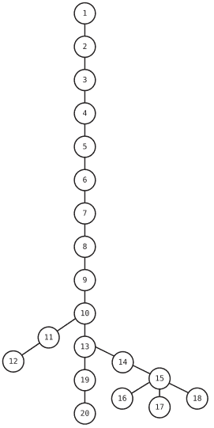

例如，从技术上讲，你可以直接从第10章跳到第13章。（哦！这张图是基于一种叫做*树*的数据结构绘制的。你将在第15章学习它。）

另一个重要提示：为了让本书易于理解，我在首次介绍某个概念时，并不总是会透露所有信息。有时，分解复杂概念的最佳方式是先揭示一小部分，只有在第一部分被消化后，才揭示下一部分。如果我将某个特定术语定义为如此这般，在你完成该主题的整个章节之前，请不要将其视为教科书式的定义。

这是一种权衡：为了让本书易于消化，我选择在初期对某些概念进行过度简化，然后逐步澄清，而不是确保每一句话都完全符合学术上的准确性。但不必过于担心，因为在本书结束时，你将看到完整而准确的图景。

## 在线资源

本书在pragprog.com上有自己的网页²，你可以在那里找到更多关于本书的信息，下载代码示例的源代码，并通过报告勘误、拼写错误和内容建议来帮助改进本书。

此外，我在我自己的网站³上发布关于我写作的更新。在那里，你可以找到更多关于我的书籍的信息，以及我和我的同事制作的视频教程，我们在其中使用“常识”方法来解释各种技术和概念。我们还可以培训你的员工！我们涵盖关于代码效率和提升软件开发技能的各种主题，包括：

-   编写可维护的代码
-   重构
-   单元测试
-   当然，还有编写高效的代码！

我和我的同事教授各种技术，我们总是使用“常识”解释方式来开发课程。你可以在上述网站⁴找到更多信息。

## 联系我

我喜欢与我的读者建立联系，邀请你在LinkedIn上找到我⁵。我很乐意接受你的连接请求——只需发送一条消息，说明你是本书的读者。我期待收到你的来信！

Jay Wengrow
2023年12月

2. https://pragprog.com/titles/jwpython
3. https://commonsensedev.com
4. https://commonsensedev.com
5. https://www.linkedin.com/in/jaywengrow

## 致谢

虽然写书的任务看似是孤独的，但如果没有*众多*在我写作旅程中支持我的人，这本书根本不可能完成。我想亲自感谢*你们所有人*。

致我可爱的妻子Rena——感谢你给予我的时间和情感支持。在我像隐士一样埋头写作时，你照顾了一切。致我可爱的孩子们，Tuvi、Leah、Shaya、Rami和Yechiel——感谢你们在我写这本关于“算法”的书时的耐心。是的——它终于完成了。

致我的父母，Howard和Debbie Wengrow先生和夫人——感谢你们最初激发了我对计算机编程的兴趣，并帮助我追求它。你们当时可能没想到，在我九岁生日时给我请一位计算机家教，会为我的职业生涯——以及现在这本书——奠定基础。

致我妻子的父母，Paul和Kreindel Pinkus先生和夫人——感谢你们对我家人和我的持续支持。你们的智慧和温暖对我意义重大。

当我第一次向Pragmatic Bookshelf提交手稿时，我认为它*很好*。然而，通过那里所有优秀员工的专业知识、建议和要求，这本书变得比我独自能写出的要好得多、好得多。

首先，我要感谢我的编辑Katharine Dvorak，她帮助这本Python版快速完成，同时提高了书籍的质量。

我还要感谢Pragmatic Bookshelf的执行编辑Tammy Coron，感谢她监督这个项目。（也感谢生成所有Python特定的图片！）

感谢Pragmatic Bookshelf的首席执行官Dave Rankin，感谢他领导了最好的出版公司来写作，也感谢他支持并分享了我创建本书特定语言版本的愿景。

致原版编辑Brian MacDonald——感谢你向我展示如何写这样一本书。这本书处处都有你的印记。

致才华横溢的软件开发者和艺术家Colleen McGuckin——感谢你将我潦草的字迹转化为美丽的数字图像。没有你用如此精湛的技艺和细致入微的注意力创造出的精彩视觉效果，这本书将一无是处。

我很幸运有这么多专家审阅了这本书。你们的反馈非常有帮助，确保了这本书尽可能准确。我要感谢你们所有人的贡献。

原版的审阅者是：Alessandro Bahgat、Ivo Balbaert、Rinaldo Bonazzo、Alberto Boschetti、Mike Browne、Craig Castelaz、Jacob Chae、Javier Collado、Zulfikar Dharmawan、Ashish Dixit、Dan Dybas、Emily Ekhdal、Mohamed Fouad、Derek Graham、Neil Hainer、Peter Hampton、Rod Hilton、Jeff Holland、Jessica Janiuk、Aaron Kalair、Stephan Kämper、Grant Kazan、Arun S. Kumar、Sean Lindsay、Nigel Lowry、Joy McCaffrey、Dary Merckens、Nouran Mhmoud、Kevin Mitchell、Daivid Morgan、Brent Morris、Jasdeep Narang、Emanuele Origgi、Stephen Orr、Kenneth Parekh、Jason Pike、Sam Rose、Ayon Roy、Frank Ruiz、Brian Schau、Tibor Simic、Matteo Vaccari、Mitchell Volk、Stephen Wolff和Peter W. A. Wood。

这本Python版的审阅者是：Connor Baskin、Katy Douglas、Tzvi Friedman、Joey Gallotta、Rod Hilton、Paa JAKE、Patrick Nikolaus、Nathan Pena、Terry Peppers、Lyndon Purcell、Cody Rutt、Brian Schau、Ahmad Shahba和Joe Yakich。

除了官方审阅者，我还要感谢所有在beta阅读阶段提供反馈的读者。你们的建议、评论和问题非常宝贵。

我还要感谢Actualize的所有员工、学生和校友，感谢你们的支持。这本书最初是Actualize的一个项目，你们都以各种方式做出了贡献。我要特别感谢Luke Evans，是他给了我写这本书的想法。

感谢你们所有人让这本书成为现实。

# 第1章

## 为什么数据结构很重要

当人们刚开始学习编程时，他们的注意力——并且*应该*——集中在让代码正确运行上。他们的代码用一个简单的指标来衡量：代码是否真的能工作？

然而，随着软件工程师获得更多经验，他们开始了解关于代码*质量*的更多层次和细微差别。他们了解到，可能有两段代码都能完成相同的任务，但其中一段比另一段*更好*。

衡量代码质量的方法有很多。一个重要的衡量标准是代码的可维护性。代码的可维护性涉及代码的可读性、组织性和模块化等方面。

然而，高质量代码的另一个方面是代码的*效率*。例如，你可以有两段代码都实现了相同的目标，但其中一段*运行得比另一段快*。

看看这两个函数，它们都打印从2到100的所有偶数：

```
def print_numbers_version_one():
    number = 2

    while number <= 100:
        # If number is even, print it:
        if number % 2 == 0:
            print(number)

        number += 1
```

def print_numbers_version_two():
    number = 2

    while number <= 100:
        print(number)

        # 将数字增加2，根据定义，
        # 这就是下一个偶数：
        number += 2

你认为这些函数中哪个运行得更快？

如果你说是版本2，那就对了。这是因为版本1最终会循环100次，而版本2只循环50次。因此，第一个版本比第二个版本多用了两倍的步骤。

这本书是关于编写*高效*代码的。能够编写运行快速的代码是成为一名更优秀的软件开发人员的重要方面。

编写快速代码的第一步是理解什么是数据结构，以及不同的数据结构如何影响我们代码的速度。那么，让我们深入探讨一下。

### 数据结构

让我们来谈谈数据。

*数据*是一个广义的术语，指的是所有类型的信息，直至最基本的数字和字符串。在简单而经典的“Hello World!”程序中，字符串“Hello World!”就是一条数据。事实上，即使是最复杂的数据通常也可以分解为一堆数字和字符串。

*数据结构*指的是数据是如何*组织*的。你将学习相同的数据如何以多种方式进行组织。

让我们看看下面的代码：

```
x = "Hello! "
y = "How are you "
z = "today?"

print(x + y + z)
```

这个简单的程序处理了三条数据，输出三个字符串以组成一条连贯的消息。如果我们要描述这个程序中数据是如何组织的，我们会说我们有三个独立的字符串，每个都包含在一个单独的变量中。

然而，相同的数据也可以存储在数组中：

```
array = ["Hello! ", "How are you ", "today?"]
print(array[0] + array[1] + array[2])
```

你将在本书中了解到，数据的组织不仅仅是为了组织本身，它还能显著影响*代码运行的速度*。根据你选择如何组织数据，你的程序运行速度可能会快几个数量级，也可能慢几个数量级。如果你正在构建一个需要处理大量数据的程序，或者一个被成千上万人同时使用的网络应用，你选择的数据结构可能会影响你的软件是否能够运行，或者是否会因为无法承受负载而崩溃。

当你牢固掌握数据结构对你正在创建的软件的性能影响时，你就掌握了编写快速而优雅代码的关键，你作为软件工程师的专业能力也将大大增强。

在本章中，我们将开始分析两种数据结构：数组和集合。虽然这两种数据结构看起来几乎相同，但你将学习分析每种选择对性能影响的工具。

### 数组：基础数据结构

*数组*是计算机科学中最基本的数据结构之一。（在Python中，内置的类似数组的数据结构称为*列表*，但为了与更通用的计算机科学术语保持一致，我将它们称为数组。）我假设你以前使用过数组，所以你知道数组是一个数据元素的列表。数组用途广泛，在许多情况下都是一个有用的工具，但让我们来看一个简单的例子。

如果你正在查看一个允许用户创建和使用杂货店购物清单的应用程序的源代码，你可能会发现这样的代码：

```
array = ["apples", "bananas", "cucumbers", "dates", "elderberries"]
```

这个数组恰好包含五个字符串，每个字符串代表我可能在超市购买的东西。（你*一定*要试试接骨木莓。）

数组有其自己的技术术语。

数组的*大小*是数组包含的数据元素的数量。我们的杂货清单数组的大小为5，因为它包含五个值。

数组的*索引*是标识数据在数组中位置的数字。

在大多数编程语言中，我们从0开始计数索引。因此，对于我们的示例数组，“apples”位于索引0，“elderberries”位于索引4，如下所示：

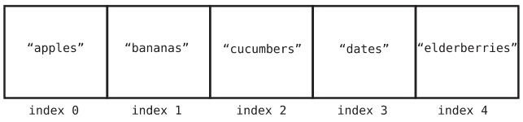

### 数据结构操作

要理解任何数据结构（如数组）的性能，我们需要分析代码与该数据结构交互的常见方式。

许多数据结构以四种基本方式使用，我们称之为*操作*。这些操作是：

- *读取*：读取是指在数据结构中的特定位置查找内容。对于数组，这意味着在特定索引处查找值。例如，查找索引2处的杂货物品就是从数组中*读取*。
- *搜索*：搜索是指在数据结构中查找特定值。对于数组，这意味着查看特定值是否存在于数组中，如果存在，位于哪个索引。例如，查找我们杂货清单中“dates”的索引就是*搜索*数组。
- *插入*：插入是指向数据结构添加新值。对于数组，这意味着向数组中的额外位置添加新值。如果我们将“figs”添加到我们的购物清单中，我们就是在向数组中*插入*一个新值。
- *删除*：删除是指从数据结构中移除一个值。对于数组，这意味着从数组中移除一个值。例如，如果我们从杂货清单中移除“bananas”，这个值就会从数组中被*删除*。

在本章中，我们将分析当这些操作应用于数组时，每个操作的速度有多快。

### 衡量速度

那么，我们如何衡量一个操作的速度呢？

如果你从这本书中只记住一件事，那就是：当我们衡量一个操作有多“快”时，我们指的不是操作在纯*时间*上有多快，而是它需要多少*步骤*。

我们之前在打印从2到100的偶数的上下文中已经看到过这一点。该函数的第二个版本更快，因为它只用了第一个版本一半的步骤。

为什么我们用步骤来衡量代码的速度？

我们这样做是因为我们永远无法明确地说任何操作需要，比如说，五秒钟。虽然一段代码在特定计算机上可能需要五秒钟，但同一段代码在较旧的硬件上可能需要更长时间。同样，这段代码在未来的超级计算机上可能运行得快得多。用时间来衡量操作的速度是不可靠的，因为时间总是会根据运行它的硬件而变化。

然而，我们*可以*用操作所需的计算*步骤*数量来衡量其速度。如果操作A需要5个步骤，而操作B需要500个步骤，我们可以假设在*所有*硬件上，操作A总是比操作B快。因此，衡量步骤数量是分析操作速度的关键。

衡量操作的速度也称为衡量其*时间复杂度*。在本书中，我将交替使用*速度*、*时间复杂度*、*效率*、*性能*和*运行时间*这些术语。它们都指的是给定操作所需的步骤数。

让我们深入探讨数组的四个操作，并确定每个操作需要多少步骤。

### 读取

我们要看的第一个操作是*读取*，它查找数组中特定索引处包含的值。

计算机只需一步就能从数组中读取。这是因为计算机能够跳转到数组中的任何特定索引并查看其内容。在我们["apples", "bananas", "cucumbers", "dates", "elderberries"]的例子中，如果我们查找索引2，计算机会直接跳到索引2并报告它包含值“cucumbers”。

计算机如何能够在一步内查找数组的索引？让我们看看它是如何做到的。

计算机的内存可以看作是一个巨大的单元集合。在下图中，你可以看到一个单元网格，其中一些是空的，一些包含数据位：

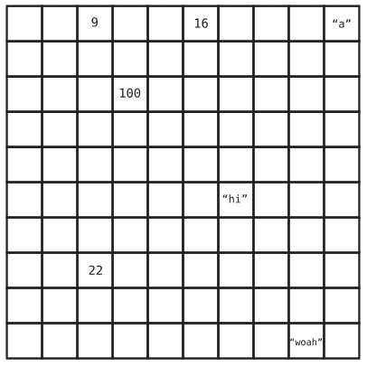

虽然这个视觉图简化了计算机内存底层的工作原理，但它代表了核心思想。

当一个程序声明一个数组时，它会分配一组连续的空单元供程序使用。因此，如果你要创建一个用于容纳五个元素的数组，你的计算机会找到一排五个连续的空单元，并将其指定为你的数组：

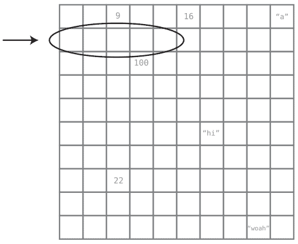

现在，计算机内存中的每个单元都有一个特定的地址。这有点像街道地址（例如，123 Main St.），只不过它是用数字表示的。每个单元的内存地址比前一个单元的地址大一个数字。下图显示了每个单元的内存地址：

| 1000 | 1001 | 1002 | 1003 | 1004 | 1005 | 1006 | 1007 | 1008 | 1009 |
|------|------|------|------|------|------|------|------|------|------|
| 1010 | 1011 | 1012 | 1013 | 1014 | 1015 | 1016 | 1017 | 1018 | 1019 |
| 1020 | 1021 | 1022 | 1023 | 1024 | 1025 | 1026 | 1027 | 1028 | 1029 |
| 1030 | 1031 | 1032 | 1033 | 1034 | 1035 | 1036 | 1037 | 1038 | 1039 |
| 1040 | 1041 | 1042 | 1043 | 1044 | 1045 | 1046 | 1047 | 1048 | 1049 |
| 1050 | 1051 | 1052 | 1053 | 1054 | 1055 | 1056 | 1057 | 1058 | 1059 |
| 1060 | 1061 | 1062 | 1063 | 1064 | 1065 | 1066 | 1067 | 1068 | 1069 |
| 1070 | 1071 | 1072 | 1073 | 1074 | 1075 | 1076 | 1077 | 1078 | 1079 |
| 1080 | 1081 | 1082 | 1083 | 1084 | 1085 | 1086 | 1087 | 1088 | 1089 |
| 1090 | 1091 | 1092 | 1093 | 1094 | 1095 | 1096 | 1097 | 1098 | 1099 |

在下图中，你可以看到我们的购物清单数组及其索引和内存地址：

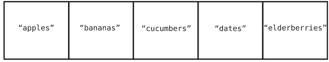

当计算机读取数组中特定索引的值时，它可以直接跳转到该索引，这是因为计算机具备以下事实的组合：

1.  计算机可以一步跳转到任何*内存地址*。例如，如果你要求计算机检查内存地址1063处的内容，它无需执行任何搜索过程即可访问。打个比方，如果我让你举起右手小拇指，你不需要搜索所有手指来找出哪一个是你的右手小拇指。你能立即识别出来。

2.  每当计算机分配一个数组时，它还会记录数组*开始*的内存地址。因此，如果我们要求计算机找到数组的第一个元素，它就能立即跳转到相应的内存地址找到它。

现在，这些事实解释了计算机如何一步找到数组的*第一个*值。然而，计算机也可以通过简单的加法找到*任何*索引的值。如果我们要求计算机找到索引3处的值，计算机只需将索引0的内存地址加上3即可。（毕竟内存地址是连续的。）

让我们将此应用到我们的杂货清单数组。我们的示例数组从内存地址1010开始。因此，如果我们告诉计算机读取索引3处的值，计算机会经历以下思考过程：

1.  数组从索引0开始，位于内存地址1010。
2.  索引3将正好在索引0之后三个位置。
3.  通过逻辑推断，索引3将位于内存地址1013，因为1010 + 3等于1013。

一旦计算机知道索引3位于内存地址1013，它就可以直接跳转到那里，并看到它包含值“dates”。

因此，从数组读取是一个高效的操作，因为计算机可以通过一步跳转到任何内存地址来读取任何索引。虽然我通过将其分解为三个部分来描述计算机的思考过程，但我们目前关注的主要步骤是计算机跳转到内存地址。（在后面的章节中，我们将探讨如何知道哪些步骤值得重点关注。）

自然地，只需一步的操作是最快的操作类型。除了作为基础数据结构外，数组也是一种非常强大的数据结构，因为我们可以如此快速地从中读取数据。

那么，如果我们不是问计算机索引3处包含什么值，而是反过来问“dates”可以在哪个索引找到呢？这就是搜索操作，我们接下来将探讨它。

### 搜索

正如我之前所述，*搜索*数组意味着查看某个特定值是否存在于数组中，如果存在，它位于哪个索引。

从某种意义上说，它是读取的逆操作。读取意味着向计算机提供一个*索引*并要求它返回该处包含的值。而搜索则意味着向计算机提供一个*值*并要求它返回该值位置的索引。

虽然这两种操作听起来相似，但在效率方面却有天壤之别。从索引读取很快，因为计算机可以立即跳转到任何索引并发现其中包含的值。然而，搜索却很繁琐，因为计算机无法跳转到特定的值。

这是关于计算机的一个重要事实：计算机可以立即访问其所有内存地址，但它并不知道每个内存地址中包含什么*值*。

让我们以我们之前关于水果和蔬菜的数组为例。计算机无法立即看到每个单元的实际内容。对计算机来说，数组看起来像这样：

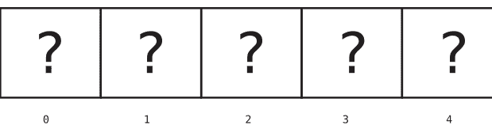

要在数组中搜索一种水果，计算机别无选择，只能一次检查一个单元。

以下图示演示了计算机在我们的数组中搜索“dates”的过程。

首先，计算机检查索引0：

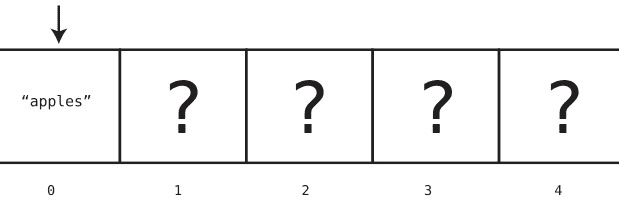

由于索引0处的值是“apples”，而不是我们要找的“dates”，计算机继续检查下一个索引，如第10页图所示。

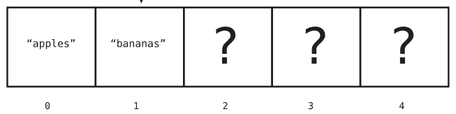

由于索引1也不包含我们要找的“dates”，计算机继续检查索引2：

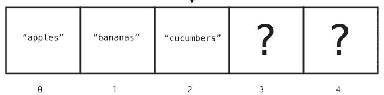

再次，我们运气不佳，所以计算机移动到下一个单元：

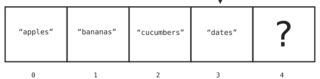

啊哈！我们找到了难以捉摸的“dates”，现在知道“dates”位于索引3。此时，计算机不需要继续检查数组的下一个单元，因为它已经找到了我们要找的东西。

在这个例子中，因为计算机不得不检查四个不同的单元才找到我们搜索的值，我们可以说这个特定操作总共花费了四步。

在第2章“为什么算法很重要”（第21页）中，你将了解另一种搜索数组的方法，但这种基本的搜索操作——计算机一次检查一个单元——被称为*线性搜索*。

那么，计算机在线性搜索数组时需要执行的*最大*步数是多少呢？

如果我们寻找的值恰好位于数组的最后一个单元（比如“elderberries”），那么计算机最终会搜索数组的*每一个*单元，直到找到它要找的值。同样，如果我们寻找的值根本不在数组中，计算机也必须搜索每个单元，以确保该值不存在于数组中。

因此，对于一个有5个单元的数组，线性搜索所需的最大步数是5。对于一个有500个单元的数组，线性搜索所需的最大步数是500。

换一种说法，对于一个有N个单元的数组，线性搜索最多需要N步。在这个上下文中，N只是一个可以替换为任何数字的变量。

无论如何，很明显搜索的效率低于读取，因为搜索可能需要很多步，而读取无论数组大小如何，总是只需要一步。

接下来，我们将分析插入操作。

### 插入

将新数据插入数组的效率取决于你在数组中的*哪个位置*插入它。

假设我们想在购物清单的末尾添加“无花果”。这样的插入只需一步。

这是由于计算机的另一个事实：分配数组时，计算机总是会跟踪数组的大小。

当我们结合计算机也知道数组开始的内存地址这一事实时，计算数组最后一项的内存地址就轻而易举了：如果数组从内存地址1010开始，大小为5，这意味着它的最后一个内存地址是1014。因此，在其后插入一项意味着将其添加到*下一个*内存地址，即1015。

一旦计算机计算出要将新值插入哪个内存地址，它就可以一步完成。

这就是在数组末尾插入“无花果”的样子：

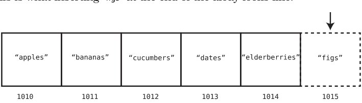

但这里有一个问题。因为计算机最初只为数组分配了五个内存单元，而现在我们要添加第六个元素，计算机可能需要为这个数组分配额外的单元。在许多编程语言中，这是在底层自动完成的，但每种语言的处理方式不同，所以我不会深入探讨其细节。

我们已经处理了在数组末尾插入数据的情况，但在数组的*开头*或*中间*插入新数据则是另一回事。在这些情况下，我们需要*移动*数据来为要插入的内容腾出空间，这会导致额外的步骤。

例如，假设我们想在数组的索引2处添加“无花果”。请看下面的图示：

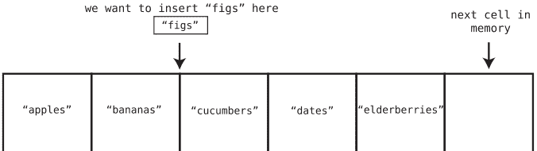

为此，我们需要将“黄瓜”、“枣”和“接骨木莓”向右移动，为“无花果”腾出空间。这需要多个步骤，因为我们首先需要将“接骨木莓”向右移动一个单元，以便为移动“枣”腾出空间。然后我们需要移动“枣”来为“黄瓜”腾出空间。让我们逐步了解这个过程。

步骤1：我们将“接骨木莓”向右移动：

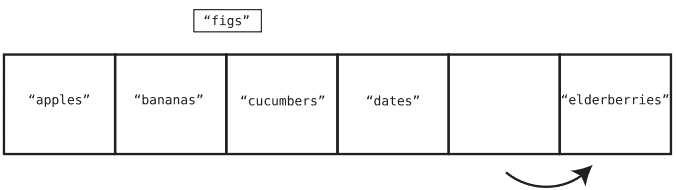

步骤2：我们现在将“枣”向右移动：

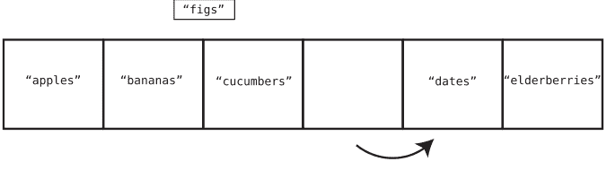

步骤3：我们现在将“黄瓜”向右移动：

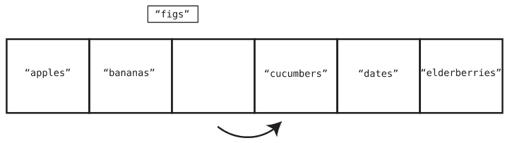

步骤4：最后，我们可以将“无花果”插入索引2：

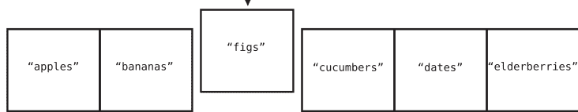

请注意，在前面的例子中，插入操作花了四步。其中三步涉及将数据向右移动，而一步涉及新值的实际插入。

数组插入的最坏情况——即插入步骤最多的情况——是在数组的*开头*插入数据。这是因为在数组开头插入时，我们必须将*所有*其他值向右移动一个单元。

我们可以说，在最坏情况下，对于一个包含N个元素的数组，插入操作可能需要*N + 1*步。这是因为我们需要将所有N个元素移开，然后最后执行实际的插入步骤。

既然我们已经介绍了插入操作，接下来就轮到数组的最后一个操作：删除。

### 删除

从数组中删除是指移除特定索引处的值。

让我们回到最初的示例数组，删除索引2处的值。在我们的例子中，这个值是“黄瓜”。

步骤1：我们从数组中删除“黄瓜”：

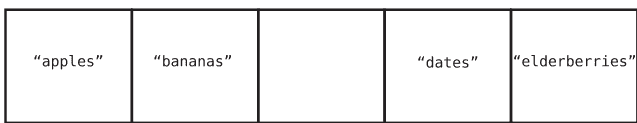

虽然“黄瓜”的实际删除技术上只花了一步，但现在我们有一个问题：数组中间出现了一个空单元。当数组中间有空隙时，它就不再高效，因此为了解决这个问题，我们需要将“枣”和“接骨木莓”向左移动。这意味着我们的删除过程需要额外的步骤。

步骤2：我们将“枣”向左移动：

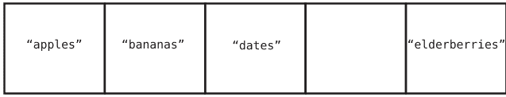

步骤3：我们将“接骨木莓”向左移动：

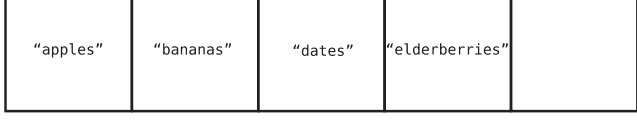

事实证明，对于这次删除，整个操作花了三步。第一步涉及实际删除，另外两步涉及数据移动以填补空隙。

与插入类似，删除元素的最坏情况是删除数组的第一个元素。这是因为索引0会变空，我们必须将*所有*剩余元素向左移动以填补空隙。

对于一个包含5个元素的数组，我们需要花1步删除第一个元素，再花4步移动剩余的4个元素。对于一个包含500个元素的数组，我们需要花1步删除第一个元素，再花499步移动剩余的数据。因此我们可以说，对于一个包含N个元素的数组，删除操作所需的最大步数是N步。

恭喜！我们已经分析了第一个数据结构的时间复杂度。既然你已经学会了如何分析数据结构的效率，你现在可以了解不同数据结构为何具有不同的效率。这至关重要，因为为你的代码选择正确的数据结构会对软件性能产生重大影响。

下一个数据结构——*集合*——乍看之下与数组非常相似。然而，你将看到对数组和集合执行的操作具有不同的效率。

### 集合：一条规则如何影响效率

让我们探索另一种数据结构：*集合*。集合是一种不允许包含重复值的数据结构。

集合有不同的类型，但在本次讨论中，我将介绍一种*基于数组的集合*。这种集合就像数组一样——它是一个简单的值列表。这种集合与经典数组的唯一区别在于，集合永远不允许插入重复值。

例如，如果你有一个集合 ["a", "b", "c"] 并尝试添加另一个 "b"，计算机将不允许，因为集合中已经存在一个 "b"。

当你需要确保没有重复数据时，集合非常有用。

例如，如果你正在创建一个在线电话簿，你不希望同一个电话号码出现两次。事实上，我目前就深受本地电话簿之苦：我的家庭电话号码不仅列在我的名下，还被错误地列为某个叫Zirkind的家庭的电话号码。（是的，这是真事。）我告诉你——接到寻找Zirkind一家的电话和语音邮件真的很烦人。而且，我敢肯定Zirkind一家也在纳闷为什么从来没人给他们打电话。而当我打电话给Zirkind一家告知这个错误时，是我妻子接的电话，因为我打给了自己的号码。（好吧，最后那部分从未发生过。）要是制作电话簿的程序使用了集合就好了……

无论如何，基于数组的集合是一个数组，附加了一个禁止重复的约束。虽然不允许重复是一个有用的功能，但这个简单的约束也导致集合在四个主要操作中的一个上具有*不同的效率*。

让我们在基于数组的集合的背景下分析读取、搜索、插入和删除操作。

从集合中读取与从数组中读取完全相同——计算机只需一步就能查找特定索引中包含的内容。正如我之前描述的，这是因为计算机可以跳转到集合中的任何索引，因为它可以轻松计算并跳转到其内存地址。

搜索集合也与搜索数组没有区别——在集合中搜索一个值最多需要N步。删除在集合和数组之间也是相同的——删除一个值并移动数据向左填补空隙最多需要N步。

然而，插入操作是数组和集合产生分歧的地方。让我们首先探讨在集合的*末尾*插入一个值，这在数组中是最佳情况。我们看到，对于数组，计算机可以在一步内将一个值插入其末尾。

然而，对于集合，计算机首先需要确定这个值是否已经存在于该集合中——因为这就是集合的作用：它们防止重复数据被插入。

那么，计算机如何确保新数据尚未包含在集合中呢？请记住，计算机并不知道数组或集合的单元格中包含哪些值。因此，计算机首先需要*搜索*集合，看看我们想要插入的值是否已经存在。只有当集合尚未包含我们的新值时，计算机才允许插入发生。

因此，每次插入集合*首先需要一次搜索*。

让我们通过一个例子来看看实际操作。想象一下我们之前的购物清单被存储为一个集合——这将是一个不错的选择，毕竟我们不想买同样的东西两次。如果我们的当前集合是 ["apples", "bananas", "cucumbers", "dates", "elderberries"]，并且我们想将“无花果”插入集合，计算机必须执行以下步骤，首先搜索“无花果”。

步骤1：在索引0处搜索“无花果”：

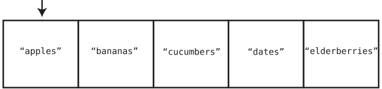

它不在那里，但可能在集合的其他地方。我们需要确保“figs”在任何地方都不存在，然后才能插入它。

步骤 2：搜索索引 1：

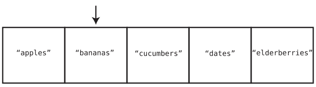

步骤 3：搜索索引 2：

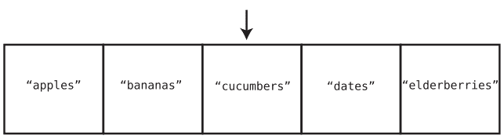

步骤 4：搜索索引 3：

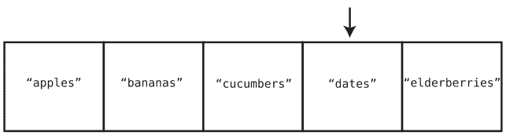

步骤 5：搜索索引 4：

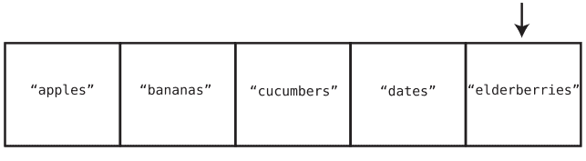

既然我们已经搜索了整个集合，我们就可以确定它不包含“figs”。此时，可以安全地完成插入。这就引出了我们的最后一步：

步骤 6：在集合末尾插入“figs”：

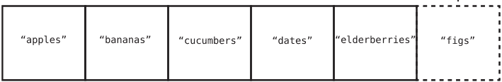

在集合末尾插入值是最佳情况，但对于一个最初包含五个元素的集合，我们仍然需要执行六个步骤。也就是说，我们必须搜索所有五个元素，然后才能执行最后的插入步骤。

换句话说：向集合末尾插入一个值，对于 N 个元素最多需要 N + 1 步。这是因为需要 N 步搜索以确保该值在集合中不存在，然后还需要一步进行实际插入。与之相比，对于普通数组，这样的插入总共只需要一步。

在最坏的情况下，即我们向集合的*开头*插入一个值时，计算机需要搜索 N 个单元格以确保集合不包含该值，再用 N 步将所有数据向右移动，最后再用一步插入新值。总共是 2N + 1 步。与之相比，向普通数组开头插入只需 N + 1 步。

那么，这是否意味着你应该仅仅因为集合的插入比普通数组慢就避免使用集合呢？绝对不是。当你需要确保没有重复数据时，集合很重要。（希望有一天我的电话簿能修好。）但当你没有这种需求时，数组可能更可取，因为数组的插入比集合的插入更高效。你必须分析自己应用程序的需求，并决定哪种数据结构更合适。

### 总结

分析一个操作所需的步骤数是理解数据结构性能的核心。为你的程序选择正确的数据结构，可能意味着承受重负与不堪重负之间的天壤之别。在本章中，你已经学会了使用这种分析来权衡数组或集合是否适合特定应用。

既然你已经开始学习如何思考数据结构的时间复杂度，我们就可以使用同样的分析来比较相互竞争的算法（甚至是在*同一*数据结构内），以确保我们代码的最终速度和性能。而这正是下一章的内容。

### 练习

以下练习为你提供了练习数组的机会。这些练习的答案可以在[第 1 章，第 435 页](#)中找到。

1.  对于一个包含 100 个元素的数组，提供以下操作所需的步骤数：
    a. 读取
    b. 搜索一个数组中不包含的值
    c. 在数组开头插入
    d. 在数组末尾插入
    e. 在数组开头删除
    f. 在数组末尾删除
2.  对于一个基于数组的、包含 100 个元素的集合，提供以下操作所需的步骤数：
    a. 读取
    b. 搜索一个集合中不包含的值
    c. 在集合开头插入一个新值
    d. 在集合末尾插入一个新值
    e. 在集合开头删除
    f. 在集合末尾删除
3.  通常，数组中的搜索操作是查找给定值的第一个实例。但有时我们可能想查找给定值的*每一个*实例。例如，假设我们想计算数组中值“apple”出现了多少次。找到所有“apple”需要多少步？请用 N 来表示你的答案。

### 第 2 章

## 为什么算法很重要

在上一章中，我们了解了我们的第一个数据结构，并看到了选择正确的数据结构如何影响代码的性能。即使是两个看起来非常相似的数据结构，比如数组和集合，也可能具有非常不同的效率水平。

在本章中，我们将发现，即使我们决定了使用特定的数据结构，另一个主要因素也会影响代码的效率：正确选择使用哪种*算法*。

虽然*算法*这个词听起来很复杂，但它其实不然。算法仅仅是*完成特定任务的一组指令*。

即使是像准备一碗麦片这样简单的过程，从技术上讲也是一个算法，因为它涉及遵循一组定义好的步骤来完成手头的任务。麦片准备算法遵循以下四个步骤（至少对我来说是这样）：

1.  拿一个碗。
2.  将麦片倒入碗中。
3.  将牛奶倒入碗中。
4.  将勺子浸入碗中。

通过按照这个特定的顺序遵循这些步骤，我们现在就可以享用早餐了。

当应用于计算时，算法指的是为计算机提供的一组指令，以完成特定任务。因此，当我们编写任何代码时，我们就是在为计算机创建要遵循和执行的算法。

我们也可以用简单的英语来表达算法，以详细说明我们计划提供给计算机的指令。在本书中，我将同时使用简单的英语和代码来展示各种算法的工作原理。

有时，可能会有两个不同的算法完成相同的任务。我们在[第 1 章，为什么数据结构很重要，第 1 页](#)的开头看到了一个例子，我们有两种不同的方法来打印偶数。在那种情况下，一个算法的步骤是另一个的两倍。

在本章中，我们将遇到另外两个解决相同问题的算法。不过，在这种情况下，一个算法将比另一个快*几个数量级*。

为了探索这些新算法，我们需要看看一种新的数据结构。

## 有序数组

*有序数组*与我们在上一章看到的经典数组几乎完全相同。唯一的区别是，有序数组要求值始终保持——你猜对了——*有序*；也就是说，每次添加一个值时，它都会被放置在适当的单元格中，以使数组中的值保持排序。

例如，让我们取数组 [3, 17, 80, 202]：

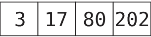

假设我们想将值 75 插入数组中。如果这是一个经典数组，我们可以将 75 插入末尾，如下所示：

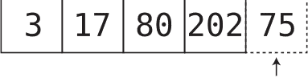

正如我们在上一章所看到的，计算机可以在一步内完成此操作。

另一方面，如果这是一个*有序数组*，我们别无选择，只能将 75 插入适当的位置，以使值保持升序排列：

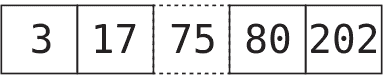

现在，这说起来容易做起来难。计算机不能简单地在一步内将 75 放入正确的槽位，因为它首先必须*找到*插入 75 的正确位置，然后将其他值移位以腾出空间。让我们逐步分解这个过程。

让我们再次从原始的有序数组开始：

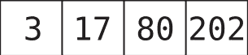

步骤 1：我们检查索引 0 处的值，以确定我们要插入的值——75——应该放在它的左边还是右边：

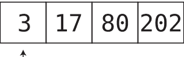

因为 75 大于 3，我们知道 75 将被插入到它的右边某个位置。然而，我们还不知道它应该被插入到哪个具体的单元格，所以我们需要检查下一个单元格。

我们将这种类型的步骤称为*比较*，我们将要插入的值与有序数组中已存在的数字进行比较。

步骤 2：我们检查下一个单元格的值：

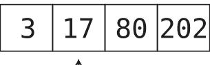

由于 75 大于 17，我们需要继续。

步骤 3：我们检查下一个单元格的值：

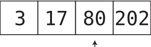

我们遇到了值 80，它*大于*我们希望插入的 75。由于我们遇到了第一个大于 75 的值，我们可以得出结论，75 必须放置在这个 80 的紧左侧，以维持此有序数组的顺序。为此，我们需要移动数据以腾出空间给 75。

步骤 4：将最终值移到右侧：

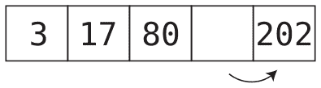

步骤 5：将倒数第二个值移到右侧：

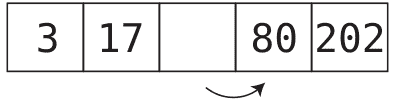

步骤 6：我们终于可以将 75 插入到正确的位置：

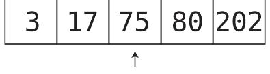

由此可见，在有序数组中插入元素时，我们需要在实际插入之前始终进行一次搜索，以确定插入的正确位置。这是经典数组和有序数组在性能上的一个差异。

我们可以从这个例子中看到，最初有四个元素，插入操作总共用了六步。用 N 来表示的话，我们可以说，对于一个包含 N 个元素的有序数组，插入操作总共需要 N + 2 步。

有趣的是，无论新值最终插入到有序数组的哪个位置，插入所需的步骤数都大致相似。如果新值最终位于数组开头附近，我们进行的比较次数较少，但移动次数较多。如果新值最终位于数组末尾附近，我们进行的比较次数较多，但移动次数较少。当新值最终位于数组最末尾时，所需的步骤最少，因为不需要移动任何元素。在这种情况下，我们需要 N 步来将新值与所有 N 个现有值进行比较，再加上插入操作本身的一步，总共 N + 1 步。

虽然对于有序数组来说，插入操作不如经典数组高效，但在搜索方面，有序数组却拥有一个秘密的超能力。

### 搜索有序数组

在上一章中，我描述了在经典数组中搜索特定值的过程：我们从左到右逐个检查每个单元格，直到找到我们要找的值。我指出这个过程被称为线性搜索。

让我们看看线性搜索在经典数组和有序数组中的区别。

假设我们有一个普通数组 [17, 3, 75, 202, 80]。如果我们要搜索值 22（它恰好不在这个数组中），我们需要搜索每一个元素，因为 22 可能位于数组中的任何位置。唯一能在到达数组末尾之前停止搜索的情况是，我们恰好在到达末尾之前找到了要找的值。

然而，对于有序数组，即使值不在数组中，我们也可以提前停止搜索。假设我们在有序数组 [3, 17, 75, 80, 202] 中搜索 22。一旦我们到达 75，就可以停止搜索，因为 22 不可能出现在它右边的任何位置。

以下是在有序数组上进行线性搜索的 Python 实现：

```python
def linear_search(array, search_value):
    for index, element in enumerate(array):
        if element == search_value:
            return index
        elif element > search_value:
            break
    return None
```

这个方法接受两个参数：`array` 是我们要搜索的有序数组，`search_value` 是我们要搜索的值。

以下是如何使用这个函数在我们的示例数组中查找 22 的方法：

```python
print(linear_search([3, 17, 75, 80, 202], 22))
```

如你所见，这个 `linear_search` 方法遍历数组的每个元素，寻找 `search_value`。一旦当前遍历的元素大于 `search_value`，搜索就会停止，因为我们知道在数组的后续部分中不会找到 `search_value`。

从这个角度来看，在某些情况下，线性搜索在有序数组中所需的步骤比在经典数组中更少。话虽如此，如果我们搜索的值恰好是最后一个值，或者根本不在数组中，我们最终仍然需要搜索每一个单元格。

那么，乍一看，标准数组和有序数组在效率上并没有巨大的差异，至少在最坏的情况下是这样。对于这两种数组，如果它们包含 N 个元素，线性搜索最多可能需要 N 步。

但我们即将释放一种如此强大的算法，它将让线性搜索望尘莫及。

到目前为止，我们一直假设在有序数组中搜索值的唯一方法是线性搜索。然而，事实是，线性搜索只是搜索值的*一种可能算法*。它不是我们能使用的*唯一*算法。

有序数组相对于经典数组的一个巨大优势是，有序数组允许使用另一种搜索算法。这种算法被称为*二分搜索*，它比线性搜索快得多，*快得多*。

### 二分搜索

你小时候可能玩过这种猜数字游戏：我想一个 1 到 100 之间的数字。不断猜我想的是哪个数字，我会告诉你需要猜大一点还是猜小一点。

你可能凭直觉就知道怎么玩这个游戏。你不会从猜数字 1 开始。相反，你可能会从 50 开始，它正好在中间。为什么？因为选择 50，无论我告诉你猜大一点还是猜小一点，你都自动排除了一半的可能数字！

如果你猜 50，我告诉你猜大一点，那么你会选择 75，以排除一半*剩余*的数字。如果猜完 75 后，我告诉你猜小一点，你会选择 62 或 63。你会不断选择中间点，以持续排除一半的剩余数字。

让我们可视化这个过程，假设我们被告知猜一个 1 到 10 之间的数字，如[第 27 页的图片](image on page 27)所示。

简而言之，这就是二分搜索。

“猜猜我想的是哪个数字。”

1 2 3 4 5 6 7 8 9 10

“5”

“大一点”

~~1~~ ~~2~~ ~~3~~ ~~4~~ ~~5~~ 6 7 8 9 10

“8”

“小一点”

~~1~~ ~~2~~ ~~3~~ ~~4~~ ~~5~~ 6 7 ~~8~~ ~~9~~ ~~10~~

“6”

“大一点”

~~1~~ ~~2~~ ~~3~~ ~~4~~ ~~5~~ ~~6~~ 7 ~~8~~ ~~9~~ ~~10~~

“7”

“就是它！”

让我们看看二分搜索如何应用于有序数组。假设我们有一个包含九个元素的有序数组。计算机并不知道每个单元格包含什么值，所以我们将数组描绘如下：


假设我们想在这个有序数组中搜索值 7。以下是二分搜索的工作方式：

步骤 1：我们从中心单元格开始搜索。我们可以立即跳转到这个单元格，因为我们可以通过将数组长度除以 2 来计算其索引。我们检查这个单元格的值：

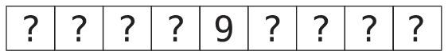

因为发现的值是 9，我们可以得出结论，7 在它的左边某处。我们刚刚成功地排除了数组一半的单元格——即 9 右边的所有单元格（以及 9 本身）：


步骤 2：在 9 左边的单元格中，我们检查中间的值。有两个中间值，所以我们任意选择左边那个：


它是 4，所以 7 必须在它的右边某处。我们可以排除 4 和它左边的单元格：


步骤 3：还有两个单元格可能包含 7。我们任意选择左边那个，如[第 29 页的图片](page29)所示。

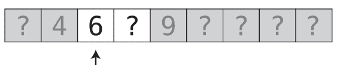

步骤 4：我们检查最后剩下的单元格。（如果它不在那里，那就意味着这个有序数组中没有 7。）

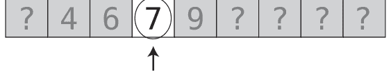

我们在四步内找到了 7。在这个例子中，这与线性搜索所需的步骤数相同，但我们很快会看另一个例子，以了解二分搜索的威力。

请注意，二分搜索仅在有序数组中才有可能。对于经典数组，值可以是任何顺序，我们永远不知道应该在给定值的左边还是右边查找。这是有序数组的优势之一：我们可以选择使用二分搜索。

### 代码实现：二分搜索

以下是二分搜索的 Python 实现：

```python
def binary_search(array, search_value):
    lower_bound = 0
    upper_bound = len(array) - 1

    while lower_bound <= upper_bound:
        midpoint = (upper_bound + lower_bound) // 2
        value_at_midpoint = array[midpoint]

        if search_value == value_at_midpoint:
            return midpoint
        elif search_value < value_at_midpoint:
            upper_bound = midpoint - 1
        elif search_value > value_at_midpoint:
            lower_bound = midpoint + 1

    return None
```

让我们分解一下。与 `linear_search` 方法一样，`binary_search` 接受 `array` 和 `search_value` 作为参数。

以下是调用此方法的示例：

```python
print(binary_search([3, 17, 75, 80, 202], 22))
```

该方法首先确定搜索值可能所在的索引范围。我们通过以下代码实现：

```
lower_bound = 0
upper_bound = len(array) - 1
```

因为在开始搜索时，搜索值可能位于整个数组中的任何位置，所以我们设定`lower_bound`为第一个索引，`upper_bound`为最后一个索引。

搜索的本质发生在`while`循环中：

```
while lower_bound <= upper_bound:
```

只要搜索值可能存在的范围仍然存在，这个循环就会运行。正如我们稍后将看到的，我们的算法会不断缩小这个范围。一旦没有剩余范围，`lower_bound <= upper_bound`条件将不再成立，我们就可以断定搜索值不在数组中。

在循环内部，我们的代码检查范围中点的值。以下代码实现了这一点：

```
midpoint = (upper_bound + lower_bound) // 2
value_at_midpoint = array[midpoint]
```

`value_at_midpoint`是范围中心找到的元素。

现在，如果`value_at_midpoint`就是我们要找的`search_value`，那我们就中奖了，可以返回找到`search_value`的索引：

```
if search_value == value_at_midpoint:
    return midpoint
```

如果`search_value`小于`value_at_midpoint`，这意味着`search_value`一定在数组中更靠前的位置。我们可以通过将`upper_bound`设置为中点左侧的索引来缩小搜索范围，因为`search_value`不可能在更远的位置找到：

```
elif search_value < value_at_midpoint:
    upper_bound = midpoint - 1
```

相反，如果`search_value`大于`value_at_midpoint`，这意味着`search_value`只能在中点右侧找到，因此我们相应地提高`lower_bound`：

```
elif search_value > value_at_midpoint:
    lower_bound = midpoint + 1
```

一旦范围缩小到0个元素，我们就返回`None`，此时可以确定`search_value`不存在于数组中。

### 二分查找与线性查找

对于小规模的有序数组，二分查找算法相比线性查找并没有太大优势。但让我们看看在处理更大数组时会发生什么。

对于一个包含100个值的数组，每种查找类型所需的最大步骤数如下：

- 线性查找：100步
- 二分查找：7步

使用线性查找时，如果我们要找的值在最后一个单元格中或大于最后一个单元格中的值，我们就必须检查每一个元素。对于一个大小为100的数组，这将需要100步。

然而，当我们使用二分查找时，我们每次猜测都会排除一半可能需要搜索的单元格。在我们的第一次猜测中，我们就能排除多达五十个单元格。

让我们换一种方式来看，我们会发现一个规律。

对于一个大小为3的数组，二分查找最多需要两步。

如果我们把数组中的单元格数量翻倍（为了简单起见，再加一个以保持奇数），就有七个单元格。对于这样的数组，使用二分查找找到某个元素的最大步骤数是三步。

如果我们再次翻倍（并加一），使有序数组包含十五个元素，二分查找的最大步骤数是四步。

出现的规律是，每次我们将有序数组的大小翻倍，二分查找所需的步骤数就增加一步。这是合理的，因为每次查找都会从搜索中排除一半的元素。

这个规律异常高效：每次我们将数据翻倍，二分查找算法只增加*一步*。

与此形成对比的是线性查找。如果你有3个元素，你最多需要3步。对于7个元素，你最多需要3步。对于100个值，你最多需要100步。因此，对于线性查找，*步骤数与元素数量一样多*。所以对于线性查找，每次我们将数组大小翻倍，搜索的步骤数就*翻倍*。而对于二分查找，每次我们将数组大小翻倍，我们只需要增加*一步*。

让我们看看这在更大的数组上如何体现。对于一个包含10,000个元素的数组，线性查找最多可能需要10,000步，而二分查找最多只需要13步。对于一个大小为一百万的数组，线性查找最多可能需要一百万步，而二分查找最多只需要20步。

我们可以通过这张图来直观地看到线性查找和二分查找在性能上的差异：

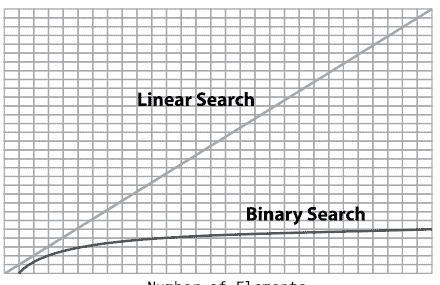

我们将分析很多这样的图表，所以让我们花点时间来理解一下发生了什么。x轴代表数组中的元素数量。也就是说，当我们从左向右移动时，我们处理的数据量在增加。

y轴代表算法所需的步骤数。当我们沿着图表向上移动时，我们看到的是更多的步骤。

如果你看代表线性查找的那条线，你会看到随着数组元素增多，线性查找所需的步骤数成比例地增加。本质上，数组中每增加一个元素，线性查找就多需要一步。这产生了一条笔直的对角线。

另一方面，对于二分查找，你会看到随着数据增加，算法的步骤数只是略微增加。这与我们已知的情况完全吻合：你必须将数据量翻倍，才能给二分查找增加一步。

请记住，有序数组并非在所有方面都更快。正如你所看到的，有序数组中的插入比标准数组慢。但这就是权衡所在：通过使用有序数组，你的插入速度稍慢，但搜索速度要快得多。再次强调，你必须始终分析你的应用程序，看看哪种方式更合适。你的软件会进行很多插入操作吗？搜索会是你正在构建的应用程序的一个重要功能吗？

### 随堂测验

我发现下面的随堂测验问题确实能让人掌握二分查找的效率。遮住答案，看看你是否能答对。

问题：我们说过，对于一个包含100个元素的有序数组，二分查找需要七步。那么对于一个包含*200*个元素的有序数组，二分查找需要多少步？

答案：八步。

我经常听到的直觉答案是十四步，但这是错误的。二分查找的全部美妙之处在于，每次检查都会排除一半剩余的元素。因此，每次我们*翻倍*数据量，我们只增加一步。毕竟，数据的这种翻倍在第一次检查中就被完全排除了！

值得注意的是，既然我们已经将二分查找添加到我们的工具箱中，有序数组中的插入也可以变得更快。插入需要在实际插入之前进行一次搜索，但我们现在可以将该搜索从线性查找升级为二分查找。然而，有序数组中的插入仍然比普通数组慢，因为普通数组的插入根本不需要搜索。

### 总结

通常，实现特定计算目标的方法不止一种，你选择的算法会严重影响代码的速度。

同样重要的是要认识到，通常没有一种数据结构或算法是适用于所有情况的完美方案。例如，仅仅因为有序数组允许二分查找，并不意味着你应该总是使用有序数组。在那些你预计不需要经常搜索数据，而是需要添加数据的情况下，标准数组可能是更好的选择，因为它们的插入速度更快。

正如我们所看到的，分析竞争算法的方法是计算每个算法所需的步骤数。在下一章中，我们将探讨一种形式化的方法来表达竞争数据结构和算法的时间复杂度。拥有这种共同语言将为我们提供更清晰的信息，从而帮助我们更好地决定选择哪种算法。

### 练习

以下练习为你提供了实践二分查找的机会。这些练习的答案可在[第2章，第436页](#)中找到。

1.  在有序数组 [2, 4, 6, 8, 10, 12, 13] 中，使用线性查找数字 8 需要多少步？
2.  对于上一个例子，二分查找需要多少步？
3.  在一个大小为 100,000 的数组上执行二分查找，最多需要多少步？

### 第3章

## O 是的！大O表示法

我们在前面的章节中已经看到，决定算法效率的主要因素是它所需的步骤数。

然而，我们不能简单地将一个算法标记为“22步算法”，另一个标记为“400步算法”。这是因为一个算法所需的步骤数不能固定为一个单一的数字。以线性查找为例。线性查找所需的步骤数是变化的，它需要的步骤数与数组中的元素数量一样多。如果数组包含22个元素，线性查找需要22步。然而，如果数组包含400个元素，线性查找就需要400步。

那么，量化线性查找效率的更有效方式是说，线性查找需要*N步来处理数组中的N个元素*；也就是说，如果一个数组有N个元素，线性查找需要N步。现在，这是一种相当冗长的表达方式。

为了帮助简化关于时间复杂度的沟通，计算机科学家从数学领域借鉴了一个概念，来描述一种关于数据结构和算法效率的简洁且一致的语言。这就是大O表示法，这种对这些概念的形式化表达使我们能够轻松地对给定算法的效率进行分类并传达给他人。

一旦你理解了大O表示法，你将拥有以一致且简洁的方式分析后续每个算法的工具——这是专业人士的做法。

虽然大O表示法来自数学领域，但我将省略所有数学术语，并从计算机科学的角度来解释它。此外，我将首先用简单的术语解释大O表示法，然后在本章和接下来的三章中逐步完善它。这不是一个难懂的概念，但如果我分多个章节分块解释，它会变得更容易理解。

### 大O：相对于N个元素需要多少步？

大O通过关注算法所需的步骤数来实现一致性，但方式很具体。让我们首先将大O应用于线性查找算法。

在最坏的情况下，线性查找将需要与数组中元素数量一样多的步骤。正如我们之前所说：对于数组中的N个元素，线性查找最多可能需要N步。用大O表示法表达这一点的恰当方式是：

O(N)

有些人将其读作“大O of N”。其他人称之为“N阶”。然而，我个人更喜欢读作“O of N”。

这个表示法的含义是：它表达了我们称之为*关键问题*的答案。关键问题是：*如果有N个数据元素，算法将需要多少步？* 请再读一遍这句话。然后，把它铭记在心，因为这是我们将在本书其余部分使用的大O表示法的定义。

关键问题的答案就在我们大O表达式的*括号*中。O(N)表示关键问题的答案是*算法将需要N步*。

让我们快速回顾一下用大O表示法表达时间复杂度的思考过程，再次以线性查找为例。首先，我们提出关键问题：如果数组中有N个数据元素，线性查找需要多少步？因为这个问题的答案是线性查找需要N步，所以我们将其表示为O(N)。需要记录的是，一个O(N)的算法也被称为具有*线性时间*。

让我们将其与大O如何表达从标准数组中*读取*的效率进行对比。正如你在[第1章，为什么数据结构很重要，第1页](https://example.com)中所学，从数组中读取只需要一步，无论数组有多大。为了弄清楚如何用大O术语来表达这一点，我们将再次提出关键问题：如果有N个数据元素，从数组中读取需要多少步？答案是读取只需要一步。所以我们将其表示为O(1)，我读作“O of 1”。

O(1)很有趣，因为虽然我们的关键问题围绕着N（“如果有N个数据元素，算法将需要多少步？”），但答案与N无关。而这实际上正是重点：*无论数组有多少元素*，从数组中读取*总是*需要一步。

这就是为什么O(1)被认为是“最快”的算法类型。即使数据增加，O(1)算法也不会采取任何额外的步骤。无论N是多少，该算法总是需要恒定数量的步骤。事实上，O(1)算法也可以被称为具有*常数时间*。

#### 那么，数学在哪里？

正如我之前在本书中提到的，我正在采用一种易于理解的方法来讲解大O这个主题。这不是唯一的方法；如果你参加传统的大学算法课程，你可能会从数学角度接触大O。大O最初是数学中的一个概念，因此，它经常用数学术语来描述。例如，描述大O的一种方式是，它描述了函数增长率的上界，或者说，如果一个函数g(x)的增长不快于函数f(x)，那么g被称为O(f)的成员。根据你的数学背景，这要么有意义，要么帮助不大。我写这本书是为了让你不需要太多数学知识就能理解这个概念。

如果你想进一步探究大O背后的数学原理，请查阅托马斯·H·科曼、查尔斯·E·莱瑟森、罗纳德·L·里维斯特和克利福德·斯坦所著的《算法导论》（MIT出版社，2009年）以获得完整的数学解释。贾斯汀·亚伯拉罕在他的文章中也提供了一个相当好的定义：[https://justin.abra.ms/computer-science/understanding-big-o-formal-definition.html](https://justin.abra.ms/computer-science/understanding-big-o-formal-definition.html)。

### 大O的灵魂

既然我们已经接触了O(N)和O(1)，我们开始看到大O表示法不仅仅描述算法所需的步骤数，比如像22或400这样的具体数字。相反，它是对你脑海中那个关键问题的回答：如果有N个数据元素，算法将需要多少步？

虽然那个关键问题确实是大O的严格定义，但实际上大O的内涵远不止表面所见。

假设我们有一个算法，无论数据量多少，它总是需要三步。也就是说，对于N个元素，该算法总是需要三步。你会如何用大O来表达这一点？

根据你到目前为止所学的一切，你可能会说它是O(3)。

然而，它实际上是O(1)。这是因为对大O的下一层理解，我现在将揭示。

虽然大O是算法步骤数相对于N个数据元素的表达，但仅此一点忽略了大O背后更深层的*为什么*，我称之为“大O的灵魂”。

大O的灵魂是大O真正关心的东西：随着数据增加，算法的性能*将如何变化*？

这就是大O的灵魂。大O不想简单地告诉你一个算法需要多少步。它想告诉你的是，随着数据*变化*，步骤数如何增加的故事。

从这个角度来看，我们并不太在意一个算法是O(1)还是O(3)。因为这两种算法都是不受数据增加影响的类型，它们的步骤数保持不变，本质上是同一种算法。它们都是步骤数与数据无关的算法，我们不想对两者进行区分。

另一方面，O(N)的算法是另一种类型的算法。它的性能*会*随着我们增加数据而受到影响。更具体地说，它是那种步骤数随着数据增加而直接成比例增加的算法。这就是O(N)所讲述的故事。它告诉你数据与算法效率之间的比例关系。它精确地描述了随着数据增加，步骤数如何增加。

看看这两种算法在图表上的绘制方式：

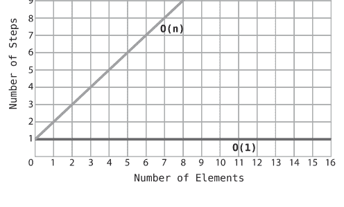

请注意，O(N) 形成了一条完美的对角线。这是因为每增加一个数据，算法就多执行一步。因此，数据越多，算法执行的步骤就越多。

与之形成对比的是 O(1)，它是一条完美的水平线。无论数据有多少，步骤数都保持不变。

### 深入理解大O的本质

为了理解大O的本质为何如此重要，让我们再深入一层。假设我们有一个常数时间算法，无论数据量多少，它总是执行100步。你会认为它比一个 O(N) 算法性能更好还是更差？

请看下面的图表：

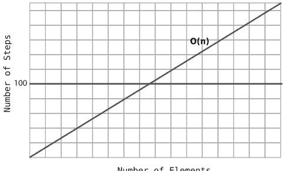

如图所示，对于少于100个元素的数据集，O(N) 算法比执行100步的 O(1) 算法步骤更少。在恰好100个元素时，两条线相交，意味着两个算法执行的步骤数相同，都是100。但关键点在于：对于*所有大于100个元素的数组*，O(N) 算法执行的步骤更多。

因为总会存在*某个*数据量使得局势逆转，从该点起直到无穷，O(N) 都需要更多步骤，所以 O(N) 被认为总体上比 O(1) 效率低，无论 O(1) 算法实际执行多少步。

即使对于一个总是执行一百万步的 O(1) 算法也是如此。随着数据增加，必然会达到一个点，使得 O(N) 变得比 O(1) 算法效率更低，并且在数据量趋向无穷时一直保持这种状态。

### 同一算法，不同场景

正如你在前几章所学，线性搜索*并非总是* O(N)。确实，如果我们要找的元素位于数组的最后一个单元格，需要 N 步才能找到。但当我们要找的元素位于数组的*第一个*单元格时，线性搜索只需一步就能找到。因此，这种情况下的线性搜索应描述为 O(1)。如果我们全面描述线性搜索的效率，我们会说线性搜索在*最佳情况*下是 O(1)，在*最坏情况*下是 O(N)。

虽然大O有效地描述了给定算法的最佳和最坏情况，但大O表示法通常指*最坏情况*，除非另有说明。这就是为什么大多数参考资料会将线性搜索描述为 O(N)，即使它在最佳情况下*可以*是 O(1)。

这是因为“悲观”方法可能是一个有用的工具：确切了解算法在最坏情况下可能有多低效，能让我们为最坏情况做好准备，并可能对我们的选择产生重大影响。

### 第三类算法

在前一章中，你了解到在有序数组上进行二分查找比线性查找快得多。现在让我们看看如何用大O表示法来描述二分查找。

我们不能将二分查找描述为 O(1)，因为步骤数随数据增加而增加。它也不符合 O(N) 的类别，因为步骤数远少于 N 个数据元素。正如我们所见，对于包含100个元素的数组，二分查找只需七步。

那么，二分查找似乎介于 O(1) 和 O(N) 之间。它到底是什么？

用大O术语，我们描述二分查找的时间复杂度为：

O(log N)

我将其读作“log N 的大O”。这类算法也被称为具有*对数时间*复杂度。

简单来说，O(log N) 是大O描述算法的一种方式，该算法*每将数据加倍，步骤数就增加一步*。正如你在前一章所学，二分查找正是如此。你很快就会明白*为什么*这被表示为 O(log N)，但让我们先总结一下你目前所学的内容。

你目前学到的三种算法类型可以按效率从高到低排序如下：

- O(1)
- O(log N)
- O(N)

让我们看一个比较这三种类型的图表：

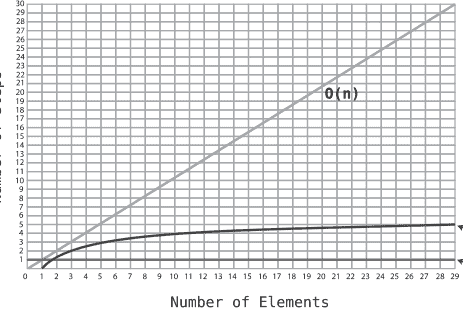

注意 O(log N) 曲线如何轻微上扬，使其效率低于 O(1)，但远高于 O(N)。

要理解为什么这个算法被称为 O(log N)，你首先需要理解*对数*是什么。如果你已经熟悉这个数学概念，可以跳过下一节。

### 对数

让我们探讨为什么像二分查找这样的算法被描述为 O(log N)。对数到底是什么？

Log 是 *logarithm*（对数）的缩写。首先要注意的是，对数与算法无关，尽管这两个词看起来和听起来很相似。

对数是*指数*的逆运算。这里快速回顾一下指数是什么：

2³ 等同于：

2 * 2 * 2

这恰好是 8。

现在，log₂ 8 是其逆运算。它的意思是：你需要将 2 自乘多少次才能得到 8 的结果？

因为你需要将 2 自乘 3 次才能得到 8，所以 log₂ 8 = 3。

再举一个例子：

2⁶ 转换为：

2 * 2 * 2 * 2 * 2 * 2 = 64

因为我们不得不将 2 自乘六次才得到 64，所以我们有：

log₂ 64 = 6。

虽然前面的解释是“教科书”式的对数定义，但我喜欢用另一种方式来描述同一概念，因为许多人发现这样更容易理解，尤其是在涉及大O表示法时。

解释 log₂ 8 的另一种方式是：如果我们持续将 8 *除以* 2，直到结果为 1，我们的等式中会有多少个 2？

8 / 2 / 2 / 2 = 1

换句话说，我们需要将 8 减半多少次才能得到 1？在这个例子中，我们需要三次。因此，

log₂ 8 = 3。

类似地，我们可以将 log₂ 64 解释为：我们需要将 64 减半多少次才能得到 1？

64 / 2 / 2 / 2 / 2 / 2 / 2 = 1

因为有六个 2，所以 log₂ 64 = 6。

现在你理解了对数是什么，O(log N) 背后的含义就清晰了。

### O(log N) 解释

让我们将这一切回归到大O表示法。在计算机科学中，每当我们说 O(log N)，它实际上是 O(log₂ N) 的简写。为了方便，我们省略了那个小的 2。

回想一下，大O表示法解决的关键问题是：如果有 N 个数据元素，算法需要多少步？

O(log N) 意味着对于 N 个数据元素，算法将需要 $log_2 N$ 步。如果有 8 个元素，算法将需要三步，因为 $log_2 8 = 3$。

换句话说，如果我们持续将 8 个元素减半，直到剩下 1 个元素，需要三步。

这*正是*二分查找发生的情况。当我们搜索特定项时，我们持续将数组的单元格减半，直到将其缩小到正确的数字。

简单来说：*O(log N) 意味着算法执行的步骤数等于将数据元素持续减半直到剩下 1 个所需的次数*。

下表展示了 O(N) 和 O(log N) 效率之间的显著差异：

| N 个元素 | O(N) | O(log N) |
| :--- | :--- | :--- |
| 8 | 8 | 3 |
| 16 | 16 | 4 |
| 32 | 32 | 5 |
| 64 | 64 | 6 |
| 128 | 128 | 7 |
| 256 | 256 | 8 |
| 512 | 512 | 9 |
| 1024 | 1024 | 10 |

虽然 O(N) 算法执行的步骤数与数据元素数量相同，但 O(log N) 算法每将数据加倍，只需多执行一步。

在未来的章节中，你将遇到属于你目前学到的三种类型之外的大O表示法类别的算法。但与此同时，让我们将这些概念应用到一些日常代码示例中。

### 实际示例

这是一些典型的 Python 代码，用于打印列表中的所有项目：

```
things = ['apples', 'baboons', 'cribs', 'dulcimers']
for thing in things:
    print("Here's a thing: " + thing)
```

我们如何用大O表示法描述这个算法的效率？

首先需要认识到，这是一个算法的例子。虽然它可能并不花哨，但任何能执行操作的代码在技术上都是算法——它是解决问题的一种特定流程。在这个例子中，问题是我们想要打印列表中的所有项目。我们用来解决这个问题的算法是一个包含打印语句的 for 循环。

要分解这个算法，我们需要分析它需要多少步骤。在这个例子中，算法的主要部分——for 循环——需要四步。在这个示例中，列表中有四个项目，我们每个项目打印一次。

然而，步骤的数量并不是固定的。如果列表包含十个元素，for 循环就需要十步。由于这个 for 循环的步骤数与元素数量相同，我们可以说这个算法的效率是 O(N)。

下一个例子是一个简单的基于 Python 的算法，用于判断一个数字是否为质数：

```python
def is_prime(number):
    for i in range(2, number):
        if number % i == 0:
            return False
    return True
```

前面的代码接受一个数字作为参数，并开始一个 for 循环，在循环中我们将该数字除以从 2 到（但不包括）该数字的每个整数，看看是否有余数。如果没有余数，我们就知道这个数字不是质数，并立即返回 False。如果我们一直除到该数字本身并且总是有余数，那么我们就知道这个数字是质数，并返回 True。

在这个例子中，关键问题与前面的例子略有不同。在前面的例子中，我们的关键问题是如果数组中有 N 个数据元素，算法需要多少步骤。这里，我们处理的不是数组，而是我们传入这个函数的*一个数字*。根据我们传入的数字，这将影响函数循环运行的次数。

因此，在这个例子中，我们的关键问题是：当传入数字 N 时，算法需要多少步骤？

如果我们把数字 7 传入 `is_prime`，for 循环大约运行 7 次。（技术上它运行 5 次，因为它从 2 开始，在实际数字之前结束。）对于数字 101，循环大约运行 101 次。因为步骤数随着传入函数的数字增加而同步增加，这是 O(N) 的一个经典例子。

再次强调，这里的关键问题涉及不同类型的 N，因为我们的主要数据是一个数字而不是一个数组。在后续章节中，我们将有更多练习来识别我们的 N。

### 总结

有了大 O 表示法，我们拥有一个一致的系统，可以比较任何两个算法。借助它，我们将能够审视现实场景，并在相互竞争的数据结构和算法之间做出选择，使我们的代码更快并能处理更重的负载。

在下一章中，我们将遇到一个现实世界的例子，其中我们使用大 O 表示法来显著加速我们的代码。

### 练习

以下练习为你提供了练习大 O 表示法的机会。这些练习的答案可以在 [第 3 章，第 437 页](Chapter 3, on page 437) 部分找到。

1.  使用大 O 表示法描述以下判断给定年份是否为闰年的函数的时间复杂度：

```python
def is_leap_year(year):
    if year % 100 == 0:
        if year % 400 == 0:
            return False
        else:
            return True
    return year % 4 == 0
```

2.  使用大 O 表示法描述以下对给定数组中所有数字求和的函数的时间复杂度：

```python
def array_sum(array):
    sum = 0
    for number in array:
        sum += number
    return sum
```

3.  以下函数基于一个古老的类比，用于描述复利的力量：

    想象你有一个棋盘，在一个格子上放一粒米。在第二个格子上，你放两粒米，因为那是前一个格子上米粒数量的两倍。在第三个格子上，你放四粒米。在第四个格子上，你放八粒米，在第五个格子上，你放十六粒米，依此类推。

    以下函数计算你需要放置一定数量米粒的格子编号。例如，对于十六粒米，函数将返回 5，因为你将把十六粒米放在第五个格子上。

    使用大 O 表示法描述以下函数的时间复杂度：

```python
def chessboard_space(number_of_grains):
    chessboard_spaces = 1
    placed_grains = 1

    while placed_grains < number_of_grains:
        placed_grains *= 2
        chessboard_spaces += 1

    return chessboard_spaces
```

4.  以下函数接受一个字符串数组，并返回一个新数组，该新数组仅包含以字符 "a" 开头的字符串。使用大 O 表示法描述该函数的时间复杂度：

```python
def select_a_strings(array):
    new_array = []

    for string in array:
        if string[0] == "a":
            new_array.append(string)

    return new_array
```

5.  以下函数计算一个*有序*数组的中位数。用大 O 表示法描述其时间复杂度：

```python
def median(array):
    if not array:
        return None

    middle = len(array) // 2

    # If array has even amount of numbers:
    if len(array) % 2 == 0:
        return (array[middle - 1] + array[middle]) / 2.0
    else:  # If array has odd amount of numbers:
        return array[middle]
```

# 第 4 章

## 用大 O 加速你的代码

大 O 表示法是表达算法效率的一个绝佳工具。我们已经能够用它来量化二分查找与线性查找之间的差异，因为二分查找是 O(log N)——一个比线性查找（O(N)）快得多的算法。

有了大 O，你还有机会将你的算法与*世界上通用的算法*进行比较，你可以对自己说：“就一般算法而言，这是一个快算法还是慢算法？”

如果你发现大 O 将你的算法标记为慢算法，你现在可以退后一步，尝试找出是否有办法通过使其落入更快的大 O 类别来优化它。当然，这并非总是可能，但绝对值得思考。

在本章中，我们将编写一些代码来解决一个实际问题，然后使用大 O 来衡量我们的算法。然后我们将看看是否有可能修改算法以获得不错的效率提升。（剧透：我们会的。）

### 冒泡排序

在深入我们的实际问题之前，我们需要先看看大 O 世界中的一个新算法效率类别。为了演示它，我们将使用计算机科学传说中的经典算法之一。

*排序算法*一直是计算机科学中广泛研究的主题，多年来已经开发出了数十种这样的算法。它们都解决以下问题：

> *给定一个未排序的值数组，我们如何对它们进行排序，使其最终按升序排列？*

在本章及后续章节中，我们将遇到许多这样的排序算法。你将首先学到的一些算法被称为*简单排序*，因为它们易于理解，但不如一些更快的排序算法高效。

冒泡排序是一种基本的排序算法，遵循以下步骤：

1.  指向数组中的两个连续值。（最初，我们从指向数组的前两个值开始。）比较第一个项目与第二个项目：
2.  如果两个项目顺序不对（换句话说，左边的值大于右边的值），则交换它们（如果它们恰好已经是正确的顺序，则此步骤不执行任何操作）：
3.  将“指针”向右移动一个单元格：
4.  重复步骤 1 到 3，直到我们到达数组的末尾，或者如果我们到达已经排序的值。（这将在接下来的演练中更清楚。）此时，我们已经完成了数组的第一次*遍历*——我们通过指向其每个值直到到达末尾来“遍历”了数组。
5.  然后我们将两个指针移回数组的前两个值，并通过再次运行步骤 1 到 4 来执行数组的另一次遍历。我们继续执行这些遍历，直到我们有一次遍历没有执行任何交换。当这种情况发生时，意味着我们的数组已完全排序，我们的工作完成。

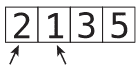

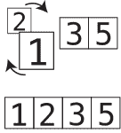

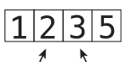

### 冒泡排序实战

让我们演练一个完整的冒泡排序示例。

假设我们想要对数组 [4, 2, 7, 1, 3] 进行排序。它目前是无序的，我们想要生成一个包含相同值但按升序排列的数组。

让我们开始第一轮遍历：
这是我们的初始数组：

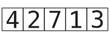

步骤 1：首先，我们比较 4 和 2：

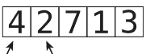

步骤 2：它们顺序不对，所以我们交换它们：

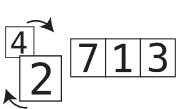

步骤 3：接下来，我们比较 4 和 7：

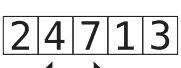

它们顺序正确，所以我们不需要执行交换。

步骤 4：我们现在比较 7 和 1：

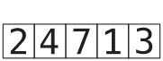

步骤 5：它们顺序不对，所以我们交换它们：


步骤 6：我们比较 7 和 3：


步骤 7：它们顺序不对，所以我们交换它们：


我们现在可以确定 7 已经在数组中处于其正确位置，因为我们一直将它向右移动，直到它到达合适的位置。前一个图中 7 周围的小线条表示 7 已正式处于其正确位置。

这实际上就是该算法被称为 *冒泡* 排序的原因：在每一轮遍历中，未排序的最大值会“冒泡”到其正确位置。

因为我们在这一轮遍历中至少进行了一次交换，所以我们需要进行另一轮遍历。

我们开始第二轮遍历：

步骤 8：我们比较 2 和 4：


它们顺序正确，所以我们可以继续。

步骤 9：我们比较 4 和 1：


步骤 10：它们顺序不对，所以我们交换它们：


步骤 11：我们比较 4 和 3：


步骤 12：它们顺序不对，所以我们交换它们：


我们不需要比较 4 和 7，因为我们知道 7 在上一轮遍历中已经处于其正确位置。现在我们也知道 4 已经冒泡到了其正确位置。这结束了我们的第二轮遍历。

因为我们在这一轮遍历中至少进行了一次交换，所以我们需要进行另一轮遍历。

我们开始第三轮遍历：

步骤 13：我们比较 2 和 1：


步骤 14：它们顺序不对，所以我们交换它们：


步骤 15：我们比较 2 和 3：


它们顺序正确，所以我们不需要交换它们。

我们现在知道 3 已经冒泡到了其正确位置：


由于我们在这一轮遍历中至少进行了一次交换，我们需要再执行一轮。

于是开始第四轮遍历：

步骤 16：我们比较 1 和 2：


因为它们顺序正确，我们不需要交换。我们可以结束这一轮遍历，因为所有剩余的值都已经正确排序。

既然我们进行了一轮不需要任何交换的遍历，我们就知道数组已经完全排序：


### 代码实现：冒泡排序

以下是冒泡排序的 Python 实现：

```python
def bubble_sort(array):
    unsorted_until_index = len(array) - 1
    sorted = False

    while not sorted:
        sorted = True
        for i in range(unsorted_until_index):
            if array[i] > array[i+1]:
                array[i], array[i+1] = array[i+1], array[i]
                sorted = False
        unsorted_until_index -= 1

    return array
```

要使用此函数，我们可以将一个未排序的数组传递给它，如下所示：

```python
print(bubble_sort([65, 55, 45, 35, 25, 15, 10]))
```

然后此函数将返回排序后的数组。

让我们逐行分解该函数，看看它是如何工作的。我将首先提供解释，然后是代码行本身。

我们做的第一件事是创建一个名为 `unsorted_until_index` 的变量。它跟踪数组中*尚未*排序的最右侧索引。当我们刚开始算法时，数组完全未排序，因此我们将此变量初始化为数组的最后一个索引：

```
unsorted_until_index = len(array) - 1
```

我们还创建一个名为 `sorted` 的变量，它将跟踪数组是否已完全排序。当然，当我们的代码首次运行时，它并未排序，所以我们将其设置为 `False`：

```
sorted = False
```

我们开始一个 `while` 循环，只要数组未排序，该循环就会持续运行。此循环的每一轮代表数组的一次遍历：

```
while not sorted:
```

接下来，我们初步将 `sorted` 设置为 `True`：

```
sorted = True
```

这里的方法是，在每一轮遍历中，我们将假设数组已排序，直到遇到交换，此时我们会将变量改回 `False`。如果我们完成了一整轮遍历而无需进行任何交换，`sorted` 将保持 `True`，我们就知道数组已完全排序。

在 `while` 循环内，我们开始一个 `for` 循环，其中我们指向数组中的每一对值。我们使用变量 `i` 作为第一个指针，它从数组的开头开始，直到尚未排序的索引：

```
for i in range(unsorted_until_index):
```

在此循环内，我们比较每一对相邻的值，如果它们顺序不对则交换这些值。如果我们必须进行交换，我们还将 `sorted` 更改为 `False`：

```
for i in range(unsorted_until_index):
    if array[i] > array[i+1]:
        array[i], array[i+1] = array[i+1], array[i]
        sorted = False
```

在每一轮遍历结束时，我们知道我们一路冒泡到最右边的值现在处于其正确位置。因此，我们将 `unsorted_until_index` 减 1，因为它之前指向的索引现在已排序：

```
unsorted_until_index -= 1
```

一旦 `sorted` 为 `True`，`while` 循环结束，这意味着数组已完全排序。一旦这种情况发生，我们返回排序后的数组：

```
return array
```

### 冒泡排序的效率

- *比较*：两个数字相互比较以确定哪个更大。
- *交换*：两个数字相互交换以进行排序。

让我们首先确定冒泡排序中发生了多少次*比较*。

我们的示例数组有五个元素。回顾一下，您可以看到在第一轮遍历中，我们不得不在两组数字之间进行四次比较。

在第二轮遍历中，我们只需要进行三次比较。这是因为我们不需要比较最后两个数字，因为我们知道由于第一轮遍历，最后一个数字已经处于正确位置。

在第三轮遍历中，我们进行了两次比较，在第四轮遍历中，我们只进行了一次比较。

所以那是：
4 + 3 + 2 + 1 = 10 次比较。

为了以一种对所有大小的数组都成立的方式来表达，我们可以说对于 N 个元素，我们进行
(N - 1) + (N - 2) + (N - 3) ... + 1 次比较。

既然我们已经分析了冒泡排序中发生的比较次数，让我们来分析*交换*。

在最坏的情况下，数组按降序排序（与我们想要的完全相反），我们实际上需要为每次比较进行一次交换。因此，在这样的场景中，对于五元素数组，我们将有 10 次比较和 10 次交换，总共 20 步。

让我们从大局来看。对于一个包含五个逆序值的数组，我们进行 4 + 3 + 2 + 1 = 10 次比较。除了 10 次比较，我们还有 10 次交换，总共 20 步。

对于一个包含 10 个值的数组，我们得到 9 + 8 + 7 + 6 + 5 + 4 + 3 + 2 + 1 = 45 次比较，以及另外 45 次交换。总共 90 步。

对于一个包含 20 个值的数组，我们将有：
19 + 18 + 17 + 16 + 15 + 14 + 13 + 12 + 11 + 10 + 9 + 8 + 7 + 6 + 5 + 4 + 3 + 2 + 1 = 190 次比较，以及大约 190 次交换，总共 380 步。

注意这里的低效之处。随着元素数量的增加，步骤数呈*指数级*增长。（用技术数学术语来说，我们实际上会说它是二次方增长。）我们可以在下表中清楚地看到这一点：

| N 数据元素 | 最大步骤数 |
| :--- | :--- |
| 5 | 20 |
| 10 | 90 |
| 20 | 380 |
| 40 | 1560 |
| 80 | 6320 |

如果你观察随着 N 增加步骤数的增长，你会发现它大约以 N² 的速度增长。请看下表：

| N 数据元素 | 冒泡排序步骤数 | N² |
| :--- | :--- | :--- |
| 5 | 20 | 25 |
| 10 | 90 | 100 |
| 20 | 380 | 400 |
| 40 | 1560 | 1600 |
| 80 | 6320 | 6400 |

让我们用大 O 表示法来表达冒泡排序的时间复杂度。记住，大 O 总是回答这个关键问题：如果有 N 个数据元素，算法需要多少步？

因为对于 N 个值，冒泡排序需要 N² 步，所以在大 O 表示法中，我们说冒泡排序的效率是 O(N²)。

O(N²) 被认为是一种相对低效的算法，因为随着数据量的增加，步骤数会急剧增加。看这张图，它比较了 O(N²) 和更快的 O(N)：


注意 O(N²) 的曲线随着数据增长在步骤数上急剧向上弯曲。与之相比，O(N) 则沿着一条简单的对角线绘制。
最后一点：O(N²) 也被称为*二次时间*。

### 一个二次方问题

这里有一个实际的例子，说明我们可以用一个快速的 O(N) 算法来替换一个缓慢的 O(N²) 算法。

假设你正在开发一个分析用户对产品评分的 Python 应用程序，用户给出的评分从 0 到 10。具体来说，你正在编写一个函数，检查一个评分数组是否包含任何重复的数字。这将用于软件其他部分的更复杂计算中。

例如，数组 [1, 5, 3, 9, 1, 4] 中数字 1 出现了两次，因此我们会返回 True 以表示该数组存在重复数字的情况。
首先想到的方法之一是使用嵌套循环，如下所示：

```
def has_duplicate_value(array):
    for i in range(len(array)):
        for j in range(len(array)):
            if (i != j) and (array[i] == array[j]):
                return True
    return False
```

在这个函数中，我们使用变量 i 遍历数组中的每个值。当我们关注 i 中的每个值时，我们运行一个*第二个*循环，使用 j 查看数组中的所有值，并检查位置 i 和 j 的值是否相同。如果相同，这意味着我们遇到了重复值，我们返回 True。如果我们遍历完所有循环而没有遇到任何重复项，我们返回 false，因为我们知道数组中没有重复项。

虽然这确实有效，但它高效吗？既然我们对大 O 表示法有了一些了解，让我们退一步，看看大 O 会如何评价这个函数。

记住，大 O 表达了算法相对于 N 个数据值需要多少步。要将其应用到我们的情况，我们需要问自己：对于提供给我们的 has_duplicate_value 函数的数组中的 N 个值，在最坏的情况下，我们的算法需要多少步？

要回答前面的问题，我们需要分析我们的函数执行了哪些步骤，以及最坏的情况会是什么。

前面的函数有一种类型的步骤，即*比较*。它反复比较 array[i] 和 array[j]，看它们是否相等，从而代表一对重复项。在最坏的情况下，数组不包含重复项，这将迫使我们的代码完成所有循环并穷尽所有可能的比较，然后返回 False。

基于此，我们可以得出结论，对于数组中的 N 个值，我们的函数将执行 N² 次比较。这是因为我们执行一个外部循环，必须迭代 N 次才能遍历整个数组，而对于*每次迭代*，我们必须用内部循环*再迭代 N 次*。那就是 N 步 * N 步，即 N² 步，使我们得到一个 O(N²) 的算法。

我们实际上可以通过向函数中添加一些代码来跟踪算法的步骤数，从而证明我们的函数需要 N² 步：

```
def has_duplicate_value(array):
    steps = 0  # count of steps
    for i in range(len(array)):
        for j in range(len(array)):
            steps += 1  # increment number of steps
            if (i != j) and (array[i] == array[j]):
                return True
    print(steps)  # print number of steps if no duplicates
    return False
```

这段添加的代码将打印出没有重复项时所采取的步骤数。例如，如果我们运行 has_duplicate_value([1, 4, 5, 2, 9])，我们将在 Python 控制台中看到输出为 25，这表明对于数组中的五个元素进行了二十五次比较。如果我们对其他值进行测试，我们会发现输出总是数组大小的平方。这是经典的 O(N²)。

通常（但并非总是如此），当一个算法将一个循环嵌套在另一个循环内部时，该算法就是 O(N²)。所以，每当你看到嵌套循环，你的脑海中就应该响起 O(N²) 的警报。

现在，我们的函数是 O(N²) 这一事实应该让我们停下来思考。这是因为 O(N²) 被认为是一种相对较慢的算法。每当你遇到一个慢算法，值得花些时间考虑是否有更快的替代方案。可能*没有*更好的替代方案，但让我们先确认一下。

### 一个线性解决方案

以下是 has_duplicate_value 函数的另一个实现，它不依赖于嵌套循环。它有点巧妙，所以让我们先看看它是如何工作的，然后我们再看看它是否比我们的第一个实现更高效。

```
def has_duplicate_value(array):
    existing_numbers = [0] * 11

    for i in range(len(array)):
        if existing_numbers[array[i]] == 1:
            return True
        else:
            existing_numbers[array[i]] = 1

    return False
```

这个函数是这样工作的。它创建一个名为 existing_numbers 的数组，该数组最初是一个包含十一个零的数组。我们确保数组至少有十一个位置，以便我们可以跟踪用户可能给出的十一种可能的评分（0 到 10）。

然后我们使用一个循环来检查数组中的每个数字。当它遇到每个数字时，它会在 existing_numbers 数组中我们遇到的数字的索引处放置一个任意值（我们选择使用 1）。

例如，假设我们的输入数组是 [3, 5, 8]。当我们遇到 3 时，我们在 existing_numbers 的索引 3 处放置一个 1。因此 existing_numbers 数组现在大致相当于：

[0, 0, 0, 1, 0, 0, 0, 0, 0, 0, 0]

现在 existing_numbers 的索引 3 处有一个 1，表示并记住我们已经在给定数组中遇到过 3。

当我们的循环随后遇到给定数组中的 5 时，它在 existing_numbers 的索引 5 处添加一个 1：

[0, 0, 0, 1, 0, 1, 0, 0, 0, 0, 0]

最后，当我们到达 8 时，existing_numbers 现在看起来像这样：

[0, 0, 0, 1, 0, 1, 0, 0, 1, 0, 0]

本质上，我们使用 existing_numbers 的索引来记住我们到目前为止在数组中见过哪些数字。

现在，真正的技巧来了。在代码将 1 存储到适当的索引之前，它首先检查该索引是否已经有一个 1 作为其值。如果有，这意味着我们已经遇到过该数字，意味着我们找到了一个重复项。如果是这种情况，我们只需返回 True 并提前结束函数。如果我们遍历完循环而没有返回 True，这意味着没有重复项，我们返回 False。

为了确定这个新算法在大 O 方面的效率，我们再次需要确定算法在最坏情况下需要多少步。

在这里，重要的步骤类型是查看每个数字并检查其在 existing_numbers 中的索引值是否为 1：

```
if existing_numbers[array[i]] == 1:
```

（除了比较之外，我们还向 existing_numbers 数组进行*插入*，但在这次分析中我们认为这种步骤是微不足道的。更多内容将在下一章中介绍。）

就最坏情况而言，这种情况发生在数组不包含重复项时，此时我们的函数必须完成整个循环。

这个新算法似乎对 N 个数据元素进行 N 次比较。这是因为只有一个循环，它只是遍历数组中的数字数量。我们可以通过在 Python 控制台中跟踪步骤来验证这个理论：

```
def has_duplicate_value(array):
    steps = 0
    existing_numbers = [0] * 11

    for i in range(len(array)):
        steps += 1
        if existing_numbers[array[i]] == 1:
            return True
        else:
            existing_numbers[array[i]] = 1

    print(steps)
    return False
```

如果我们现在运行 has_duplicate_value([1, 4, 5, 2, 9])，我们会看到 Python 控制台中的输出是 5，这与我们数组的大小相同。我们会发现对于所有大小的数组都是如此。因此，这个算法是 O(N)。

我们知道 O(N) 比 O(N²) 快得多，所以通过使用第二种方法，我们显著优化了 has_duplicate_value 函数。这是一个*巨大的*速度提升。

（这种新实现方式的一个缺点是，它比第一种方法消耗更多内存。现在不必担心这个问题；我们将在[第19章，处理空间约束，第385页](#)中详细讨论。）

### 总结

显然，扎实理解大O表示法能帮助你识别慢速代码，并在两种竞争算法中选择更快的一种。

然而，在某些情况下，大O表示法会让我们误以为两种算法速度相同，而实际上其中一种更快。在下一章中，你将学习如何评估各种算法的效率，即使大O表示法不够精细时也能做到。

### 练习

以下练习为你提供了加速代码的实践机会。这些练习的答案可在[第4章，第438页](#)部分找到。

1.  替换下表中的问号，描述在各种大O类型下，给定数量的数据元素会发生多少步骤：

| N 个元素 | O(N) | O(log N) | O(N²) |
| :--- | :--- | :--- | :--- |
| 100 | 100 | ? | ? |
| 2000 | ? | ? | ? |

2.  如果我们有一个处理数组的 O(N²) 算法，并且发现它需要 256 步，那么数组的大小是多少？

3.  使用大O表示法描述以下函数的时间复杂度。该函数在给定数组中找出任意两个数的最大乘积：

```python
def greatest_product(array):
    if len(array) < 2:
        return None

    greatest_product_so_far = array[0] * array[1]

    for index_i, value_i in enumerate(array):
        for index_j, value_j in enumerate(array):
            if (index_i != index_j and
                    value_i * value_j > greatest_product_so_far):
                greatest_product_so_far = value_i * value_j

    return greatest_product_so_far
```

4.  以下函数在数组中找出最大的单个数字，但其效率为 O(N²)。重写该函数，使其成为高效的 O(N)：

```python
def greatest_number(array):
    if not array:
        return None

    for i in array:
        # Assume for now that i is the greatest:
        is_i_the_greatest = True

        for j in array:
            # If we find another value that is greater than i,
            # i is not the greatest:
            if j > i:
                is_i_the_greatest = False

        # If, by the time we checked all the other numbers, i
        # is still the greatest, it means that i is the greatest number:
        if is_i_the_greatest:
            return i
```

### 第5章

## 使用和不使用大O优化代码

我们已经看到，大O表示法是比较算法和确定在给定情况下应使用哪种算法的绝佳工具。然而，它当然不是*唯一*的工具。事实上，有时两种竞争算法用大O描述的方式相同，但其中一种算法比另一种更快。

在本章中，你将学习如何辨别两种*看似*效率相同的算法，以及如何选择其中更快的一种。

## 选择排序

在上一章中，我们探讨了一种名为冒泡排序的排序算法，其效率为 O(N²)。现在我们将深入研究另一种名为选择排序的排序算法，并看看它与冒泡排序相比如何。

选择排序的步骤如下：

1.  我们从左到右检查数组的每个单元格，以确定哪个值最小。当我们从一个单元格移动到另一个单元格时，我们会跟踪到目前为止遇到的最低值。（我们将通过将其索引存储在一个变量中来实现这一点。）如果我们遇到一个包含比变量中值更低的值的单元格，我们就替换它，这样变量现在指向新的索引。参见下图：


2.  一旦我们确定了哪个索引包含最低值，我们就将其值与我们开始遍历时的值交换。这将是第一次遍历中的索引 0，第二次遍历中的索引 1，依此类推。这里的图示说明了第一次遍历的交换。


3.  每次遍历包括步骤 1 和 2。我们重复遍历，直到达到一次将从数组末尾开始的遍历。到此时，数组将被完全排序。

### 选择排序实战

让我们使用示例数组 [4, 2, 7, 1, 3] 来逐步演示选择排序的步骤。

我们开始第一次遍历：

我们通过检查索引 0 处的值来设置。根据定义，它是我们到目前为止在数组中遇到的最低值（因为它是*唯一*遇到的值），所以我们在一个变量中跟踪其索引：


步骤 1：我们将 2 与到目前为止的最低值（恰好是 4）进行比较：


2 比 4 更小，因此它成为到目前为止的最低值：


步骤 2：我们将下一个值——7——与到目前为止的最低值进行比较。7 大于 2，因此 2 仍然是我们的最低值：


步骤 3：我们将 1 与到目前为止的最低值进行比较：


因为 1 比 2 更小，所以 1 成为我们的新最低值：


步骤 4：我们将 3 与到目前为止的最低值（即 1）进行比较。我们已经到达数组末尾，并确定 1 是整个数组中的最低值：


步骤 5：因为 1 是最低值，我们将其与索引 0 处的值交换——这是我们开始这次遍历时的索引：


由于我们已将最低值移动到数组开头，这意味着最低值现在处于其正确位置：


我们现在准备开始第二次遍历。

设置：第一个单元格——索引 0——已经排序，因此这次遍历从下一个单元格开始，即索引 1。索引 1 处的值是数字 2，它是这次遍历中到目前为止遇到的最低值：


步骤 6：我们将 7 与到目前为止的最低值进行比较。2 小于 7，因此 2 仍然是我们的最低值：


步骤 7：我们将 4 与到目前为止的最低值进行比较。2 小于 4，因此 2 仍然是我们的最低值：


步骤 8：我们将 3 与到目前为止的最低值进行比较。2 小于 3，因此 2 仍然是我们的最低值：


我们已经到达数组末尾。由于这次遍历的最低值已经处于其正确位置，我们不需要执行交换。这结束了我们的第二次遍历，结果如下：


我们现在开始第三次遍历。

设置：我们从索引 2 开始，其中包含值 7。7 是这次遍历中到目前为止遇到的最低值：


步骤 9：我们将 4 与 7 进行比较：


我们注意到 4 是我们的新最低值：


步骤 10：我们遇到 3，它比 4 更小：


3 成为我们的新最低值：


步骤 11：我们已经到达数组末尾，因此我们将 3 与我们开始遍历时的值（即 7）交换：


我们现在知道 3 在数组中的正确位置：


虽然你我都能看到此时整个数组已正确排序，但*计算机*还不知道这一点，因此它必须开始第四次遍历。

设置：我们从索引 3 开始遍历。4 是到目前为止的最低值：


步骤 12：我们将 7 与 4 进行比较：


4 仍然是这次遍历中到目前为止遇到的最低值，因此我们不需要交换它，因为它已经处于正确位置。

因为除了最后一个单元格之外的所有单元格都已正确排序，这必然意味着最后一个单元格也处于正确顺序，因此我们的整个数组已正确排序：


### 代码实现：选择排序

以下是选择排序的 Python 实现：

```python
def selection_sort(array):
    for i in range(len(array) - 1):
        lowest_number_index = i

        for j in range(i + 1, len(array)):
            if array[j] < array[lowest_number_index]:
                lowest_number_index = j

        if lowest_number_index != i:
            array[i], array[lowest_number_index] = \
                array[lowest_number_index], array[i]

    return array
```

让我们逐行解析。

我们开始一个循环，代表每一次遍历。它使用变量 `i` 指向数组的每个索引，并一直遍历到倒数第二个值：

```python
for i in range(len(array) - 1):
```

它不需要为最后一个值本身运行，因为到那时数组将完全排序。

接下来，开始跟踪包含我们目前遇到的最低值的 `索引`：

```python
lowest_number_index = i
```

这个 `lowest_number_index` 在第一次遍历开始时为 0，在第二次遍历开始时为 1，依此类推。

我们特别跟踪索引的原因是，在代码的其余部分中，我们需要同时访问最低值及其索引，而我们可以使用索引来引用两者。（我们可以通过调用 `array[lowest_number_index]` 来检查最低值）。

在每次遍历中，我们检查数组的剩余值，看看是否存在比当前最低值更低的值：

```python
for j in range(i + 1, len(array)):
```

确实，如果我们找到一个更低的值，我们将这个新值的索引存储在 lowest_number_index 中：

```python
if array[j] < array[lowest_number_index]:
    lowest_number_index = j
```

在内部循环结束时，我们将找到本次遍历中最低数字的索引。

如果本次遍历的最低值已经处于其正确位置（当最低值是我们在遍历中遇到的第一个值时会发生这种情况），我们不需要做任何事情。但如果最低值*不*在其正确位置，我们需要执行交换。具体来说，我们将最低值与索引 i 处的值交换，i 是我们开始本次遍历的索引：

```python
if lowest_number_index != i:
    array[i], array[lowest_number_index] = array[lowest_number_index], array[i]
```

最后，我们返回排序后的数组：

```python
return array
```

### 选择排序的效率

选择排序包含两种类型的步骤：比较和交换。我们在每次遍历中将每个值与我们遇到的最低数字进行比较，并将最低数字交换到其正确位置。

回顾我们包含五个元素的示例数组，我们总共进行了 10 次比较。让我们在下表中分解：

| 遍历次数 | 比较次数 |
| :--- | :--- |
| 1 | 4 次比较 |
| 2 | 3 次比较 |
| 3 | 2 次比较 |
| 4 | 1 次比较 |

总计 4 + 3 + 2 + 1 = 10 次比较。

为了适用于所有大小的数组，我们可以说，对于 N 个元素，我们进行

(N - 1) + (N - 2) + (N - 3) ... + 1 次比较。

至于*交换*，我们每次遍历最多只需要进行一次交换。这是因为在每次遍历中，我们进行一次或零次交换，具体取决于该遍历的最低数字是否已处于正确位置。与冒泡排序相比，在最坏的情况下，我们不得不为*每一次*比较都进行一次交换。

以下是冒泡排序和选择排序的并排比较：

| N 个元素 | 冒泡排序的最大步骤数 | 选择排序的最大步骤数 |
| :--- | :--- | :--- |
| 5 | 20 | 14 (10 次比较 + 4 次交换) |
| 10 | 90 | 54 (45 次比较 + 9 次交换) |
| 20 | 380 | 209 (190 次比较 + 19 次交换) |
| 40 | 1560 | 819 (780 次比较 + 39 次交换) |
| 80 | 6320 | 3239 (3160 次比较 + 79 次交换) |

从这个比较中可以清楚地看出，选择排序所需的步骤数大约是冒泡排序的一半，这表明选择排序的速度是其两倍。

### 忽略常数

但有趣的是：在大 O 表示法的世界里，选择排序和冒泡排序的描述方式*完全相同*。

再次强调，大 O 表示法回答了关键问题：如果有 N 个数据元素，算法将需要多少步？因为选择排序大约需要 N² / 2 步，所以将选择排序的效率描述为 O(N² / 2) 似乎是合理的。也就是说，对于 N 个数据元素，有 N² / 2 步。下表证实了这一点：

| N 个元素 | N² / 2 | 选择排序的最大步骤数 |
| :--- | :--- | :--- |
| 5 | 5² / 2 = 12.5 | 14 |
| 10 | 10² / 2 = 50 | 54 |
| 20 | 20² / 2 = 200 | 209 |
| 40 | 40² / 2 = 800 | 819 |
| 80 | 80² / 2 = 3200 | 3239 |

然而，实际上，选择排序在大 O 中被描述为 O(N²)，就像冒泡排序一样。这是因为大 O 的一个主要规则，我现在首次引入：

*大 O 表示法忽略常数。*

这仅仅是一种数学上的说法，即大 O 表示法从不包含不是指数的普通数字。我们直接从表达式中去掉这些普通数字。

那么在我们的例子中，即使算法需要 N² / 2 步，我们也去掉“/ 2”，因为它是一个普通数字，并将效率表示为 O(N²)。

这里还有几个例子：

对于一个需要 N / 2 步的算法，我们称之为 O(N)。

一个需要 N² + 10 步的算法将被表示为 O(N²)，因为我们去掉了 10，它是一个普通数字。

对于一个需要 2N 步（即 N * 2）的算法，我们去掉普通数字，称之为 O(N)。

即使是 O(100N)，它比 O(N) *慢 100 倍*，也被称为 O(N)。

乍一看，这条规则似乎会使大 O 表示法完全无用，因为你可以有两个算法在大 O 中被描述得完全相同，但其中一个可能比另一个*快 100 倍*。而这正是我们在选择排序和冒泡排序中看到的情况。两者在大 O 中都被描述为 O(N²)，但选择排序的速度是冒泡排序的两倍。

那么，这是怎么回事呢？

### 大 O 类别

这引出了大 O 中的下一个概念：大 O 表示法只关注算法速度的*一般类别*。

打个比方，我们来谈谈物理建筑。当然，有许多不同类型的建筑。有一层楼的单户住宅，两层楼的单户住宅，三层楼的单户住宅。有不同楼层数的高层公寓楼。还有各种高度和形状的摩天大楼。

如果我们比较两栋建筑，其中一栋是单户住宅，另一栋是摩天大楼，那么提到每栋有多少层楼几乎就变得无关紧要了。因为这两栋建筑在规模和功能上差异如此之大，我们不需要说，“这是一栋两层楼的房子，而另一栋是一百层的摩天大楼。”我们不妨直接称一栋为房子，另一栋为摩天大楼。用它们的一般类别来称呼就足以表明它们的巨大差异。

算法效率也是如此。如果我们比较，比如说，一个 O(N) 算法和一个 O(N²) 算法，这两种效率差异如此之大，以至于 O(N) 算法实际上是 O(2N)、O(N / 2) 甚至 O(100N) 并不真正重要。

现在，这就是为什么 O(N) 和 O(N²) 被认为是两个不同的类别，而 O(N) 和 O(100N) 属于同一个类别。

记住[第 37 页的《大 O 的灵魂》](#)。大 O 表示法不仅仅关心算法需要多少步。它关心的是随着数据增加，算法步骤的长期轨迹。O(N) 讲述了一个线性增长的故事——即步骤根据数据的某个比例呈直线增长。即使步骤是 100N，这也是正确的。O(N²) 讲述了一个不同的故事——一个指数增长的故事。

与任何形式的 O(N) 相比，指数增长是一个完全不同的类别。当我们考虑到 O(N²) 在数据增长的某个点上，会变得比 O(N) 乘以*任何*因子都慢时，这一点就真正凸显出来了。

在下图中，你可以看到 O(N²) 如何变得比 N 的各种因子都慢：


因此，当比较属于两个不同大 O 类别的两种效率时，用它们的一般类别来识别就足够了。将 O(2N) 与 O(N²) 进行比较，就像谈论一栋两层楼的房子与一栋摩天大楼相比。我们不妨直接说 O(2N) 属于 O(N) 的一般类别。

我们遇到的所有大 O 类型，无论是 O(1)、O(log N)、O(N)、O(N²)，还是我们将在本书后面遇到的类型，都是彼此差异很大的大 O 一般类别。将步骤数乘以或除以一个普通数字并不会使它们改变到另一个类别。

然而，当两个算法属于*相同*的大O分类时，并不一定意味着它们的速度相同。毕竟，即使冒泡排序和选择排序都是O(N²)，冒泡排序的速度也只有选择排序的一半。因此，虽然大O非常适合对比属于不同分类的算法，但当两个算法属于*相同*分类时，就需要进一步分析来确定哪个算法更快。

### 一个实际例子

让我们回到第1章的第一个代码示例，并做些微小改动：

```python
def print_numbers_version_one(upper_limit):
    number = 2
    while number <= upper_limit:
        if number % 2 == 0:
            print(number)
        number += 1

def print_numbers_version_two(upper_limit):
    number = 2
    while number <= upper_limit:
        print(number)
        number += 2
```

这里我们有两个算法来完成相同的任务，即打印从2到某个`upper_limit`的所有偶数。（在第1章中，上限固定为100，而这里我们让用户传入一个数字作为`upper_limit`。）

我在第1章中提到，第一个版本比第二个版本多花一倍的步骤，但现在让我们看看这在大O方面是如何体现的。

再次强调，大O表达的是这个关键问题的答案：如果有N个数据元素，算法需要多少步骤？不过在这个例子中，N不是数组的大小，而是我们传入函数作为`upper_limit`的数字。

第一个版本大约需要N步。也就是说，如果`upper_limit`是100，函数大约需要100步。（实际上需要99步，因为它从2开始计数。）所以我们可以放心地说，第一个算法的时间复杂度是O(N)。

第二个版本需要N / 2步。当upper_limit是100时，函数只需要50步。虽然很想称之为O(N / 2)，但你现在已经知道，我们忽略常数，将表达式简化为O(N)。

现在，第二个版本比第一个版本快一倍，自然是更好的选择。这又是一个很好的例子，说明两个算法可以用相同的大O表示法表达，但需要进一步分析才能确定哪个算法更快。

### 重要步骤

让我们对前面的例子再进行一层分析。如果我们再次查看第一个版本，print_numbers_version_one，我们说它需要N步。这是因为循环运行了N次，N就是upper_limit。

但函数真的只需要N步吗？

如果我们真正分解开来，可以看到每轮循环中发生了*多个*步骤。

首先，我们有比较步骤（if number % 2 == 0），检查数字是否能被2整除。这个比较在每轮循环中都会发生。

其次，我们有打印步骤（print(number)），这只在偶数时发生。因此，这发生在每*隔*一轮的循环中。

第三，我们有number += 1，这在每轮循环中都会运行。

在前面的章节中，我暗示过你将学会如何确定在表达算法的大O时，哪些步骤足够重要需要被计算在内。那么在我们的例子中，这些步骤中哪些被认为是重要的？我们关心比较、打印还是number的递增？

答案是*所有*步骤都很重要。只是当我们用大O表示步骤时，我们忽略常数，从而简化表达式。

让我们应用到这里。如果我们计算所有步骤，我们有N次比较，N次递增，和N / 2次打印。这加起来是2.5N步。然而，因为我们消除了2.5这个常数，我们将其表示为O(N)。那么哪个步骤是重要的？它们都是，但通过忽略常数，我们实际上更关注循环运行的次数，而不是循环内部发生的具体细节。

### 总结

我们现在掌握了一些强大的分析工具。我们可以用大O来大致确定算法的效率，也可以比较属于同一分类的两个算法。

然而，在比较两个算法的效率时，还必须考虑另一个重要因素。到目前为止，我们一直关注算法在最坏情况下的速度。而最坏情况，根据定义，并不是经常发生。平均而言，大多数发生的情况是……嗯……平均情况。在下一章中，你将学习如何考虑所有情况。

### 练习

以下练习为你提供了分析算法的机会。这些练习的答案可以在[第5章，第438页](Chapter 5, on page 438)部分找到。

1.  使用大O表示法描述一个需要4N + 16步的算法的时间复杂度。
2.  使用大O表示法描述一个需要2N²步的算法的时间复杂度。
3.  使用大O表示法描述以下函数的时间复杂度，该函数返回数组中所有数字加倍后的总和：
4.  使用大O表示法描述以下函数的时间复杂度，该函数接受一个字符串数组并以多种大小写形式打印每个字符串：

```python
def double_then_sum(array):
    doubled_array = []
    for number in array:
        doubled_array.append(number * 2)
    sum = 0
    for number in doubled_array:
        sum += number
    return sum
```

```python
def multiple_cases(array):
    for string in array:
        print(string.upper())
        print(string.lower())
        print(string.capitalize())
```

5.  下一个函数遍历一个数字数组。在遍历过程中，它专注于每*隔*一个数字，同时忽略中间的数字。对于每个“焦点数字”，该函数会继续打印数组中的*每个*数字——一次一个——在将其与焦点数字相加之后。

这个函数用大O表示法表示的效率是多少？

```python
def every_other(array):
    for index, number in enumerate(array):
        if index % 2 == 0:
            for other_number in array:
                print(number + other_number)
```

### 第6章

## 为乐观情况优化

到目前为止，我们主要关注算法在最坏情况下需要多少步骤。这背后的逻辑很简单：如果你为最坏情况做好了准备，事情就会顺利。

然而，你将在本章中发现，最坏情况并不是*唯一*值得考虑的情况。能够考虑*所有*情况是一项重要技能，可以帮助你为每种情况选择合适的算法。

## 插入排序

我们之前遇到过两种不同的排序算法：冒泡排序和选择排序。两者的效率都是O(N²)，但选择排序实际上快一倍。现在你将学习第三种排序算法，称为插入排序，它将揭示分析超越最坏情况场景的力量。

插入排序包含以下步骤：

1.  在第一遍中，我们暂时移除索引1（第二个单元格）的值，并将其存储在一个临时变量中。这将在该索引处留下一个空隙，因为它不包含任何值：


在后续的遍历中，我们移除后续索引的值。

2.  然后我们开始一个移位阶段，我们将空隙左侧的每个值与临时变量中的值进行比较：


如果空隙左侧的值大于临时变量，我们将该值向右移动：


随着我们将值向右移动，空隙自然向左移动。一旦我们遇到一个比临时移除的值小的值，或者到达数组的左端，这个移位阶段就结束了。

3.  然后我们将临时移除的值插入到当前的空隙中：


4.  步骤1到3代表一次遍历。我们重复这些遍历，直到遍历从数组的最后一个索引开始。到那时，数组将被完全排序。

### 插入排序实战

让我们将插入排序应用于数组 [4, 2, 7, 1, 3]。

我们通过检查索引1的值开始第一遍。这里恰好是值2：


步骤 1：我们暂时移除数字 2，并将其存储在一个名为 `temp_value` 的变量中。我们通过将其移动到数组其余部分的上方来表示这个值：


步骤 2：我们将数字 4 与 `temp_value`（即 2）进行比较：


步骤 3：因为 4 大于 2，我们将 4 向右移动：


没有更多元素需要移动了，因为间隙现在位于数组的左端。

步骤 4：我们将 `temp_value` 插入间隙中，完成第一轮遍历：


接下来，我们开始第二轮遍历：

步骤 5：在第二轮遍历中，我们暂时移除索引 2 处的值。我们将把它存储在 `temp_value` 中。在这个例子中，`temp_value` 是 7：


步骤 6：我们将 4 与 `temp_value` 进行比较：


4 更小，所以我们不会移动它。由于我们遇到了一个小于 `temp_value` 的值，这个移动阶段就结束了。

步骤 7：我们将 `temp_value` 插回间隙中，结束第二轮遍历：


我们现在开始第三轮遍历：

步骤 8：我们暂时移除数字 1 并将其存储在 `temp_value` 中：


步骤 9：我们将 7 与 `temp_value` 进行比较：


步骤 10：7 大于 1，所以我们把 7 向右移动：


步骤 11：我们将 4 与 `temp_value` 进行比较：


步骤 12：4 大于 1，所以我们也移动它：


步骤 13：我们将 2 与 `temp_value` 进行比较：


步骤 14：2 更大，所以我们移动它：


步骤 15：间隙已经到达数组的左端，所以我们把 `temp_value` 插入间隙中，结束这轮遍历：


现在，我们开始第四轮遍历：

步骤 16：我们暂时移除索引 4 处的值，将其作为我们的 `temp_value`。这个值是 3：


步骤 17：我们将 7 与 `temp_value` 进行比较：


步骤 18：7 更大，所以我们把 7 向右移动：


步骤 19：我们将 4 与 `temp_value` 进行比较：


步骤 20：4 大于 3，所以我们移动 4：


步骤 21：我们将 2 与 `temp_value` 进行比较。2 小于 3，所以我们的移动阶段完成：


步骤 22：我们将 `temp_value` 插回间隙中：


我们的数组现在已完全排序：


### 代码实现：插入排序

以下是插入排序的 Python 实现：

```python
def insertion_sort(array):
    for index in range(1, len(array)):
        temp_value = array[index]
        position = index - 1

        while position >= 0:
            if array[position] > temp_value:
                array[position + 1] = array[position]
                position = position - 1
            else:
                break

        array[position + 1] = temp_value

    return array
```

让我们逐步解析这段代码。

首先，我们启动一个从索引 1 开始、遍历整个数组的循环。这个循环的每一轮代表一次遍历：

```python
for index in range(1, len(array)):
```

在每次遍历中，我们将“移除”的值保存在一个名为 `temp_value` 的变量中：

```python
temp_value = array[index]
```

接下来，我们创建一个名为 `position` 的变量，它将从 `temp_value` 索引的左侧紧邻位置开始。这个 `position` 将代表我们与 `temp_value` 进行比较的每个值：

```python
position = index - 1
```

在遍历过程中，随着我们将每个值与 `temp_value` 进行比较，这个 `position` 会不断向左移动。

然后我们开始一个内部的 `while` 循环，只要 `position` 大于或等于 0，它就会运行：

```python
while position >= 0:
```

然后我们执行比较；也就是说，我们检查 `position` 处的值是否大于 `temp_value`：

```python
if array[position] > temp_value:
```

如果是，我们将左侧的这个值向右移动：

```python
array[position + 1] = array[position]
```

然后我们将 `position` 减 1，以便在下一轮 `while` 循环中将下一个左侧的值与 `temp_value` 进行比较：

```python
position = position - 1
```

如果在任何时候我们遇到 `position` 处的值小于或等于 `temp_value`，我们就可以准备结束这次遍历，因为是时候将 `temp_value` 移入间隙了：

```python
else:
    break
```

每次遍历的最后一步是将 `temp_value` 移入间隙：

```python
array[position + 1] = temp_value
```

在所有遍历完成后，我们返回已排序的数组：

```python
return array
```

### 插入排序的效率

插入排序中会发生四种类型的步骤：移除、比较、移动和插入。为了分析插入排序的效率，我们需要统计每种步骤的数量。

首先，让我们深入探讨比较。每次我们将间隙左侧的值与 `temp_value` 进行比较时，就会发生一次比较。在最坏的情况下，即数组按降序排列时，我们必须在每次遍历中将 `temp_value` 左侧的每个数字与 `temp_value` 进行比较。这是因为 `temp_value` 左侧的每个值总是大于 `temp_value`，因此遍历只会在间隙到达数组左端时结束。

在第一次遍历中，`temp_value` 是索引 1 处的值，最多进行一次比较，因为 `temp_value` 左侧只有一个值。在第二次遍历中，最多进行两次比较，依此类推。在最后一次遍历中，我们需要将 `temp_value` 与数组中除 `temp_value` 本身之外的每个值进行比较。换句话说，如果数组中有 N 个元素，最后一次遍历中进行的最大比较次数是 N - 1。

因此，我们可以将总比较次数表述为：

1 + 2 + 3 + ... + (N - 1) 次比较。

在我们包含五个元素的示例数组中，最大比较次数为：

1 + 2 + 3 + 4 = 10 次比较。

对于包含 10 个元素的数组，比较次数为：

1 + 2 + 3 + 4 + 5 + 6 + 7 + 8 + 9 = 45 次比较。

对于包含 20 个元素的数组，总比较次数为 190 次，依此类推。

观察这个模式，可以发现对于一个包含 N 个元素的数组，大约有 N² / 2 次比较。（10² / 2 是 50，20² / 2 是 200。我们将在下一章更仔细地研究这个模式。）

让我们继续分析其他类型的步骤。

每次我们将一个值向右移动一个单元格时，就会发生移动。当数组按降序排列时，移动的次数将与比较的次数相同，因为每次比较都会迫使我们将一个值向右移动。

让我们将最坏情况下的比较和移动次数相加：

N² / 2 次比较
+ N² / 2 次移动

N² 步

每次遍历都会发生一次从数组中移除和插入 `temp_value` 的操作。由于总是有 N - 1 次遍历，我们可以得出结论：有 N - 1 次移除和 N - 1 次插入。

所以现在我们得到：
N² 次比较和移动（合计）
N - 1 次移除
+ N - 1 次插入

N² + 2N - 2 步

你已经学到了大 O 表示法的一个主要规则：大 O 忽略常数。考虑到这个规则，我们乍一看会将其简化为 O(N² + N)。

然而，我现在将揭示大 O 表示法的另一个主要规则：

> 当有多个阶数相加时，大 O 表示法只考虑 N 的最高阶数。

换句话说，如果一个算法需要 N⁴ + N³ + N² + N 步，我们只认为 N⁴ 是重要的——并称之为 O(N⁴)。为什么是这样？

看下面的表格：

| N | N² | N³ | N⁴ |
|---|---|---|---|
| 2 | 4 | 8 | 16 |
| 5 | 25 | 125 | 625 |
| 10 | 100 | 1,000 | 10,000 |
| 100 | 10,000 | 1,000,000 | 100,000,000 |

随着 N 的增大，N⁴ 变得比其他任何 N 的低阶项都重要得多，以至于那些低阶项可以被视为微不足道。例如，观察表格的最后一行，当我们计算 N⁴ + N³ + N² + N 时，总和是 101,010,100。但我们完全可以将其近似为 100,000,000，方法就是忽略那些 N 的低阶项。

我们可以将同样的概念应用于插入排序。尽管我们已经将插入排序简化为 N² + N 步，但我们通过舍弃低阶项进一步简化表达式，将其缩减为 O(N²)。

结果表明，在最坏的情况下，插入排序与冒泡排序和选择排序具有相同的时间复杂度。它们都是 O(N²)。

我在前一章中提到，尽管冒泡排序和选择排序都是 O(N²)，但选择排序更快，因为选择排序需要 N² / 2 步，而冒泡排序需要 N² 步。那么，乍一看，我们会说插入排序和冒泡排序一样慢，因为它也需要大约 N² 步。

如果我在这里结束本书，你会认为选择排序是三者中的最佳选择，因为它比冒泡排序或插入排序都快一倍。但事情实际上并非如此简单。

### 平均情况

确实，在最坏的情况下，选择排序*确实*比插入排序快。然而，至关重要的是我们还要考虑*平均情况*。

为什么？

根据定义，最常发生的情况就是平均情况。看看这个简单的钟形曲线：


最好和最坏的情况相对较少发生。在现实世界中，平均情况才是最常发生的情况。

以一个随机排序的数组为例。数值恰好按完美升序或降序排列的概率有多大？数值更可能杂乱无章。

那么，让我们在所有情况的背景下考察插入排序。

我们已经研究了插入排序在最坏情况下的表现——即数组按降序排列。在最坏的情况下，我们看到在每次遍历中，我们都会比较并移动遇到的每个值。（我们计算出这总共需要 N² 次比较和移动。）

在最好的情况下，数据已经按升序排列，我们最终在每次遍历中只进行一次比较，而不需要任何移动，因为每个值都已经在正确的位置上。

然而，当数据随机排序时，我们会在某些遍历中比较并移动所有数据，某些遍历中只比较和移动部分数据，或者可能不移动任何数据。如果你查看前面[第 80 页的“插入排序实战”](https://example.com)中的示例，你会注意到在第一次和第三次遍历中，我们比较并移动了所有遇到的数据。在第四次遍历中，我们只比较和移动了部分数据，而在第二次遍历中，我们只进行了一次比较，没有移动任何数据。

> （这种差异的发生是因为某些遍历会将所有数据与 temp_value 进行比较，而其他遍历则会提前结束，因为遇到了小于 temp_value 的值。）

因此，在最坏的情况下，我们比较并移动*所有*数据；在最好的情况下，我们*不*移动任何数据（并且每次遍历只进行一次比较）。对于平均情况，我们可以说，总体而言，我们可能比较并移动大约*一半*的数据。因此，如果插入排序在最坏情况下需要 N² 步，那么在平均情况下大约需要 N² / 2 步。（然而，就大 O 表示法而言，两种情况都是 O(N²)。）

让我们深入一些具体的例子。

数组 [1, 2, 3, 4] 已经预排序，这是最好的情况。相同数据的最坏情况是 [4, 3, 2, 1]，而平均情况的一个例子可能是 [1, 3, 4, 2]。

在最坏情况（[4, 3, 2, 1]）下，有六次比较和六次移动，总共十二步。在平均情况 [1, 3, 4, 2] 下，有四次比较和两次移动，总共六步。在最好情况（[1, 2, 3, 4]）下，有三次比较和零次移动。

我们现在可以看到，插入排序的性能根据情况*差异很大*。在最坏的情况下，插入排序需要 N² 步。在平均情况下，需要 N² / 2 步。而在最好的情况下，大约需要 N 步。

你可以在下图中看到这三种性能表现：


与此形成对比的是选择排序。选择排序在*所有*情况下——从最坏到平均再到最好情况——都需要 N² / 2 步。这是因为选择排序没有任何机制可以在任何时候提前结束一次遍历。无论什么情况，每次遍历都会比较所选索引右侧的每个值。

下面是一个比较选择排序和插入排序的表格：

| | 最好情况 | 平均情况 | 最坏情况 |
|---|---|---|---|
| 选择排序 | N² / 2 | N² / 2 | N² / 2 |
| 插入排序 | N | N² / 2 | N² |

那么，哪个更好：选择排序还是插入排序？答案是，嗯，这取决于情况。在平均情况下——即数组随机排序时——它们的表现相似。如果你有理由认为你将处理的数据是*大部分*已排序的，那么插入排序将是更好的选择。如果你有理由认为你将处理的数据是大部分逆序排列的，那么选择排序会更快。如果你完全不知道数据会是什么样子，那本质上就是平均情况，两者将不分伯仲。

### 一个实际例子

假设你正在编写一个 Python 应用程序，在代码的某个地方，你发现需要获取两个数组的交集。交集是一个包含*两个*数组中都出现的所有值的列表。例如，如果你有数组 [3, 1, 4, 2] 和 [4, 5, 3, 6]，交集将是第三个数组 [3, 4]，因为这两个值在两个数组中都存在。

下面是一种可能的实现方式：

```
def intersection(first_array, second_array):
    result = []

    for i in first_array:
        for j in second_array:
            if i == j:
                result.append(i)

    return result
```

这里，我们运行的是嵌套循环。在外层循环中，我们遍历第一个数组中的每个值。当我们指向第一个数组中的每个值时，我们运行一个内层循环来检查第二个数组的每个值，看是否能找到与第一个数组中指向的值匹配的值。

这个算法中发生了两种类型的步骤：比较和插入。我们将两个数组的每个值相互比较，并将匹配的值插入到数组 result 中。让我们先看看有多少次比较。

如果两个数组大小相等，并且假设 N 是任一数组的大小，那么执行的比较次数是 N²。这是因为我们将第一个数组的每个元素与第二个数组的每个元素进行比较。因此，如果我们有两个各包含五个元素的数组，我们最终会进行二十五次比较。所以这个交集算法的效率是 O(N²)。

插入操作，最多需要 N 步（如果两个数组恰好相同的话）。与 N² 相比，这是一个低阶项，所以我们仍然认为该算法是 O(N²)。如果数组大小不同——比如 N 和 M——我们会说这个函数的效率是 O(N * M)。（更多相关内容可以在[第 95 页的第 7 章“日常代码中的大 O”](https://example.com)中找到。）

有什么方法可以改进这个算法吗？

这就是考虑最坏情况之外的情况变得重要的地方。在当前交集函数的实现中，我们在*所有*情况下都进行 N² 次比较，无论数组是否相同，或者数组是否没有一个共同值。

然而，当两个数组有共同值时，我们实际上不应该需要将第一个数组的每个值与第二个数组的*每个*值进行比较。

让我们来看看原因：


在这个例子中，一旦我们找到一个共同的值（8），实际上就没有理由完成第二个循环了。此时我们还在检查什么？我们已经确定第二个数组包含与第一个数组相同的8，并且可以将其添加到结果中。我们正在执行一个不必要的步骤。

为了解决这个问题，我们可以在实现中添加一个单词：

```python
def intersection(first_array, second_array):
    result = []

    for i in first_array:
        for j in second_array:
            if i == j:
                result.append(i)
                break

    return result
```

通过添加`break`，我们可以提前结束内层循环，从而节省步骤（因此也节省时间）。

在最坏的情况下，即两个数组没有一个共同值时，我们别无选择，只能执行N²次比较，这仍然是事实。但现在，在数组有共同值的情况下，我们可以减少步骤数。

这是对我们交集函数的一个重要优化，因为我们的第一个实现在所有情况下都会进行N²次比较。

### 总结

能够区分最佳、平均和最坏情况，是选择最适合你需求的算法以及进一步优化现有算法以使其显著加快的关键技能。请记住，虽然为最坏情况做好准备是好的，但平均情况才是最常发生的。

既然我们已经涵盖了与大O表示法相关的重要概念，让我们将知识应用于实际算法。在下一章中，我们将研究可能出现在实际代码库中的各种日常算法，并用大O表示法来识别每个算法的时间复杂度。

### 练习

以下练习为你提供了练习优化最佳和最坏情况的机会。这些练习的答案可以在[第6章，第439页](Chapter 6, on page 439)部分找到。

1.  使用大O表示法描述一个需要3N² + 2N + 1步的算法的效率。
2.  使用大O表示法描述一个需要N + log N步的算法的效率。
3.  以下函数检查一个数字数组是否包含一对相加等于10的数字。
4.  以下函数返回一个字符串中是否存在大写字母"X"。

```python
def two_sum(array):
    for index_i, i in enumerate(array):
        for index_j, j in enumerate(array):
            if (index_i != index_j) and (i + j == 10):
                return True
    return False
```

最佳、平均和最坏情况是什么？然后，用大O表示法表示最坏情况。

```python
def contains_X(string):
    found_X = False
    for char in string:
        if char == "X":
            found_X = True
    return found_X
```

这个函数的时间复杂度用大O表示法是什么？
然后，修改代码以提高算法在最佳和平均情况下的效率。

### 第7章

## 日常代码中的大O

在前面的章节中，你学习了如何使用大O表示法来表达代码的时间复杂度。正如你所看到的，大O分析涉及相当多的细节。在本章中，我们将运用你目前所学的一切来分析可能在实际代码库中找到的实际代码样本的效率。

确定我们代码的效率是优化它的第一步。毕竟，如果我们不知道代码有多快，我们怎么会知道我们的修改是否会使其更快？

此外，一旦我们知道我们的代码在大O表示法中属于哪一类，我们就可以判断它是否首先需要优化。例如，一个O(N²)的算法通常被认为是一个慢算法。所以，如果我们确定我们的算法属于这样的类别，我们应该停下来思考是否有优化的方法。

当然，对于给定的问题，O(N²)可能是我们能做到的最好结果。然而，知道我们的算法被认为很慢，可以提示我们更深入地分析是否有更快的替代方案。

在本书的后续章节中，你将学习许多优化代码速度的技术。但优化的第一步是能够确定我们代码当前的速度。

那么，让我们开始吧。

### 偶数的平均值

以下方法接受一个数字数组，并返回所有*偶数*的平均值。我们如何用大O表示法来表达它的效率？

```python
def average_of_even_numbers(array):
    sum = 0
    count_of_even_numbers = 0

    for number in array:
        if number % 2 == 0:
            sum += number
            count_of_even_numbers += 1

    if count_of_even_numbers == 0:
        return None

    return sum // count_of_even_numbers
```

以下是分解代码以确定其效率的方法。

请记住，大O的核心是回答一个关键问题：如果有N个数据元素，算法需要多少步？因此，我们首先要做的就是确定*N*个数据元素是什么。

在这种情况下，算法正在处理传递给此方法的数字数组。那么，这些就是*N*个数据元素，其中*N*是数组的大小。

接下来，我们必须确定算法处理这些*N*值需要多少步。

我们可以看到算法的核心是遍历数组中每个数字的循环，因此我们将首先分析它。由于循环遍历*N*个元素中的每一个，我们知道算法至少需要*N*步。

然而，观察循环*内部*，我们可以看到每轮循环中发生的步骤数是变化的。对于每一个数字，我们检查该数字是否为偶数。然后，如果数字是偶数，我们执行两个额外的步骤：我们修改`sum`变量，并修改`count_of_even_numbers`变量。因此，对于偶数，我们比奇数多执行两个步骤。

正如你所学到的，大O主要关注最坏情况。在我们的例子中，最坏情况是所有数字都是偶数，这种情况下我们在每轮循环中执行三个步骤。因此，我们可以说，对于*N*个数据元素，我们的算法需要3*N*步。也就是说，对于*N*个数字中的每一个，我们的算法执行三个步骤。

现在，我们的方法在循环之外也执行了一些其他步骤。在循环之前，我们初始化两个变量并将它们设置为0。从技术上讲，这是两个步骤。在循环之后，我们执行另一个步骤：`sum / count_of_even_numbers`的除法。从技术上讲，我们的算法除了3*N*步之外，还额外执行了三个步骤，因此总步数是3*N* + 3。

然而，你也学到了大O表示法忽略常数，因此我们不称我们的算法为O(3N + 3)，而是简单地称其为O(N)。

### 单词构建器

下一个算法收集由单个字符数组构建的两个字符字符串的所有组合。例如，给定数组["a", "b", "c", "d"]，我们将返回一个包含以下字符串组合的新数组：

```
[
    'ab', 'ac', 'ad', 'ba', 'bc', 'bd',
    'ca', 'cb', 'cd', 'da', 'db', 'dc'
]
```

以下是该算法的一个实现。让我们看看是否能找出它的大O效率：

```python
def word_builder(array):
    collection = []

    for index_i, i in enumerate(array):
        for index_j, j in enumerate(array):
            if index_i != index_j:
                collection.append(i + j)

    return collection
```

这里我们运行一个嵌套在另一个循环内的循环。外层循环遍历数组中的每个字符，跟踪i的索引。对于每个index_i，我们运行一个内层循环，该循环使用索引index_j再次遍历同一数组中的每个字符。在这个内层循环中，我们连接index_i和index_j处的字符，但当index_i和index_j指向相同索引时除外。

为了确定我们算法的效率，我们再次需要确定N个数据元素是什么。在我们的例子中，与前面的例子一样，N是传递给函数的数组中的项目数。

下一步是确定我们的算法相对于N个数据元素需要多少步。在我们的例子中，外层循环遍历所有N个元素，对于每个元素，内层循环再次遍历所有N个元素，这相当于N步乘以N步。这是经典的O(N²)情况，通常是嵌套循环算法的结果。

现在，如果我们修改算法来计算*三个字符*字符串的每个组合会发生什么？对于我们的示例数组["a", "b", "c", "d"]，我们的函数将返回以下数组：

### 数组采样

在下一个示例中，我们将创建一个函数，用于获取数组的一个小样本。我们预计会处理非常大的数组，因此我们的样本仅包含数组的第一个、中间和最后一个值。

以下是该函数的实现。请尝试分析其大O表示法下的效率：

```
def sample(array):
    if not array:
        return None

    first = array[0]
    middle = array[len(array) // 2]
    last = array[-1]

    return [first, middle, last]
```

同样，在这个例子中，传入函数的数组是主要数据，因此我们可以说N是该数组中的元素数量。

然而，无论N是多少，我们的函数最终执行的步骤数都是相同的。从数组的起始、中间和末尾索引读取数据，无论数组大小如何，每一步都只需要一个操作。同样，获取数组长度并将其除以2也只需要一个操作。

由于步骤数是恒定的——即无论N是多少都保持不变——该算法被认为是O(1)。

### 平均摄氏温度读数

这里还有一个涉及平均值的例子。假设我们正在构建天气预报软件。为了确定一个城市的温度，我们从城市各处的许多温度计获取读数，并计算这些温度的平均值。

我们还希望同时显示华氏度和摄氏度温度，但我们的读数最初只以华氏度提供。

为了获得平均摄氏温度，我们的算法执行两个步骤：首先，将所有读数从华氏度转换为摄氏度。然后计算所有摄氏度数值的平均值。

以下是一些实现此功能的代码。它的大O表示法是什么？

```
def average_celsius(fahrenheit_readings):
    if not fahrenheit_readings:
        return None

    celsius_numbers = []

    # Convert each reading to Celsius and append to array:
    for fahrenheit_reading in fahrenheit_readings:
        celsius_conversion = (fahrenheit_reading - 32) / 1.8
        celsius_numbers.append(celsius_conversion)

    # Calculate average:
    sum = 0

    for celsius_number in celsius_numbers:
        sum += celsius_number

    return sum // len(celsius_numbers)
```

首先，我们可以说N是传入方法的fahrenheit_readings的数量。

在方法内部，我们运行两个循环。第一个循环将读数转换为摄氏度，第二个循环对所有摄氏度数值求和。由于我们有两个循环，每个循环都遍历所有N个元素，因此我们有N + N，即2N（加上一些常数步骤）。因为大O表示法会忽略常数，所以这简化为O(N)。

不要被之前单词构建器示例中两个循环导致O(N²)效率的情况所迷惑。在那里，循环是*嵌套*的，导致N步*乘以*N步。然而，在我们的例子中，我们只是有两个循环，一个接一个。这是N步*加上*N步（2N），仅仅是O(N)。

### 服装标签

假设我们正在为一家服装制造商编写软件。我们的代码接受一个新生产的服装项目数组（存储为字符串），并为我们需要的每个可能标签创建文本。

具体来说，我们的标签应包含项目名称及其尺码，范围从1到5。例如，如果我们有数组["Purple Shirt", "Green Shirt"]，我们希望为这些衬衫生成如下标签文本：

```
[
"Purple Shirt Size: 1",
"Purple Shirt Size: 2",
"Purple Shirt Size: 3",
"Purple Shirt Size: 4",
"Purple Shirt Size: 5",
"Green Shirt Size: 1",
"Green Shirt Size: 2",
"Green Shirt Size: 3",
"Green Shirt Size: 4",
"Green Shirt Size: 5"
]
```

以下是为整个服装项目数组创建此文本的代码：

```
def mark_inventory(clothing_items):
    clothing_options = []

    for item in clothing_items:
        for size in range(1, 6):
            clothing_options.append(item + " Size: " + str(size))

    return clothing_options
```

让我们确定该算法的效率。clothing_items是被处理的主要数据，因此N是数组clothing_items的大小。

这段代码包含嵌套循环，因此很容易将该算法声明为O(N²)。然而，我们需要更仔细地分析这种情况。虽然包含嵌套循环的代码通常是O(N²)，但在这种情况下并非如此。

导致O(N²)的嵌套循环发生在每个循环都围绕N运行时。然而，在我们的例子中，虽然外层循环运行N次，但内层循环运行的是一个恒定的五次；也就是说，无论N是多少，这个内层循环总是运行五次。

因此，虽然我们的外层循环运行N次，但内层循环对每个N个字符串都运行五次。这意味着我们的算法运行5N次，但由于大O表示法忽略常数，这简化为O(N)。

### 计数一

这是另一个大O表示法与乍看之下不同的算法。该函数接受一个*数组的数组*，其中内部数组包含1和0。函数然后返回有多少个1。

请看以下示例输入：

```
[
    [0, 1, 1, 1, 0],
    [0, 1, 0, 1, 0, 1],
    [1, 0]
]
```

我们的函数将返回7，因为有七个1。

以下是该函数：

```
def count_ones(outer_array):
    count = 0
    for inner_array in outer_array:
        for number in inner_array:
            if number == 1:
                count += 1
    return count
```

该算法的大O表示法是什么？

同样，很容易注意到嵌套循环并得出结论它是O(N²)。然而，这两个循环遍历的是完全不同的东西。

外层循环遍历内部数组，内层循环遍历实际的数字。归根结底，我们的内层循环只运行*总共*有多少个数字的次数。

因此，我们可以说N代表数字的总数。由于我们的算法只是处理每个数字，因此该函数的时间复杂度是O(N)。

### 回文检查器

*回文*是一个正向和反向读取都相同的单词或短语。一些例子包括*racecar*、*kayak*和*deified*。

以下是判断一个字符串是否为回文的函数：

```
def is_palindrome(string):
    left_index = 0
    right_index = len(string) - 1
    # Iterate until left_index reaches the middle of the array:
    while left_index < len(string) // 2:
        # If the character on the left doesn't equal the character
        # on the right, the string is not a palindrome:
        if (string[left_index] != string[right_index]):
            return False
        left_index += 1
        right_index -= 1
    # If we got through the entire loop without finding any
    # mismatches, the string must be a palindrome:
    return True
```

让我们确定该算法的大O表示法。

在这种情况下，N 是传递给此函数的字符串大小。
算法的核心部分在 while 循环中进行。这个循环有些有趣，因为它只运行到字符串的中点。这意味着循环运行 N / 2 步。
然而，大 O 表示法忽略常数。因此，我们去掉除以 2，算法的时间复杂度为 O(N)。

### 获取所有乘积

我们的下一个例子是一个算法，它接受一个数字数组，并返回所有两个数字组合的乘积。

例如，如果我们传入数组 [1, 2, 3, 4, 5]，函数返回：
[2, 3, 4, 5, 6, 8, 10, 12, 15, 20]

这是因为我们首先将 1 乘以 2、3、4 和 5。然后我们将 2 乘以 3、4 和 5。接着，我们将 3 乘以 4 和 5。最后，我们将 4 乘以 5。

注意一个有趣的现象：当我们用 2 乘以其他数字时，我们只需要乘以它右边的数字。我们不需要回头将 2 乘以 1，因为那已经在之前将 1 乘以 2 时涵盖了。所以每个数字只需要乘以它右边剩余的数字。

以下是该算法的一个实现：

```
def two_number_products(array):
    products = []

    for i in range(len(array)):
        for j in range(i + 1, len(array)):
            products.append(array[i] * array[j])

    return products
```

让我们分解一下。N 是传递给此函数的数组中的项目数量。

我们运行外层循环 N 次。（实际上我们运行 N - 1 次，但我们会忽略这个常数。）然而，内层循环则不同。由于 j 总是从 i 右边一个索引开始，内层循环的步数每次被外层循环启动时都会减少。

让我们看看对于包含五个元素的示例数组，内层循环运行了多少次：

当 i 为 0 时，内层循环在 j 为 1、2、3 和 4 时运行。当 i 为 1 时，内层循环在 j 为 2、3 和 4 时运行。当 i 为 2 时，内层循环在 j 为 3 和 4 时运行。当 i 为 3 时，内层循环在 j 为 4 时运行。最终，内层循环运行了：

4 + 3 + 2 + 1 次。

用 N 来表示，我们可以说内层循环大约运行：

N + (N - 1) + (N - 2) + (N - 3) ... + 1 次。

这个公式的结果总是大约为 N² / 2。我们可以在下图中直观地看到这一点。为了图示方便，我们假设 N 为 8，因此有 8²，即 64 个方格。


如果你从顶行往下看，你会看到顶行所有 N 个方格都被涂成灰色。下一行有 N - 1 个灰色方格，再下一行有 N - 2 个灰色方格。这种模式一直持续到底行，底行只有一个灰色方格。

你也可以一眼看出大约一半的方格被涂色了。这证明了 N + (N - 1) + (N - 2) + (N - 3)... + 1 的模式等同于 N² / 2。

那么，我们得出结论，内层循环运行 N² / 2 步。但由于大 O 表示法忽略常数，我们将其表示为 O(N²)。

### 处理多个数据集

现在，如果我们不是计算单个数组中每两个数字的乘积，而是计算一个数组中的每个数字与*第二个*数组中的每个数字的乘积，会发生什么？

例如，如果我们有数组 [1, 2, 3] 和数组 [10, 100, 1000]，我们将按如下方式计算乘积：

[10, 100, 1000, 20, 200, 2000, 30, 300, 3000]

我们的代码将与之前的代码片段类似，但有一些细微的修改：

```
def two_number_products(array1, array2):
    products = []

    for i in array1:
        for j in array2:
            products.append(i * j)

    return products
```

让我们分析一下这个函数的时间复杂度。

首先，N 是什么？这是第一个障碍，因为我们现在有*两个*数据集，即两个数组。

很容易将所有东西混为一谈，说 N 是两个数组的总项目数。但这样做有问题，原因如下：

这是一个关于两种场景的故事。在场景 1 中，有两个大小为 5 的数组。在场景 2 中，有一个大小为 9 的数组和一个大小为 1 的数组。

在这两种场景中，我们最终都会说 N 是 10，因为 5 + 5 = 10 且 9 + 1 = 10。然而，每种场景的效率*非常*不同。

在场景 1 中，我们的代码需要二十五（5 * 5）步。因为 N 是 10，这相当于 (N / 2)² 步。

然而，在场景 2 中，我们的代码需要九（9 * 1）步，这大约接近 N 步。这比场景 1 快得多！

所以，我们不想将 N 视为两个数组的整数总数，因为我们永远无法用大 O 表示法来确定效率，因为它因不同的场景而异。

我们有点进退两难。我们别无选择，只能将时间复杂度表示为 O(N * M)，其中 N 是一个数组的大小，M 是另一个数组的大小。

这是一个新概念：每当有两个不同的数据集必须通过乘法相互交互时，我们在用大 O 描述效率时必须分别识别这两个来源。

虽然这是用大 O 表示法表达此算法的正确方式，但它比其他大 O 表达式用处稍小。将一个 O(N * M) 算法与只有 N（没有 M）的算法进行比较，有点像比较苹果和橘子。

然而，我们确实知道 O(N * M) 有一个特定的范围。也就是说，如果 N 和 M 相同，它等同于 O(N²)。如果它们不同，我们任意将较小的数字指定为 M，即使 M 低至 1，我们最终得到 O(N)。从某种意义上说，O(N * M) 可以被理解为介于 O(N) 和 O(N²) 之间的范围。

这很好吗？不，但这是我们能做到的最好程度了。

### 密码破解者

你是一名黑客（当然是道德黑客），试图破解某人的密码。你决定采用暴力破解方法，并编写一些代码来生成给定长度的所有可能字符串。以下是你快速编写的代码：

```
from string import ascii_lowercase
import itertools

def every_password(length):
    for s in itertools.product(ascii_lowercase, repeat=length):
        print("".join(s))
```

在我们的代码中，我们使用了 Python 字符串模块中的 ascii_lowercase 导入了整个字母表，这样我们就不必实际输入整个字母表。我们还使用了 Python 的 itertools 模块，以便用最少的代码运行任意数量的嵌套循环。

实际上，我们不会关注这段代码是如何工作的，而是关注这段代码*做了什么*。

当我们调用 every_password 函数时，我们传入一个整数，它成为变量 length。

如果 length 是 3，代码将返回 "aaa" 和 "zzz" 范围内的所有可能字符串。运行此代码将打印以下内容：

```
aaa
aab
aac
aad
aae
...
zzx
zzy
zzz
```

如果 length 是 4，你的代码将打印所有长度为 4 的可能字符串：

```
aaaa
aaab
aaac
aaad
aaae
...
zzzx
zzzy
zzzz
```

如果你尝试运行这段代码，即使长度仅为 5，你可能也需要等待一段时间才能完成。这是一个很慢的算法！但我们如何用大 O 来表示它呢？

让我们分解一下。

如果我们只是打印字母表中的每个字母一次，需要 26 步。

当我们打印每个两个字符的组合时，我们得到 26 个字符乘以 26 个字符。

当打印每个三个字符的组合时，我们得到 26 * 26 * 26 个组合。

你看到规律了吗？

| 长度 | 组合数 |
|---|---|
| 1 | 26 |
| 2 | 26² |
| 3 | 26³ |
| 4 | 26⁴ |

如果我们用 N 来看，就会发现如果 N 是每个字符串的长度，*组合的数量*就是 26<sup>N</sup>。

因此，在大 O 表示法中，我们将其表示为 O(26<sup>N</sup>)。这是一个极其缓慢的算法！事实是，即使是“仅仅” O(2<sup>N</sup>) 的算法也慢得令人难以置信。让我们看看它在图表上的样子，如[第 108 页](https://example.com)所示，与我们目前看到的一些其他算法进行比较。

如你所见，O(2<sup>N</sup>) 在某个点之后甚至比 O(N<sup>3</sup>) 更慢。

从某种意义上说，O(2<sup>N</sup>) 与 O(log N) 相反。对于 O(log N) 的算法（如二分查找），每次数据加倍，算法所需的时间

### 总结

恭喜！你现在已经是大O表示法的专家了。你能分析各种算法并对其时间复杂度进行分类。掌握了这些知识，你将能够系统地优化代码以提升速度。

说到速度，在下一章中，我们将探索一种新的数据结构，它是加速算法最常用、最有效的工具之一。而且我说的是*非常显著*的速度提升。

### 练习

以下练习为你提供了在实际场景中实践算法的机会。这些练习的答案可以在[第7章，第440页](#)中找到。

1.  使用大O表示法描述以下函数的时间复杂度。如果数组是一个“100和数组”，函数返回`True`，否则返回`False`。

    一个“100和数组”需满足以下条件：
    - 它的第一个和最后一个数字之和为100。
    - 它的第二个和倒数第二个数字之和为100。
    - 它的第三个和倒数第三个数字之和为100，以此类推。

    函数如下：

    ```
    def one_hundred_sum(array):
        if (len(array) % 2 != 0) or not array:
            return False

        left_index = 0
        right_index = len(array) - 1

        while left_index < (len(array) // 2):
            if array[left_index] + array[right_index] != 100:
                return False

            left_index += 1
            right_index -= 1

        return True
    ```

2.  使用大O表示法描述以下函数的时间复杂度。该函数合并两个已排序的数组，创建一个包含两个数组所有值的新排序数组：

    ```
    def merge(array_1, array_2):
        new_array = []
        array_1_pointer = 0
        array_2_pointer = 0

        # 运行循环直到到达两个数组的末尾：
        while array_1_pointer < len(array_1) or array_2_pointer < len(array_2):
            # 如果已经到达第一个数组的末尾，
            # 添加第二个数组的元素：
            if array_1_pointer >= len(array_1):
                new_array.append(array_2[array_2_pointer])
                array_2_pointer += 1
            # 如果已经到达第二个数组的末尾，
            # 添加第一个数组的元素：
            elif array_2_pointer >= len(array_2):
                new_array.append(array_1[array_1_pointer])
                array_1_pointer += 1
            # 如果第一个数组的当前数字小于第二个数组的当前数字，
            # 则添加第一个数组的元素：
            elif array_1[array_1_pointer] < array_2[array_2_pointer]:
                new_array.append(array_1[array_1_pointer])
                array_1_pointer += 1
            # 如果第二个数组的当前数字小于或等于第一个数组的当前数字，
            # 则添加第二个数组的元素：
            else:
                new_array.append(array_2[array_2_pointer])
                array_2_pointer += 1

        return new_array
    ```

3.  使用大O表示法描述以下函数的时间复杂度。该函数解决了一个著名的问题，称为“大海捞针”。

    针和干草堆都是字符串。例如，如果针是"def"，干草堆是"abcdefghi"，那么针就包含在干草堆中，因为"def"是"abcdefghi"的子串。然而，如果针是"dd"，则无法在干草堆"abcdefghi"中找到。

    该函数根据针是否能在干草堆中找到而返回True或False：

    ```
    def find_needle(needle, haystack):
        needle_start_index = 0

        while needle_start_index <= len(haystack) - len(needle):
            if needle[0] == haystack[needle_start_index]:
                needle_offset = 0

                while needle_offset < len(needle):
                    if (needle[needle_offset]
                            != haystack[needle_start_index + needle_offset]):
                        break
                    else:
                        if needle_offset == len(needle) - 1:
                            return True

                    needle_offset += 1

            needle_start_index += 1

        return False
    ```

4.  使用大O表示法描述以下函数的时间复杂度。该函数从给定数组中找出三个数的最大乘积：

    ```
    def largest_product(array):
        if len(array) < 3:
            return None

        largest_product_so_far = array[0] * array[1] * array[2]
        i = 0

        while i < len(array):
            j = i + 1

            while j < len(array):
                k = j + 1

                while k < len(array):
                    if array[i] * array[j] * array[k] > largest_product_so_far:
                        largest_product_so_far = array[i] * array[j] * array[k]
                    k += 1

                j += 1

            i += 1

        return largest_product_so_far
    ```

5.  我曾见过一个针对人力资源人员的笑话：“想立即从你的招聘过程中淘汰最不走运的人吗？只需把你桌上一半的简历扔进垃圾桶。”

    如果我们要编写一个软件，不断减少一堆简历直到剩下一份，它可能会采取交替扔掉上半部分和下半部分的方法；也就是说，它首先淘汰堆的上半部分，然后继续淘汰剩下部分的下半部分。它不断交替淘汰上半部分和下半部分，直到剩下一份幸运的简历，那就是我们要雇用的人！

    用大O表示法描述这个函数的效率：

    ```
    def pick_resume(resumes):
        if not resumes:
            return None

        eliminate = "top"

        while len(resumes) > 1:
            midpoint = len(resumes) // 2

            if eliminate == "top":
                resumes = resumes[:midpoint]
                eliminate = "bottom"
            elif eliminate == "bottom":
                resumes = resumes[-midpoint:]
                eliminate = "top"

        return resumes[0]
    ```

### 第8章

## 使用哈希表实现极速查找

想象一下，你正在编写一个程序，允许顾客从餐厅订购快餐，你正在实现一个包含各种食物及其价格的菜单。从技术上讲，你可以使用数组：

```
menu = [
    ["french fries", 0.75],
    ["hamburger", 2.5],
    ["hot dog", 1.5],
    ["soda", 0.6]
]
```

这个数组包含几个子数组，每个子数组包含两个元素。第一个元素是一个字符串，代表菜单上的食物，第二个元素代表该食物的价格。

正如你在[第2章 算法为何重要，第21页](https://example.com)中所学，如果这个数组是无序的，查找给定食物的价格将需要O(N)步，因为计算机必须执行线性搜索。如果它是一个*有序*数组，计算机可以进行二分查找，这将需要O(log N)。

虽然O(log N)并不差，但我们可以做得更好。事实上，我们可以做得*好得多*。在本章结束时，你将学习如何使用一种称为*哈希表*的特殊数据结构，它可以在O(1)时间内查找数据。通过了解哈希表的工作原理以及正确的使用场景，你可以在许多情况下利用其巨大的查找速度优势。

### 哈希表

大多数编程语言都包含一种称为*哈希表*的数据结构，它拥有一个惊人的超能力：快速读取。请注意，哈希表在不同编程语言中有不同的名称。在Python中它们被称为*字典*，其他语言称它们为哈希、映射、哈希映射、字典或关联数组。我们将它们统称为哈希表，因为这是指代这种数据结构的通用方式。

以下是使用哈希表实现的菜单示例：

```
menu = { "french fries": 0.75, "hamburger": 2.5,
"hot dog": 1.5, "soda": 0.6 }
```

哈希表是一个成对值的列表。每对中的第一个项目称为*键*，第二个项目称为*值*。在哈希表中，键和值之间存在某种重要的关联。在这个例子中，字符串“french fries”是键，0.75是值。它们配对在一起表示薯条的价格是75美分。

在Python中，你可以使用以下语法查找键的值：

```
menu.get("french fries")
```

这将返回值0.75。

或者，你可以这样查找键的值：

```
menu["french fries"]
```

然而，后一种方法在键不存在于哈希表中时会触发错误。因此，我们将使用前一种方法，如果找不到键，它只会返回None。

在哈希表中查找值的平均效率为O(1)，因为它通常*只需一步*。让我们看看原因。

### 使用哈希函数进行哈希

你还记得小时候用来创建和破译信息的那些秘密代码吗？例如，这里有一种将字母映射到数字的简单方法：

- A = 1
- B = 2
- C = 3
- D = 4
- E = 5

以此类推。根据这个代码，

ACE转换为135，
CAB转换为312。
DAB转换为412，
以及BAD 转换为 214。

这个将字符转换为数字的过程被称为*哈希*。而用于将这些字母转换为特定数字的代码则被称为*哈希函数*。

除了这个例子，还存在许多其他的哈希函数。另一个哈希函数的例子可能是取每个字母对应的数字，然后返回所有数字的*总和*。如果我们这样做，BAD 将通过一个两步过程变成数字 7：

步骤 1：首先，BAD 转换为 214。

步骤 2：然后我们取这些数字的和：

2 + 1 + 4 = 7

另一个哈希函数的例子可能是返回所有字母对应数字的*乘积*。这将把单词 BAD 转换为数字 8：

步骤 1：首先，BAD 转换为 214。

步骤 2：然后我们取这些数字的乘积：

2 * 1 * 4 = 8

在本章剩余部分的示例中，我们将坚持使用最后这个版本的哈希函数。现实世界中的哈希函数比这更复杂，但这个乘法哈希函数将使我们的示例保持清晰简单。

事实是，一个哈希函数只需要满足一个标准就是有效的：哈希函数必须在每次应用时都将相同的字符串转换为*相同的数字*。如果哈希函数对给定的字符串返回不一致的结果，那么它就是无效的。

无效哈希函数的例子包括那些在计算中使用随机数或当前时间的函数。使用这些函数，BAD 可能一次转换为 12，另一次转换为 106。

然而，使用我们的乘法哈希函数，BAD *总是*转换为 8。这是因为 B 总是 2，A 总是 1，D 总是 4。而 2 * 1 * 4 *总是*等于 8。这是无法改变的。

请注意，使用这个哈希函数，DAB 也会像 BAD 一样转换为 8。这将导致一些问题，我稍后会讨论。

掌握了哈希函数的概念，我们现在可以理解哈希表是如何工作的了。

### 为了乐趣和利润（主要是利润）构建同义词库

在晚上和周末，你正独自开发一个将颠覆世界的隐秘初创公司。它是一个……同义词库应用。但这不是任何*老式的*同义词库应用——这是 Quickasaurus。你知道它将彻底颠覆价值数十亿美元的同义词库市场。当用户在 Quickasaurus 中查找一个单词时，它只返回*一个*同义词，而不是像老式同义词库应用那样返回*每一个*可能的同义词。

由于每个单词都有一个相关的同义词，这是哈希表的一个绝佳用例。毕竟，哈希表是一个成对项目的列表。让我们开始吧。

我们可以使用哈希表来表示我们的同义词库：

```
thesaurus = {}
```

在底层，哈希表将其数据存储在一排单元格中，类似于数组。每个单元格都有一个对应的数字。例如：


（我们省略了索引 0，因为根据我们的乘法哈希函数，那里不会存储任何东西。）

让我们向哈希表中添加第一个条目：

```
thesaurus["bad"] = "evil"
```

在代码中，我们的哈希表现在看起来像这样：

```
{"bad": "evil"}
```

让我们探索哈希表是如何存储这些数据的。

首先，计算机对键应用哈希函数。同样，我们将使用前面描述的乘法哈希函数。所以计算过程如下：

```
BAD = 2 * 1 * 4 = 8
```

由于我们的键（"bad"）哈希值为 8，计算机将值（"evil"）放入单元格 8：


现在，让我们添加另一个键值对：

```
thesaurus["cab"] = "taxi"
```

同样，计算机对键进行哈希：

CAB = 3 * 1 * 2 = 6

由于结果是 6，计算机将值（"taxi"）存储在单元格 6 中。


让我们再添加一个键值对：

```
thesaurus["ace"] = "star"
```

总结一下这里发生的事情：对于每个键值对，每个*值*都存储在*键*的*索引*处，前提是键已经被哈希。

ACE 哈希值为 15，因为 ACE = 1 * 3 * 5 = 15，所以 "star" 被放入单元格 15：


在代码中，我们的哈希表目前看起来像这样：

```
{"bad": "evil", "cab": "taxi", "ace": "star"}
```

### 哈希表查找

当我们从哈希表中查找项目时，我们使用键来找到其关联的值。让我们看看这在我们的 Quickasaurus 示例哈希表中是如何工作的。

假设我们想查找与键 "bad" 关联的值。在我们的代码中，我们会说：

```
thesaurus.get("bad")
```

为了找到与 "bad" 关联的值，计算机执行两个简单的步骤：

1.  计算机对我们正在查找的键进行哈希：BAD = 2 * 1 * 4 = 8。
2.  由于结果是 8，计算机查看单元格 8 并返回存储在那里的值。在这种情况下，那就是字符串 "evil"。

让我们退一步，从大局来看这个问题。在哈希表中，每个值的放置位置由其键决定；也就是说，通过对键本身进行哈希，我们计算出键的关联值应该放置的索引号。

因为键决定了值的放置位置，我们利用这个原则使查找变得轻而易举。当我们有任何键并想找到其值时，键本身会告诉我们值将在哪里找到。正如我们哈希键以将值插入到适当的单元格中一样，我们可以再次哈希键以找到我们之前放置该值的位置。

现在清楚了为什么在哈希表中查找值通常是 O(1)：这是一个需要恒定时间的过程。计算机对键进行哈希，将其转换为一个数字，然后跳转到具有该数字的索引以检索存储在那里的值。

我们现在可以理解为什么哈希表会比数组为我们的餐厅菜单提供更快的查找。使用数组时，当我们查找菜单项的价格时，我们必须搜索每个单元格直到找到它。对于无序数组，这最多需要 O(N)，对于有序数组，这最多需要 O(log N)。然而，使用哈希表，我们现在可以使用实际的菜单项作为键，允许我们进行 O(1) 的哈希表查找。*这就是*哈希表的美妙之处。

### 单向查找

需要指出的是，能够在单步内找到哈希表中的任何值，只有在我们知道值的键的情况下才有效。如果我们试图在不知道键的情况下找到特定的值，我们仍然必须搜索哈希表中的每一个键值对，这是 O(N)。

同样，我们只能在使用*键*查找*值*时进行 O(1) 查找。另一方面，如果我们想使用*值*来查找其关联的*键*，我们就无法利用哈希表的快速查找能力。

这是因为哈希表的整个前提是键决定值的位置。但这个前提只在一个方向上有效：我们使用键来查找值。值并不决定键的位置，因此我们无法轻易地找到任何键，除非梳理所有键。

想一想，键存储在哪里？在前面的图中，我们只看到了值是如何存储在哈希表中的。

虽然这个细节可能因语言而异，但有些语言将键存储在值本身旁边。这在发生冲突时很有用，我将在下一节讨论。

无论如何，哈希表单向性的另一个方面值得注意。每个键在哈希表中只能存在一次，但一个值可以有多个实例。

如果我们想想本章开头的菜单例子，我们不能将汉堡包列出两次（我们也不想这样做，因为它只有一个价格）。然而，我们*可以*有多个价格为 2.50 美元的食物。

在许多语言中，如果我们尝试存储一个键已经存在的键值对，它只会覆盖旧值，同时保持相同的键。

### 处理冲突

哈希表很棒，但也并非没有复杂性。

继续我们的同义词库例子：如果我们想将以下条目添加到我们的同义词库中会发生什么？

```
thesaurus["dab"] = "pat"
```

首先，计算机会对键进行哈希：

DAB = 4 * 1 * 2 = 8

然后，它会尝试将 "pat" 添加到我们哈希表的单元格 8：


糟糕。单元格 8 已经被 "evil" 填满了——字面意义上的！

尝试向已满的单元格添加数据被称为*冲突*。幸运的是，有办法解决它。

处理冲突的一种经典方法被称为*链地址法*。当发生冲突时，它不是在单元格中放置*单个*值，而是放置一个对数组的引用。

让我们更仔细地观察哈希表底层数据存储的一个子部分：


在我们的例子中，计算机想要将 "pat" 添加到单元格 8，但该单元格已经包含了 "evil"。因此，它将单元格 8 的内容替换为一个数组，如下所示：


这个数组包含子数组，其中第一个值是单词，第二个值是其同义词。

让我们逐步了解在这种情况下哈希表查找是如何工作的。假设我们查找以下单词：

```
thesaurus.get("dab")
```

计算机会执行以下步骤：

1.  它对键进行哈希运算：DAB = 4 * 1 * 2 = 8。
2.  它查找单元格 8。计算机注意到单元格 8 包含的是一个数组的数组，而不是单个值。
3.  它在线性搜索该数组，查看每个子数组的索引 0，直到找到我们的键（"dab"）。然后，它返回正确子数组中索引 1 的值。

让我们通过图示来逐步说明这些步骤。

我们将 DAB 哈希为 8，因此计算机检查该单元格：


因为单元格 8 包含一个子数组的数组，我们开始对每个子数组进行线性搜索，从第一个开始。我们检查第一个子数组的索引 0：


它不包含我们正在寻找的键（"dab"），所以我们继续检查下一个子数组的索引 0：


我们找到了 "dab"，这表明该子数组索引 1 的值（"pat"）就是我们正在寻找的值。

在计算机遇到一个引用数组的单元格的情况下，其搜索可能需要额外的步骤，因为它需要在包含多个值的数组内进行线性搜索。如果我们的所有数据最终都落入哈希表的单个单元格中，那么我们的哈希表将不比数组更好。因此，实际上，哈希表查找的最坏情况性能是 O(N)。

正因如此，哈希表的设计必须使其冲突尽可能少，从而通常能在 O(1) 时间内完成查找，而不是 O(N) 时间。

幸运的是，大多数编程语言都实现了哈希表，并为我们处理了这些细节。然而，通过理解其底层工作原理，我们可以领会哈希表是如何实现 O(1) 性能的。

让我们看看如何设置哈希表以避免频繁的冲突。

### 制作高效的哈希表

最终，哈希表的效率取决于三个因素：

-   我们在哈希表中存储了多少数据
-   哈希表中有多少可用的单元格
-   我们使用的是哪个哈希函数

前两个因素的重要性不言而喻。如果你有很多数据但只有很少的单元格，就会发生很多冲突，哈希表将失去其效率。然而，让我们探讨一下为什么哈希函数本身对效率很重要。

假设我们使用一个总是产生 1 到 9 之间值的哈希函数。一个例子是，将字母转换为相应的数字，然后不断将结果数字相加，直到得到一个单个数字。

例如：

PUT = 16 + 21 + 20 = 57

因为 57 包含多个数字，哈希函数将 57 拆分为 5 + 7：

5 + 7 = 12

12 也包含多个数字，所以它将 12 拆分为 1 + 2：

1 + 2 = 3

最终，PUT 哈希为 3。

这个哈希函数本质上*总是*返回一个 1 到 9 之间的数字。

让我们回到我们的示例哈希表：


使用这个哈希函数，计算机甚至永远不会使用单元格 10 到 16，即使它们存在。所有数据都会被塞进单元格 1 到 9。

因此，一个好的哈希函数是能够将其数据分布到*所有*可用单元格中的函数。我们越能分散数据，冲突就越少。

### 伟大的平衡艺术

你了解到，哈希表的效率随着冲突数量的减少而提高。那么，理论上，避免冲突的最佳方法是拥有一个具有大量单元格的哈希表。想象一下，我们只想在哈希表中存储五个项目。一个拥有 1,000 个单元格的哈希表对我们来说似乎非常理想，因为很可能不会发生冲突。

然而，虽然避免冲突很重要，但我们必须将其与避免占用过多内存相平衡。

虽然一个拥有 1,000 个单元格的哈希表用于存储我们的五条数据对于避免冲突非常有利，但我们将使用 1,000 个单元格来存储仅仅五条数据，这是对内存的糟糕利用。

这就是哈希表必须执行的平衡艺术。一个好的哈希表*在避免冲突和不消耗大量内存之间取得平衡*。

为了实现这一点，计算机科学家们制定了以下经验法则：对于存储在哈希表中的每七个数据元素，它应该有十个单元格。

因此，如果你计划存储十四个元素，你就需要有二十个可用的单元格，以此类推。

这种数据与单元格的比率称为*负载因子*。使用这个术语，我们可以说理想的负载因子是 0.7（7 个元素 / 10 个单元格）。

如果你最初在哈希表中存储了七条数据，计算机可能会分配一个有十个单元格的哈希表。然而，当你开始添加更多数据时，计算机将通过添加更多单元格并更改哈希函数来扩展哈希表，以便新数据能够均匀地分布在新的单元格中。

同样，哈希表的大部分内部机制由你使用的编程语言管理。它决定哈希表需要多大、使用哪个哈希函数以及何时扩展哈希表。你有权假设你的编程语言已经实现了哈希表以达到最佳性能。

现在我们已经了解了哈希的工作原理，很明显它们具有 O(1) 的卓越查找效率。我们很快将利用这些知识来优化我们的代码速度。

但让我们首先快速浏览一下哈希表在简单数据组织方面的多种不同用例。

### 用于组织的哈希表

因为哈希表以键值对的形式保存数据，所以它们在许多场景中对于组织数据非常有用。

一些数据天然以成对的形式存在。本章中的快餐菜单和同义词库场景就是经典例子。菜单包含每个食品项目及其价格的配对。同义词库包含每个单词及其同义词的配对。事实上，这就是为什么 Python 将哈希表称为字典。字典是一种常见的配对数据形式；它是一个单词列表及其各自的定义。

其他天然成对的数据示例可以包括计数，例如政治候选人及其各自获得的票数：

```
{"Candidate A": 1402021, "Candidate B": 2321443, "Candidate C": 432}
```

库存跟踪系统，用于跟踪每种物品的供应量，是另一个计数示例：

```
{"Yellow Shirt": 1203, "Blue Jeans": 598, "Green Felt Hat": 65}
```

哈希表非常适合配对数据，我们甚至可以在某些情况下使用它们来简化条件逻辑。

假设我们遇到一个返回常见 HTTP 状态码数字含义的函数：

```
def status_code_meaning(number):
    if number == 200:
        return "OK"
    elif number == 301:
        return "Moved Permanently"
    elif number == 401:
        return "Unauthorized"
    elif number == 404:
        return "Not Found"
    elif number == 500:
        return "Internal Server Error"
```

如果我们思考这段代码，我们会意识到条件逻辑围绕着配对数据，即状态码数字及其各自的含义。

通过使用哈希表，我们可以完全消除条件逻辑：

```
status_codes = {200: "OK", 301: "Moved Permanently",
                401: "Unauthorized", 404: "Not Found",
                500: "Internal Server Error"}

def status_code_meaning(number):
    return status_codes.get(number)
```

哈希表的另一个常见用途是表示具有各种属性的对象。例如，这里是一个狗的表示：

```
{"name": "Fido", "breed": "Pug", "age": 3, "gender": "Male"}
```

如你所见，属性是一种配对数据，因为属性名称成为键，而实际属性成为值。

如果我们把多个哈希表放在一个数组中，就可以创建一个完整的狗列表：

```
[
    {"name": "Fido", "breed": "Pug", "age": 3, "gender": "Male"},
    {"name": "Lady", "breed": "Poodle", "age": 6, "gender": "Female"},
    {"name": "Spot", "breed": "Dalmatian", "age": 2, "gender": "Male"}
]
```

### 用于提升速度的哈希表

虽然哈希表非常适合配对数据，但它们也可以用来让你的代码更快——即使你的数据不是成对存在的。而这正是令人兴奋的地方。

这是一个简单的数组：

```
array = [61, 30, 91, 11, 54, 38, 72]
```

如果你想在这个数组中搜索一个数字，需要多少步？

因为数组是无序的，你必须执行线性搜索，这需要 N 步——你在本书开头就学过这个。

然而，如果我们运行一些代码，将这些数字转换成一个像这样的哈希表，会发生什么？

```
hash_table = {61: True, 30: True, 91: True,
11: True, 54: True, 38: True, 72: True}
```

这里，我们将每个数字存储为一个键，并为每个数字分配布尔值 True 作为关联的值。

现在，如果我让你在这个哈希表中搜索某个数字作为键，需要多少步？

嗯，我可以使用这段简单的代码：

```
hash_table.get(72)
```

我可以在一步之内查找到数字 72。

换句话说，通过使用 72 作为键进行哈希表查找，我可以在一步之内确定 72 是否存在于哈希表中。推理很简单：如果 72 是哈希表中的一个键，我会得到 True，因为 72 的值是 True。另一方面，如果 72 *不是*哈希表中的一个键，我会得到 None。

由于执行哈希表查找只需要一步，因此我可以在一步之内找到哈希表中的任何数字（作为键）。

你看到其中的奥秘了吗？

通过将数组以这种方式转换为哈希表，我们可以将搜索复杂度从 O(N) 降低到 O(1)。

以这种方式使用哈希表的有趣之处在于。尽管哈希表通常用于自然配对的数据，但我们这里的数据*不是*配对的。我们只关心一个单个数字的列表。

虽然我们确实为每个键分配了一个值，但值具体是什么并不重要。我们使用 True 作为每个键的值，但任何任意的值（即“真值”）都会达到相同的效果。

这里的诀窍在于，通过将每个数字作为键放入哈希表，我们稍后可以在一步之内查找每个键。如果我们查找返回任何值，就意味着该键本身一定在哈希表中。如果我们得到 None，那么该键一定不在哈希表中。

我将这种使用哈希表的方式称为“将其用作索引”。（这是我自己的术语。）书末的索引告诉你某个主题是否可以在书中找到，而无需你翻阅所有页面去寻找。同样，我们创建哈希表是为了充当一种索引；在我们的例子中，它是一个告诉我们特定项目是否包含在原始数组中的索引。

让我们使用这项技术来提升一个非常实用的算法的速度。

### 数组子集

假设我们需要确定一个数组是否是另一个数组的子集。以这两个数组为例：

```
["a", "b", "c", "d", "e", "f"]
["b", "d", "f"]
```

第二个数组 `["b", "d", "f"]` 是第一个数组 `["a", "b", "c", "d", "e", "f"]` 的子集，因为第二个数组的每个值都包含在第一个数组中。

然而，假设我们的数组是这样的：

```
["a", "b", "c", "d", "e", "f"]
["b", "d", "f", "h"]
```

第二个数组*不是*第一个数组的子集，因为第二个数组包含值 "h"，而该值在第一个数组中不存在。

我们如何编写一个函数来比较两个数组，并让我们知道其中一个是否是另一个的子集呢？

一种方法是使用嵌套循环。本质上，我们将遍历较小数组的每个元素，对于较小数组中的每个元素，我们然后开始第二个循环，遍历较大数组的每个元素。如果我们发现较小数组中的某个元素不包含在较大数组中，我们的函数将返回 False。如果代码通过了循环，意味着它从未遇到较小数组中不包含在较大数组中的值，因此返回 True。

以下是这种方法的 Python 实现：

```
def is_subset(array1, array2):
    # Determine which array is smaller:
    if len(array1) > len(array2):
        larger_array = array1
        smaller_array = array2
    else:
        larger_array = array2
        smaller_array = array1

    # Iterate through smaller array:
    for i in smaller_array:
        # Assume temporarily that the current value from
        # smaller array is not found in larger array:
        found_match = False

        # For each value in smaller array, iterate through
        # larger array:
        for j in larger_array:
            # If the two values are equal, it means the current
            # value in smaller array is present in the larger array:
            if i == j:
                found_match = True
                break

        # If the current value in smaller array doesn't exist
        # in larger array, return false:
        if not found_match:
            return False

    # If we get to the end of the loops, it means that all
    # values from smaller array are present in larger array:
    return True
```

当我们分析这个算法的效率时，我们发现它是 O(N * M)，因为它运行的次数是第一个数组的元素数量乘以第二个数组的元素数量。

现在，让我们利用哈希表的力量来显著提高我们算法的效率。让我们放弃原来的方法，从头开始。

在我们的新方法中，在确定了哪个数组更大、哪个更小之后，我们将对较大数组运行一个单循环，并将每个值存储在一个哈希表中：

```
hash_table = {}

for value in larger_array:
    hash_table[value] = True
```

在这段代码片段中，我们在 `hash_table` 变量中创建一个空的哈希表。然后我们遍历 `larger_array` 中的每个值，并将数组中的项目添加到哈希表中。我们将项目本身作为键，`True` 作为值。

对于前面的例子 `["a", "b", "c", "d", "e", "f"]`，一旦我们运行了这个循环，我们最终会得到一个像这样的哈希表：

```
{"a": True, "b": True, "c": True, "d": True, "e": True, "f": True}
```

这成为了我们的“索引”，它将允许我们稍后对这些项目进行 O(1) 的查找。

现在，这是精彩的部分。一旦第一个循环完成并且我们有了这个哈希表可以使用，我们就可以开始第二个（非嵌套的）循环，遍历*较小的*数组：

```
for value in smaller_array:
    if not hash_table.get(value):
        return False
```

这个循环查看 `smaller_array` 中的每个项目，并检查它是否作为键存在于 `hash_table` 中。记住，`hash_table` 将 `larger_array` 中的所有项目存储为其键。因此，如果我们在 `hash_table` 中找到一个项目，就意味着该项目也在 `larger_array` 中。而如果我们没有在 `hash_table` 中找到一个项目，就意味着它也不在 `larger_array` 中。

因此，对于 `smaller_array` 中的每个项目，我们检查它是否是 `hash_table` 中的键。如果不是，那就意味着该项目不包含在 `larger_array` 中，因此 `smaller_array` 不是较大数组的子集，我们返回 `False`。（然而，如果我们通过了这个循环，就意味着较小数组*是*较大数组的子集。）

让我们将所有这些整合到一个完整的函数中：

```
def is_subset(array1, array2):
    hash_table = {}

    # Determine which array is smaller:
    if len(array1) > len(array2):
        larger_array = array1
        smaller_array = array2
    else:
        larger_array = array2
        smaller_array = array1

    for value in larger_array:
        hash_table[value] = True

    for value in smaller_array:
        if not hash_table.get(value):
            return False

    return True
```

现在，这个算法需要多少步？我们遍历了*较大*数组的每个项目一次来构建哈希表。

我们遍历了*较小*数组的每个项目，每个项目只需一步来在哈希表中查找。记住，哈希表查找只需要一步。

如果我们说 N 是两个数组的总项目数，那么我们的算法是 O(N)，因为我们只接触了每个项目一次。我们在较大数组的每个项目上花费了一步，然后在较小数组的每个项目上花费了一步。

这相对于我们第一个 O(N * M) 的算法来说是一个*巨大的*胜利。

这种将哈希表用作“索引”的技术在需要在数组中进行多次搜索的算法中经常出现；也就是说，如果你的算法需要不断搜索数组中的值，每次搜索本身最多需要 N 步。通过创建数组的哈希表“索引”，我们将每次搜索减少到只有一步。

正如我指出的，这项技术特别有趣的地方在于，当使用哈希表作为“索引”时，我们甚至不需要处理自然配对的数据。相反，我们只想知道键本身是否在哈希表中。当我们使用键在哈希表中执行查找并收到任何值（无论多么任意）时，就意味着该键一定存在于哈希表中。

### 总结

在构建高效软件方面，哈希表是不可或缺的。凭借其 O(1) 的读取和插入操作，它是一种难以被超越的数据结构。

到目前为止，我们对各种数据结构的分析都围绕着它们的效率和速度。但你知道吗，有些数据结构提供的优势不仅仅是速度？在下一课中，我们将探索两种可以帮助提高代码优雅性和可维护性的数据结构。

### 练习

以下练习为你提供了实践哈希表的机会。这些练习的解答可在[第8章，第440页](https://example.com)部分找到。

1.  编写一个函数，返回两个数组的交集。交集是一个包含前两个数组中所有值的第三个数组。例如，[1, 2, 3, 4, 5]和[0, 2, 4, 6, 8]的交集是[2, 4]。你的函数应具有O(N)的复杂度。（如果你的编程语言有内置方法来实现此功能，请不要使用。目的是自己构建算法。）
2.  编写一个函数，接受一个字符串数组，并返回它找到的第一个重复值。例如，如果数组是["a", "b", "c", "d", "c", "e", "f"]，函数应返回"c"，因为它在数组中重复出现。（你可以假设数组中有一对重复项。）确保函数的效率为O(N)。
3.  编写一个函数，接受一个包含除一个字母外所有字母表字母的字符串，并返回缺失的字母。例如，字符串"the quick brown box jumps over a lazy dog"包含除字母"f"外的所有字母表字母。函数应具有O(N)的时间复杂度。
4.  编写一个函数，返回字符串中第一个*不重复*的字符。例如，字符串"minimum"有两个只出现一次的字符——"n"和"u"，所以你的函数应返回"n"，因为它先出现。函数的效率应为O(N)。

### 第9章

## 用栈和队列打造优雅代码

到目前为止，我们对数据结构的讨论主要集中在它们如何影响各种操作的*性能*上。然而，在你的编程工具库中拥有多种数据结构，也能让你创建更简单、更易读的代码。

在本章中，你将发现两种新的数据结构：栈和队列。事实上，这两种结构并非全新。它们只是带有约束的数组。然而，正是这些约束使它们如此优雅。

更具体地说，栈和队列是处理临时数据的优雅工具。从操作系统架构到打印任务再到数据遍历，栈和队列充当临时容器，可用于构建优美的算法。

把临时数据想象成小餐馆里的点餐单。每位顾客点的餐在制作和送达之前都很重要；之后你就会扔掉点餐单。你不需要保留这些信息。临时数据是处理后不再有任何意义的信息，所以一旦处理完毕就可以丢弃。

栈和队列处理这类临时数据，但特别关注数据处理的*顺序*，正如你现在将要了解的。

## 栈

*栈*以与数组相同的方式存储数据——它只是一个元素列表。唯一的限制是栈有以下三个约束：

- 数据只能插入到栈的末尾。
- 数据只能从栈的末尾删除。
- 只能读取栈的最后一个元素。

你可以把栈想象成一摞真实的盘子；除了最上面的盘子，你无法看到任何其他盘子的正面。同样，除了栈顶，你不能添加任何盘子，也不能移除栈顶以外的任何盘子。（至少，你不应该这样做。）事实上，大多数计算机科学文献将栈的末尾称为*栈顶*，将栈的开头称为*栈底*。

我们的图表将通过将栈视为垂直数组来反映这一术语，如下所示：


如你所见，数组中的第一个项目成为栈底，而最后一个项目成为栈顶。

虽然栈的限制看起来——嗯——很受限，但我们很快就会看到它们如何对我们有益。

为了看看栈的实际运作，让我们从一个空栈开始。

将新值插入栈也称为*压入栈*。想象一下，就是把一个盘子加到盘子堆的顶部。

让我们将一个5压入栈：


同样，这里没有什么特别的。我们真正做的只是将一个数据元素插入到数组的末尾。

现在让我们将一个3压入栈：


接下来，让我们将一个0压入栈：


注意，我们总是将数据添加到栈的顶部（即末尾）。如果我们想将0插入栈底或中间，我们做不到，因为这就是栈的本质：数据只能添加到顶部。

从栈顶移除元素称为*从栈中弹出*。由于栈的限制，我们只能从栈顶弹出数据。

让我们从示例栈中弹出一些元素。

首先，我们弹出0：


我们的栈现在只包含两个元素：5和3。

接下来，我们弹出3：


我们的栈现在只包含5：


一个用于描述栈操作的便捷首字母缩略词是LIFO，代表*后进先出*。这仅仅意味着*最后*被*压入*栈的项目总是*第一个*被*弹出*的项目。这有点像那些偷懒的学生——他们总是最后一个到教室，却是第一个离开。

### 抽象数据类型

大多数编程语言不将栈作为内置数据类型或类提供。相反，你需要自己实现它。这与数组形成鲜明对比，数组在大多数语言中都是可用的。

因此，要创建一个栈，你通常必须使用一种内置数据结构来保存数据。以下是使用Python实现栈的一种方式，它在底层使用数组：

```
class Stack:
    def __init__(self):
        self.data = []

    def push(self, element):
        self.data.append(element)

    def pop(self):
        if len(self.data) > 0:
            return self.data.pop()
        else:
            return None

    def read(self):
        if len(self.data) > 0:
            return self.data[-1]
        else:
            return None
```

如你所见，我们的栈实现将数据存储在一个名为self.data的数组中。

每当初始化一个栈时，我们自动构建一个空数组self.data = []。我们的栈还包含将新元素压入self.data末尾、从self.data开头弹出元素以及从self.data数组读取第一个元素的方法。（如果栈为空，read和pop方法返回None。）

然而，通过围绕数组构建Stack类，我们构建了一个接口，强制用户以有限的方式与数组交互。虽然通常可以从数组的任何索引读取，但通过栈接口使用数组时，只能读取最后一个项目。插入和删除数据也是如此。

因此，栈数据结构与数组这种数据结构不同。数组内置于大多数编程语言中，并与计算机内存直接交互。另一方面，栈是一组围绕我们应如何与数组交互以实现特定结果的规则和过程。

事实上，栈甚至不关心底层使用的是*什么*数据结构。它只关心存在一个以LIFO方式运作的数据元素列表。我们是通过数组还是其他类型的内置数据结构来实现这一点并不重要。因此，栈是所谓的*抽象数据类型*的一个例子——它是一种数据结构，是一组围绕其他内置数据结构的理论规则。

我们在[第1章，为什么数据结构很重要，第1页](...)中遇到的集合是抽象数据类型的另一个例子。一些集合的实现在底层使用数组，而其他实现则使用哈希表。然而，集合本身只是一个理论概念：它是一个不重复的数据元素列表。

在本书的剩余部分，我们将遇到的许多数据结构都是抽象数据类型——它们是编写在其他内置数据结构之上的代码片段。

应该指出的是，即使是内置数据结构也可以是抽象数据类型。即使一种编程语言确实实现了自己的Stack类，这也不会改变栈数据结构仍然是一个允许在底层使用各种数据结构的概念这一事实。

### 栈的实际应用

虽然栈通常不用于长期存储数据，但它可以作为各种算法中处理临时数据的绝佳工具。让我们看一个例子。

让我们创建一个JavaScript linter的雏形——即一个检查程序员JavaScript代码并确保每行语法正确的程序。JavaScript以其代码中大量使用括号而臭名昭著，因此这将是我们关注的语法方面。这包括圆括号、方括号和花括号——这些都是导致令人沮丧的语法错误的常见原因。

为了解决这个问题，让我们首先分析在花括号方面，哪种类型的语法是错误的。如果分解来看，我们会发现三种错误的语法情况。

第一种情况是存在一个没有对应闭合括号的开括号，例如：

```
(var x = 2;
```

我们称之为语法错误类型 #1。

第二种情况是存在一个前面从未出现过对应开括号的闭括号：

```
var x = 2;)
```

我们称之为语法错误类型 #2。

第三种情况，我们称之为语法错误类型 #3，是指闭括号与紧邻它的开括号类型不匹配，例如：

```
(var x = [1, 2, 3)];
```

在前面的例子中，有一对匹配的圆括号和一对匹配的方括号，但闭圆括号的位置放错了，因为它与紧邻它的开括号（一个方括号）不匹配。

我们如何实现一个算法来检查一行 JavaScript 代码，并确保没有与括号相关的语法错误呢？这正是栈可以让我们实现一个优雅的代码检查算法的地方，其工作原理如下：

我们准备一个空栈，然后按照以下规则从左到右读取每个字符：

1.  如果我们发现任何不是括号类型（圆括号、方括号或花括号）的字符，我们就忽略它并继续。
2.  如果我们发现一个*开*括号，我们就将其压入栈中。它在栈中意味着我们正在等待关闭那个特定的括号。
3.  如果我们发现一个*闭*括号，我们就弹出栈顶元素并检查它。然后我们分析：
    -   如果我们弹出的项目（它总是一个开括号）与当前的闭括号不匹配，这意味着我们遇到了语法错误类型 #3。
    -   如果我们因为栈为空而无法弹出元素，这意味着当前的闭括号前面没有对应的开括号。这是语法错误类型 #2。
    -   如果我们弹出的项目与当前的闭括号是对应的匹配项，这意味着我们已经成功关闭了那个开括号，我们可以继续解析这行 JavaScript 代码。
4.  如果我们到达行尾时栈中还有内容，这意味着有一个开括号没有对应的闭括号，这是语法错误类型 #1。

让我们通过以下示例来看看实际操作：

```
(var x = {y: [1, 2, 3]})
```

在我们准备一个空栈之后，我们开始从左到右读取每个字符。

步骤 1：我们从第一个字符开始，它恰好是一个开圆括号：


步骤 2：由于它是一种开括号，我们将其压入栈中：


然后我们忽略所有字符 `var x =`，因为它们不是括号字符。

步骤 3：我们遇到下一个开括号：


步骤 4：我们将其压入栈中：


然后我们忽略 `y:`。

步骤 5：我们遇到开方括号：


步骤 6：我们也将其添加到栈中：


然后我们忽略 `1, 2, 3`。

步骤 7：我们遇到第一个闭括号——一个闭方括号：

```
(var x = {y: [1, 2, 3]})
```

步骤 8：我们弹出栈顶的元素，它恰好是一个*开*方括号：


由于我们的闭方括号与栈顶的这个元素是对应的匹配项，这意味着我们可以继续执行算法而不会抛出任何错误。

步骤 9：我们继续前进，遇到一个闭花括号：

```
(var x = {y: [1, 2, 3]})
```

步骤 10：我们从栈中弹出顶部的项目：


它是一个开花括号，所以我们找到了与当前闭括号的匹配项。

步骤 11：我们遇到一个闭圆括号：

```
(var x = {y: [1, 2, 3]})
```

步骤 12：我们弹出栈中的最后一个元素。它是一个对应的匹配项，所以到目前为止没有错误。

因为我们已经处理完整行代码并且栈是空的，我们的代码检查器可以得出结论：这一行没有语法错误（与开括号和闭括号相关的）。

### 代码实现：基于栈的代码检查器

以下是上述算法的实现。请注意，我们使用了之前实现的栈类：

```
import stack

class Linter:
    def __init__(self):
        self.stack = stack.Stack()

    def lint(self, text):
        while self.stack.read():
            self.stack.pop()

        matching_braces = {"(": ")", "[": "]", "{": "}"}

        for char in text:
            if char in matching_braces.keys():
                self.stack.push(char)
            elif char in matching_braces.values():
                if not self.stack.read():
                    return char + " does not have opening brace"
                else:
                    popped_opening_brace = self.stack.pop()
                    if char != matching_braces.get(popped_opening_brace):
                        return char + " has mismatched opening brace"

        # If we get to the end of line, and the stack isn't empty:
        if self.stack.read():
            return self.stack.read() + " does not have closing brace"

        # Return True if line has no errors:
        return True
```

`import stack` 允许我们的代码使用我们之前自己的栈实现，因为我们将其保存在一个名为 `stack.py` 的文件中。

一旦我们创建了 `Linter` 类的实例，我们就创建了一个算法可以使用的栈。这是通过以下代码完成的：

```
def __init__(self):
    self.stack = stack.Stack()
```

主要的代码检查算法发生在 `lint` 方法中，该方法接受一个 JavaScript 代码字符串并将其分配给一个名为 `text` 的变量。

我们做的第一件事是确保栈是空的，因为它可能仍然包含来自之前检查的数据。我们通过从栈中弹出数据直到没有数据剩余来实现这一点：

```
while self.stack.read():
    self.stack.pop()
```

然后我们定义我们认为是匹配括号的集合：

```
matching_braces = {"(": ")", "[": "]", "{": "}"}
```

现在我们进入算法的主要部分，它使用一个循环运行，一次分析 `text` 的每个字符：

```
for char in text:
```

如果当前字符是一个开括号，我们将其压入栈中：

```
if char in matching_braces.keys():
    self.stack.push(char)
```

如果当前字符*不是*开括号，我们接着检查它是否可能是一个闭括号：

```
elif char in matching_braces.values():
```

如果是，我们接着考虑几种可能性。我们首先检查栈中是否有任何内容。如果没有，我们触发语法错误 #2：

```
if not self.stack.read():
    return char + " does not have opening brace"
```

如果栈中有内容，我们将其弹出并检查它是否是匹配的开括号。如果不是，我们触发语法错误 #3：

```
else:
    popped_opening_brace = self.stack.pop()
    if char != matching_braces.get(popped_opening_brace):
        return char + " has mismatched opening brace"
```

循环以这种方式继续，直到处理完整个文本。

然而，我们还没有完全完成。我们仍然需要检查栈中是否包含任何内容，因为如果包含，这意味着我们有一个从未关闭的孤立开括号。这再次是语法错误 #1：

```
if self.stack.read():
    return self.stack.read() + " does not have closing brace"
```

在方法的最后，如果我们处理完整个文本并且没有遇到任何错误，我们返回 `True`。

以下是一些运行我们的代码检查器的示例代码：

```
linter = Linter()
linter.lint("(var x = 2;")
```

这个示例将触发语法错误 #1，因为开圆括号没有闭圆括号。

在这个例子中，我们使用栈和一个巧妙的算法实现了我们的代码检查器。但如果栈实际上在底层使用数组，为什么要费心使用栈呢？我们难道不能用数组完成同样的任务吗？

### 受限数据结构的重要性

根据定义，如果栈只是数组的受限版本，那就意味着数组可以完成栈能做的任何事情。如果是这样，栈提供了什么优势呢？

像栈（以及我们即将遇到的队列）这样的受限数据结构之所以重要，有几个原因。

首先，当我们使用受限数据结构时，可以防止潜在的错误。例如，代码检查算法只有在我们只从栈顶移除元素时才能正常工作。如果程序员不小心编写了从数组中间移除元素的代码，算法就会崩溃。通过使用栈，我们被迫只能从栈顶移除元素，因为不可能让栈移除其他任何元素。

其次，像栈这样的数据结构为我们解决问题提供了一种新的思维模型。例如，栈提供了后进先出的完整概念。然后我们可以应用这种LIFO思维模式来解决各种问题，比如刚才描述的代码检查器。

一旦我们熟悉了栈及其LIFO特性，我们使用栈编写的代码对于阅读我们代码的其他开发者来说就会变得熟悉而优雅。一旦有人在算法中看到栈的使用，他们立刻就知道该算法正在处理基于LIFO的过程。

### 栈总结

栈非常适合处理任何应该后进先出的数据。例如，文字处理器中的撤销功能就是栈的一个绝佳用例。当用户输入时，我们通过将每次按键压入栈来跟踪每个按键。然后，当用户按下撤销键时，我们从栈中弹出最近的按键并将其从文档中消除。此时，他们次近的按键现在位于栈顶，如果需要可以随时撤销。

## 队列

*队列*是另一种用于处理临时数据的数据结构。它在很多方面类似于栈，只是处理数据的顺序不同。和栈一样，队列也是一种抽象数据类型。

你可以把队列想象成电影院排队的人群。队伍中的第一个人是第一个离开队伍进入影院的人。对于队列，第一个添加到队列中的元素是第一个被移除的元素。这就是为什么计算机科学家用FIFO这个缩写来表示队列：*先进先出*。

就像排队的人群一样，队列通常被水平描绘。通常也将队列的开头称为*前端*，队列的末尾称为*后端*。

像栈一样，队列是带有三种限制的数组（只是限制条件不同）：

- 数据只能在队列的*末端*插入。（这与栈的行为相同。）
- 数据只能从队列的*前端*删除。（这与栈的行为相反。）
- 只能读取队列*前端*的元素。（这也与栈的行为相反。）

让我们看看队列的实际操作，从一个空队列开始。

首先，我们插入一个5（插入队列的常用术语是*入队*，但我们将交替使用插入和入队这两个术语）：


接下来，我们插入一个9：


接下来，我们插入一个100：


到目前为止，队列的功能与栈完全一样。然而，删除数据的过程是相反的，因为我们从队列的*前端*删除数据。（从队列中移除元素也称为*出队*。）

如果我们想删除数据，必须从5开始，因为它在队列的前端：


接下来，我们移除9：


我们的队列现在只包含一个元素，100。

### 队列实现

我提到过队列是一种抽象数据类型。像许多其他抽象数据类型一样，它在许多编程语言中并没有现成的实现。这是一个队列的实现：

```python
class Queue:
    def __init__(self):
        self.data = []

    def enqueue(self, element):
        self.data.append(element)

    def dequeue(self):
        if len(self.data) > 0:
            return self.data.pop(0)
        else:
            return None

    def read(self):
        if len(self.data) > 0:
            return self.data[0]
        else:
            return None
```

同样，我们的Queue类用一个接口包装了数组，该接口限制了我们与数据的交互，只允许我们以特定的方式处理数据。enqueue方法允许我们在数组末尾插入数据，而dequeue从数组中移除第一个元素。read方法允许我们只查看数组的第一个元素。

### 队列的实际应用

队列在许多应用中很常见，从打印作业到Web应用程序中的后台工作者。

假设我们正在为一个打印机编程一个简单的Python接口，该打印机可以接受来自网络上各种计算机的打印作业。我们希望确保按照接收顺序打印每个文档。

这段代码使用了我们之前实现的Queue类：

```python
import queue

class PrintManager:
    def __init__(self):
        self.queue = queue.Queue()

    def queue_print_job(self, document):
        self.queue.enqueue(document)

    def run(self):
        while self.queue.read():
            self.print_document(self.queue.dequeue())

    def print_document(self, document):
    # 运行实际打印机的代码在这里。
    # 为了演示目的，我们将打印到终端：
    print(document)
```

然后我们可以这样使用这个类：

```python
print_manager = PrintManager()
print_manager.queue_print_job("First Document")
print_manager.queue_print_job("Second Document")
print_manager.queue_print_job("Third Document")
print_manager.run()
```

每次调用queue_print_job时，我们将“文档”（在本例中由字符串表示）添加到队列中：

```python
def queue_print_job(self, document):
    self.queue.enqueue(document)
```

当我们调用run时，我们按照接收顺序处理并打印每个文档。也就是说，我们从队列出队每个文档并打印它：

```python
def run(self):
    while self.queue.read():
        self.print_document(self.queue.dequeue())
```

当我们运行前面的代码时，程序将按照接收顺序输出三个文档：

First Document
Second Document
Third Document

虽然这个例子是简化的，并且抽象掉了实际打印系统可能需要处理的一些细节，但队列在此类应用中的基本使用是非常真实的，并且是构建此类系统的基础。

队列也是处理异步请求的完美工具——它们确保请求按照接收顺序被处理。它们也常用于建模需要按特定顺序发生事件的现实场景，例如飞机等待起飞和患者等待医生。

### 总结

正如你所看到的，栈和队列是程序员优雅处理各种实用算法的工具。

既然你已经了解了栈和队列，你就解锁了一个新成就：你可以学习递归，它依赖于栈。递归也是我在本书其余部分将介绍的许多更高级和超级高效算法的基础。

### 练习

以下练习为你提供了练习栈和队列的机会。这些练习的答案可以在[第9章，第442页](Chapter 9, on page 442)部分找到。

1. 如果你正在为呼叫中心编写软件，该软件将来电者置于等待状态，然后将他们分配给“下一个可用代表”，你会使用栈还是队列？
2. 如果你按照以下顺序将数字压入栈：1, 2, 3, 4, 5, 6，然后弹出两个元素，你能从栈中读取哪个数字？
3. 如果你按照以下顺序将数字插入队列：1, 2, 3, 4, 5, 6，然后出队两个元素，你能从队列中读取哪个数字？
4. 编写一个使用栈反转字符串的函数。（例如，"abcde"会变成"edcba"。）你可以使用我们之前实现的Stack类。

### 第10章

## 用递归实现递归

递归是计算机科学中的一个关键概念，它将解锁我们在本书中将要遇到的更高级的算法。正确使用时，递归可以用来以惊人简单的方式解决某些棘手的问题。有时，它甚至看起来像魔法一样。

但在我们深入探讨之前，先来个突击测验！

当调用此处定义的 `blah()` 函数时会发生什么？

```
def blah():
    blah()
```

正如你可能猜到的那样，它会无限地调用自身，因为 `blah()` 调用自身，而自身又调用自身，如此循环往复。

递归就是函数调用自身的术语。确实，像上面例子中的无限递归是完全无用的。然而，如果使用得当，递归可以成为一个强大的工具。

### 用递归代替循环

假设你在 NASA 工作，需要为航天器发射编程一个倒计时函数。你被要求编写的特定函数应接受一个数字——例如 10——并显示从 10 到 0 的数字。

花点时间自己实现这个函数。完成后，请继续阅读。

很可能你写了一个简单的循环，类似于这个实现：

```
def countdown(number):
    while number >= 0:
        print(number)
        number -= 1
```

这个实现没有问题，但你可能从未想过，你*不必*使用循环。

怎么做到的？

让我们尝试用递归代替。以下是使用递归实现倒计时函数的首次尝试：

```
def countdown(number):
    print(number)
    countdown(number - 1)
```

让我们逐步分析这段代码。

第1步：我们调用 `countdown(10)`，因此参数变量 `number` 初始值为 10。

第2步：我们将 `number`（包含值 10）打印到控制台。

第3步：在 `countdown` 函数完成之前，它调用 `countdown(9)`，因为 `number - 1` 是 9。

第4步：`countdown(9)` 开始运行。在其中，我们将 `number`（当前为 9）打印到控制台。

第5步：在 `countdown(9)` 完成之前，它调用 `countdown(8)`。

第6步：`countdown(8)` 开始运行。我们将 8 打印到控制台。

在我们继续逐步分析代码之前，请注意我们是如何使用递归来实现目标的。我们没有使用任何循环结构，但仅仅通过让 `countdown` 函数调用自身，我们就能够从 10 开始倒计时，并将每个数字打印到控制台。

在几乎所有可以使用循环的情况下，你也可以使用递归。现在，仅仅因为你*可以*使用递归，并不意味着你*应该*使用递归。递归是一种允许编写优雅代码的工具。在前面的例子中，递归方法不一定比使用经典循环更优雅或更高效。然而，我们很快就会遇到递归大放异彩的例子。与此同时，让我们继续探索递归的工作原理。

### 基准情况

让我们继续分析 `countdown` 函数。为了简洁，我们将跳过一些步骤...

第21步：我们调用 `countdown(0)`。

第22步：我们将 `number`（即 0）打印到控制台。

第23步：我们调用 `countdown(-1)`。

第24步：我们将 `number`（即 -1）打印到控制台。

糟糕。如你所见，我们的解决方案并不完美，因为最终会无限打印负数。

为了完善我们的解决方案，我们需要一种方法在 0 处结束倒计时，并防止递归永远继续下去。

我们可以通过添加一个条件语句来解决这个问题，该语句确保如果 `number` 当前为 0，我们不再调用 `countdown()`：

```
def countdown(number):
    print(number)
    if number == 0:
        return
    else:
        countdown(number - 1)
```

现在当 `number` 为 0 时，我们的代码将不再调用 `countdown()` 函数，而是直接返回，从而防止再次调用 `countdown()`。

在递归术语中，函数*不会*递归的情况被称为*基准情况*。因此，0 是我们 `countdown()` 函数的基准情况。再次强调，每个递归函数都需要至少一个基准情况来防止它无限地调用自身。

### 阅读递归代码

习惯递归需要时间和练习，你最终将学习*两套*技能：*阅读*递归代码和*编写*递归代码。阅读递归代码相对容易一些，所以让我们先练习一下。

我们将通过查看另一个例子来做到这一点：计算阶乘。

*阶乘*最好用一些例子来说明。

3 的阶乘是：
3 * 2 * 1 = 6

5 的阶乘是：
5 * 4 * 3 * 2 * 1 = 120

以此类推。

这是一个返回数字阶乘的递归实现：

```
def factorial(number):
    if number <= 1:
        return 1
    else:
        return number * factorial(number - 1)
```

这段代码乍一看可能有点令人困惑。要逐步分析代码以了解其功能，我建议采用以下过程：

1.  识别基准情况。
2.  针对基准情况逐步分析函数。
3.  识别倒数第二种情况。这是基准情况之前的那个情况，我稍后会演示。
4.  针对倒数第二种情况逐步分析函数。
5.  通过识别你刚刚分析的情况之前的情况并针对该情况逐步分析函数来重复此过程。

让我们将此过程应用于前面的代码。如果我们分析代码，我们会很快注意到有两条路径。一条路径是 `number` 小于或等于 1，另一条路径是 `number` 大于 1：

```
if number <= 1:  # 路径 1
    ...
else:  # 路径 2：number 大于 1
    ...
```

我们可以看到递归发生在 `else` 路径内，因为 `factorial` 调用了自身：

```
else:
    return number * factorial(number - 1)
```

因此，基准情况一定是第一条路径，因为它是没有发生递归的路径：

```
if number <= 1:
    return 1
```

那么，我们可以得出结论，基准情况是当 `number` 小于或等于 1 时。

接下来，让我们假设处理的是基准情况，例如 `factorial(1)`，来逐步分析 `factorial` 方法。同样，我们方法中的相关代码如下：

```
if number <= 1:
    return 1
```

嗯，这很简单——它是基准情况，所以实际上没有发生递归。如果我们调用 `factorial(1)`，该方法只是返回 1。好的，拿张餐巾纸把这个事实写下来：


接下来，让我们向上移动到下一个情况，即 `factorial(2)`。我们方法中的相关代码行是：

```
else:
    return number * factorial(number - 1)
```

因此，调用 `factorial(2)` 将返回 `2 * factorial(1)`。要计算 `2 * factorial(1)`，我们需要知道 `factorial(1)` 返回什么。如果你查看你的餐巾纸，你会看到它返回 1。所以 `2 * factorial(1)` 将返回 `2 * 1`，结果恰好是 2。

把这个事实加到你的餐巾纸上：


现在，如果我们调用 `factorial(3)` 会发生什么？同样，相关的代码行是：

```
else:
    return number * factorial(number - 1)
```

所以这将转化为 `return 3 * factorial(2)`。`factorial(2)` 返回什么？你不必再重新计算一遍，因为它就在你的餐巾纸上！它返回 2。所以，`factorial(3)` 将返回 6（因为 3 * 2 = 6）。继续把这个精彩的事实加到你的餐巾纸上：


花点时间自己算算 `factorial(4)` 会返回什么。

如你所见，从基准情况开始分析并逐步构建是推理递归代码的好方法。

### 计算机眼中的递归

为了完整理解递归，我们需要看看计算机本身是如何处理递归函数的。人类使用前面的“餐巾纸”方法推理递归是一回事。然而，计算机必须完成从函数内部调用函数的棘手工作。

所以让我们分解计算机执行递归函数的过程。

假设我们调用 `factorial(3)`。由于 3 不是基准情况，计算机到达这一行：

```
return number * factorial(number - 1)
```

这随后启动了函数 `factorial(2)`。

但有一个问题。当计算机开始运行 `factorial(2)` 时，计算机是否已经完成了 `factorial(3)` 的运行？

这就是递归对计算机来说棘手的地方。在计算机到达 `factorial(3)` 的 `end` 关键字之前，它还没有完成 `factorial(3)`。所以我们进入了一个奇怪的情况。计算机尚未完成执行 `factorial(3)`，却在 `factorial(3)` *仍在进行中*时开始运行 `factorial(2)`。

而 `factorial(2)` 并不是故事的结局，因为 `factorial(2)` **触发**了 `factorial(1)`。所以这是一件疯狂的事情：在仍在运行 `factorial(3)` 的过程中，计算机调用了 `factorial(2)`。而在运行 `factorial(2)` 的过程中，计算机运行了 `factorial(1)`。结果，`factorial(1)` 在 `factorial(2)` 和 `factorial(3)` *两者*的中间运行。

计算机如何跟踪所有这些？它需要某种方式来记住，在完成 `factorial(1)` 之后，它需要回去完成 `factorial(2)` 的运行。然后它需要记住在完成 `factorial(2)` 之后完成 `factorial(3)`。

### 调用栈

幸运的是，你最近在[第9章，打造优雅代码，第133页](https://example.com)中学习了栈。计算机使用一个栈来跟踪它正在调用哪些函数。这个栈被恰当地称为*调用栈*。

以下是在我们的阶乘示例中调用栈的工作原理。

计算机开始调用 `factorial(3)`。然而，在方法完成执行之前，`factorial(2)` 被调用。为了跟踪计算机仍在 `factorial(3)` 的中间，计算机将该信息推送到调用栈上：


这表明计算机正在 `factorial(3)` 的中间。（实际上，计算机还需要保存它正在执行的行号，以及其他一些东西，如变量值，但我让图表保持简单。）

计算机接着执行 `factorial(2)`。而 `factorial(2)` 又会调用 `factorial(1)`。不过，在计算机深入执行 `factorial(1)` 之前，它需要记住自己仍在 `factorial(2)` 的执行过程中，因此也会将 `factorial(2)` 压入调用栈：


然后计算机执行 `factorial(1)`。由于 1 是基本情况，`factorial(1)` 无需再次调用 `factorial` 方法即可完成。

计算机完成 `factorial(1)` 后，会检查调用栈，看是否还有其他函数正在执行中。如果调用栈中有内容，就意味着计算机还有工作要做——即完成一些它正在执行中的其他函数。

回想一下，栈的限制是我们只能弹出其顶部元素。这非常适合递归，因为顶部元素将是*最近调用的函数*，而这正是计算机接下来需要完成的函数。这是一种后进先出的情况：最后被调用（即最近调用）的函数是我们需要首先完成的函数。

计算机接下来做的就是弹出调用栈的顶部元素，目前该元素是 `factorial(2)`：


然后计算机完成 `factorial(2)` 的执行。

现在，计算机从栈中弹出下一个项目。此时，栈上只剩下 `factorial(3)`，因此计算机将其弹出，从而完成 `factorial(3)` 的运行。

此时，栈为空，因此计算机知道它已执行完所有方法，递归完成。

从宏观角度回顾这个例子，你会看到计算机计算 3 的阶乘的顺序如下：

1.  首先调用 `factorial(3)`。在它完成之前...
2.  接着调用 `factorial(2)`。在它完成之前...
3.  然后调用 `factorial(1)`。
4.  `factorial(1)` *首先完成*。
5.  `factorial(2)` 基于 `factorial(1)` 的结果完成。
6.  最后，`factorial(3)` 基于 `factorial(2)` 的结果完成。

阶乘函数是基于递归进行的计算。计算最终由 `factorial(1)` 将其结果（即 1）传递给 `factorial(2)` 来完成。然后 `factorial(2)` 将这个 1 乘以 2，得到 2，并将此结果传递给 `factorial(3)`。最后，`factorial(3)` 取此结果乘以 3，计算出结果 6。

有人将这个概念称为*通过调用栈向上传递值*；也就是说，每个递归函数都将其计算值返回给其“父”函数。最终，最初被调用的函数计算出最终值。

## 栈溢出

让我们回顾一下本章开头的无限递归例子。回想一下 `blah()` 会无限地调用自身。你认为调用栈会发生什么？

在无限递归的情况下，计算机会不断地将同一个函数一次又一次地压入调用栈。调用栈不断增长，直到最终，计算机达到一个点，其短期记忆中根本没有足够的空间来容纳所有这些数据。这会导致一个称为*栈溢出*的错误——计算机直接终止递归并说：“我拒绝再次调用该函数，因为我内存不足了！”

### 文件系统遍历

既然你已经了解了递归的工作原理，我们就可以用它来解决一些原本无法解决的问题。

递归非常适合的一类问题是我们需要深入问题的多个层级，而不知道总共有多少层的情况。

以遍历文件系统为例。假设你有一个脚本，用于处理目录内的所有内容，例如打印所有子目录名称。然而，你不希望脚本只处理直接子目录——你希望它作用于目录的子目录*内部*的所有子目录，以及*它们*的子目录，以此类推。

让我们创建一个简单的脚本，打印给定目录内所有子目录的名称：

```python
import os

def print_subdirectories(directory_name):
    for filename in os.listdir(directory_name):
        if os.path.isdir(filename):
            path = os.path.join(directory_name, filename)
            print(path)
```

我们可以通过传递目录名来调用此函数。如果想在当前目录上调用它，可以编写以下代码：

```python
print_subdirectories(".")
```

在此脚本中，我们遍历给定目录中的每个文件。如果文件本身是一个子目录，我们就打印该子目录的名称。

虽然这运行良好，但它只打印*直接*位于当前目录中的子目录名称。它不打印那些子目录*内部*的子目录名称。

让我们更新脚本，使其能够再深入搜索一层：

```python
import os

def print_subdirectories(directory_name):
    for filename in os.listdir(directory_name):
        if os.path.isdir(filename):
            path = os.path.join(directory_name, filename)
            print(path)

            for filename2 in os.listdir(path):
                path2 = os.path.join(path, filename2)
                if os.path.isdir(path2):
                    print(path2)
```

现在，每当我们的脚本发现一个目录时，它就会对*该*目录的子目录进行相同的循环，并打印子目录的名称。但这个脚本也有其局限性，因为它只搜索两层深度。如果我们想搜索三层、四层或五层深度呢？我们将需要五层嵌套循环。

如果我们想搜索子目录所能达到的任意深度呢？这似乎是不可能的，因为我们甚至不知道有多少层。

而*这*正是递归真正大放异彩的地方。通过递归，我们可以编写一个任意深度的脚本——而且代码量要少得多！

```python
import os

def print_subdirectories(directory_name):
    for filename in os.listdir(directory_name):
        path = os.path.join(directory_name, filename)
        if os.path.isdir(path):
            print(path)
            print_subdirectories(path)
```

当此脚本遇到本身就是子目录的文件时，它会对该子目录调用 `print_subdirectories` 方法。因此，脚本可以深入到需要的任何深度，不遗漏任何子目录。

为了直观地了解此算法如何作用于示例文件系统，请查看此图，它指定了脚本遍历子目录的顺序。


我们将在[第 336 页的深度优先搜索](Depth-First Search, on page 336)中通过详细的视觉演示再次遇到这个过程。

### 总结

正如你在文件系统示例中所看到的，递归通常是算法需要深入任意层级时的绝佳选择。

你现在了解了递归的工作原理以及它有多么有用。你也学会了如何遍历和阅读递归代码。然而，大多数人在刚开始时很难编写自己的递归函数。在下一章中，我们将探讨帮助你学习递归编写的技巧。在此过程中，你还将发现递归可以成为强大工具的其他重要用例。

### 练习

以下练习为你提供了练习递归的机会。这些练习的答案可在[第 443 页的第 10 章](#)中找到。

1.  以下函数打印从低数到高数的每隔一个数字。例如，如果 `low` 是 0，`high` 是 10，它将打印：

```
0
2
4
6
8
10
```

识别函数中的基本情况：

```python
def print_every_other(low, high):
    if low > high:
        return

    print(low)
    print_every_other(low + 2, high)
```

2.  我的孩子在玩我的电脑时，修改了我的阶乘函数，使其基于 (n-2) 而不是 (n-1) 来计算阶乘。他还把 `number <= 1` 改成了 `number == 1`。预测当我们使用此函数运行 `factorial(10)` 时会发生什么：

```python
def factorial(number):
    if number == 1:
        return 1
    else:
        return number * factorial(number - 2)
```

3.  以下是一个函数，我们传入两个名为 `low` 和 `high` 的数字。该函数返回从 `low` 到 `high` 所有数字的总和。例如，如果 `low` 是 1，`high` 是 10，该函数将返回从 1 到 10 所有数字的总和，即 55。然而，我们的代码缺少基本情况，将无限运行！通过添加正确的基本情况来修复代码：

```python
def sum(low, high):
    return high + sum(low, high - 1)
```

### 第11章

## 学习用递归方式思考

在上一章中，你了解了递归是什么以及它是如何工作的。在我自己的学习过程中，我发现即使理解了递归的工作原理，我仍然很难编写自己的递归函数。

通过刻意练习并记录各种递归模式，我发现了一些技巧，帮助我更容易地学会“用递归方式思考”，我想与你分享这些技巧。在这个过程中，你会发现递归在更多领域大放异彩。

请注意，本章我们不会讨论递归的效率问题。递归实际上可能对算法的时间复杂度产生非常负面的影响，但这是下一章的主题。现在，我们只专注于培养递归思维。

### 递归类别：重复执行

在解决各种递归问题的过程中，我开始发现存在不同类别的问题。一旦我学会了某个类别的有效技巧，当我遇到属于同一类别的另一个问题时，我就能应用相同的技巧来解决它。

我发现最简单的类别是算法目标为重复执行任务的那一类。

上一章的NASA航天器倒计时算法就是一个很好的例子。代码打印一个数字，比如10，然后是9，接着是8，一直到0。虽然函数每次打印的数字不同，但我们将其本质提炼为它正在重复执行一个任务——即打印一个数字。

这是我们实现该算法的代码：

```python
def countdown(number):
    print(number)
    if number == 0:
        return
    else:
        countdown(number - 1)
```

我发现对于这类问题，函数的最后一行代码是一个简单的、单独的再次调用函数。在前面的代码片段中，它表现为 `countdown(number - 1)`。这行代码做一件事：进行下一次递归调用。

上一章的目录打印算法是另一个例子。这个函数重复执行打印目录名称的任务。

我们的代码如下所示：

```python
import os

def print_subdirectories(directory_name):
    for filename in os.listdir(directory_name):
        path = os.path.join(directory_name, filename)
        if os.path.isdir(path):
            print(path)
            print_subdirectories(path)
```

这里同样，最后一行代码是 `print_subdirectories(path)`，这是对递归函数的简单调用，再次触发它。

### 递归技巧：传递额外参数

让我们尝试解决另一个“重复执行”类别的问题。我们将编写一个算法，它接受一个数字数组，并将数组中的每个数字加倍。注意，我们不会生成一个新数组；相反，我们将就地修改数组。

这个算法同样是一个重复执行任务的算法。具体来说，我们重复地将一个数字加倍。我们从第一个数字开始并将其加倍。然后处理第二个数字并将其加倍——以此类推。

让我们尝试用Python编写这个算法，我们称之为 `double_array()`。我们知道最后一行将是递归调用，所以让我们先包含那一行：

```python
def double_array(array):
    double_array(array)
```

### 就地修改

让我们看看*就地*修改的概念，以防它不清楚。

一般来说，处理数据有两种基本方法。以将数组中的值加倍为例。如果我有一个数组 `[1, 2, 3, 4, 5]`，想要“加倍”它以产生数组 `[2, 4, 6, 8, 10]`。我可以做两件事中的一件。

第一种选择是创建一个包含加倍数据的新数组，但保持原数组不变。看以下代码：

```python
a = [1, 2, 3, 4, 5]
b = double_array(a)
```

由于 `double_array` 函数创建并返回一个全新的数组，如果我们检查 `a` 和 `b` 的值，我们会得到以下结果：

```python
a # [1, 2, 3, 4, 5]
b # [2, 4, 6, 8, 10]
```

原始数组 `a` 未被修改，`b` 持有一个全新的数组。

第二种选择称为*就地*修改，意味着函数实际上改变了传入函数的*原始数组*。

使用就地修改，如果我们现在检查 `a` 和 `b`，我们会发现：

```python
a # [2, 4, 6, 8, 10]
b # [2, 4, 6, 8, 10]
```

就地修改函数修改了 `a`，而 `b` 只是指向与 `a` 相同的数组。

我们选择创建新数组还是就地修改原始数组取决于我们自己，并取决于项目的上下文。我们将在[处理空间约束]中更详细地讨论就地算法。

接下来，我们需要添加实际将数字加倍的代码。但我们将加倍哪个数字呢？让我们尝试加倍第一个数字：

```python
def double_array(array):
    array[0] *= 2
    double_array(array)
```

好的，我们已经加倍了索引0处的数字，但我们如何继续加倍索引1处的数字呢？

现在，如果我们使用循环而不是递归，我们会使用一个变量来跟踪索引并持续将其增加1，类似于这样：

```python
def double_array(array):
    index = 0
    while index < len(array):
        array[index] *= 2
        index += 1
```

然而，在我们的递归版本中，函数的唯一参数是数组。我们需要某种方式来跟踪和递增索引。我们如何做到这一点呢？

现在来看我们的下一个技巧...

让我们传递额外的参数！

让我们修改函数的开头，使其接受*两个*参数——数组本身和一个用于跟踪的索引。代码如下：

```python
def double_array(array, index):
```

目前的情况是，当我们调用这个函数时，我们需要传入数组和起始索引，起始索引将是0：

```python
double_array([1, 2, 3, 4, 5], 0)
```

一旦我们有了索引作为函数参数，我们就有了一种方法在每次连续的递归调用中递增和跟踪索引。以下是相关代码：

```python
def double_array(array, index):
    array[index] *= 2
    double_array(array, index + 1)
```

在每次连续的调用中，我们再次将数组作为第一个参数传入，但我们也传递一个递增的索引。这使我们能够像在经典循环中一样跟踪索引。

然而，我们的代码还不完美。一旦索引超过数组末尾并尝试乘以一个不存在的数字，我们的函数就会抛出错误。为了解决这个问题，我们需要基本情况：

```python
def double_array(array, index):
    # 基本情况：当索引超过数组末尾时
    if index >= len(array):
        return

    array[index] *= 2
    double_array(array, index + 1)
```

我们可以用以下代码测试这个函数：

```python
array = [1, 2, 3, 4]
double_array(array, 0)
print(array)
```

我们的递归函数现在完成了。然而，如果我们的编程语言像Python一样支持默认参数，我们可以让事情变得更漂亮。

现在，我们需要这样调用函数：

```python
double_array([1, 2, 3, 4, 5], 0)
```

诚然，传递那个0作为第二个参数并不美观——这只是为了实现我们维护索引的技巧。毕竟，我们*总是*希望从0开始索引。

然而，我们可以使用默认参数，让我们可以简单地以原始方式调用函数：

```python
double_array([1, 2, 3, 4, 5])
```

这是我们更新后的代码，使其能够工作：

```python
def double_array(array, index=0):
    # 基本情况：当索引超过数组末尾时
    if index >= len(array):
        return

    array[index] *= 2
    double_array(array, index + 1)
```

我们在这里所做的更新只是设置了默认参数 `index=0`。这样，我们第一次调用函数时，不必传入索引参数。然而，我们仍然可以在所有后续调用中使用索引参数。

使用额外函数参数的“技巧”是编写递归函数时的常用技术，而且非常方便。

### 递归类别：计算

在上一节中，我们讨论了递归函数的第一个类别——那些工作是重复执行任务的函数。在本章的剩余部分，我将详细阐述第二个一般类别：基于子问题执行计算。

许多函数的目标是执行计算。返回两个数字之和的函数，或在数组中找到最大值的函数，就是例子。这些函数接收某种输入，并返回涉及该输入的计算结果。

4. 这是一个包含数字和数组的数组，而数组又包含数字和数组：

```python
array = [ 1,
          2,
          3,
          [4, 5, 6],
          7,
          [8,
            [9, 10, 11,
              [12, 13, 14]
            ]
          ],
          [15, 16, 17, 18, 19,
            [20, 21, 22,
              [23, 24, 25,
                [26, 27, 29]
              ], 30, 31
            ], 32
          ], 33
        ]
```

编写一个递归函数来打印所有数字（*仅*数字）。

### 两种计算方法

我们已经看到，在编写执行计算的函数时，有两种潜在的方法：我们可以尝试从“自底向上”构建解决方案，或者我们可以“自顶向下”地处理问题，即基于问题的子问题进行计算。事实上，计算机科学文献在讨论递归策略时，会使用*自底向上*和*自顶向下*这两个术语。

事实是，这两种方法都可以通过递归来实现。我们之前看到了使用经典循环的自底向上方法；我们也可以使用递归来实现自底向上策略。

为此，我们需要使用传递额外参数的技巧，如下所示：

```python
def factorial(n, i=1, product=1):
    if i > n:
        return product
    return factorial(n, i + 1, product * i)
```

在这个实现中，我们有三个参数。`n` 和之前一样，是我们要计算其阶乘的数字。`i` 是一个简单的变量，从 1 开始，在每次后续调用中递增 1，直到达到 `n`。最后，`product` 是一个变量，我们在其中存储计算结果，同时不断乘以每个后续数字。我们将乘积传递给后续调用，以便在过程中跟踪它。

虽然我们可以使用递归以这种方式实现自底向上方法，但它并不特别优雅，与使用经典循环相比也没有增加太多价值。

在自底向上时，无论我们使用循环还是递归，我们都采用相同的计算策略。计算方法是相同的。

但要自顶向下，我们*需要*递归。并且因为递归是实现自顶向下策略的唯一方式，它是使递归成为强大工具的关键因素之一。

### 自顶向下递归：一种新的思维方式

这引出了本章的核心观点：递归在实现自顶向下方法时大放异彩，因为自顶向下*提供了一种处理问题的新思维策略*。也就是说，递归的自顶向下方法允许人们以完全不同的方式思考问题。

具体来说，当我们自顶向下时，我们可以在心理上“把问题踢到以后解决”。我们可以将思想从通常在自底向上时必须考虑的一些繁琐细节中解放出来。

为了理解我的意思，让我们再看一下自顶向下阶乘实现中的关键行：

```python
return number * factorial(number - 1)
```

这行代码基于 `factorial(number - 1)` 进行计算。当我们编写这行代码时，我们是否必须理解它调用的阶乘函数是如何工作的？从技术上讲，不需要。每当我们编写调用另一个函数的代码时，我们都假设该函数会返回正确的值，而不必理解其内部工作原理。

这里也是如此，当我们基于调用阶乘函数来计算答案时，我们不需要理解阶乘函数是如何工作的；我们只需要期望它返回正确的结果。当然，奇怪的部分是*我们正是编写阶乘函数的人！* 这行代码存在于*阶乘函数本身内部*。但这就是自顶向下思维的伟大之处：在某种程度上，我们甚至可以在不知道如何解决问题的情况下解决问题。

当我们编写“递归”来实现自顶向下策略时，我们可以让大脑稍微放松一下。我们甚至可以选择忽略计算实际如何工作的细节。我们可以说：“我们就依靠子问题来处理细节吧。”

### 自顶向下的思维过程

如果你以前没有做过很多自顶向下的递归，那么学会以这种方式思考需要时间和练习。我发现，在处理自顶向下问题时，思考以下三个想法会有所帮助：

1.  想象你正在编写的函数已经被其他人实现了。
2.  识别问题的子问题。
3.  看看当你在子问题上调用该函数时会发生什么，然后从那里继续。

虽然这些步骤目前听起来很模糊，但通过下面的例子，它们会变得更加清晰。

### 数组求和

假设我们需要编写一个名为 `sum` 的函数，该函数对给定数组中的所有数字求和。例如，如果我们把数组 `[1, 2, 3, 4, 5]` 传入函数，它将返回 15，即这些数字的总和。

我们要做的第一件事是想象 `sum` 函数已经被实现了。诚然，这需要一定程度的“暂停怀疑”，因为我们知道我们此刻正在编写这个函数！但让我们试着放手，假装 `sum` 函数已经可以工作了。

接下来，让我们识别子问题。这更像是一门艺术而非科学，但练习会帮助你做得更好。在我们的例子中，我们可以说子问题是数组 `[2, 3, 4, 5]`——即数组中除第一个数字外的所有数字。

最后，让我们看看当我们将 `sum` 函数应用于我们的子问题时会发生什么。如果 `sum` 函数“已经可以工作”，并且子问题是 `[2, 3, 4, 5]`，那么当我们调用 `sum([2, 3, 4, 5])` 时会发生什么？嗯，我们得到 2 + 3 + 4 + 5 的和，即 14。

那么，为了解决我们求 `[1, 2, 3, 4, 5]` 总和的问题，我们只需将第一个数字 1 加到 `sum([2, 3, 4, 5])` 的结果上。

用伪代码表示，我们可以这样写：

```
return array[0] + sum(the remainder of the array)
```

在 Python 中，我们可以这样写：

```python
return array[0] + sum(array[1:])
```

（在 Python 中，语法 `array[1:]` 返回一个新数组，该数组包含从索引 1 开始到末尾的原始数组内容。）

现在，信不信由你，我们完成了！除了我们稍后会处理的基准情况，我们的 `sum` 函数可以这样编写：

```python
def sum(array):
    return array[0] + sum(array[1:])
```

请注意，我们并没有思考如何将所有数字加在一起。我们所做的只是想象别人为我们编写了 `sum` 函数，我们将其应用于子问题。我们把问题踢到了以后解决，但在这个过程中，我们解决了整个问题。

我们需要做的最后一件事是处理基准情况。也就是说，如果每个子问题递归地调用它自己的子问题，我们最终会到达 `sum([5])` 这个子问题。这个函数最终会尝试将 5 加到数组的其余部分，但数组中*没有*其他元素了。

为了解决这个问题，我们可以添加基准情况：

```python
def sum(array):
    # 基准情况：数组中只有一个元素：
    if len(array) == 1:
        return array[0]

    return array[0] + sum(array[1:])
```

现在我们完成了。

从技术上讲，我们还没有处理另一种情况，那就是输入数组完全为空的情况。目前，我们的代码对于这样的输入会抛出错误。

在本书中，我们的代码不一定试图处理每一个边缘情况。（例如，如果输入数组包含字符串而不是数字怎么办？）然而，我们有时会通过添加一个额外的子句来防止空数组，如下所示：

```python
def sum(array):
    # 如果数组为空：
    if not array:
        return 0

    # 主要基准情况：
    if len(array) == 1:
        return array[0]

    return array[0] + sum(array[1:])
```

我们现在从技术上讲有*两个*基准情况。数组为空的可能性*本身*算是一种基准情况，但只有在原始输入为空。另一方面，长度为1的数组是*主要*的基本情况，因为这种情况总会被递归本身触发。

然而，一个巧妙的小技巧可以让我们将代码简化到只有一个基本情形——同时仍然处理空数组的可能性。

它依赖于这样一个事实：在Python中，当我们对一个只有一个值的数组调用`array[1:]`时，我们会得到一个空数组。考虑到这一点，我们只需要空数组这个基本情况，因为递归最终会触发这种情况。我们可以完全消除长度为1的数组这个基本情况，因为对这样的数组递归调用求和方法将产生一个空数组的情况。因此，以下代码可以完美运行：

```
def sum(array):
    # 基本情况：空数组
    if not array:
        return 0

    return array[0] + sum(array[1:])
```

现在我们*真的*完成了。

### 字符串反转

让我们尝试另一个例子。我们将编写一个反转函数来反转字符串。因此，如果函数接受参数"abcde"，它将返回"edcba"。

首先，让我们确定子问题。同样，这需要练习，但通常首先要尝试的是当前问题的次小版本。因此，对于字符串"abcde"，我们假设子问题是"bcde"。这个子问题与原始字符串减去其第一个字符相同。

接下来，让我们想象有人已经为我们实现了反转函数。他们真是太好了！

现在，如果反转函数可供我们使用，并且我们的子问题是"bcde"，这意味着我们可以调用`reverse("bcde")`，它将返回"edcb"。

一旦我们能做到这一点，处理"a"就是小菜一碟。我们只需要把它放到字符串的末尾。

所以，我们可以写：

```
def reverse(string):
    return reverse(string[1:]) + string[0]
```

我们的计算仅仅是调用子问题的反转结果，然后将第一个字符添加到末尾。

再次强调，除了基本情况，我们已经完成了。我知道，这太神奇了。
基本情况发生在字符串只有一个字符时，因此我们可以添加以下代码行来处理它：

```
if len(string) == 1:
    return string[0]
```

然而，与前面的例子一样，我们可以将基本情况设为空字符串，从而也能处理这种输入。同样，这之所以有效，是因为对单个字符的字符串调用string[1:]会产生一个空字符串：

```
def reverse(string):
    if not string:
        return ""

    return reverse(string[1:]) + string[0]
```

我们完成了。

### 计数X

我们进展顺利，所以让我们再试一个例子。让我们编写一个名为count_x的函数，它返回给定字符串中"x"的数量。如果我们的函数被传递字符串"abxcxd"，它将返回3，因为字符"x"出现了三次。

让我们首先确定子问题。与前面的例子一样，我们说子问题是原始字符串减去其第一个字符。因此，对于"abxcxd"，子问题是"bxcxd"。

接下来，让我们想象count_x已经被实现。如果我们对子问题调用count_x，通过调用count_x("bxcxd")，我们得到3。在此基础上，我们只需要在第一个字符也是"x"时加1。（如果第一个字符不是"x"，我们不需要对子问题的结果做任何添加。）

所以，我们可以写：

```
def count_x(string):
    if string[0] == "x":
        return 1 + count_x(string[1:])
    else:
        return count_x(string[1:])
```

这个条件语句很直接。如果第一个字符是"x"，我们在子问题的结果上加1。否则，我们直接返回子问题的结果。

在这里，我们也基本完成了。我们需要做的就是处理基本情况。

我们可以说这里的基本情况是当字符串只有一个字符时。但这会导致一些尴尬的代码，因为我们实际上有两个基本情况，因为单个字符可能是"x"，也可能*不是*"x"：

```
def count_x(string):
    # 两个基本情况：
    if len(string) == 1:
        if string[0] == "x":
            return 1
        else:
            return 0
    if string[0] == "x":
        return 1 + count_x(string[1:])
    else:
        return count_x(string[1:])
```

但同样，我们可以简化代码，如果我们将基本情况设为空字符串，就只有一个基本情况：

```
def count_x(string):
    # 基本情况：空字符串
    if not string:
        return 0
    if string[0] == "x":
        return 1 + count_x(string[1:])
    else:
        return count_x(string[1:])
```

根据定义，空字符串将始终包含零个"x"，因此我们确实只有一个基本情况。

### 阶梯问题

你现在学会了使用一种新的思维策略，通过自顶向下的递归来解决某些计算问题。然而，你可能仍然持怀疑态度，并问："我们到底为什么需要这种新的思维策略？到目前为止，我用循环解决这些问题一直很好。"

确实，对于更简单的计算，你可能不需要新的思维策略。但当涉及到更复杂的函数时，你可能会发现递归思维使编写代码变得容易得多。对我来说确实如此！

这是我最喜欢的一个例子。一个著名的问题——被称为*阶梯问题*——是这样的：

假设我们有一个N级的阶梯，一个人有能力一次爬一级、两级或三级台阶。一个人到达顶部有多少种不同的可能"路径"？编写一个函数来计算N级台阶的路径数。下图显示了跳上一个五级阶梯的三种可能路径。


这些只是众多可能路径中的三种。

让我们首先用自底向上的方法来探索这个问题。也就是说，我们将从最简单的情况逐步处理到更复杂的情况。

显然，如果只有一级台阶，只有一种可能的路径。

有两级台阶时，有两种路径。这个人可以爬两次一级台阶，或者一次跳两级台阶。我会这样写：

```
1, 1
2
```

有三级台阶时，一个人可以选择四种可能的路径之一：

```
1, 1, 1
1, 2
2, 1
3
```

有四级台阶时，有七种选择：

```
1, 1, 1, 1
1, 1, 2
1, 2, 1
1, 3
2, 1, 1
2, 2
3, 1
```

试着为五级阶梯画出所有组合。这并不容易！而这仅仅是五级台阶。想象一下，比如说，十一级台阶会有多少种组合。

现在，让我们回到手头的问题：我们如何*编写代码*来计算所有路径？

没有递归思维，可能很难理解进行这种计算的算法。然而，有了自顶向下的思维方式，问题会变得出奇地简单。

对于一个十一级的阶梯，首先想到的子问题是一个十级的阶梯。让我们先考虑这个。如果我们知道爬一个十级阶梯有多少种可能的路径，我们能否以此为基础来计算十一级阶梯的路径？

首先，我们确实知道爬一个十一级阶梯*至少*需要和爬十级阶梯一样多的步骤。也就是说，我们有所有到达第10级台阶的路径，从那里，可以再爬一级到达顶部。

然而，这不可能是完整的解决方案，因为我们知道一个人也可以从第9级和第8级台阶跳到顶部。

如果我们进一步思考，我们会意识到，如果你走的任何路径包括从第10级台阶到第11级台阶，你就不会走任何包括从第9级台阶跳到第11级台阶的路径。相反，如果你从第9级台阶跳到第11级台阶，你就不会走任何包括踩到第10级台阶的路径。

所以我们知道，到达顶部的路径数至少包括到达第10级台阶的路径数加上到达第9级台阶的路径数。

而且，由于也有可能从第8级台阶跳到第11级台阶（因为一次可以跳三级），我们也需要包括这些路径的计数。

因此，我们确定，到达顶部的路径数至少是到达第10、9和8级台阶的所有路径之和。

然而，进一步思考后，很明显除了这些路径外，没有其他可能的路径能到达顶部。毕竟，人不可能从第7级台阶直接跳到第11级台阶。因此我们可以得出结论：对于N级台阶，路径数量如下：

number_of_paths(n - 1) + number_of_paths(n - 2) + number_of_paths(n - 3)

除了基本情况外，这就是我们函数的代码！

```
def number_of_paths(n):
    return (number_of_paths(n - 1)
            + number_of_paths(n - 2)
            + number_of_paths(n - 3))
```

这看起来好得令人难以置信，但这几乎就是我们需要的全部代码。确实如此。剩下的就是处理基本情况了。

### 阶梯问题的基本情况

确定这个问题的基本情况稍微有些棘手。因为当函数中的n值为3、2或1时，函数会调用自身处理n为0或更小的值。例如，number_of_paths(2)会调用number_of_paths(1)、number_of_paths(0)和number_of_paths(-1)。

我们可以通过硬编码所有底层情况来处理这个问题：

```
def number_of_paths(n):
    if n <= 0:
        return 0
    if n == 1:
        return 1
    if n == 2:
        return 2
    if n == 3:
        return 4

    return (number_of_paths(n - 1)
            + number_of_paths(n - 2)
            + number_of_paths(n - 3))
```

另一种设计基本情况的方法是巧妙地设置系统，使用一些看似奇怪但有效的基本情况，这些情况恰好能计算出正确的数字。让我解释一下我的意思。

我们知道肯定希望number_of_paths(1)的结果为1，所以从以下基本情况开始：

```
if n == 1:
    return 1
```

现在，我们知道希望number_of_paths(2)返回2，但我们*不必*显式创建那个基本情况。相反，我们可以利用number_of_paths(2)会计算为number_of_paths(1) + number_of_paths(0) + number_of_paths(-1)这一事实。由于number_of_paths(1)返回1，如果我们让number_of_paths(0)也返回1，number_of_paths(-1)返回0，那么总和就是2，这正是我们想要的。

因此我们可以添加以下基本情况：

```
if n < 0:
    return 0
if n == 0 or n == 1:
    return 1
```

接下来看number_of_paths(3)，它将返回number_of_paths(2) + number_of_paths(1) + number_of_paths(0)的和。我们知道希望结果是4，所以看看数学计算是否成立。我们已经设置number_of_paths(2)返回2。number_of_paths(1)将返回1，number_of_paths(0)也将返回1，所以总和是4，这正是我们需要的。

我们完整的函数也可以写成：

```
def number_of_paths(n):
    if n < 0:
        return 0
    if n == 0 or n == 1:
        return 1
    return (number_of_paths(n - 1)
            + number_of_paths(n - 2)
            + number_of_paths(n - 3))
```

虽然这不如我们之前的版本直观，但我们只用两行代码就覆盖了所有基本情况。

如你所见，自顶向下的递归方法使解决这个问题变得比其他方法容易得多。

### 变位词生成

作为我们讨论的压轴内容，让我们来解决目前最复杂的递归问题。我们将运用递归工具箱中的一切来完成这个任务。

我们将编写一个函数，返回给定字符串的所有变位词数组。变位词是字符串中所有字符的重新排列。例如，"abc"的变位词是：

```
["abc",
"acb",
"bac",
"bca",
"cab",
"cba"]
```

现在，假设我们要收集字符串"abcd"的所有变位词。让我们将自顶向下的思维方式应用到这个问题上。

可以认为"abcd"的子问题是"abc"。那么问题是：如果我们有一个能返回"abc"所有变位词的变位词函数，我们如何利用它们来生成"abcd"的所有变位词？思考一下，看看是否能想出任何方法。

这是我想到的方法。（还有其他方法。）

如果我们有"abc"的所有六个变位词，我们可以通过将"d"插入每个"abc"变位词的每个可能位置来生成"abcd"的所有排列：


以下是该算法的Python实现。你会注意到它确实比本章前面的示例更复杂：

```
def anagrams_of(string):
    if len(string) == 1:
        return [string[0]]

    collection = []
    substring_anagrams = anagrams_of(string[1:])
    for substring_anagram in substring_anagrams:
        for index in range(len(substring_anagram) + 1):
            new_string = (substring_anagram[:index]
                          + string[0]
                          + substring_anagram[index:])
            collection.append(new_string)

    return collection
```

这段代码并不简单，让我们分解一下。目前，我们先跳过基本情况。

我们首先创建一个空数组，用于收集所有变位词：

```
collection = []
```

这就是我们函数最后要返回的数组。

接下来，我们获取字符串子串的所有变位词数组。这个子串就是子问题字符串——即从第二个字符到末尾。例如，如果字符串是"hello"，子串就是"ello"：

```
substring_anagrams = anagrams_of(string[1:])
```

注意我们如何运用自顶向下的思维方式，假设`anagrams_of`函数在子串上已经能正常工作。

然后我们遍历每个`substring_anagrams`：

```
for substring_anagram in substring_anagrams:
```

在继续之前，值得注意的是我们在这里结合使用了循环和递归。使用递归并不意味着你*必须*完全消除代码中的循环！我们以最自然的方式使用每种工具来解决当前问题。

对于每个子串变位词，我们遍历它的每个索引——包括末尾的一个额外索引。对于每个索引，我们创建一个全新的字符串（称为`new_string`），并用子串变位词加上当前字符串的第一个字符插入到当前索引处：

```
for index in range(len(substring_anagram) + 1):
    new_string = (substring_anagram[:index]
                  + string[0]
                  + substring_anagram[index:])
```

例如，如果字符串是"abcd"，子串变位词是"bcd"，我们遍历每个索引（包括末尾的额外索引），即0到3，并创建以下新字符串：

```
"abcd"  # 在索引0处插入'a'
"bacd"  # 在索引1处插入'a'
"bcad"  # 在索引2处插入'a'
"bcda"  # 在索引3处插入'a'
```

实际上，子串变位词"bcd"没有索引3，但我们遍历索引3是为了能将"a"插入到子串变位词的末尾。

每个new_string代表一个新的变位词，所以我们将其添加到集合中：

```
collection.append(new_string)
```

完成后，我们返回变位词集合。

基本情况是子串只包含一个字符的情况，此时只有一个变位词——就是该字符本身！

### 变位词生成的效率

顺便说一下，让我们停下来分析一下变位词生成算法的效率，因为我们会发现一些有趣的东西。事实上，生成变位词的时间复杂度是我们之前没有遇到过的一种新的大O类别。

如果我们思考生成了多少变位词，会注意到一个有趣的模式。

对于包含三个字符的字符串，我们创建以三个字符中每个字符开头的排列。每个排列然后从剩余的两个字符中选择中间字符，从最后一个字符中选择最后一个字符。这是3 * 2 * 1，即六个排列。

查看其他字符串长度，我们得到：

```
4个字符：4 * 3 * 2 * 1          个变位词
5个字符：5 * 4 * 3 * 2 * 1      个变位词
6个字符：6 * 5 * 4 * 3 * 2 * 1  个变位词
```

你认出这个模式了吗？这是阶乘！

所以如果字符串有六个字符，变位词的数量就是6的阶乘。即6 * 5 * 4 * 3 * 2 * 1，计算结果为720。

阶乘的数学符号是感叹号。所以，6的阶乘表示为6!，10的阶乘表示为10!。

记住，大O表示的是关键问题的答案：如果有N个数据元素，算法需要多少步？在我们的例子中，N是字符串的长度。

对于一个长度为 N 的字符串，我们会生成 N! 个变位词。用大 O 表示法，这可以表示为 O(N!)。这也被称为*阶乘时间*。

O(N!) 是我们在本书中会遇到的最慢的大 O 类别。让我们看看它与其他“慢”大 O 类别相比如何：


尽管 O(N!) 极其缓慢，但我们在这里没有更好的选择，因为我们的任务是生成*所有*变位词，而一个 N 字符的词确实有 N! 个变位词。

无论如何，递归在这个算法中扮演了关键角色，这是递归如何用于解决复杂问题的一个重要例子。

### 总结

学习编写使用递归的函数当然需要练习。但你现在掌握了技巧和方法，这将使学习过程对你来说更容易。

然而，我们的递归之旅尚未结束。虽然递归是解决各种问题的强大工具，但如果你不小心，它实际上可能会让你的代码*大幅*变慢。在下一章中，你将学习如何在保持代码简洁高效的同时运用递归。

### 练习

以下练习为你提供了练习递归的机会。这些练习的答案可以在[第 11 章，第 444 页](#)部分找到。

- 1. 使用递归编写一个函数，该函数接受一个字符串数组并返回所有字符串的总字符数。例如，如果输入数组是 ["ab", "c", "def", "ghij"]，输出应该是 10，因为总共有十个字符。

- 2. 使用递归编写一个函数，该函数接受一个数字数组并返回一个仅包含偶数的新数组。

- 3. 一个特定的数字序列被称为*三角数*。模式以 1, 3, 6, 10, 15, 21 开始，并继续下去。要计算序列中的下一个数字，我们将序列中的前一个数字加上 N，其中 N 对应于该数字在序列中的位置。例如，序列中的第七个数字是 28，因为它是模式中的第七个数字，所以我们加上数字 7 和 21（序列中的前一个数字）。编写一个函数，该函数接受一个数字 N 并返回序列中正确的数字；也就是说，如果函数传入数字 7，函数将返回 28。

- 4. 使用递归编写一个函数，该函数接受一个字符串并返回包含字符 "x" 的第一个索引。例如，字符串 "abcdefghijklmnopqrstuvwxyz" 在索引 23 处有一个 "x"。为简单起见，假设字符串*肯定*至少有一个 "x"。

- 5. 这个问题被称为*唯一路径问题*：假设你有一个行和列的网格。编写一个函数，该函数接受行数和列数，并计算从左上角方格到右下角方格的可能的“最短”路径数量。

例如，这是一个三行七列的网格。你想从 S（起点）到达 F（终点）。


“最短”路径的意思是，在每一步，你要么向右移动一步：


要么向下移动一步：


同样，你的函数应该计算最短路径的*数量*。

# 第 12 章

## 动态规划

在上一章中，你学习了如何编写递归代码以及如何使用递归来解决一些相当复杂的问题。

虽然递归当然可以解决*一些*问题，但如果使用不当，它也可能产生*新的*问题。事实上，递归通常是某些最慢的大 O 类别（如 O(2^N)）的罪魁祸首。

不过，好消息是，许多这类问题是可以避免的。在本章中，你将学习如何识别递归代码中一些最常见的速度陷阱，以及如何用大 O 表示法来表达此类算法。更重要的是，你将学习解决这些问题的技术。

还有一个好消息：本章中的技术相当简单。让我们看看如何使用这些简单但有效的方法，将我们的递归噩梦转变为递归的幸福。

### 不必要的递归调用

这是一个递归函数，用于从数组中找到最大数：

```
def max(array):
    if not array:
        return None

    if len(array) == 1:
        return array[0]

    if array[0] > max(array[1:]):
        return array[0]
    else:
        return max(array[1:])
```

每次递归调用的本质是将单个数字（array[0]）与数组其余部分的最大数进行比较。（为了计算数组其余部分的最大数，我们调用了我们所在的同一个 max 函数，这就是函数递归的原因。）

我们通过条件语句实现比较。条件语句的前半部分如下：

```
if array[0] > max(array[1:]):
    return array[0]
```

这段代码的意思是，如果单个数字（array[0]）大于已经确定的数组其余部分的最大数（max(array[1:])），那么根据定义，array[0] 必须是最大的数，所以我们返回它。

这是条件语句的后半部分：

```
else:
    return max(array[1:])
```

这第二段代码的意思是，如果 array[0] *不*大于数组其余部分的最大数，那么数组其余部分的最大数就是整体最大的数，我们返回它。

虽然这段代码可以工作，但它包含一个隐藏的低效之处。如果你仔细观察，你会注意到我们的代码中出现了两次 max(array[1:]) 这个短语，分别在条件语句的每一半中。

问题在于，每次我们提到 max(array[1:])，我们都会触发一连串的递归调用。

让我们用一个示例数组 [1, 2, 3, 4] 来分解一下。

我们知道我们将从比较 1 和剩余数组 [2, 3, 4] 的最大数开始。这反过来又会将 2 与剩余 [3, 4] 的最大数进行比较，而后者又会将 3 与 [4] 进行比较。这也会对 [4] 本身触发一次额外的递归调用，这是基本情况。

然而，为了真正看清我们的代码是如何执行的，我们将从分析最底层的调用开始，然后沿着调用链向上分析。

让我们开始。

### Max 递归过程分析

当我们调用 max([4]) 时，函数简单地返回数字 4。同样，这是因为我们的基本情况是当数组只包含一个元素时，如以下代码行所示：

```
if len(array) == 1:
    return array[0]
```

这非常直接——它是一个单独的函数调用：

max([4])

沿着调用链向上，让我们看看当我们调用 max([3, 4]) 时会发生什么。在条件语句的前半部分（if array[0] > max(array[1:]):），我们将 3 与 max([4]) 进行比较。但调用 max([4]) 本身就是一个递归调用。下图描述了 max([3, 4]) 调用 max([4])：


注意，在箭头旁边，我们放了标签“1st”，表示这个递归调用是由 max([3, 4]) 内部条件语句的前半部分触发的。

完成此步骤后，我们的代码现在可以将 3 与 max([4]) 的结果进行比较。由于 3 不大于该结果（4），我们触发条件语句的后半部分。（这是代码 return max(array[1:])。）在这种情况下，我们返回 max([4])。

但当我们的代码返回 max([4]) 时，它触发了 max([4]) 的实际函数调用。这是我们第二次触发 max([4]) 调用：


如你所见，函数 max([3, 4]) 最终调用了 max([4]) 两次。当然，如果可以避免，我们宁愿不要这样做。如果我们已经计算过一次 max([4]) 的结果，为什么还要再次调用同一个函数来获取相同的结果呢？

当我们沿着调用链向上移动一级时，这个问题会变得更糟。以下是当我们调用 max([2, 3, 4]) 时发生的情况。

在条件语句的前半部分，我们将2与`max([3, 4])`进行比较，我们已经确定其结果如下：


因此，`max([2, 3, 4])`调用`max([3, 4])`的过程，看起来会是这样：


但关键点来了。这仅仅是`max([2, 3, 4])`条件语句的*前半部分*。对于条件语句的后半部分，我们最终会*再次*调用`max([3, 4])`：


天哪！

让我们大胆地移动到调用链的顶端，调用`max([1, 2, 3, 4])`。当一切尘埃落定，在我们为条件语句的两半都调用了max之后，我们得到的结果如[第189页的图表](#)所示。

因此，当我们调用`max([1, 2, 3, 4])`时，我们实际上最终触发了max函数十五次。

我们可以通过在函数开头添加`print("RECURSION")`语句来直观地看到这一点：

```python
def max(array):
    print("RECURSION")
    # remaining code omitted for brevity
```


然后当我们运行代码时，我们会看到单词RECURSION在终端中被打印了十五次。

现在，我们确实需要*其中一些*调用，但并非全部。例如，我们确实需要计算`max([4])`，但一次这样的函数调用就足以得到计算结果。但在这里，我们调用了该函数*八次*。

### 大O表示法的小修正

值得庆幸的是，有一个简单的方法可以消除所有这些额外的递归调用。我们将在代码中只调用一次max，并将结果*保存*到一个变量中：

```python
def max(array):
    if not array:
        return None

    if len(array) == 1:
        return array[0]

    # Calculate the max of the remainder of the array
    # and store it inside a variable:
    max_of_remainder = max(array[1:])

    # Comparison of first number against this variable:
    if array[0] > max_of_remainder:
        return array[0]
    else:
        return max_of_remainder
```

通过实现这个简单的修改，我们最终只调用了max四次。你可以自己尝试一下，添加`print("RECURSION")`这行代码并运行它。

这里的诀窍在于，我们只进行一次必要的函数调用，并将结果保存在一个变量中，这样我们就永远不需要再次调用该函数了。

我们最初的函数和经过微小修改的函数在效率上的差异是巨大的。

### 递归的效率

在我们改进后的第二个max函数版本中，函数递归调用自身的次数与数组中的值数量相同。我们称之为O(N)。

到目前为止，我们看到的O(N)案例都涉及循环，循环运行N次。然而，我们也可以将大O的相同原理应用于递归。

正如你所回忆的，大O回答了这个关键问题：如果有N个数据元素，算法将需要多少步？

由于改进后的max函数对于数组中的N个值运行了N次，它的时间复杂度是O(N)。即使函数本身包含多个步骤，比如五步，它的时间复杂度也会是O(5N)，这可以简化为O(N)。

然而，在第一个版本中，函数在每次运行时*两次*调用自身（基本情况除外）。让我们看看对于不同的数组大小，这是如何表现的。

下表显示了在各种大小的数组上调用max的次数：

| N 个元素 | 调用次数 |
| :--- | :--- |
| 1 | 1 |
| 2 | 3 |
| 3 | 7 |
| 4 | 15 |
| 5 | 31 |

你看出规律了吗？当我们增加一个数据时，算法所需的步骤数大约*翻倍*。正如你在我们关于[第106页密码破解器](https://www.example.com)的讨论中所学到的，这是O(2<sup>N</sup>)的模式。我们已经知道这是一个极其缓慢的算法。

然而，改进后的max函数版本只调用max的次数与数组内的元素数量相同。这意味着我们的第二个max函数的效率是O(N)。

这是一个重要的教训：避免额外的递归调用是保持递归快速的关键。乍看之下对代码的一个非常小的改变——仅仅是将计算结果存储在一个变量中——最终将我们函数的速度从O(2^N)改变为了O(N)。

### 重叠子问题

斐波那契数列是一个数学数列，它像这样无限延续下去：

0, 1, 1, 2, 3, 5, 8, 13, 21, 34, 55...

这个数列以数字0和1开始，每个后续数字都是数列中前两个数字的和。例如，数字55是通过将前两个数字21和34相加计算得出的。

以下Python函数返回斐波那契数列中的第N个数字。例如，如果我们向函数传递数字10，它将返回55，因为55是数列中的第十个数字。（0被视为数列中的第0个数字。）

```python
def fib(n):
    if n == 0 or n == 1:
        return n

    return fib(n - 2) + fib(n - 1)
```

这个函数中的关键行是：

`return fib(n - 2) + fib(n - 1)`

这一行将斐波那契数列中的前两个数字相加。这是一个优美的递归函数。

然而，现在你的脑海中应该响起了警报，因为我们的函数*两次*调用自身。

让我们以计算第六个斐波那契数为例。函数`fib(6)`同时调用了`fib(4)`和`fib(5)`，如下图所示：


正如我们所看到的，一个函数两次调用自身很容易将我们引向O(2^N)的道路。确实，`fib(6)`进行的所有递归调用都显示在[第192页的图表](#)中。


你不得不承认，O(2^N)看起来可能相当可怕。

虽然一个简单的改变就足以优化本章的第一个例子，但优化我们的斐波那契数列就没那么简单了。

这是因为我们无法将单个数据保存在一个变量中。我们*需要*同时计算`fib(n - 2)`和`fib(n - 1)`（因为每个斐波那契数都是这两个数的和），而仅仅存储其中一个的结果并不能给我们另一个的结果。

这就是计算机科学家所说的*重叠子问题*的情况。让我们来解析一下这个术语。

当一个问题通过解决同一问题的更小版本来解决时，这个更小的问题被称为*子问题*。这个概念并不新鲜——在我们讨论递归的过程中，我们一直在频繁地处理它。在斐波那契数列的例子中，我们通过首先计算数列中较小的数字来计算每个数字。这些较小数字的计算就是子问题。

然而，使这些子问题*重叠*的事实是，`fib(n - 2)`和`fib(n - 1)`最终调用了许多相同的函数。具体来说，`fib(n - 1)`最终进行了一些`fib(n - 2)`已经进行过的完全相同的计算。例如，你可以在前面的图表中看到，`fib(5)`调用了`fib(3)`，尽管`fib(4)`本身已经这样做了。许多其他调用也是重复的。

好吧，看来我们走进了死胡同。我们的斐波那契例子要求我们进行许多重叠的函数调用，而我们的算法以O(2^N)的速度缓慢爬行。我们似乎无能为力。

或者真的如此吗？

### 通过记忆化实现动态规划

幸运的是，我们*确实*有选择，那就是通过一种叫做动态规划的方法。*动态规划*是优化具有重叠子问题的递归问题的过程。

（不要太在意*动态*这个词。关于这个术语的由来存在一些争议，而且我将要演示的技术并没有明显的动态之处。）

使用动态规划优化算法通常通过两种技术之一来实现。

第一种技术叫做*记忆化*。没错，这不是拼写错误。发音为 meh-moe-ih-ZAY-shun，记忆化是一种简单但巧妙的技术，用于在重叠子问题的情况下减少递归调用。

本质上，记忆化通过*记住*先前计算过的函数来减少递归调用。（在这方面，记忆化确实很像发音相似的单词 memorization（记忆）。）

在我们的斐波那契例子中，第一次调用`fib(3)`时，函数执行其计算并返回数字2。然而，在继续之前，函数将这个结果存储在一个哈希表中。哈希表看起来会像这样：

```
{3: 2}
```

这表示`fib(3)`的结果是数字2。

同样，我们的代码将记忆化它遇到的所有新计算的结果。例如，在遇到`fib(4)`、`fib(5)`和`fib(6)`之后，我们的哈希表将如下所示：

```
{
    3: 2,
    4: 3,
    5: 5,
    6: 8
}
```

现在我们有了这个哈希表，我们可以用它来防止未来的递归调用。以下是其工作原理：

没有记忆化时，`fib(4)`通常会调用`fib(3)`和`fib(2)`，而它们又会进行自己的递归调用。现在我们有了这个哈希表，我们可以采取不同的方式。例如，`fib(4)`不会只是随意地调用`fib(3)`，而是首先检查哈希表，看看`fib(3)`的结果是否已经只有当键 `3` *不在*哈希表中时，函数才会继续调用 `fib(3)`。

记忆化直击重叠子问题的要害。重叠子问题的全部问题在于，我们最终会一遍又一遍地计算相同的递归调用。然而，通过记忆化，每次进行新的计算时，我们都会将其存储在哈希表中以备将来使用。这样，只有在之前从未计算过的情况下，我们才会进行计算。

好的，这一切听起来都不错，但有一个明显的问题。每个递归函数如何访问这个哈希表呢？

答案是：我们将哈希表作为第二个参数传递给函数。

因为哈希表是内存中的一个特定对象，我们能够将其从一个递归调用传递到下一个，即使我们在过程中修改它。即使在调用栈展开时也是如此。即使原始调用时哈希表可能是空的，但在原始调用执行完毕时，同一个哈希表可能已经充满了数据。

### 实现记忆化

为了传递哈希表，我们修改函数以接受*两个*参数，哈希表作为第二个参数。我们将这个哈希表称为 `memo`，即记忆化的意思：

```
def fib(n, memo):
```

第一次调用函数时，我们传入数字和一个空的哈希表：

```
fib(6, {})
```

每次 `fib` 调用自身时，它也会传递哈希表，哈希表在过程中被填充。

以下是函数的其余部分：

```
def fib(n, memo):
    if n == 0 or n == 1:
        return n
    if n not in memo:
        memo[n] = fib(n - 2, memo) + fib(n - 1, memo)
    return memo[n]
```

让我们逐行分析。

再次说明，我们的函数现在接受两个参数，即 `n` 和 `memo` 哈希表：

```
def fib(n, memo):
```

首先，基本情况 `0` 和 `1` 都会自动返回 `n`，不受记忆化影响。

在进行任何递归调用之前，我们的代码首先检查对于给定的 `n`，`fib(n)` 是否已经被计算过：

```
if n not in memo:
```

（如果 `n` 的计算已经在哈希表中，我们只需用 `return memo[n]` 返回结果。）

只有当 `n` 的计算尚未进行时，我们才继续计算：

```
memo[n] = fib(n - 2, memo) + fib(n - 1, memo)
```

在这里，我们将计算结果存储在 `memo` 哈希表中，这样我们就永远不需要再次计算它。

还要注意，每次调用 `fib` 函数时，我们如何将 `memo` 作为参数传递。这是在所有对 `fib` 函数的调用中共享 `memo` 哈希表的关键。

如你所见，算法的核心保持不变。我们仍然使用递归来解决问题，因为 `fib` 的计算本质上仍然是 `fib(n - 2) + fib(n - 1)`。然而，如果我们计算的数字是新的，我们将结果存储在哈希表中；如果我们计算的数字之前已经计算过一次，我们只需从哈希表中获取结果，而不是再次计算。

当我们绘制记忆化版本的递归调用时，我们得到这个：


在此图中，每个被方框包围的调用都是从哈希表中检索结果的调用。

那么我们函数的现在的大 O 是多少？让我们看看对于不同类型的 `N`，我们进行了多少次递归调用：

| N 个元素 | 调用次数 |
|---|---|
| 1 | 1 |
| 2 | 3 |
| 3 | 5 |
| 4 | 7 |
| 5 | 9 |
| 6 | 11 |

我们可以看到，对于 `N`，我们进行了 `(2N) - 1` 次调用。由于在大 O 表示法中我们忽略常数，这是一个 `O(N)` 算法。

这相比 `O(2<sup>N</sup>)` 是一个巨大的改进。记忆化万岁！

### 通过自底向上实现动态规划

我之前提到过，动态规划可以通过两种技术之一来实现。我们已经看过一种技术，记忆化，它相当巧妙。

第二种技术，称为*自底向上*，则不那么花哨，甚至可能看起来不像一种技术。自底向上意味着放弃递归，使用其他方法（如循环）来解决相同的问题。

自底向上被认为是动态规划的一部分，因为动态规划意味着将一个*可以递归解决*的问题，并确保它不会对重叠子问题进行重复调用。使用迭代（即循环）而不是递归，从技术上讲，是实现这一点的一种方式。

当问题更自然地用递归解决时，自底向上就更像是一种“技术”。生成斐波那契数列就是一个例子，其中递归是一个简洁、优雅的解决方案。不得不用迭代来解决同一个问题可能需要更多的脑力，因为迭代方法可能不那么直观。（想象一下用循环解决上一章的楼梯问题。唉。）

让我们看看如何为我们的斐波那契函数实现自底向上的方法。

### 自底向上的斐波那契

在下面的自底向上方法中，我们从斐波那契数列的前两个数字开始：`0` 和 `1`。然后我们使用老式的迭代来构建序列：

```
def fib(n):
    if n == 0:
        return 0

    a = 0
    b = 1

    for _ in range(1, n):
        a, b = b, a + b

    return b
```

我们做的第一件事是，如果输入 `n` 是 `0`，则返回 `0`。正式地说，`fib(0)` 应该返回 `0`，所以我们用一个简单的条件语句轻松处理了这一点。

现在，我们进入代码的核心。我们将变量 `a` 和 `b` 分别初始化为 `0` 和 `1`，因为它们是斐波那契数列的前两个数字。

然后我们开始一个循环，以便计算序列中的每个数字，直到达到 `n`：

```
for _ in range(1, n):
```

在 Python 中，这等同于 `for i in range(1, n)`，只是我们不需要 `i` 变量。

要计算序列中的下一个数字，我们需要将前两个数字相加，即 `a + b`。我们将 `b` 更新为这个新数字，因为 `b` 总是指向序列中的最后一个数字。我们还将 `a` 更新为 `b` 之前的值，以便 `a` 继续指向倒数第二个数字：

```
a, b = b, a + b
```

因为我们的代码是一个从 `1` 到 `N` 的简单循环，所以我们的代码需要 `N` 步。与记忆化方法一样，它是 `O(N)`。

### 记忆化 vs. 自底向上

你现在已经看到了动态规划的两个主要技术：记忆化和自底向上。哪种技术更好？

通常，这取决于问题以及你最初为什么使用递归。如果递归为给定问题提供了一个优雅且直观的解决方案，你可能希望坚持使用它，并使用记忆化来处理任何重叠子问题。然而，如果迭代方法同样直观，你可能希望选择它。

需要指出的是，即使使用记忆化，递归与迭代相比也带来了一些额外的开销。具体来说，对于任何递归，计算机需要在调用栈中跟踪所有调用，这会消耗内存。记忆化本身也需要使用哈希表，这也会占用计算机上的额外空间。（更多关于此的内容在[第 19 章，处理空间约束，第 385 页。](#)）

一般来说，自底向上通常是更好的选择，除非递归解决方案更直观。在递归更直观的地方，你可以保留递归，并通过使用记忆化来保持其快速。

### 总结

现在你已经能够编写高效的递归代码，你也解锁了一种超能力。你即将遇到一些非常高效——但也很高级——的算法，其中许多都依赖于递归原理。

### 练习

以下练习为你提供了练习动态规划的机会。这些练习的答案可以在[第 12 章，第 446 页。](#)部分找到。

- 1. 以下函数接受一个数字数组，并返回总和，只要某个特定数字不会使总和超过 `100`。如果添加某个特定数字会使总和高于 `100`，则忽略该数字。但是，此函数进行了不必要的递归调用。修复代码以消除不必要的递归：

```python
def add_until_100(array):
    if not array:
        return 0

    if array[0] + add_until_100(array[1:]) > 100:
        return add_until_100(array[1:])
    else:
        return array[0] + add_until_100(array[1:])
```

- 2. 以下函数使用递归来计算一个称为 Golomb 序列的数学序列中的第 `N` 个数字。它非常

### 第13章

## 提升速度的递归算法

我们已经看到，理解递归能解锁各种新算法，比如遍历文件系统或生成变位词。在本章中，你将学习到，递归也是让代码运行得更快的关键算法。

在前面的章节中，我们已经接触过一些排序算法，包括冒泡排序、选择排序和插入排序。然而，在实际生活中，这些方法实际上都没有被用来对数组进行排序。大多数计算机语言都有内置的数组排序函数，这节省了我们自己实现排序的时间和精力。而在许多这些语言中，底层使用的排序算法是快速排序。

我们之所以要深入研究快速排序（尽管它已经内置在许多计算机语言中），是因为通过研究它的工作原理，你可以学习如何使用递归来极大地加速算法，并且你可以将同样的方法应用于现实世界中的其他实用算法。

快速排序是一种极其快速的排序算法，对于平均情况尤其高效。虽然在最坏情况下（即逆序数组），它的表现与插入排序和选择排序相似，但在平均情况下——这是最常发生的情况——它要快得多。

快速排序依赖于一个称为*分区*的概念，所以我们首先来探讨这个概念。

## 分区

对数组进行*分区*，就是从数组中随机选取一个值——这个值被称为*基准值*——并确保所有小于基准值的数字最终都位于基准值的左侧，所有大于基准值的数字最终都位于基准值的右侧。我们通过一个简单的算法来实现分区，该算法将在下面的例子中描述。

假设我们有以下数组：


为了保持一致性，我们将始终选择最右边的值作为我们的基准值（尽管从技术上讲我们可以选择其他值）。在这个例子中，数字3是我们的基准值。我们通过圈出它来表示这一点：


然后我们分配*指针*——一个指向数组的最左边的值，另一个指向数组的最右边的值（不包括基准值本身）：


我们现在准备好开始实际的分区了，它遵循以下步骤。别担心——当我们逐步讲解示例时，这些步骤会变得更加清晰。

1.  左指针持续向右移动一个单元格，直到它到达一个大于或等于基准值的值，然后停止。
2.  然后右指针持续向左移动一个单元格，直到它到达一个小于或等于基准值的值，然后停止。如果右指针到达数组的开头，它也会停止。
3.  一旦右指针停止，我们就面临一个十字路口。如果左指针已经到达（或超过）右指针，我们就进入步骤4。否则，我们交换左指针和右指针所指向的值，然后返回重复步骤1、2和3。
4.  最后，我们将基准值与左指针当前指向的值进行交换。

当我们完成一次分区后，我们就可以确保基准值左侧的所有值都小于基准值，基准值右侧的所有值都大于它。这意味着基准值本身现在已经在数组中处于正确的位置，尽管其他值不一定完全排序。

让我们将这个应用到我们的例子中：

步骤1：将左指针（现在指向0）与我们的基准值（值3）进行比较：


由于0小于基准值，左指针在下一步继续移动。

步骤2：左指针继续移动：


我们将左指针（值为5）与我们的基准值进行比较。5比基准值小吗？不是，所以左指针停止，我们在下一步激活右指针。

步骤3：将右指针（值为6）与我们的基准值进行比较。该值大于基准值吗？是的，所以我们的指针在下一步继续移动。

步骤4：右指针继续移动：


我们将右指针（值为1）与我们的基准值进行比较。该值大于基准值吗？不是，所以我们的右指针停止。

步骤5：由于两个指针都已停止，我们交换两个指针的值：


然后我们在下一步再次激活我们的左指针。

步骤6：左指针继续移动：


我们将左指针（值为2）与我们的基准值进行比较。该值小于基准值吗？是的，所以左指针继续移动。

步骤7：左指针移动到下一个单元格。注意此时，左指针和右指针都指向同一个值：


我们将左指针与我们的基准值进行比较。因为我们的左指针指向一个大于我们基准值的值，所以它停止。此时，由于我们的左指针已经到达我们的右指针，我们完成了指针的移动。

步骤8：对于分区的最后一步，我们将左指针指向的值与基准值进行交换：


尽管我们的数组还没有完全排序，但我们已经成功完成了一次分区：也就是说，由于我们的基准值是数字3，所有小于3的数字都在它的左边，而所有大于3的数字都在它的右边。根据定义，这也意味着3*现在已经在数组中处于正确的位置*。

### 代码实现：分区

以下是Python中`SortableArray`类的一个实现，其中包含一个`partition`方法，该方法按照我们描述的方式对数组进行分区：

```python
class SortableArray:
    def __init__(self, array):
        self.array = array

    def partition(self, left_pointer, right_pointer):
        pivot_index = right_pointer
        pivot = self.array[pivot_index]

        right_pointer -= 1

        while True:
            while self.array[left_pointer] < pivot:
                left_pointer += 1

            while self.array[right_pointer] > pivot:
                right_pointer -= 1

            if left_pointer >= right_pointer:
                break
            else:
                self.array[left_pointer], self.array[right_pointer] = \
                    self.array[right_pointer], self.array[left_pointer]
                left_pointer += 1

        self.array[left_pointer], self.array[pivot_index] = \
            self.array[pivot_index], self.array[left_pointer]

        return left_pointer
```

让我们稍微分解一下这段代码。

`partition`方法接受左指针和右指针的起始点作为参数：

```python
def partition(self, left_pointer, right_pointer):
```

当这个方法第一次在数组上调用时，这些指针将分别指向数组的左端和右端。然而，我们将看到快速排序也会在数组的子部分上调用这个方法。因此，我们不能总是假设左指针和右指针总是数组的两个端点，所以它们需要成为方法参数。当我解释完整的快速排序算法时，这一点会更清楚。

接下来，我们选择我们的基准值，它总是我们处理范围内的最右边的元素：

```python
pivot_index = right_pointer
pivot = self.array[pivot_index]
```

一旦确定了基准值，我们就将`right_pointer`移动到紧邻基准值左侧的项：

```python
right_pointer -= 1
```

效率低下！使用记忆化来优化它。（你不需要理解Golomb序列是如何工作的就能完成这个练习。）

```python
def golomb(n):
    if n == 1:
        return 1

    return 1 + golomb(n - golomb(golomb(n - 1)))
```

3.  这是上一章练习中唯一路径问题的一个解决方案。（抱歉，如果你还没有尝试做那个练习，这有点剧透。）使用记忆化来提高其效率：

```python
def unique_paths(rows, columns):
    if rows == 1 or columns == 1:
        return 1

    return unique_paths(rows - 1, columns) + unique_paths(rows, columns - 1)
```

然后我们开始一个循环（`while True`），这个循环看起来会无限运行下去。然而，在循环内部稍后会有一个`break`语句，一旦`left_pointer`和`right_pointer`相遇，它就会终止循环。在这个循环中，我们使用另一个循环来持续将`left_pointer`向右移动，直到它到达一个大于或等于基准值的元素：

```
while self.array[left_pointer] < pivot:
    left_pointer += 1
```

类似地，我们将`right_pointer`向左移动，直到它碰到一个小于或等于基准值的元素：

```
while self.array[right_pointer] > pivot:
    right_pointer -= 1
```

一旦`left_pointer`和`right_pointer`停止移动，我们检查这两个指针是否已经相遇：

```
if left_pointer >= right_pointer:
    break
```

如果它们相遇了，我们就退出循环，并准备交换基准值，这一点我们稍后会讲到。然而，如果两个指针已经停止但尚未相遇，我们就交换这两个指针所指向的值：

```
self.array[left_pointer], self.array[right_pointer] = \
    self.array[right_pointer], self.array[left_pointer]
```

然后我们移动`left_pointer`，为下一轮左右指针的移动做准备：

```
left_pointer += 1
```

最后，一旦两个指针相遇，我们就将基准值与`left_pointer`所指向的值进行交换：

```
self.array[left_pointer], self.array[pivot_index] = \
    self.array[pivot_index], self.array[left_pointer]
```

该方法最后返回`left_pointer`，因为快速排序算法（我稍后会解释）需要用到它。

## 快速排序

快速排序算法是分区和递归的结合。其工作原理如下：

1.  对数组进行分区。基准值现在处于其正确的位置。
2.  将基准值左右两侧的子数组视为独立的数组，并递归地重复步骤1和2。这意味着我们将对每个子数组进行分区，并最终在每个子数组基准值的左右两侧得到更小的子子数组。然后我们再对这些子子数组进行分区，如此循环往复。
3.  当我们得到一个包含零个或一个元素的子数组时，这就是我们的基本情况，我们无需做任何操作。

让我们回到我们的例子。我们从数组 `[0, 5, 2, 1, 6, 3]` 开始，并对整个数组执行了一次分区。由于快速排序正是以这样的分区开始，这意味着我们已经部分完成了快速排序的过程。我们上次停在了这里：


如你所见，值3是原始的基准值。现在基准值已处于正确位置，我们需要对基准值左右两侧的内容进行排序。注意在我们的例子中，基准值左侧的数字碰巧已经排好序了，但计算机还不知道这一点。

分区之后的下一步是将基准值左侧的所有内容视为一个独立的数组，并对其进行分区。

我们现在将数组的其余部分模糊处理，因为我们目前不关注它：


现在，对于这个 `[0, 1, 2]` 子数组，我们将最右边的元素作为基准值。所以那就是数字2：


我们将建立左右指针：


现在我们准备好对这个子数组进行分区了。让我们从之前停下的第8步之后继续。

第9步：我们将左指针（0）与基准值（2）进行比较。由于0小于基准值，我们继续移动左指针。

第10步：我们将左指针向右移动一个单元格，它现在恰好指向右指针所指向的同一个值：


我们将左指针与基准值进行比较。由于值1小于基准值，我们继续前进。

第11步：我们将左指针向右移动一个单元格，这恰好就是基准值：


此时，左指针指向一个等于基准值的值（因为它就是基准值本身！），所以左指针停止移动。

注意左指针是如何设法“溜过”右指针的。不过没关系。算法的设计就是为了处理这种情况。

第12步：现在我们激活右指针。然而，由于右指针的值（1）小于基准值，它保持不动。

由于我们的左指针已经超过了右指针，我们在这个分区中就不再移动指针了。

第13步：接下来，我们将基准值与左指针的值进行交换。现在，碰巧左指针指向的就是基准值本身，所以我们实际上是将基准值与自身交换，这导致没有任何变化。此时，分区完成，基准值（2）现在处于其正确位置：


我们现在在基准值（2）的左侧有一个子数组 `[0, 1]`，而其右侧没有子数组。下一步是递归地对基准值左侧的子数组进行分区，也就是 `[0, 1]`。我们不需要处理基准值右侧的任何子数组，因为不存在这样的子数组。

由于下一步我们只关注子数组 `[0, 1]`，我们将数组的其余部分遮挡起来，使其看起来像这样：


为了对子数组 `[0, 1]` 进行分区，我们将最右边的元素（1）作为基准值。我们将把左右指针放在哪里呢？嗯，左指针将指向0，但右指针也将指向0，因为我们总是将右指针的起始位置设在基准值左侧一个单元格处。这给了我们如下设置：


我们现在准备好开始分区了。

第14步：我们将左指针（0）与基准值（1）进行比较：


它小于基准值，所以我们继续前进。

第15步：我们将左指针向右移动一个单元格。它现在指向基准值：


由于左指针的值（1）不小于基准值（因为它就是基准值本身），左指针停止移动。

第16步：我们将右指针与基准值进行比较。由于它指向的值小于基准值，我们不再移动它。而且由于左指针已经超过了右指针，我们在这个分区中就不再移动指针了。

第17步：我们现在将左指针与基准值进行交换。同样，在这种情况下，左指针实际上指向的就是基准值本身，所以交换实际上不会改变任何东西。基准值现在处于其正确位置，我们完成了这个分区。

这留下了如下状态：


接下来，我们需要对最近一个基准值左侧的子数组进行分区。在这个例子中，该子数组是 `[0]`——一个只有一个元素的数组。包含零个或一个元素的数组是我们的基本情况，所以我们无需做任何操作。该元素自动被视为处于其正确位置。所以现在我们得到了这个：


我们最初将3作为基准值，并递归地对其左侧的子数组（`[0, 1, 2]`）进行了分区。正如承诺的那样，我们现在需要回来递归地对3右侧的子数组进行分区，即 `[6, 5]`。

我们将遮挡 `[0, 1, 2, 3]`，因为我们已经对它们进行了排序，现在我们只关注 `[6, 5]`：


在下一次分区中，我们将最右边的元素（5）作为基准值。这给了我们如下设置：


在设置下一次分区时，我们的左右指针最终都指向了6：


第18步：我们将左指针（6）与基准值（5）进行比较。由于6大于基准值，左指针不再进一步移动。

第19步：右指针也指向6，理论上我们会继续向左移动到下一个单元格。然而，6的左边没有更多单元格了，所以右指针停止移动。由于左指针已经到达了右指针，我们在这个分区中就不再移动指针了。这意味着我们准备好进行最后一步了。

第20步：我们将基准值与左指针的值进行交换：


我们的基准值（5）现在处于其正确位置，留下了如下状态：


接下来，从技术上讲，我们需要递归地对 `[5,6]` 子数组左右两侧的子数组进行分区。由于其左侧没有子数组，这意味着我们只需要对右侧的子数组进行分区。由于5右侧的子数组是单个元素 `[6]`，这是我们的基本情况，我们无需做任何操作——6自动被视为处于其正确位置：


我们完成了！

### 代码实现：快速排序

以下是我们可以添加到之前 `SortableArray` 类中的快速排序方法，它将成功完成快速排序：

```python
def quicksort(self, left_index, right_index):
    if right_index - left_index <= 0:
        return

    pivot_index = self.partition(left_index, right_index)

    self.quicksort(left_index, pivot_index - 1)
    self.quicksort(pivot_index + 1, right_index)
```

这里的代码出奇地简洁，但让我们逐行分析。目前，我们将跳过第一行代码，它代表基本情况。让我们直接进入核心的递归部分。

我们首先对 `left_index` 和 `right_index` 之间的元素范围进行分区：

```python
pivot_index = self.partition(left_index, right_index)
```

我们第一次运行快速排序时，会对整个数组进行分区。然而，在后续调用中，这行代码会对 `left_index` 和 `right_index` 之间的任何元素范围进行分区，这可能是原始数组的一个子部分。

请注意，我们将 `partition` 的返回值赋给了一个名为 `pivot_index` 的变量。如果你还记得，这个值在分区方法完成时是 `left_pointer`，它指向枢轴。

然后，我们递归地对枢轴左右两侧的子数组调用快速排序：

```python
self.quicksort(left_index, pivot_index - 1)
self.quicksort(pivot_index + 1, right_index)
```

当我们达到基本情况时，递归结束，即当前处理的子数组包含不超过一个元素：

```python
if right_index - left_index <= 0:
    return
```

我们可以使用以下代码来测试我们的快速排序实现：

```python
array = [0, 5, 2, 1, 6, 3]
sortable_array = SortableArray(array)
sortable_array.quicksort(0, len(array) - 1)
print(sortable_array.array)
```

### 快速排序的效率

要弄清楚快速排序的效率，我们首先需要确定*单次*分区的效率。

当我们分解分区的步骤时，我们会注意到分区涉及两种主要类型的步骤：

- *比较*：我们将每个待处理的值与枢轴进行比较。
- *交换*：在适当的时候，我们交换左右指针所指向的值。

每次分区至少有 N 次比较——也就是说，我们将数组的每个元素与枢轴进行比较。这是事实，因为分区总是让左右指针遍历每个单元格，直到左右指针相遇。

然而，交换的次数将取决于数据的排序方式。单次分区最多可以有 N / 2 次交换，因为即使我们在每个机会都交换值，每次交换也处理两个值。正如你在下图中看到的，我们仅用三次交换就对六个元素进行了分区：


现在，在大多数情况下，我们并不是每一步都进行交换。对于*随机*排序的数据，我们通常交换大约一半的值。因此，平均而言，我们大约进行 N / 4 次交换。

所以平均而言，我们进行大约 N 次比较和 N / 4 次交换。那么，我们可以说，对于 N 个数据元素，大约有 1.25N 个步骤。在大 O 表示法中，我们忽略常数，因此我们说分区在 O(N) 时间内运行。

现在，这是*单次*分区的效率。但快速排序涉及*多次*分区，因此我们需要进行进一步分析来确定快速排序的效率。

#### 鸟瞰快速排序

为了更直观地理解这一点，请参阅[第 214 页的图示](link_placeholder)，它从鸟瞰视角描绘了对八个元素数组进行的典型快速排序。特别是，该图显示了每次分区作用于多少个元素。我们省略了数组中的实际数字，因为具体值并不重要。请注意，在图中，活动子数组是未被灰显的单元格组。


我们可以看到我们进行了八次分区，但每次分区发生在不同大小的子数组上。我们对原始的八个元素数组执行了一次分区，但也对大小为 4、3 和 2 的子数组执行了分区，另外四次分区是在大小为 1 的数组上执行的。

由于快速排序本质上由这一系列分区组成，而每次分区对于每个子数组的 N 个元素大约需要 N 个步骤，如果我们把所有子数组的大小加起来，就会得到快速排序所需的总步骤数：

- 8 个元素
- 3 个元素
- 1 个元素
- 1 个元素
- 4 个元素
- 2 个元素
- 1 个元素
- 1 个元素

总计 = 大约 21 步

我们看到，当原始数组有 8 个元素时，快速排序大约需要 21 步。这假设了最佳或平均情况，即每次分区后枢轴大致位于子数组的中间。

对于一个有 16 个元素的数组，快速排序大约需要 64 步；对于一个有 32 个元素的数组，快速排序大约需要 160 步。请看下表：

| N | 快速排序步骤（近似值） |
|---|---|
| 4 | 8 |
| 8 | 24 |
| 16 | 64 |
| 32 | 160 |

（虽然在我们之前的例子中，大小为 8 的数组的快速排序步骤数是 21，但我在本表中填了 24。确切的数字可能因情况而异，24 也是一个合理的近似值。我特意将其设为 24，是为了让接下来的解释更清晰一些。）

### 快速排序的大 O 表示法

我们如何用大 O 表示法来分类快速排序？

如果我们看前面展示的模式，我们会注意到数组中 N 个元素的快速排序步骤数大约是 *N 乘以 log N*，如下表所示：

| N | log N | N * log N | 快速排序步骤（近似值） |
|---|---|---|---|
| 4 | 2 | 8 | 8 |
| 8 | 3 | 24 | 24 |
| 16 | 4 | 64 | 64 |
| 32 | 5 | 160 | 160 |

事实上，这正是表达快速排序效率的方式。它是一个 *O(N log N)* 的算法。我们发现了一个新的大 O 类别！

[第 216 页的图表](https://example.com)展示了 O(N log N) 与其他大 O 类别相比的样子。

现在，快速排序的步骤数恰好与 N * log N 对齐，这并非巧合。如果我们更广泛地思考快速排序，我们就能看到*为什么*会是这样。

每次我们对数组进行分区时，最终都会将其分解为两个子数组。假设枢轴最终位于数组的某个中间位置——这在平均情况下会发生——这两个子数组的大小大致相等。

我们可以将一个数组对半分多少次，直到完全分解到每个子数组大小为 1？对于一个大小为 N 的数组，这将需要 log N 次。请看下图：


如你所见，对于一个大小为 8 的数组，我们需要三次对半分，才能将数组缩减为八个单独的元素。这就是 log N，符合我们将 log N 定义为将某物对半分直到达到 1 所需的次数。

所以这就是为什么快速排序需要 N * log N 步。我们有 log N 次对半分，对于每次对半分，我们对所有元素总数为 N 的子数组执行一次分区。（它们加起来是 N，因为所有子数组都只是原始 N 个元素数组的片段。）

这在前面的图示中得到了说明。例如，在图示的顶部，我们对原始的八个元素数组进行分区，创建了两个大小为 4 的子数组。然后我们对两个大小为 4 的子数组都进行分区，这意味着我们再次对八个元素进行分区。

请记住，O(N * log N) 只是一个近似值。实际上，我们首先对原始数组执行了一次额外的 O(N) 分区。此外，数组并不能整齐地分成两个相等的两半，因为枢轴不属于对半分的部分。

以下是一个更现实的例子，其中我们在每次分区后忽略枢轴：


### 最坏情况下的快速排序

对于我们遇到的许多其他算法，最佳情况是数组已经排序好的。然而，对于快速排序来说，最佳情况是枢轴在分区后总是最终位于子数组的正中间。有趣的是，这通常发生在数组中的值混合得相当好的时候。

快速排序最糟糕的情况是，基准值总是最终落在子数组的一侧，而不是中间。当数组处于完全升序或降序排列时，就可能发生这种情况。此过程的可视化展示如下：


在此图中，你可以看到基准值总是最终落在每个子数组的左端。

虽然在这种情况下，每次分区仍然只涉及一次交换，但由于比较次数的增加，我们损失了效率。在第一个例子中，当基准值总是最终落在中间附近时，第一次分区之后的每次分区都是在相对较小的子数组上进行的（最大的子数组大小为4）。然而，在这个例子中，前五次分区是在大小为4或更大的子数组上进行的。而且，每次分区的比较次数都与子数组中的元素数量一样多。

因此，在这种最糟糕的情况下，我们进行了大小为8、7、6、5、4、3、2、1的元素分区，总共产生了36次比较。

用公式化的方式来说，对于N个元素，我们有N + (N - 1) + (N - 2) + (N - 3) ... + 1个步骤。我们在讨论[第103页的“获取所有乘积”](https://example.com)时看到，这计算为N² / 2个步骤，就大O表示法而言，这是O(N²)。

因此，在最糟糕的情况下，快速排序的效率是O(N²)。

### 快速排序 vs. 插入排序

既然我们已经了解了快速排序，让我们将其与一种更简单的排序算法（如插入排序）进行比较：

| | 最佳情况 | 平均情况 | 最坏情况 |
|---|---|---|---|
| 插入排序 | O(N) | O(N²) | O(N²) |
| 快速排序 | O(N log N) | O(N log N) | O(N²) |

我们可以看到它们具有相同的最坏情况，并且在最佳情况下，插入排序比快速排序更快。然而，快速排序优于插入排序的原因在于平均情况——而这再次是大多数时候发生的情况。对于平均情况，插入排序需要大量的O(N²)，而快速排序则快得多，为O(N log N)。

由于快速排序在平均情况下的优势，许多编程语言在其内置排序函数的底层使用了快速排序。因此，你不太可能自己实现快速排序。然而，一个非常相似的算法在实际案例中会派上用场——它被称为快速选择。

## 快速选择

假设你有一个随机顺序的数组，你不需要对其进行排序，但你确实想知道数组中第十个最低的值，或者第五个最高的值。如果我们有很多考试成绩，并且想知道第25百分位数是多少，或者我们想找到中位数成绩，这会很有用。

解决这个问题的一种方法是对整个数组进行排序，然后跳转到相应的索引。

然而，即使我们使用像快速排序这样的快速排序算法，该算法在平均情况下也至少需要O(N log N)。虽然这并不差，但我们可以用一个叫做快速选择的巧妙小算法做得更好。与快速排序一样，快速选择依赖于分区，可以看作是快速排序和二分查找的混合体。

正如你在本章前面所看到的，在分区之后，基准值最终会落在数组中的适当位置。快速选择利用这一点的方式如下：

假设我们有一个包含八个值的数组，我们想找到数组中第二低的值。

首先，我们对整个数组进行分区：


分区后，基准值有望最终落在数组中间的某个位置：


这个基准值现在处于其正确的位置，由于它在第五个单元格中，我们现在知道哪个值是数组中第五低的值。

现在，我们寻找的是第二低的值，而不是第五低的。但我们*确实*知道第二低的值在基准值的*左侧某处*。我们现在可以忽略基准值右侧的所有内容，专注于左侧子数组。正是在这一点上，快速选择类似于二分查找：我们不断将数组分成两半，并专注于我们知道要找的值所在的那一半。

接下来，我们对基准值左侧的子数组进行分区：


假设这个子数组的新基准值最终落在第三个单元格：


我们现在知道第三个单元格中的值处于其正确的位置，这意味着它是数组中第三低的值。根据定义，第二低的值将在其左侧某处。我们现在可以对第三个单元格左侧的子数组进行分区：


经过下一次分区后，最低和第二低的值将最终落在数组中的正确位置：


然后我们可以从第二个单元格中获取该值，并确信它是整个数组中第二低的值。快速选择的美妙之处之一在于，我们可以*无需对整个数组进行排序*就能找到正确的值。

使用快速排序时，每次我们将数组减半，都需要重新分区每一个元素（以它们的子数组形式），这给了我们O(N log N)。而使用快速选择，每次我们将数组减半时，我们只需要分区我们关心的那一半——我们知道我们的值所在的那一半。

### 快速选择的效率

在分析快速选择的效率时，我们会看到它在平均情况下是O(N)。为什么是这样？

在我们之前包含八个元素的数组示例中，我们执行了三次分区：一次在包含八个元素的数组上，一次在包含四个元素的子数组上，一次在包含两个元素的子数组上。

回想一下，每次分区大约需要N个步骤来处理它所运行的子数组。因此，三次分区的总步骤是8 + 4 + 2 = 14个步骤。所以一个包含八个元素的数组大约产生14个步骤。

对于一个包含64个元素的数组，我们大约需要64 + 32 + 16 + 8 + 4 + 2 = 126个步骤。对于128个元素，我们将需要大约254个步骤。对于256个元素，我们最终将得到510个步骤。

我们可以看到，对于数组中的N个元素，我们大约需要2N个步骤。
（另一种表述方式是，对于N个元素，我们需要N + (N/2) + (N/4) + (N/8) + ... 2个步骤。这总是大约等于2N个步骤。）
由于大O表示法忽略常数，我们从2N中去掉2，并说快速选择的效率是O(N)。

### 代码实现：快速选择

以下是快速选择方法的实现，可以插入到前面描述的SortableArray类中。你会注意到它与快速排序方法非常相似：

```python
def quickselect(self, kth_lowest_value, left_index, right_index):
    if right_index - left_index <= 0:
        return self.array[left_index]

    pivot_index = self.partition(left_index, right_index)

    if kth_lowest_value < pivot_index:
        return self.quickselect(kth_lowest_value, left_index, pivot_index - 1)
    elif kth_lowest_value > pivot_index:
        return self.quickselect(kth_lowest_value, pivot_index + 1, right_index)
    else:
        return self.array[pivot_index]
```

变量`kth_lowest_value`允许我们选择要搜索的值。我们可以搜索第二低的值、第五低的值或任何其他我们想要的值。

如果你想找到一个未排序数组的第二低的值，你可以运行以下代码：

```python
array = [0, 50, 20, 10, 60, 30]
sortable_array = SortableArray(array)
print(sortable_array.quickselect(1, 0, len(array) - 1))
```

快速选择方法的第一个参数接受你要查找的位置，从索引0开始。我们输入了1来表示第二低的值。第二个和第三个值分别是数组的左索引和右索引。

### 排序作为其他算法的关键

截至撰写本文时，我们所知的最快排序算法的速度为O(N log N)。虽然快速排序是其中最受欢迎的算法之一，但还有许多其他算法。归并排序是另一种著名的O(N log N)排序算法，将在本书的第2卷中介绍。

最快的排序算法时间复杂度为 O(N log N) 这一事实很重要，因为它对其他算法也有影响。这是因为有些算法会将排序作为更大流程的一个组成部分。

例如，如果你还记得第 4 章《使用大 O 表示法加速代码》（第 47 页）的内容，我们曾处理过检查数组中是否存在重复值的问题。

我们研究的第一个解决方案涉及嵌套循环，其效率为 O(N²)。虽然我们找到了一个时间复杂度为 O(N) 的解决方案，但我曾顺带暗示过这种方法的一个缺点，即与额外的内存消耗有关。（我最终会在第 19 章《处理空间限制》（第 385 页）中详细讨论这一点。）那么，假设 O(N) 的方法不可行。我们还有其他方法可以改进二次时间复杂度 O(N²) 的解决方案吗？提示：解决方案与排序有关！

如果我们先对数组进行排序，就能构建出一个优美的算法。

假设原始数组是 [5, 9, 3, 2, 4, 5, 6]。这个数组中有两个 5，所以我们确实存在重复值的情况。

现在，如果我们先对这个数组进行排序，它会变成 [2, 3, 4, 5, 5, 6, 9]。

接下来，我们可以使用单个循环遍历每个数字。在检查每个数字时，我们会检查它是否与*下一个*数字相同。如果相同，我们就找到了一个重复值。如果循环结束都没有找到重复值，那么我们就知道没有重复值。

这里的技巧在于，通过预先排序，我们最终将重复的数字聚集在了一起。

在我们的例子中，我们会从第一个数字开始，也就是 2。我们会检查它是否与下一个数字相同。下一个数字是 3，所以它们不是重复值。

然后我们会将 3 与下一个数字进行比较，下一个数字恰好是 4，这样我们就可以继续下去。我们会将 4 与 5 进行比较，然后再次继续。

此时，我们会检查第一个 5，并将其与下一个数字（即第二个 5）进行比较。啊哈！我们找到了一对重复的数字，可以返回 true。

以下是该算法的 Python 实现：

```python
def has_duplicate_value(array):
    array.sort()
    for index in range(len(array) - 1):
        if array[index] == array[index + 1]:
            return True
    return False
```

现在，这是一个将排序作为其组成部分之一的算法。这个算法的大 O 表示法是什么？

我们首先对数组进行排序。我们可以假设 Python 的 sort() 函数在底层使用了类似快速排序的方法，其效率为 O(N log N)。接下来，我们花费最多 N 步来遍历数组。因此，我们的算法总共需要 (N log N) + N 步。

你已经学过，当我们将多个阶数相加时，大 O 表示法只保留 N 的最高阶数，因为低阶数在高阶数面前是微不足道的。这里也是如此，N 在 N log N 面前是微不足道的，所以我们将其简化为 O(N log N)。

所以，就是这样！我们利用排序开发了一个时间复杂度为 O(N log N) 的算法，这比原始的 O(N²) 算法有了显著的改进。

许多算法都将排序作为更大流程的一部分。我们现在知道，任何时候我们这样做，我们的算法的时间复杂度就*至少*是 O(N log N)。当然，如果算法还有其他操作，它可能会比这更慢，但我们知道 O(N log N) 将始终是基准。

### 总结

快速排序和快速选择算法是递归算法，它们为棘手的问题提供了优美而高效的解决方案。它们是非显而易见但经过深思熟虑的算法如何提升性能的绝佳例子。

既然我们已经看了一些更高级的算法，我们现在将转向一个新的方向，探索大量额外的数据结构。其中一些数据结构的操作涉及递归，因此我们现在将做好充分准备来处理它们。除了它们真的很有趣之外，我们还将看到每种数据结构都有其特殊的能力，可以为各种应用带来显著的优势。

### 练习

以下练习为你提供了练习快速排序的机会。这些练习的答案可以在第 13 章（第 447 页）中找到。

1.  给定一个正数数组，编写一个函数，返回任意三个数字的最大乘积。使用三个嵌套循环的方法时间复杂度为 O(N^3)，这非常慢。请使用排序来实现该函数，使其计算速度达到 O(N log N)。（其他一些实现甚至更快，但我们专注于使用排序作为加速代码的技术。）

2.  以下函数用于从整数数组中找到缺失的数字；也就是说，该数组预期包含从 0 到数组长度的所有整数，但缺少一个。例如，数组 [5, 2, 4, 1, 0] 缺少数字 3，数组 [9, 3, 2, 5, 6, 7, 1, 0, 4] 缺少数字 8。

    这是一个时间复杂度为 O(N^2) 的实现（子句 `if number not in array` 本身已经是 O(N)，因为计算机需要搜索整个数组来查找 number）：

    ```python
    def find_missing_number(array):
        for number in range(len(array) + 1):
            if number not in array:
                return number
        return None
    ```

    使用排序编写一个新的实现，使其时间复杂度仅为 O(N log N)。（其他一些实现甚至更快，但我们专注于使用排序作为加速代码的技术。）

3.  编写三个不同的函数实现，用于找到数组中的最大数字。编写一个时间复杂度为 O(N^2) 的函数，一个为 O(N log N)，一个为 O(N)。

# 第 14 章

## 基于节点的数据结构

在接下来的几章中，我们将探索各种数据结构，它们都建立在一个单一概念之上——*节点*。正如你很快将看到的，节点是可能分散在计算机内存各处的数据片段。基于节点的数据结构提供了组织和访问数据的新方式，这些方式带来了许多主要的性能优势。

在本章中，我们将探索链表，这是最简单的基于节点的数据结构，也是后续章节的基础。你会发现链表与数组几乎完全相同，但在效率方面有其自身的权衡，这可以在某些情况下为我们带来性能提升。

## 链表

与数组一样，*链表*是一种表示项目列表的数据结构。虽然表面上数组和链表看起来和行为都很相似，但在底层存在很大差异。

正如第 1 章《为什么数据结构很重要》（第 1 页）中提到的，计算机内部的内存可以被可视化为一个巨大的单元格集合，其中存储着数据位。你已经了解到，创建数组时，你的代码会在内存中找到一组连续的空单元格，并指定它们来存储你的应用程序的数据，如第 228 页所示。

你还看到计算机有能力一步访问任何内存地址，并利用这一能力立即访问数组中的任何索引。如果你编写代码说“查找索引 4 处的值”，你的计算机可以在一步内定位到该单元格。同样，这是因为你的程序知道数组从哪个内存地址开始——比如内存地址 1000——因此知道如果要查找索引 4，它应该直接跳转到内存地址 1004。


另一方面，链表的工作方式不同。链表的数据不是连续的内存块，而是可以分散在计算机内存的不同单元格中。

分散在内存中的相互连接的数据被称为*节点*。在链表中，每个节点代表列表中的一个项目。那么，关键问题是：如果节点在内存中不相邻，计算机如何知道哪些节点属于同一个链表？

这就是链表的关键：每个节点还附带一点额外的信息——即列表中*下一个*节点的内存地址。

这额外的数据——这个指向下一个节点内存地址的指针——被称为*链接*。以下是链表的可视化描述：


在这个例子中，我们有一个包含四个数据项的链表："a"、"b"、"c" 和 "d"。然而，它使用了*八个*内存单元格来存储这些数据，因为每个节点由两个内存单元格组成。第一个单元格保存实际数据，而第二个单元格用作链接，指示下一个节点在内存中的位置。

内存中下一个节点开始。最后一个节点的链接包含 `None`，因为链表在此结束。

链表的第一个节点也被称为其 *头节点*，最后一个节点被称为其 *尾节点*。我们可以互换使用 *头节点* 和 *第一个节点* 这两个术语。

如果计算机知道链表从哪个内存地址开始，它就拥有了开始处理该链表所需的一切！由于每个节点都包含一个指向下一个节点的链接，计算机需要做的就是沿着每个链接将整个链表串联起来。

链表的数据可以分散在计算机内存中的这一事实，是其相对于数组的一个潜在优势。相比之下，数组需要找到一整块连续的存储单元来存储其数据，随着数组规模的增长，这可能会变得越来越困难。这些细节由你的编程语言在底层管理，因此你可能不必担心它们。然而，你很快就会看到链表和数组之间存在更多切实的、值得深入探讨的差异。

### 实现链表

一些编程语言，如 Java，内置了链表。许多语言没有，但自己实现它们相当简单。

让我们使用 Python 创建自己的链表。我们将使用两个类来实现：`Node` 和 `LinkedList`。首先创建 `Node` 类：

```
class Node:
    def __init__(self, data):
        self.data = data
        self.next_node = None
```

`Node` 类有两个属性：`data` 包含节点的主要值（例如，字符串 "a"），而 `next_node` 包含指向列表中下一个节点的链接。我们可以如下使用这个类：

```
node_1 = Node("once")
node_2 = Node("upon")
node_3 = Node("a")
node_4 = Node("time")

node_1.next_node = node_2
node_2.next_node = node_3
node_3.next_node = node_4
```

通过这段代码，我们创建了一个包含四个节点的列表，这些节点构成了一个包含字符串 "once"、"upon"、"a" 和 "time" 的列表。

请注意，在我们的实现中，`next_node` 指向另一个 `Node` *实例*，而不是一个实际的内存地址数字。然而，效果是相同的——节点可能分散在计算机内存的各个位置，但我们仍然可以使用节点的链接将列表串联起来。

因此，接下来我们将简单地讨论每个链接指向另一个节点，而不是指向特定的内存地址。相应地，我们将使用简化的图表来描述链表，例如这个：


此图中的每个节点由两个单元格组成。第一个单元格包含节点的数据，第二个单元格指向下一个节点。

这反映了我们对 `Node` 类的实现。其中，`data` 方法返回节点的数据，而 `next_node` 方法返回列表中的下一个节点。*在此上下文中，`next_node` 方法充当节点的链接。*

虽然我们已经能够仅使用 `Node` 类创建这个链表，但我们仍然需要一种简单的方法来告诉程序链表从哪里开始。为此，除了之前的 `Node` 类，我们还将创建一个 `LinkedList` 类。以下是基本形式的 `LinkedList` 类：

```
python
import node

class LinkedList:
    def __init__(self, first_node=None):
        self.first_node = first_node
```

请注意，我们在代码开头导入了 `node`，因为我们将 `Node` 类放在了与这个 `LinkedList` 类不同的文件中。

此时，`LinkedList` 实例所做的只是跟踪列表的第一个节点。

之前我们创建了一个包含 `node_1`、`node_2`、`node_3` 和 `node_4` 的节点链。我们现在可以使用 `LinkedList` 类来引用这个列表，编写以下代码：

```
python
list = LinkedList(node_1)
```

这个 `list` 变量现在充当链表的句柄，因为它是一个 `LinkedList` 实例，可以访问列表的第一个节点。

一个重要的点出现了：*在处理链表时，我们只能立即访问其头节点*。这将产生严重的影响，我们很快就会看到。

不过，乍一看，链表和数组是相似的——它们都只是东西的列表。然而，当我们深入分析时，我们会看到这两种数据结构在性能上存在显著差异！让我们深入探讨四种经典操作：读取、搜索、插入和删除。

### 读取

如你所知，计算机可以在 O(1) 时间内从数组中读取数据。但现在让我们来计算一下从链表中读取数据的效率。

如果你想读取，比如说，链表中第三项的值，计算机无法一步就找到它，因为它不会立即知道在计算机内存中的哪里可以找到它。毕竟，链表的每个节点都可能在内存中的 *任何地方*！我们的程序立即知道的只是链表 *第一个* 节点的内存地址；它并不知道其他任何节点的位置。

因此，要读取第三个节点，计算机必须经历一个过程。首先，它访问第一个节点。然后，它沿着第一个节点的链接到达第二个节点，再沿着第二个节点的链接到达第三个节点。

因此，要到达任何节点，我们总是需要从第一个节点（我们最初唯一可以访问的节点）开始，并沿着节点链前进，直到到达我们想要的节点。

结果证明，如果我们读取列表中的最后一个节点，对于包含 N 个节点的列表，将需要 N 步。链表最坏情况下的读取时间为 O(N)，与可以在 O(1) 时间内读取任何元素的数组相比，这是一个主要的缺点。但不要担心，链表也有其闪耀的时刻，我们很快就会看到。

#### 代码实现：链表读取

让我们继续为 `LinkedList` 类添加一个 `read` 方法：

```
def read(self, index):
    current_node = self.first_node
    current_index = 0
```

```
while current_index < index:
    current_node = current_node.next_node
    current_index += 1

    if not current_node:
        return None

return current_node.data
```

例如，如果我们想从列表中读取第四个节点，我们将通过传递节点的索引来调用我们的方法，如下所示：

```
list.read(3)
```

让我们逐步了解这个方法的工作原理。

首先，我们创建一个名为 `current_node` 的变量，它指向我们当前正在访问的节点。由于我们将从访问头节点开始，我们这样写：

```
current_node = self.first_node
```

回想一下，`first_node` 是 `LinkedList` 类的一个实例变量。

我们还跟踪 `current_node` 的索引，以便知道何时到达所需的索引。我们从 0 开始，因为第一个节点的索引是 0：

```
current_index = 0
```

然后我们启动一个循环，当 `current_index` 小于我们尝试读取的索引时运行：

```
while current_index < index:
```

在循环的每次遍历中，我们访问列表中的下一个节点，并使其成为新的 `current_node`：

```
current_node = current_node.next_node
```

我们还将 `current_index` 增加 1：

```
current_index += 1
```

在每次遍历结束时，我们检查是否已到达列表末尾，如果我们要读取的索引不在列表中，则返回 `None`：

```
if not current_node:
    return None
```

这之所以有效，是因为列表的最后一个节点实际上有一个 `next_node` 为 `None`，因为最后一个节点从未被分配过自己的 `next_node`。在这种情况下，当 `current_node` 指向最后一个节点，然后我们执行 `current_node = current_node.next_node` 时，`current_node` 就变成了 `None`。

最后，如果我们确实跳出了循环，那是因为我们到达了所需的索引。然后我们可以用以下方式返回节点的值：

```
return current_node.data
```

### 搜索

如你所知，搜索意味着在列表中查找一个值并返回其索引。我们已经看到，数组上的线性搜索速度为 O(N)，因为计算机需要逐个检查每个值。

链表的搜索速度也是 O(N)。要搜索一个值，我们需要经历一个与读取类似的过程；也就是说，我们从头节点开始，沿着每个节点的链接到达下一个节点。在此过程中，我们检查每个值，直到找到我们要找的东西。

#### 代码实现：链表搜索

以下是我们如何在 Python 中实现搜索操作。我们将这个方法命名为 `search`，并传入我们要搜索的值：

```
def search(self, value):
    current_node = self.first_node
    current_index = 0

    while True:
        if current_node.data == value:
            return current_index

        current_node = current_node.next_node

        if not current_node:
            break

        current_index += 1

    return None
```

然后我们可以搜索列表中的任何值，如下所示：

```
list.search("time")
```

使用此方法，我们将返回 "time" 在列表中的索引。在我们上面的例子中，这将是 3。

如你所见，搜索的机制与读取相似。主要区别在于循环不会在特定索引处停止，而是运行直到我们找到该值或到达列表末尾。

### 插入

诚然，从性能角度来看，链表尚未给我们留下深刻印象。在搜索方面，它们并不比数组更好，而在读取方面则差得多。但不用担心——链表终将大放异彩。事实上，那个时刻就是现在。

在*某些情况下*，插入是链表相对于数组具有明显优势的一种操作。

回想一下，向数组中插入数据的最坏情况是程序将数据插入到索引 0 处，因为它必须先将其余数据向右移动一个单元，最终导致效率为 O(N)。然而，对于链表，在列表开头插入只需一步——即 O(1)。让我们看看原因。

假设我们有以下链表：


如果我们要在列表开头添加 "yellow"，我们只需创建一个新节点，并让它的链接指向包含 "blue" 的节点：


（在我们的代码中，我们还需要更新 LinkedList 实例，使其 first_node 属性现在指向这个 "yellow" 节点。）

与数组相比，链表提供了在列表前端插入数据的灵活性，而无需移动任何数据。这多好啊！

事实上，理论上，在链表中*任何位置*插入数据只需一步，但有一个陷阱。让我们继续我们的例子。这是我们的链表现在的样子：


假设我们现在想在索引 2 处（即 "blue" 和 "green" 之间）插入 "purple"。实际的插入只需一步；也就是说，我们可以创建新的 purple 节点，并简单地将 blue 节点的链接更改为指向 purple 节点，如下所示：


然而，为了让计算机做到这一点，它首先需要*到达*索引 1 处的节点（"blue"），以便修改其链接以指向新创建的节点。不过，正如我们所看到的，从链表中读取——即访问给定索引处的项目——已经需要 O(N)。让我们看看实际操作。

我们知道我们想在索引 1 之后添加一个新节点。因此计算机需要到达列表的索引 1。为此，我们必须从列表的开头开始：


然后我们通过第一个链接访问下一个节点：


现在我们已经找到了索引 1，我们终于可以添加新节点了：


在这种情况下，添加 "purple" 花了三步。如果我们要将其添加到列表的*末尾*，则需要五步：四步访问索引 3，一步插入新节点。

因此，实际上，向链表中插入的时间复杂度是 O(N)，因为在列表末尾插入的最坏情况需要 N + 1 步。

然而，我们已经看到，在列表*开头*插入的最佳情况仅为 O(1)。

有趣的是，我们的分析表明，数组和链表的最佳情况和最坏情况正好相反。下表对此进行了分解：

| 场景 | 数组 | 链表 |
| :--- | :--- | :--- |
| 在开头插入 | 最坏情况 | 最佳情况 |
| 在中间插入 | 平均情况 | 平均情况 |
| 在末尾插入 | 最佳情况 | 最坏情况 |

如你所见，数组有利于在末尾插入，而链表有利于在开头插入。

我们现在发现了一件链表非常擅长的事情——在列表开头插入内容。在本章后面，我们将看到一个很好的实际例子，说明我们可以如何利用这一点。

### 代码实现：链表插入

让我们为我们的 `LinkedList` 类添加一个插入方法。我们将其命名为 `insert`：

```
def insert(self, index, value):
    new_node = node.Node(value)

    if index == 0:
        new_node.next_node = self.first_node
        self.first_node = new_node
        return

    current_node = self.first_node
    current_index = 0

    while current_index < (index - 1):
        current_node = current_node.next_node
        current_index += 1

    new_node.next_node = current_node.next_node
    current_node.next_node = new_node
```

要使用该方法，我们需要传入新值以及要插入的位置索引。

例如，要在索引 2 处插入 "purple"，我们会这样写：

```
list.insert(2, "purple")
```

让我们分解一下这个 insert 方法。

首先，我们使用提供给方法的值创建一个新的 Node 实例：

```
new_node = node.Node(value)
```

（这里，node.Node 中的 node 指的是我们在文件开头导入的 node 模块，因为我们将 Node 类放在了与 LinkedList 类不同的文件中。）

接下来，我们处理在索引 0 处插入的情况——即在列表的开头。这种情况的算法与在列表其他位置插入不同，因此我们单独处理这种情况。

要在列表开头插入，我们只需让 new_node 链接到列表的第一个节点，并声明我们的 new_node 从现在起成为第一个节点：

```
if index == 0:
    new_node.next_node = self.first_node
    self.first_node = new_node
    return
```

return 关键字会提前结束方法，因为没有其他事情可做了。

其余代码处理在开头以外的任何位置插入的情况。

与读取和搜索一样，我们首先访问列表的头部：

```
current_node = self.first_node
current_index = 0
```

然后我们使用 while 循环访问我们想要插入 new_node 的位置之前的那个节点：

```
while current_index < (index - 1):
    current_node = current_node.next_node
    current_index += 1
```

此时，current_node 就是紧接在 new_node 之前的节点。

接下来，我们将 new_node 的链接设置为指向 current_node 之后的节点：

```
new_node.next_node = current_node.next_node
```

最后，我们更改 current_node（再次强调，它将是紧接在 new_node 之前的节点）的链接，使其指向我们的 new_node：

```
current_node.next_node = new_node
```

这样就完成了！

### 删除

链表在删除方面也表现出色，尤其是在从列表开头删除时。

要从链表的开头删除一个节点，我们只需执行一步：将链表的 `first_node` 更改为现在指向第二个节点。

让我们回到包含值 "once"、"upon"、"a" 和 "time" 的链表示例。如果我们想删除值 "once"，我们只需将链表更改为从 "upon" 开始：

```
list.first_node = node_2
```

与数组相比，删除第一个元素意味着将所有剩余数据向左移动一个单元，这需要 O(N) 时间。

当涉及到删除链表的*最后一个*节点时，实际的删除只需一步——我们只需将倒数第二个节点的链接设为 None。然而，要访问倒数第二个节点本身就需要 N 步，因为我们需要从列表的开头开始，沿着链接直到到达它。

下表对比了数组和链表在各种删除场景下的情况。请注意，它与插入完全相同：

| 情况 | 数组 | 链表 |
| :--- | :--- | :--- |
| 在开头删除 | 最坏情况 | 最佳情况 |
| 在中间删除 | 平均情况 | 平均情况 |
| 在末尾删除 | 最佳情况 | 最坏情况 |

虽然从链表的开头或末尾删除很简单，但从中间的任何位置删除则稍微复杂一些。

假设我们想从示例颜色链表中删除索引 2 处的值（"purple"），如下图所示：


要完成此操作，我们需要首先访问紧接在要删除节点（"blue"）*之前*的节点。然后，我们将其链接更改为指向紧接在要删除节点（"green"）*之后*的节点。

以下可视化演示了我们将“蓝色”节点的链接从“紫色”更改为“绿色”的过程：


有趣的是，每当我们从链表中删除一个节点时，该节点仍然存在于内存中的某个位置。我们只是通过确保列表中没有其他节点链接到它，从而将其从列表中移除。这产生了从列表中删除该节点的*效果*，即使该节点在内存中仍然存在。

（不同的编程语言以各种方式处理这些已删除的节点。有些会自动检测它们未被使用，并进行“垃圾回收”，从而释放内存。）

### 代码实现：链表删除

以下是在我们的 LinkedList 类中删除操作可能的样子。它被称为 delete，我们传入要删除的索引：

```
def delete(self, index):
    if index == 0:
        self.first_node = self.first_node.next_node
        return

    current_node = self.first_node
    current_index = 0

    while current_index < (index - 1):
        current_node = current_node.next_node
        current_index += 1

    node_after_deleted_node = current_node.next_node.next_node
    current_node.next_node = node_after_deleted_node
```

这个方法与我们之前看到的 insert 方法非常相似。让我们重点介绍一些新颖之处。

该方法首先处理索引为 0 的情况，这意味着我们打算删除列表的第一个节点。这部分代码极其简单：

```
if index == 0:
    self.first_node = self.first_node.next_node
    return
```

我们所做的只是将列表的 `first_node` 更改为指向当前是第二个节点的节点，然后就完成了！

该方法的其余部分处理列表中其他任何位置的删除。为此，我们使用一个 `while` 循环来访问紧邻我们要删除的节点之前的节点。这成为我们的 `current_node`。

然后，我们获取紧接在我们要删除的节点*之后*的节点，并将其存储在一个名为 `node_after_deleted_node` 的变量中：

```
node_after_deleted_node = current_node.next_node.next_node
```

注意我们访问该节点的小技巧。它只是 `current_node` 之后两个节点的节点！

然后，我们修改 `current_node` 的链接，使其指向 `node_after_deleted_node`：

```
current_node.next_node = node_after_deleted_node
```

### 链表操作的效率

经过我们的分析，链表和数组的比较可以总结如下：

| 操作 | 数组 | 链表 |
| :--- | :--- | :--- |
| 读取 | O(1) | O(N) |
| 搜索 | O(N) | O(N) |
| 插入 | O(N) (末尾为 O(1)) | O(N) (开头为 O(1)) |
| 删除 | O(N) (末尾为 O(1)) | O(N) (开头为 O(1)) |

从大局来看，链表在时间复杂度方面似乎表现平平。它们在搜索、插入和删除方面的表现与数组相似，而在读取方面则慢得多。既然如此，为什么还会有人想使用链表呢？

解锁链表威力的关键在于，*实际的插入和删除步骤*只是 O(1)。

但这不是只在列表开头插入或删除时才相关吗？我们看到，要在其他地方插入或删除，仅仅访问我们要删除或在其后插入的节点就可能需要多达 N 步！

嗯，碰巧有一些场景中，我们可能已经为了其他目的访问了正确的节点。下一个例子就是一个很好的说明。

### 链表实战

链表大放异彩的一个场景是，当我们检查单个列表并从中删除许多元素时。例如，假设我们正在构建一个应用程序，该程序梳理现有的电子邮件地址列表，并删除任何格式无效的电子邮件地址。

无论列表是数组还是链表，我们都需要逐个元素地梳理整个列表以检查每个电子邮件地址。这自然需要 N 步。然而，让我们看看当我们实际删除每个电子邮件地址时会发生什么。

使用数组时，每次删除一个电子邮件地址，我们需要额外的 O(N) 步来将剩余数据向左移动以填补空隙。所有这些移动甚至在我们检查下一个电子邮件地址之前就会发生。

假设每 10 个电子邮件地址中有 1 个无效。如果我们有一个包含 1,000 个电子邮件地址的列表，那么大约有 100 个无效地址。那么，我们的算法将需要 1,000 步来读取所有 1,000 个电子邮件地址。除此之外，删除操作可能还需要多达额外的 100,000 步，因为对于每个删除的地址，我们可能需要移动多达 1,000 个其他元素。

然而，使用链表时，当我们梳理列表时，每次删除只需要一步，因为我们只需更改一个节点的链接以指向适当的节点，然后继续即可。因此，对于我们的 1,000 封电子邮件，我们的算法只需要 1,100 步，因为有 1,000 个读取步骤和 100 个删除步骤。

事实证明，链表是一种了不起的数据结构，适用于在遍历整个列表的同时进行插入或删除，因为我们在进行插入或删除时，永远不必担心移动其他数据。

### 双向链表

链表有多种不同的形式。我们到目前为止讨论的链表是*经典*链表，但通过一些轻微的修改，我们可以赋予链表额外的超能力。

链表的一种变体形式是*双向链表*。

双向链表就像链表，只是每个节点有*两个*链接——一个指向下一个节点，另一个指向前一个节点。此外，双向链表始终同时跟踪头节点*和*尾节点，而不仅仅是头节点。

以下是双向链表的样子：


我们可以在 Python 中这样实现双向链表的核心。首先，我们必须创建一种新的“双端”节点：

```
class Node:
    def __init__(self, data):
        self.data = data
        self.next_node = None
        self.previous_node = None
```

你会注意到每个节点现在不仅包含一个 next_node 属性，还包含一个 previous_node 属性。

一旦我们有了这个，我们现在就可以实现我们的双向链表：

```
import double_ended_node

class DoublyLinkedList:
    def __init__(self, first_node=None, last_node=None):
        self.first_node = first_node
        self.last_node = last_node
```

由于双向链表始终知道其头节点和尾节点的位置，我们可以在单步内访问它们中的任何一个，即 O(1)。因此，正如我们可以在 O(1) 时间内从列表开头读取、插入或删除一样，我们也可以在 O(1) 时间内从列表末尾执行相同操作。

以下是向双向链表末尾插入的示意图：


如你所见，我们创建一个新节点（“Sue”），并让其 previous_node 指向链表中曾经是最后一个节点（“Greg”）的节点。然后，我们将最后一个节点（“Greg”）的 next_node 更改为指向这个新节点（“Sue”）。最后，我们声明新节点（“Sue”）是链表的最后一个节点。

### 代码实现：双向链表插入

接下来，我们将看看我们可以添加到 DoublyLinkedList 类中的新 append 方法的实现。append 方法不是在列表中的任何位置插入值，而只是在列表末尾添加一个新值。我们专注于追加，而不是经典的插入，只是为了突出向双向链表追加是多么容易和快速。以下是 append 方法：

```
def append(self, value):
    new_node = double_ended_node.Node(value)

    if not self.first_node:
        self.first_node = new_node
        self.last_node = new_node
    else:
        new_node.previous_node = self.last_node
        self.last_node.next_node = new_node
        self.last_node = new_node
```

让我们重点介绍这个方法最重要的部分。

首先，我们创建新节点：

```
new_node = double_ended_node.Node(value)
```

起初，我们的代码处理列表尚不包含任何节点的情况。但让我们跳到向现有列表追加的情况。

我们将 new_node 的 previous_node 链接设置为指向到目前为止是最后一个节点的节点：

```
new_node.previous_node = self.last_node
```

然后，我们更改最后一个节点的链接（到目前为止一直是 None），使其指向我们的 new_node：

```
self.last_node.next_node = new_node
```

最后，我们告诉 DoublyLinkedList 的实例，它的最后一个节点是我们的 new_node：

```
self.last_node = new_node
```

### 向前和向后移动

使用经典链表，我们只能*向前*遍历列表；也就是说，我们可以访问第一个节点并沿着链接找到列表的所有其他节点。但我们无法向后移动，因为没有节点知道前一个节点是什么。

双向链表提供了更大的灵活性，因为我们可以在列表中向前*和*向后移动。事实上，我们甚至可以从尾部开始，反向遍历到头部。

### 作为双向链表的队列

因为双向链表可以立即访问列表的前端和末端，它们可以在 O(1) 时间内向任一侧插入数据，也可以在 O(1) 时间内从任一侧删除数据。

因为双向链表可以在 O(1) 时间内向末端插入数据，并在 O(1) 时间内从前端删除数据，*它们是队列的完美底层数据结构*。

我们之前在[第 143 页的队列](https://example.com)中讨论过，你会记得它们是数据项的列表，数据只能在末端插入，从开头移除。你在那里了解到队列是抽象数据类型的一个例子，并且我们能够使用数组在底层实现它们。

现在，由于队列在末端插入，在开头删除，数组作为底层数据结构只是勉强够用。虽然数组在末端插入是 O(1)，但从开头删除是 O(N)。

另一方面，双向链表在末端插入*和*从开头删除都是 O(1)。这就是为什么它非常适合作为队列的底层数据结构。

### 代码实现：基于双向链表构建的队列

在实现队列本身之前，我们将首先为我们的 DoublyLinkedList 类添加一个方法。这个 `pop_head` 方法从列表中移除头部节点并返回它：

```
def pop_head(self):
    popped_node = self.first_node
    self.first_node = self.first_node.next_node
    self.first_node.previous_node = None
    return popped_node
```

如你所见，我们通过将列表的 `self.first_node` 更改为当前的第二个节点来有效地删除第一个节点。我们还确保新头部不链接到任何先前的节点。最后，我们返回刚刚删除的节点。

有了这个方法，我们现在可以创建一个基于双向链表构建的队列实现：

```
import doubly_linked_list

class Queue:
    def __init__(self):
        self.data = doubly_linked_list.DoublyLinkedList()

    def enqueue(self, element):
        self.data.append(element)

    def dequeue(self):
        dequeued_node = self.data.pop_head()
        return dequeued_node.data

    def read(self):
        if not self.data.first_node:
            return None
        return self.data.first_node.data
```

Queue 类在其 DoublyLinkedList 之上实现其方法。enqueue 方法依赖于 DoublyLinkedList 的 append 方法：

```
def enqueue(self, element):
    self.data.append(element)
```

类似地，dequeue 方法利用了链表能够从列表前端删除的能力：

```
def dequeue(self):
    dequeued_node = self.data.pop_head()
    return dequeued_node.data
```

通过使用双向链表实现我们的队列，我们现在可以以快速的 O(1) 时间向队列插入和删除数据。这真是双重棒极了。

### 总结

正如我们所看到的，数组和链表之间的细微差别为我们提供了让代码比以往更快的新方法。

通过研究链表，你还学习了节点的概念。然而，链表只是基于节点的数据结构中最简单的一种。在接下来的章节中，你将学习更复杂、更有趣的基于节点的结构——这些结构将揭示节点如何产生巨大威力和效率的新世界。

### 练习

以下练习为你提供了练习链表的机会。这些练习的答案可以在[第 14 章，第 449 页](#)中找到。

1.  向经典的 LinkedList 类添加一个方法，打印列表的所有值。
2.  向 DoublyLinkedList 类添加一个方法，以相反的顺序打印列表的所有值。
3.  向经典的 LinkedList 类添加一个方法，返回列表的最后一个值。假设你不知道列表中有多少个元素。
4.  这是一个棘手的问题。向经典的 LinkedList 类添加一个方法来反转列表；也就是说，如果原始列表是 A -> B -> C，列表的所有链接都应更改为 C -> B -> A。
5.  这里有一个绝妙的链表小谜题。假设你可以访问经典链表中间某个节点，但无法访问链表本身；也就是说，你有一个指向 Node 实例的变量，但无法访问 LinkedList 实例。在这种情况下，如果你沿着这个节点的链接，你可以找到从这个中间节点到末尾的所有值，但你无法找到列表中位于此节点之前的节点。

编写代码来有效地从列表中删除此节点。整个剩余列表应保持完整，只删除此节点。

# 第 15 章

## 用二叉搜索树加速一切

有时，我们可能希望以特定顺序排列我们的数据。例如，我们可能希望有一个按字母顺序排列的姓名列表，或者一个按价格从低到高排序的产品列表。

虽然我们可以使用快速排序等排序算法将数据排列成完美的升序，但这是有代价的。正如我们所看到的，即使最快的算法也需要 O(N log N) 时间。因此，如果我们希望数据*经常*排序，那么从一开始就始终将数据保持在排序状态是明智的，这样我们就不需要重新排序。

有序数组是保持数据有序的简单而有效的工具。对于某些操作来说它也很快，因为它具有 O(1) 的读取和 O(log N) 的搜索（当使用二分查找时）。

然而，有序数组有一个缺点。

在插入和删除方面，有序数组相对较慢。每当一个值插入到有序数组中时，我们首先将所有更大的值向右移动一个单元格。当一个值从有序数组中删除时，我们将所有更大的值向左移动一个单元格。在最坏的情况下（插入或删除数组的第一个单元格），这需要 N 步，平均需要 N / 2 步。无论哪种方式，它都是 O(N)，而对于简单的插入或删除来说，O(N) 是相对较慢的。

现在，如果我们正在寻找一种能提供全方位惊人速度的数据结构，哈希表是一个很好的选择。哈希表在搜索、插入和删除方面都是 O(1)。然而，它们不保持顺序，而顺序正是我们的字母列表应用程序所需要的。

那么，如果我们想要一种既保持顺序*又*具有快速搜索、插入和删除的数据结构，我们该怎么办？有序数组和哈希表都不是理想的选择。

二叉搜索树应运而生。

### 树

你在上一章通过链表接触了基于节点的数据结构。在经典的链表中，每个节点包含一个将节点连接到单个其他节点的链接。*树*也是一种基于节点的数据结构，但在树中，每个节点可以有链接到*多个*节点。

这是一个简单树的可视化：


在这个例子中，每个节点都有指向另外两个节点的链接。为了简单起见，我们可以在不显示所有内存地址的情况下直观地表示这棵树：


树有其独特的命名法：

- 最上面的节点（在我们的例子中是“j”）被称为*根*。是的，在我们的图中，根位于树的*顶部*；这是树通常的描绘方式。
- 在我们的例子中，我们可以说“j”是“m”和“b”的*父节点*。反过来，“m”和“b”是“j”的*子节点*。同样，“m”是“q”和“z”的父节点，而“q”和“z”是“m”的子节点。
- 就像在家族树中一样，一个节点可以有*后代*和*祖先*。一个节点的后代是*所有*从该节点衍生出来的节点，而一个节点的祖先是它所衍生出来的*所有*节点。在我们的例子中，“j”是树中所有其他节点的祖先，因此所有其他节点都是“j”的后代。
- 树被认为有*层级*。每个层级是树中的一行。我们的示例树有三个层级：


- 树的一个属性是它的*平衡性*。当节点的子树具有相同数量的节点时，树是平衡的。

例如，前面的树被认为是完美平衡的。如果你看每个节点，它的两个子树具有相同数量的节点。根节点（“j”）有两个子树，每个子树包含三个节点。你会看到树中的每个节点也是如此。例如，“m”节点也有两个子树，每个子树包含一个节点。

另一方面，下面的树是*不平衡的*：


如你所见，根的右子树包含的节点比左子树多，导致了不平衡。

### 二叉搜索树

存在许多不同种类的基于树的数据结构，但在本章中，我们将重点关注一种特定的树，称为*二叉搜索树*。

请注意，这里有两个形容词：*二叉*和*搜索*。

*二叉*树是一种每个节点有零个、一个或两个子节点的树。

二叉*搜索*树是一种二叉树，同时还遵循以下规则：

- 每个节点最多有一个*左*子节点和一个*右*子节点。
- 一个节点的*左*子节点只能包含小于该节点本身的值。同样，一个节点的*右*子节点只能包含大于该节点本身的值。

这是一个二叉搜索树的示例，其中的值是数字：


请注意，每个节点都有一个值小于自身的子节点（用左箭头表示），以及一个值大于自身的子节点（用右箭头表示）。

此外，请注意50的所有左子节点都小于它。同时，50的所有右子节点都大于它。每个节点都遵循相同的模式。

虽然下面的示例是一棵二叉树，但它不是一棵二叉*搜索*树：


它是一棵二叉树，因为每个节点有零个、一个或两个子节点。但它不是一棵二叉*搜索*树，因为根节点有两个左子节点；也就是说，它有两个小于它的子节点。对于一个有效的二叉搜索树，它最多只能有一个左（较小）子节点和一个右（较大）子节点。

在Python中，树节点的实现可能看起来像这样：

```
class TreeNode:
    def __init__(self, value, left=None, right=None):
        self.value = value
        self.left_child = left
        self.right_child = right
```

然后我们可以像这样构建一棵简单的树：

```
node1 = TreeNode(25)
node2 = TreeNode(75)
root = TreeNode(50, node1, node2)
```

由于二叉搜索树独特的结构，我们可以非常快速地在其中搜索任何值，正如我们现在将看到的。

### 搜索

这里再次展示一棵二叉搜索树：


在二叉搜索树中搜索的算法如下：

1.  指定一个节点为*当前节点*。（在算法开始时，根节点是第一个当前节点。）
2.  检查当前节点的值。
3.  如果我们找到了要找的值，很好！
4.  如果我们要找的值小于当前节点，则在其左子树中搜索。
5.  如果我们要找的值大于当前节点，则在其右子树中搜索。
6.  重复步骤1到5，直到找到我们要找的值，或者到达树的底部，此时我们的值一定不在树中。

假设我们要搜索61。让我们通过直观地逐步演示来看看需要多少步。

在树中搜索时，我们必须始终从根节点开始：


接下来，计算机会问自己：我们要搜索的数字（61）是大于还是小于这个节点的值？如果我们要找的数字小于当前节点，则在左子节点中查找。如果大于当前节点，则在右子节点中查找。

在这个例子中，因为61大于50，我们知道它一定在右边的某个地方，所以我们搜索右子节点。在下图中，我们已经将所有从搜索中排除的节点涂上了阴影，因为我们知道61不可能在那里：


“你是我的妈妈吗？”算法问道。由于75不是我们要找的61，我们需要向下移动到下一层。并且因为61小于75，我们将检查左子节点，因为61只能在那个子树中，如图所示。


56不是我们要找的61，所以我们继续搜索。因为61大于56，我们在56的右子节点中搜索61：


我们找到了！在这个例子中，我们用了四步找到了所需的值。

### 搜索二叉搜索树的效率

如果你再看一下我们刚刚演示的步骤，你会注意到每一步都从我们的搜索中排除了剩余节点的一半。例如，当我们开始搜索时，我们从根节点开始，我们期望的值可能在根节点的任何后代中。然而，当我们决定继续搜索，比如说，根节点的右子节点时，我们就从搜索中排除了左子节点*及其所有后代*。

那么，我们会说在二叉搜索树中搜索的复杂度是O(log N)，这是对任何在每一步都排除一半剩余值的算法的恰当描述。（不过我们很快会看到，这只适用于完全平衡的二叉搜索树，这是一种最佳情况。）

### Log(N) 层

这是另一种描述为什么在二叉搜索树中搜索是O(log N)的方式，它将揭示二叉树的另一个普遍性质：*如果一个平衡二叉树中有N个节点，那么大约会有log N层（即行）*。

要理解这一点，让我们假设树中的每一行都完全填满了节点，并且没有任何空位。仔细想想，每次我们向树中添加一个新的完整层级时，我们最终会使树中的节点数量大致翻倍。（实际上，我们是将节点数量翻倍再加一。）

例如，一个有四个完整层级的二叉树有十五个节点。（数一数看。）如果我们添加第五个完整层级，这意味着我们为第四层的八个节点中的每一个都添加两个子节点。这意味着我们添加了十六个新节点，大致使树的大小翻倍。

由此得出，每个新层级都会使树的大小翻倍。因此，*一个包含N个节点的树将需要log(N)层*来容纳所有节点。

在二叉搜索的背景下，我们注意到log(N)的模式是，在搜索的每一步，我们都可以排除一半剩余的数据。二叉树所需的层级数也遵循这种模式。

让我们以一个需要容纳三十一个节点的二叉树为例。有了第五层，我们可以容纳其中的十六个节点。这处理了大约一半的数据，剩下十五个节点我们仍然需要为它们找到位置。有了第四层，我们处理了其中的八个节点，剩下七个未处理。有了第三层，我们处理了其中的四个节点，依此类推。

确实，log 31（大约）等于5。所以我们现在得出结论，一个有N个节点的平衡树将有log(N)层。

既然如此，为什么搜索二叉搜索树最多需要log(N)步就非常合理了：因为搜索的每一步都导致我们向下移动一层，所以我们最多需要与树的层数一样多的步数。

无论你如何理解，在二叉搜索树中搜索的时间复杂度是O(log N)。

现在，虽然在二叉搜索树中搜索是O(log N)，但在有序数组中进行二分搜索也是O(log N)，其中我们选择的每个数字也排除了一半的剩余可能值。在这方面，在二叉搜索树中搜索与在有序数组中进行二分搜索具有相同的效率。

然而，二叉搜索树真正优于有序数组的地方在于插入操作。我们很快就会讲到这一点。

### 代码实现：搜索二叉搜索树

为了实现搜索操作以及其他二叉搜索树操作，我们将大量使用递归。你在第10章《用递归递归地递归》（第149页）中学到，递归在处理具有任意深度层级的数据结构时是关键。树就是这样一种数据结构，因为它可以有无限多的层级。

以下是我们如何使用递归在Python中实现搜索。虽然我们也可以使用循环来替代，但搜索的递归代码更简洁优雅：

```
def search(search_value, node):
    if not node or node.value == search_value:
        return node
    elif search_value < node.value:
        return search(search_value, node.left_child)
    else:
        return search(search_value, node.right_child)
```

这个search函数接受我们要搜索的search_value和一个我们将用作搜索基础的节点。我们第一次调用search时，节点将是根节点。然而，在后续的递归调用中，节点可能是树中的另一个节点。

我们的函数处理四种可能的情况，其中两种是基本情况：

```
if not node or node.value == search_value:
    return node
```

一个基本情况是当节点包含我们要找的search_value时，这种情况下我们可以返回该节点，而不进行任何递归调用。

另一个基本情况是当没有节点时。在我们检查其他情况后，这一点会更清楚，所以我们稍后再回到这里。

下一个情况是当search_value小于当前节点的值时：

```
elif search_value < node.value:
    return search(search_value, node.left_child)
```

在这种情况下，我们知道如果它存在于树中，`search_value` 必须在该节点的左子节点中找到。因此，我们递归地在该节点的左子节点上调用搜索函数。

下一种情况是相反的；即 `search_value` 大于当前节点时：

```
else:
    return search(search_value, node.right_child)
```

在这种情况下，我们递归地在当前节点的右子节点上调用搜索。

现在，当我们对当前节点的子节点进行这些递归调用时，请注意我们没有检查当前节点是否有任何子节点。这就是第一个基本情况的由来：

```
if not node
```

也就是说，如果我们调用搜索的子节点实际上不存在，我们最终会返回 `None`（因为 `node` 变量实际上会包含 `None`）。如果 `search_value` 在我们的树中不存在，就会发生这种情况，因为我们将尝试访问 `search_value` *应该*被找到的节点，但我们的搜索遇到了死胡同。在这种情况下，我们返回 `None` 是合适的，表示 `search_value` 不在树中。

### 插入

正如我之前提到的，二叉搜索树在插入方面表现最佳。现在我们将看到原因。

假设我们要将数字 45 插入到我们的示例树中。我们要做的第一件事是找到正确的节点来附加 45。为了开始搜索，我们从根节点开始：


由于 45 小于 50，我们向下钻取到左子节点：


由于 45 大于 25，我们必须检查右子节点：


由于 45 大于 33，我们检查 33 的右子节点：


此时，我们到达了一个没有子节点的节点，所以我们无处可去。这意味着我们准备好执行插入了。

由于 45 大于 40，我们将其作为 40 的右子节点插入：


在这个例子中，插入花了五步，包括四个搜索步骤和一个插入步骤。插入总是比搜索多一步，这意味着插入需要 (log N) + 1 步。在忽略常数的大 O 表示法中，这是 O(log N)。

相比之下，在有序数组中，插入需要 O(N)，因为除了搜索之外，我们必须将大量数据向右移动，为要插入的值腾出空间。

这就是二叉搜索树如此高效的原因。虽然有序数组具有 O(log N) 的搜索和 O(N) 的插入，但二叉搜索树具有 O(log N) 的搜索和 O(log N) 的插入。这在预期数据会频繁更改的应用程序中变得至关重要。

### 代码实现：二叉搜索树插入

以下是将新值插入二叉搜索树的 Python 实现。与搜索函数一样，它是递归的：

```python
import tree_node

def insert(value, node):
    if value < node.value:
        if not node.left_child:
            node.left_child = tree_node.TreeNode(value)
        else:
            insert(value, node.left_child)
    elif value > node.value:
        if not node.right_child:
            node.right_child = tree_node.TreeNode(value)
        else:
            insert(value, node.right_child)
```

insert 函数接受一个我们要插入的值和一个节点，该节点作为我们值将成为其后代的祖先节点。

首先，我们检查该值是否小于当前节点的值：

```
if value < node.value:
```

如果该值小于节点，我们知道需要将该值插入到节点的左后代中的某个位置。

然后我们检查当前节点是否有左子节点。如果节点没有左子节点，我们将该值设为左子节点，因为这正是该值所属的位置：

```
if not node.left_child:
    node.left_child = tree_node.TreeNode(value)
```

这是基本情况，因为我们不需要进行任何递归调用。

但是，如果节点已经有左子节点，我们就不能将该值放在那里。相反，我们递归地在左子节点上调用 insert，以便继续搜索我们将放置该值的位置：

```
else:
    insert(value, node.left_child)
```

最终，我们将遇到一个没有自己子节点的后代节点，那就是该值将要放置的位置。

函数的其余部分完全相反；它处理值大于当前节点的情况。

### 插入顺序

需要注意的是，只有在从随机排序的数据创建树时，树通常才会最终达到良好平衡。但是，如果我们向树中插入*已排序*的数据，它可能会变得不平衡且效率降低。例如，如果我们按以下顺序插入数据——1, 2, 3, 4, 5——我们将得到一棵看起来像这样的树：


这棵树是完全线性的，因此在该树中搜索 5 将需要 O(N)。

但是，如果我们按以下顺序插入相同的数据——3, 2, 4, 1, 5——树将是均匀平衡的：


只有平衡树才能使搜索达到 O(log N)。

因此，如果您想将有序数组转换为二叉搜索树，您应该首先随机化数据的顺序。

由此可见，在最坏的情况下，当树完全*不平衡*时，搜索是 O(N)。在最佳情况下，当它完美平衡时，搜索是 O(log N)。在典型情况下，数据按随机顺序插入，树将相当平衡，搜索大约需要 O(log N)。

### 删除

删除是二叉搜索树中最不直接的操作，需要一些仔细的操作。

假设我们要从这棵二叉搜索树中删除 4：


首先，我们执行搜索以找到 4。我们不会再次可视化此搜索，因为您已经掌握了。

一旦我们找到 4，我们可以在一步内删除它：


嗯，这很简单。但让我们看看当我们尝试删除 10 时会发生什么：


我们最终得到一个不再连接到树的 11。我们不能这样，因为我们将永远失去 11。

然而，为了解决这个问题，我们可以将 11 插入到 10 原来的位置：


到目前为止，我们的删除算法遵循以下规则：

- 如果要删除的节点没有子节点，则直接删除它。
- 如果要删除的节点有一个子节点，则删除该节点并将子节点插入到已删除节点的位置。

### 删除具有两个子节点的节点

删除具有两个子节点的节点是最复杂的情况。假设我们要删除这棵树中的 56：


我们将如何处理它的前子节点 52 和 61？我们不能将*两者*都移动到 56 原来的位置。这就是删除算法的下一条规则发挥作用的地方：

- 删除具有两个子节点的节点时，用*后继*节点替换已删除的节点。后继节点是其值*大于已删除节点的所有值中最小*的子节点。

这是一个棘手的句子。换句话说：如果我们将已删除的节点及其所有后代按升序排列，后继节点将是我们刚刚删除的数字之后的下一个数字。

在这种情况下，很容易确定哪个节点是后继节点，因为已删除的节点只有两个后代。如果我们将数字 52-56-61 按升序排列，56 之后的下一个数字是 61。

一旦我们找到后继节点，我们就将其插入到已删除节点的位置。因此，我们用 61 替换 56：


### 查找后继节点

计算机如何找到后继节点？当我们要删除树中较高位置的节点时，这可能有些棘手。

以下是查找后继节点的算法：

-   访问被删除值的右子节点，然后持续访问每个后续子节点的左子节点，直到没有更多左子节点为止。最底部的值就是后继节点。

让我们在一个更复杂的例子中再次看看这个过程。我们删除根节点：


现在我们需要将后继节点插入到50所在的位置，并将其变为根节点。所以让我们来找到后继节点。

为此，我们首先访问被删除节点的*右*子节点，然后持续向*左*下降，直到到达一个没有左子节点的节点：


结果发现，52就是后继节点。

既然我们已经找到了后继节点，我们就将其插入到被删除的节点位置：


这样就完成了！

### 后继节点拥有右子节点的情况

不过，我们还没有考虑一种情况，那就是后继节点本身拥有一个右子节点。让我们重新创建前面的树，但给52添加一个右子节点：


在这种情况下，我们不能简单地将后继节点——52——插入到根节点，因为这会使其子节点55悬空。这引出了我们删除算法的另一条规则：

-   如果后继节点有右子节点，在将后继节点插入到被删除节点的位置后，将后继节点原来的右子节点放置到后继节点原来的位置。

这又是一个棘手的句子，所以让我们逐步分析。

首先，我们将后继节点（52）插入到根节点。这使得55悬空，没有父节点：


接下来，我们将55放置到后继节点原来的位置，也就是61的左子节点位置：


### 后继节点本身是右子节点的情况

有时后继节点*本身*就是一个右子节点。而且有时这个后继节点可能拥有自己的右子节点。例如，在下面的树中，如果我们删除3，4就成为后继节点，因为4没有左子节点：


这里，当我们把后继节点插入到被删除的3所在的位置时，我们不会让5悬空并重新连接到其他地方。相反，我们简单地将5保留为4的右子节点。

现在我们*真的*完成了。

### 完整的删除算法

将所有步骤整合在一起，以下是二叉搜索树的删除算法：

-   如果被删除的节点没有子节点，直接删除它。
-   如果被删除的节点有一个子节点，删除该节点并将子节点插入到被删除节点的位置。
-   当删除一个有两个子节点的节点时，用*后继*节点替换被删除的节点。后继节点是其值为*所有大于被删除节点的值中最小*的那个子节点。
-   查找后继节点：访问被删除节点的右子节点，然后持续访问每个后续子节点的左子节点，直到没有更多左子节点为止。最底部的节点就是后继节点。如果被删除节点的右子节点没有左子节点，那么被删除节点的右子节点本身就成为后继节点。
-   如果后继节点有右子节点（并且后继节点本身是其父节点的左子节点），在将后继节点插入到被删除节点的位置后，将后继节点原来的右子节点变为*后继节点原父节点的左子节点*。

### 代码实现：二叉搜索树删除

以下是二叉搜索树删除的Python实现。这里的主要方法是`delete`，它依赖于一个名为`replace_with_successor_node`的辅助方法：

```python
def replace_with_successor_node(node):
    successor_node = node.right_child

    if not successor_node.left_child:
        node.value = successor_node.value
        node.right_child = successor_node.right_child
        return

    while successor_node.left_child:
        parent_of_successor_node = successor_node
        successor_node = successor_node.left_child

    if successor_node.right_child:
        parent_of_successor_node.left_child = successor_node.right_child
    else:
        parent_of_successor_node.left_child = None
    node.value = successor_node.value
    return successor_node
```

```python
def delete(value_to_delete, node):
    current_node = node
    parent_of_current_node = None
    node_to_delete = None

    while current_node:
        if current_node.value == value_to_delete:
            node_to_delete = current_node
            break

        parent_of_current_node = current_node
        if value_to_delete < current_node.value:
            current_node = current_node.left_child
        elif value_to_delete > current_node.value:
            current_node = current_node.right_child

    if not node_to_delete:
        return None

    if node_to_delete.left_child and node_to_delete.right_child:
        replace_with_successor_node(node_to_delete)
    else:  # deleted node has 0 or 1 children
        child_of_deleted_node = (node_to_delete.left_child or
                                 node_to_delete.right_child)

        if not parent_of_current_node:
            node_to_delete.value = child_of_deleted_node.value
            node_to_delete.left_child = child_of_deleted_node.left_child
            node_to_delete.right_child = child_of_deleted_node.right_child
        elif node_to_delete == parent_of_current_node.left_child:
            parent_of_current_node.left_child = child_of_deleted_node
        elif node_to_delete == parent_of_current_node.right_child:
            parent_of_current_node.right_child = child_of_deleted_node

    return node_to_delete
```

这是一段相当多的代码，但我们将逐步讲解它。

与搜索和插入相比，我们编写删除代码时*没有*使用递归。虽然我们可以用递归方式编写删除方法，但我发现递归的删除代码更难理解。相反，我们使用循环在树中移动。

让我们从讲解`delete`方法开始。

当我们调用这个方法时，我们传入要删除的值（`value_to_delete`）以及树的根节点（`node`）。

首先，我们设置三个变量：

```python
current_node = node
parent_of_current_node = None
node_to_delete = None
```

`current_node`最初指向根节点，但随着我们向下移动树以查找要删除的值，它会被更新。`parent_of_current_node`，顾名思义，是`current_node`的父节点。我们需要跟踪它的原因稍后会变得明显。最后，`node_to_delete`最终将指向我们要删除的节点，但在找到该节点之前，此变量被设置为`None`。

然后我们开始一个循环，在树中搜索`value_to_delete`。这本质上是一个搜索操作，但同样，这次我们使用迭代而不是递归：

```python
while current_node:
    if current_node.value == value_to_delete:
        node_to_delete = current_node
        break

    parent_of_current_node = current_node
    if value_to_delete < current_node.value:
        current_node = current_node.left_child
    elif value_to_delete > current_node.value:
        current_node = current_node.right_child
```

这段代码片段在树中向下移动，边移动边更新`current_node`，搜索`value_to_delete`。如果我们没有找到它（如果该值不在树中，就会发生这种情况），循环将自行终止，因为`current_node`将变为`None`。

然而，如果我们确实找到了`value_to_delete`，我们将`current_node`声明为`node_to_delete`并跳出循环。注意，我们还跟踪了`parent_of_current_node`，它现在是我们将要删除的节点的父节点。

接下来，我们有这段代码片段：

```python
if not node_to_delete:
    return None
```

如果我们要删除的值一开始就不在我们的树中，这将返回`None`。

此方法的剩余部分执行实际的删除操作。我们首先处理最复杂的情况，即要删除的节点有两个子节点：

```
if node_to_delete.left_child and node_to_delete.right_child:
    replace_with_successor_node(node_to_delete)
```

这里，我们将繁重的工作外包给了 `replace_with_successor_node` 辅助方法，我们很快会分析它。不过，现在让我们继续。

接下来，我们处理被删除节点有 0 个或 1 个子节点的情况：

```
else:  # deleted node has 0 or 1 children
    child_of_deleted_node = (node_to_delete.left_child or
                             node_to_delete.right_child)

    if not parent_of_current_node:
        node_to_delete.value = child_of_deleted_node.value
        node_to_delete.left_child = child_of_deleted_node.left_child
        node_to_delete.right_child = child_of_deleted_node.right_child
    elif node_to_delete == parent_of_current_node.left_child:
        parent_of_current_node.left_child = child_of_deleted_node
    elif node_to_delete == parent_of_current_node.right_child:
        parent_of_current_node.right_child = child_of_deleted_node
```

这里，我们首先设置一个名为 `child_of_deleted_node` 的新变量，它将代表被删除节点的子节点。如果被删除节点没有子节点，此变量将被设置为 `None`。这个变量至关重要，因为当我们删除 `node_to_delete` 时，我们需要将其子节点放置在被删除节点原来的位置。

这正是上面代码在两个 `elif` 子句中所做的。它确定被删除节点是其父节点的左子节点还是右子节点，并相应地将 `child_of_deleted_node` 附加到被删除节点的父节点上。

`if` 语句中的第一个子句处理我们删除根节点的情况。为了确保我们将被删除根节点的子节点标记为新根节点，我们用其子节点覆盖根节点。

这引出了我们方法的最后一行，它只是返回被删除的节点，以防我们可能想将其用于其他目的：

```
return node_to_delete
```

现在让我们回到被删除节点有两个子节点的情况。我们之前的代码调用了辅助方法 `replace_with_successor_node`，所以现在让我们来分析它。

调用此方法时，我们传入要删除的节点，该节点将被称为 `node`。

接下来，我们使用以下代码识别后继节点：

```
successor_node = node.right_child

if not successor_node.left_child:
    node.value = successor_node.value
    node.right_child = successor_node.right_child
    return

while successor_node.left_child:
    parent_of_successor_node = successor_node
    successor_node = successor_node.left_child
```

这里，我们从被删除节点的右子节点开始，然后沿着左子节点向下遍历树，直到无法继续为止。底部的节点就是我们的后继节点。我们还跟踪后继节点的父节点。

然而，如果后继节点恰好是被删除节点的右子节点（当被删除节点的右子节点没有左子节点时会发生这种情况），我们只需将后继节点插入被删除节点的位置。如果是这种情况，这就是我们需要做的全部。但如果后继节点是其父节点的左子节点，我们继续。

接下来，我们从其位置移除后继节点：

```
if successor_node.right_child:
    parent_of_successor_node.left_child = successor_node.right_child
else:
    parent_of_successor_node.left_child = None
```

我们的代码处理两种可能的情况。第二种情况（在 else 子句中）是更简单的情况，即后继节点没有子节点。在这种情况下，我们通过用 None 替换后继节点来清除它。

在更复杂的情况下，后继节点有一个右子节点，我们将该右子节点放置在后继节点原来的位置。

我们已经成功地将后继节点从树中移除，但还有一个关键步骤。记住，我们最初的目标不是删除后继节点。我们的整个目标是删除树中更高位置的节点。

为此，我们将后继节点插入到我们要删除的节点的位置：

```
node.value = successor_node.value
```

注意，我们没有插入实际的后继节点；相反，我们只是使用它的值来覆盖节点的值，从而有效地删除了节点。

就是这样！这是一段旅程，但我们做到了。

### 二叉搜索树删除的效率

与搜索和插入一样，从树中删除通常也是 O(log N)。这是因为删除需要搜索加上一些额外的步骤来处理任何悬挂的子节点。与之相比，从有序数组中删除一个值是 O(N)，因为需要将元素向左移动以填补被删除值留下的空隙。

### 二叉搜索树的实际应用

我们已经看到，二叉搜索树在搜索、插入和删除方面都具有 O(log N) 的效率，这使其成为需要存储和操作有序数据的场景的高效选择。如果我们经常修改数据，这一点尤其正确，因为虽然有序数组在搜索数据时与二叉搜索树一样快，但在插入和删除数据方面，二叉搜索树明显更快。

例如，假设我们正在创建一个维护书籍标题列表的应用程序。我们希望我们的应用程序具有以下功能：

- 我们的程序应该能够按字母顺序打印书籍标题列表。
- 我们的程序应该允许对列表进行持续更改。
- 我们的程序应该允许用户在列表中搜索标题。

如果我们不预期我们的书籍列表会经常变化，有序数组将是一个合适的数据结构来包含我们的数据。然而，我们正在构建一个应该能够实时处理许多更改的应用程序。如果我们的列表有数百万个标题，二叉搜索树可能是更好的选择。

这样的树可能看起来像这样：


这里，标题根据其字母顺序定位。字母表中较早出现的标题被认为是“较低”的值，而较晚出现的标题是“较大”的值。

### 二叉搜索树遍历

现在，我们已经了解了如何从二叉搜索树中搜索、插入和删除数据。不过，我提到过我们也希望能够按字母顺序打印整个书籍标题列表。我们该怎么做呢？

首先，我们需要能够*访问*树中的每一个节点。*访问*节点是访问它们的另一个术语。访问数据结构中每个节点的过程被称为*遍历*数据结构。

其次，我们需要确保我们按字母升序遍历树，以便我们可以按该顺序打印列表。你可以以多种方式遍历树，但对于这个应用程序，我们将执行所谓的*中序遍历*，以便我们可以按字母顺序打印每个标题。

递归是执行遍历的一个很好的工具。我们将创建一个名为 traverse 的递归函数，可以在特定节点上调用。然后该函数执行以下步骤：

1. 在节点的左子节点上递归调用自身（traverse）。该函数将不断被调用，直到我们遇到一个没有左子节点的节点。
2. 访问该节点。（对于我们的书籍标题应用程序，我们在此步骤打印节点的值。）
3. 在节点的右子节点上递归调用自身（traverse）。该函数将不断被调用，直到我们遇到一个没有右子节点的节点。

对于这个递归算法，基本情况是当我们在一个不存在的子节点上调用 traverse 时，在这种情况下，我们不做任何进一步操作就返回。

这是一个适用于我们书籍标题列表的 Python traverse_and_print 函数。注意它多么简洁：

```
def traverse_and_print(node):
    if not node:
        return
    traverse_and_print(node.left_child)
    print(node.value)
    traverse_and_print(node.right_child)
```

让我们逐步分析中序遍历。

我们首先在 "Moby Dick" 上调用 traverse_and_print。这反过来又在 "Moby Dick" 的左子节点 "Great Expectations" 上调用 traverse_and_print：

```
traverse_and_print(node.left_child)
```

不过，在我们继续之前，我们将在调用栈中添加一个事实：我们正处于“白鲸记”函数的中间，并且正在遍历其左子节点：


然后我们继续执行 `traverse_and_print("Great Expectations")`，它会对“远大前程”的左子节点调用 `traverse_and_print`，即“爱丽丝梦游仙境”。

在继续之前，让我们将 `traverse_and_print("Great Expectations")` 添加到调用栈中：


`traverse_and_print("Alice in Wonderland")` 会对“爱丽丝梦游仙境”的左子节点调用 `traverse_and_print`。然而，它*没有*左子节点（基本情况），所以什么也没发生。`traverse_and_print` 的下一行是：

`print(node.value)`

这一行打印出“爱丽丝梦游仙境”。

接下来，函数尝试遍历并打印“爱丽丝梦游仙境”的*右*子节点：

`traverse_and_print(node.right_child)`

然而，没有右子节点（基本情况），所以函数返回，不再执行任何操作。

由于我们已经完成了 `traverse_and_print("Alice in Wonderland")` 函数，我们检查调用栈，看看在这个递归过程中我们进行到哪里了：


啊，对了。我们当时正在执行 `traverse_and_print("Great Expectations")`，并且刚刚完成了对其左子节点的调用。让我们将其从调用栈中弹出：


然后我们继续。函数接下来打印“远大前程”，然后对其右子节点调用 `traverse_and_print`，即“蝇王”。不过，在继续之前，让我们在调用栈中记录下我们在这个函数中的位置：


我们现在执行 `traverse_and_print("Lord of the Flies")`。首先，我们对其左子节点调用 `traverse_and_print`，但它没有左子节点。接下来，我们打印“蝇王”。最后，我们对其右子节点调用 `traverse_and_print`，但右子节点也不存在，所以函数现在执行完毕。

我们查看调用栈，发现我们当时正在执行对“远大前程”右子节点的 `traverse_and_print`。我们可以将其从栈中弹出，并按照下图所示继续：


现在，恰好我们也完成了 `traverse_and_print("Great Expectations")` 中的所有操作，所以我们可以回到调用栈，看看接下来要做什么：


我们可以看到，我们当时正在遍历“白鲸记”的左子节点。我们可以将其从调用栈中弹出（这将使栈暂时为空），并继续执行 `traverse_and_print("Moby Dick")` 中的下一步，即打印“白鲸记”。

然后，我们对“白鲸记”的右子节点调用 `traverse_and_print`。我们将把它添加到调用栈中：


为了简洁起见（尽管可能已经太晚了），我将让你从这里开始自行完成 `traverse_and_print` 函数的剩余部分。

当我们的函数执行完毕时，我们将按以下顺序打印出节点：


这就是我们如何实现按字母顺序打印书名的目标。请注意，树的遍历时间复杂度是 O(N)，因为根据定义，遍历会访问树的所有 N 个节点。

### 总结

二叉搜索树是一种强大的基于节点的数据结构，它提供了顺序维护功能，同时也提供了快速的搜索、插入和删除操作。它比其链表表亲更复杂，但它提供了巨大的价值。

然而，二叉搜索树只是树的一种类型。树有很多种，每种类型都为特定情况带来了独特的优势。在下一章中，我们将发现另一种树，它将为一种特定但常见的场景带来独特的速度优势。

### 练习

以下练习为你提供了练习二叉搜索树的机会。这些练习的答案可以在[第15章，第452页](#)中找到。

1.  假设你有一个空的二叉搜索树，并按以下顺序插入以下数字序列：[1, 5, 9, 2, 4, 10, 6, 3, 8]。

    画一个图表，展示二叉搜索树的样子。记住，数字是按此处呈现的顺序插入的。

2.  如果一个平衡良好的二叉搜索树包含1,000个值，那么在其中搜索一个值最多需要多少步？

3.  编写一个算法，找出二叉搜索树中的最大值。

4.  在文中，我演示了如何使用*中序*遍历来打印所有书名的列表。另一种遍历树的方法称为*前序*遍历。以下是应用于我们书籍应用的代码：

    ```
    def traverse_and_print(node):
        if not node:
            return
        print(node.value)
        traverse_and_print(node.left_child)
        traverse_and_print(node.right_child)
    ```

    对于文中的示例树（包含“白鲸记”和其他书名的那棵），写出使用前序遍历时书名的打印顺序。作为提醒，这里是示例树：

    

5.  另一种遍历形式称为*后序*遍历。以下是应用于我们书籍应用的代码：

    ```
    def traverse_and_print(node):
        if not node:
            return
        traverse_and_print(node.left_child)
        traverse_and_print(node.right_child)
        print(node.value)
    ```

    对于文中的示例树（也出现在上一个练习中），写出使用后序遍历时书名的打印顺序。

### 第16章

## 用堆来保持优先级

既然我们已经发现了树，我们就解锁了许多新的数据结构。在上一章中，我们特别关注了二叉搜索树，但还有许多其他类型的树。像所有数据结构一样，每种类型的树都有其自身的优点和缺点，关键在于知道在特定情况下利用哪一种。

在本章中，我们将探索堆，这是一种具有特殊能力的树形数据结构，可以用于特定场景，特别是当我们想要持续关注数据集中最大或最小的数据元素时。

为了理解堆能做什么，让我们看看一个完全不同的数据结构：优先队列。

## 优先队列

你已经学习了[队列，第143页](#)，并发现队列是一种按照先进先出（FIFO）原则处理项目的列表。本质上，这意味着数据只能插入到队列的*末尾*，并且数据只能从队列的*前端*访问和移除。在访问队列数据时，我们优先考虑数据插入的顺序。

*优先队列*是一种列表，其删除和访问方式与经典队列相同，但其插入方式类似于有序数组。因此，我们只从优先队列的*前端*删除和访问数据，但当我们插入数据时，我们总是确保数据保持特定的排序顺序。

优先队列有用的一个经典例子是管理医院急诊室分诊系统的应用程序。在急诊室，我们不会严格按照人们到达的顺序来治疗他们。相反，我们按照症状的严重程度顺序来治疗。如果有人突然带着危及生命的伤势到达，即使流感患者已经到达了几个小时，该患者也会被放在队列的最前面。

假设我们的分诊系统将患者的病情严重程度分为1到10级，其中10级最为危急。我们的优先队列可能如下所示：


在确定下一个要治疗的患者时，我们将始终选择优先队列最前面的患者，因为那个人的需求最紧急。在这种情况下，我们下一个要治疗的患者是患者C。

如果现在有一个病情严重程度为3的新患者到达，我们将最初将该患者放置在优先队列内的适当位置。我们将这个人称为患者E：


优先队列是抽象数据类型的一个例子——一种可以使用其他更基本的数据结构来实现的数据类型。我们实现优先队列的一种直接方法是使用有序数组；也就是说，我们使用一个数组并应用以下约束：

-   当我们插入数据时，我们确保始终保持正确的顺序。
-   数据只能从数组的末尾移除。（这将代表优先队列的前端。）

这种方法很直接，但现在让我们分析一下它的效率。

优先队列有两个主要操作：删除和插入。

我们在[第1章，为什么数据结构很重要，第1页](#)中看到，从数组前端删除是 O(N)，因为我们必须将所有数据移动以填补索引0处产生的空缺。然而，我们巧妙地调整了我们的实现，使得我们将数组的*末尾*视为优先队列的*前端*。这样，我们总是从数组的末尾删除，这是 O(1)。

通过 O(1) 的删除操作，我们的优先队列目前表现良好。但插入操作呢？

你已经了解到，向有序数组中插入元素的时间复杂度是 O(N)，因为我们必须检查数组中最多 N 个元素来确定新数据应该放在哪里。（即使我们很早就找到了正确的位置，也需要将所有剩余数据向右移动。）

因此，我们基于数组的优先队列，其删除操作是 O(1)，而插入操作是 O(N)。如果我们预计优先队列中会有很多元素，O(N) 的插入操作可能会给我们的应用程序带来一些真正的性能拖累。

正因如此，计算机科学家们发现了另一种数据结构，它作为优先队列更高效的基础。这种数据结构就是堆。

### 堆

堆有几种不同的类型，但我们将重点关注*二叉堆*。

二叉堆是一种特定类型的二叉树。提醒一下，二叉树是一种每个节点最多有两个子节点的树。（上一章的二叉*搜索*树就是二叉树的一种特定类型。）

现在，即使是二叉堆也有两种形式：最大堆和最小堆。我们现在*将*使用最大堆，但正如你稍后会看到的，两者之间的区别微不足道。

接下来，我将简单地将这种数据结构称为堆，即使我们具体使用的是二叉最大堆。

*堆*是一种二叉树，它维护以下条件：

- 每个节点的值必须大于其所有后代节点的值。这个规则被称为*堆条件*。
- 树必须是*完全*的。（我稍后会解释这个含义。）

让我们分解这两个条件，从堆条件开始。

### 堆条件

*堆条件*规定，每个节点的值必须大于其每一个后代节点。

例如，下面的树满足堆条件，因为每个节点都大于其任何后代节点，如图所示。

在这个例子中，根节点 100 没有比它大的后代节点。同样，88 大于它的两个子节点，25 也是如此。

下面的树不是有效的堆，因为它不满足堆条件：

如你所见，92 大于其父节点 88。这违反了堆条件。

注意堆的结构与二叉搜索树非常不同。在二叉搜索树中，每个节点的右子节点大于它。然而，在堆中，一个节点*永远不会*有任何大于它的后代节点。正如他们所说，“二叉搜索树可成不了堆。”（或者类似的话。）

我们也可以构造一个具有相反堆条件的堆，即每个节点必须包含比其任何后代节点*更小*的值。这样的堆被称为最小堆，我之前提到过。我们将继续关注最大堆，其中每个节点必须*大于*其所有后代节点。最终，堆是最大堆还是最小堆并不重要，因为两者在其他方面都是相同的；它们只是堆条件相反。否则，基本思想是相同的。

### 完全树

现在，让我们来谈谈堆的第二个规则——树必须是完全的。

*完全树*是一种完全填满节点的树；没有缺失的节点。所以如果你从左到右读取树的每一层，所有节点都在那里。然而，底行*可以*有空位，只要这些空位的右边没有节点。最好用例子来说明。

下面的树是完全的，因为树的每一层（即每一行）都完全填满了节点：

下面的树*不是*完全的，因为第三层有一个空位（并且第三层在该空位的右边还有其他节点）：

现在，下一棵树实际上被认为是完全的，因为它的空位仅限于底行，并且空位的右边没有节点：

因此，堆是一种满足堆条件*并且*也是完全的树。这里还有一个堆的例子：

这是一个有效的堆，因为每个节点都大于其任何后代节点，并且树也是完全的。虽然它在底行确实有一些空缺，但这些空缺仅限于树的最右边。

### 堆的性质

既然你知道了什么是堆，让我们来研究一下它的一些有趣的性质。

虽然堆条件规定了堆必须以某种方式排序，但这种排序在堆中搜索值时仍然没有用。

例如，假设在上面的堆中，我们想搜索值 3。如果我们从根节点 100 开始，我们应该在其左后代还是右后代中搜索？在二叉搜索树中，我们会知道 3 必须在 100 的左后代中。然而，在堆中，我们只知道 3 必须是 100 的后代，而不能是它的祖先。但我们完全不知道接下来应该搜索哪个子节点。实际上，3 恰好在 100 的*右*后代中，但它也很容易在其左后代中。

因此，与二叉搜索树相比，堆被认为是*弱有序*的。虽然堆有*一定的*顺序（后代不能大于其祖先），但这种顺序不足以使堆值得进行搜索。

堆的另一个性质，现在可能已经很明显了，但值得指出的是，在堆中，根节点总是具有*最大*的值。（在最小堆中，根节点将包含最小的值。）这将是堆成为实现优先队列的绝佳工具的关键。在优先队列中，我们总是希望访问具有最高优先级的值。使用堆，我们总是知道可以在根节点找到这个值。因此，根节点将代表具有最高优先级的项。

堆有两个主要操作：插入和删除。正如我们所指出的，在堆中搜索需要我们检查每个节点，因此搜索通常不是在堆的上下文中实现的操作。（堆也可以有一个可选的读取操作，它只是查看根节点的值。）

在我们继续讨论堆的主要操作如何工作之前，让我再定义一个术语，因为它将在接下来的算法中被大量使用。

堆有一个叫做*最后一个节点*的东西。堆的*最后一个节点*是其底层最右边的节点。

看看这个堆。

在这个堆中，3 是最后一个节点，因为它是底行最右边的节点。

接下来，让我们进入堆的主要操作。

### 堆插入

要将一个新值插入堆中，我们执行以下算法：

1. 我们创建一个包含新值的节点，并将其插入到底层下一个可用的最右边位置。因此，这个值成为堆的最后一个节点。
2. 接下来，我们将这个新节点与其父节点进行比较。
3. 如果新节点大于其父节点，我们将新节点与父节点交换。
4. 我们重复步骤 3，有效地将新节点在堆中向上移动，直到新节点的父节点的值大于它。

让我们看看这个算法的实际应用。以下是我们将 40 插入堆中时会发生的情况。

步骤 1：我们将 40 添加为堆的最后一个节点：

请注意，以下操作是错误的：


将40作为12节点的子节点会使堆变得*不完整*，因为现在我们会在一个空位置的右侧有一个节点。为了使堆保持堆的性质，它必须始终是完全二叉树。

步骤2：我们将40与其父节点（恰好是8）进行比较。由于40大于8，我们交换这两个节点：


步骤3：我们将40与其新的父节点25进行比较。由于40大于25，我们交换它们：


步骤4：我们将40与其父节点100进行比较。由于40小于100，我们完成了！

这个将新节点向上移动的过程，被称为将节点*上滤*到堆中。有时它向右上方移动，有时向左上方移动，但它总是向上移动，直到稳定在正确的位置。

插入堆的效率是O(log N)。正如你在上一章所看到的，对于任何二叉树中的N个节点，树被组织成大约log(N)行。由于我们最多需要将新值上滤到顶行，这最多需要log(N)步。

### 寻找最后一个节点

虽然插入算法看起来很简单，但有一个小问题。第一步要求我们将新值作为堆的最后一个节点。但这引出了一个问题：我们如何找到将成为最后一个节点的位置？

让我们再看一下插入40之前的堆：


通过观察图表我们知道，要使40成为最后一个节点，我们需要让它成为8的右子节点，因为那是底行下一个可用的位置。

但计算机没有眼睛，它不会把堆看作一堆行。它看到的只是根节点，并且它可以沿着链接到达子节点。那么，我们如何为计算机创建一个算法来找到新值的位置呢？

以我们的示例堆为例。当我们从根节点100开始时，我们是否告诉计算机在100的右后代中寻找下一个可用位置作为新的最后一个节点？

虽然在我们的示例堆中，下一个可用位置确实在100的右后代中，但请看下面的另一个堆：


在这个堆中，下一个可用位置作为新的最后一个节点将是88的右子节点，它位于100的*左*后代中。

因此，本质上，就像无法搜索堆一样，如果不检查每一个节点，就无法高效地找到堆的最后一个节点（或下一个可用位置来容纳新的最后一个节点）。

那么我们*如何*找到下一个可用节点呢？我稍后会解释，但现在，让我们把这个问题称为*最后一个节点问题*。我保证我们会回来解决它。

与此同时，让我们探讨堆的另一个主要操作，即删除。

### 堆删除

关于从堆中删除一个值，首先要知道的是*我们只删除根节点*。这与优先队列的工作方式完全一致，因为我们只访问和移除最高优先级的项目。

删除堆的根节点的算法如下：

1. 将*最后一个节点*移动到根节点所在的位置，从而有效地移除原始根节点。
2. 将根节点向下滤到其适当的位置。我稍后会解释向下滤的工作原理。

假设我们要从[第287页的堆](#)中删除根节点。


在这个例子中，根节点是100。要删除它，我们通过将最后一个节点放在那里来覆盖根节点。在这种情况下，最后一个节点是3。所以我们移动3并将其放在100原来的位置：


现在，我们不能让堆保持原样，因为堆条件已被违反，因为3目前小于其一些（实际上是大多数）子节点。为了使事情恢复正常，我们需要将3向下滤，直到恢复其堆条件。

向下滤比向上滤稍微复杂一些，因为每次我们向下滤一个节点时，我们有两个可能的方向；也就是说，我们可以将其与左子节点或右子节点交换。（而向上滤时，每个节点只有一个父节点可以交换。）

以下是向下*滤*的算法。为了清晰起见，我们将我们正在滤的节点称为“滤节点”。（听起来很恶心，我知道。）

1. 我们检查滤节点的两个子节点，看看哪个更大。
2. 如果滤节点小于两个子节点中较大的那个，我们将滤节点与那个较大的子节点交换。
3. 我们重复步骤1和2，直到滤节点没有比它更大的子节点。

让我们看看实际操作。

步骤1：滤节点3目前有两个子节点，88和25。88是两者中较大的，并且由于3小于88，我们将滤节点与88交换：


步骤2：滤节点现在有两个新的子节点，87和16。87是较大的那个，并且它大于滤节点。所以我们交换滤节点和87：


步骤3：滤节点的子节点目前是86和50。86是两者中较大的，并且它也大于滤节点，所以我们交换86和滤节点：


此时，滤节点没有比它更大的子节点。（实际上，它根本没有子节点。）所以我们完成了，因为堆条件已经恢复。

我们总是将滤节点与其两个子节点中*较大的*交换的原因是，如果我们与较小的那个交换，我们最终会立即违反堆条件。看看当我们尝试将滤节点与较小的子节点交换时会发生什么。

让我们重新开始，以滤节点3作为根：


让我们将3与25（子节点中较小的那个）交换：


我们现在将25置于一个它成为88父节点的情况。由于88大于其父节点，堆条件已被破坏。

与插入一样，从堆中删除的时间复杂度是O(log N)，因为我们必须将节点从根向下滤过堆的所有log(N)层。

### 堆与有序数组

既然你已经了解了堆的效率，让我们看看为什么它是实现优先队列的绝佳选择。

以下是有序数组与堆的并排比较：

| | 有序数组 | 堆 |
|---|---|---|
| 插入 | O(N) | O(log N) |
| 删除 | O(1) | O(log N) |

乍一看，似乎不相上下。有序数组在插入方面比堆慢，但在删除方面比堆快。

然而，堆被认为是更好的选择，原因如下。

虽然O(1)非常快，但O(log N)仍然*非常*快。相比之下，O(N)则很慢。考虑到这一点，我们可以将上表重写如下：

| | 有序数组 | 堆 |
|---|---|---|
| 插入 | 慢 | 非常快 |
| 删除 | 极快 | 非常快 |

从这个角度来看，为什么堆被认为是更好的选择就更清楚了。我们宁愿使用一个始终非常快的数据结构，也不愿使用一个有时极快有时很慢的数据结构。

值得指出的是，优先队列通常以大致相等的比例执行插入和删除。想想急诊室的例子，我们期望治疗每一个进来的人。所以我们希望插入和删除都很快。如果其中任何一个操作很慢，我们的优先队列就会效率低下。

因此，使用堆，我们确保优先队列的两个主要操作——插入和删除——都以非常快的速度执行。

### 最后一个节点问题……再次出现

虽然堆删除算法看起来很简单，但它再次提出了最后一个节点问题。

我解释过，删除的第一步要求我们移动最后一个节点并将其变成根节点。但我们首先如何找到最后一个节点呢？

在我们解决最后一个节点问题之前，让我们先探讨一下为什么插入和删除如此依赖于最后一个节点。为什么我们不能在堆的其他地方插入新值？为什么在删除时，我们不能用其他节点而不是最后一个节点来替换根节点？

现在，如果你仔细想想，你会意识到如果我们使用其他节点，堆将变得不完整。但这引出了下一个问题：为什么完整性对堆*很重要*？

完整性之所以重要，是因为我们希望确保我们的堆保持*良好平衡*。

为了清楚地看到这一点，让我们再看一下插入。假设我们有以下堆：


如果我们想在这个堆中插入一个5，保持堆平衡的唯一方法是让5成为最后一个节点——在这个例子中，让它成为10的子节点：


任何其他替代算法都会导致失衡。假设在另一个宇宙中，算法是将新节点插入到最左下方的节点，我们可以通过遍历左子节点直到到达底部来轻松找到它。这将使5成为15的子节点：


我们的堆现在有些失衡了，很容易看出如果我们继续在最左下方的位置插入新节点，失衡会变得多么严重。

同样，当从堆中删除节点时，我们总是将最后一个节点变成根节点，因为否则堆可能会失衡。再次以我们的示例堆为例：


如果在我们的另一个宇宙中，我们总是将最右下方的节点移动到根位置，那么10将成为根节点，我们将得到一个失衡的堆，它有一堆左后代而没有右后代。

现在，这种平衡如此重要的原因在于，它使我们能够实现O(log N)的操作。在像下面这样严重失衡的树中，遍历它可能需要O(N)步：


但这又把我们带回了最后一个节点的问题。什么算法能让我们始终如一地找到任何堆的最后一个节点？（同样，无需遍历所有N个节点。）

这就是我们故事突然转折的地方。

### 数组作为堆

因为找到最后一个节点对堆的操作至关重要，并且我们希望确保找到最后一个节点是高效的，所以堆*通常使用数组实现*。

虽然到目前为止我们总是假设每棵树都由独立的节点组成，这些节点通过链接相互连接（就像链表一样），但你现在会看到我们也可以使用数组来实现堆。堆本身可以是一个抽象数据类型，实际上在底层使用数组。

[第294页的图表](link)展示了如何使用数组来存储堆的值。

其工作原理是，我们将每个节点分配到数组中的一个索引。在前面的图中，每个节点的索引在节点下方的方框中找到：


如果你仔细观察，你会发现我们是根据特定的模式为每个节点分配索引的。

根节点始终存储在索引0处。然后我们向下移动一层，从左到右，将每个节点分配到数组中下一个可用的索引。因此，在第二层，左节点（88）成为索引1，右节点（25）成为索引2。当我们到达一层的末尾时，我们向下移动到下一层并重复此模式。

现在，我们使用数组来实现堆的原因是它解决了最后一个节点的问题。如何解决的？

当我们以这种方式实现堆时，*最后一个节点始终是数组的最后一个元素*。由于我们在将每个值分配到数组时是从上到下、从左到右进行的，因此最后一个节点始终是数组中的最后一个值。在前面的例子中，你可以看到3是最后一个节点，也是数组中的最后一个值。

因为最后一个节点始终位于数组的末尾，所以找到最后一个节点变得非常简单：我们只需要访问最后一个元素。此外，当我们将新节点插入堆中时，我们将其添加到数组的末尾，使其成为最后一个节点。

在我们深入了解基于数组的堆如何工作的其他细节之前，我们已经可以开始编写其基本结构了。这是我们在Python中实现堆的开始：

```python
class Heap:
    def __init__(self):
        self.data = []

    def root_node(self):
        return self.data[0]

    def last_node(self):
        return self.data[-1]
```

如你所见，我们将堆初始化为空数组。我们有一个`root_node`方法，返回该数组的第一个元素，还有一个`last_node`方法，返回该数组的最后一个值。

### 遍历基于数组的堆

正如你所看到的，堆的插入和删除算法要求我们能够在堆中穿梭。穿梭又要求我们能够通过访问节点的父节点或子节点来遍历堆。但是，当所有值都只是存储在数组中时，我们如何从一个节点移动到另一个节点呢？如果我们能够简单地跟随每个节点的链接，遍历堆本来是直截了当的。但现在堆在底层是一个数组，我们如何知道哪些节点是相互连接的？

这有一个有趣的解决方案。事实证明，当我们按照前面描述的模式为堆的节点分配索引时，堆的以下特性始终成立：

- 要找到任何节点的左子节点，我们可以使用公式 `(index * 2) + 1`。
- 要找到任何节点的右子节点，我们可以使用公式 `(index * 2) + 2`。

再看一下前面的图，重点关注索引为4的16。要找到它的左子节点，我们将它的索引（4）乘以2再加1，得到9。这意味着索引9是索引4处节点的左子节点。

同样，要找到索引4的右子节点，我们将4乘以2再加2，得到10。这意味着索引10是索引4的右子节点。

因为这些公式始终有效，所以我们能够将数组视为一棵树。

让我们将这两个方法添加到我们的`Heap`类中：

```python
def left_child_index(self, index):
    return (index * 2) + 1

def right_child_index(self, index):
    return (index * 2) + 2
```

每个方法都接受数组中的一个索引，并分别返回左子节点或右子节点的索引。

这是基于数组的堆的另一个重要特性：

- 要找到节点的父节点，我们可以使用公式 (index - 1) // 2。

注意这个公式使用*向下取整*除法，这意味着我们丢弃小数点后的任何数字。例如，3 // 2 返回1，而不是更精确的1.5。

同样，在我们的示例堆中，关注索引4。如果我们取该索引，减去1，然后除以2，我们得到1。正如你在图中看到的，索引4处节点的父节点位于索引1处。

所以现在我们可以向Heap类添加另一个方法：

```python
def parent_index(self, index):
    return (index - 1) // 2
```

此方法接受一个索引并计算其父节点的索引。

### 代码实现：堆插入

现在我们已经掌握了堆的基本要素，让我们来实现插入算法：

```python
def insert(self, value):
    self.data.append(value)
    new_node_index = len(self.data) - 1

    while (new_node_index > 0 and
            (self.data[new_node_index]
            > self.data[self.parent_index(new_node_index)])):
        parent_index = self.parent_index(new_node_index)
        self.data[parent_index], self.data[new_node_index] = \
            self.data[new_node_index], self.data[parent_index]
        new_node_index = parent_index
```

像往常一样，让我们分解一下。

我们的insert方法接受要插入堆中的值。我们做的第一件事是通过将这个新值添加到数组的最末尾，使其成为最后一个节点：

```python
self.data.append(value)
```

接下来，我们跟踪新节点的索引，因为我们稍后会用到它。现在，索引是数组中的最后一个索引：

```python
new_node_index = len(self.data) - 1
```

接下来，我们使用while循环将新节点上浮到其正确位置：

```python
while (new_node_index > 0 and
        (self.data[new_node_index]
        > self.data[self.parent_index(new_node_index)])):
```

只要满足两个条件，此循环就会运行。主要条件是新节点大于其父节点。我们还设置了一个条件，即新节点的索引必须大于0，因为如果我们尝试将根节点与其不存在的父节点进行比较，可能会发生奇怪的事情。

每次循环运行时，我们将新节点与其父节点交换，因为新节点当前大于父节点：

```python
parent_index = self.parent_index(new_node_index)
self.data[parent_index], self.data[new_node_index] = \
    self.data[new_node_index], self.data[parent_index]
```

我们还相应地更新新节点的索引：

```python
new_node_index = parent_index
```

由于此循环仅在新节点大于其父节点时运行，因此一旦新节点到达其正确位置，循环就会结束。

### 代码实现：堆删除

接下来，我们将看看从堆中删除项目的实现。我们将该方法命名为pop，因为术语*pop*意味着专注于*返回被删除的值*以供其他代码使用，例如在优先级队列中（我们很快会看到）。我们不仅仅是要消除根值；我们还想将该值传递给其他代码进行处理。

主要方法是pop方法，但为了简化代码，我们创建了两个辅助方法：has_greater_child和find_larger_child_index。

如下所示：

```python
def pop(self):
    value_to_delete = self.root_node()
    self.data[0] = self.data.pop()
    trickle_node_index = 0

    while self.has_greater_child(trickle_node_index):
        larger_child_index = self.find_larger_child_index(trickle_node_index)
        self.data[trickle_node_index], self.data[larger_child_index] = \
            self.data[larger_child_index], self.data[trickle_node_index]
        trickle_node_index = larger_child_index

    return value_to_delete
```

### 替代的堆实现

我们的堆实现现在已经完成。值得注意的是，虽然我们底层确实使用了数组来实现堆，但*也有可能*使用链式节点来实现堆。（这种替代实现使用了不同的技巧来解决最后一个节点的问题，该技巧涉及二进制数。）

然而，数组实现是更常见的方法，因此我在这里介绍了它。看到如何使用数组来实现树也很有趣。

实际上，可以使用数组来实现*任何*类型的二进制树，例如上一章的二叉搜索树。然而，堆是第一个数组实现能提供优势的二叉树案例，因为它帮助我们轻松找到最后一个节点。

### 堆作为优先队列

既然你已经理解了堆的工作原理，我们可以回到我们的老朋友——优先队列。

同样，优先队列的主要功能是让我们能够立即访问队列中优先级最高的项目。在我们的急诊室示例中，我们希望首先处理问题最严重的人。

正是由于这个原因，堆非常适合优先队列的实现。堆让我们能够立即访问优先级最高的项目，它总是位于根节点。每次我们处理完最高优先级的项目（并将其从堆中移除）后，下一个最高优先级的项目就会浮到堆顶，准备接下来被处理。堆在实现这一点的同时，还保持了非常快的插入和删除速度，两者都是 O(log N)。

与此形成对比的是有序数组，它需要慢得多的 O(N) 插入操作，以确保每个新值都处于其正确的位置。

事实证明，堆的弱排序*正是它的优势*。它不必完美排序的事实允许我们以 O(log N) 的时间插入新值。同时，堆的排序*恰到好处*，使我们能够在任何给定时间始终访问我们需要的那一个项目，即堆的最大值。

### 总结

到目前为止，我们已经看到不同类型的树如何优化不同类型的问题。二叉搜索树在最小化插入成本的同时保持了搜索的快速性，而堆则是构建优先队列的完美工具。

在下一章中，我们将探索另一种树，它用于支持你日常使用的许多最常见的基于文本的操作。

### 练习

以下练习为你提供了练习堆的机会。这些练习的答案可以在[第 16 章，第 453 页](#)中找到。

- 1. 画出将值 11 插入以下堆后，堆的样子：


- 2. 画出删除上一个堆的根节点后，堆的样子。

- 3. 想象你通过按以下特定顺序将数字插入堆中，构建了一个全新的堆：55, 22, 34, 10, 2, 99, 68。如果你然后将它们从堆中逐个弹出并插入到一个新数组中，这些数字现在会以什么顺序出现？

# 第 17 章

## 尝试一下 Trie 无妨

你是否曾好奇过智能手机的自动完成功能是如何工作的？自动完成是你在开始输入“catn”时看到的功能，手机会建议你即将输入的单词是“catnip”或“cat-nap”。（是的，我经常给朋友发关于猫薄荷的短信。）

为了实现这一点，你的手机可以访问整个单词词典。但这些单词存储在什么数据结构中呢？

让我们想象一下，英语中的所有单词都存储在一个数组中。如果数组是无序的，我们就必须搜索词典中的*每一个单词*来找到所有以“catn”开头的单词。这是 O(N) 操作，考虑到 N 在这种情况下是一个相当大的数字（因为它是词典中所有单词的数量），这是一个非常慢的操作。

哈希表也帮不了我们，因为它对*整个单词*进行哈希以确定值应存储在内存中的哪个位置。由于哈希表中没有“catn”键，我们将无法轻松地在哈希表中定位“catnip”或“catnap”。

如果我们把单词存储在有序数组中，情况会大大改善。如果数组按字母顺序包含所有单词，我们就可以使用二分查找在 O(log N) 时间内找到以“catn”开头的单词。虽然 O(log N) 并不差，但我们还可以做得更好。事实上，如果我们使用一种特殊的基于树的数据结构，我们在查找所需单词时可以接近 O(1) 的速度。

本章的示例展示了如何将 trie 用于处理文本的应用程序，因为 trie 允许实现自动完成和自动更正等重要功能。然而，trie 还有其他用途，包括涉及 IP 地址或电话号码的应用程序。

### Trie

*Trie* 是一种非常适合基于文本的功能（如自动完成）的树。不过，在我们深入了解 trie 的工作原理之前，让我们先谈谈它的发音。

在我看来（未经请求的），trie 是最不幸命名的数据结构之一。单词 *trie* 源自单词 *retrieval*。因此，从技术上讲，它应该发音为“tree”。但由于这会与单词 *tree*（所有基于树的数据结构的通用术语）混淆，大多数人将 trie 发音为“try”。一些资料将这种相同的数据结构称为前缀树或数字树，但令人惊讶的是，trie 仍然是最受欢迎的名称。所以，情况就是这样。

在深入细节之前，最后一点说明。trie 的文档记录不如本书中的其他数据结构完善，许多不同的资源以略有不同的方式实现 trie。我选择了一种我认为最直接和易于理解的特定实现，但你会发现其他实现方式。无论如何，大多数实现背后的基本思想是相同的。

### Trie 节点

与大多数其他树一样，trie 是指向其他节点的节点集合。然而，trie *不是*二叉树。二叉树不允许任何节点拥有超过两个子节点，而 trie 节点可以拥有*任意数量*的子节点。

在我们的实现中，每个 trie 节点包含一个哈希表，其中键是英文字符，值是 trie 的其他节点。请看下图：


这里，根节点包含一个哈希表，键为“a”、“b”和“c”。值是其他 trie 节点，它们是该节点的子节点。这些子节点也包含哈希表，这些哈希表将反过来指向*它们的*子节点。（目前，我们留空了子节点的哈希表，但它们将在未来的图中包含数据。）

实际的 trie 节点实现本身非常简单。以下是我们用 Python 实现的 TrieNode 类：

```python
class TrieNode:
    def __init__(self):
        self.children = {}
```

如你所见，TrieNode 只包含一个哈希表。
如果我们打印（输出到控制台）上一个示例中根节点的数据，会得到类似这样的结果：

```
{'a': <__main__.TrieNode instance at 0x108635638>,
 'b': <__main__.TrieNode instance at 0x108635878>,
 'c': <__main__.TrieNode instance at 0x108635ab8>}
```

同样，在这个哈希表中，键是单个字符字符串，值是其他 TrieNode 的实例。

### Trie 类

为了完整地创建我们的 trie，我们还需要一个单独的 Trie 类，它将负责跟踪根节点：

```python
import trie_node

class Trie:
    def __init__(self):
        self.root = trie_node.TrieNode()
```

这个类跟踪一个指向根节点的 `self.root` 变量。在这个实现中，当我们创建一个新的 Trie 时，它以一个空的 TrieNode 作为其根节点开始。

随着本章的深入，我们还将向这个 Trie 类添加我们的 trie 操作方法。

### 存储单词

现在，我们 trie 的目的是存储单词。让我们看看下面的 trie 如何存储单词 "ace"、"bad" 和 "cat"，如第 306 页的图所示。

这个 trie 通过将每个单词的每个字符转换成自己的 trie 节点来存储这三个单词。例如，如果你从根节点开始，沿着它的 "a" 键，它指向一个包含 "c" 键的子节点。而 "c" 键又指向一个包含 "e" 键的节点。当我们把这三个字符连在一起，就得到了单词 "ace"。


通过这种模式，你可以看到 trie 如何存储单词 "bad" 和 "cat"。你会注意到这些单词的最后一个字符也有自己的子节点。例如，如果你查看单词 "ace" 中的 "e" 节点，你可以看到 "e" 指向一个子节点，该子节点包含一个键为 "*"（星号）的哈希表。（值实际上并不重要，所以可以简单地设为 None。）这表示我们已经到达了一个单词的末尾，因此 "ace" 是一个完整的单词。这个 "*" 键的必要性很快就会变得更加明显。

现在，trie 变得更加有趣的地方来了。假设我们还想存储单词 "act"。为此，我们保留现有的 "a" 和 "c" 键，但添加一个包含 "t" 键的新节点。看下面的图：


如你所见，加粗节点的哈希表现在包含*两个*子节点，一个 "e" 和一个 "t"。通过这样做，我们表明 "ace" 和 "act" 都是有效的字典单词。

为了使后续的可视化更容易，我们将使用更简单的图来表示我们的 trie。以下是使用这种新格式的同一个 trie：


在这种图样式中，我们将每个哈希表键放在指向其子节点的箭头旁边。

### 星号的必要性

假设我们想在 trie 中存储单词 "bat" 和 "batter"。这是一个有趣的情况，因为单词 "batter" 实际上包含了单词 "bat"。我们这样处理：


第一个 "t" 指向一个有*两个*键的节点。一个键是 "*" 键（值为空），另一个是 "t"，其值指向另一个节点。这表明 "bat" 本身就是一个单词，即使它也是更长单词 "batter" 的前缀。

请注意，在这个图中，我们不再使用经典的哈希表语法，而是使用简化的语法来节省空间。我们使用花括号表示该节点包含一个哈希表。然而，{*, "t"} 不是一个键值对，而只是两个键。"*" 键的值为空，而 "t" 键的值是下一个节点。

这就是为什么这些 "*" 至关重要。我们需要它们来指示单词的某些部分本身也是单词。

让我们用一个更复杂的例子来总结这一切。这是一个包含单词 "ace"、"act"、"bad"、"bake"、"bat"、"batter"、"cab"、"cat"、"catnap" 和 "catnip" 的 trie：


实际应用中使用的 trie 可能包含数千个单词。即使它们不包含整个英语语言，也至少包含最常见的单词。

为了构建我们的自动完成功能，让我们首先分析基本的 trie 操作。

### Trie 搜索

最经典的 trie 操作是搜索——即确定一个字符串是否存在于 trie 中。搜索有两种形式：我们可以搜索一个字符串是否是一个*完整的*单词，或者我们可以搜索一个字符串是否至少是一个单词*前缀*（即单词的开头）。这两个版本相似，但我们将实现后者，即我们的搜索将查找前缀。这种搜索最终也会找到完整的单词，因为完整的单词至少和前缀一样好。

前缀搜索算法执行以下步骤（当我们通过下面的示例时，它们会变得更清晰）：

1. 我们建立一个名为 `current_node` 的变量。在算法开始时，它指向根节点。
2. 我们遍历搜索字符串的每个字符。
3. 当我们指向搜索字符串的每个字符时，我们查看 `current_node` 是否有一个以该字符为键的子节点。
4. 如果没有，我们返回 `None`，因为这意味着我们的搜索字符串不存在于 trie 中。
5. 如果 `current_node` *确实*有一个以当前字符为键的子节点，我们将 `current_node` 更新为该子节点。然后我们回到步骤 2，继续遍历搜索字符串中的每个字符。
6. 如果我们到达搜索字符串的末尾，这意味着我们找到了我们的搜索字符串。

让我们通过在之前的 trie 中搜索字符串 "cat" 来看看实际操作。

设置：我们将 `current_node` 设置为根节点。（`current_node` 在后续页面的图中以粗体表示。）我们还指向字符串的第一个字符，即 "c"，如第 310 页顶部图所示。

步骤 1：由于根节点有 "c" 作为子键，我们将 `current_node` 更新为该键的值。我们还继续遍历搜索字符串中的字符，因此我们指向下一个字符，即 "a"，如第 310 页底部图所示。

第 17 章。尝试一下无妨 • 310


步骤 2：我们检查 current_node 是否有一个键为 "a" 的子节点。它有一个，所以我们让该子节点成为新的 current_node。然后我们继续搜索字符串中的下一个字符，即 "t"：


步骤 3：我们现在指向搜索字符串的 "t"。由于 current_node 有一个 "t" 子节点，我们沿着它走，如第 312 页的图所示。

由于我们已经到达搜索字符串的末尾，这意味着我们在 trie 中找到了 "cat"。

### 代码实现：Trie 搜索

让我们通过向 Trie 类添加一个 search 方法来实现 trie 搜索：

```python
def search(self, word):
    current_node = self.root

    for char in word:
        if current_node.children.get(char):
            current_node = current_node.children[char]
        else:
            return None

    return current_node
```

我们的 search 方法接受一个表示我们正在搜索的单词（或前缀）的字符串。


首先，我们将根节点设置为我们的 current_node：

```python
current_node = self.root
```

然后我们遍历搜索单词的每个字符：

```python
for char in word:
```

在每一轮循环中，我们检查当前节点是否有任何以当前字符为键的子节点。如果有这样的子节点，我们将当前节点更新为该子节点：

```python
if current_node.children.get(char):
    current_node = current_node.children[char]
```

如果没有这样的子节点，我们返回 None，因为这意味着我们遇到了死胡同，我们的搜索单词不包含在 trie 中。

如果我们通过了循环的末尾，这意味着我们在 trie 中找到了整个单词。在这种情况下，我们返回 current_node。我们返回当前节点而不是仅仅返回 True 的原因是为了帮助我们实现自动完成功能，我将在介绍该功能时解释。

### Trie 搜索的效率

Trie 搜索的伟大之处在于其极高的效率。

让我们分析一下它所需的步骤数量。

在我们的算法中，我们一次专注于搜索字符串的每个字符。在此过程中，我们使用每个节点的哈希表在一步内找到合适的子节点。如你所知，哈希表查找仅需 O(1) 时间。因此，我们的算法所需的步骤数*与搜索字符串中的字符数相同*。

这比在有序数组上使用二分查找要快得多。二分查找是 O(log N)，其中 N 是字典中的单词数量。而 Trie 搜索仅需与搜索词中的字符数相同的步骤。对于像“cat”这样的单词，只需三步。

用大 O 表示法来描述 Trie 搜索有点棘手。我们不能简单地称之为 O(1)，因为步骤数不是常数，它完全取决于搜索字符串的长度。而 O(N) 可能会产生误导，因为 N 通常指数据结构中的数据量。这将是我们的 Trie 中的节点数，这个数字远大于搜索字符串中的字符数。

大多数参考资料决定将其称为 O(K)，其中 K 是搜索字符串中的字符数。这里用 N 以外的任何字母都可以，但最终选择了 K。

尽管 O(K) 不是常数，因为搜索字符串的大小可以变化，但在一个重要方面，O(K) 类似于常数时间。大多数*非常数*算法都与手头的数据量相关；也就是说，随着 N 数据的增加，算法会变慢。然而，对于 O(K) 算法，我们的 Trie 可以变得非常庞大，但这不会影响我们的搜索速度。一个针对三个字符字符串的 O(K) 算法将始终需要三步，无论 Trie 有多大。影响我们算法速度的唯一因素是输入的大小，而不是所有可用数据。这使得我们的 O(K) 算法极其高效。

虽然搜索是 Trie 上最常见的操作类型，但在没有向 Trie 填充数据的情况下很难进行测试，因此接下来让我们处理插入操作。

### Trie 插入

将新单词插入 Trie 与搜索现有单词类似。我们首先搜索该单词是否已存在于 Trie 中。如果不存在，我们再插入新单词。

算法步骤如下：

1.  我们建立一个名为 `current_node` 的变量。在算法开始时，它指向根节点。
2.  我们遍历搜索字符串的每个字符。这里，我们的搜索字符串代表我们要插入的新单词。我们称其为搜索字符串，因为我们也在搜索该字符串是否已存在于 Trie 中。
3.  当我们指向搜索字符串的每个字符时，我们查看 `current_node` 是否有一个以该字符为键的子节点。
4.  如果有，我们将 `current_node` 更新为该子节点，然后返回步骤 2，继续处理搜索字符串的下一个字符。
5.  如果 `current_node` *没有*与当前字符匹配的子节点，我们创建这样一个子节点，并将 `current_node` 更新为这个新节点。然后我们返回步骤 2，继续处理搜索字符串的下一个字符。
6.  在插入新单词的最后一个字符后，我们在最后一个节点添加一个 "*" 子节点，以表示该单词已完成。

让我们通过将单词“can”插入到我们之前的示例 Trie 中来看看实际操作。

设置：我们将 `current_node` 设置为根节点。我们还指向字符串的第一个字符，即“c”，如[第 315 页顶部图](diagram on page 315)所示。

步骤 1：根节点有一个“c”子键，因此我们将该键的值变为 `current_node`。我们还指向新单词的下一个字符“a”，如[第 315 页底部图](diagram on page 315)所示。

步骤 2：我们检查 `current_node` 是否有一个键为“a”的子节点。有一个，所以我们将其设为 `current_node`，并指向字符串的下一个字符“n”，如[第 316 页顶部图](diagram on page 316)所示。

步骤 3：`current_node` *没有*“n”，因此我们需要创建该子节点，如[第 316 页底部图](diagram on page 316)所示。


步骤 4：我们完成了将“can”插入 Trie 的操作，因此我们用一个“*”子节点来结束它：


这样就完成了！

### 代码实现：Trie 插入

以下是我们的 Trie 类的 insert 方法。你会注意到它的大部分内容与之前的 search 方法相同：

```python
def insert(self, word):
    current_node = self.root

    for char in word:
        if current_node.children.get(char):
            current_node = current_node.children[char]
        else:
            new_node = trie_node.TrieNode()
            current_node.children[char] = new_node
            current_node = new_node

    current_node.children["*"] = None
```

此方法的第一部分与 search 相同。当 `current_node` 没有与当前字符匹配的子节点时，它开始分叉。在这种情况下，我们向 `current_node` 的哈希表添加一个新的键值对，键是当前字符，值是一个新的 TrieNode：

```python
new_node = trie_node.TrieNode()
current_node.children[char] = new_node
```

然后我们将 `current_node` 更新为这个新节点：

```python
current_node = new_node
```

然后我们重复循环，直到完成新单词的插入。完成后，我们在最终节点的哈希表中添加一个 "*" 键，值为 None：

```python
current_node.children["*"] = None
```

与搜索类似，Trie 插入大约需要 O(K) 步。如果我们计算最后添加的 "*"，技术上是 K + 1 步，但由于我们省略了常数，因此将其速度表示为 O(K)。

### 构建自动补全功能

我们几乎准备好构建一个真正的自动补全功能了。为了让这稍微容易一点，让我们首先构建一个稍微简单的函数，我们将用它来帮助实现这个功能。

### 收集所有单词

接下来我们要添加到 Trie 类中的方法是一个返回 Trie 中*所有*单词数组的方法。现在，我们实际上很少会想要列出*整个*字典。然而，我们将允许此方法接受 Trie 的任何节点作为参数，以便它可以列出从该节点开始的所有单词。

以下名为 `collect_all_words` 的方法从特定节点开始收集 Trie 中所有单词的列表：

```python
def collect_all_words(self, words, node=None, word=""):
    current_node = node or self.root
    for key, child_node in current_node.children.items():
        if key == "*":
            words.append(word)
        else:
            self.collect_all_words(words, child_node, word + key)
    return words
```

此方法严重依赖递归，因此让我们仔细分析一下。

该方法接受三个主要参数：`words`、`node` 和 `word`。

当我们第一次调用此方法时，必须将 `words` 作为空数组传入。随着方法的进行，它将用 Trie 中的单词填充此数组。一旦我们用所有所需的单词填充了它，该方法最终会返回此数组。

`node` 参数允许我们指定从 Trie 中的哪个节点开始收集单词。如果我们不传入此参数，我们的方法将从根节点开始，收集整个 Trie 中的每个单词。

`word` 参数默认为空字符串。当我们遍历 Trie 时，我们向此单词添加字符。当我们遇到 "*" 时，该单词被视为完整，我们将其添加到 `words` 数组中。

现在让我们逐行分析代码。

我们要做的第一件事是设置 `current_node`：

```python
current_node = node or self.root
```

默认情况下，`current_node` 将是根节点，除非我们传入了其他节点作为方法的第一个参数。让我们暂时假设 `current_node` 确实是根节点。

接下来，我们开始一个循环，遍历 `current_node` 的 children 哈希表中的所有键值对：

```python
for key, child_node in current_node.children.items():
```

在循环的每次迭代中，`key` 始终是一个单字符字符串，而值 `child_node` 是另一个 TrieNode 实例。

让我们跳到 else 子句，因为这是魔法发生的地方：

```python
self.collect_all_words(words, child_node, word + key)
```

这一行递归调用 `collect_all_words` 函数。

第一个参数是 `words` 数组。通过在每次递归调用中传递此数组，我们能够用完整的单词填充它，从而在遍历 Trie 的过程中有效地构建此列表。

第二个参数是 `child_node`。这允许我们对子节点递归调用 `collect_all_words` 方法，继续从子节点及更远的地方收集所有单词。

第三个参数是 `word + key`，这样当我们遍历 Trie 的每个节点时，我们将键添加到当前单词中，在过程中逐步构建单词。

基本情况是当我们遇到 "*" 键时，表示我们已经完成了一个单词。此时，我们可以将该单词添加到 `words` 数组中：

```python
if key == "*":
    words.append(word)
```

在函数的最后，我们返回单词数组。如果调用此函数时未传入特定节点，它将返回字典树中完整的单词列表。

### 递归过程详解

让我们通过一个简单的字典树来快速可视化地演示这个过程。这个字典树包含两个单词：“can”和“cat”：


**第一次调用**：在 `collect_all_words` 的首次调用中，`current_node` 从根节点开始，`word` 是空字符串，`words` 数组为空：

```
word = " "
words = [ ]
```


我们遍历根节点的子节点。根节点恰好只有一个子键“c”，它指向一个子节点。在我们递归调用 `collect_all_words` 处理这个子节点之前，需要将当前调用添加到调用栈中。

然后，我们递归调用 `collect_all_words` 处理“c”子节点。同时传入 `word + key` 作为 `word` 参数。由于 `word` 为空且 `key` 是“c”，所以 `word + key` 是字符串“c”。我们还传入了仍然为空的 `words` 数组。下图展示了我们进行此递归调用后的位置：


**第二次调用**：我们遍历当前节点的子节点。它只有一个子键“a”。在递归调用 `collect_all_words` 处理相应的子节点之前，我们将当前调用添加到调用栈中。在接下来的图中，我们将此当前节点称为“a”节点，意思是它是拥有“a”作为子节点的节点。

然后我们递归调用 `collect_all_words`。我们传入子节点、“ca”（即 `word + key`）以及仍然为空的 `words` 数组：


**第三次调用**：我们遍历当前节点的子节点，它们是“n”和“t”。我们将从“n”开始。不过，在进行任何递归调用之前，我们需要先将当前调用添加到调用栈中。在接下来的图中，我们将此当前节点称为“n/t”节点，意思是它是同时拥有“n”和“t”作为子节点的节点。

当我们随后在“n”子节点上调用 `collect_all_words` 时，我们同时传入“can”作为 `word` 参数以及空的 `words` 数组：


**第四次调用**：我们遍历当前节点的子节点。在这种情况下，它只有一个子节点，即“*”。这是我们的基本情况。我们将当前单词“can”添加到 `words` 数组中：

```
words = ["can"]
```

**第五次调用**：现在我们从调用栈中弹出顶部的调用，即对拥有子键“n”和“t”的节点进行的 `collect_all_words` 调用，当时 `word` 是“ca”。这意味着我们现在返回到那个调用（就像我们返回到从调用栈中弹出的任何调用一样）：


这里我们可以提出一个微妙但重要的观点。在当前调用中，`word` 又变回了“ca”，因为那是我们最初发起此调用时的 `word` 参数。然而，`words` 数组现在包含了单词“can”，即使在我们最初进行此调用时数组是空的。

原因如下。在许多编程语言中，数组可以在调用栈中上下传递，因为即使我们向数组添加新值，数组在内存中仍然是同一个对象。（同样的概念也适用于哈希表，这就是我们能够在[动态规划](Dynamic Programming)中查看的备忘录技术中传递它的原因。）

另一方面，当字符串被修改时，计算机会创建一个新字符串，而不是真正修改原始字符串对象。因此，当我们通过将 `word` 从“ca”更改为“can”来更新它时，先前的调用仍然只能访问原始字符串“ca”。（在某些语言中，这可能略有不同。但就我们的目的而言，这是总体思路。）

无论如何，我们正处于一个调用中，其中 `words` 包含单词“can”，而 `word` 是“ca”。

**第六次调用**：此时，我们已经遍历了“n”键，所以循环现在进行到“t”键。在递归调用 `collect_all_words` 处理“t”子节点之前，我们需要再次将当前调用添加到调用栈中。（这将是我们第二次将此调用添加到调用栈。我们之前将其弹出，但现在我们将再次添加它。）

当我们调用 `collect_all_words` 处理“t”子节点时，我们传入“cat”作为 `word` 参数（因为那是 `word + key`）以及 `words` 数组：


**第七次调用**：我们遍历当前节点的子节点。这里唯一的子节点是“*”，所以我们把当前单词“cat”添加到 `words` 数组中：

```
words = ["can", "cat"]
```

此时，我们可以展开调用栈，弹出每个调用并完成其执行，每个调用都以返回 `words` 数组结束。我们完成的最后一个调用——也就是最初启动这一切的调用——也返回了 `words`。因为它包含了字符串“can”和“cat”，所以我们成功地返回了字典树的整个单词列表。

### 完成自动补全功能

我们终于可以实现自动补全功能了。事实上，我们基本上已经完成了所有准备工作。我们只需要将各个部分组合起来。

这是一个可以放入我们 `Trie` 类的基本自动补全方法：

```
def autocomplete(self, prefix):
    current_node = self.search(prefix)

    if not current_node:
        return None

    return self.collect_all_words([], current_node)
```

是的，就是这样。通过结合使用我们的 `search` 方法和 `collect_all_words` 方法，我们可以自动补全任何前缀。以下是其工作原理。

`autocomplete` 方法接受 `prefix` 参数，即用户开始输入的字符串。

首先，我们在字典树中搜索该前缀是否存在。如果 `search` 方法在字典树中找不到该前缀，它会返回 `None`，因此我们的方法也返回 `None`。

然而，如果在字典树中找到了该前缀，`search` 方法会返回*字典树中代表该前缀最后一个字符的节点*。我们之前提到过，我们本可以让 `search` 方法在找到单词后返回 `True`。我们让它返回最终节点的原因是为了让我们可以利用 `search` 方法来帮助实现自动补全功能。

我们的 `autocomplete` 方法继续调用 `collect_all_words` 方法，处理由 `search` 方法返回的节点。这会找到并收集从该最终节点衍生出的所有单词，这些单词代表了可以附加到原始前缀以形成一个完整单词的所有可能后缀。

我们的方法最终返回一个包含用户前缀所有可能后缀的数组，然后我们可以将其作为可能的自动补全选项显示给用户。

### 带值的字典树：更好的自动补全

仔细想想，一个好的自动补全功能不一定需要显示用户可能想要输入的*每一个*可能的单词。例如，显示十六个选项会让用户感到不知所措，所以我们宁愿只显示可用列表中最受欢迎的单词。

例如，如果用户开始输入“bal”，用户可能想要输入“ball”、“bald”或“balance”。当然，用户也可能在输入生僻词“balter”（如果你想知道的话，意思是笨拙地跳舞）。然而，“balter”很可能*不是*用户想要的词，因为它不是一个常用词。

为了显示最受欢迎的单词选项，我们需要以某种方式将单词的流行度数据也存储在我们的字典树中。我们很幸运，因为我们只需要对字典树进行轻微的修改就能实现这一点。

在我们当前的字典树实现中，每次我们设置“*”键时，我们都将其值设为 `None`。这是因为我们只关注“*”键；其值没有意义。

然而，我们可以利用这些值来存储关于单词本身的额外数据，例如它们的流行程度。为了简单起见，我们使用一个简单的1到10的范围，其中1代表最罕见的单词，10代表极其流行的单词。

假设“ball”是一个非常流行的单词，流行度评分为10。单词“balance”可能稍微不那么流行，评分为9。单词“bald”使用频率更低，评分为7。而由于“balter”是一个鲜为人知的单词，我们给它评分为1。我们可以这样将这些分数存储在字典树中：


通过将每个“*”键的值设为一个数字，我们可以有效地存储每个单词的流行度得分。现在，当我们收集字典树中的所有单词时，可以同时收集它们的得分，然后按流行度对单词进行排序。接着，我们可以选择只显示最受欢迎的单词选项。

### 总结

我们已经介绍了三种类型的树：二叉搜索树、堆和字典树。还有*许多*其他类型的树，例如AVL树、红黑树（在本书第2卷中介绍）、2-3-4树等等。每种树都有其独特的特性和行为，可以在特定情况下加以利用。我鼓励你进一步了解这些不同的树，但现在，你已经对不同树如何解决不同问题有了初步认识。

现在，是时候介绍本书的最后一个数据结构了。你所学到的关于树的一切知识将帮助你理解图。图在许多不同情境下都非常有用，这也是它们如此受欢迎的原因。那么，让我们开始吧。

### 练习

以下练习为你提供了练习字典树的机会。这些练习的答案可在[第17章，第454页](#)部分找到。

- 1. 列出存储在以下字典树中的所有单词：


- 2. 绘制一个存储以下单词的字典树："get"、"go"、"got"、"gotten"、"hall"、"ham"、"hammer"、"hill"和"zebra"。

- 3. 编写一个函数，遍历字典树的每个节点并打印每个键，包括所有"*"键。

- 4. 编写一个*自动更正*函数，尝试将用户的拼写错误替换为正确的单词。该函数应接受一个表示用户输入文本的字符串。如果用户的字符串*不在*字典树中，函数应返回一个与用户字符串共享最长可能前缀的替代单词。

例如，假设我们的字典树包含单词"cat"、"catnap"和"catnip"。如果用户意外输入了"catnar"，我们的函数应返回"catnap"，因为这是字典树中与"catnar"共享最长前缀的单词。这是因为"catnar"和"catnap"共享前缀"catna"，长度为五个字符。单词"catnip"则不那么合适，因为它与"catnar"只共享较短的四个字符前缀"catn"。

再举一个例子：如果用户输入"caxasfdij"，单词"cat"、"catnap"和"catnip"都是有效的替换选项，因为它们与用户的拼写错误共享相同的前缀"ca"。我们的函数只需返回一个有效选项——具体是哪一个并不重要。

如果用户的字符串在字典树中找到，函数应直接返回该单词本身。即使用户的文本不是一个完整的单词，也应如此，因为我们只是试图纠正拼写错误，而不是为用户的前缀建议结尾。

### 第18章
用图连接一切

假设我们正在构建一个允许人们相互成为朋友的社交网络。这些友谊是相互的，所以如果爱丽丝是鲍勃的朋友，那么鲍勃也是爱丽丝的朋友。

我们如何最好地组织这些数据？

一种基本方法可能是使用一个二维数组来存储友谊列表：

```
friendships = [
    ["Alice", "Bob"],
    ["Bob", "Cynthia"],
    ["Alice", "Diana"],
    ["Bob", "Diana"],
    ["Elise", "Fred"],
    ["Diana", "Fred"],
    ["Fred", "Alice"]
]
```

这里，每个包含一对名字的子数组代表两个人之间的友谊。

不幸的是，使用这种方法，没有快速的方式查看谁是爱丽丝的朋友。如果我们仔细观察，可以看到爱丽丝是鲍勃、戴安娜和弗雷德的朋友。但要让计算机确定这一点，它必须遍历列表中的所有关系，因为爱丽丝可能出现在任何关系中。这是O(N)，速度非常慢。

谢天谢地，我们可以做得比这好*得多*。通过一种称为*图*的数据结构，我们可以在*仅O(1)的时间内*找到爱丽丝的朋友。

## 图

*图*是一种专门处理关系的数据结构，因为它能轻松地展示数据是如何连接的。

这是我们社交网络的可视化，以图的形式展示：


每个人由一个节点表示，每条线表示与另一个人的友谊。例如，如果你看爱丽丝，你可以看到她是鲍勃、戴安娜和弗雷德的朋友，因为她的节点有线连接到他们的节点。

### 图与树

你可能注意到图看起来与我们在过去几章中处理的树相似。确实，*树是图的一种类型*。这两种数据结构都由相互连接的节点组成。

那么图和树有什么区别呢？

关键在于：虽然所有的树都是图，但并非所有的图都是树。

具体来说，一个图要被视为树，它不能有*环*，并且所有节点必须是*连通的*。让我们看看这意味着什么。

一个图可能有节点形成所谓的*环*——即节点循环引用彼此。在前面的例子中，爱丽丝是戴安娜的朋友，戴安娜与鲍勃相连，而鲍勃又与……爱丽丝相连。这三个节点形成了一个环。

另一方面，树不允许有环。如果一个图有环，那么它就不是树。

树的另一个特点是每个节点都以某种方式与其他每个节点相连，即使连接是间接的。然而，一个图可能不是完全连通的。

请看下面的图：


在这个社交网络中，我们有两对朋友。然而，任何一对中的任何人都不是另一对中任何人的朋友。此外，我们可以看到维姬还没有朋友，也许她几分钟前才注册了这个社交网络。然而，在树中，永远不会有一个节点与树的其余部分断开连接。

### 图的术语

图有一些自己的技术术语。我们习惯于将每个数据称为*节点*，但在“图术语”中，每个节点被称为*顶点*。节点之间的线，嗯——顶点，也有自己的名称，称为*边*。而由边连接的顶点被称为彼此*相邻*。一些计算机科学家也将相邻顶点称为*邻居*。

那么，在我们的第一个图中，爱丽丝和鲍勃的顶点是相邻的，因为它们共享一条边。

我之前提到过，一个图可能有一个顶点与其他顶点完全不相连。然而，一个*所有*顶点都以某种方式连接的图被称为*连通图*。

### 图的基本实现

为了代码组织，我们将使用面向对象的类来表示我们的图，但值得注意的是，我们也可以使用基本的哈希表（参见[第8章，使用哈希表进行快速查找，第113页](#)）来表示一个基本的图。以下是使用哈希表实现我们社交网络的基本版本：

```
friends = {
    "Alice": ["Bob", "Diana", "Fred"],
    "Bob": ["Alice", "Cynthia", "Diana"],
    "Cynthia": ["Bob"],
    "Diana": ["Alice", "Bob", "Fred"],
    "Elise": ["Fred"],
    "Fred": ["Alice", "Diana", "Elise"]
}
```

使用图，我们可以在O(1)时间内查找爱丽丝的朋友，因为我们可以在一步内查找哈希表中任何键的值：

```
friends.get("Alice")
```

这会立即返回包含所有爱丽丝朋友的数组。

### 有向图

在某些社交网络中，关系*不是*相互的。例如，一个社交网络可能允许爱丽丝关注鲍勃，但鲍勃不必回关爱丽丝。让我们构建一个新图来展示谁关注谁：


这被称为*有向图*。在这个例子中，箭头表示关系的*方向*。爱丽丝关注鲍勃和辛西娅，但没有人关注爱丽丝。我们还可以看到鲍勃和辛西娅互相关注。

我们仍然可以使用简单的哈希表实现来存储这些数据：

```
followees = {
    "Alice": ["Bob", "Cynthia"],
    "Bob": ["Cynthia"],
    "Cynthia": ["Bob"]
}
```

这里唯一的区别是，我们使用数组来表示每个人*关注*的人。

### 面向对象的图实现

我演示了如何使用哈希表来实现图，但接下来，我们将采用面向对象的方法。

这是一个面向对象的图实现的开头，使用Python编写：

```python
class Vertex:
    def __init__(self, value):
        self.value = value
        self.adjacent_vertices = []

    def add_adjacent_vertex(self, vertex):
        self.adjacent_vertices.append(vertex)
```

`Vertex`类有两个主要属性：`value`和一个`adjacent_vertices`数组。在我们的社交网络示例中，每个顶点代表一个人，`value`可能是一个包含人名的字符串。在更复杂的应用中，我们可能希望在顶点内存储多条数据，例如该人的附加个人资料信息。

`adjacent_vertices`数组包含此顶点连接到的所有顶点。我们可以使用`add_adjacent_vertex`方法向给定顶点添加一个新的相邻顶点。

以下是我们如何使用这个类来构建一个有向图，以表示下图中谁关注了谁：


```python
alice = Vertex("alice")
bob = Vertex("bob")
cynthia = Vertex("cynthia")

alice.add_adjacent_vertex(bob)
alice.add_adjacent_vertex(cynthia)
bob.add_adjacent_vertex(cynthia)
cynthia.add_adjacent_vertex(bob)
```

现在，如果我们为社交网络构建一个*无向*图（其中所有友谊都是相互的），那么当我们把Bob添加到Alice的朋友列表时，也应该自动将Alice添加到Bob的朋友列表中。

为此，我们可以如下修改我们的`add_adjacent_vertex`方法：

```python
def add_adjacent_vertex(self, vertex):
    self.adjacent_vertices.append(vertex)
    vertex.adjacent_vertices.append(self)
```

假设我们正在对Alice调用此方法，并将Bob添加到她的朋友列表中。与之前的版本一样，我们使用`self.adjacent_vertices.append(vertex)`将Bob添加到Alice的`adjacent_vertices`列表中。然而，我们也在Bob的顶点上调用了这个非常方法，即`vertex.adjacent_vertices.append(self)`。这也将Alice添加到了Bob的朋友列表中。

为了简化后续内容，我们将处理连通图（再次强调，这意味着所有顶点都以某种方式相互连接）。对于这样的图，我们可以使用这一个`Vertex`类来实现后续的所有算法。总体思路是，如果我们能访问到一个顶点，就可以从那里找到所有其他顶点，因为所有顶点都是连通的。

然而，需要指出的是，如果我们处理的是一个非连通图，那么仅从一个顶点可能无法发现所有顶点。在这种情况下，我们可能需要将所有图顶点存储在某个额外的数据结构中，例如一个数组，以便我们可以访问到所有顶点。（通常可以看到图实现使用一个单独的`Graph`类来包含这个数组。）

#### 邻接表 vs. 邻接矩阵

我们对图的实现使用了一个简单的列表（以数组形式）来存储顶点的相邻顶点。这种方法被称为*邻接表*实现。

然而，了解另一种使用二维数组而不是列表的实现方式是有好处的。这种替代方法被称为*邻接矩阵*，它在特定情况下可以提供优势。

两种方法都很流行，我决定坚持使用邻接表，因为我觉得它更直观。但我建议你也研究一下邻接矩阵，因为它可能很有用，并且特别有趣。

### 图搜索

最常见的图操作之一是搜索特定顶点。在处理图时，术语*搜索*可能有几种含义。最简单的意义上，搜索图意味着在图中的某处找到一个特定的顶点。这类似于在数组中搜索一个值或在哈希表中搜索一个键值对。

然而，当应用于图时，术语*搜索*通常具有更具体的含义，即：*如果我们能访问图中的一个顶点，我们必须找到另一个与该顶点以某种方式连接的特定顶点*。

例如，看看这个示例社交网络：


假设我们目前可以访问Alice的顶点。如果我们说要搜索Irena，那就意味着我们正试图找到从Alice到Irena的路径。有趣的是，你可以看到有两条不同的*路径*可以从Alice到达Irena。

较短的路径是显而易见的：


我们可以按以下顺序从Alice到达Irena：
Alice -> Derek -> Gina -> Irena

然而，我们也可以走一条稍长的路径到达Irena：


这是较长的路径：

Alice -> Elaine -> Derek -> Gina -> Irena

术语*路径*是一个正式的图术语，它指的是从一个顶点到另一个顶点的特定边序列。

现在，搜索图（你现在知道这意味着从一个顶点到达另一个顶点）对于各种用例都很有用。

图搜索最明显的应用可能是在连通图中搜索特定顶点。在这种情况下，即使我们只能访问一个随机顶点，搜索也可以用来找到整个图中的*任何*顶点。

图搜索的另一个用途是发现两个顶点是否连接。例如，我们可能想知道Alice和Irena在这个网络中是否以某种方式相互连接。搜索会给我们答案。

即使我们不是在寻找一个特定的顶点，搜索也可以使用；也就是说，我们可以使用图搜索仅仅遍历图，如果我们想对图中的每个顶点执行一个操作，这将很有用。你很快就会看到这是如何工作的。

### 深度优先搜索

两种著名的图搜索方法是*深度优先搜索*和*广度优先搜索*。两种方法都能完成任务，但每种方法在特定情况下都有独特的优势。我们将从深度优先搜索开始，也称为DFS，因为它实际上与我们在[二叉搜索树遍历，第272页](Binary Search Tree Traversal, on page 272)讨论过的二叉树遍历算法非常相似。事实上，它*也*与我们在[文件系统遍历，第156页](Filesystem Traversal, on page 156)看到的算法本质相同。

如前所述，图搜索可用于查找特定顶点，或者仅用于遍历图。我们将首先使用深度优先搜索来遍历图，因为该算法稍微简单一些。

任何图搜索算法的关键是跟踪我们到目前为止访问过的顶点。如果我们不这样做，最终可能会陷入无限循环。以以下图为例：


这里，Mohammad是Felicia的朋友。而Felicia恰好也是Zeina的朋友。但Zeina是Mohammad的朋友。因此，除非我们跟踪已经遍历过的顶点，否则我们的代码最终会绕圈子。

当我们处理树（或文件系统遍历）时，这个问题没有出现，因为树不可能有环。但由于图*可以*有环，我们现在需要解决这个问题。

跟踪已访问顶点的一种方法是使用哈希表。当我们访问每个顶点时，我们将该顶点（或其值）作为键添加到哈希表中，并为其分配一个任意值，例如布尔值`True`。如果一个顶点存在于哈希表中，就意味着我们已经访问过它。

考虑到这一点，深度优先搜索算法的工作原理如下。

1.  从图中的任意随机顶点开始。
2.  将当前顶点添加到哈希表中，标记为已访问。
3.  遍历当前顶点的相邻顶点。
4.  对于每个相邻顶点，如果该相邻顶点已被访问过，则忽略它。
5.  如果相邻顶点*尚未*被访问，则在该顶点上递归执行深度优先搜索。

### 深度优先搜索详解

让我们看看实际操作。

在这个详解中，我们将从 Alice 开始。在下面的图中，带有线条的顶点是当前顶点。对勾表示我们已正式将该顶点标记为已访问（并添加到哈希表中）。

步骤 1：我们从 Alice 开始，并给她打上对勾，表示我们已正式访问了她的顶点：


接下来，我们将使用循环遍历 Alice 的邻居。这些邻居是 Bob、Candy、Derek 和 Elaine。

首先访问哪个邻居并不重要，所以我们就从 Bob 开始吧。他看起来不错。

步骤 2：我们现在对 Bob 执行深度优先搜索。请注意，这是一个递归调用，因为我们已经在对 Alice 进行深度优先搜索的过程中。

与所有递归一样，计算机需要记住它仍在执行哪些函数调用，因此它首先将 Alice 添加到调用栈中：


我们现在可以开始对 Bob 进行深度优先搜索，这使 Bob 成为我们当前的顶点。我们将其标记为已访问，如[第 339 页的图](#)所示。

然后我们遍历 Bob 的相邻顶点。这些是 Alice 和 Fred。


步骤 3：Alice 已经被访问过了，所以我们可以忽略她。

步骤 4：那么，唯一剩下的邻居就是 Fred。我们对 Fred 的顶点调用深度优先搜索函数。计算机首先将 Bob 添加到调用栈中，以记住它仍在搜索 Bob 的过程中：


我们现在对 Fred 执行深度优先搜索。他现在是当前顶点，所以我们将其标记为已访问：


接下来，我们遍历 Fred 的相邻顶点，即 Bob 和 Helen。

步骤 5：Bob 已经被访问过了，所以我们忽略他。

步骤 6：唯一剩下的相邻顶点是 Helen。我们递归地对 Helen 执行深度优先搜索，因此计算机首先将 Fred 添加到调用栈中：


我们现在开始对 Helen 进行深度优先搜索。她是当前顶点，所以我们将其标记为已访问：


Helen 有两个相邻顶点：Fred 和 Candy。

步骤 7：我们已经访问过 Fred，所以我们忽略他。

步骤 8：Candy *尚未*被访问，所以我们递归地对 Candy 执行深度优先搜索。不过，首先，Helen 被添加到调用栈中：


我们对 Candy 执行深度优先搜索。她现在是当前顶点，我们将其标记为已访问：


Candy 有两个相邻顶点：Alice 和 Helen。

步骤 9：我们已经访问过 Alice，所以我们可以忽略她。

步骤 10：我们已经访问过 Helen，所以我们也可以忽略她。

由于 Candy 没有其他邻居，我们完成了对 Candy 的深度优先搜索。此时，计算机开始回溯调用栈。

首先，它从调用栈中弹出 Helen。我们已经遍历了她所有的邻居，所以对 Helen 的深度优先搜索已完成。

计算机弹出 Fred。我们也遍历了他所有的邻居，所以我们对他的搜索也完成了。

计算机弹出 Bob，但我们对他的搜索也完成了。

然后计算机从调用栈中弹出 Alice。在我们对 Alice 的搜索中，我们正在遍历 Alice 的所有邻居。现在，这个循环已经遍历了 Bob。（这是步骤 2。）这还剩下 Candy、Derek 和 Elaine。

步骤 11：Candy 已经被访问过了，所以没有必要对她进行搜索。

然而，我们还没有访问过 Derek 或 Elaine。

步骤 12：让我们通过递归地对 Derek 执行深度优先搜索来继续。计算机再次将 Alice 添加到调用栈中：


现在开始对 Derek 进行深度优先搜索。Derek 是当前顶点，所以我们将其标记为已访问：


Derek 有三个相邻顶点：Alice、Elaine 和 Gina。

步骤 13：Alice 已经被访问过了，所以我们不需要再对她进行搜索。

步骤 14：让我们接下来访问 Elaine，通过递归地对她的顶点执行深度优先搜索。在我们这样做之前，计算机将 Derek 添加到调用栈中：


我们现在对 Elaine 执行深度优先搜索。我们将 Elaine 标记为已访问，如[第 343 页的图](#)所示。

Elaine 有两个相邻顶点：Alice 和 Derek。


步骤 15：Alice 已经被访问过了，所以没有必要再对她进行搜索。

步骤 16：Derek 也已经被访问过了。

由于我们遍历了 Elaine 的所有邻居，我们完成了对 Elaine 的搜索。计算机现在从调用栈中弹出 Derek，并遍历他剩余的相邻顶点。在这种情况下，Gina 是最后一个要访问的邻居。

步骤 17：我们以前从未访问过 Gina，所以我们递归地对她的顶点执行深度优先搜索。不过，首先，计算机再次将 Derek 添加到调用栈中：


我们开始对 Gina 进行深度优先搜索，并将其标记为已访问，如[第 344 页的图](https://example.com)所示。

Gina 有两个邻居：Derek 和 Irena。

步骤 18：Derek 已经被访问过了。


步骤 19：Gina 有一个未被访问的相邻顶点——即 Irena。Gina 被添加到调用栈中，以便我们可以递归地对 Irena 执行深度优先搜索：


我们开始对 Irena 进行搜索，并将其标记为已访问：


我们遍历 Irena 的邻居。Irena 只有一个邻居：Gina。

步骤 20：Gina 已经被访问过了。

然后计算机回溯调用栈，逐个弹出每个顶点。然而，由于调用栈上的每个顶点都已经遍历了其所有邻居，计算机对每个顶点没有更多事情可做。

这意味着我们完成了！

### 代码实现：深度优先搜索

以下是深度优先遍历的一个实现：

```
def dfs_traverse(vertex, visited_vertices):
    visited_vertices[vertex.value] = True

    print(vertex.value)

    for adjacent_vertex in vertex.adjacent_vertices:
        if not visited_vertices.get(adjacent_vertex.value):
            dfs_traverse(adjacent_vertex, visited_vertices)
```

我们的 dfs_traverse 方法接受一个顶点和一个 visited_vertices 哈希表。我们第一次调用此函数时，传入空的哈希表 visited_vertices。对于上面的例子，我们将从 Alice 开始执行深度优先遍历，如下所示：

```
dfs_traverse(alice, {})
```

然而，当我们访问顶点时，我们会用访问过的顶点填充这个哈希表，并在每次递归调用中传递相同的哈希表。

我们在函数中做的第一件事是将当前顶点标记为已访问。我们通过将顶点的值添加到哈希表中来实现这一点：

```
visited_vertices[vertex.value] = True
```

然后，我们可选地打印顶点的值，以获得我们确实遍历了它的反馈：

```
print(vertex.value)
```

接下来，我们遍历当前顶点的所有相邻顶点：

```
for adjacent_vertex in vertex.adjacent_vertices:
```

我们检查每个相邻顶点是否已被访问。如果已访问，我们什么都不做；但如果从未访问过，我们递归地对该相邻顶点调用 dfs_traverse：

```
if not visited_vertices.get(adjacent_vertex.value):
    dfs_traverse(adjacent_vertex, visited_vertices)
```

同样，我们也传入 `visited_vertices` 哈希表，以便后续调用可以访问它。

如果我们想使用深度优先搜索来搜索特定的顶点，我们可以使用前面函数的一个修改版本：

```python
def dfs(vertex, search_value, visited_vertices):
    visited_vertices[vertex.value] = True

    if vertex.value == search_value:
        return vertex

    for adjacent_vertex in vertex.adjacent_vertices:
        if adjacent_vertex.value == search_value:
            return adjacent_vertex

        if not visited_vertices.get(adjacent_vertex.value):
            vertex_we_are_searching_for = dfs(adjacent_vertex,
                                              search_value,
                                              visited_vertices)
            if vertex_we_are_searching_for:
                return vertex_we_are_searching_for

    return None
```

此实现也对每个顶点递归调用自身，但如果找到正确的顶点，则返回 `vertex_we_are_searching_for`。

### 广度优先搜索

*广度优先搜索*，通常缩写为 BFS，是搜索图的另一种方式。与深度优先搜索不同，广度优先搜索*不*使用递归。相反，该算法围绕我们的老朋友——队列展开。正如你所回忆的，队列是一种 FIFO 数据结构，先进入的先出来。

让我们看看广度优先搜索的算法。与我们对深度优先搜索的详解一样，我们将重点使用广度优先搜索进行图的*遍历*；也就是说，我们将访问示例社交网络中的每个顶点。

以下是 BFS 遍历算法：

1.  从图中的任意顶点开始。我们称之为*起始*顶点。
2.  将起始顶点添加到哈希表中，以标记其已被访问。
3.  将起始顶点添加到队列中。
4.  启动一个循环，当队列不为空时运行。

### 广度优先搜索详解

这并不像看起来那么复杂。让我们一步步地进行遍历。
为了便于说明，我们以爱丽丝作为起始顶点。我们将她标记为已访问，并加入队列：


现在我们开始核心算法。
步骤 1：我们从队列中移除第一个顶点，并将其设为当前顶点。由于爱丽丝是队列中*唯一*的项，所以当前顶点就是她。此时，队列为空。
因为爱丽丝是当前顶点，我们开始遍历她的相邻顶点。

步骤 2：我们从鲍勃开始。我们将他标记为已访问，并加入队列：

队列
| 鲍勃 |


请注意，爱丽丝*仍然是当前顶点*，如她周围的线条所示。然而，我们已经将鲍勃标记为已访问并加入了队列。

步骤 3：我们继续处理爱丽丝的其他相邻顶点。选择坎迪；我们将她标记为已访问，并加入队列：

队列
| 鲍勃 | 坎迪 |


步骤 4：然后我们将德里克标记为已访问，并加入队列：

队列

| 鲍勃 | 坎迪 | **德里克** |


步骤 5：我们对伊莱恩做同样的处理：

队列

| 鲍勃 | 坎迪 | 德里克 | **伊莱恩** |


步骤 6：现在我们已经遍历了当前顶点（爱丽丝）的所有邻居，我们从队列中移除第一项，并将其设为当前顶点。在我们的例子中，鲍勃位于队列前端，因此我们让他出队并成为当前顶点，如[第 350 页的图](https://example.com)所示。

队列

| 坎迪 | 德里克 | 伊莱恩 |


由于鲍勃是当前顶点，我们遍历他的所有相邻顶点。
步骤 7：爱丽丝已被访问过，所以我们忽略她。
步骤 8：弗雷德尚未被访问，所以我们标记他为已访问，并加入队列：

队列

| 坎迪 | 德里克 | 伊莱恩 | 弗雷德 |


步骤 9：鲍勃没有更多相邻顶点。这意味着我们从队列中取出第一项，并将其设为当前顶点。那就是坎迪：

队列

| 德里克 | 伊莱恩 | 弗雷德 |


我们遍历坎迪的相邻顶点。

步骤 10：爱丽丝已被访问过，所以我们再次忽略她。

步骤 11：另一方面，海伦尚未被访问。我们将海伦标记为已访问，并加入队列：

队列

| 德里克 | 伊莱恩 | 弗雷德 | **海伦** |


步骤 12：我们完成了对坎迪相邻顶点的遍历，因此从队列中取出第一项（德里克），并将其设为当前顶点：

队列

| 伊莱恩 | 弗雷德 | 海伦 |


德里克有三个相邻顶点，所以我们遍历它们。

步骤 13：爱丽丝已被访问过，所以我们忽略她。

步骤 14：伊莱恩也是如此。

步骤 15：剩下吉娜，所以我们标记她为已访问，并加入队列：

队列

| 伊莱恩 | 弗雷德 | 海伦 | 吉娜 |


步骤 16：我们已经访问了德里克的所有直接朋友，所以将伊莱恩从队列中取出，并指定她为当前顶点：

队列

| 弗雷德 | 海伦 | 吉娜 |


步骤 17：我们开始遍历伊莱恩的相邻顶点，从爱丽丝开始。不过她已经被访问过了。

步骤 18：德里克也已经被访问过了。

步骤 19：我们从队列中取出下一个人（弗雷德），并让他成为当前顶点：

队列

| 海伦 | 吉娜 |


步骤 20：我们遍历弗雷德的邻居。鲍勃已经被访问过了。

步骤 21：海伦也已经被访问过了。

步骤 22：由于海伦位于队列前端，我们让海伦出队，并让她成为当前顶点：

队列
吉娜


步骤 23：海伦有两个相邻顶点。弗雷德已经被访问过了。

步骤 24：坎迪也已经被访问过了。

步骤 25：我们将吉娜从队列中取出，并让她成为当前顶点：

队列
（空）


步骤 26：我们遍历吉娜的邻居。德里克已经被访问过了。

步骤 27：吉娜有一个未被访问的相邻朋友，伊蕾娜，所以我们访问伊蕾娜并将她加入队列：

队列
伊蕾娜


我们现在完成了对吉娜邻居的遍历。

步骤 28：我们从队列中移除第一个（也是唯一一个）人，即伊蕾娜。她成为当前顶点：

队列
（空）


步骤 29：伊蕾娜只有一个相邻顶点吉娜，但吉娜已经被访问过了。

我们现在应该从队列中移除下一项，但队列是空的！
这意味着我们的遍历完成了。

### 代码实现：广度优先搜索

这是我们广度优先遍历的代码：

```
import queue_implementation

def bfs_traverse(starting_vertex):
    queue = queue_implementation.Queue()
    visited_vertices = {}
    visited_vertices[starting_vertex.value] = True
    queue.enqueue(starting_vertex)
    while queue.read():
        current_vertex = queue.dequeue()
        print(current_vertex.value)
        for adjacent_vertex in current_vertex.adjacent_vertices:
            if not visited_vertices.get(adjacent_vertex.value):
                visited_vertices[adjacent_vertex.value] = True
                queue.enqueue(adjacent_vertex)
```

我们首先导入一个 `queue_implementation` 模块。这其实就是我们在[第 145 页的队列实现](https://example.com)中创建的同一个队列实现。

`bfs_traverse` 方法接受一个 `starting_vertex`，即我们开始搜索的起始顶点。

我们首先创建驱动算法的队列：

```
queue = queue_implementation.Queue()
```

我们还创建了 `visited_vertices` 哈希表，用于跟踪我们已经访问过的顶点：

```
visited_vertices = {}
```

然后我们将 `starting_vertex` 标记为已访问，并将其加入队列：

```
visited_vertices[starting_vertex.value] = True
queue.enqueue(starting_vertex)
```

我们开始一个只要队列不为空就持续运行的循环：

```
while queue.read():
```

我们从队列中移除第一项，并将其设为当前顶点：

```
current_vertex = queue.dequeue()
```

接下来，我们打印顶点的值，只是为了在控制台中看到我们的遍历是否正确工作：

```
print(current_vertex.value)
```

然后我们遍历当前顶点的所有相邻顶点：

```
for adjacent_vertex in current_vertex.adjacent_vertices:
```

对于每个尚未被访问的相邻顶点，我们将其添加到哈希表中以标记为已访问，然后将其加入队列：

```
if not visited_vertices.get(adjacent_vertex.value):
    visited_vertices[adjacent_vertex.value] = True
    queue.enqueue(adjacent_vertex)
```

这就是它的核心思想。

### 深度优先搜索 vs. 广度优先搜索

如果你仔细观察广度优先搜索的顺序，你会注意到我们首先遍历了爱丽丝的所有直接连接。然后我们螺旋式向外扩展，逐渐远离爱丽丝。然而，对于深度优先搜索，我们会立即尽可能远离爱丽丝，直到被迫返回到她身边。

因此，我们有两种搜索图的方法：深度优先和广度优先。哪种方法更好？

你可能已经察觉到，这取决于具体情况。在某些场景下，深度优先可能更快，而在另一些场景下，广度优先可能是更好的选择。

通常，决定使用哪种算法的一个主要因素是你正在搜索的图的性质以及你正在搜索什么。这里的关键，如前所述，是广度优先搜索在移动到更远的地方之前，会先遍历所有最接近起始顶点的顶点。而深度优先搜索则会立即尽可能远离起始顶点。只有当搜索遇到死胡同时，它才会返回到起始顶点。

所以，假设我们想在社交网络中找到一个人的*直接*联系人。例如，我们可能想找到爱丽丝在在前面的示例图中，我们并不关心她朋友的朋友是谁——我们只想要她直接联系人的列表。

如果你观察广度优先搜索的方法，你会发现我们立即找到了爱丽丝的所有直接朋友（鲍勃、坎迪、德里克和伊莱恩），然后才继续处理她的“二度”联系人。

然而，当我们使用深度优先算法遍历图时，我们最终在找到爱丽丝的其他朋友之前，先接触到了弗雷德和海伦（两个不是爱丽丝朋友的人）。在一个更大的图中，我们可能会浪费更多时间遍历许多不必要的顶点。

但让我们考虑一个不同的场景。假设我们的图表示一个家谱，它可能看起来如下：


这个家谱展示了鲁比曾祖母的所有后代，她是一个美好家庭的自豪女族长。假设我们知道露丝是鲁比的曾孙女，我们想在图中找到露丝。

现在，问题是这样的。如果我们使用广度优先搜索，我们最终会遍历鲁比所有的子女和孙子女，然后才能到达第一个曾孙辈。

然而，如果我们使用深度优先搜索，我们会立即向下遍历图，只需几步就能到达第一个曾孙辈。虽然我们可能必须遍历整个图才能找到露丝，但至少我们有机会快速找到她。而使用广度优先搜索，我们别无选择，必须遍历所有非曾孙辈的节点，然后才能开始检查曾孙辈。

因此，需要始终问的问题是：我们是想在搜索过程中保持靠近起始顶点，还是特别想快速远离起始顶点。广度优先搜索适合保持靠近，而深度优先搜索则非常适合快速远离。

### 图搜索的效率

让我们使用大O表示法来分析图搜索的时间复杂度。

在深度优先搜索和广度优先搜索中，在最坏的情况下，我们都会遍历所有顶点。最坏的情况可能是我们打算进行全图遍历，或者我们正在搜索一个图中不存在的顶点。或者，我们正在搜索的顶点可能恰好是我们检查的最后一个顶点。

无论如何，我们都会接触到图中的所有顶点。乍一看，这似乎是O(N)，其中N是顶点的数量。

然而，在这两种搜索算法中，对于每个我们遍历的顶点，*我们也会迭代其所有相邻顶点*。如果一个相邻顶点已经被访问过，我们可能会忽略它，但我们仍然会花费一步来检查该顶点是否已被访问。

因此，对于每个我们访问的顶点，我们也会花费步骤来检查该顶点的每个相邻邻居。这似乎很难用大O表示法来确定，因为每个顶点可能有不同数量的相邻顶点。

让我们分析一个简单的图来说明这一点：


这里，顶点A有四个邻居。相比之下，B、C、D和E各有三个邻居。让我们计算搜索这个图所需的步骤数。

至少，我们必须访问五个顶点中的每一个。仅此就需要五步。

然后，对于*每个*顶点，我们迭代其每个邻居。

这将增加以下步骤：

- A：4步来迭代4个邻居
- B：3步来迭代3个邻居
- C：3步来迭代3个邻居
- D：3步来迭代3个邻居
- E：3步来迭代3个邻居

这产生了十六次迭代。

因此，我们有访问五个顶点，加上十六次对相邻邻居的迭代。总共是二十一步。

但这是另一个有五个顶点的图：


这个图有五个顶点，但对相邻邻居的迭代次数如下：

- V：4步来迭代4个邻居
- W：1步来迭代1个邻居
- X：1步来迭代1个邻居
- Y：1步来迭代1个邻居
- Z：1步来迭代1个邻居

总共是八次迭代。

我们有五个顶点，加上八次对相邻邻居的迭代。总共是十三步。

因此，我们有两个图，每个图包含五个顶点。然而，搜索一个需要二十一步，而搜索另一个需要十三步。

由此可见，我们不能仅仅计算图中有多少个顶点。相反，*我们还需要考虑每个顶点有多少个相邻邻居*。

为了有效地描述图搜索的效率，我们将需要使用*两个*变量。一个代表图中的顶点数量，另一个代表每个顶点的相邻邻居总数。

## O(V + E)

有趣的是，大O表示法并不使用变量N来描述这两者中的任何一个。相反，它使用变量V和E。

V是较容易理解的一个。V代表*顶点*，表示图中的顶点数量。

有趣的是，E代表*边*，表示图中的边的数量。

现在，计算机科学家将图搜索的效率描述为O(V + E)。这意味着步骤数是图中的顶点数*加上*图中的边数。让我们看看为什么这是图搜索的效率，因为它并不直观。

具体来说，如果你看看我们之前的两个例子，你会注意到V + E似乎并不准确。

在A-B-C-D-E图中，有五个顶点和八条边。这总共是十三步。然而，我们注意到实际上总共有二十一步。

而在V-W-X-Y-Z图中，有五个顶点和四条边。O(V + E)表示图搜索将有九步。但我们看到实际上有十三步。

造成这种差异的原因是，虽然O(V + E)只计算每条边一次，但在现实中，图搜索会*多次*接触到每条边。

例如，在V-W-X-Y-Z图中，只有四条边。然而，V和W之间的边被使用了两次；也就是说，当V是当前顶点时，我们使用该边找到其相邻邻居W。但当W是当前顶点时，我们使用同一条边找到其相邻顶点V。

考虑到这一点，描述V-W-X-Y-Z图中图搜索效率最准确的方法是计算五个顶点，加上：

- 2 * V和W之间的边
- 2 * V和X之间的边
- 2 * V和Y之间的边
- 2 * V和Z之间的边

所以这最终是V + 2E，因为我们访问所有顶点一次（即V），并且每条边使用两次（即2E）。

在这个例子中，V是5，因为我们访问了5个顶点。并且因为我们使用了四条边中的每一条两次，2E等于8。这就是V + 2E总共给我们十三步的原因。

然而，我们之所以只称其为O(V + E)，是因为*大O表示法会忽略常数*。虽然实际上步骤数是V + 2E，但我们将其简化为O(V + E)。

因此，虽然O(V + E)最终只是一个近似值，但它已经足够好了，就像所有大O表达式一样。

但可以肯定的是，增加边的数量*会*增加步骤数。毕竟，A-B-C-D-E图和V-W-X-Y-Z图都有五个顶点，但由于A-B-C-D-E图有更多的边，它需要多得多的步骤。

最终，在最坏的情况下，图搜索的时间复杂度是O(V + E)，即我们正在搜索的顶点是我们找到的最后一个（或者根本不在图中）。这对于广度优先搜索和深度优先搜索都是成立的。

然而，我们之前看到，根据图的形状和我们正在搜索的数据，选择广度优先还是深度优先可以优化我们的搜索，使我们有望在*必须遍历整个图之前*找到目标顶点。正确的搜索方法可以帮助我们增加不会陷入最坏情况以及尽早找到顶点的几率。

在下一节中，你将学习一种特定类型的图，它自带一套搜索方法，可用于解决一些复杂但有用的问题。

#### 图数据库

由于图在处理涉及关系的数据（如社交网络中的朋友）方面非常高效，因此在实际软件应用程序中，通常使用特殊的*图数据库*来存储这类数据。这些数据库使用你正在本章学习的概念以及图理论的其他元素，来优化围绕此类数据的操作效率。事实上，许多社交网络应用程序在底层都由图数据库提供支持。

图数据库的一些例子包括Neo4j<sup>a</sup>和ArangoDB<sup>b</sup>。如果你有兴趣了解更多关于图数据库如何工作的信息，这些网站是一个很好的起点。

---
a. http://neo4j.com
b. https://www.arangodb.com

### 加权图

我们已经看到图可以有多种不同的类型。另一种有用的图类型，称为*加权图*，在图的*边*上添加了额外的信息。

这是一个加权图，它展示了美国几个主要城市之间的基本地图：


在这个图中，每条边都附带一个数字，表示该边连接的两个城市之间的距离（以英里为单位）。例如，芝加哥和纽约市之间相距714英里。

加权图也可以是有方向的。在下面的例子中，我们可以看到，虽然从达拉斯飞往多伦多的航班价格是138美元，但从多伦多返回达拉斯的航班价格却是216美元：


### 代码中的加权图

如果我们想给图添加权重，就需要对代码进行一些修改。一种方法是使用哈希表来表示邻接顶点，而不是使用数组：

```
class WeightedGraphVertex:
    def __init__(self, value):
        self.value = value
        self.adjacent_vertices = {}

    def add_adjacent_vertex(self, vertex, weight):
        self.adjacent_vertices[vertex] = weight
```

如你所见，`self.adjacent_vertices` 现在是一个哈希表，而不是数组。这个哈希表将包含键值对，其中每个键是邻接顶点，值是（从该顶点到邻接顶点的边的）权重。

当我们使用 `add_adjacent_vertex` 方法添加一个邻接顶点时，我们现在需要同时传入邻接顶点和权重。

由于我们将继续使用描绘各城市间航班价格的图作为例子，我们将创建一个名为 `City` 的特殊类。这与前面的 `WeightedGraphVertex` 实现相同，但使用了适合我们用例的类名和变量名：

```
class City:
    def __init__(self, name):
        self.name = name
        self.routes = {}

    def add_route(self, city, price):
        self.routes[city] = price
```

因此，如果我们想创建前面提到的达拉斯-多伦多航班价格图，可以运行以下代码：

```
dallas = City("Dallas")
toronto = City("Toronto")

dallas.add_route(toronto, 138)
toronto.add_route(dallas, 216)
```

## 最短路径问题

加权图在建模各种数据集时非常有用，它们还附带一些强大的算法，帮助我们充分利用这些数据。

让我们利用其中一个算法来节省一点开支。
下面是一个图，展示了五个不同城市之间可用航班的成本：


现在，假设我在亚特兰大，想飞往埃尔帕索。不幸的是，我们可以从这个图中看到，目前没有从亚特兰大直飞埃尔帕索的航线。但是，如果我愿意在途中经停其他城市，我就能到达那里。例如，我可以从亚特兰大飞往丹佛，然后再从丹佛飞往埃尔帕索。但还有其他路径，每条路径的价格都不同。亚特兰大-丹佛-埃尔帕索这条路径需要花费300美元，但亚特兰大-丹佛-芝加哥-埃尔帕索这条路径只需280美元。

那么，难题就是：我们如何创建一个算法来找到到达目的地所需支付的*最便宜*价格？让我们假设我们不在乎需要中途停留多少次；我们只是想找到最便宜的票价。

这类难题被称为*最短路径问题*。这个问题也可以有其他形式。例如，如果图显示的是城市之间的距离，我们可能想找到距离最短的路径。但在这里，我们寻找的最短路径是最便宜的那条，因为权重代表的是航班价格。

### 迪杰斯特拉算法

有许多算法可以解决最短路径问题，其中最著名的一个是埃德斯格·迪杰斯特拉（发音为“dike' struh”）在1959年发现的。毫不奇怪，这个算法被称为*迪杰斯特拉算法*。

在本节中，我们将使用迪杰斯特拉算法来找到我们城市航班示例中的最便宜路径。

#### 迪杰斯特拉算法设置

首先需要注意的是，迪杰斯特拉算法附带一个免费福利。当我们完成时，我们不仅会找到从亚特兰大到埃尔帕索的最便宜价格，还会找到从亚特兰大到*所有*已知城市的最便宜价格。正如你将看到的，算法就是这样工作的：我们最终会收集所有这些数据。因此，我们将知道从亚特兰大到芝加哥的最便宜价格，从亚特兰大到丹佛的最便宜价格，等等。

为了设置，我们将创建一种方法来存储从起始城市到所有其他已知目的地的最便宜已知价格。在接下来的代码中，我们将为此使用一个哈希表。不过，对于我们的示例讲解，我们将使用一个如下所示的可视化表格：

| 从亚特兰大到： | 城市 #1 | 城市 #2 | 城市 #3 | 等等 |
| :--- | :---: | :---: | :---: | :---: |
| | ? | ? | ? | ? |

算法将从亚特兰大顶点开始，因为它是我们目前唯一知道的城市。当我们发现新城市时，我们会将它们添加到表格中，并记录从亚特兰大到每个这些城市的最便宜价格。

当算法完成时，表格将如下所示：

| 从亚特兰大到的最便宜价格： | 波士顿 | 芝加哥 | 丹佛 | 埃尔帕索 |
| :--- | :---: | :---: | :---: | :---: |
| | $100 | $200 | $160 | $280 |

在代码中，这将用一个如下所示的哈希表表示：

```
{"Atlanta": 0, "Boston": 100, "Chicago": 200, "Denver": 160, "El Paso": 280}
```

（注意亚特兰大也在哈希表中，值为0。我们需要这个来让算法工作，而且这也说得通，因为从亚特兰大到亚特兰大不需要花费任何成本，因为你已经在那里了！）

在我们的代码和后续内容中，我们将这个表称为 `cheapest_prices_table`，因为它存储了从起始城市到所有其他目的地的所有最便宜价格。

现在，如果我们只想找出到达特定目的地的最便宜价格，`cheapest_prices_table` 将包含我们需要的所有数据。但我们可能还想知道能获得最便宜价格的实际路径。例如，如果我们想从亚特兰大去埃尔帕索，我们不仅想知道最便宜的价格是280美元；我们还想知道，要获得这个价格，我们需要乘坐亚特兰大-丹佛-芝加哥-埃尔帕索这条特定路径。

为了实现这一点，我们还需要*另一个*表，我们称之为 `cheapest_previous_stopover_city_table`。这个表的目的只有在我们深入算法后才会变得清晰，所以我将把解释留到那时。不过，现在先展示一下算法结束时它会是什么样子就足够了。

| 从亚特兰大出发的最便宜前一个中转城市： | 波士顿 | 芝加哥 | 丹佛 | 埃尔帕索 |
| :--- | :--- | :--- | :--- | :--- |
| | 亚特兰大 | 丹佛 | 亚特兰大 | 芝加哥 |

（注意，这个表也将使用哈希表来实现。）

#### 迪杰斯特拉算法步骤

现在一切准备就绪，以下是迪杰斯特拉算法的步骤。为了清晰起见，我将用城市来描述算法，但你可以将“城市”替换为“顶点”，使其适用于任何加权图。还要注意，当我们逐步讲解一个例子时，这些步骤会变得更加清晰。但现在，我们开始：

1.  我们访问起始城市，将其设为“当前城市”。
2.  我们检查从当前城市到其每个邻接城市的价格。
3.  如果从起始城市到某个邻接城市的价格比 `cheapest_prices_table` 中当前的价格更便宜（或者该邻接城市根本还不在 `cheapest_prices_table` 中）：
    a. 我们更新 `cheapest_prices_table` 以反映这个更便宜的价格。
    b. 我们更新 `cheapest_previous_stopover_city_table`，将邻接城市设为键，当前城市设为值。
4.  然后，我们访问从起始城市出发价格最便宜的未访问城市，将其设为当前城市。
5.  我们重复步骤2到4，直到访问了所有已知城市。

再次强调，当我们逐步讲解一个例子时，这一切会变得更加清晰。

#### 迪杰斯特拉算法逐步讲解

让我们一步一步地讲解迪杰斯特拉算法。

开始时，我们的 `cheapest_prices_table` 只包含亚特兰大：

**从亚特兰大到：**
$0

在算法开始时，亚特兰大是我们唯一能访问到的城市；我们还没有“发现”其他城市。

步骤 1：我们正式访问亚特兰大，并将其设为 `current_city`。
为了表明它是 `current_city`，我们将用线条将其框起来。同时，为了记录我们已经访问过它，我们将添加一个勾选标记：


在接下来的步骤中，我们将逐一检查 `current_city` 的每个相邻城市。这就是我们发现新城市的方式；如果我们能到达的某个城市有我们之前不知道的相邻城市，我们就可以将它们添加到我们的地图中。

步骤 2：亚特兰大的一个相邻城市是波士顿。如图所示，从亚特兰大到波士顿的价格是 $100。然后我们检查 `cheapest_prices_table`，看看这是否是从亚特兰大到波士顿已知的最便宜价格，但结果发现我们尚未记录从亚特兰大到波士顿的*任何*价格。这意味着这是目前从亚特兰大到波士顿最便宜的*已知*航班，因此我们将其添加到 `cheapest_prices_table` 中：

从亚特兰大到：**波士顿**
$0 $100

由于我们对 `cheapest_prices_table` 进行了更改，我们现在还需要修改 `cheapest_previous_stopover_city_table`，将相邻城市（波士顿）设为键，将 `current_city` 设为值：

**从亚特兰大出发的最便宜前序中转城市：** **波士顿**
亚特兰大

将此数据添加到该表中意味着，要获得从亚特兰大到波士顿的最便宜已知价格（$100），我们需要在*波士顿之前立即访问*的城市是亚特兰大。此时，这很明显，因为亚特兰大是我们已知的到达波士顿的*唯一*途径。然而，随着我们继续，我们将看到为什么这第二个表会变得有用。

步骤 3：我们已经检查了波士顿，但亚特兰大还有另一个相邻城市丹佛。我们检查价格（$160）是否是从亚特兰大到丹佛的最便宜已知路线，但丹佛根本还没有出现在 `cheapest_prices_table` 中，因此我们将其作为最便宜的已知航班添加：

从亚特兰大到：波士顿 丹佛
$0 $100 $160

然后，我们还将丹佛和亚特兰大作为键值对添加到 `cheapest_previous_stopover_city_table` 中：

从亚特兰大出发的最便宜前序中转城市：波士顿 丹佛
亚特兰大 亚特兰大

步骤 4：至此，我们已经检查了亚特兰大的所有相邻城市，所以是时候访问我们的下一个城市了。但我们需要确定接下来要访问哪个城市。

现在，如前面的算法步骤所述，我们只继续访问尚未访问过的城市。此外，在未访问的城市中，我们总是选择*首先*访问从*起始城市*出发已知路线最便宜的城市。我们可以从 `cheapest_prices_table` 中获取此数据。

在我们的例子中，我们已知尚未访问的城市只有波士顿或丹佛。通过查看 `cheapest_prices_table`，我们可以看到从亚特兰大到波士顿比从亚特兰大到丹佛更便宜，因此我们接下来将访问波士顿。

步骤 5：我们访问波士顿并将其指定为 `current_city`：


接下来，我们将检查波士顿的相邻城市。

步骤 6：波士顿有两个相邻城市，芝加哥和丹佛。（亚特兰大不被视为相邻城市，因为我们不能从波士顿飞往亚特兰大。）

我们应该先访问哪个城市——芝加哥还是丹佛？同样，我们希望首先访问从*亚特兰大*飞往该城市价格最便宜的那个。所以让我们计算一下。

从波士顿到芝加哥的单独价格是 $120。查看 `cheapest_prices_table`，我们可以看到从亚特兰大到波士顿的最便宜路线是 $100。这意味着，*以波士顿为前序中转城市*，从亚特兰大到芝加哥的最便宜航班将是 $220。

由于此时这是从亚特兰大到芝加哥唯一已知的价格，我们将把它添加到 `cheapest_prices_table` 中。我们将把它插入表格中间以保持城市按字母顺序排列：

| 从亚特兰大到： | 波士顿 | 芝加哥 | 丹佛 |
| :--- | :--- | :--- | :--- |
| | $0 | $100 | $220 | $160 |

同样，因为我们对该表进行了更改，我们也将修改 `cheapest_previous_stopover_city_table`。相邻城市始终成为键，`current_city` 始终成为值，因此表格变为：

| 从亚特兰大出发的最便宜前序中转城市： | 波士顿 | 芝加哥 | 丹佛 |
| :--- | :--- | :--- | :--- |
| | 亚特兰大 | 波士顿 | 亚特兰大 |

在我们寻找下一个要访问的城市的过程中，我们分析了芝加哥。接下来我们将检查丹佛。

步骤 7：现在让我们看看波士顿和丹佛之间的边。我们可以看到价格是 $180。由于从亚特兰大到波士顿的最便宜航班同样是 $100，这意味着*以波士顿为前序中转城市*，从亚特兰大到丹佛的最便宜航班将是 $280。

这变得有点有趣，因为当我们检查 `cheapest_prices_table` 时，我们可以看到从亚特兰大到丹佛的最便宜路线是 $160，这比亚特兰大–波士顿–丹佛路线*更便宜*。因此，*我们不修改*任何一个表；我们希望将 $160 保留为从亚特兰大到丹佛的最便宜已知路线。

我们完成了这一步，并且由于我们已经查看了波士顿的所有相邻城市，我们现在可以访问我们的下一个城市。

步骤 8：当前已知的未访问城市是芝加哥和丹佛。同样，我们接下来要访问的——请仔细注意这一点——是从*我们的起始城市*（亚特兰大）出发已知路径最便宜的城市。

查看我们的 `cheapest_prices_table`，我们可以看到从亚特兰大到丹佛（$160）比从亚特兰大到芝加哥（$220）更便宜，这意味着我们接下来访问丹佛：


接下来，我们将查看丹佛的相邻城市。

步骤 9：丹佛有两个相邻城市，芝加哥和埃尔帕索。接下来我们将访问这些城市中的哪一个？要找出答案，我们需要分析到每个城市的价格。让我们从芝加哥开始。

从丹佛到芝加哥只需 $40（一笔划算的交易！），这意味着*以丹佛为前序中转城市*，从亚特兰大到芝加哥的最便宜航班将是 $200，因为从亚特兰大到丹佛的最便宜路线是 $160。

查看 `cheapest_prices_table`，我们可以看到当前从亚特兰大到芝加哥的最便宜价格是 $220。这意味着我们刚刚发现的这条经由丹佛到芝加哥的新路线甚至更便宜，因此我们可以相应地更新 `cheapest_prices_table`：

| 从亚特兰大到： | 波士顿 | 芝加哥 | 丹佛 |
| :--- | :--- | :--- | :--- |
| $0 | $100 | $200 | $160 |

每当我们更新 `cheapest_prices_table` 时，我们也必须更新 `cheapest_previous_stopover_city_table`。我们将相邻城市（芝加哥）设为键，将 `current_city`（丹佛）设为值。现在，在这种情况下，芝加哥已经作为一个键存在。这意味着我们将用丹佛覆盖其原来的值波士顿：

| 从亚特兰大出发的最便宜前序中转城市： | 波士顿 | 芝加哥 | 丹佛 |
| :--- | :--- | :--- | :--- |
| | 亚特兰大 | 丹佛 | 亚特兰大 |

这意味着，要获得从亚特兰大到芝加哥的最便宜航班路径，我们需要在丹佛中转，作为紧邻芝加哥之前的城市；也就是说，丹佛应该是我们前往芝加哥之前的倒数第二站。只有这样，我们才能节省最多的钱。

这些信息在确定从亚特兰大到我们目的地城市的最便宜路径时将非常有用，你稍后就会看到。坚持住，我们快到了！

步骤 10：丹佛还有另一个相邻城市，埃尔帕索。从丹佛到埃尔帕索的价格是 $140。我们现在可以构建从亚特兰大到埃尔帕索的第一个已知价格。`cheapest_prices_table` 告诉我们从亚特兰大到丹佛的最便宜价格是 $160。这意味着如果我们从丹佛前往埃尔帕索，我们将再花费 $140，使得从亚特兰大到埃尔帕索的总价格为 $300。我们可以将其添加到 `cheapest_prices_table` 中：

| 从亚特兰大到： | 波士顿 | 芝加哥 | 丹佛 | *埃尔帕索* |
| :--- | :--- | :--- | :--- | :--- |
| | $0 | $100 | $200 | $160 | *$300* |

然后，我们还必须将埃尔帕索-丹佛的键值对添加到我们的 `cheapest_previous_stopover_city_table` 中：

| 从亚特兰大出发的最便宜前序中转城市： | 波士顿 | 芝加哥 | 丹佛 | *埃尔帕索* |
| :--- | :--- | :--- | :--- | :--- |
| | 亚特兰大 | 丹佛 | 亚特兰大 | *丹佛* |

同样，这意味着为了在从亚特兰大飞往埃尔帕索时节省最多的钱，我们的倒数第二站应该是丹佛。

我们已经查看了 `current_city` 的所有相邻城市，所以是时候访问我们的下一个城市了。

步骤 11：我们有两个已知的未访问城市，芝加哥和埃尔帕索。由于从亚特兰大到芝加哥（$200）比从亚特兰大到埃尔帕索（$300）更便宜，我们接下来访问芝加哥，如[第 373 页的图](graph on page 373)所示。

步骤 12：芝加哥只有一个相邻城市，埃尔帕索。从芝加哥到埃尔帕索的价格是 $80（还不错）。有了这个信息，我们现在可以计算在假设芝加哥是我们倒数第二站的情况下，从亚特兰大到埃尔帕索的最便宜价格。

`cheapest_prices_table` 显示从亚特兰大到芝加哥的最便宜路径是 $200。加上 $80，这意味着*以芝加哥为倒数第二站*，从亚特兰大到埃尔帕索的最便宜价格将是 $280。

等等！这比目前已知的从亚特兰大到埃尔帕索的最便宜路径更便宜。在我们的 `cheapest_prices_table` 中，我们看到已知的最便宜价格是 $300。但当我们经由芝加哥飞行时，价格是 $280，这更便宜。因此，我们需要更新 `cheapest_prices_table`，以标明我们新发现的前往埃尔帕索的最便宜路径：

| 从亚特兰大出发至： | 波士顿 | 芝加哥 | 丹佛 | 埃尔帕索 |
| :--- | :--- | :--- | :--- | :--- |
| $0 | $100 | $200 | $160 | $280 |

我们还需要更新 `cheapest_previous_stopover_city_table`，以埃尔帕索为键，芝加哥为值：

| 从亚特兰大出发的最便宜前序中转城市： | 波士顿 | 芝加哥 | 丹佛 | 埃尔帕索 |
| :--- | :--- | :--- | :--- | :--- |
| | 亚特兰大 | 丹佛 | 亚特兰大 | *芝加哥* |

芝加哥没有更多相邻城市，因此我们现在可以访问下一个城市。

第13步：埃尔帕索是唯一已知的未访问城市，因此我们将其设为 `current_city`，如[第374页的图](#)所示。

第14步：埃尔帕索只有一个出港航班，即飞往波士顿。该航班费用为$100。现在，`cheapest_prices_table` 显示从亚特兰大到埃尔帕索的最便宜价格是$280。因此，如果我们从亚特兰大飞往波士顿，*以埃尔帕索*作为倒数第二站，我们的总费用将是$380。这比已知的从亚特兰大到波士顿的最便宜价格（$100）要贵，因此我们不更新任何表格。

由于我们已经访问了所有已知城市，我们现在拥有了寻找从亚特兰大到埃尔帕索最便宜路径所需的全部信息。

### 寻找最短路径

如果我们只想知道从亚特兰大到埃尔帕索的最便宜价格，我们可以查看 `cheapest_prices_table`，看到它是$280。但如果我们想找出获得该低价的*确切*飞行路径，我们还有最后一件事要做。

还记得 `cheapest_previous_stopover_city_table` 吗？现在是使用这些数据的时候了。

目前，`cheapest_previous_stopover_city_table` 如下所示：

| 从亚特兰大出发的最便宜前序中转城市： | 波士顿 | 芝加哥 | 丹佛 | 埃尔帕索 |
| :--- | :--- | :--- | :--- | :--- |
| | 亚特兰大 | 丹佛 | 亚特兰大 | 芝加哥 |

我们可以使用此表反向推导出从亚特兰大到埃尔帕索的最短路径。

让我们看看埃尔帕索。其对应的城市是芝加哥。这意味着从亚特兰大到埃尔帕索的最便宜路线涉及在飞往埃尔帕索的*前一步*在芝加哥中转。让我们记下来：

```
芝加哥 -> 埃尔帕索
```

现在，如果我们在 `cheapest_previous_stopover_city_table` 中查找芝加哥，可以看到其对应的值是丹佛。这意味着从亚特兰大到*芝加哥*的最便宜路线涉及在芝加哥之前在丹佛中转。让我们将其添加到我们的图中：

```
丹佛 -> 芝加哥 -> 埃尔帕索
```

然后，如果我们查找丹佛，可以看到从亚特兰大到丹佛的最便宜航班是直接从亚特兰大飞往丹佛：

亚特兰大 -> 丹佛 -> 芝加哥 -> 埃尔帕索

现在，亚特兰大恰好是我们的起点城市，因此这条路线就是我们从亚特兰大飞往埃尔帕索以获得最便宜价格的确切路径。

让我们回顾一下我们用来串联最便宜路径的逻辑。

请记住，`cheapest_previous_stopover_city_table` 包含了对于每个目的地，从亚特兰大出发，要获得最便宜价格，该目的地之前的倒数第二站是哪个城市。

因此，从 `cheapest_previous_stopover_city_table` 我们可以看到，从亚特兰大到埃尔帕索的最便宜价格意味着：

- 我们需要直接从芝加哥飞往埃尔帕索，并且
- 我们需要直接从丹佛飞往芝加哥，并且
- 我们需要直接从亚特兰大飞往丹佛。

这意味着以下是我们最便宜的路径：

亚特兰大 -> 丹佛 -> 芝加哥 -> 埃尔帕索

就是这样。呼！

### 代码实现：迪杰斯特拉算法

在介绍实际算法之前，我们可以使用以下代码设置前面的示例：

```
atlanta = City("Atlanta")
boston = City("Boston")
chicago = City("Chicago")
denver = City("Denver")
el_paso = City("El Paso")

atlanta.add_route(boston, 100)
atlanta.add_route(denver, 160)
boston.add_route(chicago, 120)
boston.add_route(denver, 180)
chicago.add_route(el_paso, 80)
denver.add_route(chicago, 40)
denver.add_route(el_paso, 140)
el_paso.add_route(boston, 100)
```

最后，这是迪杰斯特拉算法的代码。它读起来并不轻松，可能是本书中最复杂的代码片段。然而，如果你准备好仔细研究它，请继续阅读。

在我们的实现中，此方法不位于 City 类内部，而是位于其外部。该方法接受两个 City 实例，并返回它们之间的最短路径：

```
def dijkstra_shortest_path(starting_city, final_destination):
    cheapest_prices_table = {}
    cheapest_previous_stopover_city_table = {}
    unvisited_cities = [starting_city]
    visited_cities = {}

    cheapest_prices_table[starting_city.name] = 0
    current_city = starting_city

    while unvisited_cities:
        visited_cities[current_city.name] = True
        unvisited_cities.remove(current_city)

        for adjacent_city in current_city.routes:
            price = current_city.routes.get(adjacent_city)

            if (not visited_cities.get(adjacent_city.name)
                    and adjacent_city not in unvisited_cities):
                unvisited_cities.append(adjacent_city)

            price_through_current_city = \
                (cheapest_prices_table[current_city.name] + price)

            if (not cheapest_prices_table.get(adjacent_city.name) or
                    (price_through_current_city
                     < cheapest_prices_table[adjacent_city.name])):
                cheapest_prices_table[adjacent_city.name] = \
                    price_through_current_city
                cheapest_previous_stopover_city_table[adjacent_city.name] = \
                    current_city.name

        cheapest_price = float('inf')
        for city in unvisited_cities:
            if cheapest_prices_table[city.name] < cheapest_price:
                current_city = city
                cheapest_price = cheapest_prices_table[city.name]

    shortest_path = []
    current_city_name = final_destination.name

    while current_city_name:
        shortest_path.insert(0, current_city_name)
        current_city_name = \
            cheapest_previous_stopover_city_table.get(current_city_name)

    return shortest_path
```

我们这里有相当多的代码，让我们分解一下。

`dijkstra_shortest_path` 函数接受两个顶点，分别代表 `starting_city` 和 `final_destination`。

最终，我们的函数将返回一个字符串数组，表示最便宜的路径。对于我们的示例，此函数将返回：

```
["Atlanta", "Denver", "Chicago", "El Paso"]
```

我们的函数首先做的是设置驱动整个算法的两个主要表格：

```
cheapest_prices_table = {}
cheapest_previous_stopover_city_table = {}
```

然后我们设置方法来跟踪哪些城市我们已经访问过，哪些尚未访问：

```
unvisited_cities = [starting_city]
visited_cities = {}
```

请注意，我们预先将 `starting_city` 作为数组中的唯一项填充到 `unvisited_cities` 中。

`unvisited_cities` 是一个数组，而 `visited_cities` 是一个哈希表，这看起来可能有点奇怪。我们将 `visited_cities` 设为哈希表的原因是，在接下来的代码中，我们只将其用于查找，而哈希表在时间复杂度方面是理想的选择。

为 `unvisited_cities` 选择最佳数据结构则不那么简单。在我们接下来的代码中，下一个要访问的城市总是从起点出发到达成本最低的未访问城市。理想情况下，我们总是希望立即访问未访问城市中成本最低的选项。如果数据结构是数组，我们访问此数据的代码会更简单。

事实上，优先队列将非常适合此用途，因为它的全部功能就是提供对集合中最小（或最大）值的即时访问。正如你在[第16章 使用堆保持优先级，第277页](https://example.com)中看到的，堆通常是实现优先队列的最佳数据结构。然而，我选择在此实现中仅使用一个简单的数组，以使代码尽可能简单和小巧，因为迪杰斯特拉算法本身已经足够复杂。但我鼓励你尝试用优先队列替换数组。

接下来，我们向 `cheapest_prices_table` 添加第一个键值对，以 `starting_city` 为键，0为值。同样，这是合理的，因为我们已经在 `starting_city`，所以到达那里不需要花费任何成本：

cheapest_prices_table[起始城市.name] = 0

作为最后的设置步骤，我们将起始城市指定为当前城市：

current_city = starting_city

现在我们开始算法的核心部分，它是一个循环，只要未访问城市列表中还有城市，循环就会持续运行。在这个循环中，我们将当前城市标记为已访问，方法是将其名称添加到已访问城市哈希表中。

while unvisited_cities:
    visited_cities[current_city.name] = True

并且，根据定义，既然我们已经访问了当前城市，就需要将其从未访问城市列表中移除：

unvisited_cities.remove(current_city)

接下来，在 while 循环内，我们开始另一个循环，遍历当前城市的所有相邻城市：

for adjacent_city in current_city.routes:

在这个内部循环中，我们首先将每个相邻城市添加到未访问城市数组中，前提是它是我们之前从未访问过的城市。此外，只有当相邻城市尚未在未访问城市列表中时，我们才将其添加：

if (not visited_cities.get(adjacent_city.name)
    and adjacent_city not in unvisited_cities):
    unvisited_cities.append(adjacent_city)

接下来，我们计算从起始城市到相邻城市的最便宜可能价格，假设当前城市是倒数第二站。我们通过使用最便宜价格表查找到达当前城市的最便宜已知路线，然后加上从当前城市到相邻城市的路线价格来实现。这个计算结果存储在一个名为 price_through_current_city 的变量中：

price_through_current_city = cheapest_prices_table[current_city.name] + price

然后我们查看最便宜价格表，看看这个 price_through_current_city 是否现在是从起始城市到相邻城市的最便宜已知航班。如果相邻城市尚未在最便宜价格表中，根据定义，这个价格就是最便宜的已知价格：

if (not cheapest_prices_table.get(adjacent_city.name) or
    (price_through_current_city
     < cheapest_prices_table[adjacent_city.name])):

如果 `price_through_current_city` 现在是从起始城市到相邻城市的最便宜路线，我们就更新两个主要表格；也就是说，我们将相邻城市的新价格存储在 `cheapest_prices_table` 中。同时，我们还更新 `cheapest_previous_stopover_city_table`，以相邻城市的名称为键，`current_city` 的名称为值：

cheapest_prices_table[adjacent_city.name] = price_through_current_city
cheapest_previous_stopover_city_table[adjacent_city.name] = current_city.name

在遍历完 `current_city` 的所有相邻城市后，是时候访问下一个城市了。我们使用以下代码片段来找到从起始城市可以到达的最便宜未访问城市，并将最便宜的城市声明为新的 `current_city`：

cheapest_price = float('inf')
for city in unvisited_cities:
    if cheapest_prices_table[city.name] < cheapest_price:
        current_city = city
        cheapest_price = cheapest_prices_table[city.name]

前面的代码创建了一个 `cheapest_price` 变量，并将其设置为 *无穷大*。这是一个小技巧，确保我们遇到的每个价格都低于 `cheapest_price` 的初始值。然后循环遍历每个 `unvisited_cities`，根据 `cheapest_prices_table` 检查每个城市。每次找到更便宜的城市时，它就将 `current_city` 设置为该城市。当循环完成时，`current_city` 确实会指向最便宜的未访问城市。

当 `unvisited_cities` 数组为空时，主 while 循环结束。这意味着我们已经访问了图中的所有城市！

此时，两个表已经完全填充了我们需要的所有数据。如果我们愿意，此时可以简单地返回 `cheapest_prices_table`，查看从 `starting_city` 到所有已知城市的最便宜价格。

然而，我们继续寻找到达 `final_destination` 的确切最便宜路径。

为此，我们创建一个名为 `shortest_path` 的数组，这是我们在函数结束时将返回的内容：

shortest_path = []

我们还创建一个名为 `current_city_name` 的变量，它最初是 `final_destination` 的名称：

current_city_name = final_destination.name

然后我们开始一个 while 循环来填充 shortest_path。这个循环将按逆序插入所有城市，从 final_destination 开始，一直回溯到 starting_city：

while current_city_name:
    shortest_path.insert(0, current_city_name)

然后我们使用 cheapest_previous_stopover_city_table 来找到应该是 current_city_name 前一站的城市。这个前一个城市现在成为新的 current_city_name：

current_city_name = cheapest_previous_stopover_city_table.get(current_city_name)

shortest_path 现在包含了从 final_destination 到 starting_city 的逆向路径，所以我们最终返回它：

return shortest_path

虽然我们的实现处理的是城市和价格，但所有变量名都可以更改以处理*任何*加权图的最短路径。

### Dijkstra 算法的效率

Dijkstra 算法是在加权图中寻找最短路径方法的通用描述，但它没有指定精确的代码实现。事实上，这种算法的编写方式存在多种变体。

例如，在我们的代码讲解中，我们使用了一个简单的数组作为 unvisited_cities 数据结构，但我提到可以改用优先队列。

事实证明，精确的实现对算法的时间复杂度有相当大的影响。但让我们至少分析一下*我们的*实现。

当我们使用简单的数组来跟踪尚未访问的城市（unvisited_cities）时，我们的算法最多可能需要 O(V²) 步。这是因为 Dijkstra 算法的最坏情况是每个顶点都有一条边指向图中的每个其他顶点。在这种情况下，对于我们要访问的每个顶点，我们都要检查从该顶点到每个其他顶点的路径权重。这是 V 个顶点乘以 V 个顶点，即 O(V²)。

其他实现，例如使用优先队列而不是数组，可以带来更快的速度。同样，Dijkstra 算法有几种变体，每种变体都需要自己的分析来确定其精确的时间复杂度。

然而，无论你选择哪种算法实现，都比另一种方法——即找到图中*每一条*可能的路径然后选择最快的一条——要好得多。Dijkstra 算法提供了一种可靠的方法，可以深思熟虑地遍历图并锁定最短路径。

### 总结

我们的旅程即将结束，因为本章代表了你将在本书中遇到的最后一个重要的数据结构。你已经看到图是处理涉及关系的数据的强大工具，除了使我们的代码快速运行外，它们还可以帮助解决棘手的问题。

事实上，我可以写一整本书来讨论图。围绕这个数据结构有如此多有趣且有用的算法，例如最小生成树、拓扑排序、双向搜索、Floyd-Warshall 算法、Bellman-Ford 算法和图着色，仅举几例。但本章应作为你探索这些额外主题的基础。

在我们的学习过程中，我们的主要关注点一直是代码运行的速度；也就是说，我们一直在衡量代码在时间方面的效率，并且我们通过计算算法执行的步骤数来衡量这一点。

然而，效率的衡量方式不仅仅局限于速度。特别是，我们可能关心数据结构或算法可能消耗多少*内存*。在下一章中，你将学习如何从*空间*角度分析代码的效率。

### 练习

以下练习为你提供了练习图的机会。这些练习的答案可以在[第 18 章，第 455 页](#)部分找到。

1. 第一个[第 382 页的图](#)为一个电子商务商店的推荐引擎提供支持。每个顶点代表商店网站上可用的产品。边将每个产品连接到其他“相似”产品，当用户浏览特定商品时，网站会向用户推荐这些产品。

   如果用户正在浏览“钉子”，会向用户推荐哪些其他产品？

2. 如果我们对第二个[第 382 页的图](#)执行*深度*优先搜索，从顶点 A 开始，我们将以什么顺序遍历所有顶点？假设当有多个相邻顶点可供选择时，我们首先访问字母顺序靠前的节点。

### 第19章

## 应对空间限制

在本书中分析各种算法的效率时，我们只关注了它们的运行速度——即时间复杂度。然而，另一种衡量效率的方式也很有用，那就是算法消耗多少*内存*。这种衡量方式被称为*空间复杂度*。

当内存有限时，空间复杂度就成为一个重要因素。如果你处理的数据量巨大，或者是在为内存有限的小型设备编程，空间复杂度可能至关重要。

在理想情况下，我们总是希望使用既快速*又*节省内存的算法。然而，有时我们无法兼得，需要在两者之间做出选择。每种情况都需要仔细分析，以确定何时需要优先考虑速度而非内存，或优先考虑内存而非速度。

### 空间复杂度的大O表示法

有趣的是，计算机科学家使用大O表示法来描述空间复杂度，就像描述时间复杂度一样。

早在[第3章，O是的！大O表示法，第35页](#)介绍大O表示法时，我用所谓的“关键问题”来描述大O。对于时间复杂度，关键问题是：*如果有N个数据元素，算法需要多少步？*

要将大O用于空间复杂度，我们只需要重新定义关键问题。当涉及内存消耗时，关键问题是：*如果有N个数据元素，算法将消耗多少单位的内存？*

这里有一个简单的例子。

假设我们正在编写一个函数，该函数接受一个字符串数组，并返回一个包含这些字符串全大写形式的数组。例如，该函数会接受像["tuvi", "leah", "shaya", "rami", "yechiel"]这样的数组，并返回["TUVI", "LEAH", "SHAYA", "RAMI", "YECHIEL"]。以下是我们编写此函数的一种方式：

```python
def make_uppercase(array):
    new_array = []

    for string in array:
        new_array.append(string.upper())

    return new_array
```

在这个`make_uppercase`函数中，我们接受一个数组。然后我们创建一个*全新的数组*，名为`new_array`，并用原始数组中每个字符串的大写版本填充它。

当这个函数完成时，我们的计算机内存中将存在两个数组。我们有原始数组，包含["tuvi", "leah", "shaya", "rami", "yechiel"]，还有`new_array`，包含["TUVI", "LEAH", "SHAYA", "RAMI", "YECHIEL"]。

当我们从空间复杂度的角度分析这个函数时，我们可以看到这个函数*创建*了一个包含N个元素的全新数组。这是*在*原始数组（也包含N个元素）*之外*的。

所以让我们回到关键问题：*如果有N个数据元素，算法将消耗多少单位的内存？*

因为我们的函数生成了额外的N个数据元素（以`new_array`的形式），我们可以说这个函数的*空间效率为O(N)*。

它在下图中的表现应该看起来很熟悉：


请注意，此图与我们在前面章节中描绘O(N)的图表相同，只是纵轴现在代表*消耗的内存*而不是时间。

现在，让我们展示一个更节省内存的替代`make_uppercase`函数：

```python
def make_uppercase(array):
    for index in range(len(array)):
        array[index] = array[index].upper()
    return array
```

在第二个版本中，我们没有创建任何新数组。相反，我们*就地*修改原始数组中的每个值，将每个字符串替换为该字符串的大写版本。然后我们返回修改后的数组。

这在内存消耗方面是一个巨大的改进，因为我们的新函数*根本不消耗任何额外内存*。

我们如何用大O表示法来描述这一点？

回想一下，对于时间复杂度，O(1)算法是指无论数据多大，其速度都保持不变。类似地，对于空间复杂度，O(1)意味着无论数据多大，算法消耗的内存都是恒定的。

我们修改后的`make_uppercase`函数消耗的额外空间是恒定的（零！），无论原始数组包含四个元素还是一百个元素。因此，这个函数的空间效率被认为是O(1)。

值得强调的是，当使用大O描述空间复杂度时，我们只计算算法生成的*新数据*。即使是我们的第二个`make_uppercase`函数，也处理了以传入函数的数组形式存在的N个数据元素。然而，我们没有将这N个元素纳入大O描述中，因为原始数组无论如何都存在，我们只关注算法消耗的*额外*空间。这个额外空间更正式的名称是*辅助空间*。

然而，需要了解的是，有些参考资料在计算空间复杂度时会包含原始输入，这也是可以的。我们没有包含它，当你在其他资源中看到空间复杂度描述时，你需要确定它是否包含了原始输入。

现在让我们比较两个版本的`make_uppercase`在时间和空间复杂度上的表现：

| 版本 | 时间复杂度 | 空间复杂度 |
| :--- | :--- | :--- |
| 版本 #1 | O(N) | O(N) |
| 版本 #2 | O(N) | O(1) |

两个版本的时间复杂度都是O(N)，因为它们对于N个数据元素需要N步。然而，第二个版本更节省内存，因为它的空间复杂度是O(1)，而第一个版本是O(N)。

事实证明，版本 #2 在空间效率上优于版本 #1，同时没有牺牲任何速度，这是一个不错的收获。

### 时间与空间的权衡

这是一个接受一个数组并返回它是否包含任何重复值的函数（你可能从[第4章。用大O加速你的代码，第47页](https://www.google.com/search?q=Chapter+4.+Speeding+Up+Your+Code+with+Big+O,+on+page+47)中认出这个函数）：

```python
def has_duplicate_value(array):
    for i in range(len(array)):
        for j in range(len(array)):
            if (i != j) and (array[i] == array[j]):
                return True

    return False
```

这个算法使用嵌套循环，时间复杂度为O(N²)。我们将这个实现称为版本 #1。

这是第二个实现，版本 #2，它使用了一个哈希表和一个单循环：

```python
def has_duplicate_value(array):
    existing_values = {}

    for value in array:
        if value not in existing_values:
            existing_values[value] = True
        else:
            return True

    return False
```

版本 #2 以一个名为`existing_values`的空哈希表开始。然后我们遍历数组中的每个项目，当我们遇到每个新项目时，我们将其作为键存储在`existing_values`哈希表中。（我们任意设置值

3. 如果我们从A顶点开始对前面的图进行*广度*优先搜索，我们将以什么顺序遍历所有顶点？假设当有多个相邻顶点可供选择时，我们首先访问字母顺序中最早的节点。

4. 在本章中，我只提供了广度优先*遍历*的代码，如[广度优先搜索，第346页](#)中所讨论的；也就是说，代码只是打印每个顶点的值。修改代码，使其对提供给函数的顶点值执行实际的*搜索*。（我们对深度优先搜索做了这个。）换句话说，如果函数找到它正在搜索的顶点，它应该返回该顶点的值。否则，它应该返回**None**。

5. 在[第365页的迪杰斯特拉算法](#)中，我们看到了迪杰斯特拉算法如何帮助我们在加权图中找到最短路径。然而，最短路径的概念也存在于无加权图中。如何实现？

经典（无加权）图中的最短路径是从一个顶点到另一个顶点所需顶点数最少的路径。

这在社交网络应用中尤其有用。以以下示例网络为例：


如果我们想知道Idris是如何与Lina连接的，我们会看到她从两个不同的方向与她相连；也就是说，Idris通过Kamil是Lina的二度联系人，但她也通过Talia是五度联系人。现在，我们可能更关心Idris与Lina的*联系紧密程度*，所以考虑到她们也是二度联系人，她是五度联系人这一事实就不那么重要了。

编写一个函数，接受图中的两个顶点，并返回它们之间的最短路径。函数应返回一个包含精确路径的数组，例如["Idris", "Kamil", "Lina"]。

*提示：* 该算法可能包含广度优先搜索和迪杰斯特拉算法的元素。

### 递归的隐藏成本

我们在本书中已经接触了不少递归算法。让我们来看一个简单的递归函数：

```python
def recurse(n):
    if n < 0:
        return
    print(n)
    recurse(n - 1)
```

这个函数接受一个数字 `n`，然后倒数到 0，沿途打印每个递减的数字。

这是一段直截了当的递归，看起来似乎无害。它的速度是 O(N)，因为函数将运行与参数 `n` 相同的次数。而且它没有创建任何新的数据结构，所以看起来似乎不占用额外的空间。

真的如此吗？

我在[第 10 章，用递归递归地递归，第 149 页](#)中解释了递归在底层是如何工作的。你了解到，每次函数递归调用自身时，都会向调用栈添加一个条目，以便计算机在内部函数完成后可以返回到外部函数。

如果我们把数字 100 传入 `recurse` 函数，它会在执行 `recurse(99)` 之前先将 `recurse(100)` 添加到调用栈。然后，在执行 `recurse(98)` 之前，它会将 `recurse(99)` 添加到调用栈。

当调用 `recurse(-1)` 时，调用栈将达到峰值，此时调用栈中将有 101 个条目，从 `recurse(100)` 到 `recurse(0)`。

现在，尽管调用栈最终会被展开，但我们确实需要足够的内存来存储这 101 个条目，*至少在一段时间内*。因此，我们的递归函数*占用 O(N) 的空间*。在这种情况下，N 是传入函数的数字；如果我们传入数字 100，就需要在调用栈中临时存储大约 100 个函数调用。

由此得出一个重要原则：*递归函数每进行一次递归调用，就占用一个单位的空间*。这就是递归悄悄吞噬内存的方式；即使我们的函数没有显式创建新数据，递归本身也会向调用栈添加数据。

要正确计算递归函数占用多少空间，我们总是需要弄清楚调用栈在峰值时有多大。

对于我们的 `recurse` 函数，调用栈的大小大约与传入的数字 `n` 一样大。

起初，这可能看起来有点微不足道。毕竟，我们的现代计算机可以处理调用栈上的几个条目，对吧？嗯，让我们看看。

当我在我的时尚、最新的笔记本电脑上将数字 20,000 传入 `recurse` 函数时，*我的计算机无法处理它*。现在，20,000 看起来并不是一个很大的数字。但当我运行 `recurse(20000)` 时，发生了这样的情况：

我的计算机打印从 20000 到 19005 的数字，然后终止并显示消息：

```
RecursionError: maximum recursion depth exceeded while calling a Python object
```

因为递归从 20000 持续到大约 19000（我将 19005 四舍五入），我们可以推断出，当计算机内存耗尽时，调用栈的大小达到了大约 1,000。事实证明，我的计算机无法容忍包含超过 1,000 个条目的调用栈。

这对递归来说是一个*巨大*的限制，因为我无法在我的 `recurse` 函数上使用大于 1,000 的数字！

让我们将其与简单的循环方法进行对比：

```python
def loop(n):
    while n >= 0:
        print(n)
        n -= 1
```

这个函数使用基本的循环而不是递归来实现相同的目标。

因为这个函数不使用递归，也不占用任何额外的内存，所以它可以处理巨大的数字，而*永远不会*导致计算机内存不足。这个函数在处理巨大数字时可能需要一些时间，但它会完成任务，而不会像递归函数那样过早放弃。

考虑到这一点，我们现在可以理解为什么说快速排序占用 O(log N) 的空间。快速排序进行 O(log N) 次递归调用，因此在峰值时，调用栈的大小为 log(N)。

因此，当我们能够使用递归实现一个函数时，我们需要权衡递归的利弊。递归允许我们使用“神奇的”自顶向下思维，正如你在[第 11 章，学习用递归写作，第 161 页](https://example.com)中看到的那样，但我们也需要我们的函数完成任务。而且，如果我们正在处理大量数据，或者甚至只是一个像 20,000 这样的数字——甚至是 1,000——递归可能就不够用了。

---

为 True。但是，如果我们遇到一个已经是哈希表中键的项，我们返回 True，因为它意味着我们找到了一个重复的值。

现在，这两个算法中哪个更高效？嗯，这完全取决于你考虑的是时间还是空间。就时间而言，版本 #2 效率高得多，因为它只有 O(N)，而版本 #1 是 O(N²)。

然而，当涉及到*空间*时，版本 #1 实际上比版本 #2 更高效。版本 #2 消耗多达 O(N) 的空间，因为它创建了一个哈希表，该表最终可能包含传入函数的数组中的所有 N 个值。然而，版本 #1 除了原始数组外不消耗任何额外的内存，因此其空间复杂度为 O(1)。

让我们看看 `has_duplicate_value` 两个版本的完整对比：

| 版本 | 时间复杂度 | 空间复杂度 |
| :--- | :--- | :--- |
| 版本 #1 | O(N²) | O(1) |
| 版本 #2 | O(N) | O(N) |

我们可以看到，版本 #1 在内存方面更高效，但版本 #2 在原始速度方面更快。那么我们如何决定选择哪种算法呢？

答案当然是，这取决于具体情况。如果我们需要我们的应用程序速度极快，并且有足够的内存来处理它，那么版本 #2 可能更可取。另一方面，如果我们处理的是硬件/数据组合，需要节省内存，而速度不是我们最大的需求，那么版本 #1 可能是正确的选择。像所有技术决策一样，当存在权衡时，我们需要从大局出发。

让我们看看这个函数的第三个版本，并看看它与前两个版本相比处于什么位置：

```python
def has_duplicate_value(array):
    array.sort()
    for i in range(len(array) - 1):
        if array[i] == array[i + 1]:
            return True
    return False
```

这个实现，我们称之为版本 #3，首先对数组进行排序。然后，它遍历数组中的每个值，并检查它是否与下一个值相同。如果相同，我们就找到了一个重复的值。然而，如果我们到达数组末尾，没有两个连续的值相同，我们就知道数组不包含重复项。

让我们分析版本 #3 的时间和空间效率。

就时间复杂度而言，这个算法是 O(N log N)。我们可以假设 Python 的排序算法是 O(N log N) 的，因为已知最快的排序算法就是如此。遍历数组的额外 N 步与排序步骤相比微不足道，因此就速度而言，O(N log N) 是总和。

空间是一个稍微复杂的问题，因为各种排序算法消耗的内存量不同。我们在本书中遇到的一些最早的算法，如冒泡排序和选择排序，不消耗额外空间，因为所有排序都是就地进行的。然而，有趣的是，更快的排序确实会占用一些空间，原因你很快就会看到。大多数快速排序的实现实际上占用 O(log N) 的空间。

所以让我们看看版本 #3 与前两个版本相比处于什么位置：

| 版本 | 时间复杂度 | 空间复杂度 |
| :--- | :--- | :--- |
| 版本 #1 | O(N²) | O(1) |
| 版本 #2 | O(N) | O(N) |
| 版本 #3 | O(N log N) | O(log N) |

事实证明，版本 #3 在时间和空间之间取得了有趣的平衡。在时间方面，版本 #3 比版本 #1 快，但比版本 #2 慢。在空间方面，它比版本 #2 更高效，但不如版本 #1。

那么，我们什么时候可能想使用版本 #3？嗯，如果我们同时关心时间*和*空间，这可能是我们的解决方案。

最终，在每种给定情况下，我们需要知道我们可接受的最低速度和内存界限是什么。一旦我们理解了我们的约束条件，我们就可以从各种算法中进行选择，以便为我们的速度和内存需求挤出可接受的效率。

到目前为止，你已经看到我们的算法在创建额外的数据（如新数组或哈希表）时如何消耗额外的空间。然而，即使算法没有做这些事情，它也可能消耗空间。如果我们没有预料到，这可能会给我们带来麻烦。

再次强调，这并非要否定递归。它只是意味着我们需要在每种情况下权衡每种算法的所有利弊。

### 总结

我们现在已经从各个角度探讨了如何衡量算法的效率，包括时间*和*空间。你现在具备了分析能力，可以权衡每种算法的优劣，并为自己的应用选择合适的方法。

既然你现在能够做出自己的决策，是时候进入我们旅程的最后一章了。在这一章中，我将提供一些关于如何优化自己代码的最后建议，同时带你通过一些实际场景，我们将一起进行优化。

### 练习

以下练习为你提供了在空间约束下进行实践的机会。这些练习的解答可以在[第19章，第458页](#)中找到。

1.  以下是我们之前在[单词构建器，第97页](#)中遇到的单词构建算法。请用大O表示法描述其*空间*复杂度：

```python
def word_builder(array):
    collection = []

    for index_i, i in enumerate(array):
        for index_j, j in enumerate(array):
            if index_i != index_j:
                collection.append(i + j)

    return collection
```

2.  以下是一个反转数组的函数。请用大O表示法描述其*空间*复杂度：

```python
def reverse(array):
    new_array = []

    for value in array:
        new_array.insert(0, value)

    return new_array
```

3.  创建一个新的反转数组函数，使其仅占用 O(1) 的额外空间。

4.  以下是三个不同的函数实现，它们接受一个数字数组并返回一个包含这些数字乘以2的新数组。例如，如果输入是 [5, 4, 3, 2, 1]，输出将是 [10, 8, 6, 4, 2]。

```python
def double_array_1(array):
    new_array = []

    for value in array:
        new_array.append(value * 2)

    return new_array
```

```python
def double_array_2(array):
    for i in range(len(array)):
        array[i] *= 2

    return array
```

```python
def double_array_3(array, index=0):
    if index >= len(array):
        return

    array[index] *= 2
    double_array_3(array, index + 1)

    return array
```

填写下表，描述这三个版本在时间和空间方面的效率：

| 版本 | 时间复杂度 | 空间复杂度 |
| :--- | :--- | :--- |
| 版本 #1 | ? | ? |
| 版本 #2 | ? | ? |
| 版本 #3 | ? | ? |

# 第20章

## 代码优化技术

我们已经走了很长一段路。你现在拥有了分析各种数据结构下算法的时间和空间复杂度的工具。有了这些概念，你现在能够编写出快速、内存高效且优雅的代码。

在我们旅程的这一最后章节，我想留给你一些额外的代码优化技巧。有时很难看出一个算法如何改进。多年来，我发现以下思维策略帮助我看到了如何让我的代码更高效。我希望它们对你也有帮助。

### 前提：确定你当前的大O

不过，在我们深入探讨优化技术之前，必须强调在开始优化算法*之前*，你需要做一件事。

优化的前提是*确定你当前代码的效率*。毕竟，如果你不知道算法现在有多快，就不可能让它变得更快。

到目前为止，你已经透彻理解了大O表示法和大O的各种类别。一旦你知道你的算法属于哪个大O类别，你就可以开始优化了。

在本章的剩余部分，我将把确定当前算法大O的这一步称为“前提”。

### 从这里开始：可想象的最佳大O

虽然本章的所有技术都很有用，但你会发现有些在某些场景下很方便，而另一些在其他场景下更有效。

然而，这第一种技术适用于*所有*算法，并且应该是你优化过程的第一步。

它就是。

一旦你确定了当前算法的效率（前提），就提出你认为的我称之为“可想象的最佳大O”。（我见过其他人将其应用于速度时称为“可想象的最佳运行时间”。）

本质上，可想象的最佳大O是你能为手头问题梦想出的绝对最佳的大O。这是你知道绝对无法超越的大O。

例如，如果我们编写一个打印数组中每个元素的函数，我们可能会说这个任务的可想象的最佳大O是 O(N)。鉴于我们必须打印数组中的 N 个元素，*我们别无选择*，只能处理这 N 个元素中的每一个。这个事实无法绕过，因为我们需要“接触”每个元素来打印它。因此，O(N) 是我们能为这个场景想象出的最佳大O。

那么，在优化算法时，我们需要确定*两个*大O。我们需要知道算法*当前*采用的大O（前提），以及我们需要提出任务*可能*采用的可想象的最佳大O。

如果这两个大O不同，就意味着我们有东西可以优化。比如说，我当前算法的运行时间是 O(N²)，但可想象的最佳大O是 O(N)，那么我们现在就有了一个可以努力改进的目标。两个大O之间的差距向我们展示了通过优化可以实现的潜在收益。

让我们总结一下这些步骤：

1.  确定你当前算法的大O类别。（这是前提。）
2.  确定你能为手头问题梦想出的可想象的最佳大O。
3.  如果可想象的最佳大O比你当前的大O更快，你现在就可以尝试优化你的代码，目标是让你的算法尽可能接近可想象的最佳大O。

必须强调的是，*并不总是能够实现可想象的最佳大O*。毕竟，仅仅因为你能够梦想某事，并不意味着它就能成为现实。

事实上，结果可能是你当前的实现无法进一步优化。然而，可想象的最佳大O仍然是一个工具，为我们的优化提供一个目标。

我经常发现，我可以成功地将算法优化到一个介于我当前大O和可想象的最佳大O*之间*的速度。

例如，如果我当前的实现是 O(N²)，而我可想象的最佳大O是 O(log N)，我将致力于将我的算法优化到 O(log N)。如果最终我的优化将代码速度提升到“仅仅” O(N)，那仍然是一个巨大的成功，而可想象的最佳大O将发挥其有用的目的。

### 拓展想象力

正如你所看到的，提出可想象的最佳大O的好处在于它给了我们一个优化的目标。为了真正充分利用这一点，值得稍微拓展一下想象力，提出一个*令人惊叹*的可想象的最佳大O。事实上，我建议将你的可想象的最佳大O设定为你能想到的、并非完全不可能的最快大O。

这是我用来激发想象力的另一个思维技巧。我为手头的问题选择一个*非常*快的大O——我们称之为“惊人大O”。然后我问自己：“如果有人告诉我他们知道如何为这个问题实现惊人大O，我会相信他们吗？”如果我相信一个声称他们找到了以惊人大O效率解决这个问题的人，那么我就将惊人大O作为我的可想象的最佳大O。

一旦我们知道了当前算法的大O和我们所追求的可想象的最佳大O，我们就为优化做好了准备。

在本章的剩余部分，我们将探讨额外的优化技术和思维策略，这些可以帮助我们提升代码的效率。

### 神奇查找

我最喜欢的优化技巧之一是问自己：“如果我能神奇地在 O(1) 时间内找到所需的信息，我能让我的算法更快吗？”如果答案是肯定的，那么我就使用一种数据结构（通常是哈希表）来实现这个魔法。我称这种技巧为“神奇查找”。

让我用一个例子来阐明这个技巧。

### 神奇地查找作者

假设我们正在编写图书馆管理软件，并且拥有分别存储在两个独立数组中的书籍和作者数据。

具体来说，作者数组如下所示：

```
authors = [
    {"author_id": 1, "name": "Virginia Woolf"},
    {"author_id": 2, "name": "Leo Tolstoy"},
    {"author_id": 3, "name": "Dr. Seuss"},
    {"author_id": 4, "name": "J. K. Rowling"},
    {"author_id": 5, "name": "Mark Twain"}
]
```

如你所见，这是一个哈希表数组，每个哈希表包含一位作者的姓名和ID。

我们还有一个包含书籍数据的独立数组：

```
books = [
    {"author_id": 3, "title": "Hop on Pop"},
    {"author_id": 1, "title": "Mrs. Dalloway"},
    {"author_id": 4, "title": "Harry Potter and the Sorcerer's Stone"},
    {"author_id": 1, "title": "To the Lighthouse"},
    {"author_id": 2, "title": "Anna Karenina"},
    {"author_id": 5, "title": "The Adventures of Tom Sawyer"},
    {"author_id": 3, "title": "The Cat in the Hat"},
    {"author_id": 2, "title": "War and Peace"},
    {"author_id": 3, "title": "Green Eggs and Ham"},
    {"author_id": 5, "title": "The Adventures of Huckleberry Finn"}
]
```

与作者数组类似，书籍数组也包含多个哈希表。每个哈希表包含一本书的标题和作者ID，这使我们能够利用作者数组中的数据来确定书籍的作者。例如，"Hop on Pop"的作者ID是3。这意味着"Hop on Pop"的作者是Dr. Seuss，因为根据作者数组，他是ID为3的作者。

现在，假设我们想编写代码将这些信息组合起来，创建一个如下格式的数组：

```
books_with_authors = [
    {'author': 'Dr. Seuss', 'title': 'Hop on Pop'},
    {'author': 'Virginia Woolf', 'title': 'Mrs. Dalloway'},
    {'author': 'J. K. Rowling', 'title': "Harry Potter and the Sorcerer's Stone"},
    {'author': 'Virginia Woolf', 'title': 'To the Lighthouse'},
    {'author': 'Leo Tolstoy', 'title': 'Anna Karenina'},
    {'author': 'Mark Twain', 'title': 'The Adventures of Tom Sawyer'},
    {'author': 'Dr. Seuss', 'title': 'The Cat in the Hat'},
    {'author': 'Leo Tolstoy', 'title': 'War and Peace'},
    {'author': 'Dr. Seuss', 'title': 'Green Eggs and Ham'},
    {'author': 'Mark Twain', 'title': 'The Adventures of Huckleberry Finn'}
]
```

为此，我们可能需要遍历书籍数组，并将每本书与其对应的作者关联起来。具体该如何操作呢？

一种解决方案是使用嵌套循环。外层循环遍历每本书，对于每本书，我们运行一个内层循环来检查每位作者，直到找到具有匹配ID的作者。以下是这种方法的实现：

```
def connect_books_with_authors(books, authors):
    books_with_authors = []

    for book in books:
        for author in authors:
            if book["author_id"] == author["author_id"]:
                books_with_authors.append({"title": book["title"],
                                           "author": author["name"]})

    return books_with_authors
```

在优化代码之前，我们需要先完成前提步骤，确定当前算法的大O表示法。

该算法的时间复杂度为O(N * M)，因为对于N本书中的每一本，我们都需要遍历M位作者来找到该书的作者。

现在，让我们看看是否能做得更好。

同样，我们需要做的第一件事是设想出最佳的大O表示法。在这种情况下，我们肯定需要遍历所有N本书，因此似乎不可能优于O(N)。由于O(N)是我能想到的最快且并非完全不可能的速度，我们将O(N)定为我们的最佳设想大O。

现在我们准备使用新的神奇查找技术。为此，我会问自己本节开头提到的问题：“如果我能在O(1)时间内神奇地找到所需信息，我能让算法更快吗？”

让我们将此应用到我们的场景中。我们目前运行一个外层循环来遍历所有书籍。目前，对于每本书，我们运行一个内层循环，试图在作者数组中找到该书的作者ID。

但如果我们拥有神奇的能力，能在*仅O(1)时间内*找到一位作者呢？如果我们不必每次查找作者时都遍历*所有*作者，而是能立即找到作者呢？这将为我们的算法带来巨大的速度提升，因为我们可能可以消除内层循环，将代码速度提升到令人向往的O(N)。

既然我们已经确定这种神奇的查找能力可以帮助我们，下一步就是尝试让这种魔法变为现实。

### 引入额外的数据结构

实现这种神奇查找能力最简单的方法之一是在代码中引入一个额外的数据结构。我们将使用这个数据结构来专门存储数据，以便能够快速查找。在许多情况下，哈希表是完美的数据结构，因为它具有O(1)的查找速度，正如你在[第8章，使用哈希表实现极速查找，第113页](Chapter 8, Blazing Fast Lookup with Hash Tables, on page 113)中所学。

目前，由于作者哈希表存储在数组中，我们总是需要O(M)步（M是作者数量）才能在该数组中找到任何给定的author_id。但如果我们把同样的信息存储在哈希表中，我们现在就获得了神奇的能力，能在仅O(1)时间内找到每位作者。

以下是这个哈希表可能的一种形式：

```
author_hash_table = {
    1: "Virginia Woolf",
    2: "Leo Tolstoy",
    3: "Dr. Seuss",
    4: "J. K. Rowling",
    5: "Mark Twain"
}
```

在这个哈希表中，每个键是作者的ID，每个键的值是作者的姓名。

因此，让我们通过首先将作者数据移动到这个哈希表中，然后再遍历书籍来优化我们的算法：

```
def connect_books_with_authors(books, authors):
    books_with_authors = []
    author_hash_table = {}

    for author in authors:
        author_hash_table[author["author_id"]] = author["name"]

    for book in books:
        books_with_authors.append({"title": book["title"],
                                  "author": author_hash_table[book["author_id"]]})

    return books_with_authors
```

在这个版本中，我们首先遍历作者数组，并使用该数据创建author_hash_table。这需要M步，其中M是作者数量。

然后我们遍历书籍列表，并使用`author_hash_table`在单步内“神奇地”找到每位作者。这个循环需要N步，其中N是书籍数量。

这个优化后的算法总共需要O(N + M)步，因为我们对N本书运行一次循环，对M位作者运行一次循环。这比我们原始的O(N * M)算法快得多。

值得注意的是，通过创建额外的哈希表，我们使用了额外的O(M)空间，而我们最初的算法根本不占用额外空间。然而，如果我们愿意为了速度而牺牲内存，这是一个很好的优化。

我们通过首先设想神奇的O(1)查找能为我们做什么，然后通过使用哈希表以易于查找的方式存储数据来实现自己的愿望，从而让这种魔法成为现实。

我们能在O(1)时间内查找哈希表数据的事实并不新鲜，正如我们在[使用哈希表实现极速查找](Blazing Fast Lookup with Hash Tables)中所看到的。然而，我在这里分享的具体技巧是，要不断*想象*你可以在任何类型的数据上执行O(1)查找，并注意这是否会加快你的代码速度。一旦你有了O(1)查找如何帮助你的愿景，你就可以尝试使用哈希表或其他数据结构将这个梦想变为现实。

### 两数之和问题

让我们看看另一个可以从神奇查找中受益的场景。这是我最喜欢的优化示例之一。

*两数之和问题*是一个著名的编程练习。任务是编写一个函数，该函数接受一个数字数组，并根据数组中是否有两个数字之和为10（或其他给定数字）返回`True`或`False`。为简单起见，我们假设数组中永远不会出现重复的数字。

假设这是我们的数组：

```
[2, 0, 4, 1, 7, 9]
```

我们的函数将返回`True`，因为1和9相加等于10。

但让我们看看以下数组：

```
[2, 0, 4, 5, 3, 9]
```

在这种情况下，我们返回`False`。尽管数字2、5和3相加等于10，但我们特别需要*两个*数字之和为10。

脑海中浮现的第一个解决方案是使用嵌套循环，将每个数字与其他所有数字进行比较，看它们的和是否为10。以下是Python实现：

```python
def two_sum(array):
    for i in range(len(array)):
        for j in range(len(array)):
            if i != j and array[i] + array[j] == 10:
                return True
    return False
```

一如既往，在尝试优化之前，我们需要满足先决条件，弄清楚当前代码的大O复杂度。

正如嵌套循环算法的典型情况，此函数的运行时间为O(N²)。

接下来，为了判断我们的算法是否值得优化，我们需要看看理论上最优的大O复杂度是否会更好。

在这种情况下，我们似乎绝对需要至少访问数组中的每个数字一次。因此，我们无法超越O(N)。如果有人告诉我这个问题存在O(N)的解决方案，我想我会相信他们。所以让我们将O(N)作为理论上最优的大O复杂度。

现在，让我们问自己那个神奇的查找问题：“如果我能在O(1)时间内神奇地找到所需的信息，我能让算法更快吗？”

有时，在一边提问一边逐步分析当前实现时会有所帮助，所以让我们这样做。

让我们在脑海中用示例数组[2, 0, 4, 1, 7, 9]来遍历外层循环。这个循环从第一个数字开始，也就是数字2。

现在，当我们查看2时，我们可能想要查找什么信息？同样，我们想知道这个2是否可以与数组中的另一个数字相加得到10。

进一步思考，当查看2时，我想知道*数组中某处是否存在一个8*。如果我们能神奇地进行O(1)查找并知道数组中存在8，我们就可以立即返回True。我们将8称为2的*对应数*，因为这两个数字相加等于10。

类似地，当我们继续处理0时，我们希望进行O(1)查找以在数组中找到它的对应数——10，依此类推。

通过这种方法，我们只需遍历数组一次，并沿途进行神奇的O(1)查找，以查看每个数字的对应数是否存在于数组中。一旦我们找到任何数字的对应数，我们就返回`True`，但如果遍历到数组末尾都没有找到任何数字的对应数，我们就返回`False`。

既然我们确定将从这些神奇的O(1)查找中受益，让我们尝试通过引入一个额外的数据结构来实现我们的魔法。同样，哈希表通常是神奇查找的默认选择，因为它具有O(1)的读取速度。（哈希表能用于加速算法的频率之高，简直不可思议。）

由于我们希望能够以O(1)时间查找数组中的任何数字，我们将把这些数字作为键存储在哈希表中。哈希表可能如下所示：

{2: True, 0: True, 4: True, 1: True, 7: True, 9: True}

我们可以使用任何任意项作为值；我们决定使用`True`。

现在我们可以以O(1)时间查找任何数字，那么如何查找一个数字的对应数呢？嗯，我们注意到，当遍历2时，我们知道对应数应该是8。我们之所以知道这一点，是因为我们直观地知道2 + 8 = 10。

本质上，我们可以通过用10减去一个数字来计算它的对应数。因为10 - 2 = 8，这意味着8是2的对应数。

我们现在拥有了创建一个非常快速算法的所有要素：

```python
def two_sum(array):
    hash_table = {}

    for value in array:
        if hash_table.get(10 - value):
            return True
        else:
            hash_table[value] = True

    return False
```

此算法遍历数组中的每个数字一次。

当我们访问每个数字时，我们检查哈希表是否包含一个键，该键是当前数字的对应数。我们通过10 - value来计算它。（例如，如果value是3，对应数将是7，因为10 - 3 = 7。）

如果我们找到任何数字的对应数，我们立即返回`True`，因为这意味着我们找到了两个相加等于10的数字。

此外，当我们遍历每个数字时，我们将该数字作为键插入哈希表。这就是我们在遍历数组时填充哈希表的方式。

通过这种方法，我们极大地提高了算法的速度，达到了O(N)。我们通过将所有数据元素存储在哈希表中来实现这一点，目的就是在整个循环中能够执行O(1)查找。

将哈希表视为你的魔杖，成为你注定要成为的编程巫师。（好吧，说得够多了。）

## 识别模式

对于代码优化和算法开发，最有帮助的策略之一是在当前问题中找到模式。通常，发现模式可以帮助你理清问题的所有复杂性，并开发出简单的算法。

### 硬币游戏

这里有一个很好的例子。我称之为“硬币游戏”的游戏，两名玩家以以下方式竞争：他们从一堆硬币开始，每个玩家可以选择从堆中拿走一枚或两枚硬币。拿走最后一枚硬币的玩家*输*。很有趣，对吧？

事实证明，这不是一个随机机会的游戏，通过正确的策略，你可以*迫使*你的对手拿走最后一枚硬币并输掉游戏。为了说明这一点，让我们从一些非常小的硬币堆开始，看看游戏如何进行。

如果堆中只有一枚硬币，轮到的玩家会输，因为他们别无选择，只能拿走最后一枚硬币。

如果剩下两枚硬币，轮到的玩家可以强制获胜。这是因为他们可以只拿一枚硬币，从而迫使对手拿走最后一枚硬币。

当剩下三枚硬币时，轮到的玩家也可以强制获胜，因为他们可以拿走两枚硬币，迫使对手拿走最后一枚硬币。

现在，当剩下四枚硬币时，当前玩家就有麻烦了。如果他们拿走一枚硬币，对手就会得到一堆三枚硬币，我们之前已经确定这可以让对手强制获胜。同样，如果当前玩家拿走两枚硬币，对手就会剩下两枚硬币，这也可能让对手强制获胜。

如果我们编写一个函数来计算在给定大小的硬币堆时你是否能赢得游戏，我们应该采取什么方法？如果我们仔细思考，我们可能会意识到我们可以使用子问题来帮助计算任何数量硬币的准确结果。这将使自顶向下的递归成为解决此问题的自然选择。

以下是递归方法的Python实现：

```python
def game_winner(number_of_coins, current_player="you"):
    if number_of_coins <= 0:
        return current_player

    if current_player == "you":
        next_player = "them"
    elif current_player == "them":
        next_player = "you"

    if (game_winner(number_of_coins - 1, next_player) == current_player or
            game_winner(number_of_coins - 2, next_player) == current_player):
        return current_player
    else:
        return next_player
```

这个game_winner函数接收硬币数量和轮到的玩家（“you”或“them”）。然后函数返回“you”或“them”作为游戏的获胜者。当函数首次被调用时，current_player是“you”。

我们将基本情况定义为current_player被分配0枚或更少硬币的情况。这意味着另一个玩家拿走了最后一枚硬币，而current_player默认赢得了游戏。

然后我们定义一个next_player变量，用于跟踪下一个轮到的玩家。

然后我们进行递归。我们递归调用game_winner函数，分别处理比当前堆少一枚和两枚硬币的堆，并查看next_player在这些场景中是赢还是输。如果next_player在两种场景中都输了，这意味着current_player将获胜。

这不是一个简单的算法，但我们成功实现了。现在让我们看看是否可以优化它。

为了满足先决条件，我们首先需要弄清楚算法当前的速度。

你可能已经注意到这个函数进行了多次递归调用。如果你的脑海中响起了警报，那是有充分理由的。这个函数的时间复杂度高达O(2^N)，这可能慢得令人难以忍受。

我们可以通过使用你在[第12章 动态编程，第185页](https://example.com)中学到的备忘录技术来改进这一点，这可以将速度提高到O(N)，其中N是初始堆中的硬币数量。这是一个巨大的改进。

但让我们看看是否能进一步提升算法的速度。
要判断能否进一步优化算法，我们需要先思考一下，理论上最优的大O复杂度可能是多少。
因为N只是一个数字，我设想我们可以设计出一个仅需O(1)时间的算法。毕竟我们实际上不需要遍历数组中的N个元素或类似操作，如果有人告诉我他们找到了一个仅需O(1)时间的硬币游戏算法，我会相信他们。所以让我们以O(1)为目标。
但如何实现呢？这时寻找规律就能派上用场。

### 生成示例

虽然每个问题都有其独特规律，但我发现了一种寻找规律的技巧，它适用于*所有*问题——那就是*生成大量示例*。这意味着我们应该选取一系列示例输入，计算它们各自的输出，然后观察是否能发现某种规律。
让我们将此方法应用到当前问题中。
如果我们列出硬币数量从1到10时的获胜方，会得到如下表格：

| 硬币数量 | 获胜方 |
| :--- | :--- |
| 1 | 对方 |
| 2 | 你 |
| 3 | 你 |
| 4 | 对方 |
| 5 | 你 |
| 6 | 你 |
| 7 | 对方 |
| 8 | 你 |
| 9 | 你 |
| 10 | 对方 |

以这种方式呈现后，规律变得清晰可见。基本上，从1个硬币开始，每第三个数字的胜利属于对手。否则，你就是赢家。
因此，如果我们用硬币数量减去1，每个"对方"获胜的情况对应的数字都能被3整除。此时，我们可以通过一次除法运算来确定谁将获胜：

```python
def game_winner(number_of_coins):
    if (number_of_coins - 1) % 3 == 0:
        return "them"
    else:
        return "you"
```

这段代码的含义是：如果硬币数量减去1后能被3整除，获胜者是"对方"。否则，"你"就是赢家。

由于这个算法只包含一个数学运算，它在时间和空间上都是O(1)的。而且它简单得多！这真是一个三赢的局面。

通过生成大量硬币堆（作为输入）并观察谁会赢得游戏（作为输出），我们得以识别出硬币游戏运作的规律。随后，我们利用这一规律直击问题核心，将一个缓慢的算法转变为一个瞬时完成的算法。

### 和交换问题

这是一个我们可以同时运用模式识别和神奇查找来优化算法的例子。

下一个问题被称为*和交换问题*，内容如下：

我们需要编写一个函数，它接受两个整数数组作为参数。例如，假设我们的数组如下：

```
array_1 = [5, 3, 2, 9, 1]    Sum: 20
array_2 = [1, 12, 5]          Sum: 18
```

目前，array_1中的数字之和为20，而array_2中的数字之和为18。

我们的函数需要从每个数组中找出一个数字进行交换，使得两个数组的和相等。

在这个例子中，如果我们交换array_1中的2和array_2中的1，将会得到：


现在两个数组的和都变成了19。

为了简化问题，我们的函数实际上不会执行交换操作，而是返回需要交换的两个索引。我们可以用一个包含这两个索引的数组来表示。因此，在这个例子中，我们交换了array_1的索引2和array_2的索引0，所以我们将返回数组[2, 0]。如果不存在能使两个数组和相等的交换方案，我们将返回None。

编写这个算法的一种方法是使用嵌套循环；也就是说，当外层循环指向array_1中的每个数字时，内层循环可以遍历array_2中的每个数字，并测试如果交换这两个数字后每个数组的和。

为了开始优化，我们首先需要满足前提条件：了解当前算法的大O复杂度。

由于我们的嵌套循环方法对于第一个数组的每个N个数字，都要访问第二个数组的M个数字，因此这个算法的时间复杂度是O(N * M)。（我讨论N和M是因为这两个数组可能大小不同。）

我们能做得更好吗？为了找出答案，让我们确定一下理论上最优的大O复杂度可能是多少。

看起来我们绝对需要至少访问两个数组中的每个数字一次，因为我们需要知道所有数字是什么。但这可能就是我们需要做的*全部*。如果是这样，复杂度将是O(N + M)。让我们将此作为理论最优的大O复杂度，并以此为目标。

接下来，我们需要尝试挖掘问题中隐藏的任何规律。同样，挖掘规律的最佳技巧是提出大量示例并从中寻找规律。

因此，让我们看一些不同的示例，在这些示例中交换数字会使两个数组的和相等，如[第409页的图表](diagram on page 409)所示。

在观察这些示例时，一些规律开始显现。其中一些规律可能看起来很明显，但我们还是来看看。

一个规律是，为了实现和相等，较大的数组需要与较小的数组交换一个较大的数字和一个较小的数字。

第二个规律是，单次交换会使每个数组的和变化相同的量。例如，当我们交换一个7和一个4时，一个数组的和*减少*3，而另一个数组的和*增加*3。

第三个有趣的规律是，交换总是使两个数组的和*恰好落在*它们初始和的正中间。

例如，在第一个例子中，array_1是18，array_2是12。当进行正确的交换时，两个数组的和都变成了15，这正好是18和12的正中间。


进一步思考，第三个规律是其他规律的逻辑延伸。由于交换会使两个数组的和变化相同的量，使它们和相等的*唯一*方式就是在中间相遇。

基于此，如果我们知道两个数组的和，我们应该能够查看其中一个数组中的任何数字，并计算出它应该与哪个数字交换。

让我们再次使用这个例子：

```
array_1 = [5, 3, 3, 7]  Sum: 18
array_2 = [4, 1, 1, 6]  Sum: 12
```

我们知道，为了使交换成功，我们需要两个数组的和落在中间。18和12的正中间是15。

让我们看看array_1中的不同数字，并计算出我们想与之交换的数字。我们可以称这个数字为它的对应数。让我们从array_1的第一个数字开始，即数字5。

我们想用哪个数字来交换5呢？嗯，我们知道我们希望array_1减少3，array_2增加3，所以我们需要将5与一个数字2交换。但碰巧array_2中不包含2，所以5无法与array_2中的任何数字成功交换。

如果我们看array_1的下一个数字，是3。我们必须用array_2中的一个0来交换它，才能使两个和相等。唉，array_2中不存在0。

然而，array_1的最后一个数字是7。我们可以计算出，我们想用4来交换7，使两个和都变成15。幸运的是，array_2确实包含一个4，所以我们可以成功交换。

那么，我们如何用代码表达这个规律呢？

嗯，我们可以首先使用以下计算来确定一个数组的和需要移动多少：

```
shift_amount = (sum_1 - sum_2) // 2
```

这里，sum_1是array_1的和，sum_2是array_2的和。如果sum_1是18，sum_2是12，我们得到差值为6。然后我们将这个差值除以2，以确定每个数组需要移动多少。这就是shift_amount。

在这个例子中，shift_amount是3，表示array_2需要增加3才能达到目标和。（同样，array_1需要*减少*3。）

因此，我们可以通过首先计算两个数组的和来开始构建算法。然后我们可以遍历其中一个数组中的所有数字，并在另一个数组中寻找对应数。

例如，如果我们遍历array_2中的每个数字，我们知道当前数字必须与其对应数交换，而对应数就是当前数字加上shift_amount。例如，如果当前数字是4，要找到它的对应数，我们将shift_amount(3)加到它上面，得到7。这意味着我们需要在array_1中找到一个7来与当前数字交换。

所以，我们已经弄清楚了，我们可以查看任一数组中的任何数字，并确切知道它在另一个数组中的对应数应该是多少。但这有什么帮助呢？我们难道仍然需要使用嵌套循环，让算法保持O(N * M)的复杂度吗？这意味着对于一个数组中的每个数字，我们都必须搜索整个另一个数组来寻找对应数。

这时，我们可以引入神奇查找，并问自己："如果我能在O(1)时间内神奇地找到所需的信息，我能让算法更快吗？"

确实，如果我们能在O(1)时间内找到一个数字在另一个数组中的对应数，我们的算法会快得多。而我们可以通过引入我们常用的老朋友——哈希表，来实现这些快速查找。

如果我们先把一个数组中的数字存储在哈希表中，那么在遍历另一个数组时，就能以 O(1) 的时间立即找到其中的任何数字。

以下是完整代码：

```
def sum_swap(array_1, array_2):
    hash_table = {}
    sum_1 = 0
    sum_2 = 0

    for index, num in enumerate(array_1):
        sum_1 += num
        hash_table[num] = index

    for num in array_2:
        sum_2 += num

    # If the input consists of integers and the difference
    # between the two sums are odd, it's impossible to find
    # an integer smack in the middle, so no swap is possible:
    if (sum_1 - sum_2) % 2 == 1:
        return None

    shift_amount = (sum_1 - sum_2) // 2

    for index, num in enumerate(array_2):
        if num + shift_amount in hash_table:
            return [hash_table[num + shift_amount], index]

    return None
```

这种方法比我们最初 O(N * M) 的方法快得多。如果我们将 array_1 视为 N，array_2 视为 M，我们可以说这个算法的运行时间是 O(N + M)。虽然我们确实遍历了 array_2 两次，技术上是 2M，但由于我们忽略了常数项，所以它变成了 M。

这种方法需要额外的 O(N) 空间，因为我们将 array_1 中的所有 N 个数字都复制到了哈希表中。同样，我们是在用空间换取时间，但如果速度是我们的首要考虑，这将是一个巨大的胜利。

无论如何，这是另一个例子，说明发现规律能让我们直击问题核心，并开发出简单快速的解决方案。

### 贪心算法

下一个策略可以加速一些最棘手的算法。它并非在所有情况下都有效，但当它有效时，它可能是一个改变游戏规则的方法。

让我们来谈谈编写贪心算法。

这可能听起来是个奇怪的术语，但它的意思是这样的。*贪心算法*是指在每一步中，都选择*在当时*看起来是最佳选项的算法。通过一个基本的例子，你就会明白。

#### 数组最大值

让我们编写一个算法来找到数组中的最大数。一种方法是使用嵌套循环，将每个数字与数组中的其他每个数字进行比较。当我们找到一个比所有其他数字都大的数字时，就意味着我们找到了数组中的最大数。

对于这类算法来说，这种方法通常需要 O(N²) 的时间。

另一种方法是将数组按升序排序，然后返回数组中的最后一个值。如果我们使用像快速排序这样的快速排序算法，这将需要 O(N log N) 的时间。

第三种选择是贪心算法：

```
def max(array):
    if not array:
        return None

    greatest_number = array[0]

    for number in array:
        if number > greatest_number:
            greatest_number = number

    return greatest_number
```

在确保数组不为空之后，我们执行以下操作：

```
greatest_number = array[0]
```

这一行“假设”数组中的第一个数字是 `greatest_number`。现在，这是一个“贪婪”的假设；也就是说，我们宣布第一个数字为 `greatest_number`，因为它是到目前为止我们遇到的最大数字。当然，它也是我们到目前为止遇到的*唯一*数字！但这就是贪心算法的工作方式——它根据当时可用的信息选择看起来是最佳的选项。

接下来，我们遍历数组中的所有数字。当我们发现任何大于 `greatest_number` 的数字时，我们就将这个新数字设为 `greatest_number`。在这里，我们也是贪婪的：每一步都根据当时所知的信息选择最佳选项。

我们基本上就像一个在糖果店里的孩子，抓起我们看到的第一颗糖果，但一旦我们看到一颗更大的糖果，我们就扔掉第一颗，抓起更大的那颗。

然而，这种看似天真的贪婪实际上很有效。当我们完成这个函数时，我们的 greatest_number 确实会是整个数组中的最大数。

虽然在社会环境中贪婪不是一种美德，但它可以为算法速度带来奇效。这个算法只需要 O(N) 的时间，因为我们只触及数组中的每个数字一次。

#### 最大子段和

让我们看看另一个例子，看看贪婪如何带来回报。

我们将编写一个函数，它接受一个数字数组，并返回可以从数组的任何“子段”计算出的最大和。

我的意思是这样的。让我们取以下数组：

```
[3, -4, 4, -3, 5, -9]
```

如果我们计算这个数组中所有数字的和，我们会得到 -4。

但我们也可以计算数组*子段*的和：


当我提到子段时，我指的是*连续子段*；也就是说，子段是数组中包含一系列*连续*数字的部分。

以下*不是*一个连续子段，因为数字不是连续的：


我们的任务是找到可以从数组中*任何*子段计算出的最大和。在我们的例子中，最大和是 6，来自以下子段：


为了使讨论更简单，让我们假设数组至少包含一个正数。

现在，我们如何编写代码来计算最大子段和呢？

一种方法是计算数组中每个子段的和，然后找出最大的那个。然而，对于一个有 N 个元素的数组，大约有 N² / 2 个子段，所以仅仅生成不同的子段就需要 O(N²) 的时间。

同样，让我们先设想一下最佳的大 O 表示法。我们肯定需要至少检查每个数字一次，所以我们无法超越 O(N)。所以让我们把 O(N) 作为我们的目标。

乍一看，O(N) 似乎遥不可及。我们如何通过只遍历数组一次来计算多个子段的和呢？

让我们看看如果我们稍微贪婪一点会发生什么……

在这种情况下，贪心算法会在我们遍历数组时，试图在每一步“抓住”最大的和。当我们遍历前面的示例数组时，这可能看起来像这样。

从数组的开头开始，我们遇到一个 3。按照完美的贪婪方式，我们会说我们的最大和是 3：


接下来，我们遇到 -4。当我们将它加到之前的数字 3 上时，我们得到当前和 -1。所以 3 仍然是我们的最大和：


然后我们遇到 4。如果我们将它加到当前和中，我们得到 3：


到目前为止，3 仍然是最大的和。

我们遇到的下一个数字是 -3。这使我们的当前和变为 0：


同样，虽然 0 是我们的*当前*和，但 3 仍然是我们的*最大*和。

接下来，我们遇到 5。这使我们的当前和变为 5。在我们的贪婪中，我们会宣布这是最大的和，因为它是到目前为止我们遇到的最大和：


然后我们遇到最后一个数字，即 -9。这使我们的当前和降至 -4：


当我们到达数组末尾时，我们的最大和是 5。所以如果我们遵循这种纯粹的贪婪方法，我们的算法似乎应该返回 5。

然而，5 *不是*最大的子段和。数组中的一个子段的和是 6：


我们算法的问题在于，我们只计算了基于总是从数组第一个数字开始的子段的最大和。但其他子段也从数组后面的数字开始，我们没有考虑到这些。

因此，我们的贪心算法并没有像我们希望的那样奏效。

但我们还不应该放弃！通常，我们需要稍微调整一下贪心算法才能让它们工作。

让我们看看寻找规律是否有所帮助。（通常确实如此。）正如我们之前看到的，寻找规律的最佳方法是生成大量示例。所以让我们想出一些带有最大子段和的数组示例，看看我们是否发现了什么有趣的东西：


在分析这些情况时，一个有趣的问题出现了：为什么在某些情况下，最大和来自从数组开头开始的子段，而在其他情况下则不是？

观察这些情况，我们可以看到，当最大子段*不*从开头开始时，是因为一个负数打破了连续性：


最大子段*本来*会从数组开头开始，但一个负数打破了连续性，最大子段必须从数组后面开始。

但等一下。在某些情况下，最大子段*包含*一个负数，而这个负数并没有打破连续性：


那么区别是什么呢？

规律是这样的：如果负数导致前一个子段的和变为负数，那么连续序列就被打断了。但如果负数只是降低了当前子段的和，而和仍然是正数，那么连续序列就不会被打断。

仔细想想，这很有道理。如果在遍历数组时，当前子段的和变得小于0，*我们最好直接将当前和重置为0*。否则，当前的负和只会拖累我们试图找到的最大和。

那么，让我们利用这个洞察来调整我们的贪心算法。

同样，我们从3开始。当前最大和是3：


接下来，我们遇到-4。这会使当前和变为-1：


由于我们试图找到和最大的子段，而当前和是负数，我们需要在继续处理下一个数字之前，将当前和重置为0：


我们还将从下一个数字开始一个全新的子段。

同样，推理是这样的：如果下一个数字是正数，我们不妨就从那里开始下一个子段，而不让当前的负数拖累总和。相反，我们将通过将当前和设置为0来执行重置，并将下一个数字视为新子段的*起点*。

那么，让我们继续。

我们现在遇到一个4。同样，这是一个新子段的开始，所以当前和是4，这也成为我们目前看到的最大和：


接下来，我们遇到-3。当前和现在是1：


我们接下来遇到一个5。这使得当前和变为6，这也是最大和：


最后，我们遇到-9。这会使当前和变为-3，在这种情况下我们会将其重置为0。然而，我们也到达了数组的末尾，我们可以得出结论，最大和是6。而且，这确实是正确的结果。

以下是这种方法的代码：

```python
def max_sum(array):
    current_sum = 0
    greatest_sum = 0

    for num in array:
        if current_sum + num < 0:
            current_sum = 0
        else:
            current_sum += num
            if current_sum > greatest_sum:
                greatest_sum = current_sum

    return greatest_sum
```

使用这个贪心算法，我们能够在O(N)时间内解决这个棘手的问题，因为我们只遍历一次数字数组。这比我们最初的O(N²)方法有了很大的改进。在空间方面，这个算法是O(1)，因为我们没有生成任何额外的数据。

虽然发现规律帮助我们找到了精确的解决方案，但通过采用贪心思维，我们从一开始就知道我们要寻找什么样的规律。

### 贪心股票预测

让我们再看一个贪心算法。

假设我们正在编写一个进行股票预测的金融软件。我们现在正在研究的特定算法是为给定股票寻找一个上升趋势。

具体来说，我们正在编写一个函数，它接受一个股票价格数组，并确定是否存在*三个*价格形成上升趋势。

例如，取这个代表给定股票随时间变化的价格的股票价格数组：

```
[22, 25, 21, 18, 19.6, 17, 16, 20.5]
```

虽然一开始可能很难发现，但有三个价格形成了上升趋势：


当我们从左向右移动时，有三个价格，其中“右侧”价格大于“中间”价格，而“中间”价格又大于“左侧”价格。

另一方面，以下数组不包含三点上升趋势：

```
[50, 51.25, 48.4, 49, 47.2, 48, 46.9]
```

如果数组包含三个价格的上升趋势，我们的函数应该返回`True`，如果不包含，则返回`False`。

那么我们该如何着手呢？

一种方法是使用三个嵌套循环。当一个循环遍历每个股票价格时，第二个循环遍历其后的所有股票价格。对于第二轮循环的每一轮，第三个嵌套循环检查第二个价格之后的所有价格。当我们指向每组三个股票价格时，我们检查它们是否按升序排列。一旦我们找到这样一组，我们就返回`True`。但如果我们完成循环而没有找到任何这样的趋势，我们就返回`False`。

这个算法的时间复杂度是O(N³)。这相当慢！有什么办法可以优化吗？

让我们首先考虑最佳可想象的大O。我们肯定需要检查每个股票价格以找到趋势，所以我们知道我们的算法不可能比O(N)更快。让我们看看我们是否能优化到这样的速度。

是时候再次变得贪婪了。

要将贪心思维应用到我们的情况中，我们希望以某种方式不断抓住我们认为是三点上升趋势中的最低点。如果我们能使用相同的贪心方法不断抓住我们认为是该趋势中的中间点和最高点，那就更酷了。

我们将这样做：

我们将假设数组中的第一个价格是三点上升趋势中的最低点。

至于中间价格，我们将它初始化为一个保证大于数组中最高股票价格的数字。为此，我们将它设置为无穷大。这一步乍一看可能最不直观，但你很快就会明白为什么我们需要这样做。

然后，我们将根据以下步骤对整个数组进行一次遍历：

1. 如果当前价格低于我们目前遇到的最低价格，则此价格成为新的最低价格。
2. 如果当前价格高于最低价格，但低于中间价格，我们将中间价格更新为当前价格。
3. 如果当前价格高于中间价格，这意味着我们找到了一个三点上升趋势！

让我们看看实际操作。首先，我们将从一个简单的例子开始，使用这个股票价格数组：

```
[5, 2, 8, 4, 3, 7]
```

我们开始遍历数组，从5开始。我们一开始就表现出纯粹的贪婪，假设这个5是三点趋势中的最小价格，如下图所示。


接下来，我们处理到2。因为2低于5，我们变得更加贪婪，假设2现在是趋势中的最低价格：


我们到达数组中的下一个数字，即8。这高于我们的最低点，所以我们保持最低点为2。然而，它低于当前的中间价格（即无穷大），所以我们现在贪婪地将8分配为三点趋势中的*中间*点：


接下来，我们遇到4。这高于2，所以我们继续假设2是趋势中的最低点。然而，因为4低于8，我们让4成为我们的中间点，而不是8。这也是出于贪婪，因为通过降低我们的中间点，我们增加了以后找到更高价格的机会，从而形成我们正在寻找的趋势。所以4是我们的新中间点：


数组中的下一个数字是3。我们将最低价格保持在2，因为3大于它。但我们会让它成为我们的新中间点，因为它低于4：


最后，我们遇到7，这是数组中的最后一个值。因为7高于我们的中间价格（即3），这意味着数组包含一个上升的三点趋势，我们的函数可以返回True：


请注意，数组中存在两个这样的趋势。有2-3-7，但也有2-4-7。然而，这对我们来说并不重要，因为我们只是试图确定这个数组是否包含*任何*上升趋势；所以找到一个实例就足以返回True。

以下是该算法的一个实现：

```python
def is_increasing_triplet(array):
    lowest_price = array[0]
    middle_price = float('inf')

    for price in array:
        if price <= lowest_price:
            lowest_price = price
        elif price <= middle_price:
            middle_price = price
        else:
            return True

    return False
```

这个算法的一个反直觉方面值得指出。具体来说，在某些情况下，这个算法似乎不会起作用，但它确实有效。

让我们看看这个场景：

```python
[8, 9, 7, 10]
```

让我们看看将我们的算法应用到这个数组时会发生什么。

起初，8成为我们的最低点：


然后，9 成为我们的中间点：


接下来，我们遇到 7。由于它低于我们的最低点，我们将最低点更新为 7：


然后我们遇到 10：


因为 10 大于当前的中间点（9），我们的函数返回 `True`。现在，这是正确的响应，因为我们的数组确实包含了 8-9-10 的趋势。然而，当我们的函数执行完毕时，我们的最低点变量指向的是 7。但 7 并不是上升趋势的一部分！

尽管如此，我们的函数仍然返回了正确的响应。这是因为我们的函数只需要找到一个比中间点高的数字。因为中间点是在我们已经找到一个更低的点之后才确定的，所以一旦我们找到一个比中间点高的数字，它仍然意味着数组中存在上升趋势。即使我们最终将较低的点覆盖为其他数字，这一点仍然成立。

无论如何，我们的贪心方法得到了回报，因为我们只遍历了数组一次。这是一个惊人的改进，因为我们把一个运行时间为 O(N³) 的算法变成了 O(N) 的算法。

当然，贪心方法并非*总是*有效。但它是你在优化算法时可以尝试的另一种工具。

### 更改数据结构

另一种有用的优化技术是想象一下，如果我们把给定的数据存储在另一种数据结构中会发生什么。

例如，我们可能正在处理一个问题，其中数据以数组的形式给出。然而，将相同的数据重新想象为存储在哈希表、树或其他数据结构中，有时可以揭示出巧妙的优化机会。

我们之前使用哈希表进行神奇查找技术就是这方面的一个具体例子。我们即将看到，更改数据结构在其他场景中也可能很有用。

### 变位词检查器

这里有一个例子。假设我们正在编写一个函数，用于判断两个给定的字符串是否互为变位词。我们之前在[第 177 页的变位词生成](page 177)中遇到过一个变位词函数，但那里我们处理的是生成一个字符串的所有变位词的函数。在这里，我们只是要并排比较两个字符串。如果它们互为变位词，我们将返回 `True`，否则返回 `False`。

现在，我们可以使用变位词生成函数来解决这个问题；也就是说，我们可以生成第一个字符串的所有变位词，然后看看第二个字符串是否与其中任何一个匹配。然而，由于对于字符串中的 N 个字符，总会有 N! 个变位词，我们的算法将至少需要 O(N!) 的时间。这是灾难性的缓慢。

你知道该怎么做。在我们继续优化代码之前，我们需要想出我们能想象到的最佳大 O 表示法。

现在，我们肯定需要至少访问两个字符串中的每个字符一次。而且由于输入字符串的大小可能不同，只访问每个字符一次将是 O(N + M)。由于我无法想象出比这更快的速度来处理手头的任务，这就是我们的目标。

理论上，我们可以在函数开头放一些代码，如果两个字符串的大小不同，就立即返回 `False`，因为不同大小的字符串不可能是变位词。在这种情况下，我们的目标速度将是 2N，因为算法只会处理大小相同的字符串。这简化为 O(N)。

然而，为了本次讨论，我们将允许某人输入两个可能大小不同的字符串，因此我们的目标是 O(N + M)。

让我们朝着这个目标努力。

解决我们问题的第二种可能方法是运行嵌套循环来比较两个字符串。具体来说，当外层循环遍历第一个字符串的每个字符时，我们将该字符与第二个字符串的每个字符进行比较。每次找到匹配项时，我们就从第二个字符串中删除一个字符。这里的想法是，如果第一个字符串中的每个字符也存在于第二个字符串中，那么当我们完成外层循环时，我们将删除第二个字符串中的每个字符。

因此，如果在我们完成循环时，第二个字符串中仍然有字符剩余，这意味着这两个字符串不是变位词。同样，如果我们还在遍历第一个单词，但已经删除了整个第二个字符串，这也意味着这两个字符串不是变位词。但如果我们到达循环的末尾，并且第二个字符串已被完全删除，我们可以得出结论，这两个字符串确实是变位词。

以下是此方法的 Python 实现：

```python
def are_anagrams(first_string, second_string):
    second_string_array = list(second_string)

    for i in range(len(first_string)):
        if len(second_string_array) == 0:
            return False

        for j in range(len(second_string_array)):
            if first_string[i] == second_string_array[j]:
                del second_string_array[j]
                break

    return len(second_string_array) == 0
```

现在，恰好在循环遍历数组时删除其中的项目可能容易出错；如果操作不当，就像锯掉你正坐着的树枝一样。但即使我们正确处理了这一点，我们的算法运行时间也是 O(N * M)。这比 O(N!) 快得多，但比我们追求的 O(N + M) 慢得多。

一种更快的方法是对两个字符串进行排序。如果排序后两个字符串完全相同，则意味着它们是变位词；否则，就不是。

这种方法使用快速排序算法（如快速排序）对每个字符串进行排序需要 O(N log N)。由于我们可能有两个大小不同的字符串，这加起来是 O(N log N + M log M)。这比 O(N * M) 有了很大的改进，但我们不要就此止步——记住，我们的目标是 O(N + M)？

这就是使用另一种数据结构可能非常有帮助的地方。我们正在处理字符串，但让我们想象一下，我们会将字符串数据存储在其他类型的数据结构中。

我们*可以*将字符串存储为单个字符的数组。但这对我们没有帮助。

接下来，让我们将字符串想象成一个哈希表。那会是什么样子呢？

一种可能性是创建一个哈希表，其中每个字符是一个键，值是该字符在单词中出现的次数。例如，字符串 "balloon" 看起来会像这样：

```python
{"b": 1, "a": 1, "l": 2, "o": 2, "n": 1}
```

这个哈希表表示该字符串有一个 "b"，一个 "a"，两个 "l"，两个 "o" 和一个 "n"。

现在，这并没有告诉我们关于字符串的*所有*信息。具体来说，我们无法从哈希表中得知字符串中字符的*顺序*。因此，在这方面存在一些数据丢失。

然而，这种数据丢失*正是*我们需要的，它可以帮助我们确定两个字符串是否为变位词：如果两个字符串中每个字符的数量相同，无论顺序如何，它们就是变位词。

以单词 "rattles"、"startle" 和 "starlet" 为例。它们都有两个 "t"，一个 "a"，一个 "l"，一个 "e" 和一个 "s"——正是这一点使它们成为变位词，并且可以轻松地重新排列以变成彼此。

我们现在可以编写一个算法，将每个字符串转换为一个哈希表，该表统计每种字符的出现次数。一旦我们将两个字符串转换为两个哈希表，剩下的就是比较这两个哈希表。如果它们相等，则意味着这两个字符串是变位词。

以下是实现：

```python
def are_anagrams(first_string, second_string):
    first_word_hash_table = {}
    second_word_hash_table = {}

    for char in first_string:
        if char in first_word_hash_table:
            first_word_hash_table[char] += 1
        else:
            first_word_hash_table[char] = 1

    for char in second_string:
        if char in second_word_hash_table:
            second_word_hash_table[char] += 1
        else:
            second_word_hash_table[char] = 1

    return first_word_hash_table == second_word_hash_table
```

在这个算法中，我们只遍历每个字符串的每个字符一次，即 N + M 步。

当使用 `return first_word_hash_table == second_word_hash_table` 检查哈希表是否相等时，Python 底层可能还需要执行多达 N + M 步。这是因为 Python 必须遍历哈希表中的每个键值对，以确保这些键值对在两个哈希表中都存在。然而，这总共仍然只需要 2(N + M) 步，简化后为 O(N + M)。这比我们之前的任何方法都要快得多。

公平地说，创建这些哈希表会占用一些额外的空间。如果我们进行原地排序，之前建议的对两个字符串排序并比较的方法将不会占用额外空间。但如果我们追求速度，哈希表方法是无与伦比的，因为我们对字符串中的每个字符*只处理一次*。

通过将字符串转换为另一种数据结构（在本例中是哈希表），我们能够以一种允许算法变得极其快速的方式访问原始数据。

使用什么新的数据结构并不总是显而易见的，因此最好想象一下当前数据如果转换成各种格式会是什么样子，看看这是否能揭示任何优化机会。话虽如此，哈希表通常是一个很好的选择，所以这是一个不错的起点。

### 分组排序

这是另一个通过改变数据结构来优化代码的例子。假设我们有一个包含几个不同值的数组，我们希望重新排列数据，使相同的值分组在一起。然而，我们并不一定关心*组*的顺序。

例如，假设我们有以下数组：

```
["a", "c", "d", "b", "b", "c", "a", "d", "c", "b", "a", "d"]
```

我们的目标是将其排序成组，如下所示：

```
["c", "c", "c", "a", "a", "a", "d", "d", "d", "b", "b", "b"]
```

同样，我们不关心组的顺序，因此以下结果也是可以接受的：

```
["d", "d", "d", "c", "c", "c", "a", "a", "a", "b", "b", "b"]
["b", "b", "b", "c", "c", "c", "a", "a", "a", "d", "d", "d"]
```

现在，任何经典的排序算法都可以完成我们的任务，因为最终我们会得到：

```
["a", "a", "a", "b", "b", "b", "c", "c", "c", "d", "d", "d"]
```

如你所知，最快的排序算法时间复杂度为 O(N log N)。但我们能做得更好吗？

让我们首先设想一下理论上最优的大 O 表示法。由于我们知道通常没有比 O(N log N) 更快的排序算法，可能很难想象我们如何能以更快的时间完成排序。

但既然我们不是在进行精确排序，如果有人告诉我我们的任务可以在 O(N) 时间内完成，我想我会相信他们。我们当然无法超越 O(N)，因为我们至少需要访问每个值一次。所以我们的目标是 O(N)。

让我们运用我们一直在讨论的技术，想象我们的数据以另一种数据结构的形式呈现。

我们不妨从哈希表开始。如果我们的字符串数组是一个哈希表，它会是什么样子？

如果我们采用与处理变位词类似的方法，我们可以用以下方式表示我们的数组：

```
{"a": 3, "c": 3, "d": 3, "b": 3}
```

与之前的例子一样，这里有一些数据丢失：我们无法将这个哈希表转换回原始数组，因为我们不知道所有字符串的原始顺序。

然而，对于我们的分组目的来说，这种数据丢失并不重要。事实上，哈希表包含了我们创建所需分组数组的所有数据。

具体来说，我们可以遍历哈希表中的每个键值对，并使用这些数据用正确数量的每个字符串填充一个数组。以下是相关代码：

```
def group_sort(array):
    hash_table = {}
    new_array = []

    for value in array:
        if value in hash_table:
            hash_table[value] += 1
        else:
            hash_table[value] = 1

    for key in hash_table:
        count = hash_table[key]
        for i in range(count):
            new_array.append(key)

    return new_array
```

我们的 `group_sort` 函数接受一个数组，然后首先创建一个空的 `hash_table` 和一个空的 `new_array`。

我们首先收集每个字符串的计数并将其存储在哈希表中：

```
for value in array:
    if hash_table.get(value):
        hash_table[value] += 1
    else:
        hash_table[value] = 1
```

这创建了如下所示的哈希表：

```
{"a": 3, "c": 3, "d": 3, "b": 3}
```

然后我们继续遍历每个键值对，并使用这些数据填充 `new_array`：

```
for key in hash_table:
    count = hash_table[key]
    for i in range(0, count):
        new_array.append(key)
```

因此，当我们遇到键值对 "a": 3 时，我们向 `new_array` 添加三个 "a"。当我们遇到 "c": 3 时，我们向 `new_array` 添加三个 "c"，依此类推。当我们完成时，我们的 `new_array` 将包含所有按组组织的字符串。

这个算法只需要 O(N) 时间，这比排序所需的 O(N log N) 是一个显著的优化。我们确实使用了 O(N) 的额外空间（哈希表和 `new_array`），尽管我们可以选择覆盖原始数组以节省额外内存。话虽如此，在最坏情况下（数组中的每个字符串都不同），哈希表占用的空间仍然是 O(N)。

但同样，如果我们的目标是速度，我们实现了理论上最优的大 O，这是一个巨大的胜利。

### 总结

这里介绍的技术对于优化你的代码非常有用。同样，你总是要从确定当前的大 O 和理论上最优的大 O 开始。之后，你就可以运用所有其他技术。

你会发现某些技术在某些情况下比其他技术更有效，但它们都值得在特定情况下考虑，看看它们是否是完成任务的合适工具。

随着经验的积累，你将磨练你的优化意识，并可能发展出自己的额外技术！

### 结语

在这段旅程中你学到了很多，但你的旅程才刚刚开始。（配上戏剧性的音乐。）

你已经了解到，在算法设计和数据结构方面的正确选择可以显著影响代码的性能。

你已经学会了如何确定代码的效率。

你已经学会了如何优化代码，使其更快、更节省内存、更优雅。

你可以从本书中获得的是一个做出明智技术决策的框架。创建优秀的软件涉及评估可用选项的权衡，你现在具备了看到每个选项的优缺点并为手头任务做出最佳选择的能力。你还有能力思考*新的*选项，这些选项可能乍一看并不明显。

我希望你也能从本书中了解到，像这样看似复杂深奥的主题，其实只是更简单、更容易理解的概念的组合。不要被那些仅仅因为解释得不好就让概念显得困难的资源所吓倒——一个概念总是可以被分解成可以理解的方式。

凭借你打下的基础，更高级的主题和技术现在触手可及。我邀请你继续你的数据结构和算法之旅，*在本书的第二卷中*，预计将在不久后出版。请留意它。

在第二卷中，你将发现更多迷人的、强大的且*实用的*数据结构、算法和概念。我敢说，它们将把你塑造成比现在更好的软件工程师。最重要的是，第二卷将继续*改变你的思维方式*。

当然，我们在这个过程中也会有很多乐趣。我们第二卷见！

（哦，但别忘了先完成你的练习。）

### 练习

以下练习为你提供了优化代码的实践机会。这些练习的答案可以在[第20章，第459页](Chapter 20, on page 459)部分找到。

# 附录 1

## 练习解答

### 第 1 章

以下是第 19 页[练习](#)部分中练习题的解答。

1.  让我们逐一分析每种情况：
    a. 从数组中读取数据始终只需要一步。
    b. 在一个大小为 100 的数组中搜索一个不存在的元素将需要 100 步，因为计算机必须检查数组的每个元素，才能确定该元素不存在。
    c. 插入操作将需要 101 步：将每个元素向右移动 100 步，以及在数组开头插入新元素的一步。
    d. 在数组末尾插入始终只需要一步。
    e. 删除操作将需要 100 步：首先计算机删除第一个元素，然后将其余 99 个元素逐个向左移动。
    f. 在数组末尾删除始终只需要一步。

2.  让我们逐一分析每种情况：
    a. 与数组类似，从基于数组的集合中读取数据也只需要一步。
    b. 与数组类似，在基于数组的集合中搜索将需要 100 步，因为我们需要检查每个元素才能得出该元素不存在的结论。
    c. 要向集合中插入，我们首先需要进行一次完整搜索，以确保该值尚未存在于集合中。这次搜索将需要 100 步。然后我们需要将所有 100 个元素向右移动，为新值腾出空间。最后，我们将新值放入集合的开头。总共需要 201 步。
    d. 这次插入需要 101 步。同样，我们需要在插入前进行一次完整搜索，这需要 100 步。然后我们执行最后一步，将新值插入集合的末尾。
    e. 删除操作将需要 100 步，与经典数组相同。
    f. 删除操作将需要一步，与经典数组相同。

3.  如果数组包含 N 个元素，在数组中搜索字符串“apple”的所有出现将需要 N 步。当只搜索一个实例时，我们可以一找到它就停止搜索。但如果我们需要找到所有实例，我们别无选择，只能检查整个数组的每个元素。

### 第 2 章

以下是第 34 页[练习](https://example.com)部分中练习题的解答。

1.  对此数组进行线性搜索将需要四步。我们从数组的开头开始，从左到右检查每个元素。因为 8 是第四个数字，我们将在四步内找到它。
2.  在这种情况下，二分搜索只需要一步。我们从最中间的元素开始二分搜索，而 8 恰好就是最中间的元素！
3.  要解决这个问题，我们需要计算将 100,000 减半多少次才能得到 1。如果我们不断将 100,000 除以 2，我们会发现需要十六次才能得到大约 1.53。如果我们将这个数再减半一次（第十七次），我们得到大约 0.76，这已经低于 1。这表明在最坏的情况下，对 100,000 个元素执行二分搜索需要十六或十七步。如果你的答案是十六或十七，说明你很好地理解了这个概念。干得漂亮！

实际上，二分搜索需要*十六*步。如果我们（费力地）逐步检查每一步，就能看到这一点。

让我们从 100,000 个元素开始。当处理偶数个元素时，中心没有一个确切的元素。相反，有*两个*中心元素，我们任意选择其中一个进行搜索。通过搜索这个元素，我们实际上已经将其从考虑中移除，剩下 50,000 个元素。

1.  你正在开发一款分析体育运动员的软件。以下是两种不同运动项目的运动员数组：

```
basketball_players = [
    {first_name: "Jill", last_name: "Huang", team: "Gators"},
    {first_name: "Janko", last_name: "Barton", team: "Sharks"},
    {first_name: "Wanda", last_name: "Vakulskas", team: "Sharks"},
    {first_name: "Jill", last_name: "Moloney", team: "Gators"},
    {first_name: "Luuk", last_name: "Watkins", team: "Gators"}
]

football_players = [
    {first_name: "Hanzla", last_name: "Radosti", team: "32ers"},
    {first_name: "Tina", last_name: "Watkins", team: "Barleycorns"},
    {first_name: "Alex", last_name: "Patel", team: "32ers"},
    {first_name: "Jill", last_name: "Huang", team: "Barleycorns"},
    {first_name: "Wanda", last_name: "Vakulskas", team: "Barleycorns"}
]
```

如果你仔细观察，你会发现有些运动员参与了不止一种运动。Jill Huang 和 Wanda Vakulskas 既打篮球*又*踢足球。

你需要编写一个函数，该函数接受两个运动员数组，并返回一个包含*同时*参与两种运动的运动员的数组。在这种情况下，结果应该是：

```
["Jill Huang", "Wanda Vakulskas"]
```

虽然有些运动员共享名字或姓氏，但我们可以假设只有一个特定的*全名*（即名字*和*姓氏）对应一个人。

我们可以使用嵌套循环的方法，将一个数组中的每个运动员与另一个数组中的每个运动员进行比较，但这样运行时复杂度将是 O(N * M)。你的任务是优化这个函数，使其运行时复杂度仅为 O(N + M)。

2.  你正在编写一个函数，该函数接受一个由 0, 1, 2, 3... 直到 N 的不同整数组成的数组。然而，数组会缺少一个整数，你的函数需要*返回缺失的那个*。

例如，这个数组包含从 0 到 6 的所有整数，但缺少 4：

```
[2, 3, 0, 6, 1, 5]
```

因此，函数应该返回 4。

下一个例子包含从 0 到 9 的所有整数，但缺少 1：

```
[8, 2, 3, 9, 4, 7, 5, 0, 6]
```

在这种情况下，函数应该返回 1。
使用嵌套循环的方法将需要 O(N²) 的时间。你的任务是优化代码，使其运行时复杂度为 O(N)。

3.  你正在开发更多的股票预测软件。你编写的函数接受一个数组，该数组包含某只股票在一段时间内的预测价格。

例如，看看这个包含七个价格的数组：

[10, 7, 5, 8, 11, 2, 6]

它预测某只股票在未来七天内将有这些价格。（第 1 天，股票收盘价为 10 美元；第 2 天，股票收盘价为 7 美元；以此类推。）

你的函数应该计算通过一次“买入”交易后跟一次“卖出”交易可能获得的最大利润。

在这个例子中，如果我们在股票价值 5 美元时买入，在价值 11 美元时卖出，就能赚最多的钱。这将产生每股 6 美元的利润。

请注意，如果我们多次买卖，可以赚更多的钱，但目前，这个函数只关注通过*一次*购买后跟*一次*销售可能获得的最大利润。

现在，我们可以使用嵌套循环来找到每种可能的买卖组合的利润。然而，这将是 O(N²)，对于我们的热门交易平台来说太慢了。你的任务是优化代码，使函数运行时复杂度仅为 O(N)。

4.  你正在编写一个函数，该函数接受一个数字数组，并计算数组中任意两个数字的最大乘积。乍一看，这很容易，因为我们只需找到两个最大的数字并相乘即可。然而，我们的数组可能包含负数，如下所示：

[5, -10, -6, 9, 4]

在这种情况下，实际上是两个*最小*的数字 -10 和 -6 的乘积产生了最高乘积 60。

我们可以使用嵌套循环来乘以每一对可能的数字，但这将需要 O(N²) 的时间。你的任务是优化这个函数，使其运行时复杂度为快速的 O(N)。

5.  你正在创建一款分析从数百人身上采集的体温读数数据的软件。这些读数来自健康人和病人，范围在 95 到 105 华氏度之间。

这是一个温度读数的示例数组：

```
[98, 99, 95, 105, 104, 98, 101, 99, 100, 97]
```

你需要编写一个函数，将这些读数从低到高排序。

如果你使用经典的排序算法，如快速排序，这将需要 O(N log N)。然而，在这种情况下，有可能编写出更快的排序算法。

是的，没错。尽管你已经学过最快的排序算法是 O(N log N)，但这种情况不同。为什么？在这种情况下，读数可能的值是有限的。在这种情况下，我们可以以 O(N) 的时间对这些值进行排序。它可能是 N 乘以一个常数，但这仍然被认为是 O(N)。

6.  你正在编写一个函数，该函数接受一个未排序的整数数组，并返回其中最长连续序列的长度。序列由递增 1 的整数组成。例如，看看这个数组：

```
[10, 5, 12, 3, 55, 30, 4, 11, 2]
```

最长的连续序列是 2-3-4-5。这四个整数形成一个递增序列，因为每个整数都比前一个大 1。虽然也有一个 10-11-12 的序列，但它只是一个包含三个整数的序列。在这种情况下，函数应该返回 4，因为这是从该数组中可以形成的最长连续序列的长度。

再看一个例子：

```
[19, 13, 15, 12, 18, 14, 17, 11]
```

这个数组的最长序列是 11-12-13-14-15，所以函数将返回 5。

如果我们对数组进行排序，然后只需遍历数组一次就能找到最长的连续序列。然而，排序本身将需要 O(N log N)。你的任务是优化这个函数，使其运行时复杂度为 O(N)。

一侧有元素，另一侧有49,999个元素。在最坏的情况下，我们要找的值就在这50,000个元素之中。

让我们再执行几次搜索。第二次搜索后，我们剩下25,000个元素。第三次搜索后，剩下12,500个元素。第四次搜索将元素减少到6,250个。第五次搜索后，我们剩下3,125个元素。

现在，这是我们第一次遇到奇数个元素的情况。这里有一个单独的中心元素，当我们搜索它时，每一侧将有1,562个元素。因此，在计算下一次搜索时，我们可以从3,125中减去1（因为我们已经将中心元素从画面中移除），然后将3,124除以2。正如我们所指出的，这给出了1,562。

当我们继续这个模式时，结果表明，要找到我们要找的值，需要十六步将100,000减半。

### 第3章

以下是[第45页练习](#)部分的习题解答。

- 1. 这是O(1)。我们可以将N视为传入函数的年份。但无论年份是什么，算法所需的步骤数都不会变化。
- 2. 这是O(N)。对于数组中的N个元素，循环将运行N次。
- 3. 这是O(log N)。在这种情况下，N是传入函数的数字`number_of_grains`。循环在`placed_grains < number_of_grains`时运行，但`placed_grains`从1开始，每次循环运行时*翻倍*。例如，如果`number_of_grains`是256，我们将`placed_grains`翻倍九次，直到达到256，这意味着对于N为256，我们的循环将运行八次。如果`number_of_grains`是512，我们的循环将运行九次；如果`number_of_grains`是1024，循环将运行十次。由于我们的循环每次N翻倍时只多运行一次，这被认为是O(log N)。
- 4. 这是O(N)。N是数组中字符串的数量，循环将需要N步。
- 5. 这是O(1)。我们可以将N视为数组的大小，但无论N是多少，算法都需要固定的步骤数。算法确实考虑了N是偶数还是奇数，但在任何一种情况下，它都需要相同的步骤数。

### 第4章

以下是[第60页练习](https://example.com)部分的习题解答。

- 1. 这是完成的表格：

| N个元素 | O(N) | O(log N) | O(N²) |
|---|---|---|---|
| 100 | 100 | 约7 | 10,000 |
| 2000 | 2000 | 约11 | 4,000,000 |

- 2. 数组将有十六个元素，因为16²是256。（另一种说法是256的平方根是16。）
- 3. 该算法的时间复杂度为O(N²)。在这种情况下，N是数组的大小。我们有一个外层循环遍历数组N次，对于每一次，内层循环遍历同一个数组N次。这导致N²步。
- 4. 以下版本是O(N)，因为我们只遍历数组一次：

```
def greatest_number(array):
    if not array:
        return None
    greatest_number_so_far = array[0]
    for i in array:
        if i > greatest_number_so_far:
            greatest_number_so_far = i
    return greatest_number_so_far
```

### 第5章

以下是[第76页练习](https://example.com)部分的习题解答。

- 1. 去掉常数后，我们可以将表达式简化为O(N)。
- 2. 去掉常数后，我们可以将表达式简化为O(N²)。
- 3. 该算法是O(N)的一种，其中N是数组的大小。虽然有两个不同的循环处理N个元素，但这只是2N，在去掉常数后简化为O(N)。
- 4. 该算法是O(N)的一种，其中N是数组的大小。在循环内，我们运行三个步骤，这意味着我们的算法需要3N步。然而，当我们消除常数时，这简化为O(N)。
- 5. 该算法是O(N²)的一种，其中N是数组的大小。虽然我们只运行内层循环一半的时间，但这仅仅意味着算法运行N² / 2步。然而，除以2是一个常数，所以我们简单地将其表示为O(N²)。

### 第6章

以下是[第93页练习](https://example.com)部分的习题解答。

- 1. 在大O表示法中，2N² + 2N + 1简化为O(N²)。去掉所有常数后，我们剩下N² + N，但我们也去掉N，因为它比N²低阶。
- 2. 由于log N比N低阶，它简化为O(N)。
- 3. 这里需要注意的重要一点是，一旦我们找到一对和为10的数，函数就结束了。因此，最佳情况是前两个数加起来等于10，因为我们可以甚至在循环开始之前就结束函数。平均情况可能是这两个数在数组中间的某个位置。最坏的情况是没有任何两个数加起来等于10，在这种情况下，我们必须完全耗尽两个循环。这种最坏情况是O(N²)，其中N是数组的大小。
- 4. 该算法的效率为O(N)，因为数组的大小是N，循环遍历所有N个元素。

即使在数组末尾之前找到了"X"，该算法也会继续循环。如果我们一找到"X"就返回True，可以使代码更高效：

```
def contains_X(string):
    for char in string:
        if char == "X":
            return True
    return False
```

### 第7章

以下是[第108页练习](https://example.com)部分的习题解答。

- 1. 这里，N是数组的大小。我们的循环运行N / 2次，因为它每轮循环处理两个值。然而，这被表示为O(N)，因为我们去掉常数。
- 2. 在这种情况下定义N有点棘手，因为我们处理的是两个不同的数组。该算法只处理每个值一次，因此我们可以决定将N称为两个数组中值的总数，时间复杂度将是O(N)。如果我们想更字面一些，将一个数组称为N，另一个称为M，我们也可以将效率表示为O(N + M)。然而，因为我们只是将N和M相加，所以更简单的是使用N来表示两个数组中数据元素的总数，并称之为O(N)。
- 3. 在最坏的情况下，该算法运行的次数（大约）等于needle中的字符数乘以haystack中的字符数。例如，想象一下我们正在haystack aaaaaaaaaab中搜索needle ab。每次我们的外层循环到达一个新的a时，我们都会运行一个内层循环来寻找ab。

由于needle和haystack可能有不同数量的字符，这是O(N * M)。
- 4. N是数组的大小，时间复杂度是O(N³)，因为它通过三重嵌套循环处理。实际上，中间循环运行N / 2次，最内层循环运行N / 4次，所以这是N * (N / 2) * (N / 4)，即N³ / 8步。但我们去掉常数，剩下O(N³)。
- 5. N是简历数组的大小。由于在每轮循环中我们消除一半的简历，我们有一个O(log N)的算法。

### 第8章

以下是[第131页练习](https://example.com)部分的习题解答。

- 1. 以下实现首先将第一个数组的值存储在哈希表中，然后检查第二个数组的每个值是否在该哈希表中：

```
def get_intersection(array1, array2):
    intersection = []
    hash_table = {}

    for value in array1:
        hash_table[value] = True

    for value in array2:
        if hash_table.get(value):
            intersection.append(value)

    return intersection
```

该算法的效率为O(N)。

- 2. 以下实现检查数组中的每个字符串。如果字符串尚未在哈希表中，则添加该字符串。如果字符串在哈希表中，这意味着它之前已被添加，这意味着它是一个重复项！该算法的时间复杂度为O(N)：

```
def find_duplicate(array):
    hash_table = {}

    for value in array:
        if hash_table.get(value):
            return value
        else:
            hash_table[value] = True

    return None
```

- 3. 以下实现首先从字符串中遇到的所有字符创建一个哈希表。接下来，我们遍历字母表的每个字符，并检查该字符是否包含在我们的哈希表中。如果不包含，则意味着该字符在字符串中缺失，因此我们返回它：

```
def find_missing_letter(string):
    hash_table = {}

    for char in string:
        hash_table[char] = True

    alphabet = "abcdefghijklmnopqrstuvwxyz"

    for char in alphabet:
        if not hash_table.get(char):
            return char

    return None
```

- 4. 以下实现首先遍历字符串中的每个字符。如果该字符尚不存在于哈希表中，则将该字符作为键添加到哈希表中，值为1，表示该字符目前已被找到一次。如果该字符已在哈希表中，我们将其值增加1。处理完整个字符串后，我们遍历哈希表以找到具有最高值的字符，即最频繁的字符。该算法的时间复杂度为O(N)：

```
def most_frequent_character(string):
    hash_table = {}

    for char in string:
        if hash_table.get(char):
            hash_table[char] += 1
        else:
            hash_table[char] = 1

    most_frequent_char = None
    highest_frequency = 0

    for char, frequency in hash_table.items():
        if frequency > highest_frequency:
            most_frequent_char = char
            highest_frequency = frequency

    return most_frequent_char
```

### 第9章

以下是[练习，第147页](...)部分中习题的解答。

- 1. 我们可能希望对调用者友好一些，按照他们来电的顺序接听电话。为此，我们会使用队列，它以FIFO（先进先出）的方式处理数据。
- 2. 我们将能够读取4，它现在是栈顶元素。这是因为我们已经弹出了之前位于4之上的6和5。
- 3. 我们将能够读取3，它现在位于队列前端，这是在出队1和2之后。
- 4. 我们可以利用栈的特性，因为我们弹出每个元素的顺序与它们被压入栈的顺序相反。因此，我们将首先将字符串的每个字符压入栈中。然后，我们逐个弹出它们，并将它们添加到新字符串的末尾：

```python
import stack as stack_module

def reverse(string):
    stack = stack_module.Stack()
    new_string = ""

    for char in string:
        stack.push(char)

    while stack.read():
        new_string += stack.pop()
    return new_string
```

这里引用的`stack_module`就是我们在第9章中自己实现的Stack，我们将其保存在名为`stack.py`的文件中。

### 第10章

以下是[练习，第159页](...)部分中习题的解答。

- 1. 基准情况是如果low > high：——也就是说，一旦low超过high，我们就希望停止递归。否则，我们将最终打印出甚至大于high的数字，并无限继续下去。
- 2. 我们将陷入无限递归！`factorial(10)`调用`factorial(8)`，后者调用`factorial(6)`，再调用`factorial(4)`，接着调用`factorial(2)`，然后调用`factorial(0)`。由于我们的基准情况是`if number == 1:`，我们永远不会让number等于1，所以递归会继续。`factorial(0)`调用`factorial(-2)`，如此往复。
- 3. 假设low是1，high是10。当我们调用`sum(1, 10)`时，它会返回`10 + sum(1, 9)`。也就是说，我们返回10加上1到9的和。`sum(1, 9)`最终会调用`sum(1, 8)`，后者又调用`sum(1, 7)`，以此类推。
- 4. 这种方法类似于文本中的文件目录示例：

我们希望最后一次调用是`sum(1, 1)`，此时我们只想返回数字1。这成为我们的基准情况：

```python
def sum(low, high):
    # 基准情况：
    if high == low:
        return low

    return high + sum(low, high - 1)
```

```python
def print_all_items(array):
    for value in array:
        # 如果当前值是一个Python“列表”，换句话说，是一个数组：
        if isinstance(value, list):
            print_all_items(value)
        else:
            print(value)
```

我们遍历外部数组中的每个元素。如果该值本身是另一个数组，我们就在该子数组上递归调用该函数。否则，这就是基准情况，我们只需将值打印到屏幕。

### 第11章

以下是[练习，第181页](https://google.com)部分中习题的解答。

- 1. 我们将函数命名为`character_count`。第一步是假设`character_count`函数已经实现。

    接下来，我们需要识别子问题。如果我们的问题是数组`["ab", "c", "def", "ghij"]`，那么我们的子问题可以是缺少一个字符串的相同数组。具体来说，我们的子问题可以是去掉*第一个*字符串的数组，即`["c", "def", "ghij"]`。

    现在，让我们看看在子问题上应用“已实现”函数会发生什么。如果我们调用`character_count(["c", "def", "ghij"])`，我们将得到返回值8，因为总共有八个字符。

    因此，要解决我们原始问题，我们只需将第一个字符串（"ab"）的长度加上在子问题上调用`character_count`函数的结果。

    以下是一种可能的实现：

    ```python
    def character_count(array):
        # 基准情况：当数组为空时：
        if not array:
            return 0

        return len(array[0]) + character_count(array[1:])
    ```

    注意，我们的基准情况是空数组，此时没有字符需要计数。

- 2. 首先，让我们假设`select_even`函数已经可以工作。接下来，让我们识别子问题。如果我们尝试在示例数组`[1, 2, 3, 4, 5]`中选择所有偶数，我们可以说子问题是数组中除第一个数字外的所有数字。因此，让我们假设`select_even([2, 3, 4, 5])`已经可以工作并返回`[2, 4]`。

    由于数组中的第一个数字是1，我们除了返回`[2, 4]`外不需要做任何事情。然而，如果数组中的第一个数字是0，我们希望返回添加了0的`[2, 4]`。

    我们的基准情况是空数组。

    以下是一种可能的实现：

    ```python
    def select_even(array):
        if not array:
            return []

        if array[0] % 2 == 0:
            return [array[0]] + select_even(array[1:])
        else:
            return select_even(array[1:])
    ```

- 3. 三角形数的定义是n加上序列中的前一个数字，其中n指的是该数字在模式中的位置。（例如，如果我们计算序列的第七个数字，那么n就是7。）如果我们的函数名为triangle，我们可以简单地表示为`n + triangle(n - 1)`。基准情况是当n为1时。

    ```python
    def triangle(n):
        if n == 1:
            return 1

        return n + triangle(n - 1)
    ```

- 4. 让我们假设我们的函数`index_of_x`已经实现。接下来，让我们说子问题是我们的字符串减去其第一个字符。例如，如果我们的输入字符串是"hex"，子问题就是"ex"。

    现在，`index_of_x("ex")`将返回1。为了计算原始字符串中"x"的索引，我们需要加上1，因为字符串开头的额外"h"将"x"向下移动了一个索引。以下是我们的代码：

    ```python
    def index_of_x(string):
        if string[0] == "x":
            return 0

        return index_of_x(string[1:]) + 1
    ```

- 5. 这个练习类似于楼梯问题。让我们分解一下：

    从起始位置，我们只有两种移动选择。我们可以向右移动一格，或者向下移动一格。

    这意味着唯一最短路径的总数将是S右边空间的路径数 + S下方空间的路径数。

    S右边空间的路径数与计算六列三行网格中的路径数相同，如下所示：

    

    S下方空间的路径数等同于七列两行网格中的路径数：

    

    递归让我们可以优雅地表达这一点：

    ```python
    return unique_paths(rows - 1, columns) + unique_paths(rows, columns - 1)
    ```

    我们现在需要做的就是添加基准情况。可能的基准情况包括当我们只有一行或一列时，因为在这种情况下，我们只有一条路径可用。

    以下是完整的函数：

    ```python
    def unique_paths(rows, columns):
        if rows == 1 or columns == 1:
            return 1

        return unique_paths(rows - 1, columns) + unique_paths(rows, columns - 1)
    ```

### 第12章

以下是[练习，第198页](#)部分中习题的解答。

- 1. 这里的问题是函数每次运行时都会递归调用自身*两次*。让我们修改它，使其每次只调用自身一次：

    ```python
    def add_until_100(array):
        if not array:
            return 0

        sum_of_remaining_numbers = add_until_100(array[1:])

        if array[0] + sum_of_remaining_numbers > 100:
            return sum_of_remaining_numbers
    ```

### 第13章

以下是[第224页“练习”](https://example.com)部分中习题的解答。

1.  如果我们对数字进行排序，那么最大的三个数将位于数组末尾，我们只需将它们相乘即可。排序操作的时间复杂度为 O(N log N)：

```python
def greatest_product_of_3(array):
    array.sort()
    return array[-1] * array[-2] * array[-3]
```

（此代码默认数组中至少有三个值。你可以添加代码来处理数组元素不足的情况。）

2.  如果我们预先对数组排序，那么可以预期每个数字都位于其对应的索引位置。也就是说，0 应该在索引 0，1 应该在索引 1，以此类推。然后我们可以遍历数组，寻找一个不等于其索引的数字。一旦找到，我们就知道刚刚跳过了那个缺失的数字：

```python
def find_missing_number(array):
    array.sort()

    for index, num in enumerate(array):
        if num != index:
            return index

    return None
```

排序需要 N log N 步，之后的循环需要 N 步。然而，我们将表达式 (N log N) + N 简化为 O(N log N)，因为增加的 N 相对于 N log N 是一个低阶项。

3.  此实现使用嵌套循环，时间复杂度为 O(N²)：

```python
def max(array):
    if not array:
        return None

    for i in array:
        i_is_greatest_number = True

        for j in array:
            if j > i:
                i_is_greatest_number = False

        if i_is_greatest_number:
            return i
```

下一个实现只是对数组进行排序并返回最后一个数字。排序的时间复杂度为 O(N log N)：

```python
def max(array):
    if not array:
        return None

    array.sort()

    return array[-1]
```

我们下一个也是最后一个实现的时间复杂度为 O(N)，因为我们只遍历数组一次：

```python
def max(array):
    if not array:
        return None

    greatest_number_so_far = array[0]

    for number in array:
        if number > greatest_number_so_far:
            greatest_number_so_far = number
    return greatest_number_so_far
```

### 第14章

以下是[第245页“练习”](https://example.com)部分中习题的解答。

1.  一种方法是使用简单的 while 循环：

```python
def print_list(self):
    current_node = self.first_node

    while current_node:
        print(current_node.data)
        current_node = current_node.next_node
```

2.  对于双向链表，我们可以直接访问最后一个节点，并通过其“前一个节点”链接来访问前一个节点。此代码基本上是前一个练习的逆操作：

```python
def reverse_print(self):
    current_node = self.last_node

    while current_node:
        print(current_node.data)
        current_node = current_node.previous_node
```

3.  这里，我们使用 while 循环遍历每个节点。然而，在向前移动之前，我们使用节点的链接向前检查，以确保存在下一个节点：

```python
def last(self):
    current_node = self.first_node

    while current_node.next_node:
        current_node = current_node.next_node

    return current_node.data
```

为了有趣，这里提供一个使用递归的替代实现：

```python
def recursive_last(self, current_node=None):
    if not current_node:
        current_node = self.first_node

    if current_node.next_node:
        return self.recursive_last(current_node.next_node)
    else:
        return current_node.data
```

4.  反转经典链表的一种方法是在遍历列表的同时跟踪三个变量。

主要变量是 current_node，即我们正在遍历的主要节点。我们还跟踪 next_node，即 current_node 之后的节点。我们还跟踪 previous_node，即 current_node 之前的节点。参见下图：


注意，当我们刚开始且 current_node 是第一个节点时，previous_node 指向 None；第一个节点之前没有节点。

一旦我们设置好这三个变量，我们就继续执行算法，该算法开始一个循环。

在循环内部，我们首先将 current_node 的链接更改为指向 previous_node：


然后我们将所有变量向右移动：


我们再次开始循环，重复这个将 current_node 的链接更改为指向 previous_node 的过程，直到到达列表末尾。一旦到达末尾，列表将被完全反转。

以下是此算法的实现：

```python
def reverse(self):
    previous_node = None
    current_node = self.first_node

    while current_node:
        next_node = current_node.next_node
        current_node.next_node = previous_node

        previous_node = current_node
        current_node = next_node

    self.first_node = previous_node
```

5.  信不信由你，我们可以在不访问任何前驱节点的情况下删除一个中间节点。

下图是一个示例情况。我们有四个节点，但我们只能访问节点“b”。这意味着我们无法访问节点“a”，因为在经典链表中链接只*向前*指向。我们用虚线表示了这一点；也就是说，我们无法访问虚线左侧的任何节点：


现在，以下是我们如何删除节点“b”（即使我们无法访问节点“a”）。为了清晰起见，我们将此节点称为“访问节点”，因为它是我们可以访问的第一个节点。

首先，我们获取访问节点*之后*的下一个节点，并将其数据复制到访问节点中，覆盖访问节点的数据。在我们的例子中，这意味着将字符串“c”复制到我们的访问节点中：


然后我们更改访问节点的链接，使其指向其*右侧两个*节点之外的节点。这有效地删除了原始的“c”节点：


此代码简短而精妙：

```python
def delete_node(node):
    node.data = node.next_node.data
    node.next_node = node.next_node.next_node
```

### 第15章

以下是[第275页“练习”](page 275)部分中习题的解答。

1.  树应该如下所示。注意它平衡得不好，因为根节点只有右子树而没有左子树：


2.  在平衡二叉搜索树中搜索最多需要大约 log(N) 步。因此，如果 N 是 1,000，搜索最多应该需要大约 10 步。

3.  二叉搜索树中的最大值将始终是最右下角的节点。我们可以通过递归地沿着每个节点的右子节点向下查找，直到到达底部来找到它：

```python
def max(node):
    if node.right_child:
        return max(node.right_child)
    else:
        return node.value
```

4.  以下是前序遍历的顺序：


### 第16章

以下是第300页[练习](page300)部分的习题解答。

1.  插入11后，堆将如下所示：


2.  删除根节点后，堆将如下所示：


3.  这些数字将呈完美的降序排列。（这是针对最大堆的。对于最小堆，它们将呈*升序*排列。）

你意识到这意味着什么了吗？这意味着你刚刚发现了另一种排序算法！

*堆排序*是一种将所有值插入堆中，然后逐个弹出的排序算法。正如你从这个练习中看到的，这些值最终总是按排序顺序排列。

与快速排序一样，堆排序的时间复杂度为O(N log N)。这是因为我们需要将N个值插入堆中，而每次插入需要log N步。

虽然存在更复杂的堆排序版本以试图最大化其效率，但这是其基本思想。

### 第17章

以下是第326页[练习](#)部分的习题解答。

1.  这棵字典树存储了以下单词：“tag”、“tan”、“tank”、“tap”、“today”、“total”、“we”、“well”和“went”。
2.  这是一棵存储了单词“get”、“go”、“got”、“gotten”、“hall”、“ham”、“hammer”、“hill”和“zebra”的字典树：


3.  以下代码从字典树的节点开始，并遍历其每个子节点。对于每个子节点，它打印键，然后递归地调用自身处理子节点：

```python
def traverse(self, node=None):
    current_node = node or self.root

    for key, child_node in current_node.children.items():
        print(key)

        if key != "*":
            self.traverse(child_node)
```

4.  我们的自动更正实现是搜索和`collect_all_words`函数的结合：

```python
def autocorrect(self, word):
    current_node = self.root
    word_found_so_far = ""

    for char in word:
        if current_node.children.get(char):
            word_found_so_far += char
            current_node = current_node.children.get(char)
        else:
            return word_found_so_far + \
                self.collect_all_words([], current_node)[0]

    return word
```

基本方法是，我们首先搜索字典树以尽可能多地找到前缀。当我们遇到死胡同时，不是像搜索函数那样返回`None`，而是对当前节点调用`collect_all_words`来收集从该节点衍生的所有后缀。然后我们使用数组中的第一个后缀，并将其与前缀连接起来，向用户建议一个新单词。

### 第18章

以下是第381页[练习](https://example.com)部分的习题解答。

1.  如果用户正在浏览“钉子”，网站将推荐“指甲油”、“针”、“别针”和“锤子”。
2.  深度优先搜索的顺序将是A-B-E-J-F-O-C-G-K-D-H-L-M-I-N-P，如下图所示：


3.  广度优先搜索的顺序将是A-B-C-D-E-F-G-H-I-J-K-L-M-N-O-P，如下图所示：


4.  以下是广度优先搜索的一个实现：

```python
import queue_implementation

def bfs(starting_vertex, search_value):
    queue = queue_implementation.Queue()
    visited_vertices = {}
    visited_vertices[starting_vertex.value] = True
    queue.enqueue(starting_vertex)

    while queue.read():
        current_vertex = queue.dequeue()
        if current_vertex.value == search_value:
            return current_vertex

        for adjacent_vertex in current_vertex.adjacent_vertices:
            if not visited_vertices.get(adjacent_vertex.value):
                visited_vertices[adjacent_vertex.value] = True
                queue.enqueue(adjacent_vertex)

    return None
```

5.  要在*无权*图中找到最短路径，我们将使用广度优先搜索。广度优先搜索的主要特点是它会尽可能长时间地停留在起始顶点附近。这一特点将成为找到最短路径的关键。

让我们将其应用到我们的社交网络示例中。因为广度优先搜索会尽可能长时间地停留在Idris附近，我们最终会首先通过最短的可能路径找到Lina。只有在搜索的后期，我们才会通过更长的路径找到Lina。事实上，我们甚至可以在找到Lina时立即停止搜索。（我们接下来的实现不会提前结束，但你可以修改它以实现这一点。）

因此，当我们首次访问每个顶点时，我们知道*当前*顶点*总是*从*起始*顶点到我们正在访问的*顶点*的最短路径的一部分。（记住，使用BFS时，当前顶点和我们正在访问的顶点不一定是同一个。）

例如，当我们首次访问Lina时，当前顶点将是Kamil。这是因为在BFS中，我们会先通过Kamil到达Lisa，然后才通过Sasha到达她。当我们确实访问Lina（通过Kamil）时，我们可以在一个表中存储从Idris到Lina的最短路径将通过Kamil。这个表类似于Dijkstra算法中的`cheapest_previous_stopover_city_table`。

事实上，无论何时我们访问*任何*顶点，从Idris到该顶点的最短路径都将通过当前顶点。我们将*所有*这些数据存储在一个名为`previous_vertex_table`的表中。

最后，我们可以利用这些数据从Lina反向追溯到Idris，以构建它们之间的精确最短路径。

以下是我们的实现：

```python
import queue_implementation

def shortest_path(first_vertex, second_vertex, visited_vertices):
    queue = queue_implementation.Queue()
    previous_vertex_table = {}

    visited_vertices[first_vertex.value] = True
    queue.enqueue(first_vertex)

    while queue.read():
        current_vertex = queue.dequeue()

        for adjacent_vertex in current_vertex.adjacent_vertices:
            if not visited_vertices.get(adjacent_vertex.value):
                visited_vertices[adjacent_vertex.value] = True
                queue.enqueue(adjacent_vertex)
                previous_vertex_table[adjacent_vertex.value] = \
                    current_vertex.value

    shortest_path = []
    current_vertex_value = second_vertex.value

    while current_vertex_value != first_vertex.value:
        shortest_path.insert(0, current_vertex_value)
        current_vertex_value = \
            previous_vertex_table.get(current_vertex_value)

    shortest_path.insert(0, first_vertex.value)

    return shortest_path
```

### 第19章

以下是第393页[练习](https://example.com)部分的习题解答。

1.  空间复杂度为O(N²)。这是因为函数创建了一个名为`collection`的数组，该数组最终将包含N²个字符串。
2.  这个实现占用O(N)空间，因为我们创建了一个包含N个项目的`new_array`。
3.  以下实现使用了这个算法：我们原地交换第一个项目和最后一个项目。然后我们原地交换第二个项目和倒数第二个项目。接着我们继续原地交换第三个项目和倒数第三个项目，以此类推。由于所有操作都是原地进行的，并且我们没有创建任何新数据，因此其空间复杂度为O(1)。

```python
def reverse(array):
    i = 0
    while i < len(array) // 2:
        mirror_of_i = len(array) - 1 - i
        array[i], array[mirror_of_i] = array[mirror_of_i], array[i]
        i += 1
    return array
```

（虽然Python在底层可能为每次交换创建一个临时变量，但在算法执行期间，我们任何时候存储的数据都不会超过那一个。）

4.  以下是完成的表格：

| 版本 | 时间复杂度 | 空间复杂度 |
| :--- | :--- | :--- |
| 版本 #1 | O(N) | O(N) |
| 版本 #2 | O(N) | O(1) |
| 版本 #3 | O(N) | O(N) |

所有三个版本的运行步数都与数组中的数字数量相同，因此它们的时间复杂度都是O(N)。

版本 #1创建了一个全新的数组来存储加倍的数字。这个数组的长度将与原始数组相同，因此占用O(N)空间。

版本 #2原地修改原始数组，因此不占用额外空间。这表示为O(1)。

版本 #3 同样会原地修改原始数组。但由于函数是递归的，调用栈在峰值时会有 N 次调用，占用 O(N) 空间。

### 第 20 章

以下是第 430 页[练习题](#)部分的解答。

1.  如果我们问自己：“如果我能神奇地在 O(1) 时间内找到所需信息，能否让算法更快？”那么我们就可以优化这个算法。

    具体来说，当遍历一个数组时，我们希望“神奇地”在 O(1) 时间内从另一个数组中查找该运动员。为此，我们可以先将其中一个数组转换为哈希表。我们将使用全名（即名*和*姓）作为键，True（或任意值）作为值。

    一旦将其中一个数组转换为哈希表，我们就可以遍历另一个数组。每遇到一个运动员，就在哈希表中进行 O(1) 查找，看该运动员是否已经从事另一项运动。如果是，就将该运动员添加到 `multisport_athletes` 数组中，最后在函数末尾返回该数组。

    以下是该方法的代码：

    ```python
    def find_multisport_athletes(array_1, array_2):
        hash_table = {}
        multisport_athletes = []

        for athlete in array_1:
            hash_table[athlete["first_name"]
                       + " "
                       + athlete["last_name"]] = True

        for athlete in array_2:
            if hash_table.get(athlete["first_name"]
                              + " "
                              + athlete["last_name"]):
                multisport_athletes.append(athlete["first_name"]
                                          + " "
                                          + athlete["last_name"])

        return multisport_athletes
    ```

    该算法的时间复杂度为 O(N + M)，因为我们只遍历了每组运动员一次。

2.  对于这个算法，通过生成示例来寻找规律会非常有帮助。

    让我们取一个包含六个整数的数组，看看每次移除一个不同的整数会发生什么：

    ```
    [1, 2, 3, 4, 5, 6] : missing 0: sum = 21
    [0, 2, 3, 4, 5, 6] : missing 1: sum = 20
    [0, 1, 3, 4, 5, 6] : missing 2: sum = 19
    [0, 1, 2, 4, 5, 6] : missing 3: sum = 18
    [0, 1, 2, 3, 5, 6] : missing 4: sum = 17
    [0, 1, 2, 3, 4, 6] : missing 5: sum = 16
    ```

    嗯。当我们移除 0 时，和为 21。移除 1 时，和为 20。移除 2 时，和为 19，以此类推。这绝对像是一个规律！

    在进一步分析之前，我们把这种情况下的 21 称为“完整和”。这是数组仅缺少 0 时的和。

    如果我们仔细分析这些情况，会发现任何数组的和都比完整和少*缺失数字的值*。例如，当缺失 4 时，和为 17，比 21 少 4。当缺失 1 时，和为 20，比 21 少 1。

    因此，我们可以先计算完整和，然后用完整和减去实际和，得到的差值就是缺失的数字。

    以下是相关代码：

    ```python
    def find_missing_number(array):
        full_sum = 0
        for num in range(1, len(array) + 1):
            full_sum += num
        current_sum = 0
        for num in array:
            current_sum += num
        return full_sum - current_sum
    ```

    该算法的时间复杂度为 O(N)。计算完整和需要 N 步，计算实际和又需要 N 步。总共 2N 步，简化为 O(N)。

3.  如果我们使用贪心算法，可以让这个函数快得多。（考虑到我们的代码试图在股票上获得最大利润，这也许并不令人意外。）

    为了获得最大利润，我们希望尽可能低买高卖。我们的贪心算法首先将第一个价格指定为 buy_price。然后遍历所有价格，一旦找到更低的价格，就将其设为新的 buy_price。

    同样，在遍历价格时，我们会检查如果在该价格卖出能获得多少利润。这通过当前价格减去 buy_price 来计算。本着良好的贪心原则，我们将这个利润保存在一个名为 greatest_profit 的变量中。在遍历所有价格时，每当发现更大的利润，就将其更新为 greatest_profit。

    当我们遍历完所有价格时，greatest_profit 将保存通过一次买卖股票所能获得的最大利润。

    以下是算法的代码：

    ```python
    def find_greatest_profit(array):
        buy_price = array[0]
        greatest_profit = 0

        for price in array:
            potential_profit = price - buy_price

            if price < buy_price:
                buy_price = price
            elif potential_profit > greatest_profit:
                greatest_profit = potential_profit

        return greatest_profit
    ```

    由于我们只遍历了 N 个价格一次，函数的时间复杂度为 O(N)。我们不仅赚了很多钱，而且赚得很快。

4.  这是另一个通过生成示例寻找规律来优化算法的关键案例。

    正如练习中所述，最大乘积可能是由负数相乘得到的。让我们看看各种数组示例及其由两个数字形成的最大乘积：

    ```
    [-5, -4, -3, 0, 3, 4] -> Greatest product: 20 (-5 * -4)
    [-9, -2, -1, 2, 3, 7] -> Greatest product: 21 (3 * 7)
    [-7, -4, -3, 0, 4, 6] -> Greatest product: 28 (-7 * -4)
    [-6, -5, -1, 2, 3, 9] -> Greatest product: 30 (-6 * -5)
    [-9, -4, -3, 0, 6, 7] -> Greatest product: 42 (6 * 7)
    ```

    看到所有这些情况可能帮助我们意识到，最大乘积只能由最大的两个数或最小的两个（负）数相乘得到。

    考虑到这一点，我们的算法应该设计为跟踪这四个数字：

    -   最大的数
    -   第二大的数
    -   最小的数
    -   第二小的数

    然后我们可以比较两个最大数的乘积与两个最小数的乘积。哪个乘积更大，哪个就是数组中的最大乘积。

    那么，如何找到最大的两个数和最小的两个数呢？如果对数组排序，那就很容易了。但这仍然是 O(N log N)，而题目要求我们可以达到 O(N)。

    实际上，我们可以在*一次遍历*中找到所有四个数字。是时候再次运用贪心策略了。

    以下是代码及其解释：

    ```python
    def greatest_product(array):
        greatest_number = float("-inf")
        second_to_greatest_number = float("-inf")

        lowest_number = float("inf")
        second_to_lowest_number = float("inf")

        for number in array:
            if number >= greatest_number:
                second_to_greatest_number = greatest_number
                greatest_number = number
            elif number > second_to_greatest_number:
                second_to_greatest_number = number

            if number <= lowest_number:
                second_to_lowest_number = lowest_number
                lowest_number = number
            elif number < second_to_lowest_number:
                second_to_lowest_number = number

        greatest_product_from_two_highest = (greatest_number
                                            * second_to_greatest_number)

        greatest_product_from_two_lowest = (lowest_number
                                           * second_to_lowest_number)

        if (greatest_product_from_two_highest
                > greatest_product_from_two_lowest):
            return greatest_product_from_two_highest
        else:
            return greatest_product_from_two_lowest
    ```

    在开始循环之前，我们将 greatest_number 和 second_to_greatest_number 设置为*负*无穷大。这确保了它们初始值*低于*数组中当前的任何数字。

    然后我们遍历每个数字。如果当前数字大于 greatest_number，我们就贪心地将当前数字设为新的 greatest_number。如果我们已经找到了 second_to_greatest_number，我们就将 second_to_greatest_number 重新赋值为在遇到当前数字之前的 greatest_number。这确保了 second_to_greatest_number 确实是第二大的数。

    如果我们正在遍历的当前数字小于 greatest_number 但大于 second_to_greatest_number，我们就将 second_to_greatest_number 更新为当前数字。

    我们遵循相同的过程来找到 lowest_number 和 second_to_lowest_number。

    一旦找到所有四个数字，我们就计算两个最大数的乘积和两个最小数的乘积，并返回较大的那个乘积。

5.  优化这个算法的关键在于，我们是在对有限数量的值进行排序。具体来说，这个数组中可能只有十一种温度读数，即：

    95, 96, 97, 98, 99, 100, 101, 102, 103, 104, 105

    假设我们的输入数组是：

    [98, 99, 95, 105, 104, 99, 101, 99, 101, 97]

    如果我们把温度数组想象成一个*哈希表*，我们可以将每个温度存储为键，出现次数存储为值。这看起来会像这样：

    {98: 1, 99: 3, 95: 1, 105: 1, 104: 1, 101: 2, 97:1}

    考虑到这一点，我们可以运行一个从 95 到 105 的循环，并*检查哈希表*中该温度的出现次数。每次查找只需 O(1) 时间。

    然后我们使用该出现次数来填充一个新数组。因为我们的循环是从 95 到 105，所以我们的数组最终会是完美的升序排列。

以下是此算法的代码：

```python
def sort_temperatures(array):
    hash_table = {}
    for temperature in array:
        if temperature in hash_table:
            hash_table[temperature] += 1
        else:
            hash_table[temperature] = 1
    sorted_temperatures = []
    temperature = 95
    while temperature <= 105:
        if temperature in hash_table:
            for i in range(hash_table[temperature]):
                sorted_temperatures.append(temperature)
        temperature += 1
    return sorted_temperatures
```

现在我们来分析这个算法的效率。我们花费 N 步来创建哈希表。然后，我们针对从 95 到 105 的所有可能温度值，运行一个循环十一次。

在这个循环的每一轮中，我们运行一个嵌套循环，将温度值填充到 `sorted_temperatures` 中。然而，这个内层循环的运行次数*永远不会超过输入数组中的 N 个温度值*。这是因为内层循环对于原始数组中的每个温度值只运行一次。

因此，我们花费 N 步创建哈希表，外层循环花费十一步，内层循环花费 N 步。总共是 2N + 11，简化后就是漂亮的 O(N)。

这个算法是一种经典的排序算法，称为*计数排序*。当我们处理的输入值范围相对较小时，它非常有用，比如我们这个只有十一个可能值的情况。

6.  这个优化运用了我所见过的最精妙的*魔法查找*。

想象我们正在遍历数字数组，遇到了一个 5。让我们问问自己这个魔法查找问题：“如果我能以 O(1) 的时间神奇地找到所需的信息，我能让我的算法更快吗？”

嗯，要确定 5 是否是最长连续序列的一部分，我们需要知道数组中是否存在 6。我们还想知道是否存在 7、8，以此类推。

如果我们首先将数组中的所有数字存储在哈希表中，我们就可以在 O(1) 时间内实现每个查找；也就是说，数组 `[10, 5, 12, 3, 55, 30, 4, 11, 2]` 如果将数据移到哈希表中，可能看起来像这样：

```
{10: True, 5: True, 12: True, 3: True, 55: True,
 30: True, 4: True, 11: True, 2: True}
```

在这种情况下，如果我们遇到 2，我们可以运行一个循环，不断检查哈希表中的下一个数字。如果找到了，我们就将当前序列的长度加一。这个循环重复这个过程，直到它在序列中找不到下一个数字。每个这样的查找只需要一步。

但是，你可能会问，这有什么帮助？想象我们的数组是 `[6, 5, 4, 3, 2, 1]`。当我们遍历 6 时，我们会发现没有从那里开始的序列。当我们到达 5 时，我们会找到序列 5-6。当我们到达 4 时，我们会找到序列 4-5-6。当我们到达 3 时，我们会找到序列 3-4-5-6，以此类推。我们最终仍然需要大约 N² / 2 步来找到所有这些序列。

答案是，我们只会在当前数字是序列的*起始数字*时才开始构建序列。所以当数组中存在 3 时，我们不会构建 4-5-6。

但我们如何知道当前数字是否是序列的起始数字呢？通过进行魔法查找！

怎么做？在运行循环查找序列之前，我们会对哈希表进行一次 O(1) 的查找，检查是否存在一个*比当前数字小 1* 的数字。所以如果当前数字是 4，我们首先检查数组中是否存在 3。如果存在，我们就不会费心去构建序列。我们只想从序列的起始数字开始构建序列；否则我们就有冗余步骤。

以下是此算法的代码：

```python
def longest_sequence_length(array):
    hash_table = {}
    greatest_sequence_length = 0

    for number in array:
        hash_table[number] = True

    for number in array:
        if not hash_table.get(number - 1):
            current_sequence_length = 1
            current_number = number

            while hash_table.get(current_number + 1):
                current_number += 1
                current_sequence_length += 1

                if current_sequence_length > greatest_sequence_length:
                    greatest_sequence_length = current_sequence_length

    return greatest_sequence_length
```

在这个算法中，我们花费 N 步构建哈希表。我们花费另外 N 步遍历数组。我们大约再花费 N 步在哈希表中查找数字以构建不同的序列。总的来说，这大约是 3N，简化后就是 O(N)。

# 索引

## 符号
- *（星号），在使用哈希表的字典树中，306–308, 325

## A
- Abrahms, Justin, 37
- 抽象数据类型
    - 定义，137
    - 优先队列作为，278
    - 队列作为，143
    - 集合作为，137
    - 栈作为，137
- 图中的邻接关系
    - 邻接表方法，334
    - 邻接矩阵方法，334
    - 与计算时间复杂度，359–362
    - 定义，331
- 算法，*另见* 大 O 表示法；冒泡排序；归并排序；快速选择；快速排序；选择排序
    - 优点，xiii
    - 定义，21
    - Dijkstra 算法，365–381
    - 贪心算法技术，411–423
- 变位词示例，177–181, 424–427
- 祖先，树，249
- ArangoDB，362
- 基于数组的集合，15，*另见* 集合
- 数组，*另见* 冒泡排序；有序数组；队列；选择排序；栈
    - 数组示例，99
    - 基于数组的堆，293–299
    - 基于数组的集合，15
    - 数组的数组，101
    - 转换为哈希表以提高速度，126–130
    - 计数出现次数的示例，101
    - 定义，3
    - 从数组中删除，4, 13, 238, 240
    - 检查数组中的重复项，56–60, 223
    - 练习，19
    - 数组中的最大数，185–191, 412
    - 数组的索引，3
    - 向数组中插入，4, 11–13, 32, 234, 236, 240
    - 两个数组的交集示例，90
    - 最大子数组和示例，413–419
    - 与链表对比，227, 229, 234, 236, 240
    - 内存与数组，7–8, 11, 227, 322
    - 就地修改，162–165, 387
    - 操作，4–15
    - 快速选择，219–222
    - 快速排序，201–219
    - 从数组中读取，4–8, 36, 240
    - 返回所有乘积的示例，103–104
    - 从多个数据集返回所有乘积的示例，104
    - 搜索，4, 8–11, 25, 240
    - 与集合对比，18
    - 最短路径问题，377
    - 数组的大小，3
    - 股票预测示例，419–423
    - 确定数组的子集，127–130
    - 数组中值的总和，169–171
- 关联数组，*见* 哈希表
- 星号 (*)，在使用哈希表的字典树中，306–308, 325
- 异步请求，队列与，147
- 属性，哈希表用于，125
- 作者示例中的魔法查找，398–401
- 自动补全示例，303, 318–326
- 自动更正练习，327
- 辅助空间，387
- 比较速度时的平均情况，88–90
- 平均值
    - 摄氏度读数的平均值，99
    - 偶数的平均值，95–97

## B
- 后部，队列，144
- 平衡
    - 二叉搜索树，259
    - 堆，291–293
    - 树，249, 259
- 基本情况
    - 定义，150
    - 多个，170, 173
    - 阶梯问题，176–177
    - 自顶向下方法，170, 173, 176–177
    - 理解，151–153
- 最佳情况
    - 比较速度与，40
    - 优化与，79–92
- BFS，*见* 广度优先搜索
- 大 O 表示法，*另见* 时间复杂度（速度）；具体度量
    - 优点，35
    - 平均情况与，88–90
    - 最佳情况与，40
    - 理想最佳与优化，395–397
    - 忽略常数，71
    - 定义，36–37
    - 确定优化，395
    - 练习，45, 60, 76, 93, 108–111
    - 速度的一般类别与，72–75
    - N 的最高阶规则，87, 224
    - 数据增加与，38–40, 73
    - 数学与，37
    - 多个数据集与，104
    - 快速排序，215–219
    - 资源，37
    - 比较速度中步骤的重要性，75
    - 精髓，37–40, 73
    - 使用大 O 表示空间复杂度，385–390
    - 理解，35–45, 71–75
    - 最坏情况与，40
- 二叉堆，*见* 堆
- 二分查找
    - 练习，34
    - 与线性查找对比，26, 31–33
    - 有序数组，26–33, 247
    - Python 实现，29
    - 快速选择与，219
    - 时间复杂度，40–43, 313
    - 与字典树对比，313
- 二叉搜索树
    - 平衡，259
    - 书名示例，271–276
    - 将有序数组转换为，260
    - 定义，250
    - 从二叉搜索树中删除，260–271
    - 练习，275
    - 向二叉搜索树中插入，256–260
    - 层级，254
    - 操作，251–271
    - 与有序数组对比，254, 258, 271
    - 规则，250
    - 搜索，251–256, 260
    - 后继节点，262–271
    - 时间复杂度，253–255, 258, 260, 271, 275
    - 遍历，272–276
- 二叉树，定义，279，*另见* 二叉搜索树；堆
- 书名示例，271–276
- 自底向上方法，递归，167, 174, 196–198
- 广度优先搜索
    - 与深度优先搜索对比，357–358, 362
    - 练习，382
    - 使用广度优先搜索遍历图，336, 346–358
- 冒泡排序
    - 与插入排序对比，88
    - Python 实现，52
    - 与选择排序对比，70–72, 74, 88
    - 时间复杂度，53–56
    - 演示，48–52

## C
- 计算
    - 自底向上方法，167, 174
    - 使用递归进行计算，165–181
    - 自顶向下方法，167–181
- 调用栈，递归与，154–156
- 单元格，哈希表效率与，122–123
- 链接，分离链接，119
- 子节点
    - 二叉搜索树，250
    - 二叉搜索树，删除具有多个子节点的节点，262
    - 遍历基于数组的堆，295
    - 树，249
- 经典数组，*见* 数组
- 服装标签生成示例，100
- 代码，*另见* 效率；优化
    - 本书的代码，xv
    - 代码的可维护性，1
    - 代码质量，1
- 硬币游戏示例，404–407
- 冲突，哈希表，119–122
- 连通图，331, 334
- 常数时间，O(K) 与，313，*另见* O(1)
- 常数，在大 O 表示法中被忽略，71
- 倒计时递归示例，149–151, 161
- 计数 X 示例，172
- 计数值出现次数的示例，101
- 循环，图，330, 337

## D
- 数据
    - 使用哈希表组织数据，124
    - 定义，2
    - 哈希表效率与，122–123
    - 数据增加对速度的影响，38–40, 73
    - 多个数据集与大 O 表示法，104
    - 字典树，添加数据，325

# 索引

数据结构，*另见* 抽象数据类型；数组；哈希表；基于节点的数据结构；操作；有序数组；队列；集合；栈

- 优点，xiii
- 为优化而改变，423–429
- 定义，2
- 效率优势，xiii，1–3
- 受约束数据结构的重要性，143
- 神奇查找与，397–404
- 性能考量，3

数据库，图，362

删除操作

- 数组，4，13，238，240
- 二叉搜索树，260–271
- 定义，4，13
- 双向链表，242
- 练习，19
- 堆，282，286–292，297–299
- 链表，238，240
- 有序数组，271
- 优先队列，277–279
- 集合，16

深度优先搜索

- 与广度优先搜索对比，357–358，362
- 练习，381
- 使用其遍历图，336–346

出队，144

后代

- 二叉搜索树，250
- 树，249

DFS，*见* 深度优先搜索

字典，*见* 哈希表

数字树，*见* 字典树

Dijkstra，Edsger，365

Dijkstra算法

- Python实现，375–380
- 设置，366
- 最短路径问题，365–381
- 步骤，367–375
- 时间复杂度，380

有向图，332

目录，文件系统遍历示例，156–159，162

不连通图，334

数字翻倍示例，162–165

双向链表，241–245

重复值

- 重复数字示例，56–60，223
- 通过排序检查，389
- 空间与时间复杂度权衡示例，388–390

动态规划，193–198

## E

边

- 加权图中的附加信息与，362
- 定义，331
- 图的时间复杂度与，360

效率，*另见* 大O表示法；空间复杂度；时间复杂度

- 算法的优势，xiii
- 数据结构的优势，xiii，1–3
- 以步骤衡量，4，36

偶数

- 平均值，95–97
- 打印示例，1，74

练习

- 数组，19
- 大O表示法，45，60，76，93，108–111
- 二分查找，34
- 二叉搜索树，275
- 广度优先搜索，382
- 深度优先搜索，381
- 动态规划，198
- 图，381–383
- 哈希表，131
- 堆，300
- 链表，245
- 操作，19
- 优化，430–433
- 队列，147
- 递归，159–160，181，198，224
- 搜索，19，34，381
- 排序，224
- 空间复杂度，393
- 栈，147
- 时间复杂度，60，76，93，108–111
- 字典树，326

指数，41

## F

阶乘时间，*见* O(N!)

阶乘示例，计算，151–156，166–169

快餐菜单示例，113，119，124

斐波那契数列示例，191–198

先进先出（FIFO）

- 优先队列，277
- 队列，144，346

文件系统遍历示例，156–159，162

先进先出（FIFO）

- 优先队列，277
- 队列，144，346

航班最短路径问题示例，364–381

队列前端，144

## G

垃圾回收，使用链表，239

Golomb数列练习，199

图

- 邻接与，331，359–362
- 邻接表与邻接矩阵方法对比，334
- 连通图，331，334
- 环，330，337
- 定义，330
- 有向图，332
- 不连通图，334
- 图中的边，331，360
- 练习，381–383
- 图数据库，362
- 使用哈希表，331，364
- Python实现，331–334，345，356，364，375–380
- 搜索，广度优先，336，346–358
- 搜索，深度优先，336–346，357–358，362，381
- 搜索，理解，334–336
- 最短路径问题，364–381
- 时间复杂度，329，332，359–362
- 使用广度优先搜索的遍历操作，336，346–358
- 使用深度优先搜索的遍历操作，336–346
- 与树对比，330
- 无向图，333
- 用途，336
- 顶点，331，334
- 加权图，362–381

贪心算法技术，411–423

分组排序示例，427–429

## H

哈希函数，114–116，122

哈希表

- 数组子集示例，127–130
- 冲突处理，119–122
- 使用其简化条件逻辑，125
- 构造，116–122
- 使用其组织数据，124
- 定义，113
- 练习，131
- 快餐菜单示例，113，119，124
- 图，331，337，364
- 哈希函数，114–116，122
- 键，114
- 装载因子，123
- 查找，117–122
- 神奇查找，397，400–404，410
- 使用其进行记忆化，193–196，198
- 内存与，123，198，322，401，427，429
- 名称，113
- 使用其进行优化，125–130，397，400–404，410，426–429
- 与有序数组对比，247
- 最短路径问题，366，377
- 同义词表示例，116–122，124
- 时间复杂度，113，118，122–124，247
- 字典树与，304
- 用作索引，127–130
- 值，114

哈希，115

头节点

- 双向链表，241
- 链表，229

堆条件，279

堆

- 基于数组的堆，293–299
- 平衡与，291–293
- 完全性，279–281，291
- 定义，279
- 从堆中删除，282，286–292，297–299
- 练习，300
- 堆条件，279
- 向堆中插入，282–285，291，296
- 堆的最后一个节点，282–286，291–294
- 使用链表实现堆，299
- 最大堆，279
- 最小堆，279
- 操作，282–291
- 与有序数组对比，290
- 使用堆的优先队列，282，290，299
- 属性，282
- Python实现，294，296
- 读取，282
- 规则，279–281
- 时间复杂度，285，290，293
- 遍历基于数组的堆，295
- 节点在堆中下沉，286–290
- 节点在堆中上浮，285
- 作为弱有序结构，282，300

## I

想象力与优化，397，401

原地修改，162–165，387

索引

- 基于数组的堆，293，295
- 数组，3
- 检查重复数字示例，58
- 用于哈希表，117
- 哈希表，用作，127–130
- 选择排序与，63，69

无穷大，设置变量为，379，420

插入操作

- 数组，4，11–13，32，234，236，240
- 二叉搜索树，256–260
- 定义，4，11
- 双向链表，242–244
- 练习，19
- 堆，282–285，291，296
- 链表，234–237，240
- 有序数组，22–24，32，258
- 优先队列，277–279
- 队列，144，244
- 集合，16–18
- 字典树，314–318

插入排序

- 与冒泡排序对比，88
- Python实现，84–86
- 与快速排序对比，219
- 与选择排序对比，88–90
- 时间复杂度，86–92
- 逐步讲解，79–84

《算法导论》，37

## J

JavaScript代码检查工具示例，137–142

## K

键，哈希表，114

## L

标签生成示例，100

最大子段和示例，413–419

后进先出（LIFO）

- 调用栈，155
- 栈，136，143

最后一个节点，堆，282–286，291–294

层级，树，249，254

后进先出（LIFO）

- 调用栈，155
- 栈，136，143

数学符号

- 大O表示法与，37
- 本书中使用，xiii

链表，228

线性搜索

- 数组，10，25
- 与二分查找对比，26，31–33
- 定义，10
- 有序数组，25，31–33
- Python实现，25
- 时间复杂度，31，36，40

最大堆，279

二叉搜索树中的后继节点，262–271

平均值

- 摄氏度读数，99
- 偶数，95–97

树，330

在堆中下沉，286–290

记忆化，193–197

在堆中上浮，285

内存

- 数组与，7–8，11，227，322
- 排序算法消耗的额外空间，390–393
- 垃圾回收，239
- 网格图，6
- 哈希表与，123，198，322，401，427，429
- 链表与，228，239
- 神奇查找，401
- 递归与，390–393
- 空间复杂度，385–393
- 栈溢出，156

字典树，304

线性时间，见 O(N)

链表

- 与数组对比，227，229，234，236，240
- 定义，227
- 从链表中删除，238，240
- 双向链表，241–245
- 练习，245
- 链表的头节点，229
- 使用链表实现堆，299
- 忽略元素，241
- 向链表中插入，234–237，240
- 内存与，228，239
- 链表中的节点，228
- 操作，231–241
- Python实现，229–231
- 从链表中读取，231–233，240
- 搜索，233，240
- 链表的尾节点，229
- 用途，241

节点，图，见顶点

数字

- 检查，223
- 数字翻倍示例，162–165
- 重复值，检查，56–60
- 在数组中查找最大值，185–191，412
- 偶数的平均值，95–97
- 质数示例，44
- 打印偶数示例，1，74
- 三角数练习，182

内存地址

- 数组，7–8，11，227
- 链表，228，230

归并排序，222

最小堆，279

## N

大海捞针练习，110

代码检查工具示例，137–142

列表，见数组；链表

装载因子，用于哈希表，123

对数时间，见 O(log N)

对数，定义，41

循环，*另见* 嵌套循环

- 动态规划与，196–198
- 与递归对比，149
- 与递归结合使用，179

邻居（邻接），见图中的邻接

Neo4j，362

嵌套循环

- 分析其时间效率，101
- 数组子集示例，127
- 检查重复数字示例，56–57
- 两个数组的交集示例，90
- 单词构建器示例，97

## O

O(1)

- 数组，37，99，240，244
- 描述，37
- 双向链表，242，244
- 重复值示例，空间复杂度，389
- 作为最快类别，37，41
- 作为速度的一般类别，73
- 图，329，332
- 哈希表，113，118，122–124，247
- 线性搜索，40
- 链表，234–237，240
- 与 O(N) 对比，38–40
- 有序数组，247，290
- 优先队列，279
- 大写示例衡量空间复杂度，387

基于节点的数据结构，定义，227，*另见* 二叉搜索树；图；堆；链表；树；字典树

## M

神奇查找，397–404，407–411

代码的可维护性，1

映射，*见* 哈希表

节点

- 最后一个节点与堆，282–286，291–294

## O(2^N)

- 斐波那契数列示例，192
- 数组中最大数示例，190
- 与 O(log N) 对比，107

## O(N!)

- 与 O(N!) 对比，181
- 与 O(N³) 对比，107

## O(K)

- 字典树的搜索与插入操作，313，318

## O(log N)

- 二分查找，40–43，313
- 二叉搜索树，253–255，258，260，271
- 描述，40–43
- 作为速度的一般类别，73
- 堆，285，290，293
- 与 O(1) 对比，41
- 与 O(2)ᴺ 对比，107
- 与 O(N log N) 对比，215
- 与 O(N) 对比，41，43
- 有序数组，247，254，313
- 优先队列，300

## O(N * M)

- 数组子集示例，128
- 从多个数据集返回所有乘积的示例，105

## O(N log N)

- 与其他类别对比，215
- 重复数字示例，224
- 重复值示例，390
- 归并排序，222
- 快速排序，215–219，390，392

## O(N!)

- 作为最慢的类别，181

## O(N²)

- 55
- 数组子集示例，130
- 数组，238，240
- 二叉搜索树，260，275
- 统计值出现次数的示例，102
- 描述，36
- 重复数字示例，56–60
- 重复值示例，389
- 斐波那契数列示例，196
- 作为速度的一般类别，73–75
- 数组中最大数示例，190
- 数据增长与，38

## 插入排序

- 219
- 标签生成示例，101
- 作为效率最低的类别，41
- 线性查找，36，40
- 链表，231，233，240
- 摄氏度平均读数，100
- 与 O(1) 对比，38–41
- 与 O(log N) 对比，41，43
- 与 O(N log N) 对比，215
- 与 O(N²) 对比，55
- 有序数组，258，271，290，300
- 回文检查器示例，103
- 分区，213
- 质数示例，45
- 打印列表示例，44
- 优先队列，279
- 快速选择，222
- 空间复杂度，386，389
- 测量空间复杂度的大写示例，386，388

## O(N²)

- 冒泡排序，55
- 描述，55
- 重复数字示例，56–60，223
- 重复值示例，时间复杂度，388–390
- 作为速度的一般类别，73–75
- 数据增长与，73
- 插入排序，219
- 嵌套循环作为，101
- 与 O(N log N) 对比，215
- 与 O(N!) 对比，181
- 与 O(N) 对比，55
- 快速排序，219
- 返回所有乘积的示例，104
- 空间复杂度与重复值示例，388–390
- 单词构建器示例，97

## O(N³)

- 与 O(2ᴺ) 对比，107

## O(N⁴)

- 单词构建器示例，98

## O(N⁵)

- 单词构建器示例，98

## 操作

*另见* 算法；删除操作；插入操作；读取操作；搜索操作；遍历操作

- 数组，4–15
- 二叉搜索树，251–271
- 数据结构，4–18
- 双向链表，242
- 练习，19
- 堆，282–291
- 链表，231–241
- 有序数组，22–33
- 集合，15–18
- 字典树，309–318

## 优化

- 最佳场景与，79–92
- 理想效率与，395–397
- 确定当前代码效率，395
- 更改数据结构，423–429
- 练习，430–433
- 生成示例以发现模式，406，408，416
- 贪心算法，411–423
- 使用分组排序，427–429
- 使用哈希表，125–130，397，400–404，410，426–429
- 想象力与，397，401
- 神奇查找，397–404，407–411
- 识别模式，404–411，416

## 顺序

*另见* 冒泡排序

- 二叉搜索树，插入，259
- 堆，282，300
- 优先队列，277
- 队列，143–147

## 有序数组

- 二分查找，26–33，247
- 与二叉搜索树对比，254，258，271
- 转换为二叉搜索树，260
- 定义，22
- 从中删除，271
- 与哈希表对比，247
- 与堆对比，290
- 向其中插入，22–24，32，258
- 线性查找，25，31–33
- 操作，22–33
- 使用有序数组的优先队列，278
- 从中读取，247
- 搜索，25–33，247
- 时间复杂度，24，247，254，258，290，300
- 与字典树对比，313

## O(V²)

- 最短路径问题中的 Dijkstra 算法，380

## O(V + E)

- 图搜索，360–362

## 打印

- 打印机管理器示例，145
- 打印书名示例，271–276
- 打印列表示例，43

## 优先队列

- Dijkstra 算法，377，380
- 使用堆，282，290，299
- 最短路径问题，377，380
- 使用，277–279

## 乘积

- 返回所有乘积的示例，103–104
- 从多个数据集返回乘积的示例，104

## 压入栈

- 134，136

## R

## 读取操作

- 数组，4–8，36，240
- 定义，4–5
- 双向链表，242
- 练习，19
- 堆，282
- 链表，231–233，240
- 有序数组，247
- 集合，16

## 递归

*另见* 基本情况

- 变位词生成示例，177–181
- 与调用栈，154–156
- 数组求和示例，169–171
- 使用字典树的自动补全示例，318–326
- 二叉搜索树，插入，258
- 二叉搜索树，搜索，255
- 二叉搜索树，遍历，272–276
- 自底向上方法，167，174，196–198
- 计算阶乘示例，151–156，166–169
- 用于计算，165–181
- 硬币游戏示例，404
- 倒计时示例，149–151，161
- 计数 X 示例，172
- 使用默认参数，165
- 定义，149
- 动态规划，193–198
- 练习，159–160，181，198，224
- 斐波那契数列示例，191–198
- 文件系统遍历示例，156–159，162
- 图，深度优先搜索，337–346
- 无限递归，149，156
- 与循环对比，149
- 与循环结合使用，179
- 使用记忆化，193–197
- 内存与，390–393
- 分区与，201–222
- 传递额外参数，162–165，167
- 存在的问题，185–198
- 计算机处理，153–156
- 快速选择，219–222
- 阅读递归代码，151–153
- 用于重复执行，161–165
- 将结果保存到变量，189
- 空间复杂度，390–393
- 栈溢出，156
- 阶梯问题，173–177
- 字符串反转示例，171
- 子问题方法，166，169，404
- 重叠子问题，191–198
- 时间复杂度，190
- 自顶向下方法，167–181
- 消除不必要的调用，185–191
- 编写递归代码，161–181

## P

## 回文检查器示例

- 102

## 参数

- 默认参数，递归使用，165
- 在递归中传递额外参数，162–165，167

## 父节点

- 遍历基于数组的堆，296
- 树，249

## 分区

- 定义，201
- Python 实现，204–206
- 在快速选择中，219–222
- 在快速排序中，201–219
- 时间复杂度，213–219

## 密码破解器示例

- 106–108

## 路径，图

- 336

## 识别模式

- 404–411，416

## 性能

*参见* 大 O 表示法；时间复杂度（速度）

## 枢轴

- 定义，201
- 快速选择中的分区，220
- 快速排序中的分区，201–212
- 指针，快速排序中的分区，202–212

## 从栈中弹出

- 135–136

## 前缀树

*参见* 字典树

## 质数示例

- 44

## Q

## 二次时间

*参见* O(N²)

## 队列

*另见* 优先队列

- 约束，144
- 创建，145
- 定义，143
- 出队，144
- 作为双向链表，244
- 练习，147
- FIFO 操作，144，346
- 向其中插入，144，244
- 打印机管理器示例，145
- 从中移除项目，144
- 搜索，广度优先，346–358
- 使用，143–147

## 快速选择

- 219–222

## 快速排序

- 关于，201
- 大 O 表示法，215–219
- 鸟瞰图，213
- 与插入排序对比，219
- 分区，201–219
- Python 实现，212
- 时间复杂度，213–219，390，392
- 逐步讲解，206–211
- 最坏情况，217

## 图，深度优先 vs. 广度优先

- 357–358，362

## 插入需要

- 16，24，33，314

## 线性查找

- 10，25，31–33，36，40

## 链表

- 233，240

## 有序数组

- 25–33，247，254

## 集合

- 16

## 字典树

- 309–313

## 将排序数据插入二叉搜索树

- 259

## 与其他算法结合使用

- 222

## 空间复杂度

- 辅助空间与，387
- 大 O 表示法，385–390
- 定义，385
- 练习，393
- 递归，390–393
- 与时间复杂度的权衡，388–390

## 辅助空间

- 387

## 速度

*参见* 大 O 表示法；时间复杂度（速度）

## 栈溢出

- 156

## 选择排序

- 与冒泡排序对比，70–72，74，88
- 与插入排序对比，88–90
- Python 实现，69
- 时间复杂度，70–72
- 逐步讲解，63–69

## 栈

- 调用栈，154–156
- 约束，133
- 创建，136
- 定义，133
- 练习，147
- JavaScript 代码检查器示例，137–142
- LIFO 操作，136，143
- 从中弹出项目，135–136
- 向其中压入项目，134，136
- 使用，133–145

## 链地址法

- 119

## 集合

- 作为抽象数据类型，137
- 与数组对比，18
- 定义，15
- 操作，15–18

## 本书资源

- 大 O 表示法，37
- 图数据库，362
- 在线资源，xvii
- 测试，xv

## 最短路径问题

- 364–381，383

## 阶梯问题示例

- 173–177

## 社交网络图示例

- 基础，330–332
- 面向对象，332–334
- 搜索，广度优先，346–358
- 搜索，深度优先，336–346，357，362
- 搜索，理解，334–336
- 使用二维数组，329
- 无权图练习，383

## 根节点

- 基于数组的堆，294
- 堆，280，282，286–290，294
- 优先队列，300
- 树，248
- 字典树，304

## 标准数组

*参见* 数组

## 步骤

*另见* 时间复杂度（速度）

- 跟踪步骤的代码，57
- 使用步骤衡量效率，4，36
- 在比较速度时的重要性，75

## 运行时间

*参见* 时间复杂度（速度）

## 排序

*另见* 冒泡排序；插入排序；归并排序；快速排序；选择排序

- 算法，关于，47
- 使用排序检查重复值，389
- 排序算法消耗的额外空间，390–393
- 练习，224
- 分组排序与优化，427–429

## 股票预测示例

- 419–423

## S

## 字符串

- 修改时创建新字符串，323
- 字符串反转示例，171

## 搜索操作

*另见* 二分查找

- 数组，4，8–11，25，240
- 大 O 表示法，36
- 二叉搜索树，251–256，260
- 定义，4，8
- 练习，19，34，381
- 图，广度优先，336，346–358
- 图，深度优先，336–346，357–358，362，381

## 子问题

- 定义，166
- 重叠，191–198
- 递归方法，166，169，404

## T

tail
- 双向链表，241
- 链表，229

temperature，平均摄氏度读数，99

temporary data，处理，参见 queues；stacks

tests，本书代码，xv

thesaurus 示例，116–122，124

时间复杂度（速度），另见 Big O notation；optimization
- 变位词生成示例，180
- 数组，8，11，13–14，26，36
- 数组与有序数组，32
- 平均情况场景，88–90
- 最佳情况场景，40
- 二分查找，31，40–43
- 二叉搜索树，253–255，258，260，271，275
- 二分查找与线性查找，31–33
- 冒泡排序，53–56
- Dijkstra 算法，380
- 练习，60，76，93，108–111
- 图，329，332，359–362
- 哈希表，113，118，122–124，247
- 堆，285，290，293
- 插入排序，86–92
- 线性查找，31，36，40

## U

无向图，333

唯一路径问题，182，199

大写示例：测量空间复杂度，386–388

## V

values
- 计数出现次数示例，101
- 哈希表，114

variables
- 将递归结果保存到，189
- 设置为无穷大，379，420

vertices
- 连通图，331，334
- 定义，331
- 非连通图，查找，334
- 存储多个数据项，333

## W

加权图
- 定义，362
- 最短路径问题，364–381

单词构建器示例，97–99，393

最坏情况场景
- Big O notation 与，40
- Quicksort 与，217

# 感谢您！

我们希望您喜欢这本书，并且已经在思考接下来想学什么。为了让您更容易做出决定，我们为您提供这份礼物。

请立即访问 [https://pragprog.com](https://pragprog.com)，并使用优惠券代码 BUYANOTHER2023 在购买下一本电子书时节省 30%。在禁止或限制的地区，此优惠无效。此优惠不适用于 *The Pragmatic Programmer* 电子书的任何版本。

如果您想与世界分享您的专业知识，何不向我们提出一个写作想法？毕竟，我们许多最优秀的作者最初都是像您一样的读者。高达 50% 的版税、世界级的编辑服务以及您信赖的品牌，您没有任何损失。请访问 [https://pragprog.com/become-an-author/](https://pragprog.com/become-an-author/) 了解更多信息并开始行动。

我们感谢您持续的支持，并希望很快再次收到您的来信！

The Pragmatic Bookshelf


# 数据结构与算法精要：第二版

如果您认为数据结构和算法只是理论，那么您就错过了它们能为您的代码带来的好处。学习使用 Big O notation 让您的代码运行速度提升数个数量级。从哈希表、树和图等数据结构中选择，以指数级提升代码效率。本书以简洁的语言和清晰的图表，使这个复杂的主题易于理解，无论您的背景如何。本新版本在每一章都包含实践练习，并新增了关于动态规划、堆和字典树等主题的章节。获取您需要的实践信息，以掌握日常工作中所需的数据结构与算法。


Jay Wengrow
（506 页）ISBN：9781680507225。$45.95
https://pragprog.com/book/jwdsal2

# 程序员练习题

编写软件时，您需要保持最佳状态。优秀的程序员通过练习来保持技能敏锐。通过超过五十个基于真实场景的实践练习，让您变得敏锐并保持敏锐。如果您是新手程序员，这些挑战将帮助您学习进入该领域所需的知识；如果您是经验丰富的专业人士，您可以使用这些练习来学习热门的新语言，为下一个项目做准备。


Brian P. Hogan
（118 页）ISBN：9781680501223。$24
https://pragprog.com/book/bhwb

# 从对象到函数

使用函数式编程和 Kotlin 更快、更轻松地构建应用程序。通过构建一个完整的应用程序来学习，从收集需求到交付遵循函数式编程原则的微服务架构。学习如何以函数式方式实现 CQRS 和 EventSourcing，以便更好地将领域映射到代码，并在整个应用程序生命周期中保持较低的变更成本。

如果您对函数式编程感到好奇，或者正在努力将其付诸实践，本指南将帮助您通过组合小函数而不是创建臃肿对象来提高生产力。

Uberto Barbini
（468 页）ISBN：9781680508451。$47.95
https://pragprog.com/book/uboop


# Effective Haskell

将 Haskell 的强大功能应用于您的程序，向一位每天使用 Haskell 高效完成实际工作的工程师学习。利用 Monad Transformers 和 Type Families 等强大功能构建有用的应用程序。实现纯函数式语言的优势，例如保护您的代码免受副作用影响。无畏地管理并发进程。将函数式技术应用于数据库操作和构建 RESTful 服务。不要陷入理论，而是学习运用高级编程概念来解决现实世界的问题。不要只学习语法，而要在构建高效、经过充分测试的程序时深入探索 Haskell。

Rebecca Skinner
（668 页）ISBN：9781680509342。$57.95
https://pragprog.com/book/rshaskell


# Java 函数式编程：第二版

想象一下编写像问题陈述一样可读的 Java 代码，这种代码表达力强、简洁、易于阅读和修改，并且降低了复杂性。借助 Java 中的函数式编程功能，这并非幻想。本书将引导您从熟悉的命令式风格过渡到函数式编程的实际应用，并提供大量示例。应用您学到的技术，将高度复杂的命令式代码转换为优雅且易于理解的函数式风格代码。本版本已更新至最新 Java 版本，包含四个新章节，涵盖错误处理、重构为函数式风格、数据转换和函数式编程惯用法。


Venkat Subramaniam
（274 页）ISBN：9781680509793。$53.95
https://pragprog.com/book/vsjava2e

# Kotlin 编程

程序员不仅使用 Kotlin，他们热爱它。即使是 Google 也已将其作为 Android 开发的一流语言。使用 Kotlin，您可以混合使用命令式、函数式和面向对象的编程风格，并从最适合当前问题的方法中受益。学习使用这种高度简洁、流畅、优雅且表达力强的静态类型语言的众多功能，并通过易于理解的示例进行学习。学习编写可维护、高性能的 JVM 和 Android 应用程序，创建 DSL，进行异步编程等等。


Venkat Subramaniam
（460 页）ISBN：9781680506358。$51.95
https://pragprog.com/book/vskotlin

# 使用 Rails 7 进行敏捷 Web 开发

Rails 7 完全重新定义了创造卓越用户体验的含义，并提供了一种以极低复杂度实现单页应用所有优势的方式。Rails 7 将 Stimulus 和 Turbo 的 Hotwire 框架直接集成为新的默认选项，同时引入了热门的 import maps。其结果是一个功能强大的工具包，它允许单个开发者创建现代应用程序，并在此基础上构建有竞争力的业务。这正是过去的方式。

Sam Ruby
（474 页）ISBN: 9781680509298。$59.95
https://pragprog.com/book/rails7


# 使用现代图表技术创建软件

图表比文字更能直接、清晰地传达关系。仅使用基于文本的标记，即可创建有意义且吸引人的图表，用于记录你的领域、可视化用户流程、揭示任何所需级别的系统架构，或重构你的代码。借助本书提供的工具和技术，你将在几分钟内创建各种各样的图表，与他人分享，并根据反馈立即进行修改和更新。将图表加入你的专业词汇库，将使你在编写自己的代码或与同事讨论提案时，能够快速梳理思路。

Ashley Peacock
（156 页）ISBN: 9781680509830。$29.95
https://pragprog.com/book/apdiag


# 从零开始设计数据治理

企业拥有的数据比以往任何时候都多，但如果你不知道如何使用它们，这些数据就毫无价值。数据治理管理着将数据项目部署到生产环境所需人员、流程和策略。但做好这件事绝非易事：只有不到四分之一的企业领导者表示他们的组织是数据驱动的。在《从零开始设计数据治理》中，你将构建一个跨职能战略，为数据驱动的项目创建路线图和管理机制，将数据治理嵌入你的工程实践，并建立流程以在部署后监控数据。

Lauren Maffeo
（100 页）ISBN: 9781680509809。$29.95
https://pragprog.com/book/lmmllops


# Elixir 中的并发数据处理

学习在 Elixir 中编写并发代码的不同方法，提升应用程序性能，同时不牺牲可扩展性或容错性。大多数项目都受益于运行后台任务和并发处理数据，但 OTP 和各种库的世界可能充满挑战。使用哪个 Supervisor 和什么策略？GenServer 怎么样？也许你需要背压，但 GenStage、Flow 还是 Broadway 是更好的选择？你将学到回答这些问题所需的一切知识，立即开始构建高度并发的应用程序，并编写出不仅快速，而且能容错且易于扩展的代码。

Svilen Gospodinov
（174 页）ISBN: 9781680508192。$39.95
https://pragprog.com/book/sgdpelixir


## 务实书架

务实书架收录由专业开发者为专业开发者撰写的书籍。这些书延续了著名的《务实程序员》风格，并持续获得奖项和热烈好评。随着开发变得越来越困难，务实程序员将推出更多书籍和产品，帮助你保持领先。

## 在线访问

**本书主页**
https://pragprog.com/book/jwpython
本书的源代码、勘误和其他资源。欢迎前来提供反馈！

**保持更新**
https://pragprog.com
加入我们的公告邮件列表（低频）或在 Twitter 上关注我们 @pragprog，获取新书、促销、优惠券、热门技巧等信息。

**新书与精选**
https://pragprog.com/news
查看最新的 Pragmatic 动态、新书和其他产品。

## 购买本书

如果你喜欢这本电子书，也许你会想要一本纸质版。你可以在当地的独立书店以及任何销售优质书籍的地方购买平装本。

## 联系我们

| 在线订购： | https://pragprog.com/catalog |
| 客户服务： | support@pragprog.com |
| 国际版权： | translations@pragprog.com |
| 学术用途： | academic@pragprog.com |
| 为我们撰稿： | http://write-for-us.pragprog.com |