Springer 本科数学丛书

Roozbeh Hazrat

# Python 课程

语言核心

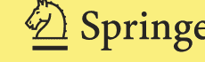

# Springer 本科数学丛书

**主编**
Endre Süli，英国牛津

**丛书编辑**
Mark A. J. Chaplain，英国圣安德鲁斯
Angus Macintyre，英国爱丁堡
Shahn Majid，英国伦敦
Nicole Snashall，英国莱斯特
Michael R. Tehranchi，英国剑桥

Springer 本科数学丛书（SUMS）是为全球数学和科学专业的本科生设计的系列丛书。从核心基础材料到高年级专题，SUMS 丛书采用新颖而现代的方法。文本解释辅以丰富的例题、习题和详尽的解答，并特别关注普遍存在的难点。这些实用而简洁的教材专为一学期或两学期的课程设计，但其自学方式也使其非常适合独立使用。

Roozbeh Hazrat

# Python 课程

语言核心

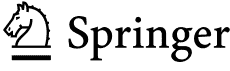

Roozbeh Hazrat
数学与数据科学研究中心
西悉尼大学
澳大利亚新南威尔士州彭里斯

ISSN 1615-2085
ISSN 2197-4144（电子版）
Springer 本科数学丛书
ISBN 978-3-031-49779-7
ISBN 978-3-031-49780-3（电子书）
https://doi.org/10.1007/978-3-031-49780-3

数学学科分类（2020）：00-01

© 编者（如适用）和作者，经 Springer Nature Switzerland AG 2023 独家许可
本作品受版权保护。所有权利均由出版商独家许可，无论涉及材料的全部还是部分，特别是翻译权、转载权、插图重用权、朗诵权、广播权、以缩微胶片或任何其他物理方式复制的权利，以及信息存储和检索、电子改编、计算机软件，或以目前已知或未来开发的类似或不同方法进行的传输。
在本出版物中使用通用描述性名称、注册名称、商标、服务标志等，即使没有具体声明，也并不意味着这些名称不受相关保护性法律法规的约束，因此可以自由使用。
出版商、作者和编辑有理由相信，本书中的建议和信息在出版之日是真实和准确的。无论是出版商还是作者或编辑，均不对本文所含材料或可能存在的任何错误或遗漏提供任何明示或暗示的担保。出版商对已出版地图和机构隶属关系中的管辖权主张保持中立。

本 Springer 印记由注册公司 Springer Nature Switzerland AG 出版
注册公司地址为：Gewerbestrasse 11, 6330 Cham, Switzerland

本产品中的纸张可回收利用。

# 前言

Python 已经成为一门非常流行的编程语言，这有充分的理由，它在全球拥有大量的追随者。除了其直观的编程语言特性外，Python 现在还提供了众多库，这些库提供了强大的工具和方法，可用于数学、物理、文本处理和音乐创作等众多领域。一旦掌握了语言的核心，那么帮助、提示和丰富的示例代码只需一次搜索即可获得。

除了许多关于 Python 的书籍外，互联网上还有数不清的文档。然而，我希望有一个可以遵循的资源，以便在深入更高级领域之前，系统地教授（或学习）语言的核心。我还希望有一个简短、切中要点并提供有趣编程示例的资源；这些示例是我喜欢编码、修改和尝试的。

本书源于我在西悉尼大学开设的一门课程。它允许读者通过逐步完成有趣的练习来学习 Python，并提供简短而简洁的解释。我试图让读者从代码中学习，避免冗长而令人疲惫的解释，因为代码本身会说话。同时，我也试图通过展示在 Python 中（就像在现实世界中一样）有许多方法来处理和解决问题，从而激发读者的想象力。

因此，本书可被视为 Python 课程教材，或用于自学。它主要集中在 Python 编程的核心内容上。我主要选择了与自然数相关的问题，因为它们不需要任何特定的背景知识。代码是使用 Python 3 版本在 Jupyter 中编写的。

**致谢。** 我要感谢 Google Research 的 Thomas Fischbacher 审阅本书并提供富有洞察力的意见；感谢西悉尼大学的学生们对课程的贡献，使课程生动有趣；感谢匿名审稿人的支持和反馈。我还要感谢 Springer 的 Remi Lodh 博士在本书准备过程中给予的慷慨支持。

**如何使用本书。** 本书可用作本科阶段为期一学期的 Python 编程课程（13 周，每周 3 小时），或为更高级学生提供的紧凑速成课程（4 天，每天 6 小时）。每章以新工具和主题的描述开始，并提供示例。示例的选择旨在让读者通过输入、运行、修改和尝试代码来学习。避免了冗长而令人疲惫的解释。讲师可以在课堂上与学生一起编写示例代码。然后鼓励学生发挥主导作用，为一些练习自行编写代码。每章末尾的问题可以作为家庭作业布置给学生，以便他们在下周的课堂上展示代码。本书以项目结尾，展示了如何使用 Python 探索数学。其中一些项目可以作为作业布置给学生。

请从书中的代码开始，修改它们，拆解它们，将它们颠倒过来，并创建你自己更好的程序。

澳大利亚悉尼，2023 年 10 月

Roozbeh Hazrat
[r.hazrat@westernsydney.edu.au](mailto:r.hazrat@westernsydney.edu.au)

# 目录

- 1. **Python 基础** ........................................................................ 1
    - 1.1 基本算术 ........................................................................ 1
    - 1.2 整数、实数和复数 ........................................ 4
    - 1.3 对象及其类型 .............................................................. 10
    - 1.4 在 Python 中导入库 ....................................................... 13
    - 1.5 Python 中的变量 ..................................................................... 14
    - 1.6 等式与布尔语句 .............................................. 15
    - 1.7 字符串 ...................................................................................... 18
    - 1.8 字符串作为对象 ...................................................................... 19
    - 1.9 输入与输出 ....................................................................... 20
- 2. **列表与元组** ........................................................................ 23
    - 2.1 数据：列表 ................................................................................. 23
        - 2.1.1 访问列表条目 .................................................... 24
    - 2.2 列表作为对象 .......................................................................... 29
    - 2.3 图形初探 ....................................................... 38
    - 2.4 数据导入初探 .............................................. 39
    - 2.5 元组 ...................................................................................... 41
    - 2.6 数据处理更多示例 ......................................... 42
        - 2.6.1 语言 ........................................................................ 42
- 3. **判断与循环** ........................................................ 49
    - 3.1 判断：岔路口的选择 ..................................... 49
    - 3.2 判断：多个岔路口的选择 ................................... 52
    - 3.3 循环与重复 ............................................................... 56
        - 3.3.1 For 循环 ........................................................................... 56
        - 3.3.2 嵌套 For 循环 .............................................................. 71
        - 3.3.3 While 循环 ..................................................................... 76

# 目录

- 4 函数 ........................................................................ 85
    - 4.1 函数 ........................................................................ 85
        - 4.1.1 函数的作用域 .................................................... 89
        - 4.1.2 函数，默认值 ................................................ 101
        - 4.1.3 函数，特定类型 .................................................. 102
    - 4.2 函数式编程：匿名（lambda）函数 ............ 103
        - 4.2.1 从集合中选择 .............................................. 110
        - 4.2.2 函数式编程，reduce ...................................... 113
- 5 列表推导式与生成器 .............................................. 123
    - 5.1 列表推导式 .............................................................. 123
        - 5.1.1 对参数设置条件 .................................... 125
    - 5.2 集合与字典 .............................................................. 131
        - 5.2.1 集合 .............................................................................. 131
        - 5.2.2 字典 .................................................................... 139
    - 5.3 生成器 .......................................................................... 144
        - 5.3.1 生成器函数 ........................................................ 147
- 6 sympy 库 ...................................................................... 153
    - 6.1 sympy，符号 Python ........................................................ 153
    - 6.2 sympy 中的图形 ................................................................ 158
    - 6.3 三维图形 ...................................................... 165
    - 6.4 使用 sympy 进行微积分 .............................................................. 170
        - 6.4.1 求解方程 .......................................................... 170
        - 6.4.2 极限、导数和积分 .................................... 173
- 7 numpy 库 ...................................................................... 183
    - 7.1 numpy，数值 Python ........................................................ 183
        - 7.1.1 数组上的计算 .......................................................... 184
        - 7.1.2 生成数组 ............................................................ 185
        - 7.1.3 访问数组条目 ............................................ 187
        - 7.1.4 使用数组进行向量计算 .............................................. 193
    - 7.2 通用函数 ................................................................ 207
- 8 matplotlib 库与项目 .............................................. 211
    - 8.1 matplotlib，数据绘图 ........................................................ 211
    - 8.2 将绘图作为对象 .................................................................... 218
    - 8.3 动画 ............................................................................ 222
    - 8.4 案例研究，波斯地毯 .................................................... 228
    - 8.5 案例研究，预测估计 .......................................... 234
    - 8.6 案例研究，Thue–Morse 序列 .................................... 242
- 延伸阅读 ............................................................................ 247
- 索引 ............................................................................................ 249

# 第 1 章
Python 基础

## 1.1 基本算术

本章首先介绍如何“开箱即用”地使用 Python，演示如何使用现成的命令、执行基本算术运算并构建计算过程。Python 成为许多人首选语言的原因之一是其外部库，这些库提供了强大的工具，可用于研究和分析众多领域的问题。我们将在本章中展示其中一些库，例如使用符号以及符号计算的初步实例。

Python 可以处理各种数值计算，包括精确计算和近似计算。如果我们想计算 $3 \times 4 \times 5 \times 6 + 1$ 或 $2^{3^4}$，只需将它们正确输入 Python 即可。

```
[1]: 3 * 4 * 5 * 6 + 1
```

[1]: 361

```
[2]: 2**3**4
```

[2]: 2417851639229258349412352

Python 是一个功能强大的计算器，支持基本的算术运算：+、- 用于加法和减法，*、** 用于乘法和幂运算。使用圆括号 () 将表达式组合在一起。

```
[3]: (2**3)**4
```

[3]: 4096

```
[4]: 2**(3**4)
```

[4]: 2417851639229258349412352

下面是一个推翻著名数学家欧拉一个有 200 年历史的猜想的计算。他猜想三个四次幂之和永远不可能等于另一个四次幂。

```
[5]: 2682440**4 + 15365639**4 + 18796760**4
```

[5]: 180630077292169281088848499041

```
[6]: 20615673**4
```

[6]: 180630077292169281088848499041

最后两个计算表明

2682440⁴ + 15365639⁴ + 18796760⁴ = 20615673⁴，

这是哈佛大学的诺姆·埃尔基斯在 1988 年发现的，为欧拉的猜想提供了一个反例。

Python 的功能更加强大；它可以处理大型精确计算，如下所示。

```
[7]: 2**9941 - 1
```

[7]: 346088282490851215242960395767413316722628668900238547790489283445006220080983411446436437554415370753366448674763505018641470709332373970608376690404229265789647993709760358469552319045484910050304149809818540283507159683562232941968059762281334544739720849260904855192770626054911793590389060795981163838721432994278763633095377438194844866471124967685798888172212033000821469684464956146997194126921284336204633138595375772004624420290646813260875582574884704893842439892702368849786430630930044229396033700105465953863020090730439444822025590974067005973305707995078329631309387398850801984162586351945229130425629366798595874957210311737477964188950607019417175060019371524300323636319342657985162360474512090898647074307803622983070381934454864937566479918042587755749738339033157350828910293923593527586171850199425548346718610745487724398807296062449119400666801128238240958164582617618617466040348002056466823143718255492784779380991749580255263323326536457743894150848953969902818530057870876229329803338285735419228259022169602665532210834789602051686546011466737981306056247480055071718250333737502267307344178512950738594330684340802698228963986562732597175372087295649072830289749771358330867951508710859216743218522918811670637448496498549094430541277444079407989539857469452772132166580885754360477408842913327292948696897496141614919739845432835894324473601387609643750514699215032683744527071718684091832170948369396280061184593746143589068811190253101873595319156107319196071150598488070027088705842749605203063194191166922106176157609367241948160625989032127984748081075324382632093913796444665700601391278360230022674342951943256072806612601193787194051514975551875492521342643946459638539649133096977765333294018221580031828892780723686021289827103066181151189641318936578454002968600124203913769646701839835949541124845655973124607377987770920717067108245037074572201550158995917662449577680068024829766739203929954101642247764456712221498036579277084129255554281704557243084638998812996051922731398729120090206088206073376207589229947366640589742703581178687987569431507836546005560346962530939965395593230466430039146465805452965010404001942389755267553476824862463195143149318817090597258878011185028119055907367777118743281408867867428630210827514925847710129645183365197971737517090050567364596469635533136981929600026738958328929912673834572698032599895959975011766642010428885460856994464428341953232948787488410595750197438786353119204210855804692460582533832967771946911459901921324984968810021189968284941331573164056304725480868921823442538199590383852412786840833479611419970101792978355653650755329138298654246225346827207503606740745956958127383748717825918527473164970582095181312905519242710280573023145554793628499010509296055849712377978984921839997037415897674154830708629145484724536724572622450131479992681684310464449439022250504859250834761894788889552527898400988196200014868575640233136509145628127191354858275083907891469979019426224883789463551

如果形如 $2^n - 1$ 的数恰好是素数，则称为 *梅森素数*。回顾一下，*素数* 是指大于 1 且只能被 1 和其自身整除的数。很容易看出 $2^2 - 1$、$2^3 - 1$ 和 $2^5 - 1$ 都是梅森素数。这个列表还在继续。1963 年，吉列斯发现上述数字 $2^{9941} - 1$ 是一个梅森素数。在我的笔记本电脑上，Python 检查这确实是一个素数所需的时间不到 1 秒。迄今为止发现的最大梅森素数是 $2^{82,589,933} - 1$，它有 24,862,048 位数字，于 2018 年 1 月被发现。

在整数算术中，Python 可以使用 `//` 和 `%` 处理除法和取余运算。一个事实是，对于两个非零整数 $n$ 和 $m$，可以写成 $n = mq + r$，其中 $q$ 和 $r$ 是唯一的整数，且满足 $0 \le r < q$。在 Python 中，我们得到 `n//m=q` 和 `n % m =r`。下面我们用 $n = 13$ 和 $m = 4$ 来验证这一点。请注意下面示例中函数 `print` 的使用。

print(13, '=', 13 // 3, 'x', 3 ,'+', 13 % 3)

13 = 4 x 3 + 1

我们将在本章末尾更深入地探讨 `print` 函数。

**练习 1.1** *证明数字 142857 是一个循环数，这意味着如果我们将它乘以 1 到 6 中的任何一个数字，结果将是原始数字 142857 的数字的一个排列。*

*解答*

在后面的第 3 章中，我们将编写一个程序来寻找循环数。然而，检查一个数字是否是循环数相当容易：

```
print(142857*2, 142857*3, 142857*4,142857*5, 142857*6)
```

285714 428571 571428 714285 857142

## 1.2 整数、实数和复数

Python 区分不同类别的数字。*整数*，在数学中用 $\mathbb{Z} = \{\cdots, -2, -1, 0, 1, 2 \cdots\}$ 表示，是那些没有小数点的数字，例如我们到目前为止处理过的所有数字；而*实数*或*浮点数*，用 $\mathbb{R}$ 表示，是那些带有小数点的数字，用于近似表示，例如 1.2、$\sqrt{2}$ 或 $\pi$。

Python 也可以使用 a+bj 的格式处理复数，其中 $a$ 是实部，$b$ 是虚部。这里的 $1j$ 在文献中通常用 $i$ 表示，因此 $1j^2 = -1$。但请注意 Python 如何表示复数。在下面的例子中，我们还在代码中添加了注释。这是通过使用 # 并在其后编写注释来完成的。

```
(1j)**2 # 1j represents the imaginary number i
```

(-1+0j)

例如，我们计算 $(\frac{1}{1} + \frac{1}{2} + \frac{1}{3}) \times 3$ 和 $(3 - 6i)^2$。

```
(1/1 + 1/2 + 1/3) * 3
```

5.5

```
(3 - 6j)**2
```

(-27-36j)

由于 $i^2 = -1$，很容易看出 $(a + bi)(a - bi) = a^2 + b^2$。我们用一个例子来验证这一点。

```
(2 - 3j)*(2 + 3j)
```

(13+0j)

Python 如此受欢迎的原因之一是它拥有大量的库，其中包含现成的工具和函数。各种数学函数，如 sin、cos、$\sqrt{}$ 和 log，在 Python 的不同库中都可用。我们将使用的第一个库是 math，它使我们能够使用许多这些函数。请注意我们如何将这个库导入 Python，以及如何使用这个库中的函数（或方法）。一旦我们导入了库，我们就可以通过点号“.”来访问其内置函数。

```
import math

math.pi
```

3.141592653589793

```
math.sin(math.pi/2)
```

1.0

**练习 1.2** *证明对于任何选定的角度 $x$，Python 给出 $\sin^2(x) + \cos^2(x) = 1$。*

*解答*

例如，选择 $\pi/5$ 作为角度，并将表达式正确地翻译成 Python，我们有

```
math.sin(math.pi/5)**2 + math.cos(math.pi/5)**2
```

1.0

当然，可以选择任何其他角度，运行代码，并再次得到 1。

**练习 1.3** *计算表达式*

$$\sqrt[3]{e^\pi + \log\left(\frac{23}{\sin\left(\frac{\pi}{6}\right)}\right)}$$

解答

这里唯一的挑战是将数学表达式正确地翻译成 Python。

```
(math.exp(math.pi) + math.log(23 / math.sin(math.pi/6)))**(1/3)
```

2.998863793038475

注意这里 `math.exp(math.pi)` 给出 e^π。

**练习 1.4** 计算

$$6 + \frac{1}{5 + \frac{1}{4 + \frac{1}{3 + \frac{1}{2}}}}$$

解答

可以立即看出这个表达式中有一个重复的模式，我们稍后将编写优雅的代码来捕获和计算这样的表达式。目前我们可以编写以下代码。注意符号 _ 在 Jupyter 中指的是上一个输出。符号 _ 还有其他用途，正如我们将在本书中看到的那样。

```
3 + 1/2
```

3.5

```
4 + 1/_
```

4.285714285714286

```
5 + 1/_
```

5.233333333333333

```
6 + 1/_
```

6.191082802547771

或者写在一行中：

```
6 + 1/(5 + 1/(4 + 1/(3 + 1/2)))
```

6.191082802547771

除了提供许多有价值的数学函数的 math 库之外，Python 中还有另外两个被广泛使用的库：numpy 和 sympy。库 numpy 专为数值计算设计，而 sympy 用于符号计算和微积分。我们将在第 6 章和第 7 章详细研究这些库。这里我们只是简要说明这些库的行为。所有这些库都提供基本的数学函数，例如三角函数 sin、cos、tan 等，但它们的计算方法不同。

```
import math
import numpy
import sympy
```

我们将使用每个库来计算 sin(π/5)。

```
math.sin(math.pi/5)
```

0.5877852522924731

```
numpy.sin(numpy.pi/5)
```

0.5877852522924731

```
sympy.sin(sympy.pi/5)
```

$$\sqrt{\frac{5}{8} - \frac{\sqrt{5}}{8}}$$

sympy 库给出 $\sqrt{\frac{5}{8} - \frac{\sqrt{5}}{8}}$ 作为 sin(π/5) 的值，这是精确值。这表明 sympy 不是数值上逼近表达式。

接下来，我们将使用 sympy 函数检查恒等式

$$\sin^2(\pi/5) + \cos^2(\pi/5) = 1$$

```
sympy.sin(sympy.pi/5)**2 + sympy.cos(sympy.pi/5)**2
```

$$-\frac{\sqrt{5}}{8} + \frac{5}{8} + \left(\frac{1}{4} + \frac{\sqrt{5}}{4}\right)^2$$

我们期望输出 1。为了进一步简化输出，我们可以使用 sympy 库中的 `simplify` 函数。

```
sympy.simplify(_)
```

1

我们将在 numpy 和 math 库中检查相同的恒等式。

```
numpy.sin(numpy.pi/5)**2 + numpy.cos(numpy.pi/5)**2
```

1.0

```
math.sin(math.pi/5)**2 + math.cos(math.pi/5)**2
```

1.0

我们将在本书后面深入探讨符号计算和 sympy。这里我们只是简要介绍如何使用符号。使用 sympy 库，我们可以将 $x$ 引入为一个名为 x 的符号。然后 Python 可以对 $x$ 进行符号运算，而无需询问 $x$ 的值。

```
x = sympy.symbols('x')
```

```
x + 1
```

$x + 1$

```
(2 * x + 3)**2
```

$(2x + 3)^2$

```
x = sympy.symbols('SometimesUPandsometimesDOWN')
```

```
x
```

$SometimesUPandsometimesDOWN$

```
x / (1 + x)
```

$\frac{SometimesUPandsometimesDOWN}{SometimesUPandsometimesDOWN + 1}$

我们在 sympy 中计算表达式 $\sin^2(x) + \cos^2(x)$。然后 Python 返回该表达式的正确恒等式 1。

```
sympy.simplify(sympy.sin(x)**2 + sympy.cos(x)**2)
```

1

**练习 1.5** 研究以下恒等式：

$$\frac{(1 + \sqrt{5})^{10} - (1 - \sqrt{5})^{10}}{1024 \sqrt{5}} = 55.$$

## 1.2 整数、实数和复数

解答

我们首先使用 `math` 库计算第一个表达式。

```
((1 + math.sqrt(5))**10 - (1 - math.sqrt(5))**10)/(1024*math.sqrt(5))
```

55.000000000000014

注意我们得到了一个*几乎*等于 55 的浮点数。这是意料之中的，因为 `math` 库中的函数是“数值上”逼近计算的，这些方法不会给出精确的结果。然而，结果通常具有极高的精度。

使用 `numpy` 内置函数进行计算会得到相同的近似值。

```
((1 + numpy.sqrt(5))**10 - (1-numpy.sqrt(5))**10)/(1024*numpy.sqrt(5))
```

55.000000000000014

利用 `sympy` 的功能，我们实际上可以证明该恒等式成立。

```
((1 + sympy.sqrt(5))**10 - (1 - sympy.sqrt(5))**10)/(1024*sympy.sqrt(5))
```

$$\frac{\sqrt{5}\left(-(1-\sqrt{5})^{10}+(1+\sqrt{5})^{10}\right)}{5120}$$

```
sympy.simplify(_)
```

55

我们强调浮点数（实数）都是关于近似的。

```
0.1 + 0.2
```

0.30000000000000004

```
0.3 - (0.1 + 0.2)
```

-5.551115123125783e-17

虽然我们期望得到 0，但我们得到了一个几乎为零的非零数字。使用内置函数 `round`，我们可以轻松地看到我们得到的结果确实非常接近零。

```
round(0.3 - (0.1 + 0.2))
```

0

因为 Python 使用如此广泛，帮助、提示和好的示例总是可以通过谷歌找到。但也可以使用 `help` 命令获取函数的摘要。

```
help(round)
```

Help on built-in function round in module builtins:

round(number, ndigits=None)
    Round a number to a given precision in decimal digits.

    The return value is an integer if ndigits is omitted or
    None.  Otherwise the return value has the same type as the
    number.  ndigits may be negative.

## 1.3 对象及其类型

Python 中的一切都是对象。可以将对象视为一个生态系统，它拥有自己的数据以及可用于修改数据的工具和函数。即使是 Python 中的数字 3、3.5 和 3.2 – 2i 也都是对象。对象具有不同的类型。函数 `type` 确定我们正在处理的对象的类型：

```
type(3)
```

int

```
type(math.sqrt(2))
```

float

```
type(3.2 - 2j)
```

complex

一旦我们有了一个对象，我们就可以通过点号“.”来访问它们的方法和函数。例如，float 对象有一个名为 `is_integer` 的方法，它确定一个实数是否确实是整数。

## 1.3 对象及其类型

```python
x = math.sqrt(16)
```

```python
x.is_integer()
```

True

这里，参数 `x` 被赋值为 `math.sqrt(16)`。因此，`x` 是一个 `float` 类型的对象。然后我们可以使用该对象自带的方法和函数，其中之一就是 `is_integer`。

**练习 1.6** 设 `m` 为一个自然数，且

$$A = \frac{(m + 3)^3 + 1}{3m}$$

找出所有小于 10 的整数 `m`，使得 `A` 是一个整数。证明 `A` 总是奇数。

**解答**

尽管我们目前可用的工具不多，但我们可以将 `A` 的公式在 Python 中实现，将 `m` 替换为 1, 2, ...，并每次使用 `is_integer()` 方法检查计算结果是否为整数。稍后，当我们知道如何创建循环时，我们将在第 5 章（练习 5.7）重新审视这个练习，并找出所有不超过 500 的数。

```python
m = 2
x = ((m + 3)**3 + 1)/(3 * m)
x.is_integer()
```

True

```python
x
```

21.0

在处理复数 `a+bi` 时，我们总是希望能够访问其实部 `a` 和虚部 `b`。复数对象提供了获取此信息的方法。

```python
x = 3.4 - 5.0j
```

```python
print(x.real, ' ', x.imag)
```

3.4    -5.0

通过 `x.imag`，我们可以访问复数 `x` 的虚部。这个虚部是一个 `float` 对象，它也有自己的方法，我们现在就使用它。

```python
x.imag.is_integer()
```

True

```python
x.real.is_integer()
```

False

尽管 `math` 库提供了基本函数，如 `sin` 和 `cos`，但这些函数是为处理实数（`float`）而设计的。如果我们要处理复数，就需要导入 `cmath` 库及其函数，这些函数允许我们进行复数运算。

**练习 1.7** 如果 `a` 和 `b` 是实数，证明

$$(\cos(a + bi) + \sin(a + bi))^2$$

的实部等于

$$1 + \sin(2a)(\cosh(b)^2 + \sinh(b)^2)$$

并为其虚部找到一个类似的表达式。

**解答**

尽管这个恒等式对*任何* `a` 和 `b` 都应该成立，但我们将选择一些 `a` 和 `b` 的值来验证这个命题。稍后，当我们在 Python 中定义函数时，我们将能够对任何 `a` 和 `b` 的值进行检查。由于我们处理的是复数，我们导入 `cmath` 库。

```python
import cmath

(cmath.cos(1 + 1j) + cmath.sin(1 + 1j))**2
```

(4.420954861117013-1.5093064853236153j)

```python
((cmath.cos(1 + 1j) + cmath.sin(1 + 1j))**2).real
```

4.420954861117013

```python
((cmath.cos(1 + 1j) + cmath.sin(1 + 1j))**2).imag
```

-1.5093064853236153

```python
1 + cmath.sin(2)*(cmath.cosh(1)**2 + cmath.sinh(1)**2)
```

(4.420954861117013+0j)

比较结果，我们看到练习中的陈述对于这个特定的 `a` 和 `b` 是成立的。

## 1.4 在 Python 中导入库

我们已经看到 `import math` 使得 `math` 库可供使用。如果库的名称很长，可以引入一个别名。

```python
import numpy as np
```

```python
np.sin(np.pi / 2)
```

1.0

虽然可以使用 `import numpy as MyDarling` 或任何其他别名，但 `np` 这个名字在社区中已经相当普遍。

如果经常使用某个库的某些方法，可以直接导入它们。

```python
from sympy import sin, cos, pi, simplify, symbols
```

```python
x = symbols('x')
y = symbols('what?')
```

```python
(x + 1/y) * (1/x + y)
```

$\left(what?+\frac{1}{x}\right)\left(x+\frac{1}{what?}\right)$

```python
simplify(sin(x)**2 + cos(x)**2)
```

1

我们应该提醒读者，可能会对这些方法属于哪个库感到困惑。如果从不同的库导入方法，那么后导入的方法会覆盖先前导入的方法。

## 1.5 Python 中的变量

为了将数据输入计算机程序，需要定义变量以便将数据赋值给它们。Python 将数据赋值给变量的方法与其他语言略有不同。我们从最简单的将数字赋值给变量开始。

```python
x = 2
```

```python
x
```

2

只要运用常识，你为变量选择的任何名称都是有效的（前提是它们没有被用作 Python 关键字）。像 `x`、`y`、`x3`、`myfunc`、`xQuaternion` 以及 `x_3`、`my_func`、`x.Quaternion` 这样的名称都可以。还要注意 Python 区分大小写，因此 `xy` 和 `xY` 被视为两个不同的变量。我们使用 `;` 将这些变量的值赋在同一行代码中。

```python
xy = 12 ; xY = -1.4; x_y = 2-3j
```

```python
xy
```

12

```python
xY
```

-1.4

我们也可以将值作为元组在一行中赋值。我们将在第 2 章看到这些概念。

```python
xy, xY, x_y = 12, -1.4, 2-3j
```

```python
xY
```

-1.4

```python
xy**2 - xY**2 + x_y**2
```

(137.04-12j)

在 Python 中，我们需要在这个早期阶段理解的一个关键区别是变量是指针。在其他语言中，命令 `x = 2` 创建一个标记为 `x` 的单元格（或一个对象），并将 `2` 存储在该单元格中，而在 Python 中，有一个整数对象 `2`，而 `x` 是一个指向该对象的指针。如果我们只是将 `x` 视为被赋值为 `2` 的变量，这不会立即造成伤害，但在后台我们必须意识到 Python 的哲学。

```python
x = y = z = 10
```

我们应该理解这一行的方式是，我们创建了三个都指向整数对象 `10` 的指针。我们可以更改其中一个指针，使其指向不同的对象，而不会改变其他两个指针的方向。

```python
z = 12
```

我们打印这些变量的值。注意，`print` 中的命令 `\n` 会换行，如结果所示。

```python
print('x is pointing to', x, '\ny is pointing to', y, '\nz is pointing to', z)
```

```
x is pointing to 10
y is pointing to 10
z is pointing to 12
```

当我们处理可变对象（例如*列表*）时，这一点变得更加清晰。

在某些情况下，变量的存在比变量本身更重要。有时我们需要一个*虚拟变量*遍历循环或列表。在这种情况下，我们可以简单地使用 `_` 而不必想出一个名字。

```python
_ = 5
```

```python
_
```

5

```python
a, _, _, b = 10, 13, 12, 100
```

```python
print(a, 'and', b)
```

10 and 100

## 1.6 等式与布尔语句

Python 中主要有两种等式：`=` 和 `==`。第一个创建指针，而 `==` 用于比较。比较的结果是一个布尔值 `True` 或 `False`。

```python
1 + 2 == 3
```

True

```python
3**2 + 4**2 == 5**2
```

True

```python
9**10 == 10**9
```

False

回顾欧几里得除法 $n = mq + r$。我们可以用一个例子来检查其有效性。

```python
23 == (23 // 4) * 4 + 23 % 4
```

True

然而，在处理浮点数时我们应该小心，因为计算是基于一定精度的。

```python
0.1 + 0.2 == 0.3
```

False

```python
0.1 + 0.2
```

0.30000000000000004

在数学逻辑中，语句可以有 `True`、`False` 或未定义的值。这些被称为*布尔表达式*。这有助于我们根据语句的值“做出决定”并编写程序。我们稍后将看到如何使用 `if-else` 语句根据布尔表达式的值来控制程序的流程。

可以使用常见的布尔运算 `and`、`or`、`not` 或等效的 `&`、`|`、`!` 来组合逻辑语句，如下例所示：

```python
2 > 3
```

False

```python
not(2 > 3)
```

True

```python
2 > 3 or 3 > 2
```

True

```python
3**2 + 4**2 >= 5**2
```

True

**练习 1.8** *以下陈述正确吗？*

(1 < 2 < 3) == (1 < 2) and (2 < 3)

True

**解答**

事实上，这种陈述方式具有误导性！确实，`1 < 2 < 3` 的意思就是 `1 < 2` 且 `2 < 3`。然而，在上面的陈述中，Python 先计算左边（结果为 `True`），然后计算右边（结果也是 `True`），然后比较两者。因此，下面的陈述也给出 `True`，这在数学上并不等价。

```python
(1 < 2 < 3) == (1 < 2) and (2 < 10)
```

True

**练习 1.9** *双曲函数是指数函数的组合。例如*

$$\sinh(x) = \frac{e^x - e^{-x}}{2}, \text{ and } \cosh(x) = \frac{e^x + e^{-x}}{2}$$

*使用 `math` 库检查这些等式对任何 `x` 是否成立。*

**解答**

双曲函数 `sinh` 在 `math` 库中可用。我们将检查此函数是否返回与 $\frac{e^x - e^{-x}}{2}$ 相同的值，这里以 $\pi$ 为例。稍后在第 4 章，我们将在 Python 中定义函数。完成后，我们可以定义函数 $f(x) = \frac{e^x - e^{-x}}{2}$ 并系统地比较这两个函数。

```python
import math

p = math.pi
sh = (math.exp(p) - math.exp(-p))/2
math.sinh(p) == sh
```

## 1.7 字符串

我们已经见过几种类型的对象：整数、浮点数、复数以及布尔值。本章最后介绍字符串类型。

```python
'this is a string'
```

```python
message = 'Western Sydney '
type(message)
```

```
str
```

可以对字符串执行某些“算术”操作，如下例所示。

```python
message + 'University'
```

```
'Western Sydney University'
```

```python
message * 3
```

```
'Western Sydney Western Sydney Western Sydney '
```

```python
message
```

```
'Western Sydney '
```

```python
message = message + 'University'
```

```python
message
```

```
'Western Sydney University'
```

## 1.8 字符串作为对象

我们已经提到过，Python 中的一切都是对象。一旦对象被定义，就可以使用其函数和方法。这里我们将使用 `str` 对象的几种可用方法。下面的示例展示了这些方法的用法。

```python
message
```

```
'Western Sydney University'
```

```python
message.capitalize()
```

```
'Western sydney university'
```

```python
message.lower()
```

```
'western sydney university'
```

```python
message.upper()
```

```
'WESTERN SYDNEY UNIVERSITY'
```

```python
message
```

```
'Western Sydney University'
```

上面使用的所有方法，upper、lower、capitalize，都是在字符串对象内部提供的。从示例中可以清楚地看到，它们作用于对象 message，但不会改变对象本身。

处理字符串时一个非常有用的方法是使用*格式化字符串*，它允许我们将数据传递到字符串中，其位置由 {} 确定。

```python
'University of {}'.format('Sydney')
```

```
'University of Sydney'
```

```python
'University of {}'.format(123)
```

```
'University of 123'
```

```python
name = 'First name: {}, Last name: {}'
```

```python
name.format('Lustig', 'Sabzian')
```

```
'First name: Lustig, Last name: Sabzian'
```

使用*格式化字符串*有一种更简单的方法，如下所示。它们可以与 print 命令很好地结合使用，我们稍后会看到。

```python
fn = 'Lustig'
ln = 'Sabzian'

f'First name: {fn}, last name: {ln}'
```

```
'First name: Lustig, last name: Sabzian'
```

```python
x = 2
y = math.sqrt(x)

f'the square root of {x} is {y}'
```

```
'the square root of 2 is 1.4142135623730951'
```

## 1.9 输入与输出

本章最后介绍两个有用的命令。`input` 命令要求用户向程序提供数据。输入的数据被捕获为字符串。

```python
s = input('enter a text: ')
print(s + ' checked')
```

```
enter a text: Python
Python checked
```

如果需要输入为整数或实数等，以下是将数据转换为数字的标准方法。

```python
s = int(input('enter a number: '))
s
```

```
enter a number: 666
666
```

```python
s = input('Name ')
t = input('age ')
s + ' is ' + t + ' years old.'
```

```
Name Dad
age 92
'Dad is 92 years old.'
```

print 命令将创建输出。以下示例展示了使用 print 的各种方式。

```python
print('printing a string')
```

```
printing a string
```

```python
print(2 * 3 * 4 + 1.4)
```

```
25.4
```

```python
print(12, 'is smaller than', 15)
```

```
12 is smaller than 15
```

如前所述，格式化字符串与 print 命令非常契合。

```python
x = 2
y = math.sqrt(x)
print(f'the square root of {x} is {y}')
```

```
the square root of 2 is 1.4142135623730951
```

最后，有一些特殊字符可以与字符串一起使用。其中包括 \n 和 \t，它们分别表示换行和制表符。

```python
print('Hello\tworld\nfinal\tgreetings')
```

```
Hello	world
final	greetings
```

我们用一个有趣的例子结束本章，展示几种可用于处理字符串的方法。

```python
secret = 'xzwoy thx uilxzcx'
x = 'zxawu'
y = 'neojs'
table = secret.maketrans(x, y)
print(secret.translate(table))
```

```
enjoy the silence
```

## 习题

1) 计算

$$\sqrt{1 + \frac{1}{1^2} + \frac{1}{2^2}} + \sqrt{1 + \frac{1}{2^2} + \frac{1}{3^2}} + \sqrt{1 + \frac{1}{3^2} + \frac{1}{4^2}}$$

2) 计算

$$\left(\frac{1}{2} + \frac{1}{3} + \frac{1}{5} + \frac{1}{7}\right) + \left(\frac{5}{2} + \frac{5}{3} + \frac{5}{5} + \frac{5}{7}\right) + \left(\frac{11}{2} + \frac{11}{3} + \frac{11}{5} + \frac{11}{7}\right)$$

3) 证明对于任意两个正数 $a$ 和 $b$，如果 $a + b = 1$，则

$$\left(a + \frac{1}{a}\right)^2 + \left(b + \frac{1}{b}\right)^2 \geq \frac{25}{2}.$$

4) 使用 Python 证明

$$\tan \frac{3\pi}{11} + 4 \sin \frac{2\pi}{11} = \sqrt{11}.$$

注意，需要使用 math 库或 numpy 才能访问平方根、正弦和正切函数。

5) 证明

$$\sqrt{\sqrt{64}(2^2 + (1/2)^2) - 1} = 4.$$

6) 证明

$$\sin\left(\frac{2\pi}{10}\right) + \sin\left(\frac{4\pi}{10}\right) + \cdots + \sin\left(\frac{10\pi}{10}\right) = \sqrt{\frac{1}{2}\left(5 - \sqrt{5}\right)} + \sqrt{\frac{1}{2}\left(5 + \sqrt{5}\right)}$$

7) 证明

$$\left(\frac{1}{2} + \cos\left(\frac{\pi}{20}\right)\right)\left(\frac{1}{2} + \cos\left(\frac{3\pi}{20}\right)\right)\left(\frac{1}{2} + \cos\left(\frac{9\pi}{20}\right)\right)\left(\frac{1}{2} + \cos\left(\frac{27\pi}{20}\right)\right) = \frac{1}{16}.$$

8) 通过观察各种例子，证明四个连续整数的乘积加一总是一个完全平方数。

9) 使用 Python 证明

$$\frac{1 + \sin(x) - \cos(x)}{1 + \sin(x) + \cos(x)} = \tan(x/2).$$

# 第2章
列表与元组

## 2.1 数据：列表

在 Python 中，列表提供了处理和操作数据的首个基本构建块。

可以将计算机程序视为一个函数，它接受一些（原始）数据或信息，并返回我们想要获得的数据。经典的 Python 提供了某些工具来收集和处理数据，例如 `list`、`tuple`、`set` 和 `dictionary`。像 `numpy` 这样的库进一步提供了处理大量数据的强大工具。在本章中，我们将学习 `list` 和 `tuple`；如何收集数据以及如何访问和处理这些集合中的元素。我们将在第5章学习 `set` 和 `dictionary`。

数据科学始于处理数据，例如数据清洗、聚合、转换和数据可视化，而列表是这一过程的第一站。一旦我们掌握了列表的概念以及如何使用它们，我们就能轻松地使用其他为处理数据而设计的对象。

我们从一个 `list` 的例子开始：

```python
L = [3, 6.4, 3, 'stuff', 'x^2+x+1', 64/3]
```

```python
type(L)
```

```
list
```

```python
L
```

```
[3, 6.4, 3, 'stuff', 'x^2+x+1', 21.333333333333332]
```

列表是 Python 中收集数据的方式之一。如本例所示，数据（任何类型和格式）被排列在方括号 [ 和 ] 之间。列表尊重数据的顺序和重复：

```python
[1, 2] == [2, 1]
```

```
False
```

```python
[1, 1, 2] == [1, 2]
```

```
False
```

我们可以检查一个元素是否属于列表

```python
2 in [1, 2, 3]
```

```
True
```

```python
'mode' in ['fast', 'fashion']
```

```
False
```

类似于字符串，我们可以对列表执行某些算术操作。回顾上面的列表 L。

```python
L + ['more', 'less', [4, 4, 4]]
```

```
[3, 6.4, 3, 'stuff', 'x^2+x+1', 21.333333333333332, 'more', 'less', [4, 4, 4]]
```

```python
['Western', 'Sydney'] * 2
```

```
['Western', 'Sydney', 'Western', 'Sydney']
```

```python
[1, 2] + [3, 4]
```

```
[1, 2, 3, 4]
```

如上例所示，我们可以通过将两个列表相加来将另一个列表添加到给定列表的末尾，或者通过乘法来重复列表。

### 2.1.1 访问列表的条目

访问列表的元素是很自然的需求。

## 2.1 数据：列表

```
L = [3, 6.4, 3, 'stuff', 'x^2+x+1', 21.333333333333332]
```

```
L[0]
```

```
3
```

```
L[4]
```

```
'x^2+x+1'
```

```
L[-1]
```

```
21.333333333333332
```

```
L[-2]
```

```
'x^2+x+1'
```

在Python中，元素的索引从0开始。因此我们从0开始计数（它指的是列表的第一个元素！）。检查上面的例子可以发现，`L[i]`给出列表的第`i + 1`个成员。因此`L[0]`指向列表中的第一个元素。要获取列表的连续元素，可以使用命令`L[n : m]`。这里`L[n : m]`检索列表`L`中从第`n + 1`个到（最多）第`m`个的元素。命令`L[n : m : s]`引入了“步长”`s`，检索的元素是`n + 1`, `n + 1 + s`, `n + 1 + 2s`, ... 直到第`m`个元素。下面的例子清楚地说明了这一点。

```
L
```

```
[3, 6.4, 3, 'stuff', 'x^2+x+1', 21.333333333333332]
```

```
L[1 : 5]
```

```
[6.4, 3, 'stuff', 'x^2+x+1']
```

以下是`L[n:m]`中检索到最多第`m`个元素的含义。

```
L[1 : 100]
```

```
[6.4, 3, 'stuff', 'x^2+x+1', 21.333333333333332]
```

```
L[1 : 5 : 2]
```

```
[6.4, 'stuff']
```

注意，在上面的例子中，我们从列表的第二个元素开始，一直到第六个元素，并且每次选取第二个元素。

在命令`L[n : m]`中，如果我们省略`n`，列表从开头开始；如果我们省略`m`，则一直到最后。下面的例子清楚地说明了这一点。

```
L
```

```
[3, 6.4, 3, 'stuff', 'x^2+x+1', 21.333333333333332]
```

```
L[ : 5]
```

```
[3, 6.4, 3, 'stuff', 'x^2+x+1']
```

```
L[ : -1]
```

```
[3, 6.4, 3, 'stuff', 'x^2+x+1']
```

```
L[4 : ]
```

```
['x^2+x+1', 21.333333333333332]
```

```
L[ : 100]
```

```
[3, 6.4, 3, 'stuff', 'x^2+x+1', 21.333333333333332]
```

```
L[4 : 1 : -1]
```

```
['x^2+x+1', 'stuff', 3]
```

```
L[ : : -1]
```

```
[21.333333333333332, 'x^2+x+1', 'stuff', 3, 6.4, 3]
```

```
L == L[ : 4] + L[4 : ]
```

```
True
```

**练习 2.1** *定义列表*
campus=['Parramatta', 'Campbelltown', 'Kingswood']
*和 allocation=[30,10,7]*
*然后创建列表*
total=['Parramatta', 30, 'Campbelltown', 10, 'Kingswood', 7]

### 解答

我们首先定义给定的列表。

```
campus = ['Parramatta', 'Campbelltown', 'Kingswood']
```

```
allocation = [30, 10, 7]
```

这是将这些列表组合在一起的最朴素的方式：

```
total = [[campus[0], allocation[0]],
         [campus[1], allocation[1]], [campus[2],
         allocation[2]]]
```

```
total
```

```
[['Parramatta', 30], ['Campbelltown', 10],
 ['Kingswood', 7]]
```

我们也可以使用以下更巧妙的方法：

```
CA = campus + allocation
```

```
CA
```

```
['Parramatta', 'Campbelltown', 'Kingswood', 30, 10, 7]
```

```
[CA[0 :: 3], CA[1 :: 3], CA[2 :: 3]]
```

```
[['Parramatta', 30], ['Campbelltown', 10],
 ['Kingswood', 7]]
```

另一种组合方式（在没有循环的情况下）：

```
CA = []
```

```
CA += [[campus[0], allocation[0]]]
CA += [[campus[1], allocation[1]]]
CA += [[campus[2], allocation[2]]]

CA
```

```
[['Parramatta', 30], ['Campbelltown', 10],
 ['Kingswood', 7]]
```

当然，对于更大的列表集合，并且利用我们可用的循环功能（我们将在第3章中介绍），上述代码可以通过循环进行修改，将列表配对。

回到我们的列表`L`，我们可以通过选中该元素并为其分配新数据来替换列表中的元素。

```
L
```

```
[3, 6.4, 3, 'stuff', 'x^2+x+1', 21.333333333333332]
```

```
L[4] = 'replacement'
```

```
L
```

```
[3, 6.4, 3, 'stuff', 'replacement', 21.333333333333332]
```

```
L[0] = L[2] = L[4] = 'XXX'
```

```
L
```

```
['XXX', 6.4, 'XXX', 'stuff', 'XXX', 21.333333333333332]
```

编写代码舒适度的秘诀之一是能够轻松地操作列表。在应用中，经常会出现以下情况：

- 给定 $\{x_1, x_2, \cdots, x_n\}$ 和 $\{y_1, y_2, \cdots, y_n\}$，生成 $\{x_1, y_1, x_2, y_2, \cdots, x_n, y_n\}$，以及 $\{\{x_1, y_1\}, \{x_2, y_2\}, \cdots, \{x_n, y_n\}\}$。
- 给定 $\{x_1, x_2, \cdots, x_n\}$ 和 $\{y_1, y_2, \cdots, y_n\}$，生成 $\{x_1 + y_1, x_2 + y_2, \cdots, x_n + y_n\}$。
- 给定 $\{x_1, x_2, \cdots, x_n\}$ 和 $\{y_1, y_2, \cdots, y_n\}$，生成 $\{\{x_1, y_1\}, \{x_1, y_2\}, \cdots, \{x_1, y_n\}, \{x_2, y_1\}, \{x_2, y_2\}, \cdots, \{x_2, y_n\}, \cdots, \{x_n, y_1\}, \{x_n, y_2\}, \cdots, \{x_n, y_n\}\}$。
- 给定 $\{x_1, x_2, \cdots, x_n\}$，生成 $\{x_1, x_1 + x_2, \cdots, x_1 + x_2 + \cdots + x_n\}$。
- 给定 $\{x_1, x_2, \cdots, x_n\}$，生成

$\left\{\left\{\{x_1\}, \{x_2, \ldots, x_n\}\right\}, \left\{\{x_1, x_2\}, \{x_3, \ldots, x_n\}\right\} \ldots\left\{\{x_1, \ldots x_{n-1}\}, \{x_n\}\right\}\right\}$。

随着我们的学习，我们将看到Python，特别是numpy库，提供了从列表和其他数据集合中生成此类组合的工具。

## 2.2 列表作为对象

回想一下，Python中的一切都是对象，每个对象都有自己的工具（即方法）。从这个角度看，列表是我们可以修改的对象，即所谓的*可变*对象。不能修改的对象称为*不可变*对象。我们已经见过一个一旦创建就不能修改的对象，即整数对象。

我们将演示如何使用一些列表方法来修改给定的列表。

```
L = [3, 6.4, 3, 'stuff', 'x^2+x+1', 64/3]
```

```
L.append('extra bit')
```

```
L
```

```
[3, 6.4, 3, 'stuff', 'x^2+x+1', 21.333333333333332, 'extra bit']
```

`append`是对象`list`中可用的方法之一。它将一个项目添加到列表的末尾，如上面的例子所示。方法`append`已经允许我们以不同的方式解决上面的练习。

```
total = [];
total.append(campus[0])
total.append(allocation[0])
```

```
total
```

```
['Parramatta', 30]
```

```
total.append(campus[1]); total.append(allocation[1])
```

```
total
```

```
['Parramatta', 30, 'Campbelltown', 10]
```

```
total.append(campus[2]); total.append(allocation[2])
```

```
total
```

```
['Parramatta', 30, 'Campbelltown', 10, 'Kingswood', 7]
```

除了`append`，列表还提供了其他几种方法，如`count`、`reverse`等。例如：

```
L = [1, 2, 1.2, 3 - 1, 'stuff', 2, 4]
L.count(2)
```

```
3
```

```
L.reverse()
L
```

```
[4, 2, 'stuff', 2, 1.2, 2, 1]
```

列表可以包含其他列表作为元素。我们可以通过列表的列表来设想数学中的矩阵概念。回想一下，一个 $n \times m$ 矩阵是一个具有 $n$ 行和 $m$ 列的数学对象。一个 $n \times m$ 矩阵 $A$ 由 $n \times m$ 个对象（通常是数字）组成，第 $i$ 行第 $j$ 列的条目可以表示为 $a_{ij}$。我们将下面的 $3 \times 3$ 矩阵 $A$ 转换为Python


下面的例子可以看作是一个三行三列的矩阵

```
L = [[1, 2, 3], [4, 5, 6], [7, 8, 9]]
```

```
L
```

```
[[1, 2, 3], [4, 5, 6], [7, 8, 9]]
```

```
L[0]
```

```
[1, 2, 3]
```

```
L[0][0] = L[1][1] = L[2][2] = 'Diagonal'
```

```
L
```

```
[['Diagonal', 2, 3], [4, 'Diagonal', 6], [7, 8, 'Diagonal']]
```

**练习 2.2** *创建一个所有条目都为0的 4 × 3 矩阵*

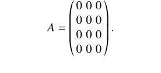

*解答*

这是一种巧妙的方法，得益于列表的算术运算。

```
S = [[0] * 3] * 4
S
```

```
[[0, 0, 0], [0, 0, 0], [0, 0, 0], [0, 0, 0]]
```

这里需要稍微小心一点：当我们使用`list * 3`时，Python会创建同一对象的三个副本。当我们修改其中一个对象时，这一点就变得很清楚了，如下例所示：

```
S[0][1] = 'upset'
S
```

```
[[0, 'upset', 0], [0, 'upset', 0], [0, 'upset', 0],
 [0, 'upset', 0]]
```

将上述与以下内容进行比较：

```
T = [[0, 0, 0], [0, 0, 0], [0, 0, 0], [0, 0, 0]]
```

```
T[0][1] = 'upset'
T
```

```
[[0, 'upset', 0], [0, 0, 0], [0, 0, 0], [0, 0, 0]]
```

```
S = [[0] * 3] * 3
S
```

```
[[0, 0, 0], [0, 0, 0], [0, 0, 0]]
```

当然，人们需要留意向列表中添加了什么以及如何处理它。我们给出一个有趣的例子，并留给读者进一步探索这个方向。

```
L=[3, 6.4, 3, 'stuff', 'x^2+x+1', 64/3]
```

```
L.append(L)
```

```
print(L)
```

```
[3, 6.4, 3, 'stuff', 'x^2+x+1', 21.333333333333332, [...]]
```

```
L[-1]
```

```
[3, 6.4, 3, 'stuff', 'x^2+x+1', 21.333333333333332, [...]]
```

```
L[-1][0]
```

```
3
```

```
L[-1][-1]
```

```
[3, 6.4, 3, 'stuff', 'x^2+x+1', 21.333333333333332, [...]]
```

```
L[-1][-1][-1]
```

```
[3, 6.4, 3, 'stuff', 'x^2+x+1', 21.333333333333332, [...]]
```

我们现在可以利用列表更深入地探讨指针（变量）和可变对象的概念。假设我们定义两个指针，都指向同一个列表。

```
x = y = [1, 2, 3, 4]
```

```
x
```

```
[1, 2, 3, 4]
```

```
y
```

```
[1, 2, 3, 4]
```

现在，如果我们修改对象 `[1, 2, 3, 4]`，那么指向该对象的两个指针 `x` 和 `y` 都会显示出这个变化。

```
x.append('extra bit')
x
```

```
[1, 2, 3, 4, 'extra bit']
```

```
y
```

```
[1, 2, 3, 4, 'extra bit']
```

然而，我们可以将指针 `y` 重新指向另一个对象。

```
y = ['another', 'object']
y
```

```
['another', 'object']
```

```
x
```

```
[1, 2, 3, 4, 'extra bit']
```

为了展示列表的多功能性，我们使用 Python 库 PIL，它用于处理图像。回顾一下，我们可以如下将库导入 Python：

```
from PIL import Image
```

```
x = Image.open('dog.jpg')
y = Image.open('Napoleon.jpg')
```

文件 `dog.jpg` 和 `Napoleon.jpg` 位于本地目录中。我们现在已将 `x` 和 `y` 分别赋值给这些图片。

```
x
```


```
y
```

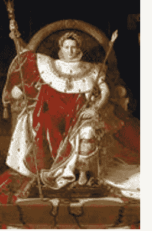

现在我们可以定义一个包含不同类型对象的列表，包括图像。

```
pic = ['cute dog', x , x.size, 'Napoleon', y, y.size]
```

```
display(pic[0], pic[1], pic[2])
```

```
'cute dog'
```


```
(144, 178)
```

图像对象自带其方法和工具。我们这里只简单介绍一两个。

```
pic[4].rotate(180)
```

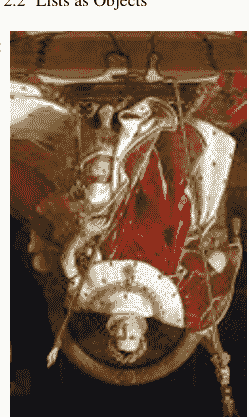

```
pic[1].effect_spread(10)
```

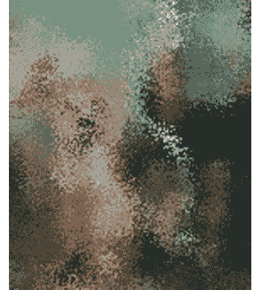

**练习 2.3** *给定一个列表，交换列表的第一个和最后一个元素。*

*解答*
首先，我们定义一个要操作的列表。

```
L=['first', 4, 8, 'stuff', 9/2, 'last']
```

当然，一种粗糙的方法是这样做：

```
L[0] = 'last'
L[-1] = 'first'
```

```
L
```

```
['last', 4, 8, 'stuff', 4.5, 'first']
```

或者一个稍好一点的方法：

```
temp = L[0]; L[0] = L[-1]; L[-1] = temp
```

```
L
```

```
['first', 4, 8, 'stuff', 4.5, 'last']
```

然而，有一种更优雅的方法：

```
L[0], L[-1] = L[-1], L[0]
```

```
L
```

```
['last', 4, 8, 'stuff', 4.5, 'first']
```

最后，还有一种使用序列的优雅方法：

```
[f, *r , l] = L
```

```
[l, *r , f]
```

```
['first', 4, 8, 'stuff', 4.5, 'last']
```

这里 `f` 被赋值为列表 `L` 的第一个元素，`l` 被赋值为最后一个元素，而 `*r` 被赋值为第一个和最后一个元素之间的序列。因此，在下一行 `[l, *r, f]` 中，我们只需交换第一个和最后一个元素，并保持序列 `*r` 不变。Python 甚至可以在我们省略括号时识别这种赋值：

```
f, *r , l = L
```

```
[l, *r, f]
```

```
['first', 4, 8, 'stuff', 4.5, 'last']
```

**练习 2.4** *考虑矩阵*


*并创建其转置。*

## 2.2 列表作为对象

### 解答

我们稍后会看到，numpy 库被设计为可以与矩阵无缝协作。这里使用经典的 Python 工具，我们可以这样写。

```
m = [['a', 'b', 'c'], ['d', 'e', 'f'], ['g', 'h', 'k']]
```

```
n = [[0, 0, 0], [0, 0, 0], [0, 0, 0]]
```

```
n[0][0], n[1][0], n[2][0] = m[0]
```

```
n[0][1], n[1][1], n[2][1] = m[1]
```

```
n[0][2], n[1][2], n[2][2] = m[2]
```

```
n
```

```
[['a', 'd', 'g'], ['b', 'e', 'h'], ['c', 'f', 'k']]
```

在我们探索 Python 中的其他数据结构之前，我们重新审视一下字符串。可以像访问列表元素一样访问字符串中的元素。

```
s = 'To be born again'
```

```
s[0]
```

```
'T'
```

```
s[1]
```

```
'o'
```

```
s[ : 5]
```

```
'To be'
```

```
s[5 : ]
```

```
' born again'
```

```
s[ : : -1]
```

```
'niaga nrob eb oT'
```

```
s = 'kayak'
```

```
s[ : : -1] == s
```

```
True
```

## 2.3 图形初探

Python 中最常用的库之一是 matplotlib。该库用于绘制数据并创建专业而精美的二维图形。我们将在第 7 章专门介绍这个库。这里我们给出列表与 matplotlib 结合如何绘制数据的初步示例。首先，我们将库导入 Python。

```
import matplotlib.pyplot as plt
```

为了使用 matplotlib 绘制图形，我们指定 x 坐标，然后指定 y 坐标。如果 `x=[x1,x2,..., xn]` 且 `y=[y1, y2,..., yn]`，那么 `plt.plot(x,y)` 将生成由点对 `(xi, yi)`（其中 1 ≤ i ≤ n）确定的图形。

```
plt.plot([1, 2, 2.5, 4], [10, 12, -2, 1]);
```

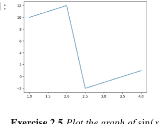

**练习 2.5** *绘制 sin(x) 在 0 ≤ x ≤ 3 区间上的图形。*

*解答*
稍后我们将看到如何高效地生成包含所需数据的列表。这里我们必须“手动”完成。我们定义两个列表，一个用于 x 坐标，另一个用于 y 坐标的 sin 值。

```
from math import sin

x = [0, 0.3, 0.5, 0.8, 1, 1.3, 1.5, 1.8, 2, 2.3, 2.5, 2.8, 3, 3.3, 3.5]
y = [sin(0), sin(0.3), sin(0.5), sin(0.8), sin(1), sin(1.3),
sin(1.5), sin(1.8), sin(2), sin(2.3), sin(2.5), sin(2.8),
sin(3), sin(3.3), sin(3.5)]
```

```
plt.plot(x, y);
```

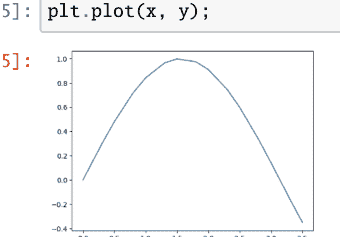

既然我们已经可以访问列表 `x` 和 `y`，我们可以做一些实验。

```
plt.plot(x, y[ : : -1]);
plt.plot(x, y);
```

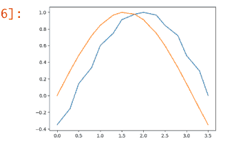

## 2.4 数据导入初探

尽管历史上许多人（包括艾萨克·牛顿）都付出了努力，但将廉价金属转化为黄金是不可能的。但现在每个人都知道，将数据转化为黄金是可能的，而这种特殊的炼金术被称为数据科学。

Python 提供了多个库将数据导入计算机，以便对其进行建模、可视化、研究并预测未来行为。将数据导入 Python 的一种方式是以列表的形式。我们这里使用 csv 库进行演示。更专业的库如 pandas 也可用于处理各种格式的数据。

以下 csv 文件下载自澳大利亚储备银行主页。它提供了自 2002 年 10 月以来的利率。代码展示了如何使用 csv 库将数据上传到 Python。

```
import csv

with open('RBAdata.csv', newline='') as interest_data:
    reader = csv.reader(interest_data)
    RBA_data = list(reader)

RBA_data[ : 10]
```

```
[['', ''],
 ['Oct-2002', '4.75'],
 ['Nov-2002', '4.75'],
 ['Dec-2002', '4.75'],
 ['Jan-2003', '4.75'],
 ['Feb-2003', '4.75'],
 ['Mar-2003', '4.75'],
 ['Apr-2003', '4.75'],
 ['May-2003', '4.75'],
 ['Jun-2003', '4.75']]
```

一旦我们导入了数据，就可以对其进行可视化，例如使用 matplotlib。一如既往，我们接收到的数据是*原始*的，需要对其进行处理以使其准备好用于后续流程。我们在此示例中这样做，尽管所使用的列表推导式方法将在第 5 章学习。

```
d = [float(item[1][0]) for item in RBA_data[1 : ]]
```

```
import matplotlib.pyplot as plt
```

```
plt.plot(d);
```

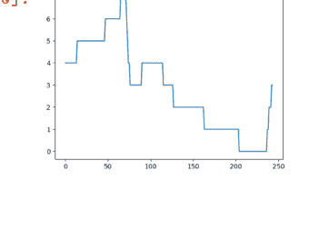

## 2.5 元组

元组（tuple）与列表（list）类似，都是用于处理数据的。元组的行为与列表非常相似。主要区别在于，可以修改现有的列表，即它们是*可变对象*；而一旦定义了元组，就不能修改它，即它们是*不可变对象*。

下面的示例展示了如何定义和操作元组。

```
t = (1, 2 , 'new', 1.5)
```

请注意，对于列表，对象是用方括号 `[ ]` 括起来的，而对于元组，则使用圆括号 `()`。但是，访问元组中的对象与列表完全一样。

```
t[2]
```

'new'

```
t[ : 3]
```

(1, 2, 'new')

```
t[ : : -2]
```

(1.5, 2)

下面的例子说明了我们所说的列表是可变的而元组是不可变的是什么意思。

```
s = [1, 2, 3]
```

```
t = (1, 2, 3)
```

```
type(s)
```

list

```
type(t)
```

tuple

```
s[1] = 'new data'
```

```
s
```

[130]: [1, 'new data', 3]

然而，执行 `t[1] = 'new data'` 会产生一个错误。该错误表明，一旦定义了元组，就不能更改它。

元组被定义为圆括号 `( , )` 之间的一组数据。实际上，在定义元组时不需要添加括号。

```
[131]: seasons = 'summer' , 'autumn' , 'winter', 'spring'
```

```
[132]: seasons
```

```
[132]: ('summer', 'autumn', 'winter', 'spring')
```

```
[133]: good_time = seasons[0], seasons[1]
```

```
[134]: good_time
```

```
[134]: ('summer', 'autumn')
```

在第5章中，我们将介绍字典和集合，它们也是为处理数据而设计的，为我们收集、处理和建模数据提供了更强大的能力。

## 2.6 数据处理的更多示例

### 2.6.1 语言

`nltk` 库（自然语言工具包）是一个出色的库，我们可以用它来处理语言。NLTK 已被用于许多领域，包括自然语言处理、计算语言学、人工智能、信息检索和机器学习。

在使用之前，需要导入并下载该库及其数据。

```
[135]: import nltk
nltk.download()
```

showing info https://raw.githubusercontent.com/nltk/nltk.data/gh-pages/index.xml

```
[135]: True
```

`nltk` 库包含各种文本，例如所有英语单词的列表，或来自古腾堡计划的书籍选集。

现在我们可以导入所有的英语单词（在此包中可用）。

```
from nltk.corpus import words
word_list = words.words()
```

```
type(word_list)
```

list

`word_list` 是一个包含超过20万个英语单词的列表，现在可供我们使用。

```
len(word_list)
```

236736

```
'fortunate' in word_list
```

True

这是来自 `word_list` 的一个示例单词列表。

```
word_list[ : : 20001]
```

['A',
 'beefhead',
 'commerceless',
 'Einsteinian',
 'grievingly',
 'jheel',
 'mountaintop',
 'pasilaly',
 'pun',
 'sheikly',
 'tenorite',
 'unomnipotent']

这是来自古腾堡计划的可用书籍列表。

```
import nltk
from nltk.corpus import gutenberg
gutenberg.fileids()
```

['austen-emma.txt',
 'austen-persuasion.txt',
 'austen-sense.txt',
 'bible-kjv.txt',
 'blake-poems.txt',
 'bryant-stories.txt',
 'burgess-busterbrown.txt',
 'carroll-alice.txt',
 'chesterton-ball.txt',
 'chesterton-brown.txt',
 'chesterton-thursday.txt',
 'edgeworth-parents.txt',
 'melville-moby_dick.txt',
 'milton-paradise.txt',
 'shakespeare-caesar.txt',
 'shakespeare-hamlet.txt',
 'shakespeare-macbeth.txt',
 'whitman-leaves.txt']

我们现在使用 `sents` 函数将《哈姆雷特》导入程序，该函数将文本分割成句子，其中每个句子是一个单词列表。

```
[142]: Hamlet_sentences = gutenberg.sents('shakespeare-hamlet.txt')
```

《哈姆雷特》包含超过3000个句子和超过37000个单词。

```
[143]: len(Hamlet_sentences)
```

```
[143]: 3106
```

```
[144]: Hamlet_sentences[1226]
```

```
[144]: ['And', 'all', 'for', 'nothing', '?']
```

```
[145]: Hamlet_words = gutenberg.words('shakespeare-hamlet.txt')
```

```
[146]: len(Hamlet_words)
```

```
[146]: 37360
```

```
[147]: 'Lust' in Hamlet_words
```

```
[147]: True
```

```
[148]: Hamlet_words.count('Lust')
```

```
[148]: 2
```

我们注意到，通过 `nltk` 导入的内容不是列表，但它们的行为与我们所见的列表类似。

```
[149]: type(Hamlet_words)
```

[149]: nltk.corpus.reader.util.StreamBackedCorpusView

`nltk` 中还有一些我们可以上传的书籍。

```
[150]: import nltk
from nltk.book import *
```

*** NLTK Book 的入门示例 ***
正在加载 text1, ..., text9 和 sent1, ..., sent9
输入文本或句子的名称以查看它。
输入：'texts()' 或 'sents()' 以列出材料。
text1: Moby Dick by Herman Melville 1851
text2: Sense and Sensibility by Jane Austen 1811
text3: The Book of Genesis
text4: Inaugural Address Corpus
text5: Chat Corpus
text6: Monty Python and the Holy Grail
text7: Wall Street Journal
text8: Personals Corpus
text9: The Man Who Was Thursday by G . K . Chesterton 1908

```
[151]: text3[0 : 11]
```

[151]: ['In',
    'the',
    'beginning',
    'God',
    'created',
    'the',
    'heaven',
    'and',
    'the',
    'earth',
    '.']

```
[152]: len(text3)
```

[152]: 44764

```
[153]: text3.count('God')
```

[153]: 231

我们还可以确定一个单词在文本中的位置，即它距离文本开头的距离，以单词为单位。此位置信息可以使用分散图显示。每个条带代表一个单词的实例，每一行代表整个文本。

```
[154]: text3.dispersion_plot(['God', 'earth', 'stars', 'Adam', 'Eve'])
```

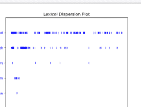

在后面的章节中，我们将使用 `nltk` 库来编写更有趣的代码。

## 问题

- 1) 定义一个如下形式的列表
z=[[x1, y1], [x2, y2], [x3, y3], [x4, y4] , [x5, y5]]
使用 Python 的列表方法从 z 构建以下列表：
  - [x1, x2, x3, x4, x5]
  - [y1, y2, y3, y4, y5]
  - [[y1, x1], [y2, x2], [y3, x3], [y4, x4] , [y5, x5]]
  - [x1, y1, x2, y2, x3, y3, x4, y4, x5, y5]
  - [[x4, y4], [x2, y2]]
  - [[x1, y1], [x3, y3], [x5, y5]]

- 2) 以列表形式定义以下矩阵。
$$M = \begin{pmatrix} a & b & c \\ d & e & f \\ g & h & k \end{pmatrix}$$
使用列表方法从列表 $M$ 生成以下矩阵：
  - $M$ 的转置，即 $\begin{pmatrix} a & d & g \\ b & e & h \\ c & f & k \end{pmatrix}$。
  - $M$ 的主对角线，即 $\begin{pmatrix} a & 0 & 0 \\ 0 & e & 0 \\ 0 & 0 & k \end{pmatrix}$。
  - $M$ 的反对角线，即 $\begin{pmatrix} 0 & 0 & c \\ 0 & e & 0 \\ g & 0 & 0 \end{pmatrix}$。
  - 矩阵 $\begin{pmatrix} c & b & a \\ f & e & d \\ g & h & k \end{pmatrix}$。
  - 矩阵 $\begin{pmatrix} 1 & 2 & a \\ 3 & 4 & d \\ g & h & k \end{pmatrix}$。
  - 矩阵 $\begin{pmatrix} \star & \star & \star \\ \star & X & \star \\ \star & \star & \star \end{pmatrix}$。

- 3) 考虑以下过程
$\begin{pmatrix} a & b & c \\ d & e & f \\ g & h & k \end{pmatrix} \longrightarrow \begin{pmatrix} a^1 & b^2 & c^3 \\ d^1 & e^2 & f^3 \\ g^1 & h^2 & k^3 \end{pmatrix}$。
编写代码将此过程应用于一个 $3 \times 3$ 矩阵。尝试对以下矩阵运行代码
$\begin{pmatrix} 1 & 2 & 3 \\ 1 & 2 & 3 \\ 1 & 2 & 3 \end{pmatrix}$。

- 4) 从澳大利亚储备银行导入自2002年10月以来的利率 CSV 格式数据，并尝试从导入的文件中获取各种数据（参见 §2.4）。

# 第3章
决策与重复


## 3.1 决策：十字路口

语句

```
if cond:
    this
else:
    that
```

其中 `cond` 是一个布尔表达式，即其值为 `True` 或 `False`，如果 `cond` 的值为 `True`，则执行代码块 `this`，否则执行 `that`。这意味着，在任何一种情况下，`this` 或 `that` 中的一个语句将被执行（但不会同时执行两个）。因此，这使我们能够决定要执行代码的哪一部分。下面是一个例子：

```
[1]: if True:
        print('100%')
        print('checked')
    else:
        print('0%')
```

[1]: 100%
checked

我们需要仔细阅读上面的代码。上面的装饰和间距并非为了美观。Python 使用空格来确定结构。属于 `if` 语句的代码块 `this` 是通过添加空格来确定的，同样，属于命令 `else` 部分的代码块 `that` 也是如此。在其他语言中，人们使用 `\begin`、`\end`、`(` 和 `)` 或 `{` 和 `}` 将事物分组并为代码提供结构，但 Python 中的空格既扮演了这个角色，又使代码更易于阅读。特别是，这种方法减少了括号的数量。

在Python中，我们使用缩进来将代码分组，这使得代码在视觉上更加美观。本章稍后我们将探讨循环和重复执行代码块。这同样通过缩进来确定我们想要重复的代码。将这些结合起来，Python代码将如下所示，其中灰色块代表结构化代码。

```
if cond:
    [block]
else:
    [block]
loop
    if cond:
        [block]
    else:
        [block]
```

当使用需要结构的命令时，Python要求我们遵循正确的缩进，如下所示。如果我们运行下面的代码，会遇到一条错误消息，它告诉我们缩进不正确。

```
[2]: if True:
    print("100%")
    print('checked')
else:
    print("0%")
```

```
[2]: Cell In[2], line 2
    print("100%")
    ^
IndentationError: expected an indented block after 'if' statement on line 1
```

在下一个例子中，我们来看神秘的Collatz函数，其定义如下：

$$f(x) = \begin{cases} x/2 & \text{if } x \text{ is even,} \\ 3x+1 & \text{if } x \text{ is odd.} \end{cases}$$

L. Collatz在1937年提出猜想：如果对任何正整数反复应用$f$，最终会得到1，即对于任何$x \in \mathbb{N}$，存在一个$n$使得$f^n(x) = 1$。

我们稍后将讨论如何在Python中定义函数。这里我们编写Collatz条件函数。

```
[3]: n=int(input('enter a number '))

if n % 2 == 0:
    f = n//2
else:
    f = 3 * n + 1
f
```

enter a number 71

[3]: 214

实际上，使用`divmod`方法我们可以编写更巧妙的代码。

```
[4]: help(divmod)
```

[4]: Help on built-in function divmod in module builtins:

divmod(x, y, /)
    Return the tuple (x//y, x%y). Invariant: div*y + mod == x.

```
[5]: n=int(input('enter a number '))

da = divmod(n, 2)
if da[1] == 0:
    f = da[0]
else:
    f = 3 * n +1
f
```

enter a number 71

[5]: 214

**练习 3.1** *编写一个代码，接受两个数字x和y，如果它们的差小于0.00001，则打印x=y。*

*解答*

这是一个处理浮点数的好练习。正如我们在第1章所看到的，处理浮点数时，我们通常得不到精确值，而是计算的近似值。

```
[6]: x = 12.22; y = 12.22000002

if abs(x-y) < 0.000001:
    print(x, "=", y)
else:
    print(x, "not =", y)
```

[6]: 12.22 = 12.22000002

## 3.2 决策制定：道路上的岔路口

到目前为止，通过**if-else**，我们已经能够在有两种可能性（即道路上的岔路口）时控制代码的流程。**if**语句旨在通过以下格式，在有多种可能性时控制代码的流程：

```
if cond:
    fork1
elif:
    fork2
elif:
    fork3
...
else:
    otherwise
```

我们将定义下面的函数，它展示了**if-elif-else**的工作原理：

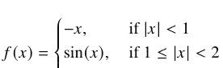

```
import math

x = float(input('enter a number '))

if abs(x)<1:
    f = -x
elif 1<= abs(x) <2:
    f = math.sin(x)
else:
    f = math.cos(x)
f
```

enter a number 1.3098

[7]: 0.9661333622828724

### 练习 3.2 定义函数

$$f(x, y) = \begin{cases} e^x & \text{if } x = y \\ \frac{e^x - e^y}{x - y} & \text{if } x \neq y \end{cases}$$

并观察对于任意实数$a, b$，满足$a < b < 0$，我们有

$$\frac{f(x, b)}{f(x, a)} > \frac{1 + e^b}{1 + e^a}$$

对于任何$a \leq x \leq b$。

### 解答

我们需要定义函数$f(x, y)$，然后计算$f(x, a)$和$f(x, b)$。定义一个独立的函数$f$，它接受$x$和$y$并计算$f(x, y)$是合理的。这可以在我们第4章学习如何在Python中定义函数时完成。在这个阶段，我们在代码中定义这个函数。

```
from math import exp

print('Enter numbers a, x, and b where a<= x <= b and a<b<0')
a = float(input('enter a: '))
b = float(input('enter b: '))
x = float(input('enter x: '))

y = a
if x == y:
    fa = exp(x)
else:
    fa = (exp(x) - exp(y))/(x - y)
y = b
if x == y:
    fb = exp(x)
else:
    fb = (exp(x) - exp(y))/(x - y)

z = (1 + exp(b))/(1 + exp(a))
print(fb / fa > z)
```

Enter numbers a, x, and b where a<= x <= b and a<b<0
enter a: -3.4
enter b: -1.44
enter x: -2

[8]: True

**练习 3.3** *编写一个代码，检查一个数字是整数还是浮点数，以及它是正数还是负数。*

*解答*

回想一下，`type`函数会返回对象的类型。因此，使用`type`我们可以确定输入是整数还是浮点数。

```
[9]: x=-3.14
if type(x) != int and type(x) != float:
    print('input is not a number')
elif x == 0:
    print(x, 'is zero')
elif x > 0:
    if type(x) == int:
        print(x, 'is a positive integer')
    else:
        print(x, 'is a positive real number')
else:
    if type(x) == int:
        print(x, 'is a negative integer')
    else:
        print(x, 'is a negative real number')
```

[9]: -3.14 is a negative real number

注意上面代码中**if-else**是如何在另一个条件结构内使用的。

**练习 3.4** *编写一个代码，接受一个字符串并判断它是否是回文。*

*解答*

回想一下，我们可以通过从右到左读取字符来反转字符串，如下所示：

```
[10]: x = 'university'
x[::-1]
```

[10]: 'ytisrevinu'

```
[11]: x = input('Enter a word: ')

if x == x[::-1]:
    print(x, "is palindromic")
else:
    print(x, "is not palindromic")
```

Enter a word: kayak

[11]: kayak is palindromic

**练习 3.5** *编写一个代码，接受一个列表，如果列表的第一个和最后一个元素相同，则移除它们。增强代码，使其在列表为空时说明列表是回文。进一步增强代码，使其也能处理字符串。*

*解答*

让我们从一个列表开始，捕获第一个和最后一个元素，然后打印所有其他元素。我们拥有所有必要的工具。

```
[12]: x = ['a', 'b', 'c', 'd', 'e', 'a']
print(x[0], x[-1], ' and the list without the first and last element ', x[1 : -1])
```

[12]: a a  and the list without the first and last element ['b', 'c', 'd', 'e']

这展示了我们应该如何进行。

```
[13]: if x[0] == x[-1]:
    x = x[1 : -1]
else:
    x
```

```
[14]: x
```

[14]: ['b', 'c', 'd', 'e']

接下来我们检查列表是否一开始就是空的。

```
[15]: if x == []:
    print('palindromic')
elif x[0] == x[-1]:
    x = x[1 : -1]
    print(x)
else:
    print(x)
```

[15]: ['b', 'c', 'd', 'e']

让我们用x=['a','yes','c','x','c','yes','a']来测试代码。

```
x = ['a', 'yes', 'c', 'x', 'c', 'yes', 'a']
```

你会看到，如果我们运行代码4次，会得到单词'palindromic'。这展示了一种编写代码来检查列表是否是回文的方法，如果我们有工具来重复代码块，我们可以使其更高效。这将在我们介绍Python中的*循环*时完成。

修改代码以处理字符串也非常容易。

```
x = 'kayak'

if x == [] or x == '':
    print("Palindromic")
elif x[0] == x[-1]:
    x = x[1 : -1]
    print(x)
else:
    print(x)
```

aya

## 3.3 循环与重复

### 3.3.1 For循环

计算机语言提供的一项基本能力是能够“快速”重复执行某些代码。Python提供了三种*循环*，使我们能够重复代码的一部分。这些循环与任何过程式语言（如Fortran或C）中存在的循环非常相似。我们将介绍**for**和**while**循环，并研究嵌套循环，即定义在彼此内部的循环。本章最后，我们将探讨其他嵌套命令。

创建重复的第一种方法是定义一个列表，并让Python遍历该列表。这样，我们可以根据列表的元素数量重复执行一个**代码块**。

**代码块**本身可以包含大量行。类似于**if**语句，我们通过适当的间距指定属于**for**循环的代码块。程序遍历**列表**，每次运行该代码块。

```
for i in list:
    block
```

```
for n in [2, 3, 4, 5]:
    print(n)
```

这里的参数 `n` 会遍历列表（从左到右）`[2, 3, 4, 5]`，每次选取列表中的一个元素并执行代码块，即这里的 `print(n)` 这一行。当 `n` 到达列表末尾时，程序终止。

可以看到，这种结构与 `if` 语句非常相似。

```python
n = 4
if n in [2,3,4,5]:
    print(n)
```

4

遍历列表来创建循环赋予了我们强大的能力，因为我们可以遍历几乎任何包含各种对象的列表来创建循环！

```python
my_list=['Western', 'Sydney', 'University']
```

```python
for item in my_list:
    print(item + ' yeah!')
```

Western yeah!
Sydney yeah!
University yeah!

```python
for name in ['western', 'sydney', 'university']:
    print(name.upper())
```

WESTERN
SYDNEY
UNIVERSITY

Python 提供了一个非常方便的 `range` 对象：可以使用 `range` 来创建循环。`range(m)` 会创建一个从 0 到 `m - 1` 的范围。

```python
for i in range(7):
    print('phishing' * i)
```

phishing
phishingphishing
phishingphishingphishing
phishingphishingphishingphishing
phishingphishingphishingphishingphishing
phishingphishingphishingphishingphishingphishing
phishingphishingphishingphishingphishingphishingphishing

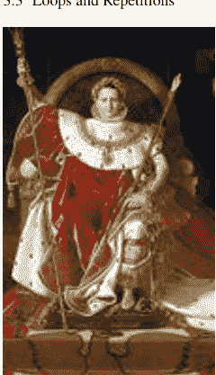

```
scale = 1
for pic in [x, y] * 2:
    s = (pic.size[0] // scale, pic.size[1] // scale)
    display(pic.resize(s))
    scale *= 2
```


**练习 3.6** *一个单词如果正读和反读都相同，则被称为回文词，例如 madam 或 kayak。使用 nltk 库将英语中的所有单词导入 Python，然后找出所有的回文词。*

*解答*

回顾一下，nltk 库提供了与语言相关的工具和数据。

```
python
from nltk.corpus import words
word_list = words.words()
```

现在，找出回文词是一个简单的测试，只需遍历整个列表即可。

```
python
for word in word_list:
    if word == word[::-1] and len(word) > 3:
        print(word, end=' ')
```

acca adda affa ajaja alala alula amma anana anna arara atta boob civic deed deedeed degged elle hallah immi kakkak kayak keek kelek lemel level maam madam mesem minim murdrum noon otto peep poop radar redder refer repaper retter rever reviver rotator rotor siris sooloos tebbet teet tenet terret toot ululu yaray

**练习 3.7** *在《创世记》一书中找出所有的回文词。*

*解答*

这个练习与前一个非常相似。

```
python
import nltk
from nltk.book import *
```

*** NLTK 书的入门示例 ***
正在加载 text1, ..., text9 和 sent1, ..., sent9
输入文本或句子的名称以查看它。
输入：'texts()' 或 'sents()' 以列出材料。
text1: Moby Dick by Herman Melville 1851
text2: Sense and Sensibility by Jane Austen 1811
text3: The Book of Genesis
text4: Inaugural Address Corpus
text5: Chat Corpus
text6: Monty Python and the Holy Grail
text7: Wall Street Journal
text8: Personals Corpus
text9: The Man Who Was Thursday by G. K. Chesterton 1908

```
[31]: for word in text3:
    if len(word) > 3 and word == word[::-1]:
        print(word)
```

[31]: noon
noon
deed

```
[32]: texts()
```

[32]: text1: Moby Dick by Herman Melville 1851
text2: Sense and Sensibility by Jane Austen 1811
text3: The Book of Genesis
text4: Inaugural Address Corpus
text5: Chat Corpus
text6: Monty Python and the Holy Grail
text7: Wall Street Journal
text8: Personals Corpus
text9: The Man Who Was Thursday by G. K. Chesterton 1908

**练习 3.8** *两个正整数的和是 5432，它们的最小公倍数是 223020。求这两个数。*

*解答*

math 库目前还不包含计算两个数最小公倍数的函数。但是，可以通过 `math.gcd` 获得最大公约数。另一方面，我们知道恒等式
$$\text{lcm}(n, m) = \frac{mn}{\text{gcd}(n, m)}.$$
这使我们能够编写本练习的代码。

```
[33]: import math
math.gcd(25,30)
```

[33]: 5

```
[34]: (25 * 30) // math.gcd(25,30)
```

[34]: 150

```
[35]: import math

for n in range(1, 5433):
    m = 5432 - n
    lcm = (n * m) // math.gcd(n,m)
    if lcm == 223020:
        print(n, m)
```

[35]: 1652 3780
3780 1652

由于 n 和 m 之间存在对称性，我们需要只遍历到 5432 的一半，以避免结果重复。

```
[36]: import math

for n in range(1, 5433//2):
    m = 5432 - n
    lcm = (n * m) // math.gcd(n,m)
    if lcm == 223020:
        print(n, m)
```

[36]: 1652 3780

**练习 3.9** 确定所有在 3 到 50 之间的正整数 n，使得 $2^{2008}$ 能被

$1 + \binom{n}{1} + \binom{n}{2} + \binom{n}{3}$ 整除。

这里 $\binom{n}{m}$ 是二项式系数：$\binom{n}{m}$ 定义为 $\frac{n!}{m!(n-m)!}$

*解答*

阶乘和二项式函数在 math 库中都可用，如下例所示：

## 3.3 循环与重复

63

```
[37]: import math
math.factorial(5) == 1 * 2 * 3 * 4 * 5
```

[37]: True

```
[38]: math.comb(5,3) == math.factorial(5)//(math.factorial(3) * math.factorial(5-3))
```

[38]: True

我们准备好编写代码了。难点在于将这个大公式正确地翻译成 Python。

```
[39]: for n in range(3,51):
    f = (1 + math.comb(n,1) + math.comb(n,2) + math.comb(n,3))
    if (2**2008) % f == 0:
        print(n)
```

[39]: 3
7
23

请体会这个计算的复杂性！

```
[40]: 2**2008
```

[40]: 29392145799020915820360529950148658790971333173470597132227654062739616291644680034730482849702560509912216694758079047000246245398094216484503842717866321546017277221199943680176327461949451487085805309456252478664093558693475421170513158666359386616551679118889574095089825179039567782281258040824405166424107240700021377434209148110825999078639302784109824695476896212613634081852488010690884578129204889342821483040517575643751434792922414912394467695078935531662069192598956042024980981047457429185377388949433859975257289323374605954282310600673952044911495373010647749329399156163119321894151520256

**练习 3.10** 注意到 $12^2 = 144$ 且 $21^2 = 441$，即这些数和它们的平方是彼此的逆序数。找出所有具有此性质的不超过 10000 的数。

*解答*

首先需要处理的是数字的逆序。我们可以使用处理字符串时用过的技巧，通过 `s[::-1]` 从右向左读取字符串的字符。因此，我们将一个数字转换为字符串，从右向左读取字符，然后再将其转换回数字。

```
x=str(12345)
```

```
x[::-1]
```

'54321'

```
int(x[::-1])
```

54321

```
int(str(12345)[::-1])
```

54321

现在我们需要将所寻找的性质转化为代码，即，我们需要将一个数平方，将其逆序，然后将结果与其逆序数的平方进行比较；代码如下：

`int(str(n**2)[::-1]) == int(str(n)[::-1])**2`。

将这些组合起来：

```
for n in range(1,10000):
    if int(str(n**2)[::-1]) == int(str(n)[::-1])**2:
        print(n, end=' ')
```

1 2 3 10 11 12 13 20 21 22 30 31 100 101 102 103 110 111 112 113 120 121 122 130 200 201 202 210 211 212 220 221 300 301 310 311 1000 1001 1002 1003 1010 1011 1012 1013 1020 1021 1022 1030 1031 1100 1101 1102 1103 1110 1111 1112 1113 1120 1121 1122 1130 1200 1201 1202 1210 1211 1212 1220 1300 1301 2000 2001 2002 2010 2011 2012 2020 2021 2022 2100 2101 2102 2110 2111 2120 2121 2200 2201 2202 2210 2211 3000 3001 3010 3011 3100 3101 3110 3111

我们验证其中一个答案：

```
112**2
```

12544

```
211**2
```

[47]: 44521

我们重新审视关于循环数的练习 1.1。

**练习 3.11** *一个具有 n 位数字的数被称为循环数，如果它乘以 1, 2, 3, ..., n 所得到的数都由相同的数字以不同的顺序组成。找出唯一的 6 位循环数。*

*解答*

让我们揭晓答案：数字 142857 是唯一的 6 位循环数！我们首先通过一个简单的循环来验证这一点。

```
[48]: for i in range(1, 7):
    print(i * 142857, end=' ')
```

[48]: 142857 285714 428571 571428 714285 857142

如何实际找到这个数呢？一种方法是将该数的所有数字从小到大排序。然后我们检查该数的任何倍数，当同样排序后，是否具有相同的数字序列。

```
[49]: str(142857)
```

[49]: '142857'

```
[50]: sorted(str(142857))
```

[50]: ['1', '2', '4', '5', '7', '8']

```
[51]: str(142857 * 2)
```

[51]: '285714'

```
[52]: sorted(str(142857)) == sorted(str(142857 * 2))
```

[52]: True

以下是实现此方法的朴素代码：

```
[53]: for i in range(100000, 1000000):
    if sorted(str(i)) == sorted(str(i * 2)) == sorted(str(i * 3)) == sorted(str(i * 4)) == sorted(str(i * 5)) == sorted(str(i * 6)):
        print(i)
```

[53]: 142857

这是对上述代码的一点改进。我们设 x 为一个数的数字排序后的结果，布尔值 y = True。然后我们检查该数的倍数，每次将结果与 x 进行比较。如果排列不匹配，我们将布尔语句的值更改为 false。这将跟踪数字的排列是否发生变化。

```
[54]:
x = sorted(str(142857))
y = True
for i in range(1, 7):
    y = y and x == sorted(str(142857 * i))
print(y)
```

[54]: True

回顾一下，对于某个运算 #，我们可以将 y = y # s 写成更短的形式 y #= s。

```
[55]:
x = sorted(str(142857))
y = True
for i in range(1, 7):
    y &= x == sorted(str(142857 * i))
print(y)
```

[55]: True

我们可以进一步改进上述代码。如果在某个实例中 y 的值变为 false，即，如果新数字的数字与 x 的数字不同，我们就不需要继续循环的剩余部分。在这种情况下，我们可以使用命令 break 停止循环。break 语句会完全跳出循环。

```
[56]:
x = sorted(str(142857))
y = True
for i in range(1, 7):
    if x != sorted(str(142857 * i)):
        y = False
        print(y)
        break
```

现在我们将代码整合起来，让 x 遍历所有六位数。

```
[57]:
for i in range(100000, 1000000):
    x = sorted(str(i))
    y = True
```

for k in range(1, 7):
    if x != sorted(str(i * k)):
        y=False
        break
if y: print(i)

[57]: 142857

## 练习 3.12
定义 $f(x) = \sqrt{1+x}$。我们有

$f(f(f(f(f(x))))) = \sqrt{1+\sqrt{1+\sqrt{1+\sqrt{1+\sqrt{1+x}}}}}$

对于任意给定的 $x$，计算上述表达式。

*解答*
稍后我们将在 Python 中定义函数 $f$ 并直接计算函数的复合。目前我们唯一的工具是循环。

```python
import math
x = 0
for _ in range(5):
    x = math.sqrt(1 + x)
print(x)
```

[58]: 1.6118477541252516

这是我们第一次在循环中使用 _ 作为变量。如果不需要显式使用循环变量，可以用 _ 代替。

## 练习 3.13
找出 1 到 100 之间满足 $2^n - 1$ 能被 7 整除的 $n$。

*解答*
我们创建一个循环，让 $n$ 遍历 1 到 100 的列表，并在每次迭代时检查 $2^n - 1$ 是否能被 7 整除。这通过检查 $2^n - 1$ 除以 7 的余数是否为零来实现：在 Python 中：`if (2**n - 1) % 7 == 0`。

```python
for n in range(1, 101):
    if (2**n - 1) % 7 == 0:
        print(n, end=' ')
```

[59]: 3 6 9 12 15 18 21 24 27 30 33 36 39 42 45 48 51 54 57 60 63 66 69 72 75 78 81 84 87 90 93 96 99

## 练习 3.14
*绘制函数 $f(x) = \sin(x)$ 在 $0 \le x \le \pi$ 区间的图像。*

*解答*

回顾一下，matplotlib 库用于绘制数据。我们需要创建两个列表 x 和 y，然后 `plt.plot(x,y)` 将生成由列表中的配对值确定的图形。这次我们可以使用 for 循环来生成这些列表。

```python
[60]: import math, matplotlib.pyplot as plt

x = []
y = []
for i in range(0, 200):
    step = i * 2 * math.pi / 200
    x.append(step)
    y.append(math.sin(step))

plt.plot(x,y)
```

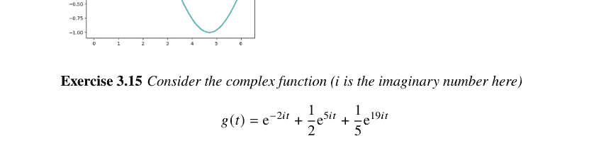

## 练习 3.15
*考虑复变函数（其中 i 是虚数单位）*

$$g(t) = e^{-2it} + \frac{1}{2}e^{5it} + \frac{1}{5}e^{19it}$$

*并绘制当 $0 \le t \le 2\pi$ 时，x 和 y 分别为 g(t) 的实部和虚部的图像。*

*解答*

我们需要使用复数的指数函数。math 库提供了 exp 函数，但这里我们只能用它处理实数。cmath 库提供了允许我们处理复数的函数。因此，我们从 cmath 库导入 exp 函数。

一旦计算出函数 g，我们就可以用 g.real 获取实部，用 g.imag 获取虚部。我们将这些值收集到两个列表 x 和 y 中，然后使用 matplotlib 绘制图形。

```python
from cmath import exp
import matplotlib.pyplot as plt

x = []
y = []
for t in range(0, 2000):
    s = t * 2 * math.pi / 200
    g = exp(-2j * s) + (1/2)*exp(5j * s) + (1/5)*exp(19j * s)
    x.append(g.real)
    y.append(g.imag)

plt.axis('off');
plt.axis('equal');
plt.plot(x,y);
```


最后，我们重新审视从澳大利亚储备银行导入的利率数据。现在我们有了一个提取列表部分的工具。

```python
import csv

with open('RBAdata.csv', newline='') as interest_data:
    reader = csv.reader(interest_data)
    RBA_data = list(reader)

RBA_data[ : 10]
```

```
[['', ''],
 ['Oct-2002', '4.75'],
 ['Nov-2002', '4.75'],
 ['Dec-2002', '4.75'],
 ['Jan-2003', '4.75'],
 ['Feb-2003', '4.75'],
 ['Mar-2003', '4.75'],
 ['Apr-2003', '4.75'],
 ['May-2003', '4.75'],
 ['Jun-2003', '4.75']]
```

首先，我们删除列表开头的空条目。

```python
[63]: del RBA_data[0]
RBA_data[ : 10]
```

```
[63]: [['Oct-2002', '4.75'],
['Nov-2002', '4.75'],
['Dec-2002', '4.75'],
['Jan-2003', '4.75'],
['Feb-2003', '4.75'],
['Mar-2003', '4.75'],
['Apr-2003', '4.75'],
['May-2003', '4.75'],
['Jun-2003', '4.75'],
['Jul-2003', '4.75']]
```

```python
[64]: dates = []
data = []
for d in RBA_data:
    dates.append(d[0])
    data.append(float(d[1][0]))
```

```python
[65]: import matplotlib.pyplot as plt

plt.plot(data);
```

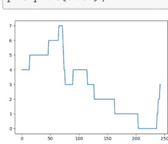

### 3.3.2 嵌套 For 循环

在许多应用中，有多个因素（变量）同时变化，这就需要我们所说的*嵌套循环*。与其抽象地描述这种情况，不如让我们看一些例子。

让我们找出所有满足 $n, m \le 10$ 且 $n^2 + m^2$ 是一个完全平方数的数对 $(n, m)$（例如，$(3, 4)$，因为 $3^2 + 4^2 = 5^2$）。

注意，这里我们处理两个参数 $n$ 和 $m$，每个参数的范围都在 1 到 10 之间。我们可以设计两个 for 循环，每个循环负责一个变量。

```python
for n in range(1, 11):
    for m in range(1, 11):
        if math.sqrt(n**2 + m**2).is_integer():
            print(n, " ", m)
```

```
3    4
4    3
6    8
8    6
```

这里外层循环从计数器 $n$ 取值 1 开始。然后轮到这个循环内部的代码块执行，这又是一个循环运行。在内层循环中，$m$ 在 $(1, 11)$ 范围内使计数器 $m$ 从 1 运行到 10。完成后，在外层循环中 $n$ 取值 2，然后 $m$ 从 1 运行到 10，依此类推，每次检查 $\sqrt{n^2 + m^2}$ 是否为整数。这是通过浮点数的一个方法 `.is_integer` 来完成的。

如我们所见，我们得到了数对 $(3, 4)$ 和 $(4, 3)$，对我们来说这是相同的答案。为了消除这种重复，我们可以修改代码。

```python
for n in range(1, 11):
    for m in range(n, 11):
        if math.sqrt(n**2 + m**2).is_integer():
            print(n, " ", m)
```

读者应该看到，在内层循环中，$m$ 需要从 $n$ 开始，一直到 10。这足以找到所有具有所需性质的、不超过 10 的数对。你能说出 `if` 语句将被执行多少次吗？

## 练习 3.16
*选取一个奇数 $p$。然后找到一对正整数 $(q, r)$，使得 $p^2 + q^2 = r^2$。*

*解答*

显然，我们需要为 $q$ 设置一个界限，假设我们将检查 $q$ 和 $r$ 直到 100。以下代码应该能找到所有不超过 100 的数对。

```python
[68]: p= int(input('enter an odd number:'))
for q in range(1, 101):
    for r in range(q+1, 101):
        if r**2 - q**2 == p**2:
            print(q, ' ', r)
```

enter an odd number:33

[68]: 44 55
56 65

## 练习 3.17
我们要求 ChatGPT 编写一个 Python 代码来找到可以表示为两个立方数之和的最小数字。以下是代码。它有什么问题！？

```python
[69]: # Initialize the smallest sum to a large value
smallest_sum = float('inf')

# Define the upper limit for the search (You can adjust this if needed)
upper_limit = 1000

# Iterate through all possible combinations of cube numbers
for a in range(1, upper_limit):
    for b in range(a, upper_limit):
        # Calculate the sum of the cubes of a and b
        current_sum = a**3 + b**3

        # Check if the current sum is smaller than the smallest sum found so far
        if current_sum < smallest_sum:
            smallest_sum = current_sum

print(f"The smallest number that can be written as a sum of two cubes is: {smallest_sum}")
```

[68]: The smallest number that can be written as a sum of two cubes is: 2

*解答*

可以表示为两个正立方数之和的最小正整数显然是 $2 = 1^3 + 1^3$。这不需要代码！然而，ChatGPT 提供的代码正确地找到了答案（尽管嵌套循环运行了 100 万次！），而且代码的整体结构也相当令人印象深刻。

## 练习 3.18
*定义一个 $3 \times 2$ 矩阵 $(a_{ij})$，其中元素 $a_{ij} = i - j$。然后求所有元素的和。*

*解答*

我们已经见过如何使用列表处理矩阵。现在我们有了创建循环的能力，就可以系统地生成矩阵的元素。我们首先用 $A=[[0,0], [0,0], [0,0]]$ 表示一个通用的 $3 \times 2$ 矩阵。接下来，将 $a_{ij} = i - j$ 转换为代码，我们得到 $A[i][j] = i - j$。我们现在的任务是让 $i$ 和 $j$ 从 0 运行到 2。

```python
[70]: A=[[0,0], [0,0], [0,0]]

for i in range(3):
    for j in range(2):
        A[i][j] = i - j
print(A)

X = 0
for i in range(3):
    for j in range(2):
        X += A[i][j]
print(f'The sum of all the entries is {X}')
```

[70]: [[0, -1], [1, 0], [2, 1]]
The sum of all the entries is 3

## 练习 3.19
*为不同的 $n$ 值生成以下矩阵。*


*解答*

以下是当 $n = 5$ 时，创建此类矩阵的分步过程。

### 3.3.3 While 循环

While 循环提供了另一种重复执行代码块的方式。这次代码块将被重复执行，直到满足某个条件，即一个布尔表达式变为 True。while 循环的形式如下：

```
while cond:
    block
```

我们从以下示例开始。考虑 $n = 123$；当 $n$ 不能被 7 整除时，在 $n$ 的右侧追加数字 1。注意，我们一开始并不知道需要在给定数字的右侧添加多少个 1，直到它能被 7 整除。

```
n = 123
while n % 7 != 0:
    n = n*10 + 1
print(n)
```

[79]: 1231111

`n%7 !=0` 是我们的布尔语句（条件）。当 `n%7 !=0` 返回 True 时，while 循环会重复执行属于它的代码块（通过缩进指定）。这里 `n=10n+1` 是我们想要重复的代码块。代码 `n=10n+1` 只是将数字 $n$ 取出，并在该数字的最右边放置一个 1（对吧？）。因此，目标是在原始 $n$（这里是 123）的右侧放置尽可能多的 1，以得到一个能被 7 整除的数字。While 循环正是这样做的。它将重复执行上述代码，直到 `n%7 !=0` 变为 False。也就是说，直到 $n$ 能被 7 整除。而这正是我们所寻找的。

**练习 3.22** *找出最小的正整数 $m$，使得 $529^3 + 132^3 m$ 能被 262417 整除。*

*解答*

```
m = 1
while (529**3 + (132**3)*m) % 262417 !=0:
    m += 1
m
```

[80]: 1984

我们从 $m=1$ 开始，当 $529^3+(132^3)*m$ 除以 262417 的余数不为零时，用 Python 的术语来说，当 `(529**3+(132**3)*m) % 262417 !=0:` 时，我们将 $m$ 加一，即 `m += 1`，并重复此过程，直到余数为零。那么这就是我们正在寻找的 $m$。

**练习 3.23** *找出最小的 99999 的倍数，其各位数字中不包含数字 9。*

*解答*

回想一下，在字符串中我们可以检查一个元素是否属于它（类似于列表）。因此，我们将数字转换为字符串，并检查数字 9 是否属于它。

```
n = 99999
i = 1
while '9' in str(n):
    i += 1
    n = 99999 * i
print(f'the {i}th multiple of 99999 is {n} which has no digit 9')
```

[81]: the 11112th multiple of 99999 is 1111188888 which has no digit 9

请注意，正确把握代码的流程很重要，如果我们交换 while 循环代码块中的两行，答案就不正确了。

```
n = 99999
i = 1
while "9" in str(n):
    n = 99999 * i
    i += 1
print(i, " ", n)
```

[82]: 11113 1111188888

虽然标准库 `math` 提供了函数 `gcd` 来计算最大公约数，但这里我们尝试编写一种高效的方法来计算两个给定数字的最大公约数。让我们从一个朴素的方法开始：

```
n = 36; m = 16;
if n > m:
    small = m
else:
    small = n
for i in range(1, small + 1):
    if (n % i == 0) and (m % i == 0):
        gcd = i
gcd
```

[83]: 4

代码从 *i* = 1 开始，如果 *i* 能同时整除 *n* 和 *m*，它就会被收集到变量 `gcd` 中。然后我们增加 *i* 并再次测试。循环让 *i* 从 1 运行到较小的数字 *n* 或 *m*，最终它会给我们 `gcd`。我们可以通过从较小的数字开始 *i* 并递减其值来改进代码，每次检查 *i* 是否能同时整除 *n* 和 *m*。一旦满足条件，我们就通过 `break` 停止循环并打印这个值，这个值就是 *n* 和 *m* 的最大公约数。

```
n = 36; m = 16;
if n > m:
    small = m
else:
    small = n
for i in range(small, 1, -1):
    if (n % i == 0) and (m % i == 0):
        gcd = i
        break
gcd
```

[84]: 4

我们可以使用优雅的欧几里得算法，该算法指出，对于整数 $n$ 和 $m$，如果 $n = mq + r$，其中 $q, r \in \mathbb{Z}$，那么 $\gcd(n, m) = \gcd(m, r)$。利用这个事实，我们可以写出：

```
n = 36; m = 16
while m != 0:
    n, m = m, n % m
print(n)
```

[85]: 4

```
n = 2334426; m = 3336
while m != 0:
    n, m = m, n % m
n == math.gcd(2334426, 3336)
```

[86]: True

**练习 3.24** *编写一个代码，输入一个数字并创建其各位数字的列表。修改代码以给出任意给定进制下的数字列表。*

*解答*

回想一下，对于任何 $n \in \mathbb{N}$ 和任何 $1 \leq b \leq 10$，可以写成

$$n = \sum r_i b^i$$

其中 $0 \leq r_i < b$ 且各不相同。例如

$$1234 = 2 \times 4^0 + 0 \times 4^1 + 1 \times 4^2 + 3 \times 4^2 + 0 \times 4^3 + 1 \times 4^4.$$

那么我们说数字 1234 在 4 进制下可以写成 103102。如果我们选择 $b$ 为 10，那么我们就得到了该数字的所有位数。

代码很容易编写，如果我们记得可以写成 $n = n // b + n \% b$。

```
n = int(input('enter an integer '))
d = []
while n != 0:
    d.append(n % 10)
    n = n // 10
d.reverse()
d
```

enter an integer 2345

[87]: [2, 3, 4, 5]

现在代码在 10 进制下工作，我们可以修改它以适用于任何进制。

```
n = int(input('enter an integer '))
b = int(input('enter a base '))
d = []
while n !=0:
    d.append(n % b)
    n = n // b
d.reverse()
d
```

enter an integer 2345
enter a base 4

[88]: [2, 1, 0, 2, 2, 1]

**练习 3.25** *编写一个代码来检查一个数字 *k* 是否具有 $2^m 3^n$ 的形式。增强代码以找出 *m* 和 *n* 并写出 *k* = 2^m 3^n。*

*解答*

由于我们不知道数字 *k* 的分解中会出现多少个 2 和 3，我们可以使用 while 循环，不断将 *k* 除以 2，直到结果不再能被 2 整除。接下来，我们得到结果并开始将其除以 3，直到结果不再能被 3 整除。如果结果最终被简化为 1，则意味着原始数字必须具有 *k* = 2^m 3^n 的形式。

```
k = l = 16 * 3 * 2 * 5
while l % 2 == 0:
    l = l // 2
while l % 3 == 0:
    l = l // 3
if l == 1:
    print(f'{k} is of the form 2^m 3^n')
else:
    print(f'{k} is not of the form 2^m 3^n')
```

[89]: 480 is not of the form 2^m 3^n

接下来我们稍微修改代码，并分别跟踪我们将数字除以 2 和 3 的次数。

[90]: k = 1 = 2**5 * 3**7
sum2 = 0; sum3 = 0
while 1 % 2 == 0:
    1 = 1 // 2
    sum2 += 1
while 1 % 3 == 0:
    1 = 1 // 3
    sum3 += 1
if 1 == 1:
    print(f'{k} is of the form 2^{sum2} 3^{sum3}')
else:
    print(f'{k} is not of the form 2^m 3^n')

[90]: 69984 是 2^5 3^7 的形式

## 问题

- 1) 找出满足 1997 整除 $n^2 + (n + 1)^2$ 的正整数 $0 < n < 20000$ 的个数。对 2009 和 2022 尝试相同的代码。

- 2) 证明在 0 到 1000 之间，使得 $\binom{1000}{k}$ 为奇数的 $k$ 的个数是 2 的幂。

注意 $\binom{n}{m}$ 是由下式定义的二项式系数
$$\binom{n}{m} = \frac{n!}{m!(n - m)!}$$
并且在 Python 的 math 库中可以使用命令 comb(n,m) 来计算。

- 3) 对于整数 $2 \le n \le 200$，找出所有满足 $n$ 整除 $(n - 1)! + 1$ 的 $n$。证明这样的 $n$ 有 46 个。

- 4) 证明只有一个小于 100 的正整数 $n$，使得 $n! + (n + 1)!$ 是一个整数的平方。

- 5) 设 $m$ 是一个自然数，且
$$A = \frac{(m + 3)^3 + 1}{3m}.$$
找出所有小于 500 的整数 $m$，使得 $A$ 是一个整数。证明 $A$ 总是奇数。

- 6) 对于给定的 $n$，计算级数

$$1^3 + 2^3 + \cdots + n^3,$$
$$1 + \frac{1}{1} + \frac{1}{2!} + \cdots + \frac{1}{n!}$$

- 7) 证明小于 1000 的 $n$ 中，只有 2 和 3 满足
$$3^n + 4^n + \cdots + (n+2)^n = (n+3)^n$$

- 8) 找出所有不超过一百万的具有以下性质的数：如果 $n = d_1 d_2 \cdots d_k$，那么 $n = d_1! + d_2! + \cdots + d_k!$（例如 $145 = 1! + 4! + 5!$）。

- 9) 考虑数字 485。观察到 $485 + 584 = 1069$ 是一个质数。找出所有在 1 到 1000 之间的数 $n$，使得 $n$ 加上它的反转数是质数。

- 10) 编写两个函数 $f$ 和 $g$，每个函数接受两个正整数序列 $(x_1, x_2, \ldots, x_n)$ 和 $(y_1, y_2, \ldots, y_n)$，并分别返回
$$\frac{\sqrt{x_1 y_1} + \sqrt{x_2 y_2} \cdots + \sqrt{x_n y_n}}{\sqrt{x_1 + x_2 + \cdots + x_n} \times \sqrt{y_1 + y_2 + \cdots + y_n}}.$$
证明对于任何序列，$f \leq g$。

- 11) 编写一个函数，接受一个序列 $(a_1, a_2, \ldots, a_n)$ 并返回 $(a_1 + a_2 + \cdots + a_n)/n$。使用这个函数来证明切比雪夫不等式，即对于非递增的数列，
$$\frac{a_1 + a_2 + \cdots + a_n}{n} \times \frac{b_1 + b_2 + \cdots + b_n}{n} \leq \frac{a_1 b_1 + a_2 b_2 + \cdots + a_n b_n}{n}.$$

- 12) 如果一个数能被其各位数字之和整除，则称其为 *Harshad* 数（例如，12 是 Harshad 数，因为它能被 $1 + 2 = 3$ 整除）。找出所有两位数的 Harshad 数。有多少个五位数的 Harshad 数？（Harshad 在梵语中意为“带来喜悦”，由印度数学家 D. Kaprekar 定义和命名。）

- 13) 公式 $e_{41} = n^2 + n + 41$ 对于 $0 \leq n \leq 39$ 产生质数，但对于 $n = 40$ 则不然。验证对于 1 到 10000 之间的任何 $i$，公式 $e_i = n^2 + n + i$ 都不会在从 $n = 0$ 开始的更大区间内产生质数。

- 14) 回忆一下，斐波那契数列由 $a_1 = a_2 = 1$ 和 $a_n = a_{n-1} + a_{n-2}$（对于 $n \geq 2$）递归定义。证明以下恒等式对于 $n = 100$ 成立。
$$a_1 + a_2 + \cdots + a_n = a_{n+2} - 1,$$
$$a_n^4 - a_{n-2} a_{n-1} a_{n+1} a_{n+2} = 1,$$
$$a_{2n} = a_n (a_{n-1} + a_{n+1}).$$

- 15) 计算

$$\sqrt{1 + \frac{1}{1^2} + \frac{1}{2^2}} + \sqrt{1 + \frac{1}{2^2} + \frac{1}{3^2}} + \cdots + \sqrt{1 + \frac{1}{2022^2} + \frac{1}{2023^2}}.$$

- 16) 研究级数

$$2^{-\frac{1}{2}} + (3+5)^{-\frac{1}{3}} + (7+11+13)^{-\frac{1}{5}} + (17+19+23+29)^{-\frac{1}{7}} + \cdots$$

是否收敛。

- 17) 写出

$$\prod_{n=1}^{10} \frac{(2n-1)(2n+1)}{2n \times 2n} = \frac{1 \times 3}{2 \times 2} \frac{3 \times 5}{4 \times 4} \frac{5 \times 7}{6 \times 6} \cdots$$

- 18) 研究

$$\frac{\mathrm{e}}{2} = \left(\frac{2}{1}\right)^{\frac{1}{2}} \left(\frac{2}{3} \frac{4}{3}\right)^{\frac{1}{4}} \left(\frac{4}{5} \frac{6}{5} \frac{6}{7} \frac{8}{7}\right)^{\frac{1}{8}} \left(\frac{8}{9} \frac{10}{9} \frac{10}{11} \frac{12}{11} \frac{12}{13} \frac{14}{13} \frac{14}{15} \frac{16}{15}\right)^{\frac{1}{16}} \cdots$$

- 19) 研究

$$\sum_{n=0}^{\infty} \frac{(-1)^n}{2n+1} \sum_{k=0}^{2n} \frac{1}{2n+4k+3} = \frac{3\pi}{8} \log \frac{\sqrt{5}+1}{2} - \frac{\pi}{16} \log 5.$$

- 20) 找出能以两种不同方式表示为两个立方数之和的最小数（提示：该数小于 3000）。

# 第 4 章
函数

## 4.1 函数

数学中的函数定义了处理数据的规则。函数是一种规则，它将其定义域中的每个元素映射到特定值域中的一个唯一元素。例如，定义为 $f(n) = n^2 + 1$ 的函数 $f$ 将接收一个输入（一个数）$n$，其输出将是 $n^2 + 1$。另一种思考方式是，可以将一个对象赋给函数中的参数 $n$，而 $f$ 将根据函数内定义的规则处理该对象。

（编程中的）函数提供了一种将代码拆分为具有自己的（局部）变量和代码的迷你程序的方法，可以向它们传递输入并接收输出。通过这种方式，可以将一个长程序分解成逻辑上更小的程序，每个部分都是一个独立的函数。

我们首先在 Python 中定义简单的函数。

```
[1]: def f():
        print("Western Sydney University")
```

```
[2]: for i in range(4):
        f()
```

[2]: Western Sydney University
    Western Sydney University
    Western Sydney University
    Western Sydney University

这里 f 是函数的名称。`:` 之后的内容是函数体。可以将 f 视为一个迷你程序，可以在主程序中随时调用此函数。这个函数功能单一：没有参数来传递对象。接下来我们通过向其传递数据来改进这个函数。

```
[3]: def f(x):
    print(f'Western Sydney {x}')

for i in ['School', 'University', 'Centre', 'Whatever!']:
    f(i)
```

[3]: Western Sydney School
Western Sydney University
Western Sydney Centre
Western Sydney Whatever!

这里函数 f 带有一个参数 x。我们可以通过参数 x 向 f 传递数据。需要注意的是，我们没有指定通过 x 传递给 f 的对象的任何类型。这给了我们很大的灵活性。

接下来我们定义一个名为 f 的函数，它接受数据（一个变量）x 并返回 $x^2 + 1$，即 $f(x) = x^2 + 1$。

```
[4]: def f(x):
    return x**2 + 1
```

```
[5]: f(3)
```

[5]: 10

```
[6]: import math
f(math.pi)
```

[6]: 10.869604401089358

```
[7]: f(f(2))
```

[7]: 26

```
[8]: f(3-2j) == (3-2j) * (3-2j) + 1
```

[8]: True

注意，我们可以向函数 f 传递整数、浮点数或复数类型的数据，因为函数 f 的函数体被定义为对数字进行算术运算。稍后我们将看到，我们可以指定一个函数可以接受什么类型的数据。

接下来我们定义函数 $f(x) = \frac{1}{1+x}$，然后对一些 $x$ 值计算

$\frac{1}{1 + \frac{1}{1+x}}$

```
def f(x):
    return 1 / (1 + x)
```

```
f(1)
```

0.5

可以看出 $f(f(x)) = \frac{1}{1+\frac{1}{1+x}}$，因此我们可以通过函数组合来计算该值

```
f(f(1))
```

0.6666666666666666

如上所示，该函数被设计为接受（整数、浮点数、复数）数字。Python 允许我们进行符号计算，即使用符号 $x$ 并进行符号算术运算。为此，我们需要使用 sympy 库并指定 x 是一个符号。完成此操作后，Python 就可以轻松地使用此符号进行计算。

```
import sympy

def f(x):
    return 1 / (1 + x)

x=sympy.symbols('x')
```

```
f(x)
```

$\frac{1}{x+1}$

```
f(f(f(x)))
```

$\frac{1}{1+\frac{1}{1+\frac{1}{x+1}}}$

```
x=sympy.symbols('elephant')

def g(x):
    return x /(1 + x)
```

```
g(g(g(x)))
```

[16]:

$$\frac{elephant}{(elephant+1)\left(\frac{elephant}{elephant+1}+1\right)\left(\frac{elephant}{(elephant+1)\left(\frac{elephant}{elephant+1}+1\right)}+1\right)}$$

这清楚地表明，在函数 f(x) 的定义中，参数 x 没有被分配任何类型。因此，可以向函数传递任何类型的任何对象。是函数体决定了应该向函数传递什么类型的数据。只要函数是为特定类型正确设计的，Python 就能处理将这些类型传递给函数。以下示例演示了这一点。

[17]:

```
def f_image(x):
    display(x, x.convert('L'))
```

[18]:

```
from PIL import Image
y=Image.open('Napoleon.jpg')
```

[19]:

```
f_image(y)
```

[19]:

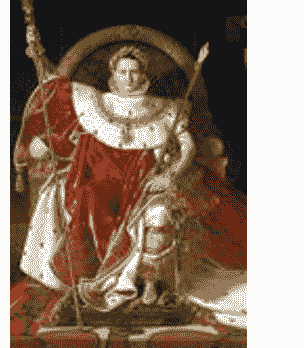

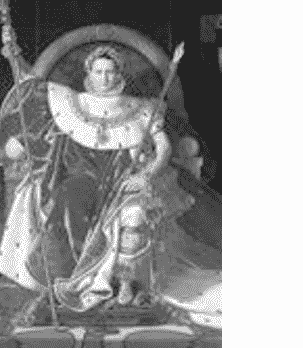

显然，这个函数不能处理数字：

**练习 4.1** 在 Python 中定义 $f(x) = \sqrt{1+x}$ 并证明

$$f(f(f(f(f(x))))) = \sqrt{1+\sqrt{1+\sqrt{1+\sqrt{1+\sqrt{1+x}}}}}.$$

### 4.1.1 函数的作用域

函数允许我们将程序分解成更小、更易于管理的部分。每个函数管理其自己的*局部*变量：即我们在函数内部定义的变量。这些局部变量无法从函数外部访问，因此这些变量的作用域仅限于定义它们的函数内部。相比之下，在程序主体中定义的变量是*全局*变量，它们可以在整个代码中使用，包括在函数内部。

**练习 4.2** *定义函数 $p(n) = n(n + 1)(n + 2)(n + 3) + 1$ 和 $q(n) = (n^2 + 3n + 1)^2$，并观察它们是否相等。*

解答

定义这些函数很简单：

```python
import math

def p(n):
    #square_num is a local variable belonging to the function.
    square_num = n * (n + 1) * (n + 2) * (n + 3) + 1
    return square_num

def q(n):
    #square_num is a local variable belonging to the function.
    square_num = (n**2 + 3 * n + 1) ** 2
    return square_num

print(p(3), q(3))
```

361 361

在这段代码中，我们定义了两个函数 p 和 q。注意，在两个函数中，都有一个局部变量 square_num。这些变量专属于各自的函数。无法从函数外部调用它们。尽管它们同名，但互不干扰；一个定义并属于函数 p，另一个属于 q。

**练习 4.3** 考虑函数

$$ep(n) = 1 + \frac{1}{1} + \frac{1}{2!} + \cdots + \frac{1}{n!},$$

并观察该级数是否趋近于欧拉数 e。

*解答*

这将是我们第一次在函数体内定义变量。该函数名为 ep(n)，在函数内部我们定义了 sum = 0。注意，这个 sum 是一个局部变量，即它只在函数内部定义。我们无法从外部调用它，这是一件好事。

```python
import math

def ep(n):
    s=0
    for i in range(n+1):
        s += 1/ math.factorial(i)
    return s
```

```python
ep(10)
```

[25]: 2.7182818011463845

```python
for i in range(1, 100, 10):
    print(round(math.exp(1) - ep(i), 5), end = ', ')
```

[26]: 0.71828, 0.0, -0.0, -0.0, -0.0, -0.0, -0.0, -0.0, -0.0, -0.0,

### 练习 4.4 编写一个函数来计算以下级数

$$f(n) = \frac{1}{1} + \frac{1}{1+2} + \dots + \frac{1}{1+2+\dots+n}.$$

### 解答

我们首先编写一个名为 sumadd 的函数，它接受 $n$ 并返回 $1+2+\dots+n$。

```python
def sumadd(n):
    s = 0
    for i in range(n+1):
        s += i
    return s

sumadd(10)
```

[27]: 55

现在使用 sumadd，我们可以将函数 $f(n)$ 转换为 Python 代码。

```python
def ssum(n):
    ssum = 0
    for i in range(1, n+1):
        ssum += 1/sumadd(i)
    return ssum

print(ssum(3)," and ", 1 + 1/(1 + 2) + 1/(1 + 2 + 3))
```

[28]: 1.5 and 1.5

## 练习 4.5 绘制函数 $f(x) = 2\exp(-x^2)$ 和 $g(x) = \cos(\sin(x) + \cos(x))$ 在 $[-\pi, \pi]$ 区间上的图像。

解答

我们首先定义函数 $f$ 和 $g$，然后在 $[-\pi, \pi]$ 范围内计算它们。我们将在第 7 章系统地使用 matplotlib 库。这里我们仅用它来绘制图像。代码中与绘图相关的命令不言自明，用于“装饰”输出图形。

```python
from math import cos, sin, pi, exp
import matplotlib.pyplot as plt

def f(x):
    return 2 * exp(-x**2)
def g(x):
    return cos(sin(x) + cos(x))

x = []
fl = []
gl = []
for i in range(0, 100):
    s = -pi + i * 2 * pi/100
    x.append(s)
    fl.append(f(s))
    gl.append(g(s))

plt.figure(figsize=(3, 3));
plt.plot(x,fl)
plt.plot(x,gl);
```

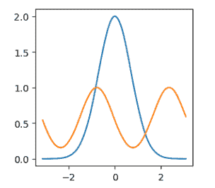

我们可以向函数传递多个对象。这里我们编写一个函数，用于检查给定的 $n$ 和 $m$，$\sqrt{n^2 + m^2}$ 是否为整数，即数对 $(n, m)$ 是否为勾股数对。

```python
import math

def p(x,y):
    return math.sqrt(x**2 + y**2).is_integer()
```

```python
p(3, 4)
```

True

```python
p(5, 3)
```

False

使用函数 p，我们可以轻松找到勾股数对，这里列出到 20 为止的。

```python
for n in range(1 , 21):
    for m in range(n, 21):
        if  p(n, m):
            print(n, m)
```

3 4
5 12
6 8
8 15
9 12
12 16
15 20

我们已经看到 p(x) 接受一个对象，而 p(x, y) 可以接收两个对象。如果我们需要将一系列数据传递给函数，一个巧妙的方法就是直接传递一个序列给函数。以下示例展示了如何做到这一点：我们编写函数

$f(x_1, x_2, \dots, x_n) = x_1^2 + x_2^2 + \dots + x_n^2$。

```python
def f(x, y):
    return x**2 + y**2
```

```python
f(2, 3)
```

13

输入 f(2, 3, 4) 会产生错误。

```python
def f(*x):
    print(x)
```

```python
f(1, 2)
```

[37]: (1, 2)

```python
f(1, 3, 5, 6)
```

[38]: (1, 3, 5, 6)

```python
f(3, 'test', 1.4)
```

[39]: (3, 'test', 1.4)

采用这种方法，函数的形式变为：

```python
def f(*x):
    s = 0
    for i in x:
        s += i**2
    return s

f(1, 2, 3)
```

[40]: 14

```python
f(*range(4))
```

[41]: 14

**练习 4.6** 编写函数 $f(x_1, x_2, \dots, x_n) = \sqrt{x_1 + \sqrt{x_2 + \sqrt{x_3 + \dots + \sqrt{x_n}}}}$ 并计算 $f(1, 2, \dots, 10)$。

*解答*

我们定义一个函数，它接受序列 $(x_1, x_2, \dots, x_n)$，然后计算表达式。事先我们不知道传入函数的序列有多长。

```python
def f(*x):
    s = 0
    for i in x:
        s = math.sqrt(s) + i
    return math.sqrt(s)

f(1,2,3)
```

[42]: 2.1753277471610746

分析代码，f(1,2,3) 会将元组 (1,2,3) 赋值给参数 x。接下来我们遍历元组 (1,2,3)。第一次循环，i = 1，我们得到 √0 + 1，并将其赋值给 sum。在下一次循环中，i = 2，结合之前的 sum，我们得到 √√0 + 1 + 2。简化后，即为 √1 + 2。接着，当 i = 3 时，我们得到 √√1 + 2 + 3。循环完成，下一行 return math.sqrt(sum) 会对结果再取一次平方根，即我们得到 √√√1 + 2 + 3。重新整理，我们得到

√3 + √2 + √1。

查看题目要求，我们想要得到

√1 + √2 + √3。

让我们从符号上研究一下。我们使用 sympy 方法来定义函数。

```python
def sf(*x):
    s = 0
    for i in x:
        s = sympy.sqrt(s) + i
    return sympy.sqrt(s)
```

```python
import sympy

x, y, z = sympy.symbols('x_1 x_2 x_3')
```

```python
sf(x, y, z)
```

[45]: √x3 + √√x1 + x2

但如果我们把这个序列的逆序传入函数，即：

```python
x, y, z = sympy.symbols('x_3 x_2 x_1')
```

```python
sf(x, y, z)
```

[47]: $\sqrt{x_1 + \sqrt{x_2 + \sqrt{x_3}}}$

那么我们就能得到正确的输出。这清楚地表明，我们必须从序列的右侧开始循环，而不是左侧。我们已经知道如何反转列表或元组。

```python
def sf(*x):
    s = 0
    for i in x[ : : -1]:
        s = sympy.sqrt(s) + i
    return sympy.sqrt(s)
```

```python
sf(x,y,z)
```

[49]: $\sqrt{x_3 + \sqrt{\sqrt{x_1} + x_2}}$

**练习 4.7** 给定非负整数 $c_0, c_1, \dots, c_m$，其中 $c_m \neq 0$，定义函数
$$f(c_0, c_1, \dots, c_m) = c_0 + \frac{1}{c_1 + \frac{1}{\dots + \frac{1}{c_m}}}.$$

*解答*

这里，与上一个练习类似，我们需要从最后一个分数 $\frac{1}{c_m}$ 开始，逐步向上计算到 $c_0$。过程的下一步（一个循环）将是 $c_{m-1} + \frac{1}{c_m}$，然后是 $c_{m-2} + \frac{1}{c_{m-1} + \frac{1}{c_m}}$。这个过程可以用以下代码捕捉
$$s = 0$$
$$\text{for } i \text{ in } c[: : -1]:$$
$$\quad s = i + 1/s$$
通常，在循环的第一轮，和 $s$ 会从 0 开始。然而，这种情况下，由于我们使用了 $1/s$，会得到错误信息。一个聪明的避免方法是在代码内部定义一个 if 语句来检查 $s$ 的值是否为零，如果是，则忽略 $1/s$。

```python
def f(*c):
    s=0
    for i in c[: : -1]:
        s = i + (1/s if s !=0 else 0)
    return s
```

### 4.1.2 函数，默认值

我们已经看到可以将对象传递给函数。现在我们设计一些函数，其中对象是预定义的。这意味着，如果用户没有为某个参数传递任何对象，将使用预定义的值。

```python
def address(name, career, city):
    return print(f' {name} is a {career} who lives in {city}')
```

```python
address('Whitlam', 'politician', 'Sydney')
```

Whitlam is a politician who lives in Sydney

接下来我们修改 `address` 函数，为参数赋予默认值，如果用户没有为这些参数指定任何对象，这些默认值将被使用。

```python
def address(name, career = 'politician', city = 'Sydney'):
    return print(f'{name} is a {career} who lives in {city}')
```

```python
address('Gladys Brejeklian')
```

Gladys Brejeklian is a politician who lives in Sydney

```python
address('Daniel Andrews', city = 'Melbourne')
```

Daniel Andrews is a politician who lives in Melbourne

```python
address('Anthony Albanese', career = 'prime minister', city = 'Capital territory')
```

Anthony Albanese is a prime minister who lives in Capital territory

**练习 4.11** 编写一个函数，要求输入 `a`、`b` 和 `n` 的值，并使用初始值 `a` 和 `b` 生成第 `n` 个斐波那契数，即 $f_0 = a$，$f_1 = b$ 且 $f_n = f_{n-1} + f_{n-2}$。进一步修改该函数，使得如果用户没有输入初始值 `a` 或 `b`，则它们采用默认值 $a = 1$ 和 $b = 1$。

*解答*

首先我们编写不指定任何初始值的函数代码。此代码中生成斐波那契数列的方法类似于练习 4.8。

```python
def fibonacci(N, a, b):
    for i in range(N-2):
        a, b = b, a + b
    return b
```

```python
fibonacci(10, 1, 1)
```

55

```python
def fibonacci(N, a = 1, b = 1):
    for i in range(N-2):
        a, b = b, a + b
    return b
```

```python
fibonacci(10)
```

55

```python
fibonacci(3, b = 15)
```

16

### 4.1.3 函数，特定类型

正如我们讨论的，函数 `def f(x):` 可以接受任何类型的对象。如果我们想从一开始就限制 `f` 可以处理的对象类型，我们可以指定 `x` 的类型。

```python
def f(x : list, i : int):
    if i <= len(x):
        return x[ : i]
```

```python
f(['pick', 'the', 'first', 'i-th', 'elements', 'of', 'the', 'list'], 5)
```

['pick', 'the', 'first', 'i-th', 'elements']

这里函数 `f` 期望传入的参数类型为 `list` 和 `integer`。这种编码方式也有助于我们在初次阅读代码时理解其功能。

```python
f('hello here he comes', 4)
```

'hell'

## 4.2 函数式编程：匿名（lambda）函数

有时我们需要“边定义边使用”一个函数。Python 允许我们定义一个没有名称的函数，使用它，然后继续前进！这些函数被称为*匿名*函数。显然，如果我们需要频繁使用某个特定函数，最好的方法是给它一个名称并定义它，就像我们之前做的那样。这是一个等价于 $f(x) = x^2 + 4$ 的匿名函数：

```python
lambda x : x**2 + 4
```

<function __main__.<lambda>(x)>

```python
(lambda x : x**2 + 4)(10)
```

104

使用关键字 `lambda` 我们定义了一个匿名函数。这里函数有一个变量 $x$，其输出是 $x^2 + 4$。可以将其理解为 $x \mapsto x^2 + 4$，其中 `lambda` 就是那个箭头。

以下做法可能违背了初衷：给匿名函数命名。但让我们确保我们理解了这个概念。

```python
f = lambda x: x + 3
```

```python
f(1)
```

可以使用多个变量来定义匿名函数。

```python
(lambda x, y: x + y)(2, 3)
```

```python
(lambda x, y, z: x + y + z)(1, 2, 3)
```

```python
(lambda x, y, z: x + y + z)('one', ' two', ' three')
```

正如上面两个例子所示，只要函数体能够处理相应的类型，就可以将任何类型的对象传递给函数的参数。
与“经典”函数类似，我们可以为参数定义默认值。

```python
(lambda x, y, z = 3: x * y * z)(1, 2)
```

```python
(lambda x, y = ' prepared', z = ' pizza': x + y + z)('You')
```

```python
(lambda x, y = ' prepared', z = ' pizza': x + y + z)('I', z = ' hamburger')
```

```python
(lambda x, y = ' prepared', z = ' pizza': x + y + z)('He', y = ' burnt')
```

回顾一下，通过 * 我们可以将对象序列传递给函数。

```python
(lambda *z: z[ : : -1])(1, 2, 3)
```

```python
(lambda *z: z[ : : -1])(*range(13))
```

[101]: (12, 11, 10, 9, 8, 7, 6, 5, 4, 3, 2, 1, 0)

```python
[102]: (lambda *z: z + ('again',) + z)(1, 2, 3)
```

[102]: (1, 2, 3, 'again', 1, 2, 3)

```python
[103]: sum([1,2,3])
```

[103]: 6

```python
[104]: (lambda *args: sum(args))(1,2,3)
```

[104]: 6

在 Python 中，有多种方式可以构建对象集合，例如通过列表、元组、字典或迭代器。有时我们希望将一个函数应用于列表或集合中的所有对象。假设 f 是一个函数，[a,b,c] 是一个列表。我们希望能够将函数 f “推入”列表，得到 [f(a),f(b),f(c)]。这可以使用 `map` 命令来完成。

第一个例子，我们将 math 库中的 sin 函数映射到整数 1 到 9 的列表上。

```python
[105]: from math import sin, cos, pi

x = map(sin, range(1, 10))
xlist = list(x)
print(xlist)
```

[105]: [0.8414709848078965, 0.9092974268256817, 0.1411200080598672, -0.7568024953079282, -0.9589242746631385, -0.27941549819892586, 0.6569865987187891, 0.9893582466233818, 0.4121184852417566]

我们可以立即写出有趣的代码！

```python
[106]: import matplotlib.pyplot as plt

x = map(sin, range(1, 50))
xlist = list(x)
y = map(cos, range(1, 50))
ylist = list(y)
plt.axis('equal')
plt.plot(xlist, ylist);
```

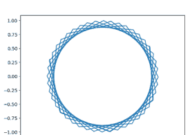

通常，我们通过 lambda 定义一个函数，然后将其应用于列表，如下例所示。

```python
l = map(lambda x: sin(x * pi/2), range(10))
```

```python
list(l)
```

```
[0.0,
 1.0,
 1.2246467991473532e-16,
 -1.0,
 -2.4492935982947064e-16,
 1.0,
 3.6739403974420594e-16,
 -1.0,
 -4.898587196589413e-16,
 1.0]
```

当然，我们也可以通过 for 循环来创建这个列表，但有时函数式编程方式更简洁、更优雅、也更易读。

```python
L=[]
for x in range(10):
    L.append(sin(x * pi/2))
L
```

```
[0.0,
 1.0,
 1.2246467991473532e-16,
 -1.0,
 -2.4492935982947064e-16,
 1.0,
 3.6739403974420594e-16,
 -1.0,
 -4.898587196589413e-16,
 1.0]
```

## 4.2 函数式编程：匿名（lambda）函数

这里有一些更多的例子，展示了这种方法的多功能性。

```python
from sympy import symbols, factor, expand

x=symbols('x')
y=symbols('y')
```

我们创建 $(x + y)^i$ 的展开式，其中 $1 \leq i \leq 5$。

```python
lx = map(lambda i: expand((x + y)**i), range(1,5))
```

```python
list(lx)
```

```
[x + y,
 x**2 + 2*x*y + y**2,
 x**3 + 3*x**2*y + 3*x*y**2 + y**3,
 x**4 + 4*x**3*y + 6*x**2*y**2 + 4*x*y**3 + y**4]
```

接下来，我们使用 map 函数将一张图片旋转若干次。

```python
from PIL import Image
x=Image.open('Napoleon.jpg')
```

```python
x_pic=map(lambda n: display(x.rotate(n * 20)), range(1, 5));
```

```python
list(x_pic);
```

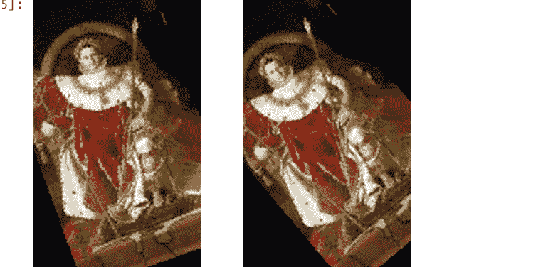

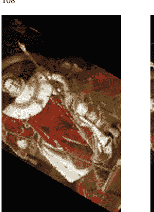

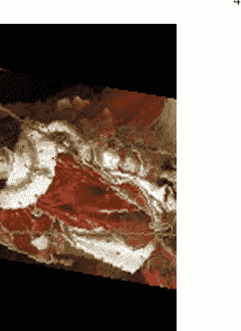

**练习 4.12** *回顾一下，公式 $n(n+1)(n+2)(n+3)+1$ 会产生一个平方数。使用函数式编程，计算 $1 \le n \le 10$ 时的这个数及其平方根。*

*解答*

让我们定义一个函数 $f(n)$，它返回 $(n, n(n+1)(n+2)(n+3)+1)$。然后我们将这个函数映射到从 1 到 10 的整数列表中。

```python
import math

def f(n):
    x = n * (n + 1) * (n + 2) * (n + 3) + 1
    return x, math.sqrt(x)

list(map(f, range(1, 11)))
```

```
[(1, 1.0),
 (25, 5.0),
 (121, 11.0),
 (361, 19.0),
 (841, 29.0),
 (1681, 41.0),
 (3025, 55.0),
 (5041, 71.0),
 (7921, 89.0),
 (11881, 109.0),
 (17161, 131.0)]
```

这是另一个例子，展示了几乎任何东西都可以被视为一个函数，因此可以通过 map 发送到列表中。这里我们将使用 sympy 库的绘图功能。函数 `pl.plot(f)` 将绘制函数 f。我们定义一个匿名函数 `lambda f : pl.plot(f)`，然后通过将 lambda 函数映射到列表中，用不同的函数替换 f。这使我们能够在一行代码中绘制所有图形！

```python
from sympy import sin, cos, symbols
from sympy import plotting as pl

x = symbols('x')
l = map(lambda f : pl.plot(f), (sin(x), x + sin(x)**3, cos(x) + sin(x)**3))
list(l);
```

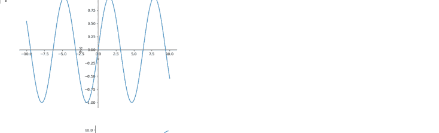

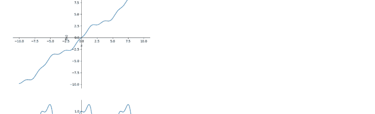

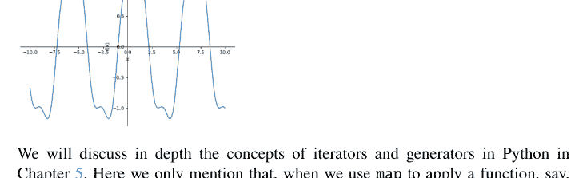

我们将在第 5 章深入讨论 Python 中迭代器和生成器的概念。这里我们只提到，当我们使用 map 将一个函数（比如 f）应用于列表或任何有序集合时，Python 实际上并不会立即对集合的所有元素应用 f。每次我们提示 map 语句时，它都会按顺序对集合应用函数 $f$。当然，通过调用 `list`，我们可以获得完整的操作，就像我们之前所做的那样（参见问题 14）。

### 4.2.1 从集合中选择

到目前为止，我们已经能够创建一个对象集合，并将一个函数应用于每个对象。下一步是从对象集合中选择符合特定描述的某些对象。这可以通过使用 `filter` 命令来实现，如下例所示。

当 $n$ 从 1 变化到 500 时，形如 $3n^5 + 11$ 的数中有多少个是质数？

我们定义匿名函数 `lambda n : 3 * n**5 + 11`，并将其映射到前 500 个正整数的列表上。

```python
s = map(lambda n : 3 * n**5 + 11, range(1, 501))
```

接下来，我们使用 sympy 库中的 `isprime` 函数来检查这些数中哪些是质数。为了从这些列表中选择质数，我们使用 `filter`。

```python
from sympy import isprime

p = filter(isprime, s)
```

```python
x = list(p)
```

```python
print(x, sep=' , ')
```

[107, 3083, 23339, 746507, 1613483, 3145739, 72900011, 136306283, 617888939, 1140612107, 7606576139, 14112810539, 36499587083, 52870250507, 63010249739, 87948751883, 95273908139, 243410436107, 451609936907, 824384664683, 867763964939, 1691848015883, 2594599836683, 5350160323307, 8048749055339, 13630627200011, 18139852800011, 40149811396907, 42089062300139, 52941415424939, 73308784432139, 86486190621707]

```python
len(x)
```

32

简而言之，`filter(isprime, s)` 会将函数 `isprime`（返回 True 或 False）应用于 `s` 的所有元素，然后收集那些 `isprime(x)` 为真的元素。
用数学语法表示，这就是

$\{x \in s \mid isprime(x)\}$。

**练习 4.13** *对于哪些 $1 \le n \le 1000$，梅森公式 $2^n - 1$ 会产生一个质数。*

*解答*
一旦我们知道如何将 `lambda` 函数与 `filter` 结合使用，这段代码就很容易编写了。

```python
[123]: s = filter(lambda n : isprime(2**n - 1), range(1, 1001))
```

```python
[124]: list(s)
```

[124]: [2, 3, 5, 7, 13, 17, 19, 31, 61, 89, 107, 127, 521, 607]

让我们深吸一口气，慢慢梳理这个单行代码。函数 `lambda n : isprime(2**n - 1)` 是一个匿名函数，如果数字 $2^n - 1$ 是质数则返回 `True`，否则返回 `False`。也就是说，这个匿名函数的输出是一个布尔值。因此我们可以将 `filter` 与此函数一起使用。

```python
[125]: (lambda n : isprime(2**n - 1))(13)
```

[125]: True

`range(1,1001)` 创建一个包含从 1 到 1000 数字的列表。命令 `filter` 将匿名函数 `lambda n : isprime(2**n - 1)` 应用于此列表的每个元素，当结果为真时，即当 $2^n - 1$ 是质数时，元素 $n$ 将被选中。数字 $\{2, 3, 5, 7, 13, 17, 19, 31, 61, 89, 107, 127, 521, 607\}$ 是给定范围内使得 $2^n - 1$ 为质数的唯一 $n$ 值。

为了将函数式编程与标准过程式编程进行比较，我们可以编写以下代码来完成相同的功能。

```python
[126]: L=[]
for i in range(1, 1001):
    if isprime(2**i - 1):
        L.append(i)
L
```

[126]: [2, 3, 5, 7, 13, 17, 19, 31, 61, 89, 107, 127, 521, 607]

### 4.2.2 函数式编程，reduce

最后我们介绍 reduce 函数。掌握如何使用这个函数能让我们编写出非常优雅且简洁的程序。reduce 函数的工作原理如下：

reduce(f,[x,y,z,t]) 的结果是 f(f(f(x, y), z), t)

这里 f 是一个函数，[x,y,z,t] 是一个对象列表。reduce 函数位于 functools 库中，因此在使用前需要导入它。

```
from functools import reduce
```

作为第一个演示，给定 {x_1, x_2, ..., x_n}，我们使用 reduce 来计算 {x_1 + x_2 + ... + x_n}。

```
reduce(lambda x, y: x + y, [1, 2, 3, 4, 5])
```

15

如果我们跟踪代码执行过程，会看到程序首先将 1 和 2 分别赋值给 x 和 y，然后返回 x + y，即 1 + 2。接下来，这个结果将被赋值给 x，而 y 取列表中的下一个元素，即 3，然后 x + y 再次返回 1 + 2 + 3。重复这个过程，我们就能得到列表中所有数字的总和。

```
reduce(lambda x, y: x + ' ' + y, ["Western", "Sydney", "University"])
```

'Western Sydney University'

```
from sympy import symbols
```

```
x, y = symbols('x y')
```

```
reduce(lambda a, b: a ** b, [x, y, x, y, x])
```

(((x^y)^x)^y)^x

```
reduce(lambda a, b: a + b, symbols('x:10'))
```

x_0 + x_1 + x_2 + x_3 + x_4 + x_5 + x_6 + x_7 + x_8 + x_9

```
reduce(lambda a, b: a * b, symbols('x:10'))
```

x_0 x_1 x_2 x_3 x_4 x_5 x_6 x_7 x_8 x_9

我们重新审视练习 4.7，并使用 reduce 来编写代码。

**练习 4.16** 给定非负整数 $c_0, c_1, \dots, c_m$，其中 $c_0 \neq 0$，定义函数
$$f(c_0, c_1, \dots, c_m) = c_m + \frac{1}{c_{m-1} + \frac{1}{\dots + \frac{1}{c_0}}}$$

*解答*
代码很短，但需要集中一点注意力才能理解其工作原理。最好的方法是手动计算前几步，观察结果是否符合练习中描述的连分数形式。

```
from functools import reduce

L = [1, 2, 3, 4]
L.reverse()

reduce(lambda x, y: (1/x) + y, L)
```

1.4333333333333333

这里我们使用 sympy 来生成这个连分数。我们需要一个形如 $c_0, c_1, \dots, c_m$ 的符号列表，其中 $m$ 是给定的。命令 `symbols('c:m')`，其中 $m$ 是正整数，可以实现这一点。

```
symbols('c:10')
```

(c0, c1, c2, c3, c4, c5, c6, c7, c8, c9)

我们将此与上面的代码结合起来：

```
from functools import reduce
from sympy import symbols

def L(m):
    sym = 'c:' + str(m)
    return symbols(sym)

reduce(lambda x, y: (1/x) + y, L(10))
```

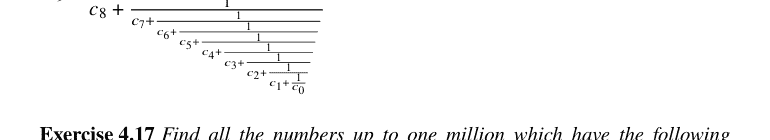

**练习 4.17** 找出所有满足以下性质的不超过一百万的数字：如果 $n = d_1 d_2 \dots d_k$，那么 $n = d_1! + d_2! + \dots + d_k!$（例如 $145 = 1! + 4! + 5!$）。

*解答*

我们首先需要获取给定数字的各位数字。一种方法是将数字转换为字符串，获取所有字符的列表，然后将所有字符转换回数字。

```
str(1234)
```

'1234'

```
list(str(1234))
```

['1', '2', '3', '4']

```
dig = map(int, list(str(1234)))
```

现在我们有了所有数字，使用 map 我们可以将阶乘函数应用到列表中，为每个数字计算 $n!$。

```
import math

dig2 = map(lambda n: math.factorial(n), dig)
```

最后，我们将所有结果相加，正如我们所见，我们可以使用优雅的 reduce 来完成。

```
reduce(lambda x, y: x + y, dig2)
```

33

将所有这些结合起来，我们可以编写一个函数。

```
def f(n):
    dig = map(int, list(str(n)))
    dig2 = map(lambda n: math.factorial(n), dig)
    return reduce(lambda x, y: x + y, dig2)
```

```
f(1234)
```

33

我们准备好使用函数 f 来找出那些满足 $n = d_1! + d_2! + \cdots + d_k!$ 的数字 $n = d_1d_2\cdots d_k$。

```
for i in range(1,1000001):
    if i == f(i): print(i)
```

1
2
145
40585

**练习 4.18** 注意到 $12^2 = 144$ 且 $21^2 = 441$，即数字与其平方是彼此的逆序数。找出所有具有此性质的不超过 10000 的数字。

*解答*

我们首先定义一个函数来反转给定数字的各位数字。我们使用字符串并利用该对象可用的函数。

```
def re(n):
    return int(str(n)[::-1])
```

```
re(12345)
```

54321

掌握了这个函数后，问题的解决方案只需一行代码。注意问题要求找出满足 $re[n**2]=re[n]**2$ 的数字 $n$。

```
a=list(filter(lambda n: re(n**2) == re(n)**2,
    range(1,10001)))
```

```
print(*a, sep = ', ')
```

1, 2, 3, 10, 11, 12, 13, 20, 21, 22, 30, 31, 100, 101, 102, 103, 110, 111, 112, 113, 120, 121, 122, 130, 200, 201, 202, 210, 211, 212, 220, 221, 300, 301, 310, 311, 1000, 1001, 1002, 1003, 1010, 1011, 1012, 1013, 1020, 1021, 1022, 1030, 1031, 1100, 1101, 1102, 1103, 1110, 1111, 1112, 1113, 1120, 1121, 1122, 1130, 1200, 1201, 1202, 1210, 1211, 1212, 1220, 1221, 1300, 1301, 2000, 2001, 2002, 2010, 2011, 2012, 2020, 2021, 2022, 2100, 2101, 2102, 2110, 2111, 2120, 2121, 2200, 2201, 2202, 2210, 2211, 3000, 3001, 3010, 3011, 3100, 3101, 3110, 3111

在最后一个练习中，我们将探索一个有趣的话题：在古代文本和经文中寻找秘密信息。考虑一个由字母串 $l_1l_2 \cdots l_k$ 构成的文本。那么一个长度为 $s$ 的*等距字母序列*是一个子序列 $l_nl_{n+d} \cdots l_{n+(s-1)d}$。这里 $d$ 称为*跳数*。注意，这意味着以均匀的间隔从文本中取字母。这个子序列可以看作是将文本围绕一个固定周长的圆柱体书写时出现的文本的垂直切片。通过选择正确的间隔在经文中寻找隐藏信息的主题一直是许多文章的主题。这里我们将看

**练习 4.19** *在简·奥斯汀的《理智与情感》中搜索单词 "google"，它可能以等距字母序列的形式出现。*

*解答*

回顾 2.6.1，nltk 库包含一些经典文本以及处理文本的工具。

```
import nltk
from nltk.book import *
```

*** Introductory Examples for the NLTK Book ***
Loading text1, ..., text9 and sent1, ..., sent9
Type the name of the text or sentence to view it.
Type: 'texts()' or 'sents()' to list the materials.
text1: Moby Dick by Herman Melville 1851

# 第5章
列表推导式与生成器

## 5.1 列表推导式

列表推导式是Python中一种非常吸引人的编程方式。使用列表推导式，编写代码非常容易，阅读起来也更为简便，其结构与我们在数学中描述数学对象的方式颇为相似。这是一种将问题轻松转化为计算机语言的绝佳方式。

下面是一个第一个例子。如果我们想创建一个从0到9的数字列表，可以这样写：

```
[1]: list(range(10))
```

[1]: [0, 1, 2, 3, 4, 5, 6, 7, 8, 9]

使用列表推导式，我们可以这样写：

```
[2]: [i for i in range(10)]
```

[2]: [0, 1, 2, 3, 4, 5, 6, 7, 8, 9]

从数学角度看，这类似于我们在数学中描述同一个集合的方式：

{i | 0 ≤ i ≤ 9}。

我们也可以生成元组而不是列表。

```
[3]: (i for i in range(10))
```

[3]: (0, 1, 2, 3, 4, 5, 6, 7, 8, 9)

作为第一个例子，我们生成数字 $2^n - 1$，其中 $n$ 在1到10之间。从数学角度看，这是集合

$$\{2^n - 1 \mid 1 \le n \le 10\}.$$

列表推导式遵循了这一描述。

```
[2**n - 1 for n in range(1, 11)]
```

[1, 3, 7, 15, 31, 63, 127, 255, 511, 1023]

在继续之前，让我们分别通过过程式编程和函数式编程，为同一程序提供其他替代方案。

```
L = []
for n in range(1, 11):
    L.append(2**n - 1)
L
```

[1, 3, 7, 15, 31, 63, 127, 255, 511, 1023]

```
list(map(lambda n: 2**n - 1, range(1,11)))
```

[1, 3, 7, 15, 31, 63, 127, 255, 511, 1023]

**练习 5.1** *生成列表 $(x, \cos(x))$，其中 $x = \frac{\pi}{3}i$，且 $\{i \mid 0 \le i \le 5\}$。*

*解答*

从数学角度看，这是集合

$$\left\{\left(x, \cos\left(\frac{\pi}{3}i\right)\right) \mid 0 \le i \le 5\right\}.$$

通过列表推导式直接翻译（并对余弦结果进行四舍五入），我们得到：

```
from math import cos, pi

[(x, round(cos(pi/3 * x), 5)) for x in range(0, 6)]
```

[(0, 1.0), (1, 0.5), (2, -0.5), (3, -1.0), (4, -0.5), (5, 0.5)]

text2: 简·奥斯汀的《理智与情感》1811年
text3: 《创世记》
text4: 就职演说语料库
text5: 聊天语料库
text6: 《巨蟒与圣杯》
text7: 《华尔街日报》
text8: 个人资料语料库
text9: G. K. 切斯特顿的《星期四的人》1908年

```
[159]: len(text2)
```

[159]: 141576

当我们查看书籍内部时，它们是字符串（单词）的列表。为了我们的目的，我们需要将字符连接在一起。

```
[160]: text2[11 : 20]
```

[160]: ['The', 'family', 'of', 'Dashwood', 'had', 'long', 'been', 'settled', 'in']

这可以通过使用 `join` 来实现。

```
[161]: s1 = 'Hello'
s2 = 'World'
```

```
[162]: ''.join([s1, s2])
```

[162]: 'HelloWorld'

接下来我们使用 `reduce` 来获取字符串，每次两个，并将它们连接在一起。

```
[163]: from functools import reduce

reduce(lambda x, y : ''.join([x,y]), text3[ :10])
```

[163]: 'InthebeginningGodcreatedtheheavenandtheearth'

```
[164]: x_text = reduce(lambda x, y : ''.join([x,y]), text2)
```

现在我们准备好查看等距字母序列了。我们可以在简·奥斯汀1811年出版的书中找到单词 'google'。

```
[165]: word = 'google'
l_w = len(word)
for interval in range(1, 100):
    for j in range(len(x_text)):
        if x_text[0 + j : l_w * interval + j : interval].lower() == 'google':
            print(f'{word} appears in the book starting from the {j}th letter with interval {interval}')
```

[165]: google appears in the book starting from the 312852th letter with interval 90

```
x_text[312852: 6 * 90 + 312852 : 90 ]
```

[166]: 'googlE'

## 问题

1.  对于整数 $2 \leq n \leq 200$，找出所有满足 $n$ 整除 $(n - 1)! + 1$ 的 $n$。证明这样的 $n$ 有46个。
2.  编写一个函数，如果第 $n$ 个素数是 $4k + 1$ 的形式（其中 $k$ 是某个整数），则返回 `True`。由此生成一个介于1到100之间的正整数 $n$ 的列表，使得第 $n$ 个素数是 $4k + 1$ 的形式。验证这样的 $n$ 有47个。
3.  假设 $P_i$ 是第 $i$ 个素数。令 $E_i = P_1 \times P_2 \times \cdots \times P_i + 1$ 为第 $i$ 个欧几里得数。定义一个函数 `Euclidnumber(n)` 来生成第 $n$ 个欧几里得数。使用此函数生成前20个欧几里得数的列表。找出这些数中哪些实际上是素数。找出素数欧几里得数的索引（即 $i$，其中 $E_i$ 是素数），其中 $1 \leq i \leq 100$。
4.  编写一个函数来计算以下公式
$$p(n) = 1 + \frac{1}{\sqrt{1}} + \frac{1}{\sqrt{1} + \sqrt{2}} + \frac{1}{\sqrt{2} + \sqrt{3}} + \frac{1}{\sqrt{3} + \sqrt{4}} + \cdots + \frac{1}{\sqrt{n - 1} + \sqrt{n}}$$
（你能用多少种方式编写这个函数？）
5.  如果一个数 $a_0a_1\dots a_{n-1}a_n$ 的所有前缀 $a_0a_1\dots a_{n-1}a_n$、$a_0a_1\dots a_{n-1}$、……、$a_0a_1$ 和 $a_0$ 都是素数，我们称这个数为**纯素数**。找出所有3位、4位和5位的纯素数。你能推测存在多少个16位的纯素数吗？（例如：7193是一个纯素数，因为7193、719、71和7都是素数）。使用函数式编程编写代码。
6.  自然数 $n$ 的函数 $f$ 定义如下。令 $p_n$ 表示第 $n$ 个素数。将 $s$ 初始化为1，然后依次用 $(s \times p_k) - 1$ 替换它，其中 $k = 1, 2, \dots, p_n$。$s$ 的最终值就是 $f(n)$ 的值。前几个值是 $f(1) = 1$、$f(2) = 2$、$f(3) = 9$ 和 $f(4) = 62$。在Python中定义这个函数。$f(5)$ 和 $f(10)$ 是多少？
7.  令 $A(x, y) = (a_{ij}(x, y))$ 是一个 $n \times n$ 矩阵，其中

$$a_{ij}(x, y) = \begin{cases} 0 & \text{如果 } i = j \\ \sin(x)^i \cos(y)^j (\sin(y) + \cos(x))^{i+j} & \text{如果 } i \neq j. \end{cases}$$

创建 $3 \times 3$ 矩阵 $A(\pi, \pi/5)$。
8.  实数（即浮点数）向量 $x = (x_1, x_2, \ldots, x_n)$ 的**范数**定义为

$$\|x\| = \sqrt{\sum_{k=1}^n x_k^2}.$$

编写一个函数 `vnorm`，计算任意长度实数向量的范数。（用两种不同的方式编写函数：使用过程式循环和使用函数式编程）。
9.  对于一个数 $n$，真因数 $k$ 是一个不等于 $n$ 且能整除 $n$ 的数。例如，$\{1, 3, 5\}$ 是15的所有真因数。考虑一个数的所有真因数之和。现在考虑这个新数的所有真因数之和，并重复这个过程。如果最终得到的数与起始数相同，则这个数被称为**社交数**。编写一个程序来证明1264460是一个社交数。检查14316是否也是一个社交数。
10. 使用函数式编程，证明对于任何正数序列 $a_1, a_2, \ldots, a_n$，我们有

$$(a_1 + a_2 + \cdots + a_n)\left(\frac{1}{a_1} + \frac{1}{a_2} + \cdots + \frac{1}{a_n}\right) \geq n^2$$

11. 如果一对素数 $p$ 和 $q$ 满足 $pq$ 和 $qp$ 都是素数（$pq$ 表示将两个数并置在一起），我们称它们为**朋友**。例如，素数563和587是朋友，因为563587和587563都是素数。编写一个程序，在某个合适的素数范围内生成所有素数朋友。
12. 数字 $\pi$ 以

3.14159265358979323846264338327950288419716939937510582097494
45923078164062862089986280348253421170679...

开头，并且没有规律地继续。搜索 $\pi$ 的前100,000位数字，检查你的生日是否作为数字序列出现在 $\pi$ 中。例如，1971年4月8日星期四这个日期出现在 $\pi$ 的数字中：3.1415926535897932384626433832795028841971693...
13. 回想一下，如果 $f : A \rightarrow B$ 和 $g : B \rightarrow C$ 是两个函数，那么 $gf : A \rightarrow C$ 定义为 $gf(a) = g(f(a))$，其中 $a \in A$。解释以下代码的功能，并仅使用一个 `map` 重写它。

```
[1]: z = map(lambda i : i+1, map(lambda i: i**2, range(1,10)))
```

```
[2]: list(z)
```

[3]: [2, 5, 10, 17, 26, 37, 50, 65, 82]

14. 回想一下，`map` 创建一个迭代器，该迭代器在被提示时执行。运行以下代码并解释 `map` 是如何工作的。

```
[1]: x_square = map(lambda i: i ** 2, range(1,10000000000))
```

```
[2]: for n in x_square:
    if n > 6**2:
        break
    print(n)
```

[2]: 1
4
9
16
25
36

```
[3]: for n in x_square:
    if n > 9**2:
        break
    print(n)
```

[3]: 64
81

### 5.1.1 对参数施加条件

在通过列表推导式构建代码时，我们可以很自然地在列表内部引入条件。作为第一个例子，我们编写一个程序来生成1到50之间所有能被7整除的数。

从数学上讲，这是集合

$\{n \mid 0 \leq n \leq 50, \text{ and } 7 \mid n\}$。

在Python中，使用列表推导式，我们可以用类似的方式创建这个列表

```
[n for n in range(0, 51) if n % 7 == 0]
```

[0, 7, 14, 21, 28, 35, 42, 49]

在前面代码的基础上，这里是一个1到199之间能被3和5整除但不能被7整除的数字列表。

```
[n for n in range(1, 200) if n % 3 == 0 and n % 5 == 0 and not(n % 7 == 0)]
```

[15, 30, 45, 60, 75, 90, 120, 135, 150, 165, 180, 195]

```
[n for n in range(1, 200) if n % 15 == 0 and not(n % 7 == 0)]
```

[15, 30, 45, 60, 75, 90, 120, 135, 150, 165, 180, 195]

注意，将条件自然地融入列表推导式是多么方便。

```
[(n, 'even') if n % 2 == 0 else (n, 'odd') for n in range(1,10)]
```

[(1, 'odd'), (2, 'even'), (3, 'odd'), (4, 'even'), (5, 'odd'), (6, 'even'), (7, 'odd'), (8, 'even'), (9, 'odd')]

**练习 5.2** 假设一个列表包含数字和文本。编写代码从列表中提取所有文本。

### 解答

我们创建列表，然后使用列表推导式收集数据。

```
[12]: x = ['Sydney', 20, 2.8, 'Brisbane', -12, [1,2,3], 'babble']
```

```
[13]: x_text = [item for item in x]; x_text
```

```
[13]: ['Sydney', 20, 2.8, 'Brisbane', -12, [1, 2, 3], 'babble']
```

```
[14]: x_text = [item for item in x if type(item) == str]
```

```
[15]: x_text
```

```
[15]: ['Sydney', 'Brisbane', 'babble']
```

```
[16]: x_rest = [item for item in x if type(item) != str]
```

```
[17]: x_rest
```

```
[17]: [20, 2.8, -12, [1, 2, 3]]
```

```
[18]: x_text + x_rest
```

```
[18]: ['Sydney', 'Brisbane', 'babble', 20, 2.8, -12, [1, 2, 3]]
```

回顾毕达哥拉斯数对 $(m,n)$ 的概念，即满足 $m^2 + n^2$ 是一个平方数的数对 $(m,n)$。我们使用列表推导式来寻找毕达哥拉斯数对。

```
[19]: import math

[(m, n) for m in range(1, 10) for n in range(1, 10)
        if math.sqrt(m**2 + n**2).is_integer()]
```

```
[19]: [(3, 4), (4, 3), (6, 8), (8, 6)]
```

由于 $(6,8)$ 和 $(8,6)$ 对我们来说是同一对，为了避免重复，我们可以让第二个循环从第一个循环的起点开始。

```
[20]: [(m, n) for m in range(1, 10) for n in range(m, 10)
        if math.sqrt(m**2 + n**2).is_integer()]
```

```
[20]: [(3, 4), (6, 8)]
```

一旦我们有了基本代码，就很容易修改它并获得有趣的毕达哥拉斯数对。例如，可以修改上面的代码，使得 $m = n + 10$，这样我们就在寻找形如 $(m, m + 10)$ 的毕达哥拉斯数对。

## 5.1 列表推导式

```
[(m, n) for m in range(1, 500) for n in range(m, 500)
         if math.sqrt(m**2 + n**2).is_integer() and n == m + 10]
```

[(30, 40), (200, 210)]

应该注意列表推导式中创建的循环顺序。外层循环是应该先完成，然后内层循环才再次运行。以下代码将阐明区别：

```
[(i, j) for i in range(1, 4) for j in ['a', 'b', 'c']]
```

[(1, 'a'),
 (1, 'b'),
 (1, 'c'),
 (2, 'a'),
 (2, 'b'),
 (2, 'c'),
 (3, 'a'),
 (3, 'b'),
 (3, 'c')]

上述代码应与以下代码进行比较。

```
L = []
for i in range(1, 4):
    for j in ['a', 'b', 'c']:
        L.append((i, j))
L
```

[(1, 'a'),
 (1, 'b'),
 (1, 'c'),
 (2, 'a'),
 (2, 'b'),
 (2, 'c'),
 (3, 'a'),
 (3, 'b'),
 (3, 'c')]

**练习 5.3** *证明小于1000的n中，满足*
$$3^n + 4^n + \cdots + (n+2)^n = (n+3)^n$$
*的只有数字2和3。*

### 解答

回顾函数sum给出列表条目的总和。

```
for n in range(1, 1001):
    x = [i**n for i in range(3, n+3)]
    if sum(x) == (n + 3)**n:
        print(n)
```

[24]: 2
3

我们可以将上述代码合并成一个长的（嵌套的）列表推导式。我们留给读者来判断哪个代码更容易阅读和理解。

```
[n for n in range(1, 1001) if
    sum([i**n for i in range(3, n+3)])
    == (n + 3)**n]
```

[25]: [2, 3]

**练习 5.4** *回顾Collatz函数*

$$f(x) = \begin{cases} x/2 & \text{if } x \text{ is even} \\ 3x+1 & \text{if } x \text{ is odd.} \end{cases}$$

*并使用列表推导式生成 $f(n), 1 \le n < 20$。*

### 解答

代码如下：

```
[n//2 if n % 2 == 0 else 3 * n + 1 for n in range(1, 20)]
```

[26]: [4, 1, 10, 2, 16, 3, 22, 4, 28, 5, 34, 6, 40, 7, 46, 8, 52, 9, 58]

**练习 5.5** *找出前5个正整数 $n$，使得 $n^6 + 1091$ 是素数。证明所有这些 $n$ 都在3500到8500之间。*

### 解答

我们将使用sympy中可用的isprime函数来测试这些数字。

## 5.1 列表推导式

```
[27]: from sympy import isprime
```

由于题目给出了需要搜索多远的线索，我们创建一个列表range(1, 10000)并检查这个列表中的 $n$，当 $n^6 + 1091$ 是素数时。

```
[28]: [n for n in range(1, 10000) if isprime(n**6 + 1091)]
```

```
[28]: [3906, 4620, 5166, 5376, 5460, 8190]
```

如果不知道需要搜索多远才能得到所有五个使得 $n^6+1091$ 是素数的正整数 $n$，一个选择是创建一个while循环。

```
[29]: count = 0
n = 0
while count < 5:
    n += 1
    if isprime(n**6 + 1091):
        print(n)
        count += 1
```

```
[29]: 3906
4620
5166
5376
5460
```

**练习 5.6** 确定3到50之间所有满足 $2^{2008}$ 能被
$$1 + \binom{n}{1} + \binom{n}{2} + \binom{n}{3}$$
整除的正整数 $n$。

### 解答

回顾二项式系数（从 $n$ 个物品中选择 $m$ 个物品的方式数）是
$$\binom{n}{m} := \frac{n!}{m!(n-m)!}.$$

阶乘和二项式系数comb都在math库中可用。

```
[30]: from math import comb, factorial
```

我们首先根据定义检查comb方法！

```
[31]: comb(5,3) == factorial(5) // (factorial(3) * factorial(5 - 3))
```

[31]: True

```
[n for n in range(3, 51) if 2**2008 % (1 + comb(n,1) + comb(n,2) + comb(n,3)) == 0]
```

[32]: [3, 7, 23]

我们现在用列表推导式来写练习1.6。

**练习 5.7** 设m是一个自然数，且

$$A = \frac{(m+3)^3 + 1}{3m}.$$

找出所有小于500的整数m，使得A是整数。证明A总是奇数。

### 解答

我们定义函数 $A(m)$，然后组合一个列表推导式来寻找使得 $A(m)$ 是整数的 $m$。

```
def A(m):
    return ((m + 3)**3 +1)/(3*m)

[m for m in range(1,500) if A(m).is_integer()]
```

[33]: [2, 14]

这是使用函数式编程的另一种写法。

```
def A(m):
    A = ((m + 3)**3 +1)/(3*m)
    return A.is_integer()

list(filter(A, range(1, 500)))
```

[34]: [2, 14]

## 5.2 集合与字典

**练习 5.8** *解释以下代码的功能：*

```
python
import math

isprime = lambda x: all(x % k for k in range(2, 1 + math.isqrt(x)))
[n for n in range(350, 400) if isprime(n**2 + n + 1)]
```

```
output
[351, 357, 369, 378, 381, 383, 392, 395, 398]
```

### 解答

`all()` 函数在可迭代对象中的所有项都为真时返回True，否则返回False。元组推导式 `(x % k for k in range(2, 1 + math.isqrt(x)))` 检查数字 $x$ 是否能被直到 $\sqrt{x}$ 的数字整除。如果存在 $x$ 确实能被整除的情况，那么 $x \% k$ 返回0。在布尔语句中，所有正数代表True，零代表False。因此，如果有一个数字能整除 $x$，使用 `all` 时元组推导式内部的布尔输出组合为False，否则结果为True，意味着没有数字能整除 $x$，即 $x$ 是一个素数。代码中的下一个列表推导式使用这个素数测试来寻找 $350 \le n \le 400$ 范围内形如 $n^2+n+1$ 的素数。

## 5.2 集合与字典

### 5.2.1 集合

为了处理数据集合，我们已经使用了 `list` 和 `tuple`。使用 `list` 我们可以收集数据、访问元素，并通过添加或删除项目来修改列表，即它们是可变对象。`tuples` 是不可变的，但我们仍然可以访问它们的元素。

接下来我们介绍两种用于处理数据的更多对象：`sets`（集合）和 `dictionaries`（字典）。Python中 `sets` 的概念最接近数学中的集合概念：一个数据的集合，其中成员的顺序和重复不会改变集合。

```
python
X = {1, 2, 3, 2, 1}
```

```
python
X
```

```
output
{1, 2, 3}
```

```
python
{1, 2} == {2, 1}
```

[38]: True

```
[39]: {1, 1, 2} == {1, 2}
```

[39]: True

将上述结果与第2章中列表的示例进行比较，在所有情况下列表的结果都是 False。

集合对象支持并集、交集和补集等数学运算。我们将用两个集合来演示这些方法：小于20的质数集合和不超过20的奇数集合。

```
[40]: X = {2, 3, 5, 7, 11, 13, 17, 19}
```

```
[41]: Y = {3, 5, 7, 9, 11, 13, 15, 17, 19}
```

回顾两个集合的并集和交集运算：

$X \cup Y = \{x \mid x \in A \text{ or } x \in B\}$

$X \cap Y = \{x \mid x \in A \text{ and } x \in B\}$。

```
[42]: X.union(Y)
```

[42]: {2, 3, 5, 7, 9, 11, 13, 15, 17, 19}

```
[43]: X.union(['a','b'])
```

[43]: {11, 13, 17, 19, 2, 3, 5, 7, 'a', 'b'}

请注意，`union` 是属于集合对象的方法。然而，此方法不会改变对象本身。

```
[44]: X
```

[44]: {2, 3, 5, 7, 11, 13, 17, 19}

```
[45]: X | Y == X.union(Y)
```

[45]: True

```
[46]: X & Y == X.intersection(Y)
```

[46]: True

运算
$$X \setminus Y = \{x \in X | x \notin Y\}$$
在 Python 中可以通过使用 `.difference` 方法获得。

```
[47]: X - Y
[47]: {2}
```

```
[48]: X.difference(Y)
[48]: {2}
```

```
[49]: X
[49]: {2, 3, 5, 7, 11, 13, 17, 19}
```

对称差运算，即
$$X \setminus Y \cup Y \setminus X,$$
在数学书中有时记为 $X \Delta Y$，可以通过 `symmetric_difference` 方法实现。

```
[50]: X.symmetric_difference(Y)
[50]: {2, 9, 15}
```

```
[51]: X^Y
[51]: {2, 9, 15}
```

```
[52]: Y - X
[52]: {9, 15}
```

```
[53]: X - Y
[53]: {2}
```

```
[54]: (Y-X).union(X-Y) == X^Y
[54]: True
```

对于空集，请使用 `set()`，因为 `{ }` 是留给空字典的，我们将在后面学习。

```
[55]: X = set(); X
```

[55]: set()

```
[56]: X.union({2})
```

[56]: {2}

请注意，不能像访问列表或元组那样通过索引访问集合中的元素，但我们可以使用 `for` 循环遍历集合元素，或者使用 `in` 关键字询问某个特定值是否存在于集合中。

**练习 5.9** *找出 $0 \le n < 100$ 时，$n^2 + n + 41$ 除以 7 的余数集合。*

*解答*

我们将使用一个 **集合** 来收集余数，因为我们只关心实际的余数，而不关心在将 $n^2 + 41$ 除以 7 时我们得到了多少个余数。

```
[57]: A = set()
for n in range(100):
    A = A | {(n**2 + n + 41) % 7}
print(A)
```

[57]: {1, 4, 5, 6}

回顾简写形式 `a #= b`，它等价于 `a = a # b`。

```
[58]: A = set()
for n in range(100):
    A |= {(n**2 + n + 41) % 7}
print(A)
```

[58]: {1, 4, 5, 6}

```
[59]: A = set()
for n in range(100):
    A = A.union({(n**2 + n + 41) % 7})
print(A)
```

[59]: {1, 4, 5, 6}

回顾列表推导式编程方法。我们可以使用“集合推导式”来完成这项工作。

## 5.2 集合与字典

```
A=[(n**2 + n + 41) % 7 for n in range(101)]
```

```
print(A)
```

[6, 1, 5, 4, 5, 1, 6, 6, 1, 5, 4, 5, 1, 6, 6, 1, 5, 4, 5, 1, 6, 6, 1, 5, 4, 5, 1, 6, 6, 1, 5, 4, 5, 1, 6, 6, 1, 5, 4, 5, 1, 6, 6, 1, 5, 4, 5, 1, 6, 6, 1, 5, 4, 5, 1, 6, 6, 1, 5, 4, 5, 1, 6, 6, 1, 5, 4, 5, 1, 6, 6, 1, 5, 4, 5, 1, 6, 6, 1, 5, 4, 5, 1, 6, 6, 1, 5, 4, 5, 1, 6, 6, 1, 5, 4, 5, 1, 6, 6, 1, 5, 4, 5, 1, 6, 6, 1, 5, 4, 5, 1, 6, 6, 1, 5, 4, 5, 1, 6, 6, 1, 5, 4, 5, 1, 6, 6, 1, 5, 4, 5, 1, 6, 6, 1, 5, 4, 5, 1, 6, 6, 1, 5, 4, 5, 1, 6, 6, 1, 5, 4, 5, 1, 6, 6, 1, 5, 4, 5, 1, 6, 6, 1, 5, 4, 5, 1, 6, 6, 1, 5, 4, 5, 1, 6, 6, 1, 5, 4, 5, 1, 6, 6, 1, 5, 4, 5, 1, 6, 6, 1, 5, 4, 5, 1, 6, 6, 1, 5, 4, 5, 1, 6, 6, 1, 5, 4, 5, 1, 6, 6, 1, 5, 4, 5, 1, 6, 6, 1, 5, 4, 5, 1, 6, 6, 1, 5, 4, 5, 1, 6, 6, 1, 5, 4, 5, 1, 6, 6, 1, 5, 4, 5, 1, 6, 6, 1, 5, 4, 5, 1, 6, 6, 1, 5, 4, 5, 1, 6, 6, 1, 5, 4, 5, 1, 6, 6, 1, 5, 4, 5, 1, 6, 6, 1, 5, 4, 5, 1, 6, 6, 1, 5, 4, 5, 1, 6, 6, 1, 5, 4, 5, 1, 6, 6, 1, 5, 4, 5, 1, 6, 6, 1, 5, 4, 5, 1, 6, 6, 1, 5, 4, 5, 1, 6, 6, 1, 5, 4, 5, 1, 6, 6, 1, 5, 4, 5, 1, 6, 6, 1, 5, 4, 5, 1, 6, 6, 1, 5, 4, 5, 1, 6, 6, 1, 5, 4, 5, 1, 6, 6, 1, 5, 4, 5, 1, 6, 6, 1, 5, 4, 5, 1, 6, 6, 1, 5, 4, 5, 1, 6, 6, 1, 5, 4, 5, 1, 6, 6, 1, 5, 4, 5, 1, 6, 6, 1, 5, 4, 5, 1, 6, 6, 1, 5, 4, 5, 1, 6, 6, 1, 5, 4, 5, 1, 6, 6, 1, 5, 4, 5, 1, 6, 6, 1, 5, 4, 5, 1, 6, 6, 1, 5, 4, 5, 1, 6, 6, 1, 5, 4, 5, 1, 6, 6, 1, 5, 4, 5, 1, 6, 6, 1, 5, 4, 5, 1, 6, 6, 1, 5, 4, 5, 1, 6, 6, 1, 5, 4, 5, 1, 6, 6, 1, 5, 4, 5, 1, 6, 6, 1, 5, 4, 5, 1, 6, 6, 1, 5, 4, 5, 1, 6, 6, 1, 5, 4, 5, 1, 6, 6, 1, 5, 4, 5, 1, 6, 6, 1, 5, 4, 5, 1, 6, 6, 1, 5, 4, 5, 1, 6, 6, 1, 5, 4, 5, 1, 6, 6, 1, 5, 4, 5, 1, 6, 6, 1, 5, 4, 5, 1, 6, 6, 1, 5, 4, 5, 1, 6, 6, 1, 5, 4, 5, 1, 6, 6, 1, 5, 4, 5, 1, 6, 6, 1, 5, 4, 5, 1, 6, 6, 1, 5, 4, 5, 1, 6, 6, 1, 5, 4, 5, 1, 6, 6, 1, 5, 4, 5, 1, 6, 6, 1, 5, 4, 5, 1, 6, 6, 1, 5, 4, 5, 1, 6, 6, 1, 5, 4, 5, 1, 6, 6, 1, 5, 4, 5, 1, 6, 6, 1, 5, 4, 5, 1, 6, 6, 1, 5, 4, 5, 1, 6, 6, 1, 5, 4, 5, 1, 6, 6, 1, 5, 4, 5, 1, 6, 6, 1, 5, 4, 5, 1, 6, 6, 1, 5, 4, 5, 1, 6, 6, 1, 5, 4, 5, 1, 6, 6, 1, 5, 4, 5, 1, 6, 6, 1, 5, 4, 5, 1, 6, 6, 1, 5, 4, 5, 1, 6, 6, 1, 5, 4, 5, 1, 6, 6, 1, 5, 4, 5, 1, 6, 6, 1, 5, 4, 5, 1, 6, 6, 1, 5, 4, 5, 1, 6, 6, 1, 5, 4, 5, 1, 6, 6, 1, 5, 4, 5, 1, 6, 6, 1, 5, 4, 5, 1, 6, 6, 1, 5, 4, 5, 1, 6, 6, 1, 5, 4, 5, 1, 6, 6, 1, 5, 4, 5, 1, 6, 6, 1, 5, 4, 5, 1, 6, 6, 1, 5, 4, 5, 1, 6, 6, 1, 5, 4, 5, 1, 6, 6, 1, 5, 4, 5, 1, 6, 6, 1, 5, 4, 5, 1, 6, 6, 1, 5, 4, 5, 1, 6, 6, 1, 5, 4, 5, 1, 6, 6, 1, 5, 4, 5, 1, 6, 6, 1, 5, 4, 5, 1, 6, 6, 1, 5, 4, 5, 1, 6, 6, 1, 5, 4, 5, 1, 6, 6, 1, 5, 4, 5, 1, 6, 6, 1, 5, 4, 5, 1, 6, 6, 1, 5, 4, 5, 1, 6, 6, 1, 5, 4, 5, 1, 6, 6, 1, 5, 4, 5, 1, 6, 6, 1, 5, 4, 5, 1, 6, 6, 1, 5, 4, 5, 1, 6, 6, 1, 5, 4, 5, 1, 6, 6, 1, 5, 4, 5, 1, 6, 6, 1, 5, 4, 5, 1, 6, 6, 1, 5, 4, 5, 1, 6, 6, 1, 5, 4, 5, 1, 6, 6, 1, 5, 4, 5, 1, 6, 6, 1, 5, 4, 5, 1, 6, 6, 1, 5, 4, 5, 1, 6, 6, 1, 5, 4, 5, 1, 6, 6, 1, 5, 4, 5, 1, 6, 6, 1, 5, 4, 5, 1, 6, 6, 1, 5, 4, 5, 1, 6, 6, 1, 5, 4, 5, 1, 6, 6, 1, 5, 4, 5, 1, 6, 6, 1, 5, 4, 5, 1, 6, 6, 1, 5, 4, 5, 1, 6, 6, 1, 5, 4, 5, 1, 6, 6, 1, 5, 4, 5, 1, 6, 6, 1, 5, 4, 5, 1, 6, 6, 1, 5, 4, 5, 1, 6, 6, 1, 5, 4, 5, 1, 6, 6, 1, 5, 4, 5, 1, 6, 6, 1, 5, 4, 5, 1, 6, 6, 1, 5, 4, 5, 1, 6, 6, 1, 5, 4, 5, 1, 6, 6, 1, 5, 4, 5, 1, 6, 6, 1, 5, 4, 5, 1, 6, 6, 1, 5, 4, 5, 1, 6, 6, 1, 5, 4, 5, 1, 6, 6, 1, 5, 4, 5, 1, 6, 6, 1, 5, 4, 5, 1, 6, 6, 1, 5, 4, 5, 1, 6, 6, 1, 5, 4, 5, 1, 6, 6, 1, 5, 4, 5, 1, 6, 6, 1, 5, 4, 5, 1, 6, 6, 1, 5, 4, 5, 1, 6, 6, 1, 5, 4, 5, 1, 6, 6, 1, 5, 4, 5, 1, 6, 6, 1, 5, 4, 5, 1, 6, 6, 1, 5, 4, 5, 1, 6, 6, 1, 5, 4, 5, 1, 6, 6, 1, 5, 4, 5, 1, 6, 6, 1, 5, 4, 5, 1, 6, 6, 1, 5, 4, 5, 1, 6, 6, 1, 5, 4, 5, 1, 6, 6, 1, 5, 4, 5, 1, 6, 6, 1, 5, 4, 5, 1, 6, 6, 1, 5, 4, 5, 1, 6, 6, 1, 5, 4, 5, 1, 6, 6, 1, 5, 4, 5, 1, 6, 6, 1, 5, 4, 5, 1, 6, 6, 1, 5, 4, 5, 1, 6, 6, 1, 5, 4, 5, 1, 6, 6, 1, 5, 4, 5, 1, 6, 6, 1, 5, 4, 5, 1, 6, 6, 1, 5, 4, 5, 1, 6, 6, 1, 5, 4, 5, 1, 6, 6, 1, 5, 4, 5, 1, 6, 6, 1, 5, 4, 5, 1, 6, 6, 1, 5, 4, 5, 1, 6, 6, 1, 5, 4, 5, 1, 6, 6, 1, 5, 4, 5, 1, 6, 6, 1, 5, 4, 5, 1, 6, 6, 1, 5, 4, 5, 1, 6, 6, 1, 5, 4, 5, 1, 6, 6, 1, 5, 4, 5, 1, 6, 6, 1, 5, 4, 5, 1, 6, 6, 1, 5, 4, 5, 1, 6, 6, 1, 5, 4, 5, 1, 6, 6, 1, 5, 4, 5, 1, 6, 6, 1, 5, 4, 5, 1, 6, 6, 1, 5, 4, 5, 1, 6, 6, 1, 5, 4, 5, 1, 6, 6, 1, 5, 4, 5, 1, 6, 6, 1, 5, 4, 5, 1, 6, 6, 1, 5, 4, 5, 1, 6, 6, 1, 5, 4, 5, 1, 6, 6, 1, 5, 4, 5, 1, 6, 6, 1, 5, 4, 5, 1, 6, 6, 1, 5, 4, 5, 1, 6, 6, 1, 5, 4, 5, 1, 6, 6, 1, 5, 4, 5, 1, 6, 6, 1, 5, 4, 5, 1, 6, 6, 1, 5, 4, 5, 1, 6, 6, 1, 5, 4, 5, 1, 6, 6, 1, 5, 4, 5, 1, 6, 6, 1, 5, 4, 5, 1, 6, 6, 1, 5, 4, 5, 1, 6, 6, 1, 5, 4, 5, 1, 6, 6, 1, 5, 4, 5, 1, 6, 6, 1, 5, 4, 5, 1, 6, 6, 1, 5, 4, 5, 1, 6, 6, 1, 5, 4, 5, 1, 6, 6, 1, 5, 4, 5, 1, 6, 6, 1, 5, 4, 5, 1, 6, 6, 1, 5, 4, 5, 1, 6, 6, 1, 5, 4, 5, 1, 6, 6, 1, 5, 4, 5, 1, 6, 6, 1, 5, 4, 5, 1, 6, 6, 1, 5, 4, 5, 1, 6, 6, 1, 5, 4, 5, 1, 6, 6, 1, 5, 4, 5, 1, 6, 6, 1, 5, 4, 5, 1, 6, 6, 1, 5, 4, 5, 1, 6, 6, 1, 5, 4, 5, 1, 6, 6, 1, 5, 4, 5, 1, 6, 6, 1, 5, 4, 5, 1, 6, 6, 1, 5, 4, 5, 1, 6, 6, 1, 5, 4, 5, 1, 6, 6, 1, 5, 4, 5, 1, 6, 6, 1, 5, 4, 5, 1, 6, 6, 1, 5, 4, 5, 1, 6, 6, 1, 5, 4, 5, 1, 6, 6, 1, 5, 4, 5, 1, 6, 6, 1, 5, 4, 5, 1, 6, 6, 1, 5, 4, 5, 1, 6, 6, 1, 5, 4, 5, 1, 6, 6, 1, 5, 4, 5, 1, 6, 6, 1, 5, 4, 5, 1, 6, 6, 1, 5, 4, 5, 1, 6, 6, 1, 5, 4, 5, 1, 6, 6, 1, 5, 4, 5, 1, 6, 6, 1, 5, 4, 5, 1, 6, 6, 1, 5, 4, 5, 1, 6, 6, 1, 5, 4, 5, 1, 6, 6, 1, 5, 4, 5, 1, 6, 6, 1, 5, 4, 5, 1, 6, 6, 1, 5, 4, 5, 1, 6, 6, 1, 5, 4, 5, 1, 6, 6, 1, 5, 4, 5, 1, 6, 6, 1, 5, 4, 5, 1, 6, 6, 1, 5, 4, 5, 1, 6, 6, 1, 5, 4, 5, 1, 6, 6, 1, 5, 4, 5, 1, 6, 6, 1, 5, 4, 5, 1, 6, 6, 1, 5, 4, 5, 1, 6, 6, 1, 5, 4, 5, 1, 6, 6, 1, 5, 4, 5, 1, 6, 6, 1, 5, 4, 5, 1, 6, 6, 1, 5, 4, 5, 1, 6, 6, 1, 5, 4, 5, 1, 6, 6, 1, 5, 4, 5, 1, 6, 6, 1, 5, 4, 5, 1, 6, 6, 1, 5, 4, 5, 1, 6, 6, 1, 5, 4, 5, 1, 6, 6, 1, 5, 4, 5, 1, 6, 6, 1, 5, 4, 5, 1, 6, 6, 1, 5, 4, 5, 1, 6, 6, 1, 5, 4, 5, 1, 6, 6, 1, 5, 4, 5, 1, 6, 6, 1, 5, 4, 5, 1, 6, 6, 1, 5, 4, 5, 1, 6, 6, 1, 5, 4, 5, 1, 6, 6, 1, 5, 4, 5, 1, 6, 6, 1, 5, 4, 5, 1, 6, 6, 1, 5, 4, 5, 1, 6, 6, 1, 5, 4, 5, 1, 6, 6, 1, 5, 4, 5, 1, 6, 6, 1, 5, 4, 5, 1, 6, 6, 1, 5, 4, 5, 1, 6, 6, 1, 5, 4, 5, 1, 6, 6, 1, 5, 4, 5, 1, 6, 6, 1, 5, 4, 5, 1, 6, 6, 1, 5, 4, 5, 1, 6, 6, 1, 5, 4, 5, 1, 6, 6, 1, 5, 4, 5, 1, 6, 6, 1, 5, 4, 5, 1, 6, 6, 1, 5, 4, 5, 1, 6, 6, 1, 5, 4, 5, 1, 6, 6, 1, 5, 4, 5, 1, 6, 6, 1, 5, 4, 5, 1, 6, 6, 1, 5, 4, 5, 1, 6, 6, 1, 5, 4, 5, 1, 6, 6, 1, 5, 4, 5, 1, 6, 6, 1, 5, 4, 5, 1, 6, 6, 1, 5, 4, 5, 1, 6, 6, 1, 5, 4, 5, 1, 6, 6, 1, 5, 4, 5, 1, 6, 6, 1, 5, 4, 5, 1, 6, 6, 1, 5, 4, 5, 1, 6, 6, 1, 5, 4, 5, 1, 6, 6, 1, 5, 4, 5, 1, 6, 6, 1, 5, 4, 5, 1, 6, 6, 1, 5, 4, 5, 1, 6, 6, 1, 5, 4, 5, 1, 6, 6, 1, 5, 4, 5, 1, 6, 6, 1, 5, 4, 5, 1, 6, 6, 1, 5, 4, 5, 1, 6, 6, 1, 5, 4, 5, 1, 6, 6, 1, 5, 4, 5, 1, 6, 6, 1, 5, 4, 5, 1, 6, 6, 1, 5, 4, 5, 1, 6, 6, 1, 5, 4, 5, 1, 6, 6, 1, 5, 4, 5, 1, 6, 6, 1, 5, 4, 5, 1, 6, 6, 1, 5, 4, 5, 1, 6, 6, 1, 5, 4, 5, 1, 6, 6, 1, 5, 4, 5, 1, 6, 6, 1, 5, 4, 5, 1, 6, 6, 1, 5, 4, 5, 1, 6, 6, 1, 5, 4, 5, 1, 6, 6, 1, 5, 4, 5, 1, 6, 6, 1, 5, 4, 5, 1, 6, 6, 1, 5, 4, 5, 1, 6, 6, 1, 5, 4, 5, 1, 6, 6, 1, 5, 4, 5, 1, 6, 6, 1, 5, 4, 5, 1, 6, 6, 1, 5, 4, 5, 1, 6, 6, 1, 5, 4, 5, 1, 6, 6, 1, 5, 4, 5, 1, 6, 6, 1, 5, 4, 5, 1, 6, 6, 1, 5, 4, 5, 1, 6, 6, 1, 5, 4, 5, 1, 6, 6, 1, 5, 4, 5, 1, 6, 6, 1, 5, 4, 5, 1, 6, 6, 1, 5, 4, 5, 1, 6, 6, 1, 5, 4, 5, 1, 6, 6, 1, 5, 4, 5, 1, 6, 6, 1, 5, 4, 5, 1, 6, 6, 1, 5, 4, 5, 1, 6, 6, 1, 5, 4, 5, 1, 6, 6, 1, 5, 4, 5, 1, 6, 6, 1, 5, 4, 5, 1, 6, 6, 1, 5, 4, 5, 1, 6, 6, 1, 5, 4, 5, 1, 6, 6, 1, 5, 4, 5, 1, 6, 6, 1, 5, 4, 5, 1, 6, 6, 1, 5, 4, 5, 1, 6, 6, 1, 5, 4, 5, 1, 6, 6, 1, 5, 4, 5, 1, 6, 6, 1, 5, 4, 5, 1, 6, 6, 1, 5, 4, 5, 1, 6, 6, 1, 5, 4, 5, 1, 6, 6, 1, 5, 4, 5, 1, 6, 6, 1, 5, 4, 5, 1, 6, 6, 1, 5, 4, 5, 1, 6, 6, 1, 5, 4, 5, 1, 6, 6, 1, 5, 4, 5, 1, 6, 6, 1, 5, 4, 5, 1, 6, 6, 1, 5, 4, 5, 1, 6, 6, 1, 5, 4, 5, 1, 6, 6, 1, 5, 4, 5, 1, 6, 6, 1, 5, 4, 5, 1, 6, 6, 1, 5, 4, 5, 1, 6, 6, 1, 5, 4, 5, 1, 6, 6, 1, 5, 4, 5, 1, 6, 6, 1, 5, 4, 5, 1, 6, 6, 1, 5, 4, 5, 1, 6, 6, 1, 5, 4, 5, 1, 6, 6, 1, 5, 4, 5, 1, 6, 6, 1, 5, 4, 5, 1, 6, 6, 1, 5, 4, 5, 1, 6, 6, 1, 5, 4, 5, 1, 6, 6, 1, 5, 4, 5, 1, 6, 6, 1, 5, 4, 5, 1, 6, 6, 1, 5, 4, 5, 1, 6, 6, 1, 5, 4, 5, 1, 6, 6, 1, 5, 4, 5, 1, 6, 6, 1, 5, 4, 5, 1, 6, 6, 1, 5, 4, 5, 1, 6, 6, 1, 5, 4, 5, 1, 6, 6, 1, 5, 4, 5, 1, 6, 6, 1, 5, 4, 5, 1, 6, 6, 1, 5, 4, 5, 1, 6, 6, 1, 5, 4, 5, 1, 6, 6, 1, 5, 4, 5, 1, 6, 6, 1, 5, 4, 5, 1, 6, 6, 1, 5, 4, 5, 1, 6, 6, 1, 5, 4, 5, 1, 6, 6, 1, 5, 4, 5, 1, 6, 6, 1, 5, 4, 5, 1, 6, 6, 1, 5, 4, 5, 1, 6, 6, 1, 5, 4, 5, 1, 6, 6, 1, 5, 4, 5, 1, 6, 6, 1, 5, 4, 5, 1, 6, 6, 1, 5, 4, 5, 1, 6, 6, 1, 5, 4, 5, 1, 6, 6, 1, 5, 4, 5, 1, 6, 6, 1, 5, 4, 5, 1, 6, 6, 1, 5, 4, 5, 1, 6, 6, 1, 5, 4, 5, 1, 6, 6, 1, 5, 4, 5, 1, 6, 6, 1, 5, 4, 5, 1, 6, 6, 1, 5, 4, 5, 1, 6, 6, 1, 5, 4, 5, 1, 6, 6, 1, 5, 4, 5, 1, 6, 6, 1, 5, 4, 5, 1, 6, 6, 1, 5, 4, 5, 1, 6, 6, 1, 5, 4, 5, 1, 6, 6, 1, 5, 4, 5, 1, 6, 6, 1, 5, 4, 5, 1, 6, 6, 1, 5, 4, 5, 1, 6, 6, 1, 5, 4, 5, 1, 6, 6, 1, 5, 4, 5, 1, 6, 6, 1, 5, 4, 5, 1, 6, 6, 1, 5, 4, 5, 1, 6, 6, 1, 5, 4, 5, 1, 6, 6, 1, 5, 4, 5, 1, 6, 6, 1, 5, 4, 5, 1, 6, 6, 1, 5, 4, 5, 1, 6, 6, 1, 5, 4, 5, 1, 6, 6, 1, 5, 4, 5, 1, 6, 6, 1, 5, 4, 5, 1, 6, 6, 1, 5, 4, 5, 1, 6, 6, 1, 5, 4, 5, 1, 6, 6, 1, 5, 4, 5, 1, 6, 6, 1, 5, 4, 5, 1, 6, 6, 1, 5, 4, 5, 1, 6, 6, 1, 5, 4, 5, 1, 6, 6, 1, 5, 4, 5, 1, 6, 6, 1, 5, 4, 5, 1, 6, 6, 1, 5, 4, 5, 1, 6, 6, 1, 5, 4, 5, 1, 6, 6, 1, 5, 4, 5, 1, 6, 6, 1, 5, 4, 5, 1, 6, 6, 1, 5, 4, 5, 1, 6, 6, 1, 5, 4, 5, 1, 6, 6, 1, 5, 4, 5, 1, 6, 6, 1, 5, 4, 5, 1, 6, 6, 1, 5, 4, 5, 1, 6, 6, 1, 5, 4, 5, 1, 6, 6, 1, 5, 4, 5, 1, 6, 6, 1, 5, 4, 5, 1, 6, 6, 1, 5, 4, 5, 1, 6, 6, 1, 5, 4, 5, 1, 6, 6, 1, 5, 4, 5, 1, 6, 6, 1, 5, 4, 5, 1, 6, 6, 1, 5, 4, 5, 1, 6, 6, 1, 5, 4, 5, 1, 6, 6, 1, 5, 4, 5, 1, 6, 6, 1, 5, 4, 5, 1, 6, 6, 1, 5, 4, 5, 1, 6, 6, 1, 5, 4, 5, 1, 6, 6, 1, 5, 4, 5, 1, 6, 6, 1, 5, 4, 5, 1, 6, 6, 1, 5, 4, 5, 1, 6, 6, 1, 5, 4, 5, 1, 6, 6, 1, 5, 4, 5, 1, 6, 6, 1, 5, 4, 5, 1, 6, 6, 1, 5, 4, 5, 1, 6, 6, 1, 5, 4, 5, 1, 6, 6, 1, 5, 4, 5, 1, 6, 6, 1, 5, 4, 5, 1, 6, 6, 1, 5, 4, 5, 1, 6, 6, 1, 5, 4, 5, 1, 6, 6, 1, 5, 4, 5, 1, 6, 6, 1, 5, 4, 5, 1, 6, 6, 1, 5, 4, 5, 1, 6, 6, 1, 5, 4, 5, 1, 6, 6, 1, 5, 4, 5, 1, 6, 6, 1, 5, 4, 5, 1, 6, 6, 1, 5, 4, 5, 1, 6, 6, 1, 5, 4, 5, 1, 6, 6, 1, 5, 4, 5, 1, 6, 6, 1, 5, 4, 5, 1, 6, 6, 1, 5, 4, 5, 1, 6, 6, 1, 5, 4, 5, 1, 6, 6, 1, 5, 4, 5, 1, 6, 6, 1, 5, 4, 5, 1, 6, 6, 1, 5, 4, 5, 1, 6, 6, 1, 5, 4, 5, 1, 6, 6, 1, 5, 4, 5, 1, 6, 6, 1, 5, 4, 5, 1, 6, 6, 1, 5, 4, 5, 1, 6, 6, 1, 5, 4, 5, 1, 6, 6, 1, 5, 4, 5, 1, 6, 6, 1, 5, 4, 5, 1, 6, 6, 1, 5, 4, 5, 1, 6, 6, 1, 5, 4, 5, 1, 6, 6, 1, 5, 4, 5, 1, 6, 6, 1, 5, 4, 5, 1, 6, 6, 1, 5, 4, 5, 1, 6, 6, 1, 5, 4, 5, 1, 6, 6, 1, 5, 4, 5, 1, 6, 6, 1, 5, 4, 5, 1, 6, 6, 1, 5, 4, 5, 1, 6, 6, 1, 5, 4, 5, 1, 6, 6, 1, 5, 4, 5, 1, 6, 6, 1, 5, 4, 5, 1, 6, 6, 1, 5, 4, 5, 1, 6, 6, 1, 5, 4, 5, 1, 6, 6, 1, 5, 4, 5, 1, 6, 6, 1, 5, 4, 5, 1, 6, 6, 1, 5, 4, 5, 1, 6, 6, 1, 5, 4, 5, 1, 6, 6, 1, 5, 4, 5, 1, 6, 6, 1, 5, 4, 5, 1, 6, 6, 1, 5, 4, 5, 1, 6, 6, 1, 5, 4, 5, 1, 6, 6, 1, 5, 4, 5, 1, 6, 6, 1, 5, 4, 5, 1, 6, 6, 1, 5, 4, 5, 1, 6, 6, 1, 5, 4, 5, 1, 6, 6, 1, 5, 4, 5, 1, 6, 6, 1, 5, 4, 5, 1, 6, 6, 1, 5, 4, 5, 1, 6, 6, 1, 5, 4, 5, 1, 6, 6, 1, 5, 4, 5, 1, 6, 6, 1, 5, 4, 5, 1, 6, 6, 1, 5, 4, 5, 1, 6, 6, 1, 5, 4, 5, 1, 6, 6, 1, 5, 4, 5, 1, 6, 6, 1, 5, 4, 5, 1, 6, 6, 1, 5, 4, 5, 1, 6, 6, 1, 5, 4, 5, 1, 6, 6, 1, 5, 4, 5, 1, 6, 6, 1, 5, 4, 5, 1, 6, 6, 1, 5, 4, 5, 1, 6, 6, 1, 5, 4, 5, 1, 6, 6, 1, 5, 4, 5, 1, 6, 6, 1, 5, 4, 5, 1, 6, 6, 1, 5, 4, 5, 1, 6, 6, 1, 5, 4, 5, 1, 6, 6, 1, 5, 4, 5, 1, 6, 6, 1, 5, 4, 5, 1, 6, 6, 1, 5, 4, 5, 1, 6, 6, 1, 5, 4, 5, 1, 6, 6, 1, 5, 4, 5, 1, 6, 6, 1, 5, 4, 5, 1, 6, 6, 1, 5, 4, 5, 1, 6, 6, 1, 5, 4, 5, 1, 6, 6, 1, 5, 4, 5, 1, 6, 6, 1, 5, 4, 5, 1, 6, 6, 1, 5, 4, 5, 1, 6, 6, 1, 5, 4, 5, 1, 6, 6, 1, 5, 4, 5, 1, 6, 6, 1, 5, 4, 5, 1, 6, 6, 1, 5, 4, 5, 1, 6, 6, 1, 5, 4, 5, 1, 6, 6, 1, 5, 4, 5, 1, 6, 6, 1, 5, 4, 5, 1, 6, 6, 1, 5, 4, 5, 1, 6, 6, 1, 5, 4, 5, 1, 6, 6, 1, 5, 4, 5, 1, 6, 6, 1, 5, 4, 5, 1, 6, 6, 1, 5, 4, 5, 1, 6, 6, 1, 5, 4, 5, 1, 6, 6, 1, 5, 4, 5, 1, 6, 6, 1, 5, 4, 5, 1, 6, 6, 1, 5, 4, 5, 1, 6, 6, 1, 5, 4, 5, 1, 6, 6, 1, 5, 4, 5, 1, 6, 6, 1, 5, 4, 5, 1, 6, 6, 1, 5, 4, 5, 1, 6, 6, 1, 5, 4, 5, 1, 6, 6, 1, 5, 4, 5, 1, 6, 6, 1, 5, 4, 5, 1, 6, 6, 1, 5, 4, 5, 1, 6, 6, 1, 5, 4, 5, 1, 6, 6, 1, 5, 4, 5, 1, 6, 6, 1, 5, 4, 5, 1, 6, 6, 1, 5, 4, 5, 1, 6, 6, 1, 5, 4, 5, 1, 6, 6, 1, 5, 4, 5, 1, 6, 6, 1, 5, 4, 5, 1, 6, 6, 1, 5, 4, 5, 1, 6, 6, 1, 5, 4, 5, 1, 6, 6, 1, 5, 4, 5, 1, 6, 6, 1, 5, 4, 5, 1, 6, 6, 1, 5, 4, 5, 1, 6, 6, 1, 5, 4, 5, 1, 6, 6, 1, 5, 4, 5, 1, 6, 6, 1, 5, 4, 5, 1, 6, 6, 1, 5, 4, 5, 1, 6, 6, 1, 5, 4, 5, 1, 6, 6, 1, 5, 4, 5, 1, 6, 6, 1, 5, 4, 5, 1, 6, 6, 1, 5, 4, 5, 1, 6, 6, 1, 5, 4, 5, 1, 6, 6, 1, 5, 4, 5, 1, 6, 6, 1, 5, 4, 5, 1, 6, 6, 1, 5, 4, 5, 1, 6, 6, 1, 5, 4, 5, 1, 6, 6, 1, 5, 4, 5, 1, 6, 6, 1, 5, 4, 5, 1, 6, 6, 1, 5, 4, 5, 1, 6, 6, 1, 5, 4, 5, 1, 6, 6, 1, 5, 4, 5, 1, 6, 6, 1, 5, 4, 5, 1, 6, 6, 1, 5, 4, 5, 1, 6, 6, 1, 5, 4, 5, 1, 6, 6, 1, 5, 4, 5, 1, 6, 6, 1, 5, 4, 5, 1, 6, 6, 1, 5, 4, 5, 1, 6, 6, 1, 5, 4, 5, 1, 6, 6, 1, 5, 4, 5, 1, 6, 6, 1, 5, 4, 5, 1, 6, 6, 1, 5, 4, 5, 1, 6, 6, 1, 5, 4, 5, 1, 6, 6, 1, 5, 4, 5, 1, 6, 6, 1, 5, 4, 5, 1, 6, 6, 1, 5, 4, 5, 1, 6, 6, 1, 5, 4, 5, 1, 6, 6, 1, 5, 4, 5, 1, 6, 6, 1, 5, 4, 5, 1, 6, 6, 1, 5, 4, 5, 1, 6, 6, 1, 5, 4, 5, 1, 6, 6, 1, 5, 4, 5, 1, 6, 6, 1, 5, 4, 5, 1, 6, 6, 1, 5, 4, 5, 1, 6, 6, 1, 5, 4, 5, 1, 6, 6, 1, 5, 4, 5, 1, 6, 6, 1, 5, 4, 5, 1, 6, 6, 1, 5, 4, 5, 1, 6, 6, 1, 5, 4, 5, 1, 6, 6, 1, 5, 4, 5, 1, 6, 6, 1, 5, 4, 5, 1, 6, 6, 1, 5, 4, 5, 1, 6, 6, 1, 5, 4, 5, 1, 6, 6, 1, 5, 4, 5, 1, 6, 6, 1, 5, 4, 5, 1, 6, 6, 1, 5, 4, 5, 1, 6, 6, 1, 5, 4, 5, 1, 6, 6, 1, 5, 4, 5, 1, 6, 6, 1, 5, 4, 5, 1, 6, 6, 1, 5, 4, 5, 1, 6, 6, 1, 5, 4, 5, 1, 6, 6, 1, 5, 4, 5, 1, 6, 6, 1, 5, 4, 5, 1, 6, 6, 1, 5, 4, 5, 1, 6, 6, 1, 5, 4, 5, 1, 6, 6, 1, 5, 4, 5, 1, 6, 6, 1, 5, 4, 5, 1, 6, 6, 1, 5, 4, 5, 1, 6, 6, 1, 5, 4, 5, 1, 6, 6, 1, 5, 4, 5, 1, 6, 6, 1, 5, 4, 5, 1, 6, 6, 1, 5, 4, 5, 1, 6, 6, 1, 5, 4, 5, 1, 6, 6, 1, 5, 4, 5, 1, 6, 6, 1, 5, 4, 5, 1, 6, 6, 1, 5, 4, 5, 1, 6, 6, 1, 5, 4, 5, 1, 6, 6, 1, 5, 4, 5, 1, 6, 6, 1, 5, 4, 5, 1, 6, 6, 1, 5, 4, 5, 1, 6, 6, 1, 5, 4, 5, 1, 6, 6, 1, 5, 4, 5, 1, 6, 6, 1, 5, 4, 5, 1, 6, 6, 1, 5, 4, 5, 1, 6, 6, 1, 5, 4, 5, 1, 6, 6, 1, 5, 4, 5, 1, 6, 6, 1, 5, 4, 5, 1, 6, 6, 1, 5, 4, 5, 1, 6, 6, 1, 5, 4, 5, 1, 6, 6, 1, 5, 4, 5, 1, 6, 6, 1, 5, 4, 5, 1, 6, 6, 1, 5, 4, 5, 1, 6, 6, 1, 5, 4, 5, 1, 6, 6, 1, 5, 4, 5, 1, 6, 6, 1, 5, 4, 5, 1, 6, 6, 1, 5, 4, 5, 1, 6, 6, 1, 5, 4, 5, 1, 6, 6, 1, 5, 4, 5, 1, 6, 6, 1, 5, 4, 5, 1, 6, 6, 1, 5, 4, 5, 1, 6, 6, 1, 5, 4, 5, 1, 6, 6, 1, 5, 4, 5, 1, 6, 6, 1, 5, 4, 5, 1, 6, 6, 1, 5, 4, 5, 1, 6, 6, 1, 5, 4, 5, 1, 6, 6, 1, 5, 4, 5, 1, 6, 6, 1, 5, 4, 5, 1, 6, 6, 1, 5, 4, 5, 1, 6, 6, 1, 5, 4, 5, 1, 6, 6, 1, 5, 4, 5, 1, 6, 6, 1, 5, 4, 5, 1, 6, 6, 1, 5, 4, 5, 1, 6, 6, 1, 5, 4, 5, 1, 6, 6, 1, 5, 4, 5, 1, 6, 6, 1, 5, 4, 5, 1, 6, 6, 1, 5, 4, 5, 1, 6, 6, 1, 5, 4, 5, 1, 6, 6, 1, 5, 4, 5, 1, 6, 6, 1, 5, 4, 5, 1, 6, 6, 1, 5, 4, 5, 1, 6, 6, 1, 5, 4, 5, 1, 6, 6, 1, 5, 4, 5, 1, 6, 6, 1, 5, 4, 5, 1, 6, 6, 1, 5, 4, 5, 1, 6, 6, 1, 5, 4, 5, 1, 6, 6, 1, 5, 4, 5, 1, 6, 6, 1, 5, 4, 5, 1, 6, 6, 1, 5, 4, 5, 1, 6, 6, 1, 5, 4, 5, 1, 6, 6, 1, 5, 4, 5, 1, 6, 6, 1, 5, 4, 5, 1, 6, 6, 1, 5, 4, 5, 1, 6, 6, 1, 5, 4, 5, 1, 6, 6, 1, 5, 4, 5, 1, 6, 6, 1, 5, 4, 5, 1, 6, 6, 1, 5, 4, 5, 1, 6, 6, 1, 5, 4, 5, 1, 6, 6, 1, 5, 4, 5, 1, 6, 6, 1, 5, 4, 5, 1, 6, 6, 1, 5, 4, 5, 1, 6, 6, 1, 5, 4, 5, 1, 6, 6, 1, 5, 4, 5, 1, 6, 6, 1, 5, 4, 5, 1, 6, 6, 1, 5, 4, 5, 1, 6, 6, 1, 5, 4, 5, 1, 6, 6, 1, 5, 4, 5, 1, 6, 6, 1, 5, 4, 5, 1, 6, 6, 1, 5, 4, 5, 1, 6, 6, 1, 5, 4, 5, 1, 6, 6, 1, 5, 4, 5, 1, 6, 6, 1, 5, 4, 5, 1, 6, 6, 1, 5, 4, 5, 1, 6, 6, 1, 5, 4, 5, 1, 6, 6, 1, 5, 4, 5, 1, 6, 6, 1, 5, 4, 5, 1, 6, 6, 1, 5, 4, 5, 1, 6, 6, 1, 5, 4, 5, 1, 6, 6, 1, 5, 4, 5, 1, 6, 6, 1, 5, 4, 5, 1, 6, 6, 1, 5, 4, 5, 1, 6, 6, 1, 5, 4, 5, 1, 6, 6, 1, 5, 4, 5, 1, 6, 6, 1, 5, 4, 5, 1, 6, 6, 1, 5, 4, 5, 1, 6, 6, 1, 5, 4, 5, 1, 6, 6, 1, 5, 4, 5, 1, 6, 6, 1, 5, 4, 5, 1, 6, 6, 1, 5, 4, 5, 1, 6, 6, 1, 5, 4, 5, 1, 6, 6, 1, 5, 4, 5, 1, 6, 6, 1, 5, 4, 5, 1, 6, 6, 1, 5, 4, 5, 1, 6, 6, 1, 5, 4, 5, 1, 6, 6, 1, 5, 4, 5, 1, 6, 6, 1, 5, 4, 5, 1, 6, 6, 1, 5, 4, 5, 1, 6, 6, 1, 5, 4, 5, 1, 6, 6, 1, 5, 4, 5, 1, 6, 6, 1, 5, 4, 5, 1, 6, 6, 1, 5, 4, 5, 1, 6, 6, 1, 5, 4, 5, 1, 6, 6, 1, 5, 4, 5, 1, 6, 6, 1, 5, 4, 5, 1, 6, 6, 1, 5, 4, 5, 1, 6, 6, 1, 5, 4, 5, 1, 6, 6, 1, 5, 4, 5, 1, 6, 6, 1, 5, 4, 5, 1, 6, 6, 1, 5, 4, 5, 1, 6, 6, 1, 5, 4, 5, 1, 6, 6, 1, 5, 4, 5, 1, 6, 6, 1, 5, 4, 5, 1, 6, 6, 1, 5, 4, 5, 1, 6, 6, 1, 5, 4, 5, 1, 6, 6, 1, 5, 4, 5, 1, 6, 6, 1, 5, 4, 5, 1, 6, 6, 1, 5, 4, 5, 1, 6, 6, 1, 5, 4, 5, 1, 6, 6, 1, 5, 4, 5, 1, 6, 6, 1, 5, 4, 5, 1, 6, 6, 1, 5, 4, 5, 1, 6, 6, 1, 5, 4, 5, 1, 6, 6, 1, 5, 4, 5, 1, 6, 6, 1, 5, 4, 5, 1, 6, 6, 1, 5, 4, 5, 1, 6, 6, 1, 5, 4, 5, 1, 6, 6, 1, 5, 4, 5, 1, 6, 6, 1, 5, 4, 5, 1, 6, 6, 1, 5, 4, 5, 1, 6, 6, 1, 5, 4, 5, 1, 6, 6, 1, 5, 4, 5, 1, 6, 6, 1, 5, 4, 5, 1, 6, 6, 1, 5, 4, 5, 1, 6, 6, 1, 5, 4, 5, 1, 6, 6, 1, 5, 4, 5, 1, 6, 6, 1, 5, 4, 5, 1, 6, 6, 1, 5, 4, 5, 1, 6, 6, 1, 5, 4, 5, 1, 6, 6, 1, 5, 4, 5, 1, 6, 6, 1, 5, 4, 5, 1, 6, 6, 1, 5, 4, 5, 1, 6, 6, 1, 5, 4, 5, 1, 6, 6, 1, 5, 4, 5, 1, 6, 6, 1, 5, 4, 5, 1, 6, 6, 1, 5, 4, 5, 1, 6, 6, 1, 5, 4, 5, 1, 6, 6, 1, 5, 4, 5, 1, 6, 6, 1, 5, 4, 5, 1, 6, 6, 1, 5, 4, 5, 1, 6, 6, 1, 5, 4, 5, 1, 6, 6, 1, 5, 4, 5, 1, 6, 6, 1, 5, 4, 5, 1, 6, 6, 1, 5, 4, 5, 1, 6, 6, 1, 5, 4, 5, 1, 6, 6, 1, 5, 4, 5, 1, 6, 6, 1, 5, 4, 5, 1, 6, 6, 1, 5, 4, 5, 1, 6, 6, 1, 5, 4, 5, 1, 6, 6, 1, 5, 4, 5, 1, 6, 6, 1, 5, 4, 5, 1, 6, 6, 1, 5, 4, 5, 1, 6, 6, 1, 5, 4, 5, 1, 6, 6, 1, 5, 4, 5, 1, 6, 6, 1, 5, 4, 5, 1, 6, 6, 1, 5, 4, 5, 1, 6, 6, 1, 5, 4, 5, 1, 6, 6, 1, 5, 4, 5, 1, 6, 6, 1, 5, 4, 5, 1, 6, 6, 1, 5, 4, 5, 1, 6, 6, 1, 5, 4, 5, 1, 6, 6, 1, 5, 4, 5, 1, 6, 6, 1, 5, 4, 5, 1, 6, 6, 1, 5, 4, 5, 1, 6, 6, 1, 5, 4, 5, 1, 6, 6, 1, 5, 4, 5, 1, 6, 6, 1, 5, 4, 5, 1, 6, 6, 1, 5, 4, 5, 1, 6, 6, 1, 5, 4, 5, 1, 6, 6, 1, 5, 4, 5, 1, 6, 6, 1, 5, 4, 5, 1, 6, 6, 1, 5, 4, 5, 1, 6, 6, 1, 5, 4, 5, 1, 6, 6, 1, 5, 4, 5, 1, 6, 6, 1, 5, 4, 5, 1, 6, 6, 1, 5, 4, 5, 1, 6, 6, 1, 5, 4, 5, 1, 6, 6, 1, 5, 4, 5, 1, 6, 6, 1, 5, 4, 5, 1, 6, 6, 1, 5, 4, 5, 1, 6, 6, 1, 5, 4, 5, 1, 6, 6, 1, 5, 4, 5, 1, 6, 6, 1, 5, 4, 5, 1, 6, 6, 1, 5, 4, 5, 1, 6, 6, 1, 5, 4, 5, 1, 6, 6, 1, 5, 4, 5, 1, 6, 6, 1, 5, 4, 5, 1, 6, 6, 1, 5, 4, 5, 1, 6, 6, 1, 5, 4, 5, 1, 6, 6, 1, 5, 4, 5, 1, 6, 6, 1, 5, 4, 5, 1, 6, 6, 1, 5, 4, 5, 1, 6, 6, 1, 5, 4, 5, 1, 6, 6, 1, 5, 4, 5, 1, 6, 6, 1, 5, 4, 5, 1, 6, 6, 1, 5, 4, 5, 1, 6, 6, 1, 5, 4, 5, 1, 6, 6, 1, 5, 4, 5, 1, 6, 6, 1, 5, 4, 5, 1, 6, 6, 1, 5, 4, 5, 1, 6, 6, 1, 5, 4, 5, 1, 6, 6, 1, 5, 4, 5, 1, 6, 6, 1, 5, 4, 5, 1, 6, 6, 1, 5, 4, 5, 1, 6, 6, 1, 5, 4, 5, 1, 6, 6, 1, 5, 4, 5, 1, 6, 6, 1, 5, 4, 5, 1, 6, 6, 1, 5, 4, 5, 1, 6, 6, 1, 5, 4, 5, 1, 6, 6, 1, 5, 4, 5, 1, 6, 6, 1, 5, 4, 5, 1, 6, 6, 1, 5, 4, 5, 1, 6, 6, 1, 5, 4, 5, 1, 6, 6, 1, 5, 4, 5, 1, 6, 6, 1, 5, 4, 5, 1, 6, 6, 1, 5, 4, 5, 1, 6, 6, 1, 5, 4, 5, 1, 6, 6, 1, 5, 4, 5, 1, 6, 6, 1, 5, 4, 5, 1, 6, 6, 1, 5, 4, 5, 1, 6, 6, 1, 5, 4, 5, 1, 6, 6, 1, 5, 4, 5, 1, 6, 6, 1, 5, 4, 5, 1, 6, 6, 1, 5, 4, 5, 1, 6, 6, 1, 5, 4, 5, 1, 6, 6, 1, 5, 4, 5, 1, 6, 6, 1, 5, 4, 5, 1, 6, 6, 1, 5, 4, 5, 1, 6, 6, 1, 5, 4, 5, 1, 6, 6, 1, 5, 4, 5, 1, 6, 6, 1, 5, 4, 5, 1, 6, 6, 1, 5, 4, 5, 1, 6, 6, 1, 5, 4, 5, 1, 6, 6, 1, 5, 4, 5, 1, 6, 6, 1, 5, 4, 5, 1, 6, 6, 1, 5, 4, 5, 1, 6, 6, 1, 5, 4, 5, 1, 6, 6, 1, 5, 4, 5, 1, 6, 6, 1, 5, 4, 5, 1, 6, 6, 1, 5, 4, 5, 1, 6, 6, 1, 5, 4, 5, 1, 6, 6, 1, 5, 4, 5, 1, 6, 6, 1, 5, 4, 5, 1, 6, 6, 1, 5, 4, 5, 1, 6, 6, 1, 5, 4, 5, 1, 6, 6, 1, 5, 4, 5, 1, 6, 6, 1, 5, 4, 5, 1, 6, 6, 1, 5, 4, 5, 1, 6, 6, 1, 5, 4, 5, 1, 6, 6, 1, 5, 4, 5, 1, 6, 6, 1, 5, 4, 5, 1, 6, 6, 1, 5, 4, 5, 1, 6, 6, 1, 5, 4, 5, 1, 6, 6, 1, 5, 4, 5, 1, 6, 6, 1, 5, 4, 5, 1, 6, 6, 1, 5, 4, 5, 1, 6, 6, 1, 5, 4, 5, 1, 6, 6, 1, 5, 4, 5, 1, 6, 6, 1, 5, 4, 5, 1, 6, 6, 1, 5, 4, 5, 1, 6, 6, 1, 5, 4, 5, 1, 6, 6, 1, 5, 4, 5, 1, 6, 6, 1, 5, 4, 5, 1, 6, 6, 1, 5, 4, 5, 1, 6, 6, 1, 5, 4, 5, 1, 6, 6, 1, 5, 4, 5, 1, 6, 6, 1, 5, 4, 5, 1, 6, 6, 1, 5, 4, 5, 1, 6, 6, 1, 5, 4, 5, 1, 6, 6, 1, 5, 4, 5, 1, 6, 6, 1, 5, 4, 5, 1, 6, 6, 1, 5, 4, 5, 1, 6, 6, 1, 5, 4, 5, 1, 6, 6, 1, 5, 4, 5, 1, 6, 6, 1, 5, 4, 5, 1, 6, 6, 1, 5, 4, 5, 1, 6, 6, 1, 5, 4, 5, 1, 6, 6, 1, 5, 4, 5, 1, 6, 6, 1, 5, 4, 5, 1, 6, 6, 1, 5, 4, 5, 1, 6, 6, 1, 5, 4, 5, 1, 6, 6, 1, 5, 4, 5, 1, 6, 6, 1, 5, 4, 5, 1, 6, 6, 1, 5, 4, 5, 1, 6, 6, 1, 5, 4, 5, 1, 6, 6, 1, 5, 4, 5, 1, 6, 6, 1, 5, 4, 5, 1, 6, 6, 1, 5, 4, 5, 1, 6, 6, 1, 5, 4, 5, 1, 6, 6, 1, 5, 4, 5, 1, 6, 6, 1, 5, 4, 5, 1, 6, 6, 1, 5, 4, 5, 1, 6, 6, 1, 5, 4, 5, 1, 6, 6, 1, 5, 4, 5, 1, 6, 6, 1, 5, 4, 5, 1, 6, 6, 1, 5, 4, 5, 1, 6, 6, 1, 5, 4, 5, 1, 6, 6, 1, 5, 4, 5, 1, 6, 6, 1, 5, 4, 5, 1, 6, 6, 1, 5, 4, 5, 1, 6, 6, 1, 5, 4, 5, 1, 6, 6, 1, 5, 4, 5, 1, 6, 6, 1, 5, 4, 5, 1, 6, 6, 1, 5, 4, 5, 1, 6, 6, 1, 5, 4, 5, 1, 6, 6, 1, 5, 4, 5, 1, 6, 6, 1, 5, 4, 5, 1, 6, 6, 1, 5, 4, 5, 1, 6, 6, 1, 5, 4, 5, 1, 6, 6, 1, 5, 4, 5, 1, 6, 6, 1, 5, 4, 5, 1, 6, 6, 1, 5, 4, 5, 1, 6, 6, 1, 5, 4, 5, 1, 6, 6, 1, 5, 4, 5, 1, 6, 6, 1, 5, 4, 5, 1, 6, 6, 1, 5, 4, 5, 1, 6, 6, 1, 5, 4, 5, 1, 6, 6, 1, 5, 4, 5, 1, 6, 6, 1, 5, 4, 5, 1, 6, 6, 1, 5, 4, 5, 1, 6, 6, 1, 5, 4, 5, 1, 6, 6, 1, 5, 4, 5, 1, 6, 6, 1, 5, 4, 5, 1, 6, 6, 1, 5, 4, 5, 1, 6, 6, 1, 5, 4, 5, 1, 6, 6, 1, 5, 4, 5, 1, 6, 6, 1, 5, 4, 5, 1, 6, 6, 1, 5, 4, 5, 1, 6, 6, 1, 5, 4, 5, 1, 6, 6, 1, 5, 4, 5, 1, 6, 6, 1, 5, 4, 5, 1, 6, 6, 1, 5, 4, 5, 1, 6, 6, 1, 5, 4, 5, 1, 6, 6, 1, 5, 4, 5, 1, 6, 6, 1, 5, 4, 5, 1, 6, 6, 1, 5, 4, 5, 1, 6, 6, 1, 5, 4, 5, 1, 6, 6, 1, 5, 4, 5, 1, 6, 6, 1, 5, 4, 5, 1, 6, 6, 1, 5, 4, 5, 1, 6, 6, 1, 5, 4, 5, 1, 6, 6, 1, 5, 4, 5, 1, 6, 6, 1, 5, 4, 5, 1, 6, 6, 1, 5, 4, 5, 1, 6, 6, 1, 5, 4, 5, 1, 6, 6, 1, 5, 4, 5, 1, 6, 6, 1, 5, 4, 5, 1, 6, 6, 1, 5, 4, 5, 1, 6, 6, 1, 5, 4, 5, 1, 6, 6, 1, 5, 4, 5, 1, 6, 6, 1, 5, 4, 5, 1, 6, 6, 1, 5, 4, 5, 1, 6, 6, 1, 5, 4, 5, 1, 6, 6, 1, 5, 4, 5, 1, 6, 6, 1, 5, 4, 5, 1, 6, 6, 1, 5, 4, 5, 1, 6, 6, 1, 5, 4, 5, 1, 6, 6, 1, 5, 4, 5, 1, 6, 6, 1, 5, 4, 5, 1, 6, 6, 1, 5, 4, 5, 1, 6, 6, 1, 5, 4, 5, 1, 6, 6, 1, 5, 4, 5, 1, 6, 6, 1, 5, 4, 5, 1, 6, 6, 1, 5, 4, 5, 1, 6, 6, 1, 5, 4, 5, 1, 6, 6, 1, 5, 4, 5, 1, 6, 6, 1, 5, 4, 5, 1, 6, 6, 1, 5, 4, 5, 1, 6, 6, 1, 5, 4, 5, 1, 6, 6, 1, 5, 4, 5, 1, 6, 6, 1, 5, 4, 5, 1, 6, 6, 1, 5, 4, 5, 1, 6, 6, 1, 5, 4, 5, 1, 6, 6, 1, 5, 4, 5, 1, 6, 6, 1, 5, 4, 5, 1, 6, 6, 1, 5, 4, 5, 1, 6, 6, 1, 5, 4, 5, 1, 6, 6, 1, 5, 4, 5, 1, 6, 6, 1, 5, 4, 5, 1, 6, 6, 1, 5, 4, 5, 1, 6, 6, 1, 5, 4, 5, 1, 6, 6, 1, 5, 4, 5, 1, 6, 6, 1, 5, 4, 5, 1, 6, 6, 1, 5, 4, 5, 1, 6, 6, 1, 5, 4, 5, 1, 6, 6, 1, 5, 4, 5, 1, 6, 6, 1, 5, 4, 5, 1, 6, 6, 1, 5, 4, 5, 1, 6, 6, 1, 5, 4, 5, 1, 6, 6, 1, 5, 4, 5, 1, 6, 6, 1, 5, 4, 5, 1, 6, 6, 1, 5, 4, 5, 1, 6, 6, 1, 5, 4, 5, 1, 6, 6, 1, 5, 4, 5, 1, 6, 6, 1, 5, 4, 5, 1, 6, 6, 1, 5, 4, 5, 1, 6, 6, 1, 5, 4, 5, 1, 6, 6, 1, 5, 4, 5, 1, 6, 6, 1, 5, 4, 5, 1, 6, 6, 1, 5, 4, 5, 1, 6, 6, 1, 5, 4, 5, 1, 6, 6, 1, 5, 4, 5, 1, 6, 6, 1, 5, 4, 5, 1, 6, 6, 1, 5, 4, 5, 1, 6, 6, 1, 5, 4, 5, 1, 6, 6, 1, 5, 4, 5, 1, 6, 6, 1, 5, 4, 5, 1, 6, 6, 1, 5, 4, 5, 1, 6, 6, 1, 5, 4, 5, 1, 6, 6, 1, 5, 4, 5, 1, 6, 6, 1, 5, 4, 5, 1, 6, 6, 1, 5, 4, 5, 1, 6, 6, 1, 5, 4, 5, 1, 6, 6, 1, 5, 4, 5, 1, 6, 6, 1, 5, 4, 5, 1, 6, 6, 1, 5, 4, 5, 1, 6, 6, 1, 5, 4, 5, 1, 6, 6, 1, 5, 4, 5, 1, 6, 6, 1, 5, 4, 5, 1, 6, 6, 1, 5, 4, 5, 1, 6, 6, 1, 5, 4, 5, 1, 6, 6, 1, 5, 4, 5, 1, 6, 6, 1, 5, 4, 5, 1, 6, 6, 1, 5, 4, 5, 1, 6, 6, 1, 5, 4, 5, 1, 6, 6, 1, 5, 4, 5, 1, 6, 6, 1, 5, 4, 5, 1, 6, 6, 1, 5, 4, 5, 1, 6, 6, 1, 5, 4, 5, 1, 6, 6, 1, 5, 4, 5, 1, 6, 6, 1, 5, 4, 5, 1, 6, 6, 1, 5, 4, 5, 1, 6, 6, 1, 5, 4, 5, 1, 6, 6, 1, 5, 4, 5, 1, 6, 6, 1, 5, 4, 5, 1, 6, 6, 1, 5, 4, 5, 1, 6, 6, 1, 5, 4, 5, 1, 6, 6, 1, 5, 4, 5, 1, 6, 6, 1, 5, 4, 5, 1, 6, 6, 1, 5, 4, 5, 1, 6, 6, 1, 5, 4, 5, 1, 6, 6, 1, 5, 4, 5, 1, 6, 6, 1, 5, 4, 5, 1, 6, 6, 1, 5, 4, 5, 1, 6, 6, 1, 5, 4, 5, 1, 6, 6, 1, 5, 4, 5, 1, 6, 6, 1, 5, 4, 5, 1, 6, 6, 1, 5, 4, 5, 1, 6, 6, 1, 5, 4, 5, 1, 6, 6, 1, 5, 4, 5, 1, 6, 6, 1, 5, 4, 5, 1, 6, 6, 1, 5, 4, 5, 1, 6, 6, 1, 5, 4, 5, 1, 6, 6, 1, 5, 4, 5, 1, 6, 6, 1, 5, 4, 5, 1, 6, 6, 1, 5, 4, 5, 1, 6, 6, 1, 5, 4, 5, 1, 6, 6, 1, 5, 4, 5, 1, 6, 6, 1, 5, 4, 5, 1, 6, 6, 1, 5, 4, 5, 1, 6, 6, 1, 5, 4, 5, 1, 6, 6, 1, 5, 4, 5, 1, 6, 6, 1, 5, 4, 5, 1, 6, 6, 1, 5, 4, 5, 1, 6, 6, 1, 5, 4, 5, 1, 6, 6, 1, 5, 4, 5, 1, 6, 6, 1, 5, 4, 5, 1, 6, 6, 1, 5, 4, 5, 1, 6, 6, 1, 5, 4, 5, 1, 6, 6, 1, 5, 4, 5, 1, 6, 6, 1, 5, 4, 5, 1, 6, 6, 1, 5, 4, 5, 1, 6, 6, 1, 5, 4, 5, 1, 6, 6, 1, 5, 4, 5, 1, 6, 6, 1, 5, 4, 5, 1, 6, 6, 1, 5, 4, 5, 1, 6, 6, 1, 5, 4, 5, 1, 6, 6, 1, 5, 4, 5, 1, 6, 6, 1, 5, 4, 5, 1, 6, 6, 1, 5, 4, 5, 1, 6, 6, 1, 5, 4, 5, 1, 6, 6, 1, 5, 4, 5, 1, 6, 6, 1, 5, 4, 5, 1, 6, 6, 1, 5, 4, 5, 1, 6, 6, 1, 5, 4, 5, 1, 6, 6, 1, 5, 4, 5, 1, 6, 6, 1, 5, 4, 5, 1, 6, 6, 1, 5, 4, 5, 1, 6, 6, 1, 5, 4, 5, 1, 6, 6, 1, 5, 4, 5, 1, 6, 6, 1, 5, 4, 5, 1, 6, 6, 1, 5, 4, 5, 1, 6, 6, 1, 5, 4, 5, 1, 6, 6, 1, 5, 4, 5, 1, 6, 6, 1, 5, 4, 5, 1, 6, 6, 1, 5, 4, 5, 1, 6, 6, 1, 5, 4, 5, 1, 6, 6, 1, 5, 4, 5, 1, 6, 6, 1, 5, 4, 5, 1, 6, 6, 1, 5, 4, 5, 1, 6, 6, 1, 5, 4, 5, 1, 6, 6, 1, 5, 4, 5, 1, 6, 6, 1, 5, 4, 5, 1, 6, 6, 1, 5, 4, 5, 1, 6, 6, 1, 5, 4, 5, 1, 6, 6, 1, 5, 4, 5, 1, 6, 6, 1, 5, 4, 5, 1, 6, 6, 1, 5, 4, 5, 1, 6, 6, 1, 5, 4, 5, 1, 6, 6, 1, 5, 4, 5, 1, 6, 6, 1, 5, 4, 5, 1, 6, 6, 1, 5, 4, 5, 1, 6, 6, 1, 5, 4, 5, 1, 6, 6, 1, 5, 4, 5, 1, 6, 6, 1, 5, 4, 5, 1, 6, 6, 1, 5, 4, 5, 1, 6, 6, 1, 5, 4, 5, 1, 6, 6, 1, 5, 4, 5, 1, 6, 6, 1, 5, 4, 5, 1, 6, 6, 1, 5, 4, 5, 1, 6, 6, 1, 5, 4, 5, 1, 6, 6, 1, 5, 4, 5, 1, 6, 6, 1, 5, 4, 5, 1, 6, 6, 1, 5, 4, 5, 1, 6, 6, 1, 5, 4, 5, 1, 6, 6, 1, 5, 4, 5, 1, 6, 6, 1, 5, 4, 5, 1, 6, 6, 1, 5, 4, 5, 1, 6, 6, 1, 5, 4, 5, 1, 6, 6, 1, 5, 4, 5, 1, 6, 6, 1, 5, 4, 5, 1, 6, 6, 1, 5, 4, 5, 1, 6, 6, 1, 5, 4, 5, 1, 6, 6, 1, 5, 4, 5, 1, 6, 6, 1, 5, 4, 5, 1, 6, 6, 1, 5, 4, 5, 1, 6, 6, 1, 5, 4, 5, 1, 6, 6, 1, 5, 4, 5, 1, 6, 6, 1, 5, 4, 5, 1, 6, 6, 1, 5, 4, 5, 1, 6, 6, 1, 5, 4, 5, 1, 6, 6, 1, 5, 4, 5, 1, 6, 6, 1, 5, 4, 5, 1, 6, 6, 1, 5, 4, 5, 1, 6, 6, 1, 5, 4, 5, 1, 6, 6, 1, 5, 4, 5, 1, 6, 6, 1, 5, 4, 5, 1, 6, 6, 1, 5, 4, 5, 1, 6, 6, 1, 5, 4, 5, 1, 6, 6, 1, 5, 4, 5, 1, 6, 6, 1, 5, 4, 5, 1, 6, 6, 1, 5, 4, 5, 1, 6, 6, 1, 5, 4, 5, 1, 6, 6, 1, 5, 4, 5, 1, 6, 6, 1, 5, 4, 5, 1, 6, 6, 1, 5, 4, 5, 1, 6, 6, 1, 5, 4, 5, 1, 6, 6, 1, 5, 4, 5, 1, 6, 6, 1, 5, 4, 5, 1, 6, 6, 1, 5, 4, 5, 1, 6, 6, 1, 5, 4, 5, 1, 6, 6, 1, 5, 4, 5, 1, 6, 6, 1, 5, 4, 5, 1, 6, 6, 1, 5, 4, 5, 1, 6, 6, 1, 5, 4, 5, 1, 6, 6, 1, 5, 4, 5, 1, 6, 6, 1, 5, 4, 5, 1, 6, 6, 1, 5, 4, 5, 1, 6, 6, 1, 5, 4, 5, 1, 6, 6, 1, 5, 4, 5, 1, 6, 6, 1, 5, 4, 5, 1, 6, 6, 1, 5, 4, 5, 1, 6, 6, 1, 5, 4, 5, 1, 6, 6, 1, 5, 4, 5, 1, 6, 6, 1, 5, 4, 5, 1, 6, 6, 1, 5, 4, 5, 1, 6, 6, 1, 5, 4, 5, 1, 6, 6, 1, 5, 4, 5, 1, 6, 6, 1, 5, 4, 5, 1, 6, 6, 1, 5, 4, 5, 1, 6, 6, 1, 5, 4, 5, 1, 6, 6, 1, 5, 4, 5, 1, 6, 6, 1, 5, 4, 5, 1, 6, 6, 1, 5, 4, 5, 1, 6, 6, 1, 5, 4, 5, 1, 6, 6, 1, 5, 4, 5, 1, 6, 6, 1, 5, 4, 5, 1, 6, 6, 1, 5, 4, 5, 1, 6, 6, 1, 5, 4, 5, 1, 6, 6, 1, 5, 4, 5, 1, 6, 6, 1, 5, 4, 5, 1, 6, 6, 1, 5, 4, 5, 1, 6, 6, 1, 5, 4, 5, 1, 6, 6, 1, 5, 4, 5, 1, 6, 6, 1, 5, 4, 5, 1, 6, 6, 1, 5, 4, 5, 1, 6, 6, 1, 5, 4, 5, 1, 6, 6, 1, 5, 4, 5, 1, 6, 6, 1, 5, 4, 5, 1, 6, 6, 1, 5, 4, 5, 1, 6, 6, 1, 5, 4, 5, 1, 6, 6, 1, 5, 4, 5, 1, 6, 6, 1, 5, 4, 5, 1, 6, 6, 1, 5, 4, 5, 1, 6, 6, 1, 5, 4, 5, 1, 6, 6, 1, 5, 4, 5, 1, 6, 6, 1, 5, 4, 5, 1, 6, 6, 1, 5, 4, 5, 1, 6, 6, 1, 5, 4, 5, 1, 6, 6, 1, 5, 4, 5, 1, 6, 6, 1, 5, 4, 5, 1, 6, 6, 1, 5, 4, 5, 1, 6, 6, 1, 5, 4, 5, 1, 6, 6, 1, 5, 4, 5, 1, 6, 6, 1, 5, 4, 5, 1, 6, 6, 1, 5, 4, 5, 1, 6, 6, 1, 5, 4, 5, 1, 6, 6, 1, 5, 4, 5, 1, 6, 6, 1, 5, 4, 5, 1, 6, 6, 1, 5, 4, 5, 1, 6, 6, 1, 5, 4, 5, 1, 6, 6, 1, 5, 4, 5, 1, 6, 6, 1, 5, 4, 5, 1, 6, 6, 1, 5, 4, 5, 1, 6, 6, 1, 5, 4, 5, 1, 6, 6, 1, 5, 4, 5, 1, 6, 6, 1, 5, 4, 5, 1, 6, 6, 1, 5, 4, 5, 1, 6, 6, 1, 5, 4, 5, 1, 6, 6, 1, 5, 4, 5, 1, 6, 6, 1, 5, 4, 5, 1, 6, 6, 1, 5, 4, 5, 1, 6, 6, 1, 5, 4, 5, 1, 6, 6, 1, 5, 4, 5, 1, 6, 6, 1, 5, 4, 5, 1, 6, 6, 1, 5, 4, 5, 1, 6, 6, 1, 5, 4, 5, 1, 6, 6, 1, 5, 4, 5, 1, 6, 6, 1, 5, 4, 5, 1, 6, 6, 1, 5, 4, 5, 1, 6, 6, 1, 5, 4, 5, 1, 6, 6, 1, 5, 4, 5, 1, 6, 6, 1, 5, 4, 5, 1, 6, 6, 1, 5, 4, 5, 1, 6, 6, 1, 5, 4, 5, 1, 6, 6, 1, 5, 4, 5, 1, 6, 6, 1, 5, 4, 5, 1, 6, 6, 1, 5, 4, 5, 1, 6, 6, 1, 5, 4, 5, 1, 6, 6, 1, 5, 4, 5, 1, 6, 6, 1, 5, 4, 5, 1, 6, 6, 1, 5, 4, 5, 1, 6, 6, 1, 5, 4, 5, 1, 6, 6, 1, 5, 4, 5, 1, 6, 6, 1, 5, 4, 5, 1, 6, 6, 1, 5, 4, 5, 1, 6, 6, 1, 5, 4, 5, 1, 6, 6, 1, 5, 4, 5, 1, 6, 6, 1, 5, 4, 5, 1, 6, 6, 1, 5, 4, 5, 1, 6, 6, 1, 5, 4, 5, 1, 6, 6, 1, 5, 4, 5, 1, 6, 6, 1, 5, 4, 5, 1, 6, 6, 1, 5, 4, 5, 1, 6, 6, 1, 5, 4, 5, 1, 6, 6, 1, 5, 4, 5, 1, 6, 6, 1, 5, 4, 5, 1, 6, 6, 1, 5, 4, 5, 1, 6, 6, 1, 5, 4, 5, 1, 6, 6, 1, 5, 4, 5, 1, 6, 6, 1, 5, 4, 5, 1, 6, 6, 1, 5, 4, 5, 1, 6, 6, 1, 5, 4, 5, 1, 6, 6, 1, 5, 4, 5, 1, 6, 6, 1, 5, 4, 5, 1, 6, 6, 1, 5, 4, 5, 1, 6, 6, 1, 5, 4, 5, 1, 6, 6, 1, 5, 4, 5, 1, 6, 6, 1, 5, 4, 5, 1, 6, 6, 1, 5, 4, 5, 1, 6, 6, 1, 5, 4, 5, 1, 6, 6, 1, 5, 4, 5, 1, 6, 6, 1, 5, 4, 5, 1, 6, 6, 1, 5, 4, 5, 1, 6, 6, 1, 5, 4, 5, 1, 6, 6, 1, 5, 4, 5, 1, 6, 6, 1, 5, 4, 5, 1, 6, 6, 1, 5, 4, 5, 1, 6, 6, 1, 5, 4, 5, 1, 6, 6, 1, 5, 4, 5, 1, 6, 6, 1, 5, 4, 5, 1, 6, 6, 1, 5, 4, 5, 1, 6, 6, 1, 5, 4, 5, 1, 6, 6, 1, 5, 4, 5, 1, 6, 6, 1, 5, 4, 5, 1, 6, 6, 1, 5, 4, 5, 1, 6, 6, 1, 5, 4, 5, 1, 6, 6, 1, 5, 4, 5, 1, 6, 6, 1, 5, 4, 5, 1, 6, 6, 1, 5, 4, 5, 1, 6, 6, 1, 5, 4, 5, 1, 6, 6, 1, 5, 4, 5, 1, 6, 6, 1, 5, 4, 5, 1, 6, 6, 1, 5, 4, 5, 1, 6, 6, 1, 5, 4, 5, 1, 6, 6, 1, 5, 4, 5, 1, 6, 6, 1, 5, 4, 5, 1, 6, 6, 1, 5, 4, 5, 1, 6, 6, 1, 5, 4, 5, 1, 6, 6, 1, 5, 4, 5, 1, 6, 6, 1, 5, 4, 5, 1, 6, 6, 1, 5, 4, 5, 1, 6, 6, 1, 5, 4, 5, 1, 6, 6, 1, 5, 4, 5, 1, 6, 6, 1, 5, 4, 5, 1, 6, 6, 1, 5, 4, 5, 1, 6, 6, 1, 5, 4, 5, 1, 6, 6, 1, 5, 4, 5, 1, 6, 6, 1, 5, 4, 5, 1, 6, 6, 1, 5, 4, 5, 1, 6, 6, 1, 5, 4, 5, 1, 6, 6, 1, 5, 4, 5, 1, 6, 6, 1, 5, 4, 5, 1, 6, 6, 1, 5, 4, 5, 1, 6, 6, 1, 5, 4, 5, 1, 6, 6, 1, 5, 4, 5, 1, 6, 6, 1, 5, 4, 5, 1, 6, 6, 1, 5, 4, 5, 1, 6, 6, 1, 5, 4, 5, 1, 6, 6, 1, 5, 4, 5, 1, 6, 6, 1, 5, 4, 5, 1, 6, 6, 1, 5, 4, 5, 1, 6, 6, 1, 5, 4, 5, 1, 6, 6, 1, 5, 4, 5, 1, 6, 6, 1, 5, 4, 5, 1, 6, 6, 1, 5, 4, 5, 1, 6, 6, 1, 5, 4, 5, 1, 6, 6, 1, 5, 4, 5, 1, 6, 6, 1, 5, 4, 5, 1, 6, 6, 1, 5, 4, 5, 1, 6, 6, 1, 5, 4, 5, 1, 6, 6, 1, 5, 4, 5, 1, 6, 6, 1, 5, 4, 5, 1, 6, 6, 1, 5, 4, 5, 1, 6, 6, 1, 5, 4, 5, 1, 6, 6, 1, 5, 4, 5, 1, 6, 6, 1, 5, 4, 5, 1, 6, 6, 1, 5, 4, 5, 1, 6, 6, 1, 5, 4, 5, 1, 6, 6, 1, 5, 4, 5, 1, 6, 6, 1, 5, 4, 5, 1, 6, 6, 1, 5, 4, 5, 1, 6, 6, 1, 5, 4, 5, 1, 6, 6, 1, 5, 4, 5, 1, 6, 6, 1, 5, 4, 5, 1, 6, 6, 1, 5, 4, 5, 1, 6, 6, 1, 5, 4, 5, 1, 6, 6, 1, 5, 4, 5, 1, 6, 6, 1, 5, 4, 5, 1, 6, 6, 1, 5, 4, 5, 1, 6, 6, 1, 5, 4, 5, 1, 6, 6, 1, 5, 4, 5, 1, 6, 6, 1, 5, 4, 5, 1, 6, 6, 1, 5, 4, 5, 1, 6, 6, 1, 5, 4, 5, 1, 6, 6, 1, 5, 4, 5, 1, 6, 6, 1, 5, 4, 5, 1, 6, 6, 1, 5, 4, 5, 1, 6, 6, 1, 5, 4, 5, 1, 6, 6, 1, 5, 4, 5, 1, 6, 6, 1, 5, 4, 5, 1, 6, 6, 1, 5, 4, 5, 1, 6, 6, 1, 5, 4, 5, 1, 6, 6, 1, 5, 4, 5, 1, 6, 6, 1, 5, 4, 5, 1, 6, 6, 1, 5, 4, 5, 1, 6, 6, 1, 5, 4, 5, 1, 6, 6, 1, 5, 4, 5, 1, 6, 6, 1, 5, 4, 5, 1, 6, 6, 1, 5, 4, 5, 1, 6, 6, 1, 5, 4, 5, 1, 6, 6, 1, 5, 4, 5, 1, 6, 6, 1, 5, 4, 5, 1, 6, 6, 1, 5, 4, 5, 1, 6, 6, 1, 5, 4, 5, 1, 6, 6, 1, 5, 4, 5, 1, 6, 6, 1, 5, 4, 5, 1, 6, 6, 1, 5, 4, 5, 1, 6, 6, 1, 5, 4, 5, 1, 6, 6, 1, 5, 4, 5, 1, 6, 6, 1, 5, 4, 5, 1, 6, 6, 1, 5, 4, 5, 1, 6, 6, 1, 5, 4, 5, 1, 6, 6, 1, 5, 4, 5, 1, 6, 6, 1, 5, 4, 5, 1, 6, 6, 1, 5, 4, 5, 1, 6, 6, 1, 5, 4, 5, 1, 6, 6, 1, 5, 4, 5, 1, 6, 6, 1, 5, 4, 5, 1, 6, 6, 1, 5, 4, 5, 1, 6, 6, 1, 5, 4, 5, 1, 6, 6, 1, 5, 4, 5, 1, 6, 6, 1, 5, 4, 5, 1, 6, 6, 1, 5, 4, 5, 1, 6, 6, 1, 5, 4, 5, 1, 6, 6, 1, 5, 4, 5, 1, 6, 6, 1, 5, 4, 5, 1, 6, 6, 1, 5, 4, 5, 1, 6, 6, 1, 5, 4, 5, 1, 6, 6, 1, 5, 4, 5, 1, 6, 6, 1, 5, 4, 5, 1, 6, 6, 1, 5, 4, 5, 1, 6, 6, 1, 5, 4, 5, 1, 6, 6, 1, 5, 4, 5, 1, 6, 6, 1, 5, 4, 5, 1, 6, 6, 1, 5, 4, 5, 1, 6, 6, 1, 5, 4, 5, 1, 6, 6, 1, 5, 4, 5, 1, 6, 6, 1, 5, 4, 5, 1, 6, 6, 1, 5, 4, 5, 1, 6, 6, 1, 5, 4, 5, 1, 6, 6, 1, 5, 4, 5, 1, 6, 6, 1, 5, 4, 5, 1, 6, 6, 1, 5, 4, 5, 1, 6, 6, 1, 5, 4, 5, 1, 6, 6, 1, 5, 4, 5, 1, 6, 6, 1, 5, 4, 5, 1, 6, 6, 1, 5, 4, 5, 1, 6, 6, 1, 5, 4, 5, 1, 6, 6, 1, 5, 4, 5, 1, 6, 6, 1, 5, 4, 5, 1, 6, 6, 1, 5, 4, 5, 1, 6, 6, 1, 5, 4, 5, 1, 6, 6, 1, 5, 4, 5, 1, 6, 6, 1, 5, 4, 5, 1, 6, 6, 1, 5, 4, 5, 1, 6, 6, 1, 5, 4, 5, 1, 6, 6, 1, 5, 4, 5, 1, 6, 6, 1, 5, 4, 5, 1, 6, 6, 1, 5, 4, 5, 1, 6, 6, 1, 5, 4, 5, 1, 6, 6, 1, 5, 4, 5, 1, 6, 6, 1, 5, 4, 5, 1, 6, 6, 1, 5, 4, 5, 1, 6, 6, 1, 5, 4, 5, 1, 6, 6, 1, 5, 4, 5, 1, 6, 6, 1, 5, 4, 5, 1, 6, 6, 1, 5, 4, 5, 1, 6, 6, 1, 5, 4, 5, 1, 6, 6, 1, 5, 4, 5, 1, 6, 6, 1, 5, 4, 5, 1, 6, 6, 1, 5, 4, 5, 1, 6, 6, 1, 5, 4, 5, 1, 6, 6, 1, 5, 4, 5, 1, 6, 6, 1, 5, 4, 5, 1, 6, 6, 1, 5, 4, 5, 1, 6, 6, 1, 5, 4, 5, 1, 6, 6, 1, 5, 4, 5, 1, 6, 6, 1, 5, 4, 5, 1, 6, 6, 1, 5, 4, 5, 1, 6, 6, 1, 5, 4, 5, 1, 6, 6, 1, 5, 4, 5, 1, 6, 6, 1, 5, 4, 5, 1, 6, 6, 1, 5, 4, 5, 1, 6, 6, 1, 5, 4, 5, 1, 6, 6, 1, 5, 4, 5, 1, 6, 6, 1, 5, 4, 5, 1, 6, 6, 1, 5, 4, 5, 1, 6, 6, 1, 5, 4, 5, 1, 6, 6, 1, 5, 4, 5, 1, 6, 6, 1, 5, 4, 5, 1, 6, 6, 1, 5, 4, 5, 1, 6, 6, 1, 5, 4, 5, 1, 6, 6, 1, 5, 4, 5, 1, 6, 6, 1, 5, 4, 5, 1, 6, 6, 1, 5, 4, 5, 1, 6, 6, 1, 5, 4, 5, 1, 6, 6, 1, 5, 4, 5, 1, 6, 6, 1, 5, 4, 5, 1, 6, 6, 1, 5, 4, 5, 1, 6, 6, 1, 5, 4, 5, 1, 6, 6, 1, 5, 4, 5, 1, 6, 6, 1, 5, 4, 5, 1, 6, 6, 1, 5, 4, 5, 1, 6, 6, 1, 5, 4, 5, 1, 6, 6, 1, 5, 4, 5, 1, 6, 6, 1, 5, 4, 5, 1, 6, 6, 1, 5, 4, 5, 1, 6, 6, 1, 5, 4, 5, 1, 6, 6, 1, 5, 4, 5, 1, 6, 6, 1, 5, 4, 5, 1, 6, 6, 1, 5, 4, 5, 1, 6, 6, 1, 5, 4, 5, 1, 6, 6, 1, 5, 4, 5, 1, 6, 6, 1, 5, 4, 5, 1, 6, 6, 1, 5, 4, 5, 1, 6, 6, 1, 5, 4, 5, 1, 6, 6, 1, 5, 4, 5, 1, 6, 6, 1, 5, 4, 5, 1, 6, 6, 1, 5, 4, 5, 1, 6, 6, 1, 5, 4, 5, 1, 6, 6, 1, 5, 4, 5, 1, 6, 6, 1, 5, 4, 5, 1, 6, 6, 1, 5, 4, 5, 1, 6, 6, 1, 5, 4, 5, 1, 6, 6, 1, 5, 4, 5, 1, 6, 6, 1, 5, 4, 5, 1, 6, 6, 1, 5, 4, 5, 1, 6, 6, 1, 5, 4, 5, 1, 6, 6, 1, 5, 4, 5, 1, 6, 6, 1, 5, 4, 5, 1, 6, 6, 1, 5, 4, 5, 1, 6, 6, 1, 5, 4, 5, 1, 6, 6, 1, 5, 4, 5, 1, 6, 6, 1, 5, 4, 5, 1, 6, 6, 1, 5, 4, 5, 1, 6, 6, 1, 5, 4, 5, 1, 6, 6, 1, 5, 4, 5, 1, 6, 6, 1, 5, 4, 5, 1, 6, 6, 1, 5, 4, 5, 1, 6, 6, 1, 5, 4, 5, 1, 6, 6, 1, 5, 4, 5, 1, 6, 6, 1, 5, 4, 5, 1, 6, 6, 1, 5, 4, 5, 1, 6, 6, 1, 5, 4, 5, 1, 6, 6, 1, 5, 4, 5, 1, 6, 6, 1, 5, 4, 5, 1, 6, 6, 1, 5, 4, 5, 1, 6, 6, 1, 5, 4, 5, 1, 6, 6, 1, 5, 4, 5, 1, 6, 6, 1, 5, 4, 5, 1, 6, 6, 1, 5, 4, 5, 1, 6, 6, 1, 5, 4, 5, 1, 6, 6, 1, 5, 4, 5, 1, 6, 6, 1, 5, 4, 5, 1, 6, 6, 1, 5, 4, 5, 1, 6, 6, 1, 5, 4, 5, 1, 6, 6, 1, 5, 4, 5, 1, 6, 6, 1, 5, 4, 5, 1, 6, 6, 1, 5, 4,

### 解答

我们首先定义这些集合。

```
U = {-34, 23, 50, 'cat', 'dog', 'mouse', 'food', 'one', 'sydney'}
```

```
A = {'cat', 'dog', 50, 'sydney', 'food'}
```

```
B = {'dog', 23, -34, 50, 'food'}
```

要得到 (a)：

```
U - B
```

```
{'cat', 'mouse', 'one', 'sydney'}
```

要得到 (b)：

```
A - B
```

```
{'cat', 'sydney'}
```

要得到 (c)，我们可以执行以下任一操作：

```
(A - B) | (B - A)
```

```
{-34, 23, 'cat', 'sydney'}
```

```
A.symmetric_difference(B)
```

```
{-34, 23, 'cat', 'sydney'}
```

```
B.symmetric_difference(A)
```

```
{-34, 23, 'cat', 'sydney'}
```

要得到 (d)：

```
A^B
```

```
{-34, 23, 'cat', 'sydney'}
```

```
B^A
```

```
{-34, 23, 'cat', 'sydney'}
```

```
U - (A^B)
```

```
{50, 'dog', 'food', 'mouse', 'one'}
```

```
U - A.symmetric_difference(B)
```

```
{50, 'dog', 'food', 'mouse', 'one'}
```

**练习 5.11** 设 $U$ 是一个集合，$A$ 是 $U$ 的子集。那么 $A$ 的补集定义为 $U\setminus A$，并记为 $A^c$。可以证明，对于子集 $A, B \subseteq U$，有

$$(A \cup B)^c = A^c \cap B^c$$

用上面的例子验证这个恒等式。

*解答*

我们只需要将其翻译成 Python：

```
U - (A | B) == (U - A) & (U - B)
```

```
True
```

**练习 5.12** 用上面的例子验证以下恒等式

$$A \cap (A \cup B) = A$$

$$(A \cap B) \cup (A \cup B^c)^c = B$$

*解答*

同样，我们需要将这些恒等式翻译成 Python：

```
A & (A | B) == A
```

```
True
```

```
(A & B) | (U - (A | (U - B))) == B
```

```
True
```

### 练习 5.13 《创世记》中使用了多少个不同的单词？找出书中最长的单词。

*解答*

回忆一下 nltk 库。我们加载该库并获取《创世记》的全文。然后使用 set 来去除重复的单词。

```
import nltk
from nltk.book import text3
```

```
*** Introductory Examples for the NLTK Book ***
Loading text1, ..., text9 and sent1, ..., sent9
Type the name of the text or sentence to view it.
Type: 'texts()' or 'sents()' to list the materials.
text1: Moby Dick by Herman Melville 1851
text2: Sense and Sensibility by Jane Austen 1811
text3: The Book of Genesis
text4: Inaugural Address Corpus
text5: Chat Corpus
text6: Monty Python and the Holy Grail
text7: Wall Street Journal
text8: Personals Corpus
text9: The Man Who Was Thursday by G . K . Chesterton 1908
```

```
text3
```

```
<Text: The Book of Genesis>
```

```
len(text3)
```

```
44764
```

大约有 44,000 个单词。但由于这是一个列表，许多单词是重复的。使用 set 我们可以去掉重复的单词。

```
g_words = set(text3)
```

```
len(g_words)
```

```
2789
```

```
{len(word) for word in g_words}
```

```
{1, 2, 3, 4, 5, 6, 7, 8, 9, 10, 11, 12, 13, 14, 15}
```

```
{word for word in g_words if len(word)==15}
```

```
{'Zaphnathpaaneah', 'interpretations'}
```

### 5.2.2 字典

字典是收集和组织数据的另一种方式。它们成对出现，一个键和与该键关联的值。键和值都是对象。然而，键是不可变对象，而值可以是可变的。我们首先定义一个字典，它由四个键 A、B、C、D 和与它们关联的值组成。该示例展示了如何访问值以及如何向字典添加更多数据。

```
score = {'A': 100, 'B': 70, 'C': 50, 'F': 0 }
```

```
score['A']
```

```
100
```

```
score['C']
```

```
50
```

```
score['G'] = 'back'
```

```
score
```

```
{'A': 100, 'B': 70, 'C': 50, 'F': 0, 'G': 'back'}
```

```
score['m_range']=[49, 48, 47, 46]
```

```
score
```

```
{'A': 100, 'B': 70, 'C': 50, 'F': 0, 'G': 'back', 'm_range': [49, 48, 47, 46]}
```

我们可以检索字典的键和值。

```
score.keys()
```

```
dict_keys(['A', 'B', 'C', 'F', 'G', 'm_range'])
```

```
score.values()
```

```
dict_values([100, 70, 50, 0, 'back', [49, 48, 47, 46]])
```

```
[score[i] for i in score.keys()]
```

```
[100, 70, 50, 0, 'back', [49, 48, 47, 46]]
```

事实上，上面的 `.keys()` 并不是必需的，因为遍历一个映射等同于遍历它的键。

```
[score[i] for i in score]
```

```
[100, 70, 50, 0, 'back', [49, 48, 47, 46]]
```

类似于列表和元组，我们可以检查一个键是否属于字典。

```
'A' in score
```

```
True
```

```
70 in score
```

```
False
```

```
del score['F']
```

```
score
```

```
{'A': 100, 'B': 70, 'C': 50, 'G': 'back', 'm_range': [49, 48, 47, 46]}
```

```
score.pop('m_range')
```

```
[49, 48, 47, 46]
```

```
score
```

```
{'A': 100, 'B': 70, 'C': 50, 'G': 'back'}
```

```
score.update({'check':34, 'uncheck':-30})
```

```
score
```

```
{'A': 100, 'B': 70, 'C': 50, 'G': 'back', 'check': 34, 'uncheck': -30}
```

## 5.2 集合与字典

从两个列表构建字典的一种方法是使用 zip 方法。如果 $x = (x_1, x_2, \dots, x_n)$ 且 $y = (y_1, y_2, \dots, y_n)$，那么 zip(x, y) 将配对 $x$ 和 $y$ 的元素。

```
x = ('a', 'b', 'c')
y = (1, 2, 3)
```

```
list(zip(x, y))
```

```
[('a', 1), ('b', 2), ('c', 3)]
```

现在我们可以构建一个字典。以下是三种不同的方法：

```
L={}
for key, value in zip(x,y):
    L[key] = value

L
```

```
{'a': 1, 'b': 2, 'c': 3}
```

```
{key: value for key, value in zip(x,y)}
```

```
{'a': 1, 'b': 2, 'c': 3}
```

最简单的方法是使用 dict

```
L = dict(zip(x, y))
L
```

```
{'a': 1, 'b': 2, 'c': 3}
```

很多时候，如果我们要查找的键不在列表中，我们需要返回一个特定的值。在这种情况下，我们可以使用带有默认值的 get 方法。

```
L
```

```
{'a': 1, 'b': 2, 'c': 3}
```

```
L['b']
```

```
2
```

输入 L['z'] 会产生一个错误。

```
L.get('b')
```

```
2
```

```
L.get('z','does not exist')
```

```
'does not exist'
```

```
L
```

```
{'a': 1, 'b': 2, 'c': 3}
```

最后，一旦我们访问了字典中的一个值，我们就可以使用该特定对象的所有可用方法。

```
L['a'] = ['Momento']
```

```
L
```

```
{'a': ['Momento'], 'b': 2, 'c': 3}
```

```
L['a'].append('Mori')
```

```
L
```

```
{'a': ['Momento', 'Mori'], 'b': 2, 'c': 3}
```

**练习 5.14** 编写一个程序，创建一个包含两个键 **even** 和 **odd** 的字典，并将 1 到 20 的偶数和奇数分别收集到对应的键中。

*解答*

首先，我们定义一个字典，包含两个键 even 和 odd，每个键的值都是一个空列表。然后我们遍历这些数字，将偶数添加到 even 键，将奇数添加到 odd 键。

```
L = {'even':[], 'odd':[]}
for i in range(21):
    if i%2:
        L['odd'].append(i)
    else:
        L['even'].append(i)
print(L)
```

```
{'even': [0, 2, 4, 6, 8, 10, 12, 14, 16, 18, 20], 'odd': [1, 3, 5, 7, 9, 11, 13, 15, 17, 19]}
```

这是编写相同代码的另一种巧妙方式。

```
L = {'even':[], 'odd':[]}
for i in range(21):
    L[('even', 'odd')[i%2]].append(i)
print(L)
```

```
{'even': [0, 2, 4, 6, 8, 10, 12, 14, 16, 18, 20],
'odd': [1, 3, 5, 7, 9, 11, 13, 15, 17, 19]}
```

戈弗雷·哈代，一位非常杰出的英国数学家，也有点古怪，邀请了印度数学家斯里尼瓦瑟·拉马努金前往剑桥。拉马努金成为了哈代的杰出合作者。哈代回忆道：

> 我记得有一次去普特尼看他生病时。我乘坐了 1729 号出租车，并评论说这个数字在我看来相当乏味，我希望这不是一个不祥之兆。“不，”拉马努金回答说，“这是一个非常有趣的数字；它是可以用两种不同方式表示为两个立方数之和的最小数字。”

**练习 5.15** 编写代码找出可以用两种不同方式表示为两个立方数之和的最小数字。

*解答*

我们将使用字典来找出这个最小数字。代码包含两个字典：cube 和 rama。在 cube 中，键是正整数，值是它们的立方。我们根据需要向 cube 添加更多的键和值，直到找到所需的数字。对于 rama，键是立方和 $b^3+a^3$，关联的值是 $(b, a)$。我们按如下方式生成字典 rama：

$\{0^3 + 0^3 : (0, 0),$
$0^3 + 1^3 : (0, 1),$
$0^3 + 2^3 : (0, 2), 1^3 + 2^3 : (1, 2),$
$0^3 + 3^3 : (0, 3), 1^3 + 3^3 : (1, 3), 2^3 + 3^3 : (2, 3), ...\}$

现在每次我们创建一个新的立方和 $y^3 + x^3$，我们首先通过询问 cube(y)+cube(x) in rama 来检查它是否已经出现在 rama 中。如果不在，我们就将其添加到 rama 中，即 rama[cube(y)+cube(x)]=(y, x)。然而，如果 cube(y)+cube(x) 已经在 rama 中，那么就有一个键 cube(b)+cube(a) 与之匹配。因此 $y^3 + x^3 = b^3 + a^3$。在这种情况下，我们可以打印出这个键以及数对 $(y, x)$ 和 $(b, a)$，这样我们就完成了代码。

以下是实际代码：

## 5.3 生成器

生成器是Python中的一种工具，它允许我们编写能够处理海量数据的代码，即使我们事先不知道要处理多少数据。事实上，我们甚至可以处理无限的数据！

当我们定义一个列表时，列表中的所有元素都已预先生成并准备就绪，可以立即使用。而生成器中的元素则是在需要时才被“生成”。以下示例清楚地说明了这一点：

```python
l = [i**5 for i in range(10)]
```

```python
l
```

```
[0, 1, 32, 243, 1024, 3125, 7776, 16807, 32768, 59049]
```

列表 `l` 的所有元素现在都已生成。`l` 包含10个元素。`l` 可以根据需要被多次使用。现在来看一个生成器：

```python
g = (i**5 for i in range(10000000))
```

注意 `l` 和 `g` 定义方式的区别。在 `g` 中，`range` 的范围高达1000万，但Python并不会创建包含1000万个数字的列表！（这样做可能也没有意义！）`g` 的定义只是存在，当需要时，我们可以提示Python生成 `g` 所需数量的元素。

```python
[next(g) for _ in range(10)]
```

```
[0, 1, 32, 243, 1024, 3125, 7776, 16807, 32768, 59049]
```

函数 `next` 提示Python生成生成器的下一个项目。它还会跟踪序列中当前项目的位置。因此，如果我们调用 `next(g)` 十次，它将生成序列中的前10个数字并在此停止。其妙处在于，Python仍然知道*迭代器*的位置，因此下次我们提示 `g` 时，它会从那里继续。

```python
[next(g) for _ in range(5)]
```

```
[100000, 161051, 248832, 371293, 537824]
```

```python
[next(g) for _ in range(5)]
```

```
[759375, 1048576, 1419857, 1889568, 2476099]
```

**练习 5.16** 找出前5个使得 $n^6 + 1091$ 为质数的正整数 $n$。

*解答*

我们之前见过这个练习。该练习之前也告诉我们，使得 $n^6 + 1091$ 为质数的前五个 $n$ 值介于3500和8500之间。因此，我们从一开始就知道需要将 $n$ 增加到多大。如果我们不知道 $n$ 的界限，那么生成器的概念允许我们为此练习编写一行代码。由于生成器按需运行代码，我们可以定义一个元组推导式，让 $n$ 一直增加到一个非常大的数，比如100万，同时检查 $n^6 + 1091$ 是否为质数。一旦定义了这个生成器，我们提示它五次，它就会给出我们想要的前五个 $n$。

```python
from sympy import isprime

x = (n for n in range(1, 1000000) if isprime(n**6 + 1091))
```

注意，此时 `x` 是一个生成器，我们需要提示它才能得到第一个使得 $n^6 + 1091$ 为质数的 $n$。

```python
[next(x) for i in range(5)]
```

```
[3906, 4620, 5166, 5376, 5460]
```

为了一次性获取前五个项目，我们可以使用 `itertools` 库中的一个方法。

```python
import itertools

list(itertools.repeat(next(x), 5))
```

```
[8190, 8190, 8190, 8190, 8190]
```

或者我们可以使用另一个同样在强大的 `itertools` 库中的方法。

```python
import itertools

list(itertools.islice(x, 5))
```

```
[13020, 13986, 14490, 17934, 19740]
```

注意，由于指针已经指向第五个质数，当我们再次提示生成器 `x` 时，它会给出由公式 $n^6 + 1091$ 生成的接下来的5个质数。

**练习 5.17** *找出最小的99999的倍数，且其各位数字中不包含数字9。*

*解答*

我们之前见过这个练习，当时我们使用while循环来获得答案。这里我们使用生成器的概念来解决这个问题。

```python
import itertools

next(x for x in (99999 * k for k in itertools.count(1)) if
     '9' not in str(x))
```

```
1111188888
```

这里，整行代码

`(x for x in (99999 * k for k in itertools.count(1)) if '9' not in str(x))`

是一个生成器，它生成一个不包含数字9的99999的倍数。每次我们提示它时，它都会给出它找到的第一个符合条件的数。

```python
t = (x for x in (99999 * k for k in itertools.count(1)) if
     '9' not in str(x))

[next(t) for i in range(3)]
```

```
[1111188888, 1111288887, 1111388886]
```

`itertools` 库提供了非常有趣的方法来组合代码。我们将介绍其中一个 `takewhile`，并鼓励读者探索其他方法。

```python
import nltk
from nltk.book import text3
```

```python
words = list(itertools.takewhile(lambda x: x != 'morning', text3))
```

```python
" ".join(words)
```

```
'In the beginning God created the heaven and the earth . And the earth was without form , and void ; and darkness was upon the face of the deep . And the Spirit of God moved upon the face of the waters . And God said , Let there be light : and there was light . And God saw the light , that it was good : and God divided the light from the darkness . And God called the light Day , and the darkness he called Night . And the evening and the'
```

方法 `takewhile(cond, iter)` 会遍历 `iter` 列表，直到条件 `cond` 不再满足为止。

### 5.3.1 生成器函数

我们可以通过函数来定义生成器，即所谓的*生成器函数*。我们用一个例子来描述这个想法。回顾一下返回第 *n* 个斐波那契数的函数。

```python
def fibs(n):
    x, y = 0, 1
    for _ in range(n):
        x, y = y, x+y
    return x
```

```python
fibs(10)
```

```
55
```

我们将其修改为一个生成器，如下所示：

```python
def gfibs(n):
    x, y = 0, 1
    for _ in range(n):
        x, y = y, x+y
        yield x
```

注意，在生成器函数中，我们用 `yield` 替换了 `return`，并且 `yield` 位于循环内部。`fibs` 和 `gfibs` 之间有本质的区别。当我们运行 `fibs(1000)` 时，Python计算第1000个斐波那契数并返回它，而 `gfibs(1000)` 只是定义了这样一个生成器。每次我们调用这个函数时，变量 `_` 在循环内运行一次，生成序列中的下一个斐波那契数，`yield` 保留这个值，然后生成器在此停止。如果我们再次调用该函数，我们将得到列表中的下一个数字。因此，代码 `fibs(1000000)` 可能会使计算机内存混乱，而 `gfibs(1000000)` 处于待机状态，我们可以在需要时访问多达1000000个斐波那契数。

```python
d = gfibs(10000000)
```

```python
[next(d) for _ in range(10)]
```

```
[1, 1, 2, 3, 5, 8, 13, 21, 34, 55]
```

```python
[next(d) for _ in range(10)]
```

```
[89, 144, 233, 377, 610, 987, 1597, 2584, 4181, 6765]
```

这里有一个有趣的例子，展示了生成器函数如何跟踪每次调用。

```python
def gene(n):
    count = 0
    while count < n:
        count += 1
        yield count, 'loop' * count

for i in gene(5):
    print(i)
```

```
(1, 'loop')
(2, 'looploop')
(3, 'looplooploop')
(4, 'looplooplooploop')
(5, 'looplooplooplooploop')
```

我们重新审视练习4.8，现在可以使用生成器来编写它。

**练习 5.18** 定义一个数列：$a_0 = 1$, $a_1 = 1$，并且对于 $n \ge 2$, $a_n = 3a_{n-1} - a_{n-2}$。编写一个函数，接受 $n$ 并计算 $a_n$，其中 $0 \le n \le 10$。

*解答*

以下是代码，定义了一个带有‘yield’的函数，该函数返回一个生成器。

```python
import itertools

def aseq(a, b):
    while True:
        s = 3 * a - b
        a, b = s, a
        yield b

list(itertools.islice(aseq(1, 1), 10))
```

```
[1, 1, 2, 5, 13, 34, 89, 233, 610, 1597, 4181]
```

**练习 5.19** 大约110年前，即1914年，拉马努金提出了以下关于 $1/\pi$ 的公式。他总是说这类公式的灵感是神授的，看一眼这个公式就会让人相信！

$$\frac{1}{\pi} = \frac{\sqrt{8}}{99^2} \sum_{n=0}^{\infty} \frac{(4n)!}{(4^n n!)^4} \frac{1103 + 26390n}{99^{4n}}$$

编写一个程序，看看需要右边求和式的多少项才能将 $1/\pi$ 近似到17位有效数字。

*解答*

注意，拉马努金公式包含一个无穷级数。当然，我们不能让程序无限循环，但我们可以做的是，根据需要计算尽可能多的项以获得所需的近似值。生成器计数正是这样做的。

```python
from itertools import count
```

```python
from math import factorial, sqrt, pi

def Ram1914(n):
    a = (1103 + 26390 * n) / (99**(4 * n))
    b = factorial(4 * n)/(4**n * factorial(n))**4
```

返回 a * b

s = 0
c = sqrt(8) / 99**2

for i in count():
    s += Ram1914(i)
    if abs(c * s  - 1 / pi) < 0.0000000000000001:
        print(f'Number of iterations: {i+1}, Ramanujan formula: {c * s} and 1/pi: {1/pi}')
        break

[147]: Number of iterations: 3, Ramanujan formula: 0.3183098861837907 and 1/pi: 0.3183098861837907

值得注意的是，仅通过三次迭代，我们就能如此接近 $1/\pi$。

## 问题

- 1. 调查以下恒等式是否成立：
   $$(1 + 2 + 3 + \cdots + n)^2 = (1^3 + 2^3 + 3^3 + \cdots + n^3).$$
   注意：由于我们尚未在 Python 中进行符号计算，一种方法是验证上述恒等式对 $n$ 的各种取值是否成立。

- 2. 考虑以下级数：
   $$\frac{1 \times 3}{2 \times 2} \frac{3 \times 5}{4 \times 4} \frac{5 \times 7}{6 \times 6} \cdots$$
   调查该级数是否趋近于 $2/\pi$。
   注意：该级数的通项为
   $$\frac{(2n - 1)(2n + 1)}{2n \times 2n}.$$

- 3. 给定非负整数 $c_1, c_2, \ldots, c_m$，其中 $c_m \neq 0$，定义函数
   $$f(c_1, c_2, \ldots, c_m) = c_1 - \cfrac{1}{c_2 - \cfrac{2}{\cdots - \cfrac{m - 1}{c_m}}}.$$
   注意，如果分母恰好为零，程序应发出警告并停止执行。

- 4. 调查是否
   $$\frac{2}{\pi} = \frac{\sqrt{2}}{2} \frac{\sqrt{2+\sqrt{2}}}{2} \frac{\sqrt{2+\sqrt{2+\sqrt{2}}}}{2} \cdots$$

- 5. 一个整数 $d_n d_{n-1} d_{n-2} \dots d_1$ 是*回文数*，如果
   $$d_n d_{n-1} d_{n-2} \dots d_1 = d_1 d_2 \dots d_{n-1} d_n,$$
   （例如 15651）。编写代码要求输入一个数字 $d_n d_{n-1} d_{n-2} \dots d_1$，并判断它是否是回文数。进一步增强代码，使得如果该数字不是回文数，则测试 $d_n d_{n-1} d_{n-2} \dots d_1 + d_1 d_2 \dots d_{n-1} d_n$ 是否是回文数（例如，108+801=909）。此外，编写代码计算从 $d_n d_{n-1} d_{n-2} \dots d_1$ 开始，重复此过程直到得到一个回文数所需的次数（如果超过 150 次，则让函数返回无穷大）。

- 6. 编写代码检查每个整数 $n$ 是否满足以下不等式：
   $$\sqrt{2} \sqrt[4]{4} \sqrt[8]{8} \cdots \sqrt[2^n]{2^n} \leq n+1.$$

- 7. 一个*快乐数*是指这样一个数：如果将其各位数字平方后相加，然后对结果重复此过程，最终会得到数字 1。找出所有快乐的年龄，即 100 以内的快乐数。

- 8. 考虑一个正整数。将其十进制数字按升序和降序排列。计算这两个数字的差（例如，从 5742 开始，得到 7542 - 2457 = 5085）。这被称为卡普雷卡尔常数。首先检查从任何 4 位数开始并重复卡普雷卡尔常数，你总是会得到 0 或 6174。然后找出在所有 4 位数中，达到 6174 所需的最大迭代次数。

- 9. 解释以下代码的功能：
   ```
   [n//2 if n % 2 == 0 else 3*n + 1 for n in range(1,30) if n % 3 == 1]
   ```
   [1]: [4, 2, 22, 5, 40, 8, 58, 11, 76, 14]

- 10. 解释以下代码的功能：
    ```
    m = [('a', 'b', 'c'), ('d', 'e', 'f'), ('g', 'h', 'k')]
    [list(i) for i in zip(*m)]
    ```

- 11. 我们要求 ChatGPT 编写代码来寻找拉马努金出租车数，即可以用两种不同方式表示为两个立方数之和的最小正整数。给出的代码如下。它没有生成结果，即 1729。代码错在哪里？
    ```
    def find_smallest_sum_of_two_cubed():
        # Initialize the smallest sum to a large value
        smallest_sum = float('inf')

        # Define the upper limit for the search (You can adjust this if needed)
        upper_limit = 1000

        # Dictionary to store the sums of cubes and their corresponding numbers
        sums_of_cubes = {}

        for num in range(1, upper_limit):
            cube = num**3

            for key in sums_of_cubes:
                current_sum = key + cube

                if current_sum in sums_of_cubes:
                    # Check if the numbers are different to find two different ways
                    if sums_of_cubes[current_sum] != num:
                        # Update the smallest sum if a smaller one is found
                        if current_sum < smallest_sum:
                            smallest_sum = current_sum
                else:
                    sums_of_cubes[current_sum] = num

        return smallest_sum

    result = find_smallest_sum_of_two_cubed()
    print(f"The smallest number that can be written as a sum of two cubes in two different ways is: {result}")
    ```
    [1]: The smallest number that can be written as a sum of two cubes in two different ways is: inf

# 第 6 章
sympy 库

## 6.1 sympy，符号 Python

Python 通过其库 sympy 具备处理符号计算的能力，即 Python 可以轻松地处理符号（我们在第 1 章已经看到了一些例子）。符号化处理允许人们“抽象地”处理情况，而不为参数赋值。当需要时，可以为参数分配特定的对象。sympy 库还允许我们进行符号微积分、解方程以及计算导数和积分。在本章中，我们将探讨其中一些功能。

作为第一个例子，考虑表达式 $(x + y)^2$。可以使用 Python 符号化地展开这个表达式。我们需要做的就是导入 sympy 库，向程序引入符号 x 和 y，然后使用 expand 方法。

```
from sympy import symbols, factor, expand
```

```
x = symbols('x')
y = symbols('y')
```

```
x + y
```

$x + y$

也可以引入一系列符号

```
x, y = symbols('x y')
```

```
x**2 + y**2
```

$x^2 + y^2$

如所见，Python 现在可以处理符号 x 和 y。

```
[6]: (x + y)**2
```

[6]: $(x + y)^2$

```
[7]: expand((x + y)**2)
```

[7]: $x^2 + 2xy + y^2$

```
[8]: expand((x - y)**5)
```

[8]: $x^5 - 5x^4y + 10x^3y^2 - 10x^2y^3 + 5xy^4 - y^5$

正如人们所料，Python 可以处理更复杂的多项式运算。我们将展开
$$\frac{(x + y)(3x - 6y)^4}{(2x - y)^2}.$$

```
[9]: expand((x + y) * (3*x - 6*y)**4 / (2*x - y)**2)
```

[9]: $$\frac{81x^5}{4x^2 - 4xy + y^2} - \frac{567x^4y}{4x^2 - 4xy + y^2} + \frac{1296x^3y^2}{4x^2 - 4xy + y^2} - \frac{648x^2y^3}{4x^2 - 4xy + y^2} - \frac{1296xy^4}{4x^2 - 4xy + y^2} + \frac{1296y^5}{4x^2 - 4xy + y^2}$$

方法 `factor` 可以执行 `expand` 的逆操作，即对表达式进行因式分解。

```
[10]: factor(x**3 - y**3)
```

[10]: $(x - y)(x^2 + xy + y^2)$

虽然代数表达式的展开是一个简单且常规的过程，但代数表达式的因式分解通常相当具有挑战性。我最喜欢的一个例子是：尝试对表达式 $x^{10} + x^5 + 1$ 进行因式分解。以下是其中一种方法：

$$x^{10} + x^5 + 1 \quad (\text{在表达式中加入 } x^i - x^i, 1 \le i \le 9)$$
$$= x^{10} + \underbrace{x^9 - x^9}_{\text{}} + \underbrace{x^8 - x^8}_{\text{}} + \cdots + \underbrace{x^6 - x^6}_{\text{}} +$$
$$+ \underbrace{x^5 - x^5}_{\text{}} + x^5 + \underbrace{x^4 - x^4}_{\text{}} + \cdots + \underbrace{x - x}_{\text{}} + 1 \quad (\text{现在重新排列各项})$$
$$= x^{10} + x^9 + x^8 - x^9 - x^8 - x^7 + x^7 + x^6 + x^5 - x^6 - x^5 - x^4$$
$$+ x^5 + x^4 + x^3 - x^3 - x^2 - x + x^2 + x + 1$$
$$= x^8(x^2 + x + 1) - x^7(x^2 + x + 1) + x^5(x^2 + x + 1) - x^4(x^2 + x + 1)$$
$$+ x^3(x^2 + x + 1) - x(x^2 + x + 1) + x^2 + x + 1$$
$$= (x^2 + x + 1)(x^8 - x^7 + x^5 - x^4 + x^3 - x + 1)$$

Python 轻松地给出了这个因式分解：

```
[11]: factor(x**10 + x**5 + 1)
```

[11]: (x^2 + x + 1)(x^8 - x^7 + x^5 - x^4 + x^3 - x + 1)

**练习 6.1** *因式分解多项式 (1 + x)^30 + (1 - x)^30。*

*解答*
唯一的挑战是将表达式正确地翻译成 Python。

```
[12]: factor((1 + x)**30 + (1 - x)**30)
```

[12]: 
2(x^2 + 1)(x^4 + 14x^2 + 1)(x^8 + 44x^6 + 166x^4 + 44x^2 + 1)
(x^16 + 376x^14 + 4380x^12 + 15944x^10 + 24134x^8 + 15944x^6 + 4380x^4 + 376x^2 + 1)

**练习 6.2** *证明四个连续数的乘积加一总是一个平方数。*

*解答*
假设这个数是 n。那么我们考虑 n(n + 1)(n + 2)(n + 3) + 1。我们让 Python 对这个表达式进行因式分解。

```
[13]: n = symbols('n')
```

```
[14]: factor(n * (n + 1) * (n + 2) * (n + 3) + 1)
```

[14]: (n^2 + 3n + 1)^2

结果清楚地表明这个表达式是一个平方数。证明完成！

### 练习 6.3 使用符号 Python 证明：

$$\frac{1}{1+\frac{1}{1+\frac{1}{1+\frac{1}{1+x}}}} = \frac{3+2x}{5+3x}$$

*解答*

如果我们定义 $f(x) = \frac{1}{1+x}$，那么 $f(f(x)) = \frac{1}{1+\frac{1}{1+x}}$，且 $f(f(f(x))) = \frac{1}{1+\frac{1}{1+\frac{1}{1+x}}}$。这展示了一种无需费力输入即可表示上述等式左边的方法。

```python
def f(x):
    return 1/(1+x)

x = symbols('x')

left_side = f(f(f(x)))
```

```python
left_side
```

$$\frac{1}{1+\frac{1}{1+\frac{1}{x+1}}}$$

接下来，为了处理这个表达式，我们从 sympy 库中导入 `simplify` 方法。这个函数会尝试，嗯，尽可能地简化表达式。

```python
from sympy import simplify

simplify(left_side)
```

$$\frac{2x+3}{3x+5}$$

```python
simplify(left_side) == (2*x +3)/(3*x +5)
```

True

### 练习 6.4 回想一下，如果想通过数学归纳法证明一个命题 $P(n)$ 对所有自然数 $n$ 都成立，首先需要验证 $P(1)$ 成立，然后假设 $P(k)$ 正确，证明 $P(k+1)$ 也成立。

使用符号 Python 和数学归纳法，证明以下恒等式：

$$1 + 2 + \cdots + n = \frac{n(n + 1)}{2}$$
$$1^2 + 2^2 + \cdots + n^2 = \frac{n(n + 1)(2n + 1)}{6}.$$

### 解答

我们证明第一个恒等式。定义如下函数：

```python
def g(n):
    return n * (n + 1) / 2
```

显然，该恒等式对 $n = 1$ 成立

```python
g(1)
```

现在我们假设它对 $k$ 成立，并验证它对 $k + 1$ 也成立。因此我们假设
$$1 + 2 + \cdots + k = \frac{k(k + 1)}{2} = g(k)$$
我们需要证明
$$1 + 2 + \cdots + k + k + 1 = g(k) + k + 1 = g(k + 1).$$

我们请符号 Python 帮忙，检查这两个表达式是否相等

```python
import sympy

k = sympy.Symbol('k')
(g(k) + k + 1).equals(g(k + 1))
```

因此，我们通过数学归纳法证明了第一个恒等式成立。以下是第二个恒等式的代码。

```python
def f(n):
    return n * (n + 1) * (2 * n + 1) / 6

f(1)
```

```python
import sympy

n = sympy.Symbol('n')
(f(n) + (n + 1)**2).equals(f(n + 1))
```

True

## 6.2 sympy 中的图形

通过绘制函数、方程或数据集的图形并可视化它们，来展示其行为，总是非常有帮助的。Python 中专门处理图形的库是 matplotlib，这是一个非常强大的库，用于绘制数据图形，我们将在第 7 章中看到。

sympy 库也自带了自己的图形方法。sympy 库的图形功能使我们能够轻松绘制方程的图形。在底层，sympy 使用 matplotlib 库来生成图形。

对于单变量函数，sympy 提供了多种命令来处理绘图，因为数学方程可以有不同的形式。下表显示了适用于不同格式方程的命令。

| 二维数学函数 | 二维函数的具体示例 | sympy 方法 |
| :--- | :--- | :--- |
| $y = f(x)$ | $y = \sin(x)/x$ | plot |
| $x = f(t), y = g(t)$ | $x = \sin(3t), y = \cos(4t)$ | plot_parametric |
| $f(x, y) = 0$ | $x^4 - (x^2 - y^2) = 0$ | plot_implicit, Eq |
| $f(x, y) > 0$ | $x^4 + (x - 2y^2) > 0$ | plot_implicit |

这里我们将通过各种有趣的例子来展示 sympy 的图形能力。我们首先定义函数 $f(x) = \sin(x)/x$，并绘制其在 $-10\pi$ 到 $10\pi$ 之间的图形。

```python
from sympy import sin, symbols, pi
from sympy.plotting import plot

def f(x):
    return sin(x) / x

x = symbols('x')
```

```python
f(x)
```

$$\frac{\sin(x)}{x}$$

```python
f(x**2)
```

$$\frac{\sin(x^2)}{x^2}$$

```python
plot(f(x));
```

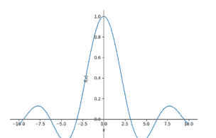

如果我们不指定范围，如上例所示，Python 会使用其默认范围（在 -10 和 10 之间）。

```python
sympy.plotting.plot(f(x), (x, -10 * sympy.pi, 10 * sympy.pi));
```

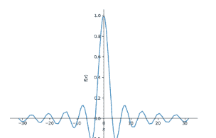

sympy.plotting 中的 plot 方法能够绘制一系列函数。

```python
plot(f(x), -f(x) + 2 , (x, -10 * pi, 10 * pi));
```

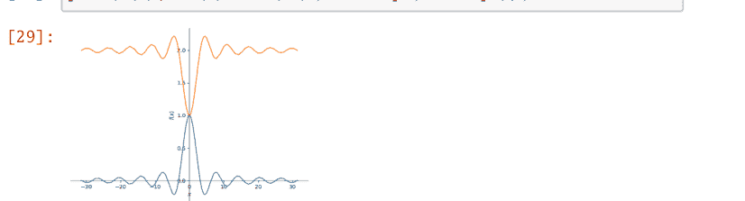

```python
s=[f(i * x) for i in range(1, 5)]
```

```python
s
```

```
[sin(x)/x, sin(2*x)/(2*x), sin(3*x)/(3*x), sin(4*x)/(4*x)]
```

回想一下，*s 会将列表解包为一个序列，因此我们可以一次性获取列表 s 中所有函数的图形。

```python
plot(*s);
```

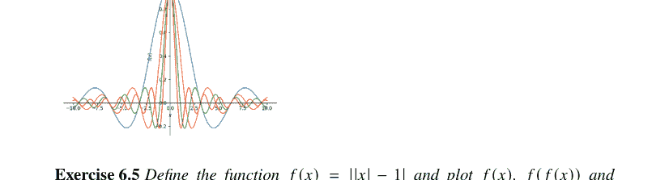

**练习 6.5** 定义函数 $f(x) = ||x| - 1|$ 并绘制 $f(x)$、$f(f(x))$ 和 $f(f(f(x)))$ 的图形。绝对值函数 $||$ 在 Python 的 `sympy` 模块中定义为 `Abs`。

解答

让我们理解这个函数。$x$ 的绝对值定义为：如果 $x$ 为负，则为 $-x$；否则为 $x$。我们得到：

$$f(x) = \begin{cases} x - 1 & \text{if } x \geq 1 \\ -x + 1 & \text{if } 0 \leq x < 1 \\ x + 1 & \text{if } -1 \leq x < 0 \\ -x - 1 & \text{if } x \leq -1. \end{cases}$$

读者可能会想象，对于 $f(f(x))$，需要考虑其他几种情况。一旦我们定义了 $f(x)$，就可以让 Python 为我们绘制它们。

```python
from sympy import sin, symbols, Abs
from sympy.plotting import plot

def f(x):
    return Abs(Abs(x) - 1)

x = symbols('x')
plot(f(x))
plot(f(f(x)))
plot(f(f(f(x))));
```

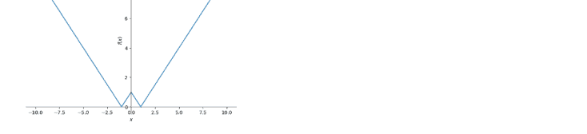

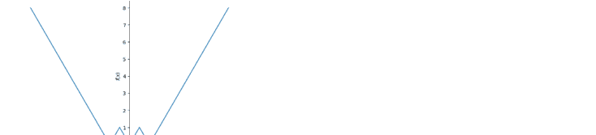

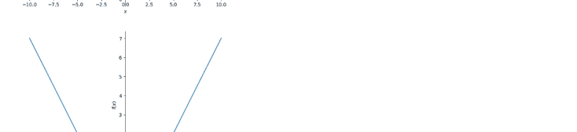

接下来，我们绘制由 $x = \sin(3t)$、$y = \cos(4t)$ 定义的参数方程的图形。

```python
from sympy import symbols, cos, sin
from sympy import plot_parametric

t = symbols('t')

plot_parametric((sin(3 * t), cos(4 * t)), (t, -5, 5));
```

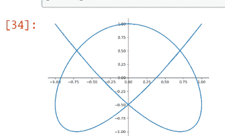

**练习 6.6** *绘制由 Temple H. 发现的蝴蝶曲线，其方程为*

$$x(t) = \sin(t)\left(e^{\cos(t)} - 2\cos(4t) - \sin^5(t/12)\right),$$

$$y(t) = \cos(t)\left(e^{\cos(t)} - 2\cos(4t) - \sin^5(t/12)\right).$$

*解答*

显然，方程中的坐标 $(x, y)$ 依赖于变量 $t$。因此我们需要使用 `plot_parametric` 来处理这个方程。我们定义函数 $x(t)$ 和 $y(t)$，一旦准备好，就将它们传递给 `plot_parametric`；sympy 可以处理剩下的事情。

```python
from sympy import symbols, cos, sin, exp
from sympy import plot_parametric

t = symbols('t')

def x(t):
    return sin(t) * (exp(cos(t)) - 2 * cos(4 * t) - sin(t/12)**5)

def y(t):
    return cos(t) * (exp(cos(t)) - 2 * cos(4*t) - sin(t/12)**5)

plot_parametric(x(t), y(t), (t, -50, 50));
```

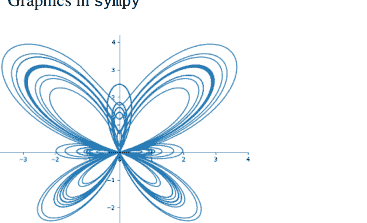

接下来，我们找到满足方程 $x^4 - (x^2 - y^2) = 0$ 的所有点 $(x, y)$ 的图形。对于此类方程，可以使用 `plot_implicit`，如下所示：

```python
from sympy import symbols, Eq
from sympy import plot_implicit

x, y = symbols('x y')

plot_implicit(Eq(x**4 - (x**2 - y**2), 0), (x, -1.5, 1.5),
              (y, -1.5, 1.5));
```

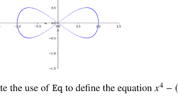

注意使用 Eq 来定义方程 $x^4 - (x^2 - y^2) = 0$。

**练习 6.7** 考虑所谓的弹跳马车方程

$$2y^3 + y^2 - y^5 = x^4 - 2x^3 + x^2.$$

绘制它并注意这个有趣的图形！

*解答*

你能在图中看到弹跳马车吗？

```python
from sympy import symbols, Eq, sin
from sympy import plot_implicit

x, y = symbols('x y')
```

```python
plot_implicit(Eq(2*y**3 + y**2 - y**5, x**4 - 2*x**3 + x**2), (x, -5, 5), (y, -5, 5));
```

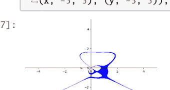

我们可以在同一个 $x$-$y$ 平面上绘制多个图形。例如，我们想知道有多少对实数 $(x, y)$ 满足方程组

$$2 - x^3 = y$$
$$2 - y^3 = x + \sin(y).$$

通过绘制这两个方程的图形，我们应该能够推断出解的数量。

```python
p1 = plot_implicit(Eq(2 - x**3, y), (x, -5, 5), (y, -5, 5), line_color='blue', show=False);
p2 = plot_implicit(Eq(2 - y**3, x + sin(y)), (x, -5, 5), (y, -5, 5), line_color='green', show=False);
p1.append(p2[0])

p1.show()
```

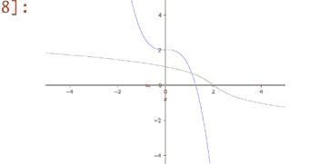

注意，这里 $p1$ 和 $p2$ 是两个对象。使用 show=False，我们最初不绘制图形。我们创建对象，然后将第二个添加到第一个，然后绘制这个新对象。

为了获得满足不等式 $x^4 + (x - 2y^2) > 0$ 的所有点 $(x, y)$ 的区域，我们可以使用 plot_implicit。

from sympy import plot_implicit

plot_implicit(x**4 + (x - 2*y**2) > 0, (x, -2, 2), (y, -2, 2));

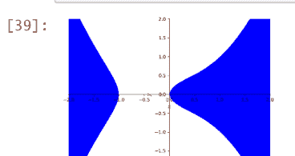

## 6.3 三维图形

类似地，可以定义多变量函数。下表展示了绘制不同格式定义的函数所需的命令。

| 三维数学函数 | 三维函数的具体示例 | sympy 方法 |
| :--- | :--- | :--- |
| $y = f(x, y)$ | $y = \sin(z^2 + y^2)e^{-x^2}$ | plot3d |
| $\begin{cases} x = f(t), \ y = g(t), \ z = h(t) \end{cases}$ | $\begin{cases} x = \sin(3t), \ y = \cos(4t), \ z = \sin(5t) \end{cases}$ | plot3d_parametric_line |
| $\begin{cases} x = f(t, u), \ y = g(t, u), \ z = h(t, u) \end{cases}$ | $\begin{cases} x = \sin(3t), \ y = \cos(4t), \ z = \sin(5t) \end{cases}$ | plot3d_parametric_surface |

这是一个定义 $f(x, y) = \sqrt{x^2 + y^2}$ 的简单示例。

```
from sympy import sqrt

def f(x, y):
    return sqrt(x**2 - y**2)

f(x, y)
```

$\sqrt{x^2 - y^2}$

一旦定义了函数，通过 sympy 库绘制其图形就非常容易了。

```
from sympy.plotting import plot3d

plot3d(f(x, y));
```

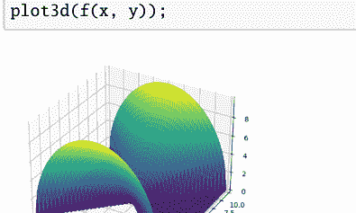

```
plot3d(f(x, y), (x, -100, 100), (y, -100, 100));
```

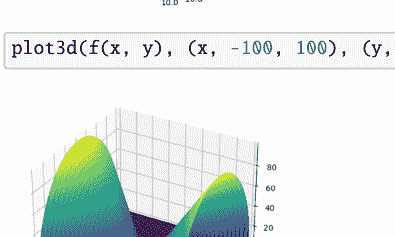

请注意，对于二维方程，例如 $f(x) = x + \sin(x)$，使用 `plot`；而对于三维方程，例如 $\sqrt{x^2 + y^2}$，则使用 `plot3d`。

**练习 6.8** 绘制“牛仔帽”方程的图形
$$\sin(x^2 + y^2)e^{-x^2} + \cos(x^2 + y^2)$$
其中 $x$ 和 $y$ 的范围均为 $-2$ 到 $2$。

*解答*
我们首先将公式转换为 Python 代码，并使用 sympy 中的 `plot3d` 来创建图形。

```
from sympy import sin, cos, exp
from sympy.plotting import plot3d

x, y = symbols('x y')

plot3d(sin(x**2 + y**2) * exp(-x**2) + cos(x**2 + y**2));
```

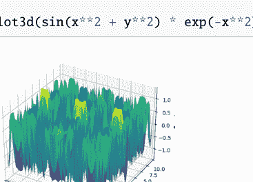

这不是我们预期的图片。按照练习中明确提到的限制范围，我们得到：

```
plot3d(sin(x**2+y**2)*exp(-x**2) + cos(x**2+y**2),(x, -2, 2),(y, -2, 2));
```

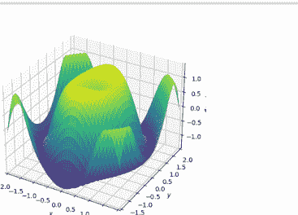

**练习 6.9** 定义函数 $f(x, y) = ||x| - |y||$，并绘制其在 $-10 \leq x, y \leq 10$ 范围内的图形。

*解答*

要绘制双变量函数，我们可以使用 `sympy.plotting` 模块的 `plot3d` 函数。

```
[45]:
from sympy import symbols, Abs
from sympy.plotting import plot3d

def f(x, y):
    return Abs(Abs(x) - Abs(y))

x, y = symbols('x y')

plot3d(f(x, y), (x, -10, 10), (y, -10, 10));
```

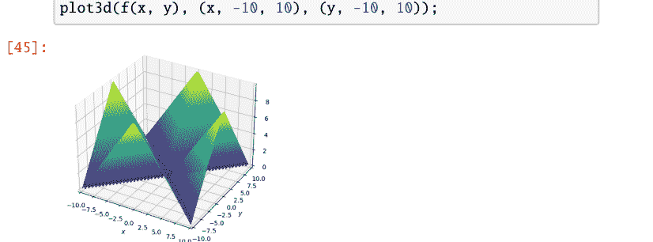

**练习 6.10** 当 $-2\pi \le x \le 0$ 且 $-2\pi \le y \le 0$ 时，绘制 $f(x, y) = xy \sin(x^2) \cos(y^2)$ 的图形。

*解答*

在前面的练习中，我们首先定义了一个函数 $f(x, y)$，然后在 plot3d 中使用该函数。这里我们直接在 plot3d 中使用方程。

```
[46]:
from sympy import symbols, sin, cos, pi
from sympy.plotting import plot3d

x, y = symbols('x y')

plot3d(x * y * sin(x**2) * cos(y**2), (x, -2*pi, 0), (y, -2*pi, 0));
```

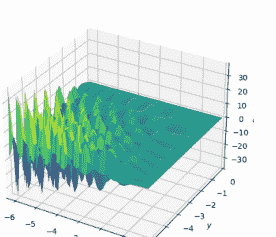

接下来我们看一个三维参数图。对于 $-\pi \le t \le \pi$，绘制以下图形：

$x = \sin(3t)$,
$y = \cos(4t)$,
$z = \sin(5t)$.

```
from sympy import symbols, cos, sin, pi
from sympy.plotting import plot3d_parametric_line

t = symbols('t')
plot3d_parametric_line(sin(3*t), cos(4*t), sin(5*t), (t, -pi, pi));
```

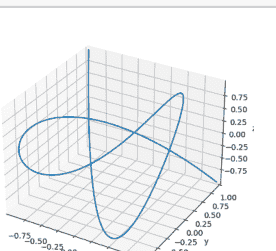

```
t = symbols('t')
plot3d_parametric_line(sin(t), cos(t), t, (t, -10*pi, 10*pi));
```

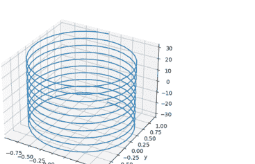

## 6.4 使用 sympy 进行微积分

### 6.4.1 求解方程

求解方程和寻找不同类型方程与关系的根是数学的主要任务之一。对于单变量多项式，即形如 $a_n x^n + a_{n-1} x^{n-1} + \cdots + a_1 x + a_0$ 的多项式，已经证明当 $n \geq 5$ 时（实际上，当 $n = 3$ 或 $4$ 时，公式也并不简洁！），不存在求根的通用公式。这迫使我们寻找数值方法来估计方程的根。然而，如果可能的话，我们可以使用 sympy 来找到方程的精确解。

第一个例子，我们使用 sympy 来求解方程 $x^2 - 3x - 10 = 0$ 的解。

```
python
from sympy import solve, solveset

solve(x**2 - 3*x - 10, x)
```

[-2, 5]

```
python
solveset(x**2 - 3*x - 10, x)
```

{-2, 5}

这里我们使用了 sympy 库中的 `solve` 函数。函数的第二个参数告诉 Python `x` 是方程的变量。结果显示，`solveset` 命令返回一个包含解的集合。

绘制多项式 $x^2 - 3x - 10$ 的图形可以确认 $-2$ 和 $5$ 是方程 $x^2 - 3x - 10 = 0$ 的根。

```
from sympy.plotting import plot

plot(x**2 - 3*x - 10);
```

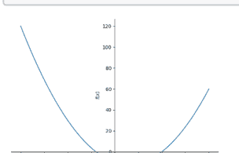

接下来我们尝试求解方程 $x^4 - 3x^3 + 2x + 10 = 0$。

```
from sympy.plotting import plot

plot(x**4 - 3*x**3 + 2*x + 10);
```

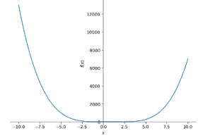

```
from sympy import solveset, simplify

solveset(x**4 - 3*x**3 + 2*x + 10, x)
```

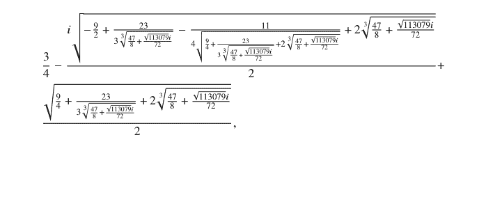

$$\frac{3}{4} - \frac{\sqrt{\frac{9}{4} + \frac{23}{3 \sqrt[3]{\frac{47}{8} + \frac{\sqrt{113079}i}{72}}} + 2 \sqrt[3]{\frac{47}{8} + \frac{\sqrt{113079}i}{72}}}}{2} - \frac{i \sqrt{-\frac{9}{2} + \frac{23}{3 \sqrt[3]{\frac{47}{8} + \frac{\sqrt{113079}i}{72}}} + \frac{11}{4 \sqrt{\frac{9}{4} + \frac{23}{3 \sqrt[3]{\frac{47}{8} + \frac{\sqrt{113079}i}{72}}} + 2 \sqrt[3]{\frac{47}{8} + \frac{\sqrt{113079}i}{72}}}} + 2 \sqrt[3]{\frac{47}{8} + \frac{\sqrt{113079}i}{72}}}}{2},$$

$$\frac{3}{4} - \frac{\sqrt{\frac{9}{4} + \frac{23}{3 \sqrt[3]{\frac{47}{8} + \frac{\sqrt{113079}i}{72}}} + 2 \sqrt[3]{\frac{47}{8} + \frac{\sqrt{113079}i}{72}}}}{2} + \frac{i \sqrt{-\frac{9}{2} + \frac{23}{3 \sqrt[3]{\frac{47}{8} + \frac{\sqrt{113079}i}{72}}} + \frac{11}{4 \sqrt{\frac{9}{4} + \frac{23}{3 \sqrt[3]{\frac{47}{8} + \frac{\sqrt{113079}i}{72}}} + 2 \sqrt[3]{\frac{47}{8} + \frac{\sqrt{113079}i}{72}}}} + 2 \sqrt[3]{\frac{47}{8} + \frac{\sqrt{113079}i}{72}}}}{2},$$

$$\frac{3}{4} + \frac{\sqrt{\frac{9}{4} + \frac{23}{3 \sqrt[3]{\frac{47}{8} + \frac{\sqrt{113079}i}{72}}} + 2 \sqrt[3]{\frac{47}{8} + \frac{\sqrt{113079}i}{72}}}}{2} - \frac{i \sqrt{-\frac{9}{2} + \frac{23}{3 \sqrt[3]{\frac{47}{8} + \frac{\sqrt{113079}i}{72}}} - \frac{11}{4 \sqrt{\frac{9}{4} + \frac{23}{3 \sqrt[3]{\frac{47}{8} + \frac{\sqrt{113079}i}{72}}} + 2 \sqrt[3]{\frac{47}{8} + \frac{\sqrt{113079}i}{72}}}} + 2 \sqrt[3]{\frac{47}{8} + \frac{\sqrt{113079}i}{72}}}}{2}$$

读者可以自行尝试，看看 `solve` 无法给出方程 $\sin(x) = x - 1$ 的任何解，尽管该方程有一个实数解，如下图所示。

```
from sympy import sin
from sympy.plotting import plot

plot(sin(x) - x + 1);
```


图形显示解在 2 附近。我们可以编写一个简单的程序来估计根。

```
[55]: from math import sin

x = 1.5
while sin(x) - x + 1 > 0.00001:
    x += 0.001

print(f'{x} and {sin(x) - x + 1}')
```

[55]: 1.934999999999952 and -0.0005922867585996805

### 6.4.2 极限、导数与积分

微积分中的两个重要工具是微分和积分，两者都使用极限的概念。我们假设读者熟悉微积分。在下面的问题中，我们展示 sympy 在这方面的一些能力。

我们从函数的极限开始

$$\lim_{x \to 0} \frac{\cos(x) - 1}{\sin(x)}.$$

sympy 提供了 `limit` 命令来探索函数的极限。

```
[56]: from sympy import sin, cos, pi
from sympy import limit

x = symbols('x')

limit((cos(x)-1)/sin(x), x, 0)
```

[56]: 0

该函数的图形证实，当 $x$ 趋近于 0 时，该函数的极限确实是 0。

```
[57]: from sympy import sin, cos
from sympy.plotting import plot

plot((cos(x)-1)/sin(x), (x, -3.1, 3.1));
```

我们也可以明确要求 sympy 计算变量从右侧或左侧趋近于给定值时的极限。

```python
limit((cos(x)-1)/sin(x), x, pi, '-')
```

-∞

```python
limit((cos(x)-1)/sin(x), x, pi, '+')
```

∞

### 练习 6.11 探究

$$\lim_{n \to 0} \frac{\sin(x)}{x} = 1.$$

### 解答

这个极限告诉我们，如果 $x$ 的值非常小，那么基本上可以用 $x$ 来替换 $\sin(x)$。我们首先绘制方程 $\sin(x)/x$ 以及常数线 1 的图像。

```python
from sympy import sin, cos, pi
from sympy.plotting import plot

plot(sin(x)/x, 1, (x, -pi, pi));
```

这清楚地表明，常数线 1 在 $x = 0$ 处与 $\sin(x)/x$ 的图像相切（并且是切线）。我们可以使用 sympy 命令 `limit` 来确认这一点。

6.4 使用 sympy 进行微积分

175

```python
[61]: limit(sin(x)/x, x, 0)
```

[61]: 1

接下来我们看导数和积分。下表概述了 sympy 如何处理这些运算。

| 函数示例 | 使用的命令 |
|---|---|
| $\partial f/\partial x$ | diff(f,x) |
| $\partial^2 f/\partial x\partial x$ | diff(f,x,x) 或 diff(f,x,2) |
| $\partial^2 f/\partial x\partial y$ | diff(f,x,y) |
| $\int f(x)dx$ | Integrate(f(x),x) |
| $\int_a^b f(x)dx$ | Integrate(f(x),x) |
| $\int_c^d \int_a^b f(x,y)dxdy$ | Integrate(f(x),(x, a,b), (y, c,d)) |

在上面的计算中，可以使用 oo 和 -oo 来表示 $\infty$ 和 $-\infty$。

作为第一个例子，我们计算

$\int_0^\infty e^{-x}dx$。

```python
[62]: from sympy import exp, integrate, symbols, oo
from sympy.plotting import plot

x= symbols('x')

integrate(exp(-x), (x, 0, oo))
```

[62]: 1

这意味着曲线 $e^{-x}$ 从 0 到 $\infty$ 下的面积恰好是 1。

```python
[63]: plot(exp(-x), (x, 0, 10))
```

[63]:

### 练习 6.12 计算以下内容：

$\frac{\partial f}{\partial x}$，当 $f = \sin(x)/x$ 时，
$\frac{\partial^2 f}{\partial x^2}$，当 $f = \sin(x)/x$ 时，
$\frac{\partial^3 f}{\partial x^2 \partial y}$，当 $f = e^{xy}$ 时，
$\int (\cos(x)/x - \sin(x)/x^2) dx$
$\int_{-1}^1 \int_{-1}^1 \cos(x^2 + y^2 + xy) dx dy$。

### 解答

我们从上到下依次处理。我们需要 sympy 库中的 `integrate` 和 `diff` 方法来处理积分和求导。

```python
from sympy import exp, integrate, diff, symbols, oo
from sympy.plotting import plot
```

```python
diff(sin(x)/x)
```

$\frac{\cos(x)}{x} - \frac{\sin(x)}{x^2}$

```python
diff(sin(x)/x, x, 2)
```

$\frac{-\sin(x) - \frac{2\cos(x)}{x} + \frac{2\sin(x)}{x^2}}{x}$

```python
diff(sin(x)/x, x, x)
```

$\frac{-\sin(x) - \frac{2\cos(x)}{x} + \frac{2\sin(x)}{x^2}}{x}$

为了得到 $p/q$ 形式的表达式，可以使用 sympy 库中的 `cancel` 命令。回想一下，`_` 指的是上一个输出。

```python
from sympy import cancel
cancel(_)
```

[68]: $$\frac{-x^2 \sin(x) - 2x \cos(x) + 2 \sin(x)}{x^3}$$

```python
[69]: diff(exp(x * y), x, x, y)
```

[69]: $$y (xy + 2) e^{xy}$$

```python
[70]: integrate(cos(x)/x - sin(x)/x**2, x)
```

[70]: $$\frac{\sin(x)}{x}$$

最后一个积分需要一些时间来计算。这是因为 sympy 会尝试给出答案的精确形式。我们将看到，数值方法会更快地产生结果。

```python
[71]: integrate(cos(x**2 + y**2 + x*y), (x, -1, 1), (y, -1, 1))
```

[71]: $$\frac{\sqrt{2}\sqrt{\pi}}{2} \times \left( \int_{-1}^{1} \sin\left(\frac{3y^2}{4}\right) S\left(\frac{\sqrt{2}y}{2\sqrt{\pi}} - \frac{\sqrt{2}}{\sqrt{\pi}}\right) dy + \int_{-1}^{1} \left(-\sin\left(\frac{3y^2}{4}\right) S\left(\frac{\sqrt{2}y}{2\sqrt{\pi}} + \frac{\sqrt{2}}{\sqrt{\pi}}\right)\right) dy + \int_{-1}^{1} \cos\left(\frac{3y^2}{4}\right) C\left(\frac{\sqrt{2}y}{2\sqrt{\pi}} + \frac{\sqrt{2}}{\sqrt{\pi}}\right) dy + \int_{-1}^{1} \left(-\cos\left(\frac{3y^2}{4}\right) C\left(\frac{\sqrt{2}y}{2\sqrt{\pi}} - \frac{\sqrt{2}}{\sqrt{\pi}}\right)\right) dy \right)$$

```python
[72]: round(_)
```

[72]: 3

### 练习 6.13 考虑两个曲面

$$q(x, y) = \cos(x^2 + y^2) \exp(-x^2),$$
$$w(x, y) = 3 - x^2 - y^2.$$

绘制这些函数。

### 解答

我们已经见过这类例子。唯一需要注意的是，我们可以使用 plot3d 来绘制一系列函数，如代码所示。

```python
from sympy import symbols, sin, cos, pi, exp
from sympy.plotting import plot3d

x, y = symbols('x y')

plot3d(cos(x**2 + y**2) * exp(-x**2), 3 - x**2 - y**2, (x, -3, 3), (y, -3, 3));
```

**练习 6.14** 设 $A = (a_{ij})$ 表示 $4 \times 4$ 矩阵，其中

$$a_{ij} = x^i + x^j + x^{ij}.$$

符号化计算 $A$ 的行列式？如果 $x = \sqrt{2}$，矩阵 $A$ 的逆是什么？

*解答*

注意矩阵的元素包含符号 $x$。因此，这里使用 sympy 库来定义函数。我们可以将符号 $x$ 传递给函数 m。这个函数组合了矩阵。它由一个嵌套循环组成，第一个循环处理行，另一个循环组合每行的元素。

```python
from sympy import symbols, det, Matrix, sqrt, factor

def m(x):
    A = []
    for i in range(1, 5):
        row = []
        for j in range(1, 5):
            row += [x**i + x**j + x**(i*j)]
        A += [row]
    return Matrix(A)
```

```python
x = symbols('x')
A = m(x)
A
```

```
[74]:
```

```
\begin{bmatrix} 3x & 2x^2 + x & 2x^3 + x & 2x^4 + x \ 2x^2 + x & x^4 + 2x^2 & x^6 + x^3 + x^2 & x^8 + x^4 + x^2 \ 2x^3 + x & x^6 + x^3 + x^2 & x^9 + 2x^3 & x^{12} + x^4 + x^3 \ 2x^4 + x & x^8 + x^4 + x^2 & x^{12} + x^4 + x^3 & x^{16} + 2x^4 \end{bmatrix}
```

```python
[75]: A.det()
```

```
[75]:
```

```
3x^{30} - 10x^{29} + 6x^{28} + 11x^{27} - 8x^{26} - 10x^{25} - 2x^{24} + 21x^{23} - 3x^{22} - 11x^{21} - 6x^{20} + 6x^{19} + 10x^{18} - 4x^{17} - 2x^{16} - 7x^{15} + 6x^{14} + 3x^{13} - 4x^{12} + x^{11}
```

```python
[76]: factor(A.det())
```

```
[76]:
```

```
x^{11} (x - 1)^6 (x + 1)^2 (x^2 + x + 1) (3x^9 - x^8 + 2x^5 - x^2 - x + 1)
```

对于练习的最后一部分，要计算当 $x = \sqrt{2}$ 时矩阵的逆，我们首先将 $\sqrt{2}$ 传递给函数 $m(x)$，然后使用该对象中的 `inv` 方法来计算其逆。计算过程令人印象深刻，读者不应忽视。

```python
[77]: mat_inv = m(sqrt(2)).inv()
```

```python
[78]: mat_inv
```

```
[78]:
```

```
\begin{bmatrix} 1766118-1248857\sqrt{2} & -480344+339683\sqrt{2} & -730010+516175\sqrt{2} & 172154-121729\sqrt{2} \ -5587390+3950878\sqrt{2} & -5587390+3950878\sqrt{2} & -11174780+7901756\sqrt{2} & -11174780+7901756\sqrt{2} \ -339683+240172\sqrt{2} & -2165050+1531031\sqrt{2} & 181333-128264\sqrt{2} & 169553-119887\sqrt{2} \ -3950878+2793695\sqrt{2} & -15803512+11174780\sqrt{2} & -15803512+11174780\sqrt{2} & -15803512+11174780\sqrt{2} \ -25415+17965\sqrt{2} & 8941-6304\sqrt{2} & 55676-39385\sqrt{2} & -12698+8981\sqrt{2} \ -388988+275054\sqrt{2} & -777976+550108\sqrt{2} & -1555952+1100216\sqrt{2} & -1555952+1100216\sqrt{2} \ 2251-1604\sqrt{2} & 3175-2206\sqrt{2} & -4816+3367\sqrt{2} & -1786+1269\sqrt{2} \ -146656+103738\sqrt{2} & -293312+207476\sqrt{2} & -586624+414952\sqrt{2} & -586624+414952\sqrt{2} \end{bmatrix}
```

```python
[79]: mat = m(sqrt(2))
```

```python
[80]: mat
```

```
[80]:
```

```
\begin{bmatrix} 3\sqrt{2} & \sqrt{2} + 4 & 5\sqrt{2} & \sqrt{2} + 8 \ \sqrt{2} + 4 & 8 & 2\sqrt{2} + 10 & 22 \ 5\sqrt{2} & 2\sqrt{2} + 10 & 20\sqrt{2} & 2\sqrt{2} + 68 \ \sqrt{2} + 8 & 22 & 2\sqrt{2} + 68 & 264 \end{bmatrix}
```

接下来我们将这两个矩阵相乘；我们期望得到 $4 \times 4$ 单位矩阵，然而我们得到了一个庞大的表达式。我们不会在这里尝试显示输出，因为它会超出页边距（这不是费马的评论！）。但我们会要求 Python 简化输出。

```python
[81]: mat * mat_inv;
```

```python
[82]: simplify(_)
```

```
[82]: 
\begin{bmatrix}
1 & 0 & 0 & 0 \n0 & 1 & 0 & 0 \n0 & 0 & 1 & 0 \n0 & 0 & 0 & 1
\end{bmatrix}
```

## 习题

1. 绘制以下函数的图像
$$x(t) = 4 \cos(-11t/4) + 7 \cos(t),$$
$$y(t) = 4 \sin(-11t/4) + 7 \sin(t)$$
其中 $0 \le t \le 14\pi$。

2. 绘制以下函数的图像
$$x(t) = \cos(t) + 1/2 \cos(7t) + 1/3 \sin(17t)$$
$$y(t) = \sin(t) + 1/2 \sin(7t) + 1/3 \cos(17t)$$
其中 $0 \le t \le 14\pi$。

3. 考虑以下函数。
$$f(x) := \sum_{k=1}^{100} \left( \frac{\sin(2\pi k^2 x)}{4\pi^2 k^5} + \frac{x^2}{2k} \right)$$
这个函数由 Sungkon Chang 提出，作为一个看起来相当“无害”但其导数行为相当狂野的函数的例子。绘制 $f(x)$、$f'(x)$ 和 $f''(x)$ 并观察这种行为。

4. 考虑以下两个变量的函数
$$\mathbf{x}(u, v) = \sin(v) \cos(u),$$
$$\mathbf{y}(u, v) = \sin(v) \sin(u),$$
$$\mathbf{z}(u, v) = \cos(v).$$
当 $0 \le u \le 3\pi/2$ 且 $0 \le v \le \pi$ 时，生成曲面 $(\mathbf{x}, \mathbf{y}, \mathbf{z})$。

现在考虑 $\mathbf{x}_1(u, v) = \frac{-3}{8} \cos(v) \sin\left(\frac{4u}{3}\right)$，$\mathbf{y}_1(u, v) = \frac{3}{8} \cos\left(\frac{4u}{3}\right) \cos(v)$ 和 $\mathbf{z}_1(u, v) = \frac{\sin(v)}{2}$。生成曲面
$$\left(\frac{\mathrm{d}\mathbf{x}_1}{\mathrm{d}v\mathrm{d}u}, \frac{\mathrm{d}\mathbf{y}_1}{\mathrm{d}u\mathrm{d}v}, \frac{\mathrm{d}\mathbf{z}_1}{\mathrm{d}v}\right)$$
其中 $0 \le u \le 3\pi/2$ 且 $0 \le v \le \pi$。最后，将这两个图像叠加。

5. 考虑函数 $\cos(x^2)$。计算该函数下方、介于 0 和函数首次与 $x$ 轴相交点之间的面积。

6. 编写一个函数来验证，对于任意 $n$，以下恒等式成立：
$$\det\begin{pmatrix} x & a_1 & a_2 & \cdots & a_n \\ a_1 & x & a_2 & \cdots & a_n \\ a_1 & a_2 & x & \cdots & a_n \\ \vdots & \vdots & \vdots & & \vdots \\ a_1 & a_2 & a_3 & \cdots & x \end{pmatrix} = (x + a_1 + \cdots + a_n)(x - a_1) \cdots (x - a_n)$$

7. 编写一个函数来验证，对于任意 $n$，以下恒等式成立：
$$\det\begin{pmatrix} 1 & 1 & 1 & \cdots & 1 & 1 \\ b_1 & a_1 & a_1 & \cdots & a_1 & a_1 \\ b_1 & b_2 & a_2 & \cdots & a_2 & a_2 \\ \vdots & \vdots & \vdots & & \vdots & \vdots \\ b_1 & b_2 & b_3 & \cdots & b_n & a_n \end{pmatrix} = (a_1 - b_1)(a_2 - b_2) \cdots (a_n - b_n)$$

8. 希尔伯特矩阵是一个方阵，其第 $i$ 行第 $j$ 列的元素为 $\frac{1}{i+j-1}$。构造一个 6 阶（即 $6 \times 6$）的希尔伯特矩阵，并计算其行列式和逆矩阵。对 $7 \times 7$ 和 $8 \times 8$ 矩阵也进行尝试。构造一个表格，显示 1 到 10 阶希尔伯特矩阵的行列式。

9. 构造一个 $10 \times 10$ 的上三角矩阵 $A$（参见维基百科了解此类矩阵的定义），其非零元素为随机整数。证明其行列式等于其主对角线上元素的乘积。现在考虑转置矩阵 $A^t$，并证明其行列式（$\det(A^t)$）与 $A$ 相同。$\det(A + A^t)$ 是多少？

10. 研究方程 $\sin(x^2) - \cos(x^3) = 0$ 在 $0 \le x \le \pi$ 范围内有多少个解。

11. 在 $[-\pi, \pi]$ 区间内绘制函数 $2 \exp(-x^2)$ 和 $\cos(\sin(x) + \cos(x))$ 的图像。研究它们的交点。

12. 定义函数

$$f(t, a) = 2 + \frac{1}{2} \sin(at),$$
$$g(t, b, c) = \cos\left(t + \frac{\sin(bt)}{c}\right),$$
$$h(t, b, c) = \sin\left(t + \frac{\sin(bt)}{c}\right).$$

生成参数图
$$x(t) = f(t, 8)g(t, 16, 4)$$
$$y(t) = f(t, 8)h(t, 16, 4)$$
其中 $0 \le t \le 2\pi$。同时绘制图像
$$(f(t, 6)g(t, 18, 18), f(t, 6)h(t, 18, 18))$$
其中 $0 \le t \le 2\pi$。

13. 令 $g(x) = \sin(x) + \cos(x)$。绘制 $g(g(g(g(x))))$ 和 $g(g(g(g(g(x)))))$ 在 $x$ 介于 0 和 $\pi$ 之间的图像。图像有四个交点。通过数值方法求出它们的 $(x, y)$ 坐标。

14. 令 $A$ 表示 $3 \times 3$ 矩阵
$$\begin{pmatrix} x + y & x^2 + y & x^3 + y \\ x + y^2 & x^2 + y^2 & x^3 + y^2 \\ x^2 + y^3 & x^2 + y^3 & x^3 + y^3 \end{pmatrix}$$
（是的，左下角元素不符合其余元素的模式是故意的！），并令 $B$ 表示其逆矩阵。证明 $B$ 第一行元素之和为 0。第二行和第三行元素之和各是多少？同时求出 $B$ 每一列元素之和。

15. 研究并确定 $0 \le x \le 2\pi$ 范围内满足以下不等式的 $x$ 值：
$$2 \cos(x) \le \sqrt{1 + \sin(2x)} - \sqrt{1 - \sin(2x)} \le \sqrt{2}.$$

# 第 7 章
numpy 库

## 7.1 numpy，数值 Python

在本章中，我们将探讨 Python 最强大、最常用的库之一，即 numpy，它用于处理数据。numpy 库允许我们处理大型值列表；这里的列表称为数组。它提供了一种强大的方式对数组进行算术运算。我们可以使用数组来处理大量输入集合，并处理矩阵，从而进行线性代数运算——这是数学的一个分支，在计算机科学的各个方面都变得至关重要。

按照惯例，我们将 numpy 导入为别名 np。

```
[1]: import numpy as np
```

接下来，我们介绍 numpy 中的数组。

```
[2]: x = np.array([1, -2, 3.5])
```

```
[3]: x
```

```
[3]: array([ 1. , -2. , 3.5])
```

```
[4]: list(x)
```

```
[4]: [1.0, -2.0, 3.5]
```

注意我们如何将序列和列表转换为数组。

```
[5]: y = np.array(range(1, 18, 2))
```

```
[6]: y
```

```
[6]: array([ 1, 3, 5, 7, 9, 11, 13, 15, 17])
```

```
[7]: z = np.array([i % 2 for i in range(10)])
```

```
[8]: z
```

```
[8]: array([0, 1, 0, 1, 0, 1, 0, 1, 0, 1])
```

我们可以创建多维数组，也可以将其视为矩阵。

```
[9]: t = np.array([[1, 2, 3], [4, 5, 6]])
```

```
[10]: t
```

```
[10]: array([[1, 2, 3],
           [4, 5, 6]])
```

到目前为止，我们所做的就是将列表或元组转换为 numpy 数组。numpy 内部有一些函数允许我们直接创建数组。

```
[11]: z = np.zeros((3, 6))
```

```
[12]: z
```

```
[12]: array([[0., 0., 0., 0., 0., 0.],
           [0., 0., 0., 0., 0., 0.],
           [0., 0., 0., 0., 0., 0.]])
```

```
[13]: z.shape
```

```
[13]: (3, 6)
```

### 7.1.1 数组上的微积分

原则上，数组上的所有操作都是“逐元素”进行的。如果我们相加两个数组，就是将数组的对应元素相加。如果我们将一个函数应用于数组，该函数将应用于每个元素（类似于函数式编程中将函数映射到列表）。

```
[14]: ar = np.array([1, 2, 3])
```

```
[15]: ar + ar
```

```
[15]: array([2, 4, 6])
```

```
[16]: ra = ar * 2
```

```
[17]: ra
```

```
[17]: array([2, 4, 6])
```

```
[18]: ra - (ar + ar) == np.zeros(3)
```

```
[18]: array([ True, True, True])
```

注意上面一行中的比较是针对每个元素进行的，因此我们得到了三个布尔值 True。

### 7.1.2 生成数组

除了像我们之前那样从列表或元组创建 numpy 数组外，numpy 内部还有几个函数可以用来方便地生成数组。两个主要的是 arange 和 linspace。以下示例展示了它们的用途。

```
[19]: np.arange(5, 10)
```

```
[19]: array([5, 6, 7, 8, 9])
```

```
[20]: np.arange(5, 10, 0.3)
```

```
[20]: array([5., 5.3, 5.6, 5.9, 6.2, 6.5, 6.8, 7.1, 7.4, 7.7, 8., 8.3, 8.6, 8.9, 9.2, 9.5, 9.8])
```

类似于 range，arange(m, n, s) 从 m 开始，每次迭代增加 s，直到但不包括 n。命令 linspace(m, n, s) 给出一个包含 s 个等间距元素的数组，从 m 开始，以 n 结束；即数组以 m 开始，每次迭代增加 (n-m)/(s-1)，直到达到 n。

```
[21]: np.linspace(1, 4, 6)
```

```
[21]: array([1., 1.6, 2.2, 2.8, 3.4, 4. ])
```

```
y = np.sin(x)
plt.plot(x, y);
```


这里，y = np.sin(x) 中的 sin 函数应用于数组 x 的每个元素。这被称为向量计算。我们将在本章后面更详细地了解这种方法，以及它如何与 matplotlib 完美结合。

以下是 numpy 中用于生成数组的更多函数。

```
[23]: np.zeros(3)
```

```
[23]: array([0., 0., 0.])
```

```
[24]: np.zeros((3, 6))
```

```
[24]: array([[0., 0., 0., 0., 0., 0.],
       [0., 0., 0., 0., 0., 0.],
       [0., 0., 0., 0., 0., 0.]])
```

```
[25]: z.shape
```

```
[25]: (3, 6)
```

```
[26]: np.zeros((3, 6, 4))
```

```
[26]: array([[[0., 0., 0., 0.],
        [0., 0., 0., 0.],
        [0., 0., 0., 0.],
        [0., 0., 0., 0.],
        [0., 0., 0., 0.],
        [0., 0., 0., 0.]],

       [[0., 0., 0., 0.],
        [0., 0., 0., 0.],
        [0., 0., 0., 0.],
        [0., 0., 0., 0.],
        [0., 0., 0., 0.],
        [0., 0., 0., 0.]],

       [[0., 0., 0., 0.],
        [0., 0., 0., 0.],
        [0., 0., 0., 0.],
        [0., 0., 0., 0.],
        [0., 0., 0., 0.],
        [0., 0., 0., 0.]]])
```

`np.empty` 创建一个填充了随机数的多维数组。以下是由此函数生成的一个 5×5 数组。

```
[27]: np.empty([2**2 + 1,2**2 + 1])
```

```
[27]: array([[0.00000000e+000, 0.00000000e+000, 0.00000000e+000,
        0.00000000e+000, 2.12199579e-314],
       [1.15998412e-028, 4.31603868e-080, 1.94919985e-153,
        1.35717430e+131, 7.06652016e-096],
       [7.06652016e-096, 7.18988929e+140, 6.01347002e-154,
        6.98345625e-077, 6.98345624e-077],
       [6.98345624e-077, 6.01391519e-154, 7.06673073e-096,
        7.06652016e-096, 7.06652016e-096],
       [5.79961843e+294, 3.45365695e+175, 2.77191367e+296,
        2.91237123e+257, 4.71294503e+257]])
```

### 7.1.3 访问数组的元素

访问数组元素的方式与我们访问列表或元组元素的方式非常相似。以下示例展示了如何操作。

```
[28]: x = np.arange(1, 11)
```

```
[29]: x
```

```
[29]: array([ 1,  2,  3,  4,  5,  6,  7,  8,  9, 10])
```

```
[30]: x[0]
```

```
[30]: 1
```

```
[31]: x[-1]
```

```
[31]: 10
```

```
x[2 : 6]
```

```
array([3, 4, 5, 6])
```

```
x[4 : ]
```

```
array([ 5, 6, 7, 8, 9, 10])
```

```
x[ : 7]
```

```
array([1, 2, 3, 4, 5, 6, 7])
```

```
x[2 : 6] = 666
```

```
x
```

```
array([ 1, 2, 666, 666, 666, 666, 7, 8, 9, 10])
```

```
mat = np.empty([2**2 + 1, 2**2 + 1])
```

```
mat[ : ] = 0
```

```
mat
```

```
array([[0., 0., 0., 0., 0.],
       [0., 0., 0., 0., 0.],
       [0., 0., 0., 0., 0.],
       [0., 0., 0., 0., 0.],
       [0., 0., 0., 0., 0.]])
```

```
mat[0, : ] = 666
```

```
mat
```

```
array([[666., 666., 666., 666., 666.],
       [  0.,   0.,   0.,   0.,   0.],
       [  0.,   0.,   0.,   0.,   0.],
       [  0.,   0.,   0.,   0.,   0.],
       [  0.,   0.,   0.,   0.,   0.]])
```

```
mat[-1, : ] = 666
```

```
mat
```

```
[43]: array([[666., 666., 666., 666., 666.],
       [  0.,   0.,   0.,   0.,   0.],
       [  0.,   0.,   0.,   0.,   0.],
       [  0.,   0.,   0.,   0.,   0.],
       [666., 666., 666., 666., 666.]])
```

```
[44]: mat[ : ,0] = 666
```

```
[45]: mat
```

```
[45]: array([[666., 666., 666., 666., 666.],
       [666.,   0.,   0.,   0.,   0.],
       [666.,   0.,   0.,   0.,   0.],
       [666.,   0.,   0.,   0.,   0.],
       [666., 666., 666., 666., 666.]])
```

```
[46]: mat[ : , -1] = 666
```

```
[47]: mat
```

```
[47]: array([[666., 666., 666., 666., 666.],
       [666.,   0.,   0.,   0., 666.],
       [666.,   0.,   0.,   0., 666.],
       [666.,   0.,   0.,   0., 666.],
       [666., 666., 666., 666., 666.]])
```

我们可以一次性完成所有赋值：

```
[48]: mat[0, :] = mat[ : , 0] = mat[-1, : ] = mat[ : , -1] = 999
```

```
[49]: mat
```

```
[49]: array([[999., 999., 999., 999., 999.],
       [999.,   0.,   0.,   0., 999.],
       [999.,   0.,   0.,   0., 999.],
       [999.,   0.,   0.,   0., 999.],
       [999., 999., 999., 999., 999.]])
```

```
[50]: mat[1 : 4, 1 : 4] = 555.0
```

```
[51]: mat
```

```
[51]: array([[999., 999., 999., 999., 999.],
       [999., 555., 555., 555., 999.],
       [999., 555., 555., 555., 999.],
       [999., 555., 555., 555., 999.],
       [999., 999., 999., 999., 999.]])
```

```
xf = mat.astype(np.int64)
```

```
xf
```

```
array([[999, 999, 999, 999, 999],
       [999, 555, 555, 555, 999],
       [999, 555, 555, 555, 999],
       [999, 555, 555, 555, 999],
       [999, 999, 999, 999, 999]])
```

### 练习 7.1 在 numpy 中生成以下矩阵


并修改其元素为


### 解答

首先，我们需要使用 numpy 的 array 来定义矩阵。这是一个小矩阵，我们可以直接手动输入元素。

```
x = np.array([[1, 2, 3], [4, 5, 6], [7, 8, 9]])
```

```
x
```

```
array([[1, 2, 3],
       [4, 5, 6],
       [7, 8, 9]])
```

以下是通过列表推导式定义此矩阵的另一种方法。

```
t = [[j for j in range(1 + i, 4 + i)] for i in range(0, 9, 3)]
```

```
x = np.array(t)
```

```
x
```

```
[58]: array([[1, 2, 3],
           [4, 5, 6],
           [7, 8, 9]])
```

```
[59]: print(x[0][0], x[1][0], x[2][0])
```

1 4 7

```
[60]: x[ : ,0]
```

```
[60]: array([1, 4, 7])
```

```
[61]: x[ : ,1]
```

```
[61]: array([2, 5, 8])
```

```
[62]: x[ :2, 1:]
```

```
[62]: array([[2, 3],
           [5, 6]])
```

这里我们要求 Python 通过 `:2` 从数组中获取所有元素直到第二项，即 [1, 2, 3] 和 [4, 5, 6]。然后通过 `1:` 获取从索引 1 开始的所有元素，即 [2, 3] 和 [5, 6]。

```
[63]: x[ :2, 1:] = 999
```

```
[64]: x
```

```
[64]: array([[  1, 999, 999],
           [  4, 999, 999],
           [  7,   8,   9]])
```

向 `np.array` 赋值与向列表赋值有一个区别。以下示例将展示这一点：

```
[65]: x = np.arange(5, 17)
```

```
[66]: x
```

```
[66]: array([ 5,  6,  7,  8,  9, 10, 11, 12, 13, 14, 15, 16])
```

```
[67]: y = x[3 : 8]
```

```
[68]: y
```

```
[68]: array([ 8, 9, 10, 11, 12])
```

```
[69]: y[ : ] = 999
```

```
[70]: y
```

```
[70]: array([999, 999, 999, 999, 999])
```

```
[71]: x
```

```
[71]: array([ 5, 6, 7, 999, 999, 999, 999, 999, 13, 14, 15, 16])
```

这表明，当我们指定 `y = x[3 : 8]` 时，`y` 仍然指向与 `x` 相同对象的那部分。因此，更改 `y` 也会更改 `x`。
要创建一个新数组，可以使用 `.copy()` 方法。

```
[72]: z = x[3 : 8].copy()
```

```
[73]: z[ : ] = -1
```

```
[74]: z
```

```
[74]: array([-1, -1, -1, -1, -1])
```

```
[75]: x
```

```
[75]: array([ 5, 6, 7, 999, 999, 999, 999, 999, 13, 14, 15, 16])
```

这就是与列表的区别。以下示例展示了列表的行为。

```
[76]: t = [5, 6, 7, 8, 9, 10, 11, 12, 13, 14, 15, 16]
```

```
[77]: t
```

```
[77]: [5, 6, 7, 8, 9, 10, 11, 12, 13, 14, 15, 16]
```

```
[78]: z = t[3 : 8]
```

```
[79]: z
```

```
[79]: [8, 9, 10, 11, 12]
```

```
[80]: z[1] = 777
```

```
[81]: z
```

```
[81]: [8, 777, 10, 11, 12]
```

```
[82]: t
```

```
[82]: [5, 6, 7, 8, 9, 10, 11, 12, 13, 14, 15, 16]
```

### 7.1.4 使用数组进行向量微积分

numpy 拥有进行线性代数运算的“所有”工具，例如行列式、特征值、特征向量等等。

之前我们使用列表时提出的一个问题是：给定 **x** = {x₁, x₂, ⋯, xₙ} 和 **y** = {y₁, y₂, ⋯, yₙ}，如何生成 {x₁ + y₁, x₂ + y₂, ⋯, xₙ + yₙ}？

一种方法是将列表视为 `np.array` **x** = array([x1, x2, ..., xn]) 和 **y** = array([y1, y2, ..., yn])，那么向量和 **x** + **y** 就是我们想要的结果。然后，正如你可能猜测的那样，**x** * **y** 将生成 array([x1 y1, x2 y2, ...,xn yn])，即对数组执行的所有算术运算都是逐元素进行的。

然而，在向量的设定中还有另一种乘积，即*内积*，其定义为 **x**.**y** = x₁y₁ + x₂y₂ + ⋯ + xₙyₙ。

以下展示了 numpy 如何处理这些不同的运算。

```
[83]: x = np.arange(2, 7); y = np.arange(7, 2, -1)
```

```
[84]: print('', x, '\n', y)
```

```
[84]: [2 3 4 5 6]
[7 6 5 4 3]
```

```
[85]: x + y
```

```
[85]: array([9, 9, 9, 9, 9])
```

```
[86]: x * y
```

```
[86]: array([14, 18, 20, 20, 18])
```

```
[87]: x ** y == [2**7, 3**6, 4**5, 5**6, 6**3]
```

```
[87]: array([ True,  True,  True, False,  True])
```

众所周知，矩阵计算是一项繁琐的工作。手工计算


的乘积将花费远超过 10 分钟的时间，而且很可能只得到一个错误的答案！

我们生成一个 3×2 矩阵 $A$，其元素定义为 $a_{ij} = i - j$，以及一个 2×3 矩阵 $B$，其元素定义为 $b_{ij} = i + j^2$，并在 numpy 中计算矩阵乘积 $A.B$ 和 $B.A$；这将表明矩阵乘法不满足交换律。

我们首先使用列表推导式定义矩阵 $A$。

```
[88]: t = [[i - j for j in range(1, 3)] for i in range(1, 4)]
A = np.array(t)
```

```
[89]: A
```

```
[89]: array([[ 0, -1],
       [ 1,  0],
       [ 2,  1]])
```

```
[90]: s = [[i + j**2 for j in range(1, 4)] for i in range(1, 3)]
B = np.array(s)
```

```
[91]: B
```

```
[91]: array([[ 2,  5, 10],
       [ 3,  6, 11]])
```

对于矩阵乘法，我们使用 `dot` 方法。

### 练习 7.2 考虑方程组

$$\begin{cases} 3x + 2y = 3 \\ 10x - y = 5. \end{cases}$$

*求这些方程的唯一解。*

### 解答

用矩阵语言表示这个方程组，指向了一种使用矩阵微积分求解方程的自然方法。写作

$$\begin{pmatrix} 3 & 2 \\ 10 & -1 \end{pmatrix} \begin{pmatrix} x \\ y \end{pmatrix} = \begin{pmatrix} 3 \\ 5 \end{pmatrix}$$

那么显然

$$\begin{pmatrix} x \\ y \end{pmatrix} = \begin{pmatrix} 3 & 2 \\ 10 & -1 \end{pmatrix}^{-1} \begin{pmatrix} 3 \\ 5 \end{pmatrix}.$$

现在我们使用 numpy 来计算矩阵的逆并得到结果。

```python
import numpy as np

A = np.array([[3, 2], [10, -1]])
B = np.array([3, 5])
```

numpy 库提供了一种计算非奇异矩阵逆的方法。

```python
inv_A = np.linalg.inv(A)
print(inv_A)
```

```
[[ 0.04347826  0.08695652]
 [ 0.43478261 -0.13043478]]
```

因此，这个方程组的解是：

```python
print(np.dot(inv_A, B))
```

```
[0.56521739 0.65217391]
```

或者我们可以使用矩阵对象的 dot 方法，在一行中完成所有这些操作：

```python
np.linalg.inv(A).dot(B)
```

```
array([0.56521739, 0.65217391])
```

实际上，numpy 也提供了一种直接求解方程组的方法。

```python
np.linalg.solve(A,B)
```

```
array([0.56521739, 0.65217391])
```

借助第 6 章的 sympy 图形功能，我们绘制直线 3x + 2y = 3 和 10x - y = 5，并观察到它们确实相交于一点。

```python
from sympy import symbols, Eq
from sympy import plot_implicit

x, y = symbols('x y')

p1 = plot_implicit(Eq(3 * x + 2 * y, 3), (x, -2, 2), (y, -2, 2), line_color='blue', show=False);
p2 = plot_implicit(Eq(10 * x - y, 5), (x, -2, 2), (y, -2, 2), line_color='green', show=False);
p1.append(p2[0])
p1.show()
```


有一点需要说明。我们确实将一个 2 × 2 矩阵 A 与一个 2 × 1 矩阵 B 相乘了。因此，我们本应将 B 定义为 B = np.array([[3], [5]])。然而，我们只是简单地定义了 B = np.array([3, 5])，而 numpy 将其视为一个列向量，因此乘法是有效的。

### 练习 7.3 考虑方程组

$$\begin{cases} 3x + 2y - 4z = 2 \\ 3x + 2y - (4 + R)z = \frac{1}{2} \\ 3x + (2 + S)y - 4z = 3. \end{cases}$$

首先，当 R = 0.05 和 S = −0.05 时，求此方程组的唯一解。接下来，探索如果 R 和 S 发生变化，解会如何表现，以及新解与初始解的距离会有多大。

### 解答

这个有趣的问题由 Shiskowski 和 Frinkle 在他们的著作《*Principles of Linear Algebra with Mathematica*》（Wiley & Sons, 2011）中进行了研究（例 3.3.5）。

我们首先定义系数矩阵和值矩阵，以便使用 numpy 的线性系统求解方法。

```python
import numpy as np

def sys(r,s):
    A = np.array([[3, 2, -4], [3, 2, -4 - r], [3, 2 + s, -4]])
    return A

p = np.array([2, 1/2, 3])

sys(0.05, -0.05)
```

```
array([[ 3.  ,  2.  , -4.  ],
       [ 3.  ,  2.  , -4.05],
       [ 3.  ,  1.95, -4.  ]])
```

```python
init_sol = np.linalg.solve(sys(0.05, -0.05), p)

init_sol
```

```
array([ 54., -20., 30.])
```

如果我们稍微改变 $s$，解会发生显著变化。

```python
np.linalg.solve(sys(0.01, -0.1), p)
```

```
array([207.33333333, -10., 150. ])
```

下图解释了为什么这个方程组对 $R$ 和 $S$ 的变化如此敏感。这些平面几乎是平行的，因此 $R$ 或 $S$ 的微小变化会使平面的交点发生很大偏移。

```python
from sympy.plotting import plot3d
from sympy import symbols

def p1(x, y):
    return (3 * x + 2 * y - 2) / 4

def p2(x, y, r):
    return (3 * x + 2 * y - 1/2) / (4 + r)

def p3(x, y, s):
    return (3 * x + (2 + s) * y - 3) / 4

x, y = symbols('x y')

plot3d(p1(x, y), p2(x, y, 0.05), p3(x, y, -0.05), (x, -2, 2), (y, -2, 2));
```


空间中两点 $(x_1, y_1, z_1)$ 和 $(x_2, y_2, z_2)$ 之间的距离由下式度量

$$\sqrt{(x_1 - x_2)^2 + (y_1 - y_2)^2 + (z_1 - z_2)^2}.$$

numpy 的 norm 方法可用于计算这个公式。

```python
import numpy as np

np.linalg.norm(np.array([2,0,0]))
```

```
2.0
```

将所有这些代码整合在一起：

```python
def dis_fuc(r,s):
    init_sol = np.array([ 54., -20.,  30.])
    rs_sol = np.linalg.solve(sys(r, s), p)
    dis = np.linalg.norm(init_sol - rs_sol)
    return dis

dis_fuc(1,2)
```

```
62.46554605896313
```

### 练习 7.4 定义 $n 	imes n$ 矩阵 $A_n = (a_{ij})$，其第 $i, j$ 个元素为

$$a_{ij} = \begin{cases} 1 & i = j \\ i^2 + j^2 & i \neq j. \end{cases}$$

证明对于 $1 \leq n \leq 10$，当 $n$ 为奇数时 $A_n$ 的行列式为负，当 $n$ 为偶数时为正。

### 解答

我们首先定义一个函数，对于每个 $n$，它将生成矩阵 $A_n$。然后我们使用 numpy 中的行列式函数来计算 $A_n$ 的行列式。函数 `numpy.linalg.det` 计算矩阵的行列式。

```python
def A(n):
    mat = np.empty([n, n])
    for i in range(n):
        for j in range(n):
            if i == j:
                mat[i, i] = 1
            else:
                mat[i, j] = (i + 1)**2 + (j + 1)**2
    return mat
```

```python
from numpy.linalg import det

det_odd = {'even indices': [round(det(A(n))) for n in range(1, 10, 2)]}
det_even = {'odd indices': [round(det(A(n))) for n in range(2, 10, 2)]}

print(det_odd,'\n' '\n', det_even)
```

```
{'even indices': [1, 1007, 5771871, 102458829221, 4336469213954120]}

{'odd indices': [-24, -64591, -681222836, -19122185858615]}
```

请注意，函数 A(n) 包含一个局部变量 mat。该变量的初始值是由 mat = np.empty([n, n]) 定义的 n×n 数组。然后我们按照矩阵 $A_n$ 的描述填充该数组的元素。

在下一个练习中，我们定义另一个矩阵。这次我们首先使用列表推导式定义矩阵，然后将其转换为 numpy 库中的数组。

### 练习 7.5 设 $B_n$ 表示 $n 	imes n$ 矩阵，其 $(i, j)$ 个元素等于

$$b_{ij} = \begin{cases} \frac{1}{2j-i^2} & \text{if } i > j \\ \frac{1}{i-j} + \frac{1}{n^2-j-i} & \text{if } j > i \\ 0 & \text{if } i = j. \end{cases}$$

*定义一个函数 B(n) 来为任意 n 生成此矩阵。观察 $3 \le n \le 15$ 时 $B_n$ 行列式的数值。*

### 解答

我们定义函数 B(n)，它为任意 n 生成上述矩阵。我们首先使用列表推导式定义矩阵。我们也提供了一个使用嵌套 for 循环的替代代码。

```python
def B(n):
    t = [[1/(2*j - i**2) if i>j
          else 1/(i - j) + 1/(n**2 - j - i) if j>i
          else 0
          for j in range(1, n+1)] for i in range(1, n+1)]
    return t
```

```python
np.array(B(5))
```

```
array([[ 0.        , -0.95454545, -0.45238095, -0.28333333,
        -0.19736842],
       [-0.5       ,  0.        , -0.95      , -0.44736842,
        -0.27777778],
       [-0.14285714, -0.2       ,  0.        , -0.94444444,
        -0.44117647],
       [-0.07142857, -0.08333333, -0.1       ,  0.        ,
        -0.9375    ],
       [-0.04347826, -0.04761905, -0.05263158, -0.05882353,
         0.        ]])
```

函数 numpy.linalg.det 计算矩阵的行列式。

```python
from numpy.linalg import det
```

```python
[det(B(n)) for n in range(3,11)]
```

```
[-0.11928571428571424,
 -0.03525757631818237,
 -0.018062205431347532,
 -0.013023479578175417,
 -0.009958843179948978,
 -0.007821845590148313,
 -0.0062884030416988125,
 -0.005158398365984703]
```

接下来，我们使用嵌套 for 循环生成矩阵 B(n)。这里，第一个循环 for i 将生成行，for j 生成列。然后我们生成每一行的每个元素 aij，并通过 row = row + aij 完成每一行。一旦每一行准备就绪，我们就通过 b = b + [row] 将行收集到矩阵 b 中。

```python
def B(n):
    b = []
    for i in range(1, n+1): # 生成第 i 行
        row = []
        for j in range(1, n+1):  # 生成第 j 列
            if (i > j):
                row += [1 / (2*j - i**2)]  # 将 bij 元素添加到行中
            elif (i < j):
                row += [(1 / (i-j)) + (1 / (n**2 - j - i))]
            else:
                row += [0]
```

b += [row]
return b

```
np.array(B(5))
```

```
array([[ 0., -0.95454545, -0.45238095, -0.28333333,
       -0.19736842],
       [-0.5, 0., -0.95, -0.44736842, -0.27777778],
       [-0.14285714, -0.2, 0., -0.94444444, -0.44117647],
       [-0.07142857, -0.08333333, -0.1, 0., -0.9375],
       [-0.04347826, -0.04761905, -0.05263158, -0.05882353,
       0. ]])
```

一旦我们得到了行列式，就很容易在图上观察它的行为。我们将在第8章中回到一个类似的例子作为案例研究。

```
import matplotlib.pyplot as plt
```

```
det_list = [det(B(i)) for i in range(1, 15)]

plt.plot(det_list, 'b--');
```


**练习 7.6** *定义一个矩阵如下：*

$$d(n) = \begin{pmatrix} 1 & 2 & \cdots & n \\ n+1 & n+2 & \cdots & 2n \\ \vdots & \vdots & \vdots & \vdots \\ \cdots & \cdots & \cdots & n^2 \end{pmatrix}.$$

*验证对于任意 $2 < n < 15$，$\det(d(n)) = 0$。*

*解答*

我们尝试几种不同的方法来生成这个矩阵。我们首先从列表推导式开始，然后是嵌套的for循环，最后我们给出一种使用numpy的reshape方法。

```
def A(n):
    s = [[i for i in range(1 + n*j, n+1 + n*j)] for j in range(0, n)]
    return s
```

```
A(3)
```

[[1, 2, 3], [4, 5, 6], [7, 8, 9]]

```
A(7)
```

[[1, 2, 3, 4, 5, 6, 7],
 [8, 9, 10, 11, 12, 13, 14],
 [15, 16, 17, 18, 19, 20, 21],
 [22, 23, 24, 25, 26, 27, 28],
 [29, 30, 31, 32, 33, 34, 35],
 [36, 37, 38, 39, 40, 41, 42],
 [43, 44, 45, 46, 47, 48, 49]]

我们提供一种通过for循环生成此矩阵的替代方法。

```
def A1(n):
    A = []
    for j in range(0, n):
        row = []
        for i in range(1 + n * j, n + 1 + n * j):
            row += [i]
        A += [row]
    return A
```

```
A1(7)
```

[[1, 2, 3, 4, 5, 6, 7],
 [8, 9, 10, 11, 12, 13, 14],
 [15, 16, 17, 18, 19, 20, 21],
 [22, 23, 24, 25, 26, 27, 28],
 [29, 30, 31, 32, 33, 34, 35],
 [36, 37, 38, 39, 40, 41, 42],
 [43, 44, 45, 46, 47, 48, 49]]

最后，reshape方法提供了生成此矩阵最简单的方式。

```
A = np.arange(1, 50).reshape(7, 7)
```

```
A
```

```
[122]: array([[ 1,  2,  3,  4,  5,  6,  7],
       [ 8,  9, 10, 11, 12, 13, 14],
       [15, 16, 17, 18, 19, 20, 21],
       [22, 23, 24, 25, 26, 27, 28],
       [29, 30, 31, 32, 33, 34, 35],
       [36, 37, 38, 39, 40, 41, 42],
       [43, 44, 45, 46, 47, 48, 49]])
```

```
[123]: def A2(n):
    return np.arange(1, n**2 + 1).reshape(n, n)
```

```
[124]: A2(3)
```

```
[124]: array([[1, 2, 3],
       [4, 5, 6],
       [7, 8, 9]])
```

现在我们准备好计算矩阵的行列式了。

```
[125]: from numpy.linalg import det

[round(det(A2(n))) for n in range(3,16)]
```

```
[125]: [0, 0, 0, 0, 0, 0, 0, 0, 0, 0, 0, 0, 0]
```

**练习 7.7** 编写一个函数，接受一个矩阵 $A_{nn}$ 并生成如下所示的 $n^2 \times n^2$ 矩阵 $B$，


然后证明 $\det(A)^n = \det(B)$。

*解答*

我们为 $3 \times 3$ 矩阵编写程序。将其适配到 $n \times n$ 矩阵非常容易。挑战在于正确获取元素的索引。我们设计三个嵌套循环：

k 用于沿列向下移动，i 用于在每行中向右移动，j 用于用矩阵A的给定元素填充对角线。

```
A = np.array([[1, 2, 3],
              [4, 5, 6],
              [7, 8, 9]])

B = np.zeros((9, 9))

for k in range(3):
    for i in range(3):
        for j in range(3):
            B[j + k * 3, i * 3 + j] = A[k, i]
```

```
B
```

```
array([[1., 0., 0., 2., 0., 0., 3., 0., 0.],
       [0., 1., 0., 0., 2., 0., 0., 3., 0.],
       [0., 0., 1., 0., 0., 2., 0., 0., 3.],
       [4., 0., 0., 5., 0., 0., 6., 0., 0.],
       [0., 4., 0., 0., 5., 0., 0., 6., 0.],
       [0., 0., 4., 0., 0., 5., 0., 0., 6.],
       [7., 0., 0., 8., 0., 0., 9., 0., 0.],
       [0., 7., 0., 0., 8., 0., 0., 9., 0.],
       [0., 0., 7., 0., 0., 8., 0., 0., 9.]])
```

```
from numpy.linalg import det

round(det(A)**3, 7) == round(det(B),7)
```

```
True
```

我们通过查看numpy中一个非常有用的函数来结束本节，即meshgrid。此函数的一个应用是创建图形的等高线图。我们将在第8章中进行。这里我们解释meshgrid的工作原理。

```
import numpy as np

x = [1, 2, 3]
y = [10, 11]
np.meshgrid(x, y)
```

```
[array([[1, 2, 3],
        [1, 2, 3]]),
```

```
array([[10, 10, 10],
       [11, 11, 11]])
```

假设 $x = (x_1, x_2, \cdots, x_m)$ 且 $y = (y_1, y_2, \cdots, y_n)$。那么 `np.meshgrid(x, y)` 给出两个形式如下的矩阵

```
[array([[x_1, x_2, ..., x_m],
        [x_1, x_2, ..., x_m],
        [x_1, x_2, ..., x_m],
        ....................,
        [x_1, x_2, ..., x_m]),
 array([[y_1, y_1, ..., ., y_1],
        [y_2, y_2, ..., ., y_2],
        [. , . , ..., ., . ],
        [. , . , ..., ., . ],
        [y_n, y_n, ., ., y_n]])]
```

仔细观察可以发现，第一个矩阵包含 $n$ 行，每行都是 $x$ 的副本，第二个矩阵包含 $m$ 列，每列都是 $y$ 的副本。为了更好地理解这一点，可以查看下图。$x = (x_1, x_2)$ 和 $y = (y_1, y_2)$ 的 `meshgrid` 被描绘为 $X-Y$ 平面上的三维函数。


## 7.2 通用函数

在处理数组时，内置的numpy函数的行为类似于函数映射到列表的方式，即函数应用于数组的每个条目。这允许编写强大而简短的代码。

例如，考虑以下两个np.array

```
x = array([x1, x2, ..., xn])
y = array([y1, y2, ..., yn])
```

通过从numpy库导入sin和cos函数，表达式 sin(x) + cos(y**2) 产生

```
array([sin(x1)+cos(y1**2), sin(x2)+cos(y2**2), ...,
       sin(xn)+cos(yn**2)]).
```

用数学方式书写，给定 $x = (x_1, x_2, \dots, x_n)$ 和 $y = (y_1, y_2, \dots, y_n)$，表达式 $\sin(x) + \cos(y^2)$ 生成

```
$(\sin(x_1) + \cos(y_1^2), \sin(x_2) + \cos(y_2^2), \cdots, \sin(x_n) + \cos(y_n^2))$.
```

因此，读者可以认识到numpy中“向量化”计算的概念转变，这与列表的算术运算不同。

```
x = np.arange(1, 11)
```

我们计算 $2^i - 1$，其中 $1 \le i \le 10$。

```
print('', x, '\n\n', 2**x - 1)
```

```
[ 1 2 3 4 5 6 7 8 9 10 ]
[ 1 3 7 15 31 63 127 255 511 1023 ]
```

**练习 7.8** *使用numpy证明*

```
$\frac{1 + \sin(x) - \cos(x)}{1 + \sin(x) + \cos(x)} = \tan(x/2)$.
```

*解答*

我们将此恒等式的右边和左边定义为两个函数，对各种数据进行求值，然后比较结果。

```
def npright_side(x):
    return (1 + np.sin(x) - np.cos(x))/(1 + np.sin(x) + np.cos(x))
```

```
def npleft_side(x):
    return np.tan(x/2)
```

```
[133]: x = np.linspace(0, 2 * np.pi, 20)
npright_side(x) - npright_side(x)
```

```
[133]: array([0., 0., 0., 0., 0., 0., 0., 0., 0., 0., 0., 0., 0., 0.,
       0., 0., 0., 0., 0., 0.])
```

## 习题

1.  给定两个数组 $\{x_1, x_2, \cdots, x_n\}$ 和 $\{y_1, y_2, \cdots, y_n\}$，在numpy中，生成以下数组：

- $\{x_1, y_1, x_2, y_2, \cdots, x_n, y_n\}$,
- $\{\{x_1, y_1\}, \{x_2, y_2\}, \cdots, \{x_n, y_n\}\}$,
- $\{x_1 + y_1, x_2 + y_2, \cdots, x_n + y_n\}$,
- $\{x_1, x_1 + x_2, \cdots, x_1 + x_2 + \cdots + x_n\}$,
- $\{\{\{x_1\}, \{x_2, \dots, x_n\}\}, \{\{x_1, x_2\}, \{x_3, \dots, x_n\}\} \dots \{\{x_1, \dots x_{n-1}\}, \{x_n\}\}\}$,
- 以及，
  $\{\{x_1, y_1\}, \{x_1, y_2\}, \cdots, \{x_1, y_n\}, \{x_2, y_1\}, \{x_2, y_2\}, \cdots, \{x_2, y_n\}, \cdots,$
  $\{x_n, y_1\}, \{x_n, y_2\}, \cdots, \{x_n, y_n\}\}$.

2.  矩阵 $e_{i,j}^n(a)$ 定义为一个 $n \times n$ 矩阵，其对角线上为1，第 $i$ 行第 $j$ 列为 $a$，其他位置为0，例如：

$$e_{1,2}^3(a) = \begin{pmatrix} 1 & a & 0 \\ 0 & 1 & 0 \\ 0 & 0 & 1 \end{pmatrix}$$

编写一个函数来创建 $e_{i,j}^n(a)$。然后证明

- $\det(e_{3,4}^7(a)) = 1$
- $e_{3,4}^7(a).e_{3,4}^7(b) = e_{3,4}^7(a+b)$

# 第8章
matplotlib库与项目

## 8.1 matplotlib，数据绘图

在本章中，我们将更深入地探讨Python图形库matplotlib，该库广泛用于绘制数据和创建专业且精美的二维图形。这个库与numpy配合得天衣无缝。我们使用numpy处理数据，然后用matplotlib将其可视化。

```python
import matplotlib.pyplot as plt
```

让我们回顾一下使用该库最基本的方式。

```python
plt.plot([1, 2, 2.5, 4], [10, 12, -2, 1]);
```


如示例所示，为了绘制图形，我们先指定x坐标，然后指定y坐标。如果 $x = (x_1, x_2, \cdots, x_n)$ 且 $y = (y_1, y_2, \cdots, y_n)$，那么 `plt.plot(x,y)` 将生成由点对 $(x_i, y_i), 1 \le i \le n$ 确定的图形。

我们可以为图形引入样式和格式。这里仅举一个例子。选项 `b.` 显示小的蓝色实心圆点，而 `r^` 显示向上的红色实心三角形。

```python
plt.plot(range(1, 20), range(1,20), 'b.');
plt.plot(range(20, 1, -1), range(1,20), 'r^');
plt.plot(range(1, 21), [10 for i in range(1, 21)], color='green', marker='o', linestyle='dashed');
```


继续使用列表，我们计算特定值的正弦函数并绘制结果。

```python
import math

x = range(-10, 10)
y = [math.sin(i) for i in x]
```

```python
plt.plot(x, y, 'g^-');
```


我们不会花太多时间讨论如何设置输出样式。下面的示例展示了一些样本，任何你想要的组合和装饰的代码只需搜索一下就能找到。

如前所述，matplotlib与numpy配合得天衣无缝。这使我们能够轻松地进行各种计算，因为numpy允许使用通用函数，即我们可以将函数应用于数组的每个分量。

下面的示例绘制了函数 sin(x)/x 的图像，其中 -10 ≤ x ≤ 10。

```python
import numpy as np
import matplotlib.pyplot as plt

x = np.arange(-10, 10, 0.2)
plt.plot(x, np.sin(x)/x, 'g^-');
```


**练习 8.1** 绘制函数 $f(x) = \frac{\sin(x)}{\cos(x)}$ 在 $0 \le x \le 10\pi$ 区间上的图像。

*解答*
numpy的通用函数功能允许我们将数组视为单个数据。我们首先定义一个数组 $x = (x_1, x_2, \cdots, x_n)$，然后当使用numpy的 `sin` 和 `cos` 时，表达式 $y = \sin(x)/\cos(x)$ 给出
$$y = \left( \frac{\sin(x_1)}{\cos(x_1)}, \frac{\sin(x_2)}{\cos(x_2)}, \cdots, \frac{\sin(x_n)}{\cos(x_n)} \right).$$
然后我们可以简单地将 $y$ 传入绘图命令。

```python
x = np.arange(0.01, 10*np.pi, 0.1)
y = np.sin(x)/np.cos(x)

plt.plot(x, y);
```


matplotlib允许我们同时绘制多个方程。为此，我们通过使用一个包含所有方程的列表将方程引入绘图。
例如，我们在 $[0, \pi]$ 范围内绘制函数 $\sin(\frac{1}{x^2-x})$ 和 $\cos(\frac{1}{x^2-x})$ 的图像。

```python
x = np.arange(np.pi/4, np.pi, 0.005)

y = np.sin(1/(x**2 - x))
z = np.cos(1/(x**2 - x))

plt.plot(x, y, x, z);
```


我们也可以分别使用 `plot` 函数。

```python
plt.plot(x, y);
plt.plot(x, z);
```


我们可以这样理解：`plt.plot` 创建一个对象，每次我们向它提供坐标时，就创建新的坐标轴。一个图形对象可以有多个坐标轴，然后Python将它们全部显示在一个图形中。

**练习 8.2** *绘制函数图像*
$$f_n(x) = \frac{\sin(x) - \cos(nx)}{1 + x}$$
*在0到 $7\pi$ 之间，当 $n$ 从1变化到10时。*

*解答*
我们在Python中定义依赖于 $n$ 的函数 $f_n$。然后我们创建一个循环，让 $n$ 从0运行到9。

```python
import numpy as np
import matplotlib.pyplot as plt

x = np.arange(0, 7*np.pi, 0.005)

def f(n):
    return (np.sin(x) - np.cos(n * x))/(1+x)

for n in range(10):
    plt.plot(x, f(n));
```


可以看到，尽管 `plt.plot` 被重复调用了10次，但所有图形都出现在一个图中，因为绘图定义了一个包含所有这些坐标的单一对象。

可以看到，绘制参数方程图与绘制 $f(x) = \sin(x)$ 形式的函数图没有区别。这里，我们绘制参数函数 $x = \sin(t)$，$y = \cos(t)$。

```python
t = np.linspace(-np.pi, np.pi, 400)
x = np.sin(t)
y = np.cos(t)
plt.plot(x,y);
```


我们期望得到一个完美的圆。仔细观察发现Python对 $x$ 轴和 $y$ 轴使用了不同的比例。我们调整一下：

```python
plt.axis('equal')
plt.plot(x,y);
```


```python
plt.axis('equal')
for i in range(10):
    plt.plot(x*i + i ,y*i);
```


我们绘制了由以下方程给出的蝴蝶曲线

$x(t) = \sin(t)\left(e^{\cos(t)} - 2\cos(4t) - \sin^5(t/12)\right)$

$y(t) = \cos(t)\left(e^{\cos(t)} - 2\cos(4t) - \sin^5(t/12)\right)$

之前使用了sympy图形。这里我们将使用matplotlib绘制这个参数方程。

```python
def x(t):
    return np.sin(t)*(np.exp(np.cos(t)) - 2*np.cos(4*t) - np.sin(t/12)**5)
```

```python
def y(t):
    return np.cos(t)*(np.exp(np.cos(t)) - 2*np.cos(4*t) - np.sin(t/12)**5)
```

```python
import numpy as np
import matplotlib.pyplot as plt

x_axis = x(np.linspace(-50, 50, 40000))
y_axis = y(np.linspace(-50, 50, 40000))
```

```python
plt.figure(figsize=(4, 4));
plt.axis('off');
plt.plot(x_axis, y_axis, linewidth=0.2);
```


**练习 8.3** 绘制以下函数的图像

$x(t) = \cos(t) + 1/2 \cos(7t) + 1/3 \sin(17t)$
$y(t) = \sin(t) + 1/2 \sin(7t) + 1/3 \cos(17t)$

在 $0 \leq t \leq 14\pi$ 区间内。

**解答**

这与前面的练习非常相似。我们生成 $x$ 和 $y$ 坐标，然后使用 `plot` 创建图形。

```python
def x(t):
    return np.cos(t) + 1/2*np.cos(7*t) + 1/3*np.sin(17*t)
```

```python
def y(t):
    return np.sin(t) + 1/2*np.sin(7*t) + 1/3*np.cos(17*t)
```

```python
x_axis= x(np.linspace(0, 14*np.pi, 1000))
y_axis= y(np.linspace(0, 14*np.pi, 1000))
```

```python
plt.figure(figsize=(4, 4));
plt.axis('off');
plt.plot(x_axis, y_axis, linewidth=0.3);
```


我们注意到，没有必要定义函数 $x(t)$ 和 $y(t)$。只需定义 $t = \text{np.linspace}(0, 14*\text{np.pi}, 1000))$，然后设置

$x\_axis = \text{np.cos}(t) + 1/2*\text{np.cos}(7*t) + 1/3*\text{np.sin}(17*t)$
$y\_axis = \text{np.sin}(t) + 1/2*\text{np.sin}(7*t) + 1/3*\text{np.cos}(17*t)$

### 练习 8.4 绘制函数图像

$$f(x) = \begin{cases} -x, & \text{if } |x| < 1 \\ \sin(x), & \text{if } 1 \le |x| < 2 \\ \cos(x), & \text{otherwise.} \end{cases}$$

*解答*

鉴于该函数体中引入的条件类型，我们转而采用逐元素定义函数的方式。

```python
def f(x):
    if abs(x) < 1:
        f = -x
    elif 1 <= abs(x) < 2:
        f = math.sin(x)
    else:
        f = math.cos(x)
    return f
```

```python
import math
import numpy as np

x = np.arange(-4, 4, 0.1)
y = list(map(f, x))
```

函数 $f(x)$ 不是连续函数，这一点从其图像中可以更清楚地看出。

```python
plt.plot(x, y, 'r.');
```


## 8.2 图形作为对象

到目前为止，我们一直将 `plot` 用作一个函数，提供两个列表 `x` 和 `y` 作为坐标来创建图形。然而，由于图形是对象，我们可以通过简单地更改现有图形的属性来创建新图形。以下示例展示了以这种方式工作时我们可以获得的更多功能。我们将使用与上例中蝴蝶图相同的数据。

```python
[25]: fig, ax = plt.subplots()
plt.figure(figsize=(4, 4),dpi=400);
ax.axis('equal')
ax.plot(x_axis, y_axis);
```


```python
[26]: fig
```


这里我们定义了图形对象 `fig`，它自带一个“坐标轴”对象 `ax`。对象 `ax` 是我们分配数据和装饰图形的地方，例如添加标题和刻度。然后我们可以使用对象 `fig` 绘制整个图形。

一个图形对象可以有多个坐标轴，这使我们能够一次性处理多个图形。`fig, ax = plt.subplots(m,n)` 这行代码创建了一个对象 `fig`，其中包含 m×n 个坐标轴。每个坐标轴都可以有自己的 x-y 数据和规格，因此对象 `fig` 包含 m × n 个图形。可以将 `fig` 想象成一个 m × n 的矩阵，每个元素都是一个具有自己规格的图形。我们可以使用 `ax[i,1]` 访问每个子图，这与访问矩阵元素类似。以下示例展示了这种方法的美妙之处。

```python
[27]: def x(t):
    return np.cos(t) + 1/2*np.cos(7*t) + 1/3*np.sin(17*t)

def y(t):
    return np.sin(t) + 1/2*np.sin(7*t) + 1/3*np.cos(17*t)

def rrange(i):
    return np.linspace(0, i * np.pi, 40000)

fig, ax = plt.subplots(3)
ax[0].axis('equal')
ax[1].axis('equal')
ax[2].axis('equal')
ax[0].plot(x(rrange(0.1)), y(rrange(0.1)));
ax[1].plot(x(rrange(1.1)), y(rrange(1.1)));
ax[2].plot(x(rrange(2.1)), y(rrange(2.1)));
```


```python
fig, ax = plt.subplots(6)

for i in [0, 1, 2, 3, 4, 5]:
    ax[i].axis('equal')
    ax[i].plot(x(rrange(0.3 * i )), y(rrange(0.3 * i)))
    ax[i].set_xlim([1, 5])
plt.show()
```


**练习 8.5** *定义康威递归序列 $a(1) = 1, a(2) = 1$ 且*

$$a(n) = a(a(n - 1)) + a(n - a(n - 1))$$

*并绘制 $a(n)/n$，其中 $n$ 从 1 运行到 1500。*

*接下来考虑该函数的一个修改版本，*

$$a_{i,k}(n) = a(a(n - i)) + a(n - a(n - k))$$

*其中 $1 \le i, k \le 2$，并绘制 $a_{i,k}(n)/n$。*

## 8.2 图形作为对象

解答

注意康威函数 $a(n) = a(a(n - 1)) + a(n - a(n - 1))$ 是一个相当复杂的递归函数；它在定义中调用了自身两次。然而，如果我们直接将其翻译成 Python，程序会处理这种递归行为。

```python
def a(n):
    a = [0, 1, 1]
    if n == 2:
        return a[1 : ]
    else:
        for i in range(3, n + 1):
            a.append(a[a[-1]] + a[i - a[-1]])
        return a[1 : ]
```

```python
import numpy as np
import matplotlib.pyplot as plt

y = np.array(a(1500)) / np.arange(1, 1501)
```

```python
plt.plot(y);
```


接下来我们定义康威函数的修改版本。

```python
def a(n, l, k):
    a = [0, 1, 1]
    if n == 2:
        return a[1 : ]
    else:
        for i in range(3, n + 1):
            a.append(a[a[-l]] + a[i - a[-k]])
        return a[1 : ]
```

```python
fig, ax = plt.subplots(2, 2)

for l in range(1,3):
    for k in range(1,3):
        y = np.array(a(1500, l, k))/np.arange(1, 1501)
        ax[l - 1, k - 1].plot(y)
        ax[l - 1, k - 1].set_title(f'l={l}, k={k}')

for axs in ax.flat:
    axs.label_outer()
```


最后一个循环将隐藏顶部图形的 x 标签和刻度标签，以及右侧图形的 y 刻度。

有趣的是，康威递归函数定义的微小改变会使序列的行为变得相当混乱。K. Pinn 在文章“A chaotic cousin of Conway’s recursive sequence”中研究了这一点，该文章可在 arXiv.org 上获取。

## 8.3 动画

为了创建动画，我们需要启用交互式绘图。这可以通过 Jupyter 中的以下命令完成。

```python
%matplotlib notebook
```

接下来我们将使用 `animation` 命令中的 `FuncAnimation`。其思想是生成多个图形帧，然后逐帧显示它们。`FuncAnimation` 命令正是这样做的。在 `FuncAnimation(fig, animate, frames=100, interval=20, ...)` 这行代码中，我们创建了一个 `fig`，即我们的图形对象。这和以前一样，我们通过 `fig, ax = plt.subplots()` 来完成。我们知道 `ax.plot(x,y)` 将创建图形。其思想是相应地修改 x 和 y 坐标，然后要求 Python 以一定的间隔逐帧显示它们。这是通过定义一个处理这些更改的函数 `animate`，并将参数通过 `frames` 传递给 `animate` 来完成的。`interval` 设置帧之间的延迟（以毫秒为单位）。像往常一样，我们从示例开始。

```python
import numpy as np
import matplotlib.pyplot as plt
import matplotlib.animation as animation

fig, ax = plt.subplots()

ax.set_xlim(0, 10*np.pi)
ax.set_ylim(-1.1, 1.1)

line, = ax.plot([], 'r.')

def animate(i):
    x = np.arange(0, (i/10)*np.pi, 0.1)
    y = np.sin(x)
    line.set_data((x, y))
    return line,

ani = animation.FuncAnimation(
    fig, animate, frames=100, interval=20, blit=True)
plt.show()
```


既然我们已经有了创建图形的蓝图，我们修改上面的例子，看看参数方程的图形

$x(t) = \cos(t) + 1/2 \cos(7t) + 1/3 \sin(17t)$
$y(t) = \sin(t) + 1/2 \sin(7t) + 1/3 \cos(17t)$

是如何创建的。

```python
import numpy as np
import matplotlib.pyplot as plt
import matplotlib.animation as animation

def x(t):
    return np.cos(t) + 1/2*np.cos(7*t) + 1/3*np.sin(17*t)

def y(t):
    return np.sin(t) + 1/2*np.sin(7*t) + 1/3*np.cos(17*t)

fig, ax = plt.subplots()

ax.set_xlim(-np.pi, np.pi)
ax.set_ylim(-2, 2)

line, = ax.plot([])

def animate(i):
    t = np.linspace(0, (i/10)*np.pi, 40000)
    xc = x(t)
    yc = y(t)
    line.set_data((xc, yc))
    return line,

ani = animation.FuncAnimation(
    fig, animate, frames=100, interval=200, blit=True)

plt.show()
```


## 练习 8.6 绘制 $r = 3 \cos(6\theta)$ 的极坐标图。

解答

绘制极坐标图时，给定角度 $\theta$ 和长度 $r = 3 \cos(6\theta)$。利用三角学，我们可以得到 $(x, y)$ 坐标如下：

$$x = r \sin(\theta)$$
$$y = r \cos(\theta)$$

```python
theta = np.linspace(0, 2 * np.pi, 4000)
r = 3 * np.cos(6 * theta)
x = r * np.sin(theta)
y = r * np.cos(theta)
```

```python
plt.axis('off');
plt.axis('equal');
plt.plot(x,y);
```


这是另一个多图形的例子。我们将绘制上面的极坐标图，然后使用 `random` 命令向结果中引入一些“噪声”。

```python
import random
print(random.random())
```

0.43010950529070247

```python
theta = np.linspace(0, 2 * np.pi, 500)
r = 3 * np.cos(6 * theta)
x = r * np.sin(theta)
y = r * np.cos(theta)

ran1 = [random.random() for i in range(500)]
ran2 = [random.random() for i in range(500)]

fig, ((ax1, ax2), (ax3, ax4)) = plt.subplots(2, 2)
ax1.axis('equal')
ax2.axis('equal')
ax3.axis('equal')
ax4.axis('equal')
ax1.plot(x, y);
ax2.plot(x, y + ran1, color = 'green')
ax3.plot(x, y + ran2, color = "red")
ax4.plot(x + ran1, y + ran2, color = 'yellow');
```

库`matplotlib`同样允许我们创建函数的等高线图。以下两个示例展示了这一功能。为此，我们需要使用`numpy`和函数`meshgrid`。

### 练习 8.7
*绘制 $\sin(x^2) \cos(y^2)$ 在 $-\pi$ 到 $\pi$ 之间的等高线图。*

### 解答
回顾第7章讨论的函数`meshgrid`。假设 $x = (x_1, x_2, \cdots, x_m)$ 且 $y = (y_1, y_2, \cdots, y_n)$。那么 `np.meshgrid(x, y)` 会生成两个形式如下的矩阵

```
[[array([[x_1, x_2, ..., x_m],
       [x_1, x_2, ..., x_m],
       [x_1, x_2, ..., x_m],
       ....................,
       [x_1, x_2, ..., x_m]),
array([[y_1, y_1, ..., ., y_1],
       [y_2, y_2, ..., ., y_2],
       [. , . , ..., ., . ],
       [. , . , ..., ., . ],
       [y_n, y_n, ., ., y_n]])]]
```

我们可以有效地使用`meshgrid`来创建函数的等高线图。

```python
import numpy as np
import matplotlib.pyplot as plt

points = np.arange(-np.pi, np.pi, 0.01)
xs, ys = np.meshgrid(points, points)
z = np.sin(xs**2) * np.cos(ys**2)
```

```python
h = plt.contourf(xs, ys, z)

plt.axis('scaled')
plt.colorbar()
plt.title('countourplot of $\sin(x^2) \cos(y^2)$')
plt.show()
```

### 练习 8.8
考虑函数

$$f(x, y) = \frac{\sin(x^2 + y^2)}{x + y}.$$

绘制

$$f\left(f(f(x, y), f(x, y)), f(f(x, y), f(x, y))\right)$$

的等高线图。

### 解答
这里我们再次遇到了复杂的函数复合。然而，一旦定义了函数 $f(x, y)$，Python 就能自行处理复合运算。这是另一个使用`meshgrid`函数生成等高线图的例子。

```python
def f(x, y):
    return np.sin(x**2 + y**2)/(x + y)
```

```python
import numpy as np
import matplotlib.pyplot as plt

points = np.arange(-np.pi, np.pi, 0.001)
xs, ys = np.meshgrid(points, points)
z = f(xs, ys)
zc = f(f(z , z), f(z, z))
```

```python
h = plt.contourf(xs, ys, zc)

plt.axis('scaled')
plt.colorbar()
plt.title('countourplot')

plt.show()
```

## 8.4 案例研究：波斯地毯
以下有趣的算法由 Anne Burns 在一篇短文中提出，用于通过递归过程创建“类似波斯地毯的图案”。（Anne M. Burns, Persian recursion, *Mathematics Magazine*, Vol. 70, No. 3, 1997, 196–199.）遵循 Burns 的论文，我们在此描述该过程，然后将编写 Python 代码来生成其中一些图案。

考虑一个 $2^n + 1 \times 2^n + 1$ 单元格的正方形。目标是根据已着色角落的颜色为每个单元格着色。这通过为每个单元格分配一个介于 0 到 $m - 1$ 之间的数字来实现，其中 $m$ 是可用颜色的数量。我们首先为外部单元格着色，将它们全部涂成相同的颜色以形成边框。然后我们递归地应用以下过程：

- 使用四个角落的单元格和一个四变量函数来确定一种不同的颜色。例如，该函数可以是

$$f(c_1, c_2, c_3, c_4) = (c_1 + c_2 + c_3 + c_4) \mod m.$$

- 将新确定的颜色分配给中心的内部行单元格和列单元格。

- 将此方案应用于每次执行生成的所有四个新边框正方形。

一旦所有单元格都被着色，函数将终止。

### 解答
我们首先将该过程翻译成 Python，编写一个代码来生成一个矩阵，其中条目被分配了颜色。这需要一个递归函数，找到中间行和列，然后为划分后的每个新矩阵再次调用函数四次。

为了组合代码，我们从一个示例开始。考虑 $2^3+1\times2^3+1$ 个单元格，其中 $m=7$，边界单元格全部为 4。

在 Python 中，我们考虑矩阵 x，并最终用特定数字填充所有条目。

```python
import numpy as np
import matplotlib.pyplot as plt
```

```python
s = 2**3 + 1
m = 7
```

```python
x = np.zeros([s, s])
```

目前，我们创建了一个 $8\times8$ 的矩阵，所有条目为 0。我们最终将用来自波斯递归的值替换这些条目。请注意，我们也可以使用 `np.empty([s, s])` 来生成通用矩阵。

```python
x
```

```
array([[0., 0., 0., 0., 0., 0., 0., 0., 0.],
       [0., 0., 0., 0., 0., 0., 0., 0., 0.],
       [0., 0., 0., 0., 0., 0., 0., 0., 0.],
       [0., 0., 0., 0., 0., 0., 0., 0., 0.],
       [0., 0., 0., 0., 0., 0., 0., 0., 0.],
       [0., 0., 0., 0., 0., 0., 0., 0., 0.],
       [0., 0., 0., 0., 0., 0., 0., 0., 0.],
       [0., 0., 0., 0., 0., 0., 0., 0., 0.],
       [0., 0., 0., 0., 0., 0., 0., 0., 0.]])
```

首先，我们将数字 4 分配给边界。

```python
x[ : ,0] = x[ : ,-1] = x[0, : ] = x[-1, : ] = 4
```

```python
x
```

```
array([[4., 4., 4., 4., 4., 4., 4., 4., 4.],
       [4., 0., 0., 0., 0., 0., 0., 0., 4.],
       [4., 0., 0., 0., 0., 0., 0., 0., 4.],
       [4., 0., 0., 0., 0., 0., 0., 0., 4.],
       [4., 0., 0., 0., 0., 0., 0., 0., 4.],
       [4., 0., 0., 0., 0., 0., 0., 0., 4.],
       [4., 0., 0., 0., 0., 0., 0., 0., 4.],
       [4., 0., 0., 0., 0., 0., 0., 0., 4.],
       [4., 4., 4., 4., 4., 4., 4., 4., 4.]])
```

现在，遵循波斯过程，我们取角落的数字（这里都是 4）并计算

4 + 4 + 4 + 4 mod 7 = 2

我们将结果放置在矩阵的中心，如下所示：

在 Python 中，我们可以通过定义函数 `cx(l, r, t, b)` 来实现这一点，其中 l、r、t 和 b 分别是矩阵的左、右、上、下坐标。

```python
x.shape
```

```
(9, 9)
```

```python
def cx(l, r, t, b):
    new_col = (x[t,l] + x[t,r] + x[b,l] + x[b,r]) % m
    return new_col.astype(int)

l = 0; r = x.shape[0] - 1; t = 0; b = x.shape[1] - 1

cx(l, r, t, b).astype(int)
```

```
2
```

令 `mc = (l + r)/2`，`mr = (t + b)/2`，我们找到中间行和列，`cx` 给出新的颜色。这可以通过以下方式完成：

```python
mc = int((l + r)/2); mr = int((t + b)/2)

x[(t+1) : b, mc] = cx(l, r, t, b)
x[mr,(l+1) : r] = cx(l, r, t, b)
```

注意 `x[(t+1) : b, mc]` 和 `x[mr,(l+1) : r]` 如何将新数字分配给中间列和行。

```python
x
```

```
array([[4., 4., 4., 4., 4., 4., 4., 4., 4.],
       [4., 0., 0., 0., 2., 0., 0., 0., 4.],
       [4., 0., 0., 0., 2., 0., 0., 0., 4.],
       [4., 0., 0., 0., 2., 0., 0., 0., 4.],
       [4., 2., 2., 2., 2., 2., 2., 2., 4.],
       [4., 0., 0., 0., 2., 0., 0., 0., 4.],
       [4., 0., 0., 0., 2., 0., 0., 0., 4.],
       [4., 0., 0., 0., 2., 0., 0., 0., 4.],
       [4., 4., 4., 4., 4., 4., 4., 4., 4.]])
```

接下来，函数 `colorgrid[l, r, t, b]` 将为矩阵的条目分配新的数字。

```python
def colorgrid(l, r, t, b):
    if (l < r -1):
        mc = int((l+r)/2); mr = int((t+b)/2)

        x[(t+1):b,mc] = cx(l, r, t, b)
        x[mr,(l+1):r] = cx(l, r, t, b)

        colorgrid(l, mc, t, mr)    # 左上
        colorgrid(mc, r, t, mr)    # 右上
        colorgrid(l, mc, mr, b)    # 左下
        colorgrid(mc, r, mr, b)    # 右下

colorgrid(0, x.shape[0]-1, 0, x.shape[1]-1)
x.astype(int)
x
```

```
array([[4., 4., 4., 4., 4., 4., 4., 4., 4.],
       [4., 5., 0., 3., 2., 3., 0., 5., 4.],
       [4., 0., 0., 0., 2., 0., 0., 0., 4.],
       [4., 3., 0., 6., 2., 6., 0., 3., 4.],
       [4., 2., 2., 2., 2., 2., 2., 2., 4.],
       [4., 3., 0., 6., 2., 6., 0., 3., 4.],
       [4., 0., 0., 0., 2., 0., 0., 0., 4.],
       [4., 5., 0., 3., 2., 3., 0., 5., 4.],
       [4., 4., 4., 4., 4., 4., 4., 4., 4.]])
```

请注意，在 `colorgrid` 内部，我们调用了函数四次，以处理划分矩阵后创建的四个正方形。

接下来，我们为数字分配颜色并创建我们的波斯地毯。这可以通过 matplotlib 中的 `matshow` 方法来完成。

```python
mat = np.array([[1,2,3], [4, 5, 6], [7, 8, 9]])
plt.matshow(mat);
```

对于我们的示例，我们得到以下地毯。

```python
colorgrid(0, x.shape[0]-1, 0, x.shape[1]-1)
x.astype(int)
plt.matshow(x);
```

将所有这些结合起来，我们定义函数 `perCarpet` 来生成有趣的图案。

```python
def perCarpet(m, n, z):

    x = np.empty([2**n+1, 2**n+1])
    x[ : ,0] = x[ : ,-1] = x[0, : ] = x[-1, : ] = z

    def cx(l, r, t, b):
        new_col = (x[t,l] + x[t,r] +  x[b,l] + x[b,r]) % m
        return new_col.astype(int)

    def colorgrid(l, r, t, b):
        if (l < r - 1):
            mc = int((l + r)/2); mr = int((t + b)/2)

            x[(t + 1):b, mc] = cx(l, r, t, b)
            x[mr,(l + 1): r] = cx(l, r, t, b)

            colorgrid(l, mc, t, mr)  # 左上
            colorgrid(mc, r, t, mr)  # 右上
            colorgrid(l, mc, mr, b)  # 左下
            colorgrid(mc, r, mr, b)  # 右下

    colorgrid(0, x.shape[0]-1, 0, x.shape[1]-1)
    x.astype(int)
    return plt.matshow(x)
```

```python
perCarpet(7, 3, 4);
```

```python
perCarpet(9, 10, 1);
```

```python
perCarpet(5, 8, 7);
```

## 8.5 案例研究，预测性估计

在许多应用中，随着规模增大，完成任务所需的时间也会增加。以下案例研究是一个很好的例子，展示了我们如何分析算法的时间依赖性。让我们用 **n** 表示应用的规模，用 **t** 表示运行程序并获得结果所需的时间。规模与时间之间的关系很少是线性的，即 **t** = *k* **n** + *l*，其中 *k* 和 *l* 是常数。如果是这种情况，那么通过采样一些小的 **n** 并测量 **t**，然后绘制 (**n**, **t**) 图，我们应该得到一条直线。如果不是这种情况（而且很多时候确实不是），并且如果关系的形式是

**t** = *k* **n**<sup>*l*</sup>

或

**t** = *k* *l*<sup>**n**</sup>，

那么我们或许也能通过运行程序处理小的 **n** 值来找到这种关系。

假设关系的形式是 **t** = *k* **n**<sup>*l*</sup>。那么取对数，我们有

log(**t**) = *l* log(**n**) + log(*k*)。

现在，如果我们对一些（小的）**n** 值运行应用，测量完成任务所需的时间，然后绘制 log(**t**) 对 log(**n**) 的图，我们应该最终得到一条直线。这将表明 **t** 和 **n** 之间的关系确实是 **t** = *k* **n**<sup>*l*</sup> 的形式。如果我们得到的图形看起来不像一条直线，那么我们可以考虑下一种情况 **t** = *k* *l*<sup>**n**</sup>。取对数，我们得到

log(**t**) = **n** log(*l*) + log(*k*)。

在这种情况下，log(**t**) 对 **n** 的图应该形成一条直线。

一旦完成，我们就可以使用 Python 中可用的回归方法来获得对直线的最小二乘最佳拟合线性近似。这样我们就得到了一条近似样本的直线方程 *y* = *ax* + *b*。一旦我们有了直线方程，我们应该能够计算出常数 *k* 和 *l*。这是通过使用恒等式 e<sup>log(*x*)</sup> = *x* 来完成的。

案例研究

令 *B*<sub>*n*</sub> 表示 *n* × *n* 矩阵，其 (*i*, *j*) 项等于

*b*<sub>*ij*</sub> = \begin{cases} \frac{1}{i^2-j} & \text{if } i > j \\ \frac{1}{j-i} & \text{if } j > i \\ 0 & \text{if } i = j. \end{cases}

查看 3 ≤ *n* ≤ 30 时 *B*<sub>*n*</sub> 行列式的数值，并以图形方式显示这些值。你应该观察到这些值似乎遵循某种模式。查看该序列，并证明 n-Log 或 Log-Log 变换给出的拟合近似线性，从而获得并测试一个预测序列值的公式。定义一个预测 $B_n$ 行列式值的函数。你的公式在 $30 \leq n \leq 50$ 范围内的最大百分比误差是多少？

### 解答

我们首先导入所需的库，然后定义矩阵。

```python
import numpy as np
import matplotlib.pyplot as plt
```

```python
def B(n):
    mat = np.empty([n, n])
    for i in range(n):
        for j in range(n):
            i += 1; j += 1
            if (i > j):
                e = 1/(i**2 - j)
            elif (j > i):
                e = 1/(j - i)
            else:
                e = 0
            i -= 1; j -= 1
            mat[i, j] = e
    return mat

B(3)
```

```
array([[0.        , 1.        , 0.5       ],
       [0.33333333, 0.        , 1.        ],
       [0.125     , 0.14285714, 0.        ]])
```

```python
B(5)
```

```
array([[0.        , 1.        , 0.5       , 0.33333333, 0.25      ],
       [0.33333333, 0.        , 1.        , 0.5       , 0.33333333],
       [0.125     , 0.14285714, 0.        , 1.        , 0.5       ],
       [0.06666667, 0.07142857, 0.07692308, 0.        , 1.        ],
       [0.04166667, 0.04347826, 0.04545455, 0.04761905, 0.        ]])
```

numpy 库允许我们计算矩阵的行列式。我们计算某些 $n$ 值下 $B(n)$ 的行列式。

```python
det_B = [np.linalg.det(B(n)) for n in range(2, 31)]
```

我们查看行列式的一个样本。

```python
[det_B[i].round(5) for i in range(8)]
```

```
[-0.33333, 0.14881, -0.05891, 0.03163, -0.02061, 0.01468, -0.01104, 0.00861]
```

注意，看起来当 n 为偶数时 det(B(n)) 为正，当 n 为奇数时为负。现在很容易绘制这些值并观察模式。

```python
x = range(2, 31)
```

```python
plt.ylim(-0.015, 0.015)
plt.plot(x, det_B, 'r^');
```

如图所示，这里有两个子序列。我们分别处理它们。

```python
det_B[ : : 2]
```

```
[-0.3333333333333333,
 -0.05890949328449329,
 -0.020606972438086804,
 -0.011037045008369608,
 -0.00691202302161902,
 -0.004740845068644299,
 -0.0034551244433575485,
 -0.0026303788255851936,
 -0.002069586219401722,
 -0.0016709092704200235,
 -0.0013773309712474416,
 -0.0011548848970943254,
 -0.0009823045823221005,
 -0.0008457200609293778,
 -0.0007357709130155691]
```

```python
det_B[1 : : 2]
```

```
[0.1488095238095238,
0.03162805947646787,
0.01468496294836567,
0.008611643884091177,
0.005672896223774175,
0.0040217496236219985,
0.0030006019535249876,
0.0023247863447106655,
0.0018542623250821055,
0.0015134903892876795,
0.001258765078394007,
0.001063359924241922,
0.0009101799734072838,
0.0007878755713934514]
```

```python
plt.ylim(-0.015, 0.015)
plt.plot(x[ : : 2], det_B[ : : 2], 'r^');
```

```python
plt.ylim(-0.015, 0.015)
plt.plot(x[1 : : 2], det_B[1 : : 2], 'g^');
```

```python
X = np.array(x[1 : : 2])
Y = np.array(det_B[1 : : 2])
```

```python
X
```

```
array([ 3, 5, 7, 9, 11, 13, 15, 17, 19, 21, 23, 25, 27, 29])
```

```python
Y
```

```
array([0.14880952, 0.03162806, 0.01468496, 0.00861164,
       0.0056729,  0.00402175, 0.0030006 , 0.00232479,
       0.00185426, 0.00151349, 0.00125877, 0.00106336,
       0.00091018, 0.00078788])
```

现在我们有了 $n$（在列表 X 中）和 $t$（在列表 Y 中）的样本值。接下来我们需要确定 $n$ 和 $t$ 之间的关系是 n-Log 形式还是 log-log 形式。首先我们绘制我们拥有的样本的 ($\mathbf{n}, \log(\mathbf{t})$)。

```python
plt.plot(X, np.log(Y), 'g^');
```

这清楚地表明 $\mathbf{n}$ 和 $\mathbf{t}$ 之间的关系不是 $\mathbf{t} = k \, l^n$ 的形式。我们现在绘制 ($\log(\mathbf{n}), \log(\mathbf{t})$)。

```python
plt.plot(np.log(X), np.log(Y), 'g^');
```

这清楚地表明关系是 $\mathbf{t} = k \, \mathbf{n}^l$ 的形式。我们现在使用 Python 中的回归功能来获得近似值。我们需要导入 LinearRegression。其余代码不言自明。

```python
X = np.log(X); Y = np.log(Y)
```

```python
from sklearn.linear_model import LinearRegression
```

```python
X = X.reshape((-1, 1))
```

```python
X
```

## 8.6 案例研究：Thue–Morse 序列

要得到 Thue–Morse 序列，从 0 开始，然后反复将 0 替换为 01，将 1 替换为 10。因此，序列中的前四个数是

0
01
0110
01101001

编写一个函数来生成该序列的第 n 个元素。

现在生成 Thue–Morse 序列中的第 15 个数。然后，基于这个数，按如下方式创建一个图形：从坐标 (0, 0) 开始，如果在 Thue–Morse 序列中遇到 1，则向前移动一个单位；如果遇到 0，则逆时针旋转 $-\pi/3$ 的角度。（由此产生的曲线收敛于科赫雪花，这是一条无限长但包含有限面积的分形曲线——例如，可参见维基百科中的 Thue–Morse 序列。）

### 解答

我们首先创建 Thue–Morse 序列，使用以下巧妙的代码！

```python
def ThueMorse(n):
    x = '0'
    for i in range(n-1):
        x = ''.join(['01' if char == '0' else '10' for char in [*x]])
    return x
```

```python
for i in range(1, 8):
    print(f'{ThueMorse(i)} --the length-- {len(ThueMorse(i))}')
```

```
0 --the length-- 1
01 --the length-- 2
0110 --the length-- 4
01101001 --the length-- 8
0110100110010110 --the length-- 16
01101001100101101001011001101001 --the length-- 32
01101001100101101001011001101001100101100110100101100110100110110 --the length-- 64
```

注意序列增长得有多快。

```python
len(ThueMorse(15))
```

```
16384
```

```python
from math import sin, cos, pi
import matplotlib.pyplot as plt
import numpy as np

directions = ThueMorse(15)
L = [[0, 0]]
facing = 0

for step in [*directions]:
    if step == "1":
        L.append([L[-1][0] + cos(facing * pi / 3), L[-1][1] + sin(facing * pi / 3)])
    else:
        facing = (facing + 1)
x = np.array(L)[:, 0]
y = np.array(L)[:, 1]

plt.figure(figsize=(5, 5))
plt.xlim([np.amin(L) - 1, np.amax(L) + 1])
plt.ylim([np.amin(L) - 1, np.amax(L) + 1])
plt.plot(x, y, color='green')
plt.show()
```


## 问题

1.  绘制函数图像

    $$f(x) = \cos^2(x) - e^{-\sum_{k=1}^{50} \frac{\cos(kx)}{1+kx}} + e^{-\sum_{k=1}^{50} \frac{\sin(kx)}{1+kx}}$$

    其中 $x$ 的取值范围为区间 $[0, 2\pi]$。然后（数值上）找出方程 $f(x) = 0$ 在 4 和 5 之间的根。

2.  绘制表达式

    $$x(2\pi - x) \sum_{n=1}^{50} \frac{\sin(nx)}{n}$$

    在 $0 \leq x \leq 2\pi$ 范围内的图像。

3.  考虑函数 $\sin(x^2) \cos(y^2)$。绘制该函数及其等高线图。创建一个动画，观察随着绘图的进行，区域如何变化。

4.  设 $B_n$ 表示一个 $n \times n$ 矩阵，其 $(i, j)$ 项在 $i \neq j$ 时等于 $1/(|i - j|)$，在 $i = j$ 时等于 $0$。找出一个简单的公式来预测当 $n$ 较大时 $B_n$ 的行列式的值。你的预测在 $20 \leq n \leq 40$ 范围内的最大百分比误差是多少？（提示：首先查看 $2 \leq n \leq 10$ 时 $B_n$ 的行列式。你会发现预测只对整数的某些子序列是可能的。为每个这样的子序列获取足够的数据，以便你能找到一个近似线性的变换，从而为每个子序列获得并测试一个公式。将得到的公式组合起来，得到最终的预测函数。）

5.  考虑 $\sqrt{2}$ 的前 10000 位数字，并通过将它们转换为四进制（代表四个方向：上、下、左、右）来将它们呈现为“随机游走”。我们知道 $\sqrt{2}$ 是一个无理数，而无理数的小数展开既不会终止也不会变成循环。编写代码来生成这个随机游走。尝试用 $\sqrt{3}$、$\sqrt{6}$ 和 $\sqrt{13}$ 运行此代码。这些数字之间可以进行什么比较？

6.  （关于此问题，请参见案例研究 8.5。）一个双序列 $(a_{(m,n)})$ 由以下规则定义

    $$a_{(1,1)} = a_{(1,2)} = a_{(2,1)} = 1$$
    $$a_{(m,1)} = a_{(m-1,1)} + a_{(m-2,1)} \quad (\text{如果 } m > 2)$$
    $$a_{(1,n)} = a_{(1,n-1)} + a_{(1,n-2)} \quad (\text{如果 } n > 2)$$
    $$a_{(m,n)} = a_{(m,1)} + a_{(1,n)} - a_{(m-1,n-1)} \quad (\text{如果 } m > 1 \text{ 且 } n > 1).$$

    $a_{(10,10)}$ 的值是 67。生成一个表格，比较 $1 \leq n \leq 20$ 时 $a_{(n,n)}$ 与 $n$ 的值。找出一个简单的函数来预测 $a_{(n,n)}$ 的大小，并将你对 $a_{(30,30)}$ 和 $a_{(100,100)}$ 的预测与正确值进行比较。

    如果 $a_{(m,n)}$ 的定义改为

    $$a_{(m,n)} = a_{(m,1)} + a_{(1,n)} - 2a_{(m-1,n-1)} \quad (\text{如果 } m > 1 \text{ 且 } n > 1)$$

    那么项 $a_{(n,n)}$ 的符号会交替变化。通过分别考虑序列 $a_{(2,2)}, a_{(4,4)}, \ldots$ 和 $a_{(1,1)}, a_{(3,3)}, a_{(5,5)}, \ldots$，为这种情况下的 $a_{(n,n)}$ 值估计生成（并验证）一个简单的公式。

7.  （关于此问题，请参见案例研究 8.5。）定义一个 $n \times n$ 矩阵 $A_n = (a_{ij})$，其 $i, j$ 项为

    $$a_{ij} = \begin{cases} i + j & \text{如果 } i = j \\ i^{i+j} & \text{如果 } i \neq j. \end{cases}$$

    找出 Python 计算 $A(n)$ 的逆矩阵在 $n = 15, 16, \ldots 30$ 时需要多长时间（这可能需要几秒钟）。从而获得一个公式，用于估计通常计算 $A(n)$ 的逆矩阵需要多长时间。通过计时计算 $A(31)$ 的逆矩阵来实验性地测试此公式。使用你的公式来估计计算 $A(100)$ 的逆矩阵需要多长时间。

## 绘制函数图像

$$f(x) = \begin{cases} -x, & \text{若 } |x| < 1 \\ \sum_{n=1}^{10} \sin\left(\frac{x}{n}\right), & \text{若 } 1 \le |x| < 2 \\ \sum_{n=1}^{10} \cos\left(\frac{x}{n}\right), & \text{其他情况。} \end{cases}$$

函数 $f(x)$ 在区间 $[-4, 4]$ 内有多少个根？

## 延伸阅读

关于 Python 有许多优秀的书籍。一旦掌握了这门语言的核心，就能轻松运用这些书籍。这里我们收集了一些值得参考的书籍。

- Eric Matthes, *Python Crash Course*, 3rd Edition, No Starch Press, 2022.
这本全面的 Python 入门书籍包含许多有趣的实践项目。

- Jake VanderPlas, *A Whirlwind Tour of Python*, O’Reilly Media, 2016.
这本优秀的书籍简洁地概述了如何使用 Python 及其背后的设计理念。

- Michael T. Goodrich, Roberto Tamassia, and Michael H. Goldwasser, *Data Structures and Algorithms in Python*, Wiley, 2013.
这是对实用计算机科学的介绍，也是数学和数据科学学生的绝佳资源。

- Mark Lutz, *Learning Python*, 5th Edition, O’Reilly Media, 2013.
一本面向更有经验读者的 Python 全面指南，也可用作参考书。

- Eli Stevens, Luca Antiga, and Thomas Viehmann, *Deep Learning with PyTorch*, Manning, 2020.
本书提供了 Python 在数据科学中更高级的应用。

- T. Andreescu, R. Gelca, *Mathematical Olympiad Challenges*, Birkhäuser, 2nd ed. 2009.
- S. Rabinowitz, *Index to Mathematical Problems 1980–1984*, Math pro Press. 1992.

本书中的许多示例都受到了往届数学奥林匹克竞赛题目的启发。上述两本书收集了大量此类精彩题目。

## 索引

- *, 36
- //, 3
- ==, 15
- Eq, 196
- False, 16
- Image, 33
- Integrate, 175
- LinearRegression, 239
- Matrix, 178
- PIL, 33, 58, 88
- True, 16
- %, 3
- \-, 6, 15
- \n, 15
- \t, 21
- all(), 131
- and, 16
- animation, 222
- append, 29
- arange, 185
- array, 183
- cancel, 176
- capitalize, 19
- cmath, 12
- comp, 62
- cos, 5
- csv, 39, 69
- def, 85
- del, 140
- det, 178
- dict, 141
- difference, 133
- diff, 175
- divmod, 51
- dot, 194
- effect_spread, 35
- expand, 153
- exp, 6
- factor, 153
- filter, 111
- float, 53
- format, 19
- functools, 113
- help, 10
- input, 20
- intersection, 132
- int, 20
- is_integer(), 11
- itertools, 145
- join, 118
- keys, 139
- lambda, 103
- limit, 173
- linalg, 195
- linspace, 185
- lower, 19
- map, 105
- math, 5
- matplotlib, 38, 105, 211
- next, 144
- nltk, 42, 60, 117, 138, 146
- not, 16
- numpy, 7, 183
- or, 16
- pi, 5
- plot3d.parametric_line, 165
- plot3d.parametric_surface, 165
- plot3d, 165
- plot_implicit, 163, 196
- plot_parametric, 162
- plot, 158, 211
- pop, 140
- print, 3
- range, 57
- reduce, 113
- return, 86
- rotate, 34
- round, 10
- set(), 133
- sin, 5
- solveset, 170
- solve, 170
- sqrt, 10
- sum, 128
- symbols('x:m'), 97
- symmetric_difference, 133
- sympy.isprime, 98
- sympy.simplify, 7
- sympy.symbols, 8, 87
- sympy, 7, 87, 109, 153
- takewhile, 146
- time, 99
- type, 10
- union, 132
- update, 140
- upper, 19
- values, 139
- yield, 148
- zip, 141, 151
- global variable, 89
- graphics, 158, 211
- graphs as objects, 218
- hyperbolic functions, 17
- if elif else, 52
- if statements, 49
- immutable objects, 29
- importing data, 39
- importing library, 13
- input and output, 20
- integration, 173
- intersection, 132
- iterator, 145
- limit, 173
- list, 23
- list comprehension, 123
- local variable, 89
- mathematical induction, 156
- matrices, 73, 178, 194
- Mersenne prime, 3, 111
- multiplication, 1
- mutable objects, 29
- Natural Language Toolkit, 42
- nested for loops, 71
- numerical Python, 183
- objects, 10, 19, 29
- Persian carpet, 228
- predictive estimate, 234
- prime number, 3
- scope of functions, 89
- sets, 131
- solving equations, 170
- strings, 18
- symbolic Python, 153
- system of equations, 195
- three-dimensional graphics, 166, 177, 198
- tuple comprehension, 123
- tuples, 41
- two-dimensional graphics, 158, 211
- union, 132
- universal functions, 207
- unmutable, 139
- variables, 14
- vector calculus, 193
- while loop, 76
- addition, 1
- animation, 222
- anonymous function, 103
- arithmetic operations, 1
- binomial, 62
- Boolean statements, 15
- calculus, 170
- ChatGPT, 72, 152
- Collatz function, 50, 128
- complements, 132
- complex numbers, 4
- Conway recursive sequence, 220
- cyclic number, 65
- default values, 101
- derivation, 173
- dictionary, 139
- equalities, 15
- Euler's conjecture, 2
- Fibonacci number, 102, 147
- for loop, 56
- format string, 19
- function, 85
- functional programming, 103
- generator, 144
- generator functions, 147

© 作者，根据与 Springer Nature Switzerland AG 的独家许可，2023
R. Hazrat, *A Course in Python*, Springer Undergraduate Mathematics Series,
https://doi.org/10.1007/978-3-031-49780-3