贾米森·康利

## 地理学家的计算基础指南

ArcGIS Pro 中的 Python

## 施普林格地球科学、地理与环境教科书系列

施普林格教科书系列出版了涵盖地球科学、地理与环境科学的广泛教科书。施普林格教科书既提供全面的入门介绍，也为深入研究提供详尽的知识。清晰、易读的版式设计，以及章末总结、实例、练习和术语表等特色内容，有助于读者掌握学科知识。施普林格教科书是学生、研究人员和应用科学家的必备读物。

贾米森·康利

## 地理学家的计算基础指南

ArcGIS Pro 中的 Python

贾米森·康利
西弗吉尼亚大学地理与地质系
美国西弗吉尼亚州摩根敦

ISSN 2510-1307
ISSN 2510-1315 (电子版)
施普林格地球科学、地理与环境教科书系列
ISBN 978-3-031-08497-3
ISBN 978-3-031-08498-0 (电子书)
https://doi.org/10.1007/978-3-031-08498-0

© 编者（如适用）与作者，根据与 Springer Nature Switzerland AG 签订的独家许可协议，2022年
本作品受版权保护。所有权利均由出版商独家许可，无论涉及材料的全部或部分，特别是翻译权、转载权、插图重用权、朗诵权、广播权、以缩微胶片或任何其他物理方式复制的权利，以及信息存储和检索、电子改编、计算机软件，或以目前已知或未来开发的类似或不同方法进行传输的权利。
本出版物中使用的一般性描述名称、注册名称、商标、服务标志等，即使没有具体声明，也不意味着这些名称不受相关保护性法律法规的约束，因此可以自由使用。
出版商、作者和编辑有理由相信，本书中的建议和信息在出版之日是真实和准确的。无论是出版商还是作者或编辑，均不对本文所含材料或可能存在的任何错误或遗漏提供任何明示或暗示的保证。出版商对已出版地图中的管辖权主张和机构隶属关系保持中立。

封面图片来源：Jocelyn J. Nolan 绘画

本施普林格印记由注册公司 Springer Nature Switzerland AG 出版
注册公司地址：Gewerbestrasse 11, 6330 Cham, Switzerland

本书献给我的家人，特别是我的妻子 Lee Ann Nolan。没有她的指导，这本书就不会开始。没有她的耐心和支持，这本书就不会完成。我感谢她所有的帮助，这里的献词不足以表达谢意，但这是一个美好的开始。

## 前言

与许多教科书一样，本书是我多年来设计并迭代教授 GIS 编程课程的课堂活动成果。它源于我开发的编程实验练习，以及认识到将这些练习与其余材料整合在一起，而不是将它们分隔成独立的部分或在线补充材料，能极大地帮助学生理解计算机科学原理如何运作，并帮助他们应用这些原理，尤其是在从一种编程语言转换到另一种编程语言时。

就像我课堂上的学生一样，我并不假设您，读者，具有任何计算机科学背景或编程经验。但是，我假设您非常熟悉 ArcGIS Pro。如果您不熟悉 ArcGIS Pro，ESRI 和其他来源提供了许多资源。ESRI 通过 http://www.esri.com/training/ 提供一系列网络培训，这可能是快速掌握 ArcGIS Pro 的一种方式。

以下是我设想您可能如何使用本书。我开发它是为了用于我教授的 GIS 编程课程，尽管您可能是从研究人员或专业人士的角度出发，希望在 GIS 工作中使用 Python，而不是从学生的角度出发。

全书共 21 章，分为 4 个部分。第一部分“熟悉 Python”（第 1-6 章）作为计算机科学原理（尤其是 Python）的总体介绍。这一部分对于那些几乎没有或没有编程经验的人很重要，换句话说，对于那些不了解变量、语句和函数等术语的人很重要。第二部分从通用编程和 Python 转向在 ArcGIS Pro 中的编程应用。它是通过数据结构（如栅格和矢量）的视角来实现的。第三部分在数据结构的基础上，进一步探讨算法的创建以及在 ArcGIS Pro 中开发新工具以实现和使用这些算法。最后，第四部分在此基础上扩展，然后转向涉及多个 Python 文件的更复杂程序，以及开发 Python 包以在 ArcGIS Pro 中使用这些程序。

在课堂环境中，我在一个快节奏的单学期课程中使用第一至第三部分。如果有更多时间，我建议采用两门课程的序列：第一学期从第一和第二部分开始，第二学期从第三和第四部分开始。在非课堂环境中，我鼓励那些几乎没有或没有编程背景的人从第一部分开始，而那些有编程经验并且只想将现有的 Python 知识应用到 ArcGIS Pro 中的人可以直接跳到第二部分及以后。

大多数章节的结构旨在鼓励读者理解 GIS 背景下编程所依据的计算机科学原理以及这些原理的应用。这通过以下结构实现，该结构将实践练习嵌入到章节正文中。它们以开场白开始，通常介绍与所讨论章节相关的一个或多个计算机科学概念。然后是一系列引导性任务，引导学生完成开场白中介绍的概念。这些任务也详细阐述了开场白的内容，在任务中呈现主题的更复杂方面以及软件。引导性任务包含读者需要在 Python 和 ArcGIS Pro 中完成的说明，以及评估和加强他们对所呈现材料理解的问题。在教学环境中，这些可以为与本书配套的计算机实验室活动提供问题。最后，章节以一个非引导性任务结束。这挑战读者将介绍和引导性任务中的概念和技能应用到新的情境中，以加强和应用它们。大多数章节在调试章节（第 6 章）之后还包含一个专门的调试任务，以培养和加强调试技能。我鼓励读者在阅读章节时跟随引导性任务，并花时间调试调试练习。这些练习基于我 13 年教授这些材料期间学生向我展示的最常见的错误，因此学会识别和修复这些错误对您作为程序员的成功非常有帮助。最后，花时间完成非引导性任务将有助于加强章节内原理的应用。

总而言之，本书的整体结构以及上述章节结构，旨在为读者长期从事 GIS 编程（无论是在工业界还是学术研究中）做好准备。特别是，将计算机科学原理和练习整合到同一章节中的意图是，对原理更牢固的理解将帮助读者从一种语言（如 ArcMap 中的 VBA）过渡到新的平台（如 ArcGIS Pro 中的 Python）。这种理解为读者在动态、快速变化的技术领域工作做好了准备。

感谢 Esri，既感谢其软件的总体开发，也特别感谢其允许使用屏幕截图。屏幕截图图像是 Esri 的知识产权，经许可在此使用。版权所有 © 2021 Esri 及其许可方。保留所有权利。

正如献词所说，即使是接近书籍规模的项目，也不是独自完成的。如果我不感谢那些在本指南编写过程中帮助过我的人，无论是有意还是无意的，那将是我的疏忽。影响最直接的是 100 多名学生，他们参加了我从 2009 年到本书出版日期期间教授的 GIS 编程课程，特别是 2019 年至 2021 年的学生，他们的课程教材由本书第 1-17 章的早期草稿组成。他们在修订过程中提供了宝贵的反馈。影响不那么直接的是我在古斯塔夫·阿道弗斯学院和宾夕法尼亚州立大学攻读本科和研究生时的同事，尤其是讲师。他们教授地理和计算机科学的方式无疑渗透到了我的教学方式中，从而影响了本书的内容。特别感谢 Max Hailperin 和 Mark Gahegan 在这方面的有效教学。最后，最重要的影响来自我的家人。他们提供了一个环境和条件，让我能够完成这本书，无论是通过挺身而出提供帮助（谢谢你，Jason Nolan！），还是通过一般性的鼓励（谢谢你，Jocelyn 和 Evan，我的继子女！），或者是我的妻子（她本人是一名图书馆员）通过多种方式指导我完成写作和出版过程。没有她，这本书真的无法完成。

美国西弗吉尼亚州摩根敦

贾米森·康利

# 目录

## 第一部分 Python入门

### 1 脚本与编程简介

引言：脚本与编程

- 任务1：为何使用脚本？
- 任务2：算法与计算思维
- 任务3：自主练习

### 2 编程基础：变量、运算符与语句

引言：解析一行代码

- 任务1：Python基础
  - 变量、字面量与运算符
  - 序列
  - 字符串
  - 分隔符
  - 表达式与语句
- 任务2：查找与修复错误
- 任务3：自主练习

### 3 编程基础：控制结构

引言：让计算机做出简单决策

- 任务1：探索Python笔记本
- 任务2：条件语句
- 任务3：循环
- 任务4：解析复杂语句
- 任务5：调试练习
- 任务6：自主练习

### 4 编程基础：函数与对象

引言：管理更复杂的代码

- 任务1：函数
- 任务2：对象
- 任务3：解析函数与对象
- 任务4：调试练习
- 任务5：自主练习

### 5 阅读Python脚本

引言：文档与注释的价值

- 任务1：将Python文件导入IDLE
- 任务2：使用在线Python帮助文档理解脚本部分内容
- 任务3：逐行运行代码以理解其功能
- 任务4：使用print函数检查脚本
- 任务5：使用next()函数检查文件内容
- 任务6：为代码添加注释
- 任务7：自主练习

### 6 调试

引言：错误类型

- 任务1：在Python笔记本中调试
- 任务2：使用IDLE调试器
- 任务3：自主练习

## 第二部分 ArcPy中的数据结构与编程

### 7 ArcPy简介

引言：对象与类

- 任务1：阅读ArcPy文档
- 任务2：访问和检查基本ArcPy类
- 任务3：通过ArcPy使用工具
- 任务4：调试练习
- 任务5：自主练习

### 8 ArcGIS数据访问基础

引言：超类、子类与继承

- 任务1：使用arcpy.Describe
- 任务2：属性的继承
- 任务3：在IDLE中运行ArcPy脚本
- 任务4：调试练习
- 任务5：自主练习：编写你自己的脚本

### 9 栅格数据

引言：GIS特定的数据结构

- 任务1：坡度考量
- 任务2：重分类
- 任务3：坡向考量
- 任务4：地图代数
- 任务5：调试练习
- 任务6：自主练习

### 10 表与游标

引言：计算机如何表示表格

- 任务1：搜索游标简介
- 任务2：更新游标简介
- 任务3：删除与插入行
- 任务4：游标的高级用法
- 任务5：调试练习
- 任务6：编写你自己的脚本

### 11 矢量与几何

引言：点、线、面的数据结构

- 任务1：访问形状信息
- 任务2：使用几何相关方法

### 12 制图——符号化

引言：使用UML和类图管理复杂对象

- 任务1：基本制图任务——添加图层
- 任务2：更改图层属性
- 任务3：更改符号化
- 任务4：调试练习
- 任务5：自主练习

### 13 制图：布局

引言：地图与布局的数据结构

- 任务1：使用地图框
- 任务2：使用地图周边元素
- 任务3：使用文本元素
- 任务4：使用图例元素
- 任务5：调试练习
- 任务6：自主练习

## 第三部分 创建算法以增强ArcGIS Pro

### 14 创建自定义工具

引言：用户界面概念

- 任务1：创建自定义工具
  - 关于应用程序
- 任务2：为自定义工具编写脚本
- 任务3：共享工具
- 任务4：批判性思维

### 15 错误处理

引言：管理更复杂代码的策略

- 任务1：更新工具的参数列表
- 任务2：创建函数以使代码更易于管理
- 任务3：添加Try/Except结构
- 任务4：现在我们将填充两个中间函数
- 任务5：在工具中运行脚本并进一步改进错误处理
- 任务6：调试练习
- 任务7：自主练习

### 16 创建自定义类

引言：创建和管理类的策略

- 任务1：更新工具对话框
- 任务2：使用UML、流程图和伪代码规划类
- 任务3：创建类的框架
- 任务4：填充类的框架
- 任务5：调试代码
- 任务6：自主练习

### 17 综合应用

引言：将规范转化为程序

- 示例说明
- 自主练习
- 工具规范

## 第四部分 与他人分享你的工作

### 18 使用ArcGIS Online进行Web GIS的ArcPy

引言：共享服务

- 任务1：从在线源添加数据
- 任务2：使用访问在线服务的工具
- 任务3：创建你自己的在线服务
- 任务4：提供关于你服务的元数据
- 任务5：自主练习

### 19 整合外部包

引言：Python模块

- 任务1：将要素类转换为numpy数组
- 任务2：使用numpy函数
- 任务3：连接ArcGIS与R的准备工作
- 任务4：在ArcGIS中创建使用R脚本的工具
- 任务5：检查R脚本
- 任务6：自主练习

### 20 使用多个Python文件

引言：更复杂的编程与UML

- 任务1：构建类UML图表
- 任务2：规划文件组件
- 任务3：编写summarize.py的Python代码
- 任务4：编写multiCursor.py的Python代码
- 任务5：编写PValue_ch20.py的Python代码
- 任务6：自主练习

### 21 开发自定义Python包

引言：Python包

- 任务1：将MultiCursor和Summarize文件转换为正式包
- 任务2：告知ArcGIS Pro访问该包
- 任务3：编辑代码以在ArcGIS Pro Python工具箱中工作
- 任务4：检查工具
- 任务5：自主练习

结语

附录：统一建模语言（UML）

参考文献

索引

## 第一部分
Python入门

本书的这一部分将向您介绍编程的基础知识和核心概念。尽管本书的最终目标是通过GIS环境中的编程视角，特别是ArcGIS Pro中的Python来展开，但本部分并不直接涉及GIS方面的内容。正如在深入学习更广泛、更深入的地理信息科学概念之前，您需要对栅格如何将世界划分为网格、矢量如何通过点、线、面等几何图元来表示世界等概念有基本的理解和基础一样，在深入学习专门针对GIS环境的脚本编写之前，也需要对计算机程序构建的基础有基本的了解。

基于此，第一章将介绍脚本和编程的过程。它阐述了脚本编写为何有用，即使对于那些可能不会开发新算法的人也是如此。随后，第一章介绍了“像计算机一样思考”的方式，因为归根结底，脚本编写就是将您想要完成的任务翻译成计算机能理解的语言。接下来的三章作为一个整体，共同介绍了编程语言的构建模块，从变量和运算符开始，经过控制语句，最后以函数和对象结束。本部分的最后两章将培养对任何编写脚本和程序的人都有益的技能：能够阅读和理解他人编写的脚本（其中可能包含您不熟悉的命令），以及能够解读错误信息并进行调试以修复脚本。

## 脚本与编程简介

### 1 引言：脚本与编程

地理信息系统（GIS）是功能极其强大的工具，为地理学家执行着广泛的功能。正如Ron Abler等人所写，“GIS同时是区域分析和空间数据综合的望远镜、显微镜、计算机和复印机”（1988）。它们让我们能够像望远镜一样看到复杂全球系统的全貌。它们让我们能够像显微镜一样深入进行详细的分析和描述。它们允许复制和共享地理数据，就像复印机一样。但最重要的是，GIS是空间分析的计算机。虽然空间分析和地理处理的原理并不严格依赖于计算机，并且在某些情况下早于计算机出现，但GIS是地理学领域主要的计算工具。毕竟，只要有足够的时间和耐心，任何GIS操作都可以通过足够详细的地名辞典或年鉴来查找数据，用铅笔进行任何计算，并绘制地图来传达结果来完成。即便如此，在这种情况下执行某些操作是极其不切实际的，而使用计算数据库代替地名辞典，用处理器代替铅笔，用显示器或打印机代替地图，则要可行得多。

认识到计算技术和计算机科学对GIS的核心作用，本课程将介绍支撑地理信息科学的计算机科学概念和原理。这些内容将通过地理信息系统内脚本编写的视角和技能集来呈现，具体来说是ArcGIS Pro中的Python。

在整本书中，您会看到两个术语：脚本和编程。它们彼此相似，如果您问一打程序员它们的确切区别是什么，您可能会得到至少一打不同的答案，其中一些人会质疑是否还存在区别。在本书中，由于对这种区别存在不同的定义，差异在于代码的运行方式，这与您（程序员）使用的过程直接相关，而不是代码本身的细节。脚本编写是输入一小段代码（通常一次一两行），并立即运行该代码以查看结果的过程。正如本书提案的一位审稿人简洁地指出的那样，“当人们本质上是在将来自Stackoverflow和/或Esri文档的代码片段粘合在一起时，大多数人称之为脚本编写。”

然而，随着您从简单任务转向更复杂的任务，这种编码方法存在局限性，这些复杂任务很少能通过简短的代码片段有效完成。这意味着您可能希望采用更结构化和/或更正式的方法来构建和执行您的Python代码。这种结构由算法表示，这是本章任务2的重点，并构成了从脚本编写到编程过渡的基础。编程是一种更结构化或更有条理的方法，用于在计算机代码中实现流程，您在其中构建算法，然后将概念性的算法转化为Python代码。

需要指出的是，这种区别（尽管模糊）与您作为编码者如何处理您编写的Python代码有关，而不是与生成的代码有关。Python既可用于脚本编写，也可用于编程。您在脚本编写项目中生成的代码（用审稿人的话说，“粘合代码片段”）甚至可能与您通过编程策略开发的代码相似。在本书中，这种区别在后半部分最为明显，因为编程技能构成了构建ArcGIS Pro新工具和扩展的基础，这也是本书第三部分和第四部分的基础。有时我也会使用“编码”一词，它可以指脚本编写或编程。

© 作者，经Springer Nature Switzerland AG 2022独家许可
J. Conley, *A Geographer’s Guide to Computing Fundamentals*, Springer Textbooks in Earth Sciences, Geography and Environment, https://doi.org/10.1007/978-3-031-08498-0_1

### 任务1：为什么使用脚本编写？

如果您正在阅读本书，您可能已经熟悉ArcGIS。因此，您了解GIS在其图形用户界面（GUI）中的强大功能及其局限性。就其强大功能而言，想想ArcGIS Pro中的工具箱。工具箱中有数百甚至数千个单独的工具。这些工具又可以组合成包含多个工具的工作流，从而创建比任何单个工具更有用、更强大的流程。然而，为了充分利用这些工具和工作流，我们可能需要使用脚本编写。

想象一个城市规划部门的场景，需要回答关于每个地块在新建建筑申请中的几个问题。您需要知道（1）地块中有多少将被新建筑覆盖，（2）建筑距离地界线有多近，以及（3）仅对于商业建筑，提交的计划是否为该建筑提供了足够的停车位。第一个问题需要计算两个面积，可能通过在属性表中创建属性并执行“计算几何”操作，然后找出这两个面积的比率。第二个问题需要找出距离，可能通过“近邻分析”工具。第三个问题再次涉及计算面积，但这次是在建筑尺寸和停车场尺寸之间。虽然每个操作本身并不困难，但一个足够大的城市会有足够多的申请，以至于在属性表和工具箱之间为每个申请反复执行这些操作会非常繁琐。一个简单的脚本可以接收包含多边形信息的申请，计算所需内容，并回答这三个问题，而无需用户执行任何额外步骤，这将使工作变得更容易。

**问题1：描述另一个包含至少三个步骤的工作流场景，该场景会经常重复，因此会受益于脚本编写。同时提供该工作流的逐步操作说明。**

另一个可以激发脚本编写需求的局限性是，尽管工具箱非常广泛，但它们无法涵盖所有内容。新的统计技术不断涌现，您可能想使用ArcGIS Pro中未实现的统计检验。脚本编写也可以解决这个问题，它允许您创建一个新工具，并编写代码来执行这个新的检验。虽然ArcGIS中的统计工具箱在不断增长，但它们（在撰写本文时）并未实现空间计量经济学领域（Ward & Gleditsch, 2008）的空间滞后或空间误差回归。如果有人想使用这些工具，她或他必须编写脚本将其作为新工具来实现。

**问题2：描述另一个您希望在ArcGIS Pro中拥有的工具。**

### 任务2：算法与计算思维

您在上面问题1中提供的逐步操作说明就是算法的一个例子。算法是计算机软件工作原理的基础。它们是告诉计算机确切要做什么的指令集。您可以将算法想象成一个食谱。巧克力曲奇的食谱告诉您需要准备什么——面粉、糖、鸡蛋、巧克力片等。它还告诉您每种原料使用多少以及要做什么，并提供了一套详细的说明，告诉您如何混合和处理这些原料，将它们变成曲奇。这样，食谱就是一个将面粉、糖和其他输入转化为曲奇输出的算法。同样，我上面给出的城市规划示例将以地块、建筑和商业申请的停车场区域的多边形作为输入，并提供那三个问题的答案作为输出。

然而，大多数计算机不会理解您上面的逐步说明。您需要将说明从英语翻译成“计算机语”，这是计算机真正能理解的语言。每种编程和脚本语言，从BASIC到Java再到Python，都可以被视为计算机语的一种方言。关于计算机语和Python的更完整描述将在后续章节中介绍，因此这里只介绍一些基本概念。

首先，计算机毫无常识且词汇量有限。举个例子，我将借鉴一种新型计算机——家庭语音助手，如Amazon Echo。以下是我进行的一次对话：
我：“Alexa，把空调调到72度。”
Alexa：“没有名为‘空调’的设备。”
我：“Alexa，把AC调到72度。”
Alexa：“没有名为‘AC’的设备。”
我[有点恼火]：“Alexa，把温度调到72度。”
Alexa：“空调已设置为72度。”

尽管“空调”一词出现在Alexa对我说的话中，但计算机并未赋予其任何含义，因为当我要求设置空调时，它找不到名为该设备的设备。它只响应“温度”一词。计算机还表现出缺乏常识，无法识别任何人都会理解的同义词。

计算机语言的第二个普遍原则是，计算机对一切都按字面意思理解。在城市规划的例子中，我可能在建筑尺寸与地块尺寸的比例上出现了拼写错误，将3000平方英尺的建筑面积乘以9000平方英尺的地块面积，得出建筑覆盖了地块27,000,000%的结论。任何人都会认识到这是一个无意义的答案，尽管计算机会愉快地将其报告给用户。即使你本意是除法，而乘法给出了一个无意义的答案，计算机也会按字面意思执行你的指令，并将两个数字相乘。

第三个普遍原则，可以说是在地理信息系统（GIS）底层使用的，即使我们不经常看到其实际效果，那就是计算机无法看到形状或多边形。它只能处理数字，实际上只能处理0和1。这意味着GIS中的所有内容，从属性表中的文本字段到所有几何图形，都必须最终转换为数字。这在例如为什么找到两个多边形的交集可能需要很长时间等方面有更大的影响，尽管它不会实质性地影响我们在本课程中使用和创建的脚本。

第四个原则，也是优势所在，是计算机可以极其快速地读取和执行这些指令。这一好处使得前三个原则带来的所有挫折都值得了。

为了将这些原则和我们的英语思维转化为计算机语言指令，我们必须进行计算思维，尝试像计算机可能那样思考。关于这一点，一个很好的引述来自一个不寻常的来源：道格拉斯·亚当斯（1987）的《Dirk Gently的全息侦探事务所》：

> 理查德继续说道：“我的意思是，如果你真的想理解某件事，最好的方法是尝试向别人解释。这迫使你在脑海中整理它。而你的学生越迟钝，你就越需要将事物分解成越来越简单的想法。而这正是编程的本质。当你把一个复杂的想法整理成即使是愚蠢的机器也能处理的小步骤时，你自己也学到了一些东西。”

要为计算机编程，或给它正确的指令，我们必须将指令分解成非常详细、非常简单的想法。我们必须深入到我们所使用的语言（本书中是Python）的基本构建块。我们不能只说找到多边形的面积；我们必须告诉计算机访问多边形的几何图形，并从该几何图形中获取面积。我们不能只告诉计算机计算比率；我们必须明确地将一个数字除以另一个数字。这意味着任何编程任务的一个基本步骤是将一个通用任务分解成更小的子任务，并将每个子任务分解成单独的步骤，然后将每个单独的步骤从英语翻译成计算机语言。这种“分而治之”的方法是编程和计算思维的关键组成部分。

以下场景说明了这一点。想象你是一名GIS顾问，负责为一位总统候选人在竞选活动最后一周的一系列集会规划站点。你的任务是找到七个集会的地点，每晚一个。竞选经理为你提供了一套约束条件：（1）集会必须在不同的州举行，（2）集会需要在民意调查显示竞争激烈的州举行，（3）集会需要在这些州的大城市举行，以及（4）每个集会需要一个至少有10,000个座位的场地。此外，竞选团队为你提供了民意调查数据、城市人口数据以及每个城市的可用场地，因此你拥有执行任务所需的所有数据。

起初，这可能看起来令人生畏，但通过“分而治之”的策略，可以解决这个问题。查看标准，这个任务似乎有两个部分，因此我们可以有两个子任务。第一个是确定七个州。然后，一旦我们选定了州，我们需要在每个选定的州内确定一个城市和场地。使用这个，我们可以开始一个非常通用的提纲。

A. 确定集会的州。
B. 对于每个选定的州，选择一个城市和场地。

我们对州有一个主要标准：民意调查接近。我们有民意调查数据，因此我们可以找到两位领先候选人之间投票意向的差异。这可能在数据本身中，也可能不在，因此我们可能需要计算差异为候选人A减去候选人B的绝对值。一旦我们有了这个，找到差异值最低的七个州，这可以通过按这个新变量对州进行排序并找到最低的来执行。这说明了将子任务进一步分解为单独的步骤，如下方更具体的提纲所示。

A. 确定集会的州。
    a. 在民意调查数据中计算新字段：
        i. 差距 = |候选人_A – 候选人_B|/(候选人_A + 候选人_B)
    b. 按差距对州进行排序（最低值在前）。
    c. 从排序列表中选择前七个州。
B. 对于每个选定的州，选择一个城市和场地。
    a. 从全国所有场地的列表中选择该州内的场地。
    b. 将集会场地设置为列表中的第一个场地。
    c. 将集会城市设置为包含集会场地的城市。
    d. 对于该州内的每个场地：
        i. 如果其容量超过10,000个座位：
            1. 如果其城市的人口多于当前集会城市的人口，则将集会城市和集会场地更改为该场地及其城市。
            2. 如果其城市的人口等于所选城市的人口（可能意味着同一个城市），则**仅当**该场地的容量大于当前集会场地的容量时，才将集会城市和集会场地更改为该城市和场地。

这个提纲有助于组织将英语任务翻译成计算机语言的过程，并说明了如何将总体任务分解为越来越简单的步骤。该提纲采用了一种可以称为“伪代码”的形式，这是一种通用的计算机语言形式，而不是任何特定的脚本或编程语言。它给出了将在算法中执行以完成任务的指令集，这些伪代码指令可以转录为任何脚本或编程语言。拥有这个详细指令的中间步骤是有用的，因此我建议你在本书整个非指导性练习中继续这样做。

## 任务3：非指导性工作

作为非指导性任务，想象你正在为一家保护机构从事GIS工作，旨在提出为保护一种濒危鸟类物种而划出的区域。你拥有以下数据：该鸟类的已知筑巢地点、基于多边形的森林区域数据集以及油气井数据集。拟议区域是面积至少为5平方英里的森林区域，包含筑巢地点，并且其内部或森林边缘0.5英里范围内没有油气井。你的任务是找出所有符合这些标准的森林。

**问题3：提供执行此任务的详细指令提纲。使用至少两级提纲（将任务分解为子任务，并在每个子任务内列出单独的步骤）。你不需要将单独的步骤转换为Python（或任何其他语言）。**

以任务2末尾定位政治集会的示例提纲作为预期详细程度的指南。

## 编程基础：变量、运算符与语句

## 引言：解析一行代码

Python 编程与使用任何其他语言写作非常相似，本章将开始构建一个类比：将 Python 编程比作用外语写作——从某种意义上说，脚本编写和编程正是如此。这种语言就是第 1 章介绍的“计算机语”的 Python 方言。所有编程语言都是这种“计算机语”的方言，因为它们彼此之间非常相似。虽然本书使用 Python，但这些概念适用于所有编程和脚本语言。第 19 章的任务 5 在将用不同语言编写的脚本附加到 ArcGIS Pro 工具时，就说明了这一点。因此，如果/当 ArcGIS 不再使用 Python 而切换到其他语言时，你在本练习中培养的技能将能够迁移并应用于任何后续语言。

为了专注于 Python 的基础知识，本章以及本节的其余部分将不使用任何 ArcPy 函数。场景设定为管理一个 GIS 培训研讨会的参与者名单。

本章首先探讨计算机如何读取单行代码，这相当于“计算机语”中的一个短语或句子。

每次计算机遇到一行需要运行的代码时，它首先必须弄清楚这些指令是什么。毕竟，正如第 1 章所说，一切都分解为 1 和 0，包括文本，这意味着即使是程序本身也必须转换为一系列的 1 和 0。我们不会深入到 1 和 0 的层面，但我们将探讨分解一行计算机代码过程的第一步。正如第 6 章将看到的，我们遇到的许多错误都是计算机无法理解一行计算机代码的结果，因此理解计算机如何处理这个过程将帮助你识别错误的性质并从而修复它。一个 GIS 类比是：认识到 GIS 中的所有矢量数据，就几何而言，都是建立在点、线和面的基础之上的。即使你在执行分析时可能不会明确考虑点坐标，但理解这些点的工作原理及其属性（例如它们使用的坐标系和投影）可以帮助你识别和排查不同的分析问题，例如当两个本应重叠的数据集因为使用不同的坐标系而没有重叠时。同样，理解计算机如何将脚本分解为这些构建块，以及这些构建块的属性，可以帮助你调试和排查编写脚本时出现的错误消息。

分解一行代码（或解析它）的第一步是识别该行的组成部分。这相当于必须将一个句子分解成构成该句子的单个单词。换句话说，解析就是计算机阅读“计算机语”的方式。在计算机科学中，这些单独的部分被称为标记，不同种类的标记满足“计算机语”的不同方面，就像名词、动词和形容词在口语中扮演不同的角色一样。我将通过下面几个例子来说明解析和分解代码的前提，这些例子摘自这些引言之后的实践任务。在那些引导性任务中，你将看到如何将这些 Python 行以及其他行输入到 ArcGIS Pro 中，以获得对这些概念的实践经验。

第一行如下。请注意，我将使用 `courier new` 字体表示 Python 代码，这在任何语言中表示计算机代码都很常见，因为它具有每个字符宽度相同的优势。

```
student_price = price * 0.5
```

每一行，无论多长或多短，都会被分解成这些标记。这是一个简单的行，你可能从一点代数知识就能推断出它将某物的学生价格设定为正常价格的一半。然而，计算机缺乏常识来弄清楚这一点，必须逐个标记地读取它。但是，首先，计算机必须弄清楚这一行中的单个标记是什么。这是基于空格位置对行进行的直接分割。我使用背景阴影将其划分为标记。每次明暗背景的切换都表示一个新的标记。

```
student_price = price * 0.5
```

一旦完成，计算机将 `student_price` 和 `price` 识别为名称。虽然我们可能通过观察将它们识别为变量，但计算机还不知道这一点。不过，它确实自动识别 `=` 和 `*` 代表的数学运算，以及 `0.5` 是一个数字。根据 `=` 运算符的工作方式，计算机要么创建一个名为 `student_price` 的新变量，要么更改已分配给该变量的值。同时，`price` 必须是一个变量，而且是一个数字变量。否则，将会出现错误，其性质将在第 6 章关于调试的部分中介绍。

第二行增加了一个新元素，其中并非所有单词都是名称。

```
paid = True
```

然而，在每个空格处将行分割成标记的想法仍然存在。这给出了以下分解：

```
paid = True
```

与第一行一样，它创建或重新分配名为 `paid` 的变量的值。但这一次，另一个单词 `True` 不是一个变量，而是它本身被称为关键字，或者具有非常特定含义的单词。

下一个示例通过引入引号扩展了什么是标记的概念。这些引号必须成对出现，因为当计算机遇到第一个引号时，它会立即找到相应的结束引号，并将引号内的所有内容以及引号本身视为一个代表文本片段的单一标记。

```
name = "ArcGIS Training"
```

以下分解中，引号被加下划线以表示它们成对出现。

```
name = "ArcGIS Training"
```

下一行在引号概念的基础上增加了一对括号。它还添加了逗号。你可能能认出这是一个名称列表。¹

```
participants = ("John Smith", "Fred Jackson", "Alice Scholl", "Bob Waters", "Eve Douglas", "Monty Adams")
```

括号与引号一样，成对工作。如果你只有一个而没有另一个，将会出现错误消息。虽然引号表示其中的所有内容都是文本字符串，但括号告诉计算机其中的所有内容是一个列表。列表中的每个项目由逗号分隔。逗号和括号在此被视为它们自己的标记，因为它们在代码行中扮演的角色独立于其周围的所有内容。

```
participants = ("John Smith", "Fred Jackson", "Alice Scholl", "Bob Waters", "Eve Douglas", "Monty Adams")
```

¹稍后会清楚，在严格的 Python 术语中，它不是一个列表。但此时，我们可以通俗地称之为列表，因此在这些引言中，我将称其为列表。

此外，更复杂的行开始说明计算机解析一行代码的更多原理，特别是它如何依赖于标记序列中的模式来弄清楚该行在做什么。在这个例子中，行的语法或结构中有几个元素告诉计算机这是一个列表。第一个是匹配的括号对，这里表示列表的开始和结束。另一部分是括号之间是一组东西——在这种情况下是文本字符串——每个都用逗号分隔。它还会在尝试将值放入等号左侧的变量之前，确定等号右侧的内容。

下一个示例显示括号也会影响其他标记的解释方式。

```
print(student_price)
```

括号及其内容的功能与上面大致相同，尽管在这种情况下，它只是列表中的单个项目。² 然而，与前一行将名称列表设置为变量内容不同，这一行没有 `=` 运算符来表示这一点。

```
print(student_price)
```

因为没有运算符，这改变了行的语法，进而改变了计算机解释单词 `print` 的方式。因为单词 `print` 后面紧跟着左括号，计算机将 `print` 识别为函数，而不是变量。我们将在第 4 章看到更多关于函数的细节。

这里的最后一个示例用另一个标记扩展了这一点：一个点。

```
participants.reverse()
```

在这种情况下，点并不代表小数点，而是分隔两个单词。还要注意行末的空列表，由两个括号表示，中间没有任何内容。点和括号对于这行代码的正确运行都至关重要。

```
participants.reverse()
```

点表示点之前的标记（本例中为 `participants`）必须是一个变量，而且不仅仅是任何变量。它必须是一组特定类型的变量之一，称为对象。那么，点之后的内容类似于函数，括号表示的就是函数。虽然从本章开始将使用函数和对象，但第 4 章将提供关于函数和对象的更多信息。

## 任务 1：Python 基础

## 变量、字面量和运算符

在我们开始研究 ArcGIS Pro 中的 Python 之前，我们需要知道如何访问 Python。ArcGIS Pro 与 Python 编程语言交互主要有三种方式：Python 窗口、Python Notebook 和 IDLE。我们将从 Python 窗口开始，因为它是与少量 Python 代码交互的最简单方式。在其他软件环境中，你可能遇到过“Python Shell”这个术语，这本质上就是它。它允许你输入一条 Python 语句，该语句将立即执行。这对于探索语言中不同元素的功能非常有用，因此我们将在教学目的上使用它。下一个复杂级别是 Python Notebook，它也集成在最新版本的 ArcGIS Pro 中。它允许你处理可以包含多条语句的代码片段，并批量执行它们。Python 脚本编写实践正朝着 Notebook 范式发展。

> ² 就像你可能会带着一个只有一项物品的购物清单去杂货店：牛奶，Python 中的列表也可以只有一项。它甚至可以有零项，这在我们想从头开始构建一个购物清单，一次添加一项时很有用。我们从一个空的购物清单，或一张白纸开始，然后在上面写上物品，比如牛奶、鸡蛋和面包。

## 2.1 变量与数据类型

这在一定程度上得益于一个名为 Jupyter³ 的脚本环境，它是 ArcGIS Pro 中 Python Notebook 的底层技术。从第 3 章开始，我们将把它与 Python 窗口交替使用。ArcGIS Pro 的第三种方法是 IDLE，它代表“集成开发与学习环境”，是 ArcGIS Pro 安装中包含的一个编程环境。它支持最复杂的编程和调试，因此，当我们从脚本编写转向编程以支持编写新的基于 Python 的工具来增强 ArcGIS Pro 时，我们将更广泛地使用 IDLE。为了展示其在代码调查和调试方面的潜力，IDLE 将在第 5 章和第 6 章中介绍。

回顾引言部分的说明，这里的场景是管理一个 GIS 培训研讨会的人员名单。我们可能想做的第一件事是设置研讨会的一些基本属性，比如名称、地址和注册上限。在计算机术语中，这些相当于名词。这些都可以成为我们脚本中的*变量*。变量是保存值的容器，并通过名称来引用。你可以把变量想象成一个盒子，上面贴着它的名称标签（图 2.1）。

启动 ArcGIS Pro 并创建一个新项目。在新的“空白模板”下选择“地图”。给它一个合理的名称，例如 Exercise2。转到“分析”功能区并打开 Python 窗口。如果你的 ArcGIS Pro 版本足够新，同时包含 Python 窗口和 Python Notebook，请确保你使用的是窗口。

首先，关于你现在看到的 Python 窗口，有一点需要说明。它分为两部分。下面部分目前只有一行，显示“在此处输入 Python 代码”。在这里，你将逐行输入 Python 代码，一旦语句完成，它就会被执行。第 3 章将展示语句如何可以长于单行。你输入的语句执行结果将显示在窗口的顶部部分。


在 Python 中创建变量非常简单。我们只需要输入以下行：

- `name = "ArcGIS Training"`
- 按下回车键。

现在这一行出现在上方，代码输入行再次变为空白。这意味着前一行已被执行。

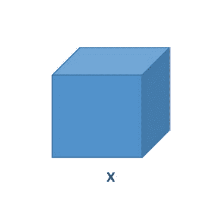

**图 2.1** x 变量

你看不到其他任何东西，因为这一行只是创建了变量并赋予了它一个值。它没有对变量做任何其他操作。我们现在有了一个标有 *name* 的盒子，内容为“ArcGIS Training”（图 2.2）。
如果我们想对它做点什么，可以使用 `print` 函数打印出变量的值。

- 在输入行中，输入 `print(name)` 并按回车。
  它打印出了变量 name 的值，我们刚刚将其设置为“ArcGIS Training”。

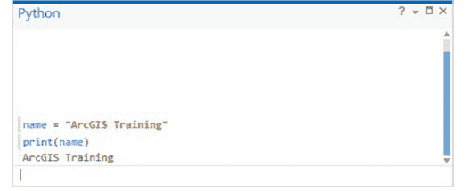

为了避免从这里开始不断重复 Python 窗口的图像，我将用三个 > 字符后跟执行的语句，然后是输出（如果有的话）来表示输出。那些使用过其他编程 shell（包括 IDLE 中的 shell）的人可能认识这种约定。

```
>>> print(name)
ArcGIS Training
```

在不过度深入计算机术语类比的情况下，你刚刚输入的行都是 Python 中的语句或句子。与英语和其他语言一样，正如引言部分所述，所有语句都必须遵循特定的语法或句法。⁴ 设置变量的语法如下，至少需要三个

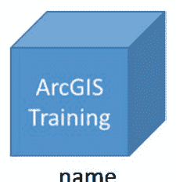

**图 2.2** *name* 变量

> ⁴ 或者“必须遵循”，这取决于你偏好的语法规则。正如我们稍后将看到的，尤其是在第 6 章，阅读英语的人类可以处理这样的灵活性和歧义。阅读 Python 的计算机则不能。

标记，第一个是变量的名称，第二个是等号，行的其余部分是一个表达式，该表达式将计算为你想要存储在该变量中的任何值。

```
[变量名] = [值]
```

在此语法中，等号是一个*运算符*。运算符在许多方面充当计算机语言中的动词。就像一个没有动词的句子什么也不做（并且通常不被允许）一样，运算符包含了计算机将要执行的操作。在这种情况下，操作是为变量设置一个值。其他常见的运算符是数学运算（如 +、- 等）。

- 使用此语法创建另外两个变量，对应以下盒子。
- 注意，对于数字，你不需要引号。实际上，计算机将“9”读取为包含字符 9 的文本字符串，而不是一个数字（图 2.3）。
完成后，你应该得到以下内容：

```
>>> address = "98 Beechurst Ave."
>>> cap = 20
```

你可能已经注意到，我们这里有两种不同类型的变量：两个文本字符串和一个数字。在一些编程语言中，你必须指定变量的*类型*，例如文本字符串、整数或实数。Python 会为你处理这个，所以你不需要指定，尽管类型确实存在，并且可能限制一行代码中可能或不可能的操作。为了说明这一点，让我们再创建一个变量：price。乍一看，对于打印宣传册，你可能希望价格是一个包含美元符号的字符串。

- 输入 `price = "$100.00"`
- 按回车。

经过一些考虑，你意识到可能需要计算折扣，比如 50% 的学生折扣。让我们尝试将 price 变量乘以 0.5。

- 输入 `student_price = price * 0.5` 并按回车。
你应该会收到一条错误消息，这无疑是你在学习编程过程中将遇到的众多错误中的第一个。

**问题 1：** 用自己的话解释错误消息的最后一行，说明错误发生的原因。（换句话说，不要简单地抄写错误消息。）

```
>>> price = "$100.00"
>>> student_price = price * 0.5
Traceback (most recent call last):
  File "<string>", line 1, in <module>
TypeError: can't multiply sequence by non-int of type 'float'
```

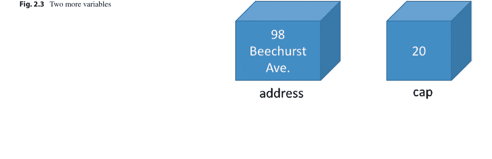

Python 在幕后处理每个变量包含哪种数据类型的簿记工作，使得更改变量类型变得非常容易。我们只需重新赋值即可。这相当于将文本字符串“$100.00”从标有 price 的盒子中取出，并将数字 100 放入其中。

- 输入 `price = 100.00` 并按回车。
- 现在我们想重新输入 `student_price = price * 0.5`。你可以按两次向上箭头键来调出这一行，因为向上和向下箭头键可以在你本次会话中输入的 Python 语句历史记录中向前和向后导航。找到它后，按回车。
- 最后，输入 `print(student_price)` 并按回车以确认其值。

```
>>> price = 100
>>> student_price = price * 0.5
>>> print(student_price)
50.0
```

Python 中有几种数据类型，实际上所有编程语言都是如此。一些最常见的类型有：文本字符串；整数，在 Python 中称为 short 和 long 类型；实数，在 Python 中是 float 和 double 类型；布尔变量，其值为 True 或 False；序列，稍后将更深入地介绍；`none` 类型，对应于一个空盒子；以及其他更复杂的自定义对象类型，例如 ArcGIS 要素类或地图图例。继续盒子类比，我们可以用不同颜色的盒子来表示它们。文本字符串是绿色的；数字是蓝色的，其中整数比实数颜色深；布尔值是橙色的；`none` 类型是红色的（图 2.4）。

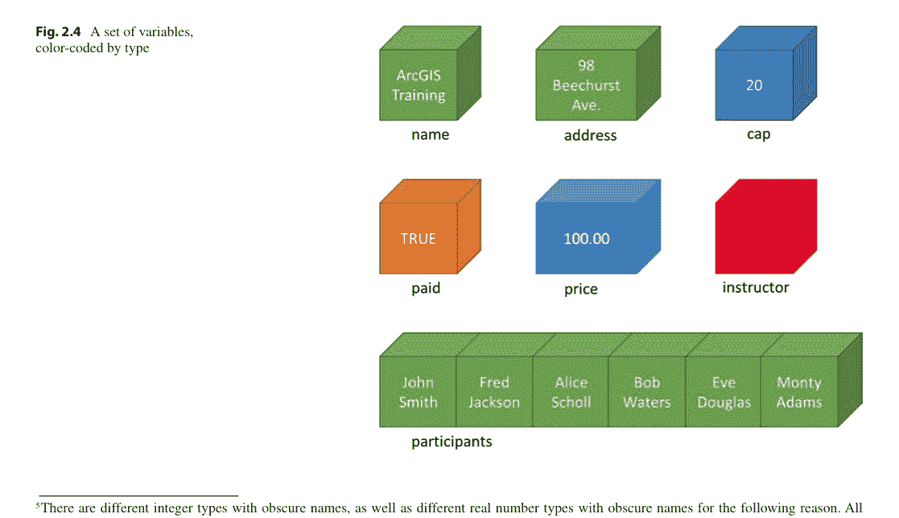

存在具有晦涩名称的不同整数类型，以及具有晦涩名称的不同实数类型，原因如下。所有数字都必须以二进制表示——即 0 和 1。计算机的设计使得每个数字都应该是固定数量的二进制数字（又称位）长。在计算机编程的早期，他们认为 32 位就足够了，因为它可以表示 2^32 个不同的值，范围大约从 -21.5 亿到 21.5 亿。工程师和程序员很快意识到这还不够。因为许多操作是基于 32 位数字开发的，他们创建了一种不同的 64 位数据类型。为了区分它们，它们被称为短整数和长整数，这给出了数据类型 `short` 和 `long`。实数更复杂。他们将 32 位分成两部分，并使用科学计数法，将 504.16 表示为 5.0416 * 10^2。较大的部分是尾数（5.0416），较小的部分是指数（2）。由于指数的存在，小数点可以被认为是“浮动”在数字中，而不是固定位置。因此，它被称为 `float` 类型。与整数一样，很明显 32 位是不够的，需要一种 64 位的实数类型。由于它的位数是 float 的两倍，所以被称为 `double` 类型。

文本字符串显示为绿色；数字显示为蓝色，其中实数为浅蓝色，整数为深蓝色。布尔值`paid`为`True`或`False`，显示为橙色。`instructor`尚未确定，因此是一个空框，代表`None`类型。最后，我们有一系列`participants`，这是一组名称或文本字符串，全部连接在一个方框序列中。

要创建`paid`和`instructor`变量，请输入以下行。请注意，`True`和`None`是区分大小写的关键字，另一个布尔值`False`也是如此。

```
paid = True
instructor = None
```

在继续之前，这里有一个关于变量名的说明。它们可以包含字母、数字和下划线，但不能以数字开头。此外，它们不能是`关键字`。关键字是在Python中保留用于特定目的的单词。你现在屏幕上有两个关键字，它们的字体颜色稍深——`True`和`None`。因为它们被保留用于变量中的特定值，所以你不能有名为`True`或`None`的变量。我们将在本书中看到关键字，完整列表可在[https://docs.python.org/3/reference/lexical_analysis.html#keywords](https://docs.python.org/3/reference/lexical_analysis.html#keywords)找到。

关于赋值变量值，还有一点需要说明。到目前为止，我们一直在使用另一种形式的标记——`字面量`，即计算机将按原样解释的值。从这个意义上说，字面量是计算机语言的另一种名词形式。例如数字（100、0.5等）和文本字符串（"ArcGIS Training"、"98 Beechurst Ave."等）。

你有时可能想做类似以下的事情，其中变量出现在等号的两侧：

```
x = y
```

计算机可以用两种不同的方式处理这个问题，一些编程语言选择第一种方法，而另一些则选择第二种。第一种方法是让两个名称`x`和`y`引用同一个框。这不是Python通常的做法。大多数情况下，Python仍然将它们视为单独的框，但会复制`y`的`内容`并将该值放入`x`中。因此，如果你这样做，然后更改`x`的值，`y`仍然会保留原始值，而不会随`x`一起更改。但是，在第12章任务3和第20章任务5中有例外情况。

## 序列

我们现在为图2.4中的所有方框创建了变量，除了参与者列表，这是一种序列。Python有几种类型的序列，我们将在这里讨论的三种是列表、元组和字典。列表和元组都是有序的，这意味着它们包含的项目有一个索引，因此可以称为列表中的第一、第二、第三等项目。唯一的区别是元组在创建后不能编辑，而列表可以更改。这种差异限制了元组与列表可用的方法，因为那些会改变内容的方法（如排序列表）对元组不可用。创建列表和元组的语法如下：

```
list_name = [item_0, item_1, item_2, ..., last_item]
tuple_name = (item_0, item_1, item_2, ..., last_item)
```

你会注意到唯一的区别是列表使用方括号，元组使用圆括号。让我们用以下代码（全部在一行）创建一个`participants`元组：

```
participants = ("John Smith", "Fred Jackson", "Alice Scholl", "Bob Waters", "Eve Douglas", "Monty Adams")
Press Enter.
```

元组是有序的，因此我们可以使用索引来访问元组中的单个项目。也许有违直觉的是，索引从0开始，而不是1。因此，John Smith是元组中的第零个项目。要访问元组中的项目，你需要输入元组的名称，后跟方括号中的索引。（此语法对列表和元组都使用方括号。如果你使用圆括号，你将得到一个至少目前来说非常令人困惑的错误消息。如果你回忆一下介绍性注释中描述的语法模式，请记住，紧接在圆括号之前的名称被解释为函数，而不是变量。如果你在这里使用圆括号，它将尝试将序列变量的名称解释为函数的名称，而这样的函数不存在，计算机会因此感到非常困惑。）

- 输入`participants[0]`并按Enter键。

```
>>> participants = ("John Smith", "Fred Jackson", "Alice Scholl", "Bob Waters", "Eve Douglas",
"Monty Adams")
>>> participants[0]
'John Smith'
```

你会看到打印出"John Smith"。即使我们没有使用print函数，它也这样做了，因为如果你在Python窗口中输入一个计算为特定值的表达式，而不是一个不计算为值的语句，Python窗口将自动打印该表达式的值。表达式和语句之间的区别在本章任务1.5中有更全面的讨论。

访问元组的子集需要更复杂的命令。我们将单个索引（上面是0）替换为一个范围。范围表示如下，引入一个新字符冒号：`start_index:finish_index_plus_one`。Alice在索引#2，Bob在索引#3。要访问Alice和Bob的子集，我们需要范围2:4，因为这是我们想要的最后一个项目加一（或者换句话说，是第一个不在子集中的项目的索引）。

- 输入`participants[2:4]`并按Enter键。
你会看到它返回了一个包含两个项目的元组：Alice和Bob。

```
>>> participants[2:4]
('Alice Scholl', 'Bob Waters')
```

如果我们想访问元组中的最后一个项目，但不知道元组有多长，我们可以使用负索引。索引-1指的是元组中的最后一个项目，-2指的是倒数第二个项目，-3是再前一个，依此类推。

- 输入`participants[-1]`并按Enter键。
你会看到这返回了Monty Adams。

```
>>> participants[-1]
'Monty Adams'
```

我们可能想知道有多少人已经注册。有序列函数可以用来查找这个以及其他信息。

- 输入`len(participants)`并按Enter键。
它返回6，这是元组中的项目数。

```
>>> len(participants)
6
```

为了继续管理GIS培训参与者列表的场景，想象你收到Eve的电子邮件，询问她的注册是否已包含。使用`in`关键字，我们可以回答这个问题。

- 输入`"Eve Douglas" in participants`并按Enter键。
它返回`True`，因为她已经注册。

```
>>> "Eve Douglas" in participants
True
```

然后你收到另一封来自Tyler Rose的电子邮件，询问他是否已注册。

- 使用相同的语法确认Tyler不在参与者元组中。
- 由于他尚未注册，我们想将他添加到元组中。向序列添加项目是通过`append`命令完成的。此命令专门应用于它正在操作的变量，因此其语法包括序列名称和要附加的项目。其语法如下。句点和圆括号都是必需的。

```
name.append(item)
```

- 输入`participants.append("Tyler Rose")`并按Enter键。
- 你会得到一条错误消息，说元组没有append属性。

```
>>> participants.append("Tyler Rose")
Traceback (most recent call last):
  File "<string>", line 1, in <module>
AttributeError: 'tuple' object has no attribute 'append'
```

### 问题2：为什么元组不支持append方法？

因此，我们需要将`participants`从元组更改为列表。

- 输入`participants = ["John Smith", "Fred Jackson", "Alice Scholl", "Bob Waters", "Eve Douglas", "Monty Adams"]`。
- 按Enter键。
- 现在重新输入`participants.append("Tyler Rose")`并按Enter键。

你会注意到没有错误消息。

- 要确认Tyler已添加，输入`participants`并按Enter键。

```
>>> participants = ["John Smith", "Fred Jackson", "Alice Scholl", "Bob Waters", "Eve Douglas", "Monty Adams"]
>>> participants.append("Tyler Rose")
>>> participants
['John Smith', 'Fred Jackson', 'Alice Scholl', 'Bob Waters', 'Eve Douglas', 'Monty Adams', 'Tyler Rose']
```

接下来，你发现Bob Waters更愿意被称为Robert。我们可以更改列表中的项目。首先，我们可能想知道Bob的名字在列表中的位置。这是通过`index`方法完成的。

- 输入`participants.index("Bob Waters")`。
- 按Enter键。

它为你打印出了索引。

```
>>> participants.index("Bob Waters")
3
```

> 我在这里特意使用“命令”一词。它既不是运算符也不是函数，而是技术上附加在名为name的变量上的方法，该变量是“list”类型的对象。对象将在第4章中更详细地讨论。

让我们尝试创建一个新变量来实现这个更改。输入以下几行：

```
>>> bob = participants[3]
>>> bob = "Robert Waters"
```

输入 `participants` 并按回车键打印列表。

```
>>> participants
['John Smith', 'Fred Jackson', 'Alice Scholl', 'Bob Waters', 'Eve Douglas', 'Monty Adams', 'Tyler Rose']
```

## 问题 3：为什么这没有改变列表？

现在要更改列表项，我们必须直接编辑列表。

- 输入 `participants[3] = "Robert Waters"` 并按回车键。
- 输入 `participants` 并按回车键打印列表并确认更改。

```
>>> participants[3] = "Robert Waters"
>>> participants
['John Smith', 'Fred Jackson', 'Alice Scholl', 'Robert Waters', 'Eve Douglas', 'Monty Adams', 'Tyler Rose']
```

在构建参与者名单时，我们可能希望按字母顺序排列。这可以通过 `sort` 方法完成。

- 输入 `participants.sort()` 并按回车键。
- 输入 `participants` 并按回车键打印列表并确认更改。

```
>>> participants.sort()
>>> participants
['Alice Scholl', 'Eve Douglas', 'Fred Jackson', 'John Smith', 'Monty Adams', 'Robert Waters', 'Tyler Rose']
```

排序总是按字符串从 A 到 Z，或数字从低到高进行。如果你想要从 Z 到 A，可以使用 `reverse` 方法。

- 输入 `participants.reverse()` 并按回车键。
- 输入 `participants` 并按回车键打印列表并确认更改。

```
>>> participants.reverse()
>>> participants
['Tyler Rose', 'Robert Waters', 'Monty Adams', 'John Smith', 'Fred Jackson', 'Eve Douglas', 'Alice Scholl']
```

我们将要查看的最后一种序列形式是字典。字典是无序的，但它们有相互关联的项目对，就像字典将单词与其定义关联起来一样。字典中第 42 个单词是什么并不重要，只要你能找到它的定义。在这个场景中，我们希望将每个参与者与其是否已付款关联起来。

构建字典可能需要几个步骤。⁷ 我们将首先设置一个空字典。元组使用圆括号，列表使用方括号，而字典使用花括号。

- 输入 `paid:dictionary = {}` 并按回车键。
- 现在我们需要输入每个人及其付款状态。向字典添加项目使用以下语法：

`dict_name[key] = value`

- 注意，再次使用方括号而不是圆括号或花括号。在这个例子中，键是参与者的名字，值是他们的付款状态。输入以下几行，每行后按回车键：

- `paid:dictionary["Alice Scholl"] = True`
- `paid:dictionary["Eve Douglas"] = False`
- `paid:dictionary["Fred Jackson"] = False`
- `paid:dictionary["John Smith"] = True`
- `paid:dictionary["Monty Adams"] = True`
- `paid:dictionary["Robert Waters"] = False`
- `paid:dictionary["Tyler Rose"] = True`
- 要查看字典，输入 `paid:dictionary` 并按回车键。

```
>>> paid:dictionary = {}
>>> paid:dictionary["Alice Scholl"] = True
>>> paid:dictionary["Eve Douglas"] = False
>>> paid:dictionary["Fred Jackson"] = False
>>> paid:dictionary["John Smith"] = True
>>> paid:dictionary["Monty Adams"] = True
>>> paid:dictionary["Robert Waters"] = False
>>> paid:dictionary["Tyler Rose"] = True
>>> paid:dictionary
{'Alice Scholl': True, 'Eve Douglas': False, 'Fred Jackson': False, 'John Smith': True, 'Monty Adams': True, 'Robert Waters': False, 'Tyler Rose': True}
```

你可以看到有键值对，每对用冒号打印在一起。虽然在这个例子中，它们是按添加顺序打印的，但这并不能保证，因为字典与列表和元组不同，没有固有的顺序。

要获取字典中的键列表（在这个例子中是参与者列表），需要一个两步过程。它从字典的 `.keys()` 方法开始，但这不会返回一个列表。它返回一个叫做“视图”的东西，可以通过 `list()` 函数转换为列表。由于我们不需要视图，我们不需要创建一个变量来保存它。相反，我们可以直接将其放入列表函数中，如下所示。这突出了解析更复杂代码行的另一个要素。函数的输入是函数名 `list` 后面的括号中的内容。就像在代数中一样，你先计算括号内的内容，然后再做其他事情。这意味着 `paid:dictionary.keys()` 表达式被计算，计算结果被放入 `list()` 函数中。

- 输入 `list(paid:dictionary.keys())` 并按回车键。

> ⁷这是创建字典的一种方法。还有其他方法可以在一行冗长的代码中创建它。我更喜欢这种方法，特别是因为它可以很好地与循环配合使用，我们将在下一章中看到。

```
>>> list(paid:dictionary.keys())
['Alice Scholl', 'Eve Douglas', 'Fred Jackson', 'John Smith', 'Monty Adams', 'Robert Waters', 'Tyler Rose']
```

要查找特定键的值，请在方括号中使用该键，就像在列表或元组中将索引放在方括号中一样。

- 输入 `paid:dictionary["Tyler Rose"]` 并按回车键，查看他是否已付款。

```
>>> paid:dictionary["Tyler Rose"]
True
```

本节介绍了三种序列类型：元组，有序且不可编辑；列表，有序且可编辑；以及字典，没有顺序，而是将键与值配对。Python 中还有其他类型的序列，尽管我们在本书中只会偶尔遇到它们。

## 字符串

正如有一系列特定于列表、元组和字典的命令一样，也有特定于文本字符串的命令。让我们从基础开始，处理培训的标题。回想一下，我们将其存储在名为 `name` 的变量中。

- 要提醒自己培训课程名称，输入 `name` 并按回车键。
- 如果我们想知道某个特定的单词、字母或任何字符集是否在字符串中，我们可以使用关键字 `in`。
- 输入 `"GIS" in name` 并按回车键。
- 正如你所料，它返回 True。

```
>>> name
'ArcGIS Training'
>>> "GIS" in name
True
```

如果我们想知道“GIS”在字符串中的位置，可以使用 `find` 方法。

- 输入 `name.find("GIS")` 并按回车键。
- 它返回 3，这是我们正在查找的子字符串（“GIS”）在字符串中开始的位置。与列表索引一样，我们从 0 开始计数，而不是从 1 开始。

```
>>> name.find("GIS")
3
```

接下来，你被告知培训的目标受众中的许多人认出公司名称（ESRI）而不是产品名称（ArcGIS）。因此，你想相应地编辑名称。
首先，我们可以尝试在名称中查找“ESRI”。

- 输入 `name.find("ESRI")` 并按回车键。
- 它返回 -1，这并不是告诉你 ESRI 从字符串的最后一个字符开始，而是告诉你它根本没有被找到。

```
>>> name.find("ESRI")
-1
```

要更改名称，我们可以使用 replace 函数，这很简单。

- 输入 `name.replace("ArcGIS", "ESRI")` 并按回车键。

```
>>> name.replace("ArcGIS", "ESRI")
'ESRI Training'
```

- 输入 `name` 并按回车键。

```
>>> name
'ArcGIS Training'
```

你会在这里看到 replace 函数创建了一个新字符串，但没有直接修改旧字符串，保持了变量 `name` 不变。我们使用的这行代码展示了脚本和编程中的一个常见做法，对于更偏向数学思维的人来说可能看起来不寻常。用于计算等号右侧表达式的变量与等号左侧接收该表达式值的变量是同一个：`name = name.replace("ArcGIS", "ESRI")`。这之所以有效，是因为虽然你会从左到右阅读这行代码，但赋值运算符会先计算右侧，然后将返回的任何值放入左侧变量的框中。即使这意味着覆盖表达式中使用的值，它也会这样做。

- 要保存更改，输入 `name = name.replace("ArcGIS", "ESRI")` 并按回车键。
- 要确认保存，输入 `name` 并按回车键。

```
>>> name = name.replace("ArcGIS", "ESRI")
>>> name
'ESRI Training'
```

最后，看到公司标志，你想知道是否需要保持小写。这通过 `lower` 方法完成，并使用相同形式的赋值语句。

- 输入 `name = name.lower()` 并按回车键。
- 输入 `name` 并按回车键查看更改。

```
>>> name = name.lower()
>>> name
'esri training'
```

这些只是字符串命令的一部分。我介绍了一些常用的命令，我们将在本书后面遇到更多命令。
在继续之前，我将介绍三个术语，当你在本书中以及在线搜索示例代码时，你可能会经常遇到：分隔符、表达式和语句。基于将计算机语言视为外语的类比，我们可以将变量视为名词，运算符视为动词，关键字视为特殊词汇。分隔符是计算机语言的标点符号。表达式就像短语，语句就像句子。接下来的段落将更详细地介绍这些内容。

## 分隔符

分隔符是指导计算机解释你编写的代码的标点符号。在这方面，它们的功能类似于英语或其他语言中的标点符号。然而，想象一下计算机是你见过的最严格的语法学家，比那个花了一整周时间讲解何时应该和不应该使用逗号的高中英语老师还要严格。这这是因为人类拥有常识，这些常识（大多数时候）能让我们理解作者想要表达的意思，即使作者没有严格遵循芝加哥格式指南。回到计算机作为高速白痴的比喻，它缺乏这种常识。如果缺少一个逗号，它真的无法理解你想告诉它什么。我们之前见过的一些分隔符示例包括：用于元组的圆括号、用于列表的方括号、用于字典的花括号、索引范围中的冒号（我们将在下一章的复杂语句中看到更多），以及分隔列表或元组中各项的逗号，还有表示对象特定方法的句点，例如你刚刚输入的`name.lower()`命令中的句点。一个常见的错误来源是缺失或不正确的分隔符，因此值得特别注意。完整列表可在 https://docs.python.org/3/reference/lexical_analysis.html#delimiters 查阅。该列表还将赋值运算符（如等号`=`）归类为“同时执行操作”的分隔符。为了减少这种双重用途带来的混淆，在本书中，我将它们介绍为运算符。同样，引号被视为特殊字符，但不被视为分隔符，因为它们是包含它们的字符串标记的一部分，而不是独立的标记。

## 表达式和语句

如上所述，表达式类似于标准写作中的短语。它们会计算出某个值，无论是数字、文本字符串、布尔值（真或假），还是更复杂的对象。一些简单的例子是：

```
x + 5
x == 5
name.lower()
```

每个表达式都计算出一个单一的值，但不会为计算机提供要执行的命令。这就是语句的目的，它类似于一个句子。正如很难给出一个简洁的句子定义一样，对语句最接近的、简洁的定义是“一个完整的执行单元”。这个定义非常标准化，事实上，它在网上被广泛传播，以至于无法找到该定义的官方来源进行引用。然而，这个定义也足够模糊，很多内容都可以归入其下。简单语句通常（但并非总是）涉及设置变量的值。你可以使用的一个合理但并非万无一失的测试是：它是否会导致你为练习打开的Python shell中打印出某些内容。shell会打印表达式计算的结果，但只会执行语句而不打印任何内容（当然，除非是print语句）。

本章向你介绍了Python的基本构建块，从构成Python语句的单个词（如变量、运算符和关键字）开始。介绍了不同具体类型的变量，包括列表、元组、字典和字符串。然后，通过介绍分隔符、表达式和语句的概念，完成了本任务。下一章将在语句的基础上，提供复杂语句，以更精细地控制计算机执行的内容。

## 任务2：查找和修复错误

每个从事任何形式编码的人都会非常快地发现一个教训：错误是多么普遍。⁸ 因此，能够调试你编写的代码可能是任何计算工作中最重要的技能——比任何特定语言（如Python）的细节更重要。本节将介绍一些要点，而第6章则更深入地探讨了编写程序和脚本时可能出现的不同类型的错误。

这里我将介绍一些极其常见的错误来源。第一个是缺少标记，通常是缺少分隔符，因为它们最容易被遗忘。在这个例子中，我们将使用与你上面输入的类似的一行代码，但删除一个分隔符。

> ⁸错误的普遍性绝非玩笑。我以某种方式编程已有25年多，始于高中的一门BASIC课程。我几乎写的任何东西仍然经常有错误。经验的不同不在于你第一次就能创建完美的程序，而在于你培养了更好的解读错误信息和处理这些错误的能力。

- 输入 `name = name.replace("esri", "ESRI")`。注意最后一个字符串缺少引号。因为Python窗口试图提供帮助，当你输入第一个引号时，Python窗口会自动输入第二个引号，所以你实际上需要删除这个引号。
- 按两次回车。

你应该会看到类似下面的错误信息，其中包含晦涩的“SyntaxError: EOL while scanning string literal”。回到介绍性概念中的想法，计算机通过尝试找到正确的模式来解析一行代码，SyntaxError表明该行不符合Python识别的任何模式。该消息的另一部分“EOL [End Of Line] while scanning string literal”告诉我们，计算机在到达字符串末尾之前就到达了行尾——因为没有第二个引号来表示字符串的结束。

```
>>> name = name.replace("esri", "ESRI)
File "<string>", line 1
    name = name.replace("esri", "ESRI)
                                  ^
SyntaxError: EOL while scanning string literal
```

类似的语法错误可能来自使用错误的分隔符。例如，你可能会混淆单引号和双引号。在下面的例子中，逗号和句点被混淆了。

- 输入 `name = name.replace("esri", "ESRI")` 并按两次回车。
不幸的是，这里的错误信息帮助不大。它只告诉你语法无效，再次告诉我们这行代码不符合任何Python模式。在这种情况下，使用句点来分隔项目是错误的用法，属于无效语法。

```
>>> name = name.replace("esri". "ESRI")
File "<string>", line 1
    name = name.replace("esri". "ESRI")
                                  ^
SyntaxError: invalid syntax
```

将句点替换为逗号让我们前进了一步，正如不同的错误信息所示。如果错误信息发生变化，这通常是（但不总是）进展。通常，用一个错误信息替换另一个意味着第一个错误已被修复，但程序中还有更多错误。因此，这是进展！然而，仅仅告诉我们存在名称错误并不是很有用。我们得到的最接近有用信息的是，我们可以看出在遇到“replace”这个词时，它发现了一个问题。结果是，它认为replace要么是一个变量，要么是一个函数，而不是附加在名为`name`的变量上的方法，并且找不到任何同名的东西。我们还需要将`name`和`replace`之间的逗号改为句点才能使其工作。

```
>>> name = name,replace("esri", "ESRI")
Traceback (most recent call last):
  File "<string>", line 1, in <module>
NameError: name 'replace' is not defined
```

一旦将句点改为逗号，这行代码就能正常工作，因为我们已经成功调试了这行代码。

```
>>> name = name.replace("esri", "ESRI")
>>> name
'ESRI training'
```

本节介绍的最后一个最常见的错误来源是变量名的拼写错误。在下面的例子中，变量`name`被错误地拼写为`nane`。

输入 `name = nane.replace("ESRI", "ArcGIS")` 并按回车。
你会看到一条关于`NameError`的消息。这次，不是`SyntaxError`（计算机无法确定使用哪种Python模式来解析该行），而是该行被解析了，但引用了一个不存在的变量。具体来说，是`nane`，错误信息的其余部分告诉我们“name 'nane' is not defined”。这意味着我们需要确保名为`nane`的变量存在，如果不存在，则将代码更改为匹配你想要的名称。在这种情况下，这意味着将`nane`替换为`name`。

```
>>> name = nane.replace("ESRI", "ArcGIS")
Traceback (most recent call last):
  File "<string>", line 1, in <module>
NameError: name 'nane' is not defined
```

以下问题提供了三行包含错误的代码：
**问题4：请识别并修复这些行中的错误。**

```
participants.append("John Andrews")
participants.reverse()
fifth = participants[4]
```

## 任务3：自主练习

在以下代码中（取自本练习中的行），完成以下任务：
1. （10分）使用 | 标记，将各行分隔成其组成的标记。
2. （15分）识别变量、运算符和分隔符。

```
bob = participants[3]
name.find("GIS")
price = "$100.00"
participants[2:4]
list(paid_dictionary.keys())
```

## 编程基础：控制结构

## 3

## 引言：让计算机做出简单决策

在上一章中，你向计算机发出指令，它便执行。接着你发出下一条指令，它又执行。然而，脚本的强大之处在很大程度上在于计算机能够执行更复杂的指令，无论是决定执行哪一组指令（例如，仅当某人尚未支付注册费时才发送付款提醒），还是为参与者列表中的每个人打印完成证书。

如果必须逐一调查每个人，从字典中检索他们的值，并自行决定是否采取下一步行动，那将非常麻烦。此外，逐一输入每个名字来打印证书也同样繁琐，尤其是当我们已经输入过一次这些信息时。这意味着，像第2章那样一次只执行一条指令，我们根本没有利用脚本的优势——计算机能够极其快速地进行比较和决策。

恰好，Python为我们提供了执行这两种场景的方法。第一种是条件语句，计算机首先调查某事是真还是假，并根据结果采取一种或另一种行动。在Python中，条件语句采用`if ... elif ... else`语句的形式。第二种是循环，它重复执行同一任务多次。在Python中，循环有两种形式：`for`循环和`while`循环。

条件语句和循环都是更复杂的语句。这就是第2章中提到的场景，一条语句可以占用多行代码。即使它更复杂，正是在这种复杂性中，我们从脚本和程序中获得了更多价值。

## 任务1：探索Python笔记本

本章的任务集从上一章结束的地方继续，即使你将工作保存为ArcGIS Pro项目（无论是.aprx项目还是.ppkx打包项目），Python窗口的内容也不会保留。这意味着我们应该在继续之前先设置相关变量。本章以及第4章和第8章都旨在使用Python笔记本，该笔记本在ArcGIS Pro 2.8版本中添加，因为它提供了更直接的记录和保存工作的方式。¹

前往ArcGIS Pro并启动一个新的Python笔记本。有几种方法可以做到这一点。我通常通过分析功能区中的Python笔记本按钮进入。笔记本顶部有一小组菜单和一些按钮。在那之下，你应该有一个空白框，旁边有`In [ ]:`。这就是我们的Python代码将要放置的地方。将以下所有行输入到框中：

¹如果你的ArcGIS Pro版本是2.7或更早版本，本章中的所有代码都将在Python窗口中运行。只需输入本任务中的第一组行，以确保第2章中创建的所有相关变量都可访问，然后跳到任务2。不过，要保存，你需要在Python窗口的上部右键单击并选择“保存记录”。这将保存你输入的代码和生成的输出，包括所有错误消息。

© 作者，经Springer Nature Switzerland AG 2022独家许可
J. Conley, *A Geographer’s Guide to Computing Fundamentals*, Springer Textbooks in Earth Sciences, Geography and Environment, https://doi.org/10.1007/978-3-031-08498-0_3

25

```python
price = 100
student_price = price * 0.5
instructor = None
participants = ["John Smith", "Fred Jackson", "Alice Scholl", "Robert Waters", "Eve Douglas",
                "Monty Adams", "Tyler Rose"]
participants.sort()
participants.reverse()
paid_dictionary = {}
paid_dictionary["Alice Scholl"] = True
paid_dictionary["Eve Douglas"] = False
paid_dictionary["Fred Jackson"] = False
paid_dictionary["John Smith"] = True
paid_dictionary["Monty Adams"] = True
paid_dictionary["Robert Waters"] = False
paid_dictionary["Tyler Rose"] = True
```

通过单击“运行”按钮来运行此代码。运行后，括号中应该出现一个1，因此这被标记为代码片段#1，即In [1]:。还有一个新的框用于接收输入的代码。

其中没有打印语句，因此让我们通过打印字典来确认创建的变量是否存在。在第二个框中，输入`print(paid_dictionary)`并单击“运行”按钮。现在这已成为代码组#2，框中显示了下面的打印输出。

```python
print(paid_dictionary)
```

```
{'Alice Scholl': True, 'Eve Douglas': False, 'Fred Jackson': False, 'John Smith': True, 'Monty Adams': True, 'Robert Waters': False, 'Tyler Rose': True}
```

拥有像这样的代码块的一个优势是我们可以更容易地编辑它们。单击第一个块，并将paid_dictionary中Robert Waters的条目更改为True。当该块仍被较大的框包围且左侧为蓝色时，单击“运行”按钮。

它应该从In [1]:变为In [3]:，反映它被重新运行。现在重新运行打印语句以确认更改。

```python
print(paid_dictionary)
```

```
{'Alice Scholl': True, 'Eve Douglas': False, 'Fred Jackson': False, 'John Smith': True, 'Monty Adams': True, 'Robert Waters': True, 'Tyler Rose': True}
```

为了说明Python笔记本的部分工作原理并重置本章剩余任务的值，让我们将Robert的状态改回False。

编辑第一组，现在标记为In [3]:，将Robert改回False，但暂时不要单击“运行”按钮。相反，重新运行打印语句。你应该看到它没有反映更改。这是因为编辑框中的代码本身并不会执行该代码。相反，我们需要编辑笔记本条目中的代码，然后运行该代码，其他条目才会承认该更改。现在运行代码以提交Robert的付费状态恢复为false，然后运行打印语句以确认其有效。

笔记本的另一个直接优势是它使得调试更容易，特别是对于本章和后续章节中我们将使用的较长代码段，因为我们可以编辑包含错误的代码块，而不必重新输入较长的条件或循环语句的所有行来修复其中一行的单个问题。为了说明这一点，假设我们想将第一个人的条目更改为“Jonathan Smith”，但误用了括号而不是方括号。在底部当前为空的代码组中，输入此内容并单击“运行”。

```python
participants(0) = "Jonathan Smith"
```

你应该得到此错误消息：

```
---------------------------------------------------------------------------
SyntaxError                             Traceback (most recent call last)
File J:\FValue\arcenvironmenttest\lib\ast.py, in parse:
    Line 35: return compile(source, filename, mode, PyCF_ONLY_AST)

SyntaxError: can't assign to function call (<string>, line 1)
---------------------------------------------------------------------------
```

要解释这一点，请记住，像第2章介绍的`list()`函数或`.lower()`方法这样的函数和方法使用括号，而访问列表中的项目使用方括号。运行函数称为“调用”该函数，这是不允许在赋值运算符左侧进行的。这就是此语法错误所抱怨的，解决方案是将括号替换为方括号。在Python窗口中，我们将不得不重新输入该行，尽管使用向上箭头键会有所帮助。同时，在这里，我们可以直接编辑它。

将括号替换为方括号并单击“运行”。错误消息消失了，因为此代码不再产生错误消息。

## 任务2：条件语句

我们将从一个简单的`if`语句开始，根据参与者是否已付款来决定是否发送付款通知。让我们从一个简单的流程图（图3.1）开始。

如你所见，这里有三个部分。首先是用于决策的问题，它必须是一个计算为布尔值的表达式。其次是如果决策为真时要执行的一组操作。第三是如果决策为假时要执行的一组操作。在构建此语句时，我们将用`print`语句替换流程图中的“发送”操作，并使用Eve Douglas。从决策部分开始。

- 输入`if paid_dictionary["Eve Douglas"]:`
  确保包含冒号。另外，请记住，字典的设置使得表达式`paid_dictionary["Eve Douglas"]`的计算结果为`True`或`False`。
- 按一次Enter键。
  输入框已扩展为两行高。这是因为计算机仍在等待语句的其余部分，并且尚未评估任何内容。
  下一行或一组行用于决策为真时发生的情况。它必须缩进一级，通常是四个或八个空格。我无法过分强调缩进的重要性！此时对我们来说方便的是，Python笔记本会自动为我们缩进行。

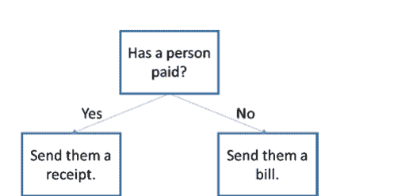

## 任务 3：循环

我们可以通过使用另一种复杂的控制语句——循环，来对所有参与者（而不仅仅是伊芙）执行此操作。如上所述，Python 中有两种循环：`for` 循环和 `while` 循环。循环会多次执行相同的代码行。`for` 循环会为列表中的每个项目重复执行代码。我们可以有一个简单的循环来打印每个参与者的名字。就像 `if` 语句有一行以关键字 `if` 开头来设置条件语句一样，`for` 循环也以一行以关键字 `for` 开头来设置。第一行的语法如下：

```
for [index] in [list]:
```

索引变量是一个变量，你可能希望它是一个新变量，而不是你已经声明过的变量。它是你访问列表中每个项目的途径。在循环的第一次执行中，它指的是 `list[0]`。第二次，它指的是 `list[1]`。循环会以这种方式继续，直到列表中没有更多项目。与 `if` 语句一样，`for` 行以冒号结尾，并且所有要重复执行的代码行必须相对于 `for` 行向右缩进一级。下面的简单循环演示了这一点。

在下一个空代码块中，输入以下代码，其中箭头再次代表缩进：

```
for person in participants:
    print(person)
```

点击运行，你将在输出结果中看到每个参与者的名字。

```
for person in participants:
    print(person)

Jonathan Smith
Robert Waters
Monty Adams
John Smith
Fred Jackson
Eve Douglas
Alice Scholl
```

还有一种循环适用于我们事先不知道需要循环多少个项目，或者没有现成列表可供循环的情况。它是一个 `while` 循环，看起来类似于 `for` 循环，不同之处在于 `for` 循环有一个遍历列表的变量，而 `while` 循环有一个真/假条件。为了说明这一点，我们将研究规划 GIS 培训的另一个方面，具体来说就是将涵盖哪些主题。为此，我们将创建另一个字典，这个字典将主题名称与完成该主题培训可能需要的时间（以小时为单位）联系起来。假设这是一个为期 3 天的培训，这意味着总共有 24 小时（3 天 * 每天 8 小时）可用。为了决定可以宣传哪些主题，我们将使用一个 `while` 循环将主题添加到主题列表中，直到我们达到总共 24 小时的教学时间。

让我们首先在一个新的空代码块中用以下几行创建字典。确保你运行代码，以便此变量在其他代码块中可访问：

- `topic_dictionary = {}`
- `topic_dictionary["01_Introduction"] = 1`
- `topic_dictionary["02_Python Basics"] = 5`
- `topic_dictionary["03_Reading Python"] = 2`
- `topic_dictionary["04_ArcPy Basics"] = 2`
- `topic_dictionary["05_Debugging"] = 3`
- `topic_dictionary["06_Introduction to Datasets"] = 1`
- `topic_dictionary["07_ArcPy Cursors"] = 3`
- `topic_dictionary["08_ArcPy Geometries"] = 2`
- `topic_dictionary["09_ArcPy Rasters"] = 2`
- `topic_dictionary["10_ArcPy Map Production"] = 4`
- `topic_dictionary["11_Exceptions"] = 1`
- `topic_dictionary["12_Functions and Classes"] = 2`
- `topic_dictionary["13_Custom Tools"] = 3`
- `topic_dictionary["14_Distribution of Tools"] = 2`
- `topic_dictionary["15_Concluding Project"] = 6`

回顾第 1 章中初始化变量的原则。我们需要在循环过程中跟踪一些信息，以确保我们正确地进行所有计算。在这种情况下，我们需要创建四个变量来存储解决此问题所需的信息。第一个是主题的总列表，这样我们就知道哪些主题可以包含在培训中。我们可以从 `topic_dictionary` 中获取此变量作为键列表。此外，为了确保 `while` 循环的内部工作正常，它应该被排序。第二个变量是将包含在培训中的主题列表。我们将初始化它为空列表，这由一个中间没有任何内容的列表括号表示。每次循环时，我们将向此列表添加内容。第三个用于协助我们跟踪的信息是培训主题列表中主题目前已占用的小时数。我们将它初始化为零，并在向列表添加主题的同时向其添加小时数。最后一个变量是一个索引变量，用于跟踪我们在主题列表中的位置，它也将被初始化为零，并在每次循环时递增一。

**问题 1：请在新的空代码块中输入创建这些变量的代码，然后点击运行。**

回顾上文，从字典中提取键列表并不总是按照它们输入的顺序返回。这就是为什么我们需要对主题列表进行排序，也是为什么它们在开头有数字，代表首先、其次、第三等涵盖的主题。拥有这些数字可以保证对列表进行排序将提供适当的顺序。

现在我们准备好进行 `while` 循环了。我们可以首先创建一个流程图来说明需要发生什么。请注意，当循环的“否”部分完成时，它会返回到起点。这意味着如果总小时数永远不会超过 24，并且总是有下一个主题，那么可能会发生无限循环（图 3.3）。

`while` 循环以 `while [condition]:` 的语法开始，只要该条件为真，后续缩进的代码行就会持续运行。这意味着任何 `while` 循环中都潜藏着一个潜在问题——无限循环。你必须确保 `while` 循环中的条件最终会变为假。如果它永远不会变为假，循环就会一直运行、运行、运行，永不停止。如果你在 ArcGIS 中尝试此操作，你可能会得到一个奇怪的错误，或者看着它运行很长时间，最终 ArcGIS 会在内存耗尽后崩溃。因此，在运行 `while` 循环之前，我鼓励你批判性地思考代码并确认它会结束。

`while` 循环如下。请输入它并点击运行：

```
while total_hours < 24:
    training_topics.append(topic_list[index])
    total_hours = total_hours + topic_dictionary.get(topic_list[index])
    index = index + 1
```

当一切完成后，你的窗口应该还没有任何输出。这是因为我们没有告诉计算机也打印出 `topic_index` 中的名称。回顾上面的 `for` 循环示例中有一段代码可以打印出列表中的名称，请修改此条目或创建一个新的代码块条目来打印出 `training_topics` 列表的内容。

• 输入 `print("send a receipt")` 并按一次 Enter。
最后，我们需要告诉计算机如果决策评估为假该怎么办。这通过 `else` 关键字来提示。为了正常工作，`else` 关键字必须与 `if` 关键字处于相同的缩进级别。

• 点击鼠标将光标移动到行首以撤销 Python 为你做的自动缩进。
• 输入 `else:`（带冒号）并按一次 Enter。

• 最后，输入 `print("send a bill")`，确保它与前面的 print 行对齐，然后按 Enter 完成这行代码。
它应该看起来像这样：

```
if paid_dictionary["Eve Douglas"]:
    print("send a receipt")
else:
    print("send a bill")
```

点击运行按钮，你会看到它打印出我们需要向伊芙发送账单。

```
if paid_dictionary["Eve Douglas"]:
    print("send a receipt")
else:
    print("send a bill")

send a bill
```

我们可能希望有一个更复杂的流程图，根据伊芙是否是学生来确定她欠多少钱。
在下一个空代码块中，设置一个 `student_dictionary` 变量为空字典，就像你开始使用 `paid_dictionary` 一样。
然后，按如下方式填充它：

- `student_dictionary = {}`
- `student_dictionary["Alice Scholl"] = True`
- `student_dictionary["Eve Douglas"] = False`
- `student_dictionary["Fred Jackson"] = True`
- `student_dictionary["John Smith"] = False`
- `student_dictionary["Monty Adams"] = False`
- `student_dictionary["Robert Waters"] = True`
- `student_dictionary["Tyler Rose"] = True`

运行此代码。
现在我们的流程图可以像这样，添加另一个决策来确定账单上应列明的金额（图 3.2）。
我们现在将修改之前的 `if/else` 语句以适应这个额外的步骤。然而，我们现在将通过使用一个不同的关键字来提示计算机我们有第二个条件：`elif`。这是 else if 的缩写，表示如果第一个决策表达式评估为假，则运行第二个决策表达式。我们仍然可以有一个 `else:` 子句，用于所有表达式都为假的情况。

• 将光标移动到 `else:` 行的开头并按 Enter。现在 `print("send a receipt")` 和 `else:` 之间应该有一个空行。它也可能决定自动缩进 `else:` 行，试图提供帮助但失败了。将该行移回左边。

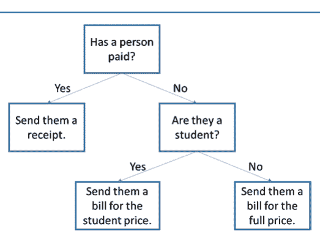

- 在该空行中，输入 `elif student_dictionary["Eve Douglas"]:` 并按一次 Enter。
- 现在输入 `print("send a bill for $", student_price)` 并按一次 Enter。这会将变量 `student_price` 的值插入到打印的文本中。
- 通过将最后一行修改为 `print("send a bill for $", price)` 来指定向非学生参会者收取多少培训费用。

它现在应该看起来像这样：

```
if paid_dictionary["Eve Douglas"]:
    print("send a receipt")
elif student_dictionary["Eve Douglas"]:
    print("send a bill for $", student_price)
else:
    print("send a bill for $", price)
```

运行代码，输出应更新为 `send a bill for $ 100`。
我们可以通过另一种方式来实现，即在第一个 `else` 子句中嵌入第二个 `if` 语句。将代码块编辑为以下行，其中 → 代表缩进。请注意，第二个 `else:` 必须与其对应的 `if` 对齐，缩进一级。完成后运行代码，你应该看到输出仍然有效。

```
if paid_dictionary["Eve Douglas"]:
    → print("send a receipt.")
else:
    → if student_dictionary["Eve Douglas"]:
        → → print("Send a bill for $", student_price)
    → else:
        → → print("Send a bill for $", price)
```

主题列表。完成此操作后，您将看到我们可以在培训课程中介绍前九个主题，其余主题则留待更高级的培训。

```python
for item in training_topics:
    print(item)
```

- 01_简介
- 02_Python 基础
- 03_阅读 Python
- 04_ArcPy 基础
- 05_调试
- 06_数据集简介
- 07_ArcPy 游标
- 08_ArcPy 几何
- 09_ArcPy 栅格
- 10_ArcPy 地图制作

Python Notebook 相对于 Python 窗口的最后一个优势是能够更轻松地保存您的工作。当您在 ArcGIS Pro 中打开 Python Notebook 时，Notebook 功能区中会出现一个“保存”按钮。点击它。然后将项目保存为 Chapter3.aprx。这样，当您重新打开保存的 ArcGIS Pro 项目时，您的代码将保留在此 Notebook 中。但是，仅仅因为它存在并不意味着它已经运行过。您必须重新运行代码块，以确保它们创建的变量在您继续工作时是可访问的。

## 任务 4：解析复杂语句

本任务探讨计算机如何读取跨多行的复杂语句。回顾第 2 章，计算机通过查找代码中的特定语法模式来解析代码，例如赋值运算符要求左侧是变量名，右侧是表达式。在这些复杂语句中，计算机使用的是类似的思想，尽管模式更复杂，并且可以跨越多行。

查看一个条件语句，我们有以下内容：

```python
if paid_dictionary["Eve Douglas"]:
    print("send a receipt.")
else:
    if student_dictionary["Eve Douglas"]:
        print("Send a bill for $", student_price)
    else:
        print("Send a bill for $", price)
```

它总是以关键字 `if` 开头。计算机需要这个关键字来识别后面是一个条件语句。`if` 关键字后面应跟一个计算结果为布尔值的表达式。² 这就是为什么我们使用字典将名称与一系列 True/False 值关联起来。因为表达式有时会持续很长，比如 `x = 1 + 2 + 3 + 4 + 5`，我们需要给计算机一个信号，表明表达式已经结束，可以进行计算了。因此，该行以冒号结尾。

then 子句的语句，即如果表达式为真时要执行的操作，紧跟在包含 `if` 关键字的行之后。在这里，因为此人已经付款，所以应该发送收据。true 子句部分可以包含任意数量的语句，因此也可以是任意数量的行。因此，就像布尔表达式末尾需要冒号一样，计算机需要某种信号来表明 then 子句的语句集已经结束。这就是缩进的作用。它是模式的一部分，或者说是类似不可见分隔符的字符，用于标识哪些内容属于 then 子句语句，哪些不属于。如上所述，如果存在 `else:` 子句，关键字 `else` 与关键字 `if` 处于相同的缩进级别。`else` 子句中的任何语句也缩进一级，超出初始关键字，以与 then 子句中的语句对齐。如果这些缩进级别不正确，计算机将无法准确判断某一行是否在条件语句内部。同样的规则也适用于 `if` 和 `else` 行之间的 `elif` 行。

当条件语句完成后，计算机可以继续执行下一行或多行代码，这些代码与 `if` 和 `else` 关键字对齐。额外缩进级别的结束告诉计算机条件语句已经结束，因此接下来的几行必须执行，无论 if 语句开头的布尔表达式的值如何。

```python
if [condition]:
    → statement(s)
elif [condition]:
    → statement(s)
else:
    → statement(s)
remainder of script
```

如果其中任何部分被破坏，将会出现错误，这些错误通常比您在第 2 章中遇到的更难追踪。在幕后，Python 会为复杂语句中的每一行编号，因此 `if paid_dictionary["Eve Douglas"]:` 是第 1 行。与列表不同，在编程的这一方面，我们从第 1 行开始正常计数，而不是第 0 行。但是，如果语法不正确，计算机可能会在代码的其余部分执行到一半时才发现它不起作用。然后，计算机会报告错误的位置，但它报告的是计算机意识到错误的那一行。例如，如果您省略了冒号，当它在找到冒号之前看到换行信号时，它会注意到代码不符合模式。然而，正因为如此，它在下一行（第 2 行）发现了错误，因为它只有在跳到下一行而没有找到正式结束第 1 行的信号时才意识到有问题。这意味着，即使计算机报告您在第 2 行有错误，修复方法很可能不在第 2 行，而是在第 1 行，或者在发现错误行之前的任何其他位置。

循环具有类似的模式，尤其是在使用制表符来划分代码块时。另一个相似之处是两者都以指示即将执行的命令集目的的关键字开头，例如 `if`、`for`，尤其是 `while`。`while` 语句与 `if` 语句一样，必须后跟一个计算结果为布尔值的表达式，但它不是只执行一次流程图的 true 分支，而是持续执行，直到该表达式计算结果为 false。同样，这意味着最终该表达式必须计算为 false。因此，以某种方式，您必须确保该表达式的值有机会从 true 变为 false。如果您不这样做，并且表达式始终保持 true，这将创建一个无限循环。退出无限循环的唯一方法是强制关闭 ArcGIS，并希望您已保存所有内容。

```python
while [condition]:
    → statement(s)
remainder of script
```

`for` 循环的模式稍微复杂一些，因为添加了关键字 `in`。它的模式是 `for` 关键字后必须跟一个变量名，然后是关键字 `in`，最后是要迭代的项目序列。目前，列表是您在此处最常用的序列。与其他复杂语句一样，循环内的语句必须缩进一级。

```python
for [variable] in [list]:
    → statement(s)
remainder of script
```

在本章中，我们了解了条件语句和循环，以及如何开发流程图来帮助您思考程序的结构。条件语句包含 if/then/elif/else 部分，即使 else 子句为空，它仍然可以在流程图中表示，以减少混淆的可能性。循环有两种类型：for 循环和 while 循环，对于这两种循环，流程图都可以帮助构建循环内部与外部的结构。

## 任务 5：调试练习

这是几个调试练习中的第一个。虽然第 6 章更深入地介绍了调试，但这些调试练习将让您练习追踪使用本章内容（在本例中是控制语句）或前面章节概念的脚本中的常见缺陷。对于这个调试练习，所有错误都是未遵循语法模式的情况。以下代码中有三个错误，其意图如下。

在对本次 GIS 培训的潜在参与者进行调查后，发现他们中的大多数人都有少量的 Python 经验，这意味着培训可以从主题 6（“数据集简介”）开始，而不是从最开始。更正后的以下代码应打印出跳过前五个主题后可以包含的主题，从“06_数据集简介”开始。

```python
total_hours = 0
index = 5
training_topics = []
topic_list = list(topic_dictionary.keys())
topic_list.sort()
while total_hours < 24:
    training_topics.append(topic_list[index])
    total_hours = total_hours + topic_dictionary.get(topic_list[index])
    index = index + 1
for each topic in training_topics:
    print(topic)
```

## 任务 6：自主练习

(1) 创建一个流程图，使用至少一个条件语句和至少一个循环，输入一组潜在的保护区，并根据以下标准识别适合金鹰保护的区域。

- 1. 该区域的面积必须至少为 10 英亩。
- 2. 该区域必须包含比任何其他土地覆盖类型更多的林地覆盖。
- 3. 该区域必须位于美国东部。

(2) 假设您拥有以下变量，将该流程图转换为使用 Python 编写的计算机代码：

- (a) zoneAreaDictionary —— 一个字典，其中区域的名称是键，面积（以英亩为单位）是值。
- (b) zoneLandCoverDictionary —— 一个字典，其中区域的名称是键，主要的土地覆盖类型是值。
- (c) zoneRegionDictionary —— 一个字典，其中区域的名称是键，其所在的区域是值。

## 编程基础：函数与对象

## 4

### 引言：管理更复杂的代码

随着我们从简单语句构建出更复杂的代码块，我们可能会需要由多条语句组成、但本身并非完整程序的代码块。运用第1章引入的脚本与编程二分法，这开始将我们从简单的逐行脚本编写，推向更具方法论思考的编程方式。如果我们坚持这样的经验法则：在Python Notebook或Python窗口中工作是脚本编写，而为工具编写独立的Python文件是编程，那么这仍然属于脚本编写的范畴，但这条界线正变得模糊。当我们构建这些更复杂的代码块时，伪代码和流程图的结构化推理过程，对于理清和管理我们希望计算机执行的操作，以及成功编写代码变得至关重要。这些不构成完整脚本的代码块就是函数，它们类似于标准写作中的段落。正如文章使用段落来组织思想并帮助向读者传达主题，一个冗长的脚本，更不用说一个完整的程序，使用函数来管理计算机执行的任务集。

与变量一样，函数也有名称。与变量不同的是，函数不是创建一个用于存放值的盒子，或许可以将其视为一个指令活页夹。两者都是命名实体，这可能会造成混淆，因此你需要记住哪些名称指的是变量，哪些指的是函数。更糟糕的是，虽然极不推荐，但确实可能出现一个名称先指代一个函数，然后又被赋值给一个变量的情况，这最终会覆盖该函数。活页夹中的所有指令就是该函数的内容，活页夹上贴有名称标签，因此每当使用该函数名称时，作为该活页夹内容的语句就会被执行。与段落的类比稍有不同之处在于，函数允许（但不要求）输入参数和输出值。这两者将在本章后面更详细地介绍。

管理代码的关键在于，这意味着函数可以被重用。虽然在文章中重用段落通常被视为冗余写作（如果不是抄袭的话），但在编程中，重用函数正是其主要目的。函数因其输入参数和输出值而尤为强大，因为我们可以重用该函数，但使用不同的输入参数，让相同的代码评估相同的过程，但使用不同的输入来生成不同的输出值。

对象为我们的代码增加了另一层复杂性和功能。它们是复杂的数据类型。虽然我们一直使用简单类型，如数字、布尔值和文本字符串，但我们可以拥有更复杂的数据类型。这些更复杂的类型就是对象。虽然对象在设置上具有广泛的灵活性，但它们主要由属性和方法的集合组成。延续变量作为值容器的类比，将简单数据类型视为一个盒子，我们可以将对象视为一个板条箱，其中包含对象内部的变量（称为属性）和对象内部的函数（称为方法）。扩展这个类比，这些就是板条箱内的盒子和活页夹，并且可以引用板条箱中的其他内容。

这如何帮助我们管理代码，可能远不如函数那样直接，因为它们确实增加了很多复杂性。其优势在于，对象并非完全自由放任，任何对象都可以拥有任何属性和方法集合。与任何编码相关的事物一样，每个对象都必须遵循一个严格的结构，称为其类。每个类都有一组该类每个对象都必须拥有的属性，并且每个对象都有一组该类每个对象都必须使用相同代码实现的方法。这样，例如，如果我们有一个森林类，该类中的每个对象都必须是一个森林，并且具有相同的属性，如森林的大小、树木的平均年龄或其优势树种。此外，该类中的每个对象都必须具有相同的方法，例如使用该森林的属性计算其生物量。计算生物量的代码对于每个森林都是相同的，因为它是类蓝图的一部分，但它将使用每个特定森林的属性值，以确保计算既准确又针对特定森林。

使用函数和对象的一个附带好处是，它们也使调试代码变得更容易。如果你必须为每个单独的森林重复相同的代码，例如那个生物量计算，但有一个拼写错误，在需要加号的地方用了减号，你就必须搜索所有代码以确保每一个该拼写错误的实例都被修复。这将是极其费力的。然而，如果你将计算生物量的任务整洁地封装在一个方法中，那么你只需要检查该方法，并将单个减号替换为加号，你就知道错误已完全修复。

### 任务1：函数

在开始本章的任务之前，如果你有Python Notebook可用，请打开上一章末尾保存的文件；如果你的ArcGIS Pro版本不包含Python Notebook，请将以下代码输入到Python窗口中：

```
price = 100
student_price = price * 0.5
instructor = None
participants = ["John Smith", "Fred Jackson", "Alice Scholl", "Robert Waters", "Eve Douglas",
"Monty Adams", "Tyler Rose"]
participants.sort()
participants.reverse()
paid_dictionary = {}
paid_dictionary["Alice Scholl"] = True
paid_dictionary["Eve Douglas"] = False
paid_dictionary["Fred Jackson"] = False
paid_dictionary["John Smith"] = True
paid_dictionary["Monty Adams"] = True
paid_dictionary["Robert Waters"] = False
paid_dictionary["Tyler Rose"] = True
student_dictionary = {}
student_dictionary["Alice Scholl"] = True
student_dictionary["Eve Douglas"] = False
student_dictionary["Fred Jackson"] = True
student_dictionary["John Smith"] = False
student_dictionary["Monty Adams"] = False
student_dictionary["Robert Waters"] = True
student_dictionary["Tyler Rose"] = True
topic_dictionary = {}
topic_dictionary["01_Introduction"] = 1
topic_dictionary["02_Python Basics"] = 5
topic_dictionary["03_Reading Python"] = 2
topic_dictionary["04_ArcPy Basics"] = 2
topic_dictionary["05_Debugging"] = 3
topic_dictionary["06_Introduction to Datasets"] = 1
topic_dictionary["07_ArcPy Cursors"] = 3
topic_dictionary["08_ArcPy Geometries"] = 2
topic_dictionary["09_ArcPy Rasters"] = 2
topic_dictionary["10_ArcPy Map Production"] = 4
topic_dictionary["11_Exceptions"] = 1
topic_dictionary["12_Functions and Classes"] = 2
topic_dictionary["13_Custom Tools"] = 3
topic_dictionary["14_Distribution of Tools"] = 2
topic_dictionary["15_Concluding Project"] = 6
```

函数是服务于共同目的的一组语句。这个共同目的或任务比单条语句能完成的要复杂，就像段落是围绕一个共同主题的一组相关句子。函数通常（但不总是）有一个或多个输入，称为参数，并且通常（同样不总是）有一个输出值。

我们可能希望有一个函数来计算培训课程产生的总收入。首先要弄清楚输入和输出是什么（如果有的话）。输出应该很直接：已收取的总金额。完整的输入集可能不那么明显。我们已有的关于人们是否已付款的字典是一个很好的起点。一旦你知道某人是否已付款，你需要知道他们付了多少钱。这需要价格变量。由于学生折扣，这还需要知道每个人是否是学生，以及学生价格是多少。这给了我们一组可能需要的四个输入。

在我们开始编写函数之前，我们应该先规划一下。你可能首先认识到，`for` 循环遍历每个名称将是一个很好的结构，以确保我们检查了名单上的每个人，所以让我们开始绘制流程图（图4.1）。

现在看起来还不多，所以接下来让我们弄清楚每个学生需要回答的问题。我们想知道他们是否已付款，如果已付款，他们是否获得学生折扣。然后我们可以将这些问题放入流程图中，建议在 `for` 循环内部使用 `if-else` 结构（图4.2）。

现在我们可以填充这三种情况下的操作（图4.3）。

现在我们已经填充了 `for` 循环，但我们需要知道在它之前和之后做什么。之后很简单：将总收入作为输出报告。在 `for` 循环之前发生的是初始化过程，用于设置循环所需的信息。在这个函数中，初始化采取处理输入变量的形式，以使 `for` 循环更容易。一个处理步骤是从其中一个字典中提取名称列表。我们还需要将总收入初始化为零（图4.4）。

流程图完成后，我们可以开始编写代码。这涉及几个新的关键字。`def` 关键字定义一个函数，其语法如下。

```
def [函数名] ([输入参数1], [输入参数2], ...):
```


**图4.1** 函数流程图的开始

**图4.2** 为我们的函数充实流程图

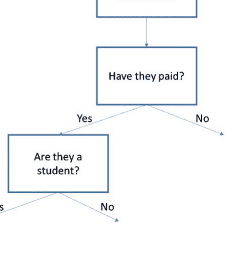

## 图 4.3 我们函数的 for 循环

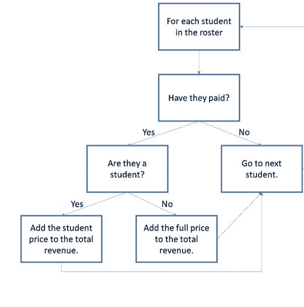

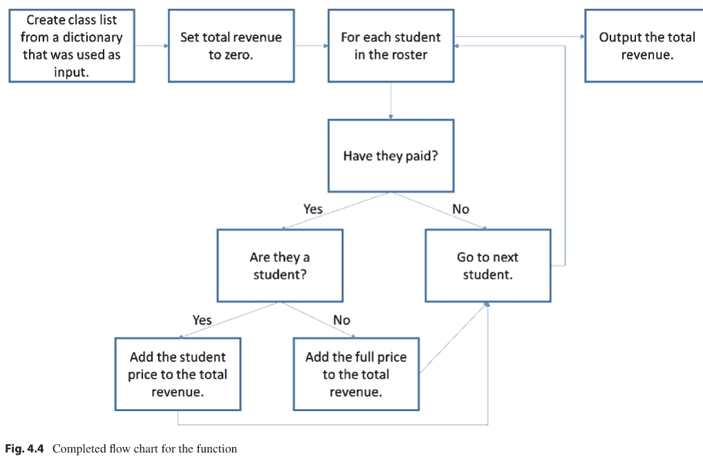

## 图 4.4 函数的完整流程图

它以关键字 `def` 开始，然后是函数名。接下来是一个参数元组。如果没有参数，你仍然需要一个空的元组，用一对中间没有任何内容的括号表示。最后，是一个冒号。遵循控制语句设定的模式，函数中包含的所有语句都必须比 `def` 行缩进一级。

现在我们可以开始使用注释来规划代码。注释是计算机忽略的代码片段。虽然包含故意被忽略的代码看起来可能很奇怪，但它有助于在英语和计算机语言之间进行翻译。如果你使用注释来解释代码的每个部分在做什么，你可以让你的代码更容易理解。这也将帮助那些你可能与之分享代码的人，甚至在你长时间后返回代码并需要注释来帮助你理解你做了什么时，对你自己也有帮助。在 Python 中，任何跟在井号（#）后面直到行尾的文本都是注释。那个井号可以在行的开头，也可以在行的中间。让我们使用流程图中的方框来构建我们的代码注释大纲。

```
def calculate_revenue (paid_dict, student_dict, full_price, student_price):
    # 创建班级列表。

    # 将总收入设置为零。

    # 对于每个学生，

    # 检查他们是否已付款。

    # 如果是，检查他们是否有资格获得学生折扣。

    # 如果他们获得折扣，将学生价格加到总收入中。
    # 如果没有，将全价加到总收入中。

    # 返回总收入作为输出。
```

关于参数元组，请注意几点。它们不需要与输入具有相同的变量名。这让你可以更灵活地使用许多不同的值来运行函数。但是，它们可以使用相同的名称，就像 `student_price` 那样。参数作为值传递给函数，而不是作为对变量框本身的引用。¹ 这意味着 Python 会制作输入的副本，并使用参数列表中的名称将其存储在一个单独的变量中。虽然这看起来可能是一个微不足道的细节，但它意味着如果你在函数内部更改参数值，这些更改不会反映在函数外部用作输入参数的变量上，即使你在函数内外使用相同的名称。更具体地说，如果你尝试在此函数内将学生价格更改为 60 美元，该更改将反映在函数内部的计算中，但不会改变原始 `student_price` 变量的值。

现在我们可以开始填充这个大纲的各个部分了。班级列表是从其中一个输入字典的键集合创建的。使用哪一个并不重要，因为它们应该是相同的！

```
def calculate_revenue (paid_dict, student_dict, full_price, student_price):
    # 创建班级列表。
    class_list = list(paid_dict.keys())
```

接下来，我们可以在函数开头添加设置总收入的那一行。

> ¹ 你们中计算能力更强的人可能会注意到这是按值调用，而不是按引用调用。还有其他一些更晦涩的参数传递技术：即按名调用和按值引用调用。在大多数情况下，只要认识到按值调用的原则就足够了。

```
# 将总收入设置为零。
total_revenue = 0
```

现在我们可以开始循环了。我们可以对新创建的 `class_list` 变量使用 `for` 循环，并使用列表中的当前项通过检查其在付款字典中的值来确定他们是否已付款。注意下一行缩进了两次，一次表示它在函数中，再次表示它也在 `for` 循环中。

```
# 对于每个学生，
for student in class_list:
    # 检查他们是否已付款。
    if paid_dict[student]:
```

同样，我们可以使用学生字典检查他们是否使用了学生折扣，并将适当的金额加到总收入中，随着我们的进行进一步缩进。

```
# 如果是，检查他们是否有资格获得学生折扣。
# 如果他们获得折扣，将学生价格加到总收入中。
# 如果没有，将全价加到总收入中。
    if student_dict[student]:
        total_revenue = total_revenue + student_price
    else:
        total_revenue = total_revenue + full_price
```

虽然流程图中有一个转到下一个学生的步骤，但我们不需要在代码中明确指定此步骤，因为它已经由 Python 处理 `for` 循环中的缩进方式决定了。

最后，我们需要创建输出，这是通过 `return` 关键字完成的。所有需要做的就是简单地返回总收入，因为该值已经在 `for` 循环中计算出来了。

```
# 返回总收入作为输出。
return total_revenue
```

将所有这些放在一起，我们就有了我们的代码。将所有内容输入到 Python Notebook 中，完成后单击运行按钮。（如果在 Python 窗口中工作，你需要按两次 Enter 键。）为了使这个练习更简洁，我删除了注释。如果你打算保存并重新访问你的 Python Notebook，或者特别是如果你打算与他人分享该 Python Notebook，保留注释可能非常有用。

```
def calculate_revenue (paid_dict, student_dict, full_price, student_price):
    class_list = list(paid_dict.keys())
    total_revenue = 0
    for student in class_list:
        if paid_dict[student]:
            if student_dict[student]:
                total_revenue = total_revenue + student_price
            else:
                total_revenue = total_revenue + full_price
    return total_revenue
```

这样做的结果应该不会令人印象深刻。事实上，不应该发生任何事情。

## 问题 1：为什么在你刚刚输入的代码块完成时没有输出？

我们必须执行该函数，这有时被称为“调用”该函数。在 Python 中，这是通过使用函数名，后跟括号中的输入参数来完成的。如果没有输入，你必须有一对空的括号。

此外，输入参数的数量需要与函数定义中的参数数量匹配，并且它们必须以与你在函数定义中定义它们相同的顺序呈现给函数调用。² Python 将简单地获取调用中括号内的第一个值，并将其放入参数元组的第一个槽中，然后将括号内的第二个值放入参数元组的第二个槽中，依此类推。它不会查看名称是否相似，这里只关注顺序。

```
输入 `calculate_revenue(paid_dictionary, student_dictionary, price, student_price)` 并单击运行。
```

**问题 2（10 分）：根据你收到的值，到目前为止已收取了多少？**

## 任务 2：对象

我们将在本章中介绍的 Python 的另一个基本概念是对象。对象是一种复杂的数据类型，通常比整数和布尔值更复杂。事实上，我们已经见过一些对象，因为列表、元组、字典甚至字符串都可以被视为对象。对象的定义特征是它们具有附加的属性和方法。属性类似于对象特定的变量，而方法类似于对象特定的函数。虽然对象在其设置上通常具有很大的灵活性，但每个对象都有一个特定的模板，称为其类，该类的每个实例变量都遵循该模板。这个类是与该对象类型关联的属性和方法的非常具体的蓝图。创建自定义类或自定义蓝图将在第 15 章中讨论。

如介绍性注释中所述，每个类都有一组属性，这些属性是与此对象类型的每个实例关联的一组值。例如，如果我们有一个 County 类型的类，它可以包含以下属性（以及其他属性）：人口、名称、州、FIPS 和几何图形。这些属性将是人口的整数、名称和州的字符串、FIPS 的另一个整数（或字符串），以及表示多边形的几何图形的不同类型的对象。这说明对象的属性可以是，而且通常是另一个对象。每个县都必须遵循这个蓝图，并包含这些属性的值。所有属性值的集合称为对象的*状态*。然后，如果它们*状态*中的所有值都匹配，我们将认为对象是相同的或彼此相等的。在这个县的例子中，包含 WVU 的县可能具有以下状态：人口为 96,189，名称为“Monongalia”，州为“WV”，FIPS 为 54061，几何图形是表示县界的多边形。尽管 WV 内的其他 54 个县在州属性上具有相同的值，但只有当所有属性都与 Monongalia 县的属性匹配时，对象才会被视为等于 Monongalia 县，而不仅仅是一个属性。

就像每个类蓝图都有一组关联的属性一样，它也有一组方法，每个方法都有特定的输入参数和输出值。例如，`.append()` 方法与列表相关联，但与元组不相关，正如我们之前所见，因为列表可以编辑而元组是不可变的。同样，`.lower()` 仅适用于字符串，不适用于字典或列表。运行这些方法的结果也完全取决于对象的状态。例如，每个列表都有一个 `.sort()` 方法。`.sort()` 方法中的 Python 代码对于每个列表都是相同的，尽管根据其内容，对列表进行排序的结果当然会因列表而异。如果它包含无法排序的数据类型（如对象），它甚至可能给出错误消息。

在处理对象时，这里使用了另一个分隔符，即句点。它是分隔包含对象的变量的名称与该对象内的属性和方法的分隔符。这个句点在语法上区分了属性和变量，以及方法和函数。

在解析属性时，它们都具有以下通用语法：

```
object_name.property_name
```

例如，如果变量 `monongalia` 包含表示该县的 County 对象，你可以输入 `monongalia.population`，它将返回该县的人口。同时，在不同的县上使用相同的属性应该可以访问该县的人口。

² 严格来说，存在可选参数的可能性，因此函数调用可以比函数定义具有更少的参数。然而，设置这种函数超出了本章的范围，因此我们可以暂时认为它们必须相同。第 20 章，任务 3 包括如何定义具有可选参数的函数。

在解析方法时，它们都遵循以下通用语法：

```
object_name.method_name(tuple of input parameters)
```

与函数一样，即使没有参数，也需要有一对空括号。这意味着像 `name.lower()` 和 `name.find("esri")` 这样的字符串表达式是附加在名为 `name` 的字符串变量上的方法。同样，`participants.append("Tyler Rose")` 和 `participants.sort()` 是附加在我们称为 `participants` 的列表变量上的方法。

虽然上面的结构使用了 `object_name`，但严格来说，绝大多数时候并不需要一个包含对象的命名变量。字符串命令可以应用于所有字符串，因此以下代码行是有效的：

```
"esri".upper()
```

```
'ESRI'
```

在大多数类中，我们不能简单地通过将对象放在引号中来创建它。那么你可能会想，对象是如何创建的呢？这是通过一个称为构造函数的特定方法完成的。它与类同名。因此，创建一个 `ArcGISProject` 类型的对象使用名为 `ArcGISProject()` 的构造函数方法。像任何其他方法一样，构造函数可以接受参数，并且总是需要括号。

## 任务 3：解析函数和对象

解析函数和对象增加了另一层复杂性，这有助于我们理解代码中发生的事情以及调试错误。在我们之前的内容中，代码是从开始到结束逐行执行的，偶尔会跳过某些行（得益于条件语句）或重复某些行（由于循环）。函数和对象使这变得更加复杂，因此，为计算机读取和执行代码的方式增加了另一层复杂性。

具体来说，通过调用函数，计算机从脚本的一部分跳转到另一部分。例如，如果一个函数在脚本的第 10 到 36 行定义，但在第 85 行被调用，代码将按如下方式执行：它读取第 83 行，然后是第 84 行，当执行第 85 行时，它会去运行第 10 到 36 行。完成之后，它从第 86 行开始恢复代码执行。因此，虽然计算机可能告诉你错误发生在第 29 行，但如果同一函数被多次调用，比如在第 50、74 和 105 行，这不足以真正确定发生了什么，因为问题可能与输入参数有关，而这些参数在第 50、74、85 和 105 行可能不同。需要这些额外的信息。为了解决这个问题，计算机跟踪整个信息栈，栈中的每一层代表计算机到达当前执行行的方式的一部分。这是必要的，因为只知道栈顶行（示例中的第 29 行）是不够的，因为到达第 29 行可能有多种方式，也许错误出在某个输入参数上，而不是函数代码本身。在这种情况下，你不仅会被告知第 29 行有错误，还会被告知该错误发生在第 85 行变量调用的第 29 行的引用中。当试图缩小问题的潜在来源并可能识别第 83 行的错误时，这是有用的信息，因为第 83 行涉及选择传递给函数参数的值。

为了说明这一点，让我们制造一个错误。回顾第 2 章，将 `price` 变量设置为字符串会导致假设它是数字的代码出现问题。让我们首先创建新变量来保存价格的字符串表示，然后将其用作函数的输入。

```
price_str = "$100.00"
student_price_str = "$50.00"
calculate_revenue(paid_dictionary, student_dictionary, price_str, student_price_str)
```

运行此代码看看会发生什么。你应该会遇到一个类型错误，和之前一样。

```
---------------------------------------------------------------------------
TypeError                                 Traceback (most recent call last)
In  [4]:
Line 3:     calculate_revenue(paid_dictionary, student_dictionary, price_str, student_price_str)

In  [2]:
Line 7:     total_revenue = total_revenue + student_price

TypeError: unsupported operand type(s) for +: 'int' and 'str'
---------------------------------------------------------------------------
```

在 Python Notebook 中，观察与每个代码块关联的数字变得很重要。以下是我下面的内容。

```
In [2]: def calculate_revenue (paid_dict, student_dict, full_price, student_price):
        class_list = list(paid_dict.keys())
        total_revenue = 0
        for student in class_list:
            if paid_dict[student]:
                if student_dict[student]:
                    total_revenue = total_revenue + student_price
                else:
                    total_revenue = total_revenue + full_price
        return total_revenue
```

```
In [3]: calculate_revenue(paid_dictionary, student_dictionary, price, student_price)
Out[3]: 300.0
```

```
In [4]: price_str = "$100.00"
        student_price_str = "$50.00"
        calculate_revenue(paid_dictionary, student_dictionary, price_str, student_price_str)

---------------------------------------------------------------------------
TypeError                                 Traceback (most recent call last)
In  [4]:
Line 3:     calculate_revenue(paid_dictionary, student_dictionary, price_str, student_price_str)

In  [2]:
Line 7:     total_revenue = total_revenue + student_price

TypeError: unsupported operand type(s) for +: 'int' and 'str'
---------------------------------------------------------------------------
```

请注意，块 [4] 是最近的条目，而 [2] 是定义函数的块。它首先在错误的“回溯”中说明错误在块 [4] 的第 3 行，其中调用了 `calculate_revenue`。为了提供有关错误性质的更多信息，或者如果错误在函数本身中，它接着说明运行块 [4] 的第 3 行需要运行块 [2] 中的代码。在块 [2] 中，错误在第 7 行被观察到。这才是真正产生错误的行，因为这是计算机尝试将数字和字符串相加的时候。这说明了计算机在执行函数和对象中的方法时如何从代码的一部分移动到另一部分，并强化了这样一个观点：仅仅在代码的某一部分发现了错误并不能保证该错误存在于该部分代码中。

本章涵盖了函数和对象作为更复杂的数据类型，允许我们编写的脚本具有更高程度的复杂性。函数将在本书后面更深入地介绍，具体是第 15 章。

本章结束了 Python 和一般脚本的基础知识。第 2 章介绍了 Python 的构建块，包括变量、运算符、表达式和语句。第 3 章将其扩展到包括更复杂的语句，即条件语句和循环这两种控制语句。最后，本章介绍了函数和对象的额外复杂性和深度。

## 任务 4：调试练习

与第 3 章的调试任务一样，以下代码有三个错误。请找出并修复它们。

目的是采用之前识别适合培训计划主题的想法，但将其推广到任何长度的培训，而不仅仅是 24 个教学小时。它定义了一个函数，其中输入参数是主题和小时的字典，以及总可用小时数。返回值是培训的主题列表。以下代码在调试后，将使用我们之前定义的字典，并将其设置为 12 个教学小时，而不是 24 个。

```
def identify_topics(topic_dictionary, max_hours):
    index = 0
    total_hours = 0
    training_topics = []
    topic_list = list(topic_dictionary.keys())
    topic_list.sort()
    while (total_hours < max_hours) and (index < len(topic_list)):
        training_topics.append(topic_list[index])
        total_hours = total_hours + topic_dictionary.get(topic_list[index])
        index = index + 1
    return training_topics

identify_topics(12, topic_dictionary)
```

## 任务 5：非指导性任务

请使用第 2 至 4 章中介绍和开发的部分或全部技能来完成以下非指导性任务。

使用你已有的部分或全部变量作为输入，编写一个函数来完成以下任务：

**问题 4：构建一个尚未付款的学生列表，并将该列表作为函数的输出返回。**

如果你正在为“空白屏幕综合症”而苦恼，不确定从哪里开始，我建议先构建一个流程图，以便更好地规划你的代码。

## 阅读 Python 脚本

## 5

## 引言性评论：文档与注释的价值

前面的练习介绍了 Python 脚本的基础知识。网上可以找到许多脚本，因此，拿一个别处找到的脚本，尝试运行并弄清楚它的功能，是很常见的做法。像 GitHub 这样的代码仓库提供了许多脚本，但它们并非仅仅是一堆包含 Python 代码的文件集合。相反，它们有相应的结构来帮助你确定代码的功能。这些结构就是文档和注释。这两者都帮助我们程序员在英语和 Python 的“计算机语言”之间进行翻译。文档是提供在计算机代码外部的信息。它通常是网页或文档，为代码用户提供详细指南，例如列出每个对象的功能、属性、方法，以及调用该函数或使用该对象的示例代码片段。另一方面，注释则在代码本身内部提供信息。它通常更细粒度，着眼于文件中的单个代码块并进行解释。区分文档和注释的另一个角度是受众不同。文档是给想使用文件的人看的，而注释是给想编辑文件的人看的。

本章介绍的另一件事是集成开发与学习环境（IDLE），这是本书中我们将要查看 Python 代码的第三种方式。ArcGIS Pro Python 窗口适用于一次处理一行 Python 代码，Python Notebook 适用于离散的代码块或代码片段，而名为 IDLE 的程序则作为一个平台，用于运行和编辑跨越整个文件（或多个文件——见第 20 章）的 Python 程序。对 IDLE 的介绍将从一个已经编写好的程序开始。

在本章中，你将基于前几章的 GIS 培训示例，研究一个执行你尚未遇到过的新操作的脚本。你将通过打开脚本、在 IDLE 中逐步执行它，并使用在线帮助文档来弄清楚你尚未遇到的命令和函数，从而解释脚本的功能。这样做很像侦探工作，寻找脚本可能在做什么的线索，将其与你已有的知识和使用过的命令进行比较，并搜索额外信息来解决识别和学习脚本中不熟悉部分功能的问题。为了符合其目的，你将从用户的角度检查文档，利用现有文档帮助你解读脚本，并且你将使用注释来注释此脚本中的代码，就像你需要与其他人分享它一样。

## 任务 1：将 Python 文件导入 IDLE

你得到了一个名为 `reading_python_script.py` 的脚本，需要由你来弄清楚它的功能。你还有两个我们一直用于管理培训的数据文件：`participants.csv` 和 `instructors.csv`。我们将使用 IDLE 来运行该文件。

**补充信息：** 在线版本包含可在 [https://doi.org/10.1007/978-3-031-08498-0_5] 获取的补充材料。

© 作者，经 Springer Nature Switzerland AG 2022 独家许可
J. Conley, *A Geographer’s Guide to Computer Fundamentals*, Springer Textbooks in Earth Sciences, Geography and Environment, https://doi.org/10.1007/978-3-031-08498-0_5

45

- 使用 Windows 资源管理器，导航到你保存脚本的位置。
- 右键单击文件名，选择 *使用 IDLE (ArcGIS Pro) 编辑*。请确保选择 ArcGIS Pro 选项，因为 ArcGIS Pro 和 ArcGIS Desktop 使用不同版本的 Python，并且此脚本仅保证在 Pro 中运行。

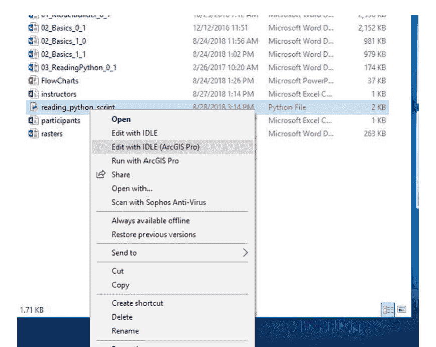

这会在一个单独的窗口中打开脚本。在整个练习中，我们将逐行查看代码。

## 任务 1：将 Python 文件导入 IDLE

47

```
reading_python_script.py - N:\transfer2\Python\PythonBook\reading_python_script.py (3.6.2)
```

```
File Edit Format Run Options Window Help
```

```
import csv
participants_path = input("Enter the file path for the participants file. ")
participants_file = open(participants_path)
participants_reader = csv.reader(participants_file)
paid_dictionary = {}
student_dictionary = {}
for row in participants_reader:
    paid_dictionary[row[0]] = row[2]
    student_dictionary[row[0]] = row[1]
price = 400.0
student_price = 200.0

def calc_revenue(include_all):
    total_revenue = 0
    names = list(paid_dictionary.keys())
    for name in names:
        if (student_dictionary[name] == "TRUE"):
            if (paid_dictionary[name] == "TRUE") or include_all:
                total_revenue += student_price
        else:
            if (paid_dictionary[name] == "TRUE") or include_all:
                total_revenue += price
    return total_revenue

max_revenue = calc_revenue(True)
min_revenue = calc_revenue(False)

room_cost = 300.0
food_cost = 10*len(paid_dictionary)
min_instructor = min_revenue - room_cost - food_cost
max_instructor = max_revenue - room_cost - food_cost

instructors_path = input("Enter the file path for the instructors file. ")
instructors_file = open(instructors_path)
instructors_reader = csv.reader(instructors_file)

min_inst_list = []
max_inst_list = []

for row in instructors_reader:
```

让我们来大致了解一下脚本的目的，因为脚本作者很不帮忙地提供了一个没有信息量的文件名！

- 在包含脚本的窗口中，转到“运行”菜单并选择“运行模块”。
- 当 Python Shell 窗口中出现提示时，输入参与者文件的完整文件路径，从驱动器盘符（例如 "C:"）到扩展名（".csv"）。对于我来说，它是下面列出的“我的文档”文件夹。无论你将其保存在哪里，请确保输入时使用正斜杠（/）。
- 按 Enter 键。

- 当下一个提示出现时，输入讲师文件的完整文件路径，同样从驱动器盘符到扩展名，然后按 Enter 键。

然后你应该会收到一条消息，说明哪些讲师肯定能负担得起，哪些可能负担得起。

```
Enter the file path for the participants file. C:/Users/jfconley/Documents/admin/Python/participants.csv
Enter the file path for the instructors file. C:/Users/jfconley/Documents/admin/Python/instructors.csv
We can definitely afford these instructors:
Catherine Smith
Fred Williams
We might be able to afford these instructors:
Allen Bletchley
>>>
```

这表明了脚本的预期用途：帮助决定使用哪位讲师进行培训。

## 任务 2：使用在线 Python 帮助文档理解脚本的一部分

从脚本开始，你遇到了我们尚未见过的 Python 代码。第一行是 `import csv`。首先，注意 `import` 这个词是橙色的。IDLE 中的脚本编辑器会用不同的颜色突出显示某些类型的标记，以帮助表示“词性”的种类，延续语言的比喻。关键字是橙色的。我们可以在线查找 `import` 关键字的作用。

访问 Python 文档 https://docs.python.org/3/。虽然这会显示 Python 3.9.7 文档（在撰写本文时），但我们希望切换到 ArcGIS Pro 使用的相同版本的 Python，即（同样在撰写本文时）Python 3.6。转到当前显示为“3.9.7”的下拉菜单并选择“3.6”，或者在 *按版本列出的文档* 列表中选择“Python 3.6 (security-fixes)”。

在右上角的 *快速搜索* 中，输入“import”并点击 *Go* 按钮。向下滚动一些，你会看到一个标题为“6. 模块”的链接。点击它以了解更多关于模块的信息。在实践中，你可能需要阅读几页文档才能找到正确的那一页。不过，在这种情况下，你可能可以排除那些在单词“important”中突出显示了“import”字母的页面。模块是扩展 Python 以服务于特定目的的扩展。就像你必须在 ArcGIS 中启用 Spatial Analyst 和 Network Analyst 等扩展一样，你也必须在 Python 中启用扩展或模块。`import` 语句就是处理这个的，这里我们导入了一个名为 csv 的模块。顾名思义，它允许 IDLE（以及一般的 Python）读写逗号分隔值（.csv）文件。有许多模块，包括一个专门用于 ArcGIS 的模块（称为 ArcPy），我们将在本书后面看到更多相关内容。

现在我们已经导入了 csv 模块，我们来看下一行来解读它。它读作：

```
participants_path = input("Enter the file path for the participants file. ")
```

首先，你可能注意到我们有两种新颜色：紫色和绿色。根据语法，我们可以弄清楚它们是什么。因为紫色是一个名称后跟括号，这符合函数的语法。因此，紫色用于函数名，尽管它仅限于标准 Python 内置的函数。（换句话说，你定义的任何函数都将是黑色的，而不是紫色的。）绿色文本以引号开始和结束，告诉我们它是一个字符串。

此外，你可能在运行脚本时认出了这个字符串。再看一下 Python Shell，你会看到它是你提供参与者文件路径时的提示。这是 `input` 函数功能的一个线索。再次在 Python 文档中搜索“input function”（不带引号），如果你向下滚动，你会看到一个“2. 内置函数”的链接。看看那个，你会在页面顶部看到一个所有内置函数的表格。

点击表格中的 `input()` 条目，它会带你到该函数的描述。它告诉你 `input` 函数会显示一个提示（即文本字符串），并读取用户输入的任何内容。然后，该输入作为字符串存储在等号左侧的变量中，在我们的例子中是 `participants_path`。

我们也可以使用变量名作为线索，`participants_path` 这个名字告诉我们它是该文件的文件路径。下一行使用了 `open()` 函数。

```
participants_file = open(participants_path)
```

点击表格中的该条目会告诉你，它打开文件并将其创建为“file”类型的对象。这与上一行的文件路径不同。文件和文件路径之间的区别很重要：文件路径就像一个地址，而文件是该地址处的建筑物。我的办公室在 98 Beechurst Ave., Morgantown WV 26506。这只是一段文本，告诉人们它在哪里。它并没有直接说明那里的建筑物是什么样子。它可能是一栋房子、一栋旧建筑或一栋新建筑。该地址处的建筑物可以改变，就像该建筑确实在 2007 年进行了翻新。这改变了建筑物，就像保存文件会改变文件一样，但地址或文件路径没有改变。这就是为什么它们是不同的变量。即便如此，文件对象也是一个相当通用的类型，就像你从地址中只知道那里有一栋建筑一样。就像文件可以是 Python 文件、Excel 文件、Word 文件、PDF 等一样，地址处的建筑物可以是房屋、办公楼群、学术楼、公寓楼等。为了能够正确使用文件，我们需要读取它。这就是下一行的工作。

你会看到下一行与前两行具有相同的一般结构，尽管函数名 `csv.reader` 不是紫色的，也不在网站列出的内置函数中。

```
participants_reader = csv.reader(participants_file)
```

线索来自顶部的行，我们导入了 `csv` 模块。网络搜索“Python csv.reader”可以确认这一点，它是一个构造可以读取 CSV（逗号分隔值）文件的对象的函数。注意，这仍然不是实际读取文件。回想一下，在编程中，我们倾向于将事物分解成越来越小的部分，一次采取一个增量步骤。因此，查找文件路径、访问文件、构造文件读取器以及逐行读取文件都是独立的代码片段。这样做的另一个原因是，前面的部分——查找文件路径和访问文件——对所有文件类型都是通用的，但读取器部分是特定于 CSV 文件的。因此，为不同的文件类型使用不同的读取器是有意义的，但没有必要以不同的方式存储或访问文件路径。回到地址的类比，你在房屋和办公楼群中所做的事情可能不同，但地址的解释方式是一致的。开车去 98 Beechurst Ave.，无论它是房屋还是学术楼都是一样的，但你会敲房屋的前门，而进入学术楼则是去找系办公室。

最后，一旦我们有了文件读取器，我们就可以执行我们想要对文件执行的任务。这相当于在你所在的建筑物执行任务，比如卖女童子军饼干。如果你在一所房子里，你只需询问房主他们想要什么，但你可能会要求系办公室的工作人员分发传单。通常，我们会使用数据结构，如列表或字典，来存储文件的内容。

## 任务 3：逐条运行代码语句以理解它

与其只是逐行阅读并在帮助文档中查找内容，我们可以一次运行一条代码语句来分解它，并查看每一步发生了什么。我们有时也可以插入打印语句或直接输入变量名来检查它们的值。

通过转到 *Run* 菜单并选择 *Python Shell* 来打开 Python Shell。这会打开一个新窗口，带有 `>>>` 提示符，可以一次输入一条 Python 代码语句。

由于我们已经查看了前四行，请将它们**逐行**复制并粘贴到 Python Shell 中。当它询问参与者文件的文件路径时，请输入它。

```
>>> import csv
>>> participants_path = input("Enter the file path for the participants file. ")
```

输入参与者文件的文件路径。C:/Users/jfconley/Documents/admin/Python/participants.csv

```
>>> participants_file = open(participants_path)
>>> participants_reader = csv.reader(participants_file)
```

你会注意到没有输出，也没有打印任何内容。这是因为我们给出的行要么导入了模块，要么设置了变量。如果我们想查看变量的值，可以在 Python Shell 中输入它的名称，输出将是该变量的值。

输入 `participants_path` 并按 Enter。你会看到你在提示符处输入的值。

```
>>> participants_path
'C:/Users/jfconley/Documents/admin/Python/participants.csv'
```

输入 `participants_reader` 并按 Enter。它告诉你 participants_reader 变量是一个对象。我们在上一个实验的末尾简要介绍了对象。这条消息告诉我们两条信息，其中一条是有用的。有用的信息是它是一个 csv.reader 类型的对象。我们稍后会看到如何利用这些信息来识别该对象具有的属性以及它可以执行的操作类型。不太有用的信息是该对象存储在计算机内存中的位置的十六进制地址：0x000001FBF524D180。

```
>>> participants_reader
<_csv.reader object at 0x000001FBF524D180>
```

输入这些后，我们可以继续。接下来的几行应该很简单，设置两个字典，一个用于判断某人是否是学生，另一个用于判断该人是否已付款。

```
paid_dictionary = {}
student_dictionary = {}
```

我们将它们设置为空字典，正如空的花括号所示。

下一个循环变得有点复杂。我们必须复制并粘贴整个 `for` 语句。（这就是为什么这个任务的开头说我们将逐条输入代码，而不是逐行输入。）复制并粘贴 `for` 语句的三行，但**不要**按 Enter。我们需要修复一些缩进。for 循环内的两行目前与关键字 for 对齐。这会让 Python 感到困惑。

```
>>> for row in participants_reader:
    paid_dictionary[row[0]] = row[2]
    student_dictionary[row[0]] = row[1]
```

将光标放在 `paid_dictionary` 中的 p 之前，按 *Backspace* 将该行一直移到最左边，然后按 *Tab* 进行适当的缩进。对 `student_dictionary` 行执行相同的操作。完成后，它应该看起来像这样。

```
>>> for row in participants_reader:
    paid_dictionary[row[0]] = row[2]
    student_dictionary[row[0]] = row[1]
```

现在你可以按 Enter。你会注意到光标只是在下一行的开头等待。这是以防你想向 `for` 循环添加额外的行。

要告诉 Python Shell 你完成了 `for` 循环，请再次按 Enter。`>>>` 提示符将重新出现。因为这个循环中没有打印任何内容，所以你得到的只是提示符。

```
>>> for row in participants_reader:
    paid_dictionary[row[0]] = row[2]
    student_dictionary[row[0]] = row[1]
>>>
```

`for` 循环结构应该看起来很熟悉。注意它正在遍历文件读取器中的项目。对于 CSV 文件，这些是电子表格中的行。这些行作为字符串列表导入。查看 CSV 文件，我们可以看到第一个项目是姓名，第二个是该人是否是学生，第三个是他们是否已经付款。这意味着我们可以构建字典，将姓名（`row[0]`）与付款属性（`row[2]`）关联起来，并将姓名（`row[0]`）与他们的付款状态（`row[1]`）关联起来。回想一下字典是如何构建的，我们可以将姓名用作键，状态用作值。将 `row[#]` 条目代入向字典添加键值对的框架——`dict_name[key] = value`——我们得到 for 循环内的两行。最后，注意它们是缩进的，告诉我们它们是为表中的每一行执行的。这确实是我们想要的，因为我们希望确保每个参与者都被纳入我们的计算中。在循环结束时，我们创建了两个字典，一个将参与者的姓名与他们是否付款联系起来，另一个将他们的姓名与他们是否是学生联系起来。

要查看字典，我们可以在 Python Shell 中输入每个名称并按 Enter。

**问题 1：查看这些字典，有多少参与者已经付款，有多少是学生？**

我们现在可以继续接下来的两行。

```
python
price = 400.0
student_price = 200.0
```

它们很简单，设置了两个变量，一个用于培训的一般价格，另一个用于培训的学生价格。这里需要注意的一点是使用小数点（`200.0` 而不是 `200`）。这告诉 Python 使用浮点数据类型而不是整数。我们可以使用内置函数 `type` 检查变量的类型。输入 `type(price)` 并按 Enter。你可以看到它是 `float` 类型。

```
python
>>> type(price)
<class 'float'>
>>>
```

虽然这对这个脚本没有任何影响，但在其他情况下可能需要实数而不是整数，这是一种确保即使变量是用整数值初始化的，你也能得到实数或 `float` 类型的方法。

## 任务 4：使用 print 函数检查脚本

脚本的下一部分是函数。对于 Python Shell，我们必须将函数作为一个块或语句输入，而不是试图逐行分解它。然而，我们可以利用 `print` 函数来探究发生了什么。你应该从上一个实验中类似的（但不完全相同的）`calculate_revenue(...)` 函数中认识到这个函数的基本思想。这说明了在试图理解不熟悉的脚本时经常遇到的情况。某些部分通常看起来很熟悉，因此任务变成了识别哪些是相同的，哪些是不同的，以及这在多大程度上影响代码的性能。为了突出这一点，我将在下面展示这两个函数。

```
python
def calculate_revenue (paid_dict, student_dict, full_price, student_price):
    class_list = list(paid_dict.keys())
    total_revenue = 0
    for student in class_list:
        if paid_dict[student]:
            if student_dict[student]:
                total_revenue = total_revenue + student_price
            else:
```

total_revenue = total_revenue + full_price
return total_revenue

def calc_revenue(include_all):
    total_revenue = 0
    names = list(paid_dictionary.keys())
    for name in names:
        if (student_dictionary[name] == "TRUE"):
            if (paid_dictionary[name] == "TRUE") or include_all:
                total_revenue += student_price
        else:
            if (paid_dictionary[name] == "TRUE") or include_all:
                total_revenue += price
    return total_revenue

虽然变量名略有不同，但这并不影响函数的性能，只要使用了正确的名称即可。第一个显著的区别是输入参数。第一个版本有四个输入参数：两个字典和两个价格。由于这些变量在本实验脚本的第一部分中已经定义，因此它们在函数内部和外部都可用。¹ 因此，它们不需要作为输入参数传递。然而，这里有一个新的输入参数 `include_all`。这个名称有助于判断其作用，但我们稍后会检查，而不是假设其功能。`total_revenue` 和 `names/class_list` 这两行的顺序被调换了，但这同样不影响函数的输出。这些变量可以按任意顺序初始化。

查看下一行，`for` 循环在两种情况下都会遍历参与者。`if` 语句仍然存在，但请注意顺序是相反的。在第一个脚本中，我们只想统计那些已经付费的人。这是第一个条件，因为如果参与者还没有付费，那么查看他们是否是学生就没有意义了。第二个脚本则不同，这要归功于 `include_all` 参数。你可以注意到，无论参与者是否是学生，我们都会检查他们是否付费。这是因为有了 `include_all` 参数，无论他们是否付费，我们都会将他们的价格加到总额中。这个检查是通过 `or` 关键字实现的，它在第二个 `if` 语句中引入。如果两个条件中有一个为 `true`，那么 `if` 语句内的代码行就会被执行。因此，如果 `include_all` 为 `true`，那么每个人的价格都会被加上；而如果 `include_all` 为 `false`，则只有那些已经付费的人会被计入。最后一个区别是使用了 `total_revenue += price` 这样的行，而不是 `total_revenue = total_revenue + full_price`。要了解 `+=` 运算符的作用，我们可以查阅 Python 文档。搜索“+=”会失败，因为搜索过程需要的是单词，而不仅仅是数学或标点符号。搜索“operators”，选择标有“2. Lexical analysis”的链接，然后滚动到底部。你会看到运算符和分隔符的列表。

你会在分隔符部分看到 `+=`，尽管正如其文本所示，它的功能更像运算符而非分隔符。然而，这并没有告诉你它的作用。从某种意义上说，它是一种简写。它需要两个数值变量，并告诉计算机将运算符右侧的值（本例中为 `price`）加上左侧的值（此处为 `total_revenue`），然后将该和存储在左侧的变量中（同样是 `total_revenue`）。因此，`total_revenue += price` 等同于 `total_revenue = total_revenue + price`。这种语句非常常见，因此为所有数学运算（+、-、*、/ 等）都创建了简写版本。

为了观察函数在执行 `for` 循环时的行为，我们可能想在更新 `total_revenue` 变量的两行旁边添加 `print` 语句。因此，在包含脚本的窗口中，在 `total_revenue += student_price` 行之后添加

```
print (name, " is a student, and the total is now ", total_revenue)
```

并在 `total_revenue += price` 之后添加

```
print (name, " isn't a student, and the total is now ", total_revenue)
```

> ¹ 计算机科学中对此的术语是作用域。在脚本开头创建的变量在整个脚本中都可用，具有所谓的全局作用域。在函数内部创建的变量（例如 `total_revenue`）是局部的，无法在函数外部访问。换句话说，一旦函数完成工作，它们就会被删除。

确保 `print` 语句缩进在 `if` 语句内部。
复制整个 `calc_revenue` 函数并将其粘贴到 Shell 中，**不要**按回车键。现在你必须删除并重新插入**所有**的制表符和缩进。现在就做，仔细确保每一行都缩进了正确数量的制表符，无论是 1、2、3 还是 4 个。它应该看起来类似于这样。如果你的 `print` 语句延续到第二行，不要惊慌；因为它们在脚本中是一行，Shell 足够智能，可以将它们解释为一行，即使 Shell 不得不将它们显示为两行。

```
>>> def calc_revenue(include_all):
    total_revenue = 0
    names = list(paid_dictionary.keys())
    for name in names:
        if (student_dictionary[name] == "TRUE"):
            if (paid_dictionary[name] == "TRUE") or include_all:
                total_revenue += student_price
                print (name, " is a student, and the total is now ", total_revenue)
        else:
            if (paid_dictionary[name] == "TRUE") or include_all:
                total_revenue += price
                print (name, " isn't a student, and the total is now ", total_revenue)
    return total_revenue
```

按两次回车键。你应该看到 `>>>` 提示符，没有其他内容。

```
>>> def calc_revenue(include_all):
    total_revenue = 0
    names = list(paid_dictionary.keys())
    for name in names:
        if (student_dictionary[name] == "TRUE"):
            if (paid_dictionary[name] == "TRUE") or include_all:
                total_revenue += student_price
                print (name, " is a student, and the total is now ", total_revenue)
        else:
            if (paid_dictionary[name] == "TRUE") or include_all:
                total_revenue += price
                print (name, " isn't a student, and the total is now ", total_revenue)
    return total_revenue

>>>
```

## 问题 2：为什么这没有打印任何内容，即使有 print 语句？

接下来的两行代码应该能为上面的问题 2 提供一个很大的提示。如果我们计算包含所有参与者（即设置 `include_all` 为 `true`）时产生的收入，这告诉我们一旦所有人都付费，我们将产生多少收入，从而知道最大可能的收入是多少。如果我们不包含所有人，`if...or` 语句中的另一个子句决定了参与者的费用是否被加到总额中。由于另一个子句是他们是否已经付费，它代表了已经收取的金额，因此是最小可能的收入。

在 Shell 中输入 `max_revenue = calc_revenue(True)` 行并按回车键。你现在会看到每个参与者加入组后更新的总额。

```
>>> max_revenue = calc_revenue(True)
John Smith  is a student, and the total is now  200.0
Fred Jackson  isn't a student, and the total is now  600.0
Alice Scholl  isn't a student, and the total is now  1000.0
Bob Waters  isn't a student, and the total is now  1400.0
Eve Douglas  is a student, and the total is now  1600.0
Monty Adams  is a student, and the total is now  1800.0
Tyler Rose  is a student, and the total is now  2000.0
Donald Curtis  isn't a student, and the total is now  2400.0
Katherine Clinton  isn't a student, and the total is now  2800.0
Marie Lovelace  is a student, and the total is now  3000.0
David Chang  is a student, and the total is now  3200.0
Franklin Clarke  is a student, and the total is now  3400.0
Stanley Robinson  isn't a student, and the total is now  3800.0
Jane Way  isn't a student, and the total is now  4200.0
Jeff Thomason  isn't a student, and the total is now  4600.0
Janice Waldorf  is a student, and the total is now  4800.0
Kirk Wright  is a student, and the total is now  5000.0
Craig Landingham  isn't a student, and the total is now  5400.0
Claire Frankwood  is a student, and the total is now  5600.0
```

在 Shell 中输入 `min_revenue = calc_revenue(False)` 行并按回车键。你现在会看到每个参与者加入组后更新的总额，但你会注意到这次并非所有人都被包含在内。

```
>>> min_revenue = calc_revenue(False)
John Smith  is a student, and the total is now  200.0
Fred Jackson  isn't a student, and the total is now  600.0
Bob Waters  isn't a student, and the total is now  1000.0
Eve Douglas  is a student, and the total is now  1200.0
Tyler Rose  is a student, and the total is now  1400.0
Donald Curtis  isn't a student, and the total is now  1800.0
David Chang  is a student, and the total is now  2000.0
Stanley Robinson  isn't a student, and the total is now  2400.0
Jane Way  isn't a student, and the total is now  2800.0
Jeff Thomason  isn't a student, and the total is now  3200.0
Kirk Wright  is a student, and the total is now  3400.0
Craig Landingham  isn't a student, and the total is now  3800.0
```

然后我们可以通过分别输入 `max_revenue` 和 `min_revenue` 变量并按回车键来确认这两个值。它们应该与 `calc_revenue` 函数的 `for` 循环中打印出的逐步运行总额的最终结果相匹配。

```
>>> max_revenue
5600.0
>>> min_revenue
3800.0
```

下一行是直接设置一个变量：`room_cost`。再下一行是另一个不熟悉的函数：`len()`。因为它没有模块前缀（不像 `csv.reader()` 属于 `csv` 模块），我们可以得出结论它是一个内置函数。确实，回到我们开始任务时查看的内置函数列表

## 任务 5：使用 `next()` 函数检查文件内容

2，我们可以看到 `len()` 函数。点击该链接查看此函数，可以看到它报告序列或集合（如列表、元组或字典）的长度或项目数量。在此例中，它是参与者列表的长度，即表示有兴趣的参与者人数。由于变量名为 `food_cost`，我们可以据此推断，它计算的是食物成本，即参与者人数的十倍，或每人 10 美元。输入这些行并按回车键。

**问题 3：有多少参与者表示了兴趣？**

接下来的两行彼此相似。我们创建名为 `min_instructor` 和 `max_instructor` 的变量，它们取相关的收入金额并减去场地和食物的成本。这将告诉我们收入中还剩多少可以用来支付讲师的费用。逐行输入这些行，按回车键，并在下方提供数值。

**问题 4：使用这两个变量，我们可以支付讲师的可能金额范围是多少？**

接下来的三行现在应该看起来很熟悉了。它们显然类似于用于访问参与者文件的三行，这意味着这三行是用于访问潜在讲师文件的行。将它们输入 Python Shell，每行后按回车键。

```
>>> instructors_path = input("Enter the file path for the instructors file. ")

Enter the file path for the instructors file. C:/Users/jfconley/Documents/admin/Python/instructors.csv
>>> instructors_file = open(instructors_path)
>>> instructors_reader = csv.reader(instructors_file)
>>>
```

接下来的两行也可以轻松解释。访问参与者文件后的几行设置了几个空字典，我们用 for 循环来填充它们，而这两行设置了几个空列表，它们将在后续的 for 循环中被填充。在 Python Shell 中输入这两行，每行后按回车键。

```
>>> min_inst_list = []
>>> max_inst_list = []
>>>
```

这说明了脚本的另一个方面。虽然 Python 核心及其众多模块之间有数千个可能的命令，但基于我们经常使用计算机完成的任务，某些任务和模式会频繁出现。其中一项任务是读取文件。一种常见的策略，至少对于具有电子表格形式的文件，是设置文件访问，创建数据结构（例如列表或字典）以将文件中的数据保存在更可用的结构中，并使用 for 循环遍历文件，将信息从文件传输到数据结构。在学习本课程的过程中，你可能会开始识别这种不时出现的模式。识别这些模式可以帮助你将 Python 技能转移到其他语言，因为在其他语言（如 Java，如下所示）中完成此任务的代码。你可以看到相同的系统：首先获取文件路径，然后创建文件对象，最后创建读取器来访问对象。唯一的主要区别是一个名为 `getAllValues()` 的函数执行 for 循环，以及在创建变量时需要指定其类型。

```
File nameFile = new File(filePath);
FileReader nameReader = new FileReader(nameFile);
CSVParser nameCsvp = new CSVParser(nameReader);
String[][] names = nameCsvp.getAllValues();
```

回到我们的 Python 脚本，我们接下来会看到另一个 `for` 循环，正如上面描述的模式所暗示的那样。循环中还有一个新函数：`float`。虽然我们可以使用 `print` 语句，类似于我们在上一个任务中所做的，但这个任务引入了另一种检查 `for` 循环结构的方法，至少在使用 csv reader 时是如此。

现在不要输入 for 循环，而是输入 `row = next(instructors_reader)`。按回车键。与创建变量时通常一样，没有输出。要查看变量 `row` 的内容，输入 `row` 并按回车键。你会看到这给出了一个包含两个条目的列表：一个包含第一个讲师姓名的字符串，以及一个包含该讲师价格的字符串。

```
>>> row = next(instructors_reader)
>>> row
['Caine MacEwan', '5600']
>>>
```

实际上，`for` 循环会不断调用这个 `next()` 函数，直到文件中没有更多行。一旦我们有了行，正如我上面提到的，它是一个字符串列表，我们就可以一次一行地执行循环内部的代码。下一行创建一个名为 `inst_price` 的变量。如果你向前看，你会看到我们将把这个 `inst_price` 变量与问题 4 中的最小和最大允许金额进行比较。我们可以再次使用 `type()` 函数来确认收入变量是浮点数，而 `row` 变量中的条目是字符串。在 if 语句中，我们不能询问 Python `row` 中的字符串是否大于或小于收入变量中的浮点数。这就像询问 42 是否小于 "Fred" 一样无用；这个问题根本没有意义，即使我们问 42 是否小于 "53" 也不会改变这一点。即使字符串 "53" 包含一个数字，它仍然是一个字符串。

```
>>> type(max_revenue)
<class 'float'>
>>> type(min_revenue)
<class 'float'>
>>> type(row[1])
<class 'str'>
>>>
```

为确保比较有效，我们可以通过这个 `float()` 函数将字符串转换为数字。输入创建 `inst_price` 的行并按回车键。然后使用 `type()` 函数确认 `inst_price` 的数据类型。

```
>>> inst_price = float(row[1])
>>> type(inst_price)
<class 'float'>
>>>
```

下一行只是提取讲师的姓名并将其存储在变量中。输入该行并按回车键。

```
>>> inst_name = row[0]
>>>
```

现在我们可以将 `if/elif` 语句作为一个块输入 Python Shell。与往常一样，确保缩进正确，`elif` 行完全在左侧，位于 `>>>` 提示符下方，而不是关键字 `if` 下方。完成条件语句后按回车键。

```
>>> if inst_price < min_instructor:
        min_inst_list.append(inst_name)
    elif inst_price < max_instructor:
        max_inst_list.append(inst_name)
>>>
```

你会再次注意到没有输出。根据 `max_instructor`、`min_instructor` 和 `inst_price` 的值，我们可能已将讲师姓名附加到两个列表之一，也可能没有。输入 `min_inst_list` 查看讲师姓名是否已添加到其中，然后按回车键。它看起来仍然是一个空列表，意味着他们的价格不低于已收集的最低收入，因此我们可能负担不起这位讲师。

```
>>> min_inst_list
[]
>>>
```

对 `max_inst_list` 重复此操作。

**问题 5：仍然看 Caine MacEwan，如果每个人都付款，我们能负担得起这位讲师吗？**

在将整个 for 循环输入 Python Shell 之前，我们将添加一个 print 语句来说明调查脚本的另一种技术。在遍历参与者的 `for` 循环中，我们添加了 `print` 语句来告知我们累计总额。如果我们不想打印那么多信息，而只想跟踪我们在循环中的位置，我们可以将 `print` 语句放在 `if/elif` 语句之前。在创建 `inst_name` 变量的行和 `if` 语句之间插入 `print ("Checking on instructor ", inst_name)`。现在将整个 `for` 循环（包含此 `print` 语句）输入 Python Shell。检查（并可能更正）每行的缩进，然后按回车键。

```
>>> for row in instructors_reader:
        inst_price = float(row[1])
        inst_name = row[0]
        print("Checking on instructor ", inst_name)
        if inst_price < min_instructor:
                min_inst_list.append(inst_name)
        elif inst_price < max_instructor:
                max_inst_list.append(inst_name)
```

```
Checking on instructor  Catherine Smith
Checking on instructor  Sandra Bader
Checking on instructor  Allen Bletchley
Checking on instructor  Luke Stewart
Checking on instructor  Donna Jones
Checking on instructor  Hussein Yousafzai
Checking on instructor  Fred Williams
>>>
```

你可能注意到我们检查的第一行讲师 Caine MacEwan 没有在这里打印出来。这是因为我们使用了 `next()` 函数。如上所述，`for` 循环意味着文件读取器本质上会调用 `next()`，直到列表中没有剩余项目。它跟踪哪一行是它要访问的下一行。当我们直接开始 `for` 循环时，该项目是第一个，即项目 0。然而，我们使用 `next()` 将该索引移动到了项目 1，因此 `for` 循环从 Catherine Smith 开始。为了说明这一点，我们可以在完成 for 循环后尝试访问表中的下一行。输入 `next(instructors_reader)` 并按回车键。你应该会收到一条关于停止迭代的错误消息。此消息告诉我们读取器已到达文件末尾，文件中没有其他内容可读。

```
>>> next(instructors_reader)
Traceback (most recent call last):
  File "<pyshell#54>", line 1, in <module>
    next(instructors_reader)
StopIteration
>>>
```

此外，如果你重新进入 `for` 循环，即使打印语句在里面，也不会有任何输出，因为读取器（reader）仍然位于文件的末尾。

```python
>>> for row in instructors_reader:
        inst_price = float(row[1])
        inst_name = row[0]
        print("Checking on instructor ", inst_name)
        if inst_price < min_instructor:
                min_inst_list.append(inst_name)
        elif inst_price < max_instructor:
                max_inst_list.append(inst_name)

>>>
```

要重置读取器，我们可以重新输入几行代码来重新创建 `instructors_file` 和 `instructors_reader` 变量。完成此操作后，重新运行 `for` 循环将为我们提供预期的输出，这次包括了 Caine MacEwan。

```python
>>> instructors_file = open(instructors_path)
>>> instructors_reader = csv.reader(instructors_file)
>>> for row in instructors_reader:
        inst_price = float(row[1])
        inst_name = row[0]
        print("Checking on instructor ", inst_name)
        if inst_price < min_instructor:
                min_inst_list.append(inst_name)
        elif inst_price < max_instructor:
                max_inst_list.append(inst_name)

Checking on instructor  Caine MacEwan
Checking on instructor  Catherine Smith
Checking on instructor  Sandra Bader
Checking on instructor  Allen Bletchley
Checking on instructor  Luke Stewart
Checking on instructor  Donna Jones
Checking on instructor  Hussein Yousafzai
Checking on instructor  Fred Williams
>>>
```

接下来，在我们的 Python 文件中，有一个 `print` 语句，它以以下 `for` 循环的形式设置输出。该循环遍历 `min_inst_list` 变量中的讲师，告诉我们哪些讲师是我们肯定能负担得起的。将这些行输入到 Python Shell 中以查看 `min_inst_list` 的内容。
对脚本的最后三行重复此操作，以检查 `max_inst_list`。

**问题 6：** 我们肯定能负担得起哪些讲师？我们可能负担得起哪些讲师？
**问题 7：** 那些价格低于 `min_instructor` 值的讲师，其价格也低于 `max_instructor`。然而，尽管他们满足将名字添加到该列表的标准，但他们并不在 `max_inst_list` 变量中。为什么他们不在这个列表中？
**问题 8：** 如果你严格按照上述说明操作，你应该会在两个列表中看到每个名字重复出现多次。为什么会发生这种情况？

## 任务 6：为代码添加注释

在解读了代码之后，我们可能希望为其添加注释，以便其他可能查看它的人更容易理解。毕竟，注释的目的是帮助在英语和计算机语言之间进行翻译。对于注释的多少没有严格的标准，但每个不同的想法都应该被记录下来，这样查看 Python 文件的人就能理解它在做什么。下面是我为我们文件添加注释后的示例。请记住，注释以 `#` 字符开头。

```python
import csv

# 创建变量以访问参与者文件。
participants_path = input("Enter the file path for the participants file. ")
participants_file = open(participants_path)
participants_reader = csv.reader(participants_file)

# 创建空字典以存储数据。
paid_dictionary = {}
student_dictionary = {}

# 遍历读取器，将数据放入字典中。
for row in participants_reader:
    paid_dictionary[row[0]] = row[2]
    student_dictionary[row[0]] = row[1]

# 设置价格变量。
price = 400.0
student_price = 200.0

# 定义一个函数来计算收入。它有一个布尔输入参数。
def calc_revenue(include_all):

    # 初始化累计总额和姓名列表的变量
    total_revenue = 0
    names = list(paid_dictionary.keys())

    # 对于每个姓名...
    for name in names:

        # 如果他们是学生，并且他们已付款或者我们正在包含所有人，
        # 则将学生价格添加到累计总额中。
        if (student_dictionary[name] == "TRUE"):
            if (paid_dictionary[name] == "TRUE") or include_all:
                total_revenue += student_price

        # 他们不是学生，所以如果他们已付款或者我们正在包含所有人，
        # 则将常规价格添加到累计总额中。
        else:
            if (paid_dictionary[name] == "TRUE") or include_all:
                total_revenue += price

    # 在 for 循环完成后返回累计总额。
    return total_revenue
```

```python
# 运行函数两次，一次计算所有人（True），一次只计算已付款的人。
max_revenue = calc_revenue(True)
min_revenue = calc_revenue(False)

# 定义一些与成本相关的变量。食物成本按每人 $10 计算。
room_cost = 300.0
food_cost = 10*len(paid_dictionary)

# 可用于支付讲师的金额是收入减去房间和食物的成本。
min_instructor = min_revenue - room_cost - food_cost
max_instructor = max_revenue - room_cost - food_cost

# 创建变量以访问讲师文件。
instructors_path = input("Enter the file path for the instructors file. ")
instructors_file = open(instructors_path)
instructors_reader = csv.reader(instructors_file)

# 创建空列表以存储数据。
min_inst_list = []
max_inst_list = []

# 遍历读取器以将数据放入列表中。
for row in instructors_reader:

    # 从行中提取值并将其存储在变量中。
    inst_price = float(row[1])
    inst_name = row[0]
    print("Checking on instructor ", inst_name)

    # 如果讲师的价格低于我们已经筹集到的金额，
    # 则将其添加到 min_inst_list 中。
    if inst_price < min_instructor:
        min_inst_list.append(inst_name)

    # 否则，如果讲师的价格低于我们最终可能筹集到的金额，
    # 则将其添加到 max_inst_list 中。
    elif inst_price < max_instructor:
        max_inst_list.append(inst_name)

# 打印 min_inst_list 的内容。
print ("We can definitely afford these instructors:")
for inst in min_inst_list:
    print (inst)

# 打印 max_inst_list 的内容。
print ("We might be able to afford these instructors:")
for inst in max_inst_list:
    print (inst)
```

## 任务 7：非指导性工作

还有另一个脚本可供你使用，其标题隐晦地命名为 `reading_python_script_2.py`。使用本实验中介绍的任何或所有策略，在我已开始并标记的地方填写注释。

你会看到一些熟悉的代码行以及一些新的函数和过程。使用这些策略来识别新函数是什么。

**问题 9：** 使用这些策略在提供的脚本上填写注释。

**评分标准**
注释应简洁、准确，且不含脏话。²

²你可能会惊讶地发现，仅凭词汇量很难区分水手和沮丧的计算机程序员。

## 调试

### 引言注释：错误的类型

正如你到目前为止无疑已经遇到的那样，编写脚本的过程不可避免地会产生许多错误。因此，在继续之前，了解不同类型的错误以及如何捕获并纠正它们是非常有用的。调试的大部分技巧在于两个方面：正确解释错误消息和检查输出以确保它执行了你想要的操作。

我们可以将错误分为三大类：语法错误、运行时错误和逻辑错误。前两种错误会在你使用 Python 窗口时，给你现在可能相当害怕的红色文本。然而，逻辑错误更为隐蔽。它们是指代码提供了一个答案——只是不是正确的答案！

在 Python 窗口和 Notebook 中工作时，语法错误和运行时错误之间的区别有点模糊，尽管在 IDLE 中更清晰。语法错误是指代码的语法或句法存在问题。这可能是一个拼写错误的单词或变量名、一个缺失的分隔符，或者不正确的缩进。无论具体例子如何，这都是计算机无法读取脚本以尝试理解你想要它做什么的情况。

对于运行时错误，脚本可以被读取，但无法执行。当你为某个操作使用了错误的数据类型时，就会发生这种情况。例如，如果你有一个字符串变量 `x` 和一个整数变量 `y`，语句 `z = x - y` 可以被读取。语法或句法是完美的。然而，当计算机尝试执行该指令时，它意识到无法从字符串中减去整数，并给出错误。另一个例子是当你尝试访问列表中不存在的项目时。如果 `index` 变量的值为 15，语句 `item = my_list[index]` 可以被读取，但如果 `my_list` 只有 12 个项目，它将给出错误消息。

实际上，在 Python 窗口和 Notebook 中，一旦计算机意识到有问题，语法错误和运行时错误都会立即给出红色文本错误消息。区别在于，虽然语法错误几乎总是在生成错误的那一行被发现，但运行时错误可能稍后发生，只有在错误变得明显时才会出现。考虑以下几行代码：

```python
x = "5"
y = 4
z = x - y
```

你直到第三行才会看到错误消息，但你可能想要的修正是将第一行更改为 `x = 5`。这说明了这样一个观点：虽然 Python 会在错误消息中给你一个行号，但这并不能保证错误发生在该行。这使得运行时错误比语法错误更难追踪和修复。

然而，最具挑战性的是逻辑错误。对于这些错误，脚本从头到尾运行，不会产生任何错误消息。问题在于，输出不是它应该有的样子。一个例子是下面尝试计算两点之间距离的代码：

**补充信息：** 在线版本包含可在 [https://doi.org/10.1007/978-3-031-08498-0_6] 获取的补充材料。

© 作者，根据 Springer Nature Switzerland AG 2022 的独家许可
J. Conley, *A Geographer’s Guide to Computer Fundamentals*, Springer Textbooks in Earth Sciences, Geography and Environment, https://doi.org/10.1007/978-3-031-08498-0_6

63

distance = math.sqrt(((x1 - x2) * (x1 - x2)) - ((y1 - y2) * (y1 - y2)))

只要传递给 `math.sqrt(...)` 函数的参数表达式为正，此代码就会返回一个值。但由于中间的运算符是减号而非加号，因此返回的值并非两点间的真实距离。要发现这个问题，需要检查结果以确保其正确且合理。例如，如果这个错误的公式告诉你加利福尼亚州的一个城镇与西弗吉尼亚州的一个城镇相距57英里，你显然会意识到存在逻辑错误，因为这是不可能的。即使代码本身完美无缺，逻辑错误也可能出现；用户仍可能提供错误的输入参数。在阅读Python练习中，你可能曾输入过一个带有拼写错误的文件路径。这会导致错误，即使代码本身运行正常。它只是无法找到你提供的（错误的）文件路径。

## 任务 1：在 Python Notebook 中调试

我提供了一个名为 `debug_demo.py` 的脚本，其中包含十个错误。我们将通过以下任务来解决这些错误。在 IDLE（ArcGIS Pro）中打开此文件，并同时打开 ArcGIS Pro。本任务中我们将使用 Python Notebook 进行调试，但会从 IDLE 中复制粘贴代码。

在 IDLE 中打开它，并将第二行的文件路径更改为之前章节中保存的相关 `.csv` 文件的位置。即使你认出了其他错误，也暂时不要更改任何内容！更新此行后，转到“文件”菜单 → “保存”。

要运行 Python 文件，请从 IDLE 中复制代码并粘贴到 Notebook 单元格中。点击“运行”。你应该会看到一些红色文本和错误消息。

```
---------------------------------------------------------------------------
SyntaxError                             Traceback (most recent call last)
File J:\PValue\arcenvironmenttest\Lib\ast.py, in parse:
Line 35:     return compile(source, filename, mode, PyCF_ONLY_AST)

SyntaxError: EOL while scanning string literal (<string>, line 2)
---------------------------------------------------------------------------
```

首先，它告诉你错误在哪一行：第2行。与列表和元组的计数方式不同，这里的行号从1开始计数，因此第二行就是第2行。它还用一个插入符号（^）指出了它识别到问题的确切位置。这个位置似乎在行尾，并给出了一个语法错误“EOL while scanning string literal”。EOL 意为“行尾”，这意味着它在到达行尾之前期望找到某些东西，但没有找到所有它正在寻找的内容。它告诉我们 EOL 是在扫描字符串时发现的，这表明字符串有问题。仔细观察，我们可能会发现问题：没有闭合引号。在 Notebook 单元格中修复此问题并运行该单元格。你应该会看到一个不同的语法错误。

```
---------------------------------------------------------------------------
SyntaxError                             Traceback (most recent call last)
File J:\PValue\arcenvironmenttest\Lib\ast.py, in parse:
Line 35:     return compile(source, filename, mode, PyCF_ONLY_AST)

SyntaxError: invalid syntax (<string>, line 4)
---------------------------------------------------------------------------
```

这算是调试取得了进展。只要你得到一个不同的错误消息，特别是如果它出现在更后面的行号，这就是进展！这里我们在第4行有一个错误。理解访问模块内函数的一般语法原则，或者回忆一下上一章脚本的工作方式，应该会提示我们正确的语法是 `csv.reader`，而不是 `csv reader`。

在 Python Notebook 单元格中，在 `csv` 和 `reader` 之间放回点号，保存脚本，然后在 Python 窗口中重新运行它。又一次，出现了不同的语法错误，这次是在第6行。

```
SyntaxError Traceback (most recent call last)
File J:\PValue\arcenvironmenttest\Lib\ast.py, in parse:
Line 35: return compile(source, filename, mode, PyCF_ONLY_AST)

SyntaxError: invalid syntax (<string>, line 6)
```

回想一下 `for` 语句的语法格式，这里的错误是什么？

### 问题 1：第6行的语法错误是什么？

在 Notebook 中更正错误，重新保存脚本，并在 Python Notebook 中重新运行。

```
SyntaxError Traceback (most recent call last)
File J:\PValue\arcenvironmenttest\Lib\ast.py, in parse:
Line 35: return compile(source, filename, mode, PyCF_ONLY_AST)

SyntaxError: Missing parentheses in call to 'print'. Did you mean print(name_dictionary)? (<string>, line 11)
```

这一次，我们得到了一个非常有用的错误消息。它明确告诉我们第11行的 `print` 语句缺少括号。¹ 将括号放在 `name_dictionary` 周围，并在 Python Notebook 中重新运行脚本。

```
NameError Traceback (most recent call last)
In [7]:
Line 3: participants_file = open(participiants_path)

NameError: name 'participiants_path' is not defined
```

下一个错误是 `NameError`，告诉我们一个特定的变量未定义。首先，错误类型不是 `SyntaxError`，这意味着我们已经从语法错误转向了运行时错误。太好了！我们代码中的一种错误被消除了！问题所在的第3行语法或语法是可接受的，但恰好在变量名中有一个拼写错误。换句话说，Python 可以将该行读作对名为 `participiants_path` 的变量中存储的值运行 `open` 函数。直到它尝试运行该函数时，才意识到没有这样的变量。确实，如果你仔细观察，你会注意到变量名中间的 `i` 和 `p` 顺序颠倒了，变成了 `participiants_path` 而不是 `participants_path`。大多数时候，当你遇到 `NameError`，特别是告诉你一个变量（或函数）未定义时，这意味着相关名称中存在拼写错误。更正变量名的拼写，并在 Python Notebook 中重新运行。

```
TypeError Traceback (most recent call last)
In [8]:
Line 8: first_name = name_list(1)

TypeError: must be str or None, not int
```

> ¹ 这之所以有帮助，是因为在 Python 2.x 版本中，print 语句不需要括号。因此，特别是由于 ArcGIS Desktop 使用 Python 2.x，如果你下载大量现有脚本，这很可能是你遇到的常见错误。

现在我们在第8行有一个 `TypeError`。类型错误发生在函数、运算符或方法期望一种数据类型，但接收到另一种类型时。在这种情况下，根据错误消息，某些东西期望一个字符串或空值 `None`，而不是它接收到的整数。
这是第8行：`first_name = name_list(1)`。
这可能看起来有点奇怪。唯一的整数是 1。调查 `name_list` 是什么可能会给我们提供线索。在 Notebook 的第二个单元格中输入 `name_list` 并运行它。

```
name_list

<built-in method split of str object at 0x0000024C89380330>
```

这可能不是你所期望的。它似乎在告诉我们名为 `name_list` 的变量类型本身是一个名为 `split` 的内置方法。回想一下，方法是附加在对象上的，我们看到它告诉我们该方法附加在内存位置 `0x0000024C89380330` 的一个字符串对象上，当你在自己的计算机上操作时，这个内存位置几乎肯定会不同。如果一个变量的类型看起来特别不寻常，那么在创建该变量的行中很可能存在问题。查看第7行中 `name_list` 是如何创建的，我们看到它被赋值为 `row[0].split` 的值。正如错误消息所示，字符串方法之一叫做 split，这个方法附加在 `row[0]` 上。在 Notebook 的最底部单元格中，输入 `row[0]` 并运行该单元格。我们看到它的值是 'John Smith'，这是一个字符串对象，大概位于那个特定的内存位置。这意味着变量 `name_list` 被赋值为附加在该对象上的 split 方法的值。它不是执行该方法得到的结果，而是方法本身！认识到如果我们想执行一个方法，它的工作方式类似于执行一个函数，回答以下问题。

### 问题 2：错误是什么？

更正错误并在 Python Notebook 中重新运行该单元格。
如果你进行了适当的更正，你会注意到这个消息的错误不在第8行，而是在更早的地方。只是在第8行 Python 才识别出问题。因为该变量引用的是一个方法而不是一个列表，尝试访问索引 1 处的项目被解释为使用输入值 1 调用分配给变量 `name_list` 的 `.split` 方法，而 `.split` 方法不接受整数作为其输入参数。

在 Notebook 中重新运行代码可能看起来进展不大。我们更正了在第8行发现的类型错误，重新运行程序，然后才发现了另一个在第8行发现的类型错误。至少消息不同了！

```
---------------------------------------------------------------------------
TypeError                                 Traceback (most recent call last)
In  [12]:
Line 8:     first_name = name_list(1)

TypeError: 'list' object is not callable
---------------------------------------------------------------------------
```

它告诉我们“list”对象不可调用。第一个线索是问题涉及一个列表，这正是我们期望得到的（而不是一个方法），所以这确实是一个改进。这一行中的列表是 `name_list`。调用方法或函数是执行方法或函数的另一个术语。这意味着它认为我们试图执行一个名为 `name_list` 的方法或函数，或者存储在该名称变量中的方法或函数，但 `name_list` 根本（不再）是一个方法或函数，而是一个列表。这就是类型错误产生的原因。如果我们将这一行与第9行进行比较，我们可能会明白这一行应该做什么：从 `name_list` 变量中提取一个名称。这是通过使用方括号 `[]` 而不是圆括号 `()` 来完成的。然而，调用函数或方法使用的是圆括号。这表明将第8行的圆括号替换为方括号。请执行此操作并在 Python Notebook 中重新运行。

```
---------------------------------------------------------------------------
TypeError                                 Traceback (most recent call last)
In  [13]:
```

## 任务 2：使用 IDLE 调试器

接下来的这个任务将演示 IDLE 内置的调试器。在第 5 章中，我们曾使用 IDLE 来检查一个能正常运行的陌生脚本。本任务以类似的方式使用 IDLE，但目的是为了追踪代码中的问题。调试器通过提供一种正式的方式，让你能够逐行单步执行代码，同时检查程序每一步中所有可用的变量，从而使这项任务变得更容易。在 Windows 资源管理器中，找到 `idle_debugger_demo.py` 并右键单击它。选择“在 IDLE (ArcGIS Pro) 中编辑”。然后你会看到这段代码与之前练习中的 `while` 循环示例类似，但其中内置了一个错误。

```python
topic_dictionary = {}
topic_dictionary["01_Python Basics"] = 5
topic_dictionary["02_Reading Python"] = 2
topic_dictionary["03_ArcPy Basics"] = 2
topic_dictionary["04_Debugging"] = 3
topic_dictionary["05_Introduction to Datasets"] = 1
topic_dictionary["06_ArcPy Cursors"] = 3
topic_dictionary["07_ArcPy Geometries"] = 2
topic_dictionary["08_ArcPy Rasters"] = 2
topic_dictionary["09_ArcPy Map Production"] = 4
topic_dictionary["10_Exceptions"] = 1
topic_dictionary["11_Functions and Classes"] = 2
topic_dictionary["12_Custom Tools"] = 3
topic_dictionary["13_Distribution of Tools"] = 2
topic_dictionary["14_Concluding Project"] = 6
```

```python
index = 0
topic_list = list(topic_dictionary.keys())
training_topics = []
total_hours = 0
topic_list.sort()
while total_hours < 24:
    training_topics.append(topic_list[index])
    index = index + 1
    print("adding ", topic_list[index])
    print("total hours ", total_hours)
```

要使用调试器，首先转到“运行”菜单，然后单击“Python Shell”。你现在会有一个空的 Shell 窗口。它与你在第 5 章运行文件时出现的窗口相同，但这次打开时并未运行任何内容。在“调试”菜单中，单击“调试器”。一个标有“调试控制”的新窗口已经打开。

它目前是空的，但我们现在可以回到代码中，确定我们希望确保逐行单步执行的位置。在代码中，右键单击第一行：`topic_dictionary = {}`。单击“设置断点”，该行现在会以黄色高亮显示。对 `index = 0` 这一行重复此操作。完成后，你应该有两行高亮显示的代码。
在代码窗口的“运行”菜单中，单击“运行模块”，你应该会看到“调试控制”窗口中的变化。

首先看中间蓝色高亮的那一行。它告诉你它已准备好执行代码的第 1 行，并告诉你那一行是什么。它已准备好执行这一行，但尚未执行。在底部名为“局部变量”的框中，还有一堆以下划线开头和结尾的变量名。这些是 Python 特有的变量，我们在这里无需担心它们。

要执行这一行，并且只执行这一行，请单击标有“单步执行”的按钮。你会看到它已准备好执行第 2 行，并且执行第 1 行已在底部的变量列表中创建了一个新变量：`topic_dictionary`，它目前是一个空字典。再次按“单步执行”以执行第 2 行。现在你看到它已准备好执行第 3 行，并且 `topic_dictionary` 已经有了第一个条目。

```python
{'01_Python Basics': 5}
```

再次单击“单步执行”以执行第 3 行，`topic_dictionary` 中又添加了一个项目。

```python
{'01_Python Basics': 5, '02_Reading Python': 2}
```

你可能已经很好地理解了这些行的作用，不需要逐行单步执行所有构建字典的行。这就是为什么添加了第二个断点。要快进到该断点，请单击“继续”按钮。

现在你可以看到它已准备好执行第 17 行，也就是你设置断点的位置，并且 `topic_dictionary` 变量有如此多的条目，以至于调试器懒得显示其中的大部分。

```python
Line 10:     name_dictionary[last_name] = first_name

TypeError: list indices must be integers or slices, not str
---------------------------------------------------------------------------
```

我们又遇到了一个类型错误。这一次，至少我们进展到了第 10 行，这意味着我们仍在取得进展。它说列表索引必须是整数或切片（我之前称之为范围），但它却得到了一个字符串。第 10 行中遵循列表索引语法的那一项是 `name_dictionary[last_name]`，其中 `last_name` 是一段文本，而不是一个整数。你可能看着这个觉得应该没问题，因为字典可以使用字符串类型的键，建立一个将 `first_name` 的值与 `last_name` 的键相关联的字典。然而，类型错误表明它根本不是在处理字典，而是一个列表，列表期望的是索引而不是键值。

### 问题 3：你将如何修复这个错误？

在 Notebook 中更正错误，并在 Python Notebook 中重新运行它。

```python
{'Claire': 'Frankwood'}
```

太棒了！我们有输出了！但别高兴得太早。看起来我们的字典只有一个条目，考虑到文件中有 19 个参与者，这明显比我们预期的要少。这意味着我们的脚本中至少有一个逻辑错误。如果我们打开参与者文件，我们可以看到条目中的这个人，Claire Frankwood，是表格中的最后一行。这表明它没有添加文件中的所有项目，而只添加了最后一个。每个项目本应作为 `for` 循环的一部分被添加。然而，请注意，将项目添加到字典中的那一行，即第 10 行，与 `for` 行处于相同的缩进级别。这意味着它是在 `for` 循环执行**之后**执行的第一行。我们希望它作为 `for` 循环的一部分被执行。要将其移入循环，我们需要将第 10 行缩进一级。请这样做，然后重新运行脚本。

```python
{'John': 'Smith', 'Fred': 'Jackson', 'Alice': 'Scholl', 'Bob': 'Waters', 'Eve': 'Douglas', 'Monty': 'Adams', 'Tyler': 'Rose', 'Donald': 'Curtis', 'Katherine': 'Clinton', 'Marie': 'Lovelace', 'David': 'Chang', 'Franklin': 'Clarke', 'Stanley': 'Robinson', 'Jane': 'Way', 'Jeff': 'Thomason', 'Janice': 'Waldorf', 'Kirk': 'Wright', 'Craig': 'Landingham', 'Claire': 'Frankwood'}
```

现在我们有了一个更完整的输出，看起来像是字典格式的数据集，可能会让人觉得可以收工了。然而，我们可以尝试使用这个字典，因为我们可能想识别参与者 Wright 的名字。在最底部当前为空的单元格中，输入 `name_dictionary['Wright']` 并按回车键。我们没有得到预期的响应（查看字典，应该是 "Kirk"），而是得到了一条错误消息。

```python
---------------------------------------------------------------------------
KeyError                                  Traceback (most recent call last)
In  [16]:
Line 1:     name_dictionary['Wright']

KeyError: 'Wright'
---------------------------------------------------------------------------
```

这告诉我们没有名为 Wright 的键。由于我们刚刚缩进的第 10 行似乎表明姓氏是键，名字是值，这会令人困惑。如果我们更仔细地查看 `name_list`，解决方案就会变得明显。在空白单元格中输入 `name_list` 并运行该单元格。注意第一个项目是 "Claire"，第二个项目是 "Frankwood"，然而在 `for` 循环内，我们将 `first_name` 赋值给 `name_list[1]`，即第二个项目，而将 `last_name` 赋值给列表中的第一个项目。这意味着我们的字典是反的，值在我们想要键的地方，反之亦然。要解决这个问题，请在 `for` 循环内的这两行中翻转 0 和 1。重新运行以获得最终的、更正后的、可工作的脚本。你应该注意到，对于每个字典条目，姓氏在前，名字在后，这符合我们想要的值和键的设置。

## 任务 2：使用 IDLE 调试器

点击“单步执行”进入下一行。你会看到变量 `index` 现在已被初始化为 0。再次点击“单步执行”以创建 `topic_list` 变量。再次点击“单步执行”为 `training_topics` 创建一个空列表。再次点击“单步执行”将 `total_hours` 创建为 0。点击“单步执行”对 `topic_list` 进行排序。现在你应该准备好执行第 22 行，开始 `while` 循环。

点击“单步执行”进入 `while` 循环。再次点击“单步执行”以执行循环内的第一行代码。你会看到 `training_topics` 不再为空，已经添加了第一个主题。再次点击“单步执行”将 `index` 加一。再次点击“单步执行”。

现在情况看起来大不相同，因为很多内容都消失了。不要惊慌！注意中间的代码区域，那里原本只有一行以“`__main__`”开头并告诉你脚本中即将执行哪一行（本例中是第 25 行）的代码，现在在那下面多了一行。你脚本中的第 25 行执行了一个 `print` 语句。它告诉你当前位于执行 `print` 语句的独立函数的第 355² 行。换句话说，你正在查看你调用的函数的代码，即使它在不同的文件³中。再次点击“单步执行”三次。你应该会回到 `print` 函数的第 355 行。查看 Python Shell 窗口，你应该会看到单词“adding:”。这意味着你已经执行了第 25 行打印该行的第一部分，即打印字符串“adding”，后跟 `topic_list` 变量中的名称。

```
>>>
[DEBUG ON]
>>>
==== RESTART: C:\Users\jfconley\Downloads\idle_debugger_demo.py ====
adding
```

既然已经弄清楚了发生了什么，你可能不想再次单步执行所有这些。点击“跳出”按钮以完成 `print` 语句。你应该会回到调试控制窗口中更熟悉的界面，并准备好执行第 26 行。

由于你可能不想再次进入这个 `print` 语句，我们可以使用“越过”按钮来处理这一行。点击“越过”按钮，在某种意义上，执行并跳过整个 `print` 语句，然后移动到下一行。由于那是 `while` 循环的末尾，它会回到第 22 行，检查 while 条件。你可以看到条件仍然为真，因为 `total_hours` 是 0。点击“单步执行”按钮三次以进入循环，添加下一个主题，并更新索引。点击“越过”按钮执行 print 语句。你应该看到索引增加到 2，并且 `training_topics` 列表中有两个项目。

然而，`total_hours` 仍然是 0，这现在可能引起一个警示。你可能已经认识到引入的错误是更新此变量的行已被删除。这意味着我们需要将其放回。既然已经识别出问题，我们就不需要继续运行脚本直到结束。这就是“退出”按钮的用途。按“退出”离开调试器并停止执行代码。注意它并没有费心完成执行。

```
>>>
[DEBUG ON]
>>>
==== RESTART: C:\Users\jfconley\Downloads\idle_debugger_demo.py ====
adding 02_Reading Python
total hours 0
adding 03_ArcPy Basics
total hours 0
[DEBUG ON]
>>>
```

此外，输出中还有一个明显的小逻辑错误。它没有打印以 01 和 02 开头的主题，而是打印了 02 和 03。

**问题 4（5 分）：为什么会出现这种情况，我们该如何修复它？**

此时，你可以继续进行任务 3，而无需完全修复此脚本，只需保存问题 4 中的更改并添加一行来更新 `total_hours` 变量即可。这里的目的是说明调试器的工作原理。

## 任务 3：非指导性工作

使用 ArcGIS Pro 中的 Python Notebook 或 IDLE 调试器，识别并修复 `debug_task3.py` 中的八个错误。

修正后，这将打印三个讲师列表。前两个与之前相同，使用与第 5 章练习相同的代码。最后一个是那些要价略高于（在 10% 以内）此值的讲师列表，因此我们或许可以与他们协商一个可负担的费率。**所有八个错误都在这段新代码中。** 我建议你仔细检查输出与 `instructors.csv` 文件中的值，以识别和纠正逻辑错误。

你的任务是修正它。在进行修正时，请在脚本中添加注释以记录更改（例如，`#corrected misspelled variable name from vra to var`）。

提示：

- 1. 你将得到的几个错误信息可能晦涩难懂，难以理解。不要惊慌！
- 2. 仅仅因为错误信息与某一行相关，并不能保证错误真的在那一行，如以下示例所示：

```
x = "5"
y = 6
z = x + y
```

错误信息出现在第 3 行，但修正方法是移除第 1 行的引号。

- 3. 仅仅因为它能运行，并不意味着它运行正确。我会检查以确保它完全按照描述执行。

## 第二部分

## ArcPy 中的数据结构与编程

本书的第一部分向你介绍了 Python 编程的基础知识。到现在，你可能想知道我们是否会进入本书的 ArcGIS 特定部分。本节就是开始的地方。任何上过入门 GIS 课程的人都知道数据结构在 GIS 和地理处理中的重要性。表格、矢量、栅格和其他数据结构的使用对于任何 GIS 工作都是不可避免的。这些结构对于在 GIS 环境中进行编程同样至关重要，因为毕竟你几乎肯定是在使用 Python 代码在 ArcGIS Pro 中使用这些相同的 GIS 数据结构来执行分析步骤。本节重点介绍数据结构，包括它们在 GIS 中的表示方式以及 Python 如何访问它们。

在 ArcGIS Pro 中访问 GIS 数据结构需要使用 ArcPy 模块。该模块在第 7 章中介绍，同时更详细地讨论了面向对象编程，因为这种方法在 ArcPy 中访问 GIS 数据和工具时被大量使用。第 8 章更明确地转向 ArcPy 中的 GIS 数据结构，允许你确定未知数据集的数据类型。接下来的三章更详细地探讨了三种最常见的 GIS 数据结构：栅格、表格和矢量。本节的最后几章将数据结构讨论扩展到编程的数据结构，以及 Python 对象如何提供一种非常结构化的方法来表示在 GIS 中创建和操作地图所固有的信息或数据。这两章分别探讨了制图学的符号方面和布局方面。

## ArcPy 简介

## 7

## 引言：对象与类

在继续说明之前，我们将扩展第 4 章中介绍的两个重要概念：对象和类。对象在那一章中被介绍，其中属性和方法的概念被引入作为对象的定义特征。类是每种对象类型使用的属性和方法的正式结构。

扩展第 2 章的盒子概念，第 4 章将对象描述为一个装有一组盒子的板条箱，所有这些盒子都在整体对象内，以及一组代表该对象方法的活页夹。上图中由名为 `aprx` 的变量表示，其左侧显示了一些属性，右侧显示了几个方法，表示为简化的流程图。遵循图 2.4，代表属性的盒子按类型进行颜色编码，String 属性为绿色，橙色代表 Map 对象，灰色代表 DateTime 对象。类是每个板条箱内存在内容的蓝图。例如，它指定 `ArcGISProject` 类中的每个变量必须有一个名为 `filePath` 的属性，该属性包含一个 String。同样，它指定此类中的每个对象必须有一个名为 `listLayouts` 的方法，该方法接受一个 String 作为可选输入，并提供一个列表，该列表中的每个项目将是一个 `Layout` 对象。每个属性，就像变量一样，包含一个值。这些值是对象的属性，它们共同构成了对象的状态。Python 提供了对这些属性的直接访问，但有时你只能读取属性，而不能写入或更改它们。这类似于列表（创建后可以更改）和元组（创建后不能更改）之间的区别。区别在于只读属性可以更改，尽管是通过不太直接的方式。同样像变量一样，这些属性可以是任何数据类型，包括对象。事实上，这是我们在 ArcPy 中经常遇到的情况。类蓝图强制类中的每个对象都具有相同的属性集，这些属性都是相同的类型，尽管这些属性的值可以从一个对象更改为另一个对象。

除了属性之外，类还包含方法。这些方法类似于函数，因为它们是能够接受输入参数并提供返回值的代码块。像函数一样，它们不需要这样做。类特定方法的优势在于，它们可以比接受对象及其属性作为输入参数的通用函数更直接地使用和更改对象的属性。

由于这种将盒子隐喻扩展到包含多个盒子以及方法的板条箱的可视化方法很笨拙，并且无法很好地扩展到更复杂的类，因此通常使用一种称为统一建模语言（UML）的可视化语言。UML 由几种图表组成，我们将在这里关注一种称为类图的图表。图 7.1 的类图如图 7.2 所示。

我们将要使用的类位于 ESRI 提供的一个名为 `arcpy` 的模块中。`arcpy` 中内置了函数和类，以及一系列子模块。每个子模块都有自己的访问方式。例如，数据访问模块通过 `arcpy.da.` 访问，而映射模块在 `arcpy.mp` 中。正如你可能观察到的，点分隔符不仅用于标识类中的属性和方法，还用于访问模块中的类和函数。这就是为什么我们在前面章节的代码中多次使用 `csv.reader`。它访问的是 `csv` 模块中的 `reader` 类。然后我们可以通过进一步扩展点序列来访问这些子模块中的类，并通过进一步扩展来访问属性和方法。因此，可以通过 `arcpy.mp.ArcGISProject("CURRENT")` 访问 `ArcGISProject` 类，我们甚至可以通过 `arcpy.mp.ArcGISProject("CURRENT").filePath` 访问其文件路径。

**补充信息：** 在线版本包含可在 [https://doi.org/10.1007/978-3-031-08498-0_7] 获取的补充材料。

---
² 确切的行号在不同版本的 Python 中可能会有所变化。
³ 具体来说，该文件是 idlelib.run。

## 7.1 ArcGISProject 类的对象变量

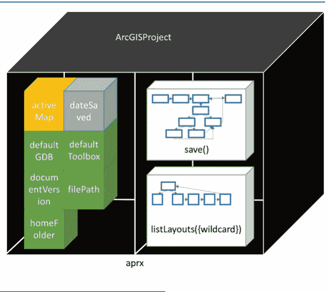

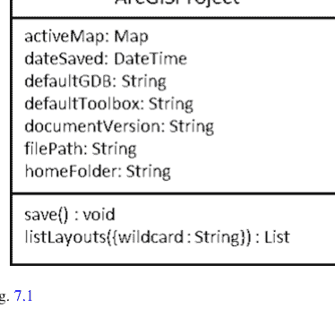

## 7.2 图 7.1 的类图表示

`mp.ArcGISProject("CURRENT").filePath`。理论上，由于属性可以是对象，方法可以返回对象，而这些对象又有自己的属性和方法，我们可以无限地扩展这个点号序列。然而，在大多数情况下，你会希望使用一个变量来保存中间值，因为跟踪一长串用点号分隔的文本可能会很困难。

每个模块以及通用的 `arcpy` 模块都有函数和类，而这些类，如上所述，有自己的方法和属性。模块内的函数与属于该模块内类的方法之间的区别在于，类方法是通过属于该类的变量来访问的，而函数则是直接从模块访问的。

举个例子，如果你想在 `arcpy` 中打印某些内容，而不是使用 `print` 函数（该函数在 Python 窗口和 Notebook 中有效，但如果你使用自定义工具则无效，详见第 14 章），你可以使用内置的 `arcpy` 函数 `arcpy.AddMessage("message goes here")`。这个函数在程序中的任何地方都有效，并且不依赖于任何变量。它只是打印消息。另一方面，有一个 `polygon` 对象，我们将在第 11 章关于几何的部分看到更多。`polygon` 对象具有像 `isMultipart` 这样的属性，它告诉你多边形是单一部分（如西弗吉尼亚州）还是由一系列多边形组成（如夏威夷）。然而，如果不引用该类类型的对象，就无法评估此属性。如果我们不知道“这个多边形”指的是什么，仅仅问“这个多边形是多部分的吗”是没有意义的，我们必须使用 `polygon` 类型的变量来访问 `isMultipart` 属性。因此，如果我们有一个名为 `state` 的变量，其类型为 `polygon`，我们可以有一个表达式 `state.isMultipart`，对于夏威夷它将计算为 `True`，对于西弗吉尼亚州则为 `False`。同样，`polygon` 类也有函数，这些函数也需要通过一个单独的 `polygon` 类型的变量来访问。其中之一是 `buffer`，它返回一个新的 `polygon` 对象，在旧多边形周围应用一个缓冲区。因此，要找到西弗吉尼亚州周围 50 公里范围的缓冲区，你需要类似 `state.buffer(50000)` 的代码，其中输入参数是以地图单位表示的缓冲区距离（本例中假设为米）。

本书中我们将最常使用的子模块是数据访问、制图和空间分析模块。顾名思义，数据访问模块是如何访问、操作和编辑数据。它是通过 `arcpy.da` 实现的。制图模块位于 `arcpy.mp`，帮助我们创建和编辑地图的符号系统。空间分析模块位于 `arcpy.sa`，帮助我们处理栅格数据。

## 任务 1：阅读 ArcPy 文档

记住任何类的属性和方法似乎需要跟踪很多信息。这就是为什么我们有正式文档，它作为 ArcPy 中每个对象蓝图的英文（或其他语言）描述。¹ 我们将使用的第一个类是 `ArcGISProject`，其文档蓝图的一部分转载如下。完整文档可在 http://pro.arcgis.com/en/pro-app/arcpy/mapping/arcgisproject-class.htm 获取。

标准文档有四个主要部分：讨论、类的属性、类的方法概述，以及最后对每个方法的更详细解释。下面未转载的讨论部分提供了该类提供什么、为什么存在以及如何使用的总体概述。`ArcGISProject` 类的讨论指出，它通常是在使用 ArcPy 脚本时设置的第一个变量之一，因为它作为 ArcPy 和 ArcGIS Pro 项目中许多其他部分的入口点。讨论还强调它是访问地图和布局的手段，毕竟这在很大程度上是 ArcGIS 的主要目的。

属性表包含了你需要了解的关于每个属性的几乎所有信息。最左列提供了属性的名称以及它是只读还是提供写访问。例如，`dateSaved` 是只读的，而 `defaultGeodatabase` 属性可以读写。这是合理的，因为你不想让人们能够直接更改 `dateSaved` 属性，因为他们可能会将其更改为一个错误的值。然而，它可以间接更改，因为 `save()` 方法会更改 `dateSaved` 属性，使其准确反映项目上次保存的时间。中间列，即解释，直接告诉你该属性包含什么。在许多情况下，属性名称本身就是不言自明的（如 `dateSaved`）。最右列至少与属性名称本身一样重要。它包含属性的数据类型，无论是字符串、表示日期和时间的对象，还是另一个自定义对象，如 `Map`。

> ¹ 我不保证 ArcPy 以外的模块的存在或质量，尽管其中许多模块确实有可接受的文档。毕竟，如果你想让你的模块被广泛使用，如果没有文档告诉人们如何使用该模块中的对象类型，那是很难实现的。

## 属性

| 属性 | 解释 | 数据类型 |
| :--- | :--- | :--- |
| activeMap (只读) | 返回与应用程序中聚焦视图关联的地图对象。如果布局视图处于活动状态，它将返回与活动地图框关联的地图。<br><br>**注意：** 此属性设计为在应用程序内部使用脚本工具或 Python 窗口执行。如果在应用程序外部运行脚本，将始终返回 None。 | Map |
| activeView (只读) | 返回 MapView 或 Layout，具体取决于当前视图。如果 ArcGIS Pro 项目没有打开的视图，或者活动视图不是地图视图或布局视图（例如，图表、表格、模型构建器视图等），则返回 None。<br><br>**注意：** 此属性设计为在应用程序内部使用脚本工具或 Python 窗口执行。如果在应用程序外部运行脚本，将始终返回 None。 | Object |
| dateSaved (只读) | 返回一个 Python datetime 对象，报告项目上次保存的日期。 | DateTime |
| defaultGeodatabase (读写) | 项目的默认地理数据库位置。字符串必须包含地理数据库的完整路径和文件名。 | String |
| defaultToolbox (读写) | 项目的默认工具箱位置。字符串必须包含工具箱的完整路径和文件名。 | String |

文档的下一部分是方法概述表。解释同样是一个直接的概念，但我们将更深入地查看左列。你之前看到属性名称的地方，现在看到的是方法名称，伴随着参数元组，就像你在函数中看到的一样。需要注意的一点是括号和花括号 ( { } ) 中的参数。与函数一样，你看到的任何方法*必须*有参数元组，即使该元组不包含任何参数。`save()` 函数有括号，即使它不需要任何输入参数。这些括号实际上是 Python 语法区分属性和方法的方式。元组中的一些参数本身在花括号中，例如 `listMaps(...)` 方法的 {wildcard} 参数。这些参数是可选的，在这种情况下，如果你选择提供值，Python 将使用你提供的值，或者如果你不提供，则使用默认值。解释列描述了方法的功能，并指定了返回的内容（如果有的话）。

## 方法概述

| 方法 | 解释 |
| :--- | :--- |
| `importDocument(document_path, {include_layout}, {reuse_existing_maps})` | 将地图 (.mxd)、球体 (.3dd) 和场景 (.sxd) 文档导入 ArcGIS Pro 项目。它还导入地图文件 (.mapx)、布局文件 (.pagx) 和报告文件 (.rptx) 的内容。 |
| `listBrokenDataSources()` | 返回一个 Python 列表，包含项目中所有地图中与原始源数据连接断开的 `Layer` 和/或 `Table` 对象。 |
| `listColorRamps({wildcard})` | `listColorRamps` 方法引用项目中可用的颜色渐变。 |
| `listLayouts({wildcard})` | 返回 ArcGIS 项目 (.aprx) 中 `Layout` 对象的 Python 列表。 |
| `listMaps({wildcard})` | 返回 ArcGIS 项目 (.aprx) 中 `Map` 对象的 Python 列表。 |
| `listReports({wildcard})` | 返回 ArcGIS 项目 (.aprx) 中 `Report` 对象的 Python 列表。 |

查看此概述后，你可能希望更详细地研究一些方法。这是文档的最后一个主要部分。我挑选了三个方法来强调几个方面。`listMaps()` 方法说明了可选参数。它有一个通配符参数，你可以用它来根据地图名称筛选返回的地图列表。下表指定了此参数的数据类型必须是字符串，尽管解释指出它不需要是完整名称。它可以使用星号来更通用一些，例如 "R*" 指代所有名称以字母 R 开头的地图。它还解释说，如果省略通配符参数，它将使用默认值 `None`，这将表示返回项目中的所有地图。有一个单独的表格提供有关返回值的信息。在这种情况下，它告诉我们数据类型是一个列表，并且我们可以期望该列表包含 `Map` 类的对象。

## listMaps ({wildcard})

| 参数 | 说明 | 数据类型 |
| :--- | :--- | :--- |
| wildcard | 通配符基于地图名称，不区分大小写。可以使用星号 (*) 和字符的组合来帮助限制结果列表。<br><br>(默认值为 None) | String |

返回值

| 数据类型 | 说明 |
| :--- | :--- |
| List | ArcGIS 项目中 Map 对象的 Python 列表。 |

返回 ArcGIS 项目 (.aprx) 中 Map 对象的 Python 列表。

`save()` 方法在这里的呈现最为简单。它既没有输入参数，也没有返回值，因此两个表格都不存在。它只有对其用途的描述。`saveACopy(...)` 方法展示了在没有花括号的情况下如何呈现必需参数，因为它需要一个文件名。请注意，它仍然只有输入参数表；它没有返回值。

按照 `ArcGISProject` 类的 `listMaps()` 方法返回值中的链接，打开 `Map` 类的文档。

**问题 1：Map 类有多少个属性？**
**问题 2：其中有多少个属性是只读的？**
**问题 3：Map 类有多少个方法？**
**问题 4：其中有多少个方法具有可选参数？**
**问题 5：如果你发现一个地图图层过于杂乱，想要从地图中移除一个或多个图层，你会使用哪个方法？**

## 任务 2：访问和检查基本 ArcPy 类

本章的任务将使用 ArcGIS Pro 中的 Python 窗口，因为我们主要是一次查看一行代码。我们要做的第一件事是查看环境工作空间，因为我们在开始一个新项目时经常需要检查或设置它。`arcpy` 模块有一个用于环境设置的属性，叫做 `arcpy.env`，通过使用 `type()` 函数，可以确定它是一个 `GPEnvironment` 对象。² 工作空间是该 `GPEnvironment` 对象内的一个属性。

> ² 在 ArcPy 文档中搜索 “GPEnvironment” 出乎意料地没有结果，尽管它的结构（具有 `.keys()` 方法和 `.values()` 方法）让我认为它与字典有关，也许不同的设置是键，而这些环境设置的值是值。`arcpy.env["workspace"]` 返回默认工作空间这一事实加强了这一假设。

确保你已将本章的数据加载到 ArcGIS Pro 中，打开 Python 窗口，并输入 `arcpy.env.workspace`。你可能已经注意到，在输入过程中出现了一个自动补全选项。我在 “work” 之后停顿了一下，整个属性名 “workspace” 就可见了。你可以使用此功能来识别或刷新对属性和方法名称的记忆，而无需查阅整个文档。按 Enter 键。然后你会看到工作空间是为此项目创建的新地理数据库。你可以将其设置为不同的地理数据库，或者在不同位置为此项目创建一个地理数据库，但稍后的一些代码在它是地理数据库而不是普通文件夹时效果最佳。

```
>>> arcpy.env.workspace
'C:\Users\jfconley\Documents\ArcGIS\Projects\Chapter7\Chapter7.gdb'
```

正如我们之前看到的 `ArcGISProject` 文档所指定的，这是最常用于进入 ArcPy 的类。因此，让我们创建一个包含此类对象的变量，引用当前项目。方便的是，Python 窗口为我们提供了一种获取该对象的方法。
输入 `aprx = arcpy.mp.ArcGISProject("CURRENT")` 并按 Enter 键。“CURRENT” 字符串是 Python 窗口特有的机制，用于访问当前打开的项目，无论其名称是什么。如果你在 IDLE 或其他 Python 环境中执行此操作，你必须使用文件路径来指定你想要的项目；在 Python 窗口中不需要这样做，因为它知道打开了什么。
要简要查看 `aprx` 变量，请输入 `aprx` 并按 Enter 键。

```
>>> aprx = arcpy.mp.ArcGISProject("CURRENT")
>>> aprx
<arcpy._mp.ArcGISProject object at 0x000002AA0CEDA8D0>
```

这并没有告诉我们太多信息，尽管它确实给出了此变量所属对象的类：`ArcGISProject`。我们之前在使用 `type()` 函数时看到了类似的过程。使用它，我们可以看到，虽然 3 是一个整数，而 “ArcGIS” 是一个字符串，但 `aprx` 变量的类型是 `ArcGISProject`。

```
>>> type(aprx)
<class 'arcpy._mp.ArcGISProject'>
```

我们可以使用 `aprx` 访问的第一件事是地图列表。
输入 `Ohio_map = aprx.listMaps()[0]` 并按 Enter 键。回顾文档，`listMaps()` 提供了一个地图列表，即使只有一个地图。这意味着 `aprx.listMaps()` 给我们提供了一个包含一个地图的列表。要访问地图本身，我们需要确保行尾存在 `[0]`。然后你可以输入 `Ohio_map` 并按 Enter 键以确认我们确实拥有一个 `Map` 对象，而不是一个列表。

```
>>> Ohio_map = aprx.listMaps()[0]
>>> Ohio_map
<arcpy._mp.Map object at 0x000002AA0CEDA780>
```

现在我们准备好将数据添加到地图中。有几种方法可以做到这一点，但其中一种是创建一个新图层，它会自动添加到地图中。该图层还可以让我们访问许多符号系统，因此这种方法以后会很有用。
输入 `Ohio_map.addDataFromPath("..your path...")` 并按 Enter 键。虽然此函数有一个返回值，但目前它并不重要，因为运行此行代码的主要目的是通过添加数据来更改地图。你现在将在地图上拥有一个俄亥俄州县的地图。

```
>>> Ohio_map.addDataFromPath("D:\classes\TechIssues\data\Ohio_simple.shp")
<arcpy._mp.Layer object at 0x000002AA0CE89BA8>
```

在继续之前，你可能想要保存脚本。Python 窗口中没有直接的 “另存为” 菜单项，你可能已经通过之前的实验认识到，保存项目实际上并不会保存 Python 窗口的内容，即使它保存了 Python Notebook 的内容。保存的方法是在 Python 窗口的主区域中右键单击，然后选择 “保存记录”。这将打开一个 “另存为” 对话框。给你的文件起一个合理的名字。要确认已保存，请再次在 Python 窗口的主区域中右键单击并选择 “清除记录”。这将使 Python 窗口再次变为空白。要重新加载记录，请在你输入代码的下方行中右键单击。选择 “加载代码”。这将打开一个对话框，你可以导航到刚刚创建的文件。你应该会看到刚刚保存的内容。你会注意到你输入的所有输入行都存在，而它给你的任何输出都已被注释掉。按两次 Enter 键运行该代码。（这很可能在地图中给你两个 “Ohio_simple” 图层。如果是这样，通过右键单击图层名称并选择 “移除” 来删除一个。）

此时，我们可能希望查看地图的一些属性或方法。实现此目的的一种方法是输入 `Ohio_map.` 并在点后停顿。回顾之前的内容，属性通过 `object_name.property` 的通用语法访问，方法类似地通过 `object_name.method(parameters)` 访问。在 `object_name.` 后停顿会让 Python 窗口建议可能的属性和方法。

此外，你可能会注意到那些带有蓝点的没有括号。这些是属性。那些带有括号的有包含字母 M 的紫色六边形。这些是方法。如果你开始输入属性或方法名称，你会看到它如何被筛选为以你输入的字符开头的项。在点后添加一个 a 并再次停顿。你会注意到剩下的唯一方法是以 a 开头的。

使用此策略，回答问题 6：

**问题 6：Map 类有多少个以字母 m 开头的 *方法*？**

使用 Python 窗口的自动补全功能或帮助文档，找出可以帮助回答问题 7 的命令。请注意，它不一定以 m 开头。

**问题 7a：此地图中有多少个图层？**

**问题 7b：你用来回答此问题的 Python 语句（或语句）是什么？**

你应该让第一个图层是 Ohio_layer.lyr，因为你在上面创建了它。要检查图层对象，让我们创建一个变量来访问此图层。无论顺序如何，我们可以使用可选参数来确保我们获得适当的图层。输入：

```
>>> Ohio_layer = Ohio_map.listLayers("Ohio_simple")[0]
```

按 Enter 键。同样，我们从输入 `Ohio_layer` 并按 Enter 键的输出中只知道它是一个 `Layer` 对象。

```
>>> Ohio_layer = Ohio_map.listLayers("Ohio_simple")[0]
>>> Ohio_layer
<arcpy._mp.Layer object at 0x000002AA0CF06320>
```

如果我们继续这个调查可用内容的过程，输入 `Ohio_layer.` 并停顿以检查选项，我们可能会看到名为 `brightness` 和 `contrast` 的属性。然而，并非所有属性都与所有图层相关，因为存在不同类型的图层（栅格图层、矢量图层等），它们会有不同的属性。实际上，尝试 `Ohio_layer.brightness` 会得到一堆红色错误消息。最重要的是此消息底部的内容。它是发生的错误类型和相关的解释。你可以看到它说 “The attribute 'brightness' is not supported on this instance of Layer.” 亮度和对比度适用于栅格，但不适用于矢量。

```
>>> Ohio_layer.brightness
Traceback (most recent call last):
  File "c:\program files\arcgis\pro\Resources\arcpy\arcpy\arcobjects\_base.py", line 90, in _get
    return convertArcObjectToPythonObject(getattr(self._arc_object, attr_name))
AttributeError

During handling of the above exception, another exception occurred:
```

## 任务 3：通过 ArcPy 使用工具

一旦我们获得了要素类的引用，通常会希望应用 ArcGIS 中的一个或多个工具来处理或分析该要素类。我们将在此执行的地理处理任务是选择。

数据包含 2004 年总统选举的记录，因此我们将选择那些投票给乔治·W·布什的县，并将它们放入一个名为“Republican”的新要素类中。

在桌面图形用户界面中，有多种方法可以完成此操作，其中一种是转到“分析”功能区，然后单击“工具”按钮以打开地理处理窗格。请执行此操作。在右侧出现的地理处理窗格中，使用当前标记为“查找工具”的搜索栏，搜索“Select”。然后，你应该会看到顶部选项是一个名为“Select (Analysis Tools)”的工具。单击它。在随后出现的工具对话框中，右上角有一个带问号的小圆圈。这会打开帮助文件，因此请单击它。

向下滚动帮助文件，你会找到一个标记为“参数”的部分，其中有两个选项：“对话框”和“Python”。我们需要 Python 选项卡，因此请单击该选项卡。这包含了我们在 Python 中运行此工具所需的所有信息。在此选项卡中，有一个标记为“代码示例”的部分，其中包含两个示例：一个通过 Python 窗口使用此工具，另一个在独立脚本中使用此工具，例如我们在上一个练习中在 IDLE 中使用的脚本。

返回到此部分的顶部，我们看到三个参数：`in_features`、`out_feature_class` 和 `where_clause`。`in_features` 需要一个要素图层，因此我们已有的 `Ohio_layer` 变量可能适用。输出要素类将是环境工作空间中的一个要素类。为了明确这一点，我们可以用以下行创建一个变量：

```
out_fc = "Republican"
```

最后一部分是 SQL 查询。我们将在第 10 章处理属性数据时更详细地了解 SQL。这里相关的问题是，数据集的属性始终包含在双引号中。这意味着要识别属性 Bush 大于属性 Kerry 的县，我们需要确保“Bush”和“Kerry”用双引号括起来。这要求我们使用单引号来表示此查询字符串的开始和结束。

```
query = '"Bush" > "Kerry"'
```

我们现在已设置好运行 Select 工具的变量。输入以下行。根据文档中 Python 选项卡顶部的语法，我们有以下行：

```
arcpy.analysis.Select(Ohio_layer, out_fc, query)
```

但是，请注意，在代码示例中，采用了不同的设置，这将得到以下结果：

```
arcpy.Select_analysis("Ohio_layer", out_fc, query)
```

我推荐使用前一种设置，因为它更新，并且更有可能在更长的时间内得到持续支持，而后一种方法可能已被弃用，或从使用和支持中移除，因此保留新的构造将有所帮助。此更改是 ArcPy 中子模块重组的一部分，其中 ArcToolbox 中至少一些不同的工具箱在 ArcPy 中拥有自己的模块。分析工具工具箱包含几乎所有将与此工具箱中的工具关联的对象。例如，提取工具箱中的每个工具都有自己的 ArcPy 命令：`arcpy.analysis.Clip`、`arcpy.analysis.Select`、`arcpy.analysis.Split`、`arcpy.analysis.SplitByAttributes` 和 `arcpy.analysis.TableSelect`。

无论你使用旧样式（工具箱由末尾的 `_analysis` 指示）还是新样式（使用特定于工具箱的子模块），你都应该获得一个 `Result` 对象作为返回值，并且左侧的内容列表现在应该有一个 Republican 条目。我的条目与输入图层呈现完全相同的粉红色阴影，因此我建议更改颜色以使其可区分。

```
>>> arcpy.analysis.Select(Ohio_layer, out_fc, query)
<Result 'C:\Users\jfconley\Documents\ArcGIS\Projects\Chapter7\Chapter7.gdb\Republican'>
```


（注意：不需要为参数使用变量。我们同样可以获取三个变量的值，并将它们直接代入 `arcpy.analysis.Select(...)` 行中。但是，我建议在这种情况下使用变量，因为例如，如果你在输出要素类名称中有一个拼写错误，并且需要重新运行该工具，你将不需要重新输入查询，并且如果查询出现拼写错误，可能会引入新的错误。你只需在编辑创建该变量的行后，重用现有的 `query` 变量即可。如果你重用该查询，并且必须追踪每一个实例，而不是只修复一次，这一点尤其明显。）

## 任务 4：调试练习

此调试练习提供了三个涉及 ArcPy 代码的语句，每个语句中都有一个错误。请找出并修复错误。

```
fields = arcpy.ListFields('Republican')
for field in fields:
    print (field.name, " is a ", fields.type)

clipped_Fc = arcpy.analysis.Clip('Republican', 'Ohio_simple', 'new_output')
```

请记住，仅仅因为它能运行，并不保证它运行准确。总是可能存在逻辑错误。

## 任务 5：非引导式工作

我提供了一个不同的 ArcGIS 项目，名为 IntroToArcpy_Task4。请使用你在本练习中迄今为止看到的部分或全部内容来回答以下问题。请提供答案以及在 Python 窗口记录中用于找到答案的行。

**问题 9：** 此项目中有多少个要素类？
**问题 10：** 要素类 #3 的数据源是什么？
**问题 11：** 使用帮助文档查找一个工具并在 Python 中执行它，将所有这些合并为一个名为 “Task_4” 的要素类。
**问题 12：** 导出的记录是否回答了问题 9–11 的所有内容？

## 在 ArcGIS 中访问数据的基础知识

### 引言：超类、子类和继承

几乎每个 GIS 项目都会涉及数据，通常是大量的数据。本章将向你介绍如何通过 ArcPy 处理数据，并引入一个称为继承的编程概念。

正如我们所见，Python 中有许多变量类型，例如文本字符串、整数、实数、列表、字典、元组以及任何类型的对象。我们可能希望将它们分组归类，以帮助我们更好地理解这些不同类型之间的动态关系及其相互联系。例如，整数和实数都是数字类型。同样，我们可以将列表、元组和字典都视为事物的集合。基于此，我们可以制定以下图表，展示一些基本 Python 数据类型之间的这些关系（图 8.1）。

有了这些关系，我们知道顶行能做的任何事情，例如将两个数字相乘，图表中它下面的项目也能做到。这意味着你可以将两个整数相乘，也可以将两个实数相乘，因为乘法适用于所有数字。然而，反过来并不总是成立。获取实数的小数部分（小数点后的部分）是有意义的。但对于整数来说则不然，因为根据定义，它小数点后没有任何内容。

同样，有一些属性适用于所有集合，比如询问它包含多少个值。同时，你可以询问元组或列表中的第 n 个项目，但不能询问字典，因为字典项目是通过其键来访问的，而不是通过任何索引或排序。我们甚至可以更新我们的图表以反映层次结构中的这个额外步骤（图 8.2）。

回想一下之前关于类的概念，我们可以将这些概念应用于对象和类，同时在术语上更加具体。箭头顶部的类是*超类*，而底部的类是*子类*。例如，字典是集合的子类，而集合是字典的超类。这也意味着像这样的图表的中间级别包含既可以是超类也可以是子类的类。索引集合是集合的子类，但也是列表和元组的超类。这里的另一个概念是*继承*。对象类具有方法和属性，如前所述。为超类实现的任何方法和属性也适用于所有子类。这意味着可以从索引集合中获取第 5 个项目，因为这适用于任何索引集合的方法。¹ 因为它适用于索引集合，所以它对元组和列表都有效，因为它们是索引集合类的子类。然而，“获取第 5 个项目”的概念并不适用于所有集合，因为字典是无序的。因此，“获取第 5 个项目”属于索引集合类及其子类，但不属于其超类集合。可能让情况更令人困惑的是，我们确实可以将“获取项目”应用于这里的所有集合。只是字典和索引集合回答“获取哪个项目”的方式不同。字典使用键，键可以是任何类型的对象，而索引集合必须使用数字索引。这意味着虽然使用方括号 [] 获取项目对索引集合和字典都有效，但方括号内的内容必须不同。

这些想法更普遍地适用于对象，因此也适用于 ArcPy 中的数据集类型。毕竟，你可以将许多类型的数据加载到 ArcGIS 中，我们或许可以根据可以应用于它们的一些方法或属性将它们分类。例如，我们可以将所有栅格数据类型归为一组，将所有矢量数据类型归为一组。图 8.3 展示了一些不同 ArcPy 数据类型的层次结构。这绝不是所有数据集类型的完整集合，但包括了我们在本书中可能最常遇到的那些。这种细分似乎符合我们对 GIS 数据的常识性概念，最初的划分或多或少是栅格与矢量。我说“或多或少”是因为所有矢量数据的超类 Table，主要存在于要素类中。Table 指的是任何具有属性表或独立表的内容。例如，如果你有一个西弗吉尼亚州县的地理数据库（GDB）要素类，以及一个单独的、没有任何附加空间组件的选举结果表，用于与该 shapefile 连接，两者都是 Table，但只有 GDB 要素类是要素类。这说明，在某些情况下，我们可以有一个属于超类的成员对象，而不必属于任何特定的子类。你加载到 ArcGIS Pro 中的 CSV 文件将是一个 Table，但不会是 Table 的任何子类，例如要素类或 GDB 表。超类并不总是如此，但在此例中是这样。例如，一个通用数据集不能在没有其子类型的情况下存在，而一个通用表则可以存在。

第二个教训是，一个子类可以从多个超类继承。观察箭头，我们可以看到 GDB 要素类同时继承自 GDB 表和要素类。这意味着与 GDB 表相关的任何方法和属性都与 GDB 要素类相关，与要素类相关的所有内容也是如此。这种多重继承的能力为 Python 中的类结构，特别是 ArcPy 中的类结构，提供了极大的灵活性。

我们将开始使用 `arcpy.Describe()` 函数和生成的描述对象来处理 GIS 数据，并使用它们来研究 ArcPy 中 GIS 数据集的一些继承结构。

### 任务 1：使用 arcpy.Describe

在执行 GIS 项目时，有许多场景是你被提供了一些你不太了解的数据。在开始处理之前，你可能希望先检查一下。虽然这可以通过 ArcGIS Pro 中的 GUI 完成，但我们将使用 ArcPy。脚本在这里可以提供帮助，因为你可能经常需要了解关于传入数据的相同信息，确保脚本比点击操作更有用。此外，如果你管理一个非常大的项目，你可能会收到比你能跟上的更多的数据集，因此需要计算机的速度来帮助管理数据流。

这种检查是通过 Describe 对象进行的，我们可以通过 `arcpy.Describe()` 函数访问它。² Describe 对象有些独特，因为它没有方法，只有属性。就此而言，它只有只读属性——你甚至不能写入对象。这可能看起来不寻常，但请认识到，对于大多数属性，它们是基于用于创建对象的数据，我们希望确保 Describe 对象与数据完全匹配。因此，允许我们写入（从而编辑）存储在 Describe 对象中的属性，而不对相应数据进行任何更改，会使 Describe 对象不正确。这至少可以说是不可取的，因此所有属性都标记为只读。

在我们使用 Describe 对象检查数据之前，我们需要有数据可供查看。我在公共驱动器上为你提供了一些数据。将 Lab6 文件夹中的数据复制到你的 N: 驱动器（或你希望用作工作区的任何其他位置）上的新 Lab6 文件夹中。

打开 ArcGIS 并将*环境工作区*设置为你放置本章数据的文件夹。你可以使用 Python 命令或 ArcGIS GUI。无需将数据加载到地图中，尽管你欢迎这样做。事实上，更重要的是将环境工作区设置为与数据加载位置相同，因为除非工作区指向正确方向，否则以下行将无法工作。

在新的 Python Notebook 中，运行 `arcpy.ListFeatureClasses()`。

**问题 1：** 数据文件夹中有多少个要素类？

现在运行 `arcpy.ListRasters()`。

**问题 2：** 数据文件夹中有多少个栅格数据集？

现在运行 `arcpy.ListTables()`。

**问题 3：** 数据文件夹中有多少个表？

¹ 严格来说，[5] 不是一个方法，但就我们此处的目的而言，使用你熟悉的 Python 数据类型，继承的概念仍然适用。

² 如果你一直很细心，特别是 ArcPy 文档，你可能会认识到 arcpy.Describe() 函数实际上是 Describe 类型对象的构造函数。这将很快用于创建此类类型的变量。

**补充信息：** 在线版本包含补充材料，可在 [https://doi.org/10.1007/978-3-031-08498-0_8] 获取。

要设置三个列表来探索 Describe 函数，请在新单元格中运行以下代码行。我们使用这些列表是为了更轻松地跟踪正在处理的数据类型，并在过程中更明智地使用 Describe 对象。

```
fcList = arcpy.ListFeatureClasses()
rsList = arcpy.ListRasters()
tbList = arcpy.ListTables()
```

现在我们将设置 Describe 对象。它需要一个单独的要素类（或数据集或表格），而不是列表，因此我们需要使用索引从列表中提取单个值。

```
desc = arcpy.Describe(fcList[0])
```

现在我们将检查可以从 Describe 函数获取的数据的几个属性。它们是数据集类型、名称、形状类型、字段（即属性）#6 的名称以及波段数。在 Python Notebook 中，你可能希望现在将这些属性分别放在单独的单元格中，因为有些会生成错误，而有些不会。请记住，某些属性仅适用于某些数据类型（例如，你无法获取矢量 shapefile 的波段数，就像无法获取整数的小数部分一样）。尝试访问不适用的属性将产生方法不存在的错误消息。因此，当至少有一行代码给出错误消息时，请不要惊慌。这就是尝试访问矢量数据集的波段数时得到的结果。（然而，如果你拼写错误，也会得到相同的错误消息，所以请仔细检查你的拼写和大小写！）

```
desc.datasetType
'FeatureClass'

desc.name
'appalachianDevelopmentHighwaySystem_WVDOT_200903_gcs83.shp'

desc.shapeType
'Polyline'

desc.fields[6].name
'CORRIDOR_N'

desc.bandCount
---------------------------------------------------------------------------
AttributeError                            Traceback (most recent call last)
In  [8]:
Line 5: desc.bandCount

AttributeError: DescribeData: Method bandCount does not exist
---------------------------------------------------------------------------
```

为了证明 `bandCount` 属性存在于栅格数据中，我将把 `desc` 变量设置为栅格列表中的第一项，并再次尝试 `desc.bandCount`。现在我们看到，这个特定工作空间（在本练习中与你的不同）中的第一个栅格是 MrSID 格式。

```
desc = arcpy.Describe(rsList[0])
desc.bandCount
```

1

使用代码结果填写问题 4 表格的第一行。对你创建的三个列表 `fcList`、`rsList` 和 `tbList` 中的所有其他文件重复此操作。如果属性不受支持（例如，栅格的 `shapeType` 或矢量的 `bandCount`），并且你已仔细检查拼写，那么你可以得出结论该属性不受支持。

**问题 4：在此处输入属性。**

| | datasetType | name | shapeType | fields[6].name | bandCount |
|---|---|---|---|---|---|
| fcList[0] | | | | | |
| fcList[1] | | | | | |
| fcList[2] | | | | | |
| fcList[3] | | | | | |
| rsList[0] | | | | | |
| rsList[1] | | | | | |
| tbList[0] | | | | | |

## 任务 2：属性的继承

在问题 4 的表格中，你应该已经注意到，表格支持的任何属性（在 `tbList[0]` 行中）也受要素类（`fcList[#]` 行）支持。同样，有几个属性应该受所有内容支持。我们可以使用帮助文档来研究这如何说明这些属性从超类到子类的继承方式。

访问 https://pro.arcgis.com/en/pro-app/arcpy/functions/describe-object-properties.htm 查看所有 Describe 对象可用的内容。你应该会看到上表中的一个属性：`name`。因为这是 Describe 对象属性的一部分，所以任何可以被描述的内容都有一个名称。如果你查看窗口左侧的所有“Describe 属性”列表，你会注意到其中有“文件夹属性”等。这意味着存在可以被描述（如文件夹）但不完全是数据集的内容。因此，虽然 `name` 适用于真正的一切，但即使是 `datasetType` 也不适用于所有可能的情况。

点击左侧的“数据集属性”链接。你会注意到 `datasetType` 现在列在其中，但那些为 Describe 对象列出的属性则没有。然而，所有作为数据集的内容仍然有一个名称。此属性仍然可访问，因为它继承自 Describe 对象。文档的作者没有重新打印所有继承的属性，相信你可以使用“摘要”部分的信息来找到它们。例如，点击“GDB 要素类属性”链接。在“摘要”部分，你将看到从顶层的 Describe 对象到此处特定的 GDB 要素类之间的所有超类/子类列表。在这种情况下，除了 Describe 和 GDB 要素类之外，属于 FeatureClass、GDB Table、Editor Tracking Dataset、Table 和 Dataset 类的所有属性也被 GDB 要素类继承。因此，虽然通过文档本身看起来有点不足，其中只列出了四个属性，但重要的是要认识到，对于 GDB 要素类，我们还可以访问 Describe 对象中的 12 个属性、FeatureClass 对象的 6 个属性、GDB Table 的 10 个属性等等。这四个属性是 GDB 要素类本身及其可能有的任何子类所独有的。

**问题 5（5 分）：** 使用从*所有*超类（包括 Describe）继承的属性，Shapefile 要素类有多少个可用属性？

**问题 6（5 分）：** 使用从*所有*超类（包括 Describe）继承的属性，栅格数据集有多少个可用属性？

## 任务 3：在 IDLE 中运行 ArcPy 脚本

你可能在 ArcPy 文档的许多代码示例中注意到，有在 ArcGIS Pro 的 Python 窗口中使用函数、方法或对象的示例，也有在外部环境（如 IDLE）中运行的独立脚本中的示例。我们将从通过 IDLE 而不是 Python 窗口访问 `arcpy` 命令开始。

对于像这样基础的内容，我们访问数据集来描述它们，但不尝试编辑它们、将它们用于分析或创建新数据，从 Python 窗口或 Notebook 到 IDLE 的过渡并不像你担心的那么大。我在这里介绍了必要的步骤，在非指导性任务中，你将编写一个脚本，使用这些想法在 IDLE 中而不是 Python 窗口中操作。

首先，请记住 `arcpy` 是一个 Python 模块，当在 ArcGIS Pro 的 Python 窗口之外工作时，我们必须像导入任何其他模块一样导入它。因此，你必须从 `import arcpy` 语句开始。

其次，你可能使用了 GUI 来指定环境工作空间。当然，GUI 在 IDLE 中不可用，因此你必须使用代码来指定环境工作空间。我建议使用 Python input 函数向用户请求此信息，而不是将文件路径直接构建到代码中。毕竟，你不知道我把文件放在哪里，我也不应该为了评分而编辑你的代码。因此，最好询问我（作为用户）我的文件在哪里。这意味着使用我们之前见过的 `input()` 函数。

同样，虽然这里没有使用，但如果我们使用 ArcGISProject 对象，指向正确项目的“CURRENT”方法将失败。毕竟，“CURRENT”是使用 ArcGIS Pro 中当前打开的项目的指令。如果你在 IDLE 中，你可能没有打开 ArcGIS Pro，甚至没有当前打开的项目，因此尝试访问不存在的内容很可能会以错误消息告终。因此，为了使用和访问 ArcGISProject，你必须要求用户指定使用哪个 .aprx 文件作为 ArcGISProject。在 IDLE 中执行更复杂的 ArcGIS 过程可能需要更多更改，但目前只需要这些。

## 任务 4：调试练习

此调试练习的代码在修复后，应打印出环境工作空间中第一个要素类的三个属性：要素类型、OID 字段名称和几何字段的名称。我建议你使用任务 2 中的 Describe 文档来帮助跟踪和潜在的逻辑错误以及对错误的适当修复。有三个错误。

```
desc = arcpy.Describe(fcList[0])
print(desc.featureType)
print(desc.OIDFieldName)
print(desc.geometryStorage)
```

## 任务 5：非指导性工作：编写你自己的脚本

现在想象需要对另一个未知的数据集系列执行此操作。你不知道每种数据集有多少个，因此需要使用循环来遍历列表。

但是，你想对用户友好，不报告不相关属性的错误消息。这意味着你可能需要小心在每个循环中包含哪些行，或者使用条件语句来避免错误消息。

编写一个脚本，打印出类似于下面的输出，但仅使用问题 4 中的属性，并且*仅打印相关的属性*。

此脚本应该能够**在 IDLE** 中运行，而不是在 Python 窗口中，并要求用户输入 ArcGIS 项目的文件路径。

一个数据集的示例：
数据类型：FeatureClass
名称：WV_counties
形状类型：Polygon
字段 #6 的名称：Population

另一个数据集的示例：
数据类型：RasterLayer
名称：LandCover
波段数：1

## 提示

假设我将使用至少一个要素类、一个栅格数据集和一个表格。（换句话说，列表不能为空。）
假设对于任何相关数据集，将有足够的字段，使得第6个字段存在。
使用 `for` 循环遍历列表。
回顾 `print` 语句在 Python 中的工作方式，以确保没有错误。

### 评估

你的代码在 IDLE 中运行正常，使用的是与公共驱动器中不同的数据集，并提供正确的输出。重要的是，无论输入是什么，输出都是正确的，而不是你得到答案所采取的具体路径。

## 栅格

### 9

### 引言：GIS 特定的数据结构

由于计算数据类型的讨论与 GIS 数据类型密不可分，我们转向 GIS 中的两种主要数据类型：栅格和矢量。栅格在 ArcPy 中更容易处理，因此我们从这里开始。栅格数据结构在概念上是一个单元格网格，每个单元格包含一个值（图 9.1）。

一旦我们有了值，在计算机中存储它的最简单方法是创建一个值列表，按顺序排列，并确保行数或列数也被表示出来，这样就有办法将一维列表转换为二维网格（图 9.2）。

对于这个简单的例子，写出 64 个数字不会是一个很大的负担。然而，栅格通常包含远不止 64 个单元格。1000×1000 或更大的网格栅格，因此拥有超过 1,000,000 个单元格，并不少见。一个典型的栅格，显示摩根敦地区的海拔，如下所示（图 9.3）。它有近 1700 万个像素，像 1330.099976 这样的海拔值，打印所有单个值将需要超过 56,000 页。

因此你可以预测，这种方法可能会产生非常大的文件大小。然而，方便的是，相邻值通常具有相同的值，例如蜿蜒穿过此栅格的莫农加希拉河的所有海拔值。有几种数据结构利用这种相邻值的相似性来减小栅格的文件大小。对这些结构的详细检查超出了本书的范围，但你可以通过返回上一章的 ArcPy Describe 文档，并查看栅格数据集属性来了解各种方法。你会看到一个名为 `compressionType` 的属性，ArcGIS Pro 2.8 版本支持 16 种不同的减小文件大小的方法。结论部分列出的一些附加资源提供了更多关于栅格数据结构的信息。

就这些引言而言，理解这些栅格数据结构都旨在支持两个主要目标就足够了：通过简单地列出每个值来减小文件大小，以及能够轻松识别任何给定位置的值。第一个目标是对大文件大小和有限存储能力的直接反应。第二个目标不仅对于在屏幕上显示栅格很有价值，而且对于本章任务中将要检查的工具也很有价值。这些工具需要这些信息，因为许多栅格操作是局部的，这意味着它们使用中心单元格周围的邻域，并将工具的计算应用于该邻域内的所有值。例如，ArcGIS Pro 通过应用以单元格为中心的 3×3 窗口的一些代数计算来计算栅格在单元格处的坡度，而不仅仅是中心单元格。¹ 这意味着无论使用什么数据结构，都必须能够轻松找到任何指定单元格的相邻单元格。这种获取邻域单元格值的需求因能够找到任何位置的值而得到加强。

方便的是，在执行剩余任务时，我们不必担心压缩类型的确切规格。在 ArcPy 中，大多数栅格处理函数位于 Spatial Analyst 或 `.sa` 模块中，因此这将是以下任务的重点。

¹有关所有详细信息，请访问 https://pro.arcgis.com/en/pro-app/latest/tool-reference/3d-analyst/how-slope-works.htm

**补充信息：** 在线版本包含可在 [https://doi.org/10.1007/978-3-031-08498-0_9] 获取的补充材料。

© 作者，根据 Springer Nature Switzerland AG 2022 的独家许可
J. Conley, *A Geographer’s Guide to Computing Fundamentals*, Springer Textbooks in Earth Sciences, Geography and Environment, https://doi.org/10.1007/978-3-031-08498-0_9


图 9.1 栅格的简化

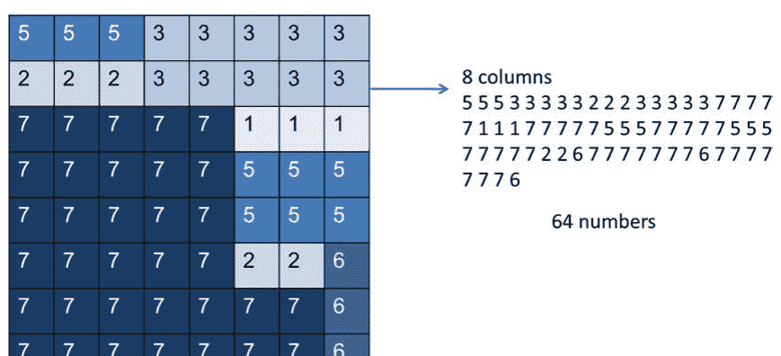

图 9.2 栅格的简化计算表示

### 任务 1：坡度考虑

场景：我们将通过一个关于红雪松管理的场景来检查栅格。你正试图识别摩根敦及其周边地区红雪松可能生长的区域。它更喜欢朝南至西南方向的陡坡。红雪松的坡度标准是陡于 30°，理想情况下陡于 45°。因此，我们需要从 DEM 创建坡度，然后将其重新分类为这三个类别。

将 morg3m DEM 加载到 ArcGIS 中。复制时，确保文件路径中不使用任何空格。无论出于什么原因，处理栅格是 ArcGIS 仍然对文件路径中的空格挑剔的领域之一。在执行任何其他操作之前，将你的环境工作空间更改为保存数据的位置。你可以通过 GUI 或 Python 更改它。由于本实验非指导部分的代码将逐行完成，我们可以使用 Python 窗口。

由于大部分栅格功能都在 `arcpy.sa` 模块中，我们将在整个脚本中反复输入 `arcpy.sa`。尽管 ArcPy 已经导入到 Python 窗口中，但为了省去在每个空间分析命令前输入

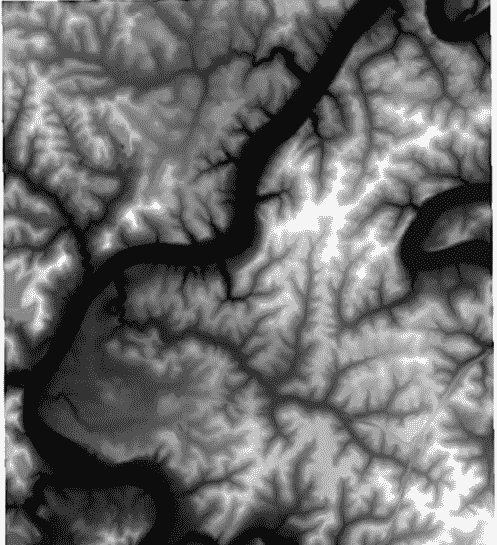

图 9.3 西弗吉尼亚州摩根敦地区的数字高程模型

“arcpy.sa”的麻烦，从而避免脚本混乱，我们可以使用 `import` 语句的 `from` 版本直接访问。

```
from arcpy.sa import *
```

接下来，我们将查看 ArcGIS 帮助文档中关于 Slope 命令的内容。3D Analyst 工具箱和 Spatial Analysis 工具箱中都有一个 Slope 工具，它们并不相同。我们这里感兴趣的是 Spatial Analyst 版本（因此是 .sa 模块），因此找到正确文档的最可靠方法是打开 Arc Toolbox，导航到 Spatial Analyst Tools → Surface → Slope，打开该工具，然后单击小蓝色问号以显示其文档。

**问题 1：Slope 工具的五个²输入参数是什么，它们包含什么，哪些是必需的？**

输入以下行以计算坡度：

```
slope = Slope("morg3m")
```

你可能会收到一条冗长的错误消息，以“Tool Slope is not licensed.”结尾。如果是这样，你需要启用空间分析扩展。回想一下，某些工具已被放入扩展中，必须先启用它们才能执行。许多栅格处理工具位于空间分析工具箱中，需要签出该工具箱以确保它们得到执行。

输入此行以签出它，然后重新执行坡度命令。

```
arcpy.CheckOutExtension("Spatial")
```

它可能仍然需要一段时间，因为 Python 不会比工具箱中的 Slope 工具更快地加速栅格处理，但坡度最终应该会出现。一旦你有了这个，你应该有一个名为 `slope` 的变量，其中包含一个栅格。我们将用它来检查栅格的一些属性。

> ²如果你有更多或更少的参数，请仔细检查你是否正在查看 **ArcGIS Pro** 中 **spatial analyst** 包内 **slope** 工具的文档。

其中一些与我们之前描述数据时看到的属性相符，例如波段数。正如我们之前所做的那样，如果你输入 `slope.` 并稍等片刻，栅格对象可用的方法和函数列表将会出现。其中一项将提供波段数，查看列表后，应该很容易就能看出是哪一个。

## 问题 2：我们的坡度栅格有多少个波段？

接下来，让我们看看栅格的格式。毕竟，这可能会提供关于栅格在计算机中实际表示方式的信息，因为它会告诉我们其文件格式。
输入 `slope.format` 并按回车键。

## 问题 3：当你输入 `slope.format` 并按回车键时发生了什么？

这可能看起来是个奇怪的行为。回想一下所有不同的数据类型，也许这是因为格式是空的。确认这一点的一种方法是询问格式是否等于 `None`。
输入 `slope.format == None` 并按回车键。注意双等号，以确保我们是在测试相等性，而不是试图赋值。这很重要，因为 format 属性是只读的，确保如果我们不小心使用单个等号并试图通过该属性直接赋值，将会得到错误。
你应该被告知结果是 `True`，确认格式确实是空的。但是，为什么格式会是空的呢？我们能够拥有尚未保存到文件的栅格。你可能注意到在问题 1 的参数中没有包含输出文件，这表明我们还没有任何输出文件。这在处理栅格时是一致的，因为栅格对象，如上所述，通常非常大。保存和加载如此大的数据结构需要时间。因此，ArcPy 允许我们只在实际需要保存栅格以供此脚本之外的将来参考时才花费时间保存它。在属性和方法列表中，你可能注意到一个 `.save()` 方法，正是用于这个目的。³ 我们可以用以下行确认此状态：

```python
slope.isTemporary
```

## 问题 4：坡度是临时栅格还是永久栅格？

我们无法要求栅格直接告诉我们特定行和列索引中的值，可能是因为它实际上并不像电子表格那样表示为一整系列的行和列。然而，我们可以要求栅格告诉我们特定位置的值，这可能更有用。此外，如果我们知道栅格的角点和单元格大小，我们可以使用一点代数运算在行/列索引和地面上的位置之间来回转换。⁴ 这是通过一个位于空间分析工具箱之外的工具实现的。
输入 `cell = arcpy.management.GetCellValue(slope, "590093 4381728")`⁵ 并按回车键。第一个参数是相关的栅格（这里是 `slope`），第二个参数是一个字符串，包含你想要的位置的 X 和 Y 坐标，仅用空格分隔，并且这些坐标必须在地图使用的任何坐标系中。（在本练习中，我们使用的是 UTM，17N 区。）
输入 `cell` 并按回车键。

## 问题 5：坐标 (590093, 4281728) 处的坡度是多少？

你应该注意到这里有些不寻常。它没有简单地给你答案，而是给你一行以 "Result" 开头的文本，如下所示：

```python
>>> cell = arcpy.management.GetCellValue(slope, "590093 4381728")
>>> cell
<Result '[Answer to Q5 redacted]'>
```

用 `type(cell)` 确认一下。你会看到这是 `arcpy` 中一种特殊类型的对象，称为 `Result` 对象。`Result` 对象有时被称为“包装器”对象，因为它们将一堆围绕某个主题的有用信息“包装”到一个对象中。在这个例子中，这个主题是 `GetCellValue` 函数的操作。

对于大多数情况，最有用的部分是输出。一个结果可以包含多个输出，所以我们可以从 `cell.outputCount` 开始，找出有多少个输出。对于只有一个波段的栅格，获取单元格的值应该只有一个输出，这很直接。输入 `cell.getOutput(0)` 确认输出与你对问题 5 的答案相符。

Result 对象与 ArcGIS 项目保留和存储地理处理历史的关键方面相匹配。转到 ArcGIS Pro 中的 Catalog 窗格，然后转到 History 选项卡。你应该在那里看到一个 "Get Cell Value" 条目，即使你没有通过工具箱或目录运行它。这说明通过 ArcPy 运行工具和通过 GUI 运行工具是等效的。事实上，如果你右键单击 History 中的任何条目，其中三个选项与该条目的 Python 版本相关：“Copy Python Command”、“Send to Python Window”和“Save as Python Script”。如果你将鼠标悬停在 History 中的 Get Cell Value 条目上，你会看到有关其操作的详细信息。事实证明，我们可以通过 `result` 对象访问这些信息。我在下面展示了我们之前进行的 `slope` 操作的结果，以便接下来的图像不会给你任何问题的答案。

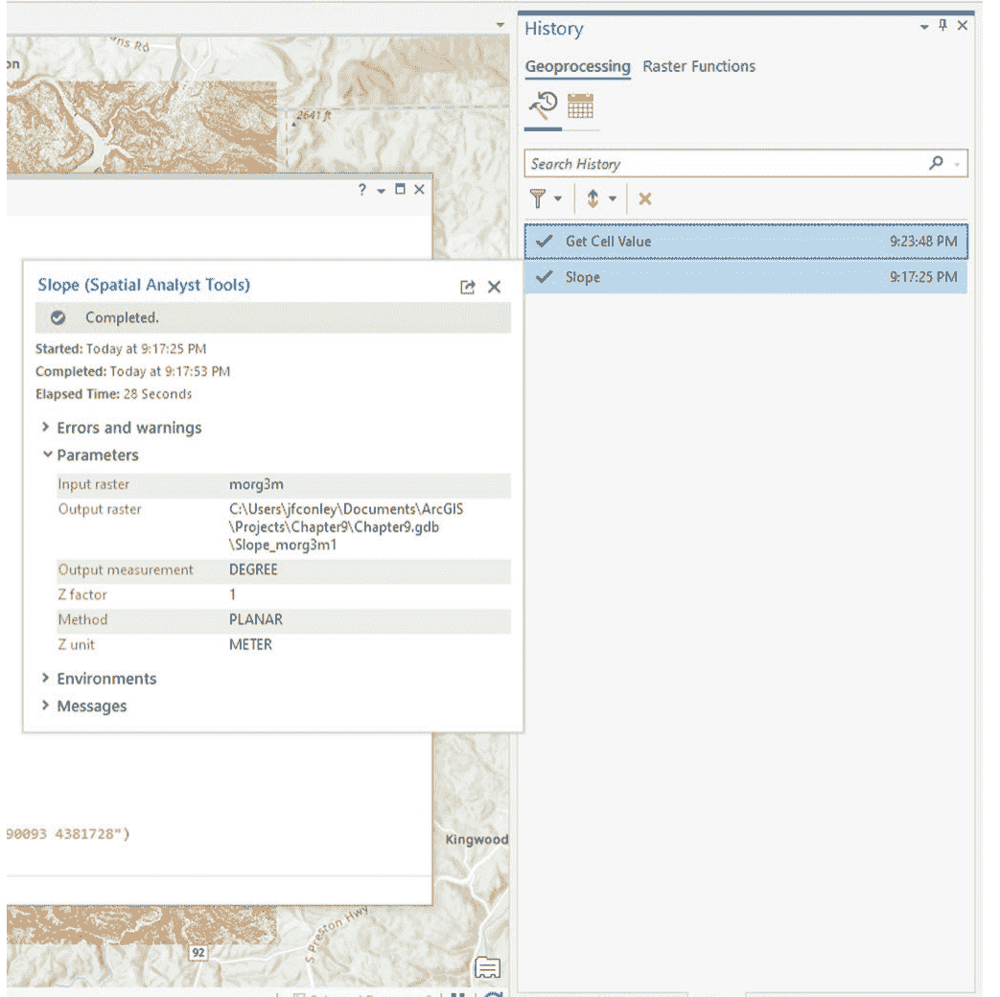

与 `result` 对象相关的方法名称相当直接。我们可以通过 `result` 对象中的 inputs 查看参数。我上面的坡度示例显示了六个输入，即使我在调用 `slope` 函数时没有指定六个输入。这是因为 `Result` 对象仍然可以在其输入列表中表示默认值，并且此参数列表可以包括输出，即使 `arcpy.sa.slope` 工具甚至没有输出栅格参数。同样，当你将鼠标悬停在 Get Cell Value 上时弹出的信息也包含输出值作为参数之一。

## 问题 6：使用 `cell.inputCount`，有多少个输入？

还要注意，有消息。与计算输入和输出一样，我们可以用 `cell.messageCount` 计算有多少条消息。我们也可以用以下命令找出它们是什么：

```python
cell.getMessages()
```

这会一次性显示所有消息，如下所示（使用不同的 X 和 Y 坐标，因此问题 5 的答案仍未给出）。

```python
>>> cell.getMessages()
'Start Time: Wednesday, October 6, 2021 9:23:48 PM\n0\nSucceeded at Wednesday, October 6, 2021 9:23:48 PM (Elapsed Time: 0.09 seconds)'
```

这里有一条长行（延伸到第二行）对应三条消息，这可能看起来很奇怪。然而，在中间，你会看到 “\n0\n”。\n 字符代表“换行符”。⁶ 如果我打印消息而不仅仅是访问它们，这将变得更清楚。

```python
print(cell.getMessages())
Start Time: Wednesday, October 6, 2021 9:23:48 PM
0
Succeeded at Wednesday, October 6, 2021 9:23:48 PM (Elapsed Time: 0.09 seconds)
```

我们可以使用 `cell.getMessage(index)` 方法按顺序单独访问消息，使用 0、1 或 2 作为索引。

我们将在此查看的结果对象的最后一个属性是严重性，它表示创建的消息类型。正如你稍后将看到的，在创建自己的工具有三种类型的消息：信息性消息，严重性值为 0，仅提供信息；警告，严重性值为 1，即使工具确实运行并产生了输出，也向用户传达潜在问题；错误，严重性值为 2，告诉用户工具未完成。

## 问题 7：使用 `maxSeverity` 属性，此工具产生的“最严重”消息类型是什么？它产生了多少（如果有）警告和错误？

通过这些命令，你可以看到 `result` 对象在记录所做操作和脚本产生内容方面是多么有用。这使我们能够保存和记录有关输出和过程的信息，而脚本本身只记录函数的输入。

在继续之前，我们将看到另一种计算坡度的方法。在你查看问题 1 的 Spatial Analyst 坡度工具文档中，你可能注意到推荐使用一个更新的工具来计算坡度：Surface Parameters。它在坡度计算方式上提供了一点灵活性，并“提供了一种更新的实现”。按照链接到 Surface Parameters 工具，我们可以看到更多输入参数，允许我们更精确地指定邻域，包括更大的邻域和自适应邻域。为了与使用 3x3 固定窗口的坡度工具进行比较，我们将在此使用默认窗口规范，也是 3x3 固定窗口。

```python
slope2 = arcpy.sa.SurfaceParameters("morg3m", "SLOPE")
```

> ⁶你们中的一些人可能之前在文件路径字符串中遇到过这种情况，其中 \n 被视为换行符或 \t 被视为制表符，导致奇怪的错误。

**问题 8：** 使用 `GetCellValue` 函数，`Slope` 工具生成的坡度值与 `SurfaceParameters` 工具生成的坡度值是否接近（在 0.01 度以内）？

## 任务 2：重分类

回到红雪松场景，一旦我们使用任一工具创建了坡度，就需要对坡度进行重分类，以隔离出理想的红雪松生长条件。我们希望将坡度重分为三类：

- 0 到 30 → 0
- 30 到 45 → 1
- 45 到 90 → 2

这需要构建一个重映射表，我们可以通过以下代码行来创建。请注意方括号 `[]` 和圆括号 `()` 的位置、类型和数量。

```
remap = RemapRange([[0, 30, 0], [30, 45, 1], [45, 90, 2]])
```

重映射表是一个列表的列表，其中三个列表中的每一个又依次包含三个条目。这种嵌套列表的设置是计算机科学中一种非常常见的数据结构，因为它是表示表格数据的一种便捷方式。我们可以将这个重映射表列表的格式更改为以下形式，这更接近表格的外观，并且你会注意到它与上面的重分类类别相匹配。

```
[[ 0, 30, 0],
 [30, 45, 1],
 [45, 90, 2]]
```

每个内部列表中的第一个项目是重分类范围的起始值。第二个项目是重分类范围的结束值。第三个项目是该类别被赋予的新值。如果我们有超过三个类别，我们将有一个包含四个、五个或任意多个列表的列表，但每个较小的内部列表都必须包含三个值，按照范围最低值、范围最高值和类别新值的顺序排列。

一旦重映射表设置完毕，我们就可以使用以下代码行执行重分类本身。

```
slopeReclass = Reclassify(slope, "Value", remap)
```

**问题 9：** 打开重分类后栅格的属性表，找出每个类别中有多少个单元格。使用此信息填写下表。

| 类别（属性表中的 "VALUE"） | 单元格数量（即 "COUNT"） |
| :--- | :--- |
| 0 | |
| 1 | |
| 2 | |

## 任务 3：坡向考虑

使用与 `Slope` 工具或 `SurfaceParameters` 工具类似的脚本，创建此 DEM 的坡向，并按以下范围进行重分类，因为红雪松偏好朝南和西南的坡向。

- -1 到 135 → 0
- 135 到 180 → 1
- 180 到 270 → 2
- 270 到 360 → 0

**问题 10：你用于创建坡向栅格和重分类坡向栅格的代码是什么？**

## 任务 4：地图代数

接下来，为了将两个重分类后的地图合并为一个适宜性地图，我们需要它们的乘积。有几种方法可以进行地图代数。第一种是通过空间分析工具箱中的工具。执行此组合步骤的最佳方法是乘法。浏览空间分析工具箱中可用的不同工具，应该能清楚地找到一个允许你将两个栅格相乘的工具。例如，如果我们不是相乘而是相加栅格，我可以使用 `suitability = Plus(slopeReclass, aspectReclass)`。

或者，观察到 `.sa` 模块是唯一包含自己的运算符的模块。这意味着你可以像对数字进行加、减、乘、除运算一样，对栅格应用运算符进行加、减、乘、除。这种方法的加法版本将是 `suitability = slopeReclass + aspectReclass`。

选择其中一种方法来计算两个重分类栅格的乘积，并在下面写出你的代码。

**问题 11：提供计算两个重分类栅格乘积的地图代数代码。**

回顾上文，保存地图代数输出不是自动的。使用栅格对象的 `.save()` 方法将适宜性栅格保存到文件。如果你提供一个名称作为输入参数，它将把栅格保存为该名称，并位于你在任务 1 开始时指定的环境工作空间中。

```
>>> suitability.save("suitability")
```

## 任务 5：调试练习

此调试任务重复了上述场景，但使用了不同的标准，寻找更平坦的区域（坡度 < 5% 是理想的，< 10% 是可接受的）和朝东的坡向（45 到 135 度之间是可接受的，70 到 110 度之间是理想的）。目的是通过将两个重分类后的输入相加来计算适宜性，并将其保存到名为 "flat_east" 的新文件中。共有四个错误。

```
from arcpy.sa import everything
slope_task5 = SurfaceParameters("morg3m", SLOPE)
aspect_task5 = SurfaceParameters("morg3m", "ASPECT")
slope_remap_task5 = RemapRange([[0, 5, 2], [5, 10, 1], [10, 90, 0]])
aspect_remap_task5 = RemapRange([[-1, 45, 0, 45, 70, 1, 70, 110, 2, 110, 135, 1, 135, 360, 0]])
slopeReclass = Reclassify(slope_task5, "Value", slope_remap_task5)
aspectReclass = Reclassify(aspect_task5, "Value", aspect_remap_task5)
suitability_task5 = slope_remap_task5 + aspect_remap_task5
suitability.save("flat_east")
```

## 任务 6：自主练习

使用相同的 DEM 和 Brooks Hall shapefile，编写一个脚本在 *IDLE 中运行，而不是 Python 窗口*，以完成以下任务：

- 1. 要求用户输入存储数据的工作空间文件夹。
- 2. 确保已签出空间分析扩展模块。
- 3. 创建从 Brooks Hall 可见区域的视域。
- 4. 找出海拔高于 350 米的区域。
- 5. 创建一个新栅格，表示从 Brooks Hall 可见的高海拔区域。
- 6. 将该栅格保存为任务 1 中提供的工作空间内的 "Lab9Sec5"。

# 表格与游标

## 10

### 引言：计算机如何表示表格

在第 8 章中，我们介绍了如何在 ArcPy 中访问数据，第 9 章讨论了栅格。本章转向矢量数据，但重点是所有矢量数据的一个超类：表格。表格在计算机中表示为，从某种意义上说，是栅格数据结构极力避免的网格。表格按行和列组织，每个对应于行/列组合的单元格恰好有一个值。典型表格中的条目数量远少于栅格中的单元格数量，并且相邻值相同的概率要小得多，因此不会尝试压缩文件大小。

为了访问和操作表格中的数据，我们使用一组称为游标的工具。它们逐行循环遍历表格中的行，就像 `csv.reader` 类允许我们查看 csv 文件的内容一样。因此，它们适用于表格和表格的任何子类，即矢量数据，因为这些是具有属性表的数据类型。有了游标这个名字，你可以像思考文字处理器中的光标一样思考它们：标记你所在位置的东西。然而，这些游标不是标记你在文本文档中输入的位置，而是标记 ArcGIS 正在处理的表格中的行。它总是遵循一些规则，因此不像文本文档中的光标那样灵活。它必须从表格顶部开始，就在第一行之前，这样第一次调用下面将解释的 `next()` 方法时，它会移动到第一行。它一次检查一行，每次完成一行后，它必须移动到下一行——不能跳来跳去。最后，一旦它到达表格末尾，在检查完最后一行之后，游标就停在那里，而不是返回到表格顶部。这最后一部分可能看起来很奇怪，但当我们使用 `for` 循环处理游标时就会变得有用。如果它返回到开头继续，`for` 循环可能会变成无限循环，永远不会停止！图 10.1 说明了这些规则，蓝色箭头代表游标的位置。

ArcPy 不仅仅提供一种类型的游标，而是为我们提供了三种不同的游标，所有这些游标都在 `arcpy.da` 模块（用于数据访问）中。¹ 第一种，也是最简单的，是搜索游标。它用于访问和子集化数据，但没有对数据集的写入权限。如果你想编辑数据集，你将需要一个更新游标。它允许编辑表格中的值，并删除整行。但是，它不添加新行。这需要插入游标，其工作是向表格添加新行。

## 任务 1：搜索游标简介

这个选举要素类包含许多全州选举的数据，包括参议员、州长和总统的初选和大选。我们将使用所有三种游标来回答问题，并使用表中的数据向要素类添加几个字段。

> ¹在通用的 ArcPy 模块中也有一组三个游标，但强烈不推荐使用；它们仅为“向后兼容”而提供，这意味着 ArcPy 团队不想因为使用它们的旧脚本会失效而立即删除它们，但任何新脚本都不应使用它们。

**补充信息：** 在线版本包含可在 [https://doi.org/10.1007/978-3-031-08498-0_10] 获取的补充材料。

## 10 表格与游标

项目1：在2012年民主党初选中，奥巴马总统在几个县输给了政治素人基思·贾德。² 我们将使用搜索游标来识别这些县。由于搜索游标的目的是对数据进行子集筛选，它通常使用查询语句。不过，如果你想读取（但不编辑）表中所有行的数据，则不是必需的。下面第一行代码创建了游标，对于三种类型的游标来说，这行代码非常相似，至少在所需或常用参数方面是如此。以下是使用的三个参数，它们是文档中描述的前三个参数。请使用文档来回答问题1。

**问题1：arcpy.da.SearchCursor() 函数的前三个参数是你最可能用到的。它们各自的作用是什么？**

打开一个 Python Notebook 并运行以下代码行，注意变量名。这段代码的输出是问题2的答案，因此下面没有打印出来。

```
search = arcpy.da.SearchCursor("WV_elections2016", ["Name"], ""Obama12PPV" < "Judd12PPV"")
for county in search:
    print(county[0])
```

**问题2：（10分）哪些县给贾德先生的票数多于奥巴马先生？**

你可能注意到 `print` 语句通过 `county[0]` 访问名称。使用方括号是 `county` 性质的一个线索：它是一个列表。不仅如此，它还遵循基于你提供给它的代码的可预测结构。回顾本章的引言，游标必须逐行遍历表格。每次循环，`county` 都指向表中的下一行。起初，你可能期望它是该行所有单元格值的列表。然而，那会包含比我们需要的更多的单元格。相反，`county` 变量中包含的列表中的每个项，其值对应于第二个输入参数中属性列表的相同索引。这意味着在上面的例子中，`county` 是一个恰好包含一个项的列表：县的名称。指定了查询后，`for` 循环将只访问满足该游标条件的条目。这意味着由 `search` 变量表示的搜索游标仅选出了那些在这次初选中投票给贾德的县。就好像搜索游标检查第一行是否满足该查询的条件，并且仅当条件满足时才提供该行。如果不满足，它就跳到下一行并检查该行，继续这个过程，直到到达表的末尾或到达另一行满足条件并提供该行。通过这种方式，无需像第7章那样使用 `Select()` 函数，就选出了投票给贾德的县的子集。

²同时，也是一名联邦监狱的囚犯。

## 任务2：更新游标简介

项目2：在当年的共和党初选中，总票数似乎被错误地计算了，因为所有值都是零。我们将需要一个更新游标来修复这个问题。因为这现在需要编辑数据，所以我们需要一个更新游标，而不是搜索游标。

首先，让我们创建更新游标。在新的 Notebook 单元格中输入以下行。你会注意到它与创建搜索游标的方式相似。实际上，它是相同的语法和相同的输入参数，只是这次没有搜索查询。再次，密切关注变量名：有许多相似的变量名，所有候选人名字都被截断为五个字符以符合命名规范。³

```
update = arcpy.da.UpdateCursor("WV_elections2016", ["Romne12PPV", "Santo12PPV", "Paul12PPV", "Gingr12PPV", "Roeme12PPV", "Tot12Rep"])
```

现在，为了进行修正，我们将计算总投票数字段，将其作为各候选人得票总数的总和，并将这些添加到表中。与搜索游标一样，`county` 是一个列表，当游标逐行循环时，它引用每行的值，该列表的元素对应于创建 `update` 变量的 `UpdateCursor` 构造方法的第二个输入参数中的列表。

```
for county in update:
    county[5] = county[0] + county[1] + county[2] + county[3] + county[4]
    update.updateRow(county)
```

在尝试编辑文件时，你可能熟悉这样的消息：某个文件被另一个应用程序锁定以进行编辑。像这样的更新游标就是能够并且将会执行此操作的应用程序之一。这意味着我们必须移除该编辑锁，以确保如果我们想使用另一个更新或插入游标时，一切都能正常运行。这是通过删除存储更新游标的变量来实现的，因为删除它也会从内存中删除任何关联的锁。这使用了一个新的关键字：`del`。

```
del update
```

查看属性表。Tot12Rep 列现在应该填满了数字。右键单击列标题并选择统计信息。

**问题3：2012年共和党总统初选中，各县总投票数的平均值和标准差是多少？**

## 任务3：删除和插入行

假设你刚刚收到2018年选举的结果，并希望将其添加到你的选举结果要素类中，以便你可以将参议员曼钦在2018年的结果与2012年的结果进行比较。然而，这并不是一个简单的连接，因为2018年选举结果的结构与我们通用要素类的结构并不完全匹配。打开提供的 .gdb 中的表格。你应该注意到几件事：首先，第二行是标题的描述。虽然这是有用的信息，但它在要素类中没有对应项，所以我们需要删除它。另外，如果你仔细看，你可能会注意到一个县缺失了：莫农加利亚县！所以我们想要删除第二行的信息，并为莫农加利亚县插入一个新行。

要删除一行，我们再次需要一个更新游标，但这次是针对包含2018年结果的表。首先，注意我们只访问名称属性。其次，有一个查询确保我们只查看信息行，通过询问属性“Name”是否与值“County Name”匹配。你可能注意到属性名（NAME）在双引号中，而属性的值（County Name）在单引号中。这就是 SQL 的设置方式。然而，为了实现字符串 `"NAME" = 'County Name'`，我们需要使用转义字符 `\` 来表示我们想在这个位置包含一个单引号。这是为了让 Python 能够区分文本字符串中的引号字符和结束字符串的引号。

最后，因为删除行是无法撤销的操作，我在代码中写了一个双重检查，再次查看名称是否具有值“County Name”。这样，我们绝对确保不会意外且永久地删除错误的行。最后，我们再次需要删除游标。

```
update = arcpy.da.UpdateCursor('WV_election_2018_only', ["NAME"], '"NAME" = \'County Name\'')
for row in update:
    print(row)
    if row[0] == "County Name":
        update.deleteRow()
del update
```

接下来，我们需要一个插入游标来添加莫农加利亚县的数据。插入游标的设置与其他两个类似，包含图层名称和一组属性。然而，这次我们将告诉计算机为新行在这些属性中放入什么值，而不是从表中提取这些单元格值。当你输入下面的代码时，请特别注意第二行的元组。注意有两对括号。第一对表示 `insertRow()` 函数的输入参数。输入参数本身是一个元组，也使用一对括号，提供将添加到表中的值。在这种情况下，请小心并在运行 Notebook 中的单元格之前（至少）仔细检查你的值两次。这些值必须与创建插入游标时使用的参数列表顺序相同，因为计算机不够智能，无法在你犯错时重新排列它们。事后编辑它们是一个挑战（但可能）。

```
insert = arcpy.da.InsertCursor('WV_election_2018_only', ["NAME", "FIPS", "Manch18SGP", "Morri18SGP", "Holle18SGP"])

insert.insertRow(("Monongalia", 54061, 58.19627104, 35.2796717, 6.524057259))
del insert
```

运行这些行后，关闭表格（如果它是打开的）并重新打开它。查看以确认插入游标是否有效。

**问题4：莫农加利亚县大多数属性的值是多少？为什么会发生这种情况？**

## 任务4：游标的更高级用法

如果这已经正确完成，我们现在可以再次使用游标将2018年参议院大选的百分比放入现有的要素类中。我们只想要这些列，而不是2018年属性的整个集合，因为有了最高法院的两次选举和修正案，这个2018年选举文件中有许多我们不需要的结果。这意味着连接可能有些过度，即使数据在那里并且（如果任务3正确完成）已经以一种现在可以进行连接的方式处理了。相反，我们将使用游标只添加所需的三列。

不过，在此之前，考虑需要什么并用流程图规划任务是有帮助的。任务的核心是将从表中提取的值放入要素类中。到现在应该清楚，这将需要一个更新游标。所以让我们开始我们的流程图。

³候选人（5个字符）+ 年份（2个字符）+ 职位（总统、州长或参议员）+ 选举类型（初选或大选）+ 属性类型（总票数或百分比）。

当然，这需要进一步充实。对此的第一个扩展是，我们需要弄清楚如何将2018年的结果导入现有的要素类。为此，我们需要一个存放它们的地方——换句话说，就是新的属性字段，分别为三位候选人赢得的总票数百分比各设一个：乔·曼钦（民主党）、帕特里克·莫里西（共和党）和拉斯特·霍伦（自由意志党）。很明显，我们需要在运行for循环之前完成这一步，因此让我们将其添加到流程图的开头。

这意味着我们将有一个地方来存放来自独立表的数据，但这并没有告诉我们如何从表中提取数据。你可能首先想到的是在同一个for循环中并行运行两个游标，如下所示。然而，这很可能行不通，即使能行，也不能保证每次都有效。

**问题5：为什么这不能保证有效？（如果你卡住了，请查看要素类的属性表和该表，并考虑逐行查看每个表。）**

出于我希望你在问题5中得出的原因，我们将改为使用三个字典，分别对应三位候选人，将每个县的FIPS代码与相关候选人的得票百分比进行匹配。填充这些字典需要一个单独的for循环，使用搜索游标来访问表中的每一行。

现在我们的流程图完成了，我们可以将其转化为伪代码，如下所示：

```
ManchinDict ← 新字典。
MorrisseyDict ← 新字典。
HollenDict ← 新字典。
Search ← 用于2018年结果的搜索游标，需要FIPS、曼钦百分比、莫里西百分比和霍伦百分比。

对于搜索中的每一行：

→ ManchinDict—将FIPS与曼钦百分比关联。
→ MorrisseyDict—将FIPS与莫里西百分比关联。
→ HollenDict—将FIPS与霍伦百分比关联。
向要素类添加曼钦2018%字段。
向要素类添加莫里西2018%字段。
向要素类添加霍伦2018%字段。
Update ← 用于要素类的更新游标，需要FIPS和新创建的字段。

对于更新中的每个县：

→ 曼钦2018% ← 与键FIPS关联的ManchinDict中的值
→ 莫里西2018% ← 与键FIPS关联的MorrisseyDict中的值
→ 霍伦2018% ← 与键FIPS关联的HollenDict中的值
```

有了这个伪代码，我们现在可以将其转化为下面的Python代码，我将分阶段呈现。你可以分阶段将其输入到Python Notebook中，或者一次性输入。
首先创建新的字典。

```
ManchinDict = {}
MorrisseyDict = {}
HollenDict = {}
```

接下来，我们为2018年的结果创建搜索游标。请注意，这只有在你已经将表加载到ArcGIS Pro中时才有效。

```
search = arcpy.da.SearchCursor('WV_election_2018_only', ["FIPS", "Manch18SGP", "Morri18SGP", "Holle18SGP"])
```

现在我们可以运行循环遍历搜索游标。

```
for county in search:
    fips = county[0]
    ManchinDict[fips] = county[1]
    MorrisseyDict[fips] = county[2]
    HollenDict[fips] = county[3]
```

这个循环完成后，字典也填充好了，我们就可以创建字段了。这是通过一个名为`management.AddField()`的`arcpy`函数完成的。

```
arcpy.management.AddField('WV_elections2016', "Manch18SGP", 'DOUBLE')
arcpy.management.AddField('WV_elections2016', "Morri18SGP", 'DOUBLE')
arcpy.management.AddField('WV_elections2016', "Holle18SGP", 'DOUBLE')
```

## 问题6：其中一个输入参数的值是“DOUBLE”。在这里，“DOUBLE”对于添加字段意味着什么？

接下来，我们需要创建一个更新游标，以便用值填充这些新字段。

```
update = arcpy.da.UpdateCursor('WV_elections2016', ["FIPS", "Manch18SGP", "Morri18SGP", "Holle18SGP"])
```

一旦我们有了游标，我们就可以使用for循环来遍历它。

```
for row in update:
    fips = str(row[0])
    row[1] = ManchinDict[fips]
    row[2] = MorrisseyDict[fips]
    row[3] = HollenDict[fips]
    update.updateRow(row)
```

最后，我们应该通过删除游标以及它们对文件施加的所有关联锁，来确保一切将继续正常运行。

```
del search
del update
```

使用与回答问题3相同的方法，为你刚刚创建的新变量回答以下问题。

## 问题7：在2018年参议院大选中，三位候选人得票百分比的平均值和标准差分别是多少？

## 任务5：调试练习

这个脚本在修复后，将使用搜索游标来识别乔·曼钦参议员在2018年赢得的县，并计算这些县的平均人口。一如既往，要小心那些允许脚本完成但无法提供正确答案的逻辑错误。共有三个错误。

```
total_pop = 0
total_count = 0
search = arcpy.da.SearchCursor('WV_elections2016', '"Manch18SGP" > "Morri18SGP"', ["Population"])
for county in search:
    total_pop += county[1]
    total_count += 1
Manchin_pop_mean = total_pop - total_count
delete search
```

## 任务6：编写你自己的脚本

编写一个脚本来完成以下任务。以下是你的规范：

- 1. 添加一个名为“Manch1218d”的字段，数据类型为双精度。
- 2. 赋予它2012年得票百分比（Manch12SGP）与2018年得票总数（Manch18SGP）之差的值。计算方式为*2012年百分比减去2018年百分比*。
- 3. 打印那些乔·曼钦参议员的得票百分比从2012年大选（Manch12SGP）到2018年大选（Manch18SGP）*增加*的县的名称。

## 提示

假设我可以通过GUI设置工作空间环境，因此不要在你的脚本中包含这一点。同样，假设我已经将所有数据加载到ArcGIS Pro中，因此你不需要通过脚本来加载它们。
确保你在所有计算中都使用**SGP**变量。

### 评估

我将在Python Notebook中运行你的代码，看看输出是否正确。如果脚本根本无法运行，或者给出错误的输出，我将根据纠正它所需的更改数量给予部分分数。

## 向量与几何

### 11

### 引言：点、线和多边形的数据结构

在上一章中，我们使用游标来访问要素类的属性表。在本章中，我们将研究和处理要素类的几何部分。回想一下，这些是矢量数据，这意味着我们的几何图形以点、线和多边形的形式存储。

就计算机而言，所有这些形状类型的基本构建块是点，具有X和Y坐标，以纬度和经度记录，或在平面坐标系（如UTM或州平面坐标系）中记录。最常见的是，这些点会用某个名称或标识符标记，并给出X和Y坐标，如下表所示。¹ 需要注意的是，以下内容只是在计算结构中表示矢量几何的一种方法。不同的矢量文件类型（shapefile、地理数据库、KML等）可以有不同的底层结构。共同的主题是使用点、线和多边形，并确保线和多边形由代表线和多边形顶点的单个点组成（图11.1）。

如果我们的数据类型是点，我们可以到此为止。如果我们有的是线，那么还有另一个步骤。不过，这个步骤就像连接点一样简单。线被定义为一组连接的点。这可以通过一个额外的表格来表示，如下所示（图11.2）。

多边形增加了一个额外的层次，将多边形的边界表示为一系列线，这些线共同从同一位置开始并结束，如下图所示。通常，这些线代表多边形之间的共享边界。例如，我们可以将西弗吉尼亚州表示为西弗吉尼亚州与马里兰州的边界、西弗吉尼亚州与弗吉尼亚州的边界、西弗吉尼亚州与肯塔基州的边界、西弗吉尼亚州与俄亥俄州的边界以及西弗吉尼亚州与宾夕法尼亚州的边界。这样做可以让我们重用线，例如西弗吉尼亚州与俄亥俄州之间的边界可以作为西弗吉尼亚州多边形轮廓的一部分，也可以作为俄亥俄州多边形轮廓的一部分（图11.3）。

执行空间分析任务，从识别一个点是否在多边形内到进行地理加权回归，都是建立在使用这些几何表的操作之上的。毕竟，计算机只能处理数字，正是通过这样的表格，计算机将几何形状转换为一系列数字。处理这些表格的操作可能会变得异常复杂，因此这里不会进行详细研究。如果感兴趣，结论部分的一些更高级的参考资料提供了示例，说明即使对于看似简单的事情，比如识别一个点是否在多边形内或两条线是否相交，它也可能变得多么复杂。在本章中，我们将使用ArcPy来检查、编辑和对矢量几何进行一些简单的地理处理函数。

¹正如我们稍后将看到的，将坐标链接到属性表的现实情况要复杂一些，但这对于说明概念非常有效。

**补充信息：** 在线版本包含补充材料，可在 [https://doi.org/10.1007/978-3-031-08498-0_11](https://doi.org/10.1007/978-3-031-08498-0_11) 获取。

| 点 | X | Y |
|---|---|---|
| Pt3 | 45676 | 37450 |
| Pt4 | 45769 | 37053 |
| Pt5 | 46289 | 37054 |
| Pt6 | 46301 | 36398 |
| Pt7 | 46785 | 36433 |
| Pt8 | 47014 | 35879 |

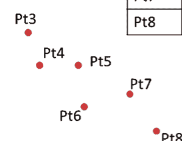

图 11.1 点几何图形及相关表格

| 点 | X | Y |
|---|---|---|
| Pt3 | 45676 | 37450 |
| Pt4 | 45769 | 37053 |
| Pt5 | 46289 | 37054 |
| Pt6 | 46301 | 36398 |
| Pt7 | 46785 | 36433 |
| Pt8 | 47014 | 35879 |

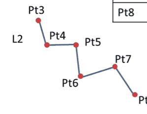

| 线 | 点 |
|---|---|
| L2 | Pt3 | Pt4 | Pt5 | Pt6 | Pt7 | Pt8 |

图 11.2 线几何图形及相关表格

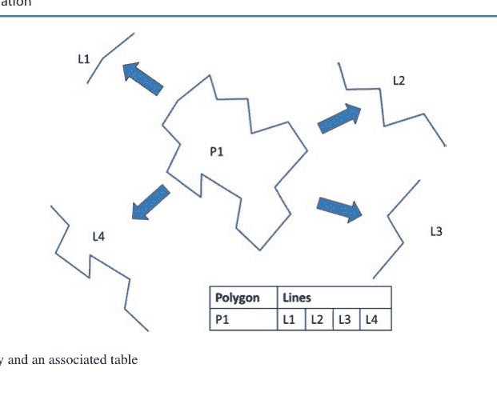

图 11.3 多边形几何图形及相关表格

## 任务 1：访问形状信息

将数据复制到您的工作区，并将所有数据添加到一个新地图中。我们将使用 Python Notebook 来完成这里的引导任务，尽管如果您的 ArcGIS Pro 版本不支持 Notebook，所有操作都可以在 Python 窗口中完成。

我们现在将使用 ArcGIS 中编码并通过 ArcPy 访问的形状信息，来检查三种主要矢量形状类型的各自属性。回顾前面的章节，矢量要素类都是表的子类。由于我们通过三种游标形式之一来访问表中的项目，并且子类从其超类继承功能，因此我们也可以对要素类使用这三种游标中的任何一种。这是可行的，因为虽然在计算机中它们是分开存储的（例如，对于 shapefile，.dbf 与 .shp 是分开的）；但在实践中，几何图形和属性是存储在一起的，因此表的文件和几何图形的文件必须位于同一文件夹中，与包含将几何图形与表链接信息的 .shx 索引文件放在一起。事实上，要素类的几何图形就隐藏在属性表中。请注意，在任何显式空间数据的属性表中，都会有一个名为“Shape”的列，通常是左起第二列，尽管这并不能保证。该列在属性表中的所有内容都会告诉您它是什么类型的几何图形（例如，“Point”）。嵌入在该几何图形中的是该要素的几何信息，尽管无法通过属性表直接访问。尽管属性表没有给我们直接访问几何图形的权限，但我们可以使用相同的 ArcPy 游标来访问它。我们通过一个特殊的内置变量名“SHAPE@”来访问几何信息，将其放入使用 `SearchCursor()`、`UpdateCursor()` 或 `InsertCursor()` 构造游标时要访问的变量列表中。

点、线和多边形都是通过 `Geometry` 对象访问的，这意味着所有属性对所有形状类型都可用，即使并非总有理由使用它，比如获取点几何图形的面积。如果您知道几何图形中需要的具体信息，可以在 @ 后添加属性，例如通过 `SHAPE@AREA` 获取面积。这些内容位于帮助文档的“几何标记”部分，网址为 [https://pro.arcgis.com/en/pro-app/arcpy/get-started/reading-geometries.htm](https://pro.arcgis.com/en/pro-app/arcpy/get-started/reading-geometries.htm)，但本章我们将使用通用的几何图形 `SHAPE@`。它允许您访问所有信息，尽管并非总是那么直接。

让我们从点开始，我们有一个名为“Office_cities”的图层。要访问几何图形，请运行以下代码行：

```
cityCursor = arcpy.da.SearchCursor("Office_cities", ["SHAPE@", "DESCRIPT"])
```

现在，我们将通过从该游标中获取单个几何图形来检查几何图形的工作原理。在上一个实验中，我们看到了如何使用 for 循环遍历表中的条目。这里，为了探索单个几何图形，我们只需要从该游标中获取一个要素。就像我们使用 `.next()` 函数一次检查 CSV 文件的一行一样，我们可以使用游标的 `next()` 函数一次遍历游标内容的一行，或者像这里一样，限制我们只获取第一个项目。运行以下代码行：

```
city = cityCursor.next()
```

游标的行为不会因为我们现在对形状感兴趣而改变，因此变量 city 包含一个项目元组，其顺序与定义游标的行中列出的顺序相同。这意味着几何图形位于列表中的第 #0 项。因此，通过运行以下代码行来访问该几何图形：

```
geom = city[0]
```

我们可以通过在空白的 Notebook 单元格中输入 geom 并运行它来确认这确实是一个几何图形。然后您将看到该几何图形所代表的点。当然，这里的点不是很有趣，但当我们有更复杂的形状时，这可能会更有用。无论几何图形的类型如何，我们可能想要查看的任何几何图形的一些属性如下：它包含多少个点、第一个和最后一个点、它的长度、它的面积以及它有多少个部分。以下最后一行提供了所谓的“WKT”或“Well Known Text”，这是几何图形的基于文本的表示。它的优点是可移植性；许多其他系统可以导入 WKT（这就是它闻名的原因！），这将是将几何图形从 ArcGIS 导出到其他系统的一种方式。

使用以下代码行集，获取信息以回答后续问题。虽然并非所有问题都需要这些信息，但请仍然运行这些代码行，因为它们对于回答后面涉及线或多边形的问题很有用，并且可以说明所有属性如何为所有几何图形类型提供，即使点的长度或面积之类的东西有点无趣：

```
print("Point Count: ", geom.pointCount)
print("First Point: ", geom.firstPoint)
print("Last Point: ", geom.lastPoint)
print("Length: ", geom.length)
print("Area: ", geom.area)
print("Part Count: ", geom.partCount)
print("Well Known Text: ", geom.WKT)
```

**问题 1：此几何图形列出的面积是多少？**
**问题 2：此几何图形有多少个部分？**

您可能已经注意到，虽然 WKT 提供了可以解析以提取坐标信息的文本，但这并不容易完成，并且第一个和最后一个点通过 Point 对象给出所有坐标（包括此处未使用的两个坐标），而不是直接的数字。您可以通过运行 type(geom.firstPoint) 来确认这一点。我们必须使用这个点对象，尽管为了展示如何访问包含多个点的几何图形中的任何点，而不仅仅是第一个和最后一个点，我们将使用不同的方法，通过几何图形对象使用一个函数：getPart()。在 Notebook 单元格中运行接下来的四行代码，从该几何图形中的第一个（也是唯一的）点创建一个点，并打印其 x 和 y 坐标。在一定的舍入容差内，这些坐标应与 WKT 中的坐标匹配：

```
cityPoint = geom.getPart()
x = cityPoint.X
y = cityPoint.Y
print("X: ", x, ", Y: ", y)
```

```
X: -80.087076 , Y: 38.220057
```

接下来，我们将查看线数据。有一个名为“Trails_in_WMA”的图层。使用以下代码行创建其游标并访问第一条小径的几何图形：

```
trailCursor = arcpy.da.SearchCursor("Trails_in_WMA", ["SHAPE@", "TRAIL_NAME"])
trail = trailCursor.next()
geom = trail[0]
```

由于我们使用了相同的变量名 `geom` 来表示几何图形，我们可以简单地运行与之前相同的 Notebook 单元格来打印几何图形的信息，例如点数、第一个点、长度和面积。重新运行该单元格，并使用打印输出回答以下问题：

**问题 3：此几何图形中有多少个点？**
**问题 4：此几何图形有多少个部分？**
**问题 5：第一个点和最后一个点相同吗？**

我们现在将访问几何图形的第一部分，以说明线的几何图形对象：

```
python
trailLine = geom.getPart(0)
trailLine
```

输入第二行后，您会注意到该线存储为一种我们尚未遇到的 Python 集合类型：数组。数组与列表非常相似，但列表可以包含多种数据类型，而数组则受到限制，只能包含单一数据类型。此几何图形中的每个项目都是一个点，这意味着这是一个点数组。作为一个点数组，我们可以将这条线视为按照这些点呈现的顺序进行“连接点”游戏的结果。与列表一样，我们可以使用 `for` 循环遍历数组，或使用方括号中的索引访问单个项目。

**问题 6：四舍五入到最近的米（这是此几何图形的单位），索引为 #5 的点的 X 和 Y 坐标是多少？**

为了说明类型约束，尝试使用以下代码行将数字 42 追加到数组中。在尝试运行它时，您应该会收到一条错误消息，关键信息在最后：您正在尝试添加一个既不是点也不是仅包含点的数组的项目：

```
python
trailLine.append(42)
---------------------------------------------------------------------------
ValueError                                Traceback (most recent call last)
In [18]:
Line 1:     trailLine.append(42)

File C:\Program Files\ArcGIS\Pro\Resources\ArcPy\arcpy\arcobjects\mixins.py, in append:
Line 188:     self.add(value)

File C:\Program Files\ArcGIS\Pro\Resources\ArcPy\arcpy\arcobjects\arcobjects.py, in add:
Line 96:     return convertArcObjectToPythonObject(self._arc_object.Add(*gp_fixargs(args)))

ValueError: Array: Add input not point nor array object
---------------------------------------------------------------------------
```

最后，为了对多边形数据执行相同的操作，我们将使用一个野生动物管理区。一切都应该与线非常相似，只是多边形中的点列表闭合了回路以将其与线区分开来，并且 WKT 的标题表明它是一个多边形，这意味着该要素可能包含多个多边形，例如群岛，即使它只有一个部分：

```
python
wmaCursor = arcpy.da.SearchCursor("WMA_0704_utm83", ["SHAPE@", "NAME"])
wma = wmaCursor.next()
geom = wma[0]
```

同样，使用与上述相同的单元格访问相同的信息，回答以下问题：

```
geom.pointCount
geom.firstPoint
geom.lastPoint
geom.length
geom.area
geom.partCount
geom.WKT
```

**问题 7：这个几何图形的面积是多少？**
**问题 8：第一个点和最后一个点是否相同？**
与线一样，我们将通过以下几行代码访问这个几何图形的第一个（也是唯一的）部分。当你运行这些代码以查看多边形几何图形的内容时，你应该注意到它的设置与线几何图形*非常*相似。事实上，两者都是点的数组，唯一的区别在于，对于多边形，第一个点和最后一个点是相同的，而对于线则不同：

```
wmaPolygon = geom.getPart(0)
wmaPolygon
```

为了说明列表和数组相似的另一种方式，我们可以通过以下代码找出数组中有多少个项目：

```
len(wmaPolygon)
```

根据数组的长度以及几何图形对象的点数属性，你应该看到它报告了七个点。然而，如果你通过在单元格中输入 `geom` 并查看形状本身，你应该看到它是一个不规则的六边形，这意味着该多边形有六条边和六个顶点。
**问题 9：为什么一个不规则的六边形的点数和数组长度是 7 个点？**

## 任务 2：使用几何相关方法

场景：步道管理。你有一系列位于野生动物管理区和办公室的步道需要管理。这些办公室位于五个城镇，这些城镇信息在 Office_cities 文件中。
使用几何帮助文档 (http://pro.arcgis.com/en/pro-app/arcpy/classes/geometry.htm)，找出最能给出两个几何图形之间距离的方法。认识到在以下代码中 `city[0]` 是城市的几何图形，`trail[0]` 是步道的几何图形，编写计算从城市到步道距离的表达式。
**问题 10：编写一个计算从单个城市到单条步道距离的表达式。**
然后，尝试以下代码，将你对问题 10 的答案替换到适当的位置，这应该会给出以下相对于 Marlinton 的距离：

```
trailCursor = arcpy.da.SearchCursor("Trails_in_WMA", ["SHAPE@", "TRAIL_NAME"])
cityCursor = arcpy.da.SearchCursor("Office_cities", ["SHAPE@", "DESCRIPT"])
for city in cityCursor:
    for trail in trailCursor:
        print ("The distance from ", city[1], " to ", trail[1], " is ", str(***Answer to Question 10***))
```

从 Marlinton 镇到 Durbin to Cass Connector Rail-Trail 的距离是 0.3630134655588971
从 Marlinton 镇到 Blackwater Canyon Rail-Trail 的距离是 0.9699017185940851
从 Marlinton 镇到 Shaver's Fork Valley Trail 的距离是 0.3357517019854554
从 Marlinton 镇到 Long Point Trail 的距离是 0.7747266850184706
从 Marlinton 镇到 Shavers Fork Road Trail 的距离是 0.772048417334362
从 Marlinton 镇到 Allegheny Trail 的距离是 1.0520851710706902

这些距离可能看起来都异常低（接近或低于 1.0）。这是因为答案可能是以十进制度为单位。我们的数据使用不同的投影，虽然 ArcGIS Pro 和 ArcPy 能够从一种投影转换到另一种，但它们并不总是按照我们希望的方向进行转换。在这种情况下，一个文件（Office_cities）使用十进制度，而另一个文件（步道）使用 UTM 坐标。与其冒险让 ArcGIS 继续将所有内容转换为 Office_cities 文件的十进制度，我们应该将 Office_cities 重新投影以使用其他数据的 UTM 坐标系。以下几行代码应该可以解决这个问题，当然，需要将 “N:/yourLocation” 替换为适当的文件路径。注意使用 .prj 文件，它存储了任何恰好附加了 .prj 文件的 shapefile 的投影信息：

```
inputFeatures = "N:/yourLocation/Office_cities.shp"
outputFeatures = "N:/yourLocation/Office_cities_proj.shp"
projection = "N:/yourLocation/Trails_in_WMA.prj"
arcpy.management.Project(inputFeatures, outputFeatures, projection)
```

这做了两件事。首先，也是最重要的，它创建了一个新文件 Office_cities_proj.shp，其中包含与 Office_cities 相同的城市，但几何图形存储在与 Trails_in_WMA 文件相同的投影和坐标系中。我们将在剩余的任务中使用这个新文件。然而，你可能最初观察到了另一个结果，即你可以看到运行 Project 工具后 Result 对象中的一些信息。如果结果的 Messages 组件中报告了问题，这将很有用：

Output
J:\noSpacesBackup\arc\DigitalEarthTest\2013\Lab7Data\Analysis\Office_cities_proj.shp
Messages
Start Time: Thursday, October 7, 2021 11:40:40 AM
Succeeded at Thursday, October 7, 2021 11:40:40 AM (Elapsed Time: 0.39 seconds)

编辑上面相关的单元格，确保 cityCursor 关联到新的要素类，然后重新运行它。你现在应该得到更接近预期的距离。然而，嵌套的 for 循环似乎表明你应该得到多个城镇的距离。毕竟，cityCursor 正在循环遍历五个不同的城市，但只分析了一个：

```
trailCursor = arcpy.da.SearchCursor("Trails_in_WMA", ["SHAPE@", "TRAIL_NAME"])
cityCursor = arcpy.da.SearchCursor("Office_cities_proj", ["SHAPE@", "DESCRIPT"])
for city in cityCursor:
    for trail in trailCursor:
        print ("The distance from ", city[1], " to ", trail[1], " is ", str(***Answer to Question 10***), " meters")
```

从 Marlinton 镇到 Durbin to Cass Connector Rail-Trail 的距离是 37008.85671598571 米
从 Marlinton 镇到 Blackwater Canyon Rail-Trail 的距离是 102933.77112816731 米
从 Marlinton 镇到 Shaver's Fork Valley Trail 的距离是 35882.950556587464 米
从 Marlinton 镇到 Long Point Trail 的距离是 67815.68038199408 米
从 Marlinton 镇到 Shavers Fork Road Trail 的距离是 82691.17533244715 米
从 Marlinton 镇到 Allegheny Trail 的距离是 108804.50092157851 米

**问题 11：回想一下游标的工作原理，以及这可能如何影响两个嵌套游标的使用，为什么你没有得到所有五个办公城市的距离？**

在上一章中，我们通过重做 `trailCursor = ...` 这一行来解决这个问题。正如编程中常见的情况一样，这并不是唯一的解决方案。游标带有一个 `.reset()` 方法，顾名思义，它会将游标重置为再次指向属性表的第一行。

**问题 12：通过在适当的行和缩进级别添加 `trailCursor.reset()` 来修改嵌套的 for 循环。²（你可以通过写“在这里打印距离”来简化打印语句。）**

**问题 13：列出每个城市最近的步道及其距离。（距离四舍五入到最近的米。）**

- Marlinton:
- Petersburg:
- Reedsville:
- Summersville:
- Weston:

## 任务 3：使用缓冲区创建新几何图形

几何图形的另一个方法是创建缓冲区。就像运行一些栅格工具不会创建永久栅格一样，可以创建缓冲区和其他几何图形，其方式*不会*创建新的 shapefile 或要素类。它只是为 ArcPy 的使用创建一个多边形对象，但不会将其转换为要绘制在地图上的图层。这就是 `Geometry` 对象的缓冲区方法与工具箱中的 Buffer 工具或相关的 ArcPy 命令的不同之处。优点是它比创建全新的 shapefile 或地理数据库要素集合更快。

为了存储面积，我们将使用一个字典来匹配一个键（在这种情况下是步道名称）和一个值（在这种情况下是缓冲区面积）。初始化过程之后的 `for` 循环将用每条步道周围 2000 米缓冲区的面积值填充字典；

```
trailCursor.reset()
areaDict = {}
for trail in trailCursor:
    name = trail[1]
    shape = trail[0]
    buffer = shape.buffer(2000)
    area = buffer.area
    areaDict[name] = area
```

要确认它有效，输入这一行以检索与 Allegheny Trail 相关的值：

```
areaDict["Allegheny Trail"]
```

**问题 14：Allegheny Trail 周围的缓冲区有多大，四舍五入到最近的平方米？**

## 任务 4：对两个多边形执行几何操作

我们的下一个任务是计算野生动物管理区的大小与该管理区内步道缓冲区大小的比率。

²仔细思考缩进、变量和 reset 方法的位置，并且为了确保，在运行修改后的代码之前保存项目——有一种错误的方式会导致无限循环！

## 任务 5：从零开始创建新几何图形

现在假设你已规划好野生动物管理区内一条新步道的路线。根据提供的坐标，我们将为此创建一个几何图形，并使用插入游标将其添加到步道图层中。首先要创建点，这可以通过一个名为 `arcpy.Point()` 的 arcpy 函数轻松完成。我们将用它为新步道创建七个点。这些点随后需要形成一个数组，因为这正是表示线坐标的方式。ArcPy 也提供了一个创建数组的函数，其输入是你希望包含在数组中的点列表：

```
point1 = arcpy.Point(599347.2, 4388183.01)
point2 = arcpy.Point(599915.79, 4387982.42)
point3 = arcpy.Point(599715.2, 4387320.48)
point4 = arcpy.Point(600036.14, 4387099.84)
point5 = arcpy.Point(599955.91, 4386377.72)
point6 = arcpy.Point(600457.37, 4386116.96)
point7 = arcpy.Point(600818.43, 4385976.55)

array = arcpy.Array([point1, point2, point3, point4, point5, point6, point7])
```

创建几何图形还需要了解其坐标系，这存储在该几何图形的空间参考中。毕竟，我们希望 ArcGIS 知道我们处理的是经纬度、UTM 还是其他坐标系。在本例中，由于我们是添加到现有的要素类中，我们可以通过获取该要素类中另一个几何图形的空间参考来找到该要素类的空间参考。由于我们一直在重用 `geom` 变量，我们需要回头确保它引用的是正确的游标。几何图形设置好后，我们就可以像访问任何其他属性一样访问其空间参考。在本例中，我们不是查看它，而是将其存储到一个变量中以备后用。设置好这些后，我们现在就可以实际创建新的线几何图形了。步道还有一些其他属性值得填写，因此我们也将为这些创建变量。它们是独立的变量，而不是直接在插入游标的命令中使用，因为在这里使用变量更容易识别哪个值对应哪个属性，并在需要时正确编辑脚本。所有数据准备好后，我们就可以使用 `InsertCursor` 向要素类添加一个要素：

```
trailCursor = arcpy.da.SearchCursor("Trails_in_WMA", ["SHAPE@", "TRAIL_NAME"])
trail = trailCursor.next()
geom = trail[0]
spref = geom.spatialReference
newLine = arcpy.Polyline(array, spref)
name = "Cheat Canyon Trail"
length = 0
cat = "Proposed Rail-Trails"
stat = "Proposed"
insert = arcpy.da.InsertCursor('Trails_in_WMA', ["SHAPE@", "TRAIL_NAME", "LENGTH", "CATEGORY", "Status"])
insert.insertRow([newLine, name, length, cat, stat])
del insert
```

运行上面的代码可能会产生一个神秘的数字输出。在本例中，它可能是 6，表示我们已向要素类添加了 FID #6 的步道。要查看新步道，我必须转到属性表并选择新行。然后我切换到地图，在内容列表中右键单击图层名称，转到“选择”部分，并选择“缩放到所选要素”。地图放大后，你可以使用识别工具查看周围的野生动物管理区，以回答以下问题：

**问题 17：哪个野生动物管理区包含我们的新步道？**

## 任务 6：调试练习

以下代码在正常运行时，会找到步道周围缓冲区与相关野生动物管理区的交集，以便该比率可以校正缓冲区可能超出野生动物管理区边界的情况。如果修复了，这可能对你完成下面的挑战任务 8 有所帮助。出于某种原因，要在几何图形的 `intersect()` 方法中创建多边形，你需要一个维度值 4。代码中有四处错误：

```
wmaCursor = arcpy.da.SearchCursor("WMA_with_trails", ["SHAPE", "NAME"])
ratioList = []
trailCursor.reset()
for trail in trailCursor:
    for wma in wmaCursor:
        if trail[0].contains(wma[0]):
            adjBuffer = trail[0].buffer(2000).intersect(wma[0])
            adjArea = adjBuffer.area()
            ratio = (100 * adjArea/wma[0].area)
            ratioList.append(ratio)
            print(trail[1], "is within", wma[1], "and the ratio is", ratio)
    wmaCursor.reset()
```

## 任务 7：自主练习

如果地图中尚未添加 `state_park_utm` 和 `nps_sept03_utm83` 要素类，请将它们添加到地图中。
我们希望在一个可能深受自然爱好者欢迎的区域进行市场调研，以便改进服务。有一个区域被确定为同时位于新河峡谷国家河流（来自 NPS 要素类）和巴布科克州立公园内。
**编写一个脚本，如果复制并粘贴到 Python Notebook 中，可以完成以下任务：**

- 1. 使用搜索游标提取这两个要素。
- 2. 使用适当的几何方法创建这两个要素*交集*的多边形。查阅文档以确定使用哪个几何方法。⁴
- 3. 使用 `analysis.Select` 函数创建一个名为“Babcock”的要素类，该要素类仅包含巴布科克州立公园。（可以是 shapefile 或地理数据库要素类。）
- 4. 使用 `analysis.Clip` 函数，将第 3 步的 Babcock 要素类裁剪到第 2 步的市场区域，并将输出要素类命名为“MarketArea”。（同样，shapefile 或地理数据库要素类均可。）
- 5. 保存为 .py 文件，并添加 4 条注释——在适当的行（或行）处各添加一条，以描述上述四个步骤的代码。

## 挑战任务 8

这是一个额外的挑战任务：将缓冲区裁剪到野生动物管理区区域，并向步道文件添加一个评估属性。
我要求你进行的比率计算忽略了缓冲区可能超出野生动物管理区的可能性。将其绘制出来，大多数缓冲区确实超出了。
重新审视任务 2 和 3 中的代码以考虑这一点，并仅使用缓冲区在野生动物管理区内的部分面积。
同时，向步道要素类添加一个名为“Evaluation”的属性，其类型为布尔值，如果可以建造则包含 `True`，如果不能则包含 `False`，使用第三部分开头设定的标准。

## 提示

浏览 ArcPy 帮助文档的几何图形部分，寻找可能有用的方法。
这可能需要比你最初预期的更彻底的修改。这就是为什么它是一个额外的挑战任务！

⁴如果你从 ArcToolbox 访问工具来完成此操作，而不是使用几何方法，你将被扣分。

## 映射—符号系统

## 12

### 引言：使用UML和类图管理复杂对象

在前面的章节中，我们了解了如何调查、如何操作，以及在较小程度上如何分析GIS数据的数据结构。这些数据结构不仅与分析和地理处理紧密交织，也与制图学密切相关。在ArcGIS的计算机图形学框架内，幕后进行了大量计算，这些计算也与数据结构相关。它必须获取空间坐标（如经纬度对），并计算出这对坐标在屏幕上的位置。接着是矢量数据的简化和概括，其中线条和多边形边界可能会被简化以加快绘制速度。这对于小比例尺（缩小显示）的地图尤为关键。如果你的莫农加希拉河线条非常详细，追踪着所有细小的弯曲，但地图缩小到整个西弗吉尼亚州，很可能整个弯曲都包含在屏幕上的单个像素内。如果是这样，就没有必要尝试绘制所有细节，因为这不会改变细节在屏幕上的显示效果。道格拉斯-普克线条概括算法就是执行这种简化的一种方法。

对于栅格数据，也有类似的简化方法以加快加载和渲染速度。这是通过金字塔实现的，你可能间接遇到过，因为ArcGIS经常询问你是否要创建金字塔。这些是数据在不同分辨率下的表示，通过合并像素来实现，因为就像河流的弯曲一样，如果许多栅格像素将适合单个屏幕像素，就没有必要尝试单独直接表示每个栅格像素。

所有这些计算机图形学算法都依赖于GIS数据结构，并且在某种程度上创建了新的GIS数据结构，即使它们只是用于在屏幕上显示数据的临时结构。我们不会在此深入探讨这些计算机图形学问题的具体细节，因为ArcGIS会为我们处理它们。相反，我们将探讨计算中数据结构的另一种方法。虽然这不是你直接放到地图上的那种数据，但地图如何从GIS数据构建的表示中包含了大量信息。这些额外信息，比如地图中有多少图层、某个要素类是什么颜色，以及分级统计图的分类断点，也都需要在计算机中表示。这些制图信息以另一系列计算数据结构的形式存在。本章和下一章将探讨arcpy映射模块（在ArcGIS Pro中称为`arcpy.mp`——如果你看到`arcpy.mapping`，你看到的是ArcGIS Desktop的脚本，而不是Pro）中的这些计算数据结构。

这些用于制图的计算数据结构再次使用了类和对象。虽然我们之前已经见过并使用过类和对象，但映射模块使用了比我们迄今为止遇到的更广泛的类。这是因为ArcGIS在从包含多个图层的地图一直到将州立公园内的瞭望点绘制为亮红色点（直径为四个屏幕像素，位于浅绿色多边形内，该多边形有深绿色边框，厚度为两个屏幕像素）的过程中，需要执行许多步骤。每个步骤都提供了关于如何绘制图像以及在屏幕上绘制什么的不同信息和决策。正如我们在第5章中采取了几个步骤，从指向CSV文件的文件路径到可以读取CSV文件的对象，并且沿途每一步都有不同类型的变量一样，每个制图步骤也有自己的对象和类。为了理清所有这些类，我们将使用比第7章介绍的更完整的UML类图版本。这些图不仅显示每个类的一般内容，还显示类之间如何连接。箭头显示哪个类用于访问其他类。用于连接所示类的方法和属性被包含在内，尽管为了节省空间和清晰度，其他属性和方法未被包含。数字告诉你后续类可以访问多少个实例。例如，`ArcGISProject`类的`listMaps()`方法给你一个地图列表，该列表可能包含任意数量的地图，包括零个，因此标记为0...n。附录（图12.1）提供了对此类UML图的更完整描述。

第一步是ArcGIS项目，由名为`ArcGISProject`的类表示。通过我们之前见过的方法，我们可以从项目中访问地图列表。我们还可以访问布局列表，这是下一章的主题。然后，每个地图都有一个图层列表，该列表可能为空也可能非空。这一点我们之前已经见过。我可以从Layer类扩展到一些面向数据的属性和方法，例如`dataSource`，但由于本章是关于制图符号系统的，我们继续讨论Symbology对象，通过`Layer.symbology`属性访问。

Symbology对象等同于ArcGIS Pro中的符号系统面板，访问相同的信息。正如栅格和矢量有不同的符号系统面板版本一样，我们可以使用Symbology类的对象通过`Symbology.colorizer`属性访问栅格着色器，或通过`Symbology.renderer`属性访问矢量渲染器。本章剩余部分的任务将只使用渲染器，尽管下面会讨论着色器以向你介绍它们。

此外，我们可以看到arcpy支持两种类型的栅格着色器。一种是`RasterUniqueValueColorizer`，用于（正如其名称所示）为每个不同的值或一组值使用唯一值，而另一种`RasterClassifyColorizer`用于拉伸值。两者都使用颜色渐变，在两种情况下都通过`colorizer.colorRamp`属性访问。你还会在两个着色器子类旁边看到一些具有更基本Python类型的属性只是简单地列出。例如，`RasterUniqueValueColorizer`有一个名为`field`的属性，类型为String。这是用于确定显示颜色的字段。类似地，`RasterClassifyColorizer`有一个类型为String的`classificationField`属性。此外，它还有一个`classificationMethod`属性，选项如"NaturalBreaks"和"Quantile"，告诉ArcGIS如何执行分类。

着色器之间的另一个区别是，虽然两者都使用颜色渐变来获取颜色，但`RasterClassifyColorizer`有一个分类断点列表，每个断点都是`RasterClassBreak`类。这些反过来将颜色表示存储为字典。字典如何变成颜色的细节将在后面讨论矢量符号系统时看到。该类有一个上限，是双精度类型。然而，没有下限，这表明分类断点是排序的，前一个类的上限可以被视为当前类的下限。标签表示为String，这是该类在图例和内容列表中的名称。同时，`RasterUniqueValueColorizer`没有一组分类断点，因为这与通过唯一值表示数据无关。相反，有一个`ItemGroup`对象列表，通过`RasterUniqueValueColorizer.groups`属性访问，每个项目组本身有一个项目列表，每个项目将颜色与一组值关联起来。

这说明了更改土地覆盖图中森林像素颜色所需的步骤数量。你必须获取项目并访问正确的地图，然后是该地图中的正确图层。然后你获取该图层的符号系统，并且作为栅格图层，获取其着色器。由于土地覆盖图将使用唯一值着色器，访问该着色器的项目组，然后是相应的栅格项目，其中"森林"在值列表中。然后你可以更改该项目的颜色。

不幸的是，矢量符号系统并没有更简化（图12.2）。矢量符号系统至少最初看起来比栅格符号系统更复杂，尽管实际上有一些相似之处。正如有两种类型的着色器一样，有四种类型的渲染器。`UniqueValueRenderer`与`RasterUniqueValueColorizer`相似，这并不令人意外。两者都有一个`groups`属性，访问`ItemGroup`类的对象列表。区别在于，虽然`RasterUniqueValueColorizer`的`items`属性给你一个`RasterItem`对象列表，但这里的`items`属性给出一个`Item`类型的对象列表。`Item`和`RasterItem`类都有一个值列表，尽管`RasterItem`将此列表中的所有值与一种颜色关联，而`Item`将它们与一个`Symbol`关联。符号在某种意义上是矢量符号系统的核心。大多数渲染器都以某种方式访问符号。我们很快将更详细地探讨符号。此外，正如`RasterUniqueValueColorizer`访问`ColorRamp`对象一样，`UniqueValueRenderer`也是如此。

对于表示栅格内分类数据的`RasterClassifyColorizer`，有两种主要方式通过此符号系统表示分类数据：通过更改颜色和通过更改符号大小。¹ `GraduatedColorsRenderer`是更改颜色的方法，而`GraduatedSymbolsRenderer`是更改符号大小的方法。属性与此区别相匹配，但由这些

¹是的，我知道点密度图和其他方法，但这里不涉及。

## 任务 1：基础映射任务——添加图层

在整个实验中，我们将使用一个包含若干参考图层的地理数据库：县（USCensus2010_arc）、州、高速公路、河流和城市。总体目标是制作一张按收入划分的县地图，其他图层作为参考。请将所有内容复制到您偏好的工作空间，并打开 Python 窗口，因为我们将使用它来完成本章的指导任务。

我已经为您提供了一个基本的起始项目，因此请打开 `mapping_start.aprx`，并修复不可避免的数据引用错误。您会注意到上述列出的图层中缺少一个：河流。我们将通过脚本添加此图层。打开 Python 窗口并输入以下两行：

```
aprx = arcpy.mp.ArcGISProject("CURRENT")
thisMap = aprx.listMaps()[0]
```

**问题 1：为什么将地图设置为“current”可能比指定文件位置更好？**

现在我们将添加河流图层。为此，我们需要两个图层对象：一个用于我们插入文档的图层，另一个用于告诉 ArcMap 在内容列表中的放置位置。`listLayers` 函数的工作方式类似于 `listMaps` 函数，但这里我们指定了所需的名称：

```
roadLayer = thisMap.listLayers("roads")[0]
```

**问题 2：为什么指定“roads”参数比使用道路图层的索引（例如 `thisMap.listLayers()[1]`）更好？**

与 `listMaps` 函数一样，即使列表中只有一个项目，它也会返回一个列表，因此 `[0]` 是必需的。我们必须将 ArcMap 指向正确的地理数据库图层以提供河流。（根据需要编辑文件路径。）完成后，它会将图层添加到地图并返回一个 Result 对象：

```
>>> riverLayer = arcpy.management.MakeFeatureLayer("C:/noSpaces/arc/WVAGP/mapping/mapping_start.gdb/rivers", "river_lyr")

<Result 'river_lyr'>
```

## 任务 2：更改图层属性

让州图层像这样覆盖县图层可能对我们没有太大用处，因此让我们将州图层设为不可见。要检索州图层并将其放入变量以持续访问，请输入以下行：

```
statesLayer = thisMap.listLayers("states")[0]
```

通过访问 arcpy for ArcGIS Pro 帮助网站并搜索 Layer 类来查看 Layer 类的属性。（它也位于 http://pro.arcgis.com/en/pro-app/arcpy/mapping/layer-class.htm。）保持此窗口打开；它以后会很有用！这些是您可以通过 arcPy 更改的图层属性。其中一些是“只读”的，例如 isRasterLayer。这意味着 arcPy 能够告诉您它是否是栅格图层，但您无法更改它。这是合理的，因为如果您可以在不同时切换其引用的数据集从矢量到栅格的情况下，将图层从矢量图层更改为栅格图层，这将造成重大问题并可能导致 ArcGIS 崩溃。其他属性，如透明度，标记为“读写”，这意味着您可以使用代码更改图层的透明度。是否有任何属性对我们想要做的事情特别有用？尝试此行：

```
statesLayer.visible = False
```

按回车键。您应该会看到类似这样的地图，州图层名称旁边的复选框未被选中。

因此，我们关闭了州图层以查看县图层，这可能是值得的。但也许我们更愿意将州图层设为空心，使用更粗的轮廓线，并为其添加标签，以供参考。我们将首先处理标签，并在下一个任务中解决符号化问题。

**问题 3：您可以使用什么代码使州图层可见？**

现在让我们为州添加标签。应该有一个 Layer 类的属性，您可以找到它，允许您显示标签。

**问题 4：它是什么？您需要在此处包含什么代码？**

正如我们使用 Describe 对象检查了不同类型的数据集一样，也有不同类型的图层（栅格、要素等），并且再次类似于 Describe 对象的属性，某些图层属性仅对特定图层类型可用。我们可以使用 supports() 方法检查是否支持某个属性。

例如，此行检查 `statesLayer` 是否支持 *contrast* 属性。然后创建变量以访问每个图层，而不仅仅是您当前拥有的州和道路图层变量。

```
statesLayer.supports("CONTRAST")
```

**问题 5：创建变量以访问每个图层，并使用它们来识别我们地理数据库中哪些图层（如果有）支持 *brightness* 属性？在此处输入相关代码。**

## 任务 3：更改符号化

如上所述，我们希望将州图层设为空心。这可以通过符号化属性来完成。如引言所述，我们需要通过一系列属性来编辑符号化。首先是图层的符号化属性。该属性又有一个渲染器，记录整个图层的绘制方式。有几种类型的渲染器，用于不同的图层显示方式。通过输入以下行并按 Enter 键来找出州图层的渲染器类型：

```
statesSymbology = statesLayer.symbology
statesSymbology.renderer.type
```

您应该得到下面问题 6 的答案：
**问题 6：（5 分）州图层的渲染器类型是什么？**
这种类型的渲染器意味着每个要素都使用完全相同的符号显示，我们可以通过以下第一行访问它。这是合理的，因为查看地图，所有州都将具有相同的颜色和相同的轮廓线粗细。（确切的颜色可能取决于 ArcGIS Pro 当天的感觉。）我们希望它是空心的，这通过以下第二行实现：

```
statesSymbol = statesSymbology.renderer.symbol
statesSymbol.color = {'RGB' : [0, 0, 0, 0]}
```

**问题 7：使用符号类的帮助文档，为什么指定颜色的列表中的*最后一个*数字是 0？**
您不应该看到任何变化。到目前为止，我们所做的只是编辑保存图层符号化的变量。回想一下第 2 章中名为 bob 的变量，它被赋予列表中的一个项目，但更改变量 bob 并不会更改列表。这里正在发生类似的动态，其中 `statesSymbology` 变量被更改，但这并未更改图层的符号化属性。² 我们现在需要返回以将这些编辑保存到图层中。这是通过设置图层的符号化属性来完成的。（毕竟，符号化属性是读写启用的。）

```
statesLayer.symbology = statesSymbology
```

现在它是空心的，但为了使州边界与县边界区分开来，我们希望给它一个更粗的轮廓线。这通过 `size` 属性实现：

```
statesSymbol.size = 3
statesLayer.symbology = statesSymbology
```

> ²我说“类似的动态”而不是“相同的动态”，因为出于某种原因，编辑名为 statesSymbol 的变量*确实*自动将更改反映在 statesSymbology 变量中，即使对 statesSymbology 的更改尚未被 statesLayer 变量反映。用计算机科学术语来说，就好像 ArcPy 使用按引用来访问 statesSymbol，但使用按值来访问 statesSymbology。

现在让我们转向县（counties）图层。我们可能首先想按中位年龄（MedianAge）来符号化县，并使用分级色彩方案。作为第5题处理过程的一部分，你应该已经创建了一个县图层变量。如果变量名与`countiesLayer`不同，请替换为适当的名称。第一步是访问其符号系统。接下来，我们想更改渲染器以支持分级色彩。这是通过符号系统对象的`updateRenderer()`方法实现的。和之前一样，你需要将修改后的符号系统变量放回县图层对象的符号系统属性中，以使地图上的任何更改生效。完成后，你可能会得到一个使用黄到红色彩方案的土地面积（ALAND10）分级色彩地图：

```
countiesSymbology = countiesLayer.symbology
countiesSymbology.updateRenderer('GraduatedColorsRenderer')
countiesLayer.symbology = countiesSymbology
```

既然我们已经将渲染器类型更改为分级色彩地图，这个特定的分级色彩地图可能不是我们想要的。因此，我们可以使用脚本对其进行一些更改。首先是我们正在使用的属性。然后，如果我们愿意，可以将色彩方案更改为蓝色色调。这是通过`aprx`对象的可用色带列表实现的。最后，我们再次需要确保更改反映在地图中：

```
countiesSymbology.renderer.classificationField = "MedianAge"
countiesSymbology.renderer.colorRamp = aprx.listColorRamps("Blues (5 Classes)")[0]
countiesLayer.symbology = countiesSymbology
```

## 任务4：调试练习

假设我们想使用不同的分类断点集，以及不同的颜色集。修复错误后，以下代码将把县图层更改为使用分位数断点。它们还将使用以下颜色的灰色色调，所有颜色均按RGB比例：(30, 30, 30)、(60, 60, 60)、(100, 100, 100)、(150, 150, 150)和(200, 200, 200)。共有四个错误：

```
colorsList = [[30, 30, 30, 100], [60, 60, 60, 100], [100, 100, 100, 100], [150, 150, 150, 100],
[200, 200, 200, 100]]
countiesSymbology = countiesLayer.symbology
countiesSymbology.renderer.classificationMethod = 'Quartile'
countiesSymbology.renderer.breakCount=5
breaks = countiesSymbology.renderer.classBreaks
index = 0
for break in breaks:
    break.symbol.color = {'RBG': colorsList[index]}
countiesLayer.symbology = countiesSymbology
```

## 任务5：自主练习

你现在将使用帮助文档、前面的任务以及可能的其他可用资源，来更改地图的符号系统以满足以下规格。使用arcpy，而不是图形用户界面（GUI），并保持在Python窗口中，以便更改立即可见。

城市图层：
（5分）更改为2磅大小的圆形。你可以保持颜色不变。

河流图层：
（5分）将其更改为蓝色（任何色调的蓝色均可接受）。

道路：
（5分）将其更改为使用内置的“Highway”符号。

州：
保持州图层不变。

县：
将其更改为使用以下内容的分级色彩地图：
（5分）人均收入（PCIncome）属性
（5分）7个类别
（5分）等间距分类系统
（每项20分，共30分）使用以下标签和颜色（RGB格式）

| 标签 | 颜色 |
|---|---|
| Very low income | (0, 20, 0, 100) |
| Low income | (0, 60, 0, 100) |
| Moderately low income | (0, 100, 0, 100) |
| Middle income | (0, 140, 0, 100) |
| Moderately high income | (0, 180, 0, 100) |
| High income | (0, 220, 0, 100) |
| Very high income | (0, 255, 0, 100) |

## 制图：布局

### 13

### 引言：地图与布局的数据结构

本章承接上一章，但第12章关注的是地图图形以及如何更改地图中图层的外观，而本章则关注地图在页面上的布局。用ArcGIS Pro用户熟悉的术语来说，他们清楚地图视图和布局视图之间的区别，第12章探讨了arcpy在地图视图方面能做什么，而本章第13章则探讨了arcpy在布局视图方面能做什么。

与第12章中的类一样，可视化类之间关系的结构会有所帮助，这在图13.1中呈现。和之前一样，我们有通过ArcGISProject访问的Map和Layout类。第12章关注的是附加到Map的类，而本章关注的是附加到Layout的类。它们都在地图元素的框架内，并通过`.listElements()`方法访问。此列表中可以包含几种类型的地图元素，下面的任务使用了其中四种：地图框元素、图例元素、地图周边元素（指比例尺和指北针等）以及文本元素。

虽然没有可以容纳这些属性的“LayoutElement”超类，但所有单独的元素类（甚至包括此处未介绍的那些）都有一些共同的属性。它们都指元素相对于页面的大小和位置：高度、宽度以及X和Y坐标。我们在此使用的某些布局元素类型还有其他特定的属性和方法。顾名思义，地图框是容纳地图图形的元素。这就是为什么它通过`.map`属性引用框内的地图，并引用一个相机对象，该对象告诉地图框在地图上的哪个位置居中以及使用什么比例进行缩放。

地图框被下一种类型的元素引用，即图例元素。毕竟，图例提供了地图内容的视觉描述，因此它需要能够引用地图框以访问其描述的内容。它还有一个LegendItems列表，其中包含这些描述。图例项内容的顺序在arrangement属性中。

我们将在本章中使用的另外两个布局元素是最直接的。文本元素包含文本，因此指的是地图标题或致谢等内容。地图周边元素的性质从其名称上不那么明显，但它指的是地图的其他辅助元素，如指北针和比例尺。

以下任务向你介绍并让你使用其中一些元素，以改善数据的制图呈现。作为初步说明，值得承认arcpy在这方面的局限性。可以在地图上移动元素，并在某些有限的情况下编辑它们。但是，严格在arcpy内无法创建地图元素，无论是地图框、图例、指北针还是其他任何东西。因此，我们将在此练习中混合使用图形用户界面（GUI）和Python窗口。即使在这种有限的设置下，使用arcpy仍然很有用，因为它可以让你对布局进行非常精细的控制，并能够记录布局中每个元素的确切位置，以便可以用相同或不同的数据重新创建它。

136

13 制图：布局

图13.1 选定布局相关类的类图

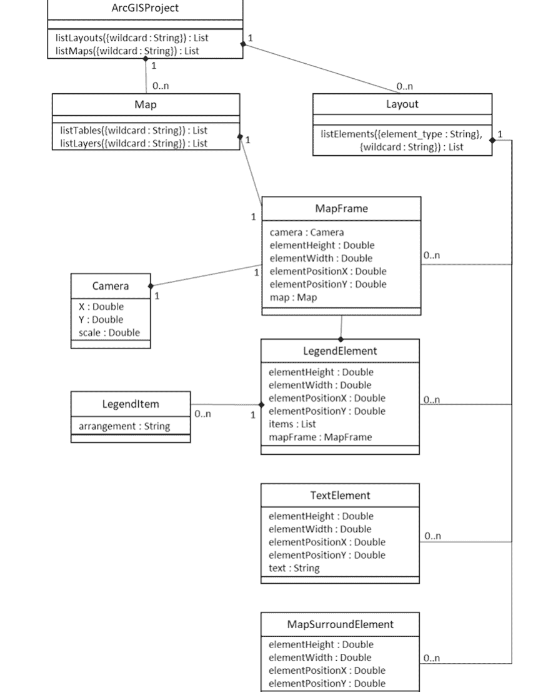

## 任务1：使用地图框

打开第12章的项目，并使其处于你完成自主练习部分时的状态。¹ 使用图形用户界面（GUI）向项目添加一个布局。这是通过“插入”选项卡 → “新建布局”完成的。使用选项左上角的字母大小。

一旦布局打开，我们就可以开始使用arcpy命令访问它。就像我们总是使用列表处理地图一样，我们也在这里使用列表，即使项目中只有一个布局。

在Python窗口中输入以下代码：

```
aprx = arcpy.mp.ArcGISProject("CURRENT")
layout = aprx.listLayouts()[0]
```

大多数时候，我们将使用布局来访问其中的各种元素。这是通过以下行实现的：

```
layout.listElements()
```

### 问题1：当前地图中有多少个元素？

即使这个布局如此通用，我们也可以从中看到一些有用的信息，因为它存储了页面信息。尤其重要的是要认识到页面单位，因为我们正在引入一种在某种意义上是第二坐标系的东西：页面坐标。这些坐标将用于在页面上定位和放置项目。你可以在布局视图中看到布局窗口顶部和左侧的标尺。这些代表页面坐标。使用文档或Python窗口策略（在点后等待以查看属性和方法选项），回答以下问题：

### 问题2a：页面的高度、宽度和单位是什么？
### 问题2b：你输入了什么代码来找出这些信息？

由于我们的布局目前不太有用，我们想做的第一件事是在其中放置一个地图框。我们必须在图形用户界面（GUI）中创建一个地图框。为此，使布局视图处于活动状态，然后转到“插入”选项卡并选择“地图框”。然后在布局中拖动一个矩形来放置地图框。你绘制矩形时不必精确，因为我们将使用arcpy来使其位置和大小完全符合我们的要求。一旦你这样做，你可能会得到一个像这样的布局（当然，这取决于你项目的缩放级别和你绘制的确切矩形）。

¹严格来说，不一定必须完全按照第12章末尾的指示进行。无论处于第12章的哪个阶段，布局代码都可以工作，尽管如果你有不同数量的可见图层或分级色彩地图中不同数量的类别，图例大小可能看起来会有所不同。

虽然这是一个不错的开始，但还有很多工作要做。要完成这些工作，我们需要访问刚刚添加的地图框。输入 `layout.listElements()`，然后按回车键确认布局中现在有一个元素。这个元素就是地图框，因此我们可以通过以下代码行来访问它：

```
mapFrame = layout.listElements()[0]
```

接下来，我们很自然地想要确保地图的缩放级别符合我们的要求，并且地图居中正确。上面的地图在这两方面都不达标。为了解决这个问题，我们需要访问一个中间对象——地图框的相机。正是相机记录了地图框内地图的比例尺、位置和范围。输入以下代码行将相机存储在一个变量中：

```
camera = mapFrame.camera
```

我们可能首先想设置相机的 X 和 Y 坐标，这对应于地图的中心点。使用以下代码行来完成此操作：

```
camera.X = -96
camera.Y = 40
```

你会注意到这些坐标是经纬度，而不是页面坐标，因为它们指的是地图本身在地图框内的放置位置，而不是地图框在布局页面中的放置位置。
地图的缩放级别可能也不对。这通过相机的 `scale` 属性来控制。输入以下代码行将其比例尺更改为 1:40,000,000：

```
camera.scale = 40000000
```

现在我们已经按照要求设置好了地图，任务的下一部分是将其放置在布局的正确位置。这就是页面坐标发挥作用的地方。页面坐标的结构是：原点位于页面的左下角，我们从那里向上和向右测量。我们希望地图框的左下角距离页面左侧 1 英寸，距离底部 4 英寸。这通过 `mapFrame` 变量的元素属性来完成。同样，我们可以使用元素属性将地图框的精确高度和宽度分别设置为 5 英寸和 6.5 英寸。输入以下代码来完成此操作：

```
mapFrame.elementHeight = 5
mapFrame.elementPositionX = 1
mapFrame.elementPositionY = 4
mapFrame.elementWidth = 6.5
```

最后，考虑到地图框中描绘的内容，你可能想将地图框的名称更改为 "Lower48"。
这通过以下代码行完成：

```
mapFrame.name = "Lower48"
```

## 任务 2：处理地图环绕元素

我们将要处理的布局下一部分是地图环绕元素。这里我们将使用两个：指北针和比例尺。在这两种情况下，我们都将使用通用的布局元素属性来指定我们希望它们所在的位置，尽管这只有在通过 GUI 添加它们之后才可能。
首先，我们将插入指北针。当布局视图处于活动状态时，转到“插入”选项卡，选择指北针。点击地图以放置它。与地图框一样，你不需要精确放置，因为我们将使用 arcpy 在页面上调整位置。
一旦添加，我们就可以使用 `layout.listElements()` 方法的输入参数选项来访问它。arcpy 中有几种不同类型的布局元素，我们通常知道要处理哪个元素。因此，我们可以通过以下代码行指定我们想要一个地图环绕元素。指北针具有固定的纵横比，因此我们实际上只需要设置宽度，即四分之一英寸。然后我们希望指北针位于地图框下方，右侧：

```
layout.listElements()
arrow = layout.listElements('MAPSURROUND_ELEMENT')[0]
arrow.elementWidth = 0.25
arrow.elementPositionX = 7
arrow.elementPositionY = 3.25
```

其次，我们将插入比例尺。同样，通过“插入”选项卡，但选择比例尺，并同样点击地图。通过以下代码访问比例尺：

```
scale = layout.listElements('MAPSURROUND_ELEMENT')[0]
```

你会注意到，除了变量名不同，这与用于访问指北针的代码相同，甚至列表索引也一样。列表中的所有项目都按照屏幕左侧“内容”面板中“绘制顺序”部分显示的顺序进行索引，顶部项目为索引 #0，列表末尾的项目在底部。当我们插入比例尺时，它被添加到绘制顺序的顶部，因此它是列表中的新索引 #0。

**问题 3：回想一下 Python 中变量赋值的工作原理，`arrow` 变量指的是指北针还是比例尺？为什么会这样？**

与指北针一样，我们只需要设置比例尺的宽度及其 X 和 Y 位置，我们希望它位于地图框下方，左侧：

```
scale.elementWidth = 3.75
scale.elementPositionX = 1
scale.elementPositionY = 3
```

## 任务 3：处理文本元素

对于我们的文本，我们需要两段文本：一个标题和一些简单的署名。与地图环绕元素一样，我们需要先使用 GUI 创建它们。要插入标题，转到“插入”选项卡，在“图形和文本”部分，选择带有纯 A 的按钮，悬停时会显示“直线文本”标签。点击地图以放置它。与地图环绕元素一样，我们可以使用 `listElements` 方法的输入参数来仅检索文本元素。当然，目前我们只有一个。标题应位于布局顶部，我们希望它相当大，因此输入以下代码行将其定位在布局中：

```
title = layout.listElements('TEXT_ELEMENT')[0]
title.elementHeight = 0.5
title.elementPositionY = 9.75
title.elementPositionX = 1.1
```

除了放置位置，我们还想将文本从 ArcGIS Pro 在布局上放置时创建的通用 "Text" 更改。这通过 `title` 变量的 `.text` 属性完成：²

```
title.text = "Reference and Income Map of U.S."
```

因为目前在绘制顺序中它具有通用标题 "Text"，我们还需要通过更改其名称来确保哪个文本是标题，哪个是署名：

```
title.name = "Title"
```

要添加的另一项是署名。你可以像标题一样为此插入另一个文本框，或者使用动态文本选项：转到“插入”选项卡，然后选择“动态文本”下拉菜单并选择“署名”。然后点击地图。无论哪种方式，你都会在地图上获得一个文本位置。我们希望这段文本位于布局的右下角，并将其名称设置为 "Credits"。对于标题，我们通过设置文本框的高度来指定大小。在这种情况下，我们可能更感兴趣的是文本字体的大小。我们可以使用 `.textSize` 属性来设置字体大小。在这种情况下，12 点的字体大小是合适的。我们希望文本分两行显示，这意味着我们将使用换行符（'\n'）。如果你在文件路径中没有正确使用斜杠，这可能是让你困惑的地方，但这次，我们需要它。插入以下文本，确保将我的名字替换为你的：

²出于我不理解的原因，我必须输入这行代码两次才能在布局视图中显示。如果你也必须这样做，请不要惊慌。

```
credits = layout.listElements('TEXT_ELEMENT')[0]
credits.name = "Credits"
credits.elementPositionY = 1
credits.elementPositionX = 6.5
credits.textSize = 12
credits.text = "Guide to Programming \n Jamison Conley"
```

## 任务 4：处理图例元素

我们布局中需要的最后一个元素是图例。与其他布局元素一样，我们需要在 arcpy 中处理图例之前，在 GUI 中创建和编辑它。

转到“插入”选项卡并选择“图例”，然后点击地图。它可能以单列形式出现，太长而无法在我们的布局中有用。两列会更好。现在图例的尺寸应该符合我们的要求，我们可以将其放置在布局的左下部分：

```
legend = layout.listElements('LEGEND_ELEMENT')[0]
legend.columnCount = 2

legend.elementPositionX = 1
legend.elementPositionY = 2.5
```

我们可以做的另一件事是更改县图层的显示名称，使其在图例中更具信息性。为此，我们需要返回并访问地图本身，因为图层是通过地图访问的，而不是布局。下面代码中 Census 前后的星号表示所谓的通配符字符。这意味着我们将访问名称中包含 "Census" 的任何图层，无论它是否是完整名称：

```
map = mapFrame.map
counties = map.listLayers("*Census*")[0]
counties.name = "2010 Income"
```

一旦所有这些都完成，我们最后需要导出布局。布局有许多导出方法，每种方法都基于特定的输出文件扩展名。我们可能希望有一个 PDF 以便广泛共享，因此输入这最后一行代码，将文件路径更改为你机器上的任何路径：

```
layout.exportToPDF("J:/...filePath.../USIncome_layout1.pdf")
```

**问题 4：此 PDF 将评估此布局所有部分位置的准确性。**

## 任务 5：调试练习

为了进一步改进布局，你可能希望将分级统计图图例部分拆分到两列中。修复后，以下代码应将整个分级统计图图例项放在第二列。你可能需要查阅 ArcPy 文档以获取相关类。有三个错误，但根据 ArcGIS Pro 在测试和调试过程中的行为，你可能需要进行四处更改：

```
legend.fittingStrategy = 'ManualStrategy'
items = legend.items()
choroplethItem = items[-1]
choroplethItem.column = 1
```

## 任务 6：自主练习

你可能注意到我们的布局中缺少了阿拉斯加和夏威夷。我们可以通过添加两个插图来弥补这一点，插图本质上是额外的地图框。请提供所有能在 arcpy 中完成此任务的代码。

将地图中心向南移动，以 35 度北纬为中心（而非 40 度），为插图腾出空间。
插入两个新的地图框（使用图形用户界面）。
将其中一个命名为阿拉斯加，另一个命名为夏威夷。
阿拉斯加需遵循以下规格：

- 地图 X = -150 度。
- 地图 Y = 60 度。
- 宽度 = 2 英寸。
- 高度 = 2 英寸。
- 比例尺 = 1:80,000,000。
- 元素位置 X = 1 英寸。
- 元素位置 Y = 4 英寸。
- 添加文本（使用图形用户界面），并将文本设置为“阿拉斯加”。
- 文本位置 X = 1.75 英寸。
- 文本位置 Y = 5.8 英寸。
- 文本大小 11 号字体。

夏威夷需遵循以下规格：

- 地图 X = -158 度。
- 地图 Y = 20 度。
- 宽度 = 1.5 英寸。
- 高度 = 1.25 英寸。
- 比例尺 = 1:20,000,000。
- 元素位置 X = 3 英寸。
- 元素位置 Y = 4 英寸。
- 添加文本（使用图形用户界面），并将文本设置为“夏威夷”。
- 文本位置 X = 3.75 英寸。
- 文本位置 Y = 5.05 英寸。
- 文本大小 11 号字体。

导出为 USIncome_layout2.pdf。

## 第三部分

## 创建算法以增强 ArcGIS Pro

一旦你在 GIS 中建立了数据结构，我们就可以将其与编程基础知识（特别是控制语句和函数的使用）相结合，开发新的算法，以扩展和增强 ArcGIS Pro 的功能。毕竟，大多数人进行 ArcGIS Pro 编程时，通常怀揣以下两个目标之一：编写脚本以自动化 ArcGIS Pro 中的一个或多个流程，使其比不断使用工具箱中提供的图形用户界面更便捷；或者编写程序以创建一个新工具，添加 ArcGIS Pro 中尚不具备的功能。

无论是哪种目标，理解算法都将极大地帮助开发实现这些目标所需的脚本和程序。虽然全面探讨 GIS 算法的内容会比本书所能容纳的更为广泛，并且这已经是现有书籍的主题，但本节为算法开发奠定了基础，并将其置于为 ArcGIS Pro 创建新工具和新类的背景下。

第 14 章介绍了创建新工具，使你能够直接在 ArcGIS Pro 中运行脚本；第 15 章在此基础上增加了更复杂的错误处理，使工具更用户友好。第 16 章进一步扩展，展示如何创建自定义类，以增强你在程序和脚本中使用的数据结构。最后，第 17 章提供了一个开发算法以解决问题的示例，并要求你在应用情境中开发自己的算法来解决问题。

我在此指出，在 ArcGIS Pro 中可以创建两种类型的自定义工具。本节重点介绍一种称为脚本工具的类型。它们更简单，因此是介绍如何使用脚本创建新工具的更温和的入门方式。另一种类型在第四部分的第 20 和 21 章中介绍，称为 Python 工具箱。这种方法更灵活，允许将多个 Python 文件整合到一个工具中。对于那些对更深入的 GIS 软件开发（包括为开源 QGIS 做出贡献）感兴趣的人来说，这种更高级的方法可能对你们更有用。

## 创建自定义工具

## 14

## 引言：用户界面的概念

到目前为止，我们已经看到可以在 ArcGIS Pro 的 Python 窗口中逐行输入 Python 语句，或在 Python Notebook 中逐块输入。此外，我们还看到了如何在 IDLE 中运行独立脚本。但是，如果你想在 ArcGIS Pro 中运行整个脚本呢？这可以通过自定义工具来实现。

自定义工具可以服务于两个目的。第一个是运行一个提供 ArcGIS Pro 中尚未实现的工具或分析技术的脚本。例如，某些形式的空间回归，如空间滞后回归和空间误差回归，在 ArcGIS 中并未实现。¹ 那么，自定义工具就可以完成这项任务。然而，你们大多数人可能不会从事那种水平的统计或分析计算，因为这种专业任务主要在学术研究界进行，而大多数地理学本科生毕业后并不会进入该领域。这就是工具的第二个目的所在：通过使 ArcGIS Pro 更易于访问，从而使其更易于使用。下面的讨论将阐述一些用户界面概念，这些概念有助于理解创建自定义工具的价值，而不仅仅是为 ArcGIS 添加新功能。

用户界面（包括 ArcGIS Pro）在两个目标之间存在固有的张力：使界面直观与使界面富有表现力。直观的界面易于使用，而富有表现力的界面则具有广泛的功能。在大多数情况下，直观的界面会因其仅执行少数任务而在表现力上受到限制。然而，富有表现力的界面通常以牺牲易用性为代价来获得其表现力。你可能很容易想到 ArcGIS 的这一点，认识到它在功能范围上非常强大，但并不用户友好或直观。

在表现力的最极端端，是命令行界面，这基本上就是脚本。命令的数量极其庞大，在 Python 中，我们可以导入许多包，通过导入更多的函数、类，从而进一步增加表现力。然而，正如你在本书中所学到的，它并不容易使用。

我们可以将 ArcGIS Pro 归入中间类别。得益于图形用户界面而非命令行，它更易于使用，但仍然有许多工具、菜单和功能区需要导航。虽然你不需要像使用 arcpy 那样频繁地查阅在线文档，也不需要记忆数百个函数和类，但在 ArcGIS Pro 界面的各个部分中仍然容易迷失方向。

在最直观的一端，在 GIS 背景下，我们或许可以将工具对话框作为一个例子。如果你只看单个工具，你会清楚地知道参数是什么，应该做什么，以及如何使工具正确运行。然而，无论带有输入对话框的工具多么直观，它只执行一项任务。因此，它在表现力上尽可能受限。跳出 GIS 背景，“自然语言处理”——即像亚马逊 Alexa 和苹果 iPhone 中的 Siri 这样的语音助手所使用的计算类型——或许是直观性的黄金标准。理论上，你可以要求 Alexa 将你家的温度设置为特定值，并（假设你有一个可以与 Alexa 配合的恒温器）让它相应地调整。² 同样，你可以向 Alexa 询问琐事问题、数学问题、拼写问题等的答案。这些都涉及计算，而 Alexa 毕竟在很大程度上是一台计算机。

因此，我们下面任务集的目标是，使用一个工具为建筑许可流程中常见的问题创建一个直观的功能，并将此工具嵌入到 ArcGIS Pro 项目中。最后，你将把这个项目及所有相关数据打包分享，以便所有工作都能轻松地与 GIS 知识较少的同事共享。

## 任务 1：创建自定义工具

## 关于应用

想象一下，你在负责评估开发申请的当地政府办公室工作。你是一名 GIS 分析师，负责维护存储在 ArcGIS 中的城市地籍。你的许多同事负责向申请人提供有关其房产的一些基本信息，并告知他们的申请是否可能获得有利考虑，但他们没有太多使用 GIS 的经验。所以你的工作是构建一个自定义工具，使你的同事能够有效地使用 GIS 来回答申请人的问题，而无需他们参加为期两周的 ESRI 培训课程。

当地政府的一条开发规则是，特定地块上的建筑物面积不得超过土地总面积的 30%。因此，你的工具需要做以下事情：

- 进行计算，算出土地目前被建筑物占据的比例。
- 告诉用户该地块目前被建筑物占据了多少。

启动 ArcGIS Pro 并创建一个新项目。当你这样做时，ArcGIS Pro 会自动为该项目创建一个工具箱。在 ArcCatalog 中，通过目录列表顶部的“工具箱”链接找到该新工具箱。其中应该有一个与新项目同名的工具箱。

右键单击它，选择“新建”→“脚本”。在弹出的“添加脚本”框中，输入名称 CalculateArea，标签“Calculate Area”³。最后，通过将“脚本文件”选项设置为你保存的 calculateArea.py 文件（无论你将其保存在何处），将工具与脚本关联起来。单击“确定”保存编辑。

你可能需要关闭并重新打开目录窗口中的“工具箱”箭头，或以其他方式刷新它。ArcGIS 不一定会更新显示以识别你已添加了工具，直到你关闭并重新打开它。

我们要做的本质上是构建工具的对话框。代替我们在 IDLE 中使用的 `input` 函数，我们需要在 ArcGIS 中有一个对话框来从用户那里收集这些信息。它最终比 `input` 函数更严格一些，因为它要求我们指定输入值的数据类型。它还允许输出值。指定数据类型的能力有助于我们立即解决许多潜在的混淆错误，例如，当期望输入栅格时用户却输入了要素集。

右键单击新创建的 CalculateArea 工具，选择“属性”。在左侧，选择“参数”而非“常规”。现在我们将输入两个参数。单击“标签”下方的第一个单元格，输入 Block Area。对于“名称”，输入 Block_Area 或 BlockArea（只要没有空格）。我们希望将其限制为实数，确保其类型为 Double。在 Block_Area 右侧的“数据类型”下，通过单击出现的小省略号 … 并在单击栏右端小三角形时出现的长列表中选择“Double”。

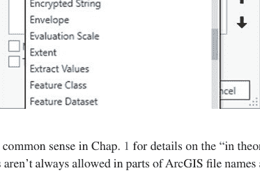

¹ ESRI 似乎在每个新版本的 ArcGIS Pro 中都在添加新的统计技术，因此此陈述可能很快就会过时。另请参阅第 19 章中整合了一个执行此操作的 R 程序的内容。

**补充信息：** 在线版本包含补充材料，可在 [https://doi.org/10.1007/978-3-031-08498-0_14] 获取。

² 关于“理论上”的评论，请参阅第 1 章中关于计算机没有常识的轶事以获取详细信息。

³ 请注意，名称没有空格，因为空格在 ArcGIS 文件名和文件路径的某些部分中并不总是允许的。同时，我们使用了一个更具可读性的标签。

## 任务 2. 为自定义工具编写脚本

在导入语句下方，输入以下四行代码：

```
blockArea = ARCPY.GetParameter(0)
buildingArea = ARCPY.GetParameter(1)
percentCover = (buildingArea / blockArea) * 100
ARCPY.AddMessage("Your building covers " + str(percentCover) + " percent of the lot")
```

# 问题 1：然后，添加注释来描述每一行代码的功能。

保存脚本。现在通过在 ArcGIS Pro 中再次运行你的工具来测试代码。你不需要关闭它或更改数值。只需再次点击“运行”按钮。这次查看详细信息时，你应该会看到另一条消息，具体来说就是上面第四行代码创建的那条消息。

至此，你可能已经认识到，在工具中运行脚本涉及一些函数，这些函数与你在其他上下文中见过的函数相似，但并不完全相同。由于参数是通过对话框提供的，我们需要某种东西来替代 `input` 函数，而 `ARCPY.GetParameter()` 正是为我们提供这项服务。括号中的数字⁴ 是我们想要从列表中获取的参数的索引。还记得在工具属性的“参数”集中输入地块面积和建筑面积的参数吗？这就是我们获取它们的方式，索引就是我们想要的内容在该列表中的位置。地块面积位于顶部，因此 `blockArea` 变量作为参数 #0 被访问。建筑面积是此表中的第二行，因此 `buildingArea` 是从参数 #1 创建的。同样，`print` 函数在工具中无法正常工作，因为没有输出窗口可以打印任何内容。我们通过 `ARCPY.AddMessage()` 函数来解决这个问题。我们在第 9 章中，在 `Result` 对象的上下文中查看了消息。这里我们看到这个消息是如何创建的。我们还看到如何在字符串上使用 + 运算符。它只是将第二个字符串附加到第一个字符串的末尾，因此 “Hello” + “World” 变成 “HelloWorld”。请注意，如果你想让内容看起来正常，必须注意空格，所以我可能建议使用 “Hello” + “ ” + “World”。在某些情况下，比如 `print` 函数，这等同于 “Hello”, “World”，但使用逗号分隔符会产生错误消息。问题 2 要求你找出原因。

# 问题 2：使用 `AddMessage()` 函数的帮助文档或它创建的错误消息，为什么我们应该对字符串使用 + 运算符，而不是像 `print` 函数那样使用逗号分隔符？

如上所述，工具的一个优点是通过指定输入变量的类型，可以消除相当多的运行时错误，但这并不能使我们免于逻辑错误。

# 问题 3：这段代码可能允许用户犯什么逻辑错误？（包括你在测试代码时能够引发的任何逻辑错误？）逻辑错误是指程序给出的结果不是用户预期的错误。

我们可以在代码中做的一个小改进是，如果建筑面积的值大于地块面积，则警告用户。如果用户没有注意输入对话框的提示，先输入了建筑面积，就可能发生这种情况。这可能比一条简单消息所能处理的更严重，因此我们不会给用户一条消息，而是给他们一个警告，表明他们可能做错了什么。在 `ARCPY.AddMessage("...")` 行之后，将以下代码行添加到你的程序中，并保存文件：

```
if percentCover > 100:
    ARCPY.AddWarning("Your building area is greater than your block area. Please check your values and reenter them.")
```

⁴ 由于 GetParameter 是一个函数，是的，这个数字是 GetParameter 的参数。但简单地说“GetParameter 的参数是参数列表中参数的索引”会令人困惑。

尝试使用应触发警告的值进行操作，你会看到一个黄色框，显示“计算面积已完成，但有警告”。如果你继续查看详细信息，你会看到警告，它以黄色显示，并带有黄色的三角形警告标志。但是，转到消息区域，常规消息和警告都会出现。

回想一下场景设置，你当地政府的一条开发规则是，特定地块上的建筑物面积不得超过土地总面积的 30%。超过 100% 的比率可能表示输入错误，而 30% 到 100% 之间的值可能表示一个应该被拒绝或至少需要进一步审查的申请。因此，为此，我们将使用 `AddError()` 函数。

在脚本末尾，添加以下行以扩展 `if` 语句，使其具有另一个 `elif` 条件：

```
elif percentCover > 30:
    ARCPY.AddError("Your building might be too big to pass the permit process. Please check your measurements!")
```

保存脚本，并使用应产生此错误的值再次运行该工具。现在你会收到一条消息，表明工具失败了。查看详细信息以了解它如何失败，你会发现罪魁祸首是你刚刚放入脚本中的错误消息。毕竟，如果你向输出添加一个错误，并使用应触发该错误消息的参数运行该工具，它会认为该工具失败了，这是有道理的。虽然我们将在后面的章节中继续扩展这个工具，但目前，我们将转向与他人共享该工具。

## 任务 3：共享工具

使此工具变得有用的最后一步是能够与所有人共享该工具和相关数据。毕竟，我们希望 ArcGIS Pro 的新手用户无需大量培训即可尽可能简单地运行它。虽然最初猜测共享 .aprx 文件可能有意义，但它对计算机有隐含的指令，例如“从该来源获取第一层的数据”，如果“该来源”是你计算机上的文件夹而不是公共驱动器，ArcGIS Pro 将无法找到它。相反，我们想创建 ESRI 所称的“项目包”，它提供了我们可能需要的一切。

将提供的三个 shapefile 加载到地图中。然后转到 **共享** 功能区并选择 **项目** 项，这是功能区中最左边的项，位于 **包** 部分。这会弹出一个标记为“打包项目”的窗口，位于左侧，工具（可能）之前所在的位置。将包保存到文件而不是在线帐户，确保选择一个有意义的名称和文件位置。添加项目用途的摘要，确保它符合场景。同样，添加一些标签。如果你的组织有许多项目，这些标签会很有用，你可以使用标签轻松找到给定任务的相关项目。

确保选中“在组织外共享”框，因为这应确保包含数据。还要确保选中“包含工具箱”框，因为这是共享工具箱和相关工具所必需的。最后，如果你按照说明操作并在上一个任务中生成了错误消息，请取消选中“包含历史记录项”框。如果选中此框，地理处理历史记录中的错误将导致此部分失败。

点击“打包”按钮。如果它要求你先保存项目，请这样做。

**问题 4：** 该包将根据以下标准进行评估：
A. 它是否包含数据和工具并能正常打开？
B. 该工具是否为可接受的建筑面积和地块面积创建了适当的消息？
C. 如果地块面积大于建筑面积，该工具是否生成警告？
D. 如果建筑物对于地块来说太大，该工具是否生成错误？

## 任务 4：批判性思维

代替本章的调试和无指导编程部分，我将让你考虑关于直观与表达性界面的介绍性评论，并回答以下问题：

**问题 5：** 牢记引言中关于用户交互的原则，讨论至少一个你能想到的改进，以改进这个用于评估地块内建筑物的特定任务的界面（如果你理论上可以进行任何类型的更改——而不仅仅是你知道如何实现的更改）。

## 错误处理 15

## 引言：管理更复杂代码的策略

本章承接第14章的内容，继续在前一个实验的宗地应用背景下，提升 ArcGIS Pro 的可用性。我们将尝试通过两种方式来改进。第一种是更改参数，允许用户输入地块编号或建筑物的街区和区段编号，而无需知道地块大小和建筑物占地面积。第二种改进是改善错误处理方式，使用户更少收到难以理解的错误信息。

为了实现这些改进，我们的 Python 代码需要更复杂的结构，包括定义自己的函数并使用多个函数。支撑这种复杂性的大部分概念并不新鲜。本书第一部分几乎提供了你需要知道的所有内容，无论是定义和调用函数，还是使用条件语句。唯一的新内容是一些管理和创建错误信息的额外方法，这些将在程序中引入时进行介绍。

更大的变化在某种程度上是程序的长度，因为文件会变长。随着它的增长，尤其是在后续章节中复杂性持续增加时，你可能会发现使用之前介绍的伪代码大纲和/或流程图来更好地规划代码以及理解其功能会很有用。最后，本章说明了程序内代码演进的一个现实方面。添加和更改并非以整洁、线性的方式进行，而是无序地添加到代码的不同部分。这反映了实践中经常发生的情况，特别是对于那些太长而无法一次性从头到尾顺序开发的大型项目。

## 任务 1：更新工具的参数列表

进行这些升级的第一部分是弄清楚我们需要从用户那里获取哪些信息，以使这种更新的方法成为可能。我们将更改工具接受的参数集来实现这一点。首先，我们需要知道他们提供的是哪一组信息。这意味着将第一个参数从地块面积更改为设置他们选择的选项：地块编号或建筑物街区/区段编号。将“标签”更改为“选项”，将“名称”更改为“选项”。我们希望这是一个字符串，因此将“数据类型”更改为字符串。参数列表中将有一个我们将使用的新设置，因为我们只希望选择两个选项中的一个。有一个名为“过滤器”的设置。选择它，然后选择“值列表”。输入第一个选项（“地块编号”——不带引号），然后单击 + 按钮添加另一行。然后输入“建筑物街区与区段”。关键是要让这些字符串与这里显示的完全一致。这些字符串中的拼写错误会导致代码出现严重问题。¹ 它应该如下所示。

¹ 除非你在代码中有匹配的拼写错误，但这不是推荐的策略。

单击“确定”。然后将第二个参数的“标签”更改为“地块编号”，并将其数据类型设置为字符串。² 我们还希望它是一个可选参数。同样，我们需要为建筑物街区编号和建筑物区段编号添加两个可选参数。这些可以是长整型数据类型。完成后，参数列表应如下所示。

**问题 1：为什么我们将最后三个参数设置为可选，而不是必需？**

## 任务 2：创建函数以使代码更易于管理

现在我们已经更改了参数列表以适应这些升级，我们需要更改脚本。如引言中所述，流程图可能会有所帮助。首先，让我们看看我们工具现有程序的流程图（图 15.1）。

> ²是的，字符串，尽管它是一个数字。事实证明，地块编号在数值上非常大，甚至不适合长整型数据类型。因此，我们将不得不将它们视为字符串，这是可以接受的，因为无论如何它都是一个分类变量。

图 15.1 初始流程图

首先，我们将更改收集参数的代码部分，以获取所有四个参数，而不仅仅是之前的参数，这本身不需要对流程图进行任何更改。然而，它确实意味着我们需要更多的代码，因为我们不再直接从用户那里获取 `buildingArea` 和 `blockArea`，因此必须从用户提供的标识符中查找它们：

```
import arcpy as ARCPY

option = ARCPY.GetParameter(0)
lotNumber = ARCPY.GetParameter(1)
buildingBlock = ARCPY.GetParameter(2)
buildingSection = ARCPY.GetParameter(3)
```

因为用户可以提供两种选项之一的标识符，所以在获取参数后，我们现在需要一个条件语句来识别选择了哪个选项，这是合理的。由于第一个参数的两个选项，我们的脚本将有多种完成方式。这直接增加了复杂性，但也间接增加了复杂性。在两种选项中，我们都希望执行现有流程图剩余部分的计算。然而，如果我们认为可能使用 if/else 语句来处理这两个选项，为什么要在 if/else 语句的两个部分中重复相同的计算代码呢？为了处理这个问题，使用函数是常见的做法。我们将首先把代码的主要逻辑放入一个函数中。这给出了下一个流程图，现在显然不完整，因为并非所有部分都已连接（图 15.2）。

这需要在代码中进行一些更改。回想一下，函数必须以 `def` 关键字开头的行开始，因为这是定义函数的方式。我们需要几个参数来执行这些计算：建筑物面积和街区面积。这些被设置为 `def` 语句的参数。完成后，目前唯一的更改是确保我们使用 `return` 关键字返回计算值。我们稍后会处理条件语句：

```
def calculate(buildingArea, blockArea):
    percentCover = (buildingArea / blockArea) * 100
    if percentCover > 100:
        ARCPY.AddWarning("Your building area is greater than your block area. Please check your values and reenter them")
    elif percentCover > 30:
        ARCPY.AddError("Your building might be too big to pass the permit process. Please check your measurements!")
    return percentCover
```

从新定义的函数反向推导，我们现在需要有方法获取用户提供的信息，并使用它来查找建筑物面积和街区面积。一旦完成，这些值就可以作为此函数的输入。由于我们设置工具的方式，为地块选项和建筑物选项分别创建函数会很有帮助。`def` 语句如下所示，但尚未包含任何代码。这将在下一个任务中完成：

图 15.2 引入函数

```
def calculateFromLot(lotNum):

def calculateFromBuilding(bBlock, bSection):
```

## 任务 3：添加 Try/Except 结构

此任务开始以一种我们可以用来使工具更易于使用的方式处理错误。在此上下文中，错误是你在调试时经常遇到的事情，例如 `SyntaxError` 或 `TypeError`。我们可以做得比等待 Python 为我们生成错误更好。当我们已经有 `ARCPY.AddError()` 函数可以向用户提供错误消息时，创建错误最初可能看起来是多余的。然而，使用错误对象使我们能够更灵活地处理它们。如果我们知道某些事情不对，例如建筑物大于其地块，我们可以自己创建错误。此外，如果出现导致错误的情况，但我们可以提供解决方法，这也是我们可能想要解决的问题。通过这种方式，我们可以更智能地使用错误，使用户的生活更轻松。

错误是通过 `raise` 语句创建的。这些发送错误消息。这些消息随后在调用生成错误的行的代码中接收。如果该代码无法处理错误，它会将错误消息发送回去，并沿解析堆栈向上传递。回想一下第6章关于调试的回溯，其中错误在函数的第23行被发现，但该函数是在第68行被调用时发生的。错误在函数的第23行被引发，错误消息在第68行被接收。在那一章中，第68行无法处理它，因此脚本停止运行，你作为程序员收到了错误消息。更改函数以引发错误会稍微改变流程图，从发出警告和错误变为引发 `ValueError` 对象。这意味着一个值是错误的，例如建筑物面积大于地块面积，或者地块被覆盖的百分比可能导致许可证被拒绝的情况（图 15.3）。

请参阅下文了解这些是如何更改的，包括在括号内包含对用户更有用的消息。这是拥有自定义错误的另一个有用目的；你可以控制消息的内容，因此可以尝试使它们对用户尽可能有用：

```
def calculate(buildingArea, blockArea):
    percentCover = (buildingArea / blockArea) * 100
    if percentCover > 100:
        raise ValueError("Your building area is greater than your block area. Please check your values and reenter them")
    elif percentCover > 30:
```

## 任务 3：添加 Try/Except 结构

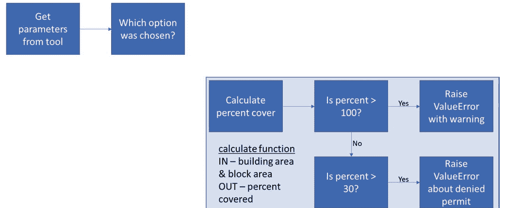

图 15.3 将消息更改为错误

```python
raise ValueError("Your building might be too big to pass the permit process. Please check your measurements!")
return percentCover
```

接下来，我们将处理错误处理的另一部分，即捕获错误以防止用户看到错误消息。这涉及一种新的复杂语句类型：`try/except` 块。Python 将尝试运行 `try` 块中的代码。如果成功，很好。`try` 块内的代码将完全执行，而 `except` 部分将被忽略。但是，如果发生错误，Python 将检查引发的错误类型是否在结构的 `except` 部分中。如果列出了该类型，则执行相关 `except` 块内的代码。如果未列出该错误类型，则发生的错误将传递给 ArcGIS Pro，并且几乎肯定会导致一堆错误消息和红色文本，而你原本期望得到输出。最后，请注意，我们将 `ValueError` 捕获为一个名为 `ve` 的特定变量。这允许我们访问错误内部的消息，该消息是在我们创建消息时放入的。这里显式使用 `ValueError`，因为它是在函数内部引发的。将其放在程序文件的最末尾：

```python
try:

except ValueError as ve:
    ARCPY.AddError("There was an error during the operation of the tool. " + str(ve))
```

现在我们将为 `try` 块填充代码，这主要涉及将参数获取行从脚本开头移动过来，最后添加那个 `if/elif` 语句，以根据用户在选项参数中选择的值来控制发生的情况。让我们首先通过更新流程图（图 15.4）来规划一下。

要更新代码，认识到选项被限制为设置新对话框时值列表过滤器中的值会有所帮助。我们将在条件语句中使用这些受限值，知道它们必须匹配，只要没有拼写错误。这将 `try` 块填充如下：

```python
try:
    option = ARCPY.GetParameter(0)
    if option == "Lot Number":
        lotNumber = ARCPY.GetParameter(1)
        pctCover = calculateFromLot(lotNumber)
    elif option == "Building Block & Section":
        buildingBlock = ARCPY.GetParameter(2)
        buildingSection = ARCPY.GetParameter(3)
        pctCover = calculateFromBuilding(buildingBlock, buildingSection)
    ARCPY.AddMessage("Your building covers " + str(pctCover) + " percent of your lot. It should pass.")
except ValueError as ve:
    ARCPY.AddError("There was an error during the operation of the tool. " + str(ve))
```

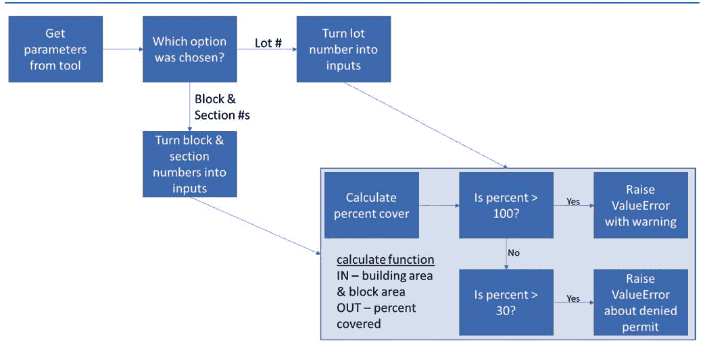

图 15.4 将选项计算添加到流程图

**问题 2：为什么我们可以相当有把握地说，如果代码执行到带有 ARCPY.AddMessage 函数的那一行，那么这些值确实会通过？³**

## 任务 4：我们现在将填充两个中间函数

最后需要填充的是两个剩余的中间函数，将用户输入转换为 `calculate` 函数定义所需的内容。一旦这些函数填充完毕，我们将拥有三个函数和一个 try/except 代码块。虽然你可能一开始认为从地块编号到建筑和地块面积的转换很简单，但一个子任务的流程图可能会消除你的这种想法。你应该能够识别出我下面给出的流程图和函数中大部分（如果不是全部）正在发生的事情。无论用户采取哪种方法，都会设置一个查询来搜索相关信息。完成后，使用游标从表中获取相关信息。在第一个函数中，假设每个地块编号只有一个地块。然而，问题 3 中的这个假设在建筑游标中并不存在。因为一个地块可以有多个建筑物，所以我们必须遍历所有建筑物，寻找其中任何一个具有正确街区和区段值的建筑物。还要注意，我直接在 return 语句中调用了 calculate 函数，这说明了从一个函数内部调用另一个函数的能力。

**问题 3（10 分）：这个假设如何证明使用 `.next()` 函数的合理性？**

³目前假设 calculateFromLot 和 calculateFromBuilding 函数将被正确实现。

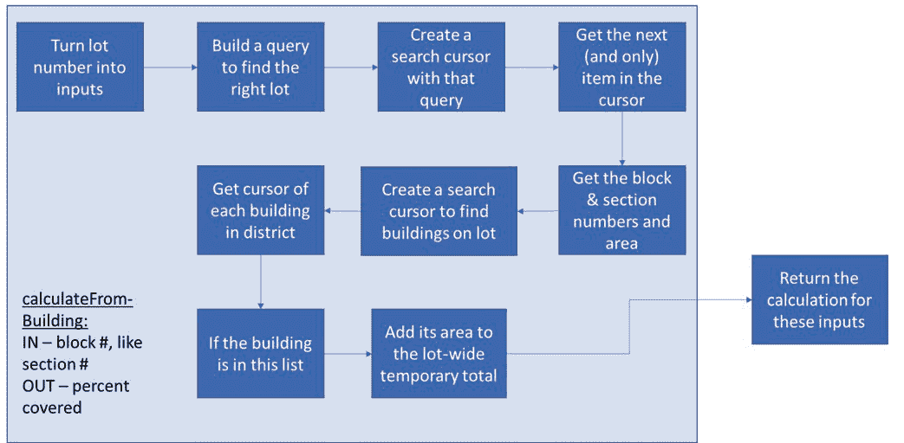

此部分的代码如下所示：

```python
def calculateFromLot(lotNum):
    query = '"KEY" = ' + str(lotNum)
    search = ARCPY.da.SearchCursor('lots', ["AREA", "KEY", "BLOCK", "SECTION"], query)
    lot = search.next()
    lotArea = lot[0]
    lotBlock = lot[2]
    lotSection = lot[3]
    buildings = ARCPY.da.SearchCursor('buildings', ["BLOCK", "SECTION", "F_AREA"])
    buildingsTotalArea = 0
    for building in buildings:
        buildingBlock = building[0]
        buildingSection = building[1]
        buildingArea = building[2]
        if lotBlock == buildingBlock and lotSection == buildingSection:
            buildingsTotalArea = buildingsTotalArea + buildingArea
    return calculate(buildingsTotalArea, lotArea)
```

然而，每个地块只有一个 ID 号的假设在建筑游标中并不存在。因为一个地块可以有多个建筑物，所以我们必须遍历所有建筑物，寻找其中任何一个具有正确街区和区段值的建筑物，并保持所有建筑物的运行总计，这涉及更多的计算。另外，注意到地块文件具有相同的信息，我们可以重用此查询来查询地块文件，并再次使用 next 函数，因为只有一个地块具有该 ID 号：

```python
def calculateFromBuilding(bBlock, bSection):
    query = '"BLOCK" = ' + str(bBlock) + ' AND "SECTION" = ' + str(bSection)
    buildings = ARCPY.da.SearchCursor('buildings', ["BLOCK", "SECTION", "F_AREA"], query)
    lot = ARCPY.da.SearchCursor('lots', ["AREA", "BLOCK", "SECTION"], query).next()
    lotArea = lot[0]
    lotBlock = lot[1]
    lotSection = lot[2]
    buildingsTotalArea = 0
    for building in buildings:
        buildingBlock = building[0]
        buildingSection = building[1]
        buildingArea = building[2]
        if lotBlock == buildingBlock and lotSection == buildingSection:
            buildingsTotalArea = buildingsTotalArea + buildingArea
    return calculate(buildingsTotalArea, lotArea)
```

**问题 4：回想一下你（可能）仍在上一个实验的项目包中工作，为什么在这种情况下，在游标函数中直接使用 lots 和 buildings 的图层名称是可以接受的？**

## 任务 5：在工具中运行脚本并进一步改进错误处理

有了这些函数填充完毕，我们应该准备好脚本的所有部分以在工具中运行。如果你对不在与项目包关联的某个晦涩文件夹中的脚本进行了更改，则需要在工具的属性→常规区域中更改脚本文件，使其指向你一直在编辑的任何文件。⁴

使用地块编号选项运行工具，地块编号为 12181240006。

**问题 5：此地块中建筑覆盖地块的百分比是多少？**

然而，输入一个不存在的地块编号会引发 "StopIteration" 异常。⁵ 这对新手用户来说会很困惑，所以我们希望修复它，以便用户至少得到一个更容易理解的错误消息。我们可以在 try/except 块中有多个 except 子句，就像我们可以有多个 elif 子句一样。在这种情况下，捕获 StopIteration 异常，并通过 ARCPY.AddError() 函数将其消息替换为更好的响应。完整的 try/except 块如下所示，新代码在最后三行：

```python
try:
    option = ARCPY.GetParameter(0)
    if option == "Lot Number":
        lotNumber = ARCPY.GetParameter(1)
        pctCover = calculateFromLot(lotNumber)
    elif option == "Building Block & Section":
        buildingBlock = ARCPY.GetParameter(2)
        buildingSection = ARCPY.GetParameter(3)
        pctCover = calculateFromBuilding(buildingBlock, buildingSection)
    ARCPY.AddMessage("Your building covers " + str(pctCover) + " percent of your lot. It should pass.")
except ValueError as ve:
    ARCPY.AddError("There was an error during the operation of the tool. " + str(ve))
except StopIteration as si:
    if option == "Lot Number":
        ARCPY.AddError("Your lot number doesn't exist.")
```

为了了解发生了什么，让我们跟踪异常在此处引发和传播的过程。当在 calculateFromLot() 中对名为 search 的游标调用 next() 函数时，会发生 StopIteration 异常。该异常在那里被引发，并且 calculateFromLot() 函数的执行立即停止。然后异常上升到调用该函数的地方，即 try/except 块的第五行。由于这在一个

⁴至少在项目包内，这是一个容易犯的错误，因为该包将文件复制到一个相当晦涩区域的新项目中，因此将脚本更改为保存上一个实验材料的位置可能更容易使用。
⁵异常和错误之间存在差异，尽管这种差异超出了本书的范围。

在 `try/except` 代码块中，计算机会检查是否存在 `except StopIteration` 子句。之前没有这个子句，所以整个程序的执行会停止，并在工具中显示一条错误信息。现在有了 `except StopIteration` 子句，程序会跳转到该 `except` 代码块中执行。在这种情况下，它仍然会向 ArcGIS Pro 提供错误信息，不过我们能够提供比“StopIteration”更有用的错误信息。

在这里输入一个不存在的街区和地段编号组合不会产生错误。它只是静默处理，最终可能报告一个零值的结果。这意味着，为了让我们能以类似方式处理这种情况，我们需要自己引发错误。这可以通过计算该街区/地段组合中的建筑物数量来实现，如果数量为零，则引发我们自己的 `StopIteration`。⁶ 下面展示了 `calculateFromBuilding` 函数，其中涉及变量 `buildingCount` 的部分是新增的代码：

```
def calculateFromBuilding(bBlock, bSection):
    query = '"BLOCK" = ' + str(bBlock) + ' AND "SECTION" = ' + str(bSection)
    buildings = ARCPY.da.SearchCursor('Narra_foot', ["BLOCK", "SECTION", "F_AREA"], query)
    lot = ARCPY.da.SearchCursor('Narra_block', ["AREA", "BLOCK", "SECTION"], query).next()
    lotArea = lot[0]
    lotBlock = lot[1]
    lotSection = lot[2]
    buildingsTotalArea = 0
    buildingCount = 0
    for building in buildings:
        buildingCount = buildingCount + 1
        buildingBlock = building[0]
        buildingSection = building[1]
        buildingArea = building[2]
        if lotBlock == buildingBlock and lotSection == buildingSection:
            buildingsTotalArea = buildingsTotalArea + buildingArea
    if buildingCount == 0:
        raise StopIteration
    return calculate(buildingsTotalArea, lotArea)
```

然后，`try/except` 语句可以在 `except StopIteration` 行中添加一个 `else` 子句。它们是这里新编辑的 `try/except` 代码块的最后几行：

```
try:
    option = ARCPY.GetParameter(0)
    if option == "Lot Number":
        lotNumber = ARCPY.GetParameter(1)
        pctCover = calculateFromLot(lotNumber)
    elif option == "Building Block & Section":
        buildingBlock = ARCPY.GetParameter(2)
        buildingSection = ARCPY.GetParameter(3)
        pctCover = calculateFromBuilding(buildingBlock, buildingSection)
    ARCPY.AddMessage("Your building covers " + str(pctCover) + " percent of your lot. It should pass.")
except ValueError as ve:
    ARCPY.AddError("There was an error during the operation of the tool. " + str(ve))
except StopIteration as si:
    if option == "Lot Number":
        ARCPY.AddError("Your lot number doesn't exist.")
    else:
        ARCPY.AddError("Your building block/section combination doesn't exist.")
```

> ⁶ 在这里使用 `StopIteration`，而问题本身与任何迭代（如 `for` 循环）无关，官方认为这不是最佳实践。然而，使用与另一种选项相同类型的错误可以简化我们的 `try/except` 代码。

同样，一个没有任何建筑物的地块不一定表示数据输入正确，因此这可能是我们想要警告用户的情况。这是通过在 `calculateFromLot` 函数末尾引发另一个 `ValueError` 来实现的：

```
def calculateFromLot(lotNum):
    query = "'KEY' = '" + str(lotNum)
    search = ARCPY.da.SearchCursor('Narra_block', ["AREA", "KEY", "BLOCK", "SECTION"], query)
    lot = search.next()
    lotArea = lot[0]
    lotBlock = lot[2]
    lotSection = lot[3]
    buildings = ARCPY.da.SearchCursor('Narra_foot', ["BLOCK", "SECTION", "F_AREA"])
    buildingsTotalArea = 0
    buildingCount = 0
    for building in buildings:
        buildingBlock = building[0]
        buildingSection = building[1]
        buildingArea = building[2]
        if lotBlock == buildingBlock and lotSection == buildingSection:
            buildingCount = buildingCount + 1
            buildingsTotalArea = buildingsTotalArea + buildingArea
    if buildingCount == 0:
        raise ValueError("Your lot appears to contain zero buildings. Please confirm that this is the right lot.")
    return calculate(buildingsTotalArea, lotArea)
```

我们要做的最后一件事是检查用户选择了错误选项的情况，例如他们选择了地块编号选项但输入了街区和地段编号，或者选择了基于建筑物的选项但输入了地块编号。留空会为不同选项产生不同的错误，但我们可以用类似的逻辑来检查这两种情况。这些检查在两个 `calculateFrom...` 函数的开头进行。两个空值检查是不同的，因为参数是不同的数据类型：工具对话框中的空框对于字符串数据类型参数会转换为空字符串，但对于数值数据类型参数则会转换为 0：

```
def calculateFromLot(lotNum):
    if lotNum == '':
        raise ValueError("Your lot number parameter is empty. Please fill it in or change the option.")
    query = "'KEY' = '" + str(lotNum)
    search = ARCPY.da.SearchCursor('Narra_block', ["AREA", "KEY", "BLOCK", "SECTION"], query)
    lot = search.next()
    lotArea = lot[0]
    lotBlock = lot[2]
    lotSection = lot[3]
    buildings = ARCPY.da.SearchCursor('Narra_foot', ["BLOCK", "SECTION", "F_AREA"])
    buildingsTotalArea = 0
    buildingCount = 0
    for building in buildings:
        buildingBlock = building[0]
        buildingSection = building[1]
        buildingArea = building[2]
        if lotBlock == buildingBlock and lotSection == buildingSection:
            buildingCount = buildingCount + 1
            buildingsTotalArea = buildingsTotalArea + buildingArea
    if buildingCount == 0:
        raise ValueError("Your lot appears to contain zero buildings. Please confirm that this is the right lot.")
    return calculate(buildingsTotalArea, lotArea)
```

```
def calculateFromBuilding(bBlock, bSection):
    if bBlock == 0 or bSection == 0:
        raise ValueError("Your building block and/or building section is empty (or zero). Please fill it in or change the option.")
    query = '"BLOCK" = ' + str(bBlock) + ' AND "SECTION" = ' + str(bSection)
    buildings = ARCPY.da.SearchCursor('Narra_foot', ["BLOCK", "SECTION", "F_AREA"], query)
    lot = ARCPY.da.SearchCursor('Narra_block', ["AREA", "BLOCK", "SECTION"], query).next()
    lotArea = lot[0]
    lotBlock = lot[1]
    lotSection = lot[2]
    buildingsTotalArea = 0
    buildingCount = 0
    for building in buildings:
        buildingCount = buildingCount + 1
        buildingBlock = building[0]
        buildingSection = building[1]
        buildingArea = building[2]
        if lotBlock == buildingBlock and lotSection == buildingSection:
            buildingsTotalArea = buildingsTotalArea + buildingArea
    if buildingCount == 0:
        raise StopIteration
    return calculate(buildingsTotalArea, lotArea)
```

此时，你应该已经输入了完整的脚本，并且它在工具中正常工作。

## 任务 6：调试练习

本章的调试练习与本章其余部分的应用无关，以避免向我们正在处理的主程序引入任何错误或问题。相反，它是一段独立的代码，包含一个 `try/except` 语句，可以在 Python Notebook 的单个单元格中输入并调试。修复后，它应该打印出一组关于列表中数字以及本章中关于建筑物相对于其地块允许大小的准则的信息。共有四个错误。确保满足要求，因为逻辑错误可能导致引发不应发生的 `ValueError`：

```
lst = [25, 36, 135, -3, 25, 14, 17, 504, 42]
for item in lst:
    try:
        print("The building covers " + str(item) + "% of the lot.")
        if item < 0:
            raise ValueError("Negative building size? Is this a typo?")
        elif item > 100:
            raise ValueError("Building larger than lot? Is this a typo?")
        elif item < 30:
            raise ValueError("Building is too big for the lot! Revise your plans to meet the regulations.")
    except ValueError as ve:
        print(ve)
```

## 任务 7：无指导练习

我们在 `calculateFromBuilding` 函数中提取地块面积时，利用了地块文件中包含地块编号和区段编号这一事实。然而，按照目前的设置，我们的工具不允许用户使用基于地块的选项，并输入地块编号和区段编号来代替地块编号。例如，用户应该能够将选项设置为“地块编号”，但将地块编号本身留空，然后输入地块编号 #23 和区段编号 #41，并且仍然能够正常工作。

请对**脚本**进行修改以实现此功能。你唯一可以对工具进行的更改是修改基于地块选项的标签，因为它不再使用地块编号了。⁷ 然而，这并非强制要求：

- 工具将根据以下预期行为进行评估：
- 工具应能对包含建筑物的地块给出正确的响应。
- 如果地块编号和区段编号的组合不存在，工具仍应给出错误提示。
- 如果该组合似乎不包含建筑物，但地块确实存在，工具仍应给出警告。

注意：实现此目标有多种方法。只要脚本无论我输入什么值都能正确运行，无论你采用何种方法，你都将获得学分。

⁷ 翻译。不要只是告诉他们对任一文件使用地块/区段选项。允许选项参数为“地块编号”（或者如果你选择编辑，也可以是“地块信息”），地块编号参数留空，并填写地块编号和区段编号信息。

## 创建自定义类

## 16

## 引言：创建和管理类的策略

本章再次延续了在城市建筑许可审批或拒绝的背景下，提升 ArcGIS Pro 可用性的进程。这再次需要对工具进行更改，以使其更符合拥有工具的目的。在这种情况下，我们将对其进行修改，以执行更多的审批流程。具体来说，我们希望能够输入一个地块 ID 号（如上一个实验结束时在参数 #1 中所做的那样）、一个拟建建筑的面积¹，以及建筑类型（住宅、商业等）。根据这些信息，工具将报告预估的评估税单，或者给出一个 ArcGIS 错误消息，说明为什么该拟建建筑不太可能获得批准。

虽然执行这些更改将使用户的生活更轻松，但它也会使代码变得更加复杂。为了帮助评估拟建建筑，我们将创建两个新类。一个叫做 `Parcel`，它将代表地块及其上包含的建筑物的组合。另一个叫做 `ApprovalError`，它是 `ValueError` 类的一个扩展，代表一种特定类型的值错误，即违反了审批流程指南的错误。

在进一步讨论之前，我们将回顾在 ArcPy 章节中引入的关于类的概念。基于对象的方法允许我们拥有比标准文本、数字和布尔值更复杂的变量类型。每个对象都有其类的蓝图，该蓝图代表了它所包含的事物的集合。这个蓝图的主要部分是属性（properties），类似于特定于此对象的变量，以及方法（methods），即作用于此对象的函数。回想一下 ArcPy 章节中的这个图表，它显示了与 `ArcGISProject` 类相关的一些属性（左侧）和方法（右侧），我们有一个变量 `aprx`，它是 `ArcGISProject` 类型的对象（图 16.1）。

正如我们希望使用自定义函数来使代码更具可重用性和可读性一样，如果我们有一组相互关联的变量和函数，并且我们可能会发现自己反复调用它们，那么将它们组合成一个单一的类，并将这些变量和函数转换为属性和方法，可能是明智的。在此场景中，虽然我们收到的是创建建筑的申请，但评估是在地块的尺度上进行的。由于地块的信息分散在建筑物文件和地块文件中，我们可能希望创建一个类，将来自两个不同文件的相关信息组合成一个单一的对象。一旦这些信息被组合起来，我们就可以继续进行分析，让地块将我们所有的信息保存在一个地方。

回想一下数据描述，我们可以有扩展其他类的类。正如我们有一个扩展了 `Table` 的 `FeatureClass`，并实现了与 `Table` 相关的所有属性和方法，并添加了额外的属性和方法一样，我们可以创建扩展现有类的类。这些新类可以利用现有类的属性和方法，添加新的属性和方法，以及覆盖现有方法。覆盖一个方法会保留该方法的存在，但会改变其执行方式。例如，在 ArcGIS Pro 中高亮显示表格中的选中项会使这些行在属性表中显示方式不同。高亮显示选中项也是由要素类执行的，但它们高亮显示的方式不同。属性表的相关行仍然显示不同，但地图中的要素也会被高亮显示，因此我们可以看到高亮显示项的操作是如何以不同的方式执行的。在 Python 中，覆盖方法在所谓的“dunder”方法中尤为显著。这些

¹ 理想情况下，这应该接受一个多边形，从中可以计算面积，并将其与地块的多边形进行比较以评估退让距离，但虽然多边形是有效的输入参数类型，但赋予工具输入多边形的能力可能会与试图让用户更容易而非更难使用的想法背道而驰。

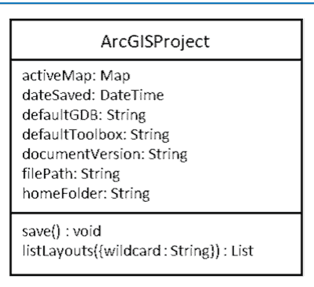

图 16.1 具有属性和方法的类的类图

是适用于大多数（如果不是全部）类的内置方法，它们之所以得名，是因为方法名总是以两个下划线（双下划线或“dunder”）开始和结束。我们将在本章中使用的两个是 `__init__` 和 `__str__` 方法。第一个是类的构造函数方法，它是在创建此类的对象时运行的代码，通常用于设置这个新对象的属性。在没有明确说明的情况下，你已经多次使用了 `__init__` 方法。每当你使用一个类的构造函数方法时，你都在隐式地使用 `__init__` 构造函数。因此，当你通过调用 `arcpy.Describe()` 创建一个 Describe 对象时，这在幕后调用的是 Describe 类的 `__init__` 方法。第二个是对象在转换为字符串时的表示方式。它并不完全等同于此，但你可以将其想象为当你对一个对象调用 `str()` 函数时发生的事情。

在类内编程时，你需要能够引用该类的对象，即所有属性和方法作用于的类的实例。例如，当你通过上图中的 `aprx` 变量调用 `aprx.listLayouts()` 方法时，`listLayouts` 方法内的代码需要能够访问 `aprx` 变量。这并不像你最初想象的那么简单，因为代码必须编写得无论变量叫什么名字都没关系。我们不知道 `ArcGISProject` 对象是叫 `aprx`、`myProject`、`currentProj`，还是叫 `iHateArc`。因此，在代码中通过一个特殊的变量来访问它，这个变量通常被称为 `self`。² 在 `__init__` 方法中创建变量时，`self` 是第一个变量。同样，在通过方法传递变量时，第一个参数总是 `self`。正如你会在 Python 窗口中使用 `aprx.listLayouts()` 一样，如果你需要在 `ArcGISProject` 类的另一个方法中访问布局列表，你会使用 `self.listLayouts()`。此外，如果你需要在方法中访问一个属性，比如 `save()` 方法需要能够访问 `filePath` 属性，`save()` 中的代码将使用 `self.filePath` 来访问该属性。

当我们更新此工具以提供更好的功能并创建我们的两个类：`Parcel` 和 `ApprovalError` 时，我们将看到这些概念在实际中的应用。

## 任务 1：更新工具对话框

如上所述，我们希望能够输入三个输入参数：一个地块 ID 号，表示为字符串；一个拟建建筑的面积，表示为双精度浮点数（Double）；以及建筑类型，表示为一个字符串，其值仅限于以下列表：COMMERCIAL、COMMUNITY、EDUCATION、GOVERNMENT、HEALTH、RECREATION/TOURIST 或 RESIDENTIAL。这些直接取自建筑物文件中的类型字段，因此必须完全按照它们出现的形式，包括全部大写。否则，代码将无法工作。

**问题 1：请对工具进行修改，使其显示如下。注意工具显示名称的更改（“Propose New Building”）、三个参数、它们的显示文本，以及从建筑类型列表中选择的能力。未显示：所有三个参数现在都是必需的。这应该是对前两章技能的复习。**

² 它不一定必须叫 self，但标准做法是它几乎总是叫这个名字。因此，从现在开始我将直接称其为 self。

## 任务 2：使用 UML、流程图和伪代码规划类

在开始编写代码之前，我们需要先规划好内容。如果没有行动计划，我们很可能会对着空白屏幕发呆，不知从何下手。第一步是确定我们的两个新类需要包含哪些属性和方法。较简单的是 `ApprovalError` 类。如下所示，它包含一些对创建错误消息有用的信息，具体来说是错误类型、地块 ID、两个以通用名称 `info1` 和 `info2` 命名的相关信息³，以及我们希望提供给用户的错误消息。最后请注意，出于本练习的目的，对象在框图下方（图 16.2）被称为 `self`，而不是像上面那样的变量名 `aprx`。

利用属性中的信息，我们接下来要规划 `createMessage()` 方法。下面是该方法的流程图，假设错误类型遵循以下代码：1 表示提案因建筑过大而被拒绝，2 表示提案因拟建建筑类型与地块上已有建筑不匹配而被拒绝（图 16.3）。

`Parcel` 类比 `ApprovalError` 类更复杂，但就其作为方法和属性蓝图所需的内容而言，并没有复杂太多。它也有五个属性，但有两个方法而不是一个：一个专门用于计算价值的 `assess()` 方法，以及一个名为 `propose()` 的主要方法，该方法接收拟建建筑的面积和类型，并决定是否批准该提案（图 16.4）。

在这两个方法中，`assess` 显然是较简单的一个。它只是将一个公式应用于相关信息并返回计算结果（图 16.5）。

你可能注意到的唯一潜在障碍是，我们正在使用类的属性之一——建筑类型——来查找税率。碰巧的是，我们可以在对象内部拥有实际上是私有的而不是公共的变量。⁴ 这样的变量允许我们根据建筑类型获取税率。

**问题 2（5 分）：根据你对 Python 的了解，你会为这个将税率与建筑类型关联起来的变量使用什么数据类型？为什么？**

另一个方法执行审批流程的计算，因此它更复杂。我们需要检查批准或拒绝建筑提案的两个条件：新建筑是否与现有建筑（如果有的话）的类型匹配，以及新建筑是否会将总建筑面积与地块面积的比率推高到预定阈值以上。如果通过这些测试，新的评估价值可以返回给用户；如果未通过，我们可以引发一个已定义的 `ApprovalError`（图 16.6）。

观察力更强的你可能还有一些疑问。具体来说，在给新地块分配地块编号、拟建建筑的面积和类型，以及在 `propose()` 方法中发生的评估之间，一定发生了某些事情。毕竟，`propose()` 方法使用的信息，如总建筑面积、现有建筑类型和地块面积，都没有直接提供给该工具。我们仍然需要以某种方式获取这些信息。不过，如果你还记得之前关于错误处理的实验，我们能够仅从地块编号就找到这样的信息。事实上，这段代码的大部分将取自你在那一章中编写的 `calculateFromLot()` 函数（图 16.7）。

问题就变成了我们把这段代码放在哪里？由于这是在我们最初创建地块时发生的事情，它属于 `__init__()` 魔术方法。

## 任务 3：创建类的框架

现在我们有了计划，就可以开始为这些类填充代码了。同时，我们可以修改文件末尾的 `try/except` 块的代码。事实上，它会变得简单得多，正如我们将看到的。我们只需要从工具获取参数，创建我们的地块，运行 `propose()` 方法，并给用户一条消息。如果有任何问题，我们将收到一个 `ApprovalError`，它会在 `except` 子句中被捕获。我们也会像以前一样捕获 `StopIteration` 错误，以改善用户在输入不存在的地块编号时的友好度。

```
try:
    lotID = ARCPY.GetParameter(0)
    newBuildingSize = ARCPY.GetParameter(1)
    newBuildingType = ARCPY.GetParameter(2)
    permitParcel = Parcel(lotID)
    newAppraisal = permitParcel.propose(newBuildingSize, newBuildingType)
    ARCPY.AddMessage("Your permit should be approved, and the new tax amount is estimated to be " + str(newAppraisal))
except ApprovalError as ae:
    ARCPY.AddError("There was an error during the approval process. " + str(ae))
except StopIteration as si:
    ARCPY.AddError("Your lot number doesn't exist.")
```

定义我们的新类引入了另一个关键字，它类似于 `def`，但用于类。它恰如其分地叫做 `class`。与 Python 中的其他一切一样，为了确保属于我们正在定义的类的代码被正确分配，任何在 `class` 行下缩进的内容都属于该类。如果我们正在扩展现有类，我们将父类或超类放在新类名后的括号中。下面这样做是为了将 `ApprovalError` 类建立为扩展 `ValueError` 类，因为它是一种值错误，确保它可以继承 `ValueError` 的属性和方法。

在 Python 文件的开头，紧接在 import 语句之后，输入以下内容：

```
class ApprovalError(ValueError):
```

然后我们需要设置我们要定义的方法，这些方法像函数一样，通过 `def` 关键字设置。然而，它们缩进一级。如上所述，它们也“必须”将第一个参数保留给该类的每个实例所属的对象。这里通常称为 `self`。在类行下方添加这些：

```
→ def __init__(self, errorType, lotID, info1, info2):

→ def createMessage(self):
```

在这两个方法下方，提供 `Parcel` 类的框架。我将我们将拥有的属性列为注释：

```
class Parcel:

→ def __init__(self, lotID):

#properties--lot ID; lot area; building count; total building area; building type

→ def assess(self):

→ def propose(self, newArea, newType):
```

这些设置了蓝图。现在我们可以使用流程图来填充这里定义的方法。

---

³ 这里的两个信息对于不同的错误类型是不同的，因此无法给出更具体的名称。这表明也许我们可能希望有 `ApprovalError` 类的不同扩展，但这对于本练习来说似乎有点过头了。它也说明，虽然这里以整洁的方式呈现，但在决定需要或不需要什么的过程中存在一些迭代，因为直到我开始处理下面的 `createMessage()` 规划时，我才意识到我需要两个通用信息来创建错误消息。

⁴ 某些编程语言允许你显式地使属性甚至方法成为私有的。据我所知，Python 不是这样的语言，因此我们使用我们不会公开其存在的属性，以便我们可以将它们视为私有。

## 任务 4：填充类的框架

我们将从 `ApprovalError` 类开始。它的构造函数，即 `__init__()` 方法，主要只是填充属性，但使用另一个方法 `createMessage()` 来生成 `message` 属性。请注意，大部分情况下，这是通过获取一个输入参数并简单地将其赋值给属性来完成的，属性通过 `self.propertyName` 语法来区分。虽然在这个例子中，我重用了参数名作为属性名，但并没有要求它们必须这样匹配：

```python
def __init__(self, errorType, lotID, info1, info2):
    self.errorType = errorType
    self.lotID = str(lotID)
    self.info1 = info1
    self.info2 = info2
    self.message = self.createMessage()
```

`createMessage()` 方法按照流程图直接实现。主要请注意，即使我们在调用 `createMessage()` 方法时没有使用 `self` 变量，它也被列为输入之一。如上所述，它是方法中的第一个参数。否则，设置方法与设置函数非常相似，包括使用 `return` 关键字返回一个值。在这个例子中，返回的是消息。
按如下方式输入。这将在后面生成一个错误，我故意放在这里是为了在任务 5 中说明几点。然而，在完成所有方法框架的填充之前，运行代码将会失败：

```python
def createMessage(self):
    message = ''
    if errorType == 1:
        message = "Your building for " + self.lotID + " is too big to pass the permit process. It currently covers " + self.info1 + "% of the lot and cannot exceed " + self.info2 + "."
    elif errorType == 2:
        message = "Your building type for " + self.lotID + " does not match existing buildings on the lot. It is a " + self.info1 + " type while the others are " + self.info2 + "."
    else:
        message = "There was an unspecified error in the approval process: type is " + str(self.errorType) + "; lot is " + self.lotID + "; information provided is " + self.info1 + " and " + self.info2 + "."
    return message
```

我们现在可以继续处理 `Parcel` 类了。如上所述，`__init__()` 方法将主要使用从现有 `calculateFromLot()` 方法中提取的逻辑和代码。首先，将函数的全部内容复制到 `__init__()` 方法中。为每一行添加缩进，使其在需要的地方缩进。
现在，让我们来调整它。首先，该方法的前两行不再需要，因为我们现在已将地块 ID 确立为必需参数。不过，我们需要确保对象的 `lotID` 属性被正确设置。通过将查询前的 `if` 语句替换为以下行来实现：

```python
self.lotID = lotID
```

我使用了一个略有不同的参数名（`lotID` 与 `lotNum`）。在查询中进行更改以引用正确的变量。
接下来建立变量和建筑搜索游标的行基本不变。唯一的更改是我在变量 `buildings` 的字段列表末尾添加了 `"FOOT_TYPE"`，并添加了 `self.` 来初始化一个名为 `self.buildingCount` 的属性，而不是一个名为 `buildingCount` 的通用变量。

> Parcel 类中也有一个故意的错误，我们稍后会修复。

在这些行之后，紧接着 `for building in buildings:` 循环之前，添加一行将建筑类型属性的初始值设置为 "EMPTY"。如果这个地块中有任何建筑物，它将会改变。否则，该地块的建筑类型将保持为空，以反映该地块中没有建筑物。

**问题 3：将 buildingType 属性的初始值设置为 “EMPTY” 的代码是什么？**

for 循环内部的代码也只会略有更改。我们添加一行来创建一个 `buildingType` 变量，该变量保存游标在循环内给我们的列表中新增的第 3 项，并更改 `if` 语句中的代码以更改对象的建筑计数属性，同样使用 `self.` 语法，并将你在问题 4 中初始化为 "EMPTY" 的新 `buildingType` 属性更改为该建筑物的建筑类型。`for` 循环应如下所示：

```python
for building in buildings:
    buildingBlock = building[0]
    buildingSection = building[1]
    buildingArea = building[2]
    buildingType = building[3]
    if lotBlock == buildingBlock and lotSection == buildingSection:
        self.buildingCount = self.buildingCount + 1
        buildingsTotalArea = buildingsTotalArea + buildingArea
        self.buildingType = buildingType
```

最后，我们不再有任何空地块的问题，因此当建筑计数为零时，无需引发值错误，也无需返回任何计算结果。这是因为 `__init__()` 方法的目的是在创建变量时对其进行初始化或构造。它不需要返回任何内容。然而，还有几个属性需要设置，因此将最后几行替换为以下内容：

```python
self.lotArea = lotArea
self.buildingArea = buildingsTotalArea
```

最终，你应该得到以下内容，尽管包含问题 4 代码的注释行：

```python
def __init__(self, lotID):
    self.lotID = lotID
    query = "'KEY' = '" + str(lotID)
    search = ARCPY.da.SearchCursor('Lots', ["AREA", "KEY", "BLOCK", "SECTION"], query)
    lot = search.next()
    lotArea = lot[0]
    lotBlock = lot[2]
    lotSection = lot[3]
    buildings = ARCPY.da.SearchCursor('Buildings', ["BLOCK", "SECTION", "F_AREA", "FOOT_TYPE"])
    buildingsTotalArea = 0
    self.buildingCount = 0
    ###CODE FOR QUESTION 4###
    for building in buildings:
        buildingBlock = building[0]
        buildingSection = building[1]
        buildingArea = building[2]
        buildingType = building[3]
        if lotBlock == buildingBlock and lotSection == buildingSection:
            self.buildingCount = self.buildingCount + 1
            buildingsTotalArea = buildingsTotalArea + buildingArea
            self.buildingType = buildingType
    self.lotArea = lotArea
    self.buildingArea = buildingsTotalArea
```

这恰好是方法中最大的一个。我们代码中的下一个方法 `assess()`，正如你在流程图中看到的，是最容易实现的：

```python
def assess(self):
    buildingRate = self.typeValueDict[self.buildingType]
    return self.baseValue * self.lotArea + buildingRate * self.buildingArea
```

然而，你可能会注意到，这个方法使用了几个在 `__init__()` 方法中未创建的属性。这回到了上面关于公共和私有属性的概念。我们可以创建存储对类的任何实例都有用但不受该类任何特定实例参数化影响的变量的属性。在这里，税率不会根据地块而变化，但每个地块都需要能够访问这些税率以进行评估计算。然后我们可以在类行之后立即用几行代码来设置它们：

```python
class Parcel:
    typeValueDict = {"COMMERCIAL": 1, "COMMUNITY": 0.3, "EDUCATION": 0.4, "GOVERNMENT": 0.1, "HEALTH": 0.25, "RECREATION/TOURIST": 0.9, "RESIDENTIAL": 0.7}
    baseValue = 0.1
    threshold = 30
```

这些行然后根据建筑物的类型设置税率，以及地块大小的基础价值率。最后一个 `threshold` 在 `propose()` 方法中用于存储建筑物可能占用的最大地块百分比。

我们需要在这里填充的最后一个方法是 `propose()` 方法。按如下方式输入。请注意，它引发我们的自定义错误以表示不批准。如果建筑类型与现有建筑类型不匹配且现有类型不为空，它会引发类型 2 的批准错误。如果建筑物覆盖的地块百分比现在将超过预定阈值，它会引发类型 1 错误。请注意，ApprovalError 的信息参数在生成有用的错误消息时变得有用：对于类型 2 错误是新建筑类型和现有建筑类型，对于类型 1 错误是百分比和阈值。请注意，如果没有批准错误，我们不需要重新输入计算评估的代码，而是直接调用 self.assess() 方法：

```python
def propose(self, newArea, newType):
    newTotal = self.buildingArea + newArea
    percent = 100 * (newTotal / self.lotArea)
    if newType != self.buildingType and self.buildingType != "EMPTY":
        raise ApprovalError(2, self.lotID, newType, self.buildingType)
    elif percent > self.threshold:
        raise ApprovalError(1, self.lotID, percent, self.threshold)
    else:
        self.buildingType = newType
        self.buildingArea = newTotal
        return self.assess()
```

现在我们准备好尝试我们的代码了。

## 任务5：调试代码

首先，让我们用应该能正常工作的值来测试一下。使用以下输入运行你的工具：地块编号 42007001，新建筑面积 100，新建筑类型为 RESIDENTIAL。

点击复选标记左侧的小三角箭头打开消息。

**问题4（10分）：该房产的预估税评估值是多少？**

现在，让我们看看如果建筑类型与现有建筑不匹配会发生什么。将地块编号更改为 42004001（该地块已有一个 EDUCATION 类型的建筑），但保持新建筑类型为 RESIDENTIAL。你应该会得到一个巨大的错误消息，最后是 NameError: name "errorType" is not defined。

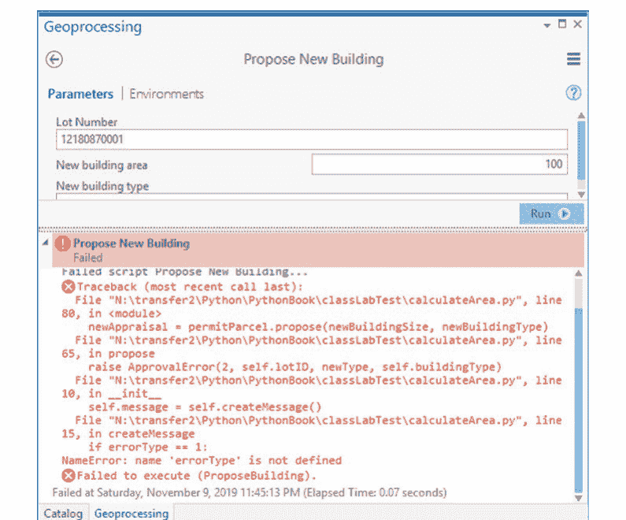

这个回溯信息为我们提供了如何找到错误可能存在的所有不同位置的信息。我们可以从下往上阅读它。它告诉我们错误是在第15行发现的，在名为 `createMessage` 的方法中。该行代码是 `if errorType == 1:`，但没有任何东西叫做 `errorType`。在这种情况下，你只需要认识到，虽然有一个完全有效的属性叫做 `errorType`，但没有 `self.`，我们实际上并没有访问那个属性。相反，计算机正在寻找一个单独的变量 `errorType`，而这个变量并不存在。因此，我们需要将 `errorType` 替换为 `self.errorType`。这在这里以及下面几行创建错误类型 #2 的消息时都适用。

如果我们在第15行没有识别出这一点，错误可能出在调用 `createMessage` 的方法中，而不是 `createMessage` 本身。要查看那是什么，我们需要在这个回溯中向上查看一个条目。然后它说是在第10行，在 `__init__` 方法中调用了 `createMessage`，确实，你可以看到它告诉你这一行是 `self.message = self.createMessage()`。

我们可以继续向上查看回溯，看看最初是什么初始化了这个错误消息。那是在第65行，在 `propose` 方法中，它引发了一个 `ApprovalError`。虽然错误再次不是在这里，但它说明了自定义类工作方式的一个方面。我们从未调用过类似 `appError = appError.__init__(2, "12180010009", "RESIDENTIAL," "EDUCATION")` 的东西，尽管在这一行，`__init__` 方法仍然被调用。这是创建对象的一个方面：`__init__` 方法总是通过所谓的构造函数来访问，构造函数是一个方法，其名称与类的名称完全相同（这里是 `ApprovalError`），并且具有 `__init__()` 方法的所有输入参数，减去必需的 `self` 参数。因此，要构造对象并运行 `__init__()` 方法中的代码，我们需要通过类的名称调用构造函数，使用这段代码：

```
ApprovalError(2, self.lotID, newType, self.buildingType)
```

来访问这个方法：

```
__init__(self, 2, self.lotID, newType, self.buildingType)
```

最后，在回溯中，由于这个审批错误是在 `propose()` 方法中引发的，我们看到对 `propose()` 方法的调用是在第80行，在 `newAppraisal = permitParcel.propose(newBuildingSize, newBuildingType)` 这一行。

虽然这里不是这种情况，但有可能在 `newBuildingSize` 或 `newBuildingType` 参数中存在错误，但直到我们尝试在回溯末尾创建错误消息时才被发现。这将在后面说明。

如果你还没有这样做，请通过将 `errorType` 替换为 `self.errorType` 来修复第15行和第17行的错误。然后再次运行工具，你应该会得到一个错误消息，但不是预期的那个。

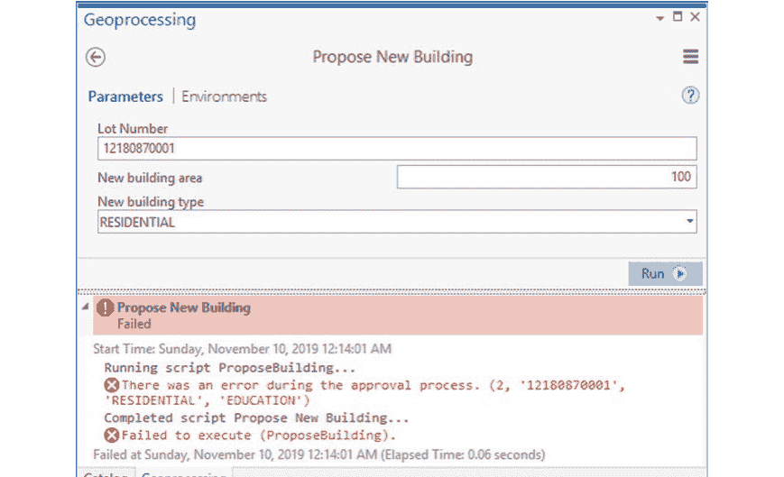

我们费心为用户创建了一个好的、自定义的错误消息，但这里显示的不是它。这是因为我们需要覆盖一个现有的方法，具体来说是 `__str__()` 方法。如果你添加 `ARCPY.AddMessage()` 行，你会看到 `createMessage()` 方法工作正常，并且消息属性是正确的。然而，我们还没有告诉 `str(ae)` 实际访问那个消息。就像 `ApprovalError()` 调用 `__init__()` 方法一样，`str(ae)` 调用 `__str__()` 方法。目前，在没有覆盖该方法的情况下，它依赖于一个基本的 `__str__()` 方法，该方法只是打印参数的元组。我们希望它打印出我们已经创建的错误消息。这是对 `ApprovalError` 类的一个非常简单的添加，定义了我们希望如何实现 `__str__()` 方法来覆盖它并返回我们已经创建的消息。使用下面的代码在 `__init__()` 方法之后定义你的 `__str__()` 方法覆盖：

```
def __str__(self):
    return self.message
```

使用相同的输入再次尝试该工具，这次你应该会得到正确的错误消息。
现在你有一个错误消息，内容是“审批过程中出现错误。你的建筑类型 12180870001 与地块上的现有建筑不匹配。它是 RESIDENTIAL 类型，而其他的是 EDUCATION 类型。”
最后，尝试再次运行代码，将类型更改为 EDUCATIONAL，新建筑面积更改为 30000，你应该会遇到我嵌入在代码中的第三个错误。⁷ 你应该会得到下面的错误消息：

```
message = "Your building for " + self.lotID + " is too big to pass the permit process. It currently covers " + self.info1 + "% of the lot and cannot exceed " + self.info2 + "."
```

同样从底部开始，计算机在第18行发现了一个 `TypeError`。（在我的代码中是第20行——取决于你插入 `__str__()` 方法的方式和位置，对你来说可能不同。）消息告诉我们它期望一个字符串，但得到了一个数字（类型为 `float`）。所以让我们看看第20行：

```
message = "Your building for " + self.lotID + " is too big to pass the permit process. It currently covers " + self.info1 + "% of the lot and cannot exceed " + self.info2 + "."
```

这一行正在根据提供的信息构建错误消息，并试图将参数合并到一个更长的字符串中，以形成一个有用的错误消息。这意味着通过 `self` 对象访问的属性之一不是字符串，但这一行假设它是。这些是从哪里来的？`createMessage()` 方法在 `__init__()` 方法中被调用，因此该属性在 `__init__()` 方法中被建立为字符串。以下是第18行中访问的属性的代码行：

```
self.lotID = str(lotID)
self.info1 = info1
self.info2 = info2
```

由此，我们可以排除 `lotID` 是问题所在，因为它在这里被转换成了字符串。这意味着 `info1` 和/或 `info2` 不是字符串。然而，在标准2的错误消息中它们是字符串，因为我们毫无问题地得到了那个消息。这意味着我们可能希望在这里不仅仅是将 `info1` 和 `info2` 属性转换为字符串，而是更早地处理，以便 `info1` 和 `info2` 始终以字符串形式呈现。这意味着我们想去查看回溯中上一行的代码，即引发 `ApprovalError` 的地方，也就是第69行。它读作：

```
raise ApprovalError(1, self.lotID, percent, self.threshold)
```

第一个参数是错误类型，它在第18行中不存在，所以不可能是它。我们在 `__init__()` 方法中看到 `lotID` 在那里被转换成了字符串，所以也不可能是它。这就只剩下 `info1` 和 `info2` 属性了，它们是建筑覆盖的地块百分比和任何地块允许的最大百分比。事实证明，它们很可能是数字。因此，要修复这个问题，我们应该将这里的 `percent` 和 `self.threshold` 转换为字符串，用 `str(percent)` 和 `str(self.threshold)` 替换它们。

> ApprovalError() 调用中未指定 self 参数的部分原因，可以通过我在这里设置 `__init__()` 等效方式来说明。第一个 self 是指 ApprovalError 对象的 self，这是在第5-21行中活跃的 self，从 ApprovalError 类的 `__init__()` 方法开始。另外两个 self，在 `self.lotID` 和 `self.buildingType` 中，是第65行中活跃的 self，指的是引发 ApprovalError 的 Parcel 对象。在这个特定的代码中，我们可以在概念上将 `self.lotID` 和 `self.buildingType` 替换为 `permitParcel.lotID` 和 `permitParcel.buildingType`，尽管，正如我上面在证明 self 变量存在的理由时所说，我们无法保证在这个受控上下文之外变量的实际名称是什么。

事实上，在这个阶段没有显式的变量来保存审批错误，并且在它被 except 子句捕获并赋给变量 ae 之前，不会为它创建任何变量。它存储在一个临时变量中，直到代码中的那个位置，所以我们唯一能访问它的方式就是通过 self 变量。

> ⁷实际上，它们是我在为本章开发代码时犯的错误，我正在带你逐步了解我进行的调试过程。所以这也可以提醒你，即使你接近学期末，你也会遇到错误。我用各种语言编程超过20年（！！！），仍然会做这样的事情。成功编程的真正技巧在于如何解释错误消息，而不要过于沮丧。

问题5：工具包将根据以下标准进行评估：

-   工具参数化若应被批准，是否会以常规的ArcPy消息结束，告知我估算的评估价值？
-   工具参数化若区域过大，是否会被拒绝，并显示相应的错误消息？
-   工具参数化若类型与现有建筑类型不同，是否会被拒绝，并显示相应的错误消息？

## 任务6：无指导工作

镇议会通过了一项新法令，限制每个区段编号内的建筑类型数量。然而，一些区段已经建造了多种类型的建筑，这些属于“祖父条款”范畴，因此不允许再新增类型。这将需要为“邻里”类开发一个新的类。
请执行以下操作：

6a：创建一个名为`Neighborhood`的新类。构造函数需要接受一个区段编号作为唯一的输入参数。
6b：其构造函数需要将区段编号存储到一个属性中。
6c：其构造函数还需要使用游标遍历该区段内的所有建筑，并创建一个已存在建筑类型的列表。如果没有建筑，这应该是一个空列表。（换句话说，列表中不应包含"EMPTY"。）
6d：在`try`块内构造一个`Neighborhood`类型的对象，并将其作为参数传递给地块的`propose`方法。
6e：在地块的`propose`方法中，检查以确保新建筑类型不违反新法令，如果违反，则根据下面的7e引发适当的`ApprovalError`。
6f：添加一个新的错误类型#3，接受错误类型值3作为输入，`lotID`仍然是`lotID`，`info1`是拟建建筑的类型，`info2`是现有建筑类型列表转换成的字符串。

示例错误消息如下：
“地块12180950090无法接受COMMERCIAL建筑，因为其区段已包含RESIDENTIAL建筑。”
或
“地块12181000002无法接受GOVERNMENT建筑，因为其区段已包含RESIDENTIAL、HEALTH和COMMERCIAL建筑。”

我将使用一组工具参数化来评估这些，其中一些是可接受的，另一些则应导致此错误消息出现。
将您的项目保存为`.ppkx`文件。

8如果该区段内没有建筑，则任何建筑类型都是可接受的。

## 综合应用

### 17 引言：将规范转化为程序

本章的结构与其他章节不同，但它提供了一个机会，让你完全独立地开发一个简单的GIS应用程序。然而，如果你将在工作或研究中使用GIS，它也可能是最有用的一章。场景是这样的：你被给予规范，必须创建一个工具。我在下面提供了一个说明性示例，展示我将如何完成这个过程。虽然没有一种保证对每个人都有效的、一成不变的编程方法，但有一些原则适用于每个人：规划的重要性以及调试的必然性。在说明性示例中，即代替指导性任务，我将展示我使用的规划过程，并向你表明，即使是一个在1995年才开始学习编程的人，我仍然会犯相当多的错误。

一个普遍原则是，你将遇到的许多编程情况，往好了说，也是无指导的。想象一下，主管让你编写一个程序，在ArcGIS Pro中添加一个执行*此*功能的工具，无论*此*功能是什么。他们不会告诉你需要哪些对象和函数。他们甚至可能没有正确的数据供你评估工具是否有效。你得到的只是一组工具应该为用户完成的任务。在另一种情况下，你可能会想“如果我有一个工具来做*此*功能就好了”，你的观察取代了主管的角色。即便如此，你也没有直接的指导，只有指令，可能还有一个截止日期。那你该怎么办呢？

我使用的工具是我们在整本书中都用过的——伪代码和流程图。其他人可能有不同的策略。无论采取何种形式，当你完成本章末尾的任务时，我鼓励你认真对待规划部分，并尽早从计划转向脚本，以便有时间进行不可避免的调试。以下示例展示了完成此任务的一种方法。

### 说明性示例

本示例的文件是一个欧洲城市的GIS文件和一个这些城市之间机场连接¹的CSV文件。

给定这些文件，假设我被要求开发一个工具，以协助机场规划人员确保有足够的燃料储备。他们认识到，每天所需的燃料量与从机场起飞的航班总飞行长度有关。对于这个任务，我们做一个不太可能的假设：每天从每个城市到其所有连接点恰好有一个航班。换句话说，没有航线每天飞行超过一次，并且它们每天都飞行。这意味着我们想要汇总从指定城市到所有连接到该城市的地点的飞行长度。

我将开发的工具将允许用户输入一个城市名称，读取CSV文件，找到所有连接到所提供城市的城市，计算从所提供城市到所有这些连接城市的距离总和，最后在ArcPy消息中报告这个距离总和。此外，如果在数据集中找不到该城市，它应该给出一个合理的错误消息；如果该城市没有连接，则给出一个警告。

对于这个任务，我首先要做的就是查看数据集。城市文件在ArcGIS中看起来很直接。它是一个基于点的文件，有一些属性，尽管这个计算需要的是几何图形而不是属性。

¹并非实际连接。我是编造的，但认为它们相当合理，至少作为可能连接的一个子集。

连接文件最初看起来更复杂。每一行是一个城市列表。结构是：第一列是机场网络中的枢纽城市，其余列是连接到该枢纽的城市。它的设置是大多数航班只列出一次，因为它们在网络中从枢纽飞往支线，并且为了节省空间，支线的行不包括在内。例如，伦敦那一行有邓迪作为连接地点，但邓迪作为网络中的支线，在文件中没有自己的行。即便如此，当用户输入邓迪时，它与伦敦的连接应包含在计算中。

查看文件了解我有什么可用资源后，我将开始规划该工具，列出起点和终点（图17.1）。

显然，我们需要做更多工作来填充黑框，但这是一个起点。我们下一步可能需要的是读取连接CSV文件。它不直接依赖于获取城市，所以我将添加这个框而没有指向它的箭头，但它将为（目前的）黑框计算提供所需的信息（图17.2）。

一旦我们加载了数据，我们就可以开始填充黑框，并且如我下面所绘制的，使其从黑色变为灰色，因为黑框的内部工作原理被揭示并填充。这个黑框内必须发生的两个主要组成部分是找到连接的城市，并将它们到主要城市的距离相加（图17.3）。

我们现在可以分解这两个灰色框中的任何一个。我选择第二个，因为分解它们的顺序并不重要，只要两者都完成即可。在规划中需要考虑的一件事是，你需要什么输入和输出来完成每个步骤。将所有距离相加可能相当直接，尽管我们需要考虑这一步的输入是什么。自然，我们需要各个距离。但计算机将如何表示这些距离？有几种可能性，列表或字典会浮现在脑海中。我可能会在后面修改这个，但目前选择一个列表。在将距离相加时，哪个距离对应哪个连接并不重要，这正是使用字典相对于列表的主要价值。拥有一个距离列表意味着遍历所有距离并将它们加到一个运行总计中。我们以前做过这个逻辑，所以希望你对此很熟悉（图17.4）。

这清楚地表明，另一个灰色框需要通过给我们一个距离列表来完成。它最终将遵循类似的逻辑，但发生的事情会更复杂。我已经开始充实这里需要的内容，使黑框的部分再次更清晰，但较浅的灰色框仍有一些工作要做（图17.5）。

为了使流程图更易于阅读，我将把这两个灰色框提取到它们自己的流程图中。第一部分处理CSV文件中的行是否包含涉及用户输入城市的连接。这应该是一个足够简单的


**图17.1** 开始绘制流程图

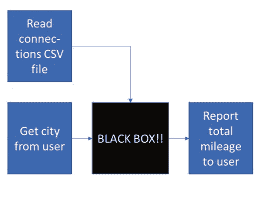

**图17.2** 读取文件

## 17.3 开始处理黑箱

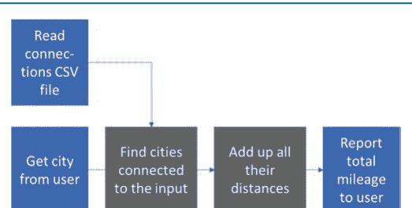

图 17.3 开始处理黑箱

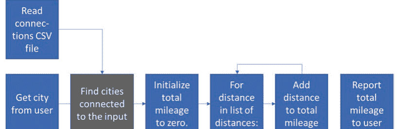

图 17.4 填充黑箱的一部分

图 17.5 添加一个循环来获取距离

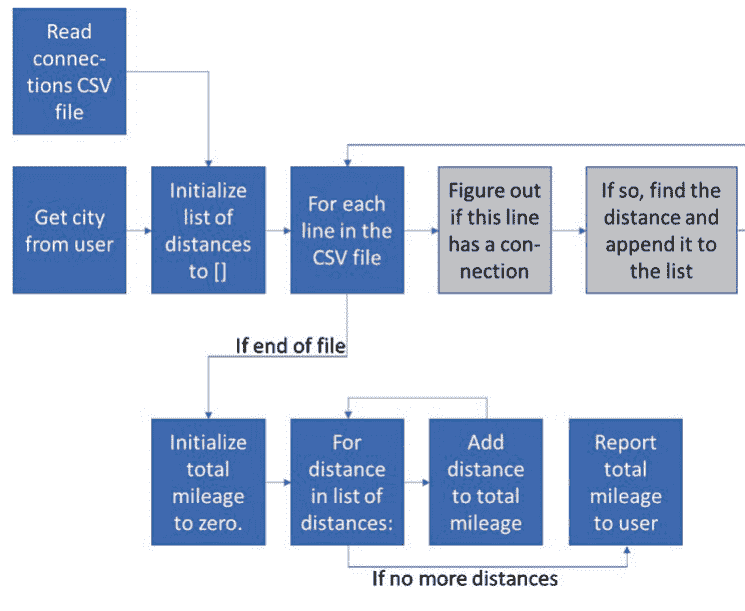

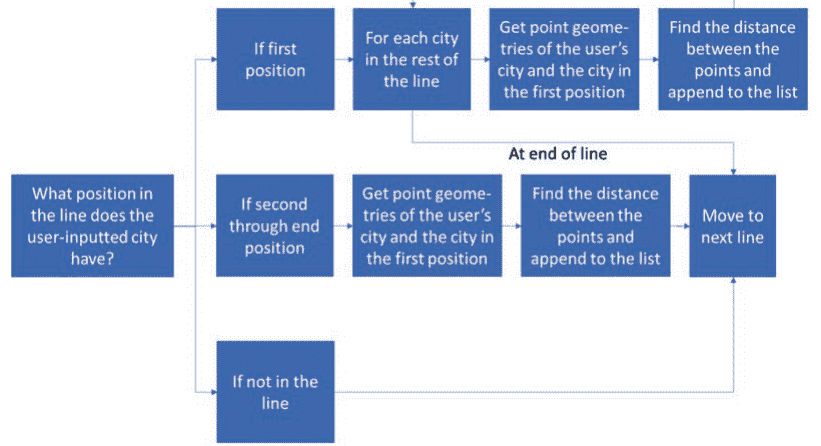

检查该行是否包含用户输入的城市。如果该城市出现，则至少存在一个连接。如果未出现，则没有连接。获取正确的距离是更困难的部分。这里重要的是要准确考虑文件中列出的内容。第一列是一个枢纽机场，它与该航线中的每一个其他城市相连。然而，用户输入的城市不一定是枢纽；它可能出现在第一列，或该航线中的任何其他位置，甚至可能根本不出现在该航线中。（最后一种情况最常见。）我们希望对这三种情况采取不同的处理方式。如果用户的城市在第一列，它与该航线中的每一个其他城市相连。如果它出现在任何其他列，它只与第一列的城市相连，而不与其他城市相连。最简单的情况是它根本不出现在该航线中。那么我们只需继续处理下一行。让我们将其放入一个流程图中（图 17.6）。²

我们可以将所有这些整合到一个流程图中，确保将处理单行的逻辑嵌入到一个循环中，该循环遍历 CSV 文件中的所有行。

> ²后续提示：此逻辑以及相关的 Python 代码在其中一个非指导性任务中会非常有用，在该任务中，即使没有距离，你仍然需要连接信息。

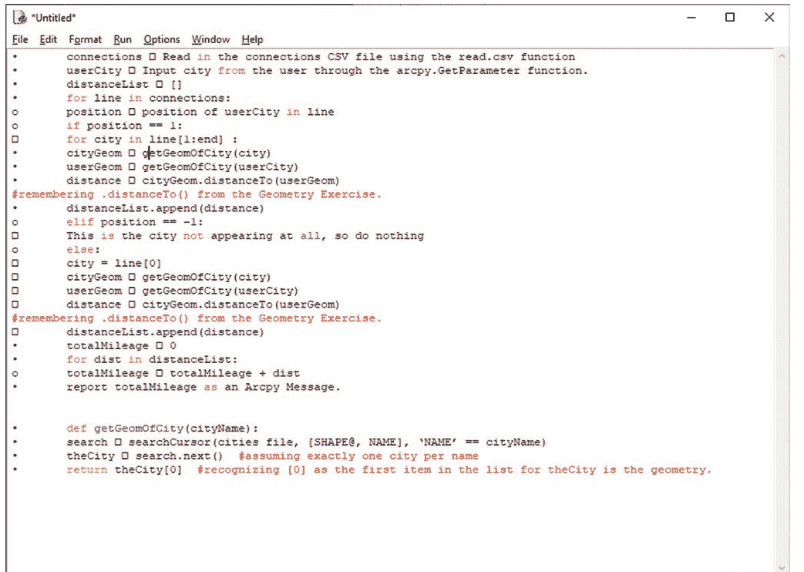

现在我们准备好构建伪代码了。我们这里的流程图已经足够详细，伪代码不会增加太多细节，但它将有助于在编写脚本时组织代码。我在这里做的主要额外工作是添加了关于哪些函数可能有用的思路。在编写过程中，我注意到获取城市的几何信息将是一个频繁的任务，因此将其提取为一个独立的函数，以便在需要时调用：

-   connections ← 使用 read.csv 函数读入连接 CSV 文件
-   userCity ← 通过 arcpy.GetParameter 函数从用户输入城市
-   distanceList ← []
-   for line in connections:³
    -   position ← userCity 在 line 中的位置
    -   if position == 1:
        -   for city in line[1:end]⁴:
            -   cityGeom ← getGeomOfCity(city)
            -   userGeom ← getGeomOfCity(userCity)
            -   distance ← cityGeom.distanceTo(userGeom)
                -   # 回想 Geometry 练习中的 .distanceTo()。
            -   distanceList.append(distance)

³我曾考虑创建一个自定义对象或字典来同时保存城市名称及其连接列表。这在这里被证明是多余的，但在一个或多个非指导性任务中可能确实有用。

⁴回想第 2 章中列表子集的语法。这就是我在这里使用的。

-   elif position == -1:
    -   这是城市根本未出现的情况，因此不做任何操作
-   else:
    -   city = line[0]
    -   cityGeom ← getGeomOfCity(city)
    -   userGeom ← getGeomOfCity(userCity)
    -   distance ← cityGeom.distanceTo(userGeom)
        -   # 回想 Geometry 练习中的 .distanceTo()。
    -   distanceList.append(distance)
-   totalMileage ← 0
-   for dist in distanceList:
    -   totalMileage ← totalMileage + dist
-   将 totalMileage 作为 Arcpy 消息报告。

-   def getGeomOfCity(cityName):
    -   search ← searchCursor(cities file, [SHAPE@, NAME], ‘NAME’ == cityName)
    -   theCity ← search.next() # 假设每个名称恰好有一个城市
    -   return theCity[0] # 认识到 theCity 列表中的 [0] 是几何信息。

完成这些后，现在是时候构建代码了。
你可能在整个课程中观察到，你从未真正开始过自己的 Python 文件。这严格是因为访问适当的 IDLE 编辑器并不像它应该的那样简单。如果你查看 Windows 开始菜单，在 ArcGIS 下，你确实会看到一个标记为“IDLE (Python GUI)”的选项。这在两个方面是不正确的：它是命令行界面或 shell，而不是文件编辑器；并且它是 ArcGIS Desktop 的 Python 版本（Python 2.x），而不是 ArcGIS Pro 的版本（Python 3.x）。
因此，我做的是通过右键单击现有文件并选择“使用 IDLE (ArcGIS Pro) 编辑”来打开它。然后，一旦正确版本的 IDLE 启动并运行，转到“文件”菜单并单击“新建文件”。现在你可以关闭你开始使用的文件，并开始你的新文件。
对我来说，第一件事是将伪代码复制到新文件中，并将其全部设为注释。这样，我们就可以在每个注释下方填充 Python 代码来执行该注释。当然，它一开始看起来很糟糕。

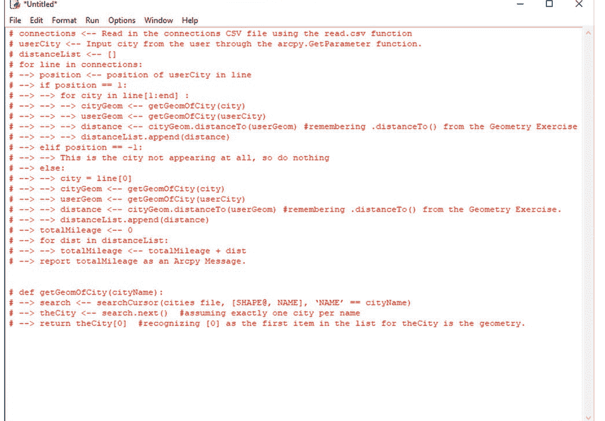

但我们可以将 MS Word 大纲中的所有这些不寻常的符号更改为更好看的注释。

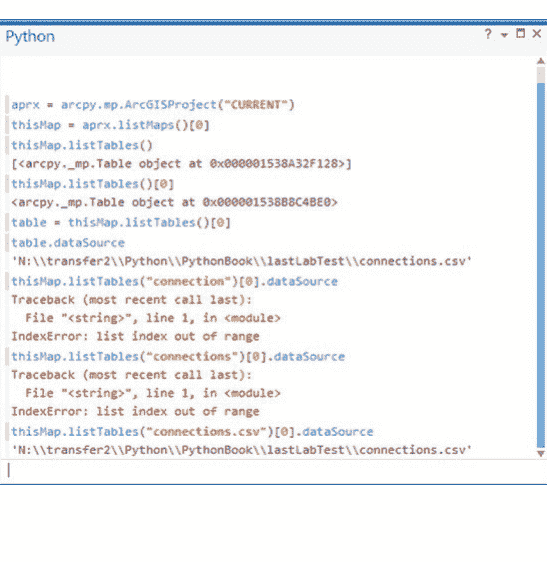

我现在填写代码，参考一些之前的练习，特别是那些帮助我回忆如何读取 CSV 文件、搜索游标如何工作以及几何信息如何工作的练习。
之后，我得到了以下内容：

```python
import csv
import arcpy

# connections <-- 使用 read.csv 函数读入连接 CSV 文件

connections_path = "D:\books\PythonManual\Chapter17\connections.csv"
connections_file = open(connections_path)
connections_reader = csv.reader(connections_file)

# userCity <-- 通过 arcpy.GetParameter 函数从用户输入城市
userCity = arcpy.GetParameter(0)

# distanceList <-- []
distanceList = []

# for line in connections
for line in connections_reader:

# --> position <-- userCity 在 line 中的位置
    position = line.index(userCity)

# --> if position == 1: 注意：我在代码中将 1 更正为 0
    if position == 0:

# --> --> for city in line[1:end] :
        for city in line[1:]

# --> --> --> cityGeom <-- getGeomOfCity(city)
            cityGeom = getGeomOfCity(city)

# --> --> --> userGeom <-- getGeomOfCity(userCity)
            userGeom = getGeomOfCity(userCity)

# --> --> --> distance <-- cityGeom.distanceTo(userGeom) # 回想 Geometry 练习中的 .distanceTo()
            distance = cityGeom.distanceTo(userGeom)

# --> --> --> distanceList.append(distance)
            distanceList.append(distance)

# --> elif position == -1:
    elif position == -1:

# --> --> 这是城市根本未出现的情况，因此不做任何操作


# --> else:
    else:

# --> --> city = line[0]
    city = line[0]

# --> --> cityGeom <-- getGeomOfCity(city)
    cityGeom = getGeomOfCity(city)

## --> --> userGeom <-- getGeomOfCity(userCity)
    userGeom = getGeomOfCity(userCity)

# --> --> distance <-- cityGeom.distanceTo(userGeom) # 回想 Geometry 练习中的 .distanceTo()
    distance = cityGeom.distanceTo(userGeom)

# --> --> distanceList.append(distance)
    distanceList.append(distance)

# --> totalMileage <-- 0
    totalMileage = 0

# --> for dist in distanceList:
    for dist in distanceList:

# --> --> totalMileage <-- totalMileage + dist
        totalMileage = totalMileage + dist

# --> report totalMileage as an Arcpy Message
    arcpy.AddMessage("The total mileage is " + totalMileage)

# def getGeomOfCity(cityName):
# --> search <-- searchCursor(cities file, [SHAPE@, NAME], 'NAME' == cityName)
# --> theCity <-- search.next() # 假设每个名称恰好有一个城市
# --> return theCity[0] # 认识到 theCity 列表中的 [0] 是几何信息。

def getGeomOfCity(cityName):
    query = '"CITY_NAME" = \'' + cityName + "'"
    search = arcpy.da.searchCursor('cities', ['SHAPE@', 'CITY_NAME'], query)
    theCity = search.next()
    return theCity[0]
```

现在这已经设置好了（尽管我肯定需要调试它），是时候设置工具了。我转到 ArcGIS Pro，在我的工具箱中创建一个新工具，添加一个名为“City Name”的字符串参数，并将其连接到此脚本。
为了尝试它，我输入 London 并单击“运行”按钮。不出所料，它失败了。
如果我查看详细信息，它告诉我有一个语法错误。我忘记了行末的冒号：

```
File "D:\books\PythonManual\Chapter17\Chap17.py", line 26
    for city in line[1:]
                    ^
SyntaxError: invalid syntax
```

我更正了它并再次运行，得到了一个新的错误：

```
File "D:\books\PythonManual\Chapter17\Chap17.py", line 46
    else:
        ^
IndentationError: expected an indented block
```

我尝试通过在 `elif` 子句中仅包含注释来确保当城市不在列表中时代码不执行任何操作的方法没有奏效。它仍然期望执行某些操作。⁵ 一次快速的谷歌搜索让我发现了 `continue` 关键字，它可能在这里有效。我将这个关键字作为 `elif` 子句中的唯一语句。保存并运行至少给出了一个不同的、后续的错误：

```
File "D:\books\PythonManual\Chapter17\Chap17.py", line 62
    distanceList.append(distance)
    ^
IndentationError: unexpected indent
```

我转到第62行，确实发现那里多了一个空格，破坏了缩进。我删除了那个空格，保存并再次运行：

```
Traceback (most recent call last):
  File "D:\books\PythonManual\Chapter17\Chap17.py", line 7, in <module>
    connections_file = open(connections_path)
OSError: [Errno 22] Invalid argument: 'D:\x08ooks\PythonManual\Chapter17\connections.csv'
```

从第62行的错误转移到第7行的错误通常表明语法错误已全部完成，并且程序从头开始尝试运行代码时遇到了这个问题。因此，我正从语法错误转向运行时错误，这绝对是进步！它不喜欢我为连接文件指定的文件路径，因为我从Windows资源管理器复制粘贴时，既没有将反斜杠加倍，也没有将它们改为正斜杠。我修正了这一点并再次运行：

```
Traceback (most recent call last):
  File "D:\books\PythonManual\Chapter17\Chap17.py", line 29, in <module>
    cityGeom = getGeomOfCity(city)
NameError: name 'getGeomOfCity' is not defined
```

这里，它抱怨计算机不知道 `getGeomOfCity` 是什么，尽管我们确实将其定义为一个函数。问题在于它尝试逐行运行代码，而它是在我尝试使用之后才定义的，所以我需要将其定义移到更靠前的位置。我将整个函数从末尾移到导入语句之后，保存并再次运行：

```
Traceback (most recent call last):
  File "D:\books\PythonManual\Chapter17\Chap17.py", line 41, in <module>
    cityGeom = getGeomOfCity(city)
  File "D:\books\PythonManual\Chapter17\Chap17.py", line 11, in getGeomOfCity
    search = arcpy.da.searchCursor('cities', ['SHAPE@', 'CITY_NAME'], query)
AttributeError: module 'arcpy.da' has no attribute 'searchCursor'
```

这次，我发现了另一个拼写错误。类 `SearchCursor` 的首字母是大写的 S，而不是小写的 s。我修正了这一点并再次尝试：

```
Traceback (most recent call last):
  File "D:\books\PythonManual\Chapter17\Chap17.py", line 41, in <module>
    cityGeom = getGeomOfCity(city)
  File "D:\books\PythonManual\Chapter17\Chap17.py", line 12, in getGeomOfCity
    theCity = search.next()
StopIteration
```

> ⁵这并非适用于所有编程语言，因此这是一个例子，说明在一种语言中有效的技术尝试在另一种语言中偶尔会失败。

这个错误需要更多的调查。在第41行，它调用的是文件中的连接城市，而不是用户输入的城市，所以用户输入的名称拼写错误不会导致这个问题。通过给出一个 `StopIteration` 错误（我们可能希望稍后捕获它，以便有更好的错误消息），Python 暗示搜索游标没有返回任何内容。这可能意味着查询错误或连接文件中有拼写错误。为了调查，我输入了一个 `arcpy.AddMessage()` 语句来查看查询是什么：

```
def getGeomOfCity(cityName):
    query = '"CITY_NAME" = \'' + cityName + "'"
    arcpy.AddMessage("query is " + query)
    search = arcpy.da.SearchCursor('cities', ['SHAPE@', 'CITY_NAME'], query)
    theCity = search.next()
    return theCity[0]
```

它忠实地打印出每个查询，直到查找哥本哈根，这表明返回空结果的查询是哥本哈根：

```
Start Time: Friday, October 8, 2021 3:47:39 PM
query is "CITY_NAME" = 'Dublin'
query is "CITY_NAME" = 'London'
query is "CITY_NAME" = 'Birmingham'
query is "CITY_NAME" = 'London'
query is "CITY_NAME" = 'Manchester'
query is "CITY_NAME" = 'London'
query is "CITY_NAME" = 'Edinburgh'
query is "CITY_NAME" = 'London'
query is "CITY_NAME" = 'Glasgow'
query is "CITY_NAME" = 'London'
query is "CITY_NAME" = 'Reykjavik'
query is "CITY_NAME" = 'London'
query is "CITY_NAME" = 'Paris'
query is "CITY_NAME" = 'London'
query is "CITY_NAME" = 'Frankfurt am Main'
query is "CITY_NAME" = 'London'
query is "CITY_NAME" = 'Berlin'
query is "CITY_NAME" = 'London'
query is "CITY_NAME" = 'Oslo'
query is "CITY_NAME" = 'London'
query is "CITY_NAME" = 'Copenhagen'
Failed script Calculate Connection Distances...
```

进一步调查指出连接文件中存在错误。如果你查看城市文件，你会注意到使用的是本地拼写而不是一致的英文拼写。因此，丹麦的首都应该使用丹麦语拼写 "Kobenhavn"，而不是英语拼写 "Copenhagen"。我修正了这一点并再次尝试。这解决了上面的问题，所以我注释掉了消息并再次运行，以便更好地看到下一个错误：

```
Traceback (most recent call last):
  File "D:\books\PythonManual\Chapter17\Chap17.py", line 86, in <module>
    arcpy.AddMessage("The total mileage is " + totalMileage)
TypeError: can only concatenate str (not "float") to str
```

啊。我忘了将总里程数转换为字符串用于消息。你可能到现在已经注意到，大多数这些错误都相当简单，我可以向你保证，它们在我起草脚本时并非故意放置的。即使是有经验的程序员也会犯这样简单的错误。我修正了这一点并继续：

```
The total mileage is 511.6431334882917
The total mileage is 517.998799729663
The total mileage is 521.6877135451559
The total mileage is 526.8371868082567
The total mileage is 535.7869672414591
The total mileage is 549.3316331879395
The total mileage is 563.1155387492284
The total mileage is 576.5286862872425
The total mileage is 596.369984461331
The total mileage is 627.9438187180415
The total mileage is 666.060851663013
The total mileage is 696.7585748499515
The total mileage is 717.9619706191115
The total mileage is 732.6620673900278
The total mileage is 763.6511295088417
The total mileage is 790.9762742053769
The total mileage is 810.6535182935246
The total mileage is 821.786287185185
The total mileage is 837.7095753378401
The total mileage is 849.3004462805711
The total mileage is 859.6964371739018
The total mileage is 875.2817716296667
The total mileage is 926.5070868779868
The total mileage is 971.255393840486
Failed script Calculate Connection Distances...
Traceback (most recent call last):
  File "D:\books\PythonManual\Chapter17\Chap17.py", line 33, in <module>
    position = line.index(userCity)
ValueError: 'London' is not in list
Failed to execute (CalculateConnectionDistances).
```

好吧。这很奇怪，也许进入了逻辑错误的范畴。它报告了多次总里程数，这本身有点令人不安。也许数字低得奇怪，但我们稍后会讨论这个问题。`ValueError` 是这里更大的问题。它似乎在返回列表中不存在的某项的索引时遇到了问题。因此，我必须重新调整那里的逻辑，使用 `in` 关键字，而不是检查位置是否为 -1。我不能简单地将 `elif` 条件更改为 `elif city in line == False` 或类似的东西，因为注意到它不在列表中的条件语句必须在第33行之前发生。否则，当计算机到达第33行时，它仍然是个问题。事实上，有了这个，条件语句的 `elif` 部分根本不需要。有几种方法可以解决这个问题，以下是我最终采用的方法，同时也修正了缩进以反映新的 if 语句：

```
# --> position <-- position of userCity in line
    if userCity in line:
        position = line.index(userCity)

# --> if position == 1: NOTE: I CORRECTED THE 1 TO 0 IN THE CODE
        if position == 0:

# --> --> for city in line[1:end] :
            for city in line[1:]:

# --> --> --> cityGeom <-- getGeomOfCity(city)
                cityGeom = getGeomOfCity(city)

# --> --> --> userGeom <-- getGeomOfCity(userCity)
                userGeom = getGeomOfCity(userCity)
```

# --> --> --> distance <-- cityGeom.distanceTo(userGeom)
# 回顾几何练习中的 .distanceTo() 方法
    distance = cityGeom.distanceTo(userGeom)

# --> --> --> distanceList.append(distance)
    distanceList.append(distance)

# --> else:
    else:

# --> --> city = line[0]
    city = line[0]

# --> --> cityGeom <-- getGeomOfCity(city)
    cityGeom = getGeomOfCity(city)

## --> --> userGeom <-- getGeomOfCity(userCity)
    userGeom = getGeomOfCity(userCity)

# --> --> distance <-- cityGeom.distanceTo(userGeom)
# 回顾几何练习中的 .distanceTo() 方法
    distance = cityGeom.distanceTo(userGeom)

# --> --> distanceList.append(distance)
    distanceList.append(distance)

这次，它通过了。太棒了！但消息多次报告了总里程，这很不寻常，而且如果我们试图估算进出这个繁忙的伦敦枢纽的总英里数或公里数，这个数字也偏低。首先，多次报告的问题很容易解决。仔细一看，我不小心将 `arcpy.AddMessage()` 函数缩进得太深了，所以它为连接文件的每一行都报告了。我会将其减少一级缩进并重新运行代码：

```
The total mileage is 971.255393840486
```

好多了，但数字仍然可疑地低。`distanceTo()` 方法使用输入数据的坐标系，在本例中是十进制度。相反，我们想使用能给出全球一致单位的东西，比如米或英里。我研究了不同的几何方法，找到了 `angleAndDistanceTo()`，根据文档，它可能有用，因为它的返回值中包含“距离（以米为单位）”。我会尝试它，将距离部分改为下面所示的样子，这行代码在两处使用：

```
distance = cityGeom.angleAndDistanceTo(userGeom)[1] / 1000
```

运行该工具后，给出了以下输出：

```
The total mileage is 75670.04804482049
```

这是一个好得多的结果，尽管看起来我们可能需要修复输出消息，因为“mileage”（英里数）这个词可能不适用于公里！我还加入了一个 `round` 函数来限制显示的位数：

```
arcpy.AddMessage("The total distance is " + str(round(totalMileage)) + " km.")
```

再次运行后得到以下结果：

```
The total distance is 75670 km.
```

虽然不明显，但这里还嵌入了另一个逻辑错误。枢纽之间的航班被列出了两次。这意味着，例如，从伦敦到巴黎的航班被计算了两次，一次是在读取伦敦行时，另一次是在读取巴黎行时。事实上，我们可以通过一点创造力和一个我尚未正式介绍但你们中的一些人可能已经发现的关键字来修复这个问题：`break`。这个关键字强制代码无论何种情况都退出一个 Python 循环。我在这里要做的是，如果一个城市不是枢纽，就保持代码不变，因为错误只出现在两个枢纽城市之间的连接上。不过，我必须改变它处理枢纽的方式。由于枢纽的所有航班都列在那一行中，对于枢纽，我唯一需要的信息就在那一行中。所以如果我遇到一个枢纽，我会将距离列表重置为空，将 CSV 文件该行内的所有内容追加进去，然后中断循环以确保不再向其中添加任何内容。这最终确保只有该行内的距离对枢纽的总距离有贡献：

```
# --> if position == 1: 注意：我在代码中将 1 更正为 0
    if position == 0:
        distanceList = []
# --> --> for city in line[1:end] :
        for city in line[1:]:

# --> --> --> cityGeom <-- getGeomOfCity(city)
            cityGeom = getGeomOfCity(city)

# --> --> --> userGeom <-- getGeomOfCity(userCity)
            userGeom = getGeomOfCity(userCity)

# --> --> --> distance <-- cityGeom.distanceTo(userGeom)
# 回顾几何练习中的 .distanceTo() 方法
            distance = cityGeom.angleAndDistanceTo(userGeom)[1] / 1000

# --> --> --> distanceList.append(distance)
            distanceList.append(distance)
            break
```

修复这个问题后，又发现了另一个错误，即变量 `totalMileage` 在需要时未定义。这似乎不寻常：

```
Traceback (most recent call last):
  File "D:\books\PythonManual\Chapter17\Chap17.py", line 81, in <module>
    arcpy.AddMessage("The total distance is " + str(round(totalMileage)) + " km.")
NameError: name 'totalMileage' is not defined
```

查看代码中的这一行，我们发现存在一个缩进问题。它缩进了一级，因此位于 `for` 循环的代码中。当我们因为伦敦是 CSV 文件第一行的枢纽而中断 `for` 循环时，意味着循环的剩余部分从未运行过，甚至一次也没有。这意味着 `totalMileage` 从未被初始化，并且其初始化之后的 `for` 循环也从未执行。这意味着我需要将 `totalMileage` 的初始化和第二个 `for` 循环取消缩进，以确保它们不在第一个 `for` 循环内部。毕竟，我想在追加所有内容并查看整个 CSV 文件之后运行总距离计算，而不是在运行 CSV 文件的循环内部：

The total distance is 40230 km.

尽管这更好了，但我们还没有完成测试。软件应该通过一系列检查来测试，所以仅仅因为它通过了一个参数化测试，并不能保证它能通过所有可能的参数化测试。最好还是看看对于在连接文件中但不是枢纽的城市会发生什么，以及测试对于在 shapefile 中但不在连接文件中的城市，以及一个根本不存在的城市会发生什么。
我现在将尝试维也纳，这是一个在连接文件中但不是枢纽的城市：

The total distance is 2156 km.

它似乎运行正确，给出了一个较小的数字。现在是马尔默，这是一个靠近哥本哈根的瑞典城市，但未在此连接集中列出：

```
The total distance is 0 km.
```

它给出了零，这很好。最后，我将尝试 Lodnon，这是伦敦的拼写错误版本，不在城市文件中：

```
The total distance is 0 km.
```

它也报告了零，这可能不是我们想要的。唯一会引发错误的情况是在 `getGeomOfCity` 中运行搜索游标时，但我们只在连接文件中看到一个城市时才运行该函数。如果我将获取 `userGeom` 变量的操作移到读取参数后立即执行，我就能捕获这个问题。这也意味着要将其放入一个 `try/except` 块中。回想一下，搜索不存在的内容会引发 `StopIteration` 异常，因此我们将利用这一信息来精确捕获我们需要的内容。我们可以让 `try/except` 语句更紧凑；当我们知道感兴趣的异常会在特定行生成时，它不必尝试所有内容：

```
#userCity <-- 通过 arcpy.GetParameter 函数从用户输入的城市
userCity = arcpy.GetParameter(0)

# userGeom <-- getGeomOfCity(userCity)
try:
    userGeom = getGeomOfCity(userCity)
except StopIteration as si:
    arcpy.AddError("Your city is not in the database. Please check your spelling and/or continent.")
```

再次使用 Lodnon 运行它，给出了适当的错误消息：

```
Your city is not the database. Please check your spelling and/or continent.
```

然而，如果你查看消息，它仍然报告总距离为 0 km。这是因为 `AddError()` 函数不会停止整个程序，而只是给出一条错误消息，然后继续执行程序的其余部分。我们可以通过在 `except` 子句中设置一个布尔变量来轻松解决这个问题，并且只有在该变量表明没有错误时才报告最终消息：

```
# userGeom <-- getGeomOfCity(userCity)
noError = True
try:
    userGeom = getGeomOfCity(userCity)
except StopIteration as si:
    arcpy.AddError("Your city is not in the database. Please check your spelling and/or continent.")
    noError = False

...

# --> 将 totalMileage 作为 Arcpy 消息报告
if noError:
    arcpy.AddMessage("The total distance is " + str(round(totalMileage)) + " km.")
```

我保存了这个，得到了一个更好的结果，只给出了错误消息，而没有额外的零距离声明。

我将要做的最后一次更新是让代码能够找到连接表，只要它被加载到 ArcGIS 项目中即可，而不是将文件路径硬编码到脚本中。首先，我在 ArcGIS Python 窗口中尝试了几行代码。这允许快速调试，最后，我得到了获取连接文件路径所需的代码行：

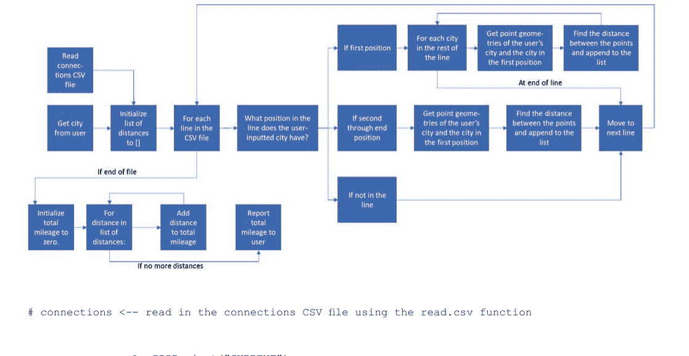

```python
# connections <-- 使用 read.csv 函数读入连接 CSV 文件

aprx = arcpy.mp.ArcGISProject("CURRENT")
thisMap = aprx.listMaps()[0]
connections_path = thisMap.listTables("connections.csv")[0].dataSource
connections_file = open(connections_path)
connections_reader = csv.reader(connections_file)
```

我用马德里试了一下。它给出了一个错误，表明存在另一个问题。这与我们之前在搜索查询返回空结果时遇到的 `StopIteration` 问题相同，因此我取消注释了 `arcpy.AddMessage()` 行，该行会告诉我查询内容。看最后，注意它试图查找一个名称为空字符串的城市。并非所有行的长度都相同，至少在加载到 ArcGIS 时，它会用空字符串填充较短的行。当然，没有名字的城市是不存在的：

```
Start Time: Friday, October 8, 2021 4:51:10 PM
query is "CITY_NAME" = 'Madrid'
query is "CITY_NAME" = 'London'
query is "CITY_NAME" = 'Paris'
query is "CITY_NAME" = 'Amsterdam'
query is "CITY_NAME" = 'Frankfurt am Main'
query is "CITY_NAME" = 'Berlin'
query is "CITY_NAME" = 'Stockholm'
query is "CITY_NAME" = 'Praha'
query is "CITY_NAME" = 'Athinai'
query is "CITY_NAME" = 'Budapest'
query is "CITY_NAME" = 'Milano'
query is "CITY_NAME" = 'Roma'
query is "CITY_NAME" = 'London'
query is "CITY_NAME" = 'Paris'
query is "CITY_NAME" = 'Amsterdam'
query is "CITY_NAME" = 'Frankfurt am Main'
query is "CITY_NAME" = 'Berlin'
query is "CITY_NAME" = 'Stockholm'
query is "CITY_NAME" = 'Praha'
query is "CITY_NAME" = 'Athini'
query is "CITY_NAME" = 'Budapest'
query is "CITY_NAME" = 'Milano'
query is "CITY_NAME" = 'Roma'
query is "CITY_NAME" = 'Barcelona'
query is "CITY_NAME" = 'Lisboa'
query is "CITY_NAME" = 'Santander'
query is "CITY_NAME" = 'Pamplona'
query is "CITY_NAME" = 'Sevilla'
query is "CITY_NAME" = 'Valencia'
query is "CITY_NAME" = ''
Failed script Calculate Connection Distances...
Traceback (most recent call last):
  File "D:\books\PythonManual\Chapter17\Chap17.py", line 53, in <module>
    cityGeom = getGeomOfCity(city)
  File "D:\books\PythonManual\Chapter17\Chap17.py", line 13, in getGeomOfCity
    theCity = search.next()
StopIteration
Failed to execute (CalculateConnectionDistances).
```

这意味着我们需要添加另一个检查来避免生成此错误。这是遍历连接到枢纽的城市的 for 循环，其中包含了 if 语句，并且后续行进行了适当的缩进：

```python
# --> --> for city in line[1:end] :
        for city in line[1:]:
            if city != '':
# --> --> --> cityGeom <-- getGeomOfCity(city)
                cityGeom = getGeomOfCity(city)

# --> --> --> distance <-- cityGeom.distanceTo(userGeom)
# 回想几何练习中的 .distanceTo()
                distance = cityGeom.angleAndDistanceTo(userGeom)[1] / 1000

# --> --> --> distanceList.append(distance)
                distanceList.append(distance)
```

现在这允许马德里在没有任何错误的情况下运行：

总距离为 20719 公里。

从下面开始，你可以看到我最终完成的整个代码。如你所见，这不是一个简单的过程。这就是为什么，正如我之前提到的，你应该从规划开始，而不是拖到最后一刻。同时，不要害怕像我那样稍微偏离计划几次来修复错误。同样，需要有一个计划来测试工具在用户可能进行的一系列输入下的表现，无论这些输入是正确还是错误。在这个例子中，当工具对伦敦有效时，我并没有停止测试，事实上，继续测试其他几个城市发现了更多错误。你也应该同样愿意在各种场景下测试工具，以更好地确保它们能够正常工作：

```python
import csv
import arcpy
```

```python
# def getGeomOfCity(cityName):
# --> search <-- searchCursor(cities file, [SHAPE@, NAME], 'NAME' == cityName)
# --> theCity <-- search.next() # 假设每个名字恰好对应一个城市
# --> return theCity[0] # 认识到 [0] 是 theCity 列表中的第一个项目，即几何体。
```

```python
def getGeomOfCity(cityName):
    query = '"CITY_NAME" = \'' + cityName + "'"
    arcpy.AddMessage("query is " + query)
    search = arcpy.da.SearchCursor('cities', ['SHAPE@', 'CITY_NAME'], query)
    theCity = search.next()
    return theCity[0]
```

```python
# connections <-- 使用 read.csv 函数读入连接 CSV 文件

aprx = arcpy.mp.ArcGISProject("CURRENT")
thisMap = aprx.listMaps()[0]
connections_path = thisMap.listTables("connections.csv")[0].dataSource
connections_file = open(connections_path)
connections_reader = csv.reader(connections_file)
```

```python
#userCity <-- 通过 arcpy.GetParameter 函数从用户获取输入城市
userCity = arcpy.GetParameter(0)
```

```python
# userGeom <-- getGeomOfCity(userCity)
noError = True
try:
    userGeom = getGeomOfCity(userCity)
except StopIteration as si:
    #arcpy.AddError("您的城市不在数据库中。请检查您的拼写和/或所在大陆。")
    noError = False
```

```python
# distanceList <-- []
distanceList = []
```

```python
# for line in connections
for line in connections_reader:
```

```python
# --> position <-- userCity 在 line 中的位置
if userCity in line:
    position = line.index(userCity)
```

```python
# --> if position == 1: 注意：我在代码中将 1 更正为 0
if position == 0:
    distanceList = []
# --> --> for city in line[1:end] :
    for city in line[1:]:
        if city != '':
# --> --> --> cityGeom <-- getGeomOfCity(city)
            cityGeom = getGeomOfCity(city)

# --> --> --> distance <-- cityGeom.distanceTo(userGeom)
# 回想几何练习中的 .distanceTo()
                distance = cityGeom.angleAndDistanceTo(userGeom)[1] / 1000

# --> --> --> distanceList.append(distance)
                distanceList.append(distance)
            break
# --> else:
        else:

# --> --> city = line[0]
        city = line[0]

# --> --> cityGeom <-- getGeomOfCity(city)
        cityGeom = getGeomOfCity(city)

# --> --> distance <-- cityGeom.distanceTo(userGeom)
# 回想几何练习中的 .distanceTo()
        distance = cityGeom.angleAndDistanceTo(userGeom)[1] / 1000

# --> --> distanceList.append(distance)
        distanceList.append(distance)

# --> totalMileage <-- 0
totalMileage = 0

# --> for dist in distanceList:
for dist in distanceList:

# --> --> totalMileage <-- totalMileage + dist
    totalMileage = totalMileage + dist
# --> 将 totalMileage 作为 Arcpy 消息报告
if noError:
    arcpy.AddMessage("The total distance is " + str(round(totalMileage)) + " km.")
```

## 自主任务

我期望在这个项目的工具箱中看到四个工具，具体规格在下一节中。

**评估标准：**

- 工具的程序是否事先使用流程图、伪代码或其他方式进行规划？
- 每个新工具及其对话框是否正确组装？
- 每个工具中的第一个任务是否正常工作？
- 每个工具中的第二个任务是否正常工作？
- 是否有解释你所做工作的注释？

## 工具规格

### (1) 城市选择

对于第一个工具，你将创建一个允许用户标注特定要素的应用程序。在这种情况下，你将使用欧洲城市的 shapefile。你的应用程序应允许用户标注他/她选择的特定城市。

你的应用程序应至少包含以下功能：

- 从用户获取城市名称，并使用自定义标注类和查询来隔离该城市，仅用其名称标注该城市。
- 为城市图层创建符合以下规格的符号系统：
  - 它是分级符号，使用 POP_RANK 字段，分为七类，等间隔，符号大小从 4（最小）到 15（最大）。
  - 符号模板是蓝色圆圈。

我希望用户能够在对话框中输入一个城市，地图会缩放到该城市。如果用户输入的数据库中没有的城市名称（例如，将 London 拼写为 Lodnon），它应该友好地警告用户，而不是使 ArcGIS 崩溃或给出难以阅读的 ArcGIS 错误消息。

### (2) 中位数计算

ArcGIS 提供了一个很好的“汇总统计”工具，尽管它并不具备我们可能想要的所有功能。特别是，它缺少中位数，这对于序数变量“POP_RANK”来说是最合适的统计量。你的第二个工具应允许用户选择一个国家，并通过 ArcPy 消息告诉他们该国家的 POP_RANK 中位数值。

你的应用程序应至少包含以下功能：

- 从用户获取国家名称，并使用查询仅访问该国家内的城市。
- 计算该国家所有城市的 POP_RANK 中位数，并将中位数报告给用户。

计算中位数将涉及形成该国家所有 POP_RANK 值的列表，对其进行排序，并找到该列表中的中间值。

### (3) 打印连接

在疾病爆发期间，传染病通常可以通过航空网络传播。使用连接的 .csv 文件，允许用户输入爆发开始的城市，并显示包含两个城市列表的消息。第一个列表包含主要关注的城市，因为它们是与用户选择的城市直接连接的城市。
第二个列表包含次要关注的城市，因为它们与主要关注的城市相连，但不是最初选择的位置。
例如，如果爆发始于维也纳，主要关注的城市是法兰克福、柏林、华沙、布拉格和布达佩斯，因为它们与维也纳直接相连。
法兰克福、柏林、华沙、布拉格和布达佩斯这五行中的每个地方随后都成为次要关注的城市，因为疾病可能从维也纳经过柏林到达德累斯顿，例如，使德累斯顿成为次要关注的城市。涉及次要城市的连接有 93 个，尽管次要关注的城市少于 93 个，因为许多连接是重叠的。例如，柏林和法兰克福都连接到奥斯陆，所以奥斯陆是次要关注的城市，但它只需要在列表中出现一次。

你的应用程序应至少包含以下功能：

- 从用户获取城市名称，并使用 .csv 文件识别上述定义的主要和次要关注城市。
- 通过 Arcpy 消息报告这两个列表。如果输入的城市没有连接，应有一条消息说明这一点。对于次要关注的城市列表，不应出现主要关注的城市，也不应出现最初选择的城市。此外，即使一个城市与两个不同的主要关注城市有连接，也不应列出两次。

如果用户输入的数据库中没有的城市名称（例如，将 London 拼写为 Lodnon），它应该友好地警告用户，而不是使 ArcGIS 崩溃或给出难以阅读的 ArcGIS 错误消息。

### (4) 建议新连接

航空公司可能希望查看是否可以扩展其网络。你在此任务中的意图是允许用户输入一个城市名称，并识别任何人口等级为 6 或更低（因为较低的等级表示较大的城市）且距离所选城市在 100 公里到 500 公里之间的城市。

您的应用程序应至少包含以下功能：

-   从用户处获取城市名称，识别100至500公里范围内的城市，并使用.csv文件识别那些缺乏连接的城市。
-   通过Arcpy消息报告需要连接的城市列表，按等级顺序呈现，大城市优先。

如果用户输入的数据库中不存在的城市名称（例如，将London误拼为Lodnon），应友好地警告用户，而不是导致ArcGIS崩溃或给出难以理解的ArcGIS错误消息。

## 第四部分：与他人分享您的工作

尽管计算机编程常常看起来是一项非常孤独的实践，但当与全球数百万程序员的社区连接时，它会得到极大的增强。您可能已经在不知不觉中参与了其中一些连接。这甚至可以简单到在线搜索，调查是否有人遇到过您当前正盯着的错误，并查看他们的解决方案是否也适用于您。此外，任何时候您导入一个包，甚至使用他人编写的软件，您都是在他人工作的基础上进行构建。这种共享在WebGIS中变得更加明确，这是另一个足以自成一书的主题，因此在此不作全面探讨。共享发生的主要方式是通过连接他人编写的包，以及创建您自己的包与他人分享。

既然您已经构建了一个工具，本节将扩展这些技能，以实现与更广泛世界的内容共享。它首先介绍如何通过使用ArcGIS Online和`arcpy.sharing`模块的ArcPy for Web GIS来共享地图。然后，介绍了与其他包的连接，包括使用Numpy过程，以及能够创建运行R代码而非Python代码的工具。最后两章重点介绍开发您自己的包。由于大多数包包含多个Python文件，第20章是关于创建和管理包含多个文件的程序。第21章在此基础上创建您自己的包并将其与ArcGIS Pro连接。

## 使用ArcGIS Online的ArcPy for Web GIS 18

本章将介绍WebGIS的概念，并通过使用`arcpy.sharing`模块来阐述这些概念。还包括了用于WebGIS的数据门户的使用。与编写代码同样重要的是创建元数据和必要的信息，以便遇到您的ArcGIS Online项目的人能够有效地使用和解释它。

### 引言：共享服务

与更广泛世界共享项目的第一阶段通常通过使用现有的共享服务来实现。这些服务可用于交换数据，既共享您收集的数据，也无需直接下载即可访问来自其他来源的数据。这些服务还可以用于共享不仅仅是数据，而是整个项目的设置，甚至访问比您自己的台式机或笔记本电脑上可用的更强大的计算能力。这些构成了WebGIS的关键要素，WebGIS是地理信息科学中一个增长迅速且规模庞大的部分，已有大量关于该主题的书籍。结语部分列出了一些。本章仅作为通过ArcPy可用的一些工具的简要介绍。

与共享数据或共享项目同样重要的是共享您关于项目的信息，即项目的元数据。元数据是关于数据的信息，无论是您的数据集、您的项目还是您正在共享的工具，它对于GIS从业者和开发者更广泛网络的有效实施至关重要。毕竟，如果您只是说“这是我的数据，它在https://gisportal.myschool.edu/server/rest/services/awesomeData/FeatureServer”，没有人会知道它包含什么、有多旧、使用什么投影，或者关于数据的任何其他信息。要成为这个网络中有价值的贡献者，您需要确保您的数据是其他人会想要使用的。同样，将.py文件放在网上并不会鼓励人们调查或使用您的代码，因为他们不会知道里面有什么。即使代码有良好的注释，他们也必须足够感兴趣才能下载并打开文件才能看到这些注释。本章最后一个指导任务将引导您为项目添加一些此类元数据。

### 任务1：从在线源添加数据

许多人进入WebGIS世界的入口是通过数据服务。这是通过告诉计算机在线查找数据的位置来访问数据集，而不是将数据下载到本地硬盘驱动器并指向该硬盘驱动器。这有几个优点。其中最重要的是，如果您正在处理一个可能快速变化的数据集，例如每日气象记录或每日或每周更新的疾病计数，您不必每次更新时都重新下载数据以确保您使用的是最新版本的数据集。另一个优点是，如果创建数据集的个人或组织发现并修复了错误，通过直接连接到他们服务器上的数据集，您也可以立即访问更正后的版本。

从ArcPy的角度来看，从本地硬盘驱动器访问数据集与从在线访问数据集没有太大区别。事实上，它们使用`map`对象的相同方法：`addDataFromPath()`。唯一的区别是传入该函数的参数。

创建一个新地图，并使用Python窗口创建并访问一个名为m的地图对象。然后输入以下行，确保URL完全如所示。此数据集来自美国卫生资源和服务管理局，包含有关他们指定为卫生专业人员短缺区域的信息。顾名思义，这些区域没有足够的医疗服务提供者来满足当地人口的需求：

```
m.addDataFromPath("https://gisportal.hrsa.gov/server/rest/services/Shortage/HealthProfessionalShortageAreas_FS/FeatureServer")
```

这将返回包含新添加数据集的Layer对象：

```
>>> m.addDataFromPath("https://gisportal.hrsa.gov/server/rest/services/Shortage/HealthProfessionalShortageAreas_FS/FeatureServer")
<arcpy._mp.Layer object at 0x0000026BA77DE550>
```

这是一个包含多个要素图层的组图层。

**问题1：此组图层内有多少个要素图层？**
**问题2：心理健康HPSA—点图层中列出了多少个点？**

### 任务2：使用访问在线服务的工具

许多人使用WebGIS元素的第二种方式是通过在线服务。在这种方法中，不是访问原本不在您计算机上的数据，而是运行未存储在您计算机上的工具。与第一个任务中访问数据一样，这允许用户访问在他们自己的硬盘驱动器上不切实际的工具。

主要需要这样做的情况是，如果工具需要访问频繁更新的信息才能正常工作。寻找行驶时间多边形的工具就是这种情况，您将在本任务的后续部分进行此操作。生成表示特定点或一组点一小时车程内所有地点的多边形需要交通状况。当然，交通状况更新非常频繁，以便有用。不可能将所有相关信息存储在您的台式计算机上并维护它以使其始终保持最新。相反，该工具被设置为在线服务，以便在运行时访问该数据，以确保最可靠的结果。工具作为在线服务有益的另一种方式是，如果它对大多数计算机的硬件和软件要求来说计算强度过大。由于台式计算机现在通常很强大，这对于像ArcGIS Pro这样的桌面GIS来说并不常见。然而，对于那些采用可以从标准计算机处理核心数量之外的并行处理中受益的算法的工具，将其设置为利用网络环境中比其他方式可用的更多处理核心的云计算服务可能是值得的。如果用户通过Web浏览器而不是桌面环境访问GIS，这种对更多处理能力的需求也可能出现在WebGIS环境中。Web浏览器无法假设或访问大量的处理能力，仅仅因为它们通常设计为在各种硬件平台上运行，包括内部处理能力非常有限的设备。为了避免使Web浏览器或使用该浏览器的计算机过载，GIS使用浏览器从用户获取输入信息，但通过独立于浏览器的云计算设置处理计算。

在我们的ArcPy环境中，由于大多数工具都包含在软件本身中，第一种需求更为常见。大多数（如果不是全部）使用在线服务的ArcGIS Pro工具都需要处理积分才能运行。因此，在继续此任务之前，请确保您或您的组织有足够的积分来执行此任务。可以在[https://pro.arcgis.com/en/pro-app/latest/tool-reference/appendices/geoprocessing-tools-that-use-credits.htm](https://pro.arcgis.com/en/pro-app/latest/tool-reference/appendices/geoprocessing-tools-that-use-credits.htm)查看，在撰写本文时，此任务的代码使用4.5个积分。

加载第12章的数据，以便您可以看到州、县、城市、河流和高速公路。我们将找到所有在名为Springfield的城市一小时车程内的区域。第一阶段是创建一个仅包含名为Springfield的城市的新图层。为此，请输入以下代码，这在前面的章节中应该很熟悉：

```
arcpy.MakeFeatureLayer_management('cities', 'springfields', ""AREANAME" = 'Springfield'")
```

此时，你应该会发现名为`springfields`的新图层中有九个城市。

正如通过在线服务访问数据与访问硬盘驱动器上的数据看起来非常相似，使用ArcGIS Pro工具箱中的常规工具与使用访问在线服务的工具在功能上几乎没有区别。在本例中，我们需要使用Business Analyst扩展模块中的“生成行车时间贸易区”工具。查看其文档（就像我们查看任何其他工具一样），我们可以看到它需要一个输入点图层（行车时间多边形将基于此生成）、一个用于存储结果的输出要素类；将使用的出行模式，例如“行车时间”、“步行时间”或“卡车行驶距离”；以及用于多边形边界的距离，例如60分钟或100公里。在本例中，我们要确保起始点是名为Springfield的城市，给出一个合理的输出名称，并设置60分钟的行车时间。这将得到以下代码行：

```
arcpy.ba.GenerateDriveTimeTradeArea('springfields', 'springfields_hour_away', 'Driving Time', 60, 'MINUTES')
```

这可能需要一些时间，具体取决于ESRI服务器当前正在处理多少个处理请求，但你将获得一张包含行车时间多边形的地图，这些多边形代表从该数据集中九个Springfield城市出发一小时的范围。请注意，由于交通状况不同，你的多边形在不同时间运行时可能看起来有些不同。因此，问题3的答案无法保证在每次运行此工具时都完全一致。

## 问题3：有多少个州与Springfield多边形相交？

## 任务3：创建你自己的在线服务

在使用了他人设置的服务之后，你可能希望继续创建自己的服务来共享你拥有的数据。通过Python包共享工具比共享数据更复杂，这将在第21章中介绍，因此我们将在此重点介绍共享数据。

这需要与你的ArcGIS Online帐户及其关联的数据门户建立连接，因此我们要做的第一件事是登录该门户。`arcpy.SignInToPortal`内置函数为我们完成了此操作，它接受的输入参数包括你要登录的站点（arcgis.com）、你的ArcGIS Online帐户用户名和密码。在下面的示例中，我已更改了用户名和密码：

```
arcpy.SignInToPortal("https://www.arcgis.com", "UsernameRedacted", "PasswordRedacted")
```

作为输出，你将看到一个包含帐户信息的字典，但这不是我们将在任务剩余部分使用的内容。设置数据以便通过服务上传是一个需要多个阶段的过程。第一个阶段是在你的本地计算机上创建服务的草稿。这样，你可以在提交在线共享之前确保一切符合你的要求。

这最终是通过地图的`getWebLayerSharingDraft()`方法实现的，但该方法有足够的输入参数，我们需要在到达那里之前初始化一些内容。首先，由于我们是在本地硬盘驱动器上创建服务的草稿，我们需要知道它将存储在哪里。这通过设置一个输出目录来完成，你可以将其放在任何你想要的位置：

```
outdir = "D:\classes\TechIssues\labs\Python\Chap18"
```

然后是服务名称，即你希望你的服务被称为什么。由于这是一个示例，我选择了一个反映此目的的名称：

```
service_name = "FeatureSharingDraftExample"
```

完整的文件名只需在服务名称上添加适当的文件扩展名（`.sddraft`）：

```
file_name = service_name + ".sddraft"
```

然后我们可以将所有这些组合在一起，得到我们草稿的完整输出位置：

```
output = outdir + "" + file_name
```

使用四行代码和四个变量来表示文件路径的不同部分可能看起来有些多余，但其中一些部分将在将草稿上传到在线服务的其他过程中被重用。毕竟，这是我们在本书中一直使用的一种策略的小规模版本，即将问题分解成更小的部分，以便可以根据需要更改和重用各个部分。现在我们有了存储草稿的位置，我们需要设置该草稿的内容。为此，我们将共享第12章中县文件的一个图层。

如果你还没有这样做，请通过以下代码行访问县图层：

```
aprx = arcpy.mp.ArcGISProject("CURRENT")
m = aprx.listMaps()[0]
counties_layer = m.listLayers("USCensus2010_arc")[0]
```

根据所讨论的数据，我们可以使用不同类型的服务器。由于我们想要设置一个用于共享或托管矢量数据（包含要素）的服务器，我们需要服务器类型为“HOSTING_SERVER”，服务类型为“FEATURE”。如果我们共享的是栅格数据集，则服务类型应为“TILE”。地图对象有一个方法允许我们将其转换为用于共享要素的服务，它将给我们想要的草稿。在运行这些代码行之前，请确保县图层的显示效果完全符合你的要求，因为符号系统将被编码在此草稿中，之后不易更改。请注意，虽然我们这里只使用了一个图层（县图层），但如果我们希望共享更多内容，可以在列表中包含多个图层：

```
sddraft = m.getWebLayerSharingDraft("HOSTING_SERVER", "FEATURE", service_name, [counties_layer])
sddraft.exportToSDDraft(output)
```

你可能不会看到地图有任何变化，所以不要惊慌。如果这对你来说运行正常，那么你就准备好将草稿转换为正式的服务了。这在术语上称为“服务定义”，因为它仍然是位于硬盘驱动器上的一个文件，但包含了在线发布所需的所有信息。它仍然省略了最终发布的最后一步。这种分离有几个优点，尤其是在使用GIS的大型组织中。可能有多人参与此过程，以及共享多个图层。将创建服务与上传服务分开，允许不同的人承担这两个不同的角色，也允许多人创建服务定义并将其放入公共目录中，以便在一切准备就绪时一次性上传所有内容。

这说明了共享你的工作的一个原则。在许多情况下，共享工作的不是单个GIS用户，而是一个组织正在创建一个GIS门户来共享更大量的数据。这意味着共享数据的实践只部分涉及实现它的代码；它同样（甚至更多）是一项组织性的工作，需要该组织内更大用户群体的合作与协调。以第一个任务为例，HRSA共享了大量关于医疗保健可及性的数据。在收集、维护和共享这些数据的过程中，不太可能只有一个人参与。¹ 因此，将此过程的两个部分分开是有意义的。

在我们这样做之前，我们必须创建用于存储服务定义的文件，这就是我们重用创建草稿的一些部分的地方。我们可以重用存储在变量`service_name`中的文件名，以及存储在`outdir`中的输出目录。区别在于我们创建的是服务定义本身（文件扩展名为`.sd`），而不是草稿（扩展名为`.sddraft`）：

```
sd_file_name = service_name + ".sd"
sd_output = outdir + "" + sd_file_name
```

现在名称已准备就绪，我们可以开始该分离过程的第一步：暂存服务。这是通过以下代码行完成的：

> ¹我没有调查他们的组织结构，只是根据收集此类数据所涉及的工作量以及他们拥有的数据量进行推断。

最后，当服务准备就绪并准备好发布时，我们可以将其作为托管服务器上传：

```python
arcpy.UploadServiceDefinition_server(sd_output, "HOSTING_SERVER")
```

完成此步骤后，您可以使用网络浏览器登录您的 ArcGIS Online 帐户并找到您共享的数据。以下是我的显示结果。通过这种方式，我准备好的数据就可以与更广泛的世界共享了。

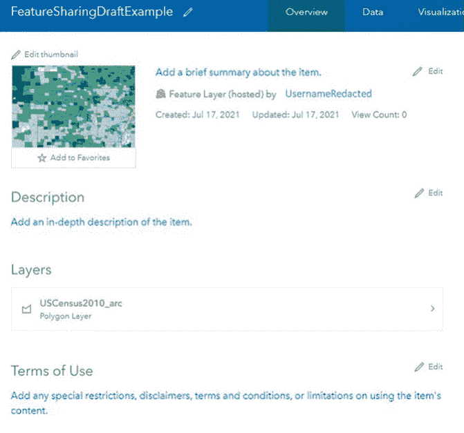

## 任务 4：提供服务的元数据

查看上一个任务末尾的图像，您可能会注意到它对于任何可能想使用此服务的人来说都不是很有用。它甚至有一个通用的名称，虽然在本书中对其目的具有描述性，但并未向更广泛的外部受众传达此服务可能提供什么。描述缺失了。从某种意义上说，这就像一罐没有标签的食物。除非打开罐子或访问数据，否则几乎无法知道里面的内容。然而，谁愿意花时间去访问他们一无所知的数据，以期它可能对他们想做的任何事情有用呢？

正如本章引言中提到的，我们需要为此添加一些元数据，使其更有用。如果您查看 `FeatureSharingDraft` 类的不同属性，您可能会注意到其中几个包含有关服务的信息。默认情况下，这些属性不包含任何有用的信息，但我们可以编辑它们以使其更有用。

我们将编辑的第一个是 `.credits` 属性。在线文档在此处没有提供我们可能需要的帮助，因为它只是说它是“表示署名的字符串”。由于地图上的署名通常提供有关数据来源的信息，我们可以提供此数据集的来源：

```python
sddraft.credits = "US Census Bureau, 2010 Decennial Census"
```

我们将编辑的下一个属性是摘要。毫不奇怪，它提供了用户可以期望看到的内容的简要概述：

```python
sddraft.summary = "US Counties, symbolized by per capita income"
```

第三，我们可以通过描述提供有关服务内容的更完整说明：

```python
sddraft.description = "This feature class shows the per capita income of United States Counties in 2010, using a five-class natural breaks classification."
```

我们将编辑的第四个属性是 `.tags` 属性。这有助于搜索。如果您希望搜索数据的人能够找到您的服务，您应该仔细考虑要提供哪些标签。在此示例中，搜索“income”的人可能会发现此服务很有用，因此拥有“income”标签将有助于它出现在他们的搜索结果中：

```python
sddraft.tags = "income, US Counties"
```

我们将编辑的最后一个属性是 `.useLimitations` 属性。根据数据的性质，您可能需要指定何时不应使用此数据的任何建议。例如，如果位置的精度较粗，您可能需要指定它不适用于大于 1:100,000 的比例尺。在这种情况下，我们没有任何此类限制，因此将指定：

```python
sddraft.useLimitations = "none"
```

重新查看这些属性的文档，请注意它们是通用字符串。计算机缺乏所有常识，会欣然接受这里的任何字符串，甚至是“42”或“bad wolf”，无论它对目的是否有用或无用。从某种意义上说，它与我们代码中的注释具有相同的功能。计算机忽略此信息，并盲目地将其呈现给用户。不同之处在于，注释在大多数情况下只存在于一小群人中，甚至可能只为你自己，以帮助解释代码各行的目的。另一方面，关于您的服务的元数据是公开的，可供任何可能遇到它的人使用。因此，不言而喻，这是一个重要的沟通策略，可以帮助增强或限制您服务的使用。

回到代码，我们已经编辑了服务定义的草稿。要使这些更改公开，我们必须重新访问上一个任务中的代码，将草稿转换为完全上传的服务。但是，首先还有一个步骤要做。在您检查属性时，您可能注意到一个名为 `.overwriteExistingService` 的属性。这记录了您是否被允许在创建服务后更改它。输入以下行以检查其值：

```python
sddraft.overwriteExistingService
```

## 问题 4：此属性的值是 True 还是 False？

如果值为 True，我们就可以继续进行暂存和上传过程。如果值为 False，我们需要先使用以下行将其设置为 True：

```python
sddraft.overwriteExistingService = True
```

完成后，我们可以使用与上面相同的行将我们更新的服务与世界其他地方共享：

```python
sddraft.exportToSDDraft(output)
arcpy.StageService_server(output, sd_output)
arcpy.UploadServiceDefinition_server(sd_output, "HOSTING_SERVER")
```

完成此操作后，我们可以重新访问在线帐户以检查更改。我们现在可以看到摘要已更新，描述也已更新。既然这些更改已经完成，我们的共享服务将对遇到它的人更有用。


## 任务 5：自主练习

这是一个非常简单的自主任务。运用本章引导任务中的思想，使用您在第 17 章中使用的图层创建一个新的要素服务。确保为其提供一个好的标题、署名、摘要、描述和标签。提供查找服务的 URL。

*评估标准如下：*

- 服务存在于提供的 URL。
- 包含第 17 章中的图层。
- 标题、署名、摘要、描述和标签的元数据都存在且适当。

## 整合外部包 19

本章将利用共享代码的思想，并利用它来整合作为包在线共享的代码。这将通过使用 NumPy 包和 R 中的 arcgisbinding 包进行统计计算的示例来实现。

### 引言：Python 模块

共享数据服务和使用已作为服务共享的数据，正如前一章所述，是人们加入 Web GIS 生态系统中更广泛的 GIS 用户网络的主要切入点之一。然而，数据并不是 GIS 系统中唯一可以共享的部分。本书的主要重点是培养创建脚本以某种方式增强 ArcGIS Pro 的技能。一旦您有了对您有用的脚本，同样的脚本可能对其他人也有用，这是合乎逻辑的。本书的最后几章致力于创建一个您可以与他人共享的包。

然而，创建包的第一步是了解它们是如何使用的。因此，本章重点介绍他人创建的外部包的使用。它将使用两个包：`numpy` 和 `arcgisbinding`。`numpy` 包是一个统计计算包，它提供了比 ArcGIS Pro 自动包含的更广泛的统计分析功能。如果您需要更强大的统计计算能力，可能值得完全离开 Python，转而使用名为 R 的统计计算系统。`arcgisbinding` 包在 R 中，允许在 ArcGIS Pro 和 R 编程环境之间进行通信。

已经为 Python 创建了各种各样的模块，其中大多数与 ArcGIS 或空间数据关系不大。模块的概念在第 5 章中引入，将其介绍为 Python 基础版本的扩展。到现在，您已经非常熟悉其中一个模块：ArcPy。正如 ArcPy 服务于特定的扩展目的——允许在 ArcGIS 环境中使用 Python 代码——其他模块服务于其他目的。其中一些包含在通过 ArcGIS Pro 提供的 Python 安装中，例如您在第 5 章中用于读写 CSV 文件的 csv 模块。如果您转到功能区的“项目”选项卡，然后单击左侧菜单中的“Python”，您将看到 Python 包管理器。虽然本章和相关任务不会更改可用的包，但您可以使用“添加包”按钮将更多包安装到当前的 ArcGIS Pro 环境中。但是，不支持导入不在此列表中的包，大概是因为 ESRI 只支持他们已验证不会导致 ArcGIS Pro 崩溃或以其他方式行为异常的包。

从计算的角度来看，模块是一系列服务于共同总体目的的 Python 文件。这意味着，如果您可以研究 Python 模块的内容，您就可以潜在地使用第 5 章中关于阅读 Python 代码的策略来弄清楚模块的每个组件在做什么。然而，从实际的角度来看，通常有太多的 Python 文件无法实现这一点。这种大量文件通常影响我们查看或使用模块的方式是通过错误消息。下面重新打印了前一章的一个错误消息。查看消息的 Traceback 部分是我们现在看到更多的内容，通过跟踪不同函数中的错误消息。在此错误消息中，我们看到它指的是文件“c:\program files\arcgis\pro”中的错误。

**补充信息：** 在线版本包含补充材料，可在 [https://doi.org/10.1007/978-3-031-08498-0_19] 获取。

Resources\arcpy\arcpy\arcobjects\_base.py"，第90行。该Python文件是构成`arcpy`模块的众多.py文件之一。你甚至可以在Windows资源管理器中导航到该文件，并用IDLE打开它。即便如此，我绝对不建议你编辑它。这样做极有可能破坏你的ArcPy安装，而像ArcPy这样复杂的模块，你肯定不想去调试它！

```
>>> Ohio_layer.brightness
Traceback (most recent call last):
  File "c:\program files\arcgis\pro\Resources\arcpy\arcpy\arcobjects\_base.py", line 90, in _get
    return convertArcObjectToPythonObject(getattr(self._arc_object, attr_name))
AttributeError

During handling of the above exception, another exception occurred:

Traceback (most recent call last):
  File "<string>", line 1, in <module>
  File "c:\program files\arcgis\pro\Resources\arcpy\arcpy\arcobjects\_base.py", line 96, in _get
    (attr_name, self.__class__.__name__))
NameError: The attribute 'brightness' is not supported on this instance of Layer.
```

## 任务1：将要素类转换为numpy数组

除了ArcPy，我们将使用的另一个Python包是NumPy，一个支持科学和统计计算的包。本章任务中的示例来自我关于比较医疗可及性度量的研究（Conley等人，2021），该研究确实使用了统计计算。

使用多个模块时的一个关键教训是，不同模块可能使用相似但不完全相同的数据结构。在这种情况下，`numpy`本身并不使用与`arcpy`相同的数据结构，尤其是当`numpy`对空间数据没有特定兴趣时。这意味着我们必须将第一个任务设定为将数据从`arcpy`友好的数据结构转换为`numpy`友好的数据结构。方便的是，`arcpy`已经提供了一个函数来完成这项工作。

要进行此转换，我们首先需要以`arcpy`格式获取所需的数据。正如我们之前所做的那样，这从获取要素类开始。由于这将逐行执行，Python窗口将是运行代码的好地方，尽管在Python Notebook中使用单元格也可以：

```
aprx = arcpy.mp.ArcGISProject("CURRENT")
m = aprx.listMaps()[0]
l = m.listLayers()[0]
fc = arcpy.ListFeatureClasses("chapter19")[0]
```

### 问题1：使用前面章节的Python代码，fc中有多少个字段？

如上所述，这些数据来自一个比较不同医疗可及性度量的项目。具体来说，它比较了一系列衡量获取医疗服务的社会经济和人口障碍的指标。虽然该要素类字段中的许多变量用于计算一个或多个此类指标，但它们对于此比较并非必需。相反，只有最后几个变量是真正需要的。我们可以通过以下代码行设置一个仅包含必要字段的列表：

```
fields = ['HEALTHLINK', 'SHAH', 'BASCUNAN', 'MCGRAIL', 'DOMNICH', 'ASANIN', 'PAEZ', 'GAO', 'YIN', 'DALY', 'CHATEAU_SEFI', 'CHATEAU_SOC', 'CHATEAU_MAT']
```

最后，对于这个转换过程，我们可以访问ArcPy函数来为我们执行它。虽然可能性不大，但在前面章节查看`arcpy`的`.da`模块中的其他函数时，你可能注意到了这个函数：`arcpy.da.FeatureClassToNumPyArray()`。它有两个输入：正在转换的要素类（或其他基于表的数据类型）和要包含在`numpy`数组中的字段列表。输入以下代码行进行转换：

```
array = arcpy.da.FeatureClassToNumPyArray(fc, fields)
```

现在我们有了`numpy`数组，你可能想知道为什么我们不能直接使用第11章介绍的Python数组。让我们通过简单地输入其名称`array`并按回车键来查看`array`变量的内部。你应该会看到类似这样的输出：

```
array
>>> array([(0.051485 , 0.07214039, 0.07781311, 0.21964603, 0.26566542, 0.22219777, 0.31320043,
0.21671328, 0.54892157, 0.26455139, -0.08471718, -0.27359168, -0.1790466 ), (0.06597251, 0.06888793,
0.03680725, 0.16410657, 0.27274817, 0.18133654, 0.2993142 , 0.18226777, 0.54615429, 0.2543156 ,
-0.27739867, -0.25147752, -0.35226863), (0.08192977, 0.11589624, 0.0748208, 0.25928362, 0.30467272,
0.27083206, 0.33296029, 0.20910387, 0.55237061, 0.29681452, -0.08425255, -0.09077854, -0.1229404
), ..., (0.15345213, 0.26639974, 0.40515671, 0.32551684, 0.42989901, 0.29654785, 0.33668167,
0.33963245, 0.88142758, 0.43140419, 0.10041128, -0.38272013, 0.11319308), (0.13256161, 0.23169898,
0.33223293, 0.37609896, 0.50805646, 0.39950759, 0.41706762, 0.3554569 , 0.86723604, 0.41341665,
0.17457706, 0.15773115, 0.23446054), (0.19719181, 0.27864918, 0.41363254, 0.34340663, 0.44583826,
0.32286904, 0.37952758, 0.45799205, 0.8389042, 0.59461085, 0.30320202, -0.17735393, 0.43767242)],
dtype=[('HEALTHLINK', '<f8'), ('SHAH', '<f8'), ('BASCUNAN', '<f8'), ('MCGRAIL', '<f8'), ('DOMNICH',
'<f8'), ('ASANIN', '<f8'), ('PAEZ', '<f8'), ('GAO', '<f8'), ('YIN', '<f8'), ('DALY', '<f8'),
('CHATEAU_SEFI', '<f8'), ('CHATEAU_SOC', '<f8'), ('CHATEAU_MAT', '<f8')])
```

乍一看，它类似于一个稍微复杂一点的列表，看起来像一个元组列表。注意这里的模式：`array([(…values…), (…values…), (…values…), …, (…values…)], …)`。这里的每组值，由模式中的(…values…)元素表示，构成了表中的一行。在这种情况下，由于选择了13个字段，每行都有13个数字。如果像数组那样工作，所有内部数据类型都相同（例如，全是整数或全是双精度浮点数），那么这可能看起来没有太大不同。然而，在所有值之后还有另一部分，以`dtype`名称开头。这看起来也是一个元组列表，因为它外面再次有方括号，列表中的值是括号中的元组。它不是为表中的每个要素或行提供一组值，而是为表中的每个属性或列提供一对值。这意味着，在这个例子中，有13个元组，每个元组以变量名开头，然后每个变量都有另一个值'<f8'。

查看NumPy的文档，这就是他们所说的结构化数组。结构化数组允许多种数据类型存在，尽管它不像列表那样自由形式。`dtype`列表记录了与每个变量关联的数据类型。一旦建立了这种关联，结构化数组中的每个要素都必须具有相同数量的属性，相同的顺序，并使用`dtype`列表中指定的相同数据类型。在这种情况下，使用`f8`表示它们都是64位浮点数，对应于ArcGIS Pro中的双精度浮点数。即使在这个特定的结构化数组中所有数据类型都相同，但这并不是必需的。

## 任务2：使用numpy函数

比较这13个指标的方法是协方差矩阵。虽然ArcGIS Pro没有一个简单的工具来计算矢量数据的此类矩阵¹，但`numpy`有。因此，我们可以使用新创建的结构化数组来查找所有13个指标的相关矩阵，告诉我们每对可能的指标共同变化的程度。

> ¹奇怪的是，它在BandCollectionStats()函数中可用于栅格数据。

你可能期望使用`import`语句来访问代码中任何非`arcpy`的Python模块。然而，在这种情况下，`numpy`与`arcpy`一样，在Python窗口中工作时会自动导入。这意味着不需要专门的`import`语句。相反，只要我们在函数前加上`numpy`包标识符，我们就可以直接访问`numpy`函数。

在Python窗口中输入`numpy.`并等待，将显示`numpy`中所有可用的函数。如果你将鼠标悬停在此列表中的函数上，你将获得有关该函数的更多信息。在这种情况下，我们将使用获取两组数字相关系数的函数。这就是`numpy.corrcoef()`。输入`numpy.cor`以访问我们想要使用的函数的信息。将鼠标悬停在上面，并寻找以下问题的答案。由于悬停信息不会持续很长时间，你可能需要删除`numpy.cor`末尾的`r`，重新输入该字母，然后再次将鼠标悬停在函数上以获取答案。

### 问题2：corrcoef()函数返回什么？

除了它返回的内容，我们还需要关注它用什么作为输入。虽然返回值可能让我们觉得应该能够将数组变量作为输入并获得相关矩阵作为输出，但这将不起作用。相反，它一次处理表中的两列效果很好。然而，我们可以使用循环来生成更大的相关矩阵。

在我们开始之前，让我们先看看单个输出。首先，注意我们访问数组中的变量，就像从字典中获取值一样。将变量名作为索引参数提供给数组，它将给我们该属性的值集：

```
print(numpy.corrcoef(array[fields[0]], array[fields[1]]))
```

这为我们提供了字段列表中前两个变量的2 x 2相关矩阵。该矩阵如下：

```
[[1. 0.56562693]
 [0.56562693 1. ]]
```

它有两个值重复了两次。左上角是字段#0和字段#0之间的相关性。这当然是1，因为值是相同的。同样，右下角是字段#1和字段#1之间的相关性。这些对我们来说并不真正有用，尽管它们是相关矩阵的一部分。另外两个值是右上角的字段#0和字段#1之间的相关性，以及左下角的字段#1和字段#0之间的相关性。由于相关性是对称的，这两个值是相同的。

要生成所有13个变量的完整相关矩阵，我们需要遍历每一对值。为了帮助我们规划，让我们从一个大纲开始，并认识到我们希望相关矩阵是一个列表的列表。我将其设置为一系列注释：

```
# 首先将相关矩阵初始化为空列表，并将索引变量初始化为0。
# 遍历所有字段。
# 开始一个新的空列表作为相关矩阵的下一行。
# 再次遍历所有字段。
# 获取当前字段对的相关系数并将其添加到行的末尾。
# 在行末将索引加一，以便我们可以开始相关矩阵的下一行。
```

填充这组注释，我们从初始化步骤开始。

### 首先将相关矩阵初始化为空列表，并将索引变量初始化为0：

```
corr_matrix = []
index = 0
```

遍历所有字段意味着使用`for`循环，遍历每个字段。

### 遍历所有字段：

```
for i in fields:
```

现在我们需要初始化矩阵中的行。请注意，矩阵本身仅被初始化为空列表。这意味着，由于列表中的每个元素本身也是一个列表，我们还需要将这个内部列表初始化为空列表，并将其添加到相关矩阵的末尾，以确保开始新的一行。

```python
# 启动一个新的空列表作为相关矩阵的下一行：
corr_matrix.append([])
```

要填充此行中的每个元素，我们需要再次遍历矩阵。嵌套的 `for` 循环确保我们比较每一对可能的字段。尽管两个循环使用的是同一个列表，但它们使用不同的索引变量，标记不同的位置，因此一个不会干扰另一个。想象有两个光标查看同一个表格，CursorA 和 CursorB。CursorA 的位置不会被 CursorB 改变，CursorB 的位置也不会受到 CursorA 的影响。它们可以独立地遍历同一个表格。同样的动态可以应用在这里，确保 i 和 j 互不干扰。

```python
# 再次遍历所有字段：
for j in fields:
```

现在我们正在查看一对字段——字段 i 和字段 j——我们可以获取这两个字段之间的相关性，并将其添加到表示矩阵中当前行的列表的末尾。下面的第一行获取两个变量之间的相关系数矩阵，但我们只需要其中一个更有用的值。索引对 [0][1] 表示顶行中的第 #1 项（第二项），给我们右上角的值。获取左下角的值同样有用，但这是我选择提取的这对值。一旦可用，就可以将其附加到相关矩阵中当前行的末尾。这是通过名为 `index` 的变量引用的，我们将其初始化为 0，以便从创建第一行开始。

```python
# 获取当前字段对的相关系数并将其添加到行的末尾：
corr = numpy.corrcoef(array[i], array[j])[0][1]
corr_matrix[index].append(corr)
```

在行的末尾，我们需要将变量 `index` 增加一，这样当我们开始下一行时，它将查看矩阵中的正确位置。

```python
# 在行末将索引加一，以便我们可以开始相关矩阵的下一行：
index = index + 1
```

将所有这些组合在一起，得到以下代码块：

```python
corr_matrix = []
index = 0
for i in fields:
    corr_matrix.append([])
    for j in fields:
        corr = numpy.corrcoef(array[i], array[j])[0][1]
        corr_matrix[index].append(corr)
    index = index + 1
```

## 问题 3：使用 corr_matrix 中的索引，MCGRAIL 和 ASANIN 索引之间的相关性是多少？

## 任务 4：准备将 ArcGIS 与 R 连接

我们将要查看的另一个包是 R 中的 `arcgisbinding` 包。这组任务将说明两个课程。第一个是通过在新创建的 ArcGIS Pro 工具中运行 R 脚本的能力，将另一个平台与 ArcGIS Pro 连接起来。另一个课程是介绍 Github，这是共享代码的主要场所之一。在我们能够进一步进行这组任务之前，我们必须先去 Github，因为 R 和 ArcGIS Pro 之间的连接不是 ArcGIS Pro 自动安装的。相反，它必须单独下载和安装。

在我们深入细节之前，我将简要介绍一下 Github。它是开源代码的主要在线存储库之一。开源软件代表了一种与许多软件不同的心态，对于开源软件，任何人都可以下载该软件的代码并能够对其进行更改。这意味着，对于我们即将使用的 r-bridge-install 项目，你可以下载并检查构成它的 Python 代码。（Github 也接受其他语言的代码；只是碰巧这个是 Python。）相比之下，无法检查 ArcGIS Pro 的源代码。你至少可以看到 `arcpy` 的部分内容，但这与 Windows 用于运行 ArcGIS Pro 的代码不同。

要安装 ArcGIS 和 R 之间的连接，首先访问以下 URL 以访问 Github 存储库中的正确软件：[https://github.com/R-ArcGIS/r-bridge-install](https://github.com/R-ArcGIS/r-bridge-install)。当你第一次打开这个网站时，它可能有点令人生畏。你在页面顶部看到的大部分内容对那些需要查看该项目确切脚本的人很有用，无论他们是只想检查还是编辑它们。顶部的按钮行为此项目中软件的贡献者和重度用户提供了不同的功能。我们不需要查看这些。只要顶部行仍然活跃在标有“<> Code”的按钮上，你就可以在该行下方看到文件夹和文件的列表。这是代码本身和一些相关的文件。这里主要观察的是右侧的一组年龄。这代表了对该文件或文件夹中任何文件的最新编辑。在撰写本文时，其中只有两个不到一年，大多数都相当老。这可能是一个好迹象，因为它表明稳定性，假设代码是经常使用的。在这种情况下，它确实是。因此，为了代码被频繁使用，但不频繁编辑，它必须运行得非常好——好到不必担心会发现很多（如果有的话）错误。

我们更感兴趣的是下面标有“Install the R-ArcGIS Bridge”的下一节。首先要注意的是，R-ArcGIS Bridge 有几个不同的安装版本。由于我们使用的是 ArcGIS Pro，我们希望使用 R-ArcGIS Bridge 的 64 位安装，以确保它与 ArcGIS Pro 兼容。向下滚动到标有“ArcGIS Pro 1.1+”的区域以及其下方的“Offline Installation”。虽然在线或离线安装都可以工作，但离线安装过程可能更稳健，以防互联网连接困难，或者只是在你想要随身携带的笔记本电脑上工作。通过“download this repository”链接下载文件。然后点击“latest version of the arcgisbinding package”链接，并选择名为 `arcgisbinding_1.0.1.244.zip`² 的文件。保存这两个文件，并复制到硬盘上的一个目录。该目录的确切地址并不重要，但我确实建议选择一个合理且更容易记住的目录，因为一旦我们切换到 ArcGIS Pro 进行连接，你就需要那个目录。

由于文件是以 .zip 格式下载的，我们需要在 ArcGIS Pro 使用它们之前提取这些 .zip 文件的内容。导航到你刚刚保存文件的目录，并将它们解压到该目录中。然后，打开 ArcGIS Pro，并转到目录窗口。如果看不到它，请找到“视图”功能区并单击“目录窗格”按钮。然后找到“工具箱”菜单项，并右键单击该项。在弹出的菜单中，选择“添加工具箱”，并导航到你刚刚从第一个下载的 zip 文件中提取的工具箱。它在 r-bridge-install-master 文件夹中，名为“R Integration.pyt”。

在该工具箱中，你将找到一个名为“Install R bindings”的工具。运行该工具。你可能会得到一个“completed with warnings”警报，但无需惊慌。此时，桥接已设置好，可以连接 ArcGIS Pro 和 R。

## 任务 4：在 ArcGIS 中创建一个使用 R 脚本的工具

现在它已安装，我们可以使用与第 14 章中创建工具相同的步骤在 ArcGIS Pro 中创建一个工具。不同之处在于，第 14 章中我们使用的是自己创建的 Python 脚本，而在这个任务中，我们使用的是为我们提供的 R 脚本。此工具执行一种称为空间滞后回归的回归。这种特定的统计技术

²这是撰写本文时的版本号。当然，只要他们愿意，随时可以更新，所以如果版本号不同，请不要惊慌。

## 任务5：检查R脚本

本任务将查看上一个任务中附加到工具的R脚本。此处的目的并非让你成为R语言编程专家——对于一本书来说，学习Python已经足够，无需再添加其他语言！相反，这里旨在说明两种语言之间的一些相似之处，从而论证本书第一部分的观点。一旦你掌握了编程基础，并能识别不同通用策略的语法模式，解密另一种语言的代码并最终用它编程就会变得容易得多。脚本如下：

```r
#Spatial Lag Regression R Script
tool_exec<- function(in_params, out_params) {

    arc.progress_label("Loading packages...")
    arc.progress_pos(20)

    if(!requireNamespace("spatialreg", quietly = TRUE))
        install.packages("spatialreg", quiet = TRUE)
    if(!requireNamespace("spdep", quietly = TRUE))
        install.packages("spdep", quiet = TRUE)
    install.packages("spatialreg", quiet = TRUE)
    require(spatialreg)
    require(spdep)

    input_data <- in_params[[1]]
    dependent_variable <- in_params[[2]]
    independent_variables <- in_params[[3]]

    arc.progress_label("Loading data...")
    arc.progress_pos(40)

    d <- arc.open(input_data)
    fields_list <- append(c(dependent_variable), independent_variables)
    d_df_full <- arc.select(d)
    d_df <- arc.select(d, fields = fields_list)

    d_sp <- arc.data2sp(d_df)

    arc.progress_label("Running Regression...")
    arc.progress_pos(60)

    response <- d_df[, 1]
    predictors <- d_df[, -1]

    queen <- poly2nb(d_sp, queen = TRUE)
    queen_nb <- nb2listw(queen)
    lagModel <- lagsarlm(response ~ ., data = predictors, queen_nb)

    arc.progress_label("Writing output...")
    arc.progress_pos(80)

    if(!is.null(lagModel) && lagModel != "NA")
        print(summary(lagModel))

    arc.progress_pos(100)
}
```

首先要注意的是，它完全遵循下面这种单一的语法模式。其中的`function`一词可以提示正在发生什么。它是一个用于设置新函数的关键字，就像Python中的`def`语句一样。这个函数有两个输入参数：`in_params`和`out_params`。R语言使用开头和结尾的花括号来表示函数内代码块的开始和结束，而不是使用冒号和缩进：

```r
tool_exec <- function(in_params, out_params){
    ...
}
```

这等同于以下Python代码行：

```python
def tool_exec (in_params, out_params):
```

不过，你可能会观察到，这个文件中实际上没有一行代码执行该函数。这暗示了这个桥接工具在计算上更复杂的一个方面。所有示例都只包含一个名为`tool_exec`的函数，这表明当工具运行时，桥接工具会寻找名为`tool_exec`的函数，并自动运行该函数。

函数定义后的下一行`arc.progress_label("Loading packages...")`看起来像是在访问某个对象的方法。这与实际情况类似，它设置的是ArcGIS Pro中进度条上显示的标签。不同之处在于，R语言允许点号出现在变量名和函数名中，所以这只是一个名为`arc.progress_label`的函数，而不是某个名为`arc`的变量的方法。查看`arcgisbinding`项目的PDF文档会发现，该包提供的几乎所有函数都以`arc`开头，包括点号。这说明在比较一种编程语言与另一种语言时，分隔符和关键字往往是变化最大的部分。

在运行了两个更新进度条的函数之后，我们看到了另一种熟悉的结构：条件语句。它使用了相同的`if`关键字，并且在两种情况下，关键字后面都跟着一个布尔表达式。虽然这里不需要，但花括号本可以像用于函数定义语句那样，再次用来代替冒号。对于不熟悉R语言的人来说，条件语句内部的行或许比条件本身更能提供线索。函数名`install.packages`暗示其目的类似于导入模块，事实也确实如此。这个条件语句确保只在需要时（即尚未加载时）才导入模块。快速搜索`require`函数会发现，它是在函数内部导入包时R所使用的方式，就像我们当前的情况。它还表明，对于R包，导入包是一个两步过程：首先必须安装，然后必须通过`require`函数或`library`函数（如果不在另一个函数中）来访问。

接下来的三行似乎都是从输入参数中获取值，并且使用的变量名与工具的输入参数相对应，这使得这种可能性很大。它展示了R语言赋值运算符的用法。Python使用单个等号（=）进行赋值，而R使用一个由两个字符组成的左向箭头（<-）。

访问输入参数后的两行再次更新了进度条的标签和位置。随后的五行乍一看是相当直接的赋值运算符。如果你查看`arcgisbinding`文档，你可能会开始解读这里使用的不同函数。第一个函数`arc.open`，顾名思义，打开输入数据层。然后将两组变量合并，得到一个需要从数据集中检索的字段列表。这个检索操作在`arc.select`函数中完成。这些行中的最后一行`arc.data2sp`将数据转换为空间数据框，这是R语言特有的数据结构。这强化了使用`numpy`时遇到的问题：从一个包转移到另一个包，或者在这种情况下，从一种语言转移到另一种语言，通常需要将数据从适合第一个包的结构转换为适合第二个包的结构。

当你浏览脚本的其余部分时，请注意大多数行都是对已解释行的变体，无论是设置进度条的标签或位置、为变量赋值，还是使用条件语句控制代码执行。你甚至可能会注意到`print`函数看起来非常相似。

本任务应有助于建立信心：一旦掌握了计算的基础知识，如变量、赋值、控制语句和函数，在不同编程语言之间切换就会变得更容易。因此，通过本书包含的技能，你不仅将获得在ArcGIS Pro中使用Python进行计算的指南，而且实际上将成为GIS计算的通用指南——当（不是如果，而是当）ESRI决定从Python转向另一种语言，或者你决定转向不同的GIS平台（如QGIS）时。

## 任务6：自主练习

我们可能希望获得二维直方图的数据，因为ArcGIS Pro中的图表功能仅支持创建一维直方图。在Python窗口中直接显示直方图本身可能行不通，但我们仍然可以获取每个区间中出现的街区组数量。

编写代码，为二维直方图生成箱计数，该直方图涉及两个变量：无医疗保险居民百分比（*pctnoin-sto*）和失业率（*unempRate*），每个变量分为十个箱。

你需要使用 `numpy.histogram2d` 函数，其输入与之前使用的 `corrcoef` 函数类似。

它将提供类似下面的输出，尽管我使用了不同的输入变量集。顶部部分包含每个箱内的特征数量。输出的第二和第三部分是用于生成两个输入变量箱的断点。例如，第一个变量的最低箱包含所有小于 0.07734367 的特征，第二个变量的最低箱包含所有值小于 0.10930839 的特征。在两个变量中都属于最低类别的特征有六个。

```
(array([[ 6.,  0.,  0.,  0.,  0.,  0.,  0.,  0.,  0.,  0.],
       [ 1.,  2.,  3.,  0.,  0.,  0.,  0.,  0.,  0.,  0.],
       [ 0., 18., 30., 13.,  1.,  0.,  0.,  0.,  0.,  0.],
       [ 0.,  3., 88., 160.,  52.,  11.,   3.,   0.,   0.,   0.],
       [ 0.,  0., 14., 168., 249.,  84.,  19.,   4.,   1.,   0.],
       [ 0.,  0.,  2.,  31., 138., 191.,  43.,   7.,   3.,   0.],
       [ 0.,  0.,  0.,   3.,  28.,  63.,  59.,  17.,   2.,   3.],
       [ 0.,  0.,  0.,   0.,   2.,   9.,  10.,  15.,   6.,   2.],
       [ 0.,  0.,  0.,   1.,   0.,   0.,   3.,   8.,   9.,   3.],
       [ 0.,  0.,  0.,   0.,   1.,   0.,   0.,   2.,   0.,   1.]]),
 array([0.07734367, 0.12433297, 0.17132227, 0.21831157, 0.26530087,
        0.31229017, 0.35927947, 0.40626878, 0.45325808, 0.50024738,
        0.54723668]),
 array([0.10930839, 0.15922085, 0.20913331, 0.25904576, 0.30895822,
        0.35887068, 0.40878314, 0.4586956 , 0.50860805, 0.55852051,
        0.60843297]))
```

*评估标准如下：*

-   提供的代码能在 Python 窗口或 Notebook 中运行，生成直方图函数所需的 `numpy` 数据结构。
-   提供的代码正确使用了 `histogram2d` 函数。
-   生成的输出是正确的。

## 使用多个 Python 文件

### 20

### 引言：更复杂的编程与 UML

本书中关于分享你的工作的最后一部分，我们将介绍如何创建一个 Python 包。具体细节将在下一章中介绍，但首先，我们将更深入地探讨通常导致包创建的编程过程。在许多情况下，无论是否创建包，你都可能发现自己需要使用多个 Python 文件。可能的情况是单个文件变得过长难以管理，因此你想将其拆分。但更常见的情况是，你意识到你编写的代码中某些部分可能具有更广泛的通用性，将其作为单独的文件会更易于被更多项目访问，这将是有益的。

这正是启发本章代码的情景。我当时正在一个研究项目中工作，该项目创建了数百个模拟数据的要素类用于统计分析。这个迄今未发表的项目研究了统计 p 值对某些地理情况的敏感性，我通过比较美国 2016 年总统选举的 LISA 分析结果与随机模拟数据的 LISA 分析结果来评估这种敏感性。每次 LISA 分析有 100 次模拟，每次模拟都在其自己的要素类中。对于这项工作的部分，我想创建一个列表，包含每个县在所有 100 次模拟中的值，并找出这个数字列表的最小值、最大值、平均值、标准差和其他分析摘要。GIS 的标准方法是连接所有模拟要素类，但连接 100 个要素类对于这种情况来说似乎有些过头。虽然我或许可以让 100 个游标同时遍历这些要素类，但无法保证它们都以相同的顺序包含所有要素，而这对于我计算的摘要是必要的。

因此，我决定创建一个名为 multiCursor 的类，它可以像游标一样遍历文件，但游标返回的是与该游标关联的要素类中该要素在属性表中对应条目的单行列表，而在 multiCursor 中，它返回的是一个列表的列表，每个内部列表对应于该要素在其中一个要素类中的条目，整个列表包含为它提供的每个要素类的一个列表。如果 multiCursor 还具有支持查找与特定要素关联的所有值以及支持查找与特定字段关联的所有值的方法，那也将是有用的。

multiCursor 的这个概念在其他情况下也很有用，而不仅仅是这个特定的 p 值研究，因此我希望它是一个可以访问的独立 Python 文件。同样，我认为执行摘要统计的函数也可能具有更广泛的用途，因此将其设置为自己的文件。然后，这个特定的研究项目还有第三个文件。

随着这个项目变得更加复杂，应该有一种方法来组织结构并表示它，以确保所有部分都得到完成，并且更容易识别代码的相关部分以便后续交流。这种方法就是使用统一建模语言，或 UML。它在第 12 章中被简要介绍，以展示与映射模块相关的不同类之间的联系，这里将添加更多内容。UML 是一种大型且结构化的方法，用于创建图表以辅助软件开发。由于 UML 是为比这大得多的项目设计的，完整实施 UML 可能有些过头。即便如此，类图的使用仍然有用，并可以帮助说明我们如何在尝试编写代码之前组织我们的思路。

**补充信息：** 在线版本包含补充材料，可在 [https://doi.org/10.1007/978-3-031-08498-0_20] 获取。

最重要的是，我希望你从本章中获得的是对大型编程项目所涉及的规划的感知。回到基础，我们将一个大项目分解成越来越小的子项目，直到这些子项目成为可管理的代码块，然后，如果计划顺利，它们可以轻松地融入大局，你就有了一个功能齐全的多文件程序。即使你不使用 UML 或类似的东西，执行一个大型项目几乎肯定需要比你之前章节所做的任何事情多得多的规划。

### 任务 1：构建类 UML 图

基于前一章的写作类比，面对像这样的大型任务，仅仅盯着一个空白文件可能会令人望而生畏，就像盯着一张空白页写一篇较长的文章一样令人望而生畏。在写文章之前，你可能会使用提纲来组织思路，但编程可能不那么严格线性，因此复杂项目的提纲可能没有帮助。相反，类图显示了编程项目中类之间的关系，该项目通常包含许多不同的类。由于类图是为面向对象编程设计的，其中一切都是对象，所有编程都存在于类中，而我们这里没有一个完全面向对象的系统，我们将不得不对类图进行一些调整，以适应程序中使用基于函数的编程风格的部分。

我从这里开始介绍主要的分析程序，我们将在第 21 章将其附加到 ArcGIS Pro 工具。¹ 它包含不属于任何函数的通用代码，主要是导入参数，以及一个执行分析的函数。在下面类图² 元素的中间块中，我用它们的名称和类型表示输入参数，因为它们将通过第 21 章中的自定义工具进行设置。在底部块中，指定了函数。函数名称下的第一项是输入参数。这些将进入传递给函数的参数元组，图表还指定了它们的数据类型。最后，它指出没有返回值。我们将在任务 2 中为这个函数填写计划时看到原因。同样关于那个计划，你会注意到这个图表没有指定代码本身或其内容的任何信息。它将其简单地视为一个黑盒，指定输入和输出，仅此而已（图 20.1）。

下一个文件将帮助进行摘要计算。它的目的是接受一个数字或测试值列表，以及正在使用的过程。与第一个文件不同，它不从用户那里获取任何信息，也不创建任何带有 `__init__` 函数的类。这意味着 UML 元素的中间块是空的。函数仍然在底部块中呈现。它指定了输入参数是什么。遵循我们见过的 arcpy 文档的引导，我还通过将可选输入参数的名称放在花括号中来表示它们。与 `populationSummaries` 函数不同，这个函数有一个返回值，它将是一个浮点数（图 20.2）。

第三个文件最适合 UML 图，因为它包含一个类：`multiCursor`。该文件只包含这个类，因此我们只显示类本身。图表元素的中间部分包含参数

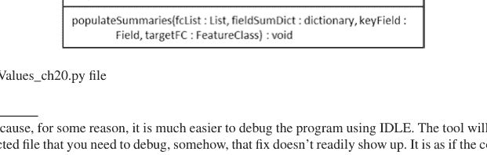

图 20.1 PValues_ch20.py 文件的图表

> ¹我们现在不这样做，因为出于某种原因，使用 IDLE 调试程序要容易得多。该工具将读取连接的文件，但如果连接的文件中有需要调试的错误，修复似乎不会轻易显示出来。就好像连接的文件被编译并存储为编译后的二进制文件，而不是以后可以更改的东西。

²严格来说，这不完全是一个类图，因为它指的是一个文件而不是一个类。这是因为这里的文件使用函数式编程而不是面向对象编程，而 UML 仅为面向对象编程设计。使用从工具参数设置的内部变量类似于属性，以及用函数代替对象的方法，是对 UML 的一种调整，在我看来，这有助于解释这个文件中发生的事情。图 20.2 也是如此。

## 任务 2：规划文件的组成部分

我将按照相同的顺序处理这三个文件并进行规划。此处的方法与第 17 章开头的示例类似。本节为这三个文件中的每一个创建流程图和伪代码，接下来的三个任务将填充伪代码。不过，我将跳过第 17 章的调试部分，因为那会花费太长时间！我还要在此说明，这里的呈现方式比实际发生的过程更具线性。有一个情况是，我意识到实际上另一种方法会非常有用，于是回到了 UML 概念，添加了一个方法，然后继续规划代码。这将在我讲到相关流程图的那部分时进行解释。同样，对于一些控制语句，我权衡了不同的选项，尝试规划了几种方法，最终只呈现了我最终选定的那一种。同样，在适当的地方会给出简要说明。

就像我们开始第 17 章的流程图非常简单一样，这里为 `PValues_ch20.py` 文件绘制的流程图开头也非常简单（图 20.5）。

使用上面的 UML 图，我们可以回忆一下这些输入参数将是什么：一个要素类列表、一个包含字段和字符串的表、另一个字段以及一个要素类。数据类型本身并没有告诉我们太多信息，但在这里，通过我们的规划，我们可以填充一些参数背后的意图。我们需要用户提供的首先是一组要素集合。这些是引言注释中激励性应用中的模拟，尽管它可以是任何要素集合的列表。我们还需要一个包含字段和字符串的表。这是 ArcGIS Pro 工具的一种输入类型，我之前还没有介绍过。它允许输入参数成对（或更多组，但这里是成对）输入。这样，用户可以指定每个字段及其对应的汇总方式，例如查找最小值、最大值、平均值等。字段当然是那个字段，字符串是汇总过程。需要注意的是，此表中的所有字段必须存在于 `fcList` 输入参数的所有要素类中。`keyField` 是一个唯一标识符，用于在遍历要素时跟踪它们。最后，还有一个要素类，它将在新字段中存储所有汇总的结果。这个目标要素类不需要是 `fcList` 中的输入要素类之一。

上面流程图中的黑框主要是 `populateSummaries` 函数，但我们可以将从用户那里获得的参数与函数的输入参数进行比较，并注意到有一个变化。该函数接受一个字典，而不是一个表。这意味着我们需要在运行该函数之前，以某种方式将表转换为字典（图 20.6）。

我们执行此转换的方法可能并不直接，因此让我们详细说明一下。第一步是弄清楚我们希望这个字典是什么样子。为了创建汇总，如果我们有一个记录每个字段所有请求的汇总的记录，可能会很有用。这适合使用一个字典，其中字段是键，值是该字段所有汇总过程的列表。可用的汇总过程包括最小值、最大值、平均值、标准差、计算小于某个值的要素数量以及计算等于某个值的要素数量。然而，用户可以根据需要请求任意多或任意少的这些过程（图 20.7）。

一旦字典创建完成，我们就可以转到流程图中标记为“运行 populateSummaries 函数”的框，从而运行使用该字典和其他用户提供的参数来计算汇总并将其放入目标要素类的正确属性中的函数。整体流程图中的最后一个框，即“将汇总放入目标要素类”，将是该函数的一部分，由于这是函数的目标，这就是为什么该函数没有返回值。它不是将值返回给 Python 代码，而是将这些值放入为此目的指定的要素类中。

这是一个更复杂的流程图，因为它最终需要为每个要素、字段和汇总过程的组合运行 `populateSummaries` 函数。这意味着我们需要三重嵌套的 `for` 循环。我最初考虑先遍历每个字段，然后是每个汇总过程，以及该字段内的每个要素，但发现很难正确管理更新游标。因此，我得出结论，最简单的方法是逐个处理每个要素，而不是每个字段，因此最外层的循环是遍历要素（图 20.8）。

在要素循环内，我首先从 `multiCursor` 中提取该要素的所有值。一旦这些值被提取出来，我就得到了一个值的列表的列表。然而，为了获得汇总，我需要在“遍历每个字段”循环的每个阶段，仅获取被检查字段的值的列表。一旦我有了这个单一列表，我就可以在最内层的循环中，将该值列表与所需的过程一起，逐一提供给 `summarize` 函数。`summarize` 给我一个单一的值，我可以将其放置在更新游标的正确位置。当该要素的所有字段和过程组合完成后，在进入下一个要素之前，必须更新该行的更新游标。

在这个流程图中，我们同时使用了 `summarize` 和 `multiCursor` 文件。然而，就本文件而言，我们相信它们能正确完成工作，并且不会在此处的流程图中展开这些框。通过这种拆分，我们可以将计算汇总的复杂性与跟踪要素、字段和要素类的复杂性分离开来。

## 任务 3：为 summarize.py 编写 Python 代码

三个文件中最简单的是 summarize 文件。新导入的模块是一个用于计算标准差的统计模块。流程图中的方框在这里已转换为注释，我们将在注释下方填写内容：

```
import statistics as STATS

#define the summarize function
```

```
#initialize variables

#if the procedure is the minimum

#elif the procedure is the maximum

#elif the procedure is the mean

#elif the procedure is the standard deviation

#elif the procedure is less than

#elif the procedure is equal to

#else it fit nothing

#return the output value
```

第一个新知识点是如何在定义 Python 函数时指定可选参数。在 `def` 语句中，我们可以通过将输入参数设置为等于特定值来为其提供默认值。在下面的代码行中，我将阈值设置为 0.05，类别设置为 "HH"。一旦有了默认值，它们就被视为可选参数，因为即使调用函数时没有指定它们的值，计算机也能在此函数中获取到一个值：

```
import statistics as STATS
```

```
#define the summarize function
def summarize(procedure, valueList, threshold=0.05, cat='HH'):
```

在初始化步骤中，我们需要首先设置输出变量。它被初始化为一个在此处不会用到的值，但我们仍然必须在这里设置这个变量。你会看到，在每一个 `if` 或 `elif` 子句中，我们都会覆盖这个 -999 的值。然而，由于存在一个不会覆盖该值的 `else` 子句，我们确实需要在这里设置一些内容，以确保当计算机尝试返回输出值时，有一个变量可以返回。初始化步骤的另一部分是对值列表进行排序。这样做的原因是为了让你在本任务末尾的第 1 题中识别出来：

```
#initialize variables
    output = -999
    valueList.sort()
```

如果操作是最小值，我们现在可以直接从索引 #0 获取值并将其作为输出。同样，如果我们想要最大值，可以使用列表中的最后一项作为输出：

```
#if the procedure is the minimum
    if procedure == "MINIMUM":
        output = valueList[0]
```

## 任务 4：为 multiCursor.py 编写 Python 代码

下一个最复杂的文件是 multiCursor 文件，尽管它内部包含多个方法。因为它使用了游标和其他 `arcpy` 函数，我们需要在开头导入 `arcpy`。流程图的其他元素如下所列，我们将逐一填充：

```python
import arcpy as arcpy
```

```python
#define the class
```

```python
#define the __init__ method
```

```python
#create properties from the input parameters
```

```python
#initialize other properties for a cursor of the first feature class and the index of the key field
```

```python
#define the next method
```

```python
#move the primary cursor to its next feature
```

```python
#extract that feature's values and return it
```

```python
#define the extractFeature method with the fid as an input parameter
```

```python
#initialize the output as an empty list
```

```python
#create a query to find the feature that was provided
```

```python
#for each feature class
```

```python
#create a cursor for that feature

#get the feature's values from that cursor and add it to the output.

#return the output

#define the extractField method with the field as an input parameter

#initialize the output to an empty list

#create a cursor for just that field in the first feature class

#for each feature in that cursor

#initialize the row in the output to a list containing the value from that feature/field combination

#create a query for this feature

#for each remaining feature class

#create a search cursor for that feature/field combination

#add the value to the end of the row

#when all feature classes are done, add this row to the output

#return the output

#define the reset function as resetting the primary cursor property
```

定义类就像使用 `class` 关键字并遵循适当的语法一样简单：

```python
import arcpy as arcpy

#define the class
class multiCursor():
```

接下来我们定义 `__init__()` 方法，它是 `multiCursor` 类对象的构造函数。回想一下，与任何方法一样，第一个参数必须是 `self`。其他输入参数如前所述：

```python
#define the __init__ method
def __init__(self, fcList, fieldList, keyID):
```

然后我们从这些参数创建属性，以确保它们在整个类的代码中都可访问。所有属性都以 `self.` 作为其语法的一部分：

```python
#create properties from the input parameters
self.fields = fieldList
self.keyID = keyID
self.featureClasses = fcList
```

另外两个属性被初始化为一个搜索游标，该游标访问第一个要素类并使用作为输入参数提供的字段列表。此时，我们可以使用 `fieldList` 或 `self.fields`。键字段在字段列表中的索引也被访问并存储以供将来参考：

```python
#initialize other properties for a cursor of the first feature class and the index of the key field.
self.primaryCursor = arcpy.da.SearchCursor(fcList[0], fieldList)
self.keyIDIndex = fieldList.index(keyID)
```

我们的第一个常规方法是 `next()` 方法。由于 UML 图中它没有输入参数，这里唯一的输入是所有方法都必须有的 `self`。它首先简单地将 `primaryCursor` 属性推进到该游标中的下一个要素：

```python
#define the next method
def next(self):

#move the primary cursor to its next feature
primaryCursorRow = self.primaryCursor.next()
```

提取要素值的过程只是稍微复杂一点，因为该推进步骤返回的行包含了所讨论要素的所有字段。然而，我们只需要键值来确保我们为 `extractFeature` 方法获取了正确的信息。这就是我们存储 `keyIDIndex` 属性的原因。它将告诉我们在这个行变量存储的列表中何处可以找到正确的值：

```python
#extract that feature's values and return it
keyIDValue = primaryCursorRow[self.keyIDIndex]
output = extractFeature(keyIDValue)
```

这引出了 `extractFeature` 方法。它首先轻松地将输出初始化为空列表，然后创建一个查询来查找该要素。回想一下，`keyID` 属性存储了用作键字段的字段，因此一个搜索所有键值等于指定 `fid` 值的要素的查询将使我们找到正确的要素：

```python
#define the extractFeature method with the fid as an input parameter
def extractFeature(self, fid):
#initialize the output as an empty list
output = []
#create a query to find the feature that was provided
keyIDQuery = '"' + self.keyID + '" = ' + str(fid)
```

接下来，我们遍历要素类，并使用该查询确保我们有一个专门针对我们感兴趣的要素的搜索游标：

```python
#for each feature class
for fc in self.featureClasses:
#create a cursor for that feature
cursor = arcpy.da.SearchCursor(fc, self.fields, keyIDQuery)
#get the feature's values from that cursor and add it to the output.
for row in cursor:
output.append(row)
#return the output
return output
```

`extractField` 方法类似，但它专注于所有要素类中的单个字段。它首先将输出初始化为空列表，并为第一个要素类中的该字段创建一个游标：

```python
#define the extractField method with the field as an input parameter
def extractField(self, field):
#initialize the output to an empty list
output = []
#create a cursor for just that field in the first feature class
cursor = arcpy.da.SearchCursor(self.featureClasses[0], [self.keyID, field])
#for each feature in that cursor
for row in cursor:
#initialize the row in the output to a list containing the value from that feature/field combination
outputRow = [row[1]]
#create a query for this feature
keyIDQuery = '"' + self.keyID + '" = ' + str(row[0])
#for each remaining feature class
for fc in self.featureClasses[1:]:
#create a search cursor for that feature/field combination
fieldCursor = arcpy.da.SearchCursor(fc, [field], keyIDQuery)
for fieldRow in fieldCursor:
#add the value to the end of the row
outputRow.append(fieldRow[0])
#when all feature classes are done, add this row to the output
output.append(outputRow)
#return the output
return output
```

最后，重置函数被定义为重置主游标属性：

```python
#define the reset function as resetting the primary cursor property
def reset(self):
self.primaryCursor = arcpy.da.SearchCursor(self.featureClasses[0], self.fields)
```

如果过程是求最大值：

```python
#elif the procedure is the maximum
    elif procedure == "MAXIMUM":
        output = valueList[-1]
```

如果过程是求平均值，我们可以使用 `len` 和 `sum` 的内置函数来获取列表中的项目数量及其总和。将总和除以项目数量即可得到平均值，我们可以轻松地返回它：

```python
#elif the procedure is the mean
    elif procedure == "MEAN":
        count = len(valueList)
        total = sum(valueList)
        output = total/count
```

如果过程是求标准差，是可以计算的。但是，当有一个模块包含为我们计算它的函数时，为什么不使用它呢？因此，对于这个选项，我们将使用 `STATS.stdev()` 函数：

```python
#elif the procedure is the standard deviation
    elif procedure == "ST_DEV":
        output = STATS.stdev(valueList)
```

如果过程是计算小于某个值的项目数量，我们将需要遍历值列表来获取这个结果。然而，为了使其更快一些，我们可以利用我们已经对列表进行排序这一事实。如果我们从开头开始计数，直到找到一个超过阈值的值，那么我们完成计数时所在的索引就给出了我们想要的答案。唯一的注意事项是，这里使用 while 循环时，为了避免所有值都小于阈值时出错，我们需要添加另一个条件，即索引在列表末尾之前：

```python
#elif the procedure is less than
    elif procedure == "COUNT_UNDER":
        soFar = valueList[0]
        index = 0
        while (soFar < threshold and index < len(valueList)):
            index = index + 1
            soFar = valueList[index]
        output = index
```

如果过程是计算等于指定值的项目数量，则没有这样的方法来加速过程。我们必须检查列表中的每个项目，并在每次找到该值时增加输出计数：

```python
#elif the procedure is equal to
    elif procedure == "COUNT_CATEGORY":
        output = 0
        for value in valueList:
            if value == cat:
                output = output + 1
```

最后，如果什么都不起作用，那么给定的过程一定不是有效的条目。在这种情况下，最好引发一个 `ValueError`，为用户或程序员提供有用的错误消息。在函数的最后是预期的 return 语句：

```python
#else it fit nothing
    else:
        raise ValueError("Invalid procedure type: " + procedure)
```

```python
#return the output value
    return output
```

在浏览这些内容时，你可能对编程决策有几个疑问，以下是前两个问题。

**问题 1：对列表进行排序的目的是什么？注意：能够更容易地找到小于阈值的计数是一个不错的附带好处，因此还有其他更直接的好处。请指出这些更直接的好处。**

**问题 2：对于小于阈值的值的计数，我们的最后一个索引指向第一个*大于*阈值的项目，但我们没有减去一来获取小于阈值的项目数量。为什么从索引中*不*减去一是正确的？**

## 任务5：为PValue_ch20.py编写Python代码

此文件包含最复杂的逻辑，对应最复杂的流程图。这就是为什么它被放在最后。在讲解过程中，你可能会注意到流程图的设计是为了从ArcGIS工具获取输入参数，不过，正如任务1中提到的，我们这里坚持使用IDLE。这意味着获取数据的方式有所不同。由于这本质上是为第21章连接工具做的初步准备，我将值直接硬编码到文件中，而不是在IDLE Python shell中使用`input()`函数从用户那里获取。如果我们坚持使用IDLE shell，那个函数会是更好的方法，尽管它远不如ArcGIS Pro灵活，后者允许用户轻松输入要素类列表或字段/汇总过程对的值表。我将从这段代码开始讲解，尽管它出现在文件的末尾。

第一行设置工作空间。接下来的四行创建将要使用的要素类列表。它们都有非常相似的名称，格式为`LISA_Queen_Rand#_GA`，其中只有数字从1到10变化。列表设置好之后，定义了目标要素集和关键字段。最后，没有像后面那样处理值表，而是直接创建了字典，使用名为`LMiPValue`的字段，并找出最小值、最大值、平均值、标准差，以及小于0.1、0.05和0.01的值的计数。所有输入参数都直接指定后，我们可以调用`populateSummaries()`函数：

```python
ARCPY.env.workspace = "C:\Users\jfconley\Documents\ArcGIS\Projects\PValue\PValue.gdb"
base = "LISA_Queen_Rand"
fcList = []
for i in range(10):
    fcList.append(base + str(i+1) + "_GA")
targetFC = "TrumpAndRandom_GA"
keyField = "SOURCE_ID"
fieldSumDict = {}
fieldSumDict["LMiPValue"] = ["MINIMUM", "MAXIMUM", "MEAN", "ST_DEV", "<0.1", "<0.05", "<0.01"]

#populate the summaries
populateSummaries(fcList, fieldSumDict, targetFC, keyField)
```

回到文件开头，我们需要确保这个Python文件能够访问另外两个Python文件。只要所有文件都存储在同一个文件夹中，这就非常容易实现，这也是我们将要采用的方式。我们可以使用相同的`import`语句来访问我们创建的这些文件。接下来是此函数流程图中每个元素的注释：

```python
import arcpy as ARCPY
import multiCursor as MULTICURSOR
import summarize as SUMMARIZE

#define the function and get the list of fields

#Add new fields to target feature class

#Create the multicursor

#for each feature in an update cursor of the target feature class

#extract that feature's values using the multicursor.
```

获取要素行的下一步被放在一个try块中，因为要素类可能不包含该要素。我们尝试获取搜索游标中的下一行并将其附加到输出中。但是，如果该要素不包含在要素类中，我们将得到一个`StopIteration`错误。因为对于这个类的用户来说，停止迭代错误对应于缺失的要素可能并不明显，所以我们捕获这个错误，并抛出一个带有更有帮助的错误消息的`ValueError`：

```python
#get the feature's values from that cursor and add it to the output.
try:
    row = search.next()
    output.append(row)
except StopIteration as si:
    raise ValueError("The FID provided does not exist in at least one feature class in this multicursor: " + fid)
```

所有这些完成后，我们可以返回输出：

```python
#return the output
return output
```

在进入下一个方法之前，这里还有一个关于算法决策的问题，可能不太明显。在`try`块中，我们只是获取搜索游标中的下一行，没有确认它是否是正确的行，甚至没有尝试从游标中获取任何其他行。

**问题3：为什么我们可以确定`search.next()`会给我们正确的行，并且仅是正确的行，前提是该要素ID存在于要素类中。**

接下来，我们设置`extractField`方法，以字段作为输入参数，并再次将输出初始化为空列表：

```python
#define the extractField method
def extractField(self, field):
    #initialize the output to an empty list
    output = []
```

我们需要为第一个要素类中的这个字段创建一个游标，并且如上所述，必须使用与存储在属性中的游标不同的游标。由于我们必须创建一个新游标，我们不妨将其缩小到只包含关键字段和正在调查的字段。这在一个`if`语句中，该语句检查确认我们正在查看的字段存在于字段列表中。在最后，你会看到这个`else`子句，它抛出一个`ValueError`来通知用户或程序员所需的字段不在multiCursor的字段列表中：

```python
#create a cursor for just that field in the first feature class
if field in self.fields:
    localPrimarySearch = arcpy.da.SearchCursor(self.featureClasses[0], [self.keyID, field])
```

一旦创建，我们遍历它，并可以用其第一个元素（来自第一个要素类的值）初始化输出表中该要素的行。根据我们上面定义搜索游标的方式，这保证是`feature[1]`。我们知道相关的ID值在第零项，正确的字段值在第一项：

```python
#for each feature in that cursor
    for feature in localPrimarySearch:
        #initialize the row in the output to a list containing the value from that
        #feature/field combination
        thisRow = [feature[1]]
```

ID值在第零项有助于我们为该要素创建查询，因此我们可以确保在查看所有其他要素类时，我们查看的是正确的要素。因为即使所有要素都相同，也不能保证游标顺序相同，所以我们必须在剩余的要素类中单独搜索每个要素，以确保所有值都正确对齐。因此，我们需要这个查询：

```python
#create a query for this feature
    currentKey = feature[0]
    currentKeyQuery = '"' + self.keyID + '" = ' + str(currentKey)
```

然后我们可以遍历所有剩余的要素类。注意，我通过排除第一个要素类来对要素类列表进行子集化。那是我们已经查看过并通过初始化行为其值添加到行中的那个，所以这个for循环可以从索引1处的要素类开始，而不是索引0：

```python
#for each remaining feature class
    for fc in self.featureClasses[1:]:
```

我们可以使用该查询为要素类生成一个搜索游标。在这个游标内，我们可以使用与问题3相同的原理，简单地获取下一行，并且我们已经知道我们对该行中的第#1项感兴趣，这是基于游标的构建方式。该值被附加到行的末尾：

```python
#create a search cursor for that feature/field combination
    search = arcpy.da.SearchCursor(fc, [self.keyID, field], currentKeyQuery)
    #add the value to the end of the row
    thisRow.append(search.next()[1])
```

在行结束时，将其添加到输出中。注意这里的缩进！

```python
#when all feature classes are done, add this row to the output
    output.append(thisRow)
else:
    raise ValueError("The provided field is not in the list of fields for this multicursor: " + field)
```

最后，我们可以返回输出：

```python
#return the output
    return output
```

这个类的最后一个方法是最简单的。重置multiCursor会重置主游标，以便如果或当下次调用next()方法时，它将从头开始：

```python
#define the reset function as resetting the primary cursor property
def reset(self):
    self.primaryCursor.reset()
```

至此，文件结束，因为它只包含这个类。

## 任务 6：自主练习

在第 16 章的自主练习（任务 7）中，你创建了一个名为 `Neighborhood` 的新类。请从你的第 16 章任务 7 文件中提取该类的定义，并创建一个新的 `neighborhood.py` 文件来定义该类。同样地，将 `Parcel` 类提取出来，放入一个 `parcel.py` 文件中。然后，将该文件的其余部分命名为 `chapter20_task6.py`，并让它完成相同的功能——ity 但引用新的 neighborhood.py 文件，而不是将类放在其文件内。为确保在 IDLE 而非 ArcGIS Pro 中运行，请使用 `input()` 函数询问用户适当的环境工作区以及第 16 章任务 7 中工具的所有参数。同样，将所有输出消息、错误和警告替换为 `print()` 语句。

评估标准如下：

- 代码正确地分布在三个文件中，并且 chapter20_task6.py 正确引用了 neighborhood.py 和 parcel.py。
- 代码通过 `input()` 函数正确地向用户请求输入，并使用 `print()` 函数正确地提供信息。
- 生成的输出是正确的。

## 开发自定义 Python 包

### 21

### 引言：Python 包

对于一个跨越多个文件的程序，当我们将这些文件编译成一个单独的包时，共享变得更加高效。此外，拥有一个包将使我们能够通过 ArcGIS Pro 工具访问我们的程序。包在软件开发中非常普遍，是代码共享的一种半标准化单元。即使术语可能有所不同，包在许多编程语言和环境中都被使用，并且已经使用了几十年。

包的主要优势在于其可移植性和结构，这两者是相互关联的。可移植性体现在许多包通过各种在线代码仓库（如 GitHub 或 PyPI，即 Python 包索引）进行共享。通过在这些中央仓库中提供包，无论是将你的代码分享给更广泛的受众，还是查找他人共享的代码，都变得容易得多。

然而，这种可移植性只有在包具有共同的底层结构时才有效。毕竟，你导入的每个包，如 `arcpy`、`numpy` 等，都是计算机提供给你的一组 Python 文件。你不必打开这些文件、自己安装它们或对它们进行任何其他操作，这使得导入过程对于大多数没有必要技能来手动实现这些连接的程序员来说要容易得多。这意味着我们必须依赖计算机来实现这些连接。信任计算机正确地建立连接意味着必须有一个严格遵守的结构，以确保计算机能够找到它正在寻找的东西。这个结构将在任务 1 中进行研究和实现。

本章的其余部分将任务 1 中创建的包启用为可导入到 ArcGIS Pro 工具的代码中，然后可以将其打包并作为 .ppkx 文件共享。

### 任务 1：将 MultiCursor 和 Summarize 文件转换为正式包

与更广泛的世界共享我们的代码并使其可被 ArcGIS Pro 访问的第一个方面是将其转换为包。从某种意义上说，包只是一组文件的集合。然而，虽然计算机擅长存储文件集合，但如果我们希望计算机在无人监督的情况下使用这些文件，它们必须像我们的计算机代码一样被严格地结构化。任何偏离 Python 包预期结构的行为都会导致问题，就像语法错误阻止 Python 代码被读取一样。

为了设置该结构，我们将需要使用一个全新的文件夹，并且该文件夹内只包含最少的必要内容。转到 Windows 文件资源管理器，并导航到你希望用于本章工作的任何文件位置。由于这是继续第 20 章的 PValue 工作，我使用的是与该工作相同的目录。在你选择的目录中，创建一个新文件夹，并将其命名为“chapter21”。在该文件夹内，创建另一个文件夹，也命名为“chapter21”。这给出了下面的文件夹结构，尽管 .idlerc 文件夹稍后会自动生成，所以你现在还没有它。

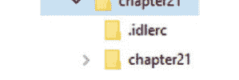

在内部的 chapter21 文件夹中，放置 multiCursor.py 和 summarize.py 文件的副本。如果第 20 章的一切都正确完成，你应该不需要编辑这些文件。只需复制它们并粘贴到 chapter21/chapter21 文件夹中。因此，它们通过提供实质性内容构成了包的基础。然而，仅仅这些文件存在于该文件夹中并不能提供包正常工作所需的结构语法。打个比方，想想一本书的页面。这两个文件构成了书的页面。它们提供了这本书具有任何教育或娱乐价值所绝对必要的信息。然而，如果你只有页面而没有任何装订，它就会散开，无法作为一本书实际阅读。我们需要装订。包的其余部分提供了这种装订，以确保内容可用。装订以两个额外的 .py 文件的形式呈现。

第一个文件非常类似于类的初始化方法，命名为 `__init__.py`。与该方法一样，它的 init 前后各有两个下划线。要创建此文件，我建议打开 IDLE 并转到“文件”菜单，然后选择“新建文件”。打开后，将该新文件保存为 `__init__.py`，放在 chapter21/chapter21 目录中，使其与 summarize.py 和 multiCursor.py 并列。保存后，你就完成了。奇怪的是，对于像这样简单的项目，这个文件是空的。对于更复杂的包，这里可以有其他指令，但我们不需要任何内容。尽管如此，即使它是空的，也有必要提醒 Python 系统这是一个包。

我们需要的另一个文件位于上一级目录，即第一个 chapter21 文件夹中，与内部的 chapter21 文件夹并列。它应该命名为 setup.py，其中包含有关包的信息。这个文件也有严格的结构。它通过一个 `setup()` 函数提供有关包的元数据，该函数应该看起来非常像这样。`setup()` 函数的输入参数名称大多是不言自明的。可能不那么明显的是最后三个。`packages` 参数使用 `find_packages()` 函数从 chapter21 文件夹中提取所有内容，如 `find_packages()` 函数的 `where` 参数所指定。`license` 参数指定了你希望用于你的包的使用许可。MIT 许可证是一个常用的许可证，它表示可以免费使用，但免责声明是“按原样”提供，因此作者对任何错误的后果不承担法律责任。你可以使用 https://choosealicense.com/ 来研究你的选择。最后一个参数指定了你的包所需的包。在这种情况下，因为我们导入了 `arcpy` 和 `statistics`，所以这些也应该可用：

```python
from setuptools import setup, find_packages

setup(
    name="chapter21",
    version="0.1",
    author="Jamison Conley",
    author_email="<jamison.conley@mail.wvu.edu>",
    description="Chapter 21",
    long_description="Multicursor and summarize package for Chapter 21 of Geographer's Guide to Programming",
    packages=find_packages(where='chapter21'),
    license='MIT license',
    install_requires=['arcpy', 'statistics']
)
```

在继续之前，你应该拥有以下文件夹和文件结构。如果它看起来像这样，你就准备好了（图 21.1）。

安装包不是通过 IDLE 完成的。有单独的系统用于此，其中一个称为 pip。要访问它，我们需要进入 Windows 的命令行提示符。我建议使用 Windows 开始菜单旁边的搜索功能，搜索“cmd”。然后你会看到“命令提示符”作为一个应用程序。单击它，你将看到此窗口出现。

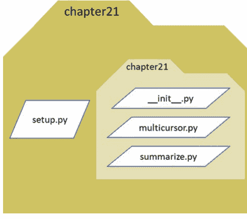

**图 21.1** Python 包的文件夹结构

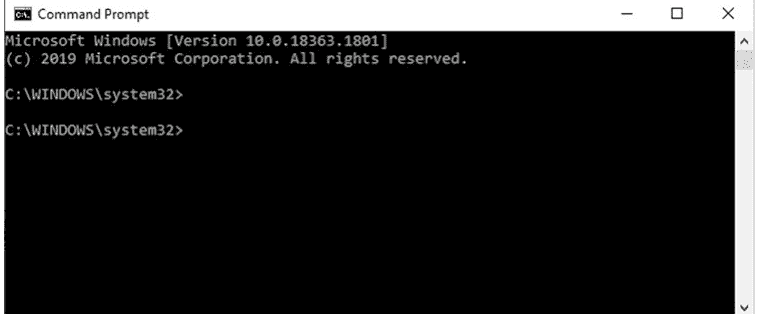

输入“pip install chapter21”并按回车键。值得注意的是，你甚至不需要导航到找到 chapter21 模块结构的文件夹。pip 程序似乎能够搜索操作系统和所有相关文件并自行找到它。你可能会得到输出，但如果没有，也不要惊慌。

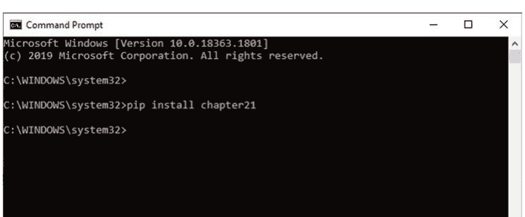

只要没有错误消息，安装很可能就成功了。现在我们可以通过 IDLE 打开一个 Python shell 来检查是否安装成功。为此，请打开 IDLE 并点击“运行”菜单。选择“Python Shell”。输入以下几行代码。请注意，我们需要指定要从 `chapter21` 模块中导入哪个文件。然后，我们就可以访问其中的 `summarize` 函数：

```
>>> numbers = [1, 2, 3, 4, 5, 1, 2, 3, 4, 1, 2, 3, 1, 2]
>>> from chapter21 import summarize
>>> summarize.summarize("MEAN", numbers)
2.4285714285714284
```

**问题 1：使用导入的 `summarize` 函数，这组数字的标准差是多少？**

尽管我们现在可以在通用的 IDLE shell 中访问我们的模块，但 ArcGIS Pro 仍然找不到它。我们必须明确告诉 ArcGIS Pro 如何找到我们的模块，而这正是下一个任务的重点。

## 任务 2：让 ArcGIS Pro 访问该包

正如我们之前所使用的，Python 脚本工具非常适合创建运行单个脚本的工具。然而，顾名思义，它只处理一个脚本。¹ 对于多个文件，更灵活的方法是使用 Python 工具箱。

根据 ESRI 在线帮助文档中关于“创建地理处理模块”的指导，² 与任务 1 类似，Python 工具箱的文件组织有严格的结构。我们将首先设置好结构，然后创建放入该结构的工具箱。它最初看起来会像任务 1 的结构，尽管我们将对其进行增强。在此阶段，您唯一需要做的更改是确保 `setup.py` 具有适合第 21 章而非第 20 章的名称、描述和详细描述。名称必须是 `chapter21`，以匹配其旁边的文件夹（图 21.2）。

帮助文档随后建议添加一系列额外的文件夹，这些文件夹目前将保持为空。工具箱文件以后可能会放入这些文件夹中以便分发，但本章的重点是调试，特别是将其放入 ArcGIS Pro，因此本章不涉及这些文件夹的内容。目前，最好采用一个更接近任务 1 结构的结构。我们将拥有这些文件夹，但暂时不动它们（图 21.3）。

在测试代码的过程中，我发现 `summarize.py` 文件中有一个可以改进的地方。为了展示新代码如何融入 `summarize()` 函数，下面显示了整个函数，新添加的行带有下划线。事实证明，我正在分析的数据中有一些 `<null>` 值，而 Python 无法对包含 `None` 值的列表进行排序，这是可以理解的。要求 Python 对无法排序的列表进行排序会导致 `TypeError`。为确保这不会破坏整个分析过程，我添加了一个 `try/except` 语句，如果数据无法排序，则自动返回 `-999`。在 GIS 数据库中，使用像 `-999` 这样的数字作为缺失数据的占位符是很常见的。

我现在展示这个，而不是先向您展示错误并让您修复它，是因为修复导入文件中的代码并使其在 Python 工具箱中的工具里体现出来，并不像进行更改、点击“保存”然后重新运行工具那么简单。每次您修改关联文件（此处为 `summarize.py` 和 `multiCursor.py`）时，都必须关闭 ArcGIS Pro 并重新启动它，更改才能被工具识别。就好像 ArcGIS Pro 在导入时编译了导入的文件，并且只在项目加载到 ArcGIS Pro 中进行组装时才费心检查它们是否发生了更改：

```
def summarize(procedure, valueList, threshold=0.05, cat='HH'):
    output = -999
    try:
```

¹ 通过将 Python 文件放在同一目录中，我能够让它访问其他文件，如任务 1 所示，但对导入文件的任何更正或更改从未反映在编译后的代码中。似乎 ArcGIS Pro 将代码编译成二进制文件并将其存储在某个地方，然后从不允许更改它们。这导致了非常不寻常的错误消息，其中错误消息反映的是旧代码，但屏幕上打印的行是试图解决错误消息的新代码。因此，我建议此处使用工具箱方法，除非您 *100%* 确信导入文件永远不需要更改。

² https://pro.arcgis.com/en/pro-app/latest/arcpy/geoprocessing_and_python/extending-geoprocessing-through-python-modules.htm （撰写本文时）

**图 21.2** Python 工具箱的初始文件夹结构

**图 21.3** 为 Python 工具箱结构添加 esri 文件夹

```
valueList.sort()
except TypeError:
    return output
if procedure == "MINIMUM":
    output = valueList[0]
elif procedure == "MAXIMUM":
    output = valueList[-1]
elif procedure == "MEAN":
    count = len(valueList)
    total = sum(valueList)
    output = total/count
elif procedure == "ST_DEV":
    output = STATS.stdev(valueList)
elif procedure == "COUNT_UNDER":
    soFar = valueList[0]
    index = 0
    while (soFar < threshold and index < len(valueList)):
        index = index + 1
        soFar = valueList[index]
    output = index
elif procedure == "COUNT_CATEGORY":
    output = 0
    for value in valueList:
        if value == cat:
            output = output + 1
else:
    raise ValueError("Invalid procedure type: " + procedure)
return output
```

**图 21.4** 为 Python 工具箱结构添加 Python 工具箱

问题 1：为什么我要在 `except` 子句中立即返回 `output`，而不是使用 `pass` 来简单地避免对无法排序的列表进行排序？换句话说，思考一下如果使用 `pass` 会发生什么，以及为什么这不是正确的选择。

有了这个，我们现在准备好创建我们的 Python 工具箱了。这一步很简单，唯一的挑战是确保它位于所需的文件夹中。转到 ArcGIS Pro 中的“目录”面板，右键单击“工具箱”条目。选择“新建 Python 工具箱”。您将得到一个对话框，询问您将其放在哪里以及使用什么名称。只要您保持名称一致，名称不如位置重要。位置必须在 `chapter21Toolbox` 文件夹中，与 `chapter21` 文件夹、`setup.py` 和 `esri` 文件夹并列。与第 20 章中的文件一样，工具箱必须位于此处，以确保它能找到 `chapter21` 包（图 21.4）。

这将创建一个恰好包含一个工具的工具箱。目前，该工具没有输入参数，并且完全不执行任何操作。这是因为与此工具箱关联的 Python 代码是 ArcGIS Pro 生成的占位符文件，在下一个任务中，我们需要修改它以使其执行我们想要的操作，在本例中，允许一个工具执行与第 20 章相同的功能。

## 任务 3：编辑代码以在 ArcGIS Pro Python 工具箱中工作

您可能一直在想 `PValue_ch20.py` 文件的内容将放在哪里，因为只有 `multicursor.py` 和 `summarize.py` 被复制到了 `chapter21` 文件夹中。这段代码将直接放入工具箱本身。这意味着要编辑工具箱的 `.pyt` 文件。不要因为扩展名的更改而惊慌。ArcGIS Pro 对 Python 工具箱使用 `.pyt`，其内容是 Python 代码。这意味着它可以像 `.py` Python 文件一样进行编辑。既然我们能够从 ArcGIS Pro 内部访问 `chapter21` 包，请回想一下，我们不得不对 `PValue_ch20.py` 程序进行轻微调整，以便在代码中直接提供来自 ArcGIS Pro 自定义工具的信息，而不是从工具中获取它。因为，与第 21 章不同，我们将通过我们的工具箱运行代码，所以我们需要使代码适合该设置。要访问工具箱代码，只需右键单击工具箱并点击“编辑”。这将打开一个 Python 文件，起初可能看起来相当令人生畏，但让我们分部分来看，并边进行边进行更改。

顶部是导入语句。除了 `arcpy`，我们还需要我们的 `chapter21` 导入代码。这给出了以下导入。请注意，`MULTICURSOR` 和 `SUMMARIZE` 导入是大写的，以便我们可以尽可能多地重用第 20 章的代码而无需更改：

```
import arcpy as ARCPY
import chapter21
from chapter21 import multiCursor as MULTICURSOR
from chapter21 import summarize as SUMMARIZE
```

接下来是工具箱的自定义类定义。我们将在此处进行最小的更改，为其 `.label` 和 `.alias` 属性提供更合适的值。我选择“ctt”作为别名，作为第 21 章工具箱的首字母缩写。如果我们想在这个工具箱中包含多个工具，我们将在其后定义多个工具类（如 Tool1、Tool2 等），并让 `self.tools` 引用我们定义的所有工具的列表。这里，我们只有一个，所以我们可以保持原样：

```
class Toolbox(object):
    def __init__(self):
        """Define the toolbox (the name of the toolbox is the name of the .pyt file)."""
        self.label = "Toolbox"
        self.alias = "ctt"

        # List of tool classes associated with this toolbox
        self.tools = [Tool]
```

## 第21章 工具箱

```python
class Tool(object):
    def __init__(self):
        """Define the tool (tool name is the name of the class)."""
        self.label = "Chapter 21 toolbox"
        self.description = ""
        self.canRunInBackground = False
```

接下来，我们有 `getParameterInfo()` 方法。这个方法告诉工具箱该工具需要哪些参数，以及这些参数具有什么属性，例如它们期望从用户那里接收什么数据类型。我们可以回顾第20章开头的UML图，以提醒自己这些参数应该是什么。这将很有帮助，因为我们必须通过代码而不是通过为我们创建工具的GUI来完成所有参数设置的规范。这些参数中的每一个都将依次进行检查，因为它们每个都由 `arcpy.Parameter` 类的一个对象表示，所有这些对象都在此方法内构造。查看下面的代码，可能不会立即明显看出这些是对该类构造函数的调用，因为该构造函数的输入参数是垂直呈现的，而不是都在同一行。只要输入参数恰好缩进一级，这是允许的。除最后一行外所有行末尾的逗号可能暴露了这些是构造函数的输入参数元组：

- fcList：要素类列表
- fieldTable：字段和字符串的表格
- keyField：字段
- targetFC：要素类

第一个是输入要素类的列表。它的显示名称和名称属性反映了这一目的，区别在于显示名称是出现在工具对话框中的内容，而名称是ArcGIS Pro内部使用的，因此必须遵守变量命名要求，例如不包含空格。有许多可用的数据类型，这些是通过 `datatype` 参数设置的，更准确地说，是 `Parameter` 类的 `__init__()` 构造函数的 `datatype` 输入参数。查阅 `arcpy.Parameter` 类的在线文档告诉我们，要素类的期望值是 "DEFeatureClass"。为了告诉计算机我们希望它接受一个要素类列表，而不仅仅是一个，我们需要将 `multiValue` 输入参数设置为 `True`。我们还需要确保此参数是必需的并且是输入参数，分别由 `parameterType` 和 `direction` 设置。虽然我们可以指定其他设置作为 `Parameter()` 构造函数的输入参数，但它们是可选的，与此处无关：

```python
def getParameterInfo(self):
    """Define parameter definitions"""
    param0 = arcpy.Parameter(
        displayName = "Input Feature Classes",
        name = "in_features",
        datatype = "DEFeatureClass",
        multiValue = True,
        parameterType = "Required",
        direction = "Input")
```

我们定义的工具的第二个参数是最复杂的，因为它是一个表格。它的大部分内容遵循我们上面定义 `param0` 的相同思路。区别在于名称反映了这个特定参数，我们不需要指定 `multiValue` 为 false，因为这是 `multiValue` 参数的默认值，并且数据类型不同。它的数据类型是 `GPValueTable`，这是 `arcpy` 表示这种输入参数的方式。然而，一旦我们创建了 `param1` 对象，我们就必须回去指定这个表格的结构。这是最后一行，它将 `param1` 对象的 columns 属性填充为一个列表的列表。每个内部列表有两个元素：该列的数据类型及其名称。外部列表是这些元素的列表。这意味着我们的列表有两列：一个显示名称为 "Field" 的字段，和一个显示名称为 "Summary Procedure" 的字符串：

```python
param1 = arcpy.Parameter(
    displayName = "Field/Summary Pairs",
    name = "field_summary_pairs",
    datatype = "GPValueTable",
    parameterType = "Required",
    direction = "Input")
param1.columns = [["Field", "Field"], ["GPString", "Summary Procedure"]]
```

剩下的两个参数使用了前两个参数的概念，因此应该很容易理解：

```python
param2 = arcpy.Parameter(
    displayName = "Key Field",
    name = "key_field",
    datatype = "Field",
    parameterType = "Required",
    direction = "Input")

param3 = arcpy.Parameter(
    displayName = "Target Feature Collections",
    name = "target_features",
    datatype = "DEFeatureClass",
    parameterType = "Required",
    direction = "Input")
```

定义了四个输入参数后，我们现在可以创建一个参数列表，并在方法结束时返回此列表：

```python
params = [param0, param1, param2, param3]
return params
```

接下来的三个方法不需要更改即可使工具工作。为了完整性，我在此处呈现它们，尽管没有需要担心的编辑：

```python
def isLicensed(self):
    """Set whether tool is licensed to execute."""
    return True

def updateParameters(self, parameters):
    """Modify the values and properties of parameters before internal validation is performed.
    This method is called whenever a parameter has been changed."""
    return

def updateMessages(self, parameters):
    """Modify the messages created by internal validation for each tool parameter. This method
    is called after internal validation."""
    return
```

最后，我们有 `execute()` 方法。这是当你点击“运行”按钮时发生的事情，所以我们肯定想修改它以使其做一些事情。从我们创建的 PValue_ch20.py 文件中复制和粘贴是一个好的开始，以便工具可以使用该代码。然而，由于某种原因，Python 无法通过这种方式识别 `populateSummaries()` 函数，因此必须将 `populateSummaries()` 函数内的代码复制并粘贴到 PValue_ch20.py 中调用该函数的位置。这使得 `execute()` 函数非常长，这并不理想，但似乎是唯一的选择。

回想一下，我们不得不根据初始计划对代码进行一些更改，因为我们硬编码了输入参数值。在这里更合适地完成，访问用户在对话框中输入的值作为参数。还要注意 `try/except` 块的开始，旨在捕获错误并确保呈现更用户友好的ArcGIS错误消息。这里广泛使用 `.value` 属性可能会令人惊讶，所以请允许我解释一下。你可能发现关于 `getParameterInfo()` 方法的文本令人困惑，因为我们指的是两种类型的参数：一种是构造函数方法的输入值，另一种是正在构建的 `Parameter` 对象。这意味着如果我从下面的参数列表中获取一个项目，它返回一个 `Parameter` 类型的对象。这个 `Parameter` 对象指的是对话框中的一个项目，并包含其名称、数据类型和当前值等信息。要获取该值，我们需要从参数的 `.value` 属性开始。然而，这并不能立即提供对我们想要的值的访问，例如输入要素类列表、关键字段或目标要素集合。对于更简单的数据类型，如字段和目标要素类，`.value` 属性为我们提供了一个 `Value` 类型的对象。这可能看起来有些多余，因为有一个类基本上充当属性值的简单容器，但与更复杂的数据类型相比，这是必要的。要获取实际值，或工具对话框中该条目的内容，我们需要获取 `Value` 对象的 `.value` 属性。这就是为什么参数2和3有看似冗余的 `.value.value` 部分。第一个 `.value` 从 `Parameter` 对象移动到 `Value` 对象，而第二个从 `Value` 对象中提取真实值。

对于更复杂的数据类型，如要素类列表，我们必须进行一些处理才能从该 `.value` 属性中提取所需信息。第一个参数从 `.value` 方法返回一个 `ValueTable` 对象。这当然与要素类列表不同，因此我们必须遍历此 `ValueTable` 中的每一行，并逐一获取其值，以将它们附加到将成为我们要素类列表的列表中。这就是下面的 `for` 循环所完成的：

```python
def execute(self, parameters, messages):
    """The source code of the tool."""
    try:
        #get parameters from the tool: list of input FCs; list of fields; output target FC; key field

        fcVT = parameters[0].value
        fcList = []
        for val in range(fcVT.rowCount):
            fcList.append(fcVT.getValue(val, 0))
        fieldTable = parameters[1].value
        keyField = parameters[2].value.value
        targetFC = parameters[3].value.value
```

甚至需要更多的处理来将字段表参数转换为我们想要的字典。也许令人困惑的是，具有 `.datatype` 属性为 "GPValueTable" 的参数返回了一个列表而不是 `ValueTable`。这意味着遍历此参数的精确代码与我们用于创建要素类列表的代码不匹配，但逻辑是相似的。`for` 循环遍历表中的每一行。回想一下我们设置参数的方式，其中的第一项是字段，第二项是过程。要获取实际字段，我们需要再次使用 `.value` 属性。然而，对于存储在 `proc` 变量中的表示过程的文本字符串，不需要这样做。然而，我们不是仅仅将这对值添加到字典中，而是需要查看该字段是否已经作为键存在于字典中。如果存在，这意味着我们之前在表中见过此字段，需要确保将过程附加到该字段的摘要过程列表中，而不是覆盖它。如果它不在键列表中，那么我们需要开始一个新的过程列表，并将其作为新条目添加到字典中：

```python
fieldSumDict = {}
for i in fieldTable:
    field = i[0].value
    proc = i[1]
    if field in fieldSumDict.keys():
        procedures = fieldSumDict.get(field)
        procedures.append(proc)
        fieldSumDict[field] = procedures
    else:
        procedures = [proc]
        fieldSumDict[field] = procedures
```

我们现在已经以适合Python工具箱的方式从参数中提取了信息，而不是像第20章那样使用IDLE shell，或者像第14章那样使用脚本工具。此时，`populateSummaries()`函数的内容可以直接插入，无需任何更改。不过，在最后，我们有`execute()`函数开头启动的`try/except`块的`except`部分，用于将Python错误消息替换为更有帮助的ArcGIS错误消息。另一个区别是，关键字`return`出现在末尾，表示不返回任何内容。这原本就在`execute()`函数中，我选择在此处不移除它：

```python
fieldList = list(fieldSumDict.keys())
#Add fields to targetFC
targetFCFields = [keyField]
for field in fieldList:
    sums = fieldSumDict[field]
    for summ in sums:
        toAppend = summ
        if summ.startswith("<"):
            toAppend = "LT_" + summ[1:].replace(".", "_")
        elif summ.startswith("="):
            toAppend = "is_" + summ[1:]

        newField = str(field) + "_" + toAppend
        targetExistingFields = [field.name for field in ARCPY.ListFields(targetFC)]
        if newField in targetExistingFields:
            pass
        else:
            ARCPY.AddField_management(targetFC, newField, "DOUBLE")

        targetFCFields.append(newField)

#Create the multicursor
cursorFieldList = fieldList.copy()
cursorFieldList.append(keyField)
mc = MULTICURSOR.multiCursor(fcList, cursorFieldList, keyField)
summaryValues = []

update = ARCPY.da.UpdateCursor(targetFC, targetFCFields)

for row in update:
    rowID = row[0]
    thisFeature = mc.extractFeature(rowID)
    #for each field in the list of keys
    currentFieldIndex = 0
    currentSummaryIndex = 1
    for field in fieldList:

        #extract the field from the multicursor
        values = []
        for cursorRow in thisFeature:
            values.append(cursorRow[currentFieldIndex])
        currentFieldIndex = currentFieldIndex + 1
        #compile all the summary values for this field
        summaries = fieldSumDict[field]
        for summary in summaries:
            #parse the < 0.05 and == 'HH' type
            if summary.startswith("<"):
                procedure = "COUNT_UNDER"
                threshold = float(summary[1:])
                thisSummary = SUMMARIZE.summarize(procedure, values, threshold=threshold)
            #carry out the summarization
            elif summary.startswith("="):
                procedure = "COUNT_CATEGORY"
                category = summary[1:]
                thisSummary = SUMMARIZE.summarize(procedure, values, cat=category)
            else:
                procedure = summary
                thisSummary = SUMMARIZE.summarize(procedure, values)
            row[currentSummaryIndex] = thisSummary
            currentSummaryIndex = currentSummaryIndex + 1

    #use update cursor to populate new fields in targetFC
    update.updateRow(row)
del update

except ValueError as ve:
    #catch any errors and convert to arcpy error messages
    ARCPY.AddError(ve)

return
```

由于`execute()`是我们工具的最后一个方法，并且我们在这个工具箱中只有一个工具，因此代码已经完成，我们现在可以检查该工具了。

## 任务4：检查工具

打开该工具并尝试一下。当你输入要素类时，新的行将出现在最后一行下方，表明你将获得一个要素类列表，而不是单个要素类。此外，你可以看到“字段/摘要对值表”的列，并且同样，当你填写现有行时，新的行将出现。

使用提供的数据，使用前十个`LISA_Dist_Rand#_UT`文件计算`LMiPValue`字段的不同摘要统计信息。与第20章一样，关键字段是`SOURCE_ID`，并使用`TrumpAndRandom_UT`作为输出。以下是其外观。

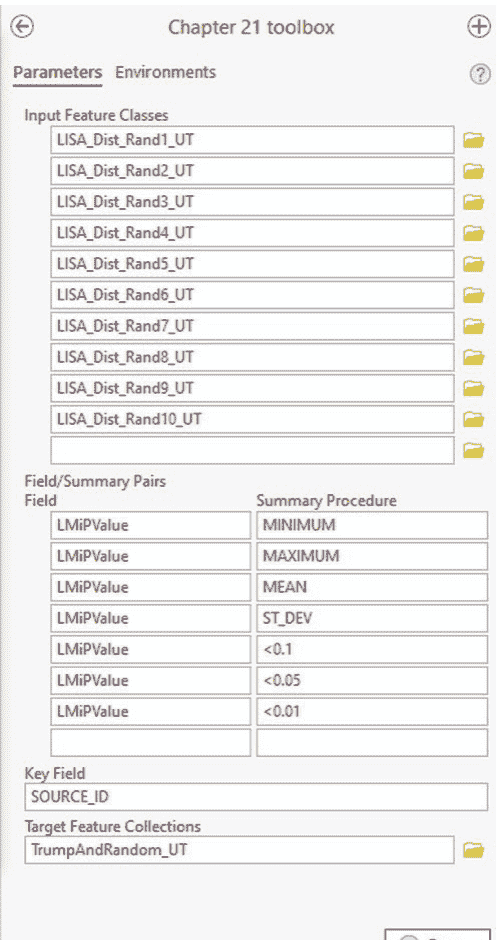

在此提供结果后，回答以下问题：

**问题2：** 前10次模拟中，有多少次盐湖城的p值小于0.01？
**问题3：** 图埃勒县前10次模拟的p值标准差是多少？

## 任务5：自主工作

从第20章的自主工作中获取代码，并为`neighborhood.py`和`parcel.py`文件创建一个名为`neighborhood`的新包。将主方法中的代码放入一个新的Python工具箱中，该工具箱也访问`neighborhood.py`和`parcel.py`文件。该工具箱中的工具可以匹配你第16章工具的输入参数，但应使用此处第21章的工具箱脚本文件。

评分标准如下：

- 包构建正确，具有正确的文件夹和文件结构。
- 工具箱的工具在`getParameterInfo()`方法中具有正确的输入参数化。
- 工具箱的工具使用新包，并正确访问它。
- 对于根据第16章制定的开发标准可接受和不可接受的输入，该工具提供正确的行为。

## 结语

一路走到这里，或许需要一些视角。你已经从开始编程，学习变量、运算符、循环和条件语句是什么，一直到在ArcGIS中创建自己的工具和工具箱。这些工具包括你自己编写的几个函数，以及你自己创建的类，分布在多个文件中。从开始到结束，这是一项成就，对你们许多人来说，将提供所需的技能，以开始并希望长期继续在GIS领域使用或开发程序的职业生涯。此外，我希望你拥有技能和信心，在ESRI更改编程语言时，能够顺利过渡。就此而言，这些技能可以帮助你从ESRI产品线转向开源GIS程序，如QGIS。

即便如此，没有一本书能够尝试涵盖可能属于GIS编程范畴的广泛主题。如果你希望深入了解以下一个或多个主题，其中一些可能对你有用。

## GIS算法

也许中间章节激发了你对使GIS工作的具体算法细节的兴趣，例如“计算机实际上如何获取两个几何图形并找到它们的交点？”以下几本书可以作为这方面的资源。

- Wise, Stephen (2014). *GIS Fundamentals, 2nd ed.* Boca Raton, FL: CRC Press.
- Xiao, Ningchuan (2016). *GIS Algorithms.* London: SAGE.
- Gold, Christopher (2016). *Spatial Context: An Introduction to Fundamental Computer Algorithms for Spatial Analysis.* Boca Raton, FL: CRC Press.
- Lovelace, Robin, Jakub Nowosad, & Jannes Muenchow (2019). *Geocomputation with R.* Boca Raton, FL: CRC Press.

## Web GIS

也许共享数据和代码让你对更多地使用Web GIS产生了兴趣。如果是这样，我可以推荐这些资源。

- Fu, Pinde (2020). *Getting to Know Web GIS, 4th ed.* Redlands, CA: Esri Press.
- Dorman, Michael (2020). *Introduction to Web Mapping.* Boca Raton, FL: CRC Press.

## 开源GIS

也许在本书结束之后，你有足够的信心完全离开ESRI，并开始使用甚至为开源GIS项目做出贡献。如果是这样，这里有几个起点。

- Neteler, Markus & Helena Mitasova (2013). *Open Source GIS: A GRASS GIS Approach.* New York: Springer.
- Menke, Kurt, Richard Smith, Jr., Luigi Pirelli, & John Van Hoesen (2016). *Mastering QGIS, 2nd ed.* Birmingham, UK: Packt.

## 附录：统一建模语言（UML）

当你从更简单的编程转向更复杂的编程，从跟踪简单的变量，到对象，再到类，最终管理包含多个文件的项目时，拥有一种表示代码所有部分的方法变得很重要。管理这种更复杂代码的一种常见方式是通过统一建模语言（UML）。虽然UML旨在管理比本书中介绍的复杂得多的软件系统，但其中一些方面在这里仍然有用。这种视觉语言中有13种不同类型的图表¹，分为3大类。因此，这里的附录只能触及UML所能处理的复杂性的表面，因此如果你在阅读后希望了解更多信息，我建议查看UML组织的网站http://www.uml.org，并参考其中列出的参考资料。

UML是一种视觉语言，可以表示构建和维护软件系统过程中固有流程的不同抽象级别。第一类代表结构图，它描述了代码中不同对象、类和包的构建方式。本书中介绍的UML图来自这一类别，因此本附录将更全面地介绍这一点。其他两类代表了软件开发的方面，这些方面往往随着应用程序比我们正在构建的更复杂而出现并变得更加相关。简而言之，行为图描述了软件系统中发生的过程。此类图表更关注系统的组件做什么，而不是它们如何构建。它们还可以表示用户可能希望软件执行的操作。第三种类型的图表，交互图，描述了软件系统的不同部分如何相互通信。由于本书主要关注GIS应用程序编码中的结构，因此本附录重点介绍各章中介绍的结构图，以更详细地解释这些图表的构建和解释方式。

### 类图：单个类

我们进入UML的切入点是通过表示单个类。回顾第7章，类包含属性（类似于对象特定的变量）和方法（类似于对象特定的函数）。单个类的图简洁地描绘了类的这些部分。

图7.1（此处复制为图A.1）通过扩展变量的盒子隐喻，将对象呈现为可以容纳一系列盒子的板条箱，从而引入了对象的概念。因此，`ArcGISProject`类的任何对象都保证具有`activeMap`、`dateSaved`、`defaultGDB`等类型的属性，以及名为`save()`和`listLayouts()`等方法。虽然盒子的颜色可以表示属性的类型，例如绿色表示文本字符串，但这种方法在扩展到更大的类时变得困难。UML类图为这种可视化提供了更正式的结构。图A.2给出了图A.1的UML类图版本。

这里的类图有三个框，与隐喻板条箱的三个部分相匹配。就像板条箱顶部的标签一样，顶部的框包含类的名称。板条箱左侧框中的属性对应于类图中三个框中间的信息。每个属性占一行。属性的名称在前，冒号后是该属性的类型。板条箱右侧的方法在类图的最下方框中呈现。展示了两个方法。方法的名称

¹截至UML 2.0版本，共有13种。

## 类图：连接多个类

首先是方法名，后跟参数。与代码本身一样，如果没有参数，仍需包含一对空括号。如果有参数，则在括号内以“名称 : 类型”对的形式包含，这与属性的处理方式相同。采用ESRI文档的方法，可选参数在此用花括号表示。最后，方法的返回值类型在行末的冒号后给出。如果没有返回值，则可以使用“void”一词来明确表示缺乏返回值。因此，每个`ArcGISProject`都有一个名为`save()`的方法，该方法不接受参数且不返回值。同时，还有一个名为`listLayouts()`的方法，它有一个可选的通配符参数（字符串类型），并返回一个列表给代码。虽然我们知道这个列表必须包含`Layout`对象，但Python并未明确保证这一点，因为列表可以包含多种类型的条目，因此这里的返回类型简单地表示为列表。

类图在此处的一个优势是它们比“crate”方法更紧凑。这意味着表示更大的类是可行的。事实上，在图A.1的“crate”中只展示了`ArcGISProject`的一部分。下面的图A.3在单个图中展示了`ArcGISProject`的整个类结构。

第12章为类结构的可视化表示引入了另一层。当同时处理许多类时，描述这些类如何相互关联非常有用。一个例子是在`arcpy.mp`模块中导航相互关联的类网络。例如，如果你有一个ArcGIS项目，并且想要更改特定包含分级统计图的图层所使用的色带，从`ArcGISProject`对象导航到`ColorRamp`对象以编辑布局的这一部分并非一目了然。使用下面重新印刷为图A.4和A.5的图12.1和12.2中的图表，并遵循其中的箭头，我们可以看到从项目到该色带所需的方法链。我们首先通过ArcGISProject对象的listMaps()方法获取一个Map。从该Map，使用listLayers()方法访问一个Layer。该Layer有一个通过symbology属性访问的Symbology。同样，renderer属性用于访问一个Renderer对象。分级统计图表明该Renderer将是GraduatedColorsRenderer子类型，它有一个colorRamp属性，可以允许访问并因此编辑该色带。应该注意的是，为了清晰起见以及确保每个图适合单页，每个类只包含了一小部分属性和方法。

此处图表的新元素是连接，由箭头和相关的数字注释表示。有两种类型的箭头。第一种是菱形头。这些表示关联，其中一个类包含对另一个类的引用，并且第二个类可以被视为第一个类的一部分。例如，每个ArcGIS项目包含一个或多个地图，以及一个或多个布局。同时，这些Map和Layout对象通常不存在于ArcGISProject对象之外。同样，一个地图可能包含任意数量的表和图层，但在代码中，这些Table和Layer对象只能通过Map对象访问。

另一种箭头具有标准的三角形箭头，表示超类和子类关系，如第8章所述。这里有两个这样的例子：RasterClassifyColorizer和RasterUniqueValueColorizer作为Colorizer的子类，以及四种类型的渲染器作为Renderer的子类。² 由于没有通用的着色器或通用的渲染器，并且所有内容都必须是子类之一，因此这些被认为是抽象类，用斜体表示。

这里的另一个项目是数字注释，它们表示关系的基数。每个关联箭头有两个数字，表示每个类可以有多少个与另一个类关联。例如，一个ArcGISProject可以在其列表中拥有任意数量的Map对象，包括0。同样，它可以拥有任意数量的Layout对象，包括0。因此，两者都标记为0..n。然而，每个Map只能与一个ArcGISProject关联，每个Layout对象也是如此。相比之下，每个Layer恰好有一个Symbology，并且每个Symbology通过symbology属性与单个Layer关联。这使得箭头的两端都是1。最后，每个Symbology如果包含栅格数据则有一个Colorizer，如果包含矢量数据则有一个Renderer。由于这意味着一个Symbology有零个或一个Colorizer，以及零个或一个Renderer，此箭头使用0..1表示法。

> ²即使这也没有完全代表文档。文档中没有提到Colorizer和Renderer类，尽管代码的行为似乎存在Colorizer和Renderer的抽象类。这种显式抽象类的缺失是colorizer和renderer属性具有通用Object类型而不是更具体类型的原因。

## 对象图

虽然未包含在本书正文中，但另一种UML图对于追踪复杂错误很有用：对象图。它看起来与类图非常相似。区别在于类图显示不同类之间的一般关系方式，而对象图在代码运行时提供特定时间点对象变量的具体值。因此，为了关注变量及其属性，进行了一些更改。首先，变量名包含在标题中。其次，属性的类型被其确切值替换。第三，方法部分被移除，因为它不再需要。最后，图表中不相关的部分，例如当前未使用的子类，被移除。

例如，图A.6表示一个包含具有单个图层的地图的项目。在该图层中，地图使用一个简单的渲染器，符号为深灰色，大小为10磅，带有黑色轮廓。

这可以通过提供比仅查看IDLE调试器下部变量列表更直观的可视化来帮助调试，展示不同变量如何相互关联。例如，如果由`aprx`变量表示的项目中的地图看起来不正确，可能是因为拼写错误将大小保留为100而不是10，填写对象图的值可以帮助你识别问题所在以及如何修复它。

## 参考文献

Abler, R. F. (1988). The National Science Foundation National Center for Geographic Information and Analysis. *International Journal of Geographical Information Systems*, 1, 303–326.
Adams, D. (1987). *Dirk Gently's Holistic Detective Agency*. Pan.
Conley, J., Hong, I., Williams, A., Taylor, R., Gross, T., & Wilson, B. (2021). Assessing consistency among indices to measure socioeconomic barriers to health care access. *Health Services and Outcomes Research Methodology*. https://doi.org/10.1007/s10742-021-00257-5
Dorman, M. (2020). *Introduction to web mapping*. CRC Press.
Fu, P. (2020). *Getting to know web GIS* (4th ed.). Esri Press.
Gold, C. (2016). *Spatial context: An introduction to fundamental computer algorithms for spatial analysis*. CRC Press.
Lovelace, R., Nowosad, J., & Muenchow, J. (2019). *Geocomputation with R*. CRC Press.
Menke, K., Smith, R., Jr., Pirelli, L., & Van Hoesen, J. (2016). *Mastering QGIS* (2nd ed.). Packt.
Neteler, M., & Mitasova, H. (2013). *Open source GIS: A GRASS GIS approach*. Springer.
Ward, M. D., & Gleditsch, K. S. (2008). *Spatial regression models*. SAGE.
Wise, S. (2014). *GIS fundamentals* (2nd ed.). CRC Press.
Xiao, N. (2016). *GIS algorithms*. SAGE.

## 索引 1

符号
- []，参见 列表
- ()，参见 元组
- {}，参见 字典
- __init__()，164，167，169–170，220，247
- __str__()，164，173

A
- .addDataFromPath() [ArcGISProject]，81，201
- .AddError() [ARCPY]，149
- .AddField() [ARCPY.MANAGEMENT]，110
- .AddMessage() [ARCPY]，148
- .AddWarning() [ARCPY]，148
- .append() [列表]，16，117
- ARCGISBINDING (R 包)，209，214
- ARCPY，75
- ARCPY.DA，105
- ARCPY.SA，96
- ARCPY.SHARING，201
- .ArcGISProject() [ARCPY.MP]，75，126，137
- .area [几何]，116
- 数组，117
- .Array() [ARCPY]，122
- as，153，155

B
- .bandCount [描述]，90
- break，190
- .buffer [几何]，120

C
- .camera [地图框]，139
- .Camera() [ARCPY.MP]，135
- .CheckOutExtension() [ARCPY]，97
- class，168
- 类，41，75，165–167
- .ClassBreak() [ARCPY.MP]，126
- .classificationField [渲染器]，132
- .color [符号]，131
- .colorizer [符号系统]，126–127
- .colorRamp [着色器]，126
- .colorRamp [渲染器]，127
- .ColorRamp() [ARCPY.MP]，127，128
- .columnCount [图例元素]，141
- 注释，39–40，59，61
- 条件语句，27–29
- 构造函数，42，164
- .contains [几何]，121
- .copy() [任意对象]，238
- .corrcoef() [NUMPY]，212
- .credits [FeatureSharingDraft]，202
- CSV，48–49
- 游标，105–112

> 注意：Courier New 字体中的项目是 Python 元素。关键字，如 `in` 和 `or` 就是单词本身，且为小写。函数如 `len()` 和 `print()` 在函数名后带有括号，表示它们通常需要参数。属性，如 `.bandCount` 和 `.color` 以 `.` 开头，表示它们与点前的变量相关联。对象方法，如 `.index()` 和 `.keys()` 以 `.` 开头，表示它们与变量相关联，并且也有括号，表示它们通常需要参数。与属性和方法关联的类列在条目后的方括号中。包名，如 ARCPY 和 ARCPY.MP 全部大写。包内的函数，如 `reader()` 在条目后的方括号中包含包名，以便你知道要导入什么。其中许多（但不是全部）是构造函数方法，意味着它们通过该名称创建类的实例。我们没有遇到构造函数的类，如 Map，以它们关联的包呈现，但没有括号。

D
- .datasetType [描述]，90
- .dataSource [图层]，83
- def，37，153，168–169
- del，107，239
- .Describe() [ARCPY]，89–90
- .description [FeatureSharingDraft]，206
- 字典，18
- 分而治之，15
- 文档，45，48，77–79，80，83，91，97，115，118

E
- .elementHeight [地图框]，139
- .elementPositionX [地图框]，139
- .elementPositionY [地图框]，139
- .elementWidth [地图框]，139
- elif，28
- else，28
- 错误，63
  - 错误处理，154–155
  - 逻辑错误，63–64，67，148，188–195
  - 运行时错误，63
  - 语法错误，22，63–65
- except，155，156
- .execute() [工具]，249，251，252
- .exportToPDF() [布局]，141
- .exportToSDDraft() [FeatureSharingDraft]，204

F
- False，13–14
- .FeatureClassToGeodatabase() [ARCPY.CONVERSION]，83
- .FeatureClassToNumPyArray() [ARCPY.DA]，211
- FeatureSharingDraft [ARCPY.SHARING]，203
- .fields [描述]，90
- .find() [字符串]，19
- .find_packages() [SETUPTOOLS]，242
- .firstPoint [几何]，116
- float()，56
- for，29，106
- from，97
- 函数，35–40，229–230

G
- .GenerateDriveTimeTradeArea() [ARCPY.BA]，203
- .Geometry [ARCPY]，115–118，122
- .GetCellValue() [ARCPY.MANAGEMENT]，98
- .getMessages() [结果]，100
- .GetParameter() [ARCPY]，148
- .getParameterInfo() [工具]，248
- .getPart() [几何]，116
- .getWebLayerSharingDraft() [地图]，203–204
- .GraduatedColorsRenderer() [ARCPY.MP]，126
- .GraduatedSymbolsRenderer() [ARCPY.MP]，126
- .groups [栅格唯一值着色器]，126
- .groups [唯一值渲染器]，126

I
- if，27
- import，48，236
- in，15，29，106
- .index() [列表]，16–17
- 继承，87–89，91
- 初始化，6，37，120，229
- input()，48
- .inputCount [结果]，100
- .InsertCursor() [ARCPY.DA]，108
- .insertRow() [插入游标]，108
- .isTemporary [栅格]，98
- .Item() [ARCPY.MP]，126
- .ItemGroup() [ARCPY.MP]，126

K
- .keys() [字典]，18
- 关键字，8，14，15，28，29，37，40，48，52，107，168，190

L
- .lastPoint [几何]，116
- 图层 [ARCPY.MP]，82–83，127
- .Layout() [ARCPY.MP]，127，136
- .LegendElement() [ARCPY.MP]，136
- .LegendItem() [ARCPY.MP]，136
- len()，15
- .length [几何]，116
- 列表，14–15
- list()，18
- .listColorRamps() [ArcGISProject]，132
- .listElements() [布局]，137–140
- .ListFeatureClasses() [ARCPY]，83
- .listLayers() [地图]，82
- .listLayouts() [ArcGISProject]，137
- .listMaps() [ArcGISProject]，81
- .ListRasters() [ARCPY]，89
- .ListTables() [ARCPY]，89
- 循环，25，27–32，106，121
- .lower() [字符串]，20

M
- .MakeFeatureLayer() [ARCPY.MANAGEMENT]，129，202
- .Map() [ARCPY.MP]，81，127，136
- .MapFrame() [ARCPY.MP]，136
- .MapSurroundElement() [ARCPY.MP]，136
- .messageCount [结果]，100
- 元数据，201，205–207
- 方法，35–36，41–42，79–80，165–171
- 模块，76，209–210，242–244

N
- .name [描述]，90
- .name [地图框]，139
- next()，56，115
- None，13–14
- NUMPY，209–212

O
- 对象，35–36，41–43，125–129，164
- open()，49
- 运算符，12，20–21，102
- .overwriteExistingService [FeatureSharingDraft]，206

P
- .Parameter() [ARCPY]，248–249
- 解析，7，32–33，42–43
- .partCount [几何]，116
- pass，237
- pip，242–243
- 点 [ARCPY]，116，121
- .pointCount [几何]，116
- print()，11
- 编程，3
- .Project() [ARCPY.MANAGEMENT]，119
- 属性，35–36，41，76–79，90–91，169
- 伪代码，6，110，181–182
- Python 工具箱，244–245

R
- R，214–215
- raise，154–155
- .RasterClassBreak() [ARCPY.MP]，127
- .RasterClassifyColorizer() [ARCPY.MP]，127
- .RasterItem() [ARCPY.MP]，127
- .RasterUniqueValueColorizer() [ARCPY.MP]，127
- .reader() [CSV]，49–50
- .Reclassify() [ARCPY.SA]，101
- .RemapRange() [ARCPY.SA]，101
- r-bridge-install 项目，214
- .renderer [符号系统]，127，129
- .replace() [字符串]，20
- .reset() [搜索游标]，120
- 结果，99–100
- return，40，153
- .reverse() [列表]，17

S
- .save() [栅格]，102
- .scale [相机]，139
- 脚本，3
- 脚本工具箱，146–149
- .SearchCursor() [ARCPY.DA]，106
- .Select() [ARCPY.ANALYSIS]，84
- self，164，166，169–170
- .setup() [SETUPTOOLS]，242
- SHAPE@，115
- .shapeType [描述]，90
- .SignInToPortal() [ARCPY]，203
- .SimpleRenderer() [ARCPY.MP]，127
- .size [符号]，132
- .Slope() [ARCPY.SA]，97
- .sort() [列表]，17
- .StageService_server() [ARCPY]，205
- StopIteration，159，234
- 子类，87–89
- .summary [FeatureSharingDraft]，205
- 超类，87–89
- .supports [图层]，130，131
- .SurfaceParameters() [ARCPY.SA]，100
- .symbol [简单渲染器]，129，131
- .Symbol() [ARCPY.MP]，126，128
- .symbology [图层]，126，131
- .Symbology() [ARCPY.MP]，127

T
- .Table() [ARCPY.MP]，127
- .tags [FeatureSharingDraft]，205
- .text [文本元素]，140
- .TextElement() [ARCPY.MP]，136
- .textSize [文本元素]，140
- 令牌，7–9
- 工具 (类)，248
- 工具箱 (类)，247
- True，13–14
- try，155–156
- 元组，14
- type()，56
- .type() [渲染器]，131

U
- UML 类图，75，125–129，135–136，220–221，257–260
- .UniqueValueRenderer() [ARCPY.MP]，126
- .UpdateCursor() [ARCPY.DA]，107
- .updateRenderer() [符号系统]，132
- .updateRow() [更新游标]，107
- .UploadServiceDefinition_server() [ARCPY]，205
- .upper() [字符串]，42
- .useLimitations [FeatureSharingDraft]，206

V
- ValueError()，154，155，230，234
- 变量，8–11，41–42
- 变量类型，12–13，35，75
- .visible [图层]，130

W
- WebGIS，199
- while，30
- .WKT [几何]，116
- .workspace [ARCPY.ENV]，80，81

X
- .X [相机]，139
- .X [点]，116

Y
- .Y [相机]，139
- .Y [点]，116