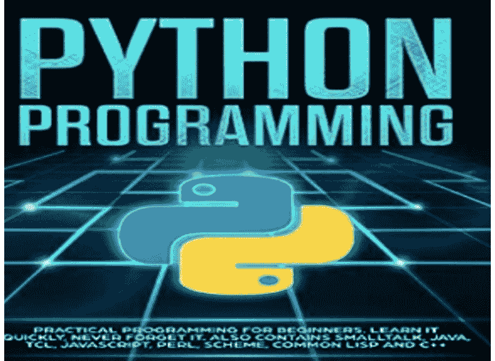
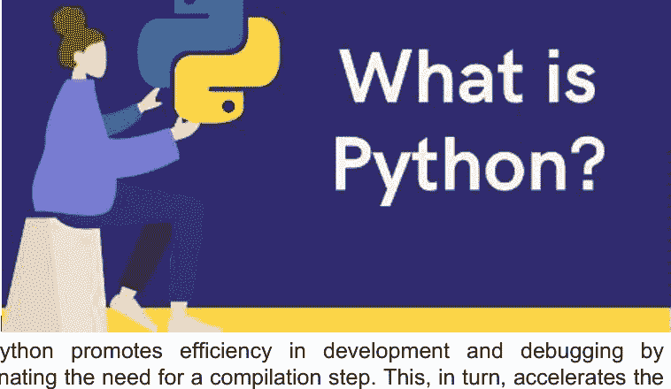
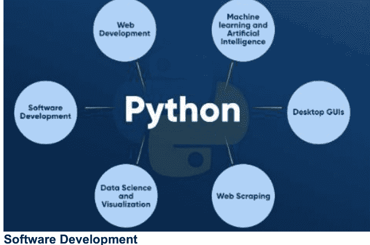
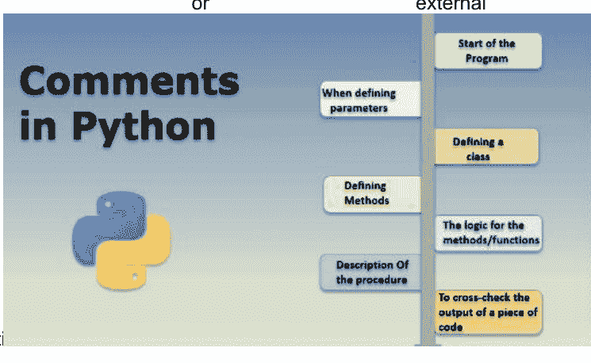

# Python 精通指南



Ummed Singh

# Python 精通指南

## Python

Python 是一种通用、高级的编程语言，以其简洁性、可读性和广泛的社区支持而闻名。它由 Guido van Rossum 在 1980 年代末期创建，如今已获得巨大人气，并被广泛应用于各个领域，包括 Web 开发、数据分析、人工智能、科学研究和自动化。Python 的语法强调代码可读性，其清晰直观的结构使其对新手和经验丰富的程序员都易于上手。它采用动态类型和自动内存管理，减少了复杂声明或手动内存分配的需要。Python 的标准库提供了广泛的模块和函数，简化了文件处理、网络通信和数据操作等常见任务。其庞大的包生态系统，包括 NumPy、pandas 和 TensorFlow 等库，为数据分析、机器学习等提供了强大的工具。

BookRix GmbH & Co. KG
81371 Munich

### 什么是 Python

Python 是一种通用、高级、动态类型、解释型的编程语言，它在应用开发中拥抱面向对象编程。它以简洁易学著称，并拥有丰富的高级数据结构。Python 的魅力在于其作为脚本语言的亲和力和强大功能，使其成为应用开发的诱人选择。其解释型特性，结合动态类型和直接的语法，使 Python 成为快速应用开发和脚本任务的理想语言。Python 适应多种编程范式，包括面向对象、命令式和函数式风格，为开发者提供了灵活性。Python 的独特之处在于其多用途性——它可以应用于众多领域，如 Web 开发、企业解决方案、3D CAD 等。Python 的一个突出特点是其动态类型，这消除了对显式数据类型声明的需要。例如，你可以简单地写 `a = 10` 来为一个变量赋一个整数值。



Python 通过消除编译步骤来提高开发和调试效率。这反过来又加速了编辑-测试-调试的循环，简化了开发流程。该语言的优势因其广泛的网络资源、开源项目和充满活力的社区而进一步增强。Python 培养了一个协作环境，用于学习语言、开展项目以及为更广泛的 Python 生态系统做出贡献，使其对开发者异常友好。Python 直接的语言结构使其易于访问和读写，是初学者的绝佳选择，同时也有助于经验丰富的程序员编写更清晰、无错误的代码。Python 不仅用途广泛，而且是开源和免费的，这使其在各个行业和学科中被广泛采用。Python 强调代码维护和确保可读性，使得不同的开发者能够理解和适应代码，即使它最初是由其他人创建的。Python 丰富的生态系统因大量涵盖广泛领域的第三方库而更加丰富，包括 Web 开发、科学计算和数据分析，简化并增强了其功能。

### Python 历史

Python 提供了众多优势特性，使其有别于其他编程语言。它适应面向对象和过程式编程范式，促进动态内存分配，并具有以下几个关键特征：

1.  **简洁性和易用性**
    Python 的简洁性和与英语的相似性使其成为一门易于学习的语言。它摒弃了分号和花括号，依靠缩进来定义代码块，这使其对初学者极具亲和力。

2.  **表达力**
    Python 的表达力使得可以用最少的代码执行复杂的任务。例如，经典的 "hello world" 程序可以简洁地表示为 **print("Hello World")**，只需一行代码，而像 Java 或 C 这样的语言则需要多行。

3.  **解释性**
    作为一种解释型语言，Python 逐行处理代码，这一特性简化了调试并增强了可移植性。

4.  **跨平台兼容性**
    Python 与平台无关，可在包括 Windows、Linux、UNIX 和 Macintosh 在内的各种操作系统上无缝运行。这种可移植性使程序员能够使用单一代码库为不同的平台编写软件。

5.  **开源**
    一个全球社区通过创建新的模块和函数，不懈地为 Python 的扩展做出贡献，营造了一个开源环境，任何人都可以免费访问源代码。

6.  **面向对象**
    Python 支持面向对象原则，包含了类和对象等概念，并支持继承、多态和封装。这促进了可重用、简洁代码的开发，并加速了应用程序的创建。

7.  **可扩展性**
    Python 是可扩展的，能够集成来自其他语言（如 C/C++）的代码。这种代码集成将程序转换为字节码，使其在不同平台上普遍可用。

8.  **广泛的标准库**
    Python 拥有一个全面的标准库，涵盖机器学习、Web 开发和脚本编写等多个领域。著名的库，如 TensorFlow、Pandas、NumPy、Keras 和 PyTorch 支持机器学习，而 Django、Flask 和 Pyramid 等框架则常用于 Web 开发。

9.  **GUI 开发支持**
    对于桌面应用程序开发，Python 通过 PyQt5、Tkinter 和 Kivy 等库提供对图形用户界面（GUI）的支持。

10. **易于集成**
    Python 可以与其他编程语言（如 C、C++ 和 Java）无缝集成。其逐行代码执行方式与 C 和 C++ 等语言的工作流程相似，使调试过程变得简单直接。

### Python 应用

基于控制台的应用程序，从命令行或 shell 执行，一直是计算领域的支柱。这些程序依赖文本命令来执行，Python 继承并发扬了这一传统，擅长开发此类应用。Python 的标志性特性——读取-求值-打印循环（REPL），使其特别适合命令行应用。Python 免费提供的庞大库生态系统简化了命令行应用的创建。该语言提供了用于读写数据的基本输入输出（IO）库，提供内置的参数解析功能，并能轻松生成控制台帮助文本。此外，高级库使开发者能够构建自主的控制台应用程序。



#### 软件开发

Python 在软件开发中扮演着至关重要的角色，作为控制、管理和测试的辅助语言。著名的工具和框架包括：

-   用于构建控制的 SCons。
-   用于自动化持续编译和测试的 Buildbot 和 Apache Gumps。
-   用于错误跟踪和项目管理的 Round 或 Trac。

#### 科学与数值计算

在人工智能时代，Python 作为 AI 和机器学习的理想语言而大放异彩。其广泛的科学和数学库简化了复杂的计算。Python 通过 NumPy、Pandas、SciPy 和 Scikit-learn 等库支持机器学习，能够实现先进的算法。流行的机器学习框架包括 SciPy、Scikit-learn、NumPy、Pandas 和 Matplotlib。

#### 商业应用

商业应用，如电子商务和ERP系统，需要可扩展性和可读性。Python提供了这些基本特性，而像Odoo这样的解决方案则提供了一系列全面的商业应用。此外，Tryton平台也利用Python进行商业应用开发。

#### 音频和视频应用

Python的灵活性延伸到多媒体应用。它可以用来创建音频和视频应用，例如TimPlayer和cplay等工具。Gstreamer、Pyglet和QT Phonon等多媒体库增强了Python在这一领域的能力。

#### 3D CAD应用

Python的多功能性扩展到3D CAD（计算机辅助设计）应用。像Fandango、CAMVOX、HeeksCNC、AnyCAD和RCAM这样的工具利用Python的能力来创建建筑和工程设计的详细3D表示。

#### 企业应用

Python非常适合开发针对企业和组织需求的应用程序。像OpenERP、Tryton和Picalo这样的实时应用展示了Python满足大规模业务运营独特需求的能力。

### Python变量

变量是内存位置的符号名称，在Python中通常被称为标识符。Python是一种动态类型语言，能够自动推断变量的类型，无需显式类型声明。Python中的变量名必须以字母或下划线开头，但可以由字母和数字的组合构成。

以下是标识符的命名规则：

1.  标识符的首字符必须是下划线或字母。
2.  后续字符可以是字母（大小写均可）、下划线或数字（0-9）。
3.  标识符名称中不允许使用空格和特殊字符，如 !、@、#、% 等（例如 ^、&、*）。
4.  标识符不应与任何语言定义的关键字匹配。
5.  标识符名称区分大小写，这意味着 "my name" 和 "MyName" 被视为不同的标识符。
6.  有效标识符的示例包括：a123、_n、n_9 等。
7.  无效标识符的示例包括：1a、n%4、n 9 等。

Python对变量声明采用灵活的方法。变量在赋值时创建，无需显式声明。要为变量赋值，可以使用等号（=）运算符。使用Python变量时，理解Python解释器如何管理对象引用很重要，因为Python是高度面向对象的。在这种范式中，每个数据项都属于一个特定的类，这与许多其他编程语言不同。

### Python数据类型

我们没有指定变量 `a` 的类型，它从整数获得了值五。Python解释器会自动将该变量解释为整数。我们可以借助Python验证程序所用变量的类型。Python中的 `type()` 函数返回传递变量的类型。在定义和验证各种数据类型的值时，请考虑以下示例。

```python
a = 10
b = "Hi Python"
c = 10.5
print(type(a))
print(type(b))
print(type(c))
```

输出：
```
<class 'int'>
<class 'str'>
<class 'float'>
```

标准数据类型：一个变量可以包含多种值。另一方面，一个人的ID必须存储为整数，而他们的名字必须存储为字符串。Python为每种标准数据类型指定了存储方法。以下是Python定义的数据类型列表：

- 数字
- 序列类型
- 布尔值
- 集合
- 字典

本教程部分将简要讨论这些数据类型。我们将在本教程的后面部分详细讨论每一个。

**数字**：数值存储在数字中。整数、浮点数和复数值属于Python数字数据类型。Python提供 `type()` 函数来确定变量的数据类型。`isinstance()` 功能用于检查一个对象是否属于特定类。当一个数字被赋值给一个变量时，Python会生成Number对象。例如：

```python
a = 5
print("The type of a", type(a))
b = 40.5
print("The type of b", type(b))
c = 1+3j
print("The type of c", type(c))
print("c is a complex number", isinstance(1+3j, complex))
```

输出：
```
The type of a <class 'int'>
The type of b <class 'float'>
The type of c <class 'complex'>
c is a complex number: True
```

Python支持三种数值数据：

- **整数（Int）**：整数值可以是任意长度，例如数字10、2、29、-20、-150等。在Python中，整数可以是任意长度。其值属于int类型。
- **浮点数（Float）**：浮点数存储像1.9、9.902、15.2等这样的浮点数。它可以精确到小数点后15位。
- **复数（Complex）**：一个复数包含一个有序对，即 x + iy，其中 x 和 y 分别表示实部和虚部。复数如2.14j、2.0 + 2.3j等。

**序列类型**：字符串：引号中的字符序列可以用来描述字符串。在Python中，可以使用单引号、双引号或三引号来定义字符串。Python处理字符串是一项直接的任务，因为Python提供了内置功能和运算符来执行字符串操作。处理字符串时，操作 "hello"+" python" 返回 "hello python"，运算符 + 用于连接两个字符串。由于操作 "Python" * 2 返回 "PythonPython"，运算符 * 被称为重复运算符。

在Python中，我们通常不需要显式指定变量类型。例如，如果我们给变量 'a' 赋值为五而不指定其类型，Python解释器会自动将 'a' 识别为整数。

要确定变量的类型，Python提供了 'type()' 函数，它返回给定变量的数据类型。

考虑以下示例，它定义并验证了不同数据变量的类型：

```python
a = 10
b = "Hi Python"
c = 10.5
print(type(a))
print(type(b))
print(type(c))
```

输出将是：
```
<class 'int'>
<class 'str'>
<class 'float'>
```

Python提供了各种标准数据类型以适应不同类型的值。例如，一个人的ID可能存储为整数，而他们的名字可以存储为字符串。Python处理这些标准数据类型的存储方法，以下列表概述了Python定义的数据类型：

- 数字
- 序列类型
- 布尔值
- 集合
- 字典

让我们在本教程部分更深入地探讨Python数据类型，并在本指南后面全面讨论每一个。

**数字**：Python的 'Numbers' 数据类型包括各种数值，如整数、浮点数和复数。你可以使用 'type()' 函数来确定变量的数据类型，而 'isinstance()' 检查一个对象是否属于特定类。例如：

```python
a = 5
print("The type of a", type(a))
b = 40.5
print("The type of b", type(b))
c = 1+3j
print("The type of c", type(c))
print("c is a complex number", isinstance(1+3j, complex))
```

输出：
```
The type of a <class 'int'>
The type of b <class 'float'>
The type of c <class 'complex'>
c is a complex number: True
```

Python支持三种主要的数值数据类型：

- **整数（int）**：可以表示任意长度的整数，如10、2、29、-20或-150。
- **浮点数（float）**：存储小数，如1.9、9.902或15.2，精度可达小数点后15位。
- **复数（complex）**：由一个有序对 x + iy 组成，其中 x 和 y 分别表示实部和虚部。示例包括2.14j或2.0 + 2.3j。

**序列类型**：在Python中，字符串用于表示字符序列。字符串可以使用单引号、双引号或三引号定义，Python提供了内置函数和运算符用于各种字符串操作。例如，使用 '+' 运算符连接两个字符串得到 "hello python"，而使用 '*' 运算符进行重复得到 "PythonPython"。

### Python 关键字

每种脚本语言都包含特定的保留字或关键字，它们具有明确的定义和使用准则。Python 也不例外。Python 关键字构成了任何 Python 程序的基本构建块。本教程旨在全面概述所有 Python 关键字，特别关注 Python 编程中常用的核心关键字。

#### Python 关键字简介

Python 关键字是保留用于特定含义和功能的特殊词语，只能用于这些目的。它们在你的 Python 程序中自动可用，无需任何 `import` 语句。需要注意的是，Python 的内置方法和类与关键字不同。虽然内置方法和类始终存在，但它们的使用不像关键字那样受到严格限制。为 Python 关键字赋予特定含义会限制它们在代码中用于其他目的。如果你尝试不当使用它们，将会收到 `SyntaxError` 错误消息。虽然为内置方法或类型赋值并不被禁止，但通常不建议这样做。截至 Python 的最新版本（Python 3.8），共有三十五个关键字，以下是 Python 关键字的完整列表：False await else import pass None break except in raise True class finally is return and continue for lambda try as def from nonlocal while assert del global not with async elif if or yield 值得注意的是，这些关键字在不同的 Python 版本中可能会有所不同。可能会添加一些关键字，也可能会移除一些。你可以始终使用以下代码检索你正在使用的版本中的关键字列表：

```python
# Python program to demonstrate the application of iskeyword()
# importing keyword library which has lists
import keyword
# displaying the complete list using "kwlist."
print("The set of keywords in this version is: ")
print(keyword.kwlist)
```

你也可以通过调用 **help()** 函数来获取当前可用的关键字列表：

```python
help("keywords")
```

#### 如何识别 Python 关键字

Python 关键字集合随着每个新版本的发布而演变。例如，**await** 和 **async** 关键字是在 Python 3.7 中引入的。此外，在 Python 2.7 中，**print** 和 **exec** 是关键字，但在 Python 3+ 中，它们被转换为内置函数，不再是关键字集合的一部分。以下是几种确定 Python 中特定单词是否为关键字的方法：

1. **使用语法高亮 IDE：** 许多 Python 集成开发环境（IDE）会高亮显示关键字，使得在编码时很容易识别它们。
2. **在 REPL（读取-求值-打印循环）中验证关键字：** 你可以使用 Python REPL 交互式地检查一个单词是否是有效的 Python 关键字。
3. **查找 SyntaxError：** 如果你尝试将一个单词用作变量、为其赋值或执行任何不允许对关键字进行的操作，Python 将引发 `SyntaxError`，表明它是一个关键字。

### Python 运算符

在本文中，我们将探讨 Python 运算符，它们是在操作数之间执行特定操作的符号。运算符构成了编程语言中逻辑操作的基础。与其他编程语言一样，Python 具有一组运算符，包括：

- 算术运算符
- 比较运算符
- 赋值运算符
- 逻辑运算符
- 位运算符
- 成员运算符
- 身份运算符

#### 算术运算符

算术运算符用于在两个操作数之间执行数学运算。Python 提供了多种算术运算符，包括：

- **加法 (+)**：用于将两个操作数相加。例如，如果 **a = 10** 且 **b = 10**，则 **a + b** 等于 20。
- **减法 (-)**：从第一个操作数中减去第二个操作数。如果第一个操作数较小，结果为负数。例如，当 **a = 20** 且 **b = 5** 时，**a - b** 等于 15。
- **除法 (/)**：返回第一个操作数除以第二个操作数的商。例如，如果 **a = 20** 且 **b = 10**，**a / b** 等于 2.0。
- **乘法 (*)**：将一个操作数乘以另一个操作数。如果 **a = 20** 且 **b = 4**，则 **a * b** 等于 80。
- **取模 (%)**：返回第一个操作数除以第二个操作数后的余数。如果 **a = 20** 且 **b = 10**，**a % b** 等于 0。
- **幂运算 (**)**：计算第一个操作数的第二个操作数次幂。
- **整除 (//)**：提供两个操作数相除所得商的整数值。

让我们看一些在 Python 中演示这些算术运算符的代码示例：

```python
a = 32
b = 6
print('Addition of two numbers:', a + b)
print('Subtraction of two numbers:', a - b)
print('Multiplication of two numbers:', a * b)
print('Division of two numbers:', a / b)
print('Reminder of two numbers:', a % b)
print('Exponent of two numbers:', a ** b)
print('Floor division of two numbers:', a // b)
```

输出：
Addition of two numbers: 38
Subtraction of two numbers: 26
Multiplication of two numbers: 192
Division of two numbers: 5.333333333333333
Reminder of two numbers: 2
Exponent of two numbers: 1073741824
Floor division of two numbers: 5

#### 比较运算符

比较运算符用于比较值并返回布尔结果。在 Python 中，常见的比较运算符包括：

- **等于 (==)**：如果两个操作数的值相等，则返回 **True**。
- **不等于 (!=)**：如果两个操作数的值不相等，则返回 **True**。
- **小于或等于 (<=)**：如果第一个操作数小于或等于第二个操作数，则返回 **True**。
- **大于或等于 (>=)**：如果第一个操作数大于或等于第二个操作数，则返回 **True**。
- **大于 (>)**：如果第一个操作数大于第二个操作数，则返回 **True**。
- **小于 (<)**：如果第一个操作数小于第二个操作数，则返回 **True**。

以下是一些在 Python 中演示比较运算符的代码示例：

```python
a = 32
b = 6
print('Two numbers are equal or not:', a == b)
print('Two numbers are not equal or not:', a != b)
print('a is less than or equal to b:', a <= b)
print('a is greater than or equal to b:', a >= b)
print('a is greater b:', a > b)
print('a is less than b:', a < b)
```

输出：
Two numbers are equal or not: False
Two numbers are not equal or not: True
a is less than or equal to b: False
a is greater than or equal to b: True
a is greater b: True
a is less than b: False

### Python 注释

#### Python 注释简介

注释是解释我们所编写代码的宝贵标记。它们允许我们记录特定代码部分的目的和功能。本质上，注释用于为算法、过程和复杂的业务逻辑提供解释。当程序执行时，Python 解释器会忽略注释，只专注于代码。Python 支持三种主要类型的注释：单行注释、多行注释和文档字符串。

#### 使用注释的优点

在代码中包含注释可以增强其清晰度和可理解性。注释帮助我们记住特定代码部分背后的原理，使我们的程序更易于理解。
此外，注释使我们能够在评估代码的其他部分时选择性地跳过特定的代码部分。这种简单的技术允许我们暂时禁用行或在程序中创建快速的伪代码。
以下是注释的一些常见用例：

1. **增强代码可读性：** 注释通过解释代码的功能使其更具可读性。
2. **控制代码执行：** 注释可用于限制某些代码块的执行。
3. **提供程序或项目概述：** 注释可以提供程序或项目的元数据概述。
4. **添加引用：** 注释可以包含对外部资源或文档的引用。



#### Python 中的注释类型

在 Python 中，有三种主要类型的注释，每种都有特定的用途：

##### 1. 单行注释

### Python 注释

Python 中的单行注释非常适合为参数、函数定义和表达式提供简洁的解释。Python 单行注释以井号（#）开头，并持续到行尾。如果注释跨越多行，则每行都应以井号开头。以下是单行注释的示例：

```python
# This code is to show an example of a single-line comment
print('This statement does not have a hashtag before it')
```

在此代码片段中，注释是前面带有 # 的行。Python 编译器会忽略此行，只执行 print 语句。

##### 多行注释

Python 没有提供显式的多行注释语法。但是，有多种方法可以创建多行注释。一种方法是使用多个井号（#）来构建跨越多行的注释。每个前面带有井号的行都被视为一个单独的单行注释：

```python
# This is a
# comment
# extending to multiple lines
```

在这种情况下，每个以 # 开头的行都被视为注释，并被 Python 解释器忽略。虽然这不是专用的多行注释，但这种方法实现了类似的效果。

### Python break 语句

在 Python 中，`break` 关键字用于退出循环，并将程序控制转移到循环之后的下一行。它有效地终止了循环，并允许你在特定条件下中断循环的执行。`break` 语句在循环内运行，例如 `for` 循环和 `while` 循环，它会跳出离它最近的循环。

以下是 `break` 语句如何与各种示例配合工作的详细说明：

#### 示例 1：在 `for` 循环中使用 `break` 语句

```python
# Example of using the "break" statement with a for loop
my_list = [1, 2, 3, 4]
count = 1
for item in my_list:
    if item == 4:
        print("Item matched")
        count += 1
        break
    print("Found at location", count)
```

输出：
```
Item matched
Found at location 2
```

在此示例中，一个 `for` 循环遍历一个列表。当它找到与值 4 匹配的项时，执行 `break` 语句，终止循环。`count` 变量跟踪匹配项的位置。

#### 示例 2：提前跳出循环

```python
# Example of breaking out of a loop early
my_str = "python"
for char in my_str:
    if char == 'o':
        break
    print(char)
```

输出：
```
p
y
t
h
```

在这种情况下，当遇到字符 'o' 时，执行 `break` 语句，导致循环立即停止。它阻止了后续字符的打印。

#### 示例 3：在 `while` 循环中使用 `break` 语句

```python
# Example of using the "break" statement with a while loop
i = 0
while 1:
    print(i, " ", end="")
    i = i + 1
    if i == 10:
        break
print("came out of while loop")
```

输出：
```
0 1 2 3 4 5 6 7 8 9 came out of while loop
```

此示例演示了在 `while` 循环中使用 `break` 语句。由于条件 **while 1** 始终为真，循环会无限运行。当 `i` 的值变为 10 时，触发 `break` 语句，循环终止，并继续执行后续的 print 语句。

#### 示例 4：在嵌套循环中使用 `break` 语句

```python
# Example of using the "break" statement with nested loops
n = 2
while True:
    i = 1
    while i <= 10:
        print("%d X %d = %d" % (n, i, n * i))
        i += 1
    choice = int(input("Do you want to continue printing the table? Press 0 for no: "))
    if choice == 0:
        print("Exiting the program...")
        break
    n += 1
print("Program finished successfully.")
```

输出：
```
2 X 1 = 2
2 X 2 = 4
2 X 3 = 6
2 X 4 = 8
2 X 5 = 10
2 X 6 = 12
2 X 7 = 14
2 X 8 = 16
2 X 9 = 18
2 X 10 = 20
Do you want to continue printing the table? Press 0 for no: 1
3 X 1 = 3
3 X 2 = 6
3 X 3 = 9
3 X 4 = 12
3 X 5 = 15
3 X 6 = 18
3 X 7 = 21
3 X 8 = 24
3 X 9 = 27
3 X 10 = 30
Do you want to continue printing the table? Press 0 for no: 0
Exiting the program...
Program finished successfully.
```

在此示例中，我们有一个嵌套循环结构，包含一个外层 `while` 循环和一个内层 `while` 循环。`break` 语句用于在用户选择退出时退出程序。当用户输入 '0' 作为选择时，程序退出两个循环并成功完成。

### Python 字符串

Python 字符串本质上是包含在单引号、双引号或三引号中的字符集合。虽然计算机不直接理解这些字符，但它在内部将它们存储为 0 和 1 的组合。每个字符都以 ASCII 或 Unicode 字符编码，这意味着 Python 字符串可以被视为 Unicode 字符的集合。

在 Python 中，你可以通过将字符或字符序列括在引号中来创建字符串。Python 允许你使用单引号、双引号或三引号来定义字符串。以下是一个示例：

```python
str = "Hi Python!"
```

如果你使用 Python 脚本检查变量 **str** 的类型，如下所示：

```python
print(type(str))
```

它将显示类型为字符串（**str**）。

Python 将字符串视为字符序列，这意味着没有单独的字符数据类型。相反，单个字符（例如 'p'）被视为长度为 1 的字符串。

#### 在 Python 中创建字符串

Python 中的字符串可以使用单引号、双引号或三引号创建。三引号通常用于多行字符串或文档字符串。

```python
# Using single quotes
str1 = 'Hello Python'
print(str1)

# Using double quotes
str2 = "Hello Python"
print(str2)

# Using triple quotes
str3 = """Triple quotes are generally used for representing multiline or docstrings"""
print(str3)
```

输出：
```
Hello Python
Hello Python
Triple quotes are generally used for representing multiline or docstrings
```

#### 字符串索引和切片

Python 中的字符串索引与大多数其他语言一样，从 0 开始。例如，字符串 "HELLO" 的索引如下：

```
H E L L O
0 1 2 3 4
```

你可以使用方括号 [ ] 访问字符串的各个字符。但是，你也可以使用冒号 : 运算符从给定字符串中访问子字符串。

```python
str = "HELLO"
print(str[0])
print(str[1])
print(str[2])
print(str[3])
print(str[4])
# Raises an IndexError because the 5th index doesn't exist
```

输出：
```
H
E
L
L
O
IndexError: string index out of range
```

在上面的代码中，我们使用了切片运算符 [ ] 来访问各个字符。此外，我们还使用了切片来访问给定字符串的子字符串。切片运算符的上界始终是排他的。例如，**str[1:3]** 包括 **str[1] = 'E'** 和 **str[2] = 'L'**，但不包括其他内容。

```python
str = "JAVATPOINT"
print(str[0:])   # Starts from the 0th index to the end
print(str[1:5])  # Starts from the 1st index to the 4th index
print(str[2:4])  # Starts from the 2nd index to the 3rd index
print(str[:3])   # Starts from the 0th to the 2nd index
print(str[4:7])  # Starts from the 4th to the 6th index
```

输出：
```
JAVATPOINT
AVAT
VA
JAV
TPO
```

你还可以执行负切片，从最右边的字符开始为 -1，倒数第二个为 -2，依此类推。

```python
str = 'JAVATPOINT'
print(str[-1])      # Last character
print(str[-3])      # Third character from the right
print(str[-2:])     # Slice from the second character from the right to the end
print(str[-4:-1])   # Slice from the fourth character from the right to the first character from the right
print(str[-7:-2])   # Slice from the seventh character from the right to the third character from the right
print(str[::-1])    # Reversing the string
```

输出：
```
T
I
NT
OIN
ATPOI
TNIOPTAVAJ
```

#### 重新赋值字符串

更新字符串的内容很简单；你可以通过将其赋值给新字符串来替换内容。但是，重要的是要注意 Python 中的字符串是不可变的，这意味着你不能替换字符串的一部分——你只能用新字符串替换它。

---

出版者：
BookRix GmbH & Co. KG
Implerstraße 24
81371 Munich
Germany

文本：Ummed Singh
图片：Gaurav Kumar
封面：Mulayam Singh
编辑：Arun Kumar
校对：Raj Singh
版式：Dev Kumar
翻译：Hemant Lal

版权所有。

出版日期：2023年10月28日

https://www.bookrix.com/-qwfb55cf9b2bce5

ISBN: 978-3-7554-5872-2

BookRix 版本，出版信息

感谢您选择从 BookRix.com 购买本书。我们想邀请您再次访问 [BookRix.com](https://www.bookrix.com) 以评估这本[书](https://www.bookrix.com)。在这里，您可以与其他读者讨论，发现更多[书籍](https://www.bookrix.com)，甚至可以自己成为作者。

再次感谢您支持我们的 BookRix 社区。