# 基于Arduino和树莓派的传感器实践教程

第二版

Volker Ziemann

**《基于Arduino和树莓派的传感器实践教程》** 是首部全面且实用地介绍如何将传感器和执行器与微控制器、树莓派及其他控制系统进行接口的著作。作者详细描述了原始信号经过调理、数字化、数据存储和呈现的全过程。

传感器数据的收集、处理和理解在工业和科学活动中扮演着核心角色。本书构建了包含硬件及其他构建模块（如数据库、Web服务器、控制系统和消息代理服务）的大型工业或科学装置的简化模型。书中包含一系列案例研究，涵盖气象站、地面振动测量、阻抗测量、将医疗传感器连接到Web浏览器、激光束轮廓分析以及遥控寻火机器人。

第二版已全面更新，以反映自首版出版以来的新硬件和软件发布。新增内容包括ESP32微控制器、多种环境与医疗传感器、用于信号生成的执行器，以及关于WebSockets的章节；所有内容均通过新的案例研究进行阐释。

本书适用于攻读物理和工程学实践实验课程的高年级本科生和研究生。机器人俱乐部的爱好者及其他相关人士也会对本书产生兴趣。

**特点：**

-   包含可在学生实验室甚至家中进行的实用动手练习
-   涵盖最新的软件和硬件，示例中的所有代码均得到详细讨论
-   所有步骤均通过实际示例和案例研究进行说明，以增强学习效果

https://github.com/volkziem/HandsOnSensors2ed

**Volker Ziemann** 于1990年获得多特蒙德大学加速器物理学博士学位。在斯坦福SLAC和日内瓦CERN（期间参与了大型强子对撞机的设计）完成博士后研究后，他于1995年移居乌普萨拉，在电子冷却储存环CELSIUS工作。2005年，他转入物理系任教至今。他曾在CERN、DESY和XFEL负责多个加速器物理项目。2014年，他获得了乌普萨拉皇家科学学会颁发的Thuréus奖。

## 传感器系列

丛书编辑：Barry Jones 和 Haiying Huang

本系列近期其他著作：

### 金属氧化物纳米结构作为气体传感装置

G. Eranna

### 光化学纳米传感器

Andrea Cusano, Francisco J. Arregui, Michele Giordano, Antonello Cutolo

### 便携式食品毒物与环境污染物生物传感器

Dimitrios P. Nikolelis, Theodoros Varzakas, Arzum Erdem, Georgia-Paraskevi Nikoleli

### 传感器材料

P.T Moseley, J Crocker

### 生物传感器：微电化学装置

M Lambrechts, W Sansen

### 电阻抗：原理、测量与应用

Luca Callegaro

### 半导体X射线探测器

B. G. Lowe, R. A. Sareen

### 电阻式、电容式、电感式和磁性传感器技术

Winncy Y. Du

### 氢技术安全与过程控制传感器

Thomas Hubert, Lois Boon-Brett, William Buttner

### 用于癌症诊断的生物传感器与分子技术

Keith E. Herold, Avraham Rasooly

### 化合物半导体辐射探测器

Alan Owens

# 基于Arduino和树莓派的传感器实践教程

Volker Ziemann

### 具有3D电极的辐射传感器

Cinzia Da Vià, Gian-Franco Dalla Betta, Sherwood Parker

### 半导体辐射探测器

Alan Owens

### 先进色度监测

Gordon R. Jones, Joseph W. Spencer

### 纳米传感器：物理、化学与生物，第2版

Vinod Kumar Khana

### 多组件扭矩传感系统

Qiaokang Liang

### 超快硅探测器：设计、测试与性能

Marco Ferrero, Roberta Arcidiacono, Marco Mandurrino, Valentina Sola, Nicolò Cartiglia

### 基于Arduino和树莓派的传感器实践教程，第二版

Volker Ziemann

### 多功能传感器：设计、构造、方法与应用

Bansari Deb Majumder and Joyanta Kumar Roy

# 基于Arduino和树莓派的传感器实践教程

第二版

Volker Ziemann

CRC Press
Taylor & Francis Group
Boca Raton London New York

CRC Press是
Taylor & Francis Group, an informa business的印记

第一版于2023年由CRC Press出版
地址：6000 Broken Sound Parkway NW, Suite 300, Boca Raton, FL 33487-2742
以及CRC Press
地址：4 Park Square, Milton Park, Abingdon, Oxon, OX14 4RN
*CRC Press是Taylor & Francis Group, LLC的印记*
© 2024 Volker Ziemann
第一版由CRC Press于2018年出版

我们已尽合理努力出版可靠的数据和信息，但作者和出版商无法对所有材料的有效性或其使用后果承担责任。作者和出版商已尝试追溯本出版物中所有复制材料的版权所有者，如果未获得以本形式出版的许可，我们向版权所有者致歉。如果任何版权材料未被确认，请写信告知我们，以便我们在任何未来的重印中予以更正。

除美国版权法允许的情况外，未经出版商书面许可，不得以任何电子、机械或其他方式（无论是现在已知的还是未来发明的，包括影印、缩微拍摄和录音）或任何信息存储或检索系统，对本书的任何部分进行重印、复制、传输或利用。

如需获得影印或以电子方式使用本作品材料的许可，请访问 www.copyright.com 或联系版权结算中心 (CCC)，地址：222 Rosewood Drive, Danvers, MA 01923, 978-750-8400。对于CCC上不可用的作品，请联系 mpkbookspermissions@tandf.co.uk

*商标声明*：产品或公司名称可能是商标或注册商标，仅用于识别和解释，无意侵权。

## 美国国会图书馆编目出版数据

名称：Ziemann, Volker (物理学副教授), 作者。
题名：基于Arduino和树莓派的传感器实践教程 / Volker Ziemann。
描述：第二版。| Boca Raton : CRC Press, 2023。| 系列：传感器系列 | 包含参考文献和索引。|
摘要："《基于Arduino和树莓派的传感器实践教程》是首部全面且实用地介绍如何将传感器和执行器与微控制器、树莓派及其他控制系统进行接口的著作。作者详细描述了原始信号经过调理、数字化、数据存储和呈现的全过程。传感器数据的收集、处理和理解在工业和科学活动中扮演着核心角色。本书构建了包含硬件及其他构建模块（如数据库、Web服务器、控制系统和消息代理服务）的大型工业或科学装置的简化模型。书中包含一系列案例研究，涵盖气象站、地面振动测量、阻抗测量、将医疗传感器连接到Web浏览器、激光束轮廓分析以及遥控寻火机器人。第二版已全面更新，以反映自首版出版以来的新硬件和软件发布。新增内容包括ESP32微控制器、多种环境与医疗传感器、用于信号生成的执行器，以及关于WebSockets的章节；所有内容均通过新的案例研究进行阐释。本书适用于攻读物理和工程学实践实验课程的高年级本科生和研究生。机器人俱乐部的爱好者及其他相关人士也会对本书产生兴趣。"——出版商提供。
标识符：LCCN 2023002031 | ISBN 9781032377483 (精装) | ISBN 9781032376196 (平装) | ISBN 9781003341703 (电子书)
主题：LCSH: 探测器。| Raspberry Pi (计算机) | Arduino (可编程控制器) | 微控制器。
分类：LCC TK7872.D48 Z54 2023 | DDC 006.2/54165--dc23/eng/20230216
LC记录可在 https://lccn.loc.gov/2023002031 获取

ISBN: 978-1-032-37748-3 (精装)
ISBN: 978-1-032-37619-6 (平装)
ISBN: 978-1-003-34170-3 (电子书)
DOI: 10.1201/9781003341703

使用CMR10字体排版
由KnowledgeWorks Global Ltd.完成。

*出版商注*：本书由作者提供的付印稿编制而成。

# 目录

- 图表列表 ix
- 前言 xv
- 致谢 xvii

## 第1章 ■ 引言 1

## 第2章 ■ 传感器 5

- 2.1 模拟传感器 5
  - 2.1.1 电阻式传感器 5
  - 2.1.2 电压式传感器 10
  - 2.1.3 电流式传感器 14
- 2.2 信号调理 16
  - 2.2.1 分压器 16
  - 2.2.2 放大器 17
  - 2.2.3 滤波器 21
  - 2.2.4 模数转换 23
  - 2.2.5 电源电压 26
- 2.3 数字传感器 29
  - 2.3.1 按钮和开关 29
  - 2.3.2 开/关设备 30
  - 2.3.3 I2C设备 32
  - 2.3.4 SPI设备 36
  - 2.3.5 RS-232设备 37
  - 2.3.6 其他传感器 37

## 第3章 ■ 执行器 41

- 3.1 开关 41
  - 3.1.1 发光二极管和光耦合器 41
  - 3.1.2 大电流 43
- 3.2 电机 45
  - 3.2.1 直流电机 45
  - 3.2.2 伺服电机和模型舵机 48
  - 3.2.3 步进电机 49
- 3.3 模拟电压 53
- 3.4 周期信号 53
- 3.5 其他执行器 54

## 第4章 ■ 微控制器：Arduino 57

- 4.1 硬件 57
  - 4.1.1 Arduino UNO 57
  - 4.1.2 ESP8266、NodeMCU和ESP32 58
- 4.2 入门 59
- 4.3 Hello World，Blink 61
- 4.4 传感器接口 62
  - 4.4.1 按钮 62
  - 4.4.2 模拟输入 64
  - 4.4.3 I2C 68
  - 4.4.4 SPI 79
  - 4.4.5 其他协议 83
- 4.5 执行器接口 88
  - 4.5.1 开关设备 88
  - 4.5.2 直流电机 90
  - 4.5.3 舵机 93
  - 4.5.4 步进电机 95
  - 4.5.5 模拟电压 103
  - 4.5.6 周期信号 105
  - 4.5.7 人类注意力执行器 107
- 4.6 与主机通信 109
  - 4.6.1 RS-232和USB 109
  - 4.6.2 蓝牙 110
  - 4.6.3 WiFi 112
  - 4.6.4 其他通信方式 116

## 第5章 ■ 主机计算机：Raspberry Pi 119

- 5.1 硬件 119
- 5.2 入门 120
- 5.3 安装和使用新软件 123
- 5.4 将树莓派用作路由器 127
- 5.5 与Arduino通信 130
  - 5.5.1 Arduino IDE 130
  - 5.5.2 从命令行 131
  - 5.5.3 Python 132
  - 5.5.4 Octave 135
- 5.6 数据存储 138
  - 5.6.1 平面文件 138
  - 5.6.2 MariaDB 141
  - 5.6.3 RRDtool 145
- 5.7 在线展示 148

## 第6章 ■ 控制系统：EPICS 155

- 6.1 安装 155
- 6.2 与EPICS通信 157
- 6.3 ASYN和STREAM库 159
- 6.4 编写IOC 160
- 6.5 在启动时启动IOC 162

## 第7章 ■ 消息系统：MQTT 165

- 7.1 代理 166
- 7.2 NodeMCU客户端 167
- 7.3 通往EPICS的网关 169

## 第8章 ■ Websockets 175

- 8.1 在NodeMCU上 175
- 8.2 在浏览器中 179

## 第9章 ■ 示例：带分布式传感器的气象站 183

## 第10章 ■ 示例：地震检波器 193

## 第11章 ■ 示例：水质颜色监测器 201

## 第12章 ■ 示例：阻抗测量 207

## 第13章 ■ 示例：数据采集系统 219

## 第14章 ■ 示例：快速采集 229

## 第15章 ■ 示例：医疗传感 235

## 第16章 ■ 示例：激光束轮廓 249

## 第17章 ■ 示例：寻火机器人 257

## 第18章 ■ 展示与写作 275

- 18.1 准备演示文稿 275
- 18.2 准备报告 277
- 18.3 数据展示 278
- 18.4 良好的英语 279
- 18.5 后记 280

## 附录A ■ 基本电路理论 281

## 附录B ■ 最小二乘拟合 283

## 附录C ■ 接下来去哪里？ 285

- 参考文献 287
- 索引 289

## 图表列表

- 1.1 本书大纲。
- 2.1 左侧为光敏电阻（LDR）图像，中间为如何将其连接成简单的分压器配置（中间†），右侧为惠斯通电桥配置（右侧†）。图注中的上标†表示该图像是使用Fritzing创建的。
- 2.2 LDR在分压器电路中的能带图和电路原理图。上方图表说明了黑暗条件，下方图表显示了LDR暴露在光照下的条件。请注意，纵轴按惯例显示电子的能量。这导致电池的正极具有最负的能量。详见正文讨论。
- 2.3 NTC电阻是掺杂半导体，其施主能级刚好低于导带。温度升高会增加电子的动能，使其偶尔能跃迁到导带，从而对材料的电导率做出贡献。
- 2.4 旋转式和线性电位器（左）以及说明电气连接的电路（右）†。
- 2.5 操纵杆（左）和液位电阻式传感器（右）。
- 2.6 应变片。
- 2.7 MQ-x气体检测器原理图（左）和安装在小型分线板上的传感器（右）。
- 2.8 LM35温度传感器图像（左）及其连接方式（右†）。
- 2.9 热电偶原理图（左上）、热电堆原理图（左下）和MLX90614非接触式温度计图像（右）。
- 2.10 霍尔传感器原理图（左）和A1324传感器（右）。
- 2.11 ADXL加速度计的工作原理（左）和安装在面包板上的ADXL335（右）。
- 2.12 直径约30毫米的SM-24地震检波器。
- 2.13 反向偏置PIN二极管在光电导模式下的能带图（左）和电路（右）。
- 2.14 左侧为BPW34 PIN二极管图像，右侧为两个光电晶体管：一个对红外敏感的BPX38和一个对可见光敏感的SFH3310。
- 2.15 左侧为将0-5V输入电压降至0-3.3V的分压器。右侧电路显示了使用钳位二极管保护微控制器输入，使其保持在接地和5V之间†。
- 2.16 一个裸露的运算放大器（左）和接线成线路缓冲器（右）。我们在后一个原理图中省略了电源线†。17
- 2.17 跨阻放大器（左）和压控电流源（右）†。18
- 2.18 同相（左）和反相（右）放大器†。18
- 2.19 差分放大器（左）和具有可调$V_1$的相同电路（右），用于减去基线†。20
- 2.20 仪表放大器（左）和对数放大器（右）†。20
- 2.21 放大微弱信号并将其移至电源轨之间的中间范围†。21
- 2.22 简单的低通（左）和高通（右）滤波器。作为示例，我们选择元件值使得$f_c = 10\text{ kHz}$†。21
- 2.23 简单的带通（左）和带阻（右）滤波器†。22
- 2.24 有源同相（左）和反相（右）低通滤波器†。22
- 2.25 3位闪速ADC的工作原理。23
- 2.26 逐次逼近ADC的工作原理。24
- 2.27 Delta-Sigma ADC的工作原理。25
- 2.28 在不同奈奎斯特区采样信号。虚线显示频率为$0.15f_s$，实线显示左侧频率为$(1 - 0.15)f_s$、右侧频率为$(1+0.15)f_s$的信号。请注意，在信号被采样的时刻（由方框指示），这些信号无法区分。26
- 2.29 虚线信号$s_1$和$s_2$是混叠到更高奈奎斯特区原始信号$S_1$和$S_2$基带中的镜像。26
- 2.30 非常简单的电源电路原理图†。27
- 2.31 可调压（左）和固定压（右）稳压器电路†。28
- 2.32 连接带有上拉电阻的开关或按钮†。29
- 2.33 使用N型MOSFET的电平转换电路。MOSFET的源极连接到3.3V逻辑，漏极连接到5V逻辑†。30
- 2.34 PIR传感器原理图（左）和硬件（右）。31
- 2.35 HR-SR04距离传感器。31
- 2.36 BME680环境传感器和HYT-221湿度传感器。32
- 2.37 气压传感器工作原理图解。33
- 2.38 非色散红外传感和SCD30 $CO_2$传感器。33
- 2.39 MPU-6050中一个陀螺仪的工作原理。35
- 2.40 安装在各自面包板上的MPU-6050加速度计、MAX30102脉搏血氧仪和TCS34725颜色传感器。35
- 2.41 TFmini光学距离传感器。37
- 2.42 左侧为GPS接收器，右侧为面包板上的DHT11湿度传感器。38
- 2.43 Shinyei PPD42NS颗粒物传感器（左）和GP2Y1010AU0F粉尘传感器（右）。38
- 3.1 左侧为发光二极管特写。中间为连接LED的原理图和面包板上的相同电路†。41

## 图表列表

- 3.2 LED的物理原理。42
- 3.3 NPN晶体管的引脚（左），以及将NPN晶体管用作开关（右）†。43
- 3.4 两个NPN晶体管连接构成达林顿对（左）和ULN2003达林顿阵列（右）†。44
- 3.5 说明继电器功能的示意图（左†）和继电器实物图（右）。45
- 3.6 直流电机的基本工作原理。定子的磁北极在左侧，南极在右侧。电流供给电刷，进入换向器并穿过转子线圈，洛伦兹力对导线产生作用力，使其向上移动。半圈后，换向器旋转并反转极性，使得线圈左侧的电流方向与之前相同。46
- 3.7 说明H桥功能的示意图。47
- 3.8 一个小型模型舵机。48
- 3.9 舵机控制信号的时序。49
- 3.10 步进电机的示意图。注意线圈用大写字母表示，相应的引脚用小写字母表示。49
- 3.11 双极性步进电机的线圈接线（左），其中各自的中心引脚通常连接在一起。在单极性电机（右）中，中心引脚是引出的†。52
- 3.12 单极性步进电机的接线†。52
- 3.13 数模转换器的工作原理。53
- 3.14 多谐振荡器电路（左）和带有AD9850直接数字合成器的分线板（右）。54
- 3.15 蝶阀示意图。55
- 4.1 一块Arduino UNO†。58
- 4.2 ESP-01（左）、NodeMCU（中）和ESP32（右）。59
- 4.3 Arduino IDE。60
- 4.4 “Blink”示例程序。61
- 4.5 将按钮连接到Arduino†。63
- 4.6 将电位器（左）或LM35温度传感器（右）连接到Arduino†。64
- 4.7 将MLX90614非接触式温度计（左）和SCD30 CO2传感器（右）连接到Arduino UNO†。69
- 4.8 将HYT-221湿度传感器连接到Arduino（左†）并使用串口绘图器显示湿度和温度测量值（右）。69
- 4.9 将MCP23017 IO扩展器连接到UNO†。77
- 4.10 将MCP3304 ADC连接到NodeMCU†。80
- 4.11 将DS18b20传感器连接到Arduino UNO†。85
- 4.12 Arduino UNO D9引脚上脉宽调制信号的示波器波形，数值分别为88（左）和220（右）。88
- 4.13 使用脉宽调制和晶体管调节LED亮度†。90
- 4.14 通过脉宽调制TIP-120达林顿晶体管的基极来控制电机速度。关于二极管的讨论请参见正文†。91
- 4.15 L293D H桥驱动器的引脚分配†。91
- 4.16 控制直流电机的速度和方向†。92
- 4.17 将模型舵机连接到Arduino UNO†。94
- 4.18 使用ULN2003达林顿驱动器将单极性步进电机连接到UNO†。95
- 4.19 使用L293D H桥驱动器将双极性步进电机连接到UNO†。97
- 4.20 使用具有微步功能的DRV8825步进电机驱动器将双极性步进电机连接到UNO†。100
- 4.21 在面包板上调整DRV8825的最大电流。101
- 4.22 将MCP4921 12位DAC连接到Arduino UNO†。103
- 4.23 面包板上的AD9850连接到UNO†。106
- 4.24 使用DS18b20测量温度并在NeoPixel灯带上显示†。108
- 4.25 将扬声器和压电蜂鸣器连接到Arduino†。109
- 4.26 将HC-06蓝牙适配器连接到Arduino（左†）以及适配器的正反面（右）。110
- 4.27 带有LM35温度传感器的NodeMCU†。113
- 4.28 与Web服务器的通信，显示HTTP头。115
- 5.1 树莓派400（上）、4B版本（右下）和Pi Zero版本（左下）。120
- 5.2 树莓派图标背后的菜单，其中“首选项”子菜单显示了用于详细配置树莓派的程序。122
- 5.3 nano文本编辑器，底部列出了可用命令。124
- 5.4 新立得软件包管理器。126
- 5.5 无线连接到NodeMCU的Telnet会话。132
- 5.6 在树莓派上使用Python与运行在Arduino UNO上的query_response程序通信。133
- 5.7 通过反复查询UNO获得的简单ASCII图形。134
- 5.8 温度记录仪的图表。138
- 5.9 来自rrdtool的图形。148
- 5.10 安装Apache2 Web服务器后的树莓派网页。148
- 5.11 第一个自制网页。150
- 5.12 用户pi的主页，显示持续（但缓慢）更新的温度。152
- 6.1 使用EPICS命令caget和caput。158
- 8.1 由NodeMCU提供的网页，用于控制数据采集并实时显示数据，图中显示了将手指放在温度传感器上引起的波动。176
- 9.1 天气节点电路，右侧为NodeMCU，左侧为BME680传感器†。184
- 9.2 由树莓派提供的气象站网页。188
- 9.3 使用USB转串口转换器对ESP-01进行编程的接线†。190
- 9.4 连接到BME680的ESP-01天气节点†。191
- 10.1 用于将SM-24地震计连接到NodeMCU的放大器†。194
- 10.2 地震计的原始时间序列和相应的频谱。197
- 10.3 原型机，SM-24地震计连接到放大器板和NodeMCU。198
- 11.1 测量颜色相关吸收（左）和表面反射（右）的装置。201
- 11.2 使用Arduino UNO测量水色的装置†。202
- 11.3 颜色传感器，左侧为RGB-LED，右侧为光电晶体管。204
- 12.1 测量电容的装置†。208
- 12.2 电容器两端电压随时间变化的波形，一个2.2 µF钽电容通过33 kΩ电阻放电，分别在线性刻度（上）和对数刻度（下）上显示。211
- 12.3 使用AD5933和运算放大器测量被测器件的示意图（上），以及在面包板上由UNO控制的相应电路（下）†。213
- 12.4 测量2.2 nF电容器作为被测器件的原始输出显示在左侧：阻抗幅度（上）、相位（中）以及原始I和Q值（下）。右侧的图表显示了相对于校准电阻转换为物理值的阻抗幅度和相位。218
- 13.1 基于ESP32的数据采集系统的Web界面。220
- 14.1 以200 kS/s采样内部生成的2 kHz信号（左）和以1 MS/s采样10 kHz信号。233
- 14.2 三星电视遥控器的红外信号，由TSOP2238接收器记录，其输出以10 kS/s采样（左），脉冲起始部分以50 kS/s采样（右）。234
- 15.1 在无焊面包板上组装的项目。左下角的电路是人体的简单电子模型，右侧的小面包板是ECG模拟器的一部分†。235
- 15.3 Cole模型的示意图，其中680 Ω电阻模拟细胞外液的电阻，2.2 nF电容模拟细胞膜的阻抗，1 kΩ电阻模拟细胞内液的电阻。虚线电阻限制了通过“身体”的电流。246
- 15.4 图15.3中Cole模型的测量阻抗。247
- 16.1 测量激光笔光束尺寸的示意图装置。249
- 16.2 CD-ROM驱动器的底盘，激光器安装在右上方，光敏电阻安装在右下方。黑色障碍物安装在滑块上，可以通过顶部的螺杆由位于激光器下方的小型步进电机移动。250
- 16.3 电路的示意图。框架的步进电机连接到标记为PA,...,PD的点†。251
- 16.4 原始传感器值作为障碍物位置的函数，以及推导出的激光束轮廓，显示出中等程度的不对称性。255
- 17.1 带有两个面包板的机器人底盘。较小的面包板可以通过操作模型舵机转动。较大的面包板上安装了右侧的NodeMCU和左侧的第二个芯片，一个最初测试后被Arduino NANO取代的裸片ATmega328。258
- 17.2 面包板上的遥控器简化装置†。259
- 17.3 遥控器的示意图†。259
- 17.4 机器人的电子电路（彩色版本可在线获取）†。264
- 17.5 机器人电子设备的示意图†。265
- 17.6 运行中的机器人，从后面（左）和前面（右）看。273
- A.1 两个阻抗串联（左）和并联（右）。282

## 前言

## 致第二版读者

自第一版出版以来的五年间，软件和硬件都发生了演变，这使得更新内容成为必然。同时，我借此机会扩充了材料，涵盖了新的硬件和软件特性。

虽然硬件从树莓派3升级到4无需改动，但操作系统的升级是实质性的，并影响了本书的许多章节。特别是，初始设置和网络配置发生了变化，Python2逐步淘汰并被Python3取代，MySQL数据库被MariaDB取代，仅举几例。此外，第一版中使用的几个软件包已不再可用，必须进行替换。

第一版中使用的Arduino和NodeMCU微控制器仍然可用，但我现在也包含了功能更强大的ESP32微控制器的示例，它提供了板载数模转换器和蓝牙功能。

我用更新、增强的版本替换了第一版中涵盖的一些传感器，例如，BME680环境传感器取代了BMP180压力传感器。此外，还涵盖了许多额外的电路；TCS34725颜色传感器、SCD30 CO2传感器和AD9850直接数字频率合成器。后者在书中新增了一个关于周期信号生成的章节。涵盖了三种用于医疗应用的传感器：AD8232心电图前端、MAX30102脉搏血氧仪和AD5933生物阻抗网络分析仪。

虽然第一版的所有材料都以更新的形式保留，但新增了关于WebSockets的章节和一些额外的项目。WebSockets使我们能够从Web浏览器接口和控制支持WLAN的微控制器。我们用它们来构建基于ESP32的数据采集系统，以与上一段提到的三种医疗传感器进行交互。

最后，本书的软件和彩色图像可在 [https://github.com/volkziem/HandsOnSensors2ed](https://github.com/volkziem/HandsOnSensors2ed) 获取。

## 致第一版读者

几年前，三位年轻的学生询问关于一个中等复杂度的项目以获取一些学分。我欣然同意指导他们，并分配了中等难度的任务，即从头开始构建一个用于慢信号的数据采集系统。我建议将一些传感器连接到Arduino微控制器，然后为Arduino编写程序，将测量值接口到我们实验室使用的控制系统。

学生们非常专注，与他们合作是一件真正的乐事。他们在几个小时内就掌握了Arduino，并在第一天就让第一个传感器报告了测量值。然后他们制定了一种与我们基于EPICS的控制系统兼容的协议，在与我们的控制系统专家讨论并进行了更多调试之后，学生们最终让一个原型系统工作起来。在清理完他们的项目后，他们必须进行演示并撰写报告，以获得他们应得的学分。

我很快意识到，传感器产生的信息有一个清晰的递进过程。信息通过一系列微控制器和计算机向上冒泡，这些设备提供数据处理、存储和在线呈现，最终出现在研讨会演示中，并最终进入报告。理解测量数据所走的路径似乎是一个值得向学生传达的有用概念。此外，我希望学生理解信号链的细节以及它*真正*的工作原理。因此，我采用了动手实践的方法，通过编程Arduino作为传感器和控制系统之间的通信粘合剂。这被证明有利于学生的理解，并受到了他们的欢迎。抽象的概念因此得到了非常具体的实现。在项目的最后阶段，我指导学生如何根据一些简单的准则准备研讨会演示，并最终将口头演示整理成书面报告提交，以获得他们的学分。

这本书的灵感来源于这些学生和他们的项目，但更进一步，增加了一些额外的主题，如信号调理、控制执行器（如开关和电机），以及控制系统设置、数据存储和网络。请注意，我只涵盖了精简到最基本要素的基础示例，以说明主要概念并快速入门。无论如何，所涵盖的概念在处理现实世界的数据采集任务时应该会派上用场。我基本上遵循*罗宾逊夫人的准则*，“帮助你学会自助”（还记得西蒙和加芬克尔的歌吗？），并试图用实用的知识填满工具箱。这些知识应该能让读者自助，并拿起数据手册和说明书，将本书中的基础知识应用于实现更高级的项目。

## 使用指南

本书的主题是*从传感器到报告*，这应该是将其用于课堂的指导原则，无论是在学生实验室还是作为个人项目的基础。

对于学生实验室，我建议在开始实验之前安装一些较为晦涩的说明中的软件。这包括将树莓派变成路由器（第5.4节）、安装MySQL数据库克隆MariaDB（第5.6.2节）以及安装EPICS（第6.1节）。学生应该专注于传感器，并将上述系统用作后台基础设施。另一方面，他们应该理解传感器的基本操作，学习如何将它们接口到微控制器，并将信息移动到另一台计算机上的下一级。这要求他们编写网络代码、填充SQL数据库、为EPICS准备协议文件或在Web服务器上呈现数据。在实验室中，应该有一位知识渊博的主管，“导师”，来回答问题并指导学生。在实验室中使用无焊面包板使学生能够快速建立一个可工作的系统，并在此基础上进行进一步的实验和尝试新的想法。

适合学生项目的合适范围，适合单个或两个学生一组，是将少量传感器连接到Arduino。然后应该给他们一个目标系统来发布数据。这可以是数据库、EPICS、MQTT或网页。在原型系统工作后，学生应该在研讨会上展示他们的系统并准备报告。

第一版的所有代码和相应的面包板电路图像（使用Fritzing [1] 制作）可在本书的GitHub页面 https://github.com/volkziem/HandsOnSensors2ed 获取。

## 致谢

这本书之所以能够实现，是因为我的学生Adam、Måns和Frida询问了“某个项目”，然后以极大的热情完成了它。后来，在乌普萨拉大学选修基于本书的“从传感器到报告”（1FA349）课程的学生们提出了非常酷的项目想法；谁能忘记Annika的“颜色到声音”项目¹或Pedro的“酸面团监控器”，仅举几例。我衷心感谢所有学生的贡献和投入。

同时，我感谢我的同事Roger Ruber和Mattias Klintenberg，他们阅读并评论了手稿的部分内容，并提供了重要的反馈。同样，我感谢Pawel Marciniowski在电子方面的帮助，以及Camilla Thulin在摄影方面的帮助。

这本书之所以可能，要感谢创建Arduino和树莓派生态系统的开源社区，以及在互联网论坛上回答问题的大量人员。我感谢Fritzing软件的创建者和维护者。我依靠它来准备许多图纸，以说明电路的接线。匕首†符号标注了相应的图像。

我感谢Francesca McGowan、Rebecca Davies（第一版）和Danny Kielty（第二版），他们都在Taylor & Francis，他们熟练地指导我完成了写作和出版书籍的复杂过程。

最后但同样重要的是，我感谢我的家人在我两版书的紧张写作和编辑期间对我的容忍。我常常心不在焉，对其他事情明显缺乏反应。

# 第一章

## 引言

传感器产生的电信号如何最终出现在报告中？我们又该如何连接这条路径上的不同环节？我们之所以探讨这些问题，是因为在许多场景中，收集传感器数据、处理数据并从中获取理解都扮演着重要角色。例如，一家公用事业公司会收集电力、供暖和水的相关信息，以便为客户准备账单并预估未来的产品需求。智能家居是另一个例子：它们测量温度或检测冰箱中是否有饮料，前者用于调节恒温器，后者则为我们生成一份报告，提醒我们在回家路上买些牛奶或啤酒。更广泛地说，许多物联网技术与本书主题有着共同的基础，但即使是像ATLAS [2] 或 CMS [3] 这样的大型实验合作项目——它们在欧洲核子研究中心的大型强子对撞机上运行着巨大的探测器——其数据也来源于深埋在探测器内部的传感器。这些传感器感知漂移室中的电流（带电粒子在不同电势的导线间引起放电），或从半导体探测器中产生电信号（粒子产生电子-空穴对，从而感应出电流）。其他例子包括用于测量磁场的霍尔传感器，以及用于检测环境条件变化的湿度传感器或气压传感器。所有这些传感器产生的电信号通常需要放大或进行其他调理。这一环节涉及运算放大器和各种滤波器，以提高信噪比。经过适当处理后，模拟信号被传递给模数转换器，在那里被转换为数字表示形式，随后由计算机处理。通常，部分计算能力位于传感器附近，由微控制器提供。这些微控制器收集附近传感器的信号，将其转换为基本的物理量，并格式化为标准化的输出格式。因此，它们充当了特定传感器接口与更通用的主机计算机接口之间的“通信粘合剂”，而主机计算机通常位于更远的地方。后者是微控制器通信通道的另一端，提供数据存储和展示，有时也显示近期数据用于在线监控。主机计算机可以运行通用的控制系统软件，为上层软件提供进一步的抽象层。我们讨论的例子包括在物联网项目中流行的MQTT [6]、在科学实验室中常见的EPICS控制系统 [7]，以及允许我们使用网络浏览器与数据采集系统通信的WebSockets。

在本书中，我们将构建一个包含大型科学或工业装置中所有要素的系统。从某种意义上说，它是一个大型装置的简化模型，但包含了所有的硬件和逻辑构建模块。具体来说，我们使用Arduino [8]、基于ESP8266 [9] 和基于ESP32 [10] 的微控制器板作为本地智能单元，来控制开关和电机以移动传感器，使其能够被读取并将信号转换为允许使用标准化协议与主机计算机通信的格式。这包括硬件通道（可以是USB、RS-232、蓝牙或WiFi）以及逻辑协议（如简单的查询-响应协议）。作为主机计算机，我们使用树莓派 [11]，其最新版本具有四个处理核心，运行标准的Linux系统，拥有庞大的可用软件库，包括网络服务器、MATLAB™的克隆版Octave，甚至Mathematica™，且无需支付许可费用。

本书的其余部分按照图1.1所示的结构组织。我们首先讨论一些模拟传感器和信号调理方法，接着介绍一些已经以数字形式提供测量值的传感器及其使用的总线和协议。然后我们讨论执行器。它们可以开关设备，即使是需要大电流的设备，我们还将学习如何控制不同类型的电机，这些电机有时是测量过程的一部分。接着，我们描述如何将执行器和传感器与Arduino连接，无论是通过数字化信号还是使用适当的总线接口。我们继续描述一种程序结构，使Arduino能够支持简单的查询-响应协议，从而作为主机计算机的从设备。接下来，我们将树莓派配置为标准化的主机计算机。它将在数据库中存储数据，并使用本地运行在树莓派上的Octave和Python以图形形式展示数据，或者通过同样运行在树莓派上的网络服务器发布我们的测量数据。我们继续讨论，安装EPICS控制系统软件，将树莓派转变为一个功能齐全的控制系统服务器，可以透明地加入任何其他EPICS安装。我们接着讨论MQTT消息传递系统，它在物联网应用中扮演着重要角色。WebSockets使我们能够使用网络浏览器（甚至在智能手机上）直接与微控制器通信。在组装完所有部分后，我们考虑一些示例，例如构建一个带有分布式传感器的气象站，以及用于记录地面振动、监测水色和测量元件阻抗的系统。在更高级的示例中，我们构建一个直接与网络浏览器通信的数据采集系统，然后扩展它以记录心电图和其他医学相关信号。最后，我们测量激光指示器光束的宽度，以及一个遥控机器人，它还能自主感知火焰、移动到火源并发出警报。我们最后提供关于如何基于这些示例准备研讨会报告，以及如何撰写一篇清晰的论文来描述我们使用传感器、执行器、Arduino和树莓派构建的数据采集系统的指南。

# 传感器

*传感器*是一种将物理量转换为电信号的设备 [12–15]，因此它要么提供电压或电流，要么引起其电阻的变化。更一般地说，传感器的阻抗（也包括电容式和电感式传感器）可能会发生变化。因此，我们面临的任务是测量这些电学量中的任何一种。

下面我们讨论不同类型传感器的例子，但仅展示市场上可选产品的一部分。读者可以通过在互联网上搜索想要测量的物理量加上关键词“传感器”来了解有哪些可用产品。一旦确定了传感器，仔细阅读数据手册以了解如何连接传感器是必须的。

## 2.1 模拟传感器

我们首先考虑基于电阻的传感器。

### 2.1.1 基于电阻的传感器

我们的第一个基于电阻的传感器是*光敏电阻*或LDR，如图2.1左侧所示。它的电阻随光照强度而变化，其范围取决于器件，通常从几百欧姆到兆欧姆不等。让我们花几行文字来协调电子原理图与微观层面的基本物理学。

图2.1 左侧是光敏电阻的图像，中间展示了如何将其连接成分压器配置，右侧展示了如何连接成惠斯通电桥。图注中的上标†表示该图像由Fritzing创建。

规模。这种以及许多其他传感器的工作原理基于材料导电带中电子的可用性。在良导体（导线）或不良导体（电阻器）中，电子部分填充导电带中可用的能态，直至某个能量水平，即费米能级；而在绝缘体中，费米能级位于完全填满的价带和导电带之间[16]。因此，导电带中没有可用的电子。此外，价带上边界与导电带下边界之间的能量差，即*带隙*，很大，而对于半导体，其带隙仅为电子伏特（eV）量级。

在光敏电阻中，基础材料通常是硫化镉（CdS），一种带隙约为2.4 eV的半导体。该能量等于波长约500 nm的绿光光子的能量。因此，绿光光子可以将电子从价带提升到导电带，从而产生电子-空穴对。这些现在自由移动的载流子导电，从而增加了材料的电导率。图2.2更详细地说明了这一点。上方的图显示了暗条件下的简化能带图。粗线表示导电带的下边界和价带的上边界。虚线表示电子占据的最高能态。对于金属和电阻器，这接近费米能级。相反，在像CdS这样的半导体中，费米能级位于价带和导电带之间。然而，在室温下，CdS的导电带中存在少量热激发电子。我们通过虚线靠近导电带下边界来可视化这一点。在金属中，导电带中有大量电子，电导率很高。在电阻器中，导电带中的电子较少，或者它们的迁移率以其他方式受到阻碍，导致费米能级在电阻器两端发生偏移。在暗条件下，光敏电阻的导电带中只有极少数热激发电子，电导率非常低。因此，光敏电阻两端有很大的电压降，而测量电压是测量点之间费米能级的差值。因此，测量电压接近电池提供的全电压。另一方面，如果光敏电阻被照亮，光子将电子从价带提升到导电带。这增加了电导率，光敏电阻两端只产生很小的电压降。这相应地降低了测量电压，如图2.2下方的图所示。请注意，我们不讨论不同部分之间界面的细节，因为这超出了本书的范围。

在图2.1的中间，我们展示了如何将光敏电阻与一个电阻$R_0$（此处为10 k$\Omega$）串联，在电源电压$V_{cc}$和地之间创建一个分压器。根据对分压器的讨论以及附录A或[17]中对基本电路理论的简要回顾，信号端子上的电压$V_s$由$V_s = V_{cc}R_{LDR}/(R_0 + R_{LDR})$给出。因此，光敏电阻的光照改变了其电阻$R_{LDR}$，信号电压相应变化。请注意，我们必须将电阻$R_0$选择在$R_{LDR}$范围的中间。这导致我们测量的电压在电源电压的一半左右变化。因此，我们还需要在该电压范围内使用电压表。光强度的微小变化可能难以分辨，可能需要放大。使用惠斯通电桥，我们比较两个电阻分压器中的电压，如图2.1右侧所示，有助于缓解这个问题。我们将在第2.2节中扩展惠斯通电桥的使用。

其他基于电阻的传感器是*电阻式温度检测器*（RTD），例如PT100温度传感器，这是一种经过校准的铂基传感器，在0 $^\circ$C时电阻恰好为100 $\Omega$。它基于这样一个事实：非常纯净的金属的电阻仅由导电带中电子与声子的散射决定，声子是构成金属晶格的离子的振动。此外，更高的温度导致晶格振动更强，电阻相应更高。

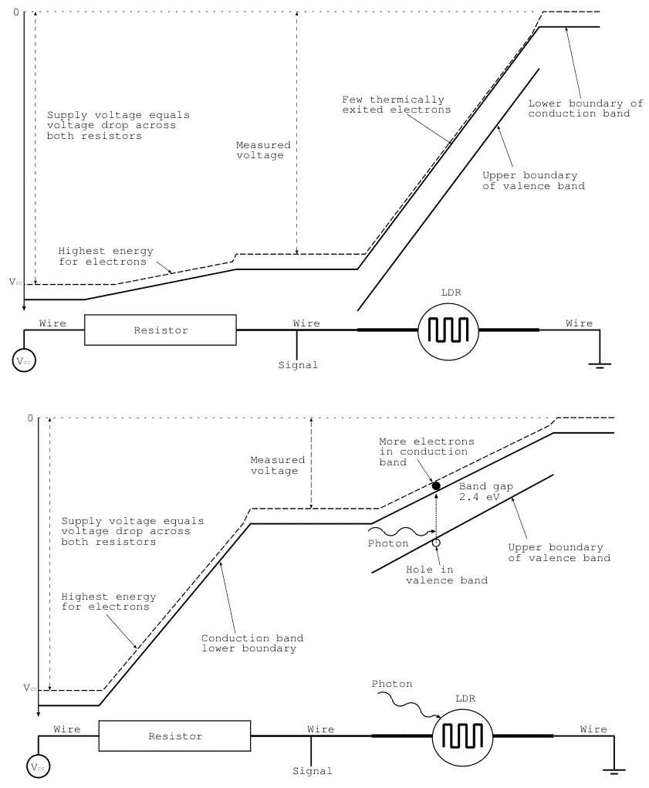

## 8 ■ 使用Arduino和Raspberry Pi的传感器实践课程，第二版

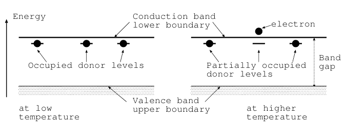

直观地，人们可能认为温度更高的晶体离子以更大的振幅振荡，为电子散射创造更大的目标，从而阻碍其运动。由于这是材料的固有特性，电阻随温度变化的校准测量对于所有相同金属的传感器普遍有效，前提是金属非常纯净且无缺陷。商业传感器通常由绕在陶瓷支撑体上的铂丝制成。PT100传感器连接到一个校准的电流源，类似于图2.17右侧所示的电流源。然后用电压表测量传感器两端的电压降，就像任何其他电阻测量一样。

热敏电阻是其温度依赖性被刻意增大的电阻器。在*正温度系数*（PTC）器件中，电阻随温度升高而增加；在*负温度系数*（NTC）器件中，电阻随温度升高而减小。PTC主要用作保护器件，当超过某个温度时，电阻从低阻态切换到高阻态。它们基于多晶材料，这些材料在某个温度（居里温度）下会大幅改变其介电常数。在居里温度以上，磁偶极子的状态是无序的，介电常数很小。这导致晶粒之间形成大的势垒，从而导致高电阻。在居里温度以下，分子偶极子排列整齐，介电常数大，电阻低。PTC热敏电阻的一个典型应用是自调节加热器，其中加热器也加热热敏电阻，这增加了电阻并限制了加热器的电流，直到达到平衡。PTC也可用于检测是否超过阈值温度。

相反的热敏电阻是NTC，其电阻随温度升高而降低。它们通常用于温度传感，基于掺杂半导体材料，该材料在导电带下方具有占据的杂质施主能级，如图2.3所示。温度升高热激发这些电子跃迁到导电带，从而增加电导率。这种效应远大于由于离子振荡阻碍电子运动而导致的电阻降低，后者是PT100传感器温度依赖性的原因。NTC和PTC热敏电阻都通过连接到恒流源并测量热敏电阻两端的电压降来感测。

许多*位置传感器*，无论是旋转还是线性位置，都基于电位器。电位器是一种可变电阻，其中滑块沿

### 2.1.2 基于电压的传感器

图 2.4 旋转式和线性电位器（左）以及说明电气连接的电路图（右）†。

电阻，并缩短一端点到滑片的距离，从而减小两个端子之间的电阻。滑片与另一端点之间的距离变长，导致滑片与另一端子之间的电阻相应增加。在图 2.4 的左侧，我们展示了一个带有三个连接器的旋转式和线性电位器；两个端点连接到深色导线，由滑片控制的那个连接到颜色较浅的导线。图 2.4 右侧的示意图解释了其功能；滑片控制着分压器的可变中点，在此例中，输出电压在 0 到 5 V 之间插值。电位器的一个变体是操纵杆，它基于两个正交安装的电位器，由一个小操纵杆控制。我们只需测量输出端相对于地的电压，即可确定滑片或操纵杆的位置。图 2.5 左侧显示了操纵杆的图像。

此外，具有微弱导电性的液体的液位也可以用电阻来确定，该电阻的阻值通过减小图 2.5 所示导电条带之间的电阻来改变。该传感器的连接方式与电位器相同，液位充当滑片。

对材料施加外力会改变其平衡形状，从而使材料产生应变。一个例子是拉伸的导线，如果被拉伸，它会变得更长更细。考虑导线的电阻 $R = \rho L/A$，其中 $\rho$ 是电阻率，$L$ 是长度，$A$ 是横截面积，并考虑其变化。我们看到，增加 $L$ 和减小 $A$ 会增加电阻 $R$。因此，简单的导线将其形变转换为电阻率的微小变化，从而用作力敏电阻，通常用作惠斯通电桥的一个支路。仅改变导线几何形状的微小效应可以通过使用重掺杂半导体来大大增强。后者在应变时也会使其电阻率 $\rho$ 发生很大变化。或者，它们基于聚合物厚膜技术。一个例子是图 2.6 所示的应变片。

图 2.5 操纵杆（左）和液位电阻式传感器（右）。

图 2.6 应变片。

MQ-2 和其他 MQ-x 是*气体传感器*，根据其类型规格对不同类型的气体敏感。它们基于半导体基底，其上有一层薄薄的多晶 $SnO_2$ 氧化锡表面层，该层通过溅射或蒸发沉积。对各种气体的特异性取决于活性区域的温度（由加热器调节）、沉积方法或少量添加的其他材料（如钯、金或铂）。电阻的变化取决于多晶 $SnO_2$ 的晶界以及受吸附气体影响的晶粒间绝缘氧化层。在图 2.7 的左侧，我们说明了工作原理。加热器位于 $SnO_2$ 活性层下方，通过电流加热。电阻（取决于特定气体的浓度）可以在标记为 1 和 2 的端子之间测量。图 2.7 右侧显示了一个安装在小型分线板上的设备。加热的传感区域位于保护性金属盖下方。

在简要介绍了基于电阻的传感器之后，我们继续讨论直接报告电压的传感器。

一个直接在其输出引脚产生电压的传感器例子是 LM35 *温度传感器*，它是一种硅带隙温度传感器。其工作原理基于让已知电流 $I_n$（其中 $n = 1, 2$）以电流密度 $j_n$ 通过两个双极晶体管的基极-发射极结，并比较它们各自的电压降 $V_{BE,n}$。电压差与温度成正比。这可以通过反转基极-发射极结二极管的电流-电压曲线来轻松理解：

$$j_n = A(T) \left[ e^{(eV_{BE,n} - E_g)/kT} - 1 \right]$$

其中 $E_g = 1.2\text{V}$ 是硅的带隙能量，$k$ 是玻尔兹曼常数，$T$ 是以开尔文为单位的绝对温度。$A(T)$ 是一个具有中等温度依赖性的器件特定常数。假设两个晶体管位于同一基底上且温度相同，我们求解两个电流密度 $j_1$ 和 $j_2$，得到电压差 $\Delta V_{BE} = V_{BE,1} - V_{BE,2} = kT/e \ln(j_1/j_2)$。在 LM35 中，两个晶体管的基极-发射极二极管具有不同的面积，因此面积比决定了电流密度，前提是相同的宏观电流通过两个晶体管。同一基底上有运算放大器提供信号调理，使得 LM35 产生的输出电压 $V_s$ 与温度 $T$ 的关系为 $V_s = T/100$。这里 $V_s$ 以伏特为单位，温度以摄氏度为单位，因此 $23\,^\circ\text{C}$ 的温度会产生 $0.23\text{V}$ 的电压。LM35 有三个引脚；一个接地，一个接电源电压，第三个引脚承载与温度成正比的电压 $V_s$。注意图 2.8 中连接 LM35 的极性。平坦表面朝向左侧的导线。

*热电偶*是基于温度和温度梯度对不同材料制成的导体的影响的温度传感器。在导体的连接处，帕尔贴效应会产生一个取决于温度的电流。这发生在图 2.9 左上角标记为各自温度 $T_1$ 和 $T_2$ 的点上。在导线段上，温度梯度会导致额外的电流流动，即汤姆逊效应。最后，连接两个接点和导线会导致电流循环，前提是回路闭合。这被称为塞贝克效应。如果回路是开路的，如图 2.9 左上角所示，由于帕尔贴、汤姆逊和塞贝克效应，在末端端子处会产生电压 $U$。在实践中，一个接点（例如在 $T_1$ 处）保持在已知且恒定的温度，例如通过将接点浸入冰水中。然后电压 $U$ 与传感端（在 $T_2$ 处）和参考温度 $T_1$ 之间的温差 $T_2 - T_1$ 相关。产生的电压大小取决于金属的组合，通常在 $50\,\mu\text{V}/^\circ\text{C}$ 量级。

在*热电堆*中，许多材料 A 和 B 的导线段串联连接，如图 2.9 左下角所示。这增加了设备对温差的灵敏度。热电堆通常用于感应热量和红外辐射的设备中，例如热成像设备或非接触式温度计。后者使用的传感器如图 2.9 右侧所示。

图 2.7 MQ-x 气体检测器示意图（左）和安装在小型分线板上的传感器（右）。

图 2.8 LM35 温度传感器图像（左）及其连接方式（右†）。

12 ■ 使用 Arduino 和 Raspberry Pi 的传感器实践课程，第二版

图 2.9 热电偶示意图（左上）、热电堆示意图（左下）和 MLX90614 非接触式温度计图像（右）。

一些晶体和陶瓷通过在材料相对两侧产生*压电*电压来应对外部应力，这是其晶体结构内电荷重新排列的结果。产生的电压可达数千伏，可用于在点火电路或老式黑胶唱片播放器中产生火花。在那里，“晶体”唱针被挤压在唱片的凹槽中，产生的电压被放大并作为声音播放出来。在科学应用中，压电传感器用于测量压力或力。

角运动的速度可以通过作为发电机反向运行的直流电动机轻松感知。不是施加电压来转动电机轴，而是转动轴会在电机线圈中感应出与角速度成正比的感应电压。连接到由流动液体或气体（如空气）驱动的螺旋桨上，这样的设备可以测量*流量*。

*霍尔传感器*产生与*磁感应强度 B* 成正比的电压。其工作原理如图 2.10 所示，基于让已知电流 *I* 通过半导体。在磁场存在下，洛伦兹力使电荷载流子——电子和空穴——偏转到垂直安装的电极（阴影部分）。这在电极之间产生电势差（电压），从而产生一个横向电场，该电场抵消洛伦兹力的偏转，使得后续的电荷载流子可以无偏转地向出口电极移动。在平衡状态下，上下电极之间的电压差与磁感应强度 *B* 成正比，可以用电压表测量。图 2.10 右侧所示的 A1324 霍尔传感器板载信号调理电路，只需要三个引脚。

图 2.10 霍尔传感器示意图（左）和 A1324 传感器（右）。

用于接地、供电电压和输出电压。后者与磁场成正比，灵敏度为50 mV/mT，在无磁场时中心电压为2.5 V。

ADXL335是一款基于硅基板上微机械结构的三轴集成*加速度*传感器，其中惯性质量块由弹簧悬挂[14]。惯性质量块是电容器组件的一部分，该组件由交流电压驱动，用于测量电容分压器的不平衡。与我们仅使用一个电容器对的简化模型不同，实际设备使用大量交错排列的电容器对以提高灵敏度。图2.11说明了单个方向的工作原理。在图2.11左侧，有一个交流电压发生器驱动浅灰色的电容器极板。深灰色的惯性质量块位于驱动极板的中间位置，在没有加速度的情况下，两个浅灰色极板与惯性质量块之间的电容相等。任何加速度都会引入电容不平衡，从而影响惯性质量块上的电压水平。将该信号的相位和幅度与驱动交流信号进行比较，即可得出加速度的方向和大小。经过一些信号处理后，该信号以$U_{acc}$的形式在ADXL335的一个输出引脚上提供，范围为0至3 V。该电压与-3g至+3g范围内的加速度成正比，更新速率约为每秒100次。

图2.12所示的SM-24是另一种类型的加速度计，称为*地震检波器*。它基于一个通过弹簧连接到外壳的线圈，该线圈置于由固定在外壳上的永磁体产生的磁场中。如果外壳移动，线圈由于惯性保持静止，从而在线圈中感应出与速度成正比的电压，该电压可以被测量。灵敏度为28.8 V/(m/s)，设备工作频率范围为10–240 Hz。

*麦克风*将声音转换为电信号，可归类为传感器。市场上主要有两类。*动圈麦克风*的工作原理类似于地震检波器。一个连接到振膜的线圈被声音激励，在磁场中运动，并在线圈中感应出感应电压，该电压被放大并测量。在*驻极体麦克风*中，振膜构成电容器的一个电极。如果它移动，电容就会改变，存储在电容器上的电荷量被推入和推出电容器，产生电流，该电流被放大并测量。

驻极体麦克风是一个很好的例子，可以用来转向基于电流的传感器。

图2.12 一个直径约为30 mm的SM-24地震检波器。

### 2.1.3 基于电流的传感器

图2.14左侧所示的BPW34是一种*PIN*二极管，根据高达mW/cm²的辐照度，可产生高达100 nA的电流。PIN二极管类似于传统二极管，由具有*pn*结的半导体组成。它是通过掺杂半导体材料（通常是硅基材料）形成的，掺杂的材料要么有五个价电子（此时变为*n*型掺杂），要么有三个价电子（此时变为*p*型掺杂）。然而，PIN二极管有一个额外的未掺杂、本征（“*i*”）导电硅层，以增加光子产生额外载流子的目标区域。PIN二极管的一种工作模式，称为光电导模式，如图2.13左侧所示，该图显示了反向偏置二极管的简化能带图。请注意，按照惯例，向上的能量轴对应于*电子*的势能，在最正电压处最低，该电压位于左侧。在图中，阴极（*n*侧）的电压高于阳极（*p*侧），导致所有载流子被拉出中间区域；电子向左，空穴向右。这导致二极管阻断任何电流流动。额外的未掺杂硅层提供了额外的潜在载流子，作为能量高于带隙的光子的目标。这些光子通过将电子从价带提升到导带，如图2.13所示，产生电子-空穴对。施加的电压（左侧更正）导致电子向左移动，空穴向右移动。综合起来，这构成了电流$I_p$。在二极管前添加一层彩色塑料薄膜——滤光片——使其响应具有颜色敏感性。因此，使用红色、绿色和蓝色滤光片可以产生我们在下面讨论的TCS34725中使用的颜色传感器。我们顺便提及，电离辐射，如高能光子和伽马射线以及高能带电粒子，会产生电子-空穴对。这使得PIN二极管适合作为辐射探测器。图2.13右侧的电路显示了一个运算放大器，它将流向其负输入端口的电流$I_p$转换为其输出端口上的电压$V_o = -R_f I_p$。运算放大器的这种用法称为*跨阻放大器*。我们将在接下来的章节中更详细地介绍这一点和其他用途。

*光电晶体管*，如BPX38或SFH3310（均在图2.14右侧显示），类似于普通晶体管，但其基极-集电极二极管是一个反向偏置的光电二极管，类似于上一段描述的那种。它导致电流因入射光子而流动。基极-发射极二极管已经正向偏置，将确保集电极-发射极连接导通。此外，通常有一个透镜来增加入射到具有光敏面积的基极端的光子数量。通过适当选择其带隙，对特定光谱范围（如红外辐射）敏感的光电晶体管可用作火焰探测器。

成像应用（如相机）中的传感器是*电荷耦合器件*，或CCD，类似于连接到小电容器的PIN二极管，每个相机像素一个。曝光将少量电荷转移到电容器。通常大量的像素通过将电荷从一个电容器转移到更靠近外部读出端口的电容器来顺序读出。这让人联想到在终点倒空水的水桶链。在CCD中，一旦电荷到达输出端口，它就会通过一个电阻，在那里产生一个被测量的电压降。

*太阳能电池*的工作方式类似于光伏模式下的光电二极管，它们为负载提供电压。然而，它们经过优化以吸收尽可能大比例的光谱，并且具有较大的吸收面积，以最大化提供给负载的电功率。

在简要概述了不同的模拟传感器之后，我们需要讨论如何准备信号，以便它们可以轻松地进行接口连接。这个准备阶段称为信号调理。

图2.15 左侧是一个分压器，用于将0–5 V的输入电压降低到0–3.3 V。右侧电路显示了使用钳位二极管来保护微控制器的输入，使其保持在接地和5 V之间†。

## 2.2 信号调理

来自传感器的模拟信号可能过高或过低。它们可能噪声过大或以其他方式不适合直接馈送到模数转换器（ADC）或微控制器。在许多情况下，需要一些信号调理，我们将在接下来的章节中讨论一些常见的方法。

### 2.2.1 分压器

如果传感器的输入电压超过了微控制器可以处理的输入范围，我们必须使用*分压器*来降低电压，分压器由两个固定值的电阻组成。一个典型的例子是将范围从0–5 V降低到0–3.3 V，这可以通过组合两个电阻来实现，其比值为$R_1/(R_1 + R_2) = 3.3/5 = 0.66$。图2.15中显示了一个接近的例子，使用12 kΩ和22 kΩ的电阻。比值为22/34 = 0.65，接近所需的比值。其他使用更大和更小值的组合也可以工作，只要比值正确。两个电阻的总和不应太小，因为这将从0–5 V电源汲取更大的电流，并且根据电源的内阻，可能会影响测量值。

为了提高测量灵敏度，基于电阻的传感器通常以惠斯通电桥配置连接。图2.1右侧显示了一个例子。这里，面包板左侧的分压器在其中心抽头（低信号线）提供一半的供电电压，因为两个电阻相等。右侧的分压器与我们之前遇到的相同，高信号线连接到上部电阻和LDR（光敏电阻）之间的点。通常，会选择右侧电阻的阻值处于LDR感兴趣范围的中间，使得信号线之间的电压差接近零，表示处于中间范围。这样，根据光照情况，信号线之间的电压差在零附近变化，符号告诉我们曝光是低于还是高于预期的中间值。由于我们现在处理的是在零附近变化的电压，更容易放大该电压以提高灵敏度。例如，当使用普通电压表时，我们可以使用较小的电压范围。

### 2.2.2 放大器

非常微弱的电信号通常需要被放大到足以进行后续处理的电平。实现这一目标的标准器件是*运算放大器*（简称运放），如图2.16左侧所示。它左侧有两个输入端口，一个标有“+”，一个标有“-”，以及一个输出端口。输出端口提供的电压取决于两个输入端口之间的差值。在理想运放中，放大系数是无穷大的，我们通常使用某种反馈机制来获得确定的行为，如下所述。通常，运放需要正负电源电压，尽管有时可以将负电源轨接地，这种情况下只能放大单极性信号。

在讨论不同的电路之前，我们需要描述表征运放的三个基本原则：

- 输入端口的输入阻抗是“无穷大”的，这意味着没有电流流入运放，它不会对上游电路造成负载。
- 运放试图将输入端口之间的差值 $V_+ - V_-$ 减小到零。
- 无反馈时的放大是准无穷大的，输出阻抗非常低，可以提供大的输出电流。

这些简单的规则将帮助我们设计和理解以下电路，但更广泛的讨论请参阅例如[17–19]。

我们首先考虑一个*线性缓冲器*，它通常用作阻抗转换器，将高阻抗传感器的输出转换为对噪声不那么敏感的低阻抗信号。我们在图2.16右侧展示了该电路，其中运放的输出被反馈到负输入端口。利用运放的第二条规则，我们看到运放试图使正负输入端口相等，但负端口连接到输出，这迫使输出跟随正输入端口。此外，根据第一条规则，输入阻抗很高，不会从传感器汲取电流（或至少是非常小的电流），而输出阻抗很低，可以提供大电流。请注意，我们省略了图2.16右侧的电源轨连接，此后也将如此，以避免电路图过于杂乱。

在反馈支路中添加一个电阻 $R$，如图2.17左侧所示，迫使从左侧进入电路的电流 $I$ 流过 $R$，从而产生电压降 $V_- - V_{out} = IR$。由于运放的正输入端接地，我们有 $V_+ = 0$，运放的第二条规则也迫使 $V_-$ 为零，因此我们发现输出电压 $V_{out}$ 由 $V_{out} = -IR$ 给出。反馈电阻 $R$ 因此将输入电流 $I$ 转换为输出电压 $V_{out}$。这就是该电路被称为*跨阻放大器*的原因。请注意，我们在图2.13中已经见过一个这样的电路。

在负输入端添加一个电阻，将之前的电路变成了*压控电流源*，如图2.17右侧所示。运放接地的正输入端迫使负输入端的电压为零，这导致流过电阻的电流为 $I = V_{in}/R$。而这个电流必须流过负载，例如第2.1.1节讨论的PT100温度传感器。

让我们进一步考虑这个电路，计算运放输出端的电压，如图2.18右侧所示。输入电流 $I_{in}$ 仅流过输入电阻 $R_4$ 和反馈电阻 $R_5$，因为运放的输入阻抗本质上是无穷大的，没有电流流入输入端口。但输入电阻和反馈电阻中的电流相等意味着 $I = (V_{in} - V_-)/R_4 = (V_- - V_{out})/R_5$。此外，我们观察到正输入端口接地，这迫使负输入端口也处于地电位。这意味着 $V_- = 0$，输入和输出电压之间的关系变为 $V_{out} = -V_{in}R_5/R_4$，其中负号表示放大器是反相的。请注意，我们可以添加多个输入电阻 $R_4$ 并联，一端连接到负输入端口。这允许我们将流过并联 $R_4$ 的电流相加，从而得到一个求和放大器。电阻值只是选择在一个合理的范围内。它们需要根据每个应用来确定。

如果我们想放大电压而不使其反相，我们使用图2.18左侧所示的电路。两个电阻 $R_1$ 和 $R_2$ 构成分压器，迫使负输入电压为 $V_- = V_{out}R_2/(R_1 + R_2)$。但是，同时，运放迫使 $V_- = V_+$，解出 $V_{out}$ 后得到 $V_{out} = V_+(R_1 + R_2)/R_2$，其中 $(R_1 + R_2)/R_2 = 1 + R_1/R_2$ 是放大系数。由于输出电压 $V_{out}$ 与正输入端口的输入电压 $V_+$ 符号相同，这种配置被称为同相放大器。

有时，我们想要测量的信号围绕一个非零基线变化。例如上一节中的霍尔传感器A1324，零磁场产生2.5 V，磁场根据其极性在此值上增加或减少。为了提高分辨率，我们想要放大的不是信号本身，而是信号与基线的差值。换句话说，我们需要一个电路来减去基线并放大差值。如图2.19所示的差分放大器实现了这一功能，前提是 $R_2 = R_4$ 且 $R_1 = R_2$。在这种情况下，输出电压 $V_{out}$ 由 $V_{out} = (V_2 - V_1)R_2/R_1$ 给出。添加一个电位器，在正负电源轨之间调节 $V_1$，可以将其作为基线电压减去。

一个类似于图2.19但输入端带有线性缓冲器的电路称为*仪表放大器*，一个例子如图2.20左侧所示。通常不需要用分立元件构建仪表放大器。有现成的电路可用，例如AD620或INA131。此外，AD8232是一种用于*心电图*应用的专用仪表放大器。它放大并处理通过电极贴在患者胸部拾取的微弱信号，并输出在心率监测器屏幕上看到的特征性波形。它提供信号调理电路，以滤除和补偿外部干扰，例如50 Hz的工频（在美国是60 Hz）。

通常，传感器产生围绕零点变化的小电压，但模数转换器（ADC）需要0到5 V的输入范围。因此，我们面临放大双极性信号并将基线电平改变到ADC中间范围的问题。我们在图2.21中展示了一个大约放大10倍的电路。放大倍数主要由反馈电阻 $R_3$ 与输入电阻 $R_1$ 和 $R_2$ 的比值决定。$R_6$ 和 $R_8$ 的分压器提供中间范围的偏移电压。输出电压的平均电平关键取决于电阻的公差，为了将电平安全地置于中间范围，我们使用电容 $C_1$ 首先去除输出信号的直流电平，然后通过由 $R_4$ 和 $R_5$ 组成的分压器将其适当地调整到中间范围。

如果我们需要放大在巨大数值范围内变化的输入信号，*对数放大器*（如图2.20右侧所示）是一个有用的电路。可以证明，输入和输出电压之间的关系是 $V_{out} = -V_t \ln(V_1/I_sR)$，其中 $V_t$ 是热电压，$I_s$ 是二极管的饱和电流。交换二极管和电阻的位置会产生一个指数放大器。

运算放大器的一个近亲是*比较器*。它可以被看作是一个具有非常大、甚至无穷大放大倍数的运放，其输出端口在电源轨处饱和。

### 2.2.3 滤波器

滤波器的任务是从电信号中移除某些频率，例如所有高频，此时该滤波器称为低通滤波器。一个例子是移除音频信号中“嘶嘶”声的低通滤波器。相反的滤波器是高通滤波器，它移除低频。一个例子是老式黑胶唱片播放器中的抗隆隆声滤波器。如果我们知道所需信号只包含某个频率范围，并且我们希望移除所有其他频率，我们使用带通滤波器。一个例子是基于超外差原理的收音机中的中频滤波器。最后，还有只移除窄带频率的滤波器。它们称为带阻或陷波滤波器。一个例子是移除来自电网的无处不在的50 Hz或60 Hz嗡嗡声的滤波器。

我们首先考虑一个*低通滤波器*，其最简单的形式是由一个电阻（阻值为 $R$）和一个电容（电容值为 $C$）构成的频率相关分压器，如图2.22左侧所示。关于电路理论基本概念（如阻抗）的复习，请参阅附录A。在我们的电路中，电容的阻抗为 $1/i\omega C$，它随着频率 $\omega = 2\pi f$ 的增加而减小。直观地说，较高的频率被短路到地。如果我们按照图2.22左侧所示构建一个分压器，输出电压 $V_{out}$ 由 $V_{out} = (V_{in}/i\omega C)/(R + 1/i\omega C) = V_{in}/(1+i\omega RC)$ 给出，我们看到它随着频率 $\omega$ 的增加而衰减，反之，

低频不受影响，因此得名低通滤波器。信号幅度衰减 $\sqrt{2}$ 倍的频率由 $\omega_c = 2\pi f_c = 1/RC$ 给出，虚数单位 $i$ 表示输入和输出电压之间存在相位差，该相位差取决于频率。等效地，低通滤波器也可以用电感（阻抗为 $i\omega L$）和电阻 $R$ 构建，但在许多实际操作中，电感的值难以找到；因此滤波器通常由电阻和电容构成。滤波器的频率依赖性渐近表现为 $\omega$ 的第一逆幂次，因此该滤波器称为单极点滤波器。级联两个这样的滤波器会产生双极点低通滤波器，其频率依赖性更陡峭，为 $1/\omega^2$。

将低通滤波器中的电阻和电容互换，就得到了图2.22右侧所示的高通滤波器，其频率依赖性为 $i\omega RC/(1 + i\omega RC)$，由于分子中的 $\omega$ 因子，它衰减低频，并且当 $\omega \gg \omega_c = 1/RC$ 时趋近于1。

如果我们想滤除除一个小频率范围之外的所有内容，我们需要一个带通滤波器，我们可以通过组合一个低通和一个高通滤波器来最轻松地构建，如图2.23左侧所示。在这里，我们必须确保初始低通滤波器的截止频率 $1/R_1C_1$ 高于高通滤波器的截止频率 $1/R_2C_2$。

如果我们需要抑制某个干扰频率，我们实现一个带阻或陷波滤波器，如图2.23右侧所示。电感 $L$ 和电容 $C$ 的组合在频率 $\omega_c^2 = 1/LC$ 处发生谐振，此时它们的串联电阻

消失，并且接近此频率的信号被短路到地，不会传递到输出。

到目前为止讨论的滤波器是无源滤波器，仅依赖于电阻、电容和电感，并且只能衰减不需要的频率。然而，有时我们需要将信号的放大与滤波结合起来。最简单的解决方案是在滤波器之后立即放置一个运算放大器。或者，可以在放大器的反馈支路中包含一个电容，如图2.24所示。

在滤波器设计方面有大量的专业知识，包括无源和有源滤波器，这些都记录在文献中。有关实用概述，请参见[20]。

### 2.2.4 模数转换

通常我们希望将模拟信号转换为数字格式，以便在计算机上处理它们。实现这一功能的设备是模数转换器（ADC），它可以被概念化理解为一个非常快速的电压表。它由一个采样保持电路组成，该电路在电压被测量和数字化期间保持电压恒定，使用多种不同的工作原理。

在*闪速ADC*中，电压表基于大量比较器，这些比较器将电压与从电阻梯形网络导出的一系列电压进行比较。一个额外的电路将比较器的输出编码为二进制表示。由于所有比较器并行工作，闪速ADC以最高的转换速率运行，超过每秒 $10^9$ 个样本。然而，这种高转换速率是有代价的，因为对于 $n$ 位的分辨率，需要 $2^n$ 个比较器。我们在图2.25中说明了3位闪速ADC的工作原理。左侧有参考电压 $V_{ref}$、待转换电压 $V_{in}$ 和时钟信号的输入。首先，输入电压在转换期间在采样保持电路中保持恒定，该电路由一个开关和一个小的保持电容组成。用于比较的电压由顶部的电阻分压器产生。来自分压器的电压被路由到比较器的负输入端。所有比较器随后同时比较采样保持的输入电压。比较器的输出连接到优先编码器的输入，优先编码器将其转换为输出引脚 $A_0$、$A_1$ 和 $A_2$ 上的3位二进制表示。转换过程以及采样和编码的同步操作由外部提供的时钟信号协调。闪速ADC通常提供8位或更低的分辨率，并且相对昂贵。为了以较低的速率采样，我们可以使用更便宜的ADC，例如下一段讨论的那些。

*逐次逼近ADC*以较低的成本提供更高的分辨率（更多位数），尽管转换速率较低。它们用更少的比较器取代了电阻梯形网络和大量的

### 2.2.5 供电电压

当然，我们的传感器以及微控制器都需要电力才能工作，而这通常由电源提供。一种常见的电源类型使用变压器，将墙壁插座的220V或120V交流电压降至常用的5-20V电压范围。这取决于变压器的额定功率以及初级与次级绕组的匝数比。由于大多数电子电路需要直流电压，我们需要对变压器次级绕组输出的交流电压进行整流。最简单的方法是使用一个具有足够功率额定值的单个整流二极管，如图2.29所示。

图2.29 虚线信号s1和s2是原始信号S1和S2在更高奈奎斯特区混叠到基带的图像。

请注意，模数转换器通常内置于具有数字接口的微控制器和传感器中，例如后续章节将讨论的那些。在讨论了数字数据采集系统的核心部件——模数转换器之后，我们需要关注为电路供电的任务。

### 2.2.4 模数转换器

使用单个比较器和一个数模转换器来动态调整参考电压以进行比较。我们在第3.13节讨论数模转换器的工作原理，但这里我们仅提及它们是将n位数字字转换为模拟电压的电路，并且转换速度非常快。它们在逐次逼近型模数转换器的操作中扮演核心角色，其工作原理如图2.26所示，其中输入电压在转换期间由采样保持电路保持恒定。然后，该电压被送入一个比较器，其负输入端由数模转换器的输出电压决定。在第一次比较中，n位输入字被设置为B'1000...，这产生参考电压V_ref的一半，其中我们在数字前加上字母B以标识其二进制表示。如果输入电压V_in较小，比较器的输出为地电平，或逻辑低电平。因此，第一个最高有效位为“0”。控制逻辑随后将数模转换器设置为B'0100...，并在下一个时钟周期再次进行比较。如果V_in大于(1/4)V_ref，比较器输出将变为高电平，因此传递到输出的下一位是“1”，数模转换器接收输入B'0110...以进行二分序列的下一步比较。如果重复此过程n次，模数转换器将从最高有效位到最低有效位输出转换的所有位。我们看到，在这种情况下，我们以转换速度换取了更简单的硬件。本书后续使用的大多数模数转换器都是逐次逼近型的。我们顺便注意到，通常在采样保持电路之前放置一个多路复用开关，这允许我们使用一个在不同通道间共享的模数转换器来选择不同的输入电压。只有一个通道能以最高的转换速率进行转换。

通过组合，例如两个4位闪速模数转换器、一个额外的数模转换器和先进的控制逻辑，可以形成所谓的流水线闪速模数转换器，从而在转换速度和硬件复杂性之间找到折衷方案。它们可以维持由4位模数转换器决定的连续转换速率。尽管每次转换需要两个时钟周期，但第一个模数转换器可以在第二个模数转换器仍在处理前一个样本的四个最低有效位时，就已经开始转换下一个样本。大多数用于射频应用、超过8位的高速模数转换器都使用这种方法。

与追求极高的转换速率相反，通常更希望实现高分辨率；换句话说，更多的位数，尽管转换速率较低。满足此要求的器件是*delta-sigma*模数转换器，其简化工作原理如图2.27所示。它基于将量化电流脉冲添加到运算放大器的负输入端，迫使其输出为零电压。请注意，该端是虚地，因为正输入端接地，而运算放大器总是力求使其输入电压相等。运算放大器被配置为积分器，并随时间对电流求和。通过反馈（如图中从触发器的非反相输出到开关的虚线所示）将电容器上的累积电荷强制为零，该开关要么向运算放大器的反相输入端注入大小为V_ref/R的正电流，要么注入负电流。触发器的目的是为注入的电流脉冲产生明确的时间步长，等于时钟频率。我们最终要做的只是计算输出为高电平的时钟周期数，并除以经过的总周期数。这将产生一个数字化字，其位数由我们选择的平均时间决定。而这个时间可以相当长。假设我们使用10 MHz的时钟并采样0.1秒，这样就会发生10^6个时钟脉冲，这将产生20位的分辨率，因为10^6 ≈ 2^20。Delta-sigma模数转换器得名于小的量化差值电流与来自输入电压V_in的电流一起在积分器中求和。高分辨率使得delta-sigma模数转换器成为测量惠斯通电桥中通常很小的电压的良好选择。然而，我们需要记住，这种提高的分辨率是以相当低的转换速率为代价的；通常每秒只能进行几十次转换。

尽管具有大量位数，模数转换器仍会给测量带来噪声，因为它们无法测量小于最低有效位对应的电压差。因此，它们引入了*量化误差*，这可以通过选择具有更多位数的模数转换器来减少。但即便如此，量化仍会导致信号幅度的表示略有不准确。

在离散时间点对信号进行采样会导致第二种潜在的失真，因为频率f高于采样频率一半（f_s/2，也称为奈奎斯特频率）的信号，无法与频率为nf_s - f或nf_s + f的信号区分开来。这种模糊性的起源如图2.28所示。左侧显示了一个频率为f = 0.15f_s（虚线）和f = (1 - 0.15)f_s（实线）的正弦信号，右侧实线是频率为f = (1 + 0.15)f_s的正弦波。我们看到，在采样时刻（由方块标出），曲线具有相同的值，这使得如果仅以速率f_s采样，它们无法区分。在频域中，如图2.29所示，我们发现一个位于奈奎斯特频率f_s/2和f_s之间的信号S1被模数转换器记录为频率s1，即S1在奈奎斯特边界处的镜像。高于f_s的信号S2被观测为信号s2。零到f_s/2之间的区域通常称为基带或第一奈奎斯特区，而高频信号出现在基带中的现象称为*混叠*。由于混叠信号的原始频率未知，它们通常被视为噪声。防止混叠的一种简单方法是在将信号送入模数转换器之前，使用截止频率低于奈奎斯特频率的模拟低通滤波器。诸如第2.2.3节讨论的滤波器通常就足够了。

图2.26 逐次逼近型模数转换器的工作原理。

图2.27 Delta-sigma模数转换器的工作原理。

图2.28 在不同奈奎斯特区对信号进行采样。虚线显示频率为0.15 f_s，实线显示左侧频率为(1 - 0.15) f_s的信号，右侧频率为(1 + 0.15) f_s的信号。请注意，在信号被采样的时刻（由方框标出），这些信号是无法区分的。

## 2.3 数字传感器

接下来，我们讨论那些无需外部ADC，而是直接以数字形式向微控制器报告测量值的传感器。有些传感器内部已集成ADC，而另一些则不需要。我们先从后者开始，其中最典型的例子是按钮和开关。

### 2.3.1 按钮和开关

最简单的数字传感器无疑是*开关*，它要么闭合要么断开；或者是*按钮*，其开或关的状态只是被暂时激活。我们交替使用这些术语。我们的任务是以可靠的方式检测它们的状态，这通常通过一个上拉电阻来实现，该电阻以图2.32所示的方式连接到电源电压。这样，微控制器上的检测引脚可以可靠地检测到电源电压。只有当开关S1被按下时，引脚上的电压才会降至零或地电平。当开关闭合时，只有很小的电流流过，其大小由电阻值决定。电阻的实际值并不关键，但通常10-30 kΩ左右的值是合理的。如果没有上拉电阻，当开关断开时，引脚上的电压电位是不确定的，由系统中的杂散电容决定。因此，建议在检测开关状态时始终使用上拉电阻。请注意，如果交换电阻和开关的位置，电阻就充当下拉电阻，除非开关闭合，否则检测电平为零。

我们需要指出，机械开关有一个不良特性，即抖动。闭合开关通常伴随着快速的通断序列。快速的微控制器或其他计算机运行得如此之快，以至于它们很容易被愚弄，检测到多次开关关闭而不是一次。有时在检测到第一次开关关闭后会引入一个小的延迟时间。这样，只计算一次关闭事件，而在短暂的超时期间发生的其他事件则被忽略。或者，可以使用模拟去抖器，即一个简单的低通滤波器，如第2.2.3节所讨论的。

还有许多其他传感器的作用与开关相同，可以用相同的方式检测。一个例子是*干簧开关*，它对磁场敏感，当超过某个磁场强度时会闭合开关。另一个例子是*倾斜开关*，它检测一个小导电球的位置，该球水平来回滚动，当它碰到其中一个极端位置时会闭合触点。

开关主题的一个变体是*旋转编码器*，它使用两个开关A和B，当轴转动时，它们周期性地开合。旋转的方向可以通过

### 2.3.2 开关型器件

许多传感器通过提供一个*电压电平*来告知微控制器其状态或状态变化。它们可以被视为一个内置上拉电阻的开关，并且可以用相同的方式进行检测。

如果传感器和微控制器的工作电压电平不匹配，可能会出现问题。如今，许多传感器工作在2.5–3.3 V的电平上，而微控制器则工作在2.5到5 V的电平上。检测更高的外部电压，例如汽车（12 V）或工业控制应用（24或48 V）中使用的电压，需要对电压电平进行一些调整，以防止损坏传感器或微控制器。有现成的电平转换芯片，如74LVC245，但在许多情况下，使用两个电阻构成的简单分压器就足够了。然而，它只在信号从高压侧流向低压侧时有效。如果需要双向信号流，例如在I2C总线的数据线上，图2.33所示的基于N型MOSFET晶体管的解决方案易于实现。第一种情况，当两个逻辑信号都为高电平时，MOSFET不导通，因为栅极和源极之间的电压差接近于零。第二种情况，如果3.3 V逻辑控制并将信号拉低，栅极和源极之间的差值为正，MOSFET导通，从而将5 V逻辑电平也拉低。第三种情况，当5 V逻辑控制且5 V逻辑信号被拉低时，内置二极管（在原理图中可见）导通，导致源极电压降至约0.7 V。此时，栅源电压降足够大，足以使MOSFET完全导通，这也将3.3 V逻辑电平拉低。

但让我们回到传感器。一种通过变化的电压电平报告其状态的突出器件是*PIR接近传感器*，如图2.34右侧所示。它感知红外辐射水平的变化，从而宣告生物的存在。这些传感器基于使用菲涅耳透镜（即图2.34中可见的圆顶）将入射红外辐射收集到热释电传感器上。透镜通常由聚乙烯制成，选择这种材料是因为其对红外辐射的低吸收率。因此，传感器的一侧被加热并膨胀，导致压电或热释电材料（通常是聚合物薄膜）发生弯曲。两种效应共同导致上下极板之间产生电压。首先，弯曲使材料产生应变并引起压电电压。其次，热量从热侧流向冷侧，增加了热释电电压。该器件的原理图设置如图2.34左侧所示。产生的微小电压随后被放大，并通过一个输出引脚暴露给周围的电子设备，一旦被人的存在触发，该引脚就会从低电压电平变为高电压电平，并保持可编程（通常通过一个小电位器）的时间。

一些传感器将其测量值编码为电压脉冲进行报告，脉冲持续时间与值成正比。因此，我们需要以足够的精度测量该脉冲的持续时间。采用这种模式的一个器件是HC-SR04距离传感器，如图2.35所示，其工作原理类似于声纳。它发射一个短促的超声波（40 kHz）声脉冲，并记录回波到达的时间，即声脉冲的往返时间$\Delta t$。距离$L$由该持续时间和声速（约$v = 340$ m/s）给出，公式为$L = \Delta t/2v$，或者用方便的单位表示为$L[\text{cm}] = 0.017\Delta t[\mu\text{s}]$。当脉冲发射时，器件上的一个引脚变为高电平，一旦回波到达或指定的超时时间到期，则返回低电平。一些更高级的型号使用相同的方法，但具有更大的量程，例如LV-EZx传感器。它们还支持其他报告距离的模式，例如与持续时间成比例的模拟电压，或直接作为RS-232信号报告，但更多内容将在下文介绍。

另一种传感器常见于现代消费电子产品中，用于检测来自遥控器的*红外信号*。它严格来说不是科学传感器，但仍然是一个有趣的设备，工作非常可靠，因为它能抑制干扰的环境影响，并且只有在按下遥控器上的按钮时才会切换电视频道。通常它们工作在940 nm的波长，与遥控器上的发光二极管匹配，并且它们内置光学带通滤波器，只允许该波长通过。然后信号被38 kHz的载波频率调制，在传感器上进行解调，使得只有基带信号被报告在输出引脚上。

现在我们转向直接以数字形式报告其测量值的传感器，并首先讨论I2C器件。

### 2.3.3 I2C器件

大量传感器内置了一些逻辑并支持高级通信协议。一个例子是运行在I2C总线上的*I2C*协议。与支持I2C的器件的物理连接只需要四根线：地线、电源电压Vcc、时钟SCL和数据SDA。后两者需要上拉电阻，这通常已经包含在作为I2C总线主设备以协调通信的微控制器中。它配置传感器，启动测量，然后从传感器读取数据。在物理上，通信基于同步串行协议，其中数据线在每次时钟线从高电平变为低电平时被采样。该协议是标准化的，我们不会深入细节，但需要提到I2C器件以及I2C传感器具有许多内部寄存器，可以写入以配置传感器，或读取以获取传感器数据。通信完全基于交换数字信号，并且如前所述，由通常为微控制器的总线主设备协调。多个器件可以共享相同的SDA和SCL线，因为每个器件都有自己的地址，并且仅通过指定器件地址来响应那些针对它的消息。

BMP280或增强型BME680（如图2.36左侧所示）板载*气压*传感器。这些传感器基于使用压阻式应变计测量由分隔真空测试体积和外部气压的膜变形引起的应变[14]，如图2.37所示。整个组件直接构建在硅基板上，应变计通过对一小部分进行适当掺杂而创建。包括一个分辨率为0.01 °C或更好的温度传感器，因为基于半导体的应变计具有温度依赖性。组件中还包括进一步的信号调理和处理电路，因此该器件通过I2C总线在地址0x76或0x77上与微控制器通信。测量范围从300到1100 hPa（mbar），相对精度为±0.01 hPa，绝对精度约为1 hPa。增强版BME680是一种*环境传感器*。除了气压和温度外，它还使用图2.7所示设备的微型化版本来测量湿度和*挥发性有机化合物*（VOC）的存在。

气压与来自主要传感器（应变计）的信号之间的关系相当复杂，并且由于制造公差，可能因设备而异。因此，每个设备（以及许多其他传感器）都需要通过将其暴露在已知条件（此处为压力）下进行*校准*，并记录特定于设备的常数，这些常数允许我们根据主要测量值准确确定压力。在BMP280或BME680的情况下，内置ADC报告一个与在电桥电路中测量的应变计电阻相关的值。在制造和校准过程中确定的校准常数存储在芯片上的存储器中。数据手册描述了一个详细的程序，以根据ADC报告的值和校准常数来获取压力。

SCD30是一种*非色散红外*（NDIR）传感器，通过测量样品体积中波长为4.3 μm的红外光的吸收来确定二氧化碳（CO2）分子的相对浓度。其原理如图2.38左侧所示。来自红外二极管的光穿过样品体积，

### 2.3.4 SPI 设备

SPI 接口是一种同步串行通信总线，类似于 I2C 总线，但其运行速度要快得多，因此常用于需要连续传输大量数据的设备，例如显示器或音频设备。SPI 通信需要总线上有一个主设备，这个角色通常由微控制器担任。传感器通常是它们的从设备。它们至少需要六根线进行连接：地线和电源电压、时钟线 CLK、一根用于从主设备向从设备发送信息的线路（MOSI，即主出从入）、一根用于反向传输的线路（MISO，即主入从出），以及一根片选线 CS 用于标识当前活动的从设备。CLK、MISO 和 MOSI 线可以在多个从设备之间共享，但每个从设备都需要其独立的 CS 线。

I2C 部分中的一些设备也支持此接口，通常可以通过将设备上的一个引脚设置为高电平或低电平来选择接口。详情请参阅数据手册。

在后续项目中，我们将通过 SPI 通信将模数转换器 MCP3304 连接到微控制器。它具有八个单端 12 位输入通道，但也可以配置为使用两个输入通道作为差分输入。该电路检测哪个输入更大，从而提供一个额外的符号位。因此，它提供了一个额外的位以获得 13 位分辨率。同时，尽管使用单极性电源供电，输入范围也扩展到了电源电压的正负倍数。

一个波长选择性光学滤光片，放置在检测剩余强度的光电晶体管之前；更多的 CO₂ 分子会吸收更多的光并降低强度。该传感器安装在一块小面包板上，如图 2.38 右侧所示。一个小型板载微控制器将强度转换为百万分率（ppm）的浓度值，可通过 I2C 总线在地址 0x61 访问。除了浓度，SCD30 甚至还能测量温度和湿度，这两者都会影响 CO₂ 检测，并用于提高分辨率精度。

HYT221 和 HYT939 是测量 *相对湿度* 的传感器，范围从 0 到 100 %RH，分辨率约为 0.02 %RH。其测量原理基于一个以聚合物作为传感介质的介电电容器。该聚合物具有高度吸湿性，容易吸收水分，这会显著改变相对介电常数 ε_r，因为干燥材料的 ε_r 远小于水的 ε_r（约为 80）。相应地，与 ε_r 成正比的电容 C 也会发生很大变化。这种电容变化是通过一个在两个分支中包含电容器的惠斯通电桥来确定的。为了计算相对湿度，需要温度知识，这由内置温度传感器提供。在板上，原始数据经过多种非线性补偿、后处理，并存储在可通过 I2C 接口访问的寄存器中。该传感器的 I2C 地址硬编码为 0x28，一个设备如图 2.36 右侧所示。

HMC5883 是一种三轴磁场传感器，其工作原理基于 *磁阻* 效应引起的电阻变化。活性材料是沉积在非导电基板上的镍铁合金长蜿蜒条带。电阻的变化是由于材料中价电子的自旋-轨道耦合发生变化。这影响了传导电子在材料中传播的难易程度，从而影响电阻。活性材料是惠斯通电桥的一部分，其输出电压经过调理和放大，然后通过板载 ADC 数字化，并在 I2C 总线上提供。HMC5883L 在 ±8 高斯或 ±800 μT 的范围内，以 12 位（4192 步）分辨率测量三个轴上的磁场。它通常用于手机的指南针应用中。测量的噪声本底约为 0.2 μT，每秒最多可进行 160 次测量。

MPU-6050 是一款三轴运动检测芯片，由一个 *加速度计* 和一个 *陀螺仪* 组成，用于测量三个空间维度上的加速度和角速度。加速度计基于与之前讨论的 ADXL335 相同的传感原理（如图 2.11 所示），其中弹簧悬挂的惯性质量在加速时改变其位置，并改变在电桥电路中测量的电容。然而，在 MPU-6050 中，增加了数字化器和后处理数字电路，以数字形式提供测量数据。MPU-6050 上 *陀螺仪* [14] 的工作原理如图 2.39 所示，其中一个小质量块通过弹簧悬挂在内框架上，由微机电静电电机强制在 *x* 方向振荡。因此，该质量块在相同方向上具有速度分量 *v_x*。如果整个组件绕指向纸内的 *z* 轴旋转，根据速度矢量和旋转矢量的叉积，会产生一个科里奥利力，该力将沿 *y* 轴方向。这个力会将内框架沿 *y* 方向移动，对抗连接内框架和外框架的弹簧力。这种运动随后会在传感电容器中产生不平衡，非常类似于加速度计中发生的情况，并且其感知方式也大致相同。同样，这里的模拟电压在芯片上数字化，进一步处理，并通过 I2C 总线提供。该设备的性能相当出色。它在 ±2 g 到 ±16 g 之间的各种范围内测量加速度，分辨率为 16 位，速率高达 1 kHz。旋转速度可在 ±250°/s 到 ±2000°/s 之间测量，分辨率约为 10 到 100°/s，速率高达 8 kHz。该设备的 I2C 地址为 0xA0 或 0xA1，具体取决于 IO 引脚 AD0 的状态。MPU-6050 的增强版本是新的 ICM-20948 传感器，I2C 地址为 0x68 或 0x69。它将加速度计和陀螺仪的功能与三轴 AK09916 霍尔传感器的功能结合在一起，所有轴在内部对齐。磁传感器有自己的 I2C 地址 0x0C，但与加速度计和陀螺仪共享 I2C 引脚。

MAX30102 安装在一块名为 MAXREFDES117 的小型分线板上，由电路制造商销售，如图 2.40 中间所示。它是一个 *脉搏血氧仪*，通过使用光电晶体管测量红色 LED 和红外 LED 发出的光的相对吸收来确定心率和血液中的氧饱和度。红外光主要被含氧血红蛋白吸收，这是我们血液中运输氧气的分子。另一方面，红光主要被未结合氧分子的血红蛋白吸收。通过在一次心跳期间多次测量这两种吸收，可以提取出从心脏进入动脉的含氧血液的时变脉动。确定两个时变信号的比率的好处是减少了不同个体之间的许多系统性差异，否则这些差异会损害测量的准确性。MAX30102 提供来自光电晶体管的原始信号，而大部分数值后处理则交给一个微控制器完成，该微控制器通过 I2C 与监听地址 0x57 的设备通信。

AD5933 是生物阻抗测量系统的一个例子。它包含一个频率可调的电流源和一个子系统，用于同步测量未知阻抗（例如人体电极之间的部分）上的电压降。低于 1 kHz 的频率仅探测皮肤的最外层，因为皮肤表现得像高通滤波器中的电容器，阻止较低频率进入身体更深处。随着激励频率的增加，我们可以探测到身体更深处，并通过测量主要是水的其余部分来确定体脂量。10 kHz 左右的频率测量细胞外的水，因为细胞膜也像电容器一样阻挡较低频率，但将频率提高到 50 kHz 以上也可以确定细胞内的水，从而确定身体的总水量。与本节中的其他设备一样，AD5933 可通过 I2C 在地址 0x0D 访问。

TCS34725 如图 2.40 右侧所示，是一个 *颜色传感器*，它使用多个光电二极管来确定光的颜色，方法是感知位于光学滤光片后面的光电二极管产生的电流，这些滤光片主要让一种颜色通过，三个二极管用于红色，三个用于绿色，三个用于蓝色。此外，三个未过滤的二极管提供有关光强度的信息。在内部，来自二极管的光电流首先被积分，然后用 16 位 ADC 数字化，之后通过 I2C 总线在地址 0x29 提供。

传感器芯片通常非常小，难以操作，但幸运的是有所谓的分线板可用，它们将传感器的引脚引出到通常间距（2.5 mm 间距）的引脚上，这些引脚可以连接到例如无焊面包板上。图 2.40 显示了安装在分线板上的 MPU-6050、MAX30102 和 TCS34725。

### 2.3.5 RS-232 设备

多种设备通过异步 RS-232 协议发送测量值来报告数据。最初，通信信道的物理介质采用电流环，但如今大多数传感器工作在 3.3V 或 5V 电平。通信在双方约定好通信速率（通常为 9600 波特或 115200 波特）的两个伙伴之间以点对点方式进行。最少需要三根线：一根用于接地电位，一根标记为 TX，用于从设备 A 向设备 B 发送数据；另一根标记为 RX，用于反向传输。为建立通信，需将一个设备的 TX 引脚连接到另一个设备的 RX 引脚，反之亦然。当然，接地引脚也需要连接。

我们之前讨论过的 LV-EZx 距离传感器就是一种支持 RS-232 通信的设备。它可以配置为将测得的距离作为 ASCII 字符串发送，以便在终端程序中读取。即使是图 2.41 所示的 TFmini 距离传感器，也通过 RS-232 报告测量距离。它通过一个透镜发射调制红外光脉冲，通过第二个透镜接收，并确定反射信号相对于发射信号的相位偏移。由此，它计算出视线内最近障碍物的飞行时间。

查询*全球定位系统*（GPS）的传感器使用传感器上的小型贴片天线，接收来自多个地球静止轨道卫星的信号。这些卫星以高精度广播其位置和定时信息。通常包含微控制器的机载电子设备使用三角测量法，以高精度确定传感器的位置，并将该信息转换为包含标准化格式（称为 *NMEA*）位置信息的 ASCII 字符串。该字符串通常每秒写入一次 RS-232 串行线路，便于读取和解码。

### 2.3.6 其他传感器

除了标准化协议外，设备厂商还制定了许多通信标准。此类设备的例子包括*相对湿度传感器* DHT22 和 DHT11；后者如图 2.42 右侧所示。为了确定相对湿度，必须已知温度，而温度由热敏电阻测定。测量湿度时，它们使用电容式湿度传感器。其工作原理基于使用一个小型电容器，其暴露的电介质对水有很强的亲和力，这会显著改变相对介电常数 εr 和电容值。这通过一个带有两个电容分支的惠斯通电桥来测定。DHT 传感器内部集成了此电路以及模数转换器等其他电路板，用于计算相对湿度。它们使用一种非标准但有文档记录的数字接口提供数据，我们将在[第 4.4.5 节](Section 4.4.5)中进一步讨论，届时我们将把 DHT11 连接到微控制器。

DS18b20 温度传感器与之前讨论的 LM35 类似，基于带隙温度传感器。然而，这里在芯片上增加了辅助数字电子设备和信号处理电路，使得测量值经过后处理，并通过所谓的 Dallas 单线总线协议提供。单线协议仅使用地线和一根额外的导线来向设备传输电力和信息，以及从设备接收信息。

空气质量可以通过悬浮在空气中的微观颗粒密度来表征。在[图 2.43](Figure 2.43)中，我们展示了两个这样的传感器。左侧是一个 PPD42NS 颗粒传感器。在该检测器内部，一个电阻加热空气，导致含有悬浮尘埃颗粒的空气上升并通过红外二极管发出的光。在那里，尘埃颗粒将光散射到光电晶体管上，使其将输出引脚拉至低电位。经过信号调理和放大后，得到一个干净的信号。当颗粒散射光时信号为低，否则为高。该设备经过校准，使得低信号时间与总时间的比率可以转换为每升颗粒数。图 2.43 右侧所示的 GP2Y1010AU0F 工作原理类似。它也检测尘埃颗粒散射的光，但它周期性地开启红外二极管，并对来自光电晶体管的信号进行积分，必须在 LED 开启后 0.28 ms 采样输出值。LED 开启与关闭时的信号差异提供了合理的环境光抑制。如果我们将这两个尘埃传感器放置在风扇产生的气流中（我们需要开关风扇），它们的性能都可以得到改善。

这就引出了执行器，即开关或电机等导致外部条件发生某些变化的设备。有时它们是测量过程的一部分，例如上一段提到的风扇，或者我们需要将传感器移动到需要测量的位置，这通常需要电机。

## 问题与项目构想

1.  图 2.3 中的费米能级在哪里？
2.  讨论测量电容器电容的不同方法。
3.  讨论测量电感的不同方法。
4.  研究如何使用 PIN 二极管作为电离辐射探测器的可能性。
5.  与 PIN 二极管类似，LED 在光照下会产生小电流。利用此效应，用多个不同颜色的 LED 构建一个光度计，以感知光谱的不同部分。
6.  讨论一个使用小磁铁和干簧开关测量车轮转速的系统。你能否设计它，使其能够同时确定转速和旋转方向？
7.  讨论确定风向的方法。
8.  讨论如何测量一天的降雨量。
9.  研究如何通过观察偏振变化（作为溶解糖量的函数）来测量水中的糖（葡萄糖）浓度。可以使用哪些描述的传感器？
10. 使用电阻梯和外部组件（如 LF198 采样保持电路、两个 LM339 四比较器和一个 74HC147 8-3 优先编码器）构建一个分立的 3 位闪速 ADC。
11. 了解电子鼻的工作原理。

# 执行器

尽管传感器是本书的主要主题，但有时我们需要开关设备，或者需要非常精确地移动传感器，其精度远高于我们手工所能达到的。在其他情况下，传感器并不在我们需要测量某些量的位置。在这种情况下，我们需要一个执行器以受控方式移动它。这里*执行器*是控制外部参数的设备的通用术语。例如电机、阀门或开关，我们从后者开始讨论。

## 3.1 开关

通过切换微控制器的输出引脚，可以非常容易地开关电信号，正如我们将在下一章详细讨论的那样。典型的微控制器只能提供几毫安的有限电流。这通常足以控制单个发光二极管（LED），其典型功耗小于 20 mA。

### 3.1.1 发光二极管与光耦合器

图 3.1 左侧所示的 LED 类似于传统的二极管，由具有 *pn* 结的半导体组成。如果它正向偏置，即 *n* 端连接到较低电位，电荷载流子（电子和空穴）会被拉入空间电荷

### 3.1.2 大电流

切换大电流和大电压需要我们“放大”微控制器提供的小电流，而各种类型的晶体管正是为此而生。具体来说，它们将流入其基极的电流放大β倍，这个β值在晶体管的数据手册中指定，表示流经集电极-发射极的电流。关于NPN晶体管各端子的命名和位置，请参考图3.3的左侧。如果放大系数β足够大，适中的基极电流就能使输出电流饱和，从而使晶体管表现得像一个开关，接通集电极到发射极的连接。

在图3.3所示的例子中，基极上的1kΩ电阻将基极-发射极链路的输入电流限制在5mA，前提是控制电压为5V。如果晶体管的放大系数为100（这对于许多小信号晶体管来说是典型的），它可以切换高达500mA的电流，这比本例实际需要的要大。流经集电极-发射极链路的实际电流由LED的12V电源电压和限制电流的680Ω电阻决定。请注意，使用晶体管还实现了控制电路和负载（此处为LED）的供电电压（12V）之间的电平隔离。这种操作晶体管的方式称为开集电极，因为我们可以将集电极端子视为一个通用连接点，用于连接（几乎）任意负载，而该负载连接到其自身的电源电压。如果发射极-集电极链路处于非导通状态，则没有电流流过，负载关闭。如果正电流流入基极，发射极-集电极链路变为导通，负载的下端接地，电流从负载的电源流经负载并将其打开。

由于开关操作非常普遍，通常希望开关电流较小。这需要具有大放大系数的晶体管。实现这一点的一种方法是将两个晶体管连接成*达林顿*对，如**图3.4**左侧所示。这样一对晶体管的电流放大系数大约是两个单个晶体管放大系数的乘积，常用于开关应用，这也解释了为什么有将七个或八个达林顿对封装在一个芯片中的集成电路。一个例子是ULN2003，如**图3.4**右侧所示。封装左侧的七个输入端子是达林顿对的基极，右侧的输出端子是相应的开集电极端子。接地连接位于左下角，外部正电源电压连接到标有COM的端子。这个特定的芯片可以切换高达七路500mA的电流，负载的供电电压最高可达40V。数据手册提供了更详细的信息。

如果我们需要切换高达1kV的极高电压或非常大的电流，我们会使用MOSFET。它们几乎不需要电流流入栅极即可进行开关。只需给端子之间的电容充电，这会产生一个电场，将电荷载流子拉入MOSFET的耗尽区，从而使其导通。

使用晶体管使得切换单极电压非常方便，但如果我们需要开关交流市电电压，例如灯具或唤醒收音机，我们就需要继电器。继电器由一个小电磁铁组成，它通过机械方式闭合或断开触点。这实现了控制电路和负载电路之间的高度隔离。两侧仅通过磁场进行通信，该磁场根据线圈中是否有电流流过来切换开关。示意图如**图3.5**左侧所示。我们看到左侧的线圈及其两个端子，以及右侧在两个端子之间切换的开关。通常我们需要在前面加一个晶体管来开关线圈，因为这需要比微控制器提供的更大的电流。此外，我们需要注意，因为线圈是感性负载，关闭它会产生很大的感应电压，可能会损坏

42 ■ 使用Arduino和Raspberry Pi的传感器实践课程，第二版

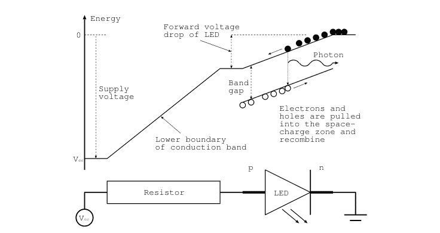

图3.2 LED的物理原理。

区域，前提是电压高于二极管的压降。这种情况与图2.13中遇到的情况相反，那里二极管是反向偏置的。正向偏置LED的简化能带图和相应电路如图3.2所示。我们只显示了二极管内导带的下边界和价带的上边界。在这里，电子和空穴都被拉入空间电荷区，并有机会复合。电子从导带跃迁到价带时释放的能量以光子的形式发射出来。请注意，LED的正向压降大约等于带隙的大小，电阻用于限制电流。发射不同颜色的LED具有不同的带隙，相应地，具有不同的正向压降，其中较短的波长对应较大的带隙。

如图3.1和3.2所示，LED通过两根导线连接到电路，短的那根是阴极，需要接地或连接到更负的电位。阴极通常由半球形外壳的扁平面指示。另一根导线是阳极，连接到更正的电位，前提是希望LED点亮。但简单地将LED连接到电源轨很可能会损坏二极管。我们需要将电阻与二极管串联，如图3.1中间和右侧所示。大多数LED的压降$V_d$在1.5到3V之间，其中较低值适用于红色和红外LED，较高值适用于蓝色和紫外LED。此外，二极管的典型工作电流必须限制在$I = 20$ mA以下的某个值。因此，电阻需要根据$R > (V_c - V_d)/I$来选择，其中$V_c$是电源电压。因此，一个红色LED在$V_c = 5$ V时，使用$R = 180 \Omega$或$220 \Omega$，甚至更大的电阻值（我选择了常用值中较大的电阻）工作良好。通常电阻值不是非常关键；如果选择太大，LED只是亮度降低。

为了动态改变亮度，改变电阻值相当不方便。更好的方法是以远快于人眼能分辨的速率（通常在kHz范围内）快速开关二极管。改变开与关时间的占空比可以按比例改变LED的亮度。这种方法的额外好处是，称为*脉宽调制*，其耗散的能量也按相同比例减少。

如果LED或任何其他脉宽调制设备需要与控制电子设备进行电气隔离，我们使用光耦合器。这是一个小型集成电路，由一个LED和一个光电晶体管组成。如第2.1.3节所述，光电晶体管的行为类似于具有高电流放大系数的普通晶体管，但不是将电流注入晶体管的基极，而是LED照亮晶体管中电荷耗尽的区域，并产生大量的电子-空穴对。因此，晶体管变为导通状态，并在电路的“另一侧”打开一个设备，而无需电气连接。这意味着只有开或关状态或数字信号通过光耦合器传输。通常，当位于不同电位的设备需要开关，或防止来自“另一侧”的电气干扰时，会使用它们。我们顺便注意到，乐器之间的MIDI通信在其各自的输入端使用光耦合器。这消除了电气干扰，并保护音乐家免受电击。

到目前为止，我们只开关了LED，但接下来我们将研究如何控制大电流和负载。

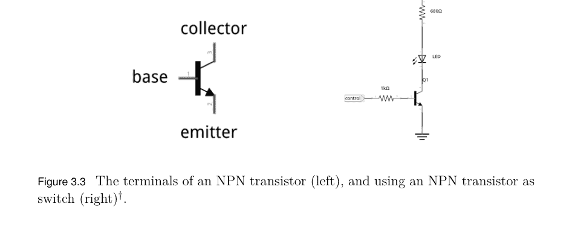

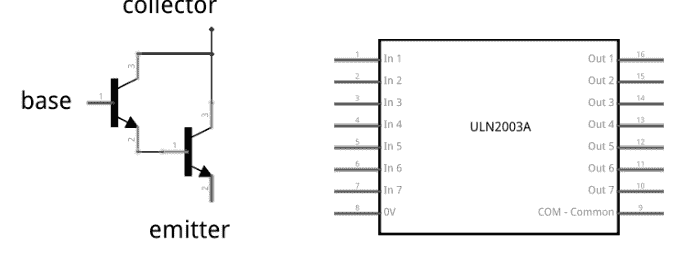

图3.4 两个NPN晶体管连接成达林顿对（左）和ULN2003达林顿阵列（右）†。

## 3.2 电机

电机通常将化学能或电能转化为机械能，通常是通过旋转轴来提供扭矩。在此及后续章节中，我们仅讨论电动机。电动机种类繁多，可由交流或直流电压驱动。其中最常见的一种，也是我们将要使用的，是带有换向器的传统直流电机。

### 3.2.1 直流电机

直流电机的工作原理最容易借助图3.6来解释。它基于一个在空间中静止的静磁场，即*定子*，以及一个或多个由外部电压源电激励的线圈。通过在旋转过程中同步反转激励电压的极性，迫使线圈旋转。旋转部分称为*转子*，同步开关则是*换向器*。转子上的扭矩由电流中的电子在外部磁场中受到的洛伦兹力提供。旋转半圈后，外部磁场的极性变得“错误”，无法继续推动线圈旋转，反而会阻碍旋转。通过在恰当时刻反转流经线圈的电流极性，可以防止这种情况发生，从而使旋转得以继续。极性反转由换向器实现，图中显示为两个在外部固定电极（称为*电刷*）之间旋转的D形物体。此外，反转供电电压会使电机向相反方向旋转。

电刷与换向器之间的滑动接触有时会在极性反转瞬间产生火花，因为电刷会短暂地连接两个D形物体，从而造成供电电压短路。火花随后会引起电气干扰，通过在电刷两端连接一个小电容（例如100 nF）可以部分缓解这种干扰。这也能减少伴随直流电机运行而产生的、具有特殊气味的臭氧的生成。在市售电机中，这些影响已被最小化，并且采用了其他电机设计来规避这些缺陷。例如，在一些*无刷直流电机*中，转子的磁场由永磁体提供，其位置通过霍尔传感器持续监测。该信息被用于电子控制单元，以周期性地激励定子线圈中的电流，从而维持旋转。控制单元的复杂性使得这类电机超出了本书的范围，尽管存在缺点，我们仍在项目中使用普通的直流电机。

我们可以通过改变施加在线圈上的电压来调节电机的扭矩和转速。电压越高，电机转速越快，而合理的电压值由线圈的电阻决定。然而，通常限制电压并控制流经线圈的电流更为有利。此外，由于转子因其质量而具有有限的惯性，我们可以使用脉宽调制来控制输送到线圈的总功率，从而调节扭矩和转速。在电流不流动的短暂瞬间，惯性维持着旋转。

如果你有模型铁路，你可能知道在早期，火车的速度是通过可变变压器调节的，当电压过低无法可靠地激励线圈时，让火车以非常慢的速度运行是非常困难的。现代模型铁路控制器使用脉宽调制来调节速度。这样，完整的供电电压和电流始终在流动，可靠地激励线圈，只是并非持续不断。现在以慢速运行火车要可靠得多。

在此背景下，我们必须记住，快速开关线圈也会快速改变磁场，这会产生一个电压，即反向电磁力，或称*反电动势*，它与驱动电压相反。因此，电机转速越快，反电动势降低的电压就越多，从而也减少了流经线圈的电流。这导致扭矩减小，对于给定的线圈电阻，我们可以选择以较慢的速度运行，或者增加驱动电压以维持所需的扭矩。

与模型火车一样，我们也希望电机能够正向和反向运行。因此，我们需要控制供电电压的极性。我们不采用手动反转供电线（这不太方便）的方式，而是使用H桥，其功能很容易借助图3.7来解释。图中央是一个直流电机，其供电引线向两侧延伸。单极性供电电压连接到标有V+的上端子和地。根据开关A、B、C和D的位置，电流流过电机。如果A和D接通，电流从左向右流动，如虚线和电机内小箭头所示的旋转方向所示。如果B和C接通，而A和D断开，电流则反向流动，导致电机也向相反方向旋转。因此，通过适当地切换四个开关，我们可以随意调整电机的旋转方向。我们只需确保在给定时刻只有A和B中的一个开关接通，否则供电电压会短路。

当然，我们可以用晶体管代替开关，从而得到一个易于由微控制器控制的系统。情况变得更加简单，因为现成的实现H桥的集成电路已经可用。L293D就是其中之一，我们将在后续章节中使用它来控制电机。最后，我们通过脉宽调制添加速度控制。我们可以在上端子和供电电压之间添加一个开关晶体管，或者直接调制控制开关A、B、C和D的输入端子。

至此，我们可以调节电机的速度和方向，这对于从一个地方移动到另一个地方以及移动的速度至关重要。另一方面，如果我们只想改变位置或角度一小部分，例如船的舵，我们需要的是直接调节位置而非速度的方法。接下来我们讨论两种实现此目的的系统：伺服电机和步进电机。

### 3.2.2 伺服电机与模型舵机

术语 *servo* 指的是将电机与位置编码器结合在 *闭环* 反馈（或伺服）回路中使用 [21]。在此回路中，电机速度被持续调整，以减小编码器报告的期望位置与实际位置之间的差异。这类伺服电机常用于工业应用，需要配备PID控制器 [21] 和功率驱动电子设备的复杂控制系统。伺服电机用于大型工业机器人和需要高定位精度的应用中。将控制器参数调整到控制回路在精度、速度和可接受超调量方面的期望性能，需要专家关注，超出了本书的范围。

因此，我们使用伺服电机的简易版本——*模型舵机*，通常简称为 *舵机*，如图3.8所示。它常见于遥控汽车和飞机，但也可能出现在机器人应用中，例如控制小型机械臂的位置或角度。舵机在旋转轴上安装了一个电位器，用作编码器。它提供轴的位置信息，其旋转范围通常为0–180度。电阻值与一个对应于期望位置的电信号所衍生的电压进行比较。差值信号被放大，并用于驱动直流电机向最小化差异的方向转动。这构成了一个简单的比例控制器。通常，电机轴与输出轴之间的一个小型减速齿轮箱会降低速度，但提高了控制精度和扭矩。请注意，舵机通过三根线与外部连接。其中两根线是地线和电源电压（标称4.8V），颜色分别为黑色和红色。第三根线（许多情况下为黄色或白色）承载关于期望位置的信息。

关于期望位置的信息以脉宽调制信号的形式传输给舵机，如图3.9所示。舵机期望接收间隔为20毫秒的脉冲序列。每个单独脉冲的持续时间在1到2毫秒之间，其中1.5毫秒的持续时间指定中间位置。使用微控制器可以轻松产生这种脉冲模式，我们将在后续章节中实现。

伺服电机和舵机使用闭环系统来实现高定位精度，而步进电机则无需闭环反馈即可实现这一点。

### 3.2.3 步进电机

步进电机通过小的离散步进改变轴的角位置，因此通过计算步数即可得到位置。这样，无需反馈或伺服机构即可实现高重复性，电机可以开环运行。

在图3.10中，我们说明了永磁步进电机是如何实现这一点的。电机的静止部分由一个铁轭和四个线圈组成，其中两个线圈串联工作。这里，标记为A和B的上下线圈，以及标记为C和D的左右线圈，就是这样的两对。转子上组装了数量适中的永磁体。图中我们只使用了六个磁体，标记为1到6，黑色端表示北极。它们径向排列，极性交替。

我们假设最初只有线圈A和B被激励，使得上线圈表现为磁北极，下线圈表现为南极。在这种情况下，磁力线穿过上下两个线圈，穿过转子中的磁体，并通过周围的轭返回。在这种线圈激励下，转子确实如图3.10所示定向，因为上线圈表现为北极，吸引标记为1的上部永磁体的南极。因此，它们尽可能靠近。对于下线圈和标记为4的磁体，情况正好相反。为了使转子逆时针旋转30度，我们必须关闭线圈A和B，并开启线圈C和D。这样，右侧的线圈C是北极，吸引标记为3的永磁体（其南极朝外）。同样，左侧的线圈D和磁体6的情况正好相反。转子将移动直到磁体6面对线圈D。我们继续通过关闭线圈C和D，并反转线圈A和B的极性（使上线圈表现为南极，吸引磁体2）来转动转子。以此类推，我们发现可以通过周期性地按以下模式激励线圈，使电机以每次30度的步数转动：

```
terminal a: 1000 1000 1...
           b: 0010 0010 0...
           c: 0100 0100 0...
           d: 0001 0001 0...
```

其中时间从左向右流动。这里，1表示端子连接到正电源电压，0表示线圈连接到地电位。反向执行该序列会使电机向相反方向转动。观察时间槽1和3显示线圈A和B的极性反转，这意味着我们需要一个H桥来实现极性反转。我们将在第4.5节回到这个实现。

更仔细地分析端子a到d的激励模式是有启发性的。第一个观察是，四个时间槽的序列会一遍又一遍地重复。其次，我们观察到一个基本模式是端子a以序列1000被激励。端子b的激励向右移动了两个时间槽，如果我们假设360度对应四个时间槽，我们可以将其解释为180度相位差。同样，端子c和d与端子a的激励分别有90度和270度的相位差。当我们编写自己的步进电机驱动器并讨论电机的其他运行模式（如半步和微步模式）时，这种解释将被证明是有用的。

请注意，在激励模式中，一次只激励一个线圈。但我们也可以同时激励两个线圈来运行电机，一个线圈拉动一个永磁体，另一个线圈推动另一个磁体。这样，电机的扭矩可以增加约40%，但代价是所需功率加倍，因为同时有两个线圈被激励。增加扭矩的模式基于基本序列1100。应用上述四个端子之间的适当相位，我们得到以下激励端子的模式：

```
terminal a: 1100 1100 1...
           b: 0011 0011 0...
           c: 0110 0110 0...
           d: 1001 1001 1...
```

我们看到端子b到d的激励相对于端子a分别移动了2、1和3个时间槽。一个特别需要注意的点是，同时激励两个线圈会导致永磁体指向的位置位于线圈之间，而不是直接面对线圈。既然我们现在有了磁体指向线圈的单线圈激励模式，以及磁体指向线圈之间的双线圈激励模式，我们可能会考虑将两种模式结合起来……并发现通过交错单线圈和双线圈激励模式的步骤，我们获得了一个步长减半的序列。这种运行模式称为半步模式。我们需要激励线圈的模式如下：

```
terminal a: 11100000 11100000 1...
           b: 00001110 00001110 0...
           c: 00111000 00111000 0...
           d: 10000011 10000011 1...
```

其中周期长度为8个时间槽，基本激励模式为11100000。端子b的激励序列是基本序列移动了半个周期长度，即四个时间槽，或180度。请注意，这里的360度对应八个时间槽。端子c和d的序列分别移动了两个和六个时间槽。

注意一般模式：端子a和b由类似余弦的序列激励，这通过计算施加到线圈A和B的电压（即a-b）可以明显看出：

a - b = 1 1 1 0 -1 -1 -1 0

这无疑是对余弦的一个粗略近似。同样，施加到线圈C和D的电压是c-d：

c - d = -1 0 1 1 1 0 -1 -1

这也是对正弦的一个同样粗略的近似。显然，施加到线圈对的信号大致遵循余弦和正弦类的激励。很容易看出我们如何推广这一点，并使用更好的余弦和正弦类线圈激励近似，这被称为电机的 *微步* 控制。

在微步模式下，转子上的永磁体被移动到线圈之间的几个中间位置。这种更精细的控制是以需要更先进的驱动器为代价的，该驱动器需要以比简单开关更精细的步进来控制输出电流。这种驱动器的一个例子是DRV8825电路，它只暴露很少的控制引脚用于方向和步进，以及选择使用哪种微步模式。在内部，它生成施加到线圈的电流的适当激励模式。

在上面的例子中，步进电机只使用了六个永磁体，导致每步角度增量为30度，或每转12步，但很容易看出我们可以增加磁体数量以显著减小步长。商用电机的典型步长为每转200或400步。

这里我们需要指出，将一相分配给线圈端子a和b，另一相分配给端子c和d只是一种惯例，一些制造商在查看图3.10中的电机时，更喜欢按顺序枚举线圈和相关端子。这相当于交换端子b和c的标签，并意味着我们可能需要交换驱动器电路到电机的两根电缆才能使其转动。最好检查电机的数据手册，以确定该特定电机使用的是哪种惯例。

此外，步进电机带有不同数量的连接电缆，这些电缆暴露线圈的端子。在图3.11左侧，描绘了所有八个端子都暴露的情况。有时中心抽头在内部连接，这种情况下只暴露四个端子，这对应于本节前面讨论的情况。在右侧，中心端子在内部连接并暴露，这种情况下暴露的导线总数为六根。如果两个中心连接在内部连接，则暴露五根导线。通常，暴露的导线有颜色编码并在数据手册中标识，但测量暴露导线之间的电阻可以让我们通过实验确定电机的内部接线。

在前面的步进电机示例中，我们总是反转线圈激励的极性，这需要带有H桥的驱动电路。然而，步进电机也可以在单极模式下无需H桥运行。在图3.12中，我们展示了一个单极步进电机的连接，其中线圈的中心抽头连接在一起，如前一段所述，并且只暴露一个连接到正

## 3.3 模拟电压

产生恒定电压的一种简单方法是对脉宽调制输出电压进行低通滤波。滤波器可以减少开关变化，产生一个平均电压电平，该电平等于峰值电压乘以脉宽调制的占空比。改变占空比将产生随时间变化的输出电压。然而，这种方法存在局限性，主要在于输出电压的质量，它可能残留原始调制带来的一些纹波。

一种更可靠的方法是使用*数模转换器*（DAC），这是一种将给定长度（如8位或12位）的数字字转换为离散电压的设备，分别具有256或4096个中间电平。其工作原理如图3.13所示，这是一个使用$R-2R$电阻网络和运算放大器的4位DAC。标记为bit3到bit0的开关代表数字输入字，运算放大器的反相输入端对通过切换相应开关而增加的电流进行求和。反相输入端是一个虚地，因为运算放大器使其电位与同相输入端相同。这意味着流过所有电阻的电流是恒定的，并且与开关的位置无关；如果开关处于位置0，电流流向真实地；如果处于位置1，则流入虚地。这意味着电压$V_3, \dots, V_0$是恒定的，并且由$V_{k-1} = V_k/2$给出，这对于$V_1$和$V_0$很容易看出。最右边两个阻值为$2R$的电阻并联组合成一个阻值为$R$的电阻。但这意味着$V_0$节点夹在两个阻值为$R$的电阻之间，其中一个连接到电压为$V_1$的点，因此$V_0 = V_1/2$。由于所有电压$V_n$都是固定的，因此流入运算放大器反相输入端的电流（假设第$k$位被设置）由$V_k/2R$给出，其中$V_k = V_{ref}/2^{3-k}$。来自四个支路的所有电流相加，运算放大器将电流转换为输出电压$V_{out}$。

大多数DAC使用$R-2R$梯形电阻网络和电流求和运算放大器，但增加了一个数字前端，该前端包含由并行总线、I2C或SPI控制的半导体开关。后者的例子是MCP4921，一个通过SPI兼容接口控制的12位DAC。

## 3.4 周期性信号

有时电路需要周期性地开关或以其他方式受到周期性信号的激励。在集成电路出现之前，非稳态多谐振荡器被用于此目的。图3.14左侧显示了一个基本示例。在任何时刻，两个晶体管中只有一个导通。在$T_1$导通之前的时刻，电容器$C_1$的左极板已通过$R_{c1}$充电，使其比右极板更正。但当$T_1$开始导通时，$C_1$通过$R_{b2}$放电，直到$T_2$的基极电压超过其开始导通的电压并放电$C_2$。此时，两个晶体管和电容器的角色互换。两种状态都不稳定，导致输出电压振荡。如果连接到晶体管基极的两个电阻$R_{b1}$和$R_{b2}$以及两个电容器$C_1$和$C_2$相等，则输出信号的振荡频率近似由$f \approx 0.7/R_{b1}C_1$给出。如今，分立元件电路在很大程度上已被专用芯片取代，例如广泛使用的NE555，它最近庆祝了其五十周年。它只需要很少的外部元件就能在很宽的频率范围内产生周期性输出信号。

大多数现代微控制器以如此高的时钟速率运行，使得在软件控制下切换输出引脚成为一个方便的选择。我们将在后面的章节中回到这个可能性。另一方面，如果需要矩形信号以外的信号，我们可以求助于*直接数字合成*。它基于用存储在控制器内存中的整数值表来近似所需的波形——假设它是正弦波——并将这些值依次传递给DAC。为了降低频率，我们在输出表中的下一个值之前等待一会儿。为了提高频率，我们跳过中间的采样点。对于低频率，这在软件中很容易实现。幸运的是，对于多MHz范围内的频率，现成的电路是可用的，例如AD9850，它可产生高达40 MHz的正弦和矩形输出。安装在分线板上，如图3.14右侧所示。AD9850的编程基于带有始终和数据线的同步串行协议。

我们到目前为止讨论的模拟信号、开关和电机可能是最常用的执行器，但还有其他执行器，我们将在下一节中考虑其中的一部分。

## 3.5 其他执行器

为了开门或在定义明确的端点之间移动设备，使用*电磁铁*。它们使用带有周围磁线圈的软铁芯，其电流被开启或关闭。从概念上讲，它们与LED没有太大不同，只是所需的电流要高得多，这需要更大的电源。此外，电磁铁是一个大的感性负载，关闭它会产生大的反电动势，需要大的续流保护二极管，正如我们在第3.1.2节讨论继电器和直流电机时所讨论的那样。

液体和气体的流动可以用泵和阀门来控制。泵通常基于驱动桨轮、螺旋桨或涡轮的电机，将液体或气体从低压区域移动到高压区域。电机的控制方式与之前讨论的相同。流量由阀门控制，阀门限制介质流过的孔径。一个例子是蝶阀，如图3.15所示。孔径可以通过阴影孔径来限制，该孔径与管道的内径相同。旋转阴影孔径可以调节流量，从完全关闭（此时阴影孔径覆盖管道的整个内径）到完全打开（此时它垂直于液体或气体的流动）。为了改变其状态，对于较小的系统，我们可以使用伺服电机，对于步进电机，或者在需要限制石油管道中的流量时使用大型伺服电机。

控制大型机械的常用手段是使用液压，基于控制液压油的流动。它使用泵将油移动到气缸中以产生线性行程，或者将其泵送通过基于涡轮或螺旋桨的装置以产生旋转运动。在这两种情况下，原始压力都由基于电动机的泵提供。阀门的位置也由我们在本章前面讨论的相同设备控制。

最后，我们可以将人类视为更大系统的一部分，他们需要被驱动。为此，我们可以使用各种吸引注意力的设备，如压电蜂鸣器、警报器和扬声器，以及包括LED、NeoPixel彩色LED、液晶显示器或小型显示器（如打印机或洗衣机上报告设备当前状态的显示器）在内的光学设备。

到目前为止，我们已经涵盖了相当多的执行器和传感器，可以打开事物、移动它们并测量许多物理量。下一个任务是将这些种类繁多的传感器和执行器及其众多的接口连接起来，并提供一个标准化的接口与外部世界通信。这是微控制器的任务，我们将在下一章讨论的类型是Arduino和ESP。

## 问题与项目想法

1.  续流二极管的目的是什么？什么时候需要它？
2.  一旦打开直流电机，电视图像就会严重干扰。原因是什么，如何缓解这个问题？
3.  如果需要直流电机在低速下运行，如何控制其速度？

## 4. 何时需要使用H桥驱动器来控制直流电机？

5.  你能使用达林顿驱动器（例如ULN2003）通过脉宽调制来控制直流电机吗？

6.  何时使用直流电机，何时使用模型舵机是更好的选择？请讨论！

7.  使用万用表测量步进电机各线之间的电阻，并识别其内部接线。

8.  讨论使用单极性与双极性步进电机的优缺点。

9.  讨论微步进，并绘制线圈电流随时间变化的函数图。

10. 我们计划通过对脉宽调制信号进行低通滤波来控制一个设备。控制电压的纹波如何取决于设备的输入阻抗？电容在其中起什么作用？如果我们计划施加快速变化会发生什么？请讨论！

11. 调查什么是*晶闸管*以及它用在何处。

12. 调查什么是*双向可控硅*以及它用在何处。

13. 调查什么是*IGBT*以及它用在何处。

14. 设计一个小型起重机，将货物从模型船上吊到码头上。你需要哪些执行器和传感器？说明使用它们的理由。

15. 设计一个几乎能确保唤醒你的机构。你使用哪些执行器，为什么？

# 微控制器：Arduino

本书中使用的微控制器都受到Arduino *集成开发环境*（IDE）的支持，该环境提供了一个易于使用的编程环境，使我们能够快速开始开发软件。虽然存在一些限制，但它是一个学习微控制器的绝佳系统。

## 4.1 硬件

最初的Arduino基于Atmel微控制器，我们主要讨论Arduino UNO。后来，基于内置WLAN支持的ESP8266和ESP32微控制器的其他系列控制器也被集成到Arduino IDE中。因此，这些控制器可以像UNO一样进行编程。但让我们从UNO开始。

### 4.1.1 Arduino UNO

Arduino UNO如图4.1所示，其主要组件是来自Atmel（现为Microchip™）的ATmega328p微控制器，即图中带有28个引脚的大芯片。它是一个具有8位宽寄存器的控制器，以16 MHz的时钟频率运行。它拥有32 kB的RAM内存和1 kB的非易失性EEPROM内存，可用于存储需要在电源关闭和打开后仍然保留的持久数据。板上有三个定时器，本质上是计数时钟周期的计数器，可编程为在计数器达到某个值时执行某些操作。UNO通过13个数字输入输出（IO）引脚与其环境交互，其中大多数引脚可配置为输入或输出，并具有软件可配置的上拉电阻。多个引脚可配置为支持I2C、SPI和RS-232通信。此外，还有六个模拟输入引脚。它们测量高达5V电源电压的电压。可选地，内部参考电压源提供1.1V的参考电压。所有数字和模拟引脚都连接到Arduino印刷电路板（PCB）两侧可见的引脚排针上。此外，内置的硬件RS-232端口连接到一个RS-232转USB转换器，允许与主机计算机进行通信和编程。UNO板上没有WiFi、蓝牙或以太网支持，但可以提供扩展板，即所谓的*扩展板*，直接安装在引脚排头上以提供这些功能。

可以将Arduino UNO描述为具有洗衣机的智能。它用定时器计时，可以感知来自例如温度传感器的电压，并且可以根据是否满足某些条件来打开或关闭电机或泵。通过这种方式，它还可以提供粘合逻辑，将传感器（模拟、I2C、SPI和其他）连接到主机计算机，这正是我们稍后将使用UNO的模式。顺便提一下，Arduino板有多种选择，从尺寸较小的*Micro*和*Nano*，到具有大量IO引脚的*Mega*，再到具有更强大CPU和内置无线接口的*MKR*、*RP2040*和*Portenta*板。

然而，在下一节中，我们将讨论另一组微控制器，即ESP8266和ESP32。

### 4.1.2 ESP8266、NodeMCU和ESP32

ESP8266由中国公司乐鑫于2014年发布，随后是2016年的ESP32。这些控制器迅速成为物联网（IoT）项目中最令人兴奋的平台之一，因为它们内置了开箱即用的WiFi支持，包括一个小型贴片天线。乐鑫的软件开发工具包（SDK）很快被集成到Arduino IDE中，如今ESP8266和ESP32可以像原始Arduino一样轻松地使用Arduino生态系统进行编程。

但现在让我们看看ESP8266硬件，它有不同的版本。我们不仅将关注更复杂的NodeMCU板，还将在本节中提及基本的ESP-01。ESP-01和NodeMCU硬件的图像分别显示在图4.2的左侧和中心。两个芯片上的微控制器本质上是相同的，只是路由到电路板引脚的内部引脚数量不同。在内部，ESP8266芯片具有32位RISC CPU，通常以80 MHz或160 MHz运行，并拥有64 kB的指令RAM和96 kB的数据RAM。有16个通用IO（GPIO）引脚，可配置为输入或输出引脚，以及一个具有10位ADC的模拟输入。控制器支持I2C和SPI通信以及RS-232。所有这些都与Arduino类似，只是它运行得更快，内部寄存器更宽（ATmega中为32位而不是8位），但真正酷的特性是内置的WiFi支持。它符合IEEE 802.11 b/g/n规范，支持WPA认证，这是当今大多数无线网络使用的标准。因此，基本上，我们可以将ESP8266连接到任何无线网络。

在ESP8266发布两年后，更强大的双核ESP32微控制器问世。它实际上具有早期型号的所有功能，包括WiFi，但运行时钟速度更高，最高可达240 MHz，拥有320 kB的RAM，并且板载支持蓝牙（BLE）。对于数据采集应用特别有吸引力的是多达十八个12位ADC通道和两个八位数模转换器（DAC）。近年来，出现了许多具有不同核心数量和其他功能的ESP32变体。

在介绍了硬件之后，我们需要继续前进并开始编程。因此，我们在下一节中为Arduino IDE提供一个快速入门指南。

## 4.2 入门

尽管有新的Arduino IDE版本2可用，但我们建议使用最新的版本1，即撰写本文时的1.8.19版本，因为后续章节中需要的一些功能在版本2中尚不可用。两个版本都可以从[https://www.arduino.cc/en/software](https://www.arduino.cc/en/software)获取，适用于最常见的操作系统，包括Linux、Mac和Windows。基本上，我们访问该网页，选择适合我们计算机类型的版本，然后下载软件包。然后，我们按照网站上给出的说明进行安装。安装完成后，我们通过点击图标启动IDE，或者通过在命令行中输入`arduino`然后按`Enter`来启动，这应该会打开IDE并显示一个类似于图4.3所示的窗口。如果没有，请通过从“文件”菜单中选择“新建”来创建一个“新建”草图，这是Arduino程序的名称。

在这里，我们已经看到了Arduino程序（或同义词“草图”）的一般结构。有一个`setup()`函数，它在电源打开后*执行一次*。在此例程中完成所有初始化工作，例如定义引脚为输出或输入，以及配置串行线路。一旦`setup()`函数完成，`loop()`函数就会被重复调用，这样一旦它完成，它就会再次被调用，如此往复，直到电源关闭。请注意，Arduino IDE支持的编程语言与C语言非常相似。但是，有许多扩展可以提供对特定硬件的访问，例如ADC。

## 4.3 HELLO WORLD，BLINK

现在，我们将Arduino UNO连接到运行Arduino IDE的主机电脑的任意USB端口，并从“工具→开发板”菜单中选择Arduino UNO。这一步告诉IDE编译器将为哪个处理器生成代码，以及一些硬件特定的定义，例如我们在编程时可以使用的IO引脚名称。此时，IDE“知道”硬件是什么，但我们仍需告诉IDE UNO连接到了哪个USB端口。我们在“工具→串口”菜单中完成此操作，通常UNO连接的串口会自动出现并可被选中。在Linux系统上，这通常是`/dev/ttyUSB0`或`/dev/ttyACM0`。在Windows电脑上，则是`COMx`，其中`x`是某个数字。

此时，我们就可以开始为UNO编程了，尽管图4.3中的示例程序只包含空函数。但在为Arduino编写程序之前，我们想先安装基于ESP8266微控制器的支持文件。安装很简单：打开“文件→首选项”菜单，在“附加开发板管理器网址”文本框中添加`http://arduino.esp8266.com/stable/package_esp8266com_index.json`，然后点击“确定”按钮。接着，打开“工具→开发板”菜单，打开“开发板管理器”，找到“esp8266”平台。然后选择最新版本并点击“安装”按钮。安装完成后，从“工具→开发板”菜单中选择“ESP826 Boards”平台。对于ESP-01，“Generic ESP8266 Module”条目是一个不错的选择；对于NodeMCU平台，则是“NodeMCU 1.0”。

安装ESP32处理器的支持遵循相同的流程。我们用逗号分隔，将以下地址`https://raw.githubusercontent.com/espressif/arduino-esp32/gh-pages/package_esp32_index.json`添加到“文件→首选项”菜单中的“附加开发板管理器网址”文本框。然后，我们打开“工具→开发板”菜单，搜索“esp32”平台，并安装最新版本，这可能需要一点时间。完成后，我们从“ESP32 Boards”子菜单的列表中选择型号——图4.2右侧所示的是“ESP32 Dev Module”。

一旦选择了正确的平台（UNO、普通ESP8266、NodeMCU或ESP32）——我们将默认假设连接的是UNO——我们就可以编写程序（sketches）并将其下载到硬件了。

我们的第一个sketch几乎是所有新控制器的标准程序，即让一个LED闪烁。可以在“文件→示例”菜单中找到接口硬件（如传感器）的示例，其中让LED闪烁的示例位于“01.Basics→ Blink”菜单项下。选择后，一个包含示例代码的新窗口会打开。图4.4展示了原始代码，省略了许多以`//`开头的注释行。代码如下：

```
void setup() {
  pinMode(LED_BUILTIN, OUTPUT);
}
void loop() {
  digitalWrite(LED_BUILTIN, HIGH);   // turn the LED on
  delay(1000);                       // wait for a second
  digitalWrite(LED_BUILTIN, LOW);    // turn the LED off
  delay(1000);                       // wait for a second
}
```

让我们逐行分析这个sketch。在`setup()`函数中，我们调用`pinMode(Pin,What)`函数，它声明名为`LED_BUILTIN`的引脚（在UNO上是引脚13）将被用作输出引脚。这就是我们在`setup()`函数中所做的全部初始化工作。在`loop()`中，我们调用`digitalWrite(Pin,State)`，如果请求的状态是HIGH，它会使控制器在指定引脚上输出5V；如果请求的状态是LOW，则输出0V。后者发生在两行之后。在输出引脚状态改变之间，我们通过`delay(time_in_ms)`函数告诉控制器等待指定的毫秒数。因此，`loop`函数所做的就是打开引脚13上的LED，等待1000毫秒或1秒，关闭它，再等待1秒，然后重新开始。请注意，所有命令都以分号结尾，这是C语言的惯例。

一旦我们对程序满意，就可以编译它，检查语法是否正确，并确保没有遗漏任何分号。点击“文件”菜单项下方的对勾符号会编译程序，并在程序窗口下方的状态窗口中报告进度。如果编译没有错误完成，并且UNO板已连接到USB端口，并在“工具→串口”菜单项中被选中，我们可以通过点击编译按钮右侧的→按钮将程序下载到UNO。几秒钟后，UNO板上的一个小LED应该开始每秒闪烁一次。现在，我们可以更改sketch中的延迟时间，重新编译并下载，观察LED是否按照新指定的时间闪烁。

这里我们只使用了很少的命令，如`pinMode`或`digitalWrite`，但还有更多命令，查看Arduino网站https://www.arduino.cc/reference/en/上的参考部分非常有启发性。此外，点击不同的命令会打开一个新页面，其中包含如何使用这些函数的解释和示例。另一个智慧源泉是https://www.arduino.cc/顶部菜单列表中的“Documentation”选项卡，它提供了大量的教程和示例。记住这些资源将帮助我们快速找到信息，使事情顺利进行。此外，还有大量关于各种Arduino项目的书籍，以及技巧和窍门的汇编，例如[22]。

在迈出让微控制器听从我们指挥的第一步后，我们继续前进，开始读取传感器。

## 4.4 传感器接口

在这里，Arduino微控制器的主要任务是读取具有不同、通常很独特的接口的传感器，并将测量值转换为标准表示形式，然后传递给主机电脑。我们从最简单的传感器开始，一个按钮或开关。

### 4.4.1 按钮

在图4.5中，我们展示了如何将按钮连接在Arduino的地线和引脚2之间，使得按下按钮会导致引脚2读取到0V或LOW。下面的代码清单展示了一个sketch，如果按下按钮，它会使引脚13上的内置LED亮起。

```
// button_press, V. Ziemann, 161013
void setup() {
  pinMode(2,INPUT_PULLUP);   // button, default=HIGH
  pinMode(13,OUTPUT);          // LED
}
void loop() {
  if (digitalRead(2)==LOW) {
    digitalWrite(13,HIGH);
  } else {
    digitalWrite(13,LOW);
  }
  delay(10);
}
```

该程序遵循在**setup()**函数中初始化硬件的常规模式。我们首先声明引脚2是输入引脚，并启用内部上拉电阻，这会在没有按钮按下时在引脚上产生一个明确的“高”状态。带有LED的引脚13被声明为输出，这样我们就可以在sketch中控制它的开关。在**loop()**函数中，我们通过调用**digitalRead(Pin)**函数检查按钮的状态，并测试引脚2是否为LOW。如果是这种情况（注意比较中的双等号`==`），则通过调用**digitalWrite(13,HIGH)**打开引脚13上的LED。如果发现引脚2不是LOW，则通过**digitalWrite(13,LOW);**关闭引脚13上的LED。注意花括号`{`和`}`以及它们在**if (..) { } else { }**结构中用于定义代码块的作用。在**if**语句之后，一个短暂的**delay()**确保忽略机械按钮的抖动，并让处理器有时间处理其内部事务。这不是绝对必要的，但是一种良好的风格。

检测指示门窗开关状态的传感器遵循完全相同的模式，我们可以检测多达13个不同的开关（如果我们不使用引脚13上的LED），并以某种方式做出反应。

### 4.4.2 模拟输入

在前面的章节中，我们了解到某些传感器需要我们测量模拟电压，因为它们会改变自身的电阻。我们将它们置于分压电路中，然后读取中心抽头上的电压变化，如图2.1左侧所示。其他传感器，如LM35温度传感器，则直接产生电压。在本节中，我们将展示如何将这些传感器连接到Arduino。首先，我们想从其中一个模拟输入引脚测量电压；这里我们使用A0。图4.6左侧展示了如何将电位器作为可变分压器连接到Arduino。电位器的一端接地，另一端接电源电压，而电位器的滑动端（可变抽头）连接到A0引脚。转动电位器的轴会使中心抽头上的电压在接地和5V电源电压之间变化。接下来是读取电压并通过串行电缆（连接到USB端口）将结果报告给主机计算机的程序代码。

```cpp
// 模拟与串行通信，V. Ziemann, 161130
int inp,val;
void setup() {
  Serial.begin(9600);  // 波特率
}
void loop() {
  if (Serial.available()) {
    inp=Serial.read();          // 从串行端口读取字符
    val=analogRead(0);          // 读取模拟值
    Serial.print("Value is ");  // 并报告回来
    Serial.println(val);
  }
  delay(50);                    // 等待50毫秒
}
```

由于我们想临时存储整数值，必须为变量分配内存，这通过包含 `int inp,val;` 的行完成，它声明了两个名为 `inp` 和 `val` 的整型变量。在 `setup()` 函数中，我们声明要使用内置的串行（RS-232）硬件端口，速度为9600波特，大约每秒1000个字符。串行端口的接收（RX）和发送（TX）线连接到引脚0和引脚1，但也路由到UNO板上的RS232-USB转换器，该转换器连接到主机计算机。在 `loop()` 函数中，我们首先检查是否有来自主机计算机的通信到达，如果有，我们使用 `Serial.read();` 命令读取字符，但不做进一步处理。在下一行，我们使用内置的ADC读取模拟引脚A0，并将值存储在整型变量 `val` 中。10位ADC返回的值是0到1023（= 2^10 - 1）之间的数字，*而不是*电压。稍后我们将展示如何将此值转换为电压。然后通过 `Serial.print()` 和 `Serial.println()` 命令将测量结果通过串行线发送出去。两者的区别在于，前者在消息末尾不发送回车符，而后者会发送。在循环末尾的 `if() { }` 语句之后，再次添加了一个小的延迟。现在我们可以编译并将程序下载到Arduino，除非出现了语法错误。如果出现这种情况，我们需要检查是否缺少分号或拼写错误，特别是命令中间的“驼峰式拼写”和大写字母。需要小心，但IDE使用语法高亮，使得此类错误相当容易发现。所有错误修正后，我们将程序下载到硬件。

一旦程序在Arduino上运行，我们想测试它，为此我们需要访问主机计算机上串行通信通道的另一端。最简单的方法是通过点击Arduino IDE右上角看起来像放大镜的图标来打开“串行监视器”。点击它会打开一个简单的终端程序，顶部有一个输入文本框。确保文本框中的波特率与程序中指定的波特率一致后，我们输入任意字符并按“Enter”。如果一切正常，Arduino应该在输入框下方的文本框中报告一行 `Value is nnnn`。现在转动电位器，输入一个字符后按“Enter”，看看返回的值如何变化。

到目前为止一切顺利，但如果我们能读取更多模拟端口，甚至可以请求读取哪些端口，岂不是更好？这个任务在下面的程序中解决。它与前一个程序非常相似，所以我们只讨论新特性。

```cpp
// 模拟与串行通信，v2，V. Ziemann, 161130
int inp,val;
void setup() {
  Serial.begin(9600);  // 波特率
}
void loop() {
  if (Serial.available()) {
    inp=Serial.read();       // 读取串行线
    if (inp=='s') {
      val=analogRead(0);     // 读取模拟值
      Serial.print("A0= ");  // 并报告回来
      Serial.println(val);
    } else if (inp=='t') {
      val=analogRead(1);
      Serial.print("A1= "); Serial.println(val);
    } else {
      Serial.println("unknown command");
    }
  }
  delay(50);              // 等待50毫秒
}
```

在这个程序中，我们实际上测试了串行线上发送的是哪个字符，并根据它是“s”还是“t”返回模拟引脚A0或A1的值。通过串行线发回主机的字符包含引脚读数和值。如果Arduino收到不同于“s”或“t”的字符，则通过串行线返回字符串“unknown command”。通过这种方式，我们构建了一个简单的查询-响应协议，使Arduino根据我们发送的字符执行不同的操作。

在下一个示例中，我们假设LM35温度传感器以图4.6右侧所示的方式连接到模拟引脚A0。注意，我们在LM35的正电源电压和接地引脚之间添加了一个100 nF电容，以提高电路的稳定性。请注意，在电路中，靠近每个芯片的电源引脚添加此类去耦或旁路电容是良好的实践。在下文中，我们通常不在电路图上显示这些电容，以使它们不那么杂乱，但电容应包含在硬件中。与LM35接口的软件比前面的示例稍微复杂一些。它允许我们向Arduino发送更具描述性的多字符命令，并接收一个回显请求后跟值的响应。基本思想是，我们通过发送参数名称后跟问号来请求一个参数，例如A0，使得请求看起来像这样：A0?。Arduino随后回复A0 <值>。在下面的程序中，我们实现了这一点，但也实现了Arduino首先读取一整行，即在响应之前等待回车符和换行符。

```cpp
// 查询-响应，V. Ziemann, 161013
int val;
float temp;
char line[30];
void setup() {
  analogReference(INTERNAL);  // 1.1V内部ADC参考电压
  Serial.begin (9600);
  while (!Serial) {;}
}
void loop() {
  if (Serial.available()) {
    Serial.readStringUntil('\n').toCharArray(line,30);
    if (strstr(line,"A0?")==line) {
      val=analogRead(0);
      Serial.print("A0 "); Serial.println(val);
    } else if (strstr(line,"A1?")==line) {
      val=analogRead(1);
      Serial.print("A1 "); Serial.println(val);
    } else if (strstr(line,"T?")==line) {
      temp=1.1*100*analogRead(0)/1023;
      Serial.print("T "); Serial.println(temp);
    } else {
      Serial.println("unknown");
    }
  }
}
```

在前几行中，我们声明了变量，特别是用于保存多字符查询的30个字符的缓冲区 `line`。在 `setup()` 函数中，我们使用内部1.1V参考电压作为ADC，并将串行通信通道初始化为9600波特运行。`while(!Serial)` 语句等待串行库初始化完成，仅在某些较新的Arduino上需要。我们包含它只是为了安全。在 `loop()` 函数中，我们等待字符可用，然后读取整行直到行尾字符 `\n`。`readStringUntil` 返回一个 `String`，但我们想使用字符数组，因此需要在附加的 `toCharArray` 方法中转换类型。此时，字符数组 `line` 包含从主机计算机发送到Arduino的请求；例如，`A0?`。接下来的 `if (strstr(line,"A0?")==line)` 及类似命令通过比较数组 `line[]` 中首次出现 `A0?` 的指针与 `line[]` 起始位置的指针，来检查 `line` 是否以字符 `A0?` 开头。如果结果为真，则执行后续命令，否则测试 `else if` 序列中的下一个比较。在示例中，我们测试 `"A0?"`、`"A1?"` 和 `"T?"` 以回复模拟引脚0和1的原始值，或从模拟引脚0转换为摄氏度的值。关于转换系数，请参阅[第2.1.2节](#)的讨论。如果收到一个命令，但不在列表中，Arduino会回复 `unknown command`。这种通过附加问号指定查询以及回复时回显查询后附加值的方式，借鉴了SCPI [23]命令语言，该语言通常用于通过GPIB（也称为IEEE-488）或VXI远程控制测量设备。

作为最后一个示例，我们讨论一个简单的*温度记录仪*，它再次使用图4.6右侧所示的硬件设置，但通过串行线将温度值连续发送到主机计算机。程序如下所示：

```cpp
// 超简单的LM35温度记录仪，V. Ziemann, 161201
float temp;
void setup() {
  analogReference(INTERNAL);  // 1.1V内部ADC参考电压
  Serial.begin(9600);
  while (!Serial) {;}  // 等待串行初始化
}
void loop() {
  temp=1.1*100*analogRead(0)/1023.0;
  Serial.println(temp);
  delay(1000);
}
```

其中 `setup()` 函数与前一个示例相同，但 `loop()` 函数测量模拟引脚并将数字字转换为温度，然后将其发送到主机计算机。然后等待1000毫秒后重复相同操作。在串行监视器中（可通过点击IDE右上角的按钮启动），只要右下角选择框中选择的波特率与程序中指定的波特率匹配，我们就会在下方的文本框中看到摄氏温度值每秒报告一次。

然而，在Arduino IDE中，还有一个图形绘制工具可用。我们通过选择 `工具->串行绘图仪` 菜单项来选择它。这会打开一个窗口，并以图形格式显示串行线上接收到的值，前提是波特率选择与程序中指定的波特率匹配。请注意，`串行绘图仪` 可以同时显示多个测量值作为不同颜色的轨迹。如果需要快速记录一些随时间变化的值，这个内置于Arduino IDE的功能可以作为温度或其他测量值的简单记录仪。

到目前为止，我们已经成功读取了模拟电压，甚至设计了一个简单的协议来将测量值报告给主机计算机。在下一节中，我们将把基于I2C的传感器连接到微控制器，并使用相同的查询-响应协议与主机通信。

### 4.4.3 I2C

我们将继续介绍另一种温度传感器，但这是一个特殊的传感器，被医院的护士使用。它基于一种非接触式温度计，通过将设备指向你的内耳来测量体温。例如，图2.9右侧所示的MLX90614红外温度计。它使用热电堆从接收到的红外辐射中推断温度，并通过I2C接口将温度报告给我们的Arduino。这里我们指出，MLX90614有5V和3.3V供电电压的版本。在本例中，我们使用5V版本，标记为AAA。该设备有四个引脚——请查阅数据手册以了解每个引脚的功能——分别用于接地、供电电压以及I2C线路SDA和SCL。后两个引脚连接到UNO上的A4和A5引脚，因为I2C数据和时钟线路被路由到与模拟引脚A4和A5相同的输出引脚。如果这些引脚用于I2C连接，则不能用于模拟测量。我们在图4.7中展示了如何连接该传感器，并在下面的示例代码中说明如何与之通信。

```
// Read MLX90614 IRthermometer, V. Ziemann, 170717
#include <Wire.h>
const int MLX90614=0x5A;   // I2C address
float getTemperature(uint8_t addr) {  //.....getTemperature
  uint16_t val;
  uint8_t crc;
  Wire.beginTransmission(MLX90614);
  Wire.write(addr);        // address
  Wire.endTransmission(false);
  Wire.requestFrom(MLX90614,3);
  val = Wire.read();
  val |= (Wire.read()<<8);
  crc=Wire.read();         // not used
  return -273.15+0.02*(float)val;
}
void setup() { //....................................setup
  Serial.begin(9600);
  Wire.begin();
}
void loop() {  //....................................loop
  float Ta=getTemperature(0x06);  // address for ambient temp
  float To=getTemperature(0x07);  // address for object temp
  Serial.print(Ta); Serial.print("\t"); Serial.println(To);
  delay(1000);
}
```

首先，我们必须通过包含Wire.h头文件来引入对I2C功能的支持，这也会导致编译器和链接器包含相应的库。在定义了传感器的I2C地址0x5A（我们在数据手册中找到）之后，我们将I2C通信封装在一个名为getTemperature()的独立函数中。该函数接收I2C设备的寄存器地址作为输入参数，借助一系列Wire.*函数调用读取数值，并返回相应的温度，已正确缩放为摄氏度。该设备还返回一个字节，允许我们确定传输错误，但在这个简单的示例中我们不使用该功能。在setup()函数中，我们只初始化串行通信和I2C通信。在loop()函数中，我们使用getTemperature()函数从地址0x06获取环境温度，从地址0x07获取物体温度（如数据手册所述），并将两个温度值（用制表符\t分隔）打印到串行线。然后等待1000毫秒后重复整个过程。我们可以使用Arduino IDE内置的串行监视器或绘图仪来查看或显示结果。

其他几种传感器，通常与湿度或气压等环境参数相关，也会将温度作为副产品报告，因为内部需要它来校准报告的主要测量值。对于下一个传感器HYT-221，这个副产品是湿度。将传感器连接到Arduino的方法如图4.8左侧所示。从数据手册中我们知道，当面向传感器正面时，传感器的四个引脚分别是SDA、GND、VDD和SCL。GND和VDD引脚分别连接到Arduino上的GND和5V引脚，SDA连接到A4，SCL连接到A5，方式与我们在上一个示例中连接温度传感器相同。在下面的示例代码中，我们读取HYT传感器，并通过串行线将湿度和温度的测量数据发送到主机计算机。

```
// HYT221 humidity sensor, V. Ziemann, 161203
#include <Wire.h>
const int HYT=0x28;  // I2C address
void setup() {  //........................................setup
  Serial.begin (9600); while (!Serial) {;}
  Wire.begin();
}
void loop() {  //........................................loop
  int b1,b2,b3,b4,raw;
  double humidity,temp;
  Wire.beginTransmission(HYT);
  Wire.requestFrom(HYT,4);
  delay(50);
  if (Wire.available()==4) {
    b1=Wire.read(); b2=Wire.read();  // humidity rawdata
    b3=Wire.read(); b4=Wire.read();  // temperature rawdata
    Wire.endTransmission(true);
  }
  raw=(256*b1+b2) & 0x3FFF;        // humidity
  humidity=100.0*raw/16384.0;
  raw=((256*b3+b4) & 0xFFFC)/4;    // temperature
  temp=165.0*raw/16384.0-40.0;
  Serial.print(humidity); Serial.print("\t"); Serial.println(temp);
  delay(1000);
}
```

首先，我们通过Wire.h引入I2C功能，并定义一个变量HYT，其中包含I2C地址0x28。在setup()函数中，我们首先初始化串行通信，然后通过调用Wire.begin()函数初始化I2C功能。在loop()函数中，我们首先声明一些辅助整型变量和双精度浮点变量来保存测量数据，然后调用Wire.beginTransmission()函数，以地址HYT作为参数，并在下一行告诉Arduino从传感器获取四个字节作为响应。经过短暂延迟后，我们使用Wire.available()函数检查四个字节是否已到达，如果可用，我们将其读入变量b1,...,b4，然后关闭传输。前两个字节包含湿度的原始数据，接下来的两个字节包含温度测量的原始数据。在Arduino示例代码中，我们遵循HYT-221数据手册的说明，将原始数据转换为物理量。对于湿度，数据手册告诉我们，第一个接收到的字节b1是双字节字的最高有效字节，b2是最低有效字节。因此，我们可以通过256*b1+b2来重构这个字。但我们还必须丢弃（屏蔽）两个最高位，我们通过与一个二进制值进行逻辑与（&）来实现，该值除了两个最高位外所有位都是1，即& 0x3FFF。一旦我们得到原始值，我们再次遵循数据手册，按100/16384缩放以获得百分比湿度。对于温度，我们遵循HYT-221数据手册中描述的类似过程。最后，我们将湿度和温度值通过串行线发送到主机计算机，并在重复测量之前等待一段时间。在图4.8右侧，我们使用Arduino IDE中的串行绘图仪显示数据。上面的曲线显示湿度，三个正向突起是由于对着传感器呼气造成的。

通常，二氧化碳浓度是判断拥挤房间室内空气质量的一个良好指标。这一点在新冠疫情期间尤其受到关注。我们使用SCD30二氧化碳传感器测量浓度，该传感器通过四根电缆连接到UNO，分别用于电源、接地以及用于时钟和数据的两条I2C线路，如图4.7右侧所示。电路通过下面显示的代码启动。首先，我们引入I2C支持并定义传感器的地址以及额外的变量。然后我们定义函数data_ready()，它读取转换状态，如果来自新转换的数据可用则返回1，否则返回0。数据手册规定，在发送两字节命令0x02 0x02后，SCD30返回三个字节：前两个包含状态，最后一个是校验和，在这个基础示例中我们不使用它。在setup()函数中，我们只初始化串行通信和I2C通信。

```
// Sensirion SCD30 CO2 concentration, V. Ziemann, 221006
#include <Wire.h>
const int SCD30=0x61;
char line[30];
int running=0;
int data_ready() {
  byte b1,b2,b3;
  Wire.beginTransmission(SCD30);
  Wire.write(0x02); Wire.write(0x02);
  Wire.endTransmission();
  Wire.requestFrom(SCD30, 3);
  b1 = Wire.read(); b2 = Wire.read(); b3= Wire.read();
  return  (b1<<8) | b2;
}
void setup() {
  Serial.begin(9600); while(!Serial){;}
  Wire.begin();
}
void loop() {
  if (Serial.available()){
    Serial.readStringUntil('\n').toCharArray(line,30);
    if (strstr(line,"V?")) { // Get firmware version
      byte  b1,b2,b3;
      Wire.beginTransmission(SCD30);
      Wire.write(0xD1); Wire.write(0x00);
      Wire.endTransmission();
      Wire.requestFrom(SCD30,3);
      b1 = Wire.read(); b2 = Wire.read(); b3=Wire.read();
      Serial.print("V "); Serial.print(b1);
      Serial.print("."); Serial.println(b2);
    } else if (strstr(line,"Start")) {  // Start data taking
      Wire.beginTransmission(SCD30);
      Wire.write(0x00); Wire.write(0x10); // two command bytes
      Wire.write(0x00); Wire.write(0x00); // ambient pressure
      Wire.write(0x81); //CRC
      Wire.endTransmission();
```

running=1;
} else if (strstr(line,"Stop")) {
    Wire.beginTransmission(SCD30);
    Wire.write(0x01); Wire.write(0x04); // 两个命令字节
    Wire.endTransmission();
    running=0;
}
}
if (running) {   // 测量
    unsigned long  b1,b2,b3,b4,b5,b6,raw;
    float CO2,temp,hum;
    while (!data_ready()) {delay(10);}  // 等待数据就绪
    delay(20);
    Wire.beginTransmission(SCD30);
    Wire.write(0x03); Wire.write(0x00);  // 命令字节
    Wire.endTransmission();
    Wire.requestFrom(SCD30,18);
    b1 = Wire.read(); b2 = Wire.read(); b3 = Wire.read();
    b4 = Wire.read(); b5 = Wire.read(); b6 = Wire.read();
    raw=(b1<<24) | (b2<<16) | (b4<<8) | b5;  // CO2
    CO2=*(float*)&raw;    // ppm
    b1 = Wire.read(); b2 = Wire.read(); b3 = Wire.read();
    b4 = Wire.read(); b5 = Wire.read(); b6 = Wire.read();
    raw=(b1<<24) | (b2<<16) | (b4<<8) | b5;  // 温度
    temp=*(float*)&raw;   // 摄氏度
    b1 = Wire.read(); b2 = Wire.read(); b3 = Wire.read();
    b4 = Wire.read(); b5 = Wire.read(); b6 = Wire.read();
    raw=(b1<<24) | (b2<<16) | (b4<<8) | b5;  // 湿度
    hum=*(float*)&raw;    // 百分比
    Serial.print(CO2); Serial.print("\t");
    Serial.print(temp); Serial.print("\t"); Serial.println(hum);
    delay(2000);
}
}

`loop` 函数实现了我们的标准查询-响应协议，并通过 I2C 总线向 SCD30 发送数据手册中给出的两字节命令。第一个命令 `V?` 通过向设备发送两字节命令 `0xD1 0x00` 来请求 SCD30 的固件版本，设备返回三个字节，其中前两个字节包含主版本号和次版本号。同样，第三个字节包含一个校验和。命令 `Start` 通过向设备发送 `0x00 0x10` 和默认环境气压来启动数据采集。同时，变量 `running` 被设置为 1。同样地，发送 `Stop` 会向设备发送 `0x01 0x04`，停止数据采集，并将 `running` 设置为 0。在查询-响应协议部分之后，我们检查变量 `running`，如果它被设置，我们就在数据就绪时立即读取数据，我们通过 `data_ready()` 函数来检查。然后我们向设备发送两字节命令 `0x03 0x00`，请求新数据。数据以三个六字节块的形式到达。第一个块包含 CO2 浓度，第二个包含温度，第三个包含湿度。我们按照数据手册的说明，首先将字节转换为四字节无符号长整型变量，然后将其转换为浮点值，最后通过串行线路打印出来。由于默认采集时间为 2 秒，我们只需等待那么长时间。因此，程序通过串行线路持续显示 CO₂ 浓度、温度和相对湿度，这样我们就可以使用 Arduino IDE 的串行绘图仪或任何其他控制串行线路的程序来观察它。

下一个环境传感器——我们稍后在气象站中使用它——是 BME680。我们在第 2.3.3 节已经简要介绍过这款芯片。它集成了气压、湿度、温度和挥发性有机化合物传感器，所有传感器都在同一芯片上。由于每个 BME680 都经过出厂校准，并且所有传感器的校验常数都存储在芯片上，因此编程相当复杂。可以查看 https://github.com/BoschSensortec 提供的底层驱动程序以获得初步了解。我们没有使用那个库，而是使用了图 2.36 所示面包板制造商提供的高级接口，我们通过 Arduino IDE 的库管理器将其整合进来，在其中搜索 “Adafruit BME680” 并安装该库。

使用这个库，读取传感器的程序非常简短，因为 I2C 通信、传感器读取和数据校准的所有细节都封装在高级函数中。我们通过包含 `Adafruit_BME680.h` 头文件使库可访问，然后创建一个对象 `bme` 来访问传感器功能。在 `setup()` 函数中，我们初始化串行和 I2C 通信，确保传感器确实已连接，并开始配置它。设置过采样的三个命令决定了返回的温度、湿度和压力的精度。IIR 滤波器定义了一个对连续样本进行平均的滤波器，这可以平滑数据。最后，配置用于测量空气中挥发性有机化合物的 MQ-x 传感器的小型板载加热器，使其加热到 320°C 并等待 150 毫秒，然后读取量化空气质量的电阻值，其中电阻越高意味着空气质量越好。

```cpp
// BME680, V. Ziemann, 221006
#include <Wire.h>
#include <Adafruit_BME680.h>
Adafruit_BME680 bme;
void setup() {
  Serial.begin(9600); while (!Serial);
  Wire.begin();
  if (!bme.begin()) {Serial.println("Error: BME680 not found");}
  bme.setTemperatureOversampling(BME680_OS_8X);
  bme.setHumidityOversampling(BME680_OS_2X);
  bme.setPressureOversampling(BME680_OS_4X);
  bme.setIIRFilterSize(BME680_FILTER_SIZE_3);
  bme.setGasHeater(320, 150); // 320°C 持续 150 毫秒
}
void loop() {
  bme.performReading();           // 这里读取传感器
  Serial.print(bme.temperature); Serial.print("\t");
  Serial.print(bme.pressure/100.0); Serial.print("\t");  // hPa=mbar
  Serial.print(bme.humidity); Serial.print("\t");
  Serial.println(bme.gas_resistance/1000.0);             // kOhm
  delay(1000);
}
```

在 `loop()` 函数中，我们只需要用 `bme.performReading()` 启动一次采集，然后逐个访问数值。注意我们将压力转换为 hPa，这与 mbar 相同。此外，空气质量以 MQ-x 传感器的电阻值形式返回。

我们可以使用下一个传感器来确定游乐场旋转木马上的加速度和旋转速度。顺便说一句，类似的传感器也用于智能手机中，以确定它们是竖着拿还是横着拿。这个设备 MPU-6050 包含用于三维加速度和三轴角速度的独立传感器。它使用默认地址为 `0x68` 的标准 I2C。在下面的程序中，我们将解释如何将其连接到 Arduino。由于我们将频繁通过 I2C 线路读写单个字节，我们创建了一个名为 `I2Crw.h` 的文件，其中包含 `I2Cwrite()` 和 `I2Cread()` 函数。注意它必须与包含它的程序位于同一目录中。在后面的章节中使用这个文件将为我们节省大量的编写工作。

```cpp
// I2Crw.h, V. Ziemann, 221118
void I2Cwrite(int addr, uint8_t reg, uint8_t val) {
  Wire.beginTransmission(addr);
  Wire.write(reg);
  Wire.write(val);
  Wire.endTransmission(true);
}
uint8_t I2Cread(int addr, uint8_t reg) {
  Wire.beginTransmission(addr);
  Wire.write(reg);
  Wire.endTransmission(false);
  Wire.requestFrom(addr,1);
  return Wire.read();
}
```

将基本功能封装在 `I2Crw.h` 中后，我们只需在下面的程序中包含它即可

```cpp
// MPU6050, V. Ziemann, 221118
#include <Wire.h>
#include "I2Crw.h"
const int MPU6050=0x68;  // 地址
void mpu6050_init() {  //.......................mpu6050_init
  Wire.begin();
  int whoami=I2Cread(MPU6050,0x75);
  if (whoami!=0x68) {
    Serial.println("No MPU6050 found!"); while (1) {delay(10);}
  }
  I2Cwrite(MPU6050,0x6B,0); // 唤醒设备
  I2Cwrite(MPU6050,0x1B,0); // 陀螺仪配置, FS=0
  I2Cwrite(MPU6050,0x1C,0); // 加速度计配置, AFS=0
}
void mpu6050_read_float(int addr, float fdata[7]) { //...read_float
  int16_t intval;
  Wire.beginTransmission(addr);
  Wire.write(0x3B);
  Wire.endTransmission(false);
  Wire.requestFrom(addr,14);
  intval=Wire.read()<<8 | Wire.read(); fdata[0]=intval/16.384; //ax
  intval=Wire.read()<<8 | Wire.read(); fdata[1]=intval/16.384; //ay
  intval=Wire.read()<<8 | Wire.read(); fdata[2]=intval/16.384; //az
  intval=Wire.read()<<8 | Wire.read(); fdata[3]=intval/340.0+36.53; //T
  intval=Wire.read()<<8 | Wire.read(); fdata[4]=intval/131.0; //gx
  intval=Wire.read()<<8 | Wire.read(); fdata[5]=intval/131.0; //gy
```

## 4.9 IO扩展器MCP23017

偶尔，微控制器的输入或输出引脚数量不足以满足某个项目的需求，但幸运的是，有集成电路可以帮助我们扩展IO引脚数量。其中之一就是MCP23017，该设备提供16个IO引脚，每个引脚均可自由配置为输入或输出。该设备具有I2C接口，因此与本节中的其他示例一样易于寻址，并且由于它有自己的地址：0x20，它甚至可以与其他设备共享相同的I2C线路SCL和SDA。如果与其他设备发生地址冲突，可以通过三个地址引脚将其更改为0x20到0x27范围内的任何值，这些引脚需要设置为接地或电源电压。这也意味着我们可以在同一I2C总线上放置八个MCP23017副本，并使用128个额外的IO引脚。在下面的示例中，我们不那么雄心勃勃，只使用一个芯片。我们将其配置为八个引脚为输出，八个引脚为输入。该芯片的一个吸引人的特点是，如果输入引脚的值发生变化，它可以产生中断。我们将使用该功能，尽管必须在微控制器上使用一个额外的引脚，因为它免除了控制器持续检查MCP23017上任何输入引脚是否已更改的负担。控制器只需要在发生更改后确定哪个引脚发生了更改。

在图4.9中，我们展示了Arduino UNO与一个MCP23017接口的电路。在扩展器上，我们将一个引脚连接到我们想要打开和关闭的LED。另一个引脚连接到一个按钮，我们想要确定它是否被按下。

在图4.9所示的电路中，我们看到左侧的UNO和右侧带有扩展器的小型无焊面包板。导线将面包板连接到UNO的5V和接地端子，SDA和SCL的I2C线路分别连接到引脚A4和A5，就像之前的示例一样。此外，我们将MCP23017右下角的三个地址引脚接地，这导致设备具有默认地址0x20。我们还将复位引脚（右侧从下往上第四个）连接到5V，这是稳定运行所必需的。芯片右上部分有八个IO引脚，标记为A0到A7，其中A7连接到LED的阳极，芯片左上角还有八个IO引脚。它们从上到下标记为B0到B7，其中B0连接到左上角的小按钮。另一根导线将MCP23017上名为INTB的引脚连接到UNO上的引脚D2。我们将扩展器配置为INTB指示B0到B7中的一个引脚已更改。INTB通常为高电平，但一旦发生更改就会变为低电平，这会触发一个中断。UNO上的中断，但稍后我们讨论在UNO上运行的以下程序内部工作原理时会详细说明。

```cpp
// MCP23017, V. Ziemann, 221118
#include <Wire.h>
#include "I2Crw.h"
#define MCP23017 0x20
volatile uint8_t pin_has_changed=0,portB=0,portA=0;
void action() {  //...........................................action
  pin_has_changed=1;
}
void setup() {  //...........................................setup
  Wire.begin();                    // Init I2C bus
  I2Cwrite(MCP23017,0x00,0x00);    // IODIRA=all output
  I2Cwrite(MCP23017,0x0D,0xFF);    // GPPUB Pullups on
  I2Cwrite(MCP23017,0x03,0xFF);    // IPOLB reverse polarity
  I2Cwrite(MCP23017,0x05,0xFF);    // GPINTENB, interrupts on
  pinMode(2,INPUT_PULLUP);
  attachInterrupt(digitalPinToInterrupt(2),action,FALLING);
  Serial.begin(9600); while (!Serial) {;}
}
void loop() {  //...........................................loop
  if (Serial.available()) {
    char line[30];
    Serial.readStringUntil('\n').toCharArray(line,30);
    if (strstr(line,"A7 ")==line) {
      int val=(int)atof(&line[3]);
      if (val==0) {portA &= B01111111;} else {portA |= B10000000;}
      I2Cwrite(MCP23017,0x12,portA);  // write GPIOA
    }
  }
  if (pin_has_changed) {
    portB=I2Cread(MCP23017,0x11);  // 0x11=INTCAPB, 0x13=GPIOB
    pin_has_changed=0;
    if (portB & B00000001) {
      Serial.println("Button B0 pressed");
    }
  }
  delay(1);
}
```

在这个程序中，我们首先包含了用于I2C通信的`Wire.h`和第74页的`I2Crw.h`，以及一些额外的变量。这里我们使用`volatile`关键字来表明至少有一个变量可能在中断处理程序中被修改。函数`action()`在中断触发时被调用，这是由MCP23017上一个引脚状态变化引起的，随后通过INTB引脚变低来发出信号。在中断处理程序中，我们只设置一个变量来表明需要读取引脚状态，我们稍后在`loop()`函数中执行此操作。在`setup()`函数中，我们通过调用`Wire.begin()`初始化I2C通信，并配置MCP23017。将寄存器0x00设置为0x00，将端口A的所有引脚（右侧连接LED到A7引脚的那些）配置为输出。我们不需要为端口B这样做，因为我们使用其默认配置作为输入。接下来，我们启用端口B所有引脚的内部上拉电阻，并反转状态变化的报告极性。反转状态很方便，通常按钮按下时状态为低，这会将输入引脚拉低。然而，我们更希望状态报告为高电平。最后，我们向寄存器0x05写入0xFF，这使得每当端口B的输入引脚状态发生变化时都会产生中断。这完成了MCP23017的配置，但我们仍然需要配置UNO来监听其引脚2的状态变化。该引脚被配置为启用上拉的输入引脚，我们将函数`action()`附加到引脚2状态从高变低时执行；换句话说，当它是下降沿（FALLING）时。我们通过初始化串行通信来完成配置。在`loop()`函数中，我们首先处理通过串行线路接收到的命令，并测试命令是否以A7开头。我们通过`&line[3]`访问行的其余部分，因为`line`是一个字符数组，使用`&`表示数组第3个元素的地址。这里我们期望一个整数，而不是浮点值，但使用`(int) fval`这种结构将浮点值`fval`转换为整数很容易。这种使用`atof()`解析行其余部分的结构被证明是一种紧凑且健壮的数字解析方法，我们将反复使用它。结果被放入变量`val`中，如果它是零，我们切换变量`portA`的第7位关闭，并将该变量写入输出寄存器0x12，该寄存器负责端口A输出引脚的状态，即右侧的那些引脚。注意我们使用前缀字母“B”来指定二进制表示的数字。特别是，LED连接到最上面的引脚，标记为A7。通过切换相应的位，我们将其打开和关闭。处理完串行通信后，我们检查变量`pin_has_changed`是否被设置，如果是这种情况，我们读取一个包含端口B当前状态的寄存器。我们可以通过读取GPIOB寄存器0x13直接读取端口B的当前状态。但MCP23017有一个特殊功能，它在中断触发后立即在内部捕获端口B的状态，我们通过读取寄存器0x11（在数据手册中称为INTCAPB）来获取该值。然后我们检查第0位是否被设置，并通过向串行线路发送一些文本来处理它。有了这个模板和一些对数据手册的阅读，应该可以轻松地调整软件来构建一个带有许多按钮和LED的用户界面。

总结本节，我们指出我们可以使用基本的I2C通信函数（如`Wire.read()`）与传感器通信。在这种情况下，我们必须自己将检索到的原始数据转换为物理量，这需要仔细阅读数据手册。如果特定传感器有可用的库，我们可以从库管理器中将其包含在Arduino IDE中，或者直接将其复制到`Arduino/libraries`子目录。重启IDE后，我们可以使用新的库。无论如何，我们强烈建议仔细检查通常包含的示例。

第二种类似于I2C的通信总线是SPI总线。许多传感器以及其他设备（如模数转换器）都使用它，我们将在下一节中看到。

### 4.4.4 SPI

在本节中，我们讨论MCP3304 ADC的接口。它支持SPI接口，我们使用它来扩展NodeMCU微控制器的ADC通道数量，否则它只配备了一个ADC通道。在图4.10中，我们展示了如何在小型无焊面包板上将ADC连接到NodeMCU，右侧是NodeMCU，左侧是ADC。从左到右，ADC的八个输入引脚A0到A7位于朝下的一侧。A0和A1一起用于形成差分输入通道0。在上侧，我们将电源电压连接到MCP3304的左上角（引脚16），将地线连接到引脚9和14。芯片的四条SPI线路连接到NodeMCU上的引脚D5、D6、D7和D8：SCL连接到D5，MISO连接到D6，MOSI连接到D7，片选连接到D8。我们使用一个由8.2 kΩ和68 kΩ电阻组成的分压器将参考电压降低到0.4 V。它通过一根导线连接到Aref引脚，即MCP3304上的引脚15。这将ADC的分辨率提高到±0.4 V范围内的13位。

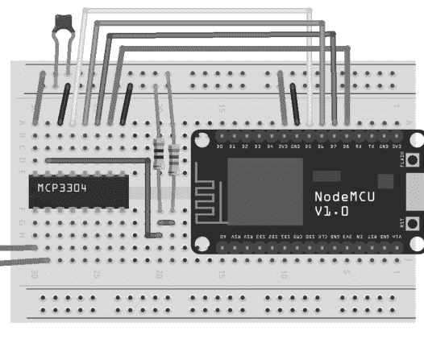

接下来我们讨论两种从MCP3304读取ADC值的方法。稍后我们将使用内置的SPI接口库编程接口例程，但首先我们使用一种称为位操作（bit-banging）的方法，这意味着我们按照正确的顺序读写相应的引脚，几乎是*手动*操作。以下程序改编自Arduino playground上的示例代码。

```cpp
// MCP3304 bit-banged, V. Ziemann, 170726
#define CS 15          // D8, ChipSelect
#define MOSI 13        // D7, MasterOutSlaveIn
#define MISO 12        // D6, MasterInSlaveOut
#define CLK 14         // D5, Clock
void mcp3304_init_bb() {  //.......................mcp3304_init
  pinMode(CS,OUTPUT);
  pinMode(MOSI,OUTPUT);
  pinMode(MISO,INPUT);
  pinMode(CLK,OUTPUT);
  digitalWrite(CS,HIGH);
  digitalWrite(MOSI,LOW);
  digitalWrite(CLK,LOW);
}
int mcp3304_read_bb(int channel) { //............mcp3304_read_bb
  int adcvalue=0, sign=0;
  byte commandbits = B10000000;
  commandbits|=(channel & 0x03) << 4; // 5 config bits, MSB first
  digitalWrite(CS,LOW);     // chip select
  for (int i=7; i>0; i--){  // clock bits to device
    digitalWrite(MOSI,commandbits&1<<i);
```

digitalWrite(CLK,HIGH); // 包含两个空位
digitalWrite(CLK,LOW);
}
sign=digitalRead(MISO);    // 首先读取符号位
digitalWrite(CLK,HIGH);
digitalWrite(CLK,LOW);
for (int i=11; i>=0; i--){
  adcvalue+=digitalRead(MISO)<<i;
  digitalWrite(CLK,HIGH);
  digitalWrite(CLK,LOW);
}
digitalWrite(CS, HIGH);
if (sign) {adcvalue = adcvalue-4096;  }
return adcvalue;
}
void setup() {  //........................................设置
  mcp3304_init_bb();
  Serial.begin(115200);
  while (!Serial) { delay(10);}
}
void loop() {  //........................................循环
  int val=mcp3304_read_bb(0);
  Serial.print("CHO = "); Serial.println(val);
  delay(1000);
}
```

在这个程序中，我们首先为NodeMCU上使用的引脚赋予有意义的名称，并声明了`mcp3304_init_bb()`函数，该函数包含了初始化位模拟SPI通信所需的代码。我们将相应的引脚声明为INPUT或OUTPUT，并通过调用`digitalWrite()`来初始化它们的状态。`mcp3304_read_bb()`函数以通道号作为输入，并返回数字化后的字。在这个例程中，我们假设使用MCP3304的两个输入引脚以差分模式工作。在例程内部，我们首先声明一些变量，并将命令位初始化为从最高有效位7开始，其值为1。下一位6是0，表示差分模式，然后我们将通道信息作为位5和位4添加进去，并将位3设置为零，后面再跟三个零，这遵循了数据手册中关于如何配置ADC的描述。现在，我们可以将CS线拉低以表示一个事务即将开始，然后通过将MOSI引脚设置为相应的值并切换CLK引脚，来时钟传输五个配置位加上两个额外位，以留出转换时间。完成这些操作后，我们可以从MISO线读取符号位并切换CLK引脚。然后，我们重复读取MISO并切换CLK 12次，以填充整数`adcvalue`的相应位，最后通过将CS引脚拉高来结束事务。在返回`adcvalue`之前，我们确保符号位被正确地纳入读数中。在`setup()`函数中，我们只初始化串行线路和MCP3304，而在`loop()`函数中，我们从ADC读取通道0的值，并在串行线路上显示其值。后者每秒重复一次。

除了位模拟引脚，我们也可以使用Arduino IDE自带的SPI库。基于<SPI.h>库但其他部分与前一个程序等效的程序如下。

```
// MCP3304, V. Ziemann, 170726
#include <SPI.h>
#define CS 15  // D8
int mcp3304_read_adc(int channel) {  //...0到3.......read_adc
    int adcvalue=0, b1=0, hi=0, lo=0, sign=0;;
    digitalWrite (CS, LOW);
    byte commandbits = B00001000; // 起始位+(diff=0)
    commandbits |= channel & 0x03;
    SPI.transfer(commandbits);
    b1 = SPI.transfer(0x00);     // 始终D0=0
    sign = b1 & B00010000;
    hi = b1 & B00001111;
    lo = SPI.transfer(0x00);     // 输入无关紧要
    digitalWrite(CS, HIGH);
    adcvalue = (hi << 8) + lo;
    if (sign) {adcvalue = adcvalue-4096;}
    return adcvalue;
}
void setup() {//....................................设置
    pinMode(CS,OUTPUT);
    SPI.begin();
    SPI.setFrequency(2100000);
    SPI.setBitOrder(MSBFIRST);
    SPI.setDataMode(SPI_MODE0);
    Serial.begin(115200);
    while (!Serial) {delay(10);}
}
void loop() {    //....................................循环
    int val=mcp3304_read_adc(0);
    Serial.print("CH0 = "); Serial.println(val);
    delay(1000);
}
```

在这里，我们首先包含<SPI.h>功能，并在定义从ADC读取通道的`mcp3304_read_adc`函数之前定义CS引脚。在这个函数中，我们首先声明一些变量，并将CS引脚拉低以开始事务。然后我们构建命令位；这次它们的对齐方式是起始位是位3，通道信息存储在位1和位0中，我们使用`SPI.transfer`函数将其发送到ADC。请注意，ADC识别的第一个位是第一个非零位，即起始位3。然后我们在第二次调用`SPI.transfer`时发送0x00，并从MISO引脚接收读数到`b1`中。由于我们有一些空闲的时钟切换，符号位是位4，接下来的四位是ADC读数的四个最高有效位，我们将其存储在变量`hi`中。下一次调用`SPI.transfer()`返回后续位，即来自MISO引脚的低八位，我们将其存储在变量`lo`中。将CS引脚拉高以结束事务后，我们构建ADC字`adcvalue`并添加符号信息。最后，我们将读数返回给调用程序。在`setup()`函数中，我们通过调用`SPI.begin()`函数、设置时钟频率、字节顺序和模式来初始化SPI功能，然后初始化串行线路。`loop()`函数是前一个示例的直接复制，我们只读取通道0并将值打印到串行线路。

这个外部ADC极大地扩展了NodeMCU的模拟输入能力，后者板载只有一个单极性10位分辨率的ADC通道。现在我们有了四个额外的12位分辨率通道，包括一个额外的极性位。我们顺便提一下，MCP3304有一个近亲MCP3208，它有八个单极性通道，可以用类似的方式编程。详情请查阅数据手册。支持SPI通信的传感器可以用与ADC类似的方式控制，无论是通过位模拟相应的引脚，还是使用`SPI.transfer()`函数。同样，阅读数据手册中的详细规格是必须的。

到目前为止，我们讨论了标准的通信通道，RS-232、I2C和SPI，但还有其他几种，我们将在下一节中简要介绍。

### 4.4.5 其他协议

DHT11和DHT22/AM2302湿度传感器使用非标准通信协议，但数据手册对此有相当好的解释。该协议基于使用单个IO引脚，需要一个约4.7 kΩ的上拉电阻。在分线板上，该电阻可能已经安装好。最初，微控制器将引脚配置为OUTPUT并将其拉低至少18毫秒，然后通过将引脚重新配置为INPUT来释放对传感器的控制。然后，传感器通过发送一个50微秒的低电平脉冲后跟50微秒的高电平脉冲来确认事务，然后使用以下约定向引脚时钟传输40个数据位。零位定义为50微秒的低电平状态后跟约27微秒的高电平状态。一位定义为50微秒的低电平状态后跟70微秒的高电平状态。这40个数据位包含有关湿度和温度的信息。在下面的代码中，我们实现了这个协议。

```
// DHT11, V. Ziemann, 170804
#define DHT 2    // 传感器引脚
float read_dht11(float *T) {
  bool p[500]= { 0 };
  uint8_t data[5]={0},checksum;
  int ic=0,goes_up=0;
  pinMode(DHT,OUTPUT);
  digitalWrite(DHT,LOW);    // 20毫秒低电平脉冲
  delay(20);
  digitalWrite(DHT,HIGH);
  noInterrupts();    // 关闭中断以获得精确计时
  delayMicroseconds(20);    // 确保从低电平开始
  pinMode(DHT,INPUT);
  for (int i=0;i<500;i++) {    // 读取5毫秒的数据
    p[i]=digitalRead(DHT);
    delayMicroseconds(10);    // 每10微秒读取一次
  }
  interrupts();    // 重新开启中断
  while (p[ic++] == 0); // 下一个高电平，确认位
  while (p[ic++] == 1); // 下一个低电平，第一个数据位
  for (int i=0;i<5;i++) {          // 循环处理
    for (int j=7;j>=0;j--) {       // 40个数据位
      while (p[ic++] == 0) {goes_up=ic;}
      while (p[ic++] == 1) ;
      (ic-goes_up > 4) ? data[i] |= (1<<j) : 0;
    }
  }
  checksum=((data[0]+data[1]+data[2]+data[3]) & 0xFF);
  if (checksum==data[4]) {
    *T=(float) data[2];          // 温度
```

## 4.11 将DS18b20传感器连接到Arduino UNO

另一个与DHT传感器类似的数据总线，但具有额外错误处理功能的是达拉斯1线协议，该协议被流行的DS18b20温度传感器使用，也被其他设备使用，例如湿度传感器、存储电路或自主数据记录器。然而，我们将专注于DS18b20，并使用图4.11所示的原理图将其连接到Arduino，其中我们将地线、电源电压和单个数据引脚连接到UNO的D2引脚。我们还添加了一个4.7 kΩ的上拉电阻，从数据引脚连接到电源电压。这仅对裸传感器是必需的。如果我们使用DS18b20的分线板版本，上拉电阻可能可以省略，因为它已经安装在分线板上。为了与Arduino接口，我们使用现成的库来封装底层交互。在使用库之前，我们需要安装OneWire和DallasTemperature库。一种简单的方法是使用Arduino IDE的库管理器，可以通过Sketch→Include Library→Manage Libraries访问，我们输入关键字OneWire和DallasTemperature。这将显示一个支持的库列表，可以直接从菜单安装。安装后，我们输入以下代码，这是一个简单的示例。

```cpp
// DS18b20 1-wire temperature sensor, V. Ziemann, 170120
#include <OneWire.h>
#include <DallasTemperature.h>
OneWire oneWire(2); //use pin D2
DallasTemperature sensors(&oneWire);
void setup() {
  Serial.begin(9600); while (!Serial) {;}
  sensors.begin();
}
void loop() {
  sensors.requestTemperatures();
  float temp=sensors.getTempCByIndex(0);
  Serial.println(temp);
  delay(1000);
}
```

在代码中，我们首先包含对Onewire和DallasTemperature设备的支持，并使用引脚号2初始化OneWire总线，然后初始化DallasTemperature传感器，以使用前一条语句初始化的总线。请注意，我们可以在同一总线上并联连接多个温度传感器。在setup()函数中，我们只初始化串行通信和传感器。loop()函数中的代码向连接的传感器发送查询，这会导致它们发回测量值。在我们的示例中，我们只连接了一个DS18b20，因此我们只能从设备号零读取摄氏温度，并将结果打印到串行线。等待一秒钟后，我们重复该过程。

HC-SR04距离传感器（如图2.35所示）通过在其触发引脚接收到一个短的10微秒触发脉冲时发射一个短的高频（不可听）声脉冲来确定到最近障碍物的距离。然后它将回波引脚拉至低电压，并且仅在接收到回波后才将其返回到高状态。因此，我们需要用四根线（GND、5V、Trig、Echo）将传感器连接到Arduino，并需要测量回波脉冲的持续时间。这在以下代码中实现。

```cpp
// HC-SR04 distance logger, V. Ziemann, 161204
const int trig=2, echo=3;
void setup() {
  Serial.begin(9600); while (!Serial) {;}
  pinMode(trig,OUTPUT);
  pinMode(echo,INPUT);
}
void loop() {
  float duration,distance;
  digitalWrite(trig,LOW); // make a 10 us trigger pulse
  delayMicroseconds(2);
  digitalWrite(trig,HIGH);
  delayMicroseconds(10);
  digitalWrite(trig,LOW);
  duration=pulseIn(echo,HIGH);     // wait for echo
  distance=100*duration*340e-6/2;  // in cm
  Serial.println(distance);
  delay(1000);
}
```

在代码中，我们首先声明在此代码中使用的引脚常量。传感器的触发引脚连接到Arduino上的引脚2，传感器上的回波引脚连接到引脚3。在setup()函数中，我们声明串行线以及相应引脚是用作输入还是输出。在loop()函数中，我们首先声明距离和持续时间的变量，然后通过向触发引脚写入HIGH和LOW来创建一个10微秒长的触发脉冲，并在两者之间等待一小段时间。触发脉冲发出后，我们使用pulseIn()函数等待回波引脚返回到HIGH状态。pulseIn()函数返回以微秒为单位的经过时间，因此1000微秒对应于大约0.17米的距离，或者如果我们假设声速为340米/秒，并且注意到声音必须从传感器到第一个障碍物往返，则为17厘米。然后，测量值通过串行线发送到主机计算机，并在一些延迟后重复整个过程。我们顺便指出，我们可以使用pulseIn()函数来测量一般短脉冲的持续时间。

旋转编码器的输出引脚分别携带正弦状和余弦状信号。我们可以根据两个引脚在其中一个引脚在下降沿（从HIGH状态变为LOW状态）变化时是否相等来确定轴是顺时针还是逆时针旋转。以下代码使用中断实现了这种方法。使用中断的优点是不必连续测量和比较引脚的状态，而是注册一个中断处理程序，该处理程序在特定操作（在我们的情况下是连接到中断的引脚的下降沿）时执行。Arduino有两个具有中断功能的引脚，编号为2和3。但让我们先看看代码。

```cpp
// Rotary encoder, V. Ziemann, 161205
const int pinA=2,pinB=4;
volatile int pos=0;
void setup() {
  Serial.begin(9600); while (!Serial) {;}
  pinMode(pinA,INPUT_PULLUP);
  pinMode(pinB,INPUT_PULLUP);
  attachInterrupt(0,interrupt_handler,FALLING);//0=pin2,1=pin3
}
void loop() {
  Serial.println(pos);
  delay(1000);
}
void interrupt_handler() {
  if (digitalRead(pinA)==digitalRead(pinB)){pos++;}else{pos--;}
}
```

代码首先声明使用的引脚和一个包含编码器位置的变量pos。该变量被声明为volatile，这指示编译器它可以在中断例程内异步更改，并防止编译器将其优化掉，因为它在主程序中不会更改。在setup()函数中，我们声明串行线参数和启用了上拉电阻的输入引脚。其中一个引脚必须是引脚2或3，即具有中断功能的引脚。attachInterrupt()函数用于连接一个所谓的回调函数，这里是interrupt_handler。它在代码的末尾定义。在我们的代码中，我们选择中断0（连接到引脚2）来触发回调函数interrupt_handler。我们还指定回调函数在中断引脚的下降沿被调用。我们可以使用服务函数digitalPinToInterrupt()，该函数以引脚号（在我们的例子中是2）作为参数，而不是硬编码值0作为中断源，这样该行读取

```cpp
attachInterrupt(digitalPinToInterrupt(2),interrupt_handler,FALLING);
```

代替。使用digitalPinToInterrupt()是首选方式，因为它免除了用户记住哪个中断号连接到哪个引脚的负担。loop()函数非常简单，每秒一次将编码器轴的位置写入串行线。最后，我们定义回调函数interrupt_handler，如果两个编码器引脚相等，则将pos变量增加一步，否则减少一步。通过这种方式，轴的旋转方向得到了处理。我们需要指出，我们必须使用单独的外部上拉电阻（10kΩ）以保证稳定运行，并且在代码中，当变量pos在串行线上传输时发生更改时，我们可能会遇到所谓的竞争条件。

在讨论了传感器接口之后，我们现在继续研究如何使用执行器，例如开关、电机或模拟电压。

## 4.5 执行器接口

本节我们将讨论如何将第3章讨论的执行器与Arduino连接，并从最简单的执行器——LED开始。

### 4.5.1 开关器件

在4.3节中，我们使用了`digitalWrite()`函数来开关LED。如果我们将晶体管、达林顿驱动器或H桥连接到输出引脚，就可以使用相同的函数来处理比Arduino能驱动的20mA更大的电流。具体电路请参考3.1.2节。

动态调节LED亮度是通过脉宽调制实现的，该功能在UNO的D3、D5、D6、D9、D10和D11引脚上可用，这些引脚在电路板上用波浪号标记。我们使用`analogWrite(pin,value)`函数，它接受引脚号和一个0到255之间的值（ESP8266上为0到1023）来调节脉宽调制信号的占空比，从完全关闭到完全开启。开关频率在500到1000 Hz之间，在图4.12中，我们展示了对UNO的D9引脚分别使用值88和220调用`analogWrite()`的示波器波形。信号频率约为490 Hz，我们可以看到信号长度从左侧约1/3时间处于5V，到右侧几乎全部时间处于5V。

为了能够像操作传感器一样操作执行器，我们使用相同的查询-响应协议将所需动作传达给微控制器。我们希望采用这样的约定：DWx 0关闭数字引脚x，DWx 1打开它；发送AWx nnn将引脚x的脉宽调制设置为值nnn。实现此功能的代码如下：

```cpp
// Switching_and_pwm, V. Ziemann, 170614
char line[30];
void setup() {
  pinMode(2,OUTPUT);
  Serial.begin (9600);
  while (!Serial) {;}
}
void loop() {
  if (Serial.available()) {
    Serial.readStringUntil('\n').toCharArray(line,30);
    if (strstr(line,"DW2 ")==line) {
      int val=(int)atof(&line[4]);
      digitalWrite(2,val);
    } else if (strstr(line,"AW9 ")==line) {
      int val=(int)atof(&line[4]);
      analogWrite(9,val);
    } else {
      Serial.println("unknown");
    }
  }
}
```

其中我们首先声明了变量`line`，用于存储串口接收到的字符。在`setup()`函数中，我们仅将引脚2声明为输出，并初始化串口通信，与之前完全一样。在`loop()`函数中，我们使用之前见过的结构来解析串口接收到的消息，并根据接收到的命令执行相应操作。如果命令以`DW2`开头，我们读取前4个字符之后的字符到变量`val`，并将`val`传递给`digitalWrite()`函数。这里我们采用了与之前在连接MCP23017 IO扩展器的示例中相同的方法，使用`atof()`函数来解码字符数组`line[]`的其余部分。在解析`AW9`之后接收到的值时，我们再次遇到了`atof`结构。然后我们使用它通过`analogWrite()`函数将引脚D9设置为所需的值。通过这种方式，我们有了一个简单的机制来指示Arduino开关引脚，并将具有脉宽调制能力的引脚调整到所需的占空比。

我们注意到上述代码没有包含优雅的错误处理。例如，在处理`DW2`命令时，将串口接收到的任何值`val`传递给`digitalWrite()`函数，如果`val`不是0或1，可能会导致奇怪的行为。甚至可能将负数写入引脚，这是没有意义的。将该行替换为以下结构将只向引脚写入有意义的值。我们隐式地使用这样的约定：0关闭引脚，其他任何值打开引脚。

```cpp
// digitalWrite(2,(int)val);
if ((int)val == 0) {
  digitalWrite(2,LOW);
} else {
  digitalWrite(2,HIGH);
}
```

当然，可以实现其他错误捕获方法，但这超出了我们讨论的范围。

使用UNO测试上述程序很快就能完成。在图4.13中，我们展示了一个在小型面包板上的实现。两根电缆将电源线连接到电路，其中地线信号连接到NPN晶体管的发射极。这里我们使用BC547，但任何小信号NPN晶体管都可以工作。晶体管的集电极直接连接到LED的阴极，LED的阳极通过一个220Ω电阻连接到正电源电压。晶体管的基极通过一个1kΩ电阻连接到Arduino上的控制引脚，这里是引脚D9。

这个例子涵盖了开关以及控制负载（LED）功率的基本功能。在下一个例子中，我们将使用非常相似的电路来控制电机的速度和方向。

### 4.5.2 直流电机

如果我们只想控制一个非常小的电机的速度，我们可以将前一个例子中的LED和220Ω电阻替换为电机。我们还需要添加续流二极管以防止反电动势损坏晶体管。对于稍大的电机，我们需要使用功率额定值更高的晶体管，例如TIP-120达林顿功率晶体管。TIP-120内部已经集成了从发射极到集电极的续流二极管。请注意，较大的晶体管性能通常在较高频率下会下降。然而，查阅数据手册显示，这只影响远高于10 kHz的频率。

在图4.14中，我们展示了使用UNO控制小型电机的设置。晶体管的引脚从左到右依次是基极、集电极和发射极，电机连接在集电极和电源电压之间。发射极直接接地，我们在电机引线之间包含一个外部续流二极管（水平安装），阴极指向右侧。垂直安装的二极管说明了内置二极管的连接方式。我们通过脉宽调制连接到UNO引脚D9（通过1kΩ电阻）的晶体管基极来控制电机速度。

控制速度很有用，但通常我们还需要控制旋转方向；例如，驱动车辆不仅要前进，还要后退。实现此功能的标准方法是使用H桥，如第3章所述。这里我们使用L293D H桥驱动器，它被称为*四路半桥驱动器*，这个术语通过考虑图4.15所示的16引脚芯片的引脚布局就变得清晰了。有接地引脚和两个电源电压，一个用于逻辑电平，一个为电机供电。然后有四个（四路）输入和相应的输出。电路的工作方式是将输入引脚上的逻辑电平转换为相应的输出引脚，输出引脚再将电机电源电压提供给电机。因此，将输入1设置为高电平，输入2设置为低电平，会将一个电机引线连接到电机电源电压，另一个接地，这会使电机向一个方向转动。将输入1设置为低电平，输入2设置为高电平会导致相反的情况，电机将向另一个方向转动。因此，两个输入和输出提供了单个H桥的功能。由于有四个输入和输出，我们可以使用L293D实现两个H桥。此外，L293D上的引脚1可用于使能输入1和2的输出。因此，向该引脚施加脉宽调制信号将作为电机的速度控制。引脚9为输入3和4提供相同的功能。最后，我们注意到L293D中的字符*D*表示续流保护二极管已经内置在集成电路中。

掌握了理论背景，我们就可以在面包板上使用L293D构建电机控制器，并用Arduino UNO控制它。我们在图4.16中展示了电路。直流电机显示在左侧，L293D是小型面包板上唯一的组件。芯片的方向与图4.15相同，使功能易于理解。引脚编号从左上角（引脚1）到左下角（引脚8），然后通过右下角（引脚9）到右上角（引脚16），这是大多数集成电路的标准。

### 4.5.3 舵机

正如我们在第3章中讨论的，舵机用于精确地改变某些设备的位置或方向，例如船的舵或遥控车的转向系统。舵机只需要连接三根线：地线、电源线以及一根根据图3.9所示时序传输控制信息的信号线。在图4.17中，我们展示了如何将一个小型舵机连接到Arduino UNO。如果舵机需要的电流或电压超过UNO所能提供的，可以使用合适的外部电源。外部电源的地线需要与UNO的地线连接，而舵机的一根线（通常是红色的）需要连接到外部电源的正极，而不是Arduino的5V电源引脚。从Arduino控制舵机相当简单，我们使用以下代码来实现。

```cpp
// 舵机控制器，V. Ziemann, 170614
#include <Servo.h>
Servo myServo;
char line[30];
void setup() {
  myServo.attach(9);   // 引脚 D9
  Serial.begin (9600);
  while (!Serial) {;}
}
void loop() {
  if (Serial.available()) {
    Serial.readStringUntil('\n').toCharArray(line,30);
    if (strstr(line,"SERVO ")==line) {
      float val=atof(&line[6]);
      myServo.write((int) val);   // 0 到 180
    }
  }
}
```

该代码遵循标准模板，在**setup()**函数中打开串口，在**loop()**函数中实现查询-响应结构。舵机特定的部分包括引入<Servo.h>文件和声明一个名为**myServo**的**Servo**对象。在**setup()**函数中，我们将舵机功能附加到Arduino的D9引脚，并通过调用**myServo.write()**向舵机写入新值。后者接受一个0到180之间的值作为参数，并将舵机臂移动到所需位置。请注意，<Servo.h>是标准Arduino发行版的一部分。还要注意，我们可以使用Arduino上的任何引脚来控制舵机，甚至可以控制多个舵机，但使用舵机功能会禁用D9和D10引脚上**analogWrite()**函数的脉宽调制功能，因为它使用相同的硬件定时器。

以更高级的方式使用舵机，例如扫描，也很容易实现。以下代码片段在完整范围内来回扫描

```c
} else  if (strstr(line,"SCAN")==line) {
  for (int pos=0;pos<180;pos+=1) {
    myServo.write(pos); delay(10); // 并进行测量
  }
  for (int pos=180;pos>=0;pos-=1) {
    myServo.write(pos); delay(10);
  }
}
```

并且很容易设想在执行扫描的循环中加入一些测量。想象一个HR-SR04距离传感器连接到舵机上。以半圆周运动进行扫描并持续测量到最近物体的距离，这模仿了雷达的功能，只是使用了类似声纳的设备。这可以作为移动车辆的碰撞检测系统。

我们考虑的最后一种电机是步进电机，接下来介绍。

### 4.5.4 步进电机

正如我们之前讨论的，步进电机可以通过给定的脉冲序列非常精确地控制，该脉冲序列使轴转动所需的离散步数。电机内部的线圈需要以特定的模式激励，可以是单极性或双极性电源。我们从单极性类型开始。

在图4.18中，我们展示了使用安装在Arduino UNO和电机之间小面包板上的ULN2003达林顿驱动器连接单极性步进电机的方法。ULN2003的内部连接非常简单。左侧的引脚1-7是七个达林顿晶体管的基极，电阻内置在芯片中。右侧对应的引脚是相应晶体管的集电极。所有发射极都连接到芯片左下角的引脚8，该引脚也是地。右下角的引脚9是电机电源的端子，通常连接到提供足够电流和电压以驱动电机的外部电源。在图中，我们假设步进电机很小，因此将引脚9连接到Arduino的5V引脚。上面的两根线将地和电源电压连接到芯片。这里我们假设电源电压相同，并将L293D的引脚8连接到正逻辑电源电压。此外，我们通过将引脚9接地来禁用芯片右侧的输出。两根线将Arduino上的数字输出D2和D3连接到L293D上引脚2和7的两个半桥的输入端。引脚3和6的相应输出连接到电机电缆。最后，L293D的引脚1连接到UNO上的脉宽调制输出引脚D9。

我们希望通过串行线发送命令来从Arduino控制电机，根据协议，FW nnn设置正向速度，BW nnn设置反向速度。其他任何命令都会停止电机。使用以下草图可以轻松实现。

```cpp
// H桥直流电机控制器，V. Ziemann, 170614
char line[30];
void setup() {
  pinMode(2,OUTPUT);
  pinMode(3,OUTPUT);
  Serial.begin (9600);
  while (!Serial) {;}
}
void loop() {
  if (Serial.available()) {
    Serial.readStringUntil('\n').toCharArray(line,30);
    if (strstr(line,"FW ")==line) {
      digitalWrite(2,LOW);
      digitalWrite(3,LOW);
      digitalWrite(3,HIGH);
      float val=atof(&line[3]);
      analogWrite(9,(int)val);
    } else if (strstr(line,"BW ")==line) {
      digitalWrite(2,LOW);
      digitalWrite(3,LOW);
      digitalWrite(2,HIGH);
      float val=atof(&line[3]);
      analogWrite(9,(int)val);
    } else { // 在所有其他情况下停止
      digitalWrite(2,LOW);
      digitalWrite(3,LOW);
      analogWrite(9,(int)0);
    }
  }
}
```

setup()函数仅将用于控制H桥的引脚声明为输出并初始化串行线。在loop()函数中，我们采用标准的查询-响应机制。串行线上以FW开头的命令首先关闭电机作为预防措施，以防止两个输出都为正，这可能会使电机电源电压短路。然后将引脚D3拉高，导致电机向一个方向转动。最后，我们解析命令行的其余部分，并通过脉宽调制电机驱动器的使能引脚将值写入以设置电机速度。除了FW n和BW n之外，接收到的任何命令都会禁用两个输出并将速度设置为零。当然，我们可以轻松实现其他命令，例如STOP，这将导致电机停止。

甚至可以将更复杂的命令编程到控制器中，例如在一个方向上转动一定时间，然后停止并向另一个方向转动一段时间。以下代码片段可以作为示例。

```c
} else if (strstr(line,"BACKANDFORTH")==line) {
  digitalWrite(2,LOW); // 关闭所有
  digitalWrite(3,LOW);
  digitalWrite(2,HIGH); // 选择一个方向
  analogWrite(9,255); // 全速
  delay(500);
  digitalWrite(2,LOW); // 停止
  delay(1000);
  digitalWrite(3,HIGH); // 另一个方向
  delay(500);
  digitalWrite(3,LOW); // 停止
  analogWrite(9,0); // 停止PWM
} ...
```

其他示例包括移动一小段时间，进行一些测量（使用上一节的代码示例），然后对多个步骤重复相同的操作。另一个示例是移动直到触发限位开关，这将导致电机关闭，可能进行一些测量，然后返回到第二个限位开关的停放位置。

或者，持续读取传感器并在达到某个值时停止怎么样？这实际上就是模型舵机所做的。所以，让我们更仔细地看看它。

## 4.3.2 步进电机控制

Arduino的5V引脚通过一根导线连接到Arduino的左侧。地线通过另一根导线连接到左侧。达林顿晶体管的基极直接连接到Arduino的D2至D5引脚，并需要由程序控制。

电机线圈的中心抽头通过两根导线连接到电机电源的正极端子。另外四根导线连接到ULN2003中上方四个达林顿晶体管的集电极。由于线圈的中心抽头连接到正电源电压，在达林顿晶体管的基极施加正电压将导致集电极-发射极导通，电流流过线圈。通过这种方式，我们可以以合适的模式激励线圈，使轴顺时针或逆时针旋转。实现此功能的程序如下：

```
// Stepper controller, V. Ziemann, 170616
#include <Stepper.h>
Stepper myStepper(200, 2, 4, 3, 5);
char line[30];
void setup() {
  myStepper.setSpeed(60);
  Serial.begin (9600);
  while (!Serial) {;}
}
void loop() {
  if (Serial.available()) {
    Serial.readStringUntil('\n').toCharArray(line,30);
    if (strstr(line,"MOVE ")==line) {
      int val=(int)atof(&line[5]);
      myStepper.step(val);
    } else {
      Serial.println("unknown");
    }
  }
}
```

这里我们首先包含了Arduino IDE自带的`<Stepper.h>`库，并声明了一个名为`myStepper`的Stepper对象。第一个参数是每转的步数，接下来的四个整数是连接到四个线圈的引脚。这可能因电机而异，通常此信息在数据手册中提供。否则，稍微尝试交换数字可能会使电机转动。在`setup()`函数中，我们使用`setSpeed()`方法来声明我们希望电机旋转的速度，并初始化串行线路。在`loop()`函数中，我们使用标准的查询-响应协议，使电机响应`MOVE`命令，并将命令后的字符读取为要移动的步数。这个数字可以是正数或负数，取决于所需的旋转方向。

使用双极步进电机的优点是在相同电源电压下具有更大的扭矩，因为有一个线圈拉动转子的永磁体，而另一个具有相反极性的线圈在推动。因此，有必要描述如何驱动双极步进电机。

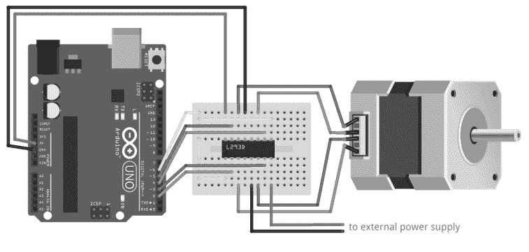

图4.19 使用L293D H桥驱动器将双极步进电机连接到UNO。

我们按照图4.19所示的方式连接双极步进电机。这里我们使用L293D H桥驱动器，与我们用于为直流电机提供方向控制的集成电路相同。根据图4.15所示电路的引脚描述，我们立即看到从UNO左侧引出的两根电源线连接到逻辑电源电压和地引脚，使能引脚通过浅色导线连接到UNO的D6引脚。连接到Arduino D2、D3、D4和D5引脚的导线连接到L293D上四个半桥驱动器的输入端。双极步进电机的四根引线连接到相应驱动器的四个输出端子。在此电路中，L293D引脚8上的正电机电源电压端子连接到外部电源。由于芯片内部所有四个地引脚是连接的，我们可以添加一根导线将L293D另一侧的电机地端子连接到电源的地端子。

值得注意的是，我们可以将用于单极步进电机的相同代码用于双极电机。发送到驱动器输入引脚的相同模式会使双极电机以全步模式运行。因此，我们可以使用与之前相同的Arduino程序来操作电机，只是可能需要交换`myStepper`声明中的引脚分配。

我们需要指出，至少有一个线圈始终处于激励状态，这会导致电机随着时间的推移而发热，即使在不移动时也是如此。这个问题可以通过添加一个命令来关闭所有线圈来缓解，尽管代价是失去一些精度，因为来自激励线圈的保持扭矩消失了。如果我们可以接受精度的微小损失，我们可以使用连接到黄色导线的Arduino引脚来打开和关闭驱动器芯片的输出。但是，为了正常操作，必须使用`digitalWrite(6, HIGH)`将其拉高。

使用内置库来控制步进电机是入门最快的方法，使用经过充分测试的库通常会产生健壮的代码，但无论如何，亲手编写步进电机的步进序列是相当有启发性的。这就是我们在以下示例中所做的，它实现了与前一个示例相同的功能，但提供了对步进库内部工作原理的深入了解。此外，内置库仅实现了电机的全步操作，其中永磁体直接面对线圈，例如图3.10中的永磁体1直接面对线圈A。然而，通过同时激励线圈对，我们也可以将永磁体固定在线圈之间的一半位置，并使轴移动半步。我们之前在第3.2.3节中讨论了这种半步操作模式。

对于以下练习，我们假设我们有一个双极步进电机通过L293D H桥连接到Arduino，如图4.19所示。我们首先实现步进库提供的相同功能，然后展示如何轻松添加其他模式。全步模式在以下代码中实现：

```
// Stepper controller by hand, V. Ziemann, 170624
char line[30];
int settle_time=2; // milli-seconds
int stepcounter=0;
const int PA=2;
const int PB=3;
const int PC=4;
const int PD=5;
const int ENABLE=6;
void set_coils(int istep) {  //.......full-step mode
  bool patA[]={1,1,0,0};  // or {1,0,0,0}
  int pat_length=4;
  int ii;
  istep=istep % pat_length;
  if (istep < 0) istep+=pat_length;
  digitalWrite(PA,patA[istep]);
  ii=(istep+2) % pat_length;
  digitalWrite(PB,patA[ii]);
  ii=(istep+3) % pat_length;
  digitalWrite(PC,patA[ii]);
  ii=(istep+1) % pat_length;
  digitalWrite(PD,patA[ii]);
  delay(settle_time);
}
void setup() {    //........................setup
  Serial.begin (9600);
  while (!Serial) {;}
  pinMode(PA,OUTPUT);
  pinMode(PB,OUTPUT);
  pinMode(PC,OUTPUT);
  pinMode(PD,OUTPUT);
  pinMode(ENABLE,OUTPUT);
  digitalWrite(ENABLE,HIGH);
}
void loop() {  //........................loop
  if (Serial.available()) {
    Serial.readStringUntil('\n').toCharArray(line,30);
    if (strstr(line,"MOVE ")==line) {
      int steps=(int)atof(&line[5]);
      if (steps > 0) {
        for (int i=0;i<steps;i++) set_coils(stepcounter++);
      } else {
        for (int i=0;i<abs(steps);i++) set_coils(stepcounter--);
      }
    } else if (strstr(line,"STEPS?")==line) {
      Serial.print("STEPS "); Serial.println(stepcounter);
    } else if (strstr(line,"STEPS ")==line) {
      stepcounter=(int)atof(&line[6]);
    } else if (strstr(line,"DISABLE")==line) {
      digitalWrite(ENABLE,LOW);
    } else if (strstr(line,"ENABLE")==line) {
      digitalWrite(ENABLE,HIGH);
    }
  }
}
```

首先我们声明一些全局变量，例如`settle_time`，即改变线圈激励之间等待的时间，以及`stepcounter`，用于跟踪移动的距离。PA到PD是连接到线圈端子的引脚，`ENABLE`连接到H桥驱动器的使能引脚，可用于去激励所有线圈以防止过热。然后声明`set_coils()`函数，该函数将以正确的模式激励线圈。在函数内部，我们首先定义线圈A的激励模式`patA`。在这种情况下，它是1100，即始终激励两个线圈的模式，并提供更大的扭矩。或者，我们也可以声明模式1000，这将导致单线圈激励模式。有关讨论，请参见第3.2.3节。变量`pat_length`是不同步数的数量，在本例中为四。接下来，我们计算输入变量`istep`相对于`pat_length`的余数，以确定模式激励的新状态，并将数组`patA`中的相应条目写入连接到端子PA的输出。接下来，我们计算`patA`中偏移两个时隙的条目，同样对`pat_length`取模，并将相应条目写入输出引脚PB。以同样的方式，我们将剩余的两个输出引脚PC和PD设置为`patA`中分别偏移一个或三个时隙的条目。最后，我们等待一个短暂的时间，由变量`settle_time`给出。此函数实现单步；为了移动更多步数，我们只需重复调用它。

程序的其余部分与Arduino程序的通常结构一样，包含一个`setup()`函数，我们在其中初始化串行通信并将控制电机的输出引脚声明为`OUTPUT`。最后，我们通过将`ENABLE`引脚设置为`HIGH`来启用电机驱动器。在`loop()`函数中，我们使用常用的结构从串行线路读取，并使用`strstr()`函数解码命令。如果接收到`MOVE`命令，我们将行的其余部分解码为整数`steps`，即我们希望步进电机移动的步数。这个数字可以是正数或负数，取决于所需的移动方向。如果是正数，我们调用`set_coils()`函数所需的次数，同时递增变量`stepcounter`，以跟踪当前应用的步数以及累积的步数。如果`steps`是负数，我们调用`set_coils()`必要的次数，同时递减变量`stepcounter`。其他命令使用`STEPS?`或`STEPS nnn`分别读取和设置`stepcounter`变量。`ENABLE`和`DISABLE`命令打开和关闭L293D的驱动级，这在长时间空闲时可能有助于防止线圈过热。此程序使电机来回移动。通过调整`settle_time`来实现速度控制留作练习。

前面的程序实现了全步模式，但将其更改为半步模式只需要更改`set_coil()`函数以产生半步的模式，根据第3.2.3节，该模式由11100000给出。实现半步模式的`set_coil()`替代函数是：

```
void set_coils(int istep) { //.............half-step mode
```

### 4.5.5 模拟电压

在本节中，我们将一个支持SPI通信的MCP4921 12位数模转换器连接到Arduino UNO，并讨论一个使用我们的查询-响应协议来设置DAC输出电压的程序。例如，这可以用于设置电源的控制电压或任何其他需要模拟电压电平作为输入的设备。实现此功能的电路如图4.22所示，其中左侧是UNO，以及连接到MCP4921的电源和地线。从引脚引出的亮色导线

图4.20 使用具有微步进功能的DRV8825步进电机驱动器将双极步进电机连接到UNO†。

```
bool patA[]={1,1,1,0,0,0,0,0};
int pat_length=8;
int ii;
istep=istep % pat_length;
if (istep < 0) istep+=pat_length;
digitalWrite(PA,patA[istep]);
ii=(istep+4) % pat_length;
digitalWrite(PB,patA[ii]);
ii=(istep+6) % pat_length;
digitalWrite(PC,patA[ii]);
ii=(istep+2) % pat_length;
digitalWrite(PD,patA[ii]);
delay(settle_time);
}
```

这与之前讨论的全步进版本非常相似。唯一的区别是数组`patA`，它现在包含了半步进模式的激励模式。变量`pat_length`相应地增加到八，而激励其他引脚的步进是4、2和6。请记住，这对应于八个时隙中的180度、90度和270度。根据线圈的接线方向，我们可能需要交换电缆，或者作为替代方案，在`set_coils()`函数中交换步进增量。现在我们可以对电机进行全步进和半步进，甚至可以手动操作，但对于微步进模式，我们需要额外的硬件来更精确地控制线圈的激励。

实现这些微步进模式的驱动电路是DRV8825。图4.20展示了使用该驱动器将双极步进电机与Arduino连接的接口。在将电机连接到电路之前，我们需要通过调整激励线圈的最大电流来匹配驱动器和电机。因此，我们从图4.20所示的配置开始，但*不*连接通往电机的四根引线。电机电源必须提供8.2至40伏的电压，我们添加一个100 μF的电容来稳定电源电压。然后，我们将万用表通常为黑色的地线连接到电机驱动器的数字地，并将另一根通常为红色的万用表引线连接到螺丝刀的尖端。我们使用后者来调整驱动器面包板左上角的电位器，直到万用表上显示的电压为DRV8825数据手册中指定的电机所需电流限制的一半。我们在图4.21中说明了这一点，其中左下角是万用表，DRV8825放置在一个小面包板上，螺丝刀接触着驱动器板上的电位器。在这种情况下，万用表显示的电压为0.56伏，这意味着驱动器的电流限制为1.12安。

图4.21 在DRV8825面包板上调整最大电流。

一旦我们设置了最大电流，我们就将电机连接到驱动器电路上标有1A、1B和2A、2B的端子。在这里，我们选择将电机上的第一根和第三根导线连接到B引脚，第二根和第四根连接到A引脚，这解释了下方电机线圈上交叉的导线。电机电源的地线和正电压连接到右上角的两个端子，数字地通过黑线连接到Arduino的地线连接器。一根导线将UNO引脚D2连接到DRV8825左下角的方向引脚，另一根导线将D3连接到步进输入。一根连接到引脚D4的导线用于选择微步进模式。有几种模式可用，例如全步进、半步进、1/4、1/8、1/16和1/32步进。详情请参阅数据手册。这里我们只实现两种模式。如果三个模式引脚M0、M1和M2接地，驱动器将以全步进模式运行。如果三个模式引脚连接到逻辑电源电压，则选择具有32个微步的微步进模式。因此，通过切换UNO引脚D4，我们可以在全步进和微步进模式之间切换。驱动器左上角的使能引脚保持未连接状态，因为它在内部被拉低以默认启用驱动器。此外，一根连接到UNO 5伏电源的导线将驱动器的复位和睡眠引脚拉高，从而永久启用驱动器。

为了移动电机，我们使用一个适用于Arduino UNO的程序，该程序适当地改变方向、步进和模式引脚的状态。这是通过以下代码完成的。

```
// Stepper controller with DRV8825, V. Ziemann, 170626
char line[30];
int settle_time=30,stepcounter=0;
const int DIR=2;  // direction pin
const int STEP=3; // step pin
const int MODE=4; // mode pin, LOW=FULLSTEP, HIGH=MICROSTEP
void setup() {  //........................................setup
  Serial.begin (9600);
  while (!Serial) {;}
  Serial.println("starting");
  pinMode(DIR,OUTPUT); digitalWrite(DIR,LOW);
  pinMode(STEP,OUTPUT); digitalWrite(STEP,LOW);
  pinMode(MODE,OUTPUT); digitalWrite(MODE,HIGH);
}
void loop() {  //........................................loop
  if (Serial.available()) {
    Serial.readStringUntil('\n').toCharArray(line,30);
    if (strstr(line,"MOVE ")) {
      int steps=(int)atof(&line[5]);
      if (steps > 0) {
        digitalWrite(DIR,LOW);
        for (int i=0;i<steps;i++) {
          stepcounter++;
          digitalWrite(STEP,HIGH);
          delayMicroseconds(settle_time);
          digitalWrite(STEP,LOW);
          delayMicroseconds(settle_time);
        }
      } else {
        digitalWrite(DIR,HIGH);
        for (int i=0;i<abs(steps);i++) {
          stepcounter--;
          digitalWrite(STEP,HIGH);
          delayMicroseconds(settle_time);
          digitalWrite(STEP,LOW);
          delayMicroseconds(settle_time);
        }
      }
    } else if (strstr(line,"STEPS?")) {
      Serial.print("STEPS "); Serial.println(stepcounter);
    } else if (strstr(line,"STEPS ")) {
      stepcounter=(int)atof(&line[6]);
    } else if (strstr(line,"WAIT?")) {
      Serial.print("WAIT "); Serial.println(settle_time);
    } else if (strstr(line,"WAIT ")) {
      settle_time=(int)atof(&line[5]);
    } else if (strstr(line,"MICROSTEP")) {
      settle_time=30;
      digitalWrite(MODE,HIGH);
    } else if (strstr(line,"FULLSTEP")) {
      settle_time=2000;
      digitalWrite(MODE,LOW);
    }
  }
}
```

图4.22 将MCP4921 12位DAC连接到Arduino UNO†。

在程序的顶部，我们声明了一些变量，例如`settle_time`和`stepcounter`，以及使用的引脚。在`setup()`函数中，我们初始化串行通信，将步进驱动器的控制引脚声明为输出，并初始化它们的状态。通过将模式引脚拉高，我们选择了微步进模式。`loop()`函数使用查询-响应结构，其中第一个命令解析`MOVE`命令，并将其后的字符解释为`steps`的数量。然后代码根据`steps`的符号进行分支。如果为正，我们将方向引脚拉高，然后递增`stepcounter`。接着，`STEP`引脚被拉高再拉低，中间有一个小的延迟。请注意，我们使用`delayMicroseconds()`函数，因为转子在微步进之间移动非常小，我们可以减少步进之间的等待时间以实现电机的平稳运动。但无论如何，等待时间的值应根据实际连接的电机进行调整。如果`steps`为负，我们将方向引脚拉低，并在切换`STEP`引脚先`HIGH`后`LOW`之前递减`stepcounter`。处理完`MOVE`命令后，我们添加了用于读取和设置`stepcounter`和`settle_time`的簿记命令，最后选择操作模式。如果命令是`MICROSTEP`，则`settle_time`设置为30微秒，`MODE`引脚被拉高。如果命令是`FULLSTEP`，我们选择一个更大的`settle_time`并将`MODE`引脚拉低。

在能够控制各种类型的电机之后，我们转向控制模拟电压。

D13连接各自的时钟引脚，来自引脚D11的导线连接MOSI引脚。它负责将数据从UNO传输到DAC。来自引脚D10的导线连接片选引脚。在这种情况下，没有信息从DAC回读到UNO，因此我们不需要MISO导线。事实上，这款DAC上甚至没有MISO引脚。在DAC上，我们将参考电压引脚连接到5V电源，并将LDAC引脚拉低，以便在SPI事务结束立即将新电压传输到输出。我们还从DAC的输出引脚连接一根导线到UNO的模拟输入A0，这使我们能够回读并验证输出电压。在UNO上运行的软件如下所示。

```cpp
// MCP4921 DAC, V. Ziemann, 170801
#include <SPI.h>
#define CS 10
void setup() {  //........................................setup
  Serial.begin(9600);
  while (!Serial){;}
  pinMode(CS,OUTPUT); digitalWrite(CS,HIGH);
  SPI.begin();
  SPI.setBitOrder(MSBFIRST);
}
void loop() {  //........................................loop
  char line[30];
  if (Serial.available()) {
    Serial.readStringUntil('\n').toCharArray(line,30);
    if (strstr(line,"DAC ")==line) {
      uint16_t val=(int)atof(&line[3]);
      val|=(B0011 << 12);  //  0=chA,0=unBuf,1=x1,1=ON
      digitalWrite(CS,LOW);
      SPI.transfer(highByte(val));
      SPI.transfer(lowByte(val));
      digitalWrite(CS,HIGH);
    } else if (strstr(line,"A0?")==line) {
      Serial.print("A0 ");
      Serial.println(analogRead(0)*5.0/1023.0);
    }
  }
}
```

该程序首先包含用于SPI功能的头文件SPI.h，并声明片选引脚CS。在`setup()`函数中，我们初始化串口和SPI通信，同时将CS引脚声明为输出，并将其值设置为SPI空闲状态，即高电平。在`loop()`函数中，我们使用查询-响应协议来响应`DAC n`命令以设置DAC。首先，我们从串口行读取所需的12位字到变量`val`中，然后在最高有效端添加四个配置位`B0011`，其中第一位对应于通道号，对于单通道DAC MSP4921为零，第二位声明我们使用无缓冲电压。第三位我们选择内部放大倍数为1倍，第四位启用输出。一旦变量`val`中的16位组装完毕，我们就可以将CS拉低以启动通信，然后通过两次调用`SPI.transfer()`将16位数据分两个8位块传输到芯片，最后再将CS拉高以结束通信并在内部将电压传输到DAC的输出缓冲器。命令`A0?`回读电压，该电压已转换为伏特。这个简单的程序允许我们设置任何需要模拟控制电压作为输入的设备，并且还能回读电压以验证操作是否正确。

在其他情况下，我们不需要设置电压，而是需要生成周期性信号。

### 4.5.6 周期性信号

以下程序将Arduino UNO变成一个简单的脉冲发生器，它以微秒级的精度反复切换输出引脚的开和关。这是通过包含TimerOne库的头文件来实现的，该库使我们能够控制UNO上的内置硬件定时器。但请注意，该库只能访问引脚D9或D10。在定义了以微秒为单位的周期和脉冲宽度后，我们用指定的周期初始化Timer1，并启动pwm（脉冲宽度调制），其中引脚高电平的时间被缩放到0到1023的范围内。此时，引脚D9反复开启10 μs，关闭90 μs。

```cpp
// Pulse Generator using PWM, V. Ziemann, 221021
#include <TimerOne.h>
const int outpin = 9;
float period=100, width=10; // in microseconds
void setup() {
  Serial.begin(9600); delay(2000);
  Timer1.initialize((long) period);
  Timer1.pwm(outpin, (long)(width*1023/period));
}
void loop() {
  if (Serial.available()) {
    char line[30];
    Serial.readStringUntil('\n').toCharArray(line,30);
    if (strstr(line,"PERIOD ")) {
      period=atof(&line[7]);
      Timer1.setPeriod((long)period);
      Timer1.pwm(outpin, (long)(width*1023/period));
    } else if (strstr(line,"PERIOD?")) {
      Serial.print("PERIOD "); Serial.println(period);
    } else if (strstr(line,"WIDTH ")) {
      width=max(1,min(period,atof(&line[6])));
      Timer1.pwm(outpin, (long)(width*1023/period));
    } else if (strstr(line,"WIDTH?")) {
      Serial.print("WIDTH "); Serial.println(width);
    } else if (strstr(line,"START")) {
      Timer1.start();
    } else if (strstr(line,"STOP")) {
      Timer1.stop();
    }
  }
  delay(10);
}
```

在`loop()`函数中，我们可以使用标准的查询-响应结构来调整Timer1的参数，以指定`PERIOD`和`WIDTH`。更改这些参数后，我们立即根据需要调用`Timer1.setPeriod()`和`Timer1.pwm()`。输出引脚立即输出具有新参数的信号。命令`STOP`和`START`分别禁用和重新启动输出。请注意，输出信号是矩形的。它要么是开，要么是关。例如，要获得正弦输出，我们使用AD9850 DDS，它已经在[图3.14](Figure 3.14)的右侧展示过。

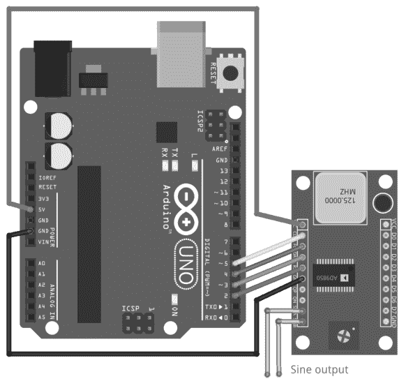

图4.23显示了一个由UNO控制的AD9850。除了用于电源和地线的导线外，还需要四根额外的导线来设置频率。UNO上引脚D5的`W_CLK`和D3上的`DATA`用于传输设置频率的控制字，D4上的`FQ_UD`将输出更新到新频率，D2上的`RESET`用于初始化设备。正弦输出信号可从标有*sine output*的两根导线获得。以下在UNO上运行的程序首先定义了初始频率、面包板上晶振的频率以及UNO上的四个引脚。宏**pulse_high**简单地对指定引脚产生一个脉冲。它在函数**set_frequency()**中使用，该函数接收以Hz为单位的频率作为输入并初始化设备。它遵循数据手册来计算相位增量寄存器**freq1**的值，然后将其逐位时钟输入设备。请注意，**freq1**中只有32位，我们依次向右移动。因此，最后八位全为零，并将正弦波的初始相位设置为零。最后，通过脉冲`FQ_UD`使新频率生效。

```cpp
// AD9850, V. Ziemann, 221024
double freq=100000;  // initial frequency
#define AD9850_CLOCK 125000000
const int W_CLK=5,FQ_UD=4,DATA=3,RESET=2;
#define pulseHigh(pin) {digitalWrite(pin,HIGH); digitalWrite(pin,LOW);}
void set_frequency(double frequency) {
  pulseHigh(RESET); pulseHigh(W_CLK); pulseHigh(FQ_UD); // Reset
  int32_t freq1=frequency * 4294967295/AD9850_CLOCK;
  for (int i=0; i<40; i++){
    digitalWrite(DATA,(freq1 >> i) & 0x01);
    pulseHigh(W_CLK);
  }
  pulseHigh(FQ_UD);
}
void setup() {
  Serial.begin(9600);
  pinMode(FQ_UD,OUTPUT); pinMode(W_CLK,OUTPUT);
  pinMode(DATA,OUTPUT); pinMode(RESET,OUTPUT);
  set_frequency(freq);
}
void loop() {
  if (Serial.available()) {
    char line[30];
    Serial.readStringUntil('\n').toCharArray(line,30);
    if (strstr(line,"FREQ ")) {
      freq=atof(&line[5]);
      set_frequency(freq);
    } else if (strstr(line,"FREQ?")) {
      Serial.print("FREQ "); Serial.println(freq);
    }
  }
}
```

`setup()`函数仅初始化串口，将四条控制线声明为输出，并设置起始频率。在`loop()`函数中，我们提供了设置新频率和请求当前设置频率信息的功能。

到目前为止，我们已经有多种方法来控制电压、开关和电机的幅度和时序。现在，我们将通过讨论几种吸引用户注意力的方法来结束本节，这在发生故障或其他需要人工干预的事件时非常有用。

### 4.5.7 人类注意力执行器

NeoPixel灯条有点像打了激素的LED。一个红色、一个绿色和一个蓝色LED单元，连同WS2811控制器，被组装成由八个或更多可独立寻址的此类单元组成的灯条。在使用它们之前，我们需要从“工具”菜单的库管理器中安装Adafruit_NeoPixel库。该库提供了设置所有单个LED强度的函数。我们通过在一个八单元NeoPixel灯条上显示用DS18b20测量的温度（如图4.11和再次在图4.24中所示）在21到28度之间来说明其用法。DS18b20连接到UNO的5V和地，并通过引脚D2读取。同样，NeoPixel灯条连接到电源轨，并通过引脚D6控制。由于灯条可能会突然消耗大电流，我们在电源轨上添加一个几μF的电容。以下程序基于第85页的示例；它只添加了初始化和使用NeoPixel的代码。首先，我们指定像素数量和灯条连接的引脚，然后创建一个具有标准参数的对象`pixel`。在`setup()`函数中，我们只需要调用`pixels.begin()`来初始化接口。在`loop()`函数中，我们首先测量温度并将实际值转换为高于20度的温度，即整数`imax`。

## 4.6 与主机通信

到目前为止，我们只使用了Arduino IDE中的串口监视器与Arduino进行通信，但通常我们也希望从其他程序进行通信，这正是本节的主题。

### 4.6.1 RS-232与USB

Arduino IDE中的串口监视器使用的是通过USB线路传输的RS-232协议。这种转换是自动完成的，将USB线缆插入主机计算机会导致后者自动创建一个设备文件（在Linux上为`/dev/ttyUSBx`或`/dev/ttyACMx`，在Windows上为`COMx`，在Mac上为`/dev/tty.usbserial-xxx`），该文件代表了从UNO到主机计算机的通信通道的另一端。然后，我们可以使用主机计算机上的任何终端程序连接到该设备文件，但必须记住使用与我们在Arduino的`setup()`函数中指定的相同的波特率。要找出Arduino连接到的设备文件，我们可以使用Arduino IDE并检查工具→端口菜单，然后记下设备文件的名称。在我的情况下，它是`/dev/ttyACM0`。关闭Arduino IDE后，我们可以使用任何终端仿真程序，例如Windows上的putty，或Linux或Mac上非常基础的screen程序，来连接到UNO。在我的情况下，命令

```
screen /dev/ttyACM0 9600
```

就能完成此操作，我们可以在终端窗口中向Arduino发送命令并接收响应。可以通过按`Ctrl-a-k`并确认是否真的要退出的问题（输入`y`）来退出`screen`程序。数字9600是用于通信的波特率，必须与Arduino草图中`Serial.begin()`语句中的数字匹配。请注意，9600是默认波特率，在`screen`命令中可以省略。

### 4.6.2 蓝牙

可以通过将HC-06蓝牙适配器连接到地线、电源和Arduino的引脚0和1来添加蓝牙功能。在图4.26的右侧，我们看到四个暴露的引脚，分别标记为RXD、TXD、GND和VCC。后两个连接到相应的电源连接，HC-06上的RXD连接到Arduino上标记为TX的引脚1，如图4.26左侧所示。在此连接上，信息从Arduino流向HC-06。HC-06上标记为TXD的引脚必须连接到Arduino上标记为RX的引脚0，信息在此线上从HC-06流向Arduino。这种从TXD到RX以及反向的交叉连接相当于一条零调制解调器电缆。以这种方式连接HC-06后，所有通信都通过HC-06和USB连接并行发送。为了可靠运行，在蓝牙运行时不应使用USB链路。

在主机计算机上，我们必须将新的蓝牙设备与主机计算机*配对*。在Windows上，这是在蓝牙管理程序中完成的。在某些Linux系统上，存在类似的用户界面，但我们始终可以使用一些命令行程序来配对蓝牙设备。首先，我们需要通过命令`hcitool dev`来确定主机计算机是否具有蓝牙功能，该命令应报告至少一个设备，通常称为`hci0`。然后，我们使用命令`hcitool scan`扫描周围的蓝牙设备。如果HC-06已通电，我们应该看到至少一个设备，其行显示为`xx:xx:xx:xx:xx:xx HC-06`，其中六字节字符串是蓝牙设备的MAC地址。要建立配对，我们需要使用`sudo`并调用`sudo bluetoothctl`。在`[bluetooth]#`提示符下，我们使用`scan on`启动对新设备的搜索，该命令会报告所有已知设备。以下两个命令建立配对

```
trust xx:xx:xx:xx:xx:xx
pair xx:xx:xx:xx:xx:xx
```

其中`xx:xx:xx:xx:xx:xx`是我们想要配对的HC-06适配器的MAC地址。在之前的操作过程中，系统会提示我们输入PIN码，除非我们更改了HC-06上的默认值，否则我们使用1234。然后我们退出`bluetoothctl`程序，并通过发出以下命令创建用于串口通信的设备文件

```
sudo rfcomm bind 0 xx:xx:xx:xx:xx:xx
```

该命令创建一个设备文件`/dev/rfcomm0`，其功能与我们之前用于与Arduino通信的`/dev/ttyACM0`设备文件相同。因此，我们可以再次使用`screen`命令与Arduino通信，但这次使用`/dev/rfcomm0`作为`screen`命令的第一个参数。请注意，HC-06被配置为以9600波特率进行通信。这可以使用AT命令进行更改，但我们不会进一步讨论，并假设所有使用HC-06的蓝牙通信都以9600波特率进行。一旦我们完成使用蓝牙串行链路，我们应该通过发出命令`rfcomm release 0`来关闭它，这将删除`/dev/rfcomm0`设备文件，我们将无法再使用它。关键在于，我们可以使用蓝牙进行通信，其方式与使用原生RS-232或USB非常相似。我们只需要将设备与主机计算机配对一次，然后在使用串行线路之前使用`sudo rfcomm bind`命令创建设备文件，并在完成后使用`sudo rfcomm release`命令删除它。

ESP32已经内置了蓝牙，我们通过包含对BluetoothSerial库的支持来使用它，声明`SerialBT`设备，并从此以与`Serial`设备相同的方式使用它进行通信。请注意，我们给设备命名为ESP32BT以标识自身。`loop()`函数遵循查询-响应方案，但使用`SerialBT`而不是`Serial`。这是一个精简版的草图，用于读取ESP32引脚33的模拟电压。

```
// SerialBT, V. Ziemann, 221101
#include <BluetoothSerial.h>
BluetoothSerial SerialBT;
void setup() {SerialBT.begin("ESP32BT");}
void loop() {
  if (SerialBT.available()) {
    char line[30];
    SerialBT.readStringUntil('\n').toCharArray(line,30);
    if (strstr(line,"A0?")) {
      int val=analogRead(33);
      SerialBT.print("A0 "); SerialBT.println(3.3*val/4095);
    }
  }
}
```

一旦这个草图被编译并下载到ESP32，调用`hcitool scan`将显示一个名为ESP32BT的设备及其MAC地址。在Raspi上进行信任和配对的设置与HC-06适配器的工作方式相同。当被要求确认某个PIN码时，您可以直接接受它。

除了基于串行通信的通道外，一些微控制器，如ESP8266或ESP32，还提供基于WLAN的通信，使用网络套接字。我们将在下一节讨论这个巧妙的功能。

### 4.6.3 WiFi

在本节中，我们使用一个通过USB线连接到主机进行编程的NodeMCU系统。此外，必须在Arduino IDE中安装[第4.2节](#)所述的设备支持包。我们的任务是将NodeMCU连接到本地无线网络；我们假设该网络名为`MyHomeNet`，并且同一网络中的其他计算机可以访问它。所有这些计算机都将能够查询连接到NodeMCU的传感器的测量值。为了更好地理解这个设置，让我们简要讨论一下计算机网络的一些基本特征。

大家可能都熟悉这样一个事实：互联网上的计算机通过IP地址来标识，例如`192.168.10.200`。由于这些数字难以记忆，因此也有像`www.cnn.com`这样的别名，而翻译工作由所谓的*域名解析*或DNS服务器完成。在我们这个简单的网络中，我们假设可以记住这些数字，并且所有传感器和主机计算机都连接到（C类）网络`192.168.10.nn`，其中`nn`是2到254之间的数字。数字0和255保留用于特殊目的，我们假设将我们的网络连接到外部世界（“互联网”）的路由器的IP地址为`192.168.10.1`。请注意，以`192.168`开头的地址是私有地址，任何人都可以使用，前提是有一个路由器将此网络与互联网隔开。但我们所有的通信都限制在`192.168.10`网络内，并通过IP地址标识每台计算机。每台计算机都可能提供不同的服务，例如运行Web服务器、测量服务器、邮件服务器，或允许使用`telnet`、`ftp`或`ssh`等标准协议登录计算机的服务器。计算机提供的不同服务通过*端口号*来标识。打个比方，可以将IP地址想象成公寓楼的街道地址，而端口号则是公寓号。因此，与提供服务的计算机上的服务器进行通信需要指定IP地址和端口号。

但是计算机如何知道自己的IP地址呢？有两种指定方式：通过手动配置网络设置并显式分配IP地址。我们使用第二种方式，即通过*动态主机配置协议*（DHCP）动态获取IP地址，这要方便得多，前提是给定网络具有此功能。在大多数带有无线路由器的网络中，路由器提供此服务，只需告诉计算机使用DHCP即可。在这种情况下，计算机在启动时会发送IP地址请求。DHCP服务器会响应一个IP地址，然后将其分配给新连接的计算机。我们假设`192.168.10`网络上运行着DHCP服务器，并且NodeMCU默认也配置为使用DHCP。

无线网络通常通过对通信进行加密来防止未经授权的使用。大多数网络使用一种名为WPA的加密标准，该标准要求输入密码才能连接到网络。我们假设“MyHomeNet”无线局域网属于这种类型。了解了网络基础知识后，我们就可以将我们的Arduino克隆板NodeMCU连接到无线局域网了。

首先，我们讨论在NodeMCU上运行一个简单的Web服务器，该服务器使用标准的`http`协议与网络上的其他计算机进行通信。以下程序展示了如何设置一个监听默认`http`端口号80的Web服务器。它提供对温度测量的访问，并允许控制LED的亮度。在我们的示例中，我们通过将浏览器（如Mozilla Firefox）定向到NodeMCU的地址[http://192.168.10.nn/temperature](http://192.168.10.nn/temperature)来查询NodeMCU测量的温度，NodeMCU会返回一个包含LM35温度传感器测量温度的网页。内置LED的亮度通过在地址后添加一个问号和值来控制，例如：

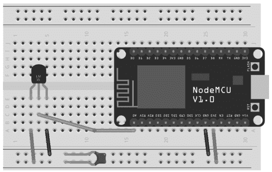

图4.27 带有LM35温度传感器的NodeMCU†。

http://192.168.10.nn/led?b=1023 将亮度设置为最大值。电路原理图如图4.27所示，使其工作的代码如下。

```cpp
// TemperatureWebServerBrightness, V. Ziemann, 221214
#include <ESP8266WiFi.h>
const char* ssid     = "MyHomeNet";
const char* password = ".......";
WiFiServer server(80);  // server listens on html port 80
void setup() {
  pinMode(D0,OUTPUT);    // D0=GPIO16=LED_BUILTIN on NodeMCU
  Serial.begin(115200); delay(10);
  Serial.print("Connecting to "); Serial.println(ssid);
  WiFi.begin(ssid, password);
  while (WiFi.status() != WL_CONNECTED) {delay(500); Serial.print(".");}
  Serial.print("\nWiFi connected and "); server.begin();
  Serial.print("server started at "); Serial.println(WiFi.localIP());
}
void loop() {
  WiFiClient client = server.available();
  while (client) {
    Serial.println("new client");
    while(!client.available()){delay(1);}
    String req = client.readStringUntil('\r');
    Serial.println(req);
    client.flush();
    client.print("HTTP/1.1 200 OK\r\nContent-Type: text/html");
    client.print("\r\n\r\n<!DOCTYPE HTML>\r\n<html>\r\n");
    if (req.indexOf("/temperature") != -1) {
      float temp=100*3.3*analogRead(0)/1023;
      client.print("Temperature="); client.print(temp,2);
    } else if (req.indexOf("/led") != -1) {
      int i1=req.indexOf("?b="); int i2=req.indexOf("HTTP");
      String payload=req.substring(i1+3,i2-1);
      Serial.println(payload);
      if (i1>0) analogWrite(D4,1023-payload.toInt());
      client.print("Setting LED brightness to "); client.print(payload);
    }
    client.println("</html>"); delay(1);
    client.stop();
  }
}
```

在这个例子中，我们首先包含带有ESP8266WiFi.h库信息的头文件，定义无线网络的访问参数ssid和password，并实例化服务器以监听默认的http端口80。在`setup()`函数中，打开串行线路以便监听调试信息。然后使用`WiFi.begin()`函数建立与无线网络的连接。在此函数内部，处理登录无线网络和与DHCP服务器的通信。一旦`WiFi.status()`报告连接已建立，我们就将连接信息（如获取的IP地址）打印到串行线路。然后我们通过调用`server.begin()`函数启动服务器。在`loop()`函数中，一个与之前类似的结构接收来自客户端的请求，将请求存储在变量`req`中，向客户端返回带有Content-type的标准http头，然后检查请求`req`是否包含字符串`/temperature`。如果是，程序通过调用`analogRead()`函数确定温度，并将值写回客户端。请注意，这次我们使用String的`indexOf`方法来确定是否存在子字符串。如果`req`包含`/led`，我们确定问号和尾随字符`HTTP`的位置，并提取它们之间的所有内容作为有效负载。转换为整数后，我们使用该有效负载设置内置LED的亮度。我们可以通过`Serial.println(req)`打印来检查`req`的构造方式以及为什么必须找到尾随的`HTTP`。如果收到未知请求，我们会在串行线路上收到通知。最后，我们添加结束的`</html>`标签并关闭与客户端的连接。我们指出，在这个简单的例子中，我们没有检查有效负载的有效性，如果系统可以从互联网访问，这会带来潜在的安全风险。

关于NodeMCU返回给调用浏览器的神秘HTTP头，需要说明几句。当浏览器（如Firefox或Chromium）连接到默认端口80上的Web服务器时，它首先发送所请求网页的名称，例如上面示例中的`GET /temperature`，作为HTTP-GET请求。在返回所请求的网页之前，服务器会发送一些元信息，例如状态码以及接下来是什么类型的信息。正确理解的请求的状态码是200，对于缺失的页面是404，这个数字可能每个人都见过，作为网页指定中拼写错误的响应。类型可以是图像、媒体文件（如视频）或HTML格式的文本，这正是我们在程序中指定为Content-Type的内容。空行之后是带有DOCTYPE的标准HTML头，以及嵌入在`<html>`标签中的信息。我们将在第5.7节更详细地讨论HTML和网页的结构。浏览器不渲染元信息，因此这些信息保持不可见，但我们可以通过将netcat或telnet命令（更多关于这些命令的内容将在第5.3节介绍）指向IP地址为192.68.20.184的NodeMCU上的端口80并手动发出`GET /temperature`来窃听与网络的通信。服务器随后的所有输出都出现在同一个窗口中。图4.28说明了这种交换。

设置LED亮度使用了与在线购物时输入信用卡号相同的机制。它也基于HTTP-GET方法，但在地址后的问号后添加了一个查询字符串。查询字符串的形式为`name=value`。这种向Web服务器发送信息的机制经常被使用

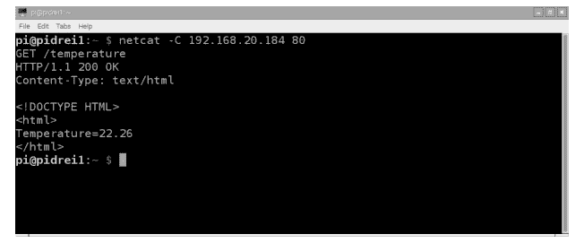

图 4.28  与 Web 服务器通信时显示的 HTTP 头部。

通过 HTML 表单实现。它允许用户输入文本或从列表中选择内容，然后点击提交按钮将其发送到服务器，服务器会做出相应反应，例如发送所购买的商品——或者设置 LED 的亮度。

在第二个示例中，我们配置一个 NodeMCU 来运行一个服务器，监听端口号 1137 上的连接。一旦连接建立，它就会等待命令，然后使用前面讨论的查询-响应协议进行适当回复。硬件与前面的示例相同，已在图 4.27 中展示。运行在 NodeMCU 上的代码如下。

```cpp
// Socket-based measurement server, V. Ziemann, 161211
const char* ssid     = "MyHomeNet";
const char* password = ".......";
const int port = 1137;
#include <ESP8266WiFi.h>
WiFiServer server(port);
void setup() { //................................................setup
  Serial.begin(115200);
  WiFi.begin(ssid, password);
  while (WiFi.status() != WL_CONNECTED) {
    delay(500); Serial.print(".");
  }
  Serial.println("");
  Serial.print("WiFi connected to "); Serial.println(ssid);
  Serial.print("Server IP address: "); Serial.println(WiFi.localIP());
  server.begin();
  Serial.print("Server started on port "); Serial.println(port);
}
void loop() {  //................................................loop
  char line[30];
  float volt,temp;
  WiFiClient client = server.available();
  while (client) {
    while(!client.available()) {delay(1);}
    client.readStringUntil('\n').toCharArray(line,30);
    Serial.print("Request: "); Serial.println(line);
    if (strstr(line,"A0?")) {
      volt=3.3*analogRead(0)/1023;
      client.print("A0 "); client.println(volt);
    } else if (strstr(line,"T?")) {
      temp=100*3.3*analogRead(0)/1023;
      client.print("T "); client.println(temp,1);
    } else {
      Serial.println("unknown command, disconnecting");
      client.stop();
    }
    client.flush();
    // client.stop();
  }
}
```

在这个程序中，我们首先定义了两个字符串 `ssid` 和 `password`，用于无线网络的名称和密码。在包含 ESP8266 设备的 WiFi 支持功能之前，我们还在下一行指定了端口号，这里是 1137。包含该功能后，我们定义了一个名为 `server` 的 WiFiServer，它监听指定的端口。在 `setup()` 函数中，我们启动了通过 USB 线进行的日志记录串口通信，然后使用 `WiFi.begin()` 函数连接到无线网络。一旦 NodeMCU 连接到无线网络，我们就使用 `server.begin()` 命令启动服务器。在 `loop()` 函数中，我们使用了与之前通过串口线通信时相同的结构，但这次是通过客户端计算机连接到我们的服务器时动态打开的套接字进行通信。与请求计算机的连接会一直保持打开，直到一个未知命令关闭连接。但在连接打开期间，可以重复请求值。如果我们希望在发送回复后立即关闭连接，可以取消注释 `client.flush();` 行之后的 `client.stop();` 行。请注意，此服务器一次只能处理一个请求。如果一台计算机已经连接，而第二台计算机尝试建立连接，后者将被挂起，直到第一台计算机断开连接。这个 NodeMCU 上的程序允许我们通过端口 1137 上的自定义套接字查询 NodeMCU 可用的任何参数或测量值。如何从另一台计算机连接到它，我们将在下一章讨论。

除了标准通信协议外，还有其他几种可用协议。我们将在下一节中简要讨论它们。

### 4.6.4 其他通信方式

在前面的章节中，我们使用了标准且易于使用的协议（RS-232、USB、蓝牙和 WiFi）与微控制器通信。它们的优点是在许多主机计算机上都易于获得。然而，还有其他通信渠道，我们将在以下段落中列举几种。所有这些都由 Arduino 库支持。

另一种无线通信渠道是 *ZigBEE*，它与蓝牙相关，但使用更简单的协议开销，并针对尽可能低的功耗进行了优化，以实现长时间的电池供电运行。另一个选择是使用廉价的 *433 MHz 收发器*，它们可以通过简单的无线链路将从属微控制器连接到其主控器。

*MIDI* 是一种为连接电子乐器而开发的协议。物理接口基于电流环，通过每个设备输入端的光耦合器实现电气隔离。在逻辑上，通信与波特率为 31250 的 RS-232 非常相似。每条 MIDI 消息由三个（在某些情况下是两个）字节组成，这些字节具有标准化的解释，例如通道号、音调（对应于钢琴键盘上的特定按键）和力度（按键被按下的强度）。

可以使用红外（IR）光连接附近的硬件，红外光用于电视遥控器，将信息从遥控器发送到电视以更改频道或音量。顺便提一下，即使是第一代 Lego™ Mindstorm 微控制器也是通过这种方式进行通信的。通信基于使用 940 nm 波长的红外二极管，并以 38 kHz 的速率调制光。发送调制光的脉冲代表低电平或高电平信号，并用于模拟低波特率（如 2400 波特）的类 RS-232 协议。另一种协议是 RC-5，通常用于电视遥控器。像 TSOP2238 这样的接收器内置光学滤波器，仅对 940 nm 附近的窄波长范围敏感。此外，它们解调 38 kHz 载波频率，并在其输出引脚上仅提供 3.3 V 或 5 V 信号，使其非常易于接口。

请注意通用结构：通信通道基于底层硬件和协议栈，协议栈通常由硬件实现之上的多个层组成。在我们的示例中，我们使用发送以问号结尾的字符串来表示请求的约定。回复则由相同的字符串后跟一个值组成。这个约定定义了一个简单的通信协议。我们可以轻松地提出其他协议，并添加诸如校验和之类的功能来测试传输的完整性。此外，I2C 和 MIDI 通信基于标准化协议，其中传输多个字节，每个字节表示某些特定信息，例如要寻址的寄存器或写入寄存器的值。当然，所有参与通信的设备必须就传输的比特和字节的解释达成一致，否则将一片混乱。

到目前为止，我们总是假设某个未指定的主机计算机（例如台式计算机）可用，并作为微控制器的通信伙伴。在下一章中，我们将考虑一种广泛可用、文档齐全且价格低廉的特定主机计算机——Raspberry Pi。

## 问题与项目创意

1.  将十六进制数 0x5CA3 转换为 a) 二进制和 b) 十进制表示。
2.  读取 NodeMCU 上 A0 引脚的 ADC 不太可靠。例如，将 A0 连接到 GND 不一定得到零 ADC 读数。尝试对其进行校准。
3.  你能将 MCP23017 IO 扩展器和 BME680 环境传感器连接到同一个 I2C 总线上吗？
4.  在什么情况下使用中断是有利的？
5.  你需要多达 128 个数字输入引脚。使用多个 MCP23017 并解释如何连接它们。
6.  查看 MCP3304 的数据手册，找出如何配置它以读取八个单极性输入电压。你需要在软件中更改什么？
7.  如果你需要 128 个单极性模拟输入信号，如何将 MCP3304 连接到 Arduino？这是否可能，如果可能，如何实现？
8.  将一个三色 LED 连接到 Arduino，并通过串口线独立控制三种颜色的亮度。添加直接设置标准混合颜色（如橙色或品红色）的功能。

## 9. 解释为什么在第113页的网络服务器示例中，我们使用 (1023-value) 来设置亮度。

## 10. *HTTP* 和 *HTML* 有什么区别？

## 11. 学习HTML表单，并实现一个带有用户界面的网页，用于设置NodeMCU上LED的亮度。

## 12. 将一个HC-SR04距离传感器安装在模型舵机顶部，并扫描周围环境以测量到障碍物的距离。如果距离小于20厘米，则发出蜂鸣声。

## 13. 通过快速重新编程图4.24中温度计上的NeoPixels，并在指定红、绿、蓝的值上添加一个随机数，使其闪烁。

## 14. 使用 `tone()` 函数让Arduino发出像 *警报器* 一样的声音。

## 15. 使用霍尔探头构建一个 *磁场传感器*。

## 16. 构建一个使用MPU6050感知倾斜角度的设备。

## 17. 构建一个 *旋转木马比较器*，并使用MPU6050测量你在旋转木马上体验到的加速度。使用电池供电的NodeMCU发布一个包含数据的网页。通过测量和显示角速度来增强系统。同时显示过去5分钟内的最大值和最小值。

## 18. 使用MLX90614红外传感器和NodeMCU构建一个非接触式 *无线温度计*，使测量值可通过网页或基于套接字的服务器获取。

## 19. 使用螺旋桨测量风速，该螺旋桨在 *槽型光电开关* 中或在分立的LED和光电晶体管之间中断光路。

## 20. 通过短暂闪烁紫外LED来研究材料的磷光现象，并使用对不同波长敏感的光电晶体管或二极管记录材料的响应。

## 21. 研究如何将第2.3.6节中的粉尘传感器连接到Arduino。

## 22. 将MQ-x气体传感器连接到UNO，并确定空气质量。

## 23. 研究如何将第2.3.6节中的GPS传感器连接到Arduino。考虑使用 `SoftSerial` 库为微控制器添加额外的RS-232端口。

## 24. 研究Arduino NANO。它与Arduino UNO有何不同？讨论你会在什么情况下使用NANO。

## 25. 将你最喜欢的传感器连接到ESP32，并通过蓝牙与其通信。

# 主机：树莓派

树莓派 [11] 是一款小型单板计算机，于2012年首次亮相，旨在为学生和其他有兴趣的人士提供一个廉价的平台，以介绍计算机基础知识，特别是编程。

## 5.1 硬件

自首次亮相以来，树莓派经历了多次硬件修订。图5.1左下角较小的板子是一款拥有512 MB内存且没有以太网端口的Pi Zero。这使其对于我们的目的来说过于受限。相反，我们使用的是最新的化身，即2019年2月推出的4型。它有两种外形尺寸：经典的4B版本（如图5.1右下角所示）和较新的400版本（内置键盘，如图顶部所示）。两者都采用四核ARM中央处理器（CPU），运行速度高达1.8 GHz，并板载2到8 GB的RAM内存。这种硬件功能足够强大，可以运行完整的Linux系统。一个外部可更换的micro-SDHC卡（至少16 GB，速度等级10）用作硬盘来存储操作系统和用户文件。对于我们的目的，2或4 GB的RAM就足够了；之前的3B版本也能很好地工作。

但除了CPU之外，树莓派4B和400还配备了一个视频处理器，可以通过两个内置的micro HDMI连接器显示4k分辨率（最高3840 × 2160）的视频。音频输出可通过HDMI连接器或3.5毫米耳机插孔提供。此外，板载有两个USB-2和两个USB-3端口，用于连接外围设备，如USB闪存盘、键盘、鼠标或网络摄像头。与外界的通信可通过内置的有线以太网端口实现，并且从第3版开始，树莓派内置了蓝牙和WiFi，支持2.4 GHz频段，4B版本甚至支持5 GHz频段（802.11ac）。

树莓派因其内置的底层外设而极具吸引力。板上有17个通用输入输出（GPIO）引脚，其中一些支持I2C、SPI和UART（类似RS-232）通信。此外，还提供了一个特定的音频总线（I2S），一个用于连接定制树莓派摄像头的高速CSI接口，以及一个用于连接LCD面板的DSI接口。其中一些功能可用于实现与Arduino相同的功能，但我们在此不会使用，而是将树莓派用作标准化的主机系统。

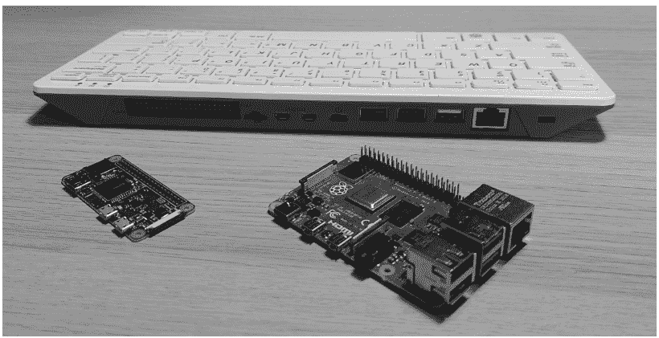

图5.1 树莓派400（顶部）、4B版本（右下角）和Pi Zero版本（左下角）。

## 5.2 入门

CPU和外设足以将树莓派用作媒体中心，通过 *LibreElec* 发行版运行 *KODI* 媒体中心软件，将普通电视变成智能电视。还有 *OpenWRT* 发行版，可将树莓派变成包含防火墙功能的互联网路由器。其他软件包可将其变成复古游戏机或网络附加存储（NAS）服务器。除了这些特定用途外，我们还可以在SDHC卡上安装通用的Linux操作系统，从中启动树莓派。有不同风格的Linux可用，如Ubuntu、Fedora或OpenSuse，但我们在本书其余部分使用的标准系统基于Debian发行版，称为 *Raspberry Pi OS* 或 *Raspbios*。多年来，出版了大量书籍，例如[24]，其中包含如何在许多情况下使用树莓派的配方。请使用这些以及其他资料来补充本书的讨论。

我们可以在 [https://www.raspberrypi.org/software](https://www.raspberrypi.org/software) 网页上找到Raspberry Pi OS操作系统的下载说明，从那里可以下载适用于所有常见桌面操作系统的 **rpi-imager** 程序。页面上的链接指向一个关于使用该烧录器的简短视频教程。请按照说明操作，并在烧录器下载选定的树莓派操作系统镜像并将其复制到SD卡时保持一点耐心。在大多数情况下，包含所有推荐软件的32位镜像是一个不错的选择，尽管其大小为2.7 GB，下载量相当大。或者，在Linux系统上，也可以从网页下方的链接手动下载操作系统镜像，使用 **unxz** 程序解压它，然后通过以 **root** 用户身份发出命令

```
dd bs=4M if=2022-09-22-raspios-bullseye-armhf-full.img of=/dev/sdX
```

将镜像文件复制到SD卡。根据桌面计算机上的Linux发行版，我们可能需要在dd（磁盘复制器）命令前加上 **sudo**。在dd命令中，目标，即输出文件/dev/sdX，必须是SD卡的设备文件。我们可以通过在将SD卡插入读卡器后检查系统日志文件来轻松确定它。在日志文件结束之前，最近插入的卡通常被引用为/dev/sdX，其中X是c或d或e。我们必须确保使用正确的驱动器！选择错误的驱动器可能会擦除桌面系统的硬盘。如果不确定，请仔细遵循安装帮助中的说明，这些说明比此处给出的更详细。一旦dd命令完成（根据SD卡读卡器的不同，可能需要长达30分钟），我们将SD卡插入树莓派的插槽，将显示器连接到HDMI连接器，将鼠标和键盘连接到USB连接器，并通过USB-C连接器接通电源以启动树莓派。

首次启动时，树莓派会自动扩展SD卡上的操作系统镜像以使用所有可用空间，并生成用于后续加密通信的密钥，然后重新启动。在第二次启动期间，它会询问本地化设置，特别是国家、时区和键盘布局，以及标准用户的用户名。在这里，为了与本书第一版保持一致，我选择用户名pi和一个秘密密码。在后续步骤中，配置WLAN，更新软件，最后重新启动。

当树莓派再次启动时，我们直接登录到桌面系统，无需输入密码。我们可以通过启动 *Raspberry Pi Configuration* 程序来更改此行为，该程序位于屏幕顶部菜单列表中的树莓图标后面，位于 *Preferences* 下。在 *System* 选项卡中，我们可以更改登录行为，不过如果树莓派处于安全位置，我通常会保持默认设置。我通常将 *hostname* 更改为易于记忆的内容，例如 *sensorpi*。在 *Interface* 选项卡中，我建议启用 *ssh*。我们稍后将使用此功能从其他计算机连接到我们的树莓派。

此时，我们的树莓派上已经运行了一个Raspbios Linux系统，是时候通过选择带有树莓图像的Menu按钮来探索它了。在那里，我们可以找到所有可用的程序，按组分类，例如 *Programming*，其中包含指向Java、Python和Mathematica的链接。*Office* 组包含指向Libreoffice程序的链接，用于文字处理、电子表格和演示文稿创建。在 *Internet* 菜单项后面，有指向互联网浏览器和邮件客户端的链接。此外，还有 *Games*、*Accessories* 和 *Preferences* 的菜单项。后者如图5.2所示，包含指向 *Raspberry Pi Configuration* 和其他配置选项的链接。*Accessory* 菜单包含指向 *Terminal* 程序的链接，该程序提供了一个用于输入命令的控制台。我们将在后续章节中广泛使用它，但这里有一些基本命令值得了解。当我们打开终端窗口时，我们位于用户pi的主目录中，即/home/pi，我们可以通过输入命令 `pwd` 来“打印工作目录”来验证这一点。我们可以通过输入 `ls` 命令或其长格式 `ls -l` 来列出其内容，后者显示当前目录中的所有文件和子目录。为了进入子目录，我们使用 `cd <dirname>` 命令将工作目录更改为<dirname>。命令 `cd ..` 会将我们带回开始时的目录。如果我们想导航到一个只知道以斜杠开头的绝对名称的目录，例如/usr/local，我们使用 `cd /usr/local`。我们应该尝试使用这些程序并进行测试，以熟悉新的树莓派系统。要么在命令行上输入命令，要么在菜单中单击程序并进行探索。最后，有一个 *Preferences* 菜单项，其中包含用于自定义树莓派的程序。它包含我们之前用于启用 *ssh* 的 *Raspberry Pi Configuration* 等程序。

在菜单列表中，紧挨着带有树莓的Menu按钮，有几个程序的快速启动按钮，例如互联网浏览器、文件管理器和 *Terminal*。可以通过右键单击菜单列表并选择 *Add/Remove Panel Items* 来将程序添加到此区域。在出现的窗口中，我们高亮显示 **Application Launch Bar** 并单击 *Preferences*。在窗口的左侧，列出了快速启动区域中已存在的程序。从右侧，我们可以从计算机上安装的所有应用程序列表中添加程序。如果 *Terminal* 程序不在快速启动区域中，我们从 *Accessory* 组中添加它，因为我们将大量使用它。

## 5.3 安装和使用新软件

在安装新软件之前，我们首先需要更新当前系统，该系统基于一个较早准备的镜像文件。为此，我们启动一个终端程序并输入以下两个命令：

```
sudo apt-get update
sudo apt-get upgrade
```

其中第一个命令更新已安装程序的数据库，并检查是否有更新的版本可用。第二个命令在询问确认后安装升级。首先会下载较新的版本，然后进行安装。这可能需要相当长的时间——如果距离上次更新或初始安装介质创建的时间较久，大约需要30分钟。请注意，系统管理命令名为`apt-get`，我们需要通过在前面加上`sudo`来以超级用户权限运行它。升级完成并返回命令行提示符后，我们就拥有了一个最新的系统，可以准备安装其他软件了。

由于我们想测试与Arduino的接口，需要安装一个简单的终端模拟器程序`screen`，通过执行命令

```
sudo apt-get install screen
```

在确认下载了几千字节后，程序会在几秒钟内安装完成。假设我们有一个Arduino UNO，已烧录了第66页的查询-响应程序，并将UNO的USB线连接到树莓派的USB端口。然后我们通过在终端窗口中执行`dmesg`来检查串行线路的设备名称，并查看输出末尾附近的内容。在我的情况下，有一行包含字符串`ttyACM0`，但根据UNO上安装的串行转USB转换器，也可能出现`ttyUSBn`（其中`n`是任意数字）。由于Arduino程序使用9600波特率进行串行通信，我们在树莓派的命令行上使用以下命令连接：

```
screen /dev/ttyACM0 9600
```

然后我们在screen终端窗口中输入`A0?`并按`Enter`来查询UNO。UNO应该会响应`A0 nnn`，其中`nnn`是UNO上ADC测量的值。恭喜，我们已经建立了从树莓派到Arduino UNO的通信链路。一旦我们从UNO获取数据完毕，可以通过在screen窗口中按`Ctrl-a-k`来关闭连接，通过输入`y`确认是否真的要退出，然后返回命令提示符。

**screen**程序，实际上Unix或Linux系统上的大多数程序都自带帮助系统，称为手册页，可以通过在命令行输入`man <程序名>`来访问——例如，在当前情况下输入`man screen`。这将显示如何在终端窗口中使用该程序的信息。特别是，所有命令行选项都有解释。我们通过在窗口中输入“q”退出`man`程序。使用`man`仅在已知程序名时有效，但我们可以使用命令`man -k <关键词>`来搜索系统中与`<关键词>`相关的手册页。后者命令在我们使用`sudo mandb`初始化一次数据库后即可工作。通过`man mandb`查看它具体做了什么！

稍后，我们将经常需要编辑配置文件或编写程序代码。编辑的文件通常是纯文本文件，即所谓的ASCII文件，我们使用编辑器程序（如`nano`、`vi`或`emacs`）来创建和编辑它们。前两个已经安装在系统上，由于`vi`学习曲线较陡，除非有其他偏好，`nano`是一个不错的入门选择。我们通过在命令行输入`nano <文件名>`来启动`nano`，按`Enter`后，终端窗口会打开，显示文件内容（如果文件存在）或一个空文件（如果文件不存在）。图5.3显示了我们添加了一些文本后的`nano`界面。在窗口底部列出了最重要的命令，特别是`Ctrl-x`退出程序和`Ctrl-g`打开内置帮助系统以获取更多关于使用`nano`的信息。在这里，小写字母和大写字母都可以与`Ctrl`键结合使用来执行命令，例如`Ctrl-k`和`Ctrl-u`用于剪切和粘贴光标所在的行。请注意，一旦文本文件写入磁盘，我们也可以使用`less`命令或`cat`来查看它。请查看各自的手册页以获取更多信息。

我们立即善用`nano`，替换默认的桌面管理器`mutter`，它有一个恼人的错误，有时会阻止窗口调整大小或移动。我们需要编辑配置文件`/etc/xdg/lxsession/LXDE-pi/desktop.conf`：

```
sudo nano /etc/xdg/lxsession/LXDE-pi/desktop.conf
```

并将文件中的第二行从`window_manager=mutter`更改为`window_manager=openbox`，保存文件并重启。请注意，编辑文件需要管理员权限，因此我们需要在命令前加上`sudo`。

任何在官方Raspberry Pi软件仓库中可用的程序、库或其他软件包，都可以通过首先使用`sudo apt-get update`更新数据库（每个会话只需一次），然后使用`sudo apt-get`安装软件包来安装。

## 126 ■ 基于Arduino和Raspberry Pi的传感器实践教程（第二版）

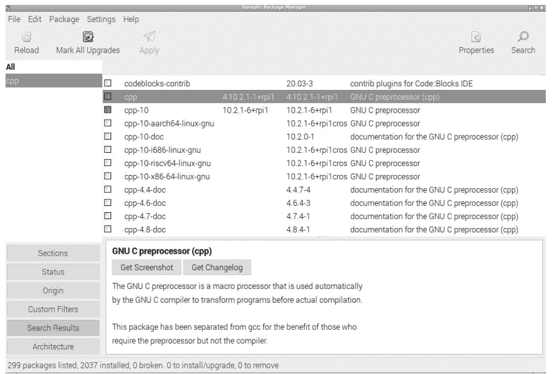

图5.4 Synaptic包管理器。

install <package-name>。我们利用新获得的信息，通过在命令行执行以下命令来安装MATLAB的克隆版octave [25]：

```
sudo apt-get install octave
```

安装过程需要几分钟，具体时间取决于下载速度，安装完成后程序即可使用。我们通过在命令行输入命令**octave**，然后按**Enter**键来启动它。Octave会显示其版本号和一些版权信息，然后出现提示符**octave:1>**。在那里，我们可以输入兼容MATLAB的命令，例如**A=[1,2;3,4]; B=inv(A)**，该命令定义了一个2×2矩阵*A*，对其进行求逆，并将结果存储在变量*B*中。稍后我们还将从octave内部连接到Arduino。

为了能够显示图形文件并将其从一种格式转换为另一种格式，**imagemagick**包非常有用。我们通过在命令提示符下执行以下命令来安装它：

```
sudo apt-get install imagemagick
```

安装完成后，我们可以使用**display graph.png**来显示几乎任何图形文件，其中**graph.png**只是任意图形文件的示例。将现有文件**graph.png**转换为JPEG格式，只需在命令行输入**convert graph.png graph.jpg**。使用**man display**和**man convert**可以了解更多关于这些程序功能的信息。

使用**apt-get**安装已经相当方便，因为它会自动解决对外部库的依赖关系，并安装任何缺失的库以保证系统可靠运行。然而，还有一种更方便的方法，即使用包管理器**synaptic**。我们通过在命令行执行以下命令来安装它：

```
sudo apt-get install synaptic
```

安装完成后，它会出现在菜单的*Preferences*部分，位于树莓标志后面，名为*Synaptic Package Manager*。从那里启动它，首先会要求输入登录密码，然后出现如**图5.4**所示的窗口。我们使用顶部的*Search*按钮来查找程序。只需点击它，输入关键词，浏览列表，安装任何感兴趣的程序并尝试使用。

我们立即使用该功能，安装用于访问远程计算机的程序，例如通过套接字提供服务器功能的NodeMCU。为此，我们需要**netcat**和**telnet**（客户端）程序中的一个或两个，并通过**synaptic**搜索程序名称来安装它们；我们从列表中右键单击所需的包并选择*Mark for Installation*。选择所有程序后，我们按下**synaptic**用户界面左上角附近的*Apply*按钮。安装完成后，我们就可以使用这些程序连接到运行基于套接字服务器的NodeMCU，我们将在后面详细讨论。这里我们通过在一个终端窗口中打开一个临时服务器来简要说明**netcat**程序的功能。运行**netcat -l 11111**会启动一个服务器，该服务器在端口11111上监听（-l）。请注意，普通用户只能使用1023以上的端口号。我们通过在第二个终端窗口中运行**netcat localhost 11111**来连接到该服务器，其中**localhost**是*本机*的默认名称，后面是服务器监听的端口号。现在，在一个终端中输入的任何内容都会自动出现在另一个终端中。在这个例子中，我们只是在同一个计算机上连接了两个运行的**netcat**版本。一个作为服务器启动，另一个作为客户端，但相同的功能适用于任何具有正常网络连接的计算机。通过查阅其手册页**man netcat**可以了解更多关于**netcat**的信息。如果我们希望删除先前安装的程序，可以在synaptic中右键单击列表中的程序并选择*Mark for Removal*。按下*Apply*即可立即删除它。

如今，许多软件包都可以从所谓的git仓库获取。这包括本书附带的软件，托管在https://github.com，可以通过以下命令下载：

```
git clone https://github.com/volkziem/HandsOnSensors2ed.git
```

其中git clone命令会创建一个子目录HandsOnSensors2ed，仓库的内容将被复制到该目录中。如果缺少git程序，我们可以使用sudo apt-get install git或通过synaptic安装它。同样，命令man git提供了关于git众多选项的丰富信息，而man git clone则提供了关于下载（也称为克隆）仓库时特定选项的信息。

到目前为止，我们一直将Raspi作为一台独立计算机使用，屏幕、键盘和鼠标直接连接到Raspi上，但这占用了外围硬件。因此，现在是时候安装软件，以便通过网络登录到Raspi，并在我们常规的桌面计算机上接收Raspi桌面的虚拟副本。这样我们就能在一个窗口中拥有一个Raspi桌面，其行为与常规显示器上的桌面完全一样。Raspi上已经安装了RealVNC的服务器，可以在Raspberry Pi Configuration程序中启用，但要使用它，您需要在桌面计算机上安装专有的RealVNC viewer。如果您不愿意这样做，可以通过在Raspi上使用以下命令安装tightvncserver来实现相同的功能：

```
sudo apt-get install tightvncserver
```

或者，也可以通过synaptic安装。此命令会删除预装的realvnc-server，并替换为一个受许多开源vncviewer程序支持的服务器。安装完成后，我们以用户pi的身份从命令行运行vncpasswd，回答关于密码的问题，并记住它们。

在我们希望通过网络登录到Raspi的桌面计算机上，我们使用Linux发行版的包管理器安装vncviewer软件。在安装过程中，vncpasswd程序也应该被安装，我们需要在桌面计算机的命令提示符下运行它。它会提示我们输入与在Raspi上首次运行vncserver程序时选择的VNC连接相同的密码。完成后，使用VNC登录到Raspi的基本基础设施就已就绪。为了简化整个过程，我们在桌面计算机上创建一个名为raspi.sh的文件，内容如下：

```
#!/bin/bash
RASPI=192.168.10.nn
ssh -X pi@${RASPI} vncserver -geometry 1280x960 &
sleep 10
vncviewer ${RASPI}:5901 -passwd ${HOME}/.vnc/passwd &
```

并将该文件放在"~/bin"目录中。这个小程序通过ssh远程登录到Raspi，在Raspi上启动指定桌面几何尺寸（我们可以使用较小的尺寸，如1024x768）的vncserver程序，然后等待几秒钟，并使用主目录中.vnc/passwd文件中的凭据在桌面计算机上启动vncviewer。再过几秒钟后，Raspi的桌面就会出现在桌面计算机的一个窗口中，我们可以无缝地将鼠标和键盘焦点移动到Raspi桌面，并在Raspi上执行命令。这是一种非常方便的使用Raspi的方式，因为它只需要网络连接，不需要其他外围设备。顺便提一下，在某些系统上，启动需要管理员权限的图形程序（例如通过sudo synaptic）可能无法访问显示。在这种情况下，我们可以通过首先在终端窗口中以普通用户身份执行xhost localhost来授予所有本地用户授权。

至此，我们有了一个方便的设置来在Raspi上工作，并且基本上准备好与所有连接了传感器的微控制器进行通信。但是，使用Raspi上的有线和无线以太网硬件实在太诱人，不容忽视，在下一节中，我们将简要描述如何使用Raspi上的无线接口来建立一个私有WLAN网络，我们稍后将传感器节点连接到该网络。

## 5.4 将RASPI用作路由器

在此设置中，我们假设Raspi通过其有线以太网RJ45端口连接到我们的常规网络，并且我们可以从桌面计算机访问它，使用ssh或vncviewer登录，如前所述。在Raspi上，我们需要安装以下软件包：

```
sudo apt-get update
sudo apt-get install hostapd dnsmasq
```

我们首先更新软件仓库，然后下载并安装hostapd和dnsmasq包。前者负责建立私有无线网络，并将Raspi变成一个WLAN接入点。后者通过DHCP协议在私有网络上提供IP地址，并将网站名称转换为IP地址。

第一步，我们需要重新配置网络设置。在默认配置中，有一个后台进程（守护进程）名为dhcpcd，它试图为Raspi上的每个网络接口（包括名为wlan0的无线接口）获取IP地址。相反，为了将Raspi作为接入点运行，我们使用例如nano来配置接口，添加以下行：

## 5.5 与Arduino的通信

在基础网络基础设施搭建完成后，我们将Arduino连接到树莓派。树莓派上的大多数程序运行方式与台式计算机类似，这并不奇怪，因为现代树莓派的性能大约相当于十年前的台式计算机。我们首先通过Arduino IDE进行通信，但后续也会使用Python编程语言和Octave。

### 5.5.1 Arduino IDE

我们可以通过`sudo apt-get install arduino`在树莓派上安装Arduino IDE，但软件仓库中的1.8.13版本相对较旧。我们可以从https://www.arduino.cc安装更新的版本。为此，我们在树莓派上打开浏览器，访问Arduino下载网站，选择*Linux ARM 32位*版本，并直接下载到树莓派的下载目录`/home/pi/Downloads/`。在撰写本文时，最新版本是1.8.19。我们建议使用旧版，直到新版IDE 2.0支持我们后续需要的所有功能（如数据上传）。

如果我们选择使用最新版本，可以按照惯例将其安装在`/usr/local`目录树下，执行以下命令：

```
cd /usr/local
sudo tar xvJf /home/pi/Downloads/arduino-1.8.19-linuxarm.tar.xz
cd /usr/local/bin
sudo ln -s /usr/local/arduino-1.8.19/arduino arduino19
```

其中`tar`命令将下载的归档文件解压到名为`/usr/local/arduino-1.8.19/`的子目录中，而`ln -s`则在`/usr/local/bin/`目录中为`arduino`可执行文件创建一个名为`arduino19`的软链接。这样，在终端窗口中输入`arduino19`即可自动找到该程序。或者，我们可以通过点击带有树莓派图标的*Menu*按钮，在*Preference*部分启动*Main Menu Editor*，在*Programming*菜单中创建一个链接。在*Main Menu Editor*的左侧面板中选择*Programming*，然后在右侧面板点击*New Item*。在打开的窗口中，输入新程序的名称*Arduino*，并浏览到`/usr/local/bin`目录中的`arduino19`可执行文件。完成这些步骤后，主菜单的*Programming*部分会出现一个*Arduino*条目。选择它即可在树莓派上打开Arduino IDE，我们可以直接从树莓派开始为Arduino编程。

我们无需在树莓派上重新输入所有Arduino程序，而是使用`scp`从台式计算机复制文件到树莓派。如果台式计算机是基于Unix的系统（如Linux或Mac），`scp`是安全shell程序套件的一部分。在Windows系统上，我们使用*WinSCP*。在Linux台式计算机上，我们执行

```
scp -r Arduino pi@192.168.10.nn:
```

这将Arduino子目录及其所有内容（包括`Arduino/hardware`目录中的所有硬件描述）复制到树莓派。现在我们需要重启Arduino IDE，之前准备的所有程序草图都将在树莓派上的Arduino IDE的*File*→*Sketchbook*菜单下可用。在开始编译我们的示例之前，我们按照第4.2节（第60页）末尾概述的步骤，添加对基于ESP8266和ESP32微控制器的支持。在树莓派上，操作步骤完全相同。现在我们已准备好将Arduino UNO或NodeMCU连接到树莓派的USB端口，并直接从树莓派对它们进行编程。

128 ■ 使用Arduino和树莓派的传感器实践课程，第二版

```
interface wlan0
    static ip_address=192.168.20.1/24
    nohook wpa_supplicant
```

添加到配置文件`/etc/dhcpcd.conf`的末尾。第一行表示以下两行与内置无线接口相关。第二行定义了一个静态IP地址192.168.20.1和网络类型（C类），使用简写表示法`/24`。第三行阻止dhcp守护进程控制该接口。

现在，我们通过在终端窗口中执行以下两个命令，启用wlan0无线网络和eth0有线网络接口之间的网络地址转换（也称为伪装）：

```
sudo iptables -t nat -A POSTROUTING -o eth0 -j MASQUERADE
sudo sh -c "iptables-save > /etc/iptables.ipv4.nat"
```

第一行使用内置命令`iptables`建立要应用的规则，第二行将它们保存到文件`/etc/iptables.ipv4.nat`中，以便在重启后可以恢复。在下次启动时，系统会从自动执行的文件`/etc/rc.local`加载此配置。我们只需在`/etc/rc.local`末尾的`exit 0`之前添加以下`iptables-restore`命令。

```
iptables-restore < /etc/iptables.ipv4.nat
exit 0
```

这确保了系统重启后网络转换能正确初始化。最后，我们允许网络数据包在接口之间传递，这作为安全措施默认是禁用的。我们通过删除文件`/etc/sysctl.conf`中以下行的井号`#`来启用转发：

```
net.ipv4.ip_forward=1
```

如果所有传感器节点只应与树莓派通信，而本地网络上的其他计算机不应能够通过树莓派访问外部互联网，我们可以省略此步骤，因为这可能不需要且存在潜在的安全风险。这最后一步完成了基本网络设置，接下来我们转向接入点软件的配置。

hostapd守护进程的配置文件是`/etc/hostapd/hostapd.conf`。它包含以下行：

```
# /etc/hostapd/hostapd.conf
country_code=SE
interface=wlan0
ssid=messnetz
channel=7
macaddr_acl=0
auth_algs=1
ignore_broadcast_ssid=0
wpa=2
wpa_passphrase=zxcvZXCV
wpa_key_mgmt=WPA-PSK
wpa_pairwise=TKIP
rsn_pairwise=CCMP
hw_mode=g
```

必须通过执行`sudo chmod 600 /etc/hostapd/hostapd.conf`将文件设置为仅所有者可读。它指定了我们居住的国家——这是确定允许的WLAN频率所必需的，不同国家的频率不同——以及其他定义，如网络名称、加密详情和密码短语。这里我们选择一个秘密短语以防止他人滥用您的无线网络。此外，我们需要确保`hostapd`能找到其配置文件，方法是验证以下行

```
DAEMON_CONF=/etc/hostapd/hostapd.conf
```

出现在文件`/etc/init.d/hostapd`的顶部附近。如果尚未存在，请添加它。然后，我们使用以下命令指示系统在启动时启动`hostapd`守护进程：

```
sudo systemctl unmask hostapd
sudo systemctl enable hostapd
```

重启系统后，我们应该能够从具有无线网络接口的计算机上看到名为`messnetz`的新WLAN，但在连接之前，我们需要启动`dnsmasq`守护进程，它在192.168.20.xx网络上提供DHCP服务并分配IP地址。配置文件名为`/etc/dnsmasq.conf`，应包含以下行：

```
domain-needed
interface=wlan0
dhcp-range=192.168.20.100,192.168.20.200,12h
listen-address=192.168.20.1
```

我们将原始安装版本保存为新名称，因为它包含所有参数的说明，可作为参考。然而，对于我们的系统，我们只需要上述示例中的内容，它们几乎是不言自明的。最后，我们使用以下命令注册`dnsmasq`守护进程在启动时启动：

```
sudo systemctl unmask dnsmasq
sudo systemctl enable dnsmasq
```

并重启树莓派以确保系统的所有部分同步。

为了找出哪些计算机连接到我们的WLAN `messnetz`以及它们在开放端口上提供哪些服务，我们使用`sudo apt-get install nmap`安装程序`nmap`。以下调用

```
nmap -sn 192.168.20.1/24
```

列出了所有连接到`messnetz`的计算机的IP地址。选项`-sn`指定扫描类型，`192.168.20.1/24`指定要探测的IP地址范围，其中`/24`是子网掩码255.255.255.0的简写表示法。这意味着所有形式为192.168.20.nn的IP地址都会被探测。如果出现一个设备，例如IP地址为192.168.20.56，命令

```
nmap 192.168.20.56
```

会列出其开放端口。这是确保设备上启动的服务器确实运行的一种便捷方式。使用`man nmap`探索`nmap`的众多选项。

至此，我们已将树莓派转变为一个WLAN接入点，覆盖`messnetz` WLAN。如果启用了IP转发，我们甚至可以从`messnetz`上的任何计算机上网。但我们主要关注的是与连接到`messnetz`的传感器节点通信，并将讨论如何将树莓派用作连接传感器节点网络的中心节点，这些节点通过串行或WLAN链路连接。

当然，我们需要像在台式电脑上一样，选择微控制器的类型及其连接的端口。为了测试一切是否正常工作，我们将 `query-response` 程序下载到 Arduino UNO，并在 Arduino IDE 中打开 `工具→串口监视器`。这应该允许我们通过 USB 串行线路与 UNO 进行通信。如果无法工作，请确保 `工具` 菜单中的 `端口:` 指向连接了 Arduino UNO 的正确串口，并且在 `开发板:` 菜单中确实选择了 UNO。

### 5.5.2 从命令行操作

至此，我们已将树莓派建立为 Arduino 软件的开发系统，并确保它通过基于 USB 的串行线路与 Arduino IDE 通信。但通常我们希望从自己编写的程序访问 Arduino，而不是总是使用 Arduino IDE。第一种选择是使用 `screen` 程序或任何其他终端程序连接到 UNO。因此，在关闭 Arduino IDE 后，我们在树莓派的命令行上启动以下程序：

```
screen /dev/ttyACM0 9600
```

就像我们之前将 UNO 连接到台式电脑时所做的那样。蓝牙通信的工作方式与台式电脑上完全相同。只需遵循 [第 4.6.2 节](Section 4.6.2) 第 110 页描述的详细信息。

在下一步中，我们使用 NodeMCU，并假设树莓派上已安装 [第 5.4 节](Section 5.4) 中的路由器软件。我们将 [第 4.6.3 节](Section 4.6.3) 中 NodeMCU 程序的变量 `ssid` 和 `password` 更改为 `messnetz` 上使用的值。程序顶部附近的两行现在需要读取

```
const char* ssid     = "messnetz";
const char* password = "zxcvZXCV";
```

其中我们需要确保输入与 `hostapd.conf` 文件中 `wpa_passphrase` 相同的密码。然后我们将 NodeMCU 连接到树莓派的 USB 端口，并将更新后的基于套接字的服务器下载到 NodeMCU。当 NodeMCU 连接到 `messnetz` WLAN 时，我们可以使用 `串口监视器` 观察其启动过程的进度。过一会儿，它应该会报告从树莓派上的 `hostapd` 获取的 IP 地址。它位于 `192.168.20.nn` 网络中，这对应于我们在 [第 5.4 节](Section 5.4) 的 `dnsmasq` 配置文件中指定的 IP 范围。在我的情况下，收到的 IP 地址是 `192.168.20.135`，但你的可能不同。此时，我们可以通过在树莓派终端窗口中发出以下命令，通过 WLAN 连接到 NodeMCU：

```
telnet 192.168.20.135 1137
```

其中 `1137` 是在 NodeMCU 上运行的程序中指定的端口号。`telnet` 程序提供一个提示符，我们可以在其中输入要发送到 NodeMCU 的命令。因此，在 telnet 提示符下输入 `A0?` 应该会得到回复 `A0 nnn`，同样显示在 telnet 窗口中，如 [图 5.5](Figure 5.5) 所示。我们使用命令 `Ctrl-]` 关闭会话，然后在 telnet 提示符下输入 `quit`。

除了使用 `telnet`，我们也可以使用 `netcat`，并在终端窗口中输入以下命令：

```
netcat -C 192.168.20.135 1137
```

其中 `-C` 选项确保在每行之后发送 `CR-LF` 字符，这是 NodeMCU 识别命令结束所必需的。否则，通信方式与 `telnet` 相同。

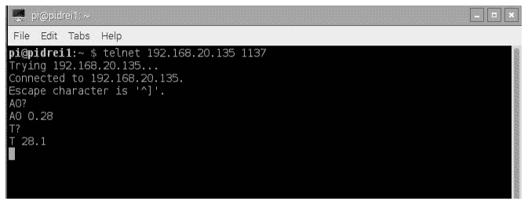

图 5.5 通过无线连接到 NodeMCU 的 Telnet 会话。

前两段仅验证通信正常工作，并且我们能够控制系统。现在我们继续使用 Python 语言来实现同样的功能。

### 5.5.3 Python

Python [26] 当前版本 3 是一种现代编程语言，默认安装在任何树莓派上。实际上，Raspberry Pi 中的 *Pi* 代表 *Python 解释器*。除非你有一些 Python 经验，否则我建议你查看一些教程

https://wiki.python.org/moin/BeginnersGuide/Programmers

或者在网上搜索我们在此使用的简单、通常甚至是不言自明的命令的详细解释。从 Python 访问 Arduino 或 NodeMCU 的目的是展示如何在树莓派上编写定制程序，这些程序与在 Arduino 上运行的程序协同工作。

我们使用以下 Python 脚本，通过带有 query-response 程序的 UNO 查询模拟引脚 0 的单个值。

```
# query_arduino.py, V Ziemann, 220930
import serial, time
query="A0?\n".encode('utf-8')
ser=serial.Serial("/dev/ttyACM0",9600,timeout=1)
time.sleep(3)    # wait for serial to be ready
ser.write(query)
time.sleep(0.1)
reply=ser.readline().decode('utf-8')
print(reply.strip())
ser.close()
```

Python 相当轻量级，如果 `import` 语句报告错误，我们必须通过执行以下命令导入额外的功能，这里是用于串行通信的：

```
sudo apt-get install python3-serial
```

在命令提示符下。现在我们可以导入处理串行线路和基本时间处理的支持。我们需要后者在脚本中实现延迟。在下一行中，我们定义一个变量 `query`，其中包含我们发送给 Arduino 的查询字符串。注意我们显式添加了回车符 `\n`。此外，在 Python3 中，我们需要

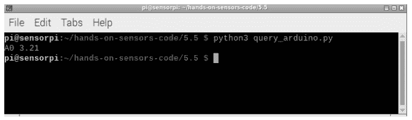

图 5.6 在树莓派上使用 Python 与在 Arduino UNO 上运行的 `query_response` 程序通信。

通过在定义后附加 `.encode('utf-8')` 来显式指定字符串的编码。然后我们以 9600 波特率和 1 秒超时在 `/dev/ttyACM0` 上打开串口 `ser`，这可以防止未满足的读取尝试阻塞程序。我们等待三秒以允许操作系统完成串口的打开，然后使用 `ser.write` 命令提交查询字符串。注意我们在串行设备 `ser` 上使用了 `write` 方法。然后我们等待 0.1 秒，并使用 `ser.readline().decode('utf-8')` 将字符读取到变量 `reply` 中，直到 CR-LF 字符。这里我们读取该行并解码来自 Arduino 的字符。我们使用 `print` 命令显示回复，在关闭串行线路之前，去除前导和尾随的空白字符，例如普通空格或 CR-LF 字符。我们通过输入以下命令在树莓派的命令行上运行我们命名为 `query_arduino.py` 的 Python 脚本：

```
python3 query_arduino.py
```

并在图 5.6 中展示了这个示例。前面的示例脚本展示了如何请求单个测量值。我们轻松扩展脚本以重复查询 UNO，甚至提供简单的 ASCII 图形，显示测量值随时间的变化。这由下面的 Python 脚本完成。示例输出如图 5.7 所示，我们看到通过执行以下命令调用程序：

```
python3 ask_arduino_repeat_plot.py
```

然后程序显示自启动以来经过的时间、测量值，以及该值在预期最小值和最大值之间的图形表示。此功能类似于 Arduino IDE 内置的串口绘图器的简化版本。Python 脚本如下：

```
# ask_arduino_repeat_plot.py, V. Ziemann, 220930
import serial, time, atexit
def cleanup():    # ensure serial line is closed after CTRL-c
    ser.close()
atexit.register(cleanup)  # register the cleanup function
query="A0?\n".encode('utf-8')  # the query string
amin=0                    # minimum expected value
amax=5                    # maximum expected value
width=70                  # number of character used for plot
ser=serial.Serial("/dev/ttyUSB0",9600,timeout=1)
lll=len(query)-1    # needed to remove 'A0' from reply
time.sleep(3)       # wait for serial to be ready
t0=time.time()      # starting time
```

134 ■ 使用 Arduino 和树莓派的传感器实践课程，第二版

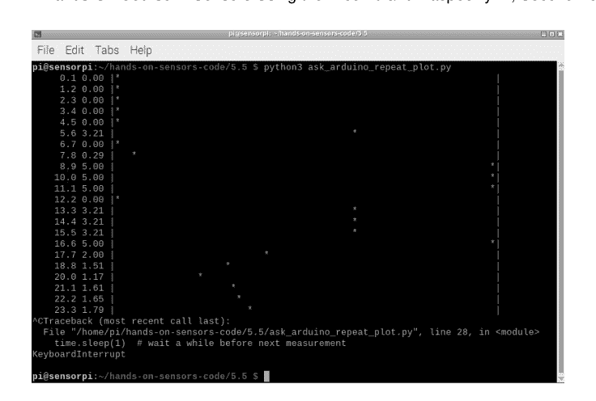

图 5.7 重复查询 UNO 产生的简单 ASCII 图形。

```
python
while 1:                     # repeat forever
    ser.write(query)         # send query
    time.sleep(0.1)          # wait a bit
    reply=ser.readline().decode('utf-8')     # read response
    value=reply[111:].strip()                # make numeric
    k=int((width-2)*float(value)/(amax-amin)) # where to place *
    p='%8.1f %4s |' % (time.time()-t0,value)
    for j in range(0,width-1):
        if j==k:
            p+='*'
        else:
            p+=' '
    p+='|'
    print(p)
    time.sleep(1)  # wait a while before next measurement
```

首先，我们导入串行通信、时间和 atexit 功能的支持，该功能允许我们注册一个函数，在程序终止时执行一些清理活动。由于我们将使用无限循环来读取 UNO，并且我们打算使用 Ctrl-C 异步停止它，这确保了串行线路被正确关闭。注意 Python 使用缩进而不是括号来定义功能范围，cleanup() 函数的函数体只是 ser.close()，但缩进了几个字符。在指定并编码查询字符串后，我们定义了几个变量，打开了串行线路，并确定了回复中值前面的字符的预期长度 111，等待一小段时间，并将当前时间记录在变量 t0 中。while 1: 语句启动一个永远运行的循环。在 while 循环内部（注意缩进以指示范围），我们将查询写入 UNO，等待一小段时间，将响应读入字符串 reply 并对其进行解码。在下一行中，我们移除前几个字符，如 A0，并使用 strip() 方法移除空白字符。变量 k 对测量值进行缩放，使其位于指定的范围内在宽度变量中，然后我们开始构建字符串 p，首先放置自 t0 以来经过的秒数和测量值，接着是一个竖线符号，表示 ASCII 图形的开始。然后我们遍历字符串 p 中所有后续位置，在对应于缩放后测量值 k 的位置放置一个 *，否则放置一个空格。最后，我们添加另一个竖线 | 并将字符串 p 打印到标准输出，然后等待一秒以开始下一次迭代。运行这个 Python 脚本会产生如图 5.7 所示的简单 ASCII 图形。

前面的脚本适用于任何串行线路，包括隐藏在蓝牙链路后面的串口。我们需要在前面的脚本中做的唯一更改是将串口 /dev/ttyACM0 替换为通常称为 /dev/rfcomm0 或 /dev/rfcomm1 的蓝牙端口。

但是如何连接到运行套接字服务器并监听端口 1137 的 NodeMCU 呢？我们只展示了最基本的网络客户端，它发送查询并在标准输出上显示回复。一旦掌握了基本的网络通信设置，就可以相当容易地构建更复杂的示例，例如上面的简单 ASCII 图形。我们在以下示例中说明这些基础知识：

```
# socket_client.py, V. Ziemann, 220930
import socket, atexit, time
def cleanup():
    sock.send(b"quit\n")
    sock.close()
atexit.register(cleanup)
sock=socket.socket(socket.AF_INET,socket.SOCK_STREAM)
sock.connect(("192.168.20.184",1137))
sock.send(b"T?\n")
time.sleep(0.1)
reply=sock.recv(1000).decode('utf-8');
print(reply.strip())
```

程序的结构与串行通信的程序非常相似。首先，导入必要的功能，然后我们定义一个 cleanup() 函数，该函数在程序关闭前执行。这是确保服务器正确关闭连接的最安全方式。在 cleanup() 函数内部，我们指示 Python 脚本发送字符串 quit，该字符串对 NodeMCU 未知，会导致其关闭连接，然后在客户端关闭套接字。请注意，我们使用了通过在字符串前加上字母 b 来编码文字字符串的简写表示法。然后，在调用 atexit.register() 时注册 cleanup() 函数。在下一行，使用普通 TCP/IP 套接字的规范创建套接字 sock，然后连接到运行在 IP 地址 192.168.20.184 和端口 1137 上的 NodeMCU 服务器。然后我们发送查询字符串 T? 并等待一小会儿，然后在去除空白字符后将收到的回复打印到标准输出。

在本节中，我们介绍了如何使用 Python 与传感器节点接口，甚至将它们呈现为简单的 ASCII 图形。这对于快速观察某些值随时间变化的临时解决方案可能已经足够，但对于更专业的结果，我们转向 Octave 来与传感器节点接口，并为演示和报告准备更漂亮的图表。

### 5.5.4 Octave

我们已经在第 5.3 节安装了 Octave，但为了使用串行通信和网络套接字，我们需要安装 octave-instrument-control 包：

```
sudo apt-get update
sudo apt-get install octave-instrument-control
```

安装完成后，我们将以下行添加到名为 .octaverc 的 Octave 启动文件中，该文件在大多数情况下位于树莓派的 /home/pi/ 目录中。这将导致每次启动 Octave 时都加载该工具箱。在编辑该文件时，我们还将以下行添加到 .octaverc 文件中：

```
graphics_toolkit('gnuplot')
```

以避免使用 Octave plot 命令时出现错误。但这可能并非在所有情况下都需要。

安装完成后，我们就可以使用它与传感器节点通信了。首先，我们尝试与连接到树莓派 USB 端口的 UNO 通信，该端口可作为 /dev/ttyACM0 访问。为了从 UNO 读取一个测量值，我们从 Octave 提示符打开串行线路，提交查询，等待响应，并显示结果。以下程序实现了这一点。

```
% read_serial.m
s=serialport("/dev/ttyUSB0",9600);  % open serial line
pause(3)                            % wait for this to complete
reply=queryResponse(s,"A0?\n")     % send query and receive reply
clear s                            % close serial port
```

它实现了我们之前使用的简单查询-响应通信协议。在这里，我们将查询-响应交互的细节封装在函数 queryResponse() 中，因为安装的 instrument-control 工具箱版本（0.6）不支持从串行设备读取直到终止字符。因此，我们自己实现了该功能。

```
% send query string and return response up to termination character.
function out=queryResponse(dev,query,term_char)
if (nargin==2) term_char=10; end  % defaults to LF=0x0A
write(dev,query);                 % send query to device
i=1;
int_array=uint8(1);
while true                        % loop forever
  val=read(dev,1);               % and read one byte
  if (val==term_char) break; end % until term_char appears
  int_array(i)=val;              % stuff byte in output
  i=i+1;
end
out=char(int_array);              % convert to characters
```

三个参数是串行设备 dev、查询字符串和可选的终止字符，默认为换行符（十六进制=0x0A，十进制=10）。在函数中，我们首先在 write() 函数调用中发送查询字符串，在初始化一些变量后，我们使用 read() 函数重复读取一个字符，并将字符附加到 int_array 中，除非它等于终止字符。一旦接收到终止字符，while true 循环退出，int_array 在最后一行转换为字符。转换后的数组返回给调用程序。不用说，我们也可以使用任何具有串行线路接口的蓝牙设备，只是设备文件是 /dev/rfcomm0 而不是普通的串行设备文件 /dev/ttyACM0 或 /dev/ttyUSB0。

通过 WLAN 连接到 NodeMCU 上的套接字进行读取的方式与从串行线路读取的方式非常相似。我们不是打开串行线路，而是使用 tcpclient() 函数打开 TCP 连接。实现这一点的基本代码片段如下所示：

```
% read_tcp.m
s=tcpclient("192.168.20.184",1137);   % open connection
pause(0.1)                              % wait, not really needed
reply=queryResponse(s,"A0?\n")         % send query and get reply
write(s,"quit\n");                     % close remote socket
clear s                                 % close local socket
```

它遵循上面串行通信示例的逻辑。函数 queryResponse() 与前面串行线路的示例相同。另请注意，我们需要通过发送 quit 来显式关闭 NodeMCU 上的远程套接字。

为了说明 Octave 接口对串行线路或网络设备的实用性，我们编写了一个简单的温度记录器，它连接到 NodeMCU 并生成温度随时间变化的漂亮图表。以下 Octave 程序实现了这一点。

```
% temperature logger, V. Ziemann, 220930
clear all
s=tcpclient("192.168.20.184",1137);
pause(0.01)
running=0;
while running<1000
  running=running+1;
  reply=queryResponse(s,"T?\n");
  val(running)=str2double(reply(2:end));
  x(running)=now;
  plot(x,val,'*')
  ylim([22,28])
  datetick('x','ddd/HH:MM:SS')
  ylabel('Temperature [C]')
  xlabel('Time')
  pause(1);
end
write(s,"quit\n");
clear s
```

首先，我们在建立与 NodeMCU 上服务器的 TCP 连接之前清除所有变量，服务器位于端口 1137 和 IP 地址 192.168.20.135。然后我们等待一小会儿，并将变量 running 初始化为零。我们使用此变量作为循环中的迭代器，并检查是否已达到限制。在这个简单的例子中，我们只迭代 10 次。在循环中，我们递增 running 变量，然后向 NodeMCU 发送查询并在字符串 reply 中接收测量值。请注意 reply 以 T 开头，我们在下一行通过将 reply 从位置 2 到末尾转换为 double 变量来移除它。我们将结果复制到索引位置为 running 的变量 val 中。通过这种方式，我们不仅使用迭代器来计算循环迭代次数，还将其用作放置测量值的索引。在变量 x 中，我们复制当前时间，该时间由内置函数 now() 返回。然后我们使用 plot() 函数绘制值与时间的关系图，使用 ylim() 函数指定垂直温度范围，并指定轴标签。

## 5.6 数据存储

在本节中，我们将探讨几种存储测量数据的方法，而典型的数据存储库是*数据库*。我们将介绍多种数据库，并使用 Octave 和 Python 来展示数据。

### 5.6.1 平面文件

最简单的数据库无疑是一个包含时间戳和一个或多个测量值的文件，甚至可能是人类可读的形式。这被称为平面文件数据库，我们可以通过以下 Python 脚本创建一个：

```python
# ask_repeat.py, V. Ziemann, 220930
import serial, time, sys, atexit
def cleanup():
    ser.close()
    atexit.register(cleanup)
query="A0?\n".encode('utf-8')
ser=serial.Serial("/dev/ttyUSB0",9600,timeout=1)
time.sleep(3)    # wait for serial to be ready
while 1:
    ser.write(query)
    time.sleep(0.1)
    reply=ser.readline().decode('utf-8')
    print(int(time.time()), reply[3:].strip())
    sys.stdout.flush()
    time.sleep(1)
```

并将其存储在名为 **ask_repeat.py** 的文件中。我们看到了与之前讨论 Python 脚本时相同的组织结构：导入功能、注册 *cleanup()* 函数、打开串行线路，以及重复发送查询字符串并接收回复。唯一的区别是，我们在测量值之前打印了 *Unix 时间*，即自 1970 年 1 月 1 日以来的秒数，也称为 *epoch*。因此，在输出中，我们会看到以下文本

```
:
1670955286 3.29
1670955287 3.30
1670955288 3.29
:
```

滚动显示。如果我们使用以下代码行将此输出重定向到文件：

```
python3 ask_repeat.py > db.dat
```

在树莓派的终端窗口中运行，我们就创建了一个包含时间戳和测量值的平面文件数据库 **db.dat**。稍后我们可以检索数据并将其转换为漂亮的图表。

在专用终端窗口中运行数据采集程序对于短期测量会话可能有用，但如果我们想长期（例如几个月）记录建筑物的温度，就几乎没用了。在这种情况下，最好有一个专用进程，每隔几分钟唤醒一次，读取温度，并将值与时间戳一起存储到文件中，然后再休眠几分钟。事实证明，Unix 系统通常有一个系统来处理这些重复性任务。它被称为 *cron*，是一个后台进程，每分钟唤醒一次，检查是否有任务要做，执行任务，然后休眠一分钟再检查。

让我们首先创建一个我们希望定期执行的 Python 脚本。在这个特定案例中，我们将其放在 /home/pi/bin 目录中，并将文件命名为 **single_request.py**。它包含以下几行：

```python
# single_request.py, V. Ziemann, 220930
import serial, time
ser=serial.Serial("/dev/ttyUSB0",9600,timeout=1)
time.sleep(2)    # wait for serial to be ready
ser.write(b"A0?\n")  # shorthand notation for encoding
time.sleep(0.1)
reply=ser.readline().decode('utf-8')
print(int(time.time()), reply[3:].strip())
ser.close()
```

我们看到它与之前从 Arduino 读取数据的脚本非常相似。它只是获取一次测量值，并将值与时间戳一起打印到标准输出。为了使此程序可供 cron 软件访问，将其封装在 shell 脚本文件 /home/pi/bin/readA0.sh 中会很方便，该文件包含以下几行：

```bash
#!/bin/bash
/usr/bin/python /home/pi/bin/single_request.py >> /home/pi/A0.dat
```

我们通过在 /home/pi/bin 目录中执行 chmod +x readA0.sh 使用 chmod 程序使文件可执行。第一行指示操作系统使用 bash shell 解释后续行。下一行使用 /usr/bin/python3 程序启动 single_request.py 脚本，并将输出重定向到文件 /home/pi/A0.dat。这里 >> 表示新数据将追加到现有文件中。注意必须给出绝对文件名，包括绝对路径。我们测试 readA0.sh 脚本以确保它创建 /home/pi/A0.dat 文件或向文件追加合理的带时间戳的测量值。一旦满意，我们就将 readA0.sh 注册到 cron 软件，并使用 crontab 程序编辑 cron 程序的配置文件。我们通过在命令提示符下键入以下命令来执行它：

```
crontab -e
```

第一次调用 crontab -e 时，它会询问使用哪个编辑器。我们选择自己喜欢的编辑器或按照建议操作。一旦编辑器打开配置文件，我们在文件末尾添加以下行：

```
* * * * * /home/pi/bin/readA0.sh
```

并保存文件。这会自动将 readA0.sh 脚本注册为在树莓派运行期间每分钟执行一次。我们使用 crontab -l 命令检查文件是否已注册。它会列出用户 pi 的 crontab 文件内容，前提是我们以用户 pi 登录。crontab 文件中六列的含义分别是：分钟、小时、每月的第几天、月份、星期几以及要执行的程序。在前五列中放置星号指示 cron 在每次唤醒时都执行程序。crontab -l 命令的输出有一些基本解释，更多内容可以通过在命令提示符下执行 man 5 crontab 获取。所以，现在我们有了一个后台进程，每分钟记录一次测量值，并填充文件 /home/pi/A0.dat，直到我们从 crontab 文件中删除该条目。

我们的下一个任务是使用 python3 和两个包来生成图表。第一个包 numpy 包含许多数值函数，还有一个强大的函数用于加载数据文件。第二个包 matplotlib 包含用于绘制数据的函数。除非已经安装，否则我们使用以下命令添加这些包：

```
sudo apt-get install python3-numpy python3-matplotlib
```

然后就可以使用以下脚本读取并显示记录在文件 /home/pi/A0.dat 中的数据。

```python
# matplotlib_plotter.py, V. Ziemann, 221004
import numpy as np
import matplotlib.pyplot as plt
d=np.loadtxt('/home/pi/A0.dat',delimiter=' ')
plt.plot(d[:,0]-d[0,0],d[:,1])
plt.xlabel('Time [s]')        # axis labels
plt.ylabel('A0')
plt.show()                    # make plot visible
```

在前几行中，我们导入功能并为包分配简短名称（np, plt），这为我们节省了大量书写。注意我们使用了 pyplot 功能，它包含使绘图特别简单的函数。下一行中的 loadtxt() 函数将数据从文件加载到数组 d 中。接下来的几行只是绘制数据、添加轴标签并在屏幕上显示图表。

显示同一数据文件内容的第二个选项，甚至能很好地考虑时间戳，是使用 Octave，它具有处理时间戳的强大功能。我们提取存储在平面文件数据库中的数据，并使用以下脚本显示它。

```matlab
% flatfile_reader.m, V. Ziemann, 221004
d=importdata('/home/pi/A0.dat');
TZ=1; t=719529+(d(:,1)+TZ*3600)/86400.0;
plot(t,d(:,2))
datetick('x','HH:MM:SS')
```

大部分工作由 importdata() 函数完成。它识别 A0.dat 文件的格式，并将其内容加载到变量 d 中，d 是一个有两列的矩阵，一列是时间信息，另一列是测量值。在下一行中，我们将时间转换为 datetick() 函数期望的标准格式。它将正确格式化水平轴上显示的时间。注意我们使用变量 TZ 表示时区。由于我住在瑞典，本地时钟比 UTC 标准时间（epoch 所指的时间）快一小时。常数 719529 是从公元 0000 年 1 月 1 日到 1970 年 1 月 1 日的天数，86400 是每天的秒数。该图看起来类似于图 5.8 中所示的图。

在将数据存储到平面文件数据库、检索并显示数据之后，我们现在进展到使用更成熟的数据库 MariaDB。它以前被称为 MySQL，但该名称的版权是保留的，因此导致了名称更改。

### 5.6.2 MariaDB

在树莓派可用的几种数据库中，我们选择 MariaDB [27]，因为其内部工作方式与 MySQL 完全相同，我们继续将其称为 MySQL。此外，类似 MySQL 的数据库被广泛使用，并且可以从大多数编程语言相当容易地访问。这些语言包括 Python，以及经过互联网上的一些考古工作后，也包括 Octave。我们使用以下命令从标准仓库安装 MariaDB 数据库：

```
sudo apt-get install mariadb-server
```

尽管安装了 mariadb-server 包，但访问数据库的程序名称仍然是 mysql。

MariaDB 安装后，我们创建一个名为 readA0 的数据库，它将包含与上一节平面文件大致相同的信息，即时间戳和测量值。创建新数据库必须由 mysql 用户 root 执行，并使用 sudo 以管理员权限执行。无需密码提示，我们使用以下命令登录数据库：

```
sudo mysql -u root
```

我们立即看到提示符 MariaDB [(none)]>，我们使用以下命令创建新数据库：

```
create database readA0;
```

这里我们需要特别指出，每条命令都必须以分号结尾。我们在 MariaDB 提示符下使用 `show databases;` 命令来验证数据库 **readA0** 是否存在。由于后续我们并不总是希望以 mysql-administrator 身份操作数据库 **readA0**，因此需要创建一个数据库用户。为此，我们通过在提示符下输入以下内容来声明要使用 **readA0**：

```
use readA0;
```

这会使数据库名称作为提示符的一部分显示出来。现在我们创建用户 **me**，然后通过以下命令序列授予其操作数据库的权限：

```
create user 'me'@'localhost' identified by 'pwpw';
grant all privileges on readA0.* to 'me'@'localhost';
```

其中 **pwpw** 是（过于简单的，请自行设计一个更好的）密码。幸运的是，其语法相当直观易懂。请注意，权限授予可以非常细致地划分为读取、写入和其他权限，但对于我们的简单示例，我们采用简化版本。完成创建数据库和分配 mysql 用户的一般管理操作后，我们通过输入 `quit;` 退出 mysql 提示符。

但现在我们通过在命令提示符下输入以下内容，以用户 **me** 的身份登录 MariaDB：

```
mysql -u me -p
```

并输入密码。或者，使用命令 `mysql -u me -ppwpw`，将密码 **pwpw** 直接附加在 `-p` 之后，将直接登录到 mysql 提示符，但此时是以仅拥有操作 **readA0** 数据库权限的用户 **me** 身份。我们通过执行 `show databases;` 命令来验证这一点，该命令会显示 **readA0** 和一些其他与我们无关的管理数据库。为了在数据库中创建一个称为 **表** 的数据结构，我们使用 `use readA0;` 选择它，然后输入：

```
create table fdata (ts timestamp, A0 float, A1 float);
```

这将创建一个名为 **fdata** 的表，该表在每一行中存储一个时间戳和两个值。其他可存储的数据类型包括 **整数** 和 **BLOB**，后者是 *二进制大对象*。MariaDB 手册可在 [https://mariadb.org/documentation/](https://mariadb.org/documentation/) 获取，其中包含大量详细信息。

至此，创建表的管理任务已完成，我们可以输入 `quit;` 退出，但通过在提示符下执行以下命令向新创建的表中插入值，将更具指导意义：

```
insert into fdata (A0,A1) values (3.14,2.71);
```

并使用以下命令验证数据库内容：

```
select * from fdata;
```

该命令将打印表的内容。我们观察到时间戳变量在插入值时被自动填充。插入值的语法同样相当直观。我们向名为 **fdata** 的表中 `insert into` 变量 (A0,A1)，其值为 3.14 和 2.71。通过 `select` 命令可以从表中读取所有值。指定星号将显示整个 **fdata** 表。如果我们只想打印时间戳 **ts** 和值 A1，可以执行 `select ts,A1 from fdata;`。这些用于创建、插入和从表中选择数据的命令是标准化的，称为结构化查询语言或 SQL。请在互联网上查阅关于 SQL 的教程和更多信息。完成此练习后，我们通过执行 `quit;` 命令退出 mysql 程序。

现在我们知道了从表中插入和检索数据的基本 SQL 命令。但我们的下一个任务不是从 mysql 提示符手动输入它们，而是使用 Python 来执行 SQL 命令。我们通过在命令提示符下使用以下命令安装 python3-mysqldb 包，为 Python 添加 MySQL 功能（该功能也适用于 MariaDB）：

```
sudo apt-get install python3-mysqldb
```

至此，我们已准备好从 Python 内部访问 MariaDB 数据库。第一个任务是从我们之前创建的数据库 readA0 中读取表 fdata。以下 Python 脚本正是实现了这一点。

```
# mysql_show.py, V. Ziemann, 221003
import MySQLdb
db=MySQLdb.connect("localhost","me","pwpw","readA0")
cur=db.cursor()
cur.execute("select * from fdata;")
reply=cur.fetchall()
print(reply)
# for r in reply:                    # loop over entries
# print(r)                         # print each entry
# print(str(r[0]), str(r[1]), str(r[2]))  # format nicely
db.close()
```

首先导入支持 MySQL 的库，然后我们连接到计算机 localhost 上的数据库 readA0，用户为 me，密码为 pwpw。MySQLdb.connect() 函数返回一个数据库句柄 db，执行该函数相当于登录数据库并在 mysql 提示符下执行 `use readA0;` 命令。下一行创建一个游标 cur，它等同于 MariaDB 提示符，允许我们输入数据库插入或检索命令。在下一行中，我们执行 select 命令以显示整个表。我们通过 fetchall() 调用将命令的输出检索到变量 reply 中，在关闭数据库之前打印回复。请注意其结构：首先执行 MariaDB 命令，然后使用 fetchall() 函数检索回复。然而，回复是以一种不熟悉的格式呈现的条目列表。可以使用被哈希符号 (#) 注释掉的行，将每个测量条目显示在单独的行上。代码遍历列表中的每个条目，在第一个注释示例中，print 命令一次显示一个条目。在第二个示例中，print 命令使用 str() 函数将每个条目转换为字符串，使其易于阅读。最后，我们通过调用 db.close() 函数关闭数据库。

我们的下一个任务是向数据库中插入新的测量条目，这通过以下 Python 脚本完成。

```
# serial2mysql.py, V Ziemann, 221003
import serial,time,MySQLdb
ser=serial.Serial("/dev/ttyUSB0",9600,timeout=1)
time.sleep(3)    # wait for serial to be ready
ser.write("A0?\n".encode('utf-8'))
reply=ser.readline().decode('utf-8')
val0=float(reply[3:].strip())
ser.write("A1?\n".encode('utf-8'))
reply=ser.readline().decode('utf-8')
val1=float(reply[3:].strip())
ser.close()
db=MySQLdb.connect("localhost","me","pwpw","readA0")
cur=db.cursor()
sql="insert into fdata (A0,A1) values (%f,%f);" % (val0,val1)
print(sql)
cur.execute(sql)
db.commit()
db.close()
```

脚本的第一部分与之前的脚本非常相似。它只是查询串行线上的 Arduino UNO，并将模拟引脚 A0 和 A1 的测量值转换为浮点值，存储在变量 val0 和 val1 中。在第二部分中，我们连接到数据库 readA0 并获取一个游标。然后我们构建包含 MySQL insert 命令的 sql 字符串，并在下一条命令中执行它，之后将更改提交到数据库并关闭它。请注意，我们可以连续执行多个事务，这可能会使数据库处于不良的中间状态。为防止这种情况发生，所有 insert 命令都被缓冲，并且所有更改都通过 commit() 函数调用同时提交到数据库。为了自动记录数据，我们使用命令 `crontab -e`（我们之前在关于 flatfile 数据库的部分已经讨论过）将以下行添加到 crontab 文件中：

```
* * * * * /usr/bin/python3 /home/pi/python/serial2mysql.py
```

现在我们有了一个持续填充数据库的进程，我们希望使用 octave 进行后处理并为演示文稿准备图表。因此，我们需要一个从 octave 内部访问数据库的函数，但这被证明是困难的，因为 Raspberry Pi 或 octave 仓库都不支持 MySQL 或 MariaDB。相反，我们使用来自 github 站点 https://github.com/markuman/mex-mariadb 的代码，我们必须自己编译它，这需要安装两个开发包：

```
sudo apt-get install liboctave-dev libmariadb-dev
```

完成此操作后，我们使用 git clone 下载源代码，然后通过调用 make 进行编译：

```
git clone https://github.com/markuman/mex-mariadb.git
cd /home/pi/mex-mariadb
make
```

这将创建 mex 文件 mariadb_.mex，它是从包装函数 mariadb.m 调用的编译二进制文件。为了使所有 octave 脚本都能使用 mariadb() 函数，我们将以下行添加到 octave 启动文件 /home/pi/.octaverc 中：

```
addpath /home/pi/mex-mariadb
```

在一个单独的目录中，我们准备一个 octave 脚本 mariadb_read.m，用于从数据库读取值并显示它们。

```
% mariadb_read.m, V. Ziemann, 221003
clear all;
sql=mariadb('hostname','localhost','username','me','password','pwpw');
sql.database='readA0'; % select database
```

request='select * from fdata;';
d=sql.query(request);   % 检索请求
sql.command='quit;';    % 关闭数据库
d(1,:)=[];              % 移除列标签
tt=datenum(d(:,1),'yyyy-mm-dd HH:MM:SS');
d(:,1)=[];              % 移除包含日期的单元格
a=str2double(d);        % 将剩余部分转换为数组
plot(tt,a(:,1),'k',tt,a(:,2),'r');
datetick('x','ddd/HH:MM');
legend('A0','A1');

在上一段中添加了从MariaDB访问函数的路径后，`mariadb_read.m`脚本在选择`readA0`数据库之前打开了数据库。在下一行中，我们使用SQL `select`命令指定了`request`。随后的`sql.query`从表`fdata`中请求所有数据，并将检索到的数据存储在变量`d`中，然后通过执行`quit;`命令关闭数据库。单元格数组`d`的第一行包含列名`ts`、`A0`和`A1`，这些我们已经知道，因此直接删除。第一列`d(:,1)`包含时间戳字符串，我们使用`datenum()`函数将其转换为十进制格式，即自公元0000年1月1日以来的天数。我们提供格式字符串作为第二个参数以辅助转换。此时，我们不再需要单元格数组`d`中的日期信息，因此移除了第一列。经过此步骤，精简后的单元格数组`d`仅包含数值字符串，我们使用内置函数`str2double()`将其转换为`double`类型。然后我们绘制数据，并指定水平轴的刻度标记以包含星期几、小时和分钟。最后，我们添加了图例。

在前面的示例中，我们总是从数据库中选择所有可用数据。在许多情况下，我们更倾向于将显示的数据限制在较小的范围内。我们不是在Octave中进行过滤，而是指示数据库仅返回受限时间窗口内的数据。为此，我们使用以下SQL查询字符串：

```
request='select * from fdata where ts > "2022-10-03 17:30"
                and ts < "2022-10-03 17:55";'
```

来替代之前使用的命令`select * from fdata;`。请注意，该命令需要写在一行上。此查询字符串以清晰的文本说明了受限的时间窗口。我们要求时间戳`ts`大于某个日期且小于另一个日期。因此，命令`d=sql.query(request);`返回的值仅包含所请求时间窗口内的数据。

希望这个关于MySQL及其开源对应物MariaDB的简短介绍能帮助您在项目中需要SQL数据库时，从Python和Octave访问它们。但现在我们将转向第二个数据库，一个仅存储有限时间范围内的值，并且数据越久远，存储越稀疏的数据库。这个数据库是名为`rrdtool`的循环数据库，我们将在下一节中讨论。

### 5.6.3 RRDtool

`rrdtool` [28] 程序最初被构想为一个工具，允许计算机网络管理员以方便灵活的方式呈现不同时间范围（过去一小时、一天、一周、一个月、一年）的网络流量。它通过自动生成汇总数据（如某个时间段内的平均值、最小值或最大值）来生成数据的图形表示，这些图形可以在网页浏览器中显示。Rrdtool对于动态生成测量数据的图表特别有用，我们稍后将使用它在网页上显示我们的测量数据，例如温度。循环数据库被实现为一个循环缓冲区，该缓冲区被填满后，会回绕并开始覆盖缓冲区开头的最旧值。使用`rrdtool`包括三个步骤：创建数据库、填充数据和提取数据。但在深入示例之前，我们需要使用以下命令安装软件：

```
sudo apt-get install rrdtool
```

在使用`sudo apt-get update`更新软件源之后（友情提醒不要忘记更新步骤）。现在我们已准备好使用该软件。

在下文中，我们假设所有文件都位于子目录`/home/pi/rrdtool`中。第一步——创建数据库——通过在Raspi的命令提示符下输入`rrdtool create`命令来实现。在此步骤中，我们定义了存储数据的频率、数据的类型和有效范围，以及存储数据的预处理方式；关于最后一点稍后详述。最简单的例子，即创建一个名为`db1.rrd`的数据库，如下所示：

```
rrdtool create db1.rrd --step 60 \n    DS:temp:GAUGE:180:-20:100 \n    RRA:AVERAGE:0.5:1:2880
```

我们也可以省略反斜杠，将整个命令写在一行上。命令的第一部分创建`db1.rrd`，数据库每60秒存储一次值。第二行定义了数据源（`DS:`），一个名为`temp`的变量，其类型为`GAUGE`，这是rrdtool中对“测量值”的术语。我们要求至少每180秒上传一个有效的数据点到数据库，否则该值将被标记为无效。数据点的预期值范围在-20到100之间，这对于温度读数来说是合理的。以`RRA`开头的行定义了包含平均值的循环归档；数字0.5是内部使用的，不应更改；要平均的数据点数量，此处为1；以及数据库应存储的（平均后的）数据点总数。在示例中，我们使用2880，这是两天中的分钟数。由于我们选择只平均一个数据点，因此我们存储所有值，而不是实际进行平均。上述`rrdtool`命令在执行命令的目录中创建文件`db1.rrd`。请注意，我们可以创建多个数据源；例如，通过添加`DS:`语句来创建温度、湿度和气压的数据源。此外，请注意`RRA:`行在数据库`db1.rrd`中创建了一个表。我们可以通过额外的`RRA:`语句定义更多表。例如，添加`RRA:AVERAGE:0.5:30:336`将创建一个表，其中的数据是30次读数的平均值，因此每30分钟一个点，并将存储336个值，这对应于一周，因为一周有336个半小时时间段。其他选项，而不是`AVERAGE`，是`MIN`和`MAX`，它们将分别存储指定时间段内的最小值或最大值。更多选项请查阅`man rrdtool`。现在我们有了一个数据库，就可以开始填充数据了。

我们使用`rrdtool update`命令填充数据库。我们存储的数据是来自连接到Arduino UNO的LM35温度传感器的温度测量值，类似于我们之前使用的方式。以下Python脚本向UNO发送`T?`，并接收类似于`T 22.5`的温度数据字符串。

```
# readtemp.py, V Ziemann, 221004
import serial, time
ser=serial.Serial("/dev/ttyUSB0",9600,timeout=1)
time.sleep(3)          # 等待串口就绪
ser.write(b"T?\n")     # 简写形式
reply=ser.readline().decode('utf-8')
print(reply[2:].strip())
ser.close()
```

与早期版本的区别在于，我们只打印出数值。我们从一个名为`filldb1.sh`的shell脚本文件中调用此Python程序。它包含以下行：

```
#!/bin/bash
DB=/home/pi/rrdtool/db1.rrd
TEMP=$(/usr/bin/python3 /home/pi/rrdtool/readtemp.py)
/usr/bin/rrdtool update $DB N:$TEMP
```

我们通过执行`chmod +x filldb1.sh`使其可执行。在脚本中，我们首先定义一个变量DB，其中包含数据库文件的绝对路径。如上所述，它位于`/home/pi/rrdtool/`中。在下一行中，我们将变量TEMP填充为`$(`和`)`之间命令的输出，但这是命令`/usr/bin/python3 /home/pi/rrdtool/readtemp.py`返回的温度值。请注意，Python解释器和`readtemp.py`脚本都使用了绝对路径。在最后一行，我们使用存储在变量DB中的数据库名称执行`rrdtool update`命令，并用当前时间戳（由`N:`指示）和存储在变量TEMP中的温度值填充它。从命令行执行`filldb1.sh`会向数据库发送一个带有当前时间的数据点，但这相当不方便。更好的解决方案是每分钟自动运行一次`filldb1.sh`。因此，我们通过执行`crontab -e`更新crontab文件，并在文件末尾添加行

```
* * * * * /home/pi/rrdtool/filldb1.sh
```

这将每分钟向数据库发送一个新的数据点。

最后，在第三步中，我们使用`rrdtool graph`命令检索数据并生成图表。以下是一个示例：

```
rrdtool graph db1.png -s -4h \n    -t "Temperature in my office" -v "T [C]" \n    DEF:t0=db1.rrd:temp:AVERAGE \n    LINE1:t0#FF0000:"Temperature";
```

请注意，我们也可以将整个命令写在一行上。它创建一个图形文件`db1.png`，时间轴起点为4小时前（`-s -4h`），标题在`-t`选项后指定，垂直轴标签在`-v`选项后指定。在下一行中，句柄`t0`被定义为引用来自`db1.rrd`数据库的数据，并作为变量`temp`的`AVERAGE`。将其与`rrdtool create`命令进行比较，其中`temp`在命令的`DS:`部分定义，`AVERAGE`在`RRA:`部分定义。最后，我们定义一条显示线使用句柄`t0`，通过十六进制RGB值指定颜色（此处为红色：`#FF0000`），并为其指定标签`Temperature`。在图5.9中，我们展示了由上述`rrdtool graph`命令生成的图形。请注意，仅绘制了最后四个小时的数据，但第一部分缺失，因为当时cron作业未运行。因此，数据在数据库中被标记为*无效*，因此未打印。在前面的示例中，比例尺是自动调整的，但也可以显式指定。命令`man rrdtool`及其提供的指针提供了关于如何微调输出的丰富信息。

在能够测量、存储和检索测量值之后，我们希望将它们呈现在网页上，以便在线观察和持续检查。

## 5.7 在线展示

本节我们将介绍如何在由网络服务器发布的网页上展示测量数据。事实证明，树莓派在执行数据采集和存储等其他任务的同时，完全有能力运行一个网络服务器。所需的基本软件是一个网络服务器，我们选择了apache2 [29]，通过在树莓派的命令行上执行以下命令进行安装：

```
sudo apt-get install apache2
```

安装完成后，我们可以在任何连接到树莓派所在网络的计算机上使用浏览器，并在地址栏中输入树莓派的IP地址。这在树莓派上安装的浏览器中同样适用；输入localhost作为网址，你应该会看到如图5.10所示的网页。该页面提示我们将目录`/var/www/html/`中名为`index.html`的文件替换为我们自己的副本。请注意，apache2网络服务器默认配置为在仅给出文件夹地址时展示名为`index.html`的文件。

因此，我们需要准备一个简单的网页，这是一个采用称为HTML（*超文本标记语言*的缩写）格式的特殊格式化文本文件。关于这个主题的书籍很多，网上也能找到大量的教程。这里我们只使用最基本的功能。我们导航到目录`/var/www/html/`，并使用`sudo mv index.html index.html.bak`将`index.html`备份。然后我们以超级用户身份启动我们喜欢的编辑器（在命令前加上sudo），输入以下文本，并将内容保存为`index.html`。

```
<!DOCTYPE HTML>
<HTML>
  <HEAD>
    <TITLE>Raspi Web Server</TITLE>
  </HEAD>
  <BODY>
    <H1 ALIGN=CENTER>Raspi Web Server Main Page</H1>
    <HR SIZE=2 WIDTH=80%>
    <H3>Available Goodies:</H3>
    <UL>
      <LI> <A HREF="temp/">Temperature Graph</A> </LI>
      <LI> <A HREF="https://www.w3schools.com/html">
            HTML Tutorial</A> </LI>
      <LI> <A HREF="https://www.w3resource.com/">
            W3resource tutorials</A>
      <LI> <A HREF="https://www.raspberrypi.org">
            Raspberry Pi web site</A> </LI>
      <LI> <A HREF="https://www.arduino.cc">Arduino web site</A> </LI>
    </UL>
  </BODY>
</HTML>
```

如果没有输入错误，在树莓派本地运行的浏览器中输入地址`http://localhost`，我们应该会看到如图5.11所示的页面。这就是网络浏览器渲染我们刚刚输入并即将简要讨论的文件内容的方式。在文件顶部，我们有文档类型的声明；这是一个HTML文件。然后我们有开始标签`<HTML>`和文件末尾匹配的结束标签`</HTML>`。它们之间的任何内容都描述了网页的内容。请注意，HTML标签（几乎）总是成对出现：尖括号中的标签名称和一个匹配的结束标签，名称相同但前面加了一个斜杠。我们在文件中遇到的下一个标签是HEAD和TITLE，它们描述的是不会出现在页面上但会出现在网络浏览器标题栏中的内容。最后，我们到达BODY标签，在这里我们找到网页本身的描述。`<H1>`标签声明一个大标题，ALIGN指令指定它在网页上居中。有不同级别的标题标签，从H1到H6。下一行使用`<HR>`标签定义一个水平线，覆盖页面宽度的80%。然后我们用`<H3>`添加一个较小的标题，并在`<UL>`标签之间添加一个无序列表，每个列表项由`<LI>`标签描述。`<A>`标签称为锚点。它指向HREF指令中指定的其他网站。第一个列表项指向文件`index.html`所在目录下的本地目录`temp/`。由于该目录尚不存在，我们需要创建它。

在目录`/var/www/html/`中，我们创建`temp/`子目录，并将一个同样名为`index.html`的文件（内容如下）复制到新创建的子目录`/home/pi/public_html`中：

```
<!DOCTYPE HTML>
<HTML>
  <HEAD>
    <TITLE>Raspi Web server</TITLE>
  </HEAD>
  <BODY>
    <H1 ALIGN=CENTER>Temperature</H1>
    
  </BODY>
</HTML>
```

文件内容遵循与之前相同的大致布局，首先声明DOCTYPE，然后是`<HTML>`标签。接下来是`<HEAD>`标签，然后是`<BODY>`标签，括起了页面的显示内容。这里我们还发现了一个标题和一个新标签``，用于指示网络浏览器显示SRC指令中指定的图像。为了使其工作，我们将文件`db1.png`（我们在上一节中使用rrdtool graph创建的那个）复制到目录`/var/www/html/temp/`。我们总是需要使用sudo来编辑或复制文件到`/var/www/`下的系统区域。我们可以通过启用私有网页来避免这一点。

私有网页通常位于用户主目录下名为`public_html`的子目录中。因此，作为用户pi，我们通过输入`mkdir /home/pi/public_html`来创建它。为了使用它，我们必须通过在命令提示符下执行`sudo a2enmod userdir`来启用userdir模块，并使用命令`sudo systemctl restart apache2`重启apache2，以便加载新启用的模块。然后我们将文件`index.html`和`db1.png`从`/var/www/html/temp/`复制到`/home/pi/public_html`，并准备好访问与之前相同的网页，但现在是在新地址`http://localhost/~pi`下。我们复制到子目录`/home/pi/public_html`的任何文件都可以通过浏览器在地址`http://localhost/~pi/`后附加文件名来访问。例如，`http://localhost/~pi/db1.png`只会在浏览器窗口中显示图形文件，没有其他内容。

上一个示例中网页上的内容是静态的。我们将文件复制到`public_html`目录，然后它们就会按原样展示。如果我们想更新，例如温度图，我们必须再次运行`rrdtool graph`并将新的`db1.png`副本复制到`public_html`。但这是一个我们可以借助cron作业轻松自动化的任务。我们准备一个包含以下内容的文件：

```
#!/bin/bash
DB=/home/pi/rrdtool/db1.rrd
/usr/bin/rrdtool graph /home/pi/public_html/db1.png -s -4h \
    -t "Temperature in my office" -v "T [C]" \
    DEF:t0=$DB:temp:AVERAGE \
    LINE1:t0#FF0000:"Temperature";
/usr/bin/rrdtool graph /home/pi/public_html/db2.png -s -2d \
    -t "Temperature in my office" -v "T [C]" \
    DEF:t0=$DB:temp:AVERAGE \
    LINE1:t0#FF0000:"Temperature";
```

并将其命名为`makegraph.sh`。然后我们将文件放在`/home/pi/rrdtool/`子目录中，并使用`chmod +x makegraph.sh`使其可执行。在文件中，我们首先定义要使用的数据库，然后是上一节中`rrdtool graph`命令的两个几乎相同的副本。但在第一种情况下，我们创建`db1.png`用于最近4小时的数据，在第二种情况下，我们创建`db2.png`用于最近两天的数据（`-s -2d`）。请注意，图形文件`db1.png`和`db2.png`被指定位于`public_html`目录中，网络服务器可以访问它们。最后，我们通过使用命令`crontab -e`将以下行添加到我们的crontab文件中，使`makegraph.sh`脚本每10分钟执行一次：

```
*/10 * * * * /home/pi/rrdtool/makegraph.sh > /dev/null
```

其中第一列的`*/10`表示每10分钟，末尾的`> /dev/null`表示抑制`makegraph.sh`命令的任何输出。所以现在我们可以更新要显示的内容，但我们仍然需要引导网络浏览器在某个间隔实际重新读取该内容。为此，存在`<META http-equiv=..>`标签，我们将其包含在HEAD标签之间，如下面更新的`public_html/index.html`文件所示：

```
<!DOCTYPE HTML>
<HTML>
  <HEAD>
    <TITLE>Raspi Web server</TITLE>
    <META http-equiv="refresh" content="300">
  </HEAD>
  <BODY>
    <H1 ALIGN=CENTER>Temperature</H1>
    <H3>The last 4 hours</H3>
    
    <H3>The last 2 days</H3>
    
  </BODY>
</HTML>
```

## 5.12 用户 pi 的主页，显示持续（但缓慢）更新的温度。

该页面指示浏览器每 300 秒重新加载一次，如 META 标签所示。同时，我们添加了第二张图片，显示过去两天的温度。网页截图如图 5.12 所示。如果我们在 crontab 文件和 META 标签中不耐烦，可以更改更新频率。它们不需要匹配。

至此，我们可以获取、存储、检索并在一个主动更新的网页上显示测量数据。我们使用 cron 作业实现的更新机制非常基础，也有更好的解决方案；例如，cgi-bin 或 php 服务器端程序。它们在网页上按下按钮时按需执行代码，并即时更新显示的信息，但这超出了我们的介绍范围。

到目前为止，我们已经使用 Raspi 作为传感器网络的中心来查询传感器节点、存储和展示数据，但我们甚至可以将 Raspi 变成一个更大控制系统（如 EPICS）的节点。这是下一章的主题。

## 问题与项目想法

- 1. 在哪里可以找到关于 Raspi 上安装程序的帮助？
- 2. 如何在 Raspi 上复制文件？
- 3. 如何在 Raspi 上重命名文件？
- 4. 如何在 Raspi 和桌面计算机之间复制文件？
- 5. 查找程序 `ping` 的作用。
- 6. 查找程序 `touch` 的作用。
- 7. 查找程序 `wireshark` 的作用。
- 8. 什么是 `netmask`？
- 9. 从 *Programming* 菜单启动 *Mathematica* 并尝试使用它。了解它的功能。
- 10. 从 [第 5.3 节](Section 5.3) 启动 `synaptic` 软件安装程序，输入“games”作为搜索关键词并进行探索。
- 11. 启动 `python3`，执行 `help()`，并按照说明操作。
- 12. 编写一个在 Python 中显示“Hello World”的程序。
- 13. 在用户 `pi` 的主目录中创建一个名为 `look_at_me` 的文件，并指示 `cron` 守护进程在每月的第二个星期四 `touch` 它。
- 14. 如何获取 `octave` 中命令的帮助？
- 15. 将 USB 网络摄像头连接到 Raspi，并使用 `cheese` 程序拍照。使用 `imagemagick` 工具从图像中裁剪一小部分并将其转换为另一种格式，例如 gif。
- 16. 查找如何在 MariaDB 数据库中存储整数值。
- 17. 查找如何在 MariaDB 数据库中存储图像。
- 18. 使用连接到 NodeMCU 的 LDR 测量亮度，并每小时在 MariaDB 数据库中记录一次。如果你有耐心，你可以看到随着季节的推移，白天变长和变短。
- 19. 记录步进电机采取的步骤，并使用 RRDtool 在网页上可视化它们。
- 20. 制作一个显示你的 Arduino 草图的网页。
- 21. 查找如何在 HTML 中指定颜色。
- 22. 探索 [图 5.11](Figure 5.11) 中提到的网页。
- 23. 准备一个关于你自己的网页，包含图片和你希望展示的所有其他信息。

# 第 6 章 控制系统：EPICS

将 *实验物理与仪器控制系统* (EPICS) 可视化为科学实验室的家庭自动化系统并不太牵强。它被许多实验室用于控制大型粒子加速器，例如美国的先进光子源 (APS)、瑞士苏黎世的瑞士光源 (SLS) 或瑞典的欧洲散裂源 (ESS)。EPICS 的其他用户包括法国的国际热核聚变实验堆 (ITER) 和夏威夷的 W. M. Keck 天文台。

EPICS 基于许多称为 *输入输出控制器* (IOC) 的独立计算机，它们在网络上宣布其功能，以便其他计算机可以与它们交互。几乎任何类型的计算机都可以参与 EPICS 系统，并且许多编程语言（如 C、Python 和 Octave）都有支持库。因此，Raspi 也可以作为 IOC 并加入 EPICS 控制系统，无论其规模多大，这并不奇怪。我们通过配置 Raspi 将从本地连接的基于微控制器的传感器节点收集的测量数据通信到 EPICS 来说明这一点。这使得测量数据可以在更大的控制系统上下文中访问。

第一个任务是在 Raspi 上安装 EPICS 软件，我们遵循 [30] 进行操作。步骤有些深奥，说明类似于食谱。通常这些步骤由经验丰富的系统管理员完成。

## 6.1 安装

首先，我们需要从 `epics.anl.gov` 下载 EPICS Base 包。在撰写本文时，当前版本是 7.0.7，下载的包名为 `base-7.0.7.tar.gz`。为了避免过度使用 `sudo`，我们创建一个子目录 `/home/pi/epics`，所有软件都位于其中，但我们也在 `/usr/local/epics` 创建了一个软链接，以便 Raspi 上的所有用户都可以访问。详细的命令序列如下：

```
cd /home/pi
mkdir epics
sudo ln -s /home/pi/epics /usr/local
cd epics
cp /home/pi/Downloads/base-7.0.7.tar.gz .
tar xzf base-7.0.7.tar.gz
```

其中 `tar` 是一个归档程序，用于解压缩（`x` 选项）压缩（`z` 选项）文件（`f` 选项）。注意 `cp` 命令末尾的句点 `.`，它是当前目录（本例中为 /home/pi/epics）的简写表示。最后一条命令在 /home/pi/epics 下创建一个名为 base-7.0.7 的子目录。为了避免反复输入版本号，我们使用 `ln -s` 命令创建一个软链接，该命令本质上在同一目录中创建一个别名，执行如下：

```
ln -s base-7.0.7 base
```

此后，我们可以通过 /usr/local/epics/base 引用包含 EPICS base 包的目录，这得益于从 /home/pi/epics 到 /usr/local/epics 的软链接。现在我们已经拥有了源代码，但为了使用它，我们仍然需要编译它。

为了让编译器以及后来的可执行程序找到 EPICS 源代码，我们需要将以下行复制到文件 /home/pi/.bash_aliases 中：

```
export EPICS_ROOT=/usr/local/epics
export EPICS_BASE=${EPICS_ROOT}/base
export EPICS_HOST_ARCH=`${EPICS_BASE}/startup/EpicsHostArch`
export EPICS_BASE_BIN=${EPICS_BASE}/bin/${EPICS_HOST_ARCH}
export EPICS_BASE_LIB=${EPICS_BASE}/lib/${EPICS_HOST_ARCH}
if [ "" = "${LD_LIBRARY_PATH}" ]; then
    export LD_LIBRARY_PATH=${EPICS_BASE_LIB}
else
    export LD_LIBRARY_PATH=${EPICS_BASE_LIB}:${LD_LIBRARY_PATH}
fi
export PATH=${PATH}:${EPICS_BASE_BIN}
```

如果该文件不存在，只需创建一个包含上述内容的新副本即可。注意环境变量 EPICS_ROOT 指向子目录 /usr/local/epics，即我们在前面步骤中创建的目录。其他变量相对于该目录定义，并指向库和可执行文件所在的位置。完成此步骤后，我们需要打开一个新的命令窗口，因为它会重新读取 .bash_aliases 文件，我们需要在编译基础系统之前使用这些定义：

```
cd /home/pi/epics/base
make distclean
make -j 4
```

这大约需要 20 分钟，具体取决于 Raspi 的版本。选项 `distclean` 确保 epics 源代码处于原始状态，选项 `-j 4` 使编译同时启动四个作业，每个 CPU 核心一个。终端窗口将充满关于当前正在编译的基础系统部分的信息。一旦编译没有错误地完成，我们在命令提示符下输入命令 `caget`。它应该响应“no pv name specified...”，这表明可执行文件可用并位于 PATH 中。“pv”是 EPICS 处理的数量的名称，称为过程变量。例如，电源 PSabc 的读回电流可能称为 PSabc:current。读取或更改电源电流则引用该过程变量。读取是通过在命令行上输入 `caget PSabc:current` 完成的。更多关于该主题的内容将在下一节中介绍。对于下一个测试，我们启动 `softIoc` 程序，并在出现的 `epics>` 提示符下，我们输入 `iocInit`。此步骤应导致响应“iocrun: all initialization complete”，这使我们确信我们已成功在 Raspi 上安装了 EPICS，并可以继续对其进行研究。

## 6.2 与 EPICS 通信

在将带有微控制器的传感器节点连接到 EPICS 之前，我们先通过读取和控制仅存在于树莓派内存中的虚拟参数，来解释 EPICS 的基本功能。同样，基于文献 [30] 中的示例，我们准备以下 EPICS 数据库文件，并将其命名为 simple2.db。

```
# simple2.db
record(bo,"raspi:trigger") {
  field(DESC,"trigger PV")
  field(ZNAM,"off")
  field(ONAM,"on")
}
record(stringout,"raspi:message") {
  field(DESC,"message on the RPi")
  field(VAL,"RPi default message")
}
record(calc, "raspi:random") {
  field(SCAN,"1 second")
  field(CALC,"RNDM")
}
record(ao,"raspi:A") {
  field(DESC,"variable A")
  field(VAL,"0")
}
record(ao,"raspi:B") {
  field(DESC,"variable B")
  field(VAL,"0")
}
record(calc,"raspi:C") {
  field(DESC,"sum of A and B")
  field(SCAN,"1 second")
  field(INPA,"raspi:A")
  field(INPB,"raspi:B")
  field(CALC,"A+B")
}
```

该文件在记录定义中包含了六个过程变量的定义：raspi:trigger、raspi:message、raspi:random、raspi:A、raspi:B 和 raspi:C。每个记录都有一个类型，可能是 bo、bi、ao 或 ai，分别代表二进制或模拟的输入或输出。其他类型包括 stringout 或 calc。让我们逐一描述这些记录。第一个记录是二进制输出，称为 raspi:trigger，其值可以是 1 或 0，包含三个定义字段：一个描述、一个用于状态零的文本字符串（ZNAM）和一个用于状态一的文本字符串（ONAM）。第二个记录描述了一个在 VAL 字段中初始化的字符串。第三个记录是 calc 类型，执行一些计算，在本例中是一个相当简单的计算：它根据 SCAN 字段的指定，每秒生成一个新的随机数。接下来的两个记录定义了初始化为零的过程变量 raspi:A 和 raspi:B。第六个记录是 calc 类型，每秒计算一次 raspi:A 和 raspi:B 的和。保存 simple2.db 文件后，我们使用以下命令启动它：

```
softIoc -d simple2.db
```

这将启动一个 EPICS 服务器并发布我们的六个过程变量。我们可以通过在 `epics>` 提示符下输入 `dbl`（数据库列表）来验证后者，这将列出正在运行的 `softIoc` 进程提供的过程变量。

我们从第二个终端窗口与 EPICS 服务器交互，并在其中输入 `caget raspi:trigger`。响应是过程变量的名称和当前状态，初始状态为 off。我们通过输入 `caput raspi:trigger on` 来更改状态，随后使用 `caget` 验证状态确实已更改。请注意，我们使用 `caput` 更改过程变量，使用 `caget` 检索其值。我们立即尝试对 `raspi:message` 过程变量执行此操作，输入 `caget raspi:message`，这将显示来自 `simple2.db` 文件的消息。我们使用 `caput raspi:message Blabla` 更改它，下一次 `caget raspi:message` 应显示 Blabla。图 6.1 显示了这些操作。使用 `caget` 读取过程变量时，我们可以使用 `-t`（表示简洁）选项来抑制变量名的回显，即使用 `caget -t`。`caget` 的配套程序是 `camonitor`，它监控一个或多个过程变量，并在其中任何一个变量值发生变化时报告。我们立即使用它来验证 `raspi:random` 过程变量确实每秒产生一个新的随机数，方法是输入 `camonitor raspi:random`。最后三个记录定义了以某种方式链接的过程变量，使得第三个 `raspi:C` 计算其他两个过程变量的和。我们通过使用 `caput` 分别向 `raspi:A` 和 `raspi:B` 输入值 17 和 4 来测试此功能。随后读取 `raspi:C` 将报告 21。顺便提一下，同一网络上的第二台计算机，无论是第二台树莓派还是安装了 EPICS 基础包的台式机，都可以访问第一台树莓派提供的所有过程变量。

我们已经提到了用于读取和写入 EPICS 变量的命令行程序 `caget` 和 `caput`。安装 `pyepics` 包后，同样的功能也可以从 Python 中使用：

```
sudo pip install pyepics
```

以下脚本

```
# read_write_epics.py, V. Ziemann, 221103
import epics
msg=epics.caget("raspi:message")
print("The message is: ", msg)
caput("raspi:message","Krusiduller")
```

首先读取 epics 变量 `raspi:message` 并漂亮地格式化显示其值，然后将其替换为新消息 `Krusiduller`。

这次 EPICS 的试运行无需连接硬件即可完成。为了与我们的传感器节点通信，我们需要两个额外的库将 EPICS 连接到硬件。

## 6.3 ASYN 和 STREAM 库

外部传感器节点通过串行 RS-232 线路、蓝牙、以太网或 WLAN 与树莓派通信。EPICS 需要接口库才能接管这些通信通道。为此，我们使用以下命令序列将两个额外的包 `asyn` 和 `StreamDevice` 安装到新创建的子目录 `/home/pi/epics/modules/` 中。

```
mkdir /home/pi/epics/modules
cd /home/pi/epics/modules
git clone https://github.com/epics-modules/asyn.git
```

这里我们使用 `git` 创建子目录 `/usr/local/epics/modules/asyn`，并将 asyn 包的所有文件从仓库复制到其中。在撰写本文时，版本 4-43 是最新的。在编译该包之前，我们需要编辑 `./asyn/configure/RELEASE` 文件，将 `EPICS_BASE` 变量更改为 `/usr/local/epics/base`，并确保以 `IPAC` 和 `SNCSEQ` 开头的行在第一列用井号字符注释掉。完成后，我们在目录 `/usr/local/epics/modules/asyn` 中输入 `make -j 4` 进行编译，并等待几分钟完成。

我们需要安装的第二个模块是 `StreamDevice` 包。在子目录 `/home/pi/epics/modules/` 内，我们直接使用 `git` 下载源代码，执行：

```
git clone https://github.com/paulscherrerinstitute/StreamDevice.git
ln -s StreamDevice stream
cd stream
```

这将创建一个子目录 `StreamDevice`，并在使用 `cd` 进入之前，将其以通用名称 `stream` 命知。为了使构建过程与标准 `make` 系统兼容，我们需要在编辑 `./configure/RELEASE` 之前，从该子目录中删除 `GNUmakefile`（如果存在），以确保 `EPICS_BASE` 指向 `/usr/local/epics/base`，并且以 `ASYN=` 开头的三行读取为：

```
ASYN=/usr/local/epics/modules/asyn
#CALC=$(SUPPORT)/calc-3-7
#PCRE=$(SUPPORT)/pcre-7-2
```

这里，我们添加了井号以防止包含对 CALC 和 PCRE 模块的支持。最后，我们在 `/home/pi/epics/modules/stream` 子目录中运行 `make -j 4` 来启动编译。这完成了基础库的准备工作，我们已准备好编写与硬件（连接了传感器和执行器的微控制器）通信的 IOC。

## 6.4 编写 IOC

作为示例，我们将通过串行线连接的 UNO 上的温度测量和通过 WLAN 连接的 NodeMCU 上的温度测量链接到 EPICS，并将测量值作为过程变量发布。为此，我们创建一个子目录 /home/pi/epics/ioc，并在其中创建一个子目录 temp。我们使用 cd 命令切换到 temp 目录，并执行以下命令：

```
cd /home/pi/epics/ioc/temp
makeBaseApp.pl -t ioc temp
makeBaseApp.pl -i -t ioc temp
```

这将在 /home/pi/epics/ioc/temp 下创建基本的文件结构。然后，我们将以下两行添加到文件 ./configure/RELEASE 的末尾：

```
ASY=/usr/local/epics/modules/asyn
STREAM=/usr/local/epics/modules/stream
```

并确保 EPICS_BASE 指向 /usr/local/epics/base。

接下来，我们准备协议文件，该文件描述了我们之前使用的通信协议：发送 'T?' 并接收 'T 21.2'。该文件位于此 IOC 的 temp 基目录下的子目录 ./tempApp/Db 中。在其中，我们创建以下名为 temperature.proto 的文件：

```
# ./tempApp/Db/temperature.proto
Terminator = CR LF;
get_temp {
    out "T?";
    in "T %f";
    ExtraInput = Ignore;
}
```

其内容相当容易理解。首先，我们定义表示行尾的终止字符，以及一个函数 get_temp，该函数向设备发送字符串 T? 并期望返回 T 和一个浮点数（%f）。此外，任何额外的字符都应被忽略。可以在同一个协议文件中定义多个函数。协议文件是定义通信的最低级别；下一个更高级别是数据库文件，我们在第 6.2 节中已经遇到过。这里我们使用以下文件：

```
# ./tempApp/Db/temperature.db
record(ai, "$(USER):temp") {
    field(DESC, "Temperature")
    field(SCAN, "10 second")
    field(DTYP, "stream")
    field(INP, "@temperature.proto get_temp $(PORT)")
}
```

此文件为一个名为 $(USER):temp 的过程变量定义了一个模拟输入 ai 记录。这里 $(USER) 将在调用程序中定义。描述和 10 秒的更新速率在前两个字段中定义。第三个字段声明该记录为 stream 类型，作为输入函数（INP），我们使用来自协议文件 temperature.proto 的函数 get_temp。我们使用变量 $(PORT) 中提供的通信接口名称。然后我们必须编辑 ./tempApp/Db/Makefile 并添加行DB += temperature.db

接下来，在子目录 ./tempApp/src 中，我们创建文件 xxxSupport.dbd，其内容如下：

```
# ./tempApp/src/xxxSupport.dbd
include "stream.dbd"
include "asyn.dbd"
registrar(drvAsynIPPortRegisterCommands)
registrar(drvAsynSerialPortRegisterCommands)
```

并在 ./tempApp/src/Makefile 中 `temp_DB += base.dbd` 所在行之后添加以下行：

```
temp_DB += xxxSupport.dbd
```

这指示构建过程包含 asyn 和 stream 模块，以及对串行通信和网络套接字等互联网协议端口的支持。然后，在文件底部附近，紧跟 `temp_LIBS += $(EPICS_BASE_IOC_LIBS)` 之后，我们添加以下行：

```
temp_LIBS += asyn
temp_LIBS += stream
```

这些是链接这两个库所必需的。

最后一步，我们为位于 ./iocBoot/ioctemp/ 目录中的 IOC 定义启动程序 st.cmd。在此文件中，我们在 `< envPaths` 所在行之后添加以下行：

```
epicsEnvSet(STREAM_PROTOCOL_PATH,"../../tempApp/Db")
```

这描述了协议文件的位置。在 `temp_register RecordDeviceDriver pdbase` 所在行之后，我们添加打算使用的串行端口的定义。对于连接到 UNO 的串行线，其形式如下：

```
drvAsynSerialPortConfigure("SERIALPORT","/dev/ttyACM0",0,0,0)
asynSetOption("SERIALPORT",-1,"baud","9600")
asynSetOption("SERIALPORT",-1,"bits","8")
asynSetOption("SERIALPORT",-1,"parity","none")
asynSetOption("SERIALPORT",-1,"stop","1")
asynSetOption("SERIALPORT",-1,"clocal","Y")
asynSetOption("SERIALPORT",-1,"crtscts","N")
```

并且可以通过其符号名 SERIALPORT 来引用。最后，我们需要使用变量 $(PORT) 和 $(USER) 的定义来加载数据库记录：

```
dbLoadRecords("db/temperature.db","PORT='SERIALPORT',USER='raspi'")
```

其中 SERIALPORT 替换了数据库记录文件 temperature.db 中的占位符 $(PORT)。此外，过程变量的名称前缀为 raspi，这样我们稍后就可以使用命令 `caget raspi:temp` 来访问温度。现在 IOC 的软件设置已完成，我们通过在目录 /home/epics/ioc/temp/ 中运行 `make` 来编译它。一旦编译成功完成，我们通过执行 `chmod +x st.cmd` 使位于 ./iocBoot/ioctemp/ 中的文件 st.cmd 可执行，并使用以下命令运行它：

```
./iocBoot/ioctemp/st.cmd
```

这将启动 EPICS 服务器，过程变量（此处仅为 `raspi:temp`）将发布到本地网络，因此任何安装了 EPICS 基础系统且拥有可用 `caget` 程序的计算机都可以从我们的 Raspi 读取温度。

接下来需要将 NodeMCU 微控制器连接到 EPICS。由于第 4.6.3 节中的 NodeMCU 服务器在 IP 地址 192.168.20.135 的端口 1137 上监听，并使用相同的协议（发送 'T?'，接收 'T 22.1'），我们只需将以下两行添加到 `st.cmd` 文件中：

```
drvAsynIPPortConfigure("SOCKET1","192.168.20.135:1137",0,0,0)
dbLoadRecords("db/temperature.db","PORT='SOCKET1',USER='node'")
```

第一行定义了一个符号 SOCKET1，它指向 NodeMCU 上的端口，第二行指示 EPICS 使用与之前相同的数据库文件 `temperature.db`，并将通信链接到前一行定义的相应 PORT。添加这两行后，我们需要重新编译项目。我们通过在目录 `/home/epics/ioc/temp/` 中发出 `make` 命令，并从同一目录执行 `./iocBoot/ioctemp/st.cmd` 来重启 `st.cmd`。此练习的结果是，EPICS 现在发布两个过程变量：之前的 `raspi:temp` 和通过 WLAN 连接的 NodeMCU 的 `node:temp`，我们可以通过在 `st.cmd` 提供的 `epics>` 提示符下输入命令 `dbl` 来验证这一点。

上述大部分操作我们只需要执行一次，并且向 EPICS IOC 添加额外的传感器仅具有中等复杂性。它只需要编写相应的协议文件（例如 `new.proto`）和数据库文件 `new.db`，并将两者复制到 `./tempApp/Db` 目录。然后，我们需要通过在同一目录的 Makefile 中添加 `DB += new.db` 来将数据库文件添加到项目中。最后，我们需要在 `st.cmd` 文件中添加 `drvAsynXConfigure` 并执行 `dbLoadRecords` 以将数据库文件链接到相应的 PORT。最后，我们再次编译并运行 `st.cmd` 命令。

## 6.5 在启动时启动 IOC

在上面的描述中，我们需要手动启动 IOC `st.cmd`，并始终保持一个运行程序的终端窗口打开。为了消除这种不便，我们创建一个名为 `epicsioc` 的启动脚本，以便在系统启动时启动 IOC。该文件包含以下行：

```
#!/bin/sh
#/etc/init.d/epicsioc
### BEGIN INIT INFO
# Provides:          empicsioc
# Required-Start:    $remote_fs $syslog
# Required-Stop:     $remote_fs $syslog
# Default-Start:     2 3 4 5
# Default-Stop:      0 1 6
# Short-Description: Simple script to start a program at boot
# Description:       Start and stop epicsioc server
### END INIT INFO
case "$1" in
  start)
    echo "Starting epicsioc"
    . /home/pi/.bash_aliases
    cd /home/pi/epics/ioc/temp/iocBoot/ioctemp
    /usr/bin/procServ -n "IOC" -L /tmp/epics.log -i ^D^C 20000 ./st.cmd
    ;;
  stop)
    echo "Stopping epicsioc"
    kill $(pidof procServ)
    ;;
  restart)
    $0 stop
    sleep 10
    $0 start
    ;;
  *)
    echo "Usage: /etc/init.d/epicsioc {start|stop|restart}"
    exit 1
    ;;
esac
exit 0
```

该文件包含一些 init 程序所需的 INIT INFO，init 程序负责协调 Raspios 操作系统的启动。在后续的 case 结构中，指定了三个操作：start、stop 和 restart。start 选项读取默认的 EPICS 环境变量，然后切换到包含 st.cmd 程序的子目录。在那里，它执行 procServ 程序，该程序又启动 st.cmd 程序。procServ 的目的是将 st.cmd 的输入和输出重定向到网络套接字 20000，我们可以通过 telnet 连接到该套接字，并以与之前在终端窗口中启动它时相同的方式与程序交互。使用 procServ 的优点是，我们可以在 st.cmd 继续独立运行的同时关闭 telnet 程序。其他选项为运行的进程指定名称 IOC，写入日志文件，并忽略用于关闭进程的控制序列。stop 情况使用 pidof 确定 procServ 的进程 ID，并使用 kill 命令终止该进程。restart 情况先执行 stop，等待 10 秒，然后执行 start。默认情况（用 * 表示）显示一个简短的使用说明。

在实际运行程序之前，我们需要使用正常的安装过程安装 procServ 和 telnet 包：

```
sudo apt-get install procServ telnet
```

如果其中一个程序已存在于当前系统中，则不会安装新软件。一旦所有必需的程序都已安装并且脚本已编写完成，我们使用 sudo 将其复制到系统目录 /etc/init.d，该目录包含操作系统的所有启动脚本。我们使用以下命令使其可执行：

```
sudo chmod 755 /etc/init.d/epicsioc
```

并手动启动它以使用以下命令验证脚本是否按预期工作：

```
sudo systemctl start epicsioc
```

如果一切正常，我们可以通过执行以下命令永久安装它：

```
sudo systemctl enable epicsioc
```

这将在启动时自动启动 epicsioc 服务。请注意，我们也可以停止和禁用该服务。如果我们想连接到现在自主运行的 st.cmd 进程，我们可以在登录到 Raspi 时使用 telnet：

```
telnet localhost 20000
```

并看到 `st.cmd` 程序的正常输出，以及 `procServ` 添加的一些管理信息（以 `@@@` 为前缀）。我们可以输入诸如 `dbl` 之类的命令来列出所有过程变量，并立即在 telnet 窗口中收到输出。`procServ` 打开的端口仅可从 Raspi 本身访问。如果我们想从另一台计算机登录，我们使用 `ssh` 首先登录到 Raspi，然后执行 `telnet`。这可以通过从远程桌面计算机执行以下命令来自动化：

```
ssh -t pi@192.168.10.22 telnet localhost 20000
```

其中 192.168.10.22 是 Raspi 的 IP 地址。通过这种方式，Raspi 可以无人值守地作为 Epics IOC 工作，但我们可以随时使用 `telnet` 连接到它，以跟踪性能并与 `st.cmd` 交互。

## 问题与项目构想

1.  与自制系统相比，使用标准化控制系统有何优势？
2.  编写协议和数据库文件，以接口前面章节讨论的传感器。
3.  编写协议和数据库文件，以连接运行 [第 4.5.2 节](Section 4.5.2) 中草图的 Arduino UNO 来控制直流电机。
4.  编写协议和数据库文件，以连接运行 [第 4.5.3 节](Section 4.5.3) 中草图的 Arduino UNO 来控制模型舵机。
5.  编写协议和数据库文件，以连接运行 [第 4.5.4 节](Section 4.5.4) 中草图的 Arduino UNO 来控制步进电机。
6.  研究工业或研究机构中使用的其他控制系统。
7.  研究 stream 库的文档，了解如何处理 RS-232 线上主动出现的信息，例如来自 GPS 接收器的连续出现的位置数据流。
8.  在本章中，我们通过 IP 地址 192.168.10.22 访问 Raspi，而在 [第 5.4 节](Section 5.4) 中通过 192.168.20.1 访问。解释为什么这不是一个笔误。

# 第7章

## 消息系统：MQTT

EPICS并非唯一一个将大量传感器和执行器集成到通用框架中的系统。另一个这样的系统是*消息队列遥测传输*（MQTT）[6]协议，它最初由IBM等公司创建，旨在以节省电池、高效节能以及稳健安全的方式从广泛分布的基础设施（如石油管道）收集信息。如今，它通常用于在构成物联网（IoT）的设备之间传递消息，并已成为ISO标准ISO/IEC 20922。MQTT使用一个*代理*（broker），它将发布数据的客户端的消息传递给订阅这些数据的客户端。传递的参数（即数据）的名称被称为“主题”（topic）。它们按层次结构组织，例如名称

```
weatherstations/stationA/node1/temperature
```

指的是一个气象站（称为A站）上连接到节点1的温度传感器。订阅主题时，可以使用通配符，例如加号“+”（单级通配符）或井号“#”（多级通配符）。传输的稳健性和可靠性通过指定三个*服务质量*（QoS）级别来保证，其中最简单的级别0意味着传感器仅发布数据，无需代理的任何确认。级别1和2实现了越来越高级的握手信号，以确保数据到达。甚至还有一个*遗嘱*（last will）功能，当发布客户端断开连接时，它会传输给订阅客户端。通常，代理会立即将接收到的任何数据传输给订阅客户端，但可以指定代理保留最后一个有效的数据点，并在发布者离线时将其传输给订阅者，以及在新订阅者首次连接时传输给他们。由于MQTT旨在跨公共网络运行，加密和安全性是该协议的一部分。

MQTT的核心功能位于代理上，因此客户端可以非常简单，并可以随意连接和断开。这使得可以使用仅从节省电池的深度睡眠模式唤醒、执行测量、将其发送到代理然后再次进入睡眠的客户端。这一有吸引力的特性使得MQTT在IoT应用中非常流行，因此我们也将其作为EPICS的补充进行讨论。在接下来的章节中，我们在树莓派上运行一个代理，并使用NodeMCU作为发布和订阅的客户端。在最后一节，我们讨论一个简单的网关，将MQTT链接到EPICS，以兼得两者的优势。通过这种方式，我们可以从EPICS控制系统通过网关访问通过公共网络连接的轻量级客户端。

在概述了MQTT之后，让我们遵循本书的主题，描述一个提供基本功能的工作系统。

## 7.1 代理

`mosquitto`代理在许多平台上得到广泛支持，包括树莓派。我们在使用`sudo apt-get update`和`sudo apt-get upgrade`将系统更新到最新状态后，使用以下命令安装它：

```
sudo apt-get install mosquitto mosquitto-clients
```

其中`mosquitto`包包含代理，`mosquitto-clients`包包含命令行可执行文件`mosquitto_pub`和`mosquitto_sub`。我们使用它们在树莓派上单独测试基本功能，无需外部客户端。

安装后立即，`mosquitto`已经在运行，并注册为每次重启后启动的服务。在我们的初始测试中，我们使用以下命令检查日志输出，这有助于在发生意外情况时调试问题：

```
sudo tail -f /var/log/mosquitto/mosquitto.log
```

其中`tail -f`以文件名作为参数，显示文件的最后几行，但不会在文件末尾停止显示，而是持续追加新生成的消息。现在我们打开第二个终端窗口，使用`mosquitto_pub`命令行客户端开始发布MQTT数据：

```
mosquitto_pub -d -h localhost -i Pub1 -t dummy/value -m 42 -r
```

其中`mosquitto_pub`是可执行文件，`-d`启用调试输出，`-h`指定代理的IP地址；这里是`localhost`，因为代理运行在与`mosquitto_pub`客户端相同的树莓派上。`-i`之后指定的参数标识发布者，`-t`指定主题，`-m`指定消息，这里是值42。附加`-r`指示代理保留该消息，并在发布者离线时发送它。可以通过省略`-d`选项来禁用调试输出。运行`mosquitto_pub -h`可提供可用命令的简要概述，而通过`man mosquitto_pub`访问的手册页提供更多信息。

`mosquitto_sub`可执行文件提供了MQTT消息传递的接收端。我们在另一个终端窗口中运行它，执行：

```
mosquitto_sub -d -h localhost -i Sub1 -t dummy/value
```

以订阅运行在`localhost`上的代理的主题`dummy/value`。我们通过Sub1标识订阅客户端，并使用`-d`启用调试。启动可执行文件后，我们会看到一个空行或最后发布的启用了保留标志`-r`的消息。`mosquitto_sub`会持续运行，如果我们在第二个终端中使用`mosquitto_pub`发布新消息，它们会立即出现在订阅者窗口中。

在默认配置下，这仅在发布者和订阅者位于同一台计算机上时有效。为了允许从网络访问代理，我们需要编辑配置文件`/etc/mosquitto/mosquitto.conf`，并在文件末尾添加以下行：

```
listener 1833
allow_anonymous true
```

我们也可以通过将无线接口的IP地址添加到第一行来限制对该接口的访问，该行变为`listener 1833 192.168.20.1`，但这样在指定代理时始终需要引用此地址。命令行参数则包含`-h 192.168.20.1`，而不是`-h localhost`。第二行允许无需密码即可访问代理。

此时，我们有了一个工作代理，其功能已通过在同一树莓派上运行的命令行程序`mosquitto_pub`和`mosquitto_sub`进行了验证。在下一节中，我们将这些命令行客户端替换为在NodeMCU上运行的外部客户端，这些客户端发布温度数据，同时订阅另一个主题以打开或关闭冷却风扇。

## 7.2 NODEMCU客户端

在这种情况下，连接到NodeMCU的硬件非常简单。我们将LM35温度传感器的地线和电源引脚连接到NodeMCU上的相应引脚。LM35的信号引脚连接到单个模拟输入A0。其次，我们如前几章所示，将一个晶体管连接到输出引脚，以打开和关闭风扇。为了在Arduino IDE中使用MQTT功能，我们需要安装众多可用库中的一个。我们选择“PubSubClient”库，并通过IDE中的库管理器（位于`Tools→Manage Libraries`）安装它，在搜索字段中输入“PubSubClient”，找到作者Nick O'Leary的库并安装。以下草图基于安装中包含的`mqtt_esp8266`示例。

事实证明，将示例代码调整为编写一个同时作为发布者和订阅者的草图的草图是直接了当的，以下代码实现了这一目的。

```
// MQTT client, V. Ziemann, 170816
const char* ssid = "messnetz";
const char* password = "zxcvZXCV";
const char* broker = "192.168.20.1";
const int fan_pin=D4;
#include <Ticker.h>
volatile uint8_t do_something=0;
Ticker tick;
void tick_action() {do_something=1;}  // executed regularly
#include <ESP8266WiFi.h>
#include <PubSubClient.h>
WiFiClient espClient;
PubSubClient client(espClient);
void on_message(char* topic, byte* msg, unsigned int length) {
  char ch[30]; memcpy(ch,msg,length); ch[length]='\0';
  if (strstr(topic,"node1/fan")==topic) {
    int val=(int)atof(ch);
    Serial.print(" Fan="); Serial.println(val);
    if (val==0) {
      digitalWrite(fan_pin,HIGH);
    } else {
      digitalWrite(fan_pin,LOW);
    }
  } else if (strstr(topic,"node2/temp")==topic) {
    Serial.print("Temperature on node2 = "); Serial.println(ch);
  }
}
void setup() { //...........................................setup
  pinMode(fan_pin,OUTPUT);
  Serial.begin(115200);
  WiFi.begin(ssid,password);
```

## 7.3 通往EPICS的网关

我们希望网关能在系统间无缝转换，并实现以下功能：网关将监听端口51883上的网络套接字以与EPICS通信，其他通信则使用默认端口。在EPICS端，我们计划使用基于流的协议文件，这样EPICS发送给网关的所有字符串都将采用 `topic value` 格式，我们将配置网关将其作为主题 `topic` 发布，消息内容为 `value`。这就是从EPICS发布MQTT主题所需的全部操作。为了在EPICS上接收MQTT消息，我们需要配置网关订阅这些消息，并将任何传入消息转发给EPICS。为此，我们规定任何从EPICS发送到网关、格式为 `SUBSCRIBE topic` 的消息将指示网关订阅 `topic`。我们还实现了 `UNSUBSCRIBE` 命令以保持规范。

我们选择使用Python语言实现网关，因为它对传统网络套接字和MQTT都有强大的支持。前者包含在标准安装中，对于MQTT，我们使用 `paho.mqtt` 库，通过以下命令安装：

```
sudo apt-get install python3-paho-mqtt
```

然后就可以编写我们的网关了。强大的库使得下面的Python程序相当紧凑。

```python
# Epics to MQTT gateway, V. Ziemann, 221027
import socket,atexit,paho.mqtt.client
def cleanup():
    sock.close()
atexit.register(cleanup)

def on_message(c,u,msg):
    print("msg = ",msg.topic," ",msg.payload," ",msg.qos)
    outmsg=msg.topic + " " + msg.payload.decode('utf-8') + "\r\n"
    epics.send(outmsg.encode('utf-8'))
mqttc=paho.mqtt.client.Client()
mqttc.connect("localhost",1883)
mqttc.on_message=on_message
mqttc.loop_start()

sock=socket.socket(socket.AF_INET,socket.SOCK_STREAM)
sock.bind(('',51883))
sock.listen(1)
while 1:
    epics,address = sock.accept()
    print("Connected from ",address)
    while 1:
        msg=epics.recv(1024).decode('utf-8')
        if not msg: break
        words=msg.split()
        if len(words)<2: break;
        if words[0].upper()=="SUBSCRIBE":
            mqttc.subscribe(words[1],1)
            print("Subscribing ", words[0], words[1])
        elif words[0].upper()=="UNSUBSCRIBE":
            mqttc.unsubscribe(words[1])
            print("unsubscribing ", words[0], words[1])
        else:
            print("Publish:",words[0],words[1])
            mqttc.publish(words[0],words[1])
        pass
    epics.close()
    print("Disconnect from ",address)
```

程序开始时，我们导入了对套接字、MQTT和atexit的支持。后者用于在程序终止时异步执行代码，通过注册cleanup()函数来关闭网络套接字。接下来我们定义on_message函数，当订阅的MQTT消息到达时会被调用。打印消息（对调试很有用）后，我们构建outmsg，其类型为字符串。注意我们同时附加了回车符 \r 和换行符 \n，以匹配EPICS中使用的行终止符约定。由于负载是以二进制形式传输的，我们首先使用.decode()方法将其转换为字符串。相反，通过名为epics的网络套接字发送的消息必须是二进制的，我们通过.encode()方法实现。现在我们准备定义MQTT客户端mqttc，并将其连接到与网关在同一台计算机上运行的代理，即localhost，以及标准MQTT端口1883。在下一行中，我们注册on_message函数，使其在mqttc的每个on_message事件时执行，并使用mqttc.loop_start()函数启动MQTT事件循环。注意，连接到代理、注册到达消息的回调函数以及启动事件循环的顺序，模仿了在NodeMCU上运行的示例代码。配置好MQTT连接后，我们定义一个使用IPv4 (AF_INET) 协议和TCP (SOCK_STREAM) 的套接字sock。我们将套接字绑定到端口51883，监听来自EPICS的请求。我们指示套接字一次只接受一个连接，并进入一个无限循环，等待传入连接。

在示例代码的前几行，我们定义了通常的网络凭据、代理的IP地址以及风扇连接的引脚。然后我们包含Ticker库的头文件，该库提供了一个定期执行的计时器。声明变量 **do_something** 后，我们声明 **tick** 对象并定义函数 **tick_action()** 以定期执行。这个函数所做的就是将变量 **do_something** 设置为1。我们声明 **do_something** 为volatile，因为它从主循环异步更改。接下来我们包含WiFi头文件、MQTT PubSubClient功能，并声明 **WiFiClient** 和一个名为 **client** 的 **PubSubClient**。下面名为 **on_message()** 的函数在每次MQTT消息到达时执行。其参数是主题、消息和消息长度。在函数内部，我们首先将接收到的消息转换为字符串，因为我们希望使用与前面章节相同的机制来处理它。然后我们进入通常的结构，检查到达的是哪个主题；如果是 **node1/fan**，我们将消息转换为整数值 **val**，并根据 **val** 是否为零来打开或关闭引脚。如果接收到的主题是 **node2/temp**，我们只在串行线上显示它，但可以轻松添加测试以根据接收到的温度打开或关闭风扇。

一旦声明了变量和辅助函数，我们就定义 **setup()** 函数，并配置所用引脚、串行线和WiFi的模式。函数 **client.setServer()** 连接到默认MQTT端口1883上的代理，调用 **client.setCallback()** 函数注册 **on_message()** 函数，以便在新消息到达时执行。最后，我们启动ticker进程，每5秒执行一次函数 **tick_action()**。在 **loop()** 函数中，我们首先确保与代理的连接正常运行。如果未运行，我们通过调用 `client.connect()` 函数连接到代理，并提供NodeMCU的标识为PubSub1。在上面使用 `mosquitto_sub` 的示例中，这对应于 `-i` 命令行开关后面的参数。随后对 `client.subscribe()` 的调用将参数中使用的字符串注册到代理，代理随后发送任何更新的值。如果与代理的连接失败，将在5秒后进行新的尝试。一旦与代理建立连接，我们调用 `client.loop()` 函数来处理与MQTT相关的任何后台活动，最后检查变量 `do_something` 是否被设置，这在每次ticker触发时发生。如果 `do_something` 被设置，我们将其重置为零并发布参数 `node1/temp`。

在Raspi上的终端窗口中，我们可以启动 `mosquitto_sub` 来订阅主题 `node1/temp`，应该每5秒看到更新的温度。此外，为了测试多个NodeMCU客户端通信，我们可以用相同的示例代码对第二个NodeMCU进行编程，但交换对 `node1` 和 `node2` 的引用。此外，如果我们只想从NodeMCU客户端发布值，可以从示例代码中删除所有与接收消息相关的代码，例如 `on_message()` 函数和两次对 `client.subscribe()` 的调用。如果我们想使用仅具有订阅功能的客户端，我们可以删除与tick函数和变量 `do_something` 相关的所有内容。无论如何，使用上述示例代码作为基础，应该能够满足将NodeMCU连接到MQTT网络的几乎所有需求。

到目前为止，MQTT系统与其他控制系统（如EPICS）无关。因此，如果我们需要互操作性，就需要提供一个转换消息格式的网关，这正是我们在下一节中描述的内容。

```cpp
while (WiFi.status() != WL_CONNECTED) {
  delay(500); Serial.print(".");
}
Serial.print("\nWifi connected to "); Serial.println(ssid);
Serial.print("with IP address: "); Serial.println(WiFi.localIP());
client.setServer(broker, 1883);  // 1883 = default MQTT port
client.setCallback(on_message);  // execute when a message arrives
tick.attach(5,tick_action); // execute tick_action every 5 seconds
}
void loop() {  //........................................loop
  while (!client.connected()) {
    if (client.connect("PubSub1")) {  // identification
      client.subscribe("node1/fan");  // external fan control
      client.subscribe("node2/temp"); // temp on other nodemcu
    } else {
      delay(5000);
    }
  }
  client.loop();
  if (do_something) {
    do_something=0;
    char message[30];
    int temperature=(int)(3.3*100*analogRead(A0)/1023.0);
    sprintf(message,"%d",temperature);
    client.publish("node1/temp",message);
  }
}
```

来自EPICS的请求在函数`sock.accept()`中处理。该函数会阻塞直到请求到达，此时它返回一个指向新连接的句柄`epics`以及连接计算机的IP地址`address`。一旦连接建立，网关进入第二个循环，等待`epics`套接字上的命令，并使用`.decode()`方法将其转换为字符串`msg`。如果`msg`格式无效，则关闭连接。否则，接收到的消息`msg`被分割成单词，并根据第一个单词进行分支处理。如果转换为大写后是`SUBSCRIBE`，网关将调用`mqttc.subscribe()`函数，并以主题作为参数。如果是`UNSUBSCRIBE`，则调用`mqttc.unsubscribe()`函数。在所有其他情况下，这两个单词被解释为主题和值，并使用`mqttc.publish()`函数发布。如果收到格式不正确的消息或调用的EPICS计算机断开连接，`epics`套接字将关闭并打印一条消息。此时，外层的`while 1:`循环仍然活跃，网关将返回到`sock.accept()`函数并等待新的连接。

我们通过执行以下命令来启动网关

```
python3 epics2mqtt.py
```

从命令行启动，并编写一个类似于[第6.5节](#)中EPICS的启动脚本，这留作练习。网关的基本功能可以使用`netcat`来模拟EPICS并发送字符串到网关进行轻松测试。如果[第7.1节](#)末尾的`mosquitto_sub`命令的终端窗口仍在运行，我们可以使用以下命令向其发送消息

```
echo "dummy/value 57" | netcat -C localhost 51883
```

该命令将`echo`后的字符串发送到本地计算机的套接字51883，这正是网关监听的位置，并代表我们在MQTT上发布此消息。

如果我们使用从命令行执行的命令`netcat -C localhost 51883`连接到网关，我们可以发出字符串`SUBSCRIBE node1/temp`来订阅主题`node1/temp`。在另一个终端窗口中执行以下命令

```
mosquitto_pub -d -h localhost -i Pub1 -t node1/temp -m 23
```

将导致字符串`node1/temp 23`出现在运行`netcat`的窗口中。在`netcat`中发出命令`UNSUBSCRIBE node1/temp`将停止订阅，消息将不再出现在`netcat`窗口中。

最后，我们准备实现以下行为的EPICS协议和数据库文件。执行`caput node1/fan 1`发布主题`node1/fan`，消息为1，而`caput SUBSCRIBE node1/temp`订阅主题`node1/temp`，以便我们异步接收EPICS中的消息。前者打开风扇，后者报告NodeMCU上LM35测量的温度。实现此行为的协议文件存储在以下文件中，名为`mqtt.proto`：

```
# ./tempApp/Db/mqtt.proto
Terminator = CR LF;
set_fan {out "node1/fan %i";}
subscribe {out "SUBSCRIBE %s";}
unsubscribe {out "UNSUBSCRIBE %s";}
get_temp {in "node1/temp %f";}
```

首先，我们定义与网关代码中使用的`\r\n`匹配的终止符，然后定义以与前一章相同的方式输入或输出值的函数。注意，函数中MQTT名称被硬编码为字符串，并且订阅和取消订阅的函数以字符串作为参数。相应的数据库文件名为`mqtt.db`，

172 ■ 使用Arduino和Raspberry Pi的传感器实践课程，第二版

```
# ./tempApp/Db/mqtt.db
record(ao, "node1/fan") {
    field(DESC, "Fan on node1")
    field(DTYP, "stream")
    field(OUT, "@mqtt.proto set_fan $(PORT)")
}
record(stringout, "SUBSCRIBE") {
    field(DESC, "subscribe to topic")
    field(DTYP, "stream")
    field(OUT, "@mqtt.proto subscribe $(PORT)")
}
record(stringout, "UNSUBSCRIBE") {
    field(DESC, "unsubscribe from topic")
    field(DTYP, "stream")
    field(OUT, "@mqtt.proto unsubscribe $(PORT)")
}
record(ai, "node1/temp") {
    field(DESC, "Temperature on node1")
    field(DTYP, "stream")
    field(INP, "@mqtt.proto get_temp $(PORT)")
    field(SCAN,"I/O Intr")
}
```

将协议文件中定义的函数链接到过程变量，其中MQTT变量在EPICS中具有相同的名称，我们添加了两个处理订阅的过程变量。由于它们注册变量名，其EPICS记录类型为`stringout`。我们通过网关从MQTT接收的所有变量都是异步到达的，速率取决于它们的发布速率，因此我们需要在数据库文件中使用`field(SCAN,"I/O Intr")`行，该行处理未明确请求而到达的数据。注意，我们只需要订阅想要用`caget`读取的值。我们想要设置的MQTT变量，例如打开风扇，不需要订阅。

定义协议和数据库文件后，我们需要编辑`./temp/tempApp/Db/Makefile`并添加行`DB += mqtt.db`。最后，我们在`./iocBoot/ioctemp/`中的`st.cmd`中添加以下PORT定义。

```
drvAsynIPPortConfigure("SOCKET","192.168.20.1:51883",0,0,0)
dbLoadRecords("db/mqtt.db","PORT='SOCKET',USER='mqtt'")
```

IP地址指向代理和网关运行的IP，以及网关监听的端口。一旦此操作运行，我们就可以从EPICS访问MQTT主题。

虽然EPICS和MQTT提供了连接多个传感器和执行器以及展示和控制计算机的框架，但*websockets*允许两个合作伙伴之间进行点对点通信，其中一个在Web浏览器内运行。

## 问题与项目创意

- 1. 代理的目的是什么？
- 2. 查找互联网上的公共代理。
- 3. 将湿度和气压传感器连接到NodeMCU，并通过MQTT发布数据。
- 4. 通过MQTT控制连接到NodeMCU的LED亮度。
- 5. 将带有H桥的直流电机连接到NodeMCU，并通过MQTT控制它。
- 6. 将带有H桥的步进电机连接到NodeMCU，并通过MQTT控制它。
- 7. 将模型伺服器连接到NodeMCU，并通过MQTT控制它。
- 8. 按照[第6.5节](Section 6.5)中的示例为网关准备启动脚本。
- 9. 编写MQTT和MySQL数据库之间的网关，使数据库自动填充新到达的数据样本。
- 10. 编写将MQTT数据填充到RRDtool数据库的网关。
- 11. 编写一个将octave与MQTT接口的网关，使绘图随新数据持续更新。
- 12. 为您的智能手机找到一个MQTT客户端，并使用它从NodeMCU读取温度。
- 13. 讨论EPICS和MQTT之间的异同。在什么情况下您更倾向于使用其中一种？
- 14. 为NodeMCU编写一个模拟查询-响应行为的MQTT客户端：它接收查询，执行某些操作，并发布响应。


# Taylor & Francis

Taylor & Francis Group

http://taylorandfrancis.com

# 第8章

## Websockets

有时，希望直接从互联网浏览器控制数据采集硬件，其中用户界面使用*JavaScript*实现为交互式网页。这样，即使连接到网络的智能手机也可以控制采集并实时显示数据。不幸的是，由于安全考虑，普通套接字（如[第4.6.3节](#)中第二个示例使用的套接字）无法从浏览器访问。然而，我们可以使用一个更简单的接口，称为*websockets*，它允许我们在微控制器和浏览器之间交换简单的基于文本的消息。

基于文本的消息使用*JavaScript对象表示法*（JSON）格式化，其中所有数据通过名称-值对指定，用花括号括起来。例如，我们从微控制器发送一个格式为`{"TEMP":"27.2"}`的单个温度值。我们甚至可以在同一消息中添加多个对，例如`{"X":"17", "Y":"4"}`，或通过`{"DATA":["17", "4"]}`发送数组，其中数组值用方括号括起来。我们通过`DATA[0]`访问第一个值，其计算结果为17。

为了说明通信，我们将使用[第4.6.3节](#)中的硬件，其中LM35温度传感器连接到NodeMCU微控制器的模拟输入。我们将NodeMCU编程为监听来自控制浏览器的JSON消息，这些消息指示它开始或停止定期测量温度，将结果打包成JSON消息，并在新数据可用时立即将其发送回浏览器。此外，我们在NodeMCU上启动一个常规的Web服务器，该服务器提供控制网页，如[图8.1](#)所示，任何浏览器（此处为chromium）都可以访问。顶部显示了开始和停止采集的按钮，以及一个选择测量更新速率的菜单。第三个按钮清除按钮下方显示的日志显示。持续到达的数据点被添加到其中，直到屏幕填满，然后随着新样本的到达，轨迹开始向左移动。在日志显示下方显示状态信息，通常是最新数据的值。

现在，让我们看看如何使这个系统运行起来；首先我们查看NodeMCU上的代码。

### 8.1 在NODEMCU上

NodeMCU必须同时处理多个任务。它必须提供[图8.1](#)中网页的HTML文件，一旦在浏览器中运行，它必须监听来自同一页面的请求，并且必须定期测量温度。因此，我们为这些任务添加由额外库提供的功能，并在Arduino IDE的*工具*菜单中打开*库管理器*以安装**WebSockets**和**ArduinoJSON**库。由于程序相当长，我们将分小块讨论它。

### 8.1 NodeMCU上的网页服务

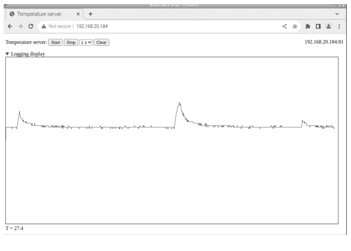

图 8.1 由NodeMCU提供的网页，用于控制数据采集并实时显示数据，图中显示的波动是由于手指放在温度传感器上造成的。

在定义了网络凭证之后，我们为WiFi、Web服务器以及负责websocket的服务器添加了通用支持。此外，我们添加了一个用于解码JSON消息的库，以及另一个用于支持SPIFFS文件系统的库，该文件系统用于将网页存储在NodeMCU的闪存中。有了这些声明，我们就可以声明Web服务器 **server2** 监听通常用于HTML的80端口。同样，我们定义 **webSocket** 来处理81端口上的websocket通信。

```cpp
// Minimal websocket temperature server, V. Ziemann, 221017
const char* ssid     = "messnetz";
const char* password = "zxcvZXCV";
#include <ESP8266WiFi.h>
#include <ESP8266WebServer.h>
#include <WebSocketsServer.h>
#include <ArduinoJson.h>
#include "FS.h"                // SPIFFS filesystem
ESP8266WebServer server2(80);   // port 80
WebSocketsServer webSocket = WebSocketsServer(81);  // port 81
```

在接下来的几行中，我们添加了对一个自动重复过程的支持，我们称之为 **SampleSlow**，定义了执行该过程的周期，以及两个标志，用于指示是否有内容可以发送到浏览器。函数 **sampleslow_action()** 只是设置其中一个标志，以便在主循环中处理温度测量。我们还分配了一个变量来保存发送到浏览器的信息，以及一个变量来记住在程序多个部分中需要的websocket句柄。

```cpp
#include <Ticker.h>
Ticker SampleSlow;
int sample_period=1,data_available=0,info_available=0;
void sampleslow_action() {data_available=1;}
char info_string[70];
volatile uint8_t websock_num=0;
```

现在我们准备指定websocket如何响应来自通信通道另一端（即浏览器）的请求。websocket上的任何活动（在后台处理）都会触发函数 `webSocketEvent()` 的执行。该函数接收标识websocket的句柄 `num`、交互类型 `type`、其 `payload` 及其大小作为输入。根据 `type`，我们使用 `switch-case` 结构来定义适当的操作。如果浏览器断开或连接，会向串行线打印一条简短的消息。来自浏览器的任何JSON格式字符串的类型为 `WStype_TEXT`，`payload` 包含来自浏览器的命令。使用 `ArduinoJSON` 库提供的函数 `deserializeJson()`，我们解析 `payload` 并将名称-值对放入类型为 `DynamicJsonDocument` 的变量 `root` 中。现在我们可以将 `cmd` 的值（指定命令）作为 `root["cmd"]` 访问，将 `val` 的值作为 `root["val"]` 访问。例如，字符串 `{"cmd":"START","val":1}` 包含命令 `START` 和值1。在函数的后续部分中，编码了对命令的反应。如果收到 `START` 命令，该值被解释为 `sample_period`，并用于注册以指定周期执行的 `sampleslow_action`。此外，`info_string` 被填充了我们发送回浏览器的文本。`STOP` 命令只是停止周期性采集，任何未知命令都会显示在串行线上用于调试。

```cpp
void webSocketEvent(uint8_t num, WStype_t type, uint8_t * payload,
    size_t length) {
  Serial.printf("webSocketEvent(%d, %d, ...)\r\n", num, type);
  websock_num=num;
  switch(type) {
    case WStype_DISCONNECTED:
      Serial.printf("[%u] Disconnected!\r\n", num);
      break;
    case WStype_CONNECTED:
      {
        IPAddress ip = webSocket.remoteIP(num);
        Serial.printf("[%u] Connected from %d.%d.%d.%d url: %s\r\n",
          num, ip[0], ip[1], ip[2], ip[3],payload);
        strcpy(info_string,"Websocket opened on ESP8266");
        info_available=1;
      }
      break;
    case WStype_TEXT:
      {
        Serial.printf("[%u] get Text: %s\r\n", num, payload);
        DynamicJsonDocument root(300);      //.........parse JSON
        deserializeJson(root,payload);
        const char *cmd = root["cmd"];
        const int val = root["val"];
        if (strstr(cmd,"START")) {
          sample_period=val;
          SampleSlow.attach(sample_period,sampleslow_action);
          strcpy(info_string,"Acquisition started"); info_available=1;
        } else if (strstr(cmd,"STOP")) {
          SampleSlow.detach();
          strcpy(info_string,"Acquisition stopped"); info_available=1;
        } else {
            Serial.println("Unknown command");
        }
        break;
      }
    }
  }
}
```

此时，所有支持函数都已定义，我们在 `setup()` 函数中配置NodeMCU。在那里，我们首先初始化串行线，然后是WiFi。成功的连接随后通过串行线报告。接下来，我们调用 `webSocket.begin()` 来启动websocket服务器，并注册函数 `webSocketEvent()`，以便在websocket事件发生时执行。然后我们测试SPIFFS文件系统是否正常工作，如果是，则启动 `server2`，指示它提供文件 `webpage.html`，并将成功启动报告给串行线。我们稍后会回到如何将文件复制到文件系统的部分。

```cpp
void setup() {
    Serial.begin(115200); delay(1000);
    WiFi.begin(ssid, password);
    while (WiFi.status() != WL_CONNECTED) {delay(500); Serial.print(".");}
    Serial.print("\nConnected to ");  Serial.print(ssid);
    Serial.print(" with IP address: "); Serial.println(WiFi.localIP());
    webSocket.begin();
    webSocket.onEvent(webSocketEvent);
    if (!SPIFFS.begin()) {
        Serial.println("ERROR: no SPIFFS filesystem found");
        return;
    } else {
        server2.begin();
        server2.serveStatic("/", SPIFFS, "/webpage.html");
        Serial.println("SPIFFS file system found and server started");
    }
}
```

NodeMCU配置完成后，`loop()` 函数持续执行，首先将控制权交给 `server2` 以处理任何请求，然后对 `webSocket` 执行相同操作。如果 `data_available` 被设置为1（这只可能发生在 `sampleslow_action()` 函数内部），我们分配一些缓冲区，测量温度，使用 `dtostrf()` 将数值转换为字符串，并在变量 `out` 中组装JSON字符串，随后通过执行函数 `webSocket.sendTXT()` 将其发送回浏览器。同样，如果 `info_available` 被设置为1，`info_string` 被打包成一个名为 `INFO` 的JSON包并发送回浏览器。

```cpp
void loop() {
    server2.handleClient();  // handle webserver on port 80
    webSocket.loop();        // handle websocket server on port 81
    if (data_available==1) {
        data_available=0;
        char buf[20],out[100];
        float temperature=analogRead(0)*100*3.3/1023.0;
        dtostrf(temperature,7,1,buf);
        (void) sprintf(out,"{"%s":"%s"}","TEMP",buf);
        webSocket.sendTXT(websock_num,out,strlen(out));
    }
    if (info_available==1) {
        info_available=0;
        char out[100];
        (void) sprintf(out,"{"%s":"%s"}","INFO",info_string);
        webSocket.sendTXT(websock_num,out,strlen(out));
    }
}
```

这个程序负责处理Web服务器、websocket和测量。配置好NodeMCU后，我们继续编程通信通道的另一端，即在浏览器窗口中运行的HTML文件 `webpage.html`。

## 8.2 在浏览器中

下面我们复制并注释负责图8.1的HTML文件 `webpage.html`。它包含HTML和JavaScript命令，用于协调浏览器和NodeMCU之间的通信。该文件包含通常的 `!DOCTYPE` 和HTML标签，这里指定语言为英语。在HEAD标签内，我们指定一些通用信息，如标题，然后为填充我们网页的几个项目提供样式信息。`#displayarea` 将在用于显示测量数据的空间周围有一个黑色边框，显示为红色的 `#trace0`。`#ip` 实体将在显示的网页右侧显示连接的NodeMCU的IP地址。

```html
<!DOCTYPE HTML>
<HTML lang="en">
<HEAD><TITLE>Temperature server</TITLE>
    <META charset="UTF-8">
    <STYLE>
        #displayarea {border: 1px solid black; }
        #trace0 {fill: none; stroke: red; stroke-width: 1px;}
        #ip {float: right;}
    </STYLE>
</HEAD>
```

以下部分定义了网页顶部的按钮和菜单。按钮用 `id=` 命名，并分配了一个所谓的回调函数 `onclick=`，该函数定义了按下按钮时引发的操作。用于选择采样周期的菜单用 `SELECT` 标签定义，其中不同的选择用 `OPTION` 标签定义。`id='ip'` 的项目会自动浮动到右边距，因为我们在STYLE声明中指定了该行为。图8.1中看到的图形区域夹在 `DETAILS` 标签之间，这允许我们将其最小化。`id='displayarea'` 的项目是一个 *可缩放矢量图形*。在 `SVG` 标签内，我们定义了为图形保留的区域的宽度和高度。`PATH` 标签名为 `trace0`，将用要显示的数据点填充。我们使用svg命令 `d="M0 256"` 初始化它，该命令通过将显示线的起点移动到坐标 (0,256) 来初始化 `trace0`。最后，我们将一些文本放入保留用于显示状态信息的行中。

```html
<BODY>
<P> Temperature server:
```

到目前为止，我们只定义了静态网页。接下来，我们将借助包含在SCRIPT标签中的JavaScript使其动态化。第一行我们确定提供网页的计算机的IP地址（通常是NodeMCU），并附加端口号`:81`。在初始化了控制和显示测量值所需的一些变量后，我们显示该地址。请注意，当前浏览器窗口中名为`id='ip'`的实体可以通过`document.getElementById('ip')`访问，而`.innerHTML`方法可以访问该实体的内容。我们用它来将显示的文本更改为`ipaddr`。知道了IP地址，我们就可以打开websocket并将其命名为`websocket`。我们立即通过定义错误处理以及打开和关闭websocket的方法来指定其标准行为；我们只是在JavaScript控制台——我们将在下面讨论如何访问它——和显示网页底部的状态行中写入描述性信息。`onmessage`函数为我们的网页注入了生命；它决定了浏览器窗口对来自NodeMCU的消息的响应。在将到达的事件写入JavaScript控制台后，我们使用内置的`JSON.parse`函数解析`event.data`，该函数将JSON名称-值对提取到变量`stuff`中。然后，例如，我们通过`stuff["INFO"]`访问接收到的信息，如果它不是`undefined`，就将其写入浏览器窗口的状态行。如果`stuff["TEMP"]`不是`undefined`，我们就收到了一个新的温度值，其值存储在`val`中。在下一行中，我们从`trace0`中提取属性`d`（它包含显示的数据点），并将其存储在`dd`中，我们通过将`L xpix ypix`附加到`dd`来添加新的温度值（经过适当缩放）。这里`xpix`是`displayarea`内的水平像素坐标，`ypix`是相应的垂直坐标。然后我们将更新后的`dd`复制回`trace0`的`d`，这使得新的数据点在浏览器窗口中可见。最后，我们递增`current_position`并检查溢出，如果溢出，我们使用`replace()`函数移除第一个数据点。它的第一个参数是搜索字符串，以`M`开头，以`L`结尾，中间可以有任意数量的非`L`字符（`[^L]*`）。然后我们将整个`trace0`向左移动，并在右边缘添加新的数据点。

```html
<BUTTON id="start" type="button" onclick="start();">Start</BUTTON>
<BUTTON id="stop" type="button" onclick="stop();">Stop</BUTTON>
<SELECT onchange="setSamplePeriod(this.value);">
  <OPTION selected="selected" value="1">1 s</OPTION>
  <OPTION value="2">2 s</OPTION>
  <OPTION value="5">5 s</OPTION>
</SELECT>
<BUTTON id="clear" type="button" onclick="cleardisplay();">Clear</BUTTON>
<A id='ip'>IP address</A>
</P>
<DETAILS open><SUMMARY>Logging display</SUMMARY>
  <SVG id="displayarea" width="1024px" height="512px">
    <PATH id="trace0" d="M0 256" />
  </SVG>
</DETAILS>
<DIV id="status">Status window</DIV>
```

```javascript
<SCRIPT>
  var ipaddr=location.hostname + ":81";
  var sample_period=1, current_position=0, Tmin=10, Tmax=40;
  document.getElementById('ip').innerHTML=ipaddr;
  var websocket = new WebSocket('ws://' + ipaddr);
  websock.onerror = function(evt) { console.log(evt); toStatus(evt) };
  websock.onopen = function(evt) {console.log('websock open'); };
  websock.onclose = function(evt) {
      console.log('websock close'); toStatus('websock close');
  };
  websock.onmessage=function(event) {
      console.log(event);
      var stuff=JSON.parse(event.data);
      var val=stuff["INFO"]; //.................................info
      if ( val != undefined ) {toStatus(val);}
      val=stuff["TEMP"];      //.................................temperature
      if ( val != undefined ) {
          dd=document.getElementById('trace0').getAttribute('d');
          dd += ' L' + current_position + ' '
              + (512-512*(val-Tmin)/(Tmax-Tmin));
          document.getElementById('trace0').setAttribute('d',dd);
          current_position += 1;
          toStatus('T = ' + val);
          if (current_position > 1024) {
              dd=document.getElementById('trace0').getAttribute('d')
                  .replace(/M[^L]*L/, "M");
              document.getElementById('trace0').setAttribute('d',dd);
              document.getElementById('trace0').setAttribute
              ('transform','translate(' + (1024-current_position) + ',0)');
          }
      }
  }
  function toStatus(txt){document.getElementById('status').innerHTML=txt;}
  function start() {
      websock.send(JSON.stringify({"cmd" : "START", "val" : sample_period}));
  }
  function stop() {
      websock.send(JSON.stringify({"cmd" : "STOP", "val" : "-1" }));
  }
  function setSamplePeriod(v) {
      toStatus("Setting sample period to "+ v + " ms");
      sample_period=v;
  }
  function cleardisplay() {
      dd = "M0 256";
      document.getElementById('trace0').setAttribute('d',dd);
      document.getElementById('trace0').setAttribute
      ('transform','translate(0)');
      current_position=0; toStatus("Display cleared");
  }
</SCRIPT></BODY></HTML>
```

脚本继续定义了`toStatus()`函数，该函数只是将其参数给定的文本写入状态行，以及定义了按钮的回调函数。`start()`函数构建了一个包含两个名称-值对的JSON消息，一个用于`cmd`，一个用于`val`。它将启动命令发送到NodeMCU，其中`sample_period`作为`val`给出。同样，`stop()`停止数据采集，`cleardisplay()`重置`trace0`的属性`d`，从而清除显示的轨迹。`SELECT`标签中选择菜单的回调函数`setSamplePeriod()`接收所选`OPTION`标签中指定的值作为参数，并将其赋值给`sample_period`。最后，关闭`SCRIPT`、`BODY`和`HTML`的开始标签。

我们将此网页复制到**websocket_tempserver.ino**文件所在子目录下的名为**data**的子目录中。然后，我们通过从https://github.com/esp8266/arduino-esp8266fs-plugin的发布页面下载ESP8266FS-0.5.0.zip并将其解压到/Arduino/tools/子目录中，来安装将**data**子目录内容复制到NodeMCU闪存的程序。重启Arduino IDE后，我们在*Tools*菜单中找到一个条目*ESP8266 Sketch Data Upload*。它将网页上传到NodeMCU——但前提是*Serial monitor*已关闭——这样端口80上的服务器就能找到它并将其传递给连接的浏览器。

使用这个系统相当简单。在任何可以访问NodeMCU所在网络的浏览器中，我们在地址栏中输入NodeMCU的IP地址，这会向NodeMCU请求图8.1所示的网页。一旦在浏览器中可见，嵌入该网页的JavaScript就会连接到NodeMCU上的websocket端口81，并建立双向通信通道——即websocket。此后，它被用于来回发送JSON格式的消息。

在NodeMCU上，我们可以通过串行监视器观察通信，因为消息会回显到串行线。在Chromium浏览器中，我们通过按**Ctrl-Shift-I**并选择**Console**标签来打开JavaScript控制台。它也可以在浏览器右上角的三个点下的*More tools*和*Development tools*中找到。嵌入网页的JavaScript代码中`console.log()`的每个参数都会显示在那里。现在，我们可以通过在浏览器（Mozilla或Chrome）中按F5重新加载页面，来观察NodeMCU和浏览器之间的通信是如何建立的。

我们到目前为止遇到的大多数例子都是特意选择为中等简单的，以说明其机制，但在接下来的章节中，我们将推进到更复杂的项目，并从一个带有分布式传感器的气象站开始。

## 问题与项目构想

1.  谁发起了通信：NodeMCU还是浏览器？
2.  在SELECT菜单中添加一个10秒的采样时间。
3.  在SELECT菜单中添加一个100毫秒的采样时间。请注意，你需要在NodeMCU上使用`SampleSlow.attach_ms()`来处理短于一秒的时间。
4.  在网页上添加一个按钮，用于打开和关闭NodeMCU上的一个引脚。
5.  在单独的状态行中显示NodeMCU上一个输入引脚的状态。

# 示例：使用分布式传感器的气象站

我们的第一个项目是一个气象站，用于测量建筑物内外多个位置的气压、湿度、温度和空气质量。我们使用 rrdtool 来绘制 4 小时、2 天、一周和一个月期间的测量数据图表。此外，我们还准备了数据库文件，以便集成到 EPICS 控制系统中。我们选择 NodeMCU 作为传感器节点的微控制器，因为它们非常易于编程，并且灵活，可以部署在任何地方而无需布线。在本章后面，我们将简要展示如何用其更小的同类产品 ESP-01 替换 NodeMCU，这需要稍加注意。请注意，在这两种情况下，我们只展示如何连接单个传感器节点，但多个副本仅因其 IP 地址不同而有所区别。我们只需相应地更改 IP 地址，就可以复制任何接口软件。

我们选择已在第 4.4.3 节讨论过的 BME680 来测量气压、湿度、温度和空气质量。图 9.1 显示了在面包板上组装的项目，NodeMCU 位于 BME680 的右侧。唯一的连接是用于接地和 3.3 V 的电源轨，以及用于时钟和数据的两条 I2C 线。前者将 NodeMCU 上的引脚 D1 连接到传感器上的 SCK，而后者将引脚 D2 连接到 SDI。我们还在电源轨上添加了一个 100 nF 的去耦电容。

在微控制器上运行的程序遵循我们之前使用的模板。定义网络凭据并包含 WiFi 和传感器的库之后，我们定义了监听端口 1137 的 WiFiServer server 和允许我们与传感器通信的 bme 对象。在 setup() 函数中，我们首先打开串行线路并配置 WiFi 使用静态 IP 地址。如果我们总是希望在同一个地址找到气象节点，而不是依赖 Raspi 上的 DHCP 服务器始终分配相同的地址，这是有利的。然后我们建立 WLAN 连接，然后启动服务器，就像在第 4.6.3 节中一样。在 setup() 函数的最后，我们在初始化传感器之前确保它确实存在。

```
// Weathernode-BME680, V. Ziemann, 221028
const char* ssid     = "messnetz";
const char* password = "zxcvZXCV";
const int port=1137;
#include <ESP8266WiFi.h>
WiFiServer server(port);
#include <Adafruit_BME680.h>
Adafruit_BME680 bme;
```

184 ■ 使用 Arduino 和 Raspberry Pi 的传感器实践课程，第二版

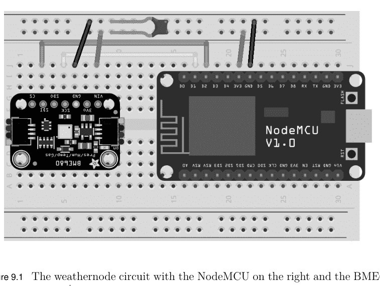

图 9.1 气象节点电路，NodeMCU 在右侧，BME680 传感器在左侧†。

```
char status[30] = "OK";
void setup() {  //....................................................setup
  Serial.begin(115200); delay(1000);
  IPAddress ip(192, 168, 20, 56);       // define static IP
  IPAddress gw(192, 168, 20, 1);        // gateway
  IPAddress subnet(255, 255, 255, 0);   // netmask
  WiFi.config(ip,gw,subnet);            // configure static IP
  WiFi.begin(ssid,password);
  while (WiFi.status() != WL_CONNECTED) {delay(500); Serial.print(".");}
  Serial.print("\nConnected to ");  Serial.print(ssid);
  Serial.print(" with IP address: "); Serial.println(WiFi.localIP());
  server.begin();
  // Wire.begin(0,2);  // for ESP-01 only
  if (!bme.begin()) {  // default address
    strcpy(status,"Error: BME680 not found");
    Serial.println(status);
  }
  bme.setTemperatureOversampling(BME680_OS_8X); // configure BME680
  bme.setHumidityOversampling(BME680_OS_2X);
  bme.setPressureOversampling(BME680_OS_4X);
  bme.setIIRFilterSize(BME680_FILTER_SIZE_3);
  bme.setGasHeater(320, 150); // 320*C for 150 ms
}
void loop() { //....................................................loop
  char line[30];
  WiFiClient client = server.available();
```

```
while (client) {
  while(!client.available()) {
    delay(5);
    if (!client.connected()) {client.stop(); break;}
  }
  if (!client.connected()) {client.stop(); break;}
  client.readStringUntil('\n').toCharArray(line,30);
  bme.performReading();
  float T=bme.temperature;           // Celsius
  float P=bme.pressure/100.0;        // hPa=mbar
  float H=bme.humidity;              // percent
  float VOC=bme.gas_resistance/1000.0;  // kOhm
  if (strstr(line,"V?")==line) {
    client.print("WeatherNode-BME680, Status ");
    client.println(status);
  } else if (strstr(line,"T?")==line) {
    client.print("T "); client.println(T,2);
  } else if (strstr(line,"P?")==line) {
    client.print("P "); client.println(P,2);
  } else if (strstr(line,"H?")==line) {
    client.print("H "); client.println(H,2);
  } else if (strstr(line,"VOC?")==line) {
    client.print("VOC "); client.println(VOC,2);
  } else if (strstr(line,"ALL?")==line) {
    sprintf(line,"%.2f:%.2f:%.1f:%.2f",T,P,H,VOC);
    client.print(line);  % no println!
    client.flush(); client.stop();
  } else {
    client.println("Unknown command, disconnecting!");
    client.flush(); client.stop();
  }
  yield();
}
}
```

在 loop() 函数中，我们首先等待客户端连接，然后等待客户端的请求，之后读取传感器并将测量值存储在变量中。接着是之前使用的查询-响应结构，用于解码对 T?、P?、H? 和 VOC? 的请求。我们添加了一个额外的请求 ALL?，它返回所有四个值，格式适合 rrdtool，发送的字符串不附加换行符，并且无条件关闭套接字。同样，任何未知命令都会导致网络连接关闭。最后，yield() 函数允许微控制器进行内部记账。

在 Raspi 上，我们使用 cron 作业每分钟查询一次微控制器，读取测量值并将其放入 rrdtool 数据库。由于大部分格式化工作已在 NodeMCU 上完成，以下命令

```
echo "ALL?" | netcat -C 192.168.20.56 1137
```

返回一个冒号分隔的字符串，例如 26.55:1003.02:45.1:24.51，其中包含温度、气压、湿度和空气质量的四个测量值。请注意，我们使用内置的 echo 命令将字符串 ALL? 管道传输到 netcat 程序，我们之前曾用它直接与网络套接字通信。

以下 shell 脚本使用这种 `echo` 和 `netcat` 的组合，将冒号分隔的字符串存储到 shell 变量 TEMP 中，该变量用于将测量值输入 rrdtool 数据库。

```
#!/bin/bash
# fill_weather_db.sh
DB=/home/pi/rrdtool/weather.rrd
TEMP=$(echo "ALL?" | netcat -C 192.168.20.56 1137)
/usr/bin/rrdtool update $DB N:$TEMP
```

保存脚本后，我们需要使用命令 `chmod +x fill_weather_db.sh` 使其可执行。但在我们开始使用 `rrdtool update` 命令填充数据库之前，必须先创建它，我们假设以下命令在 `/home/pi/rrdtool` 目录中执行。

```
rrdtool create weather.rrd --step 60 \
    DS:T:GAUGE:180:-20:100 \
    DS:P:GAUGE:180:900:1100 \
    DS:H:GAUGE:180:0:100 \
    DS:VOC:GAUGE:180:0:1000 \
    RRA:AVERAGE:0.5:1:2880 \
    RRA:AVERAGE:0.5:10:2880 \
    RRA:AVERAGE:0.5:60:2880
```

它创建了 `weather.rrd` 数据库文件，该文件期望每 60 秒接收一次值，并包含四个测量列（DS），分别用于温度、气压、湿度和空气质量。然后它定义了归档（RRA），该归档由 2880 个样本的单个平均值填充，相当于 2 天。接下来的两行定义了 10 个样本或 10 分钟的平均值，总共 2880 个样本或 20 天，最后是 60 个样本的每小时平均值，持续 120 天。为了自动填充数据库，我们使用 `crontab -e` 启动 crontab 编辑器，并在文件末尾添加行

```
* * * * * /home/pi/rrdtool/fill_weather_db.sh
```

这会导致脚本每分钟执行一次，并将值存储在 `weather.rrd` 数据库中。

现在我们只需等待一些测量数据进入数据库，然后以与我们在第 5.6.3 节中相同的方式使用 `rrdtool graph` 命令创建图表。创建一组名为 `weathergraph.sh` 的温度、气压和湿度图表的命令如下：

```
#!/bin/bash
S=$1
DB=/home/pi/rrdtool/weather.rrd
PICDIR=/home/pi/public_html/weather
/usr/bin/rrdtool graph $PICDIR/temperature${S}.png -s $S \
    -w 800 -h 200 \
    -t "Temperature" -v "T [C]" -l 16 -u 32 -r \
    DEF:t0=$DB:T:AVERAGE LINE1:t0#FF0000:"Temperature";
/usr/bin/rrdtool graph  $PICDIR/pressure${S}.png -s $S \
    -w 800 -h 200 \
    -t "Barometric Pressure" -v "P [mbar]" -A -l 975 -u 1025 -r \
    DEF:t0=$DB:P:AVERAGE LINE1:t0#FF0000:"Pressure, range=[975,1025]";
/usr/bin/rrdtool graph $PICDIR/humidity${S}.png -s $S \
    -w 800 -h 200 \
    -t "Humidity" -v "H [%]" -l 0 -u 100 -r \
    DEF:t0=$DB:H:AVERAGE LINE1:t0#FF0000:"Humidity";
```

它首先将第一个命令行参数（应包含显示的起始时间）复制到变量 S 中，声明要使用的数据库文件以及图表的存储位置。为此，我们选择 `/home/pi/public_html` 下的一个目录，该目录可被 apache2 Web 服务器访问。第一个 `rrdtool graph` 命令生成温度图。请注意，图表文件名中附加了时间段。第二个 `rrdtool` 命令生成气压图，第三个生成湿度图，最后一个生成空气质量图，所有这些都按照第 5.6.3 节讨论的方式进行。为了生成时间跨度为 8 小时、1 天、1 周、1 个月和 3 个月的图表，我们使用不同的起始日期作为命令行参数调用 `weathergraph.sh`，并将这五个命令放在一个单独的脚本中，名为 `allweathergraph.sh`。其内容如下。

```
#!/bin/bash
# /home/pi/rrdtool/allweathergraph.sh
/home/pi/rrdtool/weathergraph.sh -8h > /dev/null
/home/pi/rrdtool/weathergraph.sh -1d > /dev/null
/home/pi/rrdtool/weathergraph.sh -1w > /dev/null
/home/pi/rrdtool/weathergraph.sh -1m > /dev/null
/home/pi/rrdtool/weathergraph.sh -3m > /dev/null
```

调用 `weathergraph.sh` 时使用绝对路径，因为我们希望从 cron 作业运行它，以便每 10 分钟创建一次新图表。我们还将输出重定向到巨大的位桶 `/dev/null`。我们通过命令 `crontab -e` 将此脚本作为 cron 作业定期执行，以便在 crontab 文件中添加以下行

```
*/10 * * * * /home/pi/rrdtool/allweathergraph.sh
```

接下来需要在包含图表的目录中准备 `index.html` 文件。以下 HTML 文件将数据呈现为图 9.2 所示的简单网页。

```
<!DOCTYPE HTML>
<HTML>
  <HEAD>
    <TITLE>Raspi Weather Station</TITLE>
    <META http-equiv="refresh" content="120">
  </HEAD>
  <BODY>
    <H1 ALIGN=CENTER>Raspi Weather Station (8 hours)</H1>
    Display data for:
    <A HREF=index.html>8 hours</A>
    <A HREF=index-1d.html>1 day</A>
    <A HREF=index-1w.html>1 week</A>
    <A HREF=index-1m.html>1 month</A>
    <A HREF=index-3m.html>3 months</A>
    <HR>
    <BR>
    
    
    
    
  </BODY>
</HTML>
```

该文件包含已知的标题信息，标题为 "Raspi Weather Station"，自动刷新率为 120 秒。然后是一行包含不同时间范围选项的内容。每个条目指向同一目录中的不同网页，但提供其他范围的图表。请记住，图表由 cron 作业自动更新，但不同的 `index-XX.html` 页面是固定的。我们需要指出，报告的温度受到 BME680 内部 MQ-x 传感器的小型加热器的影响，因此报告值高出约四度。此外，我通过向传感器呼气导致了湿度图中的小尖峰和空气质量图中的相应下降。

将天气数据显示为不同的时间范围当然足以满足家庭使用，但在实验室中，我们希望将传感器节点的数据集成到控制系统中。如果 EPICS 系统已经在运行，我们只需为天气数据准备协议和数据库文件。前者以更紧凑的方式编写，如下所示。

```
# ./tempApp/Db/weather.proto
Terminator = CR LF;
get_T {out "T?"; in "T %f"; ExtraInput = Ignore; }
get_P {out "P?"; in "P %f"; ExtraInput = Ignore; }
get_H {out "H?"; in "H %f"; ExtraInput = Ignore; }
get_VOC {out "VOC?"; in "VOC %f"; ExtraInput = Ignore; }
```

它遵循已知的模式：发送一个附加问号的查询，然后接收查询，后跟测量值。为了配合这个协调底层通信的文件，我们需要一个名为 `weather.db` 的数据库文件，其内容如下。

```
# ./tempApp/Db/weather.db
record(ai, "$(USER):T") {
    field(DESC, "Temperature")
    field(SCAN, "10 second")
    field(DTYP, "stream")
    field(INP, "@weather.proto get_T $(PORT)")
}
record(ai, "$(USER):P") {
    field(DESC, "Pressure")
    field(SCAN, "10 second")
    field(DTYP, "stream")
    field(INP, "@weather.proto get_P $(PORT)")
}
record(ai, "$(USER):H") {
    field(DESC, "Humidity")
    field(SCAN, "10 second")
    field(DTYP, "stream")
    field(INP, "@weather.proto get_H $(PORT)")
}
record(ai, "$(USER):VOC") {
    field(DESC, "Air quality")
    field(SCAN, "10 second")
    field(DTYP, "stream")
    field(INP, "@weather.proto get_VOC $(PORT)")
}
```

这里我们看到模拟输入 `ai` 记录，它们定义了过程变量 `$(USER):XX`，并将其链接到相应的协议函数。此外，我们需要通过在 Makefile 中添加以下行来包含新的数据库文件

```
DB += weather.db
```

并在 `./temp/iocBoot/ioctemp/st.cmd` EPICS 命令文件中添加以下两行

```
drvAsynIPPortConfigure("SOCKET","192.168.20.56:1137",0,0,0)
dbLoadRecords("db/weather.db","PORT='SOCKET',USER='weather'")
```

最后，在 temp 层次结构的基础目录中调用 `make`。然后，如前所述，从命令行或通过 init 脚本自动执行 `st.cmd`（如第 6.5 节末尾所述）。现在可以从网络上的任何计算机访问过程变量。要访问气压，我们发出 `caget weather:P`，其他变量类似。通过这种方式，它们可以无缝地包含在 EPICS 提供的日志记录、监控或其他显示程序中。添加更多传感器就像在 Db 目录中添加协议和数据库文件并在 Makefile 中包含它们，以及在 `st.cmd` 程序中添加两行一样简单。

凭借其板载 USB 连接器和许多输入输出引脚，NodeMCU 是一个非常方便的开发平台，但在这个例子中，我们只使用两个引脚用于 I2C，并且一旦 NodeMCU 启动并运行，我们就不再需要 USB 接口或串行线。所有通信都可以通过 WLAN 接口完成。因此，谨慎的做法是将项目迁移到 ESP-01，它也更便宜，如果我们计划部署多个天气节点，这是一个有吸引力的特点。另一方面，缺少 USB 接口使得对 ESP-01 进行编程有点棘手。然而，我们可以将具有八个暴露引脚的 ESP-01 直接连接到 USB 转串行转换器（通常称为 FTDI 转换器，以最初提供它们的公司命名）。但是，我们需要确保转换器的 VCC 是 3.3 V，而不是更常见的 5 V。如果不是这种情况，如第 2.2.5 节讨论的电压调节器将有所帮助。

图 9.3 左侧显示了 ESP-01。它的八个引脚分为两列，每列四个。左侧的引脚从上到下标记为 RXD、GP0、GP2 和 GND。右侧的引脚标记为 VCC、RST、CH_PP 和 TXD。为了对 ESP-01 进行编程，我们将其 GND 和 VCC 连接到 USB 转串行转换器的相应引脚。我们还将 CH_PD 和 GP2 连接到 VCC，GP0 连接到 GND，这使 ESP-01 进入编程模式。最后，我们将串行接收引脚 RXD 连接到转换器上的串行发送引脚 TX，将 TXD 引脚连接到 RX。接线完成后，我们将 USB 转串行转换器连接到台式计算机，从 *Tools→Port* 菜单中选择端口，并在 Arduino IDE 的 *Tools→Board* 菜单中选择 *Generic ESP8266 Module*。

我们基本上可以使用与本章前面所示的 NodeMCU 相同的程序。我们需要做的就是移除所有对 `Serial` 的引用，因为我们不会使用串行线。此外，我们在 `setup()` 函数中取消注释 `Wire.begin(0,2);` 这一行，这是必要的，因为在 NodeMCU 上使用的默认 I2C 引脚没有路由到 ESP-01 的暴露引脚。相反，我们使用引脚 GP0 和 GP2 分别用于 I2C 线 SDA 和 SCL。最后，我们编译并将草图下载到我们的 ESP-01。

现在，我们将编程好的 ESP-01 从 USB 转串行转换器上断开，并按照图 9.4 的接线将其连接到 BME680。地线和 3.3 V 电源轨连接到两个设备上的 VCC 和 GND 引脚。请注意，标记为 RST 和 CH_PD 的引脚也连接到 VCC。I2C 线将 ESP-01 上的 GP0 连接到 BME680 上的 SCK。同样，GP2 连接到 SDI。请注意，我们必须为 I2C 线提供外部上拉电阻；我们使用 10 kΩ 电阻，但它们的值并不关键。为了保险起见，我们还应该在 GND 和 VCC 之间提供 100 nF 旁路电容（未显示）。一旦我们连接电源电压，该电路的行为将与图 9.1 所示的电路相同，尽管占用空间更小。

## 问题与项目构想

1.  在海平面、雨天、强风暴、飓风中或在拉巴斯，平均气压是多少？
2.  在你居住的地方、在热带雨林、在死亡谷或在智利的拉西拉天文台，典型的湿度是多少？
3.  添加一个单独的温度传感器，例如 LM35 或 DS18b20，以交叉检查 BME680 报告的值。
4.  添加一个单独的湿度传感器，例如 HYT221 或 DHT11，以交叉检查 BME680 报告的值。
5.  添加一个粉尘传感器，将气象站转变为环境记录站。

# 示例：地震检波器

在第二个示例中，我们使用图2.12中的SM-24地震检波器来记录地面振动频谱。我们的计划是将SM-24连接到一个电池供电的微控制器上，该控制器以高速率采样1024个值，并通过WLAN将测量数据传输到主机计算机，即我们的树莓派。在那里，我们使用Octave进行后处理和傅里叶变换采样数据，并展示结果。除了使用Octave，我们还将数据提供给EPICS，以便可以使用标准的EPICS程序进行显示和后处理。

对于传感器节点，我们使用NodeMCU微控制器和Ticker.h库，该库允许以每秒1000次的速率进行采样。由于SM-24传感器的频率范围是10到240 Hz，1 kHz的采样率是最大频率的四倍，应该是足够的。SM-24传感器仅产生非常小的、毫伏范围内的双极性输出电压。因此，我们需要放大电压，以匹配NodeMCU上ADC的0到3.3 V输入电压范围。

我们的放大器基于图2.21所示的电路，但将增益提高到×100，并添加了一些组件以适应我们的传感器，最终得到图10.1所示的电路。增益主要由$R_3$和$R_7$与$R_1$和$R_2$的比值决定。我们还在输入端子之间添加了一个1.5 kΩ的电阻$R_9$，以抑制SM-24传感器根据其数据手册在10 Hz处表现出的谐振峰。如果我们考虑传感器的内部线圈电阻（375 Ω），在输入端子之间安装一个额外的2.2 μF电容器，将创建一个截止频率约为200 Hz的低通滤波器。如第2.2.4节所述，这避免了更高频率混叠到从0 Hz到500 Hz奈奎斯特频率的数字化带宽中。其他组件的功能与第2.2.2节中讨论的相同。

地震检波器的信号放大后，我们使用NodeMCU微控制器上的ADC收集1024个样本：每毫秒一个样本，然后通过WLAN将数字化的样本传递给主机计算机。

该项目的代码首先定义WLAN的凭据和端口号，然后在下一行导入支持以创建`server()`。常量`npts`和`sample_period`分别指定要获取的样本数和获取之间等待的毫秒数。`Ticker.h`库添加了对定时和中断驱动函数的支持。接下来声明的变量与填充`sample_buffer`有关。函数`samplefast_action()`由计时器自动调用，每毫秒执行一次。在此函数中，我们首先读取内置ADC并将值放入`sample_buffer`，然后递增变量`isamp`，以便下一个样本进入数组中的下一个位置。一旦获取了所需数量`npts`的样本，我们通过调用`SampleFast.detach()`禁用中断，将样本指针`isamp`设置为零，并设置`sample_buffer_ready`标志以通知主程序npts个样本的采集已完成。在setup()函数中，我们首先设置内置LED引脚的模式并将其打开，然后启用串行线路进行调试，并连接到WLAN。然后我们通过调用server.begin()启动服务器进程，并将所有信息报告到串行线路，然后关闭LED。

```cpp
// Minimal time-series-server, V. Ziemann, 170324
const char* ssid = "messnetz";
const char* password = "zxcvZXCV";
const int port = 1137;
#include <ESP8266WiFi.h>
WiFiServer server(port);
const uint16_t npts=1024;  // number of samples
const int sample_period=1; // ms
#include <Ticker.h>
Ticker SampleFast;
uint16_t sample_buffer[npts];
volatile uint16_t isamp=0,sample_buffer_ready=0;
char line[30];
void samplefast_action() {  //..............samplefast_action
  sample_buffer[isamp]=analogRead(0);
  isamp++;
  if (npts == isamp) {
    SampleFast.detach();
    isamp=0;
    sample_buffer_ready=1;
  }
}
void setup() { //........................................setup
  pinMode(LED_BUILTIN,OUTPUT);
  digitalWrite(LED_BUILTIN,LOW);
  Serial.begin(115200);
  WiFi.begin(ssid,password);
  while (WiFi.status() != WL_CONNECTED) {
    delay(500); Serial.print(".");
  }
  Serial.println("");
  Serial.print("Wifi connected to "); Serial.println(ssid);
  Serial.print("Server IP address: "); Serial.println(WiFi.localIP());
  server.begin();
  Serial.print("Server started on port "); Serial.println(port);
  digitalWrite(LED_BUILTIN,HIGH);
}
void loop() { //.............................................loop
  WiFiClient client = server.available();
  while (client) {
    while (!client.available()) {
      delay(5);
      if (!client.connected()) break;
    }
    client.readStringUntil('\n').toCharArray(line,30);
    Serial.print("Received: "); Serial.println(line);
    if (strstr(line,"WF?")==line) {
      digitalWrite(LED_BUILTIN,LOW);
      sample_buffer_ready=0;
      SampleFast.attach_ms(sample_period,samplefast_action);
      while (!sample_buffer_ready) {delay(2);} // wait until done
      for (int i=0;i<npts-1;i++) {
        client.print(sample_buffer[i]); client.print(", ");
      }
      client.println(sample_buffer[npts-1]);
      digitalWrite(LED_BUILTIN,HIGH);
    } else {
      Serial.println("unknown command, disconnecting");
      client.stop();
    }
    client.flush();
  }
  yield();
}
```

在loop()函数中，我们等待客户端连接，然后解析请求。如果查询字符串是WF?，我们打开LED并确保变量sample_buffer_ready为零，然后通过调用SampleFast.attach_ms()开始采集。该函数的参数是以毫秒为单位的周期性，用于调用作为第二个参数指定的函数。这启动了在后台继续的自动采集。我们在loop()函数中需要做的就是监控sample_buffer_ready是否仍为零，如果是，我们再等待一会儿。但是一旦它变为非零（这发生在samplefast_action()函数中，在收集到所需数量的样本之后），我们就跳出等待循环。最后，我们准备好通过client.print()函数调用，将值用逗号分隔，发送回客户端，并关闭LED。

我们将此程序烧录到NodeMCU中，然后它等待客户端连接并请求样本。这里我们使用Octave从地震检波器请求一个样本时间序列，并显示接收到的原始时间序列数据及其傅里叶变换，即频谱。实现此功能的代码如下：

196 ■ 使用Arduino和树莓派的传感器实践课程，第二版

```matlab
% getTimeSeries.m, V. Ziemann, 221202
s=tcpclient("192.168.20.144",1137);
npts=1024;
write(s,"WF?\n");
pause(1);
data=zeros(1,npts);
for i=1:npts
  data(i)=str2double(tcp_getvalue(s));
end
clear s;
subplot(2,1,1); plot(data); xlim([0,npts])
xlabel('Time [ms]'); ylabel('Amplitude [ADC bits]')
data=data-mean(data);
fftdata=2*abs(fft(data))/npts;
frequency=(0:(npts/2-1))*500/(npts/2);
subplot(2,1,2); plot(frequency,fftdata(1:npts/2))
xlabel('Frequency [Hz]'); ylabel('Spectral density [ADC bits]')
print('spectrum.png','-S1000,700');
```

同样，Octave脚本遵循前面的示例。我们首先在tcpclient()函数调用中定义套接字s，然后指定要获取的点数npts。这必须与NodeMCU上声明的样本数匹配。接下来，我们将查询字符串WF?发送到套接字，等待一段时间，然后收集npts个样本，将其存储在数组data()中。为此，我们使用函数tcp_getvalue()，它从套接字中提取一个逗号分隔的值。我们将在下面更详细地讨论该函数。接收到的值编码为字符串，因此我们需要使用str2double()函数将其转换为浮点值。一旦所有样本都已接收并存储在data()中，我们就关闭套接字。

在接下来的几行中，我们创建两个子图，其中上方包含原始样本。由于采样周期是毫秒，我们将其作为水平轴标签。垂直轴只是原始的ADC转换值，来自NodeMCU上的10位ADC，范围在0到1023之间。对于我们在下方子图中显示的频谱，我们首先减去值的平均值，以避免在零处出现巨大的频谱峰。这是由前置放大器将信号置于ADC的中间范围引起的。然后我们对样本进行傅里叶变换，并创建一个频率数组，其中包含从零到奈奎斯特频率的频率值，然后绘制频谱并标记坐标轴。最后，我们使用print()函数创建一个图像文件，其中包含以指定像素尺寸（本例中为1000 × 700）显示的绘图。

在Octave脚本中，我们使用函数tcp_getvalue从输入流中读取单个样本。它类似于我们在第5.5.4节中使用的queryResponse.m函数。以下是Octave代码。

```matlab
% tcp_getvalue.m, V. Ziemann, 221202
function out=tcp_getvalue(dev)
i=1;
int_array=uint8(1);
while true
  val=read(dev,1);
  if ((val==',') || (val==0xA)) break; end
  int_array(i)=val;
  i=i+1;
```

6. 添加SCD30 CO$_2$传感器以进一步增强系统。

7. 在气象站添加光敏电阻或光电晶体管以记录亮度。

8. 添加一个遥控风扇，根据需要搅动空气。

9. 重写运行在NodeMCU上的气象站客户端程序，并为其提供MQTT接口。

10. 重写运行在NodeMCU上的程序，以发布一个包含测量值图表的网页，如[第8章](Chapter 8)所述，通过网络套接字持续更新显示的温度、气压、湿度和空气质量值。

## 10.2 地震计的原始时间序列及对应频谱

```
end
out=char(int_array);
```

我们需要将句柄 `dev` 作为输入参数提供给套接字，该函数返回一个字符串，其中包含直到逗号或下一个行结束符的所有字符。在函数中，我们从套接字逐个读取字符，一旦遇到逗号或行结束符 `0xA` 就停止读取。然后，我们将所有接收到的数据转换为字符后返回。

我们在图 10.3 中展示了配备 SM-24 地震计、放大器和 NodeMCU 的传感器节点。在 NodeMCU 与树莓派连接到同一 WLAN 的情况下运行 octave 脚本，会生成一个名为 `spectrum.png` 的文件，如图 10.2 所示。再次运行 octave 脚本会覆盖该文件，而在记录采样时用手指敲击桌子则会产生噪声更大的频谱。

在 octave 中记录波形并进一步处理，便于生成频谱图。但如果我们希望将地震计集成到 EPICS 控制系统中，则需要提供数据库和协议文件。我们从时间序列或波形的数据库记录开始。其内容如下所示：

```
# .../Db/geophone.db
record(waveform, "$(USER):wf") {
  field(DESC,"Geophone waveform")
  field(DTYP,"stream")
  field(SCAN,"10 second")
  field(NELM,"1024")
  field(FTVL,"FLOAT")
  field(INP,"@geophone.proto get_wf $(PORT)")
}
```

这里我们必须声明一个 **waveform** 记录，因为我们希望一次性获取包含 1024 个采样点的完整数据流。前三个字段提供了描述、声明为 **stream** 设备以及波形采集的速率。接下来的两个字段声明我们记录 1024 个浮点值，然后在最后一个 `INP` 类型的字段中链接到协议文件 **geophone.proto** 和函数 **get_wf**。在 `.../Db/Makefile` 中添加 `DB += geophone.db` 这一行后，我们准备下面所示的引用协议文件 **geophone.proto**。

```
# .../Db/geophone.proto
Terminator = CR LF;
get_wf {
  ExtraInput = Ignore;
  replyTimeout=2000;
  out "WF?";
  separator=",";
  in "%f";
}
```

这里我们首先将一个命令的终止字符串定义为 `CR LF`，然后定义 **get_wf** 函数。为了健壮性，我们要求它忽略任何无意义的输入，并等待 2000 毫秒以接收来自 NodeMCU 的回复。请求新波形的操作包括发送 `WF?` 并接收以逗号分隔的浮点数（`"%f"`）。从 NodeMCU 接收的数值数量（1024）已在 **geophone.db** 文件中指定。

最后一步，我们需要告诉 EPICS 在哪里可以找到 NodeMCU 以及要连接哪个套接字。正如在关于 EPICS 的 [第 6 章](Chapter 6) 中所讨论的，这通过 **st.cmd** 命令文件完成，该文件包含以下两行：

```
drvAsynIPPortConfigure("SOCKET2","192.168.20.144:1137",0,0,0)
dbLoadRecords("db/geophone.db","PORT='SOCKET2',USER='geophone'")
```

第一行定义了已连接 NodeMCU 设备的 IP 和端口号，第二行指定了描述与 NodeMCU 通信时所用协议的数据库文件 `geophone.db`。在 Makefile 中添加 `DB += geophone.db` 后，我们重新编译 EPICS IOC，然后从命令行执行 `st.cmd`，或者，在确保一切按预期工作后，我们按照 [第 6.5 节](https://example.com) 中讨论的程序创建一个初始化文件，以便在启动时启动 IOC。此时，通过一个持续从 NodeMCU 获取波形的运行 IOC，我们可以使用 `caget geophone:wf` 获取最新的波形，该命令首先返回采样点数（此处为 1024），然后是 1024 个采样值。连接到同一网络的任何计算机上的其他 EPICS 程序也可以获取相同的波形，每 10 秒一个新波形，如 `geophone.db` 记录文件中所指定。

为了说明如何从 Python 访问 EPICS 变量，我们现在准备一个 Python 脚本，用于生成 [图 10.2](https://example.com) 中所示的图表。首先，我们执行 `sudo pip install pyepics` 来安装最新版本的 `pyepics` 包，该包提供了 `epics.caget()` 和 `epics.caput()` 函数，用于读取和设置 EPICS 过程变量，我们将在下面的脚本中使用它们。

```
# show_epics_waveform.py, V. Ziemann, 221103
import matplotlib.pyplot as plt  # for plotting
import numpy as np               # for fft
import epics                     # epics access
data=epics.caget("geophone:wf");
plt.subplot(2,1,1)
plt.plot(data);
plt.xlabel("Samples")
plt.ylabel("Amplitude")
plt.subplot(2,1,2)
fftvals=np.fft.fft(data)
plt.plot(abs(fftvals))
plt.ylabel("FFT")
plt.show()
```

在导入了如 [第 5.6 节](https://example.com) 所述的绘图和数值计算支持后，该脚本导入了 EPICS 支持，并使用它来检索存储在数组 `data` 中的波形。上方的 `subplot` 显示原始数据轨迹，下方的 `subplot` 显示其傅里叶变换，使用 `numpy` 函数 `fft.fft()` 计算。添加缩放和其他数值计算是直接了当的。

## 问题与项目构想

- 1. 讨论使用中断驱动采集相对于在循环中使用 `delay(1)` 间隔测量 1000 个采样点的优势。
- 2. 本章讨论的低通滤波器的目的是什么？
- 3. 当以每秒 1000 个采样点的速率采样时，我们能唯一确定的最高频率是多少？
- 4. [图 10.2](https://example.com) 中所示频谱的分辨率（可检测的最小频率差）是多少？如何提高它？
- 5. 讨论为什么 `Ticker.h` 库的采样率被限制为每秒 1000 个采样点。
- 6. 使用光电二极管作为传感器，并以每秒 1000 个采样点的速率对其进行采样。探索不同的闪烁光源，如灯、电视屏幕或计算机显示器。
- 7. 使用 `tone()` 函数在输出引脚上生成振荡信号。然后使用内置 ADC 对该引脚进行采样并观察信号。你能唯一观察到的最高频率是多少？当超过该频率时会发生什么？
- 8. 不使用地震计，而是使用麦克风来“观察”你的声音。
- 9. 为 NodeMCU 添加一个 MCP3304 ADC 并连接两个地震计，在中断处理程序中用数据填充两个 `sample_buffer` 数组，并将两个波形都发送到 octave。如果地震计放置在相距较远的大桌子上，尝试通过敲击桌子来确定声速，并确定两个波形之间的时间偏移。
- 10. 将 octave 脚本 `getTimeSeries.m` 转换为 Python，并使用 `numpy` 进行傅里叶变换，使用 `matplotlib` 显示数据。
- 11. 重写在 NodeMCU 上运行的 sketch，以发布一个网页，该网页通过 websockets 接收时间序列数据并显示图 10.2 中的上图。在互联网上搜索傅里叶变换的 JavaScript 实现，并显示下图。

# 示例：水的颜色监测器

在这个例子中，我们确定水的颜色，或者更准确地说，是溶解在水中的物质的吸收情况。一个例子是藻类，它们在夏季经常大量繁殖，使水变绿，因为藻类主要吸收其互补色，即红色。在我们的实验中，我们通过开关三色 LED 来研究不同颜色光的吸收情况，并观察光电晶体管记录的信号产生的调制。如果红光被吸收，则红色的调制深度会降低，其他颜色同理。通过比较 LED 开启与关闭的情况，该系统在一定程度上消除了环境背景光的一些影响。在图 11.1 的左侧，我们展示了吸收测量装置，左侧是 RGB-LED，右侧是光电晶体管，中间是吸收物质。我们注意到，这样的系统也可以用来确定表面反射的变化，如图 11.1 右侧所示。

我们使用 Arduino UNO 和一个 RGB-LED 构建了图 11.1 所示的装置，该 LED 在一个封装内包含一个红色、一个绿色和一个蓝色 LED，并有一个用于公共阴极或阳极的连接器。在我们的案例中，我们使用一个公共阳极连接到正电源电压的 LED。当 UNO 上的控制引脚为低电平时，相应的颜色会亮起。光电晶体管是 SFH3310，但任何其他在可见光谱范围内敏感的型号都应该可以工作。非常简单的装置如图 11.2 所示。

## 11.2 水色测量装置

图11.2展示了使用Arduino UNO测量水色的装置。

左侧是Arduino UNO，右下角是一个带有SFH3310光电晶体管的小面包板。发射极接地，集电极通过一个68 kΩ电阻连接到正电源电压。电阻值取决于光电晶体管，其确定依据是模拟输入引脚（通过蓝色导线连接到集电极）上需要有清晰可见的调制深度。稍加实验即可得到合理的电阻值。我们添加了一个10 μF和一个100 nF的电容来缓冲电源电压。RGB-LED放置在上方的面包板上，公共阳极连接到正电源电压，三个“颜色引脚”通过限流电阻连接到UNO的D2、D3和D4引脚。我们为红色LED选择了220 Ω，绿色为180 Ω，蓝色为150 Ω，以适应不同颜色LED的不同压降。

在UNO上运行的程序中，我们需要依次切换LED，并同步记录光电晶体管记录的强度。这通过以下代码实现。

```cpp
// Color monitor, V. Ziemann,170823
int repeat=20;
void alloff() {  //.......................alloff
  digitalWrite(2,HIGH);  // red
  digitalWrite(3,HIGH);  // green
  digitalWrite(4,HIGH);  // blue
}
float measure(int pin, int repeat) {  //..............measure
  int hi,lo;
  float sum=0;
  alloff();
  delay(10);
  for (int i=0;i<repeat;i++) {
    digitalWrite(pin,LOW);
    delay(5);
    lo=analogRead(0);
    digitalWrite(pin,HIGH);
    delay(5);
    hi=analogRead(0);
    sum+=(hi-lo);
  }
  return sum/repeat;
}
void setup() {  //.........................setup
  Serial.begin(9600); while (!Serial) {;}
  pinMode(2,OUTPUT);  // red
  pinMode(3,OUTPUT);  // green
  pinMode(4,OUTPUT);  // blue
  alloff();
  digitalWrite(2,LOW);
}
void loop() {  //.........................loop
  if (Serial.available()) {
    char line[30];
    Serial.readStringUntil('\n').toCharArray(line,30);
    if (strstr(line,"OFF")==line) {
      alloff();
    } else if (strstr(line,"RED")==line) {
      alloff();
      digitalWrite(2,LOW);
    } else if (strstr(line,"GREEN")==line) {
      alloff();
      digitalWrite(3,LOW);
    } else if (strstr(line,"BLUE")==line) {
      alloff();
      digitalWrite(4,LOW);
    } else if (strstr(line,"COLOR?")==line) {
      float red=measure(2,repeat);    // red
      float green=measure(3,repeat);  // green
      float blue=measure(4,repeat);   // blue
      Serial.print("COLOR "); Serial.print(red);
      Serial.print("\t");Serial.print(green);
      Serial.print("\t");Serial.println(blue);
    } else if (strstr(line,"REPEAT?")==line) {
      Serial.print("REPEAT "); Serial.println(repeat);
    } else if (strstr(line,"REPEAT ")==line) {
      repeat=(int)atof(&line[6]);
    }
  }
  delay(10);
}
```

首先，我们声明一个变量`repeat`和一个用于关闭所有LED的函数。函数`measure()`的输入参数是要切换的引脚和重复测量的次数。

图11.3展示了颜色传感器，左侧是RGB-LED，右侧是光电晶体管。

我们在LED开启或关闭后添加5毫秒的延迟，以便电压稳定，然后再用`analogRead()`函数测量光电晶体管集电极的电压。LED开启和关闭时读数的差值累积在变量`sum`中，最后将累积差值的平均值返回给调用程序。在`setup()`函数中，我们初始化串口通信和RGB-LED的引脚，关闭所有LED，然后打开红色LED以指示系统已启动并正在运行。`loop()`函数使用我们在本书中通用的机制来关闭所有LED或打开红、绿、蓝中的一种颜色。如果查询是`COLOR?`，系统会测量光电晶体管在切换LED开启和关闭时的变化，并返回三个颜色变化的数字。最后，查询`REPEAT nnn`将变量`repeat`设置为`nnn`，而`REPEAT?`返回当前值。

该系统测量放置在LED和光电晶体管之间的任何材料的吸收率，它们如图11.1和图11.3所示相互对准。此外，为了测量水中的吸收率，我们需要将LED和晶体管封装在保护涂层中，为此我们使用两层热缩绝缘材料来覆盖LED和光电晶体管引脚上导线的焊接连接。

如果我们想将系统部署在稍远的位置，将第7章的MQTT客户端程序扩展为每分钟监测一次颜色并发布结果是相当直接的。为此，我们使用NodeMCU代替UNO，并将RGB-LED连接到NodeMCU的D2、D3、D4引脚，光电晶体管的集电极连接到模拟输入引脚A0。以下程序实现了此功能。

```cpp
// MQTT client water color, V. Ziemann, 170906
const char* ssid = "messnetz";
const char* password = "zxcvZXCV";
const char* broker = "192.168.20.1";
#include <Ticker.h>
volatile uint8_t do_something=0;
Ticker tick;
void tick_action() {do_something=1;}  // executed regularly
#include <ESP8266WiFi.h>
#include <PubSubClient.h>
WiFiClient espClient;
PubSubClient client(espClient);
float measure(int pin, int repeat) {  //.............measure
  int hi,lo;
  float sum=0;
  digitalWrite(D2,HIGH);
  digitalWrite(D3,HIGH);
  digitalWrite(D4,HIGH);
  delay(10);
  for (int i=0;i<repeat;i++) {
    digitalWrite(pin,LOW);
    delay(5);
    lo=analogRead(A0);
    digitalWrite(pin,HIGH);
    delay(5);
    hi=analogRead(A0);
    sum+=(hi-lo);
  }
  return sum/repeat;
}
void setup() { //............................................setup
  pinMode(D2,OUTPUT);
  pinMode(D3,OUTPUT);
  pinMode(D4,OUTPUT);
  Serial.begin(115200);
  WiFi.begin(ssid,password);
  while (WiFi.status() != WL_CONNECTED) {
    delay(500); Serial.print(".");
  }
  Serial.print("\nWifi connected to "); Serial.println(ssid);
  Serial.print("with IP address: "); Serial.println(WiFi.localIP());
  client.setServer(broker, 1883);  // 1883 = default MQTT port
  tick.attach(60,tick_action); // execute tick_action every 60 seconds
}
void loop() {  //............................................loop
  while (!client.connected()) {  // try to connect to broker
    if (!client.connect("PubSub1")) {delay(5000);}
  }
  client.loop();
  if (do_something) {
    do_something=0;
    char message[30];
    float red=measure(D2,20);    // red
    float green=measure(D3,20);  // green
    float blue=measure(D4,20);   // blue
    sprintf(message,"%d %d %d",(int)red,(int)green,(int)blue);
    client.publish("node1/color",message);
  }
  yield();
}
```

我们首先声明网络凭证和代理服务器的IP地址，然后包含Ticker.h库。它通过在定义的时间间隔调用`tick_action()`函数来协调重复测量。在该函数内部，我们只将变量`do_something`设置为1，因为该变量在`loop()`函数中被监控，如果被设置则触发一些活动。接下来，我们包含WiFi库，并声明一个`WiFiClient`和一个名为`client`的MQTT `PubSubClient`，然后定义`measure()`函数，它是从前面的示例中直接复制过来的。`setup()`函数声明引脚模式，配置串口，连接到WLAN，配置代理服务器，并启动计时器每60秒调用一次`tick_action`，从而触发测量。在`loop()`函数中，我们首先确保NodeMCU已连接到代理服务器，然后调用`client.loop()`来处理与MQTT相关的任何后台活动。然后我们测试变量`do_something`是否被设置，并使用`measure()`函数对每种颜色执行测量，构建一个包含三个值的字符串，并发布测量结果。

使用该系统，可以将一个类似于图11.3所示的传感器浸入花园池塘中，将NodeMCU放在池塘旁边的外壳中（可能由电池供电），并确保它在WLAN `messnetz`的覆盖范围内。这就是监测池塘中藻类所需的全部条件。

## 问题与项目创意

1. 如果从小面包板上移除电容，报告的颜色变化会如何改变？解释原因！
2. 如果`measure()`函数中5毫秒的等待时间减少到1毫秒，报告的颜色变化会如何改变？如果增加会怎样？
3. 将RGB-LED连接到具有脉宽调制功能的输出引脚，并编写一个允许你设置一些标准颜色（如橙色或品红色）的程序。
4. 编写一个通过MQTT设置LED颜色的程序。
5. 构建一个类似于图11.1右侧所示的反射率传感器，并将其连接到Arduino UNO。

# 示例：阻抗测量

在本章后续部分，我们将使用AD5933阻抗分析仪电路来确定频域中的阻抗。然而，我们首先通过测量电容器的未知电容来进行：先给电容器充电，然后关闭充电电源，通过并联电阻放电，同时反复测量电容器两端的电压降。电压随时间呈指数衰减 $U \propto e^{-t/\tau}$，时间常数为 $\tau = RC$，其中 $R$ 是放电电阻，$C$ 是未知电容。因此，通过对电压的对数进行线性最小二乘拟合，我们可以确定时间常数，并根据已知的电阻值，求出未知电容。

图12.1展示了实验装置。右侧是Arduino UNO，小面包板上显示了电容器与 $R = 33\text{ k}\Omega$ 的放电电阻并联连接；两者都连接到地线和Arduino的模拟引脚A0。电容器可以通过将数字引脚D2置高来充电；它通过一根导线和一个 $220\Omega$ 的电阻连接。后者电阻在电容器完全放电时限制初始流过的电流。

UNO的任务是首先通过将数字输出引脚D2配置为OUTPUT并将其值设置为HIGH来给电容器充电。一旦请求测量，D2将通过 `pinMode(2,INPUT)` 重新配置为输入，但输出仍设置为LOW，以确保*不使用*内部上拉电阻。充电电压断开后，我们从中断服务程序反复读取模拟引脚A0，直到在内存中收集到所需数量的采样点。原始数据收集完毕后，我们对数据进行线性最小二乘拟合，并根据斜率确定电容。此行动计划在以下Arduino草图中实现。

```
// Capacitance measurement, V. Ziemann, 170629
const int npts=100;
volatile int isamp=0,sample_buffer_ready=0;
uint16_t sample_buffer[npts],nsamp=npts,timestep=5;
float R=33e3;  // 33 kOhm
#include <MsTimer2.h>
void timer_action() {  //.....................timer_action
  sample_buffer[isamp]=analogRead(A0);
  isamp++;
  if (nsamp == isamp) {
    MsTimer2::stop();
    isamp=0;
    sample_buffer_ready=1;
  }
}
double linfit(int n, uint16_t y[]) {  //..........linfit
  double ay0=0,ay1=0;
  double S0=n;
  double S1=0.5*n*(n+1);
  double S2=n*(n+1.0)*(2.0*n+1)/6.0;
  for (int k=0;k<n;k++) {
    ay0+=(k+1)*log(y[k]);
    ay1+=log(y[k]);
  }
  return (S0*ay0-S1*ay1)/(S2*S0-S1*S1);
}
void setup() {  //....................................setup
  Serial.begin(9600);
  while (!Serial) {delay(10);}
  pinMode(2,OUTPUT);
  digitalWrite(2,HIGH);
}
void loop() {  //....................................loop
  if (Serial.available()) {
    char line[30];
    Serial.readStringUntil('\n').toCharArray(line,30);
    if (strstr(line,"CAP?")) {
      nsamp=(int)atof(&line[5]);
      nsamp=min(nsamp,npts);
      if (nsamp==0) nsamp=npts;
      pinMode(2,INPUT);
      digitalWrite(2,LOW); // disables internal pullup
      MsTimer2::set(timestep, timer_action);
      MsTimer2::start();
      sample_buffer[isamp]=analogRead(A0);
      isamp++;
    } else if (strstr(line,"WF?")) {
      Serial.print("WF "); Serial.println(nsamp);
      for (int i=0; i<nsamp; i++) Serial.println(sample_buffer[i]);
    } else if (strstr(line,"TIMESTEP ")) {
      timestep=(int)atof(&line[9]);
      Serial.print("TIMESTEP "); Serial.println(timestep);
    } else if (strstr(line,"TIMESTEP?")) {
      Serial.print("TIMESTEP "); Serial.println(timestep);
    } else if (strstr(line,"RESISTOR ")) {
      R=atof(&line[9]);
      Serial.print("RESISTOR "); Serial.println(R);
    } else if (strstr(line,"RESISTOR?")) {
      Serial.print("RESISTOR "); Serial.println(R);
    }
  }
  if (sample_buffer_ready==1) {
    sample_buffer_ready=0;
    pinMode(2,OUTPUT);  // start charging capacitor
    digitalWrite(2,HIGH);
    delay(100);
    double slope=linfit(nsamp,(uint16_t)sample_buffer);
    double capacitance=-1e6*timestep*1e-3/(slope*R);  // in uF
    Serial.print("CAP "); Serial.println(capacitance,4);
    if (sample_buffer[0] < 250*sample_buffer[nsamp-1]) {
      Serial.println("***Time too short, double TIMESTEP");
    }
  }
  delay(1);
}
```

该草图遵循通常的格式，我们首先声明一些变量，其中 `npts` 是可获取的最大数据点数。数据采样点每隔 `timestep` 毫秒存储在 `sample_buffer` 中。我们还声明了用于放电电容器的电阻的阻值 R。由于我们在其他章节中用于NodeMCU的 `Ticker.h` 库在UNO上不可用，因此我们改为包含 `MsTimer2.h` 头文件和库。它提供了重复生成中断并调用我们草图中名为 `timer_action()` 的中断服务程序的功能。此函数每隔 `timestep` 毫秒被调用一次。它首先读取模拟引脚A0，然后将值存储在 `sample_buffer` 中，并递增 `isamp`。如果 `isamp` 达到 `nsamp`，则停止计时器以防止获取更多数据点。然后将 `isamp` 设置为零，为下一次采集做准备，并将变量 `sample_buffer_ready` 设置为1，表示采集完成，数据已准备好进行进一步处理。从技术上讲，我们可以在 `timer_action` 函数内处理数据，但通常此例程应仅包含时间关键的操作，例如采集样本。它应尽可能紧凑，因为它异步于所有其他处理调用，我们应避免过度干扰。处理此问题的方法是标记采集已完成，然后在主程序中检查此标志并执行后处理。通过这种方式，时间关键的过程和较慢的过程被有效地解耦。`linfit()` 函数以采集的数据以及数据点数量作为输入参数，内部对数据点的对数执行最小二乘拟合，并返回拟合的斜率。算法的讨论有些技术性，推迟到附录B。

`setup()` 函数初始化串行线路，将数字引脚D2声明为输出，并将其设置为HIGH以开始给电容器充电。`loop()` 函数使用标准的查询-响应协议，电容测量以命令 `CAP? nnn` 开始，其中 `nnn` 是所需的测量点数；默认情况下获取最大数量 `npts`。然后将数字引脚D2置于高阻抗输入模式。我们还确保禁用内部上拉电阻，并使用 `MsTimer::set()` 函数启动计时器过程。它以采样间隔和要调用的函数作为参数，然后我们启动计时器。离开此子程序之前，我们获取第一个数据样本。命令 `WF?` 可用于检索上次采集的波形数据。这对于交叉检查拟合很有用，例如在octave中。其余命令用于设置和读取 `TIMESTEP` 或 `RESISTOR` 值。一旦串行线路的命令处理完成，我们测试变量 `sample_buffer_ready` 是否被设置，这表示采集完成，我们可以开始后处理原始数据。首先，我们将 `sample_buffer_ready` 重置为零，以防止重复调用，然后通过将引脚D2配置为输出再次开始给电容器充电，并稍等片刻。接下来，我们根据样本计算 `slope`。由于斜率与时间常数 $\tau = RC$ 成反比，我们可以用定义 `capacitance` 的方程解出电容 $C$。因子 `1e6` 使显示的值以 $\mu F$ 为单位。最后，我们检查电压的指数衰减是否确实持续了足够长的时间，如果不是，则显示警告。

我们可以通过从其他通过串行线路通信的程序发送命令来测量电容。从octave中，我们使用以下程序启动测量，并绘制如图12.2所示的数据。

```
% capacitance_plot.m, V. Ziemann, 221103
% pkg load instrument-control
close all; clear all
s=serialport('/dev/ttyACM0',9600);
pause(3);
flush(s);
write(s,"CAP? 100");
pause(1);
reply=serialReadline(s);
capacitance=str2double(reply(4:end));
write(s,"TIMESTEP?");
reply=serialReadline(s);
if reply(1:8)=="TIMESTEP"
    timestep=str2double(reply(9:end));
else
    disp(reply)
    clear s;
    return
end
write(s,"WF?");
reply=serialReadline(s);
nsteps=str2num(reply(3:end));
xx=zeros(nsteps,1); yy=xx;
```

## 12.2 电容放电波形测量

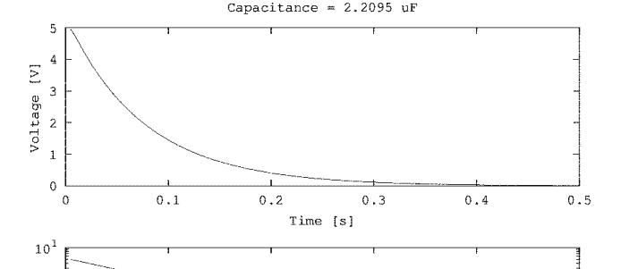

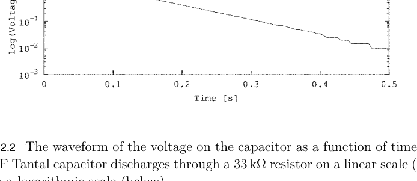

图 12.2 电容两端电压随时间变化的波形，其中 2.2 $\mu$F 钽电容通过 33 k$\Omega$ 电阻放电，上图为线性刻度，下图为对数刻度。

```matlab
for k=1:nsteps
    xx(k)=k*timestep*1e-3;                % in seconds
    yy(k)=str2double(serialReadline(s))*5/1023; % in Volt
end
clear s;
subplot(2,1,1); plot(xx,yy);
xlabel("Time [s]"); ylabel("Voltage [V]");
title(["Capacitance = " num2str(capacitance) " uF"]);
subplot(2,1,2); semilogy(xx,yy);
xlabel("Time [s]"); ylabel("log(Voltage)");
print('capacitance.png','-S1000,700')
```

我们需要记住，在实际打开串行线路之前，要加载仪器控制工具箱以使用串行通信功能，并清空工作区。首先，我们清除输入队列中任何残留的字符，并使用 `CAP?` 命令启动测量。经过短暂的等待后，我们使用 `serialReadline()` 函数读取回复，该函数是根据第 5.5.4 节的 `queryResponse()` 函数改编的。此处将其复制如下。

```matlab
% get response up to termination character
function out=serialReadline(dev,term_char)
  if (nargin==1) term_char=10; end  % defaults to LF=0x0A
  i=1;
  int_array=uint8(1);
  while true                     % loop forever
    val=read(dev,1);           % and read one byte
    if (val==term_char) break; end % until term_char appears
    int_array(i)=val;          % stuff byte in output
    i=i+1;
  end
  out=char(int_array);           % convert to characters
end
```

此函数逐个读取字符，直到找到行结束符，然后将接收到的字符返回给调用程序，从中提取数值。为了绘图，我们需要知道测量中使用的 `TIMESTEP`，并使用 `TIMESTEP?` 命令从 UNO 请求它。如果回复以 `TIMESTEP` 开头，则一切正常，我们提取数值。如果从串行输入队列中获取的是其他内容，则测量的时间窗口太短，测量无效。在这种情况下，程序关闭串行端口并将控制权返回给 Octave 命令提示符。另一方面，如果我们获得了时间步长的数值，则使用 `WF?` 命令请求波形数据。返回的第一行包含采集的点数。随后的行包含数据点。每一行新数据都通过调用 `serialReadline()` 获取，直到所有数据点都复制到数组 `yy` 中。最后，我们绘制具有线性和对数垂直刻度的曲线。后者显示出明显的线性关系，这表明电压对时间呈指数依赖关系，并具有明确的时间常数。在最后一行，我们生成一个 png 文件，如图 12.2 所示，可用于记录我们的工作。

除了在时域中分析设备的行为外，我们还可以通过施加频率变化的正弦电流来驱动被测器件（DUT），从而在频域中对其进行分析。同时，我们测量器件两端的电压降随频率的变化。这是网络分析仪的工作原理，它允许我们从电压和电流的比值中推导出器件阻抗的幅度和相位。为此任务，我们使用 AD5933 阻抗网络分析仪，其特点是具有直接数字频率合成器（已在第 4.5.6 节讨论），可生成高达约 100 kHz 的频率 f，并通过 DUT。同时，它使用高速 ADC 测量 DUT 两端的电压降。在内部，它在激励频率下执行数字傅里叶变换——分别使用余弦和正弦——并报告两个值，通常称为同相（I）和正交（Q）值的 IQ 数据。从这两个值，我们可以推导出阻抗的幅度为 √(I² + Q²)，相位为 arctan(I/Q)。

AD5933 的输出电流有限，这反过来限制了我们可以测量的最小电阻。因此，我们在其输出端（AD5933 的引脚 6）添加一个配置为线性缓冲器的运算放大器，如图 12.3 上部的原理图所示。同时，两个 47 kΩ 电阻和 47 nF 电容将 DUT 上的偏置电压调整为电源电压的一半，这与 AD5933 内部约束的输入（引脚 5）偏移电压相匹配。引脚 4 和 5 之间的 1 kΩ 电阻是 AD5933 内部配置为跨阻放大器的运算放大器的反馈电阻。它将输入电流转换为电压，然后由 AD5933 内部的 ADC 进行数字化。该集成电路通过 I2C 线路控制，需要 10 kΩ 上拉电阻。

图 12.3 的下半部分显示了在面包板上实现的该电路，由 UNO 控制。我们可以在面包板的上半部分看到 AD5933，其右侧是连接到引脚 15 的 SDA 和引脚 16 的 SCL 的 10 kΩ 上拉电阻，左侧是 1 kΩ 反馈电阻。引脚 9 到 11 连接到正电源电压，引脚 12 到 14 连接到地。这里我们需要指出，我们将 AD5933（采用与面包板不兼容的 SSOP 封装）焊接到一个所谓的 Winslow 载板上，该载板具有与面包板兼容的引脚间距（DIP）。电源轨连接到 UNO 上的电源轨，I2C 线路 SDA 和 SCL 分别连接到 UNO 的引脚 A4 和 A5。AD5933 的引脚 6 通过一个 47 nF 电容连接到下方 MCP6002 内部一个运算放大器的正输入端；两个 47 kΩ 电阻将输入偏置到电源电压的一半。负输入端（引脚 2）连接到运算放大器的输出端（引脚 1），并进一步连接到 DUT 的下端，DUT 的另一端直接连接到 AD5933 的输入引脚 5。MCP6002 内部的第二个运算放大器未使用，因此我们将其输入引脚接地，这是减少电路噪声的良好实践。

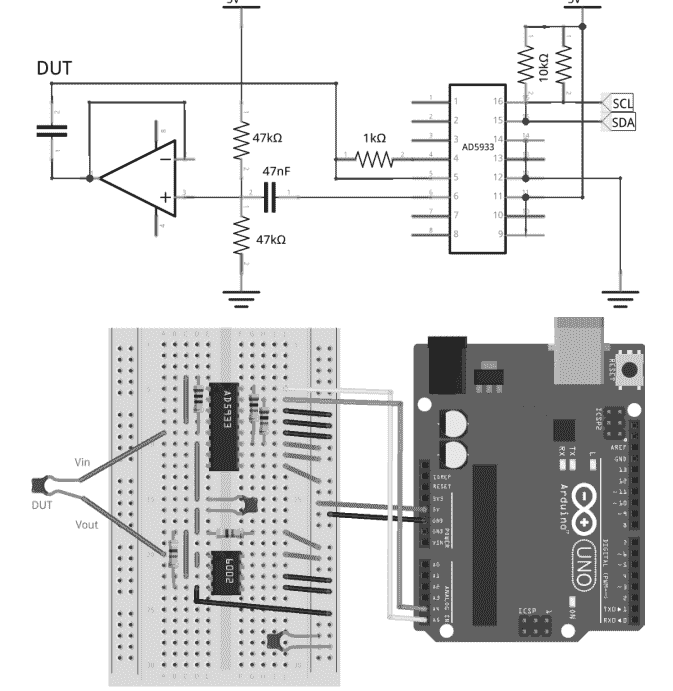

图 12.3 使用 AD5933 和运算放大器测量 DUT 的原理图，以增加测量范围（上图），以及在面包板上实现的相应电路，由 UNO 控制†。

使该电路工作主要涉及控制 AD5933，这需要仔细研究其数据手册。为了使这项工作在其他项目中可重用，我们将此电路特定的代码收集在文件 `AD5933.h` 中，该文件复制如下。首先，我们声明 AD5933 的 I2C 地址，初始化起始频率和频率增量的变量，以及内部振荡器的频率 MCLK，所有振荡都由此派生。变量 `npts` 描述频率点数，`mode` 设置输出电压范围，此处约为 2 V 峰峰值，`pga` 控制内部 ×5 放大器。

函数 `AD5933_config()` 接收这些参数作为输入，并根据数据手册中的描述对 AD5933 的内部寄存器进行编程。特别是，控制寄存器 0x80 和 0x81 设置 mode 和 pga 的工作模式。寄存器 0x8A 和 0x8B 设置设置新频率后和开始测量前的等待时间。寄存器 0x82 到 0x84 接收一个与 MCLK 相关的整数，该整数根据数据手册中的方程确定输出频率。首先将最高有效字节写入 0x82，然后将下一个字节写入 0x83，最低有效字节写入 0x84。在下一步中，频率增量 `finc` 被转换为一个整数，同样加载到寄存器 0x85 到 0x87 中。最后，`npts` 一次一个字节地写入 0x88 和 0x89。离开此函数时，AD5933 的所有寄存器都已加载了所需的值，并准备好启用输出，这需要发出数据手册中指定的一系列命令。我们提供了一个通用函数 `AD5933_command()`，它接收晦涩的字节值作为输入并配置设备。紧随其后，我们定义了一些函数，为某些操作赋予助记名称。最后两个函数读取状态位，指示测量是否完成以及频率扫描是否已结束。

```cpp
// AD5933.h, V. Ziemann, 221118
const int AD5933=0x0D;  // I2C address
float freq=5000.0, finc=500, MCLK=16.776E6;
int npts=200;
byte mode=0,pga=1;  // ~2 Vpp, amp = times 1
void AD5933_config(float freq,float finc,int npts,byte mode,byte pga){
    I2Cwrite(AD5933,0x80,0x00);     // Control registers, reset
    I2Cwrite(AD5933,0x81,0x10);
    I2Cwrite(AD5933,0x80,((mode & 0x03)<<1) | pga);
    I2Cwrite(AD5933,0x8A,0x00);     // Settling time
    I2Cwrite(AD5933,0x8B,0xFF);     // 255 cycles
    long n=(long)(freq/(MCLK/4)*pow(2,27));
    I2Cwrite(AD5933,0x82,(n>>16) & 0xFF);     // Starting frequency
    I2Cwrite(AD5933,0x83,(n>>8) & 0xFF);
    I2Cwrite(AD5933,0x84,n & 0xFF);
    long m=(long)(finc/(MCLK/4)*pow(2,27));
    I2Cwrite(AD5933,0x85,(m>>16) & 0xFF);     // Frequency increment
    I2Cwrite(AD5933,0x86,(m>>8) & 0xFF);
    I2Cwrite(AD5933,0x87,m & 0xFF);
    I2Cwrite(AD5933,0x88,(npts>>8) & 0xFF);   // Number of increments
    I2Cwrite(AD5933,0x89,npts & 0xFF);
}
// cmd: 0x10=init, 0x20=start, 0x30=increment, 0x40=repeat
//      0x90=temp, 0xA0=Pwdn, 0xB0=Stdby
void AD5933_command(byte cmd) {
    uint8_t b=I2Cread(AD5933,0x80);
    I2Cwrite(AD5933,0x80,(b & 0x0F) | cmd);
}
void AD5933_standby() {AD5933_command(0xB0);}
void AD5933_init() {AD5933_command(0x10);}
void AD5933_increment() {AD5933_command(0x30);}
void AD5933_power_down() {AD5933_command(0xA0);}
int valid_data() {return ((I2Cread(AD5933,0x8F) & 0x02) == 0x02);}
int sweep_done() {return ((I2Cread(AD5933,0x8F) & 0x04) == 0x04);}
```

void AD5933_sweep(float freq, float finc, int npts, byte mode,
                   byte pga, int16_t *Ival, int16_t *Qval) {
  AD5933_config(freq,finc,npts,mode,pga);
  AD5933_standby();      // 待机
  AD5933_init();         // 初始化
  delay(200);            // 初始稳定时间
  AD5933_command(0x20);  // 开始扫描
  int ic=0;
  while (!sweep_done()) {
    while (!valid_data()) {delay(10);}  // 等待数据就绪
    int16_t Itmp=(I2Cread(AD5933,0x94) << 8) | I2Cread(AD5933,0x95);
    int16_t Qtmp=(I2Cread(AD5933,0x96) << 8) | I2Cread(AD5933,0x97);
    if (Ival==NULL) {
      float mag=sqrt((float)Itmp*(float)Itmp+(float)Qtmp*(float)Qtmp);
      Serial.print(Itmp); Serial.print("\t"); Serial.print(Qtmp);
      Serial.print("\t"); Serial.println(mag);
    } else {
      Ival[ic]=Itmp; Qval[ic]=Qtmp; ic++;
    }
    AD5933_increment();   // 增加频率
  }
}

函数 `AD5933_sweep()` 通过遵循数据手册中规定的顺序来执行频率扫描，只要扫描未完成就会持续进行。它检查状态位以确定测量是否完成，此时会读取包含 I 和 Q 值的寄存器，并将这些值写入串行线路或复制到数组 `IVAL[]` 和 `Qval[]` 中，然后增加频率。请注意，`Itmp`、`Qval`、`Ival[]` 和 `Qval[]` 必须指定为 `int16_t` 类型，以便正确处理符号位。

在 `AD5933.h` 内部，我们使用了第 74 页第 4.4.3 节中 `I2Crw.h` 的 `I2Cwrite()` 和 `I2Cread()` 函数。`I2Crw.h` 和 `AD5933.h` 必须与下面所示的草图位于同一子目录中。`setup()` 函数仅初始化串行和 I2C 通信。`loop()` 函数遵循久经考验的方案，即对通过串行线路接收到的命令做出反应。命令 `SWEEP` 使用当前参数启动扫描，而 `OUTON` 产生恒频输出，`OUTOFF` 则将其关闭。所有参数都可以通过命令 `FREQ`、`FINC`、`NPTS`、`MODE` 和 `PGA` 后跟一个数值来更改。最后，`STATE?` 返回当前参数的值。

```
// AD5933Serial, V. Ziemann, 221118
#include <Wire.h>
#include "I2Crw.h"
#include "AD5933.h"
void setup() {
  Serial.begin(115200); delay(1000);
  Wire.begin();
}
void loop() {
  char line[30];
  if (Serial.available()) {
    Serial.readStringUntil('\n').toCharArray(line,30);
    if (strstr(line,"SWEEP")) {
      AD5933_sweep(freq,finc,npts,mode,pga);
    } else if (strstr(line,"OUTON")) {
      AD5933_config(freq,finc,npts,mode,pga);
      AD5933_standby();
      AD5933_init();
    } else if (strstr(line,"OUTOFF")) {
      AD5933_power_down();
    } else if (strstr(line,"FREQ ")) {freq=atof(&line[5]);
    } else if (strstr(line,"FINC ")) {finc=atof(&line[5]);
    } else if (strstr(line,"NPTS ")) {npts=atoi(&line[5]);
    } else if (strstr(line,"MODE ")) {mode=atoi(&line[5]);
    } else if (strstr(line,"PGA ")) {pga=atoi(&line[4]);
    } else if (strstr(line,"STATE?")) {
      char msg[80];
      sprintf(msg,"STATE %ld %ld %d %d %d",
              (long)freq,(long)finc,npts,mode,pga);
      Serial.println(msg);
    }
  }
}
```

这个草图现在允许我们通过串行线路控制 AD5933，为此我们使用了 octave。以下脚本打开串口 `s`，并使用 `write()` 将所需参数写入 AD5933，然后通过 `STATE?` 验证它们是否已正确设置。接着我们解析回复，将值放入数组 `p` 中。然后我们启动 `SWEEP`，稍等片刻以确保一些数据已到达，之后通过 `f=fread(s)` 检查其存在性，并将任何到达的数据连接到字符串 `reply` 中。如果没有更多数据到达，我们就关闭串行线路，并将文本字符串 `reply` 重新格式化为包含三列的数组 `data`，这三列分别是每个频率点的 I、Q 和幅度。

```
% AD5933nwa.m, V. Ziemann, 221202
clear all; close all;
waiting_factor=1;    % 对于非常低的频率，增加此值
s=serialport("/dev/ttyUSB0",115200)  % 打开串行线路
pause(3); flush(s)
write(s,"MODE 3\n");
write(s,"PGA 1\n");
write(s,"FREQ 10e3\n");
write(s,"FINC 300\n");
write(s,"NPTS 200\n");
write(s,"STATE?\n"); reply=serialReadline(s)
p=sscanf(reply,"STATE %d %d %d %d %d")
write(s,"SWEEP\n");
pause(2*waiting_factor);
reply="";
while length((r=fread(s))) != 0
    reply=strcat(reply,char(r));
    pause(0.5*waiting_factor);
endwhile
clear s   % 关闭串行线路
[a,count] = sscanf(reply,"%g");
data=reshape(a,[3,count/3])';    % I,Q,mag
```

请注意，原始测量数据以 ADC 计数为单位返回。为了获得以欧姆为单位的阻抗和以度为单位的相位，我们需要使用已知电阻 $\hat{R}$ 作为被测器件 (DUT) 来校准设备。为此，我们通常选择 $\hat{R}$ 等于反馈电阻（图 12.3 中为 1 k$\Omega$），并对幅度拟合一个二阶多项式 `polyabs`，对相位拟合另一个多项式 `polyphase`。请注意，我们使用了 `atan2()` 函数，该函数考虑其两个参数的符号以在正确的象限中找到角度。在三个图中绘制幅度、相位以及原始 I 和 Q 信号后，我们指定了校准电阻的值 `Rcal`。只有当 DUT 是校准电阻时，我们才取消注释带有 `dlmwrite()` 的行，将两个多项式写入文件 `calibpoly.dat`。

```
f=(p(1):p(2):p(1)+p(2)*p(3))/1000; % 频率，单位为 kHz
polyabs=polyfit(f',data(:,3),2) % 幅度
phase=atan2(data(:,2),data(:,1))*180/pi;
polyphase=polyfit(f',phase,2) % 相位，单位为度
subplot(3,1,1); plot(f,data(:,3),'k',f,polyval(polyabs,f),'r-.');
xlabel("frequency [kHz]"); ylabel("abs(Z)")
legend("data","fit");
subplot(3,1,2); plot(f,phase,'k',f,polyval(polyphase,f),'r-.');
xlabel("frequency [kHz]"); ylabel("phase(Z) [deg]")
legend('phase','fit');
subplot(3,1,3); plot(f,data(:,1),'b',f,data(:,2),'r-.');
xlabel("frequency [kHz]"); ylabel("re(Z),im(Z)")
legend("real(Z)","imag(Z)");
Rcal=1; % 校准电阻
%dlmwrite("calibpoly.dat",[polyabs',polyphase'],"\t")
```

后来，在测量未知阻抗时，我们读取先前保存的多项式，并使用它们来缩放阻抗的绝对值，并计算其与电阻的相位差。这最终给出了 DUT 以欧姆为单位的阻抗以及相对于校准电阻的相位差。

```
figure; %..............阻抗和相位
cal=dlmread("calibpoly.dat","\t");
absval=data(:,3);
Zabs=Rcal*polyval(cal(:,1),f)'./absval;
phase=atan2(data(:,2),data(:,1))*180/pi;
Zphase=phase-polyval(cal(:,2),f)';
subplot(2,1,1); plot(f,Zabs,'k')
xlabel("frequency [kHz]"); ylabel("abs(Z) [kOhm]")
subplot(2,1,2); plot(f,Zphase,'r')
xlabel("frequency [kHz]"); ylabel("phase(Z) [deg]")
%capacitance_nF=mean(1./(2e6*pi*Zabs.*f'))*1e9 % nF
```

图 12.4 左侧的图显示了 DUT 为 $C = 2.2$ nF 电容器时的原始测量值。从上到下的三个图分别显示了幅度、相位以及 I 和 Q。右侧的图显示了设备用 1 k$\Omega$ 电阻校准后的值。我们观察到顶部图中与频率成反比的 $1/2\pi fC$ 依赖关系，以及相对于校准电阻接近 -90 度的相位差。脚本末尾注释掉的行通过平均 $C = 1/2\pi fZ$ 来计算估计电容值，对于我们这个电容器报告为 2.1 nF，在其指定的 10% 容差范围内。

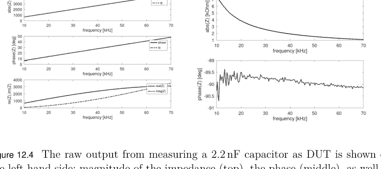

图 12.4 左侧显示了测量 2.2 nF 电容器作为 DUT 时的原始输出：阻抗幅度（顶部）、相位（中部）以及原始 I 和 Q 值（底部）。右侧的图显示了相对于校准电阻转换为物理值后的阻抗幅度和相位。

## 问题与项目构想

1.  使用放电法验证实验室中电容器的电容值。
2.  使用 AD5933 测量未知电阻的电阻值。
3.  描述当测量电感时，你预期会看到的、对应于图 12.4 右侧所示的那些图。
4.  验证实验室中电感器的电感值。
5.  计算一个 2.2 nF 电容器和一个 22 mH 电感器并联时的谐振频率，然后进行测量。在将它们串联后重复此过程。

# 第13章

## 示例：数据采集系统

在本示例中，我们将通过浏览器使用WebSockets控制ESP32微控制器产生和测量的数字与模拟信号，这是一个类似于第8章温度服务器的系统。我们将控制数字输出引脚DO18，既可以设置其值，也可以按可选的重复频率自动切换它。我们还将把引脚25上的DAC设置为指定值，或在最小和最大电压之间反复斜坡变化，以产生具有可选速率的简单锯齿波信号。为了测量电压，我们以最高每秒200次的可选速率读取输入引脚DI21以及引脚32和33上的两个ADC通道。这为数字通道提供了（尽管较慢的）逻辑分析仪功能，为模拟通道提供了示波器功能。

图13.1展示了在浏览器窗口中运行的用户界面。顶行显示了用于启动和停止采集、选择采样间隔以及清除显示的按钮。下方文本框的颜色显示了输入引脚DI21的状态——红色表示关闭，绿色表示开启。复选框用于开启或关闭输出引脚DO18，右侧的选择菜单用于以可选速率切换DO18。标有DAC25的滑块设置DAC的输出电压，而其右侧的选择菜单则选择不同速率的锯齿波信号。标有ADC32和ADC33的两个条形图显示了两个ADC上的输入电压。图形窗口显示了相应的波形，ADC32为红色，ADC33为蓝色。在保存图13.1所示图像时，产生锯齿波的DAC25输出连接到了ADC32。在采集进行到大约一半时，引脚DO18被开启，以每秒一次的频率切换。它直接连接到ADC33，因此第二条波形显示了切换的电压。显示下方的第一行状态信息是在浏览器端生成的，第二行信息则来自ESP32。

现在，让我们转向赋予ESP32生命的代码。与第8章一样，我们首先从连接到WLAN的凭证开始，并包含了对WiFi、Web服务器、WebSockets、JSON和SPIFFS文件系统的支持。请注意，后者与之前在NodeMCU上使用的名称不同。然后我们定义了监听端口80的Web服务器和端口81的WebSockets。定时器用于生成采样输入引脚和控制输出引脚的重复动作。在定义了一些变量之后，我们定义了几个由定时器调用的函数，这里`sampleslow_action()`读取输入引脚，将其值存储在数组`samples`中，并通过设置`output_ready`标志来通知新数据的可用性。函数`ramp25_action()`递增8位变量`dac25`并将其写入DAC25。我们不需要担心超过255的值，因为高位会被自动截断。函数`pulse18_action()`简单地切换DO18。

220 ■ 使用Arduino和树莓派的传感器实践教程，第二版

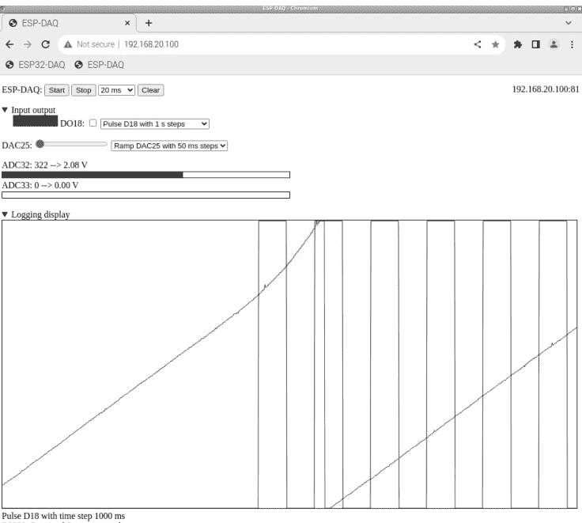

图13.1 基于ESP32的数据采集系统的Web界面。

```cpp
// ESP32 DAQ, V. Ziemann, 221018
const char* ssid     = "messnetz";
const char* password = "zxcvZXCV";
#include <WiFi.h>
#include <WebServer.h>
#include <WebSocketsServer.h>
#include <ArduinoJson.h>
#include <SPIFFS.h>
WebServer server2(80);                          // port 80
WebSocketsServer webSocket = WebSocketsServer(81);  // port 81
#include <Ticker.h>
Ticker SampleSlow,Ramp25Ticker,Pulse18Ticker;
volatile uint8_t websock_num=0,info_available=0,output_ready=0;
int sample_period=100,samples[3];
uint8_t dac25val=0,do18=0;
char info_buffer[80];
char out[300]; DynamicJsonDocument doc(300);
void sampleslow_action() { //.......................sampleslow_action
  samples[0]=analogRead(32)/8;  // fit into 512 pixels vertically
  samples[1]=analogRead(33)/8;
  samples[2]=digitalRead(21);
  output_ready=1;
}
void ramp25_action() {dac25val++; dacWrite(25,dac25val);}
void pulse18_action() {do18=!do18; digitalWrite(18,do18);}
```

下一个代码部分定义了处理与浏览器通信的函数。函数`handle_notfound()`简单地返回一个关于如何访问Web界面的提示。接下来的函数定义了与WebSocket的交互。函数`sendMSG()`根据输入的名称和值格式化一个JSON数据包，并将其打包到`info_buffer`中，其可用性通过将`info_available`设置为1来通知主程序。函数`webSocketEvent`是一个回调函数，每当与WebSocket相关的事件发生时（例如客户端断开或连接）就会执行，这些事件只是简单地报告到串行线。请注意，我们使用`sendMSG()`也向浏览器报告连接已建立。请注意，`sendMSG()`只格式化消息，该消息稍后在回调函数作用域之外发送。下一个case处理来自浏览器的JSON格式消息，我们从中提取名为`cmd`和`val`的名称-值对。根据`cmd`，`switch-case`结构启动或停止数据采集。它首先通过在`val`指定的`sample_period`间隔自动执行`sampleslow_action()`来启动。其他命令将输出引脚DO18和DAC25设置为`val`中指定的值，或注册“定时器”来斜坡变化DAC或切换引脚DO18。

```cpp
void handle_notfound() {
  server2.send(404,"text/plain","not found, use http://ip-address/");
}
void sendMSG(char *nam, const char *msg) {
  (void) sprintf(info_buffer,"{"%s":"%s"}",nam,msg);
  info_available=1;
}
void webSocketEvent(uint8_t num, WStype_t type, uint8_t * payload,
                    size_t length) {
  Serial.printf("webSocketEvent(%d, %d, ...)\r\n", num, type);
  websock_num=num;
  switch(type) {
    case WStype_DISCONNECTED:
      Serial.printf("[%u] Disconnected!\r\n", num);
      break;
    case WStype_CONNECTED:
      {
        IPAddress ip = webSocket.remoteIP(num);
        Serial.printf("[%u] Connected from %d.%d.%d.%d url: %s\r\n",
          num, ip[0], ip[1], ip[2], ip[3], payload);
      }
      sendMSG("INFO","ESP32: Successfully connected");
      break;
    case WStype_TEXT:
      {
        Serial.printf("[%u] get Text: %s\r\n", num, payload);
        DynamicJsonDocument root(300);
        deserializeJson(root,payload);
        const char *cmd = root["cmd"];
        const long val = root["val"];
        if (strstr(cmd,"START")) {
          sendMSG("INFO","ESP32: Received Start command");
          sample_period=val;
          SampleSlow.attach_ms(sample_period,sampleslow_action);
          Serial.print("sample_period = "); Serial.println(sample_period);
        } else if (strstr(cmd,"STOP")) {
          sendMSG("INFO","ESP32: Received Stop command");
          SampleSlow.detach();
        } else if (strstr(cmd,"DAC25")) {
          dacWrite(25,val);
          sendMSG("INFO","ESP32: set DAC25 to requested value");
        } else if (strstr(cmd,"DO18")) { digitalWrite(18,val);
        } else if (strstr(cmd,"RAMP25")) {
          if (val > 0) {Ramp25Ticker.attach_ms(val,ramp25_action);
          } else {Ramp25Ticker.detach();}
        } else if (strstr(cmd,"PULSE18")) {
          if (val > 0) {Pulse18Ticker.attach_ms(val,pulse18_action);
          } else {Pulse18Ticker.detach();}
        } else {
          Serial.println("Unknown command");
          sendMSG("INFO","ESP32: Unknown command received");
        }
      }
  }
}
```

在`setup()`函数中，我们首先配置数字引脚、串行线和WLAN接口，然后启动WebSocket并注册回调函数`webSocketEvent()`。接着我们启动`server2`来提供网页，注册回调函数来执行提供操作，但前提是存储HTML文件的SPIFFS文件系统存在。

```cpp
void setup() {
  pinMode(21,INPUT_PULLUP);
  pinMode(18,OUTPUT);
  dacWrite(25,0); // initialize DAC
  Serial.begin(115200); delay(1000);
  WiFi.begin(ssid, password);
  while (WiFi.status() != WL_CONNECTED) {delay(500); Serial.print(".");}
  Serial.print("\nConnected to ");  Serial.print(ssid);
  Serial.print(" with IP address: "); Serial.println(WiFi.localIP());
  webSocket.begin();
  webSocket.onEvent(webSocketEvent);
  if (!SPIFFS.begin(true)) {
    Serial.println("ERROR: no SPIFFS filesystem found"); return;
  } else {
    server2.begin();
    server2.serveStatic("/", SPIFFS, "/esp32-daq.html");
    server2.onNotFound(handle_notfound);
    Serial.println("SPIFFS file system found and server started");
  }
}
```

在`loop()`函数中，我们首先让Web服务器和WebSocket接口处理它们的事件，然后检查`info_available`标志是否被设置。如果被设置，我们就将存储在`info_buffer`中的JSON格式消息发送到浏览器。同样地，如果`output_ready`被设置，我们首先清空然后组装一个名为`doc`的`DynamicJsonDocument`。我们称其为ADC，并将存储在`samples`中的测量值添加进去，然后将这个JSON格式的消息转换为字符数组`out`，并发送到浏览器。

```
void loop() {
  server2.handleClient();
  webSocket.loop();
  if (info_available==1) {
    info_available=0;
    webSocket.sendTXT(websock_num,info_buffer,strlen(info_buffer));
  }
  if (output_ready==1) {
    output_ready=0;
    doc.to<JsonObject>();  // clear DynamicJsonDocument doc
    for (int k=0;k<3;k++) {doc["ADC"][k]=samples[k];}
    serializeJson(doc,out);
    webSocket.sendTXT(websock_num,out,strlen(out));
  }
  yield();
}
```

ESP32编程完成后，我们现在转向网页和JavaScript代码，它们构成了WebSocket通信通道的“另一端”。头部遵循第8章的描述，只是这里我们指定了两条轨迹。

```
<!DOCTYPE HTML>
<HTML lang="en">
<HEAD>
  <TITLE>ESP-DAQ</TITLE>
  <META charset="UTF-8">
  <STYLE>
    #displayarea { border: 1px solid black; }
    #adc32 { border: 1px solid black; }
    #adc33 { border: 1px solid black; }
    #trace0 { fill: none; stroke: red; stroke-width: 1px;}
    #trace1 { fill: none; stroke: blue; stroke-width: 1px;}
    #ip {float: right;}
  </STYLE>
</HEAD>
```

以下部分指定了图13.1所示网页的外观。顶部的按钮、用于选择采样时间的下拉菜单以及显示的IP地址，其定义方式与第8章类似。

```
<BODY>
<P> ESP-DAQ:
  <button id="start" type="button" onclick="start();">Start</button>
  <button id="stop" type="button" onclick="stop();">Stop</button>
  <SELECT onchange="setSamplePeriod(this.value);">
    <OPTGROUP label="Roll mode">
      <OPTION value="5">5 ms</OPTION>
      <OPTION value="10">10 ms</OPTION>
      <OPTION value="20">20 ms</OPTION>
      <OPTION value="50">50 ms</OPTION>
      <OPTION selected="selected" value="100">100 ms</OPTION>
      <OPTION value="200">200 ms</OPTION>
      <OPTION value="500">500 ms</OPTION>
      <OPTION value="1000">1 s</OPTION>
      <OPTION value="2000">2 s</OPTION>
      <OPTION value="5000">5 s</OPTION>
    </OPTGROUP>
  </SELECT>
  <button id="clear" type="button" onclick="cleardisplay();">
    Clear</button>
  <A id='ip'>IP address</A>
</P>
```

在下一部分中，我们打开一个`DETAILS`元素，它使我们能够通过点击`SUMMARY`中指定文本旁边的小三角形来隐藏或显示该部分。在`DETAILS`内部，名为`Din`的`CANVAS`显示输入引脚D21的状态。其后是用于改变输出引脚DO18状态的复选框定义。下拉菜单让我们选择引脚切换的周期，通过将选定的值传递给回调函数`setDO()`来实现，该函数组装一个JSON消息并将其发送到ESP32。然后我们定义一个`INPUT`滑块，用于设置DAC25的输出电压，接着是两个`CANVAS`类型的元素，用于显示ADC32和ADC33报告的当前值，最后关闭`DETAILS`。

```
<P><DETAILS open> <SUMMARY>Input output</SUMMARY>
<CANVAS id="Din" width="100" height="20"> </CANVAS>
DO18:<INPUT type="checkbox" id="DO18" onchange="setDO(18,this.checked)"/>
<Select onchange="pulsepin18(this.value);">
    <OPTION value="0">Pulse D18 OFF</OPTION>
    <OPTION value="1">Pulse D18 with 1 ms steps</OPTION>
    <OPTION value="10">Pulse D18 with 10 ms steps</OPTION>
    <OPTION value="100">Pulse D18 with 100 ms steps</OPTION>
    <OPTION value="1000">Pulse D18 with 1 s steps</OPTION>
    <OPTION value="2000">Pulse D18 with 2 s steps</OPTION>
    <OPTION value="5000">Pulse D18 with 5 s steps</OPTION>
</SELECT> </P>
<P>DAC25: <INPUT type="range" min="0" max="255" step="1" value="0"
            onchange="updatedac25(this.value)" />
<SELECT onchange="rampdac25(this.value);">
    <OPTION value="0">Ramp DAC25 OFF</OPTION>
    <OPTION value="10">Ramp DAC25 with 10 ms steps</OPTION>
    <OPTION value="50">Ramp DAC25 with 50 ms steps</OPTION>
</SELECT></P>
<P><DIV id="adc32val">ADC32: unknown</DIV>
<CANVAS id="adc32" width="512" height="10"> </CANVAS>
<DIV id="adc33val">ADC33: unknown</DIV>
<CANVAS id="adc33" width="512" height="10"> </CANVAS>
</DETAILS></P>
```

在下一部分中，我们打开第二个`DETAILS`，其中包含用于显示ADC记录电压的`displayarea`。`displayarea`被定义为SVG标签之间的可缩放矢量图形。每条轨迹被定义为一个`PATH`，与第8章一样。关闭`DETAILS`后，我们定义了网页底部显示的两个状态行。

```
<DETAILS open>
  <SUMMARY>Logging display</SUMMARY>
  <SVG id="displayarea" width="1024px" height="512px">
    <PATH id="trace0" d="M0 256" />
    <PATH id="trace1" d="M0 256" />
  </SVG>
</DETAILS>
<DIV id="status">Status window</DIV>
<DIV id="reply">Reply from ESP32</DIV>
```

以下JavaScript使网页具有交互性。我们首先声明一些变量并确定ESP32的IP地址。我们将其（包括WebSocket端口81）存储在变量`ipaddr`中，并在网页元素`ip`中显示它。然后我们打开WebSocket，接着定义用于错误处理、打开和关闭WebSocket的回调函数。`toStatus()`和`toReply()`函数将作为参数给出的文本复制到网页底部的相应行。`start()`和`stop()`函数是网页上相应按钮的回调函数。它们准备JSON格式的消息，指示ESP32该做什么。

```
<SCRIPT>
  var sample_period=100, current_position=0;
  var ipaddr=location.hostname + ":81";
  document.getElementById('ip').innerHTML=ipaddr;
  show_noconnect();
  var websocket = new WebSocket('ws://' + ipaddr);
  websocket.onerror = function(evt) { console.log(evt); toStatus(evt) };
  websocket.onopen = function(evt) { console.log('websocket open'); };
  websocket.onclose = function(evt) {
    console.log('websocket close');
    toStatus('websocket close');
  };
  function toStatus(txt){
    document.getElementById('status').innerHTML=txt;}
  function toReply(txt) {
    document.getElementById('reply').innerHTML=txt;}
  function start() {
    websocket.send(JSON.stringify({"cmd":"START", "val":sample_period}));
  }
  function stop() {
    websocket.send(JSON.stringify({ "cmd" : "STOP", "val" : "-1" }));
    show_noconnect();
  }
</SCRIPT>
```

每当来自ESP32的新消息到达时，`.onmessage`方法就会执行。它首先解析消息并将消息放入变量`stuff`中。我们首先检查它是否是`INFO`类型的消息，如果是，我们只需将其传递给`toReply()`函数，该函数将其显示在图表下方。如果消息是`ADC`类型，它包含测量值数组。前两个元素`val[0]`和`val[1]`包含来自ESP32上ADC32和ADC33的值。我们将值转换为伏特并在网页上显示该值，同时绘制一个彩色矩形，以水平条的形式说明该值；ADC32为红色，ADC33为蓝色。最后，我们根据引脚的状态更改显示DI21的`Din`字段的颜色。函数的其余部分首先提取与每条轨迹关联的`PATH`的属性`d`，并附加新采样的坐标，然后将其复制回`d`。最后，我们递增`current_position`。如果新位置超过右侧限制，我们移除最左边的数据点并将两条轨迹向左平移。

```
websocket.onmessage=function(event) {
    console.log(event);
    var stuff=JSON.parse(event.data);
    var val=stuff["INFO"]; //.............................info
    if ( val != undefined ) {toReply(val);}
    val=stuff["ADC"];       //.............................measurements
    if ( val != undefined ) {
        document.getElementById('adc32val').innerHTML=
        "ADC32: " + val[0] + " --> " + (val[0]*3.3/511).toFixed(2) + " V";
        c=document.getElementById('adc32').getContext("2d");   //..ADC32
        c.clearRect(0,0,512,10);
        c.fillStyle = "#FF0000"; c.fillRect(0,0,val[0],10);
        document.getElementById('adc33val').innerHTML=
        "ADC33: " + val[1] + " --> " + (val[1]*3.3/511).toFixed(2) + " V";
        c=document.getElementById('adc33').getContext("2d");   //..ADC33
        c.clearRect(0,0,512,10);
        c.fillStyle = "#0000FF"; c.fillRect(0,0,val[1],10);
        c=document.getElementById('Din').getContext("2d");      //...DI21
        if (val[2]==1) {c.fillStyle = "#00FF00";}
        else {c.fillStyle = "#FF0000";}
        c.fillRect(20,0,100,20);
        c.font = "20px Arial"; c.fillStyle = "#000000";
        c.fillText("DI21",50,17);
        dd=document.getElementById('trace0').getAttribute('d');
        dd += ' L' + current_position + ' ' + (512-val[0]);
        document.getElementById('trace0').setAttribute('d',dd);
        dd=document.getElementById('trace1').getAttribute('d');
        dd += ' L' + current_position + ' ' + (512-val[1]);
        document.getElementById('trace1').setAttribute('d',dd);
        current_position += 1;
        if (current_position > 1024) {
            dd=document.getElementById('trace0').getAttribute('d')
                .replace(/M[^L]*L/, "M");
            document.getElementById('trace0').setAttribute('d',dd);
            document.getElementById('trace0').setAttribute(
                'transform','translate(' + (1024-current_position) + ',0)');
            dd=document.getElementById('trace1').getAttribute('d')
                .replace(/M[^L]*L/, "M");
            document.getElementById('trace1').setAttribute('d',dd);
            document.getElementById('trace1').setAttribute(
                'transform','translate(' + (1024-current_position) + ',0)');
        }
    }
}
```

下一组 JavaScript 函数首先定义了回调函数，用于从选择菜单设置采样周期（sample_period）并清除显示。函数 `show_noconnect()` 显示一个灰色按钮，表示输入引脚 DI21 的状态，表明数据采集尚未激活。接着，我们定义函数来发送消息，使 ESP32 要么将 DAC25 设置为固定值，要么对其进行斜坡处理，从而产生图 13.1 中可见的锯齿波信号。随后是设置输出引脚状态并使其持续切换的函数。最后，我们关闭 SCRIPT、BODY 和 HTML 的标签。

```javascript
function setSamplePeriod(v) {
  toStatus("Setting sample period to "+ v + " ms");
  sample_period=v;
}
function cleardisplay() {
  dd = "M0 512";
  document.getElementById('trace0').setAttribute('d',dd);
  document.getElementById('trace0').setAttribute
      ('transform','translate(0)');
  document.getElementById('trace1').setAttribute('d',dd);
  document.getElementById('trace1').setAttribute
      ('transform','translate(0)');
  current_position=0;
}
function show_noconnect() {
  c=document.getElementById('Din').getContext("2d");
  c.fillStyle = "#DDDDDD"
  for (i=2;i<3;i++) {c.fillRect(20+110*(i-2),0,100,20);}
  c.font = "20px Arial"; c.fillStyle = "#000000";
  c.fillText("DI21",50,17);
}
function updatedac25(v) {
  volts=v*3.3/255;
  toStatus("Set DAC25 = " + v + " -> " + volts.toFixed(2) + " V");
  websock.send(JSON.stringify({ "cmd" : "DAC25", "val" : v }));
}
function rampdac25(v) {
  toStatus("Ramp DAC25 with time step " + v);
  websock.send(JSON.stringify({ "cmd" : "RAMP25", "val" : v }));
}
function setDO(v,s) {
  vv=s?1:0;
  toStatus("Status changed on DO"+ v + " is " + s + " or " + vv);
  websock.send(JSON.stringify({ "cmd" : "DO"+v, "val" : + vv }));
}
function pulsepin18(v) {
  toStatus("Pulse D18 with time step " + v + " ms");
  websock.send(JSON.stringify({ "cmd" : "PULSE18", "val" : v }));
}
</script> </body> </html>
```

为了将此网页传输到 ESP32，我们在 ESP_minidaq.ino 文件所在的子目录下创建一个名为 `data` 的子目录，并将 HTML 文件复制到其中。然后，我们安装一个程序，该程序将 `data` 子目录的内容复制到 ESP32 的闪存中。具体操作是从 https://github.com/me-no-dev/arduino-esp32fs-plugin 的 *releases page* 下载 ESP32FS-1.0.zip，并将其解压到 /Arduino/tools/ 子目录中。重启 Arduino IDE 后，我们将在 *Tools* 菜单中找到一个名为 *ESP32 Sketch Data Upload* 的条目，它会将网页上传到 ESP32，这样端口 80 上的服务器就能找到它并将其传递给连接的浏览器。如果上传失败，请确保 *Serial monitor* 窗口已关闭，然后重试！

至此，我们已经在微控制器和浏览器之间建立了一个双向通信通道，这具有许多优势，因为用户界面完全由在浏览器上运行的 HTML 和 JavaScript 代码指定，这非常灵活且易于扩展，因此我们立即将其用于下一个项目。

## 问题与项目构想

1.  在 ESP32 的某个输出引脚上产生 500 Hz 的矩形信号。
2.  使锯齿波信号的最小和最大幅度可调，可以在网页界面上使用选择菜单或滑块。
3.  使用引脚 26 上的第二个 DAC，通过（慢速）直接数字合成输出类似正弦的信号。
4.  对于三角波输出电压做同样的处理，使其线性上升到最大值，然后线性下降到零。
5.  添加 AD9850 DDS 板，并使其可通过网页界面控制。
6.  将你喜欢的传感器连接到 ESP32，并使其可通过网页界面控制。
7.  编程四个输出引脚，产生驱动步进电机的开关模式。
8.  在网页界面上添加一个按钮来关闭 websocket，再添加一个按钮在连接中断时重新连接。
9.  使用 JavaScript 在浏览器上的数组中保存测量样本，以便在按下按钮时显示数值。

# 示例：快速采集

有时需要以高于第 13 章每秒几百个样本的速率来观察和生成信号，例如分析通信通道（如 RS-232）或观察声学信号。幸运的是，ESP32 能够以超过每秒 200,000 个样本的速率进行采样，它通过一种称为 *直接内存访问*（DMA）的模式，直接将样本从 ADC 传输到内存，而不使用 CPU。它使用了 ESP32 芯片上的 I2S（Inter-IC Sound）支持，该支持通常专用于数字传输音乐。此外，ESP32 还内置了用于正弦和矩形信号的频率发生器，频率范围相同。

通过包含以下代码片段（基于 ESP32 示例 HiFreq_ADC）来配置我们草图中的高速模式，可以轻松地将这些功能添加到我们的数据采集系统中。它包含了用于 I2S 支持的头文件 `driver/i2s.h`，然后配置 I2S 以指定的 `i2s_sample_rate` 进行采样。它从输入引脚 32 读取模拟输入，该引脚连接到 ADC1_CHANNEL_4。将 _4 替换为 _7 可将其连接到引脚 35。我们设置输入电压的衰减，使其覆盖从零到电源电压的范围。请注意，错误处理相当基础；程序只是向串行线路打印一条简短消息。

```c
#include <driver/i2s.h>
bool i2s_adc_enabled=false;
void i2sInit(uint32_t i2s_sample_rate){
  i2s_config_t i2s_config = {
    .mode = (i2s_mode_t)(I2S_MODE_MASTER | I2S_MODE_RX
                                    | I2S_MODE_ADC_BUILT_IN),
    .sample_rate =  i2s_sample_rate,
    .bits_per_sample = I2S_BITS_PER_SAMPLE_16BIT,
    .channel_format = I2S_CHANNEL_FMT_ONLY_LEFT,
    .communication_format = I2S_COMM_FORMAT_STAND_I2S,
    .intr_alloc_flags = ESP_INTR_FLAG_LEVEL1,
    .dma_buf_count = 8,
    .dma_buf_len = 1024,    // 1024 is maximum length
    .use_apll = true,       // needed for low frequencies
    .tx_desc_auto_clear = false,
    .fixed_mclk = 0
  };
  if(ESP_OK != i2s_driver_install(I2S_NUM_0, &i2s_config, 0, NULL)){
    Serial.print("Error installing I2S.");
  }
  if(ESP_OK != i2s_set_adc_mode(ADC_UNIT_1, ADC1_CHANNEL_4)){ // pin 32
    Serial.print("Error setting up ADC.");
  }
  if(ESP_OK != adc1_config_channel_atten(ADC1_CHANNEL_4, ADC_ATTEN_DB_11)){
    Serial.print("Error setting up ADC attenuation.");
  }
  if(ESP_OK != i2s_adc_enable(I2S_NUM_0)){
    Serial.print("Error enabling ADC.");
  }
  Serial.print("I2S ADC setup ok\n");
}
```

正弦频率发生器也使用 ESP32 上的 I2S 硬件。包含三个头文件后，两个变量定义了信号的频率和输出比例，然后函数 `cwDACinit()`（基于 https://github.com/krzychb/dac-cosine 中非常详细的信息）通过直接写入 ESP32 上的寄存器来配置发生器。我们指出，在计算 `frequency_step` 时出现的校正因子 0.95 是为了补偿 _APPROX 并产生指定的输出频率。请注意，将所需频率设置为零会禁用输出。

```c
#include <driver/dac.h>
#include <soc/sens_reg.h>
#include "soc/rtc.h"
float dac25freq=0;
int dac25scale=0;   // output full scale
void cwDACinit(float freq, int scale, int offset) { //...cwDACinit
  if (abs(freq) < 1e-3) {dac_output_disable(DAC_CHANNEL_1); return;}
  int frequency_step=max(1.0,floor(0.5+0.95*65536.0*freq
                                  /RTC_FAST_CLK_FREQ_APPROX));
  SET_PERI_REG_MASK(SENS_SAR_DAC_CTRL1_REG, SENS_SW_TONE_EN);
  SET_PERI_REG_MASK(SENS_SAR_DAC_CTRL2_REG, SENS_DAC_CW_EN1_M);
  SET_PERI_REG_BITS(SENS_SAR_DAC_CTRL2_REG, SENS_DAC_INV1, 2,
                    SENS_DAC_INV1_S);
  SET_PERI_REG_BITS(SENS_SAR_DAC_CTRL1_REG, SENS_SW_FSTEP,
                    frequency_step, SENS_SW_FSTEP_S);
  SET_PERI_REG_BITS(SENS_SAR_DAC_CTRL2_REG, SENS_DAC_SCALE1,
                    scale, SENS_DAC_SCALE1_S);
  SET_PERI_REG_BITS(SENS_SAR_DAC_CTRL2_REG, SENS_DAC_DC1,
                    offset, SENS_DAC_DC1_S);
  dac_output_enable(DAC_CHANNEL_1);
}
```

在对草图进行修改后，我们现在处理 ESP32 发布的网页。在包含网页的文件 esp32-daq.html 中，我们更新了函数 `webSocketEvent()`，JSON 编码的命令响应在此处到达。特别是，START 命令现在必须区分是在慢速还是高速模式下启动采集。我们约定 `sample_period` 的正值仍然定义慢速采集模式下的采样速度。然而，负值通过调用 `i2sInit()` 来初始化高速采集。请注意，在用新的 `i2s_sample_rate` 重新配置之前，我们需要禁用并卸载 i2s_adc 驱动程序。同样，STOP 部分在 `sample_period` 为正时禁用慢速采集，在为负时禁用高速采集。另请注意，我们重新启用了频率发生器，因为它也使用 I2S 模块，禁用 I2S 驱动程序会停止它。最后，新命令 SETDAC 配置了频率发生器输出`val`中指定的频率；负值会改变输出电压的缩放比例。

```
:
if (strstr(cmd,"START")) {
    sendMSG("INFO","ESP32: Received Start command");
    sample_period=val;
    if (sample_period > 0) {
        SampleSlow.attach_ms(sample_period,sampleslow_action);
        Serial.print("sample_period = "); Serial.println(sample_period);
    } else {
        if (i2s_adc_enabled) {
            i2s_adc_disable(I2S_NUM_0); i2s_driver_uninstall(I2S_NUM_0);}
        uint32_t i2s_sample_rate=(uint32_t) abs(sample_period);
        i2sInit(i2s_sample_rate);
        i2s_adc_enabled=true;
    }
} else if (strstr(cmd,"STOP")) {
    if (sample_period>0) {
        sendMSG("INFO","ESP32: Received Stop command");
        SampleSlow.detach();
    } else {
        if (ESP_OK != i2s_adc_disable(I2S_NUM_0)) {
            Serial.printf("Error disabling ADC.");
        }
        if (ESP_OK != i2s_driver_uninstall(I2S_NUM_0)) {
            Serial.printf("Error uninstalling I2S driver.");
        }
        i2s_adc_enabled=false;
        if (dac25freq>0) {cwDACinit(dac25freq,dac25scale,0);}
    }
} else if (strstr(cmd,"SETDAC")) {
    Serial.printf("DAC25 frequency = %d\n",val);
    if (val < 0) {dac25scale=-val-1;} else {dac25freq=val;}
    cwDACinit(dac25freq,dac25scale,0);
} else if (strstr(cmd,"DAC25")) {
    :
```

我们通过在`setup()`函数末尾添加以下代码行，将矩形信号发生器配置为在引脚27上连续输出1 kHz信号：

```
ledcSetup(0, 1000, 2); ledcAttachPin(27, 0); ledcWrite(0, 2);
```

它首先将PWM通道0配置为以1 kHz频率、2位分辨率（四种状态）运行，然后将该通道连接到引脚27，并写入值2，这使得该通道的占空比为50%（四种状态中的两种）。

最后，在`loop()`函数末尾，我们添加代码以使用`i2s_read()`获取数据，并重新排列`buffer[]`中的采样点。这是I2S系统的一个特性，该系统通常发送左右声道的立体声信号。不幸的是，这些数据的编码约定与到达采样点的时间顺序不一致，因此需要重新排列。缓冲区准备好后，我们组装JSON数组`WF0`并将其发送到浏览器进行显示。我们在函数末尾添加了一个短暂的延迟，以避免无线网络拥塞，并为其他活动（如用户界面）留出一点时间。

```
if (i2s_adc_enabled) {
  size_t bytes_read;
  uint16_t buffer[1024], swap; //={0};
  i2s_read(I2S_NUM_0, &buffer, sizeof(buffer), &bytes_read, 15);
  for (int j=0; j<bytes_read/2; j+=2) {  // swap left and right channel
    swap=buffer[j+1]; buffer[j+1]=buffer[j]; buffer[j]=swap;
  }
  doc.to<JsonObject>();  // clear DynamicJsonDocument doc
  for (int j=0;j<bytes_read/2;j++){doc["WF0"][j]=(buffer[j]&0x0FF)>>3;}
  serializeJson(doc,out);
  webSocket.sendTXT(websock_num,out,strlen(out));
  delay(2000);
}
```

最后，我们必须将`out`和`doc`的大小（它们都在草图顶部附近定义）从300增加到20000，以适应更长的发送波形`WF0`。

我们通过向文件`esp32-daq.html`添加代码，从浏览器控制ESP32上的新功能。在用于采样速度的`SELECT`菜单中，我们添加了一个`OPTGROUP`，用于向ESP32发送负频率，ESP32使用这些频率来配置高速ADC，采样率范围在1 kS/s到1 MS/s之间。

```
<OPTGROUP label="Hi-speed I2S ADC">
  <OPTION value="-1000">1 kSamples/s</OPTION>
  <OPTION value="-10000">10 kSamples/s</OPTION>
  <OPTION value="-20000">20 kSamples/s</OPTION>
  <OPTION value="-50000">50 kSamples/s</OPTION>
  <OPTION value="-100000">100 kSamples/s</OPTION>
  <OPTION value="-200000">200 kSamples/s</OPTION>
  <OPTION value="-277777">277.777 kSamples/s</OPTION>
  <OPTION value="-500000">500 kSamples/s</OPTION>
  <OPTION value="-1000000">1 MSamples/s</OPTION>
</OPTGROUP>
</SELECT>
```

同样，我们使用一个额外的`SELECT`菜单来控制正弦波频率发生器。请注意，发送正值指定频率，负值指定输出缩放比例，其步进值硬编码在ESP32中。

```
<SELECT onchange="setDacFrequency(this.value);">
  <OPTGROUP label="DAC frequency">
    <OPTION value="0">DAC25 OFF</OPTION>
    <OPTION value="2000">DAC25=2 kHz</OPTION>
    <OPTION value="5000">DAC25=5 kHz</OPTION>
    <OPTION value="10000">DAC25=10 kHz</OPTION>
    <OPTION value="20000">DAC25=20 kHz</OPTION>
    <OPTION value="50000">DAC25=50 kHz</OPTION>
    <OPTION value="100000">DAC25=100 kHz</OPTION>
    <OPTION value="200000">DAC25=200 kHz</OPTION>
  </OPTGROUP>
```

## 示例：快速采集 ■ 233

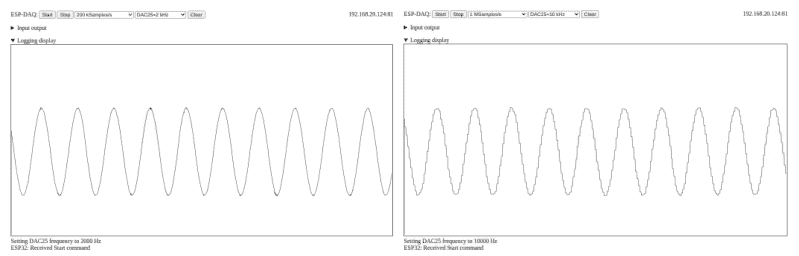

图14.1 以200 kS/s采样内部生成的2 kHz信号（左）和以1 MS/s采样10 kHz信号（右）。

```
<OPTGROUP label="DAC output scale">
    <OPTION value="-1">1/1 scale</OPTION>
    <OPTION value="-2">~1/2 scale</OPTION>
    <OPTION value="-3">~1/4 scale</OPTION>
    <OPTION value="-4">~1/6 scale</OPTION>
</OPTGROUP>
```

最后，回调函数`setDacFrequency()`在JavaScript代码末尾附近定义。它接收来自`SELECT`部分中`OPTION`的值`f`，并向ESP32发送一个JSON格式的字符串。

```
function setDacFrequency(f) {
    toStatus("Setting DAC25 frequency to " + f + " Hz");
    websock.send(JSON.stringify({ "cmd" : "SETDAC", "val" : f }));
}
document.getElementById("displayarea").addEventListener
    ("mousedown", showCoordinates, false);
function showCoordinates(event) {
    rect=document.getElementById("displayarea").getBoundingClientRect();
    toStatus("Mouse position: " + (event.clientX-rect.left) + " "
            + (rect.height-event.clientY+rect.top));
}
```

`showCoordinates()`函数将鼠标在`displayarea`上点击的像素坐标写入状态行，这对于确定脉冲长度非常方便。

我们通过在引脚25上生成一个2 kHz正弦信号，以200 kS/s对其进行采样，并在图14.1左侧显示波形来测试系统，该波形显示了一条平滑的正弦曲线。右侧的图形显示了一个10 kHz的正弦波，以1 MS/s采样。我们观察到显示的波形中有明显的阶梯，这表明ADC多次报告相同的值，而不是以更高的速率进行采样。采样频率的实用极限（取自HiFreq_ADC示例）为277 kS/s，这促使我们将该值包含在`SELECT`菜单中。

我们现在可以使用该系统来分析来自TSOP2238红外接收器的信号，该接收器在第4.6.4节中已经提到过。其输出引脚直接连接到ESP32引脚32上的ADC输入。图14.2左侧显示了按下三星电视遥控器关闭按钮时产生的信号。我们观察到空闲状态是高电平（3.3 V）信号电平，被一系列低电平（0V）脉冲序列中断。整个序列的持续时间约为60 ms。将采样率提高到50 kS/s并尝试几次以捕获脉冲的起始点，我们得到了右侧的图形。通过点击鼠标在跳变沿上来确定像素值，我们可以轻松测量信号的持续时间。我们发现起始处的长负脉冲持续时间为4.6 ms，随后是4.4 ms的高电平周期。接下来的短脉冲大约低电平持续0.6 ms，高电平持续0.4 ms。脉冲的其他部分可以通过耐心计算得出，但缺乏触发系统使得这有些不便。因此，添加触发系统是项目想法清单上的首要任务。

234 ■ 基于Arduino和树莓派的传感器实践教程（第二版）

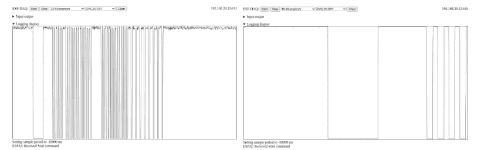

图14.2 三星电视遥控器的红外信号，由TSOP2238接收器记录，其输出以10 kS/s采样（左），脉冲起始部分以50 kS/s采样（右）。

## 问题与项目想法

- 1. 添加在下降沿或上升沿触发采集的功能。
- 2. 修改代码以从引脚33读取快速ADC。
- 3. 添加一个菜单，用于选择引脚27上矩形信号发生器的频率和脉冲宽度。
- 4. 将提供给`i2s_read()`函数的数组`buffer[]`的大小加倍，并记录更长的波形。为了在网页上显示它们，你还需要更改什么？
- 5. 添加一个放大器来测量并显示来自麦克风的小电压。
- 6. 讨论在DAC输出端添加一个用作线路缓冲器的运算放大器，并在ADC输入端添加一个跨阻放大器，以便像我们在第12章中那样测量元件的阻抗。

# 第15章
示例：医疗传感

在本章中，我们将使用NodeMCU测量心电图（ECG）、血氧饱和度以及生物阻抗。NodeMCU控制这三个传感器，并利用第13章（已在图13.1中展示）的Web界面显示其测量值。作为额外功能，我们还添加了模拟人体阻抗和心电图的电路。此外，我们提供了将测量值保存到NodeMCU内部闪存盘并稍后回放的选项，这为数据记录（例如在运动时）提供了可能性。重要的是，请注意本项目仅用于演示测量过程，不适用于医疗诊断！

图15.1展示了包含右侧NodeMCU和三个传感器的硬件。在控制器旁边，我们看到带有AD8232心电图测量模块的分线板[31]。它配有一根将三个电极连接到3.5毫米插孔的电缆，该插孔显示在心脏符号下方。通往电极的导线采用颜色编码：黑色电极应连接到右下臂（RA），蓝色电极连接到左下臂（LA），红色电极连接到右腿（RL），尽管其他放置方式也是可能的。该分线板感应、放大并清理在黑色和蓝色电极之间测量到的微小电压，使用红色电极作为参考，并在其输出引脚上提供模拟电压。我们将此输出信号直接路由到NodeMCU的模拟输入引脚A0。此外，用于指示电极是否连接的信号被路由到数字输入引脚D3和D4。

右侧显示的小面包板包含一个心电图模拟器，它允许我们在不连接患者的情况下测试AD8232。我们将描述心电图的电压以表格形式存储在NodeMCU上，并周期性地将值传递给我们在第4.5.5节中已讨论过的MCP4921数模转换器。除了电源轨，其SPI控制线SCK、MOSI和CS分别连接到NodeMCU的引脚D5、D7和D8。同样放置在小面包板上的三个电阻（10kΩ、10Ω和10kΩ）将RL和RA之间的信号降低到通常由人体产生的毫伏级。我们直接将它们连接到连接在AD8232分线板插孔上的电缆末端的相应电极。

基于MAX30102的脉搏血氧仪（已在图2.40中展示）也安装在一个小分线板上，该板放置在AD8232的左侧。如第2.3.3节所述，它通过比较在指尖用光电晶体管测量的红光和红外光的反射来测量血液中的氧饱和度（SPO2）。带有光电二极管和晶体管的小型光学传感器的工作原理类似于第11章的颜色测量。它位于分线板中心附近，并通过两条I2C线SCL和SDA分别连接到引脚D1和D2，从而连接到NodeMCU。

第三个传感器显示在最左侧，是我们在第12章中已经遇到的生物阻抗网络分析仪AD5933。我们用它来测量连接到模拟人体阻抗电路（称为*Cole模型*）的两个电极之间的阻抗。带有八引脚运算放大器的电路与我们之前使用的相同；我们只是将AD5933引脚4和5之间的反馈电阻值增加到10 kΩ。同时，我们在运算放大器的引脚1上添加一个10 kΩ电阻，以将提供给“身体”的电流限制在约100 μA。我们将来自血氧仪的I2C线菊花链连接，以连接AD5933和控制器。

该电路通过以下在NodeMCU上运行的草图（sketch）得以实现。它有点长，所以我们分部分讨论。第一部分紧密遵循第13章的数据采集系统，提供WLAN凭证并加载必要的库，只是这里我们需要使用适合基于ESP8266的NodeMCU的库。为了控制MAX30102，我们通过在子目录~/Arduino/libraries中执行命令`git clone https://github.com/DFRobot/DFRobot_MAX30102.git`来安装*DFRobot_MAX30102*库，然后在我们的草图中通过包含其头文件并创建一个`Sensor`对象来与设备交互。然后我们包含第4.4.3节的I2C支持文件和第12章的AD5933支持文件。接着是一系列变量声明；许多已在第13章中使用过。我们仅指出`mmode`用于标识不同传感器的操作，`Rcal`指定限流电阻的值（单位为kΩ）。

```cpp
// MediSense, V. Ziemann, 221106
const char* ssid     = "messnetz";
const char* password = "zxcvZXCV";
#include <ESP8266WiFi.h>
#include <ESP8266WebServer.h>
#include <WebSocketsServer.h>
#include <ArduinoJson.h>
#include <FS.h>
#include <SPI.h>
ESP8266WebServer server2(80);                // port 80
WebSocketsServer webSocket = WebSocketsServer(81);  // port 81
#include <Ticker.h>
Ticker SampleSlow,ECGticker;
#include <DFRobot_MAX30102.h>
DFRobot_MAX30102 Sensor;
#include "I2Crw.h"
#include "AD5933.h"
int16_t Ival[512],Qval[512]; float mag50=1, phase50=0;
volatile uint8_t websock_num=0,info_available=0,output_ready=0;
int mmode=0,sample_period=100,samples[3],icounter=0,recording=0;
int ringbuf[50],ibuf=0,ped=0;  // pedestal subtraction for oximeter
char info_buffer[80];           // for websock messages
char out[300];                  // space for websocket messages
DynamicJsonDocument doc(300);
float Rcal=10.0;               // calibration resistor
uint16_t ecgtrace[200],ecg_counter=0;;
#define CS D8                   // chip select for SPI-DAC
```

在接下来的部分，我们定义一个函数来处理对未知网页的请求。函数`cardio_action()`是回调例程，它读取与AD8232相关的信号IO端口，并将它们放入数组`samples[]`中，这与我们在第13章中的做法非常相似。同样，在`oximeter_action()`中，我们读取MAX30102光电晶体管在两个光电二极管照射下的信号。这里我们还确定原始信号的基线（pedestal），该基线变化很大。然后我们将减去基线并适当缩放的原始信号放入数组，以适应我们可以显示的垂直范围。请注意，每200个样本，我们会用一个大值填充`sample[1]`，否则该值为零。这会导致在显示上每200个样本出现一个尖峰，使我们能够轻松地将水平轴转换为时间。在`impedance_action()`中，我们编程AD5933产生一个50 kHz的信号，读取I和Q信号，将它们转换为幅度和相位，并将适当缩放后的值放入`samples[]`。您可能需要调整比例因子以填充图表上可用的垂直范围（512像素）。此外，注释掉的行以对数形式存储幅度，允许我们在同一图表上探索四个数量级的电阻。请注意，这三个回调函数通过将`output_ready`设置为1来宣布新数据的可用性。该变量在主程序循环中被检查并据此执行操作。

```cpp
void handle_notfound() {  //....................http server error handling
  server2.send(404,"text/plain","not found, use http://ip-address/");
}

void cardio_action() {  //....................sampleslow_action
  samples[0]=analogRead(0)/2;  // adjust scale
  samples[1]=100*digitalRead(D3)+50*digitalRead(D4);
  samples[2]=0;
  output_ready=1;
}

void oximeter_action() {  //....................oximeter_action
  float ir=0;
  if (mmode==3) {ir=(float)Sensor.getIR();
  } else if (mmode==4) {ir=(float)Sensor.getRed();}
  ringbuf[ibuf]=ir; ibuf++; if (ibuf>=50) {ibuf=0;}
  ped=ringbuf[0]; for (int k=1;k<50;k++) {ped=min(ped,ringbuf[k]);}
  samples[0]=100+(ir-ped)/4.0;  // adjust scale
  icounter=icounter+1;
  if (icounter==200){samples[1]=30000; icounter=0;} else {samples[1]=0;}
  samples[2]=0;
  output_ready=1;
}
```

void impedance_action() {  //.........................impedance_action
    AD5933_sweep2(50e3,0.01,0,mode,pga,Ival,Qval);
    float mag=sqrt(Ival[0]*Ival[0]+Qval[0]*Qval[0]);
    float phase=atan2(Qval[0],Ival[0])*180/3.1415926;
    samples[0]=Rcal*(mag50/mag-1.0)*512.0;
    // samples[0]=128+128*log10(mag50/mag); // 对数刻度
    samples[1]=256+phase-phase50;
    samples[2]=0;
    output_ready=1;
}

函数 `set_dac()` 接收要传递给 MCP4921 DAC 的值作为输入，添加所需的配置位，并通过 SPI 将该值传输到 MCP4921 的寄存器。函数 `ecg_action()` 是一个回调函数，它持续使用存储在数组 `ecgtrace[]` 中的心电图轨迹值来更新 DAC。

void set_dac(uint16_t val) {
    val|=(B0011 << 12);
    digitalWrite(CS,LOW);
    SPI.transfer(highByte(val));
    SPI.transfer(lowByte(val));
    digitalWrite(CS,HIGH);
}
void ecg_action() {  //.........................ecg_action
    set_dac(ecgtrace[ecg_counter]);
    ecg_counter++;
    if (ecg_counter==200) {ecg_counter=0;}
}

函数 `send_samples()` 接收数组 `samples[]` 作为输入，将其格式化为 JSON 文档 `doc`，并通过 websocket 接口发送，以便在网页上显示。类似地，`sendMSG()` 发送其他 websocket 消息。请注意，如果文本以感叹号开头，则会立即发送；否则，消息的发送将在主程序的后续部分处理。这是为了能够从回调函数内部发送消息所必需的。

void send_samples(int samples[]) {  //.........................send_samples
    for (int k=0;k<3;k++) {doc["ADC"][k]=samples[k];}
    serializeJson(doc,out); webSocket.sendTXT(websock_num,out,strlen(out));
}
void sendMSG(char *nam, const char *msg) { //.........................sendMSG
    (void) sprintf(info_buffer,"{"%s":"%s"}",nam,msg);
    if (strstr(msg,"!")==msg) {
        webSocket.sendTXT(websock_num,info_buffer,strlen(info_buffer));
    } else {
        info_available=1;
    }
}

函数 `webSocketEvent()` 在 websocket 上收到消息时被调用。其大部分功能与第13章中相应函数的功能相同，并在那里进行了讨论。然而，这里的不同之处在于，操作取决于变量 `mmode`。例如，命令 `START` 的行为会根据 mmode 的不同而不同，并根据 mmode 启动 Ticker SampleSlow，分别执行 cardio_action、oximeter_action 或 impedance_action。我们指出，我们限制了血氧仪的采样率，因为传感器无法处理更高的速率。如果收到命令 MMODE，则会相应地初始化不同模式的传感器。编号为 200 和 201 的模式分别开启和关闭录制。编号为 300 和 301 的模式分别启动和停止心电图模拟器。

void webSocketEvent(uint8_t num, WStype_t type, uint8_t * payload,
                    size_t length) {
  Serial.printf("webSocketEvent(%d, %d, ...)\r\n", num, type);
  websock_num=num;
  switch(type) {
    case WStype_DISCONNECTED:
      Serial.printf("[%u] Disconnected!\r\n", num);
      break;
    case WStype_CONNECTED:
      {
        IPAddress ip = webSocket.remoteIP(num);
        Serial.printf("[%u] Connected from %d.%d.%d.%d url: %s\r\n",
          num, ip[0], ip[1], ip[2], ip[3], payload);
      }
      sendMSG("INFO","ESP: Successfully connected");
      break;
    case WStype_TEXT:
      {
        Serial.printf("[%u] get Text: %s\r\n", num, payload);
        DynamicJsonDocument root(300);  //.......解析 JSON
        deserializeJson(root,payload);
        const char *cmd = root["cmd"];
        const int val = root["val"];
        if (strstr(cmd,"START")) {
          sendMSG("INFO","ESP: Received Start command");
          sample_period=val;
          Serial.print("sample_period = "); Serial.println(sample_period);
          if (mmode==0) {
            SampleSlow.attach_ms(sample_period,cardio_action);
          } else if (mmode==3 || mmode==4) {
            sample_period=max(50,sample_period);
            SampleSlow.attach_ms(sample_period,oximeter_action);
          } else if (mmode==8) {
            SampleSlow.attach_ms(sample_period,impedance_action);
          }
        } else if (strstr(cmd,"STOP")) {
          sendMSG("INFO","ESP: Received Stop command");
          SampleSlow.detach();
        } else if (strstr(cmd,"MMODE")) {
          mmode=val;
          if (mmode==3 & mmode==4) {
            if (!Sensor.begin()){sendMSG("INFO","ESP: No MAX30102");mmode=-1;
            } else {
              Sensor.sensorConfiguration(60,SAMPLEAVG_8,MODE_MULTILED,
                SAMPLERATE_400,PULSEWIDTH_411,ADCRANGE_16384);
            }
          } else if (mmode==5) {
            if (!Sensor.begin()){sendMSG("INFO","ESP: No MAX30102");mmode=-1;
            } else {
              sendMSG("INFO","ESP: MAX30102 is up and running");
              Sensor.sensorConfiguration(50,SAMPLEAVG_4,MODE_MULTILED,
                SAMPLERATE_100,PULSEWIDTH_411,ADCRANGE_16384);
            }
          } else if (mmode==200) {
            recording=1; sendMSG("INFO","ESP: Recording ON");
          } else if (mmode==201) {
            recording=0; sendMSG("INFO","ESP: Recording OFF");
          } else if (mmode==300) { // 启动心电图输出
            ECGticker.attach_ms(5,ecg_action);
            sendMSG("INFO","ESP: Starting ECG output");
          } else if (mmode==301) { // 停止心电图输出
            ECGticker.detach();
            set_dac(0);
            sendMSG("INFO","ESP: Stopping ECG output");
          }
        } else {
          Serial.println("Unknown command");
          sendMSG("INFO","ESP: Unknown command received");
        }
      }
      break;
  }
}

函数 `listdir()` 列出 NodeMCU 内部闪存磁盘上的文件，并将结果写入串口。我们将使用它来验证网页、AD5933 的校准数据以及录制的数据是否确实存在，并确定文件的大小。

void listdir() {   //.........................目录列表
  Serial.println("\nFile list:");
  sendMSG("INFO","ESP: File listing sent to serial line");
  Dir dir = SPIFFS.openDir("/");
  while (dir.next()) {
    Serial.print(dir.fileName()); Serial.print(" ");
    if(dir.fileSize()) {
      File f = dir.openFile("r");
      Serial.println(f.size());
    }
  }
}

在函数 `setup()` 中，我们初始化 IO 引脚，连接到 WLAN，启动 websocket 服务器，并将先前定义的函数 `webSocketEvent()` 注册为回调。然后我们初始化对 SPIFFS 文件系统的访问，如果可用，则启动 `server2` 来发布网页 `medisense.html`。接下来，我们初始化 MAX30102 并定义 AD5933 的频率范围，然后从文件 `calib50kHz.dat` 加载 50 kHz 的校准值，并从 `ecg.dat` 加载心电图轨迹。

void setup() {   //................................................setup
  pinMode(D3,INPUT);
  pinMode(D4,INPUT);
  pinMode(D0,OUTPUT);  digitalWrite(D0,HIGH); // NodeMCU 上的 LED
  Serial.begin(115200);
  delay(1000);
  WiFi.begin(ssid, password);
  while (WiFi.status() != WL_CONNECTED) {delay(500); Serial.print(".");}
  Serial.print("\nConnected to ");  Serial.print(ssid);
  Serial.print(" with IP address: "); Serial.println(WiFi.localIP());
  webSocket.begin();
  webSocket.onEvent(webSocketEvent);
  if (!SPIFFS.begin()) {
    Serial.println("ERROR: no SPIFFS filesystem found");
  } else {
    server2.begin();
    server2.serveStatic("/", SPIFFS, "/medisense.html");
    server2.onNotFound(handle_notfound);
    Serial.print("SPIFFS file system OK and server started on port 80");
    listdir();
  }
  while (!Sensor.begin()) {Serial.println("No MAX30102"); delay(1000);}
  Sensor.sensorConfiguration(60,SAMPLEAVG_8,MODE_MULTILED,SAMPLERATE_200,
    PULSEWIDTH_411,ADCRANGE_16384);
  freq=1e4; finc=200; npts=511;                // AD5933 频率范围
  File f=SPIFFS.open("/calib50kHz.dat","r");   // 50kHz 校准数据
  if (f) {
    float re,im; char line [80];
    f.readStringUntil('\n').toCharArray(line,80);
    sscanf(line," %g %g %g %g",&re,&im,&mag50,&phase50);
    f.close();
  }
  f=SPIFFS.open("/ecg.dat","r");
  if (f) {
    uint16_t v; char line[20];
    for (int k=0;k<200;k++) {
      f.readStringUntil('\n').toCharArray(line,80);
      sscanf(line,"%d",&v);// Serial.println(v);
      ecgtrace[k]=v;
    }
    f.close();
  }
  pinMode(CS,OUTPUT); digitalWrite(CS,HIGH);  // 初始化 SPI-CS
  SPI.begin(); SPI.setBitOrder(MSBFIRST);
}

函数 `loop()` 的大部分内容与第13章中的类似；如果 `info_available` 为 1，则将 `info_buffer` 发送到浏览器；如果 `output_ready` 为 1 且 `recording` 为 0，则发送数组 `samples[]`，否则打开 SPIFFS 文件系统上的文件 `data.txt`，将测量值写入其中，然后关闭文件。

## 242 ■ 使用 Arduino 和树莓派的传感器实践课程，第二版

```cpp
void loop() {
    server2.handleClient();    // http server
    webSocket.loop();          // websocket
    if (info_available==1) {
        info_available=0;
        webSocket.sendTXT(websock_num,info_buffer,strlen(info_buffer));
    }
    if (output_ready==1) {
        output_ready=0;
        if (recording==0) {
            send_samples(samples);
        } else if (recording==1) {  // record data on local file system
            File f=SPIFFS.open("/data.txt","a");   // open for append
            if (!f) {
                Serial.println("Unable To Open file");
            } else {
                f.print(samples[0]); f.print("\t"); f.println(samples[1]);
                f.close();
            }
            sendMSG("INFO","ESP: Recording...");
        }
    }
}
```

接下来是一段处理不同操作的代码，这些操作取决于变量 `mmode`。如果 `mmode` 为五，则在从脉搏血氧仪读取 SPO2 值和使用 DFRobot_MAX30102 库中的函数估算心率 HR 之前，会声明一些临时变量。我们还会收到以 `_OK` 结尾的值，这些值指示数据是否有效。然后我们构建一条消息 `msg`，随后将其发送到浏览器。但请注意，尽管报告了测量成功，心率值却非常不可靠。直接使用光电晶体管测量并计算图 15.2 左侧可见的脉冲要准确得多。

如果 `mmode` 为六，我们将在选定的频率范围内校准 AD5933，并将 I 和 Q 值以及幅度和相位存储在 SPIFFS 文件系统上的 `calib.dat` 文件中。在扫描过程中，我们向浏览器发送一条 INFO 消息，并点亮 NodeMCU 上的内置 LED 以指示其正忙。在下一步中，我们记录 50 kHz 下的值，并将其存储在 `calib50kHz.dat` 文件中。由于我们只想校准一次，因此在此任务完成后将 `mmode` 设置为 -1。

对于 `mmode==7`，我们先对 AD5933 进行频率扫描，然后打开包含校准数据的文件，并循环（索引 k）遍历所有频率。在每个频率点，我们计算测量值的幅度 `mag` 和相位 `phase`，从校准文件中读取相应的值，并将校准和缩放后的值填充到 `sample[0]` 中，该值范围从显示底部的零到顶部的 1 kΩ。然后我们从 `phase` 中减去校准相位 `ph`，将值缩放以覆盖 ±10 度，并使用 `send_samples()` 将值发送到浏览器。在离开此部分之前，我们将值写入串行线，这有助于调试。

```cpp
if (mmode==5) {   // SPO2 rate displayed on status line
    char msg[50];
    int32_t SPO2,HR;          // values
    int8_t SPO2_OK,HR_OK;     // data OK?
    Sensor.heartrateAndOxygenSaturation(&SPO2,&SPO2_OK,&HR,&HR_OK);
    sprintf(msg,"!ESP: SPO2,HR = %d, %d  (%d,%d)",SPO2,HR,SPO2_OK,HR_OK);
    sendMSG("INFO",msg);
} else if (mmode==6) {    // AD5933 calibrate
    digitalWrite(D0,LOW);  //turns LED on
    sendMSG("INFO","!ESP calibrating...");
    AD5933_sweep(freq,finc,npts,mode,pga,Ival,Qval);
    sendMSG("INFO","ESP: AD5933 Calibration complete");
    digitalWrite(D0,HIGH);  //turns LED off
    File f=SPIFFS.open("/calib.dat","w");
    for (int k=0;k<npts+1;k++) {
        f.print(Ival[k]); f.print("\t"); f.print(Qval[k]);
        f.print("\t"); f.print(sqrt(Ival[k]*Ival[k]+Qval[k]*Qval[k]));
        f.print("\t"); f.println(atan2(Qval[k],Ival[k])*180/3.1415926);
    }
    f.close();
    AD5933_sweep(50e3,0.01,0,mode,pga,Ival,Qval); // calibrate at 50 kHz
    f=SPIFFS.open("/calib50kHz.dat","w");
    f.print(Ival[0]); f.print("\t"); f.print(Qval[0]);
    f.print("\t"); f.print(sqrt(Ival[0]*Ival[0]+Qval[0]*Qval[0]));
    f.print("\t"); f.println(atan2(Qval[0],Ival[0])*180/3.1415926);
    f.close();
    mmode=-1;
} else if (mmode==7) {    // AD5933 frequency sweep
    char line[80];
    float re,im,ab,ph;
    sendMSG("INFO","!ESP sweeping...");
    digitalWrite(D0,LOW);  //turns LED on
    AD5933_sweep(freq,finc,npts,mode,pga,Ival,Qval);
    digitalWrite(D0,HIGH);  //turns LED off
    sendMSG("INFO","!ESP: AD5933 Sweep complete");
    File f=SPIFFS.open("/calib.dat","r");
    for (int k=0;k<npts+1;k++) {
        float mag=sqrt(Ival[k]*Ival[k]+Qval[k]*Qval[k]);
        float phase=atan2(Qval[k],Ival[k])*180/3.1415926;
        f.readStringUntil('\n').toCharArray(line,80);
        sscanf(line," %g %g %g %g",&re,&im,&ab,&ph);
        samples[0]=Rcal*(ab/mag-1.0)*512.0;
        // samples[0]=128+128*log10(ab/mag);
        samples[1]=256+25.6*(phase-ph);
        samples[2]=0;
        send_samples(samples); send_samples(samples);
        Serial.print(ab/mag); Serial.print("\t"); Serial.print(phase-ph);
        Serial.print("\t"); Serial.println(samples[0]);
    }
    f.close();
    mmode=-1;
} else if (mmode==100) {   // Directory listing
    mmode=-1;
    listdir();
} else if (mmode==101) {   // Remove data file
    mmode=-1;
    SPIFFS.remove("/data.txt");
    sendMSG("INFO","ESP: Removing file /data.txt");
} else if (mmode==202) {           // replay data from local file
    Serial.println("Replaying data");
    File f=SPIFFS.open("/data.txt","r");   // open for read
    if (!f) {
        Serial.println("Cannot open file /data.txt");
        sendMSG("INFO","ESP: cannot open file /data.txt");
    } else {
        Serial.print("File size = "); Serial.println(f.size());
        char msg[80]; sprintf(msg,"ESP: File size of /data.txt = %d",f.size());
        sendMSG("INFO",msg);
        char line[80];
        samples[2]=0;
        while (f.position()<f.size()) {
            f.readStringUntil('\n').toCharArray(line,80);
            sscanf(line," %d %d",&samples[0],&samples[1]);
            send_samples(samples);
        }
    }
    f.close();
    mmode=-1;
}
yield();
}
```

最后，`mmode==100` 会在串行线上生成 SPIFFS 文件列表，而 `mmode==101` 会删除数据文件。通过 `mmode=202`，我们让 NodeMCU 逐行读取数据文件，并将值发送到浏览器。这样，所有记录的样本都会显示在浏览器上。

## 244 ■ 使用 Arduino 和树莓派的传感器实践课程，第二版

为了从浏览器控制 NodeMCU，我们需要为第 13 章的 HTML 文件 `esp32-daq.html` 添加功能。在更新版本 `medisense.html` 中，我们添加了发送 JSON 格式的 `MMODE` 类型消息的功能，以在控制器上设置变量 `mmode`。这是通过在清除按钮的定义和 IP 地址显示之间添加以下代码片段来实现的。它定义了一个选择菜单，该菜单使用 JavaScript 函数 `sendSpecialCommand()` 向 NodeMCU 发送不同的 `mmode` 值。

```html
<button id="clear" type="button" onclick="cleardisplay();">Clear</button>
<SELECT onchange="sendSpecialCommand(this.value);">
    <OPTION value="0">ECG live</OPTION>
    <OPTION value="3">Oximeter IR live</OPTION>
    <OPTION value="4">Oximeter Red live</OPTION>
    <OPTION value="5">Oximeter SPO2 live</OPTION>
    <OPTION value="6">AD5933 Calibrate</OPTION>
    <OPTION value="7">AD5933 Frequency sweep</OPTION>
    <OPTION value="8">AD5933 at 50kHz</OPTION>
    <OPTION value="100">List directory</OPTION>
    <OPTION value="101">Remove data file</OPTION>
    <OPTION value="200">Recording ON</OPTION>
    <OPTION value="201">Recording OFF</OPTION>
    <OPTION value="202">Replay recording</OPTION>
    <OPTION value="300">Start ECG output</OPTION>
    <OPTION value="301">Stop ECG output</OPTION>
</SELECT>
<A id='ip'>IP address</A>
```

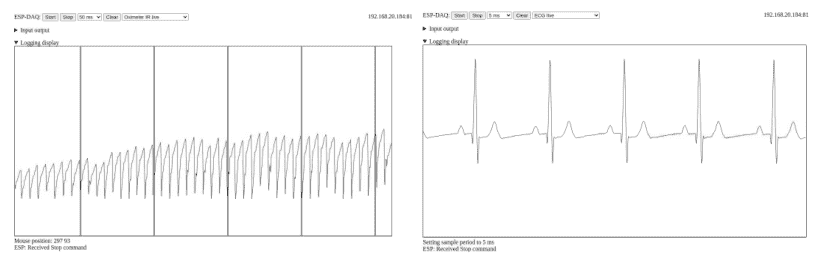

在 `medisense.html` 的 `<SCRIPT>` 末尾，我们定义了函数 `sendSpecialCommand()`，其命令类似于用于选择时间的菜单的回调函数。

```javascript
function sendSpecialCommand(v) {
  toStatus("Special Command " + v + " ");
  websock.send(JSON.stringify({ "cmd" : "MMODE", "val" : v }));
}
```

最后，为了方便起见，我们提供了一个 JavaScript 函数，用于显示在显示测量值轨迹的 `displayarea` 上鼠标点击位置的像素值。我们使用 `addEventListener()` 方法注册回调函数 `showCoordinates()`，该函数在 `displayarea` 下方的状态行中显示鼠标坐标。请注意，我们使用左下角作为坐标系的原点。

```javascript
document.getElementById("displayarea")
    .addEventListener('mousedown',showCoordinates, false);
function showCoordinates(event) {
  rect=document.getElementById("displayarea").getBoundingClientRect();
  toStatus("Mouse position: " + (event.clientX-rect.left) + " "
           + (rect.height-event.clientY+rect.top));
}
```

`medisense.html` 的其余部分是 [第 13 章](#) 中 `esp32-daq.html` 的直接复制。请查看本书 GitHub 网站上提供的完整文件列表。代码准备好后，我们将草图上传到 NodeMCU，将 `medisense.html` 放入草图的 data 子目录中，并使用 Arduino IDE *Tools* 菜单下的 *ESP8266 Sketch Data Upload* 命令将其上传到 NodeMCU。有关安装上传器的更多信息，请参阅 [第 8 章](#)。

一旦系统启动并运行，NodeMCU会连接到由树莓派建立的**messnetz**无线局域网，这样我们就可以通过在树莓派或任何其他连接到**messnetz**的计算机上启动浏览器来访问其网页。然后，我们将浏览器定向到NodeMCU的IP地址，并接收到**medisense.html**页面。将手指放在脉搏血氧仪上后，我们选择**Oximeter SP02**，这将导致SPO2值和心率每隔几秒在显示区域下方的状态栏中显示。观察由红外二极管照射的光电晶体管的原始信号，我们从右侧的选择菜单中选择**Oximeter IR live**，然后按下**Start**按钮。这将开始数据采集，在系统确定基线几秒钟后，我们看到信号出现在**displayarea**中。它类似于**图15.2**左侧所示的信号。通过在选择**Oximeter IR live**并按下**Start**之前选择**Recording ON**来完成信号记录。要停止记录，我们首先**Stop**采集，然后选择**Recording OFF**，并使用**Replay recording**进行回放。请注意，我们通过点击文本旁边的小三角形最小化了网页上标记为**Input output**的部分。

将AD5933电缆上的三个电极连接到模拟器对应的导线（RL、RA和LA）后，选择**ECG live**并按下**Start**按钮，**图15.2**右侧所示的心电图就会出现在显示屏上。我们清楚地看到表示心脏收缩开始的窄尖峰，以及其左右两侧的两个较小的脉冲。它们指示了心脏在其一生中执行超过十亿次的复杂过程的不同阶段。进一步分析这些轨迹超出了本书的范围，需要专门的医学培训。

为了说明生物阻抗的测量，我们使用一个称为*科尔模型*的电子模拟器来模拟人体的阻抗——通常在500 Ω到1 kΩ之间，如**图15.1**左下角所示，并在**图15.3**中更详细地展示。它由一个680 Ω电阻组成，模拟体细胞外液的电阻。并联连接的是一个1 kΩ电阻和一个2.2 nF电容，分别模拟细胞内液的电阻和细胞膜的电容。为了限制通过“身体”的电流，我们在MCP6002运算放大器引脚1的输出端串联一个10 kΩ电阻。在测量阻抗之前，我们通过短路科尔电路来校准系统，使得只有10 kΩ电阻将运算放大器的输出连接到AD5933的引脚5输入端。然后，我们按照**图15.1**所示重新连接科尔电路，并扫描AD5933，结果得到**图15.4**所示的图表。水平刻度覆盖10 kHz到112.4 kHz的频率范围。垂直刻度覆盖0到1 kΩ。我们看到绝对值在低频时接近680 Ω——点击该点并将像素值转换回欧姆（Ω）——在高频时降至460 Ω，这与简单的电路分析一致。第二条轨迹

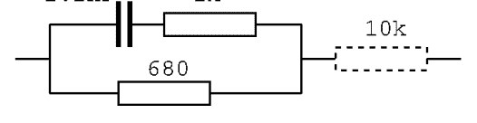

图15.3 科尔模型的原理图，其中680 Ω电阻模拟细胞外液的电阻，2.2 nF电容模拟细胞膜的阻抗，1 kΩ电阻模拟细胞内液的电阻。虚线电阻限制通过“身体”的电流。

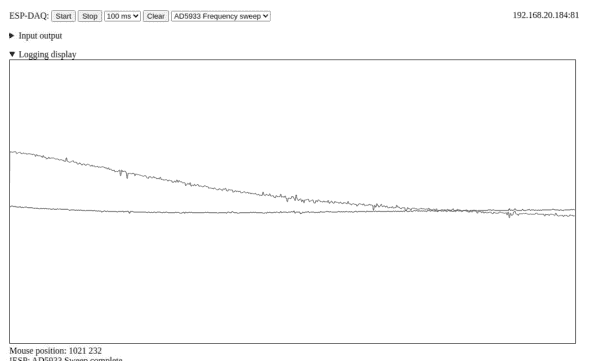

图15.4 从[图15.3](#)测量的科尔模型阻抗。

显示了相位，它几乎没有变化，因为它主要由10 kΩ限流电阻的大实部决定。使用运算放大器作为线路缓冲器的前端限制了分辨率，这可以通过使用单独的连接来向未知阻抗馈送电流和测量电压降来改善。一个带有所谓的*霍兰电流源*和单独仪表放大器的电路，例如在[32]中讨论的，将有所帮助。

在探讨了医学问题之后，让我们回到物理学，测量激光束的宽度。

## 问题与项目构想

1.  了解心电图的特征与心脏动作之间的关系。
2.  在你的手指和MAX30102脉搏血氧仪之间放置彩色但大部分透明的薄膜。观察它如何影响原始信号和SPO2值。
3.  使用基本电路理论分析[图15.3](#)中的科尔模型。
4.  了解四端阻抗测量与本章中使用的仅使用两根导线的两端阻抗测量的区别和优势。
5.  参考[32]并为AD5933构建一个更好的模拟前端。
6.  为了减少原始校准数据中的噪声，对校准数据拟合二次多项式（见附录B），并在之后像我们在[第12章](#)的octave脚本中那样使用它，而不是在每个频率使用原始数据点。
7.  在电路中添加一个MLX90614温度计，以便进行非接触式体温测量。
8.  测量香蕉两端的阻抗。尝试不同类型的电极。
9.  测定一块木头的阻抗。当木头变湿时，阻抗会改变多少？
10. 将软件移植到ESP32。
11. 将AD5933连接到ESP-01控制器，使其成为便携式系统。
12. 同样，将MAX30102和MLX90614连接到ESP-01控制器。
13. ESP-01没有将内置ADC暴露到外部引脚。讨论如何仍然连接AD8232，然后构建电路。

# 示例：激光束的轮廓

在这个例子中，我们通过小心地将障碍物移过激光束并观察来自光敏电阻的信号变化，来测量激光笔激光束的横向轮廓。图16.1说明了该方法。我们使用来自传感器套件的激光模块，该模块安装在面包板上，引出两根导线，一根用于接地，一根用于正电源电压。为了调节激光强度，我们使用正电源电压的脉宽调制。传感器是一个由光敏电阻（LDR）和一个10 kΩ电阻组成的分压器。障碍物由一块黑色塑料制成。作为平移台，我们使用从旧CD-ROM驱动器中抢救出的框架，该框架使用步进电机将一个小车来回移动约40 mm的距离，这大约是CD可读区域的宽度。步进电机驱动一个丝杠，该丝杠以良好的精度拉动和推动小车。

图16.2显示了从CD驱动器抢救出的框架。框架上有许多孔，方便添加螺丝，这些螺丝又用于固定激光器、传感器和障碍物。激光器位于其小型分线板上，位于右上角，步进电机在其下方并隐藏起来，但丝杠清晰可见，从右到左靠近框架顶部运行。在那里，它与连接到小车的白色塑料部件啮合，并在电机转动时移动它。在小车上可以看到一个黑色的塑料片，它拦截激光束，防止激光照射到框架右下角的LDR上。LDR也安装在一个小型分线板上，该分线板是传感器套件的一部分。我们使用它是因为安装孔使得组装和将LDR固定到框架上的螺丝变得容易。作为控制器，我们使用一个Arduino UNO，它通过L293D H桥驱动器驱动电机

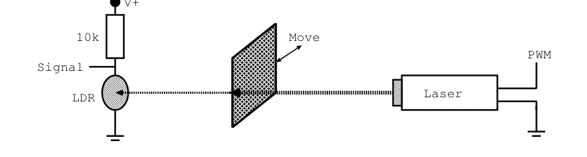

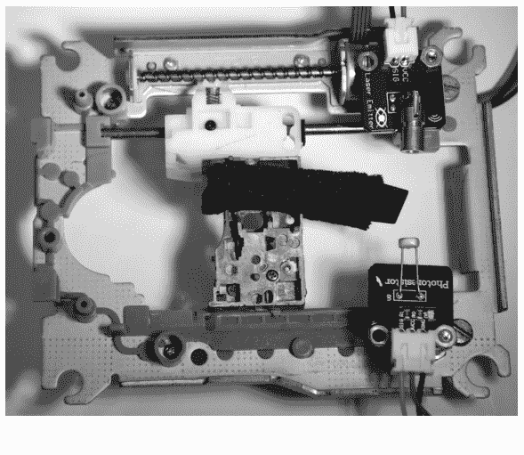

图16.2 来自CD-ROM驱动器的机箱，激光器安装在右上角，光敏电阻安装在右下角。黑色障碍物安装在滑架上，可以通过顶部的丝杠由位于激光器下方的小型步进电机移动。

使用引脚D9上的脉宽调制来控制激光功率，并在模拟输入A0上读取带有LDR的分压器的信号。图16.3显示了原理图。我们使用外部电源为步进电机提供电压，该电源连接到标记为PA,...,PD的端子。

下一个任务是编程UNO以控制激光功率、移动步进电机和读取传感器，所有这些都以精心协调的方式进行。我们基于第4.5.4节中使用H桥驱动步进电机的程序来编写草图，并添加激光器和传感器的部分代码，如下所示。

```c
// Laser profile measurement, V. Ziemann, 170628
char line[30];
int settle_time=2, stepcounter=0;
int laser_power=10;
const int PA=2,PB=3,PC=4,PD=5,ENABLE=6;
const int LASER=9;
void set_coils_fullstep(int istep) { //........set_coils
  bool patA[]={1,1,0,0};
  int pat_length=4;
  int ii;
  istep=istep % pat_length;
  if (istep < 0) istep+=pat_length;
  digitalWrite(PA,patA[istep]);
  ii=(istep+2) % pat_length;
  digitalWrite(PB,patA[ii]);
  ii=(istep+3) % pat_length;
```

## 示例：激光束轮廓 ■ 251

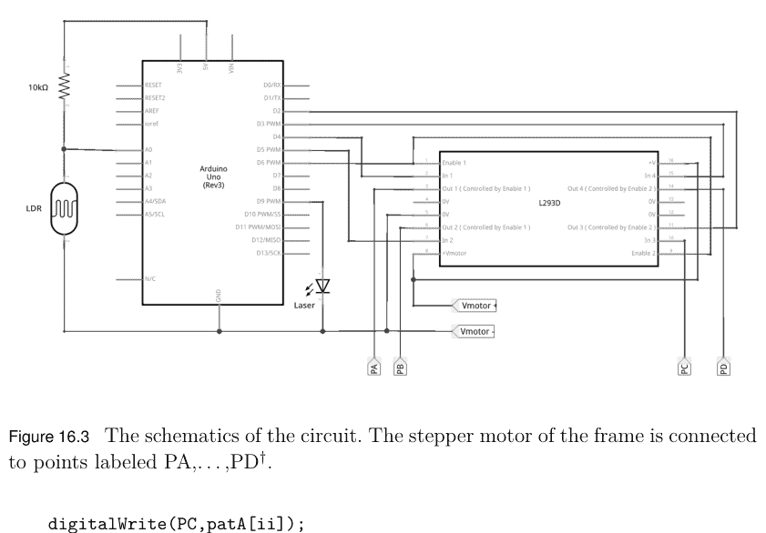

图 16.3 电路示意图。框架的步进电机连接到标记为 PA,...,PD† 的点。

```cpp
digitalWrite(PC,patA[ii]);
ii=(istep+1) % pat_length;
digitalWrite(PD,patA[ii]);
delay(settle_time);
}
void setup() {  //........................................setup
  Serial.begin (9600);
  while (!Serial) {;}
  pinMode(PA,OUTPUT);
  pinMode(PB,OUTPUT);
  pinMode(PC,OUTPUT);
  pinMode(PD,OUTPUT);
  pinMode(ENABLE,OUTPUT);
  digitalWrite(ENABLE,HIGH);
  analogWrite(LASER,laser_power);
}
void loop() {  //........................................loop
  if (Serial.available()) {
    Serial.readStringUntil('\n').toCharArray(line,30);
    if (strstr(line,"FMOVE ")==line) {
      int steps=(int)atof(&line[6]);
      digitalWrite(ENABLE,HIGH);
      if (steps > 0) {
        for (int i=0;i<steps;i++) set_coils_fullstep(stepcounter++);
      } else {
        for (int i=0;i<abs(steps);i++) set_coils_fullstep(stepcounter--);
      }
    } else if (strstr(line,"STEPS?")==line) {
      Serial.print("STEPS "); Serial.println(stepcounter);
    } else if (strstr(line,"STEPS ")==line) {
      stepcounter=(int)atof(&line[6]);
    } else if (strstr(line,"WAIT?")==line) {
      Serial.print("WAIT "); Serial.println(settle_time);
    } else if (strstr(line,"WAIT ")==line) {
      settle_time=(int)atof(&line[5]);
    } else if (strstr(line,"DISABLE")==line) {
      digitalWrite(ENABLE,LOW);
    } else if (strstr(line,"ENABLE")==line) {
      digitalWrite(ENABLE,HIGH);
    } else if (strstr(line,"LDR?")==line) {
      Serial.print("LDR "); Serial.println(analogRead(A0));
    } else if (strstr(line,"POWER?")==line) {
      Serial.print("POWER "); Serial.println(laser_power);
    } else if (strstr(line,"POWER ")==line) {
      laser_power=(int)atof(&line[6]);
      Serial.print("POWER "); Serial.println(laser_power);
      analogWrite(LASER,laser_power);
    } else if (strstr(line,"FSCAN")==line) {
      int steps=(int)atof(&line[6]);
      digitalWrite(ENABLE,HIGH);
      delay(100);
      for (int i=0;i<abs(steps);i++) set_coils_fullstep(stepcounter++);
      delay(100);
      for (int i=0;i<abs(steps);i++) {
        set_coils_fullstep(stepcounter--);
        delay(50);
        unsigned long sum=0;
        for (int k=1; k<10; k++) {sum+=analogRead(A0); delay(10);}
        Serial.println(sum);
      }
      digitalWrite(ENABLE,LOW);
    } else if (strstr(line,"CALIBRATE")==line) {
      for (int power=0; power<256; power++) {
        analogWrite(LASER,power);
        delay(100);
        unsigned long sum=0;
        for (int k=1; k<10; k++) {sum+=analogRead(A0); delay(10);}
        Serial.println(sum);
      }
      analogWrite(LASER,10);
    } else {
      Serial.println("unknown");
    }
  }
}
```

252 ■ 使用 Arduino 和树莓派的传感器实践教程，第二版

在程序的顶部，声明了多个变量，用于设置步进电机步进之间的等待时间以及激光功率的脉宽调制初始值。然后，在定义 `set_coils_fullstep()` 函数之前，声明了用于步进电机和激光器的引脚，该函数与我们在第 4.5.4 节中使用的全步进版本相同。我们使用全步进模式，因为步进分辨率已经足够，并且在半步进模式下，由于交替步进时激励一个线圈和两个线圈所消耗的电流不同，会在传感器上产生微小但可见的扰动。在 `setup()` 函数中，我们初始化串口通信，声明用于电机的引脚模式，并将激光功率初始化为 10（最大值为 255）。`loop()` 函数的构建方式与之前大致相同。它期望在串口线上接收单行命令。与第 4.5.4 节一样，`FMOVE` 命令使电机移动指定的步数。然后有用于设置和返回 `STEPS` 以及等待时间 `WAIT` 或使能电机驱动器 `ENABLE` 的命令。`LDR?` 命令从模拟引脚 A0 读取传感器值，`POWER` 命令设置和读取激光激励功率。最后我们遇到命令 `FSCAN nnn`，其中 `nnn` 是通过使用我们之前用过的 `atof()` 函数读取行的其余部分得到的扫描范围。这里我们假设扫描器实际上会阻挡激光，并且在收集数据之前需要先将其收回。在 case 块内部，它首先通过串口报告它将要做什么，使能电机驱动器，并将障碍物移开。然后是一个 for 循环，电机在其中执行单个步进，并在每个步进内，对模拟引脚 A0 上的光敏电阻进行十次测量并求和。在每个步进结束时，测量值被写入串口线。一旦步数完成，电机驱动器就被禁用。实现的最后一个命令是 `CALIBRATE`，它测量传感器响应作为激光功率的函数。如果以后需要，我们可以使用后者将原始传感器读数转换为线性强度标度。

作为系统的第一个测试，我们在 Arduino IDE 中打开串口监视器，确保波特率设置为 `setup()` 函数中指定的值（本例中为 9600 波特），并通过向 UNO 发送 `LDR?` 来查询光敏电阻。响应格式为 `LDR nnn`，其中 `nnn` 是调用 `analogRead()` 函数得到的原始值。然后我们用 `POWER?` 查询激光功率，并用 `POWER nnn` 将其设置为新值，其中 `nnn` 是 0 到 255 之间的值。激光点的亮度应相应改变。接下来我们移动步进电机几步，例如用 `FMOVE 20`，然后用 `FMOVE -20` 将其移回起始位置。带有障碍物的小车应来回移动。最后一点，我们执行 `FSCAN 60`，这将使障碍物移动 60 步，然后逐步返回起始位置，同时读取传感器并将值报告到串口线。如果所有这些初始测试都令人满意地完成，我们就进入自动化过程，为此我们选择了 octave。

基本上，我们将 Arduino UNO 连接到树莓派，编写一个 octave 脚本来打开串口线，向 UNO 发送命令并接收响应，这与我们在之前的示例中所做的非常相似。在编写 octave 脚本之前，我们需要校准障碍物的运动，以便能够以毫米而不是步数来显示宽度。在移动小车一段较大距离时，我使用了 250 个全步进，并且在移动前后拍摄一张带有旁边放置尺子的装置照片，很容易计算出校准常数 `xscale`（单位为 mm/step）。在我的例子中，250 步使小车移动了 39.2 毫米，这解释了以下脚本顶部附近的 `xscale` 值。

```matlab
% scanplot2.m, V. Ziemann, 221103
close all; clear all
xscale=0.161;  % mm/fullstep
s=serialport('/dev/ttyACM0',9600);  % set device correctly
pause(3);
flush(s);      % flush the input queue
nsteps=60;
write(s,"FSCAN 60\n");
pause(5);
xx=zeros(1,nsteps); yy=xx;
for i=1:nsteps
    xx(i)=i*xscale;
    yy(i)=str2double(serialReadline(s));
end
clear s
yy=smooth3(yy);           % smooth data
subplot(2,1,1);
plot(xx,yy);              % raw sensor data
ylabel('arb. units');
subplot(2,1,2);
dy=yy(2:end)-yy(1:end-1); % derivative
if (yy(1) > yy(end)) dy=-dy; end
plot(xx(1:end-1),dy);
xlabel('x [mm]'); ylabel('arb. units');
title(['FWHM = ', num2str(xscale*fwhm(dy),'%5.2f'), ' mm'])
print('laser_profile.png','-S1000,700')
```

254 ■ 使用 Arduino 和树莓派的传感器实践教程，第二版

脚本的其余部分现在应该很熟悉了。打开串口线并刷新存在的任何字符后，我们定义步数并向 UNO 写入 `FSCAN 60`。然后我们等待一小段时间，并开始使用我们在第 12 章已经遇到的 `serialReadline()` 函数从串口线检索值。它从串口线读取字符，直到遇到终止符，并将获得的字符作为字符串返回。但回到主脚本。在检索数据并将其复制到数组 `yy` 的同时，我们也用适当缩放的水平轴值填充数组 `xx`。一旦循环完成，我们用 `clear s` 关闭串口设备。

当所有数据在脚本中可用后，我们开始处理它。由于我们稍后将计算原始数据的导数，这是一个对噪声非常敏感的过程，我们使用 `smooth()` 函数对数组 `yy` 中的传感器值进行弱平滑。它平均三个连续值，并用平均值替换中间值。`smooth3()` 的 octave 脚本是

```matlab
% smooth three consecutive points, V. Ziemann, 170628
function out=smooth3(y);
y=[y(1),y(1:end),y(end)]; % add extremities
f=ones(1,3)/3.0;          % filter function
out=conv(y,f);            % convolute
out=out(3:end-2);         % ensure same length
```

它首先创建一个新数组，其中端点加倍，以避免在端点处出现难看的伪影。在下一行中，我们创建由三个值为 1/3 的值组成的滤波器函数 `f`，并用它对数据进行卷积。由于卷积产生的输出数组比原始数组长，我们在返回平滑数组作为值 `out` 之前移除了端点。一旦这些初始准备工作完成，我们在图 16.4 的上图中显示平滑后的原始值，并为纵轴添加标签。然后我们计算连续值之间的差值，其动机是：在每个步进中，激光束的一小部分被遮挡，剩余强度的变化与障碍物在该步进期间穿过的窄带中的强度成正比。结果是一个与激光束横向强度分布成正比的信号，如图 16.4 下图所示。其标题显示了激光轮廓的半高全宽（FWHM），约为 0.8 毫米。最后，我们生成一个图像文件，这正是我们准备图 16.4 的方式。

## 图 16.4 原始传感器值作为障碍物位置的函数，以及由此推导出的激光束轮廓，显示出中等程度的不对称性。

在此示例中，我们使用半高全宽（FWHM）而非轮廓的标准差，因为FWHM是一个相当稳健的度量标准，对于非高斯、不对称且尾部有中等数量数据点的轮廓，其工作更为可靠。标准差受后者影响很大。FWHM的脚本很直接，此处复现如下。

```
% FWHM, V. Ziemann, 170628
function fwhm=fwhm(data)
N=length(data);
xmax = -1e30;
xmin=min(data);
imax=-1;
for i=1:N
  if (data(i) > xmax)
    xmax=data(i);
    imax=i;
  end
end
ileft=imax;
while (data(ileft) > (xmax+xmin)/2 && ileft>1)
  ileft=ileft-1;
end
iright=imax;
while (data(iright) > (xmax+xmin)/2 && iright<N-1)
  iright=iright+1;
end
fwhm=iright-ileft-1;
```

在`fwhm()`函数中，我们首先定位数据点的最小值和最大值，以及最大值的位置。然后我们向左搜索，直到值小于最大值和最小值的中点。这得到了该点的位置`ileft`。然后我们在右侧重复此过程，并将右侧和左侧中点位置的差值作为FWHM返回。最后一个方程中的减一是为了考虑两次搜索在终止各自的`while`循环之前都超出了范围。这通过从最终结果中减去一得到了部分补偿。

在此示例中，我们使用一个小型步进电机和一个光敏电阻（LDR）从零开始构建了一个激光束轮廓监测器，以说明基本步骤以及如何组合传感器和执行器来构建一个由`octave`或任何其他通过串行设备通信的语言（如EPICS、LabView或C）控制的集成系统。该系统远非完美，可以想到许多局限性和改进之处。例如：障碍物边缘的衍射是否是一个限制？步长是否足够，或者我们应该使用更好的微步进电机驱动器？轮廓是否会随不同的激光强度而变化？我们是否需要校正传感器系统与强度相关的非线性？这实际上是`CALIBRATE`命令的目的，以提供基础信息。当我们从另一侧扫描时，轮廓是否显示出相同的不对称性？我们可能还想知道垂直光束尺寸以及任何跨平面相关性，以确定一些基本像差。交换LDR和10 kΩ电阻的位置后，轮廓是否相同？我们可能想添加第二个电机，使障碍物沿激光束方向纵向移动。添加透镜并在多个位置测量光束轮廓，可以让我们确定激光束的$M^2$，这是激光质量的度量，对于衍射极限光束其值为1。但这些练习我们留给感兴趣的读者在家完成，而我们继续构建一个检测火焰的机器人。

## 问题与项目构想

- 1. 使用从旧CD-ROM驱动器上拆下的框架，来回移动一把勺子来搅拌你的咖啡或茶。

# 示例：寻火机器人

在最后一个示例中，我们讨论一个检测火焰热辐射的小型机器人，它向热源移动，并在到达辐射源后开始发出哔哔声。当然，这是一个非常简单的自主灭火器原型。我们要求机器人要么自主移动，要么由遥控器手动控制。尽管描述简单，但该项目相当有雄心，需要我们解决以下子任务：

- 1. 检测热源及其位置；
- 2. 控制电机的速度和方向；
- 3. 检测碰撞，最好在碰撞发生前；
- 4. 感知遥控器上的操纵杆和开关；
- 5. 在遥控器和机器人之间发送消息。

我们将机器人的硬件基于一个现成的底盘，该底盘有两个直流电机和一个板载电池组，电池组包含五节AA电池，可提供高达7.5 V的电压。在该底盘上，我们安装了一个全尺寸面包板，用于容纳一个NodeMCU控制器、一个H桥电机驱动器和一些线性电压转换器，以提供5 V和3.3 V电压。为了提供额外的IO引脚，我们添加了第二个Arduino，它作为NodeMCU的从机。机器人底盘上有一个专门用于模型舵机的位置，我们在其上安装了一个非常小的面包板，用于放置我们用作火焰传感器的BPX38红外光电晶体管和HC-SR04距离传感器。图17.1显示了已经安装了舵机和两个面包板的底盘。将传感器安装在可移动的面包板上，可以通过转动模型舵机将它们指向不同的方向。我们将NodeMCU配置为接入点，建立自己的WLAN网络。我们还启动一个服务器来接收来自遥控器的命令。除了在控制器上监听遥控器外，我们还实现了一个简单的状态机，可以将机器人的控制权交给它，随后机器人将自主运行。

遥控器基于第二个NodeMCU。它连接到机器人上第一个NodeMCU建立的WLAN网络及其上运行的服务器。在遥控器上，我们通过SPI将一个MCP3208 8通道ADC连接到NodeMCU，并使用两个操纵杆、两个电位器、几个分压器和两个开关设置ADC通道的输入电压。然后，ADC读数被解释为电机速度和模型舵机设置，并传输到机器人。一个ADC通道上的电压由多个开关和分压器设置，这使我们能够使用比可用数字IO引脚更多的开关，尽管代价是每次只能检测一个按钮。

## 图 17.1 机器人底盘，带有两个面包板。较小的面包板可以通过操作模型舵机转动。较大的面包板上安装了右侧的NodeMCU和左侧的第二个芯片，一个最初测试后被Arduino NANO取代的裸ATmega328。

我们在图17.2中展示了一个简化版本的遥控器，它在面包板上设置的通道少于所有可能的通道，其中我们看到右侧的NodeMCU和左侧的MCP3208 ADC。MCP3208与第4.4.4节中的MCP3304引脚分配相同，并通过CLK、MISO、MOSI和CS线连接到NodeMCU的SPI端口，分别连接到D5、D6、D7和D8。一个操纵杆（在面包板左侧立即可见）连接到电源轨，其滑动端连接到ADC通道A0和A1。同样，最左侧可见的电位器连接到ADC通道A5。两个按钮（在图17.2底部附近可见）连接由10 kΩ电阻到正电源电压以及68 kΩ和47 kΩ电阻组成的分压器。通过使用不同阻值的额外接地电阻，可以检测更多的按钮——一次一个。按下按钮会向ADC通道A7提供一个确定的电压电平。最后，有一个开关连接到IO引脚D4。为了澄清接线，我们还在图17.3中显示了与面包板布局对应的原理图。

运行在遥控器上的草图使用了上一段描述的硬件，如下所示。由于草图相当长，我们首先展示并描述准备部分。

## 图 17.2 遥控器在面包板上的简化设置†。

## 图 17.3 遥控器的原理图†。

260 ■ 使用Arduino和Raspberry Pi的传感器实践课程，第二版

```
// RCsenderUDP, V. Ziemann, 170705
const char* ssid     = "FireBot";
const char* password = "..........";
const char* host = "192.168.4.1";
const int port=1137;
#include <ESP8266WiFi.h>
#include <WiFiUdp.h>
WiFiUDP client;
int adclast[8]={0,0,0,0,0,0,0,0},D4last=HIGH;
int adccalib[8];
//....................................................ADC
#include <SPI.h>
#define CS 15
int mcp3208_read_adc(uint8_t channel) {  // 8 single ended
  int adcvalue=0, b1=0, hi=0, lo=0, reading;
  digitalWrite (CS, LOW);
  byte commandbits = B00001100; // Startbit+(single ended=1)
  commandbits |= ((channel>>1) & 0x03);
  SPI.transfer(commandbits);
  commandbits=(channel & 0x01) << 7;
  b1 = SPI.transfer(commandbits);
  hi = b1 & B00011111;
  lo = SPI.transfer(0x00);     // input is don't care
  digitalWrite(CS, HIGH);
  reading = (hi << 7) + (lo >> 1);
  return reading;
}
void send_string(char line[]) {  //..............send_string
  client.beginPacket(host,port);
  client.write(line);
  client.endPacket();
}
void setup() {  //....................................setup
  pinMode(LED_BUILTIN,OUTPUT);
  digitalWrite(LED_BUILTIN,LOW);
  pinMode(CS,OUTPUT);
  digitalWrite(CS,HIGH);
  SPI.begin();
  SPI.setFrequency(100000);
  SPI.setBitOrder(MSBFIRST);
  SPI.setDataMode(SPI_MODE0);
  pinMode(LED_BUILTIN,OUTPUT);
  digitalWrite(LED_BUILTIN,LOW);
  Serial.begin(115200);
  pinMode(D3,INPUT_PULLUP);
  pinMode(D4,INPUT_PULLUP);
  delay(1000);
  WiFi.mode(WIFI_STA);  // needed for reliable communication
  WiFi.begin(ssid,password);
  while (WiFi.status() != WL_CONNECTED) {
    Serial.print("."); delay(500);
```

## 代码与说明

```cpp
Serial.print("\nConnected to ");  Serial.print(ssid);
Serial.print(" with IP address: ");
Serial.println(WiFi.localIP());
client.begin(port);
for (int k=0;k<8;k++) {
  adccalib[k]=mcp3208_read_adc(k);
}
digitalWrite(LED_BUILTIN,HIGH);
}
```

在程序的顶部，定义了WLAN的名称和密码，以及机器人的IP地址，该地址默认为机器人所建立的WLAN的192.168.4.1。然后我们包含了WiFi库并声明了客户端，即连接到服务器的套接字。请注意，我们使用的是UDP连接而不是TCP，因为后者在服务器和客户端之间使用了大量的握手，这使得机器人对远程命令的响应非常迟钝。UDP连接不使用握手，这使得连接可靠性降低，但响应速度更快。由于我们持续向机器人发送命令，丢失单个命令并不严重。接下来我们声明了一些稍后讨论的变量，并定义了`mcp3208_read_adc()`函数来从ADC读取单个通道。它与我们在第4.4.4节讨论的函数非常相似，不同之处在于我们请求单端ADC测量，并且我们接收12位数据而不是13位。该函数接收请求的通道作为输入参数，并返回12位ADC读数。`send_string()`函数封装了UDP数据包的构建和发送。在`setup()`函数中，我们配置了一些IO引脚，并初始化了SPI通信和串行线路。然后我们将WiFi.mode定义为WIFI_STA或客户端，而不是接入点（后者是默认值），并连接到WLAN。一旦连接，我们将接收到的IP地址写入串行线路，并通过调用`client.begin()`函数连接到机器人上的服务器。最后，读取所有ADC通道并将值保存在数组`adccalib[]`中，该数组用于校准操纵杆的中心位置。

在准备部分之后，我们准备展示和讨论程序的主要部分，即`loop()`函数。

```cpp
void loop() {  //........................................loop
  char line[30];
  int adc[8];
  for (int k=0;k<8;k++) {adc[k]=mcp3208_read_adc(k);}
  if ((abs(adc[0]-adclast[0]) > 16) || (abs(adc[1]-adclast[1]) > 16)) {
    adclast[0]=adc[0]; adclast[1]=adc[1];
    int val0=(adc[0]-adccalib[0])*1023.0/2048.0;
    int val1=(adc[1]-adccalib[1])*1023.0/2048.0;
    sprintf(line,"RSPEED %d",(int)(val0+0.5*val1)); send_string(line);
    sprintf(line,"LSPEED %d",(int)(val0-0.5*val1)); send_string(line);
  }
  if (abs(adc[5]-adclast[5]) > 16) {
    adclast[5]=adc[5];
    int val=adc[5]*180.0/4095;
    sprintf(line,"SERVO %d",val); send_string(line);
  }
  if (abs(adc[7]-adclast[7]) > 5) {  //  check the buttons
    adclast[7]=adc[7];
    if (adc[7] < 1000) {
      Serial.println("Red button right pressed");
      sprintf(line,"FINDFIRE 1"); send_string(line);
    } else if (adc[7] < 1700) {
      Serial.println("Blue button right pressed");
      sprintf(line,"RANGE?"); send_string(line);
    } else if (adc[7] < 2250) {
      Serial.println("Joystick button right pressed");
      sprintf(line,"NEXTEVENT 0"); send_string(line);
    } else if (adc[7] < 3580) {
      Serial.println("Joystick button left pressed");
      sprintf(line,"NEXTEVENT 1"); send_string(line);
    } else if (adc[7] < 3660) {
      Serial.println("Blue button left pressed");
      sprintf(line,"BEEP 1000"); send_string(line);
      Serial.println(line);
    } else if (adc[7] < 3750) {
      Serial.println("Red button left pressed");
      sprintf(line,"NEXTEVENT 3"); send_string(line);
    }
  }
  if (digitalRead(D4) != D4last) {
    D4last=digitalRead(D4);
    sprintf(line,"D0 %d",D4last); send_string(line);
  }
  yield();
  int packetsize=client.parsePacket();
  if (packetsize) {
    char line[30];
    int len=client.read(line,30); line[len]='\0';
    Serial.print("Message:"); Serial.println(line);
  }
  if (Serial.available()) {
    Serial.readStringUntil('\n').toCharArray(line,30);
    send_string(line);
  }
}
```

在`loop()`函数中，我们首先读取所有ADC通道，然后测试通道A0和A1相对于上次是否发生了显著变化；这些值保存在数组`adclast[]`中。这种构造很有用，因为它防止了持续发送命令，只在值发生变化时才发送。如果是这种情况，则将当前ADC读数与校准值的差值存储在变量`val0`和`val1`中。第一个值被解释为电机的期望速度，第二个值被解释为方向。因此，我们发送命令将`val0+0.5*val1`作为速度设置给一个电机，将`val0-0.5*val1`设置给另一个电机。接下来，ADC通道A5的读数被缩放为0到180之间的值，并传输以设置机器人上的模型舵机。ADC通道A7用于解释按下的按钮。在当前实现中，连接了六个按钮，按下它们会向机器人发送多个不同的命令。对ADC值的测试从较小值到较大值进行，以便按钮以自然的方式优先处理。如果连接到较小电阻的按钮被按下，则忽略所有连接到更高值电阻的按钮。当按下按钮时，命令在机器人上引起的具体操作，我们将在稍后讨论机器人上运行的软件时解释。调用`yield()`函数确保WLAN和串行通信的所有后台进程可以完成待处理的任务。调用`client.parsePacket()`函数检查是否收到来自机器人的消息。这里我们只是将接收到的消息复制到串行线路。但很容易设想其他处理方式；例如，通过连接到NodeMCU控制器上D1和D2引脚的I2C接口的LCD显示屏显示它们。这些引脚在当前电路中未使用，可用于扩展。最后，我们检查串行线路上是否有任何内容到达，并将其传递给机器人。与机器人的直接双向通信是调试系统的一种非常方便的方式，当远程控制器通过USB电缆连接到主机计算机时，可以从串行控制台发送命令。

这就引出了机器人上的电子设备。在图17.4中，我们展示了实现本章前面讨论的功能的电路图。图17.5显示了相应的原理图。核心组件是位于无焊面包板右侧的NodeMCU微控制器，其左侧是L293D H桥电机驱动器和相邻的7805线性稳压器。稳压器从电池接收电源，电池的负极连接到系统地，正电压连接到7805的输入引脚。正电池电压也路由到L293D电机驱动器的电机和逻辑电源引脚。7805稳压器的5V输出电压连接到下方的电源轨，从那里为NodeMCU右下角的Vin引脚提供电源。5V电源进一步路由到模型舵机和位于大型面包板上方的HC-SR04声纳传感器。NodeMCU上的3.3V稳压器为上方的电源轨供电，该电源轨承载3.3V并路由到相应的电路。相应的电源轨连接了470μF的大电解电容，以缓冲间歇性电流需求。需要特别注意确保三种不同的电压正确路由。高于允许的电压可能会损坏某些集成电路。电池的正电压只连接到7805和L293D，5V电源通过其Vin引脚为NodeMCU供电，为舵机和声纳供电。为了便于正确接线，在本书的github仓库https://github.com/volkziem/HandsOnSensors2ed.git上提供了彩色图像。

电机1连接到L293D H桥电机驱动器下侧的引脚，控制输入引脚连接到NodeMCU上的IO引脚D3和D4。同样，电机2连接到L293D的上半部分，相应的输入引脚路由到NodeMCU上的引脚D5和D6。电机驱动器的使能引脚永久连接到3.3V。模型舵机连接到5V电源轨，其控制线连接到NodeMCU上的引脚D7，而蜂鸣器连接到引脚D8。HC-SR04距离声纳由5V电源轨供电。它由NodeMCU引脚D1的脉冲触发，回波在引脚D2上接收。由于NodeMCU仅在3.3V下工作，我们需要使用由10kΩ和22kΩ电阻组成的分压器，将HC-SR04的5V回波信号降至约3.3V。在机器人上，距离传感器实际上安装在图17.4左上角可见的小面包板上，而该面包板又安装在模型舵机的可移动轴上，使其能够扫描周围环境以寻找障碍物。最初，只有距离传感器和带有上拉电阻到3.3V电源轨的中间BPX38光电晶体管安装在小面包板上，用于扫描障碍物和红外辐射源。BPX38在约880nm的光子波长附近最敏感，这属于电磁波谱的红外部分，例如由火焰或老式灯泡作为热辐射发射。BPX38的发射极接地，集电极连接到NodeMCU的模拟输入引脚A0，并通过10kΩ电阻连接到3.3V电源轨。在这种配置中，我们需要用舵机持续扫描红外和距离传感器。

## 17.4 机器人电子电路

图17.4 机器人的电子电路（彩色版本可在线获取）†。

图17.5 机器人电子电路原理图†。

为了找到火源，这有点繁琐。如果我们有两个红外传感器可以同时读取，我们就可以比较激励信号，并即时获得火源位置信息，而无需用舵机扫描。因此，我们将在小面包板的最左侧和最右侧添加两个额外的红外光电晶体管，其接线方式与中间那个相同。

但是，NodeMCU上没有足够的模拟输入端口，并且几乎所有的IO引脚都已使用。这极大地限制了我们为机器人添加新功能的能力。因此，我们在大面包板上添加一个Arduino-NANO，并将其编程为NodeMCU的从机，通过串行线路进行通信。连接各自TX和RX引脚的导线是交叉的，其行为类似于零调制解调器电缆。NANO的行为几乎与UNO相同，编程方式也相同，只需在Arduino IDE的*Tools→Board*菜单中选择*Arduino Nano*即可。唯一明显可见的区别是NANO有八个而不是六个模拟输入引脚，同时还有13个数字IO引脚。由于我们通过标有“5 V”的引脚为NANO提供5V电源，所有IO引脚都在5V逻辑电平下工作。为了不损坏工作在3.3V的NodeMCU，我们在从NANO的TX引脚到NodeMCU的RX引脚的连接中使用了一个反向偏置二极管。该二极管阻止5V到达NodeMCU，但如果TX被拉低，NodeMCU输入引脚上的信号也会被拉低。原型电路使用普通的开关二极管1N4148工作，但理想情况下应使用肖特基二极管，其压降更小。一旦NodeMCU与从机NANO之间的基本通信工作正常，我们就将小面包板上的两个额外光电晶体管连接到从机NANO的模拟输入引脚A0和A1上。这完成了机器人底盘上硬件的描述，接下来我们可以转向NodeMCU的编程。

机器人上运行的代码如下，同样分为两个块，因为它相当长。首先我们展示并讨论准备部分。

```c
// RCreceiver, V. Ziemann, 170701
#define Max(a,b) ((a)>(b)?(a):(b))
#define Min(a,b) ((a)<(b)?(a):(b))
const char *ap_ssid = "FireBot";
const char *ap_password = "..........";
const int port=1137;
#include <ESP8266WiFi.h>
#include <WiFiUdp.h>
WiFiUDP server;
#include <Servo.h>
Servo myServo;
int servo_pos=90,servo_inc=5;
int right_sensor=-1,left_sensor=-1;
long lasttime=0,sleeptime=1000,nextevent=1;
void send_string(char line[]) {  //.......send_string
  server.beginPacket(server.remoteIP(),port);
  server.write(line);
  server.endPacket();
}
int range() { //...................................range
  digitalWrite(D1,LOW);
  delayMicroseconds(2);
  digitalWrite(D1,HIGH);
  delayMicroseconds(10);
  digitalWrite(D1,LOW);
  int val=(int)(0.017*pulseIn(D2,HIGH));
  if (val<10) tone(D8,1000,200);
  return val;
}
void motor_speed(int left, int right) {  //...........motor_speed
  left=Max(-1023,Min(1023,left));
  analogWrite(D3,0);
  analogWrite(D4,0);
  if (left<0) {analogWrite(D3,abs(left));}
    else {analogWrite(D4,abs(left));}
  right=Max(-1023,Min(1023,right));
  analogWrite(D5,0);
  analogWrite(D6,0);
  if (right<0) {analogWrite(D5,abs(right));}
    else {analogWrite(D6,abs(right));}
}
void motor_stop() {  //.......................motor_stop
  analogWrite(D3,0);
  analogWrite(D4,0);
  analogWrite(D5,0);
  analogWrite(D6,0);
}
void setup() {  //...............................setup
  pinMode(LED_BUILTIN,OUTPUT);
  digitalWrite(LED_BUILTIN,LOW);
  pinMode(D1,OUTPUT);  // HCSR04-TRIG
  digitalWrite(D1,LOW);
  pinMode(D2,INPUT);   // HCSR04-ECHO
  pinMode(D3,OUTPUT);
  pinMode(D4,OUTPUT);
  analogWrite(D3,0);
  analogWrite(D4,0);
  pinMode(D5,OUTPUT);
  pinMode(D6,OUTPUT);
  analogWrite(D5,0);
  analogWrite(D6,0);
  Serial.begin(38400);
  WiFi.softAP(ap_ssid,ap_password);
  IPAddress myIP = WiFi.softAPIP();
  server.begin(port);
  Serial.print("\nAccess point and server started at address: ");
  Serial.print(myIP); Serial.print(" and port: "); Serial.println(port);
  Serial.print("with SSID: "); Serial.println(ap_ssid);
  pinMode(D7,OUTPUT);  // D7=Servo, D8=Tone
  myServo.attach(D7);
  digitalWrite(LED_BUILTIN,HIGH);
  tone(D8,880,500);
  lasttime=millis();
}
```

这段代码在机器人上的NodeMCU上运行，首先定义了`Max()`和`Min()`函数，用于确定两个输入值中较大和较小的一个。然后定义了WLAN的名称和密码以及使用的端口号，之后包含了用于UDP的WiFi库并定义了`server`。我们还包括了对模型舵机的支持，并声明了一个实例`myServo`，以及用于扫描舵机、读取红外光电晶体管和状态机所需的变量。接着我们声明了便捷函数`send_string()`，用于将UDP数据包发送回远程控制器。`range()`函数按照我们在第4.4.5节讨论的方式控制HC-SR04距离传感器。它确保触发引脚D1在拉高10微秒之前为低电平，然后使用`pulseIn()`函数等待回波到达引脚D2。系数0.017将回波持续时间（微秒）转换为距离（厘米）。如果障碍物距离小于10厘米，蜂鸣器会短暂鸣叫，然后将距离作为函数值返回。`motor_speed()`函数接收电机的速度（符号表示方向）作为输入值。首先将值限制在±1023范围内，短暂关闭两个电机，然后根据符号，通过调用`analogWrite()`将一个或另一个控制引脚的脉宽调制周期设置为所需值。它首先处理由引脚D3和D4控制的一个电机，然后处理由D5和D6控制的另一个电机。`motor_stop()`函数关闭所有相关的IO引脚。

在`setup()`函数中，我们主要根据IO引脚的用途将其配置为输入或输出。`LED_BUILTIN`引脚实际上是D0，控制NodeMCU电路板上的一个LED，这对于调试非常方便。将D0拉低会点亮LED，将其拉高则会关闭LED。D1和D2连接到距离传感器的触发和回波引脚，D3到D6用于控制电机。然后我们初始化串行线路，以38400波特率进行通信，以适应从机NANO的能力，然后通过调用`WiFi.softAP()`函数开始建立WLAN，该函数将NodeMCU配置为具有提供的名称和密码的接入点。调用`WiFi.softAPIP()`返回接入点的IP地址，通常是192.168.4.1。接下来，我们启动服务器，在选定的端口上监听从远程控制器到达的数据包。最后，我们将舵机控制器连接到引脚D7，关闭LED，发出一个短促的音调，并将经过的时间记录在变量`lasttime`中，这对于调度状态机是必需的；但关于那个话题，稍后再谈。

在声明了所有变量并定义了所有准备函数之后，我们可以继续讨论草图的loop()函数。

```c
void loop() {  //.................................loop
  char line[30];
  int packetsize=server.parsePacket();
  if (packetsize) {
    int len=server.read(line,30);
    line[len]='\0';
    if (strstr(line,"LSPEED ")==line) {
      int val=(int)atof(&line[7]);
      val=Max(-1023,Min(1023,val));
      analogWrite(D3,0);
      analogWrite(D4,0);
      if (val<0) {analogWrite(D3,abs(val));}
        else {analogWrite(D4,abs(val));}
    } else if (strstr(line,"RSPEED ")==line) {
      int val=(int)atof(&line[7]);
      val=Max(-1023,Min(1023,val));
      analogWrite(D5,0);
      analogWrite(D6,0);
      if (val<0) {analogWrite(D5,abs(val));}
        else {analogWrite(D6,abs(val));}
    } else if (strstr(line,":")==line) {
      line[len]='\n'; line[len+1]='\0';
      Serial.println(line);
    } else if (strstr(line,"D0 ")==line) {
      int val=(int)atof(&line[3]);
      if (val==0) {
        digitalWrite(LED_BUILTIN,HIGH);
      } else {
        digitalWrite(LED_BUILTIN,LOW);
      }
    } else if (strstr(line,"SERVO ")==line) {
      int val=(int)atof(&line[6]);
      myServo.write(val);
    } else if (strstr(line,"BEEP ")) {
      int val=(int)atof(&line[5]);
      Serial.print("BEEP val= "); Serial.println(val);
      tone(D8,440,val);
    } else if (strstr(line,"A0?")) {
      int val=analogRead(A0);
      Serial.print("A0 "); Serial.println(val);
      sprintf(line,"A0 %d",val); send_string(line);
    } else if (strstr(line,"RANGE?")) {
      int val=range();
      sprintf(line,"RANGE %d",val); send_string(line);
    } else if (strstr(line,"SCANRANGE ")==line) {
      int val=(int)atof(&line[10]);
      int minval=2000,minpos=-1;
      if (val>0) {
```

## 示例：寻火机器人 ■ 271

```cpp
myServo.write(10);
delay(1000);
for (int k=10;k<170;k+=5) {
  myServo.write(k); delay(200);
  val=range();
  if (val<minval) { minval=val; minpos=k;}
  sprintf(line,"SCANRANGE %d %d",k,val); send_string(line);
}
myServo.write(minpos);
sprintf(line,"MINIMUM at %d",minpos); send_string(line);
} else {
  myServo.write(90);
}
} else if (strstr(line,"FINDFIRE ")==line) {
  int val=(int)atof(&line[9]);
  int minval=2000,minpos=-1;
  if (val>0) {
    myServo.write(10);
    delay(1000);
    for (int k=10;k<170;k+=5) {
      myServo.write(k); delay(200);
      val=analogRead(A0);
      if (val<minval) { minval=val; minpos=k;}
      sprintf(line,"FINDFIRE %d %d",k,val); send_string(line);
    }
    myServo.write(minpos);
    sprintf(line,"MINIMUM at %d",minpos); send_string(line);
  } else {
    myServo.write(90);
  }
} else if (strstr(line,"NEXTEVENT ")==line) {
  nextevent=(int)atof(&line[10]);
} else if (strstr(line,"SLEEPTIME ")==line) {
  sleeptime=(int)atof(&line[10]);
} else {
  Serial.println("unknown");
}
}
yield();
if (millis()>lasttime+sleeptime) {  // 下一个预定事件
  switch (nextevent) {
    case 1:  // 确定距离
      sprintf(line,"RANGE %d",range()); send_string(line);
      sprintf(line,"A0 %d",analogRead(A0)); send_string(line);
      nextevent=1;
      break;
    case 2:  // 用舵机扫描
      servo_pos+=servo_inc;
      if (servo_pos>170) {servo_inc=-servo_inc;}
      if (servo_pos<10) {servo_inc=-servo_inc;}
      myServo.write(servo_pos);
      nextevent=2;
    case 3:  // 请求方向传感器
      if (range()<10) {
        motor_stop();
        nextevent=1;
      } else {
        Serial.println(":A0?\n:A1?");
        sleeptime=50; nextevent=4;
      }
      break;
    case 4:  // 读取方向传感器并采取行动
      if ((right_sensor>0) && (left_sensor>0)) { // 新数据
        if ((left_sensor<250) || (right_sensor<250)) {
          sprintf(line,"SENSORS %d %d",left_sensor,right_sensor);
          send_string(line);
          int val0=(int)(600+0.2*(right_sensor-left_sensor));
          val0=Max(-1023,Min(1023,val0));
          int val1=(int)(600-0.2*(right_sensor-left_sensor));
          val1=Max(-1023,Min(1023,val1));
          motor_speed(val0,val1);
        } else {
          motor_stop();
        }
        right_sensor=-1; left_sensor=-1;
        sleeptime=1000; nextevent=3;
      }
    default:
      break;
  }
  lasttime=millis();
}
yield();
if (Serial.available()) {
  Serial.readStringUntil('\n').toCharArray(line,30);
  send_string(line);
  if (strstr(line,".A0 ")==line) {
    right_sensor=(int)atof(&line[3]);
  } else if (strstr(line,".A1 ")==line) {
    left_sensor=(int)atof(&line[3]);
  }
}
}
```

这里我们首先通过调用 `server.parsePacket()` 函数检查是否从远程控制器收到了 UDP 数据包。如果有一个大小为 `packetsize` 的数据包可用，则使用 `server.read()` 读取它并确定其长度。为了避免输出混乱，我们确保最后一个字符是 NULL 字符，以表示字符串的结束，并开始测试收到了什么类型的命令。如果是 `LSPEED`，我们通过调用 `atof()` 将行的其余部分解释为速度值，将值限制在可接受的范围内，并以与 `motor_speed()` 函数相同的方式设置电机的速度。如果收到 `RSPEED`，则调整另一个电机的速度。如果行以冒号 `:` 开头，则将其传递到串行线。通过这种方式，我们可以向从属 NANO 发送命令。如果命令以 `D0` 开头，我们打开和关闭内置 LED。`SERVO` 命令设置模型舵机的角度，`BEEP nnn` 发出 440 Hz 的声音，持续时间为 `nnn` 毫秒。`A0?` 命令将从 NodeMCU 模拟引脚读取的模拟值返回到串行线和远程控制器，`RANGE?` 命令同样返回由 HC-SR04 传感器确定的到障碍物的距离。接下来的命令 `SCANRANGE 1` 启动舵机移动，这导致距离传感器指向不同的方向，同时 HC-SR04 扫描到障碍物的距离，并同时记录最近物体的方向和距离。最后，舵机移动到指向最小距离的位置，并返回找到最近物体的方向。调用带参数 0 的 `SCANRANGE` 会使舵机移动到其中间位置。`FINDFIRE` 命令执行相同的动作，但扫描连接到 NodeMCU 模拟引脚 A0 的中间红外光电二极管，以确定热源的方向。请注意，光电晶体管将信号线拉向地，如果检测到热源，这会导致引脚 A0 上的电压接近零。最后两个命令 `NEXTEVENT` 和 `SLEEPTIME` 允许我们设置与控制机器人自主运行的状态机相关的变量。它们连接到远程控制器上的按钮，可以通过按下这些按钮来更改。

代码的下一部分，紧跟在 `yield()` 命令之后，实现了这个非常简单的状态机，以与 NodeMCU 执行的所有其他操作异步运行。首先我们测试当前时间是否超过了下一个预定事件的值 `lasttime+sleeptime`。如果是这样，我们根据 `nextevent` 变量的值进行分支。如果是 1，我们只使用 `range()` 函数确定 HC-SR04 传感器的距离以及中间光电晶体管的读数。然后我们设置 `nextevent=1`，这将在 `sleeptime` 过期后重复相同的动作。如果 `nextevent` 是 2，我们一次一步地在舵机范围内来回扫描其位置。接下来的两个事件代码 3 和 4 实现了机器人向热源的自主运动。如果 `nextevent` 是 3，我们首先测试物体是否比 10 厘米更近，停止电机，并分支到上面讨论的事件代码 1。如果没有近距离障碍物，则在串行线上发送命令 `:A0?` 和 `:A1?`。这里我们采用这样的约定：以冒号开头的命令由从属 NANO 解释，在这种情况下，它被请求读取其模拟引脚 A0 和 A1，这两个引脚连接到小面包板上的两个外部光电晶体管。由于我们有两个晶体管，读数的差异将提供有关热源方向的信息。该命令仅在事件代码 3 中发送，但通过将 `sleeptime` 设置为 50 毫秒和 `nextevent=4`，我们将在大约 50 毫秒后执行事件代码 4。来自从属 NANO 的响应是异步记录的，我们稍后将讨论在 NANO 上运行的程序。50 毫秒后，执行事件代码 4，在那里我们测试光电晶体管是否检测到有效信号，以及其中一个信号是否足够小，可以被解释为热源。在这种情况下，传感器读数被发送到远程控制器，并且一个电机的电机速度被设置为一个常数，不太大的值，这里是 600，加上与传感器读数之差成比例的小贡献。这个小贡献被加到一个电机的速度上，并从另一个电机的速度中减去。通过这种方式，我们实现了一个非常简单的比例控制回路，将误差信号馈送到电机，使机器人转向热源。如果没有检测到热源，我们停止电机。在离开程序的这一部分之前，我们将变量 `right_sensor` 和 `left_sensor` 设置为无效值，以表示没有新值存在。最后，我们让状态机休眠 1000 毫秒，并从事件代码 3 重新开始，以重复读取传感器并将其读数之差馈送到电机的过程。在离开程序的这一部分之前，我们更新 `lasttime` 变量，以便知道何时处理下一个事件代码。在调用 `yield()` 之后，我们测试串行线上是否有可用字符，如果响应以 `.A0` 或 `.A1` 开头，我们将数值解释为 **right_sensor** 或 **left_sensor** 的读数。我们指出，通过 UDP 数据包和串行线进行的通信是异步处理的，并与执行由变量 **nextevent** 枚举的事件的状态机交错进行。

串行线有两个用途：首先，如果连接了主机计算机，则在其上显示调试信息；其次，与从属 NANO 通信。为了区分后者，我们采用了先前使用的查询-响应协议，约定所有*发送到*从属 NANO 的通信都以冒号“:”开头，所有*来自*从属的通信都以句点“.”开头，这样这些命令就可以很容易地从串行线中过滤出来。在从属 NANO 上运行的程序如下。

```cpp
// Slaveduino, V. Ziemann, 170723
void setup() { //.............................setup
  Serial.begin(38400);
  while (!Serial) {;}
  pinMode(13,OUTPUT);
  digitalWrite(13,LOW);
  pinMode(8,INPUT_PULLUP);
}
void loop() { //.............................loop
  char line[30];
  if (Serial.available()) {
    Serial.readStringUntil('\n').toCharArray(line,30);
    if (strstr(line,":A0?")==line) {
      Serial.print(".A0 "); Serial.println(analogRead(A0));
    } else if (strstr(line,":A1?")==line) {
      Serial.print(".A1 "); Serial.println(analogRead(A1));
    } else if (strstr(line,":D13 ")==line) {
      int val=(int)atof(&line[4]);
      if (val==0) {digitalWrite(13,LOW);} else {digitalWrite(13,HIGH);}
    } else if (strstr(line,":D8?")==line) {
      Serial.print(".D8 "); Serial.println(digitalRead(8));
    }
    delay(3);
  }
}
```

这个程序遵循前面的示例，在 **setup()** 函数中，我们配置串行线和使用的引脚为 OUTPUT 或 INPUT，在这种情况下甚至启用了内部上拉电阻。在 **loop()** 函数中，我们测试串行线上是否有可用数据，然后测试从属能够处理的不同请求，即响应 `:A0?`、`:A1?`、`:D13` 和 `:D8?`，它们都以冒号开头，而任何其他查询都会被静默忽略。还要注意，任何通过串行线返回给 NodeMCU 的回复都以句点开头。在 NodeMCU 上运行的代码中，我们只对 `:A0?` 和 `:A1?` 及其各自的响应做出反应，但扩展在从属 NANO 上运行的代码很容易实现。

在**图 17.6**中，我们展示了运行中的机器人的早期原型，从背面和正面观看。在左侧图像中，我们看到较大的面包板，NodeMCU 在右侧。在面包板的中心，隐藏在电线后面的是 L293D，旁边是电压调节器。在这个原型中，我们没有使用 NANO，而是使用了一个在 Arduino UNO 中编程的 ATmega328，将其从插座中取出，并插入机器人上的面包板中。在添加了一个 16 MHz 晶体和两个 22 pF 平衡电容器之后，

## 问题与项目构想

1.  讨论使用 TCP 与 UDP 的优缺点。
2.  为机器人添加第二个状态机（线程），该线程定期读取 MQ-x 气体传感器，并在检测到显著气体存在时发出特殊警报。
3.  为遥控器添加一个带 I2C 接口的 LCD 显示屏，用于显示来自机器人的状态信息。
4.  *制作一艘遥控船*来代替机器人。这艘船可以使用从电脑上拆下的风扇来驱动。我们可以通过由模型舵机控制的鳍片来引导螺旋桨后方的气流，从而操纵它。
5.  *制作一个循线机器人*，使用指向地面的光敏电阻或光电晶体管。编程使其沿着由美纹纸胶带制成的白线（或黑线）行进。
6.  *制作一台自动售货机*，能够检测投入硬币的大小和重量，并将口香糖或其他所需物品从安全区域推送到我们可以取到的取货槽中。
7.  根据[第 3 章](https://example.com)中的问题 13，构建*模型起重机*。为集装箱配备标记物，例如周期性闪烁的 LED，并设计一个方案使起重机能够自主运行。
8.  思考如何远程控制一艘*帆船*。你需要哪些执行器？如果想增加自主控制功能，你需要哪些传感器？

# 第 18 章

## 展示与撰写

在完成了基于 Arduino 和树莓派的基础电子和编程示例，并完成了若干项目之后，我们需要将我们的活动成果传达给同事，并将我们的活动内容提炼成一个动机明确、简洁连贯的描述序列。这可以是以幻灯片形式进行的演示，也可以是用于论文或期刊的报告。作为演示或报告内容的模板，我们将使用气象站的例子，只是为了用一个具体的实例来阐释这些概念。我们首先讨论如何进行幻灯片演示。

### 18.1 准备演示文稿

准备演示文稿时的关键问题是*动机*和一个好的*故事线*，以及实质性的主题内容。为什么会这样？研讨会的听众通常相当多样化，我们必须提供一个漏斗，引导他们从不同的背景进入研讨会的主题。一个好的开始通常是陈述一个易于理解的问题，然后指出我们的项目如何解决或至少缓解了这个问题。气象站的想法源于我的家庭实验室，因为我们使用装有液氦的压力容器以及高压设备。气压对压力容器的潜在影响以及湿度对高压的相关性，对大多数人来说是直观易懂的。因此，这是一个可行的动机，解释了我们为什么关心气象站这个帮助我们将基于天气的数据与其他测量数据关联起来的设备。

一旦我们通过引人入胜的动机抓住了听众的注意力，就需要通过遵循一个精心构思的*故事线*来保持这种注意力，这个故事线将相关主题——研讨会的主题——置于一个逻辑连贯的序列中，其中一个细节自然地承接前一个细节。我的建议是从易于理解的事实开始，然后逐步增加讨论材料的复杂性。我们必须避免听众开始疑惑*为什么*我们要讨论某个特定话题，并失去对我们故事线的跟踪。由于故事线涉及演示文稿的整体组织，因此需要事先梳理清楚。

我发现一种组织演示文稿的有用方法如下：我首先估算在规定时间内能容纳多少张幻灯片。一张平均的幻灯片通常需要听众 2-3 分钟来吸收。因此，对于一个 20 分钟的演示，根据经验法则，我的目标是大约 8-10 张幻灯片。然后我准备一个标题页，上面有一个引人注目的标题，概括了研讨会的要点，接着是一张幻灯片，阐述我打算解决的问题的动机。随后，我简要定性地描述解决该问题的想法，我将在研讨会的其余部分详细阐述这一点。此时，听众应该对我的研讨会范围有一个很好的了解，并应该相信我所追求的想法有相当大的机会以有意义的方式解决这个问题。在后续的幻灯片中，专注于某个量或信息从一个阶段到下一个阶段的*流动*是很有用的。在气象站的例子中，信息从传感器通过微控制器流向主机计算机，在那里进行展示，无论是通过网页还是通过控制系统访问。我们可以在幻灯片的组织中模仿这种信息流。

对于演示文稿的主体部分，我建议准备规定数量的空白幻灯片，并为每张幻灯片设置一个标题。标题应每张幻灯片解决一个关键问题，幻灯片的顺序应遵循我们事先确定的逻辑流程。在气象站的例子中，我们有以下问题：包含传感器的硬件、微控制器、主机计算机，然后是运行在相应计算设备上的软件以及用于设备接口的协议。一旦我们有了带标题的幻灯片，我们就可以重新排列它们，直到我们对故事线感到满意为止。

在下一步，我在每张幻灯片上放置一张或多张图片或图表，以说明该幻灯片的主题。一旦所有或至少大多数幻灯片都配上了图片，我就为每张幻灯片添加几个带关键词的要点。它们提醒我在演示时打算说什么。它们帮助我在 6 个月后理解我的幻灯片，也帮助听众在 2 个月后记住我说过的内容。幻灯片不是自成一体的报告的替代品，而是作为我在研讨会上演示的插图。

一旦所有幻灯片都包含图片和几个关键词，就该再次审视故事线，看看幻灯片之间的衔接是否有效。这涉及到从一张幻灯片到下一张幻灯片的过渡，以及这种过渡是否自然且动机充分。如果需要很多前向引用，我会考虑重新排序幻灯片，以实现更自然的流程，使得某个阶段所需的信息已经在前面的幻灯片中讨论过。有时前向引用难以避免，但我会尽量减少它们。

当几乎所有幻灯片都完成时，我建议准备最后一张幻灯片，清晰地总结主要结果，并可能对如何扩展工作提出一些评论。在最后通览一遍幻灯片，检查连贯性，确保标题页和最终幻灯片像括号一样将主题内容括起来之后，演示文稿就准备好了。

为了方便起见，我将上述指南总结成一个演示文稿制作手册：

-   动机：问题及打算解决该问题的方法。
-   构思一个故事线和概念的逻辑流程，最好复杂度递增。
-   在每张幻灯片上写一个标题，并按故事线排序。
-   为幻灯片添加图片。
-   为幻灯片添加关键词。
-   添加包含结论和展望的幻灯片。
-   最后检查连贯性和衔接。完成！

当然，我的演示文稿制作手册是主观的，不应该阻止你使用自己行之有效的幻灯片准备方法，但如果你在准备研讨会的早期阶段就卡住了，我的指南可能会帮助你入门。

在研讨会上展示自己的工作是第一步，将其写成报告或论文是下一步。

### 18.2 准备报告

在准备报告或论文时，我通常遵循与准备演示文稿相同的指导原则。我需要*激发*读者对我即将描述内容的兴趣，并遵循一个符合概念*逻辑流*的*叙事线*。第一步，我通常会尝试拟定一个吸引人的标题和一段100到200字的摘要，以向自己阐明报告的写作意图。这通常也是最终版摘要的一个合理起点。

对于报告的主体部分，我不会从空白幻灯片开始填充标题，而是首先确定章节、节或小节的逻辑顺序，并为每个部分拟定标题，然后按照论证的逻辑流进行排序。接下来，我会为相应的章节添加图片或其他说明性材料。这通常会形成一个有效的报告框架，我需要在下一步为其充实内容。我首先为各章节添加与主题相关的要点列表。我会对所有最初确定的章节或节都这样做，并且在这个阶段，我常常会注意到需要将某些节拆分为两个或更多，或者可以将内容相似的节合并为一个。作为指导原则，我假设要点列表中的每个主题都需要大约200字左右的一个段落来充分讨论。我也会尝试大致平衡各节的长度，但这并非首要考虑。一旦我明确了各节应包含的内容，我就开始撰写正文并“填补空白”。由于关键组件——图片、图表或表格——已经就位，我会以一段简短的描述开始每一节，说明其如何融入整体逻辑流，然后描述相关材料。我也尝试从头到尾撰写每一节，因为这有助于保持逻辑的连贯性。有时，如果我没有想到一个好的开头，我会从一个我知道如何呈现的地方开始写，之后再补充缺失的部分。不过，在这种情况下，我需要特别注意确保整体的逻辑流畅。

一个特别重要的部分是*引言*，我需要通过阐述所选问题及其解决方法，来说服读者报告所探讨的是一个相关且有趣的主题。但理想情况下，这个问题也应置于前人工作的背景中。其他研究人员之前在相关问题上做了什么？他们的工作与我的有何不同？这一节通常有一到两段长，需要引用已发表文献中的若干关键参考文献。在引言的末尾，我有时会以带注释的目录形式，简要概述报告的结构。到此时，我希望已经说服读者继续阅读报告的其余部分。这就是引言的主要任务：简要陈述问题、背景，并概述后续内容。

报告的*主体部分*应遵循我最初决定的叙事线和逻辑流。我为要点列表中的每个主题撰写一到两个段落，并确保段落之间衔接良好，让读者清楚下一段如何与当前段落关联。我尽量避免让读者疑惑当前阅读的内容与整体叙事线有何关联。通过交叉引用提及之前讨论过的主题及其与当前段落的联系，有助于使文本更紧凑，并为读者创造额外的联想。诸如“此处我们使用了第…页的结果”或“如第…节所讨论”之类的短语可以说明这一想法。

在*结论*部分，我对报告的主体和结果进行综合评述。我尝试将引言和总结组织成一份执行摘要。通常，读者会先阅读这两个部分，然后再决定是否花时间通读整个报告。结论最重要的部分是对关键结果的简明总结。我有时会接着提出研究过程中产生的一些问题，这些问题可能引导我或其他研究人员进行进一步的工作。

我想指出的是，引言、主体和结论这种三段式的组织结构，隐约类似于奏鸣曲的形式：首先引入主题，在奏鸣曲的主体部分对主题进行阐述，在尾声中主题常常会以原始形式再次出现。在本节中，我们讨论了报告的结构，我的建议再次带有主观性，但可能在你遇到困难时有所帮助。

在讨论了报告的整体组织结构后，我们现在来看一些具体的组成部分，首先从数据的呈现开始，这通常涉及使用图形和图表。

### 18.3 呈现数据

科学工作的许多方面都借助图表来呈现，这些图表描述实验装置，或展示数据，有时还会与模型进行比较。在文献[33]中，E. Tufte提出了实现卓越图形的三条指导原则。

*清晰性*是第一条原则，它要求仔细解释数据来源的实验，描述图表中绘制的物理量，并正确标注坐标轴。此外，使用清晰可辨、字号合适的字体，避免在白色背景上使用黄色或浅绿色等低对比度颜色，是必须遵守的。

*精确性*是第二条原则，要求诚实、真实地呈现数据。如果排除了某些数据点，需要解释排除的原因和方法。稿件中的图形数据必须像正文一样仔细校对。确保捕捉所有错误，例如遗漏的指数或丢失/错误的坐标轴标签。合理选择坐标轴。一个不好的例子是用开尔文显示地球平均温度，并且显示零点。在这种图上，全球变暖是不可见的。

*高效性*是第三条原则，旨在以简洁的方式呈现信息：用最少的努力提供尽可能多的洞察。具体来说，只显示那些有助于推进主要论点的数据，但随后要在图注或正文中解释图中显示的*所有*特征。如果图表是研讨会的一部分，演讲者也可以进行解释。另一方面，任何不必要的数据（Tufte称之为“图表垃圾”）都应从图表中剔除。一个不好的例子是展示所有可用的测量数据，即使精心选择的一个子集就足以说明问题。

在《图形数据的要素》一书中，W. Cleveland讨论了大量制作图形数据的指导原则，并附有许多示例。他将这些指导原则总结为一份简洁的“规则”清单，例如：

- 让数据成为最突出的特征，避免数据区域杂乱无章；
- 保持刻度线数量有限，最好置于数据区域之外；
- 比较两个数据集时使用兼容的刻度；

以及更多。如果对图形数据有疑问，强烈建议查阅此书。

科学期刊非常希望其作者能产出高质量的文章，而这些文章通常包含图形数据。它们常常扩展Tufte和Cleveland的一般性原则，并为文字和图形材料提供全面的风格指南。一个很好的例子是文献[34]，它启发了以下几点。

- 确保你的读者理解关于数据点的四件事：它们代表什么*物理量*、其物理*单位*、*量值*以及*不确定度*。
- 解释误差棒：它们是标准误差还是置信限？
- 始终用绘制的物理量和单位标注坐标轴。我通常将单位放在方括号中。在期刊中，不鼓励使用标题文本，而推荐使用图注文本。
- 如果同一图表中有多个子图，最好给它们标号、使用图例，或在图注中进行解释。
- 选择垂直刻度时，确保至少使用其80%的范围。
- 如果一个坐标轴覆盖超过两个数量级，考虑在适当的情况下使用对数刻度。
- 避免使用“视觉糖果”，如3D柱状图或饼图。
- 当只需要呈现少量数据点（例如10个或更少）时，表格通常比图表更可取。

这些基本指导原则应为制作可呈现的图表提供一个起点。

上述列表中的最后一点指的是以*数值形式*呈现在表格或正文中的数据。在任何情况下，都不应给出超出合理数量的有效数字！如果一次测量产生的数据精确到1%，那么两位或三位有效数字就足够了。仅仅因为计算机以双精度显示10位或更多位数字，并不意味着所有数字都是有效的。最后，数值形式的误差棒永远不应显示超过一位或有时两位有效数字。

这就引出了正文的写作。因此，有必要谈几句关于如何写好英语的问题。

### 18.4 优美的英语

市面上有许多英语风格指南，从经典的《风格的要素》[35]、MLA手册[36]、S. Pinker的《风格的感觉》[37]到S. King的《写作这回事》[38]。除了这些更通用的指南外，一些科学期刊如《自然》[39]或《现代物理评论》[40]也为作者提供了风格指南。特别是，后者的风格指南非常易读，其附录A“撰写更好的科学文章”强烈推荐。在本节中，我将更详细地强调其中一些主题。

- 在其中一份风格指南[39]中，我们发现这样一句话：“《自然》期刊更倾向于作者使用主动语态……”*主动语态*通常使表述更清晰、更有力，也常常更简洁。实验不会自己完成，而是我们，实验者，来执行它们。此外，主题内容本身往往就难以理解，因此我们应使表述尽可能清晰，而不应模糊谁做了什么。科学并不会因为实验者躲在被动语态后面而变得更加客观。
- 作者应力求表述的*简洁*，避免使用不必要的复杂结构，例如“owing to the fact that”（由于……的事实），我们通常可以用“because”（因为）来替换。通常，用主动结构替换被动结构有助于理清复杂的句子。
- 避免用包含大量从句的句子来解释每一个可以想象到的例外情况，从而给读者造成负担。到句子结尾时，读者可能已经忘记了开头以及句子的主语是什么。

- 对读者保持友好，通过或多或少地直接称呼她，使用诸如“让我们”或“我们现在回到”之类的短语，将她引入你的知识世界。这有助于通过模仿正常的口语模式使报告更易于理解。读者不会因生硬抽象的表述而感到疏远，而是乐于在心理上参与你的阐述。
- 对你所写的内容做出承诺，避免使用条件句进行不必要的模糊表述。这可以通过尝试将任何出现的“可能是”或“可能是”替换为“是”来轻松实现。其他需要注意的模糊短语包括“可能”和“可以”，或任何暗示你害怕写出真实意思的表达。
- 如果有疑问，使用英语而不是拉丁语短语。从这个意义上说，“first”比“initial”是更好的选择，使用“place”而不是“location”。
- 避免使用首字母缩略词，除非一个带有常用首字母缩略词的长术语在报告中多次出现。在这种情况下，在首次出现时引入首字母缩略词，先写出完整术语，然后在括号中添加首字母缩略词。此后请始终使用首字母缩略词！
- 避免使用行话！不熟悉你特定项目行话的人可能想要阅读——并理解——你的报告。
- 特别注意语法正确性，尤其是主谓一致错误。请一位以英语为母语的同事校对你的报告。
- 在发布报告之前，请确保运行拼写检查器，并最后通读一遍以验证所有内容是否正确！

这些指南当然不完整，但希望能帮助你写出有趣且可读的报告。我建议你阅读一些更全面的风格指南，例如[40]。另一个关于科学写作和展示的建议来源是《自然》出版物的网页《科学家的英语交流》[41]。同义词和反义词的绝佳来源是《WordNet浏览器》[42]。你可以考虑使用在线版本或安装在计算机上的版本，以使你的写作更加生动。

### 18.5 后记

至此，我们已到达本书的结尾。在此过程中，我们讨论了各种传感器，包括模拟和数字传感器，将它们连接到微控制器，将数据处理成通用格式，并将其传递给主机计算机。在那里，我们对测量数据进行后处理，将其存储在数据库中，并为演示或报告做好准备。我希望你在前言和后记之间找到了有用、有趣且鼓舞人心的主题，这些主题将帮助你进行涉及数据采集方面的项目。
我尝试了书中介绍的所有电路和编程，但可能偶尔会出现错误。如果你发现了一个错误，请不要保留它，而是与我分享，以便我可以改进本书的未来版本。当然，通用免责声明适用，即书中的代码是*按原样*提供的，建议用户谨慎使用，但无论如何，用户应对使用程序代码负责。

# 附录 A

## 基本电路理论

作为提醒，我们将简要回顾电子电路的基本理论。我们首先考虑*欧姆定律*，该定律指出电路一段中的电流 $I$ 与电压 $U$ 成正比，电阻 $R$ 作为比例常数，即 $U = IR$。这是*电阻器*中加速电子的电场与电子因与构成材料的离子振动模式（声子）散射而受到的摩擦力之间平衡的结果。作用在电子上的力与 $U$ 成正比，摩擦力与电子的漂移速度 $v$ 成正比，或表示为 $-\alpha v$，其中 $\alpha$ 是与材料相关的摩擦系数。在稳态条件下，这两种力需要平衡，因此我们有 $v = U/\alpha$。但电流 $I$ 与漂移速度 $v$ 成正比，我们发现 $I \propto v = U/\alpha$，这就是欧姆定律的本质，摩擦系数 $\alpha$ 与电阻 $R$ 成正比。如果电压相对于电子的弛豫时间变化得足够慢，电流将直接跟随施加的电压；电流 $I$ 和电压 $U$ 同相。

对于*电容器*，情况则不同，因为电容器的两个极板在电气上是分离的，在稳态条件下不允许恒定的电荷传输。然而，它们可以在极板上存储电荷 $Q$，电容 $C$ 是 $Q$ 和施加电压 $U$ 之间的比例常数，由 $Q = CU$ 给出。由于电荷 $Q$ 随着电流 $I$ 流入极板而变化，我们有 $U = (1/C) \int^t I dt'$，或者通过微分得到 $dU/dt = (1/C)I$。因此，频率为 $\omega$ 的正弦振荡电压 $U \propto e^{i\omega t}$ 将通过 $U = (1/i\omega C)I$ 与电流相关联，我们可以将 $Z_C = 1/i\omega C$ 识别为电容器的广义电阻，即*阻抗*。这里 $i$ 是虚数单位。

*电感器*由线圈制成，线圈在其磁场中存储能量，如果我们切断电流，就会产生电压。以正式方式表达这种行为，我们有 $U \propto dI/dt$，线圈的电感 $L$ 作为比例常数。如果我们再次假设线圈由频率为 $\omega$ 的正弦电流 $I \propto e^{i\omega t}$ 激励，我们发现 $U = (i\omega L)I$，并将 $Z_L = i\omega L$ 识别为电感器的阻抗。

现在我们已经了解了简单电路中常见元件的电阻和阻抗，我们可能会问如何将它们组合成网络。这个问题由*基尔霍夫定律*来回答，其中第一定律指出，在稳态条件下，流入网络节点的所有电流之和必须为零。这是关于电荷守恒的陈述，进入的电荷也必须流出，因为在稳态条件下不允许电荷堆积。第二定律指出，网络中一个回路周围的电压差之和必须为零，这是要求网络中每个节点相对于参考节点的电压是唯一的。

我们立即使用这些定律来研究串联连接的电阻或阻抗，如图 A.1 左侧所示。节点 B 中的电流需要平衡，这意味着通过 $Z_1$ 的电流 $I_1$ 与通过 $Z_2$ 的电流 $I_2 = I_1$ 相同。同时，电池提供的电压 $U$ 与两个阻抗上的电压降相同。因此我们发现 $U = I_1Z_1 + I_2Z_2 = I_1(Z_1 + Z_2)$，我们发现电路的总阻抗等于串联耦合的阻抗之和。

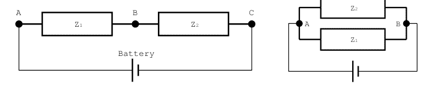

考虑图 A.1 右侧的电路，我们知道通过两个支路的电流必须相加：$I_t = U/Z_t = I_1 + I_2 = U/Z_1 + U/Z_2$。我们可以将其简化为 $1/Z_t = 1/Z_1 + 1/Z_2$，这意味着如果阻抗并联耦合，则各个阻抗以倒数形式相加。

请注意，前两段中的论证对于普通电阻器和恒定（直流）电压和电流是有效的，但如果我们使用电感器和电容器的复数频率相关阻抗，它也适用于交流电压。我们还注意到，所有电流和电压之间的关系都是*线性*的，因此我们可以使用叠加原理，独立分析每个电压或电流源的电路，最后将贡献相加。

除了线性电路元件（阻抗）外，还有非线性元件，*二极管*就是其中之一。它们的电压-电流行为遵循指数依赖关系 $I \propto \left(e^{(eU-E_g)/kT} - 1\right)$，其中 $E_g \approx 1.2\,V$ 是半导体材料（此处为硅）的带隙能量。我们看到，对于负电压，电流非常小，而对于正电流，一旦超过带隙电压的阈值，电流就会呈指数增长。实际上，二极管在一个方向上导通电流，在相反方向上阻断电流。这使得它们非常适合用于我们在[第 2.2.5 节](https://example.com)中讨论的电压整流。如果二极管正向偏置且阴极电压比阳极更负，则二极管导通。

*晶体管*是基于两个反向并联二极管的其他非线性元件；它们有两种类型，取决于中心抽头（称为基极）是阳极还是阴极。向基极注入额外的电流可以使通过两个外部端子（称为集电极和发射器）的电流更大。在正文主体中，我们使用晶体管进行开关应用，但通过适当的辅助电路，它们也可以用作放大器。这超出了本附录的范围，在电气工程书籍中有介绍，例如[17]。

# 最小二乘拟合

在第12章中，我们使用了Arduino上的`linfit()`函数，通过等间隔时间采样的$n$个数据点拟合出一条直线。这里我们简要讨论该函数的内部工作原理，它通过将数据拟合到一条直线来确定斜率$a$和截距$b$。这些参数的确定基于最小化残差平方和$r_i = y_i - at_i - b$的要求，其中包含多个数据点$(t_i, y_i)$。我们可以将问题重新表述为一个需要在最小二乘意义下求逆的线性方程：

$$\begin{pmatrix} \vdots \\ y_i \\ \vdots \end{pmatrix} = \begin{pmatrix} \vdots & \vdots \\ t_i & 1 \\ \vdots & \vdots \end{pmatrix} \begin{pmatrix} a \\ b \end{pmatrix}$$ (B.1)

我们将其简写为：

$$y = Ax$$ (B.2)

其中$A$是上一个方程中的$n \times 2$矩阵，$x = (a, b)^T$。这里的上标$T$表示转置，残差平方和$\sum_{i=1}^n r_i^2$我们记为$\chi^2$。后者可表示为：

$$\chi^2 = \sum_{i=1}^n r_i^2 = (y^T - x^T A^T)(y - Ax)$$
$$= y^T y - x^T A^T y - y^T Ax + x^T A^T Ax.$$ (B.3)

最小化这个关于$x$的表达式，会得到所求解向量$x$的条件。最小值的条件是要求关于拟合参数$x^T$的梯度为零。我们稍显随意地将其写为：

$$0 = \frac{\partial \chi^2}{\partial x^T} = -2A^T y + 2A^T Ax$$ (B.4)

这里我们使用了$x^T A y = y^T A^T x$，因为表达式是标量，并且任何形如$A^T A$的矩阵都是对称的。这允许我们合并项，从而得到前面的方程。更详细的推导请参见[43]。左乘$(A^T A)$的逆矩阵（假设该矩阵非奇异），可以分离出所求的拟合参数$x$，我们得到：

$$\begin{pmatrix} a \\ b \end{pmatrix} = x = (A^T A)^{-1} A^T y.$$ (B.5)

右边通常被称为矩阵$A$的伪逆，我们需要计算这个表达式来找到$a$和$b$。如果$t$值是等间隔的，我们可以将步长吸收到$a$的重新定义中，矩阵$A$就变成了如下形式：

$$A = \begin{pmatrix} 1 & 1 \\ 2 & 1 \\ 3 & 1 \\ \vdots & \vdots \end{pmatrix}$$ (B.6)

这样$A^T A$就变成了：

$$A^T A = \begin{pmatrix} \sum_{k=1}^n k^2 & \sum_{k=1}^n k \\ \sum_{k=1}^n k & \sum_{k=1}^n 1 \end{pmatrix} = \begin{pmatrix} n(n+1)(2n+1)/6 & n(n+1)/2 \\ n(n+1)/2 & n \end{pmatrix}$$ (B.7)

这解释了`linfit`程序中S0、S1、S2的定义。求这个$2 \times 2$矩阵的逆是平凡的，而计算$A^T y$则在计算ay0和ay1的循环中完成。`linfit`函数然后返回参数$a$（斜率），在主程序中我们需要通过将斜率乘以步长来重新缩放结果。使用octave可以很容易地交叉验证结果，拟合是用`polyfit()`函数完成的，但如果我们想在Arduino上进行计算，就需要像本附录中所示的方法。

还要注意，将该方法推广到高阶多项式很简单。我们只需要在方程B.1中添加$t_i^n$列，并可以通过步长的适当幂次来重新缩放拟合参数$a, b, \dots$，剩下的就是对正整数的幂次求和，这些和存在封闭表达式。这意味着对于任意数量的数据点$n$，矩阵$A^T A$总是可以以封闭形式计算出来。只剩下对秩等于拟合参数数量的矩阵求逆。能够预计算大部分矩阵，并可能在主机计算机上对固定的$n$进行求逆，使得这种方法非常适合微控制器。

## 问题与项目构想

- 1. 将由$y = at^2 + bt + c$给出的抛物线拟合到等间距的数据点$(i\Delta t, y_i)$。

# 附录 C

## 接下来该去哪里？

在我们对传感器、电子学、微控制器和计算机的世界进行了一番深入探索之后，我相信你想要更深入地钻研。以下是一些建议。

了解市场上可用传感器的一个绝佳途径是访问电子元器件分销商的网站，例如[www.digikey.com](http://www.digikey.com)、[www.rs-online.com](http://www.rs-online.com)、[www.distrelec.com](http://www.distrelec.com)或[www.farnell.com](http://www.farnell.com)。只需在他们的网站上搜索*sensor*（传感器）这个词。通常会出现大量子类别，其下还有数量更多的具体传感器。在特定传感器的页面上，包含详细信息的数据手册邀请你进一步探索。随意浏览就能带来很多灵感。

所有电子学内容的经典参考书是Horowitz和Hill的*The Art of Electronics*（《电子学的艺术》）。它深入探讨了电子学的几乎所有方面，包括讨论那些*不*工作的电路。请务必获取最新版本（截至写作时为第三版）。它面向成熟的读者，而其配套书籍*Learning the Art of Electronics, a Hands-On Lab Course*（《学习电子学的艺术：动手实验课程》）则面向学生。在相当详细地介绍元器件之后，它逐步讲解了许多实例。我发现美国无线电中继联盟（ARRL）的*ARRL Handbook for radio-communications*（《ARRL无线电通信手册》）是一个很好的灵感来源。它是业余无线电爱好者相关电子学的解决方案汇编。每隔一年就会发布更新版本。

探索其他微控制器及其特定功能的第一步是浏览[www.arduino.cc](http://www.arduino.cc)，特别是[store.arduino.cc/collections/boards](http://store.arduino.cc/collections/boards)。所有这些开发板都可以用Arduino IDE编程。其他微控制器系列，如Microchip的ATtinys和PICs，或Texas Instruments的MSP430s，通常针对特定目的进行了优化，例如低功耗。此外，它们有各种尺寸和功能，例如IO引脚数量、DAC和ADC通道、内置运算放大器、板载WLAN或蓝牙。偶尔它们必须用汇编语言编程，但如今它们通常附带软件开发工具包（SDK），包括用于编写代码和将程序上传到控制器的特定于控制器的库。即使是树莓派（Raspis）也有了更小的兄弟姐妹——Raspberry Pi Picos，有内置WiFi和不带WiFi的版本。它们基于RP2040，这是一个双核微控制器，也用于第58页提到的一些Arduino板。Picos可以使用其原生SDK或MicroPython（一种运行在Picos上的Python解释器）进行编程。初始测试通常在“入门”指南中描述，但要掌握所有功能需要仔细研究数据手册，这些手册通常长达数百页。考虑到最近的元器件短缺，将项目适配到不同控制器上的时间可能是值得的。

同样，最近树莓派的短缺可以通过将项目转移到其他计算机上来缓解。即使是运行常见操作系统的台式机或笔记本电脑也可以作为替代品，只要它们有可用的Python3或Octave安装。通常，数据库和网络服务器（如apache2）也是开源的，并且适用于所有常见操作系统。那么，移植本书中的软件应该可以开箱即用，或者只需要适度的努力来适配。但有时树莓派的小尺寸很重要，幸运的是市场上还有其他小型开发板，例如*ODROID-C4*，其规格与树莓派相似，或者*Beagleboard*，它比树莓派更侧重于数据采集和机器人技术。更侧重于数据采集的是*Red Pitaya*。它具有两个DAC和两个ADC，运行速度高达125 MHz，并直接连接到一个现场可编程门阵列（FPGA），该FPGA本身可以从两个运行Linux的通用处理器核心访问。*NVIDIA Jetson Nano*则面向机器学习应用。它具有一个运行Linux的双核处理器，连接到一个128核图形处理单元（GPU），该GPU支持*CUDA*编程语言，可以加速机器学习算法。

最后，让我以轻松的语气结束，并建议一些用Arduino和树莓派进行更多有趣项目的来源。除了许多以Arduino和树莓派为特色的业余爱好者杂志外，还可以在[create.arduino.cc/projecthub](https://create.arduino.cc/projecthub)和超过100期的MagPi杂志[magpi.raspberrypi.com](https://magpi.raspberrypi.com)上找到许多很酷的项目，这些杂志可以在线免费获取（尽管他们感谢捐赠）。关于用Arduino和树莓派还能做什么的最后两个灵感来源是[www.instructables.com/circuits](https://www.instructables.com/circuits)和[hackaday.com](https://hackaday.com)。重现其中一些项目并实现你自己的想法，应该能在可预见的未来终结无聊。

## 参考文献

- [1] Fritzing。项目网站：http://fritzing.org/。
- [2] ATLAS 合作组。项目网站：https://cern.ch/atlas。
- [3] CMS 合作组。项目网站：https://cern.ch/cms。
- [4] 大型强子对撞机。项目网站：https://cern.ch/lhc。
- [5] CERN 欧洲核子研究中心。项目网站：https://cern.ch。
- [6] MQTT。项目网站：http://mqtt.org/。
- [7] EPICS。项目网站：http://www.aps.anl.gov/epics。
- [8] Arduino。项目网站：https://www.arduino.cc。
- [9] ESP8266 微控制器。项目网站：https://www.espressif.com/en/products/socs/esp8266。
- [10] ESP32 微控制器。项目网站：https://www.espressif.com/en/products/socs/esp32。
- [11] 树莓派。项目网站：https://www.raspberrypi.org。
- [12] J. Fraden。*现代传感器手册*。Springer Verlag，柏林，第三版，2004。
- [13] J. Wilson，编辑。*传感器技术手册*。Elsevier，阿姆斯特丹，2005。
- [14] R. B. Northrop。*仪器与测量导论*。CRC Press，博卡拉顿，第三版，2014。
- [15] M. Coplan, J. Moore, 和 C. Davies。*构建科学仪器*。剑桥大学出版社，英国剑桥，第四版，2009。
- [16] C. Kittel。*固体物理导论*。Wiley，霍博肯，新泽西州，第八版，2005。
- [17] T. Giuma 和 P. Peebles。*电气工程原理*。McGraw-Hill，纽约，1991。
- [18] P. Horowitz 和 W. Hill。*电子学的艺术*。剑桥大学出版社，英国剑桥，1990。
- [19] A. Peyton 和 V. Walsh。*运算放大器模拟电子学*。剑桥大学出版社，英国剑桥，1996。
- [20] D. Lancaster。*有源滤波器手册*。Newnes，牛津，第二版，1996。
- [21] G. Franklin, J. Powell, 和 A. Emami-Naeni。*动态系统反馈控制*。Pearson，波士顿，第七版，2015。
- [22] M. Margolis。*Arduino 烹饪书*。O’Reilly，塞瓦斯托波尔，加利福尼亚州，2011。
- [23] 可编程仪器标准命令 SCPI。项目网站：https://www.ivifoundation.org/scpi/default.aspx。
- [24] S. Monk。*树莓派烹饪书*。O’Reilly，塞瓦斯托波尔，加利福尼亚州，2014。
- [25] 科学编程语言 GNU Octave。项目网站：https://www.gnu.org/software/octave/。
- [26] Python 软件基金会。项目网站：https://www.python.org/。
- [27] MariaDB 数据库。项目网站：https://mariadb.org/。
- [28] RRDtool。项目网站：https://oss.oetiker.ch/rrdtool/。
- [29] Apache 网络服务器。项目网站：https://httpd.apache.org/。
- [30] 在树莓派上安装 EPICS。https://prjemian.github.io/epicspi/。
- [31] Sparkfun AD8232 心率监测器。项目网站：https://learn.sparkfun.com/tutorials/ad8232-heart-rate-monitor-hookup-guide。
- [32] J. Munoz, V. Mosquare, 和 C. Rengifo。一种基于 ad5933 阻抗转换器的低成本、便携式二维生物阻抗分布估计系统。*Hardware X*, 11:e00274, 2022。
- [33] E. Tufte。*定量信息的视觉展示*。Graphic Press，柴郡，1983。
- [34] C. Mack。如何撰写优秀的科学论文：图表，第一部分。*J. Micr/Nanolith*, 12:040101–1, 2013。
- [35] W. Strunk 和 E. White。*风格的要素*。Harcourt，1920。可从古腾堡计划在线获取：https://www.gutenberg.org/ebooks/37134。
- [36] J. Gibaldi。*MLA 研究论文作者手册*。美国现代语言协会，纽约州纽约市，第六版，2003。
- [37] S. Pinker。*风格的感觉*。企鹅图书，伦敦，2015。
- [38] S. King。*论写作*。Hodder，伦敦，2012。
- [39] 《自然》风格指南。http://www.nature.com/authors/author_resources/how_write.html。
- [40] K. Friedman。《现代物理评论》风格指南。http://journals.aps.org/files/rmpguide.pdf。
- [41] 《自然》。科学家英语交流。http://www.nature.com/scitable/ebooks/english-communication-for-scientists-14053993/contents。
- [42] C. Fellbaum，编辑。*WordNet：一个电子词汇数据库*。MIT Press，马萨诸塞州剑桥市。在线版本：http://wordnet.princeton.edu。
- [43] W. Press 等。*数值食谱*。剑桥大学出版社，剑桥，第二版，1992。

## 索引

7805, 28, 263

加速度计, 13, 34, 35, 75
首字母缩写词, 149, 280
AD5933, 36, 207, 212–217, 236
AD8232, 19, 235
AD9850, 54, 106
ADC，参见模数转换器
ADXL335, 13, 34
空气质量, 183, 186
混叠, 25, 193
放大器, 17, 19, 20, 23, 193, 194
模数转换器, 1, 23–26, 36, 65, 75, 79–82, 123, 193, 196, 197, 200, 257–262
Apache2, 148–151, 187
Arduino, xv, 1, 57–60, 62, 65–70, 77, 79–81, 85, 86, 88, 89, 91–101, 103, 109–112, 116–118, 130–131, 153, 201–207, 249, 253, 257, 265, 272, 283
Arduino NANO, 118, 265
Arduino 程序
- AD5933 接口, 214, 236–242
- AD8232, 236–242
- AD9850, 106
- 模拟输入, 64, 65
- 闪烁, 61
- BME680 环境传感器, 73
- 按钮, 62
- 电容测量, 207
- 彩色显示器, 202, 204
- 带 H 桥的直流电机, 92
- DHT11 湿度传感器, 83
- DS18b20 温度传感器, 85
- ESP32 数据采集, 219–223
- 地震检波器客户端, 194
- HC-SR04 距离传感器, 86
- HYT221 湿度传感器, 70
- I2Crw.h, 74
- 激光束轮廓, 250
- LM35 温度记录器, 67
- MAX30102, 236–242
- MCP23017 IO 扩展器, 78
- 带 SPI 的 MCP3304 ADC, 80, 81
- MCP4921 DAC, 104, 238
- MLX90614 红外温度计, 68
- 模型舵机, 94
- MPU6050 加速度计, 74
- NeoPixel 温度计, 107
- 脉冲发生器, 105
- 查询-响应, 66
- RC 接收器, 265
- RC 发送器, 260
- 旋转编码器, 87
- SCD30 CO2 传感器, 71, 72
- 串行通信, 64, 65
- 套接字通信, 115
- 声音, 109
- 步进电机, 96, 98, 101
- 开关和 PWM, 88
- TCS34725 颜色传感器, 76
- 气象站, 183
- 网络服务器, 113, 265

带隙, 7, 10, 11, 27, 28, 38, 42, 282
气压, 1, 32, 183, 186, 275
基本 Unix 程序, 122
电池, 28, 118, 165, 193, 206, 257, 263
Beagleboard, 286
生物阻抗, 36, 236
蓝牙, 110–111, 116, 119, 131, 135, 137
- 配对和设置, 110
BME680, 32, 117, 183
体脂测量, 36
BPW34, 14, 15
BPX38, 15, 257, 263
亮度, 42, 88, 112, 114, 115, 118, 153, 173
按钮, 62–63, 79, 258, 263

电容, 13, 21, 27, 34, 207–212, 281
- Cole 模型, 236
颜色传感器, 15, 36
换向器, 45, 46
比较器, 19, 23, 24, 39
编译, 62, 65, 156, 159, 161, 162
结论, 276, 277
导带, 7, 8, 15, 42
控制系统, 3, 155–164, 169, 189
起重机, 56, 274
Cron 进程, 139, 140, 144, 147, 148, 151, 152
CUDA, 286
DAC，参见数模转换器
达林顿管, 44, 52, 56, 88, 90, 95, 96
数据库, xvi, 123, 138–148, 157, 160–162, 164, 172, 173, 183, 186–187
直流电机, 12, 45–47, 90–93, 97, 257–263
去耦电容, 66, 183
Delta-sigma ADC, 25
桌面, 120–123, 126, 127, 130
被测设备, 212
DHCP, 112, 114, 127, 129
DHT11, 38, 83, 84
介电常数, 8, 34, 37
数模转换器, 24, 53, 103, 104
直接数字合成器, 54, 212
DNS, 112
DRV8825, 51, 101
DS18b20, 38, 85, 86, 107
粉尘传感器, 38, 39, 118, 191
DUT，参见被测设备
心电图, 3
心电图学, 19
电子鼻, 39
环境传感器, 32, 33
EPICS, xvi, 1, 3, 155–164, 169–173, 189, 190, 198, 199
EPICS 数据库文件
- 地震检波器, 198
- MQTT 接口, 171
- 简单, 157
- 温度, 160
- 气象站, 189
ESP-01, 58–60, 183
ESP32, 57–59, 111, 248
ESP8266, 57, 58, 111, 116
费米能级, 7, 39
滤波器, 21–23, 25, 29, 32, 53, 193
平面文件数据库, 138, 139, 141, 144
流量, 12, 55, 276
液位传感器, 9
续流二极管, 45, 52, 54, 90, 91
力敏电阻，参见应变片
气体传感器, 10, 118
网关, 165, 169, 171–173

地震检波器, 13, 14, 193–198
Git 克隆, 126
GPIB, 67
GPS, 38, 118
语法, 280
地面振动, 3, 193
陀螺仪, 34, 35, 75
H 桥, 47–51, 56, 88, 90, 91, 93, 97–99, 173, 250, 257, 263
霍尔传感器, 1, 12, 19, 35, 46, 118
HC-SR04, 31, 86, 118, 257, 263, 267, 271
HDMI, 119, 121
HTML, 115, 118, 149, 187
- 示例, 149, 150, 152, 187
- HTML 表单, 115, 118
- http-equiv, 152
HTTP, 118
- GET, 114, 115
- 头部, 114
- 返回码, 115
湿度, 1, 32, 38, 69–71, 83, 84, 186, 275
液压, 55
HYT-221, 32, 69, 70
I2C, 30, 32–36, 68–79, 117, 263
I2S, 229
Imagemagick, 125
阻抗, 3, 5, 17, 207–217, 281
阻抗测量, 207
电感, 22, 281
红外, 11, 15, 30, 42, 117, 263
物联网, 1, 3, 58, 165
中断, 77–79, 84, 87, 193, 207
IOC, 155, 161, 162, 164, 199
IP, 122, 127–129, 131, 135, 137, 148, 162, 171, 172, 183, 199, 261, 267
IQ 信号, 212
术语, 280
JavaScript, 232
操纵杆, 9, 257, 258, 261
JSON, 175, 177, 223, 232, 238, 245
关键词, 5, 85, 125, 276
KODI, 120
L293D, 47, 90–92, 97–99, 250, 263, 272
LDO 稳压器, 28
LDR, 5–7, 16, 153, 192, 249–256, 274
最小二乘法, 283
LibreELEC, 120

## 索引

LM35, 10, 11, 28, 64, 66, 112, 113, 146, 167, 171
扬声器, 109

MariaDB, xvi, 141–145, 153, 173
MATLAB, 3
MAX30102, 35, 236
MCP1700, 28
MCP23017, 77–79, 89, 117, 273
MCP3208, 37, 258
MCP3304, 36, 79–82, 117, 200, 258
MCP4921, 53, 103, 236
微控制器, 57–62, 276
麦克风, 13
微步进, 51, 52, 100–103
MIDI, 43, 116, 117
MISO, 36, 81, 82, 104, 258
MLX90614, 12, 68, 69, 118
MOSFET, 30, 44
MOSI, 36, 81, 104, 258
动机, 275, 276
MPU6050, 118
MQ-x, 10, 118
MQTT, 3, 165–173, 204, 206
罗宾逊夫人准则, xvi
MSP430微控制器, 285
多谐振荡器, 53

Nano文本编辑器, 124
NeoPixel, 107
Netcat, 115, 125, 132, 171
网络地址转换, 128
网络附加存储, 120
网络分析仪, 212
网络详解, 112
NodeMCU, 58–60, 79–83, 112–116, 125, 130–132, 135, 137, 153, 162, 167–173, 183–185, 193–200, 204–206, 257–272
NPN晶体管, 43, 44, 52, 90
NVIDIA Jetson Nano, 286

Octave, 125, 135–138, 141, 144, 196–198, 212, 253, 254
Octave脚本
- AD5933接口, 216
- 电容测量, 210
- 平面文件读取器, 141
- 半高宽, 255
- 激光束轮廓, 253
- MariaDB访问, 144
- 查询-响应, 136, 137
- 平滑点, 254
- 温度记录器, 137

ODROID-C4, 286
集电极开路, 43, 44
OpenWRT, 120
运算放大器, 17–19, 24, 25, 53
光耦合器, 41, 43, 116

PCA9685, 273
光电晶体管, 15, 38, 39, 43, 118, 192, 201–204, 257–274
PIC微控制器, 285
图片, 153, 276, 277
压电蜂鸣器, 109, 263
PIN二极管, 14, 15, 39, 200
PIR传感器, 30, 31
电源, 26–28
演示, xvi, 3, 122, 138, 275–280
螺旋桨, 12, 55, 118, 274
伪逆, 283
PT100, 7, 8
上拉电阻, 29, 32, 57, 63, 78, 79, 83, 85, 87, 207, 263, 272
脉冲发生器, 105
脉宽调制, 42, 43, 46–48, 53, 56, 88–94, 206, 231, 249–253, 267
Pyepics, 158
Python, 122, 130, 132–135, 138, 139, 141, 143, 145–147, 169
- 编码, 132

Python脚本
- 访问EPICS, 158, 199
- EPICS到MQTT网关, 169
- 平面文件写入器, 138, 139
- 地震检波器读取器, 195
- MariaDB访问, 143
- 查询-响应, 132
- 从网络套接字读取, 135
- 从串行线路读取, 134

查询-响应协议, 3, 66, 68, 88, 93, 94, 96, 103, 104, 123, 131, 132, 136, 173, 210, 272

R-2R电阻网络, 53
树莓派, xvi, 3, 117, 119–124, 126–132, 136, 139–141, 144, 148, 152, 153, 155, 156, 159, 164–167, 169, 185, 253
树莓派Pico, 285
Raspios, 120, 121, 163
Red Pitaya, 286
干簧管, 29
继电器, 44, 45
遥控器, 32, 117, 192, 257–274
报告, xvi, 1, 273, 275–278, 280
电阻, 5–10, 16, 42, 209, 281
机器人, 3, 48, 109, 256–274
旋转编码器, 29, 87
路由器, xvi, 112, 120, 131
RP2040微控制器, 285
RRDtool, 145–148, 150–152, 186, 187
RS-232, 28, 31, 37, 57, 109, 111, 116, 159
帆船, 274
SCPI, 67
Screen程序, 109–111, 123, 124, 152
SD卡, 120, 121
半导体, 7–9, 14, 41
伺服电机, 48, 55, 56, 93, 94, 118, 173, 257, 263, 267, 271
SFH3310, 15, 201, 202
幻灯片, 275–277
SM-24, 13, 14, 193, 194
套接字, 115–116, 135, 137, 138, 163, 169–171, 194–199, 261
太阳能电池, 15
螺线管, 54
拼写检查器, 280
SPI, 36–37, 57, 79–83, 103–105, 257–263
SPIFFS文件系统, 176, 219
状态机, 257, 267, 271, 274
步进电机, 49–52, 55, 56, 95–101, 103, 153, 249–253
故事线, 275–277
应变片, 10, 32, 33
结构化查询语言, 143
开关, 29–30, 41–45, 88–90
开关模式电源, 27
Synaptic, 125, 153
TCP, 137, 170, 274
TCS34725, 36, 76
Telnet, 112, 115, 125, 131, 132, 163, 164
温度, 7, 8, 10, 11, 27, 28, 32, 34, 37, 38, 57, 64, 66–70, 75, 84–86, 112–114, 137–139, 146, 147, 151, 152, 160–162, 165, 167–169, 171, 173, 183, 187, 278
终端程序, 37, 65, 109, 123–125, 130–132, 139, 166, 169, 171

热敏电阻, 8, 37
热电偶, 11, 12
热电堆, 11, 12, 68
倾斜开关, 29
TIP-120, 90
跨阻放大器, 15, 18, 212
TSOP2238, 117, 233
电视, 32, 55, 117, 120
电视遥控器, 117, 233
UDP, 261, 267, 270, 272
ULN2003, 52, 56, 95
Unix手册页, 124, 125, 140, 148, 166
USB, 60, 62, 64, 109, 110, 112, 116, 119, 123, 130, 131, 136, 153, 263
用户指南, xvi
价带, 7, 15, 42
阀门, 41, 55
VNC服务器, 126
挥发性有机化合物, 33
稳压器, 28, 272
压控电流源, 18
VXI, 67
Web服务器, xvi, 3, 112–115, 148–152
Websockets, 1, 3, 175–182, 223–227, 245
惠斯通电桥, 5, 7, 9, 16, 25, 34, 38
WiFi, 112–116, 119, 168, 183, 194, 204, 260, 265
Wordnet, 280
WPA, 58, 112, 128