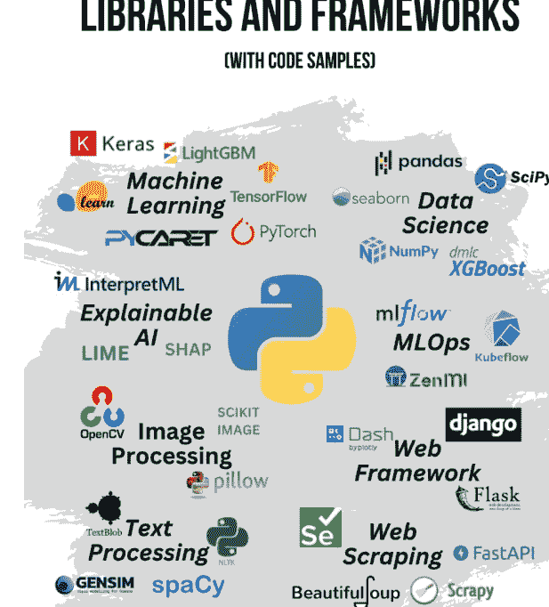
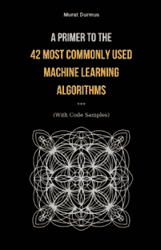

Murat Durmus

## 核心Python库与框架实战入门（附代码示例）



平装本可在亚马逊购买：

https://www.amazon.com/dp/B0BW2MGYG4

Murat Durmus

## 核心Python库与框架实战入门（附代码示例）

## 版权所有 © 2023 Murat Durmus

保留所有权利。未经出版商事先书面许可，不得以任何形式或任何方式（包括影印、录音或其他电子或机械方法）复制、分发或传播本出版物的任何部分，但版权法允许的简短引述用于评论和某些其他非商业用途的情况除外。

## 封面设计：

Murat Durmus

## 关于作者

Murat Durmus 是 AISOMA（一家总部位于德国法兰克福，专注于基于人工智能的技术开发和咨询的公司）的首席执行官兼创始人，也是《[有意识的人工智能——关于人工智能的思考](https://example.com)》和《[42种最常用机器学习算法入门（附代码示例）](https://example.com)》的作者。

您可以通过以下方式联系作者：

- LinkedIn: [https://www.linkedin.com/in/ceosaisoma/](https://www.linkedin.com/in/ceosaisoma/)
- 电子邮件: [murat.durmrus@aisoma.de](mailto:murat.durmrus@aisoma.de)


注意：

本书中的代码示例及其描述是在 ChatGPT (OpenAI) 的支持下编写的。

> "Python 不仅仅是一门语言，
> 它是一个社区，
> 在这里开发者可以学习、
> 协作并创造奇迹。"

- 吉多·范·罗苏姆
（Python 创始人）

# Python编程语言简史

# 数据科学

- PANDAS
  - 优点与缺点
- NUMPY
  - 优点与缺点
- SEABORN
  - 优点与缺点
- SCIPY
  - 优点与缺点
- MATPLOTLIB
  - 优点与缺点

# 机器学习

- SCIKIT-LEARN
  - 优点与缺点
- PYTORCH
  - 优点与缺点
- TENSORFLOW
  - 优点与缺点
- XGBOOST
  - 优点与缺点
- LIGHTGBM
  - 优点与缺点
- KERAS
  - 优点与缺点
- PYCARET
  - 优点与缺点

# MLOPS

- MLFLOW
  - 优点与缺点
- KUBEFLOW
  - 优点与缺点
- ZENML
  - 优点与缺点

# 可解释人工智能

- SHAP
  - 优点与缺点
- LIME
  - 优点与缺点
- INTERPRETML
  - 优点与缺点

# 文本处理

- SPACY
  - 优点与缺点
- NLTK
  - 优点与缺点
- TEXTBLOB
  - 优点与缺点
- CORENLP
  - 优点与缺点
- GENSIM
  - 优点与缺点
- REGEX
  - 优点与缺点

# 图像处理

- OPENCV
  - 优点与缺点
- SCIKIT-IMAGE
  - 优点与缺点
- PILLOW
  - 优点与缺点
- MAHOTAS
  - 优点与缺点
- SIMPLEITK
  - 优点与缺点

## Web框架

- FLASK
  - 优点与缺点
- FASTAPI
  - 优点与缺点
- DJANGO
  - 优点与缺点
- DASH
  - 优点与缺点
- PYRAMID
  - 优点与缺点

## 网页抓取

- BEAUTIFULSOUP
  - 优点与缺点
- SCRAPY
  - 优点与缺点

SELENIUM ................................................................................................ 155

优缺点 ................................................................................................ 156

42种最常用机器学习算法入门（含代码示例） ........................................................ 158

正念人工智能 ............................................................................................. 159

走进艾伦·图灵：语录与沉思 ........................................................ 160

# Python编程语言简史

Python是一种流行的高级编程语言，适用于各种应用，包括Web开发、科学计算、数据分析和机器学习。其简洁性、可读性和多功能性使其成为各级别程序员的热门选择。以下是Python编程语言的简要历史。

Python由Guido van Rossum于20世纪80年代末创建，当时他在荷兰国家数学与计算机科学研究所工作。Van Rossum当时正在寻找一种易于读写、可用于各种应用的编程语言。他以英国喜剧团体Monty Python的名字为这门语言命名，因为他是该团体电视节目的粉丝。

Python的第一个版本Python 0.9.0于1991年发布。该版本包含了许多至今仍在Python中使用的特性，例如模块、异常以及列表、字典和元组等核心数据类型。

Python 1.0于1994年发布，包含了许多新特性，如lambda、map、filter和reduce。这些特性使得在Python中编写函数式风格的代码变得更加容易。

Python 2.0于2000年发布，引入了列表推导式、一个新的垃圾回收器和一个循环检测垃圾回收器。列表推导式使得编写操作列表和其他可迭代对象的代码变得更加简单。

Python 3.0是该语言的一次重大更新，于2008年发布。此版本引入了许多更改和改进，包括重新设计的print函数、新的字符串格式化语法和一个新的除法运算符。最新版本还移除了一些被认为过时或冗余的特性。

自Python 3.0发布以来，已经发布了多个次要版本，每个版本都引入了新的特性和改进，同时保持与现有代码的向后兼容性。这些版本包含的特性包括用于异步编程的async/await语法、用于提高代码可读性和可维护性的类型注解，以及对垃圾回收器和标准库的改进。

多年来，Python的普及度稳步增长，现在已成为世界上最流行的编程语言之一。Web开发人员、数据科学家和机器学习工程师等广泛使用它。Python的普及得益于其简洁性、可读性和多功能性，以及一个庞大而活跃的开发者社区，他们为该语言及其库和工具生态系统做出贡献。

总之，Python编程语言自20世纪80年代末诞生以来已经走过了漫长的道路。多年来，它经历了许多变化和改进，但其简洁性、可读性和多功能性的核心价值始终保持不变。此外，Python的普及度没有放缓的迹象，它很可能在未来许多年里仍然是程序员的热门选择。

概览：

- Python由Guido van Rossum于20世纪80年代末创建，当时他在荷兰国家数学与计算机科学研究所工作。
- Python的第一个版本Python 0.9.0于1991年发布。
- Python 1.0于1994年发布，包含了许多新特性，如lambda、map、filter和reduce。
- Python 2.0于2000年发布，引入了列表推导式、一个新的垃圾回收器和一个循环检测垃圾回收器。
- Python 3.0是该语言的一次重大更新，于2008年发布。此版本引入了许多更改和改进，包括重新设计的print函数、新的字符串格式化语法和一个新的除法运算符。
- 自Python 3.0发布以来，已经发布了多个次要版本，每个版本都引入了新的特性和改进，同时保持与现有代码的向后兼容性。
- Python已成为世界上最流行的编程语言之一，广泛应用于Web开发、科学计算、数据分析和机器学习等各种应用。
- Python的普及得益于其简洁性、可读性和多功能性，以及一个庞大而活跃的开发者社区，他们为该语言及其库和工具生态系统做出贡献。

# 数据科学

数据科学是一个跨学科领域，涉及提取、分析和解释大型复杂数据集。它结合了统计学、计算机科学和领域专业知识的元素，从数据中提取见解和知识。

数据科学家使用各种工具和技术来收集、处理和分析数据，包括统计分析、机器学习、数据挖掘和数据可视化。他们处理大型复杂数据集，以发现可以为决策提供信息并推动业务价值的模式、关系和见解。

数据科学在各个领域都有应用，包括商业、医疗保健、金融和社会科学。它为从产品开发到市场营销再到政策制定的各种决策提供信息。

## PANDAS

Python Pandas是一个用于Python编程语言的开源数据操作和分析库。它提供了一组用于高效存储和操作大型数据集的数据结构，以及用于数据分析、清理和预处理的各种工具。

Pandas中的一些关键数据结构包括Series，这是一个一维类数组对象，可以容纳任何数据类型；以及DataFrame，这是一个二维表格数据结构，具有行和列，可以被视为电子表格或SQL表。

Pandas还提供了一系列数据操作函数和方法，例如过滤、排序、合并、分组和聚合数据。它还支持数据可视化工具，允许用户以多种方式绘制和可视化数据。

它在数据分析和数据科学中被广泛使用，被认为是Python中处理数据的基本工具之一。它也经常与其他流行的数据科学库（如NumPy、Matplotlib和SciPy）结合使用。

一个如何使用Pandas读取CSV文件、操作数据然后输出到新文件的示例：

```python
import pandas as pd

# Read in the CSV file
data = pd.read_csv('my_data.csv')

# Print the first few rows of the data
print(data.head())

# Filter the data to include only rows where
# the 'score' column is greater than 90
filtered_data = data[data['score'] > 90]

# Create a new column that calculates the
# average of the 'score' and 'time' columns
filtered_data['average'] = (filtered_data['score'] + filtered_data['time']) / 2

# Output the filtered data to a new CSV file
filtered_data.to_csv('my_filtered_data.csv', index=False)
```

在此示例中，我们首先使用 **import pandas as pd** 导入Pandas库。然后，我们使用 **pd.read_csv()** 函数读取一个名为 **my_data.csv** 的CSV文件，该函数创建一个DataFrame对象。接着，我们使用 **head()** 方法打印出数据的前几行。

接下来，我们使用布尔索引过滤数据，仅包含'score'列大于90的行。然后，我们创建一个名为'average'的新列，使用基本算术运算计算'score'和'time'列的平均值。

最后，我们使用 **to_csv()** 方法将过滤后的数据输出到一个名为 **my_filtered_data.csv** 的新CSV文件中，其中 **index=False** 参数表示我们不希望将DataFrame索引作为输出文件中的一列。

### 优缺点

优点：

- 易于使用且功能强大的数据操作与分析库。
- 提供处理大型数据集的强大工具，包括快速索引、筛选、分组和合并操作。
- 支持多种输入输出格式，包括 CSV、Excel、SQL 数据库和 JSON。
- 提供丰富的数据可视化工具，包括折线图、散点图、直方图等。
- 拥有庞大且活跃的用户和开发者社区，这意味着有丰富的在线资源和支持可用。
- 可与其他流行的数据科学库（如 NumPy、SciPy 和 Matplotlib）结合使用。

缺点：

- 在处理非常大的数据集时，Pandas 可能会占用大量内存，可能不是实时应用或超高维数据的最佳选择。
- 某些函数和方法可能比较复杂，难以理解，尤其是对新用户而言。
- 在执行某些操作时（例如对大型数据集应用函数或执行多次合并或连接）可能会比较慢。
- 在处理混乱或非结构化数据时，可能并不总能产生预期的结果。
- 一些用户报告了不同版本的 Pandas 之间或 Pandas 与其他库之间的兼容性和可移植性问题。

## NUMPY

NumPy 是一个用于数值计算的 Python 库。它提供了强大的数据结构，如 n 维数组或 "ndarrays"，以及一系列用于高效处理这些数组的数学函数。

它广泛应用于数据科学、机器学习、科学计算和工程等领域。它建立在 C 和 Fortran 等底层语言之上，这使得 NumPy 即使在处理大型数据集时也能保持快速和高效。

除了其核心功能外，NumPy 还提供了与 Python 中其他科学计算库（如 SciPy 和 Pandas）集成的工具。总的来说，NumPy 是任何在 Python 中处理数值数据的人的必备工具。

一个演示如何创建 NumPy 数组、对其进行数学运算和切片的示例代码：

```python
import numpy as np

# Create a 1-dimensional NumPy array
arr = np.array([1, 2, 3, 4, 5])

# Perform mathematical operations on the array
print("Original array:", arr)
print("Array multiplied by 2:", arr * 2)
print("Array squared:", arr ** 2)
print("Array sine values:", np.sin(arr))

# Create a 2-dimensional NumPy array
arr2d = np.array([[1, 2, 3], [4, 5, 6], [7, 8, 9]])

# Slice the array to get a subarray
sub_arr = arr2d[:2, 1:]
print("Original 2D array:\n", arr2d)
print("Subarray:\n", sub_arr)
```

**输出：**

```
Original array: [1 2 3 4 5]
Array multiplied by 2: [ 2  4  6  8 10]
Array squared: [ 1  4  9 16 25]
Array sine values: [ 0.84147098  0.90929743  0.14112001 -0.7568025  -0.95892427]
Original 2D array:
 [[1 2 3]
 [4 5 6]
 [7 8 9]]
Subarray:
 [[2 3]
 [5 6]]
```

在这个例子中，我们导入 NumPy 库并创建一个一维数组 **arr**，其值为 **[1, 2, 3, 4, 5]**。然后我们使用 NumPy 函数对该数组执行了几个数学运算，例如乘以 2 和对值求平方。

接下来，我们创建一个二维数组 **arr2d**，其值为 **[[1, 2, 3], [4, 5, 6], [7, 8, 9]]**。我们对这个数组进行切片，得到一个子数组 **sub_arr**，其中包含前两行和最后两列的元素。我们打印原始数组和子数组以显示结果。

### 优缺点

优点：

- 高效快速：NumPy 建立在 C 和 Fortran 等底层语言之上，这使得它在数值计算方面比纯 Python 代码快得多，也高效得多。
- 强大的数据结构：NumPy 提供了强大的 n 维数组（或 "ndarrays"），允许高效地存储和操作大型数据集。
- 全面的数学函数：NumPy 提供了广泛的数学函数，如三角函数、对数函数和统计函数，这使得在数组上执行复杂计算变得容易。
- 与其他 Python 库集成：NumPy 与 Python 中的其他科学计算库（如 SciPy、Pandas 和 Matplotlib）无缝集成，从而允许进行更高级的数据分析和可视化。

缺点：

- 学习曲线陡峭：NumPy 可能具有挑战性，尤其是对于不熟悉数组和向量化等编程概念的初学者。
- 内存使用：NumPy 数组可能会占用大量内存，这在处理非常大的数据集时可能是个问题。
- 缺乏灵活性：NumPy 针对数值计算进行了优化，在通用编程任务方面不如纯 Python 代码灵活。

总的来说，NumPy 的优点远大于缺点，尤其是在处理大型数据集或执行复杂数值计算时。然而，重要的是要记住 NumPy 的局限性，并为工作选择合适的工具。

## SEABORN

Seaborn 是一个建立在 Matplotlib 之上的 Python 数据可视化库。它提供了一个高级接口，用于在 Python 中创建信息丰富且美观的统计图形。

它提供了一系列用于统计图形的可视化技术，包括：

- **单变量和双变量图**：直方图、核密度估计图、箱线图、小提琴图和散点图。
- **回归和分类图**：线性回归、逻辑回归、分类散点图和条形图。
- **矩阵图**：热力图、聚类图和配对图。
- **时间序列图**：折线图、时间序列热力图和季节图。

Seaborn 旨在与 Python 中流行的数据操作库 Pandas 无缝协作，它可以轻松处理大型和复杂的数据集。它还提供了一系列用于图表的自定义选项，包括调色板、主题和样式。

总的来说，Seaborn 是一个强大且用户友好的库，用于在 Python 中创建信息丰富且视觉吸引力强的统计图形。

一个使用 Seaborn 创建散点图的示例代码：

```python
import seaborn as sns
import pandas as pd

# Load dataset
df = pd.read_csv('my_dataset.csv')

# Create scatter plot
sns.scatterplot(x='x_column', y='y_column', data=df)

# Show plot
sns.plt.show()
```

在这个例子中，我们首先导入 Seaborn 库和 Pandas 库，用于加载和操作数据集。然后我们使用 Pandas 从 CSV 文件加载数据集。

接下来，我们使用 Seaborn 的 **scatterplot()** 函数创建一个散点图，将数据集中 x 和 y 列的名称作为参数传递。我们还传递了 **data** 参数来指定我们要绘制的数据集。

最后，我们使用 Seaborn 的 **plt.show()** 函数在屏幕上显示图表。Seaborn 会自动使用吸引人的默认主题为图表设置样式，我们可以使用其他 Seaborn 函数和参数进一步自定义图表。

这段代码创建了一个散点图，显示了数据集中两个变量之间的关系，其中 x 轴代表 "x_column" 变量，y 轴代表 "y_column" 变量。散点图中的每个点代表数据集中的一个观测值。Seaborn 会自动为坐标轴添加标签，并添加一个图例来解释图表中不同颜色的含义。

### 优缺点

优点：

- 吸引人且信息丰富的可视化：Seaborn 提供了一系列可视化技术，这些技术针对在 Python 中创建吸引人且信息丰富的统计图形进行了优化。它提供了广泛的自定义选项，包括颜色、样式和主题，这使得创建符合用户需求的视觉吸引力强的图表变得容易。
- 用户友好的界面：Seaborn 旨在易于使用，具有简单且一致的 API，只需几行代码即可创建复杂的可视化。它还提供了一系列内置数据集，可用于练习或探索。
- 与 Pandas 集成：Seaborn 旨在与 Python 中流行的数据操作库 Pandas 无缝协作，这使得处理和可视化大型复杂数据集变得容易。
- 多功能性：Seaborn 提供了广泛的可视化技术，包括单变量和双变量图、回归和分类图、矩阵图和时间序列图，这使其成为数据探索和分析的多功能工具。

## 缺点

-   适用范围有限：Seaborn专注于统计数据可视化，在通用数据可视化任务上不如其他可视化库灵活。
-   学习曲线陡峭：尽管Seaborn设计得易于使用，但一些用户可能会发现学习起来有挑战性，特别是如果他们不熟悉统计可视化概念或Pandas库。
-   自定义选项有限：虽然Seaborn提供了广泛的自定义选项，但一些用户可能会发现他们能实现的自定义程度有限，特别是与更高级的可视化库如Matplotlib相比。

总体而言，Seaborn的优点远大于缺点，特别是对于需要在Python中创建信息丰富且吸引人的统计图形的用户。然而，重要的是要记住Seaborn的局限性，并为工作选择合适的工具。

## SCIPY

Scipy是一个用于Python的开源科学计算库，它提供了一系列用于数学、科学和工程的函数。它建立在NumPy库之上，NumPy为数值计算提供了高效的数组操作。

它被组织成提供不同功能的子包，例如：

-   积分与优化
-   信号与图像处理
-   统计与概率
-   插值与外推
-   稀疏矩阵与线性代数
-   特殊函数与数值例程

Scipy广泛应用于科学研究、工程、数据科学以及其他需要数值计算的领域。它提供了一种便捷而强大的方式在Python中执行复杂的计算和分析，并拥有一个庞大而活跃的用户和开发者社区，为它的开发和维护做出贡献。

一个使用Scipy执行数值积分的示例代码：

```python
import numpy as np
from scipy.integrate import quad

# Define function to integrate
def f(x):
    return np.exp(-x ** 2)

# Perform numerical integration
result, error = quad(f, -np.inf, np.inf)

# Print result
print("Result:", result)
print("Error:", error)
```

在这个例子中，我们首先导入NumPy库和Scipy **integrate**子包中的**quad**函数。然后我们定义一个我们想要积分的函数**f(x)**。

接下来，我们使用**quad**函数对**f(x)**在从负无穷到正无穷的范围内执行数值积分。**quad**函数返回积分结果和误差估计。

最后，我们将结果和误差打印到控制台。在这种情况下，结果应该是π的平方根（约等于1.77245385091）。

这段代码展示了如何使用Scipy在Python中轻松高效地执行复杂的数学计算，例如数值积分。

### 优点与缺点

优点：

-   提供了一套全面的科学计算和数值分析工具，包括积分、优化、信号处理、线性代数等。
-   建立在NumPy之上，使得处理数组和执行高效的数值操作变得容易。
-   拥有庞大而活跃的用户和开发者社区，有许多开源包和模块可用于扩展其功能。
-   文档完善，网上有许多示例和教程可用。
-   可移植且跨平台，支持多种操作系统和硬件架构。

缺点：

-   由于可用的函数和子包众多，对于初学者来说可能复杂且难以学习。
-   一些函数可能计算密集，需要数值分析和性能优化方面的高级知识。
-   一些函数可能有限制或假设，可能不适用于所有应用。
-   在数值计算中需要仔细考虑精度和准确性，特别是对于准确性至关重要的科学应用。
-   一些函数可能不如用C或Fortran等低级语言编写的优化代码快。

总体而言，Scipy是Python中一个强大且广泛使用的科学计算库，但它可能不是所有应用的最佳选择，需要仔细考虑其优势和局限性才能有效使用。

## MATPLOTLIB

Matplotlib是Python编程语言中一个流行的数据可视化库。它提供了一种在Python中创建各种静态、动画和交互式可视化的方式。

它最初由John D. Hunter于2003年开发，现在由一个开发者团队维护。它是开源软件，可在BSD风格的许可证下使用。

Matplotlib旨在与NumPy（一个流行的Python数值计算库）良好协作，并经常与其他科学计算库如SciPy和Pandas结合使用。

它提供了广泛的绘图功能，包括线图、散点图、条形图、直方图、3D图等。它还提供了高度的自定义性，允许用户修改其图表的几乎所有方面，包括坐标轴、标签、颜色和样式。

它可用于各种场景，从探索性数据分析到科学研究再到创建出版级图形。它在学术界和工业界被广泛使用，被认为是Python数据科学生态系统中的必备工具之一。

一个使用Matplotlib创建简单线图的代码片段示例：

```python
import matplotlib.pyplot as plt
import numpy as np

# Generate some sample data
x = np.linspace(0, 10, 100)
y = np.sin(x)

# Create a figure and axis object
fig, ax = plt.subplots()

# Plot the data
ax.plot(x, y)

# Add some labels and a title
ax.set_xlabel('X Label')
ax.set_ylabel('Y Label')
ax.set_title('Sinusoidal Plot')

# Show the plot
plt.show()
```

在这个例子中，我们首先导入必要的模块（Matplotlib和NumPy）。然后，我们生成一些样本数据（一个包含100个在0到10之间均匀分布的x值的数组，以及一个对应的正弦值数组）。

接下来，我们使用**subplots**函数创建一个图形和坐标轴对象。然后我们使用**plot**函数将数据绘制在坐标轴对象上。

最后，我们使用**set_xlabel**、**set_ylabel**和**set_title**函数为图表添加一些标签和标题。然后我们使用**show**函数显示图表。

这只是一个简单的例子，Matplotlib还有更多高级功能用于创建更复杂的可视化。

### 优点与缺点

优点：

-   Matplotlib是Python中一个广泛使用且成熟的数据可视化库，拥有庞大而活跃的开发者社区。
-   它高度可定制，允许用户修改其图表的几乎所有方面，包括坐标轴、标签、颜色和样式。
-   它提供了广泛的绘图功能，包括线图、散点图、条形图、直方图、3D图等。
-   可以生成适合出版和演示的高质量图表。
-   它与其他用于数据分析和科学计算的Python库（如NumPy、SciPy和Pandas）集成良好。
-   对于基本的绘图任务易于使用和学习，使其对所有级别的用户都易于上手。

缺点：

-   语法可能冗长且复杂，特别是对于更高级的自定义和绘图任务。
-   图表的默认设置可能并不总是美观，可能需要额外的自定义。
-   与一些其他数据可视化库（如Plotly或Bokeh）相比，它提供的交互性或动画功能较少。
-   与一些其他库（如Seaborn）相比，生成复杂或大规模可视化可能较慢。
-   创建复杂或高级图表可能比使用提供更专业绘图功能的其他库需要更多的编码和努力。

# 机器学习

机器学习是人工智能的一个子领域，它开发能够从数据中自动学习和改进的算法。

在机器学习中，模型在一个包含输入-输出对的大型数据集（称为训练集）上进行训练，然后用于对新的、未见过的数据进行预测。目标是通过学习训练数据中的模式和关系，开发一个能够很好地泛化到新数据的模型。

机器学习有几种类型，包括**监督学习、无监督学习**和**强化学习**。在监督学习中，训练集包含带标签的输入-输出对示例，目标是学习一个函数，能够准确预测新输入的输出。在无监督学习中，训练集不包含标签；目标是发现输入数据中的模式和关系。最后，在强化学习中，智能体通过根据动作获得奖励或惩罚，学习与环境交互以实现目标。

机器学习有许多应用，从图像识别和自然语言处理到推荐系统和预测分析。它被用于各行各业，包括医疗保健、金融和电子商务，以自动化决策、提高效率并从数据中获取洞察。

## SCIKIT-LEARN

Python scikit-learn（也称为 sklearn）是一个流行的 Python 编程语言机器学习库。它提供了一系列监督和无监督学习算法，用于各种类型的数据分析任务，如分类、回归、聚类和降维。

它由 David Cournapeau 于 2007 年作为 Google Summer of Code 项目开发，现在由一个开发者团队维护。它是开源软件，采用宽松的 BSD 风格许可证。

Scikit-learn 构建在其他流行的 Python 科学计算库之上，如 NumPy、SciPy 和 matplotlib。它还与其他机器学习和数据分析库集成，如 TensorFlow 和 Pandas。

Scikit-learn 提供了广泛的机器学习算法，包括：

- 线性回归和逻辑回归
- 支持向量机（SVM）
- 决策树和随机森林
- K-近邻（KNN）
- 朴素贝叶斯
- 聚类算法（例如 K-Means）
- 降维技术（例如主成分分析）

它还提供了用于模型选择和评估的实用工具，如交叉验证、网格搜索和性能指标。

Scikit-learn 在学术界和工业界被广泛用于各种机器学习任务，如自然语言处理、图像识别和预测分析。它被认为是 Python 数据科学生态系统中的必备工具之一。

一个示例代码片段，演示如何使用 scikit-learn 训练一个简单的逻辑回归模型：

```python
from sklearn.linear_model import LogisticRegression
from sklearn.datasets import load_iris

# Load the iris dataset
iris = load_iris()

# Split the dataset into features (X) and labels (y)
X, y = iris.data, iris.target

# Create a LogisticRegression object
logreg = LogisticRegression()

# Fit the model using the iris dataset
logreg.fit(X, y)

# Predict the class labels for a new set of features
new_X = [[5.1, 3.5, 1.4, 0.2], [6.2, 3.4, 5.4, 2.3]]
predicted_y = logreg.predict(new_X)
print(predicted_y)
```

在这个例子中，我们首先从 scikit-learn 导入必要的模块（用于模型的 **LogisticRegression** 和用于鸢尾花数据集的 **load_iris**）。然后我们加载鸢尾花数据集，这是机器学习中一个著名的数据集，包含 150 个鸢尾花样本，每个样本有四个特征。

然后我们将数据集拆分为特征（**X** 变量）和标签（**y** 变量）。我们创建一个 **LogisticRegression** 对象，并使用 **fit** 函数将模型拟合到数据集。

最后，我们使用训练好的模型预测两组新特征（**new_X**）的类别标签。预测的类别标签被打印到控制台。

这只是一个简单的例子，scikit-learn 还有许多更高级的功能和模型，适用于广泛的机器学习任务。

### 优点和缺点

优点：

- 它是一个功能强大且全面的机器学习库，为各种任务提供了广泛的算法。
- Scikit-learn 易于使用，与其他机器学习库相比，其 API 相对简单。
- 它构建在其他流行的 Python 科学计算库之上，如 NumPy、SciPy 和 matplotlib，这使其易于集成到现有的 Python 数据分析工作流中。
- 它提供了一系列用于数据预处理、特征选择和模型评估的工具，可以帮助简化机器学习工作流。
- Scikit-learn 文档齐全，拥有全面的用户指南、API 参考和庞大的在线用户社区。
- 它是开源且免费使用的，使其对广泛的用户可访问。

缺点：

- 虽然 scikit-learn 提供了广泛的算法，但对于某些需要更专业算法或模型的特定任务或数据集，它可能不是最佳选择。
- 对于大规模或复杂的机器学习任务，它可能不是最高效的库，因为它主要针对中小型数据集设计。
- Scikit-learn API 的简单性可能会限制更高级用户所需的定制和控制水平。
- 它不包括一些最近开发的更新或更高级的机器学习技术，例如深度学习。
- Scikit-learn 不包括对一些流行的机器学习框架（如 TensorFlow 或 PyTorch）的内置支持，这可能会限制其在某些用例中的灵活性。

## PYTORCH

PyTorch 是一个流行的开源机器学习库，用于 Python 编程语言。它主要用于开发深度学习模型，并提供了一系列工具和功能来构建、训练和部署神经网络。

它由 Facebook 的 AI 研究小组于 2016 年开发，并迅速成为 Python 生态系统中最受欢迎的深度学习库之一。它以其灵活性和易用性而闻名，允许用户用相对较少的代码构建和训练复杂的神经网络。

PyTorch 支持一系列神经网络架构，包括卷积神经网络（CNN）、循环神经网络（RNN）和 Transformer，并提供了多种优化算法来训练这些模型，包括随机梯度下降（SGD）和 Adam。

PyTorch 的一些关键特性包括：

- 自动微分，允许用户轻松计算神经网络模型的梯度。
- 动态计算图，在构建和修改神经网络时提供更大的灵活性。
- 全面的张量库，提供了一系列操作来处理多维数组。
- 与流行的 Python 库（如 NumPy 和 pandas）集成。
- 一个庞大且活跃的用户和开发者社区。

PyTorch 被广泛应用于各种领域，包括计算机视觉、自然语言处理和强化学习。它在重视其灵活性和易用性的研究人员和开发者中尤其受欢迎。

一个示例代码片段，演示如何使用 PyTorch 定义和训练一个简单的神经网络来对手写数字进行分类：

```python
import torch
import torch.nn as nn
import torch.optim as optim
from torchvision import datasets, transforms

# Define a neural network
class Net(nn.Module):
    def __init__(self):
        super(Net, self).__init__()
        self.fc1 = nn.Linear(784, 64)
        self.fc2 = nn.Linear(64, 10)
        self.relu = nn.ReLU()

    def forward(self, x):
        x = self.relu(self.fc1(x))
        x = self.fc2(x)
        return x
```

# 加载MNIST数据集
transform = transforms.Compose([transforms.ToTensor(),
    transforms.Normalize((0.1307,), (0.3081,))])
trainset = datasets.MNIST(root='./data',
    train=True, download=True, transform=transform)
testset = datasets.MNIST(root='./data',
    train=False, download=True,
    transform=transform)
trainloader = torch.utils.data.DataLoader(trainset,
    batch_size=32, shuffle=True)
testloader = torch.utils.data.DataLoader(testset,
    batch_size=32, shuffle=False)

# 创建神经网络对象和优化器
net = Net()
optimizer = optim.SGD(net.parameters(),
    lr=0.01, momentum=0.9)

# 训练神经网络
criterion = nn.CrossEntropyLoss()
for epoch in range(10):
    running_loss = 0.0
    for i, data in enumerate(trainloader, 0):
        inputs, labels = data
        inputs = inputs.view(-1, 28*28)
        optimizer.zero_grad()
        outputs = net(inputs)
        loss = criterion(outputs, labels)
        loss.backward()
        optimizer.step()
        running_loss += loss.item()
    print(f"Epoch {epoch+1}, Loss: {running_loss / len(trainloader)}")

# 测试神经网络
correct = 0
total = 0
with torch.no_grad():
    for data in testloader:
        inputs, labels = data
        inputs = inputs.view(-1, 28*28)
        outputs = net(inputs)
        _, predicted = torch.max(outputs.data, 1)
        total += labels.size(0)
        correct += (predicted == labels).sum().item()
print(f"Accuracy: {correct / total}")

在这个示例中，我们首先从PyTorch导入必要的模块，包括**torch**、**torch.nn**、**torch.optim**和**torchvision**。然后，我们使用**nn.Module**类定义了一个简单的神经网络架构，该架构包含两个全连接层和一个ReLU激活函数。

接着，我们使用**torchvision.datasets**模块加载MNIST数据集，并创建数据加载器，以便在训练和测试期间迭代数据。我们使用**optim**模块创建了一个神经网络对象和一个优化器，并使用**nn.CrossEntropyLoss**类定义了损失函数。

然后，我们使用批量大小为32，训练神经网络10个周期，使用指定的损失函数计算损失，并使用优化器反向传播梯度。

最后，我们使用测试数据测试训练好的神经网络，计算模型在测试集上的准确率。

这只是一个简单的示例，PyTorch拥有更多高级功能和模型，可用于各种深度学习任务。

### 优点和缺点

优点：

-   以其易用性和灵活性而闻名，允许用户用相对较少的代码快速构建和训练复杂的神经网络。
-   包含一系列用于深度学习的工具和功能，包括自动微分、动态计算图和全面的张量库。
-   与其他流行的Python库（如NumPy和pandas）集成良好，便于与其他数据分析和机器学习工具结合使用。
-   拥有一个庞大且活跃的用户和开发者社区，这意味着对于库的新用户或需要帮助完成更高级任务的用户，有大量的支持和资源可用。
-   PyTorch在学术界和工业界都被广泛使用，并已在各种深度学习任务中取得了最先进的成果。

缺点：

-   可能不如其他深度学习库（如TensorFlow或Keras）快速或高效，尤其是在大规模分布式训练方面。
-   可能不如其他深度学习库稳定，这可能使调试错误或重现结果更加困难。
-   可能比其他深度学习库需要更多的专业知识和经验才能有效使用，特别是对于机器学习新手或不熟悉Python编程的用户。

# TENSORFLOW

TensorFlow是一个流行的开源机器学习库，由Google开发。它主要用于构建和训练深度神经网络，尽管它也包含一系列用于其他机器学习任务的工具和功能。

它最初由Google Brain团队开发用于内部使用，但后来在2015年作为开源库发布。自那时起，它已成为最广泛使用和最受尊敬的机器学习库之一，拥有庞大且活跃的用户和开发者社区。

TensorFlow旨在灵活且可扩展，允许用户在各种硬件上构建和训练深度神经网络，从笔记本电脑和移动设备到大规模分布式集群。它包含一个全面的张量库，用于高效的数值计算，以及一系列用于构建和训练神经网络的高级API。

它还包括一系列用于数据预处理、可视化和分析的工具和功能，使其成为一个全面而强大的机器学习平台。它在学术界和工业界都被广泛使用，用于在各种机器学习任务中取得最先进的成果，包括图像识别、自然语言处理等。

总的来说，TensorFlow是一个强大且灵活的机器学习库，在机器学习社区中被广泛使用和尊重。

一个使用TensorFlow训练简单神经网络对MNIST数据集中的手写数字进行分类的示例代码片段：

```python
import tensorflow as tf
from tensorflow.keras.datasets import mnist

# Load the MNIST dataset
(x_train, y_train), (x_test, y_test) = mnist.load_data()

# Preprocess the data
x_train = x_train / 255.0
x_test = x_test / 255.0

# Define the model architecture
model = tf.keras.models.Sequential([
    tf.keras.layers.Flatten(input_shape=(28, 28)),
    tf.keras.layers.Dense(128, activation='relu'),
    tf.keras.layers.Dense(10)
])

# Compile the model
model.compile(optimizer='adam',
              loss=tf.keras.losses.SparseCategoricalCrossentropy(from_logits=True),
              metrics=['accuracy'])

# Train the model
model.fit(x_train, y_train, epochs=10, validation_data=(x_test, y_test))

# Evaluate the model
test_loss, test_acc = model.evaluate(x_test, y_test, verbose=2)
print('Test accuracy:', test_acc)
```

这段代码首先加载MNIST数据集，并通过将数据缩放到[0, 1]范围来预处理数据。然后，它使用TensorFlow中的Keras API定义了一个简单的神经网络架构，包含一个具有128个神经元和ReLU激活函数的隐藏层，以及一个包含10个神经元（每个可能的数字一个）的输出层。接着，模型使用Adam优化器和稀疏分类交叉熵损失进行编译，并在训练数据上训练10个周期，每个周期后在测试数据上进行验证。最后，模型在测试数据上进行评估，并打印测试准确率。

请注意，这只是一个简单的示例——TensorFlow能够为各种机器学习任务构建更复杂的模型和架构。

### 优点和缺点

优点：

-   被广泛认为是目前最强大和最灵活的机器学习库之一，拥有一系列用于构建和训练复杂神经网络的工具和功能。
-   拥有一个庞大且活跃的用户和开发者社区，这意味着对于库的新用户或需要帮助完成更高级任务的用户，有大量的支持和资源可用。
-   旨在可扩展和高效，允许用户在各种硬件上构建和训练模型，从笔记本电脑到大规模分布式集群。
-   包含一个全面的张量库，用于高效的数值计算，以及一系列用于构建和训练神经网络的高级API。
-   在学术界和工业界都被广泛使用，用于在各种机器学习任务中取得最先进的成果，包括图像识别、自然语言处理等。

缺点：

-   可能比其他机器学习库学习曲线更陡峭，特别是对于深度学习新手或不熟悉Python编程的用户。
-   可能不如其他机器学习库直观，语法更冗长和复杂。
-   TensorFlow的低级API可能需要比其他机器学习库更多的代码来完成简单任务，这可能使其在原型设计或实验方面吸引力降低。
-   其计算图架构可能使调试更加困难，特别是对于不熟悉库内部机制的用户。

TensorFlow的计算图架构可能使其更难与其他Python库集成，尽管在最近的版本中这一情况已有所改善。

## XGBOOST

XGBoost是一个开源软件库，为机器学习提供梯度提升框架。它由华盛顿大学的陈天奇及其同事开发，现在由DMLC维护。XGBoost旨在实现可扩展性、可移植性和高效性，使其在工业和学术界的广泛应用中广受欢迎，包括预测、分类和排序问题。

在Python中，可以通过**xgboost**库使用XGBoost，该库提供了定义、训练和评估XGBoost模型的API。该库建立在核心C++ XGBoost库之上，提供了快速高效的梯度提升实现。

它通过迭代地向模型中添加决策树来工作，每棵树都经过训练以纠正前几棵树的错误。该算法结合所有树的预测来产生最终预测。XGBoost使用多种优化技术，包括正则化和并行处理，以提高模型的准确性和速度。

由于其能够在广泛的任务上实现最先进的性能，它已成为机器学习竞赛中流行的工具。

以下是在Python中使用XGBoost库在流行的Iris数据集上训练简单梯度提升模型的示例：

```python
import numpy as np
import pandas as pd
import xgboost as xgb
from sklearn.datasets import load_iris
from sklearn.model_selection import train_test_split

# Load the iris dataset and split into training and testing sets
iris = load_iris()
X_train, X_test, y_train, y_test = train_test_split(iris.data, iris.target, test_size=0.2, random_state=42)

# Define the XGBoost model
xgb_model = xgb.XGBClassifier(objective="multi:softmax", num_class=3)

# Train the model on the training data
xgb_model.fit(X_train, y_train)

# Make predictions on the testing data
y_pred = xgb_model.predict(X_test)

# Evaluate the accuracy of the model
accuracy = np.sum(y_pred == y_test) / len(y_test)
print("Accuracy: {:.2f}%".format(accuracy * 100))
```

在这个例子中，我们首先使用scikit-learn内置的**load_iris**函数加载Iris数据集。然后，我们使用scikit-learn的**train_test_split**函数将数据集分割为训练集和测试集。

接下来，我们使用**xgb.XGBClassifier**类定义一个XGBoost分类器模型。在这种情况下，我们将**objective**参数设置为"multi:softmax"，将**num_class**参数设置为3，因为Iris数据集中有三个类别。

然后，我们使用**fit**方法在训练数据上训练XGBoost模型。模型训练完成后，我们使用**predict**方法在测试数据上进行预测。

最后，我们通过将预测标签与测试集中的真实标签进行比较来评估模型的准确性，并打印出准确率分数。

### 优缺点

优点：

- 以其准确性和性能而闻名，特别是在分类、回归和排序等结构化数据任务中。
- 它提供了多种正则化技术，如L1和L2正则化，以帮助防止过拟合并提高模型泛化能力。
- 支持在多个CPU上进行并行处理，使其能够高效处理大型数据集。
- 该库提供了多种超参数，可以调整以提高模型性能并适应不同的用例。
- XGBoost是一个开源库，拥有活跃的开发社区，这意味着它不断更新和改进。

缺点：

- 主要为结构化数据设计，对于文本或图像等非结构化数据可能效果不佳。
- 超参数调整过程可能耗时，并且需要一定的专业知识才能有效优化模型。
- 可能不适合实时或在线学习应用，因为每次添加新数据时都需要重新训练整个模型。
- 由于XGBoost是一种梯度提升算法，它容易受到与其他梯度提升算法相同的问题的影响，例如容易过拟合，需要仔细的正则化来防止这种情况。

## LIGHTGBM

Python LightGBM是一个使用基于树的学习算法的梯度提升框架。它是一个强大的机器学习库，由微软开发，旨在实现高效和快速。LightGBM代表“轻量级梯度提升机”。它是为了处理大规模数据而开发的，可以处理数百万行和数千个特征。

LightGBM与其他梯度提升库（如XGBoost）的不同之处在于，它使用了一种称为“基于梯度的单边采样”（GOSS）和“互斥特征捆绑”（EFB）的新技术。这些技术有助于减少训练模型所需的计算资源并加速训练过程。

它支持各种类型的学习任务，如回归、分类和排序。它还具有许多有用的功能，如内置交叉验证、早停和对分类特征的支持。

总的来说，LightGBM是一个强大的梯度提升库，是处理大规模结构化数据的绝佳选择。

以下是在Python中使用LightGBM解决二分类问题的示例代码：

```python
import lightgbm as lgb
from sklearn.datasets import load_breast_cancer
from sklearn.model_selection import train_test_split
from sklearn.metrics import accuracy_score

# Load the breast cancer dataset
data = load_breast_cancer()

# Split the data into training and testing sets
X_train, X_test, y_train, y_test = train_test_split(data.data, data.target, test_size=0.2, random_state=42)

# Convert the data into LightGBM's dataset format
train_data = lgb.Dataset(X_train, label=y_train)
test_data = lgb.Dataset(X_test, label=y_test)

# Set the hyperparameters for the LightGBM model
params = {
    'objective': 'binary',
    'metric': 'binary_logloss',
    'num_leaves': 31,
    'learning_rate': 0.05,
    'feature_fraction': 0.9
}

# Train the LightGBM model on the training data
num_rounds = 100
model = lgb.train(params, train_data, num_rounds)

# Make predictions on the testing data
y_pred = model.predict(X_test)
y_pred = [1 if x >= 0.5 else 0 for x in y_pred]

# Evaluate the accuracy of the model
accuracy = accuracy_score(y_test, y_pred)
print("Accuracy: {:.2f}%".format(accuracy * 100))
```

在这个例子中，我们首先使用scikit-learn的**load_breast_cancer**函数加载乳腺癌数据集。然后，我们使用scikit-learn的**train_test_split**函数将数据集分割为训练集和测试集。

接下来，我们使用**lgb.Dataset**类将训练和测试数据转换为LightGBM的数据集格式。然后，我们设置LightGBM模型的超参数，包括目标函数、评估指标、每棵树的叶子数、学习率和特征比例。

然后，我们使用**lgb.train**函数在训练数据上训练LightGBM模型。模型训练完成后，我们通过调用**predict**方法在测试数据上进行预测。然后，我们通过设置0.5的阈值将预测概率转换为二分类预测。

最后，我们通过将预测标签与测试集中的真实标签进行比较来评估模型的准确性，并打印出准确率分数。

### 优缺点

优点：

- LightGBM旨在处理大规模数据，可以高效地处理数百万行和数千个特征。
- 它使用一种称为“基于梯度的单边采样”（GOSS）和“互斥特征捆绑”（EFB）的新技术来减少训练模型所需的计算资源并加速训练过程。
- 它支持各种类型的学习任务，如回归、分类和排序。
- 它具有许多有用的功能，如内置交叉验证、早停和对分类特征的支持。
- 与其他梯度提升框架相比，它具有良好的准确性和性能。

缺点：

- LightGBM可能需要一些超参数调整才能达到最佳结果。
- 与更简单的机器学习算法相比，它可能更难使用和理解，尤其是对于初学者。
- 该库默认不支持GPU加速，这对于需要GPU加速的某些用例可能是一个缺点。但是，可以通过第三方库使用支持GPU加速的LightGBM。

## KERAS

Keras 是一个高级神经网络 API，使用 Python 编写，能够运行在 TensorFlow 等流行的深度学习框架之上。Keras 旨在实现深度神经网络的快速实验，已成为最受欢迎的深度学习库之一。它特别适合构建和训练用于计算机视觉和自然语言处理（NLP）任务的深度学习模型。Keras 是开源的，由 GitHub 上的贡献者社区维护。

一个使用 Keras 构建简单神经网络的示例代码：

```python
import numpy as np
from keras.models import Sequential
from keras.layers import Dense

# Generate some dummy data for training and testing
x_train = np.random.random((1000, 10))
y_train = np.random.randint(2, size=(1000, 1))
x_test = np.random.random((100, 10))
y_test = np.random.randint(2, size=(100, 1))

# Build the model
model = Sequential()
model.add(Dense(32, input_dim=10, activation='relu'))
model.add(Dense(1, activation='sigmoid'))

# Compile the model
model.compile(optimizer='rmsprop',
              loss='binary_crossentropy',
              metrics=['accuracy'])

# Train the model
model.fit(x_train, y_train, epochs=20, batch_size=32)

# Evaluate the model on the test data
score = model.evaluate(x_test, y_test, batch_size=128)

# Print the test loss and accuracy
print('Test loss:', score[0])
print('Test accuracy:', score[1])
```

这段代码定义了一个简单的神经网络，包含一个具有 32 个神经元的隐藏层和一个具有一个神经元的输出层，用于二元分类。该模型使用二元交叉熵损失函数和 RMSprop 优化器进行编译。然后，它在一些随机生成的训练数据上训练了 20 个周期，批大小为 32。最后，模型在一些随机生成的测试数据上进行评估，并打印出测试损失和准确率。

### 优缺点

优点：

- 用户友好的 API：Keras 提供了一个简单直观的接口，使其易于使用和理解，尤其适合深度学习初学者。
- 模块化和灵活的架构：Keras 允许用户通过堆叠多个层来构建模型，这些层可以轻松添加或移除，从而实现快速实验和原型设计。
- 广泛的应用范围：Keras 支持多种深度学习任务，如图像分类、自然语言处理和时间序列预测。
- 高效计算：Keras 可以在 CPU 和 GPU 上运行，为大型数据集提供快速计算。

缺点：

- 灵活性有限：虽然 Keras 非常适合原型设计和实验，但它可能无法提供更复杂的深度学习模型所需的灵活性和控制水平。
- 定制化较少：Keras 抽象了许多底层实现细节，这可能会限制高级用户的定制选项。
- 向后兼容性有限：Keras 随着时间的推移经历了一些重大变化，这可能使得在不同版本之间保持向后兼容性具有挑战性。
- 对分布式训练的支持有限：虽然 Keras 可以用于分布式训练，但它可能不如专门为分布式计算设计的其他深度学习框架高效。

## PYCARET

PyCaret 是一个开源的 Python 机器学习库，它自动化了端到端的机器学习流程。它被设计为一个易于使用的库，只需最少的编码工作，同时为用户提供最大的灵活性和控制。PyCaret 具有广泛的功能，包括数据预处理、分类、回归、聚类、异常检测、自然语言处理、时间序列预测和模型部署。

它建立在 scikit-learn、XGBoost、LightGBM、CatBoost 和 spaCy 等流行的机器学习库之上。它提供了一个高级 API，通过自动化重复性任务（如数据预处理、超参数调优、模型选择和集成构建）来简化复杂的机器学习工作流程。

PyCaret 对于希望快速构建和原型化机器学习模型而无需在数据预处理和模型选择上花费大量时间的数据科学家和机器学习从业者特别有用。它也适合希望使用机器学习技术探索和分析数据的业务分析师和数据工程师。

一个 PyCaret 的代码使用示例：

```python
from pycaret.datasets import get_data
from pycaret.classification import *

# load data
data = get_data('diabetes')

# setup model
clf = setup(data, target='Class variable')

# compare models
compare_models()
```

在这个例子中，我们首先从 **pycaret.datasets** 导入 **get_data** 函数，从 **pycaret.classification** 导入 **setup** 函数以及 **compare_models** 函数。然后，我们使用 **get_data** 加载 'diabetes' 数据集，并使用 **setup** 设置分类模型，指定目标变量为 'Class variable'。最后，我们使用 **compare_models** 比较不同分类模型的性能。

请注意，**setup** 会自动预处理数据、执行特征工程和选择，并设置训练和测试环境。**compare_models** 返回一个表格，显示每个模型的交叉验证性能指标，可用于选择性能最佳的模型进行进一步调优和评估。

### 优缺点

优点：

- 提供了广泛的内置函数，用于数据准备、模型训练、超参数调优和模型部署，使得快速构建和测试机器学习模型变得容易。
- 支持广泛的机器学习模型和算法，包括监督学习和无监督学习方法。
- 提供了详尽的文档和示例，使得初学者和有经验的机器学习从业者都易于学习和使用。
- PyCaret 提供了一个基于 Web 的界面来构建和部署机器学习模型，这对于希望使用机器学习而无需编写任何代码的非技术用户特别有用。

缺点：

- PyCaret 的易用性和内置功能可能以牺牲灵活性和可定制性为代价，特别是对于需要更复杂数据处理或建模技术的高级机器学习任务。
- 对于需要专用硬件或软件的大规模或高性能机器学习任务，它可能不是最佳选择。
- 是一个相对较新的库，因此它可能没有像更成熟的机器学习库那样拥有同等水平的社区支持或第三方集成。

# MLOPS

MLOps（机器学习运维）是一套实践和工具，用于简化机器学习（ML）开发生命周期，从开发到部署和维护。

它类似于 DevOps，后者是一套用于开发、部署和维护软件应用程序的实践。然而，MLOps 是针对开发和部署机器学习模型的特定需求和挑战而量身定制的。

它涉及各种任务，包括数据准备和清理、模型训练和验证、模型部署和服务，以及监控和维护。它还需要不同团队之间的协作，例如数据科学家、机器学习工程师、软件开发人员和运维团队。

MLOps 工具和实践包括版本控制系统、持续集成和部署（CI/CD）流水线、容器化、编排工具以及监控和日志记录工具。通过实施 MLOps，组织可以提高其机器学习系统的速度、可扩展性和可靠性，并降低生产中出现错误或故障的风险。

## MLFLOW

MLflow 是一个用于管理和跟踪机器学习实验的开源平台。它提供了一个简单灵活的界面，用于跟踪实验、将代码打包成可重复的运行，以及共享和部署模型。

MLflow 由 Databricks 开发，并于 2018 年作为开源项目发布。MLflow 的目标是通过提供一种标准化的方式来管理和跟踪实验，以及打包和部署模型，从而简化机器学习生命周期。MLflow 可以与各种机器学习库和框架一起使用，包括 TensorFlow、PyTorch 和 scikit-learn。

MLflow 由几个组件组成：

1.  跟踪：一个用于记录和跟踪实验的模块，包括参数、指标和工件。
2.  项目：一种以可重用和可重复的方式打包数据科学代码的格式。
3.  模型：一种以易于部署到各种生产环境的方式打包机器学习模型的格式。
4.  模型注册表：一个用于管理模型的集中式存储库，包括版本控制、阶段转换和访问控制。

MLflow 还提供了命令行接口和 API，用于与其他工具和工作流集成。总体而言，MLflow 旨在简化机器学习模型的开发、训练和部署流程，同时提升协作效率和可复现性。

以下是一个使用 MLflow 在机器学习实验中跟踪和记录指标的代码示例：

```python
import mlflow
import numpy as np
from sklearn.linear_model import LinearRegression

# Start an MLflow experiment
mlflow.set_experiment("linear-regression")

# Generate some random data
x = np.random.rand(100, 1)
y = 2*x + np.random.randn(100, 1)

# Define a model
model = LinearRegression()

# Train the model
model.fit(x, y)

# Log some metrics
mlflow.log_metric("r2_score", model.score(x, y))
mlflow.log_metric("mse", np.mean((model.predict(x) - y) ** 2))

# Save the model
mlflow.sklearn.log_model(model, "model")

# End the experiment
mlflow.end_experiment()
```

在此示例中，我们首先通过调用 **mlflow.set_experiment** 并指定实验名称来启动一个 MLflow 实验。接着，我们生成一些随机数据，并使用 scikit-learn 定义一个线性回归模型。我们在数据上训练该模型，然后使用 MLflow 通过 **mlflow.log_metric** 记录一些指标（R² 分数和均方误差）。我们还使用 **mlflow.sklearn.log_model** 保存了训练好的模型。最后，我们使用 **mlflow.end_experiment** 结束了实验。

运行此代码后，我们可以使用 MLflow UI 查看和比较多个实验的结果，包括记录的指标和训练好的模型。

### 优缺点

优点：

- 1. 可复现性：MLflow 提供了一种标准化的方式来跟踪实验、打包和部署模型，这有助于确保实验的可复现性。
- 2. 灵活性：MLflow 可与多种机器学习库和框架（包括 TensorFlow、PyTorch 和 scikit-learn）一起使用，使其成为管理机器学习项目的多功能工具。
- 3. 协作性：MLflow 提供了一个集中式平台，用于共享实验、模型和代码，这可以改善数据科学家和开发者之间的协作。
- 4. 可视化：MLflow 提供了一个基于 Web 的 UI，用于可视化和比较实验，这有助于调试和优化。

缺点：

- 1. 学习曲线：要有效使用 MLflow 需要一定的学习，包括了解 MLflow API 以及如何将其与现有工作流集成。
- 2. 开销：与简单地运行实验和手动跟踪结果相比，使用 MLflow 需要一些额外的开销，尽管这种开销通常很小。
- 3. 局限性：虽然 MLflow 是一个强大的工具，但它可能无法满足特定项目的所有需求，例如模型部署或训练的特殊要求。

MLflow 可以成为管理和跟踪机器学习项目的宝贵工具，尤其是在协作和可复现性很重要的环境中。然而，像任何工具一样，它也有其优势和劣势，应根据项目的具体需求进行评估。

## KUBEFLOW

Kubeflow 是一个用于在 Kubernetes 上运行机器学习工作负载的开源平台。Kubernetes 是一个容器编排平台，为部署和管理分布式应用程序提供了可扩展且有弹性的基础设施。Kubeflow 构建在 Kubernetes 之上，提供了一个用于部署、扩展和管理机器学习工作负载的平台。

Kubeflow 提供了一系列用于构建和部署机器学习模型的工具和框架，包括：

- 1. Jupyter notebooks：一个用于交互式数据分析和模型开发的基于 Web 的环境。
- 2. TensorFlow：一个流行的用于构建和训练深度神经网络的机器学习库。
- 3. PyTorch：一个流行的用于构建和训练深度神经网络的机器学习库。
- 4. Apache Spark：一个用于处理大型数据集的分布式计算框架。
- 5. Apache Beam：一个用于处理批处理和流数据的统一编程模型。

Kubeflow 还提供了一系列用于管理工作流的组件，包括：

- 1. Pipelines：一个用于构建、部署和管理机器学习流水线的工具。
- 2. Training：一个用于在 Kubernetes 上管理分布式训练任务的工具。
- 3. Serving：一个用于将训练好的模型部署为 Web 服务的工具。
- 4. Metadata：一个用于跟踪和管理与机器学习实验相关的元数据的工具。

Kubeflow 提供了一个强大的平台，用于在 Kubernetes 上构建和部署机器学习工作负载。通过利用 Kubernetes 的可扩展性和弹性，Kubeflow 可以帮助简化机器学习工作流，并提高机器学习模型的可复现性和可扩展性。

以下是一个演示如何使用 Kubeflow 在 Kubernetes 集群上训练 TensorFlow 模型的代码示例：

```python
import kfp
import kfp.dsl as dsl
import kfp.components as comp

# Define the pipeline
@dsl.pipeline(name='train-tf-model',
              description='Trains a TensorFlow model on Kubernetes')
def train_pipeline(
    data_path: str,
    model_path: str,
    epochs: int,
    batch_size: int,
    learning_rate: float
):
    # Load the data
    load_data = dsl.ContainerOp(
        name='load_data',
        image='my-registry/my-image',
        command=['python',
                 '/app/load_data.py'],
        arguments=[
            '--data-path', data_path,
            '--output-path',
            '/mnt/data/raw_data.csv'
        ]
    )

    # Preprocess the data
    preprocess = dsl.ContainerOp(
        name='preprocess',
        image='my-registry/my-image',
        command=['python',
                 '/app/preprocess.py'],
        arguments=[
            '--data-path',
            '/mnt/data/raw_data.csv',
            '--output-path',
            '/mnt/data/cleaned_data.csv'
        ]
    ).after(load_data)

    # Train the model
    train = dsl.ContainerOp(
        name='train',
        image='my-registry/my-image',
        command=['python', '/app/train.py'],
        arguments=[
            '--train-data',
            '/mnt/data/cleaned_data.csv',
            '--model-dir', model_path,
            '--epochs', epochs,
            '--batch-size', batch_size,
            '--learning-rate', learning_rate
        ]
    ).after(preprocess)

    # Compile the pipeline
    pipeline_func = train_pipeline
    pipeline_filename = pipeline_func.__name__ + '.yaml'
    kfp.compiler.Compiler().compile(pipeline_func, pipeline_filename)

    # Define the Kubeflow experiment
    experiment_name = 'train-tf-model'
    run_name = pipeline_func.__name__ + ' run'
    client = kfp.Client()

    # Define the pipeline parameters
    params = {
        'data_path': 'gs://my-bucket/my-data.csv',
        'model_path': 'gs://my-bucket/my-model',
        'epochs': 10,
        'batch_size': 32,
        'learning_rate': 0.001
    }

    # Submit the pipeline to the Kubeflow cluster
    try:
        experiment = client.create_experiment(name=experiment_name)
    except kfp.errors.ApiException:
        experiment = client.get_experiment(experiment_name)
    run = client.run_pipeline(experiment.id, run_name, pipeline_filename, params)
```

在此示例中，我们定义了一个由两个组件组成的 Kubeflow 流水线：一个用于预处理数据的组件和一个用于训练模型的组件。然后我们定义了流水线本身，它接受原始数据的路径、训练好的模型将保存的路径以及训练过程的各种超参数作为输入。流水线首先使用 **preprocess_op** 组件预处理数据，然后使用 **train_op** 组件训练模型。最后，我们编译流水线并使用 **kfp.Client** 类将其提交到 Kubeflow 集群。

运行此代码后，我们可以使用 Kubeflow 在 Kubernetes 集群上训练 TensorFlow 模型，同时还能受益于 Kubernetes 提供的可扩展性、容错性和可复现性。

### 优缺点

优点：

- 1. 可扩展性：Kubeflow 旨在与 Kubernetes 配合使用，后者为运行机器学习工作负载提供了可扩展和分布式的环境。这意味着 Kubeflow 可以轻松扩展以处理大型数据集和复杂模型。
- 2. 可复现性：Kubeflow 使您能够为机器学习工作流创建可复现的流水线，这确保了您的实验可重复且结果可靠。这是因为 Kubeflow 使得跟踪和版本化您的数据、代码和配置变得容易。
- 3. 可移植性：Kubeflow 允许您构建可以在任何 Kubernetes 集群（无论是本地还是在云中）上运行的机器学习流水线。这意味着您可以轻松地在不同环境之间迁移机器学习工作负载，而无需更改代码或配置。

## Kubeflow

**优点：**

-   可定制性：Kubeflow 提供了一系列用于常见机器学习任务的预构建组件，但它也允许你使用任何编程语言或工具创建自己的自定义组件。这使得你可以轻松地根据特定需求定制机器学习流水线。

**缺点：**

-   复杂性：Kubeflow 是一个复杂的系统，需要大量的配置和设置才能开始使用。对于没有专门 DevOps 资源的小型团队或组织来说，这可能是一个入门障碍。
-   学习曲线：Kubeflow 是一项相对较新的技术，因此具有陡峭的学习曲线。这意味着团队需要花费一些时间才能熟练地将 Kubeflow 用于他们的机器学习工作流。
-   资源要求：由于 Kubeflow 设计为在 Kubernetes 上运行，因此需要大量的资源才能有效运行。这意味着团队需要能够访问 Kubernetes 集群，这对于没有专门 DevOps 资源的小型组织或团队来说可能是一个挑战。
-   版本控制：虽然 Kubeflow 确实提供了用于数据和代码版本控制的工具，但在模型和配置的版本控制方面可能存在挑战。这可能使得跟踪模型随时间的变化并确保模型可复现变得困难。

## ZENML

ZENML 是一个开源的 MLOps 框架，它提供了一种基于流水线的方法来管理端到端的机器学习工作流。ZENML 旨在通过提供用于常见机器学习任务的高级 API 来简化机器学习模型的开发和部署。

它构建在 TensorFlow 之上，并旨在与流行的机器学习库（如 scikit-learn 和 PyTorch）无缝集成。ZENML 支持一系列数据源和预处理技术，并提供了一系列用于常见机器学习任务的预构建组件，例如数据验证、特征工程和模型训练。

它还提供了一系列用于管理机器学习模型部署和监控的功能，包括对模型版本控制、A/B 测试和自动模型重训练的支持。

ZENML 旨在灵活且可定制，允许用户使用任何编程语言或工具创建自定义组件。ZENML 还提供了广泛的文档和一系列教程，以帮助用户开始使用该框架。

一个使用 ZENML 进行 MLOps 工作流的示例代码：

```python
from zenml.core import SimplePipeline
from zenml.datasources import CSVDataSource
from zenml.steps.evaluator.tf_evaluator import TFEvaluator
from zenml.steps.preprocesser.standard_scaler import StandardScaler
from zenml.steps.splitter.random_split import RandomSplit
from zenml.steps.trainer.tf_trainer import TFTrainer
from zenml.backends.orchestrator.tf_local_orchestrator import TFLocalOrchestrator

# Define data source
ds = CSVDatasource(name='my-csv-datasource',
                   path='./my-dataset.csv')

# Define splitter
split = RandomSplit(split_map={'train': 0.7,
                               'eval': 0.2, 'test': 0.1})

# Define preprocesser
preprocesser = StandardScaler()

# Define trainer
trainer = TFTrainer(
    loss='categorical_crossentropy',
    last_activation='softmax',
    epochs=10,
    batch_size=32
)

# Define evaluator
evaluator = TFEvaluator()

# Define pipeline
pipeline = SimplePipeline(
    datasource=ds,
    splitter=split,
    preprocesser=preprocesser,
    trainer=trainer,
    evaluator=evaluator,
    name='my-pipeline'
)

# Define orchestrator
orchestrator = TFLocalOrchestrator()

# Run pipeline
orchestrator.run(pipeline)
```

在这个例子中，我们首先定义了一个 **CSVDatasource**，它指向一个包含我们数据集的 CSV 文件。然后我们定义了一个 **RandomSplit** 分割器，将数据集分割为训练集、评估集和测试集。

接下来，我们定义了一个 **StandardScaler** 预处理器来标准化数据集中的特征。然后我们定义了一个 **TFTrainer**，用于在预处理后的数据上训练一个 TensorFlow 模型。

我们还定义了一个 **TFEvaluator**，用于在评估集上评估训练好的模型。

最后，我们创建了一个 **SimplePipeline** 对象，它包含了所有定义的步骤，并定义了一个 **TFLocalOrchestrator** 来在本地运行流水线。

然后我们使用 **orchestrator.run(pipeline)** 命令运行流水线。这将按照定义的顺序执行流水线步骤并输出流水线的结果。然后可以使用 ZENML 框架对该流水线进行版本控制、部署和管理。

### 优缺点

**优点：**

-   基于流水线的方法：ZENML 提供了一种基于流水线的方法来管理端到端的机器学习工作流，使得创建、测试和部署机器学习模型变得容易。
-   灵活性：ZENML 旨在灵活且可定制，允许用户使用任何编程语言或工具创建自定义组件。这使得将 ZENML 与你可能已经在使用的其他工具和库集成变得容易。
-   可扩展性：ZENML 旨在可扩展，可以在一系列不同的计算环境中运行，从单台机器到分布式集群。
-   与 TensorFlow 集成：ZENML 构建在 TensorFlow 之上，这是最受欢迎的深度学习库之一。这使得将 TensorFlow 模型整合到你的 ZENML 流水线中变得容易，并提供了一系列可在流水线中使用的预构建 TensorFlow 组件。
-   开源：ZENML 是一个开源框架，意味着任何人都可以自由使用、修改和贡献。

**缺点：**

-   学习曲线：像任何新工具或库一样，使用 ZENML 可能涉及学习曲线，特别是如果你不熟悉用于管理机器学习工作流的基于流水线的方法。
-   社区支持有限：作为一个相对较新的开源项目，与更成熟的 MLOps 框架（如 Kubeflow）相比，ZENML 的社区支持可能有限。
-   预构建组件有限：虽然 ZENML 提供了一系列用于常见机器学习任务（如数据预处理和模型训练）的预构建组件，但与其他一些 MLOps 框架相比，组件的选择更为有限。
-   依赖 TensorFlow：虽然 ZENML 与 TensorFlow 的集成是一个优势，但对于更喜欢使用其他机器学习库或工具的用户来说，这也可能是一个弱点。

# 可解释人工智能

可解释人工智能（XAI）是一套旨在使机器学习模型及其决策对人类更加透明和可理解的技术和实践。

XAI 旨在提供关于机器学习模型如何工作、如何做出决策以及哪些因素影响其预测的见解。这很重要，因为许多现代机器学习模型复杂且难以解释，其选择可能对个人和社会产生重大影响。

XAI 技术包括特征重要性分析、局部和全局模型可解释性、反事实分析和模型可视化。这些技术可以帮助识别影响模型预测的最关键因素，为特定预测提供解释，并突出模型中潜在的偏差或不准确性。

**可解释人工智能在机器学习模型做出的决策具有重大后果的应用中尤为重要**，例如医疗保健、金融和刑事司法。通过使机器学习模型更加透明和可理解，XAI 有助于建立对这些系统的信任和信心，并确保它们做出公平和合乎道德的决策。

## SHAP

SHAP（SHapley Additive exPlanations，沙普利加性解释）是一个流行的开源库，用于解释和说明机器学习模型的预测。SHAP 基于沙普利值的概念，沙普利值是合作博弈论中的一种方法，用于确定每个参与者对合作博弈的贡献。在机器学习的背景下，SHAP 计算每个特征对特定预测的贡献，从而深入了解模型是如何做出预测的。

它提供了一系列用于可视化和解释模型预测的工具，包括摘要图、力图和依赖图。它可以用于各种机器学习模型，包括黑盒模型和白盒模型。

总的来说，Python SHAP 是一个强大的工具，用于理解机器学习模型如何做出预测，并且在一系列应用中都很有用，包括特征选择、模型调试和模型治理。

一个使用 Python SHAP 的示例代码：

```python
import shap
from sklearn.ensemble import RandomForestClassifier
from sklearn.datasets import load_breast_cancer

# Load the Breast Cancer Wisconsin dataset
data = load_breast_cancer()
```

## SHAP

```python
# 创建一个随机森林分类器
clf = RandomForestClassifier(n_estimators=100, random_state=0)

# 在乳腺癌数据集上训练分类器
clf.fit(data.data, data.target)

# 初始化 SHAP 解释器
explainer = shap.Explainer(clf)

# 为数据集中的前5个实例生成 SHAP 值
shap_values = explainer(data.data[:5])

# 绘制第一个实例的 SHAP 值
shap.plots.waterfall(shap_values[0])
```

在这个例子中，我们首先加载了威斯康星乳腺癌数据集，并使用来自 scikit-learn 的 **RandomForestClassifier** 类创建了一个随机森林分类器。然后，我们在该数据集上训练了分类器。

接下来，我们使用来自 **shap** 库的 **Explainer** 类初始化了一个 SHAP 解释器。然后，我们使用该解释器为数据集中的前5个实例生成了 SHAP 值。

最后，我们使用来自 **shap.plots** 模块的 **waterfall** 函数绘制了第一个实例的 SHAP 值。这会生成一个瀑布图，显示每个特征对模型针对第一个实例的预测所做的贡献。

这只是一个简单的例子，展示了如何使用 SHAP 来解释机器学习模型的预测。在实践中，SHAP 可以与各种机器学习模型和数据集一起使用，并能为这些模型如何做出预测提供有价值的见解。

### 优点与缺点

优点：

-   为解释和说明机器学习模型的预测提供了强大的工具。
-   适用于各种机器学习模型，包括黑盒模型。
-   可用于多种任务，包括特征选择、模型调试和模型治理。
-   提供了多种可视化方式来探索和解释模型预测。
-   基于合作博弈论中一个成熟的概念（沙普利值）。
-   拥有活跃的社区，并在工业界和学术界被广泛使用。

缺点：

-   计算可能非常密集，尤其是在处理大型数据集或复杂模型时。
-   可能难以解释和理解，特别是对于不熟悉底层概念和方法的用户。
-   要有效使用，需要具备一些 Python 和机器学习概念的知识。
-   可能对超参数和其他设置的选择比较敏感。
-   可能并不总能为模型预测提供清晰或明确的解释。

SHAP 是一个强大且广泛使用的工具，用于解释和说明机器学习模型。然而，与任何工具一样，它也有其局限性，并且需要一定的专业知识才能有效使用。在为特定应用选择合适的模型可解释性工具时，仔细权衡其利弊和局限性非常重要。

## LIME

Python LIME（Local Interpretable Model-Agnostic Explanations，局部可解释模型无关解释）是一个用于解释机器学习模型预测的开源库。与 Python SHAP 类似，LIME 通过为单个实例生成解释来理解模型是如何做出预测的。然而，虽然 SHAP 提供了全局特征重要性度量，但 LIME 生成的是特定于某个实例的局部解释。

它的工作原理是：在与被解释实例相似的样本实例上训练一个可解释的模型（例如线性模型或决策树）。然后，使用这个可解释的模型来生成对原始模型预测的解释。这个过程会为每个被解释的实例重复进行，从而得到局部的、特定于实例的解释。

LIME 可以与各种机器学习模型一起使用，并能为这些模型如何做出预测提供有用的见解。当处理黑盒模型，或者全局特征重要性度量不足以理解单个预测时，它尤其有用。

总的来说，Python LIME 是一个强大的工具，用于解释和说明机器学习模型，特别是在 SHAP 和其他全局可解释性方法可能不足的情况下。它可用于多种应用，包括模型调试、模型治理和特征选择。

Python LIME 的一个代码使用示例：

```python
from lime import lime_text
from sklearn.pipeline import make_pipeline
from sklearn.ensemble import RandomForestClassifier
from sklearn.feature_extraction.text import TfidfVectorizer

# 定义一个文本文档数据集及其对应的标签
docs = ['The quick brown fox', 'Jumped over the lazy dog', 'The dog chased the cat', 'The cat ran away']
labels = [1, 0, 1, 0]

# 定义一个随机森林分类器和一个 TF-IDF 向量化器
clf = RandomForestClassifier(n_estimators=100, random_state=0)
vectorizer = TfidfVectorizer()

# 在文本数据上训练分类器
X_train = vectorizer.fit_transform(docs)
clf.fit(X_train, labels)

# 为文本数据定义一个 LIME 解释器
explainer = lime_text.LimeTextExplainer(class_names=['negative', 'positive'])

# 为第一个文档生成解释
exp = explainer.explain_instance(docs[0], clf.predict_proba, num_features=6)

# 打印解释
print(exp.as_list())
```

在这个例子中，我们定义了一个文本文档数据集及其对应的标签。然后，我们定义了一个随机森林分类器和一个 TF-IDF 向量化器，并在文本数据上训练了分类器。

接下来，我们使用来自 **lime** 库的 **LimeTextExplainer** 类为文本数据定义了一个 LIME 解释器。然后，我们使用该解释器为第一个文档生成了解释。

最后，我们使用解释对象的 **as_list** 方法打印了解释。这会生成一个特征及其对应权重的列表，表明每个特征对模型针对第一个文档的预测所做的贡献。

这只是一个简单的例子，展示了如何使用 LIME 来解释机器学习模型在文本数据上的预测。在实践中，LIME 可以与各种机器学习模型和数据类型一起使用，并能为这些模型如何做出预测提供有价值的见解。

### 优点与缺点

优点：

-   局部可解释性：LIME 提供特定于实例的解释，使得可以逐案理解模型是如何做出预测的。
-   模型无关：LIME 可以与各种机器学习模型一起使用，包括使用其他方法难以解释的黑盒模型。
-   灵活性：LIME 可以与多种数据类型一起使用，包括文本、图像和表格数据。
-   直观性：LIME 生成的解释易于理解，即使对于非专家也是如此。
-   开源：LIME 是一个开源库，可以免费获取，并可根据需要进行定制和扩展。

缺点：

-   仅限于局部解释：LIME 旨在生成特定于实例的解释，可能不适合理解数据中的全局模式或趋势。
-   基于样本：LIME 通过在与被解释实例相似的样本实例上训练一个可解释的模型来生成解释。这意味着解释的质量可能取决于训练数据的质量和代表性。
-   需要领域知识：要有效使用 LIME，重要的是要对数据和被解释的机器学习模型有很好的理解。这可能需要一些特定领域的专业知识。
-   计算密集：生成 LIME 解释可能计算密集，尤其是在处理大型数据集或复杂模型时。这可能会限制其在某些应用中的实用性。
-   并非总是保持一致：由于 LIME 解释基于样本实例，它们在不同样本或运行中可能不一致。这可能会使比较和分析不同的解释变得困难。

## INTERPRETML

InterpretML 是一个用于解释和说明机器学习模型的开源 Python 库。它提供了一系列工具和技术来理解模型是如何做出预测的，包括全局特征重要性、局部解释和反事实推理。该库被设计为模型无关的，可以与各种机器学习模型一起使用，包括回归、分类和时间序列模型。

InterpretML 提供了一系列可解释性技术，包括：

-   **特征重要性**：提供工具来理解模型中不同特征的相对重要性，包括全局和局部。
-   **局部解释**：它提供工具来生成特定于实例的解释，有助于理解为何做出某个特定预测。
-   **反事实解释**：提供工具来生成反事实解释，展示改变某个特征值将如何影响模型的预测。
-   **部分依赖图**：InterpretML 提供工具来生成部分依赖图，展示改变某个特征的值如何影响模型的预测。影响模型的预测，同时控制其他特征的值。

InterpretML 可用于多种任务，包括：

- **模型调试**：它可以帮助识别和诊断模型的问题，例如偏差或过拟合。
- **模型选择**：可用于根据模型的可解释性和性能来比较和评估不同的机器学习模型。
- **模型部署**：InterpretML 可以帮助向利益相关者和监管机构解释和证明机器学习模型所做的决策。

它是一个理解和解释机器学习模型的强大工具，可用于提高模型的透明度、可问责性和可信度。

一个使用 InterpretML 为二元分类模型生成全局特征重要性和局部解释的示例代码：

```
# Import the necessary libraries
from interpret.glassbox import ExplainableBoostingClassifier
from interpret import show

# Load the dataset
from sklearn.datasets import load_breast_cancer
data = load_breast_cancer()
X, y = data.data, data.target

# Train an ExplainableBoostingClassifier model
ebm = ExplainableBoostingClassifier(random_state=42)
ebm.fit(X, y)

# Generate global feature importances
global_explanation = ebm.explain_global()
show(global_explanation)

# Generate local explanations for a specific instance
local_explanation = ebm.explain_local(X[:5])
show(local_explanation)
```

在这个示例中，我们首先从 scikit-learn 加载乳腺癌数据集，并将其拆分为特征（X）和目标（y）。然后，我们在数据集上训练一个 ExplainableBoostingClassifier 模型，并使用 InterpretML 生成全局特征重要性和局部解释。

**explain_global()** 方法生成模型的全局特征重要性，这有助于识别对预测最重要的特征。**show()** 方法用于可视化结果。

**explain_local()** 方法为特定实例（在本例中是数据集中的前5个实例）生成局部解释。局部解释有助于理解为什么对特定实例做出了某个特定预测，对于调试和模型优化非常有用。

总的来说，这个示例演示了如何使用 InterpretML 来理解和解释机器学习模型，并生成可用于提高模型性能和透明度的见解。

### 优点和缺点

优点：

- 模型无关：InterpretML 可用于广泛的机器学习模型，使其高度灵活并能适应不同的用例。
- 可解释：InterpretML 提供了一系列工具和技术来理解模型如何做出预测，包括全局特征重要性、局部解释和反事实推理。
- 全面：InterpretML 提供了一系列可解释性技术，包括特征重要性、局部解释、反事实解释和部分依赖图。
- 易于使用：InterpretML 设计为易于使用，具有简单直观的 API。
- 开源：InterpretML 是一个开源库，这意味着它可以免费使用，并且可以由社区修改和扩展。

缺点：

- 可扩展性有限：在处理大型数据集或复杂模型时，InterpretML 可能计算成本高昂且速度较慢。
- 对深度学习支持有限：InterpretML 主要为可解释的机器学习模型设计，可能不太适合本质上可解释性较差的深度学习模型。
- 对某些用例支持有限：虽然 InterpretML 提供了广泛的可解释性技术，但在某些用例中可能需要更专业的技术。

# 文本处理

文本处理是分析和操作文本数据以提取有用信息或见解的过程。它涉及各种技术和工具，包括自然语言处理（NLP）、机器学习和统计分析。

它可用于多种任务，包括文本分类、情感分析、实体识别、主题建模和信息检索。它被用于许多行业，包括医疗保健、金融和电子商务，以分析大量文本数据并深入了解客户行为、市场趋势和其他关键因素。它通常涉及几个步骤，包括数据清洗和预处理、特征提取、模型训练和验证以及模型部署。NLP 技术，如分词、词性标注和命名实体识别，通常用于预处理数据和提取特征。

机器学习算法，如决策树、支持向量机和神经网络，通常用于构建可以对文本数据进行分类、聚类或分析的模型。统计分析技术，如回归和聚类，也可用于深入了解数据。

文本处理是一个快速发展的领域，新的工具和技术不断涌现。随着生成的文本数据量呈指数级增长，它是一个重要的研究和开发领域。

## SPACY

Spacy 是一个用于 Python 中高级自然语言处理（NLP）的开源库。它提供广泛的 NLP 功能，包括分词、词性标注、命名实体识别、依存句法分析等。Spacy 旨在快速、高效且用户友好，使其成为开发 NLP 应用程序的热门选择。

它还包括多种语言的预训练模型，使得快速开始不同语言的 NLP 任务变得容易。此外，Spacy 允许用户在自定义数据集上训练自己的模型，从而创建针对其特定需求的 NLP 解决方案。

总的来说，Spacy 是 Python 中 NLP 任务的强大工具，提供了一系列功能和预训练模型以简化 NLP 开发。

一个使用 Spacy 提取命名实体的示例：

```
import spacy

# Load a pre-trained model
nlp = spacy.load('en_core_web_sm')

# Text to process
text = "Apple is looking at buying U.K. startup for $1 billion"

# Process the text with the loaded model
doc = nlp(text)

# Print each token with its part-of-speech (POS) tag and named entity recognition (NER) label
for token in doc:
    print(token.text, token.pos_, token.ent_type_)
```

此代码使用 SpaCy 库加载一个预训练的英语模型（**en_core_web_sm**）并处理一个文本字符串。然后，它遍历处理后文档中的每个词元，并打印出其文本、词性（POS）标签和命名实体识别（NER）标签。输出可能如下所示：

```
Apple PROPN ORG
is AUX
looking VERB
at ADP
buying VERB
U.K. GPE
startup NOUN
for ADP
$ NUM
1 NUM
billion NUM
```

### 优点和缺点

优点：

- 针对速度和内存使用进行了高度优化，即使在大型数据集上也能高效运行。
- 在各种 NLP 任务中提供最先进的性能，包括命名实体识别、词性标注、依存句法分析等。
- 可轻松与其他 Python 库和框架（如 scikit-learn、PyTorch 和 TensorFlow）集成。
- 提供用户友好且一致的 API 来执行 NLP 任务。
- 包含多种语言的预训练模型，使得非英语语言的 NLP 入门更容易。
- 拥有活跃的开发社区和良好的文档。

缺点：

- 与一些其他 NLP 库相比，学习曲线更陡峭。
- 在某些特定的 NLP 任务上，其性能可能不如专门针对这些任务的其他库。
- 虽然核心库是开源的，但一些预训练模型仅在商业许可下可用。

## NLTK

NLTK 代表自然语言工具包。它是 Python 中用于自然语言处理（NLP）任务的流行开源库。它提供广泛的功能来处理人类语言，例如分词、词干提取、词形还原、词性标注等。它还包括许多预构建的语料库和资源，用于训练 NLP 任务的机器学习模型。NLTK 被广泛用于各种应用，如文本分类、情感分析、机器翻译和信息提取。

一个使用 Python NLTK 进行分词的简单示例代码：

```
import nltk
from nltk.tokenize import word_tokenize

# sample text
text = "This is an example sentence for tokenization."

# tokenize the text
tokens = word_tokenize(text)

# print the tokens
print(tokens)
```

输出：

```
['This', 'is', 'an', 'example', 'sentence', 'for', 'tokenization', '.']
```

### 优缺点

优点：

-   提供了广泛的自然语言处理工具和模块，包括分词、词干提取、词性标注、句法分析和分类。
-   拥有庞大的用户和开发者社区，便于在线查找帮助和资源。
-   支持多种语言。
-   附带多种用于训练和测试模型的数据集和语料库。
-   为初学者提供了用户友好的界面。
-   可以与 NumPy 和 Pandas 等其他 Python 库集成。

缺点：

-   由于依赖 Python 数据结构，其速度可能比其他自然语言处理库慢。
-   文档可能内容繁多，初学者难以导航。
-   某些算法和模型可能不如其他库中的先进或准确。
-   由于内存限制，NLTK 可能不适合大规模自然语言处理任务。
-   与其他自然语言处理库相比，代码可能更冗长且难以阅读。

## TEXTBLOB

Python TextBlob 是一个流行的开源 Python 库，用于处理文本数据。它为情感分析、词性标注、名词短语提取等自然语言处理任务提供了简单的 API。它建立在自然语言工具包（NLTK）库之上，并为文本处理提供了易于使用的接口。

Python TextBlob 的示例代码用法：

```python
from textblob import TextBlob

# Creating a TextBlob object
text = "I am really enjoying this course on natural language processing."
blob = TextBlob(text)

# Sentiment Analysis
sentiment_polarity = blob.sentiment.polarity
sentiment_subjectivity = blob.sentiment.subjectivity
print("Sentiment Polarity:", sentiment_polarity)
print("Sentiment Subjectivity:", sentiment_subjectivity)

# Parts of Speech Tagging
pos_tags = blob.tags
print("Parts of Speech Tags:", pos_tags)

# Named Entity Recognition
ner_tags = blob.noun_phrases
print("Named Entity Recognition:", ner_tags)

# Text Translation
translation = blob.translate(to='fr')
print("Translation to French:", translation)
```

此代码使用 TextBlob 执行情感分析、词性标注、命名实体识别和文本翻译。输出结果将因所使用的输入文本而异。

### 优缺点

优点：

-   TextBlob 易于使用，语法简单，使自然语言处理初学者易于上手。
-   它具有内置的情感分析功能，这对于社交媒体监控和观点挖掘等任务很有用。
-   TextBlob 还包括其他自然语言处理任务，如名词短语提取、词性标注和分类。
-   该库建立在 NLTK 库之上，因此可以访问 NLTK 中提供的广泛工具和资源。

缺点：

-   TextBlob 不如 spaCy 等其他自然语言处理库强大或可定制。
-   该库的效率或可扩展性可能不如其他选项，尤其是在处理大型数据集时。
-   TextBlob 的内置情感分析可能并不总是准确，尤其是对于更复杂和细微的文本。

总的来说，TextBlob 对于初学者和简单的自然语言处理任务是一个有用的工具，但它可能不是更复杂或大规模项目的最佳选择。

## CORENLP

Python CoreNLP 是 Stanford CoreNLP 的 Python 封装，Stanford CoreNLP 是由斯坦福大学开发的基于 Java 的自然语言处理工具包。它提供了一套用于各种自然语言处理任务的工具，如词性标注、命名实体识别、依存句法分析、情感分析等。它可以用于分析和提取不同格式（如纯文本、HTML 和 XML）的文本数据中的信息。

一个使用 Python CoreNLP 解析句子并提取命名实体的示例代码：

```python
from stanfordcorenlp import StanfordCoreNLP

nlp = StanfordCoreNLP(r'/path/to/corenlp', memory='8g')

sentence = "John works at Google in California."
output = nlp.annotate(sentence, properties={
    'annotators': 'ner',
    'outputFormat': 'json',
    'timeout': 1000,
})

for entity in output['sentences'][0]['entitymentions']:
    print(entity['text'], entity['ner'])
```

输出：

```
John PERSON
Google ORGANIZATION
California STATE_OR_PROVINCE
```

在此示例中，我们首先从 **stanfordcorenlp** 包中导入 **StanfordCoreNLP** 类。然后，我们创建一个 StanfordCoreNLP 对象，并指定 CoreNLP 安装路径和要使用的内存量。

接着，我们定义一个句子，并使用 **StanfordCoreNLP** 对象的 **annotate()** 方法来解析句子并提取命名实体。我们指定 'ner' 标注器来执行命名实体识别，并将输出格式设置为 'json'。我们还设置了 1000 毫秒的超时时间。

最后，我们遍历输出中的命名实体，并打印它们的文本和 NER 标签。

### 优缺点

优点：

-   CoreNLP 提供了广泛的 NLP 任务，如词性标注、命名实体识别、情感分析和依存句法分析。
-   它是用 Java 编写的，可以轻松地与 Python 和其他编程语言集成。
-   它可以处理大型文本数据集，并提供准确可靠的结果。
-   它还支持除英语以外的多种语言，如中文、西班牙语、法语、德语和阿拉伯语。

缺点：

-   CoreNLP 的安装和设置过程可能复杂且耗时。
-   CoreNLP 在处理大型数据集时需要大量的内存和计算资源，这在低端机器上可能不可行。
-   CoreNLP 的输出可能并不总是完美的，可能需要一些人工干预来改进结果。
-   由于其高计算要求，它可能不适合实时或在线应用。

## GENSIM

Gensim 是一个用于无监督主题建模和自然语言处理的开源库。它提供了一套用于文档相似性分析、文档聚类和主题建模等任务的算法和模型。该库旨在具有可扩展性和高效性，支持流数据和分布式计算。

它建立在 NumPy、SciPy 和其他科学计算库之上，并为文本分析任务提供了简单直观的接口。它支持多种输入数据文件格式，包括纯文本、HTML 和 XML，并内置支持常见的文本预处理步骤，如分词、词干提取和停用词移除。

总的来说，Gensim 是一个强大的工具，用于探索和分析大型文本数据集，可用于广泛的应用，包括信息检索、推荐系统和内容分析。

一个使用 Gensim 从示例文本数据集创建简单主题模型的示例代码：

```python
import gensim
from gensim import corpora
from pprint import pprint

# Define the dataset
data = [
    "I like to eat broccoli and bananas.",
    "I ate a banana and spinach smoothie for breakfast.",
    "Chinchillas and kittens are cute.",
    "My sister adopted a kitten yesterday.",
    "Look at this cute hamster munching on a piece of broccoli."
]

# Tokenize the dataset
tokenized_data = [gensim.utils.simple_preprocess(text) for text in data]

# Create a dictionary from the tokenized data
dictionary = corpora.Dictionary(tokenized_data)

# Create a corpus from the dictionary and tokenized data
corpus = [dictionary.doc2bow(text) for text in tokenized_data]

# Train the LDA model
lda_model = gensim.models.ldamodel.LdaModel(
    corpus=corpus,
    id2word=dictionary,
    num_topics=2,
    random_state=100,
    update_every=1,
    chunksize=10,
    passes=10,
    alpha='auto',
    per_word_topics=True
)

# Print the topics
pprint(lda_model.print_topics())
```

输出：

```
[(0,
  '0.082*"and" + 0.082*"broccoli" + 0.082*"eat" + 0.082*"to" + 0.082*"bananas" + 0.060*"i" + ...'),
 (1,
  '0.066*"and" + 0.066*"kittens" + 0.066*"cute" + 0.066*"are" + 0.066*"chinchillas" + ...')]
```

在本示例中，我们使用Gensim对样本数据集进行分词，创建词典和语料库，并训练一个包含2个主题的LDA主题模型。输出结果展示了与每个主题相关联的关键词。

### 优缺点

优点：

- 提供易于使用的API，用于创建和训练主题模型
- 支持多种主题建模算法，如潜在狄利克雷分配（LDA）和潜在语义分析（LSA）
- 能够高效处理大型数据集
- 提供文本预处理工具，例如分词和停用词移除
- 可以使用Word2Vec和FastText等流行算法生成词嵌入

缺点：

- 与TensorFlow或PyTorch等其他库相比，对基于深度学习的技术支持有限
- 有效使用可能需要一些统计推断和机器学习概念的知识
- 由于其注重内存效率和可扩展性，某些功能可能比其他库慢

## 正则表达式

Python正则表达式（Regular Expression）库是一个强大的工具，用于模式匹配和文本处理。它提供了一组函数和元字符，允许我们使用复杂的模式来搜索和操作字符串。正则表达式是定义搜索模式的字符序列。Python内置的**re**模块为Python中的正则表达式提供支持。它是一个广泛使用的库，用于执行各种文本操作任务，如字符串匹配、搜索、解析和替换。

一个使用Python正则表达式库**re**从复杂字符串中提取信息的示例：

```python
import re

# Example string to search through
text = "My phone number is (123) 456-7890 and my email is example@example.com."

# Define regex patterns to search for
phone_pattern = re.compile(r'(\(\d{3}\)\s\d{3}-\d{4})')  # Matches phone numbers in (123) 456-7890 format
email_pattern = re.compile(r'\b[\w.-]+?@\w+?\.\w+?\b')  # Matches email addresses

# Search for matches in the text
phone_match = phone_pattern.search(text)
email_match = email_pattern.search(text)

# Print out the results
if phone_match:
    print("Phone number found:", phone_match.group())
else:
    print("Phone number not found.")

if email_match:
    print("Email found:", email_match.group())
else:
    print("Email not found.")
```

输出：

Phone number found: (123) 456-7890
Email found: example@example.com

在此示例中，我们使用正则表达式定义模式，以在复杂字符串中搜索电话号码和电子邮件地址。这些模式使用**re.compile()**函数进行编译，然后使用**search()**函数进行搜索。**group()**函数用于检索实际匹配的文本。

### 优缺点

优点：

- 功能强大：正则表达式是搜索和操作文本的强大方式。
- 高效：Python正则表达式库针对性能进行了优化，可以快速处理大量文本。
- 用途广泛：正则表达式可用于从简单的字符串匹配到复杂的文本解析和操作等各种任务。
- 灵活性高：Python正则表达式库允许高度自定义，使您能够创建复杂的模式并匹配文本中的特定模式。

缺点：

- 学习曲线陡峭：正则表达式可能难以学习，特别是对于编程新手。
- 容易误用：由于其复杂性，正则表达式容易出错且可能难以调试。
- 功能有限：虽然Python正则表达式库功能强大，但它有一些限制，可能不适用于所有文本处理任务。
- 可读性较差：正则表达式可能比其他形式的文本处理代码可读性更差，使得代码更难维护和更新。

# 图像处理

图像处理分析和操作数字图像，以提取有用信息或提高其质量。它涉及各种技术和工具，包括计算机视觉、机器学习和信号处理。

图像处理可用于多种任务，包括目标检测与识别、图像分割、图像增强和模式识别。它被广泛应用于医疗保健、制造业和娱乐等众多行业，用于分析和操作数字图像，并从底层数据中获取洞察。

图像处理通常涉及几个步骤，包括图像获取、预处理、特征提取、模型训练与验证以及模型部署。计算机视觉技术，如边缘检测、目标识别和图像分割，通常用于预处理数据和提取特征。

机器学习算法，如卷积神经网络（CNN），通常用于构建可以对数字图像进行分类、检测或分析的模型。此外，信号处理技术，如滤波和傅里叶分析，也可用于增强数字图像的质量。

图像处理是一个快速发展的领域，新的工具和技术不断涌现。随着数字图像在许多领域的应用持续增长，它是一个至关重要的研究与开发领域。

## OPENCV

OpenCV（开源计算机视觉库）是一个主要面向实时计算机视觉的编程函数库。它为计算机视觉和机器学习应用提供了许多有用且强大的算法和技术，包括图像和视频处理、目标检测与识别、相机标定等。

OpenCV用C++编写，并提供了Python绑定，使其易于在Python应用程序中使用。它还包括一个用于图像和视频处理的图形用户界面（GUI），便于可视化和与数据交互。

OpenCV的一些关键特性包括：

- **图像和视频处理：** 提供许多用于基础和高级图像和视频处理的功能，包括滤波、特征检测、图像分割等。
- **目标检测与识别：** OpenCV提供了多种目标检测与识别方法，包括Haar级联、HOG（方向梯度直方图）和基于深度学习的方法。
- **相机标定：** 包含用于标定相机的功能，包括估计内参和外参、畸变校正等。
- **机器学习：** 提供多种机器学习算法，用于分类、回归、聚类等。

总的来说，OpenCV是计算机视觉和机器学习应用的强大工具，在学术界和工业界都得到了广泛应用。

一个使用OpenCV从网络摄像头捕获视频并显示在屏幕上的示例代码：

```python
import cv2

# Create a VideoCapture object
cap = cv2.VideoCapture(0)

while True:
    # Read a frame from the camera
    ret, frame = cap.read()

    # Display the frame
    cv2.imshow('frame', frame)

    # Exit if the 'q' key is pressed
    if cv2.waitKey(1) & 0xFF == ord('q'):
        break

# Release the VideoCapture object and close the window
cap.release()
cv2.destroyAllWindows()
```

在此代码中，我们首先导入**cv2**模块，它提供了使用OpenCV所需的功能和类。然后我们创建一个**VideoCapture**对象，用于从默认网络摄像头（设备索引0）捕获视频。

在**while**循环内部，我们使用**cap.read()**方法从摄像头读取一帧。**ret**变量指示读取操作是否成功，**frame**变量包含当前帧的图像数据。

然后我们使用**cv2.imshow()**函数将帧显示在屏幕上。此函数的第一个参数是窗口名称（可以是任何名称），第二个参数是图像数据。

最后，我们使用**cv2.waitKey()**函数等待按键。如果按下'q'键，我们跳出循环，释放**VideoCapture**对象并关闭窗口。

### 优缺点

优点：

- OpenCV是一个开源库，这意味着它可以免费使用和修改。
- 它拥有庞大的开发者社区，确保了库的持续改进和新功能的添加。
- OpenCV支持多种编程语言，包括Python、C++和Java。
- 它拥有广泛的图像和视频处理功能，使其成为各种应用的多功能工具。
- 它支持多种平台，包括Windows、Linux和MacOS。

## OpenCV

缺点：

-   由于函数众多且API复杂，OpenCV对初学者来说可能有**陡峭的学习曲线**。
-   要有效使用它，需要具备一些计算机视觉和图像处理技术的知识。
-   在某些设备上，OpenCV的性能可能较慢，尤其是在运行复杂算法时。
-   由于其高计算要求，它可能不是需要实时处理大量数据的应用程序的最佳选择。

## SCIKIT-IMAGE

Python scikit-image是一个开源的图像处理库，提供用于图像处理和计算机视觉任务的算法，例如滤波、分割、目标检测等。它建立在科学Python生态系统之上，包括NumPy、SciPy和matplotlib。

它旨在易于使用，并提供了一个简单直观的接口，可以快速实现图像处理任务。它支持多种图像格式，并与Python 3.x兼容。

scikit-image的一些关键特性包括：

-   用于图像处理和计算机视觉的算法集合
-   支持不同的图像格式，包括JPEG、PNG、BMP、TIFF等
-   简单直观的API，便于与其他Python库集成
-   与NumPy和SciPy兼容，用于科学计算任务
-   全面的文档和示例

总的来说，scikit-image是Python中用于图像处理和计算机视觉任务的强大工具。

一个使用Python scikit-image进行图像处理的示例代码：

```
from skimage import io, filters

# Load image
image = io.imread('example.jpg', as_gray=True)

# Apply Gaussian blur
image_blur = filters.gaussian(image, sigma=1)

# Apply Sobel filter
sobel = filters.sobel(image)

# Display the images
io.imshow_collection([image, image_blur, sobel])
io.show()
```

在这个例子中，我们使用**io.imread**函数加载图像，并使用**filters.gaussian**函数对图像应用高斯模糊，**sigma**值为1。然后，我们使用**filters.sobel**函数对图像应用Sobel滤波器。最后，我们使用**io.imshow_collection**函数显示原始图像、模糊后的图像和Sobel滤波后的图像。

请注意，**as_gray=True**用于将图像转换为灰度图。此外，**io.show()**函数用于显示图像。

### 优点和缺点

优点：

-   scikit-image是一个强大的图像处理库，提供了广泛的函数来操作和分析图像。
-   它建立在流行的科学Python库NumPy和SciPy之上，使其易于与其他科学计算工具集成。
-   scikit-image拥有详尽的文档和活跃的社区，这意味着寻求帮助和支持相对容易。
-   该库是开源的，并在宽松的许可下免费提供，使其对任何人都可访问。

缺点：

-   scikit-image的一些更高级的功能可能难以使用，需要扎实理解图像处理概念。
-   对于某些任务，该库的性能可能不如其他图像处理库（如OpenCV）。
-   一些用户报告了安装问题以及与某些Python版本和其他依赖项的兼容性问题。
-   scikit-image不支持开箱即用的3D图像处理，这对某些应用来说可能是一个限制。

## PILLOW

Pillow是一个流行的Python库，用于图像处理任务。它是Python Imaging Library (PIL)的一个分支，支持其许多功能，同时还包含额外的功能和错误修复。Pillow提供了一套全面的函数，用于打开、操作和保存各种格式的图像文件，包括BMP、PNG、JPEG、TIFF和GIF。

Pillow的一些关键特性包括支持各种图像格式、图像增强和操作功能、绘图和文本渲染功能，以及支持基本的图像滤波和变换操作。它还包括各种图像处理算法，如边缘检测、轮廓检测和图像分割。

Pillow广泛应用于各种图像处理应用中，包括计算机视觉、机器学习和Web开发。它以其易用性以及灵活性和可扩展性而闻名。此外，Pillow是开源软件，这意味着任何人都可以免费使用和修改。

总的来说，Pillow是一个强大且多功能的库，用于在Python中处理图像数据，对于任何在Python项目中处理图像的人来说，它都是一个必不可少的工具。

一个使用Pillow滤波器的示例代码：

```
from PIL import Image, ImageFilter

# Open the image
img = Image.open('image.jpg')

# Apply a Gaussian blur filter
blurred_img = img.filter(ImageFilter.GaussianBlur(radius=10))

# Apply a sharpen filter
sharpened_img = img.filter(ImageFilter.SHARPEN)

# Display the original image and the filtered images
img.show()
blurred_img.show()
sharpened_img.show()
```

在这个例子中，我们打开了一张图像，并使用Pillow对其应用了两种不同的滤波器。首先，我们应用了一个半径为10像素的高斯模糊滤波器，这会在图像上产生模糊效果。然后，我们对原始图像应用了锐化滤波器，这增强了图像中的边缘和细节。最后，我们使用**show()**方法显示了所有三张图像（原始、模糊和锐化）。

### 优点和缺点

优点：

-   Pillow是一个文档齐全且易于使用的库，用于在Python中处理图像。
-   它支持多种图像格式，并允许进行各种图像操作任务，包括裁剪、调整大小和滤波。
-   Pillow拥有强大的社区支持，并且积极维护，有频繁的更新和错误修复。
-   Pillow兼容Python 2和3，使其成为Python中图像处理的通用选择。

缺点：

-   虽然Pillow是一个强大的库，但它可能不适合需要更专业工具或算法的非常高级的图像处理任务。
-   在处理大型或复杂图像时，Pillow可能相对较慢，特别是与用C或C++等低级语言编写的更优化的库相比。
-   Pillow对某些不太常见的图像格式的支持可能有限，这可能对某些用例来说是个问题。

## MAHOTAS

Python Mahotas是一个图像处理库，提供了一组用于图像处理和计算机视觉任务的算法。它建立在numpy和scipy之上，提供了执行滤波、分割、特征提取、形态学和其他图像处理任务等功能。

它旨在与numpy数组一起工作，使其易于与OpenCV和scikit-image等其他图像处理库集成。它提供了许多常见图像处理算法的快速高效实现，并支持多维数组，使其适合处理体数据。

Mahotas的一些特性包括：

-   图像滤波和分割
-   特征提取和目标识别
-   形态学操作，如腐蚀和膨胀
-   阈值处理和边缘检测
-   分水岭分割
-   区域属性和标记

一个示例代码：

```
import mahotas as mh
import numpy as np
from skimage import data

# Load example image
image = data.coins()

# Convert image to grayscale
image = mh.colors.rgb2gray(image)

# Apply thresholding
thresh = mh.thresholding.otsu(image)

# Label regions
labeled, nr_objects = mh.label(image > thresh)

# Calculate region properties
regions = mh.regionprops(labeled,
    intensity_image=image)

# Display results
print("Number of objects:", nr_objects)
for region in regions:
    print("Object:", region.label)
    print("Area:", region.area)
    print("Perimeter:", region.perimeter)
    print("Eccentricity:", region.eccentricity)
    print("Intensity mean:",
        region.mean_intensity)
    print("")
```

这段代码加载一个示例图像，将其转换为灰度图，应用Otsu阈值法分离前景和背景像素，标记结果二值图像中的连通分量，并计算每个对象的各种区域属性。输出显示找到的对象数量及其属性。

### 优缺点

优点：

- Mahotas 提供了一系列强大的图像处理和特征提取功能，使其适用于各种计算机视觉任务。
- 该库文档齐全，并提供了大量入门示例。
- Mahotas 旨在高效处理大型图像数据集，允许用户快速处理和分析大量图像数据。
- Mahotas 易于安装和使用，其简单的 API 易于理解。

缺点：

- Mahotas 提供的功能或高级能力不如一些更成熟的计算机视觉库（如 OpenCV 或 scikit-image）丰富。
- Mahotas 提供的某些函数可能较慢，在某些任务上的性能可能不如其他库。
- 虽然 Mahotas 拥有相对活跃的用户社区，但其使用范围或支持程度可能不如其他图像处理库广泛。

## SIMPLEITK

SimpleITK 是 Insight 分割与配准工具包（ITK）的高级接口。它是一个用于图像处理、分析和计算机视觉任务的 Python 库。SimpleITK 允许轻松操作图像，例如滤波、分割、配准和特征提取。

使用 SimpleITK 可以完成的一些常见任务包括图像对齐、多幅图像配准、感兴趣区域分割以及图像特征分析。该库还提供了对许多图像分析算法和方法的访问，例如边缘检测、目标检测和分类。

SimpleITK 是医学图像处理和分析领域的流行库，因为它提供了分析 CT、MRI 和超声图像等医学图像的工具。它在医疗保健行业和研究领域被广泛使用。

总的来说，SimpleITK 为 ITK 工具包提供了一个用户友好的界面，使用户更容易执行复杂的图像处理和分析任务。它在包括医学成像、计算机视觉和机器学习在内的各个领域也有广泛的应用。

一个使用 Python SimpleITK 的示例代码：

```python
import SimpleITK as sitk

# Read an image
image = sitk.ReadImage("image.nii")

# Get the image size
size = image.GetSize()

# Get the image origin
origin = image.GetOrigin()

# Get the image spacing
spacing = image.GetSpacing()

# Get the image direction
direction = image.GetDirection()

# Print the image information
print("Size:", size)
print("Origin:", origin)
print("Spacing:", spacing)
print("Direction:", direction)

# Display the image
sitk.Show(image)
```

此代码使用 SimpleITK 读取 NIfTI 格式的图像，获取图像大小、原点、间距和方向，然后使用 **sitk.Show()** 函数显示图像。

### 优缺点

优点：

- SimpleITK 是一个功能强大的图像处理和分析库，具有针对 2D、3D 和更高维图像的广泛功能。
- 它提供了一个简单直观的 API 来执行各种任务，例如读写图像文件、应用图像滤波器和分割图像。
- SimpleITK 构建在 ITK（Insight 分割与配准工具包）之上，ITK 是研究界成熟且广泛使用的图像分析库。
- SimpleITK 可以与多种编程语言一起使用，包括 Python、C++、Java 和 Tcl。

缺点：

- 与一些其他 Python 图像处理库相比，SimpleITK 的学习曲线更陡峭，这是由于其更复杂的 API 以及它构建在 ITK 之上的事实。
- SimpleITK 可能并不适合所有类型的图像分析任务，因为它主要针对医学图像分析而设计。
- SimpleITK 的一些更高级的功能，例如配准和分割，需要对底层概念和算法有很好的理解。
- 与一些其他 Python 图像处理库相比，SimpleITK 可能更慢，这是由于其更复杂的算法和数据结构。

# WEB 框架

Web 框架是一种软件框架，旨在通过提供一组可重用的组件和工具来简化 Web 应用程序的开发，用于构建和管理基于 Web 的项目。它通过提供结构、库和预编写的代码来处理日常任务（如请求处理、路由、表单处理、数据验证和数据库访问），从而提供了一种构建和部署 Web 应用程序的标准化方式。

Web 框架通常包括编程工具和库，例如模板、中间件和路由机制，这些工具使开发人员能够为基于 Web 的项目编写简洁、可维护和可扩展的代码。此外，它们抽象了 Web 开发的许多底层细节，使开发人员能够专注于应用程序的高级功能。

有多种编程语言的 Web 框架可供选择，包括 Python（Django、Flask）、Ruby on Rails、PHP（Laravel、Symfony）和 JavaScript（React、Angular、Vue.js）。这些框架在功能、性能、易用性和社区支持方面各不相同。

Web 框架已成为 Web 开发的必备工具，因为它们提供了一种构建和维护 Web 应用程序的标准化方式，使开发人员能够更轻松地在更短的时间内、以更少的错误构建复杂的基于 Web 的项目。

## FLASK

Flask 是一个用 Python 编写的微 Web 框架。它被归类为微框架，因为它不需要特定的工具或库。它没有数据库抽象层、表单验证或任何其他组件，这些功能由现有的第三方库提供通用函数。但是，Flask 支持扩展，这些扩展可以像在 Flask 本身中实现一样添加应用程序功能。有用于对象关系映射器、表单验证、上传处理、各种开放身份验证技术等的扩展。

一个使用 Flask 的示例代码：

```python
from flask import Flask

app = Flask(__name__)

@app.route('/')
def hello():
    return 'Hello, World!'

if __name__ == '__main__':
    app.run()
```

这将创建一个简单的 Flask Web 应用程序，该程序监听根 URL（/）上的请求并返回字符串 'Hello, World!' 作为响应。当你运行此代码并在 Web 浏览器中导航到 http://localhost:5000/ 时，你应该会在页面上看到显示的消息 "Hello, World!"。

### 优缺点

优点：

- Flask 是一个轻量级的 Web 框架，易于设置和使用。
- 它具有简单直观的 API，使开发 Web 应用程序变得容易。
- 在数据库集成方面，它提供了极大的灵活性，允许开发人员使用他们选择的任何数据库。
- 该框架高度可定制，有大量的第三方扩展可用于为你的应用程序添加功能。
- 它拥有良好的社区支持，有大量的教程、资源和示例可用。

缺点：

- Flask 不如一些更大的 Web 框架（如 Django）强大，这可能使其不太适合更大、更复杂的项目。
- 它要求开发人员对如何构建应用程序做出更多决策，这对初学者来说可能更具挑战性。
- 它不提供对表单验证或用户身份验证等任务的内置支持，这可能会为这些功能增加额外的开发时间。
- 由于 Flask 不是一个固执己见的框架，它需要更多的配置和设置，这对于不熟悉 Web 开发的开发人员来说可能令人生畏。
- 由于其单线程特性，它不适合开发需要大量并发的高性能 Web 应用程序。

## FASTAPI

FastAPI 是一个现代、快速（高性能）的 Web 框架，用于使用 Python 3.6+ 构建 API，基于标准的 Python 类型提示。它旨在易于使用和理解，专注于开发人员生产力和代码质量。

FastAPI 提供了许多开箱即用的功能，包括：

- 自动生成 OpenAPI 和 JSON Schema 文档
- 使用 Starlette 的快速、异步支持
- 使用 FastAPI 的依赖注入系统的依赖注入
- 使用 Pydantic 进行数据验证
- 使用 Swagger UI 和 ReDoc 的交互式 API 文档
- 使用 Graphene 的内置 GraphQL 支持
- 使用 Flask-Sockets 和 WebSocket 支持的 WebSocket 支持

所有这些功能使得构建和维护高质量的 API 变得容易，同时最大限度地减少开发时间并减少错误。

一个使用 FastAPI 创建简单 API 端点的示例代码：

```python
from fastapi import FastAPI

app = FastAPI()

@app.get("/")
async def root():
    return {"message": "Hello World"}
```

这会创建一个名为 **app** 的 FastAPI 实例。然后，使用 **@app.get()** 装饰器，我们为根 URL 路径 / 创建一个 GET 端点，该端点返回一个包含 "message" 键和 "Hello World" 值的 JSON 对象。

要运行应用程序，我们可以将此代码保存在一个文件中，例如 **main.py**，然后使用命令行界面启动服务器：

```bash
$ uvicorn main:app --reload
```

此命令使用 **main** 模块和 **app** 实例作为应用程序来启动服务器。**--reload** 选项会在代码更改时自动重新加载服务器。

服务器运行后，我们可以在网页浏览器中访问 **http://localhost:8000/** 端点，或使用 **curl** 等工具或编程语言的 **requests** 库向该 URL 发送 GET 请求。

总的来说，FastAPI 提供了一种简单直观的方式来创建 API 端点并处理 HTTP 请求和响应。

### 优缺点

优点：

- FastAPI 是最快的 Python Web 框架之一，其速度可与 Node.js 和 Go 相媲美。
- 它内置支持 async/await 语法，使得编写快速、可扩展和响应迅速的 API 变得容易。
- FastAPI 拥有出色的文档，包括一个交互式 API 文档工具，允许开发者直接从浏览器测试端点。
- 它具有自动数据验证和序列化功能，减少了创建健壮 API 所需的样板代码量。
- FastAPI 具有强大的类型检查和代码自动完成功能，有助于防止错误并加快开发时间。
- FastAPI 拥有一个庞大且不断增长的贡献者社区，这意味着有许多插件、工具和教程可供开发者入门使用。

缺点：

- FastAPI 是一个相对较新的框架，因此在与其他库和工具一起使用时，可能存在一些稳定性和兼容性问题。
- 它的学习曲线较陡峭，特别是对于不熟悉 async/await 语法或类型提示的开发者。
- FastAPI 可能不是小型项目的最佳选择，因为其性能优势在大型、复杂的 API 中最为明显。
- 由于 FastAPI 构建在 Starlette（一个更底层的 ASGI 框架）之上，开发者可能需要同时学习这两个框架才能有效使用它。
- FastAPI 对性能和类型检查的强烈关注可能并非所有项目都需要，并可能导致过度工程化和增加开发时间。

## Django

Django 是一个高级 Python Web 框架，允许快速开发安全且可维护的网站。它遵循模型-视图-控制器（MVC）架构模式，并提供了一套广泛的工具和库来处理常见的 Web 开发任务，如 URL 路由、表单验证和数据库模式迁移。

Django 的设计哲学强调组件的可重用性和“可插拔性”，这意味着 Django 项目的各个部分可以轻松互换和定制以适应特定需求。这使其特别适合具有许多不同功能和需求的复杂 Web 应用程序。

Django 的一个关键特性是其内置的管理界面，它提供了一个强大且可定制的基于 Web 的界面来管理网站内容和用户账户。Django 还内置支持各种数据库后端，包括 PostgreSQL、MySQL 和 SQLite，以及与 React 和 Angular 等流行前端框架的集成。

总的来说，Django 是那些希望快速高效地构建可扩展和可维护的 Web 应用程序的 Web 开发者的热门选择，特别是那些处理具有许多不同组件和需求的大型复杂项目的开发者。

一个创建简单 Django 应用程序以显示 "Hello, World!" 消息的示例代码：

1.  在命令提示符或终端中运行命令 **pip install Django** 来安装 Django。
2.  在命令提示符或终端中运行命令 **django-admin startproject myproject** 来创建一个新的 Django 项目。这将创建一个名为 **myproject** 的新目录。
3.  在命令提示符或终端中运行命令 **python manage.py startapp myapp** 来创建一个新的 Django 应用程序。这将在 **myproject** 目录内创建一个名为 **myapp** 的新目录。
4.  打开 **myapp** 目录内的 **views.py** 文件并添加以下代码：
5.  打开 **myapp** 目录内的 **urls.py** 文件并添加以下代码：

```python
from django.http import HttpResponse

def hello(request):
    return HttpResponse("Hello, World!")
```

```python
from django.urls import path
from . import views

urlpatterns = [
    path('hello/', views.hello, name='hello'),
]
```

6.  打开 **myproject** 目录内的 **urls.py** 文件并添加以下代码：

```python
from django.contrib import admin
from django.urls import include, path

urlpatterns = [
    path('admin/', admin.site.urls),
    path('myapp/', include('myapp.urls')),
]
```

7.  在命令提示符或终端中运行命令 **python manage.py runserver** 来启动 Django 服务器。

8.  打开你的网页浏览器并访问 **http://127.0.0.1:8000/myapp/hello/**。你应该会在浏览器中看到显示的消息 "Hello, World!"。

这是一个非常基础的 Django 应用程序示例，但它演示了如何使用 Python 和 Django 框架创建一个简单的网页。

### 优缺点

优点：

- Django 提供了一个强大的框架，可以快速高效地构建 Web 应用程序。
- 它拥有庞大且活跃的社区，这意味着有丰富的资源和工具可供开发者使用。
- Django 拥有内置的管理界面，使得管理数据和内容变得容易。
- 该框架默认是安全的，有助于防范常见的 Web 应用程序漏洞。
- Django 拥有出色的文档和结构良好的架构，使得理解和维护代码变得容易。

缺点：

- Django 是一个相对较重的框架，这意味着它可能比某些其他选项更慢且更耗费资源。
- 内置的管理界面功能强大，但对于某些项目来说可能不够可定制。
- Django 的学习曲线可能较陡峭，特别是对于 Web 开发新手或 Python 本身的新手。
- 该框架固执己见的特性有时可能会限制灵活性，特别是对于那些希望对自己的代码有更多灵活性和控制权的开发者。

## Dash

Dash 是一个用于构建交互式 Web 仪表板的 Web 应用程序框架。它构建在 Flask、Plotly.js 和 React.js 之上，这使得构建复杂且数据驱动的 Web 应用程序变得容易。Dash 允许用户创建带有交互式图表、表格和小部件的交互式仪表板，而无需了解 HTML、CSS 或 JavaScript。

使用 Dash，你可以构建能够处理数百万数据点和实时更新的动态 Web 应用程序。它具有简单的语法，并且可以与任何 Python 数据科学栈一起使用，包括 NumPy、Pandas 和 Scikit-learn。Dash 还支持使用 Heroku 和 AWS 等服务部署到云端。

总的来说，Dash 是一个强大且灵活的工具，用于构建数据驱动的 Web 应用程序和仪表板，可用于金融、医疗保健和政府等多个领域。

一个使用 Python Dash 的示例代码：

```python
import dash
import dash_core_components as dcc
import dash_html_components as html

app = dash.Dash()

app.layout = html.Div(children=[
    html.H1(children='Hello Dash'),

    html.Div(children='''
        Dash: A web application framework for Python.
    '''),

    dcc.Graph(
        id='example-graph',
        figure={
            'data': [
                {'x': [1, 2, 3], 'y': [4, 1, 2], 'type': 'bar', 'name': 'SF'},
                {'x': [1, 2, 3], 'y': [2, 4, 5], 'type': 'bar', 'name': u'Montréal'},
            ],
            'layout': {
                'title': 'Dash Data Visualization'
            }
        }
    )
])

if __name__ == '__main__':
    app.run_server(debug=True)
```

这段代码创建了一个简单的 Dash 应用程序，显示一个柱状图。当你运行该应用程序时，你会看到一个标题为 "Hello Dash" 的网页，以及一个显示旧金山和蒙特利尔两个城市两组数据的柱状图。

### 优缺点

优点：

- 易于学习和使用，特别是对于熟悉 Python 的人。
- 高度可定制的仪表板和可视化。

## PYRAMID

Pyramid 是一个 Web 框架，旨在通过提供一种简单灵活的方法来构建 Web 应用程序，使 Web 应用程序的开发变得更加容易。Pyramid 是一个轻量级框架，易于学习和使用。它基于 WSGI 标准，并提供了许多功能，包括 URL 路由、模板、身份验证和数据库集成。

它被设计为模块化和可扩展的。它提供了核心功能，可以通过附加组件和第三方库进行扩展。它还具有高度可配置性，允许开发人员自定义框架的行为以适应其特定需求。

Pyramid 构建在 Pylons Web 框架之上，并融合了许多功能。其他流行的 Web 框架，包括 Django 和 Ruby on Rails，也对其有所启发。

总的来说，Pyramid 是构建需要高度灵活性和定制性的复杂 Web 应用程序的绝佳选择。其模块化和可扩展性使其易于适应各种用例。同时，其核心功能为构建健壮且可扩展的 Web 应用程序提供了坚实的基础。

一个简单的 Pyramid Web 应用程序示例：

首先，你需要在终端中运行 **pip install pyramid** 来安装 Pyramid。

然后，创建一个名为 **app.py** 的新文件，并添加以下代码：

```
from wsgiref.simple_server import make_server
from pyramid.config import Configurator
from pyramid.response import Response

def home(request):
    return Response('Hello, Pyramid!')

if __name__ == '__main__':
    with Configurator() as config:
        config.add_route('home', '/')
        config.add_view(home, route_name='home')
        app = config.make_wsgi_app()
    server = make_server('localhost', 8000, app)
    print('Server running at http://localhost:8000')
    server.serve_forever()
```

这段代码设置了一个非常基础的 Pyramid Web 应用程序，包含一个路由 `/`，该路由会响应 "Hello, Pyramid!"。

要运行该应用程序，只需在终端中运行 **python app.py**，然后在 Web 浏览器中导航到 **http://localhost:8000**。你应该会在浏览器中看到显示的消息 "Hello, Pyramid!"。

请注意，这只是一个帮助你入门 Pyramid 的简单示例。你还可以用它做很多事情，例如使用模板、处理数据库等等。

### 优缺点

优点：

-   灵活且易于使用，适用于小型和大型 Web 应用程序。
-   提供了许多开箱即用的功能，例如 URL 路由、模板和身份验证。
-   可与不同的数据库一起使用，例如 PostgreSQL、MySQL、SQLite 和 Oracle。
-   支持多种安全功能，包括跨站脚本（XSS）防护、CSRF 保护和安全的密码哈希。
-   拥有一个庞大且活跃的社区，提供支持和更新。

缺点：

-   与其他 Python Web 框架相比，学习曲线可能更陡峭，尤其是对于初学者。
-   在 Web 开发方面采取了更极简的方法，可能需要更多的手动配置和设置。
-   对于快速原型设计或小型项目可能不太合适，因为它需要更多的精力来设置和配置。
-   文档可能不如其他 Python Web 框架全面。

# WEB SCRAPING

Web scraping（网络抓取）是使用软件或脚本自动从网站提取数据的过程。它涉及获取网页、解析 HTML 或 XML 内容，并从网页中提取有用信息，例如文本、图像、链接和其他数据。

Web scraping 可用于多种目的，例如数据挖掘、研究、价格监控和内容聚合。企业、研究人员和数据分析师通常使用它从多个来源收集数据、分析数据并将其用于决策。

Web scraping 可以手动完成，但更常见的是使用称为 web scrapers 或 web crawlers 的专用软件或工具自动完成。这些工具可以被编程以访问网站、跟踪链接，并以结构化或非结构化格式从网页中提取特定数据。

Web scraping 引发了伦理和法律方面的担忧，尤其是在从受版权保护或私有网站提取数据时。此外，一些网站也可能对 web scraping 有限制，例如服务条款或 robots.txt 文件，这些限制或禁止 web scraping 活动。因此，了解 web scraping 的法律和伦理影响，并负责任且合乎道德地使用它至关重要。

## BEAUTIFULSOUP

BeautifulSoup 是一个用于 web scraping 目的的 Python 库，用于从 HTML 和 XML 文件中提取数据。它从页面源代码创建一个解析树，该解析树可用于以分层和更易读的方式提取数据。

BeautifulSoup 提供了一些简单的方法和 Pythonic 的惯用法来导航、搜索和修改解析树。它位于 HTML 或 XML 解析器之上，并提供了用于迭代、搜索和修改解析树的 Pythonic 惯用法。

它是一个强大的 web scraping 工具，可用于各种应用，例如数据挖掘、机器学习和 Web 自动化。

BeautifulSoup 的示例代码用法：

假设我们想从《纽约时报》主页抓取前 5 篇文章的标题和链接。

```
import requests
from bs4 import BeautifulSoup

url = "https://www.nytimes.com/"
response = requests.get(url)
soup = BeautifulSoup(response.content, 'html.parser')

articles = soup.find_all('article')[:5]

for article in articles:
    title = article.find('h2').get_text().strip()
    link = article.find('a')['href']
    print(title)
    print(link)
    print()
```

这段代码向《纽约时报》主页发送一个 GET 请求，使用 BeautifulSoup 库提取 HTML 内容，然后找到页面上所有的 **article** 元素。对于每篇文章，它提取标题和链接并将其打印到控制台。

输出：

```
New York City Vaccine Mandate Takes Effect for Private Employers

https://www.nytimes.com/2022/01/20/nyregion/new-york-city-vaccine-mandate.html

Wall Street Is Bracing for a Reshuffle

https://www.nytimes.com/2022/01/20/business/wall-street-banks-q4-earnings.html

Biden Administration Plans to Move Afghans to Third Countries, but Fewer Will Qualify

https://www.nytimes.com/2022/01/20/us/politics/afghanistan-refugees.html

E.U. Chief Has a Warning for Russia Over Its Actions in Ukraine

https://www.nytimes.com/2022/01/20/world/europe/eu-russia-ukraine.html

Elliott Abrams, Who Oversaw U.S. Policy in Latin America, Dies at 73

https://www.nytimes.com/2022/01/20/us/politics/elliott-abrams-dead.html
```

在这个例子中，我们使用 Python 的 requests 库向指定的 URL 发送一个 HTTP GET 请求。然后，我们将响应的 HTML 内容传递给 BeautifulSoup，它解析 HTML 并创建一个解析树。我们使用 **find_all()** 方法找到页面上所有的 **article** 元素，然后使用 **find()** 方法从每个 **article** 元素中提取标题和链接信息。最后，我们将标题和链接信息打印到控制台。

### 优缺点

优点：

-   易于学习：BeautifulSoup 是一个直观的库，易于学习和使用来抓取网页。
-   灵活：它可以处理所有类型的 HTML 和 XML 文件，并允许你使用不同的解析器。
-   支持 CSS 选择器：你可以使用 CSS 选择器来查找特定的 HTML 元素，这使得从网页中抓取数据变得更加容易。
-   广泛的社区：BeautifulSoup 拥有一个庞大的用户社区，他们定期为该库做出贡献并为其他开发人员提供支持。

缺点：

-   功能有限：BeautifulSoup 主要设计用于解析 HTML 和 XML，因此可能不适合需要 JavaScript 执行或处理动态内容的更复杂的 web scraping 任务。
-   性能：对于非常大规模的抓取项目，与更优化的库（如 lxml）相比，BeautifulSoup 可能会更慢。
-   依赖于解析器：解析的质量可能取决于所使用的底层解析器（例如 html.parser、lxml、html5lib），这可能需要额外的设置或配置。

## BeautifulSoup

1.  速度慢：在处理大型网页或数据集时，BeautifulSoup 可能会比较慢。

2.  JavaScript 支持有限：它不支持 JavaScript 渲染，这在抓取动态网页时可能是一个缺点。

3.  错误处理有限：它对错误或异常的处理能力不强，这可能会使调试变得困难。

4.  无内置持久化功能：你需要使用其他库或工具来存储抓取的数据，因为 BeautifulSoup 没有内置的持久化功能。

## SCRAPY

Scrapy 是一个开源的网络爬虫框架，用于从网站中提取数据。它构建在 Twisted 框架之上，并提供了一个易于使用的 API 来爬取网页和提取信息。Scrapy 旨在处理大规模的网络爬取任务，可用于为各种应用提取数据，包括数据挖掘、信息处理，甚至用于构建智能代理。

Scrapy 使用基于管道的架构，允许用户编写可重用的代码来处理抓取的数据。它还内置了对处理常见网络协议（如 HTTP 和 HTTPS）以及处理异步请求的支持。

除了强大的网络爬取能力外，Scrapy 还包括数据清洗、过滤和规范化功能。这使其成为从非结构化网页中提取结构化数据的绝佳工具，而这用其他网络抓取工具可能很难做到。

它具有高度的可定制性，并且可以通过插件和第三方库进行扩展。其社区也非常活跃，拥有广泛的资源供用户学习和获取帮助，以解决他们遇到的任何问题。

Scrapy 是一个强大的网络爬虫框架，为从网站中提取数据提供了极大的灵活性和功能性。然而，要有效地使用它，确实需要一些 Python 和 Web 开发的知识。

一个使用 Scrapy 从网站 [http://quotes.toscrape.com/](http://quotes.toscrape.com/) 抓取名言的示例：

首先，通过在命令提示符或终端中运行 **pip install scrapy** 来安装 Scrapy。

然后，通过在命令提示符或终端中运行 **scrapy startproject quotes_scraper** 来创建一个新的 Scrapy 项目。这将创建一个名为 **quotes_scraper** 的新目录。

接下来，导航到 **quotes_scraper** 目录中的 **spiders** 目录，并创建一个名为 **quotes_spider.py** 的新文件。将以下代码添加到此文件中：

```python
import scrapy

class QuotesSpider(scrapy.Spider):
    name = "quotes"

    start_urls = [
        'http://quotes.toscrape.com/page/1/',
    ]

    def parse(self, response):
        for quote in response.css('div.quote'):
            yield {
                'text': quote.css('span.text::text').get(),
                'author': quote.css('span small::text').get(),
                'tags': quote.css('div.tags a.tag::text').getall(),
            }

        next_page = response.css('li.next a::attr(href)').get()
        if next_page is not None:
            yield response.follow(next_page, self.parse)
```

这个爬虫定义了爬虫的名称、要爬取的起始 URL，以及一个 **parse** 方法，该方法负责从每个页面提取名言，并在存在下一页链接时跟踪到下一页。

要运行爬虫，请在命令提示符或终端中导航到 **quotes_scraper** 目录，并运行 **scrapy crawl quotes**。这将启动爬虫，并将抓取的名言输出到你的控制台。

以下是输出可能的样子示例：

```python
{'text': '"The world as we have created it is a process of our thinking. It cannot be changed without changing our thinking."', 'author': 'Albert Einstein', 'tags': ['change', 'deep-thoughts', 'thinking', 'world']}
{'text': '"It is our choices, Harry, that show what we truly are, far more than our abilities."', 'author': 'J.K. Rowling', 'tags': ['abilities', 'choices']}
{'text': '"There are only two ways to live your life. One is as though nothing is a miracle. The other is as though everything is a miracle."', 'author': 'Albert Einstein', 'tags': ['inspirational', 'life', 'live', 'miracle', 'miracles']}
```

每条名言都表示为一个字典，包含名言文本、作者和标签的键。

### 优点和缺点

优点：

-   强大的网络抓取框架，处理异步请求并支持 XPath 和 CSS 选择器
-   能够从各种来源（如网站、API 甚至数据库）提取数据
-   内置支持处理常见的网络抓取任务，如避免机器人检测和管理用户会话
-   包含内置支持，可将抓取的数据导出为各种格式，包括 JSON、CSV 和 XML
-   支持各种自定义选项，包括中间件、扩展和管道

缺点：

-   学习曲线陡峭，尤其是对于刚接触网络抓取的初学者
-   需要一些 XPath 和 CSS 选择器的知识才能从网页中提取数据
-   不适合所有类型的网络抓取任务，特别是那些需要更复杂抓取逻辑或使用机器学习模型的任务
-   与其他更简单的网络抓取库相比，需要更多的设置和配置，这可能很耗时

## SELENIUM

Selenium 是一个库，它通过提供一种以编程方式与网页交互的方法，实现了网络自动化和测试。它允许开发者自动化网络浏览器、模拟用户与网站的交互，并抓取网络数据。

Selenium 在网络应用的测试和自动化中被广泛使用。它支持多种编程语言，包括 Python、Java、C#、Ruby 和 JavaScript，并且可以与不同的浏览器（如 Chrome、Firefox、Safari 和 Internet Explorer）配合使用。

使用 Selenium，你可以创建脚本来自动化重复性任务，如填写表单、点击按钮、在页面间导航以及从网页中提取数据。

总的来说，Selenium 是一个强大的网络自动化和测试工具，可以大大简化原本耗时费力的任务。

一个使用 Selenium 进行网络抓取的示例代码：

```python
from selenium import webdriver
from selenium.webdriver.common.by import By

# Set up the driver
driver = webdriver.Chrome('path/to/chromedriver')

# Navigate to the website you want to scrape
driver.get('https://www.example.com')

# Find the element you want to interact with
# and perform actions
element = driver.find_element(By.XPATH,
    '//button[@id="button-id"]')
element.click()

# Extract the data you want from the website
data_element = driver.find_element(By.XPATH,
    '//div[@class="data-class"]')
data = data_element.text

# Clean up and close the driver
driver.quit()
```

在这个例子中，我们使用 Chrome 驱动程序并导航到一个网站。然后我们找到一个按钮元素并点击它，这会导致页面上加载一些数据。接着我们找到包含我们想要抓取的数据的元素并提取其文本。最后，我们清理并关闭驱动程序。

> 请注意，网络抓取可能处于法律和道德的灰色地带，一些网站的服务条款可能禁止这种行为。务必检查网站的政策，并在抓取活动中保持尊重。

### 优点和缺点

优点：

-   可以像使用网络浏览器一样与网页交互，允许执行更复杂的抓取任务
-   支持广泛的浏览器，包括 Chrome、Firefox、Safari 和 Internet Explorer
-   可以处理由 JavaScript、AJAX 和其他技术加载的动态内容
-   支持无头浏览，允许你在没有图形用户界面的情况下运行抓取任务
-   支持多种编程语言，包括 Python、Java、Ruby 和 C#

缺点：

-   由于依赖浏览器自动化，可能比其他网络抓取库更慢
-   与其他库相比，需要更多的设置和配置
-   可能更耗费资源，因为它需要运行一个浏览器实例
-   可能不适合所有网络抓取任务，特别是那些需要高速度和可扩展性的任务

作者的其他作品

## 42种最常用机器学习算法入门（附代码示例）



无论你是数据科学家、软件工程师，还是仅仅对学习机器学习感兴趣，《42种最常用机器学习算法入门（附代码示例）》都是一个绝佳的资源，能帮助你全面理解这个令人兴奋的领域。

亚马逊有售：
https://www.amazon.com/dp/B0BT911HDM

- Kindle版：(B0BT8LP2YW)
- 平装版：(ISBN-13: 979-8375226071)

## 正念人工智能

### 关于人工智能的思考

关于人工智能的启发性思考与名言（包含13幅插图、文章和论文，旨在帮助理解AI基础）


亚马逊有售：[https://www.amazon.com/dp/B0BKMK6HLJ](https://www.amazon.com/dp/B0BKMK6HLJ)

- Kindle版：(ASIN: B0BKLCKM22)
- 平装版：(ISBN-13: 979-8360396796)

## 走进艾伦·图灵：名言与沉思


艾伦·图灵被普遍认为是计算机科学和人工智能之父。他也是一位理论生物学家，业余爱好是开发算法，用简单的输入和随机波动来解释复杂的模式。不幸的是，他的生命在1954年悲惨地以自杀告终，此前他因“犯罪”的同性恋行为被化学阉割作为惩罚（而非入狱）。

> “我们只能看到前方很短的距离，但我们可以看到那里有很多需要完成的事情。” ~ 艾伦·图灵

亚马逊有售：
https://www.amazon.com/dp/B09K25RTQ6

- Kindle版：(ASIN: B09K3669BX)
- 平装版：(ISBN- 979-8751495848)