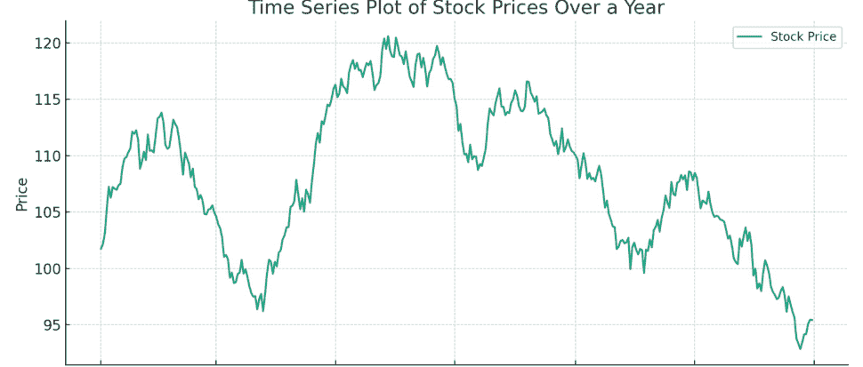
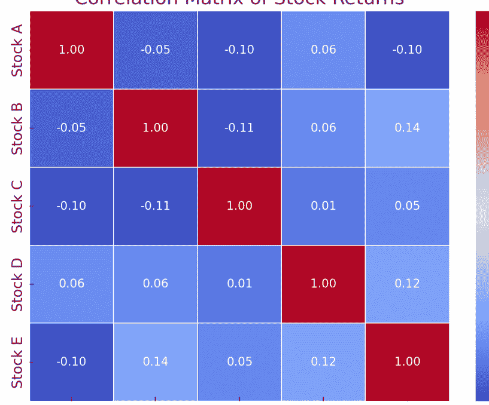
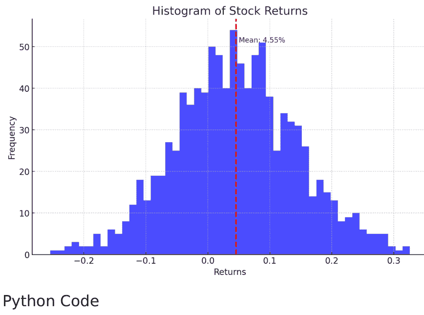
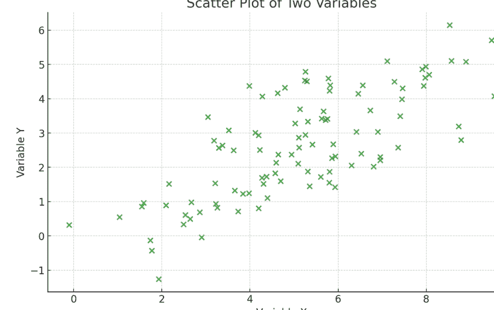
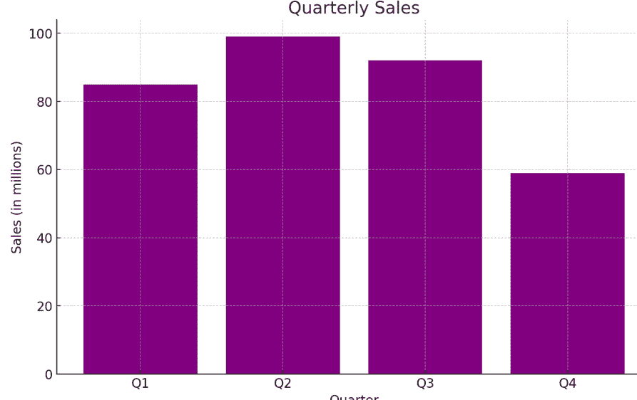
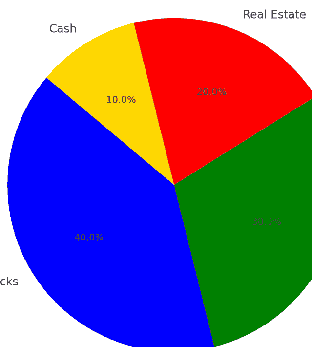
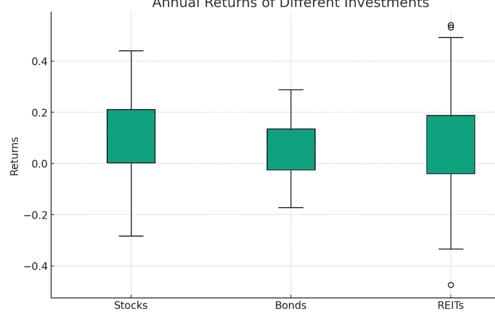
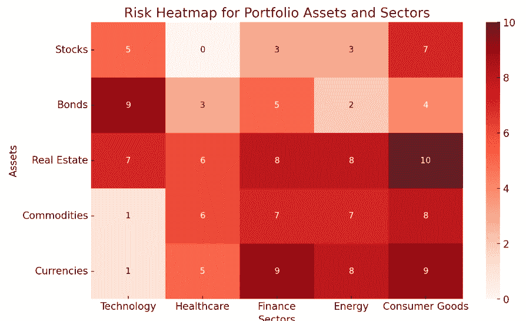

**这是一场数字游戏**


## 金融分析师

2024年量化金融综合应用指南

作者：海登·范德波斯特 MBA.BA

## 金融分析师

海登·范德波斯特

Reactive Publishing


*贪婪是好的*

戈登·盖柯（"迈克尔·道格拉斯"）~ 《华尔街》1987年

## 目录

- [书名页](Title Page)
- [题记](Epigraph)
- [前言](Preface)
- [序言](Forward)
- [第1章：解读期权](Chapter 1: Deciphering Options)
- [第2章：金融Python编程基础](Chapter 2: Python Programming Fundamentals for Finance)
- [第3章：理解布莱克-斯科尔斯模型](Chapter 3: Comprehending the Black Scholes Model)
- [第4章：深入探索希腊字母](Chapter 4: An In-Depth Exploration of the Greeks)
- [第5章：使用Python分析市场数据](Chapter 5: Analyzing Market Data with Python)
- [第6章：在Python中实现布莱克-斯科尔斯公式](Chapter 6: Implementation of the Black Scholes Formula in Python)
- [第7章：期权交易策略](Chapter 7: Strategies for Option Trading)
- [第8章：交易与Python高级概念](Chapter 8: Advanced Concepts in Trading and Python)
- [第9章：实践案例研究与应用](Chapter 9: Practical Case Studies and Applications)
- [后记](Epilogue)
- [附加资源](Additional Resources)
- [如何安装Python](How to install python)
- [金融Python库](Python Libraries for Finance)
- [关键Python编程概念](Key Python Programming Concepts)
- [如何编写Python程序](How to write a Python Program)
- [使用Python进行金融分析](Financial Analysis with Python)
- [方差分析](Variance Analysis)
- [趋势分析](Trend Analysis)
- [水平与垂直分析](Horizontal and Vertical Analysis)
- [比率分析](Ratio Analysis)
- [现金流分析](Cash Flow Analysis)
- [情景与敏感性分析](Scenario and Sensitivity Analysis)
- [资本预算](Capital Budgeting)
- [盈亏平衡分析](Break-even Analysis)
- [创建金融数据可视化产品](Creating a Data Visualization Product in Finance)
- [数据可视化指南](Data Visualization Guide)
- [算法交易总结指南](Algorithmic Trading Summary Guide)
- [金融数学](Financial Mathematics)
- [布莱克-斯科尔斯模型](Black-Scholes Model)
- [希腊字母公式](The Greeks Formulas)
- [金融随机微积分](Stochastic Calculus For Finance)
- [布朗运动（维纳过程）](Brownian Motion (Wiener Process))
- [伊藤引理](Itô's Lemma)
- [随机微分方程（SDEs）](Stochastic Differential Equations (SDEs))
- [几何布朗运动（GBM）](Geometric Brownian Motion (GBM))
- [鞅](Martingales)

## 前言

在金融市场不断演变的格局中，技术与金融的结合催生了投资策略和分析方法的新纪元。《金融分析师：2024年量化金融综合应用指南》是我穿越复杂金融分析世界的旅程结晶，特别聚焦于算法交易、使用布莱克-斯科尔斯模型的期权交易、随机微积分以及数据可视化艺术这些开创性领域。

本书的设计不仅是一本教科书，更是一座连接量化金融理论基础与当今革命性金融产业实际应用的桥梁。2024年标志着这段旅程中的一个重要节点，复杂的分析技术与先进的计算工具的融合已成为金融分析师不可或缺的要素。

本指南的核心是使用Python进行算法交易，这门学科使得曾经专属于机构交易者的复杂交易策略得以普及。Python凭借其丰富的库和社区支持，成为开发、测试和部署算法交易策略的完美工具包。通过实践示例和真实案例研究，我们深入探讨了创建能够精准高效驾驭市场的算法的机制。

期权交易固有的复杂性和风险，通过布莱克-斯科尔斯模型的视角得以阐明。本部分旨在为您配备准确为期权定价并制定能在管理风险的同时提升投资组合回报策略的知识。随机微积分作为现代金融理论的基石，以易于理解的方式呈现，使您能够掌握模拟金融市场固有随机性的随机过程。

数据可视化，这个常被低估的量化金融方面，得到了应有的关注。在当今数据驱动的世界中，有效传达复杂数据和见解的能力与分析本身同样关键。本书为您提供了创建直观且强大可视化的工具和技术，这些可视化能够为决策提供信息，并揭示隐藏在海量数据集中的模式。

《金融分析师：2024年量化金融综合应用指南》不仅仅是一本书；它是雄心勃勃的金融分析师在驾驭现代金融格局复杂性时的伴侣。无论您是寻求扩展工具包的经验丰富的专业人士，还是职业生涯初期的新锐分析师，本指南都旨在赋予您在动态的量化金融世界中茁壮成长所需的知识、技能和见解。

当我们站在可能是金融分析史上最激动人心的时代的门槛上时，我邀请您加入我的旅程。让我们一起，以Python、数学严谨性和不懈的好奇心为武器，探索量化金融的前沿，揭开金融市场的秘密。

欢迎来到金融的未来。

## 序言

《金融分析师：2024年量化金融综合应用指南》不仅是这段旅程的见证，也是那些在金融分析复杂道路上探索者的灯塔。除了深入探讨算法交易、期权定价、随机微积分和数据可视化的核心章节外，本指南还以其广泛的附加资源部分脱颖而出，这些资源经过精心策划，旨在丰富您对关键概念的理解和掌握。

这个附加资源部分不仅仅是一个附录；它是一个精心打造的资源库，旨在补充主要内容，为读者提供全面的学习体验。无论您是在钻研布莱克-斯科尔斯模型的细微差别，探索随机微积分的深度，还是寻求用Python完善您的算法交易策略，所提供的资源都将您的学习之旅延伸到书籍的常规边界之外。

对于每一章，我们都识别了补充材料，范围从基础文本到前沿研究论文、在线课程、互动工具和实践社区。选择这些资源旨在提供指导、替代视角和实践见解，以加深您对复杂主题的理解。它们是本书讨论的理论框架与当今推动量化金融创新的实际应用之间的桥梁。

纳入这些资源凸显了我们不仅教育而且赋能读者的承诺。我们认识到量化金融领域在不断发展，新理论不断涌现，技术飞速进步。因此，对于任何渴望在该领域脱颖而出的金融分析师来说，紧跟这些发展至关重要。附加资源部分旨在成为您在这项努力中的指南针，引导您进行进一步的研究、讨论和探索。

此外，我们鼓励读者积极参与这些资源。用实践练习挑战自己，参与论坛和讨论，并将所学应用于真实数据集。本部分的真正价值在于它能够激发您去质疑、实验和创新。

当您翻阅本指南并深入其附加资源时，请记住，通往量化金融精通之路既是个人的也是专业的追求。它需要好奇心、奉献精神以及探索未知领域的意愿。有了《金融分析师：2024年量化金融综合应用指南》作为您的向导，以及丰富的附加资源可供您使用，您已准备好踏上这段激动人心的旅程。

# 第一章：解读期权

期权交易是一幅画布，为经验丰富的专业人士和雄心勃勃的初学者提供了广泛的机会，以降低风险、进行投机并制定计划。从本质上讲，期权交易涉及购买或出售在特定时间段内以预定价格购买或出售资产的权利，但不是义务。这种复杂的金融工具主要表现为两种形式：看涨期权和看跌期权。看涨期权赋予持有者在期权到期前以指定的执行价格购买资产的特权。相反，看跌期权则赋予其所有者以执行价格出售资产的权利。期权的吸引力源于其适应性。它们可以根据个人的风险承受能力，表现得既谨慎又具投机性。

投资者可能使用期权来保护其投资组合免受市场低迷的影响，而交易者则可能利用它们来利用市场预测。期权也是通过多样化策略产生收入的强大工具，例如卖出备兑看涨期权或构建复杂的价差组合，这些组合依赖于资产波动性或时间的流逝。期权的定价是多种因素的优雅相互作用，包括标的资产的当前价格、执行价格、到期前的剩余时间、市场波动性和无风险利率。这些因素的相互作用产生了期权的权利金——即获得期权所需支付的价格。为了熟练驾驭期权市场，交易者必须精通其独特的语言和衡量标准。诸如“实值”、“虚值”和“平值”等术语概括了资产价格与执行价格之间的关系。同时，“未平仓合约”和“成交量”则作为市场活力和交易活动的指标。

此外，期权的风险和回报特征是不对称的。买方的最大损失是支付的权利金，而利润潜力可能很大，特别是对于看涨期权，如果标的资产价格飙升。然而，期权的卖方承担更大的风险；他们可能预先收取权利金，但如果市场走势不利，他们的损失可能相当可观。理解影响期权交易的众多因素，类似于掌握一个复杂的战略游戏。它需要理论知识、实践能力和分析思维的融合。随着我们深入探讨期权交易的机制，我们将剖析这些组成部分，为后续的策略和分析奠定坚实的基础。在接下来的章节中，我们将深入探讨看涨期权和看跌期权的复杂性，阐明期权定价的关键重要性，并介绍著名的布莱克-斯科尔斯模型——一个引导交易者穿越市场不确定性的、富有启发性的数学工具。

我们的旅程将基于实践经验，利用Python的强大库，并通过使概念生动起来的例子来丰富内容。每一步，读者不仅将获得知识，还将获得在现实交易世界中应用这些理论所需的实用技能。

## 解码看涨期权和看跌期权：期权交易的基础

在探索看涨期权和看跌期权时，我们发现自己正处于期权交易的核心。这两种基本工具是构建期权策略的基石。看涨期权可以比作拥有一把宝箱的钥匙，并有一段特定的时间来决定是否打开它。如果宝箱（标的资产）升值，钥匙持有者（看涨期权）可以通过行使以先前设定的价格购买的权利，然后以当前更高的价格出售，从而获利。然而，如果预期的升值在期权到期前未能实现，钥匙就变得一文不值，持有者的损失仅限于为该期权支付的权利金。

```python
### 计算看涨期权利润
def call_option_profit(stock_price, strike_price, premium):
    return max(stock_price - strike_price, 0) - premium

#### 示例值
stock_price = 110  # 当前股票价格
strike_price = 100  # 看涨期权的执行价格
premium = 5  # 为看涨期权支付的权利金

#### 计算利润
profit = call_option_profit(stock_price, strike_price, premium)
print(f"看涨期权的利润为: ${profit}")
```

另一方面，看跌期权可以比作一份保险单。它为保单持有人提供了以执行价格出售标的资产的自由，作为防止资产价值下跌的保护。如果市场价格跌破执行价格，看跌期权就会增值，允许持有者以高于当前市场价格的价格出售资产。然而，如果资产保持或增加价值，看跌期权就会在未使用的情况下到期——类似于一份不必要的保险单——持有者将承担等于为这份保护所支付的权利金的损失。

```python
### 计算看跌期权利润
def put_option_profit(stock_price, strike_price, premium):
    return max(strike_price - stock_price, 0) - premium

#### 示例值
stock_price = 90  # 当前股票价格
strike_price = 100  # 看跌期权的执行价格
premium = 5  # 为看跌期权支付的权利金

#### 计算利润
profit = put_option_profit(stock_price, strike_price, premium)
print(f"看跌期权的利润为: ${profit}")
```

看涨期权的内在价值取决于股票价格超过执行价格的程度。相反，看跌期权的内在价值则由执行价格超过股票价格的程度来衡量。在这两种情况下，如果期权是“实值”的，它就具有内在价值。如果不是，它的价值纯粹是外在的，反映了它在到期前变得有利可图的可能性。权利金本身不是一个任意的数字，而是使用考虑了诸如资产当前价格、期权的执行价格、到期前的剩余时间、资产的预期波动性以及当前的无风险利率等因素的模型精心计算出来的。这些计算可以很容易地在Python中实现，提供了一种实践方法来理解期权定价的动态。随着我们的进展，我们将分解这些定价模型，并发现希腊字母——期权对各种市场因素敏感性的动态衡量指标——如何指导我们的交易决策。正是通过这些概念，交易者可以制定从简单到高度复杂的策略，始终在追求盈利的同时专注于风险管理。深入期权交易，我们将揭示这些工具的战略应用以及它们如何被用来实现各种投资目标。以Python为我们的分析伙伴，我们将解开期权的奥秘，并照亮在这条迷人的领域中成为熟练交易者的道路。

## 揭示期权定价的重要性

期权定价不仅仅是一个数字练习；它是建立期权交易世界的基础。它赋予了驾驭市场波动不可预测水域所需的智慧，保护交易者免受不确定性的影响。在期权世界中，价格是指南，引导交易者做出明智的决策。它涵盖了一系列因素，每一个都揭示了关于标的资产未来的见解。期权的价格反映了市场的集体情绪和预期，通过复杂的数学模型提炼成一个单一的数值。

```python
### 用于期权定价的布莱克-斯科尔斯模型
import math
from scipy.stats import norm

def black_scholes_call(S, K, T, r, sigma):
    # S: 当前股票价格
    # K: 期权的执行价格
    # T: 以年为单位的到期时间
    # r: 无风险利率
    # sigma: 股票的波动性
    d1 = (math.log(S / K) + (r + 0.5 * sigma**2) * T) / (sigma * math.sqrt(T))
    d2 = d1 - sigma * math.sqrt(T)
    call_price = S * norm.cdf(d1) - K * math.exp(-r * T) * norm.cdf(d2)
    return call_price

#### 示例值
current_stock_price = 100
strike_price = 100
time_to_expiration = 1  # 1年
```

risk_free_rate = 0.05 # 5%
volatility = 0.2 # 20%

## 计算看涨期权价格
call_option_price = black_scholes_call(current_stock_price,
strike_price, time_to_expiration, risk_free_rate, volatility)
print(f"The call option price is: ${call_option_price:.2f}")

理解这个价格有助于交易者确定期权的公允价值。它使他们能够识别被高估或低估的期权，这可能预示着潜在的机会或风险。掌握期权定价的复杂性，等同于掌握估值这门艺术本身，这是金融所有领域的关键技能。此外，期权定价是一个动态过程，受到市场不断变化的条件的影响。到期前的剩余时间、标的资产的波动性以及当前的利率是影响期权价格的因素之一。

这些变量不断变化，导致价格像潮汐响应月相周期一样波动。定价模型，如同古代学者的著作，是复杂的，需要深入理解才能正确应用。它们并非完美无缺，但为交易者提供了基础，使其能够对期权的价值做出有根据的假设。Python 在这一过程中充当了强大的工具，将复杂的算法简化为可执行的代码，能够快速适应市场变化。期权定价的重要性超越了单个交易者。它是市场效率的重要组成部分，有助于建立流动性和期权市场的平稳运行。它使得创建对冲策略成为可能，即利用期权来管理风险，并为投机活动提供信息，交易者旨在从波动中获利。

因此，让我们继续这段旅程，并理解期权定价不仅仅是学习一个公式；而是解锁一项关键技能，它将作为向导，指引我们在广阔的期权交易宇宙中前行。

## 揭秘布莱克-斯科尔斯模型：期权估值的精髓

当代金融理论的核心是布莱克-斯科尔斯模型，这是一个复杂的框架，彻底改变了期权定价的方法。该模型由经济学家费希尔·布莱克、迈伦·斯科尔斯和罗伯特·默顿在 1970 年代初提出，提供了欧式期权价格的理论估计。布莱克-斯科尔斯模型基于市场流动性的假设，即期权及其标的资产可以持续交易。它假设标的资产的价格遵循几何布朗运动，其特点是波动率恒定且收益率呈正态分布。这种随机过程创造了随机游走，这是模型概率定价方法的基础。

```python
### Black-Scholes Model for Pricing European Call Options
import numpy as np
from scipy.stats import norm

#### S: current stock price
#### K: strike price of the option
#### T: time to expiration in years
#### r: risk-free interest rate
#### sigma: volatility of the underlying asset

### Calculate d1 and d2 parameters
d1 = (np.log(S / K) + (r + 0.5 * sigma**2) * T) / (sigma * np.sqrt(T))
d2 = d1 - sigma * np.sqrt(T)

#### Calculate the price of the European call option
call_price = (S * norm.cdf(d1)) - (K * np.exp(-r * T) * norm.cdf(d2))
return call_price

#### Example values for a European call option
current_stock_price = 50
strike_price = 55
time_to_expiration = 0.5 # 6 months
risk_free_rate = 0.01 # 1%
volatility = 0.25 # 25%

#### Calculate the European call option price
european_call_price = black_scholes_european_call(current_stock_price, strike_price, time_to_expiration, risk_free_rate, volatility)
print(f"The European call option price is: ${european_call_price:.2f}")
```

布莱克-斯科尔斯方程采用风险中性估值方法，其中标的资产的预期回报并不直接影响定价公式。相反，无风险利率成为关键因素，表明资产的预期回报在通过对冲调整风险后应与无风险利率保持一致。在布莱克-斯科尔斯模型的精髓中，我们遇到了“希腊字母”，它们是与模型导数相关的敏感性指标。

这些包括 Delta、Gamma、Theta、Vega 和 Rho。每个希腊字母阐明了不同的金融变量如何影响期权的价格，为交易者提供了关于风险管理的宝贵见解。布莱克-斯科尔斯公式优雅而简洁，但其影响深远。它通过建立市场参与者之间的共同语言，促进了期权市场的扩张。该模型已成为金融教育的基石，交易者工具箱中的必备工具，以及放宽其某些假设的新定价模型的基准。布莱克-斯科尔斯模型的重要性怎么强调都不为过。它能够将市场的原始数据转化为可操作的知识。

## 掌握希腊字母的力量：驾驭期权交易的海洋

理解希腊字母就像船长掌握风向和洋流。这些数学度量以希腊字母 Delta、Gamma、Theta、Vega 和 Rho 命名，每个字母在驾驭市场汹涌波涛中都扮演着至关重要的角色。它们为交易者提供了深刻的见解，了解各种因素如何影响期权的价格，进而影响他们的交易策略。Delta (\(\Delta\)) 充当期权之船的舵，表示标的资产价格每变动一个点，期权价格预期会变动多少。Delta 在 1 附近波动表明期权价格将几乎与股票同步变动，而 Delta 接近 0 则表明对股票变动的反应最小。实际上，Delta 不仅为交易者在对冲方面提供指导，还有助于评估期权最终盈利的概率。

```python
### Determining Delta for a European Call Option using the Black-Scholes Model
d1 = (np.log(S / K) + (r + sigma**2 / 2) * T) / (sigma * np.sqrt(T))
delta = norm.cdf(d1)
return delta

#### Implement the calculate_delta function using the previous example's parameters
call_option_delta = calculate_delta(current_stock_price, strike_price, time_to_expiration, risk_free_rate, volatility)
print(f"The Delta of the European call option is: {call_option_delta:.2f}")
```

Gamma (\(\Gamma\)) 阐明了 Delta 的变化率，提供了期权价格轨迹曲率的洞察。高 Gamma 表明 Delta 对标的资产价格的变化高度敏感，预示着期权价格可能发生快速变化——这对于需要调整头寸以维持 Delta 中性投资组合的交易者来说是宝贵的知识。Vega (\(\nu\)) 充当指示波动性影响的指南针——波动性的微小变化可能导致期权价格的大幅波动。

Vega 反映了期权对标的资产波动性变化的敏感性，帮助交易者理解与波动市场条件相关的风险和潜在回报。Theta (\(\Theta\)) 体现了时间的流逝，代表随着到期日临近，期权价值减少的速率。Theta 严峻地提醒我们，期权是容易耗损的资产，其价值随着每一天的流逝而减少。交易者必须保持警惕，因为 Theta 的持续侵蚀可能会侵蚀潜在利润。Rho (\(\rho\)) 表示期权价格对无风险利率变化的敏感性。虽然通常不如其他希腊字母重要，但在利率波动时期，尤其是对于长期期权，Rho 可能成为一个至关重要的考虑因素。这些希腊字母，单独或共同作用，为交易者构成了一个复杂的导航系统。

它们提供了一个动态框架来管理头寸、对冲风险和利用市场低效。通过将这些度量整合到交易决策中，人们获得了量化优势，将天平向那些能够专业地解读并依据希腊字母提供的信息采取行动的人倾斜。随着我们深入探讨希腊字母在交易中的作用，我们将揭示它们彼此之间以及与更广泛市场的相互作用，阐明复杂的风险状况，并能够创建稳健的交易策略。接下来的章节将详细阐述希腊字母的实际应用，从单个期权

## 构建坚实基础：利用期权的基本交易策略

当涉足期权交易领域时，掌握一系列策略至关重要，每种策略都有其自身的优点和适用情境。利用期权的基本交易技术是构建更复杂策略的基础原则。这些技术是保护投资组合和对未来市场走势进行投机的基础。在本节中，我们将深入探讨一些基本的期权技术，阐明其运作方式，并确定其适用的合适场景。看涨期权（Long Call）是一种简单且乐观的策略，它涉及购买一份看涨期权，预期标的资产的价值在期权到期前会大幅升值。这种技术提供了无限的盈利潜力，同时将风险降至最低——最大损失仅为购买期权所支付的期权费。

```python
### 看涨期权收益计算
def long_call_payoff(S, K, premium):
    return max(0, S - K) - premium

#### 示例：计算行权价为50美元、期权费为5美元的看涨期权收益
stock_prices = np.arange(30, 70, 1)
payoffs = np.array([long_call_payoff(S, 50, 5) for S in stock_prices])

plt.plot(stock_prices, payoffs)
plt.title('看涨期权收益')
plt.xlabel('到期时股票价格')
plt.ylabel('利润 / 损失')
plt.grid(True)
plt.show()
```

看跌期权（Long Put）是看涨期权策略的反向操作，适用于那些预期标的资产价格会下跌的人。通过购买看跌期权，一个人获得了以预定的行权价出售资产的权利，从而可能从市场下跌中获利。损失仅限于支付的期权费，而潜在收益可能相当可观，尽管其上限为期权费减去标的资产价格跌至零的成本。备兑看涨期权（Covered Calls）提供了一种从现有股票头寸中产生收入的方法。通过卖出针对先前持有股票的看涨期权，可以收取期权费。如果股票价格保持在行权价以下，期权将变得毫无价值，卖方可以保留期权费作为利润。如果股票价格超过行权价，股票可能会被行权卖出，但这种策略通常在预期标的股票价格不会大幅上涨时使用。

```python
### 备兑看涨期权收益计算
def covered_call_payoff(S, K, premium, stock_purchase_price):
    if S <= K:
        return S - stock_purchase_price + premium
    else:
        return K - stock_purchase_price + premium

#### 示例：计算备兑看涨期权收益
stock_purchase_price = 45
call_strike_price = 50
call_premium = 3

stock_prices = np.arange(30, 70, 1)
payoffs = np.array([covered_call_payoff(S, call_strike_price, call_premium, stock_purchase_price) for S in stock_prices])

plt.plot(stock_prices, payoffs)
plt.title('备兑看涨期权收益')
plt.xlabel('到期时股票价格')
plt.ylabel('利润 / 损失')
plt.grid(True)
plt.show()
```

保护性看跌期权（Protective Puts）用于保护股票头寸免受价值下跌的影响。通过持有标的股票并同时购买看跌期权，可以为潜在损失设定一个下限，同时不限制潜在收益。这种策略的功能类似于保险单，确保即使在最坏的情况下，损失也不会超过某个水平。这些基本策略仅代表期权交易领域的一小部分。每种策略都是一种工具，在审慎使用和适当的市场环境下是有效的。通过理解这些策略的机制及其预期目的，交易者可以更有信心地开始驾驭期权市场。此外，这些策略构成了交易者在进阶过程中将遇到的更复杂策略的基础。随着我们的深入，我们将更详细地分析这些策略，运用希腊字母（Greeks）来增强决策，并探索如何根据个人的风险承受能力和市场前景来定制每种策略。

## 驾驭交易风向：把握期权交易中的风险与回报

期权交易的吸引力在于其多功能性以及它所提供的风险与回报的不平衡性。然而，正是这些使期权具有吸引力的特性，也要求对风险有全面的理解。要成为期权交易的大师，必须善于平衡盈利的潜力与亏损的可能性。期权交易中的风险概念是多方面的，从期权费损失的基本风险到与某些交易策略相关的更复杂的风险。为了揭示这些风险并可能加以利用，交易者使用各种度量指标，通常被称为希腊字母（Greeks）。

虽然希腊字母有助于管理风险，但每个期权交易者都必须面对固有的不确定性。

```python
### 风险回报比计算
def risk_reward_ratio(max_loss, max_gain):
    return abs(max_loss / max_gain)

#### 示例：计算看涨期权的风险回报比
call_premium = 5
max_loss = -call_premium  # 最大损失是支付的期权费
max_gain = np.inf  # 看涨期权的最大收益理论上是无限的

rr_ratio = risk_reward_ratio(max_loss, max_gain)
print(f"该看涨期权的风险回报比为：{rr_ratio}")
```

主要风险之一是期权时间价值的侵蚀，称为Theta（时间衰减）。随着时间的推移，期权的时间价值会减少，如果所有其他因素保持不变，这将导致期权价格下降。随着期权接近到期日，这种衰减会加速，因此时间是一个需要考虑的关键因素，尤其是对于期权买方而言。波动率，或称Vega（维加），是另一个关键的风险因素。它衡量期权价格对标的资产波动率变化的反应。高波动率可能导致期权价格出现更大的波动，这根据所持头寸的不同，既可能是有利的，也可能是不利的。这是一把双刃剑，需要仔细考虑和管理。

```python
### 波动率对期权价格影响的计算
def volatility_impact_on_price(current_price, vega, volatility_change):
    return current_price + (vega * volatility_change)

#### 示例：计算波动率上升对期权价格的影响
current_option_price = 10
vega_of_option = 0.2
increase_in_volatility = 0.05  # 5%的上升

new_option_price = volatility_impact_on_price(current_option_price, vega_of_option, increase_in_volatility)
print(f"波动率上升5%后的新期权价格为：${new_option_price}")
```

流动性风险是另一个需要考虑的因素。标的资产流动性较差或买卖价差较大的期权合约，在交易时可能更具挑战性，因为交易行为本身可能会影响价格。这会在建仓或平仓时造成困难，可能导致交易执行效果不佳。

另一方面，期权交易的回报潜力也相当可观，并且可以在各种市场条件下实现。方向性策略，如看涨期权或看跌期权，允许交易者以明确的风险来利用其市场观点。非方向性策略，如铁鹰式组合（Iron Condor），旨在从标的资产价格缺乏显著波动中获利。只要资产价格保持在特定范围内，这些策略即使在停滞的市场中也能提供回报。除了单个策略的风险外，投资组合层面的考量也至关重要。在多种期权策略之间进行分散化投资有助于缓释风险。

例如，使用保护性看跌期权可以保护现有的股票投资组合，而像备兑看涨期权这样的创收策略则可以提高回报。

在期权交易的世界里，风险与回报之间存在着微妙的相互作用。交易者必须同时扮演编舞者和表演者的角色，既要巧妙地构建头寸，又要灵活适应市场变化。本节简要介绍了期权交易中风险与回报动态的基本原理。随着我们深入探讨，我们将进一步研究管理和优化回报的高级技巧，同时始终对两者之间的平衡保持高度关注。

## 期权市场的发展历程

追溯期权市场的渊源，会发现一个引人入胜的故事，其源头可追溯至古代。现代期权交易的起源可以追溯到17世纪的郁金香狂热时期，当时期权被用于确保未来购买郁金香的权利。这种投机狂热为我们今天所熟知的期权市场奠定了基础。

然而，期权交易的正式化发生得要晚得多。直到1973年，芝加哥期权交易所（CBOE）才成立，成为第一个促进标准化期权合约交易的有组织交易所。CBOE的出现标志着金融市场进入了一个新时代，为交易者提供了更高的透明度和监管监督。CBOE的成立恰逢布莱克-斯科尔斯模型的推出，这是一个为期权合约定价的理论框架，彻底改变了金融行业。该模型提供了一种系统性的期权估值方法，考虑了标的资产价格、行权价、到期时间、波动率和无风险利率等因素。

```python
### 欧式看涨期权的布莱克-斯科尔斯公式
from scipy.stats import norm
import math

    # S: 标的资产的现货价格
    # K: 期权的行权价
    # T: 以年为单位的到期时间
    # r: 无风险利率
    # sigma: 标的资产的波动率

    d1 = (math.log(S / K) + (r + 0.5 * sigma ** 2) * T) / (sigma * math.sqrt(T))
    d2 = d1 - sigma * math.sqrt(T)

    call_price = S * norm.cdf(d1) - K * math.exp(-r * T) * norm.cdf(d2)
    return call_price

#### 示例：计算欧式看涨期权的价格
S = 100  # 标的资产的当前价格
K = 100  # 行权价
T = 1    # 到期时间（1年）
r = 0.05 # 无风险利率（5%）
sigma = 0.2  # 波动率（20%）

call_option_price = black_scholes_call(S, K, T, r, sigma)
print(f"欧式看涨期权的布莱克-斯科尔斯价格为：${call_option_price:.2f}")
```

继CBOE之后，全球其他交易所也相继涌现，如费城证券交易所和欧洲期权交易所，为期权交易创建了国际框架。这些交易所在促进期权流动性和品种多样性方面发挥了关键作用，推动了交易策略的创新和完善。1987年的股市崩盘被证明是期权市场的一个分水岭。它凸显了健全风险管理实践的重要性，因为交易者转向期权作为对冲市场下跌的手段。这一事件也强调了理解期权复杂性及其价格影响因素的重要性。

随着技术的进步，电子交易平台应运而生，为进入期权市场创造了公平的竞争环境。这些平台促进了更快的交易、更优的定价和更广泛的选择，使散户投资者能够与机构投资者并肩作战。如今，期权市场是金融生态系统的重要组成部分，提供了多样化的工具来管理风险、产生收入和进行投机。市场已经适应了不同参与者的需求，从那些希望对冲头寸的人，到那些试图利用套利机会或对价格走势进行投机的人。期权市场的发展历程展示了人类的创造力和对金融创新的追求。当我们驾驭不断变化的金融世界格局时，历史的经验教训如同一盏明灯，提醒我们市场的韧性和适应能力。

## 杠杆的术语：期权交易术语

在没有牢固掌握其专业词汇的情况下贸然进入期权交易世界，就像没有地图就穿越迷宫一样。要进行有效的交易，必须精通期权的语言。在这里，我们将揭示构成期权话语基础的核心术语。

- **期权**：一种金融衍生品，赋予持有者权利（但非义务），在特定日期（到期日）之前或当日，以指定价格（行权价）购买（看涨期权）或出售（看跌期权）标的资产。
- **看涨期权**：一种合约，赋予买方在指定时间段内以行权价购买标的资产的权利。买方预期资产价格会上涨。
- **看跌期权**：相反，看跌期权赋予买方在指定时间段内以行权价出售资产的权利。这通常在预期资产价格下跌时使用。
- **行权价（执行价）**：期权买方可以购买（看涨）或出售（看跌）标的资产的预定价格。
- **到期日**：期权合约到期的日期。此后，期权无法行使并失效。
- **权利金**：买方支付给期权卖方（卖方）的金额。这笔费用是为了获得所赋予的权利，无论期权是否被行使。

掌握这些术语是任何有志于期权交易者的必经之路。每个术语都包含一个特定的概念，帮助交易者分析期权市场中的机会和风险。通过将这些定义与定价和风险评估中使用的数学模型相结合，交易者可以制定精确的策略，依靠Python强大的计算能力来揭示每个术语固有的复杂性。在接下来的章节中，我们将继续扩展这些基础术语，将其整合到更广泛的策略和分析中，使期权交易成为金融世界中一个强大而微妙的领域。

## 解读谜题：期权交易的监管框架

监管是守护者，确保公平竞争并维护市场诚信。期权交易凭借其复杂的策略和巨大的杠杆潜力，在一个监管网络中运作，理解这些监管对于合规和成功参与市场至关重要。在美国，证券交易委员会（SEC）和商品期货交易委员会（CFTC）是监督期权市场的前沿机构。SEC监管在股票和指数资产上交易的期权，而CFTC则监管与商品和期货相关的期权。

其他司法管辖区也有自己的监管机构，例如英国的金融行为监管局（FCA），它们执行各自的一套规则。期权主要在受监管的市场（如CBOE和ISE）上交易，这些市场受到监管机构的监督。这些市场为期权合约的标准化提供了平台，增加了流动性并建立了透明的定价机制。期权清算公司（OCC）既是期权合约的发行者也是担保者，通过确保合约义务的履行，增加了一层安全保障。这一角色对于维护期权市场的信任和降低对手方风险至关重要。金融业监管局（FINRA）是一个非政府组织，监督其成员经纪公司和交易所市场，保护投资者并确保美国资本市场的公平性。交易者和公司必须遵守严格的交易活动规则，包括保持适当的注册、满足报告要求以及进行透明的业务。

了解客户（KYC）和反洗钱（AML）等法规对于防止金融欺诈和验证客户身份至关重要。期权交易涉及重大风险，因此监管机构要求经纪商和平台向投资者提供全面的风险披露文件。这些文件告知交易者潜在的损失和期权交易的复杂性。

```python
### 期权交易监管合规清单示例

#### 定义一个简单的函数来检查期权交易的监管合规性
def check_compliance(trading_firm):
    compliance_requirements = {
        'provides_risk_disclosures_to_clients': True
    }

    for requirement, is_met in compliance_requirements.items():
        if not is_met:
```

print(f"合规问题：未满足{requirement}。")
    return False

print("所有合规要求均已满足。")
return True

trading_firm = {
    'provides_risk_disclosures_to_clients': True
}

#### 检查交易公司是否满足所有合规要求
compliance_check = check_compliance(trading_firm)
```

此代码片段展示了一个假设的、用于自动化系统中期权交易的合规检查清单。

需要指出的是，在现实中，监管合规性是复杂且不断演变的，通常需要专业的法律知识。理解监管框架不仅仅是遵循法律；它还涉及认识到这些法规在维护市场完整性和保护个人交易者方面所提供的保障。随着我们深入探讨期权交易，牢记这些法规至关重要，因为它们塑造了制定和执行策略的指导方针。展望未来，随着我们探索将合规性融入交易方法的实际操作，监管框架与交易策略之间的互动将变得日益明显。

# 第2章：金融Python编程基础

高效配置Python环境对于使用Python进行金融分析至关重要。搭建这一基础确保了期权交易所需的工具和库触手可及。此过程的第一步是安装Python本身。可以从Python官方网站或通过包管理器（如macOS的Homebrew和Linux的apt）获取最新版本的Python。必须通过在终端执行`python --version`命令来验证Python是否正确安装。集成开发环境（IDE）是将软件开发所需基本工具组合在一起的软件套件。对于Python，知名的IDE包括PyCharm、Visual Studio Code和Jupyter Notebooks。它们各自提供独特的功能，如代码补全、调试工具和项目管理。IDE的选择通常取决于个人偏好和项目的具体需求。在Python中，虚拟环境充当隔离的系统，可以在其中为特定项目安装包和依赖项，而不会影响全局Python安装。

像venv和virtualenv这样的工具有助于管理这些环境，这在处理具有不同需求的多个项目时尤其有价值。包增强了Python的功能，对于进行期权交易分析至关重要。像pip这样的包管理器用于安装和管理这些包。对于金融应用，重要的包包括用于数值计算的numpy、用于数据操作的pandas、用于数据可视化的matplotlib和seaborn，以及用于科学计算的scipy。

```python
### 虚拟环境设置和包安装演示

#### 导入必要的模块
import subprocess

#### 创建一个名为'trading_env'的新虚拟环境
subprocess.run(["python", "-m", "venv", "trading_env"])

#### 激活虚拟环境
#### 注意：激活命令因操作系统而异
subprocess.run(["trading_env\Scripts\activate.bat"])
subprocess.run(["source", "trading_env/bin/activate"])

#### 使用pip安装包
subprocess.run(["pip", "install", "numpy", "pandas", "matplotlib", "seaborn", "scipy"])
```

```python
print("Python环境设置完成，所有必需的包已安装。")
```

此脚本展示了虚拟环境的设置以及为期权交易分析安装必要包的过程。这种自动化设置确保了交易环境保持隔离和一致，这对于协作项目尤其有利。随着Python环境现已建立，我们准备好深入研究使Python成为金融分析宝贵助手的具体语法和结构。

## 探索词汇：Python语法和操作基础

当我们探索Python的领域时，掌握其语法——定义语言结构的规则——以及Python能力所构建的基本操作至关重要。

Python的语法以其可读性和简洁性而闻名。代码块通过缩进而非花括号来界定，这促进了整洁的布局。

-   变量和算术运算：Python不需要显式声明变量，并使用赋值运算符`=`来赋值。它可以执行基本的算术运算，如加法、减法、乘法和除法。取模运算符返回除法的余数，而指数运算符用于幂计算。
-   逻辑运算：Python的逻辑运算符包括`and`、`or`和`not`。这些运算符对于通过条件语句控制程序流程至关重要。
-   比较运算：Python支持比较运算，如等于、不等于、大于、小于、大于等于和小于等于。
-   条件语句：像`if`、`elif`和`else`这样的条件语句用于根据布尔条件控制代码的执行。
-   循环：Python有`for`和`while`循环，可以多次执行一段代码。`for`循环通常与`range()`函数一起使用，而`while`循环只要条件为真就会继续执行。
-   列表：Python有称为列表的有序且可变的集合，可以容纳各种类型的对象。
-   元组：与列表类似，元组是有序但不可变的。
-   字典：Python支持字典，它是键值对的集合，是无序的、可变的且可索引的。
-   集合：Python有集合，它是唯一元素的无序集合。

```python
### 基本Python语法和操作示例

#### 变量和算术运算
a = 10
b = 5
sum_value = a + b
difference_value = a - b
product_value = a * b
quotient_value = a / b

#### 逻辑和比较运算
is_equal = (a == b)
not_equal = (a != b)
greater_than = (a > b)

#### 控制结构
if greater_than:
    print("a大于b")
else:
    print("a小于b")
if is_equal:
    print("a和b相等")

#### 循环
for i in range(5):  # 从0迭代到4
    print(i)

counter = 5
while counter > 0:
    print(counter)
    counter -= 1

#### 数据结构
list_example = [1, 2, 3, 4, 5]
tuple_example = (1, 2, 3, 4, 5)
dict_example = {'one': 1, 'two': 2, 'three': 3}
set_example = {1, 2, 3, 4, 5}

print(sum_value, difference_value, product_value,
      quotient_value, is_equal, not_equal, greater_than)
print(list_example, tuple_example, dict_example,
      set_example)
```

此代码片段涵盖了Python语法和操作的基本方面，让我们得以一窥该语言的结构和用例。通过掌握这些基础知识，可以操作数据、创建算法，并为更复杂的金融模型奠定基础。在接下来的章节中，我们将深入探讨Python的面向对象特性，它能够将数据和函数封装成可重用的组件。当我们开发适应性强的金融模型和模拟以应对不断变化的期权交易格局时，这种范式将非常宝贵。

## 揭示结构与范式：Python的面向对象编程

在软件开发的世界里，面向对象编程（OOP）是一种核心范式，它不仅组织代码，还通过现实世界的对象对其进行抽象。Python以其多功能性拥抱了OOP，使开发人员能够构建模块化和可扩展的金融应用程序。

-   类：Python使用类作为创建对象的模板。一个类包含对象的数据以及操作这些数据的方法。
-   对象：类的一个特定实例，代表类所描述概念的一个具体示例。
-   继承：一种机制

# 掌握Python的利器：用于金融分析的库

Python的生态系统提供了大量专门用于辅助金融分析的库。这些库是工具，熟练运用它们，便能从数据中解锁洞见，并助力执行复杂的金融模型。

- **NumPy**：作为Python数值计算的核心。它提供了对数组和矩阵的支持，以及一系列用于对这些数据结构执行操作的数学函数。
- **pandas**：一个强大的数据操作和分析工具，pandas引入了DataFrame和Series对象，它们非常适合金融领域固有的时间序列数据。
- **matplotlib**：一个绘图库，能够通过图表和图形实现数据可视化，这在解读金融趋势和模式方面起着至关重要的作用。
- **SciPy**：在NumPy的基础上扩展，SciPy通过额外的优化、线性代数、积分和统计模块增强了功能。
- **scikit-learn**：尽管应用更为广泛，但scikit-learn对于实现机器学习模型至关重要，这些模型可以预测市场走势、识别交易信号等。

Pandas是金融分析师的基础工具，提供了一种轻松的方式来操作、分析和可视化金融数据。

```python
import pandas as pd

### Extract historical stock data from a CSV file
df = pd.read_csv('stock_data.csv', parse_dates=['Date'], index_col='Date')

### Compute the moving average
df['Moving_Avg'] = df['Close'].rolling(window=20).mean()

### Show the initial rows of the DataFrame
print(df.head())
```

在上面的代码片段中，pandas被用于读取股票数据、计算移动平均线（一种常用的金融指标）并显示结果。尽管简单，pandas在剖析和解读金融数据方面拥有巨大的威力。能够可视化复杂的数据集是无价的。

matplotlib是Python中生成静态、交互式和动画可视化的首选工具。

```python
import matplotlib.pyplot as plt

### Assuming 'df' is a pandas DataFrame that contains the stock data
df['Close'].plot(title='Stock Closing Prices')
plt.xlabel('Date')
plt.ylabel('Price (USD)')
plt.show()
```

这里，matplotlib被用于绘制我们DataFrame 'df'中股票的收盘价。这种可视化表示有助于识别金融数据中的趋势、模式和异常。虽然SciPy增强了金融建模所需的计算能力，但scikit-learn将机器学习引入了金融领域，提供了用于回归、分类、聚类等的算法。

```python
from sklearn.linear_model import LinearRegression

### Assuming 'X' represents our features and 'y' represents our target variable
model = LinearRegression()
model.fit(X_train, y_train)

### Predicting future values
predictions = model.predict(X_test)

### Evaluating the model
print(model.score(X_test, y_test))
```

在这个例子中，我们使用scikit-learn训练了一个线性回归模型——这是预测建模中的基础算法。该模型可用于基于历史数据预测股票价格或回报。通过利用这些Python库，可以进行一场数据驱动的金融分析和谐交响乐。这些工具与面向对象编程原则相结合，能够创建高效、可扩展且稳健的金融应用程序。

# 揭秘Python的数据类型与结构：金融分析的基础

数据类型和结构是任何编程工作的基础，尤其是在金融分析领域，数据的准确表示和组织可以区分洞见与疏忽。Python的基本数据类型包括整数、浮点数、字符串和布尔值。这些类型满足最基本的数据形式——数字、文本和真/假值。例如，一个整数可以代表交易的股票数量，而一个浮点数可以代表股票价格。

为了处理更复杂的数据，Python引入了高级结构，如列表、元组、字典和集合。

- **列表（枚举）**：能够存储不同类型信息的顺序集合。在金融世界中，列表可以作为跟踪投资组合中股票代码或一系列交易金额的工具。
- **元组（不可变序列）**：类似于列表，但具有不可更改的特性。它们是存储应保持不变的数据的理想选择，例如一组预定的金融分析日期。
- **字典（关联数组）**：不一定按特定顺序排列，这些结构由键值对组成。它们对于建立关联特别有价值，例如将股票代码与其对应的公司名称联系起来。
- **集合（唯一元素的无序集合）**：集合是不同元素的集合，不按特定顺序组织。它们可以有效地管理无重复信息，例如已执行交易的唯一集合。

```python
### Establish a comprehensive associative array for a stock
### and its properties
stock = {
    'Ticker': 'AAPL',
    'Price': 150.00,
    'Volume': 1000000,
    'Stock Exchange': 'NASDAQ'
}

### Accessing the price of the stock
print(f"The current price of the stock with the ticker {stock['Ticker']} is {stock['Price']}")
```

在提供的代码片段中，使用了一个关联数组将各种属性与一只股票关联起来。这种结构便于快速访问和操作相关的金融数据。Python的面向对象编程允许通过类形成自定义数据类型。这些类可以表示复杂的金融工具或模型。

```python
class Stock:
    def __init__(self, ticker, price, volume):
        self.ticker = ticker
        self.price = price
        self.volume = volume

    def update_price(self, new_price):
        self.price = new_price
```

# 生成 Stock 类的实例

```python
apple_stock = Stock('AAPL', 150.25, 1000000)

### Modifying the stock price
apple_stock.update_price(155.00)

print(f"Updated price of {apple_stock.ticker}: {apple_stock.price}")
```

在此示例中，一个名为 `Stock` 的自定义类封装了与股票相关的信息和行为。此实例演示了类如何简化金融操作，例如更新股票价格。熟练掌握并运用适当的数据类型和结构对于金融分析至关重要。它保证了金融信息的高效存储、检索和操作。在接下来的章节中，我们将探讨这些结构的实际应用、使用 pandas 管理金融数据集，以及运用可视化技术来揭示数据中隐藏的叙事。

# 使用 Pandas 掌握金融数据操作

在 Python 数据分析领域，pandas 库堪称无与伦比的资源，为管理和分析金融数据集提供了强大、多功能且高效的工具。

其 DataFrame 对象是一个动态且多功能的工具，可以轻松处理和操作各种数据——这在金融领域很常见。金融信息可能复杂且难以处理，包含各种频率、数据缺口和混合的数据类型。Pandas 专门设计用于优雅地处理这些挑战。它通过提供重采样、插值和时间平移数据集的功能，使得操作时间序列数据成为可能，这对金融分析至关重要。此外，Pandas 简化了从各种来源（如 CSV 文件、SQL 数据库或在线来源）读取数据的过程。只需一行代码，就可以将包含历史股价的 CSV 文件读入 DataFrame 并开始分析。

```python
import pandas as pd

### Read a CSV file containing Apple's stock history
apple_stock_history = pd.read_csv('AAPL_stock_history.csv', index_col='Date', parse_dates=True)

### Display the first few rows of the DataFrame
print(apple_stock_history.head())
```

在给定的代码片段中，`read_csv` 函数用于将股票历史数据导入 DataFrame。`index_col` 和 `parse_dates` 参数确保日期信息被正确地处理为 DataFrame 的索引，从而便于基于时间的操作。Pandas 在为分析准备和清理数据方面表现出色。它可以处理缺失值、转换数据类型，并根据复杂的条件过滤数据集。例如，只需几行代码，就可以轻松调整股票拆分或股息，同时确保被分析数据的完整性。

```python
### Fill missing values using the forward fill method
apple_stock_history.fillna(method='ffill', inplace=True)

### Calculate the daily percentage change of closing prices
apple_stock_history['Daily_Return'] = apple_stock_history['Close'].pct_change()

### Display the updated DataFrame
print(apple_stock_history[['Close', 'Daily_Return']].head())
```

在此例中，`fillna` 用于处理缺失的数据点，而 `pct_change` 计算每日收益率，这是金融分析中的一个关键指标。除了数据操作，pandas 还提供滚动统计函数，例如移动平均线，这些在识别金融市场趋势和模式方面起着至关重要的作用。

```python
### Calculate the 20-day moving average of the closing price
apple_stock_history['20-Day_MA'] = apple_stock_history['Close'].rolling(window=20).mean()

### Plotting the closing price and the moving average
apple_stock_history[['Close', '20-Day_MA']].plot(title='AAPL Stock Price and 20-Day Moving Average')
```

`rolling` 方法与 `mean` 结合，确定了指定窗口内的移动平均值，为股票的表现提供了见解。分析师经常需要合并来自不同来源的数据集。Pandas 的合并和连接功能促进了独立数据集的集成，从而实现全面分析。Pandas 是 Python 数据分析生态系统中的基石，尤其适用于金融应用。其广泛的功能使其成为金融分析师和量化研究员不可或缺的工具。通过掌握 pandas，可以将原始金融数据转化为可操作的见解，为明智的交易决策铺平道路。

# 通过 Matplotlib 和 Seaborn 的可视化揭示金融洞察

“一图胜千言”这句谚语在金融分析中尤为贴切。数据的可视化表示不仅方便，而且是一种强大的技术，可以揭示那些可能隐藏在数字行中的见解。Matplotlib 和 Seaborn 是 Python 数据可视化领域最著名的两个库，它们使分析师能够轻松创建各种静态、交互式和动画可视化。Matplotlib 作为一个多功能库，提供了类似 MATLAB 的界面来生成各种图表。它特别适合制作标准的金融图表，包括折线图、散点图和条形图，这些图表能有效地展示随时间变化的趋势和模式。

```python
import matplotlib.pyplot as plt
import pandas as pd

### Load the financial data into a DataFrame
apple_stock_history = pd.read_csv('AAPL_stock_history.csv', index_col='Date', parse_dates=True)

### Plot the closing price
plt.figure(figsize=(10,5))
plt.plot(apple_stock_history.index, apple_stock_history['Close'], label='AAPL Close Price')
plt.title('Apple Stock Closing Price Over Time')
plt.xlabel('Date')
plt.ylabel('Price (USD)')
plt.legend()
plt.show()
```

上述代码片段使用 Matplotlib 创建了苹果公司收盘价的可视化。`plt.figure` 函数用于指定图表的大小，`plt.plot` 函数用于绘制折线图。尽管 Matplotlib 功能强大，但 Seaborn 建立在其功能之上，提供了更高级别的接口，简化了创建更复杂和信息丰富的可视化的过程。

Seaborn 包含多种预定义的主题和调色板，增强了统计图形的吸引力和可解释性。

```python
import seaborn as sns

### Set the aesthetic style of the plots
sns.set_style('whitegrid')

### Plot the distribution of daily returns using a histogram
plt.figure(figsize=(10,5))
sns.histplot(apple_stock_history['Daily_Return'].dropna(), bins=50, kde=True, color='blue')
plt.title('Distribution of Apple Stock Daily Returns')
plt.xlabel('Daily Return')
plt.ylabel('Frequency')
plt.show()
```

此代码片段利用 Seaborn 生成了一个带有核密度估计（KDE）叠加的直方图，清晰地可视化了苹果股票每日收益率的分布。金融分析师经常处理以复杂方式交互的多个数据点。Matplotlib 和 Seaborn 可以结合使用，创建一个整合了各种数据集的连贯可视化。

```python
### Plotting both the closing price and the 20-day moving average
plt.figure(figsize=(14,7))
plt.plot(apple_stock_history.index, apple_stock_history['Close'], label='AAPL Close Price')
plt.plot(apple_stock_history.index, apple_stock_history['20-Day_MA'], label='20-Day Moving Average', linestyle='--')
plt.title('Apple Stock Price and Moving Averages')
plt.xlabel('Date')
plt.ylabel('Price (USD)')
plt.legend()
plt.show()
```

在上面的例子中，我们将 20 日移动平均线叠加在收盘价之上，清晰地展示了股票相对于其近期历史的动量。数据可视化的力量在于其传达故事的能力。通过图表，复杂的金融概念和趋势变得易于理解和引人入胜。有效的视觉叙事可以揭示投资的风险回报状况、市场状态以及经济事件的潜在影响。通过利用 Matplotlib 和 Seaborn，金融分析师可以将静态数据转化为动态叙事。这种以视觉方式传达金融见解的能力是一项宝贵的技能，为前面关于 pandas 的章节中呈现的分析增添了深度和清晰度。

随着本书的深入，读者将遇到这些工具的进一步应用，构建一套全面的技能组合，以应对使用 Python 进行期权交易的多方面挑战。

# 揭示 NumPy 在金融高强度数值分析中的威力

NumPy，即 Numerical Python 的缩写，构成了 Python 数值计算的基础。它提供了一个比传统 Python 列表快 50 倍的数组对象，使其成为处理大型数据集和复杂计算的金融分析师的必备工具。NumPy 的核心是 ndarray，一个支持快速数组导向算术运算和灵活广播能力的多维数组对象。这种基本功能使分析师能够执行向量化操作，这些操作既高效又语法清晰。在上面的代码片段中，我们利用 NumPy 库生成了一个股票价格数组。通过使用 `diff` 函数，我们可以高效地计算每日股价的百分比变化。

金融数据分析通常涉及统计计算，例如确定均值、中位数、标准差和相关性。幸运的是，NumPy 提供了专门设计的内置函数，可以快速高效地在数组上执行这些任务。

例如，我们可以分别使用 `mean` 和 `std` 函数计算股票价格的均值和标准差。这些数值提供了对股票平均价格和波动性的洞察。

线性代数在许多金融模型中扮演着至关重要的角色，而 NumPy 的子模块 `linalg` 提供了一套全面的线性代数运算。它使我们能够执行投资组合优化、构建协方差矩阵，并解决金融问题中常见的线性方程组。在提供的示例中，我们为五种证券生成模拟收益率，并计算相应的协方差矩阵，这有助于我们理解投资组合内的关系和风险。

使用 NumPy 的一个关键优势是其效率。它是用 C 语言实现的，可以将循环推送到编译层。因此，对大数组的数值运算可以显著加快执行速度。这种速度在金融领域尤其宝贵，因为即使是毫秒之差也可能在盈利和亏损之间产生巨大差异。

最后，我们通过为一系列执行价格实现 Black-Scholes 公式，展示了 NumPy 向量化运算的使用。这使我们能够快速高效地计算多个执行价格的期权价格。通过利用 NumPy 的强大功能，我们获得了计算能力，并为更复杂的金融分析和交易策略的实施奠定了基础。

在金融领域，数据极其宝贵。掌握文件输入/输出（I/O）操作就像打开一个宝箱，因为它使金融分析师能够高效地存储、检索和操作数据。Python 凭借其清晰的语法和强大的库，成为执行这些任务的完美工具，从而实现数据驱动的决策。

处理金融数据集时，这些数据集有多种格式，如 CSV、Excel 和 JSON，Python 的标准库提供了 `csv` 和 `json` 等模块来处理这些文件类型。像 `pandas` 这样的外部库则提供了更高级的数据操作和分析工具。在提供的示例中，我们使用 `pandas` 将包含股票数据的 CSV 文件读入 DataFrame。这种数据结构特别适合复杂的数据操作和分析，使其成为金融分析师的宝贵资产。

在开发健壮的金融应用程序时，内置调试器 `pdb` 提供的帮助是无价的，尤其是在代码迷宫中导航时。它使开发人员能够设置断点、浏览代码、检查变量和评估表达式。

```python
import pdb

### 一个计算指数移动平均线（EMA）的函数
pdb.set_trace()
ema = data.ewm(span=span, adjust=False).mean()
return ema

### 示例数据
prices = [22, 24, 23, 26, 28]

### 计算 EMA 并设置断点进行调试
ema = calculate_ema(prices, span=5)
```

在给定的场景中，`pdb.set_trace()` 被策略性地放置在计算 EMA 之前。

在执行过程中，脚本会在此处暂停，提供一个交互式会话来检查程序状态。这在排查金融计算中出现的难以捉摸的错误时尤其有利。错误是开发过程中的固有部分。有效的错误处理确保当问题出现时，程序可以优雅地恢复或退出，并向用户提供有意义的反馈。Python 的 `try` 和 `except` 块充当安全网，用于捕获异常并优雅地处理它们。

```python
financial_data = pd.read_csv(file_path)
return financial_data
print(f"Error: The file {file_path} does not exist.")
print(f"Error: The file {file_path} is empty.")
print(f"An unexpected error occurred: {e}")
```

函数 `parse_financial_data` 旨在从给定的文件路径读取金融数据。`try` 块尝试执行此操作，而 `except` 块捕获特定异常，使程序员能够提供清晰的错误消息并适当处理每种情况。断言扮演着哨兵的角色，保护代码的关键部分。它们用于确认在程序继续执行之前满足特定条件。如果断言失败，程序会引发 `AssertionError`，提醒程序员可能存在错误或无效状态。

```python
assert len(portfolio_returns) > 0, "Returns list is empty."
### 最大回撤计算的其余部分
```

在此代码片段中，断言确保在继续计算最大回撤之前，投资组合收益率列表不为空。这种主动方法有助于防止可能导致错误金融结论的错误。日志记录是一种记录应用程序内流程和事件的技术。它是调试过程中进行事后分析的宝贵工具。Python 的 `logging` 模块提供了一个灵活的框架，用于捕获不同严重级别的日志。

```python
import logging

logging.basicConfig(level=logging.INFO)
logging.info(f"Performing trade execution: {order}")
### 交易执行逻辑
```

`execute_trade` 函数中的日志语句记录了正在执行的交易订单的详细信息。这些信息稍后可用于跟踪金融应用程序的操作，特别是在出现意外结果时。在任何领域，有效排查和处理错误的能力都是熟练编程的一个显著特征。在金融这个高风险的世界里，精确性至关重要，这些技能更是不可或缺。本书在为读者提供期权交易所需的 Python 知识的同时，也灌输了调试和错误处理的最佳实践，这将增强他们的代码以应对金融市场的不确定性。本节不仅介绍了调试的工具和技术，还强调了编写预防性和防御性代码以减轻错误影响的重要性。

有了这些基础，读者就准备好面对前方的复杂性，有信心地导航和解决潜在问题。

# 第三章：理解布莱克-斯科尔斯模型

在充满活力的金融市场中，无套利定价的概念是现代金融理论结构建立的基础。它是一项确保公平的原则，声明资产的定价方式应使得无法从市场低效中获得无风险利润。套利，以其最纯粹的形式，涉及利用不同市场或形式中的价格差异获利。例如，如果一只股票在一个交易所以 100 美元交易，在另一个交易所以 102 美元交易，交易者可以以较低价格买入并以较高价格卖出，从而保证每股 2 美元的无风险利润。无套利定价认为这些机会是短暂的，因为它们会被交易者迅速利用，使价格趋于均衡。在期权交易的背景下，无套利定价由两个关键原则支持：一价定律和无套利机会。前者断言，具有相同现金流的两种资产必须定价相等，而后者确保不存在任何交易组合能够以零净投资获得确定利润。

```python
from scipy.stats import norm
import numpy as np

"""
S: 股票价格
K: 执行价格
T: 到期时间
r: 无风险利率
sigma: 标的资产的波动率
"""

d1 = (np.log(S / K) + (r + 0.5 * sigma**2) * T) / (sigma * np.sqrt(T))
d2 = d1 - sigma * np.sqrt(T)

call_price = (S * norm.cdf(d1) - K * np.exp(-r * T) * norm.cdf(d2))
return call_price

### 示例参数
stock_price = 100
strike_price = 100
time_to_maturity = 1  # 1 年
risk_free_rate = 0.05  # 5%
volatility = 0.2  # 20%
```

## 计算看涨期权价格

```python
call_option_price = black_scholes_call_price(stock_price,
strike_price, time_to_maturity, risk_free_rate, volatility)
print(f"The Black Scholes call option price is: {call_option_price}")
```

这个Python示例展示了使用布莱克-斯科尔斯公式确定看涨期权价格的过程。它体现了无套利定价的概念，即利用无风险利率对未来现金流进行折现，以确保期权相对于标的股票的定价是合理的。无套利定价在期权领域具有重要意义。

布莱克-斯科尔斯模型本身基于通过同时买卖标的资产和期权来构建无风险对冲的理念。这种动态对冲方法是模型的核心，它假设交易者会调整其头寸以维持无风险状态，从而促进无套利的市场条件。无套利定价与市场效率紧密相连。高效市场的特点在于信息能够迅速被资产价格吸收。在这样的市场中，套利机会会被迅速消除，从而实现公平定价。市场的公平性和效率因此得以维持，为所有参与者提供了平等的竞争环境。对无套利公平定价的研究揭示了公平有效市场背后的基本原理。

它展示了金融理论的智慧优雅，同时将其植根于市场运作的实践层面。通过掌握无套利公平定价的概念，读者不仅能获得学术上的理解，还能获得一套实用的工具，使他们能够自信地驾驭市场。它赋予他们洞察力，以区分真正的机会和虚幻的无风险利润。随着我们继续用Python揭开期权交易和金融编程的复杂性，无套利公平定价的知识将作为指导原则，确保所制定的策略在理论上合理且在实践中可行。

## 应对不确定性：金融中的布朗运动与随机微积分

当我们深入探索金融市场的不可预测世界时，会遇到布朗运动的概念——一个捕捉资产价格随时间看似随机变动的数学模型。布朗运动通常被称为随机游走，它描述了悬浮在流体中的粒子的不规则路径，但它也常被用作证券价格波动的隐喻。想象一下，一只股票的价格就像一个不断波动的粒子，受到市场情绪、经济报告以及各种其他因素的影响，所有这些都促成了其随机轨迹。

为了在严格的数学框架内描述这种随机性，我们转向随机微积分。它是让我们能够在金融词汇中表达不确定性的语言。随机微积分将传统微积分的世界扩展到包括由随机过程驱动的微分方程。布莱克-斯科尔斯模型本身就是用随机微积分工具精心构建的杰作。它假设标的资产价格遵循几何布朗运动，这既包含了资产的漂移（代表预期回报），也包含了其波动性。这种随机框架使交易者能够以数学的优雅性确定期权的价值，反映了市场的复杂性和不确定性。理解布朗运动和随机微积分不仅仅是学术练习；对于使用模拟技术来评估风险和制定交易策略的交易者来说，这是一项实际要求。

通过模拟大量潜在的市场情景，交易者可以探索其投资的概率景观，做出明智的决策，并缓解不利的市场波动。穿越布朗运动和随机微积分的旅程，使读者能够深刻理解塑造金融市场的力量。它为他们应对交易环境中那些不可预测但可分析的模式做好了准备。随着我们进一步深入期权交易和Python，这些概念将成为构建更复杂策略和模型的基石。它们强调了严格分析的重要性，以及随机建模在捕捉市场行为细微差别方面的价值。

## 揭秘布莱克-斯科尔斯公式：期权定价的精髓

布莱克-斯科尔斯公式的推导是金融工程的一个关键时刻，它揭示了一个改变了我们处理期权定价方式的工具。布莱克-斯科尔斯公式并非凭空产生；它是在一个日益复杂的市场中，寻求公平高效期权定价方法的成果。

其核心是无套利原则，该原则断言在一个完全有效的市场中不应存在无风险的获利机会。布莱克-斯科尔斯模型依赖于偏微分方程和市场力量概率表示的结合。它运用了伊藤引理——随机微积分中的一个基本定理——从布朗运动的随机性过渡到一个确定性的微分方程，通过求解该方程可以找到期权的价格。

```python
from scipy.stats import norm
import math

"""
Calculates the Black Scholes formula for European call
option price. S: Current stock price
K: Option strike price
T: Time to expiration in years
r: Risk-free interest rate
sigma: Volatility of the stock
"""

### Calculate d1 and d2 parameters
d1 = (math.log(S / K) + (r + 0.5 * sigma ** 2) * T) / (sigma * math.sqrt(T))
d2 = d1 - sigma * math.sqrt(T)

### Calculate the call option price
call_price = (S * norm.cdf(d1) - K * math.exp(-r * T) * norm.cdf(d2))
return call_price

### Sample parameters
S = 100    # Current stock price
K = 100    # Option strike price
T = 1      # Time to expiration in years
r = 0.05   # Risk-free interest rate
sigma = 0.2 # Volatility

### Calculate the call option price
call_option_price = black_scholes_formula(S, K, T, r, sigma)
print(f"The Black Scholes call option price is: {call_option_price:.2f}")
```

这段Python代码通过计算欧式看涨期权的价格，阐明了布莱克-斯科尔斯公式。它使用了`scipy.stats`模块中的`norm.cdf`函数来查找d1和d2的累积分布，这些是估值模型中涉及的概率。该模型的优雅之处在于它能够将复杂的市场行为浓缩成一个易于计算和解释的公式。布莱克-斯科尔斯公式为期权定价问题提供了一个解析解，绕过了繁琐的数值方法。

这种优雅不仅使其成为强大的工具，也使其成为行业的标杆。它为所有后续模型树立了先例，并且仍然是金融教育的基石。尽管布莱克-斯科尔斯公式非常出色，但它并非没有局限性，这一点将在后面详细探讨。然而，该模型的魅力在于其适应性，以及它如何激发了金融建模领域的进一步创新。在实践中，布莱克-斯科尔斯公式需要仔细校准。市场从业者必须准确估计波动率参数（sigma），并考虑可能扭曲模型风险中性概率的事件的影响。从观察到的期权价格中推导出“隐含波动率”的过程，证明了该模型的广泛影响力。

随着我们继续探索复杂的期权交易世界，布莱克-斯科尔斯公式就像一盏指路明灯，照亮了我们的理解和策略。它是数学和经济理论在理解和量化市场现象方面力量的证明。能够在Python中有效利用这个公式，使交易者和分析师能够充分发挥量化金融的潜力，将深刻的分析与计算专业知识相结合。

## 揭秘基石：布莱克-斯科尔斯模型背后的假设

在金融模型的艺术中，假设是发生变革性魔力的熔炉。布莱克-斯科尔斯模型与所有模型一样，建立在一系列理论假设的框架之上，这些假设为其应用提供了基础。理解这些假设对于熟练运用该模型并认识其局限性至关重要。布莱克-斯科尔斯模型假设了一个完美市场的理想世界，在这个世界里，流动性充足，证券可以即时交易且没有交易成本。

在这个理想化的市场中，买卖证券的行为不会影响其价格，这一概念被称为

## 超越理想：布莱克-斯科尔斯模型的局限性与批判

布莱克-斯科尔斯模型是人类创造力的明证，它提供了一个数学框架，以阐明市场机制复杂运作的原理。然而，如同任何从现实中抽象出来的模型一样，它也有其局限性。批评者认为，当面对金融市场错综复杂的拼图时，模型中那些优雅的方程式有时会得出误导性的结论。

**波动率恒定**的假设是一个主要的争议点。市场波动率本质上是动态的，受到包括投资者情绪、经济指标和全球事件在内的无数因素的影响。大量文献记录表明，波动率表现出的模式违背了模型的假设——诸如**波动率微笑**和**偏斜**等现象，反映了布莱克-斯科尔斯模型未能解释的市场现实。该模型的基石在于其**完美市场流动性**和**无交易成本**的假设，这是一个理想化的概念。然而，现实中市场可能缺乏流动性，交易往往伴随着费用，这会显著影响交易策略的盈利能力和期权的定价。

原始的布莱克-斯科尔斯模型忽略了股息，导致定价可能存在不准确之处，尤其是对于支付高额股息的股票。该模型的创建者意识到了这一局限性，并随后设计了调整方案，将预期股息纳入定价过程。此外，模型假设在期权的整个生命周期内**无风险利率保持一致**，但这种简化在动荡的经济环境中并不成立。利率可能波动，而利率的期限结构会极大地影响期权估值。

布莱克-斯科尔斯模型的另一个约束是它仅适用于**欧式期权**，这限制了其在更常交易**美式期权**的某些市场中的适用性。因此，交易员和分析师必须探索替代模型或进行调整，以有效地为美式期权定价。

该模型的**无套利**前提假设了市场效率和理性，然而行为金融学揭示，市场往往远非理性。人类的情绪和认知偏差常常创造套利机会，挑战了模型关于完美平衡市场环境的假设。

对布莱克-斯科尔斯模型的批判，推动了更复杂模型的发展，这些模型旨在捕捉金融市场的复杂性。这些替代模型包括具有**随机波动率**的模型、**跳跃扩散模型**，以及考虑利率随机性的模型。这些模型都认识到市场动态的多面性，以及需要更细致入微的期权定价方法。

在期权定价的世界里，Python凭借其广泛的金融库提供了强大的工具集。通过利用如`scipy`进行优化、`numpy`进行数值分析、`pandas`进行数据处理的包，分析师可以研究和比较布莱克-斯科尔斯模型与替代模型，实证研究它们各自的优势和局限性。

虽然布莱克-斯科尔斯模型彻底改变了金融理论，但承认其局限性并对其应用采取批判性态度至关重要。其假设虽然对于一个直接的定价机制很有用，但可能与市场现实存在显著偏差。因此，该模型既是初学者的起点，也是专家寻求完善或超越其边界的跳板。

布莱克-斯科尔斯模型的真正价值不在于其绝对正确，而在于它能够促进持续的对话、创新和改进，因为我们努力解开期权定价的复杂性。因此，我们踏上了“确定性微积分”这一引人入胜的旅程，探索欧式看涨和看跌期权定价的复杂性，并在布莱克-斯科尔斯模型中发现其深刻的实用性。我们为其局限性而审视的数学框架，现在成为我们导航期权定价复杂路径的指南。在此，我们运用布莱克-斯科尔斯公式推导出可操作的见解，并利用Python的力量进行我们的计算工作。

一个欧式看涨期权的价值——即在特定到期日前以指定执行价格购买资产的权利（而非义务）——由布莱克-斯科尔斯公式决定。该模型通过考虑标的资产的当前价格、执行价格、到期时间、无风险利率以及标的资产回报的波动率，来计算看涨期权的理论价格。在Python中，估值成为一个结构化的过程，将布莱克-斯科尔斯公式转化为一个函数，该函数接受这些变量作为输入，以生成看涨期权的价格。`NumPy`的数学函数有助于高效计算公式的各个组成部分，例如标准正态分布的累积分布函数，这是确定模型所需概率的关键组件。

相反，欧式看跌期权赋予其持有者在期权到期前以固定执行价格出售资产的权利。布莱克-斯科尔斯模型使用类似的方法来为看跌期权定价，尽管公式本身经过调整以适应看跌期权独特的收益结构。Python的多功能性在我们稍作调整以适应看跌期权定价时重新定义先前函数时变得显而易见。我们的程序体现了布莱克-斯科尔斯框架的对称性，其中统一的代码库可以无缝处理看涨和看跌期权，展示了Python的适应性。这些变量之间的相互作用定价方程式的精妙之处在于其微妙而重大的意义。执行价格与标的资产的当前价格勾勒出潜在结果的范围。到期前的时间如同一个时间透镜，放大或缩小时间本身的价值。无风险利率作为衡量潜在利润的基准，而波动率则创造出不确定性的层次，塑造着风险与回报的轮廓。在我们的Python代码中，我们通过图形化表示来可视化这些交互作用。Matplotlib和Seaborn提供了一个平台，可以在此平台上展示每个变量的影响。

通过这样的可视化，我们能够直观地理解每个因素如何影响期权价格，构建一个补充数值分析的叙事。举例来说，让我们考虑一个具有以下参数的欧式看涨期权：标的资产价格为100美元，执行价格为105美元，无风险利率为1.5%，波动率为20%，到期时间为6个月。使用基于Black-Scholes公式构建的Python函数，我们计算期权价格并研究这些参数的变化如何影响估值。欧式看涨和看跌期权的定价构成了期权交易的基础，这是一门将理论模型与实际应用相结合的学科。通过利用Python的能力，我们解锁了一种动态且交互式的方法来分析Black-Scholes模型，将抽象公式转化为具体数值。Python的数值精度和视觉洞察力增强了我们对期权定价的理解，将其从单纯的计算提升到对金融格局的更深层次理解。

## 揭秘神秘：Black-Scholes模型与隐含波动率

隐含波动率在Black-Scholes模型中扮演着令人困惑的角色，它是市场情绪和预期的动态反映。与其他可以直接观察或确定的输入变量不同，隐含波动率代表市场对标的资产未来波动率的集体估计，该估计源自期权的市场价格。隐含波动率如同市场的心跳，为Black-Scholes公式注入生命。它不是过去价格波动的度量，而是一个前瞻性指标，概括了市场对资产价格可能波动幅度的预测。较高的隐含波动率表明不确定性或风险水平更高，从而导致更高的期权溢价。掌握隐含波动率的概念对交易者至关重要，因为它可以指示期权是被高估还是低估。然而，它也带来了一个独特的挑战，因为它是Black-Scholes模型中唯一一个不是直接可观察，而是由期权市场价格隐含的变量。

确定隐含波动率涉及一个逆向工程的过程，我们从已知的——期权市场价格——开始，逐步推导出未知。在这个过程中，Python成为我们的计算盟友，配备了数值技术来迭代求解波动率，使Black-Scholes模型的理论价格与观察到的市场价格相匹配。Python的scipy库提供了`optimize`模块，其中包含如`bisect`或`newton`等函数，这些函数有助于提取隐含波动率所需的求根过程。这个过程需要精细操作，要求一个初始估计值以及一个真实值可能所在的范围。通过迭代方法，Python不断优化估计值，直到模型价格与市场价格收敛，最终揭示隐含波动率。隐含波动率超越了定价模型中单纯变量的地位；它成为战略决策的衡量标准。交易者密切关注隐含波动率的变化，以调整头寸、管理风险并识别机会。

它提供了对市场情绪的洞察，预示着市场是焦虑还是自满。借助Python，交易者可以创建实时监控隐含波动率的脚本，从而实现迅速且明智的决策。此外，matplotlib允许随时间可视化隐含波动率，有助于识别波动率模式或异常。隐含波动率曲面，一个将隐含波动率与不同执行价格和到期时间绘制在一起的三维图，为分析增添了另一层理解。这是市场预期的地形图。使用Python，我们创建这种可视化，使交易者能够观察隐含波动率的结构和偏斜。根据Black-Scholes模型，隐含波动率是洞察市场集体心态的窗口。

它捕捉了人类情绪和不确定性的本质，而这些本质上是不可预测的。Python凭借其强大的库和多功能性，增强了我们驾驭隐含波动率世界的能力。它将抽象转化为有形之物，赋予交易者对不断变化的期权交易世界的深刻见解。

## 探究股息：其对期权估值的影响

股息使期权估值过程复杂化，引入了额外的复杂性层次。标的资产支付股息会影响期权的价值，特别是对于美式期权，因为美式期权可以在到期前的任何时间行权。当公司宣布股息时，与持有股票相关的预期未来现金流会发生变化，从而也改变了期权的价值。对于看涨期权，股息会降低其价值，因为标的股票的预期价格通常在除息日按股息金额下跌。

相反，当引入股息时，看跌期权的价值通常会增加，因为股票价格的下跌使得看跌期权更有可能被行权。经典的Black-Scholes模型不考虑股息。为了考虑这一因素，必须通过将股票价格折现为预期股息的现值来调整模型。这种调整反映了股息支付后股票价格的预期下降。Python的金融库，如QuantLib，提供了将股息收益率纳入定价模型的函数。在Python中配置Black-Scholes公式时，必须输入股息收益率以及其他参数，如股票价格、执行价格、无风险利率和到期时间，以获得准确的估值。为了使用Python计算股息对期权价格的影响，我们可以创建一个在模型中包含股息收益率的函数。

numpy库可以处理数值计算，而pandas库可以管理存储期权参数和股息信息的数据结构。通过遍历包含未来股息支付日期和金额的数据集，Python可以计算股息的现值，并在Black-Scholes公式中对标的股票价格进行必要的调整。这个调整后的价格将用于确定理论期权价格。考虑一个包含不同执行价格和到期日的期权数据集，以及预期股息支付信息。通过使用Python，我们可以开发一个脚本，计算调整后的期权价格，纳入股息的时间和规模。这个脚本不仅有助于为期权定价，还可以扩展以可视化不同股息情景对期权价值的影响。股息在期权估值中起着至关重要的作用。

它们的存在要求对Black-Scholes模型进行调整，以确保期权价格准确反映经济状况。Python是这项工作的强大工具，提供了将股息无缝集成到定价方程中的计算能力。它提供了交易者在股息环境中导航并基于稳健的定量分析做出明智交易决策所需的灵活性和精确性。

## 超越Black-Scholes：为现代市场演进模型

Black-Scholes模型通过提供一个开创性的期权定价框架，彻底改变了金融衍生品的世界。然而，金融市场在不断演变，原始的Black-Scholes模型虽然强大，但存在局限性，需要进行某些扩展以更好地适应当今交易环境的复杂性。Black-Scholes模型的一个关键假设是波动率保持不变，这在实际市场条件下很少成立，因为波动率往往会发生波动。随机波动率模型，如Heston模型，在定价方程中引入了随机波动率波动。

这些模型引入了额外的参数来描述波动率过程，从而捕捉市场条件的动态特性。借助Python，我们可以使用QuantLib等库来模拟随机波动率路径，从而在波动率可变的假设下为期权定价。这种扩展能够生成更准确的期权价格，反映市场波动率聚集和均值回归的倾向。Black-Scholes模型的另一个局限性是假设资产价格连续变动。实际上，资产价格可能经历突然的跳跃，这通常由不可预见的新闻或事件驱动。跳跃扩散模型将连续路径的假设与跳跃分量相结合，在资产价格路径中引入了不连续性。Python的灵活性使我们能够将跳跃过程整合到定价算法中。

通过定义潜在跳跃的概率和幅度，我们可以模拟更真实的资产价格轨迹，为期权估值提供一种细致的方法，该方法考虑了价格大幅波动的可能性。原始的Black-Scholes公式假设无风险利率恒定，但利率会随时间变化。为了适应这一点，像Black-Scholes-Merton模型这样的扩展将原始框架扩展到包含随机利率分量。Python的数值库，如scipy，可用于求解修改后的Black-Scholes偏微分方程，该方程现在包含了可变利率因子。这种扩展对于定价长期期权特别有用，因为利率变化的风险在长期期权中更为显著。

为了在Python中实现这些扩展，我们可以利用面向对象编程原则，创建代表不同模型扩展的类。这种模块化方法使我们能够封装每个模型的独特特征，同时仍然能够使用共享的方法进行定价和分析。例如，Heston模型的Python类将继承原始Black-Scholes模型的基本结构，但会将波动率参数替换为随机过程。同样，跳跃扩散模型类将包含模拟跳跃的方法，并根据这些随机路径重新计算价格。

Black-Scholes模型的扩展对于捕捉现代金融市场的复杂性至关重要。通过拥抱Python的灵活性，我们可以实现这些高级模型，并利用它们的能力来生成更准确、更有洞察力的期权估值。随着市场的不断发展，我们使用的模型和方法也将随之演进，Python将成为追求金融创新和理解过程中的可靠盟友。

## 掌握数值方法：解锁Black-Scholes的关键

虽然Black-Scholes模型为欧式期权定价提供了复杂的解析解，但处理更复杂的衍生品通常需要应用数值方法。这些技术使我们能够解决仅靠解析方法无法处理的问题。

对于像美式期权定价这样涉及提前行权条款的问题，有限差分方法提供了一种基于网格的方法来求解Black-Scholes偏微分方程（PDE）。该PDE在有限的时间和空间点集上被离散化，期权价值通过迭代计算来近似。Python的numpy库支持高效的数组操作，这对于以计算高效的方式创建和操作多维网格至关重要。蒙特卡洛模拟在定价具有概率元素的期权方面发挥着关键作用。这种方法涉及模拟标的资产价格的众多未来路径，并计算每种情景下的期权收益。这些收益的平均值，折现到现值，即为期权价格。Python在快速向量化计算和随机数生成方面的能力使其成为进行蒙特卡洛模拟的理想环境。

二叉树模型采用不同的方法，将到期时间划分为离散区间。Python以其面向对象的方法，提供了创建代表树上单个节点的类的能力，从而可以轻松构建和评估二叉树模型。在每一步，标的资产都有可能上涨或下跌一定幅度，从而产生一系列可能的价格结果。期权价值通过使用风险中性估值原则从最终节点反向计算得出。

```python
import numpy as np

self.asset_price = asset_price
self.option_value = 0
self.up = None
self.down = None
```

```python
dt = T/N  # T denotes time to maturity, N represents the number of steps
tree = [[None] * (i + 1) for i in range(N + 1)]
asset_price = S0 * (u ** j) * (d ** (i - j))
tree[i][j] = BinomialTreeNode(asset_price)
return tree

### Example parameters
S0 = 100  # Initial asset price
u = 1.1   # Up factor
d = 0.9   # Down factor
T = 1     # Time to maturity (1 year)
N = 3     # Number of steps

binomial_tree = build_binomial_tree(S0, u, d, T, N)
```

这段Python代码片段演示了二叉树结构的构建。`BinomialTreeNode`的每个实例存储给定点的资产价格，允许进一步扩展以计算期权价值。数值技术弥合了理论与实际应用之间的差距，为在解析解可能不足的情景中期权定价提供了多功能工具。

Python的计算能力能够精确高效地执行这些方法，为期权估值提供了强大的框架。无论是使用有限差分、蒙特卡洛模拟还是二叉树，Python在当今量化金融专业人士的数值分析中都扮演着不可或缺的角色。

# 第四章：深入探索希腊字母

希腊字母Delta作为风险度量具有至关重要的重要性，交易者必须充分理解它。它量化了期权价格对标的资产价格每单位变动的敏感程度。Delta不是一个静态值；其大小会随着标的资产价格、到期时间、波动率和利率的变化而变化。对于看涨期权，Delta的范围在0到1之间，而对于看跌期权，其范围在-1到0之间。平价期权的Delta接近看涨期权的0.5和看跌期权的-0.5，表明其到期时处于实值状态的概率约为50%。Delta可以被视为期权到期时处于实值状态的概率的近似值，尽管它并不提供精确的概率度量。例如，Delta为0.3意味着期权到期时处于实值状态的可能性约为30%。此外，Delta还作为对冲比率，揭示了为建立中性头寸必须买卖的标的资产单位数量。

```python
from scipy.stats import norm
import numpy as np

### S represents the current stock price, K denotes the strike
### price, T indicates the time until maturity
### r signifies the risk-free interest rate, and sigma represents
### the volatility of the underlying asset
d1 = (np.log(S/K) + (r + 0.5 * sigma**2) * T) / (sigma * np.sqrt(T))
delta = norm.cdf(d1)  # calculation for a call option
return delta

### Example parameters
S = 100    # Current stock price
K = 100    # Strike price
T = 1      # Time until maturity (1 year)
r = 0.05   # Risk-free interest rate
sigma = 0.2  # Volatility of the underlying asset

call_delta = calculate_delta(S, K, T, r, sigma)
print(f"The Delta for the specified call option is: {call_delta:.2f}")
```

这段Python代码摘录使用了`scipy.stats`模块中的`norm.cdf`函数来计算d1的累积分布函数，这有助于确定欧式看涨期权的Delta值。Delta是构建通常被称为“Delta中性”策略的对冲头寸的基石。这些策略旨在减轻与标的资产价格波动相关的风险。通过调整相对于期权头寸所持有的标的资产数量，交易者可以动态地对冲其头寸，以保持对标的资产轻微价格变化相对不敏感的立场。理解Delta对于期权交易者至关重要，因为它提供了关于当标的资产发生一定变化时期权预期价格波动的宝贵见解。

使用Python计算和解释Delta的能力使交易者能够评估风险、做出明智的交易决策，并构建能够驾驭期权市场不可预测领域的先进对冲策略。随着交易者根据市场变动不断调整头寸，Delta成为期权交易复杂工具库中不可或缺的工具。

## Gamma：Delta对标的资产价格变化的敏感度

Gamma是Delta的导数，它量化了Delta相对于标的资产价格变化的变化速率。该指标提供了期权价值曲线相对于标的资产价格曲线曲率的宝贵见解，对于评估Delta中性对冲随时间推移的稳定性尤为重要。在本节中，我们将深入探讨Gamma的复杂性，并使用Python演示其实际计算。虽然Delta对于平值期权最高，并随着期权进入深度实值或深度虚值而减小，但Gamma通常在平值期权时达到最大值，并随着期权偏离平值而下降。这种行为归因于当标的资产价格变化时，平值期权的Delta波动更剧烈。

与Delta不同，Gamma对于看涨期权和看跌期权始终为正。高Gamma表示Delta对标的资产价格变化高度敏感，可能导致期权价格出现显著变化。根据头寸和市场状况，这一特性可能带来机会或风险。

```python
### S: 当前股票价格, K: 行权价, T: 到期时间
### r: 无风险利率, sigma: 标的资产波动率
d1 = (np.log(S/K) + (r + 0.5 * sigma**2) * T) / (sigma * np.sqrt(T))
gamma = norm.pdf(d1) / (S * sigma * np.sqrt(T))
return gamma

### 使用与Delta计算相同的示例参数
gamma = calculate_gamma(S, K, T, r, sigma)
print(f"给定期权的Gamma值为: {gamma:.5f}")
```

在此代码片段中，`norm.pdf`函数用于计算d1的概率密度函数，这是Gamma计算的一部分。对于管理大规模期权投资组合的交易者来说，Gamma是一个关键的衡量指标，因为它影响维持Delta中性投资组合所需的再平衡频率和幅度。具有高Gamma的期权需要更频繁的再平衡，这会增加交易成本和风险。相反，具有低Gamma的期权对价格变化不太敏感，更容易维持Delta中性头寸。

深刻理解Gamma使交易者能够预测Delta的变化并相应地调整其对冲策略。高Gamma的投资组合对市场变化反应更灵敏，既提供了更高回报的潜力，也带来了更高的风险。相反，低Gamma的投资组合更稳定，但可能对有利的价格变动反应不足。作为二阶希腊字母，Gamma是期权交易者风险管理工具包中不可或缺的一部分。它有助于评估对冲头寸的稳定性和维护成本，并使交易者能够评估其投资组合的风险状况。使用Python及其强大的库，交易者可以利用Gamma的功能有效驾驭期权市场的复杂性。随着市场条件的演变，理解和利用Gamma的预测能力成为执行精细交易策略的战略优势。

## Vega：对波动率波动的敏感度

Vega并非一个实际的希腊字母，但它是期权交易领域中用于表示期权对标的资产波动率变化敏感度的术语。当波动率被理解为交易价格随时间变化的程度时，Vega成为预测期权价格如何受此不确定性影响的关键因素。尽管Vega并非希腊字母表的正式成员，但它在期权交易的希腊字母体系中扮演着至关重要的角色。它量化了隐含波动率每变动一个百分点时期权价格的预期变化幅度。本质上，它表示期权价格对市场未来波动率预期的敏感度。在波动率较高的环境中，期权往往具有更高的价值，因为标的资产价格出现大幅波动的可能性更大。因此，Vega对于到期时间较长的平值期权更为重要。

```python
### S: 当前股票价格, K: 行权价, T: 到期时间
### r: 无风险利率, sigma: 标的资产波动率
d1 = (np.log(S / K) + (r + 0.5 * sigma**2) * T) / (sigma * np.sqrt(T))
vega = S * norm.pdf(d1) * np.sqrt(T)
return vega

### 让我们计算一个假设期权的Vega值
vega = calculate_vega(S, K, T, r, sigma)
print(f"给定期权的Vega值为: {vega:.5f}")
```

在此代码中，`norm.pdf(d1)`用于确定d1点的概率密度函数，然后乘以股票价格`S`和到期时间平方根`T`以得到Vega。理解Vega对于期权交易者至关重要，特别是在围绕财报发布、经济报告或其他可能显著改变标的资产波动率的事件制定策略时。高Vega表示期权价格对波动率变化更敏感，根据市场走势和交易者头寸，这可能是有利的或有风险的。交易者可以通过建立能够从预期的波动率波动中获益的头寸来利用Vega。例如，如果交易者预测波动率将上升，他们可能会购买高Vega的期权，以从随后的期权溢价上涨中获利。相反，如果预期波动率将下降，卖出高Vega的期权可能是有利可图的，因为溢价会减少。高级交易者可以将Vega计算集成到自动化的Python交易算法中，以根据市场波动率的变化动态调整其投资组合。

这有助于从波动率波动中最大化利润或保护投资组合免受不利变动的影响。Vega展示了期权定价结构中一个引人入胜的方面。它捕捉了市场波动率的神秘本质，并为交易者提供了一个可量化的指标，以便在不确定性中管理其头寸。通过掌握Vega并将其纳入全面的交易策略，可以显著增强期权市场中交易方法的稳健性和响应性。以Python作为我们的计算助手，Vega的复杂性变得不那么令人生畏，对于那些希望提升交易技能的人来说，其实际应用触手可及。

## Theta：期权价格的时间衰减

Theta常被称为期权潜力的无声消耗者，在时间向到期日推进的过程中，它默默地侵蚀着期权的价值。它量化了在所有其他因素保持不变的情况下，随着到期日临近，期权价值衰减的速度。

在期权世界中，时间就像沙漏中的沙子——不断流逝，并带走一部分期权溢价。Theta是捕捉这种无情时间流逝的指标，对于多头头寸，它通常以负数表示，因为它代表价值损失。对于平值和虚值期权，Theta尤为显著，因为它们完全由时间价值构成。

```python
from scipy.stats import norm
import numpy as np

### 如前所述的参数
d1 = (np.log(S / K) + (r + 0.5 * sigma**2) * T) / (sigma * np.sqrt(T))
d2 = d1 - sigma * np.sqrt(T)
theta = -(S * norm.pdf(d1) * sigma / (2 * np.sqrt(T))) - r * K * np.exp(-r * T) * norm.cdf(d2)
theta = -(S * norm.pdf(d1) * sigma / (2 * np.sqrt(T))) + r * K * np.exp(-r * T) * norm.cdf(-d2)
return theta / 365  # 转换为每日衰减

### 看涨期权的示例计算
```

## Rho：对无风险利率变化的敏感性

如果说Theta是悄无声息的消耗者，那么Rho则可被视为不显眼的影响者，它常常被忽视，却在利率波动时对期权价格拥有显著的影响力。Rho衡量的是期权价格对无风险利率变化的敏感性，捕捉了期权市场中货币政策与货币时间价值之间的关系。让我们探讨一下Rho的特性，以及如何通过Python来量化其影响。利率变化的频率可能低于价格波动或波动率变化；然而，它们能极大地影响期权的价值。Rho正是这一维度的守护者，对于看涨期权多头，其值为正；对于看跌期权多头，其值为负。这反映了期权价值如何随利率上升而变化。

```python
### 参数如前所述
d1 = (np.log(S / K) + (r + 0.5 * sigma**2) * T) / (sigma * np.sqrt(T))
d2 = d1 - sigma * np.sqrt(T)
rho = K * T * np.exp(-r * T) * norm.cdf(d2)
rho = -K * T * np.exp(-r * T) * norm.cdf(-d2)
    return rho

### 看涨期权的示例计算
rho_call = calculate_rho(S, K, T, r, sigma, 'call')
print(f"The Rho for the call option is: {rho_call:.5f}")
```

这段代码定义了一个计算Rho的函数，它能帮助我们理解当利率变动一个百分点时，期权价值可能如何变化。当预期利率将发生变动时，Rho的重要性会更加凸显。交易者可能会考虑在央行公告或可能影响无风险利率的经济报告发布前调整其投资组合。对于持有长期期权头寸的交易者而言，关注Rho有助于他们理解因利率风险可能导致的价格变化。通过将Rho整合到Python算法中，交易者可以进行情景分析，预测潜在的利率变化将如何影响其期权投资组合。这种前瞻性对于长期期权尤为重要，因为无风险利率的复利效应随时间推移会更加显著。

Rho常常被其更引人注目的同类指标所掩盖，但它是一个不可或缺的组成部分，尤其在货币环境不确定的时期。借助Python的强大计算能力，Rho得以揭示，为交易者提供了审视其期权策略中各种作用力的全面视角。总而言之，Rho与其他希腊字母一样，在期权交易中扮演着至关重要的角色。在Python的辅助下，交易者能够剖析风险与回报的复杂性，并利用这些洞见来强化其策略，以应对市场不断变化的动态。Python的数据驱动能力使得每一个希腊字母，包括Rho，都成为追求交易精通之路上的宝贵盟友。

期权交易中的希腊字母并非孤立的实体，而是一个相互关联、彼此影响的军团。理解Delta、Gamma、Theta、Vega和Rho之间的关系，就如同指挥一场交响乐，每种乐器的贡献对于整体的和谐都至关重要。

本节深入探讨希腊字母之间的动态相互作用，并展示Python如何帮助我们驾驭其相互关联的本质。

```python
### 如前计算d1和d2
d1, d2 = black_scholes_d1_d2(S, K, T, r, sigma)
delta = norm.cdf(d1)
gamma = norm.pdf(d1) / (S * sigma * np.sqrt(T))
delta = -norm.cdf(-d1)
gamma = norm.pdf(d1) / (S * sigma * np.sqrt(T))
return delta, gamma

### 看涨期权的示例计算
delta_call, gamma_call = delta_gamma_relationship(S, K, T, r, sigma, 'call')
print(f"Delta: {delta_call:.5f}, Gamma: {gamma_call:.5f}")
```

在这段代码中，函数`delta_gamma_relationship`同时计算了Delta和Gamma。它阐明了这两个希腊字母之间的直接关系，并强调了同时监控两者对于预判头寸变化速度的重要性。

```python
### 假设已计算出Vega和Theta
vega = calculate_vega(S, K, T, r, sigma)
theta = calculate_theta(S, K, T, r, sigma)

### 评估张力
tension = "波动率影响更高"
tension = "时间衰减影响更高"

return vega, theta, tension

### 示例计算
vega_option, theta_option, tension_status = vega_theta_tension(S, K, T, r, sigma)
print(f"Vega: {vega_option:.5f}, Theta: {theta_option:.5f}, Tension: {tension_status}")
```

通过计算期权头寸的Vega和Theta，交易者可以利用Python来量化哪个因素对其期权价值施加了更强的作用力。

虽然在低利率环境下，Rho通常可能退居次席，但货币政策的转变会突然将其推向前台。Rho可能对Delta和Vega产生微妙但显著的影响，尤其是对于长期期权，无风险利率的影响更为明显。在交易中开发希腊字母的实际应用，需要深入理解它们之间的相互依赖性及其对投资组合表现的影响。Python凭借其分析能力，成为实现这一目标的宝贵盟友，使交易者能够基于希腊字母的洞见做出明智决策。

希腊字母的一个实际应用在于构建最优对冲策略。通过密切监控Delta，交易者可以确定对标的资产头寸进行必要的调整以缓解风险。Python的计算能力促进了实时监控和自动化对冲解决方案，增强了投资组合的稳定性。

此外，希腊字母使交易者能够评估不同期权策略的潜在盈利能力。通过仔细分析Gamma，交易者可以识别出具有更高盈利加速潜力的期权，并据此发起有针对性的交易。Python的多功能性使交易者能够高效分析海量数据，并识别出最佳的交易机会。

再者，Vega在管理波动市场中的期权头寸方面扮演着关键角色。交易者可以利用Vega来衡量隐含波动率变化对期权价值的影响。掌握了这些知识，交易者就可以调整其头寸以利用市场波动率的变化获利，并使用Python快速计算和比较不同期权的Vega。

此外，Theta为期权的时间衰减提供了宝贵的洞见。通过监控Theta，交易者可以理解期权价值随时间流逝的侵蚀。这些知识使交易者能够就交易时机做出明智决策，并利用Python跟踪和分析Theta值，以实现高效的组合管理。

最后，常常被忽视的Rho，可以在利率敏感型市场中为交易者提供竞争优势。通过通过监控Rho，交易者可以评估期权对利率变化的敏感度，从而做出更具针对性的决策。Python的计算能力使交易者能够分析一系列期权的Rho值，并据此做出数据驱动的决策。

希腊字母在交易中的实际应用多种多样。借助Python的强大功能，交易者能够解锁投资组合洞察的新维度，从而做出更明智的决策、加强风险管理，并最终提升交易表现。

本节阐明了这些概念的实际用途，展示了交易者如何利用Delta、Gamma、Vega、Theta、Rho以及高阶希腊字母来做出明智决策并有效管理其投资组合。Delta是主要的希腊字母，表示期权价格对标的资产价格微小变动的敏感度，是判断头寸方向的关键指标。正Delta意味着期权价格随标的资产价格上涨而上涨，而负Delta则表明两者呈反向关系。交易者通过监控Delta来根据市场预期调整头寸。此外，Delta对冲是一种广泛使用的策略，用于构建市场中性投资组合。该策略涉及买入或卖空标的股票以抵消所持期权的Delta值。

```python
### Delta对冲示例
option_delta = calculate_delta(S, K, T, r, sigma)
shares_to_hedge = -option_delta * number_of_options
```

Gamma表示Delta相对于标的资产价格的变化率，反映了期权价值对价格变动的曲率。

高Gamma头寸对价格波动更为敏感，这在波动性较大的市场中可能具有优势。交易者利用Gamma来评估其Delta对冲投资组合的稳定性，并调整策略以适应或缓解市场波动的影响。Vega衡量期权对标的资产隐含波动率变化的敏感度。交易者依赖Vega来评估其对市场情绪和波动率变化的敞口。在预期可能引发波动的市场事件时，交易者可能会增加其投资组合的Vega，以从期权权利金的上涨中获利。Theta代表期权的时间衰减，是采用时间敏感策略的交易者关注的焦点。期权卖方通常旨在通过Theta获利，即在期权临近到期时收取权利金。

这种被称为“Theta收割”的策略在预期不会出现大幅价格波动的稳定市场中可能非常有利可图。Rho衡量期权对利率变化的敏感度，在预期货币政策将发生变化的环境中尤为重要。交易者可能会分析Rho，以了解央行公告或经济前景的变化将如何影响其期权投资组合。高阶希腊字母——Vanna、Volga和Charm——增强了交易者对各种因素如何相互作用影响期权价格的理解。例如，Vanna可用于根据隐含波动率的变化调整投资组合的Delta头寸，提供一种动态对冲策略。Volga对Vega凸性的洞察使交易者能更好地预测波动率变化的影响，而Charm则有助于在临近到期时调整Delta对冲头寸的时机。将这些希腊字母纳入交易策略涉及复杂的计算和持续的监控。

Python脚本是不可或缺的工具，可自动评估这些敏感度并为交易者提供即时反馈。通过整合基于Python的交易基础设施，可以迅速执行调整以利用市场波动或保护投资组合免受不利变化的影响。

```python
### 用于实时监控和调整交易策略中希腊字母的Python脚本
### 假设portfolio_positions是一个包含每个头寸详细信息的字典列表，包括当前的希腊字母值
adjust_hedging_method(position)
adjust_strategies_sensitive_to_time(position)
adjust_volatility_approach(position)
### 基于希腊字母的其他交易策略调整
```

本节揭示了希腊字母在交易中的实际应用，揭示了影响交易者决策的复杂量化措施的相互作用。每个希腊字母都传递了市场叙事的一部分，而精通其语言的交易者能够预判这个故事的曲折发展。利用Python的力量增强了这种理解，使得策略既精确又灵活，能够适应期权交易的动态格局。

## 使用希腊字母进行对冲

在期权交易的世界中，对冲可以比作平衡的艺术。它涉及战略性地建立头寸，以抵消其他投资的潜在损失。

对冲的核心是Delta，它是期权价格相对于标的资产价格变动最直接的指标。Delta对冲涉及在标的资产上建立头寸以抵消期权的Delta，目标是实现净Delta为零。该策略是动态的；随着市场波动，期权的Delta会发生变化，需要持续调整以维持Delta中性头寸。

```python
### 根据市场变动调整Delta对冲
delta_hedge_position = -portfolio_delta * total_delta_exposure
new_market_delta = calculate_delta(new_underlying_price)
adjustment = (new_market_delta - delta_hedge_position) * total_delta_exposure
```

虽然Delta对冲旨在中和价格变动的风险，但Gamma对冲则关注Delta本身的波动。高Gamma的投资组合可能经历Delta的大幅波动，需要频繁再平衡。Gamma中性对冲旨在尽量减少持续调整的需要，这对于持有不同行权价或到期日期权的投资组合尤其有价值，因为这些期权的Delta变化是不均匀的。波动性是市场中无处不在的力量，无形却可感知。

Vega对冲涉及持有隐含波动率不同的期权头寸，或利用波动率指数期货等工具来抵消投资组合的Vega。其目标是使投资组合能够抵御隐含波动率的波动，无论市场如何变幻莫测，都能保护其价值。时间衰减会侵蚀期权投资组合的价值，但Theta对冲将这种不利因素转化为盟友。通过卖出Theta值较高的期权或构建从时间流逝中获益的交易结构，交易者可以抵消其多头期权头寸因时间衰减而造成的潜在价值损失。利率变动会微妙地影响期权估值。Rho对冲通常涉及使用利率衍生品（如掉期或期货）来抵消利率变化对投资组合价值的影响。尽管Rho的影响通常不如其他希腊字母显著，但对于到期日较长的期权或在利率波动时期，它变得至关重要。

使用希腊字母进行对冲需要协调一致的方法，利用多种对冲来应对市场风险的不同方面。交易者可以结合使用Delta、Gamma和Vega对冲，构建针对市场变动的多元化防御。调整一种对冲可能需要重新校准其他对冲，而这正是Python计算能力大显身手之处。

```python
### 复合希腊字母对冲的Python实现
delta_hedge = calculate_delta_hedge(portfolio_positions)
gamma_hedge = calculate_gamma_hedge(portfolio_positions)
vega_hedge = calculate_vega_hedge(portfolio_positions)
apply_hedges(delta_hedge, gamma_hedge, vega_hedge)
```

在驾驭复杂的对冲世界时，希腊字母为交易者提供了指导原则，在不确定性中照亮他们的策略。巧妙地运用这些指标，可以创建不仅能应对市场状况，还能预判市场状况的对冲。借助Python，执行这些策略不仅成为可能，而且高效，体现了定义现代金融的量化专业知识与技术复杂性的融合。通过这次探索，我们掌握了将希腊字母作为强大工具应用于实际交易领域的知识。

## 使用希腊字母进行投资组合管理

投资组合管理超越了资产选择；它涉及以全面的方式管理风险和潜在回报。希腊字母提供了一个框架，通过它可以观察、衡量和控制期权投资组合的风险。类似于必须了解每种乐器的乐团指挥，期权交易者必须理解并平衡希腊字母所代表的敏感度，以维持其投资组合的和谐。战略性地配置资产以实现所需的Delta和Gamma概况是投资组合管理的一个关键方面。投资组合经理可能寻求正Delta，表示普遍看涨的预期，或者追求Delta中性以防范市场方向性风险。在考虑Delta头寸的稳定性时，Gamma变得相关。低Gamma的投资组合对标的资产价格波动的敏感度较低，这对于希望尽量减少频繁再平衡需求的经理来说可能是理想的。

波动率可以是朋友，也可以是敌人。一个Vega为正的投资组合可以从市场波动率的增加中获益，而一个Vega为负的投资组合则可能在波动率下降时实现收益。平衡Vega敞口需要理解投资组合对隐含波动率变化的整体暴露程度，并运用诸如波动率偏斜交易等技术来管理这种敞口。就时间而言，Theta为投资组合经理提供了机会。具有不同到期日的期权会经历不同速率的时间衰减。通过构建一个精心挑选、具有不同Theta敞口的投资组合，经理可以优化期权价值随时间流逝的损失速率，从而可能从时间的持续流逝中获益。对于包含长期期权的投资组合，或者在利率变化的环境中，Rho敏感性变得更加关键。

投资组合经理可能会使用Rho来评估利率风险，并利用利率衍生品或债券期货来对冲这一因素，确保意外的利率变化不会扰乱投资组合的表现。使用希腊字母管理投资组合是一个动态过程，需要持续监控和调整。Delta、Gamma、Vega、Theta和Rho之间的相互作用意味着其中一个的变化可能会影响其他几个。例如，为了Delta中性而进行的再平衡可能会无意中改变Gamma敞口。因此，采用一种迭代方法，即进行调整并重新计算希腊字母，以确保投资组合始终符合经理的风险和回报目标。

```python
### An iterative approach to managing the Greeks for portfolio rebalancing
current_exposures = calculate_greek_exposures(portfolio)
make_rebalancing_trades(portfolio, current_exposures)
break
update_portfolio_positions(portfolio)
```

Python的分析能力在管理基于希腊字母的投资组合方面具有不可估量的价值。借助NumPy和pandas等库，投资组合经理可以处理大量数据集，以计算一系列期权和标的资产的希腊字母。然后，可以使用matplotlib等可视化工具以清晰的格式呈现这些数据，从而支持明智的决策。希腊字母不仅仅是指标；它们是引导投资组合经理穿越期权交易复杂性的导航工具。通过使用这些度量，经理不仅可以理解其投资组合固有的风险，还可以制定策略来缓解这些风险并利用市场机会。Python凭借其广泛的生态系统，成为赋能这些金融专家准确高效地计算、分析和实施基于希腊字母的投资组合管理策略的平台。展望未来，我们将看到这些原则应用于现实世界的情境中，抽象的概念变得具体，理论知识与实践应用相结合。

# 第五章：使用Python分析市场数据

期权市场数据包含广泛的信息，从价格和成交量等基本交易指标，到历史波动率和希腊字母等更复杂的数据。在处理这些数据之前，了解可用的不同类型数据非常重要，包括逐笔成交数据、报价数据和隐含波动率曲面，每种数据都提供了对市场行为的独特见解。期权市场数据可以从各种提供商处获取，交易所通常提供最可靠的数据，尽管成本较高。金融数据服务聚合来自各个交易所的信息，提供更全面的视角，尽管可能存在延迟。对于预算有限的交易者，也有免费来源；然而，这些来源通常在数据深度、频率和时效性方面存在权衡。Python作为构建弹性数据管道的工具表现出色，能够处理市场数据的处理、清洗和存储。利用`requests`库访问基于Web的API，以及`sqlalchemy`库进行数据库交互，Python脚本可以自动化获取数据的过程。

```python
import requests
import pandas as pd

### Function to retrieve options data from an API
def retrieve_options_data(api_endpoint, params):
    response = requests.get(api_endpoint, params=params)
    if response.status_code == 200:
        return pd.DataFrame(response.json())
    else:
        raise ValueError(f"Failed to retrieve data: {response.status_code}")

### Sample usage
options_data = retrieve_options_data('https://api.marketdata.provider',
{'symbol': 'AAPL'})
```

一旦获得数据，通常需要进行清洗以确保其完整性。这一步骤包括消除重复项、处理缺失值以及确保数据类型一致。Python的pandas库提供了一系列数据操作功能，简化了为后续分析准备数据的过程。有效的存储解决方案至关重要，尤其是在处理大量历史数据时。Python可以与PostgreSQL等数据库以及InfluxDB等时间序列数据库无缝对接，实现有序存储和快速数据检索。对于依赖最新数据的交易者来说，自动化是必不可少的。Python脚本可以使用类Unix系统上的cron作业或Windows上的任务计划程序进行定期调度运行。这保证了交易者无需手动干预即可随时获取最新数据。

获取期权市场数据的最终目标是为交易决策提供支持。Python的生态系统，以其数据分析库和自动化能力为基础，充当了将原始数据转化为可操作见解的基石。它为交易者提供了不仅获取数据，而且利用数据的手段，为在期权市场中做出明智的、战略性的决策铺平了道路。

## 数据清洗与准备

在拥有大量未经处理的市场数据的情况下涉足期权交易世界，很明显，精炼这些数据是一个至关重要的过程。数据清洗和准备类似于淘金——虽然费力，但对于提取能够指导我们交易策略的有价值信息片段来说是必不可少的。本节深入探讨精炼市场数据的细致过程，利用Python确保我们的分析不会受到错误数据的影响。数据准备的初始阶段包括识别可能使我们的分析产生偏差的异常值。这些异常值可能包括价格数据中的离群点，这些离群点可能源于数据录入错误或数据提供服务中的故障。Python的pandas库为我们提供了调查和纠正此类不一致性的必要工具。

```python
import pandas as pd

### Load data into a pandas DataFrame
options_data = pd.read_csv('options_data.csv')

### Define a function to identify and handle outliers
def handle_outliers(df, column):
    q1 = df[column].quantile(0.25)
    q3 = df[column].quantile(0.75)
    iqr = q3 - q1
    lower_bound = q1 - (1.5 * iqr)
    upper_bound = q3 + (1.5 * iqr)
    df.loc[df[column] > upper_bound, column] = upper_bound
    df.loc[df[column] < lower_bound, column] = lower_bound

### Apply the function to the 'price' column
handle_outliers(options_data, 'price')
```

缺失值是常见的情况，可以根据上下文以不同方式处理。选择包括删除缺失的数据点、用平均值填充它们，或根据相邻数据进行插值，这些都是有效的方法，各有其优势和权衡。决策通常取决于缺失数据的数量和缺失信息的重要性。

```python
### Handling missing values by replacing them with the mean
options_data['volume'].fillna(options_data['volume'].mean(), inplace=True)
```

为了在同等基础上比较多样化的数据范围，采用了归一化或标准化技术。这在为机器学习模型准备数据时尤其相关，因为这些模型可能对输入变量的尺度敏感。

```python
from sklearn.preprocessing import StandardScaler

### Standardizing the 'price' column
scaler = StandardScaler()
options_data['price_scaled'] = scaler.fit_transform(options_data[['price']])
```

从原始数据中提取有意义的属性，称为特征工程，可以对交易模型的性能产生重大影响。这可能涉及创建新变量，如移动平均线或指标，以提供对数据中潜在趋势的更好洞察。

```python
### Creating a simple moving average feature
options_data['sma_20'] = options_data['price'].rolling(window=20).mean()
```

在时间敏感的市场中，确保数据的正确时间顺序至关重要。时间戳必须标准化为单一时区，并且必须解决任何不一致之处。

```python
### Converting to a consistent time zone
```

# 金融数据的时间序列分析

在金融市场中，时间序列分析占据核心地位，它揭示了定义我们交易环境的序列数据中的模式和趋势。本节将揭示时间序列分析的强大功能——这是交易员工具箱中不可或缺的工具。借助Python强大的库，我们将分析时间序列，以精确地进行预测和制定策略。

时间序列数据由多个组成部分构成——趋势、季节性、周期性和不规则性——它们相互交织，形成了数据的结构。通过使用Python，我们可以分解这些组成部分，从而洞察整体的长期方向（趋势）、重复出现的短期模式（季节性）以及波动（周期性）。

```python
import statsmodels.api as sm
from statsmodels.tsa.seasonal import seasonal_decompose

### Conduct a seasonal decomposition
decomposition = seasonal_decompose(options_data['price'],
    model='additive', period=252)
trend = decomposition.trend
seasonal = decomposition.seasonal
residual = decomposition.resid

### Display the original data and the decomposed components
decomposition.plot()
```

自相关衡量的是一个时间序列与其自身滞后版本在连续时间间隔上的关系。偏自相关则提供了一个过滤后的视角，它显示了序列与其滞后值之间的相关性，排除了中间比较的影响。理解这些关系有助于识别适合预测的模型。

```python
import statsmodels.graphics.tsaplots as sgp

### Display Autocorrelation and Partial Autocorrelation
sgp.plot_acf(options_data['price'], lags=50)
sgp.plot_pacf(options_data['price'], lags=50)
```

预测是时间序列分析的基础。技术范围从简单的移动平均到复杂的ARIMA模型，每种模型都适用于特定的上下文。Python提供了像`statsmodels`和`prophet`这样的库，用于基于历史数据模式预测未来值。

```python
from statsmodels.tsa.arima.model import ARIMA

### Train an ARIMA model
arima_model = ARIMA(options_data['price'], order=(5,1,0))
arima_result = arima_model.fit()

### Predict future values
arima_forecast = arima_result.forecast(steps=5)
```

我们时间序列模型的有效性通过性能指标来评估，例如平均绝对误差（MAE）和均方根误差（RMSE）。这些指标量化了模型在预测未来值方面的准确性。

```python
from sklearn.metrics import mean_squared_error
from math import sqrt

### Calculate RMSE
rmse = sqrt(mean_squared_error(options_data['price'],
    arima_forecast))
```

在追求市场中性策略的过程中，协整分析可以揭示两个时间序列（例如股票对）之间的长期均衡关系。Python的`statsmodels`库可用于检验协整性，为配对交易策略奠定基础。

```python
from statsmodels.tsa.stattools import coint

### Test for cointegration between two time series
score, p_value, _ = coint(series_one, series_two)
```

动态时间规整（DTW）是一种衡量两个可能速度不同的时间序列之间相似性的技术。当比较在时间上并未完美对齐的交易或价格走势时间序列时，这尤其有用。

```python
from dtaidistance import dtw

### Calculate the distance between two time series using DTW
distance = dtw.distance(series_one, series_two)
```

当我们驾驭期权交易的复杂领域时，时间序列分析成为我们的指导力量。借助Python的分析能力，我们可以剖析时间模式，提取市场行为的本质。从这种分析中获得的见解为预测模型奠定了基础，这些模型将被完善为交易策略。在接下来的章节中，我们将利用这些见解，应用波动率估计和相关性来增强我们进行期权交易的艺术。

# 波动率计算与分析

波动率是衡量资产价格随时间变动幅度的指标，它是流淌在期权市场血脉中的生命力。波动率是市场的脉搏，反映了投资者情绪和市场不确定性。我们主要关注两种波动率：历史波动率，它考察过去的价格变动；以及隐含波动率，它窥探市场的水晶球以衡量未来预期。历史价格波动率提供了对市场情绪的回顾性视角。通过计算特定时间段内每日回报率的标准差，我们捕捉价格的波动和变化。

```python
import numpy as np

### Calculate daily returns
daily_returns = np.log(options_data['price'] / options_data['price'].shift(1))

### Calculate the annualized historical volatility
historical_volatility = np.std(daily_returns) * np.sqrt(252)
```

隐含价格波动率是市场对证券价格可能发生变动的预测，通常被视为前瞻性指标。它通过Black-Scholes等模型从期权价格中推导出来，反映了市场风险或恐慌的水平。

```python
from scipy.stats import norm
from scipy.optimize import brentq

### Define the Black Scholes formula for call options
d1 = (np.log(S / K) + (r + 0.5 * sigma**2) * T) / (sigma * np.sqrt(T))
d2 = d1 - sigma * np.sqrt(T)
return S * norm.cdf(d1) - K * np.exp(-r * T) * norm.cdf(d2)

### Implied volatility calculation using Brent's method
implied_vol = brentq(lambda sigma: price - black_scholes_call(S, K, T, r, sigma), 1e-6, 1)
return implied_vol

### Calculate the implied volatility
implied_vol = implied_volatility_call(market_price, stock_price, strike_price, time_to_expiry, risk_free_rate)
```

波动率在不同行权价和到期日之间并非均匀分布，这导致了被称为波动率微笑和波动率偏斜的现象。这些模式揭示了市场对资产情绪的深刻见解。Python可以帮助可视化这些模式，为期权交易者提供宝贵的见解。

```python
import matplotlib.pyplot as plt

### Plot implied volatility across different strike prices
plt.plot(strike_prices, implied_vols)
plt.xlabel('Strike Price')
plt.ylabel('Implied Volatility')
plt.title('Volatility Smile')
plt.show()
```

金融时间序列经常表现出波动率聚集现象，即显著的变化之后往往跟着类似的变化（无论方向），而小的变化之后则跟着小的变化。这一特征，加上波动率倾向于回归长期均值的趋势，可以为我们的交易策略提供信息。广义自回归条件异方差（GARCH）模型是波动率预测的常用工具。它捕捉波动率的持续性并适应不断变化的市场条件，使其成为风险管理和期权定价的有用预测器。

```python
from arch import arch_model

### Fit a GARCH model
garch = arch_model(daily_returns, vol='Garch', p=1, q=1)
garch_results = garch.fit(disp='off')

### Forecast future volatility
vol_forecast = garch_results.forecast(horizon=5)
```

当我们利用Python的能力来提炼波动率的本质时，我们对期权市场潜在动态的理解变得更加细致入微。通过剖析波动率的多重性质，我们装备了应对市场波动的知识，并能够设计适应不同市场情景的策略。凭借这种分析专长，我们将沉浸在风险管理和战略性交易结构的世界中，这是我们的下一站。

# 相关性与协方差矩阵

在金融市场错综复杂的拼图中，各个资产表现的线索相互交织，形成了一张复杂的相互依赖网络。相关性和协方差矩阵成为量化资产价格共同变动程度的关键工具。相关性和协方差是统计度量，提供了关于资产相对行为的见解。它们是现代投资组合理论的基础，通过识别可以降低整体投资组合风险的不相关资产，促进了分散化过程。协方差衡量两个资产共同变动的程度

# 使用历史数据进行回测策略

回测是可靠交易策略的基石，它为交易者提供了实证依据，使其能够对自身方法建立信任。回测涉及使用过去的数据来检验交易策略，以评估其表现。Python凭借其丰富的数据分析工具，非常适合此目的，允许交易者在投入资金之前模拟并分析其策略的有效性。

要有效地回测一个策略，必须建立一个历史数据环境。这包括获取可靠的历史数据，这些数据可以包含价格和成交量信息，以及更复杂的指标，如历史波动率或利率。

```python
import pandas as pd
import pandas_datareader.data as web
from datetime import datetime

### Set the time period for the historical data
start_date = datetime(2015, 1, 1)
end_date = datetime(2020, 1, 1)

### Retrieve historical data for a specific stock
historical_data = web.DataReader('AAPL', 'yahoo',
    start_date, end_date)
```

一旦数据环境建立，下一步就是定义交易策略。这涉及确定入场和出场标准、头寸规模以及风险管理规则。使用Python，交易者可以将这些规则封装在函数中，并在历史数据集上执行它们。

```python
### A straightforward moving average crossover strategy
signals = pd.DataFrame(index=data.index)
signals['signal'] = 0.0

### Create a short simple moving average over the short window
signals['short_mavg'] = data['Close'].rolling(window=short_window, min_periods=1, center=False).mean()

### Create a long simple moving average over the long window
signals['long_mavg'] = data['Close'].rolling(window=long_window, min_periods=1, center=False).mean()

### Generate signals
signals['signal'][short_window:] = np.where(signals['short_mavg'][short_window:] > signals['long_mavg'][short_window:], 1.0, 0.0)

### Generate trading orders
signals['positions'] = signals['signal'].diff()

return signals
```

```python
### Apply the strategy to historical data
strategy = moving_average_strategy(historical_data,
short_window=40, long_window=100)
```

模拟策略后，评估其表现至关重要。Python提供了计算各种指标的函数，如夏普比率、最大回撤和累计收益。

```python
### Calculate performance metrics
performance = calculate_performance(strategy,
historical_data)
```

可视化在回测中扮演着关键角色，它有助于交易者理解其策略随时间推移的行为。可以利用Python的matplotlib库来绘制权益曲线、回撤以及其他重要的交易指标。

```python
import matplotlib.pyplot as plt

### Plot the equity curve
plt.figure(figsize=(14, 7))
plt.plot(performance['equity_curve'], label='Equity Curve')
plt.title('Equity Curve for Moving Average Strategy')
plt.xlabel('Date')
plt.ylabel('Equity Value')
plt.legend()
plt.show()
```

从回测中获得的见解对于优化策略非常宝贵。交易者可以根据回测结果修改参数、过滤器和标准，反复迭代直到策略达到其目标。虽然回测是一个必不可少的工具，但它也有局限性。历史表现并不能保证未来的结果。过拟合、市场条件的变化以及交易成本都可能显著影响策略在现实世界中的表现。

此外，回测假设交易以历史价格执行，这可能由于市场流动性或滑点而并非总是可行。总之，回测是评估交易策略可行性的严谨方法。通过利用Python的科学计算栈，交易者可以模拟策略在历史市场条件下的应用，获得具有启发性而非预测性的见解。我们所拥有的丰富历史信息，结合Python的分析能力，创造了一个让交易者可以完善其策略、将其塑造成能够应对实时交易的弹性框架的演练场。随着我们将目光投向未来，我们对使用Python进行期权交易的探索仍在继续，届时这些模拟策略可以应用于未来的市场。

# 期权交易的事件依赖分析

协同作用。正协方差表明资产收益同向变动，而负协方差则表示反向变动。

```python
### Fetch options data including trading volume
options_data = pd.read_csv('options_market_data.csv')

### Display the trading volume for each contract
print(options_data[['Contract_Name', 'Volume']])
```

交易活动的增加可能表明市场参与者正在积极买入或卖出期权合约，这会影响期权市场内的供需动态。通过监控未平仓合约量和成交量，交易者和投资者可以评估市场情绪，并识别潜在的机会或风险。

一旦建立连接，交易者必须分析和理解流数据。使用Python的textblob库，我们可以分析这篇新闻文章的情绪：

```python
blob = TextBlob(news_article)
sentiment = blob.sentiment

print("Sentiment polarity:", sentiment.polarity)
print("Sentiment subjectivity:", sentiment.subjectivity)
```

通过分析市场新闻文章的情绪极性和主观性，交易者可以深入了解市场情绪，并做出更明智的交易决策。

```python
### Evaluate the sentiment of the text
sentiment = TextBlob(news_article).sentiment
print(f"Emotion: {sentiment.polarity}, Objectivity: {sentiment.subjectivity}")
```

情绪分析算法为文本分配数值，表示积极、消极或中性情绪。这些数值可以结合起来创建一个整体的市场情绪指标。

```python
import nltk
from nltk.sentiment import SentimentIntensityAnalyzer

### Set up the sentiment intensity analyzer
nltk.download('vader_lexicon')
sia = SentimentIntensityAnalyzer()

### Calculate sentiment scores
sentiment_scores = sia.polarity_scores(news_article)
print(sentiment_scores)
```

交易者可以利用情绪数据来微调他们的交易策略，将情绪作为决策过程中的一个额外层面。这使得对市场动态的理解更加全面，既考虑了数值市场数据，也考虑了定性信息。一个基于Python的情绪分析流程可能涉及从各种来源收集数据，预处理数据以提取有意义的文本，然后应用情绪分析来指导交易决策。虽然情绪分析提供了宝贵的见解，但也存在挑战。讽刺、语境和词语歧义可能导致误解。交易者应注意这些局限性，并在将情绪分析整合到其框架中时加以考虑。

对于定制化的方法，交易者可以使用scikit-learn或TensorFlow等机器学习库开发定制的情绪分析模型。这些模型可以在特定于金融的数据集上进行训练，以便更好地捕捉与市场相关讨论的细微差别。可视化工具可以帮助解释情绪数据。Python的可视化库，如matplotlib或Plotly，可用于创建图表，跟踪情绪随时间的变化，并将其与市场事件或价格变动相关联。

考虑一位交易者注意到在公司财报发布前情绪得分存在某种模式。通过将情绪趋势与历史价格数据相结合，交易者可以预测市场反应并相应地调整其投资组合。情绪分析模型受益于持续的学习和适应。随着市场语言的演变，解释它的模型也必须演变，需要持续的优化和重新训练以保持最新。当运用得当时，情绪分析成为现代交易者武器库中的宝贵工具。通过挖掘市场的集体心态并将其转化为可操作的数据，交易者可以以更广阔的视角驾驭金融领域。随着我们继续探索Python在金融领域的技术能力，我们发现了这门语言在应对复杂、多方面挑战时的多功能性和有效性。

事件驱动分析是期权交易领域的一个关键组成部分，交易者通过仔细观察市场事件来发掘盈利机会或规避潜在风险。这种分析形式旨在预测因计划内或计划外事件（如财报发布、经济指标公布或地缘政治发展）而可能发生的价格波动。

Python作为一种多功能工具，使交易者能够创建精确且敏捷地响应此类事件的算法。事件驱动分析的第一步是识别可能影响市场的事件。Python可用于审查不同来源的数据，包括财经新闻媒体、社交媒体和经济日历，以检测即将发生事件的信号。

```python
import requests
from bs4 import BeautifulSoup

### Function to scrape economic calendar for events
def scrape_economic_calendar(url):
    page = requests.get(url)
    soup = BeautifulSoup(page.text, 'html.parser')
    events = soup.find_all('tr', {'class': 'calendar_row'})
    return [(e.find('td', {'class': 'date'}).text.strip(),
             e.find('td', {'class': 'event'}).text.strip()) for e in events]

### Example usage
economic_events = scrape_economic_calendar('https://www.forexfactory.com/calendar')
```

一旦识别出相关事件，下一个挑战就是量化它们对市场的潜在影响。Python的统计和机器学习库可以帮助构建预测模型，以估计事件发生后价格波动的幅度和方向。

```python
from sklearn.ensemble import RandomForestClassifier

### Sample code to predict market movement direction after an event
def predict_market_movement(features, target):
    model = RandomForestClassifier()
    model.fit(features, target)
    return model

### Predict market direction for a new event
predicted_impact = model.predict(new_event_features)
```

事件驱动策略可能涉及在事件发生前建仓以利用预期的波动，或在事件发生后迅速做出反应。Python使交易者能够通过事件触发器和条件逻辑来自动化他们的策略。

```python
### Sample code for an event-dependent trading strategy
def event_driven_trading_strategy():
    # Logic to initiate a trade based on the expected outcome of the event
    pass
```

实时市场数据流对于事件驱动交易至关重要。Python可以与API通信以流式传输实时市场数据，使交易算法能够在事件发生时做出响应。

```python
### Pseudo-code for monitoring and acting on real-time events
event = monitor_for_events()
decision = event_driven_strategy(event, current_position)
execute_trade(decision)
```

与任何交易策略一样，对事件驱动策略进行回测和评估其表现至关重要。Python的回测框架可以在历史数据上模拟策略的执行，同时考虑现实的市场条件和交易成本。交易者必须意识到事件驱动交易固有的挑战。事件可能产生不可预测的结果，市场可能不会如预期那样反应。此外，信息处理和采取行动的速度至关重要，因为延迟可能代价高昂。交易者还必须考虑策略过度拟合过去事件的风险，这些事件可能无法准确代表未来的市场行为。总之，期权交易的事件驱动分析提供了一种动态的市场导航方法，而Python则是实现这一目标不可或缺的助手。通过利用Python在检测、分析和响应市场事件方面的能力，交易者可以创建适应不断变化的金融格局的高级策略。从历史数据分析和实时应用中获得的知识是无价的，使交易者能够完善他们的方法，并在期权交易世界中力求达到最佳表现。

# 第六章：在Python中实现布莱克-斯科尔斯公式

在期权交易领域，布莱克-斯科尔斯公式是一股强大的力量，其方程构成了评估风险和价值的基础。为了开始我们使用Python构建布莱克-斯科尔斯公式的旅程，让我们首先建立我们的工作环境。Python作为一种高级编程语言，提供了广泛的专门用于数学运算的库。NumPy和SciPy等库将是我们首选的工具，因为它们在处理复杂计算方面效率很高。

\[ C(S, t) = S_t \Phi(d_1) - Ke^{-rt} \Phi(d_2) \]

- \( C(S, t) \) 代表看涨期权的价格
- \( S_t \) 表示当前股票价格
- \( K \) 表示期权的执行价格
- \( r \) 代表无风险利率
- \( t \) 表示到期时间
- \( \Phi \) 象征标准正态分布的累积分布函数
- \( d_1 \) 和 \( d_2 \) 是基于上述变量的中间计算值

```python
import numpy as np
from scipy.stats import norm

### Calculate parameters d1 and d2
d1 = (np.log(S / K) + (r + 0.5 * sigma**2) * t) / (sigma * np.sqrt(t))
d2 = d1 - sigma * np.sqrt(t)

### Compute the price of the call option
call_price = (S * norm.cdf(d1)) - (K * np.exp(-r * t) * norm.cdf(d2))
return call_price
```

```python
### Input values for our option
current_stock_price = 100
strike_price = 100
time_to_expiration = 1  # in years
risk_free_rate = 0.05  # 5%
volatility = 0.2       # 20%

### Calculate the price of the call option
call_option_price = black_scholes_call(current_stock_price,
strike_price, time_to_expiration, risk_free_rate, volatility)
print(f"The price of the call option according to the Black Scholes formula is: {call_option_price}")
```

在上面的摘录中，`norm.cdf` 代表标准正态分布的累积分布函数，这是计算期权在到期时最终为正的概率的关键组成部分。

请注意我们是如何组织这个函数的：它整洁、模块化，并附有清晰的注释。这不仅有助于理解，也有助于维护代码。通过为读者提供这个Python函数，我们提供了一个强大的工具，它不仅有助于理解布莱克-斯科尔斯公式的理论原理，还使其能够在现实场景中实际应用。该代码可用于模拟各种期权交易策略，或直观地分析不同市场条件对期权定价的影响。在接下来的章节中，我们将深入探讨希腊字母，这些风险管理的基本工具，以及如何在Python中实现它们——从而进一步增强您在金融市场中游刃有余、掌控自如的工具库。

## 使用Python计算期权价格

在建立了布莱克-斯科尔斯公式的基础之后，我们的重点现在转向利用Python来精确计算期权价格。这次进入计算分析世界的探索将阐明使用可复制和修改以适应各种交易场景的程序化方法来确定看涨期权和看跌期权公允价值的过程。

\[ P(S, t) = Ke^{-rt} \Phi(-d_2) - S_t \Phi(-d_1) \]

- \( P(S, t) \) 代表看跌期权的价格
- 其他变量的定义与上一节中解释的相同。

```python
### Calculate parameters d1 and d2, which are identical to the call option
d1 = (np.log(S / K) + (r + 0.5 * sigma**2) * t) / (sigma * np.sqrt(t))
d2 = d1 - sigma * np.sqrt(t)

### Compute the price of the put option
put_price = (K * np.exp(-r * t) * norm.cdf(-d2)) - (S * norm.cdf(-d1))
return put_price

### Use the same input values for our option as the call
put_option_price = black_scholes_put(current_stock_price, strike_price, time_to_expiration, risk_free_rate, volatility)
print(f"The price of the put option according to the Black Scholes formula is: {put_option_price}")
```

这段代码片段利用了布莱克-斯科尔斯模型中的对称性，简化了我们的工作并保留了应用于看涨期权定价函数的逻辑。至关重要的是要注意在调用累积分布函数，反映了看跌期权不同的收益结构。现在，我们已经掌握了两个强大的函数来评估期权的市场价值。为了进一步增强其实用性，让我们加入一个情景分析功能，使我们能够模拟市场条件变化对期权价格的影响。这一功能对于那些希望理解其投资组合对标的资产价格、波动率或时间衰减的敏感性的交易者来说尤其有价值。

```python
### Define a range of stock prices
stock_prices = np.linspace(80, 120, num=50)  # From 80% to 120% of the current stock price

### Calculate call and put prices for each stock price
call_prices = [black_scholes_call(s, strike_price, time_to_expiration, risk_free_rate, volatility) for s in stock_prices]
put_prices = [black_scholes_put(s, strike_price, time_to_expiration, risk_free_rate, volatility) for s in stock_prices]

### Visualize the results
import matplotlib.pyplot as plt

plt.figure(figsize=(10, 5))
plt.plot(stock_prices, call_prices, label='Call Option Price')
plt.plot(stock_prices, put_prices, label='Put Option Price')
plt.title('Option Prices for Different Stock Prices')
plt.xlabel('Stock Price')
plt.ylabel('Option Price')
plt.legend()
plt.show()
```

这个可视化不仅证实了我们公式的准确性，还直观地展示了期权如何对市场动态做出反应。随着我们的深入，我们将探索更复杂的模拟，并使用希腊字母进行彻底的风险评估。在接下来的章节中，我们将完善这些技术，引入对模型更精确的控制，并扩展我们的分析能力。我们将深入研究蒙特卡洛模拟和其他数值方法，进一步弥合理论与实践之间的差距，同时坚持我们提供全面、实践性的方法来掌握使用Python进行期权交易的承诺。

## 黑色-斯科尔斯模型输出的图形化说明

超越单纯的计算，现在是时候通过图形化表示来增强我们对黑色-斯科尔斯模型的理解了。图表和图形不仅仅是装饰元素；它们是分析和理解复杂金融概念的强大工具。黑色-斯科尔斯模型输出的图形化表示使我们能够可视化各种输入参数与期权价格之间的关系，从而获得仅从数值数据中无法立即看出的见解。让我们开始使用Python及其库来创建这些视觉叙事，生成信息丰富的图表。我们的主要关注点将是双重的：追踪期权价格对标的股票价格的敏感性，即“盈亏图”，以及说明“波动率微笑”，这是一种反映市场在不同执行价格下隐含波动率的现象。

```python
### Calculate profit/loss for call options at different stock prices
call_option_pnl = [(s - strike_price - call_premium) if s > strike_price else -call_premium for s in stock_prices]

plt.figure(figsize=(10, 5))
plt.plot(stock_prices, call_option_pnl, label='Call Option P&L')
plt.axhline(y=0, color='k', linestyle='--')  # Add a horizontal break-even line
plt.title('Profit/Loss Diagram for a Call Option')
plt.xlabel('Stock Price at Expiration')
plt.ylabel('Profit / Loss')
plt.legend()
plt.show()
```

在此图中，看涨期权权利金代表购买看涨期权的初始成本。水平线代表盈亏平衡点，此时盈亏为零。

此图对于决策至关重要，允许交易者快速评估其潜在风险和回报。

```python
from scipy.optimize import brentq

### Function to calculate implied volatility
def implied_volatility(option_market_price, S, K, t, r):
    def difference_in_prices(sigma):
        return black_scholes_call(S, K, t, r, sigma) - option_market_price
    return brentq(difference_in_prices, 0.01, 1.0)
```

```python
### Calculate implied volatilities for a range of strike prices
strike_prices = np.linspace(80, 120, num=10)
implied_vols = [implied_volatility(market_option_price, current_stock_price, k, time_to_expiration, risk_free_rate) for k in strike_prices]

plt.figure(figsize=(10, 5))
plt.plot(strike_prices, implied_vols, label='Implied Volatility')
plt.title('Volatility Smile')
plt.xlabel('Strike Price')
plt.ylabel('Implied Volatility')
plt.legend()
plt.show()
```

`implied_volatility`函数利用scipy库中的`brentq`求根方法，来确定使黑色-斯科尔斯模型价格与期权市场价格相等的波动率。隐含波动率与执行价格的这种关系图通常呈现出类似微笑的形状，因此得名“波动率微笑”。这些可视化工具仅仅展示了我们可用的广泛可视化技术中的一小部分。我们创建的每一张图表都让我们更接近于解开期权交易中变量之间复杂的相互作用，而Python在我们的分析之旅中既是画笔也是画布。

## 使用希腊字母进行敏感性分析

在引人入胜的期权交易世界中，希腊字母扮演着至关重要的角色，引导交易者穿越风险与回报的复杂地形。使用希腊字母进行敏感性分析提供了一个量化的指南针，将我们的注意力引向影响期权价格的关键因素。

```python
### Array of stock prices to analyze
stock_prices = np.linspace(80, 120, num=100)
deltas = [black_scholes_delta(s, strike_price,
time_to_expiration, risk_free_rate, volatility, 'call') for s in
stock_prices]

plt.figure(figsize=(10, 5))
plt.plot(stock_prices, deltas, label='Delta of Call Option')
plt.title('Delta Sensitivity to Stock Price')
plt.xlabel('Stock Price')
plt.ylabel('Delta')
plt.legend()
plt.show()
```

```python
gammas = [black_scholes_gamma(s, strike_price,
time_to_expiration, risk_free_rate, volatility) for s in
stock_prices]

plt.figure(figsize=(10, 5))
plt.plot(stock_prices, gammas, label='Gamma of Call Option')
plt.title('Gamma Sensitivity to Stock Price')
plt.xlabel('Stock Price')
plt.ylabel('Gamma')
plt.legend()
plt.show()
```

```python
vegas = [black_scholes_vega(s, strike_price,
time_to_expiration, risk_free_rate, volatility) for s in
stock_prices]

plt.figure(figsize=(10, 5))
plt.plot(stock_prices, vegas, label='Vega of Call Option')
plt.title('Vega Sensitivity to Volatility')
plt.xlabel('Stock Price')
plt.ylabel('Vega')
plt.legend()
plt.show()
```

```python
thetas = [black_scholes_theta(s, strike_price,
time_to_expiration, risk_free_rate, volatility, 'call') for s in
stock_prices]

plt.figure(figsize=(10, 5))
plt.plot(stock_prices, thetas, label='Theta of Call Option')
plt.title('Theta Sensitivity to Time Decay')
plt.xlabel('Stock Price')
plt.ylabel('Theta')
plt.legend()
plt.show()
```

```python
rhos = [black_scholes_rho(s, strike_price,
time_to_expiration, risk_free_rate, volatility, 'call') for s in
stock_prices]

plt.figure(figsize=(10, 5))
plt.plot(stock_prices, rhos, label='Rho of Call Option')
plt.title('Rho Sensitivity to Interest Rates')
plt.xlabel('Stock Price')
plt.ylabel('Rho')
plt.legend()
plt.show()
```

总而言之，这些希腊字母构成了期权交易中敏感性分析的基础。通过利用Python的计算能力和可视化工具，交易者可以获得关于期权如何响应市场变量变化的多维视角。

## 用于期权估值的蒙特卡洛模拟

蒙特卡洛模拟是一种强大的概率工具，能够捕捉金融市场的复杂细微差别，为理解期权定价的概率本质提供有价值的见解。通过模拟大量潜在的市场情景，交易者可以获得一系列潜在结果，从而做出更明智的决策。本节将探讨蒙特卡洛模拟在期权估值领域的应用，并使用Python阐明其过程。

```python
import numpy as np
import matplotlib.pyplot as plt

### Define parameters for the Monte Carlo simulation
num_simulations = 10000
T = 1  # Time until expiration in years
mu = 0.05  # Expected return
sigma = 0.2  # Volatility
S0 = 100  # Initial stock price
K = 100  # Strike price

### Simulate random price paths for the underlying asset
```

dt = T / 365
price_paths = np.zeros((365 + 1, num_simulations))
price_paths[0] = S0

for t in range(1, 365 + 1):
    z = np.random.standard_normal(num_simulations)
    price_paths[t] = price_paths[t - 1] * np.exp((mu - 0.5 * sigma2) * dt + sigma * np.sqrt(dt) * z)

### 计算每条模拟路径在到期时的收益
payoffs = np.maximum(price_paths[-1] - K, 0)

### 将收益折现回现值并取平均值，以得到期权价格
option_price = np.exp(-mu * T) * np.mean(payoffs)

print(f"估算的看涨期权价格: {option_price:.2f}")

### 绘制几条模拟的价格路径
plt.figure(figsize=(10, 5))
plt.plot(price_paths[:, :10])
plt.title('模拟的股票价格路径')
plt.xlabel('天数')
plt.ylabel('股票价格')
plt.show()

上述摘录综合了股票价格的众多潜在轨迹，同时计算了每条轨迹上欧式看涨期权的终端支付。通过将这些支付折现回现值并取平均值，我们得到了期权价格的估计值。这种方法对于为复杂期权或具有非传统特征、可能不符合传统布莱克-斯科尔斯框架的期权定价特别有用。至关重要的是要认识到所选模拟参数的重要性，因为它们会显著影响结果。诸如预期回报率（mu）、波动率（sigma）和模拟次数（num_simulations）等参数必须精心选择，以准确反映市场状况并确保模拟结果的可信度。此外，蒙特卡洛模拟也有其局限性。它们需要大量的计算资源，尤其是在为了准确性而进行大量模拟时。此外，随机数生成的质量至关重要，因为伪随机数中的任何偏差或模式都可能影响结果。通过将蒙特卡洛模拟纳入期权定价的工具库，交易者可以以更高水平的分析能力驾驭市场的概率性本质。这种方法与其他定价技术相结合，增强了交易者的战略工具，使其能够全面评估潜在的风险和回报。接下来的章节将继续扩展我们基于Python的旅程，介绍增强这些模拟的高级方法，并提供有效管理其计算需求的策略。

## 与替代定价模型的比较

蒙特卡洛方法只是众多可用期权定价工具中的一种。它与其他模型不同，每个模型都有其独特的优势和局限性。布莱克-斯科尔斯-默顿模型是金融经济学中的一个基本概念，它为欧式期权定价提供了一个封闭式解。该模型假设期权的整个生命周期内波动率和利率恒定，由于其简单性和计算效率而被广泛使用。然而，该模型在处理美式期权（可在到期前行权）或处理受动态市场条件影响的工具时存在不足。

```python
from scipy.stats import norm

### 欧式看涨期权的布莱克-斯科尔斯-默顿公式
d1 = (np.log(S / K) + (r + 0.5 * sigma2) * T) / (sigma * np.sqrt(T))
d2 = d1 - sigma * np.sqrt(T)
call_price = (S * norm.cdf(d1)) - (K * np.exp(-r * T) * norm.cdf(d2))
return call_price

### 参数与蒙特卡洛模拟中先前定义的一致
bsm_call_price = black_scholes_call(S0, K, T, mu, sigma)
print(f"布莱克-斯科尔斯-默顿看涨期权价格: {bsm_call_price:.2f}")
```

此代码片段提供了欧式看涨期权价格的单一数值，而没有提供蒙特卡洛模拟所具有的关于可能结果范围的详细见解。二叉树模型是另一种流行的方法，它将期权的生命周期离散化为一系列区间或步骤。在每个步骤，股票价格都有可能以特定概率上涨或下跌，形成一个潜在价格路径的树状结构。该模型比布莱克-斯科尔斯-默顿模型更灵活，因为它可以确定美式期权的价格，并且可以纳入变化的利率和股息。然而，其准确性取决于步骤数，这可能会增加计算负担。有限差分法（FDM）是一种数值技术，通过将连续的价格和时间范围划分为网格来求解期权定价模型背后的微分方程。FDM可以处理各种条件，并且对于美式期权定价特别有效。尽管如此，它在计算上要求很高，并且需要仔细注意边界条件。这些模型中的每一个都有其特定的用途，并为评估期权价值提供了独特的视角。模型的选择通常取决于被定价期权的具体特征和市场条件。例如，在处理普通欧式期权时，交易者可能更喜欢布莱克-斯科尔斯-默顿模型，因为它计算速度快，而对于美式期权或具有更复杂特征的工具，则选择二叉树或FDM。在比较这些模型时，考虑计算效率、实施难易程度以及适应不同市场条件和期权特征的能力等因素至关重要。蒙特卡洛模拟在处理依赖于特定路径的期权或捕捉波动率的随机性质时尤其具有优势。相比之下，布莱克-斯科尔斯-默顿模型因其简单性和对假设的坚持而成为首选，而二叉树则在复杂性和直观理解之间取得了良好的平衡。当我们深入研究这些模型的复杂性时，我们也认识到金融衍生品领域不断演变的格局，混合和先进的模型不断涌现，以解决其前身的局限性。

## 利用Scipy解决优化问题

在金融计算领域，解决优化问题的能力至关重要，因为它使交易者和分析师能够在给定约束条件下（例如最小化成本或最大化投资组合回报）找到最优解。Python库Scipy提供了一系列优化算法，对于这些目的来说是不可或缺的。本节展示了如何利用Scipy来解决期权交易中出现的优化挑战，特别是在校准定价模型参数以匹配市场数据方面。Scipy的优化套件提供了用于约束和无约束优化的函数，服务于广泛的金融问题。期权交易中的一个普遍应用是将布莱克-斯科尔斯-默顿模型校准到观察到的市场价格，目标是确定与市场最匹配的隐含波动率。

```python
from scipy.optimize import minimize
import numpy as np

### 定义目标函数：市场价格与模型价格之间的平方差
model_price = black_scholes_call(S, K, T, r, sigma)
return (model_price - market_price)**2

### 市场参数
market_price = 10  # 观察到的欧式看涨期权的市场价格
S = 100  # 标的资产价格
K = 105  # 执行价格
T = 1    # 到期时间（年）
r = 0.05 # 无风险利率

### 隐含波动率的初始猜测值
initial_sigma = 0.2

### 执行优化
result = minimize(objective_function, initial_sigma, bounds=[(0.01, 3)], method='L-BFGS-B')

### 提取优化后的隐含波动率
implied_volatility = result.x[0]
print(f"优化后的隐含波动率: {implied_volatility:.4f}")
```

此代码片段利用了Scipy的`minimize`函数，该函数允许指定边界——在此例中，表示波动率不能为负，并施加上限以确保优化算法保持在合理范围内。`L-BFGS-B`方法尤其

## 将股息纳入布莱克-斯科尔斯模型

标的资产的股息会显著影响期权的价值。经典的布莱克-斯科尔斯模型假设标的资产不支付股息，这代表了一种理想化的情况。然而在实践中，由于预期在除息日股价会下跌，股息会降低看涨期权的价格并提高看跌期权的价格。首先，为了纳入股息，布莱克-斯科尔斯公式通过将股票价格折现为期权存续期内预期支付股息的现值来进行调整。这一调整后的股票价格反映了股息分配时预期的价值下降。看涨期权和看跌期权的公式如下：

```
C = S * exp(-q * T) * N(d1) - K * exp(-r * T) * N(d2)

P = K * exp(-r * T) * N(-d2) - S * exp(-q * T) * N(-d1)
```

- C 表示看涨期权的价格
- P 表示看跌期权的价格
- S 代表当前股票价格
- K 是执行价格
- r 表示无风险利率
- q 表示连续股息收益率
- T 表示到期时间
- N(.) 表示标准正态分布的累积分布函数
- d1 和 d2 的计算方式与之前相同，但使用调整后的股票价格。

```python
from scipy.stats import norm
import math

### Define the formula for the price of the European call option under the Black-Scholes model considering dividends
d1 = (math.log(S / K) + (r - q + 0.5 * sigma**2) * T) / (sigma * math.sqrt(T))
d2 = d1 - sigma * math.sqrt(T)
call_price = (S * math.exp(-q * T) * norm.cdf(d1)) - (K * math.exp(-r * T) * norm.cdf(d2))
return call_price

### Specify the parameters
S = 100  # Current stock price
K = 105  # Strike price
T = 1    # Time to maturity (in years)
r = 0.05 # Risk-free interest rate
sigma = 0.2  # Volatility of the underlying asset
q = 0.03 # Dividend yield

### Calculate the price of the call option
call_option_price = black_scholes_call_dividends(S, K, T, r, sigma, q)
print(f"Call Option Price with Dividends: {call_option_price:.4f}")
```

此代码段定义了一个名为 `black_scholes_call_dividends` 的函数，用于计算考虑连续股息收益率的欧式看涨期权价格。项 `math.exp(-q * T)` 代表期权存续期内股息现值的折现因子。

将股息纳入布莱克-斯科尔斯模型对于交易产生股息的股票的交易者至关重要。透彻理解这一调整可确保更精确的定价和更明智的交易策略。后续章节将进一步探讨股息对期权交易策略、风险管理以及有效利用 Python 管理这些复杂性的影响。你的任务是为交易者提供必要的资源，使他们能够自信地驾驭期权定价的复杂性，并全面理解影响其交易的因素。

## 提升复杂计算的性能

量化金融领域充满了复杂的模型和计算。金融分析师和开发人员面临的主要障碍之一是优化这些计算密集型任务的性能。在考虑布莱克-斯科尔斯模型时，特别是如前所述纳入股息时，高效计算变得更加关键。

优化可以通过多种方式实现，从算法改进到利用高性能 Python 库。透彻理解数学模型和可用的计算工具对于在准确性和速度之间取得适当平衡至关重要。算法改进通常从消除冗余计算开始。例如，在计算一系列执行价格或到期日的期权价格时，公式的某些元素可以计算一次并重复使用。这减少了总体计算负担并显著加快了过程。另一个重要的关注领域是计算的向量化。像 NumPy 这样的 Python 库提供了对整个数据数组执行操作的能力，而不是遍历每个元素。这利用了这些库底层的优化 C 和 Fortran 代码，允许操作并行执行，速度比纯 Python 循环快得多。

```python
import numpy as np
from scipy.stats import norm

### Vectorized Black-Scholes call option price formula with dividends
d1 = (np.log(S / K) + (r - q + 0.5 * sigma**2) * T) / (sigma * np.sqrt(T))
d2 = d1 - sigma * np.sqrt(T)
call_prices = (S * np.exp(-q * T) * norm.cdf(d1)) - (K * np.exp(-r * T) * norm.cdf(d2))
return call_prices

### Sample parameters for multiple options
S = np.array([100, 102, 105, 110])  # Current stock prices
K = np.array([100, 100, 100, 100])  # Strike prices
T = np.array([1, 1, 1, 1])  # Time to maturities (in years)
r = 0.05  # Risk-free interest rate
sigma = 0.2  # Volatility of the underlying asset
q = 0.03  # Dividend yields

### Calculate the call option prices for all options
call_option_prices = black_scholes_call_vectorized(S, K, T, r, sigma, q)
print("Call Option Prices with Dividends:")
print(call_option_prices)
```

在此示例中，使用 NumPy 数组可以同时计算不同股票价格（具有相同执行价格和到期时间）的看涨期权价格。此外，可以利用 Python 的多处理能力来并行化计算密集型任务。通过将工作负载分配到多个处理器，可以显著减少执行时间。这在运行蒙特卡洛方法等模拟时尤其有利，这些方法在金融分析中经常使用。最后，性能也可以通过使用即时编译器（如 Numba）来增强。这些编译器在运行时将 Python 代码编译成机器码，从而接近 C++ 等编译语言的执行速度。总之，提高期权定价中复杂计算的性能需要多管齐下的方法。通过采用算法优化、向量化、并行处理和 JIT 编译，可以显著提高 Python 代码的效率。掌握这些方法不仅是量化金融熟练程度的标志，也是在快节奏的期权交易世界中的竞争优势。

## 测试布莱克-斯科尔斯模型的实现

在开发金融模型时，确保实现的可靠性和准确性至关重要。单元测试在验证过程中扮演着关键角色，它提供了一种系统化的方法来确认代码的每个部分都按预期执行。对于布莱克-斯科尔斯模型而言，由于其广泛的应用以及期权交易中涉及的重大风险，单元测试变得尤为重要。

单元测试是独立的检查，用于验证特定代码段（通常是一个函数或方法）的正确性。通过向你的布莱克-斯科尔斯函数提供预定义的输入，并将输出与预期结果进行比较，你可以验证实现的准确性。此外，单元测试对于未来的代码维护也极为宝贵，因为它们可以快速识别代码库中更改带来的意外后果。

```python
import unittest
from black_scholes import black_scholes_call

### Given known inputs
S = 100  # Current stock price
K = 100  # Strike price
T = 1    # Time to maturity (in years)
r = 0.05 # Risk-free interest rate
sigma = 0.2  # Volatility of the underlying asset
q = 0.03  # Dividend yield

### Expected output calculated manually or from a trusted source
expected_call_price = 10.450583572185565

### Call the Black Scholes call option pricing function
calculated_call_price = black_scholes_call(S, K, T, r, sigma, q)

### Check that the calculated price is close to the expected price
msg=f"Expected call option price to be {expected_call_price}, \nbut calculated was {calculated_call_price}"

### Run the tests
unittest.main()
```

在测试用例 `test_call_option_price` 中，我们使用 `assertAlmostEqual` 方法来验证从 `black_scholes_call` 函数计算出的看涨期权价格是否在预期价格的某个容差范围内。由于浮点运算可能存在微小差异，该方法比 `assertEquals` 更受青睐。通过利用一系列涵盖各种输入值和边界情况的此类测试，你可以建立起对布莱克-斯科尔斯实现稳健性的信心。例如，可以设计测试以确保模型在极端市场条件下（如极高或极低的波动率，或期权处于深度实值或虚值时）表现正确。Python 中的单元测试由 `unittest`（如上例所示）等框架以及其他如 `pytest` 等提供更高级功能和更简洁语法的框架所支持。通过采用测试驱动开发（TDD）方法——即在编写代码本身之前先编写测试——你可以做出更周全的设计选择，并最终创建一个更可靠、更易于维护的代码库。

随着你深入探究布莱克-斯科尔斯模型的复杂性及其在 Python 中的应用，我鼓励你优先实践单元测试。这不仅确保了你的金融计算的准确性，还为编码过程注入了纪律性，保证每一行代码都有其目的且坚实可靠。通过勤奋和注重细节，你可以自信地运用布莱克-斯科尔斯模型来驾驭复杂而回报丰厚的期权交易世界。

# 第七章：期权交易策略

探索期权交易者可用的策略范围，备兑看涨期权和保护性看跌期权策略代表了针对不同市场前景的基本方法。这些策略构成了保守型投资者（寻求提高投资组合回报）和谨慎型交易者（寻求保护其头寸免受下跌影响）的基础。备兑看涨期权策略涉及持有标的资产的多头头寸，同时卖出同一资产的看涨期权。其主要目标是从期权费中产生额外收入，这可以作为股价小幅下跌的缓冲，或在股价保持稳定或适度上涨时增强利润。

该策略限制了高回报的潜力，因为如果股价超过所卖出看涨期权的执行价格，该资产很可能被行权。

```python
import numpy as np
import matplotlib.pyplot as plt

### Range of stock prices at the expiration
stock_prices = np.arange(80, 120, 1)
### Example stock price and strike price of the sold call option
stock_price_bought = 100
strike_price_call_sold = 105
option_premium_received = 3

### Profit from long stock position (unlimited potential for gains)
profit_long_stock = stock_prices - stock_price_bought
### Profit from short call position (limited by the strike price)
profit_short_call = np.where(stock_prices > strike_price_call_sold, strike_price_call_sold - stock_price_bought, option_premium_received)

### Net profit from the covered call strategy
net_profit_covered_call = profit_long_stock + profit_short_call

### Visualize the payoff diagram
plt.figure(figsize=(10, 5))
plt.plot(stock_prices, net_profit_covered_call, label='Covered Call Profit')
plt.axhline(0, color='black', lw=0.5)
plt.axvline(stock_price_bought, color='r', linestyle='--', label='Purchase Price of Stock')
plt.axvline(strike_price_call_sold, color='g', linestyle='--', label='Strike Price of Call Option')
plt.title('Payoff Diagram for Covered Call Strategy')
plt.xlabel('Stock Price at Expiration')
plt.ylabel('Profit/Loss')
plt.legend()
plt.grid()
plt.show()
```

在给定的示例中，代码可视化了备兑看涨期权策略的收益。只要股价不超过看涨期权的执行价格，交易者就能从卖出的看涨期权中获得期权费。如果价格超过此水平，股价上涨带来的收益将被空头看涨期权头寸的损失所抵消，导致在执行价格之外收益趋于平坦。另一方面，保护性看跌期权策略旨在减轻股票头寸的下行风险。通过购买看跌期权，标的资产的持有者可以免受资产价格下跌的影响。

该策略类似于保险单，其中看跌期权费充当保险成本。保护性看跌期权策略在不确定的市场中或持有具有显著未实现收益的股票时特别有用。

```python
### Profit from long stock position
profit_long_stock = stock_prices - stock_price_bought
### Profit from long put position (protection begins below the strike price)
strike_price_put_bought = 95
option_premium_paid = 2
profit_long_put = np.where(stock_prices < strike_price_put_bought, stock_price_bought - stock_prices - option_premium_paid, -option_premium_paid)

### Net profit from the protective put strategy
net_profit_protective_put = profit_long_stock + profit_long_put

### Visualize the payoff diagram
plt.figure(figsize=(10, 5))
plt.plot(stock_prices, net_profit_protective_put, label='Protective Put Profit')
plt.axhline(0, color='black', lw=0.5)
plt.axvline(stock_price_bought, color='r', linestyle='--', label='Purchase Price of Stock')
plt.axvline(strike_price_put_bought, color='g', linestyle='--', label='Strike Price of Put Option')
plt.title('Payoff Diagram for Protective Put Strategy')
plt.xlabel('Stock Price at Expiration')
plt.ylabel('Profit/Loss')
plt.legend()
plt.grid()
plt.show()
```

这段代码展示了持有保护性看跌期权的收益。在看跌期权的执行价格以下，股票的损失被看跌期权的收益所抵消，从而设定了一个最低损失水平。交易者在运用这些策略时，必须考虑期权的成本、期权费的收入以及股价的潜在波动。备兑看涨期权策略在预期温和上涨或横盘整理时是理想的，而保护性看跌期权策略则适用于下行保护。这两种策略都体现了高级期权交易中风险与回报之间的微妙平衡。通过将这些策略与提供的 Python 代码示例相结合，读者可以获得双重视角——既理解这些期权策略背后的理论，也掌握分析和实施它们的实用工具。

随着我们深入各章节，这些基础策略将作为更复杂交易策略的基石，以充分利用期权交易中的全部潜力。价差策略在期权交易者的武器库中扮演着至关重要的角色，提供了对风险和潜在回报特征的精确控制。这些策略涉及同时买入和卖出相同类别（看涨或看跌）但具有不同执行价格或到期日的期权。牛市价差旨在从标的资产的上涨中获利，而熊市价差则试图从下跌中获利。在牛市价差中，牛市看涨价差占据重要地位。该策略涉及买入一个执行价格较低的看涨期权，并卖出另一个执行价格较高的看涨期权。通常买入的两个期权具有相同的到期日。

牛市看涨价差受益于标的资产价格适度上涨至较高执行价格。

同时通过卖出看涨期权收取权利金来最小化交易成本。

```python
### Bull Call Spread
lower_strike_call_purchased = 100
upper_strike_call_sold = 110
premium_paid_call_purchased = 5
premium_received_call_sold = 2

### Payoffs
payoff_call_purchased = np.maximum(stock_prices - lower_strike_call_purchased, 0) - premium_paid_call_purchased
payoff_call_sold = premium_received_call_sold - np.maximum(stock_prices - upper_strike_call_sold, 0)

### Net payoff from the bull call spread
net_payoff_bull_call = payoff_call_purchased + payoff_call_sold

### Plot the payoff diagram
plt.figure(figsize=(10, 5))
plt.plot(stock_prices, net_payoff_bull_call, label='Bull Call Spread Payoff')
plt.axhline(0, color='black', lw=0.5)
plt.axvline(lower_strike_call_purchased, color='r', linestyle='--', label='Lower Strike Call Purchased')
plt.axvline(upper_strike_call_sold, color='g', linestyle='--', label='Upper Strike Call Sold')
plt.title('Bull Call Spread Strategy Payoff Diagram')
plt.xlabel('Stock Price at Expiration')
plt.ylabel('Profit/Loss')
plt.legend()
plt.grid()
plt.show()
```

牛市看涨期权价差策略将最大利润限制为两个执行价格之差减去净支付的权利金。最大损失则被限制在为该价差支付的净权利金。如果市场前景转为看跌，熊市看跌期权价差是一种策略，即买入一个较高执行价格的看跌期权，同时卖出一个较低执行价格的看跌期权。交易者从股价下跌中获益，但收益被限制在低于较低执行价格的范围内。

```python
### Bear Put Spread
higher_strike_put_purchased = 105
lower_strike_put_sold = 95
premium_paid_put_purchased = 7
premium_received_put_sold = 3

### Payoffs
payoff_put_purchased = np.maximum(higher_strike_put_purchased - stock_prices, 0) - premium_paid_put_purchased
payoff_put_sold = premium_received_put_sold - np.maximum(lower_strike_put_sold - stock_prices, 0)

### Net payoff from the bear put spread
net_payoff_bear_put = payoff_put_purchased + payoff_put_sold

### Plot the payoff diagram
plt.figure(figsize=(10, 5))
plt.plot(stock_prices, net_payoff_bear_put, label='Bear Put Spread Payoff')
plt.axhline(0, color='black', lw=0.5)
plt.axvline(higher_strike_put_purchased, color='r', linestyle='--', label='Higher Strike Put Purchased')
plt.axvline(lower_strike_put_sold, color='g', linestyle='--', label='Lower Strike Put Sold')
plt.title('Bear Put Spread Strategy Payoff Diagram')
plt.xlabel('Stock Price at Expiration')
plt.ylabel('Profit/Loss')
plt.legend()
plt.grid()
plt.show()
```

此代码生成了熊市看跌期权价差的收益图。该策略为标的资产价格下跌提供保护，当股价跌破较低执行价格时实现最大利润，而最大损失是支付的净权利金。

价差策略是一种精细化的风险管理工具，允许交易者在清晰了解其最大潜在损失和收益的同时，驾驭看涨和看跌情绪。牛市看涨期权价差非常适合温和看涨的场景，而熊市看跌期权价差则适用于温和看跌的预期。通过结合Python的计算能力运用这些策略，交易者可以可视化并分析其风险敞口，从而更有信心和准确性地做出战略决策。随着交易者深入期权交易的世界，他们会发现这些价差策略不仅能独立使用，还能作为经验丰富的交易者为实现其市场预测而采用的更复杂组合策略的重要组成部分。

## 跨式组合与宽跨式组合

进一步深入期权交易的复杂性，对于预期股票将出现显著波动但不确定其方向的交易者，出现了两种强大的方法。这两种策略都涉及利用标的资产价格潜在大幅波动的期权头寸。跨式组合涉及购买具有相同执行价格和到期日的看涨期权和看跌期权。

该策略从标的资产价格的大幅波动中获利，无论其方向如何。这是对波动性本身的押注，而非价格变动的方向。风险仅限于为看涨和看跌期权支付的组合权利金，使其在波动市场中成为相对安全的策略。

```python
### Long Straddle
strike_price = 100
premium_paid_call_option = 4
premium_paid_put_option = 4

### Payoffs
payoff_long_call_option = np.maximum(stock_prices - strike_price, 0) - premium_paid_call_option
payoff_long_put_option = np.maximum(strike_price - stock_prices, 0) - premium_paid_put_option

### Net payoff from the long straddle
net_payoff_straddle = payoff_long_call_option + payoff_long_put_option

### Plot the payoff diagram
plt.figure(figsize=(10, 5))
plt.plot(stock_prices, net_payoff_straddle, label='Long Straddle Payoff')
plt.axhline(0, color='black', lw=0.5)
plt.axvline(strike_price, color='r', linestyle='--', label='Strike Price')
plt.title('Long Straddle Strategy Payoff Diagram')
plt.xlabel('Stock Price at Expiration')
plt.ylabel('Profit/Loss')
plt.legend()
plt.grid()
plt.show()
```

这个由Python生成的图表展示了在多头跨式组合中，如果股价向任一方向显著偏离执行价格，则存在无限盈利的潜力。盈亏平衡点出现在执行价格加上或减去支付的总权利金处。另一方面，宽跨式组合是一种类似的计划，它使用虚值（OTM）看涨和看跌期权。这意味着看涨期权的执行价格高于当前股价，而看跌期权的执行价格低于当前股价。由于采用虚值头寸，宽跨式组合需要的初始投资较少，但需要更大的价格变动才能盈利。

```python
### Long Strangle
call_strike_price = 105
put_strike_price = 95
premium_paid_call = 2
premium_paid_put = 2

### Payoffs
payoff_long_call = np.maximum(stock_prices - call_strike_price, 0) - premium_paid_call
payoff_long_put = np.maximum(put_strike_price - stock_prices, 0) - premium_paid_put

### Net payoff from the long strangle
net_payoff_strangle = payoff_long_call + payoff_long_put

### Plot the payoff diagram
plt.figure(figsize=(10, 5))
plt.plot(stock_prices, net_payoff_strangle, label='Long Strangle Payoff')
plt.axhline(0, color='black', lw=0.5)
plt.axvline(call_strike_price, color='r', linestyle='--', label='Call Strike Price')
plt.axvline(put_strike_price, color='g', linestyle='--', label='Put Strike Price')
plt.title('Long Strangle Strategy Payoff Diagram')
plt.xlabel('Stock Price at Expiration')
plt.ylabel('Profit/Loss')
plt.legend()
plt.grid()
plt.show()
```

在多头宽跨式组合的情况下，盈亏平衡点比跨式组合更远，这反映了需要更大幅度的价格变动才能产生利润。然而，较低的入场成本使其成为交易者预期高波动性但希望最小化投资时的诱人策略。跨式组合和宽跨式组合都是希望驾驭市场波动动态力量的交易者的基本策略。通过利用Python的计算能力，交易者可以对这些策略进行建模，以预测各种情景下的潜在结果，并根据预测的市场状况调整其头寸。通过精心应用这些技术，市场的神秘波动可以转化为精明期权交易者的结构化机会。

## 日历价差与对角价差

日历价差和对角价差是高级期权交易策略，经验丰富的交易者经常利用它们来利用波动率差异和时间流逝。这些策略涉及具有不同到期日的期权，而在对角价差的情况下，可能还涉及不同的执行价格。

日历价差，也称为时间价差，是通过在相同标的资产和执行价格上建立多头和空头头寸，但具有不同到期日来创建的。交易者通常卖出短期期权并购买长期期权，预期短期期权的价值衰减速度将快于长期期权。这种策略在交易者预期标的资产在短期内呈现低至中等波动性的市场中尤其有效。

```python
```

import numpy as np
import matplotlib.pyplot as plt

### 日历价差
strike_price = 50
short_term_expiry_premium = 2
long_term_expiry_premium = 4

### 假设在短期期权到期时，股票价格等于行权价
stock_price_at_short_term_expiry = strike_price

### 收益
gain_short_option = short_term_expiry_premium
gain_long_option = np.maximum(strike_price - stock_prices, 0) - long_term_expiry_premium

### 短期到期时日历价差的总收益
total_gain_calendar = gain_short_option + gain_long_option

### 绘制收益图
plt.figure(figsize=(10, 5))
plt.plot(stock_prices, total_gain_calendar, label='短期到期时日历价差收益')
plt.axhline(0, color='black', lw=0.5)
plt.axvline(strike_price, color='r', linestyle='--', label='行权价')
plt.title('日历价差策略收益图')
plt.xlabel('到期时股票价格')
plt.ylabel('盈亏')
plt.legend()
plt.grid()
plt.show()

如果短期期权到期时的股票价格接近行权价，交易者在日历价差中的利润将达到最大化。长期期权保留了时间价值，而短期期权的价值会衰减，这可能使交易者能够平仓并获得净收益。对角价差通过结合到期日差异和行权价差异，进一步发展了日历价差的概念。这为策略引入了额外的维度，使交易者能够从标的资产价格变动、时间衰减和波动率变化中获益。对角价差可以根据行权价的选择，定制为看涨或看跌。

```python
### 对角价差
long_strike_price = 55
short_strike_price = 50
short_term_expiry_premium = 2
long_term_expiry_premium = 5

### 收益
gain_short_option = np.maximum(short_strike_price - stock_prices, 0) + short_term_expiry_premium
gain_long_option = np.maximum(stock_prices - long_strike_price, 0) - long_term_expiry_premium

### 短期到期时对角价差的总收益
total_gain_diagonal = gain_short_option - gain_long_option

### 绘制收益图
plt.figure(figsize=(10, 5))
plt.plot(stock_prices, total_gain_diagonal, label='短期到期时对角价差收益')
plt.axhline(0, color='black', lw=0.5)
plt.axvline(long_strike_price, color='r', linestyle='--', label='长期行权价')
plt.axvline(short_strike_price, color='g', linestyle='--', label='短期行权价')
plt.title('对角价差策略收益图')
plt.xlabel('到期时股票价格')
plt.ylabel('盈亏')
plt.legend()
plt.grid()
plt.show()
```

在图中，对角价差的收益曲线展示了该策略的复杂性和适应性。交易者可以通过改变所涉及期权的行权价和到期日来调整收益。在交易者对未来波动率有特定偏向和预期的市场中，对角价差具有高盈利潜力。日历价差和对角价差都是复杂的策略，需要对希腊字母、波动率和时间衰减有细致的理解。通过利用Python模拟这些策略，交易者可以可视化潜在结果，并做出更明智的交易决策。这些价差为寻求从不同市场力量随时间相互作用中获利的交易者提供了多样化的机会。

## 合成头寸

期权交易中的合成头寸是一个引人入胜的概念，它允许交易者模拟特定资产的收益曲线，而无需实际拥有该资产。本质上，这些头寸采用期权（有时也包括标的资产）的组合来复制另一个交易头寸。它们是精确而灵活的工具，使交易者能够创建符合其市场观点的独特风险和回报曲线。在合成的世界里，交易者可以通过购买相同行权价和到期日的看涨期权并卖出看跌期权来创建合成多头股票头寸。其理念是，随着标的资产价格上涨，看涨期权的收益将抵消看跌期权的损失，从而有效地复制持有股票的收益。相反，可以通过卖出看涨期权并买入看跌期权来建立合成空头股票头寸，旨在从标的资产价格下跌中获利。

```python
### 合成多头股票头寸
strike_price = 100
premium_call = 5
premium_put = 5
stock_prices = np.arange(80, 120, 1)

### 收益
long_call_payoff = np.maximum(stock_prices - strike_price, 0) - premium_call
short_put_payoff = np.maximum(strike_price - stock_prices, 0) - premium_put

### 到期时合成多头股票的净收益
net_payoff_synthetic_long = long_call_payoff - short_put_payoff

### 绘制收益图
plt.figure(figsize=(10, 5))
plt.plot(stock_prices, net_payoff_synthetic_long, label='到期时合成多头股票收益')
plt.axhline(0, color='black', lw=0.5)
plt.axvline(strike_price, color='r', linestyle='--', label='行权价')
plt.title('合成多头股票收益图')
plt.xlabel('到期时股票价格')
plt.ylabel('盈亏')
plt.legend()
plt.grid()
plt.show()
```

上面的Python代码模拟了合成多头股票头寸的收益曲线。图表说明，该头寸受益于标的股票价格上涨，类似于实际持有股票。盈亏平衡点出现在股票价格等于行权价加上净支付的权利金之和时，在本例中，由于假设看涨和看跌期权的权利金相等，因此盈亏平衡点就是行权价。合成头寸不仅限于复制股票所有权。它们可以通过不同的期权组合来构建，以模仿各种期权策略，例如跨式组合和宽跨式组合。例如，可以通过购买相同行权价和到期日的看涨和看跌期权来创建合成跨式组合，使交易者能够从标的资产价格的大幅双向波动中获利。合成头寸的多功能性延伸到风险管理，可用于调整现有投资组合的风险状况。如果交易者希望对冲头寸或在保持投资组合实际构成的同时最小化对特定市场风险的敞口，合成头寸可以提供高效的解决方案。它们提供了一种在金融市场中航行的手段，其适应性是仅通过直接购买资产难以实现的。Python凭借其强大的库和简洁的语法，为可视化和分析这些复杂策略提供了宝贵的工具，帮助交易者以更高的信心和精确度执行它们。通过合成头寸，交易者可以探索大量的可能性，根据几乎任何市场假设或风险偏好来定制他们的交易。

## 管理交易：建仓与平仓

期权交易的成功不仅依赖于策略性地选择头寸，更关键的是精确把握进入和退出市场的时机。精心选择的入场点可以增强盈利潜力，而审慎选择的出场点则可以保住利润或最小化损失。管理交易就像指挥一部复杂的交响乐，指挥家必须同步每个音符的起始与结束，才能创作出杰作。在确定入场点时，交易者必须考虑众多因素，例如市场情绪、标的资产的波动性以及即将到来的经济事件。

入场点是交易潜在成功的基础。它标志着承诺的时刻，分析和直觉在此刻汇聚成行动。Python可用于分析历史数据、识别趋势，并开发指示最佳入场点的指标。

```python
import pandas as pd
import numpy as np
import matplotlib.pyplot as plt

### 假设 'data' 是一个包含股票价格和日期索引的 pandas DataFrame
short_window = 40
long_window = 100

signals = pd.DataFrame(index=data.index)
signals['signal'] = 0.
```

## 实时调整策略

在瞬息万变的期权交易领域，实时调整策略的能力不仅是一种优势——更是一种必需。市场情绪时刻处于变化之中，受全球经济事件、经济数据发布以及交易者心理的反复影响。

```python
portfolio_data = pd.DataFrame(data={
    'symbol': ['AAPL', 'GOOGL', 'AMZN', 'MSFT'],
    'quantity': [100, 50, 75, 200],
    'purchase_price': [150, 2500, 3200, 300],
    'current_price': [160, 2550, 3250, 310]
})

### Calculate P&L for each position
portfolio_data['P&L'] = (portfolio_data['current_price'] - portfolio_data['purchase_price']) * portfolio_data['quantity']

### Calculate total P&L
total_profit_loss = portfolio_data['P&L'].sum()

### Plot P&L over time
dates = [datetime.strptime('2023-01-01', '%Y-%m-%d') + pd.DateOffset(days=i) for i in range(len(portfolio_data))]
plt.plot(dates, portfolio_data['P&L'])
plt.xlabel('Date')
plt.ylabel('P&L')
plt.title('Profit and Loss Analysis')
plt.show()

### Print total P&L
print("Total P&L: $", total_profit_loss)
```

在上面的代码中，创建了一个包含四只不同证券（AAPL、GOOGL、AMZN和MSFT）头寸的示例投资组合。每个头寸的盈亏（P&L）通过当前价格减去购买价格再乘以持有数量来计算。然后，通过汇总各个头寸的盈亏得出总盈亏。为了分析策略随时间推移的表现，使用matplotlib绘制了盈亏图表。每个日期基于起始日期'2023-01-01'计算，并为投资组合中的每个头寸递增一天。图表的x轴代表日期，y轴代表盈亏。

最后，打印出总盈亏，提供了策略盈利能力的整体衡量。这项分析使交易者能够评估其策略的有效性，并根据其头寸的表现做出明智的决策。我们使用Python的numpy和pandas库来执行此计算。通过模拟投资组合的每日盈亏，我们可以在所需的置信水平下计算VaR（风险价值）。在此案例中，我们计算了95%置信水平下的每日VaR。

随后，我们实施止损限额以管理风险。利用投资组合的当前价格、入场价格和数量，我们计算每个头寸的未实现盈亏。我们识别出那些突破止损限额的头寸，这表明该头寸的损失已超过预定限额。这些头寸被标记为需要平仓。

通过这种方式，Python使交易者能够有效地管理风险并保护自己免受重大损失。通过量化风险并实施止损限额，交易者可以做出明智的决策并保护其投资组合。VaR是金融领域广泛使用的风险度量工具，它提供了一种量化指标，帮助交易者理解其对市场风险的潜在敞口。

接下来，我们建立止损策略，旨在限制投资者在某个头寸上的损失。通过为止损设置特定限额，交易者可以预先确定他们在任何单个头寸上愿意承受的最大损失金额。利用Python，我们可以自动化监控头寸的过程，并在止损水平被突破时触发警报或执行交易以退出头寸。期权交易中的风险管理策略也可能涉及在不同证券和策略之间进行分散投资、使用替代期权或标的资产对冲头寸，以及持续监控希腊字母以理解投资组合对各种市场因素的敏感性。风险管理的另一个关键方面是压力测试，交易者模拟极端市场条件以评估其交易策略的稳健性。Python的科学库，如NumPy和SciPy，可用于进行此类模拟，从而深入了解投资组合在市场危机期间可能的表现。虽然Python可以自动化和优化这些风险管理流程，但人的因素仍然至关重要。

遵守既定风险参数的纪律，以及根据不断变化的市场动态调整策略的意愿，是成功交易者的基本特质。正是Python的计算能力与交易者的战略远见相结合，才使得交易策略能够抵御市场的反复无常。总而言之，期权交易中的风险管理是一门多学科的领域，既需要量化工具，也需要定性判断。通过利用Python的分析能力，交易者可以构建一个复杂的风险管理框架，这不仅能够保护资本，还能为可持续盈利铺平道路。

## 设计交易算法

着手开发交易算法，就如同在金融市场的复杂水域中规划航线。它需要周密的规划、对市场动态的深入理解，以及扎实掌握将战略概念转化为可执行代码的技术细节。构建交易算法的第一步是明确策略的目标。

这涉及确定重点将是资本增值、通过收取期权费产生收入、套利还是做市。一旦目标确立，策略的规则必须清晰阐述。这些规则将管理入场和出场点、头寸规模，以及执行或避免交易的条件。Python在这一阶段成为无价的工具，原因有多个。它不仅提供了快速原型设计所需的灵活性和简洁性，还提供了一个多样化的库生态系统，涵盖数值计算、数据分析甚至机器学习。

```python
### Import necessary libraries
import requests
import json
```

## 将布莱克-斯科尔斯公式与希腊字母整合到交易机器人中

在建立期权交易机器人的框架后，下一步是整合布莱克-斯科尔斯公式和希腊字母等高级模型，以实现更复杂的交易方法。这种整合使机器人能够动态评估期权定价，并根据期权对各种市场因素的敏感性调整其策略。

布莱克-斯科尔斯模型提供了欧式期权价格的理论估计。通过将此模型整合到机器人中，我们可以计算理论期权价格，并将其与市场价格进行比较，以识别交易机会，例如高估或低估的期权。

```python
import numpy as np
import scipy.stats as si

### Define the Black Scholes formula
"""
Calculate the theoretical price of a European option using
the Black Scholes formula. S (float): Underlying asset price
K (float): Strike price
T (float): Time to expiration in years
r (float): Risk-free interest rate
sigma (float): Volatility of the underlying asset
option_type (str): Type of the option ("call" or "put")

float: Theoretical price of the option
"""
### Calculate d1 and d2 parameters
d1 = (np.log(S / K) + (r + 0.5 * sigma**2) * T) / (sigma * np.sqrt(T))
d2 = d1 - sigma * np.sqrt(T)

### Calculate the option price based on the type
if option_type == "call":
    option_price = (S * si.norm.cdf(d1, 0.0, 1.0) - K * np.exp(-r * T) * si.norm.cdf(d2, 0.0, 1.0))
elif option_type == "put":
    option_price = (K * np.exp(-r * T) * si.norm.cdf(-d2, 0.0, 1.0) - S * si.norm.cdf(-d1, 0.0, 1.0))
else:
    raise ValueError("Invalid option type. Use 'call' or 'put'.")
return option_price
```

```python
### Define a method to calculate the Greeks
"""
Calculate the Greeks for a European option using the Black Scholes formula components. S (float): Underlying asset price
K (float): Strike price
T (float): Time to expiration in years
r (float): Risk-free interest rate
sigma (float): Volatility of the underlying asset
option_type (str): Type of the option ("call" or "put")

dict: Dictionary containing the Greeks
"""
### Calculate d1 and d2 parameters
d1 = (np.log(S / K) + (r + 0.5 * sigma**2) * T) / (sigma * np.sqrt(T))
d2 = d1 - sigma * np.sqrt(T)

### Greeks calculations
if option_type == "call":
    delta = si.norm.cdf(d1, 0.0, 1.0)
    gamma = si.norm.pdf(d1, 0.0, 1.0) / (S * sigma * np.sqrt(T))
    theta = -((S * si.norm.pdf(d1, 0.0, 1.0) * sigma) / (2 * np.sqrt(T))) - (r * K * np.exp(-r * T) * si.norm.cdf(d2, 0.0, 1.0))
    vega = S * si.norm.pdf(d1, 0.0, 1.0) * np.sqrt(T)
elif option_type == "put":
    delta = -si.norm.cdf(-d1, 0.0, 1.0)
    gamma = si.norm.pdf(d1, 0.0, 1.0) / (S * sigma * np.sqrt(T))
    theta = -((S * si.norm.pdf(d1, 0.0, 1.0) * sigma) / (2 * np.sqrt(T))) + (r * K * np.exp(-r * T) * si.norm.cdf(-d2, 0.0, 1.0))
    vega = S * si.norm.pdf(d1, 0.0, 1.0) * np.sqrt(T)
else:
    raise ValueError("Invalid option type. Use 'call' or 'put'.")

rho = K * T * np.exp(-r * T) * si.norm.cdf(d2, 0.0, 1.0) if option_type == "call" else -K * T * np.exp(-r * T) * si.norm.cdf(-d2, 0.0, 1.0)
return {
    'delta': delta,
    'gamma': gamma,
    'theta': theta,
    'vega': vega,
    'rho': rho
}
```

```python
### Modify the SimpleOptionsStrategy class to include Black Scholes and Greeks
### ...
### (existing methods and attributes)

### Implement logic to evaluate options using Black Scholes and Greeks
    S = market_data['underlying_price']
    K = option['strike_price']
    T = option['time_to_expiry'] / 365  # Convert days to years
    r = market_data['risk_free_rate']
    sigma = market_data['volatility']
    option_type = option['type']

### Calculate theoretical price and Greeks
    theoretical_price = black_scholes(S, K, T, r, sigma, option_type)
    greeks = calculate_greeks(S, K, T, r, sigma, option_type)

### Compare theoretical price with market price and decide if there is a trading opportunity
    # [...]

### Rest of the code remains the same
```

### Define the brokerage API details
broker_api_url = "https://api.brokerage.com"
api_key = "your_api_key_here"

### Define the trading bot class
class OptionsTradingBot:
    def __init__(self, strategy):
        self.strategy = strategy

    def get_market_data(self, symbol):
        response = requests.get(f"{broker_api_url}/marketdata/{symbol}", headers={"API-Key": api_key})
        if response.status_code == 200:
            return json.loads(response.content)
        else:
            raise Exception("Failed to retrieve market data")

    def place_order(self, order_details):
        response = requests.post(f"{broker_api_url}/orders", headers={"API-Key": api_key}, json=order_details)
        if response.status_code == 200:
            return json.loads(response.content)
        else:
            raise Exception("Failed to place order")

    def run(self):
        while True:
            for symbol in self.watchlist:
                data = self.get_market_data(symbol)
                signal = self.strategy.generate_signal(data)
                order = self.strategy.create_order(signal)
                self.place_order(order)
                # Add a sleep timer or a more sophisticated scheduling system as needed
                # [...]

### Define a simple trading strategy
class SimpleOptionsStrategy:
    def __init__(self):
        self.watchlist = ["AAPL", "MSFT"]

    def generate_signal(self, data):
        # Implement logic to generate buy/sell signals based on market data
        # [...]

    def create_order(self, signal):
        # Implement logic to create order details based on signals
        # [...]

### Instantiate the trading bot with a simple strategy
bot = OptionsTradingBot(SimpleOptionsStrategy())

### Run the trading bot
bot.run()
```

这段伪代码提供了交易机器人功能的高层概述。

它利用Python编程语言与券商API交互、获取市场数据、下单并执行交易策略。机器人根据市场数据持续检查新信号，并相应地执行交易。它利用在`SimpleOptionsStrategy`类中实现的简单期权交易策略。该策略根据市场数据生成买入/卖出信号，并创建用于执行的订单详情。机器人通过运行无限循环并定期获取观察列表中标的的市场数据来运行。然后，它使用券商API生成信号并下单。为确保高效运行，可以实现一个睡眠计时器或更复杂的调度系统。

通过利用Python和券商API的能力，交易机器人自动化执行预定义的交易策略，使交易者能够更高效地监控市场状况和管理交易。`OptionsTradingBot`类负责与市场的实际交互，而`SimpleOptionsStrategy`类封装了交易策略的逻辑。机器人的`run`方法协调整个过程，在连续循环中检查信号并下单。在开发交易机器人时，安全是首要任务，尤其是在处理身份验证和传输敏感信息方面。同样重要的是实现健壮的错误处理和日志记录机制，以诊断实盘交易中可能出现的问题。交易策略的逻辑可能涉及指标、统计模型或机器学习算法，以确定进入或退出头寸的最佳时机。机器人还必须考虑风险管理因素，例如设置适当的止损水平、管理头寸规模，并确保投资组合的风险敞口与交易者的风险偏好相匹配。

在实践中，交易机器人要复杂得多，需要动态再平衡、最小化滑点以及遵守监管要求等功能。此外，策略应使用历史数据进行回测，并且在使用真实资金之前，应在模拟环境中对机器人进行彻底测试。通过编写一个简单的期权交易机器人，交易者可以自动化其策略，减少情绪对交易决策的影响，并更有效地利用市场机会。然而，重要的是要记住，自动化交易存在重大风险，应定期监控机器人以确保其按预期运行。负责任的交易实践和持续学习是算法交易成功的关键组成部分。

在此示例中，`black_scholes`函数用于确定期权的理论价格，而`calculate_greeks`函数则计算期权的各项希腊值。`evaluate_options`方法已被添加到`SimpleOptionsStrategy`类中，该方法运用布莱克-斯科尔斯模型和希腊值来评估潜在交易。将这些元素整合到交易机器人中，可以实时评估期权对不同因素的敏感性，这对于管理交易和根据市场波动调整策略至关重要。它使机器人能够做出更明智的决策，并理解其交易期权的风险状况。

实现这些计算需要特别注意所用数据的精度和准确性，尤其是波动率和无风险利率等输入值，因为它们对输出结果有显著影响。此外，机器人应具备处理期权市场复杂性的能力，例如美式期权的提前行权，这是布莱克-斯科尔斯模型未能涵盖的。通过将布莱克-斯科尔斯模型和希腊值整合到交易机器人中，可以在自动化交易策略中实现更高水平的复杂性，从而在动态的期权交易环境中，实现更精细的风险管理和决策方法。

## 交易算法的回测过程

回测是建立对任何交易策略信心的基础。它涉及将交易策略或分析方法系统性地应用于历史数据，以在实际市场执行前确定其准确性和有效性。经过彻底回测的交易算法可以提供机器人在各种市场条件下预期表现的见解，有助于微调其参数并降低发生重大意外损失的风险。要回测包含布莱克-斯科尔斯模型和希腊值的交易算法，需要历史期权数据。

这些数据包括标的资产价格、行权价、到期日以及机器人考虑的任何其他相关市场指标。还必须考虑标的资产的历史波动率、历史利率以及其他适用的经济因素。进行全面的回测涉及在历史数据上模拟交易机器人的表现，并记录其将进行的交易。Python生态系统提供了许多可以协助此过程的库，例如用于数据操作的`pandas`、用于数值计算的`numpy`以及用于可视化的`matplotlib`。

```python
import pandas as pd
from datetime import datetime

### Assume we have a DataFrame 'historical_data' with historical options data
historical_data = pd.read_csv('historical_options_data.csv')

### The SimpleOptionsStrategy class from the previous example
### ... (existing methods and attributes)

    # Filter the historical data for the backtesting period
    backtest_data = historical_data[
        (historical_data['date'] >= start_date) &
        (historical_data['date'] <= end_date)
    ]

    # Initialize variables to track performance
    total_profit_loss = 0
    total_trades = 0

    # Iterate over the backtest data
    for index, row in backtest_data.iterrows():
        # Extract market data for the current day
        market_data = {
            'options': row['options'],  # This would contain a list of option contracts
            'volatility': row['volatility']
        }

        # Use the evaluate_options method to simulate trading decisions
        # For simplicity, assume evaluate_options returns a list of trade actions with profit or loss
        trades = self.evaluate_options(market_data)

        # Accumulate total profit/loss and trade count
        total_profit_loss += trade['profit_loss']
        total_trades += 1

    # Calculate performance metrics
    average_profit_loss_per_trade = total_profit_loss / total_trades if total_trades > 0 else 0
    # Other metrics like Sharpe ratio, maximum drawdown, etc. can also be calculated

    return {
        'average_profit_loss_per_trade': average_profit_loss_per_trade,
        # Other performance metrics
    }

### Example usage of the backtest_strategy method
strategy = SimpleOptionsStrategy()
backtest_results = strategy.backtest_strategy(start_date='2020-01-01', end_date='2021-01-01')
print(backtest_results)
```

在这个简化的表示中，`SimpleOptionsStrategy`类的`backtest_strategy`方法在历史数据中的指定日期范围内模拟该策略。它汇总每次模拟交易的盈亏，并计算绩效指标以评估策略的有效性。

回测至关重要，但也并非没有缺点。需要仔细管理的挑战包括前视偏差、过拟合和市场影响。重要的是要记住，过去的业绩并不总是预示未来的结果。市场条件可能会发生变化，过去有效的方法在未来可能不再有效。因此，成功的回测应只是全面策略评估的一个方面，该评估还包括前向测试（模拟交易）和风险评估。通过对交易算法进行细致的回测，你可以评估其历史表现，并就其在实盘交易场景中的潜在可行性做出明智的决策。这种系统化的策略开发方法对于构建一个强大且具有弹性的交易机器人至关重要。

## 优化交易算法的技术

在追求最佳性能的过程中，交易算法的优化技术至关重要。金融市场的复杂性要求交易机器人不仅要高效执行策略，还要适应不断变化的市场动态。优化涉及调整交易算法的参数，以提高其预测准确性和盈利能力，同时管理风险。算法交易领域提供了多种优化方法，但某些技术已被证明特别有利。这些技术包括网格搜索、随机搜索和遗传算法，每种技术都有其独特的优势和适用场景。

```python
import numpy as np
import pandas as pd
from scipy.optimize import minimize

### Let's presume we have a trading strategy class as previously discussed
### ... (existing methods and attributes)

    def optimize_strategy(self, initial_guess):
        # Define the objective function to minimize (e.g., negative average profit, maximum drawdown, or any other performance metric that reflects the strategy's goals)
        def objective_function(params):
            # Set strategy parameters to the values being tested
            self.set_params(params)

            # Carry out the backtest as before
            backtest_results = self.backtest_strategy('2020-01-01', '2021-01-01')

            # For this example, we'll use the negative average profit per trade as the objective
            return -backtest_results['average_profit_loss_per_trade']

        # Employ the minimize function from scipy.optimize to identify the optimal parameters
        optimal_result = minimize(objective_function, initial_guess, method='Nelder-Mead')

        return optimal_result.x  # Return the optimal parameters

### An example of using the optimize_strategy method
strategy = OptimizedOptionsStrategy()
optimal_params = strategy.optimize_strategy(initial_guess=[0.01, 0.5])  # Example initial parameters
print(f"Optimal parameters: {optimal_params}")
```

在这个示例代码片段中，我们在`optimize_strategy`方法内定义了一个`objective_function`，我们的算法旨在最小化该函数。通过调整交易策略的参数，我们努力找到能产生最高平均每笔交易利润的参数集（因此最小化该值的负数）。使用`scipy.optimize`中的`minimize`函数来执行优化，这里以Nelder-Mead方法为例。

网格搜索是另一种优化技术，它以系统的方式详尽地探索一组参数。虽然计算量可能很大，但网格搜索简单直接，对于参数较少的模型可能非常有效。另一方面，随机搜索从概率分布中采样参数，在处理高维参数空间时，它提供了比网格搜索更高效的替代方案。此外，遗传算法利用自然选择的原理来迭代改进一组参数。当参数优化景观复杂且非线性时，这种方法尤其有价值。每种优化技术都有其优点和潜在缺点。穷举搜索可能很彻底，但对于高维空间可能不切实际。

随机搜索和遗传算法引入了随机性，可以有效地探索更大的空间，但它们可能并不总是收敛到全局最优解。在应用优化技术时，必须考虑过拟合的风险，即模型被精细地调整到历史数据，从而对未见数据的适应性降低。交叉验证技术，例如将数据拆分为训练集和验证集，可以帮助缓解这种风险。此外，引入前向分析，即定期用新数据重新优化模型，可以增强算法对不断变化的市场条件的鲁棒性。最终，优化的目标是从交易算法中获得最佳性能。通过审慎地应用这些技术并验证结果，可以将算法磨练成交易者在充满挑战但潜在回报丰厚的算法交易领域中的强大工具。

## 执行系统与订单路由

提升效率与减少滑点是高效执行系统与订单路由的关键环节。

在算法交易中，这些组件扮演着至关重要的角色，因为它们显著影响交易策略的性能和盈利能力。执行系统充当交易信号生成与市场之间的接口，本质上是将理论策略转化为实际交易。订单路由是该系统内的一个过程，它决定了执行证券买卖订单的最佳方式和地点。这涉及基于速度、价格和订单执行概率等因素的复杂决策。让我们在Python编程的背景下深入探讨这些概念，因为效率和准确性在此至关重要。首先，Python的灵活性使交易者能够通过经纪商或第三方供应商提供的API，与各种执行系统无缝集成。这些API使得自动化提交交易订单、实时跟踪订单，甚至根据市场状况动态处理订单成为可能。

```python
import requests

class ExecutionSystem:
    def __init__(self, api_url, api_key):
        self.api_url = api_url
        self.api_key = api_key

    def place_order(self, price):
        # Construct the order payload
        order_payload = {
            'time_in_force': 'gtc',  # Good till cancelled
            'price': price
        }

        # Send the order request to the broker's API
        response = requests.post(
            self.api_url,
            headers={'Authorization': self.api_key},
            json=order_payload
        )

        # Check if the order was successfully placed
        if response.status_code == 200:
            print("Order placed successfully.")
            return response.json()
        else:
            print("Failed to place order.")
            return response.text

### Example usage
api_url = "https://api.broker.com"
api_key = "your_api_key_here"
execution_system = ExecutionSystem(api_url, api_key)
order_response = execution_system.place_order(price=130.50)
```

在这个简化的示例中，`ExecutionSystem`类封装了通过经纪商API下单所需的功能。该类的实例使用API的URL和认证密钥进行初始化。`submit_order`函数负责创建订单详情并将请求发送到经纪商系统。如果提交成功，它会打印确认消息并返回订单详情。订单路由策略通常根据交易策略的特定需求进行定制。例如，优先考虑执行速度而非价格改善的策略可能会将订单路由到最快的交易所，而专注于最小化市场影响的策略可能会使用冰山订单或路由到暗池。高效的订单路由还需考虑执行确定性与交易成本之间的平衡。

路由算法可以设计为动态适应实时市场数据，旨在根据当前市场流动性和波动性实现最优执行。此外，先进的执行系统可能包含智能订单路由等功能，该功能无需人工干预即可自动为订单选择最佳交易场所。SOR系统利用复杂的算法扫描多个市场，并根据预定标准（如价格、速度和订单大小）执行订单。将这些技术集成到基于Python的交易算法中，需要仔细考虑可用的执行场所、理解费用结构，并意识到交易订单可能带来的潜在市场影响。它还强调了健壮的错误处理和恢复机制的重要性，以确保算法能够有效应对订单提交或执行过程中出现的任何问题。随着交易者越来越依赖自动化系统，执行系统和订单路由在算法交易中的作用持续扩大。通过利用Python与这些系统交互的能力，交易者不仅可以优化其信号生成策略，还能以高效且经济的方式执行交易。

## 风险控制与保护机制

在快节奏的算法交易世界中，实施可靠的风险控制和保护机制的重要性再怎么强调也不为过。当交易者使用Python自动化交易策略时，他们必须优先考虑资本的保障和对意外市场事件的管理。风险控制充当守护者，确保交易算法在预定参数内运行，并将重大损失的风险降至最低。让我们审视风险控制的层次以及可以编程到基于Python的交易系统中的各种保护机制，以维护投资过程的完整性。这些层次充当防御，抵御波动市场的风暴以及自动化系统可能出现的故障。

```python
class RiskManagement:
    def __init__(self, maximum_drawdown, maximum_trade_size, stop_loss_percent):
        self.maximum_drawdown = maximum_drawdown
        self.maximum_trade_size = maximum_trade_size
        self.stop_loss_percent = stop_loss_percent

    def check_trade_risk(self, current_portfolio_value, proposed_trade_value):
        if proposed_trade_value > self.maximum_trade_size:
            raise ValueError("The proposed trade exceeds the limit for maximum trade size.")
        potential_drawdown = current_portfolio_value - proposed_trade_value
        if potential_drawdown < self.maximum_drawdown:
            raise ValueError("The proposed trade exceeds the limit for maximum drawdown.")

    def place_stop_loss_order(self, symbol, entry_price):
        stop_price = entry_price * (1 - self.stop_loss_percent)
        # Code to place the stop-loss order at the stop_price
        # ...
        return stop_price

### Example usage
risk_manager = RiskManagement(maximum_drawdown=-10000, maximum_trade_size=5000, stop_loss_percent=0.02)
risk_manager.check_trade_risk(current_portfolio_value=100000, proposed_trade_value=7000)
stop_loss_price = risk_manager.place_stop_loss_order(symbol='AAPL', entry_price=150)
```

在这个示例中，`RiskManagement`类包含风险参数，并提供了检查拟议交易风险和下达止损订单的方法。`validate_trade_risk`函数确保拟议交易不违反仓位规模和回撤限制。`place_stop_loss_order`函数根据入场价和预定的止损百分比，计算并返回应下达止损订单的价格。通过实施实时监控系统，增加了另一层保护。

这些系统持续分析交易算法的性能和市场状况，当超过预设阈值时发出警报。实时监控可以通过在Python中开发事件驱动系统来实现，该系统可以响应市场数据并相应地调整或暂停交易活动。

```python
### Simplified demonstration of an event-driven monitoring system
import threading
import time

class RealTimeMonitor:
    def __init__(self, alert_threshold):
        self.alert_threshold = alert_threshold
        self.monitoring = True

    def monitor_portfolio(self, get_portfolio_value):
        while self.monitoring:
            portfolio_value = get_portfolio_value()
            if portfolio_value < self.alert_threshold:
                self.trigger_alert(portfolio_value)
            time.sleep(1)  # Check every second

    def trigger_alert(self, portfolio_value):
        print(f"ALERT: Portfolio value has fallen below the threshold: {portfolio_value}")
        self.monitoring = False
        # Code to suspend trading or implement corrective measures
        # ...

### Example usage
def get_portfolio_value():
    # Function to retrieve the current portfolio value
    # ...
    return 95000  # Temporary value

monitor = RealTimeMonitor(alert_threshold=96000)
monitor_thread = threading.Thread(target=monitor.monitor_portfolio, args=(get_portfolio_value,))
monitor_thread.start()
```

最后一层涉及整合更先进的技术，如风险价值计算、压力测试情景和敏感性分析，以评估不同市场条件下的潜在损失。Python的科学库，如NumPy和SciPy，提供了进行这些复杂分析所需的计算工具。风险控制和保护机制是弹性交易策略的核心。它们充当警惕的守护者，提供安全网，使交易者能够充满信心地追求机会，因为他们知道自己的下行风险得到了保护。Python充当表达这些机制的渠道，使交易者能够精确、准确且灵活地定义、测试和执行其风险参数。

## 遵守交易法规

参与算法交易时，必须驾驭监管金融市场的复杂法律框架。遵守交易法规不仅是法律义务，也是道德交易实践的基本方面。算法交易者必须确保其Python编码的策略符合这些法规的精髓和具体规定，以维护市场诚信。并保护投资者利益。在合规领域，深入理解《多德-弗兰克法案》、《金融工具市场指令》（MiFID）以及其他适用的本地和国际法规的复杂性至关重要。这些法规涵盖了市场滥用、报告义务、透明度和商业行为等方面。让我们探讨如何利用Python来确保交易算法遵守这些监管要求。

```python
import json
import requests

class ComplianceReporting:
    def __init__(self, reporting_url, access_token):
        self.reporting_url = reporting_url
        self.access_token = access_token

    def submit_trade_report(self, trade_data):
        headers = {'Authorization': f'Bearer {self.access_token}'}
        response = requests.post(self.reporting_url, headers=headers, data=json.dumps(trade_data))
        if response.status_code == 200:
            print("Trade report successfully submitted.")
        else:
            print("Failed to submit trade report:", response.text)

### Example usage
trade_reporter = ComplianceReporting(reporting_url='https://api.regulatorybody.org/trades', access_token='YOUR_ACCESS_TOKEN')
trade_data = {
    # Additional required trade details...
}
trade_reporter.submit_trade_report(trade_data=trade_data)
```

在提供的代码片段中，`ComplianceReporting`类封装了提交交易报告所需的功能。

`submit_trade_report`方法接受交易数据作为输入，将其组织成JSON对象，并通过HTTP POST请求将其提交到指定的监管报告端点。通过使用访问令牌来处理适当的授权，该方法会提供报告提交成功或失败的反馈。

```python
### Example function for examining trade frequency and size
def analyze_trading_behavior(trade_history):
    if not trade_history:
        return "No trades available to analyze."
    total_trades = len(trade_history)
    average_trade_size = sum(trade['size'] for trade in trade_history) / total_trades
    trades_per_second = total_trades / (trade_history[-1]['time'] - trade_history[0]['time']).total_seconds()

    if trades_per_second > 100:
        alert = "Possible evidence of quote stuffing activity."
    elif average_trade_size > 10000:
        alert = "The average trade size surpasses regulatory limitations."
    else:
        alert = "Trading behavior meets acceptable standards."
    return alert

### Example usage
trade_history = [
    # Additional trade data...
]
behavior_analysis = analyze_trading_behavior(trade_history=trade_history)
print(behavior_analysis)
```

在这个例子中，`analyze_trading_behavior`函数接受一系列交易记录，并计算平均交易规模和每秒交易速率。然后，它将这些指标与监管限制进行比较，以识别任何需要关注的潜在问题。合规是一个动态的领域，法规可能会根据市场发展而变化。

Python的适应性使其成为交易者快速调整算法以适应新监管要求的理想工具。这确保了他们的交易策略不仅保持竞争力，而且在监管合规的边界内运行，保护交易者的声誉，并有助于创造一个更公平的交易环境。因此，遵守交易法规是算法交易的一个关键方面。通过利用Python的能力，交易者可以创建不仅在金融市场中蓬勃发展，而且维护最高监管合规标准的系统。通过对监管合规的细致关注，交易者可以专注于优化他们的策略和表现，因为他们知道自己正在为金融市场的完整性和稳定性做出积极贡献。

## 交易活动的实时监控

在算法交易的快节奏世界中，毫秒可能意味着数百万美元，实时监控充当着警惕的守护者，确保交易活动符合策略并遵守市场规则。在交易发生时进行监控的能力不仅对监管合规至关重要，也是风险管理和策略优化的关键组成部分。

以Python为先导，交易者可以构建复杂的系统，为其交易运营的脉搏提供即时洞察。

```python
import time
from datetime import datetime
import pandas as pd

class RealTimeMonitor:
    def __init__(self, trading_log):
        self.trading_log = trading_log
        self.last_check_time = datetime.now()

    def monitor_trades(self):
        current_time = datetime.now()
        recent_trades = pd.read_csv(self.trading_log)

        # Filter trades that transpired after the last check time
        new_trades = recent_trades[recent_trades['execution_time'] > self.last_check_time]
        self.last_check_time = current_time

        # Analyze new trades for monitoring purposes
        for _, trade in new_trades.iterrows():
            self.analyze_trade(trade)

    def analyze_trade(self, trade):
        # Unique analysis logic, e.g., assessing for slippage,
        # uncommon trade sizes, etc.
        print(f"Trade ID {trade['trade_id']} executed at {trade['execution_time']} for {trade['trade_size']} shares at ${trade['execution_price']}.")

### Example usage
monitor = RealTimeMonitor(trading_log='trades_log.csv')
while True:
    monitor.monitor_trades()
    time.sleep(1)  # Pause for a second before the next monitoring cycle
```

在提供的示例中，`RealTimeMonitor`类被设计为持续监督交易活动。它从交易日志中检索信息，排除自上次检查以来发生的交易，然后评估这些新交易。评估可以根据交易者的特定监控参数进行个性化，例如评估滑点、识别偏离预期标准的交易，或突出显示交易算法可能存在的技术问题。

```python
### Example alert function
def alert_slippage(trade):
    print(f"Notification: Trade ID {trade['trade_id']} encountered significant slippage.")

### Example visualization function
import matplotlib.pyplot as plt

def plot_real_time(trade_data):
    plt.plot(trade_data['execution_time'], trade_data['execution_price'])
    plt.xlabel('Time')
    plt.ylabel('Execution Price')
    plt.title('Real-Time Trade Executions')
    plt.show(block=False)
    plt.pause(0.1) # Allows the plot to update in real-time
```

通过利用这些Python驱动的监控工具，交易者可以保持对其交易活动的一流监督，并根据最新的市场状况做出明智的决策。这种即时情报使交易者能够优化策略、有效管理风险，并自信地驾驭不断变化的金融市场格局。通过构建一个提供如此即时且可操作洞察的系统，交易者可以确信他们的运营不仅高效，而且在面对市场的不可预测性时具有韧性。因此，实时监控成为追求卓越交易的重要盟友，增强了那些娴熟运用Python的人的战略智慧。

## 交易机器人的扩展与维护

随着算法和交易机器人在金融市场中扮演越来越关键的角色，这些数字交易者的可扩展性和维护变得至关重要。一个可扩展的交易机器人是指能够处理增加的工作量——更多的交易品种、更多的数据、更复杂的逻辑——而不影响性能。

另一方面，维护确保机器人继续有效运行，并适应不断变化的市场条件或监管要求。Python的多功能性和其库的稳健性为应对这些挑战提供了坚实的基础。

```python
from cloud_provider import CloudComputeInstance

class ScalableTradingBot:
    def __init__(self, strategy, data_handler, execution_handler):
        self.strategy = strategy
        self.data_handler = data_handler
        self.execution_handler = execution_handler
        self.instances = []

    def scale_up(self):
        new_instance = CloudComputeInstance(self.strategy, self.data_handler, self.execution_handler)
        self.instances.append(new_instance)
        new_instance.deploy()

    def scale_down(self):
        instance_to_remove = self.instances.pop()
        instance_to_remove.shutdown()

### Example usage
trading_bot = ScalableTradingBot(strategy, data_handler, execution_handler)
```

`trading_bot.scale_up(5)`  # 通过添加5个实例进行扩展

在此示例中，`ScalableTradingBot` 专门设计用于通过在云端部署额外实例来轻松扩展。这些实例可以并行运行，分配工作负载，并确保机器人能够处理不断增长的数据量和日益增多的交易。

```python
import unittest

self.trading_bot = ScalableTradingBot(strategy, data_handler, execution_handler)

### Simulate a trade and test the execution process
self.assertTrue(self.trading_bot.execute_trade(mock_trade))

### Test the strategy logic to ensure it's making the correct decisions
self.assertEqual(self.trading_bot.strategy.decide(mock_data), expected_decision)

### Run tests
unittest.main()
```

如代码片段所示，自动化测试确保对交易机器人的任何修改都不会引入错误或挫折。

测试涵盖了交易执行和策略逻辑等关键组件，为机器人按预期运行提供了保障。为确保最佳性能，必须定期监控交易机器人，以发现任何问题迹象，例如内存泄漏、执行时间缓慢或数据不一致。性能分析工具和日志记录有助于诊断性能瓶颈。定期安排的维护窗口允许在对交易活动干扰最小的情况下实施更新和优化。此外，可扩展性和维护不仅仅是技术挑战；它们也是战略任务。随着机器人的扩展，交易者必须重新评估风险管理协议，以确保它们能够处理增加的交易量和复杂性。维护工作必须与金融市场不断演变的格局保持一致，融入新的见解并适应市场动态的变化。

因此，通过勤勉的扩展和维护实践，并借助Python的能力，交易机器人可以演变为具有韧性和敏捷性的工具，擅长驾驭全球金融市场不断变化的潮流。技术与策略在这些领域的融合，凸显了在算法交易领域取得成功所需的复杂程度。

## 用于预测分析的机器学习

踏入预测分析的世界，机器学习作为一种强大的基础浮现出来，支撑着我们这个时代最先进的交易策略。在期权交易领域，预测分析利用机器学习的能力来预测市场走势、检测模式并为战略决策提供信息。Python凭借其丰富的机器学习库，使交易者能够创建预测模型，这些模型可以处理海量数据集以发现可操作的见解。预测分析中的机器学习模型大致可分为监督学习和无监督学习。监督学习使用带标签的数据进行训练，而无监督学习则处理未标记的数据并探索其底层结构。Python的scikit-learn库是实现此类模型的宝贵资源，提供了适合初学者和经验丰富的从业者的用户友好界面。

```python
from sklearn.model_selection import train_test_split
from sklearn.ensemble import RandomForestClassifier
from sklearn.metrics import accuracy_score
import pandas as pd

### Load and preprocess data
data = pd.read_csv('market_data.csv')
features = data.drop('PriceDirection', axis=1)
labels = data['PriceDirection']

### Split data into training and test sets
X_train, X_test, y_train, y_test = train_test_split(features,
    labels, test_size=0.2, random_state=42)

### Train the model
model = RandomForestClassifier(n_estimators=100,
    random_state=42)
model.fit(X_train, y_train)

### Evaluate the model
predictions = model.predict(X_test)
accuracy = accuracy_score(y_test, predictions)
print(f"Model Accuracy: {accuracy * 100:.2f}%")
```

在上面的代码片段中，训练了一个随机森林分类器来预测价格方向。使用测试集评估模型的准确性，从而了解其有效性。除了传统的分类和回归，金融领域的机器学习还包括时间序列预测。

诸如ARIMA（自回归积分滑动平均模型）和LSTM（长短期记忆网络）等模型擅长捕捉时间依赖性并预测未来值。

Python的statsmodels库用于ARIMA，TensorFlow或Keras用于LSTM网络，是实现这些模型的首选。

```python
from keras.models import Sequential
from keras.layers import LSTM, Dense, Dropout
import numpy as np

### Assuming X_train and y_train are preprocessed and
### shaped for LSTM (samples, timesteps, features)
### Build the LSTM network
model = Sequential()
model.add(LSTM(units=50, return_sequences=True,
              input_shape=(X_train.shape[1], X_train.shape[2])))
model.add(Dropout(0.2))
model.add(LSTM(units=50, return_sequences=False))
model.add(Dropout(0.2))
model.add(Dense(units=1))  # Predicting the next price

model.compile(optimizer='adam',
              loss='mean_squared_error')
model.fit(X_train, y_train, epochs=50, batch_size=32)

### Prediction of future prices
predicted_price = model.predict(X_test)
```

LSTM模型特别适合金融时间序列数据，这些数据通常包含传统分析技术无法立即检测到的模式。用于预测分析的机器学习确实有其自身的挑战。过拟合是一个常见的陷阱，即模型在训练数据上表现良好，但在新的、未见过的数据上表现不佳。为了解决这个问题，采用了交叉验证技术以及L1和L2正则化等正则化方法。此外，特征选择在构建稳健的预测模型中起着至关重要的作用。包含无关特征会阻碍模型性能，而省略重要的预测因子则会导致模型过于简单，无法捕捉市场的复杂性。

用于预测分析的机器学习代表了金融与技术的融合，Python的能力使得开发能够揭示市场行为复杂性的复杂模型成为可能。这些预测模型不是水晶球，但它们是强大的工具，当由专业人士运用时，可以在快节奏的期权交易世界中提供竞争优势。掌握这些技术的交易者能够解锁预测市场趋势并做出明智的、数据驱动决策的潜力，为在算法交易前沿取得成功奠定基础。

# 第8章：交易与Python的高级概念

深度学习作为一种变革性力量出现，利用神经网络的复杂性来揭示金融市场的复杂模式。在这一领域，神经网络利用其学习从简单到复杂的特征层次结构的能力，来建模期权估值动态的微妙之处，这些微妙之处通常被传统模型所掩盖。深度学习是机器学习的一个分支，由于其能够处理和分析大量数据，捕捉金融市场中普遍存在的非线性关系，因此特别适合期权估值。Python的深度学习框架，如TensorFlow和Keras，为构建和训练神经网络提供了多样化的环境。

考虑评估一个奇异期权的任务，由于路径依赖或行权价变化等复杂特征，标准模型可能难以处理。可以在历史数据上训练神经网络，以提取精细模式并为期权的公允价值提供估计。

```python
from keras.models import Sequential
from keras.layers import Dense
import numpy as np

### Assuming option_data is a preprocessed dataset with
### features and option prices
features = option_data.drop('OptionPrice', axis=1).values
prices = option_data['OptionPrice'].values

### Define neural network architecture
model = Sequential()
model.add(Dense(64, input_dim=features.shape[1],
activation='relu'))
model.add(Dense(32, activation='relu'))
model.add(Dense(16, activation='relu'))
model.add(Dense(1, activation='linear'))  # Output layer for
price prediction

model.compile(optimizer='adam',
loss='mean_squared_error')
model.fit(features, prices, epochs=100, batch_size=32,
validation_split=0.2)

### Predicting option prices
predicted_prices = model.predict(features)
```

在上述示例中，神经网络包含一个接收特征的输入层、三个使用'relu'激活函数以引入非线性的隐藏层，以及一个使用'linear'激活函数的输出层，该激活函数适用于价格预测等回归任务。包括神经网络在内的深度学习模型是数据密集型实体，在大型数据集上表现卓越。输入网络的数据量越大，其识别和理解复杂模式的能力就越强。因此，“质量优于数量”这句格言在深度学习中尤为适用；数据必须稳健、干净且能代表市场状况。利用神经网络进行期权估值最引人入胜的方面之一，是其对著名的隐含波动率“微笑”和“偏斜”现象进行建模的能力。

这些现象——当隐含波动率随行权价和到期日变化时被观察到——对传统模型构成了重大挑战。神经网络能够适应这些不规则性，提供更精确的隐含波动率估计，而这是期权估值的关键输入。将神经网络整合到期权估值中并非没有挑战。过拟合的风险始终存在；深度学习模型可能过度关注训练数据中的噪声，从而损害其在新数据上的预测能力。为了解决这个问题，采用了诸如dropout、正则化和集成方法等技术来增强泛化能力。此外，神经网络的可解释性仍然是一个障碍。这些模型常被称为“黑箱”，通常对其预测背后的原理提供的见解有限。

可解释人工智能（XAI）领域的努力旨在揭开神经网络内部运作的神秘面纱，使其更加透明和值得信赖。总而言之，神经网络和深度学习为期权估值提供了一种前沿方法，它利用Python及其库的力量来驾驭金融市场的复杂性。随着交易员和分析师努力改进他们的工具和策略，神经网络的复杂性为期权定价的创新提供了一条充满希望的途径，为金融分析和决策的新时代奠定了基础。

## 用于交易策略优化的遗传算法

在探索最优交易策略的过程中，遗传算法（GAs）作为创新的灯塔出现，巧妙地驾驭着金融市场的广阔搜索空间。这些算法的灵感来源于自然选择和遗传机制，使交易员能够通过选择、交叉和变异的过程来进化他们的策略，就像物种适应环境一样。Python凭借其丰富的库和用户友好的实现，成为部署遗传算法以优化交易策略的理想平台。遗传算法背后的基本概念是，从一组潜在问题解决方案（在此例中是交易策略）的种群开始，并根据评估其表现的适应度函数逐步改进它们。

让我们考虑一个基于遗传算法的Python交易策略优化工具的基本组成部分。我们交易策略的元素——例如入场点、出场点、止损订单和头寸规模——可以被编码为一组参数，类似于染色体中的遗传信息。

```python
from deap import base, creator, tools, algorithms
import random
import numpy as np

### Define the problem domain as a maximization problem
creator.create("FitnessMax", base.Fitness, weights=(1.0,))
creator.create("Individual", list, fitness=creator.FitnessMax)

### Example: Encoding the strategy parameters as genes in the chromosome
def create_individual():
    return [random.uniform(-1, 1) for _ in range(10)]

toolbox = base.Toolbox()
toolbox.register("individual", tools.initIterate, creator.Individual, create_individual)
toolbox.register("population", tools.initRepeat, list, toolbox.individual)

### The evaluation function that assesses the fitness of each strategy
def evaluate(individual):
    # Convert individual's genes into a trading strategy
    # Apply strategy to historical data to assess performance
    # e.g., total return, Sharpe ratio, etc.
    return (np.random.rand(),)

toolbox.register("evaluate", evaluate)
toolbox.register("mate", tools.cxTwoPoint)
toolbox.register("mutate", tools.mutShuffleIndexes, indpb=0.05)
toolbox.register("select", tools.selTournament, tournsize=3)

### Example: Running the genetic algorithm
population = toolbox.population(n=100)
num_generations = 50
for gen in range(num_generations):
    offspring = algorithms.varAnd(population, toolbox, cxpb=0.5, mutpb=0.1)
    fits = toolbox.map(toolbox.evaluate, offspring)
    for fit, ind in zip(fits, offspring):
        ind.fitness.values = fit
    population = toolbox.select(offspring, k=len(population))
best_strategy = tools.selBest(population, k=1)[0]

### The best_strategy variable now holds the optimized strategy parameters
```

在这个例子中，我们定义了一个适应度函数来评估每个策略的表现。然后，遗传算法选择最有前途的策略，通过交叉将它们组合，引入随机变异，并通过世代迭代来进化出越来越有效的策略。遗传算法的适应性为发现那些可能无法通过传统优化方法立即显现的策略提供了一种强大的方法。它们特别擅长处理复杂的多维搜索空间，并且能够避免陷入局部最优——这是策略优化中一个常见的陷阱。

然而，必须强调在应用遗传算法时稳健性的重要性。过度优化可能导致策略在历史数据上表现优异，但在实盘市场中表现不佳——这种现象被称为曲线拟合。为了缓解这个问题，应该纳入样本外测试和前瞻性表现验证，以确保策略在未见过的市场条件下的可行性。此外，遗传算法中的适应度函数必须包含风险调整后的指标，而不仅仅是盈利能力。这种对表现的全面看法与可持续交易的基本风险管理审慎实践相一致。通过将遗传算法整合到优化过程中，Python使交易员能够探索大量的交易场景，推动量化策略开发的前沿。正是这种进化计算与金融智慧的结合，为市场参与者提供了构建、评估和完善其策略的工具，以在追求市场优势的永恒征途上不断前行。

## 市场预测中的情绪分析

行为金融学与计算技术的交叉催生了情绪分析，这是一种剖析市场心理底层动向以衡量投资者集体情绪的复杂工具。在期权交易的世界里，投资者情绪会极大地影响价格走势，情绪分析成为市场预测中的关键要素。情绪分析，有时也称为意见挖掘，涉及处理大量的文本数据——从新闻文章、财务报告到社交媒体帖子和博客评论——以提取和衡量主观信息。这些数据充满了投资者的感知和市场推测，可用于预测潜在的市场走势并为交易决策提供信息。Python因其适应性和强大的文本处理能力而备受推崇，在进行情绪分析方面表现出色。诸如NLTK（自然语言工具包）、TextBlob和spaCy等库提供了一系列语言工具和算法，可以剖析和评估文本的情感。此外，像scikit-learn和TensorFlow这样的机器学习框架使得创建定制的情绪分析模型成为可能，这些模型可以在金融文本上进行训练。

```python
import nltk
from textblob import TextBlob
from sklearn.feature_extraction.text import CountVectorizer
from sklearn.model_selection import train_test_split
from sklearn.ensemble import RandomForestClassifier
from sklearn.metrics import classification_report

### Assuming we possess a dataset of financial news articles
### with corresponding market reactions
news_articles = [...] # List of news article texts
market_reactions = [...] # List of market reactions (e.g., "Bullish", "Bearish", "Neutral")

### Processing the text data and dividing it into training and test sets
vectorizer = CountVectorizer(stop_words='english')
```

## 高频交易算法

踏入金融市场的激动人心的世界，高频交易（HFT）是技术卓越与计算能力的典范。它是一种以超高速度、极高换手率和异常高的订单成交比为特征的交易方式，利用先进算法在微秒内执行交易。

这个市场细分由算法驱动，这些算法分析、决策并基于市场数据采取行动的速度超越了人类交易员的能力。HFT算法旨在利用微小的价格差异（通常称为套利机会），或执行为市场提供流动性的做市策略。它们经过高度优化，能够识别多个交易场所的模式和信号，以便以闪电般的速度执行大量订单。这些算法的基础是一个强大的计算工具框架，其中Python因其简洁性和提供的强大库而成为领先语言。Python凭借其广泛的生态系统，包括用于数值计算的NumPy、用于数据操作的pandas以及用于科学和技术计算的scipy，使得高频交易策略的开发和测试成为可能。虽然Python在执行速度上可能不如C++等编译语言快，但由于其用户友好性以及算法开发和测试的速度，它常被用于创建算法原型。

```python
import numpy as np
import pandas as pd
from datetime import datetime
import quickfix as fix

self.symbol = symbol
self.order_book = pd.DataFrame()

### 用新的市场数据更新订单簿
self.order_book = self.process_market_data(market_data)

### 基于订单簿差异识别交易信号
signal = self.detect_signal(self.order_book)
self.execute_trade(signal)

### 模拟处理实时市场数据
def process_market_data(self, market_data):
    return pd.DataFrame(market_data)

### 基于订单簿条件检测信号的基本示例
def detect_signal(self, order_book):
    bid_ask_spread = order_book['ask'][0] - order_book['bid'][0]
    return 'Buy'  # 用于演示目的的简单信号
    return None

### 基于检测到的信号执行交易
def execute_trade(self, signal):
    self.send_order('Buy', self.symbol, 100)  # 示例：买入100股

### 模拟向交易所发送订单
print(f"{datetime.now()} - Sending {side} order for {quantity} shares of {symbol}")

### 示例用法
hft_algo = HighFrequencyTradingAlgorithm('AAPL')
market_data_example = {'bid': [150.00], 'ask': [150.05], 'spread': [0.05]}
hft_algo.on_market_data(market_data_example)
```

在这个基础示例中，`HighFrequencyTradingAlgorithm`类封装了处理市场数据、检测交易信号以及基于这些信号执行交易的逻辑。虽然这个示例经过简化，没有涵盖实际HFT策略的复杂性，但它展示了可以构建更复杂算法的基本结构。然而，高频交易的现实远超简化示例所能传达的。HFT算法在每一毫秒都至关重要的环境中运行，因此需要高性能的基础设施。该基础设施包括用于最小化延迟的共置服务、用于更快订单执行的直接市场接入（DMA），以及用于处理如此快速交易固有风险的复杂风险管理系统。值得注意的是，HFT的世界并非没有争议。

支持者认为HFT增强了市场流动性并缩小了买卖价差，使所有市场参与者受益。然而，反对者断言HFT可能导致市场不稳定，并为拥有最先进技术能力的公司提供不公平的优势。Python在HFT中的作用通常围绕算法的研究、开发和回测，而生产系统通常用更快、更低级的语言实现。尽管如此，Python对该领域的贡献是巨大的——它使先进交易技术的获取民主化，使个人交易员和小公司也能参与复杂交易策略的开发。当我们深入探索神秘的高频交易世界时，我们发现了一个金融与技术交汇以追求微小利润的领域。它证明了金融市场的持续创新，并提醒我们技术领域的不断进步。

## 整合新闻与社交媒体数据

金融市场反映了全球经济活动的复杂拼图，在当今互联互通的世界中，新闻和社交媒体对投资者情绪，进而对市场走势产生重大影响。

通过这些渠道快速传播的信息可能导致大幅波动，因为交易员和算法会对新进展做出反应。在这种背景下，将新闻和社交媒体数据整合到交易算法中的能力已成为交易员的关键技能。利用Python的数据获取和处理能力，交易员可以利用这个庞大的实时信息库。例如，用于网络抓取的BeautifulSoup库或用于访问Twitter数据的Tweepy库，使交易员能够收集相关的新闻和社交媒体帖子。然后，可以使用自然语言处理（NLP）库（如NLTK和spaCy）分析这些文本数据的情感，从而洞察当前的市场情绪。

在这个简化的示例中，我们预处理一组金融新闻文章，将其转换为适合机器学习的数值格式，然后训练一个分类器来预测基于文章中表达的情感的市场反应。训练好的模型随后可用于评估新文章的情感并推断潜在的市场反应。虽然情感分析可以为市场趋势提供有价值的见解，但应谨慎使用。情感的主观性意味着它仅代表市场预测拼图中的一块。交易员需要在基于情感的指标和传统定量分析之间取得平衡，以形成更全面的市场视角。经济指标、公司业绩指标和技术图表模式等因素不应被忽视。

此外，市场动态且不断演变的语言要求情感分析模型持续适应和改进。自然语言处理（NLP）技术应不断更新，以适应最新的语言趋势和术语，从而保持情感解释的准确性。将情感分析纳入交易员的工具箱可以增强决策过程，提供对市场集体心态的洞察。当与Python的分析能力相结合时，情感分析超越了仅仅是一个流行术语，成为追求预测性市场洞察的切实资产。通过仔细应用这项技术，交易员可以通过预测市场情绪的变化并相应调整策略来获得优势。

```python
X = vectorizer.fit_transform(news_articles)
y = market_reactions
X_train, X_test, y_train, y_test = train_test_split(X, y,
    test_size=0.2, random_state=42)

### 训练情感分析模型
model = RandomForestClassifier(n_estimators=100,
    random_state=42)
model.fit(X_train, y_train)

### 评估模型性能
predictions = model.predict(X_test)
print(classification_report(y_test, predictions))

### 评估一篇新的、未见过的金融文章的情感
new_article = "The central bank's decision to raise interest rates..."
blob = TextBlob(new_article)
sentiment_score = blob.sentiment.polarity
print(f"Sentiment Score: {sentiment_score}")

### 如果情感分数为正，市场反应可能是看涨的，反之亦然
```

## 使用Python处理大数据

在金融领域，处理和分析大型数据集——通常称为大数据——的能力已变得不可或缺。大数据涵盖多种来源，从高频交易日志到广泛的经济数据集。Python凭借其丰富的库和工具生态系统，处于大数据分析的前沿，为交易员和分析师提供了从海量信息中提取有意义见解的手段。对于处理大数据的人员，Python提供了多种专门设计用于高效处理大型数据集的库。其中一个库是Dask，它通过提供可扩展到机器集群的并行计算能力，扩展了Pandas和NumPy的功能。另一个库是Vaex，它针对惰性加载和高效操作可能超过可用磁盘空间的大型表格数据集进行了优化。

```python
import dask.dataframe as dd

### Assume 'financial_data_large.csv' is a large file containing financial data
file_path = 'financial_data_large.csv'

### Read the large CSV file with Dask
### Dask allows you to work on large datasets that exceed your machine's memory
dask_dataframe = dd.read_csv(file_path)

### Perform operations similar to Pandas but on larger data
### Compute the mean of the 'closing_price' column
mean_closing_price = dask_dataframe['closing_price'].mean().compute()

### Group by 'stock_symbol' and calculate the average 'volume'
average_volume_by_symbol = dask_dataframe.groupby('stock_symbol')['volume'].mean().compute()

print(f"Mean closing price: {mean_closing_price}")
print(f"Average volume by stock symbol:\n{average_volume_by_symbol}")
```

在上面的示例中，`dask.dataframe`被用于读取一个大型CSV文件并在数据集上执行计算。Dask的计算是延迟执行的，这与传统的内存中Pandas操作不同。它们只在明确调用`compute()`时才计算结果。这允许处理超出内存容量的数据集，同时仍然使用熟悉的类Pandas语法。处理大数据时，考虑数据存储和管理非常重要。像HDF5和Parquet文件这样的工具旨在以压缩、高效的格式存储大量数据，这种格式读写速度快。Python对这些工具的接口支持无缝且快速的数据处理，这对于时间敏感的金融分析至关重要。此外，Python可以集成PostgreSQL等数据库或MongoDB等NoSQL数据库，以有效管理和查询大数据。通过利用SQL或数据库特定的查询语言，可以在数据库服务器上直接执行复杂的聚合、连接和计算，从而减少Python应用程序和本地资源的负载。

为了充分利用大数据的潜力，可以采用机器学习算法来预测市场趋势或识别交易机会。Scikit-learn、TensorFlow和PyTorch等库能够扩展以处理大数据挑战，前提是具备适当的计算资源。总之，在金融领域有效使用Python处理大数据，需要结合合适的工具和库来处理、存储和分析大型数据集。通过利用Dask等库的并行处理能力以及HDF5或Parquet等高效存储格式，分析师可以对以前难以管理的数据集进行全面分析。这增强了金融专业人士可用的分析能力，并促进了在快节奏的金融世界中做出更明智和及时的决策。对于精明的投资者来说，使用优化方法重新平衡投资组合是一个关键方面，因为它确保资产配置与其风险承受能力、投资目标和市场前景保持一致。Python凭借其广泛的数值库，提供了一个动态平台来实施投资组合优化方法，可以自动化并增强再平衡过程。

最优投资组合配置通常涉及找到在给定风险水平下最大化回报或在给定回报水平下最小化风险的最佳资产组合。马科维茨有效前沿是实现这一目标的广泛使用的技术，可以使用Python的科学库有效地计算。通过将Python的数据分析能力与实时市场数据相结合，可以创建自适应算法，根据波动率飙升或偏离目标资产配置等特定标准触发再平衡。Python的集成潜力还允许纳入预测未来回报和波动率的机器学习模型，这些模型可以纳入优化算法以设计前瞻性的再平衡策略。这些模型可以包括宏观经济指标、历史表现或技术指标等特征，为优化过程提供有价值的见解。总体而言，将新闻和社交媒体数据整合到交易策略中，融合了定量和定性分析，承认市场动态受到参与者通过新闻和社交媒体表达的集体意识的影响。对于配备Python和适当分析工具的交易员来说，这些数据成为构建响应式和自适应交易算法的宝贵资产。

```python
import tweepy
from textblob import TextBlob

### Placeholder values for Twitter API credentials
consumer_key = 'INSERT_YOUR_KEY'
consumer_secret = 'INSERT_YOUR_SECRET'
access_token = 'INSERT_YOUR_ACCESS_TOKEN'
access_token_secret = 'INSERT_YOUR_ACCESS_TOKEN_SECRET'

### Set up the Twitter API client
auth = tweepy.OAuthHandler(consumer_key, consumer_secret)
auth.set_access_token(access_token, access_token_secret)
api = tweepy.API(auth)

self.tracked_keywords = tracked_keywords

### Fetch tweets containing the tracked keywords
tweets = tweepy.Cursor(api.search_tweets,
                       q=self.tracked_keywords, lang="en").items(100)
return tweets

### Analyze the sentiment of tweets
sentiment_scores = []
analysis = TextBlob(tweet.text)
sentiment_scores.append(analysis.sentiment.polarity)
return sentiment_scores

### Make a trading decision based on the average sentiment
average_sentiment = sum(sentiment_scores) / len(sentiment_scores)
return 'Buy'
return 'Sell'
return 'Hold'

### Execute the trading strategy based on sentiment analysis
tweets = self.fetch_tweets()
sentiment_scores = self.analyze_sentiment(tweets)
decision = self.make_trading_decision(sentiment_scores)
print(f"Trading decision based on sentiment analysis: {decision}")

### Example usage
strategy = SentimentAnalysisTradingStrategy(['#stocks', '$AAPL', 'market'])
strategy.execute_trading_strategy()
```

在上面的示例中，`SentimentAnalysisTradingStrategy`类封装了获取推文、分析情绪和做出交易决策的逻辑。`TextBlob`库用于执行简单的情绪分析，为每条推文分配一个极性分数。交易决策基于收集到的推文的平均情绪分数做出。虽然提供的示例是简化的，但实际应用需要考虑多种因素，例如来源的可靠性、错误信息的可能性以及信息呈现的上下文。先进的自然语言处理技术，可能利用在金融词汇上训练的机器学习模型，可以提供更细致的情绪分析。此外，交易算法可以设计为对来自信誉良好的金融新闻网站或数据库的新闻做出反应，这些网站或数据库通常发布对市场有直接且可衡量影响的信息。Python脚本可以编程为扫描这些来源，查找与特定公司、商品或经济指标相关的关键词，并根据新闻的情绪和相关性执行交易。

Python赋能金融分析师和投资经理，使其能够以精准高效的方式优化资产配置，成为现代投资组合管理中不可或缺的工具。此外，通过持续发展其金融相关库，Python进一步巩固了其在完善和推进投资组合再平衡方法论中的作用。

将区块链技术融入交易领域，对金融界具有变革性潜力，为提升交易操作的安全性、透明度和效率提供了新机遇。将区块链整合到交易平台中，可以革新交易的执行、记录和结算方式，为传统金融流程提供创新解决方案。区块链技术构成了去中心化账本的基础，这是一个共享的记录系统，具有不可篡改性和对所有参与者透明的特点。这一特性在交易中极具优势，因为交易数据的完整性至关重要。通过利用区块链，交易者可以降低对手方风险并简化交易生命周期，通过减少对中介的需求，有可能降低交易成本。

为了与以太坊区块链交互，示例代码使用了Web3.py库。

一个智能合约被部署到区块链上，旨在记录交易。随后，Python被用于构建并发送一笔交易，该交易调用智能合约中的一个函数。一旦确认，交易详情便被安全地记录在区块链上，确保了高度的信任和可审计性。除了记录功能，区块链技术在交易中还有更广泛的应用。智能合约是将条款直接写入代码的自执行合约，可以在满足预定义条件时自动执行交易，最大限度地减少人工干预并降低纠纷发生率。此外，区块链技术能够创建新的金融工具，例如代表可交易资产所有权的证券型代币，这些代币可以在区块链平台上买卖。区块链上的资产代币化增强了流动性和可及性，扩大了市场参与度。

Python与区块链开发的兼容性通过Web3.py、PySolc和PyEVM等库和框架得到加强，为创建、测试和部署区块链应用提供了必要的工具。通过利用这些技术，开发者和交易者可以创建强大且创新的交易解决方案，充分发挥区块链的潜力。区块链技术与Python编程的融合正在为交易领域开辟一个新时代。凭借其促进信任、效率和创新的能力，区块链已成为金融领域的一项重大发展，而Python则成为交易专业人士接触和利用这项技术、保持行业前沿地位的门户。

## 算法交易中的伦理与未来展望

随着算法交易呈指数级增长，伦理考量在金融界变得日益重要。高速交易算法、人工智能和广泛数据分析的结合，引发了关于市场公平性、隐私以及系统性风险可能性的担忧。

合乎伦理的算法交易需要一个框架，该框架不仅要遵守现行法律法规，还要维护市场诚信和公平原则。由于交易算法可以在毫秒内执行订单，它们有可能超越人类交易者，从而引发了关于平等获取市场信息和技术的辩论。为解决这一问题，监管机构和交易平台通常实施诸如“速度限制”等措施以创造公平的竞争环境。此外，算法交易中个人数据的使用引发了重大的隐私问题。许多算法依赖大数据分析来预测市场走势，这可能涉及敏感的个人信息。在尊重隐私的同时确保负责任地使用这些数据至关重要。Python在这方面的作用至关重要，因为它通常是开发这些复杂算法的首选语言。

Python开发者必须勤勉地实施数据保护措施并遵守保密协议。流氓算法可能扰乱市场，这是另一个令人担忧的领域。正如近期历史所见证的，“闪电崩盘”可能导致巨大的市场波动和损失。因此，算法必须经过严格测试，并应实施故障安全机制，以防止错误交易升级为市场危机。例如，Python的unittest框架可以在开发过程中发挥至关重要的作用，确保算法在各种场景下按预期运行。展望未来，算法交易中伦理的重要性将持续增长。机器学习和人工智能在交易系统中的整合需要谨慎监督，以确保这些系统做出的决策不会导致无意的歧视或不公平行为。

算法如何运作和做出决策的透明度至关重要，Python开发者可以通过清晰地记录代码并使算法逻辑可供审计来做出贡献。算法交易的未来充满了谨慎的乐观。技术进步为更高效、更具流动性的市场提供了潜力，也为交易民主化和降低投资者成本提供了机会。然而，行业以谨慎态度对待这些技术的伦理影响至关重要。随着算法交易的不断发展，将对能够驾驭金融市场复杂性并为交易算法的伦理发展做出贡献的熟练Python程序员产生持续需求。算法交易中对问责制和伦理实践的需求，可能会推动监管科技的创新，该技术旨在利用技术促进监管要求的高效有效实施。算法交易与伦理的交汇点呈现了一个动态且不断变化的格局。

Python作为开发交易算法的强大工具，要求程序员优先考虑伦理考量。交易的未来不仅将由算法本身塑造，还将由指导其创建和使用的原则塑造。正是通过对这些技术的审慎应用，金融行业才能为所有参与者确保一个公平、透明和稳定的市场环境。

## 案例研究：使用布莱克-斯科尔斯模型和希腊字母分析市场事件

期权交易的世界充满了布莱克-斯科尔斯模型和希腊字母提供可能并非显而易见的洞见的场景。本案例研究探讨了一个特定的市场事件，并展示了如何使用这些工具进行分析并得出有意义的结论。

所讨论的事件发生在一个波动性显著的日子，由一份意外的经济报告导致股价急剧下跌。本案例研究聚焦于股票期权链中的一组特定的欧式看涨和看跌期权，具体考察了具有不同行权价和到期日的期权。

为了开始分析，编写了Python脚本以获取该事件的相关市场数据。利用pandas库来组织和管理数据集，确保期权的行权价、到期日、交易量和定价信息以有序的方式结构化，便于分析。然后，使用布莱克-斯科尔斯模型计算这些期权的理论价格。Python函数被精心编码，以输入必要的参数，包括标的股票价格、行权价、到期时间、无风险利率和波动率。本案例研究展示了如何使用Python中通过scipy.optimize实现的数值优化技术，从期权的市场价格中推导出隐含波动率。计算出理论价格后，计算希腊字母——Delta、Gamma、Theta、Vega和Rho——以理解期权对各种因素的敏感性。

Python的NumPy库在处理这些计算所需的复杂数学运算方面被证明是无价的。本研究提供了一份详细指南，逐步说明了计算每个希腊字母的过程，以及它们如何揭示期权在对市场事件的反应。Delta分析揭示了期权价格对事件期间标的资产价值波动的敏感性。Gamma通过展示市场波动时Delta敏感性的变化提供了进一步的洞察。Theta揭示了事件发展过程中时间衰减对期权价格的影响，而Vega则突出了事件导致的隐含波动率变化如何影响期权价值。本案例研究还探讨了隐含波动率偏斜的概念，这是在不同行权价观察到的隐含波动率模式。这种偏斜可以提供关于市场情绪和未来波动潜力的线索。

利用Python的matplotlib库绘制事件前后隐含波动率偏斜的图表，展示了市场对新闻的反应。本案例研究的最终成果是结合了Black Scholes模型和希腊字母输出的综合分析。它提供了交易员如何通过解读这些指标实时调整头寸的见解。本案例研究强调了理解影响期权价格的不同因素之间相互作用的重要性，以及使用Python进行复杂分析的实用性。通过这一深入考察，读者不仅获得了对Black Scholes模型和希腊字母的理论理解，还获得了这些概念在现实交易情境中如何应用的实践见解。本案例研究强化了Python作为期权交易员在复杂市场事件中以精确性和灵活性进行导航的强大工具的价值。

# 第9章：实际案例研究与应用

## 案例研究：开发专有交易策略

本案例研究阐明了此类策略的创建过程，该策略是使用Python编程语言作为创建手段精心设计的。旅程始于基于市场观察的假设识别。该假设认为，某些市场行为，例如股票价格在极端波动后回归均值的倾向，可以被利用进行盈利交易。为了检验这一假设，采用了一种综合方法，将定量分析与Python的计算能力相结合。利用Python的pandas库进行数据处理的强大功能，汇总了选定股票的历史价格数据。这些数据跨越多年，涵盖了广泛的市场条件。初始阶段涉及严格的探索性数据分析，利用Python的可视化库（如matplotlib和seaborn）来揭示数据中的模式和异常。

随后，注意力转向构建交易策略的核心。手头的任务是优化一个均值回归模型，该模型发出进入和退出交易的适当时机信号。通过Python的NumPy库缓解了微调模型参数的计算负担。根据策略的逻辑，当价格显著偏离其历史平均值时，就会发起交易。这一条件是通过滚动窗口计算的标准差来量化的。策略的实施是一个迭代过程，得益于Python允许快速修改和即时回测的能力，使得过程更加顺畅。为了根据历史数据测试该策略，模拟了交易，并跟踪了假设的绩效。

pandas库在处理此模拟过程中的交易成本、滑点和其他市场摩擦方面至关重要。案例研究中详细记录了策略的每一次迭代，包括实现交易逻辑的Python代码。风险管理得到了仔细关注，该策略旨在根据标的证券的波动性调整头寸规模。利用风险价值（VaR）概念作为潜在回撤的指导。随着策略显示出前景，引入了额外的增强功能。探索了由scikit-learn促进的机器学习技术，以改进交易信号。考虑了决策树、支持向量机以及随机森林等集成方法，因为它们能够提高预测准确性。

Python的sklearn库为模型选择、训练和验证提供了必要的基础设施。一旦策略经过回测并证明是稳健的，它就会经历模拟交易。在模拟环境中使用实时市场数据执行交易。编写Python脚本以连接经纪商API，使策略能够响应实时市场信息。模拟交易阶段至关重要，因为它验证了策略在实时条件下的有效性，并在投入真实资金之前微调其参数。本书呈现此案例研究，以突出从头开始构建专有交易策略的复杂性。它展示了金融理论与实际实施之间的相互作用，而Python作为使这一切成为可能的核心工具。

读者将被引导完成策略开发过程，并提供使策略得以实现的Python代码。这种全面的学习体验将理论与算法交易的实践方面相结合。本案例研究证明了在竞争激烈的交易环境中所需的创造力和适应性。它强调，凭借正确的工具（如Python）和有组织的方法，人们可以创建一种独特的交易策略，能够驾驭金融市场的复杂性。

## 在历史数据上检验交易算法的性能

成功交易算法的试金石在于评估其历史性能的过程，其中过去数据是理论策略的战场。本案例研究探讨了交易算法性能的系统评估，使用Python的计算环境来验证其有效性并揭示有价值的见解。踏上这段测试之旅，第一步是获取一个既全面又详细的数据集。

所选数据集包括一系列股票多年来的分钟级价格数据，为算法提供了肥沃的测试环境。使用Python的pandas库对数据进行仔细清理和处理，确保其准确性和一致性。我们处理任何缺失值，检查异常值，并对股票拆分和股息等公司行动进行必要的调整。当我们构建回测框架时，Python的多功能性变得显而易见。该框架旨在紧密模拟实时交易的条件，考虑到延迟、交易成本和流动性等因素，因为这些因素会显著影响算法的实际表现。我们选择事件驱动架构作为框架，利用Python的面向对象能力创建一个模块化系统，其中每个组件——数据处理器、策略、投资组合和执行处理器——都作为一个独立的类存在。一旦框架就位，我们就开始对交易算法本身进行编码。

该算法是指标和规则的复杂组合，旨在利用股票市场中的趋势和动量。它利用简单移动平均线和指数移动平均线来识别市场方向并确定有利的进入和退出点。Python的NumPy和pandas库在高效计算这些指标方面被证明是无价的，使回测引擎能够轻松处理大量数据。随着回测引擎的启动，我们的算法在历史市场条件的波动性下接受测试。我们仔细记录各种绩效指标，从衡量风险调整后回报的夏普比率，到评估策略在市场低迷期间韧性的最大回撤。为了可视化结果，我们利用Python的Matplotlib库用于绘制权益曲线，并将其与市场基准进行比较，从而清晰地直观对比我们的算法与被动策略。随着回测模拟的结束，我们仔细审视结果。

我们细致分析策略的表现，以深入了解其在不同市场阶段——牛市、熊市和高波动时期——的行为。Python的统计功能在我们的事后分析中发挥作用，我们计算置信区间并进行假设检验，以确定策略的优异表现是具有统计显著性，还是仅仅是随机偶然的结果。透明度在这个案例研究中至关重要，Python代码片段贯穿始终，展示了回测过程每一步的实现。从数据摄入、信号生成到交易执行和绩效衡量，读者得以全面了解回测的实际运作。本案例研究超越了对流程的简单叙述，而是强调了在交易策略开发中进行严格测试的重要性。它揭示了可能使粗心交易者陷入的潜在陷阱，例如过拟合和幸存者偏差。读者将获得相关知识和工具来规避这些风险，使用Python构建一个能够经受住历史数据和现实市场检验的交易算法。

通过本次深入探讨，读者将对回测在算法交易中的作用有扎实的理解。这段由Python驱动的模拟之旅将增强信心，确保他们开发的策略不仅在理论上合理，而且在瞬息万变的金融市场格局中也具有实际可行性。

## 案例研究：对冲基金在期权交易中实施Python

在竞争激烈的对冲基金领域，Python的使用彻底改变了期权交易，使其能够以计算精度创建复杂策略。本案例研究探讨了一家对冲基金如何整合Python以增强其期权交易业务，展示了金融专业知识与编程能力的融合。这家以其量化策略闻名的对冲基金旨在改进其期权交易方法。该基金的分析师发现了一个利用不同到期日和行权价格期权定价低效性的机会。为了抓住这一机会，他们着手开发一个专有的期权定价模型，该模型能够比标准的布莱克-斯科尔斯模型更有效地适应市场动态。

Python在这项工作中发挥了多方面的作用。该语言丰富的库（如pandas和NumPy）便于处理和操作大型期权数据集。来自多个交易所的数据被整合和标准化，作为定价模型的基础。随后，使用Python的scipy库对模型进行校准，微调以更好地反映市场情绪和波动率曲面。模型就绪后，该对冲基金设计了一种基于波动率套利的策略。创建了Python脚本以持续扫描期权市场，寻找模型理论价格与市场价格之间的差异。每当检测到显著偏差时，算法将自动执行交易，从预期回归模型估值的过程中获利。

该策略的成功取决于其对市场变动的快速响应能力。该公司利用Python的asyncio库构建了一个异步交易系统，能够以最小的延迟处理市场数据流并执行交易。将该系统与Python的风险管理框架集成，确保了头寸保持在可接受的风险参数范围内。持续的绩效评估由Python的数据可视化库提供支持，这些库提供了富有洞察力的图表来评估交易策略的有效性。这些可视化工具使基金经理能够有效地向利益相关者传达复杂的交易概念和结果。Python的多功能性使该对冲基金能够监控并实时调整其策略，同时通过Python的scikit-learn库实施的持续学习和机器学习技术优化了基金的预测模型。对该基金一个财政年度的绩效分析表明，通过在交易业务中应用Python获得了显著的优势，超越了基准和同行。

本案例研究突出了Python的变革性影响，它简化了数据分析，并实现了复杂交易策略的精确快速执行。金融专业人士可以利用Python的力量，在对冲基金期权交易中获得竞争优势，并具备应用类似技术的知识和信心。该工具的目的是监控投资组合对不同市场因素的敏感性，通常被称为希腊字母——Delta、Gamma、Vega、Theta和Rho。该风险管理系统的内核是一个用Python开发的实时监控模块，持续评估投资组合对市场变动的敞口。通过使用最新的数据流，系统可以即时计算希腊字母，为风险管理团队提供关于投资组合脆弱性的即时洞察。该系统还为每个希腊字母设定了预定阈值，如果超过则触发自动警报。这些警报使风险管理团队能够在必要时采取主动行动，重新平衡或对冲投资组合。

Python的能力还被用于模拟各种市场情景，包括极端压力测试，以了解在异常条件下对投资组合的影响。Python的机器学习能力被用于预测潜在的风险阈值突破，促进快速决策和干预。预测模型通过新的市场数据不断更新，确保适应不断变化的市场条件。此外，该公司开发了一个定制的基于Python的应用程序，用于可视化投资组合的风险状况，使复杂的风险指标易于投资组合经理理解，并有效地与客户和利益相关者沟通。将Python整合到风险管理框架中被证明是该公司的变革性因素，提供了对期权投资组合更精确的控制，并通过自动化流程降低了人为错误的风险。公司对市场变化的快速反应能力显著提高，优化了整体风险状况。总之，本案例研究强调了该公司通过实施基于Python的系统来增强其风险管理能力的历程。

这种战略优势减少了意外损失的可能性，增强了客户和领导层的信心。本案例研究为在复杂期权交易中利用Python进行风险管理提供了宝贵的见解，强调了持续创新和采用先进技术工具的重要性，以在追求财务目标的同时保护资产。因此，读者能够全面了解如何将Python的多样化功能战略性地应用于管理大规模期权投资组合的风险，这是任何参与复杂期权交易的实体的关键方面。案例研究“为散户投资者自动化期权交易”探讨了散户投资者在数字时代希望以与机构投资者相同的敏捷性和精确性参与期权市场的愿望。它记录了一个专门为散户投资者量身定制的自动化交易系统的创建过程，利用Python的计算能力来驾驭期权交易的复杂性。

这次探索始于一小群软件工程师和金融分析师，他们肩负着使期权交易民主化的使命。他们设想一个能够平衡竞争的平台，为个人投资者提供用于分析、决策和交易执行的先进工具。

该团队选择Python作为其系统的基础，因为它拥有丰富的金融库集合，并且易于与交易接口集成。工程师们设计了一个直观的界面，使用户能够建立他们的交易策略和风险偏好。Python的适应性在他们整合各种库时大放异彩，例如用于数值计算的NumPy、用于数据操作的pandas以及用于说明潜在交易结果的matplotlib。该平台吸引力的核心在于其处理实时市场数据的能力。通过连接到期权市场API，系统可以流式传输实时定价数据，Python脚本分析这些数据以识别符合用户既定标准的交易机会。自动化延伸到交易执行，Python强大的网络库与经纪商无缝接口用于快速下单的API。该系统在设计时重点关注风险管理。

用户可以输入其风险承受能力，系统将自动确定合适的仓位大小和止损订单。利用Python的机器学习库创建预测市场状况的模型，并根据实时数据调整交易策略以降低风险。对于不熟悉期权交易复杂性的个人投资者，该平台提供教育资源和模拟交易。这些由Python驱动的模拟允许用户在不冒实际资金风险的情况下，观察其策略在各种市场情景下的潜在结果。为确保系统的可靠性，工程师使用历史市场数据进行了彻底的回测。Python的pandas库在组织和分析大型数据集以验证交易算法的有效性方面发挥了关键作用。这一回测过程增强了用户对平台在不同市场条件下表现能力的信心。

平台上线后，受到了个人投资者群体的极大热情。设置自动化交易的简便性，结合强大的风险管理框架，使用户能够积极且自信地参与期权交易。回顾这个案例研究，叙述强调了Python在为个人投资者自动化期权交易方面的变革性影响。该案例研究是创新的一个典范，其中技术被用来为传统上服务不足的市场细分提供先进的交易工具。Python分析和自动化能力的有效融合可以创建一个动态的交易环境，使散户投资者能够追求曾经只有专业人士才能使用的策略。从这个案例研究中得出的见解是丰富的。它们强调了Python简化复杂交易流程的潜力、便捷金融工具的重要性，以及通过技术赋能个人投资者。

## 案例研究：机器学习在算法交易中的应用

机器学习的出现彻底改变了众多行业，算法交易也不例外。本案例研究探讨了将机器学习技术融入开发预测模型以增强交易策略的复杂性。故事始于一家私人交易公司，该公司致力于利用机器学习来增强其算法交易模型，Python是这一开创性工作的基础。该公司之前的策略依赖于传统的统计方法和简单的定量分析。然而，他们认识到机器学习在发现金融数据中传统分析可能忽略的隐藏模式和见解方面的潜力。因此，他们开始使用Python的scikit-learn库，该库提供了广泛的机器学习算法，用于分类、回归和聚类任务。

初始阶段涉及数据收集和预处理，这是任何机器学习项目中的关键步骤。该公司使用Python的pandas库将金融数据组织成结构化格式，清洗和标准化数据以输入机器学习模型。他们还使用了特征工程技术来创建新的、信息丰富的变量，以更好地捕捉市场动态。该公司机器学习计划的重点是基于预测特定证券短期价格走势的策略。他们选择了监督学习模型，如支持向量机和随机森林分类器，使用历史价格数据和众多技术指标对其进行训练。目标是开发一个能够准确预测证券价格在未来特定时间段内是上涨还是下跌的模型。Python的用户友好性和灵活性使该公司能够快速迭代其模型，尝试不同的算法和参数配置。

每个模型的性能都通过使用历史数据进行回测进行了细致评估，以精确度、召回率和F1分数作为成功的基准。一个意想不到的挑战出现了，尽管模型很复杂，但它们在过拟合方面遇到了困难——即模型在训练数据上表现良好，但无法泛化到未见过的数据。为了解决这个问题，该公司利用Python的交叉验证技术来微调模型并确保其稳健性。团队还实施了正则化方法来惩罚复杂性，并鼓励模型优先考虑最重要的特征。随着机器学习模型的改进，它们被无缝地整合到该公司的实时交易系统中。Python代码与公司现有的基础设施交互，利用预测输出实时做出明智的交易决策。模型与传统策略同时运行，使公司能够比较结果，并随着对其预测能力信心的增长，逐渐更多地依赖基于机器学习的方法。

机器学习的实施彻底改变了这家交易公司。模型提供了以前被忽视的宝贵见解，揭示了可以利用来获利的微妙市场低效性。交易变得更具战略性，机器学习算法有助于信号生成、交易规模优化和头寸管理。这个案例研究展示了机器学习在算法交易中的变革能力，并强调了Python在实现这些进步方面的关键作用。该交易公司的历程展示了在这个竞争激烈的领域取得成功所需的技术与领域专业知识之间的谨慎平衡。该公司对创新机器学习方法的承诺不仅增强了其交易策略，还将其定位在快速发展的金融格局的前沿。对于读者来说，该叙述强调了机器学习与Python的分析能力相结合时，能为算法交易带来的切实利益。

它证明了数据驱动决策在一个即使是毫秒和微小模式也能决定交易成败的行业中的潜力。

## 案例研究：评估高频交易机器人的性能

高频交易以闪电般的速度运行，在短短几毫秒甚至几微秒内执行大量订单。本案例研究评估了一家专注于量化交易策略的对冲基金开发的高频交易机器人的性能。它强调了利用Python进行全面分析。该对冲基金的主要目标是创建一个能够利用转瞬即逝的套利机会的交易机器人，这些机会仅在市场自我修正前短暂存在。

该机器人需要既快速又高度准确，以最大限度地减少在高风险环境中代价高昂的错误风险。为此，团队基于Python的计算能力进行构建，利用NumPy等库进行数值计算，利用pandas进行时间序列数据管理。

评估机器人性能的第一步是建立一个与真实市场条件非常相似的模拟环境。团队开发了一个回测框架，可以重放历史逐笔数据，使机器人能够像在实时市场中运行一样进行交易。Python的灵活性促进了该框架与机器人核心逻辑的集成，提供了一个受控但现实的测试环境。机器人的算法经过精心设计，能够在几毫秒内检测模式并执行交易。它使用了多种策略，如做市、统计套利和动量交易。为确保机器人基于最新信息做出决策，团队利用了Python的多进程和异步编程特性，这允许同时处理数据流并快速做出决策。在模拟阶段，团队记录了机器人每笔交易的详细信息，包括执行时间、价格和每笔订单的大小。

Python的数据处理能力对于将这些数据组织成逻辑结构以进行分析至关重要。团队使用matplotlib和seaborn来可视化机器人的活动和随时间变化的性能指标，生成了一系列图表。在高频交易中，延迟或从识别机会到执行交易之间的时间差至关重要。团队特别关注这一方面，并使用Python分析日志并计算机器人的平均延迟，以揭示流程中任何潜在的瓶颈。他们还评估了滑点，即交易的预期执行价格与实际执行价格之间的差异。滑点会显著影响高频策略的盈利能力。团队在衡量机器人的盈利能力时，不仅考虑了盈利交易的数量，还考虑了交易成本，包括经纪费用和市场冲击成本。

他们开发了一个定制的Python函数来模拟这些成本，并从毛利润中扣除，从而得出一个准确反映机器人有效性的净利润数字。此外，风险管理是评估的一个重要组成部分。团队采用了风险指标，如风险价值和回撤，来监控机器人对市场波动的敞口。他们使用Python的统计和金融库在各种市场情景下进行了压力测试，以确保机器人能够承受极端情况而不会造成不可接受的损失。评估的最后阶段涉及实盘市场试验，机器人在实时环境中使用有限资金运行。这项测试对其适应市场动态的韧性和能力进行了最终评估。试验结果被持续监控，Python脚本汇总性能数据并生成实时警报供团队审查。

最终，全面的性能评估产生了一个不仅符合对冲基金期望，而且展示了Python作为开发、测试和优化自动化交易系统灵活工具价值的高频交易机器人。该机器人的成功证明了彻底评估过程的价值，在追求优化性能和最小化风险的过程中，没有遗漏任何方面。在这个案例研究中，读者可以一窥评估高频交易机器人所需的详细过程。它展示了全面评估的必要性，这种评估涵盖了理论设计和实际执行，所有这些都由Python的分析能力提供支持。这个故事为有抱负的量化分析师和交易员提供了一个路线图，说明了系统性评估如何能够导致成功且具有韧性的高频交易工具的实施。

## 案例研究：适应意外的市场波动

在金融世界中，波动性既带来风险也带来机遇。市场波动性的突然激增甚至可能挑战最复杂的交易策略。

本案例研究探讨了一家自营交易公司在面对意外的市场波动性飙升时所采取的适应性措施。Python被用来驾驭汹涌的波涛。该公司运营着多种策略，如期权交易和统计套利，这些策略对波动性变化反应灵敏。当一个意想不到的地缘政治事件引发波动性飙升时，该公司的风险管理协议受到了考验。最初为正常波动范围设计的交易算法现在正在未知领域运行，需要立即采取行动以最小化潜在损失。Python在公司的应对策略中发挥了关键作用。第一步涉及分析波动性增加对公司现有头寸的影响。

团队利用pandas快速汇总其头寸数据，并使用matplotlib可视化不同资产的潜在敞口。这些可视化使交易团队能够迅速掌握情况的严重性并优先处理其行动。公司的当务之急是调整其交易算法的风险参数，以适应变化的市场条件。利用Python与交易API的集成，团队高效地将更新部署到其实时交易系统，最大限度地减少了停机时间。他们对算法进行了修改，以减少头寸规模、扩大止损阈值，并实施更保守的交易入场阈值。这些调整对于防止算法在波动市场中过度交易至关重要。团队关注的另一个方面是重新校准其预测模型。

鉴于波动性水平与历史平均水平存在显著偏差，模型的假设需要修订。Python的科学库，包括SciPy和scikit-learn，在使用考虑了波动性加剧的新数据重新训练模型方面发挥了至关重要的作用。重新校准后的模型提供了与当前市场动态更协调的更新信号。该公司还利用这个机会探索对冲策略，以防范波动性的进一步飙升。他们研究了不同的工具，如波动率指数期权和期货，以确定最有效的对冲工具。Python的数值计算能力使团队能够模拟不同的对冲策略，并评估其在减轻公司风险敞口方面的潜在有效性。随着市场持续波动，团队实时监控其交易系统，利用Python脚本提供性能指标的实时仪表板。

这些仪表板对于让团队了解系统在异常条件下的行为至关重要，使他们能够随时做出数据驱动的决策。案例研究以公司成功度过波动性加剧时期告终，其更新后的策略最大限度地减少了损失，并利用了市场不稳定行为带来的新机会。这段经历突显了交易运营中适应性的重要性，以及Python作为实时风险管理和战略调整工具的力量。通过阐述该公司对波动性危机的主动应对，这个叙述提供了关于准备重要性和快速调整策略能力的宝贵经验。它展示了Python在赋能交易员有效应对突发市场变化方面不可或缺的作用，确保其交易运营在不确定性中保持韧性和连续性。

## 案例研究：Python在衍生品市场创新中的应用

金融格局不断演变，衍生品市场在创新方面走在前列。本案例研究探讨了Python在开创性衍生品产品和增强市场机制方面的作用。

我们故事的核心是一家金融科技初创公司，它开发了一种突破性的衍生品工具，旨在满足一个利基市场投资者的需求，这些投资者希望获得加密货币波动性的敞口，而无需直接拥有数字资产。该初创公司的旅程始于发现市场中的一个空白，即传统金融工具未能满足特定投资者群体的需求。他们构思了一种衍生品，可以跟踪加密货币投资组合，允许投资者在不持有基础资产的情况下对价格走势进行投机。挑战在于为这种衍生品创建一个强大的定价模型，该模型能够处理加密货币波动性的复杂性以及不同数字资产之间的相关性。Python成为该初创公司量化分析师的关键工具，他们负责开发定价模型。他们利用NumPy等库进行高效的数值计算，并利用pandas管理加密货币价格的时间序列数据。Python的灵活性使他们能够快速迭代不同的模型原型，测试各种预测波动性和相关性模型的技术。

在创新这种衍生品的过程中，团队还利用机器学习算法来预测加密货币的波动模式和价格走势。Python广泛的机器学习库，包括TensorFlow和scikit-learn，使团队能够尝试先进的预测模型，如循环神经网络和强化学习。模型的开发只是等式的一部分；该初创公司还必须构建一个可以交易这些衍生品的平台。再次，Python的适应性至关重要。开发团队使用Python构建了一个具有用户友好界面、实时数据流和能够处理大量交易的匹配引擎的交易平台。Python的Django框架为平台提供了所需的强大后端基础设施，而其与Web技术的兼容性简化了无缝前端体验的创建。随着衍生品产品的推出，该初创公司面临着向潜在投资者和监管机构告知这一新金融工具的重要责任。

Python再次伸出援手，使团队能够创建交互式可视化和模拟，展示衍生品在不同市场条件下的表现。这些由matplotlib和seaborn驱动的模拟对于提供透明度和与利益相关者建立信任至关重要。案例研究以

## 结语

随着我们对《Black Scholes与希腊字母：基于Python的期权交易实用指南》的探索告一段落，是时候回顾我们共同走过的这段旅程了。这段文学之旅通过Python编程的视角，深入探讨了期权交易的复杂性、Black Scholes模型的数学之美，以及希腊字母的启发性世界。在各章节中，我们通过揭示期权交易的基础知识和相关金融理论，奠定了坚实的基础。我们分析了Black Scholes模型的组成部分，揭示了其假设和局限性，并深入了解了被称为希腊字母的期权价格敏感性。在此过程中，我们不仅构建了一个理论框架，还通过实用的Python工具和技术对其进行了强化。本书的编排经过精心设计，复杂度逐步提升，确保金融专业人士和程序员都能获得流畅的学习体验。通过融入Python代码示例，我们为抽象概念提供了具体的语境，使读者能够见证其即时应用，并利用真实数据进行实践操作。

这种方法促进了对主题深刻而务实的理解，培养了将这些概念应用于实际交易场景的能力。案例研究全面展示了所讨论理论和模型的实际应用。它们证明了Python在应对复杂金融挑战方面的灵活性和有效性，从开发创新衍生品到自动化交易策略。这些叙述彰显了Python作为现代金融分析师工具库中不可或缺工具的重要性，它能够对市场产生变革性影响。当我们回顾积累的知识时，很明显，量化金融与Python编程的结合形成了一支强大的联盟。

这种协同作用促进了复杂交易策略的创建、精细风险管理技术的执行以及金融创新的追求。在不断演变的金融市场中，保持领先需要持续的适应和学习。本书一直作为您的指导伙伴，在您的旅程中提供指引、参考和陪伴。在技术进步的支持下，期权交易这一充满活力的领域预示着一个激动人心的未来，而凭借从本书中获得的基础知识，您已为参与这一未来做好了充分准备。当您结束这一章时，金融与技术之间持续的对话仍在等待。您在此获得的技能、见解和经验，是您在金融与Python世界中下一次冒险的基本要素。愿本书成为您的发射台，让您在交易追求中进一步探索、创新并取得成功。

我们怀着诚挚的谢意结束，感谢您的奉献和求知欲。市场反映着世界经济的脉搏，现在您已能更好地解读其节奏，更重要的是，为宏大的金融叙事贡献您自己的篇章。

## 后记

当我们为2024年量化金融领域的这段全面旅程拉上帷幕时，有必要驻足反思我们共同走过的道路。《金融分析师：2024年量化金融综合应用指南》旨在为那些在算法交易、期权交易、随机微积分和数据可视化等复杂领域中航行的人们提供一盏明灯。但超越方法论、方程式和编码示例，本指南旨在成为促进成长、激发灵感和持续学习的载体。

本书末尾精心编排的大量附加资源部分并非简单的附录，而是一个知识宝库，旨在补充您的学习之旅。它如同一座灯塔，引导您更深入地理解和掌握贯穿各章节的关键概念。这份精选的资源合集——涵盖在线课程、软件工具、论坛到学术论文——旨在为您提供进一步探索、质疑和拓展书中所呈现思想的途径。

在快节奏的金融世界里，唯一不变的就是变化。今天尖端的技术、策略和工具，明天可能就会演变或被更先进的创新所取代。因此，本书的结束并非您学习旅程的终点，而是一个新的开始。附加资源部分是您紧跟这些变化、继续教育并适应不断演变的量化金融格局的门户。

展望未来，人们不禁想象金融分析领域即将面临的进步与挑战。新的算法、不可预见的市场动态以及新兴技术正等待在前方。然而，凭借扎实的量化金融基础和终身学习的承诺，您已做好充分准备，直面这些挑战。

最后，我希望本书不仅丰富了您的知识和技能，也点燃了您在金融领域探索与创新的热情。愿所提供的资源成为您的指南针，指引您在量化金融世界中持续成长、取得成功并做出贡献。

旅程并未在此结束；它仍在演进。敬这永无止境的知识与卓越追求，在不断扩展的金融宇宙中。

暂别了，同行的旅人。愿您的道路充满洞见、创新与成功。

此致，
Hayden Van Der Post

## 附加资源

### 书籍

- 1. 《Python数据分析》 作者：Wes McKinney - 通过这本由pandas库创始人撰写的综合指南，深入探索Python数据分析。
- 2. 《使用Excel和VBA进行金融分析与建模》 作者：Chandan Sengupta - 尽管侧重于Excel和VBA，但本书提供了理解金融建模概念的基础知识。
- 3. 《Python练习册：解决100个练习》 作者：Sundar Durai - 通过从初级到高级的实践练习，磨练您的Python技能。

### 在线课程

- 1. "Python for Finance: Investment Fundamentals & Data Analytics" - 学习如何使用Python进行金融分析，包括股票市场趋势和投资组合优化。
- 2. "Data Science and Machine Learning Bootcamp with R and Python" - 本课程非常适合那些希望深入探索FP&A预测建模方面的人。
- 3. "Advanced Python Programming" - 通过高级主题提升您的Python技能，重点关注高效编码技术和性能优化。

### 网站

- 1. [Stack Overflow](https://stackoverflow.com/) - 解决编码问题和从庞大的开发者社区学习的重要资源。
- 2. [Kaggle](https://www.kaggle.com/) - 提供大量数据集，用于练习数据分析和可视化技能。
- 3. [Towards Data Science](https://towardsdatascience.com/) - 一个Medium出版物，提供关于数据科学和编程的深刻见解文章。

### 社区与论坛

- 1. Python.org社区 - 与各级Python开发者建立联系，并为Python的持续发展做出贡献。
- 2. r/financialanalysis - 一个专注于讨论金融分析复杂性的subreddit。
- 3. [FP&A Trends Group](https://www.fpa-trends.com/) - 一个专注于财务规划与分析最新趋势和最佳实践的专业社区。

### 会议与研讨会

- 1. PyCon - 一个专注于Python编程语言的年度会议，汇集行业专家的演讲。
- 2. 金融建模世界锦标赛（ModelOff） - 参与或关注，了解最新的金融建模技术。

### 软件工具

## 如何安装 Python

### Windows

1. 下载 Python：
    - 访问 Python 官方网站 [python.org](https://python.org)。
    - 导航至下载部分，选择适用于 Windows 的最新版本。
    - 点击 Windows 安装程序的下载链接。
2. 运行安装程序：
    - 下载完成后，双击文件运行。
    - 在点击“立即安装”之前，请确保勾选“Add Python 3.x to PATH”复选框。
    - 按照屏幕上的说明完成安装。
3. 验证安装：
    - 在开始菜单中输入 `cmd` 打开命令提示符。
    - 输入 `python --version` 并按回车键。如果 Python 安装正确，你应该会看到版本号。

### macOS

1. 下载 Python：
    - 访问 [python.org](https://python.org)。
    - 前往下载部分，选择 macOS 版本。
    - 下载 macOS 安装程序。
2. 运行安装程序：
    - 打开下载的安装包，按照屏幕上的说明安装 Python。
    - macOS 可能已经预装了 Python 2.x。从 python.org 安装将提供最新版本。
3. 验证安装：
    - 打开终端应用程序。
    - 输入 `python3 --version` 并按回车键。你应该会看到 Python 的版本号。

### Linux

Python 通常预装在 Linux 发行版中。要检查 Python 是否已安装以及安装或升级 Python，请按照以下步骤操作：

1. 检查 Python：
    - 打开终端窗口。
    - 输入 `python3 --version` 或 `python --version` 并按回车键。如果 Python 已安装，将显示版本号。
2. 安装或更新 Python：
    - 对于使用 apt 的发行版（如 Ubuntu、Debian）：
        - 更新软件包列表：`sudo apt-get update`
        - 安装 Python 3：`sudo apt-get install python3`
    - 对于使用 yum 的发行版（如 Fedora、CentOS）：
        - 安装 Python 3：`sudo yum install python3`
3. 验证安装：
    - 安装后，在终端中输入 `python3 --version` 进行验证。

### 使用 Anaconda（替代方法）

Anaconda 是一个流行的 Python 发行版，包含许多科学计算和数据科学包。

1. 下载 Anaconda：
    - 访问 Anaconda 网站 anaconda.com。
    - 下载适用于您操作系统的 Anaconda 安装程序。
2. 安装 Anaconda：
    - 运行下载的安装程序，按照屏幕上的说明操作。
3. 验证安装：
    - 打开 Anaconda Prompt（Windows）或您的终端（macOS 和 Linux）。
    - 输入 `python --version` 或 `conda list` 以查看已安装的包和 Python 版本。

## 用于金融的 Python 库

安装 Python 库是为开发设置 Python 环境的关键步骤，尤其是在金融、数据科学和网络开发等专业领域。以下是关于如何使用 pip、conda 和直接从源代码安装 Python 库的综合指南。

### 使用 pip

pip 是 Python 包安装程序，默认包含在 Python 3.4 及更高版本中。它允许您从 Python 包索引（PyPI）和其他索引安装包。

1. 打开命令行或终端：
    - 在 Windows 上，您可以使用命令提示符或 PowerShell。
    - 在 macOS 和 Linux 上，打开终端。
2. 检查 pip 是否已安装：
    ```bash
    pip --version
    ```
    如果 pip 已安装，您将看到版本号。如果没有，您可能需要安装 Python（它应该包含 pip）。
3. 使用 pip 安装库：要安装 Python 库，请使用以下命令：
    ```bash
    pip install library_name
    ```
    将 `library_name` 替换为您希望安装的库的名称，例如 `numpy` 或 `pandas`。
4. 升级库：如果您需要将现有库升级到最新版本，请使用：
    ```bash
    pip install --upgrade library_name
    ```
5. 安装特定版本：要安装库的特定版本，请使用：
    ```bash
    pip install library_name==version_number
    ```
    例如，`pip install numpy==1.19.2`。

### 使用 conda

Conda 是一个开源的包管理系统和环境管理系统，可在 Windows、macOS 和 Linux 上运行。它包含在 Anaconda 和 Miniconda 发行版中。

1. 打开 Anaconda Prompt 或终端：
    - 对于 Anaconda 用户，从开始菜单（Windows）或终端（macOS 和 Linux）打开 Anaconda Prompt。
2. 使用 conda 安装库：要使用 conda 安装库，请输入：
    ```bash
    conda install library_name
    ```
    Conda 将解析依赖关系并安装请求的包以及任何所需的依赖项。
3. 创建新环境（可选）：为每个项目创建一个新的 conda 环境通常是一个好习惯，以便更有效地管理依赖关系：
    ```bash
    conda create --name myenv python=3.8 library_name
    ```
    将 `myenv` 替换为您的环境名称，将 `3.8` 替换为所需的 Python 版本，将 `library_name` 替换为要安装的初始库。
4. 激活环境：要在创建的环境中使用或安装其他包，请使用以下命令激活它：
    ```bash
    conda activate myenv
    ```

### 从源代码安装

有时，您可能需要从库的源代码安装，源代码通常可从 GitHub 等代码仓库获取。

1. 克隆或下载代码仓库：使用 `git clone` 或从项目代码仓库页面下载 ZIP 文件并解压。
2. 导航到项目目录：打开终端或命令提示符，切换到包含项目的目录。
3. 使用 setup.py 安装：如果代码仓库包含 `setup.py` 文件，您可以使用以下命令安装库：
    ```bash
    python setup.py install
    ```

### 故障排除

- 权限错误：如果您遇到权限错误，请尝试在 pip install 命令中添加 `--user` 以仅为您的用户安装库，或使用虚拟环境。
- 环境问题：管理具有冲突依赖关系的不同项目可能具有挑战性。考虑使用虚拟环境（venv 或 conda 环境）来隔离项目依赖关系。

**NumPy：** 对于数值计算至关重要，支持大型多维数组和矩阵，并提供一组用于操作这些数组的数学函数。

**Pandas：** 提供高性能、易于使用的数据结构和数据分析工具。它特别适合金融数据分析，支持数据操作和清理。

**Matplotlib：** 一个基础绘图库，允许在 Python 中创建静态、动画和交互式可视化。它对于创建图形和图表以可视化金融数据非常有用。

**Seaborn：** 建立在 Matplotlib 之上，简化了创建美观且信息丰富的统计图形的过程。它非常适合可视化复杂数据集和金融数据。

**SciPy：** 用于科学和技术计算，SciPy 建立在 NumPy 之上，提供优化、线性代数、积分、插值和其他任务的工具。

**Statsmodels：** 用于估计和解释统计分析模型。它提供了用于估计许多不同统计模型的类和函数，以及进行统计检验和统计数据探索。

**Scikit-learn：** 虽然主要用于机器学习，但它可以应用于金融领域，用于预测股票价格、识别欺诈和优化投资组合等应用。

**Plotly：** 一个交互式绘图库，允许您使用 Python 构建复杂的金融图表、仪表板和应用程序。它支持复杂的金融绘图，包括动态和交互式图表。

**Dash：** 一个高效的 Python 框架，用于构建网络分析应用程序。Dash 非常适合在纯 Python 中构建具有高度自定义用户界面的数据可视化应用程序。

**QuantLib：** 一个用于量化金融的库，提供用于建模、交易和现实世界风险管理的工具。QuantLib 适用于证券定价、风险管理和开发投资策略。

**Zipline：** 一个 Pythonic 算法交易库。它是一个事件驱动系统，用于在历史和实时数据上回测交易策略。

**PyAlgoTrade：** 另一个算法交易Python库，支持交易策略的回测，强调易用性和灵活性。

**fbprophet：** 由Facebook核心数据科学团队开发，这是一个基于加法模型的时间序列预测库，该模型能拟合非线性趋势，并包含年度、每周和每日的季节性。

**TA-Lib：** 代表技术分析库，这是一个用于金融市场技术分析的综合库。它提供了计算指标和对金融数据进行技术分析的工具。

## 关键Python编程概念

1.  变量与数据类型

    Python变量是存储数据值的容器。与某些语言不同，你不需要显式声明变量的类型——类型是从赋值中推断出来的。Python支持多种数据类型，包括整数（int）、浮点数（float）、字符串（str）和布尔值（bool）。

2.  运算符

    运算符用于对变量和值执行操作。Python将运算符分为几种类型：

    -   算术运算符（+, -, *, /, //, %, ）用于基本数学运算。
    -   比较运算符（==, !=, >, <, >=, <=）用于比较值。
    -   逻辑运算符（and, or, not）用于组合条件语句。

3.  控制流

    控制流指的是单个语句、指令或函数调用被执行或求值的顺序。Python中的主要控制流语句是用于条件操作的`if`、`elif`和`else`，以及用于迭代的循环（`for`、`while`）。

## 4. 函数

函数是组织良好、可重用的代码块，用于执行单一、相关的操作。Python提供了大量的内置函数库，但也允许你使用`def`关键字定义自己的函数。函数可以接受参数并返回一个或多个值。

## 5. 数据结构

Python包含几种内置的数据结构，对于存储和管理数据至关重要：

-   列表（list）：有序且可变的集合。
-   元组（tuple）：有序且不可变的集合。
-   字典（dict）：无序、可变且有索引的集合。
-   集合（set）：无序且无索引的唯一元素集合。

## 6. 面向对象编程（OOP）

Python中的OOP通过将相关的属性和行为捆绑到单个对象中来帮助组织你的代码。这个概念围绕类（蓝图）和对象（实例）展开。它包括继承、封装和多态。

## 7. 错误处理

Python中的错误处理通过使用`try-except`块来管理，允许程序即使在发生错误时也能继续执行。这对于构建健壮的应用程序至关重要。

## 8. 文件处理

Python通过内置函数如`open()`、`read()`、`write()`和`close()`使得读写文件变得简单。它支持多种模式，例如文本模式（`t`）和二进制模式（`b`）。

## 9. 库和框架

Python的强大功能因其庞大的库和框架生态系统而显著增强，例如用于Web开发的Flask和Django，用于数据分析的NumPy和Pandas，以及用于机器学习的TensorFlow和PyTorch。

## 10. 最佳实践

编写清晰、可读且高效的代码至关重要。这包括遵循PEP 8风格指南，使用推导式编写简洁的循环，以及利用Python广泛的标准库。

## 如何编写Python程序

1.  设置你的环境

    首先，确保你的计算机上安装了Python。你可以从Python官方网站下载它。安装后，你可以使用文本编辑器（如VS Code、Sublime Text）或集成开发环境（IDE）（如PyCharm）来编写Python代码，后者提供了调试、语法高亮和代码补全等高级功能。

2.  理解基础

    在深入编码之前，熟悉Python的语法和关键编程概念，如变量、数据类型、控制流语句（if-else、循环）、函数和类。这些基础知识对于编写有效的代码至关重要。

3.  规划你的程序

    在编写代码之前，花点时间进行规划。定义你的程序将做什么，它的输入和输出，以及实现目标所需的逻辑。这一步有助于更有效地构建代码结构，并确定哪些Python构造对你的任务最有用。

4.  编写你的第一个脚本

    打开你的文本编辑器或IDE，创建一个新的Python文件（.py）。从编写一个简单的脚本开始，以感受Python的语法。例如，Python中的"Hello, World!"程序非常简单：

```python
print("Hello, World!")
```

## 5. 探索变量和数据类型

尝试使用变量和不同的数据类型。Python是动态类型的，所以你不需要显式声明变量类型：

```python
message = "Hello, Python!"
number = 123
pi_value = 3.14
```

## 6. 实现控制流

使用控制流语句为你的程序添加逻辑。例如，使用`if`语句做出决策，使用`for`或`while`循环遍历序列：

```python
if number > 100:
    print(message)
for i in range(5):
    print(i)
```

## 7. 定义函数

函数是被调用时运行的代码块。它们可以接受参数并返回结果。定义可重用的函数使你的代码模块化且更易于调试：

```python
def greet(name):
    return f"Hello, {name}!"
print(greet("Alice"))
```

## 8. 使用类（OOP）组织代码

对于更复杂的程序，使用类和对象（面向对象编程）来组织你的代码。这种方法对于建模现实世界的实体和关系非常强大：

```python
class Greeter:
    def __init__(self, name):
        self.name = name
    def greet(self):
        return f"Hello, {self.name}!"

greeter_instance = Greeter("Alice")
print(greeter_instance.greet())
```

## 9. 测试和调试

测试至关重要。经常运行你的程序以检查错误并确保其行为符合预期。使用`print()`语句进行调试和追踪问题，或者利用IDE提供的调试工具。

## 10. 学习和成长

Python领域广阔，拥有用于Web开发、数据分析、机器学习等的库和框架。一旦你熟悉了基础，就可以探索这些库以扩展你的编程能力。

## 11. 为你的代码编写文档

良好的文档对于维护和扩展你的程序至关重要。使用注释（`#`）和文档字符串（`"""Docstring here"""`）来解释你的代码功能，使其他人（以及你自己）更容易理解和修改。

## 使用Python进行财务分析

## 差异分析

差异分析涉及将实际财务结果与预算或预测数字进行比较。它有助于识别预期与实际财务表现之间的差异，使企业能够理解这些差异背后的原因并采取纠正措施。

Python代码

1.  输入数据：定义或输入实际和预算/预测的财务数字。
2.  计算差异：计算实际数字与预算数字之间的差异。
3.  分析差异：确定差异是有利还是不利。
4.  报告发现：打印出差异及其影响，以便于理解。

这是一个执行差异分析的简单Python程序：

```python
### Define the budgeted and actual financial figures
budgeted_revenue = float(input("Enter budgeted revenue: "))
actual_revenue = float(input("Enter actual revenue: "))
budgeted_expenses = float(input("Enter budgeted expenses: "))
actual_expenses = float(input("Enter actual expenses: "))

### Calculate variances
revenue_variance = actual_revenue - budgeted_revenue
expenses_variance = actual_expenses - budgeted_expenses

### Analyze and report variances
print("\nVariance Analysis Report:")
print(f"Revenue Variance: {'$'+str(revenue_variance)} {'(Favorable)' if revenue_variance > 0 else '(Unfavorable)'}")
print(f"Expenses Variance: {'$'+str(expenses_variance)} {'(Unfavorable)' if expenses_variance > 0 else '(Favorable)'}")

### Overall financial performance
overall_variance = revenue_variance - expenses_variance
print(f"Overall Financial Performance Variance: {'$'+str(overall_variance)} {'(Favorable)' if overall_variance > 0 else '(Unfavorable)'}")

### Suggest corrective action based on variance
if overall_variance < 0:
    print("\nCorrective Action Suggested: Review and adjust operational strategies to improve financial performance.")
else:
    print("\nNo immediate action required. Continue monitoring financial performance closely.")
```

这个程序：

-   要求用户输入收入和支出的预算和实际数字。
-   计算这些数字之间的差异。

## 趋势分析

趋势分析通过考察多个时期的财务报表和比率，来识别模式、趋势以及潜在的改进领域。它有助于基于历史数据预测未来的财务表现。

```python
import pandas as pd
import matplotlib.pyplot as plt

### Sample financial data for trend analysis
### Let's assume this is yearly revenue data for a company
### over a 5-year period
data = {
    'Year': ['2016', '2017', '2018', '2019', '2020'],
    'Revenue': [100000, 120000, 140000, 160000, 180000],
    'Expenses': [80000, 85000, 90000, 95000, 100000]
}

### Convert the data into a pandas DataFrame
df = pd.DataFrame(data)

### Set the 'Year' column as the index
df.set_index('Year', inplace=True)

### Calculate the Year-over-Year (YoY) growth for Revenue and Expenses
df['Revenue Growth'] = df['Revenue'].pct_change() * 100
df['Expenses Growth'] = df['Expenses'].pct_change() * 100

### Plotting the trend analysis
plt.figure(figsize=(10, 5))

### Plot Revenue and Expenses over time
plt.subplot(1, 2, 1)
plt.plot(df.index, df['Revenue'], marker='o',
         label='Revenue')
plt.plot(df.index, df['Expenses'], marker='o', linestyle='--',
         label='Expenses')
plt.title('Revenue and Expenses Over Time')
plt.xlabel('Year')
plt.ylabel('Amount ($)')
plt.legend()

### Plot Growth over time
plt.subplot(1, 2, 2)
plt.plot(df.index, df['Revenue Growth'], marker='o',
         label='Revenue Growth')
plt.plot(df.index, df['Expenses Growth'], marker='o',
         linestyle='--', label='Expenses Growth')
plt.title('Growth Year-over-Year')
plt.xlabel('Year')
plt.ylabel('Growth (%)')
plt.legend()

plt.tight_layout()
plt.show()

### Displaying growth rates
print("Year-over-Year Growth Rates:")
print(df[['Revenue Growth', 'Expenses Growth']])
```

该程序执行以下步骤：

1.  **数据准备**：从一个包含5年期间年度收入和支出财务数据的示例数据集开始。
2.  **数据框创建**：将数据转换为 pandas DataFrame，以便于操作和分析。
3.  **增长率计算**：计算收入和支出的同比增长率，这对于识别趋势至关重要。
4.  **数据可视化**：使用 matplotlib 绘制历史收入和支出及其随时间变化的增长率。这种可视化表示有助于轻松发现趋势、模式和潜在的改进领域。
5.  **增长率显示**：打印计算出的收入和支出的同比增长率，以提供对趋势清晰的数值理解。

## 水平分析与垂直分析

-   **水平分析**比较多个时期的财务数据，计算各项目随时间变化的百分比变动。

```python
import pandas as pd
import matplotlib.pyplot as plt

### Sample financial data for horizontal analysis
### Assuming this is yearly data for revenue and expenses over a 5-year period
data = {
    'Year': ['2016', '2017', '2018', '2019', '2020'],
    'Revenue': [100000, 120000, 140000, 160000, 180000],
    'Expenses': [80000, 85000, 90000, 95000, 100000]
}

### Convert the data into a pandas DataFrame
df = pd.DataFrame(data)

### Set the 'Year' as the index
df.set_index('Year', inplace=True)

### Perform Horizontal Analysis
### Calculate the change from the base year (2016) for each year as a percentage
base_year = df.iloc[0]  # First row represents the base year
df_horizontal_analysis = (df - base_year) / base_year * 100

### Plotting the results of the horizontal analysis
plt.figure(figsize=(10, 6))
for column in df_horizontal_analysis.columns:
    plt.plot(df_horizontal_analysis.index, df_horizontal_analysis[column], marker='o', label=column)

plt.title('Horizontal Analysis of Financial Data')
plt.xlabel('Year')
plt.ylabel('Percentage Change from Base Year (%)')
plt.legend()
plt.grid(True)
plt.show()

### Print the results
print("Results of Horizontal Analysis:")
print(df_horizontal_analysis)
```

该程序执行以下操作：

1.  **数据准备**：从包含5年期间年度收入和支出的示例财务数据开始。
2.  **数据框创建**：将数据转换为 pandas DataFrame，并将“年份”设置为索引以便于操作。
3.  **水平分析计算**：计算每年相对于基准年（本例中为2016年）的百分比变化。这显示了每个项目相对于基准年的增减幅度。
4.  **可视化**：使用 matplotlib 绘制收入和支出随时间变化的百分比变化图，提供趋势的可视化表示，并突出显示任何显著变化。
5.  **结果显示**：打印计算出的每年百分比变化，以便详细审查随时间变化的财务表现。

像这样的水平分析对于理解财务数据如何随时间演变、识别趋势以及做出明智的商业决策非常宝贵。

-   **垂直分析**通过将财务报表中的每个项目表示为某个基准金额（例如，总资产或销售额）的百分比来评估财务报表数据，有助于分析公司的成本结构和盈利能力。

```python
import pandas as pd
import matplotlib.pyplot as plt

### Sample financial data for vertical analysis (Income Statement for the year 2020)
data = {
    'Item': ['Revenue', 'Cost of Goods Sold', 'Gross Profit', 'Operating Expenses', 'Net Income'],
    'Amount': [180000, 120000, 60000, 30000, 30000]
}

### Convert the data into a pandas DataFrame
df = pd.DataFrame(data)

### Set the 'Item' as the index
df.set_index('Item', inplace=True)

### Perform Vertical Analysis
### Express each item as a percentage of Revenue
df['Percentage of Revenue'] = (df['Amount'] / df.loc['Revenue', 'Amount']) * 100

### Plotting the results of the vertical analysis
plt.figure(figsize=(10, 6))
plt.barh(df.index, df['Percentage of Revenue'], color='skyblue')
plt.title('Vertical Analysis of Income Statement (2020)')
plt.xlabel('Percentage of Revenue (%)')
plt.ylabel('Income Statement Items')

for index, value in enumerate(df['Percentage of Revenue']):
    plt.text(value, index, f"{value:.2f}%")

plt.show()

### Print the results
print("Results of Vertical Analysis:")
print(df[['Percentage of Revenue']])
```

该程序执行以下步骤：

1.  **数据准备**：使用代表2020年利润表的示例财务数据，包括收入、销售成本、毛利润、营业费用和净利润等关键项目。
2.  **数据框创建**：将数据转换为 pandas DataFrame，并将“项目”列设置为索引以便于操作。
3.  **垂直分析计算**：计算每个项目占收入的百分比，这是利润表垂直分析的基准金额。
4.  **可视化**：使用 matplotlib 创建水平条形图，直观地表示每个利润表项目占收入的百分比。此可视化有助于快速识别成本结构和盈利能力比率。
5.  **结果显示**：打印计算出的百分比，提供每个项目对收入贡献或消耗的清晰数值理解。

## 比率分析

比率分析使用关键财务比率，如流动性比率、盈利能力比率和杠杆比率，来评估公司的财务健康状况和表现。这些比率提供了关于公司运营效率各个方面的见解。

```python
import pandas as pd

### Sample financial data
data = {
    'Item': ['Total Current Assets', 'Total Current Liabilities',
             'Net Income', 'Sales', 'Total Assets', 'Total Equity'],
    'Amount': [50000, 30000, 15000, 100000, 150000, 100000]
}

### Convert the data into a pandas DataFrame
df = pd.DataFrame(data)
df.set_index('Item', inplace=True)

### Calculate key financial ratios

### Liquidity Ratios
current_ratio = df.loc['Total Current Assets', 'Amount'] / df.loc['Total Current Liabilities', 'Amount']
```

## 盈利能力比率

```python
net_profit_margin = (df.loc['Net Income', 'Amount'] /
df.loc['Sales', 'Amount']) * 100
return_on_assets = (df.loc['Net Income', 'Amount'] /
df.loc['Total Assets', 'Amount']) * 100
return_on_equity = (df.loc['Net Income', 'Amount'] /
df.loc['Total Equity', 'Amount']) * 100
```

## 杠杆比率

```python
debt_to_equity_ratio = (df.loc['Total Liabilities', 'Amount'] if
'Total Liabilities' in df.index else (df.loc['Total Assets',
'Amount'] - df.loc['Total Equity', 'Amount'])) / df.loc['Total
Equity', 'Amount']
```

## 打印计算出的比率

```python
print(f"Current Ratio: {current_ratio:.2f}")
print(f"Quick Ratio: {quick_ratio:.2f}")
print(f"Net Profit Margin: {net_profit_margin:.2f}%")
print(f"Return on Assets (ROA): {return_on_assets:.2f}%")
print(f"Return on Equity (ROE): {return_on_equity:.2f}%")
print(f"Debt to Equity Ratio: {debt_to_equity_ratio:.2f}")
```

注意：此程序假设您拥有某些可用的财务数据（例如，流动资产总额、流动负债总额、净收入、销售额、资产总额、股东权益总额）。您可能需要根据您拥有的数据调整存货和总负债的计算。如果某些数据（如存货或总负债）未在数据字典中提供，程序将使用条件表达式处理这些情况。此脚本计算并打印出以下财务比率：

-   流动性比率：流动比率、速动比率
-   盈利能力比率：净利润率、资产回报率（ROA）、权益回报率（ROE）
-   杠杆比率：负债权益比率

财务比率分析是投资者、分析师和公司管理层从不同维度评估公司财务状况和业绩的有力工具。

## 现金流量分析

现金流量分析检查公司内部的现金流入和流出，以评估其流动性、偿债能力和整体财务健康状况。这对于理解公司产生现金以满足其短期和长期义务的能力至关重要。

```python
import pandas as pd
import matplotlib.pyplot as plt
import seaborn as sns
```

```python
### 示例现金流量表数据
data = {
    'Year': ['2016', '2017', '2018', '2019', '2020'],
    'Operating Cash Flow': [50000, 55000, 60000, 65000, 70000],
    'Investing Cash Flow': [-20000, -25000, -30000, -35000, -40000],
    'Financing Cash Flow': [-15000, -18000, -21000, -24000, -27000],
}
```

```python
### 将数据转换为 pandas DataFrame
df = pd.DataFrame(data)
```

```python
### 将 'Year' 列设置为索引
df.set_index('Year', inplace=True)
```

```python
### 绘制随时间变化的现金流量组成部分
plt.figure(figsize=(10, 6))
sns.set_style("whitegrid")

### 绘制经营活动现金流
plt.plot(df.index, df['Operating Cash Flow'], marker='o',
         label='Operating Cash Flow')

### 绘制投资活动现金流
plt.plot(df.index, df['Investing Cash Flow'], marker='o',
         label='Investing Cash Flow')

### 绘制筹资活动现金流
plt.plot(df.index, df['Financing Cash Flow'], marker='o',
         label='Financing Cash Flow')

plt.title('Cash Flow Analysis Over Time')
plt.xlabel('Year')
plt.ylabel('Cash Flow Amount ($)')
plt.legend()
plt.grid(True)
plt.show()

### 计算并显示净现金流
df['Net Cash Flow'] = df['Operating Cash Flow'] + \
                      df['Investing Cash Flow'] + df['Financing Cash Flow']
print("Cash Flow Analysis:")
print(df[['Operating Cash Flow', 'Investing Cash Flow',
          'Financing Cash Flow', 'Net Cash Flow']])
```

此程序执行以下步骤：

1.  数据准备：它从示例现金流量表数据开始，包括5年期间的经营活动现金流、投资活动现金流和筹资活动现金流。
2.  创建 DataFrame：将数据转换为 pandas DataFrame 并将 'Year' 设置为索引，以便于操作。
3.  现金流可视化：使用 matplotlib 和 seaborn 绘制随时间变化的三个现金流组成部分（经营活动现金流、投资活动现金流和筹资活动现金流）。此可视化有助于理解现金流如何演变。
4.  净现金流计算：通过将三个现金流组成部分相加来计算净现金流，并显示结果。

## 情景与敏感性分析

情景分析和敏感性分析是理解不同情景和假设对公司财务预测潜在影响的基本技术。Python 可以成为进行这些分析的强大工具，特别是与 NumPy、pandas 和 matplotlib 等库结合使用时。

在 Python 中执行情景和敏感性分析的概述：

定义假设：首先定义您想要分析的关键假设。这些可以包括销售量、成本、利率、汇率或任何其他相关因素等变量。

创建财务模型：根据定义的假设，开发一个代表公司财务报表（利润表、资产负债表和现金流量表）的财务模型。您可以使用 NumPy 和 pandas 进行计算和生成预测。

情景分析：对于情景分析，您将通过改变一个或多个假设来创建不同的情景。对于每种情景，更新相关假设并重新计算财务预测。这将为您提供不同条件下可能的结果范围。

敏感性分析：敏感性分析涉及评估财务预测对特定假设变化的敏感程度。您可以一次改变一个假设，同时保持其他假设不变，并观察对结果的影响。可以创建敏感性图表或龙卷风图来可视化这些影响。

可视化：使用 matplotlib 或其他可视化库创建图表和图形，以说明情景和敏感性分析的结果。可视化表示使解释和传达发现变得更容易。

解释：分析结果以理解与不同情景和假设相关的潜在风险和机会。此分析可以为决策提供信息，并有助于制定稳健的财务计划。

以下是一个简单的 Python 示例，用于根据销售量变化对净利润进行敏感性分析：

```python
import numpy as np
import matplotlib.pyplot as plt

### 定义初始假设
sales_volume = np.linspace(1000, 2000, 101) # 将销售量从 1000 单位变化到 2000 单位
unit_price = 50
variable_cost_per_unit = 30
fixed_costs = 50000
```

```python
### 计算每个销售量的净利润
revenue = sales_volume * unit_price
variable_costs = sales_volume * variable_cost_per_unit
total_costs = fixed_costs + variable_costs
net_profit = revenue - total_costs

### 敏感性分析图
plt.figure(figsize=(10, 6))
plt.plot(sales_volume, net_profit, label='Net Profit')
plt.title('Sensitivity Analysis: Net Profit vs. Sales Volume')
plt.xlabel('Sales Volume')
plt.ylabel('Net Profit')
plt.legend()
plt.grid(True)
plt.show()
```

在此示例中，我们改变销售量并观察其对净利润的影响。像这样的敏感性分析可以帮助您识别潜在结果的范围，并根据不同的假设做出明智的决策。

对于情景分析，您将通过创建具有不同假设组合的多个情景并分析它们对财务预测的影响来扩展此概念。

## 资本预算

资本预算评估投资机会和资本支出的过程。净现值（NPV）、内部收益率（IRR）和投资回收期等技术用于确定长期投资的财务可行性。

Python 如何用于这些计算的概述：

1.  净现值（NPV）：NPV 计算投资产生的现金流的现值，并将其与初始投资成本进行比较。正的 NPV 表示该投资预期将产生正回报。您可以使用 NumPy 等 Python 库执行 NPV 计算。

NPV 计算示例代码：

```python
import numpy as np

### 定义现金流和折现率
cash_flows = [-1000, 200, 300, 400, 500]
discount_rate = 0.1

### 计算 NPV
npv = np.npv(discount_rate, cash_flows)
```

2.  内部收益率（IRR）：IRR 是使投资的 NPV 等于零的折现率。它代表投资的预期年化收益率。你可以使用Python的scipy库来计算内部收益率（IRR）。

IRR计算示例代码：

```python
from scipy.optimize import root_scalar

### Define cash flows
cash_flows = [-1000, 200, 300, 400, 500]

### Define a function to calculate NPV for a given discount rate
def npv_function(rate):
    return sum([cf / (1 + rate) ** i for i, cf in enumerate(cash_flows)])

### Calculate IRR using root_scalar
irr = root_scalar(npv_function, bracket=[0, 1])
```

- 回收期：回收期是指投资产生足够现金流以收回初始投资所需的时间。你可以通过分析累计现金流在Python中计算回收期。

计算回收期的示例代码：

```python
### Define cash flows
cash_flows = [-1000, 200, 300, 400, 500]

cumulative_cash_flows = []
cumulative = 0
for cf in cash_flows:
    cumulative += cf
    cumulative_cash_flows.append(cumulative)
    if cumulative >= 0:
        break

### Calculate payback period
payback_period = cumulative_cash_flows.index(next(cf for cf in cumulative_cash_flows if cf >= 0)) + 1
```

这些只是Python如何用于资本预算计算的基本示例。在实践中，你可能需要考虑更复杂的情况，例如变化的折现率或现金流，以做出明智的投资决策。

## 盈亏平衡分析

盈亏平衡分析确定公司收入等于其成本的点，表明避免亏损所需的最低绩效水平。它对于定价策略、成本控制和财务规划至关重要。

```python
import matplotlib.pyplot as plt
import numpy as np

### Define the fixed costs and variable costs per unit
fixed_costs = 10000  # Total fixed costs
variable_cost_per_unit = 20  # Variable cost per unit

### Define the selling price per unit
selling_price_per_unit = 40  # Selling price per unit

### Create a range of units sold (x-axis)
units_sold = np.arange(0, 1001, 10)

### Calculate total costs and total revenues for each level of units sold
total_costs = fixed_costs + (variable_cost_per_unit * units_sold)
total_revenues = selling_price_per_unit * units_sold

### Calculate the break-even point (where total revenues equal total costs)
break_even_point_units = units_sold[np.where(total_revenues == total_costs)[0][0]]

### Plot the cost and revenue curves
plt.figure(figsize=(10, 6))
plt.plot(units_sold, total_costs, label='Total Costs', color='red')
plt.plot(units_sold, total_revenues, label='Total Revenues', color='blue')
plt.axvline(x=break_even_point_units, color='green', linestyle='--', label='Break-even Point')
plt.xlabel('Units Sold')
plt.ylabel('Amount ($)')
plt.title('Break-even Analysis')
plt.legend()
plt.grid(True)

### Display the break-even point
plt.text(break_even_point_units + 20, total_costs.max() / 2, f'Break-even Point: {break_even_point_units} units', color='green')

### Show the plot
plt.show()
```

在这段Python代码中：

1. 我们定义了固定成本、单位变动成本和单位售价。
2. 我们创建了一个待分析的销售单位范围。
3. 我们根据定义的成本和售价，计算了每个销售单位水平的总成本和总收入。
4. 我们通过找到总收入等于总成本的点来确定盈亏平衡点。
5. 我们绘制了成本和收入曲线，并用绿色虚线标记了盈亏平衡点。

## 创建金融数据可视化产品

引言 金融领域的数据可视化将复杂的数值数据转化为视觉格式，使信息易于理解并为决策者提供可操作的见解。本指南为开发专门针对金融应用的数据可视化产品提供了路线图。

### 1. 理解金融背景

- 目标明确：定义目标。可视化是用于趋势分析、预测、绩效跟踪还是风险评估？
- 用户需求：考虑最终用户。他们是高管、分析师还是投资者？

### 2. 收集和预处理数据

- 数据来源：确定可靠的数据来源——财务报表、市场数据源、内部ERP系统。
- 数据清洗：通过删除重复项、纠正错误和处理缺失值来确保准确性。
- 数据转换：标准化数据格式，并在必要时聚合数据以便更好地分析。

### 3. 选择合适的可视化工具

- 软件选择：从Python库（matplotlib、seaborn、Plotly）、BI工具（Tableau、Power BI）或专业金融可视化软件中选择。
- 自定义：利用Python的灵活性，为特定金融指标定制可视化效果。

### 4. 设计有效的可视化

- 可视化类型：使用合适的图表类型——折线图用于趋势，条形图用于比较，热图用于风险评估等。
- 交互性：实现工具提示、向下钻取和滑块等功能，以进行动态数据探索。
- 设计原则：应用色彩理论，减少杂乱，专注于清晰度以增强可解释性。

### 5. 融入金融建模

- 分析层：整合贴现现金流、方差或情景分析等金融模型，用富有洞察力的数据丰富可视化。
- 实时数据：允许实时数据源以保持可视化更新，辅助及时决策。

### 6. 测试和迭代

- 用户测试：从目标用户焦点小组收集反馈，确保可视化满足他们的需求。
- 迭代改进：根据反馈改进产品，专注于可用性和数据相关性。

### 7. 部署和维护

- 部署：选择合适的部署平台，确保可访问性和安全性。
- 定期更新：定期更新可视化工具，以反映新数据、金融事件或用户需求。

### 8. 培训和文档

- 用户培训：为用户提供培训，以最大化工具的价值。
- 文档：提供全面的文档，指导如何导航可视化并理解所呈现的金融见解。

## 理解色轮

理解颜色和颜色选择对于报告开发至关重要，因为它关系到创建和展示专业产品。

图1.


- 原色：红、蓝、黄。这些颜色无法通过混合其他颜色产生。
- 间色：绿、橙、紫。这些颜色由原色混合而成。
- 复色：原色和间色混合的结果，例如蓝绿色或红橙色。

## 颜色选择原则

1. 对比度：使用对比色来区分数据点或元素。高对比度可提高可读性，但应谨慎使用，以免使观众感到不适。
2. 互补色：在色轮上彼此相对的颜色，如蓝色和橙色。它们形成高对比度，可用于强调差异。
3. 类似色：在色轮上彼此相邻的颜色，如蓝色、蓝绿色和绿色。它们非常适合说明渐变和创造和谐的外观。
4. 单色：单一颜色的明度和饱和度变化。这种配色方案能有效减少干扰，将注意力集中在数据结构而非颜色差异上。
5. 暖色与冷色：暖色（红、橙、黄）倾向于向前突出，而冷色（蓝、绿）则向后退。这可用于创造深度感或突出特定数据点。

## 在数据可视化中应用颜色的技巧

- 可访问性：考虑色盲问题，避免使用有问题的颜色组合（例如红-绿）并结合纹理或形状与颜色来区分不同元素。

-   一致性：在所有可视化中使用相同的颜色来表示相同类型的数据，以保持连贯性并辅助理解。
-   简洁性：限制颜色数量以避免混淆。更简洁的调色板通常更有效地传达你的信息。
-   强调：使用明亮或饱和的颜色来吸引对关键数据点的注意，而背景或不太重要的信息则使用柔和的颜色。

## 颜色选择工具

-   色轮工具：像 Adobe Color 或 Coolors 这样的在线工具可以帮助你根据色轮原理选择和谐的配色方案。
-   数据可视化库：许多库都有为数据可视化设计的内置调色板，例如 Matplotlib 的 "cividis" 或 Seaborn 的 "husl"。

数据可视化中的有效颜色选择既是一门艺术，也是一门科学。通过理解和应用色轮、对比度和色彩和谐的原则，你可以创建不仅视觉上吸引人，而且能清晰有效地传达数据故事的可视化图表。

# 数据可视化指南

接下来，我们来定义一些金融领域常见的数据可视化图表。

1.  **时间序列图：** 非常适合展示随时间变化的金融数据，例如股票价格趋势、经济指标或资产回报。



```python
import matplotlib.pyplot as plt
import pandas as pd
import numpy as np

### For the purpose of this example, let's create a random time series data
### Assuming these are daily stock prices for a year

np.random.seed(0)
dates = pd.date_range('20230101', periods=365)
prices = np.random.randn(365).cumsum() + 100  # Random walk + starting price of 100

### Create a DataFrame
df = pd.DataFrame({'Date': dates, 'Price': prices})

### Set the Date as Index
df.set_index('Date', inplace=True)

### Plotting the Time Series
plt.figure(figsize=(10,5))
plt.plot(df.index, df['Price'], label='Stock Price')
plt.title('Time Series Plot of Stock Prices Over a Year')
plt.xlabel('Date')
plt.ylabel('Price')
plt.legend()
plt.tight_layout()
plt.show()
```

2.  **相关性矩阵：** 有助于使用颜色编码的单元格来展示和理解不同金融变量或股票回报之间的相关性。

# 股票回报的相关性矩阵



### Python 代码

```python
import matplotlib.pyplot as plt
import seaborn as sns
import numpy as np

### For the purpose of this example, let's create some synthetic stock return data
np.random.seed(0)
### Generating synthetic daily returns data for 5 stocks
stock_returns = np.random.randn(100, 5)

### Create a DataFrame to simulate stock returns for different stocks
tickers = ['Stock A', 'Stock B', 'Stock C', 'Stock D', 'Stock E']
df_returns = pd.DataFrame(stock_returns, columns=tickers)

### Calculate the correlation matrix
corr_matrix = df_returns.corr()

### Create a heatmap to visualize the correlation matrix
plt.figure(figsize=(8, 6))
sns.heatmap(corr_matrix, annot=True, cmap='coolwarm', fmt=".2f", linewidths=.05)
plt.title('Correlation Matrix of Stock Returns')
plt.show()
```

3.  **直方图：** 用于展示金融数据（如回报）的分布，以识别一组数据的潜在概率分布。



### Python 代码

```python
import matplotlib.pyplot as plt
import numpy as np

### Let's assume we have a dataset of stock returns
### which we'll simulate with a normal distribution
np.random.seed(0)
stock_returns = np.random.normal(0.05, 0.1, 1000)  # mean return of 5%, standard deviation of 10%

### Plotting the histogram
plt.figure(figsize=(10, 6))
plt.hist(stock_returns, bins=50, alpha=0.7, color='blue')

### Adding a line for the mean
plt.axvline(stock_returns.mean(), color='red', linestyle='dashed', linewidth=2)

### Annotate the mean value
plt.text(stock_returns.mean() * 1.1, plt.ylim()[1] * 0.9, f'Mean: {stock_returns.mean():.2%}')

### Adding title and labels
plt.title('Histogram of Stock Returns')
plt.xlabel('Returns')
plt.ylabel('Frequency')

### Show the plot
plt.show()
```

4.  **散点图：** 非常适合可视化两个金融变量之间的关系或相关性，例如各种资产的风险与回报概况。



### Python 代码

```python
import matplotlib.pyplot as plt
import numpy as np

### Generating synthetic data for two variables
np.random.seed(0)
x = np.random.normal(5, 2, 100)  # Mean of 5, standard deviation of 2
y = x * 0.5 + np.random.normal(0, 1, 100)  # Some linear relationship with added noise

### Creating the scatter plot
plt.figure(figsize=(10, 6))
plt.scatter(x, y, alpha=0.7, color='green')

### Adding title and labels
plt.title('Scatter Plot of Two Variables')
plt.xlabel('Variable X')
plt.ylabel('Variable Y')

### Show the plot
plt.show()
```

5.  **柱状图：** 可用于比较不同类别或时间段的金融数据，例如季度销售额或每股收益。



```python
import matplotlib.pyplot as plt
import numpy as np

### Generating synthetic data for quarterly sales
quarters = ['Q1', 'Q2', 'Q3', 'Q4']
sales = np.random.randint(50, 100, size=4)  # Random sales figures between 50 and 100 for each quarter

### Creating the bar chart
plt.figure(figsize=(10, 6))
plt.bar(quarters, sales, color='purple')

### Adding title and labels
plt.title('Quarterly Sales')
plt.xlabel('Quarter')
plt.ylabel('Sales (in millions)')

### Show the plot
plt.show()
```

6.  **饼图：** 虽然在专业金融分析中使用较少，但它可以有效地表示投资组合构成或市场份额。

# 投资组合构成



### Python 代码

```python
import matplotlib.pyplot as plt

### Generating synthetic data for portfolio composition
labels = ['Stocks', 'Bonds', 'Real Estate', 'Cash']
sizes = [40, 30, 20, 10]  # Portfolio allocation percentages

### Creating the pie chart
plt.figure(figsize=(8, 8))
plt.pie(sizes, labels=labels, autopct='%1.1f%%',
        startangle=140, colors=['blue', 'green', 'red', 'gold'])

### Adding a title
plt.title('Portfolio Composition')

### Show the plot
plt.show()
```

7.  **箱线图：** 基于五数概括（最小值、第一四分位数、中位数、第三四分位数和最大值）提供了数据分布的良好表示。



Python 代码

```python
import matplotlib.pyplot as plt
import numpy as np

### Generating synthetic data for the annual returns of different investments
np.random.seed(0)
stock_returns = np.random.normal(0.1, 0.15, 100)  # Stock returns
bond_returns = np.random.normal(0.05, 0.1, 100)  # Bond returns
reit_returns = np.random.normal(0.08, 0.2, 100)  # Real Estate Investment Trust (REIT) returns

data = [stock_returns, bond_returns, reit_returns]
labels = ['Stocks', 'Bonds', 'REITs']

### Creating the box and whisker plot
plt.figure(figsize=(10, 6))
plt.boxplot(data, labels=labels, patch_artist=True)

### Adding title and labels
plt.title('Annual Returns of Different Investments')
plt.ylabel('Returns')

### Show the plot
plt.show()
```

8.  **风险热力图：** 对投资组合经理和风险分析师很有用，可用于可视化最大的财务风险或敞口区域。



### Python 代码

```python
import seaborn as sns
import numpy as np
import pandas as pd

### Generating synthetic risk data for a portfolio
np.random.seed(0)
### Assume we have risk scores for various assets in a portfolio
assets = ['Stocks', 'Bonds', 'Real Estate', 'Commodities', 'Currencies']
sectors = ['Technology', 'Healthcare', 'Finance', 'Energy', 'Consumer Goods']

### Generate random risk scores between 0 and 10 for each asset-sector combination
```

## 算法交易总结指南

**第一步：定义你的策略**
在开始编写代码之前，拥有一个清晰、经过充分研究的交易策略至关重要。这可以是从简单的移动平均线交叉策略到涉及机器学习的更复杂策略。你在心理学和市场分析方面的背景可以为市场趋势和投资者行为提供有价值的见解，从而增强你策略的有效性。

**第二步：选择编程语言**
Python 因其简单性、可读性和广泛的库支持而被广泛推荐用于算法交易。其库如 NumPy、pandas、Matplotlib、Scikit-learn 和 TensorFlow 使其特别适合交易中的数据分析、可视化和机器学习应用。

**第三步：选择经纪商和交易 API**
选择一个提供强大应用程序编程接口（API）的经纪商用于实盘交易。该 API 应允许你的程序检索市场数据、管理账户和执行交易。盈透证券（Interactive Brokers）和 Alpaca 是算法交易者中的热门选择。

**第四步：收集和分析市场数据**
使用 Python 库（如 pandas 和 NumPy）通过你的经纪商 API 或其他数据提供商（如 Quandl 或 Alpha Vantage）获取历史市场数据。分析这些数据以识别模式、测试你的策略并优化你的交易算法。

**第五步：开发交易算法**

现在，让我们基于一个简单的移动平均线交叉策略开发一个示例算法。该策略在股票的短期移动平均线上穿其长期移动平均线时买入，在出现相反交叉时卖出。

```python
import numpy as np
import pandas as pd
import matplotlib.pyplot as plt
from datetime import datetime
import alpaca_trade_api as tradeapi

### Initialize the Alpaca API
api = tradeapi.REST('API_KEY', 'SECRET_KEY',
                    base_url='https://paper-api.alpaca.markets')

### Fetch historical data
symbol = 'AAPL'
timeframe = '1D'
start_date = '2022-01-01'
end_date = '2022-12-31'
data = api.get_barset(symbol, timeframe, start=start_date,
                      end=end_date).df[symbol]

### Calculate moving averages
short_window = 40
long_window = 100
data['short_mavg'] = data['close'].rolling(window=short_window, min_periods=1).mean()
data['long_mavg'] = data['close'].rolling(window=long_window, min_periods=1).mean()

### Generate signals
data['signal'] = 0
data['signal'][short_window:] = np.where(data['short_mavg'][short_window:] > data['long_mavg'][short_window:], 1, 0)
data['positions'] = data['signal'].diff()

### Plotting
plt.figure(figsize=(10,5))
plt.plot(data.index, data['close'], label='Close Price')
plt.plot(data.index, data['short_mavg'], label='40-Day Moving Average')
plt.plot(data.index, data['long_mavg'], label='100-Day Moving Average')
plt.plot(data.index, data['positions'] == 1, 'g', label='Buy Signal', markersize=11)
plt.plot(data.index, data['positions'] == -1, 'r', label='Sell Signal', markersize=11)
plt.title('AAPL - Moving Average Crossover Strategy')
plt.legend()
plt.show()
```

```python
risk_scores = np.random.randint(0, 11, size=(len(assets), len(sectors)))

### Create a DataFrame
df_risk = pd.DataFrame(risk_scores, index=assets, columns=sectors)

### Creating the risk heatmap
plt.figure(figsize=(10, 6))
sns.heatmap(df_risk, annot=True, cmap='Reds', fmt="d")
plt.title('Risk Heatmap for Portfolio Assets and Sectors')
plt.ylabel('Assets')
plt.xlabel('Sectors')

### Show the plot
plt.show()
```

**第六步：回测**
使用历史数据来测试你的策略在过去的表现如何。这涉及模拟根据你的算法规则本应发生的交易并评估结果。Python 的 backtrader 或 pybacktest 库对此非常有帮助。

**第七步：优化**
根据回测结果，改进和优化你的策略。这可能涉及调整参数，例如移动平均线的长度，或纳入额外的指标或风险管理规则。

**第八步：实盘交易**
一旦你对策略的表现有信心，就可以开始实盘交易。从小额资金开始，并密切监控算法的表现。确保你有健全的风险管理和应急计划。

**第九步：持续监控和调整**
随着市场条件的变化，算法交易策略可能会随时间推移而效果减弱。定期审查你的算法表现，并根据需要调整你的策略。

# 金融数学

概述

- 1. Delta (Δ)：衡量期权价格相对于标的资产价格每变动一个点的变化率。例如，Delta 为 0.5 表示标的资产每变动 $1，期权价格将变动 $0.50。
- 2. Gamma (Γ)：代表 Delta 相对于标的资产价格变化的变化率。这很重要，因为它显示了 Delta 的稳定性或不稳定性；Gamma 越高，Delta 变化越快。
- 3. Theta (Θ)：衡量期权的时间衰减速率。它表示在其他条件不变的情况下，每过一天期权价格将下降多少。
- 4. Vega (ν)：表示期权价格对标的资产波动率变化的敏感性。Vega 越高，期权价格对波动率越敏感。
- 5. Rho (ρ)：衡量期权价格对利率变化的敏感性。它表示当无风险利率上升或下降时，期权价格应上涨或下跌多少。

这些希腊字母是交易者管理风险、构建对冲策略以及理解其期权相对于各种市场因素的潜在价格变化的基本工具。理解和有效使用希腊字母对于期权交易的盈利和风险管理至关重要。

## 数学公式

期权交易依赖数学模型来评估期权的公允价值和相关风险。以下是期权交易中使用的关键公式列表，包括布莱克-斯科尔斯模型：

### 布莱克-斯科尔斯模型

布莱克-斯科尔斯公式计算欧式看涨期权或看跌期权的价格。看涨期权的公式为：

\[ C = S_0 N(d_1) - X e^{-rT} N(d_2) \]

看跌期权的公式为：

\[ P = X e^{-rT} N(-d_2) - S_0 N(-d_1) \]

其中：

- \( C \) 是看涨期权价格
- \( P \) 是看跌期权价格
- \( S_0 \) 是股票的当前价格
- \( X \) 是期权的执行价格
- \( r \) 是无风险利率
- \( T \) 是到期时间
- \( N(\cdot) \) 是标准正态分布的累积分布函数
- \( d_1 = \frac{1}{\sigma\sqrt{T}} \left( \ln \frac{S_0}{X} + (r + \frac{\sigma^2}{2}) T \right) \)
- \( d_2 = d_1 - \sigma\sqrt{T} \)
- \( \sigma \) 是股票回报率的波动率

要使用此模型，你需要输入当前股票价格、期权的执行价格、到期时间（以年为单位）、无风险利率（通常是政府债券的收益率）以及股票的波动率。然后模型会输出期权的理论价格。

### 希腊字母公式

1. Delta (Δ)：衡量期权价格相对于标的资产价格变化的变化率。
   - 对于看涨期权：\( \Delta_C = N(d_1) \)
   - 对于看跌期权：\( \Delta_P = N(d_1) - 1 \)

2. Gamma (Γ)：衡量 Delta 相对于标的资产价格变化的变化率。
   - 对于看涨和看跌期权：\( \Gamma = \frac{N'(d_1)}{S_0 \sigma \sqrt{T}} \)

3. Theta (Θ)：衡量期权价格相对于时间的变化率（时间衰减）。
   - 对于看涨期权：\( \Theta_C = -\frac{S_0 N'(d_1) \sigma}{2 \sqrt{T}} - r X e^{-rT} N(d_2) \)
   - 对于看跌期权：\( \Theta_P = -\frac{S_0 N'(d_1) \sigma}{2 \sqrt{T}} + r X e^{-rT} N(-d_2) \)

4. Vega (ν)：衡量期权价格相对于标的资产波动率的变化率。
   - 对于看涨和看跌期权：\( \nu = S_0 \sqrt{T} N'(d_1) \)

5. Rho (ρ)：衡量期权价格相对于利率的变化率。
   - 对于看涨期权：\( \rho_C = X T e^{-rT} N(d_2) \)
   - 对于看跌期权：\( \rho_P = -X T e^{-rT} N(-d_2) \)

\( N'(d_1) \) 是标准正态分布的概率密度函数。

在使用这些公式时，必须获取当前的金融数据，并理解布莱克-斯科尔斯模型假设波动率和利率恒定，且不考虑股息。由于计算的复杂性，交易者通常使用软件或Python等编程语言来实现这些模型。

## 金融随机微积分

随机微积分是数学的一个分支，处理涉及随机性的过程，对于金融建模至关重要，尤其是在金融衍生品定价方面。以下是金融背景下随机微积分中使用的一些关键概念和公式的总结：

## 布朗运动
（维纳过程）

- 定义：一个连续时间的随机过程 \(W(t)\)，满足 \(W(0) = 0\)，其增量独立且服从均值为0、方差为 \(t\) 的正态分布。
- 性质：
  - 平稳性：该过程的增量是平稳的。
  - 鞅性质：\(W(t)\) 是一个鞅。
  - 二次变差：\(W(t)\) 在区间 \([0, t]\) 上的二次变差为 \(t\)。

### 问题：

考虑一只股票，其价格 \(S(t)\) 按照几何布朗运动的动态演变。描述该股票价格的微分方程为：

\[ dS(t) = \mu S(t)dt + \sigma S(t)dW(t) \]

其中：

- \(S(t)\) 是时间 \(t\) 的股票价格，
- \(\mu\) 是漂移系数（代表股票的平均回报率），
- \(\sigma\) 是股票的波动率（回报率的标准差），
- \(dW(t)\) 代表时间 \(t\) 的维纳过程（或布朗运动）的增量。

已知当前股票价格 \(S(0) = \$100\)，年漂移率 \(\mu = 0.08\) (8%)，波动率 \(\sigma = 0.2\) (20%)，并使用一年的时间框架 (\(t = 1\))，计算一年末的预期股票价格。

### 解答：

为了解决这个问题，我们将使用几何布朗运动随机微分方程 (SDE) 的解，即：

\[ S(t) = S(0) \exp{((\mu - \frac{1}{2}\sigma^2)t + \sigma W(t))} \]

然而，为了计算预期股票价格，我们将关注期望值，其简化为：

\[ E[S(t)] = S(0) \exp{(\mu t)} \]

因为布朗运动中 \(W(t)\) 的期望值为0。代入给定值：

\[ E[S(1)] = 100 \exp{(0.08 \cdot 1)} \]

让我们计算一年末的预期股票价格。

根据问题参数，一年末的预期股票价格约为 \$108.33。此计算假设在几何布朗运动模型下，回报率连续复利，其中漂移和波动率参数分别代表股票的平均回报和风险（波动率）。

## 伊藤引理

- 关键公式：对于一个二次可微函数 \(f(t, X(t))\)，其中 \(X(t)\) 是一个伊藤过程，伊藤引理给出微分 \(df\) 为：

\[df(t, X(t)) = \left(\frac{\partial f}{\partial t} + \mu \frac{\partial f}{\partial x} + \frac{1}{2} \sigma^2 \frac{\partial^2 f}{\partial x^2}\right)dt + \sigma \frac{\partial f}{\partial x} dW(t)\]

- \(t\)：时间
- \(X(t)\)：随机过程
- \(W(t)\)：标准布朗运动
- \(\mu\)、\(\sigma\)：分别是 \(X(t)\) 的漂移和波动率

伊藤引理是随机微积分中的一个基本结果，它允许我们找到随机过程函数的微分。它在金融中特别有用，用于为期权价格建模，期权价格是遵循随机过程的标的资产价格的函数。

### 问题：

考虑一只股票的欧式看涨期权，该股票遵循与之前相同的几何布朗运动，其动态由下式给出：

\[ dS(t) = \mu S(t)dt + \sigma S(t)dW(t) \]

我们将看涨期权的价格表示为 \(C(S(t), t)\)，其中 \(C\) 是股票价格 \(S(t)\) 和时间 \(t\) 的函数。

根据伊藤引理，如果 \(C(S(t), t)\) 对 \(S\) 二次可微，对 \(t\) 一次可微，则期权价格的变化可以由以下微分描述：

\[ dC(S(t), t) = \left( \frac{\partial C}{\partial t} + \mu S \frac{\partial C}{\partial S} + \frac{1}{2} \sigma^2 S^2 \frac{\partial^2 C}{\partial S^2} \right) dt + \sigma S \frac{\partial C}{\partial S} dW(t) \]

对于这个例子，让我们假设欧式看涨期权的布莱克-斯科尔斯公式，这是伊藤引理的一个具体应用：

\[ C(S, t) = S(t)N(d_1) - K e^{-r(T-t)}N(d_2) \]

其中：

- \(N(\cdot)\) 是标准正态分布的累积分布函数，
- \(d_1 = \frac{\ln(S/K) + (r + \sigma^2/2)(T-t)}{\sigma\sqrt{T-t}}\)，
- \(d_2 = d_1 - \sigma\sqrt{T-t}\)，
- \(K\) 是期权的执行价格，
- \(r\) 是无风险利率，
- \(T\) 是到期时间。

给定以下附加参数：

- \(K = \$105\)（执行价格），
- \(r = 0.05\)（5% 无风险利率），
- \(T = 1\) 年（到期时间），

使用布莱克-斯科尔斯公式计算欧式看涨期权的价格。

### 解答：

为了找到期权价格，我们首先使用给定参数计算 \(d_1\) 和 \(d_2\)，然后将它们代入布莱克-斯科尔斯公式。让我们进行计算。

根据提供的参数，欧式看涨期权的价格约为 \$8.02。此计算利用了布莱克-斯科尔斯公式，该公式是使用伊藤引理推导出来的，以考虑标的股票价格变动的随机性质。

## 随机微分方程 (SDES)

- 一般形式：\(dX(t) = \mu(t, X(t))dt + \sigma(t, X(t))dW(t)\)
  - 建模变量 \(X(t)\) 随时间的演变，具有确定性趋势 \(\mu\) 和随机波动率 \(\sigma\)。

### 问题：

假设你正在分析一种商品的价格动态，可以使用随机微分方程 (SDE) 来建模，以捕捉价格随时间变化的确定性和随机性元素。商品在时间 \(t\) 的价格由 \(X(t)\) 表示，其动态由以下 SDE 控制：

\[ dX(t) = \mu(t, X(t))dt + \sigma(t, X(t))dW(t) \]

其中：

- \(\mu(t, X(t))\) 是漂移项，表示在时间 \(t\) 作为当前价格 \(X(t)\) 函数的预期回报率，
- \(\sigma(t, X(t))\) 是波动率项，表示价格的变异性，也是时间 \(t\) 和当前价格 \(X(t)\) 的函数，
- \(dW(t)\) 是维纳过程的增量，代表对价格的随机冲击。

假设该商品的价格服从对数正态分布，这意味着价格的对数服从正态分布。该商品的漂移和波动率由 \(\mu(t, X(t)) = 0.03\)（3% 预期回报率）和 \(\sigma(t, X(t)) = 0.25\)（25% 波动率）给出，在这个简化模型中两者都是常数。

已知该商品的初始价格为 \(X(0) = \$50\)，计算一年后 (\(t = 1\)) 的预期价格。

### 解答：

在 \(\mu\) 和 \(\sigma\) 为常数的简化情况下，SDE 的解可以使用几何布朗运动的公式来表达，类似于股票价格模型。\(X(t)\) 的期望值可以计算为：

\[ E[X(t)] = X(0)e^{\mu t} \]

已知 \(X(0) = \$50\)，\(\mu = 0.03\)，且 \(t = 1\)，让我们计算一年后的预期价格。

在3%预期回报率且假设漂移和波动率恒定的情况下，该商品一年后的预期价格约为 \$51.52。此计算使用随机微分方程 (SDE) 在几何布朗运动的假设下，对商品价格随时间的演变进行建模，突出了确定性趋势对价格动态的影响。

## 几何布朗运动（GBM）

- **定义：** 用于在布莱克-斯科尔斯模型中模拟股票价格。
- **随机微分方程（SDE）：** \(dS(t) = \mu S(t)dt + \sigma S(t)dW(t)\)
  - \(S(t)\)：时间 \(t\) 的股票价格
  - \(\mu\)：预期收益率
  - \(\sigma\)：波动率
- **解：** \(S(t) = S(0)\exp\left((\mu - \frac{1}{2}\sigma^2)t + \sigma W(t)\right)\)

### 问题：

假设你是一名金融分析师，负责预测一家科技公司股票的未来价格，该股票当前价格为150美元。你决定使用GBM模型，因为它能够纳入股票价格变动中固有的随机性。

给定该股票的以下参数：

- 初始股票价格 \(S(0) = \$150\)，
- 预期年化收益率 \(\mu = 10\%\) 或 \(0.10\)，
- 年化波动率 \(\sigma = 20\%\) 或 \(0.20\)，
- 预测的时间跨度 \(t = 2\) 年。

使用GBM模型，计算2年期结束时的预期股票价格。

### 解答：

要使用GBM模型预测股票价格，我们利用GBM微分方程的解：

\[ S(t) = S(0) \exp\left((\mu - \frac{1}{2}\sigma^2)t + \sigma W(t)\right) \]

然而，为了计算预期价格（\(E[S(t)]\)），我们考虑到由于维纳过程的性质，\(W(t)\) 在时间上的期望值为0。因此，公式简化为：

\[ E[S(t)] = S(0) \exp\left((\mu - \frac{1}{2}\sigma^2)t\right) \]

让我们使用给定的参数计算2年期结束时的预期股票价格。

使用指定参数的几何布朗运动模型，2年期结束时的预期股票价格约为176.03美元。此计算假设10%的预期年化收益率和20%的年化波动率，展示了GBM如何在考虑股票价格随时间变动的随机性的同时，模拟其指数增长。

## 马尔可夫过程（鞅）

- **定义：** 一个随机过程 \(X(t)\) 被称为鞅，如果其在给定所有过去信息条件下的预期未来值等于其当前值。
- **数学表达式：** \(E[X(t+s) | \mathcal{F}_t] = X(t)\)
  - \(E[\cdot]\)：期望值
  - \(\mathcal{F}_t\)：截至时间 \(t\) 的信息流（历史）

### 问题：

考虑一个公平的抛硬币游戏，正面赢1美元，反面输1美元。游戏的公平性意味着，在假设硬币无偏的情况下，任何一次抛掷后的预期收益或损失为零。让我们将你在 \(t\) 次抛掷后的净收益表示为 \(X(t)\)，其中 \(X(t)\) 代表一个随机过程。

假设你从初始财富0美元开始（即 \(X(0) = 0\)），并且你玩这个游戏 \(t\) 次抛掷，我们的目标是证明 \(X(t)\) 是一个鞅。

### 解答：

为了证明 \(X(t)\) 是一个鞅，我们需要验证：根据鞅的定义，在给定截至时间 \(t\) 的所有过去信息条件下，\(X(t)\) 的预期未来值等于其当前值：

\[ E[X(t+s) | \mathcal{F}_t] = X(t) \]

其中：

- \(E[\cdot]\) 表示期望值，
- \(X(t+s)\) 表示 \(t+s\) 次抛掷后的净收益，
- \(\mathcal{F}_t\) 是表示截至时间 \(t\) 所有信息（即输赢历史）的信息流，
- \(s\) 是 \(t\) 之后的任何未来时间段。

对于任何给定的抛掷，期望值计算如下：

\[ E[X(t+1) | \mathcal{F}_t] = \frac{1}{2}(X(t) + 1) + \frac{1}{2}(X(t) - 1) = X(t) \]

这个等式表明，在给定所有先前抛掷历史的情况下，玩家在下一次抛掷后的净收益期望值等于当前的净收益。赢1美元（正面）和输1美元（反面）的概率各为0.5，这反映了游戏的公平性。

因此，通过数学归纳法，如果 \(X(t)\) 对每个 \(t\) 都满足鞅性质，则可以得出结论：在整个游戏过程中，\(X(t)\) 都是一个鞅。这一原则强调，在公平游戏中，没有任何优势或信息优势的情况下，给定过去信息，对未来财富的最佳预测就是当前财富，这符合鞅理论中的“公平游戏”概念。

这些概念和公式构成了数学金融的基础，特别是在衍生品的建模和定价方面。掌握随机微分 calculus 使人能够理解和建模金融市场固有的随机性。