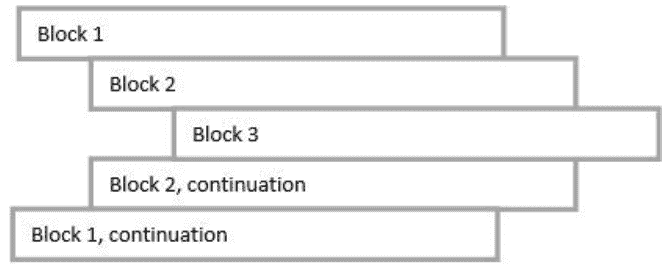
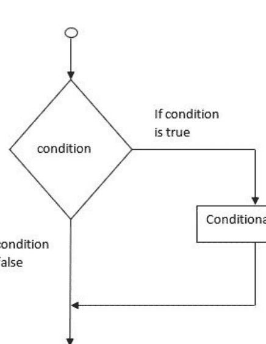
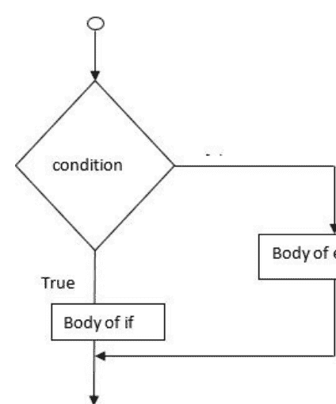
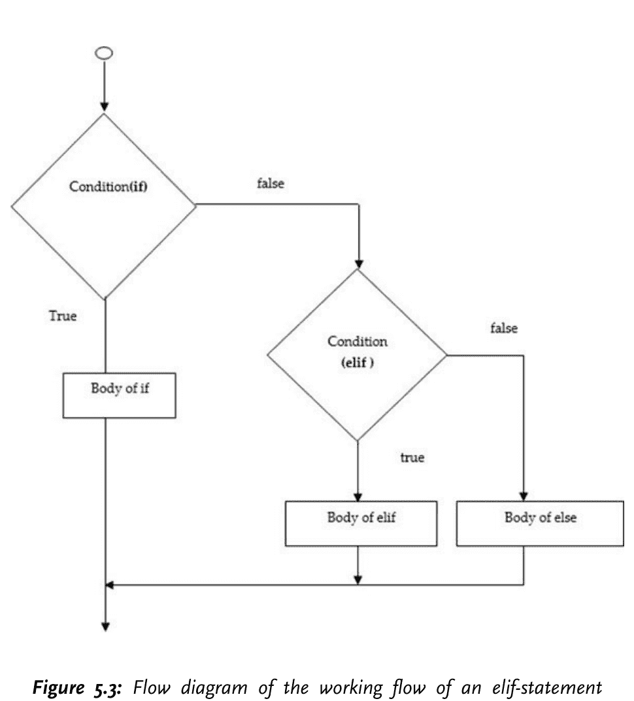
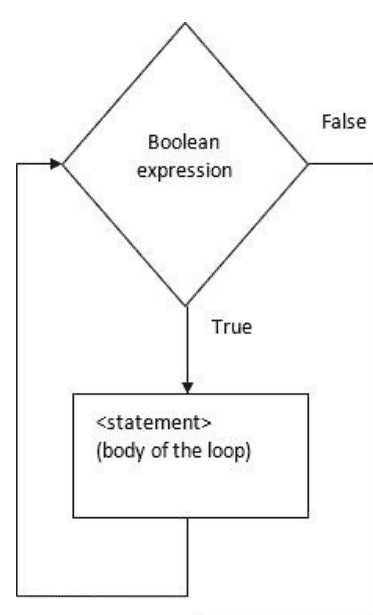

# Python核心之旅

体验元组、字典、列表、运算符、循环、索引、切片和矩阵的应用


吉里什·库马尔先生
阿杰·什里拉姆·库什瓦哈博士
拉吉·拉马克里希南·奈尔女士
苏巴希尼·G女士

# Python核心之旅

体验元组、字典、列表、运算符、循环、索引、切片和矩阵的应用

吉里什·库马尔先生

阿杰·什里拉姆·库什瓦哈博士

拉吉·拉马克里希南·奈尔女士

苏巴希尼·G女士


[www.bpbonline.com](http://www.bpbonline.com)

2022年第一版

版权所有 © BPB Publications, India

ISBN: 978-93-55511-249

保留所有权利。未经出版商事先书面许可，不得以任何形式或任何方式复制、分发或传播本出版物的任何部分，也不得将其存储在数据库或检索系统中，但程序清单除外，这些清单可以在计算机系统中输入、存储和执行，但不能通过出版、影印、录音或任何电子和机械手段进行复制。

## 责任限制和免责声明

本书所含信息根据作者和出版商的最佳知识判断是真实准确的。作者已尽一切努力确保这些出版物的准确性，但出版商对因本书中任何信息引起的任何损失或损害不承担责任。

本书中提及的所有商标均被确认为其各自所有者的财产，但BPB Publications无法保证这些信息的准确性。


www.bpbonline.com

# 献词

献给我挚爱的父母 **Shri. Manjit Raj** 和 **Shrimati. Asha Rani**
以及
我的妻子 **Monika** 和孩子们 **Vansh** 与 **Romil**

> — 吉里什·库马尔

献给我挚爱的父亲 **已故 Shriram Kirani Kushwaha**
以及我的家人

> — 阿杰·什里拉姆·库什瓦哈博士

献给我挚爱的父亲 **已故 M. N. Ramakrishnan Nair,**
我的家人和我亲爱的学生们

> — 拉吉·拉马克里希南·奈尔

献给我挚爱的家人和我亲爱的学生们

> — 苏巴希尼·G

# 关于作者

**吉里什·库马尔** 持有GNDU的理学学士（计算机科学）、PGDCA和MIT学位，目前是一名研究学者，在Lovely Professional University担任助理教授。他拥有超过18年的教学经验。他拥有一项专利，并在不同的国内和国际会议及期刊上发表了20多篇研究论文。他撰写了三本书，由著名的国内和国际出版商出版。他还是IBM DB2的认证学术助理。他是IAENG-国际工程师协会的活跃成员。在编程领域，他精通Fortran、C、C++、Java、Python、VC++。

LinkedIn个人资料：[https://www.linkedin.com/in/girish-kumar-21a62a14/](https://www.linkedin.com/in/girish-kumar-21a62a14/)

**阿杰·什里拉姆·库什瓦哈博士** 是印度班加罗尔Jain（被认定为大学）计算机科学与信息技术学院的副教授。他于2017年在印度那格浦尔RTM那格浦尔大学完成了计算机科学与技术（OSSDP方向）的博士学位。他的研究兴趣包括网络与网络安全以及区块链安全。他在著名的国际期刊和IEEE Springer会议上发表了30多篇研究论文。他撰写了四本书，由著名的国内和国际出版商出版。他曾担任IJEDR同行评审期刊的主编，并在10多个国际期刊担任编委会成员。他还是《国际传感器与传感器网络杂志》的客座编辑。在会议上，他曾担任大会主席、分会主席和小组成员。他是总部位于香港的国际工程师协会、印度科学大会以及IAENG计算机科学、人工智能、数据挖掘和软件工程学会的终身会员。他目前正在指导两名学生，其中一名已被授予博士学位。

LinkedIn个人资料：[https://www.linkedin.com/in/ajay-shriram-kushwaha-7b33b758/](https://www.linkedin.com/in/ajay-shriram-kushwaha-7b33b758/)

**拉吉·拉马克里希南·奈尔** 持有BCA和MCA学位，目前是一名研究学者，在Yeldo Mar Baselios College Kothamangalam担任IQAC协调员。她拥有17年的教学经验，并相信教学是成为学生的良师益友。她是一位作家和慈善家，积极参与许多社会事业，这也使她的学生们参与了喀拉拉邦特大洪水的救援工作，并为洪水灾民建造了三所房屋。

LinkedIn个人资料：[https://www.linkedin.com/in/raji-nair-aa7038132](https://www.linkedin.com/in/raji-nair-aa7038132)

**苏巴希尼·G** 持有理学学士（计算机科学）和MCA学位。她对技术充满热情，拥有1.5年区块链顾问经验。她目前在Yeldo Mar Baselios College Kothamangalam计算机应用系担任助理教授。她还在阿曼马斯喀特的阿拉伯开放大学担任研究助理（兼职）。

LinkedIn个人资料：[https://www.linkedin.com/in/subhashiny-g-a5a053189/](https://www.linkedin.com/in/subhashiny-g-a5a053189/)

# 关于审稿人

**普拉尚特·拉古** 毕业于新加坡国立大学（硕士）和班加罗尔PES理工学院（学士），对为开源技术做出贡献有着浓厚的兴趣。他的兴趣在于学习新技术及其对开发可扩展解决方案的影响。他目前在InMobi Technologies担任高级软件工程师，旨在为广告领域开发大规模解决方案。他最初在Sri. Vid. S Venkatesh的指导下学习卡纳提克音乐，目前在Sri. Vid. H.S. Venugopal的指导下学习。

# 致谢

本书的完成离不开许多人的指导和支持。首先，我要感谢我的父母Shri. Manjit Raj和Shrimati. Asha Rani，我的妻子Monika和孩子们Vansh和Romil，他们不断鼓励我撰写本书。

我向Balraj Kumar先生（Lovely Professional University计算机应用学院助理教授兼助理院长、编程技术领域负责人）、Divanshi Mehra小姐（Wipro Ltd项目工程师）和Sukhmanjeet Kaur小姐（TCS助理系统工程师）表示深深的感谢，感谢他们宝贵的合作和帮助。

-吉里什·库马尔

在撰写本书的过程中，有几个人提供了持续的支持，我想感谢他们。首先，我要感谢我的妻子Kismati（母亲）、Bindu（妻子）和我的女儿们Anahita和Anshika，感谢她们的理解和鼓励。没有她们的支持，我永远无法完成这本书。其次，我要感谢Subhashiny G.和Praveen N Kumar，感谢他们提供的技术支持，使本书得以完成。

我感谢我的同事吉里什·库马尔和导师S. B. Kishor博士的宝贵想法，也感谢过去几年全球顶尖大学和MOOC课程提供的其他优秀在线内容和课程。

我也要感谢BPB Publications团队，感谢他们给予我们足够的支持和时间来完成本书。

-阿杰·什里拉姆·库什瓦哈博士

我想特别感谢一些人在撰写本书各个阶段给予的持续支持和鼓励。首先，我要感谢我的家人，特别是我的女儿Thanima，感谢她们的理解和鼓励。没有她们的支持，我永远无法完成这本书。我要感谢数据科学家、Django开发者Praveen N Kumar，感谢他提供的技术支持，使本书得以完成。

我感谢我们敬爱的主席Chev. Prof. Baby M Varghese和Yeldo Mar Baselios College Kothamangalam的校长Prof. K M George，他们一直激励和鼓舞着我。

我感谢过去几年全球顶尖学校提供的优秀在线课程。

我非常感谢本书的技术审稿人Prashanth Raghu先生，感谢他提出的宝贵建议。

我也想向BPB Publications团队在本书创作和出版过程中给予的支持与协助表示感谢。

-Raji Ramakrishnan Nair

我感觉从本书的创作历程中学到了很多。这将是我未来职业生涯乃至整个人生中都要珍视的宝贵财富。

我想借此机会向全能的上帝以及所有给予我无价支持与帮助的人们表达我深深的感激之情。

我衷心感谢所有老师，是他们帮助我走到了今天。

-Subhashiny G

## 前言

本书采用的核心Python编程概念学习方法非常简单。在每章讨论了指令的基本概念后，我们通过编程示例来探索相同的概念。我们的主要目标是学习核心Python编程。因此，我们编写了大量程序，为非程序员构建编程概念。本书包含16章，详细介绍了核心Python及其程序概念。本书将帮助您从零开始理解Python，并助您在编程领域建立职业生涯。

本书的主要特点如下：

- 重点深入讲解Python编程的基础知识。
- 每个编程概念都通过合适的示例程序进行了详细说明。
- 从Python的历史到核心内容都解释得非常清楚，有助于任何初学者理解和学习Python编程。
- 涵盖了Python中的代码重用概念。
- 包含了文件处理、异常处理和运行时错误的概念。
- 包含了Python中面向对象编程的基本概念，如类、构造函数、继承等。

第1章重点介绍Python的过去、现在和未来。通过本章，读者将了解Python、其历史、优势、特点和各种应用。

第2章重点介绍Python编程的基本语法。所有这些语法都通过大量示例进行了详细解释，这将提升逻辑思维能力。通过本章，每位读者的Python编程基础都将得到加强。

第3章涵盖了Python编程中的变量和不同的数据类型。数据类型的概念通过许多示例进行了详细解释，帮助读者有效理解该概念。

第4章涵盖了Python编程中使用的算术和逻辑运算符。所有这些概念都通过示例进行了详细解释，帮助读者有效理解这些运算符的用法。

第5章重点介绍Python编程中可用的决策语句。IF语句的不同使用方式通过合适的示例进行了详细解释，帮助学生发展他们的逻辑技能。

第6章重点介绍Python编程中使用的循环语句。所有循环语句都通过合适的示例进行了清晰的解释，帮助学生理解在执行编程任务时应使用哪种循环语句。

第7章阐述了数字的概念。本章重点介绍数字类型转换以及各种函数，如数学函数、随机数函数、三角函数和数学常数。

第8章处理字符串的概念。本章重点介绍与字符串一起使用的运算符、各种字符串操作和字符串格式化。

第9章处理列表的概念以及可以使用此数据结构执行的各种操作。

第10章处理元组的概念以及可以使用此数据结构执行的各种操作。

第11章涵盖了字典的概念以及可以使用此数据结构执行的各种操作。

第12章详细解释了定义和调用函数。它还处理了诸如按引用传递与按值传递、递归、函数参数和匿名函数等重要概念。

第13章重点介绍Python最高级程序组织单元的概念。它还处理了导入函数。

第14章特别关注文件的概念。它处理了在文件中执行的各种操作，如打开和关闭文件、读写文件、重命名和删除文件以及其他文件方法。

第15章阐明了异常处理的概念，可用于使您的程序更加健壮。本章演示了用于处理异常的概念，如引发和处理异常、用户定义异常等。

第16章处理了Python编程中面向对象编程概念的实现。它主要关注各种内置属性、继承类型、方法重写等。

我们期望通过本书**《Python核心之旅》**实现富有成效的学习。

## 代码包和彩色图片

请按照以下链接下载本书的**代码包**和**彩色图片**：

[https://rebrand.ly/b32255](https://rebrand.ly/b32255)

本书的代码包也托管在GitHub上。如果代码有任何更新，将在现有的GitHub仓库中进行更新。

我们拥有来自我们丰富的书籍和视频目录的代码包，可在以下地址获取。请查看它们！

## 勘误

我们对BPB Publications的工作感到无比自豪，并遵循最佳实践以确保内容的准确性，为我们的订阅者提供沉浸式的阅读体验。我们的读者是我们的镜子，我们利用他们的反馈来反思并改进在出版过程中可能出现的任何人为错误。为了让我们保持质量并帮助我们联系到任何可能因任何不可预见的错误而遇到困难的读者，请写信给我们：

[errata@bpbonline.com](mailto:errata@bpbonline.com)

BPB Publications大家庭非常感谢您的支持、建议和反馈。

您知道吗？BPB为出版的每本书都提供电子书版本，提供PDF和ePub文件？您可以在[www.bpbonline.com](http://www.bpbonline.com)升级到电子书版本，作为印刷书客户，您有权获得电子书副本的折扣。请通过以下方式联系我们：[business@bpbonline.com](mailto:business@bpbonline.com)了解更多信息。

在以下地址，您还可以阅读一系列免费技术文章，注册各种免费通讯，并获得BPB书籍和电子书的独家折扣和优惠。

## 盗版

如果您在互联网上以任何形式发现我们作品的任何非法副本，如果您能向我们提供位置地址或网站名称，我们将不胜感激。请通过[business@bpbonline.com](mailto:business@bpbonline.com)与我们联系，并提供指向该材料的链接。

## 如果您有兴趣成为作者

如果您在某个主题上拥有专业知识，并且有兴趣撰写或为一本书做出贡献，请访问以下地址。我们已经与成千上万的开发者和技术专业人士合作，就像您一样，帮助他们与全球技术社区分享他们的见解。您可以提交一般申请，申请我们正在招募作者的特定热门主题，或者提交您自己的想法。

## 评论

请留下评论。一旦您阅读并使用了本书，为什么不留下评论呢？潜在读者可以看到并使用您的公正意见来做出购买决策。我们BPB可以了解您对我们产品的看法，我们的作者也可以看到您对他们书籍的反馈。谢谢！

有关BPB的更多信息，请访问

## 目录

1.  引言
    - 引言
    - 结构
    - 目标
    - Python的历史
    - Python的特点
    - Python的优势
    - Python的应用
    - 结论
    - 关键术语
    - 问题
2.  基本语法
    - 引言
    - 结构
    - 目标
    - 第一个Python程序
    - 程序输出和print语句
    - 脚本模式编程
    - Python标识符
    - 标识符命名规则
    - 关键字
    - 行和缩进
    - 多行语句
    - Python中使用的引号
    - Python中的注释
    - 单行多条语句

## 3. 变量类型

- 简介
- 结构
- 目标
- 变量与赋值
- 多重赋值
- 内置数据类型
- 数字
- 字符串
- 列表
- 元组
- 字典
- 数据类型转换
- 总结
- 问题

## 4. 基本运算符

- 简介
- 结构
- 目标
- 算术运算符
- 关系运算符
- Python 赋值运算符
- 位运算符
- 逻辑运算符
- 成员运算符
- 运算符优先级
- 程序
- 总结
- 问题

## 5. 判断语句

- 简介
- 结构
- 目标
- if 语句
- if..else 语句
- elif 语句
- 嵌套 if 语句
- 单行语句块
- 程序
- 总结
- 关键术语

## 6. 使用循环重复执行代码

- 简介
- 结构
- 目标
- While 循环
- For 循环
- Range() 函数
- Break、continue、pass 与循环 else
- Break
- Continue
- Pass
- 循环 else
- 嵌套循环
- 无限循环
- 迭代器与生成器
- 总结
- 多项选择题

## 7. 数字

- 简介
- 结构
- 目标
- 数字类型
- 数学函数
  - Number abs() 方法
  - Number ceil() 方法
  - Number exp() 方法
  - Number fabs() 方法
  - Number floor() 方法
  - Number log() 方法
  - Number log10() 方法
  - Number modf() 方法
  - Number pow() 方法
  - Number sqrt() 方法
  - Number round() 方法
- 随机数函数
  - Number choice() 方法
  - Number randrange() 方法
  - Number random() 方法
  - Number seed() 方法
  - Number shuffle() 方法
  - Number uniform() 方法
- 三角函数
  - Number acos() 方法
  - Number asin() 方法
  - Number atan() 方法
  - Number atan2() 方法
  - Number cos() 方法
  - Number hypot() 方法
  - Number degrees() 方法
  - Number radians() 方法
- 数学常数
- 总结
- 关键术语

## 8. 字符串

- 简介
- 结构
- 目标
- 创建字符串
- 访问字符串中的值
- 修改或删除字符串
- 转义字符
- 字符串操作
- 连接
- 重复
- 成员关系
- 原始字符串
- 字符串格式化
- 三引号代码
- Unicode 字符串
- 内置字符串方法
- String capitalize() 方法
- String center() 方法
- str.center(width[, fillchar])
- String count() 方法
- String decode() 方法
- String encode() 方法
- String endswith() 方法
- String expandtabs() 方法
- String find() 方法
- String index() 方法
- String isalnum() 方法
- String isalpha() 方法
- String islower() 方法
- String isnumeric() 方法
- String isspace() 方法
- String istitle() 方法
- String isupper() 方法
- String join() 方法
- String len() 方法
- String ljust() 方法
- String lower() 方法
- String lstrip() 方法
- String maketrans() 方法
- String max() 方法
- String min() 方法
- String replace() 方法
- String rfind() 方法
- String rindex() 方法
- String rjust() 方法
- String rstrip() 方法
- String split() 方法
- String splitlines() 方法
- String startswith() 方法
- String strip() 方法
- String swapcase() 方法
- String title() 方法
- String translate() 方法
- String upper() 方法
- String zfill() 方法
- String isdecimal() 方法
- 程序
- 总结
- 问题

## 9. 列表

- 简介
- 结构
- 目标
- Python 中的列表
- 访问列表中的值
- 更新列表
- 删除列表元素
- 内置列表函数与方法
- List len() 方法
- List max() 方法
- List min() 方法
- List list() 方法
- List append() 方法
- List count() 方法
- List extend() 方法
- List index() 方法
- List insert() 方法
- List pop() 方法
- List remove() 方法
- List reverse() 方法
- List sort() 方法
- 程序
- 总结
- 问题

## 10. 元组

- 简介
- 结构
- 目标
- 创建元组
- 访问元组中的值
- 更新元组
- 删除元组元素
- 基本元组操作
- 长度
- 连接
- 重复
- 成员关系
- 迭代
- 索引、切片与矩阵
- 内置元组函数
- Tuple len() 方法
- Tuple max() 方法
- Tuple min() 方法
- Tuple tuple() 方法
- 程序
- 总结
- 问题

## 11. 字典

- 简介
- 结构
- 目标
- 创建字典
- 访问字典中的元素
- 更新字典
- 删除字典元素
- 字典键的属性
- 内置字典函数
- Dictionary len() 方法
- Dictionary str() 方法
- Dictionary type() 方法
- 字典方法
- Dictionary clear() 方法
- Dictionary copy() 方法
- Dictionary fromkeys() 方法
- Dictionary get() 方法
- Dictionary items() 方法
- Dictionary keys() 方法
- Dictionary setdefault() 方法
- Dictionary update() 方法
- Dictionary values() 方法
- 程序
- 总结
- 问题

## 12. 函数

- 结构
- 目标
- 内置函数
- 用户自定义函数
- 定义函数
- 函数调用
- 文档字符串
- Return 语句
- 按引用传递与按值传递
- 函数参数
- 必需参数
- 默认参数
- 关键字参数
- 可变参数
- 匿名函数
- Lambda 函数的使用
- 变量作用域
- 递归
- 递归的优点
- 缺点
- 迭代与递归的比较
- 程序
- 总结
- 关键术语

## 13. 模块

- 简介
- 结构
- 目标
- import 语句
- from...import 语句
- from...import * 语句
- 将模块作为脚本执行
- 模块搜索路径
- dir() 函数

## 14. 文件输入/输出

- 简介
- 结构
- 目标
- 打开和关闭文件
- open 函数
- 文件打开模式
- 文件对象属性
- close() 方法
- 读写文件
- write() 方法
- read() 方法
- 重命名和删除文件
- rename() 方法
- remove() 方法
- os.remove(file_name)
- 文件方法
- 文件 flush() 方法
- 文件 fileno() 方法
- fileObject.fileno()
- 文件 isatty() 方法
- 文件 next() 方法
- 文件 readline() 方法
- 文件 readlines() 方法
- 文件 seek() 方法
- 文件 tell() 方法
- 程序示例
- 总结
- 关键术语

## 15. 异常处理

- 结构
- 目标
- 标准异常
- Python 断言
- 处理异常
- 带 else 子句的 except 子句
- 无异常时的处理
- 带多个异常的 except 子句
- Try-finally 子句
- 异常的参数
- 抛出异常
- 用户自定义异常
- 总结
- 关键术语

## 16. 面向对象编程

- 结构
- 目标
- OOP 术语概述
- 创建类
- self 参数
- __init__ 方法
- 创建实例对象
- 访问属性
- 内置类属性
- 销毁对象（垃圾回收）
- 类继承
- 继承类型
- 多级继承
- 多重继承
- super() 关键字
- 检查两个类和实例之间关系的函数
- 方法重写
- 基本重载方法
- 程序示例
- 总结
- 关键术语

# 索引

# 第一章

## 简介

Python 是一种强大且简洁的编程语言，它兼具传统编译语言的强大功能和复杂性，以及更简单的脚本和解释型语言的易用性（甚至更胜一筹）。

## 结构

本章我们将涵盖以下主题：

- Python 的历史
- Python 的特性
- Python 的优势
- Python 的应用

## 目标

本章的主要目标是为你提供 Python 的概述，并讨论其优势、未来前景和重要性，以及其在现实世界中的应用。

# Python 的历史

Python 诞生于 20 世纪 80 年代末，其具体实现始于 1989 年 12 月，由荷兰 CWI 的 Guido van Rossum 开始。

当时，Guido van Rossum 是一位在 CWI 同样开发的解释型语言 ABC 方面拥有丰富语言设计经验的研究员。然而，他对 ABC 的能力并不满意，因此他构思了更强大的东西。他设想的一些工具需要执行通用的系统管理任务，因此他也希望能够访问系统调用的功能，这在像 Amoeba 这样的分布式操作系统中是可用的。尽管 Amoeba 特定的语言带来了一些新的思路，但一种通用的语言更有意义，于是 Python 的种子在 1989 年末播下。

Python 从许多其他语言中汲取了灵感，包括 ABC、Modula-3、C、C++、Algol-68、SmallTalk、Unix shell 以及其他脚本语言。

# Python 的特性

以下是 Python 的主要特性：

**易于学习：** Python 几乎没有关键字或保留字，结构清晰易懂，语法明确，这使得学生很容易理解这门语言。

**可读性强：** Python 代码结构清晰，易于辨认。

**易于维护：** Python 的源代码相对容易管理。

**广泛的标准库：** Python 的标准库具有可移植性，并且与 Windows、UNIX 和 Macintosh 操作系统兼容。

**实践性强：** Python 提供了一个“自己动手”的 REPL 解释器，可以在将代码投入应用之前学习语言和库的特性。REPL 控制台也可以编写小型测试脚本。

Python 可以在各种平台上运行，并且在每个平台上都需要相同的接口。

**可扩展：** Python 解释器支持底层模块，并帮助程序员添加或定制他们的工具以进行高效编程。

**数据库：** Python 为数据驱动的应用程序提供了与所有主要商业数据库交互的库。

**GUI 编程：** Python 支持 GUI 应用程序。它可以被生成并移植到不同的系统调用、库和窗口系统，例如 Windows MFC、Macintosh 和 Unix 操作系统的 X Window 系统。

**可扩展性：** Python 提供了更好的组织结构，并且比 shell 脚本支持更广泛的程序。

Python 还具有一系列其他优点：

它支持函数式和结构化编程方法，也支持面向对象编程概念。

它提供高级动态数据类型并支持动态类型检查。

它支持自动垃圾回收。

它也可以用作脚本语言或编译成字节码，以开发执行大量操作的广泛应用程序。

即使是执行的 Python 脚本，在执行前也会被编译成 Python 字节码。

它提供高级动态数据类型并支持动态类型检查。它可以使用 Python API 轻松地与 C、C++、COM、ActiveX、CORBA 和 Java 集成。

# Python 的优势

Python 语言的多样化应用是其特性组合的结果。这使得 Python 更适用于广泛的应用。Python 编程的一些优势包括：

**第三方模块的存在：** Python 包索引（PyPI）包含大量第三方模块，使 Python 能够与各种可用的语言和平台进行交互。

**广泛的支持库：** Python 提供了一个大型标准库，包括互联网协议、字符串操作、Web 服务工具和操作系统接口。许多高级编程任务已经被编写到标准库中，从而减少了需要编写的代码长度。

**开源和社区开发：** Python 语言是在 OSI 批准的开源许可证下构建的，使其可以免费使用和分发，甚至用于商业目的。

**易于学习和可用的支持：** Python 提供了出色的可读性和易于学习的简单语法，这有助于初学者有效地掌握这门语言。代码风格指南（如 PEP 8）提供了辅助代码格式化的规则。此外，众多的用户和活跃的开发者使互联网资源库非常丰富，促进了这种编程语言的开发和持续使用。Python 包索引（PyPI）包含大量第三方模块，使 Python 能够与各种语言进行交互。

**便捷的数据结构：** Python 拥有内置的列表和字典数据结构，并用于构建具有快速运行时的数据结构。此外，它还提供了动态高级数据类型，从而减少了代码长度。

**生产力和速度：** Python 拥有面向对象的设计结构，提供了重新设计的过程控制能力、强大的集成、文本处理能力及其单元测试框架。所有这些能力都提高了生产力。Python 被认为是构建复杂多协议网络应用的合适选择。

# Python 的应用

以下是 Python 的一些应用领域：

**基于 GUI 的桌面应用程序：** Python 具有基本的结构、模块化的设计、丰富的文本处理工具以及在不同操作系统上工作的能力，使其成为开发基于桌面应用程序的合适选择。多种 GUI 工具包，如 wxPython、PyQt 和 PyGtk，可帮助设计人员创建功能强大的图形用户界面（GUI）。使用 Python 创建的各种应用程序包括：

**图像处理和图形设计：** Python 用于开发 2D 图像软件，例如 Inkscape、GIMP、Paint Shop Pro 和 Scribus。它也用于各种比例，例如在 3D 动画包中，如 Blender、3ds Max、Cinema 4D、Houdini、Lightwave 和 Maya。

**科学和计算：** 高速度、生产力以及各种工具（如 Scientific Python 和 Numeric Python）的广泛性，使 Python 成为涉及科学数据计算和处理的各种应用程序不可或缺的一部分。各种软件都是用 Python 编写的，例如 3D 建模软件 FreeCAD 和有限元分析软件 Abaqus。

支持使用多样化的模块、库和平台进行游戏开发。有许多可用示例，其中之一是 PySoy。它是一个支持 Python 3 的 3D 游戏引擎，而 PyGame 包含一组提供功能和相关库的模块，用于游戏开发。许多游戏都是使用 Python 构建的，例如《战地 2》、《星际迷航：舰桥指挥官》和《星战前夜》。

**Web 框架和 Web 应用程序：** Python 已被用于构建各种 Web 框架，包括 CherryPy、Django、Pyramid、TurboGears、Bottle 和 Flask。这些框架提供了标准库和模块，简化了诸如内容管理、数据库交互以及与不同互联网协议（如 HTTP、SMTP、XML-RPC、FTP 和 POP）接口等任务。以下是一些基于 Python 的流行 Web 应用程序：

- Plone 是一个内容管理系统。
- ERP5 是一个主要应用于航空航天、服装和银行业的开源 ERP。
- Odoo 是一个融合了不同业务应用程序和 Google App Engine 的综合套件。

**企业和商业应用：** Python 是最适合编码的语言，具有特殊的库、可扩展性、可伸缩性和易于阅读的语法。Reddit 最初是用 Common Lisp 开发的，于 2005 年用 Python 重写。Python 还为 YouTube 在线视频分享平台提供了不同的功能。

**操作系统：** Python 通常是 Linux 发行版的基础部分。例如，Ubuntu 的 Ubiquity 安装程序以及 Fedora 和 Red Hat Enterprise Linux 的 Anaconda 安装程序都是用 Python 开发的。Gentoo Linux 使用 Python 为其名为 Portage 的包管理系统。

**语言开发：** Python 的设计和模块架构影响了许多语言的发展。例如，Boo 语言使用了与 Python 等效的对象模型、语法和缩进。此外，许多语言（如 Apple 的 Swift、CoffeeScript、Cobra 和 OCaml）的语法都具有 Python 编程语言的特性。

**原型开发：** 除了学习速度快且简单之外，Python 还具有开源的优势，在庞大社区的帮助下可以免费使用。这使其成为原型开发的首选。Python 允许利用其敏捷性、可扩展性和可伸缩性以及易于重构代码等特性，更快地开发其原型。Python 主要因其脚本特性、易于编写代码和库支持而适用于原型开发。开发人员网络的可用性可能不是创建原型的正确指标，因为即使是 JAVA/C# 也拥有强大的开发人员网络。

## 结论

在本章中，我们重点介绍了 Python 的基础知识。Python 是一种健壮且直接的编程语言，它提供了传统编译语言的强大功能和复杂性，以及更简单的脚本和解释型语言的易用性。Guido van Rossum 在 1980 年代后期开发了 Python，其实施始于 1989 年 12 月。本章讨论了 Python 的基本特性。目前，它是最流行的编程语言，这就是为什么它被用于各个领域来开发 Web 和桌面应用程序、人工智能、机器学习和区块链。因此，我们可以开发对人们更有用的用户友好型应用程序。

在接下来的章节中，你将学习 Python 编程语言的基本语法。

## 关键术语

- 健壮
- 解释型语言
- Web 框架
- Django、CherryPy、Pyramid、TurboGears、Bottle、Flask
- Python 包索引
- Python 库
- Anaconda 安装程序
- GUI 工具包

## 问题

- 解释 Python 的特性。
- 解释 Python 的实际应用。
- 什么是 Python，谁开发了它？
- 比较 Python 和 C。
- Python 是用哪种语言编写的？
- 命名 Python 文件的扩展名。Python 是纯面向对象的编程语言吗？

# 第 2 章

## 基本语法

## 简介

要成为专家级程序员，学习者必须对编程概念有深刻的理解。学习者在初始阶段获得的知识使他们日后成为专家级程序员。本章重点介绍 Python 编程语言的基本语法。Python 是一种解释型语言，可在 Windows、Linux 和 Mac 等流行操作系统平台上运行，也可在 Docker 和托管 Kubernetes 等基于容器的托管环境中运行。Python 具有类似我们英语的简单语法。与其他编程语言相比，Python 的语法允许开发人员用更少的行数编写程序。这种编程语言实际上是为可读性而设计的。让我们看看 Python 编程语言的基本语法。

## 结构

我们将在本章涵盖以下主题：

- 交互模式编程
- Python 程序输出和 print 语句
- 脚本模式编程
- Python 标识符
- 关键字
- 行和缩进
- 多行语句
- Python 中使用的引号
- Python 中的注释
- 单行多条语句

## 目标

本章重点帮助你理解 Python 编程语言的基本语法。因此，它帮助你学习用于指定标识符或关键字的语法，并讨论如何处理多行语句或在 Python 中放置注释等。

### 第一个 Python 程序

让我们在不同的编程方法中运行给定的程序：

#### 交互模式编程

解释器在调用时不传递脚本文件，会显示以下提示：

**在 Linux 上**

```
$ python

Python 3.3.2 (default, Dec
[GCC on Linux
Type more information.
```

**在 Windows 上**

```
Python 3.4.3
Feb bit (Intel)] on win32
Type more information.
```

#### 程序输出和 print 语句

Python 使用 print 语句在屏幕上显示输出。Python 包含 **printf()** 函数，用于向控制台显示输出。大多数 shell 脚本语言使用 echo 命令进行程序输出。

```
print("Hello, Python!")
```

**输出：**

```
Hello, Python!
```

**注意：** 当 print 语句与字符串格式化运算符配对使用时，其行为更像 C 语言中的 **printf()** 函数：

```
print("python is number %d" % 1)
```

**输出：**

```
python is number 1
```

#### 脚本模式编程

脚本的执行在使用脚本参数调用解释器后开始，并持续到脚本结束，导致解释器处于非活动状态。

让我们在脚本中编写一个简单的 Python 程序。Python 文件支持 **.py** 扩展名。在 **test.py** 文件中键入以下源代码：

```
print("Hello, Python!")
```

我们相信你已经将 Python 解释器放置在 PATH 变量中。现在，尝试在不同平台上运行此程序，如下所示：

**在 Linux 上**

```
$ python test.py
```

**输出：**

```
Hello, Python!
```

**在 Windows 上**

```
C:\Python34>Python test.py
```

这将产生以下结果：

```
Hello, Python!
```

让我们尝试另一种在 Linux 中执行 Python 脚本的方法。这是修改后的文件：

```
#!/usr/bin/python3

print("Hello, Python!")
```

我们假设你在 **/usr/bin** 目录中有可用的 Python 解释器。现在，尝试按如下方式运行此程序：

```
$ chmod +x test.py    # 这是为了使文件可执行
$ ./test.py
```

这将产生以下结果：

```
Hello, Python!
```

#### Python 标识符

标识符是用户为 Python 中的类、函数、变量等实体定义的名称。它有助于区分一个实体与其他实体。

#### 标识符命名规则

以下列表列出了 Python 中标识符的命名规则：

- 标识符以字母 A 到 Z 或 a 到 z 或下划线 (_) 开头，后跟零个或多个字母、下划线和数字 (0 到 9)。
- 标识符不应以数字开头。
- 关键字不得用作标识符。
- 标识符不得包含特殊字符，即 '.', '$', '!', '@', '#', '%' 等。
- 类名以大写字母开头，所有其他标识符以小写字母开头。
- Python 是一种区分大小写的编程语言，即它对大写和小写字母的处理不同。
- 当标识符以单个前导下划线为前缀时，该标识符变为私有。

## 关键字

这些是为特定目的保留的唯一单词，不得用作类名、变量名、函数名或任何其他标识符。所有Python关键字仅由小写字母组成。表2.1列出了一些Python关键字的示例：

| Python 关键字 |
|-----------------|
| and             |
| as              |
| assert          |
| break           |
| class           |
| continue        |

表 2.1：Python 关键字示例

## 行与缩进

Python使用缩进来构成块结构和嵌套块结构，而不是使用开始和结束括号。

使用缩进来指定结构的好处如下：

-   它降低了对编码标准的要求。关键点在于缩进是四个空格，不需要使用硬制表符。
-   它减少了不一致性。来自不同来源的代码遵循相同的缩进方法。
-   它减少了工作量。最需要的是修正缩进，而不是同时修正缩进和括号。
-   它减少了杂乱，因为它消除了所有的花括号。
-   如果看起来正确，它就是正确的。缩进不会欺骗读者。



图 2.1：缩进语句中的控制流

## 多行语句

在Python中，换行符用于表示语句的结束。但是，它支持使用续行符来表示该行应该继续。考虑这个例子：

```
total = item_one + \
item_two + \
item_three
```

包含在 `[]` 或 `()` 括号内的语句不需要使用续行符。考虑这个例子：

```
months = ['Jan', 'Feb', 'Mar', 'Apr', 'May']
```

## Python 中使用的引号

Python支持单引号、双引号和三引号来表示字符串字面量，前提是使用相同类型的引号来开始和终止给定的字符串。

三引号用于将字符串扩展到多行。看这个例子：

```
Name = 'XYZ'

Fathername = "ABC DEF"

About = """I love Python.

I can study it the whole day."""

print(Name)

print(Fathername)

print(About)
```

**输出：**
XYZ
ABC DEF
I love Python.
I can study it the whole day.

**注意：** 上述程序位于编辑器中，通过点击“文件”然后点击“新建”打开。编写完成后，点击“运行”和“运行模块”以查看输出。

## Python 中的注释

与大多数脚本和Unix shell语言一样，井号/磅号表示注释从 `#` 开始，一直持续到行尾。

这是一个例子：

```
#a is initialized to hello

#we will print hello now

print(a)
```

**输出：**

**hello**

## 单行上的多条语句

Python中的分号允许在单行上放置多条语句，但有一个限制：没有语句可以开始一个新的代码块。这是一个使用分号的例子：

```
a=5;    b = 'hello';   c = "This is how we write multi statements using semicolon(;)"
```

## 结论

Python可以被视为函数式、过程式或面向对象的。在本章中，我们学习了使用Python编写代码所需的基本语法。我们还学习了如何使用分号 (;) 在单行上包含多行。我们探讨了Python中用于命名标识符的规则，并理解了在Python中包含行和缩进的重要性。

在下一章中，我们将学习更多关于Python中使用的变量类型的知识。这将有助于决定在各种情况下使用哪种类型的变量。

## 问题

-   Python 中 Print 函数的重要性是什么？
-   交互模式编程是什么意思？
-   列出 Python 中命名标识符的一些规则。
-   举例说明如何在 Python 中处理单行上的多行语句。
-   讨论 Python 中行和缩进的重要性。

# 第 3 章

# 变量类型

## 简介

**变量**被定义为一个保留的内存位置，用于存储可能改变的值。它可以被视为存储特定值的容器。从技术上讲，它是引用计算机程序使用的内存位置的一种方式，是该物理位置的符号名称。

根据变量的数据类型，解释器通常分配内存并决定在保留的内存中存储什么。

## 结构

我们将在本章中涵盖以下主题：

-   变量和赋值
-   多重赋值
-   内置数据类型
-   数字
-   字符串
-   列表
-   元组
-   字典
-   数据类型转换

## 目标

本章重点介绍数据如何存储在保留的内存位置、在Python中为变量赋值以及完成多重赋值。它还涵盖了Python编程语言中使用的列表、元组和字典。此外，它还涵盖了Python编程中的数据类型转换。

本章将通过示例帮助您理解变量类型的基础知识。

## 变量和赋值

Python是动态类型的，因此预先定义变量或其类型不是强制性的。类型（和值）在赋值时初始化，赋值使用等号执行。

这是一个例子：

```
print("NAME is %s\nROLLNO is %d\nMARKS are %f" %(name,rollno,marks))
```

NAME is XYZ
ROLLNO is 123
MARKS are 93.670000

字符串格式化运算符再次显示在print语句的末尾。

代码中给出的每个 `%x` 都与要打印的参数类型相匹配。我们已经看到过 `%s`（用于字符串）、`%d`（用于整数）和 `%f`（用于浮点值），就像在C编程语言中一样。

## 多重赋值

Python支持将单个值同时赋给多个变量。

考虑这个例子：

```
a=b=c=1
```

这里，创建了一个整数对象并赋值为一，相同的内存位置被分配给三个变量。此外，多个对象可以赋给多个变量。

这是一个例子：

```
a, b, c = 1, 2, "John"
```

这里，值1和2被赋给两个变量a和b，而变量c被赋给一个值为"John"的字符串对象。

## 内置数据类型

这些是内置在解释器中的标准数据类型：

-   数字
-   字符串
-   列表
-   元组
-   字典

## 数字

**数字**数据类型存储数值。当我们赋值一个数值时，会创建数字对象。

```
a=5
b=27
```

三种不同的数字类型如下：

-   int（有符号整数）
-   float（十进制实数值）
-   complex（复数）

**注意：** 这里，在复数中，`j` 用于复数的虚部。它以 `a+bj` 的形式表示，其中 `a` 和 `b` 是任何实数。

所有整数都表示为长整数，因此不需要任何单独的long数据类型。

```
a=5
b=3.145
c=3+6j
```

## 字符串

**字符串**被识别为用单引号、双引号或三引号表示的连续字符序列。Python中没有字符数据类型，它是一个长度等于1的字符串。当我们编写多行字符串时使用三引号。可以使用切片运算符 `[:]` 获取字符串的子集。索引从开头的0开始，从末尾的-1开始。`+` 号用于连接，`*` 星号用于重复。

**示例：**

```
str = 'Let us study'

print (str)

print (str[0])

print (str[2:5])

print (str[2:])

print (str * 2)

print (str + "TEST")
```

## 输出：

让我们学习Python

让我们学习Python

让我们学习Python

让我们学习Python

让我们学习Python

# 列表

与字符串类似，**列表**是一种集合。字符串默认是字符序列，而非集合，而列表可以包含任何类型的值。列表中的值称为元素，写在方括号内，用逗号分隔。

**列表=[1,2.3,"list"]**

列表是可变的，即其中元素的值可以更改。

列表中的值可以使用切片运算符访问，方式与字符串类似。

以下是访问列表的一些方法：

```
list = ['abcd', 786, 2.23, 'xyz', 70.2]
tinylist = [123, 'xyz', 123, 'xyz']

print (list)
print (list[0])
print (list[1:3])
print (list[2:])
print (tinylist * 2)
print (list + tinylist)
```

输出：

```
['abcd', 786, 2.23, 'xyz', 70.2]
abcd
[786, 2.23]
[2.23, 'xyz', 70.2]
[123, 'xyz', 123, 'xyz']
['abcd', 786, 2.23, 'xyz', 70.2, 123, 'xyz']
```

**注意：** 这里，值**2.3**显示为**2.2999999999999998**，因为解释器中的值实际上是以双精度浮点数存储的，它比单精度浮点数包含更多的位。因此，近似的双精度值是2.3，两者没有区别。

## 元组

**元组**是另一种类似于列表的序列。列表和元组之间的唯一区别是列表是可变的，而元组是不可变的，这意味着元组中的元素不能被修改。元组可以被视为只读列表。另一个区别是元组写在圆括号中，而列表写在方括号中。元组的访问方式与列表相同，但不能更新。

以下是访问元组的方法：

```
tuple = ('abcd', 786, 2.23, 'xyz', 70.2)
tinytuple = (123, 'xyz', 123, 'xyz')

print (tuple)
print (tuple[0])
print (tuple[1:3])
print (tuple[2:])
print (tinytuple * 2)
print (tuple + tinytuple)
```

输出：

```
('abcd', 786, 2.23, 'xyz', 70.2)
abcd
(786, 2.23)
(2.23, 'xyz', 70.2)
(123, 'xyz', 123, 'xyz')
('abcd', 786, 2.23, 'xyz', 70.2, 123, 'xyz')
```

列表是可变的，元组是不可变的；以下程序说明了这一点：

```
tuple = ('abcd', 786, 2.23, 'xyz', 70.2)
list = ['abcd', 786, 2.23, 'xyz', 70.2]
list[2] = 1000
print(list)
tuple[2] = 1000
print(tuple)
```

输出：

```
['abcd', 786, 1000, 'xyz', 70.2]
Traceback (most recent call last):
  File "C:/Python33/LISTxx.py", line 5, in <module>
    tuple[2] = 1000
TypeError: 'tuple' object does not support item assignment
```

## 字典

**字典**被认为是一组键值对，其值通过键来访问。我们可以将其视为列表，但列表具有整数索引，而字典可以拥有任何类型的索引，通常是数字或字符串。

字典用花括号括起来，通过方括号访问。

以下是执行字典操作的方法：

```
dict = {}
dict['Name'] = 'ymbc'
dict['code'] = 3010
dict['dept'] = 'education'

tinydict = {'code': 3010, 'dept': 'education', 'name': 'ymbc'}

print (dict)
print (dict[2])
print (tinydict)
print (tinydict.keys())
print (tinydict.values())
```

输出如下：

```
{'Name': 'ymbc', 'code': 3010, 'dept': 'education'}
This is three
{'code': 3010, 'dept': 'education', 'name': 'ymbc'}
dict_keys(['code', 'dept', 'name'])
dict_values([3010, 'education', 'ymbc'])
```

字典没有顺序，它们通过提供的键来访问。字典内部的键通过冒号赋予值。

## 数据类型转换

有时，我们需要转换内置类型。为此，我们使用一些内置函数将一种类型转换为另一种类型，如下表所示：

表 3.1：数据类型列表

| 函数 | 描述 |
| :--- | :--- |
| int(x [,base]) | 将x转换为整数。 |
| long(x [,base] ) | 将x转换为长整数。 |
| float(x) | 将x转换为浮点数。 |
| complex(real [,imag]) | 创建一个复数。 |
| str(x) | 将对象x转换为字符串表示。 |
| repr(x) | 将对象x转换为表达式字符串。 |
| eval(str) | 计算一个字符串并返回一个对象。 |
| tuple(s) | 将s转换为元组。 |
| list(s) | 将s转换为列表。 |
| set(s) | 将s转换为集合。 |
| dict(d) | 创建一个字典。d必须是（键，值）元组的序列。 |
| frozenset(s) | 将s转换为冻结集合。 |
| chr(x) | 将整数转换为字符。 |
| unichr(x) | 将整数转换为Unicode字符。 |
| ord(x) | 将单个字符转换为其整数值。 |
| hex(x) | 将整数转换为十六进制字符串。 |
| oct(x) | 将整数转换为八进制字符串。 |

## 结论

简单来说，我们可以将变量视为带有名称或标签的容器，用于保存值。变量可以接受各种格式的数据，例如字符串、整数、带小数部分的数字（浮点数）等。如前所述，这些格式称为数据类型。在这里，我们学习了变量以及如何为不同类型的变量赋值。我们还学习了在数据类型转换下，将特定数据类型的变量转换为另一种数据类型的不同方法。

在下一章中，我们将学习Python编程语言中使用的基本运算符。通过示例解释基本运算符的使用，以便于理解。

## 问题

- 定义一个变量。
- 举例说明当变量被赋值时，值是如何分配到内存位置的。
- 解释Python编程语言中使用的四种基本数据类型。
- 解释Python中的数据类型转换。
- Python中的隐式转换是什么意思？

## 第4章

## 基本运算符

## 简介

Python有用于执行算术或逻辑运算的特殊运算符符号。运算符操作的值称为操作数；例如，A + B，其中'A'和'B'是操作数，'+'是作用于给定操作数的运算符。在这个例子中，它是一个加法运算。Python中使用多种运算符来执行不同的操作。

## 结构

本章我们将重点关注以下主题：

- 算术运算符
- 关系运算符
- Python赋值运算符
- 位运算符
- 逻辑运算符
- 成员运算符
- 身份运算符
- 运算符优先级

## 目标

本章帮助读者了解更多关于Python编程语言中使用的不同类型运算符。Python提供了许多运算符，每个运算符都通过示例进行了解释。此外，本章侧重于使概念易于学习者理解。

看看这个例子：

这里，+是作用于给定操作数**2**和**3**的运算符，执行加法运算。运算结果是**5**。

## 算术运算符

运算符被定义为可以操作操作数值的构造。算术运算符执行**加法、减法、乘法、除法、指数运算和取模**。

假设 a = 25 且 b = 4。

| 运算符 | 描述 | 示例 |
| :--- | :--- | :--- |
| + | 将运算符两侧的值相加。 | a + b = 29 |
| - | 从左操作数中减去右操作数。 | a - b = 21 |
| * | 将运算符两侧的值相乘。 | a * b = 100 |
| / | 用左操作数除以右操作数。 | a / b = 6.25 |
| % | 取模 - 用左操作数除以右操作数并返回余数。 | a % b = 1 |
| ** | 指数 - 对运算符执行指数（幂）计算。 | a**b = 6.25e+14 |
| // | 整除 - 操作数的除法，结果是移除小数点后数字的商。 | a // b = 6 |

**表 4.1：** *不同算术运算符及其说明*

考虑这个例子：

```
a = 21
b = 10
c = 0

c = a + b
print ("Line 1 - Value of c is ", c)

c = a - b
print ("Line 2 - Value of c is ", c)

c = a * b
print ("Line 3 - Value of c is ", c)

c = a / b
print ("Line 4 - Value of c is ", c)

c = a % b
print ("Line 5 - Value of c is ", c)

c = a**b
print ("Line 6 - Value of c is ", c)

c = a//b
print ("Line 7 - Value of c is ", c)
```

输出如下：

```
Line 1 - Value of c is 31
Line 2 - Value of c is 11
Line 3 - Value of c is 210
Line 4 - Value of c is 2.1
Line 5 - Value of c is 1
Line 6 - Value of c is 1.667614810328489e+13
Line 7 - Value of c is 2
```

## 关系运算符

关系运算符比较其两侧的值，并确定它们之间的关系。它们也称为比较运算符。

假设变量**a**的值为五，变量**b**的值为十，那么：

| 运算符 | 描述 | 示例 |
| :--- | :--- | :--- |
| == | 如果两个操作数的值相等，则条件为真。 | (a == b) 为假。 |
| != | 如果两个操作数的值不相等，则条件为真。 | (a != b) 为真。 |
| > | 如果左操作数的值大于右操作数的值，则条件为真。 | (a > b) 为假。 |
| < | 如果左操作数的值小于右操作数的值，则条件为真。 | (a < b) 为真。 |
| >= | 如果左操作数的值大于或等于右操作数的值，则条件为真。 | (a >= b) 为假。 |
| <= | 如果左操作数的值小于或等于右操作数的值，则条件为真。 | (a <= b) 为真。 |

**表 4.2：** *不同关系运算符及其说明*

这是一个例子：等于

不等于

不等于

等于

小于

不小于

大于

不大于

小于或等于

不小于或等于

大于或等于

不大于或等于

以下是输出结果：

**a 不等于 b**
a 不等于 b
a 小于 b
a 不大于 b
a 小于或等于 b
a 不大于或等于 b

## Python 赋值运算符

赋值运算符用于在 **Python 中为变量赋值**。例如，`a = 5` 是一个简单的赋值运算符，它将右侧的值 5 赋给左侧的变量 `a`。Python 中有各种复合运算符，比如 `a += 5`，它将值 5 加到变量 `a` 上，然后将结果重新赋给变量 `a`。

下表列出了 Python 中使用的不同赋值运算符：

| Python: |
|---|
| Python: Python: Python: Python: Python: Python: Python: Python: Python: Python: Python: Python: Python: Python: Python: |
| Python: Python: Python: Python: Python: Python: Python: Python: Python: Python: Python: Python: Python: Python: |
| Python: Python: Python: Python: Python: Python: Python: Python: Python: Python: Python: Python: Python: Python: |
| Python: Python: Python: Python: Python: Python: Python: Python: Python: Python: Python: Python: Python: Python: |
| Python: Python: Python: Python: Python: Python: Python: Python: Python: Python: Python: Python: Python: Python: Python: Python: Python: Python: Python: Python: Python: Python: Python: Python: Python: Python: Python: Python: Python: Python: Python: Python: Python: Python: Python: Python: Python: Python: Python: Python: Python: Python: Python: Python: Python: Python: Python: Python: Python: Python: Python: Python: Python: Python: Python: Python: Python: Python: Python: Python: Python: Python: Python: Python: Python: Python: Python: Python: Python: Python: Python: Python: Python: Python: Python: Python: Python: Python: Python: Python: Python: Python: Python: Python: Python: Python: Python: Python: Python: Python: Python: Python: Python: Python: Python: Python: Python: Python: Python: Python: Python: Python: Python: Python: Python: Python: Python: Python: Python: Python: Python: Python: Python: Python: Python: Python: Python: Python: Python: Python: Python: Python: Python: Python: Python: Python: Python: Python: Python: Python: Python: Python: Python: Python: Python: Python: Python: Python: Python: Python: Python: Python: Python: Python: Python: Python: Python: Python: Python: Python: Python: Python: Python: Python: Python: Python: Python: Python: Python: Python: Python: Python: Python: Python: Python: Python: Python: Python: Python: Python: Python: Python: Python: Python: Python: Python: Python: Python: Python: Python: Python: Python: Python: Python: Python: Python: Python: Python: Python: Python: Python: Python: Python: Python: Python: Python: Python: Python: Python: Python: Python: Python: Python: Python: Python: Python: Python: Python: Python: Python: Python: Python: Python: Python: Python: Python: Python: Python: Python: Python: Python: Python: Python: Python: Python: Python: Python: Python: Python: Python: Python: Python: Python: Python: Python: Python: Python: Python: Python: Python: Python: Python: Python: Python: Python: Python: Python: Python: Python: Python: Python: Python: Python: Python: Python: Python: Python: Python: Python: Python: Python: Python: Python: Python: Python: Python: Python: Python: Python: Python: Python: Python: Python: Python: Python: Python: Python: Python: Python: Python: Python: Python: Python: Python: Python: Python: Python: Python: Python: Python: Python: Python: Python: Python: Python: Python: Python: Python: Python: Python: Python: Python: Python: Python: Python: Python: Python: Python: Python: Python: Python: Python: Python: Python: Python: Python: Python: Python: Python: Python: Python: Python: Python: Python: Python: Python: Python: Python: Python: Python: Python: Python: Python: Python: Python: Python: Python: Python: Python: Python: Python: Python: Python: Python: Python: Python: Python: Python: Python: Python: Python: Python: Python: Python: Python: Python: Python: Python: Python: Python: Python: Python: Python: Python: Python: Python: Python: Python: Python: Python: Python: Python: Python: Python: Python: Python: Python: Python: Python: Python: Python: Python: Python: Python: Python: Python: Python: Python: Python: Python: Python: Python: Python: Python: Python: Python: Python: Python: Python: Python: Python: Python: Python: Python: Python: Python: Python: Python: Python: Python: Python: Python: Python: Python: Python: Python: Python: Python: Python: Python: Python: Python: Python: Python: Python: Python: Python: Python: Python: Python: Python: Python: Python: Python: Python: Python: Python: Python: Python: Python: Python: Python: Python: Python: Python: Python: Python: Python: Python: Python: Python: Python: Python: Python: Python: Python: Python: Python: Python: Python: Python: Python: Python: Python: Python: Python: Python: Python: Python: Python: Python: Python: Python: Python: Python: Python: Python: Python: Python: Python: Python: Python: Python: Python: Python: Python: Python: Python: Python: Python: Python: Python: Python: Python: Python: Python: Python: Python: Python: Python: Python: Python: Python: Python: Python: Python: Python: Python: Python: Python: Python: Python: Python: Python: Python: Python: Python: Python: Python: Python: Python: Python: Python: Python: Python: Python: Python: Python: Python: Python: Python: Python: Python: Python: Python: Python: Python: Python: Python: Python: Python: Python: Python: Python: Python: Python: Python: Python: Python: Python: Python: Python: Python: Python: Python: Python: Python: Python: Python: Python: Python: Python: Python: Python: Python: Python: Python: Python: Python: Python: Python: Python: Python: Python: Python: Python: Python: Python: Python: Python: Python: Python: Python: Python: Python: Python: Python: Python: Python: Python: Python: Python: Python: Python: Python: Python: Python: Python: Python: Python: Python: Python: Python: Python: Python: Python: Python: Python: Python: Python: Python: Python: Python: Python: Python: Python: Python: Python: Python: Python: Python: Python: Python: Python: Python: Python: Python: Python: Python: Python: Python: Python: Python: Python: Python: Python: Python: Python: Python: Python: Python: Python: Python: Python: Python: Python: Python: Python: Python: Python: Python: Python: Python: Python: Python: Python: Python: Python: Python: Python: Python: Python: Python: Python: Python: Python: Python: Python: Python: Python: Python: Python: Python: Python: Python: Python: Python: Python: Python: Python: Python: Python: Python: Python: Python: Python: Python: Python: Python: Python: Python: Python: Python: Python: Python: Python: Python: Python: Python: Python: Python: Python: Python: Python: Python: Python: Python: Python: Python: Python: Python: Python: Python: Python: Python: Python: Python: Python: Python: Python: Python: Python: Python: Python: Python: Python: Python: Python: Python: Python: Python: Python: Python: Python: Python: Python: Python: Python: Python: Python: Python: Python: Python: Python: Python: Python: Python: Python: Python: Python: Python: Python: Python: Python: Python: Python: Python: Python: Python: Python: Python: Python: Python: Python: Python: Python: Python: Python: Python: Python: Python: Python: Python: Python: Python: Python: Python: Python: Python: Python: Python: Python: Python: Python: Python: Python: Python: Python: Python: Python: Python: Python: Python: Python: Python: Python: Python: Python: Python: Python: Python: Python: Python: Python: Python: Python: Python: Python: Python: Python: Python: Python: Python: Python: Python: Python: Python: Python: Python: Python: Python: Python: Python: Python: Python: Python: Python: Python: Python: Python: Python: Python: Python: Python: Python: Python: Python: Python: Python: Python: Python: Python: Python: Python: Python: Python: Python: Python: Python: Python: Python: Python: Python: Python: Python: Python: Python: Python: Python: Python: Python: Python: Python: Python: Python: Python: Python: Python: Python: Python: Python: Python: Python: Python: Python: Python: Python: Python: Python: Python: Python: Python: Python: Python: Python: Python: Python: Python: Python: Python: Python: Python: Python: Python: Python: Python: Python: Python: Python: Python: Python: Python: Python: Python: Python: Python: Python: Python: Python: Python: Python: Python: Python: Python: Python: Python: Python: Python: Python: Python: Python: Python: Python: Python: Python: Python: Python: Python: Python: Python: Python: Python: Python: Python: Python: Python: Python: Python: Python: Python: Python: Python: Python: Python: Python: Python: Python: Python: Python: Python: Python: Python: Python: Python: Python: Python: Python: Python: Python: Python: Python: Python: Python: Python: Python: Python: Python: Python: Python: Python: Python: Python: Python: Python: Python: Python: Python: Python: Python: Python: Python: Python: Python: Python: Python: Python: Python: Python: Python: Python: Python: Python: Python: Python: Python: Python: Python: Python: Python: Python: Python: Python: Python: Python: Python: Python: Python: Python: Python: Python: Python: Python: Python: Python: Python: Python: Python: Python: Python: Python: Python: Python: Python: Python: Python: Python: Python: Python: Python: Python: Python: Python: Python: Python: Python: Python: Python: Python: Python: Python: Python: Python: Python: Python: Python: Python: Python: Python: Python: Python: Python: Python: Python: Python: Python: Python: Python: Python: Python: Python: Python: Python: Python: Python: Python: Python: Python: Python: Python: Python: Python: Python: Python: Python: Python: Python: Python: Python: Python: Python: Python: Python: Python: Python: Python: Python: Python: Python: Python: Python: Python: Python: Python: Python: Python: Python: Python: Python: Python: Python: Python: Python: Python: Python: Python: Python: Python: Python: Python: Python: Python: Python: Python: Python: Python: Python: Python: Python: Python: Python: Python: Python: Python: Python: Python: Python: Python: Python: Python: Python: Python: Python: Python: Python: Python: Python: Python: Python: Python: Python: Python: Python: Python: Python: Python: Python: Python: Python: Python: Python: Python: Python: Python: Python: Python: Python: Python: Python: Python: Python: Python: Python: Python: Python: Python: Python: Python: Python: Python: Python: Python: Python: Python: Python: Python: Python: Python: Python: Python: Python: Python: Python: Python: Python: Python: Python: Python: Python: Python: Python: Python: Python: Python: Python: Python: Python: Python: Python: Python: Python: Python: Python: Python: Python: Python: Python: Python: Python: Python: Python: Python: Python: Python: Python: Python: Python: Python: Python: Python: Python: Python: Python: Python: Python: Python: Python: Python: Python: Python: Python: Python: Python: Python: Python: Python: Python: Python: Python: Python: Python: Python: Python: Python: Python: Python: Python: Python: Python: Python: Python: Python: Python: Python: Python: Python: Python: Python: Python: Python: Python: Python: Python: Python: Python: Python: Python: Python: Python: Python: Python: Python: Python: Python: Python: Python: Python: Python: Python: Python: Python: Python: Python: Python: Python: Python: Python: Python: Python: Python: Python: Python: Python: Python: Python: Python: Python: Python: Python: Python: Python: Python: Python: Python: Python: Python: Python: Python: Python: Python: Python: Python: Python: Python: Python: Python: Python: Python: Python: Python: Python: Python: Python: Python: Python: Python: Python: Python: Python: Python: Python: Python: Python: Python: Python: Python: Python: Python: Python: Python: Python: Python: Python: Python: Python: Python: Python: Python: Python: Python: Python: Python: Python: Python: Python: Python: Python: Python: Python: Python: Python: Python: Python: Python: Python: Python: Python: Python: Python: Python: Python: Python: Python: Python: Python: Python: Python: Python: Python: Python: Python: Python: Python: Python: Python: Python: Python: Python: Python: Python: Python: Python: Python: Python: Python: Python: Python: Python: Python: Python: Python: Python: Python: Python: Python: Python: Python: Python: Python: Python: Python: Python: Python: Python: Python: Python: Python: Python: Python: Python: Python: Python: Python: Python: Python: Python: Python: Python: Python: Python: Python: Python: Python: Python: Python: Python: Python: Python: Python: Python: Python: Python: Python: Python: Python: Python: Python: Python: Python: Python: Python: Python: Python: Python: Python: Python: Python: Python: Python: Python: Python: Python: Python: Python: Python: Python: Python: Python: Python: Python: Python: Python: Python: Python: Python: Python: Python: Python: Python: Python: Python: Python: Python: Python: Python: Python: Python: Python: Python: Python: Python: Python: Python: Python: Python: Python: Python: Python: Python: Python: Python: Python: Python: Python: Python: Python: Python: Python: Python: Python: Python: Python: Python: Python: Python: Python: Python: Python: Python: Python: Python: Python: Python: Python: Python: Python: Python: Python: Python: Python: Python: Python: Python: Python: Python: Python: Python: Python: Python: Python: Python: Python: Python: Python: Python: Python: Python: Python: Python: Python: Python: Python: Python: Python: Python: Python: Python: Python: Python: Python: Python: Python: Python: Python: Python: Python: Python: Python: Python: Python: Python: Python: Python: Python: Python: Python: Python: Python: Python: Python: Python: Python: Python: Python: Python: Python: Python: Python: Python: Python: Python: Python: Python: Python: Python: Python: Python: Python: Python: Python: Python: Python: Python: Python: Python: Python: Python: Python: Python: Python: Python: Python: Python: Python: Python: Python: Python: Python: Python: Python: Python: Python: Python: Python: Python: Python: Python: Python: Python: Python: Python: Python: Python: Python: Python: Python: Python: Python: Python: Python: Python: Python: Python: Python: Python: Python: Python: Python: Python: Python: Python: Python: Python: Python: Python: Python: Python: Python: Python: Python: Python: Python: Python: Python: Python: Python: Python: Python: Python: Python: Python: Python: Python: Python: Python: Python: Python: Python: Python: Python: Python: Python: Python: Python: Python: Python: Python: Python: Python: Python: Python: Python: Python: Python: Python: Python: Python: Python: Python: Python: Python: Python: Python: Python: Python: Python: Python: Python: Python: Python: Python: Python: Python: Python: Python: Python: Python: Python: Python: Python: Python: Python: Python: Python: Python: Python: Python: Python: Python: Python: Python: Python: Python: Python: Python: Python: Python: Python: Python: Python: Python: Python: Python: Python: Python: Python: Python: Python: Python: Python: Python: Python: Python: Python: Python: Python: Python: Python: Python: Python: Python: Python: Python: Python: Python: Python: Python: Python: Python: Python: Python: Python: Python: Python: Python: Python: Python: Python: Python: Python: Python: Python: Python: Python: Python: Python: Python: Python: Python: Python: Python: Python: Python: Python: Python: Python: Python: Python: Python: Python: Python: Python: Python: Python: Python: Python: Python: Python: Python: Python: Python: Python: Python: Python: Python: Python: Python: Python: Python: Python: Python: Python: Python: Python: Python: Python: Python: Python: Python: Python: Python: Python: Python: Python: Python: Python: Python: Python: Python: Python: Python: Python: Python: Python: Python: Python: Python: Python: Python: Python: Python: Python: Python: Python: Python: Python: Python: Python: Python: Python: Python: Python: Python: Python: Python: Python: Python: Python: Python: Python: Python: Python: Python: Python: Python: Python: Python: Python: Python: Python: Python: Python: Python: Python: Python: Python: Python: Python: Python: Python: Python: Python: Python: Python: Python: Python: Python: Python: Python: Python: Python: Python: Python: Python: Python: Python: Python: Python: Python: Python: Python: Python: Python: Python: Python: Python: Python: Python: Python: Python: Python: Python: Python: Python: Python: Python: Python: Python: Python: Python: Python: Python: Python: Python: Python: Python: Python: Python: Python: Python: Python: Python: Python: Python: Python: Python: Python: Python: Python: Python: Python: Python: Python: Python: Python: Python: Python: Python: Python: Python: Python: Python: Python: Python: Python: Python: Python: Python: Python: Python: Python: Python: Python: Python: Python: Python: Python: Python: Python: Python: Python: Python: Python: Python: Python: Python: Python: Python: Python: Python: Python: Python: Python: Python: Python: Python: Python: Python: Python: Python: Python: Python: Python: Python: Python: Python: Python: Python: Python: Python: Python: Python: Python: Python: Python: Python: Python: Python: Python: Python: Python: Python: Python: Python: Python: Python: Python: Python: Python: Python: Python: Python: Python: Python: Python: Python: Python: Python: Python: Python: Python: Python: Python: Python: Python: Python: Python: Python: Python: Python: Python: Python: Python: Python: Python: Python: Python: Python: Python: Python: Python: Python: Python: Python: Python: Python: Python: Python: Python: Python: Python: Python: Python: Python: Python: Python: Python: Python: Python: Python: Python: Python: Python: Python: Python: Python: Python: Python: Python: Python: Python: Python: Python: Python: Python: Python: Python: Python: Python: Python: Python: Python: Python: Python: Python: Python: Python: Python: Python: Python: Python: Python: Python: Python: Python: Python: Python: Python: Python: Python: Python: Python: Python: Python: Python: Python: Python: Python: Python: Python: Python: Python: Python: Python: Python: Python: Python: Python: Python: Python: Python: Python: Python: Python: Python: Python: Python: Python: Python: Python: Python: Python: Python: Python: Python: Python: Python: Python: Python: Python: Python: Python: Python: Python: Python: Python: Python: Python: Python: Python: Python: Python: Python: Python: Python: Python: Python: Python: Python: Python: Python: Python: Python: Python: Python: Python: Python: Python: Python: Python: Python: Python: Python: Python: Python: Python: Python: Python: Python: Python: Python: Python: Python: Python: Python: Python: Python: Python: Python: Python: Python: Python: Python: Python: Python: Python: Python: Python: Python: Python: Python: Python: Python: Python: Python: Python: Python: Python: Python: Python: Python: Python: Python: Python: Python: Python: Python: Python: Python: Python: Python: Python: Python: Python: Python: Python: Python: Python: Python: Python: Python: Python: Python: Python: Python: Python: Python: Python: Python: Python: Python: Python: Python: Python: Python: Python: Python: Python: Python: Python: Python: Python: Python: Python: Python: Python: Python: Python: Python: Python: Python: Python: Python: Python: Python: Python: Python: Python: Python: Python: Python: Python: Python: Python: Python: Python: Python: Python: Python: Python: Python: Python: Python: Python: Python: Python: Python: Python: Python: Python: Python: Python: Python: Python: Python: Python: Python: Python: Python: Python: Python: Python: Python: Python: Python: Python: Python: Python: Python: Python: Python: Python: Python: Python: Python: Python: Python: Python: Python: Python: Python: Python: Python: Python: Python: Python: Python: Python: Python: Python: Python: Python: Python: Python: Python: Python: Python: Python: Python: Python: Python: Python: Python: Python: Python: Python: Python: Python: Python: Python: Python: Python: Python: Python: Python: Python: Python: Python: Python: Python: Python: Python: Python: Python: Python: Python: Python: Python: Python: Python: Python: Python: Python: Python: Python: Python: Python: Python: Python: Python: Python: Python: Python: Python: Python: Python: Python: Python: Python: Python: Python: Python: Python: Python: Python: Python: Python: Python: Python: Python: Python: Python: Python: Python: Python: Python: Python: Python: Python: Python: Python: Python: Python: Python: Python: Python: Python: Python: Python: Python: Python: Python: Python: Python: Python: Python: Python: Python: Python: Python: Python: Python: Python: Python: Python: Python: Python: Python: Python: Python: Python: Python: Python: Python: Python: Python: Python: Python: Python: Python: Python: Python: Python: Python: Python: Python: Python: Python: Python: Python: Python: Python: Python: Python: Python: Python: Python: Python: Python: Python: Python: Python: Python: Python: Python: Python: Python: Python: Python: Python: Python: Python: Python: Python: Python: Python: Python: Python: Python: Python: Python: Python: Python: Python: Python: Python: Python: Python: Python: Python: Python: Python: Python: Python: Python: Python: Python: Python: Python: Python: Python: Python: Python: Python: Python: Python: Python: Python: Python: Python: Python: Python: Python: Python: Python: Python: Python: Python: Python: Python: Python: Python: Python: Python: Python: Python: Python: Python: Python: Python: Python: Python: Python: Python: Python: Python: Python: Python: Python: Python: Python: Python: Python: Python: Python: Python: Python: Python: Python: Python: Python: Python: Python: Python: Python: Python: Python: Python: Python: Python: Python: Python: Python: Python: Python: Python: Python: Python: Python: Python: Python: Python: Python: Python: Python: Python: Python: Python: Python: Python: Python: Python: Python: Python: Python: Python: Python: Python: Python: Python: Python: Python: Python: Python: Python: Python: Python: Python: Python: Python: Python: Python: Python: Python: Python: Python: Python: Python: Python: Python: Python: Python: Python: Python: Python: Python: Python: Python: Python: Python: Python: Python: Python: Python: Python: Python: Python: Python: Python: Python: Python: Python: Python: Python: Python: Python: Python: Python: Python: Python: Python: Python: Python: Python: Python: Python: Python: Python: Python: Python: Python: Python: Python: Python: Python: Python: Python: Python: Python: Python: Python: Python: Python: Python: Python: Python: Python: Python: Python: Python: Python: Python: Python: Python: Python: Python: Python: Python: Python: Python: Python: Python: Python: Python: Python: Python: Python: Python: Python: Python: Python: Python: Python: Python: Python: Python: Python: Python: Python: Python: Python: Python: Python: Python: Python: Python: Python: Python: Python: Python: Python: Python: Python: Python: Python: Python: Python: Python: Python: Python: Python: Python: Python: Python: Python: Python: Python: Python: Python: Python: Python: Python: Python: Python: Python: Python: Python: Python: Python: Python: Python: Python: Python: Python: Python: Python: Python: Python: Python: Python: Python: Python: Python: Python: Python: Python: Python: Python: Python: Python: Python: Python: Python: Python: Python: Python: Python: Python: Python: Python: Python: Python: Python: Python: Python: Python: Python: Python: Python: Python: Python: Python: Python: Python: Python: Python: Python: Python: Python: Python: Python: Python: Python: Python: Python: Python: Python: Python: Python: Python: Python: Python: Python: Python: Python: Python: Python: Python: Python: Python: Python: Python: Python: Python: Python: Python: Python: Python: Python: Python: Python: Python: Python: Python: Python: Python: Python: Python: Python: Python: Python: Python: Python: Python: Python: Python: Python: Python: Python: Python: Python: Python: Python: Python: Python: Python: Python: Python: Python: Python: Python: Python: Python: Python: Python: Python: Python: Python: Python: Python: Python: Python: Python: Python: Python: Python: Python: Python: Python: Python: Python: Python: Python: Python: Python: Python: Python: Python: Python: Python: Python: Python: Python: Python: Python: Python: Python: Python: Python: Python: Python: Python: Python: Python: Python: Python: Python: Python: Python: Python: Python: Python: Python: Python: Python: Python: Python: Python: Python: Python: Python: Python: Python: Python: Python: Python: Python: Python: Python: Python: Python: Python: Python: Python: Python: Python: Python: Python: Python: Python: Python: Python: Python: Python: Python: Python: Python: Python: Python: Python: Python: Python: Python: Python: Python: Python: Python: Python: Python: Python: Python: Python: Python: Python: Python: Python: Python: Python: Python: Python: Python: Python: Python: Python: Python: Python: Python: Python: Python: Python: Python: Python: Python: Python: Python: Python: Python: Python: Python: Python: Python: Python: Python: Python: Python: Python: Python: Python: Python: Python: Python: Python: Python: Python: Python: Python: Python: Python: Python: Python: Python: Python: Python: Python: Python: Python: Python: Python: Python: Python: Python: Python: Python: Python: Python: Python: Python: Python: Python: Python: Python: Python: Python: Python: Python: Python: Python: Python: Python: Python: Python: Python: Python: Python: Python: Python: Python: Python: Python: Python: Python: Python: Python: Python: Python: Python: Python: Python: Python: Python: Python: Python: Python: Python: Python: Python: Python: Python: Python: Python: Python: Python: Python: Python: Python: Python: Python: Python: Python: Python: Python: Python: Python: Python: Python: Python: Python: Python: Python: Python: Python: Python: Python: Python: Python: Python: Python: Python: Python: Python: Python: Python: Python: Python: Python: Python: Python: Python: Python: Python: Python: Python: Python: Python: Python: Python: Python: Python: Python: Python: Python: Python: Python: Python: Python: Python: Python: Python: Python: Python: Python: Python: Python: Python: Python: Python: Python: Python: Python: Python: Python: Python: Python: Python: Python: Python: Python: Python: Python: Python: Python: Python: Python: Python: Python: Python: Python: Python: Python: Python: Python: Python: Python: Python: Python: Python: Python: Python: Python: Python: Python: Python: Python: Python: Python: Python: Python: Python: Python: Python: Python: Python: Python: Python: Python: Python: Python: Python: Python: Python: Python: Python: Python: Python: Python: Python: Python: Python: Python: Python: Python: Python: Python: Python: Python: Python: Python: Python: Python: Python: Python: Python: Python: Python: Python: Python: Python: Python: Python: Python: Python: Python: Python: Python: Python: Python: Python: Python: Python: Python: Python: Python: Python: Python: Python: Python: Python: Python: Python: Python: Python: Python: Python: Python: Python: Python: Python: Python: Python: Python: Python: Python: Python: Python: Python: Python: Python: Python: Python: Python: Python: Python: Python: Python: Python: Python: Python: Python: Python: Python: Python: Python: Python: Python: Python: Python: Python: Python: Python: Python: Python: Python: Python: Python: Python: Python: Python: Python: Python: Python: Python: Python: Python: Python: Python: Python: Python: Python: Python: Python: Python: Python: Python: Python: Python: Python: Python: Python: Python: Python: Python: Python: Python: Python: Python: Python: Python: Python: Python: Python: Python: Python: Python: Python: Python: Python: Python: Python: Python: Python: Python: Python: Python: Python: Python: Python: Python: Python: Python: Python: Python: Python: Python: Python: Python: Python: Python: Python: Python: Python: Python: Python: Python: Python: Python: Python: Python: Python: Python: Python: Python: Python: Python: Python: Python: Python: Python: Python: Python: Python: Python: Python: Python: Python: Python: Python: Python: Python: Python: Python: Python: Python: Python: Python: Python: Python: Python: Python: Python: Python: Python: Python: Python: Python: Python: Python: Python: Python: Python: Python: Python: Python: Python: Python: Python: Python: Python: Python: Python: Python: Python: Python: Python: Python: Python: Python: Python: Python: Python: Python: Python: Python: Python: Python: Python: Python: Python: Python: Python: Python: Python: Python: Python: Python: Python: Python: Python: Python: Python: Python: Python: Python: Python: Python: Python: Python: Python: Python: Python: Python: Python: Python: Python: Python: Python: Python: Python: Python: Python: Python: Python: Python: Python: Python: Python: Python: Python: Python: Python: Python: Python: Python: Python: Python: Python: Python: Python: Python: Python: Python: Python: Python: Python: Python: Python: Python: Python: Python: Python: Python: Python: Python: Python: Python: Python: Python: Python: Python: Python: Python: Python: Python: Python: Python: Python: Python: Python: Python: Python: Python: Python: Python: Python: Python: Python: Python: Python: Python: Python: Python: Python: Python: Python: Python: Python: Python: Python: Python: Python: Python: Python: Python: Python: Python: Python: Python: Python: Python: Python: Python: Python: Python: Python: Python: Python: Python: Python: Python: Python: Python: Python: Python: Python: Python: Python: Python: Python: Python: Python: Python: Python: Python: Python: Python: Python: Python: Python: Python: Python: Python: Python: Python: Python: Python: Python: Python: Python: Python: Python: Python: Python: Python: Python: Python: Python: Python: Python: Python: Python: Python: Python: Python: Python: Python: Python: Python: Python: Python: Python: Python: Python: Python: Python: Python: Python: Python: Python: Python: Python: Python: Python: Python: Python: Python: Python: Python: Python: Python: Python: Python: Python: Python: Python: Python: Python: Python: Python: Python: Python: Python: Python: Python: Python: Python: Python: Python: Python: Python: Python: Python: Python: Python: Python: Python: Python: Python: Python: Python: Python: Python: Python: Python: Python: Python: Python: Python: Python: Python: Python: Python: Python: Python: Python: Python: Python: Python: Python: Python: Python: Python: Python: Python: Python: Python: Python: Python: Python: Python: Python: Python: Python: Python: Python: Python: Python: Python: Python: Python: Python: Python: Python: Python: Python: Python: Python: Python: Python: Python: Python: Python: Python: Python: Python: Python: Python: Python: Python: Python: Python: Python: Python: Python: Python: Python: Python: Python: Python: Python: Python: Python: Python: Python: Python: Python: Python: Python: Python: Python: Python: Python: Python: Python: Python: Python: Python: Python: Python: Python: Python: Python: Python: Python: Python: Python: Python: Python: Python: Python: Python: Python: Python: Python: Python: Python: Python: Python: Python: Python: Python: Python: Python: Python: Python: Python: Python: Python: Python: Python: Python: Python: Python: Python: Python: Python: Python: Python: Python: Python: Python: Python: Python: Python: Python: Python: Python: Python: Python: Python: Python: Python: Python: Python: Python: Python: Python: Python: Python: Python: Python: Python: Python: Python: Python: Python: Python: Python: Python: Python: Python: Python: Python: Python: Python: Python: Python: Python: Python: Python: Python: Python: Python: Python: Python: Python: Python: Python: Python: Python: Python: Python: Python: Python: Python: Python: Python: Python: Python: Python: Python: Python: Python: Python: Python: Python: Python: Python: Python: Python: Python: Python: Python: Python: Python: Python: Python: Python: Python: Python: Python: Python: Python: Python: Python: Python: Python: Python: Python: Python: Python: Python: Python: Python: Python: Python: Python: Python: Python: Python: Python: Python: Python: Python: Python: Python: Python: Python: Python: Python: Python: Python: Python: Python: Python: Python: Python: Python: Python: Python: Python: Python: Python: Python: Python: Python: Python: Python: Python: Python: Python: Python: Python: Python: Python: Python: Python: Python: Python: Python: Python: Python: Python: Python: Python: Python: Python: Python: Python: Python: Python: Python: Python: Python: Python: Python: Python: Python: Python: Python: Python: Python: Python: Python: Python: Python: Python: Python: Python: Python: Python: Python: Python: Python: Python: Python: Python: Python: Python: Python: Python: Python: Python: Python: Python: Python: Python: Python: Python: Python: Python: Python: Python: Python: Python: Python: Python: Python: Python: Python: Python: Python: Python: Python: Python: Python: Python: Python: Python: Python: Python: Python: Python: Python: Python: Python: Python: Python: Python: Python: Python: Python: Python: Python: Python: Python: Python: Python: Python: Python: Python: Python: Python: Python: Python: Python: Python: Python: Python: Python: Python: Python: Python: Python: Python: Python: Python: Python: Python: Python: Python: Python: Python: Python: Python: Python: Python: Python: Python: Python: Python: Python: Python: Python: Python: Python: Python: Python: Python: Python: Python: Python: Python: Python: Python: Python: Python: Python: Python: Python: Python: Python: Python: Python: Python: Python: Python: Python: Python: Python: Python: Python: Python: Python: Python: Python: Python: Python: Python: Python: Python: Python: Python: Python: Python: Python: Python: Python: Python: Python: Python: Python: Python: Python: Python: Python: Python: Python: Python: Python: Python: Python: Python: Python: Python: Python: Python: Python: Python: Python: Python: Python: Python: Python: Python: Python: Python: Python: Python: Python: Python: Python: Python: Python: Python: Python: Python: Python: Python: Python: Python: Python: Python: Python: Python: Python: Python: Python: Python: Python: Python: Python: Python: Python: Python: Python: Python: Python: Python: Python: Python: Python: Python: Python: Python: Python: Python: Python: Python: Python: Python: Python: Python: Python: Python: Python: Python: Python: Python: Python: Python: Python: Python: Python: Python: Python: Python: Python: Python: Python: Python: Python: Python: Python: Python: Python: Python: Python: Python: Python: Python: Python: Python: Python: Python: Python: Python: Python: Python: Python: Python: Python: Python: Python: Python: Python: Python: Python: Python: Python: Python: Python: Python: Python: Python: Python: Python: Python: Python: Python: Python: Python: Python: Python: Python: Python: Python: Python: Python: Python: Python: Python: Python: Python: Python: Python: Python: Python: Python: Python: Python: Python: Python: Python: Python: Python: Python: Python: Python: Python: Python: Python: Python: Python: Python: Python: Python: Python: Python: Python: Python: Python: Python: Python: Python: Python: Python: Python: Python: Python: Python: Python: Python: Python: Python: Python: Python: Python: Python: Python: Python: Python: Python: Python: Python: Python: Python: Python: Python: Python: Python: Python: Python: Python: Python: Python: Python: Python: Python: Python: Python: Python: Python: Python: Python: Python: Python: Python: Python: Python: Python: Python: Python: Python: Python: Python: Python: Python: Python: Python: Python: Python: Python: Python: Python: Python: Python: Python: Python: Python: Python: Python: Python: Python: Python: Python: Python: Python: Python: Python: Python: Python: Python: Python: Python: Python: Python: Python: Python: Python: Python: Python: Python: Python: Python: Python: Python: Python: Python: Python: Python: Python: Python: Python: Python: Python: Python: Python: Python: Python: Python: Python: Python: Python: Python: Python: Python: Python: Python: Python: Python: Python: Python: Python: Python: Python: Python: Python: Python: Python: Python: Python: Python: Python: Python: Python: Python: Python: Python: Python: Python: Python: Python: Python: Python: Python: Python: Python: Python: Python: Python: Python: Python: Python: Python: Python: Python: Python: Python: Python: Python: Python: Python: Python: Python: Python: Python: Python: Python: Python: Python: Python: Python: Python: Python: Python: Python: Python: Python: Python: Python: Python: Python: Python: Python: Python: Python: Python: Python: Python: Python: Python: Python: Python: Python: Python: Python: Python: Python: Python: Python: Python: Python: Python: Python: Python: Python: Python: Python: Python: Python: Python: Python: Python: Python: Python: Python: Python: Python: Python: Python: Python: Python: Python: Python: Python: Python: Python: Python: Python: Python: Python: Python: Python: Python: Python: Python: Python: Python: Python: Python: Python: Python: Python: Python: Python: Python: Python: Python: Python: Python: Python: Python: Python: Python: Python: Python: Python: Python: Python: Python: Python: Python: Python: Python: Python: Python: Python: Python: Python: Python: Python: Python: Python: Python: Python: Python: Python: Python: Python: Python: Python: Python: Python: Python: Python: Python: Python: Python: Python: Python: Python: Python: Python: Python: Python: Python: Python: Python: Python: Python: Python: Python: Python: Python: Python: Python: Python: Python: Python: Python: Python: Python: Python: Python: Python: Python: Python: Python: Python: Python: Python: Python: Python: Python: Python: Python: Python: Python: Python: Python: Python: Python: Python: Python: Python: Python: Python: Python: Python: Python: Python: Python: Python: Python: Python: Python: Python: Python: Python: Python: Python: Python: Python: Python: Python: Python: Python: Python: Python: Python: Python: Python: Python: Python: Python: Python: Python: Python: Python: Python: Python: Python: Python: Python: Python: Python: Python: Python: Python: Python: Python: Python: Python: Python: Python: Python: Python: Python: Python: Python: Python: Python: Python: Python: Python: Python: Python: Python: Python: Python: Python: Python: Python: Python: Python: Python: Python: Python: Python: Python: Python: Python: Python: Python: Python: Python: Python: Python: Python: Python: Python: Python: Python: Python: Python: Python: Python: Python: Python: Python: Python: Python: Python: Python: Python: Python: Python: Python: Python: Python: Python: Python: Python: Python: Python: Python: Python: Python: Python: Python: Python: Python: Python: Python: Python: Python: Python: Python: Python: Python: Python: Python: Python: Python: Python: Python: Python: Python: Python: Python: Python: Python: Python: Python: Python: Python: Python: Python: Python: Python: Python: Python: Python: Python: Python: Python: Python: Python: Python: Python: Python: Python: Python: Python: Python: Python: Python: Python: Python: Python: Python: Python: Python: Python: Python: Python: Python: Python: Python: Python: Python: Python: Python: Python: Python: Python: Python: Python: Python: Python: Python: Python: Python: Python: Python: Python: Python: Python: Python: Python: Python: Python: Python: Python: Python: Python: Python: Python: Python: Python: Python: Python: Python: Python: Python: Python: Python: Python: Python: Python: Python: Python: Python: Python: Python: Python: Python: Python: Python: Python: Python: Python: Python: Python: Python: Python: Python: Python: Python: Python: Python: Python: Python: Python: Python: Python: Python: Python: Python: Python: Python: Python: Python: Python: Python: Python: Python: Python: Python: Python: Python: Python: Python: Python: Python: Python: Python: Python: Python: Python: Python: Python: Python: Python: Python: Python: Python: Python: Python: Python: Python: Python: Python: Python: Python: Python: Python: Python: Python: Python: Python: Python: Python: Python: Python: Python: Python: Python: Python: Python: Python: Python: Python: Python: Python: Python: Python: Python: Python: Python: Python: Python: Python: Python: Python: Python: Python: Python: Python: Python: Python: Python: Python: Python: Python: Python: Python: Python: Python: Python: Python: Python: Python: Python: Python: Python: Python: Python: Python: Python: Python: Python: Python: Python: Python: Python: Python: Python: Python: Python: Python: Python: Python: Python: Python: Python: Python: Python: Python: Python: Python: Python: Python: Python: Python: Python: Python: Python: Python: Python: Python: Python: Python: Python: Python: Python: Python: Python: Python: Python: Python: Python: Python: Python: Python: Python: Python: Python: Python: Python: Python: Python: Python: Python: Python: Python: Python: Python: Python: Python: Python: Python: Python: Python: Python: Python: Python: Python: Python: Python: Python: Python: Python: Python: Python: Python: Python: Python: Python: Python: Python: Python: Python: Python: Python: Python: Python: Python: Python: Python: Python: Python: Python: Python: Python: Python: Python: Python: Python: Python: Python: Python: Python: Python: Python: Python: Python: Python: Python: Python: Python: Python: Python: Python: Python: Python: Python: Python: Python: Python: Python: Python: Python: Python: Python: Python: Python: Python: Python: Python: Python: Python: Python: Python: Python: Python: Python: Python: Python: Python: Python: Python: Python: Python: Python: Python: Python: Python: Python: Python: Python: Python: Python: Python: Python: Python: Python: Python: Python: Python: Python: Python: Python: Python: Python: Python: Python: Python: Python: Python: Python: Python: Python: Python: Python: Python: Python: Python: Python: Python: Python: Python: Python: Python: Python: Python: Python: Python: Python: Python: Python: Python: Python: Python: Python: Python: Python: Python: Python: Python: Python: Python: Python: Python: Python: Python: Python: Python: Python: Python: Python: Python: Python: Python: Python: Python: Python: Python: Python: Python: Python: Python: Python: Python: Python: Python: Python: Python: Python: Python: Python: Python: Python: Python: Python: Python: Python: Python: Python: Python: Python: Python: Python: Python: Python: Python: Python: Python: Python: Python: Python: Python: Python: Python: Python: Python: Python: Python: Python: Python: Python: Python: Python: Python: Python: Python: Python: Python: Python: Python: Python: Python: Python: Python: Python: Python: Python: Python: Python: Python: Python: Python: Python: Python: Python: Python: Python: Python: Python: Python: Python: Python: Python: Python: Python: Python: Python: Python: Python: Python: Python: Python: Python: Python: Python: Python: Python: Python: Python: Python: Python: Python: Python: Python: Python: Python: Python: Python: Python: Python: Python: Python: Python: Python: Python: Python: Python: Python: Python: Python: Python: Python: Python: Python: Python: Python: Python: Python: Python: Python: Python: Python: Python: Python: Python: Python: Python: Python: Python: Python: Python: Python: Python: Python: Python: Python: Python: Python: Python: Python: Python: Python: Python: Python: Python: Python: Python: Python: Python: Python: Python: Python: Python: Python: Python: Python: Python: Python: Python: Python: Python: Python: Python: Python: Python: Python: Python: Python: Python: Python: Python: Python: Python: Python: Python: Python: Python: Python: Python: Python: Python: Python: Python: Python: Python: Python: Python: Python: Python: Python: Python: Python: Python: Python: Python: Python: Python: Python: Python: Python: Python: Python: Python: Python: Python: Python: Python: Python: Python: Python: Python: Python: Python: Python: Python: Python: Python: Python: Python: Python: Python: Python: Python: Python: Python: Python: Python: Python: Python: Python: Python: Python: Python: Python: Python: Python: Python: Python: Python: Python: Python: Python: Python: Python: Python: Python: Python: Python: Python: Python: Python: Python: Python: Python: Python: Python: Python: Python: Python: Python: Python: Python: Python: Python: Python: Python: Python: Python: Python: Python: Python: Python: Python: Python: Python: Python: Python: Python: Python: Python: Python: Python: Python: Python: Python: Python: Python: Python: Python: Python: Python: Python: Python: Python: Python: Python: Python: Python: Python: Python: Python: Python: Python: Python: Python: Python: Python: Python: Python: Python: Python: Python: Python: Python: Python: Python: Python: Python: Python: Python: Python: Python: Python: Python: Python: Python: Python: Python: Python: Python: Python: Python: Python: Python: Python: Python: Python: Python: Python: Python: Python: Python: Python: Python: Python: Python: Python: Python: Python: Python: Python: Python: Python: Python: Python: Python: Python: Python: Python: Python: Python: Python: Python: Python: Python: Python: Python: Python: Python: Python: Python: Python: Python: Python: Python: Python: Python: Python: Python: Python: Python: Python: Python: Python: Python: Python: Python: Python: Python: Python: Python: Python: Python: Python: Python: Python: Python: Python: Python: Python: Python: Python: Python: Python: Python: Python: Python: Python: Python: Python: Python: Python: Python: Python: Python: Python: Python: Python: Python: Python: Python: Python: Python: Python: Python: Python: Python: Python: Python: Python: Python: Python: Python: Python: Python: Python: Python: Python: Python: Python: Python: Python: Python: Python: Python: Python: Python: Python: Python: Python: Python: Python: Python: Python: Python: Python: Python: Python: Python: Python: Python: Python: Python: Python: Python: Python: Python: Python: Python: Python: Python: Python: Python: Python: Python: Python: Python: Python: Python: Python: Python: Python: Python: Python: Python: Python: Python: Python: Python: Python: Python: Python: Python: Python: Python: Python: Python: Python: Python: Python: Python: Python: Python: Python: Python: Python: Python: Python: Python: Python: Python: Python: Python: Python: Python: Python: Python: Python: Python: Python: Python: Python: Python: Python: Python: Python: Python: Python: Python: Python: Python: Python: Python: Python: Python: Python: Python: Python: Python: Python: Python: Python: Python: Python: Python: Python: Python: Python: Python: Python: Python: Python: Python: Python: Python: Python: Python: Python: Python: Python: Python: Python: Python: Python: Python: Python: Python: Python: Python: Python: Python: Python: Python: Python: Python: Python: Python: Python: Python: Python: Python: Python: Python: Python: Python: Python: Python: Python: Python: Python: Python: Python: Python: Python: Python: Python: Python: Python: Python: Python: Python: Python: Python: Python: Python: Python: Python: Python: Python: Python: Python: Python: Python: Python: Python: Python: Python: Python: Python: Python: Python: Python: Python: Python: Python: Python: Python: Python: Python: Python: Python: Python: Python: Python: Python: Python: Python: Python: Python: Python: Python: Python: Python: Python: Python: Python: Python: Python: Python: Python: Python: Python: Python: Python: Python: Python: Python: Python: Python: Python: Python: Python: Python: Python: Python: Python: Python: Python: Python: Python: Python: Python: Python: Python: Python: Python: Python: Python: Python: Python: Python: Python: Python: Python: Python: Python: Python: Python: Python: Python: Python: Python: Python: Python: Python: Python: Python: Python: Python: Python: Python: Python: Python: Python: Python: Python: Python: Python: Python: Python: Python: Python: Python: Python: Python: Python: Python: Python: Python: Python: Python: Python: Python: Python: Python: Python: Python: Python: Python: Python: Python: Python: Python: Python: Python: Python: Python: Python: Python: Python: Python: Python: Python: Python: Python: Python: Python: Python: Python: Python: Python: Python: Python: Python: Python: Python: Python: Python: Python: Python: Python: Python: Python: Python: Python: Python: Python: Python: Python: Python: Python: Python: Python: Python: Python: Python: Python: Python: Python: Python: Python: Python: Python: Python: Python: Python: Python: Python: Python: Python: Python: Python: Python: Python: Python: Python: Python: Python: Python: Python: Python: Python: Python: Python: Python: Python: Python: Python: Python: Python: Python: Python: Python: Python: Python: Python: Python: Python: Python: Python: Python: Python: Python: Python: Python: Python: Python: Python: Python: Python: Python: Python: Python: Python: Python: Python: Python: Python: Python: Python: Python: Python: Python: Python: Python: Python: Python: Python: Python: Python: Python: Python: Python: Python: Python: Python: Python: Python: Python: Python: Python: Python: Python: Python: Python: Python: Python: Python: Python: Python: Python: Python: Python: Python: Python: Python: Python: Python: Python: Python: Python: Python: Python: Python: Python: Python: Python: Python: Python: Python: Python: Python: Python: Python: Python: Python: Python: Python: Python: Python: Python: Python: Python: Python: Python: Python: Python: Python: Python: Python: Python: Python: Python: Python: Python: Python: Python: Python: Python: Python: Python: Python: Python: Python: Python: Python: Python: Python: Python: Python: Python: Python: Python: Python: Python: Python: Python: Python: Python: Python: Python: Python: Python: Python: Python: Python: Python: Python: Python: Python: Python: Python: Python: Python: Python: Python: Python: Python: Python: Python: Python: Python: Python: Python: Python: Python: Python: Python: Python: Python: Python: Python: Python: Python: Python: Python: Python: Python: Python: Python: Python: Python: Python: Python: Python: Python: Python: Python: Python: Python: Python: Python: Python: Python: Python: Python: Python: Python: Python: Python: Python: Python: Python: Python: Python: Python: Python: Python: Python: Python: Python: Python: Python: Python: Python: Python: Python: Python: Python: Python: Python: Python: Python: Python: Python: Python: Python: Python: Python: Python: Python: Python: Python: Python: Python: Python: Python: Python: Python: Python: Python: Python: Python: Python: Python: Python: Python: Python: Python: Python: Python: Python: Python: Python: Python: Python: Python: Python: Python: Python: Python: Python: Python: Python: Python: Python: Python: Python: Python: Python: Python: Python: Python: Python: Python: Python: Python: Python: Python: Python: Python: Python: Python: Python: Python: Python: Python: Python: Python: Python: Python: Python: Python: Python: Python: Python: Python: Python: Python: Python: Python: Python: Python: Python: Python: Python: Python: Python: Python: Python: Python: Python: Python: Python: Python: Python: Python: Python: Python: Python: Python: Python: Python: Python: Python: Python: Python: Python: Python: Python: Python: Python: Python: Python: Python: Python: Python: Python: Python: Python: Python: Python: Python: Python: Python: Python: Python: Python: Python: Python: Python: Python: Python: Python: Python: Python: Python: Python: Python: Python: Python: Python: Python: Python: Python: Python: Python: Python: Python: Python: Python: Python: Python: Python: Python: Python: Python: Python: Python: Python: Python: Python: Python: Python: Python: Python: Python: Python: Python: Python: Python: Python: Python: Python: Python: Python: Python: Python: Python: Python: Python: Python: Python: Python: Python: Python: Python: Python: Python: Python: Python: Python: Python: Python: Python: Python: Python: Python: Python: Python: Python: Python: Python: Python: Python: Python: Python: Python: Python: Python: Python: Python: Python: Python: Python: Python: Python: Python: Python: Python: Python: Python: Python: Python: Python: Python: Python: Python: Python: Python: Python: Python: Python: Python: Python: Python: Python: Python: Python: Python: Python: Python: Python: Python: Python: Python: Python: Python: Python: Python: Python: Python: Python: Python: Python: Python: Python: Python: Python: Python: Python: Python: Python: Python: Python: Python: Python: Python: Python: Python: Python: Python: Python: Python: Python: Python: Python: Python: Python: Python: Python: Python: Python: Python: Python: Python: Python: Python: Python: Python: Python: Python: Python: Python: Python: Python: Python: Python: Python: Python: Python: Python: Python: Python: Python: Python: Python: Python: Python: Python: Python: Python: Python: Python: Python: Python: Python: Python: Python: Python: Python: Python: Python: Python: Python: Python: Python: Python: Python: Python: Python: Python: Python: Python: Python: Python: Python: Python: Python: Python: Python: Python: Python: Python: Python: Python: Python: Python: Python: Python: Python: Python: Python: Python: Python: Python: Python: Python: Python: Python: Python: Python: Python: Python: Python: Python: Python: Python: Python: Python: Python: Python: Python: Python: Python: Python: Python: Python: Python: Python: Python: Python: Python: Python: Python: Python: Python: Python: Python: Python: Python: Python: Python: Python: Python: Python: Python: Python: Python: Python: Python: Python: Python: Python: Python: Python: Python: Python: Python: Python: Python: Python: Python: Python: Python: Python: Python: Python: Python: Python: Python: Python: Python: Python: Python: Python: Python: Python: Python: Python: Python: Python: Python: Python: Python: Python: Python: Python: Python: Python: Python: Python: Python: Python: Python: Python: Python: Python: Python: Python: Python: Python: Python: Python: Python: Python: Python: Python: Python: Python: Python: Python: Python: Python: Python: Python: Python: Python: Python: Python: Python: Python: Python: Python: Python: Python: Python: Python: Python: Python: Python: Python: Python: Python: Python: Python: Python: Python: Python: Python: Python: Python: Python: Python: Python: Python: Python: Python: Python: Python: Python: Python: Python: Python: Python: Python: Python: Python: Python: Python: Python: Python: Python: Python: Python: Python: Python: Python: Python: Python: Python: Python: Python: Python: Python: Python: Python: Python: Python: Python: Python: Python: Python: Python: Python: Python: Python: Python: Python: Python: Python: Python: Python: Python: Python: Python: Python: Python: Python: Python: Python: Python: Python: Python: Python: Python: Python: Python: Python: Python: Python: Python: Python: Python: Python: Python: Python: Python: Python: Python: Python: Python: Python: Python: Python: Python: Python: Python: Python: Python: Python: Python: Python: Python: Python: Python: Python: Python: Python: Python: Python: Python: Python: Python: Python: Python: Python: Python: Python: Python: Python: Python: Python: Python: Python: Python: Python: Python: Python: Python: Python: Python: Python: Python: Python: Python: Python: Python: Python: Python: Python: Python: Python: Python: Python: Python: Python: Python: Python: Python: Python: Python: Python: Python: Python: Python: Python: Python: Python: Python: Python: Python: Python: Python: Python: Python: Python: Python: Python: Python: Python: Python: Python: Python: Python: Python: Python: Python: Python: Python: Python: Python: Python: Python: Python: Python: Python: Python: Python: Python: Python: Python: Python: Python: Python: Python: Python: Python: Python: Python: Python: Python: Python: Python: Python: Python: Python: Python: Python: Python: Python: Python: Python: Python: Python: Python: Python: Python: Python: Python: Python: Python: Python: Python: Python: Python: Python: Python: Python: Python: Python: Python: Python: Python: Python: Python: Python: Python: Python: Python: Python: Python: Python: Python: Python: Python: Python: Python: Python: Python: Python: Python: Python: Python: Python: Python: Python: Python: Python: Python: Python: Python: Python: Python: Python: Python: Python: Python: Python: Python: Python: Python: Python: Python: Python: Python: Python: Python: Python: Python: Python: Python: Python: Python: Python: Python: Python: Python: Python: Python: Python: Python: Python: Python: Python: Python: Python: Python: Python: Python: Python: Python: Python: Python: Python: Python: Python: Python: Python: Python: Python: Python: Python: Python: Python: Python: Python: Python: Python: Python: Python: Python: Python: Python: Python: Python: Python: Python: Python: Python: Python: Python: Python: Python: Python: Python: Python: Python: Python: Python: Python: Python: Python: Python: Python: Python: Python: Python: Python: Python: Python: Python: Python: Python: Python: Python: Python: Python: Python: Python: Python: Python: Python: Python: Python: Python: Python: Python: Python: Python: Python: Python: Python: Python: Python: Python: Python: Python: Python: Python: Python: Python: Python: Python: Python: Python: Python: Python: Python: Python: Python: Python: Python: Python: Python: Python: Python: Python: Python: Python: Python: Python: Python: Python: Python: Python: Python: Python: Python: Python: Python: Python: Python: Python: Python: Python: Python: Python: Python: Python: Python: Python: Python: Python: Python: Python: Python: Python: Python: Python: Python: Python: Python: Python: Python: Python: Python: Python: Python: Python: Python: Python: Python: Python: Python: Python: Python: Python: Python: Python: Python: Python: Python: Python: Python: Python: Python: Python: Python: Python: Python: Python: Python: Python: Python: Python: Python: Python: Python: Python: Python: Python: Python: Python: Python: Python: Python: Python: Python: Python: Python: Python: Python: Python: Python: Python: Python: Python: Python: Python: Python: Python: Python: Python: Python: Python: Python: Python: Python: Python: Python: Python: Python: Python: Python: Python: Python: Python: Python: Python: Python: Python: Python: Python: Python: Python: Python: Python: Python: Python: Python: Python: Python: Python: Python: Python: Python: Python: Python: Python: Python: Python: Python: Python: Python: Python: Python: Python: Python: Python: Python: Python: Python: Python: Python: Python: Python: Python: Python: Python: Python: Python: Python: Python: Python: Python: Python: Python: Python: Python: Python: Python: Python: Python: Python: Python: Python: Python: Python: Python: Python: Python: Python: Python: Python: Python: Python: Python: Python: Python: Python: Python: Python: Python: Python: Python: Python: Python: Python: Python: Python: Python: Python: Python: Python: Python: Python: Python: Python: Python: Python: Python: Python: Python: Python: Python: Python: Python: Python: Python: Python: Python: Python: Python: Python: Python: Python: Python: Python: Python: Python: Python: Python: Python: Python: Python: Python: Python: Python: Python: Python: Python: Python: Python: Python: Python: Python: Python: Python: Python: Python: Python: Python: Python: Python: Python: Python: Python: Python: Python: Python: Python: Python: Python: Python: Python: Python: Python: Python: Python: Python: Python: Python: Python: Python: Python: Python: Python: Python: Python: Python: Python: Python: Python: Python: Python: Python: Python: Python: Python: Python: Python: Python: Python: Python: Python: Python: Python: Python: Python: Python: Python: Python: Python: Python: Python: Python: Python: Python: Python: Python: Python: Python: Python: Python: Python: Python: Python: Python: Python: Python: Python: Python: Python: Python: Python: Python: Python: Python: Python: Python: Python: Python: Python: Python: Python: Python: Python: Python: Python: Python: Python: Python: Python: Python: Python: Python: Python: Python: Python: Python: Python: Python: Python: Python: Python: Python: Python: Python: Python: Python: Python: Python: Python: Python: Python: Python: Python: Python: Python: Python: Python: Python: Python: Python: Python: Python: Python: Python: Python: Python: Python: Python: Python: Python: Python: Python: Python: Python: Python: Python: Python: Python: Python: Python: Python: Python: Python: Python: Python: Python: Python: Python: Python: Python: Python: Python: Python: Python: Python: Python: Python: Python: Python: Python: Python: Python: Python: Python: Python: Python: Python: Python: Python: Python: Python: Python: Python: Python: Python: Python: Python: Python: Python: Python: Python: Python: Python: Python: Python: Python: Python: Python: Python: Python: Python: Python: Python: Python: Python: Python: Python: Python: Python: Python: Python: Python: Python: Python: Python: Python: Python: Python: Python: Python: Python: Python: Python: Python: Python: Python: Python: Python: Python: Python: Python: Python: Python: Python: Python: Python: Python: Python: Python: Python: Python: Python: Python: Python: Python: Python: Python: Python: Python: Python: Python: Python: Python: Python: Python: Python: Python: Python: Python: Python: Python: Python: Python: Python: Python: Python: Python: Python: Python: Python: Python: Python: Python: Python: Python: Python: Python: Python: Python: Python: Python: Python: Python: Python: Python: Python: Python: Python: Python: Python: Python: Python: Python: Python: Python: Python: Python: Python: Python: Python: Python: Python: Python: Python: Python: Python: Python: Python: Python: Python: Python: Python: Python: Python: Python: Python: Python: Python: Python: Python: Python: Python: Python: Python: Python: Python: Python: Python: Python: Python: Python: Python: Python: Python: Python: Python: Python: Python: Python: Python: Python: Python: Python: Python: Python: Python: Python: Python: Python: Python: Python: Python: Python: Python: Python: Python: Python: Python: Python: Python: Python: Python: Python: Python: Python: Python: Python: Python: Python: Python: Python: Python: Python: Python: Python: Python: Python: Python: Python: Python: Python: Python: Python: Python: Python: Python: Python: Python: Python: Python: Python: Python: Python: Python: Python: Python: Python: Python: Python: Python: Python: Python: Python: Python: Python: Python: Python: Python: Python: Python: Python: Python: Python: Python: Python: Python: Python: Python: Python: Python: Python: Python: Python: Python: Python: Python: Python: Python: Python: Python: Python: Python: Python: Python: Python: Python: Python: Python: Python: Python: Python: Python: Python: Python: Python: Python: Python: Python: Python: Python: Python: Python: Python: Python: Python: Python: Python: Python: Python: Python: Python: Python: Python: Python: Python: Python: Python: Python: Python: Python: Python: Python: Python: Python: Python: Python: Python: Python: Python: Python: Python: Python: Python: Python: Python: Python: Python: Python: Python: Python: Python: Python: Python: Python: Python: Python: Python: Python: Python: Python: Python: Python: Python: Python: Python: Python: Python: Python: Python: Python: Python: Python: Python: Python: Python: Python: Python: Python: Python: Python: Python: Python: Python: Python: Python: Python: Python: Python: Python: Python: Python: Python: Python: Python: Python: Python: Python: Python: Python: Python: Python: Python: Python: Python: Python: Python: Python: Python: Python: Python: Python: Python: Python: Python: Python: Python: Python: Python: Python: Python: Python: Python: Python: Python: Python: Python: Python: Python: Python: Python: Python: Python: Python: Python: Python: Python: Python: Python: Python: Python: Python: Python: Python: Python: Python: Python: Python: Python: Python: Python: Python: Python: Python: Python: Python: Python: Python: Python: Python: Python: Python: Python: Python: Python: Python: Python: Python: Python: Python: Python: Python: Python: Python: Python: Python: Python: Python: Python: Python: Python: Python: Python: Python: Python: Python: Python: Python: Python: Python: Python: Python: Python: Python: Python: Python: Python: Python: Python: Python: Python: Python: Python: Python: Python: Python: Python: Python: Python: Python: Python: Python: Python: Python: Python: Python: Python: Python: Python: Python: Python: Python: Python: Python: Python: Python: Python: Python: Python: Python: Python: Python: Python: Python: Python: Python: Python: Python: Python: Python: Python: Python: Python: Python: Python: Python: Python: Python: Python: Python: Python: Python: Python: Python: Python: Python: Python: Python: Python: Python: Python: Python: Python: Python: Python: Python: Python: Python: Python: Python: Python: Python: Python: Python: Python: Python: Python: Python: Python: Python: Python: Python: Python: Python: Python: Python: Python: Python: Python: Python: Python: Python: Python: Python: Python: Python: Python: Python: Python: Python: Python: Python: Python: Python: Python: Python: Python: Python: Python: Python: Python: Python: Python: Python: Python: Python: Python: Python: Python: Python: Python: Python: Python: Python: Python: Python: Python: Python: Python: Python: Python: Python: Python: Python: Python: Python: Python: Python: Python: Python: Python: Python: Python: Python: Python: Python: Python: Python: Python: Python: Python: Python: Python: Python: Python: Python: Python: Python: Python: Python: Python: Python: Python: Python: Python: Python: Python: Python: Python: Python: Python: Python: Python: Python: Python: Python: Python: Python: Python: Python: Python: Python: Python: Python: Python: Python: Python: Python: Python: Python: Python: Python: Python: Python: Python: Python: Python: Python: Python: Python: Python: Python: Python: Python: Python: Python: Python: Python: Python: Python: Python: Python: Python: Python: Python: Python: Python: Python: Python: Python: Python: Python: Python: Python: Python: Python: Python: Python: Python: Python: Python: Python: Python: Python: Python: Python: Python: Python: Python: Python: Python: Python: Python: Python: Python: Python: Python: Python: Python: Python: Python: Python: Python: Python: Python: Python: Python: Python: Python: Python: Python: Python: Python: Python: Python: Python: Python: Python: Python: Python: Python: Python: Python: Python: Python: Python: Python: Python: Python: Python: Python: Python: Python: Python: Python: Python: Python: Python: Python: Python: Python: Python: Python: Python: Python: Python: Python: Python: Python: Python: Python: Python: Python: Python: Python: Python: Python: Python: Python: Python: Python: Python: Python: Python: Python: Python: Python: Python: Python: Python: Python: Python: Python: Python: Python: Python: Python: Python: Python: Python: Python: Python: Python: Python: Python: Python: Python: Python: Python: Python: Python: Python: Python: Python: Python: Python: Python: Python: Python: Python: Python: Python: Python: Python: Python: Python: Python: Python: Python: Python: Python: Python: Python: Python: Python: Python: Python: Python: Python: Python: Python: Python: Python: Python: Python: Python: Python: Python: Python: Python: Python: Python: Python: Python: Python: Python: Python: Python: Python: Python: Python: Python: Python: Python: Python: Python: Python: Python: Python: Python: Python: Python: Python: Python: Python: Python: Python: Python: Python: Python: Python: Python: Python: Python: Python: Python: Python: Python: Python: Python: Python: Python: Python: Python: Python: Python: Python: Python: Python: Python: Python: Python: Python: Python: Python: Python: Python: Python: Python: Python: Python: Python: Python: Python: Python: Python: Python: Python: Python: Python: Python: Python: Python: Python: Python: Python: Python: Python: Python: Python: Python: Python: Python: Python: Python: Python: Python: Python: Python: Python: Python: Python: Python: Python: Python: Python: Python: Python: Python: Python: Python: Python: Python: Python: Python: Python: Python: Python: Python: Python: Python: Python: Python: Python: Python: Python: Python: Python: Python: Python: Python: Python: Python: Python: Python: Python: Python: Python: Python: Python: Python: Python: Python: Python: Python: Python: Python: Python: Python: Python: Python: Python: Python: Python: Python: Python: Python: Python: Python: Python: Python: Python: Python: Python: Python: Python: Python: Python: Python: Python: Python: Python: Python: Python: Python: Python: Python: Python: Python: Python: Python: Python: Python: Python: Python: Python: Python: Python: Python: Python: Python: Python: Python: Python: Python: Python: Python: Python: Python: Python: Python: Python: Python: Python: Python: Python: Python: Python: Python: Python: Python: Python: Python: Python: Python: Python: Python: Python: Python: Python: Python: Python: Python: Python: Python: Python: Python: Python: Python: Python: Python: Python: Python: Python: Python: Python: Python: Python: Python: Python: Python: Python: Python: Python: Python: Python: Python: Python: Python: Python: Python: Python: Python: Python: Python: Python: Python: Python: Python: Python: Python: Python: Python: Python: Python: Python: Python: Python: Python: Python: Python: Python: Python: Python: Python: Python: Python: Python: Python: Python: Python: Python: Python: Python: Python: Python: Python: Python: Python: Python: Python: Python: Python: Python: Python: Python: Python: Python: Python: Python: Python: Python: Python: Python: Python: Python: Python: Python: Python: Python: Python: Python: Python: Python: Python: Python: Python: Python: Python: Python: Python: Python: Python: Python: Python: Python: Python: Python: Python: Python: Python: Python: Python: Python: Python: Python: Python: Python: Python: Python: Python: Python: Python: Python: Python: Python: Python: Python: Python: Python: Python: Python: Python: Python: Python: Python: Python: Python: Python: Python: Python: Python: Python: Python: Python: Python: Python: Python: Python: Python: Python: Python: Python: Python: Python: Python: Python: Python: Python: Python: Python: Python: Python: Python: Python: Python: Python: Python: Python: Python: Python: Python: Python: Python: Python: Python: Python: Python: Python: Python: Python: Python: Python: Python: Python: Python: Python: Python: Python: Python: Python: Python: Python: Python: Python: Python: Python: Python: Python: Python: Python: Python: Python: Python: Python: Python: Python: Python: Python: Python: Python: Python: Python: Python: Python: Python: Python: Python: Python: Python: Python: Python: Python: Python: Python: Python: Python: Python: Python: Python: Python: Python: Python: Python: Python: Python: Python: Python: Python: Python: Python: Python: Python: Python: Python: Python: Python: Python: Python: Python: Python: Python: Python: Python: Python: Python: Python: Python: Python: Python: Python: Python: Python: Python: Python: Python: Python: Python: Python: Python: Python: Python: Python: Python: Python: Python: Python: Python: Python: Python: Python: Python: Python: Python: Python: Python: Python: Python: Python: Python: Python: Python: Python: Python: Python: Python: Python: Python: Python: Python: Python: Python: Python: Python: Python: Python: Python: Python: Python: Python: Python: Python: Python: Python: Python: Python: Python: Python: Python: Python: Python: Python: Python: Python: Python: Python: Python: Python: Python: Python: Python: Python: Python: Python: Python: Python: Python: Python: Python: Python: Python: Python: Python: Python: Python: Python: Python: Python: Python: Python: Python: Python: Python: Python: Python: Python: Python: Python: Python: Python: Python: Python: Python: Python: Python: Python: Python: Python: Python: Python: Python: Python: Python: Python: Python: Python: Python: Python: Python: Python: Python: Python: Python: Python: Python: Python: Python: Python: Python: Python: Python: Python: Python: Python: Python: Python: Python: Python: Python: Python: Python: Python: Python: Python: Python: Python: Python: Python: Python: Python: Python: Python: Python: Python: Python: Python: Python: Python: Python: Python: Python: Python: Python: Python: Python: Python: Python: Python: Python: Python: Python: Python: Python: Python: Python: Python: Python: Python: Python: Python: Python: Python: Python: Python: Python: Python: Python: Python: Python: Python: Python: Python: Python: Python: Python: Python: Python: Python: Python: Python: Python: Python: Python: Python: Python: Python: Python: Python: Python: Python: Python: Python: Python: Python: Python: Python: Python: Python: Python: Python: Python: Python: Python: Python: Python: Python: Python: Python: Python: Python: Python: Python: Python: Python: Python: Python: Python: Python: Python: Python: Python: Python: Python: Python: Python: Python: Python: Python: Python: Python: Python: Python: Python: Python: Python: Python: Python: Python: Python: Python: Python: Python: Python: Python: Python: Python: Python: Python: Python: Python: Python: Python: Python: Python: Python: Python: Python: Python: Python: Python: Python: Python: Python: Python: Python: Python: Python: Python: Python: Python: Python: Python: Python: Python: Python: Python: Python: Python: Python: Python: Python: Python: Python: Python: Python: Python: Python: Python: Python: Python: Python: Python: Python: Python: Python: Python: Python: Python: Python: Python: Python: Python: Python: Python: Python: Python: Python: Python: Python: Python: Python: Python: Python: Python: Python: Python: Python: Python: Python: Python: Python: Python: Python: Python: Python: Python: Python: Python: Python: Python: Python: Python: Python: Python: Python: Python: Python: Python: Python: Python: Python: Python: Python: Python: Python: Python: Python: Python: Python: Python: Python: Python: Python: Python: Python: Python: Python: Python: Python: Python: Python: Python: Python: Python: Python: Python: Python: Python: Python: Python: Python: Python: Python: Python: Python: Python: Python: Python: Python: Python: Python: Python: Python: Python: Python: Python: Python: Python: Python: Python: Python: Python: Python: Python: Python: Python: Python: Python: Python: Python: Python: Python: Python: Python: Python: Python: Python: Python: Python: Python: Python: Python: Python: Python: Python: Python: Python: Python: Python: Python: Python: Python: Python: Python: Python: Python: Python: Python: Python: Python: Python: Python: Python: Python: Python: Python: Python: Python: Python: Python: Python: Python: Python: Python: Python: Python: Python: Python: Python: Python: Python: Python: Python: Python: Python: Python: Python: Python: Python: Python: Python: Python: Python: Python: Python: Python: Python: Python: Python: Python: Python: Python: Python: Python: Python: Python: Python: Python: Python: Python: Python: Python: Python: Python: Python: Python: Python: Python: Python: Python: Python: Python: Python: Python: Python: Python: Python: Python: Python: Python: Python: Python: Python: Python: Python: Python: Python: Python: Python: Python: Python: Python: Python: Python: Python: Python: Python: Python: Python: Python: Python: Python: Python: Python: Python: Python: Python: Python: Python: Python: Python: Python: Python: Python: Python: Python: Python: Python: Python: Python: Python: Python: Python: Python: Python: Python: Python: Python: Python: Python: Python: Python: Python: Python: Python: Python: Python: Python: Python: Python: Python: Python: Python: Python: Python: Python: Python: Python: Python: Python: Python: Python: Python: Python: Python: Python: Python: Python: Python: Python: Python: Python: Python: Python: Python: Python: Python: Python: Python: Python: Python: Python: Python: Python: Python: Python: Python: Python: Python: Python: Python: Python: Python: Python: Python: Python: Python: Python: Python: Python: Python: Python: Python: Python: Python: Python: Python: Python: Python: Python: Python: Python: Python: Python: Python: Python: Python: Python: Python: Python: Python: Python: Python: Python: Python: Python: Python: Python: Python: Python: Python: Python: Python: Python: Python: Python: Python: Python: Python: Python: Python: Python: Python: Python: Python: Python: Python: Python: Python: Python: Python: Python: Python: Python: Python: Python: Python: Python: Python: Python: Python: Python: Python: Python: Python: Python: Python: Python: Python: Python: Python: Python: Python: Python: Python: Python: Python: Python: Python: Python: Python: Python: Python: Python: Python: Python: Python: Python: Python: Python: Python: Python: Python: Python: Python: Python: Python: Python: Python: Python: Python: Python: Python: Python: Python: Python: Python: Python: Python: Python: Python: Python: Python: Python: Python: Python: Python: Python: Python: Python: Python: Python: Python: Python: Python: Python: Python: Python: Python: Python: Python: Python: Python: Python: Python: Python: Python: Python: Python: Python: Python: Python: Python: Python: Python: Python: Python: Python: Python: Python: Python: Python: Python: Python: Python: Python: Python: Python: Python: Python: Python: Python: Python: Python: Python: Python: Python: Python: Python: Python: Python: Python: Python: Python: Python: Python: Python: Python: Python: Python: Python: Python: Python: Python: Python: Python: Python: Python: Python: Python: Python: Python: Python: Python: Python: Python: Python: Python: Python: Python: Python: Python: Python: Python: Python: Python: Python: Python: Python: Python: Python: Python: Python: Python: Python: Python: Python: Python: Python: Python: Python: Python: Python: Python: Python: Python: Python: Python: Python: Python: Python: Python: Python: Python: Python: Python: Python: Python: Python: Python: Python: Python: Python: Python: Python: Python: Python: Python: Python: Python: Python: Python: Python: Python: Python: Python: Python: Python: Python: Python: Python: Python: Python: Python: Python: Python: Python: Python: Python: Python: Python: Python: Python: Python: Python: Python: Python: Python: Python: Python: Python: Python: Python: Python: Python: Python: Python: Python: Python: Python: Python: Python: Python: Python: Python: Python: Python: Python: Python: Python: Python: Python: Python: Python: Python: Python: Python: Python: Python: Python: Python: Python: Python: Python: Python: Python: Python: Python: Python: Python: Python: Python: Python: Python: Python: Python: Python: Python: Python: Python: Python: Python: Python: Python: Python: Python: Python: Python: Python: Python: Python: Python: Python: Python: Python: Python: Python: Python: Python: Python: Python: Python: Python: Python: Python: Python: Python: Python: Python: Python: Python: Python: Python: Python: Python: Python: Python: Python: Python: Python: Python: Python: Python: Python: Python: Python: Python: Python: Python: Python: Python: Python: Python: Python: Python: Python: Python: Python: Python: Python: Python: Python: Python: Python: Python: Python: Python: Python: Python: Python: Python: Python: Python: Python: Python: Python: Python: Python: Python: Python: Python: Python: Python: Python: Python: Python: Python: Python: Python: Python: Python: Python: Python: Python: Python: Python: Python: Python: Python: Python: Python: Python: Python: Python: Python: Python: Python: Python: Python: Python: Python: Python: Python: Python: Python: Python: Python: Python: Python: Python: Python: Python: Python: Python: Python: Python: Python: Python: Python: Python: Python: Python: Python: Python: Python: Python: Python: Python: Python: Python: Python: Python: Python: Python: Python: Python: Python: Python: Python: Python: Python: Python: Python: Python: Python: Python: Python: Python: Python: Python: Python: Python: Python: Python: Python: Python: Python: Python: Python: Python: Python: Python: Python: Python: Python: Python: Python: Python: Python: Python: Python: Python: Python: Python: Python: Python: Python: Python: Python: Python: Python: Python: Python: Python: Python: Python: Python: Python: Python: Python: Python: Python: Python: Python: Python: Python: Python: Python: Python: Python: Python: Python: Python: Python: Python: Python: Python: Python: Python: Python: Python: Python: Python: Python: Python: Python: Python: Python: Python: Python: Python: Python: Python: Python: Python: Python: Python: Python: Python: Python: Python: Python: Python: Python: Python: Python: Python: Python: Python: Python: Python: Python: Python: Python: Python: Python: Python: Python: Python: Python: Python: Python: Python: Python: Python: Python: Python: Python: Python: Python: Python: Python: Python: Python: Python: Python: Python: Python: Python: Python: Python: Python: Python: Python: Python: Python: Python: Python: Python: Python: Python: Python: Python: Python: Python: Python: Python: Python: Python: Python: Python: Python: Python: Python: Python: Python: Python: Python: Python: Python: Python: Python: Python: Python: Python: Python: Python: Python: Python: Python: Python: Python: Python: Python: Python: Python: Python: Python: Python: Python: Python: Python: Python: Python: Python: Python: Python: Python: Python: Python: Python: Python: Python: Python: Python: Python: Python: Python: Python: Python: Python: Python: Python: Python: Python: Python: Python: Python: Python: Python: Python: Python: Python: Python: Python: Python: Python: Python: Python: Python: Python: Python: Python: Python: Python: Python: Python: Python: Python: Python: Python: Python: Python: Python: Python: Python: Python: Python: Python: Python: Python: Python: Python: Python: Python: Python: Python: Python: Python: Python: Python: Python: Python: Python: Python: Python: Python: Python: Python: Python: Python: Python: Python: Python: Python: Python: Python: Python: Python: Python: Python: Python: Python: Python: Python: Python: Python: Python: Python: Python: Python: Python: Python: Python: Python: Python: Python: Python: Python: Python: Python: Python: Python: Python: Python: Python: Python: Python: Python: Python: Python: Python: Python: Python: Python: Python: Python: Python: Python: Python: Python: Python: Python: Python: Python: Python: Python: Python: Python: Python: Python: Python: Python: Python: Python: Python: Python: Python: Python: Python: Python: Python: Python: Python: Python: Python: Python: Python: Python: Python: Python: Python: Python: Python: Python: Python: Python: Python: Python: Python: Python: Python: Python: Python: Python: Python: Python: Python: Python: Python: Python: Python: Python: Python: Python: Python: Python: Python: Python: Python: Python: Python: Python: Python: Python: Python: Python: Python: Python: Python: Python: Python: Python: Python: Python: Python: Python: Python: Python: Python: Python: Python: Python: Python: Python: Python: Python: Python: Python: Python: Python: Python: Python: Python: Python: Python: Python: Python: Python: Python: Python: Python: Python: Python: Python: Python: Python: Python: Python: Python: Python: Python: Python: Python: Python: Python: Python: Python: Python: Python: Python: Python: Python: Python: Python: Python: Python: Python: Python: Python: Python: Python: Python: Python: Python: Python: Python: Python: Python: Python: Python: Python: Python: Python: Python: Python: Python: Python: Python: Python: Python: Python: Python: Python: Python: Python: Python: Python: Python: Python: Python: Python: Python: Python: Python: Python: Python: Python: Python: Python: Python: Python: Python: Python: Python: Python: Python: Python: Python: Python: Python: Python: Python: Python: Python: Python: Python: Python: Python: Python: Python: Python: Python: Python: Python: Python: Python: Python: Python: Python: Python: Python: Python: Python: Python: Python: Python: Python: Python: Python: Python: Python: Python: Python: Python: Python: Python: Python: Python: Python: Python: Python: Python: Python: Python: Python: Python: Python: Python: Python: Python: Python: Python: Python: Python: Python: Python: Python: Python: Python: Python: Python: Python: Python: Python: Python: Python: Python: Python: Python: Python: Python: Python: Python: Python: Python: Python: Python: Python: Python: Python: Python: Python: Python: Python: Python: Python: Python: Python: Python: Python: Python: Python: Python: Python: Python: Python: Python: Python: Python: Python: Python: Python: Python: Python: Python: Python: Python: Python: Python: Python: Python: Python: Python: Python: Python: Python: Python: Python: Python: Python: Python: Python: Python: Python: Python: Python: Python: Python: Python: Python: Python: Python: Python: Python: Python: Python: Python: Python: Python: Python: Python: Python: Python: Python: Python: Python: Python: Python: Python: Python: Python: Python: Python: Python: Python: Python: Python: Python: Python: Python: Python: Python: Python: Python: Python: Python: Python: Python: Python: Python: Python: Python: Python: Python: Python: Python: Python: Python: Python: Python: Python: Python: Python: Python: Python: Python: Python: Python: Python: Python: Python: Python: Python: Python: Python: Python: Python: Python: Python: Python: Python: Python: Python: Python: Python: Python: Python: Python: Python: Python: Python: Python: Python: Python: Python: Python: Python: Python: Python: Python: Python: Python: Python: Python: Python: Python: Python: Python: Python: Python: Python: Python: Python: Python: Python: Python: Python: Python: Python: Python: Python: Python: Python: Python: Python: Python: Python: Python: Python: Python: Python: Python: Python: Python: Python: Python: Python: Python: Python: Python: Python: Python: Python: Python: Python: Python: Python: Python: Python: Python: Python: Python: Python: Python: Python: Python: Python: Python: Python: Python: Python: Python: Python: Python: Python: Python: Python: Python: Python: Python: Python: Python: Python: Python: Python: Python: Python: Python: Python: Python: Python: Python: Python: Python: Python: Python: Python: Python: Python: Python: Python: Python: Python: Python: Python: Python: Python: Python: Python: Python: Python: Python: Python: Python: Python: Python: Python: Python: Python: Python: Python: Python: Python: Python: Python: Python: Python: Python: Python: Python: Python: Python: Python: Python: Python: Python: Python: Python: Python: Python: Python: Python: Python: Python: Python: Python: Python: Python: Python: Python: Python: Python: Python: Python: Python: Python: Python: Python: Python: Python: Python: Python: Python: Python: Python: Python: Python: Python: Python: Python: Python: Python: Python: Python: Python: Python: Python: Python: Python: Python: Python: Python: Python: Python: Python: Python: Python: Python: Python: Python: Python: Python: Python: Python: Python: Python: Python: Python: Python: Python: Python: Python: Python: Python: Python: Python: Python: Python: Python: Python: Python: Python: Python: Python: Python: Python: Python: Python: Python: Python: Python: Python: Python: Python: Python: Python: Python: Python: Python: Python: Python: Python: Python: Python: Python: Python: Python: Python: Python: Python: Python: Python: Python: Python: Python: Python: Python: Python: Python: Python: Python: Python: Python: Python: Python: Python: Python: Python: Python: Python: Python: Python: Python: Python: Python: Python: Python: Python: Python: Python: Python: Python: Python: Python: Python: Python: Python: Python: Python: Python: Python: Python: Python: Python: Python: Python: Python: Python: Python: Python: Python: Python: Python: Python: Python: Python: Python: Python: Python: Python: Python: Python: Python: Python: Python: Python: Python: Python: Python: Python: Python: Python: Python: Python: Python: Python: Python: Python: Python: Python: Python: Python: Python: Python: Python: Python: Python: Python: Python: Python: Python: Python: Python: Python: Python: Python: Python: Python: Python: Python: Python: Python: Python: Python: Python: Python: Python: Python: Python: Python: Python: Python: Python: Python: Python: Python: Python: Python: Python: Python: Python: Python: Python: Python: Python: Python: Python: Python: Python: Python: Python: Python: Python: Python: Python: Python: Python: Python: Python: Python: Python: Python: Python: Python: Python: Python: Python: Python: Python: Python: Python: Python: Python: Python: Python: Python: Python: Python: Python: Python: Python: Python: Python: Python: Python: Python: Python: Python: Python: Python: Python: Python: Python: Python: Python: Python: Python: Python: Python: Python: Python: Python: Python: Python: Python: Python: Python: Python: Python: Python: Python: Python: Python: Python: Python: Python: Python: Python: Python: Python: Python: Python: Python: Python: Python: Python: Python: Python: Python: Python: Python: Python: Python: Python: Python: Python: Python: Python: Python: Python: Python: Python: Python: Python: Python: Python: Python: Python: Python: Python: Python: Python: Python: Python: Python: Python: Python: Python: Python: Python: Python: Python: Python: Python: Python: Python: Python: Python: Python: Python: Python: Python: Python: Python: Python: Python: Python: Python: Python: Python: Python: Python: Python: Python: Python: Python: Python: Python: Python: Python: Python: Python: Python: Python: Python: Python: Python: Python: Python: Python: Python: Python: Python: Python: Python: Python: Python: Python: Python: Python: Python: Python: Python: Python: Python: Python: Python: Python: Python: Python: Python: Python: Python: Python: Python: Python: Python: Python: Python: Python: Python: Python: Python: Python: Python: Python: Python: Python: Python: Python: Python: Python: Python: Python: Python: Python: Python: Python: Python: Python: Python: Python: Python: Python: Python: Python: Python: Python: Python: Python: Python: Python: Python: Python: Python: Python: Python: Python: Python: Python: Python: Python: Python: Python: Python: Python: Python: Python: Python: Python: Python: Python: Python: Python: Python: Python: Python: Python: Python: Python: Python: Python: Python: Python: Python: Python: Python: Python: Python: Python: Python: Python: Python: Python: Python: Python: Python: Python: Python: Python: Python: Python: Python: Python: Python: Python: Python: Python: Python: Python: Python: Python: Python: Python: Python: Python: Python: Python: Python: Python: Python: Python: Python: Python: Python: Python: Python: Python: Python: Python: Python: Python: Python: Python: Python: Python: Python: Python: Python: Python: Python: Python: Python: Python: Python: Python: Python: Python: Python: Python: Python: Python: Python: Python: Python: Python: Python: Python: Python: Python: Python: Python: Python: Python: Python: Python: Python: Python: Python: Python: Python: Python: Python: Python: Python: Python: Python: Python: Python: Python: Python: Python: Python: Python: Python: Python: Python: Python: Python: Python: Python: Python: Python: Python: Python: Python: Python: Python: Python: Python: Python: Python: Python: Python: Python: Python: Python: Python: Python: Python: Python: Python: Python: Python: Python: Python: Python: Python: Python: Python: Python: Python: Python: Python: Python: Python: Python: Python: Python: Python: Python: Python: Python: Python: Python: Python: Python: Python: Python: Python: Python: Python: Python: Python: Python: Python: Python: Python: Python: Python: Python: Python: Python: Python: Python: Python: Python: Python: Python: Python: Python: Python: Python: Python: Python: Python: Python: Python: Python: Python: Python: Python: Python: Python: Python: Python: Python: Python: Python: Python: Python: Python: Python: Python: Python: Python: Python: Python: Python: Python: Python: Python: Python: Python: Python: Python: Python: Python: Python: Python: Python: Python: Python: Python: Python: Python: Python: Python: Python: Python: Python: Python: Python: Python: Python: Python: Python: Python: Python: Python: Python: Python: Python: Python: Python: Python: Python: Python: Python: Python: Python: Python: Python: Python: Python: Python: Python: Python: Python: Python: Python: Python: Python: Python: Python: Python: Python: Python: Python: Python: Python: Python: Python: Python: Python: Python: Python: Python: Python: Python: Python: Python: Python: Python: Python: Python: Python: Python: Python: Python: Python: Python: Python: Python: Python: Python: Python: Python: Python: Python: Python: Python: Python: Python: Python: Python: Python: Python: Python: Python: Python: Python: Python: Python: Python: Python: Python: Python: Python: Python: Python: Python: Python: Python: Python: Python: Python: Python: Python: Python: Python: Python: Python: Python: Python: Python: Python: Python: Python: Python: Python: Python: Python: Python: Python: Python: Python: Python: Python: Python: Python: Python: Python: Python: Python: Python: Python: Python: Python: Python: Python: Python: Python: Python: Python: Python: Python: Python: Python: Python: Python: Python: Python: Python: Python: Python: Python: Python: Python: Python: Python: Python: Python: Python: Python: Python: Python: Python: Python: Python: Python: Python: Python: Python: Python: Python: Python: Python: Python: Python: Python: Python: Python: Python: Python: Python: Python: Python: Python: Python: Python: Python: Python: Python: Python: Python: Python: Python: Python: Python: Python: Python: Python: Python: Python: Python: Python: Python: Python: Python: Python: Python: Python: Python: Python: Python: Python: Python: Python: Python: Python: Python: Python: Python: Python: Python: Python: Python: Python: Python: Python: Python: Python: Python: Python: Python: Python: Python: Python: Python: Python: Python: Python: Python: Python: Python: Python: Python: Python: Python: Python: Python: Python: Python: Python: Python: Python: Python: Python: Python: Python: Python: Python: Python: Python: Python: Python: Python: Python: Python: Python: Python: Python: Python: Python: Python: Python: Python: Python: Python: Python: Python: Python: Python: Python: Python: Python: Python: Python: Python: Python: Python: Python: Python: Python: Python: Python: Python: Python: Python: Python: Python: Python: Python: Python: Python: Python: Python: Python: Python: Python: Python: Python: Python: Python: Python: Python: Python: Python: Python: Python: Python: Python: Python: Python: Python: Python: Python: Python: Python: Python: Python: Python: Python: Python: Python: Python: Python: Python: Python: Python: Python: Python: Python: Python: Python: Python: Python: Python: Python: Python: Python: Python: Python: Python: Python: Python: Python: Python: Python: Python: Python: Python: Python: Python: Python: Python: Python: Python: Python: Python: Python: Python: Python: Python: Python: Python: Python: Python: Python: Python: Python: Python: Python: Python: Python: Python: Python: Python: Python: Python: Python: Python: Python: Python: Python: Python: Python: Python: Python: Python: Python: Python: Python: Python: Python: Python: Python: Python: Python: Python: Python: Python: Python: Python: Python: Python: Python: Python: Python: Python: Python: Python: Python: Python: Python: Python: Python: Python: Python: Python: Python: Python: Python: Python: Python: Python: Python: Python: Python: Python: Python: Python: Python: Python: Python: Python: Python: Python: Python: Python: Python: Python: Python: Python: Python: Python: Python: Python: Python: Python: Python: Python: Python: Python: Python: Python: Python: Python: Python: Python: Python: Python: Python: Python: Python: Python: Python: Python: Python: Python: Python: Python: Python: Python: Python: Python: Python: Python: Python: Python: Python: Python: Python: Python: Python: Python: Python: Python: Python: Python: Python: Python: Python: Python: Python: Python: Python: Python: Python: Python: Python: Python: Python: Python: Python: Python: Python: Python: Python: Python: Python: Python: Python: Python: Python: Python: Python: Python: Python: Python: Python: Python: Python: Python: Python: Python: Python: Python: Python: Python: Python: Python: Python: Python: Python: Python: Python: Python: Python: Python: Python: Python: Python: Python: Python: Python: Python: Python: Python: Python: Python: Python: Python: Python: Python: Python: Python: Python: Python: Python: Python: Python: Python: Python: Python: Python: Python: Python: Python: Python: Python: Python: Python: Python: Python: Python: Python: Python: Python: Python: Python: Python: Python: Python: Python: Python: Python: Python: Python: Python: Python: Python: Python: Python: Python: Python: Python: Python: Python: Python: Python: Python: Python: Python: Python: Python: Python: Python: Python: Python: Python: Python: Python: Python: Python: Python: Python: Python: Python: Python: Python: Python: Python: Python: Python: Python: Python: Python: Python: Python: Python: Python: Python: Python: Python: Python: Python: Python: Python: Python: Python: Python: Python: Python: Python: Python: Python: Python: Python: Python: Python: Python: Python: Python: Python: Python: Python: Python: Python: Python: Python: Python: Python: Python: Python: Python: Python: Python: Python: Python: Python: Python: Python: Python: Python: Python: Python: Python: Python: Python: Python: Python: Python: Python: Python: Python: Python: Python: Python: Python: Python: Python: Python: Python: Python: Python: Python: Python: Python: Python: Python: Python: Python: Python: Python: Python: Python: Python: Python: Python: Python: Python: Python: Python: Python: Python: Python: Python: Python: Python: Python: Python: Python: Python: Python: Python: Python: Python: Python: Python: Python: Python: Python: Python: Python: Python: Python: Python: Python: Python: Python: Python: Python: Python: Python: Python: Python: Python: Python: Python: Python: Python: Python: Python: Python: Python: Python: Python: Python: Python: Python: Python: Python: Python: Python: Python: Python: Python: Python: Python: Python: Python: Python: Python: Python: Python: Python: Python: Python: Python: Python: Python: Python: Python: Python: Python: Python: Python: Python: Python: Python: Python: Python: Python: Python: Python: Python: Python: Python: Python: Python: Python: Python: Python: Python: Python: Python: Python: Python: Python: Python: Python: Python: Python: Python: Python: Python: Python: Python: Python: Python: Python: Python: Python: Python: Python: Python: Python: Python: Python: Python: Python: Python: Python: Python: Python: Python: Python: Python: Python: Python: Python: Python: Python: Python: Python: Python: Python: Python: Python: Python: Python: Python: Python: Python: Python: Python: Python: Python: Python: Python: Python: Python: Python: Python: Python: Python: Python: Python: Python: Python: Python: Python: Python: Python: Python: Python: Python: Python: Python: Python: Python: Python: Python: Python: Python: Python: Python: Python: Python: Python: Python: Python: Python: Python: Python: Python: Python: Python: Python: Python: Python: Python: Python: Python: Python: Python: Python: Python: Python: Python: Python: Python: Python: Python: Python: Python: Python: Python: Python: Python: Python: Python: Python: Python: Python: Python: Python: Python: Python: Python: Python: Python: Python: Python: Python: Python: Python: Python: Python: Python: Python: Python: Python: Python: Python: Python: Python: Python: Python: Python: Python: Python: Python: Python: Python: Python: Python: Python: Python: Python: Python: Python: Python: Python: Python: Python: Python: Python: Python: Python: Python: Python: Python: Python: Python: Python: Python: Python: Python: Python: Python: Python: Python: Python: Python: Python: Python: Python: Python: Python: Python: Python: Python: Python: Python: Python: Python: Python: Python: Python: Python: Python: Python: Python: Python: Python: Python: Python: Python: Python: Python: Python: Python: Python: Python: Python: Python: Python: Python: Python: Python: Python: Python: Python: Python: Python: Python: Python: Python: Python: Python: Python: Python: Python: Python: Python: Python: Python: Python: Python: Python: Python: Python: Python: Python: Python: Python: Python: Python: Python: Python: Python: Python: Python: Python: Python: Python: Python: Python: Python: Python: Python: Python: Python: Python: Python: Python: Python: Python: Python: Python: Python: Python: Python: Python: Python: Python: Python: Python: Python: Python: Python: Python: Python: Python: Python: Python: Python: Python: Python: Python: Python: Python: Python: Python: Python: Python: Python: Python: Python: Python: Python: Python: Python: Python: Python: Python: Python: Python: Python: Python: Python: Python: Python: Python: Python: Python: Python: Python: Python: Python: Python: Python: Python: Python: Python: Python: Python: Python: Python: Python: Python: Python: Python: Python: Python: Python: Python: Python: Python: Python: Python: Python: Python: Python: Python: Python: Python: Python: Python: Python: Python: Python: Python: Python: Python: Python: Python: Python: Python: Python: Python: Python: Python: Python: Python: Python: Python: Python: Python: Python: Python: Python: Python: Python: Python: Python: Python: Python: Python: Python: Python: Python: Python: Python: Python: Python: Python: Python: Python: Python: Python: Python: Python: Python: Python: Python: Python: Python: Python: Python: Python: Python: Python: Python: Python: Python: Python: Python: Python: Python: Python: Python: Python: Python: Python: Python: Python: Python: Python: Python: Python: Python: Python: Python: Python: Python: Python: Python: Python: Python: Python: Python: Python: Python: Python: Python: Python: Python: Python: Python: Python: Python: Python: Python: Python: Python: Python: Python: Python: Python: Python: Python: Python: Python: Python: Python: Python: Python: Python: Python: Python: Python: Python: Python: Python: Python: Python: Python: Python: Python: Python: Python: Python: Python: Python: Python: Python: Python: Python: Python: Python: Python: Python: Python: Python: Python: Python: Python: Python: Python: Python: Python: Python: Python: Python: Python: Python: Python: Python: Python: Python: Python: Python: Python: Python: Python: Python: Python: Python: Python: Python: Python: Python: Python: Python: Python: Python: Python: Python: Python: Python: Python: Python: Python: Python: Python: Python: Python: Python: Python: Python: Python: Python: Python: Python: Python: Python: Python: Python: Python: Python: Python: Python: Python: Python: Python: Python: Python: Python: Python: Python: Python: Python: Python: Python: Python: Python: Python: Python: Python: Python: Python: Python: Python: Python: Python: Python: Python: Python: Python: Python: Python: Python: Python: Python: Python: Python: Python: Python: Python: Python: Python: Python: Python: Python: Python: Python: Python: Python: Python: Python: Python: Python: Python: Python: Python: Python: Python: Python: Python: Python: Python: Python: Python: Python: Python: Python: Python: Python: Python: Python: Python: Python: Python: Python: Python: Python: Python: Python: Python: Python: Python: Python: Python: Python: Python: Python: Python: Python: Python: Python: Python: Python: Python: Python: Python: Python: Python: Python: Python: Python: Python: Python: Python: Python: Python: Python: Python: Python: Python: Python: Python: Python: Python: Python: Python: Python: Python: Python: Python: Python: Python: Python: Python: Python: Python: Python: Python: Python: Python: Python: Python: Python: Python: Python: Python: Python: Python: Python: Python: Python: Python: Python: Python: Python: Python: Python: Python: Python: Python: Python: Python: Python: Python: Python: Python: Python: Python: Python: Python: Python: Python: Python: Python: Python: Python: Python: Python: Python: Python: Python: Python: Python: Python: Python: Python: Python: Python: Python: Python: Python: Python: Python: Python: Python: Python: Python: Python: Python: Python: Python: Python: Python: Python: Python: Python: Python: Python: Python: Python: Python: Python: Python: Python: Python: Python: Python: Python: Python: Python: Python: Python: Python: Python: Python: Python: Python: Python: Python: Python: Python: Python: Python: Python: Python: Python: Python: Python: Python: Python: Python: Python: Python: Python: Python: Python: Python: Python: Python: Python: Python: Python: Python: Python: Python: Python: Python: Python: Python: Python: Python: Python: Python: Python: Python: Python: Python: Python: Python: Python: Python: Python: Python: Python: Python: Python: Python: Python: Python: Python: Python: Python: Python: Python: Python: Python: Python: Python: Python: Python: Python: Python: Python: Python: Python: Python: Python: Python: Python: Python: Python: Python: Python: Python: Python: Python: Python: Python: Python: Python: Python: Python: Python: Python: Python: Python: Python: Python: Python: Python: Python: Python: Python: Python: Python: Python: Python: Python: Python: Python: Python: Python: Python: Python: Python: Python: Python: Python: Python: Python: Python: Python: Python: Python: Python: Python: Python: Python: Python: Python: Python: Python: Python: Python: Python: Python: Python: Python: Python: Python: Python: Python: Python: Python: Python: Python: Python: Python: Python: Python: Python: Python: Python: Python: Python: Python: Python: Python: Python: Python: Python: Python: Python: Python: Python: Python: Python: Python: Python: Python: Python: Python: Python: Python: Python: Python: Python: Python: Python: Python: Python: Python: Python: Python: Python: Python: Python: Python: Python: Python: Python: Python: Python: Python: Python: Python: Python: Python: Python: Python: Python: Python: Python: Python: Python: Python: Python: Python: Python: Python: Python: Python: Python: Python: Python: Python: Python: Python: Python: Python: Python: Python: Python: Python: Python: Python: Python: Python: Python: Python: Python: Python: Python: Python: Python: Python: Python: Python: Python: Python: Python: Python: Python: Python: Python: Python: Python: Python: Python: Python: Python: Python: Python: Python: Python: Python: Python: Python: Python: Python: Python: Python: Python: Python: Python: Python: Python: Python: Python: Python: Python: Python: Python: Python: Python: Python: Python: Python: Python: Python: Python: Python: Python: Python: Python: Python: Python: Python: Python: Python: Python: Python: Python: Python: Python: Python: Python: Python: Python: Python: Python: Python: Python: Python: Python: Python: Python: Python: Python: Python: Python: Python: Python: Python: Python: Python: Python: Python: Python: Python: Python: Python: Python: Python: Python: Python: Python: Python: Python: Python: Python: Python: Python: Python: Python: Python: Python: Python: Python: Python: Python: Python: Python: Python: Python: Python: Python: Python: Python: Python: Python: Python: Python: Python: Python: Python: Python: Python: Python: Python: Python: Python: Python: Python: Python: Python: Python: Python: Python: Python: Python: Python: Python: Python: Python: Python: Python: Python: Python: Python: Python: Python: Python: Python: Python: Python: Python: Python: Python: Python: Python: Python: Python: Python: Python: Python: Python: Python: Python: Python: Python: Python: Python: Python: Python: Python: Python: Python: Python: Python: Python: Python: Python: Python: Python: Python: Python: Python: Python: Python: Python: Python: Python: Python: Python: Python: Python: Python: Python: Python: Python: Python: Python: Python: Python: Python: Python: Python: Python: Python: Python: Python: Python: Python: Python: Python: Python: Python: Python: Python: Python: Python: Python: Python: Python: Python: Python: Python: Python: Python: Python: Python: Python: Python: Python: Python: Python: Python: Python: Python: Python: Python: Python: Python: Python: Python: Python: Python: Python: Python: Python: Python: Python: Python: Python: Python: Python: Python: Python: Python: Python: Python: Python: Python: Python: Python: Python: Python: Python: Python: Python: Python: Python: Python: Python: Python: Python: Python: Python: Python: Python: Python: Python: Python: Python: Python: Python: Python: Python: Python: Python: Python: Python: Python: Python: Python: Python: Python: Python: Python: Python: Python: Python: Python: Python: Python: Python: Python: Python: Python: Python: Python: Python: Python: Python: Python: Python: Python: Python: Python: Python: Python: Python: Python: Python: Python: Python: Python: Python: Python: Python: Python: Python: Python: Python: Python: Python: Python: Python: Python: Python: Python: Python: Python: Python: Python: Python: Python: Python: Python: Python: Python: Python: Python: Python: Python: Python: Python: Python: Python: Python: Python: Python: Python: Python: Python: Python: Python: Python: Python: Python: Python: Python: Python: Python: Python: Python: Python: Python: Python: Python: Python: Python: Python: Python: Python: Python: Python: Python: Python: Python: Python: Python: Python: Python: Python: Python: Python: Python: Python: Python: Python: Python: Python: Python: Python: Python: Python: Python: Python: Python: Python: Python: Python: Python: Python: Python: Python: Python: Python: Python: Python: Python: Python: Python: Python: Python: Python: Python: Python: Python: Python: Python: Python: Python: Python: Python: Python: Python: Python: Python: Python: Python: Python: Python: Python: Python: Python: Python: Python: Python: Python: Python: Python: Python: Python: Python: Python: Python: Python: Python: Python: Python: Python: Python: Python: Python: Python: Python: Python: Python: Python: Python: Python: Python: Python: Python: Python: Python: Python: Python: Python: Python: Python: Python: Python: Python: Python: Python: Python: Python: Python: Python: Python: Python: Python: Python: Python: Python: Python: Python: Python: Python: Python: Python: Python: Python: Python: Python: Python: Python: Python: Python: Python: Python: Python: Python: Python: Python: Python: Python: Python: Python: Python: Python: Python: Python: Python: Python: Python: Python: Python: Python: Python: Python: Python: Python: Python: Python: Python: Python: Python: Python: Python: Python: Python: Python: Python: Python: Python: Python: Python: Python: Python: Python: Python: Python: Python: Python: Python: Python: Python: Python: Python: Python: Python: Python: Python: Python: Python: Python: Python: Python: Python: Python: Python: Python: Python: Python: Python: Python: Python: Python: Python: Python: Python: Python: Python: Python: Python: Python: Python: Python: Python: Python: Python: Python: Python: Python: Python: Python: Python: Python: Python: Python: Python: Python: Python: Python: Python: Python: Python: Python: Python: Python: Python: Python: Python: Python: Python: Python: Python: Python: Python: Python: Python: Python: Python: Python: Python: Python: Python: Python: Python: Python: Python: Python: Python: Python: Python: Python: Python: Python: Python: Python: Python: Python: Python: Python: Python: Python: Python: Python: Python: Python: Python: Python: Python: Python: Python: Python: Python: Python: Python: Python: Python: Python: Python: Python: Python: Python: Python: Python: Python: Python: Python: Python: Python: Python: Python: Python: Python: Python: Python: Python: Python: Python: Python: Python: Python: Python: Python: Python: Python: Python: Python: Python: Python: Python: Python: Python: Python: Python: Python: Python: Python: Python: Python: Python: Python: Python: Python: Python: Python: Python: Python: Python: Python: Python: Python: Python: Python: Python: Python: Python: Python: Python: Python: Python: Python: Python: Python: Python: Python: Python: Python: Python: Python: Python: Python: Python: Python: Python: Python: Python: Python: Python: Python: Python: Python: Python: Python: Python: Python: Python: Python: Python: Python: Python: Python: Python: Python: Python: Python: Python: Python: Python: Python: Python: Python: Python: Python: Python: Python: Python: Python: Python: Python: Python: Python: Python: Python: Python: Python: Python: Python: Python: Python: Python: Python: Python: Python: Python: Python: Python: Python: Python: Python: Python: Python: Python: Python: Python: Python: Python: Python: Python: Python: Python: Python: Python: Python: Python: Python: Python: Python: Python: Python: Python: Python: Python: Python: Python: Python: Python: Python: Python: Python: Python: Python: Python: Python: Python: Python: Python: Python: Python: Python: Python: Python: Python: Python: Python: Python: Python: Python: Python: Python: Python: Python: Python: Python: Python: Python: Python: Python: Python: Python: Python: Python: Python: Python: Python: Python: Python: Python: Python: Python: Python: Python: Python: Python: Python: Python: Python: Python: Python: Python: Python: Python: Python: Python: Python: Python: Python: Python: Python: Python: Python: Python: Python: Python: Python: Python: Python: Python: Python: Python: Python: Python: Python: Python: Python: Python: Python: Python: Python: Python: Python: Python: Python: Python: Python: Python: Python: Python: Python: Python: Python: Python: Python: Python: Python: Python: Python: Python: Python: Python: Python: Python: Python: Python: Python: Python: Python: Python: Python: Python: Python: Python: Python: Python: Python: Python: Python: Python: Python: Python: Python: Python: Python: Python: Python: Python: Python: Python: Python: Python: Python: Python: Python: Python: Python: Python: Python: Python: Python: Python: Python: Python: Python: Python: Python: Python: Python: Python: Python: Python: Python: Python: Python: Python: Python: Python: Python: Python: Python: Python: Python: Python: Python: Python: Python: Python: Python: Python: Python: Python: Python: Python: Python: Python: Python: Python: Python: Python: Python: Python: Python: Python: Python: Python: Python: Python: Python: Python: Python: Python: Python: Python: Python: Python: Python: Python: Python: Python: Python: Python: Python: Python: Python: Python: Python: Python: Python: Python: Python: Python: Python: Python: Python: Python: Python: Python: Python: Python: Python: Python: Python: Python: Python: Python: Python: Python: Python: Python: Python: Python: Python: Python: Python: Python: Python: Python: Python: Python: Python: Python: Python: Python: Python: Python: Python: Python: Python: Python: Python: Python: Python: Python: Python: Python: Python: Python: Python: Python: Python: Python: Python: Python: Python: Python: Python: Python: Python: Python: Python: Python: Python: Python: Python: Python: Python: Python: Python: Python: Python: Python: Python: Python: Python: Python: Python: Python: Python: Python: Python: Python: Python: Python: Python: Python: Python: Python: Python: Python: Python: Python: Python: Python: Python: Python: Python: Python: Python: Python: Python: Python: Python: Python: Python: Python: Python: Python: Python: Python: Python: Python: Python: Python: Python: Python: Python: Python: Python: Python: Python: Python: Python: Python: Python: Python: Python: Python: Python: Python: Python: Python: Python: Python: Python: Python: Python: Python: Python: Python: Python: Python: Python: Python: Python: Python: Python: Python: Python: Python: Python: Python: Python: Python: Python: Python: Python: Python: Python: Python: Python: Python: Python: Python: Python: Python: Python: Python: Python: Python: Python: Python: Python: Python: Python: Python: Python: Python: Python: Python: Python: Python: Python: Python: Python: Python: Python: Python: Python: Python: Python: Python: Python: Python: Python: Python: Python: Python: Python: Python: Python: Python: Python: Python: Python: Python: Python: Python: Python: Python: Python: Python: Python: Python: Python: Python: Python: Python: Python: Python: Python: Python: Python: Python: Python: Python: Python: Python: Python: Python: Python: Python: Python: Python: Python: Python: Python: Python: Python: Python: Python: Python: Python: Python: Python: Python: Python: Python: Python: Python: Python: Python: Python: Python: Python: Python: Python: Python: Python: Python: Python: Python: Python: Python: Python: Python: Python: Python: Python: Python: Python: Python: Python: Python: Python: Python: Python: Python: Python: Python: Python: Python: Python: Python: Python: Python: Python: Python: Python: Python: Python: Python: Python: Python: Python: Python: Python: Python: Python: Python: Python: Python: Python: Python: Python: Python: Python: Python: Python: Python: Python: Python: Python: Python: Python: Python: Python: Python: Python: Python: Python: Python: Python: Python: Python: Python: Python: Python: Python: Python: Python: Python: Python: Python: Python: Python: Python: Python: Python: Python: Python: Python: Python: Python: Python: Python: Python: Python: Python: Python: Python: Python: Python: Python: Python: Python: Python: Python: Python: Python: Python: Python: Python: Python: Python: Python: Python: Python: Python: Python: Python: Python: Python: Python: Python: Python: Python: Python: Python: Python: Python: Python: Python: Python: Python: Python: Python: Python: Python: Python: Python: Python: Python: Python: Python: Python: Python: Python: Python: Python: Python: Python: Python: Python: Python: Python: Python: Python: Python: Python: Python: Python: Python: Python: Python: Python: Python: Python: Python: Python: Python: Python: Python: Python: Python: Python: Python: Python: Python: Python: Python: Python: Python: Python: Python: Python: Python: Python: Python: Python: Python: Python: Python: Python: Python: Python: Python: Python: Python: Python: Python: Python: Python: Python: Python: Python: Python: Python: Python: Python: Python: Python: Python: Python: Python: Python: Python: Python: Python: Python: Python: Python: Python: Python: Python: Python: Python: Python: Python: Python: Python: Python: Python: Python: Python: Python: Python: Python: Python: Python: Python: Python: Python: Python: Python: Python: Python: Python: Python: Python: Python: Python: Python: Python: Python: Python: Python: Python: Python: Python: Python: Python: Python: Python: Python: Python: Python: Python: Python: Python: Python: Python: Python: Python: Python: Python: Python: Python: Python: Python: Python: Python: Python: Python: Python: Python: Python: Python: Python: Python: Python: Python: Python: Python: Python: Python: Python: Python: Python: Python: Python: Python: Python: Python: Python: Python: Python: Python: Python: Python: Python: Python: Python: Python: Python: Python: Python: Python: Python: Python: Python: Python: Python: Python: Python: Python: Python: Python: Python: Python: Python: Python: Python: Python: Python: Python: Python: Python: Python: Python: Python: Python: Python: Python: Python: Python: Python: Python: Python: Python: Python: Python: Python: Python: Python: Python: Python: Python: Python: Python: Python: Python: Python: Python: Python: Python: Python: Python: Python: Python: Python: Python: Python: Python: Python: Python: Python: Python: Python: Python: Python: Python: Python: Python: Python: Python: Python: Python: Python: Python: Python: Python: Python: Python: Python: Python: Python: Python: Python: Python: Python: Python: Python: Python: Python: Python: Python: Python: Python: Python: Python: Python: Python: Python: Python: Python: Python: Python: Python: Python: Python: Python: Python: Python: Python: Python: Python: Python: Python: Python: Python: Python: Python: Python: Python: Python: Python: Python: Python: Python: Python: Python: Python: Python: Python: Python: Python: Python: Python: Python: Python: Python: Python: Python: Python: Python: Python: Python: Python: Python: Python: Python: Python: Python: Python: Python: Python: Python: Python: Python: Python: Python: Python: Python: Python: Python: Python: Python: Python: Python: Python: Python: Python: Python: Python: Python: Python: Python: Python: Python: Python: Python: Python: Python: Python: Python: Python: Python: Python: Python: Python: Python: Python: Python: Python: Python: Python: Python: Python: Python: Python: Python: Python: Python: Python: Python: Python: Python: Python: Python: Python: Python: Python: Python: Python: Python: Python: Python: Python: Python: Python: Python: Python: Python: Python: Python: Python: Python: Python: Python: Python: Python: Python: Python: Python: Python: Python: Python: Python: Python: Python: Python: Python: Python: Python: Python: Python: Python: Python: Python: Python: Python: Python: Python: Python: Python: Python: Python: Python: Python: Python: Python: Python: Python: Python: Python: Python: Python: Python: Python: Python: Python: Python: Python: Python: Python: Python: Python: Python: Python: Python: Python: Python: Python: Python: Python: Python: Python: Python: Python: Python: Python: Python: Python: Python: Python: Python: Python: Python: Python: Python: Python: Python: Python: Python: Python: Python: Python: Python: Python: Python: Python: Python: Python: Python: Python: Python: Python: Python: Python: Python: Python: Python: Python: Python: Python: Python: Python: Python: Python: Python: Python: Python: Python: Python: Python: Python: Python: Python: Python: Python: Python: Python: Python: Python: Python: Python: Python: Python: Python: Python: Python: Python: Python: Python: Python: Python: Python: Python: Python: Python: Python: Python: Python: Python: Python: Python: Python: Python: Python: Python: Python: Python: Python: Python: Python: Python: Python: Python: Python: Python: Python: Python: Python: Python: Python: Python: Python: Python: Python: Python: Python: Python: Python: Python: Python: Python: Python: Python: Python: Python: Python: Python: Python: Python: Python: Python: Python: Python: Python: Python: Python: Python: Python: Python: Python: Python: Python: Python: Python: Python: Python: Python: Python: Python: Python: Python: Python: Python: Python: Python: Python: Python: Python: Python: Python: Python: Python: Python: Python: Python: Python: Python: Python: Python: Python: Python: Python: Python: Python: Python: Python: Python: Python: Python: Python: Python: Python: Python: Python: Python: Python: Python: Python: Python: Python: Python: Python: Python: Python: Python: Python: Python: Python: Python: Python: Python: Python: Python: Python: Python: Python: Python: Python: Python: Python: Python: Python: Python: Python: Python: Python: Python: Python: Python: Python: Python: Python: Python: Python: Python: Python: Python: Python: Python: Python: Python: Python: Python: Python: Python: Python: Python: Python: Python: Python: Python: Python: Python: Python: Python: Python: Python: Python: Python: Python: Python: Python: Python: Python: Python: Python: Python: Python: Python: Python: Python: Python: Python: Python: Python: Python: Python: Python: Python: Python: Python: Python: Python: Python: Python: Python: Python: Python: Python: Python: Python: Python: Python: Python: Python: Python: Python: Python: Python: Python: Python: Python: Python: Python: Python: Python: Python: Python: Python: Python: Python: Python: Python: Python: Python: Python: Python: Python: Python: Python: Python: Python: Python: Python: Python: Python: Python: Python: Python: Python: Python: Python: Python: Python: Python: Python: Python: Python: Python: Python: Python: Python: Python: Python: Python: Python: Python: Python: Python: Python: Python: Python: Python: Python: Python: Python: Python: Python: Python: Python: Python: Python: Python: Python: Python: Python: Python: Python: Python: Python: Python: Python: Python: Python: Python: Python: Python: Python: Python: Python: Python: Python: Python: Python: Python: Python: Python: Python: Python: Python: Python: Python: Python: Python: Python: Python: Python: Python: Python: Python: Python: Python: Python: Python: Python: Python: Python: Python: Python: Python: Python: Python: Python: Python: Python: Python: Python: Python: Python: Python: Python: Python: Python: Python: Python: Python: Python: Python: Python: Python: Python: Python: Python: Python: Python: Python: Python: Python: Python: Python: Python: Python: Python: Python: Python: Python: Python: Python: Python: Python: Python: Python: Python: Python: Python: Python: Python: Python: Python: Python: Python: Python: Python: Python: Python: Python: Python: Python: Python: Python: Python: Python: Python: Python: Python: Python: Python: Python: Python: Python: Python: Python: Python: Python: Python: Python: Python: Python: Python: Python: Python: Python: Python: Python: Python: Python: Python: Python: Python: Python: Python: Python: Python: Python: Python: Python: Python: Python: Python: Python: Python: Python: Python: Python: Python: Python: Python: Python: Python: Python: Python: Python: Python: Python: Python: Python: Python: Python: Python: Python: Python: Python: Python: Python: Python: Python: Python: Python: Python: Python: Python: Python: Python: Python: Python: Python: Python: Python: Python: Python: Python: Python: Python: Python: Python: Python: Python: Python: Python: Python: Python: Python: Python: Python: Python: Python: Python: Python: Python: Python: Python: Python: Python: Python: Python: Python: Python: Python: Python: Python: Python: Python: Python: Python: Python: Python: Python: Python: Python: Python: Python: Python: Python: Python: Python: Python: Python: Python: Python: Python: Python: Python: Python: Python: Python: Python: Python: Python: Python: Python: Python: Python: Python: Python: Python: Python: Python: Python: Python: Python: Python: Python: Python: Python: Python: Python: Python: Python: Python: Python: Python: Python: Python: Python: Python: Python: Python: Python: Python: Python: Python: Python: Python: Python: Python: Python: Python: Python: Python: Python: Python: Python: Python: Python: Python: Python: Python: Python: Python: Python: Python: Python: Python: Python: Python: Python: Python: Python: Python: Python: Python: Python: Python: Python: Python: Python: Python: Python: Python: Python: Python: Python: Python: Python: Python: Python: Python: Python: Python: Python: Python: Python: Python: Python: Python: Python: Python: Python: Python: Python: Python: Python: Python: Python: Python: Python: Python: Python: Python: Python: Python: Python: Python: Python: Python: Python: Python: Python: Python: Python: Python: Python: Python: Python: Python: Python: Python: Python: Python: Python: Python: Python: Python: Python: Python: Python: Python: Python: Python: Python: Python: Python: Python: Python: Python: Python: Python: Python: Python: Python: Python: Python: Python: Python: Python: Python: Python: Python: Python: Python: Python: Python: Python: Python: Python: Python: Python: Python: Python: Python: Python: Python: Python: Python: Python: Python: Python: Python: Python: Python: Python: Python: Python: Python: Python: Python: Python: Python: Python: Python: Python: Python: Python: Python: Python: Python: Python: Python: Python: Python: Python: Python: Python: Python: Python: Python: Python: Python: Python: Python: Python: Python: Python: Python: Python: Python: Python: Python: Python: Python: Python: Python: Python: Python: Python: Python: Python: Python: Python: Python: Python: Python: Python: Python: Python: Python: Python: Python: Python: Python: Python: Python: Python: Python: Python: Python: Python: Python: Python: Python: Python: Python: Python: Python: Python: Python: Python: Python: Python: Python: Python: Python: Python: Python: Python: Python: Python: Python: Python: Python: Python: Python: Python: Python: Python: Python: Python: Python: Python: Python: Python: Python: Python: Python: Python: Python: Python: Python: Python: Python: Python: Python: Python: Python: Python: Python: Python: Python: Python: Python: Python: Python: Python: Python: Python: Python: Python: Python: Python: Python: Python: Python: Python: Python: Python: Python: Python: Python: Python: Python: Python: Python: Python: Python: Python: Python: Python: Python: Python: Python: Python: Python: Python: Python: Python: Python: Python: Python: Python: Python: Python: Python: Python: Python: Python: Python: Python: Python: Python: Python: Python: Python: Python: Python: Python: Python: Python: Python: Python: Python: Python: Python: Python: Python: Python: Python: Python: Python: Python: Python: Python: Python: Python: Python: Python: Python: Python: Python: Python: Python: Python: Python: Python: Python: Python: Python: Python: Python: Python: Python: Python: Python: Python: Python: Python: Python: Python: Python: Python: Python: Python: Python: Python: Python: Python: Python: Python: Python: Python: Python: Python: Python: Python: Python: Python: Python: Python: Python: Python: Python: Python: Python: Python: Python: Python: Python: Python: Python: Python: Python: Python: Python: Python: Python: Python: Python: Python: Python: Python: Python: Python: Python: Python: Python: Python: Python: Python: Python: Python: Python: Python: Python: Python: Python: Python: Python: Python: Python: Python: Python: Python: Python: Python: Python: Python: Python: Python: Python: Python: Python: Python: Python: Python: Python: Python: Python: Python: Python: Python: Python: Python: Python: Python: Python: Python: Python: Python: Python: Python: Python: Python: Python: Python: Python: Python: Python: Python: Python: Python: Python: Python: Python: Python: Python: Python: Python: Python: Python: Python: Python: Python: Python: Python: Python: Python: Python: Python: Python: Python: Python: Python: Python: Python: Python: Python: Python: Python: Python: Python: Python: Python: Python: Python: Python: Python: Python: Python: Python: Python: Python: Python: Python: Python: Python: Python: Python: Python: Python: Python: Python: Python: Python: Python: Python: Python: Python: Python: Python: Python: Python: Python: Python: Python: Python: Python: Python: Python: Python: Python: Python: Python: Python: Python: Python: Python: Python: Python: Python: Python: Python: Python: Python: Python: Python: Python: Python: Python: Python: Python: Python: Python: Python: Python: Python: Python: Python: Python: Python: Python: Python: Python: Python: Python: Python: Python: Python: Python: Python: Python: Python: Python: Python: Python: Python: Python: Python: Python: Python: Python: Python: Python: Python: Python: Python: Python: Python: Python: Python: Python: Python: Python: Python: Python: Python: Python: Python: Python: Python: Python: Python: Python: Python: Python: Python: Python: Python: Python: Python: Python: Python: Python: Python: Python: Python: Python: Python: Python: Python: Python: Python: Python: Python: Python: Python: Python: Python: Python: Python: Python: Python: Python: Python: Python: Python: Python: Python: Python: Python: Python: Python: Python: Python: Python: Python: Python: Python: Python: Python: Python: Python: Python: Python: Python: Python: Python: Python: Python: Python: Python: Python: Python: Python: Python: Python: Python: Python: Python: Python: Python: Python: Python: Python: Python: Python: Python: Python: Python: Python: Python: Python: Python: Python: Python: Python: Python: Python: Python: Python: Python: Python: Python: Python: Python: Python: Python: Python: Python: Python: Python: Python: Python: Python: Python: Python: Python: Python: Python: Python: Python: Python: Python: Python: Python: Python: Python: Python: Python: Python: Python: Python: Python: Python: Python: Python: Python: Python: Python: Python: Python: Python: Python: Python: Python: Python: Python: Python: Python: Python: Python: Python: Python: Python: Python: Python: Python: Python: Python: Python: Python: Python: Python: Python: Python: Python: Python: Python: Python: Python: Python: Python: Python: Python: Python: Python: Python: Python: Python: Python: Python: Python: Python: Python: Python: Python: Python: Python: Python: Python: Python: Python: Python: Python: Python: Python: Python: Python: Python: Python: Python: Python: Python: Python: Python: Python: Python: Python: Python: Python: Python: Python: Python: Python: Python: Python: Python: Python: Python: Python: Python: Python: Python: Python: Python: Python: Python: Python: Python: Python: Python: Python: Python: Python: Python: Python: Python: Python: Python: Python: Python: Python: Python: Python: Python: Python: Python: Python: Python: Python: Python: Python: Python: Python: Python: Python: Python: Python: Python: Python: Python: Python: Python: Python: Python: Python: Python: Python: Python: Python: Python: Python: Python: Python: Python: Python: Python: Python: Python: Python: Python: Python: Python: Python: Python: Python: Python: Python: Python: Python: Python: Python: Python: Python: Python: Python: Python: Python: Python: Python: Python: Python: Python: Python: Python: Python: Python: Python: Python: Python: Python: Python: Python: Python: Python: Python: Python: Python: Python: Python: Python: Python: Python: Python: Python: Python: Python: Python: Python: Python: Python: Python: Python: Python: Python: Python: Python: Python: Python: Python: Python: Python: Python: Python: Python: Python: Python: Python: Python: Python: Python: Python: Python: Python: Python: Python: Python: Python: Python: Python: Python: Python: Python: Python: Python: Python: Python: Python: Python: Python: Python: Python: Python: Python: Python: Python: Python: Python: Python: Python: Python: Python: Python: Python: Python: Python: Python: Python: Python: Python: Python: Python: Python: Python: Python: Python: Python: Python: Python: Python: Python: Python: Python: Python: Python: Python: Python: Python: Python: Python: Python: Python: Python: Python: Python: Python: Python: Python: Python: Python: Python: Python: Python: Python: Python: Python: Python: Python: Python: Python: Python: Python: Python: Python: Python: Python: Python: Python: Python: Python: Python: Python: Python: Python: Python: Python: Python: Python: Python: Python: Python: Python: Python: Python: Python: Python: Python: Python: Python: Python: Python: Python: Python: Python: Python: Python: Python: Python: Python: Python: Python: Python: Python: Python: Python: Python: Python: Python: Python: Python: Python: Python: Python: Python: Python: Python: Python: Python: Python: Python: Python: Python: Python: Python: Python: Python: Python: Python: Python: Python: Python: Python: Python: Python: Python: Python: Python: Python: Python: Python: Python: Python: Python: Python: Python: Python: Python: Python: Python: Python: Python: Python: Python: Python: Python: Python: Python: Python: Python: Python: Python: Python: Python: Python: Python: Python: Python: Python: Python: Python: Python: Python: Python: Python: Python: Python: Python: Python: Python: Python: Python: Python: Python: Python: Python: Python: Python: Python: Python: Python: Python: Python: Python: Python: Python: Python: Python: Python: Python: Python: Python: Python: Python: Python: Python: Python: Python: Python: Python: Python: Python: Python: Python: Python: Python: Python: Python: Python: Python: Python: Python: Python: Python: Python: Python: Python: Python: Python: Python: Python: Python: Python: Python: Python: Python: Python: Python: Python: Python: Python: Python: Python: Python: Python: Python: Python: Python: Python: Python: Python: Python: Python: Python: Python: Python: Python: Python: Python: Python: Python: Python: Python: Python: Python: Python: Python: Python: Python: Python: Python: Python: Python: Python: Python: Python: Python: Python: Python: Python: Python: Python: Python: Python: Python: Python: Python: Python: Python: Python: Python: Python: Python: Python: Python: Python: Python: Python: Python: Python: Python: Python: Python: Python: Python: Python: Python: Python: Python: Python: Python: Python: Python: Python: Python: Python: Python: Python: Python: Python: Python: Python: Python: Python: Python: Python: Python: Python: Python: Python: Python: Python: Python: Python: Python: Python: Python: Python: Python: Python: Python: Python: Python: Python: Python: Python: Python: Python: Python: Python: Python: Python: Python: Python: Python: Python: Python: Python: Python: Python: Python: Python: Python: Python: Python: Python: Python: Python: Python: Python: Python: Python: Python: Python: Python: Python: Python: Python: Python: Python: Python: Python: Python: Python: Python: Python: Python: Python: Python: Python: Python: Python: Python: Python: Python: Python: Python: Python: Python: Python: Python: Python: Python: Python: Python: Python: Python: Python: Python: Python: Python: Python: Python: Python: Python: Python: Python: Python: Python: Python: Python: Python: Python: Python: Python: Python: Python: Python: Python: Python: Python: Python: Python: Python: Python: Python: Python: Python: Python: Python: Python: Python: Python: Python: Python: Python: Python: Python: Python: Python: Python: Python: Python: Python: Python: Python: Python: Python: Python: Python: Python: Python: Python: Python: Python: Python: Python: Python: Python: Python: Python: Python: Python: Python: Python: Python: Python: Python: Python: Python: Python: Python: Python: Python: Python: Python: Python: Python: Python: Python: Python: Python: Python: Python: Python: Python: Python: Python: Python: Python: Python: Python: Python: Python: Python: Python: Python: Python: Python: Python: Python: Python: Python: Python: Python: Python: Python: Python: Python: Python: Python: Python: Python: Python: Python: Python: Python: Python: Python: Python: Python: Python: Python: Python: Python: Python: Python: Python: Python: Python: Python: Python: Python: Python: Python: Python: Python: Python: Python: Python: Python: Python: Python: Python: Python: Python: Python: Python: Python: Python: Python: Python: Python: Python: Python: Python: Python: Python: Python: Python: Python: Python: Python: Python: Python: Python: Python: Python: Python: Python: Python: Python: Python: Python: Python: Python: Python: Python: Python: Python: Python: Python: Python: Python: Python: Python: Python: Python: Python: Python: Python: Python: Python: Python: Python: Python: Python: Python: Python: Python: Python: Python: Python: Python: Python: Python: Python: Python: Python: Python: Python: Python: Python: Python: Python: Python: Python: Python: Python: Python: Python: Python: Python: Python: Python: Python: Python: Python: Python: Python: Python: Python: Python: Python: Python: Python: Python: Python: Python: Python: Python: Python: Python: Python

## 赋值运算符

考虑一个例子，其中变量 a 和 b 分别持有值 10 和 20；那么：

```
c += a
print("addition is %d" %(c))

c -= a
print("subtraction is %d" %(c))

c *= a
print("multiplication is %d" %(c))

c /= a
print("division is %f" %(c))

c %= a
print("modulus is %d" %(c))

c **= a
print("exponent is %d" %(c))

c //= a
print("floor division is %d" %(c))
```

输出如下：

**加法结果是 8**
**减法结果是 3**
**乘法结果是 15**
**除法结果是 3.000000**
**取模结果是 3**
**幂运算结果是 243**
**整除结果是 48**

## 位运算符

**位运算符**作用于比特位，并执行逐位操作。让我们以 a = 60 和 b = 13 为例。在二进制格式中，它们将如下所示：

a = 0011 1100
b = 0000 1101

a&b = 0000 1100
a|b = 0011 1101
a^b = 0011 0001
~a = 1100 0011

Python 的内置 `bin()` 函数用于获取整数的二进制表示。

以下是一个示例：

```
a = 60 = 0011 1100
b = 13 = 0000 1101

c = 0
c = a & b = 0000 1100
print("result of AND is", c)

c = a | b = 0011 1101
print("result of OR is", c)

c = a ^ b = 0011 0001
print("result of XOR is", c)

c = ~a = -0011 1101
print("result of COMPLEMENT is", c)
```

输出如下：

```
a= 60 : 0b111100 b= 13 : 0b1101
result of AND is 12 : 0b1100
result of OR is 61 : 0b111101
result of XOR is 49 : 0b110001
result of COMPLEMENT is -61 : -0b111101
```

## 逻辑运算符

以下是 Python 语言支持的**逻辑运算符**。假设变量 **a** 持有值 True，变量 **b** 持有值 False。

| 运算符 | 描述 | 示例 |
|---|---|---|
| and | 逻辑与 | (a and b) 为 False |
| or | 逻辑或 | (a or b) 为 True |
| not | 逻辑非 | not a 为 False |

考虑这个例子：

```
a = True
b = False

print("a AND b is", a and b)
print("a OR b is", a or b)
print("NOT a is", not a)
```

输出如下：

```
a AND b is False
a OR b is True
NOT a is False
```

## 成员运算符

Python 的**成员运算符**用于测试是否在序列中（例如字符串、列表或元组）存在某个值。有两个成员运算符：

| 运算符 | 描述 | 示例 |
|---|---|---|
| in | 如果值在序列中找到则为 True | 3 in [1,2,3] 返回 True |
| not in | 如果值未在序列中找到则为 True | 3 not in [1,2,3] 返回 False |

## 标识运算符

**标识运算符**用于区分两个对象的内存位置。标识运算符有两种：

| 运算符 |
|---|
| `is` |
| `is not` |

*表 4.7：不同的标识运算符及其说明*

考虑以下示例：

```python
a = a:

b = b:

c = c:

if (a is b):

    print and b have same
```

```python
print and b do not have same
```

```python
if (id(a) == id(b)):

    print and b have same
```

```python
print and b do not have same
```

```python
if (a c):

    print and c do not have same
```

```python
print and c have same
```

输出如下：

```
enter a: 2
enter b: 2
enter c: 3
a and b have same identity
a and b have same identity
a and c do not have same identity
```

## 运算符优先级

下表描述了从最高优先级到最低优先级的所有运算符：

| 最低 |
| --- |
| `()` |
| `**` |
| `~`, `+`, `-` |
| `*`, `/`, `//`, `%` |
| `+`, `-` |
| `>>`, `<<` |
| `&` |
| `^` |
| `<=`, `<`, `>`, `>=` |
| `==`, `!=` |
| `=`, `+=`, `-=`, `/=`, `*=`, `//=`, `%=`, `**=`, `>>=`, `<<=`, `&=`, `^=`, `\|=` |
| `is`, `is not` |
| `in`, `not in` |
| `not` |
| `or` |
| `and` |

## 表 4.8：运算符优先级

运算符优先级影响表达式的求值过程。

例如，x = 5 + 3 * 2；这里，x 被赋值为 11，而不是 16。这是因为乘法运算符 (*) 的优先级高于加法运算符 (+)，所以它先计算 3*2，然后再加上 5。

这里，表格顶部的运算符具有最高优先级，底部的运算符具有最低优先级。

以下是一个示例：

```python
a = 10

b = 15

c = 20

d = 25

ans = (a + b) * c / d

print of (a + b) * c / d is ans)
```

```python
ans = ((a + b) * c) / d

print of ((a + b) * c) / d is ans)
```

```python
ans = (a + b) * (c / d)

print of (a + b) * (c / d) is ans)
```

```python
ans = a + (b * c) / d

print of a + (b * c) / d is ans)
```

输出如下：

```
Value of (a + b) * c / d is 20.0
Value of ((a + b) * c) / d is 20.0
Value of (a + b) * (c / d) is 20.0
Value of a + (b * c) / d is 22.0
```

## 程序

编写一个程序来计算正方形的面积和周长：

```python
side

area=a*a

of square

of square
```

输出如下：

```
enter side 5
area of square is 25
perimeter of square is 20
```

编写一个程序来计算三个数的平均值：

```python
1st

2nd

3rd

is:
```

输出如下：

```
enter 1st number34
enter 2nd number12
enter 3rd number22
average is: 22.666666666666668
```

编写代码来计算圆的面积：

```python
1st

2nd

3rd

is:
```

输出如下：

```
enter radius4
area of circle is 50.24x
```

编写一个程序来计算一个数的平方：

```python
a
sqr=a*a
of %d is
```

输出如下：

```
enter a number4
square of 4 is 16
```

编写一个程序代码，将温度从华氏度转换为摄氏度：

```python
temperature in Fahrenheit:
temp=float(temp)
in Celsius is
```

输出如下：

```
enter temperature in Fahrenheit: 98
Temperature in Celsius is : 36.666666666666664
```

编写一个程序，使用第三个变量交换两个数：

```python
## to swap 2 numbers

first number:

second number:

c=a

a=b

b=c
```

输出如下：

```
Enter first number: 12
Enter second number: 60
Before swapping
a= 12
b= 60
After swapping
a= 60
b= 12
```

编写一个程序，不使用第三个变量交换两个数：

```python
first number:

second number:

a=a+b
b=a-b
a=a-b
```

输出如下：

```
Enter first number: 23
Enter second number: 56
Before swapping
a= 23
b= 56
After swapping
a= 56
b= 23
```

编写一个程序，将公里转换为英里：

```python
## Program to convert kilometers into miles

kilometers:

mul_value = 0.621371

miles = km * mul_value

kilometers is equal to %0.
3f miles' %(km,miles))
```

输出如下：

```
Enter kilometers: 34
34.000 kilometers is equal to 21.127 miles
```

## 结论

在本章中，我们学习了不同类型的运算符，如算术运算符、关系运算符和位运算符。我们还通过示例来更好地理解这些运算符。

在下一章中，我们将介绍决策语句。

## 问题

用示例解释 Python 中的算术运算符。

运算符优先级是什么意思？

运算符优先级在算术运算中的重要性是什么？

用示例解释位运算符。

用示例解释 Python 赋值运算符。

比较标识运算符和成员运算符。

# 第 5 章

# 决策

## 简介

在编程语言中，决策语句决定了程序执行流的方向。

当程序需要根据条件选择执行代码块时，就会出现决策的概念。让我们以交通信号灯为例，它根据道路规则或特定规则在不同条件下亮起。执行过程中产生的结果会被评估为 TRUE 或 FALSE，如果为 TRUE，则假定为非零或非空值；如果为 FALSE，则为零或空值。

这些都是逻辑决策，Python 提供了决策语句，以帮助根据用户需求在应用程序中做出决策。

## 结构

本章我们将重点讨论以下主题：

-   if 语句
-   if..else 语句
-   elif 语句
-   嵌套 if 语句

## 目标

在我们的生活中，有时需要做出决定并据此采取下一步行动。在编程语言中也会出现类似的情况，我们也需要在这里做出决策。根据决策，我们执行下一段代码。

## if 语句

在这种语句中，语句以保留字 **if** 开头。语句中的条件是一个布尔表达式，用于决定是否执行主体。条件后面必须跟一个冒号。该代码块被定义为一个或多个在条件为真时执行的语句。**if** 块中的语句是一个布尔表达式，它决定是否执行该语句块。

**语法：**

**If 表达式：**
**语句(s)**



**图 5.1：** if 语句工作流程的流程图

下面是一个例子：

```
value of divisor is: ", c)
```

输出如下：

**除数的值为：3**

## if..else 语句

使用 **if else** 语句时，**if** 是保留字，如果其布尔表达式求值为 TRUE，则执行其下的代码块；否则，执行 **else** 语句下的代码块。

**语法：**

```
If 表达式:
    语句(s)
else:
    语句(s)
```



*图 5.2：if-else 语句工作流程的流程图*

下面是一个例子：

一个数字：

一个偶数

一个奇数

输出如下：

```
enter a number: 34
34 is an even number
```

## elif 语句

**elif** 语句帮助你评估多个表达式是否为 TRUE，并在其中一个条件求值为 TRUE 时立即执行一段代码块。

**语法：**

```
if 表达式1:
    语句(s)
elif 表达式2:
    语句(s)
elif 表达式3:
    语句(s)
else:
    语句(s)
```

下图展示了 elif 语句的工作流程：



**图 5.3：** elif 语句工作流程的流程图

考虑这个例子：

```
a = a

b = b:

if a > b:
```

```
is
```

```
elif a == b:
```

```
are
```

```
is
```

它将给出以下输出：

```
enter a: 22
enter b: 12
```

a 更大

## 嵌套 if 语句

有时我们需要在条件内部设置条件，此时我们会在 **if** 下使用 **if**，或者在 **if...elif...else** 下使用 **if...elif...else**，或者其他嵌套条件。

**语法：**

```
if 表达式1:
    语句(s)
    if 表达式2:
        语句(s)
    elif 表达式3:
        语句(s)
    else:
        语句(s)
elif 表达式4:
    语句(s)
else:
    语句(s)
```

看看这个例子：

```
if

if
```

```
print by 3 and
```

```
print by 2 not divisible by
```

```
if
```

```
print by 3 not divisible by
```

```
Divisible by 2 not divisible by 3"
```

输出如下：

```
enter number 8
divisible by 2 not divisible by 3
```

## 单语句套件

当 if 子句的套件只包含一行时，它可以与头部语句放在同一行。

下面是一个例子：

```
var = 100

if == : print of expression is

print
```

输出如下：

表达式的值为 100
再见！

## 程序

检查一个数字是正数还是负数的程序：

```
a number:

if n>o:

is

is

is
```

输出如下：

```
enter a number: 23
positive
```

检查一个数字是奇数还是偶数的程序：

```
a number:
```

一个偶数

一个奇数

输出如下：

```
enter a number: 23
23 is an odd number
```

检查年份是否为闰年的程序：

要检查的年份：

年份是闰年

年份不是闰年

输出如下：
Enter year to be checked: 2018

该年份不是闰年。

找出两个给定数字中最大值的程序：

```
the first number:
```

```
the second number:
```

```
if a>b:
```

```
elif(a==b):
```

输出如下：

```
enter the first number: 23
enter the second number: 12
23 is greatest
```

找出三个给定数字中最大值的程序：

```
the first number:
```

```
the second number:
```

```
the third number:
```

```
if
```

```
"are
```

```
and
```

```
elif b>a and
```

```
and
```

输出如下：

```
enter the first number: 23
```

```
enter the second number: 56
enter the third number: 44
56 is greatest
```

输入 5 个科目的成绩并显示等级的程序：

```
marks in 1st subject:
```

```
marks in 2nd subject:
```

marks in 3rd subject:

marks in 4th subject:

marks in 5th subject:

```
if
    and
    and
    and
    print("Grade D")
else:
    print("Grade fail")
```

输出如下：

enter marks in 1st subject: 89
enter marks in 2nd subject: 78
enter marks in 3rd subject: 60
enter marks in 4th subject: 90
enter marks in 5th subject: 87
80.8

## 结论

if 语句在条件为真时执行一段语句块，如果条件为假则不执行。但是，如果我们想在条件为假时执行其他操作呢？这就是 else 语句的用武之地。与 if 语句一起使用的 else 语句主要用于在条件变为假时运行一段代码块。用户可以决定多个选项，但 if 语句是从上到下执行的。如果控制 if 条件的其中一个条件为真，则执行与之关联的语句，并跳过 else 语句。如果没有一个条件为真，则执行最终的嵌套语句。

在下一章中，我们将学习如何在 Python 中使用循环重复代码。

## 关键术语

-   条件语句
-   嵌套语句
-   代码块
-   Elif
-   决策
-   语法

## 第 6 章

## 使用循环重复代码

## 简介

通常，语句按顺序执行。但是，有时你可能需要多次运行一段代码，这时你可以使用循环。

循环是重复执行一个动作的语句。



*图 6.1：基本循环的流程*

在上图中，如果布尔表达式为 True，控制流将进入循环体并执行语句；否则，它将退出循环。

## 结构

本章我们将涵盖以下主题：

-   While 循环
-   For 循环
-   嵌套循环
-   无限循环

## 目标

Python 的 for 循环会迭代一个对象直到完成。例如，你可以迭代列表或字符串的内容。for 循环使用 `for item in object` 的语法，其中 object 表示你希望迭代的可迭代对象。你可以通过使用循环在代码中重复类似的操作。在本章中，我们将讨论循环的概念和工作流程。

## While 循环

Python 支持 **while** 循环，用于只要测试表达式（条件）为真就迭代一段代码块。我们通常在事先不知道迭代次数时使用这种循环。

**语法：**

```
while 表达式>: # 只要表达式求值为 True
    代码块>
```

请注意，此语法与 **if** 语句类似。**while** 语句包含一个布尔表达式，后跟一个冒号，并且在 **while** 语句之后有一个缩进的代码块。该代码块被称为循环体，**while** 语句和缩进的块一起称为 while 循环。循环体中的语句会重复执行，直到 while 语句中的布尔表达式求值为 True。如果在执行 while 语句时布尔表达式求值为 False，则执行将继续到循环体之后的下一个直接语句。

## 示例：

你好
你好
你好
你好
你好

## For 循环

**for** 循环是 Python 中常见的迭代器。它可以遍历有序序列或其他可迭代对象中的元素。**for** 循环语句支持字符串、列表、元组以及其他内置可迭代对象，以及新的用户自定义对象。

**语法：**
For iterating_var in sequence:
Statements(s)

*图 6.3：for 循环的框图*

**示例：**

```
## 数字列表
numbers = [6,5,3,8,4,2,5,4,11]
## 用于存储总和的变量
sumtotal = 0
## 遍历列表
for totalval in numbers:
    sumtotal = sumtotal+totalval
## 打印总和
print("The sum is",sumtotal)
```

**输出：**
The sum is 48

## Range() 函数

我们可以使用 **range()** 函数生成一个序列。range (10) 将生成从 0 到 9 的数字（共 10 个数字）。range 函数调用的常见格式如下：

```
range(begin,end,step)
```

其中，

begin 是 range 中给出的初始值；如果未包含此参数，则默认值为零。

end 是 range 中最后一个值之后的值；end 值不包含在内。

step 表示增量或减量的大小；如果省略此参数，则默认为 1（每次增加一）。

begin、end 和 step 中的值必须是整数值；不允许使用浮点值和其他类型。

**示例：**

```
for i in range(5):
    print("Hello")
```

**输出：**
Hello
Hello
Hello
Hello
Hello

在前面的示例中，循环将从 0 开始，一直进行到 n。**range()** 函数不包含上限，因此我们需要写 (n+1) 而不是 n。

## Break、continue、pass 和循环 else

在 Python 中：

**Break：** 允许你跳出最近的封闭循环（跳过整个循环语句）

**Continue：** 跳转到最近封闭循环的顶部（跳转到“循环的头部行”）

**Pass：** 什么都不做；它是一个空语句占位符

**Loop else 块：** 如果循环正常退出（即没有遇到 break），则运行

## Break

Python 支持 break 语句来实现中途退出的控制逻辑。break 语句会导致立即退出循环。

**示例：**

```
n=1
while n<5:
    if n==3:
        break
    print(n)
    n+=1
```

**输出：**
1
2

**break** 语句应谨慎使用，因为它引入了对循环正常控制逻辑的例外。最好每个循环都应该有一个单一的入口点和一个单一的出口点。程序员通常在条件不总是为真的 **while** 语句中使用 **break** 语句。在这种 **while** 循环中，包含 **break** 语句提供了一个额外的出口点（一个点是检查条件的循环顶部，而 break 语句是另一个）。在单个循环中使用多个 break 语句尤其值得怀疑，应该避免。

## Continue

Python 支持 **continue** 语句，它将控制权返回到当前循环的开头。当找到 continue 时，循环开始下一次迭代，而不执行当前迭代中的剩余语句。**continue** 语句在 **while** 和 **for** 循环中都有使用。

**示例：**

```
n=0
while n<10:
    n+=1
    if n==5:
        continue
    print(n)
```

**输出：**
1
2
3
4
6
7
8
9
10

## Pass

Python 支持一个空语句。解释器通过完全忽略注释来区分注释和 pass，并支持 pass。然而，当它被执行时，什么也不会发生，它导致无操作（NOP）。

Pass 语句用于你的代码最终会执行但尚未起草的情况，即在存根中。在 Python 中，将 pass 语句用于存根是一个很好的例子。

**语法：**

```
pass
```

**示例：**

```
for i in "hello":
    if i == "l":
        pass
        print("this is a pass statement")
    print(i)
```

**输出：**
h
e
l
this is a pass statement
l
this is a pass statement
o

## Loop else

Python 支持在循环语句中包含 **else** 语句。

如果 **else** 语句包含在 Python 的 **for** 循环中，当循环耗尽列表的迭代时，else 语句将被执行。

如果 **else** 语句包含在 **while** 循环中，当条件变为 false 时，它将被执行。

**示例：**

```
n=1
while n<5:
    print(n)
    n+=1
else:
    print("hello")
```

**输出：**
1
2
3
4
hello

## 嵌套循环

Python 编程语言支持在一个循环内部使用另一个循环。

**语法：**

```
For iterating_var in sequence:
    For iterating_var in sequence:
        Statements(s)
        Statements(s)
```

**示例：**

```
for i in range(1, 6):
    for j in range(1, 6):
        print("*", end=" ")
    print()
```

**输出：**
* * * * *
* * * * *
* * * * *
* * * * *
* * * * *

**print()** 函数的内层循环包含 end ='，它添加一个空格而不是默认的换行符。因此，数字将出现在一行中。

最后一个 **print()** 在内层 for 循环结束时执行。

## 无限循环

当循环中的条件永远不会变为 FALSE 时，就存在**无限循环**。使用 while 循环时必须小心，因为存在该条件永远不会解析为 FALSE 值的风险，这会导致循环永远不会结束的情况。这样的循环就是无限循环。

**示例：**

```
#这构造了一个无限循环
while True:
    a=int(input("Enter a number"))
    print("you entered", a)
```

**输出：**
Enter a number12
you entered 12
Enter a number 34
you entered 34
Enter a number12
you entered 12
Enter a number34
you entered 34
Enter a number55
you entered 55
Enter a number
Traceback (most recent call last):
  File "infinite_loop.py", line 3, in <module>
    a=int(input("Enter a number"))
KeyboardInterrupt

前面的示例会导致无限循环，你需要使用 CTRL + C 或操作系统退出控件手动退出程序。

## 迭代器和生成器

**迭代器**是一个对象，它允许任何程序员访问集合的所有元素，无论其具体实现如何。Python 允许迭代器对象实现两个方法：**iter()** 和 **next()**。

字符串、列表或元组对象用于创建迭代器。

生成器是一个使用 yield 方法产生或生成一系列值的函数。

**生成器**函数返回一个生成器对象，甚至不开始执行。当第一次调用 **next()** 方法时，函数开始执行，直到遇到 yield 语句，该语句返回生成的值。**next()** 方法因此记住最后一次执行，所以第二次执行从上次执行的地方继续。

## 迭代示例

求一个数的阶乘的程序：

```
num = int(input("Enter a number: "))
fact = 1
for i in range(1, num+1):
    fact=fact*i
print("Factorial of %d is" % num, fact)
```

**输出：**
Enter a number: 5
Factorial of 5 is 120

输入一个数字并打印其乘法表的程序：

```
num = int(input("Enter a number: "))
limit = int(input("Enter limit: "))
print("Table of", num)
for i in range(1, limit+1):
    print("%d X %d = %d" % (num, i, num*i))
```

**输出：**
Enter a number: 4
Enter limit: 10
Table of 4
4 X 1 = 4
4 X 2 = 8
4 X 3 = 12
4 X 4 = 16
4 X 5 = 20
4 X 6 = 24
4 X 7 = 28
4 X 8 = 32
4 X 9 = 36
4 X 10 = 40

判断一个数是否为素数的程序：

```
num = int(input("Enter a number: "))
for i in range(2, num):
    if (num % i) == 0:
        break
else:
    print(num, "is a Prime number")
else:
    print(num, "is not a Prime number")
```

**输出：**
Enter a number: 23
23 is a Prime number

打印两个数 m 和 n 之间所有素数的程序：

```
m = int(input("Enter the lower limit: "))
n = int(input("Enter the upper limit: "))
print("Prime numbers between %d and %d are:" % (m, n))
for i in range(m, n+1):
    for j in range(2, i):
        if (i % j) == 0:
            break
    else:
        print(i)
```

**输出：**
Enter the lower limit: 2
Enter the upper limit: 23
Prime numbers between 2 and 23 are:
2
3
5
7
11
13
17
19
23

判断该数是否为阿姆斯特朗数的程序：

```
a = input("Enter a number: ")
l=len(a)
a=int(a)
orig=a
sum=0
while(a>0):
    temp=a%10
    sum=sum+(temp**l)
    a=a//10
if(sum==orig):
    print("Armstrong number")
else:
    print("Not an Armstrong number")
```

**输出：**
Enter a number: 153
Armstrong number

打印斐波那契数列的程序：

## 斐波那契数列

```
t=f+s
```

```
f=s
```

```
s=t
```

## 输出：

输入一个数字 5
斐波那契数列为
0 1 1 2 3

打印一个数字各位数之和的代码：

一个数字

```
temp=a%10
```

```
sum=sum+temp
```

的各位数之和为

## 输出：

输入一个数字 :345
各位数之和为 12

判断一个数字是否为回文数的程序：

一个数字

```
orig=a
```

```
sum=0
```

```
while(a>0):
```

```
temp=a%10
```

```
sum=sum*10+temp
```

```
a=a//10
```

```
if(sum==orig):
```

```
else:
```

## 输出：

输入一个数字 :343
回文数

打印以下图案的程序：

```
*
* *
* * *
* * * *
```

```
for i in
```

```
for j in
```

打印此图案的程序：

```
1
2 2
3 3 3
4 4 4 4
5 5 5 5 5
```

```
for i in
```

```
for j in
```

打印如下图案的程序：

1
1 2
1 2 3
1 2 3 4
1 2 3 4 5

```
for i in
```

```
for j in
```

打印以下图案的程序：

```
*
**
***
****
*****
****
***
**
*
```

```
for i in

for j in
```

```
for i in

for j in
```

打印此处所示图案的程序：

```
*
* * *
* * * * *
* * * * * * *
```

```
for i in
```

```
for k in
```

```
for j in
```

打印此图案的程序：

```
1
23
456
78910
```

```
for i in
```

```
for j in
```

使用迭代器和生成器打印斐波那契数列的程序：

```
import sys

#generator function
    a, b, counter = 0

if (counter > n):

return

yield a

        a, b = b, a + b

            counter += 1

f = #f is iterator object


print (next(f),
```

```
except StopIteration:
    sys.exit()
```

## 输出：

0 1 1 2 3 5

## 结论

该手册执行指令直到获得准确结果，使用循环提供捷径以最小化代码、提高其可读性并降低复杂性。循环和语句在任何编程语言中都包含各种组件。循环有助于改变程序的常规流程，执行开发人员指定条件的特定指令集，并产生最佳结果。循环的工作取决于指定的条件。在循环中，一组指令倾向于重复自身，直到终止条件发生。之后，程序会修改已设计的相关操作。因此，循环提供了将相似的可执行指令组合在一起的机会。这种技术使代码可重用于相同的任务。

在下一章中，我们将探讨 Python 中的数字。

## 多项选择题

以下 Python 程序的输出是什么？

```
For(l in range(0,2,-1)
Print(“Hello”)
```

- 无输出
- Hello
- Hello Hello
- 错误

Python 中使用 *while* 循环进行哪种类型的迭代？

- 确定的
- 不确定的
- 判别的
- 不确定的

预测以下代码的输出：

```
value = "abcdef"

i = "i"
while i in value:
    print(i, end=" ")
```

- iiiii
- a b c d e f
- abcdef
- 无输出

Python for 循环是：

- 入口控制循环
- 出口控制循环
- 简单循环
- 以上都不是

以下哪项是无限循环

- While(1)
- While(infinite)
- For(1)
- 以上都不是

## 第 7 章

## 数字

## 简介

数字数据类型存储数值，几乎在每个程序中都会使用。幸运的是，Python 有几种不同的数字类型，可以满足您所有的游戏或应用程序编程需求。

## 结构

本章我们将涵盖以下主题：

- 数字类型
- 类型转换
- 数学函数

## 目标

我们将讨论 Python 中使用的不同数字类型，学习如何将一种类型转换为另一种类型，并理解 Python 支持的数学运算。

## 数字类型

三种数字类型是：

- 整数
- 浮点数（或浮点数）
- 复数

**整数（有符号整数）：** 这些是整数或没有小数部分的数字。另一种思考方式是它们可以不带小数点书写。Python 3 支持无条件大小的整数，但不支持“长整数”。Python 2 有 *int* 和 *long* 整数类型。数字 1、27、-100 和 0 都是整数的例子。

**浮点数（浮点实数）** 它们也称为浮点数，表示实数。它们用小数点书写，小数点分隔整数和小数部分。浮点数也可以用科学计数法表示，其中 E 或 e 表示 10 的幂（3.5e2 = 3.5 x = 350）。像 2.376、-99.1、1.0 和 -32.54e100 这样的数字是浮点数的例子。

**复数（复数）** 复数的形式为 x + yZ，其中 x 和 y 是浮点数，Z（或 z）表示 -1 的平方根（这是一个虚数）。数字的实部是 x，虚部是 y。Python 很少使用复数。一些例子是 3.14z、-.6545+0z 和 3e+26Z。

数字是不可变（不可更改）的值，支持数字运算。这意味着更改特定数据类型的数字值会导致一个新数字。

数字类型转换

Python 在内部将表达式中的数字从混合类型转换为公共类型进行评估。为了满足运算符或函数参数的要求，您有时需要显式地将数字从一种类型转换为另一种类型。

类型 **int(m)** 将 m 转换为普通整数。

类型 **long(m)** 将 m 转换为长整数。

类型 **float(m)** 将 m 转换为浮点数。

类型 **complex(m)** 将 m 转换为实部为 m、虚部为零的复数。

类型 **complex(m, n)** 将 m 和 n 转换为实部为 m、虚部为 n 的复数，其中 m 和 n 是数字表达式。

## 数学函数

Python 编程包含一个 math 模块，该模块提供了大多数熟悉的数学函数来实现。我们必须导入该模块才能在编程中使用它：

```
import math
```

要访问任何可用函数，必须提供模块名称和函数名称，并用点（也称为句点）分隔。这种格式称为点表示法。

```
Math.function_name
```

## Number_abs()_方法

**abs()** 方法给出该数字的绝对值，即从 **x** 到零的正距离，作为输出。

**语法：**

**abs()** 方法具有以下语法：

```
abs(x)
```

**参数**

x - 表示一个数字表达式。

**返回值**

此方法提供 x 的绝对值作为输出。

**示例：**

```
>>>
34.55
>>>
45
>>>
467
>>>
33.55
```

## Number_ceil()_方法

**ceil()** 方法提供该数字的天花板值作为输出，即不小于该数字的最小整数。

**语法：**

**ceil()** 方法的语法如下：

```
import math.ceil(m)
math.ceil
```

**注意：** ceil() 函数不能直接访问。为了访问 ceil()，我们必须导入 math 模块，然后使用 math 静态对象调用此函数。

**参数**

m – 这指的是一个数字表达式。

**返回值**

此方法给出不小于 m 的最小整数作为输出。

**示例：**

以下示例说明了 **ceil()** 方法的用法：

```
math
>>>
13
>>>
-34
>>>
279
```

## Number_exp()_method

**exp()** 方法给出 e 的 m 次幂作为输出。

**语法：**

**exp()** 方法的语法如下：

```
import math
math.exp(m)
```

**注意：** **exp()** 函数只能使用 exp 静态模块对象访问。

**参数**

**m** - 这是一个数字表达式。

**示例：**

**exp()** 的用法如下所示：

```
>>>
3.4934271057485095e+19
>>>
2.4150062132629406e-20
>>>
23.140692632779267
```

## Number fabs() 方法

**fabs()** 方法提供浮点数的绝对值作为输出。它看起来类似于 **abs()** 函数，但两者之间存在一些差异：

**abs()** 方法是内置函数，而 fabs() 在 math 模块中定义。

**fabs()** 函数只接受浮点数和整数值，而 abs() 也适用于复数。

**语法：**

以下是 **fabs()** 方法的语法：

```
import math
math.fabs(m)
```

**注意：** **fabs()** 函数只能使用 fabs 静态模块对象访问。

**参数**

m - 这是一个数字值。

## 返回值

此方法返回 m 的绝对值。

## 示例：

**fabs()** 函数的使用示例如下：

```
>>> import math
>>> math.fabs(-3.141592653589793)
3.141592653589793
```

## Number floor() 方法

floor() 方法返回 m 的向下取整值，即不大于 m 的最大整数。

**语法：**

以下是 **floor()** 方法的语法：

```
import math
math.floor(m)
```

**注意：** floor() 函数只能通过 floor 静态模块对象访问。

**参数**

m - 这是一个数值表达式。

**示例：**

```
>>> import math
>>> math.floor(39.37)
39
>>> math.floor(-37.2)
-38
>>> math.floor(-57.9)
-58
```

## Number log() 方法

**log()** 函数返回 **x** 以给定底数的对数。如果未指定底数，则返回 m 的自然对数（以 e 为底）。

**语法：**

以下是 **log()** 方法的语法：

```
import math
math.log(m)
```

**注意：** **log()** 函数只能通过 log 静态模块对象访问。

**参数**

m - 这是一个数值表达式。

**返回值**

此方法返回 m 的自然对数，其中 m > 0。

**示例：**

**log()** 方法的使用示例如下：

```
>>> import math
>>> math.log(22.6)
3.1210424645194377
>>> math.log(100.4)
4.609660091260944
>>> math.log(3.14)
1.1447298858494002
```

## Number log10() 方法

**log10()** 方法返回 m 以 10 为底的对数，其中 m > 0。

**语法：**

以下是 log10() 方法的语法：

```
import math
math.log10(m)
```

**注意：** **log10()** 函数只能通过 log10 静态模块对象访问。

**参数**

m - 这是一个数值表达式。

**返回值**

此方法返回 m 以 10 为底的对数，其中 m > 0。

**示例：**

log10() 方法的使用示例如下：

```
>>> import math
>>> math.log10(22.6)
1.3554515201265174
>>> math.log10(100.4)
2.001949941084268
>>> math.log10(3.14)
0.49714987269413385
```

## Number modf() 方法

**modf()** 方法将 m 的小数部分和整数部分作为两个元素的元组输出。两部分与 m 具有相同的符号。整数部分的输出是一个浮点数。

**语法：**

以下是 **modf()** 方法的语法：

```
import math
math.modf(m)
```

**注意：** **modf()** 函数只能通过 modf 静态模块对象访问。

**参数**

m - 这是一个数值表达式。

**示例：**

以下示例说明了 **modf()** 方法的使用：

```
>>> import math
>>> math.modf(3.14)
(0.14000000000000012, 3.0)
>>> math.modf(-3.14)
(-0.14000000000000012, -3.0)
>>> math.modf(3)
(0.0, 3.0)
```

## Number pow() 方法

Python 中的 **pow()** 函数返回给定数字的幂。它计算幂值。在此函数中，参数在计算幂之前会被转换为浮点数。

**语法：**

pow(u, v, w)

**返回值**

此方法提供 **u**\*\***v**（两个参数时）或 **u**\*\***v % w**（三个参数时）的值。

**示例：**

**pow()** 方法的使用示例如下：

```
>>> pow(4, 3)
64
>>> pow(2, 7)
128
>>> pow(2, 1)
2
>>> pow(2, 0)
1
```

## Number sqrt() 方法

**sqrt()** 方法返回 **m** 的平方根，其中 m > 0。

**语法：**

以下是 **sqrt()** 方法的语法：

```
import math
math.sqrt(m)
```

**注意：** **sqrt()** 函数只能通过 sqrt 静态模块对象访问。

**参数**

m - 这是一个数值表达式。

**示例：**

sqrt() 方法的使用示例如下：

```
>>> import math
>>> math.sqrt(16)
4.0
>>> math.sqrt(23)
4.795831523312719
>>> math.sqrt(3.14)
1.7724538509055159
```

## Number round() 方法

**round()** 方法是 Python 中的一个内置函数。它将一个数字四舍五入到给定的小数位精度（默认为 0 位）。当使用一个参数调用时，它返回一个整数；否则，它返回与数字相同的类型。此外，n-digits 可以是负数。

**语法：**

以下是 **round()** 方法的语法：

```
round(m, n)
```

**参数**

m - 表示一个必须是数值的表达式。

n – 表示从小数点起要将 m 四舍五入到的位数。默认值为 0。

**返回值**

此方法提供 m 四舍五入到小数点后 n 位的值。

**示例：**

round() 方法的使用示例如下：

```
>>> round(56.234)
56
>>> round(23.345, 2)
23.34
>>> round(100.0)
100
>>> round(30.0, 1)
30.0
>>> round(23.345, 2)
23.34
>>> round(23.345, 1)
23.3
>>> round(23.345, 0)
23.0
```

## 随机数函数

Python 支持随机数。许多应用程序，如游戏、模拟、测试、安全和隐私应用，都使用随机数。

## Number choice() 方法

**choice()** 方法从列表、元组或字符串中输出一个随机项。

**语法：**

以下是 **choice()** 方法的语法：

```
import random
random.choice(sq)
```

**注意：** choice() 函数只能通过 choice 静态模块对象访问。

**参数**

sq – 可以是列表、元组或字符串。

**返回值**

此方法提供一个随机项作为输出。

**示例：**

以下示例展示了 **choice()** 方法的用法：

```
>>> import random
>>> random.choice("world")
'd'
>>> random.choice("world")
'|'
>>> random.choice([1, 2, 3])
2
>>> random.choice(("prom", "test"))
'prom'
>>> random.choice("hello")
'e'
```

此函数不适用于集合，因为集合没有索引。

## Number randrange() 方法

**randrange()** 方法从范围 **stop** 中随机选择一个元素。

**语法：**

randrange ([start,] stop [,step])

**注意：** **randrange()** 方法不能直接访问。为了访问 randrange()，我们必须导入 random 模块并使用 random 模块对象来调用此函数。

**参数**

start - 范围的起点。此点将包含在范围内；默认值为 0。

stop - 范围的终点。此点将不包含在范围内。

step - 数字递增的值。默认值为 1。

**示例：**

```
>>> import random
>>> random.randrange(100)
11
>>> random.randrange(100)
86
```

## Number random() 方法

**random()** 方法提供一个在范围 **[0.0, 1.0]** 内的随机浮点数作为输出。

**语法：**

```
random ()
```

**random()** 方法不能直接访问。为了访问它，我们必须导入 random 模块，然后使用 random 静态对象来调用此函数。

**参数**

**start** – 表示范围的起始位置。范围包含起始点；默认值为零。

**stop** – 表示范围的终止位置。给定范围不包含终止点。

**step** – 表示数字递增的值。默认值为一。

**结果**

此方法提供一个来自给定范围的随机项作为输出。

**示例：**

```
>>> import random
>>> print(random.random())
0.9279919237961513
>>> print(random.random())
0.9800448891204537
```

## Number seed() 方法

**seed()** 方法加载基本随机数生成器。在调用任何其他 random 模块函数之前，必须调用此函数。

**语法：**

```
seed ([x], [y])
```

**注意：** **seed()** 函数初始化基本随机数生成器。

**参数**

下一个随机数将由此种子生成。如果省略，下一个随机数将由系统生成；如果 x 是整数，则直接使用它。

版本号默认为 2。如果设置此值，字符串、字节或字节数组对象将被转换为整数。版本 1 使用 x 的 **hash()**。

**结果**

此方法不返回任何值。

**示例：**

```
import random
## 使用默认种子打印数字
print(random.random())
## 使用整数种子打印数字
random.seed(10)
print(random.random())
## 当使用字符串 "hello" 作为种子时，该字符串的 hash() 在随机化过程中用作种子值。
random.seed("hello")
print(random.random())
```

**输出**

```
random number with default seed 0.2524977842762465
random number with int seed 0.5714025946899135
random number with string seed 0.3537754404730722
```

## Number shuffle() 方法

**shuffle()** 函数就地随机化列表的项。

**语法：**

shuffle (lst,[random])

**注意：** **shuffle()** 方法只能通过 shuffle 静态模块对象访问。

**参数**

lst - 表示一个列表或元组。

random - 表示一个可选的参数函数，返回 0.0 到 1.0 之间的浮点数；默认值为无。

**结果**

此方法返回重新洗牌后的列表。

**示例：**

```
import random
```

## 输出

14, 21, 70, 28, 49, 35, 56, 7, 42, 63

## Number_uniform()_方法

**uniform()** 方法输出一个随机浮点数 r，使得 **m** <= **r** 且 **r** < **n**。

**语法：**

```
uniform(m, n)
```

**注意：** **uniform()** 方法只能通过 uniform 静态模块对象访问。

**参数**

**x** - 确定随机浮点数的下限

**y** - 确定随机浮点数的上限

**结果**

此方法输出一个浮点数 r，使得 **x** <= r < **y**。

**示例：**

```
import random
```

```
>>> print random.uniform(5, 10) :
```

随机浮点数 : 8.315992905134308

## 三角函数

Python 包含以下执行三角计算的函数：

| 计算： |
|---|
| 计算：计算：计算：计算：计算：计算：计算：计算： |
| 计算：计算：计算：计算：计算：计算：计算：计算： |
| 计算：计算：计算：计算：计算：计算：计算：计算： |
| 计算：计算：计算：计算：计算：计算： |
| 计算：计算：计算：计算：计算：计算： |
| 计算：计算：计算：计算：计算：计算：计算：计算： |
| 计算：计算：计算：计算：计算：计算： |
| 计算：计算：计算：计算：计算：计算： |
| 计算：计算：计算：计算：计算：计算：计算：计算： |

计算：计算：计算：计算：计算：计算：

### 表 7.1：三角函数

## Number_acos()_方法

**acos()** 方法输出 x 的反余弦值（以弧度表示）。

**语法：**

```
acos(x)
```

**注意：** acos() 方法只能通过 acos 静态模块方法访问。

**参数**

x - 表示一个数值，范围在 -1 到 1 之间。如果 x > 1，将产生“数学域错误”。

**示例：**

```
import math

print math.acos(0.46) :

print math.acos(0) :
```

## 输出

acos(0.46) : 0.8762980611683406
acos(0) : 1.5707963267948966

## Number_asin()_方法

**asin()** 方法输出 **x** 的反正弦值（以弧度表示）。

**语法：**

```
asin(x)
```

**注意：** asin() 方法只能通过 asin 静态模块对象访问。

**参数：**

x – 表示一个数值，范围在 -1 到 1 之间。如果 x > 1，将产生“数学域错误”。

**示例：**

```
import math

print math.asin(0.64) :

print math.asin(-1) :
```

输出

math.asin(0.64) : 0.694498265626556

math.asin(-1) : -1.5707963267948966

## Number_atan()_方法

**atan()** 方法输出 x 的反正切值（以弧度表示）。

**语法：**

```
atan(x)
```

**注意：** atan() 方法只能通过 atan 静态模块对象访问。

**参数**

x – 表示一个数值，范围在 -1 到 1 之间。如果 x > 1，将产生“数学域错误”。

**示例：**

```
import math

>>> print math.atan(0.0) :

math.atan(0.0) : 0.0
```

## Number_atan2()_方法

**atan2()** 方法输出 **atan(y / x)**（以弧度表示）。

**语法：**

```
atan2(y, x)
```

**注意：** **atan2()** 方法只能通过 atan2 静态模块对象访问。

**参数**

y – 表示一个必须是数值的值。

x – 表示一个必须是数值的值。

**示例：**

```
import math

print math.atan2(-1, 1) :
```

输出

math.atan2(-1, 1) : -2.356194490192345

## Number_cos()_方法

**cos()** 方法输出 x 的余弦值（以弧度表示）。

**语法：**

```
cos(m)
```

**注意：** **cos()** 方法只能通过 cos 静态模块对象访问。

**参数**

m - 表示一个必须是数值的值。

**返回值**

此方法输出一个数值，范围在 -1 和 1 之间，表示该角度的余弦值。

**示例：**

```
>>> import math

>>> print math.cos(3) :
```

math.cos(3) : -0.9899924966004454

## Number_hypot()_方法

**hypot()** 方法输出欧几里得范数，**sqrt(x*x + y*y)**。这表示从原点到点 (x, y) 的向量长度。

**语法：**

hypot(x, y)

**注意：** **hypot()** 方法只能通过静态 **hypot** 模块对象访问。

**参数**

x – 表示一个必须是数值的值。

y - 表示一个必须是数值的值。

**示例：**

```
import math

print math.hypot(3, 2) :
```

math.hypot(3, 2) : 3.605551275463989

## Number_degrees()_方法

**degrees()** 方法将角度 x 从弧度转换为度。

**语法：**
degrees(x)

**注意：** degrees() 方法只能通过 degrees 静态模块对象访问。

**参数：**
x – 表示一个必须是数值的值。

**返回值**
此方法输出角度的度数值。

**示例：**
```
import math

print math.degrees(3) :
```
math.degrees(3) : 171.88733853924697

```
print math.degrees(-3) :
```
math.degrees(-3) : -171.88733853924697

## Number_radians()_方法

**radians()** 方法将角度 x 从度转换为弧度。

**语法：**

radians(x)

**注意：** **radians()** 方法只能通过静态 **radians** 模块对象访问。

**参数**

x - 表示一个必须是数值的值。

**返回值**

此方法返回角度的弧度值。

**示例：**

```
import math

print math.radians(3) :
```

math.radians(3) : 0.05235987755982989

```
print math.radians(-3) :
```

math.radians(-3) : -0.05235987755982989

## 数学常数

常数是其值明确定义的常数，出现在数学的许多领域，例如 e 和 π 等常数出现在几何、数论和微积分等不同背景中。

该模块还定义了两个数学常数，如下所示：

| 如下所示： |
|---|
| 如下所示：如下所示：如下所示：如下所示： |
| 如下所示：如下所示：如下所示：如下所示： |

### 表 7.2：*数学常数*

## 结论

Python 中的数字指的是数值数据类型。Python 中的数值类型包括 int、float 和 complex。在本章中，我们学习了如何使用数字，并理解了它们在 Python 编程中的重要性。

在下一章中，我们将讨论字符串。

## 关键术语

- 浮点数
- 复数
- Random(), hypot(), degrees(), radians()
- seed(), acos(), asin(), atan()
- 常数

## 第 8 章

## 字符串

## 简介

当字母、数字和符号等字符按顺序排列时，就称为字符串。通常的字符串对象是一个不可变（不可更改）的字符序列，通过偏移量（位置）访问。

字符串是不可变的，但你可以通过将新字符串赋值给同一个字符串变量来更新字符串的值。

## 结构

本章我们将涵盖以下主题：

- 创建字符串
- 访问字符串中的值
- 更改或删除字符串
- 字符串操作
- 内置字符串方法
- 程序

## 目标

字符串可以在 Python 中使用各种运算符、函数和方法进行操作。学完本章后，你将学习如何访问和提取字符串，并且能够使用可用的方法操作和修改字符串数据。此外，你还将了解 Python 中的内置字符串函数。

## 创建字符串

我们可以通过将字符括在单引号或双引号中来创建字符串。Python 支持三引号，但通常用于表示多行字符串和文档字符串。

**单引号和双引号字符串是相同的。**

在 Python 字符串中，单引号和双引号字符可以互换，即字符串字面量可以用两个单引号或两个双引号表示。这里，两种表示方式的工作方式相同，并返回相同类型的对象。

支持这两种表示方式的原因是，它允许程序员在字符串中包含另一种类型的引号字符而无需使用反斜杠。它还帮助程序员在双引号字符括起来的字符串中包含单引号字符，反之亦然。

**示例：**

said

## 输出

hello
hello
doesn't
他说“你好”

## 访问字符串中的值

Python 不允许使用字符类型；这些被视为长度为一的字符串，因此它们也被视为子字符串。

我们可以使用索引访问单个字符，并使用切片过程访问不同的字符。索引始终从零开始，但尝试访问超出索引范围的字符时可能会引发 `IndexError`。索引始终是整数；我们不能使用浮点数或其他数据类型；这将导致 `TypeError`。

Python 允许对其序列使用负索引。例如，索引 -1 表示最后一项，-2 表示倒数第二项，依此类推。Python 还允许你使用切片运算符（冒号）访问字符串中的一系列项目。

切片表达式支持可选的第三个索引，用作步长（有时称为跨度）。步长会添加到每个提取项目的索引中。切片现在是 `X[I:J:K]`，这意味着从偏移量 I 到 J*1 的所有项目都从 X 中移除，步长为 K。K 通常设置为 +1，这就是为什么切片中的所有项目通常从左到右提取。但是，如果你指定一个显式值，第三个限制可用于跳过项目或反转它们的顺序。`X[1:10:2]` 将从偏移量 1–9 中获取 X 中每隔一个项目。它将收集偏移量为 1、3、5、7 和 9 的项目。由于第一个和第二个限制分别设置为 0 和序列的长度，`X[::2]` 会从序列的开头到结尾接收所有项目。

## 示例：

world"

反转项目

跳过项目

## 输出

- 'h'
- 'llo world'
- 'hello world'
- 'hello '
- 'lo wo'
- 'wo'
- 'olleh'
- 'dlrowolleh'
- 'hlowr'

## 更改或删除字符串

字符串是不可变的，这意味着一旦分配了字符串的元素就不能更改。Python 允许你将相同的名称设置为不同的字符串。

```
Traceback (most recent call last):
  File line in 
object does not support item assignment
a
'world'
```

我们不能从字符串中删除或移除字符，但我们可以使用 **del** 关键字完全删除字符串。

```
Traceback (most recent call last):
File line in
```

```
del
```

```
TypeError: 'str' object support item deletion
```

```
>>> del a
```

```
>>> a
```

```
Traceback (most recent call last):
File "", line 1, in
a
NameError: name is not defined
```

## 转义字符

转义序列或非打印字符是那些不会按原样打印在屏幕上的字符。它们传达不同的含义，反斜杠表示法用于表示它们。

转义字符在单引号和双引号字符串中都会被解释。

| 字符串。 |
|---|
| 字符串。字符串。字符串。 |
| 字符串。 |
| 字符串。 |
| 字符串。 |
| 字符串。 |
| 字符串。 |
| 字符串。字符串。字符串。字符串。字符串。字符串。字符串。字符串。字符串。字符串。 |
| 字符串。字符串。字符串。字符串。 |
| 字符串。字符串。字符串。 |
| 字符串。字符串。字符串。 |
| 字符串。字符串。字符串。字符串。 |
| 字符串。字符串。字符串。字符串。 |
| 字符串。字符串。字符串。字符串。字符串。字符串。字符串。字符串。字符串。字符串。字符串。字符串。字符串。字符串。字符串。字符串。字符串。字符串。字符串。字符串。字符串。字符串。字符串。字符串。字符串。字符串。字符串。字符串。字符串。字符串。字符串。字符串。字符串。字符串。字符串。字符串。字符串。字符串。字符串。字符串。字符串。字符串。字符串。字符串。字符串。字符串。字符串。字符串。字符串。字符串。字符串。字符串。字符串。字符串。字符串。字符串。字符串。字符串。字符串。字符串。字符串。字符串。字符串。字符串。字符串。字符串。字符串。字符串。字符串。字符串。字符串。字符串。字符串。字符串。字符串。字符串。字符串。字符串。字符串。字符串。字符串。字符串。字符串。字符串。字符串。字符串。字符串。字符串。字符串。字符串。字符串。字符串。字符串。字符串。字符串。字符串。字符串。字符串。字符串。字符串。字符串。字符串。字符串。字符串。字符串。字符串。字符串。字符串。字符串。字符串。字符串。字符串。字符串。字符串。字符串。字符串。字符串。字符串。字符串。字符串。字符串。字符串。字符串。字符串。字符串。字符串。字符串。字符串。字符串。字符串。字符串。字符串。字符串。字符串。字符串。字符串。字符串。字符串。字符串。字符串。字符串。字符串。字符串。字符串。字符串。字符串。字符串。字符串。字符串。字符串。字符串。字符串。字符串。字符串。字符串。字符串。字符串。字符串。字符串。字符串。字符串。字符串。字符串。字符串。字符串。字符串。字符串。字符串。字符串。字符串。字符串。字符串。字符串。字符串。字符串。字符串。字符串。字符串。字符串。字符串。字符串。字符串。字符串。字符串。字符串。字符串。字符串。字符串。字符串。字符串。字符串。字符串。字符串。字符串。字符串。字符串。字符串。字符串。字符串。字符串。字符串。字符串。字符串。字符串。字符串。字符串。字符串。字符串。字符串。字符串。字符串。字符串。字符串。字符串。字符串。字符串。字符串。字符串。字符串。字符串。字符串。字符串。字符串。字符串。字符串。字符串。字符串。字符串。字符串。字符串。字符串。字符串。字符串。字符串。字符串。字符串。字符串。字符串。字符串。字符串。字符串。字符串。字符串。字符串。字符串。字符串。字符串。字符串。字符串。字符串。字符串。字符串。字符串。字符串。字符串。字符串。字符串。字符串。字符串。字符串。字符串。字符串。字符串。字符串。字符串。字符串。字符串。字符串。字符串。字符串。字符串。字符串。字符串。字符串。字符串。字符串。字符串。字符串。字符串。字符串。字符串。字符串。字符串。字符串。字符串。字符串。字符串。字符串。字符串。字符串。字符串。字符串。字符串。字符串。字符串。字符串。字符串。字符串。字符串。字符串。字符串。字符串。字符串。字符串。字符串。字符串。字符串。字符串。字符串。字符串。字符串。字符串。字符串。字符串。字符串。字符串。字符串。字符串。字符串。字符串。字符串。字符串。字符串。字符串。字符串。字符串。字符串。字符串。字符串。字符串。字符串。字符串。字符串。字符串。字符串。字符串。字符串。字符串。字符串。字符串。字符串。字符串。字符串。字符串。字符串。字符串。字符串。字符串。字符串。字符串。字符串。字符串。字符串。字符串。字符串。字符串。字符串。字符串。字符串。字符串。字符串。字符串。字符串。字符串。字符串。字符串。字符串。字符串。字符串。字符串。字符串。字符串。字符串。字符串。字符串。字符串。字符串。字符串。字符串。字符串。字符串。字符串。字符串。字符串。字符串。字符串。字符串。字符串。字符串。字符串。字符串。字符串。字符串。字符串。字符串。字符串。字符串。字符串。字符串。字符串。字符串。字符串。字符串。字符串。字符串。字符串。字符串。字符串。字符串。字符串。字符串。字符串。字符串。字符串。字符串。字符串。字符串。字符串。字符串。字符串。字符串。字符串。字符串。字符串。字符串。字符串。字符串。字符串。字符串。字符串。字符串。字符串。字符串。字符串。字符串。字符串。字符串。字符串。字符串。字符串。字符串。字符串。字符串。字符串。字符串。字符串。字符串。字符串。字符串。字符串。字符串。字符串。字符串。字符串。字符串。字符串。字符串。字符串。字符串。字符串。字符串。字符串。字符串。字符串。字符串。字符串。字符串。字符串。字符串。字符串。字符串。字符串。字符串。字符串。字符串。字符串。字符串。字符串。字符串。字符串。字符串。字符串。字符串。字符串。字符串。字符串。字符串。字符串。字符串。字符串。字符串。字符串。字符串。字符串。字符串。字符串。字符串。字符串。字符串。字符串。字符串。字符串。字符串。字符串。字符串。字符串。字符串。字符串。字符串。字符串。字符串。字符串。字符串。字符串。字符串。字符串。字符串。字符串。字符串。字符串。字符串。字符串。字符串。字符串。字符串。字符串。字符串。字符串。字符串。字符串。字符串。字符串。字符串。字符串。字符串。字符串。字符串。字符串。字符串。字符串。字符串。字符串。字符串。字符串。字符串。字符串。字符串。字符串。字符串。字符串。字符串。字符串。字符串。字符串。字符串。字符串。字符串。字符串。字符串。字符串。字符串。字符串。字符串。字符串。字符串。字符串。字符串。字符串。字符串。字符串。字符串。字符串。字符串。字符串。字符串。字符串。字符串。字符串。字符串。字符串。字符串。字符串。字符串。字符串。字符串。字符串。字符串。字符串。字符串。字符串。字符串。字符串。字符串。字符串。字符串。字符串。字符串。字符串。字符串。字符串。字符串。字符串。字符串。字符串。字符串。字符串。字符串。字符串。字符串。字符串。字符串。字符串。字符串。字符串。字符串。字符串。字符串。字符串。字符串。字符串。字符串。字符串。字符串。字符串。字符串。字符串。字符串。字符串。字符串。字符串。字符串。字符串。字符串。字符串。字符串。字符串。字符串。字符串。字符串。字符串。字符串。字符串。字符串。字符串。字符串。字符串。字符串。字符串。字符串。字符串。字符串。字符串。字符串。字符串。字符串。字符串。字符串。字符串。字符串。字符串。字符串。字符串。字符串。字符串。字符串。字符串。字符串。字符串。字符串。字符串。字符串。字符串。字符串。字符串。字符串。字符串。字符串。字符串。字符串。字符串。字符串。字符串。字符串。字符串。字符串。字符串。字符串。字符串。字符串。字符串。字符串。字符串。字符串。字符串。字符串。字符串。字符串。字符串。字符串。字符串。字符串。字符串。字符串。字符串。字符串。字符串。字符串。字符串。字符串。字符串。字符串。字符串。字符串。字符串。字符串。字符串。字符串。字符串。字符串。字符串。字符串。字符串。字符串。字符串。字符串。字符串。字符串。字符串。字符串。字符串。字符串。字符串。字符串。字符串。字符串。字符串。字符串。字符串。字符串。字符串。字符串。字符串。字符串。字符串。字符串。字符串。字符串。字符串。字符串。字符串。字符串。字符串。字符串。字符串。字符串。字符串。字符串。字符串。字符串。字符串。字符串。字符串。字符串。字符串。字符串。字符串。字符串。字符串。字符串。字符串。字符串。字符串。字符串。字符串。字符串。字符串。字符串。字符串。字符串。字符串。字符串。字符串。字符串。字符串。字符串。字符串。字符串。字符串。字符串。字符串。字符串。字符串。字符串。字符串。字符串。字符串。字符串。字符串。字符串。字符串。字符串。字符串。字符串。字符串。字符串。字符串。字符串。字符串。字符串。字符串。字符串。字符串。字符串。字符串。字符串。字符串。字符串。字符串。字符串。字符串。字符串。字符串。字符串。字符串。字符串。字符串。字符串。字符串。字符串。字符串。字符串。字符串。字符串。字符串。字符串。字符串。字符串。字符串。字符串。字符串。字符串。字符串。字符串。字符串。字符串。字符串。字符串。字符串。字符串。字符串。字符串。字符串。字符串。字符串。字符串。字符串。字符串。字符串。字符串。字符串。字符串。字符串。字符串。字符串。字符串。字符串。字符串。字符串。字符串。字符串。字符串。字符串。字符串。字符串。字符串。字符串。字符串。字符串。字符串。字符串。字符串。字符串。字符串。字符串。字符串。字符串。字符串。字符串。字符串。字符串。字符串。字符串。字符串。字符串。字符串。字符串。字符串。字符串。字符串。字符串。字符串。字符串。字符串。字符串。字符串。字符串。字符串。字符串。字符串。字符串。字符串。字符串。字符串。字符串。字符串。字符串。字符串。字符串。字符串。字符串。字符串。字符串。字符串。字符串。字符串。字符串。字符串。字符串。字符串。字符串。字符串。字符串。字符串。字符串。字符串。字符串。字符串。字符串。字符串。字符串。字符串。字符串。字符串。字符串。字符串。字符串。字符串。字符串。字符串。字符串。字符串。字符串。字符串。字符串。字符串。字符串。字符串。字符串。字符串。字符串。字符串。字符串。字符串。字符串。字符串。字符串。字符串。字符串。字符串。字符串。字符串。字符串。字符串。字符串。字符串。字符串。字符串。字符串。字符串。字符串。字符串。字符串。字符串。字符串。字符串。字符串。字符串。字符串。字符串。字符串。字符串。字符串。字符串。字符串。字符串。字符串。字符串。字符串。字符串。字符串。字符串。字符串。字符串。字符串。字符串。字符串。字符串。字符串。字符串。字符串。字符串。字符串。字符串。字符串。字符串。字符串。字符串。字符串。字符串。字符串。字符串。字符串。字符串。字符串。字符串。字符串。字符串。字符串。字符串。字符串。字符串。字符串。字符串。字符串。字符串。字符串。字符串。字符串。字符串。字符串。字符串。字符串。字符串。字符串。字符串。字符串。字符串。字符串。字符串。字符串。字符串。字符串。字符串。字符串。字符串。字符串。字符串。字符串。字符串。字符串。字符串。字符串。字符串。字符串。字符串。字符串。字符串。字符串。字符串。字符串。字符串。字符串。字符串。字符串。字符串。字符串。字符串。字符串。字符串。字符串。字符串。字符串。字符串。字符串。字符串。字符串。字符串。字符串。字符串。字符串。字符串。字符串。字符串。字符串。字符串。字符串。字符串。字符串。字符串。字符串。字符串。字符串。字符串。字符串。字符串。字符串。字符串。字符串。字符串。字符串。字符串。字符串。字符串。字符串。字符串。字符串。字符串。字符串。字符串。字符串。字符串。字符串。字符串。字符串。字符串。字符串。字符串。字符串。字符串。字符串。字符串。字符串。字符串。字符串。字符串。字符串。字符串。字符串。字符串。字符串。字符串。字符串。字符串。字符串。字符串。字符串。字符串。字符串。字符串。字符串。字符串。字符串。字符串。字符串。字符串。字符串。字符串。字符串。字符串。字符串。字符串。字符串。字符串。字符串。字符串。字符串。字符串。字符串。字符串。字符串。字符串。字符串。字符串。字符串。字符串。字符串。字符串。字符串。字符串。字符串。字符串。字符串。字符串。字符串。字符串。字符串。字符串。字符串。字符串。字符串。字符串。字符串。字符串。字符串。字符串。字符串。字符串。字符串。字符串。字符串。字符串。字符串。字符串。字符串。字符串。字符串。字符串。字符串。字符串。字符串。字符串。字符串。字符串。字符串。字符串。字符串。字符串。字符串。字符串。字符串。字符串。字符串。字符串。字符串。字符串。字符串。字符串。字符串。字符串。字符串。字符串。字符串。字符串。字符串。字符串。字符串。字符串。字符串。字符串。字符串。字符串。字符串。字符串。字符串。字符串。字符串。字符串。字符串。字符串。字符串。字符串。字符串。字符串。字符串。字符串。字符串。字符串。字符串。字符串。字符串。字符串。字符串。字符串。字符串。字符串。字符串。字符串。字符串。字符串。字符串。字符串。字符串。字符串。字符串。字符串。字符串。字符串。字符串。字符串。字符串。字符串。字符串。字符串。字符串。字符串。字符串。字符串。字符串。字符串。字符串。字符串。字符串。字符串。字符串。字符串。字符串。字符串。字符串。字符串。字符串。字符串。字符串。字符串。字符串。字符串。字符串。字符串。字符串。字符串。字符串。字符串。字符串。字符串。字符串。字符串。字符串。字符串。字符串。字符串。字符串。字符串。字符串。字符串。字符串。字符串。字符串。字符串。字符串。字符串。字符串。字符串。字符串。字符串。字符串。字符串。字符串。字符串。字符串。字符串。字符串。字符串。字符串。字符串。字符串。字符串。字符串。字符串。字符串。字符串。字符串。字符串。字符串。字符串。字符串。字符串。字符串。字符串。字符串。字符串。字符串。字符串。字符串。字符串。字符串。字符串。字符串。字符串。字符串。字符串。字符串。字符串。字符串。字符串。字符串。字符串。字符串。字符串。字符串。字符串。字符串。字符串。字符串。字符串。字符串。字符串。字符串。字符串。字符串。字符串。字符串。字符串。字符串。字符串。字符串。字符串。字符串。字符串。字符串。字符串。字符串。字符串。字符串。字符串。字符串。字符串。字符串。字符串。字符串。字符串。字符串。字符串。字符串。字符串。字符串。字符串。字符串。字符串。字符串。字符串。字符串。字符串。字符串。字符串。字符串。字符串。字符串。字符串。字符串。字符串。字符串。字符串。字符串。字符串。字符串。字符串。字符串。字符串。字符串。字符串。字符串。字符串。字符串。字符串。字符串。字符串。字符串。字符串。字符串。字符串。字符串。字符串。字符串。字符串。字符串。字符串。字符串。字符串。字符串。字符串。字符串。字符串。字符串。字符串。字符串。字符串。字符串。字符串。字符串。字符串。字符串。字符串。字符串。字符串。字符串。字符串。字符串。字符串。字符串。字符串。字符串。字符串。字符串。字符串。字符串。字符串。字符串。字符串。字符串。字符串。字符串。字符串。字符串。字符串。字符串。字符串。字符串。字符串。字符串。字符串。字符串。字符串。字符串。字符串。字符串。字符串。字符串。字符串。字符串。字符串。字符串。字符串。字符串。字符串。字符串。字符串。字符串。字符串。字符串。字符串。字符串。字符串。字符串。字符串。字符串。字符串。字符串。字符串。字符串。字符串。字符串。字符串。字符串。字符串。字符串。字符串。字符串。字符串。字符串。字符串。字符串。字符串。字符串。字符串。字符串。字符串。字符串。字符串。字符串。字符串。字符串。字符串。字符串。字符串。字符串。字符串。字符串。字符串。字符串。字符串。字符串。字符串。字符串。字符串。字符串。字符串。字符串。字符串。字符串。字符串。字符串。字符串。字符串。字符串。字符串。字符串。字符串。字符串。字符串。字符串。字符串。字符串。字符串。字符串。字符串。字符串。字符串。字符串。字符串。字符串。字符串。字符串。字符串。字符串。字符串。字符串。字符串。字符串。字符串。字符串。字符串。字符串。字符串。字符串。字符串。字符串。字符串。字符串。字符串。字符串。字符串。字符串。字符串。字符串。字符串。字符串。字符串。字符串。字符串。字符串。字符串。字符串。字符串。字符串。字符串。字符串。字符串。字符串。字符串。字符串。字符串。字符串。字符串。字符串。字符串。字符串。字符串。字符串。字符串。字符串。字符串。字符串。字符串。字符串。字符串。字符串。字符串。字符串。字符串。字符串。字符串。字符串。字符串。字符串。字符串。字符串。字符串。字符串。字符串。字符串。字符串。字符串。字符串。字符串。字符串。字符串。字符串。字符串。字符串。字符串。字符串。字符串。字符串。字符串。字符串。字符串。字符串。字符串。字符串。字符串。字符串。字符串。字符串。字符串。字符串。字符串。字符串。字符串。字符串。字符串。字符串。字符串。字符串。字符串。字符串。字符串。字符串。字符串。字符串。字符串。字符串。字符串。字符串。字符串。字符串。字符串。字符串。字符串。字符串。字符串。字符串。字符串。字符串。字符串。字符串。字符串。字符串。字符串。字符串。字符串。字符串。字符串。字符串。字符串。字符串。字符串。字符串。字符串。字符串。字符串。字符串。字符串。字符串。字符串。字符串。字符串。字符串。字符串。字符串。字符串。字符串。字符串。字符串。字符串。字符串。字符串。字符串。字符串。字符串。字符串。字符串。字符串。字符串。字符串。字符串。字符串。字符串。字符串。字符串。字符串。字符串。字符串。字符串。字符串。字符串。字符串。字符串。字符串。字符串。字符串。字符串。字符串。字符串。字符串。字符串。字符串。字符串。字符串。字符串。字符串。字符串。字符串。字符串。字符串。字符串。字符串。字符串。字符串。字符串。字符串。字符串。字符串。字符串。字符串。字符串。字符串。字符串。字符串。字符串。字符串。字符串。字符串。字符串。字符串。字符串。字符串。字符串。字符串。字符串。字符串。字符串。字符串。字符串。字符串。字符串。字符串。字符串。字符串。字符串。字符串。字符串。字符串。字符串。字符串。字符串。字符串。字符串。字符串。字符串。字符串。字符串。字符串。字符串。字符串。字符串。字符串。字符串。字符串。字符串。字符串。字符串。字符串。字符串。字符串。字符串。字符串。字符串。字符串。字符串。字符串。字符串。字符串。字符串。字符串。字符串。字符串。字符串。字符串。字符串。字符串。字符串。字符串。字符串。字符串。字符串。字符串。字符串。字符串。字符串。字符串。字符串。字符串。字符串。字符串。字符串。字符串。字符串。字符串。字符串。字符串。字符串。字符串。字符串。字符串。字符串。字符串。字符串。字符串。字符串。字符串。字符串。字符串。字符串。字符串。字符串。字符串。字符串。字符串。字符串。字符串。字符串。字符串。字符串。字符串。字符串。字符串。字符串。字符串。字符串。字符串。字符串。字符串。字符串。字符串。字符串。字符串。字符串。字符串。字符串。字符串。字符串。字符串。字符串。字符串。字符串。字符串。字符串。字符串。字符串。字符串。字符串。字符串。字符串。字符串。字符串。字符串。字符串。字符串。字符串。字符串。字符串。字符串。字符串。字符串。字符串。字符串。字符串。字符串。字符串。字符串。字符串。字符串。字符串。字符串。字符串。字符串。字符串。字符串。字符串。字符串。字符串。字符串。字符串。字符串。字符串。字符串。字符串。字符串。字符串。字符串。字符串。字符串。字符串。字符串。字符串。字符串。字符串。字符串。字符串。字符串。字符串。字符串。字符串。字符串。字符串。字符串。字符串。字符串。字符串。字符串。字符串。字符串。字符串。字符串。字符串。字符串。字符串。字符串。字符串。字符串。字符串。字符串。字符串。字符串。字符串。字符串。字符串。字符串。字符串。字符串。字符串。字符串。字符串。字符串。字符串。字符串。字符串。字符串。字符串。字符串。字符串。字符串。字符串。字符串。字符串。字符串。字符串。字符串。字符串。字符串。字符串。字符串。字符串。字符串。字符串。字符串。字符串。字符串。字符串。字符串。字符串。字符串。字符串。字符串。字符串。字符串。字符串。字符串。字符串。字符串。字符串。字符串。字符串。字符串。字符串。字符串。字符串。字符串。字符串。字符串。字符串。字符串。字符串。字符串。字符串。字符串。字符串。字符串。字符串。字符串。字符串。字符串。字符串。字符串。字符串。字符串。字符串。字符串。字符串。字符串。字符串。字符串。字符串。字符串。字符串。字符串。字符串。字符串。字符串。字符串。字符串。字符串。字符串。字符串。字符串。字符串。字符串。字符串。字符串。字符串。字符串。字符串。字符串。字符串。字符串。字符串。字符串。字符串。字符串。字符串。字符串。字符串。字符串。字符串。字符串。字符串。字符串。字符串。字符串。字符串。字符串。字符串。字符串。字符串。字符串。字符串。字符串。字符串。字符串。字符串。字符串。字符串。字符串。字符串。字符串。字符串。字符串。字符串。字符串。字符串。字符串。字符串。字符串。字符串。字符串。字符串。字符串。字符串。字符串。字符串。字符串。字符串。字符串。字符串。字符串。字符串。字符串。字符串。字符串。字符串。字符串。字符串。字符串。字符串。字符串。字符串。字符串。字符串。字符串。字符串。字符串。字符串。字符串。字符串。字符串。字符串。字符串。字符串。字符串。字符串。字符串。字符串。字符串。字符串。字符串。字符串。字符串。字符串。字符串。字符串。字符串。字符串。字符串。字符串。字符串。字符串。字符串。字符串。字符串。字符串。字符串。字符串。字符串。字符串。字符串。字符串。字符串。字符串。字符串。字符串。字符串。字符串。字符串。字符串。字符串。字符串。字符串。字符串。字符串。字符串。字符串。字符串。字符串。字符串。字符串。字符串。字符串。字符串。字符串。字符串。字符串。字符串。字符串。字符串。字符串。字符串。字符串。字符串。字符串。字符串。字符串。字符串。字符串。字符串。字符串。字符串。字符串。字符串。字符串。字符串。字符串。字符串。字符串。字符串。字符串。字符串。字符串。字符串。字符串。字符串。字符串。字符串。字符串。字符串。字符串。字符串。字符串。字符串。字符串。字符串。字符串。字符串。字符串。字符串。字符串。字符串。字符串。字符串。字符串。字符串。字符串。字符串。字符串。字符串。字符串。字符串。字符串。字符串。字符串。字符串。字符串。字符串。字符串。字符串。字符串。字符串。字符串。字符串。字符串。字符串。字符串。字符串。字符串。字符串。字符串。字符串。字符串。字符串。字符串。字符串。字符串。字符串。字符串。字符串。字符串。字符串。字符串。字符串。字符串。字符串。字符串。字符串。字符串。字符串。字符串。字符串。字符串。字符串。字符串。字符串。字符串。字符串。字符串。字符串。字符串。字符串。字符串。字符串。字符串。字符串。字符串。字符串。字符串。字符串。字符串。字符串。字符串。字符串。字符串。字符串。字符串。字符串。字符串。字符串。字符串。字符串。字符串。字符串。字符串。字符串。字符串。字符串。字符串。字符串。字符串。字符串。字符串。字符串。字符串。字符串。字符串。字符串。字符串。字符串。字符串。字符串。字符串。字符串。字符串。字符串。字符串。字符串。字符串。字符串。字符串。字符串。字符串。字符串。字符串。字符串。字符串。字符串。字符串。字符串。字符串。字符串。字符串。字符串。字符串。字符串。字符串。字符串。字符串。字符串。字符串。字符串。字符串。字符串。字符串。字符串。字符串。字符串。字符串。字符串。字符串。字符串。字符串。字符串。字符串。字符串。字符串。字符串。字符串。字符串。字符串。字符串。字符串。字符串。字符串。字符串。字符串。字符串。字符串。字符串。字符串。字符串。字符串。字符串。字符串。字符串。字符串。字符串。字符串。字符串。字符串。字符串。字符串。字符串。字符串。字符串。字符串。字符串。字符串。字符串。字符串。字符串。字符串。字符串。字符串。字符串。字符串。字符串。字符串。字符串。字符串。字符串。字符串。字符串。字符串。字符串。字符串。字符串。字符串。字符串。字符串。字符串。字符串。字符串。字符串。字符串。字符串。字符串。字符串。字符串。字符串。字符串。字符串。字符串。字符串。字符串。字符串。字符串。字符串。字符串。字符串。字符串。字符串。字符串。字符串。字符串。字符串。字符串。字符串。字符串。字符串。字符串。字符串。字符串。字符串。字符串。字符串。字符串。字符串。字符串。字符串。字符串。字符串。字符串。字符串。字符串。字符串。字符串。字符串。字符串。字符串。字符串。字符串。字符串。字符串。字符串。字符串。字符串。字符串。字符串。字符串。字符串。字符串。字符串。字符串。字符串。字符串。字符串。字符串。字符串。字符串。字符串。字符串。字符串。字符串。字符串。字符串。字符串。字符串。字符串。字符串。字符串。字符串。字符串。字符串。字符串。字符串。字符串。字符串。字符串。字符串。字符串。字符串。字符串。字符串。字符串。字符串。字符串。字符串。字符串。字符串。字符串。字符串。字符串。字符串。字符串。字符串。字符串。字符串。字符串。字符串。字符串。字符串。字符串。字符串。字符串。字符串。字符串。字符串。字符串。字符串。字符串。字符串。字符串。字符串。字符串。字符串。字符串。字符串。字符串。字符串。字符串。字符串。字符串。字符串。字符串。字符串。字符串。字符串。字符串。字符串。字符串。字符串。字符串。字符串。字符串。字符串。字符串。字符串。字符串。字符串。字符串。字符串。字符串。字符串。字符串。字符串。字符串。字符串。字符串。字符串。字符串。字符串。字符串。字符串。字符串。字符串。字符串。字符串。字符串。字符串。字符串。字符串。字符串。字符串。字符串。字符串。字符串。字符串。字符串。字符串。字符串。字符串。字符串。字符串。字符串。字符串。字符串。字符串。字符串。字符串。字符串。字符串。字符串。字符串。字符串。字符串。字符串。字符串。字符串。字符串。字符串。字符串。字符串。字符串。字符串。字符串。字符串。字符串。字符串。字符串。字符串。字符串。字符串。字符串。字符串。字符串。字符串。字符串。字符串。字符串。字符串。字符串。字符串。字符串。字符串。字符串。字符串。字符串。字符串。字符串。字符串。字符串。字符串。字符串。字符串。字符串。字符串。字符串。字符串。字符串。字符串。字符串。字符串。字符串。字符串。字符串。字符串。字符串。字符串。字符串。字符串。字符串。字符串。字符串。字符串。字符串。字符串。字符串。字符串。字符串。字符串。字符串。字符串。字符串。字符串。字符串。字符串。字符串。字符串。字符串。字符串。字符串。字符串。字符串。字符串。字符串。字符串。字符串。字符串。字符串。字符串。字符串。字符串。字符串。字符串。字符串。字符串。字符串。字符串。字符串。字符串。字符串。字符串。字符串。字符串。字符串。字符串。字符串。字符串。字符串。字符串。字符串。字符串。字符串。字符串。字符串。字符串。字符串。字符串。字符串。字符串。字符串。字符串。字符串。字符串。字符串。字符串。字符串。字符串。字符串。字符串。字符串。字符串。字符串。字符串。字符串。字符串。字符串。字符串。字符串。字符串。字符串。字符串。字符串。字符串。字符串。字符串。字符串。字符串。字符串。字符串。字符串。字符串。字符串。字符串。字符串。字符串。字符串。字符串。字符串。字符串。字符串。字符串。字符串。字符串。字符串。字符串。字符串。字符串。字符串。字符串。字符串。字符串。字符串。字符串。字符串。字符串。字符串。字符串。字符串。字符串。字符串。字符串。字符串。字符串。字符串。字符串。字符串。字符串。字符串。字符串。字符串。字符串。字符串。字符串。字符串。字符串。字符串。字符串。字符串。字符串。字符串。字符串。字符串。字符串。字符串。字符串。字符串。字符串。字符串。字符串。字符串。字符串。字符串。字符串。字符串。字符串。字符串。字符串。字符串。字符串。字符串。字符串。字符串。字符串。字符串。字符串。字符串。字符串。字符串。字符串。字符串。字符串。字符串。字符串。字符串。字符串。字符串。字符串。字符串。字符串。字符串。字符串。字符串。字符串。字符串。字符串。字符串。字符串。字符串。字符串。字符串。字符串。字符串。字符串。字符串。字符串。字符串。字符串。字符串。字符串。字符串。字符串。字符串。字符串。字符串。字符串。字符串。字符串。字符串。字符串。字符串。字符串。字符串。字符串。字符串。字符串。字符串。字符串。字符串。字符串。字符串。字符串。字符串。字符串。字符串。字符串。字符串。字符串。字符串。字符串。字符串。字符串。字符串。字符串。字符串。字符串。字符串。字符串。字符串。字符串。字符串。字符串。字符串。字符串。字符串。字符串。字符串。字符串。字符串。字符串。字符串。字符串。字符串。字符串。字符串。字符串。字符串。字符串。字符串。字符串。字符串。字符串。字符串。字符串。字符串。字符串。字符串。字符串。字符串。字符串。字符串。字符串。字符串。字符串。字符串。字符串。字符串。字符串。字符串。字符串。字符串。字符串。字符串。字符串。字符串。字符串。字符串。字符串。字符串。字符串。字符串。字符串。字符串。字符串。字符串。字符串。字符串。字符串。字符串。字符串。字符串。字符串。字符串。字符串。字符串。字符串。字符串。字符串。字符串。字符串。字符串。字符串。字符串。字符串。字符串。字符串。字符串。字符串。字符串。字符串。字符串。字符串。字符串。字符串。字符串。字符串。字符串。字符串。字符串。字符串。字符串。字符串。字符串。字符串。字符串。字符串。字符串。字符串。字符串。字符串。字符串。字符串。字符串。字符串。字符串。字符串。字符串。字符串。字符串。字符串。字符串。字符串。字符串。字符串。字符串。字符串。字符串。字符串。字符串。字符串。字符串。字符串。字符串。字符串。字符串。字符串。字符串。字符串。字符串。字符串。字符串。字符串。字符串。字符串。字符串。字符串。字符串。字符串。字符串。字符串。字符串。字符串。字符串。字符串。字符串。字符串。字符串。字符串。字符串。字符串。字符串。字符串。字符串。字符串。字符串。字符串。字符串。字符串。字符串。字符串。字符串。字符串。字符串。字符串。字符串。字符串。字符串。字符串。字符串。字符串。字符串。字符串。字符串。字符串。字符串。字符串。字符串。字符串。字符串。字符串。字符串。字符串。字符串。字符串。字符串。字符串。字符串。字符串。字符串。字符串。字符串。字符串。字符串。字符串。字符串。字符串。字符串。字符串。字符串。字符串。字符串。字符串。字符串。字符串。字符串。字符串。字符串。字符串。字符串。字符串。字符串。字符串。字符串。字符串。字符串。字符串。字符串。字符串。字符串。字符串。字符串。字符串。字符串。字符串。字符串。字符串。字符串。字符串。字符串。字符串。字符串。字符串。字符串。字符串。字符串。字符串。字符串。字符串。字符串。字符串。字符串。字符串。字符串。字符串。字符串。字符串。字符串。字符串。字符串。字符串。字符串。字符串。字符串。字符串。字符串。字符串。字符串。字符串。字符串。字符串。字符串。字符串。字符串。字符串。字符串。字符串。字符串。字符串。字符串。字符串。字符串。字符串。字符串。字符串。字符串。字符串。字符串。字符串。字符串。字符串。字符串。字符串。字符串。字符串。字符串。字符串。字符串。字符串。字符串。字符串。字符串。字符串。字符串。字符串。字符串。字符串。字符串。字符串。字符串。字符串。字符串。字符串。字符串。字符串。字符串。字符串。字符串。字符串。字符串。字符串。字符串。字符串。字符串。字符串。字符串。字符串。字符串。字符串。字符串。字符串。字符串。字符串。字符串。字符串。字符串。字符串。字符串。字符串。字符串。字符串。字符串。字符串。字符串。字符串。字符串。字符串。字符串。字符串。字符串。字符串。字符串。字符串。字符串。字符串。字符串。字符串。字符串。字符串。字符串。字符串。字符串。字符串。字符串。字符串。字符串。字符串。字符串。字符串。字符串。字符串。字符串。字符串。字符串。字符串。字符串。字符串。字符串。字符串。字符串。字符串。字符串。字符串。字符串。字符串。字符串。字符串。字符串。字符串。字符串。字符串。字符串。字符串。字符串。字符串。字符串。字符串。字符串。字符串。字符串。字符串。字符串。字符串。字符串。字符串。字符串。字符串。字符串。字符串。字符串。字符串。字符串。字符串。字符串。字符串。字符串。字符串。字符串。字符串。字符串。字符串。字符串。字符串。字符串。字符串。字符串。字符串。字符串。字符串。字符串。字符串。字符串。字符串。字符串。字符串。字符串。字符串。字符串。字符串。字符串。字符串。字符串。字符串。字符串。字符串。字符串。字符串。字符串。字符串。字符串。字符串。字符串。字符串。字符串。字符串。字符串。字符串。字符串。字符串。字符串。字符串。字符串。字符串。字符串。字符串。字符串。字符串。字符串。字符串。字符串。字符串。字符串。字符串。字符串。字符串。字符串。字符串。字符串。字符串。字符串。字符串。字符串。字符串。字符串。字符串。字符串。字符串。字符串。字符串。字符串。字符串。字符串。字符串。字符串。字符串。字符串。字符串。字符串。字符串。字符串。字符串。字符串。字符串。字符串。字符串。字符串。字符串。字符串。字符串。字符串。字符串。字符串。字符串。字符串。字符串。字符串。字符串。字符串。字符串。字符串。字符串。字符串。字符串。字符串。字符串。字符串。字符串。字符串。字符串。字符串。字符串。字符串。字符串。字符串。字符串。字符串。字符串。字符串。字符串。字符串。字符串。字符串。字符串。字符串。字符串。字符串。字符串。字符串。字符串。字符串。字符串。字符串。字符串。字符串。字符串。字符串。字符串。字符串。字符串。字符串。字符串。字符串。字符串。字符串。字符串。字符串。字符串。字符串。字符串。字符串。字符串。字符串。字符串。字符串。字符串。字符串。字符串。字符串。字符串。字符串。字符串。字符串。字符串。字符串。字符串。字符串。字符串。字符串。字符串。字符串。字符串。字符串。字符串。字符串。字符串。字符串。字符串。字符串。字符串。字符串。字符串。字符串。字符串。字符串。字符串。字符串。字符串。字符串。字符串。字符串。字符串。字符串。字符串。字符串。字符串。字符串。字符串。字符串。字符串。字符串。字符串。字符串。字符串。字符串。字符串。字符串。字符串。字符串。字符串。字符串。字符串。字符串。字符串。字符串。字符串。字符串。字符串。字符串。字符串。字符串。字符串。字符串。字符串。字符串。字符串。字符串。字符串。字符串。字符串。字符串。字符串。字符串。字符串。字符串。字符串。字符串。字符串。字符串。字符串。字符串。字符串。字符串。字符串。字符串。字符串。字符串。字符串。字符串。字符串。字符串。字符串。字符串。字符串。字符串。字符串。字符串。字符串。字符串。字符串。字符串。字符串。字符串。字符串。字符串。字符串。字符串。字符串。字符串。字符串。字符串。字符串。字符串。字符串。字符串。字符串。字符串。字符串。字符串。字符串。字符串。字符串。字符串。字符串。字符串。字符串。字符串。字符串。字符串。字符串。字符串。字符串。字符串。字符串。字符串。字符串。字符串。字符串。字符串。字符串。字符串。字符串。字符串。字符串。字符串。字符串。字符串。字符串。字符串。字符串。字符串。字符串。字符串。字符串。字符串。字符串。字符串。字符串。字符串。字符串。字符串。字符串。字符串。字符串。字符串。字符串。字符串。字符串。字符串。字符串。字符串。字符串。字符串。字符串。字符串。字符串。字符串。字符串。字符串。字符串。字符串。字符串。字符串。字符串。字符串。字符串。字符串。字符串。字符串。字符串。字符串。字符串。字符串。字符串。字符串。字符串。字符串。字符串。字符串。字符串。字符串。字符串。字符串。字符串。字符串。字符串。字符串。字符串。字符串。字符串。字符串。字符串。字符串。字符串。字符串。字符串。字符串。字符串。字符串。字符串。字符串。字符串。字符串。字符串。字符串。字符串。字符串。字符串。字符串。字符串。字符串。字符串。字符串。字符串。字符串。字符串。字符串。字符串。字符串。字符串。字符串。字符串。字符串。字符串。字符串。字符串。字符串。字符串。字符串。字符串。字符串。字符串。字符串。字符串。字符串。字符串。字符串。字符串。字符串。字符串。字符串。字符串。字符串。字符串。字符串。字符串。字符串。字符串。字符串。字符串。字符串。字符串。字符串。字符串。字符串。字符串。字符串。字符串。字符串。字符串。字符串。字符串。字符串。字符串。字符串。字符串。字符串。字符串。字符串。字符串。字符串。字符串。字符串。字符串。字符串。字符串。字符串。字符串。字符串。字符串。字符串。字符串。字符串。字符串。字符串。字符串。字符串。字符串。字符串。字符串。字符串。字符串。字符串。字符串。字符串。字符串。字符串。字符串。字符串。字符串。字符串。字符串。字符串。字符串。字符串。字符串。字符串。字符串。字符串。字符串。字符串。字符串。字符串。字符串。字符串。字符串。字符串。字符串。字符串。字符串。字符串。字符串。字符串。字符串。字符串。字符串。字符串。字符串。字符串。字符串。字符串。字符串。字符串。字符串。字符串。字符串。字符串。字符串。字符串。字符串。字符串。字符串。字符串。字符串。字符串。字符串。字符串。字符串。字符串。字符串。字符串。字符串。字符串。字符串。字符串。字符串。字符串。字符串。字符串。字符串。字符串。字符串。字符串。字符串。字符串。字符串。字符串。字符串。字符串。字符串。字符串。字符串。字符串。字符串。字符串。字符串。字符串。字符串。字符串。字符串。字符串。字符串。字符串。字符串。字符串。字符串。字符串。字符串。字符串。字符串。字符串。字符串。字符串。字符串。字符串。字符串。字符串。字符串。字符串。字符串。字符串。字符串。字符串。字符串。字符串。字符串。字符串。字符串。字符串。字符串。字符串。字符串。字符串。字符串。字符串。字符串。字符串。字符串。字符串。字符串。字符串。字符串。字符串。字符串。字符串。字符串。字符串。字符串。字符串。字符串。字符串。字符串。字符串。字符串。字符串。字符串。字符串。字符串。字符串。字符串。字符串。字符串。字符串。字符串。字符串。字符串。字符串。字符串。字符串。字符串。字符串。字符串。字符串。字符串。字符串。字符串。字符串。字符串。字符串。字符串。字符串。字符串。字符串。字符串。字符串。字符串。字符串。字符串。字符串。字符串。字符串。字符串。字符串。字符串。字符串。字符串。字符串。字符串。字符串。字符串。字符串。字符串。字符串。字符串。字符串。字符串。字符串。字符串。字符串。字符串。字符串。字符串。字符串。字符串。字符串。字符串。字符串。字符串。字符串。字符串。字符串。字符串。字符串。字符串。字符串。字符串。字符串。字符串。字符串。字符串。字符串。字符串。字符串。字符串。字符串。字符串。字符串。字符串。字符串。字符串。字符串。字符串。字符串。字符串。字符串。字符串。字符串。字符串。字符串。字符串。字符串。字符串。字符串。字符串。字符串。字符串。字符串。字符串。字符串。字符串。字符串。字符串。字符串。字符串。字符串。字符串。字符串。字符串。字符串。字符串。字符串。字符串。字符串。字符串。字符串。字符串。字符串。字符串。字符串。字符串。字符串。字符串。字符串。字符串。字符串。字符串。字符串。字符串。字符串。字符串。字符串。字符串。字符串。字符串。字符串。字符串。字符串。字符串。字符串。字符串。字符串。字符串。字符串。字符串。字符串。字符串。字符串。字符串。字符串。字符串。字符串。字符串。字符串。字符串。字符串。字符串。字符串。字符串。字符串。字符串。字符串。字符串。字符串。字符串。字符串。字符串。字符串。字符串。字符串。字符串。字符串。字符串。字符串。字符串。字符串。字符串。字符串。字符串。字符串。字符串。字符串。字符串。字符串。字符串。字符串。字符串。字符串。字符串。字符串。字符串。字符串。字符串。字符串。字符串。字符串。字符串。字符串。字符串。字符串。字符串。字符串。字符串。字符串。字符串。字符串。字符串。字符串。字符串。字符串。字符串。字符串。字符串。字符串。字符串。字符串。字符串。字符串。字符串。字符串。字符串。字符串。字符串。字符串。字符串。字符串。字符串。字符串。字符串。字符串。字符串。字符串。字符串。字符串。字符串。字符串。字符串。字符串。字符串。字符串。字符串。字符串。字符串。字符串。字符串。字符串。字符串。字符串。字符串。字符串。字符串。字符串。字符串。字符串。字符串。字符串。字符串。字符串。字符串。字符串。字符串。字符串。字符串。字符串。字符串。字符串。字符串。字符串。字符串。字符串。字符串。字符串。字符串。字符串。字符串。字符串。字符串。字符串。字符串。字符串。字符串。字符串。字符串。字符串。字符串。字符串。字符串。字符串。字符串。字符串。字符串。字符串。字符串。字符串。字符串。字符串。字符串。字符串。字符串。字符串。字符串。字符串。字符串。字符串。字符串。字符串。字符串。字符串。字符串。字符串。字符串。字符串。字符串。字符串。字符串。字符串。字符串。字符串。字符串。字符串。字符串。字符串。字符串。字符串。字符串。字符串。字符串。字符串。字符串。字符串。字符串。字符串。字符串。字符串。字符串。字符串。字符串。字符串。字符串。字符串。字符串。字符串。字符串。字符串。字符串。字符串。字符串。字符串。字符串。字符串。字符串。字符串。字符串。字符串。字符串。字符串。字符串。字符串。字符串。字符串。字符串。字符串。字符串。字符串。字符串。字符串。字符串。字符串。字符串。字符串。字符串。字符串。字符串。字符串。字符串。字符串。字符串。字符串。字符串。字符串。字符串。字符串。字符串。字符串。字符串。字符串。字符串。字符串。字符串。字符串。字符串。字符串。字符串。字符串。字符串。字符串。字符串。字符串。字符串。字符串。字符串。字符串。字符串。字符串。字符串。字符串。字符串。字符串。字符串。字符串。字符串。字符串。字符串。字符串。字符串。字符串。字符串。字符串。字符串。字符串。字符串。字符串。字符串。字符串。字符串。字符串。字符串。字符串。字符串。字符串。字符串。字符串。字符串。字符串。字符串。字符串。字符串。字符串。字符串。字符串。字符串。字符串。字符串。字符串。字符串。字符串。字符串。字符串。字符串。字符串。字符串。字符串。字符串。字符串。字符串。字符串。字符串。字符串。字符串。字符串。字符串。字符串。字符串。字符串。字符串。字符串。字符串。字符串。字符串。字符串。字符串。字符串。字符串。字符串。字符串。字符串。字符串。字符串。字符串。字符串。字符串。字符串。字符串。字符串。字符串。字符串。字符串。字符串。字符串。字符串。字符串。字符串。字符串。字符串。字符串。字符串。字符串。字符串。字符串。字符串。字符串。字符串。字符串。字符串。字符串。字符串。字符串。字符串。字符串。字符串。字符串。字符串。字符串。字符串。字符串。字符串。字符串。字符串。字符串。字符串。字符串。字符串。字符串。字符串。字符串。字符串。字符串。字符串。字符串。字符串。字符串。字符串。字符串。字符串。字符串。字符串。字符串。字符串。字符串。字符串。字符串。字符串。字符串。字符串。字符串。字符串。字符串。字符串。字符串。字符串。字符串。字符串。字符串。字符串。字符串。字符串。字符串。字符串。字符串。字符串。字符串。字符串。字符串。字符串。字符串。字符串。字符串。字符串。字符串。字符串。字符串。字符串。字符串。字符串。字符串。字符串。字符串。字符串。字符串。字符串。字符串。字符串。字符串。字符串。字符串。字符串。字符串。字符串。字符串。字符串。字符串。字符串。字符串。字符串。字符串。字符串。字符串。字符串。字符串。字符串。字符串。字符串。字符串。字符串。字符串。字符串。字符串。字符串。字符串。字符串。字符串。字符串。字符串。字符串。字符串。字符串。字符串。字符串。字符串。字符串。字符串。字符串。字符串。字符串。字符串。字符串。字符串。字符串。字符串。字符串。字符串。字符串。字符串。字符串。字符串。字符串。字符串。字符串。字符串。字符串。字符串。字符串。字符串。字符串。字符串。字符串。字符串。字符串。字符串。字符串。字符串。字符串。字符串。字符串。字符串。字符串。字符串。字符串。字符串。字符串。字符串。字符串。字符串。字符串。字符串。字符串。字符串。字符串。字符串。字符串。字符串。字符串。字符串。字符串。字符串。字符串。字符串。字符串。字符串。字符串。字符串。字符串。字符串。字符串。字符串。字符串。字符串。字符串。字符串。字符串。字符串。字符串。字符串。字符串。字符串。字符串。字符串。字符串。字符串。字符串。字符串。字符串。字符串。字符串。字符串。字符串。字符串。字符串。字符串。字符串。字符串。字符串。字符串。字符串。字符串。字符串。字符串。字符串。字符串。字符串。字符串。字符串。字符串。字符串。字符串。字符串。字符串。字符串。字符串。字符串。字符串。字符串。字符串。字符串。字符串。字符串。字符串。字符串。字符串。字符串。字符串。字符串。字符串。字符串。字符串。字符串。字符串。字符串。字符串。字符串。字符串。字符串。字符串。字符串。字符串。字符串。字符串。字符串。字符串。字符串。字符串。字符串。字符串。字符串。字符串。字符串。字符串。字符串。字符串。字符串。字符串。字符串。字符串。字符串。字符串。字符串。字符串。字符串。字符串。字符串。字符串。字符串。字符串。字符串。字符串。字符串。字符串。字符串。字符串。字符串。字符串。字符串。字符串。字符串。字符串。字符串。字符串。字符串。字符串。字符串。字符串。字符串。字符串。字符串。字符串。字符串。字符串。字符串。字符串。字符串。字符串。字符串。字符串。字符串。字符串。字符串。字符串。字符串。字符串。字符串。字符串。字符串。字符串。字符串。字符串。字符串。字符串。字符串。字符串。字符串。字符串。字符串。字符串。字符串。字符串。字符串。字符串。字符串。字符串。字符串。字符串。字符串。字符串。字符串。字符串。字符串。字符串。字符串。字符串。字符串。字符串。字符串。字符串。字符串。字符串。字符串。字符串。字符串。字符串。字符串。字符串。字符串。字符串。字符串。字符串。字符串。字符串。字符串。字符串。字符串。字符串。字符串。字符串。字符串。字符串。字符串。字符串。字符串。字符串。字符串。字符串。字符串。字符串。字符串。字符串。字符串。字符串。字符串。字符串。字符串。字符串。字符串。字符串。字符串。字符串。字符串。字符串。字符串。字符串。字符串。字符串。字符串。字符串。字符串。字符串。字符串。字符串。字符串。字符串。字符串。字符串。字符串。字符串。字符串。字符串。字符串。字符串。字符串。字符串。字符串。字符串。字符串。字符串。字符串。字符串。字符串。字符串。字符串。字符串。字符串。字符串。字符串。字符串。字符串。字符串。字符串。字符串。字符串。字符串。字符串。字符串。字符串。字符串。字符串。字符串。字符串。字符串。字符串。字符串。字符串。字符串。字符串。字符串。字符串。字符串。字符串。字符串。字符串。字符串。字符串。字符串。字符串。字符串。字符串。字符串。字符串。字符串。字符串。字符串。字符串。字符串。字符串。字符串。字符串。字符串。字符串。字符串。字符串。字符串。字符串。字符串。字符串。字符串。字符串。字符串。字符串。字符串。字符串。字符串。字符串。字符串。字符串。字符串。字符串。字符串。字符串。字符串。字符串。字符串。字符串。字符串。字符串。字符串。字符串。字符串。字符串。字符串。字符串。字符串。字符串。字符串。字符串。字符串。字符串。字符串。字符串。字符串。字符串。字符串。字符串。字符串。字符串。字符串。字符串。字符串。字符串。字符串。字符串。字符串。字符串。字符串。字符串。字符串。字符串。字符串。字符串。字符串。字符串。字符串。字符串。字符串。字符串。字符串。字符串。字符串。字符串。字符串。字符串。字符串。字符串。字符串。字符串。字符串。字符串。字符串。字符串。字符串。字符串。字符串。字符串。字符串。字符串。字符串。字符串。字符串。字符串。字符串。字符串。字符串。字符串。字符串。字符串。字符串。字符串。字符串。字符串。字符串。字符串。字符串。字符串。字符串。字符串。字符串。字符串。字符串。字符串。字符串。字符串。字符串。字符串。字符串。字符串。字符串。字符串。字符串。字符串。字符串。字符串。字符串。字符串。字符串。字符串。字符串。字符串。字符串。字符串。字符串。字符串。字符串。字符串。字符串。字符串。字符串。字符串。字符串。字符串。字符串。字符串。字符串。字符串。字符串。字符串。字符串。字符串。字符串。字符串。字符串。字符串。字符串。字符串。字符串。字符串。字符串。字符串。字符串。字符串。字符串。字符串。字符串。字符串。字符串。字符串。字符串。字符串。字符串。字符串。字符串。字符串。字符串。字符串。字符串。字符串。字符串。字符串。字符串。字符串。字符串。字符串。字符串。字符串。字符串。字符串。字符串。字符串。字符串。字符串。字符串。字符串。字符串。字符串。字符串。字符串。字符串。字符串。字符串。字符串。字符串。字符串。字符串。字符串。字符串。字符串。字符串。字符串。字符串。字符串。字符串。字符串。字符串。字符串。字符串。字符串。字符串。字符串。字符串。字符串。字符串。字符串。字符串。字符串。字符串。字符串。字符串。字符串。字符串。字符串。字符串。字符串。字符串。字符串。字符串。字符串。字符串。字符串。字符串。字符串。字符串。字符串。字符串。字符串。字符串。字符串。字符串。字符串。字符串。字符串。字符串。字符串。字符串。字符串。字符串。字符串。字符串。字符串。字符串。字符串。字符串。字符串。字符串。字符串。字符串。字符串。字符串。字符串。字符串。字符串。字符串。字符串。字符串。字符串。字符串。字符串。字符串。字符串。字符串。字符串。字符串。字符串。字符串。字符串。字符串。字符串。字符串。字符串。字符串。字符串。字符串。字符串。字符串。字符串。字符串。字符串。字符串。字符串。字符串。字符串。字符串。字符串。字符串。字符串。字符串。字符串。字符串。字符串。字符串。字符串。字符串。字符串。字符串。字符串。字符串。字符串。字符串。字符串。字符串。字符串。字符串。字符串。字符串。字符串。字符串。字符串。字符串。字符串。字符串。字符串。字符串。字符串。字符串。字符串。字符串。字符串。字符串。字符串。字符串。字符串。字符串。字符串。字符串。字符串。字符串。字符串。字符串。字符串。字符串。字符串。字符串。字符串。字符串。字符串。字符串。字符串。字符串。字符串。字符串。字符串。字符串。字符串。字符串。字符串。字符串。字符串。字符串。字符串。字符串。字符串。字符串。字符串。字符串。字符串。字符串。字符串。字符串。字符串。字符串。字符串。字符串。字符串。字符串。字符串。字符串。字符串。字符串。字符串。字符串。字符串。字符串。字符串。字符串。字符串。字符串。字符串。字符串。字符串。字符串。字符串。字符串。字符串。字符串。字符串。字符串。字符串。字符串。字符串。字符串。字符串。字符串。字符串。字符串。字符串。字符串。字符串。字符串。字符串。字符串。字符串。字符串。字符串。字符串。字符串。字符串。字符串。字符串。字符串。字符串。字符串。字符串。字符串。字符串。字符串。字符串。字符串。字符串。字符串。字符串。字符串。字符串。字符串。字符串。字符串。字符串。字符串。字符串。字符串。字符串。字符串。字符串。字符串。字符串。字符串。字符串。字符串。字符串。字符串。字符串。字符串。字符串。字符串。字符串。字符串。字符串。字符串。字符串。字符串。字符串。字符串。字符串。字符串。字符串。字符串。字符串。字符串。字符串。字符串。字符串。字符串。字符串。字符串。字符串。字符串。字符串。字符串。字符串。字符串。字符串。字符串。字符串。字符串。字符串。字符串。字符串。字符串。字符串。字符串。字符串。字符串。字符串。字符串。字符串。字符串。字符串。字符串。字符串。字符串。字符串。字符串。字符串。字符串。字符串。字符串。字符串。字符串。字符串。字符串。字符串。字符串。字符串。字符串。字符串。字符串。字符串。字符串。字符串。字符串。字符串。字符串。字符串。字符串。字符串。字符串。字符串。字符串。字符串。字符串。字符串。字符串。字符串。字符串。字符串。字符串。字符串。字符串。字符串。字符串。字符串。字符串。字符串。字符串。字符串。字符串。字符串。字符串。字符串。字符串。字符串。字符串。字符串。字符串。字符串。字符串。字符串。字符串。字符串。字符串。字符串。字符串。字符串。字符串。字符串。字符串。字符串。字符串。字符串。字符串。字符串。字符串。字符串。字符串。字符串。字符串。字符串。字符串。字符串。字符串。字符串。字符串。字符串。字符串。字符串。字符串。字符串。字符串。字符串。字符串。字符串。字符串。字符串。字符串。字符串。字符串。字符串。字符串。字符串。字符串。字符串。字符串。字符串。字符串。字符串。字符串。字符串。字符串。字符串。字符串。字符串。字符串。字符串。字符串。字符串。字符串。字符串。字符串。字符串。字符串。字符串。字符串。字符串。字符串。字符串。字符串。字符串。字符串。字符串。字符串。字符串。字符串。字符串。字符串。字符串。字符串。字符串。字符串。字符串。字符串。字符串。字符串。字符串。字符串。字符串。字符串。字符串。字符串。字符串。字符串。字符串。字符串。字符串。字符串。字符串。字符串。字符串。字符串。字符串。字符串。字符串。字符串。字符串。字符串。字符串。字符串。字符串。字符串。字符串。字符串。字符串。字符串。字符串。字符串。字符串。字符串。字符串。字符串。字符串。字符串。字符串。字符串。字符串。字符串。字符串。字符串。字符串。字符串。字符串。字符串。字符串。字符串。字符串。字符串。字符串。字符串。字符串。字符串。字符串。字符串。字符串。字符串。字符串。字符串。字符串。字符串。字符串。字符串。字符串。字符串。字符串。字符串。字符串。字符串。字符串。字符串。字符串。字符串。字符串。字符串。字符串。字符串。字符串。字符串。字符串。字符串。字符串。字符串。字符串。字符串。字符串。字符串。字符串。字符串。字符串。字符串。字符串。字符串。字符串。字符串。字符串。字符串。字符串。字符串。字符串。字符串。字符串。字符串。字符串。字符串。字符串。字符串。字符串。字符串。字符串。字符串。字符串。字符串。字符串。字符串。字符串。字符串。字符串。字符串。字符串。字符串。字符串。字符串。字符串。字符串。字符串。字符串。字符串。字符串。字符串。字符串。字符串。字符串。字符串。字符串。字符串。字符串。字符串。字符串。字符串。字符串。字符串。字符串。字符串。字符串。字符串。字符串。字符串。字符串。字符串。字符串。字符串。字符串。字符串。字符串。字符串。字符串。字符串。字符串。字符串。字符串。字符串。字符串。字符串。字符串。字符串。字符串。字符串。字符串。字符串。字符串。字符串。字符串。字符串。字符串。字符串。字符串。字符串。字符串。字符串。字符串。字符串。字符串。字符串。字符串。字符串。字符串。字符串。字符串。字符串。字符串。字符串。字符串。字符串。字符串。字符串。字符串。字符串。字符串。字符串。字符串。字符串。字符串。字符串。字符串。字符串。字符串。字符串。字符串。字符串。字符串。字符串。字符串。字符串。字符串。字符串。字符串。字符串。字符串。字符串。字符串。字符串。字符串。字符串。字符串。字符串。字符串。字符串。字符串。字符串。字符串。字符串。字符串。字符串。字符串。字符串。字符串。字符串。字符串。字符串。字符串。字符串。字符串。字符串。字符串。字符串。字符串。字符串。字符串。字符串。字符串。字符串。字符串。字符串。字符串。字符串。字符串。字符串。字符串。字符串。字符串。字符串。字符串。字符串。字符串。字符串。字符串。字符串。字符串。字符串。字符串。字符串。字符串。字符串。字符串。字符串。字符串。字符串。字符串。字符串。字符串。字符串。字符串。字符串。字符串。字符串。字符串。字符串。字符串。字符串。字符串。字符串。字符串。字符串。字符串。字符串。字符串。字符串。字符串。字符串。字符串。字符串。字符串。字符串。字符串。字符串。字符串。字符串。字符串。字符串。字符串。字符串。字符串。字符串。字符串。字符串。字符串。字符串。字符串。字符串。字符串。字符串。字符串。字符串。字符串。字符串。字符串。字符串。字符串。字符串。字符串。字符串。字符串。字符串。字符串。字符串。字符串。字符串。字符串。字符串。字符串。字符串。字符串。字符串。字符串。字符串。字符串。字符串。字符串。字符串。字符串。字符串。字符串。字符串。字符串。字符串。字符串。字符串。字符串。字符串。字符串。字符串。字符串。字符串。字符串。字符串。字符串。字符串。字符串。字符串。字符串。字符串。字符串。字符串。字符串。字符串。字符串。字符串。字符串。字符串。字符串。字符串。字符串。字符串。字符串。字符串。字符串。字符串。字符串。字符串。字符串。字符串。字符串。字符串。字符串。字符串。字符串。字符串。字符串。字符串。字符串。字符串。字符串。字符串。字符串。字符串。字符串。字符串。字符串。字符串。字符串。字符串。字符串。字符串。字符串。字符串。字符串。字符串。字符串。字符串。字符串。字符串。字符串。字符串。字符串。字符串。字符串。字符串。字符串。字符串。字符串。字符串。字符串。字符串。字符串。字符串。字符串。字符串。字符串。字符串。字符串。字符串。字符串。字符串。字符串。字符串。字符串。字符串。字符串。字符串。字符串。字符串。字符串。字符串。字符串。字符串。字符串。字符串。字符串。字符串。字符串。字符串。字符串。字符串。字符串。字符串。字符串。字符串。字符串。字符串。字符串。字符串。字符串。字符串。字符串。字符串。字符串。字符串。字符串。字符串。字符串。字符串。字符串。字符串。字符串。字符串。字符串。字符串。字符串。字符串。字符串。字符串。字符串。字符串。字符串。字符串。字符串。字符串。字符串。字符串。字符串。字符串。字符串。字符串。字符串。字符串。字符串。字符串。字符串。字符串。字符串。字符串。字符串。字符串。字符串。字符串。字符串。字符串。字符串。字符串。字符串。字符串。字符串。字符串。字符串。字符串。字符串。字符串。字符串。字符串。字符串。字符串。字符串。字符串。字符串。字符串。字符串。字符串。字符串。字符串。字符串。字符串。字符串。字符串。字符串。字符串。字符串。字符串。字符串。字符串。字符串。字符串。字符串。字符串。字符串。字符串。字符串。字符串。字符串。字符串。字符串。字符串。字符串。字符串。字符串。字符串。字符串。字符串。字符串。字符串。字符串。字符串。字符串。字符串。字符串。字符串。字符串。字符串。字符串。字符串。字符串。字符串。字符串。字符串。字符串。字符串。字符串。字符串。字符串。字符串。字符串。字符串。字符串。字符串。字符串。字符串。字符串。字符串。字符串。字符串。字符串。字符串。字符串。字符串。字符串。字符串。字符串。字符串。字符串。字符串。字符串。字符串。字符串。字符串。字符串。字符串。字符串。字符串。字符串。字符串。字符串。字符串。字符串。字符串。字符串。字符串。字符串。字符串。字符串。字符串。字符串。字符串。字符串。字符串。字符串。字符串。字符串。字符串。字符串。字符串。字符串。字符串。字符串。字符串。字符串。字符串。字符串。字符串。字符串。字符串。字符串。字符串。字符串。字符串。字符串。字符串。字符串。字符串。字符串。字符串。字符串。字符串。字符串。字符串。字符串。字符串。字符串。字符串。字符串。字符串。字符串。字符串。字符串。字符串。字符串。字符串。字符串。字符串。字符串。字符串。字符串。字符串。字符串。字符串。字符串。字符串。字符串。字符串。字符串。字符串。字符串。字符串。字符串。字符串。字符串。字符串。字符串。字符串。字符串。字符串。字符串。字符串。字符串。字符串。字符串。字符串。字符串。字符串。字符串。字符串。字符串。字符串。字符串。字符串。字符串。字符串。字符串。字符串。字符串。字符串。字符串。字符串。字符串。字符串。字符串。字符串。字符串。字符串。字符串。字符串。字符串。字符串。字符串。字符串。字符串。字符串。字符串。字符串。字符串。字符串。字符串。字符串。字符串。字符串。字符串。字符串。字符串。字符串。字符串。字符串。字符串。字符串。字符串。字符串。字符串。字符串。字符串。字符串。字符串。字符串。字符串。字符串。字符串。字符串。字符串。字符串。字符串。字符串。字符串。字符串。字符串。字符串。字符串。字符串。字符串。字符串。字符串。字符串。字符串。字符串。字符串。字符串。字符串。字符串。字符串。字符串。字符串。字符串。字符串。字符串。字符串。字符串。字符串。字符串。字符串。字符串。字符串。字符串。字符串。字符串。字符串。字符串。字符串。字符串。字符串。字符串。字符串。字符串。字符串。字符串。字符串。字符串。字符串。字符串。字符串。字符串。字符串。字符串。字符串。字符串。字符串。字符串。字符串。字符串。字符串。字符串。字符串。字符串。字符串。字符串。字符串。字符串。字符串。字符串。字符串。字符串。字符串。字符串。字符串。字符串。字符串。字符串。字符串。字符串。字符串。字符串。字符串。字符串。字符串。字符串。字符串。字符串。字符串。字符串。字符串。字符串。字符串。字符串。字符串。字符串。字符串。字符串。字符串。字符串。字符串。字符串。字符串。字符串。字符串。字符串。字符串。字符串。字符串。字符串。字符串。字符串。字符串。字符串。字符串。字符串。字符串。字符串。字符串。字符串。字符串。字符串。字符串。字符串。字符串。字符串。字符串。字符串。字符串。字符串。字符串。字符串。字符串。字符串。字符串。字符串。字符串。字符串。字符串。字符串。字符串。字符串。字符串。字符串。字符串。字符串。字符串。字符串。字符串。字符串。字符串。字符串。字符串。字符串。字符串。字符串。字符串。字符串。字符串。字符串。字符串。字符串。字符串。字符串。字符串。字符串。字符串。字符串。字符串。字符串。字符串。字符串。字符串。字符串。字符串。字符串。字符串。字符串。字符串。字符串。字符串。字符串。字符串。字符串。字符串。字符串。字符串。字符串。字符串。字符串。字符串。字符串。字符串。字符串。字符串。字符串。字符串。字符串。字符串。字符串。字符串。字符串。字符串。字符串。字符串。字符串。字符串。字符串。字符串。字符串。字符串。字符串。字符串。字符串。字符串。字符串。字符串。字符串。字符串。字符串。字符串。字符串。字符串。字符串。字符串。字符串。字符串。字符串。字符串。字符串。字符串。字符串。字符串。字符串。字符串。字符串。字符串。字符串。字符串。字符串。字符串。字符串。字符串。字符串。字符串。字符串。字符串。字符串。字符串。字符串。字符串。字符串。字符串。字符串。字符串。字符串。字符串。字符串。字符串。字符串。字符串。字符串。字符串。字符串。字符串。字符串。字符串。字符串。字符串。字符串。字符串。字符串。字符串。字符串。字符串。字符串。字符串。字符串。字符串。字符串。字符串。字符串。字符串。字符串。字符串。字符串。字符串。字符串。字符串。字符串。字符串。字符串。字符串。字符串。字符串。字符串。字符串。字符串。字符串。字符串。字符串。字符串。字符串。字符串。字符串。字符串。字符串。字符串。字符串。字符串。字符串。字符串。字符串。字符串。字符串。字符串。字符串。字符串。字符串。字符串。字符串。字符串。字符串。字符串。字符串。字符串。字符串。字符串。字符串。字符串。字符串。字符串。字符串。字符串。字符串。字符串。字符串。字符串。字符串。字符串。字符串。字符串。字符串。字符串。字符串。字符串。字符串。字符串。字符串。字符串。字符串。字符串。字符串。字符串。字符串。字符串。字符串。字符串。字符串。字符串。字符串。字符串。字符串。字符串。字符串。字符串。字符串。字符串。字符串。字符串。字符串。字符串。字符串。字符串。字符串。字符串。字符串。字符串。字符串。字符串。字符串。字符串。字符串。字符串。字符串。字符串。字符串。字符串。字符串。字符串。字符串。字符串。字符串。字符串。字符串。字符串。字符串。字符串。字符串。字符串。字符串。字符串。字符串。字符串。字符串。字符串。字符串。字符串。字符串。字符串。字符串。字符串。字符串。字符串。字符串。字符串。字符串。字符串。字符串。字符串。字符串。字符串。字符串。字符串。字符串。字符串。字符串。字符串。字符串。字符串。字符串。字符串。字符串。字符串。字符串。字符串。字符串。字符串。字符串。字符串。字符串。字符串。字符串。字符串。字符串。字符串。字符串。字符串。字符串。字符串。字符串。字符串。字符串。字符串。字符串。字符串。字符串。字符串。字符串。字符串。字符串。字符串。字符串。字符串。字符串。字符串。字符串。字符串。字符串。字符串。字符串。字符串。字符串。字符串。字符串。字符串。字符串。字符串。字符串。字符串。字符串。字符串。字符串。字符串。字符串。字符串。字符串。字符串。字符串。字符串。字符串。字符串。字符串。字符串。字符串。字符串。字符串。字符串。字符串。字符串。字符串。字符串。字符串。字符串。字符串。字符串。字符串。字符串。字符串。字符串。字符串。字符串。字符串。字符串。字符串。字符串。字符串。字符串。字符串。字符串。字符串。字符串。字符串。字符串。字符串。字符串。字符串。字符串。字符串。字符串。字符串。字符串。字符串。字符串。字符串。字符串。字符串。字符串。字符串。字符串。字符串。字符串。字符串。字符串。字符串。字符串。字符串。字符串。字符串。字符串。字符串。字符串。字符串。字符串。字符串。字符串。字符串。字符串。字符串。字符串。字符串。字符串。字符串。字符串。字符串。字符串。字符串。字符串。字符串。字符串。字符串。字符串。字符串。字符串。字符串。字符串。字符串。字符串。字符串。字符串。字符串。字符串。字符串。字符串。字符串。字符串。字符串。字符串。字符串。字符串。字符串。字符串。字符串。字符串。字符串。字符串。字符串。字符串。字符串。字符串。字符串。字符串。字符串。字符串。字符串。字符串。字符串。字符串。字符串。字符串。字符串。字符串。字符串。字符串。字符串。字符串。字符串。字符串。字符串。字符串。字符串。字符串。字符串。字符串。字符串。字符串。字符串。字符串。字符串。字符串。字符串。字符串。字符串。字符串。字符串。字符串。字符串。字符串。字符串。字符串。字符串。字符串。字符串。字符串。字符串。字符串。字符串。字符串。字符串。字符串。字符串。字符串。字符串。字符串。字符串。字符串。字符串。字符串。字符串。字符串。字符串。字符串。字符串。字符串。字符串。字符串。字符串。字符串。字符串。字符串。字符串。字符串。字符串。字符串。字符串。字符串。字符串。字符串。字符串。字符串。字符串。字符串。字符串。字符串。字符串。字符串。字符串。字符串。字符串。字符串。字符串。字符串。字符串。字符串。字符串。字符串。字符串。字符串。字符串。字符串。字符串。字符串。字符串。字符串。字符串。字符串。字符串。字符串。字符串。字符串。字符串。字符串。字符串。字符串。字符串。字符串。字符串。字符串。字符串。字符串。字符串。字符串。字符串。字符串。字符串。字符串。字符串。字符串。字符串。字符串。字符串。字符串。字符串。字符串。字符串。字符串。字符串。字符串。字符串。字符串。字符串。字符串。字符串。字符串。字符串。字符串。字符串。字符串。字符串。字符串。字符串。字符串。字符串。字符串。字符串。字符串。字符串。字符串。字符串。字符串。字符串。字符串。字符串。字符串。字符串。字符串。字符串。字符串。字符串。字符串。字符串。字符串。字符串。字符串。字符串。字符串。字符串。字符串。字符串。字符串。字符串。字符串。字符串。字符串。字符串。字符串。字符串。字符串。字符串。字符串。字符串。字符串。字符串。字符串。字符串。字符串。字符串。字符串。字符串。字符串。字符串。字符串。字符串。字符串。字符串。字符串。字符串。字符串。字符串。字符串。字符串。字符串。字符串。字符串。字符串。字符串。字符串。字符串。字符串。字符串。字符串。字符串。字符串。字符串。字符串。字符串。字符串。字符串。字符串。字符串。字符串。字符串。字符串。字符串。字符串。字符串。字符串。字符串。字符串。字符串。字符串。字符串。字符串。字符串。字符串。字符串。字符串。字符串。字符串。字符串。字符串。字符串。字符串。字符串。字符串。字符串。字符串。字符串。字符串。字符串。字符串。字符串。字符串。字符串。字符串。字符串。字符串。字符串。字符串。字符串。字符串。字符串。字符串。字符串。字符串。字符串。字符串。字符串。字符串。字符串。字符串。字符串。字符串。字符串。字符串。字符串。字符串。字符串。字符串。字符串。字符串。字符串。字符串。字符串。字符串。字符串。字符串。字符串。字符串。字符串。字符串。字符串。字符串。字符串。字符串。字符串。字符串。字符串。字符串。字符串。字符串。字符串。字符串。字符串。字符串。字符串。字符串。字符串。字符串。字符串。字符串。字符串。字符串。字符串。字符串。字符串。字符串。字符串。字符串。字符串。字符串。字符串。字符串。字符串。字符串。字符串。字符串。字符串。字符串。字符串。字符串。字符串。字符串。字符串。字符串。字符串。字符串。字符串。字符串。字符串。字符串。字符串。字符串。字符串。字符串。字符串。字符串。字符串。字符串。字符串。字符串。字符串。字符串。字符串。字符串。字符串。字符串。字符串。字符串。字符串。字符串。字符串。字符串。字符串。字符串。字符串。字符串。字符串。字符串。字符串。字符串。字符串。字符串。字符串。字符串。字符串。字符串。字符串。字符串。字符串。字符串。字符串。字符串。字符串。字符串。字符串。字符串。字符串。字符串。字符串。字符串。字符串。字符串。字符串。字符串。字符串。字符串。字符串。字符串。字符串。字符串。字符串。字符串。字符串。字符串。字符串。字符串。字符串。字符串。字符串。字符串。字符串。字符串。字符串。字符串。字符串。字符串。字符串。字符串。字符串。字符串。字符串。字符串。字符串。字符串。字符串。字符串。字符串。字符串。字符串。字符串。字符串。字符串。字符串。字符串。字符串。字符串。字符串。字符串。字符串。字符串。字符串。字符串。字符串。字符串。字符串。字符串。字符串。字符串。字符串。字符串。字符串。字符串。字符串。字符串。字符串。字符串。字符串。字符串。字符串。字符串。字符串。字符串。字符串。字符串。字符串。字符串。字符串。字符串。字符串。字符串。字符串。字符串。字符串。字符串。字符串。字符串。字符串。字符串。字符串。字符串。字符串。字符串。字符串。字符串。字符串。字符串。字符串。字符串。字符串。字符串。字符串。字符串。字符串。字符串。字符串。字符串。字符串。字符串。字符串。字符串。字符串。字符串。字符串。字符串。字符串。字符串。字符串。字符串。字符串。字符串。字符串。字符串。字符串。字符串。字符串。字符串。字符串。字符串。字符串。字符串。字符串。字符串。字符串。字符串。字符串。字符串。字符串。字符串。字符串。字符串。字符串。字符串。字符串。字符串。字符串。字符串。字符串。字符串。字符串。字符串。字符串。字符串。字符串。字符串。字符串。字符串。字符串。字符串。字符串。字符串。字符串。字符串。字符串。字符串。字符串。字符串。字符串。字符串。字符串。字符串。字符串。字符串。字符串。字符串。字符串。字符串。字符串。字符串。字符串。字符串。字符串。字符串。字符串。字符串。字符串。字符串。字符串。字符串。字符串。字符串。字符串。字符串。字符串。字符串。字符串。字符串。字符串。字符串。字符串。字符串。字符串。字符串。字符串。字符串。字符串。字符串。字符串。字符串。字符串。字符串。字符串。字符串。字符串。字符串。字符串。字符串。字符串。字符串。字符串。字符串。字符串。字符串。字符串。字符串。字符串。字符串。字符串。字符串。字符串。字符串。字符串。字符串。字符串。字符串。字符串。字符串。字符串。字符串。字符串。字符串。字符串。字符串。字符串。字符串。字符串。字符串。字符串。字符串。字符串。字符串。字符串。字符串。字符串。字符串。字符串。字符串。字符串。字符串。字符串。字符串。字符串。字符串。字符串。字符串。字符串。字符串。字符串。字符串。字符串。字符串。字符串。字符串。字符串。字符串。字符串。字符串。字符串。字符串。字符串。字符串。字符串。字符串。字符串。字符串。字符串。字符串。字符串。字符串。字符串。字符串。字符串。字符串。字符串。字符串。字符串。字符串。字符串。字符串。字符串。字符串。字符串。字符串。字符串。字符串。字符串。字符串。字符串。字符串。字符串。字符串。字符串。字符串。字符串。字符串。字符串。字符串。字符串。字符串。字符串。字符串。字符串。字符串。字符串。字符串。字符串。字符串。字符串。字符串。字符串。字符串。字符串。字符串。字符串。字符串。字符串。字符串。字符串。字符串。字符串。字符串。字符串。字符串。字符串。字符串。字符串。字符串。字符串。字符串。字符串。字符串。字符串。字符串。字符串。字符串。字符串。字符串。字符串。字符串。字符串。字符串。字符串。字符串。字符串。字符串。字符串。字符串。字符串。字符串。字符串。字符串。字符串。字符串。字符串。字符串。字符串。字符串。字符串。字符串。字符串。字符串。字符串。字符串。字符串。字符串。字符串。字符串。字符串。字符串。字符串。字符串。字符串。字符串。字符串。字符串。字符串。字符串。字符串。字符串。字符串。字符串。字符串。字符串。字符串。字符串。字符串。字符串。字符串。字符串。字符串。字符串。字符串。字符串。字符串。字符串。字符串。字符串。字符串。字符串。字符串。字符串。字符串。字符串。字符串。字符串。字符串。字符串。字符串。字符串。字符串。字符串。字符串。字符串。字符串。字符串。字符串。字符串。字符串。字符串。字符串。字符串。字符串。字符串。字符串。字符串。字符串。字符串。字符串。字符串。字符串。字符串。字符串。字符串。字符串。字符串。字符串。字符串。字符串。字符串。字符串。字符串。字符串。字符串。字符串。字符串。字符串。字符串。字符串。字符串。字符串。字符串。字符串。字符串。字符串。字符串。字符串。字符串。字符串。字符串。字符串。字符串。字符串。字符串。字符串。字符串。字符串。字符串。字符串。字符串。字符串。字符串。字符串。字符串。字符串。字符串。字符串。字符串。字符串。字符串。字符串。字符串。字符串。字符串。字符串。字符串。字符串。字符串。字符串。字符串。字符串。字符串。字符串。字符串。字符串。字符串。字符串。字符串。字符串。字符串。字符串。字符串。字符串。字符串。字符串。字符串。字符串。字符串。字符串。字符串。字符串。字符串。字符串。字符串。字符串。字符串。字符串。字符串。字符串。字符串。字符串。字符串。字符串。字符串。字符串。字符串。字符串。字符串。字符串。字符串。字符串。字符串。字符串。字符串。字符串。字符串。字符串。字符串。字符串。字符串。字符串。字符串。字符串。字符串。字符串。字符串。字符串。字符串。字符串。字符串。字符串。字符串。字符串。字符串。字符串。字符串。字符串。字符串。字符串。字符串。字符串。字符串。字符串。字符串。字符串。字符串。字符串。字符串。字符串。字符串。字符串。字符串。字符串。字符串。字符串。字符串。字符串。字符串。字符串。字符串。字符串。字符串。字符串。字符串。字符串。字符串。字符串。字符串。字符串。字符串。字符串。字符串。字符串。字符串。字符串。字符串。字符串。字符串。字符串。字符串。字符串。字符串。字符串。字符串。字符串。字符串。字符串。字符串。字符串。字符串。字符串。字符串。字符串。字符串。字符串。字符串。字符串。字符串。字符串。字符串。字符串。字符串。字符串。字符串。字符串。字符串。字符串。字符串。字符串。字符串。字符串。字符串。字符串。字符串。字符串。字符串。字符串。字符串。字符串。字符串。字符串。字符串。字符串。字符串。字符串。字符串。字符串。字符串。字符串。字符串。字符串。字符串。字符串。字符串。字符串。字符串。字符串。字符串。字符串。字符串。字符串。字符串。字符串。字符串。字符串。字符串。字符串。字符串。字符串。字符串。字符串。字符串。字符串。字符串。字符串。字符串。字符串。字符串。字符串。字符串。字符串。字符串。字符串。字符串。字符串。字符串。字符串。字符串。字符串。字符串。字符串。字符串。字符串。字符串。字符串。字符串。字符串。字符串。字符串。字符串。字符串。字符串。字符串。字符串。字符串。字符串。字符串。字符串。字符串。字符串。字符串。字符串。字符串。字符串。字符串。字符串。字符串。字符串。字符串。字符串。字符串。字符串。字符串。字符串。字符串。字符串。字符串。字符串。字符串。字符串。字符串。字符串。字符串。字符串。字符串。字符串。字符串。字符串。字符串。字符串。字符串。字符串。字符串。字符串。字符串。字符串。字符串。字符串。字符串。字符串。字符串。字符串。字符串。字符串。字符串。字符串。字符串。字符串。字符串。字符串。字符串。字符串。字符串。字符串。字符串。字符串。字符串。字符串。字符串。字符串。字符串。字符串。字符串。字符串。字符串。字符串。字符串。字符串。字符串。字符串。字符串。字符串。字符串。字符串。字符串。字符串。字符串。字符串。字符串。字符串。字符串。字符串。字符串。字符串。字符串。字符串。字符串。字符串。字符串。字符串。字符串。字符串。字符串。字符串。字符串。字符串。字符串。字符串。字符串。字符串。字符串。字符串。字符串。字符串。字符串。字符串。字符串。字符串。字符串。字符串。字符串。字符串。字符串。字符串。字符串。字符串。字符串。字符串。字符串。字符串。字符串。字符串。字符串。字符串。字符串。字符串。字符串。字符串。字符串。字符串。字符串。字符串。字符串。字符串。字符串。字符串。字符串。字符串。字符串。字符串。字符串。字符串。字符串。字符串。字符串。字符串。字符串。字符串。字符串。字符串。字符串。字符串。字符串。字符串。字符串。字符串。字符串。字符串。字符串。字符串。字符串。字符串。字符串。字符串。字符串。字符串。字符串。字符串。字符串。字符串。字符串。字符串。字符串。字符串。字符串。字符串。字符串。字符串。字符串。字符串。字符串。字符串。字符串。字符串。字符串。字符串。字符串。字符串。字符串。字符串。字符串。字符串。字符串。字符串。字符串。字符串。字符串。字符串。字符串。字符串。字符串。字符串。字符串。字符串。字符串。字符串。字符串。字符串。字符串。字符串。字符串。字符串。字符串。字符串。字符串。字符串。字符串。字符串。字符串。字符串。字符串。字符串。字符串。字符串。字符串。字符串。字符串。字符串。字符串。字符串。字符串。字符串。字符串。字符串。字符串。字符串。字符串。字符串。字符串。字符串。字符串。字符串。字符串。字符串。字符串。字符串。字符串。字符串。字符串。字符串。字符串。字符串。字符串。字符串。字符串。字符串。字符串。字符串。字符串。字符串。字符串。字符串。字符串。字符串。字符串。字符串。字符串。字符串。字符串。字符串。字符串。字符串。字符串。字符串。字符串。字符串。字符串。字符串。字符串。字符串。字符串。字符串。字符串。字符串。字符串。字符串。字符串。字符串。字符串。字符串。字符串。字符串。字符串。字符串。字符串。字符串。字符串。字符串。字符串。字符串。字符串。字符串。字符串。字符串。字符串。字符串。字符串。字符串。字符串。字符串。字符串。字符串。字符串。字符串。字符串。字符串。字符串。字符串。字符串。字符串。字符串。字符串。字符串。字符串。字符串。字符串。字符串。字符串。字符串。字符串。字符串。字符串。字符串。字符串。字符串。字符串。字符串。字符串。字符串。字符串。字符串。字符串。字符串。字符串。字符串。字符串。字符串。字符串。字符串。字符串。字符串。字符串。字符串。字符串。字符串。字符串。字符串。字符串。字符串。字符串。字符串。字符串。字符串。字符串。字符串。字符串。字符串。字符串。字符串。字符串。字符串。字符串。字符串。字符串。字符串。字符串。字符串。字符串。字符串。字符串。字符串。字符串。字符串。字符串。字符串。字符串。字符串。字符串。字符串。字符串。字符串。字符串。字符串。字符串。字符串。字符串。字符串。字符串。字符串。字符串。字符串。字符串。字符串。字符串。字符串。字符串。字符串。字符串。字符串。字符串。字符串。字符串。字符串。字符串。字符串。字符串。字符串。字符串。字符串。字符串。字符串。字符串。字符串。字符串。字符串。字符串。字符串。字符串。字符串。字符串。字符串。字符串。字符串。字符串。字符串。字符串。字符串。字符串。字符串。字符串。字符串。字符串。字符串。字符串。字符串。字符串。字符串。字符串。字符串。字符串。字符串。字符串。字符串。字符串。字符串。字符串。字符串。字符串。字符串。字符串。字符串。字符串。字符串。字符串。字符串。字符串。字符串。字符串。字符串。字符串。字符串。字符串。字符串。字符串。字符串。字符串。字符串。字符串。字符串。字符串。字符串。字符串。字符串。字符串。字符串。字符串。字符串。字符串。字符串。字符串。字符串。字符串。字符串。字符串。字符串。字符串。字符串。字符串。字符串。字符串。字符串。字符串。字符串。字符串。字符串。字符串。字符串。字符串。字符串。字符串。字符串。字符串。字符串。字符串。字符串。字符串。字符串。字符串。字符串。字符串。字符串。字符串。字符串。字符串。字符串。字符串。字符串。字符串。字符串。字符串。字符串。字符串。字符串。字符串。字符串。字符串。字符串。字符串。字符串。字符串。字符串。字符串。字符串。字符串。字符串。字符串。字符串。字符串。字符串。字符串。字符串。字符串。字符串。字符串。字符串。字符串。字符串。字符串。字符串。字符串。字符串。字符串。字符串。字符串。字符串。字符串。字符串。字符串。字符串。字符串。字符串。字符串。字符串。字符串。字符串。字符串。字符串。字符串。字符串。字符串。字符串。字符串。字符串。字符串。字符串。字符串。字符串。字符串。字符串。字符串。字符串。字符串。字符串。字符串。字符串。字符串。字符串。字符串。字符串。字符串。字符串。字符串。字符串。字符串。字符串。字符串。字符串。字符串。字符串。字符串。字符串。字符串。字符串。字符串。字符串。字符串。字符串。字符串。字符串。字符串。字符串。字符串。字符串。字符串。字符串。字符串。字符串。字符串。字符串。字符串。字符串。字符串。字符串。字符串。字符串。字符串。字符串。字符串。字符串。字符串。字符串。字符串。字符串。字符串。字符串。字符串。字符串。字符串。字符串。字符串。字符串。字符串。字符串。字符串。字符串。字符串。字符串。字符串。字符串。字符串。字符串。字符串。字符串。字符串。字符串。字符串。字符串。字符串。字符串。字符串。字符串。字符串。字符串。字符串。字符串。字符串。字符串。字符串。字符串。字符串。字符串。字符串。字符串。字符串。字符串。字符串。字符串。字符串。字符串。字符串。字符串。字符串。字符串。字符串。字符串。字符串。字符串。字符串。字符串。字符串。字符串。字符串。字符串。字符串。字符串。字符串。字符串。字符串。字符串。字符串。字符串。字符串。字符串。字符串。字符串。字符串。字符串。字符串。字符串。字符串。字符串。字符串。字符串。字符串。字符串。字符串。字符串。字符串。字符串。字符串。字符串。字符串。字符串。字符串。字符串。字符串。字符串。字符串。字符串。字符串。字符串。字符串。字符串。字符串。字符串。字符串。字符串。字符串。字符串。字符串。字符串。字符串。字符串。字符串。字符串。字符串。字符串。字符串。字符串。字符串。字符串。字符串。字符串。字符串。字符串。字符串。字符串。字符串。字符串。字符串。字符串。字符串。字符串。字符串。字符串。字符串。字符串。字符串。字符串。字符串。字符串。字符串。字符串。字符串。字符串。字符串。字符串。字符串。字符串。字符串。字符串。字符串。字符串。字符串。字符串。字符串。字符串。字符串。字符串。字符串。字符串。字符串。字符串。字符串。字符串。字符串。字符串。字符串。字符串。字符串。字符串。字符串。字符串。字符串。字符串。字符串。字符串。字符串。字符串。字符串。字符串。字符串。字符串。字符串。字符串。字符串。字符串。字符串。字符串。字符串。字符串。字符串。字符串。字符串。字符串。字符串。字符串。字符串。字符串。字符串。字符串。字符串。字符串。字符串。字符串。字符串。字符串。字符串。字符串。字符串。字符串。字符串。字符串。字符串。字符串。字符串。字符串。字符串。字符串。字符串。字符串。字符串。字符串。字符串。字符串。字符串。字符串。字符串。字符串。字符串。字符串。字符串。字符串。字符串。字符串。字符串。字符串。字符串。字符串。字符串。字符串。字符串。字符串。字符串。字符串。字符串。字符串。字符串。字符串。字符串。字符串。字符串。字符串。字符串。字符串。字符串。字符串。字符串。字符串。字符串。字符串。字符串。字符串。字符串。字符串。字符串。字符串。字符串。字符串。字符串。字符串。字符串。字符串。字符串。字符串。字符串。字符串。字符串。字符串。字符串。字符串。字符串。字符串。字符串。字符串。字符串。字符串。字符串。字符串。字符串。字符串。字符串。字符串。字符串。字符串。字符串。字符串。字符串。字符串。字符串。字符串。字符串。字符串。字符串。字符串。字符串。字符串。字符串。字符串。字符串。字符串。字符串。字符串。字符串。字符串。字符串。字符串。字符串。字符串。字符串。字符串。字符串。字符串。字符串。字符串。字符串。字符串。字符串。字符串。字符串。字符串。字符串。字符串。字符串。字符串。字符串。字符串。字符串。字符串。字符串。字符串。字符串。字符串。字符串。字符串。字符串。字符串。字符串。字符串。字符串。字符串。字符串。字符串。字符串。字符串。字符串。字符串。字符串。字符串。字符串。字符串。字符串。字符串。字符串。字符串。字符串。字符串。字符串。字符串。字符串。字符串。字符串。字符串。字符串。字符串。字符串。字符串。字符串。字符串。字符串。字符串。字符串。字符串。字符串。字符串。字符串。字符串。字符串。字符串。字符串。字符串。字符串。字符串。字符串。字符串。字符串。字符串。字符串。字符串。字符串。字符串。字符串。字符串。字符串。字符串。字符串。字符串。字符串。字符串。字符串。字符串。字符串。字符串。字符串。字符串。字符串。字符串。字符串。字符串。字符串。字符串。字符串。字符串。字符串。字符串。字符串。字符串。字符串。字符串。字符串。字符串。字符串。字符串。字符串。字符串。字符串。字符串。字符串。字符串。字符串。字符串。字符串。字符串。字符串。字符串。字符串。字符串。字符串。字符串。字符串。字符串。字符串。字符串。字符串。字符串。字符串。字符串。字符串。字符串。字符串。字符串。字符串。字符串。字符串。字符串。字符串。字符串。字符串。字符串。字符串。字符串。字符串。字符串。字符串。字符串。字符串。字符串。字符串。字符串。字符串。字符串。字符串。字符串。字符串。字符串。字符串。字符串。字符串。字符串。字符串。字符串。字符串。字符串。字符串。字符串。字符串。字符串。字符串。字符串。字符串。字符串。字符串。字符串。字符串。字符串。字符串。字符串。字符串。字符串。字符串。字符串。字符串。字符串。字符串。字符串。字符串。字符串。字符串。字符串。字符串。字符串。字符串。字符串。字符串。字符串。字符串。字符串。字符串。字符串。字符串。字符串。字符串。字符串。字符串。字符串。字符串。字符串。字符串。字符串。字符串。字符串。字符串。字符串。字符串。字符串。字符串。字符串。字符串。字符串。字符串。字符串。字符串。字符串。字符串。字符串。字符串。字符串。字符串。字符串。字符串。字符串。字符串。字符串。字符串。字符串。字符串。字符串。字符串。字符串。字符串。字符串。字符串。字符串。字符串。字符串。字符串。字符串。字符串。字符串。字符串。字符串。字符串。字符串。字符串。字符串。字符串。字符串。字符串。字符串。字符串。字符串。字符串。字符串。字符串。字符串。字符串。字符串。字符串。字符串。字符串。字符串。字符串。字符串。字符串。字符串。字符串。字符串。字符串。字符串。字符串。字符串。字符串。字符串。字符串。字符串。字符串。字符串。字符串。字符串。字符串。字符串。字符串。字符串。字符串。字符串。字符串。字符串。字符串。字符串。字符串。字符串。字符串。字符串。字符串。字符串。字符串。字符串。字符串。字符串。字符串。字符串。字符串。字符串。字符串。字符串。字符串。字符串。字符串。字符串。字符串。字符串。字符串。字符串。字符串。字符串。字符串。字符串。字符串。字符串。字符串。字符串。字符串。字符串。字符串。字符串。字符串。字符串。字符串。字符串。字符串。字符串。字符串。字符串。字符串。字符串。字符串。字符串。字符串。字符串。字符串。字符串。字符串。字符串。字符串。字符串。字符串。字符串。字符串。字符串。字符串。字符串。字符串。字符串。字符串。字符串。字符串。字符串。字符串。字符串。字符串。字符串。字符串。字符串。字符串。字符串。字符串。字符串。字符串。字符串。字符串。字符串。字符串。字符串。字符串。字符串。字符串。字符串。字符串。字符串。字符串。字符串。字符串。字符串。字符串。字符串。字符串。字符串。字符串。字符串。字符串。字符串。字符串。字符串。字符串。字符串。字符串。字符串。字符串。字符串。字符串。字符串。字符串。字符串。字符串。字符串。字符串。字符串。字符串。字符串。字符串。字符串。字符串。字符串。字符串。字符串。字符串。字符串。字符串。字符串。字符串。字符串。字符串。字符串。字符串。字符串。字符串。字符串。字符串。字符串。字符串。字符串。字符串。字符串。字符串。字符串。字符串。字符串。字符串。字符串。字符串。字符串。字符串。字符串。字符串。字符串。字符串。字符串。字符串。字符串。字符串。字符串。字符串。字符串。字符串。字符串。字符串。字符串。字符串。字符串。字符串。字符串。字符串。字符串。字符串。字符串。字符串。字符串。字符串。字符串。字符串。字符串。字符串。字符串。字符串。字符串。字符串。字符串。字符串。字符串。字符串。字符串。字符串。字符串。字符串。字符串。字符串。字符串。字符串。字符串。字符串。字符串。字符串。字符串。字符串。字符串。字符串。字符串。字符串。字符串。字符串。字符串。字符串。字符串。字符串。字符串。字符串。字符串。字符串。字符串。字符串。字符串。字符串。字符串。字符串。字符串。字符串。字符串。字符串。字符串。字符串。字符串。字符串。字符串。字符串。字符串。字符串。字符串。字符串。字符串。字符串。字符串。字符串。字符串。字符串。字符串。字符串。字符串。字符串。字符串。字符串。字符串。字符串。字符串。字符串。字符串。字符串。字符串。字符串。字符串。字符串。字符串。字符串。字符串。字符串。字符串。字符串。字符串。字符串。字符串。字符串。字符串。字符串。字符串。字符串。字符串。字符串。字符串。字符串。字符串。字符串。字符串。字符串。字符串。字符串。字符串。字符串。字符串。字符串。字符串。字符串。字符串。字符串。字符串。字符串。字符串。字符串。字符串。字符串。字符串。字符串。字符串。字符串。字符串。字符串。字符串。字符串。字符串。字符串。字符串。字符串。字符串。字符串。字符串。字符串。字符串。字符串。字符串。字符串。字符串。字符串。字符串。字符串。字符串。字符串。字符串。字符串。字符串。字符串。字符串。字符串。字符串。字符串。字符串。字符串。字符串。字符串。字符串。字符串。字符串。字符串。字符串。字符串。字符串。字符串。字符串。字符串。字符串。字符串。字符串。字符串。字符串。字符串。字符串。字符串。字符串。字符串。字符串。字符串。字符串。字符串。字符串。字符串。字符串。字符串。字符串。字符串。字符串。字符串。字符串。字符串。字符串。字符串。字符串。字符串。字符串。字符串。字符串。字符串。字符串。字符串。字符串。字符串。字符串。字符串。字符串。字符串。字符串。字符串。字符串。字符串。字符串。字符串。字符串。字符串。字符串。字符串。字符串。字符串。字符串。字符串。字符串。字符串。字符串。字符串。字符串。字符串。字符串。字符串。字符串。字符串。字符串。字符串。字符串。字符串。字符串。字符串。字符串。字符串。字符串。字符串。字符串。字符串。字符串。字符串。字符串。字符串。字符串。字符串。字符串。字符串。字符串。字符串。字符串。字符串。字符串。字符串。字符串。字符串。字符串。字符串。字符串。字符串。字符串。字符串。字符串。字符串。字符串。字符串。字符串。字符串。字符串。字符串。字符串。字符串。字符串。字符串。字符串。字符串。字符串。字符串。字符串。字符串。字符串。字符串。字符串。字符串。字符串。字符串。字符串。字符串。字符串。字符串。字符串。字符串。字符串。字符串。字符串。字符串。字符串。字符串。字符串。字符串。字符串。字符串。字符串。字符串。字符串。字符串。字符串。字符串。字符串。字符串。字符串。字符串。字符串。字符串。字符串。字符串。字符串。字符串。字符串。字符串。字符串。字符串。字符串。字符串。字符串。字符串。字符串。字符串。字符串。字符串。字符串。字符串。字符串。字符串。字符串。字符串。字符串。字符串。字符串。字符串。字符串。字符串。字符串。字符串。字符串。字符串。字符串。字符串。字符串。字符串。字符串。字符串。字符串。字符串。字符串。字符串。字符串。字符串。字符串。字符串。字符串。字符串。字符串。字符串。字符串。字符串。字符串。字符串。字符串。字符串。字符串。字符串。字符串。字符串。字符串。字符串。字符串。字符串。字符串。字符串。字符串。字符串。字符串。字符串。字符串。字符串。字符串。字符串。字符串。字符串。字符串。字符串。字符串。字符串。字符串。字符串。字符串。字符串。字符串。字符串。字符串。字符串。字符串。字符串。字符串。字符串。字符串。字符串。字符串。字符串。字符串。字符串。字符串。字符串。字符串。字符串。字符串。字符串。字符串。字符串。字符串。字符串。字符串。字符串。字符串。字符串。字符串。字符串。字符串。字符串。字符串。字符串。字符串。字符串。字符串。字符串。字符串。字符串。字符串。字符串。字符串。字符串。字符串。字符串。字符串。字符串。字符串。字符串。字符串。字符串。字符串。字符串。字符串。字符串。字符串。字符串。字符串。字符串。字符串。字符串。字符串。字符串。字符串。字符串。字符串。字符串。字符串。字符串。字符串。字符串。字符串。字符串。字符串。字符串。字符串。字符串。字符串。字符串。字符串。字符串。字符串。字符串。字符串。字符串。字符串。字符串。字符串。字符串。字符串。字符串。字符串。字符串。字符串。字符串。字符串。字符串。字符串。字符串。字符串。字符串。字符串。字符串。字符串。字符串。字符串。字符串。字符串。字符串。字符串。字符串。字符串。字符串。字符串。字符串。字符串。字符串。字符串。字符串。字符串。字符串。字符串。字符串。字符串。字符串。字符串。字符串。字符串。字符串。字符串。字符串。字符串。字符串。字符串。字符串。字符串。字符串。字符串。字符串。字符串。字符串。字符串。字符串。字符串。字符串。字符串。字符串。字符串。字符串。字符串。字符串。字符串。字符串。字符串。字符串。字符串。字符串。字符串。字符串。字符串。字符串。字符串。字符串。字符串。字符串。字符串。字符串。字符串。字符串。字符串。字符串。字符串。字符串。字符串。字符串。字符串。字符串。字符串。字符串。字符串。字符串。字符串。字符串。字符串。字符串。字符串。字符串。字符串。字符串。字符串。字符串。字符串。字符串。字符串。字符串。字符串。字符串。字符串。字符串。字符串。字符串。字符串。字符串。字符串。字符串。字符串。字符串。字符串。字符串。字符串。字符串。字符串。字符串。字符串。字符串。字符串。字符串。字符串。字符串。字符串。字符串。字符串。字符串。字符串。字符串。字符串。字符串。字符串。字符串。字符串。字符串。字符串。字符串。字符串。字符串。字符串。字符串。字符串。字符串。字符串。字符串。字符串。字符串。字符串。字符串。字符串。字符串。字符串。字符串。字符串。字符串。字符串。字符串。字符串。字符串。字符串。字符串。字符串。字符串。字符串。字符串。字符串。字符串。字符串。字符串。字符串。字符串。字符串。字符串。字符串。字符串。字符串。字符串。字符串。字符串。字符串。字符串。字符串。字符串。字符串。字符串。字符串。字符串。字符串。字符串。字符串。字符串。字符串。字符串。字符串。字符串。字符串。字符串。字符串。字符串。字符串。字符串。字符串。字符串。字符串。字符串。字符串。字符串。字符串。字符串。字符串。字符串。字符串。字符串。字符串。字符串。字符串。字符串。字符串。字符串。字符串。字符串。字符串。字符串。字符串。字符串。字符串。字符串。字符串。字符串。字符串。字符串。字符串。字符串。字符串。字符串。字符串。字符串。字符串。字符串。字符串。字符串。字符串。字符串。字符串。字符串。字符串。字符串。字符串。字符串。字符串。字符串。字符串。字符串。字符串。字符串。字符串。字符串。字符串。字符串。字符串。字符串。字符串。字符串。字符串。字符串。字符串。字符串。字符串。字符串。字符串。字符串。字符串。字符串。字符串。字符串。字符串。字符串。字符串。字符串。字符串。字符串。字符串。字符串。字符串。字符串。字符串。字符串。字符串。字符串。字符串。字符串。字符串。字符串。字符串。字符串。字符串。字符串。字符串。字符串。字符串。字符串。字符串。字符串。字符串。字符串。字符串。字符串。字符串。字符串。字符串。字符串。字符串。字符串。字符串。字符串。字符串。字符串。字符串。字符串。字符串。字符串。字符串。字符串。字符串。字符串。字符串。字符串。字符串。字符串。字符串。字符串。字符串。字符串。字符串。字符串。字符串。字符串。字符串。字符串。字符串。字符串。字符串。字符串。字符串。字符串。字符串。字符串。字符串。字符串。字符串。字符串。字符串。字符串。字符串。字符串。字符串。字符串。字符串。字符串。字符串。字符串。字符串。字符串。字符串。字符串。字符串。字符串。字符串。字符串。字符串。字符串。字符串。字符串。字符串。字符串。字符串。字符串。字符串。字符串。字符串。字符串。字符串。字符串。字符串。字符串。字符串。字符串。字符串。字符串。字符串。字符串。字符串。字符串。字符串。字符串。字符串。字符串。字符串。字符串。字符串。字符串。字符串。字符串。字符串。字符串。字符串。字符串。字符串。字符串。字符串。字符串。字符串。字符串。字符串。字符串。字符串。字符串。字符串。字符串。字符串。字符串。字符串。字符串。字符串。字符串。字符串。字符串。字符串。字符串。字符串。字符串。字符串。字符串。字符串。字符串。字符串。字符串。字符串。字符串。字符串。字符串。字符串。字符串。字符串。字符串。字符串。字符串。字符串。字符串。字符串。字符串。字符串。字符串。字符串。字符串。字符串。字符串。字符串。字符串。字符串。字符串。字符串。字符串。字符串。字符串。字符串。字符串。字符串。字符串。字符串。字符串。字符串。字符串。字符串。字符串。字符串。字符串。字符串。字符串。字符串。字符串。字符串。字符串。字符串。字符串。字符串。字符串。字符串。字符串。字符串。字符串。字符串。字符串。字符串。字符串。字符串。字符串。字符串。字符串。字符串。字符串。字符串。字符串。字符串。字符串。字符串。字符串。字符串。字符串。字符串。字符串。字符串。字符串。字符串。字符串。字符串。字符串。字符串。字符串。字符串。字符串。字符串。字符串。字符串。字符串。字符串。字符串。字符串。字符串。字符串。字符串。字符串。字符串。字符串。字符串。字符串。字符串。字符串。字符串。字符串。字符串。字符串。字符串。字符串。字符串。字符串。字符串。字符串。字符串。字符串。字符串。字符串。字符串。字符串。字符串。字符串。字符串。字符串。字符串。字符串。字符串。字符串。字符串。字符串。字符串。字符串。字符串。字符串。字符串。字符串。字符串。字符串。字符串。字符串。字符串。字符串。字符串。字符串。字符串。字符串。字符串。字符串。字符串。字符串。字符串。字符串。字符串。字符串。字符串。字符串。字符串。字符串。字符串。字符串。字符串。字符串。字符串。字符串。字符串。字符串。字符串。字符串。字符串。字符串。字符串。字符串。字符串。字符串。字符串。字符串。字符串。字符串。字符串。字符串。字符串。字符串。字符串。字符串。字符串。字符串。字符串。字符串。字符串。字符串。字符串。字符串。字符串。字符串。字符串。字符串。字符串。字符串。字符串。字符串。字符串。字符串。字符串。字符串。字符串。字符串。字符串。字符串。字符串。字符串。字符串。字符串。字符串。字符串。字符串。字符串。字符串。字符串。字符串。字符串。字符串。字符串。字符串。字符串。字符串。字符串。字符串。字符串。字符串。字符串。字符串。字符串。字符串。字符串。字符串。字符串。字符串。字符串。字符串。字符串。字符串。字符串。字符串。字符串。字符串。字符串。字符串。字符串。字符串。字符串。字符串。字符串。字符串。字符串。字符串。字符串。字符串。字符串。字符串。字符串。字符串。字符串。字符串。字符串。字符串。字符串。字符串。字符串。字符串。字符串。字符串。字符串。字符串。字符串。字符串。字符串。字符串。字符串。字符串。字符串。字符串。字符串。字符串。字符串。字符串。字符串。字符串。字符串。字符串。字符串。字符串。字符串。字符串。字符串。字符串。字符串。字符串。字符串。字符串。字符串。字符串。字符串。字符串。字符串。字符串。字符串。字符串。字符串。字符串。字符串。字符串。字符串。字符串。字符串。字符串。字符串。字符串。字符串。字符串。字符串。字符串。字符串。字符串。字符串。字符串。字符串。字符串。字符串。字符串。字符串。字符串。字符串。字符串。字符串。字符串。字符串。字符串。字符串。字符串。字符串。字符串。字符串。字符串。字符串。字符串。字符串。字符串。字符串。字符串。字符串。字符串。字符串。字符串。字符串。字符串。字符串。字符串。字符串。字符串。字符串。字符串。字符串。字符串。字符串。字符串。字符串。字符串。字符串。字符串。字符串。字符串。字符串。字符串。字符串。字符串。字符串。字符串。字符串。字符串。字符串。字符串。字符串。字符串。字符串。字符串。字符串。字符串。字符串。字符串。字符串。字符串。字符串。字符串。字符串。字符串。字符串。字符串。字符串。字符串。字符串。字符串。字符串。字符串。字符串。字符串。字符串。字符串。字符串。字符串。字符串。字符串。字符串。字符串。字符串。字符串。字符串。字符串。字符串。字符串。字符串。字符串。字符串。字符串。字符串。字符串。字符串。字符串。字符串。字符串。字符串。字符串。字符串。字符串。字符串。字符串。字符串。字符串。字符串。字符串。字符串。字符串。字符串。字符串。字符串。字符串。字符串。字符串。字符串。字符串。字符串。字符串。字符串。字符串。字符串。字符串。字符串。字符串。字符串。字符串。字符串。字符串。字符串。字符串。字符串。字符串。字符串。字符串。字符串。字符串。字符串。字符串。字符串。字符串。字符串。字符串。字符串。字符串。字符串。字符串。字符串。字符串。字符串。字符串。字符串。字符串。字符串。字符串。字符串。字符串。字符串。字符串。字符串。字符串。字符串。字符串。字符串。字符串。字符串。字符串。字符串。字符串。字符串。字符串。字符串。字符串。字符串。字符串。字符串。字符串。字符串。字符串。字符串。字符串。字符串。字符串。字符串。字符串。字符串。字符串。字符串。字符串。字符串。字符串。字符串。字符串。字符串。字符串。字符串。字符串。字符串。字符串。字符串。字符串。字符串。字符串。字符串。字符串。字符串。字符串。字符串。字符串。字符串。字符串。字符串。字符串。字符串。字符串。字符串。字符串。字符串。字符串。字符串。字符串。字符串。字符串。字符串。字符串。字符串。字符串。字符串。字符串。字符串。字符串。字符串。字符串。字符串。字符串。字符串。字符串。字符串。字符串。字符串。字符串。字符串。字符串。字符串。字符串。字符串。字符串。字符串。字符串。字符串。字符串。字符串。字符串。字符串。字符串。字符串。字符串。字符串。字符串。字符串。字符串。字符串。字符串。字符串。字符串。字符串。字符串。字符串。字符串。字符串。字符串。字符串。字符串。字符串。字符串。字符串。字符串。字符串。字符串。字符串。字符串。字符串。字符串。字符串。字符串。字符串。字符串。字符串。字符串。字符串。字符串。字符串。字符串。字符串。字符串。字符串。字符串。字符串。字符串。字符串。字符串。字符串。字符串。字符串。字符串。字符串。字符串。字符串。字符串。字符串。字符串。字符串。字符串。字符串。字符串。字符串。字符串。字符串。字符串。字符串。字符串。字符串。字符串。字符串。字符串。字符串。字符串。字符串。字符串。字符串。字符串。字符串。字符串。字符串。字符串。字符串。字符串。字符串。字符串。字符串。字符串。字符串。字符串。字符串。字符串。字符串。字符串。字符串。字符串。字符串。字符串。字符串。字符串。字符串。字符串。字符串。字符串。字符串。字符串。字符串。字符串。字符串。字符串。字符串。字符串。字符串。字符串。字符串。字符串。字符串。字符串。字符串。字符串。字符串。字符串。字符串。字符串。字符串。字符串。字符串。字符串。字符串。字符串。字符串。字符串。字符串。字符串。字符串。字符串。字符串。字符串。字符串。字符串。字符串。字符串。字符串。字符串。字符串。字符串。字符串。字符串。字符串。字符串。字符串。字符串。字符串。字符串。字符串。字符串。字符串。字符串。字符串。字符串。字符串。字符串。字符串。字符串。字符串。字符串。字符串。字符串。字符串。字符串。字符串。字符串。字符串。字符串。字符串。字符串。字符串。字符串。字符串。字符串。字符串。字符串。字符串。字符串。字符串。字符串。字符串。字符串。字符串。字符串。字符串。字符串。字符串。字符串。字符串。字符串。字符串。字符串。字符串。字符串。字符串。字符串。字符串。字符串。字符串。字符串。字符串。字符串。字符串。字符串。字符串。字符串。字符串。字符串。字符串。字符串。字符串。字符串。字符串。字符串。字符串。字符串。字符串。字符串。字符串。字符串。字符串。字符串。字符串。字符串。字符串。字符串。字符串。字符串。字符串。字符串。字符串。字符串。字符串。字符串。字符串。字符串。字符串。字符串。字符串。字符串。字符串。字符串。字符串。字符串。字符串。字符串。字符串。字符串。字符串。字符串。字符串。字符串。字符串。字符串。字符串。字符串。字符串。字符串。字符串。字符串。字符串。字符串。字符串。字符串。字符串。字符串。字符串。字符串。字符串。字符串。字符串。字符串。字符串。字符串。字符串。字符串。字符串。字符串。字符串。字符串。字符串。字符串。字符串。字符串。字符串。字符串。字符串。字符串。字符串。字符串。字符串。字符串。字符串。字符串。字符串。字符串。字符串。字符串。字符串。字符串。字符串。字符串。字符串。字符串。字符串。字符串。字符串。字符串。字符串。字符串。字符串。字符串。字符串。字符串。字符串。字符串。字符串。字符串。字符串。字符串。字符串。字符串。字符串。字符串。字符串。字符串。字符串。字符串。字符串。字符串。字符串。字符串。字符串。字符串。字符串。字符串。字符串。字符串。字符串。字符串。字符串。字符串。字符串。字符串。字符串。字符串。字符串。字符串。字符串。字符串。字符串。字符串。字符串。字符串。字符串。字符串。字符串。字符串。字符串。字符串。字符串。字符串。字符串。字符串。字符串。字符串。字符串。字符串。字符串。字符串。字符串。字符串。字符串。字符串。字符串。字符串。字符串。字符串。字符串。字符串。字符串。字符串。字符串。字符串。字符串。字符串。字符串。字符串。字符串。字符串。字符串。字符串。字符串。字符串。字符串。字符串。字符串。字符串。字符串。字符串。字符串。字符串。字符串。字符串。字符串。字符串。字符串。字符串。字符串。字符串。字符串。字符串。字符串。字符串。字符串。字符串。字符串。字符串。字符串。字符串。字符串。字符串。字符串。字符串。字符串。字符串。字符串。字符串。字符串。字符串。字符串。字符串。字符串。字符串。字符串。字符串。字符串。字符串。字符串。字符串。字符串。字符串。字符串。字符串。字符串。字符串。字符串。字符串。字符串。字符串。字符串。字符串。字符串。字符串。字符串。字符串。字符串。字符串。字符串。字符串。字符串。字符串。字符串。字符串。字符串。字符串。字符串。字符串。字符串。字符串。字符串。字符串。字符串。字符串。字符串。字符串。字符串。字符串。字符串。字符串。字符串。字符串。字符串。字符串。字符串。字符串。字符串。字符串。字符串。字符串。字符串。字符串。字符串。字符串。字符串。字符串。字符串。字符串。字符串。字符串。字符串。字符串。字符串。字符串。字符串。字符串。字符串。字符串。字符串。字符串。字符串。字符串。字符串。字符串。字符串。字符串。字符串。字符串。字符串。字符串。字符串。字符串。字符串。字符串。字符串。字符串。字符串。字符串。字符串。字符串。字符串。字符串。字符串。字符串。字符串。字符串。字符串。字符串。字符串。字符串。字符串。字符串。字符串。字符串。字符串。字符串。字符串。字符串。字符串。字符串。字符串。字符串。字符串。字符串。字符串。字符串。字符串。字符串。字符串。字符串。字符串。字符串。字符串。字符串。字符串。字符串。字符串。字符串。字符串。字符串。字符串。字符串。字符串。字符串。字符串。字符串。字符串。字符串。字符串。字符串。字符串。字符串。字符串。字符串。字符串。字符串。字符串。字符串。字符串。字符串。字符串。字符串。字符串。字符串。字符串。字符串。字符串。字符串。字符串。字符串。字符串。字符串。字符串。字符串。字符串。字符串。字符串。字符串。字符串。字符串。字符串。字符串。字符串。字符串。字符串。字符串。字符串。字符串。字符串。字符串。字符串。字符串。字符串。字符串。字符串。字符串。字符串。字符串。字符串。字符串。字符串。字符串。字符串。字符串。字符串。字符串。字符串。字符串。字符串。字符串。字符串。字符串。字符串。字符串。字符串。字符串。字符串。字符串。字符串。字符串。字符串。字符串。字符串。字符串。字符串。字符串。字符串。字符串。字符串。字符串。字符串。字符串。字符串。字符串。字符串。字符串。字符串。字符串。字符串。字符串。字符串。字符串。字符串。字符串。字符串。字符串。字符串。字符串。字符串。字符串。字符串。字符串。字符串。字符串。字符串。字符串。字符串。字符串。字符串。字符串。字符串。字符串。字符串。字符串。字符串。字符串。字符串。字符串。字符串。字符串。字符串。字符串。字符串。字符串。字符串。字符串。字符串。字符串。字符串。字符串。字符串。字符串。字符串。字符串。字符串。字符串。字符串。字符串。字符串。字符串。字符串。字符串。字符串。字符串。字符串。字符串。字符串。字符串。字符串。字符串。字符串。字符串。字符串。字符串。字符串。字符串。字符串。字符串。字符串。字符串。字符串。字符串。字符串。字符串。字符串。字符串。字符串。字符串。字符串。字符串。字符串。字符串。字符串。字符串。字符串。字符串。字符串。字符串。字符串。字符串。字符串。字符串。字符串。字符串。字符串。字符串。字符串。字符串。字符串。字符串。字符串。字符串。字符串。字符串。字符串。字符串。字符串。字符串。字符串。字符串。字符串。字符串。字符串。字符串。字符串。字符串。字符串。字符串。字符串。字符串。字符串。字符串。字符串。字符串。字符串。字符串。字符串。字符串。字符串。字符串。字符串。字符串。字符串。字符串。字符串。字符串。字符串。字符串。字符串。字符串。字符串。字符串。字符串。字符串。字符串。字符串。字符串。字符串。字符串。字符串。字符串。字符串。字符串。字符串。字符串。字符串。字符串。字符串。字符串。字符串。字符串。字符串。字符串。字符串。字符串。字符串。字符串。字符串。字符串。字符串。字符串。字符串。字符串。字符串。字符串。字符串。字符串。字符串。字符串。字符串。字符串。字符串。字符串。字符串。字符串。字符串。字符串。字符串。字符串。字符串。字符串。字符串。字符串。字符串。字符串。字符串。字符串。字符串。字符串。字符串。字符串。字符串。字符串。字符串。字符串。字符串。字符串。字符串。字符串。字符串。字符串。字符串。字符串。字符串。字符串。字符串。字符串。字符串。字符串。字符串。字符串。字符串。字符串。字符串。字符串。字符串。字符串。字符串。字符串。字符串。字符串。字符串。字符串。字符串。字符串。字符串。字符串。字符串。字符串。字符串。字符串。字符串。字符串。字符串。字符串。字符串。字符串。字符串。字符串。字符串。字符串。字符串。字符串。字符串。字符串。字符串。字符串。字符串。字符串。字符串。字符串。字符串。字符串。字符串。字符串。字符串。字符串。字符串。字符串。字符串。字符串。字符串。字符串。字符串。字符串。字符串。字符串。字符串。字符串。字符串。字符串。字符串。字符串。字符串。字符串。字符串。字符串。字符串。字符串。字符串。字符串。字符串。字符串。字符串。字符串。字符串。字符串。字符串。字符串。字符串。字符串。字符串。字符串。字符串。字符串。字符串。字符串。字符串。字符串。字符串。字符串。字符串。字符串。字符串。字符串。字符串。字符串。字符串。字符串。字符串。字符串。字符串。字符串。字符串。字符串。字符串。字符串。字符串。字符串。字符串。字符串。字符串。字符串。字符串。字符串。字符串。字符串。字符串。字符串。字符串。字符串。字符串。字符串。字符串。字符串。字符串。字符串。字符串。字符串。字符串。字符串。字符串。字符串。字符串。字符串。字符串。字符串。字符串。字符串。字符串。字符串。字符串。字符串。字符串。字符串。字符串。字符串。字符串。字符串。字符串。字符串。字符串。字符串。字符串。字符串。字符串。字符串。字符串。字符串。字符串。字符串。字符串。字符串。字符串。字符串。字符串。字符串。字符串。字符串。字符串。字符串。字符串。字符串。字符串。字符串。字符串。字符串。字符串。字符串。字符串。字符串。字符串。字符串。字符串。字符串。字符串。字符串。字符串。字符串。字符串。字符串。字符串。字符串。字符串。字符串。字符串。字符串。字符串。字符串。字符串。字符串。字符串。字符串。字符串。字符串。字符串。字符串。字符串。字符串。字符串。字符串。字符串。字符串。字符串。字符串。字符串。字符串。字符串。字符串。字符串。字符串。字符串。字符串。字符串。字符串。字符串。字符串。字符串。字符串。字符串。字符串。字符串。字符串。字符串。字符串。字符串。字符串。字符串。字符串。字符串。字符串。字符串。字符串。字符串。字符串。字符串。字符串。字符串。字符串。字符串。字符串。字符串。字符串。字符串。字符串。字符串。字符串。字符串。字符串。字符串。字符串。字符串。字符串。字符串。字符串。字符串。字符串。字符串。字符串。字符串。字符串。字符串。字符串。字符串。字符串。字符串。字符串。字符串。字符串。字符串。字符串。字符串。字符串。字符串。字符串。字符串。字符串。字符串。字符串。字符串。字符串。字符串。字符串。字符串。字符串。字符串。字符串。字符串。字符串。字符串。字符串。字符串。字符串。字符串。字符串。字符串。字符串。字符串。字符串。字符串。字符串。字符串。字符串。字符串。字符串。字符串。字符串。字符串。字符串。字符串。字符串。字符串。字符串。字符串。字符串。字符串。字符串。字符串。字符串。字符串。字符串。字符串。字符串。字符串。字符串。字符串。字符串。字符串。字符串。字符串。字符串。字符串。字符串。字符串。字符串。字符串。字符串。字符串。字符串。字符串。字符串。字符串。字符串。字符串。字符串。字符串。字符串。字符串。字符串。字符串。字符串。字符串。字符串。字符串。字符串。字符串。字符串。字符串。字符串。字符串。字符串。字符串。字符串。字符串。字符串。字符串。字符串。字符串。字符串。字符串。字符串。字符串。字符串。字符串。字符串。字符串。字符串。字符串。字符串。字符串。字符串。字符串。字符串。字符串。字符串。字符串。字符串。字符串。字符串。字符串。字符串。字符串。字符串。字符串。字符串。字符串。字符串。字符串。字符串。字符串。字符串。字符串。字符串。字符串。字符串。字符串。字符串。字符串。字符串。字符串。字符串。字符串。字符串。字符串。字符串。字符串。字符串。字符串。字符串。字符串。字符串。字符串。字符串。字符串。字符串。字符串。字符串。字符串。字符串。字符串。字符串。字符串。字符串。字符串。字符串。字符串。字符串。字符串。字符串。字符串。字符串。字符串。字符串。字符串。字符串。字符串。字符串。字符串。字符串。字符串。字符串。字符串。字符串。字符串。字符串。字符串。字符串。字符串。字符串。字符串。字符串。字符串。字符串。字符串。字符串。字符串。字符串。字符串。字符串。字符串。字符串。字符串。字符串。字符串。字符串。字符串。字符串。字符串。字符串。字符串。字符串。字符串。字符串。字符串。字符串。字符串。字符串。字符串。字符串。字符串。字符串。字符串。字符串。字符串。字符串。字符串。字符串。字符串。字符串。字符串。字符串。字符串。字符串。字符串。字符串。字符串。字符串。字符串。字符串。字符串。字符串。字符串。字符串。字符串。字符串。字符串。字符串。字符串。字符串。字符串。字符串。字符串。字符串。字符串。字符串。字符串。字符串。字符串。字符串。字符串。字符串。字符串。字符串。字符串。字符串。字符串。字符串。字符串。字符串。字符串。字符串。字符串。字符串。字符串。字符串。字符串。字符串。字符串。字符串。字符串。字符串。字符串。字符串。字符串。字符串。字符串。字符串。字符串。字符串。字符串。字符串。字符串。字符串。字符串。字符串。字符串。字符串。字符串。字符串。字符串。字符串。字符串。字符串。字符串。字符串。字符串。字符串。字符串。字符串。字符串。字符串。字符串。字符串。字符串。字符串。字符串。字符串。字符串。字符串。字符串。字符串。字符串。字符串。字符串。字符串。字符串。字符串。字符串。字符串。字符串。字符串。字符串。字符串。字符串。字符串。字符串。字符串。字符串。字符串。字符串。字符串。字符串。字符串。字符串。字符串。字符串。字符串。字符串。字符串。字符串。字符串。字符串。字符串。字符串。字符串。字符串。字符串。字符串。字符串。字符串。字符串。字符串。字符串。字符串。字符串。字符串。字符串。字符串。字符串。字符串。字符串。字符串。字符串。字符串。字符串。字符串。字符串。字符串。字符串。字符串。字符串。字符串。字符串。字符串。字符串。字符串。字符串。字符串。字符串。字符串。字符串。字符串。字符串。字符串。字符串。字符串。字符串。字符串。字符串。字符串。字符串。字符串。字符串。字符串。字符串。字符串。字符串。字符串。字符串。字符串。字符串。字符串。字符串。字符串。字符串。字符串。字符串。字符串。字符串。字符串。字符串。字符串。字符串。字符串。字符串。字符串。字符串。字符串。字符串。字符串。字符串。字符串。字符串。字符串。字符串。字符串。字符串。字符串。字符串。字符串。字符串。字符串。字符串。字符串。字符串。字符串。字符串。字符串。字符串。字符串。字符串。字符串。字符串。字符串。字符串。字符串。字符串。字符串。字符串。字符串。字符串。字符串。字符串。字符串。字符串。字符串。字符串。字符串。字符串。字符串。字符串。字符串。字符串。字符串。字符串。字符串。字符串。字符串。字符串。字符串。字符串。字符串。字符串。字符串。字符串。字符串。字符串。字符串。字符串。字符串。字符串。字符串。字符串。字符串。字符串。字符串。字符串。字符串。字符串。字符串。字符串。字符串。字符串。字符串。字符串。字符串。字符串。字符串。字符串。字符串。字符串。字符串。字符串。字符串。字符串。字符串。字符串。字符串。字符串。字符串。字符串。字符串。字符串。字符串。字符串。字符串。字符串。字符串。字符串。字符串。字符串。字符串。字符串。字符串。字符串。字符串。字符串。字符串。字符串。字符串。字符串。字符串。字符串。字符串。字符串。字符串。字符串。字符串。字符串。字符串。字符串。字符串。字符串。字符串。字符串。字符串。字符串。字符串。字符串。字符串。字符串。字符串。字符串。字符串。字符串。字符串。字符串。字符串。字符串。字符串。字符串。字符串。字符串。字符串。字符串。字符串。字符串。字符串。字符串。字符串。字符串。字符串。字符串。字符串。字符串。字符串。字符串。字符串。字符串。字符串。字符串。字符串。字符串。字符串。字符串。字符串。字符串。字符串。字符串。字符串。字符串。字符串。字符串。字符串。字符串。字符串。字符串。字符串。字符串。字符串。字符串。字符串。字符串。字符串。字符串。字符串。字符串。字符串。字符串。字符串。字符串。字符串。字符串。字符串。字符串。字符串。字符串。字符串。字符串。字符串。字符串。字符串。字符串。字符串。字符串。字符串。字符串。字符串。字符串。字符串。字符串。字符串。字符串。字符串。字符串。字符串。字符串。字符串。字符串。字符串。字符串。字符串。字符串。字符串。字符串。字符串。字符串。字符串。字符串。字符串。字符串。字符串。字符串。字符串。字符串。字符串。字符串。字符串。字符串。字符串。字符串。字符串。字符串。字符串。字符串。字符串。字符串。字符串。字符串。字符串。字符串。字符串。字符串。字符串。字符串。字符串。字符串。字符串。字符串。字符串。字符串。字符串。字符串。字符串。字符串。字符串。字符串。字符串。字符串。字符串。字符串。字符串。字符串。字符串。字符串。字符串。字符串。字符串。字符串。字符串。字符串。字符串。字符串。字符串。字符串。字符串。字符串。字符串。字符串。字符串。字符串。字符串。字符串。字符串。字符串。字符串。字符串。字符串。字符串。字符串。字符串。字符串。字符串。字符串。字符串。字符串。字符串。字符串。字符串。字符串。字符串。字符串。字符串。字符串。字符串。字符串。字符串。字符串。字符串。字符串。字符串。字符串。字符串。字符串。字符串。字符串。字符串。字符串。字符串。字符串。字符串。字符串。字符串。字符串。字符串。字符串。字符串。字符串。字符串。字符串。字符串。字符串。字符串。字符串。字符串。字符串。字符串。字符串。字符串。字符串。字符串。字符串。字符串。字符串。字符串。字符串。字符串。字符串。字符串。字符串。字符串。字符串。字符串。字符串。字符串。字符串。字符串。字符串。字符串。字符串。字符串。字符串。字符串。字符串。字符串。字符串。字符串。字符串。字符串。字符串。字符串。字符串。字符串。字符串。字符串。字符串。字符串。字符串。字符串。字符串。字符串。字符串。字符串。字符串。字符串。字符串。字符串。字符串。字符串。字符串。字符串。字符串。字符串。字符串。字符串。字符串。字符串。字符串。字符串。字符串。字符串。字符串。字符串。字符串。字符串。字符串。字符串。字符串。字符串。字符串。字符串。字符串。字符串。字符串。字符串。字符串。字符串。字符串。字符串。字符串。字符串。字符串。字符串。字符串。字符串。字符串。字符串。字符串。字符串。字符串。字符串。字符串。字符串。字符串。字符串。字符串。字符串。字符串。字符串。字符串。字符串。字符串。字符串。字符串。字符串。字符串。字符串。字符串。字符串。字符串。字符串。字符串。字符串。字符串。字符串。字符串。字符串。字符串。字符串。字符串。字符串。字符串。字符串。字符串。字符串。字符串。字符串。字符串。字符串。字符串。字符串。字符串。字符串。字符串。字符串。字符串。字符串。字符串。字符串。字符串。字符串。字符串。字符串。字符串。字符串。字符串。字符串。字符串。字符串。字符串。字符串。字符串。字符串。字符串。字符串。字符串。字符串。字符串。字符串。字符串。字符串。字符串。字符串。字符串。字符串。字符串。字符串。字符串。字符串。字符串。字符串。字符串。字符串。字符串。字符串。字符串。字符串。字符串。字符串。字符串。字符串。字符串。字符串。字符串。字符串。字符串。字符串。字符串。字符串。字符串。字符串。字符串。字符串。字符串。字符串。字符串。字符串。字符串。字符串。字符串。字符串。字符串。字符串。字符串。字符串。字符串。字符串。字符串。字符串。字符串。字符串。字符串。字符串。字符串。字符串。字符串。字符串。字符串。字符串。字符串。字符串。字符串。字符串。字符串。字符串。字符串。字符串。字符串。字符串。字符串。字符串。字符串。字符串。字符串。字符串。字符串。字符串。字符串。字符串。字符串。字符串。字符串。字符串。字符串。字符串。字符串。字符串。字符串。字符串。字符串。字符串。字符串。字符串。字符串。字符串。字符串。字符串。字符串。字符串。字符串。字符串。字符串。字符串。字符串。字符串。字符串。字符串。字符串。字符串。字符串。字符串。字符串。字符串。字符串。字符串。字符串。字符串。字符串。字符串。字符串。字符串。字符串。字符串。字符串。字符串。字符串。字符串。字符串。字符串。字符串。字符串。字符串。字符串。字符串。字符串。字符串。字符串。字符串。字符串。字符串。字符串。字符串。字符串。字符串。字符串。字符串。字符串。字符串。字符串。字符串。字符串。字符串。字符串。字符串。字符串。字符串。字符串。字符串。字符串。字符串。字符串。字符串。字符串。字符串。字符串。字符串。字符串。字符串。字符串。字符串。字符串。字符串。字符串。字符串。字符串。字符串。字符串。字符串。字符串。字符串。字符串。字符串。字符串。字符串。字符串。字符串。字符串。字符串。字符串。字符串。字符串。字符串。字符串。字符串。字符串。字符串。字符串。字符串。字符串。字符串。字符串。字符串。字符串。字符串。字符串。字符串。字符串。字符串。字符串。字符串。字符串。字符串。字符串。字符串。字符串。字符串。字符串。字符串。字符串。字符串。字符串。字符串。字符串。字符串。字符串。字符串。字符串。字符串。字符串。字符串。字符串。字符串。字符串。字符串。字符串。字符串。字符串。字符串。字符串。字符串。字符串。字符串。字符串。字符串。字符串。字符串。字符串。字符串。字符串。字符串。字符串。字符串。字符串。字符串。字符串。字符串。字符串。字符串。字符串。字符串。字符串。字符串。字符串。字符串。字符串。字符串。字符串。字符串。字符串。字符串。字符串。字符串。字符串。字符串。字符串。字符串。字符串。字符串。字符串。字符串。字符串。字符串。字符串。字符串。字符串。字符串。字符串。字符串。字符串。字符串。字符串。字符串。字符串。字符串。字符串。字符串。字符串。字符串。字符串。字符串。字符串。字符串。字符串。字符串。字符串。字符串。字符串。字符串。字符串。字符串。字符串。字符串。字符串。字符串。字符串。字符串。字符串。字符串。字符串。字符串。字符串。字符串。字符串。字符串。字符串。字符串。字符串。字符串。字符串。字符串。字符串。字符串。字符串。字符串。字符串。字符串。字符串。字符串。字符串。字符串。字符串。字符串。字符串。字符串。字符串。字符串。字符串。字符串。字符串。字符串。字符串。字符串。字符串。字符串。字符串。字符串。字符串。字符串。字符串。字符串。字符串。字符串。字符串。字符串。字符串。字符串。字符串。字符串。字符串。字符串。字符串。字符串。字符串。字符串。字符串。字符串。字符串。字符串。字符串。字符串。字符串。字符串。字符串。字符串。字符串。字符串。字符串。字符串。字符串。字符串。字符串。字符串。字符串。字符串。字符串。字符串。字符串。字符串。字符串。字符串。字符串。字符串。字符串。字符串。字符串。字符串。字符串。字符串。字符串。字符串。字符串。字符串。字符串。字符串。字符串。字符串。字符串。字符串。字符串。字符串。字符串。字符串。字符串。字符串。字符串。字符串。字符串。字符串。字符串。字符串。字符串。字符串。字符串。字符串。字符串。字符串。字符串。字符串。字符串。字符串。字符串。字符串。字符串。字符串。字符串。字符串。字符串。字符串。字符串。字符串。字符串。字符串。字符串。字符串。字符串。字符串。字符串。字符串。字符串。字符串。字符串。字符串。字符串。字符串。字符串。字符串。字符串。字符串。字符串。字符串。字符串。字符串。字符串。字符串。字符串。字符串。字符串。字符串。字符串。字符串。字符串。字符串。字符串。字符串。字符串。字符串。字符串。字符串。字符串。字符串。字符串。字符串。字符串。字符串。字符串。字符串。字符串。字符串。字符串。字符串。字符串。字符串。字符串。字符串。字符串。字符串。字符串。字符串。字符串。字符串。字符串。字符串。字符串。字符串。字符串。字符串。字符串。字符串。字符串。字符串。字符串。字符串。字符串。字符串。字符串。字符串。字符串。字符串。字符串。字符串。字符串。字符串。字符串。字符串。字符串。字符串。字符串。字符串。字符串。字符串。字符串。字符串。字符串。字符串。字符串。字符串。字符串。字符串。字符串。字符串。字符串。字符串。字符串。字符串。字符串。字符串。字符串。字符串。字符串。字符串。字符串。字符串。字符串。字符串。字符串。字符串。字符串。字符串。字符串。字符串。字符串。字符串。字符串。字符串。字符串。字符串。字符串。字符串。字符串。字符串。字符串。字符串。字符串。字符串。字符串。字符串。字符串。字符串。字符串。字符串。字符串。字符串。字符串。字符串。字符串。字符串。字符串。字符串。字符串。字符串。字符串。字符串。字符串。字符串。字符串。字符串。字符串。字符串。字符串。字符串。字符串。字符串。字符串。字符串。字符串。字符串。字符串。字符串。字符串。字符串。字符串。字符串。字符串。字符串。字符串。字符串。字符串。字符串。字符串。字符串。字符串。字符串。字符串。字符串。字符串。字符串。字符串。字符串。字符串。字符串。字符串。字符串。字符串。字符串。字符串。字符串。字符串。字符串。字符串。字符串。字符串。字符串。字符串。字符串。字符串。字符串。字符串。字符串。字符串。字符串。字符串。字符串。字符串。字符串。字符串。字符串。字符串。字符串。字符串。字符串。字符串。字符串。字符串。字符串。字符串。字符串。字符串。字符串。字符串。字符串。字符串。字符串。字符串。字符串。字符串。字符串。字符串。字符串。字符串。字符串。字符串。字符串。字符串。字符串。字符串。字符串。字符串。字符串。字符串。字符串。字符串。字符串。字符串。字符串。字符串。字符串。字符串。字符串。字符串。字符串。字符串。字符串。字符串。字符串。字符串。字符串。字符串。字符串。字符串。字符串。字符串。字符串。字符串。字符串。字符串。字符串。字符串。字符串。字符串。字符串。字符串。字符串。字符串。字符串。字符串。字符串。字符串。字符串。字符串。字符串。字符串。字符串。字符串。字符串。字符串。字符串。字符串。字符串。字符串。字符串。字符串。字符串。字符串。字符串。字符串。字符串。字符串。字符串。字符串。字符串。字符串。字符串。字符串。字符串。字符串。字符串。字符串。字符串。字符串。字符串。字符串。字符串。字符串。字符串。字符串。字符串。字符串。字符串。字符串。字符串。字符串。字符串。字符串。字符串。字符串。字符串。字符串。字符串。字符串。字符串。字符串。字符串。字符串。字符串。字符串。字符串。字符串。字符串。字符串。字符串。字符串。字符串。字符串。字符串。字符串。字符串。字符串。字符串。字符串。字符串。字符串。字符串。字符串。字符串。字符串。字符串。字符串。字符串。字符串。字符串。字符串。字符串。字符串。字符串。字符串。字符串。字符串。字符串。字符串。字符串。字符串。字符串。字符串。字符串。字符串。字符串。字符串。字符串。字符串。字符串。字符串。字符串。字符串。字符串。字符串。字符串。字符串。字符串。字符串。字符串。字符串。字符串。字符串。字符串。字符串。字符串。字符串。字符串。字符串。字符串。字符串。字符串。字符串。字符串。字符串。字符串。字符串。字符串。字符串。字符串。字符串。字符串。字符串。字符串。字符串。字符串。字符串。字符串。字符串。字符串。字符串。字符串。字符串。字符串。字符串。字符串。字符串。字符串。字符串。字符串。字符串。字符串。字符串。字符串。字符串。字符串。字符串。字符串。字符串。字符串。字符串。字符串。字符串。字符串。字符串。字符串。字符串。字符串。字符串。字符串。字符串。字符串。字符串。字符串。字符串。字符串。字符串。字符串。字符串。字符串。字符串。字符串。字符串。字符串。字符串。字符串。字符串。字符串。字符串。字符串。字符串。字符串。字符串。字符串。字符串。字符串。字符串。字符串。字符串。字符串。字符串。字符串。字符串。字符串。字符串。字符串。字符串。字符串。字符串。字符串。字符串。字符串。字符串。字符串。字符串。字符串。字符串。字符串。字符串。字符串。字符串。字符串。字符串。字符串。字符串。字符串。字符串。字符串。字符串。字符串。字符串。字符串。字符串。字符串。字符串。字符串。字符串。字符串。字符串。字符串。字符串。字符串。字符串。字符串。字符串。字符串。字符串。字符串。字符串。字符串。字符串。字符串。字符串。字符串。字符串。字符串。字符串。字符串。字符串。字符串。字符串。字符串。字符串。字符串。字符串。字符串。字符串。字符串。字符串。字符串。字符串。字符串。字符串。字符串。字符串。字符串。字符串。字符串。字符串。字符串。字符串。字符串。字符串。字符串。字符串。字符串。字符串。字符串。字符串。字符串。字符串。字符串。字符串。字符串。字符串。字符串。字符串。字符串。字符串。字符串。字符串。字符串。字符串。字符串。字符串。字符串。字符串。字符串。字符串。字符串。字符串。字符串。字符串。字符串。字符串。字符串。字符串。字符串。字符串。字符串。字符串。字符串。字符串。字符串。字符串。字符串。字符串。字符串。字符串。字符串。字符串。字符串。字符串。字符串。字符串。字符串。字符串。字符串。字符串。字符串。字符串。字符串。字符串。字符串。字符串。字符串。字符串。字符串。字符串。字符串。字符串。字符串。字符串。字符串。字符串。字符串。字符串。字符串。字符串。字符串。字符串。字符串。字符串。字符串。字符串。字符串。字符串。字符串。字符串。字符串。字符串。字符串。字符串。字符串。字符串。字符串。字符串。字符串。字符串。字符串。字符串。字符串。字符串。字符串。字符串。字符串。字符串。字符串。字符串。字符串。字符串。字符串。字符串。字符串。字符串。字符串。字符串。字符串。字符串。字符串。字符串。字符串。字符串。字符串。字符串。字符串。字符串。字符串。字符串。字符串。字符串。字符串。字符串。字符串。字符串。字符串。字符串。字符串。字符串。字符串。字符串。字符串。字符串。字符串。字符串。字符串。字符串。字符串。字符串。字符串。字符串。字符串。字符串。字符串。字符串。字符串。字符串。字符串。字符串。字符串。字符串。字符串。字符串。字符串。字符串。字符串。字符串。字符串。字符串。字符串。字符串。字符串。字符串。字符串。字符串。字符串。字符串。字符串。字符串。字符串。字符串。字符串。字符串。字符串。字符串。字符串。字符串。字符串。字符串。字符串。字符串。字符串。字符串。字符串。字符串。字符串。字符串。字符串。字符串。字符串。字符串。字符串。字符串。字符串。字符串。字符串。字符串。字符串。字符串。字符串。字符串。字符串。字符串。字符串。字符串。字符串。字符串。字符串。字符串。字符串。字符串。字符串。字符串。字符串。字符串。字符串。字符串。字符串。字符串。字符串。字符串。字符串。字符串。字符串。字符串。字符串。字符串。字符串。字符串。字符串。字符串。字符串。字符串。字符串。字符串。字符串。字符串。字符串。字符串。字符串。字符串。字符串。字符串。字符串。字符串。字符串。字符串。字符串。字符串。字符串。字符串。字符串。字符串。字符串。字符串。字符串。字符串。字符串。字符串。字符串。字符串。字符串。字符串。字符串。字符串。字符串。字符串。字符串。字符串。字符串。字符串。字符串。字符串。字符串。字符串。字符串。字符串。字符串。字符串。字符串。字符串。字符串。字符串。字符串。字符串。字符串。字符串。字符串。字符串。字符串。字符串。字符串。字符串。字符串。字符串。字符串。字符串。字符串。字符串。字符串。字符串。字符串。字符串。字符串。字符串。字符串。字符串。字符串。字符串。字符串。字符串。字符串。字符串。字符串。字符串。字符串。字符串。字符串。字符串。字符串。字符串。字符串。字符串。字符串。字符串。字符串。字符串。字符串。字符串。字符串。字符串。字符串。字符串。字符串。字符串。字符串。字符串。字符串。字符串。字符串。字符串。字符串。字符串。字符串。字符串。字符串。字符串。字符串。字符串。字符串。字符串。字符串。字符串。字符串。字符串。字符串。字符串。字符串。字符串。字符串。字符串。字符串。字符串。字符串。字符串。字符串。字符串。字符串。字符串。字符串。字符串。字符串。字符串。字符串。字符串。字符串。字符串。字符串。字符串。字符串。字符串。字符串。字符串。字符串。字符串。字符串。字符串。字符串。字符串。字符串。字符串。字符串。字符串。字符串。字符串。字符串。字符串。字符串。字符串。字符串。字符串。字符串。字符串。字符串。字符串。字符串。字符串。字符串。字符串。字符串。字符串。字符串。字符串。字符串。字符串。字符串。字符串。字符串。字符串。字符串。字符串。字符串。字符串。字符串。字符串。字符串。字符串。字符串。字符串。字符串。字符串。字符串。字符串。字符串。字符串。字符串。字符串。字符串。字符串。字符串。字符串。字符串。字符串。字符串。字符串。字符串。字符串。字符串。字符串。字符串。字符串。字符串。字符串。字符串。字符串。字符串。字符串。字符串。字符串。字符串。字符串。字符串。字符串。字符串。字符串。字符串。字符串。字符串。字符串。字符串。字符串。字符串。字符串。字符串。字符串。字符串。字符串。字符串。字符串。字符串。字符串。字符串。字符串。字符串。字符串。字符串。字符串。字符串。字符串。字符串。字符串。字符串。字符串。字符串。字符串。字符串。字符串。字符串。字符串。字符串。字符串。字符串。字符串。字符串。字符串。字符串。字符串。字符串。字符串。字符串。字符串。字符串。字符串。字符串。字符串。字符串。字符串。字符串。字符串。字符串。字符串。字符串。字符串。字符串。字符串。字符串。字符串。字符串。字符串。字符串。字符串。字符串。字符串。字符串。字符串。字符串。字符串。字符串。字符串。字符串。字符串。字符串。字符串。字符串。字符串。字符串。字符串。字符串。字符串。字符串。字符串。字符串。字符串。字符串。字符串。字符串。字符串。字符串。字符串。字符串。字符串。字符串。字符串。字符串。字符串。字符串。字符串。字符串。字符串。字符串。字符串。字符串。字符串。字符串。字符串。字符串。字符串。字符串。字符串。字符串。字符串。字符串。字符串。字符串。字符串。字符串。字符串。字符串。字符串。字符串。字符串。字符串。字符串。字符串。字符串。字符串。字符串。字符串。字符串。字符串。字符串。字符串。字符串。字符串。字符串。字符串。字符串。字符串。字符串。字符串。字符串。字符串。字符串。字符串。字符串。字符串。字符串。字符串。字符串。字符串。字符串。字符串。字符串。字符串。字符串。字符串。字符串。字符串。字符串。字符串。字符串。字符串。字符串。字符串。字符串。字符串。字符串。字符串。字符串。字符串。字符串。字符串。字符串。字符串。字符串。字符串。字符串。字符串。字符串。字符串。字符串。字符串。字符串。字符串。字符串。字符串。字符串。字符串。字符串。字符串。字符串。字符串。字符串。字符串。字符串。字符串。字符串。字符串。字符串。字符串。字符串。字符串。字符串。字符串。字符串。字符串。字符串。字符串。字符串。字符串。字符串。字符串。字符串。字符串。字符串。字符串。字符串。字符串。字符串。字符串。字符串。字符串。字符串。字符串。字符串。字符串。字符串。字符串。字符串。字符串。字符串。字符串。字符串。字符串。字符串。字符串。字符串。字符串。字符串。字符串。字符串。字符串。字符串。字符串。字符串。字符串。字符串。字符串。字符串。字符串。字符串。字符串。字符串。字符串。字符串。字符串。字符串。字符串。字符串。字符串。字符串。字符串。字符串。字符串。字符串。字符串。字符串。字符串。字符串。字符串。字符串。字符串。字符串。字符串。字符串。字符串。字符串。字符串。字符串。字符串。字符串。字符串。字符串。字符串。字符串。字符串。字符串。字符串。字符串。字符串。字符串。字符串。字符串。字符串。字符串。字符串。字符串。字符串。字符串。字符串。字符串。字符串。字符串。字符串。字符串。字符串。字符串。字符串。字符串。字符串。字符串。字符串。字符串。字符串。字符串。字符串。字符串。字符串。字符串。字符串。字符串。字符串。字符串。字符串。字符串。字符串。字符串。字符串。字符串。字符串。字符串。字符串。字符串。字符串。字符串。字符串。字符串。字符串。字符串。字符串。字符串。字符串。字符串。字符串。字符串。字符串。字符串。字符串。字符串。字符串。字符串。字符串。字符串。字符串。字符串。字符串。字符串。字符串。字符串。字符串。字符串。字符串。字符串。字符串。字符串。字符串。字符串。字符串。字符串。字符串。字符串。字符串。字符串。字符串。字符串。字符串。字符串。字符串。字符串。字符串。字符串。字符串。字符串。字符串。字符串。字符串。字符串。字符串。字符串。字符串。字符串。字符串。字符串。字符串。字符串。字符串。字符串。字符串。字符串。字符串。字符串。字符串。字符串。字符串。字符串。字符串。字符串。字符串。字符串。字符串。字符串。字符串。字符串。字符串。字符串。字符串。字符串。字符串。字符串。字符串。字符串。字符串。字符串。字符串。字符串。字符串。字符串。字符串。字符串。字符串。字符串。字符串。字符串。字符串。字符串。字符串。字符串。字符串。字符串。字符串。字符串。字符串。字符串。字符串。字符串。字符串。字符串。字符串。字符串。字符串。字符串。字符串。字符串。字符串。字符串。字符串。字符串。字符串。字符串。字符串。字符串。字符串。字符串。字符串。字符串。字符串。字符串。字符串。字符串。字符串。字符串。字符串。字符串。字符串。字符串。字符串。字符串。字符串。字符串。字符串。字符串。字符串。字符串。字符串。字符串。字符串。字符串。字符串。字符串。字符串。字符串。字符串。字符串。字符串。字符串。字符串。字符串。字符串。字符串。字符串。字符串。字符串。字符串。字符串。字符串。字符串。字符串。字符串。字符串。字符串。字符串。字符串。字符串。字符串。字符串。字符串。字符串。字符串。字符串。字符串。字符串。字符串。字符串。字符串。字符串。字符串。字符串。字符串。字符串。字符串。字符串。字符串。字符串。字符串。字符串。字符串。字符串。字符串。字符串。字符串。字符串。字符串。字符串。字符串。字符串。字符串。字符串。字符串。字符串。字符串。字符串。字符串。字符串。字符串。字符串。字符串。字符串。字符串。字符串。字符串。字符串。字符串。字符串。字符串。字符串。字符串。字符串。字符串。字符串。字符串。字符串。字符串。字符串。字符串。字符串。字符串。字符串。字符串。字符串。字符串。字符串。字符串。字符串。字符串。字符串。字符串。字符串。字符串。字符串。字符串。字符串。字符串。字符串。字符串。字符串。字符串。字符串。字符串。字符串。字符串。字符串。字符串。字符串。字符串。字符串。字符串。字符串。字符串。字符串。字符串。字符串。字符串。字符串。字符串。字符串。字符串。字符串。字符串。字符串。字符串。字符串。字符串。字符串。字符串。字符串。字符串。字符串。字符串。字符串。字符串。字符串。字符串。字符串。字符串。字符串。字符串。字符串。字符串。字符串。字符串。字符串。字符串。字符串。字符串。字符串。字符串。字符串。字符串。字符串。字符串。字符串。字符串。字符串。字符串。字符串。字符串。字符串。字符串。字符串。字符串。字符串。字符串。字符串。字符串。字符串。字符串。字符串。字符串。字符串。字符串。字符串。字符串。字符串。字符串。字符串。字符串。字符串。字符串。字符串。字符串。字符串。字符串。字符串。字符串。字符串。字符串。字符串。字符串。字符串。字符串。字符串。字符串。字符串。字符串。字符串。字符串。字符串。字符串。字符串。字符串。字符串。字符串。字符串。字符串。字符串。字符串。字符串。字符串。字符串。字符串。字符串。字符串。字符串。字符串。字符串。字符串。字符串。字符串。字符串。字符串。字符串。字符串。字符串。字符串。字符串。字符串。字符串。字符串。字符串。字符串。字符串。字符串。字符串。字符串。字符串。字符串。字符串。字符串。字符串。字符串。字符串。字符串。字符串。字符串。字符串。字符串。字符串。字符串。字符串。字符串。字符串。字符串。字符串。字符串。字符串。字符串。字符串。字符串。字符串。字符串。字符串。字符串。字符串。字符串。字符串。字符串。字符串。字符串。字符串。字符串。字符串。字符串。字符串。字符串。字符串。字符串。字符串。字符串。字符串。字符串。字符串。字符串。字符串。字符串。字符串。字符串。字符串。字符串。字符串。字符串。字符串。字符串。字符串。字符串。字符串。字符串。字符串。字符串。字符串。字符串。字符串。字符串。字符串。字符串。字符串。字符串。字符串。字符串。字符串。字符串。字符串。字符串。字符串。字符串。字符串。字符串。字符串。字符串。字符串。字符串。字符串。字符串。字符串。字符串。字符串。字符串。字符串。字符串。字符串。字符串。字符串。字符串。字符串。字符串。字符串。字符串。字符串。字符串。字符串。字符串。字符串。字符串。字符串。字符串。字符串。字符串。字符串。字符串。字符串。字符串。字符串。字符串。字符串。字符串。字符串。字符串。字符串。字符串。字符串。字符串。字符串。字符串。字符串。字符串。字符串。字符串。字符串。字符串。字符串。字符串。字符串。字符串。字符串。字符串。字符串。字符串。字符串。字符串。字符串。字符串。字符串。字符串。字符串。字符串。字符串。字符串。字符串。字符串。字符串。字符串。字符串。字符串。字符串。字符串。字符串。字符串。字符串。字符串。字符串。字符串。字符串。字符串。字符串。字符串。字符串。字符串。字符串。字符串。字符串。字符串。字符串。字符串。字符串。字符串。字符串。字符串。字符串。字符串。字符串。字符串。字符串。字符串。字符串。字符串。字符串。字符串。字符串。字符串。字符串。字符串。字符串。字符串。字符串。字符串。字符串。字符串。字符串。字符串。字符串。字符串。字符串。字符串。字符串。字符串。字符串。字符串。字符串。字符串。字符串。字符串。字符串。字符串。字符串。字符串。字符串。字符串。字符串。字符串。字符串。字符串。字符串。字符串。字符串。字符串。字符串。字符串。字符串。字符串。字符串。字符串。字符串。字符串。字符串。字符串。字符串。字符串。字符串。字符串。字符串。字符串。字符串。字符串。字符串。字符串。字符串。字符串。字符串。字符串。字符串。字符串。字符串。字符串。字符串。字符串。字符串。字符串。字符串。字符串。字符串。字符串。字符串。字符串。字符串。字符串。字符串。字符串。字符串。字符串。字符串。字符串。字符串。字符串。字符串。字符串。字符串。字符串。字符串。字符串。字符串。字符串。字符串。字符串。字符串。字符串。字符串。字符串。字符串。字符串。字符串。字符串。字符串。字符串。字符串。字符串。字符串。字符串。字符串。字符串。字符串。字符串。字符串。字符串。字符串。字符串。字符串。字符串。字符串。字符串。字符串。字符串。字符串。字符串。字符串。字符串。字符串。字符串。字符串。字符串。字符串。字符串。字符串。字符串。字符串。字符串。字符串。字符串。字符串。字符串。字符串。字符串。字符串。字符串。字符串。字符串。字符串。字符串。字符串。字符串。字符串。字符串。字符串。字符串。字符串。字符串。字符串。字符串。字符串。字符串。字符串。字符串。字符串。字符串。字符串。字符串。字符串。字符串。字符串。字符串。字符串。字符串。字符串。字符串。字符串。字符串。字符串。字符串。字符串。字符串。字符串。字符串。字符串。字符串。字符串。字符串。字符串。字符串。字符串。字符串。字符串。字符串。字符串。字符串。字符串。字符串。字符串。字符串。字符串。字符串。字符串。字符串。字符串。字符串。字符串。字符串。字符串。字符串。字符串。字符串。字符串。字符串。字符串。字符串。字符串。字符串。字符串。字符串。字符串。字符串。字符串。字符串。字符串。字符串。字符串。字符串。字符串。字符串。字符串。字符串。字符串。字符串。字符串。字符串。字符串。字符串。字符串。字符串。字符串。字符串。字符串。字符串。字符串。字符串。字符串。字符串。字符串。字符串。字符串。字符串。字符串。字符串。字符串。字符串。字符串。字符串。字符串。字符串。字符串。字符串。字符串。字符串。字符串。字符串。字符串。字符串。字符串。字符串。字符串。字符串。字符串。字符串。字符串。字符串。字符串。字符串。字符串。字符串。字符串。字符串。字符串。字符串。字符串。字符串。字符串。字符串。字符串。字符串。字符串。字符串。字符串。字符串。字符串。字符串。字符串。字符串。字符串。字符串。字符串。字符串。字符串。字符串。字符串。字符串。字符串。字符串。字符串。字符串。字符串。字符串。字符串。字符串。字符串。字符串。字符串。字符串。字符串。字符串。字符串。字符串。字符串。字符串。字符串。字符串。字符串。字符串。字符串。字符串。字符串。字符串。字符串。字符串。字符串。字符串。字符串。字符串。字符串。字符串。字符串。字符串。字符串。字符串。字符串。字符串。字符串。字符串。字符串。字符串。字符串。字符串。字符串。字符串。字符串。字符串。字符串。字符串。字符串。字符串。字符串。字符串。字符串。字符串。字符串。字符串。字符串。字符串。字符串。字符串。字符串。字符串。字符串。字符串。字符串。字符串。字符串。字符串。字符串。字符串。字符串。字符串。字符串。字符串。字符串。字符串。字符串。字符串。字符串。字符串。字符串。字符串。字符串。字符串。字符串。字符串。字符串。字符串。字符串。字符串。字符串。字符串。字符串。字符串。字符串。字符串。字符串。字符串。字符串。字符串。字符串。字符串。字符串。字符串。字符串。字符串。字符串。字符串。字符串。字符串。字符串。字符串。字符串。字符串。字符串。字符串。字符串。字符串。字符串。字符串。字符串。字符串。字符串。字符串。字符串。字符串。字符串。字符串。字符串。字符串。字符串。字符串。字符串。字符串。字符串。字符串。字符串。字符串。字符串。字符串。字符串。字符串。字符串。字符串。字符串。字符串。字符串。字符串。字符串。字符串。字符串。字符串。字符串。字符串。字符串。字符串。字符串。字符串。字符串。字符串。字符串。字符串。字符串。字符串。字符串。字符串。字符串。字符串。字符串。字符串。字符串。字符串。字符串。字符串。字符串。字符串。字符串。字符串。字符串。字符串。字符串。字符串。字符串。字符串。字符串。字符串。字符串。字符串。字符串。字符串。字符串。字符串。字符串。字符串。字符串。字符串。字符串。字符串。字符串。字符串。字符串。字符串。字符串。字符串。字符串。字符串。字符串。字符串。字符串。字符串。字符串。字符串。字符串。字符串。字符串。字符串。字符串。字符串。字符串。字符串。字符串。字符串。字符串。字符串。字符串。字符串。字符串。字符串。字符串。字符串。字符串。字符串。字符串。字符串。字符串。字符串。字符串。字符串。字符串。字符串。字符串。字符串。字符串。字符串。字符串。字符串。字符串。字符串。字符串。字符串。字符串。字符串。字符串。字符串。字符串。字符串。字符串。字符串。字符串。字符串。字符串。字符串。字符串。字符串。字符串。字符串。字符串。字符串。字符串。字符串。字符串。字符串。字符串。字符串。字符串。字符串。字符串。字符串。字符串。字符串。字符串。字符串。字符串。字符串。字符串。字符串。字符串。字符串。字符串。字符串。字符串。字符串。字符串。字符串。字符串。字符串。字符串。字符串。字符串。字符串。字符串。字符串。字符串。字符串。字符串。字符串。字符串。字符串。字符串。字符串。字符串。字符串。字符串。字符串。字符串。字符串。字符串。字符串。字符串。字符串。字符串。字符串。字符串。字符串。字符串。字符串。字符串。字符串。字符串。字符串。字符串。字符串。字符串。字符串。字符串。字符串。字符串。字符串。字符串。字符串。字符串。字符串。字符串。字符串。字符串。字符串。字符串。字符串。字符串。字符串。字符串。字符串。字符串。字符串。字符串。字符串。字符串。字符串。字符串。字符串。字符串。字符串。字符串。字符串。字符串。字符串。字符串。字符串。字符串。字符串。字符串。字符串。字符串。字符串。字符串。字符串。字符串。字符串。字符串。字符串。字符串。字符串。字符串。字符串。字符串。字符串。字符串。字符串。字符串。字符串。字符串。字符串。字符串。字符串。字符串。字符串。字符串。字符串。字符串。字符串。字符串。字符串。字符串。字符串。字符串。字符串。字符串。字符串。字符串。字符串。字符串。字符串。字符串。字符串。字符串。字符串。字符串。字符串。字符串。字符串。字符串。字符串。字符串。字符串。字符串。字符串。字符串。字符串。字符串。字符串。字符串。字符串。字符串。字符串。字符串。字符串。字符串。字符串。字符串。字符串。字符串。字符串。字符串。字符串。字符串。字符串。字符串。字符串。字符串。字符串。字符串。字符串。字符串。字符串。字符串。字符串。字符串。字符串。字符串。字符串。字符串。字符串。字符串。字符串。字符串。字符串。字符串。字符串。字符串。字符串。字符串。字符串。字符串。字符串。字符串。字符串。字符串。字符串。字符串。字符串。字符串。字符串。字符串。字符串。字符串。字符串。字符串。字符串。字符串。字符串。字符串。字符串。字符串。字符串。字符串。字符串。字符串。字符串。字符串。字符串。字符串。字符串。字符串。字符串。字符串。字符串。字符串。字符串。字符串。字符串。字符串。字符串。字符串。字符串。字符串。字符串。字符串。字符串。字符串。字符串。字符串。字符串。字符串。字符串。字符串。字符串。字符串。字符串。字符串。字符串。字符串。字符串。字符串。字符串。字符串。字符串。字符串。字符串。字符串。字符串。字符串。字符串。字符串。字符串。字符串。字符串。字符串。字符串。字符串。字符串。字符串。字符串。字符串。字符串。字符串。字符串。字符串。字符串。字符串。字符串。字符串。字符串。字符串。字符串。字符串。字符串。字符串。字符串。字符串。字符串。字符串。字符串。字符串。字符串。字符串。字符串。字符串。字符串。字符串。字符串。字符串。字符串。字符串。字符串。字符串。字符串。字符串。字符串。字符串。字符串。字符串。字符串。字符串。字符串。字符串。字符串。字符串。字符串。字符串。字符串。字符串。字符串。字符串。字符串。字符串。字符串。字符串。字符串。字符串。字符串。字符串。字符串。字符串。字符串。字符串。字符串。字符串。字符串。字符串。字符串。字符串。字符串。字符串。字符串。字符串。字符串。字符串。字符串。字符串。字符串。字符串。字符串。字符串。字符串。字符串。字符串。字符串。字符串。字符串。字符串。字符串。字符串。字符串。字符串。字符串。字符串。字符串。字符串。字符串。字符串。字符串。字符串。字符串。字符串。字符串。字符串。字符串。字符串。字符串。字符串。字符串。字符串。字符串。字符串。字符串。字符串。字符串。字符串。字符串。字符串。字符串。字符串。字符串。字符串。字符串。字符串。字符串。字符串。字符串。字符串。字符串。字符串。字符串。字符串。字符串。字符串。字符串。字符串。字符串。字符串。字符串。字符串。字符串。字符串。字符串。字符串。字符串。字符串。字符串。字符串。字符串。字符串。字符串。字符串。字符串。字符串。字符串。字符串。字符串。字符串。字符串。字符串。字符串。字符串。字符串。字符串。字符串。字符串。字符串。字符串。字符串。字符串。字符串。字符串。字符串。字符串。字符串。字符串。字符串。字符串。字符串。字符串。字符串。字符串。字符串。字符串。字符串。字符串。字符串。字符串。字符串。字符串。字符串。字符串。字符串。字符串。字符串。字符串。字符串。字符串。字符串。字符串。字符串。字符串。字符串。字符串。字符串。字符串。字符串。字符串。字符串。字符串。字符串。字符串。字符串。字符串。字符串。字符串。字符串。字符串。字符串。字符串。字符串。字符串。字符串。字符串。字符串。字符串。字符串。字符串。字符串。字符串。字符串。字符串。字符串。字符串。字符串。字符串。字符串。字符串。字符串。字符串。字符串。字符串。字符串。字符串。字符串。字符串。字符串。字符串。字符串。字符串。字符串。字符串。字符串。字符串。字符串。字符串。字符串。字符串。字符串。字符串。字符串。字符串。字符串。字符串。字符串。字符串。字符串。字符串。字符串。字符串。字符串。字符串。字符串。字符串。字符串。字符串。字符串。字符串。字符串。字符串。字符串。字符串。字符串。字符串。字符串。字符串。字符串。字符串。字符串。字符串。字符串。字符串。字符串。字符串。字符串。字符串。字符串。字符串。字符串。字符串。字符串。字符串。字符串。字符串。字符串。字符串。字符串。字符串。字符串。字符串。字符串。字符串。字符串。字符串。字符串。字符串。字符串。字符串。字符串。字符串。字符串。字符串。字符串。字符串。字符串。字符串。字符串。字符串。字符串。字符串。字符串。字符串。字符串。字符串。字符串。字符串。字符串。字符串。字符串。字符串。字符串。字符串。字符串。字符串。字符串。字符串。字符串。字符串。字符串。字符串。字符串。字符串。字符串。字符串。字符串。字符串。字符串。字符串。字符串。字符串。字符串。字符串。字符串。字符串。字符串。字符串。字符串。字符串。字符串。字符串。字符串。字符串。字符串。字符串。字符串。字符串。字符串。字符串。字符串。字符串。字符串。字符串。字符串。字符串。字符串。字符串。字符串。字符串。字符串。字符串。字符串。字符串。字符串。字符串。字符串。字符串。字符串。字符串。字符串。字符串。字符串。字符串。字符串。字符串。字符串。字符串。字符串。字符串。字符串。字符串。字符串。字符串。字符串。字符串。字符串。字符串。字符串。字符串。字符串。字符串。字符串。字符串。字符串。字符串。字符串。字符串。字符串。字符串。字符串。字符串。字符串。字符串。字符串。字符串。字符串。字符串。字符串。字符串。字符串。字符串。字符串。字符串。字符串。字符串。字符串。字符串。字符串。字符串。字符串。字符串。字符串。字符串。字符串。字符串。字符串。字符串。字符串。字符串。字符串。字符串。字符串。字符串。字符串。字符串。字符串。字符串。字符串。字符串。字符串。字符串。字符串。字符串。字符串。字符串。字符串。字符串。字符串。字符串。字符串。字符串。字符串。字符串。字符串。字符串。字符串。字符串。字符串。字符串。字符串。字符串。字符串。字符串。字符串。字符串。字符串。字符串。字符串。字符串。字符串。字符串。字符串。字符串。字符串。字符串。字符串。字符串。字符串。字符串。字符串。字符串。字符串。字符串。字符串。字符串。字符串。字符串。字符串。字符串。字符串。字符串。字符串。字符串。字符串。字符串。字符串。字符串。字符串。字符串。字符串。字符串。字符串。字符串。字符串。字符串。字符串。字符串。字符串。字符串。字符串。字符串。字符串。字符串。字符串。字符串。字符串。字符串。字符串。字符串。字符串。字符串。字符串。字符串。字符串。字符串。字符串。字符串。字符串。字符串。字符串。字符串。字符串。字符串。字符串。字符串。字符串。字符串。字符串。字符串。字符串。字符串。字符串。字符串。字符串。字符串。字符串。字符串。字符串。字符串。字符串。字符串。字符串。字符串。字符串。字符串。字符串。字符串。字符串。字符串。字符串。字符串。字符串。字符串。字符串。字符串。字符串。字符串。字符串。字符串。字符串。字符串。字符串。字符串。字符串。字符串。字符串。字符串。字符串。字符串。字符串。字符串。字符串。字符串。字符串。字符串。字符串。字符串。字符串。字符串。字符串。字符串。字符串。

## 字符串操作

## 连接

你可以使用 + 运算符连接字符串。形式上，使用 + 符号将两个字符串对象相加，会创建一个新的字符串对象，其内容是两个操作数的连接。

```
c = a + b
```

```
c
```

```
'helloworld'
```

## 重复

你可以使用 * 运算符重复一个字符串。使用 * 进行重复与将字符串与自身相加多次有关。

```
b = 'hello'
b * 3
```

```
'hellohellohello'
```

## 成员关系

**in** - 如果字符存在于给定字符串中，则返回 true。

**not in** - 如果字符不存在于给定字符串中，则返回 true。

```
a = 'helloworld'
b = 'hello'
c = 'python'
```

```
b in a
```

```
True
```

```
c in a
```

```
False
```

```
b not in a
```

```
False
```

## 原始字符串

**原始字符串**将转义字符视为完整字符串的一部分。原始字符串和普通字符串的语法相同，只是原始字符串运算符中的引号前有一个字母 "r"。原始字符串运算符不区分大小写，这意味着 "r" 可以是小写 (r) 或大写 (R)，并且应紧接在第一个引号之前。

**示例：**

```
print('hello\nworld')
```

```
hello
world
```

```
print(r'hello\nworld')
```

```
hello\nworld
```

## 字符串格式化

Python 还支持一种领先的方法来混合各种字符串处理任务；字符串格式化允许你一步完成字符串上的多个特定类型替换。这并非严格必需，但它可能很方便，尤其是在格式化要显示给程序用户的文本时。

最初的表达式（所有 Python 版本），使用 % 运算符编码：fmt % (values)

最新的方法（3.0、2.6 及更高版本），使用 **调用** fmt.format(values)

**示例：**

```
'%s, %s, %f' % (23, 'hello', 2.13)
```

```
'23, hello, 2.130000'
```

```
'{}, {}, {}'.format(23, 'hello', 2.13)
```

```
'23, hello, 2.13'
```

## 三引号代码

Python 还支持三引号字符串字面量格式，也称为块字符串。这是一种语法便利，用于使用不同的文本数据执行各种多行编码。此格式以三个引号（单引号或双引号均可）开始，后跟一行或多行文本，并以与开始时相同类型的三个引号结束。无需在字符串文本中嵌入转义的单引号和双引号——Python 在看到与开始时相同类型的三个未转义引号之前不会结束字符串。

**示例：**

```
how're you!!!
I am good
```

```
hello
you!!!
I am good
```

## Unicode 字符串

所有文本都是 unicode 文本，包括在 ASCII 方案中使用每字符一个字节（8 位）编码的文本。Python 使用 unicode 支持更丰富的字符集和编码方案，即字符串可能使用多个字节来表示内存中的字符，并且可以在文件上将文本转换为各种编码以及从各种编码转换回来。

## 内置字符串方法

## 字符串 capitalize() 方法

此方法为我们提供字符串的副本，其中首字母大写，其余字母小写作为输出。

**语法：**

```
str.capitalize()
```

**参数**

无

**返回值**

字符串

**示例：**

```
a = "hello world"
a.capitalize()
```

```
'Hello world'
```

## 字符串 center() 方法

**center()** 方法返回居中的字符串。使用指定的 fillchar 进行填充，默认填充符是空格。

**语法：**

```
str.center(width[, fillchar])
```

**参数**

width - 这返回给定字符串的总宽度

fillchar - 这用作填充间隙的填充字符

**示例：**

```
str = "hello world"
str.center(30, '*')
```

```
'**********hello world**********'
```

## 字符串 count() 方法

**count()** 方法给出子字符串 sub 在范围 **[start, end]** 内出现的次数作为输出。参数 start 和 end 是可选的，它们的解释与切片表示法相同。

**语法：**

```
str.count(sub, start=0, end=len(string))
```

**参数**

**sub** - 这是需要搜索的子字符串

**start** - 搜索总是从此索引开始，第一个字符通常从索引开始，因此默认情况下搜索从索引开始。

**end** - 搜索在此索引结束；第一个字符总是从索引开始，在默认情况下搜索在最后一个索引结束

**返回值**

居中于长度为 width 的字符串中

**示例：**

```
str = "hello world hello"
str.count("hello")
```

```
2
```

## 字符串 decode() 方法

**decode()** 方法用于使用为编码注册的编解码器解码字符串。它默认为默认字符串编码。

**语法：**

```
str.decode(encoding='UTF-8', errors='strict')
```

**参数**

**encoding** - 这用于编码。

**errors** – 它提供不同的错误处理方案。'Strict' 是 errors 的默认值，表示 UnicodeError。errors 的其他可用值是 **backslashreplace** 和通过 codecs 注册的任何其他名称。

**返回值**

它返回一个解码后的字符串。

**示例：**

```
String = 'Python'
```

```
print('The String is:', String)
String_utf = String.encode()
print('The encoded version is:', String_utf)
print('The decoded version is:', String_utf.decode())
```

**输出**

The String is: Python
The encoded version is b'Python'
The decoded version is Python

## 字符串 encode() 方法

**encode()** 方法的目的是提供字符串的编码版本。默认编码是当前默认字符串编码。产生的错误用于设置不同的错误处理方案。

**语法：**

```
str.encode(encoding='UTF-8', errors='strict')
```

**参数：**

**encoding** - 这用于编码。

**errors** - 它提供不同的错误处理方案。**Strict** 是 errors 的默认值，表示 UnicodeError，errors 的其他可用值是 **backslashreplace** 和通过 codecs 注册的任何其他名称。

**返回值**

它返回一个编码后的字符串

**示例：**

```
String = 'Python'
print('The string is:', String)
String_utf = String.encode()
print('The encoded version is:', String_utf)
```

**输出**

The String is: Python
The encoded version is b'Python'

## 字符串 endswith() 方法

当字符串以给定的后缀结尾时，返回布尔值 true；否则，返回 false。此外，它还限制了与给定索引 start 和 end 的匹配，这些索引是可选的。

**语法：**

```
str.endswith(suffix[, start[, end]])
```

**参数**

- **suffix** – 它可以是字符串或要查找的后缀元组
- **start** – 它表示切片的开始
- **end** – 它表示切片的结束

**示例：**

```
Str = 'this is a test of endswith function....!!'
suffix = 'function....!!'
print(Str.endswith(suffix))
print(Str.endswith(suffix, 25))
```

```
print(Str.endswith(suffix))
print(Str.endswith(suffix, 0, 24))
```

**输出**

True
True
False
False

## 字符串 expandtabs() 方法

此方法提供字符串的精确副本，其中制表符，即使用空格扩展，使用给定的 tabsize（默认 8）。

**语法：**

```
str.expandtabs(tabsize=8)
```

**参数**

这表示需要替换给定制表符 \t 的字符数

**返回值**

返回一个扩展后的字符串，其中制表符扩展已使用空格执行，例如，/t

**示例：**

```
str = "this is expandtabs function....!!"
print("Original String:", str)
print("Default expanded tab:", str.expandtabs())
print("Double expanded tab:", str.expandtabs(16))
```

**输出**

Original String: this is expandtabs function....!!
Default expanded tab: this is expandtabs function....!!
Double expanded tab: this is expandtabs function....!!

## 字符串 find() 方法

**find()** 方法确定给定字符串 **str** 是否出现在字符串中，或者如果给出了起始索引 **beg** 和结束索引 **end**，则出现在字符串的子字符串中。

**语法：**

```
str.find(str, beg=0, end=len(string))
```

**参数**

**str** - 这是需要查找的字符串

**beg** - 这是字符串的起始索引；默认情况下为零

**end** - 这表示结束索引；默认情况下等于字符串的长度。

**返回类型**

如果找到则返回索引，否则返回 -1

**示例：**

## String find() 方法

**find()** 方法用于确定字符串 `str` 是否出现在字符串中，或出现在字符串的子串中，给定起始索引 `beg` 和结束索引 `end`。此方法与 `index()` 类似，但如果找不到子串，则会引发异常。

**语法：**

```
str.find(str, beg=0 end=len(string))
```

**参数**

**Str：** 指定要搜索的字符串。

`beg` 是起始索引；默认情况下，其值为 0。

`end` 是结束索引，默认情况下，其值等于字符串长度。

**返回值**

如果找到 `str`，则返回索引；如果未找到 `str`，则引发异常。

**示例：**

```
str1 = "this is string find function..!!"

str2 = "find"

print (str1.find(str2))

print (str1.find(str2, 10))
```

**输出**

```
15
15
-1
```

## String index() 方法

**index()** 方法用于确定字符串 `str` 是否出现在字符串中，或出现在字符串的子串中，给定起始索引 `beg` 和结束索引 `end`。此方法与 `find()` 类似，但如果找不到子串，则会引发异常。

**语法：**

```
str.index(str, beg=0 end=len(string))
```

**参数**

**Str：** 指定要搜索的字符串。

`beg` 是起始索引；默认情况下，其值为 0。

`end` 是结束索引，默认情况下，其值等于字符串长度。

**返回值**

如果找到 `str`，则返回索引；如果未找到 `str`，则引发异常。

**示例：**

```
str1 = "this is string index function...!!"

str2 = "index"

print (str1.index(str2))

print (str1.index(str2, 10))
```

**输出**

```
15
15
```

## String isalnum() 方法

**isalnum()** 方法检查字符串是否包含字母数字字符。

**语法：**

```
str.isalnum()
```

**参数**

无

**返回类型**

如果字符串中的所有字符都是字母数字字符且至少有一个字符，则此方法返回 true；否则，返回 false。

**示例：**

```
str = "thisisnot1234"

print (str.isalnum())

str = "this is string alphanumfunction..!!"

print (str.isalnum())
```

**输出**

```
True
False
```

## String isalpha() 方法

**isalpha()** 方法检查字符串是否仅由字母字符组成。

**语法：**

```
str.isalpha()
```

**参数**

无

**返回类型**

如果字符串中至少有一个字符且所有字符都是字母，则此方法返回 true；否则，返回 false。

**示例：**

```
str = "thisisstring"

print (str.isalpha())

str = "this is string isalphafunction..!!"

print (str.isalpha())
```

**输出**

```
True
False
```

## String islower() 方法

你可以通过调用 **islower()** 方法来检查字符串中所有区分大小写的字符（字母）是否均为小写。

**语法：**

```
str.islower()
```

**参数**

无

**返回类型**

如果字符串中所有区分大小写的字符均为小写，则此方法返回 true。

**示例：**

```
str = "THIS is string islowerfunction..!!"

print (str.islower())

str = "this is string islowerfunction..!!"

print (str.islower())
```

**输出**

```
False
True
```

## String isnumeric() 方法

**isnumeric()** 方法检查字符串是否仅包含数字字符。此方法仅适用于 unicode 对象。

**语法：**

```
str.isnumeric()
```

**参数**

无

**返回类型**

如果所有字符都是数字，则此方法返回 true；否则，返回 false。

**示例：**

```
str = "this2016"

print (str.isnumeric())

str = "23443434"

print (str.isnumeric())
```

**输出**

```
False
True
```

## String isspace() 方法

**isspace()** 方法检查字符串是否由空白字符组成。

**语法：**

```
str.isspace()
```

**参数**

无

**返回类型**

如果字符串中至少有一个字符且仅包含空白字符，则此方法返回 true；否则，返回 false。

**示例：**

```
str = " "

print (str.isspace())

str = "This is string isspace function!!"

print (str.isspace())
```

**输出**

```
True
False
```

## String istitle() 方法

**istitle()** 方法检查字符串中所有非字母字符之后的区分大小写的字符是否均为大写，以及所有其他区分大小写的字符是否均为小写。

**语法：**

```
str.istitle()
```

**参数**

无

**返回类型**

例如，大写字符只能跟在非字母字符之后，小写字符只能跟在字母字符之后。因此，如果字符串是标题格式的字符串且至少有一个字符，则此方法返回 true；否则，返回 false。

**示例：**

```
str = "This Is String Function..!!"
print (str.istitle())

str = "This is string function..!!"
print (str.istitle())
```

**输出**

```
True
False
```

## String isupper() 方法

**isupper()** 方法确定字符串中所有区分大小写的字符（字母）是否均为大写。

**语法：**

```
str.isupper()
```

**参数**

无

**返回类型**

仅当字符串中所有字符均为大写时，此方法才返回 true。

**示例：**

```
str = "THIS IS STRING ISUPPER FUNCTION..!!"

print (str.isupper())

str = "THIS is string upper function..!!"

print (str.isupper())
```

**输出**

```
True
False
```

## String join() 方法

**join()** 方法返回一个字符串，其中包含序列的所有字符串元素，由 `str` 分隔符分隔。

**语法：**

```
str.join(sequence)
```

**参数**

**sequence** - 在这种情况下，元素将按顺序连接。

**返回类型**

此方法返回一个字符串，该字符串是序列 `seq` 中字符串的连接。提供此方法的字符串充当元素之间的分隔符。

**示例：**

```
s = ">"

seq = ("1", "2", "3") # This is sequence of strings.

print (s.join(seq))
```

**输出**

```
1>2>3
```

## String len() 方法

此 **len()** 方法返回字符串的长度。

**语法：**

```
len(str)
```

**参数**

无

**示例：**

```
str = "This Is String lenFunction..!!"
print ("Length of the string:", len(str))
```

**输出**

```
Length of the String: 30
```

## String ljust() 方法

**ljust()** 方法返回一个长度为 `width` 的左对齐字符串。填充使用指定的 `fillchar`（默认情况下为空格）计算。如果 `width` 小于 `len(s)`，则返回原始字符串。

**语法：**

```
str.ljust(width[, fillchar])
```

**参数**

**width** - 填充后，这是字符串的总长度。

**fillchar** - 这是一个填充字符；默认为空格。

**示例：**

```
str = "This Is String ljustFunction..!!"

print (str.ljust(50, '*'))
```

**输出**

```
This Is String ljustFunction..!!*******************
```

## String lower() 方法

**lower()** 方法返回字符串的副本，其中所有区分大小写的字符均已转换为小写。

**语法：**

```
str.lower()
```

**参数**

无

**示例：**

```
str = "This Is String lower Function..!!"

print (str.lower())
```

**输出**

```
this is string lower function..!!
```

## String lstrip() 方法

**lstrip()** 方法返回字符串的副本，已去除开头的所有字符（默认为空白字符）。

**语法：**

```
str.lstrip([chars])
```

**参数**

`chars` - 你可以指定需要修剪哪些字符。

**示例：**

```
str = "This Is String lstripFunction..!!"

print (str.lstrip())

str = "******this is string lstripfunction..!!******"

print (str.lstrip('*'))
```

**输出**

```
This Is String lstripFunction..!!
this is string lstripfunction..!!******
```

## String maketrans() 方法

使用 `intabstring` 中的每个字符映射到 `outtabstring` 中相同位置的字符。然后，**translate()** 方法将此表作为输入。

**语法：**

```
str.maketrans(intab, outtab)
```

**参数**

**intab** - 实际字符在此字符串中。

**outtab** - 对应的映射字符在此字符串中。

**返回类型**

此方法返回一个转换表，供 **translate()** 函数使用。

**示例：**

```
intab="aeiou"
outtab = "12345"

trantab = str.maketrans(intab, outtab)

str = "this is string translate function...!!"

print (str.translate(trantab))
```

**输出**

```
th3s 3s str3ng tr1nsl2t3 f5nct34n...!!
```

## String max() 方法

**max()** 方法返回字符串中最大的字母字符。

**语法：**

```
max(str)
```

**参数**

**str** - 应从此字符串返回最大的字母字符。

**示例：**

```
str = "this is a string example..!!"

print ("Max character: " + max(str))

str = "this is a string max function..!!"

print ("Max character: " + max(str))
```

**输出**

```
Max character: x
```

## String min() 方法

**min()** 方法返回字符串 `str` 中最小的字母字符。

**语法：**

```
min(str)
```

**参数**

**str** - 需要从中返回最小字母字符的字符串。

**返回类型**

此方法从 **str** 字符串中返回最小的字母字符。

**示例：**

```
str = "thisisastringexample..!!"

print ("Min character: " + min(str))
```

**输出**

```
Min character: a
```

## 字符串 min() 函数

```python
str = "thisisastringmaxfunction..!!"
print(min(str))
```

**输出**

最小字符: !

## 字符串 replace() 方法

**replace()** 返回的字符串中，所有出现的旧子串都被新子串替换，可选地，可以指定最大替换次数。

**语法：**

```python
str.replace(old, new[, max])
```

**参数**

- old – 这是要被替换的旧子串
- new - 这是替换旧子串的新子串
- max - 当提供可选参数 max 时，只替换前 count 次出现

**返回类型**

此方法返回字符串的一个副本，其中所有出现的子串 old 都被新子串替换。通过指定可选参数 max，只替换前 count 次出现。

**示例：**

```python
str = "this is a replace function"
print(str.replace("this", "this was"))
```

**输出**

this was a replace function

## 字符串 rfind() 方法

**rfind()** 方法返回 **str** 子串最后一次出现的索引，如果不存在这样的索引则返回 **-1**；可选地，搜索可以限制在 **String** 的指定范围内。

**语法：**

```python
str.rfind(str, beg=0, end=len(string))
```

**参数**

- str – 指定要搜索的字符串
- beg - 起始索引；默认为 0
- end - 结束索引；默认等于字符串的长度

**示例：**

```python
str1 = "this is a string rfindfunction..!!"
str2 = "is"
print(str1.rfind(str2))
print(str1.rfind(str2, 0, 10))
print(str1.rfind(str2, 10))
print(str1.rfind(str2, 0, 5))
print(str1.rfind(str2, 0, 4))
print(str1.rfind(str2, 10, 20))
```

**输出**

```
5
5
-1
2
2
-1
```

## 字符串 rindex() 方法

当调用 **rindex()** 时，它返回 str 子串最后一次出现的索引，如果不存在这样的索引则引发异常；可选地，搜索可以限制在指定范围内。

**语法：**

```python
str.rindex(str, beg=0, end=len(string))
```

**参数**

- **str** - 指定要搜索的字符串
- **beg** – 起始索引；默认为 0
- **end** – 结束索引；默认等于字符串的长度

**示例：**

```python
str1 = "this is a string rindex function...!!"
str2 = "is"
print(str1.rindex(str2))
print(str1.rindex(str2, 10))
```

**输出**

```
5
Traceback (most recent call last):
  File "C:/Users/Admin/Desktop/python files/srindex.py", line 4, in <module>
    print (str1.rindex(str2,10))
ValueError: substring not found
```

## 字符串 rjust() 方法

**rjust()** 方法返回一个长度为 width 的字符串，其中原字符串右对齐。填充使用指定的 fillchar（默认为空格）。如果宽度小于 len(s)，则返回原始字符串。

**语法：**

```python
str.rjust(width[, fillchar])
```

**参数**

- **width** - 填充后字符串的总长度
- **fillchar** - 填充字符；默认为空格

**示例：**

```python
str = "this is string rjustfunction..!!"
print(str.rjust(50, '*'))
```

**输出**

```
*******************this is string rjustfunction..!!
```

## 字符串 rstrip() 方法

使用 rstrip()（默认）从字符串右侧去除空白字符。

**语法：**

```python
str.rstrip([chars])
```

**参数**

- **chars** - 可以指定要修剪的字符

**示例：**

```python
str = " this is a string rstripfunction....!! "
print(str.rstrip())
```

**输出**

```
 this is a string rstripfunction....!!
```

## 字符串 split() 方法

**split()** 函数使用 str 作为分隔符将字符串分割成单词（如果未指定，则在空白处断开），有一个选项可以限制分割次数为 num。

**语法：**

```python
str.split(str="", num=string.count(str))
```

**参数**

- **str** - 任何分隔符；默认为空格
- **num** - 要分割的行数

**返回类型**

此方法返回一个行列表。

**示例：**

```python
str = "this is a string split function..!!"
print(str.split())
print(str.split('t'))
print(str.split('sp'))
```

**输出**

```
['this', 'is', 'a', 'string', 'split', 'function..!!']
['', 'his is a s', 'ring spli', ' func', 'ion..!!']
['this is a string ', 'lit function..!!']
```

## 字符串 splitlines() 方法

**splitlines()** 方法返回字符串的各行，可选地包括换行符（如果 num 参数为真）。

**语法：**

```python
str.splitlines(num=string.count('\n'))
```

**参数**

- **num** - 如果存在，则假定需要在文本中包含换行符

**返回类型**

如果找到与字符串匹配的内容，此方法返回 true；否则返回 false。

**示例：**

```python
str = "this is \nstringsplitlines \nfunction..!!"
print(str.splitlines())
```

**输出**

```
['this is ', 'string splitlines ', 'function..!!']
```

## 字符串 startswith() 方法

**startswith()** 方法检查字符串是否以 str 开头，可选地将匹配限制在给定的索引 start 和 end 之间。

**语法：**

```python
str.startswith(str, beg=0, end=len(string))
```

**参数**

- str - 要检查的字符串
- beg - 这是可选参数，用于设置匹配边界的起始索引
- end - 这是可选参数，用于设置匹配边界的结束索引

**返回类型**

如果找到与字符串匹配的内容，此方法返回 true；否则返回 false。

**示例：**

```python
str = "this is string startswithfunction....!!"
print(str.startswith('this'))
print(str.startswith('this is'))
print(str.startswith('is'))
```

**输出**

```
True
True
False
```

## 字符串 strip() 方法

**strip()** 方法返回字符串的一个副本，其中所有空白字符都已被去除（默认）。

**语法：**

```python
str.strip([chars])
```

**参数**

- **chars** - 使用选定的字符在开头或结尾进行修剪。

**示例：**

```python
str = "******this is a string strip function....!!******"
print(str.strip('*'))
```

**输出**

```
this is a string strip function....!!
```

## 字符串 swapcase() 方法

**swapcase()** 方法用于交换字符串中字符的大小写。

**语法：**

```python
str.swapcase()
```

**参数**

无

**返回类型**

如果所有基于大小写的字符都被交换，则此方法返回字符串的一个副本。

**示例：**

```python
str = "this is string swapcasefunction....!!"
print(str.swapcase())

str = "This Is String Swapcase Function....!!"
print(str.swapcase())
```

**输出**

```
THIS IS STRING SWAPCASE FUNCTION....!!
this is string swapcase function....!!
```

## 字符串 title() 方法

**title()** 方法返回字符串的一个副本，其中所有单词的首字母都被大写。

**语法：**

```python
str.title()
```

**参数**

无

**示例：**

```python
str = "this is string title function....!!"
print(str.title())
```

**输出**

```
This Is String Title Function....!!
```

## 字符串 translate() 方法

**translate()** 方法返回字符串的一个副本，其中字符已使用表（由字符串模块中的 **maketrans()** 创建）进行翻译，可选地删除字符串中找到的任何字符。

**语法：**

```python
str.translate(table[, deletechars])
```

**参数**

- **table** 可以使用 **maketrans()** 函数创建翻译表
- **deletechars** - 需要从源字符串中删除的多个字符

**返回类型**

此方法返回翻译后的字符串副本。

**示例：**

```python
from string import maketrans  # 需要调用 maketrans 函数。
input = "aeiou"
output = "12345"
traslt = maketrans(input, output)
str = "this is string"
print(str.translate(traslt))
```

**输出**

```
th3s 3s str3ng
```

## 字符串 upper() 方法

**upper()** 方法返回字符串的一个副本，其中所有基于大小写的字符都被转换为大写。

**语法：**

```python
str.upper()
```

**参数**

无

**返回类型**

返回所有字符转换为大写的字符串。

**示例：**

```python
str = "this is string upper function.....!!"
print(str.upper())
```

**输出**

```
THIS IS STRING UPPER FUNCTION.....!!
```

## 字符串 zfill() 方法

**zfill()** 方法在字符串左侧填充零以达到指定宽度。

**语法：**

```python
str.zfill(width)
```

**参数**

- width - 这是字符串的最终宽度；即填充零后我们将得到的宽度。

**返回类型**

此方法返回填充后的字符串。

**示例：**

```python
str = "this is string zfill function...!!"
print(str.zfill(50))
```

**输出**

```
00000000000000000000000000000000000000this is string zfill function...!!
```

## 字符串 isdecimal() 方法

你可以使用 **isdecimal()** 方法来判断一个字符串是否只包含十进制字符；只有 Unicode 对象才有此方法。

**注意：** 与 Python 2 不同，Python 3 中所有字符串都表示为 Unicode。以下示例说明了这一点。

**语法：**

```
str.isdecimal()
```

**参数**

无

**返回类型**

如果字符串中的所有字符都是十进制字符，则此方法返回 true；否则，返回 false。

**示例：**

```
str = "thisisnoto1234"
print(str.isdecimal())
str = "2334567434"
print(str.isdecimal())
```

**输出**

```
False
True
```

## 程序

查找字符串中字符索引的程序：

```
a = input("Enter a string -")
b = input("Enter a character- ")
for i in range(len(a)):
    if a[i] == b:
        print("character found at index", i)
        break
else:
    print("character not found")
```

**输出**

```
Enter a string -hello
Enter a character- e
character found at index 1
```

统计字符串中字符数量的程序：

```
a = input("Enter a string: ")
count = {}
for i in a:
    if i in count:
        count[i] += 1
    else:
        count[i] = 1
for i, count in count.items():
    print(i, count)
```

**输出**

```
Enter a string: python
p 1
y 1
t 1
h 1
o 1
n 1
```

反转字符串的程序：

```
a = input("Enter a string: ")
b = ""
for i in a:
    b = i + b
print(b)
```

**输出**

```
Enter a string: hello world
dlrowolleh
```

在字符串中查找子字符串的程序：

```
a = input("Enter a string: ")
b = input("Enter substring: ")
if b in a:
    print("substring found")
else:
    print("substring not found")
```

**输出**

```
enter a string: hello how are you
enter substring: are
substring found
```

统计字符串中元音字母数量的程序：

```
a = input("Enter a string: ")
count = 0
for i in a:
    if i in "aeiouAEIOU":
        count += 1
print(count)
```

**输出**

```
Enter a string: hello world
3
```

检查字符串是否为回文的程序：

```
a = input("Enter a string: ")
b = ""
for i in a:
    b = i + b
if a == b:
    print("palindrome")
else:
    print("not palindrome")
```

**输出**

```
enter a string: Malayalam
palindrome
```

查找单词在字符串中出现次数的程序：

```
a = input("Enter a string: ")
word = input("Enter word: ")
s2 = a.split()
count = 0
for i in range(0, len(s2)):
    if word == s2[i]:
        count += 1
print("count of word is", count)
```

**输出**

```
enter a string: abcfghhjabcabcfwabcrabchhabc
enter word: abc
count of word is 3
```

对字符串进行排序的程序：

```
a = input("Enter a string: ")
b = a.split()
b.sort()
print(b)
```

**输出**

```
Enter a string- hello how are you
['are', 'hello', 'how', 'you']
```

检查两个字符串是否为变位词的程序：

```
## 检查字符串是否为变位词
s1 = input("Enter first string: ")
s2 = input("Enter second string: ")
if sorted(s1) == sorted(s2):
    print("both strings are anagram")
else:
    print("strings are not anagram")
```

**输出**

```
enter first String: hello
enter second String: eholl
both strings are anagram
```

计算字符串中数字和字符数量的程序：

```
s1 = input("Enter a string: ")
countN = 0
countC = 0
for i in s1:
    if i.isdigit():
        countN += 1
    countC += 1
print("digits =", countN)
print("characters =", countC)
```

**输出**

```
enter a string: hello 123 hows you 678
digits = 6
characters = 22
```

## 结论

使用 Python 的内置函数可以轻松进行字符串操作。Python 中的字符串是不可变的，因此这些函数返回一个新字符串，而原始字符串保持不变。你可以用 Python 中的字符串做很多事情，但不可能记住所有内容。在本章中，我们讨论了字符串的不同操作和内置函数。

在下一章中，我们将介绍 Python 列表。

## 问题

- 如果一个字符串包含单词，如何检查它们是否以大写字母开头？
- 哪种方法可用于验证两个字符串是否相同？
- 检查字符串是否包含任何子字符串。
- 统计字符串中的字符数。
- 查找包含数字和任何大写字母的字符串。

# 第 9 章

# 列表

## 简介

Python 的主要数据结构是序列。序列的每个元素都被分配一个数字——它的位置或索引。第一个索引是零，第二个索引是一，依此类推。

Python 中有六种类型的序列，但列表和元组是其中最常见的。

## 结构

本章我们将涵盖以下主题：

- Python 中的列表
- 访问列表中的值
- 更新列表
- 删除列表元素
- 内置列表函数和方法

## 目标

Python 列表有一系列方法来执行不同的任务。例如，我们可以用 `sort()` 对记录排序，用 `pop()` 从列表中删除最后一个元素，用 `count()` 统计我们正在查找的事物的数量，以及用 `remove()` 删除元素。学完本章后，读者将了解 Python 列表的关键操作。

## Python 中的列表

**列表**是由逗号分隔并包含在方括号中的元素创建的异构数据结构。

**示例：**

```
List1 = [1, 2, 3]
List2 = ["a", "b", "c"]
List3 = [1, "a", 2, "b"]
```

## 访问列表中的值

可以使用 `[]` 索引运算符通过索引访问列表中的元素。

**示例：**

```
list1 = ["physics", "chemistry", 1997, 2000]
list2 = [1, 2, 3, 4, 5, 6, 7]
print("list1[0]:", list1[0])
print("list2[1:5]:", list2[1:5])
```

**输出**

```
list1[0]: physics
list2[1:5]: [2, 3, 4, 5]
```

## 更新列表

赋值运算符左侧的变量可用于更新或添加列表中的元素。**append()** 方法可用于向列表中添加元素。

**示例：**

```
list1 = ["physics", "chemistry", 1997, 2000]
print("Value available at index 2:", list1[2])
list1[2] = 2000
print("New value available at index 2:", list1[2])
```

**输出**

```
Value available at index 2: 1994
New value available at index 2: 2000
```

## 删除列表元素

删除列表元素时，你可以使用 `del` 语句来确切知道你正在删除哪个元素。如果你不确切知道要删除哪些项目，可以使用 **remove()** 方法。Rundown 可以替换为 collection，因为开发社区更熟悉这个术语而不是 rundown 这个名称。

**示例：**

```
list = ["maths", "chemistry", 1997, 2000]
print("Original list:", list)
del list[2]
print("After deleting value at index 2:", list)
```

**输出**

```
['maths', 'chemistry', 1994, 1997]
After deleting value at index 2: ['maths', 'chemistry', 2000]
```

## 内置列表函数和方法

## 列表 len() 方法

**len()** 方法返回列表中组件的总数。

**语法：**

```
len(list)
```

**参数**

list - 这是要计算元素数量的列表。

**返回值**

返回列表中的元素数量。

**示例：**

```
list1 = [1, 2, 3, 4, 5]
print(len(list1))
#创建 0-4 之间的数字列表
```

**输出**

```
5
```

## 列表 max() 方法

此 **max()** 方法返回列表中具有最高值的组件。

**语法：**

```
max(list)
```

**参数**

list - 要计算此列表中的元素数量。

**返回值**

max() 方法返回列表中具有最高值的组件。

**示例：**

```
list1, list2 = ["Python", "C++"], [100, 200, 300]
print("Maximum value element:", max(list1))
print("Maximum value element:", max(list2))
```

**输出**

```
Maximum value element : Python
Maximum value element : 300
```

## 列表 min() 方法

**min()** 方法返回列表中具有最小值的组件。

**语法：**

```
min(list)
```

**参数**

**list** - 这是要计算元素数量的列表。

**返回值**

此 **min()** 方法返回列表中具有最小值的元素。

**示例：**

```
list1, list2 = ["Python", "C++"], [100, 200, 300]
print("min value element:", min(list1))
print("min value element:", min(list2))
```

**输出**

```
min value element : C++
min value element : 100
```

## 列表 list() 方法

**list()** 方法将序列类型转换为列表。例如，它用于将元组转换为列表。

**注意：** 元组类似于记录，不同之处在于元组的组件值不能更改，并且元组组件放在圆括号中而不是方括号中。同样，此方法将字符串中的字符转换为列表。

**语法：**

```
list(seq)
```

**参数**

seq- 这是要转换为列表的元组或字符串。

**返回值**

此方法返回列表。

**示例：**

```
Tuple1 = (897, 'C', 'Java', 'Python')
list1 = list(Tuple1)
list2 = list("Welcome")
print("List elements:", list1)
print("List elements:", list2)
```

**输出**

```
List elements : [897, 'C', 'Java', 'Python']
List elements : ['W', 'e', 'l', 'c', 'o ', 'm', 'e']
```

Python 包含此处讨论的列表方法。

## 列表 append() 方法

append() 方法将传递的 obj 追加到现有列表中。

**语法：**

```
list.append(obj)
```

**参数**

要追加到列表中的对象。

**返回值**

没有返回值，但会打印更新后的列表。

**示例：**

```
list1 = ["physics", "chemistry", 1997, 2000]
list1.append("maths")
print("Updated list:", list1)
```

**输出**

```
Updated list: ['physics', 'chemistry', 1997, 2000', 'maths']
```

更新后的列表：['C++', 'Java', 'Python', 'C#']

## 列表的 count() 方法

**count()** 方法返回 **obj** 在列表中出现的次数。

**语法：**

```
list.count(obj)
```

**参数**

**obj** - 要在列表中计数的对象。

**返回值**

**count()** 方法返回 **obj** 在列表中出现的次数。

**示例：**

```
aList = [123, 123];

print for 123 : aList.count(123))

print for zara :
```

**输出**

Count for 123 : 2
Count for zara : 1

## 列表的 extend() 方法

**extend()** 方法将序列 seq 的内容追加到列表中：

**语法：**

```
list.extend(sequence)
```

**sequence** 是列表的元素。

**返回值**

**extend()** 方法不返回任何值，但会将内容添加到现有列表中。

**示例：**

```
list1 =

#creates list of numbers between 0-4

List list2)

print (list1)
```

**输出**

Extended List : ['physics', 'chemistry', 'maths', 0, 1, 2, 3, 4]

## 列表的 index() 方法

index() 方法返回 obj 在列表中出现的最低索引。

**语法：**

```
list.index(obj)
```

**参数**

obj – obj 是要确定的对象。

**返回值**

此方法返回找到对象的索引，或引发异常表示未找到该值。

**示例：**

```
list1 =

print of

print of
```

**输出**

```
Index of chemistry 1
Traceback (most recent call last):
  File "test.py", line 3, in
    print ('Index of C#', list1.index('C#'))
ValueError: 'C#' is not in list
```

## 列表的 insert() 方法

**insert()** 方法在偏移索引处将对象插入列表。

**语法：**

```
list.insert(index, obj)
```

**参数**

index - 这是索引；要插入的对象

obj - 这是要插入列表的对象

**返回值**

它不返回值；而是将给定元素插入到给定索引处。

**示例：**

```
list1 =

print list : list1)
```

**输出**

Final list : ['physics', 'Biology', 'chemistry', 'maths']

## 列表的 pop() 方法

**pop()** 方法删除最后一项并返回列表中的最后一项。

**语法：**

```
list.pop(obj=list[-1])
```

**参数**

obj – 这是要从列表中移除的对象的索引，它是一个可选参数。

**返回值**

此方法返回从列表中移除的对象。

**示例：**

```
list1 =

list1.pop()

print now : list1)
```

```
list1.pop(1)
```

```
print now : list1)
```

**输出**

list now : ['physics', 'Biology', 'chemistry']
list now : ['physics', 'chemistry']

## 列表的 remove() 方法

**remove()** 函数是列表集合中的一个内置函数，用于从列表中移除给定对象。

**参数**

obj - 这是要从列表中移除的对象。

**返回值**

**remove()** 方法不返回任何值，但会从列表中移除给定对象。

**示例：**

```
list1 =

print now : list1)

print now : list1)
```

**输出**

```
list now : ['physics', 'chemistry', 'maths']
list now : ['physics', 'chemistry']
```

## 列表的 reverse() 方法

reverse() 方法就地反转列表中的对象。

**语法：**

```
list.reverse()
```

**参数**

无

**返回值**

**reverse()** 方法不返回任何值；而是反转列表中的给定对象。

**示例：**

```
list1 =

print now : list1)
```

**输出**

list now : ['maths', 'chemistry', 'Biology', 'physics']

## 列表的 sort() 方法

Python 列表的 **sort()** 功能可用于按升序、降序或用户定义的顺序对列表进行排序。

**语法：**

```
list.sort([func])
```

**参数**

无

**示例：**

```
list1 =

print now : list1)
```

**输出**

list now : ['Biology', 'chemistry', 'maths', 'physics']

## 程序

查找列表中最大数的程序：

```
a=[]
```

元素数量：

```
for i in
```

元素：

```
a.sort()
```

元素是：

这是输出：

```
Enter number of elements: 4
Enter element: 12
Enter element: 78
Enter element: 23
Enter element: 45
Largest element is: 78
```

将列表中的奇数和偶数元素分类到两个不同列表的程序：

```
a=[]

number of

for i in

elements:

even=[]

odd=[]

for j in a:

even

odd
```

输出如下：

```
Enter number of elements:5
Enter elements: 34
Enter elements: 67
Enter elements: 12
Enter elements: 98
Enter elements: 55
The even list [34, 12, 98]
The odd list [67, 55]
```

合并两个列表并排序的程序：

```
a=[]

c=[]

number of

for i in

number of elements:

for i in
```

element:

list is:

以下是输出：

```
Enter number of elements:5
Enter element34

Enter element22
Enter element67
Enter element45
Enter element11
Enter number of elements: 4
Enter element: 23
Enter element: 66
Enter element: 77
Enter element: 99
Sorted list is: [11, 22, 23, 34, 45, 66, 67, 77, 99]
```

根据元素长度对列表进行排序的程序：

```
a=[]
```

元素数量：

```
for i in
```

```
element:
```

输出如下：

```
Enter element: 1
Enter element: 234
Enter element: 65
Enter element: 8834
['1', '65', '234', '8834']
```

交换列表中第一个和最后一个值的程序：

```
a=[]
```

```
the number of elements in list:
```

```
for x in
```

list is:

以下是输出：

```
Enter the number of elements in list: 4
Enter element1:12
Enter element2:67
Enter element3:33
Enter element4:45
New list is:
[45, 67, 33, 12]
```

从列表中移除重复项的程序：

```
a=[]
```

```
the number of elements in list:
```

```
for x in
```

```
b=set()
```

```
unique=[]
```

```
for x in a:
    if x not in b:
        b.add(x)

items:
```

它给出以下输出：

```
Enter the number of elements in list: 7
Enter element1:23
Enter element2:56
Enter element3:43
Enter element4:23
Enter element5:67
Enter element6:98
Enter element7:67
Non-duplicate items:
[23, 56, 43, 67, 98]
```

从列表中移除给定单词的第 i 次出现的程序：

```
a=[]
```

the number of elements in list:

```
for x in
```

the elements :

```
c=[]
```

word to remove:

the occurrence to remove:

```
for i in a:
```

not

```
for i in a:
```

number of repetitions is:

distinct elements are:

以下是输出：

```
Enter the number of elements in List: 5
Enter the elements : hello
Enter the elements : bye
Enter the elements : world
Enter the elements : bye
Enter the elements : Python
['hello', 'bye', 'world', 'bye', 'python']
Enter word to remove: bye
Enter the occurrence to remove: 2
The number of repetitions is:
The distinct elements are: ['hello', 'world', 'python']
```

搜索特定数字在列表中出现次数的程序：

```
a=[]
```

```
number of elements:

for i in

element:

the number to be counted:

for j in a:

of
```

这是输出：

```
Enter number of elements: 5
Enter element: 23
Enter element: 34
Enter element: 23
Enter element: 78
Enter element: 56
Enter the number to be counted: 23
Number of times 23 appears is 2
```

生成从 1 到 20 的随机数并将其附加到列表的程序：

```
import random
```

```
a=[]
```

number of elements:

```
for j in
```

list is:

输出如下：

Enter number of elements: 5
Randomized list is: [2, 15, 20, 1, 7]

## 结论

本章通过示例介绍了基本的列表操作。列表可能是 Python 中最常用的数据类型。Python 列表可以通过方括号 [] 有效识别，并存储所有类型的对象。下一章将详细介绍元组。

## 问题

编写一个 Python 函数来交换列表中的第一个和最后一个元素。

**输入：** [12, 35, 9, 56, 24]

**输出：** [24, 35, 9, 56, 12]

append 和 extend 有什么区别？

和 有什么区别？

编写一个程序来连接两个列表。

如何移除列表中的重复元素？

## 第10章

## 元组

## 简介

**元组**是Python中一系列不可变或不可更改的对象，类似于列表。元组和列表的区别在于元组无法被更改。此外，列表使用方括号，而元组使用圆括号。

## 结构

本章将涵盖以下主题：

-   创建元组
-   访问元组中的值
-   更新元组
-   删除元组元素
-   基本元组操作
-   索引、切片和矩阵
-   内置元组函数

## 目标

本章旨在让学习者理解元组的概念以及对元组执行的各种操作。本章还包含多个示例，以帮助学习者清晰、轻松地理解该概念。

## 创建元组

创建元组非常简单，只需用逗号分隔值即可。你也可以将这些逗号分隔的值放在圆括号内。

考虑以下示例：

```
t = (1, 2, 3)
```

创建单元素元组时，逗号不是强制性的：

```
tup1 = (50,)
```

## 访问元组中的值

使用方括号访问元组中的值，并使用索引或索引范围来获取该索引处的值。请看以下示例：

```
tup1 = (56.8,)
print(tup1[0])
```

## 更新元组

元组一旦创建就无法更改，因此元组是不可变的。

然而，有一个变通方法。我们可以将元组转换为列表，进行更改，然后再将其转换回元组。

```
t1 = (65, 90, 89.7, 'abc', 78)
```

```
t1[3] = 88
```

```
Traceback (most recent call last):
  File "<stdin>", line 1, in <module>
TypeError: 'tuple' object does not support item assignment
```

```
t1 = t1 + t2
```

```
print(t1)
```

## 删除元组元素

无法从元组中移除单个元素，但构建另一个不包含不需要元素的元组是没有问题的。

使用 `del` 语句可以显式删除一个元组。考虑以下示例：

```
t = (1, 2, 3)
del t[0]
```

```
Traceback (most recent call last):
  File "<stdin>", line 1, in <module>
TypeError: 'tuple' object doesn't support item deletion
```

```
del t
```

```
t
```

```
Traceback (most recent call last):
  File "<stdin>", line 1, in <module>
NameError: name 't' is not defined
```

**注意：会发生异常。执行 `del tup` 后元组不再存在，因此我们无法从中删除特定元素。**

## 基本元组操作

## Len

此函数用于确定元组的长度。

**语法：**
len(tuple)

```
t = (1, 2, 3)
print(len(t))
```

## 连接

此函数将运算符两侧的元组值相加：

```
a = (1, 2, 3)
b = (4, 5, 6)
print(a + b)
```

```
(1, 2, 3, 4, 5, 6)
```

## 重复

此函数连接元组的副本，以创建一个包含重复元素的合并元组。

```
a = (1, 2, 3)
print(a * 3)
```

## 成员关系

**in** - 如果字符存在于给定字符串中，则返回 true。

**not in** - 如果字符不存在于给定字符串中，则返回 true 值。

```
t1 = ('h', 'e', 'l', 'l', 'o')
t2 = ('w', 'o', 'r', 'l', 'd')

print('h' in t1)
True

print('h' in t2)
False

print('e' not in t1)
False

print('e' not in t2)
True
```

## 迭代

它表示在给定条件为 TRUE 时，重复执行一条语句或一组语句。

```
t = (1, 2, 3)
for x in t:
    print(x, end=' ')
```

## 索引、切片和矩阵

由于元组是序列，因此元组的索引和切片工作方式与字符串相同，假设输入如下：

```
t = (1, 2, 3, 4, 5, 6, 7, 8, 9, 0)
print(t[0])
```

```
t = ('a', 'b', 'c', 'd', 'e', 'f', 'g', 'h', 'i', 'j')
print(t[0:3])
```

```
t = ((1, 2, 3), (4, 5, 6), (7, 8, 9))
print(t[0][1])
```

## 内置元组函数

Python 包含本节列出的元组函数。

## 元组 len() 方法

此方法返回元组中的元素数量，类似于列表。

**语法：**

```
len(tuple)
```

**参数**

tuple - 这是要计数的元素元组。

**返回值**

此方法返回元组中的元素数量。

```
tuple1 = (1, 2, 3)
tuple2 = ('a', 'b', 'c')
print("First tuple length:", len(tuple1))
print("Second tuple length:", len(tuple2))
```

```
First tuple length: 3
Second tuple length: 3
```

## 元组 max() 方法

**max()** 方法返回元组中具有最大值的元素。

**语法：**

```
max(tuple)
```

**参数**

**tuple** - 这是要返回最大值元素的元组。

**返回值**

此方法返回元组中具有最大值的元素。

```
tuple1 = ('maths', 'che', 'phy', 'bio')
tuple2 = (100, 200, 300, 400, 500, 600, 700)
print("Max value element:", max(tuple1))
print("Max value element:", max(tuple2))
```

```
Max value element: phy
Max value element: 700
```

## 元组 min() 方法

**min()** 方法返回元组中具有最小值的元素。

**语法：**

```
min(tuple)
```

**参数**

**tuple** - 这是要返回最小值元素的元组。

**返回值**

此方法返回元组中具有最小值的元素。

```
tuple1 = ('maths', 'che', 'phy', 'bio')
tuple2 = (100, 200, 300, 400, 500, 600, 700)
print("min value element:", min(tuple1))
print("min value element:", min(tuple2))
```

```
min value element: Python
min value element: 100
```

## 元组 tuple() 方法

**tuple()** 方法将项目列表转换为元组。

**语法：**

```
tuple(seq)
```

**参数**

seq - 这是要转换为元组的序列。

**返回值**

此方法返回元组。

```
list1 = ['maths', 'che', 'phy', 'bio']
tuple1 = tuple(list1)
print("tuple elements:", tuple1)
```

```
tuple elements: ('maths', 'che', 'phy', 'bio')
```

## 程序

这是一个程序，用于从元组列表中移除所有 USN 不在给定范围内的元组：

```
lower_range = "12CS010"
upper_range = "12CS050"
y = [('12CS010', 'Rahul'), ('12CS020', 'Amit'), ('12CS060', 'Rohan')]
for i in y:
    if i[0] >= lower_range and i[0] <= upper_range:
        print(i)
```

```
Output:
('12CS010', 'Rahul')
('12CS020', 'Amit')
```

这是一个程序，用于按每个元组中的最后一个元素升序排序元组列表：

```
def sortTuple(inputList):
    inputList.sort(key=lambda x: x[-1])
    return inputList

def main():
    inputList = [(20, 10), (23, 12), (12, 34), (22, 45), (45, 67)]
    print("Sorted:", sortTuple(inputList))

main()
```

```
Output:
Sorted: [(20, 10), (23, 12), (12, 34), (22, 45), (45, 67)]
```

此程序创建一个元组列表，其中第一个元素是数字，第二个是该数字的平方：

```
lower_range = int(input("Enter the lower range: "))
upper_range = int(input("Enter the upper range: "))
result = []
for x in range(lower_range, upper_range + 1):
    result.append((x, x**2))
print(result)
```

```
Output:
Enter the lower range: 2
Enter the upper range: 8
[(2, 4), (3, 9), (4, 16), (5, 25), (6, 36), (7, 49), (8, 64)]
```

## 结论

本章向我们介绍了元组以及对它们执行的各种操作，每个操作都通过示例进行了解释。你理解了与元组相关的基本概念，从创建元组和访问元组中的值，到更新元组、使用元组中的内置函数等等。

在下一章中，你将了解 Python 中使用的字典。

## 问题

1.  创建一个包含单个项目 5 的元组。
2.  Python 中元组的用途是什么？
3.  元组是可变的还是不可变的？
4.  len 函数在 Python 中的重要性是什么？
5.  用一个示例解释 min() 方法。
6.  比较元组 max() 和元组 min() 方法。
7.  如何访问元组中的值？
8.  解释元组中使用的连接函数。
9.  解释 Python 中元组使用的任意三个内置函数。
10. 元组中的索引是如何完成的？

## 第11章

## 字典

## 简介

**字典**对于 Python 来说完全不同，因为它不是序列，而是映射。映射与对象集合相同，但它使用键而不是相对位置来存储对象。此外，映射不维护任何可靠的从左到右的顺序；它们将键映射到关联的值。

## 结构

本章将涵盖以下主题：

-   创建字典
-   访问字典中的元素
-   更新字典
-   删除字典元素
-   内置字典函数

## 目标

本章的主要目标是更多地了解 Python 中的字典。字典类似于列表，因为它允许你通过单个变量名引用数据集合。然而，它在一个基本方面与列表不同。顺序在列表中很重要，并且列表中的元素永远不会改变（除非你明确地更改它们）。由于列表中元素的顺序很重要，你使用其索引（其在列表中的位置）来引用每个元素。

**注意：**

你只能使用不可变对象（如字符串、数字或元组）作为字典的键。元组可以包含任何可变或可更改的对象，但创建后无法修改。

键必须是唯一的。

**语法：**

```
{key1: value1, key2: value2, ..., keyN: valueN}
```

## 创建字典

花括号表示字典条目。字典中的键值对由冒号分隔。

一个没有任何条目的空字典仅用两个花括号编写，即

```python
## 空字典
my_dict = {}
```

```python
## 具有整数键的字典
my_dict = {1: 'apple', 2: 'ball'}
```

```python
## 具有混合键的字典
my_dict = {'name': 'Girish', 1: [1, 2]}
```

```python
## 使用 dict()
my_dict = dict({1: 'apple', 2: 'ball'})
```

```python
## 从序列创建，其中每个元素是一个键值对
my_dict = dict([(1, 'apple'), (2, 'ball')])
```

## 访问字典中的元素

你使用方括号和键来访问字典的元素。

**示例：**

```python
>>> d = {'name': 'Girish', 'age': 34}
>>> d['name']
'Girish'
>>> d['age']
34
>>> d['marks']
Traceback (most recent call last):
  File "<stdin>", line 1, in <module>
KeyError: 'marks'
```

## 更新字典

字典条目可以更改。我们可以使用赋值运算符添加新条目或更改现有条目的值。如果键已存在，则更新其值；否则，向字典添加一个新的键值对。

```python
>>> d = {'name': 'Girish', 'age': 34}
>>> d['age'] = 24
>>> d
{'name': 'Girish', 'age': 24}
>>> d['marks'] = 90
>>> d
{'name': 'Girish', 'age': 24, 'marks': 90}
```

## 删除字典元素

**pop()** 方法用于从字典中移除一个条目。它返回使用提供的键移除的条目的值。你可以使用 **popitem()** 从字典中移除并返回一个任意的条目（键，值）。**clear()** 方法用于一次性移除所有条目。`del` 关键字也可用于移除单个条目或整个字典。

```python
>>> d = {'name': 'Girish', 'age': 34, 'marks': 90}
>>> d.pop('marks')
90
>>> d
{'name': 'Girish', 'age': 34}
>>> d.popitem()
('age', 34)
>>> d
{'name': 'Girish'}
>>> del d['name']
>>> d
{}
>>> d = {'name': 'Girish', 'age': 34}
>>> del d
>>> d
Traceback (most recent call last):
  File "<stdin>", line 1, in <module>
NameError: name 'd' is not defined
```

## 字典键的属性

字典值没有限制。Python 对象可以是标准对象或用户定义的对象，但字典键则不然。

键的两个重要属性如下：

每个键最多只能有一个条目，因此不允许重复的键。如果在赋值过程中遇到重复的键，则最后一次赋值**生效**。

键必须是不可变类型，例如字典键。你可以使用字符串、数字或元组，但列表（如 `['key']`）是无效的键。

```python
>>> d = {['key']: 1}
Traceback (most recent call last):
  File "<stdin>", line 1, in <module>
TypeError: unhashable type: 'list'
```

## 内置字典函数

## 字典 len() 方法

**len()** 方法返回字典的总长度。字典中的条目数量将等于此值。

**语法：**

以下是 **len()** 方法的语法：

```python
len(dict)
```

**参数**

dict - 计算字典的长度

**返回值**

这将返回字典的长度。

**示例：**

请看以下示例：

```python
>>> d = {'name': 'Girish', 'age': 34}
>>> len(d)
2
```

## 字典 str() 方法

**str()** 方法返回字典的可打印字符串表示形式。

**语法：**

```python
str(dict)
```

**参数**

dict - 字典

**返回值**

此方法返回字符串表示形式。

**示例：**

此示例展示了该方法的用法：

```python
>>> d = {'name': 'Girish', 'age': 34}
>>> str(d)
"{'name': 'Girish', 'age': 34}"
```

## 字典 type() 方法

**type()** 函数返回传递变量的类型。如果传递的变量是字典，它将返回字典类型。

**语法：**

```python
type(dict)
```

**参数**

dict - 这是一个字典

**返回值**

该方法将返回传递的变量类型。

**示例：**

以下是 **type()** 方法用法的示例：

```python
>>> lang = 'Python'
>>> digits = [1, 2, 3]
>>> digits_dict = {1: 'one', 2: 'two', 3: 'three'}
>>> print(type(lang))
<class 'str'>
>>> print(type(digits))
<class 'list'>
>>> print(type(digits_dict))
<class 'dict'>
```

## 字典上的方法

字典可用的方法说明如下：

这里，我们假设 **d** 是一个字典。

## 字典 clear() 方法

**clear()** 方法从字典中移除所有条目。

**语法：**

```python
d.clear()
```

**参数**

无

**返回值**

此方法不返回任何值。

**示例：**

此示例展示了 **clear()** 方法的用法：

```python
>>> d = {'name': 'Girish', 'age': 34}
>>> d.clear()
>>> d
{}
```

## 字典 copy() 方法

**copy()** 方法返回字典的副本。

**语法：**

```python
dict.copy()
```

**参数**

无

**返回值**

它返回字典的浅拷贝。

**示例：**

此示例展示了 **copy()** 方法的用法：

```python
>>> d = {'name': 'Girish', 'age': 34}
>>> x = d.copy()
>>> x
{'name': 'Girish', 'age': 34}
```

## 字典 fromkeys() 方法

**fromkeys()** 方法创建一个新字典，其键来自 `seq`，值设置为 `value`。

**语法：**

```python
dict.fromkeys(seq[, value])
```

**参数**

**seq** – 此参数用于准备字典键

**value** - 如果提供，值将设置为此值

**返回值**

它返回列表。

**示例：**

此示例展示了 **fromkeys()** 方法的用法。

```python
>>> seq = ('name', 'age', 'marks')
>>> d = dict.fromkeys(seq)
>>> d
{'name': None, 'age': None, 'marks': None}
>>> d = dict.fromkeys(seq, 0)
>>> d
{'name': 0, 'age': 0, 'marks': 0}
```

## 字典 get() 方法

**get()** 方法返回给定键的值；如果键不存在，则返回默认值 `None`。

**语法：**

```python
dict.get(key, default=None)
```

**参数**

key – 要在字典中搜索的键

default – 如果键不存在，则返回的默认值

**返回值**

此方法返回给定键的值；如果键不存在，则返回默认值 `None`。

**示例：**

以下示例展示了 **get()** 方法的用法：

```python
>>> d = {'name': 'Girish', 'age': 34}
>>> d.get('name')
'Girish'
>>> d.get('gender', 'male')
'male'
```

## 字典 items() 方法

**items()** 方法返回字典（键，值）元组对的列表。

**语法：**

```python
dict.items()
```

**参数**

无

**返回值**

它返回元组对的列表。

**示例：**

此示例展示了 **items()** 方法的用法：

```python
>>> d = {'name': 'Girish', 'age': 34}
>>> print(d.items())
dict_items([('name', 'Girish'), ('age', 34)])
```

## 字典 keys() 方法

**keys()** 方法返回字典中所有键的列表。

**语法：**

```python
dict.keys()
```

**参数**

无

**返回值**

此函数将返回字典中所有键的列表。

**示例：**

以下是展示 **keys()** 方法用法的示例：

```python
>>> d = {'name': 'Girish', 'age': 34}
>>> d.keys()
dict_keys(['name', 'age'])
```

## 字典 setdefault() 方法

**setdefault()** 方法类似于 `get()`，但如果键不在字典中，则会设置它。

**语法：**

```python
dict.setdefault(key, default=None)
```

**参数**

key – 要搜索的键

default - 如果找不到键，则返回的值

**返回值**

如果给定的键存在于字典中，则该方法返回该键的值；如果不存在，则返回默认值。

**示例：**

此示例展示了 **setdefault()** 方法的用法：

```python
>>> d = {'name': 'Girish', 'age': 34}
>>> d.setdefault('name')
'Girish'
>>> d.setdefault('marks', 0)
0
>>> d
{'name': 'Girish', 'age': 34, 'marks': 0}
```

## 字典 update() 方法

字典 `dict2` 的键值对使用 **update()** 方法添加到 `dict` 中；此函数没有返回值。

**语法：**

```python
dict.update(dict2)
```

**参数**

dict2 - 要添加到 `dict` 中的字典。

**返回值**

它不返回任何值。

**示例：**

以下示例展示了 **update()** 方法的用法：

```python
>>> d = {'name': 'Girish', 'age': 34}
>>> d2 = {'marks': 90}
>>> d.update(d2)
>>> d
{'name': 'Girish', 'age': 34, 'marks': 90}
```

## 字典 values() 方法

**values()** 方法返回给定字典中所有可用值的列表。

**语法：**

```python
dict.values()
```

**参数**

无

**返回值**

此方法返回字典中值的索引。

**示例：**

以下示例展示了 **values()** 方法的用法：

```python
>>> d = {'name': 'Girish', 'age': 34}
>>> print(d.values())
dict_values(['Girish', 34])
```

## 程序

向字典添加键值对的程序：

```python
d = {'fruits': 'apple', 'color': 'pink'}
k = input("enter a key to be added: ")
v = input("enter its value: ")
d.update({k: v})
print("updated dictionary is :", d)
```

```
enter a key to be added: vegetable
enter its value: tomato
updated dictionary is : {'fruits': 'apple', 'color': 'pink', 'vegetable': 'tomato'}
```

将两个字典连接成一个的程序：

```python
d = {'fruits': 'apple', 'color': 'pink'}
d2 = {'vegetable': 'tomato'}
d.update(d2)
print(d)
```

## 生成一个字典的程序，该字典包含（1到n之间的）数字，形式为（x, x*x）：

```python
d={x:x*x for x in range(1, n+1)}
```

**示例：**

```
enter a number: 6
the dictionary is {1: 1, 2: 4, 3: 9, 4: 16, 5: 25, 6: 36}
```

## 计算字典所有值之和的程序：

```python
sum_of_values = sum(d.values())
```

**示例：**

```
the sum of values in the dictionary is 100
```

## 接收一个字符串作为参数并生成其中包含的字符频率的程序：

```python
a = input("enter a string: ")
d = dict()
for i in a:
    d[i] = d.get(i, 0) + 1
print("frequency of each character is", d)
```

**示例：**

```
enter a string: dictionary
frequency of each character is {'d': 1, 'i': 2, 'c': 1, 't': 1, 'o': 1, 'n': 1, 'a': 1, 'r': 1, 'y': 1}
```

## 统计字典中单词频率的程序：

```python
a = input("enter a string: ")
l = a.split()
d = dict()
for i in l:
    d[i] = d.get(i, 0) + 1
print("frequency of words is", d)
```

**示例：**

```
enter a string: abc xyz mno xyz pqrabcabc
the frequency of words is {'abc': 3, 'xyz': 2, 'mno': 1, 'pqr': 1}
```

## 获取字典中最小值和最大值的程序：

```python
max_value = max(d.values())
min_value = min(d.values())
```

**示例：**

```
maximum value is d
minimum value is a
```

## 从数字列表中找出正数和负数个数的程序：

```python
l1 = [23, -33, 90, -3, -12, -90, 37, 6, -7]
d = {'pos': 0, 'neg': 0}
for i in l1:
    if i > 0:
        d['pos'] += 1
    else:
        d['neg'] += 1
print(d)
```

**输出：**

```
{'pos': 4, 'neg': 5}
```

## 使用字典将八进制转换为二进制的程序：

```python
octal_to_binary = {
    '0': '0000', '1': '0001', '2': '0010', '3': '0011',
    '4': '0100', '5': '0101', '6': '0110', '7': '0111'
}
num = input("Enter a number: ")
binary = ''
for i in num:
    binary += octal_to_binary[i]
print("number in binary is", binary)
```

**示例：**

```
Enter a number: 32
number in binary is 0b011010
```

## 将字典值替换为其乘积的程序：

```python
result = 1
for key in d:
    result = result * d[key]
print("the result is", result)
```

**示例：**

```
the result is 240000
```

## 结论

在本章中，你学习了Python中的字典。你还理解了与创建字典、访问其中值等相关的基本概念。我们详细讨论了字典中的内置函数，并查看了示例以帮助学习者理解该概念。

在下一章中，我们将学习更多关于Python函数的内容。我们将通过示例讨论内置函数和用户定义函数。

## 问题

- 如何在Python中创建一个字典？
- 如何获取字典中的项目数量？
- 找出以下程序的输出：

```python
D = dict()
for x in range(1, 6):
    D[x] = x * x
print(D)
```

- 比较 `setdefault()` 和 `get()` 方法。
- 字典的 `items()` 方法有什么意义？

# 第12章

# 函数

你可以在扩展的、复杂的模块中编写更复杂的程序，但详细的模块更难编写且难以理解。更好的方法是将复杂的程序分解成更小、更简单、更专注的模块和函数。

Python中的函数是一个命名的代码块。它执行特定的任务。我们可以使用函数将程序分解成更小的、模块化的部分。随着程序的增长，函数使其更易于管理和组织。此外，它们避免了重复，并使代码可重用。

## 结构

本章我们将涵盖以下主题：

- 内置函数
- 用户定义函数
- 定义函数
- 函数调用
- 文档字符串
- 返回语句
- 按引用传递与按值传递
- 函数参数
- 必需参数
- 默认参数
- 关键字参数
- 任意参数
- 匿名函数
- lambda函数的使用
- 变量作用域
- 递归

## 目标

本章探讨Python中的函数。主要有两种类型的函数：内置函数和用户定义函数。我们将重点通过示例解释这些概念。本章强调与函数相关的核心概念，如按引用传递与按值传递、递归和不同类型的参数。

# 内置函数

就像Python有内置运算符（例如用于加法的加号和减号，用于乘法的星号等）一样，它也有内置函数。你可以在程序中将它们作为代码片段使用。内置函数可以通过指定其名称来使用，通常还需要提供一些信息。有了这些信息，函数执行一些工作并返回结果。例如，`print()`、`len()`、`sum()` 等。

# 用户定义函数

这些是我们自己定义的用于完成特定任务的函数。

用户定义函数具有以下优点：

- 使用用户定义函数，可以将大型程序分解成更小的部分，这些部分更易于理解、维护和调试。
- 当程序中出现重复代码时，你可以将其包含在函数中，并在需要时通过调用函数来执行它。

# 定义函数

`def` 关键字标志着函数头的开始，后跟函数名和括号。

函数名用于标识函数。在Python中，函数名也遵循标识符所遵循的相同规则。

参数和实参应包含在括号中；参数也可以在这些括号内定义。

它使用可选的文档字符串（docstring）描述函数的功能。

冒号标志着函数头的结束。

函数体中必须至少出现一个有效的Python语句；语句必须等量缩进（通常为4个空格）。

语句 `return [expression]` 退出函数，并可选择将表达式返回给调用者。没有参数的 `return` 语句与 `return None` 相同。

**语法：**

```python
def function_name(parameters):
    """docstring"""
    statement(s)
```

# 示例

```python
def first(name):
    """This is the first function"""
    print(name)
    return
```

# 函数调用

定义一个**函数**会为其命名，该名称指定了将包含在函数中的参数以及其中代码块的结构。

当我们定义一个函数时，可以从另一个函数、程序甚至Python提示符中调用它。输入函数名及其参数即可调用它。以下是调用 **first()** 函数的示例：

```python
first("hello")
```

# 文档字符串

**文档字符串**是函数头之后的第一个字符串，它代表文档字符串。它用于简要描述函数；文档记录是一个良好的编程实践，即使它是可选的。

在前面的示例中，函数头正下方有一个文档字符串。通常使用三引号，因为文档字符串经常跨越多行。该字符串在函数的 `__doc__` 属性中可用。

**示例：**

```python
def sum(a, b):
    """ Adding two numbers """
    return a + b
```

可以使用以下代码打印函数的文档字符串：

```python
print(sum.__doc__)
```

# 返回语句

**return** 语句用于退出函数并返回到其起点。

**语法：**

```python
return [expression_list]
```

该语句可以包含被求值的表达式，之后返回其值。如果语句中没有表达式，或者函数内部没有 **return** 语句本身，则函数返回 `None`。以下是一个示例：

```python
def first():
    """This is the first function"""
    print("hello world")
    return

print(first())
```

**输出：**

```
hello world
None
```

**示例：**

```python
def check_even_odd(num):
    if num % 2 == 0:
        return "even"
    else:
        return "odd"

num = int(input("enter a number: "))
ans = check_even_odd(num)
print(ans)
```

**输出：**

```
enter a number: 24
even
enter a number: 65
odd
```

# 按引用传递与按值传递

考虑这个例子以更好地理解：

```python
def change(l):
    """changing the original list using function"""
    print("print of list inside function before change:", l)
    l[2] = 'banana'
    print("print of list inside function after change:", l)
    return

l1 = ['apple', 'mango', 'litchi', 'orange']
change(l1)
print("Values of list are:", l1) #values outside function
```

Python通过引用传递参数（实参），这意味着当你在函数内更改参数所引用的内容时，更改也会反映在调用函数中。

**输出：**

```
Values of list inside function before change: ['apple', 'mango', 'litchi', 'orange']
Values of list inside function after change: ['apple', 'mango', 'banana', 'orange']
Values of list are: ['apple', 'mango', 'banana', 'orange']
```

## 函数参数

可以使用以下几种类型的形参来调用函数：

- 必需参数
- 关键字参数
- 默认参数
- 可变长度参数

## 必需参数

位置参数被称为**必需参数**，并按正确的顺序传递给函数。函数调用中的参数数量应与函数定义中的数量匹配。

**示例：**

```python
def cal(a, b):
    """program to calculate sum of 2 numbers"""
    sum = a + b
    return sum

print(cal(a, b))
```

**输出**

```
enter 1st number: 23
enter 2nd number: 22
45
```

这里，**cal()** 有两个参数。由于使用两个参数调用此函数，因此它能顺利运行且没有任何错误。如果我们使用不同的参数调用它，解释器将会报错。以下是使用一个参数和不带参数调用此函数的情况，以及相应的错误消息。

```python
print(cal(a))
```

```
Traceback (most recent call last):
  File "<stdin>", line 1, in <module>
TypeError: cal() missing 1 required positional argument: 'b'
```

## 默认参数

**默认参数**是一种在函数调用中未提供该参数的值时，会假定一个默认值的参数。

用户可能不想为某些函数的某些参数提供值，因此你可能希望将它们设为可选并使用默认值。默认参数值就是用来实现这一点的。如果你想为参数指定默认参数值，请在函数定义中将赋值运算符后跟默认值添加到参数名后面。

默认参数应使用常量值；默认情况下它应该是一个不可变的值。

**示例：**

```python
def cal(a, b=5):
    """program to calculate sum of 2 numbers"""
    sum = a + b
    return sum

print(cal(a, b))
```

```
22
```

```python
print(cal(a))
```

```
30
```

**注意：** 在函数的参数列表中，我们不能让一个具有默认参数值的参数出现在一个没有默认参数值的参数之前。

参数根据其位置被赋值。例如，**def cal(a, b=5)** 是有效的，但 **def cal(a=5, b)** 是无效的。看看这个：

```python
a = 10
b = 12
print(cal(a, b=5))
```

```
15
```

```python
print(cal(a=5, b))
```

```
SyntaxError: positional argument follows keyword argument
```

## 关键字参数

与函数调用相关的参数被称为**关键字参数**。在函数调用中，参数名称用于标识关键字参数。

如果你有一些具有许多参数的函数，并且只想指定其中一些，你可以将它们称为关键字参数，因为我们现在使用名称（关键字）而不是位置（我们一直使用的）作为函数参数的参数名。

你可以跳过参数或不按顺序放置它们，因为 Python 解释器可以使用提供的关键字将值与参数匹配。关键字参数有两个优点：

函数更易于使用，因为我们不必担心参数的顺序。

只需为我们希望设置值的参数提供值，前提是其他参数具有默认参数。

**示例：**

```python
def cal(a, b):
    """program to calculate sum of 2 numbers"""
    sum = a + b
    return sum

## 2 keyword arguments
print(cal(a=12, b=24))
```

```
36
```

```python
## 2 keyword arguments (out of order)
print(cal(b=24, a=12))
```

```
36
```

```python
## 1 positional, 1 keyword
print(cal(12, b=16))
```

```
28
```

```python
print(cal(b=16, 12))
```

```
SyntaxError: positional argument follows keyword argument
```

在函数调用期间，我们可以将关键字参数与位置参数混合使用。但是，关键字参数应位于位置参数之后；在关键字参数之后的位置参数将导致错误。

## 任意参数

它们也被称为可变长度参数。

在某些情况下，我们事先不知道将传递多少个参数给函数。这种情况可以通过使用**任意参数**的函数调用来处理。对于这种参数，我们在函数定义中的参数名前使用一个星号。

**示例：**

```python
def print_func(arg1, *vartuple):
    """Arbitrary arguments"""
    print("Output is:")
    print(arg1)
    for var in vartuple:
        print(var)
    return

print_func(34, 10, 20, 30, 40)
```

**输出**

```
Output is:
34
Output is:
10
20
30
40
```

## 匿名函数

Python 中的**匿名函数**是没有名称的函数。`def` 关键字用于定义普通函数，而 `lambda` 关键字用于定义匿名函数。因此，匿名函数也称为 lambda 函数。以下是关于它们你需要知道的内容：

Lambda 形式可以接受任意数量的参数，但它们只会以表达式的形式返回一个值。它们既不能包含命令，也不能包含多个表达式。

Lambda 需要一个表达式，因此匿名函数不能直接调用 `print`。

在 lambda 函数中，变量只能从参数列表和全局命名空间中访问，并且它们有自己的局部命名空间。

尽管 lambda 看起来像是函数的单行版本，但它们并不等同于 C 或 C++ 中的内联语句，后者的目的是通过在调用时传递函数来进行栈分配以提高性能。

**语法：**

```python
lambda [arg1 [, arg2, ..... argn]]: expression
```

**示例：**

```python
double = lambda x: x * 2
print(double(5))
```

```
10
```

## lambda 函数的使用

当我们需要一个短时间存在的无名函数时，我们使用 lambda 函数。它们被用作高阶函数（一个接受其他函数作为参数的函数）的参数。Lambda 函数通常用作内置方法（如 `map()` 和 `filter()`）的参数。

**示例：**

一个函数和一个列表都是 Python 中 **filter()** 函数的参数。该函数将被调用并返回一个新列表；该列表包含函数对其求值为 True 的项目。

以下是一个示例，展示如何使用 **filter()** 函数从列表中过滤出偶数：

```python
mylist = [1, 2, 3, 4, 5, 6, 7, 8, 9, 10]
list2 = filter(lambda x: x % 2 == 0, mylist)
print(list(list2))
```

**输出**

```
[2, 4, 6, 8, 10]
```

Python 的 **map()** 函数接受一个函数和一个列表。当使用列表中的所有项目调用该函数时，会返回一个包含函数为每个列表元素返回的项目的列表。

例如，使用 **map()** 函数将列表中的所有项目加倍：

```python
mylist = [1, 5, 4, 6, 8, 11, 3, 12]
list2 = map(lambda x: x * 2, mylist)
print(list(list2))
```

**输出**

```
[2, 10, 8, 12, 16, 22, 6, 24]
```

## 变量的作用域

变量的作用域是程序中识别该变量的区域。函数的参数和变量从外部不可见，因此它们具有局部作用域。

变量的生命周期是它保留在内存中的时间段。函数内部的变量在函数执行期间存在；一旦我们从函数返回，它们就会被销毁。因此，函数不会记住其先前调用中变量的值。

变量作用域定义了程序的哪一部分可以访问特定的标识符。在 Python 中，变量分为两个基本作用域：

- 全局变量
- 局部变量

函数体内的变量具有局部作用域，而在外部定义的变量具有全局作用域。

局部变量只能在声明它们的函数内访问，而全局变量可以在整个程序体的所有函数中访问。在函数内声明的变量在调用它们时立即进入作用域。

这是一个简单的例子：

```python
def func():
    str = "hello"
    print("Value of str inside function:", str)

str = "world"
func()
print("Value of str outside function:", str)
```

**输出**

```
Value of str inside function: hello
Value of str outside function: world
```

## 递归

**递归**是用自身来定义某事物的过程。这指的是在调用自身之前，能够将其状态或值保存在寄存器或堆栈中的能力。

**递归函数**是一个调用自身直到被退出条件终止的函数。递归函数通常返回函数调用的值。

**示例：**

```python
def factorial(x):
    """This is a recursive function
    to find the factorial of an integer"""
    if x == 1:
        return 1
    else:
        return (x * factorial(x - 1))

n = 5
print("The factorial of", n, "is", factorial(n))
```

## 输出

输入一个数字：5
5 的阶乘是 120

```
## 调用时

fact(5)
5 * fact(4)
5 * 4 * fact(3)
5 * 4 * 3 * fact(2)
5 * 4 * 3 * 2 * fact(1)
```

```
## 返回时

5 * 4 * 3 * 2 * 1
5 * 4 * 3 * 2

5 * 4 * 6
5 * 24
120
```

## 递归的优势

递归函数使代码看起来简洁优雅。

使用递归可以将复杂的程序分解为更简单的子问题。

与使用嵌套迭代相比，使用递归生成序列更容易。

## 缺点

有时递归背后的逻辑会变得非常复杂。

递归调用开销大（效率低），因为它们占用大量内存和时间。

递归函数难以调试。

## 迭代与递归的比较

在递归中，函数会调用自身，直到达到基本情况。另一方面，迭代意味着重复执行代码，直到某个条件不满足为止。

迭代涉及四个步骤：初始化、条件、执行和更新；递归只有一个基本情况。

由于维护调用栈的开销，递归比迭代慢，并且比迭代占用更多内存。

## 程序

求三个数中最大值的程序：

```
if a > b and a > c:
    largest = a
elif b > a and b > c:
    largest = b
else:
    largest = c
print("largest number is", largest)
```

## 输出

```
enter a: 24
enter b: 45
enter c: 33
largest number is 45
```

计算列表中所有数字之和的程序：

```
def sum_of_list(l1):
    sum = 0
    for i in l1:
        sum += i
    return sum
```

## 输出

```
sum of list is 75
```

反转字符串的程序：

```
def reverse_string(str):
    rev = ""
    for i in str:
        rev = i + rev
    return rev
```

## 输出

```
enter a string: hello
the reverse of string is olleh
```

计算数字阶乘的 Python 函数；该函数接受数字作为参数：

```
def factorial(n):
    fact = 1
    for i in range(1, n+1):
        fact = fact * i
    return fact
```

## 输出

```
enter a number: 5
factorial of 5 is 120
```

接受一个列表并返回一个包含第一个列表中唯一元素的新列表的程序：

```
def unique(l):
    x = []
    for a in l:
        if a not in x:
            x.append(a)
    return x
```

```
print(unique([1,2,4,6,7,6,5,3,5,6,6]))
```

## 输出

```
[1, 2, 4, 6, 7, 5, 3]
```

接受一个字符串并计算大写和小写字符数量的程序：

```
def count(str):
    upper = 0
    lower = 0
    for i in str:
        if i.isupper():
            upper += 1
        elif i.islower():
            lower += 1
    print("Uppercase characters=", upper)
    print("lowercase characters=", lower)
```

## 输出

```
enter a string: Hello World
Uppercase characters= 2
lowercase characters= 8
```

计算级数之和的程序：

1/2 - 3/4 + 5/6 .......... n

```
def sum_of_series(n):
    sum = 0
    for i in range(1, n+1):
        if i % 2 == 1:
            sum += i / (i + 1)
        else:
            sum -= i / (i + 1)
    return sum
```

## 输出

```
enter n: 2
sum of series is -0.25
```

检查一个数是否为完全数的程序：

```
def perfect(n, sum1):
    for i in range(1, n):
        if n % i == 0:
            sum1 = sum1 + i
    return sum1
```

```
n = int(input("enter n = any number: "))
sum1 = 0
ans = perfect(n, sum1)
if (ans == n):
    print("number is a Perfect number")
else:
    print("number is not a Perfect number")
```

## 输出

```
Enter any number: 6
The number is a Perfect number!
```

计算二项式表达式的 Python 程序：

```
def fact(n):
    f = 1
    for i in range(1, n+1):
        f = f * i
    return f

n = int(input("enter value of n: "))
r = int(input("enter value of r: "))
ans = fact(n) / fact(r) / fact(n-r)
print("binomial coefficient is", ans)
```

## 输出

```
enter value of n: 8
enter value of r: 3
binomial coefficient is 56.0
```

## 求两个数最大公约数的程序：

```
def hcf(x, y):
    if x > y:
        small = y
    else:
        small = x
    for i in range(1, small + 1):
        if (x % i == 0) and (y % i == 0):
            hcf = i
    return hcf

a = int(input("enter a = first number: "))
b = int(input("enter b = second number: "))
print("H.C.F. hcf(a, b))")
```

## 输出

```
Enter first number: 128
Enter second number: 36
The H.C.F. of 128 and 36 is 4
```

使用递归生成斐波那契数列的程序：

```
## fibonacci
def fibo(n):
    if n <= 1:
        return n
    else:
        return fibo(n-1) + fibo(n-2)

n = int(input("enter number of terms: "))
if n <= 0:
    print("Please enter a positive integer")
else:
    print("Fibonacci series:")
    for i in range(n):
        print(fibo(i), end=" ")
```

## 输出

```
enter number of terms: 6
fibonaccies is 0 1 1 2 3 5
```

使用递归反转字符串的程序：

```
def reverse(s1):
    if len(s1) == 0:
        return s1
    else:
        return reverse(s1[1:]) + s1[0]
```

## 输出

```
enter a string: hello python
reversed string is nohtypolleh
```

## 结论

在本章中，我们学习了函数、它们在 Python 中的重要性及其类型。我们还了解了 Python 中使用的不同类型的参数及其示例。最后，我们比较了按引用传递与按值传递。

在下一章中，我们将重点介绍 Python 中模块的概念。模块是包含 Python 代码的文件。它们可以定义函数、类和变量。

## 关键术语

- 内置函数
- 用户自定义函数
- 函数调用
- 按引用传递
- 按值传递

# 第 13 章

# 模块

## 简介

Python 模块是程序组织的最高级别，它打包代码和数据以便在功能级别上重用和轻松互操作，并提供独立的命名空间以防止不同程序中的变量发生冲突。

模块是包含 Python 代码的文件，这些代码定义了函数、类和变量。可执行代码也可以包含在模块中。这些部分应该被共享，因此 Python 允许一个模块“引入”并使用其他模块的属性，以利用已完成的工作，最大化代码重用性。将其他模块的属性与你的模块关联的过程称为导入。

## 结构

本章我们将涵盖以下主题：

- import 语句
- from..import 语句
- from..import * 语句
- 将模块作为脚本执行
- 模块搜索路径
- dir() 函数
- globals() 和 locals() 函数
- reload 函数
- Python 中的包

## 目标

本章旨在帮助读者理解 Python 模块。它还解释了 Python 中 import 语句的使用，并重点介绍了如何在 Python 中将模块作为脚本执行。最后，本章探讨了 Python 中的包。

## import 语句

任何 Python 源文件都可以通过在另一个 Python 源文件中执行 **import** 语句来用作模块。

**语法：**

```
import module1[, module2[,… moduleN]]
```

当解释器找到 import 语句时，如果模块存在于搜索路径中，它就会导入该模块。

**搜索** 搜索路径指的是解释器在导入模块之前搜索的目录列表。

例如，这是一个 **test.py** 模块：

```
def print_func(p):
    print(p)
    return
```

要导入 **test.py** 模块，你需要使用以下命令在顶部放置 import test：

```
import support
```

如果执行代码，结果将如下所示：

Hello: Sukhman

## from...import 语句

你可以使用 Python 的 **from** 语句将模块中的特定属性导入到当前命名空间。

**语法：**

```
from modname import name1[, name2[, ... nameN]]
```

例如，从 **fib** 模块导入函数 Fibonacci：

```
def fib(n):
    r = []
    a, b = 0, 1
    while b < n:
        r.append(b)
        a, b = b, a+b
    return r
```

使用以下命令从 **Fibonacci.py** 模块导入 **fib** 函数：

```
from Fibonacci import fib
fib(50)
```

该语句不会将整个 Fibonacci 模块导入到当前命名空间；它只是将 Fibonacci 模块中的 fib 项引入到导入模块的全局符号表中。

## from...import * 语句

可以使用以下导入语句将模块中的所有名称导入到当前命名空间。

**语法：**

```
from modname import *
```

可以使用此语句将模块导入到当前命名空间，但应谨慎使用这些信息。

## 将模块作为脚本执行

模块名称（作为字符串）在模块内部作为全局变量 `__name__` 的值可用。当你导入模块时，模块中的代码会被执行，但 `__name__` 将被设置为 `__main__`。

假设你使用以下命令运行一个 Python 模块：

```
Python fibo.py
```

那么，模块代码将像被导入一样执行，但 `__name__` 将被设置为 `__main__`。当你在模块末尾添加此代码时，你可以将模块作为脚本执行：

```
if __name__ == "__main__":
    import sys
    fib(int(sys.argv[1]))
```

由于解析命令行的代码仅在模块作为 **主** 文件执行时运行，因此它既可以用作脚本，也可以用作可导入的模块。

## 模块搜索路径

当导入名为 `spam` 的模块时，解释器首先搜索名为 `spam` 的内置模块。如果未找到 **spam.py**，则使用 **sys.path** 变量在目录列表中搜索名为 `spam` 的文件。这些位置用于初始化：

-   包含输入脚本的目录（或当前目录）
-   这是 PYTHONPATH（一个与 shell 变量 PATH 语法相同的目录名列表）
-   与安装相关的默认值

Python 程序可以在初始化期间修改 **sys.path**。包含正在运行的脚本的目录会被放置在搜索路径的开头，位于标准库路径之前。这意味着当从该目录加载脚本时，不会加载库目录中同名的模块。除非这是有意为之，否则这是一个错误。

**注意：以下是 Windows 系统中典型的 PYTHONPATH。**

```
set PYTHONPATH=c:\python34\lib;
```

## dir() 函数

**dir()** 返回一个排序后的字符串列表，其中包含模块中定义的名称。该列表由模块中定义的所有变量和函数的名称组成。

以下是一个示例：

```
import math

con = dir(math)

print(con)
```

执行上述代码后，结果将如下所示：

```
['__doc__', '__loader__', '__name__', '__package__', 'acos', 'acosh', 'asin', 'asinh', 'atan', 'atan2', 'atanh', 'ceil', 'copysign', 'cos', 'cosh', 'degrees', 'e', 'erf', 'erfc', 'exp', 'expm1', 'fabs', 'factorial', 'floor', 'fmod', 'frexp', 'fsum', 'gamma', 'hypot', 'isfinite', 'isinf', 'isnan', 'ldexp', 'lgamma', 'log', 'log10', 'log1p', 'log2', 'modf', 'pi', 'pow', 'radians', 'sin', 'sinh', 'sqrt', 'tan', 'tanh', 'trunc']
```

在此示例中，**__name__** 是模块的名称，而 **__file__** 是加载模块的文件名。

## globals() 和 locals() 函数

你可以使用 **globals()** 和 **locals()** 来返回全局和本地命名空间中的名称，具体取决于它们被调用的位置。

如果在函数内部调用 **locals()** 方法，它将返回所有可在本地访问的名称。

当在函数内部调用 **globals()** 方法时，它将返回所有可在全局访问的名称。

这两个函数都返回字典，因此可以使用 **keys()** 函数提取名称。

## reload() 函数

模块顶部的代码在导入到脚本时只会执行一次。因此，如果你想重新运行模块中的顶层代码，可以使用 **reload()** 函数；它会重新导入先前已导入的模块。

**语法：**

```
reload(module_name)
```

在这种情况下，`module_name` 是你要重新加载的模块的名称，而不是包含模块名称的字符串。

例如，执行以下操作以重新加载 fibonacci 模块：

```
reload(fibonacci)
```

## Python 中的包

模块和子包构成一个包，包是用于定义单个 Python 应用程序环境的分层文件目录结构。包是在 Python 1.5 中添加的，以克服各种问题，包括：

-   为扁平命名空间添加分层组织
-   允许开发者对相关模块进行分组
-   允许分发者分发目录而不是一堆文件
-   有助于解决模块名称冲突

与类和模块一样，包使用熟悉的属性/点属性表示法来访问其元素。导入包内的模块需要标准的 `import` 和 `from-import` 语句。

假设在 `phone` 目录中有一个 **Pots.py** 文件。它包含以下源代码行：

```
#!/usr/bin/python3
print(Pots)
```

类似地，我们还有另外两个具有不同功能但与上述同名的文件。它们如下：

-   包含 **Isdn()** 函数的 **Phone/Isdn.py** 文件
-   包含 **G3()** 函数的 **Phone/G3.py** 文件

现在，在 **Phone** 目录中创建 **\_\_init\_\_.py** 文件：

Phone/\_\_init\_\_.py

你需要在 **\_\_init\_\_.py** 中添加显式的导入语句，以便在导入 Phone 时所有函数都可用，如下所示：

```
from Pots import Pots
from Isdn import Isdn
from G3 import G3
```

在将这些行添加到 **\_\_init\_\_.py** 后，当你导入 Phone 包时，所有这些类都可用。

```
#!/usr/bin/python3

## Now import your Phone Package.
import Phone

Phone.Pots()
Phone.Isdn()
Phone.G3()
```

如果执行上述代码，结果将如下所示：

```
I'm Pots Phone
I'm 3G Phone
I'm ISDN Phone
```

此示例在每个文件中使用单个函数，但你可以在文件中保留多个函数。此外，你可以在这些文件中定义不同的 Python 类，然后基于这些类创建包。

## 程序

使用 math 模块导入 pi 值的程序：

```
import math
print("value of pi is ", math.pi)
```

创建一个名为 `num.py` 的文件，其中包含一个数字的平方和立方，并导入以打印相同内容的程序：

**Num.py**

```
def square(x):
    return x*x

def cube(x):
    return x*x*x
```

Python 解释器

```
>>> import num
>>> num.square(5)
25
>>> num.cube(5)
125
```

打印当前时间的程序：

```
import time
print(time.ctime())
```

打印当前工作目录的程序：

```
import os
print(os.getcwd())
```

## 结论

在本章中，我们学习了 Python 模块的概念。我们还通过示例讨论了导入语句及其在 Python 中的各种用法。此外，我们探索了 Python 中的包。

在下一章中，我们将学习文件 I/O。

## 问题

-   Python 中的模块是什么？
-   Python 中的导入语句是什么？
-   用示例解释 dir() 函数。
-   比较 globals() 函数和 locals() 函数。
-   reload() 函数是什么？
-   解释 Python 中的包。

# 第 14 章

# 文件 I/O

## 简介

到目前为止，你一直在读取和写入标准输入和输出。现在，我们将看到如何使用实际的数据文件。

Python 默认提供了操作文件所需的基本函数和方法。但是，你可以使用 **file** 对象执行文件操作。

Python 提供了许多内置函数，这些函数在 Python 提示符下随时可用。其中一些函数，如 **input()** 和 **print()**，分别广泛用于标准输入和输出操作。让我们先看看输出部分。

使用 **print()** 函数的 Python 输出：我们使用 **print()** 函数将数据输出到标准输出设备（屏幕）。我们也可以将数据输出到文件，但这将在后面讨论。

以下是其使用示例：

```
print('This sentence is output to the screen')
```

到目前为止，我们的程序是静态的，变量的值是定义好的或硬编码到源代码中的。

为了允许灵活性，我们可能希望从用户那里获取输入。在 Python 中，我们有 **input()** 函数来允许这样做。**input()** 的语法如下：

```
>>> num = input('Enter a number: ')
Enter a number: 10
>>> num
'10'
```

## 结构

我们将在本章中涵盖以下主题：

-   打开和关闭文件
-   打开文件的模式
-   文件对象属性
-   读取和写入文件
-   重命名和删除文件
-   文件方法

## 目标

本章的主要目标是帮助学习者理解 Python 中所有可用的 I/O 函数。它旨在解释 Python 中打开和关闭文件以及读取、写入、重命名和删除文件的概念。最后，它探讨了 Python 中可用的文件方法。

## 打开和关闭文件

到目前为止，你的输入和输出都是通过标准通道进行的。我们现在将看到如何使用实际的数据文件。

## open 函数

在读取或写入文件之前，你必须使用 Python 的内置 **open()** 函数打开它。此函数创建一个文件对象。

**语法：**

```
file object = open(file_name [, access_mode][, buffering])
```

**参数：**

-   **file_name** 参数包含你要访问的文件的名称。
-   **access_mode** 决定文件应如何打开；例如，读取、写入或追加。就文件访问模式而言，读取（r）是默认值。
-   如果缓冲值设置为 0，则不执行缓冲。当缓冲值为 1 时，访问文件时执行行缓冲。如果你指定的缓冲值大于 1，则将指示缓冲区大小。默认缓冲区大小（默认行为）为负数。

## 打开文件的模式

下表列出了所有不同的文件操作模式：

| 操作： |
|---|
| 操作：操作：操作：操作：操作：操作：操作：操作：操作：操作：操作：操作：操作：操作：操作：操作：操作：操作：操作：操作：操作：操作：操作：操作：操作：操作：操作： |
| 操作：操作：操作：操作：操作：操作：操作：操作：操作：操作：操作：操作：操作：操作：操作：操作：操作：操作：操作：操作：操作：操作：操作：操作：操作：操作：操作： |
| 操作：操作：操作：操作：操作：操作：操作：操作：操作：操作：操作：操作：操作：操作：操作：操作：操作：操作：操作：操作：操作：操作： |
| 操作：操作：操作：操作：操作：操作：操作：操作：操作：操作：操作：操作：操作：操作：操作：操作：操作：操作：操作：操作：操作：操作：操作：操作：操作： |
| 操作：操作：操作：操作：操作：操作：操作：操作：操作：操作：操作：操作：操作：操作：操作：操作：操作：操作：操作：操作：操作：操作：操作：操作：操作：操作： |

操作：操作：操作：操作：操作：操作：操作：

操作：操作：操作：操作：操作：操作：操作：操作：操作：操作：操作：操作：操作：操作：操作：操作：操作：操作：操作：操作：操作：操作：操作：操作：操作：操作：操作：操作：操作：操作：操作：操作：操作：操作：操作：操作：操作：操作：操作：操作：操作：操作：操作：操作：操作：操作：操作：操作：操作：操作：操作：操作：操作：操作：操作：操作：操作：操作：操作：操作：操作：操作：操作：操作：操作：操作：操作：操作：操作：操作：操作：操作：操作：操作：操作：操作：操作：操作：操作：操作：操作：操作：操作：操作：操作：操作：操作：操作：操作：操作：操作：操作：操作：操作：操作：操作：操作：操作：操作：操作：操作：操作：操作：操作：操作：操作：操作：操作：操作：操作：操作：操作：操作：操作：操作：操作：操作：操作：操作：操作：操作：操作：操作：操作：操作：操作：操作：操作：操作：操作：操作：操作：操作：操作：操作：操作：操作：操作：操作：操作：操作：操作：操作：操作：操作：操作：操作：操作：操作：操作：操作：操作：操作：操作：操作：操作：操作：操作：操作：操作：操作：操作：操作：操作：操作：操作：操作：操作：操作：操作：操作：操作：操作：操作：操作：操作：操作：操作：操作：操作：操作：操作：操作：操作：操作：操作：操作：操作：操作：操作：操作：操作：操作：操作：操作：操作：操作：操作：操作：操作：操作：操作：操作：操作：操作：操作：操作：操作：操作：操作：操作：操作：操作：操作：操作：操作：操作：操作：操作：操作：操作：操作：操作：操作：操作：操作：操作：操作：操作：操作：操作：操作：操作：操作：操作：操作：操作：操作：操作：操作：操作：操作：操作：操作：操作：操作：操作：操作：操作：操作：操作：操作：操作：操作：操作：操作：操作：操作：操作：操作：操作：操作：操作：操作：操作：操作：操作：操作：操作：操作：操作：操作：操作：操作：操作：操作：操作：操作：操作：操作：操作：操作：操作：操作：操作：操作：操作：操作：操作：操作：操作：操作：操作：操作：操作：操作：操作：操作：操作：操作：操作：操作：操作：操作：操作：操作：操作：操作：操作：操作：操作：操作：操作：操作：操作：操作：操作：操作：操作：操作：操作：操作：操作：操作：操作：操作：操作：操作：操作：操作：操作：操作：操作：操作：操作：操作：操作：操作：操作：操作：操作：操作：操作：操作：操作：操作：操作：操作：操作：操作：操作：操作：操作：操作：操作：操作：操作：操作：操作：操作：操作：操作：操作：操作：操作：操作：操作：操作：操作：操作：操作：操作：操作：操作：操作：操作：操作：操作：操作：操作：操作：操作：操作：操作：操作：操作：操作：操作：操作：操作：操作：操作：操作：操作：操作：操作：操作：操作：操作：操作：操作：操作：操作：操作：操作：操作：操作：操作：操作：操作：操作：操作：操作：操作：操作：操作：操作：操作：操作：操作：操作：操作：操作：操作：操作：操作：操作：操作：操作：操作：操作：操作：操作：操作：操作：操作：操作：操作：操作：操作：操作：操作：操作：操作：操作：操作：操作：操作：操作：操作：操作：操作：操作：操作：操作：操作：操作：操作：操作：操作：操作：操作：操作：操作：操作：操作：操作：操作：操作：操作：操作：操作：操作：操作：操作：操作：操作：操作：操作：操作：操作：操作：操作：操作：操作：操作：操作：操作：操作：操作：操作：操作：操作：操作：操作：操作：操作：操作：操作：操作：操作：操作：操作：操作：操作：操作：操作：操作：操作：操作：操作：操作：操作：操作：操作：操作：操作：操作：操作：操作：操作：操作：操作：操作：操作：操作：操作：操作：操作：操作：操作：操作：操作：操作：操作：操作：操作：操作：操作：操作：操作：操作：操作：操作：操作：操作：操作：操作：操作：操作：操作：操作：操作：操作：操作：操作：操作：操作：操作：操作：操作：操作：操作：操作：操作：操作：操作：操作：操作：操作：操作：操作：操作：操作：操作：操作：操作：操作：操作：操作：操作：操作：操作：操作：操作：操作：操作：操作：操作：操作：操作：操作：操作：操作：操作：操作：操作：操作：操作：操作：操作：操作：操作：操作：操作：操作：操作：操作：操作：操作：操作：操作：操作：操作：操作：操作：操作：操作：操作：操作：操作：操作：操作：操作：操作：操作：操作：操作：操作：操作：操作：操作：操作：操作：操作：操作：操作：操作：操作：操作：操作：操作：操作：操作：操作：操作：操作：操作：操作：操作：操作：操作：操作：操作：操作：操作：操作：操作：操作：操作：操作：操作：操作：操作：操作：操作：操作：操作：操作：操作：操作：操作：操作：操作：操作：操作：操作：操作：操作：操作：操作：操作：操作：操作：操作：操作：操作：操作：操作：操作：操作：操作：操作：操作：操作：操作：操作：操作：操作：操作：操作：操作：操作：操作：操作：操作：操作：操作：操作：操作：操作：操作：操作：操作：操作：操作：操作：操作：操作：操作：操作：操作：操作：操作：操作：操作：操作：操作：操作：操作：操作：操作：操作：操作：操作：操作：操作：操作：操作：操作：操作：操作：操作：操作：操作：操作：操作：操作：操作：操作：操作：操作：操作：操作：操作：操作：操作：操作：操作：操作：操作：操作：操作：操作：操作：操作：操作：操作：操作：操作：操作：操作：操作：操作：操作：操作：操作：操作：操作：操作：操作：操作：操作：操作：操作：操作：操作：操作：操作：操作：操作：操作：操作：操作：操作：操作：操作：操作：操作：操作：操作：操作：操作：操作：操作：操作：操作：操作：操作：操作：操作：操作：操作：操作：操作：操作：操作：操作：操作：操作：操作：操作：操作：操作：操作：操作：操作：操作：操作：操作：操作：操作：操作：操作：操作：操作：操作：操作：操作：操作：操作：操作：操作：操作：操作：操作：操作：操作：操作：操作：操作：操作：操作：操作：操作：操作：操作：操作：操作：操作：操作：操作：操作：操作：操作：操作：操作：操作：操作：操作：操作：操作：操作：操作：操作：操作：操作：操作：操作：操作：操作：操作：操作：操作：操作：操作：操作：操作：操作：操作：操作：操作：操作：操作：操作：操作：操作：操作：操作：操作：操作：操作：操作：操作：操作：操作：操作：操作：操作：操作：操作：操作：操作：操作：操作：操作：操作：操作：操作：操作：操作：操作：操作：操作：操作：操作：操作：操作：操作：操作：操作：操作：操作：操作：操作：操作：操作：操作：操作：操作：操作：操作：操作：操作：操作：操作：操作：操作：操作：操作：操作：操作：操作：操作：操作：操作：操作：操作：操作：操作：操作：操作：操作：操作：操作：操作：操作：操作：操作：操作：操作：操作：操作：操作：操作：操作：操作：操作：操作：操作：操作：操作：操作：操作：操作：操作：操作：操作：操作：操作：操作：操作：操作：操作：操作：操作：操作：操作：操作：操作：操作：操作：操作：操作：操作：操作：操作：操作：操作：操作：操作：操作：操作：操作：操作：操作：操作：操作：操作：操作：操作：操作：操作：操作：操作：操作：操作：操作：操作：操作：操作：操作：操作：操作：操作：操作：操作：操作：操作：操作：操作：操作：操作：操作：操作：操作：操作：操作：操作：操作：操作：操作：操作：操作：操作：操作：操作：操作：操作：操作：操作：操作：操作：操作：操作：操作：操作：操作：操作：操作：操作：操作：操作：操作：操作：操作：操作：操作：操作：操作：操作：操作：操作：操作：操作：操作：操作：操作：操作：操作：操作：操作：操作：操作：操作：操作：操作：操作：操作：操作：操作：操作：操作：操作：操作：操作：操作：操作：操作：操作：操作：操作：操作：操作：操作：操作：操作：操作：操作：操作：操作：操作：操作：操作：操作：操作：操作：操作：操作：操作：操作：操作：操作：操作：操作：操作：操作：操作：操作：操作：操作：操作：操作：操作：操作：操作：操作：操作：操作：操作：操作：操作：操作：操作：操作：操作：操作：操作：操作：操作：操作：操作：操作：操作：操作：操作：操作：操作：操作：操作：操作：操作：操作：操作：操作：操作：操作：操作：操作：操作：操作：操作：操作：操作：操作：操作：操作：操作：操作：操作：操作：操作：操作：操作：操作：操作：操作：操作：操作：操作：操作：操作：操作：操作：操作：操作：操作：操作：操作：操作：操作：操作：操作：操作：操作：操作：操作：操作：操作：操作：操作：操作：操作：操作：操作：操作：操作：操作：操作：操作：操作：操作：操作：操作：操作：操作：操作：操作：操作：操作：操作：操作：操作：操作：操作：操作：操作：操作：操作：操作：操作：操作：操作：操作：操作：操作：操作：操作：操作：操作：操作：操作：操作：操作：操作：操作：操作：操作：操作：操作：操作：操作：操作：操作：操作：操作：操作：操作：操作：操作：操作：操作：操作：操作：操作：操作：操作：操作：操作：操作：操作：操作：操作：操作：操作：操作：操作：操作：操作：操作：操作：操作：操作：操作：操作：操作：操作：操作：操作：操作：操作：操作：操作：操作：操作：操作：操作：操作：操作：操作：操作：操作：操作：操作：操作：操作：操作：操作：操作：操作：操作：操作：操作：操作：操作：操作：操作：操作：操作：操作：操作：操作：操作：操作：操作：操作：操作：操作：操作：操作：操作：操作：操作：操作：操作：操作：操作：操作：操作：操作：操作：操作：操作：操作：操作：操作：操作：操作：操作：操作：操作：操作：操作：操作：操作：操作：操作：操作：操作：操作：操作：操作：操作：操作：操作：操作：操作：操作：操作：操作：操作：操作：操作：操作：操作：操作：操作：操作：操作：操作：操作：操作：操作：操作：操作：操作：操作：操作：操作：操作：操作：操作：操作：操作：操作：操作：操作：操作：操作：操作：操作：操作：操作：操作：操作：操作：操作：操作：操作：操作：操作：操作：操作：操作：操作：操作：操作：操作：操作：操作：操作：操作：操作：操作：操作：操作：操作：操作：操作：操作：操作：操作：操作：操作：操作：操作：操作：操作：操作：操作：操作：操作：操作：操作：操作：操作：操作：操作：操作：操作：操作：操作：操作：操作：操作：操作：操作：操作：操作：操作：操作：操作：操作：操作：操作：操作：操作：操作：操作：操作：操作：操作：操作：操作：操作：操作：操作：操作：操作：操作：操作：操作：操作：操作：操作：操作：操作：操作：操作：操作：操作：操作：操作：操作：操作：操作：操作：操作：操作：操作：操作：操作：操作：操作：操作：操作：操作：操作：操作：操作：操作：操作：操作：操作：操作：操作：操作：操作：操作：操作：操作：操作：操作：操作：操作：操作：操作：操作：操作：操作：操作：操作：操作：操作：操作：操作：操作：操作：操作：操作：操作：操作：操作：操作：操作：操作：操作：操作：操作：操作：操作：操作：操作：操作：操作：操作：操作：操作：操作：操作：操作：操作：操作：操作：操作：操作：操作：操作：操作：操作：操作：操作：操作：操作：操作：操作：操作：操作：操作：操作：操作：操作：操作：操作：操作：操作：操作：操作：操作：操作：操作：操作：操作：操作：操作：操作：操作：操作：操作：操作：操作：操作：操作：操作：操作：操作：操作：操作：操作：操作：操作：操作：操作：操作：操作：操作：操作：操作：操作：操作：操作：操作：操作：操作：操作：操作：操作：操作：操作：操作：操作：操作：操作：操作：操作：操作：操作：操作：操作：操作：操作：操作：操作：操作：操作：操作：操作：操作：操作：操作：操作：操作：操作：操作：操作：操作：操作：操作：操作：操作：操作：操作：操作：操作：操作：操作：操作：操作：操作：操作：操作：操作：操作：操作：操作：操作：操作：操作：操作：操作：操作：操作：操作：操作：操作：操作：操作：操作：操作：操作：操作：操作：操作：操作：操作：操作：操作：操作：操作：操作：操作：操作：操作：操作：操作：操作：操作：操作：操作：操作：操作：操作：操作：操作：操作：操作：操作：操作：操作：操作：操作：操作：操作：操作：操作：操作：操作：操作：操作：操作：操作：操作：操作：操作：操作：操作：操作：操作：操作：操作：操作：操作：操作：操作：操作：操作：操作：操作：操作：操作：操作：操作：操作：操作：操作：操作：操作：操作：操作：操作：操作：操作：操作：操作：操作：操作：操作：操作：操作：操作：操作：操作：操作：操作：操作：操作：操作：操作：操作：操作：操作：操作：操作：操作：操作：操作：操作：操作：操作：操作：操作：操作：操作：操作：操作：操作：操作：操作：操作：操作：操作：操作：操作：操作：操作：操作：操作：操作：操作：操作：操作：操作：操作：操作：操作：操作：操作：操作：操作：操作：操作：操作：操作：操作：操作：操作：操作：操作：操作：操作：操作：操作：操作：操作：操作：操作：操作：操作：操作：操作：操作：操作：操作：操作：操作：操作：操作：操作：操作：操作：操作：操作：操作：操作：操作：操作：操作：操作：操作：操作：操作：操作：操作：操作：操作：操作：操作：操作：操作：操作：操作：操作：操作：操作：操作：操作：操作：操作：操作：操作：操作：操作：操作：操作：操作：操作：操作：操作：操作：操作：操作：操作：操作：操作：操作：操作：操作：操作：操作：操作：操作：操作：操作：操作：操作：操作：操作：操作：操作：操作：操作：操作：操作：操作：操作：操作：操作：操作：操作：操作：操作：操作：操作：操作：操作：操作：操作：操作：操作：操作：操作：操作：操作：操作：操作：操作：操作：操作：操作：操作：操作：操作：操作：操作：操作：操作：操作：操作：操作：操作：操作：操作：操作：操作：操作：操作：操作：操作：操作：操作：操作：操作：操作：操作：操作：操作：操作：操作：操作：操作：操作：操作：操作：操作：操作：操作：操作：操作：操作：操作：操作：操作：操作：操作：操作：操作：操作：操作：操作：操作：操作：操作：操作：操作：操作：操作：操作：操作：操作：操作：操作：操作：操作：操作：操作：操作：操作：操作：操作：操作：操作：操作：操作：操作：操作：操作：操作：操作：操作：操作：操作：操作：操作：操作：操作：操作：操作：操作：操作：操作：操作：操作：操作：操作：操作：操作：操作：操作：操作：操作：操作：操作：操作：操作：操作：操作：操作：操作：操作：操作：操作：操作：操作：操作：操作：操作：操作：操作：操作：操作：操作：操作：操作：操作：操作：操作：操作：操作：操作：操作：操作：操作：操作：操作：操作：操作：操作：操作：操作：操作：操作：操作：操作：操作：操作：操作：操作：操作：操作：操作：操作：操作：操作：操作：操作：操作：操作：操作：操作：操作：操作：操作：操作：操作：操作：操作：操作：操作：操作：操作：操作：操作：操作：操作：操作：操作：操作：操作：操作：操作：操作：操作：操作：操作：操作：操作：操作：操作：操作：操作：操作：操作：操作：操作：操作：操作：操作：操作：操作：操作：操作：操作：操作：操作：操作：操作：操作：操作：操作：操作：操作：操作：操作：操作：操作：操作：操作：操作：操作：操作：操作：操作：操作：操作：操作：操作：操作：操作：操作：操作：操作：操作：操作：操作：操作：操作：操作：操作：操作：操作：操作：操作：操作：操作：操作：操作：操作：操作：操作：操作：操作：操作：操作：操作：操作：操作：操作：操作：操作：操作：操作：操作：操作：操作：操作：操作：操作：操作：操作：操作：操作：操作：操作：操作：操作：操作：操作：操作：操作：操作：操作：操作：操作：操作：操作：操作：操作：操作：操作：操作：操作：操作：操作：操作：操作：操作：操作：操作：操作：操作：操作：操作：操作：操作：操作：操作：操作：操作：操作：操作：操作：操作：操作：操作：操作：操作：操作：操作：操作：操作：操作：操作：操作：操作：操作：操作：操作：操作：操作：操作：操作：操作：操作：操作：操作：操作：操作：操作：操作：操作：操作：操作：操作：操作：操作：操作：操作：操作：操作：操作：操作：操作：操作：操作：操作：操作：操作：操作：操作：操作：操作：操作：操作：操作：操作：操作：操作：操作：操作：操作：操作：操作：操作：操作：操作：操作：操作：操作：操作：操作：操作：操作：操作：操作：操作：操作：操作：操作：操作：操作：操作：操作：操作：操作：操作：操作：操作：操作：操作：操作：操作：操作：操作：操作：操作：操作：操作：操作：操作：操作：操作：操作：操作：操作：操作：操作：操作：操作：操作：操作：操作：操作：操作：操作：操作：操作：操作：操作：操作：操作：操作：操作：操作：操作：操作：操作：操作：操作：操作：操作：操作：操作：操作：操作：操作：操作：操作：操作：操作：操作：操作：操作：操作：操作：操作：操作：操作：操作：操作：操作：操作：操作：操作：操作：操作：操作：操作：操作：操作：操作：操作：操作：操作：操作：操作：操作：操作：操作：操作：操作：操作：操作：操作：操作：操作：操作：操作：操作：操作：操作：操作：操作：操作：操作：操作：操作：操作：操作：操作：操作：操作：操作：操作：操作：操作：操作：操作：操作：操作：操作：操作：操作：操作：操作：操作：操作：操作：操作：操作：操作：操作：操作：操作：操作：操作：操作：操作：操作：操作：操作：操作：操作：操作：操作：操作：操作：操作：操作：操作：操作：操作：操作：操作：操作：操作：操作：操作：操作：操作：操作：操作：操作：操作：操作：操作：操作：操作：操作：操作：操作：操作：操作：操作：操作：操作：操作：操作：操作：操作：操作：操作：操作：操作：操作：操作：操作：操作：操作：操作：操作：操作：操作：操作：操作：操作：操作：操作：操作：操作：操作：操作：操作：操作：操作：操作：操作：操作：操作：操作：操作：操作：操作：操作：操作：操作：操作：操作：操作：操作：操作：操作：操作：操作：操作：操作：操作：操作：操作：操作：操作：操作：操作：操作：操作：操作：操作：操作：操作：操作：操作：操作：操作：操作：操作：操作：操作：操作：操作：操作：操作：操作：操作：操作：操作：操作：操作：操作：操作：操作：操作：操作：操作：操作：操作：操作：操作：操作：操作：操作：操作：操作：操作：操作：操作：操作：操作：操作：操作：操作：操作：操作：操作：操作：操作：操作：操作：操作：操作：操作：操作：操作：操作：操作：操作：操作：操作：操作：操作：操作：操作：操作：操作：操作：操作：操作：操作：操作：操作：操作：操作：操作：操作：操作：操作：操作：操作：操作：操作：操作：操作：操作：操作：操作：操作：操作：操作：操作：操作：操作：操作：操作：操作：操作：操作：操作：操作：操作：操作：操作：操作：操作：操作：操作：操作：操作：操作：操作：操作：操作：操作：操作：操作：操作：操作：操作：操作：操作：操作：操作：操作：操作：操作：操作：操作：操作：操作：操作：操作：操作：操作：操作：操作：操作：操作：操作：操作：操作：操作：操作：操作：操作：操作：操作：操作：操作：操作：操作：操作：操作：操作：操作：操作：操作：操作：操作：操作：操作：操作：操作：操作：操作：操作：操作：操作：操作：操作：操作：操作：操作：操作：操作：操作：操作：操作：操作：操作：操作：操作：操作：操作：操作：操作：操作：操作：操作：操作：操作：操作：操作：操作：操作：操作：操作：操作：操作：操作：操作：操作：操作：操作：操作：操作：操作：操作：操作：操作：操作：操作：操作：操作：操作：操作：操作：操作：操作：操作：操作：操作：操作：操作：操作：操作：操作：操作：操作：操作：操作：操作：操作：操作：操作：操作：操作：操作：操作：操作：操作：操作：操作：操作：操作：操作：操作：操作：操作：操作：操作：操作：操作：操作：操作：操作：操作：操作：操作：操作：操作：操作：操作：操作：操作：操作：操作：操作：操作：操作：操作：操作：操作：操作：操作：操作：操作：操作：操作：操作：操作：操作：操作：操作：操作：操作：操作：操作：操作：操作：操作：操作：操作：操作：操作：操作：操作：操作：操作：操作：操作：操作：操作：操作：操作：操作：操作：操作：操作：操作：操作：操作：操作：操作：操作：操作：操作：操作：操作：操作：操作：操作：操作：操作：操作：操作：操作：操作：操作：操作：操作：操作：操作：操作：操作：操作：操作：操作：操作：操作：操作：操作：操作：操作：操作：操作：操作：操作：操作：操作：操作：操作：操作：操作：操作：操作：操作：操作：操作：操作：操作：操作：操作：操作：操作：操作：操作：操作：操作：操作：操作：操作：操作：操作：操作：操作：操作：操作：操作：操作：操作：操作：操作：操作：操作：操作：操作：操作：操作：操作：操作：操作：操作：操作：操作：操作：操作：操作：操作：操作：操作：操作：操作：操作：操作：操作：操作：操作：操作：操作：操作：操作：操作：操作：操作：操作：操作：操作：操作：操作：操作：操作：操作：操作：操作：操作：操作：操作：操作：操作：操作：操作：操作：操作：操作：操作：操作：操作：操作：操作：操作：操作：操作：操作：操作：操作：操作：操作：操作：操作：操作：操作：操作：操作：操作：操作：操作：操作：操作：操作：操作：操作：操作：操作：操作：操作：操作：操作：操作：操作：操作：操作：操作：操作：操作：操作：操作：操作：操作：操作：操作：操作：操作：操作：操作：操作：操作：操作：操作：操作：操作：操作：操作：操作：操作：操作：操作：操作：操作：操作：操作：操作：操作：操作：操作：操作：操作：操作：操作：操作：操作：操作：操作：操作：操作：操作：操作：操作：操作：操作：操作：操作：操作：操作：操作：操作：操作：操作：操作：操作：操作：操作：操作：操作：操作：操作：操作：操作：操作：操作：操作：操作：操作：操作：操作：操作：操作：操作：操作：操作：操作：操作：操作：操作：操作：操作：操作：操作：操作：操作：操作：操作：操作：操作：操作：操作：操作：操作：操作：操作：操作：操作：操作：操作：操作：操作：操作：操作：操作：操作：操作：操作：操作：操作：操作：操作：操作：操作：操作：操作：操作：操作：操作：操作：操作：操作：操作：操作：操作：操作：操作：操作：操作：操作：操作：操作：操作：操作：操作：操作：操作：操作：操作：操作：操作：操作：操作：操作：操作：操作：操作：操作：操作：操作：操作：操作：操作：操作：操作：操作：操作：操作：操作：操作：操作：操作：操作：操作：操作：操作：操作：操作：操作：操作：操作：操作：操作：操作：操作：操作：操作：操作：操作：操作：操作：操作：操作：操作：操作：操作：操作：操作：操作：操作：操作：操作：操作：操作：操作：操作：操作：操作：操作：操作：操作：操作：操作：操作：操作：操作：操作：操作：操作：操作：操作：操作：操作：操作：操作：操作：操作：操作：操作：操作：操作：操作：操作：操作：操作：操作：操作：操作：操作：操作：操作：操作：操作：操作：操作：操作：操作：操作：操作：操作：操作：操作：操作：操作：操作：操作：操作：操作：操作：操作：操作：操作：操作：操作：操作：操作：操作：操作：操作：操作：操作：操作：操作：操作：操作：操作：操作：操作：操作：操作：操作：操作：操作：操作：操作：操作：操作：操作：操作：操作：操作：操作：操作：操作：操作：操作：操作：操作：操作：操作：操作：操作：操作：操作：操作：操作：操作：操作：操作：操作：操作：操作：操作：操作：操作：操作：操作：操作：操作：操作：操作：操作：操作：操作：操作：操作：操作：操作：操作：操作：操作：操作：操作：操作：操作：操作：操作：操作：操作：操作：操作：操作：操作：操作：操作：操作：操作：操作：操作：操作：操作：操作：操作：操作：操作：操作：操作：操作：操作：操作：操作：操作：操作：操作：操作：操作：操作：操作：操作：操作：操作：操作：操作：操作：操作：操作：操作：操作：操作：操作：操作：操作：操作：操作：操作：操作：操作：操作：操作：操作：操作：操作：操作：操作：操作：操作：操作：操作：操作：操作：操作：操作：操作：操作：操作：操作：操作：操作：操作：操作：操作：操作：操作：操作：操作：操作：操作：操作：操作：操作：操作：操作：操作：操作：操作：操作：操作：操作：操作：操作：操作：操作：操作：操作：操作：操作：操作：操作：操作：操作：操作：操作：操作：操作：操作：操作：操作：操作：操作：操作：操作：操作：操作：操作：操作：操作：操作：操作：操作：操作：操作：操作：操作：操作：操作：操作：操作：操作：操作：操作：操作：操作：操作：操作：操作：操作：操作：操作：操作：操作：操作：操作：操作：操作：操作：操作：操作：操作：操作：操作：操作：操作：操作：操作：操作：操作：操作：操作：操作：操作：操作：操作：操作：操作：操作：操作：操作：操作：操作：操作：操作：操作：操作：操作：操作：操作：操作：操作：操作：操作：操作：操作：操作：操作：操作：操作：操作：操作：操作：操作：操作：操作：操作：操作：操作：操作：操作：操作：操作：操作：操作：操作：操作：操作：操作：操作：操作：操作：操作：操作：操作：操作：操作：操作：操作：操作：操作：操作：操作：操作：操作：操作：操作：操作：操作：操作：操作：操作：操作：操作：操作：操作：操作：操作：操作：操作：操作：操作：操作：操作：操作：操作：操作：操作：操作：操作：操作：操作：操作：操作：操作：操作：操作：操作：操作：操作：操作：操作：操作：操作：操作：操作：操作：操作：操作：操作：操作：操作：操作：操作：操作：操作：操作：操作：操作：操作：操作：操作：操作：操作：操作：操作：操作：操作：操作：操作：操作：操作：操作：操作：操作：操作：操作：操作：操作：操作：操作：操作：操作：操作：操作：操作：操作：操作：操作：操作：操作：操作：操作：操作：操作：操作：操作：操作：操作：操作：操作：操作：操作：操作：操作：操作：操作：操作：操作：操作：操作：操作：操作：操作：操作：操作：操作：操作：操作：操作：操作：操作：操作：操作：操作：操作：操作：操作：操作：操作：操作：操作：操作：操作：操作：操作：操作：操作：操作：操作：操作：操作：操作：操作：操作：操作：操作：操作：操作：操作：操作：操作：操作：操作：操作：操作：操作：操作：操作：操作：操作：操作：操作：操作：操作：操作：操作：操作：操作：操作：操作：操作：操作：操作：操作：操作：操作：操作：操作：操作：操作：操作：操作：操作：操作：操作：操作：操作：操作：操作：操作：操作：操作：操作：操作：操作：操作：操作：操作：操作：操作：操作：操作：操作：操作：操作：操作：操作：操作：操作：操作：操作：操作：操作：操作：操作：操作：操作：操作：操作：操作：操作：操作：操作：操作：操作：操作：操作：操作：操作：操作：操作：操作：操作：操作：操作：操作：操作：操作：操作：操作：操作：操作：操作：操作：操作：操作：操作：操作：操作：操作：操作：操作：操作：操作：操作：操作：操作：操作：操作：操作：操作：操作：操作：操作：操作：操作：操作：操作：操作：操作：操作：操作：操作：操作：操作：操作：操作：操作：操作：操作：操作：操作：操作：操作：操作：操作：操作：操作：操作：操作：操作：操作：操作：操作：操作：操作：操作：操作：操作：操作：操作：操作：操作：操作：操作：操作：操作：操作：操作：操作：操作：操作：操作：操作：操作：操作：操作：操作：操作：操作：操作：操作：操作：操作：操作：操作：操作：操作：操作：操作：操作：操作：操作：操作：操作：操作：操作：操作：操作：操作：操作：操作：操作：操作：操作：操作：操作：操作：操作：操作：操作：操作：操作：操作：操作：操作：操作：操作：操作：操作：操作：操作：操作：操作：操作：操作：操作：操作：操作：操作：操作：操作：操作：操作：操作：操作：操作：操作：操作：操作：操作：操作：操作：操作：操作：操作：操作：操作：操作：操作：操作：操作：操作：操作：操作：操作：操作：操作：操作：操作：操作：操作：操作：操作：操作：操作：操作：操作：操作：操作：操作：操作：操作：操作：操作：操作：操作：操作：操作：操作：操作：操作：操作：操作：操作：操作：操作：操作：操作：操作：操作：操作：操作：操作：操作：操作：操作：操作：操作：操作：操作：操作：操作：操作：操作：操作：操作：操作：操作：操作：操作：操作：操作：操作：操作：操作：操作：操作：操作：操作：操作：操作：操作：操作：操作：操作：操作：操作：操作：操作：操作：操作：操作：操作：操作：操作：操作：操作：操作：操作：操作：操作：操作：操作：操作：操作：操作：操作：操作：操作：操作：操作：操作：操作：操作：操作：操作：操作：操作：操作：操作：操作：操作：操作：操作：操作：操作：操作：操作：操作：操作：操作：操作：操作：操作：操作：操作：操作：操作：操作：操作：操作：操作：操作：操作：操作：操作：操作：操作：操作：操作：操作：操作：操作：操作：操作：操作：操作：操作：操作：操作：操作：操作：操作：操作：操作：操作：操作：操作：操作：操作：操作：操作：操作：操作：操作：操作：操作：操作：操作：操作：操作：操作：操作：操作：操作：操作：操作：操作：操作：操作：操作：操作：操作：操作：操作：操作：操作：操作：操作：操作：操作：操作：操作：操作：操作：操作：操作：操作：操作：操作：操作：操作：操作：操作：操作：操作：操作：操作：操作：操作：操作：操作：操作：操作：操作：操作：操作：操作：操作：操作：操作：操作：操作：操作：操作：操作：操作：操作：操作：操作：操作：操作：操作：操作：操作：操作：操作：操作：操作：操作：操作：操作：操作：操作：操作：操作：操作：操作：操作：操作：操作：操作：操作：操作：操作：操作：操作：操作：操作：操作：操作：操作：操作：操作：操作：操作：操作：操作：操作：操作：操作：操作：操作：操作：操作：操作：操作：操作：操作：操作：操作：操作：操作：操作：操作：操作：操作：操作：操作：操作：操作：操作：操作：操作：操作：操作：操作：操作：操作：操作：操作：操作：操作：操作：操作：操作：操作：操作：操作：操作：操作：操作：操作：操作：操作：操作：操作：操作：操作：操作：操作：操作：操作：操作：操作：操作：操作：操作：操作：操作：操作：操作：操作：操作：操作：操作：操作：操作：操作：操作：操作：操作：操作：操作：操作：操作：操作：操作：操作：操作：操作：操作：操作：操作：操作：操作：操作：操作：操作：操作：操作：操作：操作：操作：操作：操作：操作：操作：操作：操作：操作：操作：操作：操作：操作：操作：操作：操作：操作：操作：操作：操作：操作：操作：操作：操作：操作：操作：操作：操作：操作：操作：操作：操作：操作：操作：操作：操作：操作：操作：操作：操作：操作：操作：操作：操作：操作：操作：操作：操作：操作：操作：操作：操作：操作：操作：操作：操作：操作：操作：操作：操作：操作：操作：操作：操作：操作：操作：操作：操作：操作：操作：操作：操作：操作：操作：操作：操作：操作：操作：操作：操作：操作：操作：操作：操作：操作：操作：操作：操作：操作：操作：操作：操作：操作：操作：操作：操作：操作：操作：操作：操作：操作：操作：操作：操作：操作：操作：操作：操作：操作：操作：操作：操作：操作：操作：操作：操作：操作：操作：操作：操作：操作：操作：操作：操作：操作：操作：操作：操作：操作：操作：操作：操作：操作：操作：操作：操作：操作：操作：操作：操作：操作：操作：操作：操作：操作：操作：操作：操作：操作：操作：操作：操作：操作：操作：操作：操作：操作：操作：操作：操作：操作：操作：操作：操作：操作：操作：操作：操作：操作：操作：操作：操作：操作：操作：操作：操作：操作：操作：操作：操作：操作：操作：操作：操作：操作：操作：操作：操作：操作：操作：操作：操作：操作：操作：操作：操作：操作：操作：操作：操作：操作：操作：操作：操作：操作：操作：操作：操作：操作：操作：操作：操作：操作：操作：操作：操作：操作：操作：操作：操作：操作：操作：操作：操作：操作：操作：操作：操作：操作：操作：操作：操作：操作：操作：操作：操作：操作：操作：操作：操作：操作：操作：操作：操作：操作：操作：操作：操作：操作：操作：操作：操作：操作：操作：操作：操作：操作：操作：操作：操作：操作：操作：操作：操作：操作：操作：操作：操作：操作：操作：操作：操作：操作：操作：操作：操作：操作：操作：操作：操作：操作：操作：操作：操作：操作：操作：操作：操作：操作：操作：操作：操作：操作：操作：操作：操作：操作：操作：操作：操作：操作：操作：操作：操作：操作：操作：操作：操作：操作：操作：操作：操作：操作：操作：操作：操作：操作：操作：操作：操作：操作：操作：操作：操作：操作：操作：操作：操作：操作：操作：操作：操作：操作：操作：操作：操作：操作：操作：操作：操作：操作：操作：操作：操作：操作：操作：操作：操作：操作：操作：操作：操作：操作：操作：操作：操作：操作：操作：操作：操作：操作：操作：操作：操作：操作：操作：操作：操作：操作：操作：操作：操作：操作：操作：操作：操作：操作：操作：操作：操作：操作：操作：操作：操作：操作：操作：操作：操作：操作：操作：操作：操作：操作：操作：操作：操作：操作：操作：操作：操作：操作：操作：操作：操作：操作：操作：操作：操作：操作：操作：操作：操作：操作：操作：操作：操作：操作：操作：操作：操作：操作：操作：操作：操作：操作：操作：操作：操作：操作：操作：操作：操作：操作：操作：操作：操作：操作：操作：操作：操作：操作：操作：操作：操作：操作：操作：操作：操作：操作：操作：操作：操作：操作：操作：操作：操作：操作：操作：操作：操作：操作：操作：操作：操作：操作：操作：操作：操作：操作：操作：操作：操作：操作：操作：操作：操作：操作：操作：操作：操作：操作：操作：操作：操作：操作：操作：操作：操作：操作：操作：操作：操作：操作：操作：操作：操作：操作：操作：操作：操作：操作：操作：操作：操作：操作：操作：操作：操作：操作：操作：操作：操作：操作：操作：操作：操作：操作：操作：操作：操作：操作：操作：操作：操作：操作：操作：操作：操作：操作：操作：操作：操作：操作：操作：操作：操作：操作：操作：操作：操作：操作：操作：操作：操作：操作：操作：操作：操作：操作：操作：操作：操作：操作：操作：操作：操作：操作：操作：操作：操作：操作：操作：操作：操作：操作：操作：操作：操作：操作：操作：操作：操作：操作：操作：操作：操作：操作：操作：操作：操作：操作：操作：操作：操作：操作：操作：操作：操作：操作：操作：操作：操作：操作：操作：操作：操作：操作：操作：操作：操作：操作：操作：操作：操作：操作：操作：操作：操作：操作：操作：操作：操作：操作：操作：操作：操作：操作：操作：操作：操作：操作：操作：操作：操作：操作：操作：操作：操作：操作：操作：操作：操作：操作：操作：操作：操作：操作：操作：操作：操作：操作：操作：操作：操作：操作：操作：操作：操作：操作：操作：操作：操作：操作：操作：操作：操作：操作：操作：操作：操作：操作：操作：操作：操作：操作：操作：操作：操作：操作：操作：操作：操作：操作：操作：操作：操作：操作：操作：操作：操作：操作：操作：操作：操作：操作：操作：操作：操作：操作：操作：操作：操作：操作：操作：操作：操作：操作：操作：操作：操作：操作：操作：操作：操作：操作：操作：操作：操作：操作：操作：操作：操作：操作：操作：操作：操作：操作：操作：操作：操作：操作：操作：操作：操作：操作：操作：操作：操作：操作：操作：操作：操作：操作：操作：操作：操作：操作：操作：操作：操作：操作：操作：操作：操作：操作：操作：操作：操作：操作：操作：操作：操作：操作：操作：操作：操作：操作：操作：操作：操作：操作：操作：操作：操作：操作：操作：操作：操作：操作：操作：操作：操作：操作：操作：操作：操作：操作：操作：操作：操作：操作：操作：操作：操作：操作：操作：操作：操作：操作：操作：操作：操作：操作：操作：操作：操作：操作：操作：操作：操作：操作：操作：操作：操作：操作：操作：操作：操作：操作：操作：操作：操作：操作：操作：操作：操作：操作：操作：操作：操作：操作：操作：操作：操作：操作：操作：操作：操作：操作：操作：操作：操作：操作：操作：操作：操作：操作：操作：操作：操作：操作：操作：操作：操作：操作：操作：操作：操作：操作：操作：操作：操作：操作：操作：操作：操作：操作：操作：操作：操作：操作：操作：操作：操作：操作：操作：操作：操作：操作：操作：操作：操作：操作：操作：操作：操作：操作：操作：操作：操作：操作：操作：操作：操作：操作：操作：操作：操作：操作：操作：操作：操作：操作：操作：操作：操作：操作：操作：操作：操作：操作：操作：操作：操作：操作：操作：操作：操作：操作：操作：操作：操作：操作：操作：操作：操作：操作：操作：操作：操作：操作：操作：操作：操作：操作：操作：操作：操作：操作：操作：操作：操作：操作：操作：操作：操作：操作：操作：操作：操作：操作：操作：操作：操作：操作：操作：操作：操作：操作：操作：操作：操作：操作：操作：操作：操作：操作：操作：操作：操作：操作：操作：操作：操作：操作：操作：操作：操作：操作：操作：操作：操作：操作：操作：操作：操作：操作：操作：操作：操作：操作：操作：操作：操作：操作：操作：操作：操作：操作：操作：操作：操作：操作：操作：操作：操作：操作：操作：操作：操作：操作：操作：操作：操作：操作：操作：操作：操作：操作：操作：操作：操作：操作：操作：操作：操作：操作：操作：操作：操作：操作：操作：操作：操作：操作：操作：操作：操作：操作：操作：操作：操作：操作：操作：操作：操作：操作：操作：操作：操作：操作：操作：操作：操作：操作：操作：操作：操作：操作：操作：操作：操作：操作：操作：操作：操作：操作：操作：操作：操作：操作：操作：操作：操作：操作：操作：操作：操作：操作：操作：操作：操作：操作：操作：操作：操作：操作：操作：操作：操作：操作：操作：操作：操作：操作：操作：操作：操作：操作：操作：操作：操作：操作：操作：操作：操作：操作：操作：操作：操作：操作：操作：操作：操作：操作：操作：操作：操作：操作：操作：操作：操作：操作：操作：操作：操作：操作：操作：操作：操作：操作：操作：操作：操作：操作：操作：操作：操作：操作：操作：操作：操作：操作：操作：操作：操作：操作：操作：操作：操作：操作：操作：操作：操作：操作：操作：操作：操作：操作：操作：操作：操作：操作：操作：操作：操作：操作：操作：操作：操作：操作：操作：操作：操作：操作：操作：操作：操作：操作：操作：操作：操作：操作：操作：操作：操作：操作：操作：操作：操作：操作：操作：操作：操作：操作：操作：操作：操作：操作：操作：操作：操作：操作：操作：操作：操作：操作：操作：操作：操作：操作：操作：操作：操作：操作：操作：操作：操作：操作：操作：操作：操作：操作：操作：操作：操作：操作：操作：操作：操作：操作：操作：操作：操作：操作：操作：操作：操作：操作：操作：操作：操作：操作：操作：操作：操作：操作：操作：操作：操作：操作：操作：操作：操作：操作：操作：操作：操作：操作：操作：操作：操作：操作：操作：操作：操作：操作：操作：操作：操作：操作：操作：操作：操作：操作：操作：操作：操作：操作：操作：操作：操作：操作：操作：操作：操作：操作：操作：操作：操作：操作：操作：操作：操作：操作：操作：操作：操作：操作：操作：操作：操作：操作：操作：操作：操作：操作：操作：操作：操作：操作：操作：操作：操作：操作：操作：操作：操作：操作：操作：操作：操作：操作：操作：操作：操作：操作：操作：操作：操作：操作：操作：操作：操作：操作：操作：操作：操作：操作：操作：操作：操作：操作：操作：操作：操作：操作：操作：操作：操作：操作：操作：操作：操作：操作：操作：操作：操作：操作：操作：操作：操作：操作：操作：操作：操作：操作：操作：操作：操作：操作：操作：操作：操作：操作：操作：操作：操作：操作：操作：操作：操作：操作：操作：操作：操作：操作：操作：操作：操作：操作：操作：操作：操作：操作：操作：操作：操作：操作：操作：操作：操作：操作：操作：操作：操作：操作：操作：操作：操作：操作：操作：操作：操作：操作：操作：操作：操作：操作：操作：操作：操作：操作：操作：操作：操作：操作：操作：操作：操作：操作：操作：操作：操作：操作：操作：操作：操作：操作：操作：操作：操作：操作：操作：操作：操作：操作：操作：操作：操作：操作：操作：操作：操作：操作：操作：操作：操作：操作：操作：操作：操作：操作：操作：操作：操作：操作：操作：操作：操作：操作：操作：操作：操作：操作：操作：操作：操作：操作：操作：操作：操作：操作：操作：操作：操作：操作：操作：操作：操作：操作：操作：操作：操作：操作：操作：操作：操作：操作：操作：操作：操作：操作：操作：操作：操作：操作：操作：操作：操作：操作：操作：操作：操作：操作：操作：操作：操作：操作：操作：操作：操作：操作：操作：操作：操作：操作：操作：操作：操作：操作：操作：操作：操作：操作：操作：操作：操作：操作：操作：操作：操作：操作：操作：操作：操作：操作：操作：操作：操作：操作：操作：操作：操作：操作：操作：操作：操作：操作：操作：操作：操作：操作：操作：操作：操作：操作：操作：操作：操作：操作：操作：操作：操作：操作：操作：操作：操作：操作：操作：操作：操作：操作：操作：操作：操作：操作：操作：操作：操作：操作：操作：操作：操作：操作：操作：操作：操作：操作：操作：操作：操作：操作：操作：操作：操作：操作：操作：操作：操作：操作：操作：操作：操作：操作：操作：操作：操作：操作：操作：操作：操作：操作：操作：操作：操作：操作：操作：操作：操作：操作：操作：操作：操作：操作：操作：操作：操作：操作：操作：操作：操作：操作：操作：操作：操作：操作：操作：操作：操作：操作：操作：操作：操作：操作：操作：操作：操作：操作：操作：操作：操作：操作：操作：操作：操作：操作：操作：操作：操作：操作：操作：操作：操作：操作：操作：操作：操作：操作：操作：操作：操作：操作：操作：操作：操作：操作：操作：操作：操作：操作：操作：操作：操作：操作：操作：操作：操作：操作：操作：操作：操作：操作：操作：操作：操作：操作：操作：操作：操作：操作：操作：操作：操作：操作：操作：操作：操作：操作：操作：操作：操作：操作：操作：操作：操作：操作：操作：操作：操作：操作：操作：操作：操作：操作：操作：操作：操作：操作：操作：操作：操作：操作：操作：操作：操作：操作：操作：操作：操作：操作：操作：操作：操作：操作：操作：操作：操作：操作：操作：操作：操作：操作：操作：操作：操作：操作：操作：操作：操作：操作：操作：操作：操作：操作：操作：操作：操作：操作：操作：操作：操作：操作：操作：操作：操作：操作：操作：操作：操作：操作：操作：操作：操作：操作：操作：操作：操作：操作：操作：操作：操作：操作：操作：操作：操作：操作：操作：操作：操作：操作：操作：操作：操作：操作：操作：操作：操作：操作：操作：操作：操作：操作：操作：操作：操作：操作：操作：操作：操作：操作：操作：操作：操作：操作：操作：操作：操作：操作：操作：操作：操作：操作：操作：操作：操作：操作：操作：操作：操作：操作：操作：操作：操作：操作：操作：操作：操作：操作：操作：操作：操作：操作：操作：操作：操作：操作：操作：操作：操作：操作：操作：操作：操作：操作：操作：操作：操作：操作：操作：操作：操作：操作：操作：操作：操作：操作：操作：操作：操作：操作：操作：操作：操作：操作：操作：操作：操作：操作：操作：操作：操作：操作：操作：操作：操作：操作：操作：操作：操作：操作：操作：操作：操作：操作：操作：操作：操作：操作：操作：操作：操作：操作：操作：操作：操作：操作：操作：操作：操作：操作：操作：操作：操作：操作：操作：操作：操作：操作：操作：操作：操作：操作：操作：操作：操作：操作：操作：操作：操作：操作：操作：操作：操作：操作：操作：操作：操作：操作：操作：操作：操作：操作：操作：操作：操作：操作：操作：操作：操作：操作：操作：操作：操作：操作：操作：操作：操作：操作：操作：操作：操作：操作：操作：操作：操作：操作：操作：操作：操作：操作：操作：操作：操作：操作：操作：操作：操作：操作：操作：操作：操作：操作：操作：操作：操作：操作：操作：操作：操作：操作：操作：操作：操作：操作：操作：操作：操作：操作：操作：操作：操作：操作：操作：操作：操作：操作：操作：操作：操作：操作：操作：操作：操作：操作：操作：操作：操作：操作：操作：操作：操作：操作：操作：操作：操作：操作：操作：操作：操作：操作：操作：操作：操作：操作：操作：操作：操作：操作：操作：操作：操作：操作：操作：操作：操作：操作：操作：操作：操作：操作：操作：操作：操作：操作：操作：操作：操作：操作：操作：操作：操作：操作：操作：操作：操作：操作：操作：操作：操作：操作：操作：操作：操作：操作：操作：操作：操作：操作：操作：操作：操作：操作：操作：操作：操作：操作：操作：操作：操作：操作：操作：操作：操作：操作：操作：操作：操作：操作：操作：操作：操作：操作：操作：操作：操作：操作：操作：操作：操作：操作：操作：操作：操作：操作：操作：操作：操作：操作：操作：操作：操作：操作：操作：操作：操作：操作：操作：操作：操作：操作：操作：操作：操作：操作：操作：操作：操作：操作：操作：操作：操作：操作：操作：操作：操作：操作：操作：操作：操作：操作：操作：操作：操作：操作：操作：操作：操作：操作：操作：操作：操作：操作：操作：操作：操作：操作：操作：操作：操作：操作：操作：操作：操作：操作：操作：操作：操作：操作：操作：操作：操作：操作：操作：操作：操作：操作：操作：操作：操作：操作：操作：操作：操作：操作：操作：操作：操作：操作：操作：操作：操作：操作：操作：操作：操作：操作：操作：操作：操作：操作：操作：操作：操作：操作：操作：操作：操作：操作：操作：操作：操作：操作：操作：操作：操作：操作：操作：操作：操作：操作：操作：操作：操作：操作：操作：操作：操作：操作：操作：操作：操作：操作：操作：操作：操作：操作：操作：操作：操作：操作：操作：操作：操作：操作：操作：操作：操作：操作：操作：操作：操作：操作：操作：操作：操作：操作：操作：操作：操作：操作：操作：操作：操作：操作：操作：操作：操作：操作：操作：操作：操作：操作：操作：操作：操作：操作：操作：操作：操作：操作：操作：操作：操作：操作：操作：操作：操作：操作：操作：操作：操作：操作：操作：操作：操作：操作：操作：操作：操作：操作：操作：操作：操作：操作：操作：操作：操作：操作：操作：操作：操作：操作：操作：操作：操作：操作：操作：操作：操作：操作：操作：操作：操作：操作：操作：操作：操作：操作：操作：操作：操作：操作：操作：操作：操作：操作：操作：操作：操作：操作：操作：操作：操作：操作：操作：操作：操作：操作：操作：操作：操作：操作：操作：操作：操作：操作：操作：操作：操作：操作：操作：操作：操作：操作：操作：操作：操作：操作：操作：操作：操作：操作：操作：操作：操作：操作：操作：操作：操作：操作：操作：操作：操作：操作：操作：操作：操作：操作：操作：操作：操作：操作：操作：操作：操作：操作：操作：操作：操作：操作：操作：操作：操作：操作：操作：操作：操作：操作：操作：操作：操作：操作：操作：操作：操作：操作：操作：操作：操作：操作：操作：操作：操作：操作：操作：操作：操作：操作：操作：操作：操作：操作：操作：操作：操作：操作：操作：操作：操作：操作：操作：操作：操作：操作：操作：操作：操作：操作：操作：操作：操作：操作：操作：操作：操作：操作：操作：操作：操作：操作：操作：操作：操作：操作：操作：操作：操作：操作：操作：操作：操作：操作：操作：操作：操作：操作：操作：操作：操作：操作：操作：操作：操作：操作：操作：操作：操作：操作：操作：操作：操作：操作：操作：操作：操作：操作：操作：操作：操作：操作：操作：操作：操作：操作：操作：操作：操作：操作：操作：操作：操作：操作：操作：操作：操作：操作：操作：操作：操作：操作：操作：操作：操作：操作：操作：操作：操作：操作：操作：操作：操作：操作：操作：操作：操作：操作：操作：操作：操作：操作：操作：操作：操作：操作：操作：操作：操作：操作：操作：操作：操作：操作：操作：操作：操作：操作：操作：操作：操作：操作：操作：操作：操作：操作：操作：操作：操作：操作：操作：操作：操作：操作：操作：操作：操作：操作：操作：操作：操作：操作：操作：操作：操作：操作：操作：操作：操作：操作：操作：操作：操作：操作：操作：操作：操作：操作：操作：操作：操作：操作：操作：操作：操作：操作：操作：操作：操作：操作：操作：操作：操作：操作：操作：操作：操作：操作：操作：操作：操作：操作：操作：操作：操作：操作：操作：操作：操作：操作：操作：操作：操作：操作：操作：操作：操作：操作：操作：操作：操作：操作：操作：操作：操作：操作：操作：操作：操作：操作：操作：操作：操作：操作：操作：操作：操作：操作：操作：操作：操作：操作：操作：操作：操作：操作：操作：操作：操作：操作：操作：操作：操作：操作：操作：操作：操作：操作：操作：操作：操作：操作：操作：操作：操作：操作：操作：操作：操作：操作：操作：操作：操作：操作：操作：操作：操作：操作：操作：操作：操作：操作：操作：操作：操作：操作：操作：操作：操作：操作：操作：操作：操作：操作：操作：操作：操作：操作：操作：操作：操作：操作：操作：操作：操作：操作：操作：操作：操作：操作：操作：操作：操作：操作：操作：操作：操作：操作：操作：操作：操作：操作：操作：操作：操作：操作：操作：操作：操作：操作：操作：操作：操作：操作：操作：操作：操作：操作：操作：操作：操作：操作：操作：操作：操作：操作：操作：操作：操作：操作：操作：操作：操作：操作：操作：操作：操作：操作：操作：操作：操作：操作：操作：操作：操作：操作：操作：操作：操作：操作：操作：操作：操作：操作：操作：操作：操作：操作：操作：操作：操作：操作：操作：操作：操作：操作：操作：操作：操作：操作：操作：操作：操作：操作：操作：操作：操作：操作：操作：操作：操作：操作：操作：操作：操作：操作：操作：操作：操作：操作：操作：操作：操作：操作：操作：操作：操作：操作：操作：操作：操作：操作：操作：操作：操作：操作：操作：操作：操作：操作：操作：操作：操作：操作：操作：操作：操作：操作：操作：操作：操作：操作：操作：操作：操作：操作：操作：操作：操作：操作：操作：操作：操作：操作：操作：操作：操作：操作：操作：操作：操作：操作：操作：操作：操作：操作：操作：操作：操作：操作：操作：操作：操作：操作：操作：操作：操作：操作：操作：操作：操作：操作：操作：操作：操作：操作：操作：操作：操作：操作：操作：操作：操作：操作：操作：操作：操作：操作：操作：操作：操作：操作：操作：操作：操作：操作：操作：操作：操作：操作：操作：操作：操作：操作：操作：操作：操作：操作：操作：操作：操作：操作：操作：操作：操作：操作：操作：操作：操作：操作：操作：操作：操作：操作：操作：操作：操作：操作：操作：操作：操作：操作：操作：操作：操作：操作：操作：操作：操作：操作：操作：操作：操作：操作：操作：操作：操作：操作：操作：操作：操作：操作：操作：操作：操作：操作：操作：操作：操作：操作：操作：操作：操作：操作：操作：操作：操作：操作：操作：操作：操作：操作：操作：操作：操作：操作：操作：操作：操作：操作：操作：操作：操作：操作：操作：操作：操作：操作：操作：操作：操作：操作：操作：操作：操作：操作：操作：操作：操作：操作：操作：操作：操作：操作：操作：操作：操作：操作：操作：操作：操作：操作：操作：操作：操作：操作：操作：操作：操作：操作：操作：操作：操作：操作：操作：操作：操作：操作：操作：操作：操作：操作：操作：操作：操作：操作：操作：操作：操作：操作：操作：操作：操作：操作：操作：操作：操作：操作：操作：操作：操作：操作：操作：操作：操作：操作：操作：操作：操作：操作：操作：操作：操作：操作：操作：操作：操作：操作：操作：操作：操作：操作：操作：操作：操作：操作：操作：操作：操作：操作：操作：操作：操作：操作：操作：操作：操作：操作：操作：操作：操作：操作：操作：操作：操作：操作：操作：操作：操作：操作：操作：操作：操作：操作：操作：操作：操作：操作：操作：操作：操作：操作：操作：操作：操作：操作：操作：操作：操作：操作：操作：操作：操作：操作：操作：操作：操作：操作：操作：操作：操作：操作：操作：操作：操作：操作：操作：操作：操作：操作：操作：操作：操作：操作：操作：操作：操作：操作：操作：操作：操作：操作：操作：操作：操作：操作：操作：操作：操作：操作：操作：操作：操作：操作：操作：操作：操作：操作：操作：操作：操作：操作：操作：操作：操作：操作：操作：操作：操作：操作：操作：操作：操作：操作：操作：操作：操作：操作：操作：操作：操作：操作：操作：操作：操作：操作：操作：操作：操作：操作：操作：操作：操作：操作：操作：操作：操作：操作：操作：操作：操作：操作：操作：操作：操作：操作：操作：操作：操作：操作：操作：操作：操作：操作：操作：操作：操作：操作：操作：操作：操作：操作：操作：操作：操作：操作：操作：操作：操作：操作：操作：操作：操作：操作：操作：操作：操作：操作：操作：操作：操作：操作：操作：操作：操作：操作：操作：操作：操作：操作：操作：操作：操作：操作：操作：操作：操作：操作：操作：操作：操作：操作：操作：操作：操作：操作：操作：操作：操作：操作：操作：操作：操作：操作：操作：操作：操作：操作：操作：操作：操作：操作：操作：操作：操作：操作：操作：操作：操作：操作：操作：操作：操作：操作：操作：操作：操作：操作：操作：操作：操作：操作：操作：操作：操作：操作：操作：操作：操作：操作：操作：操作：操作：操作：操作：操作：操作：操作：操作：操作：操作：操作：操作：操作：操作：操作：操作：操作：操作：操作：操作：操作：操作：操作：操作：操作：操作：操作：操作：操作：操作：操作：操作：操作：操作：操作：操作：操作：操作：操作：操作：操作：操作：操作：操作：操作：操作：操作：操作：操作：操作：操作：操作：操作：操作：操作：操作：操作：操作：操作：操作：操作：操作：操作：操作：操作：操作：操作：操作：操作：操作：操作：操作：操作：操作：操作：操作：操作：操作：操作：操作：操作：操作：操作：操作：操作：操作：操作：操作：操作：操作：操作：操作：操作：操作：操作：操作：操作：操作：操作：操作：操作：操作：操作：操作：操作：操作：操作：操作：操作：操作：操作：操作：操作：操作：操作：操作：操作：操作：操作：操作：操作：操作：操作：操作：操作：操作：操作：操作：操作：操作：操作：操作：操作：操作：操作：操作：操作：操作：操作：操作：操作：操作：操作：操作：操作：操作：操作：操作：操作：操作：操作：操作：操作：操作：操作：操作：操作：操作：操作：操作：操作：操作：操作：操作：操作：操作：操作：操作：操作：操作：操作：操作：操作：操作：操作：操作：操作：操作：操作：操作：操作：操作：操作：操作：操作：操作：操作：操作：操作：操作：操作：操作：操作：操作：操作：操作：操作：操作：操作：操作：操作：操作：操作：操作：操作：操作：操作：操作：操作：操作：操作：操作：操作：操作：操作：操作：操作：操作：操作：操作：操作：操作：操作：操作：操作：操作：操作：操作：操作：操作：操作：操作：操作：操作：操作：操作：操作：操作：操作：操作：操作：操作：操作：操作：操作：操作：操作：操作：操作：操作：操作：操作：操作：操作：操作：操作：操作：操作：操作：操作：操作：操作：操作：操作：操作：操作：操作：操作：操作：操作：操作：操作：操作：操作：操作：操作：操作：操作：操作：操作：操作：操作：操作：操作：操作：操作：操作：操作：操作：操作：操作：操作：操作：操作：操作：操作：操作：操作：操作：操作：操作：操作：操作：操作：操作：操作：操作：操作：操作：操作：操作：操作：操作：操作：操作：操作：操作：操作：操作：操作：操作：操作：操作：操作：操作：操作：操作：操作：操作：操作：操作：操作：操作：操作：操作：操作：操作：操作：操作：操作：操作：操作：操作：操作：操作：操作：操作：操作：操作：操作：操作：操作：操作：操作：操作：操作：操作：操作：操作：操作：操作：操作：操作：操作：操作：操作：操作：操作：操作：操作：操作：操作：操作：操作：操作：操作：操作：操作：操作：操作：操作：操作：操作：操作：操作：操作：操作：操作：操作：操作：操作：操作：操作：操作：操作：操作：操作：操作：操作：操作：操作：操作：操作：操作：操作：操作：操作：操作：操作：操作：操作：操作：操作：操作：操作：操作：操作：操作：操作：操作：操作：操作：操作：操作：操作：操作：操作：操作：操作：操作：操作：操作：操作：操作：操作：操作：操作：操作：操作：操作：操作：操作：操作：操作：操作：操作：操作：操作：操作：操作：操作：操作：操作：操作：操作：操作：操作：操作：操作：操作：操作：操作：操作：操作：操作：操作：操作：操作：操作：操作：操作：操作：操作：操作：操作：操作：操作：操作：操作：操作：操作：操作：操作：操作：操作：操作：操作：操作：操作：操作：操作：操作：操作：操作：操作：操作：操作：操作：操作：操作：操作：操作：操作：操作：操作：操作：操作：操作：操作：操作：操作：操作：操作：操作：操作：操作：操作：操作：操作：操作：操作：操作：操作：操作：操作：操作：操作：操作：操作：操作：操作：操作：操作：操作：操作：操作：操作：操作：操作：操作：操作：操作：操作：操作：操作：操作：操作：操作：操作：操作：操作：操作：操作：操作：操作：操作：操作：操作：操作：操作：操作：操作：操作：操作：操作：操作：操作：操作：操作：操作：操作：操作：操作：操作：操作：操作：操作：操作：操作：操作：操作：操作：操作：操作：操作：操作：操作：操作：操作：操作：操作：操作：操作：操作：操作：操作：操作：操作：操作：操作：操作：操作：操作：操作：操作：操作：操作：操作：操作：操作：操作：操作：操作：操作：操作：操作：操作：操作：操作：操作：操作：操作：操作：操作：操作：操作：操作：操作：操作：操作：操作：操作：操作：操作：操作：操作：操作：操作：操作：操作：操作：操作：操作：操作：操作：操作：操作：操作：操作：操作：操作：操作：操作：操作：操作：操作：操作：操作：操作：操作：操作：操作：操作：操作：操作：操作：操作：操作：操作：操作：操作：操作：操作：操作：操作：操作：操作：操作：操作：操作：操作：操作：操作：操作：操作：操作：操作：操作：操作：操作：操作：操作：操作：操作：操作：操作：操作：操作：操作：操作：操作：操作：操作：操作：操作：操作：操作：操作：操作：操作：操作：操作：操作：操作：操作：操作：操作：操作：操作：操作：操作：操作：操作：操作：操作：操作：操作：操作：操作：操作：操作：操作：操作：操作：操作：操作：操作：操作：操作：操作：操作：操作：操作：操作：操作：操作：操作：操作：操作：操作：操作：操作：操作：操作：操作：操作：操作：操作：操作：操作：操作：操作：操作：操作：操作：操作：操作：操作：操作：操作：操作：操作：操作：操作：操作：操作：操作：操作：操作：操作：操作：操作：操作：操作：操作：操作：操作：操作：操作：操作：操作：操作：操作：操作：操作：操作：操作：操作：操作：操作：操作：操作：操作：操作：操作：操作：操作：操作：操作：操作：操作：操作：操作：操作：操作：操作：操作：操作：操作：操作：操作：操作：操作：操作：操作：操作：操作：操作：操作：操作：操作：操作：操作：操作：操作：操作：操作：操作：操作：操作：操作：操作：操作：操作：操作：操作：操作：操作：操作：操作：操作：操作：操作：操作：操作：操作：操作：操作：操作：操作：操作：操作：操作：操作：操作：操作：操作：操作：操作：操作：操作：操作：操作：操作：操作：操作：操作：操作：操作：操作：操作：操作：操作：操作：操作：操作：操作：操作：操作：操作：操作：操作：操作：操作：操作：操作：操作：操作：操作：操作：操作：操作：操作：操作：操作：操作：操作：操作：操作：操作：操作：操作：操作：操作：操作：操作：操作：操作：操作：操作：操作：操作：操作：操作：操作：操作：操作：操作：操作：操作：操作：操作：操作：操作：操作：操作：操作：操作：操作：操作：操作：操作：操作：操作：操作：操作：操作：操作：操作：操作：操作：操作：操作：操作：操作：操作：操作：操作：操作：操作：操作：操作：操作：操作：操作：操作：操作：操作：操作：操作：操作：操作：操作：操作：操作：操作：操作：操作：操作：操作：操作：操作：操作：操作：操作：操作：操作：操作：操作：操作：操作：操作：操作：操作：操作：操作：操作：操作：操作：操作：操作：操作：操作：操作：操作：操作：操作：操作：操作：操作：操作：操作：操作：操作：操作：操作：操作：操作：操作：操作：操作：操作：操作：操作：操作：操作：操作：操作：操作：操作：操作：操作：操作：操作：操作：操作：操作：操作：操作：操作：操作：操作：操作：操作：操作：操作：操作：操作：操作：操作：操作：操作：操作：操作：操作：操作：操作：操作：操作：操作：操作：操作：操作：操作：操作：操作：操作：操作：操作：操作：操作：操作：操作：操作：操作：操作：操作：操作：操作：操作：操作：操作：操作：操作：操作：操作：操作：操作：操作：操作：操作：操作：操作：操作：操作：操作：操作：操作：操作：操作：操作：操作：操作：操作：操作：操作：操作：操作：操作：操作：操作：操作：操作：操作：操作：操作：操作：操作：操作：操作：操作：操作：操作：操作：操作：操作：操作：操作：操作：操作：操作：操作：操作：操作：操作：操作：操作：操作：操作：操作：操作：操作：操作：操作：操作：操作：操作：操作：操作：操作：操作：操作：操作：操作：操作：操作：操作：操作：操作：操作：操作：操作：操作：操作：操作：操作：操作：操作：操作：操作：操作：操作：操作：操作：操作：操作：操作：操作：操作：操作：操作：操作：操作：操作：操作：操作：操作：操作：操作：操作：操作：操作：操作：操作：操作：操作：操作：操作：操作：操作：操作：操作：操作：操作：操作：操作：操作：操作：操作：操作：操作：操作：操作：操作：操作：操作：操作：操作：操作：操作：操作：操作：操作：操作：操作：操作：操作：操作：操作：操作：操作：操作：操作：操作：操作：操作：操作：操作：操作：操作：操作：操作：操作：操作：操作：操作：操作：操作：操作：操作：操作：操作：操作：操作：操作：操作：操作：操作：操作：操作：操作：操作：操作：操作：操作：操作：操作：操作：操作：操作：操作：操作：操作：操作：操作：操作：操作：操作：操作：操作：操作：操作：操作：操作：操作：操作：操作：操作：操作：操作：操作：操作：操作：操作：操作：操作：操作：操作：操作：操作：操作：操作：操作：操作：操作：操作：操作：操作：操作：操作：操作：操作：操作：操作：操作：操作：操作：操作：操作：操作：操作：操作：操作：操作：操作：操作：操作：操作：操作：操作：操作：操作：操作：操作：操作：操作：操作：操作：操作：操作：操作：操作：操作：操作：操作：操作：操作：操作：操作：操作：操作：操作：操作：操作：操作：操作：操作：操作：操作：操作：操作：操作：操作：操作：操作：操作：操作：操作：操作：操作：操作：操作：操作：操作：操作：操作：操作：操作：操作：操作：操作：操作：操作：操作：操作：操作：操作：操作：操作：操作：操作：操作：操作：操作：操作：操作：操作：操作：操作：操作：操作：操作：操作：操作：操作：操作：操作：操作：操作：操作：操作：操作：操作：操作：操作：操作：操作：操作：操作：操作：操作：操作：操作：操作：操作：操作：操作：操作：操作：操作：操作：操作：操作：操作：操作：操作：操作：操作：操作：操作：操作：操作：操作：操作：操作：操作：操作：操作：操作：操作：操作：操作：操作：操作：操作：操作：操作：操作：操作：操作：操作：操作：操作：操作：操作：操作：操作：操作：操作：操作：操作：操作：操作：操作：操作：操作：操作：操作：操作：操作：操作：操作：操作：操作：操作：操作：操作：操作：操作：操作：操作：操作：操作：操作：操作：操作：操作：操作：操作：操作：操作：操作：操作：操作：操作：操作：操作：操作：操作：操作：操作：操作：操作：操作：操作：操作：操作：操作：操作：操作：操作：操作：操作：操作：操作：操作：操作：操作：操作：操作：操作：操作：操作：操作：操作：操作：操作：操作：操作：操作：操作：操作：操作：操作：操作：操作：操作：操作：操作：操作：操作：操作：操作：操作：操作：操作：操作：操作：操作：操作：操作：操作：操作：操作：操作：操作：操作：操作：操作：操作：操作：操作：操作：操作：操作：操作：操作：操作：操作：操作：操作：操作：操作：操作：操作：操作：操作：操作：操作：操作：操作：操作：操作：操作：操作：操作：操作：操作：操作：操作：操作：操作：操作：操作：操作：操作：操作：操作：操作：操作：操作：操作：操作：操作：操作：操作：操作：操作：操作：操作：操作：操作：操作：操作：操作：操作：操作：操作：操作：操作：操作：操作：操作：操作：操作：操作：操作：操作：操作：操作：操作：操作：操作：操作：操作：操作：操作：操作：操作：操作：操作：操作：操作：操作：操作：操作：操作：操作：操作：操作：操作：操作：操作：操作：操作：操作：操作：操作：操作：操作：操作：操作：操作：操作：操作：操作：操作：操作：操作：操作：操作：操作：操作：操作：操作：操作：操作：操作：操作：操作：操作：操作：操作：操作：操作：操作：操作：操作：操作：操作：操作：操作：操作：操作：操作：操作：操作：操作：操作：操作：操作：操作：操作：操作：操作：操作：操作：操作：操作：操作：操作：操作：操作：操作：操作：操作：操作：操作：操作：操作：操作：操作：操作：操作：操作：操作：操作：操作：操作：操作：操作：操作：操作：操作：操作：操作：操作：操作：操作：操作：操作：操作：操作：操作：操作：操作：操作：操作：操作：操作：操作：操作：操作：操作：操作：操作：操作：操作：操作：操作：操作：操作：操作：操作：操作：操作：操作：操作：操作：操作：操作：操作：操作：操作：操作：操作：操作：操作：操作：操作：操作：操作：操作：操作：操作：操作：操作：操作：操作：操作：操作：操作：操作：操作：操作：操作：操作：操作：操作：操作：操作：操作：操作：操作：操作：操作：操作：操作：操作：操作：操作：操作：操作：操作：操作：操作：操作：操作：操作：操作：操作：操作：操作：操作：操作：操作：操作：操作：操作：操作：操作：操作：操作：操作：操作：操作：操作：操作：操作：操作：操作：操作：操作：操作：操作：操作：操作：操作：操作：操作：操作：操作：操作：操作：操作：操作：操作：操作：操作：操作：操作：操作：操作：操作：操作：操作：操作：操作：操作：操作：操作：操作：操作：操作：操作：操作：操作：操作：操作：操作：操作：操作：操作：操作：操作：操作：操作：操作：操作：操作：操作：操作：操作：操作：操作：操作：操作：操作：操作：操作：操作：操作：操作：操作：操作：操作：操作：操作：操作：操作：操作：操作：操作：操作：操作：操作：操作：操作：操作：操作：操作：操作：操作：操作：操作：操作：操作：操作：操作：操作：操作：操作：操作：操作：操作：操作：操作：操作：操作：操作：操作：操作：操作：操作：操作：操作：操作：操作：操作：操作：操作：操作：操作：操作：操作：操作：操作：操作：操作：操作：操作：操作：操作：操作：操作：操作：操作：操作：操作：操作：操作：操作：操作：操作：操作：操作：操作：操作：操作：操作：操作：操作：操作：操作：操作：操作：操作：操作：操作：操作：操作：操作：操作：操作：操作：操作：操作：操作：操作：操作：操作：操作：操作：操作：操作：操作：操作：操作：操作：操作：操作：操作：操作：操作：操作：操作：操作：操作：操作：操作：操作：操作：操作：操作：操作：操作：操作：操作：操作：操作：操作：操作：操作：操作：操作：操作：操作：操作：操作：操作：操作：操作：操作：操作：操作：操作：操作：操作：操作：操作：操作：操作：操作：操作：操作：操作：操作：操作：操作：操作：操作：操作：操作：操作：操作：操作：操作：操作：操作：操作：操作：操作：操作：操作：操作：操作：操作：操作：操作：操作：操作：操作：操作：操作：操作：操作：操作：操作：操作：操作：操作：操作：操作：操作：操作：操作：操作：操作：操作：操作：操作：操作：操作：操作：操作：操作：操作：操作：操作：操作：操作：操作：操作：操作：操作：操作：操作：操作：操作：操作：操作：操作：操作：操作：操作：操作：操作：操作：操作：操作：操作：操作：操作：操作：操作：操作：操作：操作：操作：操作：操作：操作：操作：操作：操作：操作：操作：操作：操作：操作：操作：操作：操作：操作：操作：操作：操作：操作：操作：操作：操作：操作：操作：操作：操作：操作：操作：操作：操作：操作：操作：操作：操作：操作：操作：操作：操作：操作：操作：操作：操作：操作：操作：操作：操作：操作：操作：操作：操作：操作：操作：操作：操作：操作：操作：操作：操作：操作：操作：操作：操作：操作：操作：操作：操作：操作：操作：操作：操作：操作：操作：操作：操作：操作：操作：操作：操作：操作：操作：操作：操作：操作：操作：操作：操作：操作：操作：操作：操作：操作：操作：操作：操作：操作：操作：操作：操作：操作：操作：操作：操作：操作：操作：操作：操作：操作：操作：操作：操作：操作：操作：操作：操作：操作：操作：操作：操作：操作：操作：操作：操作：操作：操作：操作：操作：操作：操作：操作：操作：操作：操作：操作：操作：操作：操作：操作：操作：操作：操作：操作：操作：操作：操作：操作：操作：操作：操作：操作：操作：操作：操作：操作：操作：操作：操作：操作：操作：操作：操作：操作：操作：操作：操作：操作：操作：操作：操作：操作：操作：操作：操作：操作：操作：操作：操作：操作：操作：操作：操作：操作：操作：操作：操作：操作：操作：操作：操作：操作：操作：操作：操作：操作：操作：操作：操作：操作：操作：操作：操作：操作：操作：操作：操作：操作：操作：操作：操作：操作：操作：操作：操作：操作：操作：操作：操作：操作：操作：操作：操作：操作：操作：操作：操作：操作：操作：操作：操作：操作：操作：操作：操作：操作：操作：操作：操作：操作：操作：操作：操作：操作：操作：操作：操作：操作：操作：操作：操作：操作：操作：操作：操作：操作：操作：操作：操作：操作：操作：操作：操作：操作：操作：操作：操作：操作：操作：操作：操作：操作：操作：操作：操作：操作：操作：操作：操作：操作：操作：操作：操作：操作：操作：操作：操作：操作：操作：操作：操作：操作：操作：操作：操作：操作：操作：操作：操作：操作：操作：操作：操作：操作：操作：操作：操作：操作：操作：操作：操作：操作：操作：操作：操作：操作：操作：操作：操作：操作：操作：操作：操作：操作：操作：操作：操作：操作：操作：操作：操作：操作：操作：操作：操作：操作：操作：操作：操作：操作：操作：操作：操作：操作：操作：操作：操作：操作：操作：操作：操作：操作：操作：操作：操作：操作：操作：操作：操作：操作：操作：操作：操作：操作：操作：操作：操作：操作：操作：操作：操作：操作：操作：操作：操作：操作：操作：操作：操作：操作：操作：操作：操作：操作：操作：操作：操作：操作：操作：操作：操作：操作：操作：操作：操作：操作：操作：操作：操作：操作：操作：操作：操作：操作：操作：操作：操作：操作：操作：操作：操作：操作：操作：操作：操作：操作：操作：操作：操作：操作：操作：操作：操作：操作：操作：操作：操作：操作：操作：操作：操作：操作：操作：操作：操作：操作：操作：操作：操作：操作：操作：操作：操作：操作：操作：操作：操作：操作：操作：操作：操作：操作：操作：操作：操作：操作：操作：操作：操作：操作：操作：操作：操作：操作：操作：操作：操作：操作：操作：操作：操作：操作：操作：操作：操作：操作：操作：操作：操作：操作：操作：操作：操作：操作：操作：操作：操作：操作：操作：操作：操作：操作：操作：操作：操作：操作：操作：操作：操作：操作：操作：操作：操作：操作：操作：操作：操作：操作：操作：操作：操作：操作：操作：操作：操作：操作：操作：操作：操作：操作：操作：操作：操作：操作：操作：操作：操作：操作：操作：操作：操作：操作：操作：操作：操作：操作：操作：操作：操作：操作：操作：操作：操作：操作：操作：操作：操作：操作：操作：操作：操作：操作：操作：操作：操作：操作：操作：操作：操作：操作：操作：操作：操作：操作：操作：操作：操作：操作：操作：操作：操作：操作：操作：操作：操作：操作：操作：操作：操作：操作：操作：操作：操作：操作：操作：操作：操作：操作：操作：操作：操作：操作：操作：操作：操作：操作：操作：操作：操作：操作：操作：操作：操作：操作：操作：操作：操作：操作：操作：操作：操作：操作：操作：操作：操作：操作：操作：操作：操作：操作：操作：操作：操作：操作：操作：操作：操作：操作：操作：操作：操作：操作：操作：操作：操作：操作：操作：操作：操作：操作：操作：操作：操作：操作：操作：操作：操作：操作：操作：操作：操作：操作：操作：操作：操作：操作：操作：操作：操作：操作：操作：操作：操作：操作：操作：操作：操作：操作：操作：操作：操作：操作：操作：操作：操作：操作：操作：操作：操作：操作：操作：操作：操作：操作：操作：操作：操作：操作：操作：操作：操作：操作：操作：操作：操作：操作：操作：操作：操作：操作：操作：操作：操作：操作：操作：操作：操作：操作：操作：操作：操作：操作：操作：操作：操作：操作：操作：操作：操作：操作：操作：操作：操作：操作：操作：操作：操作：操作：操作：操作：操作：操作：操作：操作：操作：操作：操作：操作：操作：操作：操作：操作：操作：操作：操作：操作：操作：操作：操作：操作：操作：操作：操作：操作：操作：操作：操作：操作：操作：操作：操作：操作：操作：操作：操作：操作：操作：操作：操作：操作：操作：操作：操作：操作：操作：操作：操作：操作：操作：操作：操作：操作：操作：操作：操作：操作：操作：操作：操作：操作：操作：操作：操作：操作：操作：操作：操作：操作：操作：操作：操作：操作：操作：操作：操作：操作：操作：操作：操作：操作：操作：操作：操作：操作：操作：操作：操作：操作：操作：操作：操作：操作：操作：操作：操作：操作：操作：操作：操作：操作：操作：操作：操作：操作：操作：操作：操作：操作：操作：操作：操作：操作：操作：操作：操作：操作：操作：操作：操作：操作：操作：操作：操作：操作：操作：操作：操作：操作：操作：操作：操作：操作：操作：操作：操作：操作：操作：操作：操作：操作：操作：操作：操作：操作：操作：操作：操作：操作：操作：操作：操作：操作：操作：操作：操作：操作：操作：操作：操作：操作：操作：操作：操作：操作：操作：操作：操作：操作：操作：操作：操作：操作：操作：操作：操作：操作：操作：操作：操作：操作：操作：操作：操作：操作：操作：操作：操作：操作：操作：操作：操作：操作：操作：操作：操作：操作：操作：操作：操作：操作：操作：操作：操作：操作：操作：操作：操作：操作：操作：操作：操作：操作：操作：操作：操作：操作：操作：操作：操作：操作：操作：操作：操作：操作：操作：操作：操作：操作：操作：操作：操作：操作：操作：操作：操作：操作：操作：操作：操作：操作：操作：操作：操作：操作：操作：操作：操作：操作：操作：操作：操作：操作：操作：操作：操作：操作：操作：操作：操作：操作：操作：操作：操作：操作：操作：操作：操作：操作：操作：操作：操作：操作：操作：操作：操作：操作：操作：操作：操作：操作：操作：操作：操作：操作：操作：操作：操作：操作：操作：操作：操作：操作：操作：操作：操作：操作：操作：操作：操作：操作：操作：操作：操作：操作：操作：操作：操作：操作：操作：操作：操作：操作：操作：操作：操作：操作：操作：操作：操作：操作：操作：操作：操作：操作：操作：操作：操作：操作：操作：操作：操作：操作：操作：操作：操作：操作：操作：操作：操作：操作：操作：操作：操作：操作：操作：操作：操作：操作：操作：操作：操作：操作：操作：操作：操作：操作：操作：操作：操作：操作：操作：操作：操作：操作：操作：操作：操作：操作：操作：操作：操作：操作：操作：操作：操作：操作：操作：操作：操作：操作：操作：操作：操作：操作：操作：操作：操作：操作：操作：操作：操作：操作：操作：操作：操作：操作：操作：操作：操作：操作：操作：操作：操作：操作：操作：操作：操作：操作：操作：操作：操作：操作：操作：操作：操作：操作：操作：操作：操作：操作：操作：操作：操作：操作：操作：操作：操作：操作：操作：操作：操作：操作：操作：操作：操作：操作：操作：操作：操作：操作：操作：操作：操作：操作：操作：操作：操作：操作：操作：操作：操作：操作：操作：操作：操作：操作：操作：操作：操作：操作：操作：操作：操作：操作：操作：操作：操作：操作：操作：操作：操作：操作：操作：操作：操作：操作：操作：操作：操作：操作：操作：操作：操作：操作：操作：操作：操作：操作：操作：操作：操作：操作：操作：操作：操作：操作：操作：操作：操作：操作：操作：操作：操作：操作：操作：操作：操作：操作：操作：操作：操作：操作：操作：操作：操作：操作：操作：操作：操作：操作：操作：操作：操作：操作：操作：操作：操作：操作：操作：操作：操作：操作：操作：操作：操作：操作：操作：操作：操作：操作：操作：操作：操作：操作：操作：操作：操作：操作：操作：操作：操作：操作：操作：操作：操作：操作：操作：操作：操作：操作：操作：操作：操作：操作：操作：操作：操作：操作：操作：操作：操作：操作：操作：操作：操作：操作：操作：操作：操作：操作：操作：操作：操作：操作：操作：操作：操作：操作：操作：操作：操作：操作：操作：操作：操作：操作：操作：操作：操作：操作：操作：操作：操作：操作：操作：操作：操作：操作：操作：操作：操作：操作：操作：操作：操作：操作：操作：操作：操作：操作：操作：操作：操作：操作：操作：操作：操作：操作：操作：操作：操作：操作：操作：操作：操作：操作：操作：操作：操作：操作：操作：操作：操作：操作：操作：操作：操作：操作：操作：操作：操作：操作：操作：操作：操作：操作：操作：操作：操作：操作：操作：操作：操作：操作：操作：操作：操作：操作：操作：操作：操作：操作：操作：操作：操作：操作：操作：操作：操作：操作：操作：操作：操作：操作：操作：操作：操作：操作：操作：操作：操作：操作：操作：操作：操作：操作：操作：操作：操作：操作：操作：操作：操作：操作：操作：操作：操作：操作：操作：操作：操作：操作：操作：操作：操作：操作：操作：操作：操作：操作：操作：操作：操作：操作：操作：操作：操作：操作：操作：操作：操作：操作：操作：操作：操作：操作：操作：操作：操作：操作：操作：操作：操作：操作：操作：操作：操作：操作：操作：操作：操作：操作：操作：操作：操作：操作：操作：操作：操作：操作：操作：操作：操作：操作：操作：操作：操作：操作：操作：操作：操作：操作：操作：操作：操作：操作：操作：操作：操作：操作：操作：操作：操作：操作：操作：操作：操作：操作：操作：操作：操作：操作：操作：操作：操作：操作：操作：操作：操作：操作：操作：操作：操作：操作：操作：操作：操作：操作：操作：操作：操作：操作：操作：操作：操作：操作：操作：操作：操作：操作：操作：操作：操作：操作：操作：操作：操作：操作：操作：操作：操作：操作：操作：操作：操作：操作：操作：操作：操作：操作：操作：操作：操作：操作：操作：操作：操作：操作：操作：操作：操作：操作：操作：操作：操作：操作：操作：操作：操作：操作：操作：操作：操作：操作：操作：操作：操作：操作：操作：操作：操作：操作：操作：操作：操作：操作：操作：操作：操作：操作：操作：操作：操作：操作：操作：操作：操作：操作：操作：操作：操作：操作：操作：操作：操作：操作：操作：操作：操作：操作：操作：操作：操作：操作：操作：操作：操作：操作：操作：操作：操作：操作：操作：操作：操作：操作：操作：操作：操作：操作：操作：操作：操作：操作：操作：操作：操作：操作：操作：操作：操作：操作：操作：操作：操作：操作：操作：操作：操作：操作：操作：操作：操作：操作：操作：操作：操作：操作：操作：操作：操作：操作：操作：操作：操作：操作：操作：操作：操作：操作：操作：操作：操作：操作：操作：操作：操作：操作：操作：操作：操作：操作：操作：操作：操作：操作：操作：操作：操作：操作：操作：操作：操作：操作：操作：操作：操作：操作：操作：操作：操作：操作：操作：操作：操作：操作：操作：操作：操作：操作：操作：操作：操作：操作：操作：操作：操作：操作：操作：操作：操作：操作：操作：操作：操作：操作：操作：操作：操作：操作：操作：操作：操作：操作：操作：操作：操作：操作：操作：操作：操作：操作：操作：操作：操作：操作：操作：操作：操作：操作：操作：操作：操作：操作：操作：操作：操作：操作：操作：操作：操作：操作：操作：操作：操作：操作：操作：操作：操作：操作：操作：操作：操作：操作：操作：操作：操作：操作：操作：操作：操作：操作：操作：操作：操作：操作：操作：操作：操作：操作：操作：操作：操作：操作：操作：操作：操作：操作：操作：操作：操作：操作：操作：操作：操作：操作：操作：操作：操作：操作：操作：操作：操作：操作：操作：操作：操作：操作：操作：操作：操作：操作：操作：操作：操作：操作：操作：操作：操作：操作：操作：操作：操作：操作：操作：操作：操作：操作：操作：操作：操作：操作：操作：操作：操作：操作：操作：操作：操作：操作：操作：操作：操作：操作：操作：操作：操作：操作：操作：操作：操作：操作：操作：操作：操作：操作：操作：操作：操作：操作：操作：操作：操作：操作：操作：操作：操作：操作：操作：操作：操作：操作：操作：操作：操作：操作：操作：操作：操作：操作：操作：操作：操作：操作：操作：操作：操作：操作：操作：操作：操作：操作：操作：操作：操作：操作：操作：操作：操作：操作：操作：操作：操作：操作：操作：操作：操作：操作：操作：操作：操作：操作：操作：操作：操作：操作：操作：操作：操作：操作：操作：操作：操作：操作：操作：操作：操作：操作：操作：操作：操作：操作：操作：操作：操作：操作：操作：操作：操作：操作：操作：操作：操作：操作：操作：操作：操作：操作：操作：操作：操作：操作：操作：操作：操作：操作：操作：操作：操作：操作：操作：操作：操作：操作：操作：操作：操作：操作：操作：操作：操作：操作：操作：操作：操作：操作：操作：操作：操作：操作：操作：操作：操作：操作：操作：操作：操作：操作：操作：操作：操作：操作：操作：操作：操作：操作：操作：操作：操作：操作：操作：操作：操作：操作：操作：操作：操作：操作：操作：操作：操作：操作：操作：操作：操作：操作：操作：操作：操作：操作：操作：操作：操作：操作：操作：操作：操作：操作：操作：操作：操作：操作：操作：操作：操作：操作：操作：操作：操作：操作：操作：操作：操作：操作：操作：操作：操作：操作：操作：操作：操作：操作：操作：操作：操作：操作：操作：操作：操作：操作：操作：操作：操作：操作：操作：操作：操作：操作：操作：操作：操作：操作：操作：操作：操作：操作：操作：操作：操作：操作：操作：操作：操作：操作：操作：操作：操作：操作：操作：操作：操作：操作：操作：操作：操作：操作：操作：操作：操作：操作：操作：操作：操作：操作：操作：操作：操作：操作：操作：操作：操作：操作：操作：操作：操作：操作：操作：操作：操作：操作：操作：操作：操作：操作：操作：操作：操作：操作：操作：操作：操作：操作：操作：操作：操作：操作：操作：操作：操作：操作：操作：操作：操作：操作：操作：操作：操作：操作：操作：操作：操作：操作：操作：操作：操作：操作：操作：操作：操作：操作：操作：操作：操作：操作：操作：操作：操作：操作：操作：操作：操作：操作：操作：操作：操作：操作：操作：操作：操作：操作：操作：操作：操作：操作：操作：操作：操作：操作：操作：操作：操作：操作：操作：操作：操作：操作：操作：操作：操作：操作：操作：操作：操作：操作：操作：操作：操作：操作：操作：操作：操作：操作：操作：操作：操作：操作：操作：操作：操作：操作：操作：操作：操作：操作：操作：操作：操作：操作：操作：操作：操作：操作：操作：操作：操作：操作：操作：操作：操作：操作：操作：操作：操作：操作：操作：操作：操作：操作：操作：操作：操作：操作：操作：操作：操作：操作：操作：操作：操作：操作：操作：操作：操作：操作：操作：操作：操作：操作：操作：操作：操作：操作：操作：操作：操作：操作：操作：操作：操作：操作：操作：操作：操作：操作：操作：操作：操作：操作：操作：操作：操作：操作：操作：操作：操作：操作：操作：操作：操作：操作：操作：操作：操作：操作：操作：操作：操作：操作：操作：操作：操作：操作：操作：操作：操作：操作：操作：操作：操作：操作：操作：操作：操作：操作：操作：操作：操作：操作：操作：操作：操作：操作：操作：操作：操作：操作：操作：操作：操作：操作：操作：操作：操作：操作：操作：操作：操作：操作：操作：操作：操作：操作：操作：操作：操作：操作：操作：操作：操作：操作：操作：操作：操作：操作：操作：操作：操作：操作：操作：操作：操作：操作：操作：操作：操作：操作：操作：操作：操作：操作：操作：操作：操作：操作：操作：操作：操作：操作：操作：操作：操作：操作：操作：操作：操作：操作：操作：操作：操作：操作：操作：操作：操作：操作：操作：操作：操作：操作：操作：操作：操作：操作：操作：操作：操作：操作：操作：操作：操作：操作：操作：操作：操作：操作：操作：操作：操作：操作：操作：操作：操作：操作：操作：操作：操作：操作：操作：操作：操作：操作：操作：操作：操作：操作：操作：操作：操作：操作：操作：操作：操作：操作：操作：操作：操作：操作：操作：操作：操作：操作：操作：操作：操作：操作：操作：操作：操作：操作：操作：操作：操作：操作：操作：操作：操作：操作：操作：操作：操作：操作：操作：操作：操作：操作：操作：操作：操作：操作：操作：操作：操作：操作：操作：操作：操作：操作：操作：操作：操作：操作：操作：操作：操作：操作：操作：操作：操作：操作：操作：操作：操作：操作：操作：操作：操作：操作：操作：操作：操作：操作：操作：操作：操作：操作：操作：操作：操作：操作：操作：操作：操作：操作：操作：操作：操作：操作：操作：操作：操作：操作：操作：操作：操作：操作：操作：操作：操作：操作：操作：操作：操作：操作：操作：操作：操作：操作：操作：操作：操作：操作：操作：操作：操作：操作：操作：操作：操作：操作：操作：操作：操作：操作：操作：操作：操作：操作：操作：操作：操作：操作：操作：操作：操作：操作：操作：操作：操作：操作：操作：操作：操作：操作：操作：操作：操作：操作：操作：操作：操作：操作：操作：操作：操作：操作：操作：操作：操作：操作：操作：操作：操作：操作：操作：操作：操作：操作：操作：操作：操作：操作：操作：操作：操作：操作：操作：操作：操作：操作：操作：操作：操作：操作：操作：操作：操作：操作：操作：操作：操作：操作：操作：操作：操作：操作：操作：操作：操作：操作：操作：操作：操作：操作：操作：操作：操作：操作：操作：操作：操作：操作：操作：操作：操作：操作：操作：操作：操作：操作：操作：操作：操作：操作：操作：操作：操作：操作：操作：操作：操作：操作：操作：操作：操作：操作：操作：操作：操作：操作：操作：操作：操作：操作：操作：操作：操作：操作：操作：操作：操作：操作：操作：操作：操作：操作：操作：操作：操作：操作：操作：操作：操作：操作：操作：操作：操作：操作：操作：操作：操作：操作：操作：操作：操作：操作：操作：操作：操作：操作：操作：操作：操作：操作：操作：操作：操作：操作：操作：操作：操作：操作：操作：操作：操作：操作：操作：操作：操作：操作：操作：操作：操作：操作：操作：操作：操作：操作：操作：操作：操作：操作：操作：操作：操作：操作：操作：操作：操作：操作：操作：操作：操作：操作：操作：操作：操作：操作：操作：操作：操作：操作：操作：操作：操作：操作：操作：操作：操作：操作：操作：操作：操作：操作：操作：操作：操作：操作：操作：操作：操作：操作：操作：操作：操作：操作：操作：操作：操作：操作：操作：操作：操作：操作：操作：操作：操作：操作：操作：操作：操作：操作：操作：操作：操作：操作：操作：操作：操作：操作：操作：操作：操作：操作：操作：操作：操作：操作：操作：操作：操作：操作：操作：操作：操作：操作：操作：操作：操作：操作：操作：操作：操作：操作：操作：操作：操作：操作：操作：操作：操作：操作：操作：操作：操作：操作：操作：操作：操作：操作：操作：操作：操作：操作：操作：操作：操作：操作：操作：操作：操作：操作：操作：操作：操作：操作：操作：操作：操作：操作：操作：操作：操作：操作：操作：操作：操作：操作：操作：操作：操作：操作：操作：操作：操作：操作：操作：操作：操作：操作：操作：操作：操作：操作：操作：操作：操作：操作：操作：操作：操作：操作：操作：操作：操作：操作：操作：操作：操作：操作：操作：操作：操作：操作：操作：操作：操作：操作：操作：操作：操作：操作：操作：操作：操作：操作：操作：操作：操作：操作：操作：操作：操作：操作：操作：操作：操作：操作：操作：操作：操作：操作：操作：操作：操作：操作：操作：操作：操作：操作：操作：操作：操作：操作：操作：操作：操作：操作：操作：操作：操作：操作：操作：操作：操作：操作：操作：操作：操作：操作：操作：操作：操作：操作：操作：操作：操作：操作：操作：操作：操作：操作：操作：操作：操作：操作：操作：操作：操作：操作：操作：操作：操作：操作：操作：操作：操作：操作：操作：操作：操作：操作：操作：操作：操作：操作：操作：操作：操作：操作：操作：操作：操作：操作：操作：操作：操作：操作：操作：操作：操作：操作：操作：操作：操作：操作：操作：操作：操作：操作：操作：操作：操作：操作：操作：操作：操作：操作：操作：操作：操作：操作：操作：操作：操作：操作：操作：操作：操作：操作：操作：操作：操作：操作：操作：操作：操作：操作：操作：操作：操作：操作：操作：操作：操作：操作：操作：操作：操作：操作：操作：操作：操作：操作：操作：操作：操作：操作：操作：操作：操作：操作：操作：操作：操作：操作：操作：操作：操作：操作：操作：操作：操作：操作：操作：操作：操作：操作：操作：操作：操作：操作：操作：操作：操作：操作：操作：操作：操作：操作：操作：操作：操作：操作：操作：操作：操作：操作：操作：操作：操作：操作：操作：操作：操作：操作：操作：操作：操作：操作：操作：操作：操作：操作：操作：操作：操作：操作：操作：操作：操作：操作：操作：操作：操作：操作：操作：操作：操作：操作：操作：操作：操作：操作：操作：操作：操作：操作：操作：操作：操作：操作：操作：操作：操作：操作：操作：操作：操作：操作：操作：操作：操作：操作：操作：操作：操作：操作：操作：操作：操作：操作：操作：操作：操作：操作：操作：操作：操作：操作：操作：操作：操作：操作：操作：操作：操作：操作：操作：操作：操作：操作：操作：操作：操作：操作：操作：操作：操作：操作：操作：操作：操作：操作：操作：操作：操作：操作：操作：操作：操作：操作：操作：操作：操作：操作：操作：操作：操作：操作：操作：操作：操作：操作：操作：操作：操作：操作：操作：操作：操作：操作：操作：操作：操作：操作：操作：操作：操作：操作：操作：操作：操作：操作：操作：操作：操作：操作：操作：操作：操作：操作：操作：操作：操作：操作：操作：操作：操作：操作：操作：操作：操作：操作：操作：操作：操作：操作：操作：操作：操作：操作：操作：操作：操作：操作：操作：操作：操作：操作：操作：操作：操作：操作：操作：操作：操作：操作：操作：操作：操作：操作：操作：操作：操作：操作：操作：操作：操作：操作：操作：操作：操作：操作：操作：操作：操作：操作：操作：操作：操作：操作：操作：操作：操作：操作：操作：操作：操作：操作：操作：操作：操作：操作：操作：操作：操作：操作：操作：操作：操作：操作：操作：操作：操作：操作：操作：操作：操作：操作：操作：操作：操作：操作：操作：操作：操作：操作：操作：操作：操作：操作：操作：操作：操作：操作：操作：操作：操作：操作：操作：操作：操作：操作：操作：操作：操作：操作：操作：操作：操作：操作：操作：操作：操作：操作：操作：操作：操作：操作：操作：操作：操作：操作：操作：操作：操作：操作：操作：操作：操作：操作：操作：操作：操作：操作：操作：操作：操作：操作：操作：操作：操作：操作：操作：操作：操作：操作：操作：操作：操作：操作：操作：操作：操作：操作：操作：操作：操作：操作：操作：操作：操作：操作：操作：操作：操作：操作：操作：操作：操作：操作：操作：操作：操作：操作：操作：操作：操作：操作：操作：操作：操作：操作：操作：操作：操作：操作：操作：操作：操作：操作：操作：操作：操作：操作：操作：操作：操作：操作：操作：操作：操作：操作：操作：操作：操作：操作：操作：操作：操作：操作：操作：操作：操作：操作：操作：操作：操作：操作：操作：操作：操作：操作：操作：操作：操作：操作：操作：操作：操作：操作：操作：操作：操作：操作：操作：操作：操作：操作：操作：操作：操作：操作：操作：操作：操作：操作：操作：操作：操作：操作：操作：操作：操作：操作：操作：操作：操作：操作：操作：操作：操作：操作：操作：操作：操作：操作：操作：操作：操作：操作：操作：操作：操作：操作：操作：操作：操作：操作：操作：操作：操作：操作：操作：操作：操作：操作：操作：操作：操作：操作：操作：操作：操作：操作：操作：操作：操作：操作：操作：操作：操作：操作：操作：操作：操作：操作：操作：操作：操作：操作：操作：操作：操作：操作：操作：操作：操作：操作：操作：操作：操作：操作：操作：操作：操作：操作：操作：操作：操作：操作：操作：操作：操作：操作：操作：操作：操作：操作：操作：操作：操作：操作：操作：操作：操作：操作：操作：操作：操作：操作：操作：操作：操作：操作：操作：操作：操作：操作：操作：操作：操作：操作：操作：操作：操作：操作：操作：操作：操作：操作：操作：操作：操作：操作：操作：操作：操作：操作：操作：操作：操作：操作：操作：操作：操作：操作：操作：操作：操作：操作：操作：操作：操作：操作：操作：操作：操作：操作：操作：操作：操作：操作：操作：操作：操作：操作：操作：操作：操作：操作：操作：操作：操作：操作：操作：操作：操作：操作：操作：操作：操作：操作：操作：操作：操作：操作：操作：操作：操作：操作：操作：操作：操作：操作：操作：操作：操作：操作：操作：操作：操作：操作：操作：操作：操作：操作：操作：操作：操作：操作：操作：操作：操作：操作：操作：操作：操作：操作：操作：操作：操作：操作：操作：操作：操作：操作：操作：操作：操作：操作：操作：操作：操作：操作：操作：操作：操作：操作：操作：操作：操作：操作：操作：操作：操作：操作：操作：操作：操作：操作：操作：操作：操作：操作：操作：操作：操作：操作：操作：操作：操作：操作：操作：操作：操作：操作：操作：操作：操作：操作：操作：操作：操作：操作：操作：操作：操作：操作：操作：操作：操作：操作：操作：操作：操作：操作：操作：操作：操作：操作：操作：操作：操作：操作：操作：操作：操作：操作：操作：操作：操作：操作：操作：操作：操作：操作：操作：操作：操作：操作：操作：操作：操作：操作：操作：操作：操作：操作：操作：操作：操作：操作：操作：操作：操作：操作：操作：操作：操作：操作：操作：操作：操作：操作：操作：操作：操作：操作：操作：操作：操作：操作：操作：操作：操作：操作：操作：操作：操作：操作：操作：操作：操作：操作：操作：操作：操作：操作：操作：操作：操作：操作：操作：操作：操作：操作：操作：操作：操作：操作：操作：操作：操作：操作：操作：操作：操作：操作：操作：操作：操作：操作：操作：操作：操作：操作：操作：操作：操作：操作：操作：操作：操作：操作：操作：操作：操作：操作：操作：操作：操作：操作：操作：操作：操作：操作：操作：操作：操作：操作：操作：操作：操作：操作：操作：操作：操作：操作：操作：操作：操作：操作：操作：操作：操作：操作：操作：操作：操作：操作：操作：操作：操作：操作：操作：操作：操作：操作：操作：操作：操作：操作：操作：操作：操作：操作：操作：操作：操作：操作：操作：操作：操作：操作：操作：操作：操作：操作：操作：操作：操作：操作：操作：操作：操作：操作：操作：操作：操作：操作：操作：操作：操作：操作：操作：操作：操作：操作：操作：操作：操作：操作：操作：操作：操作：操作：操作：操作：操作：操作：操作：操作：操作：操作：操作：操作：操作：操作：操作：操作：操作：操作：操作：操作：操作：操作：操作：操作：操作：操作：操作：操作：操作：操作：操作：操作：操作：操作：操作：操作：操作：操作：操作：操作：操作：操作：操作：操作：操作：操作：操作：操作：操作：操作：操作：操作：操作：操作：操作：操作：操作：操作：操作：操作：操作：操作：操作：操作：操作：操作：操作：操作：操作：操作：操作：操作：操作：操作：操作：操作：操作：操作：操作：操作：操作：操作：操作：操作：操作：操作：操作：操作：操作：操作：操作：操作：操作：操作：操作：操作：操作：操作：操作：操作：操作：操作：操作：操作：操作：操作：操作：操作：操作：操作：操作：操作：操作：操作：操作：操作：操作：操作：操作：操作：操作：操作：操作：操作：操作：操作：操作：操作：操作：操作：操作：操作：操作：操作：操作：操作：操作：操作：操作：操作：操作：操作：操作：操作：操作：操作：操作：操作：操作：操作：操作：操作：操作：操作：操作：操作：操作：操作：操作：操作：操作：操作：操作：操作：操作：操作：操作：操作：操作：操作：操作：操作：操作：操作：操作：操作：操作：操作：操作：操作：操作：操作：操作：操作：操作：操作：操作：操作：操作：操作：操作：操作：操作：操作：操作：操作：操作：操作：操作：操作：操作：操作：操作：操作：操作：操作：操作：操作：操作：操作：操作：操作：操作：操作：操作：操作：操作：操作：操作：操作：操作：操作：操作：操作：操作：操作：操作：操作：操作：操作：操作：操作：操作：操作：操作：操作：操作：操作：操作：操作：操作：操作：操作：操作：操作：操作：操作：操作：操作：操作：操作：操作：操作：操作：操作：操作：操作：操作：操作：操作：操作：操作：操作：操作：操作：操作：操作：操作：操作：操作：操作：操作：操作：操作：操作：操作：操作：操作：操作：操作：操作：操作：操作：操作：操作：操作：操作：操作：操作：操作：操作：操作：操作：操作：操作：操作：操作：操作：操作：操作：操作：操作：操作：操作：操作：操作：操作：操作：操作：操作：操作：操作：操作：操作：操作：操作：操作：操作：操作：操作：操作：操作：操作：操作：操作：操作：操作：操作：操作：操作：操作：操作：操作：操作：操作：操作：操作：操作：操作：操作：操作：操作：操作：操作：操作：操作：操作：操作：操作：操作：操作：操作：操作：操作：操作：操作：操作：操作：操作：操作：操作：操作：操作：操作：操作：操作：操作：操作：操作：操作：操作：操作：操作：操作：操作：操作：操作：操作：操作：操作：操作：操作：操作：操作：操作：操作：操作：操作：操作：操作：操作：操作：操作：操作：操作：操作：操作：操作：操作：操作：操作：操作：操作：操作：操作：操作：操作：操作：操作：操作：操作：操作：操作：操作：操作：操作：操作：操作：操作：操作：操作：操作：操作：操作：操作：操作：操作：操作：操作：操作：操作：操作：操作：操作：操作：操作：操作：操作：操作：操作：操作：操作：操作：操作：操作：操作：操作：操作：操作：操作：操作：操作：操作：操作：操作：操作：操作：操作：操作：操作：操作：操作：操作：操作：操作：操作：操作：操作：操作：操作：操作：操作：操作：操作：操作：操作：操作：操作：操作：操作：操作：操作：操作：操作：操作：操作：操作：操作：操作：操作：操作：操作：操作：操作：操作：操作：操作：操作：操作：操作：操作：操作：操作：操作：操作：操作：操作：操作：操作：操作：操作：操作：操作：操作：操作：操作：操作：操作：操作：操作：操作：操作：操作：操作：操作：操作：操作：操作：操作：操作：操作：操作：操作：操作：操作：操作：操作：操作：操作：操作：操作：操作：操作：操作：操作：操作：操作：操作：操作：操作：操作：操作：操作：操作：操作：操作：操作：操作：操作：操作：操作：操作：操作：操作：操作：操作：操作：操作：操作：操作：操作：操作：操作：操作：操作：操作：操作：操作：操作：操作：操作：操作：操作：操作：操作：操作：操作：操作：操作：操作：操作：操作：操作：操作：操作：操作：操作：操作：操作：操作：操作：操作：操作：操作：操作：操作：操作：操作：操作：操作：操作：操作：操作：操作：操作：操作：操作：操作：操作：操作：操作：操作：操作：操作：操作：操作：操作：操作：操作：操作：操作：操作：操作：操作：操作：操作：操作：操作：操作：操作：操作：操作：操作：操作：操作：操作：操作：操作：操作：操作：操作：操作：操作：操作：操作：操作：操作：操作：操作：操作：操作：操作：操作：操作：操作：操作：操作：操作：操作：操作：操作：操作：操作：操作：操作：操作：操作：操作：操作：操作：操作：操作：操作：操作：操作：操作：操作：操作：操作：操作：操作：操作：操作：操作：操作：操作：操作：操作：操作：操作：操作：操作：操作：操作：操作：操作：操作：操作：操作：操作：操作：操作：操作：操作：操作：操作：操作：操作：操作：操作：操作：操作：操作：操作：操作：操作：操作：操作：操作：操作：操作：操作：操作：操作：操作：操作：操作：操作：操作：操作：操作：操作：操作：操作：操作：操作：操作：操作：操作：操作：操作：操作：操作：操作：操作：操作：操作：操作：操作：操作：操作：操作：操作：操作：操作：操作：操作：操作：操作：操作：操作：操作：操作：操作：操作：操作：操作：操作：操作：操作：操作：操作：操作：操作：操作：操作：操作：操作：操作：操作：操作：操作：操作：操作：操作：操作：操作：操作：操作：操作：操作：操作：操作：操作：操作：操作：操作：操作：操作：操作：操作：操作：操作：操作：操作：操作：操作：操作：操作：操作：操作：操作：操作：操作：操作：操作：操作：操作：操作：操作：操作：操作：操作：操作：操作：操作：操作：操作：操作：操作：操作：操作：操作：操作：操作：操作：操作：操作：操作：操作：操作：操作：操作：操作：操作：操作：操作：操作：操作：操作：操作：操作：操作：操作：操作：操作：操作：操作：操作：操作：操作：操作：操作：操作：操作：操作：操作：操作：操作：操作：操作：操作：操作：操作：操作：操作：操作：操作：操作：操作：操作：操作：操作：操作：操作：操作：操作：操作：操作：操作：操作：操作：操作：操作：操作：操作：操作：操作：操作：操作：操作：操作：操作：操作：操作：操作：操作：操作：操作：操作：操作：操作：操作：操作：操作：操作：操作：操作：操作：操作：操作：操作：操作：操作：操作：操作：操作：操作：操作：操作：操作：操作：操作：操作：操作：操作：操作：操作：操作：操作：操作：操作：操作：操作：操作：操作：操作：操作：操作：操作：操作：操作：操作：操作：操作：操作：操作：操作：操作：操作：操作：操作：操作：操作：操作：操作：操作：操作：操作：操作：操作：操作：操作：操作：操作：操作：操作：操作：操作：操作：操作：操作：操作：操作：操作：操作：操作：操作：操作：操作：操作：操作：操作：操作：操作：操作：操作：操作：操作：操作：操作：操作：操作：操作：操作：操作：操作：操作：操作：操作：操作：操作：操作：操作：操作：操作：操作：操作：操作：操作：操作：操作：操作：操作：操作：操作：操作：操作：操作：操作：操作：操作：操作：操作：操作：操作：操作：操作：操作：操作：操作：操作：操作：操作：操作：操作：操作：操作：操作：操作：操作：操作：操作：操作：操作：操作：操作：操作：操作：操作：操作：操作：操作：操作：操作：操作：操作：操作：操作：操作：操作：操作：操作：操作：操作：操作：操作：操作：操作：操作：操作：操作：操作：操作：操作：操作：操作：操作：操作：操作：操作：操作：操作：操作：操作：操作：操作：操作：操作：操作：操作：操作：操作：操作：操作：操作：操作：操作：操作：操作：操作：操作：操作：操作：操作：操作：操作：操作：操作：操作：操作：操作：操作：操作：操作：操作：操作：操作：操作：操作：操作：操作：操作：操作：操作：操作：操作：操作：操作：操作：操作：操作：操作：操作：操作：操作：操作：操作：操作：操作：操作：操作：操作：操作：操作：操作：操作：操作：操作：操作：操作：操作：操作：操作：操作：操作：操作：操作：操作：操作：操作：操作：操作：操作：操作：操作：操作：操作：操作：操作：操作：操作：操作：操作：操作：操作：操作：操作：操作：操作：操作：操作：操作：操作：操作：操作：操作：操作：操作：操作：操作：操作：操作：操作：操作：操作：操作：操作：操作：操作：操作：操作：操作：操作：操作：操作：操作：操作：操作：操作：操作：操作：操作：操作：操作：操作：操作：操作：操作：操作：操作：操作：操作：操作：操作：操作：操作：操作：操作：操作：操作：操作：操作：操作：操作：操作：操作：操作：操作：操作：操作：操作：操作：操作：操作：操作：操作：操作：操作：操作：操作：操作：操作：操作：操作：操作：操作：操作：操作：操作：操作：操作：操作：操作：操作：操作：操作：操作：操作：操作：操作：操作：操作：操作：操作：操作：操作：操作：操作：操作：操作：操作：操作：操作：操作：操作：操作：操作：操作：操作：操作：操作：操作：操作：操作：操作：操作：操作：操作：操作：操作：操作：操作：操作：操作：操作：操作：操作：操作：操作：操作：操作：操作：操作：操作：操作：操作：操作：操作：操作：操作：操作：操作：操作：操作：操作：操作：操作：操作：操作：操作：操作：操作：操作：操作：操作：操作：操作：操作：操作：操作：操作：操作：操作：操作：操作：操作：操作：操作：操作：操作：操作：操作：操作：操作：操作：操作：操作：操作：操作：操作：操作：操作：操作：操作：操作：操作：操作：操作：操作：操作：操作：操作：操作：操作：操作：操作：操作：操作：操作：操作：操作：操作：操作：操作：操作：操作：操作：操作：操作：操作：操作：操作：操作：操作：操作：操作：操作：操作：操作：操作：操作：操作：操作：操作：操作：操作：操作：操作：操作：操作：操作：操作：操作：操作：操作：操作：操作：操作：操作：操作：操作：操作：操作：操作：操作：操作：操作：操作：操作：操作：操作：操作：操作：操作：操作：操作：操作：操作：操作：操作：操作：操作：操作：操作：操作：操作：操作：操作：操作：操作：操作：操作：操作：操作：操作：操作：操作：操作：操作：操作：操作：操作：操作：操作：操作：操作：操作：操作：操作：操作：操作：操作：操作：操作：操作：操作：操作：操作：操作：操作：操作：操作：操作：操作：操作：操作：操作：操作：操作：操作：操作：操作：操作：操作：操作：操作：操作：操作：操作：操作：操作：操作：操作：操作：操作：操作：操作：操作：操作：操作：操作：操作：操作：操作：操作：操作：操作：操作：操作：操作：操作：操作：操作：操作：操作：操作：操作：操作：操作：操作：操作：操作：操作：操作：操作：操作：操作：操作：操作：操作：操作：操作：操作：操作：操作：操作：操作：操作：操作：操作：操作：操作：操作：操作：操作：操作：操作：操作：操作：操作：操作：操作：操作：操作：操作：操作：操作：操作：操作：操作：操作：操作：操作：操作：操作：操作：操作：操作：操作：操作：操作：操作：操作：操作：操作：操作：操作：操作：操作：操作：操作：操作：操作：操作：操作：操作：操作：操作：操作：操作：操作：操作：操作：操作：操作：操作：操作：操作：操作：操作：操作：操作：操作：操作：操作：操作：操作：操作：操作：操作：操作：操作：操作：操作：操作：操作：操作：操作：操作：操作：操作：操作：操作：操作：操作：操作：操作：操作：操作：操作：操作：操作：操作：操作：操作：操作：操作：操作：操作：操作：操作：操作：操作：操作：操作：操作：操作：操作：操作：操作：操作：操作：操作：操作：操作：操作：操作：操作：操作：操作：操作：操作：操作：操作：操作：操作：操作：操作：操作：操作：操作：操作：操作：操作：操作：操作：操作：操作：操作：操作：操作：操作：操作：操作：操作：操作：操作：操作：操作：操作：操作：操作：操作：操作：操作：操作：操作：操作：操作：操作：操作：操作：操作：操作：操作：操作：操作：操作：操作：操作：操作：操作：操作：操作：操作：操作：操作：操作：操作：操作：操作：操作：操作：操作：操作：操作：操作：操作：操作：操作：操作：操作：操作：操作：操作：操作：操作：操作：操作：操作：操作：操作：操作：操作：操作：操作：操作：操作：操作：操作：操作：操作：操作：操作：操作：操作：操作：操作：操作：操作：操作：操作：操作：操作：操作：操作：操作：操作：操作：操作：操作：操作：操作：操作：操作：操作：操作：操作：操作：操作：操作：操作：操作：操作：操作：操作：操作：操作：操作：操作：操作：操作：操作：操作：操作：操作：操作：操作：操作：操作：操作：操作：操作：操作：操作：操作：操作：操作：操作：操作：操作：操作：操作：操作：操作：操作：操作：操作：操作：操作：操作：操作：操作：操作：操作：操作：操作：操作：操作：操作：操作：操作：操作：操作：操作：操作：操作：操作：操作：操作：操作：操作：操作：操作：操作：操作：操作：操作：操作：操作：操作：操作：操作：操作：操作：操作：操作：操作：操作：操作：操作：操作：操作：操作：操作：操作：操作：操作：操作：操作：操作：操作：操作：操作：操作：操作：操作：操作：操作：操作：操作：操作：操作：操作：操作：操作：操作：操作：操作：操作：操作：操作：操作：操作：操作：操作：操作：操作：操作：操作：操作：操作：操作：操作：操作：操作：操作：操作：操作：操作：操作：操作：操作：操作：操作：操作：操作：操作：操作：操作：操作：操作：操作：操作：操作：操作：操作：操作：操作：操作：操作：操作：操作：操作：操作：操作：操作：操作：操作：操作：操作：操作：操作：操作：操作：操作：操作：操作：操作：操作：操作：操作：操作：操作：操作：操作：操作：操作：操作：操作：操作：操作：操作：操作：操作：操作：操作：操作：操作：操作：操作：操作：操作：操作：操作：操作：操作：操作：操作：操作：操作：操作：操作：操作：操作：操作：操作：操作：操作：操作：操作：操作：操作：操作：操作：操作：操作：操作：操作：操作：操作：操作：操作：操作：操作：操作：操作：操作：操作：操作：操作：操作：操作：操作：操作：操作：操作：操作：操作：操作：操作：操作：操作：操作：操作：操作：操作：操作：操作：操作：操作：操作：操作：操作：操作：操作：操作：操作：操作：操作：操作：操作：操作：操作：操作：操作：操作：操作：操作：操作：操作：操作：操作：操作：操作：操作：操作：操作：操作：操作：操作：操作：操作：操作：操作：操作：操作：操作：操作：操作：操作：操作：操作：操作：操作：操作：操作：操作：操作：操作：操作：操作：操作：操作：操作：操作：操作：操作：操作：操作：操作：操作：操作：操作：操作：操作：操作：操作：操作：操作：操作：操作：操作：操作：操作：操作：操作：操作：操作：操作：操作：操作：操作：操作：操作：操作：操作：操作：操作：操作：操作：操作：操作：操作：操作：操作：操作：操作：操作：操作：操作：操作：操作：操作：操作：操作：操作：操作：操作：操作：操作：操作：操作：操作：操作：操作：操作：操作：操作：操作：操作：操作：操作：操作：操作：操作：操作：操作：操作：操作：操作：操作：操作：操作：操作：操作：操作：操作：操作：操作：操作：操作：操作：操作：操作：操作：操作：操作：操作：操作：操作：操作：操作：操作：操作：操作：操作：操作：操作：操作：操作：操作：操作：操作：操作：操作：操作：操作：操作：操作：操作：操作：操作：操作：操作：操作：操作：操作：操作：操作：操作：操作：操作：操作：操作：操作：操作：操作：操作：操作：操作：操作：操作：操作：操作：操作：操作：操作：操作：操作：操作：操作：操作：操作：操作：操作：操作：操作：操作：操作：操作：操作：操作：操作：操作：操作：操作：操作：操作：操作：操作：操作：操作：操作：操作：操作：操作：操作：操作：操作：操作：操作：操作：操作：操作：操作：操作：操作：操作：操作：操作：操作：操作：操作：操作：操作：操作：操作：操作：操作：操作：操作：操作：操作：操作：操作：操作：操作：操作：操作：操作：操作：操作：操作：操作：操作：操作：操作：操作：操作：操作：操作：操作：操作：操作：操作：操作：操作：操作：操作：操作：操作：操作：操作：操作：操作：操作：操作：操作：操作：操作：操作：操作：操作：操作：操作：操作：操作：操作：操作：操作：操作：操作：操作：操作：操作：操作：操作：操作：操作：操作：操作：操作：操作：操作：操作：操作：操作：操作：操作：操作：操作：操作：操作：操作：操作：操作：操作：操作：操作：操作：操作：操作：操作：操作：操作：操作：操作：操作：操作：操作：操作：操作：操作：操作：操作：操作：操作：操作：操作：操作：操作：操作：操作：操作：操作：操作：操作：操作：操作：操作：操作：操作：操作：操作：操作：操作：操作：操作：操作：操作：操作：操作：操作：操作：操作：操作：操作：操作：操作：操作：操作：操作：操作：操作：操作：操作：操作：操作：操作：操作：操作：操作：操作：操作：操作：操作：操作：操作：操作：操作：操作：操作：操作：操作：操作：操作：操作：操作：操作：操作：操作：操作：操作：操作：操作：操作：操作：操作：操作：操作：操作：操作：操作：操作：操作：操作：操作：操作：操作：操作：操作：操作：操作：操作：操作：操作：操作：操作：操作：操作：操作：操作：操作：操作：操作：操作：操作：操作：操作：操作：操作：操作：操作：操作：操作：操作：操作：操作：操作：操作：操作：操作：操作：操作：操作：操作：操作：操作：操作：操作：操作：操作：操作：操作：操作：操作：操作：操作：操作：操作：操作：操作：操作：操作：操作：操作：操作：操作：操作：操作：操作：操作：操作：操作：操作：操作：操作：操作：操作：操作：操作：操作：操作：操作：操作：操作：操作：操作：操作：操作：操作：操作：操作：操作：操作：操作：操作：操作：操作：操作：操作：操作：操作：操作：操作：操作：操作：操作：操作：操作：操作：操作：操作：操作：操作：操作：操作：操作：操作：操作：操作：操作：操作：操作：操作：操作：操作：操作：操作：操作：操作：操作：操作：操作：操作：操作：操作：操作：操作：操作：操作：操作：操作：操作：操作：操作：操作：操作：操作：操作：操作：操作：操作：操作：操作：操作：操作：操作：操作：操作：操作：操作：操作：操作：操作：操作：操作：操作：操作：操作：操作：操作：操作：操作：操作：操作：操作：操作：操作：操作：操作：操作：操作：操作：操作：操作：操作：操作：操作：操作：操作：操作：操作：操作：操作：操作：操作：操作：操作：操作：操作：操作：操作：操作：操作：操作：操作：操作：操作：操作：操作：操作：操作：操作：操作：操作：操作：操作：操作：操作：操作：操作：操作：操作：操作：操作：操作：操作：操作：操作：操作：操作：操作：操作：操作：操作：操作：操作：操作：操作：操作：操作：操作：操作：操作：操作：操作：操作：操作：操作：操作：操作：操作：操作：操作：操作：操作：操作：操作：操作：操作：操作：操作：操作：操作：操作：操作：操作：操作：操作：操作：操作：操作：操作：操作：操作：操作：操作：操作：操作：操作：操作：操作：操作：操作：操作：操作：操作：操作：操作：操作：操作：操作：操作：操作：操作：操作：操作：操作：操作：操作：操作：操作：操作：操作：操作：操作：操作：操作：操作：操作：操作：操作：操作：操作：操作：操作：操作：操作：操作：操作：操作：操作：操作：操作：操作：操作：操作：操作：操作：操作：操作：操作：操作：操作：操作：操作：操作：操作：操作：操作：操作：操作：操作：操作：操作：操作：操作：操作：操作：操作：操作：操作：操作：操作：操作：操作：操作：操作：操作：操作：操作：操作：操作：操作：操作：操作：操作：操作：操作：操作：操作：操作：操作：操作：操作：操作：操作：操作：操作：操作：操作：操作：操作：操作：操作：操作：操作：操作：操作：操作：操作：操作：操作：操作：操作：操作：操作：操作：操作：操作：操作：操作：操作：操作：操作：操作：操作：操作：操作：操作：操作：操作：操作：操作：操作：操作：操作：操作：操作：操作：操作：操作：操作：操作：操作：操作：操作：操作：操作：操作：操作：操作：操作：操作：操作：操作：操作：操作：操作：操作：操作：操作：操作：操作：操作：操作：操作：操作：操作：操作：操作：操作：操作：操作：操作：操作：操作：操作：操作：操作：操作：操作：操作：操作：操作：操作：操作：操作：操作：操作：操作：操作：操作：操作：操作：操作：操作：操作：操作：操作：操作：操作：操作：操作：操作：操作：操作：操作：操作：操作：操作：操作：操作：操作：操作：操作：操作：操作：操作：操作：操作：操作：操作：操作：操作：操作：操作：操作：操作：操作：操作：操作：操作：操作：操作：操作：操作：操作：操作：操作：操作：操作：操作：操作：操作：操作：操作：操作：操作：操作：操作：操作：操作：操作：操作：操作：操作：操作：操作：操作：操作：操作：操作：操作：操作：操作：操作：操作：操作：操作：操作：操作：操作：操作：操作：操作：操作：操作：操作：操作：操作：操作：操作：操作：操作：操作：操作：操作：操作：操作：操作：操作：操作：操作：操作：操作：操作：操作：操作：操作：操作：操作：操作：操作：操作：操作：操作：操作：操作：操作：操作：操作：操作：操作：操作：操作：操作：操作：操作：操作：操作：操作：操作：操作：操作：操作：操作：操作：操作：操作：操作：操作：操作：操作：操作：操作：操作：操作：操作：操作：操作：操作：操作：操作：操作：操作：操作：操作：操作：操作：操作：操作：操作：操作：操作：操作：操作：操作：操作：操作：操作：操作：操作：操作：操作：操作：操作：操作：操作：操作：操作：操作：操作：操作：操作：操作：操作：操作：操作：操作：操作：操作：操作：操作：操作：操作：操作：操作：操作：操作：操作：操作：操作：操作：操作：操作：操作：操作：操作：操作：操作：操作：操作：操作：操作：操作：操作：操作：操作：操作：操作：操作：操作：操作：操作：操作：操作：操作：操作：操作：操作：操作：操作：操作：操作：操作：操作：操作：操作：操作：操作：操作：操作：操作：操作：操作：操作：操作：操作：操作：操作：操作：操作：操作：操作：操作：操作：操作：操作：操作：操作：操作：操作：操作：操作：操作：操作：操作：操作：操作：操作：操作：操作：操作：操作：操作：操作：操作：操作：操作：操作：操作：操作：操作：操作：操作：操作：操作：操作：操作：操作：操作：操作：操作：操作：操作：操作：操作：操作：操作：操作：操作：操作：操作：操作：操作：操作：操作：操作：操作：操作：操作：操作：操作：操作：操作：操作：操作：操作：操作：操作：操作：操作：操作：操作：操作：操作：操作：操作：操作：操作：操作：操作：操作：操作：操作：操作：操作：操作：操作：操作：操作：操作：操作：操作：操作：操作：操作：操作：操作：操作：操作：操作：操作：操作：操作：操作：操作：操作：操作：操作：操作：操作：操作：操作：操作：操作：操作：操作：操作：操作：操作：操作：操作：操作：操作：操作：操作：操作：操作：操作：操作：操作：操作：操作：操作：操作：操作：操作：操作：操作：操作：操作：操作：操作：操作：操作：操作：操作：操作：操作：操作：操作：操作：操作：操作：操作：操作：操作：操作：操作：操作：操作：操作：操作：操作：操作：操作：操作：操作：操作：操作：操作：操作：操作：操作：操作：操作：操作：操作：操作：操作：操作：操作：操作：操作：操作：操作：操作：操作：操作：操作：操作：操作：操作：操作：操作：操作：操作：操作：操作：操作：操作：操作：操作：操作：操作：操作：操作：操作：操作：操作：操作：操作：操作：操作：操作：操作：操作：操作：操作：操作：操作：操作：操作：操作：操作：操作：操作：操作：操作：操作：操作：操作：操作：操作：操作：操作：操作：操作：操作：操作：操作：操作：操作：操作：操作：操作：操作：操作：操作：操作：操作：操作：操作：操作：操作：操作：操作：操作：操作：操作：操作：操作：操作：操作：操作：操作：操作：操作：操作：操作：操作：操作：操作：操作：操作：操作：操作：操作：操作：操作：操作：操作：操作：操作：操作：操作：操作：操作：操作：操作：操作：操作：操作：操作：操作：操作：操作：操作：操作：操作：操作：操作：操作：操作：操作：操作：操作：操作：操作：操作：操作：操作：操作：操作：操作：操作：操作：操作：操作：操作：操作：操作：操作：操作：操作：操作：操作：操作：操作：操作：操作：操作：操作：操作：操作：操作：操作：操作：操作：操作：操作：操作：操作：操作：操作：操作：操作：操作：操作：操作：操作：操作：操作：操作：操作：操作：操作：操作：操作：操作：操作：操作：操作：操作：操作：操作：操作：操作：操作：操作：操作：操作：操作：操作：操作：操作：操作：操作：操作：操作：操作：操作：操作：操作：操作：操作：操作：操作：操作：操作：操作：操作：操作：操作：操作：操作：操作：操作：操作：操作：操作：操作：操作：操作：操作：操作：操作：操作：操作：操作：操作：操作：操作：操作：操作：操作：操作：操作：操作：操作：操作：操作：操作：操作：操作：操作：操作：操作：操作：操作：操作：操作：操作：操作：操作：操作：操作：操作：操作：操作：操作：操作：操作：操作：操作：操作：操作：操作：操作：操作：操作：操作：操作：操作：操作：操作：操作：操作：操作：操作：操作：操作：操作：操作：操作：操作：操作：操作：操作：操作：操作：操作：操作：操作：操作：操作：操作：操作：操作：操作：操作：操作：操作：操作：操作：操作：操作：操作：操作：操作：操作：操作：操作：操作：操作：操作：操作：操作：操作：操作：操作：操作：操作：操作：操作：操作：操作：操作：操作：操作：操作：操作：操作：操作：操作：操作：操作：操作：操作：操作：操作：操作：操作：操作：操作：操作：操作：操作：操作：操作：操作：操作：操作：操作：操作：操作：操作：操作：操作：操作：操作：操作：操作：操作：操作：操作：操作：操作：操作：操作：操作：操作：操作：操作：操作：操作：操作：操作：操作：操作：操作：操作：操作：操作：操作：操作：操作：操作：操作：操作：操作：操作：操作：操作：操作：操作：操作：操作：操作：操作：操作：操作：操作：操作：操作：操作：操作：操作：操作：操作：操作：操作：操作：操作：操作：操作：操作：操作：操作：操作：操作：操作：操作：操作：操作：操作：操作：操作：操作：操作：操作：操作：操作：操作：操作：操作：操作：操作：操作：操作：操作：操作：操作：操作：操作：操作：操作：操作：操作：操作：操作：操作：操作：操作：操作：操作：操作：操作：操作：操作：操作：操作：操作：操作：操作：操作：操作：操作：操作：操作：操作：操作：操作：操作：操作：操作：操作：操作：操作：操作：操作：操作：操作：操作：操作：操作：操作：操作：操作：操作：操作：操作：操作：操作：操作：操作：操作：操作：操作：操作：操作：操作：操作：操作：操作：操作：操作：操作：操作：操作：操作：操作：操作：操作：操作：操作：操作：操作：操作：操作：操作：操作：操作：操作：操作：操作：操作：操作：操作：操作：操作：操作：操作：操作：操作：操作：操作：操作：操作：操作：操作：操作：操作：操作：操作：操作：操作：操作：操作：操作：操作：操作：操作：操作：操作：操作：操作：操作：操作：操作：操作：操作：操作：操作：操作：操作：操作：操作：操作：操作：操作：操作：操作：操作：操作：操作：操作：操作：操作：操作：操作：操作：操作：操作：操作：操作：操作：操作：操作：操作：操作：操作：操作：操作：操作：操作：操作：操作：操作：操作：操作：操作：操作：操作：操作：操作：操作：操作：操作：操作：操作：操作：操作：操作：操作：操作：操作：操作：操作：操作：操作：操作：操作：操作：操作：操作：操作：操作：操作：操作：操作：操作：操作：操作：操作：操作：操作：操作：操作：操作：操作：操作：操作：操作：操作：操作：操作：操作：操作：操作：操作：操作：操作：操作：操作：操作：操作：操作：操作：操作：操作：操作：操作：操作：操作：操作：操作：操作：操作：操作：操作：操作：操作：操作：操作：操作：操作：操作：操作：操作：操作：操作：操作：操作：操作：操作：操作：操作：操作：操作：操作：操作：操作：操作：操作：操作：操作：操作：操作：操作：操作：操作：操作：操作：操作：操作：操作：操作：操作：操作：操作：操作：操作：操作：操作：操作：操作：操作：操作：操作：操作：操作：操作：操作：操作：操作：操作：操作：操作：操作：操作：操作：操作：操作：操作：操作：操作：操作：操作：操作：操作：操作：操作：操作：操作：操作：操作：操作：操作：操作：操作：操作：操作：操作：操作：操作：操作：操作：操作：操作：操作：操作：操作：操作：操作：操作：操作：操作：操作：操作：操作：操作：操作：操作：操作：操作：操作：操作：操作：操作：操作：操作：操作：操作：操作：操作：操作：操作：操作：操作：操作：操作：操作：操作：操作：操作：操作：操作：操作：操作：操作：操作：操作：操作：操作：操作：操作：操作：操作：操作：操作：操作：操作：操作：操作：操作：操作：操作：操作：操作：操作：操作：操作：操作：操作：操作：操作：操作：操作：操作：操作：操作：操作：操作：操作：操作：操作：操作：操作：操作：操作：操作：操作：操作：操作：操作：操作：操作：操作：操作：操作：操作：操作：操作：操作：操作：操作：操作：操作：操作：操作：操作：操作：操作：操作：操作：操作：操作：操作：操作：操作：操作：操作：操作：操作：操作：操作：操作：操作：操作：操作：操作：操作：操作：操作：操作：操作：操作：操作：操作：操作：操作：操作：操作：操作：操作：操作：操作：操作：操作：操作：操作：操作：操作：操作：操作：操作：操作：操作：操作：操作：操作：操作：操作：操作：操作：操作：操作：操作：操作：操作：操作：操作：操作：操作：操作：操作：操作：操作：操作：操作：操作：操作：操作：操作：操作：操作：操作：操作：操作：操作：操作：操作：操作：操作：操作：操作：操作：操作：操作：操作：操作：操作：操作：操作：操作：操作：操作：操作：操作：操作：操作：操作：操作：操作：操作：操作：操作：操作：操作：操作：操作：操作：操作：操作：操作：操作：操作：操作：操作：操作：操作：操作：操作：操作：操作：操作：操作：操作：操作：操作：操作：操作：操作：操作：操作：操作：操作：操作：操作：操作：操作：操作：操作：操作：操作：操作：操作：操作：操作：操作：操作：操作：操作：操作：操作：操作：操作：操作：操作：操作：操作：操作：操作：操作：操作：操作：操作：操作：操作：操作：操作：操作：操作：操作：操作：操作：操作：操作：操作：操作：操作：操作：操作：操作：操作：操作：操作：操作：操作：操作：操作：操作：操作：操作：操作：操作：操作：操作：操作：操作：操作：操作：操作：操作：操作：操作：操作：操作：操作：操作：操作：操作：操作：操作：操作：操作：操作：操作：操作：操作：操作：操作：操作：操作：操作：操作：操作：操作：操作：操作：操作：操作：操作：操作：操作：操作：操作：操作：操作：操作：操作：操作：操作：操作：操作：操作：操作：操作：操作：操作：操作：操作：操作：操作：操作：操作：操作：操作：操作：操作：操作：操作：操作：操作：操作：操作：操作：操作：操作：操作：操作：操作：操作：操作：操作：操作：操作：操作：操作：操作：操作：操作：操作：操作：操作：操作：操作：操作：操作：操作：操作：操作：操作：操作：操作：操作：操作：操作：操作：操作：操作：操作：操作：操作：操作：操作：操作：操作：操作：操作：操作：操作：操作：操作：操作：操作：操作：操作：操作：操作：操作：操作：操作：操作：操作：操作：操作：操作：操作：操作：操作：操作：操作：操作：操作：操作：操作：操作：操作：操作：操作：操作：操作：操作：操作：操作：操作：操作：操作：操作：操作：操作：操作：操作：操作：操作：操作：操作：操作：操作：操作：操作：操作：操作：操作：操作：操作：操作：操作：操作：操作：操作：操作：操作：操作：操作：操作：操作：操作：操作：操作：操作：操作：操作：操作：操作：操作：操作：操作：操作：操作：操作：操作：操作：操作：操作：操作：操作：操作：操作：操作：操作：操作：操作：操作：操作：操作：操作：操作：操作：操作：操作：操作：操作：操作：操作：操作：操作：操作：操作：操作：操作：操作：操作：操作：操作：操作：操作：操作：操作：操作：操作：操作：操作：操作：操作：操作：操作：操作：操作：操作：操作：操作：操作：操作：操作：操作：操作：操作：操作：操作：操作：操作：操作：操作：操作：操作：操作：操作：操作：操作：操作：操作：操作：操作：操作：操作：操作：操作：操作：操作：操作：操作：操作：操作：操作：操作：操作：操作：操作：操作：操作：操作：操作：操作：操作：操作：操作：操作：操作：操作：操作：操作：操作：操作：操作：操作：操作：操作：操作：操作：操作：操作：操作：操作：操作：操作：操作：操作：操作：操作：操作：操作：操作：操作：操作：操作：操作：操作：操作：操作：操作：操作：操作：操作：操作：操作：操作：操作：操作：操作：操作：操作：操作：操作：操作：操作：操作：操作：操作：操作：操作：操作：操作：操作：操作：操作：操作：操作：操作：操作：操作：操作：操作：操作：操作：操作：操作：操作：操作：操作：操作：操作：操作：操作：操作：操作：操作：操作：操作：操作：操作：操作：操作：操作：操作：操作：操作：操作：操作：操作：操作：操作：操作：操作：操作：操作：操作：操作：操作：操作：操作：操作：操作：操作：操作：操作：操作：操作：操作：操作：操作：操作：操作：操作：操作：操作：操作：操作：操作：操作：操作：操作：操作：操作：操作：操作：操作：操作：操作：操作：操作：操作：操作：操作：操作：操作：操作：操作：操作：操作：操作：操作：操作：操作：操作：操作：操作：操作：操作：操作：操作：操作：操作：操作：操作：操作：操作：操作：操作：操作：操作：操作：操作：操作：操作：操作：操作：操作：操作：操作：操作：操作：操作：操作：操作：操作：操作：操作：操作：操作：操作：操作：操作：操作：操作：操作：操作：操作：操作：操作：操作：操作：操作：操作：操作：操作：操作：操作：操作：操作：操作：操作：操作：操作：操作：操作：操作：操作：操作：操作：操作：操作：操作：操作：操作：操作：操作：操作：操作：操作：操作：操作：操作：操作：操作：操作：操作：操作：操作：操作：操作：操作：操作：操作：操作：操作：操作：操作：操作：操作：操作：操作：操作：操作：操作：操作：操作：操作：操作：操作：操作：操作：操作：操作：操作：操作：操作：操作：操作：操作：操作：操作：操作：操作：操作：操作：操作：操作：操作：操作：操作：操作：操作：操作：操作：操作：操作：操作：操作：操作：操作：操作：操作：操作：操作：操作：操作：操作：操作：操作：操作：操作：操作：操作：操作：操作：操作：操作：操作：操作：操作：操作：操作：操作：操作：操作：操作：操作：操作：操作：操作：操作：操作：操作：操作：操作：操作：操作：操作：操作：操作：操作：操作：操作：操作：操作：操作：操作：操作：操作：操作：操作：操作：操作：操作：操作：操作：操作：操作：操作：操作：操作：操作：操作：操作：操作：操作：操作：操作：操作：操作：操作：操作：操作：操作：操作：操作：操作：操作：操作：操作：操作：操作：操作：操作：操作：操作：操作：操作：操作：操作：操作：操作：操作：操作：操作：操作：操作：操作：操作：操作：操作：操作：操作：操作：操作：操作：操作：操作：操作：操作：操作：操作：操作：操作：操作：操作：操作：操作：操作：操作：操作：操作：操作：操作：操作：操作：操作：操作：操作：操作：操作：操作：操作：操作：操作：操作：操作：操作：操作：操作：操作：操作：操作：操作：操作：操作：操作：操作：操作：操作：操作：操作：操作：操作：操作：操作：操作：操作：操作：操作：操作：操作：操作：操作：操作：操作：操作：操作：操作：操作：操作：操作：操作：操作：操作：操作：操作：操作：操作：操作：操作：操作：操作：操作：操作：操作：操作：操作：操作：操作：操作：操作：操作：操作：操作：操作：操作：操作：操作：操作：操作：操作：操作：操作：操作：操作：操作：操作：操作：操作：操作：操作：操作：操作：操作：操作：操作：操作：操作：操作：操作：操作：操作：操作：操作：操作：操作：操作：操作：操作：操作：操作：操作：操作：操作：操作：操作：操作：操作：操作：操作：操作：操作：操作：操作：操作：操作：操作：操作：操作：操作：操作：操作：操作：操作：操作：操作：操作：操作：操作：操作：操作：操作：操作：操作：操作：操作：操作：操作：操作：操作：操作：操作：操作：操作：操作：操作：操作：操作：操作：操作：操作：操作：操作：操作：操作：操作：操作：操作：操作：操作：操作：操作：操作：操作：操作：操作：操作：操作：操作：操作：操作：操作：操作：操作：操作：操作：操作：操作：操作：操作：操作：操作：操作：操作：操作：操作：操作：操作：操作：操作：操作：操作：操作：操作：操作：操作：操作：操作：操作：操作：操作：操作：操作：操作：操作：操作：操作：操作：操作：操作：操作：操作：操作：操作：操作：操作：操作：操作：操作：操作：操作：操作：操作：操作：操作：操作：操作：操作：操作：操作：操作：操作：操作：操作：操作：操作：操作：操作：操作：操作：操作：操作：操作：操作：操作：操作：操作：操作：操作：操作：操作：操作：操作：操作：操作：操作：操作：操作：操作：操作：操作：操作：操作：操作：操作：操作：操作：操作：操作：操作：操作：操作：操作：操作：操作：操作：操作：操作：操作：操作：操作：操作：操作：操作：操作：操作：操作：操作：操作：操作：操作：操作：操作：操作：操作：操作：操作：操作：操作：操作：操作：操作：操作：操作：操作：操作：操作：操作：操作：操作：操作：操作：操作：操作：操作：操作：操作：操作：操作：操作：操作：操作：操作：操作：操作：操作：操作：操作：操作：操作：操作：操作：操作：操作：操作：操作：操作：操作：操作：操作：操作：操作：操作：操作：操作：操作：操作：操作：操作：操作：操作：操作：操作：操作：操作：操作：操作：操作：操作：操作：操作：操作：操作：操作：操作：操作：操作：操作：操作：操作：操作：操作：操作：操作：操作：操作：操作：操作：操作：操作：操作：操作：操作：操作：操作：操作：操作：操作：操作：操作：操作：操作：操作：操作：操作：操作：操作：操作：操作：操作：操作：操作：操作：操作：操作：操作：操作：操作：操作：操作：操作：操作：操作：操作：操作：操作：操作：操作：操作：操作：操作：操作：操作：操作：操作：操作：操作：操作：操作：操作：操作：操作：操作：操作：操作：操作：操作：操作：操作：操作：操作：操作：操作：操作：操作：操作：操作：操作：操作：操作：操作：操作：操作：操作：操作：操作：操作：操作：操作：操作：操作：操作：操作：操作：操作：操作：操作：操作：操作：操作：操作：操作：操作：操作：操作：操作：操作：操作：操作：操作：操作：操作：操作：操作：操作：操作：操作：操作：操作：操作：操作：操作：操作：操作：操作：操作：操作：操作：操作：操作：操作：操作：操作：操作：操作：操作：操作：操作：操作：操作：操作：操作：操作：操作：操作：操作：操作：操作：操作：操作：操作：操作：操作：操作：操作：操作：操作：操作：操作：操作：操作：操作：操作：操作：操作：操作：操作：操作：操作：操作：操作：操作：操作：操作：操作：操作：操作：操作：操作：操作：操作：操作：操作：操作：操作：操作：操作：操作：操作：操作：操作：操作：操作：操作：操作：操作：操作：操作：操作：操作：操作：操作：操作：操作：操作：操作：操作：操作：操作：操作：操作：操作：操作：操作：操作：操作：操作：操作：操作：操作：操作：操作：操作：操作：操作：操作：操作：操作：操作：操作：操作：操作：操作：操作：操作：操作：操作：操作：操作：操作：操作：操作：操作：操作：操作：操作：操作：操作：操作：操作：操作：操作：操作：操作：操作：操作：操作：操作：操作：操作：操作：操作：操作：操作：操作：操作：操作：操作：操作：操作：操作：操作：操作：操作：操作：操作：操作：操作：操作：操作：操作：操作：操作：操作：操作：操作：操作：操作：操作：操作：操作：操作：操作：操作：操作：操作：操作：操作：操作：操作：操作：操作：操作：操作：操作：操作：操作：操作：操作：操作：操作：操作：操作：操作：操作：操作：操作：操作：操作：操作：操作：操作：操作：操作：操作：操作：操作：操作：操作：操作：操作：操作：操作：操作：操作：操作：操作：操作：操作：操作：操作：操作：操作：操作：操作：操作：操作：操作：操作：操作：操作：操作：操作：操作：操作：操作：操作：操作：操作：操作：操作：操作：操作：操作：操作：操作：操作：操作：操作：操作：操作：操作：操作：操作：操作：操作：操作：操作：操作：操作：操作：操作：操作：操作：操作：操作：操作：操作：操作：操作：操作：操作：操作：操作：操作：操作：操作：操作：操作：操作：操作：操作：操作：操作：操作：操作：操作：操作：操作：操作：操作：操作：操作：操作：操作：操作：操作：操作：操作：操作：操作：操作：操作：操作：操作：操作：操作：操作：操作：操作：操作：操作：操作：操作：操作：操作：操作：操作：操作：操作：操作：操作：操作：操作：操作：操作：操作：操作：操作：操作：操作：操作：操作：操作：操作：操作：操作：操作：操作：操作：操作：操作：操作：操作：操作：操作：操作：操作：操作：操作：操作：操作：操作：操作：操作：操作：操作：操作：操作：操作：操作：操作：操作：操作：操作：操作：操作：操作：操作：操作：操作：操作：操作：操作：操作：操作：操作：操作：操作：操作：操作：操作：操作：操作：操作：操作：操作：操作：操作：操作：操作：操作：操作：操作：操作：操作：操作：操作：操作：操作：操作：操作：操作：操作：操作：操作：操作：操作：操作：操作：操作：操作：操作：操作：操作：操作：操作：操作：操作：操作：操作：操作：操作：操作：操作：操作：操作：操作：操作：操作：操作：操作：操作：操作：操作：操作：操作：操作：操作：操作：操作：操作：操作：操作：操作：操作：操作：操作：操作：操作：操作：操作：操作：操作：操作：操作：操作：操作：操作：操作：操作：操作：操作：操作：操作：操作：操作：操作：操作：操作：操作：操作：操作：操作：操作：操作：操作：操作：操作：操作：操作：操作：操作：操作：操作：操作：操作：操作：操作：操作：操作：操作：操作：操作：操作：操作：操作：操作：操作：操作：操作：操作：操作：操作：操作：操作：操作：操作：操作：操作：操作：操作：操作：操作：操作：操作：操作：操作：操作：操作：操作：操作：操作：操作：操作：操作：操作：操作：操作：操作：操作：操作：操作：操作：操作：操作：操作：操作：操作：操作：操作：操作：操作：操作：操作：操作：操作：操作：操作：操作：操作：操作：操作：操作：操作：操作：操作：操作：操作：操作：操作：操作：操作：操作：操作：操作：操作：操作：操作：操作：操作：操作：操作：操作：操作：操作：操作：操作：操作：操作：操作：操作：操作：操作：操作：操作：操作：操作：操作：操作：操作：操作：操作：操作：操作：操作：操作：操作：操作：操作：操作：操作：操作：操作：操作：操作：操作：操作：操作：操作：操作：操作：操作：操作：操作：操作：操作：操作：操作：操作：操作：操作：操作：操作：操作：操作：操作：操作：操作：操作：操作：操作：操作：操作：操作：操作：操作：操作：操作：操作：操作：操作：操作：操作：操作：操作：操作：操作：操作：操作：操作：操作：操作：操作：操作：操作：操作：操作：操作：操作：操作：操作：操作：操作：操作：操作：操作：操作：操作：操作：操作：操作：操作：操作：操作：操作：操作：操作：操作：操作：操作：操作：操作：操作：操作：操作：操作：操作：操作：操作：操作：操作：操作：操作：操作：操作：操作：操作：操作：操作：操作：操作：操作：操作：操作：操作：操作：操作：操作：操作：操作：操作：操作：操作：操作：操作：操作：操作：操作：操作：操作：操作：操作：操作：操作：操作：操作：操作：操作：操作：操作：操作：操作：操作：操作：操作：操作：操作：操作：操作：操作：操作：操作：操作：操作：操作：操作：操作：操作：操作：操作：操作：操作：操作：操作：操作：操作：操作：操作：操作：操作：操作：操作：操作：操作：操作：操作：操作：操作：操作：操作：操作：操作：操作：操作：操作：操作：操作：操作：操作：操作：操作：操作：操作：操作：操作：操作：操作：操作：操作：操作：操作：操作：操作：操作：操作：操作：操作：操作：操作：操作：操作：操作：操作：操作：操作：操作：操作：操作：操作：操作：操作：操作：操作：操作：操作：操作：操作：操作：操作：操作：操作：操作：操作：操作：操作：操作：操作：操作：操作：操作：操作：操作：操作：操作：操作：操作：操作：操作：操作：操作：操作：操作：操作：操作：操作：操作：操作：操作：操作：操作：操作：操作：操作：操作：操作：操作：操作：操作：操作：操作：操作：操作：操作：操作：操作：操作：操作：操作：操作：操作：操作：操作：操作：操作：操作：操作：操作：操作：操作：操作：操作：操作：操作：操作：操作：操作：操作：操作：操作：操作：操作：操作：操作：操作：操作：操作：操作：操作：操作：操作：操作：操作：操作：操作：操作：操作：操作：操作：操作：操作：操作：操作：操作：操作：操作：操作：操作：操作：操作：操作：操作：操作：操作：操作：操作：操作：操作：操作：操作：操作：操作：操作：操作：操作：操作：操作：操作：操作：操作：操作：操作：操作：操作：操作：操作：操作：操作：操作：操作：操作：操作：操作：操作：操作：操作：操作：操作：操作：操作：操作：操作：操作：操作：操作：操作：操作：操作：操作：操作：操作：操作：操作：操作：操作：操作：操作：操作：操作：操作：操作：操作：操作：操作：操作：操作：操作：操作：操作：操作：操作：操作：操作：操作：操作：操作：操作：操作：操作：操作：操作：操作：操作：操作：操作：操作：操作：操作：操作：操作：操作：操作：操作：操作：操作：操作：操作：操作：操作：操作：操作：操作：操作：操作：操作：操作：操作：操作：操作：操作：操作：操作：操作：操作：操作：操作：操作：操作：操作：操作：操作：操作：操作：操作：操作：操作：操作：操作：操作：操作：操作：操作：操作：操作：操作：操作：操作：操作：操作：操作：操作：操作：操作：操作：操作：操作：操作：操作：操作：操作：操作：操作：操作：操作：操作：操作：操作：操作：操作：操作：操作：操作：操作：操作：操作：操作：操作：操作：操作：操作：操作：操作：操作：操作：操作：操作：操作：操作：操作：操作：操作：操作：操作：操作：操作：操作：操作：操作：操作：操作：操作：操作：操作：操作：操作：操作：操作：操作：操作：操作：操作：操作：操作：操作：操作：操作：操作：操作：操作：操作：操作：操作：操作：操作：操作：操作：操作：操作：操作：操作：操作：操作：操作：操作：操作：操作：操作：操作：操作：操作：操作：操作：操作：操作：操作：操作：操作：操作：操作：操作：操作：操作：操作：操作：操作：操作：操作：操作：操作：操作：操作：操作：操作：操作：操作：操作：操作：操作：操作：操作：操作：操作：操作：操作：操作：操作：操作：操作：操作：操作：操作：操作：操作：操作：操作：操作：操作：操作：操作：操作：操作：操作：操作：操作：操作：操作：操作：操作：操作：操作：操作：操作：操作：操作：操作：操作：操作：操作：操作：操作：操作：操作：操作：操作：操作：操作：操作：操作：操作：操作：操作：操作：操作：操作：操作：操作：操作：操作：操作：操作：操作：操作：操作：操作：操作：操作：操作：操作：操作：操作：操作：操作：操作：操作：操作：操作：操作：操作：操作：操作：操作：操作：操作：操作：操作：操作：操作：操作：操作：操作：操作：操作：操作：操作：操作：操作：操作：操作：操作：操作：操作：操作：操作：操作：操作：操作：操作：操作：操作：操作：操作：操作：操作：操作：操作：操作：操作：操作：操作：操作：操作：操作：操作：操作：操作：操作：操作：操作：操作：操作：操作：操作：操作：操作：操作：操作：操作：操作：操作：操作：操作：操作：操作：操作：操作：操作：操作：操作：操作：操作：操作：操作：操作：操作：操作：操作：操作：操作：操作：操作：操作：操作：操作：操作：操作：操作：操作：操作：操作：操作：操作：操作：操作：操作：操作：操作：操作：操作：操作：操作：操作：操作：操作：操作：操作：操作：操作：操作：操作：操作：操作：操作：操作：操作：操作：操作：操作：操作：操作：操作：操作：操作：操作：操作：操作：操作：操作：操作：操作：操作：操作：操作：操作：操作：操作：操作：操作：操作：操作：操作：操作：操作：操作：操作：操作：操作：操作：操作：操作：操作：操作：操作：操作：操作：操作：操作：操作：操作：操作：操作：操作：操作：操作：操作：操作：操作：操作：操作：操作：操作：操作：操作：操作：操作：操作：操作：操作：操作：操作：操作：操作：操作：操作：操作：操作：操作：操作：操作：操作：操作：操作：操作：操作：操作：操作：操作：操作：操作：操作：操作：操作：操作：操作：操作：操作：操作：操作：操作：操作：操作：操作：操作：操作：操作：操作：操作：操作：操作：操作：操作：操作：操作：操作：操作：操作：操作：操作：操作：操作：操作：操作：操作：操作：操作：操作：操作：操作：操作：操作：操作：操作：操作：操作：操作：操作：操作：操作：操作：操作：操作：操作：操作：操作：操作：操作：操作：操作：操作：操作：操作：操作：操作：操作：操作：操作：操作：操作：操作：操作：操作：操作：操作：操作：操作：操作：操作：操作：操作：操作：操作：操作：操作：操作：操作：操作：操作：操作：操作：操作：操作：操作：操作：操作：操作：操作：操作：操作：操作：操作：操作：操作：操作：操作：操作：操作：操作：操作：操作：操作：操作：操作：操作：操作：操作：操作：操作：操作：操作：操作：操作：操作：操作：操作：操作：操作：操作：操作：操作：操作：操作：操作：操作：操作：操作：操作：操作：操作：操作：操作：操作：操作：操作：操作：操作：操作：操作：操作：操作：操作：操作：操作：操作：操作：操作：操作：操作：操作：操作：操作：操作：操作：操作：操作：操作：操作：操作：操作：操作：操作：操作：操作：操作：操作：操作：操作：操作：操作：操作：操作：操作：操作：操作：操作：操作：操作：操作：操作：操作：操作：操作：操作：操作：操作：操作：操作：操作：操作：操作：操作：操作：操作：操作：操作：操作：操作：操作：操作：操作：操作：操作：操作：操作：操作：操作：操作：操作：操作：操作：操作：操作：操作：操作：操作：操作：操作：操作：操作：操作：操作：操作：操作：操作：操作：操作：操作：操作：操作：操作：操作：操作：操作：操作：操作：操作：操作：操作：操作：操作：操作：操作：操作：操作：操作：操作：操作：操作：操作：操作：操作：操作：操作：操作：操作：操作：操作：操作：操作：操作：操作：操作：操作：操作：操作：操作：操作：操作：操作：操作：操作：操作：操作：操作：操作：操作：操作：操作：操作：操作：操作：操作：操作：操作：操作：操作：操作：操作：操作：操作：操作：操作：操作：操作：操作：操作：操作：操作：操作：操作：操作：操作：操作：操作：操作：操作：操作：操作：操作：操作：操作：操作：操作：操作：操作：操作：操作：操作：操作：操作：操作：操作：操作：操作：操作：操作：操作：操作：操作：操作：操作：操作：操作：操作：操作：操作：操作：操作：操作：操作：操作：操作：操作：操作：操作：操作：操作：操作：操作：操作：操作：操作：操作：操作：操作：操作：操作：操作：操作：操作：操作：操作：操作：操作：操作：操作：操作：操作：操作：操作：操作：操作：操作：操作：操作：操作：操作：操作：操作：操作：操作：操作：操作：操作：操作：操作：操作：操作：操作：操作：操作：操作：操作：操作：操作：操作：操作：操作：操作：操作：操作：操作：操作：操作：操作：操作：操作：操作：操作：操作：操作：操作：操作：操作：操作：操作：操作：操作：操作：操作：操作：操作：操作：操作：操作：操作：操作：操作：操作：操作：操作：操作：操作：操作：操作：操作：操作：操作：操作：操作：操作：操作：操作：操作：操作：操作：操作：操作：操作：操作：操作：操作：操作：操作：操作：操作：操作：操作：操作：操作：操作：操作：操作：操作：操作：操作：操作：操作：操作：操作：操作：操作：操作：操作：操作：操作：操作：操作：操作：操作：操作：操作：操作：操作：操作：操作：操作：操作：操作：操作：操作：操作：操作：操作：操作：操作：操作：操作：操作：操作：操作：操作：操作：操作：操作：操作：操作：操作：操作：操作：操作：操作：操作：操作：操作：操作：操作：操作：操作：操作：操作：操作：操作：操作：操作：操作：操作：操作：操作：操作：操作：操作：操作：操作：操作：操作：操作：操作：操作：操作：操作：操作：操作：操作：操作：操作：操作：操作：操作：操作：操作：操作：操作：操作：操作：操作：操作：操作：操作：操作：操作：操作：操作：操作：操作：操作：操作：操作：操作：操作：操作：操作：操作：操作：操作：操作：操作：操作：操作：操作：操作：操作：操作：操作：操作：操作：操作：操作：操作：操作：操作：操作：操作：操作：操作：操作：操作：操作：操作：操作：操作：操作：操作：操作：操作：操作：操作：操作：操作：操作：操作：操作：操作：操作：操作：操作：操作：操作：操作：操作：操作：操作：操作：操作：操作：操作：操作：操作：操作：操作：操作：操作：操作：操作：操作：操作：操作：操作：操作：操作：操作：操作：操作：操作：操作：操作：操作：操作：操作：操作：操作：操作：操作：操作：操作：操作：操作：操作：操作：操作：操作：操作：操作：操作：操作：操作：操作：操作：操作：操作：操作：操作：操作：操作：操作：操作：操作：操作：操作：操作：操作：操作：操作：操作：操作：操作：操作：操作：操作：操作：操作：操作：操作：操作：操作：操作：操作：操作：操作：操作：操作：操作：操作：操作：操作：操作：操作：操作：操作：操作：操作：操作：操作：操作：操作：操作：操作：操作：操作：操作：操作：操作：操作：操作：操作：操作：操作：操作：操作：操作：操作：操作：操作：操作：操作：操作：操作：操作：操作：操作：操作：操作：操作：操作：操作：操作：操作：操作：操作：操作：操作：操作：操作：操作：操作：操作：操作：操作：操作：操作：操作：操作：操作：操作：操作：操作：操作：操作：操作：操作：操作：操作：操作：操作：操作：操作：操作：操作：操作：操作：操作：操作：操作：操作：操作：操作：操作：操作：操作：操作：操作：操作：操作：操作：操作：操作：操作：操作：操作：操作：操作：操作：操作：操作：操作：操作：操作：操作：操作：操作：操作：操作：操作：操作：操作：操作：操作：操作：操作：操作：操作：操作：操作：操作：操作：操作：操作：操作：操作：操作：操作：操作：操作：操作：操作：操作：操作：操作：操作：操作：操作：操作：操作：操作：操作：操作：操作：操作：操作：操作：操作：操作：操作：操作：操作：操作：操作：操作：操作：操作：操作：操作：操作：操作：操作：操作：操作：操作：操作：操作：操作：操作：操作：操作：操作：操作：操作：操作：操作：操作：操作：操作：操作：操作：操作：操作：操作：操作：操作：操作：操作：操作：操作：操作：操作：操作：操作：操作：操作：操作：操作：操作：操作：操作：操作：操作：操作：操作：操作：操作：操作：操作：操作：操作：操作：操作：操作：操作：操作：操作：操作：操作：操作：操作：操作：操作：操作：操作：操作：操作：操作：操作：操作：操作：操作：操作：操作：操作：操作：操作：操作：操作：操作：操作：操作：操作：操作：操作：操作：操作：操作：操作：操作：操作：操作：操作：操作：操作：操作：操作：操作：操作：操作：操作：操作：操作：操作：操作：操作：操作：操作：操作：操作：操作：操作：操作：操作：操作：操作：操作：操作：操作：操作：操作：操作：操作：操作：操作：操作：操作：操作：操作：操作：操作：操作：操作：操作：操作：操作：操作：操作：操作：操作：操作：操作：操作：操作：操作：操作：操作：操作：操作：操作：操作：操作：操作：操作：操作：操作：操作：操作：操作：操作：操作：操作：操作：操作：操作：操作：操作：操作：操作：操作：操作：操作：操作：操作：操作：操作：操作：操作：操作：操作：操作：操作：操作：操作：操作：操作：操作：操作：操作：操作：操作：操作：操作：操作：操作：操作：操作：操作：操作：操作：操作：操作：操作：操作：操作：操作：操作：操作：操作：操作：操作：操作：操作：操作：操作：操作：操作：操作：操作：操作：操作：操作：操作：操作：操作：操作：操作：操作：操作：操作：操作：操作：操作：操作：操作：操作：操作：操作：操作：操作：操作：操作：操作：操作：操作：操作：操作：操作：操作：操作：操作：操作：操作：操作：操作：操作：操作：操作：操作：操作：操作：操作：操作：操作：操作：操作：操作：操作：操作：操作：操作：操作：操作：操作：操作：操作：操作：操作：操作：操作：操作：操作：操作：操作：操作：操作：操作：操作：操作：操作：操作：操作：操作：操作：操作：操作：操作：操作：操作：操作：操作：操作：操作：操作：操作：操作：操作：操作：操作：操作：操作：操作：操作：操作：操作：操作：操作：操作：操作：操作：操作：操作：操作：操作：操作：操作：操作：操作：操作：操作：操作：操作：操作：操作：操作：操作：操作：操作：操作：操作：操作：操作：操作：操作：操作：操作：操作：操作：操作：操作：操作：操作：操作：操作：操作：操作：操作：操作：操作：操作：操作：操作：操作：操作：操作：操作：操作：操作：操作：操作：操作：操作：操作：操作：操作：操作：操作：操作：操作：操作：操作：操作：操作：操作：操作：操作：操作：操作：操作：操作：操作：操作：操作：操作：操作：操作：操作：操作：操作：操作：操作：操作：操作：操作：操作：操作：操作：操作：操作：操作：操作：操作：操作：操作：操作：操作：操作：操作：操作：操作：操作：操作：操作：操作：操作：操作：操作：操作：操作：操作：操作：操作：操作：操作：操作：操作：操作：操作：操作：操作：操作：操作：操作：操作：操作：操作：操作：操作：操作：操作：操作：操作：操作：操作：操作：操作：操作：操作：操作：操作：操作：操作：操作：操作：操作：操作：操作：操作：操作：操作：操作：操作：操作：操作：操作：操作：操作：操作：操作：操作：操作：操作：操作：操作：操作：操作：操作：操作：操作：操作：操作：操作：操作：操作：操作：操作：操作：操作：操作：操作：操作：操作：操作：操作：操作：操作：操作：操作：操作：操作：操作：操作：操作：操作：操作：操作：操作：操作：操作：操作：操作：操作：操作：操作：操作：操作：操作：操作：操作：操作：操作：操作：操作：操作：操作：操作：操作：操作：操作：操作：操作：操作：操作：操作：操作：操作：操作：操作：操作：操作：操作：操作：操作：操作：操作：操作：操作：操作：操作：操作：操作：操作：操作：操作：操作：操作：操作：操作：操作：操作：操作：操作：操作：操作：操作：操作：操作：操作：操作：操作：操作：操作：操作：操作：操作：操作：操作：操作：操作：操作：操作：操作：操作：操作：操作：操作：操作：操作：操作：操作：操作：操作：操作：操作：操作：操作：操作：操作：操作：操作：操作：操作：操作：操作：操作：操作：操作：操作：操作：操作：操作：操作：操作：操作：操作：操作：操作：操作：操作：操作：操作：操作：操作：操作：操作：操作：操作：操作：操作：操作：操作：操作：操作：操作：操作：操作：操作：操作：操作：操作：操作：操作：操作：操作：操作：操作：操作：操作：操作：操作：操作：操作：操作：操作：操作：操作：操作：操作：操作：操作：操作：操作：操作：操作：操作：操作：操作：操作：操作：操作：操作：操作：操作：操作：操作：操作：操作：操作：操作：操作：操作：操作：操作：操作：操作：操作：操作：操作：操作：操作：操作：操作：操作：操作：操作：操作：操作：操作：操作：操作：操作：操作：操作：操作：操作：操作：操作：操作：操作：操作：操作：操作：操作：操作：操作：操作：操作：操作：操作：操作：操作：操作：操作：操作：操作：操作：操作：操作：操作：操作：操作：操作：操作：操作：操作：操作：操作：操作：操作：操作：操作：操作：操作：操作：操作：操作：操作：操作：操作：操作：操作：操作：操作：操作：操作：操作：操作：操作：操作：操作：操作：操作：操作：操作：操作：操作：操作：操作：操作：操作：操作：操作：操作：操作：操作：操作：操作：操作：操作：操作：操作：操作：操作：操作：操作：操作：操作：操作：操作：操作：操作：操作：操作：操作：操作：操作：操作：操作：操作：操作：操作：操作：操作：操作：操作：操作：操作：操作：操作：操作：操作：操作：操作：操作：操作：操作：操作：操作：操作：操作：操作：操作：操作：操作：操作：操作：操作：操作：操作：操作：操作：操作：操作：操作：操作：操作：操作：操作：操作：操作：操作：操作：操作：操作：操作：操作：操作：操作：操作：操作：操作：操作：操作：操作：操作：操作：操作：操作：操作：操作：操作：操作：操作：操作：操作：操作：操作：操作：操作：操作：操作：操作：操作：操作：操作：操作：操作：操作：操作：操作：操作：操作：操作：操作：操作：操作：操作：操作：操作：操作：操作：操作：操作：操作：操作：操作：操作：操作：操作：操作：操作：操作：操作：操作：操作：操作：操作：操作：操作：操作：操作：操作：操作：操作：操作：操作：操作：操作：操作：操作：操作：操作：操作：操作：操作：操作：操作：操作：操作：操作：操作：操作：操作：操作：操作：操作：操作：操作：操作：操作：操作：操作：操作：操作：操作：操作：操作：操作：操作：操作：操作：操作：操作：操作：操作：操作：操作：操作：操作：操作：操作：操作：操作：操作：操作：操作：操作：操作：操作：操作：操作：操作：操作：操作：操作：操作：操作：操作：操作：操作：操作：操作：操作：操作：操作：操作：操作：操作：操作：操作：操作：操作：操作：操作：操作：操作：操作：操作：操作：操作：操作：操作：操作：操作：操作：操作：操作：操作：操作：操作：操作：操作：操作：操作：操作：操作：操作：操作：操作：操作：操作：操作：操作：操作：操作：操作：操作：操作：操作：操作：操作：操作：操作：操作：操作：操作：操作：操作：操作：操作：操作：操作：操作：操作：操作：操作：操作：操作：操作：操作：操作：操作：操作：操作：操作：操作：操作：操作：操作：操作：操作：操作：操作：操作：操作：操作：操作：操作：操作：操作：操作：操作：操作：操作：操作：操作：操作：操作：操作：操作：操作：操作：操作：操作：操作：操作：操作：操作：操作：操作：操作：操作：操作：操作：操作：操作：操作：操作：操作：操作：操作：操作：操作：操作：操作：操作：操作：操作：操作：操作：操作：操作：操作：操作：操作：操作：操作：操作：操作：操作：操作：操作：操作：操作：操作：操作：操作：操作：操作：操作：操作：操作：操作：操作：操作：操作：操作：操作：操作：操作：操作：操作：操作：操作：操作：操作：操作：操作：操作：操作：操作：操作：操作：操作：操作：操作：操作：操作：操作：操作：操作：操作：操作：操作：操作：操作：操作：操作：操作：操作：操作：操作：操作：操作：操作：操作：操作：操作：操作：操作：操作：操作：操作：操作：操作：操作：操作：操作：操作：操作：操作：操作：操作：操作：操作：操作：操作：操作：操作：操作：操作：操作：操作：操作：操作：操作：操作：操作：操作：操作：操作：操作：操作：操作：操作：操作：操作：操作：操作：操作：操作：操作：操作：操作：操作：操作：操作：操作：操作：操作：操作：操作：操作：操作：操作：操作：操作：操作：操作：操作：操作：操作：操作：操作：操作：操作：操作：操作：操作：操作：操作：操作：操作：操作：操作：操作：操作：操作：操作：操作：操作：操作：操作：操作：操作：操作：操作：操作：操作：操作：操作：操作：操作：操作：操作：操作：操作：操作：操作：操作：操作：操作：操作：操作：操作：操作：操作：操作：操作：操作：操作：操作：操作：操作：操作：操作：操作：操作：操作：操作：操作：操作：操作：操作：操作：操作：操作：操作：操作：操作：操作：操作：操作：操作：操作：操作：操作：操作：操作：操作：操作：操作：操作：操作：操作：操作：操作：操作：操作：操作：操作：操作：操作：操作：操作：操作：操作：操作：操作：操作：操作：操作：操作：操作：操作：操作：操作：操作：操作：操作：操作：操作：操作：操作：操作：操作：操作：操作：操作：操作：操作：操作：操作：操作：操作：操作：操作：操作：操作：操作：操作：操作：操作：操作：操作：操作：操作：操作：操作：操作：操作：操作：操作：操作：操作：操作：操作：操作：操作：操作：操作：操作：操作：操作：操作：操作：操作：操作：操作：操作：操作：操作：操作：操作：操作：操作：操作：操作：操作：操作：操作：操作：操作：操作：操作：操作：操作：操作：操作：操作：操作：操作：操作：操作：操作：操作：操作：操作：操作：操作：操作：操作：操作：操作：操作：操作：操作：操作：操作：操作：操作：操作：操作：操作：操作：操作：操作：操作：操作：操作：操作：操作：操作：操作：操作：操作：操作：操作：操作：操作：操作：操作：操作：操作：操作：操作：操作：操作：操作：操作：操作：操作：操作：操作：操作：操作：操作：操作：操作：操作：操作：操作：操作：操作：操作：操作：操作：操作：操作：操作：操作：操作：操作：操作：操作：操作：操作：操作：操作：操作：操作：操作：操作：操作：操作：操作：操作：操作：操作：操作：操作：操作：操作：操作：操作：操作：操作：操作：操作：操作：操作：操作：操作：操作：操作：操作：操作：操作：操作：操作：操作：操作：操作：操作：操作：操作：操作：操作：操作：操作：操作：操作：操作：操作：操作：操作：操作：操作：操作：操作：操作：操作：操作：操作：操作：操作：操作：操作：操作：操作：操作：操作：操作：操作：操作：操作：操作：操作：操作：操作：操作：操作：操作：操作：操作：操作：操作：操作：操作：操作：操作：操作：操作：操作：操作：操作：操作：操作：操作：操作：操作：操作：操作：操作：操作：操作：操作：操作：操作：操作：操作：操作：操作：操作：操作：操作：操作：操作：操作：操作：操作：操作：操作：操作：操作：操作：操作：操作：操作：操作：操作：操作：操作：操作：操作：操作：操作：操作：操作：操作：操作：操作：操作：操作：操作：操作：操作：操作：操作：操作：操作：操作：操作：操作：操作：操作：操作：操作：操作：操作：操作：操作：操作：操作：操作：操作：操作：操作：操作：操作：操作：操作：操作：操作：操作：操作：操作：操作：操作：操作：操作：操作：操作：操作：操作：操作：操作：操作：操作：操作：操作：操作：操作：操作：操作：操作：操作：操作：操作：操作：操作：操作：操作：操作：操作：操作：操作：操作：操作：操作：操作：操作：操作：操作：操作：操作：操作：操作：操作：操作：操作：操作：操作：操作：操作：操作：操作：操作：操作：操作：操作：操作：操作：操作：操作：操作：操作：操作：操作：操作：操作：操作：操作：操作：操作：操作：操作：操作：操作：操作：操作：操作：操作：操作：操作：操作：操作：操作：操作：操作：操作：操作：操作：操作：操作：操作：操作：操作：操作：操作：操作：操作：操作：操作：操作：操作：操作：操作：操作：操作：操作：操作：操作：操作：操作：操作：操作：操作：操作：操作：操作：操作：操作：操作：操作：操作：操作：操作：操作：操作：操作：操作：操作：操作：操作：操作：操作：操作：操作：操作：操作：操作：操作：操作：操作：操作：操作：操作：操作：操作：操作：操作：操作：操作：操作：操作：操作：操作：操作：操作：操作：操作：操作：操作：操作：操作：操作：操作：操作：操作：操作：操作：操作：操作：操作：操作：操作：操作：操作：操作：操作：操作：操作：操作：操作：操作：操作：操作：操作：操作：操作：操作：操作：操作：操作：操作：操作：操作：操作：操作：操作：操作：操作：操作：操作：操作：操作：操作：操作：操作：操作：操作：操作：操作：操作：操作：操作：操作：操作：操作：操作：操作：操作：操作：操作：操作：操作：操作：操作：操作：操作：操作：操作：操作：操作：操作：操作：操作：操作：操作：操作：操作：操作：操作：操作：操作：操作：操作：操作：操作：操作：操作：操作：操作：操作：操作：操作：操作：操作：操作：操作：操作：操作：操作：操作：操作：操作：操作：操作：操作：操作：操作：操作：操作：操作：操作：操作：操作：操作：操作：操作：操作：操作：操作：操作：操作：操作：操作：操作：操作：操作：操作：操作：操作：操作：操作：操作：操作：操作：操作：操作：操作：操作：操作：操作：操作：操作：操作：操作：操作：操作：操作：操作：操作：操作：操作：操作：操作：操作：操作：操作：操作：操作：操作：操作：操作：操作：操作：操作：操作：操作：操作：操作：操作：操作：操作：操作：操作：操作：操作：操作：操作：操作：操作：操作：操作：操作：操作：操作：操作：操作：操作：操作：操作：操作：操作：操作：操作：操作：操作：操作：操作：操作：操作：操作：操作：操作：操作：操作：操作：操作：操作：操作：操作：操作：操作：操作：操作：操作：操作：操作：操作：操作：操作：操作：操作：操作：操作：操作：操作：操作：操作：操作：操作：操作：操作：操作：操作：操作：操作：操作：操作：操作：操作：操作：操作：操作：操作：操作：操作：操作：操作：操作：操作：操作：操作：操作：操作：操作：操作：操作：操作：操作：操作：操作：操作：操作：操作：操作：操作：操作：操作：操作：操作：操作：操作：操作：操作：操作：操作：操作：操作：操作：操作：操作：操作：操作：操作：操作：操作：操作：操作：操作：操作：操作：操作：操作：操作：操作：操作：操作：操作：操作：操作：操作：操作：操作：操作：操作：操作：操作：操作：操作：操作：操作：操作：操作：操作：操作：操作：操作：操作：操作：操作：操作：操作：操作：操作：操作：操作：操作：操作：操作：操作：操作：操作：操作：操作：操作：操作：操作：操作：操作：操作：操作：操作：操作：操作：操作：操作：操作：操作：操作：操作：操作：操作：操作：操作：操作：操作：操作：操作：操作：操作：操作：操作：操作：操作：操作：操作：操作：操作：操作：操作：操作：操作：操作：操作：操作：操作：操作：操作：操作：操作：操作：操作：操作：操作：操作：操作：操作：操作：操作：操作：操作：操作：操作：操作：操作：操作：操作：操作：操作：操作：操作：操作：操作：操作：操作：操作：操作：操作：操作：操作：操作：操作：操作：操作：操作：操作：操作：操作：操作：操作：操作：操作：操作：操作：操作：操作：操作：操作：操作：操作：操作：操作：操作：操作：操作：操作：操作：操作：操作：操作：操作：操作：操作：操作：操作：操作：操作：操作：操作：操作：操作：操作：操作：操作：操作：操作：操作：操作：操作：操作：操作：操作：操作：操作：操作：操作：操作：操作：操作：操作：操作：操作：操作：操作：操作：操作：操作：操作：操作：操作：操作：操作：操作：操作：操作：操作：操作：操作：操作：操作：操作：操作：操作：操作：操作：操作：操作：操作：操作：操作：操作：操作：操作：操作：操作：操作：操作：操作：操作：操作：操作：操作：操作：操作：操作：操作：操作：操作：操作：操作：操作：操作：操作：操作：操作：操作：操作：操作：操作：操作：操作：操作：操作：操作：操作：操作：操作：操作：操作：操作：操作：操作：操作：操作：操作：操作：操作：操作：操作：操作：操作：操作：操作：操作：操作：操作：操作：操作：操作：操作：操作：操作：操作：操作：操作：操作：操作：操作：操作：操作：操作：操作：操作：操作：操作：操作：操作：操作：操作：操作：操作：操作：操作：操作：操作：操作：操作：操作：操作：操作：操作：操作：操作：操作：操作：操作：操作：操作：操作：操作：操作：操作：操作：操作：操作：操作：操作：操作：操作：操作：操作：操作：操作：操作：操作：操作：操作：操作：操作：操作：操作：操作：操作：操作：操作：操作：操作：操作：操作：操作：操作：操作：操作：操作：操作：操作：操作：操作：操作：操作：操作：操作：操作：操作：操作：操作：操作：操作：操作：操作：操作：操作：操作：操作：操作：操作：操作：操作：操作：操作：操作：操作：操作：操作：操作：操作：操作：操作：操作：操作：操作：操作：操作：操作：操作：操作：操作：操作：操作：操作：操作：操作：操作：操作：操作：操作：操作：操作：操作：操作：操作：操作：操作：操作：操作：操作：操作：操作：操作：操作：操作：操作：操作：操作：操作：操作：操作：操作：操作：操作：操作：操作：操作：操作：操作：操作：操作：操作：操作：操作：操作：操作：操作：操作：操作：操作：操作：操作：操作：操作：操作：操作：操作：操作：操作：操作：操作：操作：操作：操作：操作：操作：操作：操作：操作：操作：操作：操作：操作：操作：操作：操作：操作：操作：操作：操作：操作：操作：操作：操作：操作：操作：操作：操作：操作：操作：操作：操作：操作：操作：操作：操作：操作：操作：操作：操作：操作：操作：操作：操作：操作：操作：操作：操作：操作：操作：操作：操作：操作：操作：操作：操作：操作：操作：操作：操作：操作：操作：操作：操作：操作：操作：操作：操作：操作：操作：操作：操作：操作：操作：操作：操作：操作：操作：操作：操作：操作：操作：操作：操作：操作：操作：操作：操作：操作：操作：操作：操作：操作：操作：操作：操作：操作：操作：操作：操作：操作：操作：操作：操作：操作：操作：操作：操作：操作：操作：操作：操作：操作：操作：操作：操作：操作：操作：操作：操作：操作：操作：操作：操作：操作：操作：操作：操作：操作：操作：操作：操作：操作：操作：操作：操作：操作：操作：操作：操作：操作：操作：操作：操作：操作：操作：操作：操作：操作：操作：操作：操作：操作：操作：操作：操作：操作：操作：操作：操作：操作：操作：操作：操作：操作：操作：操作：操作：操作：操作：操作：操作：操作：操作：操作：操作：操作：操作：操作：操作：操作：操作：操作：操作：操作：操作：操作：操作：操作：操作：操作：操作：操作：操作：操作：操作：操作：操作：操作：操作：操作：操作：操作：操作：操作：操作：操作：操作：操作：操作：操作：操作：操作：操作：操作：操作：操作：操作：操作：操作：操作：操作：操作：操作：操作：操作：操作：操作：操作：操作：操作：操作：操作：操作：操作：操作：操作：操作：操作：操作：操作：操作：操作：操作：操作：操作：操作：操作：操作：操作：操作：操作：操作：操作：操作：操作：操作：操作：操作：操作：操作：操作：操作：操作：操作：操作：操作：操作：操作：操作：操作：操作：操作：操作：操作：操作：操作：操作：操作：操作：操作：操作：操作：操作：操作：操作：操作：操作：操作：操作：操作：操作：操作：操作：操作：操作：操作：操作：操作：操作：操作：操作：操作：操作：操作：操作：操作：操作：操作：操作：操作：操作：操作：操作：操作：操作：操作：操作：操作：操作：操作：操作：操作：操作：操作：操作：操作：操作：操作：操作：操作：操作：操作：操作：操作：操作：操作：操作：操作：操作：操作：操作：操作：操作：操作：操作：操作：操作：操作：操作：操作：操作：操作：操作：操作：操作：操作：操作：操作：操作：操作：操作：操作：操作：操作：操作：操作：操作：操作：操作：操作：操作：操作：操作：操作：操作：操作：操作：操作：操作：操作：操作：操作：操作：操作：操作：操作：操作：操作：操作：操作：操作：操作：操作：操作：操作：操作：操作：操作：操作：操作：操作：操作：操作：操作：操作：操作：操作：操作：操作：操作：操作：操作：操作：操作：操作：操作：操作：操作：操作：操作：操作：操作：操作：操作：操作：操作：操作：操作：操作：操作：操作：操作：操作：操作：操作：操作：操作：操作：操作：操作：操作：操作：操作：操作：操作：操作：操作：操作：操作：操作：操作：操作：操作：操作：操作：操作：操作：操作：操作：操作：操作：操作：操作：操作：操作：操作：操作：操作：操作：操作：操作：操作：操作：操作：操作：操作：操作：操作：操作：操作：操作：操作：操作：操作：操作：操作：操作：操作：操作：操作：操作：操作：操作：操作：操作：操作：操作：操作：操作：操作：操作：操作：操作：操作：操作：操作：操作：操作：操作：操作：操作：操作：操作：操作：操作：操作：操作：操作：操作：操作：操作：操作：操作：操作：操作：操作：操作：操作：操作：操作：操作：操作：操作：操作：操作：操作：操作：操作：操作：操作：操作：操作：操作：操作：操作：操作：操作：操作：操作：操作：操作：操作：操作：操作：操作：操作：操作：操作：操作：操作：操作：操作：操作：操作：操作：操作：操作：操作：操作：操作：操作：操作：操作：操作：操作：操作：操作：操作：操作：操作：操作：操作：操作：操作：操作：操作：操作：操作：操作：操作：操作：操作：操作：操作：操作：操作：操作：操作：操作：操作：操作：操作：操作：操作：操作：操作：操作：操作：操作：操作：操作：操作：操作：操作：操作：操作：操作：操作：操作：操作：操作：操作：操作：操作：操作：操作：操作：操作：操作：操作：操作：操作：操作：操作：操作：操作：操作：操作：操作：操作：操作：操作：操作：操作：操作：操作：操作：操作：操作：操作：操作：操作：操作：操作：操作：操作：操作：操作：操作：操作：操作：操作：操作：操作：操作：操作：操作：操作：操作：操作：操作：操作：操作：操作：操作：操作：操作：操作：操作：操作：操作：操作：操作：操作：操作：操作：操作：操作：操作：操作：操作：操作：操作：操作：操作：操作：操作：操作：操作：操作：操作：操作：操作：操作：操作：操作：操作：操作：操作：操作：操作：操作：操作：操作：操作：操作：操作：操作：操作：操作：操作：操作：操作：操作：操作：操作：操作：操作：操作：操作：操作：操作：操作：操作：操作：操作：操作：操作：操作：操作：操作：操作：操作：操作：操作：操作：操作：操作：操作：操作：操作：操作：操作：操作：操作：操作：操作：操作：操作：操作：操作：操作：操作：操作：操作：操作：操作：操作：操作：操作：操作：操作：操作：操作：操作：操作：操作：操作：操作：操作：操作：操作：操作：操作：操作：操作：操作：操作：操作：操作：操作：操作：操作：操作：操作：操作：操作：操作：操作：操作：操作：操作：操作：操作：操作：操作：操作：操作：操作：操作：操作：操作：操作：操作：操作：操作：操作：操作：操作：操作：操作：操作：操作：操作：操作：操作：操作：操作：操作：操作：操作：操作：操作：操作：操作：操作：操作：操作：操作：操作：操作：操作：操作：操作：操作：操作：操作：操作：操作：操作：操作：操作：操作：操作：操作：操作：操作：操作：操作：操作：操作：操作：操作：操作：操作：操作：操作：操作：操作：操作：操作：操作：操作：操作：操作：操作：操作：操作：操作：操作：操作：操作：操作：操作：操作：操作：操作：操作：操作：操作：操作：操作：操作：操作：操作：操作：操作：操作：操作：操作：操作：操作：操作：操作：操作：操作：操作：操作：操作：操作：操作：操作：操作：操作：操作：操作：操作：操作：操作：操作：操作：操作：操作：操作：操作：操作：操作：操作：操作：操作：操作：操作：操作：操作：操作：操作：操作：操作：操作：操作：操作：操作：操作：操作：操作：操作：操作：操作：操作：操作：操作：操作：操作：操作：操作：操作：操作：操作：操作：操作：操作：操作：操作：操作：操作：操作：操作：操作：操作：操作：操作：操作：操作：操作：操作：操作：操作：操作：操作：操作：操作：操作：操作：操作：操作：操作：操作：操作：操作：操作：操作：操作：操作：操作：操作：操作：操作：操作：操作：操作：操作：操作：操作：操作：操作：操作：操作：操作：操作：操作：操作：操作：操作：操作：操作：操作：操作：操作：操作：操作：操作：操作：操作：操作：操作：操作：操作：操作：操作：操作：操作：操作：操作：操作：操作：操作：操作：操作：操作：操作：操作：操作：操作：操作：操作：操作：操作：操作：操作：操作：操作：操作：操作：操作：操作：操作：操作：操作：操作：操作：操作：操作：操作：操作：操作：操作：操作：操作：操作：操作：操作：操作：操作：操作：操作：操作：操作：操作：操作：操作：操作：操作：操作：操作：操作：操作：操作：操作：操作：操作：操作：操作：操作：操作：操作：操作：操作：操作：操作：操作：操作：操作：操作：操作：操作：操作：操作：操作：操作：操作：操作：操作：操作：操作：操作：操作：操作：操作：操作：操作：操作：操作：操作：操作：操作：操作：操作：操作：操作：操作：操作：操作：操作：操作：操作：操作：操作：操作：操作：操作：操作：操作：操作：操作：操作：操作：操作：操作：操作：操作：操作：操作：操作：操作：操作：操作：操作：操作：操作：操作：操作：操作：操作：操作：操作：操作：操作：操作：操作：操作：操作：操作：操作：操作：操作：操作：操作：操作：操作：操作：操作：操作：操作：操作：操作：操作：操作：操作：操作：操作：操作：操作：操作：操作：操作：操作：操作：操作：操作：操作：操作：操作：操作：操作：操作：操作：操作：操作：操作：操作：操作：操作：操作：操作：操作：操作：操作：操作：操作：操作：操作：操作：操作：操作：操作：操作：操作：操作：操作：操作：操作：操作：操作：操作：操作：操作：操作：操作：操作：操作：操作：操作：操作：操作：操作：操作：操作：操作：操作：操作：操作：操作：操作：操作：操作：操作：操作：操作：操作：操作：操作：操作：操作：操作：操作：操作：操作：操作：操作：操作：操作：操作：操作：操作：操作：操作：操作：操作：操作：操作：操作：操作：操作：操作：操作：操作：操作：操作：操作：操作：操作：操作：操作：操作：操作：操作：操作：操作：操作：操作：操作：操作：操作：操作：操作：操作：操作：操作：操作：操作：操作：操作：操作：操作：操作：操作：操作：操作：操作：操作：操作：操作：操作：操作：操作：操作：操作：操作：操作：操作：操作：操作：操作：操作：操作：操作：操作：操作：操作：操作：操作：操作：操作：操作：操作：操作：操作：操作：操作：操作：操作：操作：操作：操作：操作：操作：操作：操作：操作：操作：操作：操作：操作：操作：操作：操作：操作：操作：操作：操作：操作：操作：操作：操作：操作：操作：操作：操作：操作：操作：操作：操作：操作：操作：操作：操作：操作：操作：操作：操作：操作：操作：操作：操作：操作：操作：操作：操作：操作：操作：操作：操作：操作：操作：操作：操作：操作：操作：操作：操作：操作：操作：操作：操作：操作：操作：操作：操作：操作：操作：操作：操作：操作：操作：操作：操作：操作：操作：操作：操作：操作：操作：操作：操作：操作：操作：操作：操作：操作：操作：操作：操作：操作：操作：操作：操作：操作：操作：操作：操作：操作：操作：操作：操作：操作：操作：操作：操作：操作：操作：操作：操作：操作：操作：操作：操作：操作：操作：操作：操作：操作：操作：操作：操作：操作：操作：操作：操作：操作：操作：操作：操作：操作：操作：操作：操作：操作：操作：操作：操作：操作：操作：操作：操作：操作：操作：操作：操作：操作：操作：操作：操作：操作：操作：操作：操作：操作：操作：操作：操作：操作：操作：操作：操作：操作：操作：操作：操作：操作：操作：操作：操作：操作：操作：操作：操作：操作：操作：操作：操作：操作：操作：操作：操作：操作：操作：操作：操作：操作：操作：操作：操作：操作：操作：操作：操作：操作：操作：操作：操作：操作：操作：操作：操作：操作：操作：操作：操作：操作：操作：操作：操作：操作：操作：操作：操作：操作：操作：操作：操作：操作：操作：操作：操作：操作：操作：操作：操作：操作：操作：操作：操作：操作：操作：操作：操作：操作：操作：操作：操作：操作：操作：操作：操作：操作：操作：操作：操作：操作：操作：操作：操作：操作：操作：操作：操作：操作：操作：操作：操作：操作：操作：操作：操作：操作：操作：操作：操作：操作：操作：操作：操作：操作：操作：操作：操作：操作：操作：操作：操作：操作：操作：操作：操作：操作：操作：操作：操作：操作：操作：操作：操作：操作：操作：操作：操作：操作：操作：操作：操作：操作：操作：操作：操作：操作：操作：操作：操作：操作：操作：操作：操作：操作：操作：操作：操作：操作：操作：操作：操作：操作：操作：操作：操作：操作：操作：操作：操作：操作：操作：操作：操作：操作：操作：操作：操作：操作：操作：操作：操作：操作：操作：操作：操作：操作：操作：操作：操作：操作：操作：操作：操作：操作：操作：操作：操作：操作：操作：操作：操作：操作：操作：操作：操作：操作：操作：操作：操作：操作：操作：操作：操作：操作：操作：操作：操作：操作：操作：操作：操作：操作：操作：操作：操作：操作：操作：操作：操作：操作：操作：操作：操作：操作：操作：操作：操作：操作：操作：操作：操作：操作：操作：操作：操作：操作：操作：操作：操作：操作：操作：操作：操作：操作：操作：操作：操作：操作：操作：操作：操作：操作：操作：操作：操作：操作：操作：操作：操作：操作：操作：操作：操作：操作：操作：操作：操作：操作：操作：操作：操作：操作：操作：操作：操作：操作：操作：操作：操作：操作：操作：操作：操作：操作：操作：操作：操作：操作：操作：操作：操作：操作：操作：操作：操作：操作：操作：操作：操作：操作：操作：操作：操作：操作：操作：操作：操作：操作：操作：操作：操作：操作：操作：操作：操作：操作：操作：操作：操作：操作：操作：操作：操作：操作：操作：操作：操作：操作：操作：操作：操作：操作：操作：操作：操作：操作：操作：操作：操作：操作：操作：操作：操作：操作：操作：操作：操作：操作：操作：操作：操作：操作：操作：操作：操作：操作：操作：操作：操作：操作：操作：操作：操作：操作：操作：操作：操作：操作：操作：操作：操作：操作：操作：操作：操作：操作：操作：操作：操作：操作：操作：操作：操作：操作：操作：操作：操作：操作：操作：操作：操作：操作：操作：操作：操作：操作：操作：操作：操作：操作：操作：操作：操作：操作：操作：操作：操作：操作：操作：操作：操作：操作：操作：操作：操作：操作：操作：操作：操作：操作：操作：操作：操作：操作：操作：操作：操作：操作：操作：操作：操作：操作：操作：操作：操作：操作：操作：操作：操作：操作：操作：操作：操作：操作：操作：操作：操作：操作：操作：操作：操作：操作：操作：操作：操作：操作：操作：操作：操作：操作：操作：操作：操作：操作：操作：操作：操作：操作：操作：操作：操作：操作：操作：操作：操作：操作：操作：操作：操作：操作：操作：操作：操作：操作：操作：操作：操作：操作：操作：操作：操作：操作：操作：操作：操作：操作：操作：操作：操作：操作：操作：操作：操作：操作：操作：操作：操作：操作：操作：操作：操作：操作：操作：操作：操作：操作：操作：操作：操作：操作：操作：操作：操作：操作：操作：操作：操作：操作：操作：操作：操作：操作：操作：操作：操作：操作：操作：操作：操作：操作：操作：操作：操作：操作：操作：操作：操作：操作：操作：操作：操作：操作：操作：操作：操作：操作：操作：操作：操作：操作：操作：操作：操作：操作：操作：操作：操作：操作：操作：操作：操作：操作：操作：操作：操作：操作：操作：操作：操作：操作：操作：操作：操作：操作：操作：操作：操作：操作：操作：操作：操作：操作：操作：操作：操作：操作：操作：操作：操作：操作：操作：操作：操作：操作：操作：操作：操作：操作：操作：操作：操作：操作：操作：操作：操作：操作：操作：操作：操作：操作：操作：操作：操作：操作：操作：操作：操作：操作：操作：操作：操作：操作：操作：操作：操作：操作：操作：操作：操作：操作：操作：操作：操作：操作：操作：操作：操作：操作：操作：操作：操作：操作：操作：操作：操作：操作：操作：操作：操作：操作：操作：操作：操作：操作：操作：操作：操作：操作：操作：操作：操作：操作：操作：操作：操作：操作：操作：操作：操作：操作：操作：操作：操作：操作：操作：操作：操作：操作：操作：操作：操作：操作：操作：操作：操作：操作：操作：操作：操作：操作：操作：操作：操作：操作：操作：操作：操作：操作：操作：操作：操作：操作：操作：操作：操作：操作：操作：操作：操作：操作：操作：操作：操作：操作：操作：操作：操作：操作：操作：操作：操作：操作：操作：操作：操作：操作：操作：操作：操作：操作：操作：操作：操作：操作：操作：操作：操作：操作：操作：操作：操作：操作：操作：操作：操作：操作：操作：操作：操作：操作：操作：操作：操作：操作：操作：操作：操作：操作：操作：操作：操作：操作：操作：操作：操作：操作：操作：操作：操作：操作：操作：操作：操作：操作：操作：操作：操作：操作：操作：操作：操作：操作：操作：操作：操作：操作：操作：操作：操作：操作：操作：操作：操作：操作：操作：操作：操作：操作：操作：操作：操作：操作：操作：操作：操作：操作：操作：操作：操作：操作：操作：操作：操作：操作：操作：操作：操作：操作：操作：操作：操作：操作：操作：操作：操作：操作：操作：操作：操作：操作：操作：操作：操作：操作：操作：操作：操作：操作：操作：操作：操作：操作：操作：操作：操作：操作：操作：操作：操作：操作：操作：操作：操作：操作：操作：操作：操作：操作：操作：操作：操作：操作：操作：操作：操作：操作：操作：操作：操作：操作：操作：操作：操作：操作：操作：操作：操作：操作：操作：操作：操作：操作：操作：操作：操作：操作：操作：操作：操作：操作：操作：操作：操作：操作：操作：操作：操作：操作：操作：操作：操作：操作：操作：操作：操作：操作：操作：操作：操作：操作：操作：操作：操作：操作：操作：操作：操作：操作：操作：操作：操作：操作：操作：操作：操作：操作：操作：操作：操作：操作：操作：操作：操作：操作：操作：操作：操作：操作：操作：操作：操作：操作：操作：操作：操作：操作：操作：操作：操作：操作：操作：操作：操作：操作：操作：操作：操作：操作：操作：操作：操作：操作：操作：操作：操作：操作：操作：操作：操作：操作：操作：操作：操作：操作：操作：操作：操作：操作：操作：操作：操作：操作：操作：操作：操作：操作：操作：操作：操作：操作：操作：操作：操作：操作：操作：操作：操作：操作：操作：操作：操作：操作：操作：操作：操作：操作：操作：操作：操作：操作：操作：操作：操作：操作：操作：操作：操作：操作：操作：操作：操作：操作：操作：操作：操作：操作：操作：操作：操作：操作：操作：操作：操作：操作：操作：操作：操作：操作：操作：操作：操作：操作：操作：操作：操作：操作：操作：操作：操作：操作：操作：操作：操作：操作：操作：操作：操作：操作：操作：操作：操作：操作：操作：操作：操作：操作：操作：操作：操作：操作：操作：操作：操作：操作：操作：操作：操作：操作：操作：操作：操作：操作：操作：操作：操作：操作：操作：操作：操作：操作：操作：操作：操作：操作：操作：操作：操作：操作：操作：操作：操作：操作：操作：操作：操作：操作：操作：操作：操作：操作：操作：操作：操作：操作：操作：操作：操作：操作：操作：操作：操作：操作：操作：操作：操作：操作：操作：操作：操作：操作：操作：操作：操作：操作：操作：操作：操作：操作：操作：操作：操作：操作：操作：操作：操作：操作：操作：操作：操作：操作：操作：操作：操作：操作：操作：操作：操作：操作：操作：操作：操作：操作：操作：操作：操作：操作：操作：操作：操作：操作：操作：操作：操作：操作：操作：操作：操作：操作：操作：操作：操作：操作：操作：操作：操作：操作：操作：操作：操作：操作：操作：操作：操作：操作：操作：操作：操作：操作：操作：操作：操作：操作：操作：操作：操作：操作：操作：操作：操作：操作：操作：操作：操作：操作：操作：操作：操作：操作：操作：操作：操作：操作：操作：操作：操作：操作：操作：操作：操作：操作：操作：操作：操作：操作：操作：操作：操作：操作：操作：操作：操作：操作：操作：操作：操作：操作：操作：操作：操作：操作：操作：操作：操作：操作：操作：操作：操作：操作：操作：操作：操作：操作：操作：操作：操作：操作：操作：操作：操作：操作：操作：操作：操作：操作：操作：操作：操作：操作：操作：操作：操作：操作：操作：操作：操作：操作：操作：操作：操作：操作：操作：操作：操作：操作：操作：操作：操作：操作：操作：操作：操作：操作：操作：操作：操作：操作：操作：操作：操作：操作：操作：操作：操作：操作：操作：操作：操作：操作：操作：操作：操作：操作：操作：操作：操作：操作：操作：操作：操作：操作：操作：操作：操作：操作：操作：操作：操作：操作：操作：操作：操作：操作：操作：操作：操作：操作：操作：操作：操作：操作：操作：操作：操作：操作：操作：操作：操作：操作：操作：操作：操作：操作：操作：操作：操作：操作：操作：操作：操作：操作：操作：操作：操作：操作：操作：操作：操作：操作：操作：操作：操作：操作：操作：操作：操作：操作：操作：操作：操作：操作：操作：操作：操作：操作：操作：操作：操作：操作：操作：操作：操作：操作：操作：操作：操作：操作：操作：操作：操作：操作：操作：操作：操作：操作：操作：操作：操作：操作：操作：操作：操作：操作：操作：操作：操作：操作：操作：操作：操作：操作：操作：操作：操作：操作：操作：操作：操作：操作：操作：操作：操作：操作：操作：操作：操作：操作：操作：操作：操作：操作：操作：操作：操作：操作：操作：操作：操作：操作：操作：操作：操作：操作：操作：操作：操作：操作：操作：操作：操作：操作：操作：操作：操作：操作：操作：操作：操作：操作：操作：操作：操作：操作：操作：操作：操作：操作：操作：操作：操作：操作：操作：操作：操作：操作：操作：操作：操作：操作：操作：操作：操作：操作：操作：操作：操作：操作：操作：操作：操作：操作：操作：操作：操作：操作：操作：操作：操作：操作：操作：操作：操作：操作：操作：操作：操作：操作：操作：操作：操作：操作：操作：操作：操作：操作：操作：操作：操作：操作：操作：操作：操作：操作：操作：操作：操作：操作：操作：操作：操作：操作：操作：操作：操作：操作：操作：操作：操作：操作：操作：操作：操作：操作：操作：操作：操作：操作：操作：操作：操作：操作：操作：操作：操作：操作：操作：操作：操作：操作：操作：操作：操作：操作：操作：操作：操作：操作：操作：操作：操作：操作：操作：操作：操作：操作：操作：操作：操作：操作：操作：操作：操作：操作：操作：操作：操作：操作：操作：操作：操作：操作：操作：操作：操作：操作：操作：操作：操作：操作：操作：操作：操作：操作：操作：操作：操作：操作：操作：操作：操作：操作：操作：操作：操作：操作：操作：操作：操作：操作：操作：操作：操作：操作：操作：操作：操作：操作：操作：操作：操作：操作：操作：操作：操作：操作：操作：操作：操作：操作：操作：操作：操作：操作：操作：操作：操作：操作：操作：操作：操作：操作：操作：操作：操作：操作：操作：操作：操作：操作：操作：操作：操作：操作：操作：操作：操作：操作：操作：操作：操作：操作：操作：操作：操作：操作：操作：操作：操作：操作：操作：操作：操作：操作：操作：操作：操作：操作：操作：操作：操作：操作：操作：操作：操作：操作：操作：操作：操作：操作：操作：操作：操作：操作：操作：操作：操作：操作：操作：操作：操作：操作：操作：操作：操作：操作：操作：操作：操作：操作：操作：操作：操作：操作：操作：操作：操作：操作：操作：操作：操作：操作：操作：操作：操作：操作：操作：操作：操作：操作：操作：操作：操作：操作：操作：操作：操作：操作：操作：操作：操作：操作：操作：操作：操作：操作：操作：操作：操作：操作：操作：操作：操作：操作：操作：操作：操作：操作：操作：操作：操作：操作：操作：操作：操作：操作：操作：操作：操作：操作：操作：操作：操作：操作：操作：操作：操作：操作：操作：操作：操作：操作：操作：操作：操作：操作：操作：操作：操作：操作：操作：操作：操作：操作：操作：操作：操作：操作：操作：操作：操作：操作：操作：操作：操作：操作：操作：操作：操作：操作：操作：操作：操作：操作：操作：操作：操作：操作：操作：操作：操作：操作：操作：操作：操作：操作：操作：操作：操作：操作：操作：操作：操作：操作：操作：操作：操作：操作：操作：操作：操作：操作：操作：操作：操作：操作：操作：操作：操作：操作：操作：操作：操作：操作：操作：操作：操作：操作：操作：操作：操作：操作：操作：操作：操作：操作：操作：操作：操作：操作：操作：操作：操作：操作：操作：操作：操作：操作：操作：操作：操作：操作：操作：操作：操作：操作：操作：操作：操作：操作：操作：操作：操作：操作：操作：操作：操作：操作：操作：操作：操作：操作：操作：操作：操作：操作：操作：操作：操作：操作：操作：操作：操作：操作：操作：操作：操作：操作：操作：操作：操作：操作：操作：操作：操作：操作：操作：操作：操作：操作：操作：操作：操作：操作：操作：操作：操作：操作：操作：操作：操作：操作：操作：操作：操作：操作：操作：操作：操作：操作：操作：操作：操作：操作：操作：操作：操作：操作：操作：操作：操作：操作：操作：操作：操作：操作：操作：操作：操作：操作：操作：操作：操作：操作：操作：操作：操作：操作：操作：操作：操作：操作：操作：操作：操作：操作：操作：操作：操作：操作：操作：操作：操作：操作：操作：操作：操作：操作：操作：操作：操作：操作：操作：操作：操作：操作：操作：操作：操作：操作：操作：操作：操作：操作：操作：操作：操作：操作：操作：操作：操作：操作：操作：操作：操作：操作：操作：操作：操作：操作：操作：操作：操作：操作：操作：操作：操作：操作：操作：操作：操作：操作：操作：操作：操作：操作：操作：操作：操作：操作：操作：操作：操作：操作：操作：操作：操作：操作：操作：操作：操作：操作：操作：操作：操作：操作：操作：操作：操作：操作：操作：操作：操作：操作：操作：操作：操作：操作：操作：操作：操作：操作：操作：操作：操作：操作：操作：操作：操作：操作：操作：操作：操作：操作：操作：操作：操作：操作：操作：操作：操作：操作：操作：操作：操作：操作：操作：操作：操作：操作：操作：操作：操作：操作：操作：操作：操作：操作：操作：操作：操作：操作：操作：操作：操作：操作：操作：操作：操作：操作：操作：操作：操作：操作：操作：操作：操作：操作：操作：操作：操作：操作：操作：操作：操作：操作：操作：操作：操作：操作：操作：操作：操作：操作：操作：操作：操作：操作：操作：操作：操作：操作：操作：操作：操作：操作：操作：操作：操作：操作：操作：操作：操作：操作：操作：操作：操作：操作：操作：操作：操作：操作：操作：操作：操作：操作：操作：操作：操作：操作：操作：操作：操作：操作：操作：操作：操作：操作：操作：操作：操作：操作：操作：操作：操作：操作：操作：操作：操作：操作：操作：操作：操作：操作：操作：操作：操作：操作：操作：操作：操作：操作：操作：操作：操作：操作：操作：操作：操作：操作：操作：操作：操作：操作：操作：操作：操作：操作：操作：操作：操作：操作：操作：操作：操作：操作：操作：操作：操作：操作：操作：操作：操作：操作：操作：操作：操作：操作：操作：操作：操作：操作：操作：操作：操作：操作：操作：操作：操作：操作：操作：操作：操作：操作：操作：操作：操作：操作：操作：操作：操作：操作：操作：操作：操作：操作：操作：操作：操作：操作：操作：操作：操作：操作：操作：操作：操作：操作：操作：操作：操作：操作：操作：操作：操作：操作：操作：操作：操作：操作：操作：操作：操作：操作：操作：操作：操作：操作：操作：操作：操作：操作：操作：操作：操作：操作：操作：操作：操作：操作：操作：操作：操作：操作：操作：操作：操作：操作：操作：操作：操作：操作：操作：操作：操作：操作：操作：操作：操作：操作：操作：操作：操作：操作：操作：操作：操作：操作：操作：操作：操作：操作：操作：操作：操作：操作：操作：操作：操作：操作：操作：操作：操作：操作：操作：操作：操作：操作：操作：操作：操作：操作：操作：操作：操作：操作：操作：操作：操作：操作：操作：操作：操作：操作：操作：操作：操作：操作：操作：操作：操作：操作：操作：操作：操作：操作：操作：操作：操作：操作：操作：操作：操作：操作：操作：操作：操作：操作：操作：操作：操作：操作：操作：操作：操作：操作：操作：操作：操作：操作：操作：操作：操作：操作：操作：操作：操作：操作：操作：操作：操作：操作：操作：操作：操作：操作：操作：操作：操作：操作：操作：操作：操作：操作：操作：操作：操作：操作：操作：操作：操作：操作：操作：操作：操作：操作：操作：操作：操作：操作：操作：操作：操作：操作：操作：操作：操作：操作：操作：操作：操作：操作：操作：操作：操作：操作：操作：操作：操作：操作：操作：操作：操作：操作：操作：操作：操作：操作：操作：操作：操作：操作：操作：操作：操作：操作：操作：操作：操作：操作：操作：操作：操作：操作：操作：操作：操作：操作：操作：操作：操作：操作：操作：操作：操作：操作：操作：操作：操作：操作：操作：操作：操作：操作：操作：操作：操作：操作：操作：操作：操作：操作：操作：操作：操作：操作：操作：操作：操作：操作：操作：操作：操作：操作：操作：操作：操作：操作：操作：操作：操作：操作：操作：操作：操作：操作：操作：操作：操作：操作：操作：操作：操作：操作：操作：操作：操作：操作：操作：操作：操作：操作：操作：操作：操作：操作：操作：操作：操作：操作：操作：操作：操作：操作：操作：操作：操作：操作：操作：操作：操作：操作：操作：操作：操作：操作：操作：操作：操作：操作：操作：操作：操作：操作：操作：操作：操作：操作：操作：操作：操作：操作：操作：操作：操作：操作：操作：操作：操作：操作：操作：操作：操作：操作：操作：操作：操作：操作：操作：操作：操作：操作：操作：操作：操作：操作：操作：操作：操作：操作：操作：操作：操作：操作：操作：操作：操作：操作：操作：操作：操作：操作：操作：操作：操作：操作：操作：操作：操作：操作：操作：操作：操作：操作：操作：操作：操作：操作：操作：操作：操作：操作：操作：操作：操作：操作：操作：操作：操作：操作：操作：操作：操作：操作：操作：操作：操作：操作：操作：操作：操作：操作：操作：操作：操作：操作：操作：操作：操作：操作：操作：操作：操作：操作：操作：操作：操作：操作：操作：操作：操作：操作：操作：操作：操作：操作：操作：操作：操作：操作：操作：操作：操作：操作：操作：操作：操作：操作：操作：操作：操作：操作：操作：操作：操作：操作：操作：操作：操作：操作：操作：操作：操作：操作：操作：操作：操作：操作：操作：操作：操作：操作：操作：操作：操作：操作：操作：操作：操作：操作：操作：操作：操作：操作：操作：操作：操作：操作：操作：操作：操作：操作：操作：操作：操作：操作：操作：操作：操作：操作：操作：操作：操作：操作：操作：操作：操作：操作：操作：操作：操作：操作：操作：操作：操作：操作：操作：操作：操作：操作：操作：操作：操作：操作：操作：操作：操作：操作：操作：操作：操作：操作：操作：操作：操作：操作：操作：操作：操作：操作：操作：操作：操作：操作：操作：操作：操作：操作：操作：操作：操作：操作：操作：操作：操作：操作：操作：操作：操作：操作：操作：操作：操作：操作：操作：操作：操作：操作：操作：操作：操作：操作：操作：操作：操作：操作：操作：操作：操作：操作：操作：操作：操作：操作：操作：操作：操作：操作：操作：操作：操作：操作：操作：操作：操作：操作：操作：操作：操作：操作：操作：操作：操作：操作：操作：操作：操作：操作：操作：操作：操作：操作：操作：操作：操作：操作：操作：操作：操作：操作：操作：操作：操作：操作：操作：操作：操作：操作：操作：操作：操作：操作：操作：操作：操作：操作：操作：操作：操作：操作：操作：操作：操作：操作：操作：操作：操作：操作：操作：操作：操作：操作：操作：操作：操作：操作：操作：操作：操作：操作：操作：操作：操作：操作：操作：操作：操作：操作：操作：操作：操作：操作：操作：操作：操作：操作：操作：操作：操作：操作：操作：操作：操作：操作：操作：操作：操作：操作：操作：操作：操作：操作：操作：操作：操作：操作：操作：操作：操作：操作：操作：操作：操作：操作：操作：操作：操作：操作：操作：操作：操作：操作：操作：操作：操作：操作：操作：操作：操作：操作：操作：操作：操作：操作：操作：操作：操作：操作：操作：操作：操作：操作：操作：操作：操作：操作：操作：操作：操作：操作：操作：操作：操作：操作：操作：操作：操作：操作：操作：操作：操作：操作：操作：操作：操作：操作：操作：操作：操作：操作：操作：操作：操作：操作：操作：操作：操作：操作：操作：操作：操作：操作：操作：操作：操作：操作：操作：操作：操作：操作：操作：操作：操作：操作：操作：操作：操作：操作：操作：操作：操作：操作：操作：操作：操作：操作：操作：操作：操作：操作：操作：操作：操作：操作：操作：操作：操作：操作：操作：操作：操作：操作：操作：操作：操作：操作：操作：操作：操作：操作：操作：操作：操作：操作：操作：操作：操作：操作：操作：操作：操作：操作：操作：操作：操作：操作：操作：操作：操作：操作：操作：操作：操作：操作：操作：操作：操作：操作：操作：操作：操作：操作：操作：操作：操作：操作：操作：操作：操作：操作：操作：操作：操作：操作：操作：操作：操作：操作：操作：操作：操作：操作：操作：操作：操作：操作：操作：操作：操作：操作：操作：操作：操作：操作：操作：操作：操作：操作：操作：操作：操作：操作：操作：操作：操作：操作：操作：操作：操作：操作：操作：操作：操作：操作：操作：操作：操作：操作：操作：操作：操作：操作：操作：操作：操作：操作：操作：操作：操作：操作：操作：操作：操作：操作：操作：操作：操作：操作：操作：操作：操作：操作：操作：操作：操作：操作：操作：操作：操作：操作：操作：操作：操作：操作：操作：操作：操作：操作：操作：操作：操作：操作：操作：操作：操作：操作：操作：操作：操作：操作：操作：操作：操作：操作：操作：操作：操作：操作：操作：操作：操作：操作：操作：操作：操作：操作：操作：操作：操作：操作：操作：操作：操作：操作：操作：操作：操作：操作：操作：操作：操作：操作：操作：操作：操作：操作：操作：操作：操作：操作：操作：操作：操作：操作：操作：操作：操作：操作：操作：操作：操作：操作：操作：操作：操作：操作：操作：操作：操作：操作：操作：操作：操作：操作：操作：操作：操作：操作：操作：操作：操作：操作：操作：操作：操作：操作：操作：操作：操作：操作：操作：操作：操作：操作：操作：操作：操作：操作：操作：操作：操作：操作：操作：操作：操作：操作：操作：操作：操作：操作：操作：操作：操作：操作：操作：操作：操作：操作：操作：操作：操作：操作：操作：操作：操作：操作：操作：操作：操作：操作：操作：操作：操作：操作：操作：操作：操作：操作：操作：操作：操作：操作：操作：操作：操作：操作：操作：操作：操作：操作：操作：操作：操作：操作：操作：操作：操作：操作：操作：操作：操作：操作：操作：操作：操作：操作：操作：操作：操作：操作：操作：操作：操作：操作：操作：操作：操作：操作：操作：操作：操作：操作：操作：操作：操作：操作：操作：操作：操作：操作：操作：操作：操作：操作：操作：操作：操作：操作：操作：操作：操作：操作：操作：操作：操作：操作：操作：操作：操作：操作：操作：操作：操作：操作：操作：操作：操作：操作：操作：操作：操作：操作：操作：操作：操作：操作：操作：操作：操作：操作：操作：操作：操作：操作：操作：操作：操作：操作：操作：操作：操作：操作：操作：操作：操作：操作：操作：操作：操作：操作：操作：操作：操作：操作：操作：操作：操作：操作：操作：操作：操作：操作：操作：操作：操作：操作：操作：操作：操作：操作：操作：操作：操作：操作：操作：操作：操作：操作：操作：操作：操作：操作：操作：操作：操作：操作：操作：操作：操作：操作：操作：操作：操作：操作：操作：操作：操作：操作：操作：操作：操作：操作：操作：操作：操作：操作：操作：操作：操作：操作：操作：操作：操作：操作：操作：操作：操作：操作：操作：操作：操作：操作：操作：操作：操作：操作：操作：操作：操作：操作：操作：操作：操作：操作：操作：操作：操作：操作：操作：操作：操作：操作：操作：操作：操作：操作：操作：操作：操作：操作：操作：操作：操作：操作：操作：操作：操作：操作：操作：操作：操作：操作：操作：操作：操作：操作：操作：操作：操作：操作：操作：操作：操作：操作：操作：操作：操作：操作：操作：操作：操作：操作：操作：操作：操作：操作：操作：操作：操作：操作：操作：操作：操作：操作：操作：操作：操作：操作：操作：操作：操作：操作：操作：操作：操作：操作：操作：操作：操作：操作：操作：操作：操作：操作：操作：操作：操作：操作：操作：操作：操作：操作：操作：操作：操作：操作：操作：操作：操作：操作：操作：操作：操作：操作：操作：操作：操作：操作：操作：操作：操作：操作：操作：操作：操作：操作：操作：操作：操作：操作：操作：操作：操作：操作：操作：操作：操作：操作：操作：操作：操作：操作：操作：操作：操作：操作：操作：操作：操作：操作：操作：操作：操作：操作：操作：操作：操作：操作：操作：操作：操作：操作：操作：操作：操作：操作：操作：操作：操作：操作：操作：操作：操作：操作：操作：操作：操作：操作：操作：操作：操作：操作：操作：操作：操作：操作：操作：操作：操作：操作：操作：操作：操作：操作：操作：操作：操作：操作：操作：操作：操作：操作：操作：操作：操作：操作：操作：操作：操作：操作：操作：操作：操作：操作：操作：操作：操作：操作：操作：操作：操作：操作：操作：操作：操作：操作：操作：操作：操作：操作：操作：操作：操作：操作：操作：操作：操作：操作：操作：操作：操作：操作：操作：操作：操作：操作：操作：操作：操作：操作：操作：操作：操作：操作：操作：操作：操作：操作：操作：操作：操作：操作：操作：操作：操作：操作：操作：操作：操作：操作：操作：操作：操作：操作：操作：操作：操作：操作：操作：操作：操作：操作：操作：操作：操作：操作：操作：操作：操作：操作：操作：操作：操作：操作：操作：操作：操作：操作：操作：操作：操作：操作：操作：操作：操作：操作：操作：操作：操作：操作：操作：操作：操作：操作：操作：操作：操作：操作：操作：操作：操作：操作：操作：操作：操作：操作：操作：操作：操作：操作：操作：操作：操作：操作：操作：操作：操作：操作：操作：操作：操作：操作：操作：操作：操作：操作：操作：操作：操作：操作：操作：操作：操作：操作：操作：操作：操作：操作：操作：操作：操作：操作：操作：操作：操作：操作：操作：操作：操作：操作：操作：操作：操作：操作：操作：操作：操作：操作：操作：操作：操作：操作：操作：操作：操作：操作：操作：操作：操作：操作：操作：操作：操作：操作：操作：操作：操作：操作：操作：操作：操作：操作：操作：操作：操作：操作：操作：操作：操作：操作：操作：操作：操作：操作：操作：操作：操作：操作：操作：操作：操作：操作：操作：操作：操作：操作：操作：操作：操作：操作：操作：操作：操作：操作：操作：操作：操作：操作：操作：操作：操作：操作：操作：操作：操作：操作：操作：操作：操作：操作：操作：操作：操作：操作：操作：操作：操作：操作：操作：操作：操作：操作：操作：操作：操作：操作：操作：操作：操作：操作：操作：操作：操作：操作：操作：操作：操作：操作：操作：操作：操作：操作：操作：操作：操作：操作：操作：操作：操作：操作：操作：操作：操作：操作：操作：操作：操作：操作：操作：操作：操作：操作：操作：操作：操作：操作：操作：操作：操作：操作：操作：操作：操作：操作：操作：操作：操作：操作：操作：操作：操作：操作：操作：操作：操作：操作：操作：操作：操作：操作：操作：操作：操作：操作：操作：操作：操作：操作：操作：操作：操作：操作：操作：操作：操作：操作：操作：操作：操作：操作：操作：操作：操作：操作：操作：操作：操作：操作：操作：操作：操作：操作：操作：操作：操作：操作：操作：操作：操作：操作：操作：操作：操作：操作：操作：操作：操作：操作：操作：操作：操作：操作：操作：操作：操作：操作：操作：操作：操作：操作：操作：操作：操作：操作：操作：操作：操作：操作：操作：操作：操作：操作：操作：操作：操作：操作：操作：操作：操作：操作：操作：操作：操作：操作：操作：操作：操作：操作：操作：操作：操作：操作：操作：操作：操作：操作：操作：操作：操作：操作：操作：操作：操作：操作：操作：操作：操作：操作：操作：操作：操作：操作：操作：操作：操作：操作：操作：操作：操作：操作：操作：操作：操作：操作：操作：操作：操作：操作：操作：操作：操作：操作：操作：操作：操作：操作：操作：操作：操作：操作：操作：操作：操作：操作：操作：操作：操作：操作：操作：操作：操作：操作：操作：操作：操作：操作：操作：操作：操作：操作：操作：操作：操作：操作：操作：操作：操作：操作：操作：操作：操作：操作：操作：操作：操作：操作：操作：操作：操作：操作：操作：操作：操作：操作：操作：操作：操作：操作：操作：操作：操作：操作：操作：操作：操作：操作：操作：操作：操作：操作：操作：操作：操作：操作：操作：操作：操作：操作：操作：操作：操作：操作：操作：操作：操作：操作：操作：操作：操作：操作：操作：操作：操作：操作：操作：操作：操作：操作：操作：操作：操作：操作：操作：操作：操作：操作：操作：操作：操作：操作：操作：操作：操作：操作：操作：操作：操作：操作：操作：操作：操作：操作：操作：操作：操作：操作：操作：操作：操作：操作：操作：操作：操作：操作：操作：操作：操作：操作：操作：操作：操作：操作：操作：操作：操作：操作：操作：操作：操作：操作：操作：操作：操作：操作：操作：操作：操作：操作：操作：操作：操作：操作：操作：操作：操作：操作：操作：操作：操作：操作：操作：操作：操作：操作：操作：操作：操作：操作：操作：操作：操作：操作：操作：操作：操作：操作：操作：操作：操作：操作：操作：操作：操作：操作：操作：操作：操作：操作：操作：操作：操作：操作：操作：操作：操作：操作：操作：操作：操作：操作：操作：操作：操作：操作：操作：操作：操作：操作：操作：操作：操作：操作：操作：操作：操作：操作：操作：操作：操作：操作：操作：操作：操作：操作：操作：操作：操作：操作：操作：操作：操作：操作：操作：操作：操作：操作：操作：操作：操作：操作：操作：操作：操作：操作：操作：操作：操作：操作：操作：操作：操作：操作：操作：操作：操作：操作：操作：操作：操作：操作：操作：操作：操作：操作：操作：操作：操作：操作：操作：操作：操作：操作：操作：操作：操作：操作：操作：操作：操作：操作：操作：操作：操作：操作：操作：操作：操作：操作：操作：操作：操作：操作：操作：操作：操作：操作：操作：操作：操作：操作：操作：操作：操作：操作：操作：操作：操作：操作：操作：操作：操作：操作：操作：操作：操作：操作：操作：操作：操作：操作：操作：操作：操作：操作：操作：操作：操作：操作：操作：操作：操作：操作：操作：操作：操作：操作：操作：操作：操作：操作：操作：操作：操作：操作：操作：操作：操作：操作：操作：操作：操作：操作：操作：操作：操作：操作：操作：操作：操作：操作：操作：操作：操作：操作：操作：操作：操作：操作：操作：操作：操作：操作：操作：操作：操作：操作：操作：操作：操作：操作：操作：操作：操作：操作：操作：操作：操作：操作：操作：操作：操作：操作：操作：操作：操作：操作：操作：操作：操作：操作：操作：操作：操作：操作：操作：操作：操作：操作：操作：操作：操作：操作：操作：操作：操作：操作：操作：操作：操作：操作：操作：操作：操作：操作：操作：操作：操作：操作：操作：操作：操作：操作：操作：操作：操作：操作：操作：操作：操作：操作：操作：操作：操作：操作：操作：操作：操作：操作：操作：操作：操作：操作：操作：操作：操作：操作：操作：操作：操作：操作：操作：操作：操作：操作：操作：操作：操作：操作：操作：操作：操作：操作：操作：操作：操作：操作：操作：操作：操作：操作：操作：操作：操作：操作：操作：操作：操作：操作：操作：操作：操作：操作：操作：操作：操作：操作：操作：操作：操作：操作：操作：操作：操作：操作：操作：操作：操作：操作：操作：操作：操作：操作：操作：操作：操作：操作：操作：操作：操作：操作：操作：操作：操作：操作：操作：操作：操作：操作：操作：操作：操作：操作：操作：操作：操作：操作：操作：操作：操作：操作：操作：操作：操作：操作：操作：操作：操作：操作：操作：操作：操作：操作：操作：操作：操作：操作：操作：操作：操作：操作：操作：操作：操作：操作：操作：操作：操作：操作：操作：操作：操作：操作：操作：操作：操作：操作：操作：操作：操作：操作：操作：操作：操作：操作：操作：操作：操作：操作：操作：操作：操作：操作：操作：操作：操作：操作：操作：操作：操作：操作：操作：操作：操作：操作：操作：操作：操作：操作：操作：操作：操作：操作：操作：操作：操作：操作：操作：操作：操作：操作：操作：操作：操作：操作：操作：操作：操作：操作：操作：操作：操作：操作：操作：操作：操作：操作：操作：操作：操作：操作：操作：操作：操作：操作：操作：操作：操作：操作：操作：操作：操作：操作：操作：操作：操作：操作：操作：操作：操作：操作：操作：操作：操作：操作：操作：操作：操作：操作：操作：操作：操作：操作：操作：操作：操作：操作：操作：操作：操作：操作：操作：操作：操作：操作：操作：操作：操作：操作：操作：操作：操作：操作：操作：操作：操作：操作：操作：操作：操作：操作：操作：操作：操作：操作：操作：操作：操作：操作：操作：操作：操作：操作：操作：操作：操作：操作：操作：操作：操作：操作：操作：操作：操作：操作：操作：操作：操作：操作：操作：操作：操作：操作：操作：操作：操作：操作：操作：操作：操作：操作：操作：操作：操作：操作：操作：操作：操作：操作：操作：操作：操作：操作：操作：操作：操作：操作：操作：操作：操作：操作：操作：操作：操作：操作：操作：操作：操作：操作：操作：操作：操作：操作：操作：操作：操作：操作：操作：操作：操作：操作：操作：操作：操作：操作：操作：操作：操作：操作：操作：操作：操作：操作：操作：操作：操作：操作：操作：操作：操作：操作：操作：操作：操作：操作：操作：操作：操作：操作：操作：操作：操作：操作：操作：操作：操作：操作：操作：操作：操作：操作：操作：操作：操作：操作：操作：操作：操作：操作：操作：操作：操作：操作：操作：操作：操作：操作：操作：操作：操作：操作：操作：操作：操作：操作：操作：操作：操作：操作：操作：操作：操作：操作：操作：操作：操作：操作：操作：操作：操作：操作：操作：操作：操作：操作：操作：操作：操作：操作：操作：操作：操作：操作：操作：操作：操作：操作：操作：操作：操作：操作：操作：操作：操作：操作：操作：操作：操作：操作：操作：操作：操作：操作：操作：操作：操作：操作：操作：操作：操作：操作：操作：操作：操作：操作：操作：操作：操作：操作：操作：操作：操作：操作：操作：操作：操作：操作：操作：操作：操作：操作：操作：操作：操作：操作：操作：操作：操作：操作：操作：操作：操作：操作：操作：操作：操作：操作：操作：操作：操作：操作：操作：操作：操作：操作：操作：操作：操作：操作：操作：操作：操作：操作：操作：操作：操作：操作：操作：操作：操作：操作：操作：操作：操作：操作：操作：操作：操作：操作：操作：操作：操作：操作：操作：操作：操作：操作：操作：操作：操作：操作：操作：操作：操作：操作：操作：操作：操作：操作：操作：操作：操作：操作：操作：操作：操作：操作：操作：操作：操作：操作：操作：操作：操作：操作：操作：操作：操作：操作：操作：操作：操作：操作：操作：操作：操作：操作：操作：操作：操作：操作：操作：操作：操作：操作：操作：操作：操作：操作：操作：操作：操作：操作：操作：操作：操作：操作：操作：操作：操作：操作：操作：操作：操作：操作：操作：操作：操作：操作：操作：操作：操作：操作：操作：操作：操作：操作：操作：操作：操作：操作：操作：操作：操作：操作：操作：操作：操作：操作：操作：操作：操作：操作：操作：操作：操作：操作：操作：操作：操作：操作：操作：操作：操作：操作：操作：操作：操作：操作：操作：操作：操作：操作：操作：操作：操作：操作：操作：操作：操作：操作：操作：操作：操作：操作：操作：操作：操作：操作：操作：操作：操作：操作：操作：操作：操作：操作：操作：操作：操作：操作：操作：操作：操作：操作：操作：操作：操作：操作：操作：操作：操作：操作：操作：操作：操作：操作：操作：操作：操作：操作：操作：操作：操作：操作：操作：操作：操作：操作：操作：操作：操作：操作：操作：操作：操作：操作：操作：操作：操作：操作：操作：操作：操作：操作：操作：操作：操作：操作：操作：操作：操作：操作：操作：操作：操作：操作：操作：操作：操作：操作：操作：操作：操作：操作：操作：操作：操作：操作：操作：操作：操作：操作：操作：操作：操作：操作：操作：操作：操作：操作：操作：操作：操作：操作：操作：操作：操作：操作：操作：操作：操作：操作：操作：操作：操作：操作：操作：操作：操作：操作：操作：操作：操作：操作：操作：操作：操作：操作：操作：操作：操作：操作：操作：操作：操作：操作：操作：操作：操作：操作：操作：操作：操作：操作：操作：操作：操作：操作：操作：操作：操作：操作：操作：操作：操作：操作：操作：操作：操作：操作：操作：操作：操作：操作：操作：操作：操作：操作：操作：操作：操作：操作：操作：操作：操作：操作：操作：操作：操作：操作：操作：操作：操作：操作：操作：操作：操作：操作：操作：操作：操作：操作：操作：操作：操作：操作：操作：操作：操作：操作：操作：操作：操作：操作：操作：操作：操作：操作：操作：操作：操作：操作：操作：操作：操作：操作：操作：操作：操作：操作：操作：操作：操作：操作：操作：操作：操作：操作：操作：操作：操作：操作：操作：操作：操作：操作：操作：操作：操作：操作：操作：操作：操作：操作：操作：操作：操作：操作：操作：操作：操作：操作：操作：操作：操作：操作：操作：操作：操作：操作：操作：操作：操作：操作：操作：操作：操作：操作：操作：操作：操作：操作：操作：操作：操作：操作：操作：操作：操作：操作：操作：操作：操作：操作：操作：操作：操作：操作：操作：操作：操作：操作：操作：操作：操作：操作：操作：操作：操作：操作：操作：操作：操作：操作：操作：操作：操作：操作：操作：操作：操作：操作：操作：操作：操作：操作：操作：操作：操作：操作：操作：操作：操作：操作：操作：操作：操作：操作：操作：操作：操作：操作：操作：操作：操作：操作：操作：操作：操作：操作：操作：操作：操作：操作：操作：操作：操作：操作：操作：操作：操作：操作：操作：操作：操作：操作：操作：操作：操作：操作：操作：操作：操作：操作：操作：操作：操作：操作：操作：操作：操作：操作：操作：操作：操作：操作：操作：操作：操作：操作：操作：操作：操作：操作：操作：操作：操作：操作：操作：操作：操作：操作：操作：操作：操作：操作：操作：操作：操作：操作：操作：操作：操作：操作：操作：操作：操作：操作：操作：操作：操作：操作：操作：操作：操作：操作：操作：操作：操作：操作：操作：操作：操作：操作：操作：操作：操作：操作：操作：操作：操作：操作：操作：操作：操作：操作：操作：操作：操作：操作：操作：操作：操作：操作：操作：操作：操作：操作：操作：操作：操作：操作：操作：操作：操作：操作：操作：操作：操作：操作：操作：操作：操作：操作：操作：操作：操作：操作：操作：操作：操作：操作：操作：操作：操作：操作：操作：操作：操作：操作：操作：操作：操作：操作：操作：操作：操作：操作：操作：操作：操作：操作：操作：操作：操作：操作：操作：操作：操作：操作：操作：操作：操作：操作：操作：操作：操作：操作：操作：操作：操作：操作：操作：操作：操作：操作：操作：操作：操作：操作：操作：操作：操作：操作：操作：操作：操作：操作：操作：操作：操作：操作：操作：操作：操作：操作：操作：操作：操作：操作：操作：操作：操作：操作：操作：操作：操作：操作：操作：操作：操作：操作：操作：操作：操作：操作：操作：操作：操作：操作：操作：操作：操作：操作：操作：操作：操作：操作：操作：操作：操作：操作：操作：操作：操作：操作：操作：操作：操作：操作：操作：操作：操作：操作：操作：操作：操作：操作：操作：操作：操作：操作：操作：操作：操作：操作：操作：操作：操作：操作：操作：操作：操作：操作：操作：操作：操作：操作：操作：操作：操作：操作：操作：操作：操作：操作：操作：操作：操作：操作：操作：操作：操作：操作：操作：操作：操作：操作：操作：操作：操作：操作：操作：操作：操作：操作：操作：操作：操作：操作：操作：操作：操作：操作：操作：操作：操作：操作：操作：操作：操作：操作：操作：操作：操作：操作：操作：操作：操作：操作：操作：操作：操作：操作：操作：操作：操作：操作：操作：操作：操作：操作：操作：操作：操作：操作：操作：操作：操作：操作：操作：操作：操作：操作：操作：操作：操作：操作：操作：操作：操作：操作：操作：操作：操作：操作：操作：操作：操作：操作：操作：操作：操作：操作：操作：操作：操作：操作：操作：操作：操作：操作：操作：操作：操作：操作：操作：操作：操作：操作：操作：操作：操作：操作：操作：操作：操作：操作：操作：操作：操作：操作：操作：操作：操作：操作：操作：操作：操作：操作：操作：操作：操作：操作：操作：操作：操作：操作：操作：操作：操作：操作：操作：操作：操作：操作：操作：操作：操作：操作：操作：操作：操作：操作：操作：操作：操作：操作：操作：操作：操作：操作：操作：操作：操作：操作：操作：操作：操作：操作：操作：操作：操作：操作：操作：操作：操作：操作：操作：操作：操作：操作：操作：操作：操作：操作：操作：操作：操作：操作：操作：操作：操作：操作：操作：操作：操作：操作：操作：操作：操作：操作：操作：操作：操作：操作：操作：操作：操作：操作：操作：操作：操作：操作：操作：操作：操作：操作：操作：操作：操作：操作：操作：操作：操作：操作：操作：操作：操作：操作：操作：操作：操作：操作：操作：操作：操作：操作：操作：操作：操作：操作：操作：操作：操作：操作：操作：操作：操作：操作：操作：操作：操作：操作：操作：操作：操作：操作：操作：操作：操作：操作：操作：操作：操作：操作：操作：操作：操作：操作：操作：操作：操作：操作：操作：操作：操作：操作：操作：操作：操作：操作：操作：操作：操作：操作：操作：操作：操作：操作：操作：操作：操作：操作：操作：操作：操作：操作：操作：操作：操作：操作：操作：操作：操作：操作：操作：操作：操作：操作：操作：操作：操作：操作：操作：操作：操作：操作：操作：操作：操作：操作：操作：操作：操作：操作：操作：操作：操作：操作：操作：操作：操作：操作：操作：操作：操作：操作：操作：操作：操作：操作：操作：操作：操作：操作：操作：操作：操作：操作：操作：操作：操作：操作：操作：操作：操作：操作：操作：操作：操作：操作：操作：操作：操作：操作：操作：操作：操作：操作：操作：操作：操作：操作：操作：操作：操作：操作：操作：操作：操作：操作：操作：操作：操作：操作：操作：操作：操作：操作：操作：操作：操作：操作：操作：操作：操作：操作：操作：操作：操作：操作：操作：操作：操作：操作：操作：操作：操作：操作：操作：操作：操作：操作：操作：操作：操作：操作：操作：操作：操作：操作：操作：操作：操作：操作：操作：操作：操作：操作：操作：操作：操作：操作：操作：操作：操作：操作：操作：操作：操作：操作：操作：操作：操作：操作：操作：操作：操作：操作：操作：操作：操作：操作：操作：操作：操作：操作：操作：操作：操作：操作：操作：操作：操作：操作：操作：操作：操作：操作：操作：操作：操作：操作：操作：操作：操作：操作：操作：操作：操作：操作：操作：操作：操作：操作：操作：操作：操作：操作：操作：操作：操作：操作：操作：操作：操作：操作：操作：操作：操作：操作：操作：操作：操作：操作：操作：操作：操作：操作：操作：操作：操作：操作：操作：操作：操作：操作：操作：操作：操作：操作：操作：操作：操作：操作：操作：操作：操作：操作：操作：操作：操作：操作：操作：操作：操作：操作：操作：操作：操作：操作：操作：操作：操作：操作：操作：操作：操作：操作：操作：操作：操作：操作：操作：操作：操作：操作：操作：操作：操作：操作：操作：操作：操作：操作：操作：操作：操作：操作：操作：操作：操作：操作：操作：操作：操作：操作：操作：操作：操作：操作：操作：操作：操作：操作：操作：操作：操作：操作：操作：操作：操作：操作：操作：操作：操作：操作：操作：操作：操作：操作：操作：操作：操作：操作：操作：操作：操作：操作：操作：操作：操作：操作：操作：操作：操作：操作：操作：操作：操作：操作：操作：操作：操作：操作：操作：操作：操作：操作：操作：操作：操作：操作：操作：操作：操作：操作：操作：操作：操作：操作：操作：操作：操作：操作：操作：操作：操作：操作：操作：操作：操作：操作：操作：操作：操作：操作：操作：操作：操作：操作：操作：操作：操作：操作：操作：操作：操作：操作：操作：操作：操作：操作：操作：操作：操作：操作：操作：操作：操作：操作：操作：操作：操作：操作：操作：操作：操作：操作：操作：操作：操作：操作：操作：操作：操作：操作：操作：操作：操作：操作：操作：操作：操作：操作：操作：操作：操作：操作：操作：操作：操作：操作：操作：操作：操作：操作：操作：操作：操作：操作：操作：操作：操作：操作：操作：操作：操作：操作：操作：操作：操作：操作：操作：操作：操作：操作：操作：操作：操作：操作：操作：操作：操作：操作：操作：操作：操作：操作：操作：操作：操作：操作：操作：操作：操作：操作：操作：操作：操作：操作：操作：操作：操作：操作：操作：操作：操作：操作：操作：操作：操作：操作：操作：操作：操作：操作：操作：操作：操作：操作：操作：操作：操作：操作：操作：操作：操作：操作：操作：操作：操作：操作：操作：操作：操作：操作：操作：操作：操作：操作：操作：操作：操作：操作：操作：操作：操作：操作：操作：操作：操作：操作：操作：操作：操作：操作：操作：操作：操作：操作：操作：操作：操作：操作：操作：操作：操作：操作：操作：操作：操作：操作：操作：操作：操作：操作：操作：操作：操作：操作：操作：操作：操作：操作：操作：操作：操作：操作：操作：操作：操作：操作：操作：操作：操作：操作：操作：操作：操作：操作：操作：操作：操作：操作：操作：操作：操作：操作：操作：操作：操作：操作：操作：操作：操作：操作：操作：操作：操作：操作：操作：操作：操作：操作：操作：操作：操作：操作：操作：操作：操作：操作：操作：操作：操作：操作：操作：操作：操作：操作：操作：操作：操作：操作：操作：操作：操作：操作：操作：操作：操作：操作：操作：操作：操作：操作：操作：操作：操作：操作：操作：操作：操作：操作：操作：操作：操作：操作：操作：操作：操作：操作：操作：操作：操作：操作：操作：操作：操作：操作：操作：操作：操作：操作：操作：操作：操作：操作：操作：操作：操作：操作：操作：操作：操作：操作：操作：操作：操作：操作：操作：操作：操作：操作：操作：操作：操作：操作：操作：操作：操作：操作：操作：操作：操作：操作：操作：操作：操作：操作：操作：操作：操作：操作：操作：操作：操作：操作：操作：操作：操作：操作：操作：操作：操作：操作：操作：操作：操作：操作：操作：操作：操作：操作：操作：操作：操作：操作：操作：操作：操作：操作：操作：操作：操作：操作：操作：操作：操作：操作：操作：操作：操作：操作：操作：操作：操作：操作：操作：操作：操作：操作：操作：操作：操作：操作：操作：操作：操作：操作：操作：操作：操作：操作：操作：操作：操作：操作：操作：操作：操作：操作：操作：操作：操作：操作：操作：操作：操作：操作：操作：操作：操作：操作：操作：操作：操作：操作：操作：操作：操作：操作：操作：操作：操作：操作：操作：操作：操作：操作：操作：操作：操作：操作：操作：操作：操作：操作：操作：操作：操作：操作：操作：操作：操作：操作：操作：操作：操作：操作：操作：操作：操作：操作：操作：操作：操作：操作：操作：操作：操作：操作：操作：操作：操作：操作：操作：操作：操作：操作：操作：操作：操作：操作：操作：操作：操作：操作：操作：操作：操作：操作：操作：操作：操作：操作：操作：操作：操作：操作：操作：操作：操作：操作：操作：操作：操作：操作：操作：操作：操作：操作：操作：操作：操作：操作：操作：操作：操作：操作：操作：操作：操作：操作：操作：操作：操作：操作：操作：操作：操作：操作：操作：操作：操作：操作：操作：操作：操作：操作：操作：操作：操作：操作：操作：操作：操作：操作：操作：操作：操作：操作：操作：操作：操作：操作：操作：操作：操作：操作：操作：操作：操作：操作：操作：操作：操作：操作：操作：操作：操作：操作：操作：操作：操作：操作：操作：操作：操作：操作：操作：操作：操作：操作：操作：操作：操作：操作：操作：操作：操作：操作：操作：操作：操作：操作：操作：操作：操作：操作：操作：操作：操作：操作：操作：操作：操作：操作：操作：操作：操作：操作：操作：操作：操作：操作：操作：操作：操作：操作：操作：操作：操作：操作：操作：操作：操作：操作：操作：操作：操作：操作：操作：操作：操作：操作：操作：操作：操作：操作：操作：操作：操作：操作：操作：操作：操作：操作：操作：操作：操作：操作：操作：操作：操作：操作：操作：操作：操作：操作：操作：操作：操作：操作：操作：操作：操作：操作：操作：操作：操作：操作：操作：操作：操作：操作：操作：操作：操作：操作：操作：操作：操作：操作：操作：操作：操作：操作：操作：操作：操作：操作：操作：操作：操作：操作：操作：操作：操作：操作：操作：操作：操作：操作：操作：操作：操作：操作：操作：操作：操作：操作：操作：操作：操作：操作：操作：操作：操作：操作：操作：操作：操作：操作：操作：操作：操作：操作：操作：操作：操作：操作：操作：操作：操作：操作：操作：操作：操作：操作：操作：操作：操作：操作：操作：操作：操作：操作：操作：操作：操作：操作：操作：操作：操作：操作：操作：操作：操作：操作：操作：操作：操作：操作：操作：操作：操作：操作：操作：操作：操作：操作：操作：操作：操作：操作：操作：操作：操作：操作：操作：操作：操作：操作：操作：操作：操作：操作：操作：操作：操作：操作：操作：操作：操作：操作：操作：操作：操作：操作：操作：操作：操作：操作：操作：操作：操作：操作：操作：操作：操作：操作：操作：操作：操作：操作：操作：操作：操作：操作：操作：操作：操作：操作：操作：操作：操作：操作：操作：操作：操作：操作：操作：操作：操作：操作：操作：操作：操作：操作：操作：操作：操作：操作：操作：操作：操作：操作：操作：操作：操作：操作：操作：操作：操作：操作：操作：操作：操作：操作：操作：操作：操作：操作：操作：操作：操作：操作：操作：操作：操作：操作：操作：操作：操作：操作：操作：操作：操作：操作：操作：操作：操作：操作：操作：操作：操作：操作：操作：操作：操作：操作：操作：操作：操作：操作：操作：操作：操作：操作：操作：操作：操作：操作：操作：操作：操作：操作：操作：操作：操作：操作：操作：操作：操作：操作：操作：操作：操作：操作：操作：操作：操作：操作：操作：操作：操作：操作：操作：操作：操作：操作：操作：操作：操作：操作：操作：操作：操作：操作：操作：操作：操作：操作：操作：操作：操作：操作：操作：操作：操作：操作：操作：操作：操作：操作：操作：操作：操作：操作：操作：操作：操作：操作：操作：操作：操作：操作：操作：操作：操作：操作：操作：操作：操作：操作：操作：操作：操作：操作：操作：操作：操作：操作：操作：操作：操作：操作：操作：操作：操作：操作：操作：操作：操作：操作：操作：操作：操作：操作：操作：操作：操作：操作：操作：操作：操作：操作：操作：操作：操作：操作：操作：操作：操作：操作：操作：操作：操作：操作：操作：操作：操作：操作：操作：操作：操作：操作：操作：操作：操作：操作：操作：操作：操作：操作：操作：操作：操作：操作：操作：操作：操作：操作：操作：操作：操作：操作：操作：操作：操作：操作：操作：操作：操作：操作：操作：操作：操作：操作：操作：操作：操作：操作：操作：操作：操作：操作：操作：操作：操作：操作：操作：操作：操作：操作：操作：操作：操作：操作：操作：操作：操作：操作：操作：操作：操作：操作：操作：操作：操作：操作：操作：操作：操作：操作：操作：操作：操作：操作：操作：操作：操作：操作：操作：操作：操作：操作：操作：操作：操作：操作：操作：操作：操作：操作：操作：操作：操作：操作：操作：操作：操作：操作：操作：操作：操作：操作：操作：操作：操作：操作：操作：操作：操作：操作：操作：操作：操作：操作：操作：操作：操作：操作：操作：操作：操作：操作：操作：操作：操作：操作：操作：操作：操作：操作：操作：操作：操作：操作：操作：操作：操作：操作：操作：操作：操作：操作：操作：操作：操作：操作：操作：操作：操作：操作：操作：操作：操作：操作：操作：操作：操作：操作：操作：操作：操作：操作：操作：操作：操作：操作：操作：操作：操作：操作：操作：操作：操作：操作：操作：操作：操作：操作：操作：操作：操作：操作：操作：操作：操作：操作：操作：操作：操作：操作：操作：操作：操作：操作：操作：操作：操作：操作：操作：操作：操作：操作：操作：操作：操作：操作：操作：操作：操作：操作：操作：操作：操作：操作：操作：操作：操作：操作：操作：操作：操作：操作：操作：操作：操作：操作：操作：操作：操作：操作：操作：操作：操作：操作：操作：操作：操作：操作：操作：操作：操作：操作：操作：操作：操作：操作：操作：操作：操作：操作：操作：操作：操作：操作：操作：操作：操作：操作：操作：操作：操作：操作：操作：操作：操作：操作：操作：操作：操作：操作：操作：操作：操作：操作：操作：操作：操作：操作：操作：操作：操作：操作：操作：操作：操作：操作：操作：操作：操作：操作：操作：操作：操作：操作：操作：操作：操作：操作：操作：操作：操作：操作：操作：操作：操作：操作：操作：操作：操作：操作：操作：操作：操作：操作：操作：操作：操作：操作：操作：操作：操作：操作：操作：操作：操作：操作：操作：操作：操作：操作：操作：操作：操作：操作：操作：操作：操作：操作：操作：操作：操作：操作：操作：操作：操作：操作：操作：操作：操作：操作：操作：操作：操作：操作：操作：操作：操作：操作：操作：操作：操作：操作：操作：操作：操作：操作：操作：操作：操作：操作：操作：操作：操作：操作：操作：操作：操作：操作：操作：操作：操作：操作：操作：操作：操作：操作：操作：操作：操作：操作：操作：操作：操作：操作：操作：操作：操作：操作：操作：操作：操作：操作：操作：操作：操作：操作：操作：操作：操作：操作：操作：操作：操作：操作：操作：操作：操作：操作：操作：操作：操作：操作：操作：操作：操作：操作：操作：操作：操作：操作：操作：操作：操作：操作：操作：操作：操作：操作：操作：操作：操作：操作：操作：操作：操作：操作：操作：操作：操作：操作：操作：操作：操作：操作：操作：操作：操作：操作：操作：操作：操作：操作：操作：操作：操作：操作：操作：操作：操作：操作：操作：操作：操作：操作：操作：操作：操作：操作：操作：操作：操作：操作：操作：操作：操作：操作：操作：操作：操作：操作：操作：操作：操作：操作：操作：操作：操作：操作：操作：操作：操作：操作：操作：操作：操作：操作：操作：操作：操作：操作：操作：操作：操作：操作：操作：操作：操作：操作：操作：操作：操作：操作：操作：操作：操作：操作：操作：操作：操作：操作：操作：操作：操作：操作：操作：操作：操作：操作：操作：操作：操作：操作：操作：操作：操作：操作：操作：操作：操作：操作：操作：操作：操作：操作：操作：操作：操作：操作：操作：操作：操作：操作：操作：操作：操作：操作：操作：操作：操作：操作：操作：操作：操作：操作：操作：操作：操作：操作：操作：操作：操作：操作：操作：操作：操作：操作：操作：操作：操作：操作：操作：操作：操作：操作：操作：操作：操作：操作：操作：操作：操作：操作：操作：操作：操作：操作：操作：操作：操作：操作：操作：操作：操作：操作：操作：操作：操作：操作：操作：操作：操作：操作：操作：操作：操作：操作：操作：操作：操作：操作：操作：操作：操作：操作：操作：操作：操作：操作：操作：操作：操作：操作：操作：操作：操作：操作：操作：操作：操作：操作：操作：操作：操作：操作：操作：操作：操作：操作：操作：操作：操作：操作：操作：操作：操作：操作：操作：操作：操作：操作：操作：操作：操作：操作：操作：操作：操作：操作：操作：操作：操作：操作：操作：操作：操作：操作：操作：操作：操作：操作：操作：操作：操作：操作：操作：操作：操作：操作：操作：操作：操作：操作：操作：操作：操作：操作：操作：操作：操作：操作：操作：操作：操作：操作：操作：操作：操作：操作：操作：操作：操作：操作：操作：操作：操作：操作：操作：操作：操作：操作：操作：操作：操作：操作：操作：操作：操作：操作：操作：操作：操作：操作：操作：操作：操作：操作：操作：操作：操作：操作：操作：操作：操作：操作：操作：操作：操作：操作：操作：操作：操作：操作：操作：操作：操作：操作：操作：操作：操作：操作：操作：操作：操作：操作：操作：操作：操作：操作：操作：操作：操作：操作：操作：操作：操作：操作：操作：操作：操作：操作：操作：操作：操作：操作：操作：操作：操作：操作：操作：操作：操作：操作：操作：操作：操作：操作：操作：操作：操作：操作：操作：操作：操作：操作：操作：操作：操作：操作：操作：操作：操作：操作：操作：操作：操作：操作：操作：操作：操作：操作：操作：操作：操作：操作：操作：操作：操作：操作：操作：操作：操作：操作：操作：操作：操作：操作：操作：操作：操作：操作：操作：操作：操作：操作：操作：操作：操作：操作：操作：操作：操作：操作：操作：操作：操作：操作：操作：操作：操作：操作：操作：操作：操作：操作：操作：操作：操作：操作：操作：操作：操作：操作：操作：操作：操作：操作：操作：操作：操作：操作：操作：操作：操作：操作：操作：操作：操作：操作：操作：操作：操作：操作：操作：操作：操作：操作：操作：操作：操作：操作：操作：操作：操作：操作：操作：操作：操作：操作：操作：操作：操作：操作：操作：操作：操作：操作：操作：操作：操作：操作：操作：操作：操作：操作：操作：操作：操作：操作：操作：操作：操作：操作：操作：操作：操作：操作：操作：操作：操作：操作：操作：操作：操作：操作：操作：操作：操作：操作：操作：操作：操作：操作：操作：操作：操作：操作：操作：操作：操作：操作：操作：操作：操作：操作：操作：操作：操作：操作：操作：操作：操作：操作：操作：操作：操作：操作：操作：操作：操作：操作：操作：操作：操作：操作：操作：操作：操作：操作：操作：操作：操作：操作：操作：操作：操作：操作：操作：操作：操作：操作：操作：操作：操作：操作：操作：操作：操作：操作：操作：操作：操作：操作：操作：操作：操作：操作：操作：操作：操作：操作：操作：操作：操作：操作：操作：操作：操作：操作：操作：操作：操作：操作：操作：操作：操作：操作：操作：操作：操作：操作：操作：操作：操作：操作：操作：操作：操作：操作：操作：操作：操作：操作：操作：操作：操作：操作：操作：操作：操作：操作：操作：操作：操作：操作：操作：操作：操作：操作：操作：操作：操作：操作：操作：操作：操作：操作：操作：操作：操作：操作：操作：操作：操作：操作：操作：操作：操作：操作：操作：操作：操作：操作：操作：操作：操作：操作：操作：操作：操作：操作：操作：操作：操作：操作：操作：操作：操作：操作：操作：操作：操作：操作：操作：操作：操作：操作：操作：操作：操作：操作：操作：操作：操作：操作：操作：操作：操作：操作：操作：操作：操作：操作：操作：操作：操作：操作：操作：操作：操作：操作：操作：操作：操作：操作：操作：操作：操作：操作：操作：操作：操作：操作：操作：操作：操作：操作：操作：操作：操作：操作：操作：操作：操作：操作：操作：操作：操作：操作：操作：操作：操作：操作：操作：操作：操作：操作：操作：操作：操作：操作：操作：操作：操作：操作：操作：操作：操作：操作：操作：操作：操作：操作：操作：操作：操作：操作：操作：操作：操作：操作：操作：操作：操作：操作：操作：操作：操作

## 文件对象属性

一旦文件被打开并获得一个文件对象，我们就可以使用一些属性来获取文件信息。

以下是相关属性：

- 如果文件已关闭则返回 true；否则返回 false
- 返回文件打开时使用的访问模式
- 返回文件的名称

**示例：**

```
fo = open("foo.txt", "wb")
print("Name of the file: ", fo.name)
print("Closed or not : ", fo.closed)
print("Opening mode : ", fo.mode)
```

**输出：**

Name of the file: foo.txt
Closed or not : False
Opening mode : wb

## close() 方法

文件对象的 **close()** 方法会刷新任何未写入的信息并关闭文件。

文件的引用对象会被重新分配给另一个文件。Python 会自动关闭文件，但使用 **close()** 方法关闭文件仍然是一个良好的实践。

**语法：**

```
fileObject.close();
```

## 读写文件

我们将探讨如何使用 **read()** 和 **write()** 方法来读写文件。

## write() 方法

**write()** 方法将任何字符串写入已打开的文件。它不会在字符串末尾添加换行符。

**语法：**

```
fileObject.write(string);
```

**参数：**

- **String：** 要写入已打开文件的内容。

```
file = open("foo.txt", "wb")
file.write("Work hard to achieve success.\nKeep moving!!")
file.close()
```

如果你打开名为 "foo.txt" 的文件，它将包含以下内容：

Work hard to achieve success.
Keep moving!!

## read() 方法

**read()** 方法从已打开的文件中读取一个字符串。

**语法：**

```
fileObject.read([count]);
```

**参数：**

- **Count：** 这是从已打开文件中读取的字节数。如果在尝试读取尽可能多的数据（可能直到文件末尾）时缺少 count，则此方法从文件开头开始读取。

**示例：**

```
file = open("foo.txt", "r+")
str = file.read(10)
print("String is : ", str)
```

**输出：**

Work hard

**注意：** Python 字符串可以包含二进制数据，而不仅仅是文本。

## 重命名和删除文件

重命名和删除操作由 Python 的 OS 模块执行。要使用它，我们需要导入它，然后调用相关函数。

## rename() 方法

**rename()** 方法将当前文件名更改为新文件名。

**语法：**

```
os.rename(current_file_name, new_file_name)
```

**示例：**

```
import os
os.rename("foo.txt", "bar.txt")
```

## remove() 方法

**remove()** 方法用于删除文件。

**语法：**

```
os.remove(file_name)
```

**示例：**

```
import os
os.remove("bar.txt")
```

## 文件方法

文件对象是使用 open 函数创建的，可以在此对象上调用以下函数。

## 文件 flush() 方法

与 stdio 的 fflush 类似，**flush()** 刷新内部缓冲区；这在某些类文件对象上可能是一个空操作。

Python 在文件关闭时会自动刷新文件。在关闭文件之前，如果需要，请刷新数据。

**语法：**

```
fileObject.flush()
```

**参数：**

无

**返回值：**

不返回任何值。

**示例：**

```
file = open("foo.txt", "wb")
file.write("Work hard to achieve success.\nKeep moving!!")
file.flush()
file.close()
```

## 文件 fileno() 方法

使用底层实现可以基于文件描述符向操作系统请求 I/O 操作。

**语法：**

```
fileObject.fileno()
```

**参数：**

无

**返回值：**

该方法返回整数文件描述符。

**示例：**

```
file = open("foo.txt", "wb")
fid = file.fileno()
print("File Descriptor: ", fid)
```

**输出：**

File Descriptor: 3

## 文件 isatty() 方法

isatty() 方法在文件连接到 tty(-like) 设备（辅助设备）时返回 true，否则返回 false。

**语法：**

```
fileObject.isatty()
```

**参数：**

无

**返回值：**

如果文件连接到 tty(-like) 设备（与终端设备关联），则此方法返回 true，否则返回 false。

```
file = open("foo.txt", "wb")
ret = file.isatty()
print("Return value : ", ret)
```

**输出：**

Return value : False

## 文件 next() 方法

Python 3 文件对象中没有 **next()** 方法。通过调用其 **__next__()** 方法，Python 3 的 **next()** 函数从迭代器中检索下一个项目。如果迭代器耗尽，则返回默认值；引发 **StopIteration**。你可以使用此方法从文件对象读取下一个输入行。

**语法：**

```
next(iterator[, default])
```

**参数：**

- **iterator**：要从中读取行的文件对象
- **default**：如果迭代器耗尽则返回此值；如果未给出则引发 StopIteration

**返回值：**

返回下一个输入行。

**示例：**

假设 test.txt 文件包含以下行：

Computer Networks
Discrete Structures
Functional English

考虑我们编写以下程序：

```
file = open("test.txt", "r")
for line in iter(file):
    print("Line No %d - %s" % (line))
file.close()
```

**输出：**

Line No 0 – Computer Networks
Line No 1 - Discrete Structures
Line No 2 – Functional English

## 文件 readline() 方法

**readline()** 方法从文件中读取单行。字符串包含尾随换行符。

**语法：**

```
fileObject.readline(size)
```

**参数：**

- **size** - 这是要从文件中读取的字节数。

**返回值：**

可以使用此方法从文件中读取行。非负 size 参数表示最大字节数，包括尾随换行符。如果未给出 size 参数，可能会返回不完整的行。如果立即遇到 EOF，则返回空字符串。

**示例：**

假设 **test.txt** 文件包含以下行：

Computer Networks
Discrete Structures
Functional English

考虑我们编写以下程序：

```
file = open("test.txt", "r")
line = file.readline()
print("Read Line: %s" % (line))
line = file.readline(3)
print("Read Line: %s" % (line))
file.close()
```

**输出：**

Read Line – Computer Networks
Read Line - Discrete Structures
Read Line – Functional English

## 文件 readlines() 方法

使用 **readline()** 读取直到 EOF，并返回包含这些行的列表。

**语法：**

```
fileObject.readlines(sizehint)
```

**参数：**

- **sizehint** - 要从文件中读取的字节数

**返回值：**

该方法返回一个行列表。可选的 sizehint 参数导致读取整行（可能向上舍入到内部缓冲区大小），而不是读取到 EOF。如果立即遇到 EOF，则返回空字符串。

**示例：**

假设 **test.txt** 文件包含以下行：

Computer Networks
Discrete Structures
Functional English

考虑我们编写以下程序：

```
file = open("test.txt", "r")
line = file.readlines()
print("Read Line: %s" % (line))
line = file.readlines(1)
print("Read Line: %s" % (line))
file.close()
```

**输出：**

Read Line: ['Computer Networks\n', 'Discrete Structures\n', 'Functional English\n']
Read Line: []

## 文件 seek() 方法

**seek()** 方法将文件的当前位置设置在偏移量处。whence 参数有两个值：0 表示绝对文件定位，1 表示相对于当前位置进行查找，2 表示相对于文件末尾进行查找。没有返回值。

**注意：**

使用 'a' 或 'a+' 打开文件进行追加将撤销下一次写入时的任何 **seek()** 操作。

当以追加模式打开文件时，此方法本质上是一个空操作，但对于以读取模式（模式 'a+'）打开的应用程序仍然有用。

如果文件以文本模式 't' 打开，则只有 tell() 返回的偏移量是有效的。不同的偏移量会导致未定义的行为。

请注意，并非所有对象都是可查找的。

**语法：**

```
fileObject.seek(offset[, whence])
```

**参数：**

- **offset-** 这是读/写指针在文件中的位置。
- 默认情况下，0 表示文件位置是绝对的，1 表示位置相对于当前位置，2 表示位置相对于文件末尾。

**返回值：**

不返回任何值。

**示例：**

假设 **test.txt** 文件包含以下行：

Computer Networks
Discrete Structures
Functional English

考虑我们编写以下程序：

```
file = open("test.txt", "r")
line = file.readlines()
```

print Line: %s" % (line))

line = file.readline()

print Line: %s" % (line))

file.close()

Read Line: [Computer Networks\n', Discrete Structures\n', 'Functional English\n']
Read Line: Computer Networks

## 文件 tell() 方法

`tell()` 方法返回文件读/写指针在文件中的当前位置。

**语法：**

```
fileObject.tell()
```

**参数：**

无

**返回值：**

该方法返回文件读/写指针的当前位置。

假设一个 **test.txt** 文件包含以下内容：

- Computer Networks
- Discrete Structures
- Functional English

考虑我们编写以下程序：

```
file =

line = file.readline()

print Line: %s" % (line))

print position :

file.close()
```

## 输出：

Read Line: Computer Networks
Current Position: 18

## 程序

向文件写入内容的程序：

```
fo =

real man spends time with his

added to the
```

## 输出：

Data added to the file.

读取文件内容的程序：

```
fo =

real man spends time with his

added to the
```

## 输出：

Enter the name of the file with .txt extension: file.txt
A real man spends time with his family.

统计文本文件中单词数量的程序：

```
file name:

with as f:

for line in f:

    words=line.split()

of words:
```

## 输出：

Enter file name: file.txt
Number of words:
8

统计文本文件中行数的程序：

```
file name:
```

```
with as f:
```

```
for line in f:
```

```
of lines:
```

## 输出：

Enter file name: file.txt
Number of lines:
1

从用户读取字符串并追加到文件的程序：

```
a file:
```

```
string to append:
```

of append file:

```
line1=file4.readline()
```

```
line1=file4.readline()
```

## 输出：

A real man spends time with his family.

统计文本文件中某个单词出现次数的程序：

file name:

word to be searched:

with as f:

```
for line in f:
    words=line.split()
    for i in words:
        of the words:
```

## 输出：

Enter file name: file.txt
Enter word to be searched: a
Occurrences of the words:
4

将一个文件内容复制到另一个文件的程序：

```
as f:
    as f1:
        for line in f:
            f1.write(line)
```

读取文本文件并统计某个字母出现次数的程序：

```
file name: ")
```

```
letter to be searched: ")
```

```
as f:
```

```
in f:
```

```
in words:
```

```
in i:
```

```
the letter: ")
```

```
print(k)
```

## 输出：

Enter file name: file.txt

Enter letter to be searched: t
Occurrences of the letter:
6

读取文本文件并打印其中所有数字的程序：

```
file name: ")

as f:

in f:

in words:

in i:

print(letter)
```

## 输出：

Enter file name: file.txt
No digit.

将一个文件内容追加到另一个文件的程序：

```
file to be read from: ")
```

```
file to be appended to: ")
```

统计文本文件中空格数量的程序：

```
file name: ")
```

```
as f:
```

```
in f:
```

```
in words:
```

```
in i:
```

```
the letter: ")
```

```
print(k)
```

## 输出：

Enter file name: file.txt
Occurrences of the letter:
96

## 结论

在本章中，我们学习了 Python 中不同的 I/O 函数。我们还学习了 Python 中文件的打开和关闭，并借助示例理解了不同的文件方法。此外，我们通过示例介绍了读取、写入、重命名和删除文件。

在下一章中，我们将学习 Python 中的异常处理。

## 关键术语

- open()
- close()
- rename()
- read()
- write()
- remove()

# 第 15 章

## 异常处理

在编写程序时，我们可能遇到过多种运行时错误，例如整数除以零、使用超出范围的索引访问列表、使用设置为 `None` 的对象引用，以及尝试将非数字转换为整数。到目前为止，我们所有的运行时错误都导致了程序终止。Python 提供了一种异常处理机制，允许程序员处理运行时错误以及更多情况。程序可以检测到问题并执行代码来纠正问题或以其他方式处理它，而不是永久终止执行。

相反，它会引发一个异常，表明发生了异常情况。然后，Python 会停止当前操作，并在未处理该异常时显示一条详细说明该异常的错误信息。

## 结构

本章我们将涵盖以下主题：

- 标准异常
- Python 断言
- 处理异常
- 带有 `else` 子句的 `except` 子句
- 没有异常时的 `except` 子句
- 带有多个异常的 `except` 子句
- `try-finally` 子句
- `with` 语句
- 异常的参数
- 引发异常
- 用户自定义异常

## 目标

本章的主要目标是帮助学习者理解 Python 中异常的使用。它通过示例解释了 Python 中处理异常的概念，并引导学习者了解在 Python 中引发异常的思想。本章包含多个示例，以便对概念有实际的理解。

让我们看一个 Python 引发异常的简单例子：

```
s="hello"

int(s)

Traceback (most recent

line in

ValueError: invalid literal with base 'hello'
```

Python 尝试将字符串 "Hello" 转换为整数。由于无法完成此操作，Python 会引发一个异常并显示详细信息。

使用 Python 的异常处理功能，我们可以拦截和处理异常，这样我们的程序就不会突然结束（即使用户在我们要求输入数字时输入了 "Hello"）。至少，我们可以让程序优雅地退出，而不是尴尬地崩溃。

Python 提供了两个重要功能来处理程序中任何意外错误并为其添加调试功能：

异常处理

断言

## 标准异常

以下是 Python 中可用的标准异常列表：

| Python: |
| --- |
| Python: Python: Python: Python: Python: |
| Python: Python: Python: Python: Python: Python: Python: Python: Python: Python: Python: Python: Python: Python: Python: |
| Python: Python: Python: |
| Python: Python: Python: Python: Python: Python: Python: Python: Python: Python: Python: |
| Python: Python: Python: Python: Python: Python: Python: |
| Python: Python: Python: Python: Python: Python: Python: Python: Python: Python: Python: Python: Python: Python: Python: |
| Python: Python: Python: Python: Python: Python: |
| Python: Python: Python: Python: Python: Python: Python: Python: Python: Python: Python: |
| Python: Python: Python: Python: Python: Python: Python: Python: Python: Python: Python: Python: Python: Python: Python: |

| Python: Python: Python: Python: Python: Python: Python: Python: |
| --- |
| Python: Python: Python: Python: Python: Python: Python: Python: Python: Python: Python: Python: Python: Python: Python: |

| Python: Python: Python: Python: Python: Python: |
| --- |
| Python: Python: Python: Python: Python: Python: Python: Python: Python: Python: Python: Python: Python: Python: Python: |
| Python: Python: Python: Python: Python: Python: Python: Python: Python: Python: |
| Python: Python: Python: Python: Python: Python: Python: Python: |
| Python: Python: Python: Python: Python: Python: Python: Python: |
| Python: Python: Python: Python: Python: Python: Python: Python: Python: Python: Python: Python: Python: |
| Python: Python: Python: Python: Python: Python: Python: Python: Python: Python: Python: Python: Python: Python: |

| Python: Python: Python: Python: Python: Python: Python: Python: Python: Python: Python: Python: Python: Python: Python: Python: Python: Python: Python: Python: Python: |
| --- |
| Python: Python: Python: Python: Python: Python: Python: Python: Python: Python: Python: |
| Python: Python: Python: Python: Python: Python: Python: Python: Python: Python: Python: Python: Python: Python: Python: Python: Python: Python: Python: Python: Python: |
| Python: Python: Python: Python: Python: |
| Python: Python: Python: Python: Python: |
| Python: Python: Python: Python: Python: Python: Python: Python: |
| Python: Python: Python: Python: Python: Python: Python: Python: Python: Python: Python: Python: Python: Python: Python: Python: Python: Python: Python: Python: Python: |Python: Python: Python: Python: Python: Python: Python: Python: Python: Python: Python: Python: Python: Python: Python: Python: Python: Python: Python: Python: Python: Python: Python: Python: Python: Python: Python: Python: Python: Python: Python: Python: Python: Python: Python: Python: Python: Python: Python: Python: Python: Python: Python: Python: Python: Python: Python: Python: Python: Python: Python: Python: Python: Python: Python: Python: Python: Python: Python: Python: Python: Python: Python: Python: Python: Python: Python: Python: Python: Python: Python: Python: Python: Python: Python: Python: Python: Python: Python: Python: Python: Python: Python: Python: Python: Python: Python: Python: Python: Python: Python: Python: Python: Python: Python: Python: Python: Python: Python: Python: Python: Python: Python: Python: Python: Python: Python: Python: Python: Python: Python: Python: Python: Python: Python: Python: Python: Python: Python: Python: Python: Python: Python: Python: Python: Python: Python: Python: Python: Python: Python: Python: Python: Python: Python: Python: Python: Python: Python: Python: Python: Python: Python: Python: Python: Python: Python: Python: Python: Python: Python: Python: Python: Python: Python: Python: Python: Python: Python: Python: Python: Python: Python: Python: Python: Python: Python: Python: Python: Python: Python: Python: Python: Python: Python: Python: Python: Python: Python: Python: Python: Python: Python: Python: Python: Python: Python: Python: Python: Python: Python: Python: Python: Python: Python: Python: Python: Python: Python: Python: Python: Python: Python: Python: Python: Python: Python: Python: Python: Python: Python: Python: Python: Python: Python: Python: Python: Python: Python: Python: Python: Python: Python: Python: Python: Python: Python: Python: Python: Python: Python: Python: Python: Python: Python: Python: Python: Python: Python: Python: Python: Python: Python: Python: Python: Python: Python: Python: Python: Python: Python: Python: Python: Python: Python: Python: Python: Python: Python: Python: Python: Python: Python: Python: Python: Python: Python: Python: Python: Python: Python: Python: Python: Python: Python: Python: Python: Python: Python: Python: Python: Python: Python: Python: Python: Python: Python: Python: Python: Python: Python: Python: Python: Python: Python: Python: Python: Python: Python: Python: Python: Python: Python: Python: Python: Python: Python: Python: Python: Python: Python: Python: Python: Python: Python: Python: Python: Python: Python: Python: Python: Python: Python: Python: Python: Python: Python: Python: Python: Python: Python: Python: Python: Python: Python: Python: Python: Python: Python: Python: Python: Python: Python: Python: Python: Python: Python: Python: Python: Python: Python: Python: Python: Python: Python: Python: Python: Python: Python: Python: Python: Python: Python: Python: Python: Python: Python: Python: Python: Python: Python: Python: Python: Python: Python: Python: Python: Python: Python: Python: Python: Python: Python: Python: Python: Python: Python: Python: Python: Python: Python: Python: Python: Python: Python: Python: Python: Python: Python: Python: Python: Python: Python: Python: Python: Python: Python: Python: Python: Python: Python: Python: Python: Python: Python: Python: Python: Python: Python: Python: Python: Python: Python: Python: Python: Python: Python: Python: Python: Python: Python: Python: Python: Python: Python: Python: Python: Python: Python: Python: Python: Python: Python: Python: Python: Python: Python: Python: Python: Python: Python: Python: Python: Python: Python: Python: Python: Python: Python: Python: Python: Python: Python: Python: Python: Python: Python: Python: Python: Python: Python: Python: Python: Python: Python: Python: Python: Python: Python: Python: Python: Python: Python: Python: Python: Python: Python: Python: Python: Python: Python: Python: Python: Python: Python: Python: Python: Python: Python: Python: Python: Python: Python: Python: Python: Python: Python: Python: Python: Python: Python: Python: Python: Python: Python: Python: Python: Python: Python: Python: Python: Python: Python: Python: Python: Python: Python: Python: Python: Python: Python: Python: Python: Python: Python: Python: Python: Python: Python: Python: Python: Python: Python: Python: Python: Python: Python: Python: Python: Python: Python: Python: Python: Python: Python: Python: Python: Python: Python: Python: Python: Python: Python: Python: Python: Python: Python: Python: Python: Python: Python: Python: Python: Python: Python: Python: Python: Python: Python: Python: Python: Python: Python: Python: Python: Python: Python: Python: Python: Python: Python: Python: Python: Python: Python: Python: Python: Python: Python: Python: Python: Python: Python: Python: Python: Python: Python: Python: Python: Python: Python: Python: Python: Python: Python: Python: Python: Python: Python: Python: Python: Python: Python: Python: Python: Python: Python: Python: Python: Python: Python: Python: Python: Python: Python: Python: Python: Python: Python: Python: Python: Python: Python: Python: Python: Python: Python: Python: Python: Python: Python: Python: Python: Python: Python: Python: Python: Python: Python: Python: Python: Python: Python: Python: Python: Python: Python: Python: Python: Python: Python: Python: Python: Python: Python: Python: Python: Python: Python: Python: Python: Python: Python: Python: Python: Python: Python: Python: Python: Python: Python: Python: Python: Python: Python: Python: Python: Python: Python: Python: Python: Python: Python: Python: Python: Python: Python: Python: Python: Python: Python: Python: Python: Python: Python: Python: Python: Python: Python: Python: Python: Python: Python: Python: Python: Python: Python: Python: Python: Python: Python: Python: Python: Python: Python: Python: Python: Python: Python: Python: Python: Python: Python: Python: Python: Python: Python: Python: Python: Python: Python: Python: Python: Python: Python: Python: Python: Python: Python: Python: Python: Python: Python: Python: Python: Python: Python: Python: Python: Python: Python: Python: Python: Python: Python: Python: Python: Python: Python: Python: Python: Python: Python: Python: Python: Python: Python: Python: Python: Python: Python: Python: Python: Python: Python: Python: Python: Python: Python: Python: Python: Python: Python: Python: Python: Python: Python: Python: Python: Python: Python: Python: Python: Python: Python: Python: Python: Python: Python: Python: Python: Python: Python: Python: Python: Python: Python: Python: Python: Python: Python: Python: Python: Python: Python: Python: Python: Python: Python: Python: Python: Python: Python: Python: Python: Python: Python: Python: Python: Python: Python: Python: Python: Python: Python: Python: Python: Python: Python: Python: Python: Python: Python: Python: Python: Python: Python: Python: Python: Python: Python: Python: Python: Python: Python: Python: Python: Python: Python: Python: Python: Python: Python: Python: Python: Python: Python: Python: Python: Python: Python: Python: Python: Python: Python: Python: Python: Python: Python: Python: Python: Python: Python: Python: Python: Python: Python: Python: Python: Python: Python: Python: Python: Python: Python: Python: Python: Python: Python: Python: Python: Python: Python: Python: Python: Python: Python: Python: Python: Python: Python: Python: Python: Python: Python: Python: Python: Python: Python: Python: Python: Python: Python: Python: Python: Python: Python: Python: Python: Python: Python: Python: Python: Python: Python: Python: Python: Python: Python: Python: Python: Python: Python: Python: Python: Python: Python: Python: Python: Python: Python: Python: Python: Python: Python: Python: Python: Python: Python: Python: Python: Python: Python: Python: Python: Python: Python: Python: Python: Python: Python: Python: Python: Python: Python: Python: Python: Python: Python: Python: Python: Python: Python: Python: Python: Python: Python: Python: Python: Python: Python: Python: Python: Python: Python: Python: Python: Python: Python: Python: Python: Python: Python: Python: Python: Python: Python: Python: Python: Python: Python: Python: Python: Python: Python: Python: Python: Python: Python: Python: Python: Python: Python: Python: Python: Python: Python: Python: Python: Python: Python: Python: Python: Python: Python: Python: Python: Python: Python: Python: Python: Python: Python: Python: Python: Python: Python: Python: Python: Python: Python: Python: Python: Python: Python: Python: Python: Python: Python: Python: Python: Python: Python: Python: Python: Python: Python: Python: Python: Python: Python: Python: Python: Python: Python: Python: Python: Python: Python: Python: Python: Python: Python: Python: Python: Python: Python: Python: Python: Python: Python: Python: Python: Python: Python: Python: Python: Python: Python: Python: Python: Python: Python: Python: Python: Python: Python: Python: Python: Python: Python: Python: Python: Python: Python: Python: Python: Python: Python: Python: Python: Python: Python: Python: Python: Python: Python: Python: Python: Python: Python: Python: Python: Python: Python: Python: Python: Python: Python: Python: Python: Python: Python: Python: Python: Python: Python: Python: Python: Python: Python: Python: Python: Python: Python: Python: Python: Python: Python: Python: Python: Python: Python: Python: Python: Python: Python: Python: Python: Python: Python: Python: Python: Python: Python: Python: Python: Python: Python: Python: Python: Python: Python: Python: Python: Python: Python: Python: Python: Python: Python: Python: Python: Python: Python: Python: Python: Python: Python: Python: Python: Python: Python: Python: Python: Python: Python: Python: Python: Python: Python: Python: Python: Python: Python: Python: Python: Python: Python: Python: Python: Python: Python: Python: Python: Python: Python: Python: Python: Python: Python: Python: Python: Python: Python: Python: Python: Python: Python: Python: Python: Python: Python: Python: Python: Python: Python: Python: Python: Python: Python: Python: Python: Python: Python: Python: Python: Python: Python: Python: Python: Python: Python: Python: Python: Python: Python: Python: Python: Python: Python: Python: Python: Python: Python: Python: Python: Python: Python: Python: Python: Python: Python: Python: Python: Python: Python: Python: Python: Python: Python: Python: Python: Python: Python: Python: Python: Python: Python: Python: Python: Python: Python: Python: Python: Python: Python: Python: Python: Python: Python: Python: Python: Python: Python: Python: Python: Python: Python: Python: Python: Python: Python: Python: Python: Python: Python: Python: Python: Python: Python: Python: Python: Python: Python: Python: Python: Python: Python: Python: Python: Python: Python: Python: Python: Python: Python: Python: Python: Python: Python: Python: Python: Python: Python: Python: Python: Python: Python: Python: Python: Python: Python: Python: Python: Python: Python: Python: Python: Python: Python: Python: Python: Python: Python: Python: Python: Python: Python: Python: Python: Python: Python: Python: Python: Python: Python: Python: Python: Python: Python: Python: Python: Python: Python: Python: Python: Python: Python: Python: Python: Python: Python: Python: Python: Python: Python: Python: Python: Python: Python: Python: Python: Python: Python: Python: Python: Python: Python: Python: Python: Python: Python: Python: Python: Python: Python: Python: Python: Python: Python: Python: Python: Python: Python: Python: Python: Python: Python: Python: Python: Python: Python: Python: Python: Python: Python: Python: Python: Python: Python: Python: Python: Python: Python: Python: Python: Python: Python: Python: Python: Python: Python: Python: Python: Python: Python: Python: Python: Python: Python: Python: Python: Python: Python: Python: Python: Python: Python: Python: Python: Python: Python: Python: Python: Python: Python: Python: Python: Python: Python: Python: Python: Python: Python: Python: Python: Python: Python: Python: Python: Python: Python: Python: Python: Python: Python: Python: Python: Python: Python: Python: Python: Python: Python: Python: Python: Python: Python: Python: Python: Python: Python: Python: Python: Python: Python: Python: Python: Python: Python: Python: Python: Python: Python: Python: Python: Python: Python: Python: Python: Python: Python: Python: Python: Python: Python: Python: Python: Python: Python: Python: Python: Python: Python: Python: Python: Python: Python: Python: Python: Python: Python: Python: Python: Python: Python: Python: Python: Python: Python: Python: Python: Python: Python: Python: Python: Python: Python: Python: Python: Python: Python: Python: Python: Python: Python: Python: Python: Python: Python: Python: Python: Python: Python: Python: Python: Python: Python: Python: Python: Python: Python: Python: Python: Python: Python: Python: Python: Python: Python: Python: Python: Python: Python: Python: Python: Python: Python: Python: Python: Python: Python: Python: Python: Python: Python: Python: Python: Python: Python: Python: Python: Python: Python: Python: Python: Python: Python: Python: Python: Python: Python: Python: Python: Python: Python: Python: Python: Python: Python: Python: Python: Python: Python: Python: Python: Python: Python: Python: Python: Python: Python: Python: Python: Python: Python: Python: Python: Python: Python: Python: Python: Python: Python: Python: Python: Python: Python: Python: Python: Python: Python: Python: Python: Python: Python: Python: Python: Python: Python: Python: Python: Python: Python: Python: Python: Python: Python: Python: Python: Python: Python: Python: Python: Python: Python: Python: Python: Python: Python: Python: Python: Python: Python: Python: Python: Python: Python: Python: Python: Python: Python: Python: Python: Python: Python: Python: Python: Python: Python: Python: Python: Python: Python: Python: Python: Python: Python: Python: Python: Python: Python: Python: Python: Python: Python: Python: Python: Python: Python: Python: Python: Python: Python: Python: Python: Python: Python: Python: Python: Python: Python: Python: Python: Python: Python: Python: Python: Python: Python: Python: Python: Python: Python: Python: Python: Python: Python: Python: Python: Python: Python: Python: Python: Python: Python: Python: Python: Python: Python: Python: Python: Python: Python: Python: Python: Python: Python: Python: Python: Python: Python: Python: Python: Python: Python: Python: Python: Python: Python: Python: Python: Python: Python: Python: Python: Python: Python: Python: Python: Python: Python: Python: Python: Python: Python: Python: Python: Python: Python: Python: Python: Python: Python: Python: Python: Python: Python: Python: Python: Python: Python: Python: Python: Python: Python: Python: Python: Python: Python: Python: Python: Python: Python: Python: Python: Python: Python: Python: Python: Python: Python: Python: Python: Python: Python: Python: Python: Python: Python: Python: Python: Python: Python: Python: Python: Python: Python: Python: Python: Python: Python: Python: Python: Python: Python: Python: Python: Python: Python: Python: Python: Python: Python: Python: Python: Python: Python: Python: Python: Python: Python: Python: Python: Python: Python: Python: Python: Python: Python: Python: Python: Python: Python: Python: Python: Python: Python: Python: Python: Python: Python: Python: Python: Python: Python: Python: Python: Python: Python: Python: Python: Python: Python: Python: Python: Python: Python: Python: Python: Python: Python: Python: Python: Python: Python: Python: Python: Python: Python: Python: Python: Python: Python: Python: Python: Python: Python: Python: Python: Python: Python: Python: Python: Python: Python: Python: Python: Python: Python: Python: Python: Python: Python: Python: Python: Python: Python: Python: Python: Python: Python: Python: Python: Python: Python: Python: Python: Python: Python: Python: Python: Python: Python: Python: Python: Python: Python: Python: Python: Python: Python: Python: Python: Python: Python: Python: Python: Python: Python: Python: Python: Python: Python: Python: Python: Python: Python: Python: Python: Python: Python: Python: Python: Python: Python: Python: Python: Python: Python: Python: Python: Python: Python: Python: Python: Python: Python: Python: Python: Python: Python: Python: Python: Python: Python: Python: Python: Python: Python: Python: Python: Python: Python: Python: Python: Python: Python: Python: Python: Python: Python: Python: Python: Python: Python: Python: Python: Python: Python: Python: Python: Python: Python: Python: Python: Python: Python: Python: Python: Python: Python: Python: Python: Python: Python: Python: Python: Python: Python: Python: Python: Python: Python: Python: Python: Python: Python: Python: Python: Python: Python: Python: Python: Python: Python: Python: Python: Python: Python: Python: Python: Python: Python: Python: Python: Python: Python: Python: Python: Python: Python: Python: Python: Python: Python: Python: Python: Python: Python: Python: Python: Python: Python: Python: Python: Python: Python: Python: Python: Python: Python: Python: Python: Python: Python: Python: Python: Python: Python: Python: Python: Python: Python: Python: Python: Python: Python: Python: Python: Python: Python: Python: Python: Python: Python: Python: Python: Python: Python: Python: Python: Python: Python: Python: Python: Python: Python: Python: Python: Python: Python: Python: Python: Python: Python: Python: Python: Python: Python: Python: Python: Python: Python: Python: Python: Python: Python: Python: Python: Python: Python: Python: Python: Python: Python: Python: Python: Python: Python: Python: Python: Python: Python: Python: Python: Python: Python: Python: Python: Python: Python: Python: Python: Python: Python: Python: Python: Python: Python: Python: Python: Python: Python: Python: Python: Python: Python: Python: Python: Python: Python: Python: Python: Python: Python: Python: Python: Python: Python: Python: Python: Python: Python: Python: Python: Python: Python: Python: Python: Python: Python: Python: Python: Python: Python: Python: Python: Python: Python: Python: Python: Python: Python: Python: Python: Python: Python: Python: Python: Python: Python: Python: Python: Python: Python: Python: Python: Python: Python: Python: Python: Python: Python: Python: Python: Python: Python: Python: Python: Python: Python: Python: Python: Python: Python: Python: Python: Python: Python: Python: Python: Python: Python: Python: Python: Python: Python: Python: Python: Python: Python: Python: Python: Python: Python: Python: Python: Python: Python: Python: Python: Python: Python: Python: Python: Python: Python: Python: Python: Python: Python: Python: Python: Python: Python: Python: Python: Python: Python: Python: Python: Python: Python: Python: Python: Python: Python: Python: Python: Python: Python: Python: Python: Python: Python: Python: Python: Python: Python: Python: Python: Python: Python: Python: Python: Python: Python: Python: Python: Python: Python: Python: Python: Python: Python: Python: Python: Python: Python: Python: Python: Python: Python: Python: Python: Python: Python: Python: Python: Python: Python: Python: Python: Python: Python: Python: Python: Python: Python: Python: Python: Python: Python: Python: Python: Python: Python: Python: Python: Python: Python: Python: Python: Python: Python: Python: Python: Python: Python: Python: Python: Python: Python: Python: Python: Python: Python: Python: Python: Python: Python: Python: Python: Python: Python: Python: Python: Python: Python: Python: Python: Python: Python: Python: Python: Python: Python: Python: Python: Python: Python: Python: Python: Python: Python: Python: Python: Python: Python: Python: Python: Python: Python: Python: Python: Python: Python: Python: Python: Python: Python: Python: Python: Python: Python: Python: Python: Python: Python: Python: Python: Python: Python: Python: Python: Python: Python: Python: Python: Python: Python: Python: Python: Python: Python: Python: Python: Python: Python: Python: Python: Python: Python: Python: Python: Python: Python: Python: Python: Python: Python: Python: Python: Python: Python: Python: Python: Python: Python: Python: Python: Python: Python: Python: Python: Python: Python: Python: Python: Python: Python: Python: Python: Python: Python: Python: Python: Python: Python: Python: Python: Python: Python: Python: Python: Python: Python: Python: Python: Python: Python: Python: Python: Python: Python: Python: Python: Python: Python: Python: Python: Python: Python: Python: Python: Python: Python: Python: Python: Python: Python: Python: Python: Python: Python: Python: Python: Python: Python: Python: Python: Python: Python: Python: Python: Python: Python: Python: Python: Python: Python: Python: Python: Python: Python: Python: Python: Python: Python: Python: Python: Python: Python: Python: Python: Python: Python: Python: Python: Python: Python: Python: Python: Python: Python: Python: Python: Python: Python: Python: Python: Python: Python: Python: Python: Python: Python: Python: Python: Python: Python: Python: Python: Python: Python: Python: Python: Python: Python: Python: Python: Python: Python: Python: Python: Python: Python: Python: Python: Python: Python: Python: Python: Python: Python: Python: Python: Python: Python: Python: Python: Python: Python: Python: Python: Python: Python: Python: Python: Python: Python: Python: Python: Python: Python: Python: Python: Python: Python: Python: Python: Python: Python: Python: Python: Python: Python: Python: Python: Python: Python: Python: Python: Python: Python: Python: Python: Python: Python: Python: Python: Python: Python: Python: Python: Python: Python: Python: Python: Python: Python: Python: Python: Python: Python: Python: Python: Python: Python: Python: Python: Python: Python: Python: Python: Python: Python: Python: Python: Python: Python: Python: Python: Python: Python: Python: Python: Python: Python: Python: Python: Python: Python: Python: Python: Python: Python: Python: Python: Python: Python: Python: Python: Python: Python: Python: Python: Python: Python: Python: Python: Python: Python: Python: Python: Python: Python: Python: Python: Python: Python: Python: Python: Python: Python: Python: Python: Python: Python: Python: Python: Python: Python: Python: Python: Python: Python: Python: Python: Python: Python: Python: Python: Python: Python: Python: Python: Python: Python: Python: Python: Python: Python: Python: Python: Python: Python: Python: Python: Python: Python: Python: Python: Python: Python: Python: Python: Python: Python: Python: Python: Python: Python: Python: Python: Python: Python: Python: Python: Python: Python: Python: Python: Python: Python: Python: Python: Python: Python: Python: Python: Python: Python: Python: Python: Python: Python: Python: Python: Python: Python: Python: Python: Python: Python: Python: Python: Python: Python: Python: Python: Python: Python: Python: Python: Python: Python: Python: Python: Python: Python: Python: Python: Python: Python: Python: Python: Python: Python: Python: Python: Python: Python: Python: Python: Python: Python: Python: Python: Python: Python: Python: Python: Python: Python: Python: Python: Python: Python: Python: Python: Python: Python: Python: Python: Python: Python: Python: Python: Python: Python: Python: Python: Python: Python: Python: Python: Python: Python: Python: Python: Python: Python: Python: Python: Python: Python: Python: Python: Python: Python: Python: Python: Python: Python: Python: Python: Python: Python: Python: Python: Python: Python: Python: Python: Python: Python: Python: Python: Python: Python: Python: Python: Python: Python: Python: Python: Python: Python: Python: Python: Python: Python: Python: Python: Python: Python: Python: Python: Python: Python: Python: Python: Python: Python: Python: Python: Python: Python: Python: Python: Python: Python: Python: Python: Python: Python: Python: Python: Python: Python: Python: Python: Python: Python: Python: Python: Python: Python: Python: Python: Python: Python: Python: Python: Python: Python: Python: Python: Python: Python: Python: Python: Python: Python: Python: Python: Python: Python: Python: Python: Python: Python: Python: Python: Python: Python: Python: Python: Python: Python: Python: Python: Python: Python: Python: Python: Python: Python: Python: Python: Python: Python: Python: Python: Python: Python: Python: Python: Python: Python: Python: Python: Python: Python: Python: Python: Python: Python: Python: Python: Python: Python: Python: Python: Python: Python: Python: Python: Python: Python: Python: Python: Python: Python: Python: Python: Python: Python: Python: Python: Python: Python: Python: Python: Python: Python: Python: Python: Python: Python: Python: Python: Python: Python: Python: Python: Python: Python: Python: Python: Python: Python: Python: Python: Python: Python: Python: Python: Python: Python: Python: Python: Python: Python: Python: Python: Python: Python: Python: Python: Python: Python: Python: Python: Python: Python: Python: Python: Python: Python: Python: Python: Python: Python: Python: Python: Python: Python: Python: Python: Python: Python: Python: Python: Python: Python: Python: Python: Python: Python: Python: Python: Python: Python: Python: Python: Python: Python: Python: Python: Python: Python: Python: Python: Python: Python: Python: Python: Python: Python: Python: Python: Python: Python: Python: Python: Python: Python: Python: Python: Python: Python: Python: Python: Python: Python: Python: Python: Python: Python: Python: Python: Python: Python: Python: Python: Python: Python: Python: Python: Python: Python: Python: Python: Python: Python: Python: Python: Python: Python: Python: Python: Python: Python: Python: Python: Python: Python: Python: Python: Python: Python: Python: Python: Python: Python: Python: Python: Python: Python: Python: Python: Python: Python: Python: Python: Python: Python: Python: Python: Python: Python: Python: Python: Python: Python: Python: Python: Python: Python: Python: Python: Python: Python: Python: Python: Python: Python: Python: Python: Python: Python: Python: Python: Python: Python: Python: Python: Python: Python: Python: Python: Python: Python: Python: Python: Python: Python: Python: Python: Python: Python: Python: Python: Python: Python: Python: Python: Python: Python: Python: Python: Python: Python: Python: Python: Python: Python: Python: Python: Python: Python: Python: Python: Python: Python: Python: Python: Python: Python: Python: Python: Python: Python: Python: Python: Python: Python: Python: Python: Python: Python: Python: Python: Python: Python: Python: Python: Python: Python: Python: Python: Python: Python: Python: Python: Python: Python: Python: Python: Python: Python: Python: Python: Python: Python: Python: Python: Python: Python: Python: Python: Python: Python: Python: Python: Python: Python: Python: Python: Python: Python: Python: Python: Python: Python: Python: Python: Python: Python: Python: Python: Python: Python: Python: Python: Python: Python: Python: Python: Python: Python: Python: Python: Python: Python: Python: Python: Python: Python: Python: Python: Python: Python: Python: Python: Python: Python: Python: Python: Python: Python: Python: Python: Python: Python: Python: Python: Python: Python: Python: Python: Python: Python: Python: Python: Python: Python: Python: Python: Python: Python: Python: Python: Python: Python: Python: Python: Python: Python: Python: Python: Python: Python: Python: Python: Python: Python: Python: Python: Python: Python: Python: Python: Python: Python: Python: Python: Python: Python: Python: Python: Python: Python: Python: Python: Python: Python: Python: Python: Python: Python: Python: Python: Python: Python: Python: Python: Python: Python: Python: Python: Python: Python: Python: Python: Python: Python: Python: Python: Python: Python: Python: Python: Python: Python: Python: Python: Python: Python: Python: Python: Python: Python: Python: Python: Python: Python: Python: Python: Python: Python: Python: Python: Python: Python: Python: Python: Python: Python: Python: Python: Python: Python: Python: Python: Python: Python: Python: Python: Python: Python: Python: Python: Python: Python: Python: Python: Python: Python: Python: Python: Python: Python: Python: Python: Python: Python: Python: Python: Python: Python: Python: Python: Python: Python: Python: Python: Python: Python: Python: Python: Python: Python: Python: Python: Python: Python: Python: Python: Python: Python: Python: Python: Python: Python: Python: Python: Python: Python: Python: Python: Python: Python: Python: Python: Python: Python: Python: Python: Python: Python: Python: Python: Python: Python: Python: Python: Python: Python: Python: Python: Python: Python: Python: Python: Python: Python: Python: Python: Python: Python: Python: Python: Python: Python: Python: Python: Python: Python: Python: Python: Python: Python: Python: Python: Python: Python: Python: Python: Python: Python: Python: Python: Python: Python: Python: Python: Python: Python: Python: Python: Python: Python: Python: Python: Python: Python: Python: Python: Python: Python: Python: Python: Python: Python: Python: Python: Python: Python: Python: Python: Python: Python: Python: Python: Python: Python: Python: Python: Python: Python: Python: Python: Python: Python: Python: Python: Python: Python: Python: Python: Python: Python: Python: Python: Python: Python: Python: Python: Python: Python: Python: Python: Python: Python: Python: Python: Python: Python: Python: Python: Python: Python: Python: Python: Python: Python: Python: Python: Python: Python: Python: Python: Python: Python: Python: Python: Python: Python: Python: Python: Python: Python: Python: Python: Python: Python: Python: Python: Python: Python: Python: Python: Python: Python: Python: Python: Python: Python: Python: Python: Python: Python: Python: Python: Python: Python: Python: Python: Python: Python: Python: Python: Python: Python: Python: Python: Python: Python: Python: Python: Python: Python: Python: Python: Python: Python: Python: Python: Python: Python: Python: Python: Python: Python: Python: Python: Python: Python: Python: Python: Python: Python: Python: Python: Python: Python: Python: Python: Python: Python: Python: Python: Python: Python: Python: Python: Python: Python: Python: Python: Python: Python: Python: Python: Python: Python: Python: Python: Python: Python: Python: Python: Python: Python: Python: Python: Python: Python: Python: Python: Python: Python: Python: Python: Python: Python: Python: Python: Python: Python: Python: Python: Python: Python: Python: Python: Python: Python: Python: Python: Python: Python: Python: Python: Python: Python: Python: Python: Python: Python: Python: Python: Python: Python: Python: Python: Python: Python: Python: Python: Python: Python: Python: Python: Python: Python: Python: Python: Python: Python: Python: Python: Python: Python: Python: Python: Python: Python: Python: Python: Python: Python: Python: Python: Python: Python: Python: Python: Python: Python: Python: Python: Python: Python: Python: Python: Python: Python: Python: Python: Python: Python: Python: Python: Python: Python: Python: Python: Python: Python: Python: Python: Python: Python: Python: Python: Python: Python: Python: Python: Python: Python: Python: Python: Python: Python: Python: Python: Python: Python: Python: Python: Python: Python: Python: Python: Python: Python: Python: Python: Python: Python: Python: Python: Python: Python: Python: Python: Python: Python: Python: Python: Python: Python: Python: Python: Python: Python: Python: Python: Python: Python: Python: Python: Python: Python: Python: Python: Python: Python: Python: Python: Python: Python: Python: Python: Python: Python: Python: Python: Python: Python: Python: Python: Python: Python: Python: Python: Python: Python: Python: Python: Python: Python: Python: Python: Python: Python: Python: Python: Python: Python: Python: Python: Python: Python: Python: Python: Python: Python: Python: Python: Python: Python: Python: Python: Python: Python: Python: Python: Python: Python: Python: Python: Python: Python: Python: Python: Python: Python: Python: Python: Python: Python: Python: Python: Python: Python: Python: Python: Python: Python: Python: Python: Python: Python: Python: Python: Python: Python: Python: Python: Python: Python: Python: Python: Python: Python: Python: Python: Python: Python: Python: Python: Python: Python: Python: Python: Python: Python: Python: Python: Python: Python: Python: Python: Python: Python: Python: Python: Python: Python: Python: Python: Python: Python: Python: Python: Python: Python: Python: Python: Python: Python: Python: Python: Python: Python: Python: Python: Python: Python: Python: Python: Python: Python: Python: Python: Python: Python: Python: Python: Python: Python: Python: Python: Python: Python: Python: Python: Python: Python: Python: Python: Python: Python: Python: Python: Python: Python: Python: Python: Python: Python: Python: Python: Python: Python: Python: Python: Python: Python: Python: Python: Python: Python: Python: Python: Python: Python: Python: Python: Python: Python: Python: Python: Python: Python: Python: Python: Python: Python: Python: Python: Python: Python: Python: Python: Python: Python: Python: Python: Python: Python: Python: Python: Python: Python: Python: Python: Python: Python: Python: Python: Python: Python: Python: Python: Python: Python: Python: Python: Python: Python: Python: Python: Python: Python: Python: Python: Python: Python: Python: Python: Python: Python: Python: Python: Python: Python: Python: Python: Python: Python: Python: Python: Python: Python: Python: Python: Python: Python: Python: Python: Python: Python: Python: Python: Python: Python: Python: Python: Python: Python: Python: Python: Python: Python: Python: Python: Python: Python: Python: Python: Python: Python: Python: Python: Python: Python: Python: Python: Python: Python: Python: Python: Python: Python: Python: Python: Python: Python: Python: Python: Python: Python: Python: Python: Python: Python: Python: Python: Python: Python: Python: Python: Python: Python: Python: Python: Python: Python: Python: Python: Python: Python: Python: Python: Python: Python: Python: Python: Python: Python: Python: Python: Python: Python: Python: Python: Python: Python: Python: Python: Python: Python: Python: Python: Python: Python: Python: Python: Python: Python: Python: Python: Python: Python: Python: Python: Python: Python: Python: Python: Python: Python: Python: Python: Python: Python: Python: Python: Python: Python: Python: Python: Python: Python: Python: Python: Python: Python: Python: Python: Python: Python: Python: Python: Python: Python: Python: Python: Python: Python: Python: Python: Python: Python: Python: Python: Python: Python: Python: Python: Python: Python: Python: Python: Python: Python: Python: Python: Python: Python: Python: Python: Python: Python: Python: Python: Python: Python: Python: Python: Python: Python: Python: Python: Python: Python: Python: Python: Python: Python: Python: Python: Python: Python: Python: Python: Python: Python: Python: Python: Python: Python: Python: Python: Python: Python: Python: Python: Python: Python: Python: Python: Python: Python: Python: Python: Python: Python: Python: Python: Python: Python: Python: Python: Python: Python: Python: Python: Python: Python: Python: Python: Python: Python: Python: Python: Python: Python: Python: Python: Python: Python: Python: Python: Python: Python: Python: Python: Python: Python: Python: Python: Python: Python: Python: Python: Python: Python: Python: Python: Python: Python: Python: Python: Python: Python: Python: Python: Python: Python: Python: Python: Python: Python: Python: Python: Python: Python: Python: Python: Python: Python: Python: Python: Python: Python: Python: Python: Python: Python: Python: Python: Python: Python: Python: Python: Python: Python: Python: Python: Python: Python: Python: Python: Python: Python: Python: Python: Python: Python: Python: Python: Python: Python: Python: Python: Python: Python: Python: Python: Python: Python: Python: Python: Python: Python: Python: Python: Python: Python: Python: Python: Python: Python: Python: Python: Python: Python: Python: Python: Python: Python: Python: Python: Python: Python: Python: Python: Python: Python: Python: Python: Python: Python: Python: Python: Python: Python: Python: Python: Python: Python: Python: Python: Python: Python: Python: Python: Python: Python: Python: Python: Python: Python: Python: Python: Python: Python: Python: Python: Python: Python: Python: Python: Python: Python: Python: Python: Python: Python: Python: Python: Python: Python: Python: Python: Python: Python: Python: Python: Python: Python: Python: Python: Python: Python: Python: Python: Python: Python: Python: Python: Python: Python: Python: Python: Python: Python: Python: Python: Python: Python: Python: Python: Python: Python: Python: Python: Python: Python: Python: Python: Python: Python: Python: Python: Python: Python: Python: Python: Python: Python: Python: Python: Python: Python: Python: Python: Python: Python: Python: Python: Python: Python: Python: Python: Python: Python: Python: Python: Python: Python: Python: Python: Python: Python: Python: Python: Python: Python: Python: Python: Python: Python: Python: Python: Python: Python: Python: Python: Python: Python: Python: Python: Python: Python: Python: Python: Python: Python: Python: Python: Python: Python: Python: Python: Python: Python: Python: Python: Python: Python: Python: Python: Python: Python: Python: Python: Python: Python: Python: Python: Python: Python: Python: Python: Python: Python: Python: Python: Python: Python: Python: Python: Python: Python: Python: Python: Python: Python: Python: Python: Python: Python: Python: Python: Python: Python: Python: Python: Python: Python: Python: Python: Python: Python: Python: Python: Python: Python: Python: Python: Python: Python: Python: Python: Python: Python: Python: Python: Python: Python: Python: Python: Python: Python: Python: Python: Python: Python: Python: Python: Python: Python: Python: Python: Python: Python: Python: Python: Python: Python: Python: Python: Python: Python: Python: Python: Python: Python: Python: Python: Python: Python: Python: Python: Python: Python: Python: Python: Python: Python: Python: Python: Python: Python: Python: Python: Python: Python: Python: Python: Python: Python: Python: Python: Python: Python: Python: Python: Python: Python: Python: Python: Python: Python: Python: Python: Python: Python: Python: Python: Python: Python: Python: Python: Python: Python: Python: Python: Python: Python: Python: Python: Python: Python: Python: Python: Python: Python: Python: Python: Python: Python: Python: Python: Python: Python: Python: Python: Python: Python: Python: Python: Python: Python: Python: Python: Python: Python: Python: Python: Python: Python: Python: Python: Python: Python: Python: Python: Python: Python: Python: Python: Python: Python: Python: Python: Python: Python: Python: Python: Python: Python: Python: Python: Python: Python: Python: Python: Python: Python: Python: Python: Python: Python: Python: Python: Python: Python: Python: Python: Python: Python: Python: Python: Python: Python: Python: Python: Python: Python: Python: Python: Python: Python: Python: Python: Python: Python: Python: Python: Python: Python: Python: Python: Python: Python: Python: Python: Python: Python: Python: Python: Python: Python: Python: Python: Python: Python: Python: Python: Python: Python: Python: Python: Python: Python: Python: Python: Python: Python: Python: Python: Python: Python: Python: Python: Python: Python: Python: Python: Python: Python: Python: Python: Python: Python: Python: Python: Python: Python: Python: Python: Python: Python: Python: Python: Python: Python: Python: Python: Python: Python: Python: Python: Python: Python: Python: Python: Python: Python: Python: Python: Python: Python: Python: Python: Python: Python: Python: Python: Python: Python: Python: Python: Python: Python: Python: Python: Python: Python: Python: Python: Python: Python: Python: Python: Python: Python: Python: Python: Python: Python: Python: Python: Python: Python: Python: Python: Python: Python: Python: Python: Python: Python: Python: Python: Python: Python: Python: Python: Python: Python: Python: Python: Python: Python: Python: Python: Python: Python: Python: Python: Python: Python: Python: Python: Python: Python: Python: Python: Python: Python: Python: Python: Python: Python: Python: Python: Python: Python: Python: Python: Python: Python: Python: Python: Python: Python: Python: Python: Python: Python: Python: Python: Python: Python: Python: Python: Python: Python: Python: Python: Python: Python: Python: Python: Python: Python: Python: Python: Python: Python: Python: Python: Python: Python: Python: Python: Python: Python: Python: Python: Python: Python: Python: Python: Python: Python: Python: Python: Python: Python: Python: Python: Python: Python: Python: Python: Python: Python: Python: Python: Python: Python: Python: Python: Python: Python: Python: Python: Python: Python: Python: Python: Python: Python: Python: Python: Python: Python: Python: Python: Python: Python: Python: Python: Python: Python: Python: Python: Python: Python: Python: Python: Python: Python: Python: Python: Python: Python: Python: Python: Python: Python: Python: Python: Python: Python: Python: Python: Python: Python: Python: Python: Python: Python: Python: Python: Python: Python: Python: Python: Python: Python: Python: Python: Python: Python: Python: Python: Python: Python: Python: Python: Python: Python: Python: Python: Python: Python: Python: Python: Python: Python: Python: Python: Python: Python: Python: Python: Python: Python: Python: Python: Python: Python: Python: Python: Python: Python: Python: Python: Python: Python: Python: Python: Python: Python: Python: Python: Python: Python: Python: Python: Python: Python: Python: Python: Python: Python: Python: Python: Python: Python: Python: Python: Python: Python: Python: Python: Python: Python: Python: Python: Python: Python: Python: Python: Python: Python: Python: Python: Python: Python: Python: Python: Python: Python: Python: Python: Python: Python: Python: Python: Python: Python: Python: Python: Python: Python: Python: Python: Python: Python: Python: Python: Python: Python: Python: Python: Python: Python: Python: Python: Python: Python: Python: Python: Python: Python: Python: Python: Python: Python: Python: Python: Python: Python: Python: Python: Python: Python: Python: Python: Python: Python: Python: Python: Python: Python: Python: Python: Python: Python: Python: Python: Python: Python: Python: Python: Python: Python: Python: Python: Python: Python: Python: Python: Python: Python: Python: Python: Python: Python: Python: Python: Python: Python: Python: Python: Python: Python: Python: Python: Python: Python: Python: Python: Python: Python: Python: Python: Python: Python: Python: Python: Python: Python: Python: Python: Python: Python: Python: Python: Python: Python: Python: Python: Python: Python: Python: Python: Python: Python: Python: Python: Python: Python: Python: Python: Python: Python: Python: Python: Python: Python: Python: Python: Python: Python: Python: Python: Python: Python: Python: Python: Python: Python: Python: Python: Python: Python: Python: Python: Python: Python: Python: Python: Python: Python: Python: Python: Python: Python: Python: Python: Python: Python: Python: Python: Python: Python: Python: Python: Python: Python: Python: Python: Python: Python: Python: Python: Python: Python: Python: Python: Python: Python: Python: Python: Python: Python: Python: Python: Python: Python: Python: Python: Python: Python: Python: Python: Python: Python: Python: Python: Python: Python: Python: Python: Python: Python: Python: Python: Python: Python: Python: Python: Python: Python: Python: Python: Python: Python: Python: Python: Python: Python: Python: Python: Python: Python: Python: Python: Python: Python: Python: Python: Python: Python: Python: Python: Python: Python: Python: Python: Python: Python: Python: Python: Python: Python: Python: Python: Python: Python: Python: Python: Python: Python: Python: Python: Python: Python: Python: Python: Python: Python: Python: Python: Python: Python: Python: Python: Python: Python: Python: Python: Python: Python: Python: Python: Python: Python: Python: Python: Python: Python: Python: Python: Python: Python: Python: Python: Python: Python: Python: Python: Python: Python: Python: Python: Python: Python: Python: Python: Python: Python: Python: Python: Python: Python: Python: Python: Python: Python: Python: Python: Python: Python: Python: Python: Python: Python: Python: Python: Python: Python: Python: Python: Python: Python: Python: Python: Python: Python: Python: Python: Python: Python: Python: Python: Python: Python: Python: Python: Python: Python: Python: Python: Python: Python: Python: Python: Python: Python: Python: Python: Python: Python: Python: Python: Python: Python: Python: Python: Python: Python: Python: Python: Python: Python: Python: Python: Python: Python: Python: Python: Python: Python: Python: Python: Python: Python: Python: Python: Python: Python: Python: Python: Python: Python: Python: Python: Python: Python: Python: Python: Python: Python: Python: Python: Python: Python: Python: Python: Python: Python: Python: Python: Python: Python: Python: Python: Python: Python: Python: Python: Python: Python: Python: Python: Python: Python: Python: Python: Python: Python: Python: Python: Python: Python: Python: Python: Python: Python: Python: Python: Python: Python: Python: Python: Python: Python: Python: Python: Python: Python: Python: Python: Python: Python: Python: Python: Python: Python: Python: Python: Python: Python: Python: Python: Python: Python: Python: Python: Python: Python: Python: Python: Python: Python: Python: Python: Python: Python: Python: Python: Python: Python: Python: Python: Python: Python: Python: Python: Python: Python: Python: Python: Python: Python: Python: Python: Python: Python: Python: Python: Python: Python: Python: Python: Python: Python: Python: Python: Python: Python: Python: Python: Python: Python: Python: Python: Python: Python: Python: Python: Python: Python: Python: Python: Python: Python: Python: Python: Python: Python: Python: Python: Python: Python: Python: Python: Python: Python: Python: Python: Python: Python: Python: Python: Python: Python: Python: Python: Python: Python: Python: Python: Python: Python: Python: Python: Python: Python: Python: Python: Python: Python: Python: Python: Python: Python: Python: Python: Python: Python: Python: Python: Python: Python: Python: Python: Python: Python: Python: Python: Python: Python: Python: Python: Python: Python: Python: Python: Python: Python: Python: Python: Python: Python: Python: Python: Python: Python: Python: Python: Python: Python: Python: Python: Python: Python: Python: Python: Python: Python: Python: Python: Python: Python: Python: Python: Python: Python: Python: Python: Python: Python: Python: Python: Python: Python: Python: Python: Python: Python: Python: Python: Python: Python: Python: Python: Python: Python: Python: Python: Python: Python: Python: Python: Python: Python: Python: Python: Python: Python: Python: Python: Python: Python: Python: Python: Python: Python: Python: Python: Python: Python: Python: Python: Python: Python: Python: Python: Python: Python: Python: Python: Python: Python: Python: Python: Python: Python: Python: Python: Python: Python: Python: Python: Python: Python: Python: Python: Python: Python: Python: Python: Python: Python: Python: Python: Python: Python: Python: Python: Python: Python: Python: Python: Python: Python: Python: Python: Python: Python: Python: Python: Python: Python: Python: Python: Python: Python: Python: Python: Python: Python: Python: Python: Python: Python: Python: Python: Python: Python: Python: Python: Python: Python: Python: Python: Python: Python: Python: Python: Python: Python: Python: Python: Python: Python: Python: Python: Python: Python: Python: Python: Python: Python: Python: Python: Python: Python: Python: Python: Python: Python: Python: Python: Python: Python: Python: Python: Python: Python: Python: Python: Python: Python: Python: Python: Python: Python: Python: Python: Python: Python: Python: Python: Python: Python: Python: Python: Python: Python: Python: Python: Python: Python: Python: Python: Python: Python: Python: Python: Python: Python: Python: Python: Python: Python: Python: Python: Python: Python: Python: Python: Python: Python: Python: Python: Python: Python: Python: Python: Python: Python: Python: Python: Python: Python: Python: Python: Python: Python: Python: Python: Python: Python: Python: Python: Python: Python: Python: Python: Python: Python: Python: Python: Python: Python: Python: Python: Python: Python: Python: Python: Python: Python: Python: Python: Python: Python: Python: Python: Python: Python: Python: Python: Python: Python: Python: Python: Python: Python: Python: Python: Python: Python: Python: Python: Python: Python: Python: Python: Python: Python: Python: Python: Python: Python: Python: Python: Python: Python: Python: Python: Python: Python: Python: Python: Python: Python: Python: Python: Python: Python: Python: Python: Python: Python: Python: Python: Python: Python: Python: Python: Python: Python: Python: Python: Python: Python: Python: Python: Python: Python: Python: Python: Python: Python: Python: Python: Python: Python: Python: Python: Python: Python: Python: Python: Python: Python: Python: Python: Python: Python: Python: Python: Python: Python: Python: Python: Python: Python: Python: Python: Python: Python: Python: Python: Python: Python: Python: Python: Python: Python: Python: Python: Python: Python: Python: Python: Python: Python: Python: Python: Python: Python: Python: Python: Python: Python: Python: Python: Python: Python: Python: Python: Python: Python: Python: Python: Python: Python: Python: Python: Python: Python: Python: Python: Python: Python: Python: Python: Python: Python: Python: Python: Python: Python: Python: Python: Python: Python: Python: Python: Python: Python: Python: Python: Python: Python: Python: Python: Python: Python: Python: Python: Python: Python: Python: Python: Python: Python: Python: Python: Python: Python: Python: Python: Python: Python: Python: Python: Python: Python: Python: Python: Python: Python: Python: Python: Python: Python: Python: Python: Python: Python: Python: Python: Python: Python: Python: Python: Python: Python: Python: Python: Python: Python: Python: Python: Python: Python: Python: Python: Python: Python: Python: Python: Python: Python: Python: Python: Python: Python: Python: Python: Python: Python: Python: Python: Python: Python: Python: Python: Python: Python: Python: Python: Python: Python: Python: Python: Python: Python: Python: Python: Python: Python: Python: Python: Python: Python: Python: Python: Python: Python: Python: Python: Python: Python: Python: Python: Python: Python: Python: Python: Python: Python: Python: Python: Python: Python: Python: Python: Python: Python: Python: Python: Python: Python: Python: Python: Python: Python: Python: Python: Python: Python: Python: Python: Python: Python: Python: Python: Python: Python: Python: Python: Python: Python: Python: Python: Python: Python: Python: Python: Python: Python: Python: Python: Python: Python: Python: Python: Python: Python: Python: Python: Python: Python: Python: Python: Python: Python: Python: Python: Python: Python: Python: Python: Python: Python: Python: Python: Python: Python: Python: Python: Python: Python: Python: Python: Python: Python: Python: Python: Python: Python: Python: Python: Python: Python: Python: Python: Python: Python: Python: Python: Python: Python: Python: Python: Python: Python: Python: Python: Python: Python: Python: Python: Python: Python: Python: Python: Python: Python: Python: Python: Python: Python: Python: Python: Python: Python: Python: Python: Python: Python: Python: Python: Python: Python: Python: Python: Python: Python: Python: Python: Python: Python: Python: Python: Python: Python: Python: Python: Python: Python: Python: Python: Python: Python: Python: Python: Python: Python: Python: Python: Python: Python: Python: Python: Python: Python: Python: Python: Python: Python: Python: Python: Python: Python: Python: Python: Python: Python: Python: Python: Python: Python: Python: Python: Python: Python: Python: Python: Python: Python: Python: Python: Python: Python: Python: Python: Python: Python: Python: Python: Python: Python: Python: Python: Python: Python: Python: Python: Python: Python: Python: Python: Python: Python: Python: Python: Python: Python: Python: Python: Python: Python: Python: Python: Python: Python: Python: Python: Python: Python: Python: Python: Python: Python: Python: Python: Python: Python: Python: Python: Python: Python: Python: Python: Python: Python: Python: Python: Python: Python: Python: Python: Python: Python: Python: Python: Python: Python: Python: Python: Python: Python: Python: Python: Python: Python: Python: Python: Python: Python: Python: Python: Python: Python: Python: Python: Python: Python: Python: Python: Python: Python: Python: Python: Python: Python: Python: Python: Python: Python: Python: Python: Python: Python: Python: Python: Python: Python: Python: Python: Python: Python: Python: Python: Python: Python: Python: Python: Python: Python: Python: Python: Python: Python: Python: Python: Python: Python: Python: Python: Python: Python: Python: Python: Python: Python: Python: Python: Python: Python: Python: Python: Python: Python: Python: Python: Python: Python: Python: Python: Python: Python: Python: Python: Python: Python: Python: Python: Python: Python: Python: Python: Python: Python: Python: Python: Python: Python: Python: Python: Python: Python: Python: Python: Python: Python: Python: Python: Python: Python: Python: Python: Python: Python: Python: Python: Python: Python: Python: Python: Python: Python: Python: Python: Python: Python: Python: Python: Python: Python: Python: Python: Python: Python: Python: Python: Python: Python: Python: Python: Python: Python: Python: Python: Python: Python: Python: Python: Python: Python: Python: Python: Python: Python: Python: Python: Python: Python: Python: Python: Python: Python: Python: Python: Python: Python: Python: Python: Python: Python: Python: Python: Python: Python: Python: Python: Python: Python: Python: Python: Python: Python: Python: Python: Python: Python: Python: Python: Python: Python: Python: Python: Python: Python: Python: Python: Python: Python: Python: Python: Python: Python: Python: Python: Python: Python: Python: Python: Python: Python: Python: Python: Python: Python: Python: Python: Python: Python: Python: Python: Python: Python: Python: Python: Python: Python: Python: Python: Python: Python: Python: Python: Python: Python: Python: Python: Python: Python: Python: Python: Python: Python: Python: Python: Python: Python: Python: Python: Python: Python: Python: Python: Python: Python: Python: Python: Python: Python: Python: Python: Python: Python: Python: Python: Python: Python: Python: Python: Python: Python: Python: Python: Python: Python: Python: Python: Python: Python: Python: Python: Python: Python: Python: Python: Python: Python: Python: Python: Python: Python: Python: Python: Python: Python: Python: Python: Python: Python: Python: Python: Python: Python: Python: Python: Python: Python: Python: Python: Python: Python: Python: Python: Python: Python: Python: Python: Python: Python: Python: Python: Python: Python: Python: Python: Python: Python: Python: Python: Python: Python: Python: Python: Python: Python: Python: Python: Python: Python: Python: Python: Python: Python: Python: Python: Python: Python: Python: Python: Python: Python: Python: Python: Python: Python: Python: Python: Python: Python: Python: Python: Python: Python: Python: Python: Python: Python: Python: Python: Python: Python: Python: Python: Python: Python: Python: Python: Python: Python: Python: Python: Python: Python: Python: Python: Python: Python: Python: Python: Python: Python: Python: Python: Python: Python: Python: Python: Python: Python: Python: Python: Python: Python: Python: Python: Python: Python: Python: Python: Python: Python: Python: Python: Python: Python: Python: Python: Python: Python: Python: Python: Python: Python: Python: Python: Python: Python: Python: Python: Python: Python: Python: Python: Python: Python: Python: Python: Python: Python: Python: Python: Python: Python: Python: Python: Python: Python: Python: Python: Python: Python: Python: Python: Python: Python: Python: Python: Python: Python: Python: Python: Python: Python: Python: Python: Python: Python: Python: Python: Python: Python: Python: Python: Python: Python: Python: Python: Python: Python: Python: Python: Python: Python: Python: Python: Python: Python: Python: Python: Python: Python: Python: Python: Python: Python: Python: Python: Python: Python: Python: Python: Python: Python: Python: Python: Python: Python: Python: Python: Python: Python: Python: Python: Python: Python: Python: Python: Python: Python: Python: Python: Python: Python: Python: Python: Python: Python: Python: Python: Python: Python: Python: Python: Python: Python: Python: Python: Python: Python: Python: Python: Python: Python: Python: Python: Python: Python: Python: Python: Python: Python: Python: Python: Python: Python: Python: Python: Python: Python: Python: Python: Python: Python: Python: Python: Python: Python: Python: Python: Python: Python: Python: Python: Python: Python: Python: Python: Python: Python: Python: Python: Python: Python: Python: Python: Python: Python: Python: Python: Python: Python: Python: Python: Python: Python: Python: Python: Python: Python: Python: Python: Python: Python: Python: Python: Python: Python: Python: Python: Python: Python: Python: Python: Python: Python: Python: Python: Python: Python: Python: Python: Python: Python: Python: Python: Python: Python: Python: Python: Python: Python: Python: Python: Python: Python: Python: Python: Python: Python: Python: Python: Python: Python: Python: Python: Python: Python: Python: Python: Python: Python: Python: Python: Python: Python: Python: Python: Python: Python: Python: Python: Python: Python: Python: Python: Python: Python: Python: Python: Python: Python: Python: Python: Python: Python: Python: Python: Python: Python: Python: Python: Python: Python: Python: Python: Python: Python: Python: Python: Python: Python: Python: Python: Python: Python: Python: Python: Python: Python: Python: Python: Python: Python: Python: Python: Python: Python: Python: Python: Python: Python: Python: Python: Python: Python: Python: Python: Python: Python: Python: Python: Python: Python: Python: Python: Python: Python: Python: Python: Python: Python: Python: Python: Python: Python: Python: Python: Python: Python: Python: Python: Python: Python: Python: Python: Python: Python: Python: Python: Python: Python: Python: Python: Python: Python: Python: Python: Python: Python: Python: Python: Python: Python: Python: Python: Python: Python: Python: Python: Python: Python: Python: Python: Python: Python: Python: Python: Python: Python: Python: Python: Python: Python: Python: Python: Python: Python: Python: Python: Python: Python: Python: Python: Python: Python: Python: Python: Python: Python: Python: Python: Python: Python: Python: Python: Python: Python: Python: Python: Python: Python: Python: Python: Python: Python: Python: Python: Python: Python: Python: Python: Python: Python: Python: Python: Python: Python: Python: Python: Python: Python: Python: Python: Python: Python: Python: Python: Python: Python: Python: Python: Python: Python: Python: Python: Python: Python: Python: Python: Python: Python: Python: Python: Python: Python: Python: Python: Python: Python: Python: Python: Python: Python: Python: Python: Python: Python: Python: Python: Python: Python: Python: Python: Python: Python: Python: Python: Python: Python: Python: Python: Python: Python: Python: Python: Python: Python: Python: Python: Python: Python: Python: Python: Python: Python: Python: Python: Python: Python: Python: Python: Python: Python: Python: Python: Python: Python: Python: Python: Python: Python: Python: Python: Python: Python: Python: Python: Python: Python: Python: Python: Python: Python: Python: Python: Python: Python: Python: Python: Python: Python: Python: Python: Python: Python: Python: Python: Python: Python: Python: Python: Python: Python: Python: Python: Python: Python: Python: Python: Python: Python: Python: Python: Python: Python: Python: Python: Python: Python: Python: Python: Python: Python: Python: Python: Python: Python: Python: Python: Python: Python: Python: Python: Python: Python: Python: Python: Python: Python: Python: Python: Python: Python: Python: Python: Python: Python: Python: Python: Python: Python: Python: Python: Python: Python: Python: Python: Python: Python: Python: Python: Python: Python: Python: Python: Python: Python: Python: Python: Python: Python: Python: Python: Python: Python: Python: Python: Python: Python: Python: Python: Python: Python: Python: Python: Python: Python: Python: Python: Python: Python: Python: Python: Python: Python: Python: Python: Python: Python: Python: Python: Python: Python: Python: Python: Python: Python: Python: Python: Python: Python: Python: Python: Python: Python: Python: Python: Python: Python: Python: Python: Python: Python: Python: Python: Python: Python: Python: Python: Python: Python: Python: Python: Python: Python: Python: Python: Python: Python: Python: Python: Python: Python: Python: Python: Python: Python: Python: Python: Python: Python: Python: Python: Python: Python: Python: Python: Python: Python: Python: Python: Python: Python: Python: Python: Python: Python: Python: Python: Python: Python: Python: Python: Python: Python: Python: Python: Python: Python: Python: Python: Python: Python: Python: Python: Python: Python: Python: Python: Python: Python: Python: Python: Python: Python: Python: Python: Python: Python: Python: Python: Python: Python: Python: Python: Python: Python: Python: Python: Python: Python: Python: Python: Python: Python: Python: Python: Python: Python: Python: Python: Python: Python: Python: Python: Python: Python: Python: Python: Python: Python: Python: Python: Python: Python: Python: Python: Python: Python: Python: Python: Python: Python: Python: Python: Python: Python: Python: Python: Python: Python: Python: Python: Python: Python: Python: Python: Python: Python: Python: Python: Python: Python: Python: Python: Python: Python: Python: Python: Python: Python: Python: Python: Python: Python: Python: Python: Python: Python: Python: Python: Python: Python: Python: Python: Python: Python: Python: Python: Python: Python: Python: Python: Python: Python: Python: Python: Python: Python: Python: Python: Python: Python: Python: Python: Python: Python: Python: Python: Python: Python: Python: Python: Python: Python: Python: Python: Python: Python: Python: Python: Python: Python: Python: Python: Python: Python: Python: Python: Python: Python: Python: Python: Python: Python: Python: Python: Python: Python: Python: Python: Python: Python: Python: Python: Python: Python: Python: Python: Python: Python: Python: Python: Python: Python: Python: Python: Python: Python: Python: Python: Python: Python: Python: Python: Python: Python: Python: Python: Python: Python: Python: Python: Python: Python: Python: Python: Python: Python: Python: Python: Python: Python: Python: Python: Python: Python: Python: Python: Python: Python: Python: Python: Python: Python: Python: Python: Python: Python: Python: Python: Python: Python: Python: Python: Python: Python: Python: Python: Python: Python: Python: Python: Python: Python: Python: Python: Python: Python: Python: Python: Python: Python: Python: Python: Python: Python: Python: Python: Python: Python: Python: Python: Python: Python: Python: Python: Python: Python: Python: Python: Python: Python: Python: Python: Python: Python: Python: Python: Python: Python: Python: Python: Python: Python: Python: Python: Python: Python: Python: Python: Python: Python: Python: Python: Python: Python: Python: Python: Python: Python: Python: Python: Python: Python: Python: Python: Python: Python: Python: Python: Python: Python: Python: Python: Python: Python: Python: Python: Python: Python: Python: Python: Python: Python: Python: Python: Python: Python: Python: Python: Python: Python: Python: Python: Python: Python: Python: Python: Python: Python: Python: Python: Python: Python: Python: Python: Python: Python: Python: Python: Python: Python: Python: Python: Python: Python: Python: Python: Python: Python: Python: Python: Python: Python: Python: Python: Python: Python: Python: Python: Python: Python: Python: Python: Python: Python: Python: Python: Python: Python: Python: Python: Python: Python: Python: Python: Python: Python: Python: Python: Python: Python: Python: Python: Python: Python: Python: Python: Python: Python: Python: Python: Python: Python: Python: Python: Python: Python: Python: Python: Python: Python: Python: Python: Python: Python: Python: Python: Python: Python: Python: Python: Python: Python: Python: Python: Python: Python: Python: Python: Python: Python: Python: Python: Python: Python: Python: Python: Python: Python: Python: Python: Python: Python: Python: Python: Python: Python: Python: Python: Python: Python: Python: Python: Python: Python: Python: Python: Python: Python: Python: Python: Python: Python: Python: Python: Python: Python: Python: Python: Python: Python: Python: Python: Python: Python: Python: Python: Python: Python: Python: Python: Python: Python: Python: Python: Python: Python: Python: Python: Python: Python: Python: Python: Python: Python: Python: Python: Python: Python: Python: Python: Python: Python: Python: Python: Python: Python: Python: Python: Python: Python: Python: Python: Python: Python: Python: Python: Python: Python: Python: Python: Python: Python: Python: Python: Python: Python: Python: Python: Python: Python: Python: Python: Python: Python: Python: Python: Python: Python: Python: Python: Python: Python: Python: Python: Python: Python: Python: Python: Python: Python: Python: Python: Python: Python: Python: Python: Python: Python: Python: Python: Python: Python: Python: Python: Python: Python: Python: Python: Python: Python: Python: Python: Python: Python: Python: Python: Python: Python: Python: Python: Python: Python: Python: Python: Python: Python: Python: Python: Python: Python: Python: Python: Python: Python: Python: Python: Python: Python: Python: Python: Python: Python: Python: Python: Python: Python: Python: Python: Python: Python: Python: Python: Python: Python: Python: Python: Python: Python: Python: Python: Python: Python: Python: Python: Python: Python: Python: Python: Python: Python: Python: Python: Python: Python: Python: Python: Python: Python: Python: Python: Python: Python: Python: Python: Python: Python: Python: Python: Python: Python: Python: Python: Python: Python: Python: Python: Python: Python: Python: Python: Python: Python: Python: Python: Python: Python: Python: Python: Python: Python: Python: Python: Python: Python: Python: Python: Python: Python: Python: Python: Python: Python: Python: Python: Python: Python: Python: Python: Python: Python: Python: Python: Python: Python: Python: Python: Python: Python: Python: Python: Python: Python: Python: Python: Python: Python: Python: Python: Python: Python: Python: Python: Python: Python: Python: Python: Python: Python: Python: Python: Python: Python: Python: Python: Python: Python: Python: Python: Python: Python: Python: Python: Python: Python: Python: Python: Python: Python: Python: Python: Python: Python: Python: Python: Python: Python: Python: Python: Python: Python: Python: Python: Python: Python: Python: Python: Python: Python: Python: Python: Python: Python: Python: Python: Python: Python: Python: Python: Python: Python: Python: Python: Python: Python: Python: Python: Python: Python: Python: Python: Python: Python: Python: Python: Python: Python: Python: Python: Python: Python: Python: Python: Python: Python: Python: Python: Python: Python: Python: Python: Python: Python: Python: Python: Python: Python: Python: Python: Python: Python: Python: Python: Python: Python: Python: Python: Python: Python: Python: Python: Python: Python: Python: Python: Python: Python: Python: Python: Python: Python: Python: Python: Python: Python: Python: Python: Python: Python: Python: Python: Python: Python: Python: Python: Python: Python: Python: Python: Python: Python: Python: Python: Python: Python: Python: Python: Python: Python: Python: Python: Python: Python: Python: Python: Python: Python: Python: Python: Python: Python: Python: Python: Python: Python: Python: Python: Python: Python: Python: Python: Python: Python: Python: Python: Python: Python: Python: Python: Python: Python: Python: Python: Python: Python: Python: Python: Python: Python: Python: Python: Python: Python: Python: Python: Python: Python: Python: Python: Python: Python: Python: Python: Python: Python: Python: Python: Python: Python: Python: Python: Python: Python: Python: Python: Python: Python: Python: Python: Python: Python: Python: Python: Python: Python: Python: Python: Python: Python: Python: Python: Python: Python: Python: Python: Python: Python: Python: Python: Python: Python: Python: Python: Python: Python: Python: Python: Python: Python: Python: Python: Python: Python: Python: Python: Python: Python: Python: Python: Python: Python: Python: Python: Python: Python: Python: Python: Python: Python: Python: Python: Python: Python: Python: Python: Python: Python: Python: Python: Python: Python: Python: Python: Python: Python: Python: Python: Python: Python: Python: Python: Python: Python: Python: Python: Python: Python: Python: Python: Python: Python: Python: Python: Python: Python: Python: Python: Python: Python: Python: Python: Python: Python: Python: Python: Python: Python: Python: Python: Python: Python: Python: Python: Python: Python: Python: Python: Python: Python: Python: Python: Python: Python: Python: Python: Python: Python: Python: Python: Python: Python: Python: Python: Python: Python: Python: Python: Python: Python: Python: Python: Python: Python: Python: Python: Python: Python: Python: Python: Python: Python: Python: Python: Python: Python: Python: Python: Python: Python: Python: Python: Python: Python: Python: Python: Python: Python: Python: Python: Python: Python: Python: Python: Python: Python: Python: Python: Python: Python: Python: Python: Python: Python: Python: Python: Python: Python: Python: Python: Python: Python: Python: Python: Python: Python: Python: Python: Python: Python: Python: Python: Python: Python: Python: Python: Python: Python: Python: Python: Python: Python: Python: Python: Python: Python: Python: Python: Python: Python: Python: Python: Python: Python: Python: Python: Python: Python: Python: Python: Python: Python: Python: Python: Python: Python: Python: Python: Python: Python: Python: Python: Python: Python: Python: Python: Python: Python: Python: Python: Python: Python: Python: Python: Python: Python: Python: Python: Python: Python: Python: Python: Python: Python: Python: Python: Python: Python: Python: Python: Python: Python: Python: Python: Python: Python: Python: Python: Python: Python: Python: Python: Python: Python: Python: Python: Python: Python: Python: Python: Python: Python: Python: Python: Python: Python: Python: Python: Python: Python: Python: Python: Python: Python: Python: Python: Python: Python: Python: Python: Python: Python: Python: Python: Python: Python: Python: Python: Python: Python: Python: Python: Python: Python: Python: Python: Python: Python: Python: Python: Python: Python: Python: Python: Python: Python: Python: Python: Python: Python: Python: Python: Python: Python: Python: Python: Python: Python: Python: Python: Python: Python: Python: Python: Python: Python: Python: Python: Python: Python: Python: Python: Python: Python: Python: Python: Python: Python: Python: Python: Python: Python: Python: Python: Python: Python: Python: Python: Python: Python: Python: Python: Python: Python: Python: Python: Python: Python: Python: Python: Python: Python: Python: Python: Python: Python: Python: Python: Python: Python: Python: Python: Python: Python: Python: Python: Python: Python: Python: Python: Python: Python: Python: Python: Python: Python: Python: Python: Python: Python: Python: Python: Python: Python: Python: Python: Python: Python: Python: Python: Python: Python: Python: Python: Python: Python: Python: Python: Python: Python: Python: Python: Python: Python: Python: Python: Python: Python: Python: Python: Python: Python: Python: Python: Python: Python: Python: Python: Python: Python: Python: Python: Python: Python: Python: Python: Python: Python: Python: Python: Python: Python: Python: Python: Python: Python: Python: Python: Python: Python: Python: Python: Python: Python: Python: Python: Python: Python: Python: Python: Python: Python: Python: Python: Python: Python: Python: Python: Python: Python: Python: Python: Python: Python: Python: Python: Python: Python: Python: Python: Python: Python: Python: Python: Python: Python: Python: Python: Python: Python: Python: Python: Python: Python: Python: Python: Python: Python: Python: Python: Python: Python: Python: Python: Python: Python: Python: Python: Python: Python: Python: Python: Python: Python: Python: Python: Python: Python: Python: Python: Python: Python: Python: Python: Python: Python: Python: Python: Python: Python: Python: Python: Python: Python: Python: Python: Python: Python: Python: Python: Python: Python: Python: Python: Python: Python: Python: Python: Python: Python: Python: Python: Python: Python: Python: Python: Python: Python: Python: Python: Python: Python: Python: Python: Python: Python: Python: Python: Python: Python: Python: Python: Python: Python: Python: Python: Python: Python: Python: Python: Python: Python: Python: Python: Python: Python: Python: Python: Python: Python: Python: Python: Python: Python: Python: Python: Python: Python: Python: Python: Python: Python: Python: Python: Python: Python: Python: Python: Python: Python: Python: Python: Python: Python: Python: Python: Python: Python: Python: Python: Python: Python: Python: Python: Python: Python: Python: Python: Python: Python: Python: Python: Python: Python: Python: Python: Python: Python: Python: Python: Python: Python: Python: Python: Python: Python: Python: Python: Python: Python: Python: Python: Python: Python: Python: Python: Python: Python: Python: Python: Python: Python: Python: Python: Python: Python: Python: Python: Python: Python: Python: Python: Python: Python: Python: Python: Python: Python: Python: Python: Python: Python: Python: Python: Python: Python: Python: Python: Python: Python: Python: Python: Python: Python: Python: Python: Python: Python: Python: Python: Python: Python: Python: Python: Python: Python: Python: Python: Python: Python: Python: Python: Python: Python: Python: Python: Python: Python: Python: Python: Python: Python: Python: Python: Python: Python: Python: Python: Python: Python: Python: Python: Python: Python: Python: Python: Python: Python: Python: Python: Python: Python: Python: Python: Python: Python: Python: Python: Python: Python: Python: Python: Python: Python: Python: Python: Python: Python: Python: Python: Python: Python: Python: Python: Python: Python: Python: Python: Python: Python: Python: Python: Python: Python: Python: Python: Python: Python: Python: Python: Python: Python: Python: Python: Python: Python: Python: Python: Python: Python: Python: Python: Python: Python: Python: Python: Python: Python: Python: Python: Python: Python: Python: Python: Python: Python: Python: Python: Python: Python: Python: Python: Python: Python: Python: Python: Python: Python: Python: Python: Python: Python: Python: Python: Python: Python: Python: Python: Python: Python: Python: Python: Python: Python: Python: Python: Python: Python: Python: Python: Python: Python: Python: Python: Python: Python: Python: Python: Python: Python: Python: Python: Python: Python: Python: Python: Python: Python: Python: Python: Python: Python: Python: Python: Python: Python: Python: Python: Python: Python: Python: Python: Python: Python: Python: Python: Python: Python: Python: Python: Python: Python: Python: Python: Python: Python: Python: Python: Python: Python: Python: Python: Python: Python: Python: Python: Python: Python: Python: Python: Python: Python: Python: Python: Python: Python: Python: Python: Python: Python: Python: Python: Python: Python: Python: Python: Python: Python: Python: Python: Python: Python: Python: Python: Python: Python: Python: Python: Python: Python: Python: Python: Python: Python: Python: Python: Python: Python: Python: Python: Python: Python: Python: Python: Python: Python: Python: Python: Python: Python: Python: Python: Python: Python: Python: Python: Python: Python: Python: Python: Python: Python: Python: Python: Python: Python: Python: Python: Python: Python: Python: Python: Python: Python: Python: Python: Python: Python: Python: Python: Python: Python: Python: Python: Python: Python: Python: Python: Python: Python: Python: Python: Python: Python: Python: Python: Python: Python: Python: Python: Python: Python: Python: Python: Python: Python: Python: Python: Python: Python: Python: Python: Python: Python: Python: Python: Python: Python: Python: Python: Python: Python: Python: Python: Python: Python: Python: Python: Python: Python: Python: Python: Python: Python: Python: Python: Python: Python: Python: Python: Python: Python: Python: Python: Python: Python: Python: Python: Python: Python: Python: Python: Python: Python: Python: Python: Python: Python: Python: Python: Python: Python: Python: Python: Python: Python: Python: Python: Python: Python: Python: Python: Python: Python: Python: Python: Python: Python: Python: Python: Python: Python: Python: Python: Python: Python: Python: Python: Python: Python: Python: Python: Python: Python: Python: Python: Python: Python: Python: Python: Python: Python: Python: Python: Python: Python: Python: Python: Python: Python: Python: Python: Python: Python: Python: Python: Python: Python: Python: Python: Python: Python: Python: Python: Python: Python: Python: Python: Python: Python: Python: Python: Python: Python: Python: Python: Python: Python: Python: Python: Python: Python: Python: Python: Python: Python: Python: Python: Python: Python: Python: Python: Python: Python: Python: Python: Python: Python: Python: Python: Python: Python: Python: Python: Python: Python: Python: Python: Python: Python: Python: Python: Python: Python: Python: Python: Python: Python: Python: Python: Python: Python: Python: Python: Python: Python: Python: Python: Python: Python: Python: Python: Python: Python: Python: Python: Python: Python: Python: Python: Python: Python: Python: Python: Python: Python: Python: Python: Python: Python: Python: Python: Python: Python: Python: Python: Python: Python: Python: Python: Python: Python: Python: Python: Python: Python: Python: Python: Python: Python: Python: Python: Python: Python: Python: Python: Python: Python: Python: Python: Python: Python: Python: Python: Python: Python: Python: Python: Python: Python: Python: Python: Python: Python: Python: Python: Python: Python: Python: Python: Python: Python: Python: Python: Python: Python: Python: Python: Python: Python: Python: Python: Python: Python: Python: Python: Python: Python: Python: Python: Python: Python: Python: Python: Python: Python: Python: Python: Python: Python: Python: Python: Python: Python: Python: Python: Python: Python: Python: Python: Python: Python: Python: Python: Python: Python: Python: Python: Python: Python: Python: Python: Python: Python: Python: Python: Python: Python: Python: Python: Python: Python: Python: Python: Python: Python: Python: Python: Python: Python: Python: Python: Python: Python: Python: Python: Python: Python: Python: Python: Python: Python: Python: Python: Python: Python: Python: Python: Python: Python: Python: Python: Python: Python: Python: Python: Python: Python: Python: Python: Python: Python: Python: Python: Python: Python: Python: Python: Python: Python: Python: Python: Python: Python: Python: Python: Python: Python: Python: Python: Python: Python: Python: Python: Python: Python: Python: Python: Python: Python: Python: Python: Python: Python: Python: Python: Python: Python: Python: Python: Python: Python: Python: Python: Python: Python: Python: Python: Python: Python: Python: Python: Python: Python: Python: Python: Python: Python: Python: Python: Python: Python: Python: Python: Python: Python: Python: Python: Python: Python: Python: Python: Python: Python: Python: Python: Python: Python: Python: Python: Python: Python: Python: Python: Python: Python: Python: Python: Python: Python: Python: Python: Python: Python: Python: Python: Python: Python: Python: Python: Python: Python: Python: Python: Python: Python: Python: Python: Python: Python: Python: Python: Python: Python: Python: Python: Python: Python: Python: Python: Python: Python: Python: Python: Python: Python: Python: Python: Python: Python: Python: Python: Python: Python: Python: Python: Python: Python: Python: Python: Python: Python: Python: Python: Python: Python: Python: Python: Python: Python: Python: Python: Python: Python: Python: Python: Python: Python: Python: Python: Python: Python: Python: Python: Python: Python: Python: Python: Python: Python: Python: Python: Python: Python: Python: Python: Python: Python: Python: Python: Python: Python: Python: Python: Python: Python: Python: Python: Python: Python: Python: Python: Python: Python: Python: Python: Python: Python: Python: Python: Python: Python: Python: Python: Python: Python: Python: Python: Python: Python: Python: Python: Python: Python: Python: Python: Python: Python: Python: Python: Python: Python: Python: Python: Python: Python: Python: Python: Python: Python: Python: Python: Python: Python: Python: Python: Python: Python: Python: Python: Python: Python: Python: Python: Python: Python: Python: Python: Python: Python: Python: Python: Python: Python: Python: Python: Python: Python: Python: Python: Python: Python: Python: Python: Python: Python: Python: Python: Python: Python: Python: Python: Python: Python: Python: Python: Python: Python: Python: Python: Python: Python: Python: Python: Python: Python: Python: Python: Python: Python: Python: Python: Python: Python: Python: Python: Python: Python: Python: Python: Python: Python: Python: Python: Python: Python: Python: Python: Python: Python: Python: Python: Python: Python: Python: Python: Python: Python: Python: Python: Python: Python: Python: Python: Python: Python: Python: Python: Python: Python: Python: Python: Python: Python: Python: Python: Python: Python: Python: Python: Python: Python: Python: Python: Python: Python: Python: Python: Python: Python: Python: Python: Python: Python: Python: Python: Python: Python: Python: Python: Python: Python: Python: Python: Python: Python: Python: Python: Python: Python: Python: Python: Python: Python: Python: Python: Python: Python: Python: Python: Python: Python: Python: Python: Python: Python: Python: Python: Python: Python: Python: Python: Python: Python: Python: Python: Python: Python: Python: Python: Python: Python: Python: Python: Python: Python: Python: Python: Python: Python: Python: Python: Python: Python: Python: Python: Python: Python: Python: Python: Python: Python: Python: Python: Python: Python: Python: Python: Python: Python: Python: Python: Python: Python: Python: Python: Python: Python: Python: Python: Python: Python: Python: Python: Python: Python: Python: Python: Python: Python: Python: Python: Python: Python: Python: Python: Python: Python: Python: Python: Python: Python: Python: Python: Python: Python: Python: Python: Python: Python: Python: Python: Python: Python: Python: Python: Python: Python: Python: Python: Python: Python: Python: Python: Python: Python: Python: Python: Python: Python: Python: Python: Python: Python: Python: Python: Python: Python: Python: Python: Python: Python: Python: Python: Python: Python: Python: Python: Python: Python: Python: Python: Python: Python: Python: Python: Python: Python: Python: Python: Python: Python: Python: Python: Python: Python: Python: Python: Python: Python: Python: Python: Python: Python: Python: Python: Python: Python: Python: Python: Python: Python: Python: Python: Python: Python: Python: Python: Python: Python: Python: Python: Python: Python: Python: Python: Python: Python: Python: Python: Python: Python: Python: Python: Python: Python: Python: Python: Python: Python: Python: Python: Python: Python: Python: Python: Python: Python: Python: Python: Python: Python: Python: Python: Python: Python: Python: Python: Python: Python: Python: Python: Python: Python: Python: Python: Python: Python: Python: Python: Python: Python: Python: Python: Python: Python: Python: Python: Python: Python: Python: Python: Python: Python: Python: Python: Python: Python: Python: Python: Python: Python: Python: Python: Python: Python: Python: Python: Python: Python: Python: Python: Python: Python: Python: Python: Python: Python: Python: Python: Python: Python: Python: Python: Python: Python: Python: Python: Python: Python: Python: Python: Python: Python: Python: Python: Python: Python: Python: Python: Python: Python: Python: Python: Python: Python: Python: Python: Python: Python: Python: Python: Python: Python: Python: Python: Python: Python: Python: Python: Python: Python: Python: Python: Python: Python: Python: Python: Python: Python: Python: Python: Python: Python: Python: Python: Python: Python: Python: Python: Python: Python: Python: Python: Python: Python: Python: Python: Python: Python: Python: Python: Python: Python: Python: Python: Python: Python: Python: Python: Python: Python: Python: Python: Python: Python: Python: Python: Python: Python: Python: Python: Python: Python: Python: Python: Python: Python: Python: Python: Python: Python: Python: Python: Python: Python: Python: Python: Python: Python: Python: Python: Python: Python: Python: Python: Python: Python: Python: Python: Python: Python: Python: Python: Python: Python: Python: Python: Python: Python: Python: Python: Python: Python: Python: Python: Python: Python: Python: Python: Python: Python: Python: Python: Python: Python: Python: Python: Python: Python: Python: Python: Python: Python: Python: Python: Python: Python: Python: Python: Python: Python: Python: Python: Python: Python: Python: Python: Python: Python: Python: Python: Python: Python: Python: Python: Python: Python: Python: Python: Python: Python: Python: Python: Python: Python: Python: Python: Python: Python: Python: Python: Python: Python: Python: Python: Python: Python: Python: Python: Python: Python: Python: Python: Python: Python: Python: Python: Python: Python: Python: Python: Python: Python: Python: Python: Python: Python: Python: Python: Python: Python: Python: Python: Python: Python: Python: Python: Python: Python: Python: Python: Python: Python: Python: Python: Python: Python: Python: Python: Python: Python: Python: Python: Python: Python: Python: Python: Python: Python: Python: Python: Python: Python: Python: Python: Python: Python: Python: Python: Python: Python: Python: Python: Python: Python: Python: Python: Python: Python: Python: Python: Python: Python: Python: Python: Python: Python: Python: Python: Python: Python: Python: Python: Python: Python: Python: Python: Python: Python: Python: Python: Python: Python: Python: Python: Python: Python: Python: Python: Python: Python: Python: Python: Python: Python: Python: Python: Python: Python: Python: Python: Python: Python: Python: Python: Python: Python: Python: Python: Python: Python: Python: Python: Python: Python: Python: Python: Python: Python: Python: Python: Python: Python: Python: Python: Python: Python: Python: Python: Python: Python: Python: Python: Python: Python: Python: Python: Python: Python: Python: Python: Python: Python: Python: Python: Python: Python: Python: Python: Python: Python: Python: Python: Python: Python: Python: Python: Python: Python: Python: Python: Python: Python: Python: Python: Python: Python: Python: Python: Python: Python: Python: Python: Python: Python: Python: Python: Python: Python: Python: Python: Python: Python: Python: Python: Python: Python: Python: Python: Python: Python: Python: Python: Python: Python: Python: Python: Python: Python: Python: Python: Python: Python: Python: Python: Python: Python: Python: Python: Python: Python: Python: Python: Python: Python: Python: Python: Python: Python: Python: Python: Python: Python: Python: Python: Python: Python: Python: Python: Python: Python: Python: Python: Python: Python: Python: Python: Python: Python: Python: Python: Python: Python: Python: Python: Python: Python: Python: Python: Python: Python: Python: Python: Python: Python: Python: Python: Python: Python: Python: Python: Python: Python: Python: Python: Python: Python: Python: Python: Python: Python: Python: Python: Python: Python: Python: Python: Python: Python: Python: Python: Python: Python: Python: Python: Python: Python: Python: Python: Python: Python: Python: Python: Python: Python: Python: Python: Python: Python: Python: Python: Python: Python: Python: Python: Python: Python: Python: Python: Python: Python: Python: Python: Python: Python: Python: Python: Python: Python: Python: Python: Python: Python: Python: Python: Python: Python: Python: Python: Python: Python: Python: Python: Python: Python: Python: Python: Python: Python: Python: Python: Python: Python: Python: Python: Python: Python: Python: Python: Python: Python: Python: Python: Python: Python: Python: Python: Python: Python: Python: Python: Python: Python: Python: Python: Python: Python: Python: Python: Python: Python: Python: Python: Python: Python: Python: Python: Python: Python: Python: Python: Python: Python: Python: Python: Python: Python: Python: Python: Python: Python: Python: Python: Python: Python: Python: Python: Python: Python: Python: Python: Python: Python: Python: Python: Python: Python: Python: Python: Python: Python: Python: Python: Python: Python: Python: Python: Python: Python: Python: Python: Python: Python: Python: Python: Python: Python: Python: Python: Python: Python: Python: Python: Python: Python: Python: Python: Python: Python: Python: Python: Python: Python: Python: Python: Python: Python: Python: Python: Python: Python: Python: Python: Python: Python: Python: Python: Python: Python: Python: Python: Python: Python: Python: Python: Python: Python: Python: Python: Python: Python: Python: Python: Python: Python: Python: Python: Python: Python: Python: Python: Python: Python: Python: Python: Python: Python: Python: Python: Python: Python: Python: Python: Python: Python: Python: Python: Python: Python: Python: Python: Python: Python: Python: Python: Python: Python: Python: Python: Python: Python: Python: Python: Python: Python: Python: Python: Python: Python: Python: Python: Python: Python: Python: Python: Python: Python: Python: Python: Python: Python: Python: Python: Python: Python: Python: Python: Python: Python: Python: Python: Python: Python: Python: Python: Python: Python: Python: Python: Python: Python: Python: Python: Python: Python: Python: Python: Python: Python: Python: Python: Python: Python: Python: Python: Python: Python: Python: Python: Python: Python: Python: Python: Python: Python: Python: Python: Python: Python: Python: Python: Python: Python: Python: Python: Python: Python: Python: Python: Python: Python: Python: Python: Python: Python: Python: Python: Python: Python: Python: Python: Python: Python: Python: Python: Python: Python: Python: Python: Python: Python: Python: Python: Python: Python: Python: Python: Python: Python: Python: Python: Python: Python: Python: Python: Python: Python: Python: Python: Python: Python: Python: Python: Python: Python: Python: Python: Python: Python: Python: Python: Python: Python: Python: Python: Python: Python: Python: Python: Python: Python: Python: Python: Python: Python: Python: Python: Python: Python: Python: Python: Python: Python: Python: Python: Python: Python: Python: Python: Python: Python: Python: Python: Python: Python: Python: Python: Python: Python: Python: Python: Python: Python: Python: Python: Python: Python: Python: Python: Python: Python: Python: Python: Python: Python: Python: Python: Python: Python: Python: Python: Python: Python: Python: Python: Python: Python: Python: Python: Python: Python: Python: Python: Python: Python: Python: Python: Python: Python: Python: Python: Python: Python: Python: Python: Python: Python: Python: Python: Python: Python: Python: Python: Python: Python: Python: Python: Python: Python: Python: Python: Python: Python: Python: Python: Python: Python: Python: Python: Python: Python: Python: Python: Python: Python: Python: Python: Python: Python: Python: Python: Python: Python: Python: Python: Python: Python: Python: Python: Python: Python: Python: Python: Python: Python: Python: Python: Python: Python: Python: Python: Python: Python: Python: Python: Python: Python: Python: Python: Python: Python: Python: Python: Python: Python: Python: Python: Python: Python: Python: Python: Python: Python: Python: Python: Python: Python: Python: Python: Python: Python: Python: Python: Python: Python: Python: Python: Python: Python: Python: Python: Python: Python: Python: Python: Python: Python: Python: Python: Python: Python: Python: Python: Python: Python: Python: Python: Python: Python: Python: Python: Python: Python: Python: Python: Python: Python: Python: Python: Python: Python: Python: Python: Python: Python: Python: Python: Python: Python: Python: Python: Python: Python: Python: Python: Python: Python: Python: Python: Python: Python: Python: Python: Python: Python: Python: Python: Python: Python: Python: Python: Python: Python: Python: Python: Python: Python: Python: Python: Python: Python: Python: Python: Python: Python: Python: Python: Python: Python: Python: Python: Python: Python: Python: Python: Python: Python: Python: Python: Python: Python: Python: Python: Python: Python: Python: Python: Python: Python: Python: Python: Python: Python: Python: Python: Python: Python: Python: Python: Python: Python: Python: Python: Python: Python: Python: Python: Python: Python: Python: Python: Python: Python: Python: Python: Python: Python: Python: Python: Python: Python: Python: Python: Python: Python: Python: Python: Python: Python: Python: Python: Python: Python: Python: Python: Python: Python: Python: Python: Python: Python: Python: Python: Python: Python: Python: Python: Python: Python: Python: Python: Python: Python: Python: Python: Python: Python: Python: Python: Python: Python: Python: Python: Python: Python: Python: Python: Python: Python: Python: Python: Python: Python: Python: Python: Python: Python: Python: Python: Python: Python: Python: Python: Python: Python: Python: Python: Python: Python: Python: Python: Python: Python: Python: Python: Python: Python: Python: Python: Python: Python: Python: Python: Python: Python: Python: Python: Python: Python: Python: Python: Python: Python: Python: Python: Python: Python: Python: Python: Python: Python: Python: Python: Python: Python: Python: Python: Python: Python: Python: Python: Python: Python: Python: Python: Python: Python: Python: Python: Python: Python: Python: Python: Python: Python: Python: Python: Python: Python: Python: Python: Python: Python: Python: Python: Python: Python: Python: Python: Python: Python: Python: Python: Python: Python: Python: Python: Python: Python: Python: Python: Python: Python: Python: Python: Python: Python: Python: Python: Python: Python: Python: Python: Python: Python: Python: Python: Python: Python: Python: Python: Python: Python: Python: Python: Python: Python: Python: Python: Python: Python: Python: Python: Python: Python: Python: Python: Python: Python: Python: Python: Python: Python: Python: Python: Python: Python: Python: Python: Python: Python: Python: Python: Python: Python: Python: Python: Python: Python: Python: Python: Python: Python: Python: Python: Python: Python: Python: Python: Python: Python: Python: Python: Python: Python: Python: Python: Python: Python: Python: Python: Python: Python: Python: Python: Python: Python: Python: Python: Python: Python: Python: Python: Python: Python: Python: Python: Python: Python: Python: Python: Python: Python: Python: Python: Python: Python: Python: Python: Python: Python: Python: Python: Python: Python: Python: Python: Python: Python: Python: Python: Python: Python: Python: Python: Python: Python: Python: Python: Python: Python: Python: Python: Python: Python: Python: Python: Python: Python: Python: Python: Python: Python: Python: Python: Python: Python: Python: Python: Python: Python: Python: Python: Python: Python: Python: Python: Python: Python: Python: Python: Python: Python: Python: Python: Python: Python: Python: Python: Python: Python: Python: Python: Python: Python: Python: Python: Python: Python: Python: Python: Python: Python: Python: Python: Python: Python: Python: Python: Python: Python: Python: Python: Python: Python: Python: Python: Python: Python: Python: Python: Python: Python: Python: Python: Python: Python: Python: Python: Python: Python: Python: Python: Python: Python: Python: Python: Python: Python: Python: Python: Python: Python: Python: Python: Python: Python: Python: Python: Python: Python: Python: Python: Python: Python: Python: Python: Python: Python: Python: Python: Python: Python: Python: Python: Python: Python: Python: Python: Python: Python: Python: Python: Python: Python: Python: Python: Python: Python: Python: Python: Python: Python: Python: Python: Python: Python: Python: Python: Python: Python: Python: Python: Python: Python: Python: Python: Python: Python: Python: Python: Python: Python: Python: Python: Python: Python: Python: Python: Python: Python: Python: Python: Python: Python: Python: Python: Python: Python: Python: Python: Python: Python: Python: Python: Python: Python: Python: Python: Python: Python: Python: Python: Python: Python: Python: Python: Python: Python: Python: Python: Python: Python: Python: Python: Python: Python: Python: Python: Python: Python: Python: Python: Python: Python: Python: Python: Python: Python: Python: Python: Python: Python: Python: Python: Python: Python: Python: Python: Python: Python: Python: Python: Python: Python: Python: Python: Python: Python: Python: Python: Python: Python: Python: Python: Python: Python: Python: Python: Python: Python: Python: Python: Python: Python: Python: Python: Python: Python: Python: Python: Python: Python: Python: Python: Python: Python: Python: Python: Python: Python: Python: Python: Python: Python: Python: Python: Python: Python: Python: Python: Python: Python: Python: Python: Python: Python: Python: Python: Python: Python: Python: Python: Python: Python: Python: Python: Python: Python: Python: Python: Python: Python: Python: Python: Python: Python: Python: Python: Python: Python: Python: Python: Python: Python: Python: Python: Python: Python: Python: Python: Python: Python: Python: Python: Python: Python: Python: Python: Python: Python: Python: Python: Python: Python: Python: Python: Python: Python: Python: Python: Python: Python: Python: Python: Python: Python: Python: Python: Python: Python: Python: Python: Python: Python: Python: Python: Python: Python: Python: Python: Python: Python: Python: Python: Python: Python: Python: Python: Python: Python: Python: Python: Python: Python: Python: Python: Python: Python: Python: Python: Python: Python: Python: Python: Python: Python: Python: Python: Python: Python: Python: Python: Python: Python: Python: Python: Python: Python: Python: Python: Python: Python: Python: Python: Python: Python: Python: Python: Python: Python: Python: Python: Python: Python: Python: Python: Python: Python: Python: Python: Python: Python: Python: Python: Python: Python: Python: Python: Python: Python: Python: Python: Python: Python: Python: Python: Python: Python: Python: Python: Python: Python: Python: Python: Python: Python: Python: Python: Python: Python: Python: Python: Python: Python: Python: Python: Python: Python: Python: Python: Python: Python: Python: Python: Python: Python: Python: Python: Python: Python: Python: Python: Python: Python: Python: Python: Python: Python: Python: Python: Python: Python: Python: Python: Python: Python: Python: Python: Python: Python: Python: Python: Python: Python: Python: Python: Python: Python: Python: Python: Python: Python: Python: Python: Python: Python: Python: Python: Python: Python: Python: Python: Python: Python: Python: Python: Python: Python: Python: Python: Python: Python: Python: Python: Python: Python: Python: Python: Python: Python: Python: Python: Python: Python: Python: Python: Python: Python: Python: Python: Python: Python: Python: Python: Python: Python: Python: Python: Python: Python: Python: Python: Python: Python: Python: Python: Python: Python: Python: Python: Python: Python: Python: Python: Python: Python: Python: Python: Python: Python: Python: Python: Python: Python: Python: Python: Python: Python: Python: Python: Python: Python: Python: Python: Python: Python: Python: Python: Python: Python: Python: Python: Python: Python: Python: Python: Python: Python: Python: Python: Python: Python: Python: Python: Python: Python: Python: Python: Python: Python: Python: Python: Python: Python: Python: Python: Python: Python: Python: Python: Python: Python: Python: Python: Python: Python: Python: Python: Python: Python: Python: Python: Python: Python: Python: Python: Python: Python: Python: Python: Python: Python: Python: Python: Python: Python: Python: Python: Python: Python: Python: Python: Python: Python: Python: Python: Python: Python: Python: Python: Python: Python: Python: Python: Python: Python: Python: Python: Python: Python: Python: Python: Python: Python: Python: Python: Python: Python: Python: Python: Python: Python: Python: Python: Python: Python: Python: Python: Python: Python: Python: Python: Python: Python: Python: Python: Python: Python: Python: Python: Python: Python: Python: Python: Python: Python: Python: Python: Python: Python: Python: Python: Python: Python: Python: Python: Python: Python: Python: Python: Python: Python: Python: Python: Python: Python: Python: Python: Python: Python: Python: Python: Python: Python: Python: Python: Python: Python: Python: Python: Python: Python: Python: Python: Python: Python: Python: Python: Python: Python: Python: Python: Python: Python: Python: Python: Python: Python: Python: Python: Python: Python: Python: Python: Python: Python: Python: Python: Python: Python: Python: Python: Python: Python: Python: Python: Python: Python: Python: Python: Python: Python: Python: Python: Python: Python: Python: Python: Python: Python: Python: Python: Python: Python: Python: Python: Python: Python: Python: Python: Python: Python: Python: Python: Python: Python: Python: Python: Python: Python: Python: Python: Python: Python: Python: Python: Python: Python: Python: Python: Python: Python: Python: Python: Python: Python: Python: Python: Python: Python: Python: Python: Python: Python: Python: Python: Python: Python: Python: Python: Python: Python: Python: Python: Python: Python: Python: Python: Python: Python: Python: Python: Python: Python: Python: Python: Python: Python: Python: Python: Python: Python: Python: Python: Python: Python: Python: Python: Python: Python: Python: Python: Python: Python: Python: Python: Python: Python: Python: Python: Python: Python: Python: Python: Python: Python: Python: Python: Python: Python: Python: Python: Python: Python: Python: Python: Python: Python: Python: Python: Python: Python: Python: Python: Python: Python: Python: Python: Python: Python: Python: Python: Python: Python: Python: Python: Python: Python: Python: Python: Python: Python: Python: Python: Python: Python: Python: Python: Python: Python: Python: Python: Python: Python: Python: Python: Python: Python: Python: Python: Python: Python: Python: Python: Python: Python: Python: Python: Python: Python: Python: Python: Python: Python: Python: Python: Python: Python: Python: Python: Python: Python: Python: Python: Python: Python: Python: Python: Python: Python: Python: Python: Python: Python: Python: Python: Python: Python: Python: Python: Python: Python: Python: Python: Python: Python: Python: Python: Python: Python: Python: Python: Python: Python: Python: Python: Python: Python: Python: Python: Python: Python: Python: Python: Python: Python: Python: Python: Python: Python: Python: Python: Python: Python: Python: Python: Python: Python: Python: Python: Python: Python: Python: Python: Python: Python: Python: Python: Python: Python: Python: Python: Python: Python: Python: Python: Python: Python: Python: Python: Python: Python: Python: Python: Python: Python: Python: Python: Python: Python: Python: Python: Python: Python: Python: Python: Python: Python: Python: Python: Python: Python: Python: Python: Python: Python: Python: Python: Python: Python: Python: Python: Python: Python: Python: Python: Python: Python: Python: Python: Python: Python: Python: Python: Python: Python: Python: Python: Python: Python: Python: Python: Python: Python: Python: Python: Python: Python: Python: Python: Python: Python: Python: Python: Python: Python: Python: Python: Python: Python: Python: Python: Python: Python: Python: Python: Python: Python: Python: Python: Python: Python: Python: Python: Python: Python: Python: Python: Python: Python: Python: Python: Python: Python: Python: Python: Python: Python: Python: Python: Python: Python: Python: Python: Python: Python: Python: Python: Python: Python: Python: Python: Python: Python: Python: Python: Python: Python: Python: Python: Python: Python: Python: Python: Python: Python: Python: Python: Python: Python: Python: Python: Python: Python: Python: Python: Python: Python: Python: Python: Python: Python: Python: Python: Python: Python: Python: Python: Python: Python: Python: Python: Python: Python: Python: Python: Python: Python: Python: Python: Python: Python: Python: Python: Python: Python: Python: Python: Python: Python: Python: Python: Python: Python: Python: Python: Python: Python: Python: Python: Python: Python: Python: Python: Python: Python: Python: Python: Python: Python: Python: Python: Python: Python: Python: Python: Python: Python: Python: Python: Python: Python: Python: Python: Python: Python: Python: Python: Python: Python: Python: Python: Python: Python: Python: Python: Python: Python: Python: Python: Python: Python: Python: Python: Python: Python: Python: Python: Python: Python: Python: Python: Python: Python: Python: Python: Python: Python: Python: Python: Python: Python: Python: Python: Python: Python: Python: Python: Python: Python: Python: Python: Python: Python: Python: Python: Python: Python: Python: Python: Python: Python: Python: Python: Python: Python: Python: Python: Python: Python: Python: Python: Python: Python: Python: Python: Python: Python: Python: Python: Python: Python: Python: Python: Python: Python: Python: Python: Python: Python: Python: Python: Python: Python: Python: Python: Python: Python: Python: Python: Python: Python: Python: Python: Python: Python: Python: Python: Python: Python: Python: Python: Python: Python: Python: Python: Python: Python: Python: Python: Python: Python: Python: Python: Python: Python: Python: Python: Python: Python: Python: Python: Python: Python: Python: Python: Python: Python: Python: Python: Python: Python: Python: Python: Python: Python: Python: Python: Python: Python: Python: Python: Python: Python: Python: Python: Python: Python: Python: Python: Python: Python: Python: Python: Python: Python: Python: Python: Python: Python: Python: Python: Python: Python: Python: Python: Python: Python: Python: Python: Python: Python: Python: Python: Python: Python: Python: Python: Python: Python: Python: Python: Python: Python: Python: Python: Python: Python: Python: Python: Python: Python: Python: Python: Python: Python: Python: Python: Python: Python: Python: Python: Python: Python: Python: Python: Python: Python: Python: Python: Python: Python: Python: Python: Python: Python: Python: Python: Python: Python: Python: Python: Python: Python: Python: Python: Python: Python: Python: Python: Python: Python: Python: Python: Python: Python: Python: Python: Python: Python: Python: Python: Python: Python: Python: Python: Python: Python: Python: Python: Python: Python: Python: Python: Python: Python: Python: Python: Python: Python: Python: Python: Python: Python: Python: Python: Python: Python: Python: Python: Python: Python: Python: Python: Python: Python: Python: Python: Python: Python: Python: Python: Python: Python: Python: Python: Python: Python: Python: Python: Python: Python: Python: Python: Python: Python: Python: Python: Python: Python: Python: Python: Python: Python: Python: Python: Python: Python: Python: Python: Python: Python: Python: Python: Python: Python: Python: Python: Python: Python: Python: Python: Python: Python: Python: Python: Python: Python: Python: Python: Python: Python: Python: Python: Python: Python: Python: Python: Python: Python: Python: Python: Python: Python: Python: Python: Python: Python: Python: Python: Python: Python: Python: Python: Python: Python: Python: Python: Python: Python: Python: Python: Python: Python: Python: Python: Python: Python: Python: Python: Python: Python: Python: Python: Python: Python: Python: Python: Python: Python: Python: Python: Python: Python: Python: Python: Python: Python: Python: Python: Python: Python: Python: Python: Python: Python: Python: Python: Python: Python: Python: Python: Python: Python: Python: Python: Python: Python: Python: Python: Python: Python: Python: Python: Python: Python: Python: Python: Python: Python: Python: Python: Python: Python: Python: Python: Python: Python: Python: Python: Python: Python: Python: Python: Python: Python: Python: Python: Python: Python: Python: Python: Python: Python: Python: Python: Python: Python: Python: Python: Python: Python: Python: Python: Python: Python: Python: Python: Python: Python: Python: Python: Python: Python: Python: Python: Python: Python: Python: Python: Python: Python: Python: Python: Python: Python: Python: Python: Python: Python: Python: Python: Python: Python: Python: Python: Python: Python: Python: Python: Python: Python: Python: Python: Python: Python: Python: Python: Python: Python: Python: Python: Python: Python: Python: Python: Python: Python: Python: Python: Python: Python: Python: Python: Python: Python: Python: Python: Python: Python: Python: Python: Python: Python: Python: Python: Python: Python: Python: Python: Python: Python: Python: Python: Python: Python: Python: Python: Python: Python: Python: Python: Python: Python: Python: Python: Python: Python: Python: Python: Python: Python: Python: Python: Python: Python: Python: Python: Python: Python: Python: Python: Python: Python: Python: Python: Python: Python: Python: Python: Python: Python: Python: Python: Python: Python: Python: Python: Python: Python: Python: Python: Python: Python: Python: Python: Python: Python: Python: Python: Python: Python: Python: Python: Python: Python: Python: Python: Python: Python: Python: Python: Python: Python: Python: Python: Python: Python: Python: Python: Python: Python: Python: Python: Python: Python: Python: Python: Python: Python: Python: Python: Python: Python: Python: Python: Python: Python: Python: Python: Python: Python: Python: Python: Python: Python: Python: Python: Python: Python: Python: Python: Python: Python: Python: Python: Python: Python: Python: Python: Python: Python: Python: Python: Python: Python: Python: Python: Python: Python: Python: Python: Python: Python: Python: Python: Python: Python: Python: Python: Python: Python: Python: Python: Python: Python: Python: Python: Python: Python: Python: Python: Python: Python: Python: Python: Python: Python: Python: Python: Python: Python: Python: Python: Python: Python: Python: Python: Python: Python: Python: Python: Python: Python: Python: Python: Python: Python: Python: Python: Python: Python: Python: Python: Python: Python: Python: Python: Python: Python: Python: Python: Python: Python: Python: Python: Python: Python: Python: Python: Python: Python: Python: Python: Python: Python: Python: Python: Python: Python: Python: Python: Python: Python: Python: Python: Python: Python: Python: Python: Python: Python: Python: Python: Python: Python: Python: Python: Python: Python: Python: Python: Python: Python: Python: Python: Python: Python: Python: Python: Python: Python: Python: Python: Python: Python: Python: Python: Python: Python: Python: Python: Python: Python: Python: Python: Python: Python: Python: Python: Python: Python: Python: Python: Python: Python: Python: Python: Python: Python: Python: Python: Python: Python: Python: Python: Python: Python: Python: Python: Python: Python: Python: Python: Python: Python: Python: Python: Python: Python: Python: Python: Python: Python: Python: Python: Python: Python: Python: Python: Python: Python: Python: Python: Python: Python: Python: Python: Python: Python: Python: Python: Python: Python: Python: Python: Python: Python: Python: Python: Python: Python: Python: Python: Python: Python: Python: Python: Python: Python: Python: Python: Python: Python: Python: Python: Python: Python: Python: Python: Python: Python: Python: Python: Python: Python: Python: Python: Python: Python: Python: Python: Python: Python: Python: Python: Python: Python: Python: Python: Python: Python: Python: Python: Python: Python: Python: Python: Python: Python: Python: Python: Python: Python: Python: Python: Python: Python: Python: Python: Python: Python: Python: Python: Python: Python: Python: Python: Python: Python: Python: Python: Python: Python: Python: Python: Python: Python: Python: Python: Python: Python: Python: Python: Python: Python: Python: Python: Python: Python: Python: Python: Python: Python: Python: Python: Python: Python: Python: Python: Python: Python: Python: Python: Python: Python: Python: Python: Python: Python: Python: Python: Python: Python: Python: Python: Python: Python: Python: Python: Python: Python: Python: Python: Python: Python: Python: Python: Python: Python: Python: Python: Python: Python: Python: Python: Python: Python: Python: Python: Python: Python: Python: Python: Python: Python: Python: Python: Python: Python: Python: Python: Python: Python: Python: Python: Python: Python: Python: Python: Python: Python: Python: Python: Python: Python: Python: Python: Python: Python: Python: Python: Python: Python: Python: Python: Python: Python: Python: Python: Python: Python: Python: Python: Python: Python: Python: Python: Python: Python: Python: Python: Python: Python: Python: Python: Python: Python: Python: Python: Python: Python: Python: Python: Python: Python: Python: Python: Python: Python: Python: Python: Python: Python: Python: Python: Python: Python: Python: Python: Python: Python: Python: Python: Python: Python: Python: Python: Python: Python: Python: Python: Python: Python: Python: Python: Python: Python: Python: Python: Python: Python: Python: Python: Python: Python: Python: Python: Python: Python: Python: Python: Python: Python: Python: Python: Python: Python: Python: Python: Python: Python: Python: Python: Python: Python: Python: Python: Python: Python: Python: Python: Python: Python: Python: Python: Python: Python: Python: Python: Python: Python: Python: Python: Python: Python: Python: Python: Python: Python: Python: Python: Python: Python: Python: Python: Python: Python: Python: Python: Python: Python: Python: Python: Python: Python: Python: Python: Python: Python: Python: Python: Python: Python: Python: Python: Python: Python: Python: Python: Python: Python: Python: Python: Python: Python: Python: Python: Python: Python: Python: Python: Python: Python: Python: Python: Python: Python: Python: Python: Python: Python: Python: Python: Python: Python: Python: Python: Python: Python: Python: Python: Python: Python: Python: Python: Python: Python: Python: Python: Python: Python: Python: Python: Python: Python: Python: Python: Python: Python: Python: Python: Python: Python: Python: Python: Python: Python: Python: Python: Python: Python: Python: Python: Python: Python: Python: Python: Python: Python: Python: Python: Python: Python: Python: Python: Python: Python: Python: Python: Python: Python: Python: Python: Python: Python: Python: Python: Python: Python: Python: Python: Python: Python: Python: Python: Python: Python: Python: Python: Python: Python: Python: Python: Python: Python: Python: Python: Python: Python: Python: Python: Python: Python: Python: Python: Python: Python: Python: Python: Python: Python: Python: Python: Python: Python: Python: Python: Python: Python: Python: Python: Python: Python: Python: Python: Python: Python: Python: Python: Python: Python: Python: Python: Python: Python: Python: Python: Python: Python: Python: Python: Python: Python: Python: Python: Python: Python: Python: Python: Python: Python: Python: Python: Python: Python: Python: Python: Python: Python: Python: Python: Python: Python: Python: Python: Python: Python: Python: Python: Python: Python: Python: Python: Python: Python: Python: Python: Python: Python: Python: Python: Python: Python: Python: Python: Python: Python: Python: Python: Python: Python: Python: Python: Python: Python: Python: Python: Python: Python: Python: Python: Python: Python: Python: Python: Python: Python: Python: Python: Python: Python: Python: Python: Python: Python: Python: Python: Python: Python: Python: Python: Python: Python: Python: Python: Python: Python: Python: Python: Python: Python: Python: Python: Python: Python: Python: Python: Python: Python: Python: Python: Python: Python: Python: Python: Python: Python: Python: Python: Python: Python: Python: Python: Python: Python: Python: Python: Python: Python: Python: Python: Python: Python: Python: Python: Python: Python: Python: Python: Python: Python: Python: Python: Python: Python: Python: Python: Python: Python: Python: Python: Python: Python: Python: Python: Python: Python: Python: Python: Python: Python: Python: Python: Python: Python: Python: Python: Python: Python: Python: Python: Python: Python: Python: Python: Python: Python: Python: Python: Python: Python: Python: Python: Python: Python: Python: Python: Python: Python: Python: Python: Python: Python: Python: Python: Python: Python: Python: Python: Python: Python: Python: Python: Python: Python: Python: Python: Python: Python: Python: Python: Python: Python: Python: Python: Python: Python: Python: Python: Python: Python: Python: Python: Python: Python: Python: Python: Python: Python: Python: Python: Python: Python: Python: Python: Python: Python: Python: Python: Python: Python: Python: Python: Python: Python: Python: Python: Python: Python: Python: Python: Python: Python: Python: Python: Python: Python: Python: Python: Python: Python: Python: Python: Python: Python: Python: Python: Python: Python: Python: Python: Python: Python: Python: Python: Python: Python: Python: Python: Python: Python: Python: Python: Python: Python: Python: Python: Python: Python: Python: Python: Python: Python: Python: Python: Python: Python: Python: Python: Python: Python: Python: Python: Python: Python: Python: Python: Python: Python: Python: Python: Python: Python: Python: Python: Python: Python: Python: Python: Python: Python: Python: Python: Python: Python: Python: Python: Python: Python: Python: Python: Python: Python: Python: Python: Python: Python: Python: Python: Python: Python: Python: Python: Python: Python: Python: Python: Python: Python: Python: Python: Python: Python: Python: Python: Python: Python: Python: Python: Python: Python: Python: Python: Python: Python: Python: Python: Python: Python: Python: Python: Python: Python: Python: Python: Python: Python: Python: Python: Python: Python: Python: Python: Python: Python: Python: Python: Python: Python: Python: Python: Python: Python: Python: Python: Python: Python: Python: Python: Python: Python: Python: Python: Python: Python: Python: Python: Python: Python: Python: Python: Python: Python: Python: Python: Python: Python: Python: Python: Python: Python: Python: Python: Python: Python: Python: Python: Python: Python: Python: Python: Python: Python: Python: Python: Python: Python: Python: Python: Python: Python: Python: Python: Python: Python: Python: Python: Python: Python: Python: Python: Python: Python: Python: Python: Python: Python: Python: Python: Python: Python: Python: Python: Python: Python: Python: Python: Python: Python: Python: Python: Python: Python: Python: Python: Python: Python: Python: Python: Python: Python: Python: Python: Python: Python: Python: Python: Python: Python: Python: Python: Python: Python: Python: Python: Python: Python: Python: Python: Python: Python: Python: Python: Python: Python: Python: Python: Python: Python: Python: Python: Python: Python: Python: Python: Python: Python: Python: Python: Python: Python: Python: Python: Python: Python: Python: Python: Python: Python: Python: Python: Python: Python: Python: Python: Python: Python: Python: Python: Python: Python: Python: Python: Python: Python: Python: Python: Python: Python: Python: Python: Python: Python: Python: Python: Python: Python: Python: Python: Python: Python: Python: Python: Python: Python: Python: Python: Python: Python: Python: Python: Python: Python: Python: Python: Python: Python: Python: Python: Python: Python: Python: Python: Python: Python: Python: Python: Python: Python: Python: Python: Python: Python: Python: Python: Python: Python: Python: Python: Python: Python: Python: Python: Python: Python: Python: Python: Python: Python: Python: Python: Python: Python: Python: Python: Python: Python: Python: Python: Python: Python: Python: Python: Python: Python: Python: Python: Python: Python: Python: Python: Python: Python: Python: Python: Python: Python: Python: Python: Python: Python: Python: Python: Python: Python: Python: Python: Python: Python: Python: Python: Python: Python: Python: Python: Python: Python: Python: Python: Python: Python: Python: Python: Python: Python: Python: Python: Python: Python: Python: Python: Python: Python: Python: Python: Python: Python: Python: Python: Python: Python: Python: Python: Python: Python: Python: Python: Python: Python: Python: Python: Python: Python: Python: Python: Python: Python: Python: Python: Python: Python: Python: Python: Python: Python: Python: Python: Python: Python: Python: Python: Python: Python: Python: Python: Python: Python: Python: Python: Python: Python: Python: Python: Python: Python: Python: Python: Python: Python: Python: Python: Python: Python: Python: Python: Python: Python: Python: Python: Python: Python: Python: Python: Python: Python: Python: Python: Python: Python: Python: Python: Python: Python: Python: Python: Python: Python: Python: Python: Python: Python: Python: Python: Python: Python: Python: Python: Python: Python: Python: Python: Python: Python: Python: Python: Python: Python: Python: Python: Python: Python: Python: Python: Python: Python: Python: Python: Python: Python: Python: Python: Python: Python: Python: Python: Python: Python: Python: Python: Python: Python: Python: Python: Python: Python: Python: Python: Python: Python: Python: Python: Python: Python: Python: Python: Python: Python: Python: Python: Python: Python: Python: Python: Python: Python: Python: Python: Python: Python: Python: Python: Python: Python: Python: Python: Python: Python: Python: Python: Python: Python: Python: Python: Python: Python: Python: Python: Python: Python: Python: Python: Python: Python: Python: Python: Python: Python: Python: Python: Python: Python: Python: Python: Python: Python: Python: Python: Python: Python: Python: Python: Python: Python: Python: Python: Python: Python: Python: Python: Python: Python: Python: Python: Python: Python: Python: Python: Python: Python: Python: Python: Python: Python: Python: Python: Python: Python: Python: Python: Python: Python: Python: Python: Python: Python: Python: Python: Python: Python: Python: Python: Python: Python: Python: Python: Python: Python: Python: Python: Python: Python: Python: Python: Python: Python: Python: Python: Python: Python: Python: Python: Python: Python: Python: Python: Python: Python: Python: Python: Python: Python: Python: Python: Python: Python: Python: Python: Python: Python: Python: Python: Python: Python: Python: Python: Python: Python: Python: Python: Python: Python: Python: Python: Python: Python: Python: Python: Python: Python: Python: Python: Python: Python: Python: Python: Python: Python: Python: Python: Python: Python: Python: Python: Python: Python: Python: Python: Python: Python: Python: Python: Python: Python: Python: Python: Python: Python: Python: Python: Python: Python: Python: Python: Python: Python: Python: Python: Python: Python: Python: Python: Python: Python: Python: Python: Python: Python: Python: Python: Python: Python: Python: Python: Python: Python: Python: Python: Python: Python: Python: Python: Python: Python: Python: Python: Python: Python: Python: Python: Python: Python: Python: Python: Python: Python: Python: Python: Python: Python: Python: Python: Python: Python: Python: Python: Python: Python: Python: Python: Python: Python: Python: Python: Python: Python: Python: Python: Python: Python: Python: Python: Python: Python: Python: Python: Python: Python: Python: Python: Python: Python: Python: Python: Python: Python: Python: Python: Python: Python: Python: Python: Python: Python: Python: Python: Python: Python: Python: Python: Python: Python: Python: Python: Python: Python: Python: Python: Python: Python: Python: Python: Python: Python: Python: Python: Python: Python: Python: Python: Python: Python: Python: Python: Python: Python: Python: Python: Python: Python: Python: Python: Python: Python: Python: Python: Python: Python: Python: Python: Python: Python: Python: Python: Python: Python: Python: Python: Python: Python: Python: Python: Python: Python: Python: Python: Python: Python: Python: Python: Python: Python: Python: Python: Python: Python: Python: Python: Python: Python: Python: Python: Python: Python: Python: Python: Python: Python: Python: Python: Python: Python: Python: Python: Python: Python: Python: Python: Python: Python: Python: Python: Python: Python: Python: Python: Python: Python: Python: Python: Python: Python: Python: Python: Python: Python: Python: Python: Python: Python: Python: Python: Python: Python: Python: Python: Python: Python: Python: Python: Python: Python: Python: Python: Python: Python: Python: Python: Python: Python: Python: Python: Python: Python: Python: Python: Python: Python: Python: Python: Python: Python: Python: Python: Python: Python: Python: Python: Python: Python: Python: Python: Python: Python: Python: Python: Python: Python: Python: Python: Python: Python: Python: Python: Python: Python: Python: Python: Python: Python: Python: Python: Python: Python: Python: Python: Python: Python: Python: Python: Python: Python: Python: Python: Python: Python: Python: Python: Python: Python: Python: Python: Python: Python: Python: Python: Python: Python: Python: Python: Python: Python: Python: Python: Python: Python: Python: Python: Python: Python: Python: Python: Python: Python: Python: Python: Python: Python: Python: Python: Python: Python: Python: Python: Python: Python: Python: Python: Python: Python: Python: Python: Python: Python: Python: Python: Python: Python: Python: Python: Python: Python: Python: Python: Python: Python: Python: Python: Python: Python: Python: Python: Python: Python: Python: Python: Python: Python: Python: Python: Python: Python: Python: Python: Python: Python: Python: Python: Python: Python: Python: Python: Python: Python: Python: Python: Python: Python: Python: Python: Python: Python: Python: Python: Python: Python: Python: Python: Python: Python: Python: Python: Python: Python: Python: Python: Python: Python: Python: Python: Python: Python: Python: Python: Python: Python: Python: Python: Python: Python: Python: Python: Python: Python: Python: Python: Python: Python: Python: Python: Python: Python: Python: Python: Python: Python: Python: Python: Python: Python: Python: Python: Python: Python: Python: Python: Python: Python: Python: Python: Python: Python: Python: Python: Python: Python: Python: Python: Python: Python: Python: Python: Python: Python: Python: Python: Python: Python: Python: Python: Python: Python: Python: Python: Python: Python: Python: Python: Python: Python: Python: Python: Python: Python: Python: Python: Python: Python: Python: Python: Python: Python: Python: Python: Python: Python: Python: Python: Python: Python: Python: Python: Python: Python: Python: Python: Python: Python: Python: Python: Python: Python: Python: Python: Python: Python: Python: Python: Python: Python: Python: Python: Python: Python: Python: Python: Python: Python: Python: Python: Python: Python: Python: Python: Python: Python: Python: Python: Python: Python: Python: Python: Python: Python: Python: Python: Python: Python: Python: Python: Python: Python: Python: Python: Python: Python: Python: Python: Python: Python: Python: Python: Python: Python: Python: Python: Python: Python: Python: Python: Python: Python: Python: Python: Python: Python: Python: Python: Python: Python: Python: Python: Python: Python: Python: Python: Python: Python: Python: Python: Python: Python: Python: Python: Python: Python: Python: Python: Python: Python: Python: Python: Python: Python: Python: Python: Python: Python: Python: Python: Python: Python: Python: Python: Python: Python: Python: Python: Python: Python: Python: Python: Python: Python: Python: Python: Python: Python: Python: Python: Python: Python: Python: Python: Python: Python: Python: Python: Python: Python: Python: Python: Python: Python: Python: Python: Python: Python: Python: Python: Python: Python: Python: Python: Python: Python: Python: Python: Python: Python: Python: Python: Python: Python: Python: Python: Python: Python: Python: Python: Python: Python: Python: Python: Python: Python: Python: Python: Python: Python: Python: Python: Python: Python: Python: Python: Python: Python: Python: Python: Python: Python: Python: Python: Python: Python: Python: Python: Python: Python: Python: Python: Python: Python: Python: Python: Python: Python: Python: Python: Python: Python: Python: Python: Python: Python: Python: Python: Python: Python: Python: Python: Python: Python: Python: Python: Python: Python: Python: Python: Python: Python: Python: Python: Python: Python: Python: Python: Python: Python: Python: Python: Python: Python: Python: Python: Python: Python: Python: Python: Python: Python: Python: Python: Python: Python: Python: Python: Python: Python: Python: Python: Python: Python: Python: Python: Python: Python: Python: Python: Python: Python: Python: Python: Python: Python: Python: Python: Python: Python: Python: Python: Python: Python: Python: Python: Python: Python: Python: Python: Python: Python: Python: Python: Python: Python: Python: Python: Python: Python: Python: Python: Python: Python: Python: Python: Python: Python: Python: Python: Python: Python: Python: Python: Python: Python: Python: Python: Python: Python: Python: Python: Python: Python: Python: Python: Python: Python: Python: Python: Python: Python: Python: Python: Python: Python: Python: Python: Python: Python: Python: Python: Python: Python: Python: Python: Python: Python: Python: Python: Python: Python: Python: Python: Python: Python: Python: Python: Python: Python: Python: Python: Python: Python: Python: Python: Python: Python: Python: Python: Python: Python: Python: Python: Python: Python: Python: Python: Python: Python: Python: Python: Python: Python: Python: Python: Python: Python: Python: Python: Python: Python: Python: Python: Python: Python: Python: Python: Python: Python: Python: Python: Python: Python: Python: Python: Python: Python: Python: Python: Python: Python: Python: Python: Python: Python: Python: Python: Python: Python: Python: Python: Python: Python: Python: Python: Python: Python: Python: Python: Python: Python: Python: Python: Python: Python: Python: Python: Python: Python: Python: Python: Python: Python: Python: Python: Python: Python: Python: Python: Python: Python: Python: Python: Python: Python: Python: Python: Python: Python: Python: Python: Python: Python: Python: Python: Python: Python: Python: Python: Python: Python: Python: Python: Python: Python: Python: Python: Python: Python: Python: Python: Python: Python: Python: Python: Python: Python: Python: Python: Python: Python: Python: Python: Python: Python: Python: Python: Python: Python: Python: Python: Python: Python: Python: Python: Python: Python: Python: Python: Python: Python: Python: Python: Python: Python: Python: Python: Python: Python: Python: Python: Python: Python: Python: Python: Python: Python: Python: Python: Python: Python: Python: Python: Python: Python: Python: Python: Python: Python: Python: Python: Python: Python: Python: Python: Python: Python: Python: Python: Python: Python: Python: Python: Python: Python: Python: Python: Python: Python: Python: Python: Python: Python: Python: Python: Python: Python: Python: Python: Python: Python: Python: Python: Python: Python: Python: Python: Python: Python: Python: Python: Python: Python: Python: Python: Python: Python: Python: Python: Python: Python: Python: Python: Python: Python: Python: Python: Python: Python: Python: Python: Python: Python: Python: Python: Python: Python: Python: Python: Python: Python: Python: Python: Python: Python: Python: Python: Python: Python: Python: Python: Python: Python: Python: Python: Python: Python: Python: Python: Python: Python: Python: Python: Python: Python: Python: Python: Python: Python: Python: Python: Python: Python: Python: Python: Python: Python: Python: Python: Python: Python: Python: Python: Python: Python: Python: Python: Python: Python: Python: Python: Python: Python: Python: Python: Python: Python: Python: Python: Python: Python: Python: Python: Python: Python: Python: Python: Python: Python: Python: Python: Python: Python: Python: Python: Python: Python: Python: Python: Python: Python: Python: Python: Python: Python: Python: Python: Python: Python: Python: Python: Python: Python: Python: Python: Python: Python: Python: Python: Python: Python: Python: Python: Python: Python: Python: Python: Python: Python: Python: Python: Python: Python: Python: Python: Python: Python: Python: Python: Python: Python: Python: Python: Python: Python: Python: Python: Python: Python: Python: Python: Python: Python: Python: Python: Python: Python: Python: Python: Python: Python: Python: Python: Python: Python: Python: Python: Python: Python: Python: Python: Python: Python: Python: Python: Python: Python: Python: Python: Python: Python: Python: Python: Python: Python: Python: Python: Python: Python: Python: Python: Python: Python: Python: Python: Python: Python: Python: Python: Python: Python: Python: Python: Python: Python: Python: Python: Python: Python: Python: Python: Python: Python: Python: Python: Python: Python: Python: Python: Python: Python: Python: Python: Python: Python: Python: Python: Python: Python: Python: Python: Python: Python: Python: Python: Python: Python: Python: Python: Python: Python: Python: Python: Python: Python: Python: Python: Python: Python: Python: Python: Python: Python: Python: Python: Python: Python: Python: Python: Python: Python: Python: Python: Python: Python: Python: Python: Python: Python: Python: Python: Python: Python: Python: Python: Python: Python: Python: Python: Python: Python: Python: Python: Python: Python: Python: Python: Python: Python: Python: Python: Python: Python: Python: Python: Python: Python: Python: Python: Python: Python: Python: Python: Python: Python: Python: Python: Python: Python: Python: Python: Python: Python: Python: Python: Python: Python: Python: Python: Python: Python: Python: Python: Python: Python: Python: Python: Python: Python: Python: Python: Python: Python: Python: Python: Python: Python: Python: Python: Python: Python: Python: Python: Python: Python: Python: Python: Python: Python: Python: Python: Python: Python: Python: Python: Python: Python: Python: Python: Python: Python: Python: Python: Python: Python: Python: Python: Python: Python: Python: Python: Python: Python: Python: Python: Python: Python: Python: Python: Python: Python: Python: Python: Python: Python: Python: Python: Python: Python: Python: Python: Python: Python: Python: Python: Python: Python: Python: Python: Python: Python: Python: Python: Python: Python: Python: Python: Python: Python: Python: Python: Python: Python: Python: Python: Python: Python: Python: Python: Python: Python: Python: Python: Python: Python: Python: Python: Python: Python: Python: Python: Python: Python: Python: Python: Python: Python: Python: Python: Python: Python: Python: Python: Python: Python: Python: Python: Python: Python: Python: Python: Python: Python: Python: Python: Python: Python: Python: Python: Python: Python: Python: Python: Python: Python: Python: Python: Python: Python: Python: Python: Python: Python: Python: Python: Python: Python: Python: Python: Python: Python: Python: Python: Python: Python: Python: Python: Python: Python: Python: Python: Python: Python: Python: Python: Python: Python: Python: Python: Python: Python: Python: Python: Python: Python: Python: Python: Python: Python: Python: Python: Python: Python: Python: Python: Python: Python: Python: Python: Python: Python: Python: Python: Python: Python: Python: Python: Python: Python: Python: Python: Python: Python: Python: Python: Python: Python: Python: Python: Python: Python: Python: Python: Python: Python: Python: Python: Python: Python: Python: Python: Python: Python: Python: Python: Python: Python: Python: Python: Python: Python: Python: Python: Python: Python: Python: Python: Python: Python: Python: Python: Python: Python: Python: Python: Python: Python: Python: Python: Python: Python: Python: Python: Python: Python: Python: Python: Python: Python: Python: Python: Python: Python: Python: Python: Python: Python: Python: Python: Python: Python: Python: Python: Python: Python: Python: Python: Python: Python: Python: Python: Python: Python: Python: Python: Python: Python: Python: Python: Python: Python: Python: Python: Python: Python: Python: Python: Python: Python: Python: Python: Python: Python: Python: Python: Python: Python: Python: Python: Python: Python: Python: Python: Python: Python: Python: Python: Python: Python: Python: Python: Python: Python: Python: Python: Python: Python: Python: Python: Python: Python: Python: Python: Python: Python: Python: Python: Python: Python: Python: Python: Python: Python: Python: Python: Python: Python: Python: Python: Python: Python

## Python 断言

`assert` 语句执行调试检查。如果遇到 **assert** 语句，Python 会计算其后的表达式，该表达式应为真。如果表达式为假，则会引发 `AssertionError`，并将消息作为其构造函数参数传递（如果提供了的话）。

**语法：**

```
assert Expression[, Arguments]
```

当断言失败时，Python 使用 **ArgumentExpression** 作为 **AssertionError** 的参数。可以使用 `try-except` 语句来捕获和处理 `AssertionError` 异常。如果未处理，程序将终止并显示回溯信息。

**示例：**

```
def avg(list1):
    assert len(list1) > 0, "list is empty"
    sum = 0
    for i in list1:
        sum += i
    return sum / len(list1)

l2 = []
avg(l2)
```

**输出：**

```
Traceback (most recent call last):
  File "test.py", line 8, in <module>
    avg(l2)
  File "test.py", line 3, in avg
    assert len(list1) > 0, "list is empty"
AssertionError: list is empty
```

## 处理异常

我们可以编写处理特定异常的程序。如果程序中有任何可能引发异常的代码，可以通过将可疑代码放在 **try:** 块中来防止程序崩溃。在 `try:` 块之后放置一个 **except:** 语句，后跟一段尽可能优雅地处理问题的代码块。

**语法：**

```
try:
    可疑代码
except ExceptionI:
    语句
except ExceptionII:
    语句
    ....................
else:
    如果没有异常，则执行此块。
```

关于上述语法，有几点重要说明：

一个 `try` 语句中可以有多个 `except` 语句。`try` 块包含可能抛出异常的语句，这很有用。

我们也可以提供一个通用的 `except` 子句来处理任何异常。

我们还可以添加一个 `else` 子句，该子句在未引发异常时执行。

**示例：**

```
def test():
    try:
        x = int(input("Please enter a small positive integer: "))
        print("you entered", x)
    except ValueError:
        print("This is not an integer value")

test()
```

**输出：**

```
Please enter a small positive integer: 23
you entered 23
Please enter a small positive integer: 'hello'
This is not an integer value
```

**注意：** 如果 `try` 块中的任何语句引发异常，则该语句之后的代码将不会执行。控制权将转移到 `except` 块。

## 带有 else 子句的 except 子句

在 `try` 语句中，你可以在所有 `except` 子句之后添加一个单独的 `else` 子句。如果 `try` 块中的代码未引发任何异常，则执行 `else` 块。

`else` 块是放置不需要 `try:` 块保护的代码的好地方。

**语法：**

```
try:
    可疑代码
except ExceptionI:
    语句
except ExceptionII:
    语句
    ....................
else:
    如果没有异常，则执行此块。
```

**示例：**

```
def test():
    try:
        a = int(input("Enter an integer: "))
    except ValueError:
        print("This is not an integer value")
    else:
        print("Square of %d is %d" % (a, a*a))

test()
```

**输出：**

```
Enter an integer: 34.4
This is not an integer value

Enter an integer: 22
Square of 22 is 484
```

## 不带特定异常的 except 子句

如果未定义特定异常，请按如下方式使用 `except` 语句：

**语法：**

```
try:
    可疑代码
    ....................
except :
    语句
else:
    如果没有异常，则执行此块。
```

如果你使用这种类型的语句，你将捕获发生的每一个异常。由于这种做法会以相同的方式处理所有异常，因此这不是一个好的编程实践。一个 `except` 子句可以指定它将捕获哪些异常。一个 `try` 子句中可以有任意数量的 `except` 子句，但当异常发生时，只有一个会被执行。

**示例：**

```
try:
    a = int(input("enter 1st number: "))
    b = int(input("enter 2nd number: "))
    ans = a / b
    print("dividing first by second we get:", ans)
except:
    print("Something went wrong")
```

**输出：**

```
enter 1st number: 2
enter 2nd number: ab
Something went wrong
```

## 处理多个异常的 except 子句

单行代码可能导致不同类型的异常。为此，我们可以使用同一个 `except` 语句来处理多个异常。我们可以使用一个值的元组，在单个 **except** 子句中以逗号分隔的组的形式指定多个异常，该组用一对括号括起来。

**语法：**

```
try:
    可疑代码
    ....................
except(Exception1[, Exception2[,…ExceptionN]]):
    如果给定的异常列表中有任何异常，
    则执行此块
```

**示例：**

```
try:
    a = input("enter an integer: ")
    ans = float(a)
    print("value of %s in float is %s" % (a, ans))
except (ValueError, KeyboardInterrupt):
    print("something went wrong")
    print("enter again")
```

**输出：**

```
enter an integer 'e'
something went wrong
enter again

enter an integer None
something went wrong

enter again

enter an integer 34
value of 34 in float is 34.0
```

也可以使用多个 `except` 子句来捕获多个异常。在单个 `try` 语句之后，你可以根据需要列出任意数量的 `except` 子句：

**语法：**

```
try:
    可疑代码
    ....................
except ExceptionI:
    语句
except ExceptionII:
    语句
....................
```

**示例：**

```
try:
    a = int(input("enter an integer: "))
    print("You entered", a)
except ValueError:
    print("You have not entered an integer")
except KeyboardInterrupt:
    print("You have interrupted the keyboard")
except EOFError:
    print("You have done end of file")
```

**输出：**

```
enter an integer:
You have interrupted the keyboard
enter an integer: a
You have not entered an integer
enter an integer: 23
You entered 23
```

**注意：** 这种处理多个异常的方法比另一种方法更好，因为我们可以为每个 `except` 子句设置不同的代码块，从而可以为每个异常打印不同的语句。另一方面，在另一种方法中，我们只能为所有异常打印一个通用的语句。

## Try-finally 子句

你可以在 `try:` 块中使用 `finally:` 块。无论 `try:` 块是否发生异常，`finally:` 块都是添加任何必须执行的代码的地方。

**语法：**

```
try:
    可疑代码
    ....................
except Exception1:
    语句
finally:
    此代码始终执行
```

**示例：**

```
try:
    fh = open("testfile", "w")
    fh.write("This is my test file for exception handling!!")
finally:
    print("Error: can't find file or read data")
```

**输出：**

```
Error: can't find file or read data
```

同一个示例可以更清晰地写成如下形式：

```
try:
    fh = open("testfile", "w")
    try:
        fh.write("This is my test file for exception handling!!")
    finally:
        print("Closing the file")
        fh.close()
except IOError:
    print("Error: can't find file or read data")
```

当在 `try` 块中抛出异常时，它会立即传递到 `finally` 块。在 `finally` 块中的所有语句执行完毕后，异常会再次被引发，并在下一层 `try-except` 语句中的 `except` 语句中处理（如果存在的话）。

## With 语句

`try` 块通常用于获取资源，而 `finally` 块用于释放资源。这可以通过 **with** 语句来实现。

考虑以下使用 `finally` 子句的示例：

```
f = None
try:
    f = open("hello.txt", "r")
    while True:
        line = f.readline()
        if len(line) == 0:
            break
        print(line)
except IOError:
    print("Error: can not find file or read data")
except KeyboardInterrupt:
    print("You cancelled the reading from the file.")
finally:
    if f:
        f.close()
    print("Cleaning up: Closed the file")
```

**输出：**

```
hello
i am learning Python
today is thursday
Cleaning up: Closed the file
```

现在，这里的区别在于我们使用了 **with** 语句来调用 `open` 函数；我们将文件的关闭操作交由 `open` 自动完成。

## 异常的参数

当异常发生时，它可能有一个关联的值，即异常的参数。该参数通常是 Python 描述错误的官方消息。如果你在异常类型之后指定一个变量，并在前面加上 **as** 关键字，就可以接收到该参数。当我们指定 `except Exception as e:` 时，变量 `e` 不是一个参数，而是 `Exception` 本身的一个实例。

**语法：**

```
try:
    在此执行你的操作
    ....................
except ExceptionType as Argument:
    你可以在此打印 Argument 的值...
```

在 **except** 命令中，如果你处理的是单个异常，可以让一个变量跟在异常名称后面。另一方面，如果你捕获多个异常，一个变量可以跟踪异常元组。

这个变量的值是异常的值，主要包含异常子句。变量可以接受一个或多个值。元组通常包含一个错误号、一个错误字符串和错误的位置。

## 示例：

```python
a_number = int(input("Enter a number: "))

try:
    if a_number:
        pass
except ValueError as Argument:
    print("Argument does not contain numbers\n", Argument)
```

## 输出

```
Enter a number: abc
The argument does not contain numbers
invalid literal for int() with base 10: 'abc'
```

## 引发异常

在 Python 编程中，当运行时发生相关错误时，我们可以使用 **raise** 关键字强制引发异常。异常也可以选择性地填充一个值，以阐明其发生的原因。

**语法：**

```python
raise [Exception [, args [, traceback]]]
```

参数是异常参数的值，而 Exception 描述了发生的异常类型（例如，NameError）。异常参数是可选的，如果未提供，则返回 NoException。

最后一个参数 traceback 是可选的（并且在实践中很少使用），如果存在，它是异常中使用的回溯对象。

**注意：** 要捕获异常，"except" 子句必须引用作为类对象或简单字符串抛出的相同异常。

**示例：**

```python
def test():
    a_number = int(input("Enter a number between 25 and 40: "))
    if a_number < 25:
        raise ValueError("Out of range")
    elif a_number > 40:
        raise ValueError("Out of range")
    else:
        print("you entered", a_number)

try:
    test()
except ValueError as ve:
    print(ve)

test()
```

## 输出

```
enter a number between 25 and 40: 22
Out of range
enter a number between 25 and 40: 40
you entered 40
```

## 用户自定义异常

用户可以通过在 Python 中创建一个新类来定义自己的异常。这个异常类必须直接或间接地从 Exception 类派生。大多数内置异常也是从这个类派生的。

**示例：**

```python
class ValSmallError(Exception):
    pass

class ValLargeError(Exception):
    pass

def test():
    n = int(input("Enter any number: "))
    low = 20
    up = 50
    if n < low:
        raise ValSmallError
    elif n > up:
        raise ValLargeError
    else:
        print("you guessed number between the range")

try:
    test()
except ValSmallError:
    print("this value is very small")
except ValLargeError:
    print("this value is very large")
```

## 输出

```
enter any number
this value is very small
--------------------------------
enter any number56
this value is very large
--------------------------------
enter any number34
this value is very large
--------------------------------
enter any number22
this value is very large
--------------------------------
enter any number16
you guessed number between the range
```

## 结论

异常处理是 Python 中的一个基本概念。在本章中，我们学习了 Python 中的异常及其处理。我们还通过示例来帮助理解这些概念。

在下一章中，我们将学习面向对象编程。

## 关键术语

- 异常
- ZeroDivisionError
- 异常处理
- Except 子句
- With 语句
- 引发异常

## 第 16 章

## 面向对象编程

在我们编写的所有程序中，我们都围绕函数来设计程序，即操作数据的语句块；这被称为面向过程编程。另一种组织程序的方式是将数据和功能组合并封装在一个称为对象的东西中；这就是面向对象编程。如果你正在编写大型程序，或者有一个更适合面向对象编程的问题，你大多数时候可以使用过程式编程。

## 结构

本章我们将涵盖以下主题：

- OOP 术语概述
- 创建类
- 创建实例对象
- 访问属性
- 内置类属性
- 销毁对象
- 类继承
- 继承类型
- Super() 关键字
- 检查两个类和实例关系的函数
- 方法重写

## 目标

本章的主要目标是帮助学习者从零开始理解 OOP 的概念。它还侧重于类和对象，并探讨访问属性和内置类属性。本章使用示例帮助学习者理解继承的概念。我们还将在本章末尾探讨方法重写。

## OOP 术语概述

**对象：** 数据结构的唯一实例，由其类定义。对象只是数据（变量）和作用于该数据的方法（函数）的集合。

**类：** 类是对象的蓝图，或用户定义的原型，它定义了一组属性来表征任何实体/对象。

**类变量：** 类的每个实例都可以访问类变量。类变量只存在一次，对类变量的任何更改都会被类的所有实例看到。

**对象变量（数据成员）：** 类的每个对象/实例都可以访问对象变量。因此，每个对象都有自己字段的副本，它们与另一个实例中同名的字段无关。通过一个例子会更容易理解。

**函数重载：** 一个函数可以被赋予多种行为。根据对象或参数的类型执行不同的操作。

**实例变量：** 这些是在方法内部定义的变量，仅属于类的实例。

**继承：** 这意味着一个类的特征被转移到从它派生的另一个类。

这是一个类的单个对象。例如，类 Circle 的实例包括属于该类的对象。

**实例化：** 它指的是创建类的实例/对象。

**方法：** 这是在类定义中定义的函数。

**对象：** 类定义的数据结构是唯一的实例。对象由数据成员（类变量和实例变量）和方法组成。

**运算符重载：** 这是将多个函数分配给特定运算符。

## 创建类

使用 `class` 关键字创建一个类。文档字符串是第一个字符串，包含类的简要描述。这是推荐的，但不是强制性的。

```python
"""This is a docstring. I have created a new class"""

pass
```

类的所有属性都在类命名空间中定义。数据和函数可以是属性，特殊属性以双下划线开头。可以通过查看其 `__doc__` 属性来找到类的文档字符串。每次我们定义一个类时，都会创建一个同名的新类对象。这个类的对象允许我们访问其属性并从中实例化新对象。

语法：

```python
class ClassName:
    ....
```

## self

与普通函数不同，类方法只有一个区别——必须在参数列表的开头添加一个额外的第一个名称。但是，调用方法时不需要为这个参数提供值；Python 会为你做这件事。**Self** 指的是对象本身，按照惯例称为 self。

你可以给这个参数任何名字，但强烈建议使用 self；任何其他名字都是极不鼓励的。标准化程序的名称有许多优点，包括任何读者都能立即识别。

## __init__ 方法

类中以双下划线开头的函数被称为特殊函数，因为它们具有特殊含义。**__init__()** 函数尤其值得关注。如果创建该类的新对象，则会调用这个特殊函数。在**面向对象编程**中，这种类型的函数被称为构造函数。所有变量的初始化通常都是用它完成的。

**示例：**

```python
'This is my first program using classes'
```

```python
=
```

```python
=
```

## 创建实例对象

你可以通过使用类名及其接受的参数调用其 **__init__** 方法来创建类的实例。

#创建对象

## 访问属性

你可以使用点运算符访问对象的属性，并通过使用类名访问类变量，如下所示：

现在，我们将它们放在一起得到以下内容：

```python
'This is my first program using classes'
```

```python
=
```

```python
=
```

```python
#creating an object
```

## 输出

```
obj1.display()
obj2.display()
```

```
name = Rohit
age = 21
name = Divanshi
age = 20
```

以下函数是访问属性的常规语句的替代方法：

**getattr(obj, name[, default])**：返回对象指定属性的值。

**hasattr(obj, name)**：如果对象具有给定的命名属性，则返回 true，否则返回 false。此方法用于检查属性是否存在。

使用 **setattr(obj, name, value)** 方法设置属性；如果属性不存在，它将被创建。

**delattr(obj, name)** 方法用于删除属性。

请看以下示例：

```
hasattr(obj1, 'age')  # Returns attribute exists
getattr(obj1, 'age')  # Returns value of 'age' attribute
setattr(obj1, 'age', 17)  # Set attribute 'age' at 17 of ob1
delattr(obj2, 'age')  # Delete attribute 'age' of ob2
```

## 内置类属性

每个 Python 类都保留以下内置属性，可以使用点运算符访问它们，就像访问其他任何属性一样：

- `__dict__`：包含类命名空间的字典。
- `__doc__`：类的文档字符串。如果未定义，则使用文档字符串。
- `__name__`：类的名称。
- `__module__`：类所在模块的名称；在交互模式下，此属性为 "__main__"。
- `__bases__`：一个可能为空的元组，包含按基类列表中出现的顺序排列的基类。

**示例：**

```
class Student:
    'This is my first program using classes'
    def __init__(self, name, age):
        self.name = name
        self.age = age

    def display(self):
        print(self.name, self.age)

## creating an object
s = Student("John", 20)

print(Student.__doc__)
print(Student.__name__)
print(Student.__module__)
print(Student.__bases__)
print(Student.__dict__)
```

**输出**

```
Student.__doc__: This is my first program using classes
Student.__name__: Student
Student.__module__: __main__
Student.__bases__: ()
Student.__dict__: {'__module__': '__main__', '__doc__': 'This is my first program using classes', '__init__': <function Student.__init__ at 0x...>, 'display': <function Student.display at 0x...>, '__dict__': <attribute '__dict__' of 'Student' objects>, '__weakref__': <attribute '__weakref__' of 'Student' objects>}
```

## 销毁对象（垃圾回收）

Python 会自动删除不必要的对象（内置类型或类实例）以释放内存。在垃圾回收期间，Python 会定期回收不再使用的内存块。当对象的引用计数在 Python 的垃圾收集器中达到 0 时，就会发生这种情况。对象的引用计数会随着指向它的别名数量的变化而变化。

当对象被赋予新名称或放入容器（列表、元组或字典）中时，其引用计数会增加；当使用 `del` 删除、重新赋值或超出作用域时，其引用计数会减少。当引用计数达到零时，Python 会自动回收它们。

```
x = 50       # Create object <40>
y = x        # Increase ref. count  of <40>
z = [y]      # Increase ref. count  of <40>
del x        # Decrease ref. count  of <40>
y = 100      # Decrease ref. count  of <40>
z[0] = -1    # Decrease ref. count  of <40>
```

通常，你不会注意到垃圾收集器何时销毁孤立实例并回收其空间。类的实例可以实现一个特殊的 `__del__()` 方法，称为析构函数，该方法在实例即将被销毁时被调用。实例可以使用此方法来清理其使用的任何非内存资源。

## 类继承

我们可以通过在新类名后的括号中列出父类，从现有类派生出一个新类。

子类继承其父类的属性，你可以像在子类中定义的那样使用这些属性。子类还可以覆盖其父类的数据成员和方法。

**语法：**

```
class SubClassName (ParentClass1[, ParentClass2, ...]):
    'Optional class documentation string'
    class_suite
```

**示例：**

```
class Parent:
    parentAttr = 100

    def __init__(self):
        print("Calling parent constructor")

    def parentMethod(self):
        print("Calling parent method")

    def setAttr(self, attr):
        Parent.parentAttr = attr

    def getAttr(self):
        print("Parent attribute :", Parent.parentAttr)

## define child class
class Child(Parent):

    def __init__(self):
        print("Calling child constructor")

    def childMethod(self):
        print("Calling child method")

c = Child()
c.childMethod()
c.parentMethod()
c.setAttr(200)
c.getAttr()
```

**输出**

```
Calling child constructor
Calling child method
Calling parent method
Parent attribute : 200
```

## 继承的类型

继承有两种类型：

- 单继承
- 多级继承
- 多重继承

## 多级继承

与其他面向对象编程语言一样，Python 支持**多级**继承。当派生类从另一个派生类继承时，就会发生这种类型的继承。Python 中多级继承没有最大深度限制。

**示例：**

```
class Animal:
    def eat(self):
        print("Eating...")

class Dog(Animal):
    def bark(self):
        print("Barking...")

class BabyDog(Dog):
    def weep(self):
        print("Weeping...")

d = BabyDog()
d.eat()
d.bark()
d.weep()
```

**输出**

```
Eating...
Barking...
Weeping...
```

## 多重继承

Python 支持**多重继承**，因此我们可以从多个父类继承。一个子类可以派生自多个基（父）类。

**示例：**

```
class Parent1:
    def method1(self):
        print("first")

class Parent2:
    def method2(self):
        print("second")

class Child(Parent1, Parent2):
    def method3(self):
        print("third")

c = Child()
c.method1()
c.method2()
c.method3()
```

**输出**

```
first
second
third
```

## super() 关键字

**super()** 方法最常与基类中的 **__init__** 函数一起使用。这通常是我们需要在子类中做一些事情，然后在父类中完成初始化的唯一地方。

**示例：**

```
class Parent:
    def __init__(self):
        self.type = "omnivores are those who eat both animals and plants"

class Human(Parent):
    def __init__(self):
        super().__init__()
        self.category = "humans are omnivores"

obj = Human()
print(obj.type)
print(obj.category)
```

**输出**

```
omnivores are those who eat both animals and plants
humans are omnivores
```

## 检查两个类和实例之间关系的函数

**issubclass(sub, sup)**：如果给定的子类 `sub` 确实是超类 `sup` 的子类，则此函数返回 True。

**isinstance(obj, Class)**：如果 `obj` 是类的实例，或者是类的子类的实例，则此函数返回 True。

## 方法重写

在重写父类方法时，你可能希望为子类添加独特或不同的功能。

**示例：**

```
class Parent:
    def myMethod(self):
        print("Calling parent method")

class Child(Parent):
    def myMethod(self):
        print("Calling child method")

c = Child()
c.myMethod()
```

**输出**

```
Calling child method
```

## 基本重载方法

- **__init__** (self [,args...])：构造函数（带任何可选参数）
  *示例*：`obj = className(args)`
- **__del__**(self)：析构函数，删除一个对象
  *示例*：`del obj`
- **__repr__**(self)：可求值的字符串表示
  *示例*：`repr(obj)`
- **__str__**(self)：可打印的字符串表示
  *示例*：`str(obj)`
- **__cmp__** (self, x)：对象比较
  *示例*：`cmp(obj, x)`

## 程序

使用类计算矩形面积的程序：

```
class rectangle:
    def __init__(self, length, breadth):
        self.length = length
        self.breadth = breadth

    def area(self):
        return self.length * self.breadth

a = int(input("Enter length of rectangle: "))
b = int(input("Enter breadth of rectangle: "))
obj = rectangle(a, b)
print("Area of rectangle:", obj.area())
```

**输出**

```
Enter length of rectangle: 3
Enter breadth of rectangle: 4
Area of rectangle: 12
```

创建一个类的程序，其中一个方法接受字符串，另一个方法显示它：

```
class print1:
    def get(self):
        self.string = input("Enter string: ")

    def display(self):
        print("String is:")
        print(self.string)

obj = print1()
obj.get()
obj.display()
```

**输出**

```
Enter string: hello
String is:
hello
```

使用类追加、删除和显示列表元素的程序：

```
class perform:
    def __init__(self, l1):
        self.l1 = l1

    def add(self, n):
        self.l1.append(n)

    def remove(self, n):
        self.l1.remove(n)

    def display(self):
        return self.l1

l1 = [2, 4, 66, 56, 34]
obj = perform(l1)
n = int(input("Enter number to append: "))
obj.add(n)
print(obj.display())
n = int(input("Enter element to be removed: "))
obj.remove(n)
print(obj.display())
```

**输出**

```
Enter number to append: 25
[2, 4, 66, 56, 34, 25]
Enter element to be removed: 56
[2, 4, 66, 34, 25]
```

重载 '*' 运算符的程序：

```
class A:
    def __init__(self, a):
        self.a = a

    def __mul__(self, other):
        return self.a * other.a

a = int(input("Enter first number: "))
b = int(input("Enter second number: "))
ob1 = A(a)
ob2 = A(b)
ob3 = ob1 * ob2
print("First number", ob1.a)
print("Second number", ob2.a)
print("Multiplication is", ob3)
```

**输出**

```
Enter first number: 12
Enter second number: 5
First number 12
Second number 5
Multiplication is 60
```

使用类计算矩形面积的程序：

```
class rect:
    def __init__(self, length, breadth):
        self.length = length
        self.breadth = breadth

    def area(self):
        return self.length * self.breadth

a = int(input("Enter length: "))
b = int(input("Enter breadth: "))
obj = rect(a, b)
print("Area is:", obj.area())
```

**输出**

```
Enter length: 5
Enter breadth: 6
Area is: 30
```

检查一个类是否是另一个类的子类的程序：

```
class Base(object):
    pass  # Empty Class

class Derived(Base):
    pass  # Empty Class

## Driver Code
print(issubclass(Derived, Base))
print(issubclass(Base, Derived))

d = Derived()
b = Base()
print(isinstance(d, Derived))
print(isinstance(d, Base))
print(isinstance(b, Derived))
print(isinstance(b, Base))
```

## b 不是 Derived 的实例

print(isinstance(b, Derived))

## 但 d 是 Base 的实例

print(isinstance(d, Base))

## 输出

True
False
False
True

实现继承的程序：

## 基类或父类

class Person(object):

    def __init__(self, name):

        self.name = name

    def get_name(self):

        return self.name

    def isEmployee(self):

        return False

## 派生类或子类（注意括号中的 Person）

class Employee(Person):

    def __init__(self, name, eid):
        """ 在 Python 3.0+ 中，"super().__init__(name)"
        也等同于 super(Employee, self).__init__(name)
        """
        super().__init__(name)
        self.empID = eid

    def isEmployee(self):

        return True

    def getID(self):

        return self.empID

## 驱动代码

emp = Employee("Pawan", "EMP100")

print(emp.name, emp.isEmployee(), emp.getID())

## 输出

('Pawan', True, "EMP100")

## 结论

在本章中，我们从零开始学习了 Python 中的面向对象编程概念。我们还探讨了如何创建类和访问属性，理解了不同的继承方式，并学习了如何重写方法。本章包含的示例有助于学习者有效地理解这些概念。

## 关键术语

- 函数重载
- 运算符重载
- 继承
- 多级继承
- 多重继承
- super() 关键字
- 基类重载方法

# 索引

# A

- abs() 方法 73
- acos() 方法 86
- Anaconda 安装程序 5
- 匿名函数 182
- append() 方法 134
- 应用程序，Python
    - 企业和商业应用 5
    - 基于 GUI 的桌面应用 4
    - 语言开发 5
    - 操作系统 5
    - 原型设计 5
    - Web 框架和 Web 应用 5
- 任意参数 181
- ArgumentExpression 223
- 算术运算符 24
    - 示例 25
- asin() 方法 87
- AssertionError 223
- assert 语句 223
- 赋值运算符 28
    - 示例 29
- atan2() 方法 88
- atan() 方法 87

# B

- 基类重载方法 246
- 基本元组操作
    - 连接 150
    - 迭代 151
    - 长度 150
    - 成员关系 150
    - 重复 150
- 位运算符 30
    - 示例 31
- 块字符串 99
- Bottle 5
- break 语句 56
- continue 语句 56
- 循环 else 58
- pass 语句 57
- 内置类属性 240
- 内置数据类型
    - 转换 21
    - 字典 21
    - 列表 18
    - 数字数据类型 17
    - 字符串 18
    - 元组 19
- 内置字典函数
    - 字典 clear() 方法 163
    - 字典 copy() 方法 163
    - 字典 fromkeys() 方法 164
    - 字典 get() 方法 165
    - 字典 keys() 方法 165
    - 字典 len() 方法 161
    - 字典 setdefault() 方法 166
    - 字典 str() 方法 161
    - 字典 type() 方法 162
    - 字典 update() 方法 167
    - 字典 values() 方法 167
- 内置列表函数
    - 列表 append() 方法 134
    - 列表 count() 方法 135
    - 列表 extend() 方法 135
    - 列表 index() 方法 136
    - 列表 insert() 方法 136
    - 列表 len() 方法 131
    - 列表 list() 方法 134
    - 列表 max() 方法 132
    - 列表 min() 方法 133
    - 列表 pop() 方法 137
    - 列表 remove() 函数 138
    - 列表 reverse() 方法 138
    - 列表 sort() 方法 138
- 内置字符串方法
    - str.center(width[, fillchar]) 100
    - 字符串 capitalize() 方法 100
    - 字符串 center() 方法 100
    - 字符串 count() 方法 101
    - 字符串 decode() 方法 102
    - 字符串 encode() 方法 102
    - 字符串 endswith() 方法 103
    - 字符串 expandtabs() 方法 104
    - 字符串 find() 方法 104
    - 字符串 index() 方法 105
    - 字符串 isalnum() 方法 106
    - 字符串 isalpha() 方法 106
    - 字符串 isdecimal() 方法 122
    - 字符串 islower() 方法 107
    - 字符串 isnumeric() 方法 108
    - 字符串 isspace() 方法 108
    - 字符串 istitle() 方法 109
    - 字符串 isupper() 方法 109
    - 字符串 join() 方法 110
    - 字符串 len() 方法 110
    - 字符串 ljust() 方法 111
    - 字符串 lower() 方法 111
    - 字符串 lstrip() 方法 112
    - 字符串 maketrans() 方法 112
    - 字符串 max() 方法 113
    - 字符串 min() 方法 113
    - 字符串 replace() 方法 114
    - 字符串 rfind() 方法 114
    - 字符串 rindex() 方法 115
    - 字符串 rjust() 方法 116
    - 字符串 rstrip() 方法 116
    - 字符串 splitlines() 方法 118
    - 字符串 split() 方法 117
    - 字符串 startswith() 方法 118
    - 字符串 strip() 方法 119
    - 字符串 swapcase() 方法 119
    - 字符串 title() 方法 119
    - 字符串 translate() 方法 120
    - 字符串 upper() 方法 121
    - 字符串 zfill() 方法 121
- 内置元组函数
    - 元组 len() 方法 152
    - 元组 max() 方法 153
    - 元组() 方法 154
    - 元组 min() 方法 153

# C

- capitalize() 方法 100
- ceil() 方法 74
- center() 方法 100
- CherryPy 5
- choice() 方法 82
- 类 236
    - 创建 237
    - __init__ 方法 238
    - self 237
- 类继承 241
- 类变量 236
- clear() 方法 163
- close() 方法 204
- 注释 13
- 比较运算符 26
- 连接，字符串操作 97
- continue 语句 55
- copy() 方法 163
- cos() 方法 88
- count() 方法 135

# D

- 数据类型转换 21
- 决策概念 41
- 决策语句 42
    - elif 语句
    - if..else 语句 44
    - if 语句 43
    - 嵌套 if 语句 47
    - 程序
- decode() 方法 102
- 默认参数 179
- degrees() 方法 89
- 字典 157
    - 内置字典函数 160
    - 创建 158
    - 元素，访问 158
    - 元素，删除 159
    - 方法 162
    - 程序
    - 键的属性 160
    - 更新 159
- dir() 函数 197
- Django 5
- 文档字符串 176

# E

- elif 语句
- encode() 方法 102
- endswith() 方法 103
- ERP5 5
- 转义字符 96
- except 子句
    - 无异常时关闭 226
    - 带 else 子句 225
    - 带多个异常 227
- 异常
    - 参数 231
    - 抛出 232
    - 用户定义异常 232
- 异常处理 224
- 示例 220
- expandtabs() 方法 104
- exp() 方法 75
- extend() 方法 135

# F

- fabs() 方法 75
- 文件方法 206
    - 文件 fileno() 方法 207
    - 文件 flush() 方法 207
    - 文件 isatty() 方法 208
    - 文件 next() 方法 209
    - fileObject.fileno() 207
    - 文件 readline() 方法 209
    - 文件 readlines() 方法 210
    - 文件 seek() 方法 212
    - 文件 tell() 方法 212
    - 文件对象属性 204
    - fileObject.fileno() 方法 207
- 文件
    - 关闭 202
    - 删除 206
    - 打开 202
    - 程序
    - 读取 205
    - 重命名 206
    - 写入 205
- Flask 5
- floor() 方法 76
- for 循环 53
- from...import * 语句 195
- from...import 语句 195
- fromkeys() 方法 164
- 函数 173
    - 内置函数 174
    - 调用 175
    - 定义 175
    - 文档字符串 176
    - lambda 函数 182
    - 按引用传递，与按值传递对比 177
    - 程序
    - return 语句 176
- 函数参数 178
    - 任意参数 181
    - 默认参数 179
    - 关键字参数 180
    - 必需参数 178
- 函数重载 236

# G

- 垃圾回收 241
- 生成器 60
- get() 方法 165
- globals() 函数 197
- GUI 工具包 4

# H

- hypot() 方法 89

# I

- 标识符 10
    - 命名规则 10
- 身份运算符 33
    - 示例 33
- if..else 语句 44
- if 语句 43
- import 语句 194
- 缩进
    - 好处 11
- index() 方法 136
- 无限循环 60
- 继承 236
    - 多级继承 243
    - 多重继承 243
    - 类型 242
- insert() 方法 136
- 实例对象
    - 创建 238
- 实例 236
- 实例变量 236
- 实例化 236
- 交互模式编程
    - 在 Linux 上 8
    - 在 Windows 上 8
- 脚本模式编程 10
- I/O 函数 202
    - 文件，关闭 202
    - 文件，打开 202
    - 文件操作模式 204
- isalnum() 方法 106
- isalpha() 方法 106
- isatty() 方法 208
- isdecimal() 方法 122
- isinstance(obj, class) 布尔函数 245
- islower() 方法 107
- isspace() 方法 108
- istitle() 方法 109
- isupper() 方法 109
- 迭代示例
- 迭代器 60

# J

- join() 方法 110

# K

- keys() 方法 165
- 关键字参数 180
- 关键字 11

# L

- lambda 函数
    - 使用 182
- len() 方法 161
- 行 11
- Linux
    - 在 Linux 上进行交互模式编程 8
- 列表 18
- list() 方法 134
- 列表 130
    - 内置列表函数 131
    - 元素，删除 131
    - 程序
    - 更新 130
    - 值，访问 130
- ljust() 方法 111
- locals() 函数 197
- log10() 方法 78
- 逻辑运算符 31
    - 示例 31
- log() 方法 77
- 循环 else 块 55
- 循环 51
    - for 循环 53
    - while 循环 52
- lower() 方法 111

## M

- maketrans() 方法 112
- 数学常量 90
- 数学函数 73
- number abs() 方法 73
- number ceil() 方法 74
- number exp() 方法 75
- number fabs() 方法 75
- number floor() 方法 76
- number log10() 方法 78
- number log() 方法 77
- number modf() 方法 78
- number pow() 方法 79
- number round() 方法 80
- number sqrt() 方法 80
- max() 方法 153
- 成员运算符 32
- 示例 32
- 方法 237
- 重写 245
- min() 方法 153
- modf() 方法 78
- 模块 193
- 作为脚本执行 196
- import 语句 194
- 程序 200
- 搜索路径 196
- 多级继承 243
- 多行语句 12
- 多重继承 243
- 单行多条语句 13

## N

- 嵌套 if 语句 47
- 嵌套循环 59
- next() 方法 209
- 数字数据类型 17
- 不同类型 17
- 数字 71
- 复数 72
- 浮点数 72
- 整数 72

## O

- 对象 237
- 对象属性
- 访问 239
- 面向对象编程 (OOP)
- 程序
- 术语 236
- 对象
- 销毁 241
- 对象变量 236
- Odoo 5
- open 函数 203
- 操作数 23
- 运算符重载 237
- 运算符
    - 算术运算符 25
    - 赋值运算符
    - 位运算符
    - 身份运算符 33
    - 逻辑运算符 31
    - 成员运算符 32
    - 关系运算符 27
- 运算符优先级 35
    - 示例 35

## P

- 包 199
- pass 语句 55
- Plone 5
- pop() 方法 137
- Portage 5
- pow() 方法 79
- PyGame 4
- Pyramid 5
- PySoy 4
- Python 1
    - 应用 4
    - 优点 4
    - 特性 3
    - 历史 2
    - 标识符 10
    - 运算符 24
- Python 断言 223
- Python 包索引 (PyPI) 3
- Python 程序
    - 交互式编程 8
    - 输出和 print 语句 9
    - 编写

## Q

- 引号 12

## R

- radians() 方法 90
- 随机数函数 81
- number choice() 方法 82
- number random() 方法 83
- number randrange() 方法 82
- number seed() 方法 84
- number shuffle() 方法 85
- number uniform() 方法 85
- range() 函数
    - 使用 55
- 原始字符串 98
- readline() 方法 210
- readlines() 方法 210
- read() 方法 205
- 递归 184
    - 优点 185
    - 缺点 185
    - 与迭代比较 185
- 递归函数 184
- 关系运算符 26
    - 示例 27
- reload() 函数 198
- remove() 函数 138
- remove() 方法 206
- rename() 方法 206
- 重复，字符串操作 98
- replace() 方法 114
- 必需参数 178
- return 语句 176
- reverse() 方法 138
- rfind() 方法 114
- rindex() 方法 115
- rjust() 方法 116
- round() 方法 80
- rstrip() 方法 116

## S

- 脚本模式编程 10
- 搜索路径 194
- seed() 方法 84
- seek() 方法 212
- setdefault() 方法 166
- shuffle() 方法 85
- 单语句套件 47
- sort() 方法 138
- splitlines() 方法 118
- split() 方法 117
- sqrt() 方法 80
- ssubclass(sub, sup) 布尔函数 245
- 标准异常 222
- startswith() 方法 118
- StopIteration 208
- str.center(width[, fillchar]) 100
- string find() 方法 104
- string isnumeric() 方法 108
- 字符串操作
    - 连接 97
    - 成员关系 98
    - 原始字符串 98
    - 重复 98
- 字符串格式化 99
- 三引号代码 99
- Unicode 字符串 100
- 字符串 18
    - 创建 94
    - 删除 96
    - 双引号字符串 94
    - 修改 96
    - 程序
    - 单引号字符串 94
    - 值，访问 95
- strip() 方法 119
- str() 方法 161
- super() 方法 244
- swapcase() 方法 119

## T

- title() 方法 119
- translate() 方法 120
- 三角函数 85
    - number acos() 方法 86
    - number asin() 方法 87
    - number atan2() 方法 88
    - number atan() 方法 87
    - number cos() 方法 88
    - number hypot() 方法 90
    - number radians() 方法 90
- 三引号字符串 99
- try-finally 子句 229
- with 语句 230
- 元组 147
    - 内置元组函数 152
    - 创建 148
    - 元素，删除 149
    - 索引 151
    - 矩阵 151
    - 程序 155
    - 切片 151
    - 更新 148
    - 值，访问 148
- tuple() 方法 154
- TurboGears 5
- type() 方法 162

## U

- Unicode 字符串 100
- uniform() 方法 85
- update() 方法 167
- upper() 方法 121
- 用户自定义异常 232
- 用户自定义函数 174

## V

- values() 方法 167
- 变量 15
    - 赋值 16
    - 多重赋值 17
- 可变长度参数 180
- 变量作用域 183
    - 全局变量 183
    - 局部变量 183

## W

- while 循环 52
- Windows
    - 交互式编程 8
- write() 方法 205

## Z

- zfill() 方法 121