# Python编程实用入门

工程师 迈克尔·大卫

© 2021 工程师 迈克尔·大卫
版权所有。未经作者许可或确认，不得以任何形式或方式（电子、机械、影印、录制或其他方式）复制、存储于检索系统或传播本作品的任何部分。

## 目录

- I 基础 1
- 1 入门 3
  - 1.1 安装Python 3
  - 1.2 IDLE 3
  - 1.3 第一个程序 4
  - 1.4 输入内容 5
  - 1.5 获取输入 6
  - 1.6 打印 6
  - 1.7 变量 7
  - 1.8 练习 9
- 2 For循环 11
  - 2.1 示例 11
  - 2.2 循环变量 13
  - 2.3 range函数 13
  - 2.4 一个更复杂的例子 14
  - 2.5 练习 15
- 3 数字 19
  - 3.1 整数和小数 19
  - 3.2 数学运算符 19
  - 3.3 运算顺序 21
  - 3.4 随机数 21
  - 3.5 数学函数 21
  - 3.6 从Python获取帮助 22
  - 3.7 使用Shell作为计算器 22
  - 3.8 练习 23
- 4 If语句 27
  - 4.1 一个简单的例子 27
  - 4.2 条件运算符 28
  - 4.3 常见错误 28
  - 4.4 elif 29
  - 4.5 练习 30
- 5 杂项主题 I
  - 5.1 计数 33
  - 5.2 求和 34
  - 5.3 交换 35
  - 5.4 标志变量 36
  - 5.5 最大值和最小值 36
  - 5.6 注释 37
  - 5.7 简单调试 37
  - 5.8 示例程序 38
  - 5.9 练习 40
- 6 字符串
  - 6.1 基础 43
  - 6.2 连接和重复 44
  - 6.3 in运算符 44
  - 6.4 索引 45
  - 6.5 切片 45
  - 6.6 更改字符串的单个字符 46
  - 6.7 循环 46
  - 6.8 字符串方法 47
  - 6.9 转义字符 48
  - 6.10 示例 49
  - 6.11 练习 51
- 7 列表
  - 7.1 基础 57
  - 7.2 与字符串的相似之处 58
  - 7.3 内置函数 59
  - 7.4 列表方法 59
  - 7.5 杂项 60
  - 7.6 示例 60
  - 7.7 练习 62
- 8 列表进阶
  - 8.1 列表和random模块 65
  - 8.2 split 66
  - 8.3 join 67
  - 8.4 列表推导式 68
  - 8.5 使用列表推导式 69
  - 8.6 二维列表 70
  - 8.7 练习 72
- 9 While循环
  - 9.1 示例
  - 9.2 无限循环
  - 9.3 break语句
  - 9.4 else语句
  - 9.5 猜数字游戏，更优雅的实现
  - 9.6 练习
- 10 杂项主题 II
  - 10.1 str, int, float 和 list
  - 10.2 布尔值
  - 10.3 快捷方式
  - 10.4 短路求值
  - 10.5 续行
  - 10.6 pass
  - 10.7 字符串格式化
  - 10.8 嵌套循环
  - 10.9 练习
- 11 字典
  - 11.1 基础
  - 11.2 字典示例
  - 11.3 使用字典
  - 11.4 单词计数
  - 11.5 练习
- 12 文本文件
  - 12.1 从文件读取
  - 12.2 写入文件
  - 12.3 示例
  - 12.4 文字游戏
  - 12.5 练习
- 13 函数
  - 13.1 基础
  - 13.2 参数
  - 13.3 返回值
  - 13.4 默认参数和关键字参数
  - 13.5 局部变量
  - 13.6 练习
- 14 面向对象编程
  - 14.1 Python是面向对象的
  - 14.2 创建自己的类
  - 14.3 继承
  - 14.4 扑克牌示例
  - 14.5 井字棋示例

## 目录

## III 中级主题

### 19 杂项主题 III

- 19.1 可变性与引用
- 19.2 元组
- 19.3 集合
- 19.4 Unicode
- 19.5 sorted
- 19.6 if-else 运算符
- 19.7 continue
- 19.8 eval 与 exec
- 19.9 enumerate 与 zip
- 19.10 copy
- 19.11 字符串的更多用法
- 19.12 杂项技巧与窍门
- 19.13 在其他计算机上运行你的 Python 程序

### 20 实用模块

- 20.1 导入模块
- 20.2 日期与时间
- 20.3 处理文件与目录
- 20.4 运行与退出程序
- 20.5 Zip 文件
- 20.6 从互联网获取文件
- 20.7 声音
- 20.8 你自己的模块

### 21 正则表达式

- 21.1 简介
- 21.2 语法
- 21.3 总结
- 21.4 分组
- 21.5 其他函数
- 21.6 示例

### 22 数学

- 22.1 math 模块
- 22.2 科学计数法
- 22.3 比较浮点数
- 22.4 分数
- 22.5 decimal 模块
- 22.6 复数
- 22.7 列表与数组的更多用法
- 22.8 随机数
- 22.9 杂项主题
- 22.10 使用 Python shell 作为计算器

# 前言

我的目标是创作一本兼具教程和参考书特点的书籍。我喜欢教程能让你快速上手，但它们往往有些冗长且缺乏条理。参考书包含大量优质信息，但通常过于简练，且无法让你把握重点。我的目标是创作一本具有教程精神，同时又可作为参考的书籍。我将信息总结在表格中，并提供大量简短的示例程序。我也喜欢直接切入主题，并在过程中补充背景信息，而不是先介绍背景材料。

本书的编程风格倾向于我喜欢做的那类编程——短小的程序，通常是数学性质的，能简化生活的小工具，以及小型电脑游戏。事实上，我在书中涵盖的内容都是我在编程经验中发现最有用或最有趣的东西，这本书在某种程度上也是为我自己记录这些东西。本书并非旨在为软件工程职业生涯做全面准备。感兴趣的读者应从本书过渡到更侧重计算机科学以及大型程序设计与组织的书籍。

就围绕本书构建课程或自学而言，基础是第一部分的大部分内容。前四章至关重要。第五章有用，但并非全部关键。第六章（字符串）应在第七章（列表）之前学习。第八章包含一些更高级的列表主题。其中大部分可以跳过，尽管它们都很有趣且有用。特别是，该章涵盖了列表推导式，我在本书后面会广泛使用。虽然你可以不使用列表推导式，但它们提供了一种优雅高效的方式。第九章（while 循环）很重要。第十章包含一系列杂项主题，所有这些都很有用，但如果需要，许多可以跳过。第一部分的最后四章是关于字典、文本文件、函数和面向对象编程的。

第二部分是关于图形的，主要是使用 Tkinter 进行 GUI 编程。你可以使用 Tkinter 非常快速地编写一些不错的程序。例如，第 15.7 节展示了一个 20 行的井字棋游戏（虽然不完美）。第二部分的最后一章简要介绍了 Python Imaging Library。

第三部分包含许多你可以用 Python 做的有趣且好玩的事情。如果你正在围绕本书构建一个学期的课程，你可能需要挑选第三部分的一些主题来讲解。本书的这一部分也可以作为参考，或者供有兴趣和动力的学生学习更多知识。本书这一部分的所有主题都是我在某个时候发现有用的东西。

尽管本书是为入门编程课程设计的，但对于那些有编程经验并希望学习 Python 的人也很有用。如果你是这类人，你应该能轻松通过前几章。你会发现第二部分是对 GUI 编程的简洁而非肤浅的处理。第三部分包含关于 Python 特性的信息，这些特性使你能够用惊人的少量代码完成大事。

在编写本书时，[www.python.org](http://www.python.org) 上的 Python 文档是不可或缺的。本书完全用 LATEX 编写。有许多 LATEX 包，特别是 listings 和 hyperref，非常有帮助。来自 [http://blog.miliauskas.lt/](http://blog.miliauskas.lt/) 的 LATEX 代码帮助我让 listings 包很好地高亮显示 Python 代码。

# 第一部分

## 基础

## 第一章

## 入门

本章将带你从下载 Python 到编写简单程序，快速上手并运行。

### 1.1 安装 Python

访问 [www.python.org](http://www.python.org) 并下载最新版本的 Python（截至本文撰写时为 3.5 版）。安装应该很轻松。如果你使用的是 Mac 或 Linux，你的计算机上可能已经有 Python，尽管可能是较旧的版本。如果是 2.7 或更早版本，你应该安装最新版本，因为本书中的许多程序在旧版本上无法正确运行。

### 1.2 IDLE

IDLE 是一个简单的集成开发环境（IDE），随 Python 一起提供。它是一个允许你输入程序并运行它们的程序。还有其他用于 Python 的 IDE，但现在我建议坚持使用 IDLE，因为它简单易用。你可以在计算机上的 Python 3.4 文件夹中找到 IDLE。

当你第一次启动 IDLE 时，它会在 shell 中启动，这是一个交互式窗口，你可以在其中输入 Python 代码并在同一窗口中查看输出。我经常使用 shell 代替计算器或尝试小段代码。但大多数时候，你会想打开一个新窗口并在那里输入程序。

**注意** 至少在 Windows 上，如果你双击桌面上的 Python 文件，你的系统会运行程序，但不会显示代码，这可能不是你想要的。相反，如果你右键单击该文件，应该有一个名为“使用 IDLE 编辑”的选项。要编辑现有的 Python 文件，可以这样做，或者启动 IDLE 并通过“文件”菜单打开文件。

**键盘快捷键** 以下按键在 IDLE 中有效，可以大大提高你的工作效率。

| 按键 | 结果 |
|---|---|
| CTRL+C | 复制选定的文本 |
| CTRL+X | 剪切选定的文本 |
| CTRL+V | 粘贴 |
| CTRL+Z | 撤销上一次按键或一组按键 |
| CTRL+SHIFT+Z | 重做上一次按键或一组按键 |
| F5 | 运行模块 |

### 1.3 第一个程序

启动 IDLE 并打开一个新窗口（在“文件”菜单下选择“新建窗口”）。输入以下程序。

```
temp = eval(input('Enter a temperature in Celsius: '))
print('In Fahrenheit, that is', 9/5*temp+32)
```

然后，在“运行”菜单下，选择“运行模块”（或按 F5）。IDLE 会要求你保存文件，你应该这样做。确保在文件名后附加 .py，因为 IDLE 不会自动附加它。这将告诉 IDLE 使用颜色使你的程序更易于阅读。

保存程序后，它将在 shell 窗口中运行。程序会要求你输入一个温度。输入 20 并按回车键。程序的输出大致如下：

```
Enter a temperature in Celsius: 20
In Fahrenheit, that is 68.0
```

让我们看看程序是如何工作的。第一行要求用户输入一个温度。`input` 函数的作用是要求用户输入内容并捕获用户输入的内容。引号中的部分是用户看到的提示。它被称为字符串，它将完全按照代码中出现的样子显示给程序用户。`eval` 函数是我们在这里使用的，但直到后面才会清楚为什么使用它。所以现在，只需记住我们在获取数值输入时使用它。

我们需要给用户输入的值一个名称，以便程序可以记住它并在第二行使用它。我们使用的名称是 temp，我们使用等号将用户的值赋给 temp。

第二行使用 `print` 函数打印转换结果。引号中的部分是另一个字符串，它将完全按照引号中出现的样子显示给程序用户。**print** 函数的第二个参数是计算。Python 将进行计算并打印出数值结果。

这个程序可能看起来太短太简单，没什么大用，但许多网站都有进行类似转换的小工具，它们的代码并不比这里的代码复杂多少。

**第二个程序** 这是一个计算用户输入的两个数字平均值的程序：

```
num1 = eval(input('Enter the first number: '))
num2 = eval(input('Enter the second number: '))
print('The average of the numbers you entered is', (num1+num2)/2)
```

对于这个程序，我们需要从用户那里获取两个数字。有办法在一行中完成，但现在我们将保持简单。我们一次获取一个数字，并为每个数字命名。唯一需要注意的是平均值计算中的括号。这是因为运算顺序。所有乘法和除法都在任何加法和减法之前执行，因此我们必须使用括号让 Python 先进行加法。

### 1.4 输入内容

**大小写** 大小写很重要。对 Python 来说，print、Print 和 PRINT 都是不同的东西。现在，坚持使用小写，因为大多数 Python 语句都是小写的。

**空格** 空格在行首很重要，但在其他地方不重要。例如，下面的代码将无法工作。

```
temp = eval(input('Enter a temperature in Celsius: '))
print('In Fahrenheit, that is', 9/5*temp+32)
```

Python 使用行的缩进来表示我们即将学习的内容。另一方面，大多数其他地方的空格并不重要。例如，以下几行具有相同的效果：

```
print('Hello world!')
print ('Hello world!')
print( 'Hello world!' )
```

基本上，计算机只会做你告诉它们的事情，而且它们通常非常字面地理解事物。Python 本身完全依赖于逗号和括号的位置来知道什么是什么。它不太擅长理解你的意思，所以你必须精确。一开始，试图把所有的括号和逗号放在正确的位置会非常令人沮丧，但过一段时间后会变得更自然。不过，即使你编程很长时间，你仍然会遗漏一些东西。幸运的是，Python 解释器在帮助你找到错误方面做得很好。

## 1.5 获取输入

**input** 函数是你的程序从用户那里获取信息的一种简单方式。下面是一个示例：

```
name = input('Enter your name: ')
print('Hello, ', name)
```

基本结构是

```
variable name = input(message to user)
```

上述代码适用于从用户那里获取文本。要从用户那里获取数字用于计算，我们需要做一些额外的工作。下面是一个示例：

```
num = eval(input('Enter a number: '))
print('Your number squared:', num*num)
```

**eval** 函数将用户输入的文本转换为数字。它的一个优点是，你可以输入表达式，比如 3*12+5，**eval** 会为你计算它们。

**注意** 如果你运行程序后似乎没有任何反应，请尝试按回车键。IDLE 中偶尔会出现一个与 **input** 语句相关的小故障。

## 1.6 打印

下面是一个简单的示例：

```
print('Hi there')
```

**print** 函数要求其参数用括号括起来。在上面的程序中，它的唯一参数是字符串 'Hi there'。引号内的任何内容（除少数例外）都将按原样打印。在下面的例子中，第一条语句将输出 3+4，而第二条将输出 7。

```
print('3+4')
print(3+4)
```

要一次打印多个内容，用逗号分隔它们。Python 会在它们之间自动插入空格。下面是一个示例及其产生的输出。

```
print('The value of 3+4 is', 3+4)
print('A', 1, 'XYZ', 2)
```

```
The value of 3+4 is 7
A 1 XYZ 2
```

### 可选参数

`print` 函数有两个可选参数。在这个阶段，它们不是特别重要，所以你可以安全地跳过这一节，但它们对于使你的输出看起来更美观很有用。

**sep** Python 会在 print 函数的每个参数之间插入一个空格。有一个名为 sep（separator 的缩写）的可选参数，你可以用它来将这个空格更改为其他内容。例如，使用 `sep=':'` 会用冒号分隔参数，而 `sep='##'` 会用两个井号分隔参数。

一个特别有用的可能是引号内为空，如 `sep=""`。这表示在参数之间不放置任何分隔符。下面是一个 sep 对于使输出看起来更美观很有用的示例：

```
print('The value of 3+4 is', 3+4, '.')
print('The value of 3+4 is ', 3+4, '.', sep="")
```

```
The value of 3+4 is 7 .
The value of 3+4 is 7.
```

**end** print 函数会自动换行。例如，以下代码将打印在两行上：

```
print('On the first line')
print('On the second line')
```

```
On the first line
On the second line
```

有一个名为 end 的可选参数，你可以用它来阻止 print 函数换行。下面是一个示例：

```
print('On the first line', end="")
print('On the second line')
```

```
On the first lineOn the second line
```

当然，用一个 print 语句可以更好地完成这个任务，但我们稍后会看到 end 参数有一些有趣的用途。

## 1.7 变量

回顾我们的第一个程序，我们看到使用了一个名为 temp 的变量：

```
temp = eval(input('Enter a temperature in Celsius: '))
print('In Fahrenheit, that is', 9/5*temp+32)
```

变量的主要目的之一是记住程序一部分中的值，以便在程序的另一部分中使用。在上面的例子中，变量 temp 存储用户输入的值，以便我们可以在下一行中对其进行计算。

在下面的例子中，我们执行一个计算，并需要在程序的多个地方使用计算结果。如果我们将计算结果保存在一个变量中，那么我们只需要计算一次。这也有助于使程序更具可读性。

```
temp = eval(input('Enter a temperature in Celsius: '))
f_temp = 9/5*temp+32
print('In Fahrenheit, that is', f_temp)
if f_temp > 212:
    print('That temperature is above the boiling point.')
if f_temp < 32:
    print('That temperature is below the freezing point.')
```

我们还没有讨论 if 语句，但它们的作用正如你所想的那样。

**第二个例子** 这是另一个使用变量的例子。在继续阅读之前，试着弄清楚代码执行后 x 和 y 的值会是多少。

```
x=3
y=4
z=x+y
z=z+1
x=y
y=5
```

执行这四行代码后，x 是 4，y 是 5，z 是 8。理解这类事情的一种方法是逐行进行。这对于尝试理解更复杂的代码块特别有用。以下是上面代码中发生情况的描述：

1.  x 的初始值是 3，y 的初始值是 4。
2.  在第 3 行，创建了一个变量 z，其值等于 x+y，即 7。
3.  然后 z 的值被更改为比当前值大 1，从 7 变为 8。
4.  接下来，x 被更改为 y 的当前值，即 4。
5.  最后，y 被更改为 5。注意这不会影响 x。
6.  所以最终，x 是 4，y 是 5，z 是 8。

### 变量名

命名变量时只需遵循几条规则。

-   变量名可以包含字母、数字和下划线。
-   变量名不能包含空格。
-   变量名不能以数字开头。
-   大小写敏感——例如，temp 和 Temp 是不同的。

选择描述性但又不至于太长而使程序混乱的名称，有助于使你的程序更易于理解。

## 1.8 练习

1.  打印一个像下面这样的方框。

```
*******************
*******************
*******************
*******************
```

2.  打印一个像下面这样的方框。

```
*******************
*                 *
*                 *
*******************
```

3.  打印一个像下面这样的三角形。

```
*
**
***
****
```

4.  编写一个程序，计算并打印 $\frac{512}{282} \times 47 \times 48 + 5$ 的结果。结果大约是 .1017。

5.  要求用户输入一个数字。打印出该数字的平方，但使用 sep 可选参数将其打印在一个以句号结尾的完整句子中。示例输出如下所示。

```
Enter a number: 5
The square of 5 is 25.
```

6.  要求用户输入一个数字 x。使用 sep 可选参数打印出 x、2x、3x、4x 和 5x，每个数字之间用三个破折号分隔，如下所示。

```
Enter a number: 7
7---14---21---28---35
```

7.  编写一个程序，要求用户输入以千克为单位的重量，并将其转换为磅。1 千克等于 2.2 磅。

8.  编写一个程序，要求用户输入三个数字（使用三个单独的 input 语句）。创建名为 total 和 average 的变量，分别保存这三个数字的总和与平均值，并打印出 total 和 average 的值。

9.  许多手机都有小费计算器。编写一个。询问用户餐费价格和他们想要支付的小费百分比。然后打印出小费金额和包含小费的总账单。

## 第 2 章

## For 循环

计算机最强大的功能之一是它们可以非常快速地重复执行任务。在 Python 中有几种方法可以重复执行任务，其中最常见的是 for 循环。

### 2.1 示例

**示例 1** 以下程序将打印十次 Hello：

```
for i in range(10):
    print('Hello')
```

for 循环的结构如下：

```
for variable name in range( number of times to repeat ):
    statements to be repeated
```

这里的语法很重要。单词 **for** 必须是小写，第一行必须以冒号结尾，并且要重复的语句必须缩进。缩进用于告诉 Python 哪些语句将被重复。

**示例 2** 下面的程序要求用户输入一个数字并打印其平方，然后要求输入另一个数字并打印其平方，依此类推。它执行三次，然后打印循环已完成。

```
for i in range(3):
    num = eval(input('Enter a number: '))
    print('The square of your number is', num*num)
print('The loop is now done.')
```

## 2.2 循环变量

在 `for` 循环中，有一个部分稍微有点棘手，那就是循环变量。在下面的例子中，循环变量是变量 `i`。这个程序的输出将是数字 0, 1, . . . , 99，每个数字打印在单独的一行。

```
for i in range(100):
    print(i)
```

当循环首次开始时，Python 将变量 `i` 设置为 0。每次我们循环回去时，Python 将 `i` 的值增加 1。程序循环 100 次，每次将 `i` 的值增加 1，直到我们循环了 100 次。此时 `i` 的值是 99。

你可能想知道为什么 `i` 从 0 开始而不是从 1 开始。嗯，除了在计算机早期从 0 开始很有用并且一直沿用至今之外，似乎并没有什么真正好的理由。事实上，计算机编程中的大多数东西都是从 0 开始而不是从 1 开始。这确实需要一些时间来适应。

由于循环变量 `i` 每次循环都会增加 1，因此它可以用来跟踪我们在循环过程中的位置。考虑下面的例子：

```
for i in range(3):
    print(i+1, '-- Hello')
```

```
1 -- Hello
2 -- Hello
3 -- Hello
```

**名称** 对于我们的变量 `i` 这个名字并没有什么特别之处。下面的程序将产生完全相同的结果。

```
for i in range(100):
    print(i)

for wacky_name in range(100):
    print(wacky_name)
```

在编程中，使用字母 `i`、`j` 和 `k` 作为循环变量是一种惯例，除非有充分的理由给变量一个更具描述性的名称。

## 2.3 range 函数

我们放入 `range` 函数的值决定了我们将循环多少次。`range` 的工作方式是生成一个从零到该值减一的数字列表。例如，`range(5)` 生成五个值：0, 1, 2, 3 和 4。

如果我们希望值列表从 0 以外的值开始，我们可以通过指定起始值来实现。语句 `range(1,5)` 将生成列表 1, 2, 3, 4。这引出了 `range` 函数的一个怪癖——它在我们认为应该停止的地方之前就停止了。如果我们希望列表包含数字 1 到 5（包括 5），那么我们必须使用 `range(1,6)`。

我们能做的另一件事是让值列表每次增加超过一个。为此，我们可以将可选的步长指定为第三个参数。语句 `range(1,10,2)` 将以 2 为步长遍历列表，生成 1, 3, 5, 7, 9。

要让值列表反向递减，我们可以使用步长 -1。例如，`range(5,1,-1)` 将按顺序生成值 5, 4, 3, 2。（注意 `range` 函数在结束值 1 之前就停止了）。这里还有几个例子：

| 语句 | 生成的值 |
| :--- | :--- |
| `range(10)` | 0,1,2,3,4,5,6,7,8,9 |
| `range(1,10)` | 1,2,3,4,5,6,7,8,9 |
| `range(3,7)` | 3,4,5,6 |
| `range(2,15,3)` | 2,5,8,11,14 |
| `range(9,2,-1)` | 9,8,7,6,5,4,3 |

这是一个从 5 倒计时然后打印消息的示例程序。

```
for i in range(5,0,-1):
    print(i, end=' ')
print('Blast off!!')
```

```
5 4 3 2 1 Blast off!!!
```

`end=' '` 只是让所有内容保持在同一行。

## 2.4 一个更复杂的例子

让我们看一个我们将利用循环变量的问题。下面的程序打印一个 4 行高、6 列宽的星号矩形。

```
for i in range(4):
    print('*'*6)
```

此代码生成的矩形如下图左侧所示。代码 `'*'*6` 是我们将在第 6.2 节介绍的内容；它只是将星号字符重复六次。

```
******          *
******         **
******        ***
******       ****
```

假设我们想改为制作一个三角形。我们可以通过对矩形程序进行非常小的修改来实现这一点。查看程序，我们可以看到 `for` 循环将重复打印语句四次，使形状有四行高。需要改变的是那个 6。

关键是将 6 改为 `i+1`。每次循环，程序现在将打印 `i+1` 个星号而不是 6 个星号。循环计数器变量 `i` 遍历值 0, 1, 2 和 3。使用它允许我们改变星号的数量。以下是三角形程序：

```
for i in range(4):
    print('*'*(i+1))
```

## 2.5 练习

1.  编写一个程序，打印你的名字 100 次。
2.  编写一个程序，在屏幕上水平和垂直地填满你的名字。[提示：在 `print` 函数中添加选项 `end=""` 以水平填满屏幕。]
3.  编写一个程序，输出 100 行，编号从 1 到 100，每行都有你的名字。输出应如下所示。
4.  编写一个程序，打印从 1 到 20 的整数列表及其平方。输出应如下所示：
5.  编写一个程序，使用 `for` 循环打印数字 8, 11, 14, 17, 20, . . . , 83, 86, 89。
6.  编写一个程序，使用 `for` 循环打印数字 100, 98, 96, . . . , 4, 2。
7.  编写一个程序，使用恰好四个 `for` 循环打印下面的字母序列。
8.  编写一个程序，询问用户的姓名以及要打印多少次。程序应按指定次数打印用户的姓名。

```
1 Your name
2 Your name
3 Your name
4 Your name
...
100 Your name
```

```
1   --- 1
2   --- 4
3   --- 9
...
20 --- 400
```

```
AAAAAAAAAABBBBBBBCDCDCDCDEFFFFFFFG
```

9.  斐波那契数列是下面的序列，其中前两个数字是 1，之后的每个数字都是前两个数字的和。编写一个程序，询问用户要打印多少个斐波那契数，然后打印那么多。

```
1, 1, 2, 3, 5, 8, 13, 21, 34, 55, 89 . . .
```

10. 使用 `for` 循环打印一个像下面这样的方框。允许用户指定方框的宽度和高度。[提示：`print('*'*10)` 打印十个星号。]

```
******************
******************
******************
******************
```

11. 使用 `for` 循环打印一个像下面这样的方框。允许用户指定方框的宽度和高度。

```
******************
*                *
*                *
******************
```

12. 使用 `for` 循环打印一个像下面这样的三角形。允许用户指定三角形的高度。

```
*
**
***
****
```

13. 使用 `for` 循环打印一个像下面这样的倒三角形。允许用户指定三角形的高度。

```
****
***
**
*
```

14. 使用 `for` 循环打印一个像下面这样的菱形。允许用户指定菱形的高度。

```
    *
   ***
  *****
 *******
  *****
   ***
    *
```

## 2.5. 练习

15. 编写一个程序，打印出如下所示的大写字母A。允许用户指定字母的大小。

```
    *
   * *
  *****
 *     *
*       *
```

## 第3章

## 数字

本章重点介绍Python中的数字和简单数学运算。

### 3.1 整数和小数

由于计算机芯片的设计方式，整数和小数在计算机中的表示方式不同。小数通过所谓的浮点数来表示。关于它们需要记住的重要一点是，通常只能获得大约15位左右的精度。如果精度没有限制固然好，但如果在某个点截断数字，计算速度会快得多。

另一方面，Python中的整数没有限制。它们可以任意大。

对于小数，由于计算机使用二进制（基数为2）工作，而我们人类的数字系统是基数为10，因此最后一位数字有时会略有偏差。例如，从数学上我们知道7/3的小数展开是2.333，其中3无限重复。但当我们在Python shell中输入7/3时，得到的是2.3333333333333335。这被称为舍入误差。对于大多数实际目的来说，这问题不大，但它实际上可能导致一些数学和科学计算出现问题。如果你确实需要更高的精度，是有办法的。参见第22.5节。

### 3.2 数学运算符

以下是Python中常见运算符的列表：

| 运算符 | 描述 |
| --- | --- |
| + | 加法 |
| - | 减法 |
| * | 乘法 |
| / | 除法 |
| ** | 幂运算 |
| // | 整数除法 |
| % | 取模（求余） |

**幂运算** Python使用**进行幂运算。脱字符^用于其他用途。

**整数除法** 整数除法运算符//需要一些解释。基本上，对于正数，它的行为类似于普通除法，只是它会丢弃结果的小数部分。例如，虽然8/5是1.6，但8//5等于1。我们稍后会看到这个运算符的用途。请注意，在许多其他编程语言和Python的旧版本中，通常的除法运算符/实际上对整数执行整数除法。

**取模** 取模运算符%返回除法的余数。例如，18%7的结果是4，因为18除以7的余数是4。这个操作出奇地有用。例如，一个数能被*n*整除，当且仅当它除以n的余数为0。因此，要检查一个数n是否为偶数，可以检查n%2是否等于0。要检查n是否能被3整除，可以检查n%3是否为0。

其中一个用途是，如果你想在循环中安排某件事只在每次循环的其他时间发生，你可以检查循环变量模2是否等于0，如果是，则执行该操作。

取模运算符在公式中出现得惊人地频繁。如果你需要“环绕”并回到起点，取模很有用。例如，想想一个时钟。如果你从8点再过6小时，结果是2点。从数学上讲，这可以通过对12取模来实现。也就是说，(8+6)%12等于2。

再举一个例子，考虑一个有1到5号玩家的游戏。假设你有一个变量player来跟踪当前玩家。5号玩家之后，又轮到1号玩家了。取模运算符可以用来处理这个问题：

```
player = player%5+1
```

当player为5时，player%5将为0，表达式会将player设置为1。

### 3.3 运算顺序

幂运算最先执行，然后是乘法和除法（包括//和%），最后是加法和减法。经典的数学课助记符PEMDAS（Please Excuse My Dear Aunt Sally）可能会有所帮助。

这在计算平均值时会起作用。假设你有三个变量x、y和z，你想计算它们值的平均值。表达式x+y+z/3将不起作用。因为除法在加法之前，你实际上是在计算$x + y + \frac{z}{3}$而不是$\frac{x+y+z}{3}$。这可以通过使用括号轻松修复：(x+y+z)/3。

一般来说，如果你对某事不确定，添加括号可能会有帮助，而且通常不会有任何害处。

### 3.4 随机数

为了制作有趣的计算机游戏，最好引入一些随机性。Python附带了一个名为random的模块，允许我们在程序中使用随机数。

在讨论随机数之前，我们应该先解释什么是模块。Python语言的核心部分包括for循环、if语句、数学运算符和一些函数，如`print`和`input`。其他所有内容都包含在模块中，如果我们想使用模块中的某些内容，我们必须首先导入它——即告诉Python我们想使用它。

目前，我们只需要从random模块中获取一个名为randint的函数。要加载这个函数，我们使用以下语句：

```
from random import randint
```

使用randint很简单：randint(a,b)将返回一个介于a和b之间的随机整数，包括a和b。（注意，randint包括右端点b，这与`range`函数不同）。这里有一个简短的例子：

```
from random import randint
x = randint(1,10)
print('A random number between 1 and 10: ', x)
```

A random number between 1 and 10: 7

每次运行程序时，随机数都会不同。

### 3.5 数学函数

**math模块** Python有一个名为math的模块，包含熟悉的数学函数，包括sin、cos、tan、exp、log、log10、factorial、sqrt、floor和ceil。还有反三角函数、双曲函数以及常量pi和e。这里有一个简短的例子：

```
from math import sin, pi
print('Pi is roughly', pi)
print('sin(0) =', sin(0))
```

```
Pi is roughly 3.14159265359
sin(0) = 0.0
```

**内置数学函数** 有两个内置数学函数，**abs**（绝对值）和**round**，无需导入math模块即可使用。这里有一些例子：

```
print(abs(-4.3))
print(round(3.336, 2))
print(round(345.2, -1))
```

```
4.3
3.37
350.0
```

**round**函数接受两个参数：第一个是要四舍五入的数字，第二个是要四舍五入到的小数位数。第二个参数可以是负数。

### 3.6 从Python获取帮助

Python内置了文档。例如，要获取关于math模块的帮助，请转到Python shell并输入以下两行：

```
>>> import math
>>> dir(math)
```

```
['__doc__', '__name__', '__package__', 'acos', 'acosh', 'asin',
'asinh', 'atan', 'atan2', 'atanh', 'ceil', 'copysign', 'cos',
'cosh', 'degrees', 'e', 'exp', 'fabs', 'factorial', 'floor',
'fmod', 'frexp', 'fsum', 'hypot', 'isinf', 'isnan', 'ldexp',
'log', 'log10', 'log1p', 'modf', 'pi', 'pow', 'radians', 'sin',
'sinh', 'sqrt', 'tan', 'tanh', 'trunc']
```

这给出了math模块中所有函数和变量的列表。你可以忽略所有以下划线开头的函数。要获取特定函数的帮助，比如floor函数，你可以输入**help(math.floor)**。输入**help(math)**将为你提供math模块中所有内容的帮助。

### 3.7 使用Shell作为计算器

Python shell可以用作一个非常方便和强大的计算器。这里是一个示例会话：

```
>>> 23**2
529
>>> s = 0
>>> for n in range(1,10001): s = s + 1/n**2

>>> s
1.6448340718480652
>>> from math import *
>>> factorial(10)
3628800
```

这里的第二个例子对数字1 + 1/4 + 1/9 + ... + 1/10000^2求和。结果存储在变量s中。要检查该变量的值，只需输入其名称并按回车键。检查变量对于调试程序很有用。如果程序运行不正常，你可以在程序完成后将变量名输入shell以查看它们的值。

语句`from math import*`导入math模块中的每个函数，这可以使shell非常像科学计算器。

**注意** 在Shell菜单下，选择Restart shell可以清除所有变量的值。

### 3.8 练习

1. 编写一个程序，生成并打印50个随机整数，每个在3到6之间。
2. 编写一个程序，生成一个介于1和50之间的随机数x，一个介于2和5之间的随机数y，并计算x^y。
3. 编写一个程序，生成一个介于1和10之间的随机数，并打印你的名字那么多次。
4. 编写一个程序，生成一个介于1和10之间的随机小数，精确到两位小数。例如1.23、3.45、9.80和5.00。
5. 编写一个程序，生成50个随机数，使得第一个数在1和2之间，第二个在1和3之间，第三个在1和4之间，...，最后一个在1和51之间。
6. 编写一个程序，要求用户输入两个数字x和y，并计算x**(x+y)。
7. 编写一个程序，要求用户输入一个介于-180和180之间的角度。使用包含取模运算符的表达式，将该角度转换为0到360之间的等效角度。

## 3.8. 练习题

8.  编写一个程序，询问用户一个秒数，然后打印出这相当于多少分钟和多少秒。例如，200秒是3分钟20秒。[提示：使用 `//` 运算符获取分钟数，使用 `%` 运算符获取秒数。]

9.  编写一个程序，询问用户一个1到12之间的小时数，以及他们想向前推进多少小时。打印出那么多小时之后的小时数。下面是一个示例。

```
Enter hour: 8
How many hours ahead? 5
New hour: 1 o'clock
```

10. (a) 找出一个数最后一位数字的一种方法是将该数对10取模。编写一个程序，询问用户输入一个幂次。然后找出2的该次幂的最后一位数字。

(b) 找出一个数最后两位数字的一种方法是将该数对100取模。编写一个程序，询问用户输入一个幂次。然后找出2的该次幂的最后两位数字。

(c) 编写一个程序，询问用户输入一个幂次和他们想要多少位数字。找出2的用户输入次幂的最后那么多位数字。

11. 编写一个程序，询问用户输入一个以千克为单位的重量。程序应将其转换为磅，并打印出四舍五入到最接近的十分之一磅的答案。

12. 编写一个程序，询问用户一个数字，然后打印出该数字的阶乘。

13. 编写一个程序，询问用户一个数字，然后打印出该数字的正弦、余弦和正切值。

14. 编写一个程序，询问用户输入一个以度为单位的角度，并打印出该角度的正弦值。

15. 编写一个程序，打印出从0到345度、步长为15度的角度的正弦和余弦值。每个结果应四舍五入到4位小数。示例输出如下：

```
0 --- 0.0 1.0
15 --- 0.2588 0.9659
30 --- 0.5 0.866
...
345 --- -0.2588 0.9659
```

16. 下面描述了如何在任何年份找到复活节的日期。尽管它看起来令人生畏，但这并不是一个难题。注意，⌊x⌋ 是向下取整函数，对于正数，它只是去掉数字的小数部分。例如，⌊3.14⌋ = 3。向下取整函数是 `math` 模块的一部分。

C = 世纪（1900年代！C = 19）

Y = 年份（所有四位数字）

m = (15 + C - ⌊C/4⌋ - ⌊(8C+13)/25⌋) mod 30

n = (4 + C - ⌊C/4⌋) mod 7

a = Y mod 4

b = Y mod 7

c = Y mod 19

d = (19c + m) mod 30

e = (2a + 4b + 6d + n) mod 7

复活节要么在3月（22 + d + e），要么在4月（d + e - 9）。有一个例外情况：如果 d = 29 且 e = 6。在这种情况下，复活节提前一周，在4月19日。还有另一个例外情况：如果 d = 28，e = 6，且 m = 2, 5, 10, 13, 16, 21, 24 或 39。在这种情况下，复活节提前一周，在4月18日。编写一个程序，询问用户输入一个年份，并打印出该年复活节的日期。（参见 Tattersall, *Elementary Number Theory in Nine Chapters*, 第2版，第167页）

17. 如果一个年份能被4整除，那么它就是闰年，但能被100整除的年份不是闰年，除非它也能被400整除。询问用户输入一个年份，并使用 `//` 运算符确定从1600年到该年之间有多少个闰年。

18. 编写一个程序，给定小于1.00美元的零钱金额，将打印出需要多少个25美分、10美分、5美分和1美分硬币才能有效地凑出该零钱。[提示：`//` 运算符可能有用。]

19. 编写一个程序，绘制如下所示的“模矩形”。用户指定矩形的宽度和高度，条目从0开始，像打字机一样从左到右、从上到下递增，但所有数字都对10取模。下面是3行5列和4行8列矩形的示例。

```
0 1 2 3 4
5 6 7 8 9
0 1 2 3 4

0 1 2 3 4 5 6 7
8 9 0 1 2 3 4 5
6 7 8 9 0 1 2 3
4 5 6 7 8 9 0 1
```

# 第4章

# If 语句

在程序中，我们经常只在某个条件为真时才执行某些操作。Python 的 **if** 语句正是我们需要的。

## 4.1 一个简单的例子

让我们尝试一个猜数字程序。计算机随机选择一个数字，玩家尝试猜测，程序会告诉他们是否正确。为了检查玩家的猜测是否正确，我们需要一个新东西，叫做 if 语句。

```
from random import randint

num = randint(1,10)
guess = eval(input('Enter your guess: '))
if guess==num:
    print('You got it!')
```

if 语句的语法与 **for** 语句非常相似，if 条件后面有一个冒号，下一行或几行是缩进的。只有当条件为真时，才会执行缩进的行。缩进结束后，if 块就结束了。

猜数字游戏可以运行，但它非常简单。如果玩家猜错了，什么也不会发生。我们可以如下添加 if 语句：

```
if guess==num:
    print('You got it!')
else:
    print('Sorry. The number is ', num)
```

我们添加了一个 **else** 语句，它就像“否则”。

## 4.2 条件运算符

比较运算符有 ==, >, <, >=, <= 和 !=。最后一个表示不等于。这里有一些例子：

| 表达式 | 描述 |
| :--- | :--- |
| if x>3: | 如果 x 大于 3 |
| if x>=3: | 如果 x 大于或等于 3 |
| if x==3: | 如果 x 等于 3 |
| if x!=3: | 如果 x 不等于 3 |

还有三个用于构造更复杂条件的附加运算符：and、or 和 not。这里有一些例子：

```
if grade>=80 and grade<90:
    print('Your grade is a B.')

if score>1000 or time>20:
    print('Game over.')

if not (score>1000 or time>20):
    print('Game continues.')
```

**运算顺序** 就运算顺序而言，and 在 or 之前执行，因此如果你有一个包含两者的复杂条件，你可能需要在 or 条件周围加上括号。可以将 and 视为乘法，将 or 视为加法。这里有一个例子：

```
if (score<1000 or time>20) and turns_remaining==0:
    print('Game over.')
```

## 4.3 常见错误

**错误 1** 等于运算符由两个等号组成。忘记其中一个等号是一个非常常见的错误。

| 不正确 | 正确 |
| :--- | :--- |
| if x=1: | if x==1: |

**错误 2** 一个常见的错误是在需要 or 的地方使用 and，反之亦然。考虑以下 if 语句：

```
if x>1 and x<100:
if x>1 or x<100:
```

第一个语句是正确的。如果 x 是 1 到 100 之间的任何值，那么该语句将为真。其思想是 x 必须同时大于 1 且小于 100。另一方面，第二个语句不是我们想要的，因为要使其为真，x 必须大于 1 或 x 必须小于 100。但每个数字都满足这一点。这里的教训是，如果你的程序运行不正确，请检查你的 and 和 or。

**错误 3** 另一个非常常见的错误是写成如下形式：

```
if grade>=80 and <90:
```

这将导致语法错误。我们必须明确。正确的语句是

```
if grade>=80 and grade<90:
```

另一方面，Python 中有一个很好的快捷方式可以工作（尽管在许多其他编程语言中不行）：

```
if 80<=grade<90:
```

## 4.4 elif

if 语句的一个简单用途是分配字母等级。假设分数90及以上为A，80多分为B，70多分为C，60多分为D，低于60分为F。下面是一种实现方式：

```
grade = eval(input('Enter your score: '))

if grade>=90:
    print('A')
if grade>=80 and grade<90:
    print('B')
if grade>=70 and grade<80:
    print('C')
if grade>=60 and grade<70:
    print('D')
if grade<60:
    print('F')
```

上面的代码非常直接，而且可以工作。然而，下面展示了一种更优雅的方式。

```
grade = eval(input('Enter your score: '))

if grade>=90:
    print('A')
elif grade>=80:
    print('B')
elif grade>=70:
    print('C')
```

## 4.5 练习

1.  编写一个程序，要求用户输入一个以厘米为单位的长度。如果用户输入的长度为负数，程序应告知用户输入无效。否则，程序应将长度转换为英寸并打印结果。1英寸等于2.54厘米。

2.  询问用户一个温度值。然后询问该温度的单位是摄氏度还是华氏度。你的程序应将温度转换为另一种单位。转换公式为 $F = \frac{9}{5} C + 32$ 和 $C = \frac{5}{9} (F - 32)$。

3.  要求用户输入一个摄氏温度。程序应根据温度打印一条消息：
    *   如果温度低于 -273.15，打印该温度无效，因为它低于绝对零度。
    *   如果温度恰好是 -273.15，打印该温度为绝对零度。
    *   如果温度在 -273.15 和 0 之间，打印该温度低于冰点。
    *   如果温度是 0，打印该温度处于冰点。
    *   如果温度在 0 和 100 之间，打印该温度在正常范围内。
    *   如果温度是 100，打印该温度处于沸点。
    *   如果温度高于 100，打印该温度高于沸点。

4.  编写一个程序，询问用户已修读的学分数。如果学分小于或等于23，打印该学生是大一新生。如果学分在24到53之间，打印他们是大二学生。大三学生的学分范围是54到83，大四学生是84及以上。

5.  生成一个1到10之间的随机数。让用户猜测这个数字，并根据他们是否猜对打印一条消息。

6.  一家商店对购买少于10件商品的顾客每件收费12美元。如果购买10到99件商品，每件收费10美元。如果购买100件或更多商品，每件收费7美元。编写一个程序，询问用户购买多少件商品，并打印总费用。

7.  编写一个程序，要求用户输入两个数字，如果这两个数字相差在0.001以内，则打印“接近”，否则打印“不接近”。

8.  如果一个年份能被4整除，那么它就是闰年，但能被100整除的年份不是闰年，除非它也能被400整除。编写一个程序，询问用户一个年份，并打印出它是否是闰年。

9.  编写一个程序，要求用户输入一个数字，并打印出该数字的所有约数。[提示：% 运算符用于判断一个数是否能被另一个数整除。参见第3.2节。]

10. 为儿童编写一个乘法游戏程序。程序应给玩家提供十道随机生成的乘法题。每道题后，程序应告诉他们是否答对了，并给出正确答案。

    ```
    问题 1: 3 x 4 = 12
    正确！
    问题 2: 8 x 6 = 44
    错误。答案是 48。
    ...
    ...
    问题 10: 7 x 7 = 49
    正确。
    ```

11. 编写一个程序，要求用户输入一个1到12之间的小时数，输入am或pm，并询问他们想向前推算多少小时。打印出推算后的时间，并相应地打印am或pm。示例如下。

    ```
    输入小时数: 8
    am (1) 还是 pm (2)? 1
    向前推算多少小时? 5
    新的时间: 1 pm
    ```

12. 一罐万圣节糖果里有未知数量的糖果，如果你能准确猜出碗里有多少糖果，你就能赢得所有糖果。你向负责人询问了以下问题：如果糖果平均分给5个人，会剩下多少块？答案是2块。然后你询问平均分给6个人的情况，剩下3块。最后，你询问平均分给7个人的情况，剩下2块。通过观察碗，你可以判断糖果少于200块。编写一个程序来确定碗里有多少块糖果。

13. 编写一个程序，让用户与电脑玩“石头、剪刀、布”游戏。游戏应进行五轮，五轮结束后，你的程序应打印出谁赢谁输，或者是否平局。

## 第5章

## 杂项主题 I

本章包含一些常见技巧和其他有用信息。

### 5.1 计数

我们经常希望程序统计某件事发生的次数。例如，一个视频游戏可能需要跟踪玩家使用了多少回合，或者一个数学程序可能想统计有多少数字具有某种特殊属性。计数的关键是使用一个变量来保存计数值。

**示例 1** 这个程序从用户那里获取10个数字，并统计其中有多少个大于10。

```
count = 0
for i in range(10):
    num = eval(input('Enter a number: '))
    if num>10:
        count=count+1
print('There are', count, 'numbers greater than 10.')
```

可以将计数变量想象成我们在一张纸上记录 tally。每次得到一个大于10的数字，就在 tally 上加1。在程序中，这是通过 `count=count+1` 这一行实现的。程序的第一行 `count=0` 很重要。没有它，Python解释器执行到 `count=count+1` 这一行时会报错，提示不知道 `count` 是什么。这是因为程序第一次执行到这一行时，它会尝试执行它所说的：取 `count` 的旧值，加1，然后将结果存回 `count`。但程序第一次执行到这里时，没有 `count` 的旧值可用，所以Python解释器不知道该怎么做。为了避免错误，我们需要定义 `count`，这就是第一行的作用。我们将其设置为0，表示在程序开始时，还没有发现任何大于10的数字。

计数是非常常见的操作。涉及的两个要素是：

1.  `count=0` —— 将计数从0开始。
2.  `count=count+1` —— 将计数加1。

**示例 2** 这是前一个示例的修改版，它统计用户输入的数字中有多少个大于10，以及有多少个等于0。要统计两件事，我们使用两个计数变量。

```
count1 = 0
count2 = 0
for i in range(10):
    num = eval(input('Enter a number: '))
    if num>10:
        count1=count1+1
    if num==0:
        count2=count2+1
print('There are', count1, 'numbers greater than 10.')
print('There are', count2, 'zeroes.')
```

**示例 3** 接下来是一个稍微复杂一点的例子。这个程序统计从1²到100²的平方数中，有多少个以4结尾。

```
count = 0
for i in range(1,101):
    if (i**2)%10==4:
        count = count + 1
print(count)
```
这里需要注意几点：首先，由于前面提到的 `range` 函数的特性，我们需要使用 `range(1,101)` 来循环遍历数字1到100。循环变量 `i` 取这些值，因此1²到100²的平方数由 `i**2` 表示。其次，要检查一个数字是否以4结尾，一个巧妙的数学技巧是检查它除以10的余数是否为4。取模运算符 `%` 用于获取余数。

### 5.2 求和

与计数密切相关的是求和，即我们想要将一堆数字加起来。

## 5.3 变量交换

我们经常需要交换两个变量 x 和 y 的值。很容易想到尝试以下方法：

```
x = y
y = x
```

但这行不通。假设 x 是 3，y 是 5。第一行会将 x 设置为 5，这很好，但第二行会将 y 也设置为 5，因为此时 x 已经是 5 了。诀窍是使用第三个变量来保存 x 的值：

```
hold = x
x = y
y = hold
```

在许多编程语言中，这是交换变量的常用方法。然而，Python 提供了一个简洁的快捷方式：

```
x,y = y,x
```

我们稍后会学习为什么这行得通。现在，你可以随意使用你喜欢的方法。不过，后一种方法更短，也更容易理解。

## 5.4 标志变量

标志变量可用于让程序的一部分知道另一部分发生了什么。下面是一个判断数字是否为质数的例子。

```
num = eval(input('Enter number: '))

flag = 0
for i in range(2,num):
    if num%i==0:
        flag = 1

if flag==1:
    print('Not prime')
else:
    print('Prime')
```

回顾一下，质数是指除了 1 和它本身之外没有其他因数的数字。上面程序的工作原理是：标志变量 flag 初始值为 0。然后我们从 2 循环到 num-1。如果其中某个值是因数，那么 flag 就被设置为 1。循环结束后，我们检查 flag 是否被设置过。如果被设置过，我们就知道存在因数，num 不是质数。否则，这个数字一定是质数。

## 5.5 最大值与最小值

一个常见的编程任务是在一系列值中找到最大或最小的值。下面是一个例子，我们要求用户输入十个正数，然后打印出最大的那个。

```
largest = eval(input('Enter a positive number: '))
for i in range(9):
    num = eval(input('Enter a positive number: '))
    if num>largest:
        largest=num
print('Largest number:', largest)
```

这里的关键是变量 `largest`，它用于跟踪迄今为止找到的最大数。我们首先将其设置为用户输入的第一个数字。然后，每次从用户那里获得一个新数字时，我们都会检查该数字是否大于当前的最大值（存储在 `largest` 中）。如果是，我们就将 `largest` 设置为该用户输入的数字。

相反，如果我们想要最小值，唯一需要做的更改是将 `>` 变为 `<`，不过将变量 `largest` 重命名为 `smallest` 也是个好主意。

稍后，当我们学习列表时，我们会看到一种更短的方法来查找最大值和最小值，但了解上述技巧很有用，因为您偶尔可能会遇到列表方法无法满足所有需求的情况。

## 5.6 注释

注释是给阅读你程序的人看的消息。注释通常用于描述一段代码的功能或工作原理，尤其是在处理复杂的代码段时。注释对你的程序没有影响。

**单行注释** 对于单行注释，使用 `#` 字符。

```
# a slightly sneaky way to get two values at once
num1, num2 = eval(input('Enter two numbers separated by commas: '))
```

你也可以在行尾添加注释：

```
count = count + 2          # each divisor contributes two the count
```

**多行注释** 对于跨越多行的注释，你可以使用三引号。

```
"""
    Program name: Hello world
    Author: Brian Heinold
    Date: 1/9/11 """

print('Hello world')
```

三引号的一个很好用途是注释掉代码的一部分。通常你会想要修改程序，但又不想删除旧代码，以防更改不起作用。你可以注释掉旧代码，这样它仍然存在，以备不时之需，并且在运行新程序时会被忽略。下面是一个简单的例子：

```
"""
print('This line and the next are inside a comment.')
print('These lines will not get executed.')
"""

print('This line is not in a comment and it will be executed.')
```

## 5.7 简单调试

以下是两种找出程序为何无法工作的简单技巧：

1.  使用 Python shell。程序运行后，你可以输入程序变量的名称来检查它们的值，看看哪些变量具有你期望的值，哪些没有。你也可以使用 Shell 输入程序的小片段，看看它们是否正常工作。
2.  在程序中添加 print 语句。你可以在程序的任何位置添加这些语句，以查看变量的值。你也可以添加 print 语句来查看代码中的某个点是否被执行到。例如，如果你认为 if 语句的条件可能有错误，你可以在 if 块中放入一个 print 语句，看看条件是否被触发。

下面是一个来自本章前面质数程序部分的例子。我们在 for 循环中放入了一个 print 语句，以确切查看标志变量何时被设置：

```
flag = 0
num = eval(input('Enter number: '))
for i in range(2,num):
    if num%i==0:
        flag = 1
    print(i, flag)
```

3.  一个空的 input 语句，如下所示，可用于在特定点暂停程序：`input()`

## 5.8 示例程序

能够阅读代码是一项宝贵的技能。在本节中，我们将深入研究一些简单的程序，并尝试理解它们是如何工作的。

**示例 1** 以下程序打印 "Hello" 的次数是 5 到 25 之间的一个随机数。

```
from random import randint

rand_num = randint(5,25)
for i in range(rand_num):
    print('Hello')
```

程序的第一行是导入语句。这只需要出现一次，通常在程序的开头附近。下一行生成一个 5 到 25 之间的随机数。然后，记住要重复某件事指定次数，我们使用 for 循环。要重复某件事 50 次，我们会在 for 循环中使用 `range(50)`。要重复某件事 100 次，我们会使用 `range(100)`。要重复某件事随机次数，我们可以使用 `range(rand_num)`，其中 `rand_num` 是一个保存随机数的变量。当然，如果我们愿意，可以跳过变量，直接将 randint 语句放在 `range` 函数中，如下所示。

```
from random import randint

for i in range(randint(5,25)):
    print('Hello')
```

**示例 2** 比较以下两个程序。

```
from random import randint

rand_num = randint(1,5)
for i in range(6):
    print('Hello'*rand_num)
```

```
from random import randint

for i in range(6):
    rand_num = randint(1,5)
    print('Hello'*rand_num)
```

```
Hello Hello
Hello Hello
Hello Hello
Hello Hello
Hello Hello
Hello Hello
```

```
Hello Hello Hello
Hello
Hello Hello Hello Hello
Hello Hello Hello
Hello Hello
Hello
```

这两个程序的唯一区别在于 `rand_num` 语句的位置。在第一个程序中，它位于 for 循环之外，这意味着 `rand_num` 在程序开始时设置一次，并在程序的整个生命周期内保持相同的值。因此，每个 print 语句打印 "Hello" 的次数都相同。在第二个程序中，`rand_num` 语句位于循环内部。在每个 print 语句之前，`rand_num` 都会被赋予一个新的随机数，因此打印 "Hello" 的次数会逐行变化。

**示例 3** 让我们编写一个程序，生成 10000 个 1 到 100 之间的随机数，并计算其中有多少个是 12 的倍数。以下是我们需要的东西：

-   因为我们使用的是随机数，所以程序的第一行应该导入 random 模块。
-   我们需要一个 for 循环来运行 10000 次。
-   在循环内部，我们需要生成一个随机数，检查它是否能被 12 整除，如果能，则将计数加 1。
-   因为我们是在计数，所以我们还需要在开始计数之前将计数设置为 0。
-   为了检查能否被 12 整除，我们使用取模运算符 `%`。

将所有这些放在一起，我们得到以下代码：

```
from random import randint

count = 0
for i in range(10000):
    num = randint(1, 100)
    if num%12==0:
        count=count+1

print('Number of multiples of 12:', count)
```

## 缩进很重要

一个常见的错误是缩进不正确。假设我们取上面的代码，并将最后一行缩进。程序仍然会运行，但不会按预期运行。

```python
from random import randint

count = 0
for i in range(10000):
    num = randint(1, 100)
    if num%12==0:
        count=count+1
        print('Number of multiples of 12:', count)
```

当我们运行它时，它会输出一大堆数字。原因是，通过缩进 print 语句，我们将其变成了 for 循环的一部分，因此 print 语句将被执行 10,000 次。

假设我们将 print 语句再缩进一级，如下所示。

```python
from random import randint

count = 0
for i in range(10000):
    num = randint(1, 100)
    if num%12==0:
        count=count+1
        print('Number of multiples of 12:', count)
```

现在，它不仅是 for 循环的一部分，也是 if 语句的一部分。结果将是每次我们找到一个新的 12 的倍数时，都会打印计数。这和之前的例子都不是我们想要的。我们只想在程序结束时打印一次计数，所以我们根本不想缩进 print 语句。

## 5.9 练习

1.  编写一个程序，计算从 1 到 100 的数字的平方中，有多少个以 1 结尾。
2.  编写一个程序，计算从 1 到 100 的数字的平方中，有多少个以 4 结尾，有多少个以 9 结尾。
3.  编写一个程序，要求用户输入一个值 $n$，然后计算 $(1 + \frac{1}{2} + \frac{1}{3} + \dots + \frac{1}{n}) \ln(n)$。ln 函数是 math 模块中的 log 函数。
4.  编写一个程序来计算总和 $1 \times 2 + 3 \times 4 + \dots + 1999 \times 2000$。
5.  编写一个程序，要求用户输入一个数字，并打印该数字的除数之和。一个数字的除数之和是数论中的一个重要函数。
6.  如果一个数等于其所有除数（不包括该数本身）之和，则该数被称为完全数。例如，6 是一个完全数，因为 6 的除数是 1, 2, 3, 6，且 6 = 1 + 2 + 3。另一个例子是 28，它是一个完全数，因为它的除数是 1, 2, 4, 7, 14, 28，且 28 = 1 + 2 + 4 + 7 + 14。然而，15 不是一个完全数，因为它的除数是 1, 3, 5, 15，且 15 ≠ 1 + 3 + 5。编写一个程序，找出所有小于 10000 的四个完全数。
7.  如果一个整数不能被任何大于 1 的完全平方数整除，则该整数被称为无平方因子数。例如，42 是无平方因子数，因为它的除数是 1, 2, 3, 6, 7, 21 和 42，这些数中没有一个（除了 1）是完全平方数。另一方面，45 不是无平方因子数，因为它能被 9 整除，而 9 是一个完全平方数。编写一个程序，要求用户输入一个整数，并告诉他们它是否是无平方因子数。
8.  编写一个程序，交换三个变量 x、y 和 z 的值，使得 x 获得 y 的值，y 获得 z 的值，z 获得 x 的值。
9.  编写一个程序，计算从 1 到 1000 中，有多少个整数不是完全平方数、完全立方数或完全五次方数。
10. 要求用户输入 10 个测试分数。编写一个程序来完成以下操作：
    (a) 打印出最高分和最低分。
    (b) 打印出分数的平均值。
    (c) 打印出第二高的分数。
    (d) 如果任何分数大于 100，则在所有分数输入完毕后，打印一条消息警告用户输入了超过 100 的值。
    (e) 去掉两个最低分，打印出其余分数的平均值。
11. 编写一个程序来计算一个数的阶乘。一个数 n 的阶乘 n! 是从 1 到 n（包括 n）的所有整数的乘积。例如，5! = 1 * 2 * 3 * 4 * 5 = 120。[提示：尝试使用求和技术的乘法等价形式。]
12. 编写一个程序，要求用户猜测一个 1 到 10 之间的随机数。如果猜对了，他们的分数加 10 分，猜错了则扣 1 分。给用户五次猜测机会，并在所有猜测结束后打印他们的分数。
13. 在上一章中，有一个练习要求你为孩子们创建一个乘法游戏。改进你在那个练习中的程序，以跟踪正确和错误答案的数量。在程序结束时，根据玩家答对的题目数量打印一条不同的消息。
14. 这个练习是关于著名的蒙提霍尔问题。在这个问题中，你是一个游戏节目的参赛者。主持人蒙提·霍尔向你展示三扇门。其中一扇门后面是奖品，另外两扇门后面是山羊。你选择一扇门。蒙提·霍尔知道奖品在哪扇门后面，然后打开一扇没有奖品的门。现在还剩下两扇门，蒙提给你机会改变你的选择。你应该保持原来的门，换一扇门，还是换不换都一样？
    (a) 编写一个程序，模拟玩这个游戏 10000 次，并计算如果你换门，获胜的百分比是多少，如果不换门，获胜的百分比是多少。
    (b) 尝试上面的程序，但将三扇门改为四扇门。仍然只有一个奖品，蒙提仍然打开一扇门，然后给你机会换门。

## 第 6 章

## 字符串

字符串是 Python 中用于处理文本的数据类型。Python 有许多强大的功能来操作字符串。

### 6.1 基础

**创建字符串** 字符串是通过将文本括在引号中创建的。你可以使用单引号 ' 或双引号 "。三引号可用于多行字符串。以下是一些示例：

```python
s = 'Hello'
t = "Hello"
m = """This is a long string that is spread across
two lines."""
```

**输入** 回想一下第 1 章，当获取数值输入时，我们使用 **eval** 语句和 **input** 语句，但当获取文本时，我们不使用 **eval**。区别如下所示：

```python
num = eval(input('Enter a number: '))
string = input('Enter a string: ')
```

**空字符串** 空字符串 "" 是数字 0 的字符串等价物。它是一个没有任何内容的字符串。我们以前见过它，在 print 语句的可选参数 sep="" 中。

**长度** 要获取字符串的长度（它有多少个字符），使用内置函数 **len**。例如，**len('Hello')** 是 5。

### 6.2 连接和重复

运算符 + 和 * 可以用于字符串。+ 运算符组合两个字符串。此操作称为连接。* 将字符串重复一定次数。以下是一些示例。

| 表达式 | 结果 |
|---|---|
| 'AB'+'cd' | 'ABcd' |
| 'A'+'7'+'B' | 'A7B' |
| 'Hi'*4 | 'HiHiHiHi' |

**示例 1** 如果我们想打印一长串破折号，我们可以这样做

```python
print('-'*75)
```

**示例 2** + 运算符可以用来逐段构建字符串，类似于我们在第 5.1 和 5.2 节中构建计数和总和的方式。下面是一个例子，它反复要求用户输入一个字母，并构建一个仅包含用户输入的元音的字符串。

```python
s = ""
for i in range(10):
    t = input('Enter a letter: ')
    if t=='a' or t=='e' or t=='i' or t=='o' or t=='u':
        s = s + t
print(s)
```

这个技术非常有用。

### 6.3 in 运算符

**in** 运算符用于判断一个字符串是否包含某些内容。例如：

```python
if 'a' in string:
    print('Your string contains the letter a.')
```

你可以将 **in** 与 **not** 运算符结合使用，以判断一个字符串是否不包含某些内容：

```python
if ';' not in string:
    print('Your string does not contain any semicolons.')
```

**示例** 在上一节中，我们有一个很长的 if 条件

```python
if t=='a' or t=='e' or t=='i' or t=='o' or t=='u':
```

使用 **in** 运算符，我们可以将该语句替换为以下内容：

```python
if t in 'aeiou':
```

## 6.4 索引

我们经常需要从字符串中提取单个字符。Python 使用方括号来实现这一点。下表给出了一些对字符串 s='Python' 进行索引的示例。

| 语句 | 结果 | 描述 |
| :--- | :--- | :--- |
| s[0] | P | s 的第一个字符 |
| s[1] | y | s 的第二个字符 |
| s[-1] | n | s 的最后一个字符 |
| s[-2] | o | s 的倒数第二个字符 |

- s 的第一个字符是 s[0]，而不是 s[1]。请记住，在编程中，计数通常从 0 开始，而不是 1。
- 负索引从字符串末尾开始倒数。

**一个常见错误** 假设 s='Python'，我们尝试执行 s[12]。字符串中只有六个字符，Python 将会引发以下错误信息：

```
IndexError: string index out of range
```

你会再次看到这条信息。请记住，当你试图读取超出字符串末尾的位置时，就会发生这种情况。

## 6.5 切片

切片用于提取字符串的一部分。它的行为类似于索引和 range 函数的组合。下面我们有一些使用字符串 s='abcdefghij' 的示例。

```
index:    0 1  2 3 4      5 6 7    8 9
letters:  a b  c d e  f  g  h  i  j
```

| 代码 | 结果 | 描述 |
| :--- | :--- | :--- |
| s[2:5] | cde | 索引 2、3、4 处的字符 |
| s[:5] | abcde | 前五个字符 |
| s[5:] | fghij | 从索引 5 到末尾的字符 |
| s[-2:] | ij | 最后两个字符 |
| s[:] | abcdefghij | 整个字符串 |
| s[1:7:2] | bdf | 从索引 1 到 6，步长为 2 的字符 |
| s[::-1] | jihgfedcba | 负步长会反转字符串 |

- 基本结构是 `字符串名[起始位置 : 结束位置+1]`。切片与 range 函数有一个相同的怪癖，即它们不包含结束位置。例如，在上面的例子中，s[2:5] 给出索引 2、3 和 4 处的字符，但不包括索引 5 处的字符。
- 我们可以将起始位置或结束位置留空。如果我们将起始位置留空，它默认为字符串的开头。所以 s[:5] 给出 s 的前五个字符。如果我们将结束位置留空，它默认为字符串的末尾。所以 s[5:] 将给出从索引 5 到末尾的所有字符。如果我们使用负索引，我们可以获取字符串末尾的字符。例如，s[-2:] 给出最后两个字符。
- 有一个可选的第三个参数，就像在 range 语句中一样，可以指定步长。例如，s[1:7:2] 以步长 2 遍历字符串，选择索引 1、3 和 5 处的字符（但不包括 7，因为上述的怪癖）。最有用的步长是 -1，它会反向遍历字符串，反转字符的顺序。

## 6.6 更改字符串中的单个字符

假设我们有一个名为 s 的字符串，我们想将 s 中索引 4 处的字符更改为 'X'。尝试 s[4]='X' 是很诱人的，但不幸的是这行不通。Python 字符串是不可变的，这意味着我们不能修改它们的任何部分。关于为什么这样，第 19.1 节有更多说明。如果我们想更改 s 的一个字符，我们必须从 s 构建一个新字符串并将其重新赋值给 s。以下是将索引 4 处的字符更改为 'X' 的代码：

```
s = s[:4] + 'X' + s[5:]
```

这个想法是，我们获取索引 4 之前的所有字符，然后是 X，接着是索引 4 之后的所有字符。

## 6.7 循环

我们经常需要逐个字符地扫描字符串。可以使用像下面这样的 for 循环来实现。它遍历一个名为 s 的字符串，逐个字符地打印字符串，每个字符打印在单独的一行：

```
for i in range(len(s)):
    print (s[i])
```

在 range 语句中，我们有 len(s)，它返回 s 的长度。所以，如果 s 长度为 5，这就像有 range(5)，循环变量 i 将从 0 运行到 4。这意味着 s[i] 将遍历 s 的字符。如果我们需要在循环期间跟踪我们在字符串中的位置，这种循环方式很有用。

如果我们不需要跟踪位置，那么我们可以使用一种更简单的循环类型：

```
for c in s:
    print(c)
```

这个循环将逐个字符地遍历 s，c 保存当前字符。你几乎可以像读英语句子一样读它：“对于 s 中的每个字符 c，打印该字符。”

## 6.8 字符串方法

字符串附带大量方法，这些函数返回有关字符串的信息或返回一个修改后的原始字符串的新字符串。以下是一些最有用的方法：

| 方法 | 描述 |
|---|---|
| lower() | 返回一个字符串，其中原始字符串的每个字母都变为小写 |
| upper() | 返回一个字符串，其中原始字符串的每个字母都变为大写 |
| replace(x,y) | 返回一个字符串，其中每个 x 的出现都被 y 替换 |
| count(x) | 计算字符串中 x 出现的次数 |
| index(x) | 返回 x 第一次出现的位置 |
| isalpha() | 如果字符串的每个字符都是字母，则返回 **True** |

**重要提示** 关于 lower、upper 和 replace 的一个非常重要的注意事项是，它们不会更改原始字符串。如果你想将字符串 s 更改为全小写，仅仅使用 s.lower() 是不够的。你需要执行以下操作：

```
s = s.lower()
```

**简短示例** 以下是一些字符串方法的实际示例：

| 语句 | 描述 |
|---|---|
| `print(s.count(' '))` | 打印字符串中的空格数 |
| `s = s.upper()` | 将字符串更改为全大写 |
| `s = s.replace('Hi','Hello')` | 将 s 中的每个 'Hi' 替换为 'Hello' |
| `print(s.index('a'))` | 打印 s 中第一个 'a' 的位置 |

**isalpha** isalpha 方法用于判断一个字符是否是字母。如果字符是字母，则返回 **True**，否则返回 **False**。当用于整个字符串时，只有当字符串的每个字符都是字母时，它才会返回 **True**。值 **True** 和 **False** 称为布尔值，在第 10.2 节中介绍。不过现在，只需记住你可以在 if 条件中使用 isalpha。这里有一个简单的例子：

```
s = input('Enter a string')
if s[0].isalpha():
    print('Your string starts with a letter')

if not s.isalpha():
    print('Your string contains a non-letter.')
```

**关于 index 的说明** 如果你尝试查找不在字符串中的内容的索引，Python 将会引发错误。例如，如果 s='abc'，你尝试 s.index('z')，你会得到一个错误。一种解决方法是先检查，如下所示：

```
if 'z' in s:
    location = s.index('z')
```

**其他字符串方法** 还有许多其他字符串方法。例如，有 isdigit 和 isalnum 方法，它们类似于 isalpha。我们稍后将学习的其他一些有用的方法是 join 和 split。要查看所有字符串方法的列表，请在 Python shell 中输入 dir(str)。如果你这样做，你会看到一堆以 __ 开头的名称。你可以忽略它们。要阅读 Python 关于某个方法的文档，比如 isdigit 方法，请输入 help(str.isdigit)。

## 6.9 转义字符

反斜杠 \ 用于将某些特殊字符（称为转义字符）放入你的字符串中。有多种转义字符，以下是最有用的一些：

- \n 换行符。它用于前进到下一行。这里有一个例子：
    ```python
    print('Hi\n\nthere!')
    ```
    ```
    Hi

    there!
    ```
- \' 用于在字符串中插入撇号。假设你有以下字符串：`s = 'I can't go'`。这将产生错误，因为撇号实际上会结束字符串。你可以使用 \' 来解决这个问题：
    ```python
    s = 'I can\'t go'
    ```
    另一个选择是使用双引号表示字符串：
    ```python
    s = "I can't go"
    ```
- \" 类似于 \'。
- \\ 用于获取反斜杠本身。例如：
    ```python
    filename = 'c:\\programs\\file.py'
    ```
- \t 制表符。

## 6.10 示例

**示例 1** 打印空行的一个简单方法是 **print()**。但是，如果我们想打印十个空行，一个快速的方法如下：
```python
print('\n'*9)
```
请注意，我们从 **print** 函数本身获得了十行中的一行。

**示例 2** 编写一个程序，要求用户输入一个字符串，并打印出字符串中每个 'a' 的位置。

```python
s = input('Enter some text: ')
for i in range(len(s)):
    if s[i]=='a':
        print(i)
```

我们使用一个循环逐个字符地扫描字符串。循环变量 i 跟踪我们在字符串中的位置，s[i] 给出该位置的字符。因此，第三行检查每个字符是否是 'a'，如果是，它将打印出 i，即该 'a' 的位置。

**示例 3** 编写一个程序，要求用户输入一个字符串，并创建一个新字符串，其中原始字符串的每个字符都加倍。例如，如果用户输入 Hello，输出应该是 HHeelllloo。

```python
s = input('Enter some text: ')
doubled_s = ""
for c in s:
    doubled_s = doubled_s + c*2
```

这里我们可以使用第 6.7 节中的第二种循环类型。变量 c 将遍历 s 的字符。我们使用重复运算符 * 来加倍每个字符。我们按照第 6.2 节末尾描述的方式构建字符串 s。

**示例 4** 编写一个程序，要求用户输入他们的名字，并以以下有趣的模式打印出来：

```
E El Elv Elvi Elvis
```

我们需要一个循环，因为必须重复打印字符串的各个部分，而为了打印这些部分，我们将使用切片：

```
name = input('Enter your name: ')
for i in range(len(name)):
    print(name[:i+1], end=' ')
```

其中的技巧是在切片中使用循环变量 `i`。由于我们需要打印的字符数量是变化的，因此切片中的数量也必须是可变的。这让人想起第 2.4 节中的三角形程序。我们希望在循环的第一次迭代中打印名字的一个字符，第二次迭代中打印两个字符，以此类推。循环变量 `i` 在第一次迭代时从 0 开始，然后在第二次迭代时增加到 1，以此类推。因此，我们使用 `name[:i+1]` 来打印名字的前 `i+1` 个字符。最后，为了让所有切片打印在同一行上，我们使用了 `print` 函数的可选参数 `end=""`。

**示例 5** 编写一个程序，移除字符串 `s` 中的所有大写字母和常见标点符号。

```
s = s.lower()
for c in ',.;:-?!()"':
    s = s.replace(c, '')
```

其工作原理是：对于标点符号字符串中的每个字符，我们将其在 `s` 中的每个出现都替换为空字符串 `""`。这里有一个技术说明：我们需要在字符串中包含单引号 `'`。如前一节所述，我们通过使用转义字符 `\'` 将其放入字符串中。

**示例 6** 编写一个程序，给定一个包含小数的字符串，打印出该数字的小数部分。例如，如果给定 `3.14159`，程序应打印出 `.14159`。

```
s = input('Enter your decimal number: ')
print(s[s.index('.')+1:])
```

这里的关键是 `index` 方法会找到小数点的位置。数字的小数部分从该位置之后立即开始，一直延伸到字符串的末尾，因此我们使用一个从 `s.index('.')+1` 开始的切片。

以下是另一种更数学化的方法：

```
from math import floor
num = eval(input('Enter your decimal number: '))
print(num - floor(num))
```

这两种方法的一个区别是，第一种产生一个字符串，而第二种产生一个数字。

## 6.11. 练习

**示例 7** 一种简单且非常古老的发送秘密消息的方法是替换密码。基本上，字母表中的每个字母都被另一个字母替换，例如每个 `a` 被替换为 `x`，每个 `b` 被替换为 `z`，以此类推。编写一个程序来实现这一点。

```
alphabet = 'abcdefghijklmnopqrstuvwxyz'
key = 'xznlwebgjhqdyvtkfuompclasr'

secret_message = input('Enter your message: ')
secret_message = secret_message.lower()

for c in secret_message:
    if c.isalpha():
        print(key[alphabet.index(c)],end='')
    else:
        print(c, end='')
```

字符串 `key` 是字母表的一个随机重排。

该程序唯一棘手的部分是 `for` 循环。它的作用是逐个字符地遍历消息，并将找到的每个字母替换为 `key` 中对应的字母。这是通过使用 `index` 方法找到当前字母在字母表中的位置，然后将该字母替换为 `key` 中相同位置的字母来实现的。所有非字母字符都原样复制。该程序使用 `isalpha` 方法来判断当前字符是否为字母。

解密消息的代码几乎相同。只需将 `key[alphabet.index(c)]` 改为 `alphabet[key.index(c)]`。第 19.11 节提供了另一种处理替换密码的方法。

## 6.11 练习

1.  编写一个程序，要求用户输入一个字符串。然后程序应打印以下内容：
    (a) 字符串中的总字符数
    (b) 字符串重复 10 次
    (c) 字符串的第一个字符（记住字符串索引从 0 开始）
    (d) 字符串的前三个字符
    (e) 字符串的后三个字符
    (f) 字符串的倒序
    (g) 如果字符串足够长，则打印第七个字符，否则打印一条消息
    (h) 移除首尾字符后的字符串
    (i) 全部大写的字符串
    (j) 将每个 `a` 替换为 `e` 的字符串
    (k) 将每个字母替换为空格的字符串

2.  估算字符串中单词数量的一种简单方法是计算字符串中的空格数。编写一个程序，要求用户输入一个字符串，并返回该字符串中单词数量的估计值。

3.  人们在输入公式时经常忘记输入右括号。编写一个程序，要求用户输入一个公式，并打印出该公式的左括号和右括号数量是否相同。

4.  编写一个程序，要求用户输入一个单词，并打印出该单词是否包含任何元音字母。

5.  编写一个程序，要求用户输入一个字符串。程序应从用户的字符串创建一个名为 `new_string` 的新字符串，其中第二个字符被替换为星号，并在字符串末尾附加三个感叹号。最后，打印 `new_string`。典型输出如下所示：

```
Enter your string: Qbert
Q*ert!!!
```

6.  编写一个程序，要求用户输入一个字符串 `s`，然后将 `s` 转换为小写，移除 `s` 中所有的句点和逗号，并打印结果字符串。

7.  编写一个程序，要求用户输入一个单词，并判断该单词是否为回文。回文是指正读和反读都相同的单词。

8.  在某所学校，学生的电子邮件地址以 `@student.college.edu` 结尾，而教授的电子邮件地址以 `@prof.college.edu` 结尾。编写一个程序，首先询问用户将输入多少个电子邮件地址，然后让用户输入这些地址。在所有电子邮件地址输入完毕后，程序应打印一条消息，表明所有地址都是学生地址，或者输入了一些教授地址。

9.  要求用户输入一个数字，然后打印以下内容，其中模式以用户输入的数字结束。

```
1
 2
  3
   4
```

10. 编写一个程序，要求用户输入一个字符串，然后打印出该字符串的每个字母加倍并各占一行。例如，如果用户输入 `HEY`，输出将是

```
HH
EE
YY
```

## 6.11. 练习

11. 编写一个程序，要求用户输入一个包含字母 `a` 的单词。然后程序应打印以下两行：第一行应为字符串中直到并包括第一个 `a` 的部分，第二行应为字符串的其余部分。示例输出如下所示：

```
Enter a word: buffalo
buffa
lo
```

12. 编写一个程序，要求用户输入一个单词，然后将该单词的每个其他字母大写。因此，如果用户输入 `rhinoceros`，程序应打印 `rHiNoCeRoS`。

13. 编写一个程序，要求用户输入两个长度相同的字符串。然后程序应检查字符串长度是否相同。如果不同，程序应打印一条适当的消息并退出。如果相同，程序应交替使用两个字符串的字符。例如，如果用户输入 `abcde` 和 `ABCDE`，程序应打印出 `AaBbCcDdEe`。

14. 编写一个程序，要求用户以小写形式输入他们的姓名，然后将他们姓名中每个单词的首字母大写。

15. 当我还是个孩子的时候，我们经常玩一种叫做“疯狂填词”的游戏。它的玩法是，一个朋友会向我询问一些单词，然后将这些单词插入到故事中的特定位置，并朗读这个故事。由于我不知道故事的内容，所以用我提供的单词填充的故事通常会变得相当有趣。这些单词通常来自特定的类别，比如一个地方、一种动物等。

对于这个问题，你将编写一个“疯狂填词”程序。首先，你应该编一个故事，并省略其中的一些单词。你的程序应该要求用户输入一些单词，并告诉他们应该输入什么类型的单词。然后打印完整的故事以及插入的单词。这里有一个小例子，但你应该使用你自己的（更长的）例子：

```
Enter a college class: CALCULUS
Enter an adjective: HAPPY
Enter an activity: PLAY BASKETBALL

CALCULUS class was really HAPPY today. We learned how to PLAY BASKETBALL today in class. I can't wait for tomorrow's class!
```

16. 公司经常试图个性化他们的报价以使其更具吸引力。一种简单的方法就是在报价中的各个地方插入个人的姓名。当然，公司不会手动输入每个人的姓名；一切都是计算机生成的。编写一个程序，要求用户输入他们的姓名，然后生成一个类似于下面的报价。为简单起见，你可以假设该人的名字和姓氏各为一个单词。

```
Enter name: George Washington
```

亲爱的乔治·华盛顿，

我们很高兴为您提供全新的白金Plus奖励卡，特别优惠年利率为47.99%。乔治，这样的优惠并非每天都有，因此我敦促您立即拨打免费电话1-800-314-1592。我们无法长期提供如此低的利率，乔治，所以请立即致电。

17. 编写一个程序，生成下面部分显示的26行字母块。使用包含一个或两个打印语句的循环。

```
abcdefghijklmnopqrstuvwxyz
bcdefghijklmnopqrstuvwxyzabc
defghijklmnopqrstuvwxyzabcd
...
yzabcdefghijklmnopqrstuvwx
zabcdefghijklmnopqrstuvwxy
```

18. 本练习的目标是看看你是否能仅使用变量、for循环和if语句来模拟**in**运算符以及count和index方法的行为。

- (a) 不使用**in**运算符，编写一个程序，要求用户输入一个字符串和一个字母，并打印出该字母是否出现在字符串中。
- (b) 不使用count方法，编写一个程序，要求用户输入一个字符串和一个字母，并计算该字母在字符串中出现的次数。
- (c) 不使用index方法，编写一个程序，要求用户输入一个字符串和一个字母，并打印出该字母在字符串中首次出现的索引。如果字母不在字符串中，程序应说明这一点。

19. 编写一个程序，要求用户输入一个大整数，并根据美国标准的大数字逗号规则插入逗号。例如，如果用户输入1000000，输出应为1,000,000。

20. 编写一个程序，将时间从一个时区转换到另一个时区。用户以通常的美国方式输入时间，例如3:48pm或11:26am。用户输入的第一个时区是原始时间的时区，第二个是所需的时区。可能的时区有东部、中部、山地或太平洋。

```
Time: 11:48pm
Starting zone: Pacific
Ending zone: Eastern
2:48am
```

21. 一个单词的变位词是通过重新排列原始单词的字母而创建的单词。例如，idle的两个变位词是deli和lied。找到是真实单词的变位词超出了我们目前的能力，直到第12章。相反，编写一个程序，要求用户输入一个字符串，并返回该字符串的一个随机变位词——换句话说，该字符串字母的随机重新排列。

## 6.11. 练习

22. 加密消息的一种简单方法是重新排列其字符。重新排列字符的一种方法是选取偶数索引处的字符，将它们放在加密字符串的开头，然后是奇数字符。例如，字符串message将被加密为msaeesg，因为偶数字符是m、s、a、e（索引0、2、4和6），奇数字符是e、s、g（索引1、3和5）。

- (a) 编写一个程序，要求用户输入一个字符串，并使用此方法加密该字符串。
- (b) 编写一个程序，解密使用此方法加密的字符串。

23. 上述技术的一个更通用版本是栅栏密码，其中不是将事物分为偶数和奇数，而是分为三组、四组或更大的组。例如，在三组的情况下，字符串secret message将被分为三组。第一组是sr sg，索引0、3、6、9和12处的字符。第二组是eemse，索引1、4、7、10和13处的字符。最后一组是ctea，索引2、5、8和11处的字符。加密后的消息是sr sgeemsectea。

- (a) 编写一个程序，要求用户输入一个字符串，并使用三组情况下的栅栏密码加密该字符串。
- (b) 编写一个三组情况的解密程序。
- (c) 编写一个程序，要求用户输入一个字符串和一个整数，以确定是按三组、四组或其他方式分割。使用栅栏密码加密字符串。
- (d) 编写一个通用情况的解密程序。

24. 在微积分中，$x^4$的导数是$4x^3$。$x^5$的导数是$5x^4$。$x^6$的导数是$6x^5$。这个模式继续下去。编写一个程序，要求用户输入类似x^3或x^25的内容，并打印导数。例如，如果用户输入x^3，程序应打印出3x^2。

25. 在代数表达式中，乘法符号通常被省略，如3x + 4 y或3(x +5)。计算机更喜欢这些表达式包含乘法符号，如3*x+4*y或3*(x+5)。编写一个程序，要求用户输入一个代数表达式，然后在适当的位置插入乘法符号。

# 第6章 字符串

# 第7章

## 列表

假设我们需要从用户那里获取三十个测试分数并对它们进行处理，比如排序。我们可以创建三十个变量，score1, score2, . . . , score30，但这将非常繁琐。然后对分数进行排序将极其困难。解决方案是使用列表。

### 7.1 基础

**创建列表** 这是一个简单的列表：

```
L = [1,2,3]
```

使用方括号表示列表的开始和结束，用逗号分隔各项。

**空列表** 空列表是[]。它是0或""的列表等价物。

**长列表** 如果你有一个很长的列表需要输入，你可以将其分成几行，如下所示：

```
nums = [0, 1, 2, 3, 4, 5, 6, 7, 8, 9, 10, 11, 12, 13, 14, 15, 16, 17, 18, 19, 20, 21, 22, 23, 24,
        25, 26, 27, 28, 29, 30, 31, 32, 33, 34, 35, 36, 37, 38, 39, 40]
```

**输入** 我们可以使用`eval(input())`允许用户输入一个列表。这是一个例子：

```
L = eval(input('Enter a list: '))
print('The first element is ', L[0])
```

> Enter a list: [5,7,9]
The first element is 5

**打印列表** 你可以使用`print`函数打印列表的全部内容。

```
L = [1,2,3]
print(L)
```

[1, 2, 3]

**数据类型** 列表可以包含各种东西，甚至其他列表。例如，以下是一个有效的列表：

```
[1, 2.718, 'abc', [5,6,7]]
```

### 7.2 与字符串的相似性

列表和字符串有许多相同的工作方式。

- `len` — L中的项目数量由`len(L)`给出。
- `in` — `in`运算符告诉你列表是否包含某些内容。以下是一些例子：

```python
if 2 in L:
    print('Your list contains the number 2.')
if 0 not in L:
    print('Your list has no zeroes.')
```

- 索引和切片 — 这些与字符串的工作方式完全相同。例如，`L[0]`是列表L的第一个项目，`L[:3]`给出前三个项目。
- index和count — 这些方法的工作方式与字符串相同。
- +和* — +运算符将一个列表添加到另一个列表的末尾。*运算符重复一个列表。以下是一些例子：

| 表达式 | 结果 |
|---|---|
| [7,8]+[3,4,5] | [7,8,3,4,5] |
| [7,8]*3 | [7,8,7,8,7,8] |
| [0]*5 | [0,0,0,0,0] |

最后一个例子对于快速创建零列表特别有用。

- 循环 — 适用于字符串的两种循环类型也适用于列表。以下两个例子都逐行打印列表的项目。

```
for i in range(len(L)):
    print(L[i])

for item in L:
    print(item)
```

左边的循环在需要使用循环变量i来跟踪循环位置的问题中很有用。如果不需要，那么使用右边的循环，因为它更简单一些。

### 7.3 内置函数

有几个内置函数可以操作列表。以下是一些有用的函数：

| 函数 | 描述 |
| :--- | :--- |
| **len** | 返回列表中的项目数量 |
| **sum** | 返回列表中项目的总和 |
| **min** | 返回列表中项目的最小值 |
| **max** | 返回列表中项目的最大值 |

例如，以下计算列表L中值的平均值：

```
average = sum(L)/len(L)
```

### 7.4 列表方法

以下是一些列表方法：

| 方法 | 描述 |
| :--- | :--- |
| append(x) | 将x添加到列表末尾 |
| sort() | 对列表进行排序 |
| count(x) | 返回x在列表中出现的次数 |
| index(x) | 返回x首次出现的位置 |
| reverse() | 反转列表 |
| remove(x) | 从列表中移除x的首次出现 |
| pop(p) | 移除索引p处的项目并返回其值 |
| insert(p,x) | 在列表的索引p处插入x |

**重要提示** 列表方法和字符串方法之间有一个很大的区别：字符串方法不会改变原始字符串，但列表方法会改变原始列表。要对列表L排序，只需使用L.sort()，而不是L=L.sort()。事实上，后者根本不会工作。

| 错误 | 正确 |
| :--- | :--- |
| s.replace('X','x') | s = s.replace('X','x') |
| L = L.sort() | L.sort() |

**其他列表方法** 还有一些其他列表方法。在Python shell中输入**help(list)**可以查看它们的一些文档。

## 7.5 杂项

**复制列表** 由于Python处理列表的方式，复制列表有点棘手。假设我们有一个列表L，我们想复制这个列表并称之为M。表达式M=L将不起作用，原因在第19.1节中有所说明。目前，请用以下方式代替M=L：

```
M = L[:]
```

**修改列表** 修改列表中的特定项比修改字符串更容易。要将L中位置2的值更改为100，我们只需说L[2]=100。如果我们想在不覆盖当前位置内容的情况下将值100插入位置2，可以使用insert方法。要从列表中删除一个条目，可以使用`del`运算符。下面显示了一些示例。假设每个操作的L=[6,7,8]。

| 操作 | 新的L | 描述 |
| :--- | :--- | :--- |
| L[1]= 9 | [6,9, 8] | 将索引1处的项替换为9 |
| L.insert(1,9) | [6,9, 7, 8] | 在索引1处插入一个9，不替换 |
| del L[1] | [6,8] | 删除第二个项 |
| del L[:2] | [8] | 删除前两个项 |

## 7.6 示例

**示例1** 编写一个程序，生成一个包含50个1到100之间随机数的列表L。

```
from random import randint
L = []
for i in range(50):
    L.append(randint(1,100))
```

我们使用append方法从空列表[]开始，一次构建一个列表项。append的替代方法是使用以下方式：

```
L = L + [randint(1,100)]
```

**示例2** 将列表L中的每个元素替换为其平方。

```
for i in range(len(L)):
    L[i] = L[i]**2
```

**示例3** 计算列表L中大于50的项数。

```
count = 0
for item in L:
    if item>50:
        count=count+1
```

**示例4** 给定一个包含1到100之间数字的列表L，创建一个新列表，其第一个元素是L中有多少个1，第二个元素是L中有多少个2，依此类推。

```
frequencies = []
for i in range(1,101):
    frequencies.append(L.count(i))
```

关键是列表方法count，它告诉某个东西在列表中出现的次数。

**示例5** 编写一个程序，打印出名为scores的列表中两个最大和两个最小的元素。

```
scores.sort()
print('Two smallest: ', scores[0], scores[1])
print('Two largest: ', scores[-1], scores[-2])
```

一旦我们对列表进行排序，最小的值在开头，最大的值在末尾。

**示例6** 这是一个玩简单测验游戏的程序。

```
num_right = 0

# Question 1
print('What is the capital of France?', end=' ')
guess = input()
if guess.lower()=='paris':
    print('Correct!')
    num_right+=1
else:
    print('Wrong. The answer is Paris.')
    print('You have', num_right, 'out of 1 right')

# Question 2
print('Which state has only one neighbor?', end=' ')
guess = input()
if guess.lower()=='maine':
    print('Correct!')
    num_right+=1
else:
    print('Wrong. The answer is Maine.')
print('You have', num_right, 'out of 2 right,')
```

代码可以工作，但它非常繁琐。如果我们想添加更多问题，我们必须复制并粘贴其中一个代码块，然后更改一堆内容。如果我们决定更改其中一个问题或问题的顺序，那么就需要进行大量的重写。如果我们决定更改游戏的设计，比如不告诉用户正确答案，那么每个代码块都必须重写。像这样繁琐的代码通常可以通过列表和循环大大简化：

```
questions = ['What is the capital of France?',
            'Which state has only one neighbor?']
answers = ['Paris','Maine']

num_right = 0
for i in range(len(questions)):
    guess = input(questions[i])
    if guess.lower()==answers[i].lower():
        print('Correct')
        num_right=num_right+1
    else:
        print('Wrong. The answer is', answers[i])
    print('You have', num_right, 'out of', i+1, 'right.')
```

如果你仔细看这段代码，你会看到循环中的代码与前一个程序中某个块的代码几乎相同，只是在我们打印问题和答案的语句中，我们使用questions[i]和answers[i]来代替问题本身的实际文本。

这说明了一般技巧：如果你发现自己一遍又一遍地重复相同的代码，尝试使用列表和for循环。你重复代码中变化的少数部分就是列表代码将要放置的地方。

这样做的好处是，要更改问题、添加问题或更改顺序，只需更改问题和答案列表。此外，如果你想对程序进行更改，比如不告诉用户正确答案，那么你只需修改一行代码，而不是分散在程序中的二十个副本。

## 7.7 练习

1. 编写一个程序，要求用户输入一个整数列表。执行以下操作：
    (a) 打印列表中的总项数。
    (b) 打印列表中的最后一项。
    (c) 以相反顺序打印列表。
    (d) 如果列表包含5则打印Yes，否则打印No。
    (e) 打印列表中5的个数。
    (f) 从列表中删除第一项和最后一项，对剩余项进行排序，并打印结果。
    (g) 打印列表中少于5的整数个数。

2. 编写一个程序，生成一个包含20个1到100之间随机数的列表。
    (a) 打印列表。
    (b) 打印列表中元素的平均值。
    (c) 打印列表中的最大值和最小值。
    (d) 打印列表中第二大和第二小的条目。
    (e) 打印列表中有多少个偶数。

3. 从列表[8,9,10]开始。执行以下操作：
    (a) 将第二个条目（索引1）设置为17。
    (b) 将4、5和6添加到列表末尾。
    (c) 从列表中删除第一个条目。
    (d) 对列表进行排序。
    (e) 将列表加倍。
    (f) 在索引3处插入25。
    最终列表应等于[4,5,6,25,10,17,4,5,6,10,17]。

4. 要求用户输入一个包含1到12之间数字的列表。然后将列表中所有大于10的条目替换为10。

5. 要求用户输入一个字符串列表。创建一个新列表，由这些字符串去掉第一个字符组成。

6. 使用for循环创建以下列表。
    (a) 一个包含整数0到49的列表。
    (b) 一个包含整数1到50的平方的列表。
    (c) 列表['a','bb','ccc','dddd', . . . ]，以26个字母z结尾。

7. 编写一个程序，接受任意两个相同大小的列表L和M，并将它们的元素相加形成一个新列表N，其元素是L和M中对应元素的和。例如，如果L=[3,1,4]且M=[1,5,9]，那么N应该等于[4,6,13]。

8. 编写一个程序，要求用户输入一个整数，并创建一个由该整数的因子组成的列表。

9. 在玩需要掷两个骰子的游戏时，知道每次掷骰子的赔率是很好的。例如，掷出12的赔率约为3%，掷出7的赔率约为17%。你可以用数学方法计算这些，但如果你不知道数学，你可以编写一个程序来完成。为此，你的程序应该模拟掷两个骰子大约10,000次，并计算并打印出掷出2、3、4、...、12的百分比。

10. 编写一个程序，旋转列表的元素，使第一个索引处的元素移动到第二个索引，第二个索引处的元素移动到第三个索引，依此类推，最后一个索引处的元素移动到第一个索引。

11. 使用for循环，创建下面的列表，该列表由被越来越多零分隔的1组成。列表中的最后两个1之间应该有十个零。
    [1,1,0,1,0,0,1,0,0,0,1,0,0,0,0,1,.....]

12. 编写一个程序，生成100个随机整数，这些整数是0或1。然后找到最长的零序列，即连续零的最大数量。例如，[1,0,1,1,0,0,0,0,1,0,0]中最长的零序列是4。

13. 编写一个程序，从列表中删除任何重复的项，使每个项最多出现一次。例如，列表[1,1,2,3,4,3,0,0]将变成[1,2,3,4,0]。

14. 编写一个程序，要求用户输入一个以英尺为单位的长度。然后程序应为用户提供从英尺转换为英寸、码、英里、毫米、厘米、米或公里的选项。如果用户输入1，则程序转换为英寸；如果输入2，则程序转换为码，依此类推。虽然这可以用if语句完成，但使用列表要短得多，而且如果你使用列表，添加新的转换也更容易。

15. 有一种可证明无法破解的密码叫做一次性密码本。它的工作原理是将消息的每个字符移动1到26个字符之间的随机量，如果需要，绕字母表循环。例如，如果当前字符是y，移动量是5，那么新字符是d。每个字符都有自己的移动量，因此需要与消息中字符数量相同的随机移动量。例如，假设用户输入secret。程序应该为每个字符生成一个1到26之间的随机移动量。假设随机生成的移动量是1、3、2、10、8和2。加密后的消息将是thebmv。
    (a) 编写一个程序，要求用户输入一条消息，并使用一次性密码本加密该消息。首先将字符串转换为小写。字符串中的任何空格和标点符号应保持不变。例如，使用上面的移动量，Secret!!!变成thebmv!!!。
    (b) 编写一个程序来解密如上加密的字符串。
    它被称为一次性密码本的原因是随机移动量列表应该只使用一次。如果相同的随机移动量用于多个消息，它就很容易被破解。此外，只有当随机数是真正随机的时，它才是可证明无法破解的，而randint生成的数字不是真正随机的。对于这个问题，只需使用randint，但要获得密码学安全的随机数，请参见第22.8节。

## 第八章

## 列表的更多用法

### 8.1 列表与 random 模块

random 模块中有一些处理列表的实用函数。

| 函数 | 描述 |
| --- | --- |
| choice(L) | 从 L 中随机选取一个元素 |
| sample(L,n) | 从 L 中随机选取 n 个元素组成一组 |
| shuffle(L) | 打乱 L 中元素的顺序 |

**注意** shuffle 函数会修改原始列表，因此如果你不想改变列表，需要先创建一个副本。

**示例 1** 我们可以使用 choice 从姓名列表中随机选取一个名字。

```
from random import choice
names = ['Joe', 'Bob', 'Sue', 'Sally']
current_player = choice(names)
```

**示例 2** sample 函数与 choice 类似。choice 从列表中选取一个元素，而 sample 可用于选取多个元素。

```
from random import sample
names = ['Joe', 'Bob', 'Sue', 'Sally']
team = sample(names, 2)
```

**示例 3** choice 函数也适用于字符串，可以从字符串中随机选取一个字符。下面是一个使用 choice 在屏幕上填充大量随机字符的示例。

```
from random import choice
s='abcdefghijklmnopqrstuvwxyz1234567890!@#$%^&*()'
for i in range(10000):
    print(choice(s), end='')
```

**示例 4** 这里展示了一个使用 shuffle 来随机确定游戏中玩家顺序的实用示例。

```
from random import shuffle
players = ['Joe', 'Bob', 'Sue', 'Sally']
shuffle(players)
for p in players:
    print(p, 'it is your turn.')
# 游戏代码放在这里...
```

**示例 5** 这里我们使用 shuffle 将一组人分成两人小组。假设我们有一个名为 names 的列表。

```
shuffle(names)
teams = []
for i in range(0,len(names),2):
    teams.append([names[i], names[i+1]])
```

teams 中的每个元素都是一个包含两个名字的列表。代码的工作原理是：我们先打乱名字的顺序，使其随机排列。打乱后的列表中前两个名字成为第一组，接下来的两个名字成为第二组，以此类推。注意我们使用了 range 的可选第三个参数，以便在名字列表中每次跳过两个位置。

### 8.2 split

split 方法返回一个由字符串中的单词组成的列表。该方法假定单词之间由空白字符分隔，空白字符可以是空格、制表符或换行符。示例如下：

```
s = 'Hi! This is a test.'
print(s.split())
```

```
['Hi!', 'This', 'is', 'a', 'test.']
```

如我们所见，由于 split 在空格处拆分字符串，标点符号会成为单词的一部分。有一个名为 string 的模块，其中包含一个名为 punctuation 的字符串变量，该变量包含常用标点符号。我们可以使用以下代码从字符串 s 中移除标点符号：

```
from string import punctuation
for c in punctuation:
    s = s.replace(c, '')
```

**示例** 下面是一个计算某个单词在字符串中出现次数的程序。

```
from string import punctuation

s = input('Enter a string: ')
for c in punctuation:
    s = s.replace(c, '')
s = s.lower()
L = s.split()

word = input('Enter a word: ')
print(word, 'appears', L.count(word), 'times.')
```

**可选参数** split 方法接受一个可选参数，允许它在空格以外的位置拆分字符串。示例如下：

```
s = '1-800-271-8281'
print(s.split('-'))
```

```
['1', '800', '271', '8282']
```

### 8.3 join

join 方法在某种意义上是 split 的反操作。它是一个字符串方法，接受一个字符串列表并将它们连接成一个字符串。以下是一些示例，使用列表 L = ['A','B','C']：

| 操作 | 结果 |
| :--- | :--- |
| ' '.join(L) | A B C |
| ''.join(L) | ABC |
| ', '.join(L) | A, B, C |
| '***'.join(L) | A***B***C |

**示例** 编写一个程序，生成给定单词的变位词。单词的变位词使用相同的字母但顺序不同。例如，单词 "there" 的两个变位词是 "three" 和 "ether"。不用担心变位词是否是一个真实的单词。

这听起来像是我们可以用 shuffle 来实现，但 shuffle 只适用于列表。我们需要做的是将字符串转换为列表，对其使用 shuffle，然后将列表转换回字符串。要将字符串 s 转换为列表，我们可以使用 list(s)。（参见第 10.1 节。）要将列表转换回字符串，我们将使用 join。

```
from random import shuffle
word = input('Enter a word: ')

letter_list = list(word)
shuffle(letter_list)
anagram = "".join(letter_list)

print(anagram)
```

### 8.4 列表推导式

列表推导式是创建列表的一种强大方式。下面是一个简单的例子：

```
L = [i for i in range(5)]
```

这将创建列表 [0,1,2,3,4]。注意列表推导式的语法在某种程度上类似于数学中的集合表示法。以下是列表推导式的更多示例。对于这些示例，假设如下：

```
string = 'Hello'
L = [1,14,5,9,12]
M = ['one', 'two', 'three', 'four', 'five', 'six']
```

| 列表推导式 | 结果列表 |
| :--- | :--- |
| [0 for i in range(10)] | [0,0,0,0,0,0,0,0,0,0] |
| [i**2 for i in range(1,8)] | [1,4,9,16,25,36,49] |
| [i*10 for i in L] | [10,140,50,90,120] |
| [c*2 for c in string] | ['HH','ee','ll','ll','oo'] |
| [m[0] for m in M] | ['o','t','t','f','f','s'] |
| [i for i in L if i<10] | [1,5,9] |
| [m[0] for m in M if len(m)==3] | ['o','t','s'] |

正如我们在最后两个示例中看到的，我们可以在列表推导式中添加一个 if 条件。将最后一个示例与构建列表的常规方式进行比较：

```
L = []
for m in M:
    if len(m)==3:
        L.append(m)
```

**多个 for** 你可以在列表推导式中使用多个 for：

```
L = [[i,j] for i in range(2) for j in range(2)]
```

[[0, 0], [0, 1], [1, 0], [1, 1]]

这等同于以下代码：

```
L = []
for i in range(2):
    for j in range(2):
        L.append([i,j])
```

这是另一个示例：

```
[[i,j] for i in range(4) for j in range(i)]
```

[[1, 0], [2, 0], [2, 1], [3, 0], [3, 1], [3, 2]]

### 8.5 使用列表推导式

为了进一步展示列表推导式的强大功能，我们将使用列表推导式，用一行代码完成第 7.6 节的前四个示例。

**示例 1** 编写一个程序，生成一个包含 50 个 1 到 100 之间随机数的列表 L。

```
L = [randint(1,100) for i in range(50)]
```

**示例 2** 将列表 L 中的每个元素替换为其平方。

```
L = [i**2 for i in L]
```

**示例 3** 统计列表 L 中有多少个元素大于 50。

```
len([i for i in L if i>50])
```

**示例 4** 给定一个包含 1 到 100 之间数字的列表 L，创建一个新列表，其第一个元素是 L 中 1 的个数，第二个元素是 L 中 2 的个数，依此类推。

```
frequencies = [L.count(i) for i in range(1,101)]
```

**另一个示例** join 方法通常可以与列表推导式结合使用，以快速构建字符串。这里我们创建一个包含 1000 个随机字母的字符串。

```
from random import choice
alphabet = 'abcdefghijklmnopqrstuvwxyz'
s = "".join([choice(alphabet) for i in range(1000)])
```

**再举一个例子** 假设我们有一个列表，其元素是大小为 2 的列表，如下所示：

```
L = [[1,2], [3,4], [5,6]]
```

如果我们想翻转列表中条目的顺序，可以使用以下列表推导式：

```
M = [[y,x] for x,y in L]
```

```
[[2, 1], [4, 3], [6, 5]]
```

**注意** 你当然可以不使用列表推导式，但一旦你掌握了它们，你会发现它们比创建列表的冗长方式编写起来更快，阅读起来也更容易。

### 8.6 二维列表

许多常见的事物可以用二维列表表示，比如井字棋棋盘或计算机屏幕上的像素。在 Python 中，创建二维列表的一种方法是创建一个列表，其元素本身也是列表。示例如下：

```
L = [[1,2,3],
    [4,5,6],
    [7,8,9]]
```

**索引** 我们使用两个索引来访问单个元素。要获取第 r 行、第 c 列的条目，请使用：

```
L[r][c]
```

**打印二维列表** 要打印二维列表，可以使用嵌套的 for 循环。以下示例打印一个 10x5 的列表：

```
for r in range(10):
    for c in range(5):
        print(L[r][c], end=" ")
    print()
```

另一个选择是使用 pprint 模块的 pprint 函数。该函数用于“美观打印”其参数。以下是打印列表 L 的示例：

```
from pprint import pprint
pprint(L)
```

pprint 函数可用于漂亮地打印 Python 中的普通列表和其他对象。

**处理二维列表** 嵌套的 for 循环（如打印二维列表时使用的）也可用于处理二维列表中的元素。下面是一个统计 10x5 列表中偶数条目数量的示例。

## 8.6. 二维列表

```python
count = 0
for r in range(10):
    for c in range(5):
        if L[r][c]%2==0:
            count = count + 1
```

这也可以用列表推导式来完成：

```python
count = sum([1 for r in range(10) for c in range(5) if L[r][c]%2==0])
```

**创建大型二维列表** 要创建一个更大的列表，你可以使用如下所示的列表推导式：

```python
L = [[0]*50 for i in range(100)]
```

这会创建一个包含100行50列的零列表。

**提取行和列** 要获取 L 的第 *r* 行，请使用以下代码：

```python
L[r]
```

要获取 L 的第 *c* 列，请使用列表推导式：

```python
[L[i][c] for i in range(len(L))]
```

**展平列表** 要展平一个二维列表，即返回其元素的一维列表，请使用以下代码：

```python
[j for M in L for j in M]
```

例如，假设我们有以下列表：

```python
L = [[1,2,3],
     [4,5,6],
     [7,8,9]]
```

展平后的列表将是：

```python
[1, 2, 3, 4, 5, 6, 7, 8, 9]
```

**更高维度** 创建和使用三维及更高维列表是类似的。这里我们创建一个 5 5 5 的列表：

```python
L = [[[0]*5 for i in range(5)] for j in range(5)]
```

这是一个其元素为列表的列表。列表中的第一个条目是

```python
L[0][0][0]
```

## 8.7 练习

1.  编写一个程序，要求用户输入一些文本，然后统计文本中有多少个冠词。冠词是单词 'a'、'an' 和 'the'。
2.  编写一个程序，允许用户输入五个数字（作为字符串读取）。创建一个由用户输入的数字用加号分隔组成的字符串。例如，如果用户输入 2、5、11、33 和 55，那么字符串应该是 '2+5+11+33+55'。
3.  (a) 要求用户输入一个句子，并打印出该句子的第三个单词。
    (b) 要求用户输入一个句子，并打印出该句子的每第三个单词。
4.  (a) 编写一个程序，要求用户输入一个句子，然后随机重新排列句子中的单词。不必担心标点符号或大小写是否正确。
    (b) 完成上述问题，但现在要确保句子以大写字母开头，如果原始第一个单词出现在句子中间则不大写，并且句号在正确的位置。
5.  编写一个简单的每日一言程序。程序应包含一个引言列表，当用户运行程序时，应打印出一条随机选择的引言。
6.  编写一个简单的彩票抽奖程序。彩票抽奖应包含六个1到48之间的不同数字。
7.  编写一个程序，估算在用户号码被抽中之前所需的平均抽奖次数，该彩票要求正确选出六个1到10之间的不同数字。为此，运行一个循环1000次，每次随机生成一组用户号码，并模拟抽奖直到用户号码被抽中。找出循环运行1000次所需的平均抽奖次数。
8.  编写一个模拟从帽子里抽名字的程序。在这个抽奖中，每个人获得的抽奖条目数量可能不同。允许用户输入一个名字列表和一个每个人在抽奖中拥有的条目数量列表，并打印出谁赢得了抽奖。
9.  编写一个简单的问答游戏，包含十个问题和这些问题的答案。游戏应给玩家四个随机选择的问题来回答。它应该逐个提问，并告诉玩家他们答对了还是答错了。最后，它应该打印出四个问题中答对了几个。
10. 编写一个审查程序。允许用户输入一些文本，你的程序应该打印出文本，其中所有脏话都用星号代替。星号的数量应与脏话的长度匹配。出于本程序的目的，只使用“脏话”darn、dang、freakin、heck 和 shoot。示例输出如下：

```
Enter some text: Oh shoot, I thought I had the dang problem figured out. Darn it. Oh well, it was a heck of a freakin try.

Oh *****, I thought I had the **** problem figured out.
**** it. Oh well, it was a **** of a ****** try.
```

11. 第8.3节描述了如何使用 shuffle 方法创建字符串的随机变位词。使用 choice 方法创建字符串的随机变位词。
12. 编写一个程序，从用户那里获取一个包含潜在电话号码的字符串。如果程序判断电话号码是真实的电话号码，则打印 Valid，否则打印 Invalid。只要电话号码以 abc-def-hijk 或 1-abc-def-hijk 的形式书写，就被认为是有效的。必须包含破折号，电话号码应仅包含数字和破折号，并且每组数字的数量必须正确。使用下面所示的输出测试你的程序。

```
Enter a phone number: 1-301-447-5820
Valid
Enter a phone number: 301-447-5820
Valid
Enter a phone number: 301-4477-5820
Invalid
Enter a phone number: 3X1-447-5820
Invalid
Enter a phone number: 3014475820
Invalid
```

13. 设 L 是一个字符串列表。为以下各项编写列表推导式，从 L 创建新列表。
    (a) 一个由 s 中的字符串组成的新列表，其中每个字符串的第一个字符被移除
    (b) 一个由 s 中字符串的长度组成的列表
    (c) 一个仅由 s 中至少三个字符长的字符串组成的列表
14. 使用列表推导式生成一个列表，该列表包含100到1000之间的所有回文数。
15. 使用列表推导式创建下面的列表，该列表由被越来越多零分隔的一组成。列表中的最后两个一之间应有十个零。

```
[1,1,0,1,0,0,1,0,0,0,1,0,0,0,0,1,...]
```

16. 设 L=[2,3,5,7,11,13,17,19,23,29,31,37,41,43,47]。使用列表推导式生成一个列表，包含 L 中连续条目之间的间隔。然后找出最大间隔大小和大小为2的间隔所占的百分比。
17. 编写一个程序，找出一个 4 4 整数列表中所有条目的平均值。
18. 编写一个程序，创建一个 10 10 的随机整数列表，整数范围在1到100之间。然后执行以下操作：
    (a) 打印该列表。
    (b) 找出第三行中的最大值。
    (c) 找出第六列中的最小值。
19. 编写一个程序，创建并打印一个 8 8 的列表，其条目以棋盘图案在1和2之间交替，从左上角的1开始。
20. 编写一个程序，检查一个 4 4 列表是否是幻方。在幻方中，每一行、每一列和两条对角线的和都相同。
21. 编写一个程序，要求用户输入一个长度。程序应询问他们长度的单位是什么，以及他们想将其转换为什么单位。可能的单位有英寸、码、英里、毫米、厘米、米和公里。虽然这可以用25个 if 语句来完成，但使用二维转换列表会更短且更容易扩展，所以请使用列表来解决这个问题。
22. 以下内容对于编写战舰游戏程序很有用。假设你有一个由零和一组成的 5 5 列表。要求用户输入一个行和一个列。如果列表中该行和该列的条目是一，程序应打印 Hit，否则应打印 Miss。
23. 这个练习对于创建记忆游戏很有用。随机生成一个 6 6 的字符列表，其中每个字符恰好有两个。示例如下。

```
@ 5 # A A !
5 0 b @ $ z $ N
x ! N z
0 - + # b : - : +
c c x
```

24. 以下内容对于在多种不同游戏中实现计算机玩家很有用。编写一个程序，创建一个由零和一组成的 5 5 列表。然后你的程序应在列表中随机选择一个包含零的位置，并将其更改为一。如果所有条目都是一，程序应说明这一点。[提示：一种方法是创建一个新列表，其项是列表中所有一的坐标，并使用 choice 方法随机选择一个。使用一个两元素列表来表示一组坐标。]
25. 这是一个你可以用计算机程序解决的古老谜题。只有一个五位数 n 满足以下条件：以下十个数字中的每一个都与 n 在相同位置上恰好有一个共同数字。找出 n。

01265, 12171, 23257, 34548, 45970, 56236, 67324, 78084, 89872, 99414

26. 我们通常通过行和列来引用二维列表的条目，如下图左侧所示。另一种方式如下图右侧所示。

```
(0,0) (0,1) (0,2)    0 1 2
(1,0) (1,1) (1,2)    3 4 5
(2,0) (2,1) (2,2)    6 7 8
```

(a) 编写一些代码，将左侧表示转换为右侧表示。// 和 % 运算符将很有用。确保你的代码适用于任何大小的数组。
(b) 编写一些代码，将右侧表示转换为左侧表示。

## 第9章

## while循环

我们已经学习了for循环，它允许我们重复执行指定次数的操作。然而，有时我们需要重复某些操作，但事先并不知道具体需要重复多少次。例如，一局井字棋游戏会持续进行，直到有人获胜或没有更多可走的步数，因此每局游戏的回合数会有所不同。这种情况就需要使用while循环。

## 9.1 示例

**示例1** 让我们回到第1.3节编写的第一个程序——温度转换器。它的一个烦人之处是，用户每次转换新温度都必须重启程序。while循环允许用户重复输入温度。用户表示完成的一种简单方式是输入一个无意义的温度值，例如1000（低于绝对零度）。下面的代码实现了这一点：

```
temp = 0
while temp!=-1000:
    temp = eval(input('Enter a temperature (-1000 to quit): '))
    print('In Fahrenheit that is', 9/5*temp+32)
```

首先看**while**语句。它表示只要输入的温度不是1000，我们就会持续循环，即持续获取并转换温度。一旦输入1000，while循环就会停止。追踪程序执行过程：程序首先比较temp与1000。如果temp不是1000，程序会请求输入一个温度并进行转换。然后程序循环回到开头，再次比较temp与1000。如果temp不是1000，程序会请求另一个温度，进行转换，然后再次循环并进行比较。这个过程会持续进行，直到用户输入1000。

我们需要在开始时设置`temp=0`这一行，因为没有它，我们会得到一个名称错误。程序执行到while语句时，会尝试检查temp是否不等于1000，但由于temp尚未存在，就会出现问题。为了解决这个问题，我们只需将temp声明为0。这里的0值没有特殊意义。我们可以将其设置为除1000以外的任何值。（将其设置为1000会导致while循环的条件从一开始就为假，循环将永远不会执行。）

请注意，自然地会认为while循环会持续循环，直到用户输入-1000。然而，当我们构造条件时，我们不是考虑何时停止循环，而是需要考虑为了继续循环，什么条件必须为真。

while循环与if语句非常相似。区别在于，if块中的缩进语句只会执行一次，而while循环中的缩进语句会重复执行。

**示例2** 前一个程序的一个问题是，当用户输入1000退出时，程序仍然会转换1000这个值，并且不会给出任何消息表明程序已结束。下面展示了一种更好的程序实现方式。

```
temp = 0
while temp!=-1000:
    temp = eval(input('Enter a temperature (-1000 to quit): '))
    if temp!=-1000:
        print('In Fahrenheit that is', 9/5*temp+32)
    else:
        print('Bye!')
```

**示例3** 当我们在第4.1节首次接触if语句时，我们编写了一个简单的随机数猜谜游戏程序。那个程序的问题是玩家只有一次猜测机会。从某种意义上说，我们可以用while循环替换该程序中的if语句，创建一个允许用户持续猜测直到猜对的程序。

```
from random import randint
secret_num = randint(1,10)
guess = 0
while guess != secret_num:
    guess = eval(input('Guess the secret number: '))
print('You finally got it!')
```

条件`guess!=secret_num`表示只要当前猜测不正确，我们就会持续循环。在这种情况下，循环包含一条语句，即输入语句，因此程序会持续要求用户猜测，直到他们的猜测正确。我们需要在while循环之前设置`guess=0`这一行，这样当程序第一次到达循环时，guess中就有值可供程序进行比较。此时guess的确切值并不重要。我们只需要一个保证与secret_num不同的值。当用户最终猜对答案时，循环结束，程序控制权移动到循环之后的打印语句，向玩家打印祝贺信息。

**示例4** 我们可以使用while循环来模拟for循环，如下所示。两个循环具有完全相同的效果。

```
for i in range(10):
    print(i)

i=0
while i<10:
    print(i)
    i=i+1
```

记住，for循环从循环变量i等于0开始，到i等于9结束。要使用while循环模拟for循环，我们必须手动创建自己的循环变量i。我们首先将其设置为0。在while循环中，我们有与for循环相同的打印语句，但我们还有另一条语句`i=i+1`来手动增加循环变量，这是for循环自动完成的操作。

**示例5** 下面是我们熟悉的老朋友——将华氏温度转换为摄氏温度。

```
temp = eval(input('Enter a temperature in Celsius: '))
print('In Fahrenheit, that is', 9/5*temp+32)
```

从用户获取输入的程序可能希望检查用户是否输入了有效数据。可能的最低温度是绝对零度，-273.15摄氏度。下面的程序考虑了绝对零度：

```
temp = eval(input('Enter a temperature in Celsius: '))
if temp<-273.15:
    print('That temperature is not possible.')
else:
    print('In Fahrenheit, that is', 9/5*temp+32)
```

改进这一点的一种方法是允许用户持续重新输入温度，直到输入有效的温度。你可能在使用在线表单输入电话号码或信用卡号码时遇到过类似的情况。如果输入无效号码，你会被要求重新输入。在下面的代码中，while循环的作用与前一个示例中的if语句非常相似。

```
temp = eval(input('Enter a temperature in Celsius: '))
while temp<-273.15:
    temp = eval(input('Impossible. Enter a valid temperature: '))
print('In Fahrenheit, that is', 9/5*temp+32)
```

请注意，我们这里不需要像if语句那样的else语句。while循环的条件保证了只有在用户输入有效温度后，我们才会到达打印语句。在此之前，程序将一直停留在循环中，持续要求用户输入新的温度。

**示例6** 如前所述，能够阅读代码是一项宝贵的技能。一种方法是假装自己是Python解释器，逐行执行代码。让我们尝试用下面的代码来实践。

```
i = 0
while i<50:
    print(i)
    i=i+2
print('Bye!')
```

变量i最初被设置为0。接下来，程序测试while循环的条件。因为i是0，小于50，所以while语句下的缩进代码将被执行。这段代码打印i的当前值，然后执行语句`i=i+2`，将i增加2。

现在变量i是2，程序循环回到while语句。它检查i是否小于50，由于i是2，小于50，缩进代码应该再次执行。所以我们再次打印i，将其增加2，然后循环回去再次检查while循环条件。我们持续这样做，直到最终i达到50。

此时，while条件最终不再为真，程序跳转到while之后的第一条语句，打印Bye!。程序的最终结果是数字0, 2, 4, . . . , 48，后跟消息Bye!。

## 9.2 无限循环

使用while循环时，你迟早会不小心让Python进入一个永无止境的循环。下面是一个例子：

```
i=0
while i<10:
    print(i)
```

在这个程序中，i的值从未改变，因此条件`i<10`始终为真。Python将不断打印零。要停止陷入无限循环的程序，请使用Shell菜单下的Restart Shell。你可以在程序执行完成之前使用此功能停止Python程序。

有时无限循环正是你想要的。创建无限循环的一种简单方法如下所示：

```
while True:
    # statements to be repeated go here
```

值True被称为布尔值，将在第10.2节进一步讨论。

## 9.3 break语句

break语句可用于在循环完成之前跳出for或while循环。

## 9.4 else 语句

示例 1 这是一个允许用户输入最多 10 个数字的程序。用户可以通过输入负数提前停止输入。

```
for i in range(10):
    num = eval(input('Enter number: '))
    if num<0:
        break
```

使用 while 循环也可以实现同样的功能。

```
i=0
num=1
while i<10 and num>0:
    num = eval(input('Enter a number: '))
```

两种方法都可以。在许多情况下，`break` 语句可以帮助你的代码更易于理解，也更简洁。

示例 2 在本章前面，我们使用 while 循环让用户反复输入要转换的温度。下面是原始版本（左侧）与使用 `break` 语句的不同方法（右侧）的对比。

```
temp = 0
while temp!=-1000:
    temp = eval(input(': '))
    if temp!=-1000:
        print(9/5*temp+32)
    else:
        print('Bye!')

while True:
    temp = eval(input(': '))
    if temp==-1000:
        print('Bye')
        break
    print(9/5*temp+32)
```

你可以选择性地将 `else` 与 `break` 语句一起使用。只有在循环正常完成（即没有发生 `break`）时，`else` 下缩进的代码才会执行。

示例 1 这是一个基于上一节示例 1 的简单例子。

```
for i in range(10):
    num = eval(input('Enter number: '))
    if num<0:
        print('Stopped early')
        break
else:
    print('User entered all ten values')
```

该程序允许用户输入最多 10 个数字。如果用户输入了负数，程序会打印“提前停止”，并停止要求输入更多数字。如果用户没有输入负数，程序会打印“用户输入了全部十个值”。

**示例 2** 这里有两种检查整数 `num` 是否为质数的方法。质数是除了 1 和它本身外没有其他因数的数。左侧的方法使用 while 循环，而右侧的方法使用 for/break 循环：

```
i=2
while i<num and num%i!=0:
    i=i+1
if i==num:
    print('Prime')
else:
    print('Not prime')

for i in range(2, num):
    if num%i==0:
        print('Not prime')
        break
else:
    print('Prime')
```

两种方法背后的思路都是扫描 2 到 `num-1` 之间的所有整数，如果其中任何一个能整除 `num`，那么我们就知道 `num` 不是质数。要检查一个值 `i` 是否是 `num` 的因数，我们只需检查 `num%i` 是否为 0。

while 循环版本的思路是，只要我们还没有找到因数，就继续循环。如果我们遍历完循环都没有找到因数，那么 `i` 将等于 `num`，在这种情况下，这个数一定是质数。

for/break 版本的思路是，我们遍历所有潜在的因数，一旦找到一个，我们就知道这个数不是质数，于是打印“不是质数”并停止循环。如果我们遍历完循环都没有中断，那么我们就没找到因数。在这种情况下，**else** 代码块将执行，并打印该数是质数。

## 9.5 猜数字游戏，优化版

逐步了解如何开发一个程序是值得的。我们将修改第 9.1 节的猜数字游戏程序，使其具有以下功能：

- 玩家只有五次机会。
- 程序在每次猜测后告诉玩家数字是更大还是更小。
- 程序在玩家获胜和失败时打印相应的消息。

下面是程序预期的运行效果：

```
Enter your guess (1-100): 50
LOWER. 4 guesses left.

Enter your guess (1-100): 25
LOWER. 3 guesses left.

Enter your guess (1-100): 12
LOWER. 2 guesses left.

Enter your guess (1-100): 6
HIGHER. 1 guesses left.

Enter your guess (1-100): 9
LOWER. 0 guesses left.

You lose. The correct number is 8
```

首先，思考一下程序中需要什么：

- 我们需要随机数，所以程序开头会有一个 `import` 语句，其他地方会有一个 `randint` 函数。
- 为了让用户可以一直猜测直到猜对或用完次数，一个解决方案是使用 while 循环，其条件同时处理这两种可能性。
- 会有一个 `input` 语句来获取用户的猜测。由于这是重复执行的操作，它将放在循环内部。
- 会有一个 `if` 语句来处理“更大/更小”的判断。由于这个比较会重复进行，并且取决于用户的猜测，它将放在循环中 `input` 语句之后。
- 会有一个计数变量来跟踪玩家已经用了多少次机会。每次用户猜测时，计数都会增加一，所以这个语句也将放在循环内部。

接下来开始编写那些容易实现的部分：

```
from random import randint

secret_num = randint(1,100)
num_guesses = 0

while #some condition goes here#
    guess = eval(input('Enter your guess (1-100): '))
    num_guesses = num_guesses + 1
    # higher/lower if statement goes here
```

对于 while 循环，我们希望只要用户没有猜到秘密数字并且玩家还没有用完所有猜测机会，就继续循环：

```
while guess != secret_num and num_guesses <= 4:
```

“更大/更小”的 if 语句可以这样写：

```
if guess < secret_num:
    print('HIGHER.', 5-num_guesses, 'guesses left.\n')
elif guess > secret_num:
    print('LOWER.', 5-num_guesses, 'guesses left.\n')
else:
    print('You got it!')
```

最后，如果玩家用完了次数，最好能有一条消息。当他们用完次数时，while 循环将停止，程序控制权将转移到循环外部的代码。此时我们可以打印消息，但我们只想在循环停止的原因是玩家用完次数而不是猜对的情况下才这样做。我们可以通过循环后的一个 `if` 语句来实现这一点。下面展示了这一点以及完整的程序。

```
from random import randint

secret_num = randint(1,100)
num_guesses = 0
guess = 0

while guess != secret_num and num_guesses <= 4:
    guess = eval(input('Enter your guess (1-100): '))
    num_guesses = num_guesses + 1
    if guess < secret_num:
        print('HIGHER.', 5-num_guesses, 'guesses left.\n')
    elif guess > secret_num:
        print('LOWER.', 5-num_guesses, 'guesses left.\n')
    else:
        print('You got it!')

if num_guesses==5 and guess != secret_num:
    print('You lose. The correct number is', secret_num)
```

下面是使用 for/break 循环的另一种解决方案：

```
from random import randint

secret_num = randint(1,100)

for num_guesses in range(5):
    guess = eval(input('Enter your guess (1-100): '))
    if guess < secret_num:
        print('HIGHER.', 5-num_guesses, 'guesses left.\n')
    elif guess > secret_num:
        print('LOWER.', 5-num_guesses, 'guesses left.\n')
    else:
        print('You got it!')
        break
else:
    print('You lose. The correct number is', secret_num)
```

## 9.6 练习

1. 下面的代码打印从 1 到 50 的数字。使用 while 循环重写代码以实现相同的功能。

```
for i in range(1,51):
    print(i)
```

2. (a) 编写一个程序，使用 while 循环（不是 for 循环）遍历一个字符串，并将字符串的字符逐个打印在单独的行上。
(b) 修改上面的程序，打印字符串中的每隔一个字符。

3. 一个好的程序会确保用户输入的数据是有效的。编写一个程序，要求用户输入一个重量，并将其从千克转换为磅。每当用户输入低于 0 的重量时，程序应告诉他们输入无效，然后再次要求他们输入重量。[提示：使用 while 循环，而不是 if 语句]。

4. 编写一个程序，要求用户输入密码。如果用户输入了正确的密码，程序应告诉他们已登录系统。否则，程序应要求他们重新输入密码。用户只有五次输入密码的机会，之后程序应告诉他们已被踢出系统。

5. 编写一个程序，允许用户输入任意数量的测试分数。用户通过输入负数表示输入结束。打印有多少个分数是 A（90 分或以上）。同时打印平均分。

6. 修改“更大/更小”程序，使得当只剩一次猜测机会时，它说“1 guess”，而不是“1 guesses”。

7. 回想一下，给定一个字符串 `s`，`s.index('x')` 返回 `s` 中第一个 `x` 的索引，如果不存在 `x` 则报错。

(a) 编写一个程序，要求用户输入一个字符串和一个字母。使用 while 循环，程序应打印该字母首次出现的索引，如果字符串不包含该字母，则打印一条消息。
(b) 使用 for/break 循环而不是 while 循环编写上述程序。

8. 两个数的最大公约数（GCD）是能同时整除这两个数的最大数。例如，`gcd(18, 42)` 是 6，因为 18 和 42 能同时整除的最大数是 6。编写一个程序，要求用户输入两个数并计算它们的最大公约数。下面展示了一种计算最大公约数的方法，称为欧几里得算法。

- 首先计算较大数除以较小数的余数。
- 接下来，将较大数替换为较小数，将较小数替换为余数。
- 重复此过程，直到较小数为 0。最大公约数就是较大数的最后一个值。

## 9.6. 练习题

9.  一种有4000年历史的计算5的平方根的方法如下：从一个初始猜测值开始，比如1。然后计算

$$\frac{1 + \frac{5}{1}}{2} = 3.$$

接下来，取这个3，并将之前公式中的1替换为3。这得到

$$\frac{3 + \frac{5}{3}}{2} = \frac{7}{3} \approx 2.33.$$

接下来，将之前公式中的3替换为7/3。这得到

$$\frac{7/3 + \frac{5}{7/3}}{2} = \frac{47}{21} \approx 2.24.$$

如果你持续进行这个计算公式、得到结果、再将其代回的过程，这些值最终会越来越接近5。这种方法也适用于5以外的数字。编写一个程序，询问用户一个数字，并使用此方法估算该数字的平方根，精确到10^-10以内。当连续值之差的绝对值小于10^-10时，估算值即被认为精确到10^-10以内。

10. 编写一个程序，其中包含一个由十个单词组成的列表，其中一些单词有重复字母，一些没有。编写一个程序，从列表中随机选取一个没有重复字母的单词。

11. 编写一个程序，从一个包含25个零的5x5列表开始，随机将其中恰好十个零改为一。

12. 编写一个程序，其中有一个包含七个整数的列表，这些整数可以是0或1。找到列表中第一个非零项并将其改为1。如果没有非零项，打印一条消息说明这一点。

13. 在第4章中有一个问题要求你编写一个程序，让用户与计算机玩“石头、剪刀、布”。在那个程序中，恰好有五轮。重写该程序，使其成为五局三胜制。也就是说，首先赢得三次的玩家是赢家。

14. 编写一个程序来玩以下简单游戏。玩家初始有$100。每轮抛掷一枚硬币，玩家必须猜正面或反面。每次猜对赢得$9，猜错损失$10。游戏在玩家钱输光或达到$200时结束。

15. 编写一个程序来玩以下游戏。有一个包含几个国家名称的列表，程序随机选择一个。然后玩家必须一次猜一个字母。在每次猜测之前，显示国家名称，其中正确猜出的字母已填入，其余字母用破折号表示。例如，如果国家是Canada，玩家已正确猜出a、d和n，程序将显示-ana-da。程序应持续进行，直到玩家猜出所有字母或猜错五次。

16. 编写一个基于文本的“记忆”游戏。游戏应生成一个5x5的棋盘（参见第8章的练习）。最初，程序应将棋盘显示为一个由星号组成的5x5网格。然后用户输入一个单元格的坐标。程序应显示网格，其中该坐标的字符现在已显示。然后用户输入另一个单元格的坐标。程序现在应显示网格，其中前一个字符和新字符都已显示。如果两个字符匹配，则它们应永久替换这些位置的星号。否则，当用户输入下一组坐标时，这些字符应被星号替换。游戏以这种方式继续，直到玩家匹配所有内容或用完回合数。你可以决定玩家有多少回合。

17. 询问用户输入一个分数的分子和分母，以及他们想知道的数字。例如，如果用户输入分子1和分母7，并想知道第4位数字，你的程序应打印出8，因为1/7 = .142856...，而8是第4位数字。一种方法是模仿你在小学可能学过的长除法过程。使用`//`运算符，大约五行代码即可完成。

18. 随机生成一个6x6的列表，其中恰好有12个一放置在列表的随机位置。其余条目应为零。

19. 随机生成一个9x9的列表，其中的条目是1到9之间的整数，且任何行或任何列中没有重复条目。

# 第9章. WHILE 循环

# 第10章

## 杂项主题 II

在本章中，我们将介绍各种有用的知识。

## 10.1 str、int、float 和 list

**str**、**int**、**float** 和 **list** 函数用于将一种数据类型转换为另一种。

**str** 我们经常需要将数字转换为字符串，以利用字符串方法来分解数字。内置函数 `str` 用于将事物转换为字符串。以下是一些示例：

| 语句 | 结果 |
| --- | --- |
| `str(37)` | '37' |
| `str(3.14)` | '3.14' |
| `str([1,2,3])` | '[1,2,3]' |

**int 和 float** **int** 函数将某物转换为整数。**float** 函数将某物转换为浮点数。以下是一些示例。

| 语句 | 结果 |
| --- | --- |
| `int('37')` | 37 |
| `float('3.14')` | 3.14 |
| `int(3.14)` | 3 |

要将浮点数转换为整数，**int** 函数会丢弃小数点后的所有内容。

**list** list 函数接受可以转换为列表的内容并将其转换为列表。以下是它的两种用法。

```
list(range(5))        [0,1,2,3,4]
list('abc')           ['a','b','c']
```

### 示例

**示例 1** 这是一个查找1到10000之间所有回文数的例子。回文数是指正读和反读相同的数字，如1221或64546。

```
for i in range(1,10001):
    s = str(i)
    if s==s[::-1]:
        print(s)
```

我们在这里使用 `str` 函数将整数 `i` 转换为字符串，以便我们可以使用切片来反转它。

**示例 2** 这是一个告诉1991年1月1日出生的人在2010年年龄的例子。

```
birthday = 'January 1, 1991'
year = int(birthday[-4:])
print('You are', 2010-year, 'years old.')
```

年份在 `birthday` 的最后四个字符中。我们使用 `int` 将这些字符转换为整数，以便我们可以对年份进行数学运算。

**示例 3** 编写一个程序，接受一个数字 `num` 并将其各位数字相加。例如，给定数字47，程序应返回11（即4 + 7）。让我们从一个两位数的例子开始。

```
digit = str(num)
answer = int(digit[0]) + int(digit[1])
```

这里的想法是将 `num` 转换为字符串，以便我们可以使用索引来分别获取两个数字。然后我们使用 `int` 函数将每个数字转换回整数。这是一个处理任意位数数字的版本：

```
digit = str(num)
answer = 0
for i in range(len(digits)):
    answer = answer + int(digit[i])
```

我们可以使用列表推导式在单行中完成上述程序。

```
answer = sum([int(c) for c in str(num)])
```

**示例 4** 要将一个十进制数 `num` 分解为其整数部分和小数部分，我们可以这样做：

```
ipart = int(num)
dpart = num - int(num)
```

例如，如果 `num` 是12.345，那么 `ipart` 是12，`dpart` 是12.345 - 12 = .345。

**示例 5** 如果我们想检查一个数字是否是质数，我们可以通过检查它是否有除自身和1以外的任何除数来做到这一点。在第9.4节中，我们看到了相关代码，我们有以下 `for` 循环：

```
for i in range(2,num):
```

这检查是否能被整数2、3、...、num-1整除。然而，事实证明你实际上只需要检查从2到该数字平方根的整数。例如，要检查111是否是质数，你只需要检查它是否能被2到10的整数整除，因为111 ≈ 10.5。然后我们可以尝试以下 `for` 循环：

```
for i in range(2,num**.5):
```

然而，这会出错，因为 `num**.5` 可能不是整数，而 `range` 函数需要整数。我们可以使用 `int` 来纠正这一点：

```
for i in range(2,int(num**.5)+1):
```

末尾的 `+1` 是必需的，因为 `range` 函数不包含最后一个值。

## 10.2 布尔值

Python 中的布尔变量是可以取两个值的变量：True 和 False。以下是设置布尔变量的两个示例：

```
game_over = True
highlight_text = False
```

布尔值可以帮助使你的程序更具可读性。它们通常用作标志变量或表示选项。布尔值经常用作 `if` 语句和 `while` 循环中的条件：

```
if game_over:
    print('Bye!')
```

注意以下等价关系：

```
if game_over: , if game_over==True:
while not game_over: , while game_over==False:
```

**注意** 条件表达式求值为布尔值，你甚至可以将它们赋值给变量。例如，以下将 True 赋值给 `x`，因为 `6==6` 求值为 True。

```
x = (6==6)
```

我们之前已经接触过布尔值。`isalpha` 字符串方法在字符串的每个字符都是字母时返回 **True**，否则返回 **False**。

## 10.3 简写

-   **简写运算符** 像 `count=count+1` 这样的操作非常常见，因此有了一种简写形式。以下是几个例子：

| 语句 | 简写 |
|---|---|
| count=count+1 | count+=1 |
| total=total-5 | total-=5 |
| prod=prod*2 | prod*=2 |

还有简写运算符 `/=`、`%=`、`//=` 和 `**=`。

-   **赋值简写**
    看下面的代码。

    ```
    a = 0
    b = 0
    c = 0
    ```

    一个不错的简写是：

    ```
    a = b = c = 0
    ```

-   **另一种赋值简写**
    假设我们有一个包含三个元素的列表 `L`，我们想把这些元素赋值给变量名。我们可以这样做：

    ```
    x = L[0]
    y = L[1]
    z = L[2]
    ```

    或者，我们可以这样做：

    ```
    x,y,z = L
    ```

    类似地，我们可以像下面这样一次给三个变量赋值：

    ```
    x,y,z = 1,2,3
    ```

    并且，正如我们之前见过的，我们可以使用这种赋值方式来交换变量。

    ```
    x,y,z = y,z,x
    ```

-   **条件简写**
    这里有一些方便的简写：

    | 语句 | 简写 |
    |---|---|
    | if a==0 and b==0 and c==0: | if a==b==c==0: |
    | if 1<a and a<b and b<5: | if 1<a<b<5: |

## 10.4 短路求值

假设我们正在编写一个程序，从单词列表中查找第五个字符是 'z' 的单词。我们可能会尝试以下方法：

```
for w in words:
    if w[4]=='z':
        print(w)
```

但这样，我们偶尔会得到一个字符串索引超出范围的错误。问题在于列表中的一些单词可能少于五个字符。然而，下面的 `if` 语句可以正常工作：

```
if len(w)>=5 and w[4]=='z':
```

看起来我们仍然会出错，因为我们仍然在检查 `w[4]`，但实际上没有错误。这之所以能工作的关键是**短路求值**。Python 首先检查条件的第一部分 `len(w)>=5`。如果该条件为假，那么整个 `and` 条件必然为假，因此甚至没有必要检查第二个条件。所以 Python 不会费心去检查第二个条件。你可以依赖这种行为。

短路求值也适用于 `or` 条件。在这种情况下，Python 检查 `or` 的第一部分，如果它为真，那么整个 `or` 条件必然为真，因此 Python 不会费心去检查 `or` 的第二部分。

## 10.5 续行

有时你会写一行很长的代码，如果将其分成两行会更具可读性。为此，请在行尾使用反斜杠 `\` 字符来表示该语句延续到下一行。这里有一个例子：

```
if 'a' in string or 'b' in string or 'c' in string \ or 'd' in string or 'e' in string:
```

确保反斜杠后面没有多余的空格，否则你会收到错误消息。

如果你正在输入一个列表、字典或函数的参数，可以省略反斜杠：

```
L = ['Joe', 'Bob', 'Sue', 'Jimmy', 'Todd', 'Frank', 'Mike', 'John', 'Amy',
     'Edgar', 'Sam']
```

## 10.6 pass

`pass` 语句什么都不做。信不信由你，这确实有一些用途，我们稍后会看到。

## 10.7 字符串格式化

假设我们正在编写一个程序，计算一笔 $23.60 账单的 25% 小费。当我们相乘时，得到 5.9，但我们希望将结果显示为 $5.90，而不是 $5.9。以下是操作方法：

```
a = 23.60 * .25
print('The tip is {:.2f}'.format(a))
```

这使用了字符串的 `format` 方法。这里是另一个例子：

```
bill = 23.60
tip = 23.60*.25
print('Tip: ${:.2f}, Total: ${:.2f}'.format(tip, bill+tip))
```

`format` 方法的工作方式是，我们在任何想要格式化值的地方放置一对花括号 `{}`。`format` 函数的参数是我们想要格式化的值，第一个参数与第一组花括号对应，第二个参数与第二组花括号对应，依此类推。在每组花括号内，你可以指定一个格式代码来决定对应的参数将如何被格式化。

**格式化整数** 要格式化整数，格式代码是 `{:d}`。在 `d` 前面放一个数字可以让我们右对齐整数。这里有一个例子：

```
print('{:3d}'.format(2))
print('{:3d}'.format(25))
print('{:3d}'.format(138))
```

这些例子中的数字 3 表示该值被分配了三个位置。该值被放置在这三个位置中尽可能靠右的位置，其余位置将由空格填充。这种做法对于漂亮地格式化表格很有用。

要居中对齐整数而不是右对齐，请使用 `^` 字符；要左对齐，请使用 `<` 字符。

```
print('{:^5d}'.format(2))
print('{:^5d}'.format(222))
print('{:^5d}'.format(13834))
```

这些中的每一个都为整数分配了五个空格，并将其居中对齐在这五个空格内。

在格式代码中放入逗号将使用逗号格式化整数。下面的例子打印 1,000,000：

```
print('{:,d}'.format(1000000))
```

**格式化浮点数** 要格式化浮点数，格式代码是 `{:f}`。要只显示小数点后两位，请使用 `:.2f`。数字 2 可以更改以改变小数位数。

你可以右对齐浮点数。例如，`{:8.2f}` 将为其值分配八个位置——其中一个用于小数点，两个用于小数点后的部分。如果值是 6.42，则只需要四个位置，其余位置由空格填充，导致该值右对齐。

`^` 和 `<` 字符分别用于居中对齐和左对齐浮点数。

**格式化字符串** 要格式化字符串，格式代码是 `{:s}`。这里有一个居中对齐一些文本的例子：

```
print('{:^10s}'.format('Hi'))
print('{:^10s}'.format('there!'))
```

要右对齐字符串，请使用 `>` 字符：

```
print('{:>6s}'.format('Hi'))
print('{:>6s}'.format('There'))
```

格式化可以做很多事情。请参阅 Python 文档 [1]。

## 10.8 嵌套循环

你可以将循环放在其他循环内部。一个循环放在另一个循环内部被称为嵌套，你基本上可以随心所欲地深度嵌套循环。

**示例 1** 打印一个 10x10 的乘法表。

```
for i in range(1,11):
    for j in range(1,11):
        print('{:3d}'.format(i*j), end=' ')
    print()
```

乘法表是一个二维对象。为了处理它，我们使用两个 `for` 循环，一个用于水平方向，一个用于垂直方向。`print` 语句将乘积右对齐以使其看起来美观。`end=""` 允许我们在每一行打印多个内容。当我们打印完一行后，我们使用 `print()` 将内容推进到下一行。

**示例 2** 一个常见的数学问题是求解方程组。有时你只想找到整数解，这在数学上可能有点棘手。然而，我们可以编写一个程序来暴力搜索解。这里我们找到方程组 2x + 3y = 4, x - y = 7 的所有整数解 (x, y)，其中 x 和 y 都在 -50 到 50 之间。

```
for x in range(-50,51):
    for y in range(-50,51):
        if 2*x+3*y==4 and x-y==7:
            print(x,y)
```

**示例 3** 勾股数是一组三个数字 (x, y, z)，满足 x^2 + y^2 = z^2。例如 (3, 4, 5) 是一个勾股数，因为 3^2 + 4^2 = 5^2。勾股数对应于边长都是整数的三角形（如 3-4-5 三角形）。这里有一个程序，用于找出所有 x, y, z 均为正数且小于 100 的勾股数 (x, y, z)。

```
for x in range(1,100):
    for y in range(1,100):
        for z in range(1,100):
            if x**2+y**2==z**2:
                print(x,y,z)
```

如果你运行这个程序，你会注意到存在冗余的解。例如，(3, 4, 5) 和 (4, 3, 5) 都被列出了。为了消除这些冗余，将第二个循环改为从 `x` 运行到 100。这样，当 `x` 为 4 时，例如，`y` 的第一个被搜索的值将是 4，而不是 1，因此我们不会得到冗余的 (4, 3, 5)。同样，将第三个循环改为从 `y` 运行到 100。

当你查看这些解时，你可能还会注意到有许多解是其他解的倍数，例如 (6, 8, 10) 和 (9, 12, 15) 是 (3, 4, 5) 的倍数。以下程序只找出**原始勾股数**，即不是其他勾股数倍数的勾股数。它的做法是每次找到一个新的勾股数时，它都会检查以确保 x, y 和 z 不都能被同一个数整除。

```
for x in range(1,100):
    for y in range(x,100):
        for z in range(y,100):
            if x**2+y**2==z**2:
                for i in range(2,x):
                    if x%i==0 and y%i==0 and z%i==0:
                        break
                else:
                    print((x,y,z), end=' ')
```

**示例 4** 在第 15.7 节中，我们将编写一个玩井字棋的游戏。棋盘是一个 3x3 的网格，我们将使用嵌套的 `for` 循环来创建它。

## 10.9 练习

1.  编写一个程序，使用 **list** 和 **range** 来创建列表 [3, 6, 9, ..., 99]。
2.  编写一个程序，要求用户输入以千克为单位的体重。程序应将体重转换为千克，并将结果格式化为一位小数。
3.  编写一个程序，要求用户输入一个单词。将单词的所有字母按字母顺序重新排列，并打印出结果单词。例如，abracadabra 应该变成 aaaaabbcdrr。
4.  编写一个程序，接受一个包含十个价格和十个产品的列表，对每个价格应用 11% 的折扣，并按如下格式显示输出，右对齐且格式美观。

    Apples      $  2.45
    Oranges     $ 18.02
    ...
    Pears       $120.03

5.  使用以下两个列表和 **format** 方法，创建一个卡片名称列表，格式为“花色名称的牌面值”（例如，“Two of Clubs”）。

    suits = ['Hearts', 'Diamonds', 'Clubs', 'Spades']
    values = ['One', 'Two', 'Three', 'Four', 'Five', 'Six', 'Seven', 'Eight', 'Nine', 'Ten', 'Jack', 'Queen', 'King', 'Ace']

6.  编写一个程序，使用布尔标志变量来确定两个列表是否有任何共同项。
7.  编写一个程序，创建列表 [1, 11, 111, 1111, ..., 111...1]，其中条目包含数量递增的 1，最后一个条目有 100 个 1。
8.  编写一个程序，找出 1 到 1000 之间所有能被 7 整除且以 6 结尾的数字。
9.  编写一个程序，确定 1 到 10000 之间有多少个数字包含数字 3。
10. 将某些数字与其反转相加有时会产生回文数。例如，241 + 142 = 383。有时，我们需要重复这个过程。例如，84 + 48 = 132，然后 132 + 231 = 363。编写一个程序，找出所有两位数，对于这些数，需要重复此过程超过 20 次才能得到回文数。
11. 编写一个程序，找出所有相差小于 20 的六位回文数对。其中一对是 199991 和 200002。
12. 数字 1961 倒过来看和正着看是一样的。打印出 1 到 100000 之间所有倒过来看和正着看一样的数字。
13. 数字 99 具有这样的性质：如果我们将它的各位数字相乘，然后将各位数字之和加到该乘积上，我们得到 99。即，(9 * 9) + (9 + 9) = 99。编写一个程序，找出所有小于 10000 且具有此性质的数字。（只有九个。）
14. 编写一个程序，找出满足以下性质的最小正整数：如果你将最左边的数字移到最右边，这样得到的数字正好是原数字的 3.5 倍。例如，如果我们从 2958 开始，将 2 移到最右边，我们得到 9582，大约是原数字的 3.2 倍。
15. 编写一个程序，确定 1000! 末尾有多少个零。
16. 编写一个程序，将十进制英尺高度转换为英尺和英寸。例如，输入 4.75 英尺应转换为 4 英尺 9 英寸。
17. 编写一个程序，反复要求用户以英尺'英寸"格式（如 5'11" 或 6'3"）输入身高。用户通过输入 done 表示输入完毕。程序应返回输入的 4 英尺、5 英尺、6 英尺和 7 英尺身高的人数统计。
18. 编写一个程序，反复要求用户以获胜分数-失败分数格式（如 27-13 或 21-3）输入橄榄球比分。用户通过输入 done 表示输入完毕。然后程序应输出所有输入比分中的最高分和最低分。
19. 编写一个程序，反复要求用户以月/日格式（如 12/25 或 2/14）输入生日。用户通过输入 done 表示输入完毕。程序应返回这些生日中有多少在二月，以及有多少在某个月的 25 日（任何月份）。
20. 编写一个程序，要求用户以 mm/dd/yy 格式输入日期，并将其转换为更详细的格式。例如，02/04/77 应转换为 February 4, 1977。
21. 编写一个程序，要求用户以字符串形式输入一个分数，如 '1/2' 或 '8/24'。程序应将分数约简为最简形式并打印结果。
22. 编写一个程序，找出以下问题的所有四个解：如果一个杨桃值 5 美元，一个芒果值 3 美元，三个橙子一起值 1 美元，那么用 100 美元可以购买多少个杨桃、芒果和橙子，总数为 100 个？
23. 一个奇怪国家的货币有 7 美分和 11 美分的硬币。编写一个程序，确定无法用这两种硬币支付的最大购买价格。
24. 这是一个古老的谜题，你可以通过计算机程序检查所有可能性来暴力求解：在计算 43 + 57 = 207 中，每个数字都恰好偏离其真实值一个单位。正确的计算是什么？
25. 编写一个程序，找出佩尔方程 $x^2 - 2y^2 = 1$ 的所有整数解，其中 $x$ 和 $y$ 在 1 到 100 之间。
26. 编写一个程序，要求用户输入一个数字，并打印出将该数字表示为两个完全平方数之差 $x^2 - y^2$ 的所有方式，其中 $x$ 和 $y$ 都在 1 到 1000 之间。将一个数字表示为两个平方数之差可以引出分解大数的巧妙技巧。
27. 编写一个程序，模拟四个骰子的所有可能投掷结果，并对每次模拟投掷，找出骰子两两之和。例如，如果投掷结果是 5 1 2 4，则和为 6, 8, 9, 3, 5, 和 6。对于 2 到 12 的每个可能和，找出该和出现的模拟投掷总次数，以及这些和在模拟投掷中出现的百分比。输出总数和百分比，格式美观，百分比格式化为一位小数。为了检查你的工作，你应该发现和 2 出现了 171 次，占投掷总数的 13.2%。
28. 在幻方中，每一行、每一列和两条对角线的和都相同。下面显示了一个部分填充的幻方。编写一个程序，检查所有可能性来填充幻方。

    ```
    5 _ _
    _ 6 2
    3 8 _
    ```

29. 以下内容对于扫雷游戏程序很有用。假设你有一个由零和 M 组成的 5x5 列表。编写一个程序，创建一个新的 5x5 列表，其中 M 保持在相同位置，但零被替换为相邻单元格（水平、垂直或对角线相邻）中 M 的数量。下面显示了一个示例。[提示：短路求值可能有助于避免索引越界错误。]

    ```
    0 M 0 M 0          1 M 3 M 1
    0 0 M 0 0          1 2   M 2 1
    0 0 0 0 0          2 3 2 1 0
    M M 0 0 0          M M 2   1 1
    0 0 0 M 0          2 2 2 M 1
    ```

30. 帕斯卡三角形如下所示。外侧是 1，每个其他数字是其正上方两个数字之和。编写一个程序来生成帕斯卡三角形。允许用户指定行数。确保格式美观，如下所示。

    ```
    1
    1 1
    1 2 1
    1 3 3 1
    1 4 6 4 1
    1 5 10 10 5 1
    ```

31. 给定两个以 mm/dd/yyyy 格式输入的日期字符串，年份在 1901 到 2099 之间，确定它们相差多少天。以下信息可能有用：1901 年到 2099 年之间的闰年正好每四年一次，从 1904 年开始。二月有 28 天，闰年有 29 天。十一月、四月、六月和九月各有 30 天。其他月份有 31 天。
32. 蒙特卡洛模拟可用于估计各种事物，包括抛硬币和掷骰子事件的概率。例如，要估计掷两个骰子得到一对六的概率，我们可以使用随机整数模拟骰子，并运行模拟数千次，计算得到一对六的百分比。

    (a) 估计一次掷五个骰子得到“快艇”（Yahtzee）的概率。即估计掷五个骰子时它们全部出现相同数字的概率。
    (b) 估计一次掷五个骰子得到“大顺子”（large straight）的概率。大顺子是指骰子结果为 1-2-3-4-5 或 2-3-4-5-6，顺序不限。
    (c) 估计抛硬币 200 次时，正面或反面连续出现的最长序列的平均长度。
    (d) 估计在连续出现五个正面之前，平均需要抛多少次硬币。
    (e) 估计在字符串 s 出现之前，平均需要抛多少次硬币，其中 s 是一个由正面和反面组成的字符串，如 HHTTH。

## 第11章

## 字典

字典是列表的一种更通用的形式。下面是一个包含一年中各月份天数的列表：

```
days = [31, 28, 31, 30, 31, 30, 31, 31, 30, 31, 30, 31]
```

如果我们想获取一月的天数，使用 `days[0]`。十二月是 `days[11]` 或 `days[-1]`。

下面是一个包含一年中各月份天数的字典：

```
days = {'January':31, 'February':28, 'March':31, 'April':30,
'May':31, 'June':30, 'July':31, 'August':31,
'September':30, 'October':31, 'November':30, 'December':31}
```

要获取一月的天数，我们使用 `days['January']`。在这里使用字典的一个好处是代码更具可读性，我们不必去弄清楚给定月份在列表中的索引位置。字典还有许多其他用途。

### 11.1 基础

**创建字典** 这是一个简单的字典：

```
d = {'A':100, 'B':200}
```

要声明一个字典，我们用花括号 `{}` 将其括起来。每个条目由一个冒号分隔的对组成。对的第一部分称为键，第二部分称为值。键的作用类似于索引。因此，在第一对 `'A':100` 中，键是 `'A'`，值是 `100`，而 `d['A']` 的结果是 `100`。键通常是字符串，但也可以是整数、浮点数以及许多其他类型。你可以在同一个字典中混合使用不同类型的键，也可以混合使用不同类型的值。

**修改字典** 让我们从这个字典开始：

```
d = {'A':100, 'B':200}
```

- 要将 `d['A']` 更改为 `400`，请执行
    ```python
    d['A']=400
    ```

- 要向字典中添加一个新条目，我们可以直接赋值，如下所示：`d['C']=500`
    ```python
    d['C']=500
    ```
    请注意，这种操作对列表是无效的。对一个只有两个元素的列表执行 `L[2]=500` 会产生索引超出范围的错误。但对字典是有效的。

- 要从字典中删除一个条目，请使用 `del` 操作符：
    ```python
    del d['A']
    ```

**空字典** 空字典是 `{}`，它相当于列表的 `[]` 或字符串的 `""`。

**重要提示** 字典中项目的顺序不一定是它们被放入字典的顺序。在内部，Python 会重新排列字典中的内容以优化性能。

### 11.2 字典示例

**示例 1** 你可以将字典用作实际的定义词典：

```python
d = {'dog' : 'has a tail and goes woof!', 'cat' : 'says meow',
     'mouse' : 'chased by cats'}
```

下面是该字典使用的一个例子：

```python
word = input('Enter a word: ')
print('The definition is:', d[word])
```

> Enter a word: mouse
The definition is: chased by cats

**示例 2** 下面的字典在处理罗马数字的程序中很有用。

```python
numerals = {'I':1, 'V':5, 'X':10, 'L':50, 'C':100, 'D':500, 'M':1000}
```

**示例 3** 在拼字游戏（Scrabble）中，每个字母都有一个与之关联的分值。我们可以使用以下字典来表示字母分值：

```python
points = {'A':1, 'B':3, 'C':3, 'D':2, 'E':1, 'F':4, 'G':2, 'H':4, 'I':1, 'J':8, 'K':5, 'L':1, 'M':3,
          'N':1, 'O':1, 'P':3, 'Q':10, 'R':1, 'S':1, 'T':1, 'U':1, 'V':4, 'W':4, 'X':8, 'Y':4,
          'Z':10}
```

要计算一个单词的得分，我们可以这样做：

```
score = sum([points[c] for c in word])
```

或者，如果你喜欢用更长的方式：

```
total = 0
for c in word:
    total += points[c]
```

**示例 4** 字典提供了一种很好的方式来表示一副扑克牌：

```
deck = [{'value':i, 'suit':c}
        for c in ['spades', 'clubs', 'hearts', 'diamonds']
        for i in range(2,15)]
```

这副牌实际上是一个包含52个字典的列表。可以使用 `shuffle` 方法来洗牌：

```
shuffle(deck)
```

牌堆中的第一张牌是 `deck[0]`。要获取这张牌的点数和花色，我们可以使用以下代码：

```
deck[0]['value']
deck[0]['suit']
```

### 11.3 使用字典

**复制字典** 就像列表一样，复制字典有点棘手，原因我们稍后会介绍。要复制一个字典，请使用它的 `copy` 方法。下面是一个例子：

```
d2 = d.copy()
```

**in** **in** 操作符用于判断某个东西是否是字典中的键。例如，假设我们有以下字典：

```
d = {'A':100, 'B':200}
```

引用一个不在字典中的键会导致错误。例如，**print(d['C'])** 会失败。为了防止这种错误，我们可以在尝试使用键之前，先使用 **in** 操作符检查键是否在字典中。下面是一个例子：

```
letter = input('Enter a letter: ')
if letter in d:
    print('The value is', d[letter])
else:
    print('Not in dictionary')
```

你也可以使用 **not in** 来查看一个键是否不在字典中。

**循环** 遍历字典类似于遍历列表。下面是一个打印字典中所有键的例子：

```
for key in d:
    print(key)
```

下面是一个打印所有值的例子：

```
for key in d:
    print(d[key])
```

**键和值的列表** 下表说明了从字典中获取键列表和值列表的方法。它使用字典 `d={'A':1,'B':3}`。

| 语句 | 结果 | 描述 |
| :--- | :--- | :--- |
| list(d) | ['A','B'] | d 的键 |
| list(d.values()) | [1,3] | d 的值 |
| list(d.items()) | [('A',1),('B',3)] | d 的 (键, 值) 对 |

`d.items` 返回的对称为元组。元组与列表非常相似。它们将在第19.2节中介绍。

下面是使用 `d.items` 查找字典 `d` 中所有对应值为100的键的例子：

```
d = {'A':100, 'B':200, 'C':100}
L = [x[0] for x in d.items() if x[1]==100]
```

```
['A', 'C']
```

**dict** **dict** 函数是创建字典的另一种方式。它的一种用法有点像 `items` 方法的反向操作：

```
d = dict([('A',100),('B',300)])
```

这将创建字典 `{'A':100,'B':300}`。如果你的程序需要在运行时构建字典，这种构建字典的方式很有用。

**字典推导式** 字典推导式的工作方式类似于列表推导式。下面的简单示例从一个单词列表创建一个字典，其中值是单词的长度：

```
d = {s : len(s) for s in words}
```

### 11.4 统计单词

我们可以使用字典来统计某些单词在文本中出现的频率。

在第12.1节中，我们将学习如何从文本文件中读取内容。现在，这里有一行代码，它读取包含莎士比亚《罗密欧与朱丽叶》全文的文件的全部内容，并将其存储在一个名为 `text` 的字符串中：

```
text = open('romeoandjuliet.txt').read()
```

为了获取单个单词，我们将使用 `split` 方法将字符串转换为其单个单词的列表。另外，因为有些单词可能是大写的，我们将整个字符串转换为小写。我们还必须移除标点符号。

```
from string import punctuation

text = text.lower()
for p in punctuation:
    text = text.replace(p, '')
words = text.split()
```

接下来是进行统计的字典代码。字典的键将是文本中的单词，值将是每个单词出现的次数。我们从一个空字典开始。然后对于单词列表中的每个单词，如果我们以前见过这个单词，就将其计数加一，否则将该单词的计数设置为1。以下是代码：

```
d = {}
for w in words:
    if w in d:
        d[w] = d[w] + 1
    else:
        d[w] = 1
```

一旦我们创建了字典，我们可以使用以下代码按字母顺序打印条目：

```
items = list(d.items())
items.sort()
for i in items:
    print(i)
```

这个工作原理有点巧妙。记住 `d.items()` 返回一个对（称为元组）的列表，这些对与列表非常相似。当我们对一个元组列表进行排序时，排序是根据第一个条目进行的，在这种情况下就是单词。所以排序是按字母顺序进行的。

如果我们想按频率排序，我们可以翻转元组的顺序，然后排序：

```
items = list(d.items())
items = [(i[1], i[0]) for i in items]
items.sort()
for i in items:
    print(i)
```

以下是完整的代码：

```
from string import punctuation

# read from file, remove caps and punctuation, and split into words
text = open('romeoandjuliet.txt').read()
```

## 11.5 练习

1.  编写一个程序，反复要求用户输入产品名称和价格。将所有这些信息存储在一个字典中，其中键是产品名称，值是价格。当用户完成产品和价格的输入后，允许他们反复输入产品名称，并打印相应的价格，或者如果产品不在字典中，则打印一条消息。
2.  使用上一题创建的字典，允许用户输入一个美元金额，并打印出所有价格低于该金额的产品。
3.  对于本题，请使用本章开头的字典，其键是月份名称，值是对应月份的天数。
    (a) 要求用户输入一个月份名称，并使用字典告诉他们该月有多少天。
    (b) 按字母顺序打印出所有键。
    (c) 打印出所有有31天的月份。
    (d) 按每个月的天数排序打印出所有（键-值）对。
    (e) 修改(a)部分的程序和字典，使用户不必知道月份名称的准确拼写。也就是说，他们只需要正确拼写月份名称的前三个字母。
4.  编写一个程序，使用一个包含十个用户名和密码的字典。程序应要求用户输入他们的用户名和密码。如果用户名不在字典中，程序应指出该人不是系统的有效用户。如果用户名在字典中，但用户输入了错误的密码，程序应说密码无效。如果密码正确，那么程序应告诉用户他们现在已登录到系统。
5.  反复要求用户输入一个队名以及该队赢了多少场比赛和输了多少场。将此信息存储在一个字典中，其中键是队名，值是形式为[胜场, 负场]的列表。
    (a) 使用上面创建的字典，允许用户输入一个队名，并打印出该队的胜率。
    (b) 使用字典，创建一个列表，其条目是每个队的胜场数。
    (c) 使用字典，创建一个列表，包含所有战绩为正的队伍。
6.  反复要求用户以类似 team1 score1 - team2 score2 的格式输入比赛分数。将此信息存储在一个字典中，其中键是队名，值是形式为[胜场, 负场]的列表。
7.  创建一个5x5的数字列表。然后编写一个程序，创建一个字典，其键是数字，值是该数字出现的次数。然后打印出最常见的三个数字。
8.  使用本章前面的扑克牌字典，创建一个简单的纸牌游戏，给两位玩家各发三张牌。持有最大牌的玩家获胜。如果平局，则比较第二大的牌，如果需要，再比较第三大的牌。如果三张牌的值都相同，则游戏平局。
9.  使用本章前面的扑克牌字典，发出三张牌。判断以下情况：
    (a) 三张牌是否构成同花（所有牌花色相同）。
    (b) 是否有三条（所有牌点数相同）。
    (c) 是否有一对，但不是三条。
    (d) 三张牌是否构成顺子（所有牌点数连续，如(2, 3, 4)或(10, J, Q)）。
10. 使用本章前面的扑克牌字典，运行蒙特卡洛模拟来估计在五张牌的牌型中拿到同花的概率。关于蒙特卡洛模拟的更多信息，请参见第10章的练习32。
11. 在第6.10节中，我们遇到了替换密码。这种密码用不同的字母替换每个字母。例如，每个a可能被替换为e，每个b可能被替换为a，等等。编写一个程序，要求用户输入两个字符串。然后判断第二个字符串是否可能是第一个字符串的替换密码编码版本。例如，CXYZ不是BOOK的编码版本，因为O被映射到了两个不同的字母。同样，CXXK也不是BOOK的编码版本，因为K被映射到了它自身。另一方面，CXXZ将是BOOK的编码。这个问题可以用字典解决，也可以不用字典解决。
12. 以下是音乐中使用的音符：
    C C# D D# E F F# G G# A A# B
    C大调和弦的音符是C、E、G。一种数学方法是，E在C之后4步，G在C之后7步。这适用于任何根音。例如，D大调的音符是D、F#、A。我们可以将大调和弦的步数表示为一个包含两个元素的列表：[4,7]。其他一些和弦类型对应的列表如下所示：

| 和弦类型 | 步数 | 和弦类型 | 步数 |
| :--- | :--- | :--- | :--- |
| 小调 | [3,7] | 属七和弦 | [4,7,10] |
| 增五和弦 | [4,8] | 小七和弦 | [3,7,10] |
| 减五和弦 | [4,6] | 大七和弦 | [4,7,11] |
| 大六和弦 | [4,7,9] | 减七和弦 | [3,6,10] |
| 小六和弦 | [3,7,9] | | |

    编写一个程序，要求用户输入调性和和弦类型，并打印出和弦的音符。使用一个字典，其键是（音乐）调性，值是步数列表。
13. 假设你被给定以下字符串列表：
    ```python
    L = ['aabaabac', 'cabaabca', 'aaabbcba', 'aabacbab', 'acababba']
    ```
    这样的模式出现在许多地方，包括DNA测序。用户有一个自己的字符串，其中只有一些字母被填入，其余的是星号。例如是 a**a****。用户想知道列表中的哪些字符串符合他们的模式。在刚才的例子中，匹配的字符串是第一个和第四个。解决这个问题的一种方法是创建一个字典，其键是用户字符串中非星号字符的索引，值是这些字符。编写一个程序实现这种方法（或其他方法）来找到与用户输入字符串匹配的字符串。
14. 字典提供了一种存储结构化数据的便捷方式。这是一个示例字典：
    ```python
    d = [{'name': 'Todd', 'phone': '555-1414', 'email': 'todd@mail.net'},
         {'name': 'Helga', 'phone': '555-1618', 'email': 'helga@mail.net'},
         {'name': 'Princess', 'phone': '555-3141', 'email': ''},
         {'name': 'LJ', 'phone': '555-2718', 'email': 'lj@mail.net'}]
    ```
15. 以下问题来自第6章。请再次尝试，这次使用一个字典，其键是时区的名称，值是相对于东部时区的偏移量。
    编写一个程序，将时间从一个时区转换到另一个时区。用户以通常的美国方式输入时间，例如3:48pm或11:26am。用户输入的第一个时区是原始时间所在的时区，第二个是所需的时区。可能的时区有东部、中部、山地或太平洋。
    ```
    Time: 11:48pm
    Starting zone: Pacific
    Ending zone: Eastern
    2:48am
    ```
16. (a) 编写一个程序，将罗马数字转换为普通数字。以下是转换规则：M=1000, D=500, C=100, L=50, X=10, V=5, I=1。不要忘记像IV表示4和XL表示40这样的情况。
    (b) 编写一个程序，将普通数字转换为罗马数字。

# 第12章 文本文件

互联网上有大量有趣的数据存储在文本文件中。在本章中，我们将学习如何处理存储在文本文件中的数据。

## 12.1 从文件读取

假设我们有一个名为example.txt的文本文件，其内容如下所示，我们想将其内容读入Python。有几种方法可以做到。我们将介绍其中两种。

```
Hello.
This is a text file.
Bye!
```

1.  读取文本文件的第一种方法使用列表推导式将文件逐行加载到列表中：
    ```python
    lines = [line.strip() for line in open('example.txt')]
    ```
    列表 `lines` 现在是
    ```python
    ['Hello.', 'This is a text file.', 'Bye!']
    ```
    字符串方法 `strip` 从字符串的开头和结尾移除任何空白字符。如果我们没有使用它，每行末尾都会包含一个换行符。这通常不是我们想要的。
    注意：`strip` 会移除行首和行尾的空白。如果需要保留行首的空白，请使用 `rstrip`。

2.  读取文本文件的第二种方法将整个文件加载到一个字符串中：
    ```python
    s = open('example.txt').read()
    ```
    字符串 `s` 现在是
    ```python
    'Hello.\nThis is a text file.\nBye!'
    ```

## 目录

假设你的程序打开一个文件，如下所示：

```
s = open('file.txt').read()
```

该文件被假定位于与程序本身相同的目录中。如果它位于不同的目录中，则需要指定路径，如下所示：

```
s = open('c:/users/heinold/desktop/file.txt').read()
```

## 12.2 写入文件

写入文件也有几种方式。这里我们将介绍一种。我们将写入一个名为 `writefile.txt` 的文件。

```
f = open('writefile.txt', 'w')
print('This is line 1.', file=f)
print('This is line 2.', file=f)
f.close()
```

我们首先必须打开文件。第一行代码就是做这个的，其中的 `'w'` 表示我们想要能够写入文件。Python 创建一个称为文件对象的东西来表示该文件，我们将该对象命名为 `f`。这是我们用来引用该文件的名称。要写入文件，我们使用 `print` 语句，并使用可选的 `file` 参数来指定要写入的文件。写完后，我们应该关闭文件以确保所有更改都生效。这里要小心，因为如果 `writefile.txt` 已经存在，其内容将被覆盖。

## 12.3 示例

**示例 1** 编写一个程序，从名为 `temps.txt` 的文件中读取温度列表，将这些温度转换为华氏度，并将结果写入名为 `ftemps.txt` 的文件。

```
file1 = open('ftemps.txt', 'w')
temperatures = [line.strip() for line in open('temps.txt')]
for t in temperatures:
    print(t*9/5+32, file=file1)
file1.close()
```

**示例 2** 在第 7.6 节中，我们编写了一个简单的测验游戏。问题和答案都包含在硬编码到程序中的列表中。我们可以改为将问题和答案存储在文件中。这样，如果你决定更改问题或答案，只需更改它们的文件即可。此外，如果你决定将程序交给不懂 Python 的其他人，他们可以轻松创建自己的问题和答案列表。为此，我们只需将创建列表的行替换为以下内容：

```
questions = [line.strip() for line in open('questions.txt')]
answers = [line.strip() for line in open('answers.txt')]
```

**示例 3** 假设你有一个文本文件，其中包含 2009-10 赛季 NCAA 篮球比赛的所有结果。（你可以在 www.kenpom.com 上找到这样的文件。）该文件的典型行如下所示：

02/27/2010, Robert Morris, 61, Mount St. Mary's, 63

下面是一个程序，它扫描文件以找到最一边倒的比赛，即获胜队伍分差最大的比赛。

```
lines = [line.strip() for line in open('scores.txt')]
games = [line.split(',') for line in lines]
print(max([abs(int(g[2])-int(g[4])) for g in games]))
```

我们使用 `split` 方法将每一行分解为其组成部分的列表。分数位于索引 2 和 4。要找到最大分差，我们可以使用列表推导式创建一个所有胜利分差的列表，并使用 **max** 来找到最大值。

最大值结果是 84。不幸的是，上述方法没有告诉我们关于这场比赛的任何其他信息。为了做到这一点，我们采用第 5.5 节中描述的更长的方法来寻找最大值。这允许我们在搜索最大分差时存储有关比赛的信息。

```
lines = [line.strip() for line in open('scores.txt')]
games = [line.split(',') for line in lines]

biggest_diff = 0
for g in games:
    diff = abs(int(g[2])-int(g[4]))
    if diff>biggest_diff:
        biggest_diff = diff
        game_info = g
print(game_info)
```

```
['12/03/2009', ' SalemInternational', '35', ' Marshall', '119']
```

## 12.4 文字游戏

如果你喜欢文字，你可以用单词列表玩得很开心，这是一个文本文件，每行包含一个不同的单词。快速的网络搜索会找到各种不同的单词列表，从常用英语单词列表到几乎包含所有英语单词的列表。

假设单词列表文件是 `wordlist.txt`，我们可以使用下面的行将单词加载到列表中。

```
wordlist = [line.strip() for line in open('wordlist.txt')]
```

**示例 1** 打印所有三个字母的单词。

```
for word in wordlist:
    if len(word)==3:
        print(word)
```

请注意，这和大多数接下来的示例都可以用列表推导式完成：

```
print([word for word in wordlist if len(word)==3])
```

**示例 2** 打印所有以 `gn` 或 `kn` 开头的单词。

```
for word in wordlist:
    if word[:2]=='gn' or word[:2]=='kn':
        print(word)
```

**示例 3** 确定以元音开头的单词所占的百分比。

```
count = 0
for word in wordlist:
    if word[0] in 'aeiou':
        count=count+1
print(100*count/len(wordlist))
```

**示例 4** 打印所有以 `th` 开头、以 `ly` 结尾的 7 个字母的单词。这类事情对于在填字游戏中作弊很有用。

```
for word in wordlist:
    if len(word)==7 and word[:2]=='th' and word[-2:]=='ly':
        print(word)
```

**示例 5** 打印前十个以 `q` 开头的单词。

```
i=0
while wordlist[i]!='q':
    i=i+1
print(wordlist[i:i+10])
```

请注意，这不是一种非常高效的方法，因为我们必须扫描列表的大部分。二分查找会更高效，但即使对于大文件，上述方法几乎也能立即运行。

**示例 6** 找出仅使用字母 a、b、c、d 和 e 可以组成的最长单词。

```
largest = 0
for word in wordlist:
    for c in word:
        if c not in 'abcde':
            break
    else:
        if len(word)>largest:
            largest=len(word)
            largest_word=word
print(largest_word)
```

这个程序的工作方式是，对于单词列表中的每个单词，我们使用一个 `for/else` 循环（第 9.4 节）来扫描单词，检查每个字符是否是 a、b、c、d 或 e。如果任何字母不是这些之一，那么我们跳出循环并继续下一个单词。另一方面，如果我们一直完成循环，那么我们进入 `else` 块。在该块中，我们使用第 5.5 节中寻找最大值的技术的修改版本。

## 12.5 练习

1.  给你一个名为 `class_scores.txt` 的文件，其中文件的每一行包含一个单词的用户名和一个由空格分隔的测试分数，如下所示：

    GWashington 83
    JAdams 86

    编写代码扫描文件，为每个测试分数增加 5 分，并将用户名和新的测试分数输出到一个新文件 `scores2.txt`。

2.  给你一个名为 `grades.txt` 的文件，其中文件的每一行包含一个单词的学生用户名和三个由空格分隔的测试分数，如下所示：

    GWashington 83 77 54
    JAdams 86 69 90

    编写代码扫描文件并确定有多少学生通过了所有三项测试。

3.  给你一个名为 `logfile.txt` 的文件，其中列出了系统用户的登录和注销时间。该文件的典型行如下所示：

    Van Rossum, 14:22, 14:37

    每行有三个由逗号分隔的条目：一个用户名、一个登录时间和一个注销时间。时间以 24 小时制给出。你可以假设所有登录和注销都发生在单个工作日内。

    编写一个程序扫描文件并打印出所有在线至少一小时的用户。

4.  给你一个名为 `students.txt` 的文件。文件中的典型行如下所示：

    walter melon	melon@email.msmary.edu	555-3141

    有一个姓名、一个电子邮件地址和一个电话号码，每个都由制表符分隔。编写一个程序逐行读取文件，并为每一行将姓和名的首字母大写，并在电话号码前添加区号 301。你的程序应该将其写入一个名为 `students2.txt` 的新文件。新文件的第一行应如下所示：

    Walter Melon	melon@email.msmary.edu	301-555-3141

5.  给你一个名为 `namelist.txt` 的文件，其中包含一堆名字。有些名字是名字和姓氏由空格分隔，如 George Washington，而另一些则有中间名，如 John Quincy Adams。没有仅由一个单词或超过三个单词组成的名字。编写一个程序，要求用户输入首字母缩写，如 GW 或 JQA，并打印所有匹配这些首字母缩写的名字。请注意，像 JA 这样的首字母缩写应同时匹配 John Adams 和 John Quincy Adams。

6.  给你一个名为 `namelist.txt` 的文件，其中包含一堆名字。打印列表中所有元音 a、e、i、o 和 u 按顺序出现（允许重复）的名字。名字中的第一个元音必须是 a，并且在第一个 u 之后，可以有其他元音。一个例子是 Ace Elvin Coulson。

7.  给你一个名为 `baseball.txt` 的文件。该文件的典型行如下所示。

    Ichiro Suzuki	SEA	162	680	74	...[更多统计数据]

    每个条目由制表符 `\t` 分隔。第一个条目是球员的姓名，第二个是他们的球队。之后是 16 项统计数据。本垒打是第七项数据，盗垒是第十一项。打印出所有至少有 20 个本垒打和至少 20 次盗垒的球员。

8.  对于这个问题，使用第 12.3 节中描述的 NCAA 篮球比赛得分文件。

    (a) 计算文件中所有比赛得分的平均值。
    (b) 选择你最喜欢的球队，扫描文件以确定他们赢了多少场比赛，输了多少场比赛。
    (c) 找出输掉 30 分或更多分次数最多的球队。
    (d) 找出所有平均每场得分至少 70 分的球队。

(e) 找出所有胜率超过50%但总得分低于对手的球队。如果一支球队在所有比赛中的总得分低于对手在对阵该球队时的总得分，则该球队被对手总得分超越。

9.  本福特定律指出，在真实数据中，当数值跨越多个数量级时，约30%的数值以数字1开头，而只有约4.6%的数值以数字9开头。这与我们可能预期的相反，即我们可能认为以1和9开头的数值出现概率相同。使用文件 `expenses.txt`（其中包含一系列费用账户的成本），确定以数字1到9开头的数值各占百分比。会计师使用此技术来检测欺诈。

10. 文字游戏 – 使用文件 `wordlist.txt` 解决此问题。找出以下内容：
    - (a) 所有以 `ime` 结尾的单词
    - (b) 所有第二个、第三个和第四个字母为 `ave` 的单词
    - (c) 包含字母 `r`、`s`、`t`、`l`、`n`、`e` 中至少一个的单词数量
    - (d) 包含字母 `r`、`s`、`t`、`l`、`n`、`e` 中至少一个的单词所占百分比
    - (e) 所有不含元音字母的单词
    - (f) 所有包含每个元音字母的单词
    - (g) 十字母单词和七字母单词哪个更多
    - (h) 列表中最长的单词
    - (i) 所有回文词
    - (j) 所有正反拼写相同的单词，如 `rat` 和 `tar`。
    - (k) 同上，但每对单词只打印一个。
    - (l) 所有包含相邻双字母的单词，如 `aardvark` 或 `book`，不包括以 `lly` 结尾的单词
    - (m) 所有包含 `q` 但后面不跟 `u` 的单词
    - (n) 所有在单词中任何位置包含 `zu` 的单词
    - (o) 所有在多个位置包含 `ab` 的单词，如 `habitable`
    - (p) 所有包含四个或更多连续元音字母的单词
    - (q) 所有同时包含 `z` 和 `w` 的单词
    - (r) 所有第一个字母为 `a`、第三个字母为 `e`、第五个字母为 `i` 的单词
    - (s) 所有两字母单词
    - (t) 所有以相同字母开头和结尾的四字母单词
    - (u) 所有包含至少九个元音字母的单词。
    - (v) 所有以任意顺序包含字母 `a`、`b`、`c`、`d`、`e` 和 `f` 的单词。单词中可能包含其他字母。两个例子是 `backfield` 和 `feedback`。
    - (w) 所有前四个字母和后四个字母相同的单词
    - (x) 所有形式为 `abcd*dcba` 的单词，其中 `*` 是任意长度的字母序列。
    - (y) 所有由5个单词组成的组，如 `pat`、`pet`、`pit`、`pot`、`put`，其中每个单词有3个字母，所有单词共享相同的首字母和尾字母，中间字母遍历所有5个元音字母。
    - (z) 包含最多 `i` 的单词。

11. 编写一个程序来帮助玩文字游戏。用户输入一个单词，程序使用单词列表来确定用户的单词是否是一个真实的单词。

12. 假设我们将单词列表中的所有单词倒序书写，然后按字母顺序排列这些倒序单词。编写一个程序，打印这个修改后的单词列表中的最后一个单词。

13. 打印字符串 'Python' 加上一个三字母英文单词的所有组合。将三字母单词的首字母大写。示例组合有 'PythonCat'、'PythonDog' 和 'PythonTag'。这些是有效的组合，因为 `cat`、`dog` 和 `tag` 是英文单词。另一方面，'PythonQqz' 不是有效的组合，因为 `qqz` 不是英文单词。使用单词列表来确定哪些三字母组合是单词。

14. 编写一个简单的拼写检查程序。用户应输入一个字符串，程序应打印出它认为拼写错误的所有单词列表。这些将是它在单词列表中找不到的所有单词。

15. 填字游戏作弊器：在玩填字游戏时，你经常会遇到一个单词，你知道其中几个字母，但不知道全部。你可以编写一个计算机程序来帮助你。对于该程序，用户应能够输入一个单词，其中已知字母已填入，未知字母用星号表示。程序应打印出所有符合该描述的单词列表。例如，输入 `th***ly` 应返回所有可能的单词，即 `thickly` 和 `thirdly`。

16. 要求用户输入几个字母。然后找出所有可以用这些字母组成的单词，允许重复使用字母。

17. 使用单词列表，生成一个字典，其键是字母 `a` 到 `z`，其值是使用该字母的单词所占的百分比。

18. 使用单词列表，生成一个字典，其键是字母 `a` 到 `z`，其值是单词列表中该字母占总字母数的百分比。

19. 编写一个程序，要求用户输入一个单词，并找出所有可以用该单词字母组成的更小的单词。更小的单词中某个字母的出现次数不能超过用户单词中该字母的出现次数。

20. (a) 编写一个程序，读取一个由电子邮件地址组成的文件，每个地址占一行。你的程序应打印出一个由这些电子邮件地址组成的字符串，地址之间用分号分隔。
    (b) 编写与上面相同的程序，但新字符串应仅包含不以 `@prof.college.edu` 结尾的电子邮件地址。

## 12.5. 练习

21. 文件 `high_temperatures.txt` 包含某城市一年中每天的平均最高温度。文件的每一行由日期（以月/日格式书写）、一个空格和该日期的平均最高温度组成。找出平均最高温度增长最大的30天时间段。

22. 在第6章中有一个关于游戏 Mad Libs 的练习。它要求你编一个故事并省略故事中的一些单词。你的程序应要求用户输入一些单词，并告诉他们要输入什么类型的单词。然后打印完整的故事以及插入的单词。重写你从那个练习中编写的程序，从文件中读取故事。从文件中读取故事允许不会编程的人使用他们自己的故事与程序一起使用，而无需更改代码。

23. 首字母缩略词是使用短语中每个单词首字母的缩写。我们随处可见它们。例如，NCAA 代表 National Collegiate Athletic Association，NBC 代表 National Broadcasting Company。编写一个程序，用户输入一个首字母缩略词，程序从单词列表中随机选择单词，使得这些单词符合该首字母缩略词。以下是我运行程序时生成的一些典型输出：

```
Enter acronym: ABC
['addressed', 'better', 'common']

Enter acronym: BRIAN
['bank', 'regarding', 'intending', 'army', 'naive']
```

24. 这个问题是关于 Jotto 游戏的一个版本。计算机选择一个随机的五字母单词，字母不重复。玩家有几次机会尝试猜测计算机的单词。在每一轮中，玩家猜测一个五字母单词，并被告知他们的猜测与计算机的单词有多少个共同字母。

25. 单词 `part` 有一个有趣的特性：如果你逐个移除它的字母，每一步结果都是一个真实的单词。例如，`part` → `pat` → `pa` → `a`。你可以按任何顺序移除字母，最后一个（单字母）单词也必须是一个真实的单词。找出所有具有此特性的八字母单词。

26. 编写一个程序在 Scrabble 游戏中作弊。用户输入一个字符串。你的程序应返回一个列表，包含所有可以用这七个字母创建的单词。

# 第13章

# 函数

函数对于分解大型程序以使其更易于阅读和维护非常有用。如果你发现自己在程序的多个不同点编写相同的代码，它们也很有用。你可以将该代码放入一个函数中，并在需要执行该代码时调用该函数。你还可以使用函数来创建自己的实用程序、数学函数等。

## 13.1 基础

函数使用 `def` 语句定义。该语句以冒号结尾，属于函数的代码在 `def` 语句下方缩进。这里我们创建一个简单的函数，只打印一些内容。

```python
def print_hello():
    print('Hello!')

print_hello()
print('1234567')
print_hello()
```

```
Hello!
1234567
Hello!
```

前两行定义了函数。在最后三行中，我们调用了该函数两次。

函数的一个用途是，如果你在程序的各个部分反复使用相同的代码，你可以通过将代码放入函数中来使你的程序更短、更易于理解。例如，假设由于某种原因，你需要在程序的多个点打印一个如下所示的星号框。

将代码放入一个函数中，这样每当需要一个方框时，只需调用该函数，而不是输入几行冗余的代码。以下是该函数。

```
def draw_square():
    print('*' * 15)
    print('*', ' ' * 11, '*')
    print('*', ' ' * 11, '*')
    print('*' * 15)
```

这样做的一个好处是，如果你决定改变方框的大小，只需修改函数中的代码即可，而如果你在需要的地方都复制粘贴了绘制方框的代码，那么你就必须修改所有这些地方。

## 13.2 参数

我们可以向函数传递值。以下是一个示例：

```
def print_hello(n):
    print('Hello ' * n)
    print()

print_hello(3)
print_hello(5)
times = 2
print_hello(times)
```

```
Hello Hello Hello
Hello Hello Hello Hello Hello
Hello Hello
```

当我们用值 3 调用 `print_hello` 函数时，该值被存储在变量 `n` 中。然后我们可以在函数的代码中引用该变量 `n`。

你可以向函数传递多个值：

```
def multiple_print(string, n):
    print(string * n)
    print()

multiple_print('Hello', 5)
multiple_print('A', 10)
```

HelloHelloHelloHelloHello
AAAAAAAAAA

## 13.3 返回值

我们可以编写执行计算并返回结果的函数。

**示例 1** 这是一个将温度从摄氏度转换为华氏度的简单函数。

```
def convert(t):
    return t*9/5+32

print(convert(20))
```

68

`return` 语句用于将函数计算的结果发送回调用者。
注意，函数本身不进行任何打印。打印是在函数外部完成的。
这样，我们就可以对结果进行数学运算，如下所示。

```
print(convert(20)+5)
```

如果我们只是在函数中打印结果而不是返回它，那么结果将被打印到屏幕上然后被遗忘，我们将永远无法对它做任何事情。

**示例 2** 另一个例子，Python 的 math 模块包含三角函数，但它们只适用于弧度。让我们编写自己的正弦函数，使其适用于角度。

```
from math import pi, sin

def deg_sin(x):
    return sin(pi*x/180)
```

**示例 3** 一个函数可以返回多个值，作为一个列表。

假设我们想编写一个函数来求解方程组 $a x + b y = e$ 和 $c x + d y = f$。
事实证明，如果存在唯一解，那么它由 $x = (d e - b f) / (a d - b c)$ 和 $y = (a f - c e) / (a d - b c)$ 给出。我们需要我们的函数同时返回 $x$ 和 $y$ 的解。

```
def solve(a,b,c,d,e,f):
    x = (d*e-b*f)/(a*d-b*c)
    y = (a*f-c*e)/(a*d-b*c)
    return [x,y]
```

```
xsol, ysol = solve(2,3,4,1,2,5)
print('The solution is x = ', xsol, 'and y = ', ysol)
```

The solution is x = 1.3 and y = -0.2

此方法使用了第 10.3 节中提到的列表赋值的快捷方式。

**示例 4** 单独的 `return` 语句可用于提前结束函数。

```
def multiple_print(string, n, bad_words):
    if string in bad_words:
        return
    print(string * n)
    print()
```

使用 if/else 语句也可以达到同样的效果，但在某些情况下，使用 `return` 可以使你的代码更简单、更易读。

## 13.4 默认参数和关键字参数

你可以为参数指定一个默认值。这使其成为可选的，如果调用者决定不使用它，那么它将采用默认值。以下是一个示例：

```
def multiple_print(string, n=1):
    print(string * n)
    print()

multiple_print('Hello', 5)
multiple_print('Hello')
```

HelloHelloHelloHelloHello
Hello

默认参数需要放在函数定义的末尾，在所有非默认参数之后。

**关键字参数** 与默认参数相关的一个概念是关键字参数。假设我们有以下函数定义：

```
def fancy_print(text, color, background, style, justify):
```

每次调用此函数时，你都必须记住参数的正确顺序。幸运的是，Python 允许你在调用函数时命名参数，如下所示：

```
fancy_print(text='Hi', color='yellow', background='black', style='bold', justify='left')
```

```
fancy_print(text='Hi', style='bold', justify='left', background='black',
           color='yellow')
```

如我们所见，当你使用关键字参数时，参数的顺序并不重要。

在定义函数时，最好提供默认值。例如，大多数时候，调用者会想要左对齐、白色背景等。使用这些值作为默认值意味着调用者不必每次调用函数时都指定每一个参数。以下是一个示例：

```
def fancy_print(text, color='black', background='white',
                style='normal', justify='left'):
    # 函数代码放在这里

fancy_print('Hi', style='bold')
fancy_print('Hi', color='yellow', background='black')
fancy_print('Hi')
```

**注意** 我们实际上以前见过默认参数和关键字参数——`print` 函数的 `sep`、`end` 和 `file` 参数。

## 13.5 局部变量

假设我们有两个如下所示的函数，每个函数都使用一个变量 `i`：

```
def func1():
    for i in range(10):
        print(i)

def func2():
    i=100
    func1()
    print(i)
```

这里可能出现的一个问题是，当我们调用 `func1` 时，我们可能会搞乱 `func2` 中 `i` 的值。在一个大型程序中，试图确保我们不在不同的函数中重复使用变量名将是一场噩梦，幸运的是，我们不必担心这一点。当一个变量在函数内部定义时，它对该函数是局部的，这意味着它在该函数外部基本上不存在。这样，每个函数都可以定义自己的变量，而不必担心这些变量名是否在其他函数中使用。

**全局变量** 另一方面，有时你确实希望同一个变量可以被多个函数访问。这样的变量称为全局变量。使用全局变量时必须小心，尤其是在较大的程序中，但在较小的程序中，谨慎地使用一些全局变量是可以的。这里有一个简短的例子：

```
def reset():
    global time_left
    time_left = 0

def print_time():
    print(time_left)

time_left=30
```

在这个程序中，我们有一个变量 `time_left`，我们希望多个函数都能访问它。如果一个函数想要改变该变量的值，我们需要告诉函数 `time_left` 是一个全局变量。我们在函数中使用 **global** 语句来做到这一点。另一方面，如果我们只想使用全局变量的值，则不需要 **global** 语句。

**参数** 我们以一点技术细节结束本章。如果你现在不想担心细节，可以暂时跳过本节。以下是两个简单的函数：

```
def func1(x):
    x = x + 1

def func2(L):
    L = L + [1]

a=3
M=[1,2,3]
func1(a)
func2(M)
```

当我们用 `a` 调用 `func1`，用 `L` 调用 `func2` 时，一个问题出现了：函数是否改变了 `a` 和 `L` 的值？答案可能会让你惊讶。`a` 的值没有改变，但 `L` 的值改变了。原因与 Python 处理数字和列表的方式不同有关。列表被称为可变对象，意味着它们可以被改变，而数字和字符串是不可变的，意味着它们不能被改变。关于这一点，第 19.1 节有更多内容。

如果我们想反转上面示例的行为，使 `a` 被修改而 `L` 不被修改，请执行以下操作：

```
def func1(x):
    x = x + 1
    return x

def func2(L):
    copy = L[:]
    copy = copy + [1]

a=3
M=[1,2,3]
a=func1(a)    # 注意这一行的变化
```

## 13.6 练习

1.  编写一个名为 `rectangle` 的函数，它接受两个整数 `m` 和 `n` 作为参数，并打印出一个由星号组成的 m 行 n 列的方框。下面是 `rectangle(2,4)` 的输出。

    ****
    ****

2.  (a) 编写一个名为 `add_excitement` 的函数，它接受一个字符串列表，并在列表中每个字符串的末尾添加一个感叹号 (!)。程序应该修改原始列表，不返回任何东西。
    (b) 编写相同的函数，但它不应该修改原始列表，而应该返回一个新列表。

3.  编写一个名为 `sum_digits` 的函数，它接受一个整数 `num` 并返回 `num` 的各位数字之和。

4.  数字 `n` 的数根是这样得到的：将 `n` 的各位数字相加得到一个新数字。将该数字的各位数字相加得到另一个新数字。一直这样做，直到得到一个只有一位数字的数字。该数字就是数根。
    例如，如果 `n = 45893`，我们将各位数字相加得到 4 + 5 + 8 + 9 + 3 = 29。然后我们将 29 的各位数字相加得到 2 + 9 = 11。然后我们将 11 的各位数字相加得到 1 + 1 = 2。由于 2 只有一位数字，所以 2 是我们的数根。
    编写一个函数，返回整数 `n` 的数根。[注意：有一个捷径，数根等于 `n mod 9`，但这里不要使用它。]

5.  编写一个名为 `first_diff` 的函数，它接受两个字符串并返回字符串不同的第一个位置。如果字符串相同，则应返回 -1。

6.  编写一个名为 `binom` 的函数，它接受两个整数 `n` 和 `k` 并返回二项式系数 `n! / (k!(n-k)!)`。

7.  编写一个函数，它接受一个整数 `n` 并返回一个恰好有 `n` 位的随机整数。例如，如果 `n` 是 3，那么 125 和 593 将是有效的返回值，但 093 不是，因为它实际上是 93，这是一个两位数。

8.  编写一个名为 `number_of_factors` 的函数，它接受一个整数并返回该数字有多少个因子。

9.  编写一个名为 `factors` 的函数，它接受一个整数并返回其因子的列表。

10. 编写一个名为 `closest` 的函数，它接受一个数字列表 `L` 和一个数字 `n`，并返回 `L` 中不大于 `n` 的最大元素。例如，如果 `L=[1,6,3,9,11]` 且 `n=8`，那么函数应返回 6，因为 6 是 `L` 中最接近 8 且不大于 8 的元素。不用担心 `L` 中的所有元素都小于 `n` 的情况。

## 13.6. 练习

11. 编写一个名为 `matches` 的函数，该函数接受两个字符串作为参数，并返回两个字符串之间匹配的字符数量。匹配是指两个字符串在相同索引处具有相同的字符。例如，'python' 和 'path' 在第一个、第三个和第四个字符处匹配，因此该函数应返回 3。

12. 回想一下，如果 `s` 是一个字符串，那么 `s.find('a')` 会找到 `s` 中第一个 'a' 的位置。问题在于它不会找到每个 'a' 的位置。编写一个名为 `findall` 的函数，给定一个字符串和一个字符，返回一个包含该字符串中该字符所有位置的列表。如果字符串中没有该字符，则应返回一个空列表。

13. 编写一个名为 `change_case` 的函数，给定一个字符串，返回一个新字符串，其中每个大写字母被替换为小写字母，反之亦然。

14. 编写一个名为 `is_sorted` 的函数，给定一个列表，如果列表已排序则返回 **True**，否则返回 **False**。

15. 编写一个名为 `root` 的函数，给定一个数字 $x$ 和一个整数 $n$，返回 $x^{1/n}$。在函数定义中，将 $n$ 的默认值设置为 2。

16. 编写一个名为 `one_away` 的函数，接受两个字符串，如果两个字符串长度相同且恰好在一个字母上不同（如 bike/hike 或 water/wafer），则返回 **True**。

17. (a) 编写一个名为 `primes` 的函数，给定一个数字 $n$，返回前 $n$ 个质数的列表。让 $n$ 的默认值为 100。
    (b) 修改上述函数，使其有一个名为 `start` 的可选参数，允许列表从非 2 的值开始。该函数应返回大于或等于 `start` 的前 $n$ 个质数。`start` 的默认值应为 2。

18. 我们的数字系统称为十进制，因为我们有十个数字：0, 1, . . . , 9。一些文化，包括玛雅人和凯尔特人，使用二十进制系统。在这个系统的一个版本中，20 个数字由字母 A 到 T 表示。下表显示了一些转换：

| 10 | 20 | 10 | 20 | 10 | 20 | 10 | 20 |
|---|---|---|---|---|---|---|---|
| 0 | A | 8 | I | 16 | Q | 39 | BT |
| 1 | B | 9 | J | 17 | R | 40 | CA |
| 2 | C | 10 | K | 18 | S | 41 | CB |
| 3 | D | 11 | L | 19 | T | 60 | DA |
| 4 | E | 12 | M | 20 | BA | 399 | TT |
| 5 | F | 13 | N | 21 | BB | 400 | BAA |
| 6 | G | 14 | O | 22 | BC | 401 | BAB |
| 7 | H | 15 | P | 23 | BD | 402 | BAC |

编写一个名为 `base20` 的函数，将十进制数转换为二十进制。它应将结果作为二十进制数字字符串返回。一种转换方法是找到数字除以 20 的余数，然后将数字除以 20，并重复此过程直到数字为 0。余数是逆序的二十进制数字，但你需要将它们转换为对应的字母。

19. 编写一个名为 `verbose` 的函数，给定一个小于 10<sup>15</sup> 的整数，返回该整数的英文名称。例如，`verbose(123456)` 应返回 "one hundred twenty-three thousand, four hundred fifty-six"。

20. 编写一个名为 `merge` 的函数，接受两个已排序的、可能长度不同的列表，并将它们合并成一个排序后的列表。
    (a) 使用 `sort` 方法完成此操作。
    (b) 不使用 `sort` 方法完成此操作。

21. 在第 12 章中，我们检查单词 `w` 是否是真实单词的方法是：
    ```python
    if w in words:
    ```
    其中 `words` 是从单词列表生成的单词列表。这不幸地很慢，但有一种更快的方法，称为二分查找。要在函数中实现二分查找，首先将 `w` 与 `words` 中间的条目进行比较。如果它们相等，则完成，函数应返回 **True**。另一方面，如果 `w` 在中间条目之前，则搜索列表的前半部分。如果它在中间条目之后，则搜索列表的后半部分。然后在列表的相应半部分重复此过程，直到找到单词或没有剩余内容可搜索，在这种情况下函数应返回 **False**。`<` 和 `>` 运算符可用于按字母顺序比较两个字符串。

22. 井字棋棋盘可以表示为一个 3x3 的二维列表，其中零代表空单元格，一代表 X，二代表 O。
    (a) 编写一个函数，给定这样一个列表，随机选择一个位置放置一个 2。所选位置当前必须是 0，并且必须选择一个位置。
    (b) 编写一个函数，给定这样一个列表，检查是否有人获胜。如果有赢家则返回 **True**，否则返回 **False**。

23. 编写一个函数，给定一个 9x9 的可能已解决的数独，如果正确解决则返回 **True**，如果有错误则返回 **False**。如果任何行、任何列或任何九个“块”中没有重复数字，则数独被正确解决。

# 第 14 章

# 面向对象编程

在我开始编程大约一年后，我决定制作一个玩《幸运轮盘》的游戏。我用 BASIC 编程语言编写了这个程序，它变得相当大，有几千行。它大部分都能工作，但每当我试图修复某些东西时，我的修复会破坏程序中完全不同的部分。然后我会修复那个部分，又破坏了其他部分。最终我让程序运行起来了，但过了一段时间，我甚至害怕去碰它。

这个程序的问题在于程序的每个部分都可以访问其他部分的变量。一个部分中变量的更改会搞乱其他部分。解决这类问题的一种方法是面向对象编程。它的一个主要好处是封装，你将程序分成若干部分，每个部分内部独立于其他部分运行。这些部分相互交互，但它们不需要知道每个部分如何完成其任务。这需要在开始程序之前进行一些规划和设置时间，因此它并不总是适用于像我们到目前为止编写的许多短程序。

我们在这里只介绍面向对象编程的基础知识。面向对象编程在软件设计中被广泛使用，我建议再读一本关于编程或软件设计的书，以了解更多关于以面向对象方式设计程序的知识。

## 14.1 Python 是面向对象的

Python 是一种面向对象的编程语言，事实上我们已经使用了许多面向对象的概念。关键概念是对象。对象由两部分组成：数据和处理该数据的函数（称为方法）。例如，Python 中的字符串是对象。字符串对象的数据是构成该字符串的实际字符。方法是像 `lower`、`replace` 和 `split` 这样的东西。在 Python 中，一切都是对象。这不仅包括字符串和列表，还包括整数、浮点数，甚至函数本身。

## 14.2 创建你自己的类

类是对象的模板。它包含所有对象方法的代码。

**一个简单的例子** 这是一个简单的例子，演示类是什么样子的。它不做任何有趣的事情。

```python
class Example:
    def __init__(self, a, b):
        self.a = a
        self.b = b

    def add(self):
        return self.a + self.b

e = Example(8, 6)
print(e.add())
```

- 要创建一个类，我们使用 `class` 语句。类名通常以大写字母开头。
- 大多数类会有一个名为 `__init__` 的方法。下划线表示它是一种特殊类型的方法。它被称为构造函数，当有人从你的类创建一个新对象时，它会自动调用。构造函数通常用于设置类的变量。在上面的程序中，构造函数接受两个值 `a` 和 `b`，并将类变量 `a` 和 `b` 赋值给这些值。
- 你的类中每个方法的第一个参数都是一个名为 `self` 的特殊变量。每次你的类引用其变量或方法时，都必须在它们前面加上 `self`。`self` 的目的是区分你的类的变量和方法与程序中的其他变量和函数。
- 要从类创建一个新对象，你调用类名以及任何你想发送给构造函数的值。你通常会想将它赋值给一个变量名。这就是 `e = Example(8, 6)` 这行代码所做的。
- 要使用对象的方法，请使用点运算符，如 `e.add()`。

**一个更实际的例子** 这是一个名为 `Analyzer` 的类，它对字符串执行一些简单的分析。有方法返回字符串中有多少个单词，有多少个给定长度的单词，以及有多少个以给定字符串开头的单词。

```python
from string import punctuation

class Analyzer:
    def __init__(self, s):
        for c in punctuation:
            s = s.replace(c, '')
```

## 14.3 继承

在面向对象编程中，有一个概念叫做继承，它允许你创建一个基于另一个类构建的新类。当你这样做时，新类会获得它所继承的类（称为基类）的所有变量和方法。然后，它可以定义基类中不存在的额外变量和方法，也可以重写基类的一些方法。也就是说，它可以重写这些方法以适应自身的目的。下面是一个简单的例子：

```python
class Parent:
    def __init__(self, a):
        self.a = a
    def method1(self):
        print(self.a*2)
    def method2(self):
        print(self.a+'!!!')

class Child(Parent):
    def __init__(self, a, b):
        self.a = a
        self.b = b
    def method1(self):
        print(self.a*7)
    def method3(self):
        print(self.a + self.b)

p = Parent('hi')
c = Child('hi', 'bye')

print('Parent method 1: ', p.method1())
print('Parent method 2: ', p.method2())
print()
print('Child method 1: ', c.method1())
print('Child method 2: ', c.method2())
print('Child method 3: ', c.method3())
```

Parent method 1: hihi
Parent method 2: hi!!!

Child method 1: hihihihihihihi
Child method 2: hi!!!
Child method 3: hibye

从上面的例子中，我们看到子类重写了父类的 method1，使其现在将字符串重复七次。子类继承了父类的 method2，因此无需定义即可使用它。子类还为父类添加了一些特性，即一个新的变量 b 和一个新的方法 method3。

关于语法的说明：当从一个类继承时，你需要在 `class` 语句的括号中指明父类。

如果子类添加了一些新变量，它可以调用父类的构造函数，如下所示。另一个用途是，如果子类只想扩展父类的某个方法。在下面的例子中，子类的 print_var 方法调用了父类的 print_var 方法并添加了一行额外的输出。

```python
class Parent:
    def __init__(self, a):
        self.a = a

    def print_var(self):
        print("The value of this class's variables are:")
        print(self.a)

class Child(Parent):
    def __init__(self, a, b):
        Parent.__init__(self, a)
        self.b = b

    def print_var(self):
        Parent.print_var(self)
        print(self.b)
```

**注意** 你也可以从 Python 内置类型继承，比如字符串（`str`）和列表（`list`），以及 Python 自带的各种模块中定义的任何类。

**注意** 你的代码可以同时从多个类继承，尽管这可能有点棘手。

## 14.4 一个扑克牌示例

在本节中，我们将展示如何使用类来设计一个程序。我们将创建一个简单的“猜大小”纸牌游戏，用户会得到一张牌，然后他们必须说出下一张牌是比它大还是小。这个游戏可以不用类来轻松实现，但我们将创建类来表示一张牌和一副牌，这些类可以在其他纸牌游戏中重用。

我们从一个表示扑克牌的类开始。与一张牌相关的数据包括其点数（2 到 14）和花色。下面的 Card 类只有一个方法 `__str__`。这是一个特殊方法，它（除其他功能外）告诉 `print` 函数如何打印一个 Card 对象。

```python
class Card:
    def __init__(self, value, suit):
        self.value = value
        self.suit = suit

    def __str__(self):
        names = ['Jack', 'Queen', 'King', 'Ace']
        if self.value <= 10:
            return '{} of {}'.format(self.value, self.suit)
        else:
            return '{} of {}'.format(names[self.value-11], self.suit)
```

接下来，我们有一个表示一组牌的类。它的数据由一个 Card 对象列表组成。它有多个方法：nextCard 从列表中移除第一张牌并返回它；hasCard 根据列表中是否还有牌返回 **True** 或 **False**；size 返回列表中有多少张牌；shuffle 对列表进行洗牌。

```python
import random

class Card_group:
    def __init__(self, cards=[]):
        self.cards = cards

    def nextCard(self):
        return self.cards.pop(0)

    def hasCard(self):
        return len(self.cards)>0

    def size(self):
        return len(self.cards)

    def shuffle(self):
        random.shuffle(self.cards)
```

我们还有一个 Standard_deck 类，它继承自 Card_group。这里的想法是，Card_group 表示任意一组牌，而 Standard_deck 表示一组特定的牌，即大多数纸牌游戏中使用的标准 52 张牌。

```python
class Standard_deck(Card_group):
    def __init__(self):
        self.cards = []
        for s in ['Hearts', 'Diamonds', 'Clubs', 'Spades']:
            for v in range(2,15):
                self.cards.append(Card(v, s))
```

假设我们只创建了一个表示标准牌组以及所有常见操作（如洗牌）的单一类。如果我们想为 Pinochle 游戏或其他不使用标准牌组的游戏创建一个新类，那么我们就必须复制粘贴标准牌组的代码并修改很多东西。通过像我们这里这样更通用地处理，每次我们想要一种新类型的牌组时，我们都可以基于（继承自）Card_group 中的内容来构建。例如，一个 Pinochle 牌组类看起来会是这样：

```python
class Pinochle_deck(Card_group):
    def __init__(self):
        self.cards = []
        for s in ['Hearts', 'Diamonds', 'Clubs', 'Spades']*2:
            for v in range(9,15):
                self.cards.append(Card(v, s))
```

Pinochle 牌组只有 9、10、J、Q、K 和 A。每个花色有两张相同的牌。

下面是使用我们在这里开发的类的“猜大小”程序。思考我们用类所做事情的一种方式是，我们构建了一个微型的纸牌编程语言，在这个语言中，我们可以思考纸牌游戏如何运作，而不必担心牌具体是如何洗牌或发牌的，因为这些都被封装在类中。对于“猜大小”游戏，我们获取一副新牌，洗牌，然后一张一张地发牌。当牌发完时，我们获取一副新牌并洗牌。这个游戏的一个特点是它会发完一副牌的所有 52 张牌，所以玩家可以利用他们的记忆来帮助他们玩游戏。

```python
deck = Standard_deck()
deck.shuffle()

new_card = deck.nextCard()
print('\n', new_card)
choice = input("Higher (h) or lower (l): ")
streak = 0

while (choice=='h' or choice=='l'):
    if not deck.hasCard():
        deck = Standard_deck()
        deck.shuffle()

    old_card = new_card
    new_card = deck.nextCard()

    if (choice.lower()=='h' and new_card.value>old_card.value or
        choice.lower()=='l' and new_card.value<old_card.value):
        streak = streak + 1
        print("Right!        That's", streak, "in a row!")

    elif (choice.lower()=='h' and new_card.value<old_card.value or
          choice.lower()=='l' and new_card.value>old_card.value):
        streak = 0
        print('Wrong.')
    else:
        print('Push.')

    print('\n', new_card)
    choice = input("Higher (h) or lower (l): ")
```

King of Clubs
Higher (h) or lower (l): l
Right!        That's 1 in a row!

2 of Spades

## 14.5 井字棋示例

在本节中，我们将创建一个面向对象的井字棋游戏。我们使用一个类来封装游戏的逻辑。该类包含两个变量：一个表示当前玩家的整数，以及一个表示棋盘的3x3列表。棋盘变量由零、一和二组成。零代表空位，而一和二分别代表玩家1和玩家2标记的位置。该类有四个方法：

- `get_open_spots` — 返回棋盘上尚未被玩家标记的位置列表
- `is_valid_move` — 接收一个表示潜在移动的行和列，如果移动被允许则返回True，否则返回False
- `make_move` — 接收一个表示潜在移动的行和列，调用`is_valid_move`检查移动是否有效，如果有效，则相应地设置棋盘数组并更换玩家
- `check_for_winner` — 扫描棋盘列表，如果玩家1获胜则返回1，如果玩家2获胜则返回2，如果没有剩余移动且没有赢家则返回0，如果游戏应继续则返回-1

以下是该类的代码：

```python
class tic_tac_toe:
    def __init__(self):
        self.B = [[0,0,0],
                  [0,0,0],
                  [0,0,0]]
        self.player = 1

    def get_open_spots(self):
        return [[r,c] for r in range(3) for c in range(3)
                if self.B[r][c]==0]

    def is_valid_move(self,r,c):
        if 0<=r<=2 and 0<=c<=2 and self.B[r][c]==0:
            return True
        return False

    def make_move(self,r,c):
        if self.is_valid_move(r,c):
            self.B[r][c] = self.player
            self.player = (self.player+2)%2 + 1

    def check_for_winner(self):
        for c in range(3):
            if self.B[0][c]==self.B[1][c]==self.B[2][c]!=0:
                return self.B[0][c]
        for r in range(3):
            if self.B[r][0]==self.B[r][1]==self.B[r][2]!=0:
                return self.B[r][0]
        if self.B[0][0]==self.B[1][1]==self.B[2][2]!=0:
            return self.B[0][0]
        if self.B[2][0]==self.B[1][1]==self.B[0][2]!=0:
            return self.B[2][0]
        if self.get_open_spots()==[]:
            return 0
        return -1
```

这个类包含了游戏的逻辑。类中没有任何与用户界面相关的特定内容。下面我们有一个使用`print`和`input`语句的基于文本的界面。如果我们决定使用图形界面，我们可以使用`tic_tac_toe`类，而无需对其进行任何更改。请注意，`get_open_spots`方法并未被此程序使用。然而，如果你想实现一个电脑玩家，它会很有用。一个简单的电脑玩家会调用该方法，并使用`random.choice`方法从返回的位置列表中随机选择一个元素。

```python
def print_board():
    chars = ['-', 'X', 'O']
    for r in range(3):
        for c in range(3):
            print(chars[game.B[r][c]], end=' ')
        print()

game = tic_tac_toe()
while game.check_for_winner()==-1:
    print_board()
    r,c = eval(input('Enter spot, player ' + str(game.player) + ': '))
    game.make_move(r,c)

print_board()
x = game.check_for_winner()
if x==0:
    print("It's a draw.")
else:
    print('Player', x, 'wins!')
```

以下是前几回合的示例：

```
- - -
- - -
- - -
Enter spot, player 1: 1,1
- - -
- X -
- - -
Enter spot, player 2: 0,2
- - O
- X -
- - -
Enter spot, player 1:
```

## 14.6 进一步的主题

- **特殊方法** — 我们已经见过两个特殊方法：构造函数`__init__`和决定对象打印外观的方法`__str__`。还有许多其他方法。例如，`__add__`允许你的对象使用+运算符。所有Python运算符都有对应的特殊方法。还有一个名为`__len__`的方法，允许你的对象与内置的`len`函数配合使用。甚至还有一个特殊方法`__getitem__`，让你的程序可以使用列表和字符串的方括号[]。
- **复制对象** — 如果你想复制一个对象x，仅仅这样做是不够的：

    ```python
    x_copy = x
    ```

    原因在第19.1节讨论。相反，应该这样做：

    ```python
    from copy import copy
    x_copy = copy(x)
    ```
- **将代码保存在多个文件中** — 如果你想在多个程序中重用一个类，不必将代码复制粘贴到每个程序中。你可以将其保存在一个文件中，并使用`import`语句将其导入到你的程序中。该文件需要放在程序能找到的地方，例如同一目录下。

    ```python
    from analyzer import Analyzer
    ```

## 14.7 练习

1. 编写一个名为`Investment`的类，包含`principal`（本金）和`interest`（利率）字段。构造函数应设置这些字段的值。应有一个名为`value_after`的方法，返回投资$n$年后的价值。计算公式为$p(1 + i)^n$，其中$p$是本金，$i$是利率。它还应使用特殊方法`__str__`，以便打印对象时显示如下内容：

    ```
    Principal - $1000.00, Interest rate - 5.12%
    ```

2. 编写一个名为`Product`的类。该类应包含`name`（名称）、`amount`（数量）和`price`（价格）字段，分别存储产品名称、库存数量和常规价格。应有一个`get_price`方法，接收要购买的数量并返回购买该数量的成本，其中订单少于10件时收取常规价格，订单在10到99件之间时享受10%折扣，订单100件或以上时享受20%折扣。还应有一个名为`make_purchase`的方法，接收要购买的数量并相应减少`amount`。

3. 编写一个名为`Password_manager`的类。该类应有一个名为`old_passwords`的列表，保存用户所有过去密码。列表的最后一项是用户的当前密码。应有一个名为`get_password`的方法返回当前密码，以及一个名为`set_password`的方法设置用户密码。`set_password`方法应仅在尝试设置的密码与用户所有过去密码不同时才更改密码。最后，创建一个名为`is_correct`的方法，接收一个字符串并返回布尔值True或False，取决于该字符串是否等于当前密码。

4. 编写一个名为`Time`的类，其唯一字段是以秒为单位的时间。它应有一个名为`convert_to_minutes`的方法，返回格式如下的分钟和秒字符串：如果秒数为230，该方法应返回'5:50'。它还应有一个名为`convert_to_hours`的方法，返回格式类似于前一个方法的小时、分钟和秒字符串。

5. 编写一个名为`Wordplay`的类。它应有一个字段保存单词列表。该类的用户应将他们想要使用的单词列表传递给类。应有以下方法：

    - `words_with_length(length)` — 返回所有长度为`length`的单词列表
    - `starts_with(s)` — 返回所有以`s`开头的单词列表
    - `ends_with(s)` — 返回所有以`s`结尾的单词列表
    - `palindromes()` — 返回列表中所有回文词的列表
    - `only(L)` — 返回仅包含`L`中字母的单词列表
    - `avoids(L)` — 返回不包含`L`中任何字母的单词列表

6. 编写一个名为`Converter`的类。用户在声明类对象时将传递一个长度和一个单位——例如，`c = Converter(9, 'inches')`。可能的单位有英寸、英尺、码、英里、公里、米、厘米和毫米。对于每种单位，都应有一个方法返回转换为该单位的长度。例如，使用上面创建的`Converter`对象，用户可以调用`c.feet()`并应得到0.75作为结果。

7. 使用本节的`Standard_deck`类创建一个简化版的战争游戏。在这个游戏中，有两个玩家。每个玩家开始时拥有半副牌。玩家各自从牌堆顶部发一张牌，牌面较大的玩家赢得对方的牌并将其添加到自己牌堆的底部。如果平局，则两张牌都从游戏中移除（这与实际游戏不同，但编程更简单）。当一个玩家没有牌时游戏结束。

## 第14章 面向对象编程

8.  编写一个继承自本章`Card_group`类的类。该类应表示一副仅包含红桃和黑桃的牌组，且每种花色只有2到10的牌。为该类添加一个名为`next2`的方法，该方法返回牌组顶部的两张牌。

9.  编写一个名为`Rock_paper_scissors`的类，实现“石头剪刀布”游戏的逻辑。在这个游戏中，用户与计算机进行一定回合数的对战。你的类应包含以下字段：总回合数、当前回合数以及每位玩家的获胜次数。应包含以下方法：获取计算机的选择、找出一回合的获胜者，以及检查是否有人赢得了（整个）游戏。你可能还需要添加更多方法。

10. (a) 编写一个名为`Connect4`的类，实现“四子连珠”游戏的逻辑。以本章的`Tic_tac_toe`类作为起点。
    (b) 使用`Connect4`类创建一个简单的基于文本的游戏版本。

11. 编写一个名为`Poker_hand`的类，该类有一个字段，是一个`Card`对象的列表。应包含以下不言自明的方法：
    `has_royal_flush`, `has_straight_flush`, `has_four_of_a_kind`, `has_full_house`,
    `has_flush`, `has_straight`, `has_three_of_a_kind`, `has_two_pair`, `has_pair`

    还应包含一个名为`best`的方法，该方法返回一个字符串，指示从这些牌中能组成的最佳牌型是什么。

## 第二部分

## 图形

## 第15章

## 使用Tkinter进行GUI编程

到目前为止，我们的程序与用户交互的唯一方式是通过`input`语句进行键盘输入。但大多数实际程序都使用窗口、按钮、滚动条和各种其他元素。这些控件是图形用户界面（GUI）的一部分。本章是关于使用Tkinter进行Python GUI编程的内容。

我们将要介绍的所有控件都有远超我们在此所能涵盖的选项。一个极好的参考是Fredrik Lundh的《Tkinter入门》[2]。

### 15.1 基础

我们编写的几乎每个GUI程序都将包含以下三行代码：

```
from tkinter import *
root = Tk()
mainloop()
```

第一行从`tkinter`模块导入所有GUI相关的内容。第二行在屏幕上创建一个窗口，我们称之为`root`。第三行将程序置于一个本质上是长时间运行的`while`循环中，称为事件循环。该循环运行，等待按键、按钮点击等事件，并在用户关闭窗口时退出。

这是一个将温度从华氏度转换为摄氏度的可运行GUI程序。

```
from tkinter import *

def calculate():
    temp = int(entry.get())
    temp = 9/5*temp+32
    output_label.configure(text = 'Converted: {:.1f}'.format(temp))
    entry.delete(0,END)

root = Tk()
message_label = Label(text='Enter a temperature',
                     font=('Verdana', 16))
output_label = Label(font=('Verdana', 16))
entry = Entry(font=('Verdana', 16), width=4)
calc_button = Button(text='Ok', font=('Verdana', 16),
                     command=calculate)

message_label.grid(row=0, column=0)
entry.grid(row=0, column=1)
calc_button.grid(row=0, column=2)
output_label.grid(row=1, column=0, columnspan=3)

mainloop()
```

程序运行效果如下：

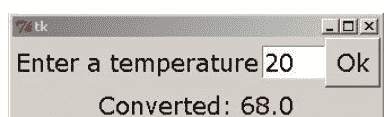

现在我们将分别检查程序的各个组成部分。

### 15.2 标签

标签是你的程序在屏幕上放置文本的地方。以下代码创建一个标签并将其放置在屏幕上。

```
hello_label = Label(text='hello')
hello_label.grid(row=0, column=0)
```

我们调用`Label`来创建一个新标签。大写的`L`是必需的。我们的标签名为`hello_label`。创建后，使用`grid`方法将标签放置在屏幕上。我们将在下一节解释`grid`。

**选项** 有许多选项可以更改，包括字体大小和颜色。以下是一些示例：

```
hello_label = Label(text='hello', font=('Verdana', 24, 'bold'),
                   bg='blue', fg='white')
```

注意关键字参数的使用。以下是一些常见选项：

-   `font` — 基本结构是`font=(字体名, 字体大小, 样式)`。你可以省略字体大小或样式。样式的选择有`'bold'`（粗体）、`'italic'`（斜体）、`'underline'`（下划线）、`'overstrike'`（删除线）、`'roman'`（罗马体）和`'normal'`（正常，这是默认值）。你可以像这样组合多种样式：`'bold italic'`。
-   `fg` 和 `bg` — 分别代表前景色和背景色。可以使用许多常见的颜色名称，如`'blue'`、`'green'`等。第16.2节描述了如何获取几乎任何颜色。
-   `width` — 这是标签应有的字符长度。如果你省略此项，Tkinter将根据你放入标签的文本来确定宽度。这可能导致不可预测的结果，因此最好提前决定你想要的标签长度并相应设置宽度。
-   `height` — 这是标签应有的行高。你可以将其用于多行标签。在文本中使用换行符`'\n'`使其跨越多行。例如，`text='hi\nthere'`。

还有数十个其他选项。前述的《Tkinter入门》[2]对其他选项及其功能有一个很好的列表。

**更改标签属性** 在程序的后期，创建标签后，你可能想要更改它的某些属性。为此，请使用其`configure`方法。以下是两个更改名为`label`的标签属性的示例：

```
label.configure(text='Bye')
label.configure(bg='white', fg='black')
```

使用`configure`方法设置`text`有点像GUI版本的**print**语句。然而，在调用`configure`时，我们不能使用逗号分隔多个要打印的内容。相反，我们需要使用字符串格式化。这是一个**print**语句及其使用`configure`方法的等效写法。

```
print('a =', a, 'and b =', b)
label.configure(text='a = {}, and b = {}'.format(a,b))
```

`configure`方法适用于我们将看到的大多数其他控件。

### 15.3 grid

`grid`方法用于将控件放置在屏幕上。它将屏幕布局为一个由行和列组成的矩形网格。前几行和列如下所示。

| (row=0, column=0) | (row=0, column=1) | (row=0, column=2) |
| :--- | :--- | :--- |
| (row=1, column=0) | (row=1, column=1) | (row=1, column=2) |
| (row=2, column=0) | (row=2, column=1) | (row=2, column=2) |

**跨越多行或多列** 有可选参数`rowspan`和`colspan`，允许一个控件占据多行或多列。以下是几个`grid`语句的示例及其布局效果：

```
label1.grid(row=0, column=0)
label2.grid(row=0, column=1)
label3.grid(row=1, column=0, columnspan=2)
label4.grid(row=1, column=2)
label5.grid(row=2, column=2)
```

| label1 | label2 | |
| --- | --- | --- |
| label 3 | | label4 |
| | | label5 |

**间距** 要在控件之间添加额外空间，可以使用可选参数`padx`和`pady`。

**重要提示** 每当你创建一个控件时，要将其放置在屏幕上，你需要使用`grid`（或其类似方法，如`pack`，我们稍后会讨论）。否则它将不可见。

### 15.4 输入框

输入框是你的GUI获取文本输入的一种方式。以下示例创建一个简单的输入框并将其放置在屏幕上。

```
entry = Entry()
entry.grid(row=0, column=0)
```

适用于标签的大多数选项也适用于输入框（以及我们将讨论的大多数其他控件）。`width`选项特别有用，因为输入框通常会比你需要的更宽。

-   **获取文本** 要从输入框获取文本，请使用其`get`方法。这将返回一个字符串。如果你需要数值数据，请对字符串使用**eval**（或**int**或**float**）。这是一个从名为`entry`的输入框获取文本的简单示例。

    ```
    string_value = entry.get()
    num_value = eval(entry.get())
    ```

-   **删除文本** 要清空输入框，请使用以下代码：

    ```
    entry.delete(0,END)
    ```

-   **插入文本** 要向输入框插入文本，请使用以下代码：

    ```
    entry.insert(0, 'hello')
    ```

### 15.5 按钮

以下示例创建一个简单的按钮：

## 15.5. 按钮

```python
ok_button = Button(text='Ok')
```

要让按钮在被点击时执行某些操作，请使用 `command` 参数。该参数被设置为一个函数的名称，这个函数被称为回调函数。当按钮被点击时，回调函数就会被调用。下面是一个示例：

```python
from tkinter import *

def callback():
    label.configure(text='Button clicked')

root = Tk()
label = Label(text='Not clicked')
button = Button(text='Click me', command=callback)

label.grid(row=0, column=0)
button.grid(row=1, column=0)

mainloop()
```

程序启动时，标签显示“Click me”。当按钮被点击时，回调函数 `callback` 被调用，它将标签更改为显示“Button clicked”。


**lambda 技巧** 有时我们希望向回调函数传递信息，例如，如果我们有多个按钮使用同一个回调函数，并且我们想让函数知道是哪个按钮被点击了。下面是一个示例，我们创建了 26 个按钮，每个字母一个。我们没有使用 26 个独立的 `Button()` 语句和 26 个不同的函数，而是使用了一个列表和一个函数。

```python
from tkinter import *
alphabet = 'ABCDEFGHIJKLMNOPQRSTUVWXYZ'

def callback(x):
    label.configure(text='Button {} clicked'.format(alphabet[x]))

root = Tk()

label = Label()
label.grid(row=1, column=0, columnspan=26)

buttons = [0]*26 # 创建一个列表来容纳26个按钮
for i in range(26):
    buttons[i] = Button(text=alphabet[i],
                        command = lambda x=i: callback(x))
    buttons[i].grid(row=0, column=i)

mainloop()
```

我们注意到关于这个程序的几点。首先，我们设置 `buttons=[0]*26`。这创建了一个包含 26 个元素的列表。我们并不真正关心这些元素是什么，因为它们将被按钮替换。创建列表的另一种方法是设置 `buttons=[]` 并使用 `append` 方法。

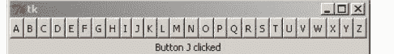

我们只使用一个回调函数，它有一个参数，用于指示哪个按钮被点击了。关于 lambda 技巧，不深入细节的话，`command=callback(i)` 是行不通的，这就是我们诉诸于 lambda 技巧的原因。你可以在第 23.2 节中阅读更多关于 lambda 的内容。另一种方法是使用类。

## 15.6 全局变量

假设我们想跟踪一个按钮被点击了多少次。一个简单的方法是使用一个全局变量，如下所示。

```python
from tkinter import *

def callback():
    global num_clicks
    num_clicks = num_clicks + 1
    label.configure(text='Clicked {} times.'.format(num_clicks))

num_clicks = 0
root = Tk()

label = Label(text='Not clicked')
button = Button(text='Click me', command=callback)

label.grid(row=0, column=0)
button.grid(row=1, column=0)

mainloop()
```


我们将在 GUI 程序中使用一些全局变量。不必要地使用全局变量，尤其是在长程序中，可能会导致难以发现的错误，使程序难以维护，但在我们将要编写的短程序中，应该没问题。面向对象编程提供了全局变量的替代方案。

## 15.7 井字棋

使用 Tkinter，我们只需大约 20 行代码就能制作一个可运行的井字棋程序：

```python
from tkinter import *

def callback(r,c):
    global player
    if player == 'X':
        b[r][c].configure(text = 'X')
        player = 'O'
    else:
        b[r][c].configure(text = 'O')
        player = 'X'

root = Tk()

b = [[0,0,0],
     [0,0,0],
     [0,0,0]]

for i in range(3):
    for j in range(3):
        b[i][j] = Button(font=('Verdana', 56), width=3, bg='yellow', command = lambda r=i,c=j: callback(r,c))
        b[i][j].grid(row = i, column = j)

player = 'X'

mainloop()
```

程序可以运行，尽管它确实存在一些问题，比如允许你更改一个已经有内容的单元格。我们很快会修复这个问题。首先，让我们看看程序是如何工作的。从底部开始，我们有一个变量 `player` 来跟踪轮到谁了。在它上面，我们创建了棋盘，它由存储在二维列表中的九个按钮组成。我们使用 lambda 技巧将被点击按钮的行和列传递给回调函数。在回调函数中，我们在被点击的按钮中写入 X 或 O，并更改全局变量 `player` 的值。

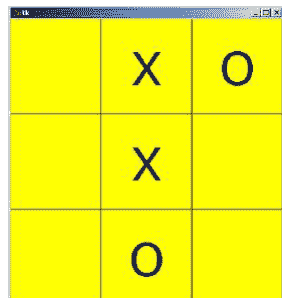

**修正问题** 为了解决可以更改已有内容单元格的问题，我们需要一种方法来知道哪些单元格有 X，哪些有 O，哪些是空的。一种方法是使用 Button 方法来询问按钮它的文本是什么。另一种方法，也是我们将在这里采用的方法，是创建一个新的二维列表，我们称之为 `states`，它将跟踪这些情况。以下是代码。

```python
from tkinter import *

def callback(r,c):
    global player

    if player == 'X' and states[r][c] == 0:
        b[r][c].configure(text='X')
        states[r][c] = 'X'
        player = 'O'

    if player == 'O' and states[r][c] == 0:
        b[r][c].configure(text='O')
        states[r][c] = 'O'
        player = 'X'

root = Tk()

states = [[0,0,0],
          [0,0,0],
          [0,0,0]]

b = [[0,0,0],
     [0,0,0],
     [0,0,0]]

for i in range(3):
    for j in range(3):
        b[i][j] = Button(font=('Verdana', 56), width=3, bg='yellow', command = lambda r=i,c=j: callback(r,c))
        b[i][j].grid(row = i, column = j)

player = 'X'

mainloop()
```

我们并没有给程序增加太多东西。大部分新操作都发生在回调函数中。每次有人点击一个单元格，我们首先检查它是否为空（即 `states` 中对应的索引为 0），如果是，我们在屏幕上显示一个 X 或 O，并在 `states` 中记录新值。许多游戏都有一个像 `states` 这样的变量来跟踪棋盘上的内容。

**检查获胜者** 当有三个 X 或三个 O 连成一线时，无论是垂直、水平还是对角线，我们就有了获胜者。要检查顶行是否有三个连成一线，我们可以使用以下 if 语句：

```python
if states[0][0]==states[0][1]==states[0][2]!=0:
    stop_game=True
    b[0][0].configure(bg='grey')
    b[0][1].configure(bg='grey')
    b[0][2].configure(bg='grey')
```

这检查每个单元格是否具有相同的非零条目。我们在这里使用了第 10.3 节中的快捷方式。也有更冗长的 if 语句可以工作。如果我们确实找到了获胜者，我们会高亮显示获胜的单元格，然后将全局变量 `stop_game` 设置为 **True**。这个变量将在回调函数中使用。只要该变量为 **True**，我们就不应该允许任何移动发生。

接下来，要检查中间行是否有三个连成一线，只需将所有三个引用中的第一个坐标从 0 改为 1；要检查底行是否有三个连成一线，将 0 改为 2。由于我们将有三个非常相似的 if 语句，它们只在一个位置上不同，可以使用 for 循环来保持代码简洁：

```python
for i in range(3):
    if states[i][0]==states[i][1]==states[i][2]!=0:
        b[i][0].configure(bg='grey')
        b[i][1].configure(bg='grey')
        b[i][2].configure(bg='grey')

        stop_game = True
```

接下来，检查垂直获胜者几乎相同，只是我们改变第二个坐标而不是第一个。最后，我们有两个额外的 if 语句来处理对角线。完整的程序在本章末尾。我们还在 configure 语句中添加了一些颜色选项，使游戏看起来更美观一些。

**进一步改进** 从这里开始，添加一个重新开始按钮很容易。该变量的回调函数应该将 `stop_game` 重置为 false，将 `states` 重置为全零，并将所有按钮的配置恢复为 `text=""` 和 `bg='yellow'`。

添加一个计算机玩家也不会太困难，如果你不介意它是一个简单的计算机玩家的话。

## 第15章 使用Tkinter进行GUI编程

## 第16章

## GUI编程 II

本章我们将介绍更多基础的GUI概念。

### 16.1 框架

假设我们想在屏幕顶部放置26个小按钮，并在它们下方放置一个大的“确定”按钮，如下所示：

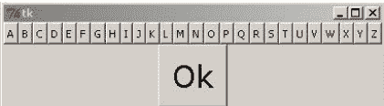

我们尝试以下代码：

```python
from tkinter import *

root = Tk()

alphabet = 'ABCDEFGHIJKLMNOPQRSTUVWXYZ'
buttons = [0]*26
for i in range(26):
    buttons[i] = Button(text=alphabet[i])
    buttons[i].grid(row=0, column=i)

ok_button = Button(text='Ok', font=('Verdana', 24))
ok_button.grid(row=1, column=0)

mainloop()
```

但我们得到的却是如下不理想的结果：

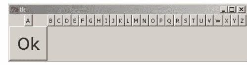

问题出在第0列。那里有两个控件：A按钮和“确定”按钮，而Tkinter会将该列调整得足够宽以容纳较大的控件，即“确定”按钮。这个问题的一种解决方案如下所示：

```python
ok_button.grid(row=1, column=0, columnspan=26)
```

另一种解决方案是使用所谓的框架。框架的作用是容纳其他控件，并将它们组合成一个大的控件。在这种情况下，我们将创建一个框架，将所有字母按钮分组为一个大的控件。代码如下所示：

```python
from tkinter import *

alphabet = 'ABCDEFGHIJKLMNOPQRSTUVWXYZ'
root = Tk()

button_frame = Frame()
buttons = [0]*26
for i in range(26):
    buttons[i] = Button(button_frame, text=alphabet[i])
    buttons[i].grid(row=0, column=i)

ok_button = Button(text='Ok', font=('Verdana', 24))

button_frame.grid(row=0, column=0)
ok_button.grid(row=1, column=0)

mainloop()
```

要创建一个框架，我们使用`Frame()`并给它一个名称。然后，对于任何我们想包含在框架中的控件，我们在控件的声明中将框架的名称作为第一个参数传入。我们仍然需要对控件使用`grid`布局管理器，但现在行和列将是相对于框架的。最后，我们需要对框架本身使用`grid`布局管理器。

### 16.2 颜色

Tkinter定义了许多常见的颜色名称，如'yellow'和'red'。它还提供了一种访问数百万种更多颜色的方法。我们首先需要理解颜色在屏幕上是如何显示的。

每种颜色被分解为三个分量——红色、绿色和蓝色分量。每个分量的值可以从0到255，其中255表示该颜色的全量。等量的红色和绿色混合产生黄色色调，等量的红色和蓝色混合产生紫色色调，等量的蓝色和绿色混合产生青绿色调。三个分量等量混合产生灰色色调。黑色是当所有三个分量的值都为0时，白色是当所有三个分量的值都为255时。改变分量的值可以产生多达256³（约1600万）种颜色。网上有许多资源允许你调整分量的量并查看产生的颜色。

在Tkinter中使用颜色很容易，但有一个问题——分量值是以十六进制给出的。十六进制是一种以16为基数的数字系统，其中字母A-F用于表示数字10到15。它在计算机早期被广泛使用，现在仍偶尔使用。以下是两种数字系统的比较表：

| 十进制 | 十六进制 | 十进制 | 十六进制 | 十进制 | 十六进制 | 十进制 | 十六进制 |
|---|---|---|---|---|---|---|---|
| 0 | 0 | 8 | 8 | 16 | 10 | 80 | 50 |
| 1 | 1 | 9 | 9 | 17 | 11 | 100 | 64 |
| 2 | 2 | 10 | A | 18 | 12 | 128 | 80 |
| 3 | 3 | 11 | B | 31 | 1F | 160 | A0 |
| 4 | 4 | 12 | C | 32 | 20 | 200 | C8 |
| 5 | 5 | 13 | D | 33 | 21 | 254 | FE |
| 6 | 6 | 14 | E | 48 | 30 | 255 | FF |
| 7 | 7 | 15 | F | 64 | 40 | 256 | 100 |

因为颜色分量值的范围是0到255，所以在十六进制中它们的范围是0到FF，因此由两个十六进制数字描述。Tkinter中典型的颜色指定如下：'#A202FF'。颜色名称前有一个井号。然后前两位数字是红色分量（在这种情况下是A2，十进制是162）。接下来的两位数字指定绿色分量（这里是02，十进制是2），最后两位数字指定蓝色分量（这里是FF，十进制是255）。这种颜色最终是一种蓝紫色。以下是使用示例：

```python
label = Label(text='Hi', bg='#A202FF')
```

如果你不想处理十六进制，可以使用以下函数，它将百分比转换为Tkinter使用的十六进制字符串。

```python
def color_convert(r, g, b):
    return '#{:02x}{:02x}{:02x}'.format(int(r*2.55), int(g*2.55), int(b*2.55))
```

以下是使用该函数创建一个背景颜色的示例，该颜色具有100%的红色分量、85%的绿色和80%的蓝色。

```python
label = Label(text='Hi', bg=color_convert(100, 85, 80))
```

### 16.3 图像

标签和按钮（以及其他控件）可以显示图像而不是文本。
使用图像需要一些设置工作。我们首先必须创建一个`PhotoImage`对象并给它一个名称。以下是一个示例：

```python
cheetah_image = PhotoImage(file='cheetahs.gif')
```

以下是将图像放入控件的一些示例：

```python
label = Label(image=cheetah_image)
button = Button(image=cheetah_image, command=cheetah_callback())
```

你可以使用`configure`方法来设置或更改图像：

```python
label.configure(image=cheetah_image)
```

**文件类型** Tkinter的一个不幸限制是它唯一能使用的常见图像文件类型是GIF。如果你想使用其他类型的文件，一个解决方案是使用Python Imaging Library，这将在第18.2节中介绍。

### 16.4 画布

画布是一个控件，你可以在上面绘制线条、圆形、矩形等图形。你也可以在上面绘制文本、图像和其他控件。它是一个非常通用的控件，尽管我们这里只介绍基础知识。

**创建画布** 以下代码创建一个白色背景、大小为200x200像素的画布：

```python
canvas = Canvas(width=200, height=200, bg='white')
```

**矩形** 以下代码在画布上绘制一个红色矩形：

```python
canvas.create_rectangle(20,100,30,150, fill='red')
```

参见下面左侧的图像。前四个参数指定了矩形在画布上的放置坐标。画布的左上角是原点(0, 0)。矩形的左上角在(20, 100)，右下角在(30, 150)。如果省略`fill='red'`，结果将是一个带有黑色轮廓的矩形。

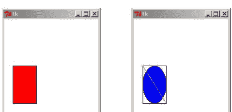

**椭圆和线条** 绘制椭圆和线条是类似的。上面右侧的图像是用以下代码创建的：

puter player that moves randomly. That would take about 10 lines of code. To make an intelligent computer player is not too difficult. Such a computer player should look for two O's or X's in a row in order to try to win or block, as well avoid getting put into a no-win situation.

```python
from tkinter import *

def callback(r,c):
    global player

    if player == 'X' and states[x][y] == 0 and stop_game==False:
        b[r][c].configure(text='X', fg='blue', bg='white') states[r][c] = 'X'

        player = 'O'

            if player == 'O' and states[r][c] == 0 and stop_game==False:
                b[r][c].configure(text='O', fg='orange', bg='black')
                states[r][c] = 'O'
                player = 'X'

    check_for_winner()

def check_for_winner():
    global stop_game
    for i in range(3):
        if states[i][0]==states[i][1]==states[i][2]!=0:
            b[i][0].configure(bg='grey') b[i][1].configure(bg='grey')
            b[i][2].configure(bg='grey')

            stop_game = True

    for i in range(3):
        if states[0][i]==states[1][i]==states[2][i]!=0:
            b[0][i].configure(bg='grey') b[1][i].configure(bg='grey')
            b[2][i].configure(bg='grey')

            stop_game = True

    if states[0][0]==states[1][1]==states[2][2]!=0:
        b[0][0].configure(bg='grey') b[1][1].configure(bg='grey')
        b[2][2].configure(bg='grey')

        stop_game = True

    if states[2][0]==states[1][1]==states[0][2]!=0:
        b[2][0].configure(bg='grey') b[1][1].configure(bg='grey')
        b[0][2].configure(bg='grey')

        stop_game = True

root = Tk()

b = [[0,0,0],
     [0,0,0],
     [0,0,0]]

states = [[0,0,0],
          [0,0,0],
          [0,0,0]]

for i in range(3):
    for j in range(3):
        b[i][j] = Button(font=('Verdana', 56), width=3, bg='yellow', command = lambda r=i,c=j: callback(r,c))
        b[i][j].grid(row = i, column = j)

player = 'X'
stop_game = False

mainloop()
```

canvas.create_rectangle(20,100,70,180)
canvas.create_oval(20,100,70,180, fill='blue')
canvas.create_line(20,100,70,180, fill='green')

矩形在这里是为了展示线条和椭圆的工作方式与矩形类似。前两个坐标是左上角，后两个坐标是右下角。

要获得一个半径为 r、圆心为 (x,y) 的圆，我们可以创建以下函数：

```
def create_circle(x,y,r):
    canvas.create_oval(x-r,y-r,x+r,y+r)
```

**图像** 我们可以向画布添加图像。下面是一个示例：

```
cheetah_image = PhotoImage(file='cheetahs.gif')
canvas.create_image(50,50, image=cheetah_image)
```

这两个坐标是图像中心应该放置的位置。

**命名对象、修改对象、移动对象和删除对象** 我们可以为放置在画布上的对象命名。然后，我们可以使用该名称来引用该对象，以便在需要移动它或将其从画布上移除时使用。下面是一个示例，我们创建一个矩形，更改其颜色，移动它，然后删除它：

```
rect = canvas.create_rectangle(0,0,20,20)
canvas.itemconfigure(rect, fill='red')
canvas.coords(rect,40,40,60,60)
canvas.delete(rect)
```

`coords` 方法用于移动或调整对象大小，`delete` 方法用于删除对象。如果要从画布上删除所有内容，请使用以下代码：

```
canvas.delete(ALL)
```

## 16.5 复选框和单选按钮

在下图中，顶部行显示一个复选框，底部行显示一个单选按钮。

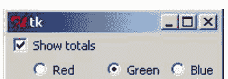

**复选框** 上面复选框的代码是：

```
show_totals = IntVar()
check = Checkbutton(text='Show totals', var=show_totals)
```

这里需要注意的一点是，我们必须将复选框与一个变量绑定，而且不能是任意变量，它必须是一种特殊的 Tkinter 变量，称为 `IntVar`。这个变量 `show_totals` 在复选框未选中时为 0，选中时为 1。要访问该变量的值，你需要使用其 `get` 方法，如下所示：

```
show_totals.get()
```

你也可以使用其 `set` 方法设置变量的值。这将自动选中或取消选中屏幕上的复选框。例如，如果你想在程序开始时选中上面的复选框，请执行以下操作：

```
show_totals = IntVar()
show_totals.set(1)
check = Checkbutton(text='Show totals', var=show_totals)
```

**单选按钮** 单选按钮的工作方式类似。本节开头显示的单选按钮的代码是：

```
color = IntVar()
redbutton = Radiobutton(text='Red', var=color, value=1)
greenbutton = Radiobutton(text='Green', var=color, value=2)
bluebutton = Radiobutton(text='Blue', var=color, value=3)
```

`IntVar` 对象 `color` 的值将是 1、2 或 3，具体取决于选择的是左侧、中间还是右侧按钮。这些值由创建单选按钮时指定的 `value` 选项控制。

**命令** 复选框和单选按钮都有一个 `command` 选项，你可以在其中设置一个回调函数，每当按钮被选中或取消选中时运行。

## 16.6 文本组件

`Text` 组件是 `Entry` 组件的更大、更强大的版本。下面是创建一个的示例：

```
textbox = Text(font=('Verdana', 16), height=6, width=40)
```

该组件将宽 40 个字符，高 6 行。你仍然可以输入超过第六行的内容；该组件一次只会显示六行，你可以使用箭头键滚动。

如果你想让文本框关联一个滚动条，可以使用 `ScrolledText` 组件。除了滚动条之外，`ScrolledText` 的工作方式与 `Text` 大致相同。下面显示了其外观的示例。要使用 `ScrolledText` 组件，你需要以下导入：

```
from tkinter.scrolledtext import ScrolledText
```

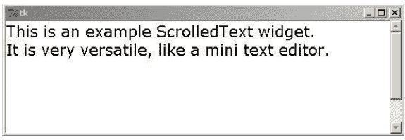

以下是一些常用命令：

| 语句 | 描述 |
| :--- | :--- |
| textbox.get(1.0,END) | 返回文本框的内容 |
| textbox.delete(1.0,END) | 删除文本框中的所有内容 |
| textbox.insert(END,'Hello') | 在文本框末尾插入文本 |

声明 `Text` 组件时一个不错的选项是 `undo=True`，它允许使用 Ctrl+Z 和 Ctrl+Y 撤销和重做编辑。使用 `Text` 组件还可以做很多其他事情。它几乎就像一个微型文字处理器。

## 16.7 滑块组件

`Scale` 是一个你可以来回滑动以选择不同值的组件。下面显示了一个示例，以及创建它的代码。


```
scale = Scale(from_=1, to_=100, length=300, orient='horizontal')
```

以下是 `Scale` 组件的一些有用选项：

| 选项 | 描述 |
| :--- | :--- |
| from_ | 通过拖动滑块可达到的最小值 |
| to_ | 通过拖动滑块可达到的最大值 |
| length | 滑块的长度（以像素为单位） |
| label | 为滑块指定标签 |
| showvalue='NO' | 移除滑块上方显示的数字 |
| tickinterval=1 | 每隔一个单位显示刻度线（1 可以更改） |

你的程序与滑块交互有几种方式。一种方式是像复选框和单选按钮一样，使用 `variable` 选项将其与 `IntVar` 链接。另一种选择是使用滑块的 `get` 和 `set` 方法。第三种方式是使用 `command` 选项，其工作方式与按钮相同。

## 16.8 GUI 事件

通常，我们希望程序在用户按下某个键、在画布上拖动某些东西、使用鼠标滚轮等时执行某些操作。这些事情被称为事件。

**一个简单的例子** 我们在第 15.1 节中看到的第一个 GUI 程序是一个简单的温度转换器。每次我们想转换温度时，我们都会在输入框中输入温度并单击“计算”按钮。如果用户在输入温度后只需按回车键，而不必单击“计算”按钮，那就太好了。我们可以通过向程序添加一行代码来实现这一点：

```
entry.bind('<Return>', lambda dummy=0:calculate())
```

这行代码应该放在声明输入框之后。它的作用是获取回车（Return）键被按下的事件，并将其绑定到 `calculate` 函数。

嗯，算是吧。你绑定事件的函数应该能够接收一个 `Event` 对象的副本，但我们之前编写的 `calculate` 函数不接受任何参数。上面这行代码使用了一个 lambda 技巧来本质上丢弃 `Event` 对象，而不是重写函数。

**常见事件** 以下是一些常见事件的列表：

| 事件 | 描述 |
|---|---|
| <Button-1> | 单击鼠标左键。 |
| <Double-Button-1> | 双击鼠标左键。 |
| <Button-Release-1> | 释放鼠标左键。 |
| <B1-Motion> | 按住鼠标左键并拖动。 |
| <MouseWheel> | 移动鼠标滚轮。 |
| <Motion> | 移动鼠标。 |
| <Enter> | 鼠标现在位于组件上方。 |
| <Leave> | 鼠标已离开组件。 |
| <Key> | 按下某个键。 |
| <key name> | 按下名为 key 的键。 |

对于所有鼠标按钮示例，数字 1 可以替换为其他数字。按钮 2 是中键，按钮 3 是右键。

`Event` 对象中最有用的属性是：

| 属性 | 描述 |
| --- | --- |
| keysym | 被按下的键的名称 |
| x, y | 鼠标指针的坐标 |
| delta | 鼠标滚轮的值 |

**按键事件** 对于按键事件，你可以为不同的键设置特定的回调，也可以捕获所有按键并在同一个回调中处理它们。以下是后者的示例：

```
from tkinter import *

def callback(event):
    print(event.keysym)

root = Tk()
root.bind('<Key>', callback)

mainloop()
```

上面的程序会打印出被按下的键的名称。你可以在 `if` 语句中使用这些名称，在回调函数中处理多个不同的按键，如下所示：

```
if event.keysym == 'percent':
    # 按下了百分号（shift+5），对此进行一些处理...
elif event.keysym == 'a':
    # 按下了小写字母 a，对此进行一些处理...
```

如果你捕获大量按键并且对所有按键执行类似的操作，请使用单个回调方法。另一方面，如果你只想捕获几个特定的按键，或者某些按键有非常长且特定的回调，你可以像下面这样分别捕获按键：

```
from tkinter import *

def callback1(event):
    print('You pressed the enter key.')

def callback2(event):
    print('You pressed the up arrow.')

root = Tk()
root.bind('<Return>', callback1)
root.bind('<Up>', callback2)
mainloop()
```

键名与存储在 `keysym` 属性中的名称相同。你可以使用本节前面的程序来查找所有键的名称。以下是一些常见键的名称：

## 16.9 事件示例

| Tkinter 名称 | 通用名称 |
| :--- | :--- |
| <Return> | 回车键 |
| <Tab> | Tab 键 |
| <Space> | 空格键 |
| <F1>, ..., <F12> | F1, ..., F12 |
| <Next>, <Prior> | 向上翻页，向下翻页 |
| <Up>, <Down>, <Left>, <Right> | 方向键 |
| <Home>, <End> | Home 键，End 键 |
| <Insert>, <Delete> | Insert 键，Delete 键 |
| <Caps_Lock>, <Num_Lock> | 大写锁定键，数字锁定键 |
| <Control_L>, <Control_R> | 左右 Control 键 |
| <Alt_L>, <Alt_R> | 左右 Alt 键 |
| <Shift_L>, <Shift_R> | 左右 Shift 键 |

大多数可打印按键可以通过其名称来捕获，如下所示：

```
root.bind('a', callback)
root.bind('A', callback)
root.bind('-', callback)
```

例外情况是空格键（<Space>）和小于号（<Less>）。你也可以捕获组合键，例如 <Shift-F5>、<Control-Next>、<Alt-2> 或 <Control-Shift-F1>。

**注意** 这些示例都将按键绑定到 root，这是我们对主窗口的称呼。你也可以将按键绑定到特定的部件。例如，如果你只想让左方向键在一个名为 canvas 的画布上工作，可以使用以下代码：

```
canvas.bind(<Left>, callback)
```

不过，这里有一个技巧：除非画布拥有 GUI 的焦点，否则它不会识别按键。可以通过以下方式设置焦点：

```
canvas.focus_set()
```

**示例 1** 这是一个用户可以使用左或右方向键移动矩形的示例。

```
from tkinter import *

def callback(event):
    global move
    if event.keysym=='Right':
        move += 1
    elif event.keysym=='Left':
        move -=1
    canvas.coords(rect,50+move,50,100+move,100)

root = Tk()
root.bind('<Key>', callback)
canvas = Canvas(width=200,height=200)
canvas.grid(row=0,column=0)
rect = canvas.create_rectangle(50,50,100,100,fill='blue')
move = 0

mainloop()
```

**示例 2** 这是一个演示鼠标事件的示例程序。程序开始时在屏幕上绘制一个矩形。用户可以执行以下操作：

- 用鼠标拖动矩形（<B1_Motion>）。
- 用鼠标滚轮调整矩形大小（<MouseWheel>）。
- 每当用户左键单击时，矩形会改变颜色（<Button-1>）。
- 任何时候移动鼠标，当前鼠标坐标都会显示在一个标签中（<Motion>）。

以下是该程序的代码：

```
from tkinter import *

def mouse_motion_event(event):
    label.configure(text='{}, {}'.format(event.x, event.y))

def wheel_event(event):
    global x1, x2, y1, y2
    if event.delta>0:
        diff = 1
    elif event.delta<0:
        diff = -1
    x1+=diff
    x2-=diff
    y1+=diff
    y2-=diff
    canvas.coords(rect,x1,y1,x2,y2)

def b1_event(event):
    global color
    if not b1_drag:
        color = 'Red' if color=='Blue' else 'Blue'
        canvas.itemconfigure(rect, fill=color)

def b1_motion_event(event):
    global b1_drag, x1, x2, y1, y2, mouse_x, mouse_y
    x = event.x
    y = event.y
    if not b1_drag:
        mouse_x = x
        mouse_y = y
        b1_drag = True
        return
    x1+=(x-mouse_x)
    x2+=(x-mouse_x)
    y1+=(y-mouse_y)
    y2+=(y-mouse_y)
    canvas.coords(rect,x1,y1,x2,y2)
    mouse_x = x
    mouse_y = y

def b1_release_event(event):
    global b1_drag
    b1_drag = False

root=Tk()

label = Label()

canvas = Canvas(width=200, height=200)
canvas.bind('<Motion>', mouse_motion_event)
canvas.bind('<ButtonPress-1>', b1_event)
canvas.bind('<B1-Motion>', b1_motion_event)
canvas.bind('<ButtonRelease-1>', b1_release_event)
canvas.bind('<MouseWheel>', wheel_event)
canvas.focus_set()

canvas.grid(row=0, column=0)
label.grid(row=1, column=0)

mouse_x = 0
mouse_y = 0
b1_drag = False

x1 = y1 = 50
x2 = y2 = 100
color = 'blue'
rect = canvas.create_rectangle(x1,y1,x2,y2,fill=color)

mainloop()
```

以下是关于程序工作原理的一些说明：

1. 首先，每次鼠标在画布上移动时，都会调用 mouse_motion_event 函数。该函数打印鼠标当前的坐标，这些坐标包含在 Event 属性 x 和 y 中。
2. 每当用户使用鼠标（滚动）滚轮时，都会调用 wheel_event 函数。Event 属性 delta 包含有关滚轮移动速度和方向的信息。我们只是根据滚轮是向前还是向后移动来拉伸或收缩矩形。
3. 每当用户按下鼠标左键时，都会调用 b1_event 函数。该函数在矩形被单击时改变其颜色。这里有一个名为 b1_drag 的全局变量很重要。每当用户拖动矩形时，它就被设置为 True。当拖动进行时，鼠标左键被按下，并且 b1_event 函数被持续调用。我们不想在这种情况下不断改变矩形的颜色，因此使用了 if 语句。
4. 拖动主要在 b1_motion_event 函数中完成，该函数在鼠标左键被按下且鼠标被移动时调用。它使用全局变量来跟踪上次调用函数时鼠标的位置，然后根据新旧位置之间的差异移动矩形。当拖动完成时，鼠标左键将被释放。当这种情况发生时，会调用 b1_release_event 函数，我们相应地设置全局 b1_drag 变量。
5. 需要 focus_set 方法，因为除非焦点在画布上，否则画布不会识别鼠标滚轮事件。
6. 这个程序的一个问题是，用户可以通过单击画布上的任何位置来修改矩形，而不仅仅是矩形本身。如果我们只想在鼠标位于矩形上方时才发生更改，可以专门绑定矩形而不是整个画布，如下所示：

```
canvas.tag_bind(rect, '<B1-Motion>', b1_motion_event)
```

7. 最后，这里全局变量的使用有点混乱。如果这是更大项目的一部分，将所有这些封装到一个类中可能是有意义的。

# 第 17 章

## GUI 编程 III

本章包含更多 GUI 的零散内容。

## 17.1 标题栏

Tkinter 创建的 GUI 窗口默认显示 Tk。以下是更改方法：

```
root.title('Your title')
```

## 17.2 禁用部件

有时你想禁用一个按钮，使其无法被点击。按钮有一个 state 属性，允许你禁用该部件。使用 state=DISABLED 来禁用按钮，使用 state=NORMAL 来启用它。下面是一个创建初始禁用然后启用的按钮的示例：

```
button = Button(text='Hi', state=DISABLED, command=function)
button.configure(state=NORMAL)
```

你也可以使用 state 属性来禁用许多其他类型的部件。

## 17.3 获取部件的状态

有时，你需要了解部件的信息，比如其中确切的文本是什么或其背景颜色是什么。cget 方法用于此目的。例如，以下代码获取名为 label 的标签的文本：

```
label.cget('text')
```

这可以用于按钮、画布等，并且可以用于它们的任何属性，如 bg、fg、state 等。作为快捷方式，Tkinter 重载了 [] 运算符，因此 label['text'] 可以实现与上述示例相同的功能。

## 17.4 消息框

消息框是弹出窗口，用于向你提问或说些什么然后消失。要使用它们，我们需要一个导入语句：

```
from tkinter.messagebox import *
```

有多种不同类型的消息框。对于每种类型，你都可以指定用户将看到的消息以及消息框的标题。以下是三种类型的消息框，以及生成它们的代码：

```
showinfo(title='Message for you', message='Hi There!')
askquestion(title='Quit?', message='Do you really want to quit?')
showwarning(title='Warning', message='Unsupported format')
```

以下是所有类型消息框的列表。每种都以自己的方式显示消息。

| 消息框 | 特殊属性 |
|---|---|
| showinfo | 确定按钮 |
| askokcancel | 确定和取消按钮 |
| askquestion | 是和否按钮 |
| askretrycancel | 重试和取消按钮 |
| askyesnocancel | 是、否和取消按钮 |
| showerror | 错误图标和确定按钮 |
| showwarning | 警告图标和确定按钮 |

这些函数中的每一个都返回一个值，指示用户点击了什么。有关使用返回值的简单示例，请参阅下一节。以下是返回值的表格：| 函数 | 返回值（基于用户点击内容） |
| :--- | :--- |
| showinfo | 始终返回 'ok' |
| askokcancel | 确定—**True** 取消或关闭窗口—**False** |
| askquestion | 是—'yes' 否—'no' |
| askretrycancel | 重试—**True** 取消或关闭窗口—**False** |
| askyesnocancel | 是—**True** 否—**False** 其他—**None** |
| showerror | 始终返回 'ok' |
| showwarning | 始终返回 'ok' |

## 17.5 销毁组件

要移除一个组件，请使用其 `destroy` 方法。例如，要移除一个名为 `button` 的按钮，请执行以下操作：

```
button.destroy()
```

要移除整个 GUI 窗口，请使用以下代码：

```
root.destroy()
```

**阻止窗口关闭** 当用户尝试关闭主窗口时，你可能想执行某些操作，例如询问他们是否确实要退出。以下是一种实现方式：

```
from tkinter import *
from tkinter.messagebox import askquestion

def quitter_function():
    answer = askquestion(title='Quit?', message='Really quit?')
    if answer=='yes':
        root.destroy()

root = Tk()
root.protocol('WM_DELETE_WINDOW', quitter_function)
mainloop()
```

关键在于下面这行代码，它使得每当用户尝试关闭窗口时，都会调用 `quitter_function`。

```
root.protocol('WM_DELETE_WINDOW', quitter_function)
```

## 17.6 更新

Tkinter 会定期更新屏幕，但有时这还不够频繁。例如，在一个由按钮点击触发的函数中，Tkinter 在函数完成之前不会更新屏幕。

如果在该函数中，你想更改屏幕上的某些内容，暂停一小会儿，然后再更改其他内容，你就需要在暂停之前告诉 Tkinter 更新屏幕。为此，只需使用：

```
root.update()
```

如果你只想更新某个特定的组件，而不更新其他任何内容，可以使用该组件的 `update` 方法。例如，

```
canvas.update()
```

一个偶尔有用的、相关的事情是在预定的时间间隔后执行某些操作。例如，你的程序中可能有一个计时器。为此，你可以使用 `after` 方法。它的第一个参数是更新前等待的毫秒数，第二个参数是时间到了时要调用的函数。以下是一个实现计时器的示例：

```
from time import time
from tkinter import *

def update_timer():
    time_left = int(90 - (time()-start))
    minutes = time_left // 60
    seconds = time_left % 60
    time_label.configure(text='{:02d}:{:02d}'.format(minutes, seconds))
    root.after(100, update_timer)

root = Tk()
time_label = Label()
time_label.grid(row=0, column=0)

start = time()
update_timer()

mainloop()
```

此示例使用了 `time` 模块，该模块在第 20.2 节中介绍。

## 17.7 对话框

许多程序都有对话框，允许用户选择要打开的文件或保存文件。要在 Tkinter 中使用它们，我们需要以下导入语句：

```
from tkinter.filedialog import *
```

Tkinter 对话框通常看起来像操作系统原生的对话框。

### 17.7.1 对话框

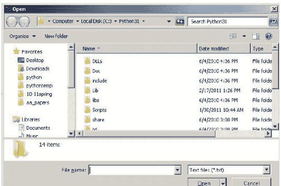

以下是最有用的对话框：

| 对话框 | 描述 |
| :--- | :--- |
| askopenfilename | 打开一个典型的文件选择对话框 |
| askopenfilenames | 与前一个类似，但用户可以选择多个文件 |
| asksaveasfilename | 打开一个典型的文件保存对话框 |
| askdirectory | 打开一个目录选择对话框 |

`askopenfilename` 和 `asksaveasfilename` 的返回值是所选文件的名称。如果用户没有选择任何值，则没有返回值。`askopenfilenames` 的返回值是一个文件列表，如果没有选择文件，则为空列表。`askdirectory` 函数返回所选目录的名称。

你可以向这些函数传递一些选项。你可以将 `initialdir` 设置为对话框开始时所在的目录。你还可以指定文件类型。以下是一个示例：

```
filename=askopenfilename(initialdir='c:\python31\',
    filetypes=[('Image files', '.jpg .png .gif'),
               ('All files', '*')])
```

**一个简短的示例** 以下是一个示例，它打开一个文件对话框，允许你选择一个文本文件。然后，程序在文本框中显示文件的内容。

```
from tkinter import *
from tkinter.filedialog import *
from tkinter.scrolledtext import ScrolledText

root = Tk()
textbox = ScrolledText()
textbox.grid()

filename=askopenfilename(initialdir='c:\python31\', filetypes=[('Text files', '.txt'),
('All files', '*')])

s = open(filename).read()
textbox.insert(1.0, s)

mainloop()
```

## 17.8 菜单栏

我们可以创建一个菜单栏，如下所示，位于窗口顶部。

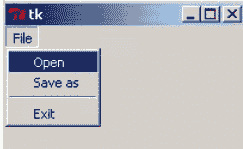

以下是一个使用上一节中部分对话框的示例：

```
from tkinter import *
from tkinter.filedialog import *

def open_callback():
    filename = askopenfilename()
    # 在此处添加代码以对 filename 执行某些操作

def saveas_callback():
    filename = asksaveasfilename()
    # 在此处添加代码以对 filename 执行某些操作

root = Tk()
menu = Menu()
root.config(menu=menu)
file_menu = Menu(menu, tearoff=0)
file_menu.add_command(label='Open', command=open_callback)
file_menu.add_command(label='Save as', command=saveas_callback)
file_menu.add_separator()
file_menu.add_command(label='Exit', command=root.destroy)
menu.add_cascade(label='File', menu=file_menu)

mainloop()
```

## 17.9 新窗口

创建一个新窗口很容易。使用 `Toplevel` 函数：

```
window = Toplevel()
```

你可以向新窗口添加组件。创建组件时，第一个参数需要是窗口的名称，如下所示：

```
new_window = Toplevel()
label = Label(new_window, text='Hi')
label.grid(row=0, column=0)
```

## 17.10 pack

`grid` 的一个替代方案是 `pack`。它不如 `grid` 通用，但在某些地方很有用。它使用一个名为 `side` 的参数，允许你为组件指定四个位置：`TOP`、`BOTTOM`、`LEFT` 和 `RIGHT`。有两个有用的可选参数：`fill` 和 `expand`。以下是一个示例。

```
button1=Button(text='Hi')
button1.pack(side=TOP, fill=X)
button2=Button(text='Hi')
button2.pack(side=BOTTOM)
```

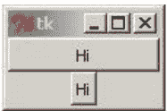

`fill` 选项使组件填充分配给它的可用空间。它可以是 `X`、`Y` 或 `BOTH`。`expand` 选项用于允许组件在窗口调整大小时扩展。要启用它，请使用 `expand=YES`。

> **注意** 你可以在某些框架中使用 `pack`，在其他框架中使用 `grid`；只是不要在同一个框架中混合使用 `pack` 和 `grid`，否则 Tkinter 将不知道该如何处理。

## 17.11 StringVar

在第 16.5 节中，我们看到了如何将一个名为 `IntVar` 的 Tkinter 变量绑定到复选按钮或单选按钮。Tkinter 还有另一种类型的变量，称为 `StringVar`，用于保存字符串。这种类型的变量可用于更改标签、按钮或其他一些组件中的文本。我们已经知道如何使用 `configure` 方法更改文本，而 `StringVar` 提供了另一种方法。

要将组件绑定到 `StringVar`，请使用组件的 `textvariable` 选项。`StringVar` 具有 `get` 和 `set` 方法，就像 `IntVar` 一样，每当你设置该变量时，所有绑定到它的组件都会自动更新。

以下是一个简单的示例，将两个标签绑定到同一个 `StringVar`。还有一个按钮，点击时会交替更改 `StringVar` 的值（从而更改标签中的文本）。

```
from tkinter import *

def callback():
    global count
    s.set('Goodbye' if count%2==0 else 'Hello')
    count +=1

root = Tk()

count = 0
s = StringVar()
s.set('Hello')

label1 = Label(textvariable = s, width=10)
label2 = Label(textvariable = s, width=10)
button = Button(text = 'Click me', command = callback)

label1.grid(row=0, column=0)
label2.grid(row=0, column=1)
button.grid(row=1, column=0)

mainloop()
```

## 17.12 更多 GUI 内容

我们省略了很多关于 Tkinter 的内容。更多信息请参阅 Lundh 的《Tkinter 入门》[2]。Tkinter 功能多样且易于使用，但如果你需要更强大的功能，还有其他第三方 Python GUI 库。

## 第18章

## 进阶图形编程

### 18.1 Python 2 与 Python 3

截至本文撰写时，Python的最新版本是3.2，本书中的所有代码都设计为在Python 3.2中运行。棘手的是，从3.0版本开始，Python与旧版本不再兼容。在旧版本中编写的代码在Python 3中并不总是能运行。问题在于，当时有许多为Python 2编写的有用库，截至本文撰写时尚未移植到Python 3。我们希望使用这些库，因此需要对Python 2有所了解。幸运的是，我们只需要关注几个主要区别。

**除法** 在Python 2中，除法运算符`/`在用于整数时，其行为类似于`//`。例如，`5/4`在Python 2中计算结果为1，而在Python 3中计算结果为1.2。这是许多其他编程语言中除法运算符的行为方式。在Python 3中，决定让除法运算符的行为符合我们习惯的数学规则。

在Python 2中，如果你想通过5除以4得到1.25，你需要写成`5/4.0`。至少有一个参数必须是浮点数，结果才会是浮点数。如果你要除以两个变量，那么可能需要写成`x/float(y)`而不是`x/y`。

**print** Python 3中的**print**函数在Python 2中实际上是**print**语句。因此在Python 2中，你会这样写：

```
print 'Hello'
```

不需要任何括号。这段代码在Python 3中将无法工作，因为**print**语句现在变成了**print**函数，而函数需要括号。此外，当前的**print**函数具有那些有用的可选参数`sep`和`end`，这些在Python 2中不可用。

**input** Python 2中与**input**函数等价的是**raw_input**。

**range** 在Python 2中，**range**函数在处理非常大的范围时可能效率低下。原因是，在Python 2中，如果你使用**range(10000000)**，Python会创建一个包含1000万个数字的列表。Python 3中的**range**语句更高效，它不会一次性生成所有1000万个元素，而是在需要时才生成数字。Python 2中行为类似于Python 3 **range**的函数是**xrange**。

**字符串格式化** Python 2中的字符串格式化与Python 3略有不同。当在花括号内使用格式化代码时，在Python 2中，你需要指定参数编号。比较以下示例：

```
Python 2: 'x={0:3d},y={1:3d},z={2:3d}'.format(x,y,z)
Python 3: 'x={:3d},y={:3d},z={:3d}'.format(x,y,z)
```

从Python 3.1开始，指定参数编号变为可选。
还有一种较旧的格式化风格，你可能会不时看到，它使用%运算符。下面是一个示例以及相应的新风格：

```
Python 2: 'x=%3d, y=%6.2f,z=%3s' % (x,y,z)
Python 3: 'x={:3d},y={:6.2f},z={:3s}'.format(x,y,z)
```

**模块名称** 一些模块被重命名和重组。以下是几个Tkinter名称的更改：

| Python 2 | Python 3 |
|---|---|
| Tkinter | tkinter |
| ScrolledText | tkinter.scrolledtext |
| tkMessageBox | tkinter.messagebox |
| tkFileDialog | tkinter.filedialog |

我们稍后会看到许多其他模块被重命名，大多数只是改为小写。例如，Python 2中的Queue在Python 3中现在是queue。

**字典推导式** Python 2中没有字典推导式。

**其他更改** 语言中还有许多其他更改，但其中大多数涉及比我们这里讨论的更高级的功能。

**导入未来行为** 以下导入允许我们在Python 2中使用Python 3的除法行为。

```
from __future__ import division
```

你还可以从未来导入许多其他东西。

### 18.2 Python Imaging Library

Python Imaging Library (PIL) 包含用于处理图像的有用工具。截至本文撰写时，PIL仅适用于Python 2.7或更早版本。PIL不是标准Python发行版的一部分，因此你需要单独下载并安装它。不过安装很容易。

PIL自2009年以来就没有维护过，但有一个名为Pillow的项目，它与PIL几乎兼容，并且可以在Python 3.0及更高版本中工作。

我们这里只介绍PIL的一些功能。一个好的参考是[Python Imaging Library手册](https://pillow.readthedocs.io/)。

**在Tkinter中使用GIF以外的图像** 正如我们所看到的，Tkinter不能使用JPEG和PNG。但如果我们结合PIL使用，它就可以。这里有一个简单的例子：

```
from Tkinter import *
from PIL import Image, ImageTk

root = Tk()
cheetah_image = ImageTk.PhotoImage(Image.open('cheetah.jpg'))

button = Button(image=cheetah_image)
button.grid(row=0, column=0)

mainloop()
```

第一行导入Tkinter。记住在Python 2中它是大写的Tkinter。下一行从PIL导入一些东西。接下来，在我们本应使用Tkinter的PhotoImage加载图像的地方，我们改用两个PIL函数的组合。然后我们就可以像往常一样在我们的小部件中使用该图像了。

**图像** PIL是Python Imaging Library，因此它包含许多用于处理图像的工具。我们这里只展示一个简单的例子。下面的程序在画布上显示一张照片，当用户点击按钮时，图像被转换为灰度。

```
from Tkinter import *
from PIL import Image, ImageTk

def change():
    global image, photo
    pix = image.load()
    for i in range(photo.width()):
        for j in range(photo.height()):
            red,green,blue = pix[i,j]
            avg = (red+green+blue)//3
            pix[i,j] = (avg, avg, avg)
    photo=ImageTk.PhotoImage(image)
    canvas.create_image(0,0,image=photo,anchor=NW)

def load_file(filename):
    global image, photo
    image=Image.open(filename).convert('RGB')
    photo=ImageTk.PhotoImage(image)
    canvas.configure(width=photo.width(), height=photo.height())
    canvas.create_image(0,0,image=photo,anchor=NW)
    root.title(filename)

root = Tk()
button = Button(text='Change', font=('Verdana', 18), command=change)
canvas = Canvas()
canvas.grid(row=0)
button.grid(row=1)
load_file('pic.jpg')

mainloop()
```

我们先看看load_file函数。许多图像工具都在Image模块中。我们将Image.open语句创建的对象命名为image。我们还使用convert方法将图像转换为RGB（红-绿-蓝）格式。我们稍后会看到为什么。下一行创建了一个名为photo的ImageTk对象，它将被绘制到Tkinter画布上。photo对象有方法可以让我们获取其宽度和高度，以便我们可以适当地调整画布大小。

现在看看change函数。image对象有一个名为load的方法，可以访问构成图像的各个像素。这返回一个二维的RGB值数组。例如，如果图像左上角的像素是纯白色，那么pix[0,0]将是(255,255,255)。如果右边下一个像素是纯黑色，pix[1,0]将是(0,0,0)。要将图像转换为灰度，对于每个像素，我们取其红色、绿色和蓝色分量的平均值，然后将红色、绿色和蓝色分量重置为都等于该平均值。记住，如果红色、绿色和蓝色都相同，那么颜色就是灰色的阴影。修改完所有像素后，我们从修改后的像素数据创建一个新的ImageTk对象，并将其显示在画布上。

你可以从中获得很多乐趣。尝试修改change函数。例如，如果我们在change函数中使用以下行，我们会得到一个看起来像照片底片的效果：

```
pix[i,j] = (255-red, 255-green, 255-blue)
```

尝试看看你能想出什么有趣的效果。

但请注意，这种操作图像的方式是缓慢、手动的方式。PIL有许多更快的函数用于修改图像。你可以非常轻松地更改图像的亮度、色调和对比度，调整大小，旋转等等。有关更多信息，请参阅PIL参考资料。

## 18.2 图像处理

**putdata** 如果你对绘制分形等数学图形感兴趣，在Python中逐像素绘制点可能会非常慢。一种加速方法是使用`putdata`方法。其工作原理是向它提供一个RGB像素值列表，它会将这些值复制到你的图像中。下面是一个绘制300x300随机颜色网格的程序。

```python
from random import randint
from Tkinter import *
from PIL import Image, ImageTk

root = Tk()
canvas = Canvas(width=300, height=300)
canvas.grid()
image=Image.new(mode='RGB',size=(300,300))

L = [(randint(0,255), randint(0,255), randint(0,255))
    for x in range(300) for y in range(300)]

image.putdata(L)

photo=ImageTk.PhotoImage(image)
canvas.create_image(0,0,image=photo,anchor=NW)
mainloop()
```

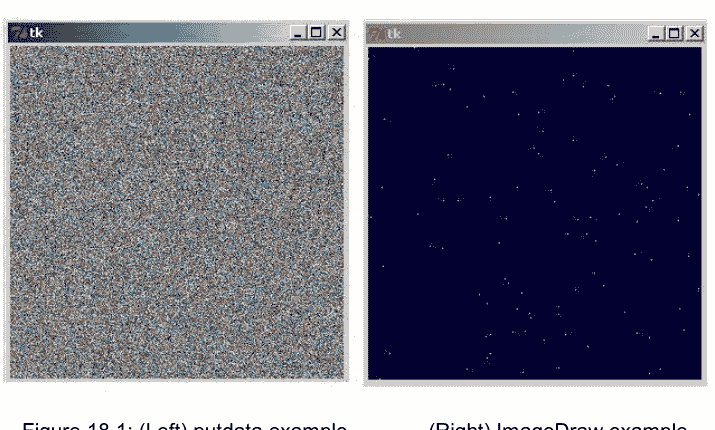

**ImageDraw** ImageDraw模块提供了另一种在图像上绘制的方法。它可以用来绘制矩形、圆形、点等，就像Tkinter画布一样，但速度更快。下面是一个简短的例子，它用深蓝色填充图像，然后绘制100个随机分布的黄色点。

```python
from random import randint
from Tkinter import *
from PIL import Image, ImageTk, ImageDraw

root = Tk()
canvas = Canvas(width=300, height=300)
canvas.grid()
image=Image.new(mode='RGB',size=(300,300))
draw = ImageDraw.Draw(image)

draw.rectangle([(0,0),(300, 300)],fill='#000030')
L = [(randint(0,299), randint(0, 299)) for i in range(100)]
draw.point(L, fill='yellow')

photo=ImageTk.PhotoImage(image)
canvas.create_image(0,0,image=photo,anchor=NW)
mainloop()
```

要使用ImageDraw，我们必须首先创建一个ImageDraw对象并将其与Image对象关联。`draw.rectangle`方法的工作方式类似于画布的`create_rectangle`方法，只是括号的使用有些不同。`draw.point`方法用于绘制单个像素。它的一个优点是，我们可以传递一个点列表，而不必单独绘制列表中的每个项目。传递列表也快得多。

## 18.3 Pygame

Pygame是一个用于在Python中创建二维游戏的库。它可以用来制作老式街机或任天堂游戏级别的游戏。可以从www.pygame.org下载并轻松安装。那里有许多教程可以帮助你入门。我对Pygame了解不多，所以这里不会详细介绍，不过也许在后续版本中会涉及。

# 第三部分

## 中级主题

# 第19章

## 杂项主题 III

在本章中，我们将探讨各种有用的主题。

## 19.1 可变性与引用

如果`L`是一个列表，`s`是一个字符串，那么`L[0]`给出列表的第一个元素，`s[0]`给出字符串的第一个元素。如果我们想将列表的第一个元素更改为3，`L[0]=3`就可以做到。但我们不能用这种方式更改字符串。原因与Python处理列表和字符串的方式有关。列表（和字典）被称为可变的，这意味着它们的内容可以更改。另一方面，字符串是不可变的，这意味着它们不能被更改。字符串不可变的原因部分是为了性能（不可变对象更快），部分是因为字符串被认为是与数字一样的基本元素。这也使得语言的其他一些方面更容易处理。

**制作副本** 列表和字符串的另一个不同之处在于我们尝试制作副本时。考虑以下代码：

```python
s = 'Hello'
copy = s
s = s + '!!!'
print('s is now:', s, ' Copy:', copy)
```

s is now: Hello!!! Copy: Hello

在上面的代码中，我们制作了`s`的一个副本，然后更改了`s`。一切都如我们直观预期的那样工作。现在看看使用列表的类似代码：

```python
L = [1,2,3]
copy = L
L[0]=9
print('L is now:', L, ' Copy:', copy)
```

L is now: [9, 2, 3] Copy: [9, 2, 3]

我们可以看到，列表代码没有像我们预期的那样工作。当我们更改`L`时，副本也随之更改。正如第7章所述，制作`L`副本的正确方法是`copy=L[:]`。理解这些例子的关键在于引用。

**引用** Python中的一切都是对象。这包括数字、字符串和列表。当我们进行简单的变量赋值，比如`x=487`时，实际发生的是Python创建了一个值为487的整数对象，而变量`x`充当对该对象的引用。并不是值487存储在名为`x`的内存位置，而是487存储在内存中的某个地方，`x`指向那个位置。如果我们接着声明`y=487`，那么`y`也指向同一个内存位置。

另一方面，如果我们接着说`x=721`，发生的是我们在内存中的某个地方创建了一个值为721的新整数对象，`x`现在指向它。487仍然存在于它原来的内存位置，并且至少会一直存在，直到没有任何东西指向它，此时它的内存位置将可以被其他东西使用。

所有对象都以相同的方式处理。当我们设置`s='Hello'`时，字符串对象`Hello`在内存中的某个地方，`s`是它的引用。当我们接着说`copy=s`时，我们实际上是在说`copy`是`'Hello'`的另一个引用。如果我们接着做`s=s+'!!!'`，发生的是创建了一个新对象`'Hello!!!'`，并且因为我们将其赋值给`s`，所以`s`现在是那个新对象`'Hello!!!'`的引用。记住字符串是不可变的，所以不能将`'Hello'`更改为其他内容。相反，Python创建一个新对象并将变量`s`指向它。

当我们设置`L=[1,2,3]`时，我们创建了一个列表对象`[1,2,3]`和一个指向它的引用`L`。当我们说`copy=L`时，我们是在创建另一个指向对象`[1,2,3]`的引用。当我们做`L[0]=9`时，因为列表是可变的，列表`[1,2,3]`被就地更改为`[9,2,3]`。没有创建新对象。列表`[1,2,3]`现在消失了，由于`copy`仍然指向同一个位置，它的值是`[9,2,3]`。

另一方面，如果我们改用`copy=L[:]`，我们实际上是在内存中的其他地方创建了一个新的列表对象，这样内存中就有两个`[1,2,3]`的副本。然后当我们做`L[0]=9`时，我们只更改了`L`指向的东西，而`copy`仍然指向`[1,2,3]`。

再补充一点以强调这一点。如果我们设置`x=487`，然后设置`x=721`，我们首先创建一个整数对象487并将`x`指向它。当我们接着设置`x=721`时，我们创建了一个新的整数对象721并将`x`指向它。最终效果是`x`的“值”似乎在改变，但实际上改变的是`x`指向的东西。

**垃圾回收** 在内部，Python维护着每个对象的引用计数。当一个对象的引用计数降至0时，该对象就不再需要，它之前使用的内存将再次可用。

## 19.2 元组

元组本质上是一个不可变的列表。下面是一个包含三个元素的列表和一个包含三个元素的元组：

```python
L = [1,2,3]
t = (1,2,3)
```

元组用括号括起来，尽管括号实际上是可选的。索引和切片的工作方式与列表相同。与列表一样，你可以使用`len`函数获取元组的长度，并且像列表一样，元组有`count`和`index`方法。然而，由于元组是不可变的，它没有列表具有的其他方法，比如`sort`或`reverse`，因为这些方法会更改列表。

我们已经在几个地方见过元组了。例如，Tkinter中的字体被指定为对，如`('Verdana', 14)`，有时是三元组。字典方法`items`返回一个元组列表。此外，当我们使用以下快捷方式交换两个或多个变量的值时，我们实际上是在使用元组：

```python
a,b = b,a
```

同时存在列表和元组的一个原因是，在某些情况下，你可能需要一个不可变的列表类型。例如，列表不能用作字典的键，因为列表的值可以更改，而Python字典必须跟踪这些变化将是一场噩梦。然而，元组可以用作字典的键。下面是一个为学生团队分配成绩的例子：

```python
grades = {('John', 'Ann'): 95, ('Mike', 'Tazz'): 87}
```

此外，在速度确实至关重要的情况下，元组通常比列表更快。列表的灵活性伴随着相应的速度成本。

**tuple** 要将对象转换为元组，请使用`tuple`。以下示例将一个列表和一个字符串转换为元组：

```python
t1 = tuple([1,2,3])
t2 = tuple('abcde')
```

**注意** 空元组是`()`。获取包含一个元素的元组的方法是这样的：`(1,)`。像`(1)`这样的形式将不起作用，因为它只是像普通计算一样求值为1。例如，在表达式`2+(3*4)`中，我们不希望`(3*4)`是一个元组，我们希望它求值为一个数字。

## 19.3 集合

Python有一种称为集合的数据类型。集合的工作方式类似于数学集合。它们很像没有重复项的列表。集合用花括号表示，如下所示：

## 19.3 集合

```
S = {1,2,3,4,5}
```

回想一下，花括号也用于表示字典，而 `{}` 是空字典。要获取空集，请使用不带参数的 **set** 函数，如下所示：

```
S = set()
```

这个 **set** 函数也可以用来将其他类型转换为集合。这里有两个例子：

```
set([1,4,4,4,5,1,2,1,3])
set('this is a test')
```

```
{1, 2, 3, 4, 5}
{'a', ' ', 'e', 'i', 'h', 's', 't'}
```

请注意，Python 会以它想要的任何顺序存储集合中的数据，不一定是你指定的顺序。重要的是集合中的数据，而不是数据的顺序。这意味着索引对集合没有意义。例如，你不能做 `s[0]`。

**使用集合** 有一些运算符可以用于集合。

| 运算符 | 描述 | 示例 |
| :--- | :--- | :--- |
| \| | 并集 | {1,2,3} \| {3,4} = {1,2,3,4} |
| & | 交集 | {1,2,3} & {3,4} = {3} |
| - | 差集 | {1,2,3} - {3,4} = {1,2} |
| ^ | 对称差集 | {1,2,3} ^ {3,4} = {1,2,4} |
| in | 是元素 | 3 in {1,2,3} = True |

两个集合的对称差集给出那些在一个集合中但不在另一个集合中的元素。这里有一些有用的方法：

| 方法 | 描述 |
| :--- | :--- |
| S.add(x) | 将 x 添加到集合中 |
| S.remove(x) | 从集合中移除 x |
| S.issubset(A) | 如果 S 是 A 的子集则返回 **True**，否则返回 **False**。 |
| S.issuperset(A) | 如果 A 是 S 的子集则返回 **True**，否则返回 **False**。 |

最后，我们可以像列表推导式一样进行集合推导式：

```
s = {i**2 for i in range(12)}
```

```
{0, 1, 4, 100, 81, 64, 9, 16, 49, 121, 25, 36}
```

集合推导式在 Python 2 中不存在。

**示例：从列表中移除重复元素** 我们可以利用集合不能有重复项的特性来移除列表中的所有重复项。这里有一个例子：

```
L = [1,4,4,4,5,1,2,1,3]
L = list(set(L))
```

之后，L 将等于 `[1,2,3,4,5]`。

**示例：文字游戏** 这是一个使用集合来查看单词中的每个字母是否是 a、b、c、d 或 e 的 if 语句示例：

```
if set(word).issubset('abcde'):
```

## 19.4 Unicode

过去，计算机只能显示 255 个不同的字符，称为 ASCII 字符。在这个系统中，每个字符被分配一个字节的内存，这给出了 255 个可能的字符，每个字符都有一个对应的数值。字符 0 到 31 包括各种控制字符，包括 '\n' 和 '\t'。之后是一些特殊符号，然后是数字、大写字母、小写字母和一些其他符号。除此之外，还有各种其他符号，包括一些国际字符。

然而，255 个字符远远不足以表示世界各地字母表中使用的所有符号。新标准是 Unicode，它使用多个字节来存储字符数据。Unicode 目前支持超过 65,000 个字符。“标准”这个词在这里并不完全准确，因为实际上有多个标准在使用，这可能会引起一些麻烦。如果你需要处理 Unicode 数据，请先做一些研究，了解所有复杂情况。

在 Unicode 中，字符仍然有数值等价物。如果你想在字符及其数值等价物之间来回转换，请使用内置函数 `chr` 和 `ord`。例如，使用 `ord('A')` 获取 'A' 的数值，使用 `chr(65)` 获取数值为 65 的字符。这里有一个打印前 1000 个 Unicode 字符的简短示例。

```
print(''.join([chr(i) for i in range(1000)]))
```

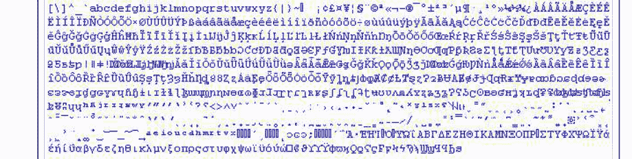

Python 支持 Unicode，包括字符串和变量、函数等的名称。Python 2 和 Python 3 在 Unicode 支持方面存在一些差异。

## 19.5 sorted

首先是一个定义：可迭代对象是一个允许你遍历其内容的对象。可迭代对象包括列表、元组、字符串和字典。有许多 Python 方法适用于任何可迭代对象。

**sorted** 函数是一个内置函数，可用于对可迭代对象进行排序。作为第一个例子，我们可以用它来排序一个列表。假设 `L=[3,1,2]`。以下将 M 设置为 `[1,2,3]`。

```
M = sorted(L)
```

**sorted** 和 `L.sort` 的区别在于 `L.sort()` 会改变原始列表 L，而 **sorted(L)** 不会。

**sorted** 函数可以用于其他可迭代对象。结果是一个排序后的列表。例如，**sorted('xyzab')** 返回列表 `['a','b','x','y','z']`。如果我们真的希望结果是一个字符串，我们可以使用 join 方法：

```
s = "".join(sorted('xyzab'))
```

这将 s 设置为 'abxyz'。

对字典使用 **sorted** 会对其键进行排序。

## 19.6 if-else 运算符

这是一个方便的运算符，可以将 if/else 语句合并成一行。这里有一个例子：

```
x = 'a' if y==4 else 'b'
```

这等同于

```
if y==4:
    x='a'
else:
    x='b'
```

这里是另一个例子以及两个示例输出：

```
print('He scored ', score, ' point', 's.' if score>1 else '.', sep="")
```

He scored 5 points.
He scored 1 point.

## 19.7 continue

**continue** 语句是循环中 **break** 语句的近亲。当在 for 循环中遇到 **continue** 语句时，程序会忽略循环中 **continue** 之后的所有代码，并跳回到循环的开头，根据需要推进循环计数器。这里有一个例子。右边的代码与左边的代码完成相同的事情。

```
for s in L:
    if s not in found:
        count+=1
        if s[0]=='a':
            count2+=1

for s in L:
    if s in found: continue
    count+=1
    if s[0]=='a':
        count2+=1
```

**continue** 语句是你完全可以不用的东西，但你可能会不时看到它，有时它可以使代码更简单。

## 19.8 eval 和 exec

**eval** 和 **exec** 函数允许程序在运行时执行 Python 代码。**eval** 函数用于简单的表达式，而 **exec** 可以执行任意长的代码块。

**eval** 我们之前在 input 语句中多次见过 **eval**。在 input 语句中使用 **eval** 的一个好处是用户不必只输入一个数字。他们可以输入一个表达式，Python 会计算它。例如，假设我们有以下内容：

```
num = eval(input('Enter a number: '))
```

用户可以输入 `3*(4+5)`，Python 会计算该表达式。你甚至可以在表达式中使用变量。

这里是 **eval** 实际应用的一个例子。

```
def countif(L, condition):
    return len([i for i in L if eval(condition)])
```

这类似于电子表格的 COUNTIF 函数。它计算列表中满足特定条件的项目数量。**eval** 在这里为我们做的是允许用户以字符串形式指定条件。例如，`countif(L,'i>5')` 将返回 L 中大于 5 的项目数量。这里是另一个常见的电子表格函数：

```
def sumif(L, condition):
    return sum([i for i in L if eval(condition)])
```

**exec** **exec** 函数接受一个由 Python 代码组成的字符串并执行它。这里有一个例子：

```
s = """x=3
for i in range(4):
    print(i*x)"""
exec(s)
```

**exec** 函数的一个很好的用途是让程序的用户在程序运行时定义要使用的数学函数。以下是实现此功能的代码：

```
s = input('Enter function: ')
exec('def f(x): return ' + s)
```

我曾在允许用户输入要绘制的方程式的图形绘制程序中使用过这段代码，也曾在用户可以输入函数而程序将数值近似其根的程序中使用过它。

你可以使用 **exec** 让你的程序在运行时生成各种 Python 代码。这允许你的程序在运行时本质上修改自身。

**注意** 在 Python 2 中，**exec** 是一个语句，而不是一个函数，因此你可能会在旧代码中看到它不带括号使用。

**安全问题** **eval** 和 **exec** 函数可能很危险。总是存在用户可能输入一些可能对机器造成危险的代码的风险。他们也可能用它来检查你的变量的值（如果出于某种原因，你将密码存储在变量中，这可能是不好的）。因此，在安全性很重要的代码中使用这些函数时要小心。一种不使用 **eval** 获取输入的选择是这样做：

```
num = int(input('Enter a number: '))
```

这假设 num 是一个整数。使用 **float** 或 **list** 或任何适合你期望的数据的类型。

## 19.9 enumerate 和 zip

内置的 **enumerate** 函数接受一个可迭代对象并返回一个新的可迭代对象，该对象由对 `(i,x)` 组成，其中 `i` 是索引，`x` 是可迭代对象中对应的元素。例如：

```
s = 'abcde'
for (i,x) in enumerate(s):
    print(i+1, x)
```

```
1 a
2 b
3 c
4 d
5 e
```

返回的对象类似于一对对的列表，但不完全相同。以下将给出一对对的列表：

```
list(enumerate(s))
```

## 19.9 上述的 for 循环等价于以下代码：

```python
for i in range(len(s)):
    print(i+1, s[i])
```

在某些情况下，**enumerate** 代码可以更简洁或更清晰。下面是一个返回字符串中所有 '1' 的索引列表的示例：

```python
[j for (j,c) in enumerate(s) if c=='1']
```

**zip** **zip** 函数接受两个可迭代对象，并将它们“拉链式”组合成一个包含配对 (x,y) 的单一可迭代对象，其中 x 来自第一个可迭代对象，y 来自第二个。下面是一个示例：

```python
s = 'abc'
L = [10, 20, 30]
z = zip(s,L)
print(list(z))
```

```
[('a', 10), ('b', 20), ('c', 30)]
```

就像 **enumerate** 一样，**zip** 的结果不完全是一个列表，但如果我们执行 **list(zip(s,L))**，就可以从中得到一个列表。

下面是一个使用 **zip** 从两个列表创建字典的示例。

```python
L = ['one', 'two', 'three']
M = [4, 9, 15]
d = dict(zip(L,M))
```

```
{'three': 15, 'two': 9, 'one': 4}
```

这种技术可以在程序运行时创建字典。

## 19.10 copy

copy 模块有几个有用的方法：copy 和 deepcopy。例如，copy 方法可用于从用户定义的类中复制一个对象。假设我们有一个名为 Users 的类，并且我们想要复制一个特定的用户 u。我们可以这样做：

```python
from copy import copy
u_copy = copy(u)
```

但 copy 方法有某些局限性，其他复制技术也是如此，比如列表的 M=L[:]。例如，假设 L = [[1,2,3],[4,5,6]]。如果我们通过 M=L[:] 制作一个副本，然后设置 L[0][0]=100，这也会影响 M[0][0]。这是因为副本只是一个浅拷贝——构成 L 的子列表的引用被复制了，而不是这些子列表的副本。任何时候我们复制一个本身由其他对象组成的对象时，这种情况都可能成为问题。

deepcopy 方法用于这种只复制值而不复制引用的情况。以下是其工作方式：

```python
from copy import deepcopy
M = deepcopy(L)
```

## 19.11 更多关于字符串的知识

关于字符串，我们还有几个事实尚未讨论。

**translate** translate 方法用于逐字符地翻译字符串。翻译分两步完成。首先，使用 maketrans 创建一个特殊类型的字典，该字典定义了事物将如何被翻译。你指定一个普通字典，它会创建一个用于翻译的新字典。然后将该字典传递给 translate 方法以执行翻译。下面是一个简单的示例：

```python
d = str.maketrans({'a':'1', 'b':'2'})
print('abaab'.translate(d))
```

结果是 '12112'。

下面是一个我们使用 translate 实现简单替换密码的示例。替换密码是一种简单的消息加密方式，其中每个字母被另一个字母替换。例如，也许每个 a 被 g 替换，每个 b 被 x 替换，等等。以下是代码：

```python
from random import shuffle

# 创建密钥
alphabet = 'abcdefghijklmnopqrstuvwxyz'
L = list(alphabet)
shuffle(L)

# 创建编码和解码字典
encode_dict = str.maketrans(dict(zip(alphabet, L)))
decode_dict = str.maketrans(dict(zip(L, alphabet)))

# 编码和解码 'this is a secret'
s = 'this is a secret'.translate(encode_dict)
t = s.translate(decode_dict)
print(alphabet, ''.join(L), t, s, sep='\n')
```

```
abcdefghijklmnopqrstuvwxyz
qjdpaztxghuflicornkesyvmwb
exgk gk q kadnae
this is a secret
```

其工作原理是，我们首先创建加密密钥，该密钥指定了 a 被替换为哪个字母，b 被替换为哪个字母，等等。这是通过打乱字母表来完成的。然后我们使用第 19.9 节中用于创建字典的 zip 技巧，为编码和解码创建翻译表。最后，我们使用 translate 方法执行实际的替换。

**partition** partition 方法类似于列表的 split 方法。区别如下所示：

```python
'3.14159'.partition('.')
'3.14159'.split('.')
```

```
('3', '.', '14159')
['3', '14159']
```

区别在于，函数的参数作为输出的一部分返回。partition 方法还返回一个元组而不是一个列表。下面是一个计算作为字符串输入的简单单项式导数的示例。导数的规则是 $x^n$ 的导数是 $na x^{n-1}$。

```python
s = input('Enter a monomial: ')
coeff, power = s.partition('x^')
print('{}x^{}'.format(int(coeff)*int(power), int(power)-1))
```

```
Enter a monomial: 2x^12
24x^11
```

**注意** 这些方法以及许多其他方法，都可以直接使用语言的基本工具（如 for 循环、if 语句等）来完成。然而，其理念是，那些经常完成的事情被制作为标准 Python 发布版的一部分的方法或类。这可以帮助你避免重复造轮子，并且它们还可以使你的程序更可靠、更易于阅读。

**比较字符串** 字符串的比较是按字母顺序进行的。例如，以下代码将打印 Yes。

```python
if 'that' < 'this':
    print('Yes')
```

除此之外，如果字符串包含字母以外的字符，比较将基于字符的 ord 值。

## 19.12 杂项技巧和窍门

以下是一些有用的技巧：

**同一行上的语句** 你可以将 if 语句及其对应的语句写在同一行。

```python
if x==3: print('Hello')
```

你也可以通过用分号分隔，将多个语句组合在一行中。例如：

```python
a=3; b=4; c=5
```

不要过度使用这两种方式，因为它们会使你的代码更难阅读。不过，有时它们可以使代码更易读。

**连续调用多个方法** 你可以连续调用多个方法，如下所示：

```python
s = open('file.txt').read().upper()
```

此示例读取文件的内容，然后将所有内容转换为大写，并将结果存储在 s 中。同样，要小心不要过度使用太多连续的方法，否则你的代码可能难以阅读。

**None** 除了 **int**、**float**、**str**、**list** 等之外，Python 还有一种名为 **None** 的数据类型。它基本上是 Python 版本的“无”。它表示在你可能期望有东西的地方没有东西，例如函数的返回值。你可能会在各处看到它出现。

**文档字符串** 在定义函数时，你可以指定一个包含有关函数工作方式信息的字符串。然后，任何使用该函数的人都可以使用 Python 的 **help** 函数来获取有关你的函数的信息。下面是一个示例：

```python
def square(x):
    """ Returns x squared. """
    return x**2
```

```
>>> help(square)
Help on function square in module __main__:

square(x)
    Returns x squared.
```

你也可以在 **class** 语句之后立即使用文档字符串来提供有关你的类的信息。

## 19.13 在其他计算机上运行你的 Python 程序

你的 Python 程序可以在安装了 Python 的其他计算机上运行。Mac 和 Linux 机器通常安装了 Python，尽管版本可能不是你正在使用的最新版本，并且这些机器可能没有你正在使用的额外库。

Windows 上的一个选项是 py2exe。这是一个第三方模块，可将 Python 程序转换为可执行文件。目前，它仅适用于 Python 2。使用起来可能有点棘手。以下是安装 py2exe 后可以使用的脚本。

```python
import os
program_name = raw_input('Enter name of program: ')
if program_name[-3:] != '.py':
    program_name += '.py'

with open('temp_py2exe.py', 'w') as fp:
    s = 'from distutils.core import setup\n'
    s += "import py2exe\nsetup(console=['"
    s += program_name + "'])"
    fp.write(s)

os.system('c:\Python26\python temp_py2exe.py py2exe')
```

如果一切正常，应该会弹出一个窗口，你会看到一堆东西快速发生。生成的可执行文件将出现在你的 Python 文件所在目录的一个新子目录中，名为 dist。该子目录中还会有几个其他文件，你需要将它们与可执行文件一起包含。

## 第十九章 杂项主题 III

## 第二十章

## 常用模块

Python 自带数百个模块，可以实现各种功能。此外，还有许多第三方模块可以从互联网下载。本章将讨论一些我发现有用的模块。

## 20.1 导入模块

导入模块有几种不同的方式。以下是几种从 Random 模块导入函数的方法。

```
from random import randint, choice
from random import *
import random
```

1.  第一种方式仅从模块导入两个函数。
2.  第二种方式导入模块中的所有函数。通常应避免这样做，因为模块可能包含一些会与你自己的变量名冲突的名称。例如，如果你的程序使用一个名为 `total` 的变量，而你导入的模块包含一个名为 `total` 的函数，就可能出现问题。然而，像 `tkinter` 这样的模块，以这种方式导入通常是相当安全的。
3.  第三种方式导入整个模块，且不会干扰你的变量名。要使用模块中的函数，需在函数名前加上 `random` 和一个点号。例如：`random.randint(1,10)`。

**更改模块名称** 可以使用 **as** 关键字来更改程序中用于引用模块或模块中内容的名称。以下是三个示例：

```
import numpy as np
from itertools import combinations_with_replacement as cwr
from math import log as ln
```

**位置** 通常，导入语句放在程序的开头，但没有限制。只要它们位于使用模块的代码之前，可以放在任何位置。

**获取帮助** 要在 Python shell 中获取关于某个模块（例如 random 模块）的帮助，请使用上述第三种方式导入它。然后 `dir(random)` 会列出模块中的函数和变量，`help(random)` 会给你一个相当长的描述，说明每个功能的作用。要获取关于特定函数（如 `randint`）的帮助，请输入 `help(random.randint)`。

## 20.2 日期和时间

`time` 模块有一些用于处理时间的有用函数。

**sleep** `sleep` 函数会将你的程序暂停指定的时间（以秒为单位）。例如，要将程序暂停 2 秒或 50 毫秒，请使用以下代码：

```
sleep(2)
sleep(.05)
```

**计时** `time` 函数可用于对操作进行计时。以下是一个示例：

```
from time import time
start = time()
# do some stuff
print('It took', round(time()-start, 3), 'seconds.')
```

另一个示例，请参见第 17.6 节，其中展示了如何在 GUI 中添加倒计时器。

`time()` 函数的分辨率在 Windows 上是毫秒，在 Linux 上是微秒。上面的示例使用的是整秒。如果你需要毫秒级的分辨率，请使用以下打印语句：

```
print('{:.3f} seconds'.format(time()-start))
```

你可以通过一些数学运算来获取分钟和小时。以下是一个示例：

```
t = time()-start
secs = t%60
mins = t//60
hours = mins//60
```

顺便说一下，当你调用 `time()` 时，你会得到一个相当奇怪的值，比如 `1306372108.045`。这是自 1970 年 1 月 1 日以来经过的秒数。

## 20.2. 日期和时间

**日期** `datetime` 模块允许我们同时处理日期和时间。以下代码行创建了一个包含当前日期和时间的 `datetime` 对象：

```
from datetime import datetime
d = datetime(1,1,1).now()
```

`datetime` 对象具有 `year`、`month`、`day`、`hour`、`minute`、`second` 和 `microsecond` 属性。以下是一个简短的示例：

```
d = datetime(1,1,1).now()
print('{:02d}/{}/{}'.format(d.hour,d.minute,d.month,d.day,d.year))
```

7:33 2/1/2011

小时是 24 小时制。要获取 12 小时制，你可以这样做：

```
am_pm = 'am' if d.hour<12 else 'pm'
print('{}:{}{}'.format(d.hour%12, d.minute, am_pm))
```

另一种显示日期和时间的方法是使用 `strftime` 方法。它使用各种格式化代码，允许你显示日期和时间，包括星期几、上午/下午等信息。

以下是一些格式化代码：

| 代码 | 描述 |
|---|---|
| %c | 根据本地惯例格式化的日期和时间 |
| %x, %X | %x 是日期，%X 是时间，两者均按 %c 格式格式化 |
| %d | 月份中的日期 |
| %j | 年份中的日期 |
| %a, %A | 星期名称（%a 是缩写的星期名称） |
| %m | 月份（01-12） |
| %b, %B | 月份名称（%b 是缩写的月份名称） |
| %y, %Y | 年份（%y 是两位数，%Y 是四位数） |
| %H, %I | 小时（%H 是 24 小时制，%I 是 12 小时制） |
| %p | 上午或下午 |
| %M | 分钟 |
| %S | 秒 |

以下是一个示例：

```
print(d.strftime('%A %x'))
```

Tuesday 02/01/11

以下是另一个示例：

```
print(d.strftime('%c'))
print(d.strftime('%I%p on %B %d'))
```

02/01/11 07:33:14
07AM on February 01

前导零有点烦人。你可以将 `strftime` 与我们学到的第一种方法结合使用，以获得更美观的输出：

```
print(d.strftime('{}%p on %B {}').format(d.hour%12, d.day))
```

7AM on February 1

你也可以创建一个 `datetime` 对象。这样做时，你必须指定年、月、日。其他属性是可选的。以下是一个示例：

```
d = datetime(2011, 2, 1, 7, 33)
e = datetime(2011, 2, 1)
```

你可以使用 `<`、`>`、`==` 和 `!=` 运算符比较 `datetime` 对象。你也可以对 `datetime` 对象进行算术运算，尽管我们这里不会涉及。事实上，关于日期和时间，你还可以做很多事情。

另一个不错的模块是 `calendar`，你可以用它来打印日历以及对日期进行更复杂的计算。

## 20.3 处理文件和目录

`os` 模块和子模块 `os.path` 包含用于处理文件和目录的函数。

**更改目录** 当你的程序打开一个文件时，该文件被假定与程序本身在同一目录中。如果不是，你必须指定目录，如下所示：

```
s = open('c:/users/heinold/desktop/file.txt').read()
```

如果你有很多需要读取的文件，且它们都在同一个目录中，你可以使用 `os.chdir` 来更改目录。以下是一个示例：

```
os.chdir('c:/users/heinold/desktop/')
s = open('file.txt').read()
```

**获取当前目录** `getcwd` 函数返回当前目录的路径。它将是你的程序所在的目录，或者你通过 `chdir` 更改到的目录。

**获取目录中的文件** `listdir` 函数返回目录中条目的列表，包括所有文件和子目录。如果你只想要文件而不要子目录，或者反之，`os.path` 模块包含 `isfile` 和 `isdir` 函数来判断一个条目是文件还是目录。以下是一个示例，它搜索目录中的所有文件，并打印包含单词 'hello' 的文件名。

```
import os
directory = 'c:/users/heinold/desktop/'
files = os.listdir(directory)
for f in files:
    if os.path.isfile(directory+f):
        s = open(directory+f).read()
        if 'hello' in s:
            print(f)
```

**更改和删除文件** 以下是一些有用的函数。但要小心操作。

| 函数 | 描述 |
| :--- | :--- |
| mkdir | 创建一个目录 |
| rmdir | 删除一个目录 |
| remove | 删除一个文件 |
| rename | 重命名一个文件 |

前两个函数接受一个目录路径作为其唯一参数。`remove` 函数接受一个文件名。`rename` 的第一个参数是旧名称，第二个参数是新名称。

**复制文件** `os` 模块中没有用于复制文件的函数。相反，请使用 `shutil` 模块中的 `copy` 函数。以下是一个示例，它获取目录中的所有文件并为每个文件创建一个副本，每个副本的文件名以 "Copy of " 开头：

```
import os
import shutil
directory = 'c:/users/heinold/desktop/'
files = os.listdir(directory)
for f in files:
    if os.path.isfile(directory+f):
        shutil.copy(directory+f, directory+'Copy of '+f)
```

**更多关于 os.path** `os.path` 模块包含更多对处理文件和目录有帮助的函数。不同的操作系统对路径的处理有不同的约定，`os.path` 中的函数允许你的程序在不同操作系统上工作，而无需担心每个操作系统的具体细节。以下是一些示例（在我的 Windows 系统上）：

```
print(os.path.split('c:/users/heinold/desktop/file.txt'))
print(os.path.basename('c:/users/heinold/desktop/file.txt'))
print(os.path.dirname('c:/users/heinold/desktop/file.txt'))
```

print(os.path.join('directory', 'file.txt'))

> ('c:/users/heinold/desktop', 'file.txt')
file.txt
c:/users/heinold/desktop
directory\file.txt

请注意，Windows 中的标准分隔符是反斜杠。正斜杠也可以使用。

最后，你可能还会发现另外两个有用的函数：`exists` 函数用于测试文件或目录是否存在，`getsize` 函数用于获取文件大小。`os.path` 中还有许多其他函数。更多信息请参阅 Python 文档 [1]。

**os.walk** `os.walk` 函数允许你遍历一个目录及其所有子目录。下面是一个简单的例子，用于查找我的桌面上或桌面子目录中的所有 Python 文件：

```
for (path, dirs, files) in os.walk('c:/users/heinold/desktop/'):
    for filename in files:
        if filename[-3:]=='.py':
            print(filename)
```

## 20.4 运行和退出程序

**运行程序** 你的程序有几种不同的方式来运行另一个程序。其中一种是使用 `os` 模块中的 `system` 函数。下面是一个例子：

```
import os
os.chdir('c:/users/heinold/desktop')
os.system('file.exe')
```

`system` 函数可用于运行你可以在命令提示符下运行的命令。运行程序的另一种方式是使用 `execv` 函数。

**退出程序** `sys` 模块有一个名为 **exit** 的函数，可用于退出你的程序。下面是一个简单的例子：

```
import sys
ans = input('Quit the program?')
if ans.lower() == 'yes':
    sys.exit()
```

## 20.5 Zip 文件

Zip 文件是一个压缩的文件或文件目录。以下代码将 `filename.zip` 中的所有文件解压到我的桌面：

```
import zipfile
z = zipfile.ZipFile('filename.zip')
z.extractall('c:/users/heinold/desktop/')
```

## 20.6 从互联网获取文件

要从互联网获取文件，可以使用 `urllib` 模块。下面是一个简单的例子：

```
from urllib.request import urlopen
page = urlopen('http://www.google.com')
s = page.read().decode()
```

`urlopen` 函数返回一个非常类似于文件对象的对象。在上面的例子中，我们使用 `read()` 和 `decode()` 方法将页面的全部内容读入字符串 `s`。

上面例子中的字符串 `s` 充满了 HTML 文件的文本，可读性不佳。Python 中有用于解析 HTML 的模块，但我们这里不作介绍。上面的代码对于从互联网下载普通的文本数据文件很有用。

对于比这更复杂的需求，可以考虑使用第三方 `requests` 库。

## 20.7 声音

在你的程序中获取一些简单声音的一种简便方法是使用 `winsound` 模块。不过，它仅适用于 Windows。`winsound` 中的一个函数是 `Beep`，可用于在给定频率下播放指定时长的音调。下面是一个播放 500 Hz 声音 1 秒的例子。

```
from winsound import Beep
Beep(500,1000)
```

`Beep` 的第一个参数是以赫兹为单位的频率，第二个参数是以毫秒为单位的持续时间。

`winsound` 中的另一个函数是 `PlaySound`，可用于播放 WAV 文件。下面是一个例子：

```
from winsound import PlaySound
PlaySound('soundfile.wav', 'SND_ALIAS')
```

另一方面，如果你安装了 Pygame，播放任何类型的常见声音文件都相当容易。下面展示了这一点，并且它适用于 Windows 以外的系统：

```
import pygame
pygame.mixer.init(18000,-16,2,1024)
sound = pygame.mixer.Sound('soundfile.wav')
sound.play()
```

## 20.8 你自己的模块

创建你自己的模块很容易。只需编写你的 Python 代码并将其保存在一个文件中。然后你可以使用 `import` 语句导入你的模块。

# 第 21 章

# 正则表达式

字符串的 `replace` 方法用于将一个字符串的所有出现替换为另一个字符串，而 `index` 方法用于查找子字符串在字符串中的第一次出现。但有时你需要进行更复杂的搜索或替换。例如，你可能需要找到字符串的所有出现，而不仅仅是第一次出现。或者你可能想找到两个字母后跟一个数字的所有出现。又或者你需要将每个位于单词开头的 'qu' 替换为 'Qu'。这就是正则表达式的用途。处理正则表达式的工具位于 `re` 模块中。

为了理解正则表达式，需要学习一些语法。这里有一个例子，让你了解它们是如何工作的：

```
import re
print(re.sub(r'([LRUD])(\d+)', '***', 'Locations L3 and D22 full.'))
```

Locations *** and *** full.

此示例将任何出现的 L、R、U 或 D 后跟一个或多个数字替换为 '***'。

## 21.1 简介

**sub** `sub` 函数的工作方式如下：

```
sub(pattern, replacement, string)
```

这会在 `string` 中搜索 `pattern`，并将任何匹配该模式的内容替换为字符串 `replacement`。接下来的所有示例都将使用 `sub` 展示，但除了替换之外，我们还可以用正则表达式做其他事情。我们将在讨论正则表达式语法之后介绍这些内容。

**原始字符串** 许多模式使用反斜杠。然而，字符串中的反斜杠用于转义字符，例如换行符 `\n`。要在字符串中得到一个反斜杠，我们需要写 `\\`。这很快就会使正则表达式变得混乱。为避免这种情况，我们的模式将使用原始字符串，其中反斜杠可以原样出现，不会做任何特殊处理。要将字符串标记为原始字符串，请在其前面加上 `r`，如下所示：

```
s = r'This is a raw string. Backslashes do not do anything special.'
```

## 21.2 语法

**基本示例** 我们从一个模仿字符串 `replace` 方法的正则表达式开始。下面是使用 `replace` 将所有 `abc` 替换为 `*` 的例子：

```
'abcdef abcxyz'.replace('abc', '*')
```

```
*def *xyz
```

下面是执行相同操作的正则表达式代码：

```
re.sub(r'abc', '*', 'abcdef abcxyz')
```

**方括号** 我们可以使用方括号来表示我们只想匹配某些字母。下面是一个将每个 `a` 和 `d` 替换为星号的例子：

```
re.sub(r'[ad]', '*', 'abcdef')
```

```
*bc*ef
```

这是另一个例子，其中星号替换了所有后跟 1、2 或 3 的 a、b 或 c 的出现：

```
re.sub(r'[abc][123]', '*', 'a1 + b2 + c5 + x2')
```

```
* + * + c5 + x2
```

我们可以给出值的范围——例如，`[a-j]` 表示字母 a 到 j。以下是范围的一些进一步示例：

| 范围 | 描述 |
|---|---|
| [A-Z] | 任何大写字母 |
| [0-9] | 任何数字 |
| [A-Za-z0-9] | 任何字母或数字 |

匹配任何数字的一种稍短的方式是 `\d`，而不是 `[0-9]`。

**匹配任何字符** 使用点号来匹配（几乎）任何字符。下面是一个例子：

```
re.sub(r'A.B', '*', 'A2B AxB AxxB A$B')
```

```
* * AxxB *
```

该模式匹配一个 A，后跟几乎任何单个字符，再后跟一个 B。

例外：点号不匹配的唯一字符是换行符。如果你也需要匹配换行符，请在模式开头加上 `?s`。

**匹配多个副本** 下面是一个匹配一个 A 后跟一个或多个 B 的例子：

```
re.sub(r'AB+', '*', 'ABC ABBBBBBC AC')
```

```
*C *C AC
```

我们使用 `+` 字符来表示我们想在这里匹配一个或多个 B。我们可以使用类似的东西来指定不同数量的 B。例如，用 `*` 代替 `+` 将匹配零个或多个 B。（这意味着上面例子中的 `AC` 将被替换为 `*C`，因为 A 被计为一个 A 后跟零个 B。）下表列出了你可以使用的代码：

| 代码 | 描述 |
|---|---|
| + | 匹配 1 次或多次出现 |
| * | 匹配 0 次或多次出现 |
| ? | 匹配 0 次或 1 次出现 |
| {m} | 恰好匹配 m 次出现 |
| {m,n} | 匹配 m 到 n 次出现（含端点） |

下面是一个匹配一个 A 后跟三到六个 B 的例子：

```
re.sub(r'AB{3,6}', '*', 'ABB ABBB ABBBB ABBBBBBBBB')
```

```
ABB * * *BBB
```

这里，我们不匹配 `ABB`，因为 A 后面只跟了两个 B。接下来的两个部分被匹配，因为第二项中 A 后面跟了三个 B，第三项中跟了四个 B。在最后一部分中，有一个 A 后面跟了九个 B。被匹配的是 A 以及前六个 B。

请注意，上面最后一部分中的匹配是贪婪的；也就是说，它会尽可能多地获取 B。它被允许获取三到六个 B，于是它获取了全部六个。要获得相反的行为，让它尽可能少地获取 B，请添加一个 `?`，如下所示：

```
re.sub(r'AB{3,6}?', '*', 'ABB ABBB ABBBB ABBBBBBBBBB')
```

```
ABB * * *BBBBBB
```

`?` 可以放在任何数字说明符之后，例如 `+?`、`*?`、`??` 等。

**| 字符** `|` 字符充当“或”的角色。下面是一个例子：

## 21.3 总结

需要记忆的内容很多。以下是总结：

| 表达式 | 描述 |
|---|---|
| [] | 方括号内的任意字符 |
| . | 除换行符外的任意字符 |
| + | 前一个字符出现一次或多次 |
| * | 前一个字符出现零次或多次 |
| ? | 前一个字符出现零次或一次 |
| {m} | 前一个字符恰好出现 m 次 |
| {m,n} | 前一个字符出现 m 到 n 次（包含 m 和 n） |
| ? | 紧跟在 +、*、?、{m} 和 {m,n} 之后 —— 尽可能少地匹配 |
| \ | 转义特殊字符 |
| \| | "或" |
| ^ | （在模式开头）仅匹配第一次出现 |
| $ | （在模式末尾）仅匹配最后一次出现 |
| \d \D | 任意数字（非数字） |
| \w \W | 任意字母或数字（非字母或数字） |
| \s \S | 任意空白字符（非空白字符） |
| (?=) | 仅当后面跟着...时匹配 |
| (?! ) | 仅当后面不跟着...时匹配 |
| (?<=) | 仅当前面是...时匹配 |
| (?<! ) | 仅当前面不是...时匹配 |
| (?i) | 忽略大小写的标志 |
| (?s) | 使 . 也能匹配换行符的标志 |
| (?x) | 启用详细模式的标志 |

以下是一些简短示例：

| 表达式 | 描述 |
| :--- | :--- |
| 'abc' | 精确匹配字符串 abc |
| '[ABC]' | 匹配 A、B 或 C |
| '[a-zA-Z][0-9]' | 匹配一个字母后跟一个数字 |
| '[a..]' | 匹配 a 后跟任意两个字符（除换行符外） |
| 'a+' | 匹配一个或多个 a |
| 'a*' | 匹配任意数量的 a，包括零个 |
| 'a?' | 匹配零个或一个 a |
| 'a{2}' | 恰好匹配两个 a |
| 'a{2,4}' | 匹配两个、三个或四个 a |
| 'a+?' | 尽可能少地匹配一个或多个 a |
| 'a\.' | 匹配 a 后跟一个句点 |
| 'ab\|zy' | 匹配 ab 或 zy |
| '^a' | 匹配第一个 a |
| 'a$' | 匹配最后一个 a |
| '\d' | 匹配每个数字 |
| '\w' | 匹配每个字母或数字 |
| '\s' | 匹配每个空白字符 |
| '\D' | 匹配除数字外的所有字符 |
| '\W' | 匹配除字母和数字外的所有字符 |
| '\S' | 匹配除空白字符外的所有字符 |
| 'a(?=b)' | 匹配每个后面跟着 b 的 a |
| 'a(?!b)' | 匹配每个后面不跟着 b 的 a |
| '(?<=b)a' | 匹配每个前面是 b 的 a |
| '(?<!b)a' | 匹配每个前面不是 b 的 a |

**注意** 请注意，在本章的所有示例中，我们处理的都是非重叠模式。例如，如果我们在字符串 'abababa' 中查找模式 'aba'，我们会发现有几个重叠的匹配项。我们所有的匹配都是从左到右进行的，不考虑重叠。例如，我们有以下情况：

```
re.sub('aba', '*', 'abababa')
```

```
'*b*'
```

## 21.4 分组

在表达式的某部分周围使用括号会创建一个分组，该分组包含与模式匹配的文本。你可以使用它来进行更复杂的替换。以下是一个示例，它将每个后面跟着小写字母的大写字母转换为小写：

```
def modify(match):
    letter = match.group()
    return letter.lower()
re.sub(r'([A-Z])[a-z]', modify, 'PEACH Apple ApriCot')
```

```
PEACH apple apricot
```

modify 函数最终被调用了三次，每次匹配发生时调用一次。re.sub 函数自动向 modify 函数发送一个 Match 对象，我们将其命名为 match。该对象包含有关匹配文本的信息。该对象的 group 方法返回匹配的文本本身。

如果我们使用 match.groups 而不是 match.group，那么我们可以根据括号定义的分组进一步分解匹配。以下是一个示例，它匹配一个大写字母后跟一个数字，并将每个字母转换为小写，同时给每个数字加 10：

```
def modify(match):
    letter, number = match.groups()
    return letter.lower() + str(int(number)+10)
re.sub(r'([A-Z])(\d)', modify, 'A1 + B2 + C7')
```

```
a11 + b12 + c17
```

groups 方法以元组的形式返回匹配的文本。例如，在上面的程序中，返回的元组如下所示：

- 第一次匹配：('A', '1')
- 第二次匹配：('B', '2')
- 第三次匹配：('C', '7')

另请注意，我们可以通过向 match.group 传递参数来获取此信息。对于第一次匹配，match.group(1) 是 'A'，match.group(2) 是 '1'。

## 21.5 其他函数

- sub —— 我们已经看到了很多 sub 的示例。有一件事我们还没有提到，那就是有一个可选参数 count，它指定要进行多少次匹配（从左开始）。以下是一个示例：

```
re.sub(r'a', '*', 'ababababa', count=2)
```

```
'*b*bababa'
```

- findall —— findall 函数返回找到的所有匹配项的列表。以下是一个示例：

```
re.findall(r'[AB]\d', 'A3 + B2 + A9')
```

```
['A3', 'B2', 'A9']
```

再举一个例子，要查找字符串中的所有单词，你可以这样做：

```
re.findall(r'\w+', s)
```

这比使用 s.split() 更好，因为 split 不处理标点符号，而正则表达式可以处理。

- split —— split 函数类似于字符串方法 split。正则表达式版本允许我们根据比字符串方法更通用的内容进行分割。以下是一个示例，它在 + 或 - 处分割代数表达式。

```
re.split(r'\+|\-', '3x+4y-12x^2+7')
```

```
['3x', '4y', '12x^2', '7']
```

- match 和 search —— 如果你只想知道是否发生匹配，这两个函数很有用。这两个函数之间的区别在于，match 只检查字符串的开头是否与模式匹配，而 search 则搜索整个字符串直到找到匹配项。如果未找到匹配项，两者都返回 None；如果找到匹配项，则返回一个 Match 对象。以下是示例：

```
if (re.match(r'ZZZ', 'abc ZZZ xyz')):
    print('Match found at beginning.')
else:
    print('No match at beginning')

if (re.search(r'ZZZ', 'abc ZZZ xyz')):
    print('Match found in string.')
else:
    print('No match found.')
```

```
No match at beginning.
Match found in string.
```

这些函数返回的 Match 对象包含分组信息。假设我们有以下情况：

```
a=re.search(r'([ABC])(\d)', '= A3+B2+C8')
a.group()
a.group(1)
a.group(2)
```

```
'A3'
'A'
'3'
```

请记住，re.search 只会报告它在字符串中找到的第一个匹配项。

• finditer — 这返回一个Match对象的迭代器，我们可以像下面这样遍历它：

```python
for s in re.finditer(r'([AB])(\d)', 'A3+B4'):
    print(s.group(1))
```

A
B

请注意，这比findall函数更通用一些，因为findall返回匹配的字符串，而finditer返回类似Match对象列表的东西，这使我们能够访问分组信息。

• compile — 如果你打算重复使用同一个模式，你可以先编译该模式以节省一些时间，如下所示：

```python
pattern = re.compile(r'[AB]\d')
pattern.sub('*', 'A3 + B4')
pattern.sub('x', 'A8 + B9')
```

+
*   *
x + x

当你编译一个表达式时，对于许多方法，你可以在字符串中指定可选的起始和结束索引。这里有一个例子：

```python
pattern = re.compile(r'[AB]\d')
pattern.findall('A3+B4+C9+D8',2,6)
```

['B4']

## 21.6 示例

**罗马数字** 这里我们使用正则表达式将罗马数字转换为普通数字。

```python
import re

d = {'M':1000, 'CM':900, 'D':500, 'CD':400, 'C':100, 'XC':90, 'L':50, 'XL':40, 'X':10, 'IX':9,
     'V':5, 'IV':4,'I':1}

pattern = re.compile(r"""(?x)
    (M{0,3})(CM)?
    (CD)?(D)?(C{0,3})
    (XC)?(XL)?(L)?(X{0,3})
    (IX)?(IV)?(V)?(I{0,3})""")

num = input('Enter Roman numeral: ').upper()
m = pattern.match(num)

sum = 0
for x in m.groups():
    if x!=None and x!='':
        if x in ['CM', 'CD', 'XC', 'XL', 'IX', 'IV']:
            sum+=d[x]
        elif x[0] in 'MDCLXVI':
            sum+=d[x[0]]*len(x)
print(sum)
```

Enter Roman numeral: MCMXVII
1917

正则表达式本身相当直接。它查找最多三个M，后跟零个或一个CM，再后跟零个或一个CD，等等，并将每个部分存储在一个分组中。然后for循环读取这些分组，并使用字典将相应的值加到一个累加和中。

**日期** 这里我们使用正则表达式来获取一个冗长格式的日期，例如February 6, 2011，并将其转换为缩写格式mm/dd/yy（没有前导零）。我们不必依赖用户以完全正确的方式输入日期，而是可以使用正则表达式来允许变化和错误。例如，无论用户是拼写完整的月份名称还是缩写它（带或不带句点），这个程序都能工作。大小写无关紧要，他们是否能正确拼写月份名称也无关紧要。他们只需要正确拼写前三个字母。他们使用多少空格以及日期后是否使用逗号也无关紧要。

```python
import re

d = {'jan':'1', 'feb':'2', 'mar':'3', 'apr':'4',
     'may':'5', 'jun':'6', 'jul':'7', 'aug':'8',
     'sep':'9', 'oct':'10', 'nov':'11', 'dec':'12'}

date = input('Enter date: ')
m = re.match('([A-Za-z]+).?\s*(\d{1,2}),?\s*(\d{4})', date)
print('{}/{}/{}'.format(d[m.group(1).lower()[:3]],
                       m.group(2), m.group(3)[-2:]))
```

Enter date: feb. 6, 2011
2/6/11

正则表达式的第一个部分，([A-Za-z]+).?，处理月份名称。它匹配用户为月份名称提供的任意多个字母。.?匹配月份名称后的0个或1个句点，因此用户可以输入句点也可以不输入。字母周围的括号将结果保存在分组1中。

接下来我们找到日期：\s*(\d{1,2})。第一部分\s*匹配零个或多个空白字符，因此用户在月份和日期之间放多少空格都无关紧要。其余部分匹配一个或两个数字，并将其保存在分组2中。

表达式的其余部分，,?\s*(\d{4})，找到年份。然后我们使用结果来创建缩写日期。这里唯一棘手的部分是第一部分，它获取月份名称，将其转换为全小写，并只取前三个字符，将它们用作字典的键。这样，只要用户正确拼写月份名称的前三个字母，程序就能理解。

# 第22章

## 数学

本章收集了一些在某种程度上具有数学性质的主题，尽管其中许多都具有普遍意义。

### 22.1 math模块

如第3.5节所述，math模块包含一些常见的数学函数。以下是其中大部分：

| 函数 | 描述 |
|---|---|
| sin, cos, tan | 三角函数 |
| asin, acos, atan | 反三角函数 |
| atan2(y,x) | 给出具有正确符号行为的arctan(y/x) |
| sinh, cosh, tanh | 双曲函数 |
| asinh, acosh, atanh | 反双曲函数 |
| log, log10 | 自然对数，以10为底的对数 |
| log1p | log(1+x)，在1附近比log更精确 |
| exp | 指数函数 e^x |
| degrees, radians | 从弧度转换为度或反之亦然 |
| floor | floor(x) 是 ≤ x 的最大整数 |
| ceil | ceil(x) 是 ≥ x 的最小整数 |
| e, pi | 常数 e 和 π |
| factorial | 阶乘 |
| modf | 返回一对值（小数部分，整数部分） |
| gamma, erf | Gamma函数和误差函数 |

**注意** 请注意，floor和**int**函数对于正数的行为相同，但对于负数则不同。例如，floor(3.57)和**int**(3.57)都返回整数3。然而，floor(-3.57)返回-4，即小于或等于-3.57的最大整数，而**int**(-3.57)返回-3，这是通过丢弃数字的小数部分得到的。

**atan2** atan2函数对于确定两点之间的角度非常有用。设*x*和*y*是两点在*x*和*y*方向上的距离。下图中角度的正切值由*y*=*x*给出。那么arctan(*y*=*x*)就给出了角度本身。

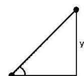

但如果角度是90度，这就行不通了，因为*x*会是0。我们还需要特殊处理*x* < 0和*y* < 0的情况。atan2函数处理了所有这些情况。执行atan2(y,x)将返回正确处理了所有情况的arctan(*y*=*x*)。

atan2函数以弧度返回结果。如果你想要度数，请执行以下操作：

```python
angle = math.degrees(atan2(y,x))
```

atan2得到的结果角度在-180到180之间。如果你想要它在0到360之间，请执行以下操作：

```python
angle = math.degrees(atan2(y,x))
angle = (angle+360) % 360
```

### 22.2 科学计数法

看下面的代码：

```python
100.1**10
```

```
1.0100451202102516e+20
```

结果值以科学计数法显示。它是1.0100451202102516 × 10<sup>20</sup>。e+20代表10<sup>20</sup>。这里是另一个例子：

```python
.15**10
```

```
5.7665039062499975e-09
```

这是5.7665039062499975 × 10<sup>-9</sup>。

### 22.3 比较浮点数

在第3.1节中，我们看到有些数字，比如.1，在计算机上不能精确表示。从数学上讲，在下面的代码执行后，x应该是1，但由于累积误差，它实际上是0.9999999999999999。

```python
x = 0
for i in range(10):
    x+=.1
```

这意味着下面的if语句结果将是**False**：

```python
if x==1:
```

比较浮点数x和y的一种更可靠的方法是检查两个数字之间的差异是否足够小，如下所示：

```python
if abs(x-y)<10e-12:
```

### 22.4 分数

有一个名为fractions的模块用于处理分数。这里有一个简单的使用示例：

```python
from fractions import Fraction
r = Fraction(3, 4)
s = Fraction(1, 4)
print(r+s)
```

Fraction(1, 1)

你可以对Fraction对象进行基本算术运算，也可以比较它们、取绝对值等。这里有一些进一步的例子：

```python
r = Fraction(3, 4)
s = Fraction(2, 8)
print(s)
print(abs(2*r-3))
if r>s:
    print('r is larger')
```

Fraction(1,4)
Fraction(3,2)
r is larger

请注意，Fraction会自动将内容转换为最简形式。下面的例子展示了如何获取分子和分母：

```python
r = Fraction(3,4)
r.numerator
r.denominator
```

## 22.5 decimal 模块

Python 有一个名为 decimal 的模块，用于对十进制数进行精确计算。正如我们之前多次提到的，有些数字，例如 .3，无法精确表示为浮点数。以下是获取 .3 的精确十进制表示的方法：

```
from decimal import Decimal
Decimal('.3')
```

```
Decimal('0.3')
```

这里的字符串很重要。如果我们省略它，得到的十进制数将对应于 .3 的不精确浮点表示：

```
Decimal(.3)
```

```
Decimal('0.299999999999999988897769753748434595763683319091796875')
```

**数学运算** 你可以使用常规的数学运算符来处理 Decimal 对象。例如：

```
Decimal(.34) + Decimal(.17)
```

```
Decimal('0.51')
```

这是另一个例子：

```
Decimal(1) / Decimal(17)
```

```
Decimal('0.05882352941176470588235294118')
```

数学函数 exp、ln、log10 和 sqrt 是 Decimal 对象的方法。例如，以下代码计算 2 的平方根：

```
Decimal(2).sqrt()
```

```
Decimal('1.414213562373095048801688724')
```

Decimal 对象也可以与内置的 **max**、**min** 和 **sum** 函数一起使用，还可以通过 **float** 转换为浮点数，通过 **str** 转换为字符串。

**精度** 默认情况下，Decimal 对象具有 28 位精度。要将其更改为，例如，五位精度，请使用 getcontext 函数。

```
from decimal import getcontext
getcontext().prec = 5
```

这是一个打印 √2 的 100 位数字的示例：

```
getcontext().prec = 100
Decimal(2).sqrt()
```

```
Decimal('1.414213562373095048801688724209698078569671875376948073176679737990732478462107038850387534327641573')
```

理论上，你可以使用的精度没有限制，但精度越高，所需的内存就越多，运行速度也越慢。一般来说，即使精度较低，Decimal 对象也比浮点数慢。对于大多数问题，普通的浮点运算就足够了，但知道如果需要可以获得更高的精度也是很好的。

decimal 模块还有很多其他内容。请参阅 Python 文档 [1]。

## 22.6 复数

Python 有一种用于复数的数据类型。

在数学中，我们有 $i = \sqrt{-1}$。数字 $i$ 被称为虚数单位。复数是形如 $a + bi$ 的数，其中 $a$ 和 $b$ 是实数。值 $a$ 称为实部，$b$ 称为虚部。在电气工程中，符号 $j$ 用来代替 $i$，在 Python 中，$j$ 用于表示虚数。以下是创建复数的几个例子：

```
x = 7j
x = 1j
x = 3.4 + .3j
x = complex(3.4, .3)
```

如果一个数字以 j 或 J 结尾，Python 就将其视为复数。

复数有 real() 和 imag() 方法，分别返回数字的实部和虚部。conjugate 方法返回复共轭（$a + bi$ 的共轭是 $a - bi$）。

cmath 模块包含许多与 math 模块相同的函数，但它们适用于复数参数。这些函数包括常规、反双曲三角函数、对数和指数函数。它还包含两个函数 polar 和 rect，用于在直角坐标和极坐标之间进行转换：

```
cmath.polar(3j)
cmath.rect(3.0, 1.5707963267948966)
```

```
(3.0, 1.5707963267948966)
(1.8369701987210297e-16+3j)
```

复数很迷人，尽管在日常生活中并不那么有用。然而，一个很好的应用是分形。这是一个绘制著名的 Mandelbrot 集的程序。该程序需要 PIL 和 Python 2.6 或 2.7。

```
from Tkinter import *
from PIL import Image, ImageTk, ImageDraw

def color_convert(r, g, b):
    return '#{0:02x}{1:02x}{2:02x}'.format(int(r*2.55),int(g*2.55),
                                            int(b*2.55))

max_iter=75
xtrans=-.5
ytrans=0
xzoom=150
yzoom=-150

root = Tk()
canvas = Canvas(width=300, height=300)
canvas.grid()
image=Image.new(mode='RGB',size=(300,300))
draw = ImageDraw.Draw(image)

for x in range(300):
    c_x = (x-150)/float(xzoom)+xtrans
    for y in range(300):
        c = complex(c_x, (y-150)/float(yzoom)+ytrans)
        count=0
        z=0j
        while abs(z)<2 and count<max_iter:
            z = z*z+c
            count += 1
        draw.point((x,y),
                   fill=color_convert(count+25,count+25,count+25))
    canvas.delete(ALL)
    photo=ImageTk.PhotoImage(image)
    canvas.create_image(0,0,image=photo,anchor=NW)
    canvas.update()

mainloop()
```

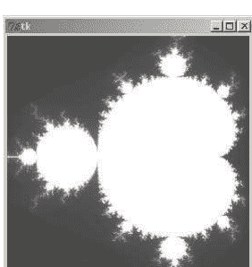

这里的代码运行非常慢。有一些方法可以稍微加快速度，但不幸的是，Python 对于这类事情来说很慢。

## 22.7 列表和数组的更多内容

**稀疏列表** 一个包含 10,000,000 个整数的列表需要几百 TB 的存储空间，远超大多数硬盘的容量。然而，在许多实际应用中，列表的大多数条目都是 0。这使我们可以通过只存储非零值及其位置来节省大量内存。我们可以使用一个字典来实现这一点，其键是非零元素的位置，值是存储在数组中这些位置的值。例如，假设我们有一个二维列表 L，其条目全为零，除了 L[10][12] 是 47 和 L[100][245] 是 18。这是我们使用的字典：

```
d = {(10,12): 47, (100,245): 18}
```

**array 模块** Python 有一个名为 array 的模块，它定义了一个数组对象，其行为与列表非常相似，只是其元素必须都是相同类型。数组相对于列表的优势在于更高效的内存使用和更快的性能。有关数组的更多信息，请参阅 Python 文档 [1]。

**NumPy 和 SciPy 库** 如果你需要对数组进行任何严肃的数学或科学计算，你可能需要考虑 NumPy 库。它易于下载和安装。来自 NumPy 用户指南：

> NumPy 是 Python 科学计算的基础包。它是一个 Python 库，提供了一个多维数组对象、各种派生对象（如掩码数组和矩阵）以及一系列用于数组快速操作的例程，包括数学、逻辑、形状操作、排序、选择、I/O、离散傅里叶变换、基本线性代数、基本统计操作、随机模拟等等。

还有 SciPy，它建立在 NumPy 之上。这次来自 SciPy 用户指南：

> SciPy 是一组建立在 Python NumPy 扩展之上的数学算法和便利函数。它通过向用户提供用于数据操作和可视化的高级命令和类，为交互式 Python 会话增添了强大的功能。使用 SciPy，交互式 Python 会话成为一个数据处理和系统原型设计环境，可与 MATLAB、IDL、Octave、R-Lab 和 SciLab 等系统相媲美。

## 22.8 随机数

**Python 如何生成随机数** Python 使用的随机数生成器称为梅森旋转算法。它可靠且经过充分测试。它是一个确定性生成器，这意味着

## 22.9 杂项主题

**十六进制、八进制和二进制** Python 内置了 `hex`、`oct` 和 `bin` 函数，用于将整数转换为十六进制、八进制和二进制。`int` 函数则将这些进制转换回十进制。以下是一些示例：

```
hex(250)
oct(250)
bin(250)
int(0xfa)
```

```
'0xfa'
'0o372'
'0b11111010'
250
```

十六进制值以 `0x` 为前缀，八进制值以 `0o` 为前缀，二进制值以 `0b` 为前缀。

**int 函数** `int` 函数有一个可选的第二个参数，允许你指定要转换的进制。以下是一些示例：

```
int('101101', 2)    # 从二进制转换
int('121212', 3)    # 从三进制转换
int('12A04', 11)    # 从十一进制转换
int('12K04', 23)    # 从二十三进制转换
```

```
45
455
18517
314759
```

**pow 函数** Python 有一个名为 `pow` 的内置函数，用于计算幂。它的行为类似于 `**` 运算符，但接受一个可选的第三个参数来指定模数。因此 `pow(x,y,n)` 返回 `(x**y)%n`。你可能想使用它的原因是，当涉及非常大的数字时，`pow` 方式要快得多，这在密码学应用中经常发生。

## 22.10 将 Python shell 用作计算器

我经常将 Python shell 用作计算器。本节包含一些在 shell 中工作的技巧。

**导入数学函数** 在 shell 中开始会话的一个好方法是导入一些数学函数：

```
from math import *
```

**特殊变量** 有一个特殊变量 `_`，它保存上一次计算的结果。以下是一个示例：

```
>>> 23**2
529
>>> _+1
530
```

**对数** 我经常使用自然对数，对我来说输入 `ln` 比 `log` 更自然。如果你想这样做，只需执行以下操作：

```
ln = log
```

**求和级数** 以下是一种获取级数近似和的方法，本例中是 $\sum_{n=1}^{\infty} \frac{1}{n^2}$：

```
>>> sum([1/(n**2-1) for n in range(2,1000)])
0.7489994994995
```

**另一个例子：** 假设你需要角度 0、15、30、45、60、75 和 90 的正弦值。以下是一种快速方法：

```
>>> [round(sin(radians(i)),4) for i in range(0,91,15)]
[0.0, 0.2588, 0.5, 0.7071, 0.866, 0.9659, 1.0]
```

**第三方模块** 在 Python shell 中工作时，你可能会发现许多其他第三方模块很有用。例如，有我们在第 22.7 节提到的 Numpy 和 Scipy。还有 Matplotlib，一个用于绘图的通用库，以及 Sympy，它进行符号计算。

# 第 23 章

# 使用函数

本章涵盖与函数相关的多个主题，包括函数式编程中的一些主题。

## 23.1 一等函数

Python 函数被称为一等函数，这意味着它们可以像任何其他对象一样被赋值给变量、复制、用作其他函数的参数等。

**复制函数** 以下是一个我们复制函数的示例：

```
def f(x):
    return x*x
g = f
print('f(3) =', f(3), 'g(3) =', g(3), sep = '\n')
```

```
f(3) = 9
g(3) = 9
```

**函数列表** 接下来，我们有一个函数列表：

```
def f(x):
    return x**2
def g(x):
    return x**3
funcs = [f, g]
print(funcs[0](5), funcs[1](5), sep='\n')
```

```
25
125
```

这是另一个例子。假设你有一个包含十个不同函数的程序，程序必须在运行时决定使用哪个函数。一个解决方案是使用十个 if 语句。一个更短的解决方案是使用函数列表。下面的例子假设我们已经创建了函数 f1、f2、...、f10，每个函数接受两个参数。

```
funcs = [f1, f2, f3, f4, f5, f6, f7, f8, f9, f10]
num = eval(input('Enter a number: '))
funcs[i]((3,5))
```

**函数作为函数的参数** 假设我们有一个包含 2 元组的列表。如果我们对列表进行排序，排序将基于第一个元素进行，如下所示：

```
L = [(5,4), (3,2), (1,7), (8,1)]
L.sort()
```

```
[(1, 7), (3, 2), (5, 4), (8, 1)]
```

假设我们希望排序基于第二个元素进行。`sort` 方法接受一个名为 `key` 的可选参数，它是一个指定排序方式的函数。以下是基于第二个元素进行排序的方法：

```
def comp(x):
    return x[1]
L = [(5,4), (3,2), (1,7), (8,1)]
L.sort(key=comp)
```

```
[(8, 1), (3, 2), (5, 4), (1, 7)]
```

这是另一个例子，我们按长度而不是按字母顺序对字符串列表进行排序。

```
L = ['this', 'is', 'a', 'test', 'of', 'sorting']
L.sort(key=len)
```

```
['a', 'is', 'of', 'this', 'test', 'sorting']
```

我们见过函数作为其他函数参数的另一个地方是 Tkinter 按钮的回调函数。

## 23.2 匿名函数

在上面的一个例子中，我们将一个比较函数传递给 `sort` 方法。以下是代码：

```
def comp(x):
    return x[1]
L.sort(key=comp)
```

如果我们有一个非常短的函数，并且只打算使用一次，我们可以使用所谓的匿名函数，如下所示：

## 23.3 递归

递归是函数调用自身的过程。递归的一个标准例子是阶乘函数。n的阶乘（n!）是从1到n所有数字的乘积。例如，5! = 5 * 4 * 3 * 2 * 1 = 120。另外，按照惯例，0! = 1。递归涉及用函数自身来定义函数。注意，例如，5! = 5 * 4!，并且通常情况下，n! = n * (n - 1)!。因此，阶乘函数可以用自身来定义。以下是阶乘函数的递归版本：

```python
def fact(n):
    if n==0:
        return 1
    else:
        return n*fact(n-1)
```

我们必须指定 n = 0 的情况，否则函数将永远调用自身（或者至少直到Python生成关于递归层级过多的错误）。

请注意，math模块有一个名为factorial的函数，所以这里的版本仅用于演示。还要注意，有一种非递归的方法来计算阶乘，使用for循环。它与递归方法一样直接，但更快。然而，对于某些问题，递归解决方案是更直接的解决方案。例如，下面是一个将数字分解为质因数的程序。

```python
def factor(num, L=[]):
    for i in range(2,num//2+1):
        if num%i==0:
            return L+[i]+factor(num//i)
    return L+[num]
```

factor函数接受两个参数：一个要分解的数字，以及一个先前找到的因数列表。它检查因数，如果找到一个，就将其附加到列表中。递归部分在于，它将数字除以找到的因数，然后将该值的所有因数附加到列表中。另一方面，如果函数没有找到任何因数，它会将数字附加到列表中（因为它一定是质数），并返回新列表。

## 23.4 map、filter、reduce和列表推导式

**map和filter** Python有内置函数**map**和**filter**，用于将函数应用于列表的内容。它们可以追溯到列表推导式成为Python一部分之前，但现在列表推导式可以完成这些函数能做的一切。尽管如此，你可能偶尔会看到使用这些函数的代码，所以了解它们是好的。

**map**函数接受两个参数——一个函数和一个可迭代对象——并将该函数应用于可迭代对象的每个元素，生成一个新的可迭代对象。下面是一个例子，它接受一个字符串列表并返回字符串长度的列表。第一行使用**map**完成此操作，而第二行使用列表推导式：

```python
L = list(map(len, ['this', 'is', 'a', 'test']))
L = [len(word) for word in ['this', 'is', 'a', 'test']]
```

函数**filter**接受一个函数和一个可迭代对象，并返回一个可迭代对象，包含列表中所有使函数为真的元素。下面是一个例子，返回列表中所有长度大于2的单词。第一行使用**filter**完成此操作，第二行使用列表推导式完成：

```python
L = list(filter(lambda x: len(x)>2, ['this', 'is', 'a', 'test']))
L = [word for word in ['this', 'is', 'a', 'test'] if len(word)>2]
```

以下是查找列表L中大于60的项目数量的一种方法：

```python
count=0
for i in L:
    if i>60:
        count = count + 1
```

以下是使用类似于**filter**函数的列表推导式的第二种方法：

```python
len([i for i in L if i>60])
```

第二种方法更短且更容易理解。

**reduce** 还有另一个函数**reduce**，它将函数应用于列表的内容。它曾经是一个内置函数，但在Python 3中也被移到了functools模块。这个函数不能轻易地用列表推导式替换。要理解它，首先考虑一个简单的例子，将1到100的数字相加。

```python
total = 0
for i in range(1,101):
    total = total + i
```

**reduce**函数可以用来在一行中完成此操作：

```python
total = reduce(lambda x,y: x+y, range(1,101))
```

通常，**reduce**接受一个函数和一个可迭代对象，并从左到右将函数应用于元素，累积结果。作为另一个简单的例子，阶乘函数可以使用reduce实现：

```python
def fact(n):
    return reduce(lambda x,y:x*y, range(1,n+1))
```

## 23.5 operator模块

在上一节中，当我们需要一个函数来表示Python运算符（如加法或乘法）时，我们使用了匿名函数，如下所示：

```python
total = reduce(lambda x,y: x+y, range(1,101))
```

Python有一个名为operator的模块，其中包含与Python运算符功能相同的函数。这些函数的运行速度将比匿名函数更快。我们可以这样重写上面的例子：

```python
from operator import add
total = reduce(add, range(1,101))
```

operator模块包含与算术运算符、逻辑运算符甚至切片和in运算符相对应的函数。

## 23.6 关于函数参数的更多信息

你可能想编写一个函数，但不知道会传递多少个参数给它。一个例子是print函数，你可以输入任意多个要打印的内容，每个内容用逗号分隔。

Python允许我们声明一个特殊参数，将其他几个参数收集到一个元组中。下面演示了这种语法：

```python
def product(*nums):
    prod = 1
    for i in nums:
        prod*=i
    return prod
print(product(3,4), product(2,3,4), sep='\n')
```

12
24

有一个类似的符号**，用于将任意数量的关键字参数收集到一个字典中。下面是一个简单的例子：

```python
def f(**keyargs):
    for k in keyargs:
        print(k, '**2 :', keyargs[k]**2, sep='')
f(x=3, y=4, z=5)
```

y**2 : 16
x**2 : 9
z**2 : 25

你也可以将这些符号与普通参数一起使用。顺序很重要——由*收集的参数必须在所有位置参数之后，而由**收集的参数总是放在最后。下面显示了两个示例函数声明：

```python
def func(a, b, c=5, *d, **e):
def func(a, b, *c, d=5, **e):
```

**调用函数** *和**符号也可以在调用函数时使用。下面是一个例子：

```python
def f(a,b):
    print(a+b)
x=(3,5)
f(*x)
```

这将打印8。在这种情况下，我们本可以更简单地调用f(3,5)，但有些情况下这是不可能的。例如，也许你的程序可能为某个函数使用几组不同的参数。你可以有几个if语句，但如果有很多不同的参数组，那么*符号就容易得多。下面是一个简单的例子：

```python
def f(a,b):
    print(a+b)
args = [(1,2), (3,4), (5,6), (7,8), (9,10)]
i = eval(input('Enter a number from 0 to 4: '))
f(*args[i])
```

**符号的一个用途是简化Tkinter声明。假设我们有几个具有相同属性的小部件，比如相同的字体、前景色和背景色。我们不必在每个声明中重复这些属性，而是可以将它们保存在一个字典中，然后在声明中使用**符号，如下所示：

```python
args = {'fg':'blue', 'bg':'white', 'font':('Verdana', 16, 'bold')}
label1 = Label(text='Label 1', **args)
label2 = Label(text='Label 2', **args)
```

**apply** Python 2有一个名为**apply**的函数，它或多或少等同于调用函数时的*和**。你可能会在旧代码中看到它。

**在调用之间保留其值的函数变量** 有时，拥有一个局部于函数的变量并在函数调用之间保留其值是有用的。由于函数是对象，我们可以通过向函数添加一个变量来实现这一点，就像它是一个更典型的对象一样。在下面的例子中，变量f.count跟踪函数被调用的次数。

```python
def f():
    f.count = f.count+1
    print(f.count)
f.count=0
```

## 第24章

## itertools 和 collections 模块

itertools 和 collections 模块包含一些函数，可以大大简化一些常见的编程任务。我们将从 itertools 模块中的一些函数开始。

## 24.1 排列与组合

**排列** 一个序列的排列是该序列元素的重新排列。例如，[1,2,3] 的一些排列是 [3,2,1] 和 [1,3,2]。下面是一个展示所有可能性的例子：

```
list(permutations([1,2,3]))
```

```
[(1,2,3), (1,3,2), (2,1,3), (2,3,1), (3,1,2), (3,2,1)]
```

我们可以找到任何可迭代对象的排列。以下是字符串 '123' 的排列：

```
[''.join(p) for p in permutations('123')]
```

```
['123', '132', '213', '231', '312', '321']
```

`permutations` 函数接受一个可选参数，允许我们指定排列的大小。例如，如果我们只想从 '123' 中获取所有可能的两元素子串，可以这样做：

```
[''.join(p) for p in permutations('123', 2)]
```

```
['12', '13', '21', '23', '31', '32']
```

请注意，`permutations` 和 itertools 模块中的大多数其他函数都返回一个迭代器。你可以遍历迭代器中的项目，也可以使用 `list` 将其转换为列表。

**组合** 如果我们想从一个序列中获取所有可能的 *k* 元素子集，其中重要的是元素本身，而不是它们出现的顺序，那么我们需要的是组合。例如，从 {1, 2, 3} 中可以得到的两元素子集是 {1, 2}、{1, 3} 和 {2, 3}。我们认为 {1, 2} 和 {2, 1} 是相同的，因为它们包含相同的元素。下面是一个展示从 '123' 中可能得到的两元素子串组合的例子：

```
["".join(c) for c in combinations('123', 2)]
```

```
['12', '13', '23']
```

**可重复组合** 对于包含重复元素的组合，请使用 `combinations_with_replacement` 函数。

```
["".join(c) for c in combinations_with_replacement('123', 2)]
```

```
['11', '12', '13', '22', '23', '33']
```

## 24.2 笛卡尔积

`product` 函数从可迭代对象的笛卡尔积中产生一个迭代器。两个集合 *X* 和 *Y* 的笛卡尔积由所有对 (*x*, *y*) 组成，其中 *x* 属于 *X*，*y* 属于 *Y*。下面是一个简短的例子：

```
["".join(p) for p in product('abc', '123')]
```

```
['a1', 'a2', 'a3', 'b1', 'b2', 'b3', 'c1', 'c2', 'c3']
```

**示例** 为了演示 `product` 的用法，这里提供三种逐渐缩短且更清晰的方法来查找所有一位或两位数的毕达哥拉斯三元组（满足 *x*² + *y*² = *z*² 的 (*x*, *y*, *z*) 值）。第一种方法使用嵌套的 for 循环：

```
for x in range(1,101):
    for y in range(1,101):
        for z in range(1,101):
            if x**2+y**2==z**2:
                print(x,y,z)
```

下面是使用 `product` 重写的相同内容：

```
X = range(1,101)
for (x,y,z) in product(X,X,X):
    if x**2+y**2==z**2:
        print(x,y,z)
```

如果我们使用列表推导式，它会更短：

```
X = range(1,101)
[(x,y,z) for (x,y,z) in product(X,X,X) if x**2+y**2==z**2]
```

## 24.3 分组

`groupby` 函数对于分组非常方便。它通过遍历列表来将列表分成组，每当值发生变化时，就会创建一个新组。`groupby` 函数返回有序对，由一个列表项和一个包含该项目组的 `groupby` 迭代器对象组成。

```
L = [0, 0, 1, 1, 1, 2, 0, 4, 4, 4, 4, 4]
for key,group in groupby(L):
    print(key, ':', list(group))
```

```
0 : [0, 0]
1 : [1, 1, 1]
2 : [2]
0 : [0]
4 : [4, 4, 4, 4, 4]
```

注意我们得到了两组零。这是因为 `groupby` 在列表值每次发生变化时都会返回一个新组。在上面的例子中，如果我们只想知道每个数字出现了多少次，可以先对列表排序，然后调用 `groupby`。

```
L = [0, 0, 1, 1, 1, 2, 0, 4, 4, 4, 4, 4]
L.sort()
for key,group in groupby(L):
    print(key, ':', len(list(group)))
```

```
0 : 3
1 : 3
2 : 1
4 : 5
```

大多数情况下，你会希望在调用 `groupby` 之前对数据进行排序。

**可选参数** `groupby` 函数接受一个可选参数，该参数是一个函数，用于告诉它如何分组。使用此参数时，通常必须先使用该函数作为排序键对列表进行排序。下面是一个按长度对单词列表进行分组的例子：

```
L = ['this', 'is', 'a', 'test', 'of', 'groupby']
L.sort(key=len)

for key,group in groupby(L, len):
    print(key, ':', list(group))
```

```
1 : ['a']
2 : ['is', 'of']
4 : ['test', 'this']
7 : ['groupby']
```

**示例** 我们用两个例子来结束本节。

首先，假设 L 是一个由零和一组成的列表，我们想找出最长连续一的长度。我们可以使用 `groupby` 在一行内完成：

```
max([len(list(group)) for key,group in groupby(L) if key==1])
```

其次，假设我们有一个名为 `easter` 的函数，它返回给定年份的复活节日期。以下代码将生成一个直方图，显示从 1900 年到 2099 年哪些日期出现最频繁。

```
L = [easter(Y) for Y in range(1900,2100)]
L.sort()

for key,group in groupby(L):
    print(key, :', '*'*(len(list(group))))
```

## 24.4 itertools 中的其他函数

**chain** `chain` 函数将多个迭代器链接成一个大的迭代器。例如，如果你有三个列表 L、M 和 N，并想依次打印出每个列表的所有元素，可以这样做：

```
for i in chain(L,M,N):
    print(i)
```

另一个例子，在第 8.6 节中，我们使用列表推导式来展平一个列表的列表，即返回所有列表中所有元素的列表。下面是使用 `chain` 实现的另一种方法：

```
L = [[1,2,3], [2,5,5], [7,8,3]]
list(chain(*tuple(L)))
```

```
[1, 2, 3, 2, 5, 5, 7, 8, 3]
```

**count** `count()` 函数的行为类似于 `range(1)`。它接受一个可选参数，使得 `count(x)` 的行为类似于 `range(x,1)`。

**cycle** `cycle` 函数会持续循环遍历迭代器的元素。当它到达末尾时，会从头开始，永远这样循环下去。下面的简单例子会持续打印数字 0 到 4，直到用户输入 'n'：

```
for x in cycle(range(5)):
    z = input('Keep going? y or n: ')
    if z=='n':
        break
    print(x)
```

**关于迭代器的更多信息** itertools 模块中还有许多其他函数。更多信息请参阅 Python 文档 [1]。其中有一个很好的表格总结了各种函数的功能。

## 24.5 计数

collections 模块有一个有用的类叫做 `Counter`。你向它输入一个可迭代对象，创建的 `Counter` 对象非常像一个字典，其键是序列中的项，值是键出现的次数。事实上，`Counter` 是 Python 字典类 `dict` 的子类。下面是一个例子：

```
Counter('aababcabcdabcde')
```

```
Counter({'a': 5, 'b': 4, 'c': 3, 'd': 2, 'e': 1})
```

由于 `Counter` 是 `dict` 的子类，你可以像访问字典一样访问项目，并且大多数常见的字典方法都适用。例如：

```
c = Counter('aababcabcdabcde')
c['a']
list(c.keys())
list(c.values())
```

```
5
['a', 'c', 'b', 'e', 'd']
[5, 3, 4, 1, 2]
```

**获取最常见的项目** `most_common` 方法接受一个整数 n，并返回一个包含 n 个最常见项目的列表，排列为 (键, 值) 元组。例如：

```
c = Counter('aababcabcdabcde')
c.most_common(2)
```

```
[('a', 5), ('b', 4)]
```

如果我们省略参数，它会返回所有项目的元组，按频率降序排列。要获取最不常见的元素，我们可以使用 `most_common` 返回列表的切片。以下是一些例子：

```
c = Counter('aababcabcdabcde')
c.most_common()
c.most_common()[-2:]
c.most_common()[:-2:-1]
```

```
[('a', 5), ('b', 4), ('c', 3), ('d', 2), ('e', 1)]
[('d', 2), ('e', 1)]
[('e', 1), ('d', 2)]
```

最后一个例子使用负切片索引来反转顺序，从最不常见到最常见。

**示例** 这是一个非常简短的程序，它将扫描一个文本文件并创建一个词频的 `Counter` 对象。

from collections import Counter
import re
s = open('filename.txt', read)
words = re.findall('\w+', s.lower())
c = Counter(words)

要打印出现频率最高的十个单词，我们可以这样做：

```
for word, freq in c.most_common(10):
    print(word, ':', freq)
```

要仅挑选出出现次数超过五次的单词，我们可以这样做：

```
[word for word in c if c[word]>5]
```

**计数器的数学运算** 你可以对 Counter 对象使用一些运算符。以下是一些示例：

```
c = Counter('aabbb')
d = Counter('abccc')
c+d
c-d
c&d
c|d
```

```
Counter({'b': 4, 'a': 3, 'c': 3})
Counter({'b': 2, 'a': 1})
Counter({'a': 1, 'b': 1})
Counter({'c': 3, 'b': 3, 'a': 2})
```

执行 `c+d` 会合并 `c` 和 `d` 的计数，而 `c-d` 则从 `c` 的对应计数中减去 `d` 的计数。请注意，`c-d` 返回的 Counter 不包含 0 或负数计数。`&` 代表交集，返回每个项的两个值中的最小值，`|` 代表并集，返回每个项的两个值中的最大值。

## 24.6 defaultdict

`collections` 模块还有另一个类似字典的类，称为 `defaultdict`。它与普通字典几乎完全相同，只是当你创建一个新键时，会为该键分配一个默认值。下面是一个模拟 `Counter` 类功能的示例。

```
s = 'aababcabcdabcd'
dd = defaultdict(int)
for c in s:
    dd[c]+=1
```

```
defaultdict(<class 'int'>, {'a': 5, 'c': 3, 'b': 4, 'd': 2})
```

如果我们尝试用普通的 `dd` 字典来做这件事，当程序第一次执行到 `dd[c]+=1` 时，会因为 `dd[c]` 尚不存在而报错。但因为我们声明 `dd` 为 `defaultdict(int)`，每个值在创建时都会自动赋值为 0，从而避免了错误。请注意，如果我们在循环中加入一个 `if` 语句，也可以使用普通字典，而且普通字典也有一个允许设置默认值的函数，但 `defaultdict` 运行速度更快。

我们可以使用整数以外的类型。下面是一个使用字符串的示例：

```
s = 'aababcabcdabcd'
dd = defaultdict(str)
for c in s:
    dd[c]+='*'
```

```
defaultdict(<class 'str'>, {'a': '*****', 'c': '***',
'b': '****', 'd': '**'})
```

对于列表使用 `list`，对于集合使用 `set`，对于字典使用 `dict`，对于浮点数使用 `float`。你也可以使用各种其他类。整数的默认值是 0，列表是 `[]`，集合是 `set()`，字典是 `{}`，浮点数是 `0.0`。如果你想要不同的默认值，可以使用如下所示的匿名函数：

```
dd = defaultdict(lambda:100)
```

与第一个示例中的代码一起使用，这将产生：

```
defaultdict(<class 'int'>, {'a': 105, 'c': 103, 'b': 104,
'd': 102})
```

# 第24章. ITERTOOLS 和 COLLECTIONS 模块

# 第25章

# 异常

本章简要介绍异常。

## 25.1 基础

如果你正在编写一个供他人使用的程序，你不希望它在发生错误时崩溃。假设你的程序正在进行一系列计算，而在某个时刻你写了 `c=a/b` 这行代码。如果 `b` 恰好为 0，你将得到一个除以零的错误，程序将会崩溃。下面是一个示例：

```
a = 3
b = 0
c = a/b
print('Hi there')
```

> ZeroDivisionError: int division or modulo by zero

一旦错误发生，`c=a/b` 之后的任何代码都不会被执行。事实上，如果用户不是在 IDLE 或其他编辑器中运行程序，他们甚至看不到错误。程序只会停止运行并可能关闭。

当错误发生时，会生成一个异常。你可以捕获这个异常，并让你的程序从错误中恢复，而不会崩溃。下面是一个示例：

```
a = 3
b = 0
try:
    c=a/b
except ZeroDivisionError:
    print('Calculation error')
print('Hi there')
```

> Calculation error

Hi There

**不同的可能性** 我们可以在 `try` 块中包含多个语句，也可以有多个 `except` 块，如下所示：

```
try:
    a = eval(input('Enter a number: '))
    print (3/a)
except NameError:
    print('Please enter a number.')
except ZeroDivisionError:
    print('Can't enter 0.')
```

**不指定异常** 你可以省略异常的名称，如下所示：

```
try:
    a = eval(input('Enter a number: '))
    print (3/a)
except:
    print('A problem occurred.')
```

然而，通常不建议这样做，因为这会捕获每一个异常，包括你在编写代码时可能没有预料到的异常。这将使你的程序难以调试。

**使用异常** 当你捕获一个异常时，有关该异常的信息会存储在一个 Exception 对象中。下面是一个将异常名称传递给用户的示例：

```
try:
    c = a/0
except Exception as e:
    print(e)
```

int division or modulo by zero

## 25.2 Try/except/else

你可以将 `else` 子句与 `try/except` 一起使用。下面是一个示例：

```
try:
    file = open('filename.txt', 'r')
except IOError:
    print('Could not open file')
else:
    s = file.read()
    print(s)
```

在这个示例中，如果 `filename.txt` 不存在，会生成一个名为 **IOError** 的输入/输出异常。另一方面，如果文件确实存在，我们可能想对它做一些事情。我们可以把这些事情放在 **else** 块中。

## 25.3 try/finally 和 with/as

还有一个你可以使用的块，叫做 **finally**。**finally** 块中的内容是无论是否发生异常都必须执行的。因此，即使发生异常并且你的程序崩溃，**finally** 块中的语句也会被执行。其中一件事就是关闭文件。

```
f = open('filename.txt', 'w')
s = 'hi'
try:
    # some code that could potentially fail goes here
finally:
    f.close()
```

**finally** 块可以与 **except** 和 **else** 块一起使用。这种与文件相关的事情非常常见，以至于它有自己的语法：

```
s = 'hi'
with open('filename.txt') as f:
    print(s, file=f)
```

这是一个称为上下文管理器的示例。上下文管理器和 **try/finally** 主要用于更复杂的应用程序，例如网络编程。

## 25.4 关于异常的更多信息

关于异常还有很多可以做的事情。请参阅 Python 文档 [1] 了解所有不同类型的异常。事实上，并非所有异常都来自错误。甚至有一个叫做 **raise** 的语句，你可以用它来引发你自己的异常。如果你正在编写自己的类以供其他程序使用，并且你想向使用你的类的人发送消息（如错误消息），这将非常有用。

# 第25章. 异常

# 参考文献

[1] Python 文档。可在 [www.python.org](http://www.python.org) 获取
[Python 文档非常出色。它格式良好、内容广泛，并且易于查找内容。]

[2] Lundh, Frederick. An Introduction to Tkinter. 可在 [www.effbot.org](http://www.effbot.org) 获取。[这是 Tkinter 的绝佳参考。]

[3] Lundh, Frederick. The Python Imaging Library Handbook. 可在 [http://effbot.org/imagingbook/](http://effbot.org/imagingbook/) 获取。
[这是 Python Imaging Library 的一个很好的参考]

[4] Lutz, Marc. Learning Python, 5th ed. O'Reilly Media, 2013.
[我最初是从第三版学习 Python 的。它篇幅很长，但包含大量有用信息。]

[5] Lutz, Marc. Programming Python, 4th ed. O'Reilly Media, 2011.
[这是一本更高级的书。其中有一些很好的信息，尤其是 Tkinter 章节。]

[6] Beazley, Jeff. The Python Essential Reference, 4th ed. Addison-Wesley Professional, 2009. [这是一本简短但有效的参考书。]

# 索引

- abs, 22
- 匿名函数, 232
- apply, 236
- 数组, 226
- 赋值
    - 简写, 90
- bin, 228
- 布尔值, 89
- break, 78
- break/else, 79
- 笛卡尔积, 238
- 类, 130
- collections, 241–243
    - Counter, 241
    - defaultdict, 242
- 组合, 238
- 注释, 37, 196
- 复数, 224
- 构造函数, 130
- 续行, 91
- continue, 190
- copy, 193
- datetime, 201
- 调试, 37–38
- decimal, 222
- deepcopy, 193
- dict, 102
- 字典, 99–104
    - 修改, 100
    - 复制, 101
    - in, 101
    - items, 102
    - 循环, 102
    - values, 102
- dir, 22
- 目录, 110, 202–204
    - 更改, 202
    - 创建, 203
    - 删除, 203
    - 获取当前目录, 202
    - 列出文件, 202
    - 扫描子目录, 204
- 下载文件, 205
- enumerate, 192
- 转义字符, 48
- eval, 4, 6, 43, 191
- 异常, 245–247
- exec, 191
- 文件
    - 复制, 203
    - 删除, 203
    - 读取, 109
    - 重命名, 203
    - 写入, 110
- 浮点数, 19
    - 比较, 221
- for 循环, 11–15
    - 嵌套, 93
- 分数, 221
- 函数, 119–125
    - 匿名, 147, 162
    - 参数, 120, 235
    - 默认参数, 122
    - 一等函数, 231–232
    - 关键字参数, 122
    - 返回多个值, 121
    - 返回值, 121
- functools, 234
    - filter, 234

# 索引

map, 234
reduce, 234

help, 22, 200

hex, 228

十六进制, 157

十六进制数, 228

IDLE, 3

If 语句, 27–30
- elif, 29
- else, 27

if 语句
- 短路求值, 91

if/else 运算符, 190

继承, 132

input, 4, 6, 43, 57, 177

int, 229

整数除法, 20

整数, 19

可迭代对象, 190

itertools, 237–240
- chain, 240
- combinations, 238
- count, 240
- cycle, 240
- groupby, 239
- permutations, 237
- product, 238

lambda, 147, 162, 232

list, 87, 102

列表推导式, 68–70, 95

列表, 57–71
- 修改, 60
- 连接, 58
- 复制, 60, 185
- count, 58
- in, 58
- index, 58
- 索引, 58
- 长度, 58, 59
- 循环, 58
- max, 59
- 方法, 59
- min, 59
- 移除重复元素, 188
- 重复, 58
- 切片, 58
- 排序, 59, 232
- 稀疏列表, 226
- split, 66
- sum, 59
- 二维列表, 70–71

math, 21, 219

数学函数, 21

方法, 47, 129, 196

模块, 21
- 创建, 206
- 导入, 21, 23, 38, 199

取模, 20

蒙特卡洛模拟, 98, 105

可变性, 124, 185

换行符, 48

None, 196

NumPy, 226

面向对象编程, 129–138

对象, 129, 186

oct, 228

open, 109

运算符, 235

运算符
- 条件运算符, 28–29
- 条件运算符简写, 90
- 除法, 20
- 幂运算, 20
- 数学运算符, 19
- 取模, 20
- 简写, 90

os, 202

os.path, 203

os.walk, 204

暂停程序, 38

排列, 237

pow, 229

print, 4, 6–7, 58, 177
- end, 7
- file, 110
- sep, 7

py2exe, 197

Pygame, 182, 205

Python
- 文档, x, 22
- 安装, 3

Python 2, 177

Python Imaging Library, 179–182
- ImageDraw, 181
- 图像, 179
- putdata, 180

退出程序, 204

randint, 21

随机数, 21
- 密码学安全, 228
- 函数, 227
- 生成, 226
- 列表与, 65–66
- random, 227
- 种子, 227

range, 11, 13, 178

re, 207
- compile, 216
- findall, 215
- finditer, 216
- match, 215
- search, 215
- split, 215
- sub, 207, 214

递归, 233

正则表达式, 207–218
- 分组, 214

requests, 205

round, 22

运行程序, 204

科学计数法, 220

SciPy, 226

set, 188

集合, 187
- 方法, 188
- 运算符, 188

集合推导式, 188

shell, 3, 22, 229

shutil, 203

sorted, 190

声音, 205

特殊方法, 138

string, 4

字符串, 43–51
- 比较, 195
- 连接, 44
- count, 47
- 格式化, 92–93, 178
- in, 44
- index, 47, 48
- 索引, 45
- isalpha, 47
- join, 67
- 长度, 43
- 循环, 46
- lower, 47
- 方法, 47–48
- partition, 195
- 原始字符串, 207
- 重复, 44
- replace, 47
- 切片, 45
- translate, 194
- upper, 47

sys, 204

time, 172, 200

Tkinter, 143
- 按钮, 146
- 画布, 158
- 复选按钮, 159
- 关闭窗口, 171
- 颜色, 156
- configure, 145
- 销毁控件, 171
- 对话框, 172
- 禁用控件, 169
- 输入框, 146
- 事件循环, 143
- 事件, 162–168
- 字体, 144
- 框架, 155
- grid, 145
- 图像, 157, 179
- IntVar, 159
- 标签, 144
- 菜单栏, 174
- 消息框, 170
- 新窗口, 174
- pack, 175
- PhotoImage, 157
- 单选按钮, 160
- 滑块, 161
- 调度事件, 172
- ScrolledText, 160
- StringVar, 175
- Text, 160
- 标题栏, 169
- 更新屏幕, 171
- 控件状态, 169

try, 245

tuple, 187

元组, 35, 187
- 排序, 103

Unicode, 189

urandom, 228

urllib, 205

变量
- 计数器, 33–34
- 标志, 36
- 全局变量, 123, 148
- 局部变量, 123
- 最大值和最小值, 36
- 命名约定, 9
- 求和, 34–35
- 交换, 35

while 循环, 75–82

winsound, 205

zip, 193

zip 文件, 204

zipfile, 204