# 第二版

# 空间计量经济学入门

含R、STATA和Python应用

朱塞佩·阿尔比亚

# 帕尔格雷夫计量经济学丛书

**创始编辑**
克里·帕特森
特伦斯·米尔斯

**丛书编辑**
迈克尔·P·克莱门茨，英国雷丁大学亨利商学院，雷丁，英国

本丛书是一套计量经济学主题书籍，其中该学科被理解为包括理论发展、应用计量经济学以及更专门的应用领域，例如金融计量经济学、面板数据集计量经济学、预测等等。丛书中的每一本书都针对基础和统一主题的特定方面。

朱塞佩·阿尔比亚

# 空间计量经济学入门

含R、STATA和Python应用

第二版


朱塞佩·阿尔比亚
天主教圣心大学
罗马，意大利

ISSN 2662-6594
帕尔格雷夫计量经济学丛书
ISBN 978-3-031-57181-7
https://doi.org/10.1007/978-3-031-57182-4

ISSN 2662-6608 (电子版)
ISBN 978-3-031-57182-4 (电子书)

© 编者（如适用）和作者，根据与施普林格·自然瑞士股份公司的独家许可，2014, 2024

本作品受版权保护。所有权利均由出版商独家许可，无论涉及材料的全部还是部分，特别是翻译权、转载权、插图重用权、朗诵权、广播权、以缩微胶片或任何其他物理方式复制的权利，以及信息存储和检索、电子改编、计算机软件的传输权，或以目前已知或未来开发的类似或不同方法进行的传输。
本出版物中使用的一般性描述名称、注册名称、商标、服务标志等，即使没有具体声明，也并不意味着这些名称不受相关保护性法律法规的约束，因此可以自由使用。
出版商、作者和编辑有理由相信，本书中的建议和信息在出版之日是真实和准确的。无论是出版商还是作者或编辑，都不对本文所含材料或可能存在的任何错误或遗漏提供任何明示或暗示的保证。出版商对已出版地图中的管辖权主张和机构隶属关系保持中立。

本帕尔格雷夫·麦克米伦印记由注册公司施普林格·自然瑞士股份公司出版
注册公司地址为：Gewerbestrasse 11, 6330 Cham, Switzerland

如果处置本产品，请回收纸张。

献给奥斯瓦尔多，或无论他将来叫什么名字

# 第一版序言

我非常荣幸地在朱塞佩·阿尔比亚撰写这本专著期间，与他合作学习空间计量经济学。在这个快速发展的领域中，有许多值得学习的内容。本入门书介绍了该领域的核心工具——空间自回归和空间自相关线性回归模型。书中有一章专门介绍该领域的重要术语。然后，我们逐步探讨线性模型向异方差和面板数据处理的扩展。空间计量经济学的最新发展已将模型扩展到许多非线性情况，包括二元和多项选择、随机前沿、样本选择以及计数数据和有序选择模型。本入门书通过介绍一个空间二元选择模型，为读者打开了通往该文献的大门。读者将欣赏到R语言中大量真实数值示例的详尽展示，R语言已成为该领域模型构建者的首选软件。

空间计量经济学在许多社会科学中正经历着广泛而分散的快速发展。本入门书的读者会发现，正如我所经历的那样，它是一个非常易于理解、信息丰富的跳板，有助于他们持续的学习和研究。

纽约
2013年8月

威廉·格林

# 第二版前言

自本书第一版出版以来，近10年已经过去，我现在认为有必要制作读者手中的第二版。事实上，空间计量经济学是一个非常活跃的学科，仍在迅速发展，即使我想保留本书最初的入门性质，也有一些新主题值得至少简要提及。首先，在第二版中，我引入了关于更大范围线性和非线性模型的讨论，例如空间杜宾模型和空间托比特模型。在更实质性的层面上，本书第一版完全基于建模观点，这在当时的科学领域被认为是正统的，该观点认为误差项是模型中唯一的随机元素，其参数被视为固定（尽管未知），并且连接各个空间单元的权重矩阵是外生给定的，没有任何不确定性因素。即使这些观点在当今文献中仍然占主导地位，我认为我必须至少提及一些非正统的替代观点，这些观点否认这些范式，并且近年来正日益流行。因此，本第二版的新第4.5节完全由一个全新的部分组成，专门讨论空间计量经济学建模的贝叶斯方法，其中模型的参数由概率分布表征，其形式可以根据先验知识推导出来。此外，第4.6节专门考虑将权重矩阵视为随机变量（由于数据不完善或缺失观测值）或可以从经验数据中估计的对象。

在谈完与学科理论方面相关的对第一版的补充之后，可能有必要在开头明确指出，手稿中需要最彻底修复并最终在第二版中经历最彻底变革的部分，是专门讨论计算机代码的部分。

R语言计算机代码的存在已经是本书第一版的一个显著特点，旨在为读者提供立即将文本中学到的概念应用于经验数据的可能性。然而，过去10年中，该领域的进展绝对是巨大的。

第一版中包含的一些代码已不再可用，其中包含的许多网络链接也是如此。这些部分的修订工作不仅限于更新R代码，因为我认为有必要引入全新的部分，专门介绍STATA软件和Python编程语言。事实上，大量用户，尤其是经济学家，已开始在他们的应用工作中使用空间计量经济学技术，并表现出明显倾向于使用STATA作为首选软件。因此，我决定在第一版介绍的R代码基础上，增加教程，以帮助读者也实践这第二个软件工具。此外，在过去10年中，Python作为一种通用编程语言的使用变得越来越广泛，这与空间计量经济学模型和方法在许多不同于传统社会经济领域的科学学科中的巨大发展相平行。因此，我认为，一本现代的空间计量经济学教科书，如果不包含一些教程，让读者能够使用这种新兴语言将所介绍的技术应用于他们特定的分析领域，就无法提供给读者。我相信，这些补充将使本书比第一版更能吸引更广泛的读者。很容易预测，这个领域的未来将继续快速变化。读者可以访问网站 www.spatial-econometrics.net 以获取未来的软件更新。

专门介绍STATA和Python编程的部分由空间计量经济学领域两位杰出的新兴学者撰写，我非常幸运地作为他们的老师遇到了他们。STATA部分由莫斯科国立研究大学高等经济学院应用经济学系的埃琳娜·谢梅里科娃撰写，而Python部分则由米兰天主教圣心大学统计科学系的文琴佐·纳尔代利撰写。他们对本第二版实现的重大贡献在此表示衷心的感谢。他们部分中所有剩余的可能缺陷显然完全由我负责。

在将第二版付印之际，我谨向莉娜和文琴佐，以及来自的里雅斯特大学经济、商业、数学和统计科学系的乔瓦尼·米洛（他已经在第一版中撰写了空间面板数据模型部分），以及所有我在第一版前言中已经提到的人，表示衷心的感谢。

最后，本书第二版献给我的第二个孙子，以及我所有美好、庞大且不断壮大的家庭。

米迦勒节，
罗马，意大利
2023年9月

朱塞佩·阿尔比亚

## 第一版前言与致谢

空间计量经济学是一个快速发展的主题，其应用遍及众多不同的科学领域，几乎无法完全列举所有相关学科。事实上，近年来，我们可以在区域经济学、犯罪学、公共财政、产业组织、政治学、心理学、农业经济学、健康经济学、人口学、流行病学、管理经济学、城市规划、教育、土地利用、社会科学、经济发展、创新扩散、环境研究、历史、劳动、资源与能源经济学、交通、粮食安全、房地产、市场营销等众多领域看到其应用。

鉴于该主题受到如此广泛的关注，本书旨在通过向各类研究人员介绍基本的空间计量经济学方法，以满足日益增长的需求。它专为希望对该主题有广泛了解的应用型研究人员设计，作为一本参考书。从这个意义上说，它并非一本关于该主题的全面教科书，而是旨在将细节保持在最低限度，并提供一本实用指南，展示空间计量建模的潜力，讨论问题与解决方案，并使读者能够正确解释实证结果并开始运用这些方法。

本书有几个特点使其区别于现有的其他同类教材。

1.  首先，本书是自成体系的，除了要求具备基础推断统计的工作知识外，不假设任何背景知识。第1章包含了贯穿全书使用的基本标准计量经济学结果摘要；因此，已经熟悉该主题的读者可以跳过本章。对各个主题的处理是严谨的，但形式化证明被简化到最低限度。本书提供了每个主题的最基本概念和直觉，并参考其他教科书和文献以进行更深入的讨论。最后，文本结合了示例、习题集和实践练习。

在某种程度上，可以将本书视为计量经济学教科书的一个扩展章节。因此，它明确旨在弥合标准教科书（其中大部分仍忽略该主题）与更全面、更专业的教科书之间的差距。尽管本书以应用为导向，但我已注意提供可靠的方法论推导，并使用所涵盖主题普遍接受的符号。因此，读者会发现本书为学习更高级的空间计量经济学材料提供了良好的准备。

2.  其次，本书与现有的同类教科书只有部分重叠。即使它没有全面涵盖空间计量经济学的所有主题，但它包含了一些其他现有教科书未讨论的最新进展。例如，对传统最大似然范式的各种估计替代方案、异方差创新的处理、空间离散选择模型和非平稳模型。此外，尽管本书大部分内容处理同步截面空间模型，但第4.4节介绍了空间面板数据的处理方法，这是空间计量经济学中一个快速发展的领域。

3.  第三，从事该领域工作的人很快会发现，本书中说明的大多数程序在应用于样本量接近数千个观测值的超大数据集时，会遇到严重的计算限制。计算问题确实可能成为许多在非专业领域从事空间分析、无法使用大型计算机设施的学者的重大限制。即使拥有强大的计算机，在所有需要基于计量经济学分析进行实时决策的情况下（例如，流行病学和环境监测，或基于医学图像的计算机辅助手术），它们也可能构成限制。为了克服这些限制，本书还包含一章专门讨论一系列替代估计技术，这些技术有助于显著减少计算时间和计算机内存需求。

4.  最后，文本向读者介绍了免费统计软件“R”中的程序。虽然空间计量经济学方法尚未完全集成到计量经济学软件产品中（例如，Eviews, Gauss, Gretl, Limdep, Microfit, Minitab, RATS, SAS, SPSS, TSP等），但目前有一些软件包处理本书涵盖的大部分主题（例如，STATA, MATLAB），以及一些更专注于该主题的软件（例如，GeoDa）。然而，在本书中，我们决定使用统计语言R来说明各种方法，主要有三个原因。首先，该软件包是免费提供的，因此本书的读者可以立即使用可用数据复制这些技术。其次，R语言直观，只需要少量的初始投入。第三，由于空间计量经济学是一个快速发展的主题，R语言保证了当文献中引入新程序时，几乎可以实时更新。

所介绍的材料可用作空间计量经济学入门课程的教科书，该课程假设具备计量经济学的工作知识，达到例如Greene第7版教科书（参见*Greene, W. (2011) Econometric Analysis*, Pearson education）导论章节或类似水平。特别是第1至3章可以构成一个为期2-3天课程（10-12个讲座小时）的材料。第4章（3-4小时）和第5章可以作为额外天数涵盖的补充材料。对于第5章，讲师可以选择涵盖整个章节（可能需要一整天），或者只涵盖部分内容（仅需3-4小时）。每章最后部分包含的示例、问题和练习可以与一系列计算机实验室课程结合使用，这些课程可以与讲座相关联。

为应用型研究人员编写一本入门级、易于使用的教科书的想法，是在过去十年中，我在米兰、巴塞罗那、福塔莱萨、萨尔瓦多-巴伊亚的不同大学和机构，以及自2008年起在罗马每年举办的“*空间计量经济学高级研究所*”暑期学校教授空间计量经济学入门课程的多次机会中形成的。

本书的初步计划是在2011年春季学期，我访问纽约大学斯特恩商学院经济系时撰写的。我感谢Bill Greene在那次以及随后两个春天邀请我参与这个项目。最终草案是在我作为*professeur invité*（客座教授）在巴黎大学ERMES期间完成的，对此我非常感谢Alain Pirotte，他非常友好地接待我并为我提供了完成工作的合适环境。其余工作是在罗马的圣心天主教大学完成的，我于2011年底移居那里。第4.3节由意大利的里雅斯特的忠利保险公司的Giovanni Millo撰写，我感谢他对本书准备工作的重大贡献以及与我合作的耐心。我还要感谢美国威廉玛丽学院的Carrie Dolan仔细校对了我的草稿。显然，所有剩余的错误由我独自负责。她还在提供和编辑文本及示例中使用的部分地图方面提供了宝贵帮助。同样感谢墨西哥蒙特雷理工学院的Miguel Flores提供墨西哥的数据和地图，我基于此在第5章中编写了一些示例，以及Diego Giuliani、Francesca Petrarca和Myriam Tabasso在R程序方面提供的快速在线帮助和建议。Giovanni、Carrie、Miguel、Diego、Francesca和Myriam都是上述*空间计量经济学高级研究所*的往届参与者，在此我也想向过去六年参加该学校的所有学生（超过200人！）表示感谢，因为他们在课堂上的积极参与无疑是我撰写本书的最大动力。

本书献给我的家人。如果我回顾之前为我的书写的序言，我会发现对Paola和三个孩子的感谢，感谢他们的陪伴、耐心、帮助和鼓励。距离我第一本书出版已经25年，距离我最后一本书出版也已经7年，孩子们已经长大，许多事情已经改变，但我的家人仍然在我身边，我将本书献给他们。

思绪在八月这个炎热闷湿的日子里得以舒展，此时罗马的其他人都在海滩上，而我却在这里写下这些文字，它们是本书的最后几行。

罗马，2013年8月

圣母升天节

## 目录

- 1 经典线性回归模型
  - 1.1 基本线性回归模型
  - 1.2 扰动项的非球面性
  - 1.3 内生性
  - 1.4 计算机代码
    - 1.4.1 使用 R 运行回归
    - 1.4.2 使用 STATA 运行回归
    - 1.4.3 使用 Python 运行回归
  - 参考文献
- 2 一些重要的空间定义
  - 2.1 空间权重矩阵 W 与空间滞后定义
  - 2.2 在没有明确备择假设的情况下检验 OLS 残差中的空间自相关
  - 2.3 计算机代码：R
    - 2.3.1 创建和管理 W 矩阵
    - 2.3.2 计算 Moran's I 空间相关性
    - 2.3.3 一些有用的 R 空间数据库
  - 2.4 计算机代码：STATA
    - 2.4.1 创建和管理 W 矩阵
    - 2.4.2 计算 Moran's I 空间相关性
    - 2.4.3 一些可在 STATA 中使用的有用数据库
  - 2.5 计算机代码：Python
    - 2.5.1 创建和管理 W 矩阵
    - 2.5.2 计算 Moran's I 空间相关性
    - 2.5.3 一些有用的 PySAL 数据库
  - 参考文献
- 3 空间线性回归模型
  - 3.1 概述
  - 3.2 纯空间自回归
  - 3.3 X 的空间滞后模型 (SLX)
  - 3.4 空间误差模型 (SEM)
  - 3.5 空间滞后模型 (SLM)
  - 3.6 空间杜宾模型
  - 3.7 一般 SARAR(1,1) 模型
  - 3.8 在有明确备择假设的情况下检验残差中的空间自相关
  - 3.9 空间计量经济模型中参数的解释
  - 3.10 使用 R 估计线性空间模型
  - 3.11 使用 STATA 估计线性空间模型
  - 3.12 使用 Python 估计线性空间模型
  - 本章参考文献
- 4 空间计量经济学的进一步主题
  - 4.1 异方差新息
  - 4.2 二元响应变量的空间模型
    - 4.2.3 空间 Logit 和 Probit 模型
    - 4.2.4 空间 Tobit 模型
    - 4.2.5 进一步的空间离散选择模型
  - 4.3 空间面板数据模型（由 Giovanni Millo 撰写）
    - 4.3.1 概述
    - 4.3.2 未观测到的异质性与个体效应
    - 4.3.3 具有随机效应的空间面板模型
    - 4.3.4 具有固定效应的空间面板模型
    - 4.3.5 估计
    - 4.3.6 空间面板数据建模中的进一步建模框架
  - 4.4 非平稳空间计量经济模型
    - 4.4.1 概述
    - 4.4.2 地理加权回归
    - 4.4.3 进一步发展
  - 4.5 贝叶斯空间模型
  - 4.6 随机和内生权重矩阵
    - 4.6.1 随机权重矩阵
    - 4.6.2 内生权重矩阵
  - 4.7 计算机代码
    - 4.7.1 使用 R 估计异方差线性空间模型
    - 4.7.2 使用 STATA 估计异方差线性空间模型
    - 4.7.3 使用 Python 估计异方差线性空间模型
    - 4.7.4 使用 R 估计空间 Probit/Logit/Tobit 模型
    - 4.7.5 使用 STATA 估计空间 Probit/Logit/Tobit 模型
    - 4.7.6 使用 R 估计空间面板模型
    - 4.7.7 使用 STATA 估计空间面板模型
    - 4.7.8 使用 Python 估计空间面板模型
    - 4.7.9 使用 R 估计地理加权回归模型
    - 4.7.10 使用 STATA 估计地理加权回归模型
    - 4.7.11 使用 Python 估计地理加权回归模型
    - 4.7.12 使用 R 估计贝叶斯空间计量经济模型
  - 本章参考文献
- 5 大型数据集的替代模型设定
  - 5.1 引言：空间计量经济学与大数据革命
  - 5.2 MESS 设定
    - 5.2.1 MESS 空间滞后设定
    - 5.2.2 MESS 空间误差设定及进一步扩展
  - 5.3 单边近似方法
    - 5.3.1 空间计量经济学中不对称性和各向异性的重要性
    - 5.3.2 检验空间滞后模型中的各向同性
    - 5.3.3 单边空间滞后模型的推断
  - 5.4 复合似然方法
    - 5.4.1 概述
    - 5.4.2 用于空间误差模型估计的双变量边际似然方法
  - 5.5 在空间回归中处理大数据的第二个“V”（速度）
  - 5.6 R 代码
  - 参考文献
- 6 结论：下一步是什么？
  - 参考文献
- 索引

## 图表列表

- 图 2.1 在 8x8 规则方形网格中排列的 64 个空间单元之间的空间自相关和空间异质性。不同的灰度表示所研究变量的不同值，从低值（白色）到高值（黑色）。**a** 空间自相关。**b** 空间异质性。左窗格：高变异性。右窗格：低变异性
- 图 2.2 规则方形网格中的邻接标准。**a** 车（Rook）移动和 **b** 后（Queen）移动
- 图 2.3 意大利 20 个地区的边界
- 图 5.1 排列在规则网格上的三个区域
- 图 5.2 包含两种不同空间依赖方向的两个不同 W 矩阵。(a) 东北至西南依赖；(b) 西南至东北依赖。单元 i 仅依赖于遵循 $W_1$ 权重矩阵的单元 l 和 m，并且仅依赖于遵循 $W_2$ 权重矩阵的单元 j 和 k
- 图 5.3 规则方形网格中的双变量编码模式
- 图 5.4 图 5.3 中数据的四种不同双变量编码方案

## 第 1 章
### 经典线性回归模型

### 1.1 基本线性回归模型

让我们考虑以下线性模型

$$_{n}y_{1} = _{n}X_{kk}\beta_{1} + _{n}\varepsilon_{1}$$

其中 $_{n}y_{1} = \begin{bmatrix} y_{1} \ \vdots \ \vdots \ y_{n} \end{bmatrix}$ 是因变量 $y$ 的 $n$ 个观测值的向量，

$_{n}X_{k} = \begin{bmatrix} 1 & X_{11} & X_{1k-1} \ \vdots & \vdots & \vdots \ 1 & X_{n1} & X_{nk-1} \end{bmatrix}$ 是包含常数项的 $k - 1$ 个非随机外生回归元的 $n$ 个观测值的矩阵，

$_{k}\beta_{1} = \begin{bmatrix} \beta_{1} \ \vdots \ \beta_{k} \end{bmatrix}$ 是 $k$ 个待估未知参数的向量，

$_{n}\varepsilon_{1} = \begin{bmatrix} \varepsilon_{1} \ \vdots \ \varepsilon_{n} \end{bmatrix}$ 是随机扰动项的向量。我们将在全书中假设 $n$ 个观测值指的是区域或国家等区域单元。

经典线性回归模型假设随机扰动项在给定 $k$ 个回归元的条件下是正态、同方差且独立的。简言之

$$\varepsilon|X \sim i.i.d.N(0, \sigma_{\varepsilon}^2 I_n)$$

$_nI_n$ 是一个 $n \times n$ 的单位矩阵。方程 (1.2) 也可以写成：

$$E(\varepsilon|X) = 0$$

$$E(\varepsilon\varepsilon^T|X) = \sigma_{\varepsilon}^2 I_n$$

其中上标 $T$ 表示转置。

方程 (1.3) 对应于 *外生性* 假设，方程 (1.4) 对应于 *球面扰动项* 假设 (Greene, 2011)。

此外，还假设 $k$ 个回归元彼此之间不存在完全的线性依赖关系（矩阵 $X$ 满秩）。在这一组假设下，普通最小二乘 (OLS) 拟合准则导出参数向量 $\beta$ 的最佳线性无偏估计量 (*BLUE*)，记为 $\hat{\beta}_{OLS} = \hat{\beta}$。事实上，OLS 准则要求：

$$S(\beta) = e^T e = \min$$

其中 $e = y - X\hat{\beta}$ 是观测误差，$e^T$ 表示 $e$ 的转置。

由方程 (1.5) 我们有：

$$\frac{d}{d\beta} S(\beta) = \frac{d}{d\beta} e^T e = \frac{d}{d\beta} (y - X\hat{\beta})^T (y - X\hat{\beta}) = 2(X^T X\hat{\beta} - X^T y) = 0$$

由此得出

$$\hat{\beta}_{OLS} = (X^T X)^{-1} X^T y$$

如前所述，OLS 估计量是 *无偏的*

$$E(\hat{\beta}_{OLS}|X) = \beta$$

其方差为

$$Var(\hat{\beta}_{OLS}|X) = (X^T X)^{-1} \sigma_{\varepsilon}^2$$

该方差在所有可能的线性估计量中达到最小（完全 *有效性*），并且当 $n$ 趋于无穷大时趋于零（*弱一致性*）。

从随机扰动项服从正态分布的假设出发，也可以推导出估计量的正态性：

$$\hat{\beta}_{OLS}|X\ \sim N[\beta; (X^T X)^{-1}\sigma_{\varepsilon}^2]$$

此外，基于随机扰动项正态性的假设，还可以得出基于最大似然准则的替代估计量与OLS解一致。

事实上，单个随机扰动项的分布为：

$$f_{\varepsilon_i}(\varepsilon_i) = \frac{1}{\sigma\sqrt{2\pi}} \exp\left[-\frac{1}{2}\varepsilon_i^2\right]$$

其中$f$是密度函数，因此观测样本的似然函数为：

$$L(\beta, \sigma_{\varepsilon}^2) = \prod_{i=1}^n f_{\varepsilon_i}(\varepsilon_i) = \prod_{i=1}^n \frac{1}{\sigma_{\varepsilon}\sqrt{2\pi}} \exp\left[-\frac{1}{2}\varepsilon_i^2\right]$$
$$= (\sigma_{\varepsilon}^2)^{-\frac{n}{2}} (2\pi)^{-\frac{n}{2}} \exp\left[-\frac{\varepsilon^T\varepsilon}{2\sigma_{\varepsilon}^2}\right]$$
$$= \text{const}(\sigma_{\varepsilon}^2)^{-\frac{n}{2}} \exp\left[-\frac{\varepsilon^T\varepsilon}{2\sigma_{\varepsilon}^2}\right]$$

这源于扰动项相互独立的假设。由式(1.1)可得：

$$\varepsilon = y - X\beta$$

因此式(1.10)可改写为：

$$L(\beta, \sigma_{\varepsilon}^2) = \text{const}(\sigma_{\varepsilon}^2)^{-\frac{n}{2}} \exp\left[-\frac{(y - X\beta)^T(y - X\beta)}{2\sigma_{\varepsilon}^2}\right]$$

对数似然函数为：

$$l(\beta, \sigma_{\varepsilon}^2) = \ln[L(\beta, \sigma_{\varepsilon}^2)] = \text{const} - \frac{n}{2}\ln(\sigma_{\varepsilon}^2) - \frac{(y - X\beta)^T(y - X\beta)}{2\sigma_{\varepsilon}^2}$$

得分函数定义为：

$$\begin{cases} s(\beta) = \frac{d \ln[L(\beta,\sigma_{\varepsilon}^2)]}{d\beta} = -\frac{1}{\sigma_{\varepsilon}^2}(X^Ty - X^TX\hat{\beta}) = 0 \\ s(\sigma_{\varepsilon}^2) = \frac{d \ln[L(\beta,\sigma_{\varepsilon}^2)]}{d\sigma_{\varepsilon}^2} = -\frac{1}{2\sigma_{\varepsilon}^2} + \frac{(y-X\beta)^T(y-X\beta)}{2\sigma_{\varepsilon}^4} = 0 \end{cases}$$

求解这个包含$k + 1$个方程的方程组，可得：

$$\hat{\beta}_{ML} = (X^T X)^{-1} X^T y$$
$$\hat{\sigma}_{\varepsilon, ML}^2 = \frac{e^T e}{n}$$

因此，在残差服从正态分布的假设下，$\beta$的极大似然估计量与OLS估计量一致。相反，$\sigma_{\varepsilon}^2$的极大似然估计量与无偏估计量$s_{\varepsilon}^2 = \frac{e^T e}{n-k}$不同，它是有偏的，但渐近无偏。

为确保所得解为最大值，我们考察二阶导数：

$$\left\{\begin{array}{l}\frac{d^2 l(\beta, \sigma_{\varepsilon}^2)}{d\beta^2} = \frac{ds(\beta)}{d\beta^2} = \frac{1}{\sigma_{\varepsilon}^2} X^T X \\ \frac{d^2 l(\beta, \sigma_{\varepsilon}^2)}{d\sigma_{\varepsilon}^2} = \frac{ds(\sigma_{\varepsilon}^2)}{d\sigma_{\varepsilon}^2} = \frac{n}{2\hat{\sigma}_{\varepsilon}^4} \\ \frac{d^2 l(\beta, \sigma_{\varepsilon}^2)}{d\beta d\sigma_{\varepsilon}^2} = 0\end{array}\right.$$

这些可以整理成费雪信息矩阵：

$$_{k+1}I_{k+1}(\beta, \sigma_{\varepsilon}^2) = \left[\begin{array}{cc}\frac{1}{\sigma_{\varepsilon}^2} X^T X & 0 \\ 0 & \frac{n}{2\hat{\sigma}_{\varepsilon}^4}\end{array}\right]$$

该矩阵是正定的。

极大似然估计量与OLS估计量的一致性确保了所得解具有极大似然估计量的所有大样本性质，即：渐近正态性、一致性、渐近无偏性、相对于线性估计量之外更广泛估计量类的完全有效性以及不变性。

OLS估计量也与矩估计量一致。事实上，考虑以下矩条件：

$$\frac{1}{n} X^T e = E(X^T \varepsilon) = 0$$

求解式(1.18)可得：

$$\frac{1}{n} X^T (y - X\beta) = 0$$
$$\frac{1}{n} X^T y - \frac{1}{n} X^T X \beta = 0$$

解出$\beta$，我们得到：

$$\hat{\beta}_{MM} = (X^T X)^{-1} X^T y = \hat{\beta}_{OLS} = \hat{\beta}_{ML} \quad (1.19)$$

关于假设检验，我们首先考虑与单个参数$\beta_i$相关的以下假设系统：

$$H_0 : \beta_i = 0$$
$$H_1 : \beta_i \neq 0 \quad (1.20)$$

其中$\beta_i$是矩阵$\beta$的一个任意元素，满足$\hat{\beta}_i \sim N[\beta_i, S^{ii}\sigma_{\varepsilon}^2]$，$S^{ii}$是矩阵$X^T X$主对角线上的第$i$个元素。可以通过取原假设和备择假设下$\beta$值的差值，并除以其标准差来构建统计检验：

$$test = \frac{\hat{\beta}_i}{\sigma_{\varepsilon} \sqrt{S^{ii}}} \stackrel{H_0}{\sim} N(0, 1) \quad (1.21)$$

然而，除非我们知道$\sigma_{\varepsilon}^2$的值，否则这不是一个枢轴量。由于$\frac{(n-k)s_{\varepsilon}^2}{\sigma_{\varepsilon}^2} \sim \chi^2_{(n-k)}$（其中$\chi^2_{(n-k)}$是自由度为$n - k$的卡方分布），并且利用$s_{\varepsilon}^2$与$\hat{\beta}$的独立性，我们可以构建枢轴量：

$$test = \frac{\hat{\beta}_i}{s_{\varepsilon} \sqrt{S^{ii}}} \sim t_{(n-k)} \quad (1.22)$$

它服从自由度为(n-k)的t分布，可用于检验原假设。如果我们考虑多重原假设

$$H_0 : \beta_2 = \beta_3 = \cdots = \beta_k = 0$$
$$H_1 : \beta_i \neq 0 \quad (1.23)$$

我们可以通过以下统计量检验模型的整体显著性：

$$F = \frac{R^2 / (k - 1)}{(1 - R^2) / (n - k)} \sim F(k - 1; n - k) \quad (1.24)$$

它服从自由度为$(k - 1)$和$(n - k)$的F分布，其中

$$R^2 = \frac{SSR}{SST} \quad (1.25)$$

在式(1.25)中，SSR代表回归平方和，定义为$SSR = 1 - SSE = 1 - e^T e$（SSE代表残差平方和），$SST = y^T y - n\bar{y}$代表总平方和，$\bar{y}$是$y$的样本均值。$R^2$是所谓的决定系数（$0 < R^2 \le 1$），一个衡量观测数据对线性函数拟合程度的参数。考虑回归自由度的调整版$R^2$由下式给出：

$$\overline{R}^2 = 1 - \frac{n-1}{n-k+1}(1-R^2) \quad (1.26)$$

拟合程度的替代度量是赤池信息准则

$$AIC = \ln\left(\frac{e^T e}{n}\right) + \frac{2k}{n} \quad (1.27)$$

和施瓦茨（或贝叶斯）信息准则

$$BIC = \ln\left(\frac{e^T e}{n}\right) + \frac{k \ln n}{n} \quad (1.28)$$

回归中假设检验的另一种方法（可应用于假设系统[1.20]，并且将在本书后面使用）基于称为似然比的一般检验程序。参数向量（例如$\theta$）的似然比由下式给出：

$$\lambda = \frac{L(\theta_0)}{L(\hat{\theta}_{ML})} = \frac{L(\theta_0)}{L(\hat{\theta})} \quad (1.29)$$

下标0表示原假设下的参数值。它表示在原假设参数值处计算的似然函数与在其最大值处计算的似然函数之比。检验统计量$\lambda$的单调变换不会改变推断结论，因此更常见的是将似然比检验称为以下统计量：

$$LR = -2 \ln(\lambda) = -2[l(\theta_0) - l(\hat{\theta})] \quad (1.30)$$

将$l(\theta_0)$在$\hat{\theta}$处展开为泰勒级数，我们得到：

$$LR = -2\left[(\theta_0 - \hat{\theta})l'(\hat{\theta}) + \frac{1}{2}(\theta_0 - \hat{\theta})^2 l''(\tilde{\theta}) + rest\right]$$
$$= -2\left[(\theta_0 - \hat{\theta})s(\hat{\theta}) + \frac{1}{2}(\theta_0 - \hat{\theta})^2 ni(\tilde{\theta}) + rest\right] \quad (1.31)$$

其中$\tilde{\theta} \in (\hat{\theta}, \theta_0)$，$s(.)$是得分函数，$ni(\tilde{\theta})$是费雪信息矩阵的元素。根据定义$s(\hat{\theta}) = 0$，因此：

$$LR = n(\theta_0 - \hat{\theta})^2 i(\theta_0) + o_p(1) \quad (1.32)$$

近似：

$$LR \approx W = n(\theta_0 - \hat{\theta})^2 i(\theta_0) \quad (1.33)$$

称为Wald检验统计量。LR的进一步近似：

$$LR \approx LM = \frac{l'(\theta_0)^2}{ni(\theta_0)} \quad (1.34)$$

在统计学中称为“Rao得分检验统计量”，在计量经济学中更广为人知的是“拉格朗日乘数检验”。三种检验统计量LR、W和LM是渐近等价的，并且渐近服从自由度等于待估参数个数的$\chi^2$分布。与其他两种检验相比，LM检验的优点在于它可以在不事先获得未知参数的极大似然估计的情况下计算，并且不需要指定任何明确的备择假设。

对于参数向量，式(1.34)变为：

$$LM = s(\theta_0)^T I(\theta)^{-1} s(\theta_0) \quad (1.35)$$

这是拉格朗日乘数检验的一般表达式，将在本书后面使用。在线性回归的情况下，检验参数假设的一个简单方法是定义：

$$_{1}s_{k+1}(\theta_0) = [_{1}s(\beta_0)_k, s(\sigma_{\varepsilon}^2)] \quad (1.36)$$

和

$$_{k+1}I_{k+1}(\theta_0) = _{k+1}I_{k+1}(\beta_0, \sigma_{0,\varepsilon}^2) \quad (1.37)$$

并将(1.14)和(1.17)代入(1.36)和(1.37)，再将两者代入(1.35)，我们得到回归参数假设的LM检验。

最后，模型需要检验的一个关键假设是残差的正态性假设，所有先前的检验策略都基于此。Jarque和Bera (1987) 提出了一种流行的参数化方法，他们建议通过联合检验残差经验分布的三阶矩和四阶矩与正态分布的差异是否显著来构建正态性检验。与高斯分布的特征一致。该检验的正式表达式如下：

$$JB = \frac{n}{6} \left[ SK^2 + \frac{(K - 3)^2}{4} \right]$$

其中 $SK = \frac{1/n \sum_{i=1}^n (e_i - \bar{e})^3}{\left[ 1/n \sum_{i=1}^n (e_i - \bar{e})^2 \right]^{3/2}}$ 为偏度，$K = \frac{1/n \sum_{i=1}^n (e_i - \bar{e})^4}{\left[ 1/n \sum_{i=1}^n (e_i - \bar{e})^2 \right]^2}$ 为残差的峰度。在正态性原假设下，可以证明该统计量服从自由度为2的 $\chi^2$ 分布。

#### 示例 1.1：巴罗和萨拉-i-马丁的区域收敛模型

*巴罗和萨拉-i-马丁（1995）的区域收敛模型将某一区域在特定时间点的人均GDP增长率（表示为比率的对数）表达为该时期初人均GDP的线性函数。如果该线性模型中的斜率为负，则那些在时期初较贫穷的地区会经历较高的增长率，反之，那些在时期初人均GDP较高的地区则会经历较低的增长率。这表明各地区正向相同的人均GDP水平收敛。我们可以将该模型表示为：*

$$\log \frac{y_{it}}{y_{i0}} = \alpha + \beta_{i0} + \varepsilon \quad t = 1, 2, \ldots, T$$

其中 $y_{it}$ 表示第 $i$ 个地区在第 $t$ 年的人均GDP。参数 $b = -\frac{\ln(1+\beta)}{T}$ 代表所谓的收敛速度。下表报告了在20个意大利地区观察到的2000年人均GDP以及2000-2008年期间实际人均GDP的增长情况。

| 地区 | 人均GDP | GDP增长率 (2000–2008) | 地区 | 人均GDP | GDP增长率 (2000–2008) |
| :--- | :--- | :--- | :--- | :--- | :--- |
| 1. 皮埃蒙特 | 130 | 2.7 | 11. 马尔凯 | 125 | 3.1 |
| 2. 瓦莱达奥斯塔 | 150 | 2.5 | 12. 拉齐奥 | 130 | 2.9 |
| 3. 伦巴第 | 140 | 2.7 | 13. 阿布鲁佐 | 100 | 4.0 |
| 4. 特伦蒂诺-上阿迪杰 | 170 | 0.5 | 14. 莫利塞 | 90 | 3.5 |
| 5. 威尼托 | 160 | 1.5 | 15. 坎帕尼亚 | 110 | 2.1 |
| 6. 弗留利-威尼斯朱利亚 | 160 | 0.5 | 16. 普利亚 | 95 | 3.0 |
| 7. 利古里亚 | 135 | 2.0 | 17. 巴西利卡塔 | 80 | 4.2 |
| 8. 艾米利亚-罗马涅 | 145 | 1.6 | 18. 卡拉布里亚 | 100 | 3.0 |
| 9. 托斯卡纳 | 135 | 2.2 | 19. 西西里 | 100 | 2.0 |
| 10. 翁布里亚 | 130 | 3.2 | 20. 撒丁 | 110 | 2.4 |

使用普通最小二乘法（OLS）估计该模型得到以下结果。

| 参数 | | 标准误 | t检验 | p值 |
|---|---|---|---|---|
| 截距 | 6.161369 | 0.731837 | 8.419 | 1.18e-07*** |
| 斜率 | -0.029510 | 0.005752 | -5.130 | 7.01e-05*** |
| 显著性代码: 0 ‘***’ 0.001 ‘**’ 0.01 ‘*’ 0.05 ‘.’ 0.1 ‘ ’ 1 | | | | |

$R^2 = 0.5938$ &nbsp;&nbsp;&nbsp;&nbsp; $F\text{-统计量} = 26.32$ ($p\text{-值} = 7.01\text{e-}05$) = Wald检验

$AIC = 42.95174$ &nbsp;&nbsp;&nbsp;&nbsp; $BIC = 45.93894$ &nbsp;&nbsp;&nbsp;&nbsp; $JB\text{检验} = 1.0884$ ($p\text{-值} = 0.5803$)

t检验表明，截距和斜率均显著不为零，且斜率具有预期的负号，而F检验在超过99%的显著性水平下接受了该模型。此外，决定系数（$R^2$）表明该模型解释了增长率59.38%的变异性。最后，在0.5803的概率下，不能拒绝正态性假设。

#### 示例 1.2：泽尔纳-雷万卡修正的柯布-道格拉斯生产函数

流行的柯布-道格拉斯生产函数将产出水平表示为两个生产要素投入的函数：资本和劳动。泽尔纳和雷万卡（1970）引入的修正函数基于人均产出和人均投入变量，这些变量是通过将区域总量除以每个地区的机构总数得到的。这种设定允许考虑规模经济。下表报告了用于美国运输设备行业模型实证验证的数据。它们涉及1957年在美国25个州观察到的“增加值”、“资本”和“劳动”。所有数值最初均以1957年百万美元表示。

| 州 | 人均增加值 | 人均资本 | 人均劳动 | 州 | 人均增加值 | 人均资本 | 人均劳动 |
|---|---|---|---|---|---|---|---|
| 阿拉巴马 | 1855,118 | 55,941 | 463,985 | 马萨诸塞 | 1404,244 | 89,227 | 229,163 |
| 加利福尼亚 | 2333,445 | 135,165 | 330,061 | 密歇根 | 7182,313 | 766,030 | 863,352 |
| 康涅狄格 | 4484,870 | 257,870 | 805,675 | 密苏里 | 5216,680 | 262,720 | 678,648 |
| 佛罗里达 | 192,795 | 22,421 | 65,688 | 新泽西 | 2700,862 | 134,785 | 336,166 |
| 佐治亚 | 4289,169 | 162,394 | 641,324 | 纽约 | 2039,978 | 158,295 | 412,351 |
| 伊利诺伊 | 2629,193 | 214,498 | 321,422 | 俄亥俄 | 4440,493 | 435,201 | 716,022 |
| 印第安纳 | 3816,035 | 434,169 | 571,269 | 宾夕法尼亚 | 2650,554 | 147,313 | 421,253 |
| 爱荷华 | 477,280 | 35,973 | 106,893 | 德克萨斯 | 1712,380 | 73,818 | 356,260 |
| 堪萨斯 | 6506,776 | 136,316 | 1134,066 | 弗吉尼亚 | 2051,694 | 84,388 | 368,247 |
| 肯塔基 | 4030,581 | 168,161 | 387,097 | 华盛顿 | 3558,369 | 172,106 | 491,413 |
| 路易斯安那 | 637,635 | 32,722 | 138,261 | 西弗吉尼亚 | 1513,333 | 102,867 | 270,867 |
| 缅因 | 363,790 | 24,284 | 79,877 | 威斯康星 | 2462,754 | 154,937 | 371,958 |
| 马里兰 | 3219,085 | 136,016 | 537,535 | | | | |

泽尔纳和雷万卡（1970）提出的广义柯布-道格拉斯函数可以指定如下：

$$\ln(y_i) = \beta_0 + \beta_1 \ln(k_i) + \beta_2 \ln(l_i) + \varepsilon_i$$

其中 $y_i$ 是第 $i$ 个地区的人均增加值，$k_i$ 是第 $i$ 个地区的人均资本支出，$l_i$ 是第 $i$ 个地区的人均劳动支出。参数的普通最小二乘法估计结果如下表所示。

| 参数 | | 标准误 | t检验 | p值 |
|---|---|---|---|---|
| $\beta_0$ | $-0.06707$ | 0.21156 | $-0.317$ | 0.754208 |
| $\beta_1$ | 3.19780 | 0.83224 | 3.842 | 0.000885 *** |
| $\beta_2$ | 5.35042 | 0.52584 | 10.175 | 8.8e-10 *** |
| 显著性代码: 0 ‘***’ 0.001 ‘**’ 0.01 ‘*’ 0.05 ‘.’ 0.1 ‘ ’ 1 | | | | |

$R^2 = 0.9243$ 调整后 $R^2 = 0.9174$ F统计量 = 134.3 (p值 = 4.7678e-13)
AIC = 43.4129 BIC = 48.28841 JB检验 = 5.6914 (p值 = 0.05809)

估计值的p值表明，除常数项外，所有参数均高度显著。该模型解释了人均增加值总变异性的92.43%。F检验接受了该模型，最后，在5%的显著性水平下可以接受正态性原假设。

### 1.2 扰动项的非球形性

所有前述结果所依据的基本假设是公式（1.4）中包含的*误差球形性*假设。它具有双重含义：

- (i) 方差-协方差矩阵主对角线上的元素为常数（同方差性）
- (ii) 方差-协方差矩阵非对角线上的元素为零（不存在自相关性）

在处理通常具有非均匀性和空间相关性的空间观测数据时，这两个条件都是不现实的。很容易证明，当一个或两个条件被违反时，普通最小二乘估计量通常会失去其最优性。

事实上，在这种情况下，我们有：

$$E(\varepsilon\varepsilon^T|X) = _nVC_n = \sigma_\varepsilon^2\Omega$$

其中 VC 表示误差之间的 $n \times n$ 方差-协方差矩阵，$\Omega$ 是相应的相关矩阵。

在这种情况下，普通最小二乘估计量满足：

$$E(\hat{\beta}_{OLS}|X) = \beta$$

这表明其与之前一样是无偏的，但其方差现在为：

$$Var(\hat{\beta}_{OLS}|X) = \sigma_\varepsilon^2(X^TX)^{-1}X^T\Omega X(X^TX)^{-1} \neq \sigma_\varepsilon^2(X^TX)^{-1}$$

根据 $\Omega$ 矩阵元素的取值，我们可能有 $Var(\hat{\beta}_{OLS}) > \sigma_\varepsilon^2(X^TX)^{-1}$（通常如此），这表明普通最小二乘估计量不再具有最小方差。

为了检验同方差性，有许多可能的替代方法，它们都基于研究者提出合理违反形式的能力。Breusch和Pagan（1979）检验提出了通过方程 $\sigma_i^2 = \sigma^2 f(\alpha^T X_i)$ 表达的一般形式，其中 $\alpha$ 是常数向量，$X_i$ 是第 $i$ 个观测值的回归变量向量。在同方差性的情况下，我们有 $\alpha = 0$，并且可以通过一个简单的回归来获得该检验。实际上，LM检验统计量可以表示为：

$$BP = \frac{1}{2}[g^TX(X^TX)^{-1}X^Tg]$$

其中 $\mathbf{g}$ 是变换后扰动项的向量，定义为 $g_i = \frac{e_i^2}{(e'e/n)-1}$。在条件方差恒定的原假设下，检验统计量渐近服从自由度为 $k-1$ 的 $\chi^2$ 分布。一个流行的替代方法是 White 检验（White, 1980），它提议使用公式 (1.40) 中报告的方差-协方差矩阵的一致估计量来构建一个检验，以判断是否存在异方差性。在操作上，这意味着计算检验统计量 $WH = nR^2$，其中 $R^2$ 是一个回归的决定系数，该回归以经验扰动项 $e$ 的平方作为因变量，以所有自变量以及所有自变量之间的交叉乘积作为解释变量。在同方差性的原假设下，WH 渐近服从自由度为 $k-1$ 的 $\chi^2$ 分布。然而，应当指出的是，BP 检验和 WH 检验都要求残差相互独立，因此在不同时检验该假设的情况下，两者都不能使用。

在处理时间序列数据时，可以使用 Durbin-Watson 统计量（Greene, 2011）来检验扰动项不存在自相关的假设，但在使用空间数据时检验该假设则是一个更复杂的问题，需要专门的处理方法，这将在后续的第 2 章中介绍。

如前所述，如果检测到误差项的非球形性，则 OLS 解不会提供最小方差估计量，应采用以下替代程序。

让我们考虑相关矩阵的如下分解：

$$_n\Omega_n = _nP_{nn}P_n^T$$

请注意，误差的方差-协方差矩阵现在为：

$$E(\varepsilon^* \varepsilon^{*T}) = E(P^{-1} \varepsilon \varepsilon^T P^{-T}) = \sigma_{\varepsilon}^2 P^{-1} \Omega P^{-T}$$ (1.46)

由式 (1.38) 可得，最终：

$$E(\varepsilon^* \varepsilon^{*T}) = \sigma_{\varepsilon}^2 I$$

由式 (1.42) 可得。因此，式 (1.44) 中的误差现在满足 OLS 适用的假设。

因此，上式中参数的 OLS 估计量可推导为：

$$\hat{\beta}_{OLS}^* = (X^{*T} X^*)^{-1} X^{*T} y^*$$
$$= (X^T P^{-T} P X)^{-1} X^T P^{-T} P y$$
$$= (X^T \Omega^{-1} X)^{-1} X^T \Omega^{-1} y = \hat{\beta}_{GLS}$$ (1.47)

其方差-协方差矩阵现在由下式给出：

$$Var(\hat{\beta}_{GLS}) = \sigma_{\varepsilon}^2 (X^T \Omega^{-1} X)^{-1}$$ (1.48)

估计量 $\hat{\beta}_{GLS}$ 被称为广义最小二乘 (GLS) 估计量或 Aitken 估计量。此类估计量享有 OLS 的所有最优性质。

可以证明 GLS 估计量是最大似然估计量。事实上，让我们考虑这种情况下的似然函数：

$$L(\beta, \sigma_{\varepsilon}^2) = \cos t(\sigma_{\varepsilon}^2)^{-\frac{n}{2}} |\Omega|^{1/2} \exp\left[-\frac{(y - X\beta)^T \Omega^{-1} (y - X\beta)}{2\sigma_{\varepsilon}^2}\right]$$ (1.49)

其中 $|\Omega|$ 是相关矩阵的行列式。因此，对数似然函数为：

$$l(\beta, \sigma_{\varepsilon}^2) = \ln[L(\beta, \sigma_{\varepsilon}^2)]$$
$$= \cos t - \frac{n}{2} \ln(\sigma_{\varepsilon}^2) - \frac{1}{2} |\Omega| - \frac{(y - X\beta)^T \Omega^{-1} (y - X\beta)}{2\sigma_{\varepsilon}^2}$$ (1.50)

关于参数 $\beta$ 最大化式 (1.50) 相当于仅最大化其最后一项，因为所有其他项相对于 $\beta$ 都是常数。因此，ML 估计量是以下方程的解：

$$(y - X\beta)^T \Omega^{-1} (y - X\beta) = \min$$

通过求导并令其等于 0，我们再次得到：

$$\hat{\beta}_{ML} = (X^T \Omega^{-1} X)^{-1} X^T \Omega^{-1} y = \hat{\beta}_{GLS}$$

如式 (1.47) 所示。

$\sigma_{\varepsilon}^2$ 的无偏估计量可以通过将 OLS 准则应用于式 (1.45) 得到：

$$s_{\varepsilon}^2 = \frac{e^{*T} e^*}{n - k}$$

其中 $e^* = P^{-1}y - P^{-1}X\beta^*$。因此我们有：

$$s_{\varepsilon}^2 = \frac{(P^{-1}y - P^{-1}X\beta^*)^T (P^{-1}y - P^{-1}X\beta^*)}{n - k}$$

经过一些代数运算后得到：

$$s_{\varepsilon}^2 = \frac{y^T \Omega^{-1} y - \beta^{*T} X^T \Omega^{-1} y}{n - k}$$

在前述假设下，对单个参数和整个模型的所有检验程序仍然有效。然而，请注意，所有为估计量和检验程序推导出的表达式，只有在以下情况下才会产生可计算的表达式：

- (a) 误差的 VC 矩阵被完全指定，以便能够考虑各种形式的异方差性和自相关，或者
- (b) VC 矩阵的所有元素都是已知的。

为了满足条件 (a)，我们可以考虑 VC 矩阵的不同设定，这些设定能够使用少量参数捕捉异方差性和自相关效应。本书后续章节将实现这一目标。条件 (b) 在实际实例中很少实现，因此为了使用 GLS 准则，我们必须用一些一致估计量替代 VC 矩阵中的未知参数，并且必须在每种特定情况下考虑其对估计量性质的影响。

#### 示例 1.3 Barro 和 Sala-i-Martin 区域收敛模型（续）。

再次参考示例 1.1 中考虑的数据，计算 BP 异方差检验，我们得到

$$BP = 0.0045, p\text{-value} = 0.9462$$

这导致接受同方差性的原假设。然而，请记住，只有当残差也不相关时，此检验才会导致正确的决定。关于残差相关性，如前所述，我们将在第 2 章更详细地讨论该主题。目前，下图显示了区分意大利北部和南部地区的 20 个观测值的散点图和回归残差。该图没有描绘出任何明显的南北地理模式，但显然需要进一步分析。

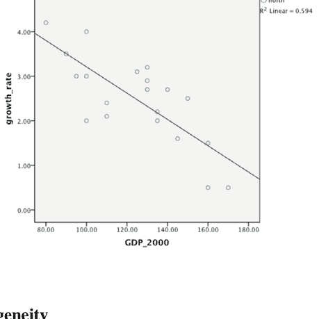

### 1.3 内生性

OLS 估计量仅在满足式 (1.3) 所表达的假设时才具有其最优性质，即当 $E(\varepsilon|X) = 0$ 时。此条件也可以表示为 $E(\varepsilon X) = 0$（因为 $E(X)$ 是常数），这表明回归变量 $X$ 与扰动项 $\varepsilon$ 不相关。当扰动项是外生预定的或是新息时，就会发生这种情况。如果条件 (1.3) 不满足，则部分或全部回归变量被称为内生的，OLS 估计量通常将是有偏且不一致的。内生变量可能出现在计量经济学的各种情况中，例如 *变量误差* 或 *联立性* 的情况 (Greene, 2011)。在处理空间回归时，它们也会出现在一些特定实例中，我们稍后将会看到。

在这种情况下，通过 Theil (1953) 和 Basmann (1957) 引入的称为 *两阶段最小二乘* 的程序推导出一个最优估计量。该程序假设可以识别一组，比如 $h$ 个变量，称为 *工具变量*。让我们定义矩阵 $_nH_h$，它包含 $h$ 个工具变量的 $n$ 个观测值。一个 *有效* 工具变量需要具备与误差不相关（它是 *外生的*）且与回归变量相关（它是 *相关的*）的条件。在回归的 **第一阶段**，$X$ 矩阵的每一列都通过以下方程对工具变量 $H$ 进行回归：

$$_nX_1 = _nH_{hh}\gamma_1 + _n\eta_1$$

在总体层面，这导致：

$H^T \varepsilon = 0$

而在样本层面，条件变为：

$H^T (y - X \hat{\beta}) = 0$

并且，求解这个方程组，我们得到：

$\hat{\beta}_{MM} = (H^T X)^{-1} H^T y$

这与 (1.59) 一致。由于方程 (1.60) 可以被视为一组矩条件，因此从其解导出的估计量也可以被视为*矩估计量*。

可以证明，在一般条件下，两阶段最小二乘估计量是渐近正态分布的，其

$E(\hat{\beta}_{2SLS}) = \beta$

且

$Var(\hat{\beta}_{2SLS}) = \sigma_{\varepsilon}^2 (H^T X)^{-1} H^T H (H^T Z)^{-1}$

这些表达式可用于推断和假设检验。

#### 示例 1.4：Zellner-Revankar 生产函数（续）

*下表报告了 Zellner 和 Revankar (1970) 生产函数（在示例 1.2 中讨论）所估计的原始数据。*

18

1 经典线性回归模型

| 州 | 增加值 | 资本投入 | 劳动力投入 | 企业数量 |
|---|---|---|---|---|
| 阿拉巴马州 | 126,148 | 3804 | 31,551 | 68 |
| 加利福尼亚州 | 3,201,486 | 185,446 | 452,844 | 1372 |
| 康涅狄格州 | 690,670 | 39,712 | 124,074 | 154 |
| 佛罗里达州 | 56,296 | 6547 | 19,181 | 292 |
| 佐治亚州 | 304,531 | 11,530 | 45,534 | 71 |
| 伊利诺伊州 | 723,028 | 58,987 | 88,391 | 275 |
| 印第安纳州 | 992,169 | 112,884 | 148,530 | 260 |
| 爱荷华州 | 35,796 | 2698 | 8017 | 75 |
| 堪萨斯州 | 494,515 | 10,360 | 86,189 | 76 |
| 肯塔基州 | 124,948 | 5213 | 12,000 | 31 |
| 路易斯安那州 | 73,328 | 3763 | 15,900 | 115 |
| 缅因州 | 29,467 | 1967 | 6470 | 81 |
| 马里兰州 | 415,262 | 17,546 | 69,342 | 129 |
| 马萨诸塞州 | 241,530 | 15,347 | 39,416 | 172 |
| 密歇根州 | 4,079,554 | 435,105 | 490,384 | 568 |
| 密苏里州 | 652,085 | 32,840 | 84,831 | 125 |
| 新泽西州 | 667,113 | 33,292 | 83,033 | 247 |
| 纽约州 | 940,430 | 72,974 | 190,094 | 461 |
| 俄亥俄州 | 1,611,899 | 157,978 | 259,916 | 363 |
| 宾夕法尼亚州 | 617,579 | 34,324 | 98,152 | 233 |
| 德克萨斯州 | 527,413 | 22,236 | 109,728 | 308 |
| 弗吉尼亚州 | 174,394 | 7173 | 31,301 | 85 |
| 华盛顿州 | 636,948 | 30,807 | 87,963 | 179 |
| 西弗吉尼亚州 | 22,700 | 1543 | 4063 | 15 |
| 威斯康星州 | 349,711 | 22,001 | 52,818 | 142 |

使用这些数据，为了举例说明，而非旨在实质性地增进对该现象的理解，我们估计生产函数模型，其中变量“增加值”仅表示为变量“劳动力投入”的函数，并使用变量“企业数量”作为工具变量。该工具变量是“相关的”，因为变量“企业数量”与回归变量“劳动力”的相关系数为 0.839001。

估计程序的结果报告在下表中。

| 参数 | | 标准误差 | t 检验 | p 值 |
| :--- | :--- | :--- | :--- | :--- |
| $\beta_0$ | -55,486.25 | 0.21156 | 48,669.26 | -1.140068 |
| $\beta_2$ | 7.264460 | 0.329093 | | 22.07415 | 0.000*** |
| 显著性代码：0 ‘***’ 0.001 ‘**’ 0.01 ‘*’ 0.05 ‘.’ 0.1 ‘ ’ 1 |

$R^2 = 0.970192$ &nbsp;&nbsp;&nbsp;&nbsp; 调整后 $R^2 = 0.968896$ &nbsp;&nbsp;&nbsp;&nbsp; F 统计量 = 487.2683 (p 值 = 0.00000)

AIC = BIC = JB 检验 = 26.31817 (p 值 = 0.000002)

BP 检验 = 20.18672 &nbsp;&nbsp;&nbsp;&nbsp; 第二阶段 SSR = 8.25e+12 (p 值 = 0.0002)

估计结果显示模型与经验数据拟合良好。然而，残差中存在强烈的非正态性和异方差性证据（JB 和 BP 检验），这表明模型应重新讨论。

### 1.4 计算机代码

#### 1.4.1 使用 R 运行回归

首先，让我们从网站 http://cran.r-project.org/ 下载免费的 R 软件，选择相应的操作系统（Windows、Mac OSX 或 Linux）。

在 R 环境中，我们可以通过键盘输入数据，以如下方式将变量 x、y 和 z 定义为向量：

```
>x =c (x1, x2, ..., xn)
>y =c (y1, y2, ..., yn)
>z =c (z1, z2, ..., zn)
```

或者，我们也可以根据源数据文件的格式，使用以下命令之一从外部文件读取数据：

```
>read.table("filename.txt", header=T, dec=".")
>read.txt("filename.txt", header=T, dec=".")
>read.csv("filename.csv", header=T, dec=".")
```

分别对应于文本（.txt）或逗号分隔值（.csv）输入文件。

对于简单线性回归，我们可以使用以下命令将数据绘制在散点图上：

```
> plot(x,y)
```

并且可以通过以下命令估计简单回归模型

```
>model1 <-lm(y ~x)
```

其中“model1”是任意指定的名称，“lm”是线性建模（Linear Modeling）的缩写对应的命令。

我们还可以使用以下命令将拟合线添加到散点图：

```
>abline(model1)
```

对于多元线性回归，类似地，我们使用以下命令估计模型：

```
>model2 <-lm(y ~x+z)
```

以下命令：

```
>summary(model2)
```

返回参数的点估计、其显著性、R 平方、调整后 R 平方和 F 检验。

类似地，命令：

```
>AIC(model2, k=2)
>BIC(model2, K=ln(n))
```

计算模型 AIC 和 BIC 检验，这些未包含在之前的输出中。

给定模型估计，我们可以通过以下命令计算参数的置信区间：

```
>confint(model2)
```

为了进一步参考，残差自动存储为：

```
model2$residuals
```

为了进行更多模型诊断，我们需要安装“lmtest”和“tseries”包。为此，输入命令：

```
> install.packages("lmtest")
> install.packages("tseries")
```

安装这两个包后，在每个会话开始时，我们需要通过以下命令调用它们：

```
> library(lmtest)
> library(tseries)
```

在“lmtest”和“tseries”包中，我们找到了几个有用的模型诊断工具，例如，Breusch-Pagan 同方差检验（使用所有回归变量解释异方差性）：

```
> bptest(model2)
```

以及 Jarque-Bera 正态性检验：

```
>jarque.bera.test(model2$residuals)
```

#### 1.4.2 使用 STATA 运行回归

如果我们的系统中已下载并运行 STATA 软件，我们可以使用各种选项将数据导入 Stata 环境。最简单的方法是将数据粘贴到数据编辑器中，或从 excel/csv 文件导入。

要粘贴数据，我们需要：

- 1. 复制数据；
- 2. 以编辑模式打开数据编辑器；
- 3. 通过选择编辑菜单中的粘贴或选择性粘贴来粘贴数据。

要从外部文件导入数据，我们可以根据源数据文件的格式使用 import 命令：

```
import excel "filename.xls", sheet("sheetname")
import delimited "filename.csv"
```

分别对应于 excel（.xls）或逗号分隔值（.csv）输入文件。

估计简单线性回归时，我们可以使用以下命令将数据绘制在散点图上：

```
scatter y x
```

然后，我们可以通过以下命令估计简单回归模型：

```
reg y x
est sto model1
```

使用这些命令，我们估计（命令 est）了一个名为“model1”的模型，并将结果存储（命令 sto）在 STATA 环境中。

我们还可以使用以下选项绘制带有拟合线的散点图：

```
scatter y x || lfit y x
```

类似地，对于多元线性回归，我们可以使用以下命令估计模型：

```
reg y x z
est sto model2
```

在回归输出方面，参数的点估计、其显著性、R 平方、调整后 R 平方和 F 检验在 `reg` 命令后立即报告。

输入命令：

```
estat ic
```

我们还可以获得模型 *AIC* 和 *BIC* 检验，这些未包含在之前的输出中。

为了进一步参考，回归残差可以通过以下命令获得：

```
predict residuals, res
```

进一步的模型诊断可能包括各种内置检验，例如，异方差性检验：

```
estat hettest—Breusch-Pagan 检验
estat imtest, white—White 检验
```

以及模型残差正态性的 Jarque-Bera 检验：

```
sktest residuals
```

#### 1.4.3 使用 Python 运行回归

**PySAL 安装**

PySAL 是一个用于空间数据科学的包系列，它分为四个主要组件：Lib、Explore、Model 和 Viz。包含所有单独包的 PySAL 元包可以通过多种方式安装。在以下指南中，我们介绍了使用 Python Package Index (PIP) 和 Conda 的安装步骤。安装 PySAL 中包含的所有包的最简单方法是使用 Anaconda (https://www.anaconda.com/)。

Anaconda 是一个免费且开源的 Python 和 R 编程语言发行版，旨在简化包管理和部署。Anaconda 的主要特性之一是其包管理系统，称为“Conda”，它可以高效地处理多个环境和包依赖关系。Conda 允许用户安装二进制软件包的多个版本以及特定项目所需的任何库或模块，从而有效地创建隔离环境，这反过来又可以确保不同的项目

## 运行回归分析

Python 是一种通用且灵活的解释型语言。它并非专为数据分析而设计，但通过使用一些额外的组件，也可以用于此目的。事实上，与前面介绍的 R 和 STATA 软件不同，即使是执行一些基本功能（如加载数据）也需要使用库。所有基本的数据操作都使用 Pandas（Python 数据分析库）执行，它增加了探索、清洗和处理存储在名为“DataFrame”的对象中的数据的能力。

可以使用 Conda 或 PIP 安装 *pandas*，如前所述。

```
conda install pandas
pip install pandas
```

在本节中，我们还将使用 *numpy*、*seaborn* 和 *matplotlib* 库，这些库也可以使用 Conda 或 PIP 安装。

每个 Python 代码都应在脚本开头导入所有必需的库。在 Python 脚本开头进行所有必需的导入有几个优点。首先，它提供了脚本依赖关系的清晰概览，使读者或协作者能够快速了解使用了哪些库和模块。这种做法确保了如果缺少任何模块或存在兼容性问题，在执行脚本时会立即检测到，而不是在执行过程中才被发现，从而可能中断较长的进程或计算。这种惯例在 Python 社区中被广泛接受，促进了不同代码库之间的一致性和可读性。

```
import pandas as pd
import numpy as np
import seaborn as sns
import matplotlib.pyplot as plt
```

为了从外部文件导入数据，我们可以根据源数据文件的格式使用相应的 `read` 命令，分别是 CSV、制表符分隔的文本文件、Excel 文件和 STATA 文件：

```
df = pd.read_csv('data.csv')
df = pd.read_table('data.txt')
df = pd.read_excel('data.xlsx')
df = pd.read_stata('data.dta')
```

在前面的代码中，`read` 函数用于读取不同的文件。所有这些函数都是 Pandas 库的一部分，这就是为什么我们在前面加上“pd.”，通过它我们将不同的文件转换为在 Python 中更容易使用的格式，即 DataFrame。括号内的 'data.csv' 是我们正在读取的 CSV 文件的名称。

DataFrame 是一个二维的带标签的数据结构，其列可能具有不同的类型。它类似于电子表格或 *R* 中的 data.frame 对象。DataFrame 通常是 Pandas 中最常用的对象。我们通过读取 'data.csv' 创建的 DataFrame 被赋值给变量 'df'。

DataFrame 'df' 存储在内存中，一旦创建，就可以在脚本中的任何位置访问。默认情况下，它不会写入磁盘或任何其他外部存储，它只存储在程序的内存中，一旦程序结束或 DataFrame 被删除，它就会被擦除。

要检索或访问存储在 'df' 中的数据，你需要使用变量名 'df'。例如，你可以使用 `print(df)` 将整个 DataFrame 打印到控制台。如果你想查看 DataFrame 的前五行，可以使用 `head()` 函数，命令为：`print(df.head())`。对于特定的列，你可以使用 `df['column_name']`，其中 'column_name' 是你想要访问的列的名称。

在深入解释代码之前，有必要强调 PySAL 的一个局限性。该库不支持直接从数据框加载数据。相反，我们需要从数据框中提取所需的变量，并将它们转换为 numpy 格式的向量或矩阵：y 应该是一个 nx1 数组（其中 n 是观测值的数量），x 应该是一个具有 n 行的二维数组。此数组中的每一列对应一个独立（外生）变量。值得注意的是，这不包括常数向量。

为了说明这个过程，让我们以 columbus 数据集（详见下文第 2.3.3 节）为例，将数据框转换为与 numpy 兼容的数组。如果我们的目标是将 y 设置为 columbus 的 CRIME 变量，则向量将构建如下：

```
y = columbus['CRIME'].values
```

对于 x，如果我们只需要一个独立变量（例如 INC），代码将是：

```
x = np.array([columbus.INC]).T
```

这里，选项“.T”用于转置向量，将其转换为二维数组。

如果我们想要多个独立变量，例如 INC 和 HOVAL，代码将是：

```
x_names = ['INC', 'HOVAL']
x = columbus[x_names].values
```

使用这些约定，你可以轻松地格式化你的数据框数据，使其与 libpysal 和 spreg 兼容。

现在，我们可以使用 OLS 命令估计一个简单的回归模型，如下所示：

```
import libpysal
import spreg
from spreg import OLS
model = OLS(y, x)
```

一旦模型被估计，所有相关信息都存储在变量 model 中。例如，可以使用以下命令获得回归系数的估计值和其他一些有用信息：

```
model.beta
model.summary
```

在估计简单线性回归时，将数据绘制在散点图上的最简单方法如下：

```
sns.regplot(x="x", y="y", data=data)
```

在此上下文中，data 是 Pandas 数据框，其中提取了“x”和“y”变量，如前所述。执行上述函数后，我们基于数据数据框中的“x”和“y”列生成数据点的散点图，并在其上叠加一条回归线。这条线最好地捕捉了“x”和“y”变量之间的趋势和关系，使其成为直观了解数据行为的便捷工具。

此外，可以使用以下命令计算模型中未包含在先前输出中的 AIC 和 BIC 检验：

```
spreg.akaike(model)
spreg.schwarz(model)
```

同样，可以使用函数 breusch_pagan 以以下直观的语法计算 Breusch-Pagan 同方差性检验。

```
breusch_pagan(model)
```

然后可以如下打印自由度、检验值和 p 值：

```
test = spreg.breusch_pagan(model)
test['df']
test['bp']
test['pvalue']
```

同样，对于 Jarque-Bera 正态性检验，使用以下命令：

```
test = spreg.jarque_bera(model)
test['df']
test['jb']
test['pvalue']
```

## 引入的关键术语和概念

- 具有独立扰动项的线性模型
- 普通最小二乘（OLS）估计方法
- 最佳线性无偏估计量（BLUE）
- 参数估计量的性质：无偏性、有效性、一致性、正态性
- 最大似然（ML）估计方法
- 评分函数
- Fisher 信息矩阵
- 矩估计（MM）方法
- 模型参数的假设检验
- 模型的 F 检验
- 决定系数 $R^2$
- 调整后的 $R^2$
- 赤池信息准则（AIC）
- 施瓦茨（或贝叶斯）信息准则（BIC）
- 似然比检验
- Wald 检验

## 问题

1.  在何种条件下，OLS估计量与ML估计量等价？在处理空间数据回归时，这些条件是否可能遇到？这种等价性有何含义？缺乏这种等价性又有何含义？
2.  假设我们有一个变量 $y =$ 区域消费和一个变量 $x =$ 区域收入，两者均以千美元为单位，并进一步假设回归模型为 $y = \beta x + \varepsilon$。如果将收入改为以百万美元为单位，对 $\beta$ 的OLS估计量（记为 $\hat{\beta}$）会产生什么后果？如果消费也改为以百万美元为单位，又会发生什么？
3.  如果我们想判断经验观测数据与理论模型的拟合优度，需要考虑哪些关键要素？
4.  在工具变量估计中，我们如何证明一个工具是*相关的*？
5.  在时间序列回归建模中，我们使用Durbin-Watson检验统计量来检验残差的自相关性，其定义为 $d = \sum_{t=2}^{T} [e_t - e_{t-1}]^2 \Bigg/ \sum_{t=1}^{T} e_t^2$，其中 $t = 1, ..., T$。该检验利用了时间观测值的自然顺序，这在表达式中很明显，因为时间索引 $t$ 的范围是从1到 $T$。在检验空间数据的残差自相关性时，我们必须考虑哪些要素？
6.  为什么在估计不满足同方差性和/或残差不相关假设的数据上的回归模型时，我们必须使用GLS估计程序而不是OLS程序？

## 练习

### 练习 1.1

下表报告的数据涉及英国的一些区域经济数据。它们报告了区域总增加值（GVA）占全国总量的百分比、劳动生产率（以全国总量为100进行报告）以及企业出生率。

| 国家 | 地区 | GVA（占英国总量的百分比） | 劳动生产率（英国 = 100） | 企业出生率（%） |
| :--- | :--- | :--- | :--- | :--- |
| 威尔士 | | 3.6 | 81.5 | 9.3 |
| 苏格兰 | | 8.3 | 96.9 | 10.9 |
| 北爱尔兰 | | 2.3 | 82.9 | 6.5 |
| 英格兰 | 英格兰北部 | 3.2 | 86.2 | 11.2 |
| 英格兰 | 英格兰西北部 | 9.5 | 88.6 | 11.1 |
| 英格兰 | 约克郡与亨伯 | 6.9 | 84.7 | 10.5 |
| 英格兰 | 东米德兰兹 | 6.2 | 89.2 | 10.3 |
| 英格兰 | 西米德兰兹 | 7.3 | 89.1 | 10.5 |
| 英格兰 | 东盎格利亚 | 8.7 | 96.8 | 10.5 |
| 英格兰 | 大伦敦地区 | 21.6 | 139.7 | 14.6 |
| 英格兰 | 英格兰东南部 | 14.7 | 108.3 | 10.8 |
| 英格兰 | 英格兰西南部 | 7.7 | 89.8 | 9.6 |

来源：http://www.statistics.gov.uk/hub/index.html

使用第1.4节中报告的R代码，完成以下任务：

1.  估计一个将GVA解释为劳动生产率和企业出生率函数的模型（模型1）。
2.  估计两个模型，分别将GVA解释为劳动生产率和企业出生率的函数（模型2和模型3）。
3.  比较模型1、模型2和模型3的结果。就与经验数据的拟合而言，哪个是首选模型？在选择首选模型时，你考虑了哪些要素？
4.  将劳动生产率对企业出生率进行回归（模型4）。
5.  计算模型1的残差。
6.  在创新项不相关的假设下，检验模型1的正态性和同方差性假设。
7.  参考下图报告的地图，观察模型1残差的地理分布。你是否注意到任何有趣的地理模式？

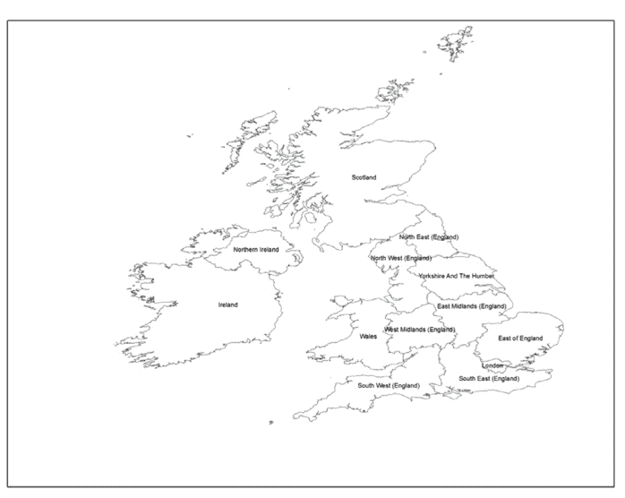

## 参考文献

Barro, R. J., & Sala-i-Martin, X. (1995). *Economic growth*. McGraw Hill.
Basmann, R. L. (1957). A generalized classical method of linear estimation of coefficients in a structural equation. *Econometrica*, 25(1), 77–83.
Breusch, T. S., & Pagan, A. R. (1979). Simple test for heteroscedasticity and random coefficient variation. *Econometrica*, 47(5), 1287–1294.
Greene, W. (2011). *Econometric analysis* (7th ed.).
Jarque, C. M., & Bera, A. K. (1987). A test for normality of observations and regression residuals. *International Statistical Review*, 55, 163–172.
Theil, H. (1953). *Repeated least squares applied to complete equation systems*. Central Planning Bureau.
White, H. (1980). A heteroskedasticity-consistent covariance matrix estimator and a direct test for heteroskedasticity. *Econometrica*, 48(4), 817–838.
Zellner, A., & Revankar, N. (1970). Generalized production functions. *Review of Economic Studies*, 241–250.

# 第2章
一些重要的空间定义

## 2.1 空间权重矩阵 $W$ 与空间滞后定义

如果随机扰动项中存在自相关，那么矩阵VC的非对角线元素中有一些或全部不为零。在这种情况下，如前所述，OLS的最优性质不再成立，只有当我们能够指定一个合理的自相关形式时，GLS准则才能应用。鉴于此，后续章节将考虑在数据以地理单位（如国家或地区）观测时，建模非对角方差-协方差矩阵的各种替代方案。本节将介绍一些初步概念。

当我们观测一个现象，例如在 $i = 1, \dots, n$ 个区域时，非对角方差-协方差矩阵的出现源于随机项之间存在空间自相关。当彼此*邻近*的单元比相距较远的单元更相似时，就会出现正的空间自相关。同样，当某些区域比其他区域表现出更大的变异性时，$VC$ 矩阵也可能表现出空间异质性。例如，参见图2.1。

在空间自相关性的定义中，我们提到了*邻近性*的概念，这需要进一步的说明。事实上，标准计量经济学和空间计量经济学之间的主要区别在于，为了处理空间数据，我们需要利用两组不同的信息。

第一组信息与经济变量的观测值有关，而第二组信息则与这些变量被观测到的特定位置以及所有空间观测之间的各种邻近联系有关。这组与空间相关的额外信息的存在，也是标准计量经济学和统计软件包（例如Eviews或SPSS）如此不愿意引入专门的空间计量经济学和空间统计模块的原因，这些模块需要额外的功能来处理空间地图。如果数据是在规则的方形网格上观测的，如图2.1所示，那么*邻近性*可以通过选择所谓的*车步准则*（如果两个单元共享一条边，则它们彼此邻近）或*后步准则*（如果两个单元共享一条边或一个角，则它们彼此邻近）来直接定义，这借鉴了图2.2所示的国际象棋走法类比。

然而，在空间计量经济学中，几乎无一例外，我们必须处理不规则间隔的行政单位，如地区或国家，因此需要进一步的定义。

空间计量经济学方法的核心是所谓的*权重矩阵*（或*连通性矩阵*）的定义。所有定义中最简单的是以下内容：

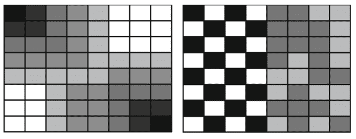

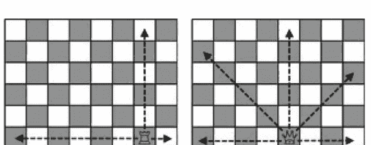

## 2.1 空间权重矩阵 $W$ 与空间滞后定义

$$W = \begin{bmatrix} w_{11} & \cdots & w_{n1} \\ \cdots & w_{ij} & \cdots \\ w_{1n} & \cdots & w_{nn} \end{bmatrix} \tag{2.1}$$

其中每个通用元素定义为

$$w_{ij} = \begin{cases} 1 & \text{若 } j \in N(i) \\ 0 & \text{其他情况} \end{cases} \tag{2.2}$$

$N(i)$ 表示位置 $i$ 的邻居集合。根据定义，我们有 $w_{ii} = 0$。邻居集 $N(i)$ 可以有不同的概念，从图 2.2 所示的基于两个区域单元之间简单邻接关系的概念，到基于*最大距离*的概念（即若 $d_{ij} < d_{\max}$，则 $j \in N(i)$，其中 $d_{ij}$ 是位置 $i$ 与位置 $j$ 之间的距离），再到基于*最近邻准则*的概念。更一般的 $W$ 矩阵也可以通过将条目 $w_{ij}$ 视为区域间地理、经济或社会距离的（负）函数来指定，而不仅仅是像公式 (2.2) 那样以二分条目为特征。

### 示例 2.1 $W$ 矩阵的一些例子

*此处报告了不规则区域系统的一些简单 $W$ 矩阵示例。我们考虑一个包含 8 个不规则区域的系统 (a)，以及使用不同准则计算的相应 $W$ 矩阵：(b) 邻接，(c) 最近邻，(d) 距离 <2。距离在区域的质心之间测量。单元格的边长约定设置为 1。注意，W 矩阵不一定是对称的，例如在情况 (d) 中。进一步注意，根据约定，主对角线上始终为 0，因为每个区域不被视为自身的邻居。*

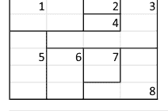

|   | 1 | 2 | 3 | 4 | 5 | 6 | 7 | 8 |
|---|---|---|---|---|---|---|---|---|
| 1 | 0 | 1 | 1 | 1 | 1 | 0 | 0 | 0 |
| 2 | 1 | 0 | 1 | 1 | 0 | 0 | 0 | 0 |
| 3 | 1 | 1 | 0 | 1 | 1 | 1 | 1 | 1 |
| 4 | 1 | 1 | 1 | 0 | 0 | 0 | 0 | 0 |
| 5 | 1 | 0 | 1 | 0 | 0 | 1 | 0 | 0 |
| 6 | 0 | 0 | 1 | 0 | 1 | 0 | 1 | 1 |
| 7 | 0 | 0 | 1 | 0 | 0 | 1 | 0 | 1 |
| 8 | 0 | 0 | 1 | 0 | 0 | 1 | 1 | 0 |

|   | 1 | 2 | 3 | 4 | 5 | 6 | 7 | 8 |
|---|---|---|---|---|---|---|---|---|
| 1 | 0 | 1 | 0 | 0 | 0 | 0 | 0 | 0 |
| 2 | 0 | 0 | 0 | 1 | 0 | 0 | 0 | 0 |
| 3 | 0 | 0 | 0 | 1 | 0 | 0 | 0 | 0 |
| 4 | 0 | 1 | 0 | 0 | 0 | 0 | 0 | 0 |
| 5 | 0 | 0 | 0 | 0 | 0 | 1 | 0 | 0 |
| 6 | 0 | 0 | 0 | 0 | 0 | 0 | 1 | 0 |
| 7 | 0 | 0 | 0 | 0 | 0 | 1 | 0 | 0 |
| 8 | 0 | 0 | 0 | 0 | 0 | 0 | 1 | 0 |

|   | 1 | 2 | 3 | 4 | 5 | 6 | 7 | 8 |
|---|---|---|---|---|---|---|---|---|
| 1 | 0 | 1 | 0 | 1 | 0 | 0 | 0 | 0 |
| 2 | 1 | 0 | 1 | 1 | 0 | 0 | 0 | 0 |
| 3 | 0 | 1 | 0 | 1 | 0 | 0 | 0 | 0 |
| 4 | 1 | 1 | 1 | 0 | 0 | 0 | 0 | 0 |
| 5 | 0 | 0 | 0 | 0 | 0 | 1 | 1 | 0 |
| 6 | 0 | 0 | 0 | 0 | 1 | 0 | 1 | 0 |
| 7 | 0 | 0 | 0 | 0 | 1 | 1 | 0 | 1 |
| 8 | 0 | 0 | 0 | 0 | 0 | 0 | 1 | 0 |

(a) (b) (c) (d)

通常，$W$ 矩阵会被标准化，使得每行之和为 1。在这种情况下，我们有：

$$w_{ij}^* = \frac{w_{ij}}{\sum_{j=1}^n w_{ij}}; \quad w_{ij}^* \in W^* \tag{2.3}$$

这种标准化在某些情况下可能非常有用。例如，通过使用标准化权重，我们可以定义矩阵乘积

$$L(y) = W^*y \tag{2.4}$$

其中每个单独元素等于：

$$L(y_i) = \sum_{j=1}^n w_{ij}^* y_j = \sum_{j=1}^n \frac{w_{ij} y_j}{\sum_{j=1}^n w_{ij}} = \frac{\sum_{j \in N(i)} y_j}{\#N(i)} \tag{2.5}$$

其中 $\#N(i)$ 表示集合 $N(i)$ 的基数。公式 (2.5) 中的项表示在位置 $i$ 的所有邻居位置（根据定义 $W$ 时选择的准则）观测到的变量 $y$ 的平均值。因此，它具有 $y_i$ 的*空间滞后值*的含义，因此通常用符号 $L(y)$ 表示，类似于时间序列分析中的滞后算子。

### 示例 2.2 英国区域基于邻接的 W 矩阵

*作为示例，我们可以推导练习 1.1 中报告的 12 个英国区域的 $W$ 矩阵。此处报告了一个基于邻接的版本。*

| | 1 苏格兰 | 2 北爱尔兰 | 3 威尔士 | 4 英格兰北部 | 5 英格兰西北部 | 6 约克郡与亨伯 | 7 英格兰西米德兰兹 | 8 英格兰东米德兰兹 | 9 英格兰东部 | 10 英格兰西南部 | 11 英格兰东南部 | 12 大伦敦 | 行和 |
|---|---|---|---|---|---|---|---|---|---|---|---|---|---|
| 1 苏格兰 | 0 | 0 | 0 | 0 | 0 | 0 | 0 | 0 | 0 | 0 | 0 | 0 | 0 |
| 2 北爱尔兰 | 0 | 0 | 0 | 0 | 0 | 0 | 0 | 0 | 0 | 0 | 0 | 0 | 0 |
| 3 威尔士 | 0 | 0 | 0 | 1 | 0 | 0 | 1 | 0 | 0 | 1 | 0 | 0 | 3 |
| 4 英格兰北部 | 0 | 0 | 1 | 0 | 1 | 0 | 0 | 0 | 0 | 0 | 0 | 0 | 2 |
| 5 英格兰西北部 | 0 | 0 | 0 | 1 | 0 | 1 | 1 | 1 | 0 | 0 | 0 | 0 | 4 |
| 6 约克郡与亨伯 | 0 | 0 | 0 | 0 | 1 | 0 | 1 | 1 | 0 | 0 | 0 | 0 | 3 |
| 7 英格兰西米德兰兹 | 0 | 0 | 1 | 0 | 1 | 1 | 0 | 1 | 1 | 0 | 1 | 0 | 6 |
| 8 英格兰东米德兰兹 | 0 | 0 | 0 | 0 | 1 | 1 | 1 | 0 | 1 | 0 | 1 | 0 | 5 |
| 9 英格兰东部 | 0 | 0 | 0 | 0 | 0 | 0 | 0 | 1 | 0 | 0 | 1 | 0 | 2 |
| 10 英格兰西南部 | 0 | 0 | 0 | 0 | 0 | 0 | 1 | 0 | 0 | 0 | 1 | 0 | 2 |
| 11 英格兰东南部 | 0 | 0 | 0 | 0 | 0 | 0 | 0 | 1 | 1 | 1 | 0 | 1 | 4 |
| 12 大伦敦 | 0 | 0 | 0 | 0 | 0 | 0 | 0 | 0 | 0 | 0 | 1 | 0 | 1 |

注意，一个岛屿（即北爱尔兰）没有任何邻居。最后一列报告了每个区域的邻居数量。$W$ 矩阵的行标准化版本如下所示。注意，行和现在等于 1。

| | 1 苏格兰 | 2 北爱尔兰 | 3 威尔士 | 4 英格兰北部 | 5 英格兰西北部 | 6 约克郡与亨伯 | 7 英格兰西米德兰兹 | 8 英格兰东米德兰兹 | 9 英格兰东部 | 10 英格兰西南部 | 11 英格兰东南部 | 12 大伦敦 | 行和 |
|---|---|---|---|---|---|---|---|---|---|---|---|---|---|
| 1 苏格兰 | 0 | 0 | 0 | 1 | 0 | 0 | 0 | 0 | 0 | 0 | 0 | 0 | 1 |
| 2 北爱尔兰 | 0 | 0 | 0 | 0 | 0 | 0 | 0 | 0 | 0 | 0 | 0 | 0 | 0 |
| 3 威尔士 | 0 | 0 | 0 | 0 | 0.33333333 | 0 | 0.33333333 | 0 | 0 | 0.33333333 | 0 | 0 | 1 |
| 4 英格兰北部 | 0 | 0 | 0 | 0 | 0.5 | 0.5 | 0 | 0 | 0 | 0 | 0 | 0 | 1 |
| 5 英格兰西北部 | 0 | 0 | 0.2 | 0.2 | 0 | 0.2 | 0.2 | 0.2 | 0 | 0 | 0 | 0 | 1 |
| 6 约克郡与亨伯 | 0 | 0 | 0 | 0.33333333 | 0.33333333 | 0 | 0 | 0.33333333 | 0 | 0 | 0 | 0 | 1 |
| 7 英格兰西米德兰兹 | 0 | 0 | 0.2 | 0 | 0.2 | 0 | 0 | 0.2 | 0 | 0.2 | 0.2 | 0 | 1 |
| 8 英格兰东米德兰兹 | 0 | 0 | 0 | 0 | 0.2 | 0.2 | 0.2 | 0 | 0.2 | 0 | 0.2 | 0 | 1 |
| 9 英格兰东部 | 0 | 0 | 0 | 0 | 0 | 0 | 0 | 0.5 | 0 | 0 | 0.5 | 0 | 1 |
| 10 英格兰西南部 | 0 | 0 | 0 | 0 | 0 | 0 | 0.5 | 0 | 0 | 0 | 0.5 | 0 | 1 |
| 11 英格兰东南部 | 0 | 0 | 0 | 0 | 0 | 0 | 0.2 | 0.2 | 0.2 | 0.2 | 0 | 0.2 | 1 |
| 12 大伦敦 | 0 | 0 | 0 | 0 | 0 | 0 | 0 | 0 | 0 | 0 | 1 | 0 | 1 |

北爱尔兰没有任何邻居这一事实构成了一个问题，因为如果我们想计算空间滞后变量，在这种情况下，北爱尔兰的“空间滞后”变量值将始终为零。为了解决这个问题，我们可以约定将最近的区域（苏格兰）视为北爱尔兰的邻居，即使严格来说，这两个区域并不共享共同边界。对行标准化 W 矩阵进行此修正后，它变为：

$$W = \begin{bmatrix} 0 & 0.5 & 0 & 0.5 & 0 & 0 & 0 & 0 & 0 & 0 & 0 & 0 \\ 1 & 0 & 0 & 0 & 0 & 0 & 0 & 0 & 0 & 0 & 0 & 0 \\ 0 & 0 & 0 & 0 & 0.33 & 0 & 0.33 & 0 & 0 & 0.33 & 0 & 0 \\ 0 & 0 & 0 & 0 & 0.5 & 0.5 & 0 & 0 & 0 & 0 & 0 & 0 \\ 0 & 0 & 0.2 & 0.2 & 0 & 0.2 & 0.2 & 0.2 & 0 & 0 & 0 & 0 \\ 0 & 0 & 0 & 0.33 & 0.33 & 0 & 0 & 0.33 & 0 & 0 & 0 & 0 \\ 0 & 0 & 0.2 & 0 & 0.2 & 0 & 0 & 0.2 & 0 & 0.2 & 0.2 & 0 \\ 0 & 0 & 0 & 0 & 0.2 & 0.2 & 0.2 & 0 & 0.2 & 0 & 0.2 & 0 \\ 0 & 0 & 0 & 0 & 0 & 0 & 0 & 0.5 & 0 & 0 & 0.5 & 0 \\ 0 & 0 & 0 & 0 & 0 & 0 & 0.5 & 0 & 0 & 0 & 0.5 & 0 \\ 0 & 0 & 0 & 0 & 0 & 0 & 0.2 & 0.2 & 0.2 & 0.2 & 0 & 0.2 \\ 0 & 0 & 0 & 0 & 0 & 0 & 0 & 0 & 0 & 0 & 1 & 0 \end{bmatrix}$$

现在再次考虑练习 1.1 中报告的数据集。如果我们将变量“劳动生产率”（假设为变量 y）的向量左乘（行标准化的）W* 矩阵，我们得到下表第二列中报告的空间滞后变量。

| y | W*y |
|---|---|
| 81,5 | 91,55 |
| 96,9 | 81,50 |
| 82,9 | 105,83 |
| 86,2 | 86,65 |
| 88,6 | 86,42 |
| 84,7 | 87,96 |
| 89,2 | 101,72 |
| 89,1 | 93,52 |

| y | W*y |
|---|---|
| 96,8 | 98,70 |
| 139,7 | 98,75 |
| 108,3 | 100,92 |
| 89,8 | 108,3 |

## 2.2 在没有明确备择假设的情况下检验普通最小二乘法残差中的空间自相关

检验普通最小二乘法回归残差中空间自相关最广泛使用的检验方法，基于Moran（1950）引入的一种通用空间相关性度量，并由Cliff和Ord（1972）提出作为检验回归残差不相关这一原假设的统计量。请注意，该统计量在文献中出现的时间早于时间序列回归残差的类似度量：著名的Durbin-Watson统计量（Durbin & Watson, 1951），尽管如前所述，其处理回归残差的扩展直到后来才发表（Cliff & Ord, 1972）。事实上，Durbin-Watson统计量可以通过简单地定义一个适当的W矩阵，被视为Moran统计量的一个特例（例如，参见Arbia, 2006）。从本质上讲，Moran统计量的形式是回归残差与其空间滞后值之间的相关性，即：

$$\text{Corr}(\varepsilon, L\varepsilon) = \frac{\text{Cov}(\varepsilon, L\varepsilon)}{\sqrt{\text{Var}(\varepsilon)\text{Var}(L\varepsilon)}} \quad (2.6)$$

根据公式（2.6），利用公式（2.4）给出的空间滞后定义，并假设（类比平稳时间序列的情况）：

$$\text{Var}(\varepsilon) = \text{Var}(L\varepsilon) \quad (2.7)$$

我们有

$$\text{Corr}(\varepsilon, L\varepsilon) = \frac{\text{Cov}(\varepsilon, L\varepsilon)}{\text{Var}(\varepsilon)} = \frac{\varepsilon^T W \varepsilon}{\varepsilon^T \varepsilon} \quad (2.8)$$

可以证明，由于空间滞后定义的性质，对于空间数据，等式（2.7）并不成立，我们反而有 Var($\varepsilon$) $\geq$ Var($L\varepsilon$)（参见Arbia, 1989）。这种不等式的一个影响是，公式（2.8）中引入的度量在绝对值上不受1的限制，而是具有更窄的界限，由 $|I| \leq \sqrt{\frac{\text{Var}(L\varepsilon)}{\text{Var}(\varepsilon)}}$ 给出。然而，部分由于历史原因，更主要的是由于可以证明其与拉格朗日乘数检验等价（参见第3.7节），这是目前文献中普遍采用的定义，也是软件程序中实现的定义（其他替代方案在Whittle (1954)、Cliff & Ord (1981)以及最近的Li et al. (2007)中讨论）。在其原始定义中，Moran's I统计量在表达式（2.8）的分母中使用了方差的*有偏*估计量，分子的归一化因子等于权重之和。因此，（2.8）的经验对应形式可以表示为：

$$I = \frac{ne^T We}{e^T e [\sum_i \sum_j w_{ij}]}$$ (2.9)

当权重矩阵按行标准化时，则 $\sum_i \sum_j w_{ij} = n$，上述表达式简化为：

$$I = \frac{e^T We}{e^T e}$$ (2.10)

Cliff和Ord（1972）在两种不同的假设下推导了*I*统计量的抽样分布：(i) 随机化；(ii) 残差正态性。在第一种情况下，抽样分布是通过考虑边界系统上观测数据的所有可能排列，并计算每种排列下的*I*-Moran统计量得到的。他们还证明了渐近分布是正态的，其期望值不依赖于所选的特定假设，并且总是由下式表示：

$$E(I) = \frac{n \text{tr}(M_x W)}{S_0(n - k)}$$ (2.11)

其中 $S_0 = \sum_i \sum_j w_{ij}$，$M_x = I - P_x$，$P_x = X(X^T X)^{-1}X^T$。相反，其方差取决于所选的假设。特别是，如果我们假设残差正态性，它可以表示为：

$$(\text{Var}(I)) = \left(\frac{n}{S_0}\right)^2 \frac{\text{tr}(M_x W M_x W^T) + \text{tr}(M_x W)^2 + [\text{tr}(M_x W)]^2}{(n - k)(n - k + 2)} - E(I)^2$$ (2.12)

请注意，*I*-Moran检验的局限性在于它不是基于一个明确的备择假设。然而，由于该检验（由Burridge, 1980证明）与*LM*检验等价，这并不是一个主要的缺点。在提出备择假设的一些明确表述之前，无法更详细地讨论残差相关性假设的替代检验统计量。这一目标将在第3章中完成，因此我们将在第3.7节再次讨论这个问题。

### 示例 2.3 意大利20个地区的奥肯定律

*奥肯定律（Okun, 1962）是失业率变化与实际GDP变化之间的反比关系。下表报告了在意大利20个地区检验奥肯定律所需的数据。两个变量的变化是在1990-2010年期间观测到的。*

| | 失业率变化 | 实际GDP变化 | | 失业率变化 | 实际GDP变化 |
|---|---|---|---|---|---|
| 1. 皮埃蒙特 | 4.2 | 1 | 11. 马尔凯 | 4.2 | 1.8 |
| 2. 瓦莱达奥斯塔 | 3.2 | 1.9 | 12. 拉齐奥 | 6.4 | 2 |
| 3. 伦巴第 | 3.4 | 1.7 | 13. 阿布鲁佐 | 6.2 | 0.5 |
| 4. 特伦蒂诺-上阿迪杰 | 2.75 | 1.7 | 14. 莫利塞 | 8.1 | 0.9 |
| 5. 威尼托 | 3.3 | 1.8 | 15. 坎帕尼亚 | 11.2 | 0.4 |
| 6. 弗留利-威尼斯朱利亚 | 3.4 | 1.9 | 16. 普利亚 | 11.2 | 1.8 |
| 7. 利古里亚 | 4.8 | 2.3 | 17. 巴西利卡塔 | 9.6 | 1.4 |
| 8. 艾米利亚-罗马涅 | 2.9 | 2 | 18. 卡拉布里亚 | 11.3 | 0.2 |
| 9. 托斯卡纳 | 4.3 | 1.1 | 19. 西西里 | 13 | 0.1 |
| 10. 翁布里亚 | 4.6 | 2.3 | 20. 撒丁岛 | 9.9 | 0.7 |

下面报告的散点图显示了理论预期的负相关关系。

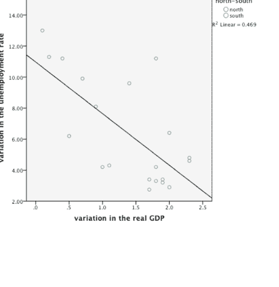

该图显示，在意大利南部地区（绿色圆圈，对应正残差），失业率的变化系统性地高于预期，而在意大利北部地区（蓝色圆圈，对应负残差），则低于预期。这可以解释为可能的模型设定错误，以及残差空间自相关的明显症状。

使用普通最小二乘法估计模型的结果如下所示，连同主要的检验统计量。

| 参数 | | 标准误差 | t检验 | p值 |
|---|---|---|---|---|
| β₀ | 10.971 | 1.283 | 8.8551 | 9.38e-08*** |
| β₁ | −3.326 | 0.835 | −3.984 | 0.000871*** |
| 显著性代码: 0 ‘***’ 0.001 ‘**’ 0.01 ‘*’ 0.05 ‘.’ 0.1 ‘ ’ 1 | | | | |

R² = 0.4686 调整后R² = 0.4391 F统计量 = 15.87 (p值 = 0.0008705)
AIC = 98.28693 BIC = 101.2741 JB检验 = 1.2331 (p值 = 0.5398)
BP检验 = 0.0225 (p值 = 0.8808)

F检验高度显著，从而接受该模型。此外，在通常的置信水平下，两个参数都显著不为零。JB检验和BP检验分别导致接受正态性和同方差性的假设。下面的表格总结了用于检验残差空间相关性假设的I-Moran检验统计量的计算。请注意，W矩阵是通过邻接性指定的（两个岛屿被视为与最近的地区相邻）。

### Moran's I 检验

| | 观测值 | 期望值 | 方差 | z检验 | p值 |
|---|---|---|---|---|---|
| Moran's I | 0.40857021 | −0.06968484 | 0.02737778 | 2.8904 | 0.001924 |

Moran's I检验揭示了回归残差中存在显著的正空间自相关，因此需要重新讨论之前获得的所有结果并重新定义模型。在这种特定情况下，存在正空间自相关，t检验和F检验都会被夸大，导致我们接受本应拒绝的模型。此外，JB检验和BP检验都不显著，从而导致接受同方差性和正态性的假设。然而，由于我们检测到残差中存在显著的空间自相关，这两个检验都可能导致误导性的结论。

### 示例 2.4 意大利20个大区的菲利普斯曲线

菲利普斯曲线（Phillips, 1958）描述了失业率与通货膨胀率之间的反向关系。它表明，较低的失业率与较高的通货膨胀率相关。尽管该曲线最初是为解释这两个变量的历史行为而提出的，但它也被认为可以解释它们的空间差异（Anselin, 1988）。下表报告了在意大利20个大区检验菲利普斯模型所需的数据。

下面报告的散点图显示了正相关关系。

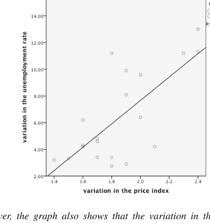

然而，该图也显示，意大利南部大区（绿色圆圈，对应正残差）的失业率变化系统性地高于预期，而意大利北部大区（蓝色圆圈，对应负残差）的变化则低于预期，这可能表明存在残余的空间自相关。

使用普通最小二乘法（OLS）估计模型的结果如下：

| 参数 | | 标准误 | t检验 | p值 |
| :--- | :--- | :--- | :--- | :--- |
| β₀ | -9.827 | 3.720 | -2.642 | 0.016568* |
| β₂ | 8.746 | 1.984 | 4.409 | 0.000338*** |

显著性代码：0 ‘***’ 0.001 ‘**’ 0.01 ‘*’ 0.05 ‘.’ 0.1 ‘ ’ 1

R² = 0.5193 调整后 R² = 0.4926 F统计量 = 19.44 (p值 = 0.000338)
AIC = 96.28177 BIC = 99.26897 JB检验 = 0.0128 (p值 = 0.9936)
BP检验 = 0.2556 (p值 = 0.6131)

所有参数的显著性检验都导致拒绝原假设，因此建议接受该模型。F检验以及正态性和同方差性检验的分析也给出了类似的结论。通过指定一个基于邻接关系的W矩阵（如示例2.3所示），计算残差空间自相关的Moran's I检验会产生以下结果：

### Moran's I 检验

| | 观测值 | 期望值 | 方差 | z检验 | p值 |
|---|---|---|---|---|---|
| Moran's I | 0.3212607 | -0.06938126 | 0.02711169 | 1.5297287 | 0.063042 |

在这种情况下，尽管检测到正的空间相关性，但在5%的置信水平下并不显著。

## 2.3 计算机代码：R

在任何软件中运行空间回归时，W矩阵的创建和管理都是最棘手的部分。它也是区分具有空间功能的软件与标准计量经济学软件的关键。因此，我们将用本章的很大一部分来讨论创建、从外部资源导入以及管理W矩阵的一些最重要步骤。

### 2.3.1 创建和管理W矩阵

让我们首先讨论用于创建和管理空间权重矩阵的R程序。在本节的其余部分，我们将介绍类似的STATA和Python程序。

本节将说明的R程序包含在`spdep`包中。要安装该包，请输入命令：

```
>install.packages("spdep")
```

首次安装后，在每个新会话开始时，通过输入以下命令调用它：

```
>library(spdep)
```

首先，考虑一个规则的正方形网格（例如，3x3）。R软件使用以下命令自动生成邻居列表：

```
> Wnb<-cell2nb(3,3,type=" ")
```

其中，`type`可以根据所选的邻接类型指定为“rook”或“queen”。

该命令表示我们希望将数据从单元格系统（cell）更改为（2）邻居列表（nb）。

对象`Wnb`只是一个邻居列表。如果我们输入`Wnb`，将获得其中包含信息的摘要（区域数量、邻接链接数量、平均链接数以及非零链接的数量和百分比）。创建此对象后，我们必须通过以下命令将其转换为实际的矩阵，例如W：

```
> W<-nb2listw(Wnb)
```

该命令表示我们希望将数据从邻居列表（nb）更改为（2）权重矩阵（listw）。为了可视化邻居，请输入：

```
> W$weights
```

一旦创建了权重矩阵W，变量X的空间滞后变量（例如WX）就可以通过以下命令轻松获得。

```
> WX<-lag.listw(W,X)
```

WX只是分配给这个新变量的约定名称。
现在考虑**不规则区域集合**的情况，以意大利20个大区为例，这些大区已在示例2.3和2.4中描述，其边界在下图2.3中报告。


我们将首先说明一个虽然过时但仍然有用的过程，它允许我们呈现一种在许多空间程序中仍然有用的数据格式（例如，参见下一节2.5.1）。为了创建$W$矩阵，我们需要两个不同的对象，即：

- 1. 一个外部文件，包含每个区域的邻居列表。该文件必须保存为文本文件，并以扩展名.GAL命名。
- 2. 一个内部变量，仅包含区域标识符（例如，1, 2, ...20）。

对于上图2.3中报告的意大利20个大区，.GAL文件将具有以下格式：

第一行
0 20 Italy ita_regions（这是标题：它以一个强制性的0开头，后跟区域数量（20）、区域系统名称（Italy）以及包含多边形标识符的变量（ita_regions））

第二行
1 1（区域标识符和邻居数量。此行表示区域1只有1个邻居）

第三行
2（区域1的单个邻居的多边形标识符。此行表示区域1只有区域2作为邻居）

第四行
2, 4（第二个区域有4个邻居）

第五行
1, 3,7, 8（区域2的4个邻居的多边形标识符）

......

以此类推。完整文件见下文。

文件：Italy.GAL
0 20 italy ita_regions
2 4
1 3 7 8
3 4
2 4 5 8
9 5
7 8 10 11 12
1 1

（续）

文件：*Italy.GAL*

2
15 4
12 14 16 17
19 2
18 20
18 2
17 19
11 4
9 10 12 13
17 3
15 16 18
4 2
3 5
5 4
3 4 6 8
12 6
9 10 11 13 14 15
6 1
5
10 5
8 9 11 12 13
13 3
10 12 14
7 3
2 8 9
14 4
12 13 15 16
8 5
2 3 5 7 9
20 1
19
16 3
14 15 17

文件结束

关于该过程所需的第二个文件，多边形标识符由内部变量`ita_regions`表示，在这种情况下，可以使用以下命令创建：

```
>ita_regions<-c(2,3,9,1,15,19,18,11,17,4,5,12,6,10,13,7,14,8,20,16)
```

或者从外部文件读取。一旦我们创建了这两个对象，就可以通过以下命令在*R*中读取它们：

```
>nbitaly<-read.gal("Italy.GAL", region.id=ita_regions)
```

请注意，必须完整指定.GAL文件的整个路径，以便程序可以唯一地识别它。

获得的对象*nbitaly*必须通过上述命令转换为实际的*W*矩阵：

```
> witaly<-nb2listw(nbitaly)
```

如果我们进一步要求对*W*矩阵进行行标准化，则需要将上述命令修改如下：

```
> witaly<-nb2listw(nbitaly, style="W")
```

现在让我们考虑更常见的情况，即*W*矩阵是通过读取由地理信息系统（GIS）生成的外部文件获得的（参见Burrough等人，2014），并且许多区域系统都公开提供这些文件。例如，如果我们访问链接http://www.census.gov/geo/maps-data/data/tiger-line.html，我们可以下载美国各州的边界系统。类似地，链接https://ec.europa.eu/eurostat/web/gisco/geodata/reference-data/administrative-units-statistical-units/nuts指向欧盟国家边界系统，链接https://www.abs.gov.au/statistics/standards/australian-statistical-geography-standard-asgs-edition-3/jul2021-jun2026/access-and-downloads/digital-boundary-files指向澳大利亚边界系统，而https://www.istat.it/it/archivio/222527指向意大利边界系统。这些只是几个例子。如果我们需要世界上某个通用*区域*的shapefile，我们可以进行互联网查询，例如：“shapefiles *Region*”。

请注意，所有这些链接都在不断更新，因此它们在未来有过时的风险。

公开可用的区域边界及其关系几乎总是以一组*shapefiles*的形式出现，这些文件由（至少）三个同名（通常是感兴趣区域的名称）且扩展名分别为.shp、.shx和.dbf的强制性文件组成。具体来说，.shp文件存储一些地理特征，例如多边形质心的坐标及其边界。.shx文件存储特征几何的索引，最后.dbf文件存储特征的属性信息。为了从外部文件获取必要的信息，我们需要执行三个步骤。第一步，我们只需将shapefiles从外部源读入*R*系统。第二步，我们从shapefiles创建邻居列表。最后，在第三步中，我们使用上述相同的程序从邻居列表中导出*W*矩阵。

这些步骤概述如下。

步骤 1：要导入 shapefile 文件（例如，由 Italy.shp、Italy.shx 和 Italy.dbf 三个文件组成的 Italy shapefile），我们需要以下库：

```r
> library(sf)
> library(sp)
```

然后我们使用命令：

```r
> Ita <- read_sf("Italy.shp")
```

或者，使用 maptools 库，输入：

```r
> Ita <- readShapeSpatial("Italy.shp")
```

一旦数据被读入 R 系统，我们可以使用以下命令列出数据集中包含的变量：

```r
> names(Ita)
```

我们可以使用以下命令查看边界的绘图：

```r
> plot(Ita)
```

或者，我们可以使用以下命令：

```r
library(sf)
Ita <- read_sf("Italy.shp")
```

当数据集非常大时，引入此命令很有用，它可以在保留地图主要特征的同时减少细节：

```r
> Ita <- st_simplify(Ita, preserveTopology = T, dTolerance = 1000)
```

然后使用替代库：

```r
library(ggplot2)
```

来生成地图：

```r
> ggplot(Ita) +
> geom_sf()
```

有时，使用以下命令识别每个区域的质心很有用：

```r
> coords <- coordinates(Ita)
> plot(coords)
```

步骤 2：要从 shapefile 计算基于邻接的邻居列表，我们使用命令：

```r
> contnb <- poly2nb(Ita, queen=T)
```

指定的 Queen 标准确保如果两个区域有共同边界，则它们被视为邻居。该命令表示我们希望将数据从多边形列表 (poly) 更改为邻居列表 (nb)。

但是，此命令不容忍存在没有任何邻居的孤立区域（例如岛屿的情况）。我们可以通过添加选项来强制命令包含这些区域。

```r
> contnb <- poly2nb(Ita, queen=T, zero.policy=TRUE)
```

但在这种情况下，将生成一个 W 矩阵，其中一行或多行对应区域的所有元素都为零。可以通过使用以下命令生成基于**最小阈值距离**的邻居列表来消除此问题：

```r
> nbnear <- dnearneigh(coords, 0, t, longlat=F)
```

其中 t 是阈值距离。如果 longlat=TRUE，则距离以大圆公里为单位测量（即沿球体路径的距离）。相反，longlat=FALSE 不需要球体校正，是小区域的正确选择。在实际情况下，阈值距离 t 必须确定为尽可能小的距离（以使矩阵尽可能稀疏），但也要确保每个点至少有一个邻居。

作为替代方案，要计算基于 k 个最近邻居标准的邻居列表，首先我们必须使用以下命令：

```r
> knn <- knearneigh(coords, k)
```

其中 k 是分配给每个空间单元的邻居数量。然后，我们使用以下命令存储邻居：

```r
> nbk <- knn2nb(knn)
```

这应解释为从对象 knn 到对象 nb 的转换。

**步骤 3：** 使用上述任何过程创建的对象 nb 或 knb 仅是邻居列表。创建此对象后，我们必须通过以下命令将其转换为实际的矩阵，例如 W：

```r
> W <- nb2mat(nb)
```

该命令表示我们希望将数据从邻居列表 (nb) 更改为权重矩阵 (mat)。

然而，在许多 R 空间过程中，通常不需要创建和存储实际的矩阵，而只需要一个名为 listw 的对象，该对象仅包含相关信息。在这种情况下，我们输入：

```r
> W <- nb2listw(nb)
```

我们可以使用以下命令从矩阵切换到 listw 对象：

```r
> listw2mat(nb)
```

或者，反之，使用：

```r
> mat2listw(nb)
```

要计算逆距离权重矩阵，我们采用不同的方法。首先，我们必须通过以下命令生成距离矩阵：

```r
> D <- as.matrix(dist(coords))
```

默认是欧几里得距离，但我们可以使用多种替代方法，例如：("euclidean", "maximum", "manhattan", "canberra", "binary" 或 "minkowski")。

然后我们创建一个 W 矩阵，其中每个元素是矩阵 D 中每个条目的代数逆：

```r
> W <- 1/D
```

但要注意将主对角线设置为零：

```r
> for(i in 1:dim(W)[1]) {W[i,i] = 0}
```

要计算带阈值的逆距离，我们像之前一样生成逆距离 W 矩阵，然后设置：

```r
W <- ifelse(W < invthreshold, 0, W)
```

其中 "invthreshold" 是我们可以任意设定的最大阈值距离的倒数。

如前所述，如果我们需要 listw，我们可以使用已经报告的逆转换 (mat2listw)。

同样，如前面章节所示，如果我们希望对权重进行行标准化，我们将需要添加额外的选项，例如：

```r
> W <- nb2listw(contnb, glist=NULL, style="W")
```

### 2.3.2 计算 Moran's I 空间相关性

一旦使用上述任何标准创建了权重矩阵 W，就可以通过以下命令轻松获得变量 X 的空间滞后变量（例如 WX）：

```r
> WX <- lag.listw(W, X)
```

为了计算先前使用 OLS（命令 lm）估计的模型（例如 model1）残差的 Moran's I，我们使用命令：

```r
> lm.morantest(model1, W)
```

它使用对象 W 中包含的 W 矩阵。默认情况下，假设检验考虑单侧检验。要更改默认设置，请引入选项：

```r
> lm.morantest(model1, W, alternative = "two.sided")
```

它考虑正或负空间自相关的双侧备择假设。

### 2.3.3 一些有用的空间 R 数据库

包 `spData` 包含一些非常有用的额外练习数据集。本书的其余部分将考虑这些数据集作为示例和实践练习。特别是，我们将考虑 4 个 `spData` 数据库，分别名为 "Used.cars"、"Baltimore"、"Boston" 和 "Columbus"。本书中我们将使用的其他数据集包含在包 `plm` 中。

让我们简要描述这些数据集。

首先，为了访问数据 **used.cars**，输入命令：

```r
> data(used.cars)
```

下载此数据后，您的会话包含两个新对象：(i) `used.cars` 包含实际数据，(ii) `usa48.nb` 包含以邻居列表形式存在的地图信息。对象 `used.cars` 包含两个变量，分别名为 `used.cars$tax.charges` 和 `used.cars$price1960`，而对象 `usa48.nb` 包含一个邻居列表，我们可以通过以下命令从中生成 W 矩阵：

```r
W <- nb2listw(usa48.nb)
```

如前所述。

要下载数据集 **baltimore**，请输入：

```r
data(baltimore)
```

该数据集包含 17 个变量的列表，包括两个地理坐标 (`baltimore$X` 和 `baltimore$Y`)。

现在让我们通过输入以下命令创建一个包含这两个坐标的对象：

```r
> coords <- cbind(baltimore$X, baltimore$Y)
```

并通过以下命令创建 W 矩阵：

```r
> contnb <- dnearneigh(coords, 0, 22, longlat=F)
> W <- nb2listw(contnb)
```

其中 22 是保证每个点至少有一个邻居的最小距离。

类似地，要下载数据集 **Boston**，我们输入命令：

```r
> data(boston)
```

它下载三个对象：(i) `boston.c`，(ii) `boston.soi` 和 (iii) `boston.utm`。

对象 `boston.c` 包含在 506 个位置观测到的 20 个变量，包括名为 `boston.c$LON` 和 `boston.c$LAT` 的地理坐标，这些坐标可用于基于阈值距离创建 W 矩阵，如前所述。然而，该数据集允许另外两个选项。实际上，对象 `boston.soi` 包含邻居列表，因此可以基于邻近性获得 W 矩阵，如下所示：

```r
> W <- nb2listw(boston.soi)
```

而第三个对象 (`boston.utm`) 包含 UTM 坐标，因此也可以使用以下命令基于距离获得 W 矩阵：

```r
> contnb <- dnearneigh(boston.utm, 0, 4, longlat=F)
> W <- nb2listw(contnb)
```

其中 4 是保证每个点至少有一个邻居的最小距离。

要下载数据集 **Columbus**，请输入：

```r
> data(columbus)
```

它是一个包含 49 个观测值和 22 个变量的数据集，包括两个地理坐标 (`columbus$X` 和 `columbus$Y`)。因此，同样可以通过以下命令获得 W 矩阵：

```r
> contnb <- dnearneigh(coordinates(columbus$X, columbus$Y), 0, 4, longlat=F)
> W <- nb2listw(contnb)
```

其中 4 是保证每个点至少有一个邻居的最小距离。

此外，该数据集还提供了第二个对象 ("`col.gal.nb`")，其中包含邻居列表，因此作为替代方案，可以基于邻近性获得 W 矩阵，如下所示：

```r
> W <- nb2listw(col.gal.nb)
```

除了包 `spData` 中包含的数据集外，包 `plm` 还包含本书中将使用的另外两个数据集，即：`Munnell` 和 `Insurance` 数据集。（注意，包 `plm` 还需要安装包 `collapse`。）

特别是，数据集 **Munnell** 可以通过库 `Ecdat` 中的命令 `data(Produc)` 下载。它包含一个面板数据，有 48 个美国观测值（从 1970 年到 1986 年）和 11 个变量。

相关的权重矩阵包含在对象 `usaww` 中，可以通过以下命令下载：

```r
> data <- usaww
```

最后，数据集**Insurance**可以通过命令`Insurance`下载，该数据集包含103个观测值的面板数据（指1998年至2002年意大利各省的数据）和19个变量。

权重矩阵包含在对象`itaww`中。

```
data<- itaww
```

## 2.4 计算机代码：STATA

### 2.4.1 创建和管理W矩阵

与软件R类似，STATA软件包也利用shapefile来创建运行任何空间回归所必需的权重矩阵。为了得到所需结果，我们需要预先安装一系列软件包。首先，我们需要`shp2dta`和`mif2dta`软件包来转换shapefile，以及`spmap`软件包用于可视化。为此，我们使用以下命令：

```
ssc install spmap
ssc install shp2dta
ssc install mif2dta
```

其次，我们需要`spmat`软件包来创建权重矩阵：

```
ssc install spmat
```

最后，我们需要安装`spatwmat`软件包来导入W矩阵：

```
ssc install spatwmat
```

安装完所有必要的软件包后，我们需要下载一个shapefile，这可以按照上一节描述的方法完成。

为了将shapefile转换为`.dta`格式，我们可以使用命令：

```
shp2dta using shapefilename.shp, database(database_name) coordinates(coords) genid(id) gencentroids(c)
```

shapefile `.shp`以及`.dbf`（或者如果是mif格式，则是`.mif`和`.mid`文件）应放置在工作目录中。

命令`shp2dta`会创建两个文件：`database(database_name)`创建包含属性的文件，而`coordinates(coords)`选项创建包含坐标的文件。通过`genid(id)`选项，我们命名在数据库中生成的ID变量。`gencentroids(c)`选项创建两个变量`x_c`和`y_c`，分别代表质心的x和y坐标。

如果我们打开由命令`shp2dta`生成的文件`database.dta`，可以使用命令`spmap`来可视化对象：

```
spmap using "coords.dta", id(id)
    title("Title of the map", size(*0.8))
    subtitle("Subtitle ", size(*0.8))
```

现在让我们描述如何从shapefile创建权重矩阵。第一种方法是利用sp命令集中的`spmatrix create`。在创建空间矩阵之前，我们需要为数据设置空间设定：

```
spset, modify shpfile(coords.dta)
```

在括号中指定之前生成的包含坐标的.dta文件。
要创建**邻接矩阵**，输入命令：

```
spmatrix create contiguity W, replace first norm(row)
```

此命令创建一个`spmatrix`对象。W是矩阵的新名称。选项`first`仅创建一阶邻居，我们可以通过在选项的括号中指定来为二阶邻居分配权重，例如`second(0.5)`。
要创建**逆距离矩阵**，输入命令：

```
spmatrix create idistance W, replace norm(row)
```

选项`norm(row)`按行标准化矩阵。要导出矩阵供外部使用，输入：

```
spmatrix export W using wmat.txt
```

生成空间矩阵的第二种方法是使用`spmat`命令。具体来说，可以使用以下命令创建**邻接矩阵**：

```
spmat contiguity CONT using coords, id(id) norm(row)
```

此命令使用文件`coords.dta`创建一个`spmat`对象CONT。选项`id`应指定`database.dta`中的id变量。默认是“queen”邻接矩阵。或者，如果我们希望使用“rook”方法，则需要使用选项`rook`。选项`norm(row)`提供权重的行标准化。我们可以通过输入以下命令查看矩阵的描述：

```
spmat su CONT, links detail
```

要创建**逆距离矩阵**，则输入：

```
spmat idistance IDIST x_c y_c, id(id) df(dhav, mi) vtr(1/100)
```

此命令使用保存在文件`database.dta`的变量x_c和y_c中的经度和纬度坐标创建一个`spmat`对象IDIST。选项`id`再次包含同一文件中的id变量。选项`df()`指定距离函数，可以是欧几里得距离（默认）、dhaversine、rhaversine或p阶闵可夫斯基距离。选项`vtr()`指定要使用的截断方法。`vtr(v)`将W中小于或等于v的值截断为0。注意，如果我们希望截断超过100公里的位置，应将值设为1/100。矩阵的描述可通过以下命令获得：

```
spmat su IDIST, links detail
```

`spmat`对象可以直接用于估计，或者使用子命令`export`存储：

```
spmat export CONT using filename.txt
```

如果我们已经预先将W矩阵存储为STATA对象，可以使用以下命令：

```
spatwmat using "matrix.dta", name(W) standardize
```

如果我们希望行标准化权重，必须添加选项`name(W) standardize`。

### 2.4.2 计算莫兰I空间相关性

要计算OLS模型残差的I-Moran检验，我们可以使用命令`spatgsa`，语法如下：

```
reg y x z
predict residuals, res
spatgsa residuals, w(W) m g two
```

它使用存储在对象W中的权重矩阵（例如，通过`spatwmat`过程导入）。默认情况下，考虑单侧检验和正态性假设。选项`two`代表双侧检验，选项`m`指定报告莫兰I，选项`g`还计算Getis和Ord的G系数。
或者，我们可以在OLS回归后使用以下命令检验残差的空间相关性：

```
estat moran, errorlag(W)
```

其中选项`errorlag(W)`指定一个空间权重矩阵W，该矩阵定义了将要检验的空间误差滞后。

### 2.4.3 可在STATA中使用的一些有用数据库

在第2.3.3节中，我们介绍了一系列R数据库，如“baltimore”、“Boston”、“columbus”和“used.cars”。为了在STATA语言中使用它们进行分析，我们需要将这些文件转换为.dta格式。一个特殊的STATA软件包`foreign`允许执行此操作。

首先，我们需要在R中访问数据“used.cars”，如第2.4节之前所见。

```
library(spData)
data(used.cars)
```

然后，借助`foreign`库，我们获得`.dta`文件，该文件可以在STATA中通过以下命令序列打开：

```
library(foreign)
write.dta(used.cars, "Usedcars.dta")
```

邻居列表应借助`spdep`软件包转移到必要的权重矩阵中，例如：

```
W <- nb2listw(usa48.nb)
Wmatrix <- listw2mat(dnn.listw)
```

然后将权重矩阵导出为csv格式：

```
write.csv(Wmatrix, file = "Wmatrix.csv")
```

以便导入STATA环境并保存为`.dta`格式。可以遵循类似的程序来下载上述提到的其他数据集（`baltimore`、`Boston`和`columbus`）。

## 2.5 计算机代码：Python

### 2.5.1 创建和管理W矩阵

鉴于要将本节讨论的所有程序适配到Python，我们首先需要说明，所有的空间权重计算、输入/输出函数和内置示例数据集都包含在`libpysal`软件包中。

首先，让我们考虑一个**规则方形网格**（例如3x3）的情况。

```
from libpysal.weights import lat2W
w = lat2W(3, 3)
w.neighbors
```

一旦创建了权重矩阵W，变量X的空间滞后变量（比如WX）可以通过以下命令轻松获得：

```
import libpysal
wx = libpysal.weights.lag_spatial(w, x)
```

对于**不规则数据**，可以使用类似于第2.3.1节中描述的R代码的程序导入GAL（.gal）文件。

```
import pysal
gal = pysal.open('path/file.gal', 'r')
w = gal.read()
gal.close()
```

然而，最佳选择始终是从外部文件导入权重矩阵。

在介绍此程序之前，重要的是要预先说明，Python生成的权重矩阵主要分为两类：(i) 基于距离的和 (ii) 基于邻接的。下文将依次讨论它们。

对于**基于距离的**邻域，使用特定阈值参数的距离带生成的W矩阵可以轻松创建如下：

```
import libpysal
points=[(1, 4), (3, 7), (4, 3), (8, 1), (5, 5), (10, 6)]
w=libpysal.weights.DistanceBand(points,threshold=3.2,binary=True)
```

其中变量`points`是一个元组列表，表示点的坐标，阈值3.2是计算邻域的距离。如果参数`binary`设置为`true`，生成的W矩阵将是二元的，即：$w_{ij} = 1ifd_{ij} \leq threshold$，否则$w_{ij} = 0$。相反，如果参数`binary`设置为`false`，距离权重将根据距离衰减$w_{ij} = d_{ij}^{\alpha}$计算，其中alpha如果未定义，则等于$-1$。

另一种方法是创建基于k个最近邻的权重矩阵。例如，以下代码生成k = 2的W矩阵。

```
import libpysal
import numpy as np
points=[(1, 4), (3, 7), (4, 3), (8, 1), (5, 5), (10, 6)]
kd = libpysal.cg.KDTree(np.array(points))
wknn = libpysal.weights.KNN(kd, k=2)
```

对于**基于邻接的**邻域，正如我们在第2.3节讨论R命令时已经看到的，必要的信息通常通过下载描述研究区域边界系统的shapefile（.shp）获得。在这种情况下，可以使用以下命令序列，使用queen或rook标准计算基于邻接的权重：

```
from libpysal.weights import Queen, Rook
w_queen = Queen.from_shapefile('path/file.shp')
w_rook = Rook.from_shapefile('path/file.shp')
```

可以采用类似的方法，使用`geopandas`库中的`GeoDataFrame` `df`。在这种情况下，要使用的命令序列是：

```
import geopandas as gpd
from libpysal.weights import Queen, Rook
w_queen = Queen.from_dataframe(df)
w_rook = Rook.from_dataframe(df)
```

### 2.5.2 计算莫兰指数空间相关性

为了对先前估计的模型（称之为模型）的回归残差进行莫兰指数检验，我们可以直接使用以下命令：

```
spreg.MoranRes(model, w, z=True)
```

该命令使用对象 `w` 中包含的权重矩阵。当参数 `z` 设置为 `True` 时，函数会返回额外的属性，如莫兰指数的期望值、方差和标准化值。需要注意的是，由于使用模拟计算方差的计算需求，该参数的默认设置为 `False`。

### 2.5.3 一些有用的 PySAL 数据库

`libpysal` 包包含一些非常有用的额外练习数据集。也可以找到 R 包 `spdep` 中包含的数据集，本书后续的示例和实践练习将使用这些数据集。以下代码打印 PySAL 中所有可用数据集的列表：

```
import libpysal
libpysal.examples.available()
```

## 引入的关键术语和概念

- 空间自相关
- 邻域
- 邻域标准：车（rook）邻接和后（queen）邻接定义
- 邻域标准：最大距离标准
- 邻域标准：最近邻标准
- 权重（或连接）矩阵
- 标准化权重矩阵
- 空间滞后
- 回归残差空间自相关的莫兰指数检验
- 在随机化假设和正态性假设下莫兰指数检验的矩。

## 问题

1.  为什么杜宾-沃森检验（在所有计量经济学软件中可用，用于检验残差无自相关的假设）不能用于基于空间数据估计的回归？
2.  空间滞后变量的含义是什么？
3.  权重矩阵的*行标准化*是什么意思？在什么情况下这种操作是有益的？
4.  考虑莫兰指数 *I* 检验统计量的修正版本的目的是什么？它与原始定义有何不同？
5.  在推导 *I*-莫兰检验统计量的抽样分布时使用的*随机化*假设的含义是什么？
6.  证明条件 $w_{ij} = \begin{cases} 1 & \text{if } j \in N(i) \\ 0 & \text{otherwise} \end{cases}$ 意味着 $I = \bar{I}$。
7.  在第1章的问题5中，我们介绍了杜宾-沃森检验统计量 $d = \sum_{t=2}^{T} [e_t - e_{t-1}]^2 / \sum_{t=1}^{T} e_t^2 \ t = 1, ..., T$。请使用一个适当描述时间单位之间邻近性的 $W$ 矩阵，以矩阵符号重写该统计量。

## 练习

**练习 2.1.** 领土统计单位命名法（NUTS）是一个地理编码标准，用于引用欧盟国家的统计目的细分。对于每个成员国，欧盟统计局建立了三个 NUTS 级别的层次结构，其中 NUTS1 级别对应于国家细分。下图显示了罗马尼亚 8 个 NUTS2 区域的边界。根据此地图，推导出相应的 $W$ 矩阵及其行标准化版本。计算 $W$ 矩阵中非零条目的百分比（“*稀疏度*”）。


**练习 2.2** 给定练习 2.1 中推导出的权重矩阵和下表中报告的数据，计算婴儿死亡率的空间滞后变量。

| 区域 | 婴儿死亡率（2011年） |
| :--- | :--- |
| RO11—西北区 | 8,7 |
| RO12—中部区 | 10,1 |
| RO21—东北区 | 10,1 |
| RO22—东南区 | 11,3 |
| RO31—南蒙特尼亚区 | 10,3 |
| RO32—布加勒斯特-伊尔福夫区 | 5,7 |
| RO41—西南奥尔特尼亚区 | 9,3 |
| RO42—西部区 | 8,9 |

来源 http://epp.eurostat.ec.europa.eu/portal/page/portal/region_cities/regional_statistics/data/database

**练习 2.3** a. 使用第 2.3.1 节中说明的程序，为以下 5x5（n = 25）的规则方形网格生成一个（基于车邻接的）权重矩阵。

| 1 | 2 | 3 | 4 | 5 |
| 6 | 7 | 8 | 9 | 10 |
| 11 | 12 | 13 | 14 | 15 |
| 16 | 17 | 18 | 19 | 20 |
| 21 | 22 | 23 | 24 | 25 |

b. 给定排列在先前生成的网格上的数据，现在计算以下变量 X 的空间滞后变量 L(X)。

| 27 | 16 | -1 | 23 | 19 |
| 36 | 21 | 32 | 33 | 26 |
| 28 | 25 | 3 | 23 | 35 |
| 14 | 12 | 16 | 14 | 12 |
| 4 | 15 | 29 | 31 | -1 |

**练习 2.4** 给定练习 1.1 中报告的 12 个英国区域，使用第 2.3 节中说明的程序，创建 * .GAL 文件并推导权重矩阵。考虑北爱尔兰与苏格兰和威尔士相邻。

**练习 2.5** 给定练习 1.1 中报告的数据并使用练习 2.4 的结果，计算 12 个英国区域的 GVA（总增加值）变量的空间滞后值。

**练习 2.6** 基于练习 2.5 中获得的结果，绘制一个散点图，其中变量 GVA 在水平轴上，滞后变量 L(GVA) 在垂直轴上。该图代表文献中称为“*莫兰散点图*”（Anselin, 1995）的探索性工具。你能从中获得什么见解？

**练习 2.7** 给定练习 2.4 的结果，重新估计练习 1.1 的模型 1 [GVA = f(劳动生产率; 企业出生率)] 并检验残差中是否存在空间自相关。我们能否接受残差空间不相关的假设？

**练习 2.8** 使用第 2.3.2 节中说明的程序，为意大利 20 个区域生成一个权重矩阵，并复制示例 2.3 和 2.4。

**练习 2.9** 访问网站 http://gis.cancer.gov/tools/seerstat_bridge/fips_vars/#statefips 并下载与美国 51 个州相关的 shapefile。然后，使用第 2.3.3 节中说明的程序，生成权重矩阵并绘制 51 个州边界的地图。

## 参考文献

Anselin, L. (1995). Local indicators of spatial association. *Geographical Analysis*, 27, 93–115.
Arbia, G. (1989). *Spatial data configuration in the statistical analysis of regional economics and related problems*. Kluwer Academic Press.
Arbia, G. (2006). *Spatial econometrics: Statistical foundations and applications to regional economic growth*. Springer-Verlag.
Burridge, P. (1980). On the Cliff-Ord test for spatial correlation. *Journal of the Royal Statistical Society, B*, 42, 107–108.
Burrough, P. A., Mcdonnell, R. A., & Lloyd, C. D. (2014). *Principles of geographical information systems* (3rd ed.). Oxford University Press.
Cliff, A. D., & Ord, J. K. (1972). *Spatial autocorrelation*. Pion.
Durbin, J., & Watson, G. S. (1951). Testing for serial correlation in least squares regression, I. *Biometrika*, 37, 409–428.
Li, H., Calder, C. A., & Cressie, N. (2007). Beyond Moran’s I: Testing for spatial dependence based on the spatial autoregressive model. *Geographical Analysis*, 39(4), 357–375.
Moran, P. A. P. (1950). Notes on continuous stochastic phenomena. *Biometrika*, 37(1), 17–23.
Okun, A. M. (1962). *Potential GNP: its measurement and significance*. Yale University.
Phillips, A. W. (1958). The relationship between unemployment and the rate of change of money wages in the United Kingdom 1861–1957. *Economica*, 25(100), 283–299.
Whittle, P. (1954). On stationary processes in the plane. *Biometrika*, 41, 434–449.

# 第3章
## 空间线性回归模型

## 3.1 概述

本章讨论了在线性空间计量经济学模型的不同设定，这些设定可以在扰动项中不存在空间自相关的假设被违反时考虑。一个考虑违反普通最小二乘法适用理想条件的一般形式由以下方程组给出：

$$y = \lambda Wy + X\beta_{(1)} + WX\beta_{(2)} + u \quad |\lambda| < 1$$

$$u = \rho Wu + \varepsilon \quad |\rho| < 1$$

其中 $X$ 是非随机解释变量矩阵，$W$ 是外生给定的权重矩阵，$\varepsilon|X \approx i.i.d.N(0, \sigma^2_{\varepsilon}I_n)$，$\beta_{(1)}$、$\beta_{(2)}$、$\lambda$ 和 $\rho$ 是待估参数。如果 $W$ 是行标准化的，则参数 $\lambda$ 和 $\rho$ 的限制成立。

第一个方程将因变量 $y$ 的空间滞后变量作为解释变量之一，并且也可能包含部分或全部外生变量的空间滞后变量（项 $WX$）。第二个方程考虑了随机扰动项的空间模型。原则上，方程 (3.1) 和 (3.2) 中的三个权重矩阵无需相同，尽管在实际案例中很难证明选择不同的矩阵是合理的。

方程 (3.1) 也可以写成：

$$y = \lambda Wy + Z\beta + u \quad |\lambda| < 1$$

其中定义了所有解释变量（当前和空间滞后）的矩阵为 $Z = [X, WX]$，回归参数向量为 $\beta = [\beta_{(1)}, \beta_{(2)}]$。

该模型被Kelejian和Prucha（1997，1998）称为SARAR (1,1)（空间自回归附加自回归误差结构的首字母缩写），它涵盖了多种空间计量经济学模型。具体来说，我们有六种显著的情况：

- (i) $\beta = 0$ 且 $\lambda = 0$ 或 $\rho = 0$，称为纯空间自回归模型
- (ii) $\lambda = \rho = 0$，称为X的空间滞后模型（SLX）
- (iii) $\lambda = 0, \rho \neq 0$，称为空间滞后模型（SLM）
- (iv) $\lambda = 0, \rho \neq 0$，并带有额外的滞后自变量，称为空间杜宾模型（SDM）
- (v) $\lambda \neq 0, \rho = 0$，称为空间误差模型（SEM）
- (vi) $\lambda \neq 0, \rho \neq 0$，完整模型（SARAR）

我们将在接下来的章节中回顾这六种情况。不过在此之前，让我们先考虑模型参数的一个一般性条件。

首先，请注意公式 (3.1) 也可以写成：

$(I - \lambda W)y = X\beta_{(1)} + WX\beta_{(2)} + u$
$y = (I - \lambda W)^{-1}[X\beta_{(1)} + WX\beta_{(2)} + u]$ (3.4)

而公式 (3.2) 可以写成：
$u = (I - \rho W)^{-1}\varepsilon$ (3.5)

前提是这两个逆矩阵存在。Kelejian和Prucha（1998）利用Gerschgorin（1931）定理证明，当W矩阵是行标准化时，如果 $|\rho| < 1$ 且 $|\lambda| < 1$，则两个逆矩阵都存在，因此有了公式 (3.1) 和 (3.2) 中报告的参数限制。

## 3.2 纯空间自回归

当 $\beta = 0$ 且 $\lambda = 0$ 或 $\rho = 0$，并进一步假设 $\varepsilon|X \approx i.i.d.N(0, \sigma^2_{\varepsilon}I_n)$ 且W为非随机时，模型简化为一个简单的空间自回归，可以通过极大似然（ML）程序进行估计（Whittle, 1954）。

在这种情况下，我们有

$y = \lambda Wy + \varepsilon \ |\lambda| < 1$ (3.6)

当 $\rho = 0$ 时，或者
$y = \rho Wy + \varepsilon \ |\rho| < 1$ (3.7)

当 $\lambda = 0$ 时，因为此时 $y = u$。在这种情况下，我们可以用以下方式推导似然函数。首先，从公式 (3.6)（或 (3.7)）我们有：

$(I - \rho W)y = \varepsilon$

因此

$y = (I - \rho W)^{-1}\varepsilon$

所以

$E(y) = 0$ (3.8)

并且

$E(yy^T) = \sigma_{\varepsilon}^2(I - \rho W)^{-1}(I - \rho W^T)^{-1} = \sigma_{\varepsilon}^2\Omega$ (3.9)

假设新息服从正态分布，似然函数可以表示为：

$L(\rho, \sigma_{\varepsilon}^2) = const\sigma_{\varepsilon}^2|\Omega|^{-\frac{1}{2}} \exp\left\{-\frac{1}{2\sigma_{\varepsilon}^2}y^T\Omega^{-1}y\right\}$ (3.10)

将公式 (3.9) 中报告的矩阵 $\Omega$ 的显式表达式代入，我们可以写成：

$L(\rho, \sigma_{\varepsilon}^2) = const(\sigma_{\varepsilon}^2)^{-\frac{n}{2}}|(I - \rho W)^{-1}(I - \rho W)^{-T}|^{-\frac{1}{2}} \exp\left\{-\frac{1}{2\sigma_{\varepsilon}^2}y^T[(I - \rho W)^{-1}(I - \rho W)^{-T}]^{-1}y\right\}$ (3.11)

最后，对数似然函数可以表示为

$l(\rho, \sigma_{\varepsilon}^2) = \text{const} - \frac{n}{2}\ln(\sigma_{\varepsilon}^2) - \frac{1}{2}\ln|(I - \rho W)^{-1}(I - \rho W)^{-T}| - \frac{1}{2\sigma_{\varepsilon}^2}y^T[(I - \rho W)^{-1}(I - \rho W)^{-T}]^{-1}y$ (3.12)

这个表达式在参数上是非线性的，需要进行数值最大化。

### 示例 3.1：意大利20个地区的价格指数空间自回归

让我们再次考虑图2.3中报告的意大利20个地区的例子，并考虑示例2.4中报告的价格指数变化的空间分布。在这里，我们希望估计一个带有常数项的纯空间自回归模型，$y = \beta_0 + \lambda Wy + \varepsilon$（其中 $y =$ 价格指数的变化），以检验一个地区的价格指数变化是否通过通货膨胀传染机制影响邻近地区的变化。作为邻近标准，我们考虑了最大阈值距离标准，以便将两个岛屿包括在内，否则如果采用简单的邻接标准，这两个岛屿将被孤立。使用ML准则（通过对数似然函数的数值最大化）估计空间自回归模型的结果如下报告：

| 参数 | | 标准误差 | t检验 | p值 |
| :--- | :--- | :--- | :--- | :--- |
| $\beta_0$ | 1.841545 | 0.037795 | 48.724 | 2.2e-16 |
| 显著性代码：0 ‘***’ 0.001 ‘**’ 0.01 ‘*’ 0.05 ‘.’ 0.1 ‘ ’ 1 | | | | |

$\lambda = -0.56091$

数据可以从R中通过命令`data(Baltimore)`下载，如第2.3.5节所示。该数据集还包含房屋的X、Y坐标。其位置地图如下图所示。

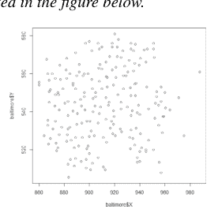

该数据集包含以下变量：房屋价格（PRICE）、房间数量（NROOM）、浴室数量（NBATH）、建造年龄（AGE）、平方英尺（SQFT）以及其他与重要特征（例如，壁炉、露台、空调、车库等）存在与否相关的定性变量。

让我们首先报告一个简单OLS回归的输出，其中房屋价格仅是房屋年龄的函数。

| 参数 | | 标准误差 | t检验 | p值 |
| :--- | :--- | :--- | :--- | :--- |
| 截距 | 55.08500 | 2.82833 | 19.48 | 2e-16*** |
| AGE | -0.35802 | 0.07851 | -4.56 | 8.7e-06 *** |
| 显著性代码：0 ‘***’ 0.001 ‘**’ 0.01 ‘*’ 0.05 ‘.’ 0.1 ‘ ’ 1 | | | | |

F检验 = 20.8 (p值 = 8.7e-06 ***)
AIC = 1917.93 BIC = 1927.986
BP检验 = 0.0014415 (p值 0.9697)
调整后R方：0.08614
JB检验 = 371.32 (p值 = 2e-16***)

F检验高度显著，从而接受该模型，并且两个参数在通常的置信水平下也是显著的。此外，JB检验拒绝了正态性假设，而BP检验不显著，从而接受了同方差性假设。下表总结了用于检验残差空间相关性假设的I-Moran检验统计量的计算。

### Moran's I 检验

| | 观测值 | 期望值 | 方差 | z检验 | p值 |
|---|---|---|---|---|---|
| Moran's I | 0.2173552910 | -0.0059074021 | 0.0002345866 | 14.577 | < 2.2e-16*** |

显示出高水平的残差空间相关性，需要加以考虑。

现在让我们考虑一个SLX模型作为替代方案，以考虑变量AGE的溢出效应。该效应量化了房屋建造年份的空间平滑变化，这是大多数城镇的典型特征。我们得到以下输出：

| 参数 | | 标准误差 | t检验 | p值 |
|---|---|---|---|---|
| 截距 | 80.00352 | 5.70982 | 14.012 | 2e-16*** |
| AGE | -0.11324 | 0.08941 | -1.267 | 0.207 |
| W(AGE) | -1.04317 | 0.21102 | -4.943 | 1.58e-06 *** |
| 显著性代码：0 ‘***’ 0.001 ‘**’ 0.01 ‘*’ 0.05 ‘.’ 0.1 ‘ ’ 1 | | | | |

F检验 = 23.78 (p值 = 4.995e-10***)
AIC = 1896.492
BIC = 1909.899
调整后R方：0.1783
JB检验 = 525.08 (p值 = 2e-16***)
BP检验 = 0.67444 (p值 0.7138)

### Moran's I 检验

| | 观测值 | 期望值 | 方差 | z检验 | p值 |
|---|---|---|---|---|---|
| Moran's I | 0.1976352327 | 0.0079241214 | 0.0002257469 | 13.681 | < 2.2e-16*** |

由于更好的拟合度（AIC和BIC准则以及调整后R方）以及更低（尽管仍然很高！）的残差空间相关性，SLX模型优于简单的OLS模型。请注意，由AGE的滞后值（W(AGE)）衡量的溢出效应高度显著，而AGE的值现在不再显著。这证明，房屋所在周边区域建筑物的平均年龄，其影响甚至比该区域本身的年龄更为相关。

## 3.4 空间误差模型（SEM）

### 3.4.1 引言

当 $\lambda = 0$ 且 $\rho \neq 0$ 时，模型变为：

$$y = Z\beta + u \quad (3.13)$$

$$u = \rho Wu + \varepsilon \quad |\rho| < 1 \quad (3.14)$$

其中回归变量Z和权重W是非随机的。该模型在文献中被称为空间误差模型（SEM）（Anselin, 1988; Arbia, 2006; LeSage & Pace, 2009）。如果 $\varepsilon|X \approx i.i.d.N(0, \sigma^2_{\varepsilon}I_n)$，那么我们有 $u = (I - \rho W)^{-1}\varepsilon$，如公式（3.5）所示，因此我们可以写成：

$$E(u) = 0$$
$$E(uu^T) = \sigma^2_{\varepsilon}(I - \rho W)^{-1}(I - \rho W^T)^{-1} = \sigma^2_{\varepsilon}\Omega \quad (3.15)$$

这种表述同时考虑了异方差和自相关的误差项。在这种情况下，只有当参数 $\rho$ 的值先验已知时，GLS程序才能应用，而这在实证案例中非常罕见。注意，从公式（3.14）我们有

$$(I - \rho W)u = \varepsilon$$

因此模型（3.13）（3.14）也可以写成：

$$(I - \rho W)y = (I - \rho W)Z\beta + (I - \rho W)u$$
$$y = \rho Wy + Z\beta - WZ\rho\beta + \varepsilon$$
$$y = \rho Wy + Z\beta - WZ\gamma + \varepsilon \quad (3.16)$$

其中 $\gamma = \rho\beta$，人们可能会考虑直接估计模型（3.16）。然而，出现了两个问题。首先，由于约束条件 $\gamma = \rho\beta$，公式（3.16）是过度参数化的。其次，项Wy与误差项相关，从而产生内生性。为了说服自己，让我们考虑，从公式（3.16）：

$$(I - \lambda W)y = Z\beta - WZ\gamma + \varepsilon$$

因此

$$y = (I - \lambda W)^{-1}(Z\beta - WZ\gamma) + (I - \lambda W)^{-1}\varepsilon \quad (3.17)$$

因此，滞后变量Wy与误差项之间的协方差可以表示为：

$$E[(Wy)\varepsilon^T] = E[W(I - \lambda W)^{-1}(Z\beta - WZ\gamma) + W(I - \lambda W)^{-1}\varepsilon]\varepsilon^T$$
$$= W(I - \lambda W)^{-1}(Z\beta - WZ\gamma)E(\varepsilon^T)$$
$$+ W(I - \lambda W)^{-1}E[\varepsilon\varepsilon^T]$$
$$= \sigma_{\varepsilon}^2 W(I - \lambda W)^{-1}I \neq 0 \quad (3.18)$$

因此误差是内生的，即与空间滞后变量Wy相关。由于误差的内生性，OLS程序失去了其最优性质。

原则上，可以采用工具变量程序来处理内生性。然而，Kelejian和Prucha（1998）证明，由于无法找到与另外两个回归变量Z和WZ线性无关的Wy的工具变量，因此该程序不一致。

因此，除非参数 $\rho$ 已知，否则有两种可行的估计替代方案：

- (i) 最大似然法（ML），以及
- (ii) 可行GLS（FGLS）

这两种程序将在接下来的两个小节中讨论。

### 3.4.2 最大似然估计量

从公式（3.13）我们推导出

$$u = y - Z\beta \quad (3.19)$$

并且，由于u服从正态分布，其方差-协方差矩阵由公式（3.15）给出，我们可以轻松获得似然函数：

$$L(\rho, \sigma_{\varepsilon}^2, \beta) = const \sigma_{\varepsilon}^2 |\Omega|^{-\frac{1}{2}} \exp\left\{-\frac{1}{2\sigma_{\varepsilon}^2} u^T \Omega^{-1} u\right\} \quad (3.20)$$

将表达式（3.19）代入此最后一个方程，我们得到：

$$L(\rho, \sigma_{\varepsilon}^2, \beta) = const \sigma_{\varepsilon}^2 |\Omega|^{-\frac{1}{2}} \exp\left\{-\frac{1}{2\sigma_{\varepsilon}^2} (y - Z\beta)^T \Omega^{-1} (y - Z\beta)\right\} \quad (3.21)$$

并且，通过代入公式（3.15）中报告的矩阵 $\Omega$ 的显式表达式，我们可以写成：

$$L(\rho, \sigma_{\varepsilon}^2, \beta) = const(\sigma_{\varepsilon}^2)^{-\frac{n}{2}} |(I - \rho W)^{-1}(I - \rho W)^{-T}|^{-\frac{1}{2}} \exp\left\{-\frac{1}{2}(y - Z\beta)^T [(I - \rho W)^{-1}(I - \rho W)^{-T}]^{-1} (y - Z\beta)\right\} \quad (3.22)$$

最后，对数似然可以表示为

$$l(\rho, \sigma_{\varepsilon}^2, \beta) = const - \frac{n}{2} \ln(\sigma_{\varepsilon}^2) - \frac{1}{2} \ln |(I - \rho W)^{-1}(I - \rho W)^{-T}| - \frac{1}{2}(y - Z\beta)^T [(I - \rho W)^{-1}(I - \rho W)^{-T}]^{-1} (y - Z\beta) \quad (3.23)$$

这个表达式对应于为变换后的变量推导回归模型

$$y^* = Z^{*T} \beta + \varepsilon$$

的似然函数，其中 $\varepsilon|X \approx i.i.d. N(0, \sigma_{\varepsilon}^2 I_n)$，变换变量为：

$$y^*(\rho) = y - \rho Wy$$
$$Z^*(\rho) = Z - \rho WZ$$

Lee（2004）正式证明了确保模型（3.13）和（3.14）中ML估计量一致且渐近正态的条件。

由于高度非线性，公式（3.23）无法解析最大化。然而，可以通过数值方法最大化以产生参数估计。但是，我们必须指出，可用软件中采用的计算程序都是近似的，因为它们基于伪似然。

最大化对数似然的一个问题在于项 $\ln|I - \rho W|$，因为在数值搜索中，对于参数 $\rho$ 的每个值，都必须重复计算行列式。如果 $n$ 非常大，此操作可能要求很高。文献中提出的一种解决方法是利用所谓的Ord分解（Ord, 1975）：

$$\ln|I - \rho W| = \ln \left[ \prod_{i=1}^n (1 - \rho \varphi_i) \right] \quad (3.24)$$

其中 $\phi_i$ 表示权重矩阵 $W$ 的第 $i$ 个特征向量。这种分解极大地简化了计算，但是，如果 $n$ 非常大，它并不能完全消除精度问题，因为正如Kelejian和Prucha（1998）所指出的，对于非常大的矩阵，谱分解也是近似的。我们将在第5章更详细地讨论这些计算问题。为了解决在大样本中评估对数行列式的问题，Kelejian 和 Prucha (1998) 提出了一种替代估计策略，该策略将在下一节中介绍。
如果 $\rho$ 已知，那么 $ML$ 估计量与第 1.2 节中通过将方差-协方差矩阵的显式表达式 (3.15) 代入方程 (1.47) 而得到的 $GLS$ 估计量一致。

### 3.4.3 可行的 GLS

让我们回到模型 (3.13) (3.14)，为简便起见在此重新列出

$$y = Z\beta + u$$

步骤3：为了获得参数 $\rho$ 的一致估计量，Keleijian 和 Prucha (1998) 提出了一种 GMM 程序，并引入了以下附加假设：

- (i) $E(\varepsilon^4) < \infty$
- (ii) 矩阵 $W$ 和 $(I - \rho W)^{-1}$ 均为“绝对可和”的，即 $\sum_{i=1}^n w_{ij} < c$ 且 $\sum_{j=1}^n w_{ij} < c$，其中 c 是一个不依赖于 n 的常数，$(I - \rho W)^{-1}$ 同理。
- (iii) $Q_z$、$Q_1$ 和 $Q_2$ 是非奇异矩阵，其中 $Q_z = \lim_{n \to \infty} Z^T Z$；$Q_1 = \lim_{n \to \infty} Z^T \Omega Z$ 且 $Q_2 = \lim_{n \to \infty} Z^T \Omega^{-1} Z$

假设上述条件成立，让我们用标量形式写出模型 (3.13) (3.14)。我们有：

$y_i = Z_i \beta + u_i$

以及

$u_i = \rho \sum_{i=1}^n w_{ij} u_j + \varepsilon_i$ (3.27)

现在我们定义

$\overline{u}_i = \sum_{i=1}^n w_{ij} u_j$；$\overline{\overline{u}}_i = \sum_{i=1}^n w_{ij} \overline{u}_j$ 且 $\overline{\varepsilon}_i = \sum_{i=1}^n w_{ij} \varepsilon_j$ (3.28)

因此，由式 (3.27) 可得：

$u_i - \rho \overline{u}_i = u_i - \rho \sum_{i=1}^n w_{ij} u_j = \varepsilon_i$ (3.29)

$\overline{u}_i - \rho \overline{\overline{u}}_i = \overline{\varepsilon}_i$ (3.30)

三个矩条件按如下方式推导得出。对式 (3.29) 和 (3.30) 进行平方并取平均，我们得到：

$\frac{1}{n} \sum_{i=1}^n (u_i - \rho \overline{u}_i)^2 = \frac{1}{n} \sum_{i=1}^n \varepsilon_i^2 = E(\varepsilon_i^2)$ (3.31)

$\frac{1}{n} \sum_{i=1}^n (\overline{u}_i - \rho \overline{\overline{u}}_i)^2 = \sum_{i=1}^n \frac{1}{n} \overline{\varepsilon}_i^2 = E(\overline{\varepsilon}_i^2)$ (3.32)

此外，将式 (3.29) 乘以式 (3.30)，我们推导出第三个矩条件：

$$\frac{1}{n} \sum_{i=1}^{n} (u_i - \rho \bar{u}_i)(\bar{u}_i - \rho \bar{\bar{u}}_i) = E(\varepsilon_i \bar{\varepsilon}_i)$$

请注意：

$$E(\varepsilon_i^2) = \sigma_{\varepsilon}^2; \quad E(\bar{\varepsilon}_i^2) = \sigma_{\varepsilon}^2 tr \frac{W^T W}{n} \quad E(\varepsilon_i \bar{\varepsilon}_i) = 0$$

正如 Kelejian 和 Prucha (1999) 所证明的那样。此外，在式 (3.31)、(3.32) 和 (3.33) 中代入 $u$ 的经验对应物，即 $\hat{u}$ [在式 (3.26) 中推导得出]，通过将理论矩与其经验对应物相等而得到的三个矩条件变为：

$$\begin{cases} \frac{1}{n} \sum_{i=1}^{n} (\hat{u}_i - \rho \hat{\bar{u}}_i)^2 = \sigma_{\varepsilon}^2 \\ \frac{1}{n} \sum_{i=1}^{n} (\hat{\bar{u}}_i - \rho \hat{\bar{\bar{u}}}_i)^2 = \sigma_{\varepsilon}^2 tr \frac{W^T W}{n} \\ \frac{1}{n} \sum_{i=1}^{n} (\hat{u}_i - \rho \hat{\bar{u}}_i)(\hat{\bar{u}}_i - \rho \hat{\bar{\bar{u}}}_i) = 0 \end{cases}$$

使用显而易见的符号，并经过简单的代数运算后：

$$\frac{1}{n} \sum_{i=1}^{n} \hat{u}_i^2 + \rho^2 \frac{1}{n} \sum_{i=1}^{n} \hat{\bar{u}}_i^2 - \frac{2}{n} \rho \sum_{i=1}^{n} \hat{u}_i \hat{\bar{u}}_i = \sigma_{\varepsilon}^2$$
$$\frac{1}{n} \sum_{i=1}^{n} \hat{\bar{u}}_i^2 + \frac{1}{n} \rho^2 \sum_{i=1}^{n} \hat{\bar{\bar{u}}}_i^2 - \frac{2}{n} \rho \sum_{i=1}^{n} \hat{\bar{u}}_i \hat{\bar{\bar{u}}}_i = \sigma_{\varepsilon}^2 tr \frac{W^T W}{n}$$
$$\frac{1}{n} \sum_{i=1}^{n} \hat{u}_i \hat{\bar{u}}_i + \frac{\rho^2}{n} \sum_{i=1}^{n} \hat{\bar{u}}_i \hat{\bar{\bar{u}}}_i - \rho \left( \frac{1}{n} \sum_{i=1}^{n} \hat{\bar{u}}_i^2 + \frac{1}{n} \sum_{i=1}^{n} \hat{u}_i \hat{\bar{\bar{u}}}_i \right) = 0$$

或：

$$\rho^2 \frac{1}{n} \sum_{i=1}^{n} \hat{\bar{u}}_i^2 - \frac{2}{n} \rho \sum_{i=1}^{n} \hat{u}_i \hat{\bar{u}}_i - \sigma_{\varepsilon}^2 = -\frac{1}{n} \sum_{i=1}^{n} \hat{u}_i^2$$
$$\frac{1}{n} \rho^2 \sum_{i=1}^{n} \hat{\bar{\bar{u}}}_i^2 - \frac{2}{n} \rho \sum_{i=1}^{n} \hat{\bar{u}}_i \hat{\bar{\bar{u}}}_i - \sigma_{\varepsilon}^2 tr \frac{W^T W}{n} = -\frac{1}{n} \sum_{i=1}^{n} \hat{\bar{u}}_i^2$$
$$\frac{\rho^2}{n} \sum_{i=1}^{n} \hat{\bar{u}}_i \hat{\bar{\bar{u}}}_i - \rho \left( \frac{1}{n} \sum_{i=1}^{n} \hat{\bar{u}}_i^2 + \frac{1}{n} \sum_{i=1}^{n} \hat{u}_i \hat{\bar{\bar{u}}}_i \right) = -\frac{1}{n} \sum_{i=1}^{n} \hat{u}_i \hat{\bar{u}}_i$$

式 (3.37) 中报告的三个方程可以用矩阵符号更紧凑地写为：

$$A_1\phi - A_2 = 0$$

其中定义：

$$A_1 = \begin{bmatrix} 1/n \sum \hat{u}_i^2 & -2/n \sum \hat{u}_i \hat{\bar{u}}_i & -1 \\ 1/n \sum \hat{\bar{u}}_i^2 & -2/n \sum \hat{\bar{u}}_i \hat{\bar{\bar{u}}}_i & -1/n tr(W^T W) \\ 1/n \sum \hat{u}_i \hat{\bar{u}}_i & -1/n (\sum \hat{\bar{u}}_i^2 + \sum \hat{u}_i \hat{\bar{\bar{u}}}_i) & 0 \end{bmatrix}$$

$$A_2^T = \left[ -\frac{1}{n} \sum \hat{u}_i^2 ; -\frac{1}{n} \sum \hat{\bar{u}}_i^2 ; -\frac{1}{n} \sum \hat{u}_i \hat{\bar{u}}_i \right]$$

以及

$$\phi^T = [\rho^2, \rho, \sigma_{\varepsilon}^2]$$

因此，通过求解式 (3.38) 得到 $\phi$，即可获得参数向量的一致估计量：

$$\phi = A_1^{-1} A_2 = (\hat{\rho}^2, \hat{\rho}, \hat{\sigma}_{\varepsilon}^2)$$

步骤4：使用由此获得的估计量 $\hat{\rho}$ 来估计式 (3.15) 中报告的相关矩阵 $\Omega$ 的元素：

$$\hat{\Omega} = (I - \hat{\rho}W)^{-1}(I - \hat{\rho}W^T)^{-1}$$

步骤5：最后，通过将式 (3.43) 推导出的方差-协方差矩阵代入表达式 (1.47)，使用 $GLS$ 估计回归参数 $\beta$，从而得到：

$$\hat{\beta}_{FGLS} = (Z^T \hat{\Omega}^{-1} Z)^{-1} Z^T \hat{\Omega}^{-1} y$$

此操作相当于将 $GLS$ 方法应用于变换后的数据 $(I - \hat{\rho}W)y = (I - \hat{\rho}W)Z\beta + \varepsilon$

### 示例 3.2 美国 48 个州二手车价格与税收的关系

作为空间误差模型的一个例子，让我们考虑一个数据集，该数据集涉及 1960 年各州二手车的价格，以及 1955-1959 年期间各州新车的税费和交付费用。这个数据集在空间计量经济学中非常流行，可以使用第 2.3.5 节所述的程序在 R 环境中轻松下载。

所考虑的 48 个州的地图如下图所示（阿拉斯加和夏威夷因其孤立性而被排除在外。哥伦比亚特区也因其特殊性而被排除在外）。

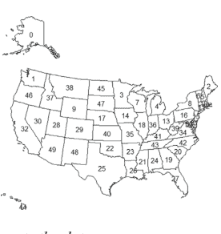

下表报告了数据。

| n. | 州 | 税收 | 价格 | n. | 州 | 税收 | 价格 | n. | 州 | 税收 | 价格 |
|---|---|---|---|---|---|---|---|---|---|---|---|
| 1 | 华盛顿州 | 129 | 1461 | 17 | 内布拉斯加州 | 159 | 1547 | 33 | 马里兰州 | 135 | 1466 |
| 2 | 缅因州 | 218 | 1601 | 18 | 伊利诺伊州 | 139 | 1510 | 34 | 弗吉尼亚州 | 171 | 1468 |
| 3 | 明尼苏达州 | 176 | 1469 | 19 | 佐治亚州 | 96 | 1572 | 35 | 密苏里州 | 164 | 1627 |
| 4 | 密歇根州 | 252 | 1611 | 20 | 南卡罗来纳州 | 133 | 1509 | 36 | 印第安纳州 | 161 | 1502 |
| 5 | 新罕布什尔州 | 186 | 1606 | 21 | 密西西比州 | 82 | 1586 | 37 | 爱达荷州 | 174 | 1555 |
| 6 | 佛蒙特州 | 154 | 1491 | 22 | 俄克拉荷马州 | 159 | 1460 | 38 | 蒙大拿州 | 153 | 1465 |
| 7 | 威斯康星州 | 92 | 1536 | 23 | 阿肯色州 | 136 | 1468 | 39 | 西弗吉尼亚州 | 172 | 1601 |
| 8 | 纽约州 | 150 | 1517 | 24 | 阿拉巴马州 | 196 | 1631 | 40 | 堪萨斯州 | 133 | 1463 |
| 9 | 怀俄明州 | 149 | 1481 | 25 | 德克萨斯州 | 97 | 1584 | 41 | 肯塔基州 | 178 | 1511 |
| 10 | 马萨诸塞州 | 168 | 1659 | 26 | 路易斯安那州 | 220 | 1636 | 42 | 北卡罗来纳州 | 257 | 1647 |
| 11 | 康涅狄格州 | 138 | 1515 | 27 | 佛罗里达州 | 96 | 1539 | 43 | 田纳西州 | 112 | 1559 |
| 12 | 罗德岛州 | 52 | 1460 | 28 | 犹他州 | 89 | 1520 | 45 | 北达科他州 | 93 | 1495 |
| 13 | 俄亥俄州 | 195 | 1592 | 29 | 科罗拉多州 | 185 | 1626 | 46 | 俄勒冈州 | 265 | 1592 |
| 14 | 爱荷华州 | 141 | 1574 | 30 | 内华达州 | 115 | 1544 | 47 | 南达科他州 | 105 | 1470 |
| 15 | 新泽西州 | 144 | 1418 | 31 | 特拉华州 | 122 | 1477 | 48 | 新墨西哥州 | 58 | 1473 |
| 16 | 宾夕法尼亚州 | 165 | 1509 | 32 | 加利福尼亚州 | 153 | 1609 | 49 | 亚利桑那州 | 188 | 1655 |

让我们开始计算，为了进行比较，计算简单回归模型 $y = \beta_0 + \beta_1 x + \varepsilon$ 的 OLS 估计，其中 $y = \text{1960年的价格}$，$x = \text{1955-1959年的税费和交付费用}$。结果如下所示，连同主要的检验统计量。

## 3.4 空间误差模型（SEM）

| 参数 | | 标准误 | t检验 | p值 |
| :--- | :--- | :--- | :--- | :--- |
| $\beta_0$ | 1435.7506 | 27.5796 | 52.058 | 2e-16*** |
| $\beta_1$ | 0.6872 | 0.1754 | 3.918 | 0.000294*** |

显著性代码：0 ‘***’ 0.001 ‘**’ 0.01 ‘*’ 0.05 ‘.’ 0.1 ‘ ’ 1

$F\text{-检验} = 3.918\ (p\text{-值} = 0.000294^{***})$
$AIC = 528.3317 \quad BIC = 533.945 \quad JB\ 检验 = 1.8906\ (p\text{-值} = 0.3886)$
$BP\ 检验 = 0.0013\ (p\text{-值} = 0.971)$

F检验高度显著，从而接受该模型。此外，两个参数在通常的置信水平下均显著。JB检验和BP检验均不显著，因此接受正态性和同方差性这两个假设。下表总结了针对残差空间相关性假设的I-Moran检验统计量的计算。

### Moran’s I 检验

| | 观测值 | 期望值 | 方差 | z检验 | p值 |
| :--- | :--- | :--- | :--- | :--- | :--- |
| Moran’s I | 0.574817771 | -0.030300549 | 0.008976437 | 2.8904 | 0.001924*** |

这表明存在高度显著的正残差空间相关性的证据。总而言之，该模型并不令人满意，并且，鉴于残差存在正且显著的空间相关性的证据，我们有明确的迹象表明空间误差模型是一个可替代的框架。首先，让我们使用最大似然技术（见第3.4.2节）来估计该模型。结果报告如下：

| 参数 | | 标准误 | t检验 | p值 |
| :--- | :--- | :--- | :--- | :--- |
| $\beta_0$ | 1528.34521 | 31.96239 | 47.8170 | 2e-16*** |
| $\beta_1$ | 0.08831 | 0.11923 | 0.7406 | 0.4589 |

显著性代码：0 ‘***’ 0.001 ‘**’ 0.01 ‘*’ 0.05 ‘.’ 0.1 ‘ ’ 1

$\rho = 0.81899\ LR\text{-检验} = 40.899$
$(p\text{-值} = 1.603e\text{-}10)$
$AIC = 489.43 \quad BIC = 496.9174$

$Wald\ 统计量 = 122.32$
$(p\text{-值} = 2.22e\text{-}16)$
$JB\ 检验 = 2.0845$
$(p\text{-值} = 0.3527)$

检验结果现在显示，与变量税收相关的回归系数不显著，而参数$\rho$通过似然比检验（见公式(1.31)）和Wald检验（见公式(1.33)）评估均高度显著。因此，残差之间的空间依赖性解释了模型的大部分变异性，该模型简化为一个纯自回归模型（$\beta = 0$且$\rho$或$\lambda$也等于0的情况，见第3.2节），其中一国的价格仅由邻国的价格来解释。

最后，让我们使用第3.4.3节讨论的可行广义最小二乘估计量来估计相同的空间误差模型。结果报告在下表中：

| 参数 | | 标准误 | t检验 | p值 |
| :--- | :--- | :--- | :--- | :--- |
| $\beta_0$ | 1512.98359 | 28.69940 | 52.7183 | 2e-16*** |
| $\beta_1$ | 0.17802 | 0.15018 | 1.1854 | 0.2359 |
| $\rho$ | 0.65398 | 0.2184 | 3.1017 | 0.00096206*** |
| $\sigma^2$ | 1672.5 | | | |
| 显著性代码：0 ‘***’ 0.001 ‘**’ 0.01 ‘*’ 0.05 ‘.’ 0.1 ‘ ’ 1 | | | | |
| JB检验 = 2.85351 (p值 = 0.2423) | | | | |

FGLS估计结果基本证实了ML估计的结论：变量税收不显著，一国二手车的价格可以用一个纯空间自回归模型来解释。然而，请注意，使用两种程序估计的$\beta_0$和$\rho$的值是不同的，特别是，通过ML程序估计的$\rho$值更大。还需注意，ML程序产生的标准误比FGLS替代方案更小。

## 3.5 空间滞后模型（SLM）

### 3.5.1 概述

当$\lambda \neq 0$且$\rho = 0$时，模型变为：

$$y = \lambda Wy + Z\beta + u \quad |\lambda| < 1 \qquad (3.45)$$

其中$u|X \approx i.i.d.N(0, \sigma_u^2 I_n)$。该模型在文献中被称为空间滞后模型（SLM）（Anselin, 1988; Arbia, 2006）。

在这种情况下，出现了一个内生性问题，因为$y$的空间滞后值与随机扰动项相关。事实上，使用公式(3.18)中报告的相同论证，我们有$(I - \lambda W)y = Z\beta + u$和$y = (I - \lambda W)^{-1}Z\beta + (I - \lambda W)^{-1}u$，因此滞后项$WY$与误差项之间的相关性可以表示为：

$$E[(Wy)u^T] = E[W(I - \lambda W)^{-1}Z\beta + (I - \lambda W)^{-1}u]u^T$$
$$= W(I - \lambda W)^{-1}Z\beta E(u^T) + (I - \lambda W)^{-1}E[uu^T]$$
$$= \sigma_{\varepsilon}^2 W(I - \lambda W)^{-1}I \neq 0$$

因此，在存在内生性的情况下，不能使用GLS程序。
文献中提出了两种替代估计量：

- (i) 最大似然法
- (ii) 两阶段最小二乘法（2SLS）

### 3.5.2 最大似然估计量

首先请注意，将公式(3.45)重写为$(I - \lambda W)y = Z\beta + u$，我们有：

$$y = (I - \lambda W)^{-1}Z\beta + (I - \lambda W)^{-1}u$$

因此：

$$E(y) = E[(I - \lambda W)^{-1}Z\beta + (I - \lambda W)^{-1}u] = (I - \lambda W)^{-1}Z\beta \quad (3.46)$$

以及

$$E(yy^T) = \sigma_\varepsilon^2(I - \lambda W)^{-1}(I - \lambda W)^{-T} = \sigma_\varepsilon^2\Omega \quad (3.47)$$

因此，$y$的似然函数可以表示为：

$$L(\sigma^2, \lambda, \beta; y) = const|\sigma_\varepsilon^2\Omega|^{-\frac{1}{2}} \exp\left\{ -\frac{1}{2\sigma_\varepsilon^2}[y - (I - \lambda W)^{-1}Z\beta]^T \Omega^{-1}[y - (I - \lambda W)^{-1}Z\beta] \right\} \quad (3.48)$$

从而，对数似然函数为：

$$l(\sigma^2, \lambda, \beta; y) = const - \frac{1}{2}\ln|\sigma_\varepsilon^2\Omega| - \frac{1}{2\sigma_\varepsilon^2}[y - (I - \lambda W)^{-1}Z\beta]^T \Omega^{-1}[y - (I - \lambda W)^{-1}Z\beta] \quad (3.49)$$

使用公式(3.47)中报告的表达式，矩阵$\sigma_\varepsilon^2\Omega$的行列式可以写为：

$$|\sigma_\varepsilon^2\Omega| = |\sigma_\varepsilon^2(I - \lambda W)^{-1}(I - \lambda W)^{-T}| = \sigma_\varepsilon^{2n}|(I - \lambda W)^{-1}(I - \lambda W)^{-T}|$$

并且，由于$|(I - \lambda W)^{-1}(I - \lambda W)^{-T}| = |(I - \lambda W)^{-1}| |(I - \lambda W)^{-T}|$，它也可以表示为：

$$|\sigma_\varepsilon^2\Omega| = \sigma_\varepsilon^{2n}|I - \lambda W|^{-2} \quad (3.50)$$

现在让我们回到对数似然函数，并将公式(3.47)和(3.50)代入公式(3.49)。我们得到：

$$l(\sigma^2, \lambda, \beta; y) = const - \frac{1}{2} \ln(\sigma_\varepsilon^{2n} |I - \lambda W|^{-2}) - \frac{1}{2\sigma_\varepsilon^2} [y - (I - \lambda W)^{-1} Z\beta]^T [(I - \lambda W)^{-1} (I - \lambda W)^{-T}]^{-1} [y - (I - \lambda W)^{-1} Z\beta]$$
$$= const - \frac{n}{2} \ln \sigma_\varepsilon^2 + \ln|I - \lambda W| - \frac{1}{2\sigma_\varepsilon^2} [y - (I - \lambda W)^{-1} Z\beta]^T (I - \lambda W)^T (I - \lambda W) [y - (I - \lambda W)^{-1} Z\beta]$$
$$(3.51)$$

并且，由于$(I - \lambda W)[y - (I - \lambda W)^{-1} Z\beta] = (I - \lambda W)y - Z\beta$，我们最终得到：

$$l(\sigma^2, \lambda, \beta; y) = const - \frac{n}{2} \ln \sigma_\varepsilon^2 + \ln|I - \lambda W| - \frac{1}{2\sigma_\varepsilon^2} [(I - \lambda W)y - Z\beta]^T [(I - \lambda W)y - Z\beta]$$
$$(3.52)$$

这个表达式可以通过数值最大化来获得未知参数$\sigma^2, \lambda$和$\beta$的估计量。

### 3.5.3 两阶段最小二乘估计量

作为$ML$估计量的替代方案，为了消除内生性问题，我们也可以使用两阶段最小二乘策略（Kelejian et al., 2001）。要实施该方法，我们首先需要识别合适的工具变量，以消除由空间滞后项$Wy$引起的内生性问题。换句话说，我们需要识别与$Wy$相关（相关性）且与误差项不相关（外生性）的工具变量。

考虑以下事实，由(3.46)我们有：

$$E(y) = E[(I - \lambda W)^{-1} Z\beta + (I - \lambda W)^{-1} u] = (I - \lambda W)^{-1} Z\beta$$
$$(3.53)$$

现在，由于$|\lambda| < 1$，我们可以将(3.53)中的逆矩阵展开并写为：

$$(I - \lambda W)^{-1} = I + \lambda W + \lambda^2 W^2 + \lambda^3 W^3 \dots$$

因此

## 3.5 空间滞后模型（SLM）

$$E(y) = [I + \lambda W + \lambda^2 W^2 + \lambda^3 W^3 ...]Z\beta$$
$$= Z\beta + WZ\lambda\beta + W^2Z\lambda^2\beta + ...$$ (3.54)

因此，$E(y)$ 可以表示为 $Z$、$WZ$、$W^2Z$ 等的线性函数。这表明可以使用展开式 (3.54) 的前三项，即 $Z$、$WZ$、$W^2Z$，作为相关工具变量来消除 $Wy$ 的内生性。我们将这组工具变量称为 $n$ 行 $3k$ 列的矩阵 $_nH_{3k} = [_nZ_k, _nW_{nn}Z_k, _nW^2_{nn}Z_k]$。现在，我们将方程 (3.45) 改写如下：

$$y = M\theta + u$$ (3.55)

其中回归变量集合为 $_nM_{k+1} = [_nW_{nn}y_1, _nZ_k]$，未知参数向量为 $_{k+1}\theta_1 = [\lambda, _k\beta_1]$。

在两阶段程序的第一阶段，通过工具回归将自变量 $M$ 对工具变量 $H$ 进行回归：

$$M = H\gamma + \eta$$ (3.56)

其中 $\eta$ 是误差项。然后通过普通最小二乘法（OLS）估计方程 (3.56) 中的参数，得到：

$$\hat{\gamma} = (H^T H)^{-1}H^T M$$ (3.57)

由此我们推导出 $M$ 的估计值，记为 $\hat{M}$，其表达式为：

$$\hat{M} = H\hat{\gamma} = H(H^T H)^{-1}H^T M$$ (3.58)

在两阶段程序的第二阶段，我们通过OLS估计 $y$ 与工具化回归变量之间的关系，即：

$$y = \hat{M}\theta + u$$ (3.59)

从而得到参数 $\theta$ 的两阶段最小二乘估计量：

$$\hat{\theta}_{2SLS} = (\hat{M}^T \hat{M})^{-1}\hat{M}^T y$$ (3.60)

### 示例 3.3：波士顿房价决定因素

让我们考虑一个空间滞后模型的例子。我们使用的数据由 Harrison 和 Rubinfeld (1978) 收集，并由 Gilley 和 Pace (1996) 整合，在空间计量经济学中非常流行。它们包含在 Boston 数据集中，可以通过第 2.3.5 节说明的程序在 R 中下载。这些数据涉及波士顿地区 506 个普查区的房屋价格中位数，以及一系列可被视为房屋价值潜在决定因素的变量。

下图展示了通过质心表示的 506 个普查区的地图，而数据库中包含的变量列表则列于下表。

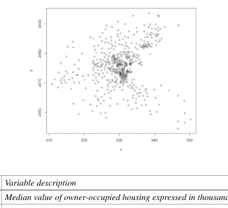

| | 变量 | 变量描述 |
|---|---|---|
| 1 | MEDV | 自住房屋价格中位数，单位为千美元 |
| 2 | CRIM | 人均犯罪率 |
| 3 | RM | 每户平均房间数 |
| 4 | INDUS | 各城镇非零售商业用地比例 |
| 5 | NOX | 各城镇一氧化氮浓度（千万分之一） |
| 6 | AGE | 1940年以前建成的自住房屋比例 |
| 7 | DIS | 到波士顿五个就业中心的加权距离 |
| 8 | RAD | 各城镇放射状高速公路可达性指数 |
| 9 | PTRATIO | 各城镇师生比 |
| 10 | B | 黑人比例的变换值 |
| 11 | LSTAT | 低收入人群百分比 |
| 12 | TAX | 各城镇每万美元全额财产税 |

让我们首先计算一个通过OLS估计的简单回归模型。我们希望检验房屋价格是否可以表示为上表所列11个可能因素的函数。简单的OLS估计结果及其检验统计量如下所示。

| 参数 | 估计值 | 标准误 | t检验 | p值 |
|---|---|---|---|---|
| 截距 | 37.308337 | 5.199690 | 7.175 | 2.66e-12*** |
| CRIM | -0.103402 | 0.033339 | -3.102 | 0.002035 ** |
| RM | 4.074379 | 0.420639 | 9.686 | < 2e-16 *** |
| INDUS | 0.018212 | 0.062015 | 0.294 | 0.769138 |
| NOX | −17.829176 | 3.889690 | −4.584 | 5.79e-06 *** |
| AGE | −0.002647 | 0.013353 | −0.198 | 0.842957 |
| DIS | −1.210182 | 0.186123 | −6.502 | 1.94e-10 *** |
| RAD | 0.304603 | 0.066878 | 4.555 | 6.62e-06 *** |
| PTRATIO | −1.131146 | 0.126079 | −8.972 | < 2e-16 *** |
| B | 0.009853 | 0.002735 | 3.603 | 0.000346 *** |
| LSTAT | −0.525072 | 0.051543 | −10.187 | < 2e-16 *** |
| TAX | −0.010901 | 0.003710 | −2.939 | 0.003452 ** |

显著性代码：0 ‘***’ 0.001 ‘**’ 0.01 ‘*’ 0.05 ‘.’ 0.1 ‘ ’ 1

F检验 = 121 (p值 = 2.2e-16 ***)
AIC = 3045.227  BIC = 3100.172  JB检验 = 936.7417 (p值 = 2.2e-16***)
BP检验 = 59.2137 (p值 = 1.297e-08***)

F检验高度显著，表明模型可以被接受。此外，除了 INDUS 和 AGE 之外的所有变量在通常的置信水平下也是显著的。特别是变量 RM、RAD 和 B 显著为正，而 CRIME、NOX、DIS、LSTAT 和 Tax 则呈现负号。注意，JB 和 BP 检验都是显著的，这导致我们拒绝正态性和同方差性的假设。我们使用了基于距离的权重矩阵，如果两个地点质心之间的距离小于上图中的3.99个单位，则将它们视为邻居。

下表总结了残差空间相关性假设的 I-Moran 检验统计量的计算。

### Moran's I 检验

| | 观测值 | 期望值 | 方差 | z检验 | p值 |
| :--- | :--- | :--- | :--- | :--- | :--- |
| Moran's I | 0.0780022170 | −0.0071438650 | 0.0001598831 | 6.7338 | 8.262e-12*** |

该检验表明，回归残差中存在正向且高度显著的空间相关性证据，这为进一步分析提供了依据。在我们的案例中，由于我们指的是非常小的区域单元（普查区），因此可以合理地推测房屋价值在空间上平滑变化，因为昂贵的社区往往会集中在城市的某些区域，从而表现出空间相关性。基于这些原因，我们可以检验空间滞后模型在消除残差相关性的同时，是否能更好地拟合我们的数据。

首先，让我们使用最大似然技术（第 3.5.2 节）估计模型。结果如下所示：

| 参数 | 估计值 | 标准误 | t检验 | p值 |
| :--- | :--- | :--- | :--- | :--- |
| 截距 | 28.378 | 5.8225 | 4.8739 | 1.094e-06*** |
| CRIM | -0.097501 | 0.032606 | -2.9902 | 0.0027877*** |
| RM | 3.8432 | 0.41351 | 9.2941 | < 2.2e-16*** |
| INDUS | -0.00071563 | 0.060617 | -0.0118 | 0.9905805 |
| NOX | -13.602 | 4.0537 | -3.3555 | 0.0007921*** |
| AGE | 0.0016953 | 0.013242 | 0.1280 | 0.8981255 |
| DIS | -1.1782 | 0.18339 | -6.4249 | 1.320e-10*** |
| RAD | 0.29274 | 0.065501 | 4.4693 | 7.848e-06*** |
| PTRATIO | -0.97610 | 0.13042 | -7.4845 | 7.172e-14*** |
| B | 0.0098041 | 0.0026659 | 3.6776 | 0.0002354*** |
| LSTAT | -0.52343 | 0.050249 | -10.4167 | < 2.2e-16*** |
| TAX | -0.010491 | 0.0036223 | -2.8962 | 0.0037769*** |

显著性代码：0 ‘***’ 0.001 ‘**’ 0.01 ‘*’ 0.05 ‘.’ 0.1 ‘ ’ 1

λ = 0.22019
似然比检验 = 12.492 (p值 = 0.00040864***)
Wald统计量 = 13.16 (p值 = 0.00028602***)
AIC = 3034.7
BIC = 3093.906
JB检验 = 1144.455 (p值 = 2.2e-16***)
残差LM检验 = 13.341 (p值 = 0.00025969***)

t检验表明，与OLS情况一样，除了 INDUS 和 AGE 之外的所有变量都是显著的，其符号与OLS估计一致。与变量 tax 相关的回归系数不显著，而似然比检验和 Wald 检验都表明参数 λ 高度显著。

然而，空间滞后模型虽然强调了房价空间依赖性的重要特征，但并未完全消除残差空间自相关的问题。事实上，LM检验表明仍然存在一些正向且显著的残差相关性。

最后，让我们使用第 3.5.3 节介绍的两阶段最小二乘技术估计相同的空间滞后模型。结果如下所示：

| 参数 | 估计值 | 标准误 | t检验 | p值 |
| :--- | :--- | :--- | :--- | :--- |
| λ | 0.22047 | 0.068558 | 3.2158 | 0.0013008*** |
| 截距 | 28.367 | 5.8399 | 4.8574 | 1.189e-06*** |
| CRIM | -0.097493 | 0.032978 | -2.9563 | 0.0031137*** |
| RM | 3.8429 | 0.42163 | 9.1145 | < 2.2e-16*** |

## 3.6 空间杜宾模型

“空间杜宾模型”（SDM）是空间滞后模型的一个特例，其中，除了出现在SLM中的预测变量列表外，我们还会发现部分或全部自变量的滞后值。因此，该模型假设如下表达式：

$$y = \lambda Wy + WX\gamma + X\beta + u \quad |\lambda| < 1 \tag{3.61}$$

该模型得名于詹姆斯·杜宾引入的时间序列模型的类比。首先需要明确的是，从估计的角度来看，SDM模型相对于SLM模型并不呈现任何特定的推断问题，因为它归结为将非随机自变量的滞后值作为额外的非随机预测变量添加进来。话虽如此，其使用值得简短讨论，因为文献中强调，SDM可以从理论上以多种不同方式加以论证，因此，一些作者将其视为首选（LeSage & Pace, 2009）。

支持杜宾模型规范的第一个动机与这样一个事实有关：选择这样的模型，实际上我们是在估计一个受约束的SEM模型。这一陈述可以通过以下方式轻松证明。

首先，考虑第3.4节中提出的SEM模型。

$$y = X\beta + u \tag{3.62}$$

$$u = \rho Wu + \varepsilon \quad |\rho| < 1 \tag{3.63}$$

用项$(I - \rho W)$左乘第一个方程，我们得到：

$$(I - \rho W)y = (I - \rho W)X\beta + (I - \rho W)u \tag{3.64}$$

并且，将第二个方程表示为：$\varepsilon = (I - \rho W)u$，我们得到：

$$y = \rho Wy + X\beta - \rho WX\beta + \varepsilon \tag{3.65}$$

其中$\gamma = -\rho\beta$。因此，方程(3.65)与方程(3.61)中呈现的SDM一致。

因此，在系数满足某些约束条件下，SDM模型可以简化为SEM模型（参见Anselin, 1988, p. 227）。

第二个动机与遗漏变量领域有关（Greene, 2018）。众所周知，遗漏变量引入的偏差在空间建模中非常普遍，因为几乎不可能观察到所有相关的预测变量，而那些不可观察的变量很可能与因变量相关。根据LeSage和Pace（2009）的观点，选择SDM可以减少这种偏差，因为预测变量的滞后值有助于解释遗漏变量的影响。

偏好SDM的第三个理论动机与其有助于缓解未观察到的异质性所带来的影响有关。

最后，Elhorst（2010, 2014）证明，即使我们未能识别出正确的生成过程（可能是SLM或SEM），SDM也能产生无偏估计。相反，如果我们犯了相反的规范错误，没有将SDM识别为真实的数据生成过程，所有替代规范都将遭受遗漏变量偏差（LeSage & Pace, 2009; and Elhorst 2014）。

### 示例3.4：波士顿房价决定因素（续）

*让我们再次考虑示例3.3中介绍的数据集Boston，但现在将预测变量限制为仅前四个，以避免不必要地增加输出负担。OLS输出如下：*

| 参数 | 估计值 | 标准误 | t检验 | p值 |
| :--- | :--- | :--- | :--- | :--- |
| 截距 | −19.28855 | 3.22895 | −5.974 | 4.40e-09 *** |
| CRIM | −0.18808 | 0.03505 | −5.366 | 1.23e-07 *** |
| RM | 7.65468 | 0.41853 | 18.290 | < 2.2e-16*** |
| INDUS | −0.15545 | 0.06360 | −2.444 | 0.0149 * |
| NOX | 6.98527 | 3.67234 | −1.902 | 0.0577 |

显著性代码：0 ‘***’ 0.001 ‘**’ 0.01 ‘*’ 0.05 ‘.’ 0.1 ‘ ’ 1

残差标准误：6.065，自由度501
多重R平方：0.5686，调整后R平方：0.5652

F检验 = 165.1 (p值 = 2.2e-16 ***)
AIC = 3267.035 BIC = 3292.394 JB检验 = 1709.6 (p值 = 2.2e-16***)
BP检验 = 16.153 (p值 = 0.002821 ***)

下表总结了残差空间相关性假设的I-Moran检验统计量的计算，该计算证明了残差空间相关性的证据。

### Moran’s I 检验

| | 观测值 | 期望值 | 方差 | z检验 | p值 |
| :--- | :--- | :--- | :--- | :--- | :--- |
| Moran’s I | 0.1089219407 | −0.0040708974 | 0.0001710436 | 8.6397 | 2.2e-16*** |

通过ML估计的SLM在此情况下报告以下结果：

| 参数 | 估计值 | 标准误 | t检验 | p值 |
| :--- | :--- | :--- | :--- | :--- |
| 截距 | −27.924078 | 3.674370 | −7.5997 | 2.975e-14*** |
| CRIM | −0.167723 | 0.033699 | −4.9771 | 6.454e-07*** |
| RM | 6.991374 | 0.408017 | 17.1350 | < 2.2e-16*** |
| INDUS | −0.146839 | 0.061681 | −2.3806 | 0.01728* |
| NOX | −0.438041 | 3.799834 | −0.1153 | 0.90822 |

显著性代码：0 ‘***’ 0.001 ‘**’ 0.01 ‘*’ 0.05 ‘.’ 0.1 ‘ ’ 1

$\lambda = 0.40542$ LR检验 = 33.68 (p值 = 6.4952e-09***) Wald统计量 = 33.657 (p值 = 6.5721e-09***)
AIC = 3235.4 BIC = 3264.94 JB检验 = 2531.4 (p值 = 2.2e-16***)
残差LM检验 = 5.0413 (p值 = 0.02475***)

残差的LM检验仍然证明了残差空间相关性的存在，因此让我们尝试通过引入4个预测变量的空间滞后来改善估计，从而选择SDM。估计结果报告如下：

| 参数 | 估计值 | 标准误 | t检验 | p值 |
| :--- | :--- | :--- | :--- | :--- |
| 截距 | -44.856602 | 9.748293 | -4.6015 | 4.195e-06*** |
| CRIM | -0.184135 | 0.035421 | -5.1984 | 2.010e-07*** |
| RM | 6.421846 | 0.424388 | 15.1320 | < 2.2e-16*** |
| INDUS | -0.281109 | 0.064850 | -4.3348 | 1.459e-05*** |
| NOX | -11.477906 | 4.732631 | -2.4253 | 0.015297* |
| WCRIM | -0.207820 | 0.162933 | -1.2755 | 0.202135 |
| WRM | 2.707327 | 1.736554 | 1.5590 | 0.118991 |
| WINDUS | 0.480342 | 0.181906 | 2.6406 | 0.008276** |
| WNOX | 12.443752 | 10.119919 | 1.2296 | 0.218836 |

显著性代码：0 ‘***’ 0.001 ‘**’ 0.01 ‘*’ 0.05 ‘.’ 0.1 ‘ ’ 1

$\lambda = 0.38199$ &nbsp;&nbsp;&nbsp;&nbsp; $LR\text{-检验} = 8.6822, p\text{-值}:$ &nbsp;&nbsp;&nbsp;&nbsp; $Wald\text{统计量} = 12.584, p\text{-值}:$<br>$(p\text{-值} = 0.0032134 \text{ ***})$ &nbsp;&nbsp;&nbsp;&nbsp; $(p\text{-值} = 0.000389 \text{ ***})$<br>$AIC = 3208.7$ &nbsp;&nbsp;&nbsp;&nbsp; $BIC = 3255.196$ &nbsp;&nbsp;&nbsp;&nbsp; $JB\text{检验} = 2531.4 (p\text{-值} =$<br>$2.2e\text{-16***})$<br>$残差\text{LM检验} = 0.62899 (p\text{-值} = 0.42773)$

该模型似乎比SLM更令人满意，因为残差的LM检验现在不显著。改进归因于引入了高度显著的变量INDUS的滞后值。

## 3.7 一般SARAR(1,1)模型

### 3.7.1 概述

首先，让我们考虑在方程(3.1)和(3.2)中，我们设定$\beta = 0$的情况。我们有：

$y = \lambda Wy + u \quad |\lambda| < 1$

## 3.7 一般SARAR(1,1)模型

综合(3.67)和(3.68)式，我们有：

$$y = (I - \lambda W)^{-1}(I - \rho W)^{-1}\varepsilon$$

因此，

$$E(yy^T) = E[(I - \lambda W)^{-1}(I - \rho W)^{-1}\varepsilon\varepsilon^T(I - \lambda W)^{-T}(I - \rho W)^{-T}]$$
$$= \sigma_\varepsilon^2(I - \lambda W)^{-1}(I - \rho W)^{-1}(I - \lambda W)^{-T}(I - \rho W)^{-T} = \sigma_\varepsilon^2\Omega$$

于是，$\Omega$的逆矩阵为：

$$\Omega^{-1} = (I - \lambda W^T)(I - \rho W^T)(I - \rho W)(I - \lambda W)$$
$$= [I - (\lambda + \rho)W^T + \lambda\rho W^T W^T][I - (\lambda + \rho)W^T + \lambda\rho W^T W^T]^T$$

其中，两个参数$\lambda$和$\rho$以和与积的形式出现，因此无法被唯一识别。文献中认为这一事实意味着，如(3.66)和(3.67)式所示的完整模型在实践中是不可行的。然而，Kelejian和Prucha (1998)证明，这仅在$\beta = 0$时发生，而当$\beta \neq 0$时则不然，这正是空间计量经济学中大多数感兴趣案例的一般情况。在这种情况下，我们可以定义一个更一般的空间模型，它涵盖了第3.4节和第3.5节中先前讨论的空间滞后和空间误差模型。如前所述，该模型被Kelejian和Prucha (1998)称为SARAR(1,1)模型，但在文献中也被称为Anselin (1988)的*一般空间模型*或LeSage和Kelly (2010)的*SAC*模型。

如果我们考虑一般的SARAR模型，则有

$$y = Z\beta + \lambda Wy + u \quad |\lambda| < 1$$

$$u = \rho Wu + \varepsilon \quad |\rho| < 1$$

其中$\varepsilon|X \approx i.i.d.N(0, \sigma_\varepsilon^2 I_n)$。

模型(3.73)和(3.74)存在两个主要的估计问题。首先，与上一节讨论的*SLM*情况类似，由于滞后项$Wy$的存在，我们面临一个内生性问题。其次，由于(3.74)式中随机扰动项存在自回归，除非参数$\rho$已知，否则我们无法采用GLS策略。在这种情况下，我们可以利用以下估计方法：

- (i) 最大似然法
- (ii) 两阶段最小二乘法的空间版本 (GS2SLS)
- (iii) Lee的工具变量估计量 (LIV)

最大似然法是可行的，但其局限性在于目前尚无正式证明表明该估计量具有通常的最优大样本性质。GS2SLS估计量并非完全有效。LIV估计量比GS2SLS更有效，尽管效率增益有限。接下来将依次讨论这三种替代估计量。

### 3.7.2 最大似然估计量

让我们再次考虑(3.1)和(3.2)式中的完整模型

$$y = Z\beta + \lambda Wy + u \quad |\lambda| < 1 \qquad (3.75)$$
$$u = \rho Wu + \varepsilon \quad |\rho| < 1 \qquad (3.76)$$

由(3.70)式，我们有

$$E(y) = (I - \lambda W)^{-1}Z\beta \qquad (3.77)$$

并且

$$E(yy^T) = E\left[(I - \lambda W)^{-1}(I - \rho W)^{-1}\varepsilon\varepsilon^T (I - \lambda W)^{-T}(I - \rho W)^{-T}\right]$$
$$= \sigma_\varepsilon^2 (I - \lambda W)^{-1}(I - \rho W)^{-1}(I - \lambda W)^{-T}(I - \rho W)^{-T} = \sigma_\varepsilon^2 \Omega \qquad (3.78)$$

因此，保持扰动项的正态性假设，我们有：

$$y \approx N\left[(I - \lambda W)^{-1}X\beta; \sigma_\varepsilon^2 \Omega\right] \qquad (3.79)$$

现在，回顾(3.50)式中行列式$|\sigma_\varepsilon^2 \Omega|$的简化，似然函数容易推导为：

$$L(\sigma^2, \rho, \lambda, \beta; y) = c\left(\sigma_\varepsilon^2\right)^{-n/2} |I - \lambda W||I - \rho W| \exp\left\{ -\frac{1}{2\sigma_\varepsilon^2} \left[y - (I - \rho W)^{-1}Z\beta\right]^T \Omega^{-1} \left[y - (I - \rho W)^{-1}Z\beta\right] \right\}$$

对数似然函数为：

$$l(\sigma^2, \lambda, \rho, \beta; y) = c - \frac{n}{2} \ln \sigma_\varepsilon^2 + \ln|I - \lambda W| + \ln|I - \rho W|$$
$$- \frac{1}{2\sigma_\varepsilon^2} \left[y - (I - \lambda W)^{-1}Z\beta\right]^T (I - \lambda W)^T (I - \rho W)^T (I - \rho W)(I - \lambda W)$$
$$\left[y - (I - \lambda W)^{-1}Z\beta\right] \qquad (3.80)$$

并且，由于$(I - \lambda W)[y - (I - \lambda W)^{-1}Z\beta] = (I - \lambda W)y - Z\beta$，我们最终得到：

$$l(\sigma^2, \lambda, \rho, \beta; y) = c - \frac{n}{2} \ln \sigma_{\varepsilon}^2 + \ln|I - \lambda W| + \ln|I - \rho W| - \frac{1}{2\sigma_{\varepsilon}^2} [(I - \rho W)(y - Z\beta - \lambda Wy)]^T [(I - \rho W)(y - Z\beta - \lambda Wy)]$$ (3.81)

与通常情况一样，这只能通过数值最大化来推导未知参数的估计量。上述表达式可以通过考虑以下变换以不同方式书写，这些变换在文献中被称为空间*Cochrane-Orcutt变换*：

$$y^* = (I - \rho W)y$$

和

$$Z^* = (I - \rho W)Z$$

以这种方式表达，对数似然函数变为：

$$l(\sigma^2, \lambda, \rho, \beta; y) = c - \frac{n}{2} \ln \sigma_{\varepsilon}^2 + \ln|I - \lambda W| + \ln|I - \rho W| - \frac{1}{2\sigma_{\varepsilon}^2} [y^* - Z^*\beta - \lambda Wy^*]^T [y^* - Z^*\beta - \lambda Wy^*]$$ (3.82)

如前所述，目前尚无正式证明表明上述*ML*估计量具有*ML*估计量通常的最优大样本性质。因此（也是为了克服大样本中计算对数行列式带来的计算问题），文献提出了一种两阶段最小二乘法的空间版本，这将在下一节讨论。

### 3.7.3 *广义空间两阶段最小二乘法 (GS2SLS)*

广义空间两阶段最小二乘法 (S2SLS) 由Kelejian和Prucha (1998)提出，它同时考虑了$Wy$的内生性问题和随机扰动项之间的空间相关性问题。它是第3.5.3节中已阐述的空间滞后模型2SLS方法的扩展，但与第3.4.3节中提出的GMM估计量相结合，以考虑扰动项中的空间相关结构。

GS2SLS程序可通过以下步骤获得：

步骤1：首先，获得参数$\beta$和$\lambda$的一致估计量，记为$\tilde{\beta}$和$\tilde{\lambda}$。

步骤2：使用这些估计量获得(3.73)式中$u$的估计量，记为$\hat{u}$。

步骤3：使用$\hat{u}$估计(3.74)式中的$\rho$，记为$\hat{\rho}$。

步骤4：使用$\hat{\rho}$将模型(3.73)变换为

$(I - \hat{\rho}W)y = (I - \hat{\rho}W)Z\beta + \varepsilon$

步骤5：最后，使用2SLS估计该变换模型的参数，使用变换后的变量$Z^* = (I - \hat{\rho}W)Z$；$WZ^* = W(I - \hat{\rho}W)Z$和$W^2Z^* = W^2(I - \hat{\rho}W)Z$作为工具变量。

现在将详细讨论这些步骤。

步骤1：使用$Z$和$WZ$作为工具变量，通过2SLS估计量估计(3.73)式的参数，同时考虑内生性问题。这一选择的理由与第3.4.3节中使用的论点相同。让我们用符号$\tilde{\beta}$和$\tilde{\lambda}$表示由此获得的估计量。

步骤2：由(3.73)式推导

$\hat{u} = y - Z\tilde{\beta} - \tilde{\lambda}WY$ (3.83)

因此我们定义：

$\hat{\bar{u}} = W\hat{u}$ (3.84)

$\hat{\bar{\bar{u}}} = W^2\hat{u}$ (3.85)

步骤3：使用(3.83)至(3.85)式中的项，通过第3.5.3节引入的广义矩方法程序，特别是使用(3.38)式中的矩条件，获得$\rho$的一致估计量。让我们称$\hat{\rho}$为$\rho$的这种一致估计量。

步骤4：使用步骤3中获得的估计量$\hat{\rho}$，将原始模型变换如下：

$(I - \hat{\rho}W)y = (I - \hat{\rho}W)(Z\beta - \lambda Wy) + \varepsilon$ (3.86)

步骤5：最后，使用2SLS程序估计(3.86)式中的$\beta$和$\lambda$，使用$H = [X, WX, W^2X]$作为工具变量。这样我们得到：

$\tilde{\delta}_{GS2SLS} = [\hat{Q}^{*T}Q]\hat{Q}^{*T}y^*$ (3.87)

其中$\delta \equiv [\beta, \lambda]$，$Q = [Z, Wy]$，$Q^* = (I - \hat{\rho}W)Q$且$\hat{Q}^* = H(H^TH)^{-1}H^TQ^*$。Kelejian和Prucha (1998)表明，在模型假设下，GS2SLS估计量是一致的，其渐近方差等于：

### 3.7.4 李完全有效估计量

即使GS2SLS估计量是一致的，但已证明它们并非渐近完全有效。为解决此问题，李（2003）提出了一种渐近有效的替代估计量，在文献中被称为最佳可行GS2SLS，简称BFGS2SLS。

在所提方法中，最优工具矩阵定义如下：

$$\overline{Q}^{*}=(I-\hat{\rho} W)\left[Z, W(I-\tilde{\lambda} W)^{-1} Z \tilde{\beta}\right]$$

(3.89)

其中符号已在第3.7.3节中使用。BFGS2SLS估计量定义为：

$$\hat{\delta}_{B F G S 2 S L S}=\left[\overline{Q}^{* T} Q^{*}\right]^{-1} \overline{Q}^{* T} y^{*}$$

(3.90)

该估计量在大样本中达到了方差的理论下界。然而，计算公式(3.89)中的工具涉及一项在极大样本中可能具有数值挑战性的运算。因此，尽管李（2003）本人推导了一种数值算法，他也提出了一种在计算上更为简单的替代估计量。Kelejian等人（2004）通过模拟研究表明，在小样本中，BFGS2SLS及其简化版本在效率方面与GS2SLS并无显著差异。

### 示例3.5：波士顿房价决定因素（续）

在示例3.3中，我们估计了一个空间滞后模型，旨在解释波士顿506个普查区之间房价的空间变异性。估计阶段并不完全令人满意，因为无论是使用最大似然法还是2SLS技术，回归残差之间仍存在一些显著的正空间相关性。让我们通过将其指定为SARAR(1,1)模型来重新估计同一模型。

首先，像往常一样，让我们从使用最大似然技术（第3.7.2节）估计模型开始。结果报告在此表中：

| 参数 | 估计值 | 标准误 | t检验 | p值 |
| :--- | :--- | :--- | :--- | :--- |
| $\lambda$ | 0.072404 | 0.093996 | 0.77029 | 0.44113 |
| $\rho$ | 0.52612 | 0.1141 | 4.611 | 4.0068e-06*** |
| 截距 | 38.2472606 | 6.0539170 | 6.3178 | 2.654e-10*** |
| CRIM | 0.1164539 | 0.0325364 | -3.5792 | 0.0003447*** |
| RM | 3.8363958 | 0.4074820 | 9.4149 | < 2.2e-16*** |
| INDUS | -0.0069422 | 0.0617867 | -0.1124 | 0.9105396 |
| NOX | -19.4589672 | 4.1417000 | -4.6983 | 2.623e-06*** |
| AGE | -0.0177129 | 0.0140407 | -1.2615 | 0.2071146 |
| DIS | -1.4637506 | 0.2609413 | -5.6095 | 2.029e-08*** |
| RAD | 0.3216872 | 0.0726696 | 4.4267 | 9.568e-06*** |
| PTRATIO | -1.0251807 | 0.1379809 | -7.4299 | 1.088e-13*** |
| B | 0.0098786 | 0.0026440 | 3.7362 | 0.0001868*** |
| LSTAT | -0.5162812 | 0.0496707 | -10.3941 | < 2.2e-16*** |
| TAX | -0.0112292 | 0.0038528 | -2.9145 | 0.0035622*** |

显著性代码：0 ‘***’ 0.001 ‘**’ 0.01 ‘*’ 0.05 ‘.’ 0.1 ‘ ’ 1

$\rho = 0.52612$ &nbsp;&nbsp;&nbsp;&nbsp; LR检验 = 26.375 (p值 = 1.8734e-06***)

AIC = 3022.9 &nbsp;&nbsp;&nbsp;&nbsp; BIC = 3086.249

| 参数 | 估计值 | 标准误 | t检验 | p值 |
| :--- | :--- | :--- | :--- | :--- |
| *PTRATIO* | -1.0002552 | 0.1384726 | -7.2235 | 5.067e-13*** |
| *B* | 0.0098127 | 0.0026849 | 3.6548 | 0.0002574*** |
| *LSTAT* | -0.5195838 | 0.0505312 | -10.2824 | < 2.2e-16*** |
| *TAX* | -0.0110596 | 0.0038402 | -2.8800 | 0.0039772*** |

显著性代码：0 ‘***’ 0.001 ‘**’ 0.01 ‘*’ 0.05 ‘.’ 0.1 ‘ ’ 1
$\rho = 0.35868$
$JB \text{ 检验} = 1129.996 \text{ (p值} = 2.2\text{e-16**)}$

基于两阶段最小二乘法的估计结果，在变量的符号和显著性方面，都基本证实了极大似然估计的结论。特别是证实了每个城镇非零售商业用地比例（INDUS）和该地区旧建筑的存在（AGE）对房屋中位数价格没有显著影响。最后，参数 $\rho$ 的显著性也得到了证实。残差存在显著的非正态性表明，我们应该使用不需要此类假设的GSTSLS方法。使用这种替代估计量，参数 $\lambda$ 也显著不为零。

## 3.8 在明确备择假设下检验残差的空间自相关

在第2.3.4节中，我们讨论了基于 *I*-Moran统计量（Moran, 1950）检验*OLS*回归残差间无空间相关性假设的程序。该检验统计量的一个缺陷是没有明确考虑备择假设来与无相关性的原假设进行对比。在本章中，我们介绍了一些经典线性回归模型的替代形式，这些形式基于处理空间样本时可能观察到的空间依赖性的各种考虑方式。现在，这些模型可以被视为检验程序中无相关性情况的明确备择假设，从而以更全面的方式处理该问题。

当我们能够以空间滞后或空间误差的形式明确表达备择假设，并且在估计阶段遵循了极大似然策略时，可以采用拉格朗日乘数检验策略（参见第1.1节）。此外，对于本章处理的所有空间模型，都可以考虑Moran *I*统计量的*修正*版本。这两种替代方案将分别在第3.8.1节和第3.8.2节中进行回顾。

### 3.8.1 使用SEM或SLM作为备择假设检验残差的空间自相关

首先，让我们考虑拉格朗日乘数检验的一般形式（参见公式(1.35)）：

$$LM = s(\theta_0)^T I(\theta_0)^{-1} s(\theta_0) \quad (3.91)$$

其中 $\theta$ 是参数向量，$s(\theta_0) = \frac{\partial L(\theta)}{\partial \theta}$ 是得分函数，$I(\theta_0) = E\left[\frac{\partial^2 L(\theta)}{\partial \theta \partial \theta^T}\right]$ 是在无空间相关性原假设下与似然函数 $L(\theta)$ 相关联的Fisher信息矩阵。

当备择假设指定为空间误差模型时，对数似然函数采用公式(3.23)推导出的表达式。因此，在这种情况下，公式(3.91)采用如下显式表达：

$$LM_{SEM} = \frac{n^2}{tr(W^T W + WW)} \left[ \frac{\hat{\varepsilon}^T W \hat{\varepsilon}}{\hat{\varepsilon}^T \hat{\varepsilon}} \right]^2 \quad (3.92)$$

正如Burridge (1980)所证明的，这仅仅是$I$-Moran检验的平方。因此，使用Moran $I$或$LM$检验将得出相同的推断结论。相反，如果备择假设指定为空间滞后模型的形式，对数似然函数由公式(3.52)给出，因此公式(3.86)变为：

$$LM_{LAG} = \frac{n^2}{Q} \left[ \frac{\hat{\varepsilon}^T Wy}{\hat{\varepsilon}^T \hat{\varepsilon}} \right]^2 \quad (3.93)$$

其中 $Q = (WX\hat{\beta})^T (I - M_x) \frac{WX\hat{\beta}}{\hat{\sigma}^2} + T$, $M_x = X(X^T X)X^T$, $T = tr(W^T W + WW)$，$\hat{\beta}$ 和 $\hat{\sigma}^2$ 分别表示公式(3.45)中相应参数的极大似然估计量。有时会考虑另一种备择假设，其误差结构遵循空间自回归和移动平均结构。然而，此处不详细回顾这种替代方案。在原假设下，$LM_{SEM}$ 和 $LM_{LAG}$ 都渐近服从自由度为1的 $\chi^2$ 分布。然而，这两个检验统计量彼此并不独立，因此只能在假设不存在空间滞后成分的情况下检验误差遵循SEM模型的备择假设，反之亦然。因此，Anselin等人（1996）提出了两种检验的稳健版本，可以表示为：

$$RLM_{SEM} = \frac{1}{T(1 - TQ)} \left[ \frac{n \hat{\varepsilon}^T W \hat{\varepsilon}}{\hat{\varepsilon}^T \hat{\varepsilon}} - TQ^{-1} \frac{n \hat{\varepsilon}^T Wy}{\hat{\varepsilon}^T \hat{\varepsilon}} \right]^2 \quad (3.94)$$

用于空间误差模型的备择假设，以及：

$$RLM_{LAG} = \frac{1}{Q-T} \left[ \frac{n\hat{\varepsilon}^T W\hat{\varepsilon}}{\hat{\varepsilon}^T\hat{\varepsilon}} - \frac{n\hat{\varepsilon}^T W y}{\hat{\varepsilon}^T\hat{\varepsilon}} \right]^2 \quad (3.95)$$

使用空间滞后模型作为备择假设。

### 3.8.2 使用空间模型作为备择假设检验残差的空间自相关：修正的Moran I检验

在第2.2节中，我们考虑了Moran (1950)引入并由Cliff和Ord (1972)研究的统计量，用于检验回归残差间无空间相关性的假设。为方便读者，此处再次列出该统计量：

$$I = \frac{n\hat{\varepsilon}^T W\hat{\varepsilon}}{\hat{\varepsilon}^T\hat{\varepsilon}[\sum_i \sum_j w_{ij}]} \quad (3.96)$$

其中 $\hat{\varepsilon}$ 是模型的残差。最近，Kelejian和Prucha (2001)批评了这一度量，认为Cliff和Ord (1972)用于推导其在无空间相关性原假设下的期望值和方差的归一化因子在理论上是不合理的。事实上，(3.96)的分母代表了分子中出现的二次型的标准差估计量，可以证明这是不一致的。因此，他们提出了一种不同的归一化因子，以消除这种不一致性，并实现将方差归一化为1的目标。替代的Moran检验通常采用以下表达式（参见Kelejian & Prucha, 2001）：

$$\bar{I} = \frac{\hat{\varepsilon}^T W\hat{\varepsilon}}{\tilde{\sigma}^2} \quad (3.97)$$

其中 $\tilde{\sigma}^2$ 是一个归一化因子，取决于所选作为备择假设的特定模型。特别是，如果备择假设由空间误差模型构成，则归一化因子采用以下表达式：

$$\tilde{\sigma}^2 = \frac{\hat{\varepsilon}^T\hat{\varepsilon}\{tr[(W^T + W)W]\}^{-1/2}}{n} \quad (3.98)$$

其中项 $tr(A)$ 表示矩阵 $A$ 的迹，即其主对角线元素之和。因此，检验统计量可以定义为：

$$\bar{I} = \frac{n\hat{\varepsilon}^T W \hat{\varepsilon}}{\hat{\varepsilon}^T \hat{\varepsilon} \{tr[(W^T + W)W]\}^{-1/2}} \quad (3.99)$$

如果权重矩阵的元素是二元的（0和1），则公式(3.96)和(3.99)中报告的两个表达式是相同的，此时 $w_{ij} = w_{ij}^2$，因此 $\sum_i \sum_j w_{ij} = \{tr[(W^T + W)W]\}^{-1/2}$。

相反，在SARAR (1,1)模型的情况下，归一化因子可以按以下方式推导。再次考虑SARAR模型的两个方程：

$$y = \lambda Wy + X \beta_{(1)} + WX \beta_{(2)} + u = Q\delta + u \quad |\lambda| < 1$$

$$u = \rho Wu + \varepsilon \quad |\rho| < 1$$

其中我们现在设 $Q = [Z, Wy]$；$Z = [X, WX]$（通常如此），$\delta^T = [\beta^T, \rho^T]$ 且 $\beta^T = [\beta_{(1)}^T, \beta_{(2)}^T]$，并再次假设第3.4.3节中描述的GMM程序背后的假设成立。进一步考虑公式(3.87)推导出的广义空间两阶段最小二乘估计量：

$$\hat{\delta}_{GS2SLS} = [\hat{Q}^{*T} Q]\hat{Q}^{*T} y^*$$

其中 $\hat{Q}^* = H(H^T H)^{-1} H^T Q^*$，$H$ 是工具变量矩阵 $H = [X, WX, W^2 X]$，并进一步用 $\hat{\varepsilon} = y - Q\hat{\delta}$ 表示GS2SLS残差。为了检验残差间无空间相关性的原假设（即 $\rho = 0$）对 $\rho \neq 0$ 的备择假设，Kelejian和Prucha (2001)推导出以下归一化因子：

$$\hat{\sigma}^2 = n^{-2} (\hat{\varepsilon}^T \hat{\varepsilon})^2 \{tr[(W^T + W)W] + (n^{-1} \hat{\varepsilon}^T \hat{\varepsilon}) \hat{c}^T \hat{c}\}^{1/2}$$

将其代入公式(3.97)，得到I-Moran检验统计量的以下修正：

$$\bar{I} = \frac{(\hat{\varepsilon}^T W \hat{\varepsilon})}{n^{-2} (\hat{\varepsilon}^T \hat{\varepsilon})^2 \{tr[(W^T + W)W] + (n^{-1} \hat{\varepsilon}^T \hat{\varepsilon}) \hat{c}^T \hat{c}\}^{1/2}}$$

其中，除了先前引入的符号外，我们定义 $\hat{c} = -H\hat{P}\hat{\alpha}$，$\hat{P} = (\frac{H^T H}{n})^{-1} \frac{H^T \hat{Q}^*}{n} (\frac{\hat{Q}^{*T} \hat{Q}^*}{n})^{-1}$ 和 $\hat{\alpha} = \frac{\hat{Q}^{*T} (W + W^T) \hat{\varepsilon}}{n}$。在他们的贡献中，Kelejian和Prucha (2001)证明，即使先验地不满足误差正态性的假设，修正的Moran检验 $\bar{I}$ 也依分布收敛于标准正态分布。即使在大样本中 $\bar{I}$ 服从 $N(0,1)$，在小样本中其期望值和方差可能不同。它们的正式表达式在Kelejian和Prucha (2001)引用的论文中推导得出。

### 示例 3.6 菲利普斯曲线（续）

让我们再次考虑在示例2.4中已经讨论过的针对意大利20个地区估计的菲利普斯曲线。普通最小二乘法估计得到模型 $\Delta unempl = -9.827 + 8.746\Delta prices$，而基于回归残差（基于邻接性W矩阵）的莫兰检验（0.3212607）在94%的置信水平下被认为与零无显著差异。众所周知，莫兰I检验没有明确的备择假设。现在，让我们使用空间滞后模型和空间误差模型作为残差无空间依赖性假设的明确备择假设，来检验残差中不存在空间相关性的假设。获得的结果及其稳健版本报告如下。

| 检验统计量 | 检验值 | p值 |
| :--- | :--- | :--- |
| $LM_{ERR}$ | 2.8633 | 0.0906235 |
| $LM_{LAG}$ | 12.7722 | 0.0003518*** |
| $RLM_{ERR}$ | 1.7170 | 0.1900785 |
| $RLM_{LAG}$ | 11.6260 | 9.0006504*** |

该表清楚地揭示，如果与空间误差模型对比（正如Burridge (1980)证明的等价性所预期的那样），LM检验确认了莫兰I检验在检测非显著残差空间相关性方面的发现。然而，如果与空间滞后模型对比，则不能接受误差空间独立性的假设。两个检验的稳健版本基本证实了这些发现。

## 3.9 空间计量经济模型中参数的解释

在标准线性回归模型中，回归参数易于解释，因为它们代表了因变量 $y$ 对自变量的偏导数：

$$\beta_i = \frac{\partial}{\partial X_i} y_i \qquad (3.105)$$

因此，它们可以被直接解释为单个自变量 $X_i$ 增加一个单位对变量 $y$ 引起的变化。然而，在本章介绍的空间计量经济模型中，参数的解释不那么直接，需要一些澄清。事实上，在位置 $i$ 观察到的变量 $X$ 的变化不仅会影响同一位置变量 $y$ 的值，还会影响在其他位置观察到的变量 $y$。例如，考虑示例2.3中介绍的奥肯定律曲线模型。该模型预测GDP水平的增加会导致失业水平的下降。再考虑一个空间滞后模型（为简单起见）。该模型可以表示如下：

$$\Delta unempl_i = \beta_0 + \beta_1 \Delta GDP_i + \lambda \sum_{j=1}^{n} w_{ij} \Delta unempl_j \quad (3.106)$$

在这种情况下，区域 $i$ 的 $GDP$ 增加会产生一个直接影响，即该区域的失业水平下降。然而，考虑到此框架中考虑的空间自回归机制，区域 $i$ 失业水平的变化也会对其他相邻区域的失业水平产生影响，因此所有影响必须同时评估。这个主题已在文献中由Kelejian等人 (2006) 以及LeSage和Pace (2009) 等人进行了处理。该问题的正式解决方案在于在每个特定模型中评估偏导数 (3.105)。例如，考虑空间滞后模型的情况：

$$y = \lambda Wy + X\beta + u \ |\lambda| < 1 \quad (3.107)$$

也可以写成简约形式：

$$y = (I - \lambda W)^{-1}X\beta + (I - \lambda W)^{-1}u \quad (3.108)$$

因此：

$$E(y) = (I - \lambda W)^{-1}X\beta \quad (3.109)$$

每个变量 $X$ 对 $y$ 的影响可以通过偏导数 $\frac{\partial E(y)}{\partial X}$ 来描述，这些偏导数可以排列成以下矩阵：

$$\frac{\partial E(y)}{\partial X} = S = \begin{bmatrix} \frac{\partial E(y_1)}{\partial X_1} & \cdots & \frac{\partial E(y_1)}{\partial X_n} \\ \cdots & \cdots & \cdots \\ \frac{\partial E(y_n)}{\partial X_1} & \cdots & \frac{\partial E(y_n)}{\partial X_n} \end{bmatrix} \quad (3.110)$$

其单个元素定义为：

$$s_{ij} = \frac{\partial E(y_i)}{\partial X_j} \quad (3.111)$$

在此基础上，LeSage和Pace (2009) 提出了以下影响度量，可以为模型中包含的每个自变量 $X$ 计算：

1.  一个全局度量，称为*平均直接效应*。该度量指的是 $X_i$ 的变化对每个观测值的 $y_i$ 的平均总影响，即矩阵 $S$ 中所有对角线元素的平均值：

$$ADI = n^{-1}tr(S) = n^{-1} \sum_{i=1}^{n} \frac{\partial E(y_i)}{\partial X_i} \quad (3.112)$$

2.  一个与所有其他观测值对单个观测值产生的影响相关的度量，称为对某个观测值的*平均总效应*。对于每个观测值，这计算为矩阵 $S$ 第 $i$ 行的和：

$$ATIT_j = n^{-1} \sum_{i=1}^{n} s_{ij} = n^{-1} \sum_{i=1}^{n} \frac{\partial E(y_i)}{\partial X_j} \quad (3.113)$$

3.  一个与单个观测值对所有其他观测值产生的影响相关的度量，称为来自某个观测值的*平均总效应*。对于每个观测值，这计算为矩阵 $S$ 第 $j$ 列的和：

$$ATIF_i = n^{-1} \sum_{j=1}^{n} s_{ij} = n^{-1} \sum_{j=1}^{n} \frac{\partial E(y_i)}{\partial X_j} \quad (3.114)$$

4.  一个由前两个度量获得的平均影响的全局度量：

$$ATI = n^{-1} i^T S i = n^{-1} \sum_{j=1}^{n} ATIT_i = n^{-1} \sum_{j=1}^{n} ATIF_j \quad (3.115)$$

这基本上是矩阵 $S$ 所有元素的平均值。

5.  一个平均间接效应的度量，通过 ATI 和 ADI 之差获得：

$$AII = ATI - ADI \quad (3.116)$$

这基本上是矩阵 $S$ 所有非对角线元素的平均值。

对于一般的*SARAR*模型，相对影响度量可以通过在方程 (3.108) 中代入适当的简约形式表达式类似地获得。为了推导各种影响度量的显著性，我们可以遵循不同的方法。这些方法包括 (a) 估计方程法（皮尔斯法；见Pierce, 1982），(b) 经典德尔塔法（Doob, 1935），以及 (c) LeSage和Pace (2009) 建议的模拟法。Arbia等人 (2020) 为每种方法提供了各种影响度量方差的简单表达式，并使用蒙特卡洛模拟研究了这三种方法的有限样本性质。结果并非一致。事实上，关于ADI，Arbia等人 (2020) 表明这三种方法显示出非常相似的有限样本性质，在这个意义上，为了减少与模拟法相关的计算负担并克服其一些缺点，应优先选择皮尔斯法和德尔塔法。然而，在AII和ATI度量的情况下，蒙特卡洛实验表明德尔塔法和模拟法优于皮尔斯法，因此首选方法似乎是德尔塔法。

### 示例 3.6 意大利的奥肯定律（续）

作为上一节描述的影响度量的说明，让我们再次考虑第2章示例2.3中描述的意大利20个地区的奥肯定律。在示例2.3中，我们使用简单的普通最小二乘法估计器估计了模型，忽略了空间效应，但我们观察到了显著的残差相关性。现在，基于与示例2.3中用于计算莫兰I相同的W矩阵（即基于地区间纯粹的邻接性，并对岛屿进行了校正），让我们将模型重新估计为空间滞后模型，并计算第3.8节中描述的影响度量。结果报告在下表中，同时提供了基于普通最小二乘法的结果以供比较。

| | 普通最小二乘法 | 空间滞后模型 |
|---|---|---|
| 截距 | 10.971 *** | 3.12275 *** |
| GDP | −3.326 *** | −1.13532 *** |
| λ | – | 0.7476 *** |
| ADI | – | −1.542448 |
| AII | – | −2.95571 |
| ATI | – | −4.498159 |

在普通最小二乘法框架下，解释是直接的：如果我们观察到一个地区的GDP增加1个单位，我们预计同一地区的失业将减少−3.326个单位。在空间滞后框架内，以同样的方式解释回归斜率是错误的。增加1个单位GDP的“直接”效应不是减少1.13532个单位的失业，而是减少1.542448个单位（见表中的ADI）。此外，考虑到由GDP增加从一个地区溢出到所有其他地区所产生的“间接”效应（这与空间滞后机制固有相关），一个地区GDP增加1个单位会产生一个“总”效应，平均而言，是减少4.498159个单位的失业（ATI）。因此，如果我们考虑空间滞后模型而不是传统的非空间模型，由于前者包含的地理传导机制，影响更大。

## 3.10 使用 R 估计线性空间模型

本章描述的所有相关 R 命令都包含在 `spatialreg` 库中。所有命令与第 1.4 节描述的标准回归命令非常相似，应用起来非常直接。在所有情况下，我们都假设希望使用由第 2.3 节描述的程序之一生成的权重矩阵 $W$ 来估计基本模型 $y = \beta_0 + \beta_1 x + \beta_2 z + \varepsilon$（并根据需要添加空间滞后项、空间误差项或两者兼有）。我们还假设变量 $y$、$x$ 和 $z$ 的观测值存储在名为 `filename` 的文件中。如果数据存储在活动的 R 会话中，则可以省略所有包含此规范的选项。一旦估计了一个模型（例如 `model`），通常可以通过输入以下命令获取估计输出的摘要：

```
> summary(model)
```

首先，如果我们想估计一个**纯自回归**模型的参数，命令：

```
> model0<-spautolm(X~1 , data=filename, listw=W)
```

提供了估计问题的极大似然解。

如果我们想估计**SLX**模型，其中只有自变量被空间滞后（第 3.6 节），我们使用以下命令：

```
> model1 <- lmSLX(formula = y ~ x + z, data = filename, listw = W, type = "mixed").
```

如果我们想通过极大似然（ML）准则估计**空间误差**模型（第 3.4.2 节），使用命令：

```
> model2<-errorsarlm(formula= y~x + z, data=filename, listw=W)
```

相反，如果要通过可行广义最小二乘（**GLS**）程序（第 3.4.3 节）估计空间误差模型，则使用命令：

```
> model3<-Gerrorsar (formula= y~x + z, data=filename, listw=W)
```

在处理**空间滞后**模型时，如果我们希望使用**ML**方法（第 3.5.2 节），使用命令：

```
> model4<-lagsarlm(formula= y~x+z, data=filename, listw=W)
```

如果在前面的命令中我们还添加了选项 `type = "mixed"`，则考虑**空间杜宾模型**的情况（第 3.6 节）。

```
> model5 <- lagsarlm(formula = y ~ x + z, data = filename, listw = W, type = "mixed").
```

如果我们选择不同的估计量，并希望使用两阶段最小二乘（**2SLS**）估计量（第 3.5.3 节）估计**空间滞后**模型，我们使用以下命令：

```
> model6<-stsls (formula= y~x+z, data=filename, listw=W)
```

最后，要通过 ML 估计 **SARAR** 模型的参数（第 **3.7.2** 节），使用命令：

```
> model7<-sacsarlm(formula= y~x+z, data=filename, listw=W)
```

而要使用广义空间两阶段最小二乘（GS2SLS）方法（第 3.6.3 节）估计同一模型，输入命令：

```
> model8 <- gstsls(Y~X+Z, listw = w)
```

为了计算指定备择假设的回归残差的自相关检验，我们需要 `spdep` 库，并使用命令：

```
>lm.LMtest(Model1, listw=W, test="all")
```

通过该命令，我们使用空间误差或空间滞后模型作为备择假设（第 3.7 节中的 *LM*<sub>*SEM*</sub> 和 *LM*<sub>*LAG*</sub>）来计算 *LM* 检验，以及它们的稳健版本（*RLM*<sub>*SEM*</sub> 和 *RLM*<sub>*LAG*</sub>）和修正的 Moran's *I* 检验（*I*<sub>*n*</sub>）。

请注意，如果我们估计了一个空间滞后模型，并且想要检验是否仍然存在残差空间自相关，`lagsarlm` 过程的输出中默认会出现一个 LM 检验过程，无需额外命令。

最后，对于第 **3.8** 节描述的**影响度量**的计算，`spatialreg` 库包含一个针对空间滞后模型和空间杜宾模型的命令。如果已经估计了这些模型（例如 `model3`），并且我们拥有估计过程中使用的矩阵 *W*，我们可以通过输入以下命令获得影响度量：

```
> impact <- impacts(model3, listw = W)
```

其中模型 3 是使用上面描述的 `lagsarlm` 或 `lmSLX` 命令得出的。为了推导各种影响度量的显著性，`spatialreg` 包包含 LeSage 和 Pace (2009) 提出的基于模拟的程序，适用于空间滞后、空间杜宾和 SLX 模型。要实现该方法，请使用 `impact` 命令的以下增强语法：

```
>impact<- impacts(model3, tr=trMatc, R=1000)
```

其中 `trMatc` 是所使用的权重矩阵幂的迹向量，*R*（不要与软件名称混淆！）是 MCMC 模拟中考虑的迭代次数。

相比之下，R 语言尚未包含任何程序来实现 Arbia 等人 (2020) 最近提出的两种方法，即：第 **3.9** 节讨论的 Pierce 方法和 delta 方法。

## 3.11 使用 STATA 估计线性空间模型

在本节中，我们将描述使用商业软件 STATA © 估计本章介绍的空间模型的命令。我们将展示如何估计基本模型 $y = \beta_0 + \beta_1x + \beta_2z + \varepsilon$，并添加空间滞后、空间误差、两者兼有（SARAR）或空间杜宾模型（SDM）。在所有过程中，我们将使用由第 2 章描述的程序之一生成的权重矩阵 $W$。该矩阵应作为 `spmatrix` 对象导入（用于 `Sp` 命令），或以 `.dta` 格式存储在工作目录中，以便由 `spmat` 或 `spatwmat` 命令导入（用于由 `spreg`、`spivreg`、`spatreg` 执行的估计）。

在最近的版本中，STATA 提供了 `Sp` 命令集，满足了当前大部分空间方法的需求。使用这组 `Sp` 命令首先要声明数据是空间数据并指定 id 变量：

```
spset id
```

空间权重矩阵应作为 `spmatrix` 对象创建或导入（在前一章中描述）。空间回归模型的估计通过 `spregress` 命令集执行。空间自回归模型（SAR）通过以下命令估计：

```
spregress y x z, gs2sls dvarlag(W)
```

空间误差模型（SEM）通过以下命令估计：

```
spregress y x z, gs2sls errorlag(W)
```

SARAR 模型通过以下命令估计：

```
spregress y x z, gs2sls dvarlag(W) errorlag(W)
```

空间杜宾模型（SDM）通过添加选项 `ivarlag` 来估计：

```
spregress y x z, gs2sls dvarlag(W) errorlag(W) ivarlag(W: x z)
```

这些命令执行广义空间两阶段最小二乘估计。在 ML 估计的情况下，选项 `gs2sls` 应替换为 `ml`。要计算总影响、直接影响和间接影响，我们可以在每个空间回归模型估计后输入以下命令：

```
estat impact
```

要计算残差间空间相关的 Moran 检验，使用命令：

```
estat moran
```

截面空间计量经济模型也可以借助 `spreg`、`spivreg`、`spatreg` 等命令进行估计。让我们介绍使用 `spreg` 命令来估计具有附加空间自回归扰动的空间自回归模型（SARAR 模型）。该命令允许使用极大似然和 GS2SLS 估计量。

在估计回归之前，我们应该在打开包含权重的 .dta 文件后，将空间权重矩阵作为 spmat 对象导入：

```
use "w_id.dta"
spmat dta W var*, id(id) replace normalize(row)
```

.dta 文件应包含一个 id 变量。var* 指定包含空间权重的列。要执行估计，输入：

```
search spreg
```

并安装 spreg 包。要通过 ML 估计量估计 SARAR，输入：

```
spreg ml y x z, id(id) dlmat(W) elmat(W)
```

相反，要通过 GS2SLS 估计量估计 SARAR，输入：

```
spreg gs2sls y x z, id(id) dlmat(W) elmat(W)
```

选项 dlmat() 和 elmat() 分别指定用于空间滞后和空间误差的权重矩阵。选项 id() 指定观测值的唯一标识符。

命令 spivreg 也允许通过广义空间两阶段最小二乘（GS2SLS）方法估计 SAR、SEM 和 SARAR 模型：

```
ssc install st0293
spivreg y x z, dl(W) id(id)
spivreg y x z, el(W) id(id)
spivreg y x z, dl(W) el(W) id(id)
```

选项 dl(W) 和 el(W) 指定包含空间权重矩阵 W 的 spmat 对象。spivreg 命令允许计算影响：

```
estat impact
```

命令 spatreg 允许通过极大似然方法估计 SAR 和 SEM 模型：

```
spatreg y x z, weights(W) eigenval(E) model(lag)
spatreg y x z, weights(W) eigenval(E) model(error)
```

选项 weights(W) 和 eigenval(E) 指定空间权重矩阵和特征值，通过以下 spatwmat 命令导入：

```
spatwmat using "w.dta", name(W) standardize eigenval(E)
```

## 3.12 使用Python估计线性空间模型

所有用于运行空间回归的Python命令与R包中描述的标准命令非常相似，且应用起来非常直接。在所有情况下，我们都假设希望使用由第2.3节描述的程序之一生成的权重矩阵W来估计基本模型（并根据需要添加空间滞后项、空间误差项或两者兼有）。我们还假设参数y是一个n×1的数组，代表因变量。同时，x是一个二维数组，包含n行，每一列对应一个独立（外生）变量，不包括任何常数项。这些参数是正确使用所有模型的关键组成部分，应按照第2.3节的详细说明正确格式化。此外，对于所有模型，都可以指定变量、权重和数据集的名称（使用参数name_y, name_x, name_w, name_ds），以获得更全面的模型摘要，类似于我们使用R时得到的结果。对于我们将要描述的所有程序，都需要预先调用以下库：

```
import libpysal
import spreg
```

如果我们想通过**最大似然**（ML）准则（第3.4.2节）估计**空间误差模型**，请使用以下命令。

```
spreg.ML_Error(y,x,w)
```

相反，要通过**可行广义最小二乘**（GLS）程序（第3.4.3节）估计**空间误差**模型，我们必须使用以下命令：

```
spreg.GM_Error(y,x,w)
```

在处理**空间滞后模型**时，如果我们希望采用**ML**方法，请使用以下命令：

```
spreg.ML_Lag(y,x,w)
```

相比之下，如果我们想使用**两阶段最小二乘**（2SLS）估计量来估计**空间滞后**模型，请使用以下命令：

```
spreg.GM_Lag(y,x,z,w)
```

最后，为了通过ML估计**SARAR**模型的参数，我们可以使用以下命令：

```
spreg.GM_Combo(y, x, z, w)
```

而要使用**广义空间两阶段最小二乘**（GS2SLS）估计同一模型，请输入以下命令：

```
spreg.TSLS(y, x, z, w)
```

可以对OLS模型的残差进行诊断检验，以检测是否存在剩余的空间自相关。通过test参数，我们可以在残差中运行所有LM检验。如本章所述，有五种可能的检验可用，即：(i) 使用空间误差或(ii) 空间滞后模型作为备择假设的LM检验，(iii) 和 (iv) 它们的稳健版本，以及 (v) 修正的莫兰I检验。给定存储在变量“model”中的模型，所有这些都可以用以下命令计算：

```
lms = spreg.LMtests(model, w, tests='all')
```

## 引入的关键术语和概念

- 空间自相关
- 纯空间自回归
- 空间误差模型
- 空间滞后模型
- 空间杜宾模型
- 带自回归误差的空间自回归模型（SARAR）
- 滞后自变量模型
- 空间误差模型估计的最大似然解
- Ord分解
- 空间误差模型估计的可行广义最小二乘解
- 广义矩估计
- 空间滞后模型估计的最大似然解
- 空间滞后模型估计的两阶段最小二乘解
- SARAR模型估计的最大似然解
- SARAR模型估计的广义空间两阶段最小二乘解
- Lee工具变量估计量
- Cochrane-Orcutt变换
- 最佳可行广义空间两阶段最小二乘估计量
- 针对具有空间滞后变量的回归残差的Rao得分检验（拉格朗日乘数）
- 稳健拉格朗日乘数检验
- 修正的莫兰I检验
- 影响度量

## 问题

1.  使用I-Moran统计量检验回归残差间无空间自相关的假设时，其主要局限性是什么？如何解决这一局限性？有哪些可用的替代检验？
2.  在估计SARAR模型时，采用最大似然策略和广义最小二乘策略各有什么相对优势和劣势？
3.  第3.4.3节描述的程序在何种意义上被称为“可行的”？
4.  为什么在可行GLS中需要考虑矩方法程序？
5.  在什么情况下应优先选择空间杜宾模型？
6.  SDM模型和SLX模型之间有什么区别？
7.  如何在空间中定义Cochrane-Orcutt变换？这种变换如何有助于模型估计过程？
8.  Ord分解的目的是什么？
9.  为什么我们可以使用莫兰I检验代替拉格朗日乘数检验来检测空间依赖性，并得到相同的推断结论？
10. 为什么我们需要考虑空间依赖性拉格朗日乘数检验的稳健版本？

## 练习

练习3.1 下图显示了2012年7月时作为欧盟成员国的27个国家的边界。

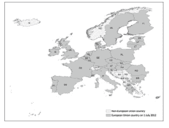

使用第2.3.2节说明的程序，准备一个.GAL文件，并使用邻接标准构建行标准化的W矩阵（将岛屿连接到最近的国家，即爱尔兰连接到英国，英国连接到法国，马耳他连接到意大利，塞浦路斯连接到希腊。同时将芬兰连接到爱沙尼亚，丹麦连接到瑞典）。下表报告了2010-2011年期间人均国内生产总值增长率以及2009年教育支出占GDP百分比的相关数据。

| 国家代码 | 国家 | 2009年教育支出占比% | 2010-2011年增长率 | 国家代码 | 国家 | 2009年教育支出占比% | 2010-2011年增长率 |
|---|---|---|---|---|---|---|---|
| BE | 比利时 | 42 | 1.046931408 | AT | 奥地利 | 23.5 | 1.057823 |
| BG | 保加利亚 | 27.9 | 1.058252427 | PL | 波兰 | 32.8 | 0.992958 |
| CZ | 捷克共和国 | 17.5 | 1.041237113 | PT | 葡萄牙 | 21.1 | 1.037234 |
| DK | 丹麦 | 40.7 | 1.072413793 | RO | 罗马尼亚 | 16.8 | 1.054054 |
| DE | 德国 | 29.4 | 1.074074074 | SI | 斯洛文尼亚 | 31.6 | 1.118227 |
| EE | 爱沙尼亚 | 35.9 | 1.170068027 | SK | 斯洛伐克 | 17.6 | 1.05848 |
| IE | 爱尔兰 | 48.9 | 1.09 | FI | 芬兰 | 45.9 | 1.107807 |
| ES | 西班牙 | 39.4 | 1.070247934 | SE | 瑞典 | 43.9 | 1.099291 |
| FR | 法国 | 43.2 | 1.04296875 | UK | 英国 | 41.5 | 1.084615 |
| IT | 意大利 | 19 | 1.069672131 | EL | 希腊 | 26.5 | 1.045249 |
| CY | 塞浦路斯 | 44.7 | 1.059574468 | LU | 卢森堡 | 46.6 | 1.098333 |
| LT | 立陶宛 | 40.6 | 1.191176471 | LV | 拉脱维亚 | 30.1 | 1.149606 |
| HU | 匈牙利 | 23.9 | 1.045751634 | MT | 马耳他 | 21 | 1.020202 |
| NL | 荷兰 | 40.5 | 1.083870968 | | | | |

检验教育促进增长的假设。由于我们可以推测教育支出呈现某种空间模式，原则上我们也可以将教育变量的滞后值作为回归变量包含在内。使用最大似然策略，首先估计一个SARAR模型，然后根据获得的结果，在空间滞后、空间误差和完整的SARAR模型之间选择最佳模型。

**练习3.2** 证明一个空间误差模型 $y_i = \beta X_i + u_i; u_i = \rho \frac{\sum_{i=1}^n w_{ij} u_i}{\sum_{i=1}^n \sum_{j=1}^n w_{ij}} + \varepsilon_i; |\rho| < 1; \varepsilon_i \text{ n.i.d } N(0, \sigma_\varepsilon^2)$ 可以表示为一个带有额外空间滞后自变量的空间滞后模型。解释为什么即使误差项 $\varepsilon$ 是“行为良好”的，OLS准则也无法为未知参数提供可靠的估计量。

**练习3.3** 证明在空间误差模型中，如果空间相关参数 $\rho$ 和误差方差 $\sigma_\varepsilon^2$ 都是已知的，那么 $\beta$ 的 $ML$ 估计量与 $GLS$ 估计量一致。推导GLS解及其误差方差的显式表达式。

**练习3.4** 证明一个空间滞后模型 $y_i = \lambda \frac{\sum_{i=1}^n w_{ij} y_i}{\sum_{i=1}^n \sum_{j=1}^n w_{ij}} + \beta X_i + u_i; |\lambda| < 1; u_i | X \approx i.i.d.N(0, \sigma_u^2 I_n)$ 可以表示为一个关于自变量 $y$ 的纯自回归模型，其误差项具有（非零均值）并包含了（非随机的）自变量。

**练习3.5** 考虑SARAR模型：
$y_i = \lambda \frac{\sum_{i=1}^n w_{ij} y_i}{\sum_{i=1}^n \sum_{j=1}^n w_{ij}} + u_i; |\lambda| < 1; u_i = \rho \frac{\sum_{i=1}^n w_{ij} u_i}{\sum_{i=1}^n \sum_{j=1}^n w_{ij}} + \varepsilon_i; |\rho| < 1 \varepsilon | X \approx i.i.d.N(0, \sigma_\varepsilon^2 I_n)$ 并考虑 $\lambda = -\rho$ 的情况。证明在这种情况下，该模型简化为一个特定的

### 练习 3.6
再次考虑示例 3.3 和 3.4 中讨论的与 506 个波士顿地区人口普查区中位数房价行列式相关的数据集。要下载该数据集，请输入：

```
>data (boston)
```

估计示例 3.3 和 3.4 中使用的模型，但将空间分量指定为空间误差形式。同时使用最大似然法和可行广义最小二乘法程序。将所得结果与示例 3.3 和 3.4 中呈现的结果进行比较。

### 练习 3.7
重复练习 3.6，但将模型指定为空间杜宾模型。

## 本章参考文献

Anselin, L. (1988). *空间计量经济学：方法与模型*. Kluwer Academic Publishers.
Anselin, L., Bera, A., Florax, R., & Yoon, M. (1996). 空间依赖性的简单诊断检验. *区域科学与城市经济学*, 26, 77–104.
Arbia, G. (2006). *空间计量经济学：统计基础及其在区域经济增长中的应用*. Springer-Verlag.
Arbia, G., Bera, A., Dogan, O., & Taspnar, S. (2020). 空间自回归模型中影响度量的检验. *国际区域科学评论*, 43(1–2), 40–75.
Cliff, A. D., & Ord, J. K. (1972). *空间自相关*. Pion.
Doob, J. L. (1935). 某些统计量的极限分布. *数理统计年鉴*, 6(3), 160–169.
Gerschgorin, S. (1931). 论矩阵特征值的界定. *苏联科学院物理数学部通报*, 7, 749–754.
Kelejian, H. H., & Prucha, I. (1997). 通过两阶段最小二乘程序估计空间自回归参数：一个严重的问题. *国际区域科学评论*, 20, 103–111.
Kelejian, H. H., & Prucha, I. (1998). 用于估计具有自回归扰动的空间自回归模型的广义空间两阶段最小二乘程序. *房地产金融与经济学杂志*, 17, 99–121.
Kelejian, H. H., & Prucha, I. (2001). 关于莫兰 I 检验统计量的渐近分布及其应用. *计量经济学杂志*, 104, 219–257.
Kelejian, H. H., Prucha, I., & Yuzefovich, E. (2001). 具有自回归扰动的空间自回归模型的工具变量估计：大样本与小样本结果. 载于 LeSage 和 Pace (编), *计量经济学进展：空间与时空计量经济学*, 163–198. Elsevier. New York.
Kelejian, H. H., Tavlas G. S., & Hondronyiannis. (2006). 一种研究新兴经济体间传染的空间建模方法. *开放经济评论*, 17(4–5), 423–442.
Lee, L.-F. (2003). 具有自回归扰动的空间自回归模型的最佳空间两阶段最小二乘估计量. *计量经济学评论*, 22, 307–335.
Lee, L.-F. (2004). 空间自回归模型最大似然估计量的渐近分布. *计量经济学*, 72, 1899–1925.
LeSage, J., & Pace, R. K. (2009). *空间计量经济学导论*. Chapman & Hall/CRC Press.
Moran, P. A. P. (1950). 关于连续随机现象的注记. *生物计量学*, *37*(1), 17–23.
Pierce, D. A. (1982). 在某些类型的统计量中用估计量替代参数的渐近效应. *统计学年鉴*, *10*, 475–478.
Vega, S. H., & Elhorst, J. P. (2015). SLX 模型. *区域科学杂志*, *55*(3), 339–363.
Whittle, P. (1954). 论平面上的平稳过程. *生物计量学*, *41*, 434–449.

# 第 4 章
空间计量经济学的进阶专题

本章讨论了文献中近期引入的空间计量经济学的一些高级专题。主要目的是让读者了解一系列技术，这些技术代表了第 3 章所述内容的演进，并且构成了当前空间计量经济学家所必需技能组合的重要组成部分。这些方法在分析许多科学领域的实际问题方面具有巨大的潜在影响力。特别是，第 4.1 节讨论了非恒定创新方差（异方差模型）的情况，第 4.2 节涉及因变量取离散（特别是二元）形式的情况，第 4.3 节包含在面板数据上估计的历时空间计量经济学模型领域的一些建模策略，第 4.4 节讨论了在地理空间中非平稳的回归模型，第 4.5 节介绍了处理非确定性权重矩阵所需的进展，最后，第 4.6 节简要介绍了贝叶斯空间模型。为了尊重当前介绍的入门性质，我们将以低于本书其余部分的分析详细程度来讨论各种方法，同时建议感兴趣的读者参阅当前文献以获取更多细节。

## 4.1 异方差创新

### 4.1.1 概述

到目前为止，本文中介绍的所有模型都假设创新为 $\varepsilon|X \approx i.i.d. N(0, \sigma_{\varepsilon}^2 I_n)$，从而假设了方差恒定（同方差性）的假设。然而，正如第 1.2 节已经讨论过的，由于多种原因，在处理空间数据时，这个假设可能被认为相当不切实际。事实上，与其他类型的数据（例如时间序列数据）相比，空间数据是在单元内观测的，这些单元通常在大小和形状上各不相同。这种在不规则格网上观测到的所有空间数据所特有的特征，可能导致创新的异方差性，即较大区域具有较大的方差。此外，即使我们可以在某个空间聚合水平（例如县级）假设同方差性，但由于不同地理区域的尺寸不同，如果我们以更高的聚合水平（例如州级）聚合数据，这种特性通常会丢失（证明可参见例如 Arbia, 1989）。

最近的部分文献集中于这一方面，引入了 SARAR 类的异方差空间计量经济学模型（Kelejian & Prucha, 2007, 2010）。我们将在本节讨论其中的一些进展。特别是，我们将区分两种主要的估计方法。第一种是通过参数化估计创新的方差-协方差矩阵来考虑异方差性的方法（见第 4.1.2 节）。第二种是非参数方法，其中开发了一种对创新过程可能误设具有稳健性的估计程序，并且其方差-协方差结构是从观测数据中非参数推断出来的（第 4.1.3 节）。

### 4.1.2 具有异方差扰动的 SARAR 模型

为了最大的普遍性，让我们再次考虑第 3.6 节引入的 SARAR (1,1) 模型，为方便起见，此处重新列出：

$$y = Z\beta + \lambda Wy + u \quad |\lambda| < 1 \quad (4.1)$$
$$u = \rho Wu + \varepsilon \quad |\rho| < 1 \quad (4.2)$$

但现在，代替通常的假设 $\varepsilon|X \approx i.i.d.N(0, \sigma_{\varepsilon}^2 I_n)$，让我们假设 $E(\varepsilon_i^2) = \sigma_i^2$。很明显，通过使用第 3.5 节中考虑的相同论证，会出现内生性问题，因为项 $Wy$ 与创新相关。这证明了使用两阶段策略的合理性。此外，由于异方差创新，会出现低效问题，因此需要考虑加权程序。

我们将说明的程序由 Kelejian 和 Prucha (2010) 引入，使用了一种类似于第 3.6 节中为具有同方差创新的通用 SARAR(1,1) 模型引入的空间两阶段最小二乘法的方法，但有一些重要区别。在下文中，我们将尝试提供该程序背后的直觉，而不讨论其所有数学细节，同时建议感兴趣的读者参阅引用的论文以深入了解该主题。特别是，有两个直觉。第一个是，当使用可行 GLS 方法时，在第 3.4.3 节说明的程序的第三步中，通过施加三个矩条件获得了 GMM 估计。这些条件中的第一个是关于方差的 $(\frac{1}{n} \sum_{i=1}^n (\hat{u}_i - \hat{\rho}\hat{u}_i)^2 = \sigma_{\varepsilon}^2$，见公式 (3.35))。然而，在当前背景下，由于同方差性假设的放宽以及异方差性未以指定形式表达，我们不再有单一参数 $\sigma_{\varepsilon}^2$。因此，在这个新背景下，我们将不得不将误差方差 $\sigma_i^2$ 视为讨厌参数，并且，代替施加三个矩条件来估计整个参数向量 $\varphi^T = [\rho^2, \rho, \sigma_{\varepsilon}^2]$（见公式 (3.41)），我们将只施加两个矩条件，并估计约化参数向量 $\phi^T = [\rho^2, \rho]$。因此，此阶段的估计将集中在唯一感兴趣的参数 $\rho$ 上。第二个直觉是，放弃同方差性假设（类比第 1.2 节的讨论），模型参数 $\rho$ 的 GMM 估计仍将提供一致估计量，但其方差将不再是最小的。因此，类似于第 1.2 节中使用的 OLS 修正，我们还需要用加权程序来修正 GMM 估计。

估计阶段相当复杂，通过利用矩条件和工具变量，依次经历不同的步骤。在这种情况下，可以通过遵循这些顺序步骤来获得修改后的 GS2SLS 程序：

- 步骤 1：首先获得参数 $\beta$ 和 $\lambda$ 的一致估计，记为 $\tilde{\beta}$ 和 $\tilde{\lambda}$。
- 步骤 2：使用第一步获得的估计，以获得公式 (4.1) 中 $u$ 的初始估计，记为 $\hat{u}$。
- 步骤 3：使用 $\hat{u}$ 通过施加矩条件来获得公式 (4.2) 中自回归参数 $\rho$ 的初始估计，记为 $\hat{\rho}$。此估计是一致的，但由于方差不恒定而效率低下。

步骤4：通过使用加权GMM程序获得参数 $\rho$ 的一个有效估计，称这样的有效估计为 $\hat{\rho}$。

步骤5：使用有效估计 $\hat{\rho}$ 来变换模型 (4.1)，得到

$$(I - \hat{\rho}W)y = (I - \hat{\rho}W)Z\beta + \varepsilon$$

步骤6：使用2SLS策略估计该变换模型的参数，使用变换后的变量 $Z^* = (I - \hat{\rho}W)Z$；$WZ^* = W(I - \hat{\rho}W)Z$ 和 $W^2Z^* = W^2(I - \hat{\rho}W)Z$ 作为工具变量。称此为可行广义空间两阶段最小二乘估计量（FGS2SLS）。

步骤7：定义新的GS2SLS残差。

步骤8：最后，基于步骤6中讨论的FGS2SLS程序的残差，获得 $\rho$ 的一个有效GMM估计。

现在将详细讨论这些步骤。

步骤1：通过使用 $Z$ 和 $WZ$ 作为工具变量的2SLS估计量，一致地估计 (4.1) 的参数，同时考虑内生性问题。此选择的动机与前面章节中使用的相同。让我们将由此获得的估计称为 $\tilde{\beta}$ 和 $\tilde{\lambda}$。

步骤2：从方程 (4.1) 推导出

$$\tilde{u} = y - Z\tilde{\beta} - \tilde{\lambda}WY$$

步骤3：使用方程 (4.2) 中的项，通过类似于第3.6.3节中考虑的非加权GMM程序获得 $\rho$ 的初始估计，但仅基于两个矩条件，因为现在无法从参数 $\sigma^2$ 推导出任何条件。换句话说，由于异方差性不是以预设形式表达的，GMM程序只能专注于未知参数 $\rho$ 的估计。让我们将由此获得的 $\rho$ 的初始估计称为 $\breve{\rho}$。Kelejian 和 Prucha (2010) 建议，该估计量可以解释为非加权非线性最小二乘估计量 (Greene, 2011)。在我们的假设下，该估计量是一致的，但由于扰动方差的异质性，它是无效的。

步骤4：从步骤3获得的结果出发，$\rho$ 的一个有效GMM估计量可以定义为上述非线性最小二乘估计量的加权版本，其权重由矩阵（我们将用符号 $\Psi$ 表示）的元素提供，该矩阵表示归一化样本矩极限分布的方差-协方差矩阵的估计量。鉴于矩阵 $\Psi$ 在估计程序中所起的关键作用，让我们首先将其形式化定义为：

$$_2\Psi_2 = n^{-1}_2H_n^T \Sigma_{nn}H_2 \quad (4.3)$$

其中 $n$ 为样本量，$_nH_2 = [Z, WZ]$ 是一个 $n \times 2$ 的工具变量矩阵，$\Sigma = E[uu^T]$ 是扰动项的方差-协方差矩阵，其一般元素为 $\sigma_{ij} \in \Sigma$。让我们进一步将矩阵 $\Psi$ 的一般元素表示为 $\psi_{rs}$，$r, s = 1, 2$。注意，工具变量矩阵 $H$ 现在具有 $n \times 2$ 的维度，因为我们只施加了两个矩条件。

在他们的工作中，Kelejian 和 Prucha (2010) 提出了以下参数估计量用于 $\psi_{rs}$ 的一般元素：

$$\tilde{\psi}_{rs} = (2n)^{-1}tr\left[(A_r + A_r^T)\tilde{\Sigma}(A_s + A_s^T)\tilde{\Sigma}\right] + n^{-1}\tilde{\alpha}_r^T \tilde{\Sigma}\tilde{\alpha}_s \quad r, s = 1, 2 \quad (4.4)$$

让我们阐明上述表达式中包含的许多元素的含义。首先，让我们定义 $i_{oj}$ 为单位矩阵的第 $j$ 个元素，$w_{oj}$ 为权重矩阵 $W$ 的第 $j$ 个元素。其次，让我们将变换后的残差定义为 $\tilde{\varepsilon} = (I - \tilde{\rho}W)\tilde{u}$，因此扰动项方差-协方差矩阵对角元素的估计量为 $\tilde{\Sigma} = \text{diag}_{i=1}^n(\tilde{\varepsilon}_i^2)$。

给定这些定义，我们现在可以将方程 (4.4) 的其余元素定义如下：

$$A_1 = W^TW - \sum_{j=1}^n i_{oj}w_{oj}^Tw_{oj}i_{oj}^T$$

$$A_2 = W$$

$$\tilde{\alpha}_r = (I - \tilde{\rho}W)^{-1}H\tilde{P}\tilde{\alpha}_r$$

其中 $\tilde{\alpha}_r = -n^{-1}\left[Q^T(I - \tilde{\rho}W)(A_r + A_r^T)\tilde{\Sigma}(I - \tilde{\rho}W)\tilde{u}\right]$，$Q = [Z, Wy]$ 且 $\tilde{P} = (n^{-1}H^TH)^{-1}(n^{-1}H^TQ)\left[(n^{-1}Q^TH)(n^{-1}H^TH)^{-1}(n^{-1}H^TQ)\right]$。

上述加权 $GMM$ 程序的结果是参数 $\rho$ 的一个新估计量。Kelejian 和 Prucha (2010) 已证明该估计量是一致且有效的。让我们将这个新估计量称为 $\hat{\rho}$。

步骤5：使用步骤4中获得的估计 $\hat{\rho}$，通过将方程 (4.1) 的每一项左乘 $(I - \hat{\rho}W)$ 来以通常的方式变换原始模型：

$$(I - \hat{\rho}W)y = (I - \hat{\rho}W)(Z\beta - \lambda Wy) + \varepsilon \quad (4.5)$$

步骤6：使用广义空间2SLS程序，以 $H$ 作为工具变量，估计方程 (4.1) 中的 $\beta$ 和 $\lambda$，从而得到：

$$\hat{\delta}_{GS2SLS} = [\hat{Q}^{*T} Q]\hat{Q}^{*T} y^* \quad (4.6)$$

其中，如前所述，$Q = [Z, Wy]$，$Q^* = (I - \hat{\rho}W)Q$ 且 $\hat{Q}^* = H(H^T H)^{-1}H^T Q^*$。

步骤7：将新的GS2SLS残差定义为：

$$\hat{u} = y - Q\hat{\delta}_{GS2SLS}$$

步骤8：基于步骤7中引入的GS2SLS程序的残差，产生 $\rho$ 的最终有效 $GMM$ 估计量。该有效估计量是通过使用矩阵 $\Psi$ 的元素作为权重的加权 $GMM$ 程序获得的。

### 4.1.3 空间HAC估计量

如前所述，上一节所述程序中的一个关键元素是归一化样本矩极限分布的方差-协方差矩阵（项 $\Psi$）。在第一篇论文中（我们基于此讨论了前面的第4.1.2节），Kelejian 和 Prucha (2010) 建议了该矩阵元素的参数估计量。在另一篇论文中，同一些作者 (Kelejian & Prucha, 2007) 建议使用异方差和自相关一致（$HAC$）估计量来非参数地估计矩阵 $\Psi$。$HAC$ 估计量在计量经济学中相当流行，并且在 Grenander 和 Rosenblatt (1957) 以及 Newey 和 West (1987) 的开创性贡献之后，尤其是在时间序列文献中，已被研究多年。在空间背景下，从空间相关样本中非参数估计方差-协方差矩阵的早期尝试可以追溯到 Conley (1999) 对连续空间的贡献，以及 Driscoll 和 Kraay (1998) 和 Pinkse 等人 (2002) 对离散空间单元的贡献。在接下来的讨论中，我们将简要总结这种估计方法，该方法可用于第4.1.2节所述程序的步骤4和步骤8。

Kelejian 和 Prucha (2007) 建议，与其像第4.1.2节所示那样参数化地估计矩阵 $\Psi$ 的元素，不如在一系列工作假设下，可以非参数地获得矩阵 $\Psi$ 元素的一致且有效的估计量。首先考虑，如方程 (4.3) 所述，真实的方差-协方差矩阵定义为 $\Psi = n^{-1}H^T\Sigma H$，因此其一般元素 $\psi_{rs}$，$r, s = 1, 2$ 的代数表达式由下式给出：

$$\psi_{rs} = n^{-1} \sum_{i=1}^{n} \sum_{j=1}^{n} h_{ir} h_{is} \sigma_{ij} \quad (4.7)$$

其中 $h_{ir}$，$h_{is}$ 分别是（第 $r$ 个和第 $s$ 个）工具变量向量的第 $i$ 个元素。

类似地，$\Psi$ 矩阵一般元素的空间 $HAC$ 估计量可以表示为：

$$\hat{\psi}_{rs} = n^{-1} \sum_{i=1}^{n} \sum_{j=1}^{n} h_{ir} h_{is} \hat{u}_i \hat{u}_j K(d_{ij}^*/d) \quad (4.8)$$

在上述表达式中，$\hat{u}$ 是扰动项 $u$ 的估计量，$K(\circ)$ 表示一个核函数，$d_{ij}$ 表示第 $i$ 个和第 $j$ 个空间观测值之间的距离（无论以何种方式测量），$d_{ij}^* = d_{ij} + v_{ij}$ 表示包含可能测量误差 $v_{ij}$ 的距离，该误差独立于扰动项 $\varepsilon$ 且满足 $0 < |v_{ij}| < \infty$。最后，项 $d$ 代表一个适当选择的标准化距离，使得当 $n \to \infty$ 时，$d \uparrow \infty$。

至于核函数 $K(\circ)$，它包含了平滑函数的各种方式，可以有多种规范。下面列出了一些最常见的规范：

- 1. 均匀核

$$K(v) = \begin{cases} 0.5 & \text{for } |v| \leq 1 \\ 0 & \text{otherwise} \end{cases}$$

- 2. Bartlett（三角）核

$$K(v) = \begin{cases} 1 - |v| & \text{for } |v| \leq 1 \\ 0 & \text{otherwise} \end{cases}$$

- 3. Epanechnikov（二次）核

$$K(v) = \begin{cases} \frac{3}{4}(1 - v^2) & \text{for } |v| \leq 1 \\ 0 & \text{otherwise} \end{cases}$$

- 4. 二次（双权重）核

## 4.1 异方差创新

$$K(v) = \begin{cases} \frac{15}{16}(1 - v^2)^2 & \text{for } |v| \le 1 \\ 0 & \text{otherwise} \end{cases}$$

5. 二次（三权重）

$$K(v) = \begin{cases} \frac{35}{32}(1 - v^2)^3 & \text{for } |v| \le 1 \\ 0 & \text{otherwise} \end{cases}$$

6. 高斯

$$K(v) = \frac{1}{(2\pi)^{1/2}} \exp\left(\frac{1}{2}v^2\right)$$

7. Tukey-Hanning

$$K(v) = \begin{cases} \frac{1}{2}[1 + \cos(\pi v)] & \text{for } |v| \le 1 \\ 0 & \text{otherwise} \end{cases}$$

8. 余弦

$$K(v) = \begin{cases} \frac{\pi}{4}\left[\cos\left(\frac{\pi}{2}v\right)\right] & \text{for } |v| \le 1 \\ 0 & \text{otherwise} \end{cases}$$

9. Parzen

$$K(v) = \begin{cases} 1 - 6v^2 + 6|v|^3 & \text{for } |v| \le \frac{q}{2} \\ 2(1 - |v|)^3 & \text{for } \frac{q}{2|v|} \le q \end{cases}$$

10. 二次谱

$$K(v) = \frac{25}{12\pi^2 v^2} \left( \frac{\sin(6\pi v)}{6\pi v} - \frac{\cos(6\pi v)}{5} \right)$$

在引用的论文中，Kelejian 和 Prucha (2007) 证明了估计量 (4.8) 的一致性，并推导了其渐近分布。

**示例 4.1 一项城市研究：俄亥俄州哥伦布市犯罪的决定因素**

*空间计量经济学中一个非常流行的数据集涉及一项关于俄亥俄州哥伦布市犯罪决定因素的城市研究。该数据集由 Anselin (1988) 首次收集和研究，此后在文献中多次用于测试新方法。地理分析所需的数据和地图均可在 R 中获取。要在 R 会话中检索它们，请输入 `data(columbus)` 和 `data(coldis)`。下图展示了与哥伦布市（俄亥俄州）人口普查区相对应的 49 个规划社区的地图及其质心。*

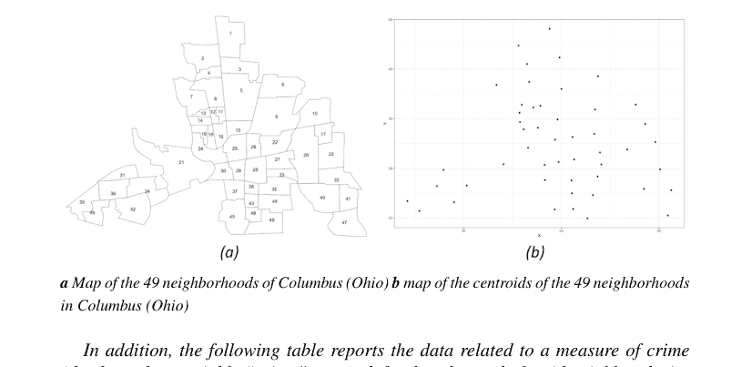

a 哥伦布市（俄亥俄州）49 个社区的地图 b 哥伦布市（俄亥俄州）49 个社区质心的地图

此外，下表报告了与犯罪度量（因变量“crime”，即 y，定义为每千户家庭的住宅入室盗窃和车辆盗窃总数）以及在 49 个社区中观察到的两个自变量“income”（即变量 X）和“housing value”（即变量 Z）相关的数据。

| 社区 | 犯罪 | 房屋价值 | 收入 | 社区 | 犯罪 | 房屋价值 | 收入 |
|---|---|---|---|---|---|---|---|
| 1 | 15.726,0 | 80.467 | 19.531 | 26 | 40.969 | 20.300 | 8.085 |
| 2 | 18.802 | 44.567 | 21.232 | 27 | 52.794 | 34.100 | 10.822 |
| 3 | 30.626 | 26.350 | 15.956 | 28 | 56.919 | 22.850 | 7.856 |
| 4 | 32.387 | 33.200 | 4.477 | 29 | 60.750 | 32.500 | 8.681 |
| 5 | 50.731 | 23.225 | 11.252 | 30 | 68.892 | 22.500 | 13.906 |
| 6 | 26.066 | 28.750 | 16.029 | 31 | 17.677 | 31.800 | 16.940 |
| 7 | 0.178269 | 75.000 | 8.438 | 32 | 19.145 | 40.300 | 18.942 |
| 8 | 38.425 | 37.125 | 11.337 | 33 | 41.968 | 23.600 | 9.918 |
| 9 | 30.515 | 52.600 | 17.586 | 34 | 23.974 | 28.450 | 14.948 |
| 10 | 34.000 | 96.400 | 13.598 | 35 | 39.175 | 27.000 | 12.814 |
| 11 | 62.275 | 19.700 | 7.467 | 36 | 14.305 | 36.300 | 18.739 |
| 12 | 56.705 | 19.900 | 10.048 | 37 | 42.445 | 43.300 | 17.017 |
| 13 | 46.716 | 41.700 | 9.549 | 38 | 53.710 | 22.700 | 11.107 |
| 14 | 57.066 | 42.900 | 9.963 | 39 | 19.100 | 39.600 | 18.477 |
| 15 | 48.585 | 18.000 | 9.873 | 40 | 16.241 | 61.950 | 29.833 |
| 16 | 54.838 | 18.800 | 7.625 | 41 | 18.905 | 42.100 | 22.207 |
| 17 | 36.868 | 41.750 | 9.798 | 42 | 16.491 | 44.333 | 25.873 |
| 18 | 43.962 | 60.000 | 13.185 | 43 | 36.663 | 25.700 | 13.380 |
| 19 | 54.521 | 30.600 | 11.618 | 44 | 25.962 | 33.500 | 16.961 |
| 20 | 0.224 | 81.267 | 31.070 | 45 | 29.028 | 27.733 | 14.135 |
| 21 | 40.074 | 19.975 | 10.655 | 46 | 16.530 | 76.100 | 18.324 |
| 22 | 33.705 | 30.450 | 11.709 | 47 | 27.822 | 42.500 | 18.950 |
| 23 | 20.048 | 47.733 | 21.155 | 48 | 26.645 | 26.800 | 11.813 |
| 24 | 38.297 | 53.200 | 14.236 | 49 | 22.541 | 35.800 | 18.796 |
| 25 | 61.299 | 17.900 | 8.461 | | | | |

让我们首先为了比较，通过第 3.6.3 节阐述的广义空间两阶段最小二乘法，估计同方差 SARAR 模型 $y = \beta_0 + \beta_1X + \beta_2Z + \lambda Wy + u$; $u = \rho Wu + \varepsilon$，其中误差方差恒定 $E(\varepsilon_i) = \sigma^2 \forall i$。结果报告如下。

| 参数 | | 标准误 | t 检验 | p 值 |
|---|---|---|---|---|
| $\beta_0$ | 44.116333 | 11.237096 | 3.9260 | 8.639e-05*** |
| $\beta_1$ | -1.020821 | 0.393592 | -2.5936 | 0.009498*** |
| $\beta_2$ | -0.265474 | 0.092974 | -2.8554 | 0.004299*** |
| $\lambda$ | 0.455519 | 0.190156 | 2.3955 | 0.016598** |
| $\rho$ | -0.039195 | | | |
| $\sigma^2$ | 107.06 | | | |

显著性代码：0 ‘***’ 0.001 ‘**’ 0.01 ‘*’ 0.05 ‘.’ 0.1 ‘ ’ 1

所有系数均显著不为零，包括空间效应 $\lambda$，这表明一个普查区的犯罪数量与相邻普查区的犯罪数量显著相关。

然而，从地图上可以明显看出，各个社区在面积上差异很大，因此误差方差恒定的假设相当不合理。事实上，我们可以预期方差在不同区域会有所不同，且在较大区域变异性更大。因此，我们希望估计与之前相同的 SARAR 模型 $y = \beta_0 + \beta_1X + \beta_2Z + \lambda Wy + u$; $u = \rho Wu + \varepsilon$，但现在考虑一个空间变化的误差方差 $E(\varepsilon_i) = \sigma_i^2$。让我们首先考虑通过第 4.1.2 节阐述的修正广义空间两阶段最小二乘法获得的参数估计。估计程序的结果报告在下表中。

| 参数 | | 标准误 | t 检验 | p 值 |
| :--- | :--- | :--- | :--- | :--- |
| $\beta_0$ | 44.124087 | 7.506698 | 5.8780 | 4.153e-09*** |
| $\beta_1$ | -0.987477 | 0.460184 | -2.1458 | 0.031886* |
| $\beta_2$ | -0.275573 | 0.176910 | -1.5577 | 0.119305 |
| $\lambda$ | 0.452910 | 0.143270 | 3.1612 | 0.001571** |
| $\rho$ | 0.064822 | 0.305091 | 0.2125 | 0.83175 |

显著性代码：0 ‘***’ 0.001 ‘**’ 0.01 ‘*’ 0.05 ‘.’ 0.1 ‘ ’ 1

### $\rho$ 和 $\lambda$ 均为零的 Wald 检验

| | 观测值 | p 值 |
| :--- | :--- | :--- |
| Wald 检验 | 3.5907 | 0.058105 |

估计结果表明，变量“crime”与变量“income”之间仍然存在显著关系，但现在我们考虑了异方差效应，与变量“housing value”的关系不再显著（参数 $\beta_2$）。犯罪中的传染效应（$\lambda \neq 0$）在此新设定下被证实是显著的，而残差中未发现显著的空间相关性（$\rho = 0$）。

最后，让我们使用在空间异方差自相关一致（HAC）版本的 SARAR 模型（见第 4.1.3 节）中讨论的方差-协方差矩阵的非参数估计再次估计该模型。具体来说，为了非参数地估计公式 (4.8) 中报告的方差-协方差矩阵，我们考虑了一个三角核函数。

| 参数 | | 标准误 | t 检验 | p 值 |
| :--- | :--- | :--- | :--- | :--- |
| $\beta_0$ | 44.11639 | 8.07571 | 5.4628 | 4.686e-08*** |
| $\beta_1$ | -1.00772 | 0.51189 | -1.9686 | 0.048994* |
| $\beta_2$ | -0.26950 | 0.17867 | -1.5084 | 0.131458 |
| $\lambda$ | 0.45464 | 0.16508 | 2.7540 | 0.005886** |
| $\rho$ | | | | |

显著性代码：0 ‘***’ 0.001 ‘**’ 0.01 ‘*’ 0.05 ‘.’ 0.1 ‘ ’ 1

结果与参数估计量获得的结果基本相似，尽管标准误更大。

## 4.2 二元响应变量的空间模型

### 4.2.1 引言

在本书的所有前面章节（第 3 章和第 4.1 节）中，我们考虑了与连续因变量相关的空间回归情况，然而在许多情况下，回归模型的因变量只能取离散数量的可能结果。例如，我们可能对某个区域是否存在某种技术作为若干自变量的函数感兴趣。类似的情况出现在解释消费者在不同购物中心之间的选择、建模计数数据、研究空间相互作用、或建模选举行为或健康经济学中患者的选择、解释犯罪行为以及许多其他情况中。所有这些情况都属于文献中所知的*离散选择建模*（见 Greene, 2011）范畴。当因变量是离散的而非连续的时，我们迄今为止讨论的模型不能直接使用，需要进行调整以尊重其统计性质。为了尊重本书的入门性质，我们将仅限于二元选择的情况，并且在此背景下，我们将只考虑一些可能的模型设定。尽管理论上这些模型具有巨大的应用价值，但与第 3 章和第 4.1 节讨论的连续因变量模型相比，它们在文献中受到的关注相对较少。这部分是由于模型更高的分析复杂性、对更复杂估计技术的需求，以及当我们考虑中到大样本量时增加的计算障碍。感兴趣的读者可以参考 LeSage 和 Pace (2009) 的著作以获得贝叶斯视角，以及 Beron 和 Vijverberg (2004)、Fleming (2004) 和 Smirnov (2010) 等论文进行综述。空间离散选择模型的各种设定遵循文献中处理非空间离散模型的一般策略，但进行了调整以考虑空间依赖性，采用了第 3 章详细讨论且现在读者已熟悉的两种基本范式：空间滞后或空间误差。在下一节中，我们将开始介绍一些非空间二元选择模型，这些模型将构成本章后面讨论的空间设定的基础。

### 4.2.2 非空间Logit与Probit模型

让我们从以下线性回归模型开始考虑：

$$y^\bullet = X\beta + \varepsilon \quad (4.9)$$

其中 $y^\bullet$ 是一个连续变量，我们将其与一个二元变量 $y = I(y^\bullet > 0)$ 相关联，$I(.)$ 是指示函数，满足 $I(a > 0) = \begin{cases} 1 & \text{若 } a > 0 \\ 0 & \text{其他情况} \end{cases}$。方程 (4.9) 本质上代表了第 1.1 节中提出的基本回归模型，但现在用一个无法观测的变量 $y^\bullet$ 来表达（因此被称为*潜变量*），而唯一可观测的变量 $y$ 可以取值为 1（例如，存在）或 0（例如，不存在）。在方程 (4.9) 中，未观测变量 $y^\bullet$ 可以被视为一种效用：当效用为正时，经济事件就会发生（例如，消费者选择中的购买行为）。在这种新设定下，方程 (4.9) 被称为*潜回归*，而项 $X\beta$ 被称为*指数函数* (Greene, 2011)。根据上述假设和方程 (4.9)，我们有：

$$P(y_i = 1|X) = P(y_i^\bullet > 0|X) = P(X_i\beta > \varepsilon|X) = P(\varepsilon < X_i\beta|X)$$
$$= F(X_i\beta) = \int_{-\infty}^{\mu_i} f(\mu)d\mu \quad (4.10)$$

类似地：

$$P(y_i = 0|X) = P(y_i^\bullet < 0|X) = P(X_i\beta < \varepsilon|X) = P(\varepsilon > X_i\beta|X)$$
$$= 1 - F(X_i\beta) = 1 - \int_{-\infty}^{\mu_i} f(\mu)d\mu \quad (4.11)$$

在上述表达式中，$F$ 是扰动项的累积概率分布函数，$f = f(X\beta)$ 是其关联的密度函数，满足 $f = \frac{\partial F}{\partial X_i\beta}$，而 $\mu = X\beta$ 是模型的系统性成分。通过在上述表达式中指定不同的累积分布函数，可以定义不同的模型。特别是，计量经济学文献中有两种非常流行的设定，导致了两种不同的二元选择模型：(i) 期望值为零、方差为 $\pi^2/3$ 的*标准化逻辑分布*，以及 (ii) *标准化正态分布*。由于二元变量 $y$ 的值仅取决于 $y^\bullet$ 的符号而非其绝对值，因此它不受误差方差大小的影响，所以将其标准化为 1 并非一个限制。如果我们假设扰动项服从逻辑分布（其累积概率分布函数记为 $\Lambda$），则方程 (4.10) 和 (4.11) 定义了所谓的 *Logit 模型*。相反，如果我们设定扰动项服从正态分布（其累积分布函数记为 $\Phi$），则方程 (4.10) 和 (4.11) 定义了 *Probit 模型*。尽管也提出了其他模型，但 Logit 和 Probit 模型是迄今为止计量经济学中最常用的框架 (Greene, 2011)。

模型 (4.10) 和 (4.11) 的一个流行估计方法是基于最大似然策略，下面将简要概述。首先，考虑到因变量是二元的，我们可以通过考虑从伯努利分布中抽取一个大小为 *n* 的随机样本的概率来构建似然函数，从而得到：

$$L(\beta) = P(Y_1 = y_1, \dots, Y_n = y_n | X) = P(Y_1 = y_1 | X) \dots P(Y_n = y_n | X) \quad (4.12)$$

这是由于独立性，并且根据定义 (4.10) 和 (4.11)：

$$L(\beta) = \prod_{y_i=1} F(X_i\beta) \prod_{y_i=0} [1 - F(X_i\beta)] \quad (4.13)$$

其中 $\prod_{y_i=1}$ 表示对所有满足 $y_i = 1$ 的 y 值求乘积，$\prod_{y_i=0}$ 类似。方程 (4.13) 可以重写为：

$$L(\beta|X) = \prod_{i=1}^n F(X_i\beta)^{y_i} \prod_{y_i=0} [1 - F(X_i\beta)]^{y_i-1} \quad (4.14)$$

因此，对数似然函数为：

$$l(\beta) = \ln[L(\beta)] = \sum_{i=1}^n y_i \{\ln F(X_i\beta) + (1 - y_i) \ln[1 - F(X_i\beta)]\} \quad (4.15)$$

除了少数实际无关紧要的情况外，方程 (4.15) 是非线性的，无法通过解析方法最大化，因此必须寻找数值解。为了获得最大似然解，让我们考虑得分函数：

$$\frac{\partial}{\partial \beta} l(\beta) = \sum_{i=1}^n \left[ \frac{y_i f_i}{F_i} + (1 - y_i) \frac{-f_i}{1 - F_i} \right] x_i = 0 \quad (4.16)$$

特别是，如果我们假设误差服从*逻辑*分布，那么得分函数为 (Greene, 2011)：

$$\frac{\partial}{\partial \beta} l(\beta) = \sum_{i=1}^{n} (y_i - \Lambda_i) X_i = 0 \quad (4.17)$$

其中 $\Lambda_i = \Lambda(X_i \beta)$。在这种情况下，二阶导数为：

$$\frac{\partial^2}{\partial \beta^2} l(\beta) = \sum_{i=1}^{n} \Lambda_i (1 - \Lambda_i) X_i X_i^T \quad (4.18)$$

该表达式可用于置信区间估计和假设检验。

相反，在扰动项服从*正态*分布的假设下，我们有得分函数等于：

$$\frac{\partial}{\partial \beta} l(\beta) = \sum_{y_i=0} \frac{-\varphi_i}{1 - \Phi_i} X_i + \sum_{y_i=1} \frac{\varphi_i}{\Phi_i} X_i = 0 \quad (4.19)$$

其中 $\varphi_i = \phi(X_i \beta)$ 是标准正态密度函数，满足 $\varphi = \frac{\partial \Phi(t)}{\partial t}$，而在此情况下，二阶导数为：

$$\frac{\partial^2}{\partial \beta^2} l(\beta) = \sum_{i=1}^{n} -\kappa_i (\kappa_i + X_i \beta) X_i X_i^T \quad (4.20)$$

其中 $\kappa_i = \frac{(2y_i-1)\phi[(2y_i-1)X_i^T \beta]}{\Phi[(2y_i-1)X_i^T \beta]}$。应该注意的是，无论是在 Logit 模型还是在 Probit 模型的情况下，参数的解释都不像（非空间）线性回归模型那样直接。事实上，在这种情况下，自变量单位增加对二元因变量的边际效应并非简单的回归系数 $\beta$，而是取值为：

$$\frac{\partial E(y|X)}{\partial X} = f(X \beta) \beta \quad (4.21)$$

因此，对于 Logit 模型，边际效应等于：

$$\frac{\partial E(y|X)}{\partial X} = \Lambda(X \beta)[1 - \Lambda(X \beta)] \beta \quad (4.22)$$

而对于 Probit 模型则是：

$$\frac{\partial E(y|X)}{\partial X} = \phi(X\beta)\beta \quad (4.23)$$

为了判断参数估计的显著性，线性回归模型中讨论的大多数工具都是可用的。特别是，在检验单个参数估计的显著性时，我们可以使用 *t* 检验（使用从信息矩阵 (4.18) 或 (4.20) 推导出的标准误）或 z 分数近似，利用 *ML* 估计量的渐近正态性。此外，第 1.1 节讨论的所有基于似然的检验（如似然比检验、Wald 检验和拉格朗日乘数检验）也都是可用的。最后，为了衡量模型对观测数据的拟合程度，虽然 $R^2$ 标准显然不可用（因为它基于变量 *y* 的方差分解，而该变量现在是二元的），但我们仍然可以使用 *AIC* 和 *BIC* 标准（参见方程 1.27 和 1.28）。

### 示例 4.2 解释巴尔的摩的豪宅价格（续）

*为了说明本节描述的离散选择模型，让我们再次审视第 3 章示例 3.2 中已经分析过的巴尔的摩数据集。*

出于我们当前分析的目的，我们将变量 *price* 转换为一个二元变量，如果房屋价格大于 40,000 美元，则将其分类为“昂贵”。我们的模型旨在检验变量 *NROOM*、*NBATH*、*AGE* 和 *SQFT* 是否对房屋被分类为昂贵有显著影响。换句话说，我们想检验购买昂贵房屋所带来的效用是否可以由这些特征来解释。我们将考虑模型的 Logit 和 Probit 两种设定。最大似然估计的结果报告如下。

| | Logit | Probit |
| :--- | :--- | :--- |
| 截距 | $-3.78782$ (0.000201 ***) | $-2.162195$ (0.000136 ***) |
| NROOM | 0.52624 (0.02392 *) | 0.252867 (0.048217 *) |
| NBATH | 0.56735 (0.106308) | 0.365626 (0.072704) |
| AGE | $-0.05183$ (1.97e-05 ***) | $-0.021129$ (0.000775 ***) |
| SQFT | 0.10725 (0.002539 **) | 0.057961 (0.003452 **) |
| AIC | 226.63 | 232.45 |
| 显著性代码: 0 ‘***’ 0.001 ‘**’ 0.01 ‘*’ 0.05 ‘.’ 0.1 ‘ ’ 1 | | |

这两个模型显然得出了不同的参数估计，然而推断结论非常相似：*AGE* 和房屋的尺寸（SQFT）是解释大型住宅分类的最重要因素，其次是房间数量（NROOM），而浴室数量（NBATH）的相关性似乎较低。尽管绝对值不同，但两个模型规格中参数的符号始终相同，且方向符合预期。AIC值也具有可比性，Probit模型仅具有轻微的相对优势。

### 4.2.3 空间Logit和Probit模型

#### 概述

当我们观察空间数据时，上一节讨论的二元模型需要进行调整以考虑空间依赖性。在空间计量经济学文献中，Probit规格无疑比Logit版本更受欢迎，这也源于Anselin（2002）提出的严厉批评，他指出在空间Logit版本中，误差项在解析上难以处理。另一方面，Smirnov（2010）指出，空间Probit存在一个局限性，即它不容易扩展到两个以上的选项（多元Probit，参见Greene，2011）。在空间计量经济学文献中特别受欢迎的一个模型是空间滞后Probit模型，其可以通过以下方程表示：

$$y^\bullet = \lambda Wy^\bullet + Z\beta + u$$

其中 $y = I(y^\bullet > 0)$，$u|X \approx i.i.d.N(0, \sigma_u^2 I_n)$，$W$ 是通常的权重矩阵（无论其如何定义），$y^\bullet$ 是一个 n×1 的不可观测连续变量向量，$\lambda$ 是空间自回归系数，$y$ 是观测到的二元变量，$Z$ 是回归变量矩阵，包括当前值和空间滞后值（$Z = [X, WX]$）。如上一节所述，误差方差 $\sigma_u^2$ 被标准化为1，以避免识别问题，且不失一般性。在所述情况下，类比于第3.5节描述的连续因变量的空间滞后模型，出现了一个内生性问题，即 $y^\bullet$ 的空间滞后值与方程 (4.24) 中的随机扰动项相关。然而，这并非唯一的估计问题。事实上，当在空间依赖性观测上进行估计时，标准的 $ML$ 估计量也是不一致的，这是由空间依赖性引起的异方差性所致（Case, 1991; Pinkse & Slade, 1998）。此外，由于我们忽略了非球形方差-协方差矩阵非对角项中包含的信息，我们还观察到效率低下（Fleming, 2004）。模型 (4.24) 以所谓的*结构*形式（Fleming, 2004）表示。在通常假设 $W$ 的所有对角元素为零且 $\lambda < 1$ 的情况下，它也可以表示为*简化*形式，如下所示：

$$y^\bullet = (I - \lambda W)^{-1}(Z\beta + u) = (I - \lambda W)^{-1}Z\beta + (I - \lambda W)^{-1}u = Z^*\beta + \varepsilon \quad (4.25)$$

其中 $\varepsilon = (I - \lambda W)^{-1}u$ 且 $\varepsilon \approx MVN(0, \Omega)$，$Z^* = (I - \lambda W)^{-1}Z$。由于 $\varepsilon$ 表示为空间自回归过程，根据第3.5.2节给出的结果，我们有：

$$E(\varepsilon\varepsilon^T) = \Omega = \left[(I - \lambda W)^T(I - \lambda W)\right]^{-1} \quad (4.26)$$

在非空间Probit模型中，我们通过积分 $P(y_i = 1) = F(Z_i\beta) = \int_{-\infty}^{\mu_i} f(\mu)d\mu$ 和 $\mu = (I - \lambda W)y^\bullet - Z_i\beta$ 来描述概率 $P(y_i = 1)$，$P(y_i = 0)$ 的情况类似（参见方程 (4.10) 和 (4.11)），这些表达式定义了单个观测的似然函数。类似地，在空间Probit模型中，我们可以将单个观测的似然函数定义为：

$$\begin{aligned} P(y_i = 1) &= P(y_i > 0|Z_i^*, w_{ij}y_i) \\ &= P(z_i^*\beta + \varepsilon_i > 0|Z_i^*, w_{ij}, y_i) \\ &= P(-\varepsilon_i \leq Z_i^*\beta|Z_i^*, w_{ij}, y_i) \cong \Phi(Z_i^*\beta) \quad (4.27) \end{aligned}$$

可以推导出 $P(y_i = 0)$ 的类似表达式。上一个表达式中的近似是由于异方差性的存在，这需要被适当考虑。事实上，将非空间Probit模型获得的结果（参见方程 (4.10)）进行推广，在这种情况下我们有：

$$P(y_i = 1|z_i^*, w_{ij}y_i^*) = \Phi\left(\frac{z_i^*\beta}{\Omega_{ii}}\right) \quad (4.28)$$

其中 $\Omega_{ii}$ 是方差-协方差矩阵 (4.26) 的第 i 个对角元素。因此，即使误差项 $u$ 是同方差的，变换后的误差项 $\varepsilon$ 也是异方差的。

在非空间Probit模型中，利用独立性，边缘概率在似然函数 (4.13) 中以乘积形式组合。然而，在空间背景下，这种简化是不可能的，为了构建似然函数，我们必须同时评估每个位置的联合概率：

$$P(y_1 = 1, y_2 = 1, \ldots, y_n = 1); \quad y_i = \{0; 1\} \quad (4.29)$$

原则上，这个概率应该通过 n 维积分来评估：

$$P(y_1 = 1, y_2 = 1, \dots, y_n = 1) = \int_{-\infty}^{\mu_1} \int_{-\infty}^{\mu_2} \dots \int_{-\infty}^{\mu_n} \varphi(\mu) d\mu \quad (4.30)$$

其中 $\varphi(\mu)$ 现在表示 n 维多元正态分布的密度函数，表示为：

$$\varphi(\mu) = (2\pi)^{-\frac{n}{2}} |\Omega| \exp\left[-\frac{1}{2} (\mu^T \Omega \mu)\right] \quad (4.31a)$$

然而，单变量正态概率分布函数没有解析解，在多元情况下问题变得更加严重。由于方程 (4.30) 中包含的多重积分无法通过解析方法评估，唯一的解决方案是获得数值近似。

作为一个额外的问题，空间依赖性的存在也给边缘效应的解释带来了问题，在这种情况下，对于第 $i$ 个观测值，边缘效应为：

$$\frac{\partial E(y|X, w_{ij}y_j^\bullet)}{\partial X_i} = \varphi\left(\frac{Z_i^* \beta_i}{\sigma_{\varepsilon, ii}}\right) \frac{\beta_i^*}{\Omega_{ii}} \quad (4.31b)$$

其中，使用现在显而易见的符号，我们设 $\beta_i^* = [(I - \lambda W)^{-1}]_{ii} \beta_i$。

如前所述，在定义最优估计策略时存在两个主要问题：一个是内生性问题，另一个是方差-协方差矩阵的非球形性问题（以自相关和异方差性的形式存在）。在文献中，从McMillen (1992)、Pinkse和Slade (1998)、Pinkse等人 (2006) 以及Klier和McMillen (2008) 等人的早期贡献开始，提出了各种基于似然和基于矩的替代方法（综述参见Fleming, 2004）。特别是，我们将讨论以下估计策略：

- i. 最大似然法（ML），
- ii. 广义矩方法（GMM）以及
- iii. GMM的线性化版本（LGMM）。

最大似然估计量无法通过解析方法找到，而数值程序在计算上可能非常耗时。GMM方法减少但并未完全消除计算问题，尤其是在处理非常大的数据集时。其线性化版本代表了精度和计算效率之间的权衡。

#### 最大似然法

在标准的非空间Probit模型中，最大似然估计量可以通过最大化方程 (4.15) 来推导，由于参数的高度非线性，该过程需要数值优化。然而，如果我们考虑空间数据，错误地假设误差独立，似然函数最大化产生的估计量仍然是一致的，但不再有效，因为它们忽略了方差-协方差矩阵非对角项中包含的信息。根据方程 (4.15)，考虑正态扰动假设和方程 (4.24) 表达的空间滞后规格，对于一个大小为 $n$ 的样本，空间Probit对数似然函数可以表示为：

$$l(\beta, \lambda | Z, Wy^\bullet) = \sum_{i=1}^n y_i \ln \Phi \left( \frac{\lambda \sum_{i=1}^n w_{ij} y_j^\bullet + Z_i^T \beta}{\Omega_{ii}} \right) + \sum_{i=1}^n (1 - y_i) \ln \Phi \left( 1 - \frac{\lambda \sum_{i=1}^n w_{ij} y_j^\bullet + Z_i^T \beta}{\Omega_{ii}} \right) \quad (4.32)$$

项 $y^\bullet$ 是不可观测的，因此，为了推导出一个可操作的似然函数，我们必须利用模型的简化形式。使用 (4.25)，对数似然函数可以重写为：

$$l(\beta, \lambda | Z, Wy) = \sum_{i=1}^n y_i \ln \Phi \left( \frac{Z_i^{*T} \beta}{\Omega_{ii}} \right) + \sum_{i=1}^n (1 - y_i) \ln \Phi \left( 1 - \frac{Z_i^{*T} \beta}{\Omega_{ii}} \right) \quad (4.33)$$

表达式 (4.33) 具有复杂的结构，在数值最大化阶段会产生计算问题。为了最大化这样的表达式，McMillen (1992) 建议使用 *EM* 算法。*EM* 算法（最初由Dempster等人于1977年提出）是一个迭代过程，分为两个步骤：E步（期望）和M步（最大化）。E步包括使用未知参数的初始值计算似然函数的期望。M步包括针对未知参数最大化在E步中找到的期望似然函数。这两个步骤迭代进行，直到参数收敛到一个稳定的解，可以证明该解与原始似然函数的 *ML* 估计量一致。McMillen (1992) 建议将 *EM* 算法推广到空间情况，用潜在变量的期望值替换二元变量，并最大化对数似然函数的期望，就好像人工变量是实际的潜在变量一样。特别是，在空间滞后Probit模型 (4.25) 的情况下，期望值可以推导为：

## 4.2 二元响应变量的空间模型

$E(y_i^*|y_i = 1) = Z_i\beta + E(\varepsilon_i|\varepsilon_i > -Z_i^*\beta) + \sigma_i \frac{\varphi(Z_i^*\beta/\Omega_{ii})}{\Phi(Z_i^*\beta/\Omega_{ii})}$ (4.34)

由此得到的 $y_i^*$ 的期望值可用于 $M$ 步，其中最大化以下对数似然函数：

$l = \cos t - \frac{1}{2} \ln|\Omega| - \frac{1}{2}(\mu^T\mu)$ (4.35)

在最后一个表达式中，$\Omega = (I - \lambda W)^{-1}(I - \lambda W)^{-T}$，$\mu = (I - \lambda W)\hat{y}^* - Z_i\beta$，而 $\hat{y}^*$ 是在 $E$ 步中推导出的潜变量的预测值向量。

使用 $EM$ 方法存在两个主要问题。首先，式 (4.35) 中出现的方差-协方差矩阵 $\Omega$ 是未知的，需要进行适当的估计。在这方面，McMillen (1992) 建议将 Probit 模型解释为条件于空间参数的非线性加权最小二乘模型 (Amemiya, 1985)，但不幸的是，这种方法会导致有偏估计量 (Fleming, 2004)。其次，估计过程可能非常缓慢，因为该方法需要在 $M$ 步的每次迭代中计算矩阵 $\Omega$ 的行列式，直到过程收敛。这不仅计算量可能非常大，而且行列式的计算基于近似，当 $n$ 很大且 $W$ 稠密（即包含大量非零项）时，近似可能变得不准确。

#### 广义矩估计

Pinkse 和 Slade (1998) 为二元选择模型的空间版本引入了一种替代估计方法，他们开发了一种 $GMM$ 技术，用于以具有异方差性的空间误差形式表示的 Probit 模型。

考虑以下以潜变量形式表示的模型

$y^\bullet = Z\beta + u$ (4.36)

$u = \rho Wu + \varepsilon$ (4.37)

其中 $\varepsilon|Z \approx i.i.d N(0, \sigma_\varepsilon^2 I)$。类似于模型 (4.24)，式 (4.36) 和 (4.37) 可以写成简约形式：

$y^\bullet = Z\beta + (I - \rho W)^{-1}\varepsilon$ (4.38)

其中 $u = MVN(0, \Omega)$（见第 3.4 节），且 $\Omega = (I - \rho W)^{-1}(I - \rho W^T)^{-1}$（见式 3.15）。使用式 (4.15)，空间误差 Probit 模型得到以下对数似然函数：

$$l(\beta, \rho) = \ln[L(\beta, \rho)] = \sum_{i=1}^{n} y_i \{\ln F(X_i \beta) + (1 - y_i) \ln[1 - F(X_i \beta)]\} \quad (4.39)$$

在正态分布（Probit 模型）的情况下，并使用表达式 (4.28)，可以写成：

$$l(\beta, \rho | Z, Wy^\bullet) = \sum_{i=1}^{n} y_i \ln \Phi \left( \frac{z_i^T \beta}{\Omega_{ii}} \right) + \sum_{i=1}^{n} (1 - y_i) \ln \Phi \left( 1 - \frac{z_i^T \beta}{\Omega_{ii}} \right) \quad (4.40)$$

由于在这个新背景下，传统的扰动概念没有意义，我们现在引入*广义误差*的概念，在 Probit 模型的背景下，可以定义为：

$$\tilde{u}_i(\theta) = \left\{ y_i - \Phi \left( \frac{z_i^T \beta}{\sigma_i} \right) \right\} \frac{\varphi \left( \frac{z_i^T \beta}{\sigma_i} \right)}{\Phi \left( \frac{z_i^T \beta}{\sigma_i} \right) \left\{ 1 - \Phi \left( \frac{z_i^T \beta}{\sigma_i} \right) \right\}} \quad (4.41)$$

让我们进一步考虑一组 $k$ 个工具变量，其观测值排列在一个 $n \times k$ 矩阵 $H$ 中。根据定义，工具变量是外生的，因此建议使用矩条件：

$$E(H^T \tilde{u}) = 0 \quad (4.42)$$

或者，对于单个第 $i$ 个条件

$$E \left[ h_i \frac{\left\{ y_i - \Phi \left( \frac{z_i^T \beta}{\sigma_i} \right) \right\} \varphi \left( \frac{z_i^T \beta}{\sigma_i} \right)}{\Phi \left( \frac{z_i^T \beta}{\sigma_i} \right) \left\{ 1 - \Phi \left( \frac{z_i^T \beta}{\sigma_i} \right) \right\}} \right] = 0 \quad (4.43)$$

其中 $h_i$ 表示工具变量矩阵 $H$ 的第 $i$ 行。最后，使用式 (4.43) 的样本类似物，我们得到以下条件集：

$$m(\beta, \rho) = \frac{1}{n} \sum_{i=1}^{n} h_i \frac{\left\{ y_i - \Phi \left( \frac{z_i^T \beta}{\sigma_i} \right) \right\} \varphi \left( \frac{z_i^T \beta}{\sigma_i} \right)}{\Phi \left( \frac{z_i^T \beta}{\sigma_i} \right) \left\{ 1 - \Phi \left( \frac{z_i^T \beta}{\sigma_i} \right) \right\}} \quad (4.44)$$

在 *GMM* 程序中，矩条件的数量大于待估计参数的数量，因此估计量是以下最小化问题的解：

$m(\beta, \rho)^T M^{-1} m(\beta, \rho) = \min$ (4.45)

其中 *M* 是一个正定矩阵，定义了分配给每个样本矩 $m(\beta, \rho)$ 的权重。Pinkse 和 Slade (1998) 证明了 GMM 程序的一致性和渐近正态性，并在 Newey 和 West (1987) 的框架内推导了估计量的方差-协方差矩阵。

与第 4.2.3 节中阐述的最大似然程序相比，GMM 估计量具有两个主要优势。首先，它不依赖于扰动项正态性的假设。其次，它不需要计算 $n \times n$ 维矩阵的行列式和逆矩阵。然而，表达式 (4.45) 无法以解析方式计算，因此 *GMM* 估计量也只能通过数值求解最小化问题来确定。这需要在数值搜索中对参数 $\rho$ 的每个候选值重复评估方差-协方差矩阵 $\Omega$，由于 $\Omega$ 的复杂形式，此操作在计算上可能具有挑战性。

#### GMM 的线性化版本

为了克服与 *ML* 和 *GMM* 方法相关的计算困难，最近 Klier 和 McMillen (2008) 提出了 Pinkse 和 Slade 的 *GMM* 方法的线性化版本，避免了求逆 $n \times n$ 矩阵的问题。该论文将该方法应用于空间 Logit 模型的估计，而不是 Pinkse 和 Slade (1998) 考虑的 Probit 模型。作者从以下考虑出发：空间模型总是一种近似，因为扰动项的真实依赖结构通常是未知的。因此，他们建议使近似显式化，并通过围绕一个合理的起点展开来线性化非线性模型。现在将描述此过程。

首先考虑空间滞后 Logit 模型：

$y^\bullet = \lambda W y^\bullet + Z\beta + u$ (4.46)

其中 $u|X \approx i.i.d. Logistic(0, \sigma^2_{u_n} I_n)$ 或表示为简约形式：

$y^\bullet = (I - \lambda W)^{-1}(Z\beta + u) = (I - \lambda W)^{-1}Z\beta + (I - \lambda W)^{-1}u = Z^\bullet \beta + \varepsilon$ (4.47)

如 (4.25) 所示。在 (4.47) 中，我们看到变换后的误差项不再是同方差的，因此 $Var(\varepsilon_i) = \sigma_i^2$ 或用矩阵表示为 $Var(\varepsilon) = \hat{\Sigma}^T \hat{\Sigma}$，其中 $\hat{\Sigma}$ 是一个对角矩阵，满足：

$$\hat{\Sigma} = \begin{bmatrix} \sigma_1 & 0 & 0 & 0 & 0 \\ 0 & \sigma_2 & & & 0 \\ & & \ddots & & \\ 0 & 0 & & & \sigma_n \end{bmatrix} \quad (4.48)$$

现在让我们将成功概率定义为：

$$P_i = P(y_1 = 1) = \frac{\exp(Z_i^{**} \beta)}{1 + \exp(Z_i^{**} \beta)} \quad (4.49)$$

这是基于误差项服从 logistic 分布的假设，并且 $Z^{**}$ 代表如式 (4.25) 所示变换的变量 $Z$（即 $Z^* = (I - \lambda W)^{-1} Z$），但也根据异方差方差进行了归一化，即 $Z^{**} = Z^* \hat{\Sigma}^{-1}$。

在这个新设置中，广义 Logit 残差可以简单地定义为：

$$\tilde{u}_i = y_i - P_i \quad (4.50)$$

Klier 和 McMillen (2008) 首先建议了一个 GMM 程序，该程序沿以下步骤进行：

- 步骤 1：假设参数向量的初始值，例如 $\delta = (\beta, \lambda)$，并将这些初始值称为 $\delta_0 = (\beta_0, \lambda_0)$。
- 步骤 2：在式 (4.49) 中使用这些初始值，并通过它们计算由式 (4.50) 给出的广义残差。将这些广义残差称为 $\tilde{u}_i^0 = y_i - P_{i0}$。
- 步骤 3：计算定义为以下形式的梯度项：
$$G_{\delta_0} = \frac{\partial P_{i0}}{\partial \delta_0}$$
- 步骤 4：将由此获得的 $G_{\delta_0}$ 值对一组工具变量（例如 $H$）进行回归，$H$ 定义为
$$H = (I - \lambda W)^{-1} W Z^{**}$$

让我们将由此获得的梯度估计值称为 $\hat{G}_{\delta_0}$。

步骤5：使用更新表达式构建参数的新估计值

$$\delta_1 = \delta_0 + (\hat{G}_0^T \hat{G}_0)^{-1} \hat{G}_0^T \tilde{u}^0$$

在他们的贡献中，Klier 和 McMillen (2008) 推导出了 $\beta$ 和 $\lambda$ 梯度的显式表达式，如下所示：

$$G_{\beta_i} = P_i(1 - P_i)Z_i^{**}$$

以及

$$G_{\lambda_i} = P_i(1 - P_i) \left[ H_i \beta - \frac{Z_i^{**} \beta}{\sigma_i^2} \Xi_{ii} \right]$$

其中 $\Xi_{ii}$ 是矩阵 $\Xi = (I - \lambda W)^{-1} W (I - \lambda W)^{-1} (I - \lambda W)^{-1}$ 的第 $i$ 个对角元素。

上述描述的 GMM 程序在计算上仍然很繁重，因为迭代的每一步都需要对矩阵 $(I - \lambda W)^{-1}$ 求逆。因此，在同一篇论文中，Klier 和 McMillen (2008) 更进一步，提出在起始点 $\lambda_0 = 0$ 附近对模型进行线性化。事实上，在这个起始点，不需要对任何矩阵求逆，因为 $(I - \lambda W)^{-1} = I$。做出这样的假设后，梯度项大大简化。实际上，将广义误差在初始估计值 $\delta_0 = (\beta_0, \lambda_0)$ 附近展开，并在展开式的第一线性项处截断，我们得到：

$$\tilde{u}_i \cong \tilde{u}_i^0 + G(\delta - \delta_0)$$

现在定义变换后的广义误差：

$$v_i = \tilde{u}_i^0 + G\delta_0 - G\delta$$

并令 $M = (H^T H)^{-1}$。需要最小化的目标函数变为：

$$v^T H (H^T H) H^T v$$

这样就不需要矩阵求逆，该过程简化为一个非空间 Logit 估计，随后是一个两阶段最小二乘程序。

如果模型的真实结构由模型 (4.46) 和 (4.47) 捕获，Klier 和 McMillen (2008) 表明，只要参数 $\lambda$ 较小，线性化就能提供准确的估计。事实上，当 $\lambda < 0.5$ 时没有偏差，尽管当 $\lambda > 0.5$ 时估计值会向上偏误。总的来说，通过线性化模型获得的估计量为未知参数提供了良好的近似，尽管一定的效率损失是为提高计算性能所付出的代价。

#### 进一步的计算解决方案

即使在当前强大的计算机机器下，对计算高效程序的需求在二元选择建模中仍然是一个重要问题（另见第5章）。为了减少计算负担，LeSage 和 Pace (2009) 建议在马尔可夫链蒙特卡洛 (MCMC) 环境中使用贝叶斯技术来模拟概率。作者报告说，使用 Gibbs 采样器估计一个仅有 2 个自变量的空间 Probit 模型是一项计算密集型操作。在一项模拟实验中，LeSage 和 Pace (2009) 报告说，当样本量 n = 400 且 MCMC 采样器抽取 1200 次（在 Gibbs 程序的 m 步中每次重复 m 次）时，当 m = 10 时计算需要 20 分钟，当 m = 2 时需要 5 分钟。时间增加与 n 成正比。因此，例如，如果样本量增加到 n = 10,000，所需时间增加到 8 小时 49 分钟。此外，他们还报告说，计算时间与 m 的关系小于正比，因此，即使将 m 步减少到，比如说 m = 1（以牺牲精度为代价），时间仍然是 1 小时 21 分钟，这是不可忽略的。因此，该方法仅限于小样本，因为它没有消除对 n×n W 矩阵求逆的问题。Beron 和 Vijverberg (2004) 提出了另一种基于 GHK 模拟器来评估 n 维积分的替代方案，但未能显著减少计算负担。Wooldridge 等人 (2013) 建议使用部分双变量似然法，这种方法将在第 5.4 节中更深入地讨论。

### 4.2.4 空间 Tobit 模型

#### 模型设定

尽管 probit 和 logit 模型的空间版本可能是空间文献中最常用的非线性模型，但在微观计量经济学的特定领域，Tobit 模型也享有相当的普及度 (Amemiya, 1985; Tobin, 1958)。近年来，一些研究 (Flores-Lagunes & Schnier, 2012; Qu & Lee, 2012; Xu & Lee, 2015) 扩展了基本的 Tobit 模型以考虑空间效应。Qu 和 Lee (2012) 在文献中引入了两种不同类型的空间滞后 Tobit 模型，即：*同时 SLM Tobit* 模型，其表达式为：

$$y_i = \max\left\{0, \lambda \sum_{j=1}^n w_{ij}y_j + x_i\beta + \varepsilon_i\right\}$$

以及 *潜在 SLM Tobit* 模型，它通过潜在连续变量 $y_i^*$ 表达，并由以下方程定义：

$$y_i = \max\{0, y_i^*\} \text{ 其中 } y_i^* = \lambda \sum_{j=1}^n w_{ij}y_j^* + x_i\beta + \varepsilon_i$$

可以说，与潜在 SAR Tobit 模型相比，使用同时设定的研究较少，可能是因为在这种情况下，ML 估计量的渐近性质尚未得到正式证明。Qu 和 Lee (2012) 还表明，空间滞后 Tobit 模型可以由微观经济学理论的两个不同分支来解释。第一个是关于外生社会网络中的同伴效应的文献，其中该模型代表了一个纳什均衡，每个个体都最大化其效用。第二个与标准计量经济学建模有关，适用于数据中很大一部分等于零的情况。

除了 Qu 和 Lee 的设定外，LeSage (2000) 和 LeSage 与 Pace (2009) 提出了一种贝叶斯方法来估计潜在 SAR Tobit 模型。类似地，Donfouet 等人 (2012) 和 Autant-Bernard 与 LeSage (2011) 也使用贝叶斯工具采用了潜在 SAR Tobit 模型。

#### 估计

Qu 和 Lee (2013) 表明，潜在空间滞后 Tobit 模型 (4.57) 的对数似然函数可以表示为：

$$l(\lambda, \beta, \sigma) = \sum_{i=1}^N I(y_i = 0)\ln\Phi(z_i(\theta)) - \frac{1}{2}\ln(2\pi\sigma^2) \sum_{i=1}^n I(y_i > 0) + \ln|I_2 - \lambda W_{22}| - \frac{1}{2} \sum_{i=1}^n I(y_i > 0) z_i^2(\theta) \quad (4.58)$$

其中，除了先前引入的符号外，$\theta = (\lambda, \beta', \sigma)$，$W_{22}$ 代表 $W$ 中对应于 $y_i > 0$ 的子矩阵，$I_2$ 是相同维度的单位矩阵，项 $z_i$ 由 $z_i = \frac{(y_i - \lambda w_{ij} y_j - x_i \beta)}{\sigma}$ 给出，其中 $Y = \max(0, y^*)$。Qu 和 Lee (2015) 表明，方程 (4.58) 在计算上是可处理的，并且可以通过数值最大化来获得 MLE。他们还建立了 MLE 的一致性和渐近正态性，并通过模拟研究了它们的有限样本表现以及在非正态扰动下的稳健性。

### 4.2.5 进一步的空间离散选择模型

除了本节考虑的简单二元离散选择模型外，在计量经济学文献中，我们还发现了各种其他离散选择模型的设定，包括二元和多元 Probit 与 Logit、有序 Probit 与 Logit、截断、删失、样本选择、计数数据模型和持续时间模型（参见 Greene, 2011）。其中一些主题已在空间背景下得到处理（例如，Wang & Kockelman, 2009），但该领域在很大程度上仍未被探索。

**示例 4.3 巴尔的摩的豪宅价格（续）**

*现在让我们回到示例 4.2 中考虑的数据集，并测试巴尔的摩“昂贵”房屋的分类中是否存在空间效应。在下面的表格中，我们报告了使用上一节介绍的三种方法（最大似然法、GMM 和线性化 GMM）估计空间 Probit 模型的结果。为了便于比较，我们还再次报告了示例 4.2 中已经考虑过的非空间 Probit 模型的估计结果。请注意，空间模型现在包含了额外的参数 $\lambda$，该参数捕捉了潜在变量中由于空间依赖性而产生的影响。*

## 4.2 二元响应变量的空间模型

| | 非空间 Probit | 空间 Probit (ML) | 空间 Probit (GMM) | 空间 Probit (线性化 GMM) |
|---|---|---|---|---|
| 截距 | -2.162195 (0.000136 ***) | -1.02618685 (0.0930688.) | -0.99759055 (0.04417*) | -1.73088 (0.00163***) |
| NROOM | 0.252867 (0.048217 *) | 0.21958292 (0.2189693) | 0.18258271 (0.1712854) | 0.22432 (0.04927*) |
| NRATH | 0.3656261 (0.072704.) | -0.069450857 (0.7766100) | 0.01589953 (0.9363988) | 0.21695 (0.27898) |
| AGE | -0.021129 (0.000775 ***) | -0.02364809 (0.000***) | -0.02040384 (0.01461387*) | -0.01437 (0.03206*) |
| SQFT | 0.057961 (0.003452 **) | 0.04463416 (0.08450417.0) | 0.04038605 (0.02747669*) | 0.04102 (0.04998*) |
| λ | | 0.81640265 (0.000***) | 0.78396376 (0.0000014***) | 1.04295 (0.0002***) |
| 显著性代码: 0 ‘***’ 0.001 ‘**’ 0.01 ‘*’ 0.05 ‘.’ 0.1 ‘ ’ 1 | | | | |

首先观察到的是，无论选择何种估计方法，空间参数 $\lambda$ 始终高度显著。通过比较这四个模型，变量 AGE 作为解释因素的主导作用也显现出来，而变量 NROOM 和 SQFT 的作用相对于模型的非空间版本则变得不那么重要。这种效应是由于潜在变量的空间变异已经解释了该现象的大部分。

## 4.3 空间面板数据模型（由 Giovanni Millo 撰写）

### 4.3.1 概述

空间面板是*面板*数据的一种特殊情况，其数据在两个维度上被观测：跨空间单元和跨时间。随着包含多个个体单元观测值的数据库的普及，面板数据模型已变得广泛使用，例如持续更新的国家和行政记录、定期的全国性调查，以及在不同时间点对各种现象的重复测量。让我们首先介绍非空间面板数据模型，该模型可以通过以下方程表示：

$$y_{it} = \alpha + \beta^T X_{it} + \varepsilon_{it} \qquad (4.59)$$

在方程 (4.59) 中，索引 $i = 1, \dots, n$ 指代个体（群体、国家、地区等），索引 $t = 1, \dots, T$ 是时间索引，$X_{it}$ 是个体 $i$ 在时间 $t$ 的自变量观测值的非随机向量，$\varepsilon_{it}$ 是扰动项，满足 $\varepsilon|X \approx i.i.d. N(0, \sigma^2_{\varepsilon} I_n)$，而 $\alpha$ 和 $\beta$ 是待估计的参数。与之前类似的横截面模型的设定（见第1章）相比，在此背景下，我们倾向于用不同的符号表示常数 $\alpha$，原因将在后文变得清晰。面板数据集可以拥有大量在少数时间点上被观测的横截面单元（*短面板*，微观数据的典型特征），或者有限数量的相对较长的时间序列（*长面板*，或*合并时间序列*，金融或宏观经济数据的典型特征），甚至在两个维度之间保持平衡。典型的*空间面板*倾向于具有大空间维度的短时间序列，因为它通常由对大量空间参考数据（如世界各国、一国内部的地区或地理区域）的重复观测组成。在所有这些情况下，面板数据的双重维度性允许比单一横截面或时间序列更丰富的建模可能性。特别是，面板数据模型用于控制与个体特定、时间不变特征相关的*未观测异质性*，这些特征难以或无法观测，但如果被忽略，可能导致感兴趣的参数估计出现偏差或效率低下。这个主题将在下一节介绍。

### 4.3.2 未观测异质性与个体效应

为了对个体异质性建模，通常假设误差项有两个独立的组成部分，其中一个是个体特有的且不随时间变化。这被称为*未观测效应*模型。形式上，我们可以将该模型表示如下：

$$y_{it} = \alpha_i + \beta^T x_{it} + u_i = \alpha_i + \beta^T x_{it} + (\mu_i + \varepsilon_{it}) \quad (4.60)$$

在上述表达式中，总体（或*复合*）误差 $u_{it}$ 被分解为两项。第一项 ($\mu_i$) 代表位置 $i$ 特有的*个体误差成分*，而第二项 ($\varepsilon_{it}$) 代表*特异性误差成分*，通常假设其表现良好且独立于自变量和个体误差成分。模型 (4.60) 的适当估计方法根本上取决于两个误差成分的性质。个体成分可能与自变量相关或不相关。如果相关，$\beta$ 的普通最小二乘 (*OLS*) 估计量将是不一致的，因此通常将 $\mu_i$ 视为另一组 $n$ 个待估计的参数，就像在一般模型中我们会有 $n$ 个不同的截距，例如 $\alpha_{it} = \alpha_i$，相对于 $t$ 是常数。在这个意义上，误差成分 $\mu_i$ 将被假定包含截距项 $\alpha_i$。该模型在文献中被称为*固定效应*（或*组内*或*最小二乘虚拟变量*）模型，通常使用对转换后数据的 *OLS* 进行估计，该程序保证了 $\beta$ 的一致估计（见 Baltagi, 2008）。相反，如果假设个体特有成分 $\mu_i$ 与回归元不相关，我们得到的情况通常在文献中被称为*随机效应*。在这种情况下，总体误差 $u_{it}$ 也与自变量不相关，因此 *OLS* 准则导致一致估计量。然而，跨个体的共同误差成分导致复合误差项之间存在相关性，这造成了 *OLS* 估计量效率的损失，因此我们必须采用某种形式的可行广义最小二乘 (*GLS*) 估计量，该估计量基于两个误差成分方差的估计。最后，如果个体成分完全缺失，合并 *OLS* 估计是 $\beta$ 最有效的准则。这组假设通常被称为*合并模型*，尽管这个术语更正式地指的是误差的性质和相关的适当估计方法，而不是模型本身。面板文献最近考虑了具有空间滞后因变量或空间自相关扰动的面板回归模型，无论是在固定效应还是随机效应设定的背景下（Lee & Yu, 2010a）。我们将在本章的后续部分讨论一些最常用的设定和相关估计技术。

### 示例 4.4 Munnell 的公共资本生产率模型

Munnell (1990) 的公共资本生产率模型通过一个生产函数表达了美国各州（不包括“岛屿”阿拉斯加和夏威夷以及哥伦比亚特区，共48个州。地图见示例 3.2）在 1970 年至 1986 年间观测到的国内生产总值 (GDP) 水平，其中考虑的解释变量是公共资本（道路、水利设施和其他公用事业，编码为“pcap”）、私人资本（编码为“pc”）和就业（“emp”）。失业率（“unemp”）被添加进来以作为商业周期效应的代理变量。该模型可以形式化地表示如下：

$$\log(GDP)_{it} = \alpha + \beta_1 \log(pcap_{it}) + \beta_2 \log(pc_{it}) + \beta_3 \log(emp_{it}) + \beta_4 unemp_{it} + \varepsilon_{it}$$

在这个例子中，我们考虑原始数据的一个子集，仅包括 1970 年至 1974 年之间的观测值。为简洁起见，此处不报告所使用的数据集。Munnell (1990) 提出的原始模型使用 OLS 进行估计，这相当于在假设没有个体成分的情况下将所有观测值合并在一起。结果报告在下表中：

| 参数 | | 标准误 | t 检验 | p 值 |
| :--- | :--- | :--- | :--- | :--- |
| 截距 | 1.2054162 | 0.1151322 | 10.4698 | <2.2e−16 *** |
| log(pcap) | 0.2140447 | 0.0355133 | 6.0272 | 6.405e−09 *** |
| log(pc) | 0.3421465 | 0.0212932 | 16.0684 | <2.2e−16 *** |
| log(emp) | 0.5113731 | 0.0261593 | 19.5484 | <2.2e−16 *** |
| unemp | 0.0118651 | 0.0047056 | 2.5215 | 0.01235 * |
| 显著性代码: 0 ‘***’ 0.001 ‘**’ 0.01 ‘*’ 0.05 ‘.’ 0.1 ‘ ’ 1 | | | | |

其中截距和模型中考虑的所有变量都是显著的。然而，正如 Baltagi 和 Pinnoi (1995) 所指出的，如果我们怀疑误差表现出随机成分，OLS 是低效的，随机效应估计量可以提供更好的估计。在相同数据上估计的随机效应模型提供了以下结果：

| 参数 | | 标准误 | t 检验 | p 值 |
| :--- | :--- | :--- | :--- | :--- |
| 截距 | 1.6794841 | 0.1961392 | 8.5627 | <2.2e−16 *** |
| log(pcap) | 0.0946853 | 0.0525858 | 1.8006 | 0.0717678 |
| log(pc) | 0.3411077 | 0.0424213 | 8.0409 | 8.915e−16 *** |
| log(emp) | 0.6272028 | 0.0377440 | 16.6173 | <2.2e−16 *** |
| unemp | −0.0100228 | 0.0026808 | −3.7388 | 0.0001849 *** |
| φ 方差成分 | 17.5966 | 4.2466 | 4.1437 | 3.418e−05 *** |
| 显著性代码: 0 ‘***’ 0.001 ‘**’ 0.01 ‘*’ 0.05 ‘.’ 0.1 ‘ ’ 1 | | | | |

结果表明，公共资本的显著性是虚假的，如果考虑个体误差成分，它就会消失（另见 Baltagi, 2008 中的示例 3）。

### 4.3.3 随机效应空间面板模型

在随机效应设定中，未观测到的个体效应被假定与模型中的其他解释变量不相关，因此可以安全地将其视为误差项的组成部分（参见，例如，Wooldridge, 2002）。在此背景下，我们可以考虑两种备选设定：带随机效应的空间误差模型（SEM-RE）（参见 Baltagi 等人，2003）以及以最初提出该方法的作者姓名首字母命名的所谓 KKP 模型（参见 Kapoor 等人，2007）。我们将在下文讨论这两种设定。

#### 随机效应空间误差模型（SEM-RE）

让我们首先假设个体误差分量为 $\mu_i \sim \text{i.i.d.}N(0, \sigma_{\mu}^2)$，且特异性误差项 $\varepsilon$ 遵循空间误差公式，使得在每个时间点（$t = 1, ..., T$），我们可以写成：

$$\varepsilon_{it} = \rho W \varepsilon_{it} + \eta_i \quad (4.61)$$

如第 3.4 节所述，因此 $\varepsilon_{it} = (I - \rho W)^{-1} \eta_i$。现在让我们引入符号 $\otimes$（在矩阵代数中称为 Kronecker 积），使得如果 $A = \begin{bmatrix} a_{11} & a_{12} \\ a_{21} & a_{22} \end{bmatrix}$ 且 $C = \begin{bmatrix} c_{11} & c_{12} \\ c_{21} & c_{22} \end{bmatrix}$，那么 $A \otimes C = \begin{bmatrix} a_{11}C & a_{12}C \\ a_{21}C & a_{22}C \end{bmatrix} = \begin{bmatrix} a_{11}c_{11} & a_{11}c_{12} & a_{12}c_{11} & a_{12}c_{12} \\ a_{11}c_{21} & a_{11}c_{22} & a_{12}c_{21} & a_{12}c_{22} \\ a_{21}c_{11} & a_{21}c_{12} & a_{22}c_{11} & a_{22}c_{12} \\ a_{21}c_{21} & a_{21}c_{22} & a_{22}c_{21} & a_{22}c_{22} \end{bmatrix}$。

此外，为了简化符号，从现在起我们还定义矩阵 $B = (I_n - \rho W)$，其中 $I_n$ 是一个 $n \times n$ 的单位矩阵，$W$ 是通常的空间权重矩阵，$\rho$ 是空间误差依赖参数。因此，对于整个面板，我们可以将特异性误差紧凑地重写为：

$$\varepsilon = (I_T \otimes B^{-1})\eta \quad (4.62)$$

其中 $\eta$ 是一个 $nT \times nT$ 的扰动向量，满足 $\eta \approx n.i.d.N(0, \sigma_{\eta}^2)$。因此，复合误差项 $u_i = (\mu_i + \varepsilon_{it})$ 可以紧凑地写成：

$$u = (i_T \otimes I_n)\mu + (I_T \otimes B_N^{-1})e \quad (4.63)$$

其中 $i_T$ 是一个维度为 $T$ 的全 1 向量，$I_T$ 是一个 $T \times T$ 的单位矩阵。现在，让我们定义 $J_T = i_T i_T^T$ 为一个 $T \times T$ 的全 1 矩阵。经过一些直接的代数运算，复合误差的方差-协方差矩阵可以写成：

$$_{nT}\Omega_{nT,u} = \sigma_{\mu}^2(J_T \otimes I_n) + \sigma_{\varepsilon}^2(I_T \otimes B_n^T B_n)^{-1} \quad (4.64)$$

这允许我们推导出用于估计和假设检验的似然函数（见下文）。

#### KPP 设定

Kapoor 等人（2007）考虑了扰动项的另一种设定，它以首字母缩写 *KKP* 而闻名。在引用的论文中，作者假设空间相关结构可以应用于个体效应和其他误差分量。尽管这两个数据生成过程看起来相似，但它们确实意味着由隐含的方差-协方差矩阵的不同结构所控制的不同的空间溢出机制。在这种情况下，复合扰动项 $u = (i_T \otimes I_n)\mu + \varepsilon$ 被假定遵循一阶空间自回归过程，形式为：

$$u = \rho(I_T \otimes W)u + \eta$$

### 4.3.5 估计

以随机效应或固定效应表示的空间面板模型，可以通过最大似然法（ML）或广义矩估计法（GMM）进行估计。一般而言，如果所有分布假设都得到满足，最大似然法是最有效的；但它也是计算强度最大的方法，而广义矩估计法的计算则容易得多。就最大似然法而言，广义矩估计量还放宽了正态性假设（下文将讨论一个例外），因此提供了更稳健的估计。第4.3.3节和第4.3.4节讨论的所有模型设定都可以用这两种方法中的任何一种进行估计。一个例外是公式（4.60）中报告的设定，其中个体效应在个体之间是独立的。事实上，广义矩估计量可用的唯一随机效应设定是KKP模型。在下一节“最大似然估计”中，我们将从最大似然法的角度进行讨论，而下一节将专门讨论广义矩估计法这一替代方案。

#### 最大似然估计

用于空间滞后和空间误差面板最大似然估计的标准程序由Elhorst（2003）提出。他的方法基于将标准面板数据中熟悉的时间去均值技术（Wooldridge, 2002）与Anselin的最大似然框架相结合。数据通过一种称为时间去均值的操作进行转换，该操作包括从每个观测值中减去时间均值，以消除个体空间效应。时间去均值后，可以将标准的空间滞后或空间误差估计量应用于转换后的数据，从而使得一阶条件简化为普通最小二乘法（OLS）的条件，在空间滞后情况下，y上还有一个额外的空间滤波。我们将在下文分别说明固定效应和随机效应的两种情况。

#### 固定效应模型

从计算角度来看，根据Elhorst（2003）引入的框架，空间面板模型的固定效应估计是通过对时间去均值数据进行混合估计来完成的。让我们首先考虑第3.5节描述的**空间滞后模型**的面板版本。在这种情况下，遵循Elhorst（2003）的方法，为了估计参数，我们需要通过使用滤波器$I_T \otimes A$对$y$进行空间滤波来修正混合模型的似然函数，其中$A = (I_n - \lambda W)$，$\lambda$与通常一样是空间滞后参数。我们还需要考虑空间滤波矩阵行列式的显式表达式$|I_T \otimes A|$，在这种情况下，它等于$|A|$的$T$次幂。Elhorst程序的有效性依赖于一个性质，该性质保证了对于每个矩阵$\Sigma$，有$\Sigma(I_n \otimes A)y = (I_n \otimes A)\Sigma y$，因此对空间滞后数据进行去均值等同于对去均值数据进行空间滞后（参见Kapoor等人，2007；Mutl & Pfaffermayr，2011）。

一个高效的两步迭代估计程序可以如下获得。首先，让我们考虑$X$和$Y$的*去均值*值向量，定义为：

$$\tilde{y}_{it} = y_{it} - \bar{y}_i$$

## 4.3 空间面板数据模型（由Giovanni Millo撰写）

$$l = const - \frac{nT}{2} \ln(\sigma_{\eta}^2) + T \ln|B| - \frac{nT}{2} \ln(\tilde{\eta}^T \tilde{\eta})$$ (4.72)

其中，来自去均值模型的残差现在通过以下方式过滤：

$$\tilde{\eta} = (I_T \otimes B)\tilde{y} - \tilde{X}\beta$$ (4.73)

其中 $B = (I - \rho W)$。然后，表达式 (4.72) 可以针对 $\rho$ 进行最大化。同样，如前所述，从最大化方程 (4.72) 获得的 $\rho$ 值被用于广义最小二乘步骤，并施加以下一阶条件：

$$\hat{\beta} = (\tilde{X}^T \tilde{X})^{-1} \tilde{X} \tilde{y}$$ (4.74)

以及

$$\sigma_{\eta}^2 = \frac{\tilde{\eta}^T \tilde{\eta}}{nT}$$ (4.75)

获得用于方程 (4.73) 的新误差表达式，并且该过程可以迭代直至收敛。

尽管作者没有明确说明，但Elhorst的方法论也容易扩展到SARAR设定（应用实例参见Millo & Pasini, 2010）。

虽然Elhorst的程序仍然是应用实践和现有软件中的标准，但它受到了Anselin等人（2008）的批评，因为时间去均值操作改变了误差联合分布的性质，引入了序列相关性。关于该问题的讨论，参见Lee and Yu (2010b)；关于其实际意义的蒙特卡洛模拟评估，参见Millo and Piras (2012)。为了解决这个问题，Lee and Yu (2010a) 建议对数据进行不同的正交变换。

##### 随机效应

用于估计具有随机效应的空间滞后和空间误差版本空间面板的标准算法归功于Elhorst (2003)。他的方法基于部分时间去均值技术（Wooldridge, 2002）和Anselin的最大似然框架：一旦数据经过准时间去均值以消除随机效应结构，那么标准的空间滞后或空间误差模型估计量就可以应用于变换后的数据，从而使得一阶条件简化为普通最小二乘的条件，外加空间滞后情况下对 $y$ 的空间滤波（参见Millo, 2013）。这里我们将考虑未变换的数据，并将任一类型的随机效应指定为误差协方差的一个特征。**随机效应空间滞后**面板模型与任何误差协方差结构 $\Sigma$ 结合的一般似然函数代表了方程 (3.49) 的面板数据版本：

$$l = const - \frac{nT}{2} \ln(\sigma_{\eta}^2) + \frac{1}{2} \ln |\Sigma| + T \ln |A| - \frac{1}{2\sigma_{\eta}^2} \frac{[(I_T \otimes A)y - X\beta]^T \Sigma^{-1} [(I_T \otimes A)y - X\beta]}{nT}$$

其中 $\Sigma$ 是复合误差方差-协方差矩阵。可以采用Oberhofer和Kmenta (1974) 风格的迭代程序来获得未知参数的最大似然估计。从空间滞后参数 $\lambda$ 和误差协方差参数的初始值开始，我们从一阶条件获得 $\beta$ 和 $\sigma_{\eta}^2$ 的估计值：

$$\hat{\beta} = (X^T \Sigma^{-1} X)^{-1} X^T \Sigma^{-1} (I_T \otimes A)y$$

以及

$$\sigma_{\eta}^2 = \frac{[(I_T \otimes A)y - X\beta]^T \Sigma^{-1} [(I_T \otimes A)y - X\beta]}{nT}$$

方程 (4.76) 中报告的似然函数可以集中并针对 $A$ 和 $\Sigma$ 中包含的参数进行最大化。然后，估计值用于更新 $\Sigma^{-1}$ 的表达式。这些步骤重复进行直至收敛。换句话说，对于任何特定的 $\Sigma$，估计可以通过一个两步迭代程序来实现，该程序在广义最小二乘（用于 $\beta$ 和 $\sigma_{\eta}^2$）和集中似然（用于其余参数）之间交替进行，直至收敛。这个通用方案可以应用于随机效应情况。例如，具有随机效应的空间滞后模型（SLM-RE）可以写成对因变量 $y$ 的空间滤波和扰动项的随机效应结构的组合。更正式地，我们有：

$$(I_T \otimes A)y = X\beta + u$$

以及

$$u = (i_T \otimes \mu) + \eta$$

其中方差-协方差矩阵，记为 $\Sigma_{SLM-RE}$，定义为 $\Sigma_{SLM-RE} = \phi(J_T \otimes I_n) + I_{nT}$，额外参数 $\varphi$ 定义为：

$$\phi = \frac{\sigma_{\mu}^2}{\sigma_{\eta}^2}$$

并代表个体效应方差与特异性误差方差之间的比率。

如上文第4.3.3节所述，**随机效应空间误差**模型根据空间自回归效应与个体误差成分之间的相互作用，产生两种可能的设定。

在第一种设定（*SEM-RE*）中，只有特异性误差具有空间相关性，模型可以通过以下三个方程表示：

$$y = X\beta + u$$

$$u = (i_T \otimes \mu) + \varepsilon$$

以及

$$\varepsilon = \rho(i_T \otimes \mu)\varepsilon + \eta$$

缩放误差的协方差表示为：

$$\Sigma_{SEM-RE} = J_T \otimes \left(T\phi I_n + (B^T B)^{-1}\right) + E_T \otimes (B^T B)^{-1}$$

其中已定义 $\bar{J}_T = \frac{J_T}{T}$ 和 $E_T = I_T - J_T$。

在第二种设定（*KKP*）中，相同的空间模型适用于个体误差和特异性误差成分，可以通过以下方程组表示：

$$y = X\beta + u$$

$$u = (i_T \otimes \mu) + \varepsilon$$

以及

$$u = \rho(I_T \otimes W)u + \varepsilon$$

其中，要代入似然函数的缩放误差协方差为：

$$\Sigma_{KKP} = (\phi J_T + I_T) \otimes (B^T B)^{-1}$$

#### GMM估计

空间面板模型的*GMM*估计量基于交替使用空间Cochrane-Orcutt变换以过滤空间依赖性，以及面板数据文献中熟悉的*GLS*（用于*RE*）或时间去均值变换的策略。空间Cochrane-Orcutt变换又基于空间参数的一致估计。与Kapoor等人（2007）和Millo与Piras（2012）类似，为简单起见，我们这里只考虑空间误差模型，而将完整模型的扩展留给感兴趣的读者参阅Mutl和Pfaffermayr（2011）以及Piras（2011）。

##### 随机效应

Kapoor等人（2007）将Kelejian和Prucha（1999）为横截面模型（参见第3.4.3节）的空间参数提出的广义矩估计量扩展到了面板情况。他们概述了误差过程的空间自回归参数（$\rho$）和扰动过程的两个方差分量（由两项 $\sigma_1^2 = \sigma_{\mu}^2 + \sigma_{\eta}^2$ 和 $\sigma_{\eta}^2$ 定义）的估计程序。基于以下矩条件，定义了三个替代的*GMM*估计量：

$$E \left[ \begin{array}{c} \frac{1}{n(T-1)} \varepsilon^T Q_0 \varepsilon \\ \frac{1}{n(T-1)} \bar{\varepsilon}^T Q_0 \bar{\varepsilon} \\ \frac{1}{n(T-1)} \bar{\varepsilon}^T Q_0 \varepsilon \\ \frac{1}{n(T-1)} \varepsilon^T \varepsilon \\ \frac{1}{n(T-1)} \bar{\varepsilon}^T \bar{\varepsilon} \\ \frac{1}{n(T-1)} \bar{\varepsilon}^T \varepsilon \end{array} \right] = \left[ \begin{array}{c} \sigma_{\eta}^2 \\ \sigma_{\eta}^2 \frac{1}{n} tr(W^T W) \\ 0 \\ \sigma_1^2 \\ \sigma_1^2 \frac{1}{n} tr(W^T W) \\ 0 \end{array} \right] \quad (4.90)$$

其中，$Q_0 = \frac{I_T - J_T}{T}$，$I_N$ 是（时间）去均值矩阵，因此 $Q_0 y = \tilde{y}$（参见上一节）。此外，类似于第3.4.3节，我们定义 $\varepsilon = u - \rho \bar{u}$，$\bar{\varepsilon} = \bar{u} - \rho \bar{\bar{u}}$，$\bar{u} = (I_T \otimes W_n)u$ 和 $\bar{\bar{u}} = (I_T \otimes W_n)\bar{u}$。

方程 (4.90) 所隐含的估计量基于这样一个事实：在没有因变量空间滞后项的随机效应模型中，$\beta$ 的*OLS*估计量是一致的，因此*OLS*残差可以用于*GMM*程序。

第一组*GMM*估计量仅基于前三个方程，并为每个方程分配相等的权重。第二组*GMM*估计量使用所有矩条件和一个最优加权方案：在正态性假设下，真实参数值处样本矩的方差-协方差矩阵的逆（由Kapoor等人（2007）推导，他们还讨论了其在非正态情况下的适用性）。最后，第三组*GMM*估计量使用所有矩条件，但采用简化的加权方案，在计算样本矩的渐近方差-协方差矩阵元素存在计算困难时可能有用。

使用上述估计量之一，我们可以获得空间参数和方差分量的估计值。第一个估计量可用于执行空间Cochrane–Orcutt类型的变换，而为了消除个体效应，数据通过左乘项 $I_{nT} - \left( \frac{1 - \sigma_{\mu}}{\sigma_1} \right) Q_0$ 进行进一步变换，如标准面板数据文献所述。可行的*GLS*估计量在此简化为情况类似于在“双重”变换模型上计算的*OLS*。最后，小样本推断可以基于以下参数方差-协方差矩阵的表达式进行：

$$\Gamma = (X^{*T}\Omega_{\varepsilon}^{-1}X^{*})^{-1}$$

其中变量 $X^{*}$ 是原始模型经过空间Cochrane-Orcutt型变换的结果（参见第3章），并且 $X^{*}$ 和 $\Omega_{\varepsilon}^{-1}$ 都依赖于 $\rho$、$\sigma_{\mu}^{2}$ 和 $\sigma_{1}^{2}$ 的估计值。

##### 固定效应

最近有人建议对上述程序进行修改，以适用于个体效应与回归变量之间不相关的随机效应假设无法合理维持的情况。Mutl和Pfaffermayr（2011）指出，在固定效应假设下，回归方程的*OLS*估计不再一致。他们建议用空间两阶段最小二乘法*组内残差*来替代*OLS*残差。在空间误差情况下，一个简单的组内估计量将产生模型参数的一致估计。在引用的论文中，Mutl和Pfaffermayr（2011）用组内残差重新表述了Kapoor等人（2007）的前三个矩条件，然后仅基于这三个矩条件，使用Kapoor等人（2007）中描述的*GMM*程序来估计空间参数 $\rho$。然后，在对组内变换变量进行进一步的空间Cochrane-Orcutt型变换后，通过*OLS*获得模型参数。

### 4.3.6 空间面板数据建模的进一步框架

近年来，关于空间面板数据模型的文献增长迅速。在最近一篇关于2007-2011年空间计量经济学文献的综述（Arbia, 2011）中，这个问题被描述为最热门的话题，无论从理论还是应用角度来看，发表的论文数量都是最多的。因此，这里以非常综合的方式呈现的基本框架已经得到了实质性的扩展和改进。该领域的优秀综述论文包括：《应用计量经济学杂志》关于空间面板的特刊导言（参见Baltagi & Pesaran, 2007）、Lee和Yu（2010b）的综述文章以及同一作者的长篇立场论文（Lee & Yu, 2011）。读者可以参考这些综述，以了解近期文献中涵盖的广泛主题。这里简要总结的主题的一个重要概括涉及这样一个事实：这些模型是静态的（即使基于时间序列数据），因为它们没有考虑任何动态效应。在这方面，文献处理了*稳定*的动态面板数据模型和*不稳定*模型，以涵盖诸如空间单位根、空间协整和爆炸性根等主题（Lee & Yu, 2011）。

### 示例 4.5 Munnell的公共资本生产率模型（续）

尽管Munnell（1990）论文的最初重点是公共资本在社会生产函数中的重要性，但研究者可能有兴趣调查误差项的空间性质，以检测它是否由SE-RE或KKP类型的空间误差模型所支配。在本例中，我们关注第一种类型，采用行标准化的邻接矩阵，并在示例4.4引入的相同数据上通过最大似然法进行估计。估计程序的结果报告如下：

#### SEM-RE模型

| 参数 | | 标准误差 | t检验 | p值 |
| :--- | :--- | :--- | :--- | :--- |
| 截距 | 1.6220798 | 0.2127472 | 7.6244 | 2.451e−14 *** |
| log(pcap) | 0.0382457 | 0.0512507 | 0.7462 | 0.45552 |
| log(pc) | 0.3970841 | 0.0433498 | 9.1600 | <2.2e−16 *** |
| log(emp) | 0.6271537 | 0.0395013 | 15.8768 | <2.2e−16 *** |
| unemp | −0.0066850 | 0.0026529 | −2.5199 | 0.01174 * |
| φ 方差分量 | 25.946903 | 6.470930 | 4.0098 | 6.078e−05 *** |
| ρ | 0.595470 | 0.065178 | 9.1361 | <2.2e−16 *** |

显著性代码：0 ‘***’ 0.001 ‘**’ 0.01 ‘*’ 0.05 ‘.’ 0.1 ‘ ’ 1

个体效应的估计方差远大于特异性误差的方差；后者显示出显著的空间相关性：因此，支持误差中存在空间过程的证据很强。参数 $\beta$ 的估计值与示例4.4中报告的非空间随机效应模型获得的结果没有显著差异，但鉴于上述证据，我们可以相信后者的估计更精确，因为它考虑了一个在模型的非空间规范中被忽略的统计显著成分。

如果人们感兴趣的是一个州的总社会产品对邻近州的影响，那么随机效应空间滞后规范似乎更合适。估计结果报告在下表中：

#### SLM-RE模型

| 参数 | | 标准误差 | t检验 | p值 |
| :--- | :--- | :--- | :--- | :--- |
| 截距 | 1.3671510 | 0.1970401 | 6.9384 | 3.964e−12 *** |
| log(pcap) | 0.1093629 | 0.0526096 | 2.0788 | 0.0376393 * |
| log(pc) | 0.6066125 | 0.0376993 | 16.0908 | <2.2e−16 *** |
| log(emp) | −0.0097658 | 0.0026518 | −3.6827 | 0.0002307 *** |
| unemp | −0.0097658 | 0.0026518 | −3.6827 | 0.0002307 *** |
| φ 方差分量 | 18.7043 | 4.6822 | 3.9948 | 6.475e−05 *** |
| λ | 0.038789 | 0.021832 | 1.7767 | 0.07562 |

显著性代码：0 ‘***’ 0.001 ‘**’ 0.01 ‘*’ 0.05 ‘.’ 0.1 ‘ ’ 1

结果表明，估计的空间自回归系数较低，且在5%置信水平上不显著：因此，支持SLM-RE模型的证据相当薄弱。

### 示例 4.6 意大利区域收敛的空间面板固定效应分析

在本例中，我们再次考虑Barro和Sala-i-Martin（1995）的区域收敛，已在示例1.1中介绍，并在面板背景下针对20个意大利区域进行了修订（地理图见图2.3）。增长方程的面板版本可以表示为：

$$\log(y_{i,t+k}) - \log(y_{it}) = \alpha_i + \beta \log(y_{it}) + \varepsilon_{it}$$

其中，如示例1.1所述，$y_{it}$ 代表第 $t$ 年第 $i$ 个区域的人均GDP。因此，每个区域 $i$ 在 $k$ 年期间的增长率是该区域初始收入水平和个体截距的函数。从面板数据的角度看待这个问题，与纯粹的横截面分析相比，丰富了可能的解释，因为它允许控制区域特征中时间持续的个体异质性。此外，通过将个体效应视为待估计的参数而非误差分量，固定效应规范允许上述异质性与模型的回归变量相关。我们考虑了1960年至1995年期间所有20个意大利区域每5年（$k=5$）观察到的人均GDP数据（为简洁起见未报告数据），并将实际GDP的对数（记为GDPV）与五年滞后GDP的对数（记为l5GDPV）之间的差异对l5GDPV进行回归。让我们像往常一样，首先估计一个非空间固定效应模型。结果报告在下表中：

| 参数 | | 标准误差 | t检验 | p值 |
| :--- | :--- | :--- | :--- | :--- |
| log(l5GDPV) | −0.199311 | 0.014445 | −13.798 | < 2.2e−16 *** |

模型估计得出 $\beta$ 的系数为负且显著，从而证实了收敛性。

为了估计各种空间模型规范，我们考虑了第2.3.2节描述的意大利区域二元邻接矩阵。我们首先考虑空间滞后固定效应模型，通过最大似然法估计。我们得到以下结果：

#### SLM-FE

| 参数 | | 标准误差 | t检验 | p值 |
| :--- | :--- | :--- | :--- | :--- |
| λ | 0.680944 | 0.053398 | 12.7523 | < 2.2e−16 *** |
| log(l5GDPV) | −0.068823 | 0.014291 | −4.8158 | 1.466e−06 *** |

显著性代码：0 ‘***’ 0.001 ‘**’ 0.01 ‘*’ 0.05 ‘.’ 0.1 ‘ ’ 1

空间滞后参数 $\lambda$ 非常高且统计显著。因此，邻近区域的增长对本地增长有很强的正向影响。收敛系数 $\beta$ 的估计仍然统计显著且具有预期的负号，但其绝对值现在小得多（尽管注意它不能与没有空间滞后的模型直接比较）。这突出了调整过程中较低的“收敛速度”（参见示例1.1）。

接下来，我们考虑一个带有空间误差分量的模型，假设来自邻近区域的增长冲击会传播到邻居，影响其结果。空间误差固定效应模型估计的结果如下：

#### SEM-FE

| 参数 | | 标准误差 | t检验 | p值 |
| :--- | :--- | :--- | :--- | :--- |
| log(l5GDPV) | −0.271102 | 0.031033 | −8.736 | < 2.2e−16 *** |
| ρ | 0.780552 | 0.041063 | 19.008 | < 2.2e−16 *** |

显著性代码：0 ‘***’ 0.001 ‘**’ 0.01 ‘*’ 0.05 ‘.’ 0.1 ‘ ’ 1

误差的空间参数估计值非常高且显著。收敛系数大于非空间模型获得的值，并且也统计显著。

## 4.4 非平稳空间计量经济学模型

### 4.4.1 概述

到目前为止，我们考虑的所有模型都将变量之间的关系描述为在不同地理单元上平稳的机制。这种方法具有综合性的优势：一个单一的参数，即回归系数，总结了因变量y与模型相应自变量之间的所有复杂联系。然而，这种简化有时过于强烈。事实上，在许多经验情况下，认为两个变量之间的关系在整个地理区域内是恒定的是不合理的，更合理的推测是它根据某种规律模式。例如，如果我们处理的是在大范围地理空间（如一个大国或一个大陆）上观察到的大样本数据，那么建立一个更灵活的回归机制就更为合理，该机制允许变量之间的关系从一个地方平滑地变化到另一个地方。考虑示例3.2中报告的情况，我们基于在美国48个州观察到的数据，研究了二手车价格与税收之间的关系。原则上可以想象，这种关系在每个州应该是不同的，换句话说，它是空间*非平稳*的。在许多方面，关系在空间上的异质性可能更多地被视为规则而非例外，首先是因为人们的态度和偏好存在地理差异，其次是因为模型通常是由于仅依赖相对较少的解释变量难以充分解释观察到的空间变异而导致的误设结果。许多作为空间分化基础的相关变量可能因为无法正确测量而被排除在模型之外，或者它们可能以不正确的函数形式被表示。

在本章中，我们将介绍一种替代建模框架，它允许考虑非平稳的空间关系。我们将特别关注一种称为*地理加权回归*（GWR）的技术。这种建模策略有两个重要的历史先驱。第一个涉及*扫描统计量*的概念，第二个涉及*局部加权回归*的概念。扫描统计量在统计文献中有着悠久的传统（参见Glaz等人，2001年的综述），并且在许多应用领域非常流行，例如公共卫生（研究人员寻找共同的因果因素来解释异常的病理聚集）、分子生物学（DNA中的聚集可能暗示病毒复制的可能起源原因）、电信、质量控制以及许多其他领域。一个与空间计量经济学应用相关的特例是*二维扫描统计量*。其核心思想非常简单：我们不是将所有可用的观测值一起考虑，而是选择地理上接近的子样本，并在这些子样本内进行一些统计计算。二维扫描统计量的最早例子可以在罗纳德·费希尔爵士的著作（Fisher, 1959）的第3章中找到，他展示了在天文学领域的应用。Arbia（1990）提出使用扫描统计量（用*移动窗口*一词来指代）来研究随机场的一阶和二阶矩的空间非平稳性。Hoh和Ott（2012）提供了一个有趣的例子，展示了其在基因组筛查中的应用，而Paez等人（2008）则展示了其在特征价格估计研究中的应用。*局部加权回归*（LWR）是一种非参数方法（由Cleveland & Devlin于1988年引入），可以看作是一种扫描统计量技术，它仅使用在某种程度上*局部*于感兴趣点的有限数量的训练数据，在该点周围执行回归。在局部加权回归中，点根据其与当前点的接近程度使用核函数（参见第4.1.3节）进行加权；然后使用加权点计算回归（McMillen, 1996）。因此，局部加权回归的输出是一组针对每个观测值的单独回归估计，但是，由于该技术使用了核滤波器，它会产生平滑的变化，使得附近的观测值倾向于显示相似的系数。最后，*地理加权回归*（GWR）是LWR的一个特例（Brundson等人，1996；Fotheringham等人，1998，2002，2007；McMillen & McDonald，1997，2004），它利用地理空间作为选择标准。GWR提供了一组局部估计，可以映射以产生一个在研究区域内变化的参数表面。这些地图在探索空间异质性和理解空间关系方面起着至关重要的作用。

### 4.4.2 地理加权回归

对于每个位置i，（i = 1, 2, ..., n）考虑以下回归模型（参见Wheeler & Paez, 2010）：

$$y_i = X_i\beta_i + \varepsilon_i; \quad i = 1, \dots, n \tag{4.92}$$

其中$y_i$是位置i处因变量y的第i个观测值，$X_i$表示观测矩阵$_nX_k = \begin{bmatrix} 1 & X_{11} & X_{1k-1} \\ \dots & \dots & \dots \\ 1 & X_{n1} & X_{nk-1} \end{bmatrix}$的第i行，$\beta_i$是待估计的（地理上变化的）未知参数向量，$\varepsilon_i$是随机扰动的第i个观测值，满足$\varepsilon_i|X \approx i.i.d.N(0, \sigma^2_n I_n)$。估计策略包括使用以下直观的GLS估计量估计n个不同的模型：

$$\hat{\beta}_i = [X^T G_i X]^{-1} X^T G_i y \tag{4.93}$$

其中y现在是n×1向量，$\hat{\beta}_i$是$\beta_i$的OLS估计量，$G_i = \begin{bmatrix} g_{i1} & 0 & 0 & \dots & 0 \\ 0 & g_{i2} & 0 & & 0 \\ & & \dots & & \\ 0 & 0 & \dots & 0 & g_{in} \end{bmatrix}$是一个n×n对角矩阵，指定了每个位置的权重集。矩阵G的作用类似于前面章节中广泛使用的熟悉权重矩阵W。事实上，它从可用的观测值中选择那些与预测位置i处y的行为相关的观测值，并通过分配与距离成反比的特定权重来实现。然而，这两个矩阵之间存在一个重要区别，即每个局部回归中包含的观测值数量（即矩阵$G_i$的非零条目数量）必须足够大，以保留回归的自由度并允许可靠地估计参数。估计系数（4.93）可以像往常一样解释为自变量单位变化对因变量的（局部）边际效应。因此，GWR以半参数方式建模了所有空间计量经济学模型的基本思想，即为了预测一个变量在特定位置的行为，最佳的预测因子是附近的观测值。此外，将估计过程仅限于邻近观测值，很可能会减少（如果不是完全消除）空间相关性和异方差性对参数估计的大部分负面影响。

在某些条件下，公式（4.93）中报告的估计量与通过最大化每个观测值单独推导的加权伪似然函数得到的估计量一致（参见McMillen & McDonald, 2004）。矩阵$G$中包含的加权方案是该方法的一个基本特征，它取决于两个关键要素。第一个涉及所考虑核函数的选择，第二个涉及靠近位置$i$且与估计位置$i$处（空间变化的）参数相关的观测值数量。第二个要素被纳入一个称为*带宽*的核参数中。选择合适的带宽是该过程的一个基本要素。为了识别局部模式，较小的带宽是可取的，但可能基于小样本量而产生不可靠的估计。相反，较大的带宽虽然保持了估计的可靠性，但往往会消除局部异质性。当带宽大到包含所有观测值（等权重）时，$GWR$显然与标准$OLS$回归一致。权重的最简单选择是考虑矩阵$G$仅为熟悉的（未标准化的）$W$矩阵，该矩阵根据某个最大距离邻域准则（参见第2.1节）定义，没有任何特定的加权。更正式地：

$$g_{ij} = \begin{cases} 1 & \text{if } d_{ij} < d^* \\ 0 & \end{cases}$$

其中$d_{ij}$是观测值$i$和观测值$j$之间的距离，$d^*$是阈值。

虽然原则上可以使用第4.1.3节中介绍的任何核函数，但在实践中，$GWR$中最常用的核函数如下：

- 1. *高斯核*。该核函数已在第4.1.3节中考虑过，在这个新背景下可以表示为：

$$g_{ij} = \exp\left[-\frac{1}{2}\left(\frac{d_{ij}}{\sigma}\right)^2\right]$$

其中$\sigma$是一个参数，称为*带宽*，通过它我们可以控制每个子样本中包含的观测值范围。

- 2. *双平方核*（双权重核的推广，参见第4.1.3节）

$$g_{ij} = \left(1 - \frac{d_{ij}^2}{\sigma^2}\right)^2$$

#### 3. 三次核函数

$$g_{ij} = \left(1 - \frac{d_{ij}^3}{\sigma^3}\right)^3$$

带宽参数 $\sigma$ 可以先验地选择，也可以从数据中估计，这个过程通常称为*校准*。在这方面，最流行的校准策略是*交叉验证法*，这是一种迭代搜索过程，通过反复试验来确定能使预测误差均方根最小化的带宽。（关于另一种方法，可参见 Paez 等人，2002 年。综述可参见 Wheeler & Paez，2010 年。）一旦选定核函数并完成模型校准，公式 (4.93) 就被完全确定，可用于估计模型参数。至于假设检验，我们通常考虑通过取原假设和备择假设下 $\beta_i$ 值的差值，并除以其标准差（公式 1.21）得到的检验统计量，即：

$$test = \frac{\hat{\beta}_i}{\sqrt{Var(\hat{\beta}_i)}} \quad (4.95)$$

其中分母中的缩放因子使用*广义最小二乘*表达式（公式 1.48）获得，在这种情况下，该表达式为：

$$Var(\hat{\beta}_i) = \sigma_{\varepsilon}^2 A_i A_i^T \quad (4.96)$$

其中定义了 $A_i = (X^T G_i X)^{-1} X^T G_i$。检验统计量 (4.95) 可用于检验每个单独观测中回归假设的有效性。从这个意义上说，我们可以观察到，一个自变量对因变量 $y$ 的影响仅在研究区域的某些特定区域显著，而在其他区域则不显著，从而揭示了有趣的地理模式。

一旦模型被估计出来，并且在 $n$ 个估计模型中的每一个都检验了自变量的显著性，我们就可以像往常一样，继续检验模型背后假设的有效性。特别是在当前背景下，一个重要的检验是模型的残差是否表现出某种地理规律性（例如，以空间自相关的形式），而这种规律性未能被地理加权程序充分捕捉。关于 *GWR* 残差空间自相关检验的理论由 Leung 等人（2000 年）提出。他们提出的方法始于定义全局模型的伪残差，即计算每个位置 $i$ 的观测值 $y_i$ 与基于（空间非平稳）参数的估计值之间的差值。这些残差不是以传统方式定义的，因为在每个位置，它们都是从不同的回归模型开始计算的。一旦计算出伪残差，就使用修正版的莫兰 $I$ 系数来检测可能的规律性。Paez 等人（2002 年）提出了 Leung 等人（2000 年）程序的替代方案。

### 4.4.3 进一步发展

本节介绍的 *GWR* 基本方法论仅仅是更复杂建模策略的起点。该领域的文献浩瀚、发展迅速，并且在许多方面仍处于早期发展阶段（综述可参见 Fotheringham 等人，2002 年；McMillen & McDonald，2004 年；Pace & LeSage，2004 年；Wheeler & Paez，2010 年）。对第 4.4.2 节提出的基本模型的一个明显扩展是使用属于 *SARAR* 家族的空间计量模型来代替简单的 *OLS* 局部回归（参见 Brunsdon 等人，1998 年；Mur 等人，2008 年；Paez 等人，2002 年；Pace & LeSage，2004 年）。然而，当处理大样本量时，这种扩展会遇到严重的计算挑战。事实上，不仅需要估计 *n* 次相同的模型（在第 3 章介绍各种模型时多次遇到的计算问题），而且在交叉验证阶段迭代搜索最优带宽时，还需要在程序的每一步重复计算一个 (*n* − 1) 乘 (*n* − 1) 矩阵的行列式。第二个有趣的扩展是 *GWR* 的贝叶斯方法（由 LeSage，2004 年引入），以解决在存在异常值和强异方差现象时标准方法中出现的一些困难。其本质是通过为回归系数施加一个先验分布（依赖于一组超参数）来改进该方法。另一个扩展涉及将本节阐述的通用 *GWR* 框架应用于离散选择模型（参见第 4.2 节）。例如，McMillen 和 McDonald（2004 年）推导出一种估计地理加权 Probit 模型的最大似然方法，表明通过这种方法，可以消除空间离散选择模型中普遍存在的异方差性和自相关性（参见第 4.2.3 节），从而减少对估计量一致性和效率的负面影响。

### 示例 4.7 佐治亚州教育成就的决定因素

作为地理加权回归的一个例子，让我们考虑一个数据集（由 Fotheringham 等人，2002 年提出），该数据集涉及佐治亚州的 159 个县。该数据集可以通过命令 data(Georgia) 从 spgwr 库下载。数据集包含以下变量：拥有学士学位或更高学位的居民比例（Bach）、生活在农村社区的人口比例（Rural）、老年居民比例（Eld）、外国出生居民比例（FB）、生活在贫困线以下的居民比例（Pov）以及黑人族裔居民比例（Black）。数据集还包含每个县的总人口信息以及关于该地区地理的一系列其他信息，例如每个县质心的经纬度。我们考虑一个模型，旨在解释一个县的学士或更高学位百分比作为上述其他变量（Rural、Eld、FB、Pov 和 Black）的函数。标准非空间 OLS 模型的结果报告在下表中：

| 参数 | 估计值 | 标准误 | t 检验 | p 值 |
| :--- | :--- | :--- | :--- | :--- |
| 截距 | 17.24373 | 1.75329 | 9.835 | <2e−16 *** |
| Rural | −0.07032 | 0.01358 | −5.179 | 6.93e−07 *** |
| Eld | 0.01145 | 0.12953 | 0.088 | 0.929693 |
| FB | 1.85247 | 0.30683 | 6.037 | 1.14e−08 *** |
| Pov | 0.25524 | 0.07248 | −3.522 | 0.000566 *** |
| Black | 0.04911 | 0.02648 | 1.854 | 0.065602 |

显著性代码：0 ‘***’ 0.001 ‘**’ 0.01 ‘*’ 0.05 ‘.’ 0.1 ‘ ’ 1
多重 R 平方：0.5884，调整后 R 平方：0.575
F 统计量：43.75，自由度 5 和 153，p 值：< 2.2e−16

然后可以使用高斯核函数估计地理加权回归模型，并通过交叉验证迭代方法确定最优带宽。下表报告了每个估计参数的一些汇总结果：

| 参数 | 最小值 | 第一四分位数 | 中位数 | 第三四分位数 | 最大值 | 范围 | 全局 (OLS) |
| :--- | :--- | :--- | :--- | :--- | :--- | :--- | :--- |
| 截距 | 14.170000 | 15.350000 | 17.050000 | 18.200000 | 18.860000 | 4.69 | 17.2437 |
| Rural | −0.081350 | −0.073480 | −0.064850 | −0.055110 | −0.051080 | 0.03027 | −0.0703 |
| Eld | −0.191200 | −0.094630 | −0.065330 | −0.032360 | 0.012500 | 0.2037 | 0.0114 |
| FB | 0.854300 | 1.282000 | 2.031000 | 2.796000 | 3.138000 | 2.2837 | 1.8525 |
| Pov | −0.304800 | −0.258100 | −0.196100 | −0.115100 | −0.034210 | 0.27059 | −0.2552 |
| Black | −0.016900 | 0.006347 | 0.031610 | 0.060620 | 0.087210 | 0.07031 | 0.0491 |

在上表的最后一列，我们再次列出了 OLS 的结果以供比较。结果显示局部系数围绕全局值具有高度变异性。请注意，在某些情况下，参数在不同位置可能呈现相反的符号（变量“Eld”和“Black”）。因此，在研究区域的某些区域，例如变量“Bach”和“Black”之间存在正相关关系，而在其他区域这种关系是负相关的。例如，下图 (a) 显示了与变量“Black”相关的回归系数的地理变异性（较深的阴影表示正系数，较浅的阴影表示负系数）。系数的不均匀性显而易见，呈现出从西南向东北递减的清晰模式。因此，“黑人比例”变量在南部和西部各县对“学士比例”变量有积极影响，但在东北部各县则有负面影响。请注意地图的平滑性，这是该方法的一个内在特征，源于使用了与距离成反比的核函数。下图 (b) 报告了变量“黑人比例”的估计 GWR 系数的频率分布，这也突出了正系数和负系数的存在。

## 4.5 贝叶斯空间模型

贝叶斯推断基于归功于尊敬的托马斯·贝叶斯牧师（Bayes & Price, 1763）的著名定理，该定理可表达如下：

$$\pi(\theta|y) = \frac{\pi(y|\theta)\pi(\theta)}{\pi(y)} \quad (4.97)$$

在公式 (4.97) 中，符号 $\pi$ 表示密度函数，$\theta$ 代表模型参数向量，$y$ 是随机变量 $Y$ 的观测值，$\pi(y|\theta)$ 是模型的*似然函数*，$\pi(\theta)$ 称为模型参数的*先验*分布，而 $\pi(y)$ 是一个归一化常数，它仅是数据的函数。

公式 (4.97) 可以看作是修改似然函数的一种正式方式，它在推断过程中不仅纳入了经验观测值，还纳入了我们关于参数的先验知识。等式左边的项 $\pi(\theta|y)$ 代表所谓的*后验分布*，它同时考虑了我们从数据中学到的信息（*似然函数*）以及我们对要估计的参数事先已有的认识（*先验*）。事实上，在许多（如果不是全部）情况下，在估计阶段之前，我们已经对参数有所了解，或者至少我们对它们有一些主观形成的信念。

拟合贝叶斯模型意味着最大化 $\pi(\theta|y)$ 而不是经典的似然项 $\pi(y|\theta)$。这种方法被称为最大后验估计（或 MAP）。利用表达式 (4.97)，我们可以通过最大化对数先验加上对数似然来获得参数向量 $\theta$ 的 MAP 估计，而项 $\pi(y)$ 是一个常数，在推断上无关紧要，在估计阶段可以忽略。

这样表述问题可能看起来很简单，因为与标准的最大似然方法相比，我们只需在最大化过程中将项 $\pi(y|\theta)$ 替换为项 $\pi(\theta|y)$。然而，根据似然函数和先验分布的形式，后验分布的计算可能很复杂，其最大化在计算上要求很高。

为了应对这种情况，文献中提出了几种计算方法，它们利用了马尔可夫链蒙特卡洛（MCMC）方法的一般思想（Brooks et al., 2011; Gilks et al., 1996）。

为了在回归中引入贝叶斯方法，让我们首先考虑公式 (1.1) 中引入的标准线性回归模型。假设误差服从均值为零、方差恒定为 $\sigma^2$ 的正态分布，该模型可以表示为：

$$\mathbf{y} \sim N(\mathbf{X}\beta, \sigma^2\mathbf{I}_N)$$

其对数似然（见公式 (1.13)）为：

$$l(y|\beta, \sigma^2) = \ln[L(\beta, \sigma^2)]$$
$$= \text{const} - \frac{n}{2} \ln(\sigma^2) - \frac{(y - X\beta)^T(y - X\beta)}{2\sigma^2} \quad (4.98)$$

根据贝叶斯法则 (4.97)，我们有：

$$P(\beta, \sigma^2|y) = \frac{P(\beta, \sigma^2, y)}{P(y)} \quad (4.99)$$

通过反复应用贝叶斯定理，我们有：

$$P(\beta, \sigma^2, y) = P(\beta, \sigma^2)P(y|\beta, \sigma^2) = P(\sigma^2)P(\beta|\sigma^2)P(y|\beta, \sigma^2) \quad (4.100)$$

因此，由公式 (4.97)：

$$P(\beta, \sigma^2|y) = \frac{P(\beta, \sigma^2, y)}{P(y)}$$
$$= \frac{P(\sigma^2)P(\beta|\sigma^2)P(y|\beta, \sigma^2)}{P(y)} \propto P(\sigma^2)P(\beta|\sigma^2)P(y|\beta, \sigma^2) \quad (4.101)$$

符号 $\propto$ 表示成比例，因为对于任何给定的样本，分母中的项 $P(y)$ 是常数。

在公式 (4.101) 中，项 $P(y|\beta, \sigma^2)$ 代表模型的似然（在公式 (4.98) 中推导），而项 $P(\sigma^2)$ 和 $P(\beta|\sigma^2)$ 是模型参数的先验，需要适当指定。

例如，对于模型 (1.1)，我们可以如下指定先验：

$$(\beta|\sigma^2) \sim N(\mu_\beta, \sigma_\beta^2) \quad (4.102)$$

$$P(\sigma^2) \sim G^{-1}(a, b) \quad (4.103)$$

其中 $G^{-1}$ 表示形状参数为 "a"、尺度参数为 "b" 的逆 Gamma 分布的密度。这两个先验被称为*共轭正态逆 Gamma*，其意义在于得到的后验分布是正态的，因此属于与先验相同的分布族。

在这种共轭先验的特殊情况下，我们可以推导出后验似然的闭式表达式，并可以直接用它来对模型参数进行推断。

然而，我们能够指定共轭先验的情况仅限于少数特殊情况，并且通常后验分布不是已知的形式，因此我们需要采用不同的估计策略。这在处理所有空间计量经济模型时尤其如此（Küsch, 2022）。

例如，考虑空间滞后模型（见第 3.5 节）的情况，它可以表示为（见公式 3.45）：

$$y = \lambda Wy + x\beta + u \quad (4.104a)$$

$$u|x \approx i.i.d.N(0, \sigma^2)$$

并由参数三元组 $(\beta, \sigma^2, \lambda)$ 定义。根据贝叶斯定理，我们现在有后验可以表示为：

$$P(\beta, \sigma^2, \lambda|y) = \frac{P(\beta, \sigma^2, \lambda, y)}{P(y)} = \frac{P(\lambda)P(\sigma^2|\lambda)P(\beta|\sigma^2, \lambda)P(y|\beta, \sigma^2)}{P(y)} \propto P(y|\beta, \sigma^2, \lambda)P(\beta|\sigma^2, \lambda)P(\sigma^2|\lambda)P(\lambda) \quad (4.104b)$$

因此，要激活贝叶斯策略，我们需要指定三个先验 $P(\beta|\sigma^2, \lambda)$、$P(\sigma^2|\lambda)$ 和 $P(\lambda)$。参数 $\beta$ 和 $\sigma^2$ 的先验可以选择如上公式 (4.102) 和 (4.103) 所述，因此我们只需要为 $\lambda$ 指定一个先验。该参数的取值范围有限 $|\lambda| < 1$（见公式 3.45），但最好通过考虑变换将其重新定义在 (0, 1) 范围内：

$$\lambda^* = \frac{\lambda + 1}{2} \quad (4.105)$$

在文献中，参数 $\lambda^*$ 的一个常见先验是参数为 $a$ 和 $b$ 的 Beta 密度：

$$\lambda^* \sim \text{Beta}(a, b) \quad (4.106)$$

现在指定了公式 (4.105) 中出现的所有先验后，我们可以将它们与 SLM 的对数似然（见公式 (3.52)）结合起来，推导出后验分布，并最大化它以获得参数估计。

然而，以这种方式指定的三个先验不再是共轭的，得到的后验分布不再具有简单的闭式形式。因此，为了解决估计问题，我们需要借助一些 MCMC 方法。特别是在空间计量经济模型的情况下，采用 Metropolis–Hastings (MH) 算法（Hastings, 1970; Walsh, 2004）相当流行，这是一种不依赖于已知条件后验分布的 MCMC 方法。

MH 的本质是一个迭代过程，沿着以下步骤进行：

- 步骤 1：从迭代 $t = 0$ 开始，使用初始值，例如 $\theta(0)$。
- 步骤 2：给定当前值 $q(\theta(t + 1)|\theta(t))$，提议一个新值，称之为 $\theta(t + 1)$。
- 步骤 3：以概率 $\alpha$ 接受 $\theta(t + 1)$，$\alpha$ 由下式给出：

$$\alpha = \min\left\{1, \frac{q(\theta^{(t)}|\theta^{(t+1)})\pi\left(\theta^{(t+1)}|y\right)}{q(\theta^{(t+1)}|\theta^{(t)})\pi\left(\theta^{(t)}|y\right)}\right\}$$

- 步骤 4：如果未被接受，则将 $\theta(t + 1)$ 设置为 $\theta(t)$。
- 步骤 5：从步骤 2 重复。

该过程的一个重要方面是，在达到后验分布之前，最初的迭代不应被用于推断，因此应予以丢弃。这就是所谓的*预烧期*。

在本节中，我们仅以一定详细程度描述了 SLM 的贝叶斯建模，但类似的方法可以用于空间误差模型、空间杜宾模型、SARAR 模型，以及本书中描述的所有空间计量经济模型。

### 示例 4.8 哥伦布（俄亥俄州）犯罪的决定因素（续）

*为了说明贝叶斯估计的效果，让我们再次考虑哥伦布数据集，该数据集涉及示例 4.1 中已介绍的哥伦布犯罪决定因素。在本示例中，我们使用传统的最大似然方法和贝叶斯似然方法估计三个模型，即空间误差模型、空间滞后模型和空间杜宾模型（见第 3 章）。在所有模型中，我们都旨在用两个预测变量来解释犯罪率（CRIM）：房屋价值（HOVAL）和收入（INC）。*

主要结果总结在以下表格中，按三个模型分别列出。

## 4.5 贝叶斯空间模型

### 空间滞后模型

| | 贝叶斯SLM | | | | SLM | | | |
|---|---|---|---|---|---|---|---|---|
| | 估计值 | 标准误 | 可信区间下限 | 可信区间上限 | | 标准误 | 置信区间下限 | 置信区间上限 |
| (截距) | 54.408 | 7.915 | 52.546 | 76.892 | 54.200 | 7.295 | 39.901 | 68.499 |
| INC - | -1.252 | 0.360 | -2.095 | -0.388 | -1.253 | 0.317 | -1.876 | -0.631 |
| HOVAL | -0.302 | 0.102 | -0.522 | -0.103 | -0.304 | 0.093 | -0.488 | -0.121 |
| lambda | 0.306 | 0.134 | -0.118 | 0.732 | 0.314 | 0.134 | 0.0511 | 0.578 |
| sige | 121.630 | 26.483 | 88.654 | 211.699 | 107.460 | | | |

### 空间杜宾模型

| | 贝叶斯SDM | | | | SDM | | | |
|---|---|---|---|---|---|---|---|---|
| | 估计值 | 标准误 | 可信区间下限 | 可信区间上限 | | 标准误 | 置信区间下限 | 置信区间上限 |
| (截距) | 68.080 | 17.299 | 35.027 | 104.094 | 70.854 | 16.414 | 38.681 | 103.027 |
| INC - | -1.017 | 0.360 | -1.746 | -0.304 | -1.041 | 0.333 | -1.693 | -0.388 |
| HOVAL | -0.306 | 0.096 | -0.488 | -0.120 | -0.308 | 0.090 | -0.485 | -0.130 |
| lag.INC | -1.322 | 0.663 | -2.653 | -0.083 | -1.371 | 0.647 | -2.641 | -0.102 |
| lag.HOVAL | 0.150 | 0.190 | -0.250 | 0.519 | 0.137 | 0.163 | -0.184 | 0.458 |
| rho | 0.1910 | 0.181 | -0.210 | 0.535 | 0.159 | 0.187 | -0.208 | 0.527 |
| sige | 117.050 | 26.825 | 76.806 | 182.557 | 99.055 | | | |

### 空间误差模型

| | 贝叶斯SEM | | | | SEM | | | |
|---|---|---|---|---|---|---|---|---|
| | 估计值 | 标准误 | 可信区间下限 | 可信区间上限 | | 标准误 | 置信区间下限 | 置信区间上限 |
| (截距) | 65.200 | 6.180 | 52.546 | 76.892 | 59.893 | 5.366 | 49.375 | 70.410 |
| INC - | 1.235 | 0.426 | -2.095 | -0.388 | -0.941 | 0.330 | -1.589 | 0.293 |
| HOVAL | -0.312 | 0.103 | -0.522 | -0.103 | -0.302 | 0.090 | -0.479 | -0.124 |
| rho | 0.359 | 0.218 | -0.118 | 0.732 | 0.561 | 0.133 | 0.299 | 0.824 |

对上述表格中报告的结果进行检验表明，对于SLM，经典似然方法和贝叶斯似然替代方法的结果几乎完全相同，无论是在点估计方面还是在标准误方面，只是在贝叶斯抽样程序的情况下标准误略大。在空间杜宾模型的情况下，两种方法的估计显示出微小差异（特别是在涉及自变量滞后值时），并且同样在贝叶斯方法的情况下标准误更大。最后，在SEM的情况下，两种方法之间的差异更为显著，并且贝叶斯标准误始终比传统ML方法获得的标准误大得多。

## 4.6 随机和内生权重矩阵

前面章节讨论的所有模型都基于一个假设，即在模型设定中至关重要的权重矩阵W（见第2章）是非随机的且严格外生的。可以说，这两个假设在空间计量经济学中仍可被视为正统，因为正是基于这一假设，前几章讨论的估计量的一致性和渐近正态性得以证明。然而，本书的读者应该意识到，最近的一批文献对这两个假设都提出了质疑，目的是让研究者意识到放松这些假设对模型估计的影响。本章旨在简要讨论其中一些非正统方法。特别是，第4.6.1节将讨论随机W矩阵的情况，而第4.6.2节则集中讨论权重矩阵内生确定的情况。

### 4.6.1 随机权重矩阵

正如我们在前几章中广泛阐述的，空间计量建模的第一步是定义权重矩阵的元素，这项任务可以使用不同的标准来完成。这些标准可能从区域单元之间的简单邻接性（在区域数据的情况下），到处理个体数据时（如在空间微观计量经济学研究中；Arbia等人，2022）点间距离的某种逆函数。然而，特别是在第二种情况下，估计过程中使用的观测值通常并不代表整个总体层面的完整数据集合，而只是其中的一个样本。此外，在许多情况下，样本是按照便利性标准抽取的，而没有遵循特定的设计。尽管这种情况在经验研究中相当常见（例如，当数据是网络爬取或众包获得时。参见Arbia & Nardelli, 2020; Cavallo & Rigobon, 2016），但其后果在计量经济学文献中至今仍相当被忽视，该文献通常将一组数据点视为构成了整个总体。然而，建模后果可能是巨大的，因为在这种情况下，用逆距离函数指定的W矩阵仅代表真实权重矩阵的一个估计。

事实上，当只有总体数据点的一个样本可用时，权重矩阵可以说继承了抽样选择单元固有的随机性属性，从而自身成为一个随机变量。

正如直观所见，后果在很大程度上取决于具体情况，因为它们受到三种情况的影响，即：

- i. 个体数据点在空间中的分布方式，
- ii. 数据收集阶段样本的设计方式，以及
- iii. 我们如何定义权重矩阵。

为了让读者了解随机W矩阵的建模后果，我们将展示一些在非常简单的情况下可以推导出的理论结果，当：

- i. 数据点在总体层面遵循完全空间随机性模式（CSR，参见Diggle, 1983, 2003）在空间中分布，这种情况可以形式化地表示为两个坐标（比如Z₁和Z₂）作为两个独立的均匀分布分布，不失一般性，范围从0到b，即：
- ii. 样本按照简单随机标准抽取，以及
- iii. W矩阵用平方逆距离函数定义。

根据假设（4.107）和均匀分布的性质，我们有：

以及

让我们首先考虑项(Z₁ᵢ − Z₁ⱼ)，它具有三角分布，但可以用高斯分布近似：

其中参数φ²由下式给出：

使用独立性性质。
因此，这个量的平方服从自由度为1的卡方分布：

类似地，对于第二个坐标(Z₂ᵢ − Z₂ⱼ)²。

最后，如果我们定义$d_{ij}^2$为数据点$i$和数据点$j$之间的平方欧几里得距离，我们有：

$$d_{ij}^2 = (Z_{1i} - Z_{1j})^2 + (Z_{2i} - Z_{2j})^2 \quad (4.113)$$

根据公式（4.102）和（4.103）的结果，平方距离服从两个独立的自由度为1的卡方分布之和，因此服从自由度为2的卡方分布：

$$d_{ij}^2 = \phi^2 \left[ \frac{(Z_{1i} - Z_{1j})^2 + (Z_{2i} - Z_{2j})^2}{\phi^2} \right] = \phi^2 \chi_2^2 \quad (4.114)$$

因此，我们有：

$$E\left[d_{ij}^2\right] = \phi^2 E\left[\chi_2^2\right] = 2\phi^2 \quad (4.115)$$

以及

$$\text{Var}\left[d_{ij}^2\right] = \phi^4 \text{Var}\left[\chi_2^2\right] = 4\phi^4 \quad (4.116)$$

现在让我们定义（总体）权重矩阵的通用条目，比如$W_{ij} \in W$，为平方逆距离$W_{ij} = d_{ij}^{-2}, \forall i \neq j$。根据这个定义和公式（4.114），W矩阵的通用条目服从逆非中心卡方分布，其近似矩（参见Kendall & Stuart, 1976）由下式给出：

$$E[W_{ij}] = E\left[d_{ij}^{-2}\right] \cong \frac{1}{E\left[d_{ij}^2\right]} + \frac{\text{Var}\left[d_{ij}^2\right]}{E\left[d_{ij}^2\right]^3} = \frac{1}{2\phi^2} + \frac{4\phi^4}{8\phi^6} = \frac{1}{\phi^2} = \frac{6}{b^2} = \mu_W \quad (4.117)$$

即，以及：

$$\text{Var}[W_{ij}] \cong \frac{\text{Var}\left[d_{ij}^2\right]}{E\left[d_{ij}^2\right]^4} \cong \frac{4\phi^4}{16\phi^8} = \frac{1}{4\phi^4} = \frac{1}{4\left(\frac{b^2}{6}\right)^2} = \frac{9}{b^4} = \sigma_W^2 \quad (4.118)$$

使用公式（4.111）、（4.115）和（4.116）。

最后，假设一个随机变量X，使得$E(X_i) = \mu_X, \forall i$，$\text{Var}(X_i) = \sigma_X^2, \forall i$，并且$\text{Cov}(X_i X_j) = \sigma_X^2 \varrho_{ij}$，其中$\varrho_{ij}$是相关系数，第2章描述的X的空间滞后可以计算为$L(X_i) = \overline{X}_i = N^{-1} \sum_{j=1}^N W_{ij} X_j$，并且在温和的假设下使用上述结果，Arbia等人（即将发表）表明如果从一个大小为 $N$ 的总体中随机抽取一个大小为 $n$ 的样本，空间滞后 $L(X_i) = \overline{X}_i$ 的估计仍然是无偏的，但其效率可能非常低，其效率损失在渐近意义上等于：

$$\text{EL} = \frac{\mu_W^2 \sigma_X^2 \varrho_{ij}}{\sigma_X^2 \sigma_W^2 + \mu_X^2 \sigma_W^2 + n^{-1} \sigma_X^2 \mu_W^2 + \frac{(n-1)}{2n} \mu_W^2 \sigma_X^2 r_{ij}} < 1 \quad (4.119)$$

这一结果对莫兰空间相关系数的估计产生了影响。事实上，在总体层面，莫兰 I 空间相关系数可以表示为（参见第 2 章公式 (2.6)）：

$$I_p = \frac{\text{Cov}[X \overline{X}]}{\sqrt{\text{Var}[\overline{X}] \text{Var}(X)}} \quad (4.120)$$

而其样本对应形式可以写为：

$$I_s = \frac{\text{Cov}[x \overline{x}]}{\sqrt{\text{Var}[\overline{x}] \text{Var}(x)}} \quad (4.121)$$

其中 $x$ 表示随机变量 $X$ 的样本值。根据前述结果，如果 $\overline{X}$ 的方差被高估，样本莫兰 $I$ 将被低估，因此：

$$|I_s| < |I_P| \quad (4.122)$$

这一结果具有直观的吸引力。如果对点数据进行抽样，平均而言，它们将位于相对于原始分布更大的距离上，并且，根据托布勒地理学第一定律关于空间相关性的距离衰减（Tobler, 1970），这将导致绝对意义上的空间相关性降低。

在最近的一篇论文中（Arbia 等人，2024 年），研究了这种效率损失对空间滞后模型估计的影响。在他们的论文中，通过一系列蒙特卡洛研究，他们得出结论：如果基于样本数据，空间滞后模型中回归系数和空间相关参数的估计量会受到偏差和较低效率的影响。基于这些结果，他们提出通过使用吉布斯采样器解决方案替换未抽样观测值来缓解这种效应。作者还证明，这种方法通常在估计阶段能实现更低的偏差和更低的标准误差。

这种建议解决方案的应用领域受到一个事实的限制，即它假设完全了解已抽样和未抽样点的空间坐标。实际上，有许多经验案例中这种假设是现实的，并且即使某些数据点的目标变量未被观测到，实际上也能获得所有总体元素的完整列表。例如，在工业经济研究或官方统计中，企业位置是已知的，但某些变量只能通过抽样调查来观测。然而，在许多其他情况下，研究者既不知道某些变量的位置，也不知道其值，例如，在许多空间抽样调查中，或者当我们从网络上抓取数据时。在这些情况下，前述结果的用处有限，需要更多的方法论进展。

### 4.6.2 内生权重矩阵

在本书讨论的所有模型中，估计量的最优性是在空间权重矩阵严格外生的假设下建立的。确实，存在许多情况使得这一假设可能仍然有效，例如，前一节考虑的那些情况，其中空间权重基于预先确定的地理距离，例如空间对象或区域质心之间观测到的距离。然而，在许多其他情况下，$W$ 矩阵的定义并非基于领土单位之间纯粹的地理距离，而可能是基于社会（Anselin & Bera, 1998; Doreian, 1980）或经济距离（Case 等人，1993）、以经验观测到的流量衡量的距离（Murdoch 等人，1997）、迁移流（Conway & Rork, 2004）、基于贸易的互动（Aten, 1996, 1997; Crabb & Vandenbussche, 2008）或制度距离（Arbia 等人，2010）构建的。

在这些以及许多其他情况下，用于确定权重的变量极有可能与模型中包含的自变量相关，从而产生内生性问题。同样，在社会网络框架的背景下，某些未观测到的属性可能同时影响地理邻近联系和个人行为（Hsieh & Lee, 2011）。因此，在许多经验案例中，外生空间权重的假设可能被违反。虽然这个问题通常被认为是需要紧急解决的问题之一（例如，Pinkse & Slade, 2010），但迄今为止，还没有一种估计方法被确立为被广泛接受的最先进解决方案。

在本节中，我们将介绍一些可能的解决方案。

在最近的一篇论文中，Qu 和 Lee（2015 年）提出明确地对内生性来源进行建模，指定两个方程，第一个描述传统的 SAR 模型，第二个直接对空间权重矩阵的单个条目进行建模。

根据第 3 章，SAR 模型的第一个方程（称为*结果方程*）可以表示为自回归项和预测变量矩阵（例如 $X_1$）的线性函数：

$$y = \lambda Wy + X_1\beta + \varepsilon$$

而第二个方程（称为*条目方程*），将权重矩阵的通用条目（例如 $w_{ij} \in W$）表示为一组（可能是地理的）指标 $Z$ 的函数，通常可以表示为：

$$w_{ij} = h(Z, \theta)$$

其中，例如，

$$Z = X_2\Gamma + \nu$$

## 4.7 计算机代码

### 4.7.1 使用 R 估计异方差线性空间模型

`sphet` 包旨在估计和检验具有异方差创新的空间模型。它补充并部分重叠了 `spdep` 库中可用的计量经济学功能。请记住，首次使用时需输入命令 `install.packages("sphet")`，之后每次会话前需输入 `library(sphet)`。

首先，假设我们考虑一个**异方差 SARAR 模型**，其表达式为 $y = \beta_0 + \beta_1 X + \beta_2 Z + \lambda Wy + u; u = \rho Wu + \varepsilon$，其中 $E(\varepsilon_i) = \sigma_i^2$，并且我们希望使用第 4.1.2 节中阐述的修正广义空间两阶段最小二乘法程序来估计它。进一步假设变量 $y$、$X$ 和 $Z$ 的观测值已存储在活动的 R 会话中，并且权重矩阵 $W$ 已通过前面章节描述的某种程序生成。要估计该模型，请输入命令：

```
model1<- gstslshet(formula=y~x+z, date=filename, listw=W)
```

如果我们希望估计**空间 HAC 模型**，为了评估方差-协方差矩阵，我们需要两个相对于通常参数的额外对象：i) 所有空间单元之间的成对距离矩阵（即 $d_{ij}$ 项），以及 ii) 核函数的类型。让我们将距离矩阵记为 $D$，并假设我们选择 Epanechnikov 核函数（该包支持的其他可能替代方案包括三角（Bartlett）核、双平方（或二次、或双权重）核、Parzen 核、TH（Tukey - Hanning）核和 QS（二次谱）核）。使用这些规格，命令为：

```
model2<-stslshac(formula=y~x+z,listw=w,distance=D,
    type="Epanechnikov")
```

在此表达式中，带宽是可变的。相反，如果我们希望将带宽固定为一个值，例如 $B$，则必须添加选项 `bandwidth = "B"`。此外，该命令默认同时使用 $WX$ 和 $W^2X$ 作为工具变量。如果我们只想使用 $WX$ 作为单一工具变量，则必须添加选项 `W2X = FALSE`。

要创建一个距离矩阵，例如，使用 `Columbus` 中包含的数据，请输入：

```
Data(coldis)
```

现在下载的对象 `coldis` 可以作为距离矩阵读取。

### 4.7.2 使用 STATA 估计异方差线性空间模型

我们首先考虑一个**异方差 SARAR 模型**，其表达式为 $y = \beta_0 + \beta_1 X + \beta_2 Z + \lambda Wy + u; u = \rho Wu + \varepsilon$，其中 $E(\varepsilon_i) = \sigma_i^2$。用于估计**异方差 SARAR 模型**的修正广义空间两阶段最小二乘法程序在 STATA 的 `spreg` 包中实现，该包在前一章中已讨论。要估计该模型，请输入命令：

```
spreg gs2sls y x z, het id(id) dlmat(W) elmat(W)
```

选项 `het` 使用允许异方差扰动项的估计量。在 `id()` 选项中写入标识符的名称。在估计之前，请记住导入使用 `spmat` 命令生成的权重矩阵 W。我们也可以使用 `spregress` 命令计算 SAR 模型中的稳健标准误：

```
spregress y x z, gs2sls het dvarlag(W)
```

选项 `het` 将误差视为异方差。

### 4.7.3 使用 Python 估计异方差线性空间模型

PySAL 包旨在估计和检验具有异方差创新的空间模型。可以如第 3 章所述将内生变量纳入模型。例如，可以使用以下命令拟合具有异方差性和内生变量的空间滞后和误差模型的 GMM 方法：

```
import libpysal
GM_Combo_Het(y, x, yend, q, w)
```

其中 `yend` 是内生变量的数组，`q` 是用作工具变量的外部外生变量的数组。同样的方法也可用于向空间误差模型添加内生变量。如果我们希望估计空间 HAC 模型，为了评估方差-协方差矩阵，我们需要两个相对于通常参数的额外对象：(i) 所有空间单元（点）之间的成对距离矩阵，以及 (ii) 核函数的类型。例如，假设我们选择高斯函数（该包支持的其他可能替代方案包括均匀、二次和四次核）。

```
kernel = Kernel(points, function='gaussian')
```

其中对象 `points` 已在第 2.5.1 节中介绍过。或者，可以从 shapefile 开始计算核：

```
kernel = kernelW_from_shapefile('path/file.shp', k=15)
```

使用这些规格，模型的命令为：

```
OLS(data, robust='hac', gwk=kernel)
```

其中对象 `data` 包含有关因变量和自变量的信息。

### 4.7.4 使用 R 估计空间 Probit/Logit/Tobit 模型

首先，让我们介绍用于估计基于潜变量模型 $y^\bullet = \beta_0 + \beta_1 X + \beta_2 Z + \varepsilon$ 的标准、非空间 Probit 和 Logit 模型的 R 命令。命令如下：

```
>model0<-glm(y~x+z, family=binomial(link="probit"))
```

（其中 y 是一个二元 0/1 变量），Logit 模型类似。与估计 Probit、Logit 和 Tobit 模型空间版本的各种程序相关的命令包含在不同的库中。在 `spldv` 库中，如果我们想使用 GMM 技术估计空间 Probit 模型的参数，请输入命令：

```
>model1<-sbinaryGMM(y~x+z,listw=W, link = « probit »)
```

而对于空间 logit，命令是：

```
>model1<-sbinaryGMM(y~x+z,listw=W, link = « probit »)
```

使用线性化 GMM 估计量估计空间模型（无论是 Probit 还是 Logit）的命令为：

```
>model1<-sbinaryLGMM(y~x+z,listw=W, link = "probit")
```

以及：

```
>model2<-sbinaryLGMM(y~x+z,listw=W, link = "logit")
```

对于相关的边际效应，在同一个库中，使用以下命令：

```
> impacts(model1)
```

与估计 Probit、Logit 和 Tobit 模型空间版本的各种程序相关的 R 命令也包含在 `spatialprobit` 库和 `McSpatial` 库中。其中一些程序在此描述。但请注意，这些包在某些 R 版本上运行时可能无法工作。

在 `McSpatial` 库中，权重矩阵 $W$ 必须使用与前面章节描述的不同的程序生成。实际上，在这种情况下，一旦创建了邻居列表（例如 `contnb`），我们必须使用命令：

```
W<-nb2mat(contnb)
```

而不是 `nb2listw` 命令，该命令将邻居列表（`nb`）转换为矩阵（`mat`）。现在让我们考虑空间 Probit 模型的各种估计量。首先，如果我们想使用 ML 技术估计空间 Probit 模型的参数，请输入命令：

```
> model1<-sarprobit(y~x+z,wmat=W)
```

如果我们想使用广义矩方法（**GMM**）估计相同的模型，我们需要在开始迭代搜索解之前初始化参数 $\rho$。因此，在开始程序之前，我们必须输入，例如：

```
>rho=rho0
```

其中 `rho0` 是任何满足 $|\rho0| < 1$ 的值。在任何实际情况下，都应测试结果对不同初始值的稳健性。完成此操作后，现在输入：

```
> model2 <-gmmprobit(y~x+z,wmat=W,startrho=rho)
```

最后，如果我们想使用线性化广义矩方法（**LGMM**）估计相同的模型，请改为输入：

```
> model3<-spprobit(y~x+z,wmat=W)
```

同样，对于模型的 logit 版本，使用 `splogit`。
最后，如果我们想估计空间 tobit 模型，`{spatialprobit}` 库使用以下命令：

```
>model4<-sartobit(y~x+z, listw=W)
```

### 4.7.5 使用 STATA 估计空间 Probit/Logit/Tobit 模型

用于估计 Probit 和 Logit 模型的 Stata 命令是 **probit** 和 **logit**：

```
probit y x z
logit y x z
```

空间 probit 或 logit 模型的估计命令可以借助 `spatbinary` 命令执行（参见 Spinelli, 2022）。也可以借助 `sptobitmstar` 模块执行空间 tobit 模型的估计。特别是，命令

### 4.7.6 使用 R 估计空间面板模型

估计空间面板的程序包含在名为 `splm` 的 R 包中（Millo & Piras, 2012）。要安装它，你可能还需要先安装 `collapse` 包。

```r
install.packages("collapse", type="binary")
library(collapse)
install.packages("splm")
library(splm)
```

使用此包时，我们还会自动加载 `plm` 包（Croissant & Millo, 2008），用于估计非空间面板数据模型。

这两个包的形式要求非常少。数据集可以存储在常规数据集对象中，前提是它包含与个体位置和时间相关的索引对，以便能够明确识别。这些包假设个体索引存储在数据集的第一列，时间索引存储在第二列。如果数据以不同方式排列，则必须明确说明。

要使用的两个主要函数是 `spml`（空间面板最大似然）用于 ML 估计，以及 `spgm`（空间面板广义矩方法）用于 GMM 估计。

如果我们忽略空间因素，则使用 `plm` 包中包含的 `plm` 函数。那么，非空间固定效应模型可以通过简单输入以下命令来估计：

```r
model0 <- plm(y~x+z, data=datafile)
```

如果我们添加选项 `model = "pooling"`，我们可以通过将所有数据（空间和时间）合并在一起，使用 OLS 模型进行估计：

```r
model0 <- plm(y ~ x+z, model="pooling", data=datafile)
```

对于使用 ML 估计的空间模型，命令是 `spml`。此函数使用三个参数：

- "Model"，可以取值为 "random" 或 "fixed"；
- "Spatial.error"，可以包含误差分量或不包含。它可以取值 "n" 表示无分量，"kkp" 表示 Kapor–Kelejian–Prucha 规范，或 "b" 表示 Baltagi 规范；
- "Lag"，可以包含因变量滞后分量或不包含，取值为 TRUE 或 FALSE。

#### 随机效应模型的步骤

在**随机效应**的情况下，我们区分 4 种情况。

i. 无空间分量，当 spatial.error 和 lag 都设置为 null 时。在这种情况下，可以使用命令 `spml` 并指定以下参数进行 ML 估计：

```r
model1 <- spml(y~x+z, listw=W, data= Insurance,
model="random", spatial.error="n", lag=FALSE)
```

其中 W 是通常的权重矩阵。

ii. 空间滞后。在这种情况下，我们必须将 lag 参数设置为 TRUE：

```r
model2 <- spml(y~x+z, listw=W, data= Insurance,
model="random", spatial.error="n", lag=TRUE)
```

iii. 使用第 5.3 节中表达的 Baltagi 规范的空间误差。在这种情况下，我们可以将 lag 参数设置为 FALSE，将 spatial.error 参数设置为 "b"：

```r
model3 <- spml(y~x+z, listw=W, data= Insurance,
model="random", spatial.error="b", lag=FALSE)
```

iv. 使用第 5.3 节中表达的 Kapor–Kelejian–Prucha 规范的空间误差。在这种情况下，我们可以将 lag 参数设置为 FALSE，将 spatial.error 参数设置为 "kkp"：

```r
model4 <- spml(y~x+z, listw=W, data= Insurance,
model="random", spatial.error="kkp", lag=FALSE)
```

或者，如果我们希望使用广义矩方法而不是最大似然，我们可以使用命令 `spgm` 并指定类似的参数：

```r
model5 <- spgm(y~x+z, listw=W, data= Insurance, model="random",
spatial.error= TRUE, lag=FALSE)
```

#### 固定效应模型规范的步骤

对于使用最大似然估计的固定效应模型，命令始终是 `spml`，逻辑类似。我们只需要排除参数 model = "random"，该参数默认考虑固定效应。

如果我们希望在规范中添加空间滞后，我们可以通过附加参数 `lag = TRUE` 来估计它：

```r
model7 <- spml(y~x+z, listw=W, spatial.error=n, lag=TRUE)
```

相反，如果我们想指定一个空间误差分量，我们添加参数 spatial.error = "b"：

```r
model8 <- spml(y~x+z, listw=W, spatial.error=TRUE, lag=FALSE)
```

### 4.7.7 使用 STATA 估计空间面板模型

STATA 是管理面板数据的便捷工具。面板数据模型使用以 `xt` 开头的一组命令进行估计。在分析之前，应使用以下命令定义数据的面板结构：

```stata
xtset id year
```

其中 `id` 是指定个体索引的变量名称，`year` 是指定时间索引的变量名称。

要估计没有空间依赖性的**混合 OLS 模型**，我们可以使用命令：

```stata
xtreg y x z
```

没有空间滞后或扰动中空间结构的经典**随机或固定效应模型**的估计可以借助选项 `fe` 和 `re` 来执行：

```stata
xtreg y x z, fe
xtreg y x z, re
```

现在让我们考虑估计面板数据模型的不同方法。上面讨论的 Sp 命令集也包括估计空间面板数据模型的可能性。通常，空间权重矩阵应作为 spmatrix 对象导入。估计固定效应 SAR 模型的命令：

```stata
spxtregress y x z, fe dvarlag(spW)
```

估计固定效应 SEM 模型的命令：

```stata
spxtregress y x z, fe errorlag(spW)
```

估计固定效应 SDM 模型的命令：

```stata
spxtregress y x z, fe dvarlag(spW) ivarlag(spW: x z)
```

在估计随机效应模型时，选项 `fe` 应替换为 `re`。在 SDM 的情况下，受空间滞后的自变量应在选项 `ivarlag` 的括号中指定。

估计模型后，使用以下命令计算直接、间接和总影响：

```stata
estat impact
```

空间面板模型的估计也可在 `xsmle` 包中使用。要安装该包，请输入

```stata
ssc install xsmle
```

面板数据集必须是平衡的，并且与权重矩阵具有相同的大小。权重矩阵应使用命令 `spatwmat` 加载。数据集必须包含明确的时间和个体索引。

要估计**空间自回归（SAR）模型**，必须使用命令 `xsmle` 并指定选项 `model(sar)`：

```stata
xsmle y x z, wmat(W) model(sar) fe
```

其中选项 `fe` 指定 SAR 模型假设**固定效应**。**随机效应模型**可以通过以下命令估计：

```stata
xsmle y x z, wmat(W) model(sar) re
```

**空间误差（SEM）模型**可以通过指定选项 `model(sem)` 来估计：

```stata
xsmle y x z, emat(W) model(sem) fe
```

请注意，我们将选项 `wmat(W)` 更改为选项 `emat(W)`，这意味着我们使用误差的权重矩阵。函数 `xsmle` 通过最大似然估计空间面板模型。选项 `fe` 指定假设**固定效应**，而对于**随机效应**模型，应使用 `re` 选项。

空间面板固定效应和随机效应回归也可以使用以下相应命令进行估计：

```stata
spregxt y x z, model(sar) fe nc(#) wmfile(W.dta) mfx(lin) test
spregxt y x z, model(sar) re nc(#) wmfile(W.dta) mfx(lin) test

spregxt y x z, model(sdm) fe nc(#) wmfile(W.dta) mfx(lin) test
spregxt y x z, model(sdm) re nc(#) wmfile(W.dta) mfx(lin) test

spregxt y x z, model(sem) fe nc(#) wmfile(W.dta) mfx(lin) test
spregxt y x z, model(sem) re nc(#) wmfile(W.dta) mfx(lin) test

spregxt y x z, model(sac) fe nc(#) wmfile(W.dta) mfx(lin) test
spregxt y x z, model(sac) re nc(#) wmfile(W.dta) mfx(lin) test
```

这些命令允许通过最大似然方法分别估计空间滞后、空间杜宾、空间误差和空间自相关模型。随机效应和固定效应可以通过选项 `fe` 或 `re` 指定。选项 `nc(#)` 指定横截面单位的数量，`mfx(lin)` 计算系数的直接、间接和总效应。权重矩阵应在文件 `W.dta` 中指定。选项 `test` 显示空间面板自相关、异方差性和正态性检验，以及空间面板模型选择诊断标准。

### 4.7.8 使用 Python 估计空间面板模型

在本章中，我们探讨使用 PySAL 估计的空间面板模型。尽管它们的用法与我们之前检查的模型非常相似，但至关重要的是需要特别注意时间序列数据的数据处理。我们可以开始运行以下代码：

```python
import numpy as np
import libpysal
import spreg
fe_lag = spreg.Panel_FE_Lag(y, x, w)
```

此代码执行固定效应空间滞后模型的极大似然估计。让我们深入探讨其参数。参数 $y$ 表示模型中的因变量，应构建为 $n$ 行 $t$ 列的数组，其中 $t$ 表示时间周期数。参数 $x$ 代表自变量。它应呈现为 $n$ 行（$t$ 乘以 $k$）列的形状，其中 $k$ 表示需要估计系数的变量数量。至关重要的是，$x$ 中不应包含常数项。参数 $w$ 作为空间权重对象，与之前所有模型一样。

对于面板模型，必须特别注意数据结构。该模型假设数据采用“宽格式”，这意味着对于每个横截面单元（例如，一个国家或个人），不同时间周期的数据排列在单独的列中。例如，在 $y$ 数据结构中，$y[:, 0]$ 指定第一列的所有行，代表初始时间周期的因变量值。后续列，例如 $y[:, 1]$，按顺序对应后续的时间周期。$x$ 数据结构需要更精确的理解。假设，例如，它代表三个不同时间周期的两个自变量。$x[:, 0:3]$ 中的三列表示第一个自变量的三个时间周期。此外，$x[:, 3:6]$ 中的列对应第二个自变量的三个时间跨度。

数据结构的错位可能导致错误的结果或操作问题。用户必须确保其面板数据与函数预期的格式一致。

在不深入探讨已详细说明的具体内容的情况下，以下函数对于拟合空间面板模型非常有用。

具体来说，命令 `Panel_FE_Error` 考虑空间误差固定效应模型，命令 `Panel_RE_Lag` 考虑空间滞后随机效应模型，命令 `Panel_RE_Error` 考虑空间误差随机效应模型。

```python
fe_err = spreg.Panel_FE_Error(y, x, w)
re_lag = spreg.Panel_RE_Lag(y, x, w)
re_err = spreg.Panel_RE_Error(y, x, w)
```

这些函数的优点在于其一致性，使我们能够以最小的调整来利用不同模型的功能。一如既往，对数据处理的细致方法，特别是涉及时间序列数据时，仍然是成功模型估计的基础。

如文中所述，Kapoor 等人 (2007) 提出了一种使用广义矩估计 (GMM) 估计面板数据模型中空间随机效应的高级方法，即使在某些经典假设不满足的情况下，该方法也能产生一致且有效的参数估计。在 PySAL 库中，此方法已封装在函数中：

```python
spreg.GM_KKP(y, x, w)
```

在上述命令中，y 参数表示以数组形式构建的因变量，与我们之前的讨论一致。x 参数旨在描述自变量。与 PySAL 中的其他空间计量经济学函数一样，构建数据的精确性，特别是在处理时间序列元素时，仍然至关重要。最后，w 参数封装了空间权重矩阵。

### 4.7.9 使用 R 估计地理加权回归模型

要执行地理加权回归估计，首先，我们需要下载库 spgwr，使用熟悉的命令 `install.packages("spgwr")`，并在每个新会话开始时通过输入命令 `library(spgwr)` 来调用它。在执行 GWR 估计之前，需要拥有每个多边形质心的坐标系统。让我们称之为 `coords`。现在让我们考虑以下 GWR 模型：$y_i = \beta_{0i} + X\beta_{1i} + Z\beta_{2i} + \varepsilon_i$。为了校准带宽，以便使用交叉验证方法确定最优值，请输入以下命令：

```r
bw <- gwr.sel(Y ~ X + Z, coords, gweight=gwr.Gauss, adapt=TRUE)
```

高斯核是该命令的默认值，可以省略。如果我们希望更改默认值，可以使用不同的核，例如 `gwr.bisquare` 或 `gwr.tricube`。最后，要拟合 GWR 模型，请输入：

```r
modelgwr <- gwr(y ~ x + z, coords, adapt=bw, hatmatrix=TRUE)
```

要查看结果，请输入：

```r
modelgwr
```

建模过程的结果现在都存储在一个名为 Spatial Data Frame (SDF) 的 R 对象中。因此，例如，在每个位置估计的变量 X 的各种系数存储在对象 `modelgwr$SDF$X` 中。要在地图上可视化它们，以识别可能的规律性，请输入命令：

```r
plot(modelgwr$SDF, col=cols[findInterval(modelgwr$SDF$X, brks, all.inside=TRUE)])
```

最后，要计算残差的 Moran's I 检验，我们可以输入命令：

```r
gwr.morantest(modelgwr, W)
```

### 4.7.10 使用 STATA 估计地理加权回归模型

要在 STATA 中执行地理加权回归估计，我们使用命令 `gwr`（包 sg95）。安装可以通过以下方式获得：

```stata
findit gwr
```

与 R 中的程序类似，在执行 GWR 估计之前，需要拥有每个多边形质心的坐标系统。数据点应使用网格参考方法指定，其坐标应相应地存储在变量 `easting` 和 `northing` 中。我们考虑以下 GWR 模型：$y_i = \beta_{0i} + X\beta_{1i} + Z\beta_{2i} + \varepsilon_i$。地理加权回归的估计通过以下命令执行：

```stata
gwr y x z, east(easting) north(northing) test
```

带宽在每次回归估计时默认校准。或者，我们可以使用选项 `bandwidth(#)` 来指定它。高斯核是该命令的默认值。如果我们希望更改默认值，可以使用选项 `family(familyname)` 并指定另一个分布，例如 `binomial`、`poisson`、`gamma`。选项 `test` 提供带宽的显著性检验结果。

### 4.7.11 使用 Python 估计地理加权回归模型

要执行地理加权回归估计，我们使用 PySAL 库 `mgwr`。在执行 GWR 估计之前，需要指定每个多边形质心的坐标系统；让我们称之为 `coords`。现在让我们考虑以下 GWR 模型。为了校准使用交叉验证方法确定最优值所需的带宽，请输入以下命令集：

```python
from mgwr.sel_bw import Sel_BW
bw = Sel_BW(coords, y, X, kernel='bisquare').search(criterion='CV')
```

作为替代方案，可以使用其他标准，如 AIC 或 BIC。高斯核是该命令的默认值，可以省略，但底层概率模型也可以指定为泊松或二项分布。如果我们希望更改默认值，可以使用不同的核。
最后，要拟合 GWR 模型，请输入：

```python
from mgwr.gwr import GWR
model = GWR(coords, y, x, bw=bw)
results = model.fit()
```

### 4.7.12 使用 R 估计贝叶斯空间计量经济学模型

要执行主要空间计量经济学模型的贝叶斯估计，软件 R 提供了多种选择。然而，与本书其余部分保持一致，我们将在此仅介绍库 `spatialreg` 中包含的计算机代码，我们已将其用于大多数程序。该库特别允许使用贝叶斯范式估计空间滞后、空间误差和空间杜宾模型（参见第 3 章），并为参数先验的定义提供不同的替代方案。基本命令是 `spBreg`，它允许多种规范。

具体来说，要估计**贝叶斯空间滞后模型**，我们使用以下命令：

```r
Model_lag_b <- spBreg_lag(y ~ x + z, listw=W)
```

而对于**贝叶斯空间杜宾模型**，我们只需添加参数 "Durbin"，因此命令现在如下所示：

```r
Model_durb_b <- spBreg_lag(y ~ x + z, listw=W, Durbin=TRUE)
```

请注意，与我们在第 3 章中看到的空间滞后和空间杜宾模型一致，在贝叶斯估计的情况下，我们也可以使用以下命令计算各种预测变量的影响：

```r
impacts(Model_lag_b, tr=trMatc, short=TRUE, zstats=TRUE)
```

最后，如果我们希望估计**贝叶斯空间误差模型**，我们使用命令：

```r
Model_err_b <- spBreg_err(y ~ x + z, listw=W)
```

为了帮助用户，所有上述命令都使用了一些默认值。用于迭代搜索的初始值和参数的先验。具体来说，各种模型参数的默认初始值为：回归系数为 "0"，空间相关参数为 "0.5"，残差方差为 "1"。此外，上述命令对回归系数使用均匀先验分布，对方差使用信息伽马分布，对空间相关系数使用 -1 到 1 之间的均匀先验。然而，很明显，所有这些默认设置都可以由研究人员随意更改。

## 引入的关键术语和概念

- 可行的 GS2SLS
- 矩阵估计
- HAC 估计量
- 空间 HAC 程序

## 4 空间计量经济学的进一步主题

- 扰动参数
- 核估计
- 核函数
- 二分变量
- 离散选择模型
- 二元模型
- 潜变量
- 潜回归
- 指数函数
- 标准化逻辑分布
- 非空间Probit和Logit模型
- Logit和Probit模型中的边际效应
- 模型的简约形式
- 模型的结构形式
- 空间滞后Probit模型
- EM算法
- 空间滞后Probit模型的极大似然估计量
- 空间误差Probit模型的广义矩估计量
- 广义Probit和Logit扰动
- 线性化广义矩估计量
- 梯度项
- 短面板与长面板
- 混合时间序列
- 个体误差项与特异性误差项
- 未观测异质性
- 克罗内克积
- 固定效应
- 随机效应
- 带随机效应的空间误差模型
- KKP模型
- 带随机效应的空间滞后模型
- 带固定效应的空间误差模型
- 带固定效应的空间滞后模型
- 时间去均值化
- 组内残差
- 稳定动态空间面板
- 非稳定动态空间面板
- 非平稳空间关系
- 扫描统计量
- 移动窗口
- 局部加权回归
- 地理加权回归
- 核函数
- 带宽
- 高斯核、双平方核与三立方核

### 4.7 计算代码

- 标定
- 交叉验证
- 贝叶斯地理加权回归
- 离散选择地理加权回归
- 随机权重矩阵
- 内生权重矩阵
- 贝叶斯估计
- 参数先验

## 问题

1.  为什么在空间回归中，误差同方差的假设通常难以成立？
2.  为什么在空间HAC估计中，我们需要考虑核平滑函数？
3.  为什么在具有异方差扰动的SARAR模型中，我们需要将误差方差视为扰动参数？
4.  用于二元选择的Probit模型和Logit模型之间有什么区别？
5.  为什么标准的极大似然方法不能用于估计空间数据上的Probit模型？
6.  为什么在空间Probit/Logit估计中引入了广义矩估计的线性化版本？
7.  面板数据建模中，固定效应和随机效应有什么区别？我们如何在两种模型之间进行选择？
8.  描述面板数据框架中两个误差分量的特性。我们如何解释“个体”误差分量和“特异性”误差分量？
9.  描述时间去均值化的操作。在空间面板数据模型中，对数据进行去均值化有什么影响？
10. SEM-RE和KKP设定之间有什么区别？
11. 与传统回归模型相比，使用地理加权回归模型有什么优势？在什么情况下使用它更合适？从何种意义上，它可以被视为考虑空间效应的空间计量经济学模型的替代方案？
12. 关于权重矩阵真实形式的不确定性，对空间计量经济学建模有什么影响？
13. 我们如何调整建模框架以考虑内生权重矩阵？
14. 在估计空间滞后模型时，采用贝叶斯观点有什么优势（如果有的话）？

## 练习

**练习 4.1** 给定一个简单的线性回归模型 $y = \beta_0 + \beta_1x + \varepsilon \varepsilon|X \approx i.i.d.N(0, \sigma^2_{\varepsilon} I_n)$，在某个聚合水平（例如，区域）上观测。进一步假设数据在更高聚合水平（例如，国家）上进行聚合。令 $\bar{y}$ 为该聚合水平上的因变量，$x$ 和 $\varepsilon$ 类似。进一步假设我们有 $m$ 个国家，每个国家分别有 $n_1, n_2, \ldots, n_m$ 个区域。现在让我们将更高聚合水平上的模型设定为：$\bar{y} = \beta_0 + \beta_1 \bar{x} + \bar{\varepsilon}$。证明即使回归模型在较低聚合水平上是同方差的，这一性质在较高聚合水平上通常会丧失。[提示：使用聚合矩阵 $_mG_n$，使得 $\bar{y} = Gy$，其他变量类似]。

**练习 4.2** 核函数的一个性质是它们在其定义域上的积分为1。证明均匀核、Epanechnikov核和二次（双权重）核具有此性质。

**练习 4.3** 再次考虑练习3.1中使用的与27个欧盟成员国相关的数据集。估计一个异方差SARAR模型，该模型将一个国家的*增长*解释为该国*教育支出*的函数，加上额外的空间滞后项和空间误差项。使用参数方法（第4.1.2节）估计该模型。

**练习 4.4** 给定以下潜回归 $y^\bullet = X\beta + u$，其中变量 $y = I(y^\bullet > 0)$，以及以下空间误差模型设定 $u = \rho Wu + \varepsilon$，其中 $\varepsilon|X \approx n.i.d. N(0, I)$。推导样本量为 $n$ 的空间Probit对数似然函数。

**练习 4.5** 再次考虑与练习3.1和4.3中使用的27个欧盟成员国相关的数据。同时考虑一些与*高科技*出口强度相关的额外数据（可从网站 http://epp.eurostat.ec.europa.eu/portal/page/portal/region_cities/regional_statistics/data/main_tables 下载）。具体而言，如果高科技出口的百分比大于18%，我们将每个成员国归类为高强度。数据报告在下表中。

| 国家代码 | 国家 | 高科技出口占比 | 高科技强度 | 国家代码 | 国家 | 高科技出口占比 | 高科技强度 |
|---|---|---|---|---|---|---|---|
| BE | 比利时 | 8.8 | 0 | AT | 奥地利 | 11.7 | 0 |
| BG | 保加利亚 | 4.6 | 0 | PL | 波兰 | 5.7 | 0 |
| CZ | 捷克共和国 | 15.2 | 0 | PT | 葡萄牙 | 3.7 | 0 |
| DK | 丹麦 | 12.3 | 0 | RO | 罗马尼亚 | 8.2 | 0 |
| DE | 德国 | 14.0 | 0 | SI | 斯洛文尼亚 | 5.5 | 0 |
| EE | 爱沙尼亚 | 6.9 | 0 | SK | 斯洛伐克 | 5.9 | 0 |
| IE | 爱尔兰 | 22.1 | 1 | FI | 芬兰 | 13.9 | 0 |
| ES | 西班牙 | 4.8 | 0 | SE | 瑞典 | 14.6 | 0 |
| FR | 法国 | 19.7 | 1 | UK | 英国 | 19.0 | 1 |
| IT | 意大利 | 6.8 | 0 | EL | 希腊 | 6.6 | 0 |
| CY | 塞浦路斯 | 20.1 | 1 | LU | 卢森堡 | 41.9 | 1 |
| LT | 立陶宛 | 5.8 | 0 | LV | 拉脱维亚 | 5.3 | 0 |
| HU | 匈牙利 | 22.2 | 1 | MT | 马耳他 | 35.2 | 1 |
| NL | 荷兰 | 18.4 | 1 | | | | |

基于练习3.1的结果和这些新数据，使用第4.2节讨论的所有三种估计方法（极大似然、广义矩估计和线性化广义矩估计）估计一个Probit模型，包括非空间版本和其空间版本。

**练习 4.6** 在一个由 $n = 3$ 个个体构成的空间面板中，我们有 $T = 2$ 个时间观测值。给定以下 $W$ 矩阵：$W = \begin{bmatrix} 0 & 1 & 1 \\ 1 & 0 & 0 \\ 1 & 0 & 0 \end{bmatrix}$ 和参数 $\sigma_{\mu}^2 = 1$ 以及 $\lambda = 0.3$。推导矩阵 $I_T \otimes A$ 和矩阵 $\sigma_{\mu}^2 (J_T \otimes I_n)$ 的显式形式。

**练习 4.7** 从 `splm` 包中，加载数据集 `Insurance` 和意大利省份的二元邻接矩阵（`itaww`）。详情参见 Millo (2013)。按照第2.3.2节所述，将邻接矩阵转换为 `listw` 对象。使用极大似然策略估计一个空间误差面板数据模型，解释变量 *实际人均保险费*（编码为 `ppcd`）作为变量 *实际人均GDP*（`rgdp`）的函数，采用随机效应，分别使用 `SEM-RE` 和 `KKP` 设定。讨论结果，特别关注空间参数估计。

**练习 4.8** 再次考虑R数据集 `Boston`，并研究变量“房屋中位数价值”（`MEDV`）与变量“房间数量”（`RM`）之间的关系。使用 `OLS` 准则估计一个非空间模型，然后使用极大似然程序估计一个空间滞后模型，最后使用高斯核和通过交叉验证方法指定的带宽估计一个地理加权回归模型。比较使用各种方法获得的结果。特别比较使用OLS和SLM获得的估计回归系数与GWR系数的中位数。计算GWR模型残差的Moran's $I$ 统计量。

**练习 4.9** 再次考虑练习4.8中估计的空间滞后模型，但现在使用第4.6节讨论的参数先验施加贝叶斯结构。经典估计和贝叶斯估计之间有什么主要区别？

## 本章参考文献

Amemiya, T. (1985). *高级计量经济学*. Basil Blackwell.
Anselin, L. (1988). *空间计量经济学：方法与模型*. Kluwer Academic.
Anselin, L. (2002). 深入剖析：空间回归模型设定与解释中的问题. *农业经济学*, 27(3), 247–267.
Anselin, L., & Bera, A. (1998). 线性回归模型中的空间依赖性及空间计量经济学导论. 载于 A. Ullah & F. Giles (编), *应用经济统计手册* (第 237–289 页). Marcel Dekker.
Anselin, L., Le Gallo, J., & Jayet, H. (2008). 空间面板计量经济学. 载于 L. Matyas & P. Silvestre (编), *面板数据计量经济学：理论与实践的最新发展* (第 3 版, 第 625–660 页). Springer Verlag.
Arbia, G. (1989). *区域经济数据统计分析中的空间数据配置及相关问题*. Kluwer Academic.
Arbia, G. (1990). 论二维格点过程中的二阶非平稳性. *计算统计与数据分析*, 9, 147–160.
Arbia, G. (2011). SEA的五年：空间计量经济学协会成立后的研究趋势 (2007–2011). *空间经济分析*, *Taylor & Francis Journals*, 6(4), 377–395.
Arbia, G., Battisti, M., & Di Vaio, G. (2010). 制度与地理：欧洲区域空间增长模型的实证检验. *经济建模*, 27, 12–21.
Arbia, G., Espa, G., & Giuliani, D. (2022). *空间微观计量经济学*. Routledge.
Arbia, G., Matsuda, Y., Nardelli, V., & Wu, J. (2024, 即将出版). *使用网络收集数据点估计莫兰系数时的偏差：理论结果与经验证据*.
Arbia, G., & Nardelli, V. (2020). *关于使用众包、网络爬取或其他非常规收集数据估计的空间滞后模型*. arXiv:2010.05287, stat.ME.
Aten, B. (1996). 国际价格空间自相关的证据. *收入与财富评论*, 42, 149–163.
Aten, B. (1997). 空间重要吗？可贸易品与非贸易品价格的国际比较. *国际区域科学评论*, 20, 35–52.
Autant-Bernard, C., & LeSage, J. (2011). 使用空间计量经济学模型量化知识溢出. *区域科学杂志*, 51, 471–496.
Baltagi, B. H. (2008). *面板数据计量经济学分析* (第 4 版). Wiley.
Baltagi, B. H., & Pesaran, H. (2007). 空间面板数据模型中的异质性与截面依赖：理论与应用. 引言. *应用计量经济学杂志*, 22(2), 229–232.
Baltagi, B. H., & Pinnoi, N. (1995). 公共资本存量与州生产率增长：基于误差成分模型的进一步证据. *实证经济学*, 20(2), 351–359.
Baltagi, B. H., Egger, P., & Pfaffermayr, M. (2013). 一种具有随机效应的广义空间面板数据模型. *计量经济学评论*, 32, 650–685.
Baltagi, B. H., Song, S., & Koh, W. (2003). 检验具有空间误差相关的面板数据回归模型. *计量经济学杂志*, 117, 123–150.
Bayes, T., & Price, Mr. (1763). 已故牧师贝叶斯先生（皇家学会会员）所著、由普莱斯先生致函约翰·坎顿（文学硕士、皇家学会会员）传达的、关于解决概率论中一个问题的论文 (PDF). *伦敦皇家学会哲学汇刊*, 53, 370–418.
Beron, K. J., & Vijverberg, W. P. (2004). 空间背景下的 Probit：一种蒙特卡洛方法. 载于 L. Anselin, R. Florax, & S. Rey (编), *空间计量经济学进展* (第 169–195 页). Springer-Verlag.
Brooks, S., Gelman, A., Jones, G., & Meng, X.-L. (编). (2011). *马尔可夫链蒙特卡洛手册*. Chapman and Hall/CRC.
Brunsdon, C., Fotheringham, A. S., & Charlton, M. (1996). 地理加权回归：一种探索空间非平稳性的方法. *地理分析*, 28(4), 281–298.
Brunsdon, C., Fotheringham, A. S., & Charlton, M. (1998). 空间非平稳性与自回归模型. *环境与规划 A*, 30(6), 957–973.
Case, A. C. (1991). 家庭需求中的空间模式. *计量经济学*, 59(4): 953–965. https://doi.org/10.2307/2938168.
Case, A. C., Rosen, H. S., & Hines, J. R., Jr. (1993). 预算溢出与财政政策相互依赖：来自各州的证据. *公共经济学杂志*, 52(3), 285–307.
Cavallo, A., & Rigobon, R. (2016). 十亿美元价格项目：使用在线数据进行测量和研究. *经济展望杂志*, 31(2), 151–178.
Cleveland, W., & Devlin, S. (1988). 局部加权回归：一种通过局部拟合进行回归分析的方法. *美国统计协会杂志*, 82, 596–610.
Conley, T. (1999). 具有截面依赖的 GMM 估计. *计量经济学杂志*, 92, 1–45.
Conway, K., & Rork, J. (2004). 诊断谋杀：州死亡税的消亡. *经济调查*, 42, 537–559.
Crabb, K., & Vandebussche, H. (2008). *贵公司的税收是在华沙设定的吗？欧洲的空间税收竞争* (LICOS 讨论论文 21608). LICOS—制度与经济绩效中心, KU Leuven.
Croissant, Y., & Millo, G. (2008). R 中的面板数据计量经济学：plm 包. *统计软件杂志*, 27(2), 1–43. https://doi.org/10.18637/jss.v027.i02
Dempster, A. P., Laird, N. M., & Rubin, D. B. (1977). 通过 EM 算法从不完整数据中获得最大似然. *皇家统计学会杂志. B 辑*, 39(1), 1–38.
Diggle, P. J. (1983). *空间点模式的统计分析*. Academic Press.
Diggle, P. J. (2003). *点模式的统计分析* (第 2 版). Edward Allen.
Donfouet, H. P. P., Janty, P. W., & Malin, E. (2012, 11月 15–16). *考虑空间交互作用：在社区健康保险需求中：一种贝叶斯空间 tobit 分析*. 在第 11 届空间计量经济学与统计国际研讨会上发表的论文, 阿维尼翁.
Doreian, P. (1980). 具有空间分布数据的线性模型，空间扰动还是空间效应？ *社会学方法与研究*, 9, 29–60.
Driscoll, J. C., & Kraay, A. C. (1998). 具有空间依赖面板数据的一致协方差矩阵估计. *经济学与统计学评论*, 80, 549–560.
Elhorst, J. P. (2003). 空间面板数据模型的设定与估计. *国际区域科学评论*, 26(3), 244–268.
Elhorst, J. P. (2009). 空间面板数据模型. 载于 M. M. Fischer & A. Getis (编), *应用空间分析手册*. Springer.
Fisher, R. A. (1959). *统计方法与统计推断*. Hafner.
Fleming, M. M. (2004). 估计空间依赖离散选择模型的技术. 载于 L. Anselin, R. Florax, & S. Rey (编), *空间计量经济学进展* (第 145–168 页). Springer Verlag.
Flores-Lagunes, A., & Schnier, K. E. (2012). 具有空间依赖性的样本选择模型估计. *应用计量经济学杂志*, 27, 173–204.
Fotheringham, A. S., Brunsdon, C., & Charlton, M. E. (1998). 地理加权回归：空间数据分析扩展方法的自然演进. *环境与规划*, 30, 1905–1927.
Fotheringham, A. S., Brunsdon, C., & Charlton, M. E. (2002). *地理加权回归：空间变化关系分析*. Wiley.
Fotheringham, A. S., Brunsdon, C., & Charlton, M. E. (2007). 地理加权判别分析. *地理分析*, 4, 376–396.
Gilks, W., Richardson, S., & Spiegelhalter, D. J. (1996). *马尔可夫链蒙特卡洛导论*. CRC Press.
Glaz, J., Naus, J., & Wallenstein, S. (2001). *扫描统计*. Springer 统计丛书.
Greene, W. (2011). *计量经济学分析* (第 7 版). Pearson Educational.
Grenander, U., & Rosenblatt, M. (1957). *平稳时间序列的统计分析*. Wiley [第 2 版 (1984), Chelsea].
Hastings, W. K. (1970). 使用马尔可夫链的蒙特卡洛抽样方法及其应用. *生物计量学*, 57(1), 97–109.
Hausman, J. (1978). 计量经济学中的设定检验. *计量经济学*, 46, 1251–1271.
Hoh, J., & Ott, J. (2012). 人类基因定位中的扫描统计. *美国人类遗传学杂志*, 91, 970.
Hsieh, C., & Lee, L. (2011). *具有内生友谊的社会互动模型* (工作论文). 俄亥俄州立大学.
Jenish, N., & Prucha, I. (2012). 论近历依赖下的空间过程与渐近推断. *计量经济学杂志*, 170(1), 178–190.
Kapoor, M., Kelejian, H., & Prucha, I. (2007). 具有空间相关误差成分的面板数据模型. *计量经济学杂志*, 140, 97–130.
Kelejian, H. H., & Piras, G. (2014). 具有内生权重矩阵的空间模型估计及其在香烟需求模型中的应用. *区域科学与城市经济学*, 46(C), 140–149.
Kelejian, H. H., & Prucha, I. (1999). 空间模型中自回归参数的广义矩估计. *国际经济评论*, 40, 509–533.
Kelejian, H. H., & Prucha, I. (2007). 空间框架下的 HAC 估计. *计量经济学杂志*, 140, 131–154.
Kelejian, H. H., & Prucha, I. (2010). 具有自回归和异方差扰动的空间自回归模型的设定与估计. *计量经济学杂志*, 157(1), 53–67.
Kendall, K. M. G., & Stuart, A. (1976). *高级统计理论* (第 2 版). Griffin.
Klier, T., & McMillen, D. P. (2008). 美国汽车供应商工厂的集聚：大样本的广义矩空间 logit 方法. *商业与经济统计杂志*, 26(4), 460–471.
Küsch, N. (2022). 贝叶斯空间计量经济学：一种软件架构. *空间计量经济学杂志*, 3, 6. https://doi.org/10.1007/s43071-022-00023-w
Lee, L.-F., & Yu, J. (2011). 空间面板估计. *计量经济学基础与趋势*, 4(1/2), 1–164.
Lee, L., & Yu, J. (2010a). 具有固定效应的空间自回归面板数据模型估计. *计量经济学杂志*, 154(2), 165–185.
Lee, L., & Yu, J. (2010b). 空间面板数据模型的一些最新进展. *区域科学与城市经济学*, 40(5), 255–271.
Lee, L., & Yu, J. (2012). 空间面板：随机成分与固定效应. *国际经济评论*, 53(4), 1369–1412.
LeSage, J. (2000). 有限因变量空间自回归模型的贝叶斯估计. *地理分析*, 32, 19–35.
LeSage, J. (2004). 一族地理加权回归模型. 载于 L. Anselin, R. J. G. M. Florax, & S. Rey (编), *空间计量经济学进展：方法、工具与应用* (第 241–264 页). Springer Verlag.
LeSage, J., & Pace, K. (2009). *空间计量经济学导论*. Chapman & Hall/CRC Press.
Leung, Y., Mei, C. L., & Zhang, W. X. (2000). 检验地理加权回归残差中的空间自相关. *环境与规划 A*, 32(5), 871–890.
McMillen, D. (1992). 具有空间自相关的 Probit. *区域科学杂志*, 32(3), 335–348.
McMillen, D. (1996). 芝加哥一百五十年的土地价值：一种非参数方法. *城市经济学杂志*, 40, 100–124.
McMillen, D., & McDonald, J. F. (1997). 多中心城市就业密度的非参数分析. *区域科学杂志*, 37, 591–612.
McMillen, D., & McDonald, J. F. (2004). 局部加权最大似然估计：蒙特卡洛证据与应用. 载于 L. Anselin, R. J. G. M. Florax, & S. Rey (编), *空间计量经济学进展：方法、工具与应用* (第 225–229 页). Springer Verlag.

# 第五章
大数据集的替代模型设定

## 5.1 引言：空间计量经济学与大数据革命

空间计量经济学目前正经历着大数据革命，这体现在数据的3V特征（Laney, 2001），即数据的**体量**、数据收集的**速度**以及数据的**多样性**。传统上用于空间计量经济建模的区域数据可能非常庞大，信息在人口普查区、地方市场、城镇街区、规则网格（或其他领土的小分区）或个体层面等非常精细的分辨率上越来越容易获得。

然而，当前的空间计量经济学程序能否处理如今可用的海量数据？

事实上，在前面的章节中，我们已经介绍了一系列用于一般空间计量经济线性模型的估计技术，这些技术基本上可以追溯到最大似然和广义两阶段最小二乘这两种范式。特别是在讨论最大似然方法时，我们指出由于参数的高度非线性，似然函数无法通过解析方法最大化，因此我们必须使用数值近似。然而，似然函数涉及矩阵行列式的计算，其维度取决于样本大小，并且在数值搜索中，对于空间相关参数的每个试验值都必须重复计算该行列式。如果n非常大——这在大数据时代的许多实证应用中越来越常见——那么这个操作即使不是完全不可行，也可能是计算量极大的。

与似然最大化相关的计算问题在七十年代是一个重要话题，那时计算机速度慢、内存小。但即使在今天，尽管计算机性能不断增强，计算负担也可能变得难以承受，因为超大型数据库的可用性也以加速的速度增长。例如，美国国家卫生统计中心提供的许多健康数据在县级可用，因此涉及超过3,000个观测值，并且需要计算3,000×3,000维的$W$矩阵的逆。然而，与许多其他地理参考经济数据相比，这仍然不算什么。在欧盟，欧洲统计局鼓励使用规则网格来分析和比较人口分布。1,000×1,000米的网格是官方标准，因此涉及数百万个观测值，但许多国家研究所（例如意大利的ISTAT）制作了20×20米方格的规则网格人口分布，包含的数据要多得多。当处理涉及单个经济主体颗粒化观测的空间微观计量经济模型（Arbia et al., 2022）时，观测数量甚至可能大得多。例如，美国人口普查局纵向业务数据库（LBD）提供的美国企业观测数据涉及约400万个地理定位的个体企业。其他例子包括用于土地覆盖评估的卫星图像或高分辨率医学图像，其中空间计量技术必须适应由像素化图像构成的数百万个空间依赖观测。此外，人类基因组图谱中可用的数据表现出空间依赖性，并涉及数百万个观测值，对于这些数据，联合似然方法是绝对不可行的。我们仅引用了不同领域中出现的众多可能例子中的一小部分。很容易预测，未来对大型空间数据的需求将进一步增加，对开发分析这些新数据源的适当方法的需求也将随之增加。

Ord（1975）提出的特征值分解多年来一直是文献中的黄金标准（参见第3.4.3节），但它存在一些重要的局限性。事实上，Kelejian和Prucha（1999）报告说，使用标准子程序计算一般非对称矩阵的特征值也是近似的，并且对于维度为400×400的$W$矩阵（即相对较小的样本量）可能已经非常不准确。如果权重矩阵是对称的，精度会提高，但不幸的是，在处理行标准化版本时情况并非如此。文献中提出了许多其他近似方法（参见Arbia, 2006的综述）。如果权重矩阵是稀疏的（即包含高比例的零元素），这些近似通常是准确的，但如果矩阵非常大则不然。在这方面，Bell和Bockstael（2000）报告了确定2000×2000阶稀疏矩阵特征值时的精度问题。如果矩阵非常密集（即包含高比例的非零元素），例如在社会互动应用中经常遇到的矩阵，问题会更加严重。

需要强调的是，在处理非常大的样本时，不仅会出现与执行计算密集型操作相关的问题，还会出现与执行时间、所需计算机存储以及所采用近似方法的输出精度相关的问题。

在最近的一篇论文中，Arbia等人（2019）通过一套全面的模拟实验，评估了在非常大的样本中估计SARAR空间计量经济模型时，最大似然（ML）和广义空间两阶段估计量（GSTSLS）的相对性能。他们考虑了3个特征来比较这两种方法：（i）计算时间，（ii）所需存储空间，以及

本章参考文献

Millo, G. (2013). 具有随机效应的空间和序列相关面板的最大似然估计。*Computational Statistics & Data Analysis*, *71*, 914–933.
Millo, G., & Pasini, G. (2010). 社会资本是否能降低道德风险？一个用于非寿险需求的网络模型。*Fiscal Studies*, *31*(3), 341–372.
Millo, G., & Piras, G. (2012). splm: R中的空间面板数据模型。*Journal of Statistical Software*, *1*–43, http://www.jstatsoft.org/v47/i01/
Mundlak, Y. (1978). 论时间序列和横截面数据的合并。*Econometrica*, *46*, 69–85.
Munnell, A. H. (1990). 生产率增长为何下降？生产率与公共投资。*New England Economic Review*, *30*, 3–22.
Mur, J., Lopez, F., & Angulo, A. (2008). 空间依赖模型中的不稳定性症状。*Geographical Analysis*, *40*(2), 189–211.
Murdoch, J. C., Sandler, T., & Sargent, K. (1997). 两个集体的故事：欧洲的硫氧化物与氮氧化物减排。*Economica*, *64*, 281–301.
Mutl, J., & Pfaffermayr, M. (2011). Cliff和Ord面板模型中的Hausman检验。*Econometrics Journal*, *14*, 48–76.
Newey, W., & West, K. (1987). 一个简单的正半定异方差和自相关一致协方差矩阵。*Econometrica*, *55*, 703–708.
Oberhofer, W., & Kmenta, J. (1974). 在广义回归模型中获得最大似然估计的一般程序。*Econometrica*, *42*, 579–590.
Pace, K., & LeSage, J. (2004). 空间自回归局部估计。载于 A. Getis, J. Mur, & H. Zoller (编), *空间计量经济学的最新进展* (第31–51页). Palgrave Macmillan.
Paez, A., Long, F., & Faber, S. (2008). 用于特征价格估计的移动窗口方法：建模技术的实证比较。*Urban Studies*, *45*(8), 1565–1581.
Paez, A., Uchida, T., & Miyamoto, K. (2002). 地理加权回归模型估计和推断的一般框架。*Environment and Planning, A*, *34*(4), 733–754.
Pinkse, J., & Slade, M. E. (1998). 空间中的接触：空间统计在离散选择模型中的应用。*Journal of Econometrics*, *85*, 125–154.
Pinkse, J., & Slade, M. E. (2010). 空间计量经济学的未来。*Journal of Regional Science*, *50*, 103–117.
Pinkse, J., Slade, M. E., & Brett, C. (2002). 空间价格竞争：一种半参数方法。*Econometrics*, *70*, 1111–1153.
Pinkse, J., Slade, M., & Shen, L. (2006). 使用单步GMM的具有固定效应的动态空间Probit模型：在矿山运营决策中的应用。*Spatial Economic Analysis*, *1*, 53–99.
Piras, G. (2011). *随机效应空间面板数据模型的估计：一些额外证据* (工作论文).
Qu, X., & Lee, L.-F. (2012). 有限因变量空间模型中空间相关的LM检验。*Regional Science and Urban Economics*, *42*, 430–445.
Qu, X., & Lee, L.-F. (2013). 同时SAR Tobit模型中空间交互的局部最有效检验。*Regional Science and Urban Economics*, *43*, 307–321.
Qu, X., & Lee, L.-F. (2015). 具有内生空间权重矩阵的空间自回归模型的估计。*Journal of Econometrics*, *184*(2), 209–232.
Smirnov, O. (2010). 空间离散选择建模。*Regional Science & Urban Economics*, *40*(5), 292–298.
Spinelli, D. (2022). 使用Stata拟合空间自回归Logit和Probit模型：spatbinary命令。*The Stata Journal*, *22*(2), 293–318.
Tobin, J. (1958). 有限因变量关系的估计。*Econometrica*, *26*, 244–336.
Tobler, W. (1970). 模拟底特律地区城市增长的计算机电影。*Economic Geography*, *46*, 234–240.
Walsh, B. (2004). *马尔可夫链蒙特卡洛和吉布斯抽样*. 讲义.
Wang, X., & Kockelman, K. M. (2009). 具有动态空间有序Probit模型的有序响应数据的贝叶斯推断。*Journal of Regional Science*, *49*(5), 877–913.
Wheeler, D. C., & Paez, A. (2010). 地理加权回归。载于 M. Fischer & A. Getis (编), *应用空间分析手册：软件工具、方法和应用*. Springer Verlag.
Wooldridge, J. (2002). *横截面和面板数据的计量经济分析*. MIT Press.
Wooldridge, J. M. (2013). 计量经济学导论：现代方法. 第5版, South-Western Pub, Mason.
Xu, X., & Lee, L.-F. (2015). 空间自回归Tobit模型的最大似然估计。*Journal of Econometrics*, *188*, 264–280.

(iii) 估计的准确性。结果表明，在计算时间和存储方面，GSTSLS都显著优于ML。然而，无论权重矩阵的密度如何，ML在估计准确性上都优于GSTSLS：当样本量非常大且W矩阵非常密集时，GSTSLS的均方误差（MSE）会急剧增加，而ML的MSE仅出现适度增长。他们还注意到，使用ML和GSTSLS时，空间自回归参数的估计在大样本中通常比空间误差参数的估计更准确。最后，当SARAR模型中的空间滞后和空间误差自回归参数符号相同时，估计更准确；相反，如果它们符号相反，估计可能变得非常不准确。

计算问题在空间计量建模中的持续相关性，体现在新千年头十年文献中提出的大量近似解（例如，Griffith, 2000, 2004; Pace & LeSage, 2004; Smirnov & Anselin, 2001）。这些贡献旨在加速第3章和第4章介绍的程序的计算，但一些最新的文献则专注于指定替代模型，这些模型偏离了传统的空间自回归类别，其特定目标是减少计算障碍。这些贡献有一些共同特点：理论上非常简单，为ML估计量提供闭式解，并显著提高了数值性能。

在本章中，我们将回顾其中一些替代规范。特别是，第5.2节将考虑矩阵指数空间规范（MESS），第5.3节专门讨论单边近似的使用，最后在第5.4节我们将介绍双变量编码技术和相关的双变量边际最大似然估计。虽然本章的大部分内容集中在处理大量数据时引发的问题上，但结论性的第5.5节将考虑与许多应用中空间数据获取速度相关的问题。

## 5.2 MESS规范

### 5.2.1 MESS空间滞后规范

为了介绍MESS规范，让我们再次考虑第3.5节定义的空间滞后模型：

$$y = \lambda Wy + Z\beta + u \quad |\lambda| < 1 \qquad (5.1)$$

其中 $u|X \approx i.i.d.N(0, \sigma^2_{\varepsilon}I_n)$，$W$ 是非随机的，并且在经验应用中通常（尽管不一定）是行标准化的。让我们用以下另一种方式重写表达式 (5.1)：

$(I - \lambda W)y = Z\beta + u$

如前所述，分析非常大的数据库时出现的计算问题主要源于模型方差-协方差矩阵 $(I - \lambda W)^{-1}$ 的求逆（见公式 3.47）。现在让我们将公式 (5.2) 推广，并指定一个新的广义空间滞后模型为：

$Sy = Z\beta + u$

其中 $S$ 是一个实正定矩阵。以不同方式指定矩阵 $S$ 会影响方差-协方差矩阵，从而产生不同的空间计量模型规范。遵循 Chiu 等人 (1996) 提出的程序，LeSage 和 Kelly (2007) 为矩阵 $S$ 提出了以下矩阵指数规范：

$S = e^{\alpha W}$

在回顾这种规范的计算优势之前，让我们利用以下幂级数展开重写矩阵 $S$：

$S = e^{\alpha W} = \sum_{i=0}^{\infty} \frac{\alpha^i W^i}{i!}$

在这个表达式中，我们发现了需要解释的项 $W^1, W^2, \dots$。在空间计量经济学中，类比于时间序列分析，我们可以通过扩展第2.1节引入的空间滞后概念来定义更高阶的邻域水平。特别是，我们定义了 $W$ 矩阵，使其非零元素指的是相邻空间单元对。我们可以称它们为“一阶邻居”。矩阵 $W^2$ 的非零元素类似地指的是那些是一阶邻居的邻居对。在这个意义上，它们可以被视为*二阶邻居*。更高阶的 $W$ 矩阵类似地定义。或者，也可以通过考虑不同距离水平来定义更高阶的邻居。Chiu 等人 (1996) 列举了变换 (5.5) 的一系列优势。特别是，以下有用的性质成立：

*性质 1.* 对于任何实正定矩阵 $S$，总存在一个实对称矩阵 $\alpha W$，使得 $S = e^{\alpha W}$。
*性质 2.* 对于任何对称实矩阵 $W$，$S$ 是一个正定矩阵。
*性质 3.* $S$ 的逆是 $S^{-1} = e^{-\alpha W}$。
*性质 4.* $S$ 的行列式是 $|S| = e^{tr(\alpha W)}$。由于根据定义，$W$ 矩阵的所有对角元素都为零（$W_{ii} = 0$，见第2.1节），此表达式进一步简化为 $|S| = e^{tr(\alpha W)} = e^0 = 1$。

上述性质确保了：

1.  总是可以使用这种方法；
2.  该方法导致定义明确的方差-协方差矩阵；
3.  $S$ 矩阵的逆非常容易计算；并且
4.  $S$ 矩阵的行列式始终等于 1。

因此，MESS模型的对数似然函数将不需要计算对数行列式，而对数行列式是空间滞后模型计算问题的主要来源。

公式 (5.5) 中的参数 $\alpha$ 与空间滞后规范 (5.1) 中的参数 $\lambda$ 相关，并控制空间相关性的水平。事实上，从方程 $S = (I - \lambda W) = e^{-\alpha W}$ 出发，通过取两个矩阵的最大行和范数并使其相等，我们得到：

$$1 - \lambda = e^{\alpha} \qquad (5.6)$$

或者反过来：

$$\alpha = \ln(1 - \lambda) \qquad (5.7)$$

从公式 (5.7) 出发，给定 $|\lambda| < 1$，我们推导出 $\alpha$ 的范围是 $-\infty < \alpha \leq 0$（对于正 $\lambda$），以及 $0 < \alpha \leq 0.693147$（对于负 $\lambda$）。特别是当 $\lambda = 0$ 时，$\alpha = 0$；当 $\lambda \to 1$ 时，$\alpha \to -\infty$，尽管当 $\alpha = -5$ 时，我们已经可以达到非常接近 1 的 $\lambda$ 值（$\lambda = 0.99$）。

为了估计和假设检验的目的，我们现在考虑这个新规范的对数似然函数。首先注意，在公式 (3.47) 中，如果我们用 $S$ 替换项 $(I - \lambda W)$，我们有：

$$E(yy^T) = \sigma_{\varepsilon}^2 \Omega = \sigma_{\varepsilon}^2 (I - \lambda W)^{-1} (I - \lambda W)^{-T} = \sigma_{\varepsilon}^2 S^{-1} S^{-T} \qquad (5.8)$$

因此，公式 (3.49) 中的对数似然现在可以表示为：

$$l(\sigma^2, \rho, \beta; y) = const - \frac{1}{2} \ln |\sigma_{\varepsilon}^2 S^{-1} S^{-T}| - \frac{1}{2\sigma_{\varepsilon}^2} [y - S^{-1} X \beta]^T S S^T [y - S^{-1} Z \beta] =$$
$$= const - \frac{1}{2} \ln |\sigma_{\varepsilon}^2 S^{-1} S^{-T}| - \frac{1}{2\sigma_{\varepsilon}^2} [S y - Z \beta]^T [S y - Z \beta] \qquad (5.9)$$

注意，从公式 (3.50) 出发，我们有 $|S^{-1} S^{-T}| = |S^{-1}| |S^{-T}|$，并且根据上面报告的指数矩阵的性质 4，这简化为 $|S^{-1} S^{-T}| = 1$。因此我们有：

$$l(\sigma^2, \lambda, \beta; y) = c - \frac{1}{2} \ln \sigma_{\varepsilon}^2 - \frac{1}{2\sigma_{\varepsilon}^2} [S y - Z \beta]^T [S y - Z \beta] \qquad (5.10)$$

其中 $S$ 是 $\lambda$ 的函数，因此也是 $\alpha$ 的函数。由于公式 (5.10) 中没有行列式，当估计参数 $\beta$ 和 $\alpha$ 时，最大化对数似然函数等价于最小化项 $[Sy - Z\beta]^T[Sy - Z\beta]$，这对应于变换后模型的误差平方和。

从实际角度来看，(5.5) 中显示的无限展开显然必须截断到，比如说，$q$ 项，从而得到近似：

$$S = e^{\alpha W} = \sum_{i=0}^{\infty} \frac{\alpha^i W^i}{i!} \approx \sum_{i=0}^{q} \frac{\alpha^i W^i}{i!} \qquad (5.11)$$

LeSage 和 Pace (2007) 表明，停止规则 $q$ 取决于（正或负）空间相关的量，而不取决于样本量。他们还通过模拟数据表明，当空间相关的绝对值不是非常高（低于 0.95，这在实际情况下通常如此）时，在 $q = 16$ 处截断会产生非常好的近似。对于更高水平的 $\lambda$，展开中需要更多项。如果 $W$ 矩阵是稀疏的，计算相当简单，不需要特别的计算努力。然而，如果权重矩阵非常密集（例如，在社交网络应用中），那么变换 $\sum_{i=0}^{\infty} \frac{\alpha^i W^i}{i!}$ 也将是密集的，并且矩阵 $S$ 的计算在所需内存和计算时间方面可能是难以承受的，从而消除了该程序的计算优势。然而，请注意，该程序不需要计算 $S$，而只需要计算矩阵乘积 $Sy$（见公式 (5.10)），这个操作要简单得多。

LeSage 和 Pace (2007) 表明，$MESS$ 规范的另一个优势是能够推导出参数估计的闭式解，这对于第3章中考察的传统自回归模型是不可能的，因为其似然函数具有高度非线性。为了推导这样的闭式解，我们需要将变换 (5.5) 表示为矩阵形式。为了实现这一目标，让我们引入一些定义。首先定义一个矩阵，包含因变量 $y$ 及其各种阶滞后项的所有值：

$$Y = [y, Wy, W^2y, ..., W^{q-1}y] \qquad (5.12)$$

其中 $q$ 是在幂级数展开近似 (5.11) 中选择的停止值。如果 $y$ 是，比如说，一个 $n \times 1$ 向量，那么矩阵 $Y$ 是一个 $n \times q$ 矩阵。其次，让我们定义一个对角（$q \times q$）矩阵，比如 $G$，包含公式 (5.11) 中幂级数展开的前 $q$ 个系数：

$$G = \begin{bmatrix} 1/0! & 0 & \dots & 0 \\ 0 & 1/1! & \dots & 0 \\ \dots & \dots & \dots & 0 \\ 0 & 0 & 0 & 1/(q-1)! \end{bmatrix} \qquad (5.13)$$

最后，定义一个向量，例如 $v(\alpha)^T$，它包含控制空间相关性的参数 $\alpha$ 的幂次：

$$v(\alpha)^T = [1, \alpha, \alpha^2, ...\alpha^{q-1}] \quad (5.14)$$

利用式 (5.12)、(5.13) 和 (5.14) 中的定义，我们可以将式 (5.5) 重新表达为：

$$Sy \approx YG(\alpha) \quad (5.15)$$

该近似是由于幂级数展开的截断造成的。在式 (5.15) 两边左乘幂等投影矩阵 $P = I - X(X^TX)^{-1}X^T$，我们可以推导出残差平方和，将其表示为变换后元素的函数，即：

$$u^Tu = v(\alpha)^T G(Y^T P^T PY) G v(\alpha) \quad (5.16)$$

或者更简单地表示为：

$$u^Tu \approx v(\alpha)^T Q v(\alpha) \quad (5.17)$$

其中定义了 $Q = G(Y^T P^T PY)G$，因此最终得到：

$$\min(u^Tu) \approx \min(v(\alpha)^T Q v(\alpha)) \quad (5.18)$$

LeSage 和 Pace (2007) 已经证明，式 (5.18) 是一个关于 $\alpha$ 的多项式，它具有闭式解，并且他们证明了该解是唯一的，并且代表一个最小值。此外，二阶条件提供了一种评估海森矩阵的替代方法，进而可以得到标准误，我们可以基于这些标准误对参数进行推断和假设检验。

矩阵指数空间规范是一种近似技术（由于式 (5.11) 中的截断），它极大地减少了估计空间计量经济学模型所需的计算时间和计算机存储空间。然而，该方法的提出者通过一些实证分析（LeSage and Pace, 2009）表明，这种近似效果非常好。使用波士顿地区 506 个普查区的房价数据集（参见示例 3.3 和 3.4），作者使用完全似然空间滞后模型和 *MESS* 规范估计了一个空间模型，然后比较了在参数 $\sigma^2$、$\beta$ 和 $\lambda$ 估计方面获得的结果（将其与式 (5.6) 和 (5.7) 隐含的 $\alpha$ 值进行比较）。实证结果清楚地表明，无论是在回归参数的点估计方面，还是在假设检验程序的 *p 值* 方面，推断都是相同的。此外，在应用于空间滞后模型的完全似然方法中，$\lambda$ 的估计与从 MESS 规范中估计 $\alpha$ 得出的结果一致。因此，计算上的好处并非以牺牲估计精度为代价，至少在所检验的相对较小的数据集中是如此。

### 5.2.2 MESS 空间误差规范及进一步扩展

类似地，我们可以考虑对应于空间误差自回归模型的 *MESS* 规范。现在让我们假设，如第 3.4 章式 (3.13) 所示，模型为：

$$y = Z\beta + u \tag{5.19}$$

但现在，不是像式 (3.14) 那样将残差建模为 $u = \rho Wu + \varepsilon, |\rho| < 1$，而是考虑以下更一般的模型：

$$\varepsilon \approx N(0, \Omega) \tag{5.20}$$

其中 $\Omega$ 是回归扰动项的通用方差-协方差矩阵。如果在式 (5.20) 中我们假设 $\Omega = e^{\alpha W}$，那么我们就得到了空间误差的 *MESS* 规范，它可以表示为 $\Omega = e^{\alpha W} = \sum_{i=0}^{\infty} \frac{\alpha^i W^i}{i!}$ 或：

$$\Omega^{-1} = e^{-\alpha W} = \sum_{i=0}^{\infty} \frac{-\alpha^i W^i}{i!} \tag{5.21}$$

相反，如果 $\Omega = (I - \rho W)^{-1}(I - \rho W)^{-T}$，或者

$$\Omega^{-1} = (I - \rho W)(I - \rho W)^T \tag{5.22}$$

我们再次得到传统的空间误差模型。注意，我们可以将式 (5.22) 表示为：

$$\Omega^{-1} = (I - \rho W)(I - \rho W)^T = (I - \rho W)(I - \rho W^T) = I - \rho W - \rho W^T + \rho^2 WW^T \tag{5.23}$$

或

$$\Omega^{-1} = I - 2\rho W + \rho^2 W^2 \tag{5.24}$$

LeSage 和 Pace (2009) 使用基于美国 3107 个县的真实数据分析和模拟数据分析（基于相同的地理分区）来表明，MESS 规范为完全似然空间误差模型估计量提供了非常好的参数估计近似。

可以考虑更一般的空间权重，以扩展 MESS 规范的灵活性。这是通过在矩阵指数变换中包含一个额外的参数来实现的，该参数控制相关性在高阶邻域中衰减的速度。特别是，LeSage 和 Pace (2009) 建议在式 (5.4) 中使用的矩阵 $W$ 采用以下表达式：

$$W = \sum_{i=1}^{m} \frac{\varphi^i W_i}{\sum_{i=1}^{m} \varphi^i}$$

在这个表达式中，$W_i$ 是一个空间权重矩阵，包含第 $i$ 个最近邻的非零元素，$\varphi$ 是一个距离衰减参数，满足 $0 \le \varphi \le 1$，分母中的项是一个归一化因子。根据定义，新矩阵 $W$ 的主对角线元素为零，并且每行的和等于 1。当然，这种规范更大的灵活性必须付出更高的计算成本，这也是由于存在两个需要估计的额外参数（$m$ 和 $\varphi$）。因此，该方法的提出者建议在估计和假设检验阶段采用贝叶斯方法，为参数指定适当的先验分布。

### 示例 5.1 墨西哥的卫生规划

现在让我们考虑一个例子，即通过 MESS 近似估计的空间滞后模型。本例中使用的数据集涉及 2010 年墨西哥各州的一些数据。我们无意对该问题做出重大贡献，仅旨在说明 MESS 程序，假设出于规划目的，我们希望估计一个关系，该关系将解释每个州每 1,000 名居民的医生数量作为每 1,000 名居民的卫生工作人员数量、65 岁以上人口百分比以及 2000 年和 2010 年人均卫生支出的函数。32 个墨西哥州的 shapefile 可以从 http://www.gadm.org/mexico 下载，地图如下所示，连同分析所需的数据。


202

5 大数据集的替代模型规范

| 代码 | 州 | 每 1,000 名居民的医生数量 | 2010 年人均卫生支出 | 2000 年人均卫生支出 | 每 1,000 名居民的卫生工作人员 | 65 岁以上人口百分比 |
|---|---|---|---|---|---|---|
| 0 | 联邦区 | 3.1 | 9.437522 | 0.7521 | 15.3 | 7.771425 |
| 1 | 格雷罗州 | 1.4 | 2.572524 | 0.427321 | 5.5 | 6.917765 |
| 2 | 墨西哥州 | 1 | 2.780234 | 0.435988 | 4.7 | 4.911075 |
| 3 | 莫雷洛斯州 | 1.4 | 2.974519 | 0.629462 | 6.1 | 6.992579 |
| 4 | 锡那罗亚州 | 1.7 | 3.271296 | 0.700082 | 7.1 | 6.616576 |
| 5 | 下加利福尼亚州 | 1.2 | 3.420365 | 0.574503 | 5.5 | 4.457112 |
| 6 | 索诺拉州 | 1.9 | 3.424168 | 0.770872 | 8.6 | 5.950505 |
| 7 | 南下加利福尼亚州 | 2.1 | 5.02135 | 0.667388 | 9.3 | 4.272824 |
| 8 | 萨卡特卡斯州 | 1.7 | 2.897978 | 0.640509 | 6.4 | 7.450485 |
| 9 | 杜兰戈州 | 1.8 | 3.45163 | 0.556376 | 7.2 | 6.429409 |
| 10 | 奇瓦瓦州 | 1.2 | 3.622121 | 0.691472 | 6.2 | 5.67107 |
| 11 | 科利马州 | 2.2 | 3.983012 | 0.672654 | 9 | 6.205932 |
| 12 | 纳亚里特州 | 2.2 | 3.329873 | 0.732461 | 8.1 | 7.12659 |
| 13 | 米却肯州 | 1.4 | 2.164095 | 0.642803 | 5.1 | 7.266681 |
| 14 | 哈利斯科州 | 1.5 | 2.974531 | 0.702626 | 6.4 | 6.269595 |
| 15 | 恰帕斯州 | 1 | 2.139129 | 0.496826 | 4.1 | 4.898949 |
| 16 | 塔巴斯科州 | 2.2 | 4.03974 | 0.493174 | 9.3 | 5.190782 |
| 17 | 瓦哈卡州 | 1.4 | 2.532036 | 0.526933 | 5.3 | 7.787479 |
| 18 | 瓜纳华托州 | 1.4 | 2.532267 | 0.529055 | 5.4 | 6.045926 |
| 19 | 阿瓜斯卡连特斯州 | 1.9 | 3.549239 | 0.529501 | 8.3 | 5.092591 |
| 20 | 克雷塔罗州 | 1.3 | 2.726577 | 0.48921 | 5.1 | 5.109038 |
| 21 | 圣路易斯波托西州 | 1.5 | 2.654342 | 0.594948 | 5.5 | 7.155858 |
| 22 | 特拉斯卡拉州 | 1.4 | 2.75405 | 0.399939 | 5.5 | 5.957505 |
| 23 | 普埃布拉州 | 1.3 | 2.180045 | 0.501114 | 4.9 | 6.295532 |
| 24 | 伊达尔戈州 | 1.5 | 2.566565 | 0.477279 | 6.3 | 6.613051 |
| 25 | 韦拉克鲁斯州 | 1.5 | 2.88041 | 0.646695 | 5.9 | 7.311852 |
| 26 | 新莱昂州 | 1.4 | 3.52745 | 0.689333 | 7 | 5.902514 |
| 27 | 科阿韦拉州 | 1.7 | 3.364743 | 0.691015 | 7.9 | 5.691221 |
| 28 | 塔毛利帕斯州 | 1.7 | 3.452093 | 0.669398 | 7.6 | 5.976068 |
| 29 | 尤卡坦州 | 1.6 | 3.754511 | 0.63864 | 6.9 | 6.898322 |
| 30 | 坎佩切州 | 2.5 | 4.689265 | 0.51398 | 9.3 | 5.653901 |
| 31 | 金塔纳罗奥州 | 1.2 | 3.595703 | 0.299441 | 6.2 | 2.978851 |

我们考虑了一种基于最大距离的权重矩阵，当两个州中心点之间的距离小于某个阈值时，它们被视为邻居，该阈值保证所有州至少有一个邻居。我们使用精确最大似然法和MESS近似法估计了空间滞后模型。所使用的空间滞后模型设定如下：$y = \beta_0 + \beta_1X_1 + \beta_2X_2 + \beta_3X_3 + \beta_4X_4 + \lambda Wy + \varepsilon$，其中 $y =$ 每千名居民的医生数量，$X_1$ 为每千名居民的卫生工作人员数量，$X_2$ 和 $X_3$ 分别为2000年和2010年的人均卫生支出，$X_4$ 为65岁以上人口百分比。

| | 最大似然法 | | | MESS设定 | |
|---|---|---|---|---|---|
| | 估计值 | 标准误 | p值 | 估计值 | 标准误 | p值 |
| $\beta_0$ | 0.139859 | 0.446938 | 0.75434 | 0.124292 | 0.200922 | 0.54136 |
| $\beta_1$ | 0.186960 | 0.012195 | 0.000*** | 0.187352 | 0.012738 | 0.000*** |
| $\beta_2$ | 0.058434 | 0.031370 | 0.06250. | 0.058685 | 0.033965 | 0.09545. |
| $\beta_3$ | $-0.049681$ | 0.034338 | 0.14794 | $-0.049863$ | 0.037131 | 0.19049 |
| $\beta_4$ | 0.064011 | 0.025163 | 0.01096 * | 0.064794 | 0.024870 | 0.01475 * |
| $\lambda$ | $-0.14109$ | 0.19208 | 0.46263 | $-0.1365203$ | 0.16331 | 0.43326 |

显著性代码：0 ‘***’ 0.001 ‘**’ 0.01 ‘*’ 0.05 ‘.’ 0.1 ‘ ’ 1

比较两种估计方法得到的结果，我们注意到MESS设定在参数的符号和显著性方面基本证实了最大似然法估计的结论。每千名居民的卫生工作人员数量和65岁以上人口百分比似乎是解释墨西哥32个州医生地理分布的最重要因素。参数的点估计值都非常相似，仅在空间依赖参数 $\lambda$ 和截距项上，MESS方法存在轻微的低估。在两种情况下，参数 $\lambda$ 均为负值，且与零无显著差异。标准误也都非常相似。在本例所使用的非常小的样本量下，计算时间的差异显然可以忽略不计。然而，该示例表明，在大数据集中，MESS设定可以在不损失估计精度的情况下，显著减轻计算负担。

## 5.3 单边近似方法

### 5.3.1 空间计量经济学中不对称性与各向异性的重要性

我们在前面第3章和第4章讨论的自回归模型有一个共同特点。它们基于第2.1节给出的空间滞后变量的一般定义，其中我们将位置 *i* 处变量 *y* 的空间滞后值定义为：

$$L(y_i) = \sum_{i=1}^{n} \frac{w_{ij}^* y_j}{\sum_{i=1}^{n} w_{ij}^*}$$

$w_{ij}^*$ 是标准化权重矩阵（见公式 (2.3)）。换言之，空间滞后被定义为位置 *i* 的所有邻居位置观测值 $y_j$ 的平均值。这个表达式意味着*方向无关紧要*，因为所有邻居（无论它们相对于位置 *i* 的位置如何）对滞后变量的贡献方式相同。迄今为止提出的所有模型都隐含地假设了这一假设，在文献中被称为*各向同性*（正式定义可参见，例如，Cressie, 1993）。

各向同性的概念源于物理学，意味着依赖结构不存在*方向性偏差*或*偏好方向*。各向同性假设在空间统计学的许多分支中都有讨论。例如，在处理气象学、地质学或其他物理现象（其中方向至关重要；参见例如 Schabenberger & Gotway, 2002）的空间数据时，或者在医学图像应用中，例如，各向异性被证明是乳腺癌风险的良好预测因子（Heine & Mahorta, 2002）。

经济学家一直意识到这个问题。例如，诺贝尔奖得主克莱夫·格兰杰（Clive Granger, 1974）指出，在空间计量经济学中，不存在方向性偏差的假设特别强且不切实际。他指出：“如果方向无关紧要，这些变量之间的相关程度将仅取决于点之间的距离。在牛津和伦敦测量的值之间的关系，将与在相距约55英里的两个林肯郡村庄测量的值之间的关系相同。纽约和费城失业数据之间的相关性，将与相距约一百英里的两个中西部小镇之间的相关性相同。这种平面上的平稳性假设对于经济变量来说是完全不切实际的”（Granger, 1974, p. 15）。

各向异性的一个特别常见的表现是空间关系的不对称性。事实上，早在该学科的奠基性著作中，Paelinck 和 Klaassen (1979) 就将不对称性确定为空间计量经济学的五个基本特征之一。*核心-边缘*模型（参见例如 Paelinck & Nijkamp, 1975）是不对称性的一个好例子，该模型赋予从中心到边缘的依赖性强于反方向。方向性偏差可以在许多实际环境中观察到，例如房价的动态模式（Holly et al., 2010），美国许多经济变量中观察到的沿海（南北）依赖性与从沿海到内陆州（东西）依赖性的差异，或者欧盟中心与边缘之间以及反向的不同依赖关系，仅举几例。

即使不对称性是各向异性最直观的方面，它也只是其众多表现之一。为了阐明不对称性和各向异性概念之间的关系，让我们考虑一个仅分为三个空间区域（称为 *i*、*l* 和 *m*）的研究区域，它们排列成规则的方格网，如图5.1所示，并且不失一般性地假设系统的拓扑结构可以通过简单的车式邻接结构来捕捉。

现在让我们一般性地定义沿垂直（*V*）和水平（*H*）方向的两个不同的依赖结构。根据车式邻居的定义，我们有以下方程组：

$$y_i = \overrightarrow{\rho}_{H} y_m + \overrightarrow{\rho}_{V} y_l + \varepsilon_i$$
$$y_l = \overleftarrow{\rho}_{V} y_i + \varepsilon_l$$
$$y_m = \overleftarrow{\rho}_{H} y_i + \varepsilon_m$$

(5.27)

其中 $\overrightarrow{\rho}_{H}$ 和 $\overrightarrow{\rho}_{V}$ 分别表示沿水平线和垂直线的空间依赖参数，上标箭头表示这种依赖的方向。方程 (5.27) 表达了位置 *i* 水平方向（从左到右）依赖于位置 *m*，垂直方向（从上到下）依赖于位置 *l$；位置 *l$ 垂直方向（从下到上）依赖于位置 *i$，位置 *m$ 水平方向（从右到左）依赖于位置 *i$。参考这种简单情况，不对称性意味着 $\overrightarrow{\rho}_{V} \neq \overleftarrow{\rho}_{V}$ 且 $\overrightarrow{\rho}_{H} \neq \overleftarrow{\rho}_{H}$，而各向异性（在对称性存在的情况下）意味着 $\overrightarrow{\rho}_{V} = \overleftarrow{\rho}_{V} = \rho_V \neq \rho_H = \overrightarrow{\rho}_{H} = \overleftarrow{\rho}_{H}$。因此，不对称性意味着各向异性，但反之则不然。此外，各向同性意味着对称性，但对称性不一定意味着各向同性。

### 5.3.2 空间滞后模型中的各向同性检验

为了说明各向同性假设的检验程序，让我们考虑一个变量 $y$ 的 $n$ 个观测值，以及一个（非行标准化的）权重矩阵 $W$（无论其如何定义）。

我们还定义两个不同的、不重叠的权重矩阵 $W_1$ 和 $W_2$，它们分别对应两个不同的方向，并且满足 $W_1 + W_2 = W$。这两个矩阵包含了两种不同的空间依赖偏好方向。例如，在一个规则的方形网格中，我们可以采用车式邻域定义，并使用两个矩阵来描述图 5.2 所示的拓扑结构。

现在，让我们定义一个双参数各向异性空间滞后模型，其中依赖性沿着两个指定的不同方向发展：

$$y = Z\beta + \lambda_1 W_1 y + \lambda_2 W_2 y + u \quad u|Z \approx i.i.d.N(0, \sigma^2 I) \quad (5.28)$$

在公式 (5.28) 中，$Z = [X, WX]$ 是一个非随机的自变量矩阵，可能包含滞后项；$W_1$ 是一个（非行标准化的）权重矩阵，它包含了某个方向上的依赖性；$W$ 是在各向同性假设下推导出的相应的完整（非行标准化的）权重矩阵；而 $W_2 = W - W_1$ 代表了第二个依赖方向。如果 $\lambda_1 = \lambda_2 = \lambda$，模型 (5.28) 就简化为熟悉的单参数各向同性空间滞后模型（见公式 (3.54)），定义为：

$$y = Z\beta + \lambda Wy + u \quad u|Z \approx i.i.d.N(0, \sigma^2 I) \quad (5.29)$$

令 $u^{(ANI)} = y - Z\beta - \lambda_1 W_1 y - \lambda_2 W_2 y$ 和 $u^{(ISO)} = y - Z\beta - \lambda Wy$ 分别为两个竞争模型中的扰动项。那么，各向异性和各向同性模型的对数似然函数分别由下式给出：

$$l_{ANI}(\sigma^2, \lambda_1, \lambda_2, \beta) = const - \frac{1}{2} \ln|I - \lambda_1 W_1 - \lambda_2 W_2| - \frac{1}{2\sigma^2} u^{(ANI)T} u^{(ANI)} \quad (5.30)$$

以及

$$l_{ISO}(\sigma^2, \lambda, \beta) = const - \frac{1}{2} \ln|I - \lambda W| - \frac{1}{2\sigma^2} u^{(ISO)^T} u^{(ISO)} \quad (5.31)$$

基于这些定义，Arbia 等人 (2013a) 通过考虑似然比检验统计量（见公式 (1.30)）开发了一种各向同性检验：

$$A - test = -2[l_{ANI}(\hat{\sigma}^2, \hat{\lambda}_1, \hat{\lambda}_2, \hat{\beta}) - l_{ISO}(\hat{\sigma}^2, \hat{\lambda}, \hat{\beta})] \quad (5.32)$$

其中 $l_{ANI}(\hat{\sigma}^2, \hat{\lambda}_1, \hat{\lambda}_2, \hat{\beta})$ 是无约束模型的最大化对数似然值，$l_{ISO}(\hat{\sigma}^2, \hat{\lambda}, \hat{\beta})$ 是约束模型的最大化对数似然值。在两个表达式中，未知参数都用相应的最大似然估计量代替，用帽子符号表示。标准渐近理论保证，在各向同性的原假设下，该检验统计量依分布收敛于 $\chi^2_2$ 随机变量：

$$A - test \xrightarrow{d} \chi^2_2 \quad (5.33)$$

在 Arbia 等人 (2013a) 的研究中，作者报告了一项蒙特卡洛研究的结果，该研究表明，忽视各向同性问题可能导致空间计量经济模型中回归参数估计出现严重偏差和效率损失。特别是，他们表明，在错误设定的模型中（即当各向同性假设不成立但我们却假设其成立时），如果 $\lambda_1$ 和 $\lambda_2$ 之间的绝对差值很大（因此我们距离各向同性假设很远），那么估计的相对偏差和标准误差都会更大。此外，尽管最大似然估计量仍然具有通常的渐近性质，但其收敛速度更慢。

### 示例 5.2：Barro 和 Sala-i-Martin 收敛模型中的各向异性

*让我们再次考虑示例 1.1 中引入的 Barro 和 Sala-i-Martin 区域收敛模型。在他们的论文中，Arbia 等人 (2013a) 专注于检测区域收敛建模中空间依赖模式可能存在的方向性偏差。特别是，他们考虑了传统模型的以下各向异性空间滞后设定：*

$$y = Z\beta + \lambda_1 W_1 y + \lambda_2 W_2 y + u \quad u|Z \approx i.i.d.N(0, \sigma^2 I)$$

*其中 $y = \ln \frac{X_{it}}{X_{i0}}$；$Z_i = X_{i0}$，$X_{it}$ 是区域 $i$ 在时间 $t$ 的人均收入，$u$ 是误差分量。*

*所考虑的经验数据涉及示例 1.1 中已经考虑过的意大利 20 个地区在 2000 年至 2008 年期间的人均收入。为了识别显著的方向性偏差，作者定义了 20 个不同的 $W_1$ 矩阵，方法是依次将每个地区视为产生方向性偏差的源头，而其他地区则以满足邻接约束的类似时间顺序的方式跟随。因此，例如，与伦巴第大区作为方向性偏差源头相对应的 $W_1$ 矩阵是根据下面报告的方案构建的。因此，在图中，伦巴第大区被编码为“区域 1”，不依赖于任何其他区域；编码为“区域 2”的 4 个区域仅依赖于伦巴第大区；编码为“区域 3”的 6 个区域仅依赖于编码为“区域 2”的区域，依此类推。*

注：源自伦巴第大区的各向异性空间关系。每个区域仅依赖于编码数字较低的区域。区域 1（伦巴第大区）是产生方向性偏差的源头，不依赖于任何其他区域。

产生方向性偏差的区域所扮演的角色类似于时间序列中的初始观测值。然后，为了满足检验要求，将 $W_2$ 矩阵推导为 $W_2 = W - W_1$。接着，在 20 个不同的设定中计算了 A 检验。该分析的结果报告在下表中：

| 地区 | 各向异性 A 检验 | p 值 |
| :--- | :--- | :--- |
| **伦巴第大区** | **8.894** | **0.002** |
| 威尼托大区 | 0.337 | 0.561 |
| 艾米利亚-罗马涅大区 | 1.301 | 0.254 |
| 托斯卡纳大区 | 6.736 | 0.009 |
| 拉齐奥大区 | 0.497 | 0.480 |
| 坎帕尼亚大区 | 1.032 | 0.309 |
| 西西里大区 | 0.207 | 0.648 |
| 阿布鲁佐大区 | 0.065 | 0.798 |
| 巴西利卡塔大区 | 0.316 | 0.573 |
| 卡拉布里亚大区 | 0.719 | 0.396 |
| 弗留利-威尼斯朱利亚大区 | 8.502 | 0.003 |
| *利古里亚大区* | 5.666 | 0.017 |
| *马尔凯大区* | 2.772 | 0.095 |
| *莫利塞大区* | 0.003 | 0.954 |
| *普利亚大区* | 0.315 | 0.574 |
| *撒丁岛大区* | 1.189 | 0.275 |
| *特伦蒂诺-上阿迪杰大区* | 9.483 | 0.003 |
| *翁布里亚大区* | 2.793 | 0.094 |
| *瓦莱达奥斯塔大区* | 6.437 | 0.011 |

（斜体数字表示检测到显著的各向异性）

*分析揭示了区域增长中存在显著的各向异性，并强调了源自 6 个地区的显著方向性偏差，即伦巴第大区、托斯卡纳大区、利古里亚大区、弗留利大区、特伦蒂诺-上阿迪杰大区和瓦莱达奥斯塔大区。A 检验的最大显著性出现在伦巴第大区（米兰所在地区），因此该地区似乎在增长扩散过程中扮演着领先地区的角色。这一结果与常识和经验相符，因为伦巴第大区是意大利工业活动最集中的地区。*

### 5.3.3 单侧空间滞后模型的推断

如果使用 A 检验拒绝了各向同性假设，那么就必须考虑上一节中介绍的那种适当的各向异性模型。相反，如果基于经验数据可以接受该假设，那么就可以利用这一特性来简化计算，并规避在传统空间计量经济建模中使用最大似然法所带来的一些计算困难。这个目标可以通过考虑 Besag (1974) 在文献中引入的所谓的*单侧近似*来实现。确实，如果一个模型是各向同性的，那么方向就不重要了，我们可以通过指定一个*单侧模型*来近似其性质，这个模型更易于处理，同时提供相同的推断信息。为了识别这样的模型，我们首先必须选择一个传统的偏好方向，然后为所涉及的变量构建一个类似时间的依赖结构。这个选择可以是纯粹主观的，因为方向并不重要。在这种情况下，类似于时间序列分析中发生的情况，模型的似然函数可以很容易地分解为每个变量的条件密度之积，其条件是基于一组被称为**前驱-邻居**（记作 *PN*，参见 Besag, 1974 和 Arbia, 2006）的变量集，该集合定义为沿一个指定优选方向（例如图 5.2 中描述的两个方向之一）的邻居。如前所述，如果模型是各向同性的，该程序在推断上等价于完全似然方法。为了引入此方法，让我们首先考虑以下*单边空间滞后模型*：

$$y = Z\beta + \lambda_1 W_1 y + \lambda_2 W_2 y + u \quad (5.34)$$

其中 *y* 是因变量的观测向量，*X* 是非随机外生回归变量矩阵；$\beta$ 是待估计的未知参数向量，*u* 是随机扰动向量，满足 $u|Z \approx i.i.d.N(0, \sigma^2 I)$。此外，令 $W_l$ 为（未行标准化的）相关单边权重矩阵，使得 $w_{ij} \in W_l$；如果 $i \in PN(j)$，则 $w_{ij} = 1$，否则为 0。换句话说，如果 j 是 *i* 在所选优选方向上的邻居，则 $w_{ij} = 1$。在这种情况下，不失一般性地参考图 5.1 中报告的三个位置的方案，以及单个回归变量的情况，单边模型的似然可以表示为：

$$L(\sigma^2, \lambda_1, \beta) = \prod_{i=1}^n f_{y_i|y_l, y_m} (y_i|y_l, y_m) \quad (5.35)$$

其中 $l, m \in PN(i)$，因此右侧的每个密度仅以**前驱-邻居**为条件。

利用关于多元正态条件分布的标准结果（例如，参见 Anderson, 2003），并假设不同位置的变量 *Z* 和 *y* 之间没有交叉协方差（即 $Cov(Z_i y_l) = Cov(Z_i y_m) = 0$），(5.35) 右侧条件密度函数的通用表达式将是 $N(\mu_c, \sigma_c^2)$，其条件均值和方差由下式给出：

$$\mu_c = \mu + \frac{\lambda}{(1+\lambda')} \left[ \sum_{j=1}^n w_{ij}(y_j - \mu) \right] + \frac{\beta}{(1-\lambda'^2)}(z_i - \mu_z)$$
$$\sigma_c^2 = \sigma^2 - \frac{2\lambda^2}{(1-\lambda'^2)} - \frac{\beta^2 \sigma_z^2}{(1-\lambda'^2)} \quad (5.36)$$

其中 $\lambda'$ 表示 $y_l$ 和 $y_m$ 之间的相关性，即 $y_i$ 的前驱之间的相关性，它们彼此是二阶邻居（参见第 5.2.1 节）。最后，与分布 (5.36) 相关的似然可以表示为：

$$L(\sigma^2, \lambda, \lambda', \beta) = \prod_{i=1}^n f_{y_i|y_l, y_m} (y_i|y_l, y_m) = const(\sigma_c^2)^{-\frac{n}{2}} \exp \left\{ -\frac{1}{2\sigma_c^2} \left[ \sum_{i=1}^n (y_i - \mu_c)^2 \right] \right\} \quad (5.37)$$

对数似然为：

$$l(\sigma^2, \lambda, \lambda', \beta) = const - \frac{n}{2} \ln(\sigma_c^2) - \frac{1}{2\sigma_c^2} \left[ \sum_{i=1}^n (y_i - \mu_c)^2 \right]$$

并且，将公式 (5.36) 代入 (5.37)，我们最终得到：

$$l(\sigma^2, \lambda, \lambda', \beta) = const - \frac{n}{2} \ln \left[ \sigma^2 - \frac{2\lambda^2}{(1 - \lambda^2)} - \frac{\beta^2 \sigma_z^2}{(1 - \lambda^2)} \right] - \frac{1 - \lambda'^2}{2[\sigma^2(1 - \lambda'^2) - 2\lambda^2(1 - \lambda') - \beta^2 \sigma_z^2]} \left[ \sum_{i=1}^n \left( y_i - \mu + \frac{\lambda}{(1 + \lambda')} \left[ \sum_{j=1}^n w_{ij}(y_j - \mu) \right] + \frac{\beta}{(1 - \lambda^2)} (z_i - \mu_z) \right)^2 \right]$$

(5.38)

该表达式不包含任何矩阵求逆，因此即使样本量非常大，其计算也可以直接执行。

### **示例 5.3 墨西哥的卫生规划（续）**

*在本例中，我们希望说明单边近似方法相对于完全似然方法的性能。我们还将结果与第 5.1 节讨论的 MESS 规范所得结果进行比较。为此，我们将再次检查墨西哥 32 个州的卫生数据集。由于在各向同性模型中，邻近方向无关紧要，单边近似方法的一种特定解释是考虑一个邻域，其中每个空间单元仅根据最近邻准则（参见第 2.1 节中的示例 2.1）定义一个邻居。因此，使用这种特定的单边模型规范再次估计示例 5.1 中提出的模型。结果报告在下表中，为便于比较，我们还再次显示了完全似然和 MESS 近似的结果。*

212

5 大型数据集的替代模型规范

| | 最大似然 | | | MESS 规范 | | | 单边近似 | | |
|---|---|---|---|---|---|---|---|---|---|
| | 估计值 | 标准误 | p 值 | 估计值 | 标准误 | p 值 | 估计值 | 标准误 | p 值 |
| $\beta_0$ | 0.139859 | 0.446938 | 0.75434 | 0.124292 | 0.200922 | 0.54136 | 0.036752 | 0.229270 | 0.872646 |
| $\beta_1$ | 0.186960 | 0.012195 | 0.000*** | 0.187352 | 0.012738 | 0.000*** | 0.184956 | 0.011789 | 0.000*** |
| $\beta_2$ | 0.058434 | 0.031370 | 0.06250 | 0.058685 | 0.033965 | 0.09545 | 0.050829 | 0.031676 | 0.108572 |
| $\beta_3$ | -0.049681 | 0.034338 | 0.14794 | -0.049863 | 0.037131 | 0.19049 | -0.047028 | 0.034094 | 0.167774 |
| $\beta_4$ | 0.064011 | 0.025163 | 0.01096 * | 0.064794 | 0.024870 | 0.01475 * | 0.066109 | 0.023256 | 0.004473*** |
| $\lambda$ | -0.14109 | 0.19208 | 0.46263 | -0.136520 | 0.16331 | 0.43326 | -0.069582 | 0.046159 | 0.1317 |
| 显著性代码：0 ‘***’ 0.001 ‘**’ 0.01 ‘*’ 0.05 ‘.’ 0.1 ‘ ’ 1 | | | | | | | | | |

这三种方法在参数相关的推断结论方面得出的结果非常相似，都一致地将卫生人员和老年人百分比（变量 $x_1$ 和 $x_4$）确定为显著变量。使用这三种方法，估计值的符号始终相同，绝对值也非常相似，唯一的例外是截距项和依赖参数 $\lambda$，单边近似对其的低估程度大于 MESS 规范。正如在示例 5.1 中已经指出的，在非常大的样本中，计算时间和存储需求方面的差异可能成为选择两种近似技术之一的一个非常相关的因素。

## 5.4 复合似然方法

### 5.4.1 概述

在本节中，我们将考虑一种基于特定形式复合似然的推断方法，称为*成对似然*（Lindsley, 1988; Varin et al., 2011），这种方法在统计文献中正日益流行，作为联合似然方法在计算上不可行的情况下的可行解决方案。复合似然（更一般的*伪似然*的一个子类，参见 Pace & Salvan, 1997）被定义为一个函数，虽然它不是完全指定的似然，但具有其某些性质。文献中报告了时间序列计量经济学（Davis & Yau, 2009）和空间计量经济学（关于空间横截面模型参见 Arbia, 2012，关于空间 Probit 模型参见 Wang et al., 2013）中复合似然推断的一些例子。

### 5.4.2 空间误差模型估计的双变量边际似然方法

让我们考虑一个线性回归模型：

$$y_i = \beta Z_i + \varepsilon_i \quad (5.39)$$

$i = 1...n$，类似于模型 (3.13)，但现在，不是像 (3.14) 中那样将误差指定为自回归形式，而是假设每对扰动（例如 $i$ 和 $l$）具有以下联合双变量高斯分布：

$$\begin{pmatrix} \varepsilon_i \\ \varepsilon_l \end{pmatrix} \approx MVN(01, \sigma^2 \Omega) \forall i, l \ l \in N(i) \quad \Omega = I \forall l \notin N(i) \quad (5.40)$$

214

5 大型数据集的替代模型规范

图 5.3 规则方形网格中的双变量编码模式

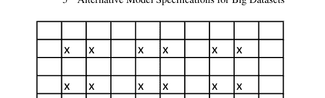

这个定义非常通用，类似于第 5.2.2 节公式 (5.20) 中采用的定义，然而这里我们并不旨在像传统空间计量经济模型和 $MESS$ 近似中那样同时建模所有 $n$ 个扰动的联合随机行为，而仅建模它们的成对关系。注意，$N(i)$ 通常表示位置 $i$ 的邻居集合，并且邻域准则的选择对于该方法并非至关重要。在公式 (5.40) 中，$\Omega = \begin{pmatrix} 1 & \psi \\ \psi & 1 \end{pmatrix}$ 代表相关矩阵，$\psi$ 是控制误差空间相关的参数，使得 $\psi \in [-1; +1]$。符号 $\psi$ 有意在空间误差背景下代替更常用的符号 $\rho$，以强调它们含义上的差异。（表面上看似限制性的）假设邻域中所有单元之间的相关性相同，无论方向如何，源于所有空间计量经济学文献中（隐含地）做出的各向同性假设（参见第 5.3 节）。

在引入用于估计模型 (5.39)–(5.40) 未知参数的复合 $ML$ 程序之前，让我们首先介绍*双变量编码*的定义。这个概念由 Arbia (2012) 引入，扩展了 Besag (1974) 的工作。仅为了说明目的，假设 $n$ 个观测值是在规则方形网格上获得的，并让我们用交叉“x”标记该网格的内部单元，如图 5.3 所示。

特别是，让我们用交叉标记 $n$ 个可用空间观测值中的 $q$ 个子集（$q \in Q$），并让我们也用交叉标记在位置 $i$ 的邻域中随机选择的另外 $q$ 个位置。扰动 $\varepsilon_i$ 和 $\varepsilon_l$（其中 $l \in N(i)$）由于其邻近性而被假定为空间相关的，而对 $\{\varepsilon_i, \varepsilon_l\}$ 和 $\{\varepsilon_j, \varepsilon_k\}$（其中 $k \in N(j)$）被假定为随机独立的，前提是 $j, k \notin N(i, l)$，其中定义 $N(i, l) = \{N(i) \cup N(l)\}$ 为 $i$ 和 $l$ 的联合邻域。上述分类方案定义了一种双变量编码模式。

类似的编码方案可以很容易地在不规则空间方案中引入，并适当定义邻域。此程序的目的相当清楚：通过选择遵循包含两个相邻空间单元准则的观测对，我们能够保留样本中包含的空间信息。然而，通过选择定义上彼此独立的空间单元对，我们避免了第 3 章引入的空间计量经济模型典型的估计问题。独立对的假设，乍一看可能过于严格，必须结合邻域的定义来考虑。确实，我们总是可以定义一个邻域，

## 5 大型数据集的替代模型设定

其方式是使那些不属于邻域的配对足够远，以至于可以视为独立。最后，考虑随机扰动项的配对并非该方法所必需，同样可以考虑三元组及更高阶的组合，选择配对的唯一理论依据是Hammersley-Clifford定理，以及由此对Besag（1974）讨论的模型所施加的成对交互作用限制。

在这些假设下，我们得到双变量编码中包含的任意$q$对扰动项的联合密度为：

$$f_{\varepsilon_i \varepsilon_l}(\varepsilon_i \varepsilon_l) = \frac{1}{2\pi \sigma^2 \sqrt{1 - \psi^2}} \exp \left\{ -\frac{1}{2\sigma^2(1 - \psi^2)} \left[ \varepsilon_i^2 - 2\psi \varepsilon_i \varepsilon_l + \varepsilon_l^2 \right] \right\}$$
$$\text{若 } l \in N(i), \quad i = 1, \dots q \qquad (5.41)$$

然后，可以将复合似然函数推导为公式(5.41)中给出的$q$个双变量密度函数的乘积，并假设它们相互独立。我们可以将这种复合似然函数视为一个合适的似然函数，并基于它进行推断。具体来说，将$q$个公式(5.41)相乘，我们得到：

$$L(\beta, \sigma^2, \psi) = \prod_{i=1}^q f_{\varepsilon_i \varepsilon_l}(\varepsilon_i \varepsilon_l)$$
$$= \prod_{i=1}^q \frac{1}{2\pi \sigma^2 \sqrt{1 - \psi^2}} \exp \left\{ -\frac{1}{2\sigma^2(1 - \psi^2)} \left[ \varepsilon_i^2 - 2\psi \varepsilon_i \varepsilon_l + \varepsilon_l^2 \right] \right\}$$
$$= (2\pi)^{-q}(\sigma^2)^{-q}(1 - \psi^2)^{-\frac{q}{2}}$$
$$\exp \left\{ -\frac{1}{2\sigma^2(1 - \psi^2)} \sum_{i=1}^q \left[ \varepsilon_i^2 - 2\psi \varepsilon_i \varepsilon_l + \varepsilon_l^2 \right] \right\} \qquad (5.42)$$

相应地，对数似然函数等于：

$$l(\beta, \sigma^2, \psi) = const - q \ln(\sigma^2) - \frac{q}{2} \ln(1 - \psi^2) - \frac{1}{2\sigma^2(1 - \psi^2)} \sum_{i=1}^q \left[ \varepsilon_i^2 - 2\psi \varepsilon_i \varepsilon_l + \varepsilon_l^2 \right] \qquad (5.43)$$

现在让我们引入一些新的符号。令 $\alpha_1, \alpha_2, \alpha_3, \alpha_4, \alpha_5$ 和 $\alpha_6$ 为一组定义如下的统计量：

$$\alpha_1 = \sum_{i=1}^q Z_i^2 + \sum_{l=1}^q Z_l^2 = \sum_{j=1}^{2q} Z_j^2$$
$$\alpha_2 = \sum_{i=1}^q y_i^2 + \sum_{l=1}^q y_l^2 = \sum_{j=1}^{2q} y_j^2$$
$$\alpha_3 = \sum_{i=1}^q Z_i y_i + \sum_{l=1}^q Z_l y_l = \sum_{j=1}^{2q} Z_j y_j$$
$$\alpha_4 = \sum_{i=1}^q Z_i y_l + \sum_{l=1}^q Z_l y_i$$
$$\alpha_5 = \sum_{i=1}^q Z_i Z_l$$
$$\alpha_6 = \sum_{i=1}^q y_i y_l \qquad (5.44)$$

请注意，在上述定义中，为方便起见，表达式 $\sum_{i=1}^q Z_i Z_l$ 简略地表示 $\sum_{i=1}^n \sum_{l \in N(i)} Z_i Z_l$，即属于同一对的两个观测值之间乘积的总和（公式(5.44)中的其他表达式类似）。我们将始终采用这种符号简化。Arbia（2012）证明，在模型假设下，公式(5.43)存在最大值，该最大值是唯一的，并且在求解以下非线性方程组得到的点处达到：

$$\left\{\begin{array}{l}\hat{\beta}_{BML} = \frac{\alpha_3 - \hat{\psi}_{BML} \alpha_4}{\alpha_1 - 2\hat{\psi}_{BML} \alpha_5} \ \hat{\sigma}_{BML}^2 = \frac{\sum_{i=1}^q (\varepsilon_i^2 - 2\hat{\psi}_{BML} \varepsilon_i \varepsilon_l + \varepsilon_l^2)}{2q(1 - \hat{\psi}_{BML}^2)} = \frac{\alpha_2 + \hat{\beta}_{BML}^2 \alpha_1 - 2\hat{\beta}_{BML} \alpha_3 - 2\hat{\psi}_{BML} \alpha_6 - 2\hat{\psi}_{BML} \hat{\beta}_{BML}^2 \alpha_5 + 2\hat{\psi}_{BML} \hat{\beta}_{BML} \alpha_4}{2q(1 - \hat{\psi}_{BML}^2)} \ \hat{\psi}_{BML} = \frac{\sum_{i=1}^q \varepsilon_i \varepsilon_l}{q \hat{\sigma}_{BML}^2} = \frac{\alpha_6 - \hat{\beta}_{BML} \alpha_4 + \hat{\beta}_{BML}^2 \alpha_5}{q \hat{\sigma}_{BML}^2}\end{array}\right. \qquad (5.45)$$

Arbia（2012）将这些估计量称为双变量边际最大似然估计量（或BML）。

请注意，如果 $\psi = 0$（回归扰动项成对双变量空间独立的情况），在公式(5.45)中，我们有：

$$\hat{\beta}_{BML} = \frac{\psi \alpha_4 - \alpha_3}{2\psi \alpha_5 - \alpha_1} = \frac{\alpha_3}{\alpha_1} = \frac{\sum_{j=1}^{2q} x_j y_j}{\sum_{j=1}^{2q} x_j^2} = \hat{\beta}_{ML} \qquad (5.48)$$

而在公式(5.46)中，我们有：

$$\hat{\sigma}_{BML}^2 = \frac{1}{2q} \sum_{i=1}^q [\varepsilon_i^2 + \varepsilon_l^2] = \frac{1}{2q} \sum_{j=1}^{2q} \varepsilon_j^2 = \hat{\sigma}_{ML}^2 \qquad (5.49)$$

因此，这些解对应于误差独立情况下 $\beta$ 和 $\sigma^2$ 的常见 *ML* 估计量（见第1章）。同时请注意，公式(5.47)中推导出的估计量 $\hat{\psi}_{BML}$ 对应于扰动项空间相关性的直观估计量。

在引用的论文中，Arbia（2012）证明了 *BML* 估计量服从正态分布，在小样本中无偏且具有一致性。还推导出了精确的Fisher信息矩阵和估计量的精确标准误，用于置信区间估计和假设检验。除了分析和计算上的优势外，*BML* 估计量还提供了一些有趣的解释性优势。事实上，再次考虑公式(5.45)中推导出的回归参数 $\beta$ 的 *BML* 估计量的正式表达式：$\hat{\beta} = \frac{\alpha_3 - \psi\alpha_4}{\alpha_1 - 2\psi\alpha_5}$。该表达式的分子代表 $Z$ 和 $y$ 之间的协方差（项 $\alpha_3$），加上额外的项 $-\psi\alpha_4$，该项代表变量 $Z$ 在一个位置对同一配对中相邻位置变量 $y$ 的空间溢出（项 $\alpha_4$），并以空间相关参数 $\psi$ 加权。类似地，分母代表自变量的方差（项 $\alpha_1$），加上项 $-2\psi\alpha_5$，代表变量 $Z$ 的空间自协方差（项 $\alpha_5$），并以误差项的空间相关性加权。这种解释相当直接。在误差空间正相关（$\psi > 0$）的情况下，如果 $Z$ 和 $y$ 之间的空间溢出与 $Z$ 的空间自协方差符号不同，我们可以监测变量 $Z$ 的变化对变量 $y$ 的乘数效应。具体来说，如果空间溢出（$\alpha_4$）为负且 $Z$ 的空间自协方差（$\alpha_5$）为正，则乘数效应将被放大。*BML* 估计量 $\hat{\beta}$ 的正式表达式还表明，在自变量存在强正空间相关性的情况下，自变量的变化对 $y$ 的影响在两个变量之间存在正溢出时更为显著。这一结果有直观的解释。事实上，一个位置不仅受益于同一位置 $Z$ 的增加，也受益于相邻位置 $Z$ 的增加。类似地，$\beta$ 的 *BML* 估计量的正式表达式（公式(5.45)）也表明，即使两个变量之间没有空间溢出，我们也可以使自变量对因变量产生更高的影响。事实上，当 $\alpha_4 = 0$ 时，如果 $\alpha_5 > 0$，即自变量存在正空间相关性，自变量的变化对 $y$ 的影响将更为显著。

如前所述，鉴于可以正式推导出精确的Fisher信息矩阵，可以将标准的基于似然的假设检验程序应用于这种新设定。然而，该框架还允许基于重抽样思想的另一种标准误评估和假设检验方法。依赖随机变量集的重抽样方法在统计学中有着悠久的传统，可以追溯到Solow（1985）、Künsch（1989）、Arbia（1990）和Sherman（1996）的早期贡献。本节介绍的双变量编码技术基于识别单位对的子样本。然而，在任何给定的经验情境中，双变量编码方案都不是唯一的。即使在图5.3所示的非常简单的例子中，我们实际上也可以产生4种不同的

## 5.5 处理空间回归中大数据的第二个“V”（速度）

在本章引言中我们提到，与近期大数据革命相关的挑战不仅与产生的数据量巨大有关，还与这些数据在许多实证应用中能够获取的时间频率有关。在前面的章节中，我们已经详细记录了文献中为应对使用大型数据集估计空间计量模型所带来的计算问题而引入的一些最新方法进展。相比之下，近期在提出解决与当前某些应用中数据获取的惊人高速度相关问题的方法方面投入的努力较少。事实上，有时数据的收集时间频率如此之高，以至于跟上本书中描述的复杂空间模型的估计节奏变得具有挑战性。在此背景下，递归估计器可以有效解决与计算时间相关的一些问题。

然而，虽然简单统计量（如方差或相关性）可以很容易地以递归方式计算（Felber, 2015），并且在线性回归模型（Seidou & Ouarda, 2007; Wermuth, 1992）和时间序列回归（Escobar & Moser, 1993; Hiriotappa et al., 2017）的情况下已经推导出一些递归表达式，但为获得空间回归模型的类似表达式所做的工作仅限于少数贡献，并且代表着一个有前景的未来研究领域。在最近的一篇论文中，Ghiringhelli等人（2022）针对空间误差回归模型（SEM）的情况解决了这个问题。他们提出了两种递归估计策略。第一种策略假设SEM的空间相关参数在合理的时间间隔内是稳定的，因此可以在程序的第一次估计中进行估计，并在随后的流式步骤中保持固定。第二种策略推导出一个简单的表达式，用于在流式处理的每一步更新空间权重矩阵。基于一组蒙特卡洛模拟的结果，他们得出结论，两种策略在计算工作量方面都产生了显著优势，而不会显著恶化关于模型参数检验的规模和功效的推断结论。

尽管仅限于空间误差模型的情况，Arbia等人（2022）的结果在需要基于空间数据库流及时有效地做出实证决策的实际情况下可能被证明极其有用，例如，在与健康监测或环境紧急情况相关的情况下。

## 5.6 R代码

在处理**MESS规范**时，R库`Matrix`包含函数`expm`，该函数允许计算矩阵的指数（参见公式（5.5））。首先，像往常一样，我们需要使用命令`install.packages("Matrix")`下载包，然后在每个新会话中使用命令`library(Matrix)`调用它。矩阵A的指数可以通过命令执行。

```
> expm(A)
```

其中$A$是一个实正定矩阵。即使矩阵的指数被定义为无限泰勒级数，它也是使用Ward的对角Padé近似（Moler & Van Loan, 2003）来近似的。

R包`spdep`也包含一个使用`MESS`规范估计空间滞后模型的例程。该命令非常简单，与第3.8节中介绍的相应空间滞后模型的命令非常相似。该命令的语法如下：

```
> model1 <- lagmess(formula = y ~ x + y, data = filename, listw = w)
```

其中$W$是一个权重矩阵。

对于**单边近似**，一旦明确指定了似然函数（例如，如公式（5.38）中针对单边空间滞后模型所示），则只需要一个例程来最大化关于参数的似然函数。为此，我们可以使用特定的R库`maxLik`，可以通过首次输入命令`install.packages("maxLik")`安装，然后在每个会话开始时输入命令`library(maxLik)`。

安装库后，我们必须编写一个对数似然函数（例如，称之为`loglik`），作为一组参数（例如$\beta$、$\sigma$、$\lambda$、$\rho$等）的函数。用于似然最大化的R命令是：

```
> mle <- maxLik(logLik = logLikFun, start = c(beta = 0, sigma = 1,
lambda = 0.2, rho = 0.1))
```

其中$\beta = 0$、$\sigma = 1$、$\lambda = 0.2$、$\rho = 0.1$是用于数值搜索最大值的任意初始值，`mle`是模型的约定名称。然后可以通过输入以下命令显示最大化过程的结果：

```
> summary(mle)
```

此外，单边近似的一种可能解释是在定义$W$矩阵时，对于每个单元仅考虑第一个最近邻（参见示例2.1）（参见示例5.3）。在这种情况下，手头有一个shape文件（例如`poly`），我们首先推导质心的坐标（如我们在第2.3.3节中所说明的）：

```
coords <- coordinates(poly)
```

然后我们通过以下命令为每个单元识别第一个最近邻：

```
knn <- knearneigh(coords, k = 1)
```

请注意，该命令可以推广到搜索$k$个邻居。下一步，我们根据邻域定义通过以下命令推导邻域系统：

```
nn <- knn2nb(knn)
```

最后，我们像往常一样通过以下命令推导$W$矩阵：

```
w <- nb2listw(nn)
```

应用通常的空间模型推断命令将导致单边近似，这将在更短的时间内产生输出。

对于**双变量编码方法**估计空间误差模型，不需要特定的例程。要实施该程序，我们只需要一个程序来随机选择不相邻的空间单元对，然后使用此子样本中包含的信息来计算公式（5.45）至（5.47）中报告的估计量的闭式解。

随机选择独立对的一种可能性是使用Arbia和Salvini（2024）中说明的程序，其代码可在以下github上找到：[https://github.com/NiccoloSalvini/efficient-pairwise-likelihood](https://github.com/NiccoloSalvini/efficient-pairwise-likelihood)。

## 引入的关键术语和概念

- 大数据
- 稀疏和稠密权重矩阵
- 计算时间和存储限制
- 矩阵指数变换
- 一阶邻居
- 高阶邻居
- 矩阵幂展开
- 矩阵指数空间规范
- 各向同性和各向异性
- 空间关系的方向偏差
- 非对称空间关系
- 核心-边缘模型
- 各向同性检验
- 各向异性空间滞后模型
- 单边近似
- 单边空间滞后模型
- 前驱-邻居
- 复合似然
- 成对似然
- 伪似然
- 双变量编码技术
- 双变量边际最大似然估计量
- 空间重采样和空间自助法

## 问题

1.  当使用最大似然方法处理非常大的样本量时，会出现什么问题？
2.  为什么在稠密*W*矩阵的情况下问题更严重，相反，在考虑稀疏*W*矩阵时问题不那么严重？
3.  与最大似然估计方法相比，使用空间滞后模型的MESS规范有哪些优势？
4.  阐述非对称概念与各向异性概念之间的区别。

5.  鉴于计算上的优势，与完全最大似然方法相比，使用双变量边际最大似然方法的主要缺陷是什么？

## 练习

**练习 5.1** 再次考虑练习 2.1 中报告的 8 个罗马尼亚 NUTS 2 区域的边界，并推导二阶和三阶 $W$ 矩阵，记为 $W^2$ 和 $W^3$。使用这些矩阵，推导变换 (5.11) $S = e^{\alpha W}$，并在空间相关参数 $\lambda = 0.9502$ 和 $q = 3$ 的情况下，展开近似式 $S \approx \sum_{i=0}^{q} \frac{\alpha^i W^i}{i!}$。

**练习 5.2** 考虑一个各向同性模型的情况，并考虑一个邻域，其中每个空间单元只有一个邻居，且该邻居不是任何其他单元的邻居。在这些条件下，推导在该假设下维度为 $n$ 的样本的 $W$ 矩阵。同时推导矩阵 $(I - \lambda W)$ 及其逆矩阵。回顾单侧空间滞后模型的方差-协方差矩阵 $\Omega$ 的正式表达式，并推导其逆矩阵 $\Omega^{-1}$。

**练习 5.3** 使用示例 3.3 和 3.4 以及练习 3.6 和 4.8 中使用的数据集，并使用行标准化的 $W$ 矩阵，使用 MESS 规范重新估计空间滞后模型。在相同的数据集上，定义一个基于第一最近邻的单侧行标准化 $W$ 矩阵，并再次估计单侧空间滞后模型。比较使用这 3 种方法获得的结果。

**练习 5.4** 考虑一个由 4 个空间单元组成的系统，这些单元排列在一个 2x2 的规则方形网格上，以及一个由以下方程组描述的空间滞后模型：

$$y_1 = a_1 w_{12} y_2 + b_1 w_{13} y_3 + \varepsilon_1$$
$$y_2 = a_2 w_{21} y_1 + b_2 w_{24} y_4 + \varepsilon_2$$
$$y_3 = a_3 w_{31} y_1 + b_3 w_{34} y_4 + \varepsilon_3$$
$$y_4 = a_4 w_{43} y_3 + b_4 w_{42} y_2 + \varepsilon_4$$

推导模型对称的参数条件，以及模型各向同性但不对称的参数条件。在各向同性和对称的情况下，以紧凑的方式写出方程。

**练习 5.5** 正态性假设对于第 5.4.2 节中阐述的双变量边际最大似然估计量 (BML) 并非必要。考虑另一种假设，即误差服从 II 型双变量指数分布。在这种情况下，我们有以下模型：

$$y_i = \beta x_i + \varepsilon_i$$

并且，对于每一对扰动项，例如 $i$ 和 $l$，其中 $l \in N(i)$：

$$f_{\varepsilon_i \varepsilon_l}(\varepsilon_i \varepsilon_l) = e^{-\varepsilon_i - \varepsilon_l} [1 + \alpha(2e^{-\varepsilon_i} - 1)(2e^{-\varepsilon_l} - 1)], \quad i = 1, ..., q. \quad \rho = \frac{\alpha}{4}$$

其中 $\rho$ 是空间误差参数。在这些假设下，推导似然函数以及参数向量 $\beta$ 的 *BML* 估计量的条件。

## 参考文献

Anderson, T. (2003). *多元统计分析导论*. Wiley.
Arbia, G. (1990). 论二维格点过程中的二阶非平稳性. *Computational Statistics and Data Analysis*, 9, 147–160.
Arbia, G. (2006). *空间计量经济学*. 统计基础与区域收敛应用: Springer.
Arbia, G. (2012). 在超大数据集上估计的空间回归的成对似然推断. *Spatial Statistics*, 7, 21–39.
Arbia, G., & Salvini, N. (2024, 即将出版). *不规则格网空间回归的可行成对伪似然推断：KD-TPL 算法*.
Arbia, G., Bee, M., & Espa, G. (2013a). 空间计量模型中的各向同性检验，即将发表于 *Spatial Economic Analysis*, 8, 228–240.
Arbia, G., Petrarca, F., & Skinner, J. (2013b). 大型数据库的空间计量模型估计，*在第 60 届国际区域科学协会北美年会上发表的论文*，亚特兰大，2013 年 11 月 13–16 日.
Arbia, G., Espa, G., & Giuliani, D. (2022) *空间微观计量经济学*. Routledge.
Arbia, G., Mira, A. and Ghirighelli, C. (2019). 大型数据集的空间计量线性模型估计：空间大数据能有多大？ *Regional Science and Urban Economics*, 76, C, 67–73.
Bell, K. P., & Bockstael, N. E. (2000). 将广义矩估计方法应用于涉及微观数据的空间问题. *Review of Economics and Statistics* 82, 72–82.
Besag, J. (1974). 空间交互与格点系统的统计分析（附讨论）. *Journal of the Royal Statistical Society B*, 36, 192–236.
Chiu, Y. M., Leonard, T., & Tsui, K. (1996). 矩阵对数协方差模型. *Journal of The American Statistical Association*, 91, 198–210.
Cressie, N. (1993). *空间数据统计*. New York: Wiley.
Davis, R. A., & Yau, C. Y. (2009). 关于时间序列中成对似然的评论. *Statistica Sinica*, 21, 255–277.
Escobar, L. A., & Moser, E. B. (1993). 关于回归估计更新的注记. *The American Statistician*, 47(3), 192–194.
Felber, D. (2015). 数据流中的顺序统计量与变异性. *硕士论文*, UCLA Electronic. Theses and Dissertations.
Ghirighelli, C., Piras, G., Arbia, G., & Mira, A. (2022). 空间误差模型的递归估计. *Geographical Analysis* 0, 1–17.
Granger, C. W. J. (1974). 空间数据与时间序列分析. In A. Scott (Ed.), *区域科学研究*. Pion.
Griffith, D. A. (2000). 空间分析中所用选定关联矩阵的特征函数性质与近似. *Linear algebra and its applications*, 321, 95–112.
Griffith, D. A. (2004). 空间分析中所用平面图邻接矩阵的极端特征函数. *Linear algebra and its applications*, 388, 201–219.
Heine, J., & Mahorta, T. (2002). 乳腺X线组织、乳腺癌风险、连续图像分析与数字乳腺X线摄影：组织及相关风险因素. *Acad. Radiol.*, 9, 298–316.
Hiriotappa, K., Thajchayapong, S., Chaovalit, P., & Pongnumkul, S. (2017). 用于在线估计时间和空间延误范围的流算法. *Journal of Advanced Transportation*, 4018409.
Holly, S., Pesaran, M. H., & Takashi, Y. (2010). 美国房价的时空模型. *Journal of Econometrics*, *158*(1), 160.
Kelejian, H., & Prucha, I. (1998). 用于估计具有自回归扰动的空间自回归模型的广义空间两阶段最小二乘程序. *Journal of Real Estate Finance and Economics*, *17*, 99–121.
Künsch, H. (1989). 一般平稳观测的刀切法与自助法. *The Annals of Statistics*, *17*, 1217–1241.
Laney, D. (2001). 3-D 管理：控制数量、速度和多样性，*META Group inc. 的应用交付策略*.
Lesage, J., & Pace, K. (2007). 矩阵指数空间设定. *Journal of Econometrics*, *140*(1), 190–214.
LeSage, J., & Pace, K. (2009). *空间计量经济学导论*, Wiley.
Lindsay, B. G. (1988). 复合似然方法. *Contemporary Mathematics*, *80*, 221–239.
Moler, C., & Van Loan, C. (2003). 计算矩阵指数的十九种可疑方法，二十五年后. *SIAM Review*, *45*(1), 3–49.
Ord, J. K. (1975). 空间交互的估计方法. *Journal of the American Statistical Association*, *70*, 120–126.
Pace, K., & Lesage, J. (2004). 空间权重矩阵对数行列式的切比雪夫近似. *Computational Statistics and Data Analysis*, *45*, 179–196.
Pace, L., & Salvan, A. (1997) *统计推断原理*, World Scientific.
Paelinck, J. H. P., & Nijkamp, P. (1975). *区域分析中的运筹理论与方法*, Lexington books.
Paelinck, J. H. P., & Klaassen, L. H. (1979). *空间计量经济学*, Gower.
Schabenberger, O., & Gotway, C. A. (2002). *空间数据分析的统计方法*. Chapman and Hall/CRC.
Schabenberger, O., & Gotway, C. A. (2017). *空间数据分析的统计方法*. Chapman and Hall/CRC.
Seidou, O., & Ouarda, T. B. M. J. (2007). 基于递归的多重线性回归中的多重变点检测及其在河流流量中的应用. *Water Resources Research*, *43*(7).
Sherman, M. (1996). 从空间格点数据计算的统计量的方差估计. *Journal of the Royal Statistical Society, Series B*, *58*, 509–523.
Smirnov, O., & Anselin, L. (2001). 超大型空间自回归模型的快速最大似然估计：一种特征多项式方法. *Computational Statistics and Data Analysis*, *35*, 301–319.
Solow, A. (1985). 相关数据的自助法. *Journal of the International Association for Mathematical Geology*, *17*, 769–775.
Varin, C., & Vidoni, P. (2009). 一般状态空间模型的成对似然推断. *Econometric reviews*, *28*(1–3), 170–185.
Varin, C. (2008). 论复合边际似然. *Advances Statistical Anal.*, *92*, 1–28.
Varin, C., Reid, N., & Firth, D. (2011). 复合似然方法概述. *Statistica Sinica*, *21*, 5–42.
Wang, H., Iglesias, E. M., & Wooldridge, J. M. (2013). 空间 Probit 模型的部分最大似然估计. *Journal of Econometrics*, *172*, 77–89.
Wermuth, N. (1992). 论块递归线性回归方程. *Brazilian Journal of Probability and Statistics*, *6*(1), 1–32.

# 第六章
结论：下一步是什么？

正如前言所述，我们构思本文并非作为一本全面的教科书，而是作为非专业计量经济学教科书文献与更高级的空间计量经济学教科书之间的桥梁。因此，我们设想的典型读者是那些已经学习过通用计量经济学教科书（例如，Greene, 2018），并投入了一些时间研究本专著，现在正热切期待一些关于下一步方向的指导。在这方面，我们可以建议不同的（尽管不一定互斥的）方向。

类似于时间序列计量经济学中随机过程理论（Hamilton, 1994）的情况，本书所处理的空间计量经济学模型的基础是随机场的概念。如果读者想更深入地了解这里所处理模型的统计推断基础和概率根源，可以参考 Arbia (2006)，该书详尽地阐述了构成 SARAR 范式基础的随机场模型，以及许多在空间计量经济学中潜在非常有用但目前文献中尚未充分考虑的其他随机场。一个例子是基于条件概率分布而非边际概率分布的空间滞后和空间误差模型的替代规范。这种方法最初由 Besag (1974) 提出，最近在空间计量经济学文献中被 Sain 和 Cressie (2007) 以及 Ippoliti 等人 (2014) 所考虑。更深入到其统计基础的根源，空间计量经济学模型建立在空间统计方法之上。关于这个主题的良好介绍可以在 Ripley (1981)、Cressie (1993)、Gaetan 和 Guyon (2009) 以及 Cressie 和 Wikle (2011) 中找到。在这方面，在空间统计学中，通常区分针对在点、线和区域上观察到的数据设计的方法。点数据方法旨在研究个体在平面上分布的观察规律性；线数据方法旨在解释沿网络观察到的个体之间的空间相互作用（如地理空间中的商品、人员和信息流）；最后，区域数据方法指的是在空间部分（通常是国家或地区）内作为聚合体观察到的数据。在本书中，我们选择集中处理区域数据，而忽略其他两种类型的空间数据。读者在查阅本书后，如果对这些主题有深入了解的兴趣，可以参考现有的（在计量经济学中仍然分散的）关于所谓*点模式分析*的文献（例如，参见 Marcon 和 Puech, 2003; Duranton & Overman, 2005 以及 Arbia 等人, 2008, 2010, 2012a, 2012b, 2021 等论文）及其在空间计量经济学中的应用（Arbia 等人的著作, 2022），以及像 LeSage 和 Pace (2009) 和 Patuelli 与 Arbia (2014) 这样关于*空间相互作用模型*的书籍。

尽管本教科书涵盖了相当一部分空间计量经济学模型，但仍有一些主题被有意省略，以使讨论仅限于基本内容并尽可能简单。如果读者希望扩大可用的建模选择范围，可以参考 Anselin (1988) 的著作，尽管有些过时，但它仍然是该主题宝贵的参考来源。读者将在其中找到关于诸如空间异质性分析、稳健估计方法、看似无关的空间回归、空间背景下的预检验和自举法、非嵌套检验、空间扩展方法、边缘效应等主题的参考文献。空间计量经济学中另一个有趣的新兴主题，即分位数回归模型，在本上下文中被省略，读者可以参考 Koenker (2005) 的综合著作以获取必要的背景知识，并参考例如 McMillen (2013) 和 Arbia 与 Semerikova (即将出版) 的空间应用。

如果兴趣主要在实践方面，读者将需要对处理空间数据和空间关系的可用软件有更深入的了解和实践。正如前言中所阐明的，尽管本教科书提供了一系列关于 R、STATA 和 Python 的计算机教程和实践练习，但它当然不能被视为关于在空间计量经济学中使用这些工具的综合课程。关于 R 的一个宝贵参考来源是 Bivand 等人 (2008) 的教科书。

关于 STATA 的参考，请参阅 StataCorp (2023) 以及网站 http://www.stata.com/ 上的更新，以及像 Drukker 等人 (2013a, 2013b, 2013c) 的论文。关于 Python 在空间分析中的使用，由 Luc Anselin 及其同事开发的软件 GeoDA 和 PySAL（参见 Anselin & Rey, 2014 和 Rey & Anselin, 2007）包含了空间分析和空间计量经济学中最广泛的程序库之一（参见 https://geodacenter.github.io/GeoDaSpace/resources.html）。另请注意，对于空间模型的贝叶斯推断，一个有用的参考是 INLA 软件（Blangiardo & Cameletti, 2015; Gomez-Rubio, 2020）。

如果我们的读者的目标是从理论和应用的角度对该领域正在进行的尖端研究有一个良好的了解，可以参考 Arbia (2012) 的论文（他调查了 2007-2011 年间发表的 230 篇论文）以及近年来各种科学期刊上发表的一系列关于该主题的特刊，例如发表在 *Journal of Econometrics*（参见 Baltagi 等人, 2007）、*Empirical Economics*（参见 Arbia & Baltagi, 2008）、*Papers in Regional Science*（参见 Arbia & Fingleton, 2008）、*Regional Science and Urban Economics*（参见 Arbia & Kelejian, 2010）、*Journal of Regional Science*（Patridge 等人, 2012）、*Economic Modelling*（参见 Arbia 等人, 2012a, 2012b）、*Spatial Economic Analysis*（参见 Arbia & Prucha, 2013; Le Gallo & Chasco, 2015; Piacentino 等人, 2021）、*Geographical Analysis*（参见 Arbia & Thomas, 2014）、*Econometrics*（Arbia & Lee, 2016）、*Regional Science and Urban economics*（Zhenlin, 2019）、*Journal of Geographical Systems*（Antonakakis, 2020）上的特刊，以及自 2020 年以来出版的 *Journal of Spatial Econometrics*（https://www.springer.com/journal/43071）。

为了跟上与空间计量经济学相关的当前进展和活动，读者还可以参考空间计量经济学协会（Spatial Econometrics Association）的网站（https://www.spatialeconometricsassociation.org/），这是一个自 2006 年成立以来并在未来继续在该领域非常活跃工作的科学协会。

最后，如果读者能好心读完本书并足够喜欢它，也许在未来他们可以参考本书可能的第三版。

## 参考文献

- Anselin, L. (1988). *空间计量经济学：方法与模型*。Kluwer academic publisher.
- Anselin, L., & Rey, S. (2014). *现代空间计量经济学实践：GeoDa 指南*。Geoda Press LLC.
- Antonakakis, N. (2020). 空间计量经济学最新进展特刊。*Journal of Geographical Systems*, 1.
- Arbia, G. (2006). *空间计量经济学：统计基础与区域收敛应用*。Springer Verlag.
- Arbia, G. (2012). SEA 的五年：空间计量经济学协会成立后的研究趋势（2007–2011）。*Spatial Economic Analysis*, 6(4), 377–396.
- Arbia, G., & Baltagi, B. (2008). 空间计量经济学特刊导言。*Empirical Economics*, 34, 1–4.
- Arbia, G., & Fingleton, B. (2008). 区域科学中的新空间计量技术与应用。*Papers in Regional Sciences*, 87(3), 311–317.
- Arbia, G., & Kelejian, H. (2010). 空间计量经济学的进展。*Regional Science and Urban Economics*, 40(5), 253–254.
- Arbia, G., & Lee, L.-F. (2016). 空间计量经济学特刊。*Econometrics*, 4, 1.
- Arbia, G., & Prucha, I. (2013) 空间计量经济学特刊。*Spatial Economic Analysis*, 8(3), 228–240.
- Arbia, G., & Semerikova, E. (即将出版) 估计空间误差分位数回归模型的两步程序。
- Arbia, G., & Thomas, C. (2014). 导言：截面和面板数据空间计量建模的进展。*Geographical Analysis*, 42, 2.
- Arbia, G., Espa, G., & Giuliani, D. (2013). 条件与无条件产业集聚：在分析意大利米兰 ICT 企业分布时解开空间依赖性和空间异质性。*Journal of Geographical Systems*, 15, 31–50.
- Arbia, G., Espa, G., & Giuliani, D. (2014). 加权 Ripley 的 K 函数以考虑空间集中分析中的企业维度。*International Regional Science Review*, 37, 3. https://doi.org/10.1177/0160017612461357
- Arbia, G., Espa, G., & Giuliani, D. (2022). *空间微观计量经济学*。Routledge.
- Arbia, G., Espa, G., & Quah, D. (2008). 一类用于空间中企业集群实证分析的空间计量方法。*Empirical Economics*, 34(1), 81–103.
- Arbia, G., Espa, G., Giuliani, D., & Mazzitelli, A. (2010). 检测企业时空集群的存在。*Regional Science and Urban Economics*, 40(5), 311–323.

# 索引

A
调整后的 R², 6, 20, 22, 26
聚合矩阵, 186
赤池信息准则 (AIC), 6, 26
各向异性空间滞后模型, 206, 221
各向异性, 204, 205, 208, 209, 221
近似解, 195
非空间
- logit 模型, 123, 124, 133, 174
- probit 模型, 123, 128, 130, 136, 174, 175
非对称空间关系, 221
非对称性, 204, 205, 221
渐近
- 有效性, 88
- 正态性, 4, 126, 133, 138, 166, 171
- 无偏性, 4
自相关, 11, 12, 14, 27, 31, 32, 36, 39–41, 49, 56, 59, 61, 82, 92–95, 102, 106, 116, 121, 129, 158, 159, 179
平均直接效应 (ADI), 99, 100
平均总效应 (ATI), 99
平均总来自效应 (ATIF), 99
平均总去向效应 (ATIT), 99

地理加权回归 (GWR) 方法, 155, 156
信息准则 (BIC), 6, 26
贝叶斯方法, ix, 137, 159, 162, 165, 201
贝叶斯推断, 161, 226
贝叶斯空间模型, 111, 161
最佳可行广义空间两阶段最小二乘估计量, 106
最佳线性无偏估计量 (BLUE), 2, 26
大数据, 193, 218, 221
二元模型, 127, 184
双平方核, 157, 172, 184
双变量
- 编码技术, 195, 217, 221
- 边际最大似然估计量, 195, 216, 221
自助法, 218, 221, 226
乳腺癌风险, 204
Breusch–Pagan 同方差检验, 21, 26, 27

B
带宽, 157–160, 172, 181, 182, 184, 187
Barro 和 Sala-i-Martin 模型, 8, 14, 153, 207
Bartlett-三角核, 117, 172
贝叶斯
- 方法, ix, 137, 159, 162, 165, 201

C
校准, 158, 185
删失, 138
卡方分布, 5, 168
闭式解, 195, 198, 199, 221
Cobb–Douglas 生产函数, 9, 10
Cochrane–Orcutt 变换, 89, 106, 107, 149–151
决定系数 (R²), 6, 9, 12, 26
完全空间随机模式, 167
复合似然, 213, 215, 221

计算问题, xii, 69, 159, 193, 195
计算时间, 136, 194, 195, 198, 203, 213, 218, 221
条件概率分布, 210, 225
共轭分布, 164
连接矩阵, 32
一致性, 弱, 2
消费者选择模型, 122
核心-边缘模型, 205, 221
相关矩阵, 11–13, 73, 214
余弦核, 118
计数数据, vii, 122, 138
横截面数据, 140, 180
交叉验证, 158–160, 181, 182, 185, 187
众包数据, 166

D
数据
- 犯罪, 哥伦布, 49, 50, 54
- 经济, 27, 194
- 教育成就, 佐治亚, 159
- 房价, 波士顿, 79, 84, 91, 109
- 豪宅, 巴尔的摩, 126, 138
- 生产函数, Munnel 的, 50, 141, 152
- 公共资本生产率, 141, 152
- 区域收敛, 意大利, 8, 14
- 二手车价格, 美国, 73
稠密权重矩阵, 221
犯罪决定因素, 118, 164
诊断检查, 106
二分变量, 123, 184
方向偏差, 204, 205, 207–209, 221
离散选择
- 模型, xii, 122, 138, 159, 184
- 地理加权回归中的模型, 181, 182
空间相关性的距离衰减, 169
分布
- 卡方, 5, 167, 168
- F-Fisher, 5
- 逻辑, 124, 125
- 正态, 96, 123, 129, 132
- t-Student, 5
持续时间模型, 138
Durbin–Watson 检验, 12, 27, 56, 57

E
边缘效应, 226
有效性, 2, 4, 26, 88, 91, 129, 136, 141, 159, 169, 207
EM 算法, 130, 184
内生性, 15, 67, 68, 76–79, 87, 89, 90, 113, 114, 127, 129, 170, 171
内生权重矩阵, 170
内生加权矩阵, 166
Epanechnikov (二次) 核, 117, 172, 186
估计方法
- 最佳可行广义空间两阶段最小二乘 (BFGS2SLS), 91
- 最佳线性无偏估计量 (BLUE), 2, 26
- 可行广义最小二乘 (FGLS), 68, 70
- 广义最小二乘 (GLS), 13, 14, 16, 27, 31, 67, 70, 141, 149
- 广义矩方法 (GMM), 113, 129, 133, 145, 175, 181
- 广义空间两阶段最小二乘 (GS2SLS), 89–91
- 工具变量 (IV), 16, 171
- 线性化 GMM, 129, 133, 139, 175, 184
- 最大似然 (ML), xii, 3, 7, 13, 26, 68, 77, 87, 88, 101, 105, 129, 130, 145, 179, 194
- 矩方法 (MM), 4, 17, 26
- 普通最小二乘 (OLS), 2, 26, 141
- 伪最大似然, 69, 157, 213, 221
- 似不相关, 226
- 两阶段最小二乘 (2SLS), 16, 27, 77, 101, 105
- 组内, 141, 151
欧几里得距离, 168
外生性, 2, 16, 27, 78

F
可行 GS2SLS, 91, 183
一阶邻居, 52, 196, 221
Fisher 信息矩阵, 4, 7, 26
固定效应, 141, 144, 145, 151, 153, 176–180, 184
频率学派方法, 144

G
高斯
- 分布, 8, 118, 157, 167, 213
- 核, 181, 182, 184, 187
广义
- 最小二乘 (或 Aitken) 估计准则 (GLS), 13, 27
- 矩估计, 4, 17, 26, 106, 131
- probit 和 logit 扰动项, 184
- 空间两阶段最小二乘估计, 96, 103
地理信息系统 (GIS), 45
地理加权回归, 155, 156, 184, 187
地质学, 204
地理参考经济数据, 194
Gerschgorin 定理, 62
Gibbs 抽样器, 136, 169
梯度项, 134, 135, 184

H
HAC 估计量, 116, 183
健康规划, 201, 211
异方差性, vii, 14, 19, 21, 27, 112–114, 116, 121, 127–129, 131, 157, 159, 173, 179
高阶邻居, 196, 221
高分辨率医学图像, 194
同质性, 11, 160
房价, 64, 65, 79, 82, 84, 91, 109, 199, 205
人类基因组, 194

I
幂等矩阵, 16
特异性误差项, 141, 143, 148, 149, 152, 185
效应度量
- ADI, 99
- ATI, 99, 100
- ATIF, 99
- ATIT, 99
- Logit 和 Probit 模型中的, 123, 124, 127
指数函数, 123, 184
个体误差项, 141, 143, 149
信息矩阵, 4, 7, 26, 94, 126, 217
工具变量, 16, 171
工具, 16, 27, 68, 78, 79, 90, 96, 113–116, 132, 134, 172, 173
反距离函数, 166, 167
逆非中心卡方分布, 168
逆 Gamma 分布, 163
各向同性检验, 204, 221
迭代过程, 130, 148, 164
迭代搜索, 158, 159, 175, 183

J
Jarque–Bera 检验, 7, 21, 22, 26, 27, 83

K
核函数
- Bartlett-三角, 117, 172
- 双平方, 157, 172, 184
- 余弦, 118
- Epanechnikov (二次), 117, 172, 186
- 估计, 117
- 高斯, 181, 182, 187
- Parzen, 118
- 二次 (双权重), 117, 172, 186
- 二次谱, 118, 172
- 二次 (三权重), 118
- 三立方, 158, 184
- Tukey–Hanning, 118, 172
- 均匀, 117, 173
KKP 模型, 143–145, 184
Kronecker 积, 143, 184
峰度, 8

L
滞后自变量模型, 62, 106, 108
拉格朗日乘数 (LM) 检验程序, 7, 27, 36, 93, 94, 106, 126
土地覆盖评估, 194
大样本, 4, 70, 88, 89, 91, 96, 122, 155, 159, 194, 195, 218
潜回归, 123, 184, 186
潜 SLM Tobit 模型, 137
潜变量, 123, 130, 131, 138, 184
格点网格, 31, 32, 41, 54, 58, 205, 206, 214, 222
最小二乘法, 131, 141
Lee 工具变量估计量, 106
似然因子分解, 209
似然函数, 6, 13, 63, 68, 69, 94, 109, 124, 128, 130, 132, 137, 144, 147, 161, 162, 186, 193, 198, 206, 223
似然比检验, 6, 26, 64, 75, 82, 126, 207
线性化 GMM 估计量, 129, 133, 138, 174
线数据, 225
局部加权回归, 155, 184

Arbia, G., Lopez-Bazo, E., & Moscone, F. (2012a). 空间计量经济学建模前沿. *Economic Modelling*, 29, 1.

Arbia, G., Espa, G., Giuliani, D., & Mazzitelli, A. (2012b). 非均匀空间上的企业集群：以2001年米兰高科技产业为例. *Economic Modelling*, 29(1), 3–11.

Arbia, G., Piras, G., & Prucha, I. (2015). 空间计量经济学特刊：编者按. *The Review of Regional Studies*, 44, 3.

Baltagi, B., Lejejian, H., & Prucha, I. (2007). 空间依赖数据分析. *Journal of Econometrics*, 140(1), 1–4.

Besag, J. (1974). 空间交互与格点系统的统计分析. *Journal of the Royal Statistical Society, Series B*, 36, 192–236.

Bivand, R., Pedesma, J., & Gómez-Rubio, V. (2008). *使用 R 进行空间数据分析*. Springer-Verlag.

Blangiardo, M., & Cameletti, M. (2015). *使用 R-INLA 的空间和时空贝叶斯模型*. Wiley.

Cressie, N. (1993). *空间数据统计学*, 1991年（原版）修订版. Wiley.

Cressie, N., & Wikle, C. (2011). *时空数据统计学*. Wiley.

Drukker, D. M., Prucha, I., & Raciborski, R. (2013a). 具有空间自回归扰动的空间自回归模型的最大似然和广义空间两阶段最小二乘估计量. *Stata Journal*, 13, 2.

Drukker, D. M., Peng, H., Prucha, I., & Raciborski, R. (2013b). 使用 spmat 命令创建和管理空间加权矩阵. *Stata Journal*, 13, 2.

Drukker, D. M., Prucha, I., & Raciborski, R. (2013c). 一个用于估计具有空间自回归扰动和额外内生变量的空间自回归模型的命令. *Stata Journal*, 13, 2.

Duranton, G., & Overman, H. G. (2005). 使用微观地理数据检验局部化. *Review of Economic Studies*, 72(4), 1077–1106.

Gaetan, C., & Guyon, X. (2009). *空间统计与建模*. Springer-verlag.

Gomez-Rubio, V. (2020). *使用 INLA 进行贝叶斯推断*. CRC Press.

Greene, W. (2018). *计量经济分析* (第8版). Pearson education.

Hamilton, J. D. (1994). *时间序列分析*. Princeton.

Ippoliti, L., Romagnoli, L., & Arbia, G. (2014). 一种基于高斯马尔可夫随机场的收敛分析方法. *Spatial Statistics*, 6, 78–90.

LeGallo, J., & Chasco, C. (2015). Jean Paelinck 研究中的空间计量经济学原理与挑战. *Spatial Economic Analysis*, 10(3), 263–269.

LeSage, J., & Pace, K. (2009). *空间计量经济学导论*. Chapman & Hall/CRC Press.

Marcon, E., & Puech, F. (2003). 使用基于距离的方法评估产业地理集中度. *Journal of Economic Geography*, 3(4), 409–428.

Marcon, E., & Puech, F. (2010). 产业地理集中度的度量：改进基于距离的方法. *Journal of Economic Geography*, 10(5), 745–762.

McMillen, D. (2013). *空间数据的分位数回归*. Springer-Verlag.

Partridge, M. D., Boarnet, M., Brakman, S., & Ottaviano, G. (2012). 引言：空间计量经济学何去何从？ *Journal of Regional Science*, 52(2), 167–171.

© 编者（如适用）和作者，根据 Springer Nature Switzerland AG 2024 的独家许可
G. Arbia, *空间计量经济学入门*, Palgrave 计量经济学丛书, https://doi.org/10.1007/978-3-031-57182-4

logistic distribution, 123–125
long panels, 140, 184
spatial lag with fixed effects, 154, 184
spatial lag with random effects, 147, 152, 184
spatial logit, 127
spatially lagged independent variable, 106, 108
spatial probit, 127, 128, 138, 174, 175
unilateral spatial lag, 209, 210, 221, 222

## M

marginal effects, 129, 156, 184

matrix
- exponential spatial specification, 195, 199, 221
- exponential transformation, 201, 221
- power expansion, 198, 199, 221

Maximum a Posteriori, 161

maximum distance neighborhood criterion, 33, 56, 157

### Maximum likelihood
- estimation method, xii, 3, 7, 13, 26, 68, 77, 87, 88, 101, 105, 129, 130, 145, 194
- solution for SARAR model parameters estimation, 62, 86, 102, 105
- solution for Spatial Error model parameters estimation, 67, 101, 103, 105, 106, 146, 179
- solution for Spatial Lag model parameters estimation, 31, 76, 101, 105, 106, 146

medical images, xii, 194

meteorology, 204

method of moments estimation method, 4, 17

Metropolis–Hastings (MH) algorithm, 164

misspecification, 112, 155

### models
- anisotropic spatial lag, 206, 221
- geographically weighted regression (GWR), 155, 156, 184, 187
- KKP, 143–145, 149, 184
- locally weighted regression, 155, 184
- logit, 124, 125
- panel, 145, 147, 149, 178
- probit, 123, 124, 126, 127
- pure spatial autoregression, 62, 106
- SARAR, 62, 86, 87, 102–105, 108, 112
- SARAR with heteroscedastic disturbance, 112
- spatial error model (SEM), 62, 67, 105, 165
- spatial error with fixed effects, 144, 145, 151, 184
- spatial error with random effects, 141, 143, 147, 149, 150, 184
- spatial HAC, 116, 117, 172, 173
- spatial lag model (SLM), 62, 76, 106

Monte Carlo Markov Chain (MCMC), 102, 136, 162, 164

### Moran’s I
- modified test, 95, 106
- moments of, 56
- scatterplot, 58
- test for residual spatial autocorrelation, 39, 40, 82, 92, 102

moving windows, 155, 184

### multivariate
- normal distribution, 129
- probit, 127, 138

## N

near-epoch dependence hypothesis, 171

nearest neighbor, criterion, 33, 47, 211

### neighborhood criteria
- higher-order, 196, 201, 221
- maximum distance, 33, 56, 157
- queen’s case, 56
- rook’s case, 56, 58, 206

non-linear models, ix, 136

non-nested test, 226

non-parametric estimation, 121

non-stationary spatial relationships, 155, 184

normal distribution, 96, 129, 132

Normal Inverse-Gamma distribution, 163

nuisance parameters, 113, 184, 185

## O

Okun’s Law, 37, 98, 100

Ord’s decomposition, 69, 106, 107

## P

parameter of interest, 113
parameter space, 109
Partzen kernel, 118
Phillips curve, 40, 97
point data, 169, 225
point pattern analysis, 226
pooled time-series, 140, 184
posterior distribution, 161–164
power series expansion, 196
predecessors-neighbors, 210, 221
preferred direction, 204, 206, 209, 210
pre-testing, 226
price index, 63, 64
prior distribution, 161, 162, 183

### properties of estimators
- asymptotic
    - consistency, 133, 138, 159, 166, 171
    - efficiency, 26, 159
    - normality, 4, 26, 126, 133, 138, 166, 171
    - unbiasedness, 4, 26
- small sample
    - efficiency, 129, 141
    - unbiasedness, 11

pseudo-likelihood, 69, 157, 213
pure spatial autoregression, 62, 106

## Q

### quadratic kernel
- bi-weight, 117, 172, 186
- spectral, 118, 172
- tri-weight, 118

quasi-maximum likelihood estimation (QMLE), 171
queen’s case neighborhood, 56

## R

R² (coefficient of determination), 6, 9, 12, 26

### random
- effects, 141–145, 147, 148, 150, 151, 177–180, 184, 187
- fields, 225

Rao score test (Lagrange multiplier), 7, 27, 106
reduced form of a model, 98, 99, 128, 130, 131, 133
regional convergence, 8, 14, 153, 207
relevant instruments, 27, 79
resampling, 217, 218, 221

### robust
- estimation, 145, 226
- Lagrange multiplier test, 7, 36, 93, 94, 106

rook’s case, 56, 58, 206

## S

### sample
- analogue, 132, 169
- large, 4, 70, 88, 89, 91, 96, 122, 155, 159, 194, 195, 211, 218
- moment, 115, 116, 133, 150
- selection, vii, 138

scan statistics, 155, 184
Schwartz information criterion, 6, 26
score function, 7, 26, 94, 124, 125
seemingly unrelated regression, 226
simple random sampling criterion, 167
simultaneous SLM Tobit model, 137
skewness, 8

### social
- distances, 33
- networks, 137, 170, 198

### software
- GeoDA, xii, 226
- Matlab, xii
- PySAL, 22, 23, 25, 56, 173, 179, 181, 182, 226
- R, xii, 19, 23, 41, 51, 183
- SPSS, xii, 31
- STATA, x, xii, 21, 23, 51, 103, 226

sparse weight matrices, 47, 194, 221

### spatial
- autocorrelation, 31, 32, 36, 39, 41, 49, 56, 59, 61, 93, 94, 106, 158
- bootstrap, 218, 221, 226
- econometric models. *See* models
- expansion methods, 226
- HAC procedures, 183
- interaction models, 226
- lag, 36, 53, 56, 64, 76, 87, 93, 94, 101, 105, 106, 177
- lag operator, 34
- quantile regression, 226
- resampling, 221
- statistics, 31
- weight matrix, 31, 41, 143, 170, 201, 219

spatial Durbin model, ix, 62, 83, 101–103, 106, 164, 165, 183
spatially lagged variable, 35, 42, 48, 54, 56–58, 61, 68, 204
spatial microeconometrics, 166, 194
spatial Tobit model, ix, 136, 175
spherical disturbances, 2
spillover, 64, 66, 100, 144, 217
stable dynamics spatial panels, 184

### standardized
- logistic distribution, 123, 184
- normal distribution, 96, 123
- weight matrix, 37, 56, 57

Stochastic Weighting Matrices, 166
Stochastic weight matrices, 166
storage limitations, 221
strictly exogenous spatial weight matrix, 166, 170
structural form of a model, 127, 184
subsample, 155, 157, 217, 218, 221
sum of squares, 6
systems of non-linear equations, 216

## T

Taylor series, 6, 219

### tests
- Breusch–Pagan, 21, 26, 27
- chi square, 5, 167
- Durbin–Watson, 12, 27, 56, 57
- Jarque–Bera, 7, 21, 22, 26, 27, 83
- likelihood ratio, 6, 26, 64, 75, 82, 126, 207
- modified Moran, 95, 96, 102, 106
- Moran, 81, 85, 94, 95, 97, 103
- of isotropy, 204, 207, 221
- Rao, 7, 27, 106
- Wald, 7, 9, 26, 75, 82, 121, 126

time-demeaning, 144, 145, 147, 149, 184
time series models, 83
Tobler's first law of geography, 169
triangular distribution, 167
tri-cube kernel, 158, 184
truncation, 52, 138, 198, 199
T test, 9, 39, 64, 82, 126
Tukey–Hanning kernel, 118, 172
two-stage instrumental variables (2SIV) approach, 171
two-stage least square (2SLS), 16, 27, 77, 83, 101, 105

## U

unbiasedness, 4, 11, 26
uniform distribution, 167
uniform kernel, 117, 173, 186
unilateral approximation, 195, 204, 209, 211, 213, 220, 221
unilateral spatial lag model, 209, 210, 220, 222
unobserved heterogeneity, 84, 140, 141, 184
unobserved variable, 123
unstable dynamics spatial panels, 184

## V

variance-covariance matrix, 11–13, 31, 68, 70, 73, 109, 112, 114–117, 121, 127–131, 133, 143, 144, 148, 150, 151, 172, 173, 196, 197, 200, 222

## W

Wald test, 7, 9, 26, 75, 82, 121, 126
weak consistency, 2
webscraped data, 166

### weight
- matrix. *See* spatial weight matrix
- standardized. *See* standardized weights

White test for homoscedasticity, 12, 22
within estimator, 141
within residuals, 151, 184

## Z

Zellner–Revankar production, 9, 10, 17