# PYTHON 系列

## PYTHON 简明入门

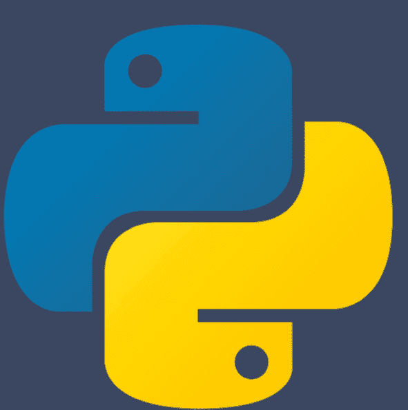

### 斯蒂芬·林奇

CRC 出版社
泰勒-弗朗西斯集团
查普曼与霍尔图书

### Python 简明入门

*《Python 简明入门》* 面向大学预科学生和编程完全新手。全书使用 Jupyter 笔记本创建。在将 Python 介绍为强大的计算器之后，本书涵盖了简单的编程结构，并介绍了 NumPy、MatPlotLib 和 SymPy 模块（库）。随后，本书展示了如何将 Python 用于数学、密码学、人工智能、数据科学和面向对象编程。读者将学习如何使用集成开发环境进行编程：Python IDLE、Spyder、Jupyter 笔记本，以及通过 Google Colab 进行云计算。

**特点：**

-   无需任何编程经验。
-   演示如何将 Jupyter 笔记本格式化以发布到网络。
-   练习的完整解答可作为 Jupyter 笔记本在网络上获取。
-   所有 Jupyter 笔记本解答文件均可通过 GitHub 下载。

数据文件和 Jupyter 解答笔记本的 GitHub 仓库：
https://github.com/proflynch/A-Simple-Introduction-to-Python

Jupyter 解答笔记本网页：
https://drstephenlynch.github.io/webpages/A-Simple-Introduction-to-Python-Solutions.html

2022 年，**斯蒂芬·林奇** 被授予国家教学研究员称号，该称号旨在表彰和认可在高等教育中对学生成果和教学产生杰出影响的个人。他因其在 STEM 学科编程教学、研究成果融入教学以及扩大参与度（利用体验式和基于对象的学习）方面的工作而获奖。尽管接受的是纯数学家教育，但斯蒂芬的许多兴趣现在包括应用数学、细胞生物学、电气工程、计算、神经网络、非线性光学和二进制振荡器计算（他与同事共同发明）。他拥有 2 项国际发明专利、8 本书、4 本书章节、45 多篇期刊文章和一些会议论文集。斯蒂芬是数学及其应用研究所会士（FIMA）和高等教育学院高级会士（SFHEA）。他目前是曼彻斯特城市大学的高级讲师，并于 2008 年至 2012 年担任开放大学的兼职讲师。2010 年，斯蒂芬自愿担任 STEM 大使；2012 年，他被授予曼彻斯特城市大学公共参与冠军称号；2014 年，他成为学校演讲者。他举办关于“面向 A-Level 数学及更高级别的 Python”的全国研讨会，以及关于“面向科学计算的 Python 和面向人工智能的 TensorFlow”的国际研讨会。他在中国、马来西亚、新加坡、沙特阿拉伯和美国举办过研讨会。

### 查普曼与霍尔/CRC
Python 系列

### 关于本系列

Python 已被列为最受欢迎的编程语言，并在教育和工业界广泛使用。本系列丛书将为学生和专业人士提供一系列关于 Python 的书籍。本系列的书目将帮助用户在入门和高级水平上学习该语言，并探索其在数据科学、人工智能和机器学习中的众多应用。本系列书目还可辅以 Jupyter 笔记本。

**《使用 Python 进行图像处理与获取，第二版》**
*Ravishankar Chityala, Sridevi Pudipeddi*

**《Python 包》**
*Tomas Beuzen and Tiffany-Anne Timbers*

**《使用 Python 进行统计与数据可视化》**
*Jesús Rogel-Salazar*

**《面向人文学者的 Python 入门》**
*William J.B. Mattingly*

**《面向科学计算与人工智能的 Python》**
*Stephen Lynch*

**《学习专业 Python 第一卷：基础》**
*Usharani Bhimavarapu and Jude D. Hemanth*

**《学习专业 Python 第二卷：进阶》**
*Usharani Bhimavarapu and Jude D. Hemanth*

**《从开源项目学习高级 Python》**
*Rongpeng Li*

**《Python 数据科学基础》**
*John Mark Shea*

**《使用 Python 进行数据挖掘：理论、应用与案例研究》**
*Di Wu*

**《Python 简明入门》**
*Stephen Lynch*

欲了解有关本系列的更多信息，请访问：[https://www.crcpress.com/Chapman-HallCRC/book-series/PYTH](https://www.crcpress.com/Chapman-HallCRC/book-series/PYTH)

### Python 简明入门

斯蒂芬·林奇
曼彻斯特城市大学，
英国


CRC 出版社
泰勒-弗朗西斯集团
博卡拉顿 伦敦 纽约

CRC 出版社是
泰勒-弗朗西斯集团的商标，一家 Informa 企业
查普曼与霍尔图书

封面设计图像：Python 软件基金会

第一版于 2024 年出版
由 CRC 出版社出版
地址：佛罗里达州博卡拉顿西北行政中心大道 2385 号，套房 320，邮编 33431
以及由 CRC 出版社出版
地址：英国牛津郡阿宾登米尔顿公园公园广场 4 号，邮编 OX14 4RN

*CRC 出版社是 Taylor & Francis Group, LLC 的商标*

© 2024 Stephen Lynch

我们已尽合理努力发布可靠的数据和信息，但作者和出版商无法对所有材料的有效性或其使用后果承担责任。作者和出版商已尝试追溯本出版物中所有复制材料的版权所有者，如果未获得以这种形式出版的许可，我们向版权所有者致歉。如果任何版权材料未被确认，请写信告知我们，以便我们在任何未来的重印中予以更正。

除非美国版权法允许，否则本书的任何部分不得以任何形式（无论是电子、机械或其他方式，无论是现在已知或未来发明的，包括影印、缩微拍摄和录音）进行重印、复制、传输或利用，也不得用于任何信息存储或检索系统，除非获得出版商的书面许可。

要获得影印或以电子方式使用本作品材料的许可，请访问 [www.copyright.com](http://www.copyright.com) 或联系版权结算中心 (CCC)，地址：马萨诸塞州丹弗斯罗斯伍德大道 222 号，邮编 01923，电话：978-750-8400。对于在 CCC 上不可用的作品，请联系 [mpkbookspermissions@tandf.co.uk](mailto:mpkbookspermissions@tandf.co.uk)

*商标声明*：产品或公司名称可能是商标或注册商标，仅用于识别和解释，无意侵权。

**美国国会图书馆编目出版数据**

名称：Lynch, Stephen, 1964- 作者。
题名：Python 简明入门 / Stephen Lynch，曼彻斯特城市大学，英国。
描述：第一版。| 博卡拉顿：C&H，CRC 出版社，2024。|
丛书：Chapman & Hall/CRC Python 系列 | 包含参考文献和索引。
标识符：LCCN 2023056099（印刷版）| LCCN 2023056100（电子书）| ISBN 9781032751672（精装）| ISBN 9781032750293（平装）| ISBN 9781003472759（电子书）
主题：LCSH：Python（计算机程序语言）| 计算机编程。
分类：LCC QA76.73.P98 L963 2024（印刷版）| LCC QA76.73.P98（电子书）| DDC 005.13/3--dc23/eng/20240212 LC 记录可在 [https://lccn.loc.gov/2023056099](https://lccn.loc.gov/2023056099) 获取
LC 电子书记录可在 [https://lccn.loc.gov/2023056100](https://lccn.loc.gov/2023056100) 获取

ISBN：978-1-032-75167-2（精装）
ISBN：978-1-032-75029-3（平装）
ISBN：978-1-003-47275-9（电子书）

DOI：[10.1201/9781003472759](https://doi.org/10.1201/9781003472759)

使用 Latin Modern 字体排版
由 KnowledgeWorks Global Ltd. 制作。

*出版商注*：本书由作者提供的付印稿准备而成。

献给我的家人，
我的兄弟马克和我的妹妹杰奎琳，
我的妻子盖诺尔，
以及我们的孩子，塞巴斯蒂安和塔利亚，
感谢他们持续的爱、灵感和支持。


### 泰勒-弗朗西斯

泰勒-弗朗西斯集团

http://taylorandfrancis.com

## 目录

前言 xi

第 1 章 ■ Python 作为强大的计算器 1

- 1.1 运算顺序 1
- 1.2 分数：符号计算 2
- 1.3 幂（指数运算）和根 3
- 1.4 数学库（模块） 4

第 2 章 ■ Python 简单编程 7

- 2.1 列表、元组、集合和字典 7
- 2.2 定义函数（编程） 10
- 2.3 For 和 While 循环 11
- 2.4 条件语句，If、Elif、Else 14

第 3 章 ■ Turtle 库 17

- 3.1 康托尔集分形 18
- 3.2 科赫雪花 19
- 3.3 分叉树 20
- 3.4 谢尔宾斯基三角形 21

第 4 章 ■ NumPy 和 MatPlotLib 24

- 4.1 数值 Python (NumPy) 24
- 4.2 MatPlotLib 26

## 目录

- 4.3 散点图 28
- 4.4 曲面图 29

### 第5章 ■ Google Colab、SymPy 与 GitHub 32

- 5.1 GOOGLE COLAB 32
- 5.2 格式化笔记本 33
- 5.3 符号 Python (SYMPY) 35
- 5.4 GITHUB 37

### 第6章 ■ Python 数学应用 40

- 6.1 基础代数 40
- 6.2 求解方程 41
- 6.3 函数（数学） 43
- 6.4 微分与积分（微积分） 46

### 第7章 ■ 密码学简介 51

- 7.1 凯撒密码 52
- 7.2 XOR 密码 53
- 7.3 里维斯特-沙米尔-阿德勒曼 (RSA) 密码系统 54
- 7.4 简单 RSA 算法示例 55

### 第8章 ■ 人工智能简介 59

- 8.1 人工神经网络 60
- 8.2 与/或门和异或门神经网络 61
- 8.3 反向传播算法 63
- 8.4 波士顿房价数据 65

### 第9章 ■ 数据科学简介

- 9.1 PANDAS 简介
- 9.2 加载、清洗和预处理数据
- 9.3 数据探索
- 9.4 小提琴图、散点图和六边形分箱图

### 第10章 ■ 面向对象编程简介

- 10.1 类与对象
- 10.2 封装
- 10.3 继承
- 10.4 多态

索引


### Taylor & Francis

Taylor & Francis 集团

http://taylorandfrancis.com

### 前言

目前，Python 是世界上最流行的编程语言。它是开源的，对用户完全免费。用它编程很有趣，并且在解决现实世界问题方面功能极其强大。

本书面向大学预科生或编程完全新手。这是我编写的第三本关于 Python 的书。最近的一本书，**《Python 科学计算与人工智能》** [1]，由 CRC Press 于 2023 年出版，面向高中生、本科生、研究生和科学家，专注于跨学科科学、计算建模、模拟和编程。更高级的书，**《使用 Python 的动力系统及其应用》** [2]，由 Springer International Publishing 出版，设定在本科高年级和研究生水平，详细涵盖了一些数学理论和研究。本书是 [1] 和 [2] 的前导，提供了 Python 编程的温和入门，面向完全新手。

在前言的第二部分，将向读者展示（众多方法中的）三种访问 Python 的方法。Python 集成开发学习环境 (IDLE) 适用于第 1 至 3 章。对于科学计算和第 4 至 10 章的内容，读者需要通过 Anaconda 使用 Jupyter notebooks 或 Spyder，或者通过云计算使用 Google Colab。

每章都提供示例和练习。为了理解编程，读者必须尝试这些练习。学习编程就像学习骑自行车——你必须摔倒很多次才能掌握这门艺术。预计会犯很多错误，从错误中学习，然后继续下一章。所有练习的完整解决方案和其他资源将通过 GitHub 提供，读者可以免费下载所有文件。还将有一个包含完整解决方案的网页，读者可以简单地复制粘贴代码并在 Python 环境中运行程序。读者应注意，Python 程序可以很容易地由 OpenAI 开发的 ChatGPT（聊天生成预训练转换器）以及其他替代方案（如 Microsoft Bing、Perplexity AI 和 Google Bard AI）生成。读者应该问问这些 AI 聊天机器人，为什么人类应该学习编程——它们给出了一些非常有力的论据。

第 1 章向读者展示如何将 Python 用作简单、强大的计算器，并介绍了第一个库（或模块）。Math 库包含可以在 Python 中调用的函数（用 Python 编写）。其中一些函数对大多数读者来说很熟悉（asin、sin、exp、gcd、lcm、sqrt 等），一些不熟悉的函数（ceil、floor、fmod、radians、trunc）将在此定义。第 2 章从列表、元组、集合和字典开始，然后转向简单编程、定义函数（想想为你的 Python 计算器添加按钮）、循环和条件构造（if、elif、else）。在第 3 章中，将 turtle 库加载到笔记本中，并使用递归函数和迭代绘制简单的分形（在不断缩小的尺度上重复的图像）。第 4 章在处理数组、矩阵、向量、张量和绘图时使用了数值 Python (NumPy) 和矩阵绘图库 (MatPLotLib)。第 5.1 节介绍了使用 Google Colab (Collaboratory) 进行云计算，读者可以在自己的计算机上无需安装任何软件即可使用 Jupyter notebooks。下一节向读者介绍如何格式化笔记本，使用 LaTeX 插入标题、图形和数学方程。接下来介绍了用于符号计算的符号 Python (SymPy) 库，最后一节向读者展示如何访问 GitHub，这个 AI 驱动的开发者平台，用于构建、扩展和交付安全的软件。除了在这里存储和共享 Python 程序外，读者还应该知道它也提供了一个发布自己网页的平台——正如作者为其个人网页和本书解决方案所做的那样。

第 6 章向读者展示 Python 如何帮助理解基础数学。使用 Python 可以帮助更深入地理解数学，我强烈主张将其引入世界各地的所有学校课程。它不仅可以帮助理解，而且可以带来很多乐趣——这是许多儿童数学教育中所缺乏的！第 7 章从一些著名的历史密码开始，以里维斯特-沙米尔-阿德勒曼 (RSA) 算法的简单示例结束，提供了密码学和网络安全的基础介绍。第 8 章讨论了通过人工神经网络 (ANN) 实现的人工智能 (AI)。有用于逻辑与、或和异或门的简单 ANN，并使用一个非常简单的 ANN 解释了反向传播算法。讨论了 1970 年代著名的波士顿房价数据集，并在解决方案笔记本中提供了波士顿房价 ANN 的完整工作程序。作为数据科学的入门，第 9 章从 Python 和数据分析 (PANDAS) 库开始，然后向读者展示如何加载、预处理数据、可视化呈现数据、探索数据以及分析和传达结果的示例。本章使用了四个大型数据集 (LDS)，所有 LDS 都可以通过 GitHub 下载。

第 10 章提供了面向对象编程 (OOP) 的简单介绍，这是一种与前面章节中遇到的函数式和过程式编程不同的编程风格。该概念基于包含数据（属性）和代码（方法）的对象。使用学生、员工和车辆对象，简要解释了封装、继承和多态的概念。练习中列出了一个砖块破坏者游戏 OOP 的示例，解决方案笔记本中提供了该游戏的完整工作程序。

数据文件和所有章节练习的完整解决方案将通过 GitHub 提供：

https://github.com/proflynch/A-Simple-Introduction-to-Python。

或者，读者可以在此处查看所有解决方案的 Jupyter notebook：

https://drstephenlynch.github.io/webpages/A-Simple-Introduction-to-Python-Solutions.html。

有关生物学、化学、数据科学、经济学、工程学、分形和多重分形、图像处理、常微分方程和偏微分方程的数值方法、物理学、统计学和人工智能 (AI) 的应用，请参阅 [1]。有关连续和离散动力系统的理论和应用的更多信息，请读者参阅 [2]。

- 1. Lynch, S. (2023). Python for Scientific Computing and Artificial Intelligence. CRC Press, Boca Raton, FL, USA.
https://www.routledge.com/Python-for-Scientific-Computing-and-Artificial-Intelligence/Lynch/p/book/9781032258713#

### 访问 Python：

Python 有许多集成开发环境（IDE）和代码编辑器。例如，在 2023 年，最受欢迎的包括 Atom、Dreamweaver、Eric、PyCharm、Pydev、Sublime Text、Thonny、Vim、Visual Studio Code 和 Wing。读者可以在网上找到关于这些工具的更多信息。

对于本书，有三种通过互联网访问 Python 的简便方法。第一种是使用 Python IDLE，它在全球的学校中都很流行。第二种是通过 Anaconda Navigator，用户可以使用 Jupyter notebooks 和 Spyder（科学 Python 开发环境）。第三种流行的访问 Python 的方式是通过云计算使用 Google Colab。读者需要一个 Google 账户才能使用 Colab。网上有许多免费视频演示了如何使用这些工具。在此，我将对每一种进行简要介绍。

1.  Python 集成开发学习环境（IDLE）：适合初学者和在校学生。访问 Python IDLE 的网址是：
    https://www.python.org。

    图 1 展示了 Python 主页，读者可以在此下载 Python IDLE。下载 Python IDLE 后，读者可以点击 IDLE 图标（见图 2 左侧），加载一个 IDLE Shell，读者可以在此将 Python 用作计算器。要编写程序（如第 2 章和第 3 章所示），可以像打开 Word 文档一样打开一个无标题的编辑器窗口。然后可以像在 Microsoft 中保存文件一样保存该文件。

    对于科学计算以及第 4 章至第 10 章涵盖的内容，读者需要下载 Anaconda（一个用于科学计算的 Python 和 R 编程语言发行版，旨在简化包管理和部署）或通过 Google Colab 使用云计算。

    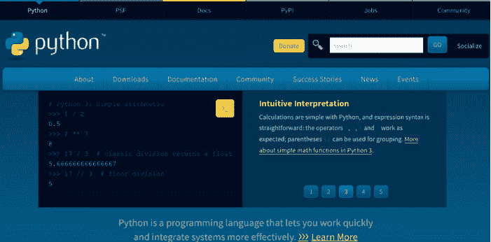

    图 1 [Python.org](https://www.python.org/) 的主页。读者可以在此下载 Python IDLE。

### 2. 下载 Anaconda 的网址是：

[https://www.anaconda.com/download](https://www.anaconda.com/download)。

图 3 展示了 Anaconda 发行版下载页面。读者可以为 Windows、Apple 或 Linux 计算机下载。点击

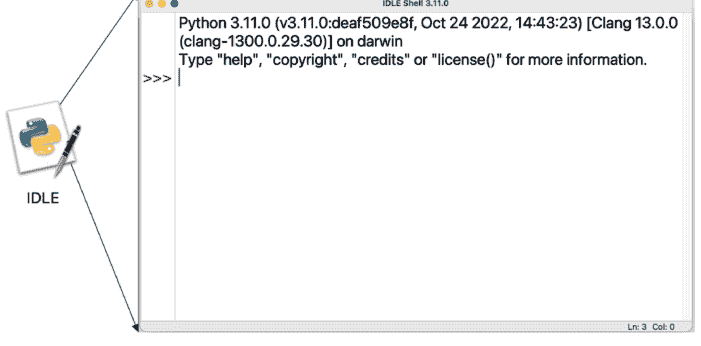

图 2 Python IDLE Shell，读者可以在此将 Python 用作计算器。参见[第 1 至 3 章](#)。


图 3 Anaconda 的主页。

Anaconda Navigator 图标会打开 Anaconda Navigator 窗口；参见图 4，读者可以在此访问 JupyterLab、Jupyter Notebook 和 Spyder。本书不使用其他数据科学和统计软件包。

图 5 展示了在 Apple Mac 上以浅色模式运行的 Spyder 环境。熟悉 MATLAB® 的读者会注意到这里的相似之处。编辑器窗口是用户编写 Python 程序的地方。右上角的窗口可以获取帮助、查看变量、查看绘图以及查看文件夹中的文件。控制台窗口是 Python 可以用作计算器的地方。

图 6 是启动 Jupyter Notebook 按钮时打开的窗口。Jupyter Notebook 只提供一个非常简单的界面，用户可以在其中打开笔记本、终端和文本文件。JupyterLab 提供了一个非常交互式的界面，包括笔记本、控制台、终端、CSV 编辑器、Markdown 编辑器、交互式地图等。

图 7 是一个无标题的 Jupyter Notebook。读者可以插入 Markdown 单元格来插入标题、图片和使用 LaTeX 的数学公式，或者插入代码单元格来编写 Python 代码。要执行一个单元格，点击运行按钮或在单元格中输入 **SHIFT+ENTER**。读者可以保存文件，或点击 **File** 并下载为 AsciiDoc、HTML (.html)、LaTeX (.tex)、Markdown、Notebook (.ipynb) 或通过 LaTeX 下载为 PDF。通过下载为

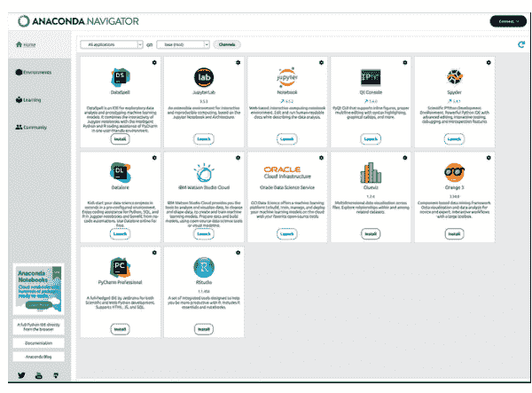

图 4 Anaconda Navigator 窗口，本书仅使用 JupyterLab、Jupyter Notebooks 和科学 Python 开发环境（Spyder）。

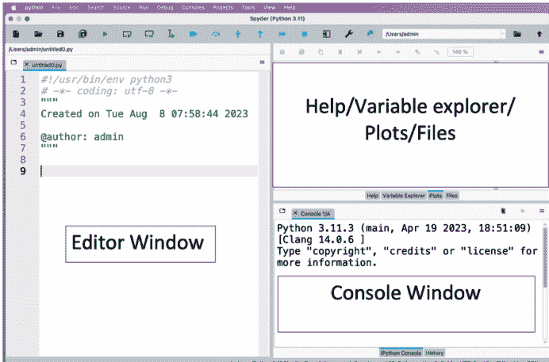

图 5 在 Apple Mac 上以浅色模式运行的 Spyder 环境。

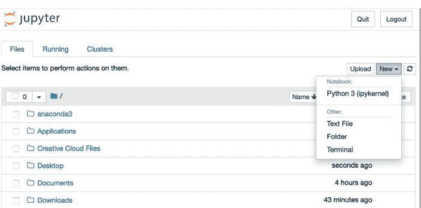

图 6 启动 **Jupyter Notebook** 时出现的窗口。点击 **New** 和 **Python 3 (ipykernel)**（见右上角）以打开一个新的 Jupyter notebook。

html，读者可以将笔记本发布到网上。作者使用 GitHub 将解决方案笔记本在线发布。

**3. Google Colab：** 要进行云计算并访问 Google Colab，您需要一个 Google 账户：

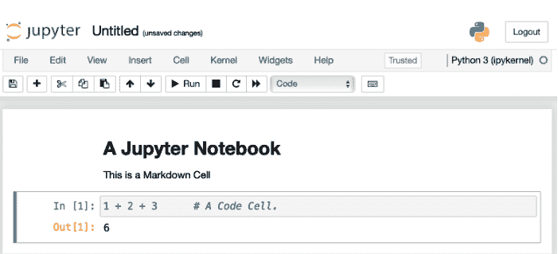

图 7 一个无标题的 Jupyter notebook。顶部的单元格是一个 Markdown 单元格。In [1]: 是一个代码单元格，Out[1]: 显示单元格**运行**后的输出。也可以在代码单元格中按 **SHIFT + ENTER**。

https://colab.research.google.com/。

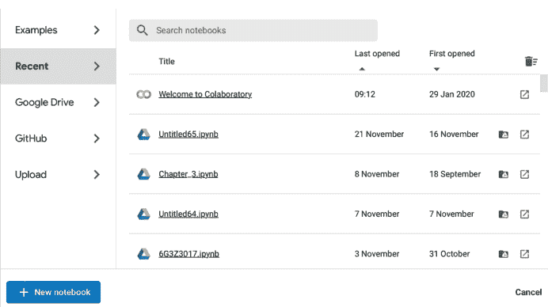

图 8 打开 Google Colab 时出现的窗口。通过点击蓝色框中的 + **New notebook** 创建一个新的 Jupyter notebook。

图 8 展示了启动 Google Colab 时打开的窗口。这假设您已经登录了您的 Google 账户。只需点击页面底部的 **New notebook** 即可获得一个 Google Colab Jupyter Notebook，如图 9 所示。

在图 9 中，Markdown 单元格尚未执行，但 Colab 显示了输出结果。请注意，html 使用 # 符号表示

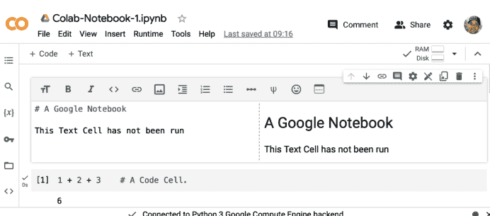

图 9 一个 Google Colab Jupyter notebook。顶部的单元格是一个文本单元格，[1] 是一个代码单元格。


图 10 GitHub 主页。

标题。这个笔记本已保存为 Colab-Notebook-1.ipynb；见左上角。Colab notebooks 可以直接保存到 GitHub。更多详情请参见[第 5 章](Chapter 5)。

现在我们有了合适的 IDE，读者就可以开始将 Python 用作计算器，并编写程序来完成更复杂的任务了。

最后，作者建议读者注册 GitHub，这是一个用于托管代码的平台，支持版本控制和协作：

[https://github.com](https://github.com)。

读者可以将 GitHub 用作项目的免费云存储，并方便地托管静态网站。同样，网上有很多免费视频可以教你如何操作。

# 第 1 章

## Python 作为强大的计算器


### 1.1 BODMAS

本节展示 Python 遵循 BODMAS（括号、阶、除、乘、加、减）规则。

**示例 1.1.1。** 计算以下内容：

(a) $4 + 5 - 6$; (b) $2 \times 3$; (c) $3 \times (2 - 5)$;

(d) $2 + 3 \times (6 + 2 \times 5) - 8$; (e) $\frac{1}{2} \times (\frac{1}{3} - \frac{1}{4})$。

以下解决方案使用 Jupyter notebook 计算。In [1]: 是一个代码单元格；如果您按 **SHIFT + ENTER**，则该单元格被执行，结果为 Out[1]:。

DOI: 10.1201/9781003472759-1

```
In [1]: 4 + 5 - 6  # Python ignores anything after the hash.
Out[1]: 3
```

```
In [2]: 2 * 3  # Asterisk for multiplication.
Out[2]: 6
```

```
In [3]: 3 * (2 - 5)
Out[3]: -9
```

```
In [4]: 2 + 3 * (6 + 2 * 5) - 8
Out[4]: 42
```

```
In [5]: (1 / 2) * (1 / 3 - 1 / 4)  # Forward slash for divide.
Out[5]: 0.04166666666666666
```

### 1.2 分数：符号计算

要使用分数进行计算而不使用小数，读者必须从 **fractions** 库中加载 **Fraction** 函数。

分数算术的规则如下：

1.  $\frac{a}{b} \pm \frac{c}{d} = \frac{ad \pm bc}{bd}$，其中 $b, d \neq 0$；
2.  $\frac{a}{b} \times \frac{c}{d} = \frac{a \times c}{b \times d}$，其中 $b, d \neq 0$；
3.  $\frac{a}{b} \div \frac{c}{d} = \frac{a \times d}{b \times c}$，其中 $b, c, d \neq 0$。

以下示例与上面的示例在同一个 Jupyter notebook 中，因此从代码单元格 In [6]: 开始。要执行每个单元格，读者按 **SHIFT + ENTER**。

**示例 1.2.1。** 计算以下内容，将答案保留为分数：

(a) $\frac{1}{2} + \frac{1}{3}$; (b) $\frac{1}{2} \times 8$; (c) $\frac{1}{3} \times \frac{2}{5}$;

(d) $\frac{1}{2} \div \frac{1}{3}$; (e) $\frac{1}{2} \times (\frac{1}{3} - \frac{1}{4})$。

以下解决方案使用 Jupyter notebook 计算。In [6]: 是一个代码单元格；如果你按下 SHIFT + ENTER，该单元格就会被执行。请注意，In [6] 没有输出。

```
In [6]: from fractions import Fraction
```

```
In [7]: Fraction(1, 2) + Fraction(1, 3)
Out[7]: Fraction(5, 6)
```

```
In [8]: Fraction(1, 2) * 8
Out[8]: Fraction(4, 1)
```

```
In [9]: Fraction(1, 3) * Fraction(2, 5)
Out[9]: Fraction(2, 15)
```

```
In [10]: Fraction(1, 2) / Fraction(1, 3)
Out[10]: Fraction(3, 2)
```

```
In [11]: Fraction(1, 2) * (Fraction(1, 3) - Fraction(1, 4))
Out[11]: Fraction(1, 24)
```

### 1.3 幂（指数运算）与根

要计算幂和根，读者可以从 math 库中导入 pow 和 sqrt 函数。指数（幂）的规则如下：

1. $x^a \times x^b = x^{a+b}$；
2. $x^{-a} = \frac{1}{x^a}$；
3. $x^a \div x^b = x^{a-b}$；
4. $(x^a)^b = x^{ab}$；
5. $x^{\frac{a}{b}} = \sqrt[b]{x^a}$。

请注意，分数指数会产生根。

## 4 ■ Python 简明教程

**示例 1.3.1.** 计算以下内容：

(a) $2^8$；(b) $(\frac{1}{2})^2$；(c) $2^{-8}$；
(d) $\sqrt[3]{27} + \sqrt{25}$；(e) $(2^3)^5 \left(\sqrt[4]{16} \times \sqrt[3]{\frac{1}{64}} + \sqrt{169}\right)$。

以下解决方案使用 Jupyter notebook 计算。In [12]: 是一个代码单元格；如果你按下 SHIFT + ENTER，该单元格就会被执行，结果为 Out[12]:。

```
In [12]: from math import * # Import all math functions.
        2**8              # Exponentiation.
Out[12]: 256
```

```
In [13]: (1 / 2)**2
Out[13]: 0.25
```

```
In [14]: pow(2, -8) # Power function.
Out[14]: 0.00390625
```

```
In [15]: pow(27, 1 / 3) + sqrt(25)
Out[15]: 8.0
```

```
In [16]: (2**3)**5 * (16**(1 / 4) * pow(1 / 64, 1 / 3) + sqrt(169))
Out[16]: 442368.0
```

**注释：** 请注意，Python 会忽略井号（#）符号后输入的任何内容。注释符号在所有编程语言中都非常有用。

### 1.4 数学库（模块）

math 库包含以下函数：

acos(x), asin(x), asinh(x), atan(x), ceil(x), comb(n,k), cos(x), cosh(x), degrees(x), dist(x), erf(x), exp(x), fabs(x), factorial(x), floor(x), fmod(x,y), gcd(numbers), hypot(x,y), isnan(x), lcm(numbers), log(x), log10(x), radians(x), remainder(x,y), sin(x), sinh(x), sqrt(x), tan(x), tanh(x), trunc(x), e, inf, nan, pi, tau

要查看这些函数的定义，请输入 **help(math)** 或访问此链接：

https://docs.python.org/3/library/math.html。

**示例 1.4.1.** 使用 math 库来：

(a) 计算 $e^2$；
(b) 使用 **gcd** 函数计算 35 和 128 的最大公约数；
(c) 将 $180^\circ$ 转换为弧度；
(d) 计算 $\sin\left(\frac{\pi}{2}\right)$；
(e) 将 $\pi$ 四舍五入到十位小数。

以下示例与上面的示例在同一个 Jupyter notebook 中，因此从代码单元格 In [17]: 开始，其中使用命令 **from math import \*** 导入了 math 库中的所有函数。

```
In [17]: from math import * # Import all functions from the math library.

In [18]: exp(2)
Out[18]: 7.38905609893065

In [19]: gcd(35, 128)
Out[19]: 1

In [20]: radians(180)
Out[20]: 3.141592653589793

In [21]: sin(pi / 2)
Out[21]: 1.0

In [22]: round(pi, 10)
Out[22]: 3.1415926536
```

鼓励读者学习 math 库中的所有函数。示例可以在上面的 URL 中找到。
请注意，对于本书中的所有练习，完整的解答都可以在网上查看。

## 6 ■ Python 简明教程

https://drstephenlynch.github.io/webpages/A-Simple-Introduction-to-Python-Solutions.html。

### 练习

1. 计算以下内容：
    (a) $101 - 34 + 67$；(b) $12 \times 7$；(c) $4 \times (7 + 9 \times 3)$；
    (d) $2 - 2 \times (2 - 4)$；(e) $0.1 \div (0.6 - 0.05)$。

2. 计算以下分数，答案保留为分数形式：
    (a) $\frac{1}{4} - \frac{1}{5}$；(b) $\frac{2}{3} \times 30$；(c) $\frac{2}{5} \times \frac{5}{7}$；
    (d) $\frac{1}{3} \div 2$；(e) $\frac{1}{2} \times (\frac{1}{4} - \frac{1}{3}) \div \frac{1}{8}$。

3. 确定：
    (a) $2^{15}$；(b) $(\frac{1}{3})^3$；(c) $64^{-2}$；
    (d) $10^5 \times 10^{10}$；(e) $(2^5)^3 (\sqrt[3]{27} \times \sqrt[4]{625} - \sqrt[5]{32})$。

4. 查阅数学函数 fmod、factorial、log、floor、ceil 和 lcm。使用 math 模块来：
    (a) 计算 fmod(36,5)。
    (b) 计算 52!。这与一副扑克牌有什么关系？
    (c) 求 ln(2)，其中 $\ln(x) = \log_e(x)$ 是自然对数。
    (d) 确定 floor($\pi$)–ceil($e$)。
    (e) 计算 6、7 和 9 的最小公倍数。

# 第 2 章

## Python 简单编程

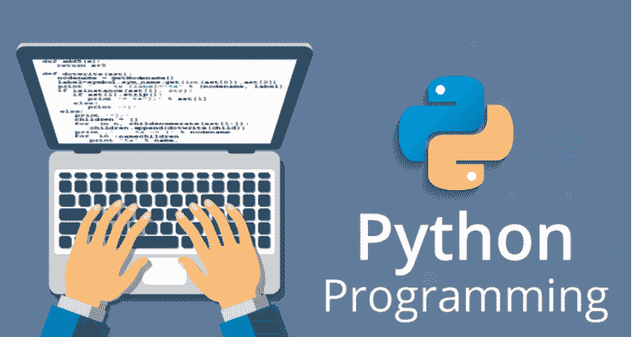

### 2.1 列表、元组、集合和字典

Python 中有四种内置数据类型，它们是列表、元组、集合和字典。现在将逐一定义：

**列表**是一个有序且可更改的元素集合，允许重复元素。例如，[1, 2, 3, 3, 4, 5] 是一个包含六个元素的列表。请注意使用了方括号和从零开始的索引。

## 8 ■ Python 简明教程

**元组**是一个有序且不可更改的元素集合，允许重复元素。元组通常用于异构（不同）数据类型。例如，(4,5,42,6,6,“cherry”,“date”) 是一个包含六个元素的元组。请注意使用了圆括号和从零开始的索引。

**集合**是一个无序、不可更改且无索引的元素集合，没有重复元素。例如，{7,8,9,“fig”,“grape”} 是一个包含五个元素的集合。请注意使用了花括号。

**字典**是一个有序且可更改的键值对集合，没有重复元素。例如，{“England” : “London”, “France” : “Paris”, “Germany” : “Berlin”} 是一个欧洲首都的字典。请注意使用了花括号、键值对和从零开始的索引。

Python 使用**从零开始的索引**，其中第一个元素的索引为零，第二个元素的索引为一，依此类推。

Python 中使用**切片**从数据类型中移除某些元素。

读者应该执行下面的命令并自己编造示例，以获得更深入的理解。

#### 示例。

**In/Out** &nbsp;&nbsp;&nbsp;&nbsp; **代码单元格**

```
In [1]:  # An empty list.
        list_empty = []
        print(list_empty)
Out[1]:  []
In [2]:  # Class type.
        list1 = [1, 2, 3, 4, 5]
        print(type(list1))
Out[2]:  <class 'list'>
In [3]:  # Zero-based indexing.
        list1[0], list1[1], list1[-1]
Out[3]:  (1, 2, 5)
```

```
In [4]:  # Length, maximum and minimum.
        len(list1), max(list1), min(list1)
Out[4]: (6, 5, 1)
In [5]:  # Using range to generate numerical lists.
        list(range(5)), list(range(2, 14, 2))
Out[5]: ([0, 1, 2, 3, 4], [2, 4, 6, 8, 10, 12])
In [6]:  # Slicing lists.
        list1[1:3], list1[2:], list1[:1]
Out[6]: ([2, 3], [3, 3, 4, 5], [1])
In [7]:  # Lists of lists.
        list2 = [[1, 2], [3, 4]]
        list2
Out[7]: [[1, 2], [3, 4]]
In [8]:  # The second element in the first list.
        list2[0][1]
Out[8]: 2
In [9]:  # Append and remove elements from a list.
        list1.append(10)
        print(list1)
Out[9]: [1, 2, 3, 3, 4, 5, 10]
In [10]: list1.remove(3) # Removes the first 3.
        print(list1)
Out[10]: [1, 2, 3, 4, 5, 10]
In [11]: # Working with dictionaries.
        Capitals={"England":"London","France":"Paris"}
        Capitals.pop("England") # Remove item.
        print(Capitals)
Out[11]: {"France":"Paris"}
In [12]: Capitals.get("France")
Out[12]: 'Paris'
```

考虑上面的 In [2];，list1 是一个包含五个元素的列表 [1,2,3,4,5]，list1[0] 是第一个元素，即 1，list1[-1] 是最后一个元素，即 5。切片 list1[1:3] 从 list1[1]（即 2）开始，一直到但不包括 list1[3]（即 4）。所以 list1[1:3] = [2, 3]。

### 2.2 定义函数（编程）

本节向读者展示如何在Python中定义函数。读者也应在Spyder和Jupyter notebook中运行此程序。

**示例 2.2.1.** 使用Python IDLE，定义一个计算圆面积的函数。求半径为4厘米的圆的面积。请注意，Python也会忽略三引号之间的文本。

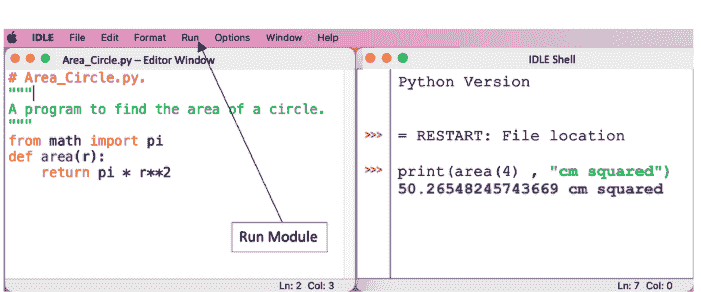

计算出的面积为50.26548245743669平方厘米。用户必须通过点击**运行**按钮来执行模块。然后，在IDLE Shell窗口中，输入**print(area(4) , "cm squared")**以获得答案。请注意，在Python中，程序需要在IDLE Shell中调用之前先执行。

**示例 2.2.2.** 使用Python IDLE，定义一个计算圆柱体体积的函数。求高为5厘米、半径为4厘米的圆柱体的体积。

计算出的圆柱体体积为251.32741228718345立方厘米。请记住在调用函数之前先运行模块。

**示例 2.2.3.** 使用Python IDLE，定义一个将摄氏度转换为开尔文的函数。执行程序时，输入温度，并以八个占位符和四位小数输出结果。在格式化中，命令`{:08.4f}`会给出带有八个占位符和四位小数的输出。

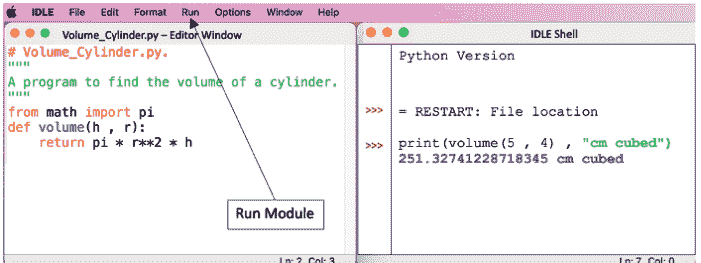

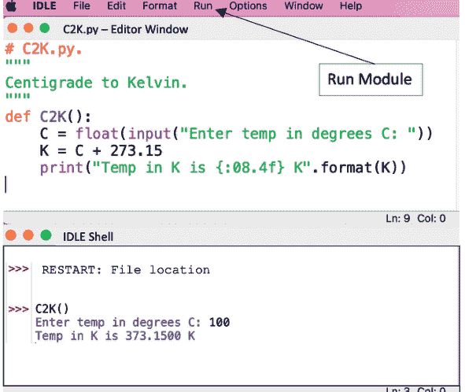

### 2.3 FOR 和 WHILE 循环

我们将使用以下编程结构来构建示例：

```
for
for item in object:
    statement(s)

while
while expression:
    statement(s)
```

请注意，Python中的缩进级别对于程序的成功运行至关重要。当你在冒号后按下回车键时，Python会自动为你缩进。在复制和粘贴Python代码时，这些缩进可能会丢失。

**示例 2.3.1.** 在Spyder界面中，使用**for循环**定义一个函数，计算斐波那契数列的前二十项，并将该数列作为列表输出。

Spyder界面如下所示：

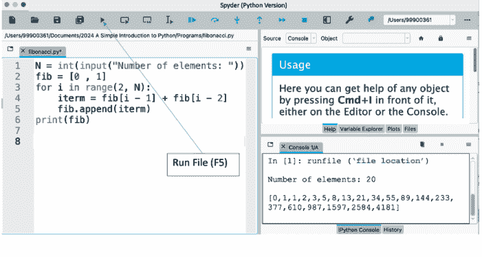

斐波那契数列的前二十项显示在右下角的控制台窗口中。

**偏好设置：** 通过点击**python**按钮（左上角），读者可以访问偏好设置，其中提供了用户可用的选项，包括设置字体大小和在浅色或深色模式下工作。上面的Spyder界面显示的是浅色模式。

**编辑器窗口：** 此窗口显示在Spyder界面的左栏，是用户编写Python程序的地方。请记住**运行**文件。定义函数时，必须在控制台窗口中调用之前先运行文件。用户也可以**取消停靠**此窗口，以在计算机屏幕上获得更多空间。**重新停靠**将重新停靠该窗口。

**帮助、变量资源管理器、绘图、文件、窗口：** 右上角的窗口是用户获取帮助、查看程序中的变量、查看绘图并保存它们以及查看文件夹中文件的地方。

**控制台窗口：** 右下角的窗口是Python可用作计算器的地方。用户也可以**取消停靠**和**重新停靠**此窗口。

**示例 2.3.2.** 在Google Colab中，使用**while循环**定义一个函数，计算前$n$个自然数的和。

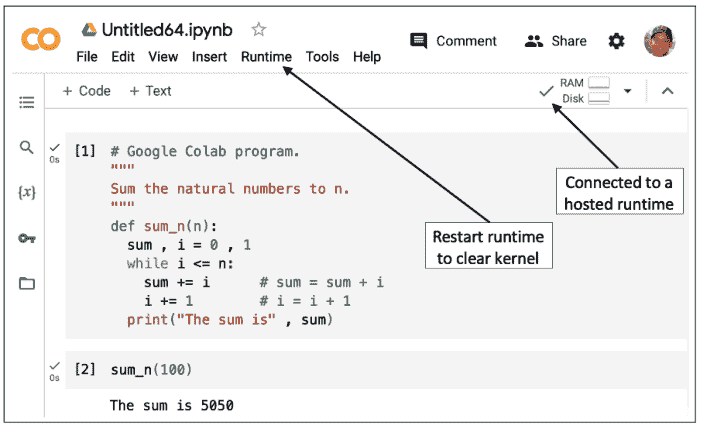

前100个自然数的和是5050。

**Google Colab：** Google Colab的网址是：

https://colab.research.google.com/.

读者应注意，这是云计算，您需要连接互联网才能使用Colab。在右上角，RAM和磁盘图标旁边的绿色勾号表示您已**连接到托管运行时**，换句话说，您已连接到云。通过点击**运行时**，用户可以重启运行时并清除内核，从[1]重新开始。所有存储的变量都将丢失。如果程序挂起或出现其他问题，程序员通常需要**重启内核**。

### 2.4 条件语句，IF，ELIF，ELSE

我们将使用以下结构来构建一个示例

**if, elif, else**

```
if expression:
    body of if
elif expression:
    body of elif
else:
    body of else
```

**示例 2.4.1.** 在Jupyter notebook中，使用**if**、**elif**、**else**命令来判断一个整数是负数、正数还是零。

```
In [1]: # 将文件保存为testinteger.py。
        # 在IDLE中运行模块（或输入F5）。
        """
        测试一个整数。
        """
        def testint():
            testint=int(input("Enter integer: "))
            if testint < 0:
                print("Integer {} is negative".format(testint))
            elif testint > 0:
                print("Integer {} is positive".format(testint))
            else:
                print("The integer {} is zero".format(testint))
```

```
In [2]: testint()
        Enter integer: -296
        Integer -296 is negative
```

请注意，if、elif和else语句都以冒号结尾。当你按下**回车**键时，Python会自动为你缩进。

**保存文件：** 用户可以将Python notebook下载到他们的计算机上（notebook文件名以.ipynb结尾），他们也可以将文件保存到云端或直接导出到GitHub。

**编写网页：** 打开Jupyter notebook使读者可以将文件下载为网页（网页以.html结尾）。然后你可以通过GitHub将notebook发布到网上。读者可以轻松地在网上找到说明。

### 练习

1.  列表和字典：
    (a) 给定列表 A=[[1,2,3,4],[5,6,7,8],[9,10,11,12],[13,14,15,16]]，你如何访问第二个列表中的第三个元素？
    (b) 将A视为一个4×4数组，切片A以移除第3行和第1、2列。
    (c) 使用**range**函数，构造一个形式为[−9, −5, −1, . . . , 195, 199]的列表。
    (d) 创建一个汽车的字典数据类型，包含键值对：品牌:BMW，年份:2018，颜色:红色，里程:30000，燃料:汽油。

2.  编写一个将开尔文转换为摄氏度的函数，结果保留四位有效数字。

3.  使用**def**定义数学函数：
    (a) 定义sigmoid函数，其公式为：σ(x) = 1 / (1 + e^(-x))。确定σ(0.5)。这是人工智能中使用的激活函数。
    (b) 定义hsgn函数如下：
    hsgn(x) = { 1 if x > 0; 0 if x = 0; -1 if x < 0. }
    编写一个定义此函数的Python程序，并确定hsgn(-6)。

4.  较长的Python程序：
    (a) 编写一个交互式Python程序来玩“猜数字”游戏。计算机应生成一个1到20之间的随机整数，用户（玩家）必须在六次尝试内猜出该数字。程序应让用户知道猜测是太高还是太低。读者将需要random库中的**randint**函数。
    (b) 考虑毕达哥拉斯三元组，正整数$a, b, c$，使得$a^2 + b^2 = c^2$。假设$c$由$c = b + n$定义，其中$n$也是一个整数。编写一个Python程序，对于给定的$n$值，找出所有这样的三元组，其中$a$和$b$都小于或等于某个最大值$m$。对于$n = 1$的情况，找出所有满足$1 \le a \le 100$和$1 \le b \le 100$的三元组。对于$n = 3$的情况，找出所有满足$1 \le a \le 200$和$1 \le b \le 200$的三元组。

## Turtle库

在Google Colab中运行本章的所有程序。

```
In [1]: # 在Google Colab中插入图像。
# Turtle.png应加载到Colab文件夹中。
from google.colab import files
from IPython.display import Image
Image("Turtle.png", width = 600)
```

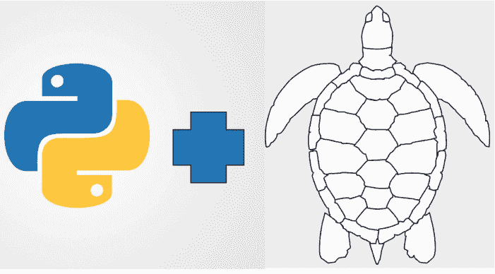

读者也可以在Python IDLE中运行本章的所有程序，但某些语法会略有不同。Python IDLE程序列在我的另一本CRC Press书籍《Python for Scientific Computing and Artificial Intelligence》中，该书在序言中有所引用。

### 3.1 康托尔集分形

从第零阶段的一条线段开始。在每个阶段，移除中间三分之一的线段，并将一条线段替换为两条线段，每条线段的长度是前一条线段的三分之一。

```python
# You must run this cell before the other programs.
# These commands are not needed in IDLE.
!pip install ColabTurtlePlus
from ColabTurtlePlus.Turtle import *
```

```python
# The Cantor set.
initializeTurtle()
def cantor(x , y , length):
    speed(13)                # Fastest speed.
    if length >= 5:
        penup()
        pensize(2)
        pencolor("blue")
        setpos(x , y)
        pendown()
        fd(length)            # Forward.
        y -= 80               # y = y - 80.
        cantor(x , y , length / 3)
        cantor(x + 2 * length / 3 , y , length / 3)
        penup()
        setpos(x , y + 80)
cantor(-400 , 200 , 500)
```

### 3.2 科赫雪花

从一个等边三角形开始。在外部，将每条线段替换为四条线段，每条线段的长度是前一条线段的三分之一。

```python
# The Koch Snowflake.
initializeTurtle()
pensize(1)
penup()
setpos(-250 , 200)           # To center image.
pendown()
def KochSnowflake(length, level):
    speed(13)                 # Fastest speed.
    for i in range(3):
        plot_side(length, level)
        rt(120)                    # Right turn 120 degrees.
def plot_side(length, level):
    if level==0:
        fd(length)
        return
    plot_side(length/3, level-1)
    lt(60)                     # Left turn 60 degrees.
    plot_side(length/3, level-1)
    rt(120)
    plot_side(length/3, level-1)
    lt(60)
    plot_side(length/3, level-1)
KochSnowflake(300 , 3)
```

### 3.3 分叉树

要绘制分叉树，在每个阶段将一条线段替换为两条较短的线段，一条向左转，另一条向右转，转过给定的角度。

```python
# A bifurcating tree.
initializeTurtle()
speed(13)
setheading(90)        # Point turtle up.
penup()               # Lift pen.
setpos(-200 , -120)   # Start point coordinates.
pendown()
def FractalTreeColor(length, level):
    pensize(length / 10) # Thickness of lines.
    if length < 20:
        pencolor("green")
    else:
        pencolor("brown")
    if level > 0:
        fd(length)        # Forward
        rt(60)            # Right turn 60 degrees
        FractalTreeColor(length*0.7, level-1)
        lt(90)            # Left turn 90 degrees
        FractalTreeColor(length*0.5, level-1)
        rt(30)            # Right turn 30 degrees
        penup()
        bk(length)        # Backward
        pendown()
FractalTreeColor(200 , 10)
```

### 3.4 谢尔宾斯基三角形

从一个实心的等边三角形开始。在每个阶段，移除中心倒置的等边三角形。

```python
# Sierpinski Triangle.
initializeTurtle()
speed(13)          # Fastest speed.
penup()
setpos(-300 , 0)
pendown()
def SierpinskiTriangle(length, level):
    if level==0:
        return
    begin_fill()           # Fill shape.
    color("red")
    for i in range(3):
        SierpinskiTriangle(length/2, level-1)
        fd(length)
        lt(120)             # Left turn 120 degrees.
    end_fill()
SierpinskiTriangle(300 , 5)
```

### 练习

1.  绘制康托尔集的一个变体，其中在每个阶段移除两个中间线段。因此，在每个阶段，一条线段被替换为三条线段，每条线段的长度是前一条线段的五分之一。
2.  绘制一个科赫正方形分形，其中在正方形的每条边上，一条线段被替换为五条线段，每条线段的长度是前一条线段的三分之一。
3.  绘制一个三分叉树分形。
4.  绘制一个谢尔宾斯基正方形分形，其中在每个阶段移除一个中心正方形，且长度尺度减少三分之一。
5.  在 Python IDLE 中，点击 **Help** 选项卡和 **Turtle Demo** 查看一些很酷的示例。图 3.1 展示了三个动画的静态画面。

图 3.1 来自 Turtle Demo 的动画静态画面。(a) 地球和月球绕太阳运行的轨迹。(b) 带有日期和星期的模拟时钟。(c) 汉诺塔问题的解决方案。

# 第 4 章

## NumPy 和 MatPlotLib

### 4.1 数值 Python (NumPy)

Numpy 是一个允许 Python 使用列表、数组、向量、矩阵和张量进行计算的库。更多信息，请参阅以下网页：

https://numpy.org/doc/stable/reference/.

#### 示例。

```python
# Import numpy into the np namespace.
import numpy as np
# Define an array.
# No commas between the elements when printed.
# A 5-dimensional vector and rank one tensor.
A = np.arange(5)
# Out: [0 1 2 3 4]
# Convert an array to a list.
# Lists have commas between elements.
A.tolist()
# Out: [0, 1, 2, 3, 4]
# Two 2x2 arrays. These are rank two tensors.
B = np.array([[1,1] , [0,1]])
C = np.array([[2,0] , [3,4]])
# Elementwise multiplication.
B * C
# Out: array([[2 , 0] , [0 , 4]])
# Matrix multiplication.
np.dot(B , C)
# Out: array([[5 , 4] , [3 , 4]])
# A 3x3 array and rank two tensor.
D = np.arange(9).reshape(3 , 3)
print(D) , D.ndim
# Out: ([[0 1 2] [3 4 5] [6 7 8]] , 2)
# A rank three tensor.
# A 2x2x2 array.
T=np.array([[[1,2] , [3,4]], [[5,6],[7,8]]])
T.ndim
# Out: 3
# Vectorized computation.
D.sum(axis = 0) # Sum columns.
# Out: array([9 , 12 , 15])
# The minimum of each row.
D.min(axis = 1) # Work with rows.
# Out: array([0 , 3 , 6])
# Slicing arrays.
D[: , 1] # All elements in column 2.
# Out: array[1 , 4 , 7]
# Slicing.
E = np.arange(12).reshape(3 , 4)
print(E)
# Out: [[0 1 2 3] , [4,5,6,7] , [8,9,10,11]]
# Make up your own examples for understanding.
E[:2 , 3:]
# Out: array([[3] , [7]])
```

**NumPy 中的向量化计算：** NumPy 数组中有一种单一的数据类型，这允许进行向量化。就读者而言，可以使用大量计算机内存的 for 和 while 循环可以被向量化形式所取代。作为一个简单的例子，考虑数字列表 a = [1, 2, 3, . . . , 100]，假设我们希望计算 $S_{100} = \sum_{n=1}^{100} a_i$。那么使用 for 循环，代码将是：

```python
# Sum numbers using a for loop.
sum = 0
a= [i for i in range(101)]
for j in range(101):
    sum += a[j]
print(sum)
# Out: 5050
```

该程序的向量化版本如下所列：

```python
# Vectorized computation.
import numpy as np
a = np.arange(101)
print("The sum is" , np.sum(a))
# Out: The sum is 5050
```

### 4.2 MATPLOTLIB

MatPlotLib 是 MATrix PLOtting LIbrary 的缩写，它是一个用于在 Python 中创建动画、静态以及最近的交互式可视化的综合库。更多信息，请读者访问以下网址：

https://matplotlib.org。

**示例 4.2.1。** 使用 MatPlotLib 绘制曲线 $y = x^2$，其中 $-2 \leq x \leq 2$。将图形保存为 **Parabola.png**，分辨率为每平方英寸 300 点 (dpi)。

```python
# Simple plots in Python.
import numpy as np
import matplotlib.pyplot as plt
x = np.linspace(-2 , 2 , 100) # Define the domain values.
y = x**2                      # A vector of y-values.
plt.plot(x , y)
plt.xlabel("x")
plt.ylabel("y")
plt.title("$y=x^2$")
plt.savefig("Parabola.png" , dpi = 300)
plt.show()
```

**示例 4.2.2。** 使用 MatPlotLib 绘制曲线 $y = 4x^3 - 3x^4$，其中 $-2 \leq x \leq 2$ 且 $-5 \leq y \leq 2$。

```python
# Plot the curve of a polynomial.
# Simple plots in Python.
import numpy as np
import matplotlib.pyplot as plt
x = np.linspace(-2 , 2 , 100) # Define the domain values.
y = 4 * x**3 - 3 * x**4     # A vector of y-values.
plt.axis([-2 , 2 , -5 , 2])  # Set the ranges for x and y.
plt.plot(x , y)
plt.xlabel("x") , plt.ylabel("y")
plt.show()
```

### 4.3 散点图

散点图在数据科学中经常使用。

**示例 4.3.1。** 生成 50 个具有随机半径和颜色的随机点。

```python
# Scatter plot.
import numpy as np
import matplotlib.pyplot as plt
# Fix the random state.
```

### 4.4 曲面图

**示例 4.4.1.** 使用命令 `%matplotlib qt5`，可以打开一个交互式窗口，读者可以在其中以三维方式旋转曲面。在 Spyder 中，需要在绘图前在命令窗口中输入 `%matplotlib qt5`。绘制曲面 $z = x^2 + y^2$。

```python
# 在三维空间中绘制曲面。
# 在这种情况下，将出现一个交互式窗口。
%matplotlib qt5
from mpl_toolkits.mplot3d import axes3d
```

三维曲面，$z = x^2 + y^2$

```python
import matplotlib.pyplot as plt
import numpy as np
x = np.arange(-5 , 5 , 0.1)
y = np.arange(-5 , 5 , 0.1)
X,Y = np.meshgrid(x,y)
# Z 是两个变量的函数。
Z = X**2 + Y**2
fig = plt.figure(figsize=(12,6))
ax = fig.add_subplot(111, projection = "3d")
ax.set_xlabel("x")
ax.set_xlim(-5 , 5)
ax.set_ylabel("y")
ax.set_ylim(-5 , 5)
ax.set_zlabel("z")
ax.set_zlim(np.min(Z) , np.max(Z))
ax.set_title("3D Surface, $z=x^2+y^2$")
ax.plot_surface(X , Y , Z)
plt.show()
```

### 练习

1.  绘制二次函数的图像：$y = f(x) = x^2 - 3x - 18$。
2.  绘制三角函数的图像：$y = g(x) = 2 + 3\sin(x)$。
3.  绘制指数函数的图像：$y = h(x) = 1 + e^{-x}$。
4.  绘制曲面：$z = xe^{-(x^2+y^2)}$。

# 第 5 章

## Google Colab、SymPy 和 GitHub

### 5.1 GOOGLE COLAB

Google Colab（协作实验室）允许用户在浏览器中编写和执行 Python 代码，无需任何配置，免费访问图形处理单元（GPU）和张量处理单元（TPU），并通过 GitHub 轻松共享文件。用户必须拥有 Google 帐户才能使用 Colab，您可以在此处创建 Google 帐户：

https://support.google.com/accounts/.

要使用 Google Colab，请点击此处：

https://colab.research.google.com.

Google Colab 界面在前言中已展示。Colab 的主要优势在于用户无需在计算机上安装任何软件，并且可以在任何有互联网连接的地方访问。

### 5.2 格式化笔记本

本节向读者展示如何在 Jupyter 笔记本中插入标题、副标题、粗体、斜体、项目符号和编号列表项。
下方左侧窗口显示了文本命令，右侧显示了相应的输出。

**数学符号**使用 LaTeX 插入笔记本，LaTeX 是一种用于制作高度专业文档的文档准备系统。数学符号也可以插入图形中，如本书其他章节所示。表 5.1 显示了 Jupyter 笔记本中一些常用的 LaTeX 符号，更多符号可在此处找到：

https://oeis.org/wiki/List_of_LaTeX_mathematical_symbols.

表 5.1 Jupyter 笔记本常用 LaTeX 符号表。

| 希腊字母 | LATEX | 数学符号 | LATEX |
|---|---|---|---|
| α | \alpha | dx/dt | \frac{dx}{dt} |
| β | \beta | ẋ | \dot{ x } |
| γ, Γ | \gamma, \Gamma | ẍ | \ddot{x} |
| δ | \delta | sin(x) | \sin(x) |
| ε | \epsilon | cos(x) | \cos(x) |
| θ | \theta | ≤ | \leq |
| λ, Λ | \lambda, \Lambda | ≥ | \geq |
| μ | \mu | x² | x^2 |
| σ, Σ | \sigma \Sigma | ∈ | \in |
| τ | \tau | ± | \pm |
| φ | \phi | → | \rightarrow |
| ω, Ω | \omega, \Omega | ∫ | \int |

以下是在笔记本中的一些示例。请注意，LaTeX 命令位于美元符号之间。

有关 LaTeX 的更多信息，请读者访问 Overleaf：

https://www.overleaf.com/，

这是一个易于使用且免费的在线协作 LaTeX 编辑器。

**插入图形：** 在 Google Colab 中插入图形的命令已在第 3 章中给出。下图展示了如何在 Jupyter 笔记本中插入图形。请注意，图形文件 “Python Logo.png” 必须与 Jupyter 笔记本保存在同一文件夹中。

```html
<!-- HTML 代码 -->
<!-- 文件 "Python Logo.png" 必须与 -->
<!-- Jupyter 笔记本 (.ipynb) 保存在同一文件夹中。 -->

<figure>

</figure>
```

### 5.3 符号 Python (SYMPY)

SymPy 是一个计算机代数系统，也是一个完全用 Python 编写的符号数学 Python 库。更多信息，请参阅 sympy 帮助页面：

https://docs.sympy.org/latest/index.html.

以下示例取自代数、微积分和矩阵。这些主题也将在下一章中涵盖。如需更深入的解释，建议读者使用网络资源。使用 Python 可以更深入地理解数学。

**示例。**

1.  因式分解 $x^2 - y^2$。
2.  求解 $x$：$x^2 - 4x - 3 = 0$。
3.  求解线性方程组：$x - y = 0, x + 2y - 5 = 0$。
4.  部分分式分解：$\frac{1}{(x+1)(x+2)}$。
5.  求 $\lim_{x \to 0} \frac{x}{\sin(x)}$。
6.  对 $x^2 - 7x + 8$ 关于 $x$ 求导。
7.  求不定积分：$I = \int x^4 dx$。
8.  求定积分：$I = \int_{x=1}^3 x^4 dx$。
9.  计算 $\pi$ 到小数点后 10 位。
10. 给定矩阵 $A = \begin{pmatrix} 1 & -1 \\ 2 & 3 \end{pmatrix}$ 和 $B = \begin{pmatrix} 0 & 2 \\ 3 & 3 \end{pmatrix}$，计算：
    (a) $2A + 3B$。
    (b) $A \times B$。
    (c) 矩阵 $A$ 的逆矩阵（如果存在）。
    (d) $A$ 的行列式。

#### 解答。

##### 输入/输出代码单元格

```python
In [1]: # 从 SymPy 库导入所有函数。
        from sympy import *
In [2]: # 声明符号对象。
        x , y = symbols("x y")
In [3]: # 1. 因式分解。
        factor(x**2 - y**2)
Out[3]: (x - y)(x + y)
In [4]: # 2. 符号求解二次方程。
        solve(x**2 - 4 * x - 3 , x)
Out[4]: [2 - sqrt(7) , 2 + sqrt(7)]
In [5]: # 3. 求解方程组。
        solve([x - y, x + 2 * y - 5])
Out[5]: {x: 5/3 , y: 5/3}
In [6]: # 4. 部分分式分解。
        apart(1 /((x + 1 * (x + 2))))
Out[6]: -1/(x+2)+1/(x+1)
In [7]: # 5. 极限，x 趋近于 0 的极限。
        limit(x / sin(x) , x , 0)
Out[7]: 1
In [8]: # 6. 求导（微积分）。
        diff(x**2 - 7 * x + 8 , x)
Out[8]: 2x - 7
In [9]: # 7. 不定积分。
        print(integrate(x**4) , "+ c")
Out[9]: x**5/5 + c
In [10]: # 8. 定积分。
         integrate(x**4 , (x , 1 , 3))
Out[10]: 242/5
In [11]: # 9. Pi 到小数点后 10 位。
         N(pi , 10)
Out[11]: 3.1415926536
In [12]: # 10. 定义 2x2 矩阵。
         A=Matrix([[1,-1] , [2,3]])
         B=Matrix([[0,2] , [3,3]])
         2 * A + 3 * B
Out[12]: Matrix([[2,4] , [13,15]])
In [13]: A * B # 矩阵乘法。
Out[13]: Matrix([[-3,-1] , [9,13]])
In [14]: A.inv() # 逆矩阵。
Out[14]: Matrix([[3/5,1/5] , [-2/5,1/5]])
In [15]: A.det() # 行列式。
Out[15]: 5
```

### 5.4 GITHUB

建议读者加入 GitHub：

https://github.com.

GitHub, Inc. 是一个用于编程开发和版本控制的平台和云服务，允许程序员存储和管理他们的代码。截至 2023 年 1 月，GitHub 报告称其在全球拥有超过一亿名开发者。许多行业和大学都在使用它。

下图展示了 GitHub 界面。网络上有大量视频可以帮助您入门。您可以在此处保存您的 Python 文件和笔记本，甚至可以创建自己的网页进行发布。

### 练习

1.  使用 SymPy：
    (a) 因式分解 $x^3 - y^3$。
    (b) 求解 $x$：$x^2 - 7x - 30 = 0$。
    (c) 部分分式分解：$\frac{3x}{(x-1)(x+2)(x-5)}$。
    (d) 展开 $(y + x - 3)(x^2 - y + 4)$。
    (e) 求解线性方程组：$y = 2x + 2, y = -3x + 1$。
2.  计算以下内容：
    (a) $\lim_{x \to 1} \frac{x-1}{(x^2-1)}$。
    (b) $y = x^2 - 6x + 9$ 的导数。
    (c) $y = \cos(3x)$ 的导数。
    (d) $y = 2e^x - 1$ 的导数。
    (e) $y = x \sin(x)$ 的导数。

## 第六章

## Python 在数学中的应用

### 6.1 基础代数

代数是数学的一个分支，它处理的是抽象符号而非数字，并对其进行算术运算。通常，十岁甚至更小的孩子就会开始接触代数。使用 Python 可以帮助更深入地理解数学。

**示例 6.1.1.** 简单代数。

1.  已知 $m = 2, x = 2, c = -1$，求 $y = mx + c$ 的值。
2.  展开 $2x(x - 5)$。
3.  展开 $(x - 1)(x + 3)$。
4.  因式分解 $2x^3 - 4x^2$。
5.  因式分解 $x^2 - x - 12$。

#### 解答。

```
In/Out Code Cells
In [1]: # 1. 代入求值。
        m , x , c = 2 , 2 , -1
        y = m * x + c
Out[1]: y = 3
In [2]: # 2. 导入符号、展开和因式分解函数。
        from sympy import symbols , expand , factor
        # 展开。声明 x 为符号变量。
        x = symbols("x")
        expand(2 * x * (x - 5))
Out[2]: 2 * x**2 - 10 * x
In [3]: # 3. 展开。
        expand((x - 1) * (x + 3))
Out[3]: x**2 + 2 * x - 3
In [4]: # 4. 因式分解。
        factor(2 * x**3 - 4 * x**2)
Out[4]: 2 * x**2 * (x - 2)
In [5]: # 因式分解二次多项式。
        factor(x**2 - x - 12)
Out[5]: (x - 4) * (x + 3)
```

### 6.2 求解方程

Python 中的 **solve** 命令可以求解线性方程和一些非线性联立方程，如下所示：

#### 示例 6.2.1. 求解方程。

1.  求解 $x$，$\frac{x+1}{x-1} = 2$。
2.  求解 $y$，$\frac{y-2}{3} = -\frac{4y-7}{6}$。
3.  在同一坐标系中绘制直线 $\ell_1 : 2y = 4x + 5$ 和 $\ell_2 : 4y = 3x + 5$，并确定它们的交点。
4.  求解二次方程：$2x^2 - 3x - 2 = 0$。
5.  确定直线 $y = 2x - 5$ 与抛物线 $y = x^2 - 4x + 3$ 的交点。

#### 解答。

```
In/Out Code Cells
In [1]: # 1. 求解 x。
        x , y = symbols("x y")
        solve((x + 1) / (x - 1) - 2 , x)
Out[1]: [3]
In [2]: # 2. 求解 y。
        solve((y - 2) / 3 + (4 * y - 7) / 6 , y)
Out[2]: [11/6]
```

```
# In [3]: 绘制直线并找到它们的交点（见图）。
import numpy as np
from sympy import *
import matplotlib.pyplot as plt
x = np.linspace(-3 , 3 , 100) # x 值向量。
y1 = (4 * x + 5) / 2
y2 = (3 * x + 5) / 4
plt.plot(x , y1 , label = "$\ell_1$") # 花体字母 l。
plt.plot(x , y2 , label = "$\ell_2$")
plt.rcParams["font.size"] = 14 # 设置字体大小。
plt.xlabel("x")
plt.ylabel("y")
plt.legend()
plt.show()
```

In/Out Code Cells

```
In [4]: # 3. 求解联立方程。
    solve([2*y-4*x-5 , 4*y-3*x-5] , [x , y])
Out[4]: {x: -1, y: 1/2}
In [5]: # 4. 求解二次方程。
    solve(2 * x**2 - 3 * x - 2)
Out[5]: [-1/2 , 2]
```

```
# In [6]: 直线与抛物线的交点。
sol = solve(x**2 - 4 * x + 3 - (2 * x - 5) , x)
print("曲线相交于坐标: " , \n"(" , sol[0] , "," , 2 * sol[0] - 5 , ") 和 " \n"(" , sol[1] , "," , 2 * sol[1] - 5 , ")" )
Out[6]: 曲线相交于坐标: (2 , -1) 和 (4 , 3)
```

### 6.3 函数（数学）

函数是一种规则，它将定义域中的每个 $x$ 值映射到值域中唯一的一个 $y$ 值。

**示例 6.3.1.** 使用 numpy 和 matplotlib 绘图：

1.  绘制函数 $f(x) = x^2 - 4x - 1$ 的图像。
2.  确定 $f(x) = 1$ 时的 $x$ 值。
3.  确定函数 $y = g(x) = \frac{2x-1}{x+1}$ 的反函数 $g^{-1}(x)$。在同一坐标系中绘制 $g(x)$ 和 $g^{-1}(x)$。
4.  已知 $\alpha(x) = 2x - 5$ 和 $\beta(x) = 1 - x^2$，确定复合函数 $\alpha(\beta(x))$ 和 $\beta(\alpha(x))$。

```
# In [1]: 定义一个函数并绘制其曲线。
import matplotlib.pyplot as plt
import numpy as np
def f(x):
    return x**2 - 4 * x - 1
x = np.linspace(-2 , 6 , 100)
y = x**2 - 4 * x - 1
plt.rcParams["font.size"] = 14
plt.xlabel("x") , plt.ylabel("f(x)")
plt.plot(x , y)
plt.show()
```

```
# In [2]: 确定 f(x)=1 时的 x 值。
from sympy import *
x = symbols("x")
sol = solve(x**2 - 4 * x - 1 - 1 , x)
print("当 y=f(x)=1 时，", "x =" , sol[0], "且 x =" , sol[1])
```

Out[2]: 当 y=f(x)=1 时，x = 2 - sqrt(6) 且 x = 2 + sqrt(6)

```
# In [3]: 确定反函数。
from sympy import symbols
x , y = symbols("x y")
sol = solve((2 * y -1) / (y + 1) - x , y)
print("反函数为: y=" , sol)
```

Out[3]: 反函数为: y= [(-x - 1)/(x - 2)]

```
# In [4]: 绘制 g(x) 及其反函数。
# 注意这里绘制了垂直渐近线。
import matplotlib.pyplot as plt
import numpy as np
x = np.linspace(-4 , 6 , 50)
g = (2 * x - 1) / (x + 1)
ginv = (-x - 1) / (x - 2)
plt.rcParams["font.size"] = 14
plt.ylim(-10 , 10)
plt.xlabel("x")
plt.ylabel("y")
plt.plot(x , g , label = "g(x)")
plt.plot(x , ginv , label = "$g^{-1}(x)$")
plt.legend()
plt.show()
```

```
# In [5]: 函数的复合（函数的函数）。
from sympy import symbols
x = symbols("x")
def alpha(x):
    return 2 * x - 5
def beta(x):
    return 1 - x**2
print("alpha(beta(x)) = " , alpha(beta(x)))
print("beta(alpha(x)) = " , beta(alpha(x)))
Out[5]: alpha(beta(x)) = -2*x**2 - 3, beta(alpha(x)) = 1 - (2*x - 5)**2
```

### 6.4 微分与积分（微积分）

在这个阶段，微分用于确定变化率或曲线切线的斜率。

积分是微分的逆运算，可用于确定曲线下方的面积。

这两个主题都属于微积分的范畴。

**示例 6.4.1.** 微积分：

1.  求导，或求 $y = x^2 + 4x - 3$ 的导数 $\frac{dy}{dx}$。
2.  确定曲线 $y = 4x^3 - 3x^4$ 在点 $x = -\frac{1}{2}$ 处的切线斜率。绘制曲线及其切线。
3.  积分，$I = \int 2x + 5 dx$。
4.  确定曲线 $y = 4x^3 - 3x^4$ 在 $x = 0.5$ 和 $x = 1$ 之间且在 $x$ 轴上方的面积。绘制曲线并阴影表示该面积。

In/Out Code Cells

```
In [1]: # 1. 微分。
from sympy import *
x = symbols("x")
diff(x**2 + 4 * x - 3 , x)
Out[1]: 2x + 4
```

```
# In [2]: 2. 求 x=-1/2 处的斜率。
# 使用 sympy 中的 subs 函数。
x , y , c = symbols("x y c")
xval = -1 / 2
y = 4 * x**3 - 3 * x**4
dydx = diff(y , x)
# 切线的斜率 (m)。
m = dydx.subs(x , xval)
print("m = " , m)
yval = y.subs(x , xval)
print("y 值 = " , yval)
# 确定切线的 y 截距 (c)。
c = yval - m * xval
print("c = " , c)
# 绘制曲线和切线。
x = np.linspace(-1 , 1.5 , 100)
y = 4 * x**3 - 3 * x**4
plt.rcParams["font.size"] = 14
plt.plot(x , y , label = "$y=4x^3-3x^4$")
plt.plot(x , m * x + c , label = "y=mx+c, 切线")
plt.legend()
plt.xlabel("x")
plt.ylabel("y")
plt.show()
```

Out[2]: m = 4.5000, y 值 = -0.6875, c = 1.5625

In/Out Code Cells

```
In [3]: # 3. 不定积分。
       x = symbols("x")
       print("I = " , integrate(2 * x + 5 , x) , "+ c")
Out[3]: I = x**2 + 5 * x + c
```

```
# In [4]: 4. 积分并求曲线下面积。
A = integrate(4 * x**3 - 3 * x**4 , (x , 0.5 , 1))
print("面积 = " , A , "平方单位")
# 绘制图形。
import numpy as np
from matplotlib import pyplot as plt
def f(x):
    return 4 * x**3 - 3 * x**4
x = np.arange(0 , 1.34 , 0.01)
plt.rcParams["font.size"] = 14
plt.plot(x , f(x))
# 阴影表示面积。
plt.fill_between(
    x = x,
```

y1 = f(x),
其中 = (0.5 <= x) & (x <= 1), # 积分限。
color = "b") # 阴影颜色。
plt.xlabel("x")
plt.ylabel("y")
plt.show()

Out[4]: 面积 = 0.35625 平方单位

**面向A-Level数学及更高阶的Python：** 我在网上发布了一个Jupyter笔记本，展示了Python如何涵盖英国A-Level数学的全部教学大纲：

https://drstephenlynch.github.io/webpages/Python_for_A_Level_Mathematics_and_Beyond.html.

### 练习题

1.  基础代数：
    (a) 已知 $s = ut + \frac{1}{2}at^2$，当 $u = 1, t = 1, a = 9.8$ 时，求 $s$。
    (b) 展开 $2x(x - 4)$。
    (c) 展开 $(x + y + 1)(x - y + 2)$
    (d) 因式分解 $x^2 - 7x - 12$。
2.  解方程：
    (a) 已知 $3 = 5 + 10t$，求解 $t$。
    (b) 已知 $s = ut + \frac{1}{2}at^2$，求解 $a$。
    (c) 解二次方程：$2x^2 + x - 3 = 0$。
    (d) 确定直线 $y = x$ 与圆 $x^2 + y^2 = 1$ 的交点。
3.  函数：
    (a) 已知 $f(x) = \frac{2x+3}{x-5}$，求 $f(4)$。
    (b) 绘制函数 $f(x) = \frac{2x+3}{x-5}$ 的图像，并确定 $f(x) = 1$ 的点。
    (c) 已知 $g(x) = 3x + 4$ 和 $h(x) = 1 - x^2$，求 $g(h(x)) - h(g(x))$。
    (d) Logistic映射函数定义为 $f_{\mu}(x) = \mu x(1 - x)$，计算 $f_{\mu}(f_{\mu}(x))$。
4.  微积分：
    (a) 若 $y = \sin(2x)$，计算 $\frac{dy}{dx}$。
    (b) 对于 $y = x^3 - 1$，求 $\frac{dy}{dx} \big|_{x=0}$。
    (c) 求曲线 $y = 1 - x^2$ 和 $y = x^2 - 1$ 所围成的面积。
    (d) 绘制上例中的曲线并为面积添加阴影。

# 第7章

## 密码学简介

密码学（网络安全）是一种通过使用代码来保护信息和通信的方法，使得只有信息预期的接收者才能读取和处理它。


52 ■ Python简明入门

### 7.1 凯撒密码

凯撒密码是最简单的加密技术之一，常被儿童在学习发送秘密信息时使用。它是一种替换密码，其中明文中的每个字母都被替换为字母表中固定位置之后的某个字母。

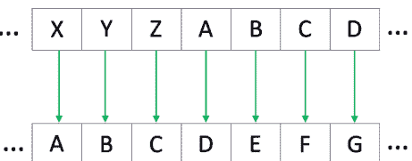

https://en.wikipedia.org/wiki/Caesar_cipher.

Unicode是一种通用字符编码标准：

https://en.wikipedia.org/wiki/List_of_Unicode_characters.

Python中的`ord()`函数接受一个单个Unicode字符的字符串参数，并返回其整数值。`chr()`函数是`ord()`函数的逆操作。例如，`ord("A")`是65，`ord("a")`是97。

```
# In [1]: 凯撒密码：加密。
shift = 3
def encrypt(text , shift):
    result = ""
    for i in range(len(text)):
        char = text[i]
        if (char.isupper()): # 大写字符。
            result += chr((ord(char) + shift - 65) % 26 + 65)
        else:                # 小写字符。
            result += chr((ord(char) + shift - 97) % 26 + 97)
    return result
# 插入文本。
text = "Caeser Cipher Code"
print("Text : " + text)
print("Shift : " + str(shift))
print("Cipher: " + encrypt(text,shift))
```

**输入/输出** &nbsp;&nbsp;&nbsp;&nbsp; **代码单元格**

```
Out[1]: &nbsp;&nbsp; Text : Caesar Cipher Code
&nbsp;&nbsp;&nbsp;&nbsp;&nbsp;&nbsp;&nbsp;&nbsp;&nbsp;&nbsp;&nbsp;&nbsp;&nbsp;&nbsp; Shift : 3
&nbsp;&nbsp;&nbsp;&nbsp;&nbsp;&nbsp;&nbsp;&nbsp;&nbsp;&nbsp;&nbsp;&nbsp;&nbsp;&nbsp; Cipher : FdhvhuqFlskhuqFrgh
```

## 7.2 &nbsp; XOR密码

下表是异或（XOR）函数的真值表。在Python中，使用的运算符是**X^Y**，读作X XOR Y。

**按位异或 (^)**

| X | Y | X^Y |
|---|---|---|
| 0 | 0 | 0 |
| 0 | 1 | 1 |
| 1 | 0 | 1 |
| 1 | 1 | 0 |

**示例 7.2.1.** &nbsp; 计算 3 ^ 6。

**解答.** &nbsp; 用二进制表示，3 = 0011，6 = 0110。对各列进行按位异或运算：

```
0 &nbsp;0 &nbsp;0 &nbsp;1 &nbsp;1
0 &nbsp;0 &nbsp;1 &nbsp;1 &nbsp;0
-----------------
0 &nbsp;0 &nbsp;1 &nbsp;0 &nbsp;1
```

因此，0011 ^ 0110 = 0101，即 3 ^ 6 = 5。

**输入/输出** &nbsp;&nbsp;&nbsp;&nbsp; **代码单元格**

```
In [2]: &nbsp;&nbsp; 3 ^ 6 , 0b011 ^ 0b110
Out[2]: &nbsp; (5 , 5)
```

54 ■ Python简明入门

**示例 7.2.2.** 使用Python进行XOR密码的加密和解密。

**解答.** 程序如下：

```
# In [3]: XOR密码 - 加密与解密。
# 加密和解密使用相同的函数。
def EncryptDecrypt(text):
    XORKey = "A"
    length = len(text)
# 对每个字符执行密钥的XOR操作。
    for i in range(length):
        text = (text[:i] + chr(ord(text[i]) ^ ord(XORKey)) \n                + text[i + 1:])
        print(text[i], end = "")
    return text
if __name__ == "__main__":
    sampletext = "The Exclusive Or Cipher"
    print("Encrypted String: ", end = "")
    sampletext = EncryptDecrypt(sampletext) # 加密。
    print("\n")
    print("Decrypted String: ", end = "")
    EncryptDecrypt(sampletext)              # 解密。
```

Encrypted String: [])$a[]9"-42(7$a[]3a[](1)$3

Decrypted String: The Exclusive Or Cipher

### 7.3 RSA公钥加密系统

基本上，RSA依赖于分解两个大素数乘积的难题（在工业中，每个素数通常有10^300位数字），而破解RSA加密被称为RSA问题。更多详情请参见维基百科：

https://en.wikipedia.org/wiki/RSA_(cryptosystem).

**定义 7.3.1：** 素数是只能被自身和1整除的数。

**定义 7.3.2：** 给定一个整数 $k > 1$，称为**模数**，两个整数 $m$ 和 $n$，如果 $k$ 是它们差的约数，即 $m - n = rk$，其中 $r$ 是整数，则称 $m$ 和 $n$ 模 $k$ **同余**。

**定义 7.3.3：** 模 $k$ 同余写作：$m \equiv n \pmod{k}$。

**定义 7.3.4：** **扩展欧几里得算法（EEA）** 除了计算整数 $a$ 和 $b$ 的最大公约数（gcd）外，还计算贝祖等式的系数，即整数 $x$ 和 $y$，使得：

$$ax + by = \gcd(a, b).$$

读者可以在维基百科上找到更多信息：

https://en.wikipedia.org/wiki/Extended_Euclidean_algorithm.

RSA算法可以用五个简单步骤描述：

1.  选择两个大素数，$p$ 和 $q$。
2.  计算 $n = p \times q$。
3.  欧拉函数定义为：$\phi(n) = (p - 1) \times (q - 1)$。
4.  选择公钥 $e$，使得 $2 < e < \phi(n)$，且 $\gcd(e, \phi(n)) = 1$；即 $e$ 和 $\phi(n)$ 互质。
5.  公钥和私钥满足同余式 $d \equiv e^{-1} \pmod{\phi(n)}$，其中 $d$ 是使用EEA计算出的私钥。

### 7.4 简单RSA算法示例

RSA加密和解密算法可以总结为以下步骤：

1.  **Bob** 遵循上述RSA算法中的步骤1到5。
2.  **Alice** 计算 $E = m^e \pmod{n}$，其中 $m$ 是消息，$E$ 是加密后的消息，并将 $E$ 发送给Bob。
3.  **Bob** 计算 $D = E^d \pmod{n}$，其中 $D$ 是解密后的消息。

56 ■ Python简明入门

历史上，Alice和Bob是用于解释RSA加密方法工作原理的虚构人物的名字。

**示例 7.4.1.** 为说明目的选择两个小素数。在实际应用中，会选择非常大的素数。Bob选择素数 $p = 17$ 和 $q = 29$，以及公钥 $e = 11$。Alice希望将数字（消息）20发送给Bob。发送的加密消息是什么？确认Bob正确解密了该消息。

**输入/输出 代码单元格**

```
In [4]: # 检查p和q是否为素数。
       from sympy import *
       isprime(17) , isprime(29)
Out[4]: (True , True)
```

```
# In [5]: RSA算法示例。
from math import gcd
# 步骤1，选择两个素数。
p , q = 17 , 29
# 步骤2，计算n。
n = p * q
print("n =", n)
# 步骤3，计算phi(n)。
phi = (p - 1) * (q - 1)
# 步骤4，计算公钥e，
# 有许多可能性。
# 在此例中，选择e = 11。
#for e in range(2 , phi):
#    if (gcd(e, phi) == 1):
#        print("e =", e)
e = 11
# 步骤5：
# EEA的Python程序。
def extended_gcd(e, phi):
    if e == 0:
        return phi, 0, 1
```

## 第八章

## 人工智能导论

人工智能（AI）是指行为类似于人脑的计算系统。

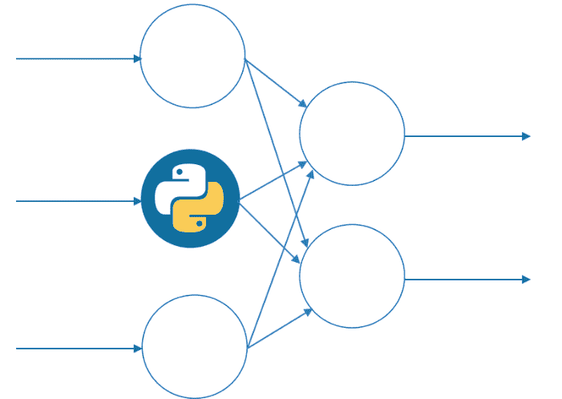

### 8.1 人工神经网络

人工神经网络（ANN）是人工智能的基石。下图展示了单个数学神经元的示意图，其中 $x_1, x_2, \dots, x_n$ 是输入，$w_1, w_2, \dots, w_n$ 代表权重（对于生物神经元是突触权重），$b$ 是偏置，$v$ 是激活电位，定义为：

$$v = x_1w_1 + x_2w_2 + \dots + x_nw_n + b,$$

$\sigma(v)$ 是一个被称为 Sigmoid 函数的传递（或激活）函数：

$$\sigma(v) = \frac{1}{1 + e^{-v}},$$

而 $y$ 是神经元的输出，定义为：

$$y = \sigma(v).$$

神经元相互连接形成神经网络。

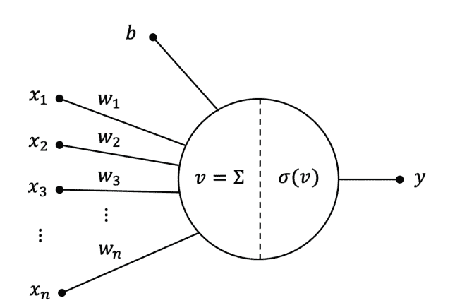

这种单神经元 ANN 也被称为感知机。对于人工智能中的难题，ANN 由许多层组成，每层包含许多神经元，这些被称为深度学习 ANN。人工智能的灵感来源于人脑中神经元的动态活动。

### 8.2 与门、或门和异或门 ANN

图 8.1 至 8.3 分别展示了与门、或门和异或门逻辑门的 ANN 及其对应的真值表。

**与门 ANN** 单个神经元可以模拟一个与门 ANN，如下图所示。

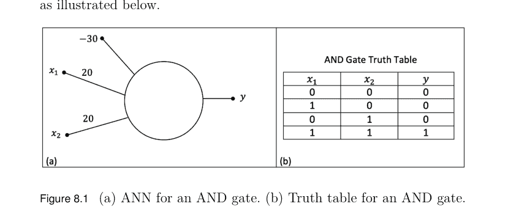

```python
# Python Program for the AND Gate ANN.
import numpy as np
w1 , w2  = 20 , 20
b = -30
# Define the functions.
def sigmoid(v):
    return 1 / (1 + np.exp(- v))
def AND(x1, x2):
    return sigmoid(x1 * w1 + x2 * w2 + b)
print("AND(0,0)=", AND(0,0))
print("AND(1,0)=", AND(1,0))
print("AND(0,1)=", AND(0,1))
print("AND(1,1)=", AND(1,1))
```

```
Out[1]: AND(0,0)= 9.357622968839299e-14
AND(1,0)= 4.5397868702434395e-05
AND(0,1)= 4.5397868702434395e-05
AND(1,1)= 0.9999546021312976
```

# 或门 ANN

单个神经元也可以模拟一个或门 ANN。

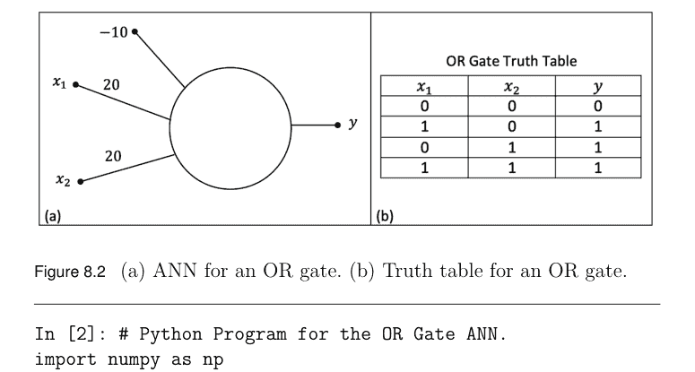

```python
# Python Program for the OR Gate ANN.
import numpy as np
w1 , w2 = 20 , 20
b = -10
# Define the functions.
def sigmoid(v):
    return 1 / (1 + np.exp(- v))
def OR(x1, x2):
    return sigmoid(x1 * w1 + x2 * w2 + b)
print("OR(0,0)=", OR(0,0))
print("OR(1,0)=", OR(1,0))
print("OR(0,1)=", OR(0,1))
print("OR(1,1)=", OR(1,1))
```

```
Out[2]: OR(0,0)= 4.5397868702434395e-05
OR(1,0)= 0.9999546021312976
OR(0,1)= 0.9999546021312976
OR(1,1)= 0.9999999999999065
```

# 异或门 ANN

这无法用单个神经元建模，必须引入一个隐藏层，如图 8.3 所示。

在本章末尾的练习中，你将被提供权重和偏置，并被要求编写一个异或门 ANN 的 Python 程序。

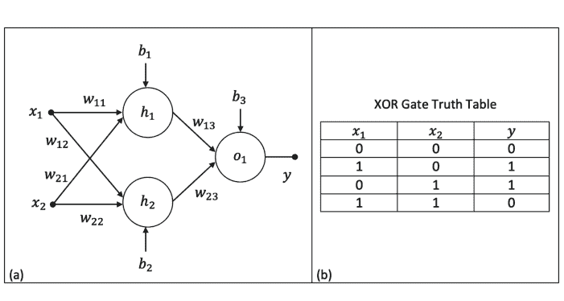

图 8.3 (a) 异或门的 ANN。(b) 异或门的真值表。

一个与门和一个异或门可以连接在一起构成一个二进制半加器，用于将两个比特相加。这是所有现代计算机中最简单的逻辑组件。

### 8.3 反向传播算法

下图展示了一个用于演示人工智能中前馈和反向传播工作原理的 ANN。

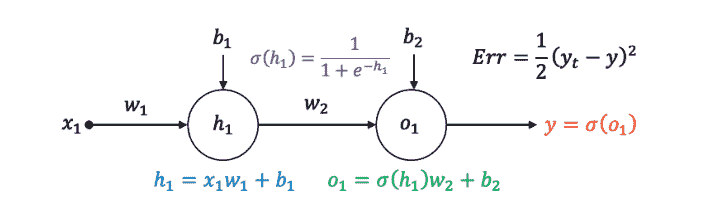

在迄今为止考虑的示例中，ANN 的权重都是给定的，但如果我们没有被提供这些权重怎么办？误差反向传播算法用于确定这些权重。为了说明该方法，请考虑上图并使用传递函数 $\sigma(v)$，此外假设偏置 $b_1$ 和 $b_2$ 是常数。假设我们希望更新权重 $w_1$ 和 $w_2$。最初，随机选择权重，数据通过网络前馈，不可避免地会产生误差。在此示例中，我们使用均方误差。接下来，使用反向传播算法更新权重以最小化误差。因此，使用微积分中的链式法则：

$$\frac{\partial Err}{\partial w_2} = \frac{\partial Err}{\partial y} \frac{\partial y}{\partial w_2} = \frac{\partial Err}{\partial y} \frac{\partial y}{\partial o_1} \frac{\partial o_1}{\partial w_2},$$

以及

$$\frac{\partial Err}{\partial w_2} = (y_t - y) \times \frac{\partial \sigma}{\partial o_1} \times \sigma(h_1),$$

以及

$$\frac{\partial Err}{\partial w_2} = (y_t - y) \times \sigma(o_1)(1 - \sigma(o_1)) \times \sigma(h_1).$$

然后使用以下公式更新权重 $w_2$：

$$w_2 = w_2 - \eta \times \frac{\partial Err}{\partial w_2},$$

其中 $\eta$ 被称为学习率。使用类似的论证来更新 $w_1$，因此：

$$\frac{\partial Err}{\partial w_1} = \frac{\partial Err}{\partial y} \frac{\partial y}{\partial w_1} = \frac{\partial Err}{\partial y} \times \frac{\partial y}{\partial o_1} \times \frac{\partial o_1}{\partial \sigma(h_1)} \times \frac{\partial \sigma(h_1)}{\partial h_1} \times \frac{\partial h_1}{\partial w_1},$$

以及

$$\frac{\partial Err}{\partial w_1} = (y_t - y) \times \sigma(o_1)(1 - \sigma(o_1)) \times w_2 \times \sigma(h_1)(1 - \sigma(h_1)) \times x_1.$$

然后使用以下公式更新权重 $w_1$：

$$w_1 = w_1 - \eta \times \frac{\partial Err}{\partial w_1}.$$

读者应注意，这里使用偏微分，因为误差 $Err$ 是 $y, \sigma, o_i, h_i$ 和 $w_i$ 的函数，其中 $o_i, h_i$ 分别是输出和隐藏激活电位。基本思想是针对权重 $w_1$ 和 $w_2$ 最小化 $Err$。注意，为简化起见，假设偏置 $b_1, b_2$ 是常数。

**示例 8.3.1.** 考虑异或门的 ANN。已知 $w_{11} = 0.2, w_{12} = 0.15, w_{21} = 0.25, w_{22} = 0.3, w_{13} = 0.15, w_{23} = 0.1, b_1 = b_2 = b_3 = -1, x_1 = 1, x_2 = 1, y_t = 0$ 且 $\eta = 0.1$：

(i) 给定传递函数为 $\sigma(v)$，确定 ANN 在前向传播中的输出 $y$。

```python
else:
    gcd, x, y = extended_gcd(phi % e, e)
    return gcd, y - (phi // e) * x, x
if __name__ == '__main__':
    gcd, x, y = extended_gcd(e, phi)
    print("phi = " , phi)
    print('The gcd is', gcd)
    print("x = " , x , ", y = " , y)
```

Out[5]: n=493, phi = 448. The gcd is 1; x = 163, y = -4.

为了进行加密和解密，必须计算 $x^y \mod(z)$。在 Python 中，我们使用内置函数 **pow(x,y,z)**，它接受三个参数。

**重要提示：** 如果你从 math 库导入 pow 函数，它只接受两个参数，并计算 $pow(x, y) = x^y$。

```python
# In [ 6]: Encryption and decryption.
# The message here is m = msg = 20.
d , e , n = 163 , 11 , 493
msg = 20
print(f"Original message: {msg}")
# Encryption
E = pow(msg , e , n)
print(f"Encrypted message: {E}")
# Decryption
D = pow(E , d , n)
print(f"Decrypted message: {D}")
```

Out[6]: Original message: 20 ; Encrypted message: 7 ; Decrypted message: 20.

### 练习

- 1. 编写一个 Python 程序来解密凯撒密码。
- 2. 在网上研究 Playfair 密码：https://en.wikipedia.org/wiki/Playfair_cipher。

使用你的名字和姓氏作为加密和解密密钥（字母不重复），并完成一个 $5 \times 5$ 的数组表，省略字母 J。例如，如果你的名字是 **Bruce Wayne**，数组将如下所示：

$$\begin{pmatrix} B & R & U & C & E \\ W & A & Y & N & D \\ F & G & H & I & K \\ L & M & O & P & Q \\ S & T & V & X & Z \end{pmatrix}$$

写下 Playfair 密码的规则。已知消息是 “I LOVE PYTHON”，请手动确定加密消息。使用字母 X 表示空格。

- 3. 在网上研究维吉尼亚密码：https://en.wikipedia.org/wiki/Vigenere_cipher。

编写一个 Python 程序来使用此密码加密消息。

- 4. 对于对密码学感兴趣的人，请进行文献搜索：
    - (a) 对称密码学：分组密码、流密码、哈希函数、带密钥的哈希和认证加密。
    - (b) 非对称密码学：Rivest-Shamir-Adleman (RSA) 公钥密码系统、Diffie-Hellman 密钥交换、认证加密、椭圆曲线密码学和混沌同步密码学。
    - (c) 对于这个问题，使用 RSA 公钥密码系统。Bob 选择质数 $p = 19$，$q = 23$ 和 $e = 7$。Alice 希望向 Bob 发送数字 11。发送的消息是什么？确认 Bob 正确解密了它。

### 8.4 波士顿住房数据

(ii) 使用反向传播算法更新权重 $w_{13}$ 和 $w_{23}$，假设偏置保持不变。

**解答。** 下面的程序给出 $y = 0.28729994077761756$，以及新的权重 $w_{13} = 0.1521522763401024$ 和 $w_{23} = 0.10215227634010242$。读者将在本章末尾的练习中被要求更新其他权重。

```
In [3]: # Simple feedforward and backpropagation.
import numpy as np
w11,w12,w21,w22,w13,w23 = 0.2,0.15,0.25,0.3,0.15,0.1
b1 , b2 , b3 = -1 , -1 , -1
yt , eta = 0 , 0.1
x1 , x2 = 1 , 1
def sigmoid(v):
    return 1 / (1 + np.exp(- v))
h1 = x1 * w11 + x2 * w21 + b1
h2 = x1 * w12 + x2 * w22 + b2
o1 = sigmoid(h1) * w13 + sigmoid(h2) * w23 + b3
y = sigmoid(o1)
print("y = ", y)
# Backpropagate.
dErrdw13=(yt-y)*sigmoid(o1)*(1-sigmoid(o1))*sigmoid(h1)
w13 = w13 - eta * dErrdw13
print("w13 = ", w13)
dErrdw23=(yt-y)*sigmoid(o1)*(1-sigmoid(o1))*sigmoid(h2)
w23 = w23 - eta * dErrdw23
print("w23 = ", w23)
```

```
Out[3]: y =  0.28729994077761756
w13 =  0.1521522763401024
w23 =  0.10215227634010242
```

该数据最初由 Harrison, D. 和 Rubinfeld, D.L. (1978) 发表，题为“享乐价格与清洁空气需求”，《环境经济学与管理杂志》，5, 81-102。数据集包含506所房屋的14个属性，是一个小型数据集。属性包括按城镇划分的人均犯罪率、一氧化二氮浓度（千万分之一）、放射状公路可达性指数等，目标数据是自住房屋的中位数价值（以千美元计）。波士顿住房数据以及一个完整的波士顿住房ANN计算器工作程序可以从作者的GitHub网站下载：

https://github.com/proflynch/A-Simple-Introduction-to-Python,

其中数据文件标记为“housing.txt”，Python程序名为“Boston-Housing-ANN-Calculator.ipynb。” 一旦训练完成，ANN可用于评估添加到数据集中的新房屋。请注意，此数据来自1978年，因此已过时。

读者应注意，数据可能并不总是准确的，即使它已被用于测试算法多年！例如，目标数据似乎在50.00处被截断（对应于50,000美元的中位价格）；截断的迹象在于，报告的中位价格恰好为50,000美元的情况有16例，而有15例的价格在40,000美元到50,000美元之间，价格四舍五入到最接近的百位。Harrison和Rubinfeld没有提及任何截断。

读者可能对专业的Python AI深度学习框架 **TensorFlow** 和 **PyTorch** 感兴趣。TensorFlow是一个非常强大且成熟的深度学习框架，而PyTorch相对较新，具有更强的社区活动，并且对Python更友好。有关AI、机器学习、深度学习和TensorFlow的更多信息，请读者参阅我在前言中引用的著作《Python for Scientific Computing and Artificial Intelligence》。

### 练习

1. 给定激活函数：

$$\sigma(v) = \frac{1}{1 + e^{-v}}, \quad \phi(v) = \tanh(v) = \frac{e^v - e^{-v}}{e^v + e^{-v}},$$

证明：

(a) $\frac{d\sigma}{dv} = \sigma(v)(1 - \sigma(v))$;
(b) $\frac{d\phi}{dv} = 1 - (\phi(v))^2$。

绘制曲线及其导数。

2. 证明XOR门ANN是XOR门的良好近似，给定：

$w_{11} = 60, w_{12} = 80, w_{21} = 60, w_{22} = 80, w_{13} = -60, w_{23} = 60,$

以及

$b_1 = -90, b_2 = -40, b_3 = -30.$

在你的程序中使用sigmoid函数 $\sigma(v)$。

3. 使用反向传播更新示例8.3.1中XOR门ANN的权重 $w_{11}, w_{12}, w_{21}$ 和 $w_{22}$。

4. 从GitHub下载“Boston-Housing-ANN-Calculator.ipynb”笔记本：

https://github.com/proflynch/A-Simple-Introduction-to-Python.

运行笔记本中的单元格以创建一个ANN，该ANN将评估1978年波士顿郊区的房屋。程序中使用了三个属性（平均房间数、放射状公路可达性指数、人口中较低地位的百分比）。目标数据是自住房屋的中位数价值。

- (a) 研究学习率 $\eta$ 和训练轮数如何影响结果。
- (b) 列出10个在你购买房屋时会重要的属性。

# 第9章

## 数据科学导论

数据科学是结合编程、统计学、数学和领域专业知识来处理数据的研究领域。

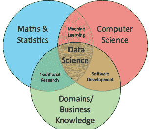

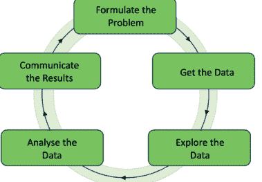

右侧的数据科学周期展示了一个典型的工作流程算法。

### 9.1 PANDAS简介

Python和数据分析（PANDAS）是一个开源Python包，用于解决现实世界的问题。更多信息可以在这里找到：

https://pandas.pydata.org。

示例9.1.1。创建一个关于健身房学生满意度的数据框。Out[1]列出了名为df的数据框。注意，日期被设置为索引。

| 日期 | 星期 | 会员人数 | 员工人数 | 会员/员工比率 | 满意度 (%) |
|---|---|---|---|---|---|
| 2024-01-08 | 星期日 | 126 | 12 | 10.5 | 44.0 |
| 2024-01-09 | 星期一 | 34 | 6 | 5.7 | 82.0 |
| 2024-01-10 | 星期二 | 42 | 6 | 7.0 | 74.0 |
| 2024-01-11 | 星期三 | 100 | 12 | 8.3 | 66.0 |
| 2024-01-12 | 星期四 | 54 | 6 | 9.0 | 85.0 |
| 2024-01-13 | 星期五 | 41 | 6 | 6.8 | 88.0 |
| 2024-01-14 | 星期六 | 105 | 12 | 8.8 | 45.0 |

```
In [1]: # A Data Frame of Membership Satisfaction at a Gym.
import numpy as np
import pandas as pd
df=pd.DataFrame({
    "Date": pd.Categorical(["2024-01-08","2024-01-09",
                            "2024-01-10","2024-01-11",
                            "2024-01-12","2024-01-13",
                            "2024-01-14"]),
    "Day " : pd.Categorical(["Sunday","Monday","Tuesday",
                            "Wednesday","Thursday","Friday",
                            "Saturday"]),
    "Member Numbers" : pd.Series([126,34,42,100,54,41,105],
                                dtype="int32"),
    "Staff Numbers" : pd.Series([12,6,6,12,6,6,12],
                                dtype="int32"),
    "Member/Staff Ratio" : \n    pd.Series([10.5,5.7,7.0,8.3,9.0,6.8,8.8],\n                                dtype="float32"),
    "Satisfaction (%)" : \n    pd.Series([44,82,74,66,85,88,45],dtype="float32")
    })
df = df.set_index("Date")
df
```

```
In [2]: # List the data types of the columns.
df.dtypes
```

Out [2]:
Day category
Member Numbers int32
Staff Numbers int32
Member/Staff Ratio float32
Satisfaction (%) float32
dtype: object

```
In [3]: # Write the data to an excel file.
df.to_excel("Gym_Satisfaction_Ratings.xlsx")
```

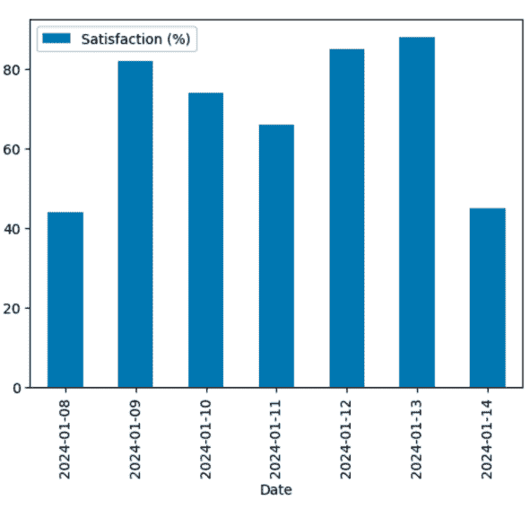

```
In [4]: # Plot a bar chart of the satisfaction ratings.
import matplotlib.pyplot as plt
df.plot.bar(y = "Satisfaction (%)")
```

### 9.2 加载、清洗和预处理数据

在本节中，我们处理真实世界的数据。我们使用Data-1-OCR.xlsx，这是英国OCR考试机构用于A-Level考试的数据。读者可以从GitHub下载Excel文件：

https://github.com/proflynch/A-Simple-Introduction-to-Python.

大数据集（LDS）包含来自CIA世界概况和世界银行的国家数据。通过使用Pandas加载数据并设置数据框（df），所有包含带逗号的数值数据（数据类型为object）的列都被替换为浮点数。因此，Pandas为你预处理了数据。命令df.head()打印数据框df的前五行。

```
In [4]: # Load the data and print the first five rows and
# certain columns.
import pandas as pd    # Import pandas for data analysis.
import seaborn as sns  # Import seaborn for visualisations.
import matplotlib.pyplot as plt
df = pd.read_excel("Data-1-OCR.xlsx" , sheet_name = "Data")
# df.head() # To see the first 5 rows of all data.
df.iloc[0 : 5 , [0 , 1 , 3 , 14 , 19]]
```

| no | 国家 | 人口 | 1960年出生时预期寿命 | 2010年出生时预期寿命 |
|---|---|---|---|---|
| 0 | 1 | 阿尔及利亚 | 41657488 | 46.138 | 74.676 |
| 1 | 2 | 埃及 | 99413317 | 48.056 | 70.357 |
| 2 | 3 | 利比亚 | 6754507 | 42.609 | 71.643 |
| 3 | 4 | 摩洛哥 | 34314130 | 48.458 | 73.999 |
| 4 | 5 | 苏丹 | 43120843 | 48.194 | 62.620 |

**添加新的数值特征** 为了探索预期寿命的变化，你可以添加一个计算预期寿命变化的特征。运行下面的代码，通过从2010年的预期寿命中减去1960年的预期寿命，创建一个新特征“1960年至2010年预期寿命变化”。

### 9.3 数据探索

你可以通过使用 `shape` 查找数据集的维度，并使用 `info()` 显示数据类型来探索数据。

```
In [7]: df.shape # DataFrame 的维度。

Out[7] (236, 22)
```

```
In [8]: df.info() # DataFrame 的信息。

Out[8]:
<class 'pandas.core.frame.DataFrame'>
RangeIndex: 236 entries, 0 to 235
Data columns (total 22 columns):
 #   Column                            Non-Null Count  Dtype  
---  ------                            --------------  -----  
 0   no                                236 non-null    int64  
 1   Country                           236 non-null    object 
 2   Region                            236 non-null    object 
 3   population                        236 non-null    int64  
 4   birth rate per 1000               226 non-null    float64
 5   death rate per 1000               226 non-null    float64
 6   median age                        228 non-null    float64
 7   labor force                       231 non-null    float64
 8   unemployment (%)                  218 non-null    float64
 9   GDP per capita (US$)              228 non-null    float64
 10  physician density (physicians/1000 population)  198 non-null    float64
 11  Health expenditure (% of GDP)     192 non-null    float64
 12  Total area                        236 non-null    float64
 13  Land borders                      236 non-null    object 
 14  Life expectancy at birth 1960     188 non-null    float64
 15  Life expectancy at birth 1970     190 non-null    float64
 16  Life expectancy at birth 1980     192 non-null    float64
 17  Life expectancy at birth 1990     195 non-null    float64
 18  Life expectancy at birth 2000     199 non-null    float64
 19  Life expectancy at birth 2010     198 non-null    float64
 20  Life expectancy change 1960 to 2010  188 non-null    float64
 21  Income category                   236 non-null    object 
dtypes: float64(16), int64(2), object(4)
memory usage: 40.7+ KB
```

**示例 9.3.1.** 创建按地区分组的 2010 年出生时预期寿命的箱线图。

```
In [9]: sns.catplot(data=df, kind="box", x="Life expectancy \nat birth 2010",  y="Region", aspect=2)
```

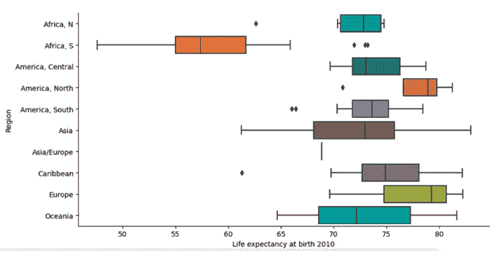

```
Out[9]: # 箱线图。
```

**结果解读：** 南非的预期寿命远低于所有其他地区。预期寿命最高的地区是欧洲和北美。数据科学家会想要了解为什么南非的预期寿命如此之低，并利用数据和干预措施来尝试改善结果。

### 9.4 小提琴图、散点图和六边形分箱图

小提琴图的作用与箱线图类似。它显示了定量数据在一个（或多个）分类变量的多个层级上的分布，以便可以比较这些分布。与箱线图（其中所有绘图组件都对应于实际数据点）不同，小提琴图的特点是对底层分布进行核密度估计。这可以是一种有效且吸引人的方式来同时显示多个数据分布，但请记住，估计过程会受到样本量的影响，对于相对较小的样本，小提琴图可能看起来平滑得具有误导性。

**示例 9.4.1.** 创建按地区分组的 2010 年出生时预期寿命的小提琴图。

```
In [10]: sns.violinplot(data=df, x="Life expectancy at \n                birth 2010", y="Region")
```

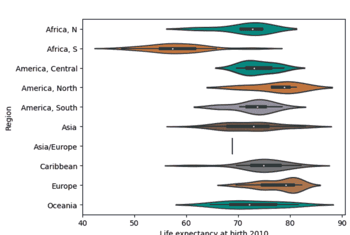

图 9.1 Out[10]：小提琴图，与之前的箱线图进行比较。

图 9.1 显示了小提琴图。

散点图对于查看两个变量之间的相关性很有用。每个点的坐标由 DataFrame 的两列定义，并使用实心圆来表示每个点。在下面的示例中，点按地区进行颜色编码。**aspect** 函数在图表参数中改变宽度与高度的比例。

**示例 9.4.2.** 创建人均 GDP（美元）与 2010 年出生时预期寿命的散点图，按地区进行颜色编码。

```
In [11]: sns.relplot(data=df, x="GDP per capita (US$)", \n                y="Life expectancy at birth 2010", \n                hue="Region", aspect=1.5)
```

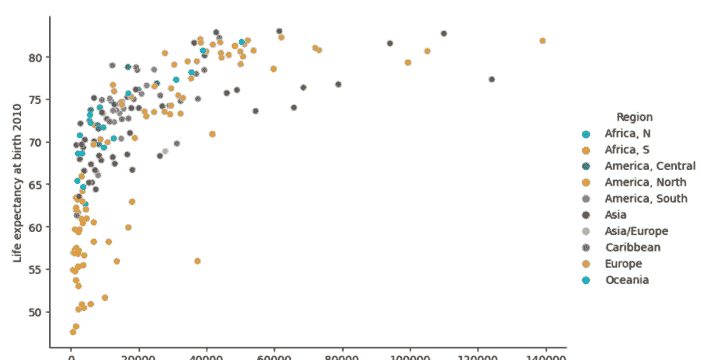

图 9.2 Out[11]：按地区颜色编码的散点图。南非的出生时预期寿命远低于所有其他地区。

图 9.2 显示了 Out[11]。

**六边形分箱图：** 当你有一个非常大的数据集，包含数千甚至数百万个数据点时，散点图可能会产生误导。这是因为点开始相互重叠，使得很难判断一个区域中是有很多点还是只有几个点。为了解决这个问题，一些图表首先对数据进行“分箱”，其方式与直方图非常相似。与直方图不同，分箱图使用阴影来显示密度，颜色代表更高的密度。Seaborn 可以使用其 **jointplot 函数** 创建分箱图，该函数还提供两个变量的直方图。运行下面的代码来创建预期寿命与 GDP 的六边形分箱图。

**示例 9.4.3.** 绘制人均 GDP（美元）与 2010 年出生时预期寿命的六边形图。

```
In [12]: sns.jointplot(data=df, kind="hex", x="GDP per \n      capita (US$)", y="Life expectancy at birth 2010")
```

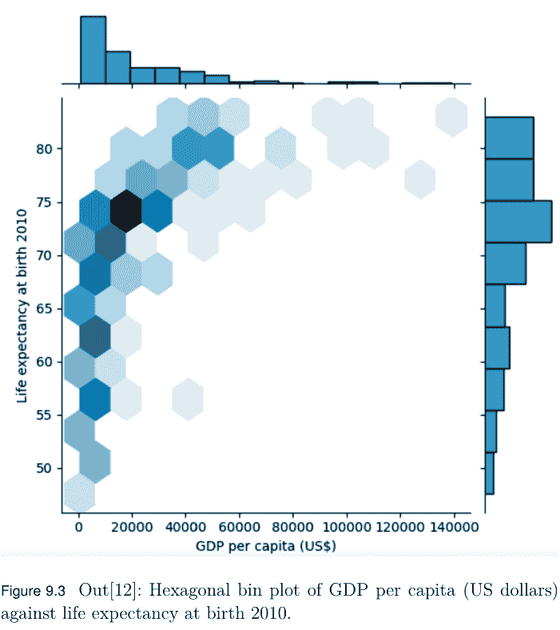

图 9.3 Out[12]：人均 GDP（美元）与 2010 年出生时预期寿命的六边形分箱图。

图 9.3 显示了 Out[12]。

### 练习

以下使用的数据集取自英国 A-Level 数学数据集。所有数据集均可通过 GitHub 下载：https://github.com/proflynch/A-Simple-Introduction-to-Python。

- 1. 对于数据集 Data-1-OCR.xlsx，创建人均 GDP 与 2010 年出生时预期寿命的散点图，其中实心圆的大小由医生密度决定。你能得出什么结论？
- 2. 从 GitHub 加载数据文件 Data-2-Edexcel.csv。这个 LDS 包含英国气象局为五个英国气象站提供的天气数据样本。加载数据并建立一个数据框。探索数据。比较 1987 年与 2015 年五个气象站的日平均温度。解读结果。
- 3. 从 GitHub 加载数据文件 Data-3-AQA.xlsx。这个 LDS 取自英国交通部的库存车辆数据库。加载数据并建立一个数据框。探索数据。仅为汽油车创建二氧化碳排放量与质量的散点图。解读结果。
- 4. 从 GitHub 加载数据文件 Data-4-OCR.xlsx。这个 LDS 包含四组数据：两组来自 2001 年和 2011 年的人口普查；两组关于通勤方式，两组显示人口年龄结构。加载数据并建立一个数据框。探索数据。添加一列，给出就业人口中骑自行车上班的人的百分比。创建按地区划分的骑自行车上班工人百分比的箱线图。解读结果。

## 第10章

## 面向对象编程简介

面向对象编程是一种基于“对象”概念的编程范式，对象可以包含数据和代码。数据以属性的形式存在，代码则以方法的形式存在。

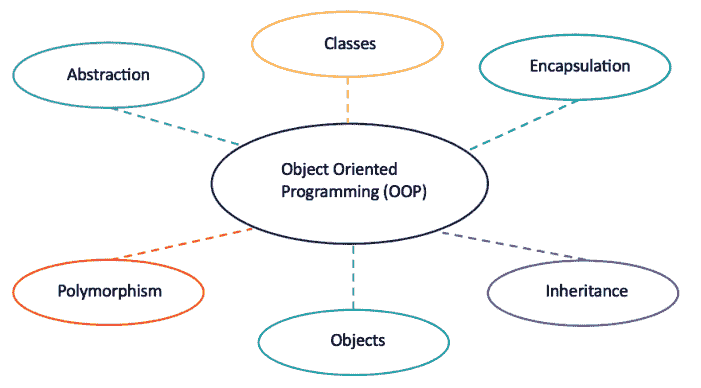

### 10.1 类与对象

属性是类的特征，方法是可以在类上执行的操作。

**示例 10.1.** 根据你的选择，创建一个包含属性、方法和对象的 Student 类。

```
In [1]: # 定义一个类。
class Student:
    # 属性。
    def __init__(self, name, age, course, student_id):
        self.name = name
        self.age = age
        self.course = course
        self.student_id = student_id
    # 方法。
    def enrol(self):
        return "Enrolled"
    def payfees(self):
        return "Fees Paid"
    def accommodation(self):
        return "Student in Accommodation"
# 创建 Student 类的对象。
Ali_M = Student("Mohammad Ali", 18, "Software Engineering", 23000001)
Parker_P = Student("Peter Parker", 19, "Physics", 23000002)
Kane_K = Student("Kate Kane", 22, "Biology", 23000003)
Chang_A = Student("Angela Chang", 18, "Music", 23000004)
```

```
In [2]: # 使用属性。
print(Ali_M.name)
print(Parker_P.age)
print(Kane_K.course)
print(Chang_A.student_id)
```

```
Out [2]: Mohammad Ali
19
Biology
```

```
In [3]: # 使用方法。
print(Ali_M.enrol())
print(Parker_P.payfees())
print(Kane_K.accommodation())
```

```
Out[3]: Enrolled
Fees Paid
Student in Accommodation
```

### 10.2 封装

封装是面向对象编程的核心概念之一，它将操作数据的属性和方法描述为一个单元。

**封装的优点：**

1.  安全性：使用封装的主要优点在于数据的安全性。封装保护对象免受未经授权的访问。它允许使用私有和受保护的访问级别来防止意外的数据修改。
2.  数据隐藏：用户不会知道幕后发生了什么。要修改数据成员，请调用 setter 方法。要读取数据成员，请调用 getter 方法。这些 setter 和 getter 方法对用户是隐藏的。
3.  简洁性：通过保持类的分离并防止它们之间紧密耦合，简化了应用程序的维护。
4.  美观性：将属性和方法捆绑在类中使代码更具可读性和可维护性。

```
In [4]: # 封装和数据隐藏。
class Employee:
    # 属性
    def __init__(self, name, job_title, salary):
        # 公有属性。
        self.name = name
        self.job_title = job_title
        # 私有属性。
        self.__salary = salary # 数据隐藏。
    # 方法
    def work(self):
        print(self.name, "is employed in:", self.job_title)
# 创建类的对象
emp1 = Employee("Jessa", "Human Resources", 25000)
emp2 = Employee("Tom", "Lecturing", 35000)
emp3 = Employee("Leon", "Administration", 15000)
emp1.work()
emp2.work()
emp3.work()
```

```
Out[4]: Jessa is employed in: Human Resources
Tom is employed in: Lecturing
Leon is employed in: Administration
```

```
In [5]: # 访问私有数据成员。
print(emp1.name)
print(emp1.job_title)
print(emp1.__salary)
```

```
Out[5]: Jessa
Human Resources
AttributeError: 'Employee' object has no attribute '__salary'
```

### 10.3 继承

将父类的属性继承到子类的过程称为继承。现有的类称为基类或父类，新类称为子类或派生类。

```
In [6]: # 父类。
class Person:
    def __init__(self, name, age):
        print("Inside Person class")
        print("Name:", name, "Age:", age)
# 父类 2。
class Company:
    def __init__(self, company_name, location):
        print("Inside Company class")
        print("Name:", company_name, "Location:", location)
# 子类。
class Employee(Person, Company):
    def __init__(self, department, job_title):
        super().__init__(department, job_title)
        print("Inside Employee class")
        print("Department:", department, "Job_Title:", job_title)
# 创建 Employee 对象
emp1 = Person("Jessa" , 35)
emp1 = Employee("Software", "Machine Learning")
emp1 = Company("Google", "Atlanta")
```

```
Out[6]: Inside Person class
Name: Jessa Age: 35
Inside Person class
Name: Software Age: Machine Learning
Inside Employee class
Department: Software Job_Title: Machine Learning
Inside Company class
Name: Google Location: Atlanta
```

### 10.4 多态

多态是面向对象编程的核心概念之一，它描述了某事物以多种形式出现的情况。

**函数多态：** 一个可以在不同对象上使用的 Python 多态函数示例是 `len()` 函数，它可以用于列表、集合、字符串、元组和字典。

```
In [7]: # 一个列表。
print(len([1 , 2 , 3 , 4 , 5 , 6 , 7 , 8]))
# 一个集合。
print(len({1 , 2 , "apple" , "cherry"}))
# 一个字符串。
print(len("This is a string"))
# 一个元组。
print(len(("apple", "banana", "cherry", "pear", "orange")))
# 最后一个示例是一个字典。
print(len({"Manufacturer": "Ford", "Model" : "Mustang" , "Year" : 1964}))
```

```
Out[7]: 8
4
16
5
3
```

#### 继承类多态

那么，具有同名子类的类呢？我们能在那里使用多态吗？

可以。如果我们使用下面的例子，创建一个名为 Vehicle 的父类，并创建 Car、Boat、Plane 作为 Vehicle 的子类，子类会继承 Vehicle 的方法，但可以重写它们。

**示例 10.4.1.** 使用你选择的交通工具来演示继承类多态。

```
In [8]: # 继承类多态。
class Vehicle:
    # 属性。
    def __init__(self, manufacturer, model):
        self.brand = manufacturer
        self.model = model
    # 方法。
    def move(self):
        print("Move!")
class Car(Vehicle):
    pass
class Boat(Vehicle):
    def move(self):
        print("Sail!")
class Plane(Vehicle):
    def move(self):
        print("Fly!")
car_1 = Car("Kia", "Sportage")    #创建一个 Car 对象。
boat_1 = Boat("Yamaha", "SX 210")  #创建一个 Boat 对象。
plane_1 = Plane("Boeing", "747")   #创建一个 Plane 对象。
for x in (car_1, boat_1, plane_1):
    print(x.brand)
    print(x.model)
    x.move()
```

```
Out[8]: Kia
Sportage
Move!
Yamaha
SX 210
Sail!
Boeing
747
Fly!
```

### 练习

1.  你已被英国切斯特动物园聘为软件工程师。创建一个 Animal 类，包含属性 name、age、sex 和 feeding time。Animal 类有三个方法：resting、moving 和 sleeping。
2.  创建十个你选择的动物对象，并引入名为“feed cost”和“vet cost”的私有属性。
3.  以下程序展示了一个父类 Pet 和子类 Cat 和 Canary。对象 Tom 和 Cuckoo 已被声明。

```
In [9]: # 父类和子类。
class Pet:
    def __init__(self , legs):
        self.legs = legs
    def walk(self):
        print("Pet parent class. Walking...")
class Cat(Pet):
    def __init__(self , legs , tail):
        self.legs = legs
        self.tail = tail
    def meeow(self):
        print("Cat child class.")
        print("A cat meeows but a canary can't. Meeow...")
class Canary(Pet):
    def chirp(self):
        print("Canary child class.")
        print("A canary chirps but a cat can't. Chirp...")
Tom = Cat(4 , True)
Cuckoo = Canary(2)
```

以下几行代码会输出什么？

```
In [10]: print(Tom.legs)
print(Tom.tail)
print(Cuckoo.legs)
Tom.meeow()
Cuckoo.chirp()
```

4.  下图是 **Brick Breaker Game** 的截图。玩家左右移动挡板来击打球，球会从挡板、砖块和三面围墙反弹。如果球越过挡板，玩家就失去一条命。水绿色的砖块（最低层）被击中一次后破碎，番茄红色的砖块（中间层）被击中两次后破碎，草坪绿色的砖块（顶层）被击中三次后破碎。如果所有砖块都被摧毁，你就赢得了游戏。

    (a) 列出创建 Brick Breaker Game 所需的至少五个对象、属性和方法。

## 索引

- %matplotlib qt5, 29
- A-Level 数学, 49
- 激活
    - 函数, 15, 60
    - 电位, 60
- 代数, 40
- 与门 ANN, 61
- 海龟绘图中的动画, 23
- 人工神经网络, 60
- 分离, 36
- 追加, 9
- arange, 25, 41
- 曲线下面积, 46
- 数组, 24
- 人工智能, 59
- 方面, 75
- 属性, 80
- axes3d, 29
- 坐标轴, 27
- 贝祖恒等式, 55
- 反向传播, 63
- 偏置, 60
- 分叉树, 20
- 二进制
    - 半加器, 63
    - 数字, 53
- 按位异或, 53
- 运算顺序, 1, 7
- 波士顿房价数据, 65
- 箱线图, 73
- 打砖块游戏, 86
- 凯撒密码, 52
- 微积分, 46
- 康托尔集, 18
- 数据审查, 66
- 摄氏度转开尔文, 10
- 链式法则, 64
- 子类, 82
- chr, 52
- 类, 80
- 清洗数据, 71
- 云计算, 13
- 互质, 55
- Colab, 32
- 注释, # 符号, 4
- 同余, 55
- 连接到托管运行时, 13
- 复制粘贴代码, 12
- 密码学, 51, 58
- 网络安全, 51
- 数据
    - 清洗, 71
    - 文件
        - 通勤出行, 78
        - 车辆数据库, 78
        - 天气数据, 78
        - 世界银行, 71
    - 框, 69
    - 隐藏, 81
- 加载, 71
- 小数位数, N, 37
- 解密, 54
- 深度学习, 60
- def, 10
- 数据框转 Excel, 70
- df.head(), 71
- 字典, 8
- diff, 37
- dpi, 27
- 逐元素乘法, 25
- 封装, 81
- 加密, 52
- 展开, 41
- 探索数据, 73
- 因子, 36, 41
- 阶乘, 6
- 斐波那契数列, 12
- 向下取整, 6
- fmod, 6
- for, 11, 20, 28
- 格式化笔记本, 33
- 分数, 2
- 函数
    - 反函数, 44
    - 数学, 43
    - 复合函数, 44
- 游戏
    - 打砖块, 86
    - 猜数字, 15
    - 汉诺塔, 23
- gcd, 5
- GitHub, 37
- Google Colab, 13
- 梯度, 46
- 猜数字游戏, 15
- 直方图, 76
- hsgn 函数, 15
- IDLE, 10
- if, elif, else, 14
- 索引, 69
- 索引, 3
- info(), 73
- 继承, 82
- 插入图表, 35
- 积分
    - 定积分, 36
    - 不定积分, 36
- 积分, 37
- 反函数, 44
- jointplot, 76
- Jupyter notebook, 14
- 内核, 13
- 科赫雪花, 19
- 大型数据集, 71
- LaTeX, 33
- lcm, 6
- 学习率, 64
- len, 9
- 极限, 37
- linspace, 27
- 列表, 7
- 加载数据, 71
- log, 6
- 数学库, 4
- 数学符号, LaTeX, 33
- MatPlotLib, 26
- 矩阵, 37
    - 行列式, 37
    - 逆矩阵, 37
    - 乘法, 25
- max, 9
- 均方误差, 63
- 方法, 80
- min, 9
- mod, 55
- 模, 55
- N, SymPy, 37
- ndim, 25
- 神经网络, 60
- NumPy, 24
- 面向对象编程, 79
- 对象, 80
- 或门 ANN, 61
- ord, 52
- 用于 LaTeX 的 Overleaf, 35
- Pandas, 68
- 父类, 82
- 偏微分, 64
- 感知机, 60
- Playfair 密码, 57
- 绘图, 27
- 多态
    - 函数, 83
    - 面向对象编程, 83
- pow(x,y), 3, 57
- pow(x,y,z), 57
- 幂, 3
- 预处理数据, 71
- 质数, 54
- 私钥, 55
- 程序挂起, 14
- 公钥, 55
- 发布网页, 15
- 勾股数, 16
- PyTorch, 66
- 弧度, 5
- range, 9
- 移除, 9
- 重塑, 25, 36
- 重启内核, 14
- 根, 3
- 四舍五入, 5
- RSA 加密, 54
- savefig, 27
- 散点图, 28, 75
- 集合, 8
- 形状, 73
- 谢尔宾斯基三角形, 21
- Sigmoid 函数, 15, 60
- 联立方程, 43
- 切片, 9, 25, 36
- 求解, 36, 42
- Spyder, 12
- sqrt, 3
- 曲面图, 29
- 符号, 41
- SymPy, 35
- 突触权重, 60
- tanh 激活函数, 66
- 张量, 24
- TensorFlow, 66
- tolist, 25
- 传递函数, 60
- 三引号, 10
- 真值表, 61
- 元组, 8
- 海龟, 17
- 海龟演示, 23
- 取消停靠窗口, 12
- Unicode, 52
- 向量, 24
- 向量化计算, 25, 26
- 维吉尼亚密码, 58
- 小提琴图, 74
- while, 11
- 世界银行数据集, 71
- xlabel, 27
- 异或密码, 53
- 异或门 ANN, 61
- ylabel, 27
- 基于零的索引, 8