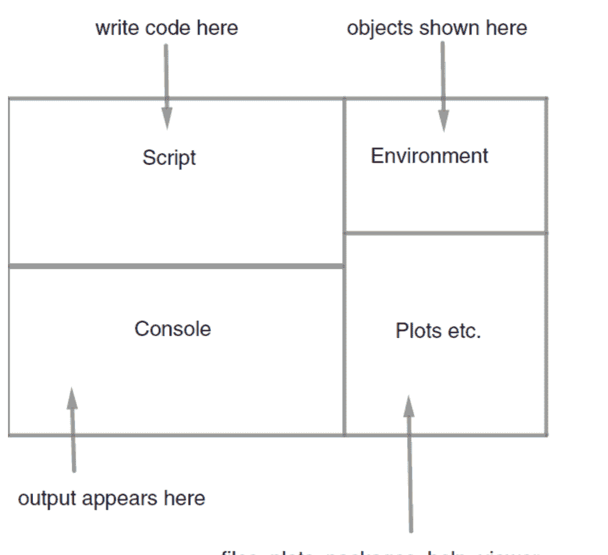
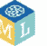
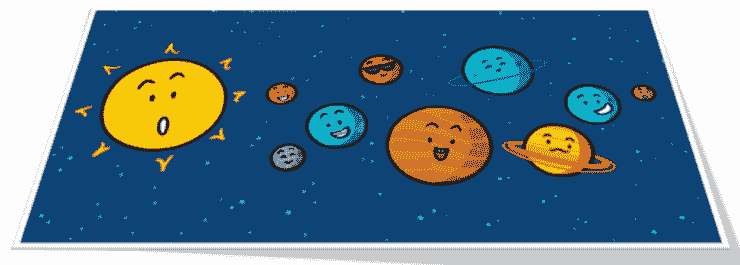

# R 与 Python 初级语言学习的简单技巧

我之前已经写过两本关于 R 初级语言的书。写这本书的目的是基于我的经验，与大家分享为什么我们需要学习 R 和 Python 这两种初级语言以应对未来，以及如何能在最短时间内学会它们。关于学习初级语言，有一个主张：从儿童开始，直到所有受益的个体，为了在未来世界中生存和发展，都必须学习初级语言。初级语言本质上是向计算机发出指令或命令的语言。如果能熟练掌握这门语言，那么理解它将不再困难。了解初级语言后，通过数据的运用，你可以极大地提升自己和你的业务。因此，本书将揭示如何一起学习 R 和 Python 这两种初级语言，以及我们如何以最小的成本将其应用于实践的核心秘诀。本书主要是一份完整的指南，面向那些目前对计算机感兴趣、并致力于通过数据科学建立职业生涯的儿童和青少年。希望本书能介绍 R 和 Python 的语法结构，并为孩子们提供一些简单的 Python 代码，这将使孟加拉国的每一位公民为迎接未来的第四次儿童革命做好更充分的准备。

## 第一章：R 和 Python 适合谁？

R 和 Python 主要用于不同人群的不同工作。并非每个人都需要学习 R 和使用 Python 工作。对于那些未来想了解一种通用语言（即通用目的语言），并希望通过这种知识在未来开发应用程序的人来说，从 Python 开始是一个很好的教育。对于那些希望获得计算机或 R 基础知识的儿童和青少年，我认为从 Python 开始是正确的。那么问题来了，R 初级语言主要是为谁准备的？R 初级语言是为那些未来想进行数据分析或想成为数据分析师的人准备的完整初级语言。此外，对于那些长大后想成为数据科学家，并通过该领域建立自己职业生涯的人来说，R 初级语言或 Python 都极其重要。

本书将讨论 R 初级语言和 Python 初级语言的各个方面，并讨论哪些 Python 主题对我们的孩子来说是重要的学习内容。本书的主要目的是讨论如何一起学习 R 和 Python 初级语言以节省时间，以及通过学习，你如何在职业生涯中运用它们。那么，让我们首先尝试向大家介绍 R 和 Python 语法结构的差异以及一些基本技巧。

### R 初级语言学习的简单技巧

本章首先将介绍 R 初级语言的基本结构、示例和一些简单的命令。为了学习 R 初级语言，如果你练习本章的每一个主题，你将能够在极短的时间内自己解决 R 代码中的所有问题。

只需要重视三件事。

首先，学习新事物的意愿。

其次，一台计算机。

以及本书，它将为你提供关于学习 R 和 Python 初级语言技巧的指导。

R 初级语言是一种函数式初级语言。R 初级语言通常由以下句子结构控制。每个 R 命令都根据以下公式或代码语法构建。

```
new object ← function( object or formula , object information , options )
```

或者

```
object<- function(argument name= argument information/value, option)
```

了解这个代码构建过程对于学习 R 初级语言至关重要。通过这个过程，可以构建任何代码来执行任何类型的命令。下面再举一个例子来解释上面的代码构建过程。

```
Price <- c(21, 31, 34)
```

R 的 **r-studio** 是完全免费的软件。你可以访问以下网站下载这两个软件。

http://www.r-project.org/

http://www.rstudio.com/

然后，通过下载并安装，**R-studio** 平台将如下图所示。



**R-studio** 是一个为了简化 R 编程语言使用而设计的 IDE。IDE 的意思是集成开发环境。就像 Python 有 Spyder 一样，**R-studio** 也是一个 IDE。在开始任何 R 编程项目之前，你需要从项目菜单中创建一个新项目。在新项目中选择一个目录，你所有的 R 编程工作将变得简单并自动保存。然后，你可以从文件菜单中附加一个 R 脚本，开始你的工作或编程。为此，你需要进入 R 脚本输出，然后点击文件和脚本。务必保存脚本。R 编程语言有三种不同的对象类型。R 编程和 Python 编程是面向对象的编程语言，因此这两种编程语言由不同类型的对象构成。对象通常被称为变量。一个变量由一个基本元素组成。例如，R 编程的四个重要对象类型是向量、矩阵、列表和数据框。首先来看向量的例子。向量是由相同类型的元素、实体或单位构成的对象类型。观察下面的例子，我们可以看到在一个向量中，使用 c 函数存储了价格的一些重要信息。

```
Price <- c(2,3,4)
Price[3]
```

这里需要注意的是，价格变量中包含相同类型的标签。在 R 编程中，向量的使用非常重要。R 和 Python 的一个重要区别在于，R 编程主要处理向量对象，而 Python 通常处理列表对象类型。从上面的例子可以非常清楚地理解，在 R 编程中，首先是一个对象，然后是一个函数，该函数包含一些可能的数字或元素，构成一个向量。c 函数帮助构建向量，我们称之为 **concatenate** 函数。下面列出了一些向量的重要特征。例如，如果我们想查看向量的 **length**，或者想查看元素的位置编号，那么可以借助这些例子开始工作。

```
Price <- c(10,3,15)
Price
## [1] 10  3 15
length(Price)
## [1] 3
Price[1]
## [1] 10
```

以及第二个和第三个元素：

```
Price[2:3]
## [1]  3 15
```

现在来完成下面的练习。

在 R 脚本中，输入以下两个向量：$Price2 \leftarrow c(2, 12, 7, 33)$ 和 $Quantity2 \leftarrow c(23, 32, 12, 33)$。然后提取 Price2 和 Quantity2 的第四个元素，计算 Expenditure2 和 TotalExpenditure2，遵循我们上面使用 Price 和 Quantity 向量所做的操作。保存脚本文件，我们将继续练习。

R 编程的另一个重要部分是矩阵。矩阵是由特定数量的列和行组合而成的向量，或者如果你用特定数量的列和行来表示一个向量，那么它将被视为矩阵。下面给出了构建此类矩阵的示例。

```
Matrix_PQE <- matrix(data = cbind(Price, Quantity, Expenditure)
, ncol=3)
Matrix_PQE
##      [,1] [,2] [,3]
## [1,]   10   25  250
## [2,]    3    3    9
## [3,]   15   20  300
```

我们打印矩阵的第一行。

```
Matrix_PQE[1,]
## [1]  10  25 250
```

然后是第二列。

```
Matrix_PQE[,2]
## [1] 25  3 20
```

第一行，第二列：

```
Matrix_PQE[1,2]
## [1] 25
```

现在来谈谈数据框。数据框是将两个变量或向量组合在一起，形成一个类似电子表格的结构。观察下面的例子，我们可以轻松理解：

```
Exp_data <- data.frame(Price, Quantity)
Exp_data
##   Price Quantity
## 1    10       25
## 2     3        3
## 3    15       20
```

现在自己动手试试。

创建一个包含向量 Price2 和 Quantity2 的数据框。尝试打印数据框的第一列。

你可以在 Munshi Naser 博士的 Skill Tone Youtube 频道找到所有 R 教程。

R 初级语言的最高级对象类型是列表。列表是将不同类型的元素单元组合在一起构建对象的过程。也就是说，一个列表函数包含不同类型的对象。例如，观察下面的例子，我们可以看到你可以使用数字和字符来创建一个列表对象。

```
Expenditure_list <- list(Price, Quantity, Expenditure,
                        Total_expenditure)
Expenditure_list
```

列表的索引使用双括号。我们在下面打印第二个元素。

```
Expenditure_list[[2]]
## [1] 25  3 20
```

下面给出一个示例，该示例整合了上述每种对象类型，即向量、矩阵、数据框和列表，以组织示例。您可以自行跟随此示例，创建自己的对象进行练习。

### 玩具示例：净现值

我们计算两年后收到的一笔款项（121）的现值，折现率为10%。首先，我们告诉R这些值是多少：

```
Amount <- 121
discount_rate <- 0.10
time <- 2
```

然后我们告诉R如何计算净现值。

```
Net_present_value <- Amount/(1+discount_rate)^time
Net_present_value
## [1] 100
```

## 第二章：R编程与数据科学

当前最受欢迎的R编程包名为 **Tidyverse**。使用此包，您可以非常轻松地完成数据科学的每一个步骤。我们这些对数据科学感兴趣并想学习工作的人，可以非常容易地从这个包开始。这个包主要包含四个步骤：首先是清理数据，然后转换或按您的意愿创建数据，接着可视化数据，最后建立模型并传达其输出。**Tidyverse** 包中包含 **Hadley Wickham** 创建的一个 **内置** 指南，通过它您可以非常轻松地使用R编程完成数据科学和机器学习的工作。对于那些仅仅为了学习数据科学而开始学习R编程语言的人来说，这个包可能是最好的学习包。下面尝试通过代码示例来学习这个包的每个步骤。首先，在开始这个包之前，我们将从R编程和 **内置** 数据集中获取一个数据集，然后将其转换为数据框，在 **Tidyverse** 包中称为 **tibble**，之后我们可以使用各种函数来整理这个数据集，使其符合我们的需求并开始工作。**Tidyverse** 包中包含五个重要的函数。这些函数使用起来非常简单。在使用这些函数之前，先展示一个通用的代码指南。遵循此代码指南，使用此包的每个函数将变得容易得多。通过本书，您可以使用这些函数开始数据科学或数据分析的工作。

**verbs(dataset, argument name=argument values)**
同时使用管道操作符“%>%”，例如 x%>%y()，这意味着取x然后应用函数y()

要进行数据科学、数据清理、数据可视化或任何与数据相关的分析，您首先必须理解数据。而为了理解数据，哈德利·威克姆的 **Tidyverse Package** 是无与伦比的。**Tidyverse** 包中包含五个重要的函数，它们将为您准备数据以供分析。这些函数的名称是 **filter, select, mutate, summarize** 和 **arrange**。这五个函数合称为 **五个数据动词**。下面展示了如何使用每个 **动词** 进行数据清理的简单结构。通过此结构，使用 **tidyverse** 包的五个 **动词**，可以非常轻松地完成数据科学中的大部分数据清理工作。下面将通过示例展示如何操作每个主题。对于数据可视化，另一个重要的包是 **ggplot2**。下面给出了使用 **ggplot2** 包快速创建各种图形的示例。最后，在数据可视化和清理之后，您可以建立模型。而建立模型最常用的模型是线性模型。下面展示了如何在该线性模型中运行分析的示例。

### 数据分析工作流程

- 1. 将数据导入R，
- 2. 整理和转换，
- 3. 可视化和建模，以及
- 4. 传达。

#### Tidyverse 包

```
install.packages("tidyverse")

library(tidyverse)

surv_id <- c(1,2,3,4,5,6)
payment <- c(1000,700,600,1200,800,500)
hours <- c(7,5,3,6,7,4)
gender <- c("F","M","F","M","M","M")
age <- c(28,52,37,35,59,43)
```

在R中，数据通常存储在数据框中。威克姆设计了一个‘tibble’来改进R的数据框。tibble类似于数据框，用于存储我们的数据。我们将我们的tibble命名为labour。我们使用 `tibble()` 函数创建一个tibble。

```
labour <- tibble(surv_id,
  payment, hours,
  gender,age)
```

```
labour
## # A tibble: 6 x 5
##   surv_id payment hours gender   age
##     <dbl>   <dbl> <dbl> <chr>  <dbl>
## 1       1    1000     7 F         28
## 2       2     700     5 M         52
## 3       3     600     3 F         37
## 4       4    1200     6 M         35
## 5       5     800     7 M         59
## 6       6     500     4 M         43
```

我们使用 `glimpse` 函数来概览我们的数据。

```
glimpse(labour)
## Observations: 6
## Variables: 5
## $ surv_id <dbl> 1, 2, 3, 4, 5, 6
## $ payment <dbl> 1000, 700, 600, 1200, 800, 500
## $ hours   <dbl> 7, 5, 3, 6, 7, 4
## $ gender  <chr> "F", "M", "F", "M", "M", "M"
## $ age     <dbl> 28, 52, 37, 35, 59, 43
```

我们现在可以使用 `write_csv` 函数将数据写入csv文件，然后使用 `read_csv` 函数将此文件读入RStudio：

```
write_csv(labour, "labour.csv")
labour2 <- read_csv("~/Documents/R/ies2018/labour.csv")
```

五个数据动词帮助我们处理大量数据。我们在威克姆编写的 `dplyr` 包的帮助下使用它们，该包包含在 `tidyverse` 包中。
这五个数据动词是：

- `filter` 用于选择特定行
- `select` 用于选择列
- `mutate` 用于生成新变量
- `summarize` 用于汇总
- `arrange` 用于按某种顺序排序

所有这些都可以与 `group_by()` 函数一起使用。
这五个动词，连同管道符号，在处理数据时帮助我们完成很多工作。管道符号

```
%>%
```

帮助我们将命令串联起来。以下命令是等效的。

```
f(x,y)
```

等效于

```
x %>%
f(,y)
```

管道符号将x传递给x和y的函数。因此，管道左侧的内容作为右侧函数的第一个参数传递。这起初可能看起来很奇怪，需要一些时间来适应，但它极大地帮助我们执行相互关联的数据操作，并使代码更易于理解。

## 我们使用 `filter` 选择行。

```
labour_filter <- labour %>%
  filter(gender == "F")
```

```
labour_filter
## # A tibble: 2 x 5
##   surv_id payment hours gender   age
##     <dbl>   <dbl> <dbl> <chr>  <dbl>
## 1       1    1000     7 F         28
## 2       3     600     3 F         37
```

```
labour_filter <- filter(labour, gender == "F")
```

```
labour_filter
## # A tibble: 2 x 5
##   surv_id payment hours gender   age
##     <dbl>   <dbl> <dbl> <chr>  <dbl>
## 1       1    1000     7 F         28
## 2       3     600     3 F         37
```

我们使用mutate创建新变量；我们计算工资率。

```
labour_mutate <- labour %>%
  mutate(wage = payment /
         hours)
```

```
labour_mutate
## # A tibble: 6 x 6
##   surv_id payment hours gender   age  wage
##     <dbl>   <dbl> <dbl> <chr>  <dbl> <dbl>
## 1       1    1000     7 F         28  143.
## 2       2     700     5 M         52  140 
## 3       3     600     3 F         37  200 
## 4       4    1200     6 M         35  200 
## 5       5     800     7 M         59  114.
## 6       6     500     4 M         43  125
```

我们使用arrange按工作小时数对数据进行排序。

```
labour_arrange <- labour %>%
  arrange(hours)
```

我们选择工作小时数和性别列。

```
labour_select <- labour %>%
  select(hours, gender)
```

我们现在汇总数据；按性别分组。这里的group by按性别分组；我们得到女性和男性的平均工作小时数。

```
labour_summary <- labour %>%
  group_by(gender) %>%
  summarize(mean = mean(hours))

labour_summary
## # A tibble: 2 x 2
##   gender  mean
##   <chr>  <dbl>
## 1 F          5
## 2 M        5.5
```

tidyverse中的ggplot2包可以进行出色的可视化。

```
gg1 <- ggplot(data = labour_mutate,
              aes(x = age, y = wage))
gg1
```

我们使用geom_point()告诉R我们想要绘制点。

```
gg2 <- gg1 +
  geom_point()
gg2
```

#### 线性模型

我们可以使用lm命令拟合线性模型。

```
age_wage_fit <- lm(wage ~ age, data = labour_mutate)
```

## 第3章：现在让我们快速学习Python基础的代码结构

lm(formula = wage ~ age, data = labour_mutate)

Coefficients:
(Intercept)            age
    233.28          -1.88

让我们开始

使用R脚本，如上创建tibble `labour`，然后将其写入csv文件，再如上读取。tibble `labour2` 将在后续使用，因此请保存R脚本。

在R脚本中，输入以下两个向量：`Price2 <- c(2, 12, 7, 33)` 和 `Quantity2 <- c(23, 32, 12, 33)`。然后提取 `Price2` 和 `Quantity2` 的第四个元素，并按照我们之前对向量 `Price` 和 `Quantity` 的操作，计算 `Expenditure2` 和 `TotalExpenditure2`。保存脚本文件，我们将继续练习。

筛选性别为男性的行，将新的tibble命名为 `labour_filter2`。通过打印 `labour_filter2` 来检查你是否正确完成了此操作。

_通过使用上述示例并在基础笔记本上进行数据科学工作，通过实践，您可以在几天内开始工作，并且练习得越多，您就能越快熟悉这些函数。我本章的目的是简要讨论如何通过学习R基础的一些重要函数并在实际生活中应用它们。_

对于Python编程，首先您需要在计算机上安装Anaconda (https://www.anaconda.com/download/)。然后，您可以使用其中的Spyder IDE轻松运行所有Python代码。Python的Spyder IDE类似于R编程语言和电子表格的IDE。Python程序的三种基本数据类型是元组、列表和字典。基本上，在Python编程中，列表是最常见的数据类型。在列表中，您可以将字符类型对象和数字对象，即所有类型的对象放在一起。下面给出了一些元组、列表和字典数据类型的示例。

```python
mytuple=(1,3,7,6,"test")
print(mytuple)

mylist = [1, 2, 7, 4, 12]

mydict={'Name':'Ganesh','Age':54,'Occupation':'Engineer'}
print(mydict)
print(mydict['Age'])
```

下面给出了一些如何访问元组、列表和其他数据集的示例。

```python
# Accessing Lists
mylist = [1, 2, 7, 4, 12]
# Add an object to a list
mylist.append(20)
print(mylist)

#Print the 2nd last object
print(mylist[-2])

#Print the value with key 'Age'
print(mydict['Age'])
```

```python
#Create a real valued variable
a=5.4

# Create a string variable
b='A string'
```

Python编程中最重要的主题是模块。这个模块在很大程度上类似于R编程中的包。其他任何数据科学工具都已经为您使用各种函数创建了一些重要的数据分析算法。现在，您可以使用这些算法轻松地进行数据分析、数据清理和可视化。通过通常使用Python中的此类模块，可以非常快速地完成大部分数据科学工作。由于我们本书的目的是讨论如何非常快速地将Python用于数据科学工作，因此本书中没有提及Python非常基本的概念。其中，我没有单独讨论变量和对象。通常，就像R编程中的对象或变量一样，在Python编程中创建对象。区别在于R编程语言是为数据分析创建的编程语言，而Python是一种通用语言。您可以通过其轻松处理矩阵、数据结构和绘图的Python包称为 **numpy** 模块。您需要使用 **numpy** 模块定义数据结构来开始工作。这个 **numpy** 模块包括 **array, matrix, indexing** 等。下面给出了 **numpy** 模块中不同数据结构的示例。学习Python编程语言的四个最重要模块中的第一个是 **numpy**。

下面给出了一个示例，说明如何使用通用代码结构学习模块内的函数。如果您想使用每个模块内的函数，遵循此结构，您将不需要再学习任何新的Python代码。每当您需要某个模块时，即您想在工作中使用该模块的某个函数时，只需遵循此结构，您就可以调用其函数并使用它们。

首先，导入模块，例如 `import matplotlib.pyplot as plt`
然后，`plt.plot()`
这意味着，首先导入模块，然后通过“.”符号调用模块内的函数。
例如 `plt.plot()`，这里我们想使用 `matplotlib.pyplot` 模块内的 `plot` 函数。

假设您想使用 **numpy** 模块的求和和最小值函数，那么您可以像下面的示例一样，非常快速地从 **numpy** 模块调用最小值和求和函数，并通过使用您的数据集非常快速地完成工作。

```python
import numpy as np
#Create a 1d numpy array
data1 = [6, 7.5, 8, 0, 1]
arr1 = np.array(data1)
print(arr1)
## [ 6.  7.5  8.  0.  1.]
```

```python
import numpy as np
arr = np.random.randn(4, 8)
print(np.mean(arr))
```

numpy本质上是R编程中 **matrix, array, list** 等数据结构的Python包。

Python的数据帧模块称为 **Pandas**。如果您想在Python中创建数据帧，即像Excel电子表格一样通过列和行等创建数据帧，那么Pandas模块是无可替代的。创建任何数据集时，首先使用 **Pandas** 模块。然后，通过Pandas模块内的数据帧函数，将此数据集准备好进行分析。那么，在Python的四个 **重要** 模块中，**Pandas** 是创建数据帧的模块或包。

下面给出了一些如何创建Pandas数据帧的示例。每个模块的代码结构都是相同的，即通过调用模块内的函数在您的程序中运行的代码结构对于每个模块都是相同的。请再次注意上面的代码结构。

```python
# Import the pandas module
import pandas as pd
obj = pd.Series([4, 7, -5, 3])
print(obj)
```

```python
import numpy as np
import pandas as pd
```

```python
# Create 3 arrays with state, year and population
data = {'state': ['Ohio', 'Ohio', 'Ohio', 'Nevada', 'Nevada'],
        'year': [2000, 2001, 2002, 2001, 2002],
        'pop': [1.5, 1.7, 3.6, 2.4, 2.9]}
print(data)
```

```python
# Create a dataframe
frame = pd.DataFrame(data)
```

这里 `frame` 是一个变量或对象=模块名.该模块内的函数（这里是Pandas模块下的数据帧函数，然后是数据对象）。

Python编程的另一个数据可视化模块名为matplotlib。使用matplotlib模块，可以非常轻松地在Python编程中进行任何类型的数据可视化。下面给出了使用matplotlib模块的不同函数如何轻松进行数据可视化的示例。最后一个模块或Python包的名称是SKlearn模块。使用SKlearn模块/库，您可以通过Python编程在几分钟内运行机器学习的各种算法。SKlearn中有各种机器学习模型的函数。通过它，您可以学习机器学习，而Python SKlearn模块是当前最受欢迎的包。下面提到了SKlearn包的一些函数和机器学习算法的名称：

```python
#Python
import sklearn as sklearn
import pandas as pd
import matplotlib.pyplot as plt
from sklearn import datasets
data = datasets.load_iris()
```

```python
# Convert to Pandas dataframe
iris = pd.DataFrame(data.data, columns=data.feature_names)
img=plt.boxplot(iris['sepal length (cm)'])
plt.show(img)
```

下面再次从头到尾提到了R和Python的基本区别。如果您想学习R和Python（基础语言），那么您将能够很好地掌握这两种基础语言。

R具有以下数据类型

- 1. 字符型
- 2. 整数型
- 3. 数值型
- 4. 逻辑型
- 5. 复数型
- 6. 原始型

Python有几种数据类型

- 1. int
- 2. float
- 3. Long
- 4. Complex 等等

### R向量 vs Python列表

```r
# R vectors
a<-c(4,5,1,3,4,5)
```

```python
# Python lists
a=[4,5,1,3,4,5]
```

### 子集选取

#### R - 子集
```r
a <- c(4, 5, 1, 3, 4, 8, 12, 18, 1)
print(a[3])
## [1] 1
```

#### Python - 子集
```python
a = [4, 5, 1, 3, 4, 8, 12, 18, 1]
# 打印第4个元素（从0开始计数）
print(a[3])
```

### 计算均值、标准差

```r
# 均值
mean(iris$lengthOfSepal)
## [1] 5.843333
# 标准差
sd(iris$widthOfSepal)
## [1] 0.4358663
```

```python
# 均值
import sklearn as sklearn
import pandas as pd
from sklearn import datasets
data = datasets.load_iris()
# 转换为 Pandas 数据框
iris = pd.DataFrame(data.data, columns=data.feature_names)
# 转换为 Pandas 数据框
print(iris['sepal length (cm)'].mean())
# 标准差
print(iris['sepal width (cm)'].std())
## 5.843333333333335
## 0.4335943113621737
```

我再说一遍，是的，对于数据分析、统计学和数据科学来说，Python 是一门极好的基础编程语言。在线上，Python 是用于数据科学、机器学习的通用编程语言。Python 不仅仅能做数据科学的工作，您还可以通过 Python 让您的孩子有机会掌握 Python 编程技能，为他未来成为一名应用程序开发者和程序员铺平道路（我还能提供更多机会）。在本书的后续章节中，我将为孩子们提供一些重要的 Python 编程技巧。如果您的孩子年龄在 6 到 15 岁之间，您可以鼓励他练习这些 Python 编程代码。此外，还有一些儿童编程网站，我会在书末提及。访问这些编程网站，您可以轻松地支持您的孩子进入编程的新世界。掌握这项技能后，孩子从小就能成为一个优秀的问题解决者，并在未来通过解决问题为自己和国家解决许多难题。目前，市场对问题解决者或程序员的需求巨大。许多公司会随时雇佣优秀的程序员或问题解决者，无需任何初级证书。那么，您为什么不抓住这个机会呢？不要再拖延了，通过本书推荐的网站进行编程，鼓励您的孩子进入问题解决的新世界……

## 第4章：儿童编程

现在学习儿童编程是时代的要求。许多人试图通过各种在线平台花钱教孩子编程。我将通过本书与您分享一些免费的编程平台名称，通过这些平台，您可以轻松地帮助您的孩子或宝宝学习像编程这样出色的问题解决技巧。通过编程，孩子可以表达内心的挫败感。特别是在我们国家，孩子们经常沉迷于手机游戏或手机视频。编程可以成为消除这种对手机游戏沉迷的绝佳方式。在孟加拉国，如果您想让孩子进入这个精彩的编程世界，沉迷于游戏或手机视频的问题将会得到解决，同时，如果他愿意，他将学会自己培养对游戏或手机的兴趣。我们必须记住，通过学习编程，您实际上是在学习编程语言，如果您能学会编程，未来您就能成为一名成功的数据分析师、数据科学家或 IT 开发者。在我们国家失业率很高的情况下，如果您的孩子从某个年龄开始，逐渐在免费在线编程平台上学习并练习编程，那么有一天他就能成为一名成功的程序员。而一名成功的程序员可以在世界上任何领域工作并赚钱。要将您的孩子培养成一名优秀的程序员，首先教他编程，即计算机语言，是至关重要的。为此，您可以从本书推荐的任何您喜欢的编程平台开始，鼓励您的孩子进行编程。我们本书的目的是让从儿童到成年人的每个人都能掌握数据分析、数据科学家、程序员和编程语言的技能，因为当今世界缺乏具备这些技能的人。如果您能掌握这些技能，那么您和您家人的成功将很快到来。在孟加拉国之外，对掌握编程技能的人也有巨大的需求。关键是从一开始就对学习计算机语言感兴趣并加以练习。而儿童时期是最合适的时机。通常，如果您的孩子年龄在 **6** 到 **15** 岁之间，您可以轻松地让他熟悉各种编程平台，并鼓励他在每天的特定时间练习编程。通过这种编程练习，他将逐渐成为一名程序员。请记住，编程或 **problem-solving** 的理念不是一蹴而就的。如果您了解成熟的编程语言，那么您就能逐渐成为一名优秀的程序员或问题解决者。编程是学习这种语言的书面尝试。当我们处理一个句子时，它是由字母或字符组成的。通过反复练习这些字母或字符，我们可以逐渐创作出优美的句子。对于计算机来说，编程就是这样的优美句子。而编程就是您用来构建这些句子的计算机字母或字符。例如，通过反复练习第一个程序，您可以轻松掌握任何新的想法。因此，不要再拖延了，您可以轻松地开始练习本书中提到的任何编程平台。我相信，如果您选择一个平台，从今天开始逐渐让孩子进入编程的世界，那么您实际上是为您的孩子做了一件巨大的好事。也许有一天您的孩子不会理解，但未来他会感谢您教给他这项出色的技能。那么，让我们选择下面任何一个编程平台，开始今天的编程之旅吧。

### 学习编程和编码的最佳应用和网站

#### 基于块和文本的代码


**Root Coding**
适合所有年龄段的顶级多功能机器人
**总结：** 通过鼓励艺术设计和创造性问题解决，Root Coding 非常适合您的 STEAM 课程。
年级：学前班–12年级
价格：免费，付费


**Kodable**
为孩子们提供有趣的编程逻辑，为教师提供丰富的资源
**总结：** 一种让小学生理解编程的有趣方式，也是教师支持他们进步的宝贵资源。
年级：幼儿园-5年级
价格：免费试用


**Code.org**
流行的游戏和大牌人物让孩子们和老师们对编程充满热情
**总结：** 一套精心策划、制作和精选的免费资源，必将让孩子们沉迷于学习编程。
年级：幼儿园–12年级 价格：免费


**SpriteBox Coding**
引人入胜的益智游戏强化基本的编程概念
**总结：** 这款设计精良的游戏介绍了基本的编程语法，最适合用于练习。
年级：1–6年级
价格：付费


**Code for Life**
全面的编程平台拥有令人印象深刻的教师资源
**总结：** 这个学习编程的项目具有满足几乎所有教师需求的广度和深度。
年级：1–12年级 价格：免费


**Sphero Edu**
酷炫的机器人和创造性的玩法让编程变得不可抗拒
**总结：** Sphero 机器人的中心吸引了喜欢动手制作的孩子们，并赋予他们协作的能力。
年级：3–8年级
价格：免费，付费


##### Tynker

平易近人、功能强大的编程课程涵盖广泛内容，并提供支持

**总结：** Tynker 赋予所有年龄和经验水平的学生为各种平台创建自定义编程项目的能力。

年级：幼儿园-12年级
价格：免费试用


##### Microsoft MakeCode

通过电路、机器人、Minecraft 等让代码活起来

**总结：** 一旦您购买了硬件，MakeCode 就为您打开了通往令人难以置信的多样化编程应用的大门。

年级：3-12年级
价格：免费


##### Codesters

差异化的基于文本的编码带来真正真实的体验

**总结：** 设计精良的 Python 课程和用户界面使其成为严肃编程教学的绝佳选择。

年级：4-8年级
价格：免费试用，付费



##### Machine Learning for Kids

真实的 AI 驱动项目让孩子的创作感觉像魔法一样

**总结：** 它将一个难以以任何实际方式教授的主题变得易于课堂使用。

年级：6-12年级 价格：免费


##### micro:bit

用迷你硬件编写游戏或有趣的显示

**总结：** 这个用于学习如何使用块或文本编程的多功能工具非常适合 STEM 课程和俱乐部。

年级：6-12年级
价格：免费，付费

#### 基于积木的编程

Tynker Junior
图片化编程应用激发早期学习者的兴趣
**核心要点：** 初级编程者将享受其多彩的界面和丰富的活动，在穿越不同世界的同时，培养基础的编程技能。
适用年级：学前班至二年级
价格：免费试用

ScratchJr
拖拽式编程是初学编程者的有效入门方式
**核心要点：** 在成人少量帮助下，这是一个让孩子们接触编程和数字创作的丰富平台。
适用年级：幼儿园至二年级
价格：免费

Codeable Crafts
使用易用的绘图工具和编程积木让故事动起来
**核心要点：** 孩子们通过使用编程积木为故事添加动画，可以简单地了解计算机编程原理。
适用年级：幼儿园至三年级
价格：免费

Cork the Volcano - Puzzlets
通过动手操作的拼图积木进行有趣的初级编程
**核心要点：** 将引人入胜的实体拼图积木与数字游戏玩法相结合的编程。
适用年级：幼儿园至五年级
价格：免费，付费

Scratch
创意沙盒为任何学科领域的编程学习打开大门
**核心要点：** Scratch吸引各类学生投入编程，并为未来的学习奠定基础。
适用年级：一年级至十二年级
价格：免费

Itch
功能齐全的工具使Scratch教学比以往更轻松
**核心要点：** 在这里，你可以找到使用Scratch教学的资源以及支持学生学习的完整管理工具。
适用年级：一年级至十二年级
价格：免费试用，付费

Codemoji
基于表情符号的编程工具揭开网页设计和动画的神秘面纱
**核心要点：** 基于表情符号的课程吸引并赋能孩子们探索网页设计和动画，并能即时创建网站。
适用年级：二年级至八年级
价格：免费，付费

最后，



访问 codeguppy.com

... 学习如何用JavaScript制作太阳系模拟！