计算机科学本科专题

约翰·亨特

### Python 3 高级编程指南

第二版

## 计算机科学本科专题

**丛书编辑**
伊恩·麦基，英国布莱顿萨塞克斯大学

**顾问编辑**
萨姆森·阿布拉姆斯基，英国牛津大学计算机科学系
克里斯·汉金，英国伦敦帝国理工学院计算系
迈克·欣奇，爱尔兰利默里克大学Lero – 爱尔兰软件研究中心
德克斯特·C·科曾，美国纽约州伊萨卡康奈尔大学计算机科学系
安德鲁·皮茨，英国剑桥大学计算机科学与技术系
汉妮·里斯·尼尔森，丹麦灵比丹麦技术大学应用数学与计算机科学系
史蒂文·S·斯基恩纳，美国纽约州石溪石溪大学计算机科学系
伊恩·斯图尔特，英国达勒姆大学计算机科学系
约瑟夫·米加·基扎，美国田纳西州查塔anooga田纳西大学查塔anooga分校工程与计算机科学学院

‘计算机科学本科专题’（UTiCS）为学习计算和信息科学所有领域的本科生提供高质量的教学内容。从核心基础和理论材料到高年级专题和应用，UTiCS系列书籍采用新颖、简洁、现代的方法，非常适合自学或一到两个学期的课程。所有文本均由其领域的知名专家撰写，由国际顾问委员会审阅，并包含大量示例和问题，其中许多附有完整的解答。

UTiCS的理念依赖于高质量、简洁的平装本图书，通常最多275-300页。对于可能篇幅更长、更具阐述性的本科教科书，Springer继续提供备受推崇的计算机科学教材系列，我们在此向潜在作者推荐。

约翰·亨特

### Python 3 高级编程指南

第二版

约翰·亨特
Midmarsh Technology Ltd.
英国威尔特郡奇彭纳姆

ISSN 1863-7310
ISSN 2197-1781（电子版）
计算机科学本科专题
ISBN 978-3-031-40335-4
ISBN 978-3-031-40336-1（电子书）
https://doi.org/10.1007/978-3-031-40336-1

© Springer Nature Switzerland AG 2019, 2023

本作品受版权保护。所有权利由出版商保留，无论涉及材料的全部还是部分，特别是翻译权、转载权、插图重用权、朗诵权、广播权、以缩微胶片或任何其他物理方式复制的权利，以及信息存储和检索、电子改编、计算机软件或通过目前已知或未来开发的类似或不同方法进行传输的权利。
在本出版物中使用通用描述性名称、注册名称、商标、服务标志等，即使没有具体声明，也并不意味着这些名称不受相关保护性法律法规的约束，因此可以自由使用。
出版商、作者和编辑有理由相信，本书中的建议和信息在出版之日是真实和准确的。无论是出版商还是作者或编辑，都不对本文所含材料或可能存在的任何错误或遗漏提供任何明示或暗示的保证。出版商对已出版地图中的管辖权主张和机构隶属关系保持中立。

本Springer印记由注册公司Springer Nature Switzerland AG出版
注册公司地址为：Gewerbestrasse 11, 6330 Cham, Switzerland

献给丹尼斯，我的妻子，我的灵魂伴侣，我最好的朋友。

### 第二版前言

第二版代表了对第一版内容的显著扩展，以及将该书从Python 3.7更新到3.12。
本书包含了关于高级语言特性、Python中的响应式编程和数据分析的全新部分。新增了关于使用Tkinter、使用Tkinter进行事件处理以及使用Tkinter的简单绘图应用程序的章节。还新增了一章关于性能监控和分析的内容。书末包含了一章关于pip和conda的内容。
总共有18个全新的章节，将带你更深入地探索Python之旅。享受这本书，希望你觉得它有用。

英国奇彭纳姆

约翰·亨特

### 第一版前言

本书的一些关键方面是

1.  它假设你了解Python 3以及函数、类、协议、抽象基类、装饰器、可迭代对象和集合类型（如列表和元组）等概念。
2.  然而，本书假设你对所介绍的主题知之甚少或经验不足。
3.  本书分为十一个主题领域：高级语言特性、计算机图形学、游戏、测试、文件输入/输出、数据库访问、日志记录、并发与并行、响应式编程、网络编程和数据分析。
4.  本书中的每个主题都有一个介绍性章节，随后是深入探讨该主题的章节。
5.  本书在大多数章节末尾包含练习。
6.  所有代码示例（和练习解答）都在线提供在一个GitHub仓库中。

### 你需要什么

你当然可以只阅读本书；然而，按照本书中的示例操作将确保你从内容中获得最大收益。为此，你需要一台计算机。
Python是一种跨平台编程语言，因此你可以在Windows PC、Linux机器、Apple Mac等上使用Python。所以你并不局限于特定类型的操作系统；你可以使用任何可用的系统。
然而，你需要在该计算机上安装一些软件。至少你需要Python。本书的重点是Python 3，因此所有示例和练习都假定使用该版本。由于Python适用于从Windows到Mac OS和Linux的广泛平台，你需要确保下载适合你操作系统的版本。
Python可以从主要的Python网站下载，网址为http://www.python.org/。

你还需要某种形式的编辑器来编写程序。有许多通用的编程编辑器可用于不同的操作系统，Linux上的VIM、Windows上的Notepad++以及Windows和Mac上的Sublime Text是流行的选择。
然而，使用集成开发环境（IDE）编辑器，如PyCharm、Visual Studio Code或Spyder，可以使编写和运行程序变得更加容易。
但是，本书不假设任何特定的编辑器、IDE或环境（除了Python 3本身）。

### 约定

在整本书中，你会发现许多用于文本样式的约定。这些文本样式区分了不同类型的信息。代码词、变量和Python值，在正文中使用时，使用Courier字体显示。Python代码块如下所示：

```
def draw_koch(size, depth):
    if depth > 0:
        for angle in ANGLES:
            draw_koch(size / 3, depth - 1)
            turtle.left(angle)
    else:
        turtle.forward(size)
## Draw three sides of snowflake
for _ in range(3):
    draw_koch(SIZE_OF_SNOWFLAKE, depth)
    turtle.right(120)
```

请注意，关键字和重点内容以粗体显示。
任何命令行或用户输入都以标准字体显示，如下所示，例如：

```
Hello, world
Enter your name: **John**
Hello John
```

### 示例代码和示例解答

本书中使用的示例（以及大多数章节末尾练习的示例解答）可在GitHub仓库中找到。GitHub提供了Git的Web界面，以及托管Git的服务器环境。
Git是一个版本控制系统，通常用于管理源代码文件（例如用于创建Python、Java、C#、C++和Scala等编程语言系统的文件）。像Git这样的系统对于协作开发非常有用，因为它们允许多人处理一个实现并将他们的工作合并在一起。它们还提供了代码的有用历史视图（这也允许开发者在修改被证明不合适时回滚更改）。
本书的GitHub仓库可在以下位置找到：

- https://github.com/johnehunt/advancedpython3_2nd

如果你的计算机上已经安装了Git，那么你可以使用以下命令克隆（获取副本）仓库到本地：

```
git clone https://github.com/johnehunt/advancedpython3_2nd.git
```

如果你没有Git，那么你可以使用以下链接获取示例的zip文件：

https://github.com/johnehunt/advancedpython3_2nd/archive/refs/heads/main.zip

当然，您可以自行安装 Git。具体操作请参阅 https://git-scm.com/downloads。该页面提供了适用于 Mac OS、Windows 和 Linux/Unix 的 Git 客户端版本。

然而，许多 IDE（如 PyCharm）都内置了 Git 支持，因此提供了另一种获取 Git 仓库的途径。

有关 Git 的更多信息，请参阅 http://git-scm.com/doc。本 Git 指南提供了非常好的入门介绍，强烈推荐。

**致谢** 我要感谢 Phoebe Hunt 为第 22 章 Starship Meteors 游戏创建了像素图像。

### 目录

- 1 引言 ........................................................................ 1
    - 1.1 引言 ........................................................................ 1
    - 1.2 有用的 Python 资源 ...................................................... 3

第一部分 高级语言特性

## 2 Python 类型提示 ................................................................ 7

- 2.1 引言 ........................................................................ 7
- 2.2 Python 的类型系统 .......................................................... 7
- 2.3 Python 开发者面临的挑战 .................................... 8
- 2.4 静态类型 ...................................................................... 9
- 2.5 Python 类型提示 .............................................................. 10
- 2.6 类型提示布局 ............................................................... 11
- 2.7 多种类型的类型提示 .............................................. 12
- 2.8 Self 类型 ................................................................... 12
- 2.9 类型提示的好处 .................................................. 12
- 2.10 总结 ........................................................................ 13
- 2.11 在线资源 .............................................................. 13

## 3 类插槽 ............................................................................ 15

- 3.1 引言 ...................................................................... 15
- 3.2 问题 ..................................................................... 15
- 3.3 插槽来救场 ............................................................ 17
- 3.4 性能优势 ......................................................... 19
- 3.5 为何不使用插槽？ ........................................................... 20
- 3.6 在线资源 ................................................................. 21

## 4 弱引用 ................................................................... 23

- 4.1 引言 ...................................................................... 23
- 4.2 垃圾回收如何工作：引用计数 ............. 23
- 4.3 弱引用 ............................................................... 25
- 4.4 何时使用弱引用 ............................................ 25
- 4.5 Weakref 模块 .......................... 26
- 4.6 创建弱引用 ..................... 26
- 4.7 从弱引用中检索对象 ....... 28
- 4.8 WeakValueDictionary ...................... 28
- 4.9 WeakKeyDictionary ........................... 30
- 4.10 代理对象 .............................. 30
- 4.11 在线资源 ........................... 31

### 5 数据类

- 5.1 引言 .............................. 33
- 5.2 传统类 ......................... 33
- 5.3 定义数据类 ....................... 35
- 5.4 定义附加行为 ................ 36
- 5.5 Dataclass 装饰器 ..................... 37
- 5.6 字段的自定义工厂 .................... 38
- 5.7 不可变数据类 ....................... 40
- 5.8 数据类与继承 ................ 41
- 5.9 初始化后处理 ......................... 43
- 5.10 初始化变量 .................... 44
- 5.11 位置属性 ...................... 45
- 5.12 练习 ................................... 46

### 6 结构化模式匹配

- 6.1 引言 .............................. 49
- 6.2 Match 语句 ........................ 49
- 6.3 匹配具有位置属性的类 .. 50
- 6.4 匹配标准类 ........... 51
- 6.5 在线资源 ............................ 52

### 7 使用 pprint

- 7.1 引言 .............................. 53
- 7.2 pprint 数据打印模块 ............. 53
- 7.3 基本 pprint 用法 ......................... 54
- 7.4 更改宽度 ......................... 56
- 7.5 更改深度 ......................... 57
- 7.6 管理缩进级别 ............. 58
- 7.7 使用紧凑模式减少换行 ......... 59
- 7.8 pformat 函数 ....................... 60
- 7.9 saferepr() 函数 .................... 62
- 7.10 使用 PrettyPrinter 类 ............. 62
- 7.11 在线资源 ........................... 63

### 8 浅拷贝与深拷贝

- 8.1 引言 .............................. 65
- 8.2 拷贝列表的列表 .................... 65
- 8.3 拷贝的问题 ................... 66
- 8.4 Copy 模块来救场 .......................... 68
- 8.5 使用 deepcopy() 函数 ........................... 69
- 8.6 在线资源 ........................................ 70

## 9 __init__ 与 __new__ 和 __call__ .......................... 71

- 9.1 引言 .......................................... 71
- 9.2 __new__ 和 __init__ 方法 ........................ 71
- 9.3 __new__ 方法 ..................................... 72
- 9.4 何时使用 __new__ 方法 .......................... 73
- 9.5 使用 __new__ 创建单例对象 .............. 74
- 9.6 __init__ 方法 ..................................... 75
- 9.7 __new__ 和 __init__ 能否一起使用？ .............. 76
- 9.8 __call__ 方法 ..................................... 77
- 9.9 总结 ................................................ 77

## 10 Python 元类与元编程 .......................... 79

- 10.1 引言 .......................................... 79
- 10.2 元编程 ....................................... 79
- 10.3 作为元编程形式的装饰器 ................ 81
- 10.4 用于元编程的元类 ........................ 83
    - 10.4.1 单例元类 .............................. 83
- 10.5 用于元编程的 Exec 和 Eval ...................... 85
    - 10.5.1 exec() 函数 .............................. 85
    - 10.5.2 eval() 函数 .............................. 86
    - 10.5.3 eval 与 exec() ............................... 86

第二部分 计算机图形学与图形用户界面

## 11 计算机图形学简介 .............................. 91

- 11.1 引言 .......................................... 91
- 11.2 背景 ............................................ 92
- 11.3 图形计算机时代 ............................. 92
- 11.4 交互式与非交互式图形 ................ 93
- 11.5 像素 ................................................. 94
- 11.6 位图与矢量图形 ......................... 96
- 11.7 缓冲 .............................................. 96
- 11.8 Python 与计算机图形学 ........................... 96
- 11.9 参考文献 ............................................. 97
- 11.10 在线资源 ...................................... 97

## 12 Python 海龟图形 ........................................... 99

- 12.1 引言 .......................................... 99
- 12.2 海龟图形库 ............................ 99
    - 12.2.1 海龟模块 ............................... 99
    - 12.2.2 基本海龟图形 ........................... 100
    - 12.2.3 绘制形状 ................................. 103
    - 12.2.4 填充形状 ................................. 104

### 目录

- 12.3 其他图形库 ................................. 105
- 12.4 三维图形 .................................... 106
    - 12.4.1 PyOpenGL ................................. 106
- 12.5 在线资源 .................................... 107
- 12.6 练习 ........................................ 107

## 13 计算机生成艺术 ............................... 109

- 13.1 创作计算机艺术 .............................. 109
- 13.2 计算机艺术生成器 ............................ 111
- 13.3 Python 中的分形 ............................. 114
- 13.4 科赫雪花 .................................... 114
- 13.5 曼德博集合 .................................. 116
- 13.6 在线资源 .................................... 119
- 13.7 练习 ........................................ 119

## 14 Matplotlib 简介 .............................. 121

- 14.1 简介 ........................................ 121
- 14.2 Matplotlib .................................. 122
- 14.3 绘图组件 .................................... 123
- 14.4 Matplotlib 架构 ............................. 125
    - 14.4.1 后端层 ................................. 125
    - 14.4.2 艺术家层 ............................... 126
    - 14.4.3 脚本层 ................................. 127
- 14.5 在线资源 .................................... 128

## 15 使用 Matplotlib Pyplot 绘图 .................. 129

- 15.1 简介 ........................................ 129
- 15.2 pyplot API .................................. 129
- 15.3 折线图 ...................................... 130
    - 15.3.1 编码格式字符串 ......................... 132
- 15.4 散点图 ...................................... 133
    - 15.4.1 何时使用散点图 .......................... 134
- 15.5 饼图 ........................................ 136
    - 15.5.1 扩展扇区 ............................... 137
    - 15.5.2 何时使用饼图 ........................... 138
- 15.6 柱状图 ...................................... 139
    - 15.6.1 水平柱状图 ............................. 140
    - 15.6.2 彩色柱条 ............................... 141
    - 15.6.3 堆叠柱状图 ............................. 141
    - 15.6.4 分组柱状图 ............................. 143
- 15.7 图形与子图 .................................. 144
- 15.8 三维图形 .................................... 146
- 15.9 练习 ........................................ 148

### 16 图形用户界面

- 16.1 简介
- 16.2 GUI 与 WIMPS
- 16.3 Python 的窗口框架
    - 16.3.1 平台无关的 GUI 库
    - 16.3.2 平台特定的 GUI 库
- 16.4 在线资源

### 17 Tkinter GUI 库

- 17.1 简介
- 17.2 Tkinter
- 17.3 窗口即对象
- 17.4 关键概念
    - 17.4.1 Tk 类
    - 17.4.2 TK 控件
    - 17.4.3 TopLevel 类
    - 17.4.4 Frame 类
    - 17.4.5 对话框
    - 17.4.6 Canvas 类
- 17.5 类继承层次结构
    - 17.5.1 布局管理
- 17.6 一个简单示例
- 17.7 Tkinter 安装
    - 17.7.1 Mac 安装
    - 17.7.2 Windows 安装
- 17.8 Tkinter 的 GUI 构建器
- 17.9 在线资源
- 17.10 练习

### 18 Tkinter 用户界面中的事件

- 18.1 简介
- 18.2 事件处理
- 18.3 什么是事件处理？
- 18.4 什么是事件处理器？
- 18.5 事件绑定器
- 18.6 虚拟事件
- 18.7 事件定义
- 18.8 有哪些类型的事件？
- 18.9 将事件绑定到事件处理器
- 18.10 实现事件处理
- 18.11 一个交互式 GUI 应用程序
- 18.12 在线资源
- 18.13 练习

### 19 PyDraw Tkinter 示例应用程序

- 19.1 简介
- 19.2 PyDraw 应用程序
- 19.3 应用程序的结构
    - 19.3.1 模型、视图和控制器架构
    - 19.3.2 PyDraw MVC 架构
    - 19.3.3 附加类
    - 19.3.4 对象关系
- 19.4 对象之间的交互
    - 19.4.1 PyDrawApp
- 19.5 PyDrawView 构造函数
    - 19.5.1 更改应用程序模式
    - 19.5.2 添加图形对象
- 19.6 类
    - 19.6.1 PyDrawConstants 类
    - 19.6.2 PyDrawView 类
    - 19.6.3 PyDrawMenuBar 类
    - 19.6.4 PyDrawController 类
    - 19.6.5 DrawingModel 类
    - 19.6.6 DrawingView 类
    - 19.6.7 DrawingController 类
    - 19.6.8 Figure 类
    - 19.6.9 Square 类
    - 19.6.10 Circle 类
    - 19.6.11 Line 类
    - 19.6.12 Text 类
- 19.7 参考
- 19.8 练习

## 第三部分 计算机游戏

### 20 游戏编程简介

- 21.4 第一个 pygame 应用程序 ........................... 214
- 21.5 进一步的概念 ..................................... 217
- 21.6 一个更具交互性的 pygame 应用程序 .................. 219
- 21.7 处理输入设备的替代方法 ............................ 221
- 21.8 pygame 模块 ....................................... 222
- 21.9 在线资源 ......................................... 223

### 22 StarshipMeteors Pygame

- 22.1 简介 ............................................ 225
- 22.2 创建一个太空飞船游戏 ............................. 225
- 22.3 主游戏类 ........................................ 226
- 22.4 GameObject 类 ................................... 228
- 22.5 显示太空飞船 .................................... 229
- 22.6 移动太空飞船 .................................... 230
- 22.7 添加一个流星类 .................................. 233
- 22.8 移动流星 ........................................ 235
- 22.9 识别碰撞 ........................................ 236
- 22.10 识别胜利 ....................................... 237
- 22.11 增加流星数量 ................................... 238
- 22.12 暂停游戏 ....................................... 238
- 22.13 显示游戏结束信息 ............................... 239
- 22.14 StarshipMeteors 游戏 ........................... 240
- 22.15 在线资源 ....................................... 244
- 22.16 练习 ........................................... 244

## 第四部分 测试

### 23 测试简介

- 23.1 简介 ............................................ 247
- 23.2 测试类型 ........................................ 247
- 23.3 应该测试什么？ .................................. 248
- 23.4 测试类型 ........................................ 249
    - 23.4.1 单元测试 ................................... 250
    - 23.4.2 集成测试 ................................... 251
    - 23.4.3 系统测试 ................................... 251
    - 23.4.4 安装/升级测试 ............................. 252
    - 23.4.5 冒烟测试 ................................... 252
- 23.5 测试自动化 ...................................... 252
- 23.6 测试驱动开发 .................................... 253
    - 23.6.1 TDD 循环 ................................... 253
    - 23.6.2 测试复杂性 ................................. 254
    - 23.6.3 重构 ....................................... 255
- 23.7 为可测试性而设计 ................................ 255
    - 23.7.1 可测试性经验法则 ........................... 255
- 23.8 在线资源 ........................................ 255
- 23.9 书籍资源 ........................................ 256

### 24 PyTest 测试框架

- 24.1 简介
- 24.2 什么是 PyTest？
- 24.3 设置 PyTest
- 24.4 一个简单的 PyTest 示例
- 24.5 使用 PyTest
- 24.6 参数化测试
- 24.7 在线资源
- 24.8 练习

### 25 用于测试的模拟

- 25.1 简介
- 25.2 为什么需要模拟？
- 25.3 什么是模拟？
- 25.4 常见的模拟框架概念
- 25.5 Python 的模拟框架
- 25.6 Unittest.Mock 库
    - 25.6.1 Mock 和 Magic Mock 类
    - 25.6.2 补丁工具
    - 25.6.3 模拟返回的对象
    - 25.6.4 验证模拟是否被调用
- 25.7 Mock 和 MagicMock 的用法
    - 25.7.1 为模拟命名
    - 25.7.2 模拟类
    - 25.7.3 模拟类上的属性
    - 25.7.4 模拟常量
    - 25.7.5 模拟属性
    - 25.7.6 使用模拟引发异常
    - 25.7.7 将补丁应用于每个测试方法
    - 25.7.8 将补丁用作上下文管理器
- 25.8 在使用处进行模拟
- 25.9 补丁顺序问题
- 25.10 需要多少个模拟？
- 25.11 模拟注意事项
- 25.12 在线资源
- 25.13 练习

## 第五部分 文件输入/输出

### 26 文件、路径和 IO 简介

- 26.1 简介
- 26.2 文件属性
- 26.3 路径
- 26.4 文件输入/输出

目录

xxi

- 26.5 顺序访问与随机访问 ............................................ 296
- 26.6 Python 中的文件与 I/O .......................................... 297
- 26.7 在线资源 ....................................................... 297

## 27 读写文件 ........................................................ 299

- 27.1 简介 .......................................................... 299
- 27.2 获取文件引用 .................................................. 299
- 27.3 读取文件 ...................................................... 301
- 27.4 迭代文件内容 .................................................. 302
- 27.5 将数据写入文件 ................................................ 302
- 27.6 使用文件与 `with` 语句 ........................................ 303
- 27.7 `Fileinput` 模块 .............................................. 303
- 27.8 重命名文件 .................................................... 304
- 27.9 删除文件 ...................................................... 304
- 27.10 随机访问文件 ................................................. 305
- 27.11 目录 ......................................................... 306
- 27.12 临时文件 ..................................................... 307
- 27.13 处理路径 ..................................................... 309
- 27.14 在线资源 ..................................................... 312
- 27.15 练习 ......................................................... 313

## 28 流式 IO ......................................................... 315

- 28.1 简介 .......................................................... 315
- 28.2 什么是流？ .................................................... 315
- 28.3 Python 流 ..................................................... 316
- 28.4 `IOBase` ...................................................... 317
- 28.5 原始 IO/无缓冲 IO 类 ......................................... 318
- 28.6 二进制 IO/缓冲 IO 类 ......................................... 318
- 28.7 文本流类 ...................................................... 320
- 28.8 流属性 ........................................................ 321
- 28.9 关闭流 ........................................................ 322
- 28.10 回到 `open()` 函数 ........................................... 322
- 28.11 在线资源 ..................................................... 323
- 28.12 练习 ......................................................... 323

## 29 处理 CSV 文件 ................................................... 325

- 29.1 简介 .......................................................... 325
- 29.2 CSV 文件 ...................................................... 325
    - 29.2.1 CSV Writer 类 ............................................ 326
    - 29.2.2 CSV Reader 类 ............................................ 327
    - 29.2.3 CSV DictWriter 类 ........................................ 328
    - 29.2.4 CSV DictReader 类 ........................................ 329
- 29.3 在线资源 ...................................................... 330
- 29.4 练习 .......................................................... 330

xxii

### 30 处理 Excel 文件

- 30.1 简介
- 30.2 Excel 文件
- 30.3 `Openpyxl.Workbook` 类
- 30.4 `Openpyxl.WorkSheet` 对象
- 30.5 处理单元格
- 30.6 示例 Excel 文件创建应用
- 30.7 从 Excel 文件加载工作簿
- 30.8 在线资源
- 30.9 练习

### 31 Python 中的正则表达式

- 31.1 简介
- 31.2 什么是正则表达式？
- 31.3 正则表达式模式
    - 31.3.1 模式元字符
    - 31.3.2 特殊序列
    - 31.3.3 集合
- 31.4 Python `re` 模块
- 31.5 使用 Python 正则表达式
    - 31.5.1 使用原始字符串
    - 31.5.2 简单示例
    - 31.5.3 匹配对象
    - 31.5.4 `search()` 函数
    - 31.5.5 `match()` 函数
    - 31.5.6 匹配与搜索的区别
    - 31.5.7 `findall()` 函数
    - 31.5.8 `finditer()` 函数
    - 31.5.9 `split()` 函数
    - 31.5.10 `sub()` 函数
    - 31.5.11 `compile()` 函数
- 31.6 在线资源
- 31.7 练习

## 第六部分 数据库访问

### 32 数据库简介

- 32.1 简介
- 32.2 什么是数据库？
    - 32.2.1 数据关系
    - 32.2.2 数据库模式
- 32.3 SQL 与数据库
- 32.4 数据操作语言
- 32.5 数据库中的事务
- 32.6 延伸阅读

### 33 Python DB-API

- 33.1 从 Python 访问数据库
- 33.2 DB-API
    - 33.2.1 `connect` 函数
    - 33.2.2 连接对象
    - 33.2.3 游标对象
    - 33.2.4 数据库类型到 Python 类型的映射
    - 33.2.5 生成错误
    - 33.2.6 行描述
- 33.3 PyMySQL 中的事务
- 33.4 在线资源

### 34 PyMySQL 模块

- 34.1 PyMySQL 模块
- 34.2 使用 PyMySQL 模块
    - 34.2.1 导入模块
    - 34.2.2 连接到数据库
    - 34.2.3 获取游标对象
    - 34.2.4 使用游标对象
    - 34.2.5 获取结果信息
    - 34.2.6 获取结果
    - 34.2.7 关闭连接
- 34.3 完整的 PyMySQL 查询示例
- 34.4 向数据库插入数据
- 34.5 更新数据库中的数据
- 34.6 删除数据库中的数据
- 34.7 创建表
- 34.8 在线资源
- 34.9 练习

## 第七部分 日志记录

### 35 日志记录简介

- 35.1 简介
- 35.2 为什么要记录日志？
- 35.3 日志记录的目的是什么？
- 35.4 应该记录什么？
- 35.5 不应记录什么
- 35.6 为什么不直接使用 `print`？
- 35.7 在线资源

### 36 Python 中的日志记录

- 36.1 `logging` 模块
- 36.2 Logger
- 36.3 控制记录的信息量
- 36.4 Logger 方法

xxiv

- 36.5 默认 Logger
- 36.6 模块级 Logger
- 36.7 Logger 层次结构
- 36.8 格式化器
    - 36.8.1 格式化日志消息
    - 36.8.2 格式化日志输出
- 36.9 在线资源
- 36.10 练习

### 37 高级日志记录

- 37.1 简介
- 37.2 处理器
    - 37.2.1 设置根输出处理器
    - 37.2.2 以编程方式设置处理器
    - 37.2.3 多个处理器
- 37.3 过滤器
- 37.4 Logger 配置
- 37.5 性能考虑
- 37.6 练习

## 第八部分 并发与并行

### 38 并发与并行简介

- 38.1 简介
- 38.2 并发
- 38.3 并行
- 38.4 分布式
- 38.5 网格计算
- 38.6 并发与同步
- 38.7 面向对象与并发
- 38.8 线程与进程
- 38.9 一些术语
- 38.10 在线资源

### 39 线程

- 39.1 简介
- 39.2 线程
    - 39.2.1 线程状态
    - 39.2.2 创建线程
    - 39.2.3 实例化 Thread 类
- 39.3 `Thread` 类
- 39.4 `threading` 模块函数
- 39.5 向线程传递参数
- 39.6 扩展 `Thread` 类
- 39.7 守护线程

### 目录

- 39.8 命名线程 442
- 39.9 线程局部数据 442
- 39.10 定时器 444
- 39.11 全局解释器锁 445
- 39.12 在线资源 446
- 39.13 练习 446

### 40 多进程

- 40.1 简介 449
- 40.2 进程类 449
- 40.3 使用进程类 451
- 40.4 启动进程的替代方式 453
- 40.5 使用进程池 454
- 40.6 进程间数据交换 458
- 40.7 进程间状态共享 460
  - 40.7.1 进程共享内存 460
- 40.8 在线资源 461
- 40.9 练习 462

### 41 线程/进程间同步

- 41.1 简介 463
- 41.2 使用屏障 463
- 41.3 事件信号 467
- 41.4 同步并发代码 469
- 41.5 Python 锁 470
- 41.6 Python 条件变量 472
- 41.7 Python 信号量 475
- 41.8 并发队列类 476
- 41.9 在线资源 478
- 41.10 练习 478

### 42 Future 对象

- 42.1 简介 481
- 42.2 为什么需要 Future 481
- 42.3 Python 中的 Future 482
  - 42.3.1 创建 Future 483
  - 42.3.2 简单示例：Future 483
- 42.4 运行多个 Future 485
  - 42.4.1 等待所有 Future 完成 486
  - 42.4.2 处理已完成的结果 488
- 42.5 使用回调处理 Future 结果 489
- 42.6 在线资源 490
- 42.7 练习 490

### 43 使用 AsyncIO 实现并发

- 43.1 简介
- 43.2 异步 IO
- 43.3 Async IO 事件循环
- 43.4 Async 和 Await 关键字
  - 43.4.1 使用 Async 和 Await
- 43.5 Async IO 任务
- 43.6 运行多个任务
  - 43.6.1 汇总多个任务的结果
  - 43.6.2 处理任务结果（当其可用时）
- 43.7 在线资源
- 43.8 练习

### 44 性能监控与分析

- 44.1 简介
- 44.2 为什么要监控性能和内存？
- 44.3 性能监控与分析
- 44.4 性能监控
  - 44.4.1 Time 模块
  - 44.4.2 Timeit 模块
  - 44.4.3 Psutil 模块
- 44.5 Python 性能分析
  - 44.5.1 cProfile 模块
  - 44.5.2 Line_Profiler 模块
  - 44.5.3 Memory_Profiler 模块
  - 44.5.4 其他第三方库
- 44.6 使用 cProfile 进行性能分析
- 44.7 内存分析
- 44.8 在线资源

## 第九部分 响应式编程

### 45 响应式编程简介

### 46 RxPy 可观察对象、观察者和主题

- 46.1 简介 527
- 46.2 RxPy 库 527
- 46.3 RxPy 中的可观察对象 527
- 46.4 RxPy 中的观察者 528
- 46.5 多个订阅者/观察者 530
- 46.6 RxPy 中的主题 531
- 46.7 观察者并发 534
  - 46.7.1 可用的调度器 535
- 46.8 在线资源 536
- 46.9 练习 536

### 47 RxPy 操作符

- 47.1 简介 537
- 47.2 响应式编程操作符 537
- 47.3 管道操作符 538
- 47.4 创建操作符 539
- 47.5 转换操作符 539
- 47.6 组合操作符 541
- 47.7 过滤操作符 542
- 47.8 数学操作符 543
- 47.9 链式操作符 544
- 47.10 在线资源 546
- 47.11 练习 546

## 第十部分 网络编程

### 48 套接字与 Web 服务简介

- 48.1 简介 551
- 48.2 套接字 551
- 48.3 Web 服务 552
- 48.4 地址服务 552
- 48.5 本地主机 553
- 48.6 端口号 554
- 48.7 IPv4 与 IPv6 555
- 48.8 Python 中的套接字与 Web 服务 555
- 48.9 在线资源 556

### 49 Python 中的套接字

- 49.1 简介 557
- 49.2 套接字到套接字通信 557
- 49.3 建立连接 558
- 49.4 客户端-服务器应用示例 558
  - 49.4.1 系统结构 558
  - 49.4.2 实现服务器应用 559
  - 49.4.3 套接字类型与域 560
  - 49.4.4 实现客户端应用 561
- 49.5 Socketserver 模块 562
- 49.6 HTTP 服务器 565
- 49.7 在线资源 567
- 49.8 练习 568

### 50 Python 中的 Web 服务

- 50.1 简介 571
- 50.2 RESTful 服务 571
- 50.3 RESTful API 572
- 50.4 Python Web 框架 573
- 50.5 在线资源 574

### 51 Flask Web 服务

- 51.1 简介 575
- 51.2 Flask 575
- 51.3 Flask 中的 Hello World 576
  - 51.3.1 使用 JSON 576
- 51.4 实现 Flask Web 服务 577
  - 51.4.1 一个简单的服务 577
  - 51.4.2 提供路由信息 577
- 51.5 运行服务 578
- 51.6 调用 RESTful 服务 579
  - 51.6.1 最终解决方案 580
- 51.7 在线资源 580

### 52 Flask 书店 Web 服务

- 52.1 简介 583
- 52.2 构建 Flask 书店服务 583
- 52.3 设计 583
- 52.4 领域模型 585
- 52.5 将书籍编码为 JSON 586
- 52.6 设置 GET 服务 588
- 52.7 删除书籍 589
- 52.8 添加新书 590
- 52.9 更新书籍 592
- 52.10 如果出错了怎么办？ 593
- 52.11 书店服务列表 594
- 52.12 练习 596

## 第十一部分 数据科学：数据分析与机器学习

### 53 数据科学简介

- 53.1 简介 601
- 53.2 数据科学 601
- 53.3 数据科学工具与技术 602

### 目录

xxix

- 53.4 数据分析流程 .......................... 604
- 53.5 Python与数据科学 .......................... 606
- 53.6 数据科学中的机器学习 .................. 607
- 53.7 在线资源 ................................. 608

## 54 Pandas与数据分析 .......................... 611

- 54.1 简介 .................................... 611
- 54.2 数据 ........................................ 611
    - 54.2.1 英国政府COVID数据集 ............. 611
    - 54.2.2 谷歌移动性数据集 ................. 613
- 54.3 Python Pandas .................................... 614
    - 54.3.1 Pandas Series与DataFrames ................. 615
- 54.4 加载与分析英国COVID数据集 ............ 616
- 54.5 加载谷歌移动性数据集 ............... 621
- 54.6 合并两个DataFrames ........................... 622
- 54.7 分析合并后的数据 ....................... 623
- 54.8 总结 .......................................... 627

## 55 Pandas的替代方案 ............................. 629

- 55.1 简介 .................................... 629
- 55.2 比较Pandas 2.0.0 ........................... 629
- 55.3 Pandas 1.x 与 2.x ................................ 629
- 55.4 Pandas与其他库和工具的对比 ........... 630
- 55.5 在线资源 ................................. 632

## 56 Python中的机器学习 .......................... 633

- 56.1 简介 .................................... 633
- 56.2 数据 ........................................ 633
- 56.3 SciKitLearn ..................................... 634
- 56.4 问题定义 ..................................... 635
- 56.5 使用回归监督学习系统 ...... 636
- 56.6 K-近邻回归器 .................... 636
- 56.7 决策树回归器 .......................... 638
- 56.8 随机森林回归器 .......................... 639
- 56.9 获得的指标总结 ....................... 640
- 56.10 创建回归器对象 .................... 640
- 56.11 在线资源 ................................. 642

## 57 Pip与Conda虚拟环境 ................. 643

- 57.1 简介 .................................... 643
- 57.2 虚拟环境 ............................. 643
- 57.3 使用Pip ................................. 644
    - 57.3.1 激活Pip环境 ................. 644
    - 57.3.2 使用Pip安装模块 ................. 645
    - 57.3.3 停用Pip环境 ............... 646
    - 57.3.4 检查Pip版本 ......................... 646
    - 57.3.5 将模块安装到Pip环境 .... 646
    - 57.3.6 冻结模块 ........................ 647
- 57.4 Conda ........................................ 648
- 57.5 Anaconda ..................................... 649
    - 57.5.1 安装Anaconda ..................... 649
- 57.6 使用Anaconda ........................ 651
    - 57.6.1 检查Conda版本 .............. 651
    - 57.6.2 更新Conda .......................... 651
    - 57.6.3 创建Conda环境 ............ 652
    - 57.6.4 列出可用的Conda环境 ..... 653
    - 57.6.5 激活Conda环境 .......... 654
    - 57.6.6 停用Conda环境 ........ 655
    - 57.6.7 列出加载到Conda环境中的模块 ............................ 655
    - 57.6.8 移除Anaconda环境 ........ 656
    - 57.6.9 将模块安装到Conda环境 ... 656
- 57.7 PyCharm中的Anaconda .......................... 658
- 57.8 在线资源 ............................. 658

## 第1章
引言


#### 1.1 简介

多年来，我听到许多人说Python是一门易于学习的语言，也是一门简单的语言。在某种程度上，这两种说法都是正确的；但也仅限于某种程度。虽然Python语言的核心易于学习且相对简单（部分归功于其一致性），但其丰富的语言构造和可用的灵活性可能会让人应接不暇。此外，Python环境、其生态系统、可用的库范围、常常相互竞争的选项等等，都可能让进阶学习变得令人生畏。一旦你学会了语言的核心元素，比如类和继承的工作原理、函数的工作原理、什么是协议和抽象基类等，接下来该往哪里走呢？本书的目标就是深入探讨这些后续步骤。本书分为十一个不同的主题：

1.  **高级语言特性。** 本书的第一部分涵盖了入门Python书籍中经常遗漏的主题，例如slots、弱引用、`__init__()`与`__new__()`以及元类。
2.  **计算机图形学。** 本书涵盖了Python中的计算机图形学和计算机生成艺术，以及图形用户界面和通过Matplotlib进行绘图/制图。
3.  **游戏编程。** 本主题使用`pygame`库进行介绍。
4.  **测试与模拟。** 测试是任何软件开发的重要方面；本书介绍了通用测试以及PyTest模块的详细内容。它还考虑了测试中的模拟，包括模拟什么以及何时模拟。
5.  **文件输入/输出。** 本书涵盖了文本文件的读写，以及CSV和Excel文件的读写。虽然与文件输入没有严格关系，但正则表达式也包含在本节中，因为它们可用于处理存储在文件中的文本数据。
6.  **数据库访问。** 本书介绍了数据库，特别是关系数据库。然后介绍了Python DB-API数据库访问标准及其一个实现——用于访问MySQL数据库的PyMySQL模块。
7.  **日志记录。** 一个经常被忽视的主题是日志记录。因此，本书介绍了日志记录的必要性、记录什么以及不记录什么，以及Python的日志记录模块。
8.  **并发与并行。** 本书广泛涵盖了并发主题，包括线程、进程以及线程间或进程间同步。它还介绍了futures和AsyncIO。
9.  **响应式编程。** 本书的这一部分介绍了使用PyRx响应式编程库进行响应式编程。
10. **网络编程。** 本书介绍了Python中的套接字和Web服务通信。它探讨了Flask和Django这两个Web服务库。
11. **数据分析。** 对于任何潜在的Python程序员来说，数据分析（以及相关的机器学习应用）都是一个非常热门的话题。本书最后介绍了这些主题及其Pandas和scikit-learn（有时也称为SK-learn）库。

每个部分都由一个章节引入，提供该主题的背景和关键概念。随后的章节则涵盖该主题的各个方面。

例如，涵盖的第二个主题是计算机图形学。本节有一个关于计算机图形学的总体介绍章节。然后介绍了Turtle Graphics Python库，该库可用于生成图形显示。

接下来的章节探讨了计算机生成艺术的主题，并使用Turtle Graphics库来阐释这些思想。因此，展示了几个可能被视为艺术的示例。本章最后介绍了著名的科赫雪花和曼德博集合。

随后是一个介绍Matplotlib库的章节，该库用于生成2D和3D图表和图形（如折线图、条形图或散点图）。

本节最后是一个关于使用`wxpython`库的图形用户界面（或GUI）的章节。本章探讨了我们所说的GUI的含义，以及Python中创建GUI的一些可用替代方案。

其他主题遵循类似的模式。

每个面向编程或库的章节也包含大量示例程序，这些程序可以从GitHub仓库下载并执行。这些章节还包含一个或多个章节末尾练习（示例解决方案也在GitHub仓库中）。

本书中的各个主题大多可以相互独立阅读。这使得读者可以根据需要随时深入特定主题领域。例如，文件输入/输出部分和数据库访问部分可以相互独立阅读（尽管在这种情况下，同时评估这两种技术可能有助于为特定系统的长期数据持久化选择合适的方法）。

每个部分内部通常存在依赖关系；例如，在探索“StarshipMeteors游戏”章节中呈现的实践案例研究之前，有必要先理解“使用pygame构建游戏”入门章节中的`pygame`库。同样，在阅读线程/进程同步章节之前，有必要先阅读线程和多进程章节。

### 1.2 有用的Python资源

网络上有大量关于Python的资源；我们在此列出一些你应该收藏的资源。为了避免重复，我们不会反复提及这些资源，但你可以在需要时随时参考本节：

- https://en.wikipedia.org/wiki/Python_Software_Foundation Python软件基金会。
- https://docs.python.org/3/ 主要的Python 3文档站点。它包含教程、库参考、设置和安装指南以及Python操作指南。
- https://docs.python.org/3/library/index.html Python语言所有内置功能的列表——你可以在本书中找到我们将会使用的各种类和函数的在线文档。
- https://pymotw.com/3/ Python 3每周模块站点。该站点包含大量Python模块，附有简短示例和模块功能说明。Python模块是构建和扩展Python核心语言功能的库。例如，如果你有兴趣使用Python构建游戏，那么pygame就是一个专门为此设计的模块。
- https://www.fullstackpython.com/email.html 是一份每月通讯，每月聚焦一个Python主题，例如一个新库或模块。
- http://www.pythonweekly.com/ 是一份免费的每周摘要，涵盖最新的Python文章、项目、视频和即将举行的活动。

本书的每个部分将提供与所讨论主题相关的额外在线参考。

## 第一部分
高级语言特性

## 第2章
Python类型提示

### 2.1 引言

Python是一种动态类型语言，对吧？——嗯，是的，但确实存在一种称为*类型提示*的功能，允许在定义函数和方法时提供类型信息。这些类型提示非常有用，可以帮助开发者理解函数或方法期望的类型，以及可能返回的类型。
最近的Python版本，包括3.10和3.11，增强了对类型提示的支持，使其现在相当实用。这些提示可以被分析工具和IDE使用，以帮助开发者创建更稳定和可靠的应用程序。

### 2.2 Python的类型系统

许多人认为Python是一种无类型编程语言。然而，这并不完全正确。Python中的类型系统可以被称为代表动态类型编程语言。也就是说，变量持有一个值，而该值的类型由语言所知和理解。在运行时，Python会检查你尝试执行的操作在给定涉及的类型下是否有效。例如，你可以使用`type()`函数来查看变量在任何时间点持有的是什么类型：

```
a_variable = 42
print(f'a_variable type = {type(a_variable)} = {a_variable}')
a_variable = 1.345
print(f'a_variable type = {type(a_variable)} = {a_variable}')
a_variable = "Hello"
print(f'a_variable type = {type(a_variable)} = {a_variable}')
a_variable = True
print(f'a_variable type = {type(a_variable)} = {a_variable}')
```

输出如下：

```
a_variable type = <class 'int'> = 42
a_variable type = <class 'float'> = 1.345
a_variable type = <class 'str'> = Hello
a_variable type = <class 'bool'> = True
```

当然，如上所示，Python中的变量可以在不同时间持有不同类型的值，因此称为动态类型。

由于Python知道变量持有的类型，它可以在运行时检查你的程序在给定涉及的类型（例如在特定操作中）下是否有效/正确。因此，将两个整数相加是有效的，实际上将两个字符串相加也是有效的（因为这是字符串连接），但尝试将整数与字符串相加将导致TypeError：

```
print(1 + 1)
print(1.2 + 3.4)
print("Hello" + "world")
print("Hello" + 1)
```

此代码产生以下输出，包括TypeError：

```
2
4.6
Helloworld
Traceback (most recent call last):
  File "/Users/jeh/temp/pythonProjects/course/main.py", line 15,
    in <module>
      print("Hello" + 1)
TypeError: can only concatenate str (not "int") to str
```

### 2.3 Python开发者的挑战

Python开发者的挑战在于，当他们需要理解某些API所需或使用的类型时。作为一个非常简单的例子，考虑以下函数：

```
def add(x, y):
    return x + y
```

哪些类型可以与此函数一起使用？
本质上，任何支持与y类型使用加法运算符（+）的类型都可以用作参数x。从上面我们知道整数和字符串可以使用，但我们也可以使用浮点数，例如：

```
print(add(1, 2))
print(add(1.2, 3.4))
print(add(1, 3.4))
print(add(5.5, 1))
print(add("Hi", "There"))
```

以上所有都是有效的参数，上述代码产生的输出是：

```
3
4.6
4.4
6.5
HiThere
```

甚至自定义类型也可以使用，如果它们实现了特殊的`__add__(self, other)`运算符方法，例如：

```
class Quantity:
    def __init__(self, amount):
        self.amount = amount

    def __add__(self, other):
        return Quantity(self.amount + other.amount)

    def __str__(self):
        return f"Quantity({self.amount})"

q1 = Quantity(5)
q2 = Quantity(4)
print(add(q1, q2))
```

`__add__()`方法允许定义的自定义类型（类）与加法运算符（`+`）一起使用。因此，此程序生成以下输出：

```
Quantity(9)
```

然而，这个`add()`函数的设计者的意图是什么？他们期望你将什么加在一起？在*传统*Python代码中，唯一的选择是开发者提供某种形式的文档，例如以文档字符串的形式：

```
def add(x, y):
    """adds two integers together and
    returns the resulting integer."""
    return x + y
```

### 2.4 静态类型

像Java、C#和C这样的语言是静态类型语言。也就是说，当定义变量、对象属性、参数或返回类型时，该元素的类型在编译时静态指定。

因此，Java类`Calculator`上的`add()`方法可能如下编写：

```
package com.jjh;

public class Calculator {
    public int add(int x, int y) {
        return x + y;
    }
}
```

这向Java程序员和Java编译器清楚地表明，`add()`方法将只处理整数，并返回一个整数类型作为结果。因此，开发者不可能尝试将数字与布尔值等相加。事实上，编译器甚至不允许这样做！

Java的`Calculator`类可以如下所示使用，注意如果开发者尝试将两个字符串相加，此代码甚至无法编译。在这种情况下，我们将两个整数相加，所以一切正常：

```
package com.jjh;

public class App {
    public static void main(String[] args) {
        System.out.println("Starting");
        Calculator calc = new Calculator();
        System.out.println(calc.add(4, 5));
        System.out.println("Done");
    }
}
```

由于上述程序使用了有效的整数类型与`add()`方法，编译和执行程序的输出是：

```
Starting
9
Done
```

### 2.5 Python类型提示

Python的类型提示更像是传统Python完全缺乏类型信息与Java等语言非常严格的静态类型方法之间的折中方案。

类型提示是附加的类型信息，可以与函数定义一起使用，以指示参数应该是什么类型以及返回什么类型。如下所示：

```
def add(x: int, y: int) -> int:
```

### 2.6 类型提示布局

由 Python 增强提案 8 (PEP 8) 定义的 Python 风格指南为使用类型提示提供了一些指导，例如：

-   对冒号使用常规规则，即冒号前无空格，冒号后有一个空格：`text: str`。
-   在将参数注解与默认值结合使用时，在 `=` 号周围使用空格：`align: bool = True`。
-   在 `->` 箭头周围使用空格：`def headline(...) -> str`。

### 2.7 多种类型的类型提示

当然，我们的 `add()` 函数既可以处理整数，也可以处理浮点数。因此，能够用类型提示来表述这一点会很有用。在 Python 3.10 之前，可以使用联合类型来实现，例如 `Union[int, float]`，虽然它能工作，但有点笨拙。从 Python 3.10 开始，我们可以使用风格语法竖线 `|`，例如 `int | float`，如下所示：

```python
def add(x: int | float, y: int | float) -> int:
    return x + y
```

### 2.8 Self 类型

Python 3.11 引入了 Self 类型，它在 PEP 673 中定义。这可以用来指示一个方法返回对自身的引用，例如：

```python
from typing import Self

class Shape:
    def __init__(self):
        self.scale = 0.0

    def set_scale(self, scale: float) -> Self:
        self.scale = scale
        return self
```

### 2.9 类型提示的好处

在 Python 中使用类型提示有一系列好处，例如：

-   **它们有助于在程序中捕获一些错误。** 显然，最大的好处是类型提示可以帮助开发者在代码中捕获某些类型的问题（假设使用了某种形式的类型检查器）。
-   **它们提供文档。** 类型提示也可以充当一种文档层级，IDE 等编辑器可以获取并显示给其他开发者。
-   **它们可以与 IDE 协同工作。** 它们可以帮助代码生成和 IDE 自动完成功能。
-   **它们可以让开发者停下来思考。** 它们可以帮助确保开发者思考他们的代码以及应该支持哪些类型。
-   **它们可以提高对库的理解。** 尽管类型提示在单次使用的脚本或一次性程序中可能优势不大，但在创建库时，它们可以带来显著的好处。此类库将被一系列不同的开发者使用，有些可能会发布到公共领域，例如通过 PyPI（Python 包索引）。使用类型提示可以极大地增强他人对这些库提供的 API 的理解。

### 2.10 总结

如果你刚开始学习 Python，或者你编写的脚本只会使用一次，那么类型提示可能不是特别有用。然而，如果你正在创建库或与开发团队一起开发更大、更复杂的应用程序，那么它们确实会非常有用。

### 2.11 在线资源

-   https://docs.python.org/3.10/ Python 3.10 文档。
-   https://docs.python.org/3.11/ Python 3.11 文档。
-   https://en.wikipedia.org/wiki/Type_system 维基百科类型系统页面。
-   https://en.wikipedia.org/wiki/Dynamic_programming_language 动态类型语言。
-   https://docs.python.org/3/library/exceptions.html Python 中的异常处理。
-   https://www.pythontutorial.net/python-basics/python-type-hints/ Python 类型提示教程。
-   https://pypi.org/project/mypy/ MyPy 静态类型提示分析工具。
-   https://mypy.readthedocs.io/en/stable/ MyPy 文档。
-   https://www.jetbrains.com/pycharm/ PyCharm IDE 工具。
-   https://peps.python.org/pep-0008/ Python (PEP 8) 风格指南，包括如何布局类型提示的指导。
-   https://peps.python.org/pep-0673/ 关于 Self 类型的信息。
-   https://pypi.org/ Python 包索引 PyPi。

## 第 3 章
### 类插槽

#### 3.1 简介

Python 类非常灵活，它们允许在类创建时定义数据和行为，也允许在类及其生命周期的任何点动态定义。这种技术被称为猴子补丁，可能非常有用。然而，在其他情况下，允许类的数据或行为在类定义后动态变化，可能会非常令人困惑，并使系统更难维护。问题在于，类的属性可以随时添加，并且没有正式的属性规范——直到我们查看插槽。插槽允许我们指定类将具有哪些属性，并确保这些属性且仅这些属性被类及其本章介绍 Python 类插槽。

#### 3.2 问题

在许多面向对象的语言中，有必要在类定义中显式定义类将具有的属性或字段。例如，在 Java 中，我们可能会编写以下代码：

```java
public class Person {
    private int age = 0;
    private String name = "";

    public Person (name String, int age) {
        this.name = name;
        this.age = age;
    }
    public int getAge () {
        return age;
    }
    public void setAge (int newAge) {
        age = newAge;
    }
    public String getName () {
        return name;
    }
    public void birthday () {
        int oldAge, newAge;
        oldAge = getAge();
        System.out.println("Happy birthday " + getName());
        System.out.print("You were " + oldAge);
        System.out.print(" but now you are ");
        this.age = this.age + 1;
        System.out.println(age);
    }
}
```

在上面的类中，这两行：

```java
    private int age = 0;
    private String name = "";
```

声明了 Java 类 `Person` 将有两个属性（在 Java 中也称为实例变量），名为 `name` 和 `age`。它不能有任何动态添加的额外属性，也不能在方法中动态创建。

Python 中等效的类定义可能如下所示：

```python
class Person:
    def __init__(self, name, age):
        self.name = name
        self.age = age

    def birthday(self):
        print(f'Happy birthday {self.name}',
              f', you were {self.age}',
              end = '')
        self.age = self.age + 1
        print(f' but now you are {self.age}')
```

这本质上做的是同样的事情（尽管格式更简洁）。使用这个类，我们可以创建类的实例并打印出与对象相关的详细信息，例如：

```python
p1 = Person('Phoebe', 25)
print(f'p1: {p1.name} {p1.age}')
```

输出结果为：

```
p1: Phoebe 25
```

然而，没有什么能阻止我们向类添加一个新属性`address`，例如：

```python
p1.address = '10 High Street'
print(f'p1.address: {p1.address}')
```

运行这段代码，我们得到：

```
p1.address: 10 High Street
```

这在Java中是不可能的，因为`address`没有在类的作用域内定义，因此Java中`Person`类的对象永远无法拥有任何额外的属性，比如`address`。在Python中，这不仅是合法的，有时还相当有用。但是，你怎么知道`p1`对象上有一个`address`属性呢？只有通过阅读使用`p1`的代码，你无法通过查看`Person`的Python类定义来发现它。也许更令人困惑的是，如果我们这样写：

```python
p2 = Person('Gryff', 24)
print(f'p2: {p2.name} {p2.age}')
print(f'p2.address: {p2.address}')
```

也就是说，我们创建了一个新的`Person`类实例，并尝试访问属性`name`、`age`和`address`（这些属性显然在`p1`的实例上都有效），我们将引发一个运行时`AttributeError`，例如：

```
p2: Gryff 24
Traceback (most recent call last):
  File "/person.py", line 19, in <module>
    print(f'p2.address: {p2.address}')
AttributeError: 'Person' object has no attribute 'address'
```

这表明`p2`中的`Person`对象还没有`address`属性，而`p1`却有！当然，这是因为我们只将属性添加到了`p1`对象上，而不是添加到整个类上。这可能会非常令人困惑，并使代码维护变得更加困难！

### 3.3 Slots 来救场

有一个特殊的类属性叫做`__slots__`，它可以用来提供一个字符串序列，这些字符串定义或指定了类将持有的属性。它是一个类属性，因为它属于类，而不是类的对象实例的一部分。然而，它定义了该类的任何实例可以使用的属性。因此，如果一个属性没有包含在slots序列中，那么它就不能在类中被定义。这意味着，要找出一个类为其对象定义了哪些属性，你只需要查看slots属性，它们就会列在那里。这也意味着，在运行时无法通过动态*猴子补丁*的方式为类添加额外的属性。例如，参见下面修改后的`Person`类定义：

```python
class Person:
    __slots__ = ['name', 'age']

    def __init__(self, name, age):
        self.name = name
        self.age = age

    def __repr__(self):
        return f'Person({self.name} is {self.age})'
```

这个版本的`Person`类在`__slots__`类属性中列出了属性`name`和`age`。注意，属性的名称被定义为字符串——所以不要忘记每个属性周围的引号。然后在类内部，一个初始化器为属性`self.name`、`self.age`等设置值。我们现在可以创建这个类的一个实例，并例如打印出年龄、姓名，并使用`__repr__()`方法将对象转换为字符串以便打印：

```python
p1 = Person('Phoebe', 25)
print(p1)
print(f'p1: {p1.name} {p1.age}')
```

输出如下：

```
Person(Phoebe is 25)
p1: Phoebe 25
```

到目前为止一切顺利，但这比原始版本给我们带来了什么好处呢？如果我们现在尝试动态地向这个版本的`Person`添加一个属性，比如`address`，例如：

```python
p1.address = '10 High Street'
```

我们现在将引发一个运行时`AttributeError`，表明该对象没有`address`属性，例如：

```
Traceback (most recent call last):
  File "main.py", line 16, in <module>
    p1.address = '10 High Street'
AttributeError: 'Person' object has no attribute 'address'
```

我们现在将类中定义的属性固定为`name`和`age`，并且永远只有`name`和`age`。即使我们尝试在*初始化器*方法中定义一个额外的属性，这也是成立的，例如，在以下版本的`Person`类中，在`__init__()`方法内添加了`self.address`属性：

```python
class Person:
    __slots__ = ['name', 'age']

    def __init__(self, name, age):
        self.name = name
        self.age = age
        self.address = None

    def __repr__(self):
        return f'Person({self.name} is {self.age})'
```

当我们尝试使用这个类创建一个新的`Person`类实例时，我们再次引发了一个`AttributeError`：

```
Traceback (most recent call last):
  File "main.py", line 13, in <module>
    p1 = Person('Phoebe', 25)
          ^^^^^^^^^^^^^^^^^^^^^
  File "main.py", line 7, in __init__
    self.address = None
    ^^^^^^^^^^^^^^^^^^
AttributeError: 'Person' object has no attribute 'address'
```

因此，我们可以保证`Person`类以及该类的所有实例，都只使用`__slots__`类属性中指定的`name`和`age`。

### 3.4 性能优势

实际上，使用`__slots__`类属性还有额外的好处。这些好处与性能有关。这是因为使用slots定义的属性在内存空间和访问速度方面比默认的Python数据访问方法更高效，也更安全一些。

默认情况下，当Python创建一个类的新实例时，它会为该类创建一个`__dict__`属性。`__dict__`属性是一个字典，其键是变量名，值是变量值。这允许动态创建变量，但也可能导致未捕获的错误。

底层使用简单的字典进行属性存储和查找这一事实有几个含义：

- 字典是内存消耗大的对象。虽然对于一个小类或只有几个实例的类来说这可能不是问题，但对于数百万个对象来说，这会变得非常显著，因为它们会占用大量内存。
- 字典基于哈希映射。在最坏的情况下，哈希映射上get和set操作的时间复杂度是O(n)，即O(n)。这意味着，当字典中的元素数量增加时，访问一个值所需的时间也会增加，并且是线性增加的。

使用slots时，属性直接作为类的属性创建，并绕过了默认的基于字典的实现。这在访问时间和内存使用方面都更高效。

为了说明这一点，我们可以比较为`Person`类的第一个版本和第二个版本创建的对象的大小。不使用slots创建的对象大小是：

```python
print(f'sys.getsizeof(p1) noslots - {sys.getsizeof(p1)}')
```

输出：

```
sys.getsizeof(p1) noslots - 56
```

如果我们运行使用slots的版本：

```python
print(f'sys.getsizeof(p1) slots - {sys.getsizeof(p1)}')
```

输出：

```
sys.getsizeof(p1) slots - 48
```

少了8个字节。这听起来可能不多，但乘以一百万次，它就开始变得显著了！

### 3.5 为什么不用 Slots？

既然slots这么好，为什么不是每个人都对所有类都使用它们呢？简而言之，尽管许多人认为它们是一个非常有用的功能，但也有同样多的人认为它们难以理解、难以正确使用且具有限制性。

主要问题归结为灵活性——你是否想要或需要能够动态更新类中的属性？如果答案是肯定的，那么slots不适合你；如果不需要，那么slots可能很有优势。不过，反驳的观点是，你正在做出这个设计决策，这将影响未来任何使用你的类的人！

此外，默认情况下，slots不能与弱引用一起使用。因此，如果你想让你的类使用弱引用，你就不能使用`__slots__`。不过，应该注意的是，如果你想将slots与动态属性或弱引用一起使用，你可以通过在`__slots__`声明中添加`__dict__`或`__weakref__`作为最后一个元素来实现。

最终的问题可能是，你正在使用的某个库可能依赖于 `__dict__` 的存在来存储属性，以便其正常工作。例如，`functools.cached_property()` 就是一个需要实例 `__dict__` 才能正常工作的函数示例。

### 3.6 在线资源

- [https://wiki.python.org/moin/UsingSlots](https://wiki.python.org/moin/UsingSlots) 关于使用 slots 的教程。

## 第4章
弱引用


### 4.1 简介

在本章中，我们将探讨*弱引用*。大多数情况下，一个对象会有一个或多个强引用与之关联。只要至少有一个强引用与一个对象关联，该对象就不能被自动垃圾回收。然而，在某些情况下，允许一个对象在程序仍在使用它时被垃圾回收（从内存中移除）可能是有用的，特别是在可用内存变得有限时。为了允许这种情况发生，我们可以使用弱引用；弱引用不会阻止对象从内存中移除，并且在与数据缓存等结合使用时非常有用。

### 4.2 垃圾回收的工作原理：引用计数

在我们进一步讨论之前，值得考虑一下传统的 Python 垃圾回收器如何确定一个对象是否可以从内存中移除。

为此，Python 运行时会记录一个对象的引用数量。如果一个对象至少有一个（强）引用，那么该对象就不能被垃圾回收。然而，如果一个对象没有任何（强）引用，那么垃圾回收器就可以安全地回收该对象使用的内存。

事实上，所有 Python 对象都包含一个引用计数，它计算有多少东西引用了它。如果一个对象被另一个对象引用，那么它的计数器就会递增；如果一个变量引用了一个对象，那么该对象的引用计数器也会再次递增。如果一个变量或另一个对象取消引用该对象，那么该对象的引用计数器就会递减，等等。

这里的引用是指另一个对象中的变量或属性当前正在引用、指向该对象。

举个例子，我们将定义一个简单的类 `Data`，它将保存某种值：

```
class Data:
    def __init__(self, value):
        self.value = value

    def __repr__(self):
        return f'Data({self.value})'
```

我们可以创建一个简单的程序来创建这个类的一个实例，并将其存储到一个名为 `data` 的变量中。然后，使用对象的 `id`，我们可以找出有多少引用指向 data 对象：

```
import ctypes

print('Create data item')
data = Data(1)

print('Obtain the id of list object')
data_id = id(data)

print('Find the reference count of data')
ref_count = ctypes.c_long.from_address(data_id).value
print(f"Reference count for data is: {ref_count}")
```

上面的代码使用 `ctypes.c_long.from_address` 的 value 属性来查找（强）引用的数量。

当我们运行这段代码时，我们将看到：

```
Create data item
Obtain the id of list object
Find the reference count of data
Reference count for data is: 1
```

也就是说，有一个引用指向 `Data` 对象。这个引用当前保存在变量 `data` 中。如果我们现在让另外两个变量引用 `data` 中保存的对象，我们将增加引用计数：

```
print('Add some more references')
other_data1 = data
other_data2 = data

print('Find the reference count of data now')
ref_count = ctypes.c_long.from_address(data_id).value
print(f"Reference count for data is now: {ref_count}")
```

这段代码的输出是：

```
Add some more references
Find the reference count of data now
Reference count for data is now: 3
```

如你所见，现在有 3 个东西引用着 Data 对象。
最后，如果我们把 data 变量重置为 None 并检查引用数量，我们将看到有 2 个：

```
print('Reset data to None')
data = None
print('Find the reference count of data now')
ref_count = ctypes.c_long.from_address(data_id).value
print(f"Reference count for data is now: {ref_count}")
```

这段代码的输出是：

```
Reset data to None
Find the reference count of data now
Reference count for data is now: 2
```

请注意，将 data 变量设置为 None 对 other_data1 和 other_data2 变量没有影响，它所做的只是将 Data 实例的引用数量从 3 减少到 2。

### 4.3 弱引用

与强引用或普通引用不同，**弱引用**是一种不保护对象不被垃圾回收的引用。
弱引用不计入对象引用的主要计数中。因此，如果一个对象没有任何（强）引用，而只有*弱引用*，那么如果垃圾回收器需要释放内存，它就可以从内存中移除一个弱引用对象。结果是弱引用不再引用任何对象，任何尝试这样做的操作都将返回 None。
也就是说，如果对象在内存中可用，调用弱引用会返回它；否则，如果对象已被垃圾回收，则返回 None。
在术语方面，我们说作为引用目标的对象被称为*被引用对象*。因此，我们可以说*弱引用*不会阻止*被引用对象*被*垃圾回收*。

### 4.4 何时使用弱引用

我们为什么首先需要弱引用这个东西？
弱引用有两个主要应用：

- 为大型对象实现缓存（弱字典）。
- 处理循环引用。

为了创建弱引用，Python 为我们提供了一个名为 weakref 的模块。我们将在下一节中探讨 weakref 模块。

请注意，一些内置类型不支持弱引用，例如 `tuple` 和 `int`。

### 4.5 Weakref 模块

`weakref` 模块是一个内置模块，因此它是作为 Python 参考实现的一部分提供的。然而，它默认并未提供给你的代码，因此你必须 `import weakref` 才能使用该模块。
`weakref` 模块提供了以下类和方法：

- `class weakref.ref(object[, callback])`—返回一个指向 `object` 的弱引用。
- `weakref.proxy(object[, callback])`—返回一个使用弱引用的 `object` 代理。
- `weakref.getweakrefcount(object)`—返回引用 `object` 的弱引用和代理的数量。
- `weakref.getweakrefs(object)`—返回所有引用 `object` 的弱引用和代理对象的列表。

### 4.6 创建弱引用

`weakref` 模块中的 `ref()` 函数可用于创建指向对象的弱引用。反过来，`weakref.getweakrefcount()` 函数可用于获取与对象关联的弱引用数量。这两个函数的示例如下：

```
import ctypes
import weakref

print('Create data item')
data = Data(1)

print('Obtain the id of list object')
data_id = id(data)

print('Find the reference count of data')
ref_count = ctypes.c_long.from_address(data_id).value
print(f"Reference count for data is: {ref_count}")

print('Initial weak ref count')
weak_ref_count = weakref.getweakrefcount(data)
print(f"Number of weak references: {weak_ref_count}")

print('Add a weakref reference')
weakref_data = weakref.ref(data)

print('Find the reference count of data now')
ref_count = ctypes.c_long.from_address(data_id).value
print(f"Reference count for data is now: {ref_count}")

print('Find the weak ref count')
weak_ref_count = weakref.getweakrefcount(data)
print(f"Number of weak references: {weak_ref_count}")
```

在上面的代码中，Data 对象通过 data 变量有一个强引用，但通过 weakref_data 变量持有一个弱引用。代码使用 `types.c_long.from_address` 的 value 属性来查找（强）引用的数量，并使用 `weakref.getweakrefcount()` 来查找弱引用的数量。

这段代码的输出是：

```
Create data item
Obtain the id of list object
Find the reference count of data
Reference count for data is: 1
Initial weak ref count
Number of weak references: 0
Add a weakref reference
Find the reference count of data now
Reference count for data is now: 1
Find the weak ref count
Number of weak references: 1
```

这表明 Data 对象有一个（强）引用和一个弱引用指向它。

如果我们现在运行以下代码（在运行上面的代码之后），我们将看到 data 对象不再有强引用指向它，因此它可以被（并且在这种情况下可能已经被）垃圾回收：

```
print('Set data to None')
data = None
print('Find the reference count of data now')
ref_count = ctypes.c_long.from_address(data_id).value
print(f"Reference count for data is now: {ref_count}")

print('Find the weak ref count')
weak_ref_count = weakref.getweakrefcount(data)
print(f"Number of weak references: {weak_ref_count}")
```

输出是：

```
Set data to None
Find the reference count of data now
Reference count for data is now: 0
Find the weak ref count
Number of weak references: 0
```

这表明 Data 对象没有强引用，现在也没有弱引用了。

如果我们随后尝试打印 weakref，我们将看到关联的对象已经失效：

print(weakref_data)

生成：

```
<weakref at 0x10c84d2b0; dead>
```

### 4.7 从弱引用中检索对象

一旦我们创建了弱引用，如果你打印它，输出会显示你有一个指向特定类型对象的弱引用。要实际访问被引用的对象，你需要应用执行运算符来调用弱引用（使用调用运算符 `()`），并返回被引用的实际对象。

例如，以下代码创建了一个弱引用，并在调用它之前直接访问该弱引用：

```
print('Create data item')
data = Data(1)
print('Add a weakref reference')
weakref_data = weakref.ref(data)
print(weakref_data)
print(weakref_data())
```

此代码的输出为：

```
Create data item
Add a weakref reference
<weakref at 0x1020a91c0; to 'Data' at 0x1020b3c10>
Data(1)
```

如你所见，我们仅通过 `weakref_data()` 调用来访问 Data 对象，而之前的 print 访问的是弱引用包装器。

### 4.8 WeakValueDictionary

你可能想使用弱引用的最常见情况是缓存。在这种情况下，你可能希望当应用程序内存耗尽时，缓存能释放缓存的值。幸运的是，`weakref` 模块提供了一个名为 `WeakValueDictionary` 的类，它是一个将键与弱引用关联的字典。因此，它是简单弱引用式缓存的一个非常好的基础。

`WeakValueDictionary` 可以通过索引访问器（`[]`）和诸如 `get()` 之类的方法，以与普通字典完全相同的方式使用。例如：

```python
import weakref

print('Create data item')
data = Data(1)

#### 创建一个弱值字典
weak_dict = weakref.WeakValueDictionary()

#### 将值插入字典
weak_dict['info'] = data

#### 获取弱引用计数
print(f'Weak reference count is: ',
      f'{weakref.getweakrefcount(weak_dict)}')
print(f'weak_dict: {weak_dict}')

print(f"weak_dict['info']: {weak_dict['info']}")
```

在此代码中，创建了一个 `WeakValueDictionary`，并将 `data` 对象使用键 `'info'` 存储到字典中。然后进行了各种检查，以查看它有多少个弱引用计数以及 `weak_dict` 包含什么。接着我们访问字典以检索与键 `'info'` 关联的值。

此程序的输出为：

```
Create data item
Weak reference count is: 1
weak_dict: <WeakValueDictionary at 0x10f2c5b90>
weak_dict['info']: Data(1)
```

如果程序使用的内存变得有限，那么垃圾回收器可能会回收与 Data 对象关联的内存。我们可以通过将原始 `data` 变量设置为 `None`，然后尝试从 `WeakValueDictionary` 访问该对象来模拟这一点：

```python
data = None
if 'info' in weak_dict.keys():
    print(f"weak_dict['info']: {weak_dict['info']}")
```

然而，我们必须将对键的访问保护在 `if` 语句之后。这是因为如果我们直接访问该键，将会生成一个 `KeyError`，因为该条目已从字典中移除。例如：

```
Traceback (most recent call last):
  File "main3.py", line 22, in <module>
    print(f"weak_dict['info']: {weak_dict['info']}")
  File "weakref.py", line 136, in __getitem__
    o = self.data[key]()
KeyError: 'info'
```

### 4.9 WeakKeyDictionary

`WeakKeyDictionary` 是 `WeakValueDictionary` 的一种替代方案，其不同之处在于，在此版本中，键是弱引用。Python 文档指出，`WeakKeyDictionary` 可用于将附加数据与应用程序其他部分拥有的对象关联起来，而无需向这些对象添加属性。这对于重写属性访问的对象尤其有用。

### 4.10 代理对象

代理对象是另一种类型的弱引用。代理对象与弱引用之间的区别在于，代理对象会尽可能地充当原始对象的代理。
使用代理对象的示例如下所示：

```python
print('Create data item')
data = Data(1)

print('Obtain the id of list object')
data_id = id(data)

print('Find the reference count of data')
ref_count = ctypes.c_long.from_address(data_id).value
print(f"Reference count for data is: {ref_count}")

print('Add a weakref reference')
weakref_data = weakref.ref(data)

print('Find the weak ref count')
weak_ref_count = weakref.getweakrefcount(data)
print(f"Number of weak references: {weak_ref_count}")

print('Create a proxy of original object')
proxy_object = weakref.proxy(data)
print(f"This is a proxy object: {proxy_object}")

print('Find the weak ref count')
weak_ref_count = weakref.getweakrefcount(data)
print(f"Number of weak references: {weak_ref_count}")
```

请注意，我们既创建了代理对象，也创建了指向 `Data` 对象的弱引用。当我们运行此代码时，会看到弱引用和代理对象在 `weakrefcount()` 函数方面都被视为弱引用。输出为：

```
Create data item
Obtain the id of the object
Find the reference count of data
Reference count for data is: 1
Add a weakref reference
Find the weak ref count
Number of weak references: 1
Create a proxy of original object
This is a proxy object: Data(1)
Find the weak ref count
Number of weak references: 2
```

使用代理对象的优点在于它会尽可能地模仿原始对象，因此我们不需要调用代理对象来返回被引用的 Data 对象。相反，我们可以将代理对象视为实际的数据对象，例如：

```python
print(proxy_object)
print(proxy_object.value)
```

此代码直接打印代理对象并直接访问 `value` 属性——尽管实际上它是通过代理访问被包装的 Data 对象。此代码的输出为：

```
Data(1)
1
```

### 4.11 在线资源

- https://docs.python.org/3/library/weakref.html Python 弱引用文档。
- https://www.educative.io/answers/what-is-weak-reference-in-python 关于弱引用的简短教程。

## 第5章
数据类

### 5.1 简介

Python 3.7 引入了一种特殊类型的类，称为 *数据类*。数据类可用于表示面向数据的概念。也就是说，表示数据但往往没有太多相关功能的概念。这样的类可能包含几个属性，但除了用于相等性或字符串转换的成员函数外，它们不包含任何行为。它们通常在大型应用程序中使用，因为它们是使用命名概念将相关属性分组在一起的一种有用方式，因此比简单的字典具有更多的语义意义。本章将介绍此类数据类。

### 5.2 传统类

我们将从定义一个典型的 Python 类开始。这个类代表一个（非常简化的）股票交易。也就是说，一个人或组织希望向另一个人或组织出售一些股票（例如股份）。参与交易的各方被称为交易对手。组织中的股票或股份由一个符号表示，并且交易中会涉及一定数量的股份。
Python 中此类类的简单定义可能如下所示：

```python
class Trade:
    """Class for representing Equity Trades"""

    def __init__(self,
                 counter_party1,
                 counter_party2,
                 symbol,
                 amount=0):
        self.counter_party1 = counter_party1
        self.counter_party2 = counter_party2
        self.symbol = symbol
        self.amount = amount

    def __repr__(self):
        return f'Trade(counter_party1={self.counter_party1}, '
               f'counter_party_2={self.counter_party2}, '
               f'symbol={self.symbol}, '
               f'amount={self.amount})'

    def __eq__(self, other):
        if not isinstance(other, Trade):
            return False
        return self.counter_party1 == other.counter_party1 and \
               self.counter_party2 == other.counter_party2 and \
               self.symbol == other.symbol and \
               self.amount == other.amount
```

我们可以如下使用这个类：

```python
trade1 = Trade('John', 'Denise', 'IBM', 100)
print(trade1)
trade2 = Trade('John', 'Gryff', 'MSFT', 50)
print(trade2)
print(trade1 == trade2)
trade3 = Trade('John', 'Denise', 'IBM', 100)
print(trade1 == trade3)
```

此代码的输出为：

```
Trade(counter_party1=John, counter_party_2=Denise, symbol=IBM,
amount=100)
Trade(counter_party1=John, counter_party_2=Adam, symbol=MSFT,
amount=50)
False
True
```

如果我们查看 Trade 类的类定义，可以看到：

- 它定义了一个新的类 `Trade`。
- 一个 `Trade` 包含两个交易对手、一个符号和一个数量属性。我们定义了一个初始化器来设置这些属性，并且数量有一个默认值为零。
- `Trade` 类定义了一个 `__repr__` 方法，可用于将此类型表示为字符串（注意我们这里没有定义 `__str__` 方法，因为如果它不存在，将使用 `__repr__` 代替）。
- `Trade` 类还定义了一个等于方法（`__eq__`），允许通过值而不是引用来比较两个 `Trade` 类的实例。因此，上面的 `trade1` 和 `trade3` 在值上是等价的，尽管它们是 `Trade` 类的不同实例。

这种模式实际上并不罕见。应用程序中的许多类起初都会像这样。有些类会为其定义显著的额外行为，但许多其他类则不会。

那么，这里有问题吗？从某个角度看，没有；因为这只是一个 Python 类，它完成了其预设的目标，即将一组属性关联在一个命名类型（类）中；也就是说，它代表了一个*交易*。

然而，这里存在大量样板代码。如果我们定义一个`Book`类、一个`Person`类或一个`Temperature`类，那么所有这些类可能看起来都与上面的非常相似，并且需要编写大量非常相似的重复代码。实际上，如果你查看初始化方法（`__init__`），它本身就是一个重复的结构，包含许多重复的模式，用于接收一些参数并将它们记录为属性。

正如你可能猜测的那样，由于这是一个如此常见的模式，Python 中有一个特性允许你以更简洁、更简单的方式定义这种面向数据的类；这些就是*数据类*。

### 5.3 定义数据类

数据类可用于表示面向数据的概念。即那些代表数据，但往往没有太多相关功能的概念（尽管它们没有理由不能拥有额外的功能）。

这样的类可能包含多个属性，但除了用于相等性比较或字符串转换的方法外，它们不包含任何（太多）行为。

要定义一个数据类，需要使用 `@dataclass` 装饰器对类进行注解，后跟一组属性（在数据类中称为*字段*），并为其关联类型提示。定义如下：

```
from dataclasses import dataclass

@dataclass
def <classname>:
    """Docstring"""
    <fieldname>: type annotation
    <fieldname>: type annotation
    ...
```

当定义一个数据类时，它会自动获得：

- 一个初始化器，即 `__init__(self, ...)` 方法。
- 一个 `__repr__(self)` 方法，使用属性中保存的信息。
- 一个 `__eq__(self, other)` 方法，比较属性中保存的值。

这就是我们在上一节中手动编写的内容。

因此，`Trade` 类可以重写为数据类，如下所示：

```
from dataclasses import dataclass

@dataclass
class Trade:
    """Class for representing Equity Trades"""
    counter_party1: str
    counter_party2: str
    symbol: str
    amount: int = 0
```

如你所见，这简短得多，也更简洁，并且默认包含类型信息。因此，如果你使用像 mypy 这样的工具，它可以确保你在数据类的字段中使用正确的类型。

请注意，`amount` 字段提供了一个默认值，这使得该字段成为一个可选字段。创建 `Trade` 时可以指定或不指定 `amount`。但是，在 `amount` 字段之后定义的任何字段也必须具有默认值。

这个数据类的使用方式与原始 `Trade` 类完全相同，因此我们可以使用它来运行相同的应用程序代码，即：

```
trade1 = Trade('John', 'Denise', 'IBM', 100)
print(trade1)
trade2 = Trade('John', 'Gryff', 'MSFT', 50)
print(trade2)
print(trade1 == trade2)
trade3 = Trade('John', 'Denise', 'IBM', 100)
print(trade1 == trade3)
```

此代码的输出与上一节生成的输出完全相同：

```
Trade(counter_party1='John', counter_party2='Denise', symbol='IBM', amount=100)
Trade(counter_party1='John', counter_party2='Adam', symbol='MSFT', amount=50)
False
True
```

不同之处在于我们编写的代码少得多，并且查看我们类的开发者会立即看到它是一个数据类，它持有一组字段，并且定义了 `__repr__` 和 `__eq__` 方法。这意味着他们不必浏览大量代码来自己确定这一点。

### 5.4 定义额外行为

正如本章开头所提到的，数据类通常只保存数据（不包括 `__repr__` 和 `__eq__` 等方法）。然而，没有任何东西阻止数据类定义额外的行为。例如，下面版本的 `Trade` 定义了一个名为 `calculate_value`（交易价值）的方法。它接受一个参数表示每股价格，并将其乘以出售的股数：

```
from dataclasses import dataclass

@dataclass
class Trade:
    """Class for representing Equity Trades"""
    counter_party1: str
    counter_party2: str
    symbol: str
    amount: int = 0

    # dataclasses can still have methods defined for them
    def calculate_value(self, price):
        return self.amount * price
```

我们可以像调用任何类上的任何方法一样调用 `calculate_value()` 方法：

```
trade1 = Trade('John', 'Denise', 'IBM', 100)
print(trade1)

print(f'The value of this trade at 1.55 per share = {trade1.calculate_value(1.55)}')
```

此代码的输出为：

```
Trade(counter_party1='John', counter_party2='Denise', symbol='IBM', amount=100)
The value of this trade at 1.55 per share = 155.0
```

在这种情况下，这个方法非常有意义，因为我们可能希望保留交易直到其价值达到我们的目标，而这可能取决于当前的股票市场价格。

### 5.5 数据类装饰器

数据类装饰器本身有一组参数，可用于配置 Python 实际创建数据类实现的方式。有多个参数，如下所示：

```
@dataclass(init=True, repr=True, eq=True, order=False,
          unsafe_hash=False, frozen=False,
          match_args=True, kw_only=False, slots=False,
          weakref_slot=False)
```

这些参数的含义概述如下：

- **init**：如果为 True（默认值），将生成一个 `__init__()` 方法。如果类已经定义了 `__init__()`，则忽略此参数。
- **repr**：如果为 True（默认值），将生成一个 `__repr__()` 方法。生成的 repr 字符串将包含类名以及每个字段的名称和 repr，顺序与它们在类中定义的顺序相同。标记为从 repr 中排除的字段不包括在内。如果类已经定义了 `__repr__()`，则忽略此参数。
- **eq**：如果为 True（默认值），将生成一个 `__eq__()` 方法。此方法比较类时，就像比较其字段的元组（按顺序）一样。比较中的两个实例必须是完全相同的类型。如果类已经定义了 `__eq__()`，则忽略此参数。
- **order**：如果为 True（默认值为 False），将生成 `__lt__()`、`__le__()`、`__gt__()` 和 `__ge__()` 方法。如果类已经定义了 `__lt__()`、`__le__()`、`__gt__()` 或 `__ge__()` 中的任何一个，则会引发 TypeError。
- **unsafe_hash**：如果为 False（默认值），则根据 eq 和 frozen 的设置生成一个 `__hash__()` 方法。
- **frozen**：如果为 True（默认值为 False），对字段的赋值将引发异常。这模拟了只读的不可变实例。
- **match_args**：如果为 True（默认值为 True），将从生成的 `__init__()` 方法的参数列表创建 `__match_args__` 元组（即使未生成 `__init__()`，见上文）。如果为 False，或者如果 `__match_args__` 已在类中定义，则不会生成 `__match_args__`。
- **kw_only**：如果为 True（默认值为 False），则所有字段都将被标记为仅关键字。如果字段被标记为仅关键字，则唯一的效果是，从仅关键字字段生成的 `__init__()` 参数在调用 `__init__()` 时必须使用关键字指定。
- **slots**：如果为 True（默认值为 False），将生成 `__slots__` 属性。如果 `__slots__` 已在类中定义，则会引发 TypeError。
- **weakref_slot**：如果为 True（默认值为 False），则添加一个名为 `"__weakref__"` 的槽，这是使实例可弱引用所必需的。指定 weakref_slot=True 而不同时指定 slots=True 是一个错误。

上述部分参数是在 Python 3.10 和 3.11 中添加的，因此如果你使用的是较旧版本的 Python，并非所有装饰器参数都可能可用。

### 5.6 字段的自定义工厂

使用字面量为字段提供默认值很简单，你只需要提供该值，例如：

### 5.6 字段的自定义工厂

```python
amount: int = 0
```

然而，如果你想使用一个函数来为字段生成一个值，这里有一个微妙但重要的考虑因素。如果你这样写：

```python
market: StockExchange = make_stock_exchange()
```

这确实会将 `market` 字段初始化为一个新的 `StockExchange` 实例。然而，需要注意的重要一点是 `make_stock_exchange()` 函数何时运行。它会在类首次加载时运行，因此会创建一个新的股票交易所实例，并用于初始化整个类的定义。这个定义随后会在该类的所有实例之间共享。也就是说，所有交易实例将共享同一个 `StockMarket` 实例。如果这正是你想要的，那没问题！但是，如果你希望不同的交易由不同的股票市场处理，那么这种方法就行不通了。

如果你需要每个实例都拥有自己的 `StockExchange` 实例，那么解决方案是为你的字段使用默认工厂配置。这允许在 Python 运行时解析类定义时，引用一个函数而不是调用或执行它。这个函数引用实际上只会在生成类的新实例时才被执行。因此，每个新实例都会运行该函数并创建一个新的 `StockMarket` 类实例。

这可以通过使用 `field` 函数并指定一个 `default_factory` 来实现，该参数接受一个命名函数（或 lambda 函数）的引用。例如，更新 `Trade` 类以使用 `make_stock_exchange()` 函数来拥有一个 `StockMarket` 字段，可以如下定义：

```python
from dataclasses import dataclass, field

class StockExchange:
    def __init__(self, name):
        self.name = name

    def __repr__(self):
        return f'StockExchange({self.name})'

def make_stock_exchange():
    return StockExchange('London Stock Exchange')

@dataclass
class Trade:
    """Class for representing Equity Trades"""
    counter_party1: str
    counter_party2: str
    symbol: str
    amount: int = 0
    market: StockExchange = field(default_factory=make_stock_exchange)

trade1 = Trade('John', 'Denise', 'IBM', 100)
print(trade1)
```

在这个例子中，每个 `Trade` 实例将在 `market` 字段中拥有自己的 `StockMarket` 类实例。请注意，`StockMarket` 类也可以是一个数据类，但这里定义为一个普通的 Python 类以避免任何混淆。

运行此代码会生成以下输出：

```
Trade(counter_party1='John', counter_party2='Denise', symbol='IBM', amount=100, market=StockExchange(London Stock Exchange))
```

### 5.7 不可变数据类

可以使用 `@dataclass` 装饰器的 `frozen` 参数来指示一个数据类应该是*不可变的*。这确保了数据类中的所有字段都被视为只读，任何修改值的尝试都会产生运行时错误。

例如，以下数据类 `Book` 被标记为 *frozen*，因此是不可变的：

```python
from dataclasses import dataclass

@dataclass(frozen=True)
class Book:
    title: str
    author: str = 'Anonymous'

book1 = Book('Python for ever!', 'Gryff Smith')
print(book1)
```

请注意，从创建的角度来看，没有任何变化。数据类实例的创建方式与普通类或数据类完全相同。字段也可以以正常方式访问。如果我们运行这段代码，会看到：

```
Book(title='Python for ever!', author='Gryff Smith')
```

然而，如果尝试修改 `Book` 实例中的任何一个字段，将会产生运行时错误。例如：

```python
book1.author = 'Adam Davies'
```

如果我们尝试运行上面这行代码，将会产生一个 `dataclasses.FrozenInstanceError`，表明无法为 `author` 字段赋值：

```
Traceback (most recent call last):
  File "/Users/Shared/workspaces/pycharm/advancedpython3_2nd/chapter2_dataclasses/main5.py", line 14, in <module>
    book1.author = 'Adam Davies'
File "<string>", line 4, in __setattr__
dataclasses.FrozenInstanceError: cannot assign to field 'author'
```

### 5.8 数据类与继承

数据类可以扩展任何*其他*类，包括其他数据类。通常这意味着它们将继承父类中定义的所有字段和方法。它们也可以覆盖任何字段或方法等。下面是一个简单的例子：

```python
from dataclasses import dataclass

@dataclass
class Trade:
    """Class for representing Equity Trades"""
    counter_party1: str
    counter_party2: str

@dataclass
class EquityTrade(Trade):
    symbol: str
    amount: int = 0

trade1 = EquityTrade('John', 'Denise', 'IBM', 100)
print(trade1)
trade2 = EquityTrade('John', 'Gryff', 'MSFT', 50)
print(trade2)
print(trade1 == trade2)
trade3 = EquityTrade('John', 'Denise', 'IBM', 100)
print(trade1 == trade3)
```

在这个例子中，`EquityTrade` 数据类扩展了 `Trade` 数据类。这意味着 `EquityTrade` 有四个字段：`counter_party1`、`counter_party2`、`symbol` 和 `amount`。`EquityTrade` 类还有一个 `__init__` 方法，它接受四个参数（其中 `amount` 是一个可选参数，默认值为零），一个 `__repr__` 方法用于打印包含所有四个字段的 `EquityTrade`，以及一个 `__eq__` 方法，用于基于所有四个字段的值比较两个 `EquityTrade` 实例。

如果我们运行上面的代码，会看到：

```
EquityTrade(counter_party1='John', counter_party2='Denise', symbol='IBM', amount=100)
EquityTrade(counter_party1='John', counter_party2='Adam', symbol='MSFT', amount=50)
False
True
```

然而，与继承相关的一个微妙之处需要注意。当 Python 为你创建隐藏方法时，`__init__` 初始化器是通过连接字段的定义来创建参数列表的。这意味着在上面的例子中，生成的初始化参数如下所示：

```python
def __init__(self,
    counter_party1,
    counter_party2,
    symbol,
    amount = 0)
```

这看起来可能不是问题，但如果父类为任何字段定义了默认值，它就会成为一个问题。所有后续字段也必须有默认值；否则，当生成初始化器时，参数列表将是无效的（因为具有默认值的参数右侧的所有参数也必须具有默认值）。

这意味着以下代码是非法的：

```python
from dataclasses import dataclass

@dataclass
class Location:
    name: str
    longitude: float = 0.0
    latitude: float = 0.0

@dataclass
class City(Location):
    country: str # Does NOT work

city = City('Dublin', country='Ireland')
print(city)
```

上面的代码是无效的，因为 `City` 类生成的初始化器将是：

```python
def __init__(self, name, longitude = 0.0, latitude=0.0, country)
```

这是非法的，因为 `country` 参数出现在 `longitude` 和 `latitude` 参数之后，而这些参数具有*默认*值。这是由于字段在类继承层次结构中按定义顺序简单列出造成的。

因此，如果父类的某个字段有默认值，子类中的所有字段也必须有默认值。

如果你尝试运行上面的代码，你会得到一个运行时错误：

```
Traceback (most recent call last):
  File "main7.py", line 9, in <module>
    @dataclass
    ^^^^^^^^^^
  File "dataclasses.py", line 1223, in dataclass
    return wrap(cls)
  File "dataclasses.py", line 1213, in wrap
    return _process_class(cls, init, repr, eq, order, unsafe_hash,
  File "dataclasses.py", line 1027, in _process_class
    _init_fn(all_init_fields,
  File "dataclasses.py", line 545, in _init_fn
    raise TypeError(f'non-default argument {f.name!r} '
TypeError: non-default argument 'country' follows default argument
```

`City` 类的有效定义应该如下所示：

```python
from dataclasses import dataclass

@dataclass
class Location:
    name: str
    longitude: float = 0.0
    latitude: float = 0.0

@dataclass
class City(Location):
    country: str = None # Does work

city = City('Dublin', country='Ireland')
print(city)
```

现在当我们运行这段代码时，会看到：

```
City(name='Dublin', longitude=0.0, latitude=0.0, country='Ireland')
```

### 5.9 初始化后处理

可能存在的一个问题是你想执行一些自己的初始化行为时会发生什么。默认情况下，数据类会生成自己的 `__init__` 初始化方法。

你当然可以自己覆盖它并定义自己的 `__init__` 方法，因为如果程序员手动定义了 `__init__` 方法，处理器就不会生成 `__init__` 方法。然而，这意味着你必须为每个参数包含大量样板代码，而这正是使用数据类的初衷之一！

另一个选择是定义一个 `__post_init__(self)` 方法。这个方法在 `__init__` 方法之后运行，可用于在所有字段设置完成后执行任何你想要的初始化操作——例如记录事实、读取偏好文件、访问数据库以及设置进一步的非字段属性。

举一个简单的例子，下面的 `Trade` 类添加了一个 `__post_init__` 方法：

```python
from dataclasses import dataclass

@dataclass
class Trade:
    """Class for representing Equity Trades"""
    counter_party1: str
    counter_party2: str
    symbol: str
    amount: int = 0

    def __post_init__(self):
        print('In __post_init__() method')

print('Starting')
trade1 = Trade('John', 'Denise', 'IBM', 100)
print(trade1)
print('Done')
```

运行这个类时，输出如下：

```
Starting
In __post_init__() method
Trade(counter_party1='John', counter_party2='Denise', symbol='IBM', amount=100)
Done
```

从这个例子可以看出，`__post_init__()` 方法在实例创建之后、但在后续代码访问该交易实例之前运行。

### 5.10 初始化变量

最后一个选项是将一个字段标记为 `__post_init__()` 方法应该接收的内容。也就是说，一个字段可以有效地变成传递给 `__post_init__()` 的参数，而不会被添加到类的 `__repr__()` 和 `__eq__()` 方法中。这是通过使用 `InitVar` 类型来实现的。这种类型接受一个参数来指示属性要保存的实际类型，但会将该字段传递给 `__post_init__()` 方法进行处理。

例如：

```python
from dataclasses import dataclass, InitVar

@dataclass
class Trade:
    """Class for representing Equity Trades"""
    counter_party1: str
    counter_party2: str
    symbol: str
    amount: int = 0
    status: InitVar[str] = 'Live'

    def __post_init__(self, status):
        print('In __post_init__() method')
        print(f'status = {status}')

print('Starting')
trade1 = Trade('John', 'Denise', 'IBM', 100)
print(trade1)
print('Done')
```

当我们运行这段代码时，可以看到 `__repr__()` 方法的输出（当它连接到字符串用于打印目的时）不包含 status：

```
Starting
In __post_init__() method
status = Live
Trade(counter_party1='John', counter_party2='Denise', symbol='IBM', amount=100)
Done
```

### 5.11 位置属性

传统类没有对其持有的属性进行自然或默认排序的概念。然而，对于数据类，属性有一个默认的排序，这个排序是它们在数据类中定义的顺序。因此，对于下面展示的数据类 `Book`，排序是 `title` 后跟 `author`：

```python
@dataclass
class Book:
    title: str
    author: str = 'Anonymous'
```

这有多重要？这主要与*结构模式*匹配有关，在这种匹配中，值可以从数据类实例中提取。这将在下一章讨论。

### 5.12 练习

本练习的目标是创建一个数据类来表示金融科技系统中的客户。

在这个简单的例子中，Customer 数据类将包含一个姓名、一个地址和一个电子邮件。这三个属性都将是只读字段，并且保存字符串。

你应该能够使用以下方式创建一个 Customer：

```python
customer1 = Customer('John',
                     '10 High Street',
                     'john@gmail.com')
```

接下来创建一个 Account 数据类以及 CurrentAccount 和 DepositAccount 子类。Account 类应该有一个账户号码、一个客户和一个开户余额。

CurrentAccount 类应该额外有一个 overdraft_limit 属性。这可以在创建类实例时设置，并在对象生命周期内更改。

CurrentAccount 的 withdraw() 成员函数应验证余额永远不会低于透支限额。如果低于，withdraw() 成员函数不应减少余额，而应引发一个 ValueError。

DepositAccount 应该有一个与之关联的 interest_rate，当账户转换为字符串时包含在内。

现在你需要为每个账户实例创建一个客户，例如：

```python
customer1 = Customer('John',
                     '10 High Street',
                     'john@gmail.com')

acc1 = CurrentAccount("123", customer1, 10.0, -100.00)
print(acc1)
acc1.withdraw(1)
print(acc1)

customer2 = Customer('Denise',
                     '11 Main Street',
                     'denise@gmail.com')
acc2 = DepositAccount("345", customer2, 23.55, 0.5)
print(acc2)

try:
    acc1.withdraw(200)
except ValueError as err:
    print(err)
```

下面给出了这段代码可能生成的输出示例：

```
CurrentAccount(number='123', customer=Customer(name='John',
address='10 High Street', email='john@gmail.com'), balance=10.0,
overdraft_limit=-100.0)
```

```
CurrentAccount(number='123', customer=Customer(name='John',
address='10 High Street', email='john@gmail.com'), balance=9.0,
overdraft_limit=-100.0)
DepositAccount(number='345', customer=Customer(name='Denise',
address='11 Main Street', email='denise@gmail.com'),
balance=23.55, interest_rate=0.5)
-191.0 Exceeds Overdraft Limit of -100.0
```

请注意，在这个例子中，透支额以负数表示。

## 第6章
结构模式匹配

### 6.1 简介

结构模式匹配在 Python 3.10 版本中引入。尽管结构模式匹配的基本形式看起来非常像其他语言中的模式匹配，但有一些特定功能与数据类相关。在本章中，我们将探讨如何将数据类与结构模式匹配一起使用。

### 6.2 Match 语句

作为在 Python 中使用 match 语句的一个简单例子，请考虑以下代码：

```python
def get_status_message(status):
    match status:
        case 400:
            return 'Bad request'
        case 404:
            return 'Not found'
        case 418:
            return "I'm a teapot"
        case _:
            return 'Something is wrong'

print(get_status_message(404))
print(get_status_message(401))
```

这个例子的输出是：

```
Not found
Something is wrong
```

这说明了 `match` 语句的基本结构和行为。要匹配的值与一系列 case 条件中指定的字面值进行比较。如果 `status` 中的值与某个 `case` 语句相同，则执行该 case 语句的关联主体。因此，如果 status 的值是 404，则返回字符串 'Not found'。`case _:` 选项是一个*默认*或*通配符* case 语句，如果其他 case 都不匹配，则运行该语句。它是可选的，但很常见。请注意，只有一个 case 条件会运行，那就是找到的第一个可以运行的条件。

### 6.3 匹配具有位置属性的类

结构模式匹配也可以与数据类一起使用。此类类提供了位置属性的概念。这些属性可以使用结构模式匹配器从数据类实例中提取，并在 case 条件块中使用这些值。例如，给定以下简单的数据类 `Click`：

```python
from dataclasses import dataclass

@dataclass
class Click:
    x: int
    y: int
```

我们可以编写一个函数，该函数接受一个 `Click` 作为参数，然后可以从 `Click` 实例中提取 `x` 和 `y` 的值，并使它们在 `case` 条件的主体中可用。下面对此进行了说明：

```python
def handle_click(point):
    match point:
        case Click(x, y):
            print(f'Click x={x}, y={y}')
        case _:
            print('Not a click')
```

在这个例子中，如果 `point` 中保存的值是一个 `Click` 实例，那么它将匹配第一个 case 条件，并且位置值 `x` 和 `y` 将从实例中提取并存储到局部变量 `x` 和 `y` 中，然后可以在 `case` 条件的主体中使用——即在 `print` 语句中。

如果 `point` 中保存的值*不是* `Click` 实例，则通配符将触发，并打印一条消息说明该值不是 click。

为了说明这一点，我们将使用一个简单的程序，该程序将调用`handle_click()`函数两次，一次使用`Click`实例，一次使用字符串：

```
cursor = Click(10, 5)
handle_click(cursor)
handle_click('john')
```

此代码片段的输出为：

```
Click x=10, y=5
Not a click
```

### 6.4 匹配标准类

在大多数用户定义的类中，其持有的属性没有*自然*的或默认的排序。然而，可以通过定义一个`__match_args__`类属性来克服这个问题，该属性包含一个元组，其中列出了属性的名称及其顺序。

例如，一个普通的`Person`类对其属性没有自然的排序；但它确实有`name`和`age`属性。因此，通过在定义中添加`__match_args__`类属性，现在就可以在`case`条件提取中使用它。

因此，我们可以将`Person`类定义为：

```
class Person:
    __match_args__ = ("name", "age")

    def __init__(self, pos, age):
        self.name = pos
        self.age = age
```

我们现在可以定义一个函数，该函数接受`Person`类的一个实例，并使用结构匹配器提取`name`和`age`的值并打印出来。如果调用函数时提供的值不是`Person`，则会打印一条相应的消息。

例如：

```
def print_person(person):
    match person:
        case Person(name, age):
            print(f'Person name={name}, age={age}')
        case _:
            print('Not a person')
```

为了说明`Person`类和此函数的使用，我们将使用以下三行代码，它们创建一个`Person`并调用`print_person()`函数，一次使用`Person`实例，一次使用整数42：

```
p = Person('Adam', 21)
print_person(p)
print_person(42)
```

此代码生成的输出为：

```
Person name=Adam, age=21
Not a person
```

### 6.5 在线资源

- [https://peps.python.org/pep-0636/](https://peps.python.org/pep-0636/) 结构化模式匹配教程。

## 第7章
使用 pprint

### 7.1 简介

在Python中，打印容器/集合是很常见的。这通常输出到标准输出流，在大多数情况下，就是运行Python的终端窗口。问题在于，如果只是简单地打印到屏幕上，列表的列表或键值对的字典可能会变得很长且难以阅读。内置的`pprint`模块就是为了解决这个问题而设计的。`pprint`模块提供了可用于打印集合的函数，并提供了控制集合内数据应如何显示的选项。这是一个非常有用的模块，但在学习Python时经常被忽视。

### 7.2 pprint 数据打印模块

`pprint`模块是一个*内置*模块；它作为Python参考实现的一部分提供，但默认情况下不可用，因此必须导入。

该模块支持递归地漂亮打印列表、元组和字典。因此，它可以漂亮打印一个包含键和值的字典，其中值本身是字典、列表、元组等。

这是一个非常简单但有用的模块，特别是在需要调试具有嵌套（且可能很大）数据集合的应用程序时。

它提供了三个函数：

- `pprint()` 此函数将Python对象漂亮打印到输出流（默认是标准输出）。
- `pformat()` 此函数将Python对象格式化为漂亮打印的表示形式。
- `saferepr()` 此函数将创建一个类似“标准”`__repr__()`的值，但能防止递归数据结构。

这些函数中最常用的是`pprint()`函数。

### 7.3 pprint 基本用法

为了说明为什么我们可能想要使用`pprint`模块，请考虑以下列表的列表：

```
data = [[1, 2, 3, 4, 5, 6, 7, 8, 9],
        [1, 2, 3, 4, 5, 6, 7, 8, 9],
        [1, 2, 3, 4, 5, 6, 7, 8, 9]]
print(data)
```

这不是一个特别大的列表，但它包含三个内部列表，每个列表由10个值组成。在许多情况下，你可能想要创建的数据结构可能要大得多和复杂得多。然而，这个简单的例子将说明`pprint`模块背后的思想。

如果我们运行此代码，将生成如下所示的输出：

```
[[1, 2, 3, 4, 5, 6, 7, 8, 9], [1, 2, 3, 4, 5, 6, 7, 8, 9], [1, 2, 3, 4,
5, 6, 7, 8, 9]]
```

这并不太难读，但它在屏幕（或页面）上作为一行长线布局。在页面上，这会分布在两行（或更多行）上。

然而，这里存在一个内在的结构，正如源代码布局方式所说明的那样。如果打印函数能理解这一点并以类似的方式布局数据，岂不是很好？

这正是`pprint`模块中的`pprint()`函数所做的。要使用此函数，我们需要导入内置模块`pprint`。例如使用：

```
import pprint
```

如果我们现在重写前面的代码以使用`pprint()`函数，我们可以看到输出如何变化：

```
import pprint

data = [[1, 2, 3, 4, 5, 6, 7, 8, 9],
        [1, 2, 3, 4, 5, 6, 7, 8, 9],
        [1, 2, 3, 4, 5, 6, 7, 8, 9]]
pprint.pprint(data)
```

此修改后的代码生成的输出现在是：

```
[[1, 2, 3, 4, 5, 6, 7, 8, 9],
 [1, 2, 3, 4, 5, 6, 7, 8, 9],
 [1, 2, 3, 4, 5, 6, 7, 8, 9]]
```

如你所见，列表的列表以一种更易于阅读的方式打印出来，因为内部列表各自打印在屏幕（或本例中的页面）的单独行上。pprint()函数根据默认的80字符屏幕宽度来确定在哪里换行。

为了进一步说明这个想法，我们可以看看pprint()函数如何处理Python中的字典（dict）。

以下代码创建了一个包含字典列表的结构，每个字典有三个条目，分别称为'Name'、'Grades'和'Course'。'Grades'键关联的值本身是一个整数值列表。

我们使用的结构如下所示，以及普通的print函数：

```
grades = [{'Name': 'John',
           'Grades': [55, 34, 76],
           'Course': 'Csi'},
          {'Name': 'Adam',
           'Grades': [71, 55, 64],
           'Course': 'MedPharm'},
          {'Name': 'Natalia',
           'Grades': [85, 91, 78],
           'Course': 'BioSci'},
          {'Name': 'Denise',
           'Grades': [68, 71, 82],
           'Course': 'Chem'}]
print(grades)
```

注意我们布局代码的方式，以便程序员易于阅读。然而，其输出是

```
[{'Name': 'John', 'Grades': [55, 34, 76], 'Course': 'Csi'},
 {'Name': 'Adam', 'Grades': [71, 55, 64], 'Course': 'MedPharm'},
 {'Name': 'Natalia', 'Grades': [85, 91, 78], 'Course': 'BioSci'},
 {'Name': 'Denise', 'Grades': [68, 71, 82], 'Course': 'Chem'}]
```

它再次将输出布局在一行中，该行在屏幕上被分割。

根据所使用的终端或命令提示符的大小，这可能可读也可能不可读。

如果我们现在对相同的结构使用pprint()函数：

```
pprint.pprint(grades)
```

输出现在是：

```
[{'Course': 'Csi', 'Grades': [55, 34, 76], 'Name': 'John'},
 {'Course': 'MedPharm', 'Grades': [71, 55, 64], 'Name': 'Adam'},
 {'Course': 'BioSci', 'Grades': [85, 91, 78], 'Name': 'Natalia'},
 {'Course': 'Chem', 'Grades': [68, 71, 82], 'Name': 'Denise'}]
```

注意，`pprint()`函数再次尝试根据列表和字典的内容以及默认行长度（80个字符）以有意义的方式布局数据结构。

### 7.4 更改宽度

`pprint()`函数有许多可用的参数，所有这些参数都有默认值，并且都可以用来控制`pprint()`如何生成其输出。其中一个参数是`width`参数。它的默认值是80，并在上面用于确定输出中每行的换行位置和方式。我们将使用命名参数传递风格与`width`参数一起使用，因为有几个可用的参数，我们需要指明宽度值对应哪个。语法如下

```
pprint.pprint(<data>, width=<an int>)
```

我们可以使用不同的整数宽度值重新运行上面的grades示例。例如，如果我们用60覆盖默认值80，如下所示：

```
pprint.pprint(grades, width=40)
```

由此生成的输出更改为：

```
[{'Course': 'Csi',
  'Grades': [55, 34, 76],
  'Name': 'John'},
 {'Course': 'MedPharm',
  'Grades': [71, 55, 64],
  'Name': 'Adam'},
 {'Course': 'BioSci',
  'Grades': [85, 91, 78],
  'Name': 'Natalia'},
 {'Course': 'Chem',
  'Grades': [68, 71, 82],
  'Name': 'Denise'}]
```

如你所见，内部字典现在在页面上垂直布局，因为60个字符的最大宽度不再足以显示内容。为了进一步说明这一点，我们可以将宽度更改为仅20个字符：

```
pprint.pprint(grades, width=20)
```

现在输出在页面上被进一步压缩：

```
[{'Course': 'Csi',
  'Grades': [55, 34, 76],
  'Name': 'John'},
 {'Course': 'MedPharm',
  'Grades': [71, 55, 64],
  'Name': 'Adam'},
 {'Course': 'BioSci',
  'Grades': [85, 91, 78],
  'Name': 'Natalia'},
 {'Course': 'Chem',
  'Grades': [68, 71, 82],
  'Name': 'Denise'}]
```

现在内部列表也沿着屏幕垂直显示。

### 7.5 更改深度

默认情况下，`pprint()` 函数会打印出所有嵌套集合，无论其嵌套深度如何。也就是说，如果一个列表包含一个字典，而该字典又包含一个列表，它将打印所有这3个集合（如上面的成绩示例所示）。然而，这个行为可以被覆盖。`pprint()` 函数有另一个名为 `depth` 的参数。默认情况下，该参数设置为 `None`，表示应打印所有嵌套序列。但是，你可以将其设置为一个整数，以指示要打印的嵌套深度。

在成绩示例中，我们可以说嵌套深度为3，因为有一个列表包含一个字典，而该字典又包含一个列表。因此，我们可以将深度设置为2来看看会发生什么：

```
pprint.pprint(grades, depth=2)
```

运行此代码时，生成的输出是：

```
[{'Course': 'Csi', 'Grades': [...], 'Name': 'John'},
 {'Course': 'MedPharm', 'Grades': [...], 'Name': 'Adam'},
 {'Course': 'BioSci', 'Grades': [...], 'Name': 'Natalia'},
 {'Course': 'Chem', 'Grades': [...], 'Name': 'Denise'}]
```

如你所见，最内层的列表（与键 'Grades' 关联的值元素）显示为一个内部有三个点的列表。这表明这里存在数据，但我们没有显示此列表的内容。如果你不需要知道具体的值，只需要知道这里有一个列表，并且输出在屏幕上占用更少的空间（例如在调试期间），这会很有用。

当然，可以在同一次调用中混合使用 `width` 和 `depth` 参数来控制数据在屏幕上的布局，例如：

```
pprint.pprint(grades, depth=2, width=40)
```

这将打印出深度为2的成绩，但在屏幕上仅水平占用40个字符，例如：

```
[{'Course': 'Csi',
  'Grades': [...],
  'Name': 'John'},
 {'Course': 'MedPharm',
  'Grades': [...],
  'Name': 'Adam'},
 {'Course': 'BioSci',
  'Grades': [...],
  'Name': 'Natalia'},
 {'Course': 'Chem',
  'Grades': [...],
  'Name': 'Denise'}]
```

### 7.6 管理缩进级别

`pprint()` 函数的第三个参数是 `indent` 参数。该参数的默认值为1。缩进值决定了当嵌套值在输出中打印在不同行上时，相对于其包含集合的缩进量。

例如，要在成绩示例中将缩进级别从1更改为6，我们可以这样写：

```
pprint.pprint(grades, indent=6)
```

现在的输出是：

```
[  {'Course': 'Csi', 'Grades': [55, 34, 76], 'Name': 'John'},
      {'Course': 'MedPharm', 'Grades': [71, 55, 64], 'Name': 'Adam'},
      {'Course': 'BioSci', 'Grades': [85, 91, 78], 'Name': 'Natalia'},
      {'Course': 'Chem', 'Grades': [68, 71, 82], 'Name': 'Denise'}]
```

如你所见，最外层的方括号和内部的字典之间有一个很大的间隔。

当然，可以将 `indent` 参数与 `width` 和/或 `depth` 参数一起使用。例如：

```
pprint.pprint(grades, depth=2, width=40, indent=6)
```

这行代码将生成输出，该输出仅显示深度为2，并在屏幕上以40个字符的宽度布局，每个后续行缩进6个空格：

```
[
    {
        'Course': 'Csi',
        'Grades': [...],
        'Name': 'John'
    },
    {
        'Course': 'MedPharm',
        'Grades': [...],
        'Name': 'Adam'
    },
    {
        'Course': 'BioSci',
        'Grades': [...],
        'Name': 'Natalia'
    },
    {
        'Course': 'Chem',
        'Grades': [...],
        'Name': 'Denise'
    }
]
```

### 7.7 使用紧凑模式减少换行

使用 `width` 参数的一个问题是，它会查看集合的内容，并尝试确定是否可以在指定的 `width` 内打印整个内容。如果不能，它会默认将每个值打印在单独的行上。这对于成绩示例来说没问题，因为它只包含三个值，但是，如果是一个只包含整数集合的列表呢？例如，以下代码创建了一个包含25个整数的列表：

```
marks_range = list(range(0, 25))
print(marks_range)
```

使用基本的 `print()` 函数会将整数横向打印在屏幕上：输出是：

```
[0, 1, 2, 3, 4, 5, 6, 7, 8, 9, 10, 11, 12, 13, 14, 15, 16, 17, 18, 19, 20, 21, 22, 23, 24]
```

这在大多数情况下可能没问题。然而，如果我们决定使用 `pprint()` 函数并指定宽度为20（比列表中的值数量少5），就会发生一些奇怪的事情：

```
pprint.pprint(marks_range, width=20)
```

这会产生一个输出，其中每个整数都垂直打印在屏幕上：

```
[0,
 1,
 2,
 3,
 4,
 ..
```

由于篇幅限制，我们没有包含所有25个值，但希望你能理解。注意，这里的两个点是我们添加的，表示如果你自己运行这个程序，会有更多数据被显示。

然而，Python 3.4 为 `pprint()` 函数添加了另一个参数 `compact`（默认设置为 `False`）。如果 `compact` 设置为 `True`，那么适合 `width` 的元素将打印在单行上。因此，对于包含许多元素的列表，使用 `compact=True` 被认为是最佳实践。

例如：

```
pprint.pprint(marks_range, width=20, compact=True)
```

生成以下输出：

```
[0, 1, 2, 3, 4, 5,
 6, 7, 8, 9, 10, 11,
 12, 13, 14, 15, 16,
 17, 18, 19, 20, 21,
 22, 23, 24]
```

这可能比默认行为更可取。

### 7.8 pformat 函数

`pprint.pformat()` 函数用于将容器（如列表、字典或元组）转换为字符串。与 `str()` 转换函数不同，`pformat()` 函数使用与 `pprint.pprint()` 函数相同的布局选项和行为。因此，可以生成一个字符串，该字符串基于与 `pprint()` 可以生成的相同的 `width`、`depth` 和 `indent` 选项。

为了说明这一点，让我们再次使用成绩结构，并使用基本的 `str()` 函数将其转换为字符串：

```
grades = [{'Name': 'John',
           'Grades': [55, 34, 76],
           'Course': 'Csi'},
          {'Name': 'Adam',
           'Grades': [71, 55, 64],
           'Course': 'MedPharm'},
          {'Name': 'Natalia',
           'Grades': [85, 91, 78],
           'Course': 'BioSci'},
          {'Name': 'Denise',
           'Grades': [68, 71, 82],
           'Course': 'Chem'}]
data_str = str(grades)
print(data_str)
```

输出是：

```
[{'Name': 'John', 'Grades': [55, 34, 76], 'Course': 'Csi'},
 {'Name': 'Adam', 'Grades': [71, 55, 64], 'Course': 'MedPharm'},
 {'Name': 'Natalia', 'Grades': [85, 91, 78], 'Course': 'BioSci'},
 {'Name': 'Denise', 'Grades': [68, 71, 82], 'Course': 'Chem'}]
```

这是一个表示成绩结构内容的单个字符串。
然而，使用 `pprint.pformat()` 函数，我们可以生成一个字符串，其格式与我们使用 `pprint()` 函数时相同，例如：

```
data_str = pprint.pformat(grades)
print(data_str)
```

输出是：

```
[{'Course': 'Csi', 'Grades': [55, 34, 76], 'Name': 'John'},
 {'Course': 'MedPharm', 'Grades': [71, 55, 64], 'Name': 'Adam'},
 {'Course': 'BioSci', 'Grades': [85, 91, 78], 'Name': 'Natalia'},
 {'Course': 'Chem', 'Grades': [68, 71, 82], 'Name': 'Denise'}]
```

此外，我们可以使用与 `pprint()` 上可用的相同选项来控制深度、宽度和缩进，例如：

```
import pprint
data_str = pprint.pformat(grades, depth=2, width=40, indent=2)
print(data_str)
```

这会产生以下输出：

```
[ { 'Course': 'Csi',
    'Grades': [...],
    'Name': 'John'},
  { 'Course': 'MedPharm',
    'Grades': [...],
    'Name': 'Adam'},
  { 'Course': 'BioSci',
    'Grades': [...],
    'Name': 'Natalia'},
  { 'Course': 'Chem',
    'Grades': [...],
    'Name': 'Denise'}]
```

请注意，这是一个表示嵌套成绩数据结构的单个字符串。

### 7.9 `saferepr()` 函数

在某些情况下，数据结构可能是递归的；也就是说，结构可能在某个点引用自身，从而导致无限循环。这种结构的一个例子如下所示，其中 `list1` 包含三个字符串和一个对 `list3` 的引用。然而，`list3` 由 `list1` 和 `list2` 组成：

```python
list1 = ['a', 'b', 'c']
list2 = ['d', 'e', 'f']
list3 = [list1, list2]
list1.append(list3)
print(list1)
```

Python 通常通过使用三个点来表示某些内容来处理这种情况——然而，这不一定能明显表明这是一个递归结构。例如，上述代码的输出是：

```
['a', 'b', 'c', [[...], ['d', 'e', 'f']]]
```

然而，`saferepr()` 函数返回一个字符串，当数据变为递归时，该字符串将包含一个 `<Recursion on list with >` 元素，例如：

```python
print(pprint.saferepr(list1))
```

这将生成：

```
['a', 'b', 'c', [<Recursion on list with id=4349488128>, ['d', 'e', 'f']]]
```

为了帮助确定是否要使用 `saferepr()`，`pprint` 模块中有一个 `isrecursive()` 函数，如果结构是递归的，它将返回 `True`。例如：

```python
print(f'pprint.isrecursive(grades): {pprint.isrecursive(grades)}')
print(f'pprint.isrecursive(list1): {pprint.isrecursive(list1)}')
```

此代码的输出是：

```
pprint.isrecursive(grades): False
pprint.isrecursive(list1): True
```

### 7.10 使用 PrettyPrinter 类

如果你打算一直使用 `pprint()` 函数的某个特定选项，你可以创建自己的自定义 `PrettyPrint` 实例，并将参数设置为你的默认值。这意味着你只需在实例化 `PrettyPrint` 对象时指定一次新设置，然后就可以在整个程序中使用这些设置。

```python
import pprint

ppr = pprint.PrettyPrinter(depth=2, indent=2)
ppr.pprint(grades)
```

此代码的输出是：

```
[ {'Course': 'Csi', 'Grades': [...], 'Name': 'John'},
  {'Course': 'MedPharm', 'Grades': [...], 'Name': 'Adam'},
  {'Course': 'BioSci', 'Grades': [...], 'Name': 'Natalia'},
  {'Course': 'Chem', 'Grades': [...], 'Name': 'Denise'}]
```

现在，每次你使用 `ppr` 对象时，`depth` 都将设置为 2，`indent` 也设置为 2，但 `width` 是默认的 80，等等。

### 7.11 在线资源

- [https://docs.python.org/3/library/pprint.html](https://docs.python.org/3/library/pprint.html) pprint 模块的文档。

## 第 8 章
浅拷贝与深拷贝


### 8.1 简介

当复制容器或集合类型时，存在一个关于应复制其包含元素的哪些内容的问题。默认情况下，如果复制一个列表的列表，则副本包含子列表的地址；因此内部列表是共享的。这是高效的，因为它意味着复杂或深层结构不会被复制，但如果程序员没有意识到子列表在数据结构之间是共享的并开始修改子列表，则可能会导致问题。在本章中，我们将研究 `copy` 模块，该模块提供了浅拷贝和深拷贝选项。

### 8.2 复制列表的列表

有几种方法可以复制列表。两种最常见的方法是使用列表上的 `copy()` 方法或使用切片语法。
`copy()` 方法使用点表示法调用，并生成容器中保存数据的浅拷贝；例如，当使用列表的列表时，我们可能会写：

```python
list1 = [1, 2, 3]
list2 = [4, 5, 6]
list3 = [list1, list2]

#### 使用 copy 方法进行复制
list4 = list3.copy()
for item in list4:
    print(f'item: {item}')
```

在这个例子中，我们有一个 `list3`，它包含对两个子列表 `list1` 和 `list2` 的引用。这些子列表包含整数。然后我们创建 `list3` 的一个副本并将其存储在 `list4` 中。然后我们遍历 `list4` 并依次打印每个项目。此代码的输出是：

```
item: [1, 2, 3]
item: [4, 5, 6]
```

因此我们最终得到两个列表（`list3` 和 `list4`），它们包含带有整数的子列表。
我们也可以使用切片语法来创建 `list3` 的副本，如下所示：

```python
#### 使用切片语法进行复制
list5 = list3[:]
for item in list5:
    print(f'item: {item}')
```

同样，此代码的输出是：

```
item: [1, 2, 3]
item: [4, 5, 6]
```

### 8.3 复制的问题

那么复制有什么问题呢？问题在于 Python 复制顶层列表 `list3` 内容的方式。默认情况下，它执行*浅拷贝*。也就是说，它将 `list3` 中保存的对子列表的引用复制到 `list4` 和 `list5` 中。这是高效的，因为我们不会创建大量额外的列表，但这也是危险的，因为所有三个顶层列表 `list3`、`list4` 和 `list5` 都引用最初保存在 `list1` 和 `list2` 中的相同列表实例。因此，如果通过 `list5` 修改了一个子列表，那么 `list3` 和 `list4` 中的该子列表也会被修改。
这可以通过每个顶层列表中保存的子列表的 id 来说明：

```python
list1_id = id(list1)
print(f'list1_id: {list1_id}')

list2_id = id(list2)
print(f'list2_id: {list2_id}')

print('=' * 25)
for sublist in list3:
    print(f'sublist id: {id(sublist)}')
print('-' * 25)

for sublist in list4:
    print(f'sublist id: {id(sublist)}')
print('-' * 25)

list5 = list3[:]
for sublist in list5:
    print(f'sublist id: {id(sublist)}')
print('=' * 25)
```

当我们运行此代码时，输出是：

```
list1_id: 4521910080
list2_id: 4522960512
=========================
sublist id: 4341751808
sublist id: 4342801984
-------------------------
sublist id: 4341751808
sublist id: 4342801984
-------------------------
sublist id: 4341751808
sublist id: 4342801984
=========================
```

这表明子列表的 id 在所有三个顶层列表中都是相同的。由于 Python 中的每个对象都有一个唯一的 id，因此它们必须是内部列表的相同实例。

从图示上看，当我们把 `list3` 复制到 `list4` 时发生的情况如下所示：

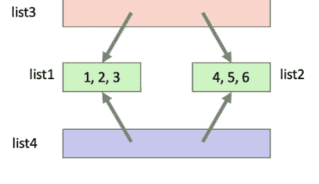

从图中我们可以看到，`list3` 和 `list4` 都引用了 `list1` 和 `list2` 的相同实例。

当我们通过例如 `list5` 向子列表追加一个值时，危险就出现了。如下所示：

```python
list5[0].append(100)
print(list5)
print(list4)
print(list3)
```

此代码的输出是：

```
[[1, 2, 3, 100], [4, 5, 6]]
[[1, 2, 3, 100], [4, 5, 6]]
[[1, 2, 3, 100], [4, 5, 6]]
```

在这里你可以看到，整数 100 显然被添加到了 `list5`、`list4` 和 `list3` 中。实际上，它是被添加到了最初由 `list1` 表示的共享子列表中。

### 8.4 `copy` 模块来救援

`copy` 模块提供了两个函数：`copy()` 函数和 `deepcopy()` 函数。这些函数描述如下：

- `copy.copy(x)` 返回 x 的*浅*拷贝。
- `copy.deepcopy(x)` 返回 x 的*深*拷贝。

浅拷贝和深拷贝之间的区别仅与容器或集合类对象（如列表、元组、字典或类实例）相关。本质上，区别在于：

- *浅*拷贝构造一个新的顶层对象（如列表），然后（在可能的范围内）将包含对象的引用（即地址）插入到副本中。
- *深*拷贝构造一个新的顶层对象（如列表），然后递归地复制包含的对象，并将这些副本添加到新的顶层容器中。因此，副本会一直复制到被复制结构内的任何深度。

此时，你可能想知道为什么不是所有副本都作为深拷贝来执行，因为它们更安全。深拷贝有几个需要考虑的问题，包括：

- *递归对象*。这些对象在某个点引用回同一数据结构内的另一个复合对象。这可能直接发生，也可能由于结构内的某种深层网络而间接发生。这些可能导致递归循环，这意味着深拷贝可能会失败。
- *有意共享的数据*。因为深拷贝会复制所有内容，所以它可能复制得太多，例如那些打算在副本之间共享的数据。
- *被复制的数据量*可能*代价高昂*，无论是从使用的内存还是从进行复制所花费的时间来看。

由于这些原因，大多数编程语言默认使用浅拷贝机制，并且通常提供深拷贝选项——这正是 Python 所做的。

为了尝试缓解上述前两点相关的一些问题，Python 中的 `deepcopy()` 函数采用了两种增强策略；它们是：

-   在当前复制过程中，维护一个*已复制对象的备忘字典*。术语“备忘”是“备忘录化”的缩写，是一种缓存形式，通常用于缓存概念特定于某个任务或函数的情况。
-   允许*用户定义的类覆盖*复制操作或要复制的组件集合。

第二点值得进一步解释。Python 中的类可以定义特殊方法，这些方法的名称通常以 `__` 开头。复制操作在这方面与加法或减法等其他操作并无不同。为了使类能够定义自己的复制实现，它可以定义特殊方法 `__copy__()` 和 `__deepcopy__()`。前者用于实现浅拷贝操作；不传递额外参数。后者用于实现深拷贝操作；它接收一个参数，即备忘字典。如果 `__deepcopy__()` 的实现需要对某个组件进行深拷贝，它应该调用 `copy.deepcopy()` 函数，将该组件作为第一个参数，备忘字典作为第二个参数。

### 8.5 使用 deepcopy() 函数

我们现在可以更新之前的示例，使用 `copy.deepcopy()` 而不仅仅是 `copy()` 方法或 `[:]` 复制切片语法。我们现在需要导入 `copy` 模块，然后调用 `copy.deepcopy()` 函数，传入要复制的列表（在本例中为 `list3`）。新列表随后存储在 `list4` 中。
在下面的代码中，我们再次使用 `id()` 函数检查 `list3` 和 `list4` 中每个子列表的唯一标识符：

```python
import copy

list1 = [1, 2, 3]
list2 = [4, 5, 6]
list3 = [list1, list2]

list4 = copy.deepcopy(list3)

for sublist in list3:
    print(f'sublist id: {id(sublist)}')
print('-' * 25)

for sublist in list4:
    print(f'sublist id: {id(sublist)}')
print('-' * 25)
```

此代码的输出如下：

```
sublist id: 4539736128
sublist id: 4539735488
-------------------------
sublist id: 4539737536
sublist id: 4539474560
-------------------------
```

这次 `list3` 中子列表的标识符与 `list4` 中子列表的标识符不同。它们不再持有相同的引用，而是持有子列表的副本。这意味着，如果我们现在将整数 100 添加到 `list4`，它将不会影响 `list3` 的内容，例如：

```python
list4[0].append(100)
print(list4)
print(list3)
```

产生：

```
[[1, 2, 3, 100], [4, 5, 6]]
[[1, 2, 3], [4, 5, 6]]
```

如我们所见，`list3` 未被修改。
因此，使用 `deepcopy()` 对 `list3` 和 `list4` 产生的效果如下图所示：

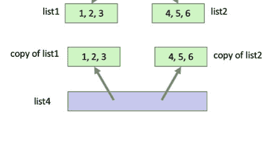

### 8.6 在线资源

- https://docs.python.org/3/library/copy.html 浅拷贝和深拷贝操作。

## 第 9 章
__init__ 与 __new__ 和 __call__

### 9.1 简介

Python 类有许多特殊方法，其形式为 `__<方法名>__`。这些方法有时被称为魔术方法或双下划线方法（也称为 dunder 方法，是 double underscore methods 的缩写）。其中许多支持运算符，例如 `__eq__`（用于相等运算符 `==`）或 `__lt__`（用于小于运算符 `<`），或用于规范功能，例如 `__len__` 用于确定对象的长度，`__str__` 和 `__repr__` 用于将对象转换为字符串格式。然而，经常被混淆的两个特殊方法是 `__new__` 和 `__init__`。这两个特殊方法与实例创建相关，但具有不同的角色，并在对象创建过程中的不同时间运行。对于许多开发者来说，他们只使用 `__init__`，甚至可能没有意识到还有一个 `__new__` 方法可用。本章探讨这两个方法、它们的角色以及如何定义它们。本章最后简要介绍了 `__call__` 方法。

### 9.2 __new__ 和 __init__ 方法

在 Python 中，`__new__` 和 `__init__` 方法都是类定义中使用的特殊方法。它们服务于不同的目的，并在对象生命周期的不同阶段被调用。

`__new__` 方法负责创建并返回对象的实例，而 `__init__()` 方法初始化对象的属性并执行任何必要的设置。当你使用类构造函数创建对象时，两个方法会按以下顺序自动调用：

```
<对象实例化> -> __new__() -> __init__()
```

首先调用 `__new__()` 方法，它创建对象实例并返回它。它是一个静态方法，以类作为第一个参数，后跟传递给类构造函数的任何其他参数。`__new__` 方法负责创建对象，可以返回类的实例或不同类的实例。

在对象由 `__new__()` 方法创建后，`__init__()` 方法被调用，新创建的对象实例作为其第一个参数，后跟传递给类构造函数的任何其他参数。`__init__` 方法被期望初始化对象的状态，即设置对象持有的属性及其初始值。它也可以根据需要调用任何额外的设置或初始化行为。

### 9.3 `__new__` 方法

`__new__()` 方法是对象创建方法。其目的是创建类的实例或对象。`__new__` 方法的默认行为在 Python 中所有类都继承自的类对象中定义。因此，所有类都可以以相同的方式创建类的实例。但是，子类可以在需要时覆盖 `__new__` 方法。

`__new__` 方法是一个*静态*方法，因此它是类本身的一部分，而不是特定对象或实例的一部分。然而，它是一个特殊情况，这意味着你不需要显式地将其标记为静态方法；它自动就是静态方法。

`__new__` 方法通常用于需要对对象创建过程进行更多控制的情况，例如处理不可变对象或实现单例模式。

`__new__` 方法的典型实现通过使用 `super().__new__(cls[,...])` 调用超类的 `__new__()` 方法并传递适当的参数来创建类的新实例，然后在返回之前根据需要修改新创建的实例。

`__new__` 方法的定义是：

```
def __new__(cls, *args, **kwargs)
```

参数是：

-   `cls` 这是你想要创建的新对象的类。
-   `*args` 和 `**kwargs` 参数必须与类的 `__init__()` 的参数匹配。但是，`__new__()` 方法不期望使用它们。

以下是 `__new__` 方法如何使用的基本示例：

```python
class MyClass:
    def __new__(cls, *args, **kwargs):
        print('Entering __new__')
        # 自定义对象创建逻辑
        instance = super().__new__(cls)
        print('New instance created')
        # 如果需要，对实例进行额外初始化
        return instance

print('Starting')
obj = MyClass()
print('Done')
```

运行此代码生成的输出是：

```
Starting
Entering __new__
New instance created
Done
```

如你所见，输出是在创建 `MyClass` 的实例时生成的。需要注意的一个重要点是，需要实现自己的 `__new__` 方法的情况相当罕见。

`object` 类中的默认 `__new__` 方法在大多数情况下通常完全足够。如果你没有定义自己的 `__new__` 方法，那么默认方法是从父类（例如 `object`）继承的。这个默认方法只是创建并返回类的新实例。

### 9.4 何时使用 __new__ 方法

`__new__` 方法通常用于需要对对象创建进行细粒度控制的特定情况。以下是可能使用 `__new__` 方法的几种场景：

-   实现不可变对象：如果我们想创建一个不可变的对象（即其状态在创建后无法更改），我们可以覆盖 `__new__` 方法以确保无法修改对象的属性。
-   单例模式：`__new__` 方法可用于实现单例设计模式，其中类只能存在一个实例。通过在 `__new__` 中控制创建过程，你可以确保后续对对象的请求返回相同的实例。也就是说，该类

### 9.5 使用 `__new__` 创建单例对象

以下代码展示了 Python 中单例类的一个简单实现。该类重写了 `__new__` 方法，使得类的第一个实例被记录在类属性 `instance` 中。此后，任何返回新实例的请求都只会返回之前创建的那个实例：

```python
class Singleton:
    instance = None

    def __new__(cls, *args, **kwargs):
        print('Entering __new__')
        if Singleton.instance is None:
            print('Creating instance')
            # create the single instance
            Singleton.instance = super().__new__(cls)

        print('Returning instance')
        return Singleton.instance

print('Starting')
s1 = Singleton()
print('-' * 25)
s2 = Singleton()
print('-' * 25)
s3 = Singleton()
print('-' * 25)

print(id(s1))
print(id(s2))
print(id(s3))
print('Done')
```

运行此代码，输出如下：

```
Starting
Entering __new__
Creating instance
Returning instance
------------------
Entering __new__
Returning instance
------------------
Entering __new__
Returning instance
------------------
4321848656
4321848656
4321848656
Done
```

由此可见，代码只打印了一次‘Creating instance’，并且 `s1`、`s2` 和 `s3` 所引用对象的 id 是相同的。因此，每次请求创建 `Singleton` 类型的新对象时，使用的都是同一个实例。

### 9.6 `__init__` 方法

`__init__` 方法在对象由 `__new__` 方法创建之后被调用。它用于初始化对象的属性并执行任何必要的设置。`__init__` 方法将新创建的对象实例作为其第一个参数，后面跟着传递给类构造函数的任何其他参数。它不返回任何东西，主要用于初始化目的。

以下代码提供了一个创建 `Person` 类的简单示例，其中 `name` 和 `age` 属性通过传递给 `__init__` 方法的值进行初始化：

```python
class Person:

    def __init__(self, name, age):
        print('In __init__')
        self.name = name
        self.age = age

    def __repr__(self):
        return f'Person({self.name}, {self.age})'

print('Starting')
p1 = Person('John', 21)
print(p1)
p2 = Person('Denise', 18)
print(p2)
print('Done')
```

运行此代码的结果是：

```
Starting
In __init__
Person(John, 21)
In __init__
Person(Denise, 18)
Done
```

由此可见，`__init__` 方法在 `Person` 类的每个实例被创建时都会运行。

### 9.7 `__new__` 和 `__init__` 可以一起使用吗？

简短的回答是：可以——如上所述，它们服务于不同的目的。

因此，一个单独的类很可能同时需要 `__new__` 和 `__init__` 方法。例如，`__new__` 方法可用于限制创建的类实例数量，而 `__init__` 方法可用于初始化任何实际创建的实例的状态。

以下类同时具有 `__new__` 和 `__init__` 方法。

```python
class MyClass:
    def __new__(cls, *args, **kwargs):
        print('Entering __new__')
        # Custom object creation logic
        instance = super().__new__(cls)
        print('New instance created')
        # Additional initialisation of the instance if needed
        return instance

    def __init__(self):
        print('In __init__')

print('Starting')
obj = MyClass()
print('Done')
```

当我们运行此代码时，生成的输出将是：

```
Starting
Entering __new__
New instance created
In __init__
Done
```

这表明 `__new__` 方法在 `__init__` 方法之前运行。

### 9.8 `__call__` 方法

我们应该考虑的最后一个特殊方法是 `__call__` 方法。这个特殊方法允许对象像函数一样被调用。当一个对象定义了 `__call__` 方法时，它就可以像函数调用一样使用括号 `()` 来调用。

下面是一个简单的例子：

```python
class CallableClass:
    def __call__(self, *args, **kwargs):
        print("The object was called!")

print('Start')
obj = CallableClass()
obj()
print('Done')
```

此代码生成的输出是：

```
Start
The object was called!
Done
```

因此，我们可以将任何类变成可调用或可执行的东西。反过来，并非 Python 中的所有对象都可以被调用。只有定义了 `__call__()` 方法的对象才能作为函数被调用。

另一点需要注意的是，当在 Python 中使用标准表示法实例化一个对象时，正是这个方法使得类创建行为成为可执行的东西；也就是说，在创建类的新实例时会调用 `__call__()` 方法。因此，以下代码调用 call 方法来创建一个新的 `Person` 实例：

```python
p1 = Person('John')
```

### 9.9 总结

总而言之，`__new__` 方法负责创建对象实例，而 `__init__` 方法初始化对象的属性并执行设置操作。在日常的 Python 编程中，`__new__` 方法很少使用，除非在需要对对象创建进行更多控制的情况下。另一方面，`__init__` 方法通常用于典型的初始化任务。

## 第 10 章
### Python 元类与元编程

### 10.1 简介

本章探讨 Python 中的元编程和元类。元编程涉及这样一个概念：Python 程序可以在运行时动态生成或修改代码。这是 Python 中一个非常强大（尽管可能危险）的特性，许多静态编译语言如 C++ 并不提供。本章首先介绍元编程，然后讨论在 Python 中实现元编程的三种方式：使用装饰器、元类和动态代码执行。

### 10.2 元编程

元编程正是如此，它是能够生成程序代码（或修改现有代码）的软件。因此它是“元”编程——即生成程序的程序。在 Python 中，这种元编程是在运行时动态发生的。该语言中有几个特性可以支持元编程，包括装饰器、元类以及使用 `exec()` 和 `eval()` 进行动态代码执行：

- **装饰器：** 装饰器是修改其他函数行为的函数。它们用“@”符号表示，可以应用于函数、类或方法。装饰器允许你在不直接修改现有代码的情况下为其添加功能。
- **元类：** 元类是定义其他类行为的类。通过定义元类，你可以自定义类对象的创建和行为。元类通常用于实现框架和库。
- **动态代码执行**：Python 提供了 `exec` 和 `eval` 函数，允许你执行动态生成的代码。这些函数接受一个包含 Python 代码的字符串并在运行时执行它。这使得基于特定条件或用户输入的动态代码生成和执行成为可能。

因此，元编程的关键方面在于开发者必须创建能够生成或操作其他代码的代码。这听起来可能有些荒谬，但它确实允许开发者创建非常灵活和强大的代码抽象，而这些是使用传统编码技术无法实现的。

在此需要提醒一句。元编程非常强大；然而，它也可能带来显著的缺点。元编程最显著的问题是它会使代码更难理解、调试和维护，因为其中涉及一层间接性和额外的复杂性。元编程对于通用、可重用的框架非常有用，但只应在适当的时候使用，而不是作为一种通用技术。

因此，考虑元编程可能有用的情况是很有必要的。其中一些情况包括：

- **代码生成**：元编程允许开发者根据特定条件、配置或输入动态生成代码。当应用程序或库需要自动化重复的代码生成任务或在运行时自定义代码行为时，这会很有帮助。
- **框架和库**：元编程通常用于框架和库中，以提供灵活且可扩展的 API。通过使用元编程技术，框架可以自动处理常见任务、强制执行约定，并提供简化开发的抽象。
- **动态配置**：元编程允许开发者在运行时加载和修改配置文件或数据结构。当需要根据不同的环境、用户偏好或外部数据动态调整应用程序的行为时，这会很有帮助。
- **领域特定语言（DSL）**：元编程可用于创建领域特定语言，这些语言提供针对特定问题域量身定制的更高层次的抽象。DSL 使得解决方案能够以更简洁、更直观的方式表达，从而提高生产力和代码可读性。例如，可以创建一个 DSL 来表示向某个任务处理系统提交作业，或者描述金融交易系统中的一组领域概念（如交易）等。
- **面向切面编程（AOP）**：元编程可用于实现面向切面编程技术。AOP 允许你通过将横切关注点（如日志记录、错误处理或性能监控）与应用程序的核心逻辑分离，从而将它们模块化。AOP 在许多常见框架中被广泛使用，尽管它通常对最终用户隐藏，例如在框架中开启日志记录可能看起来只是一个简单的“开启”功能，但背后可能使用了元编程来实现跨框架的日志记录。

关于是否使用元编程技术的总体指导原则应是：“其使用是否能在不显著损害代码的前提下，提升代码的灵活性、可理解性、可读性或可维护性？”因此，应始终在这些方面之间寻求适当的平衡。

### 10.3 装饰器作为元编程的一种形式

Python 中的装饰器是一种可用于实现元编程方法的语言特性。
装饰器是高阶函数，它们接受一个函数作为输入，并可以返回该函数的修改版或包装版作为结果。因此，它们可以替换、修改或包装一个函数，从而动态地改变函数的行为。
元编程风格装饰器的一些常见用途包括：

- **函数包装**：这是装饰器的经典用途。装饰器可以用附加行为包装一个函数。例如，你可以创建一个装饰器来记录函数调用、测量执行时间或处理异常。
- **访问控制**：装饰器可用于控制对相关包装函数或方法的访问。这种访问可用于检查安全约束，例如当前用户是否有效以及他们是否有权访问该函数或方法。
- **缓存与记忆化**：装饰器可用于创建一种通常称为*记忆化*的缓存形式。这种方法允许函数缓存为特定参数值生成的结果。缓存保存有关参数和先前生成结果的信息。这意味着当函数被调用时，会执行查找以查看函数是否已缓存结果。这对于执行成本高昂的计算特别有用，因为计算只需执行一次。然而，它也依赖于函数或方法不使用可变的外部值。为了使记忆化正常工作，函数或方法必须完全依赖于传入的参数值来生成结果，或者仅引用不可变的外部值。这被称为引用透明性（也称为 RT）。
- **输入验证与清理**：装饰器也可用于验证和清理输入值。通过定义可重用的装饰器来执行此类输入验证/清理，你可以在函数和方法之间提供通用的完整性支持。
- **框架与库**：装饰器在许多框架和库 API 中被广泛使用，用于将函数、类和方法链接到这些框架中。本书后面讨论的 Flask 就是此类框架的一个例子。

使用装饰器执行上述元编程用例的一个具体好处是，它实现了关注点分离以及代码重用。例如，与 Flask RESTful 服务相关的逻辑在很大程度上被封装在一组装饰器中，而服务被调用时所需的行为则被封装在一个函数中。

以下是一个示例，展示了如何在 Python 中使用装饰器进行元编程：

```python
def uppercase_decorator(func):
    def wrapper(*args, **kwargs):
        result = func(*args, **kwargs)
        if isinstance(result, str):
            return result.upper()
        return result
    return wrapper

@uppercase_decorator
def greeter(name):
    return f"Hello, {name}!"

print(greeter('Hello Denise'))
```

此代码生成的输出为：

```
HELLO, DENISE!
```

在此示例中，我们定义了一个名为 `uppercase_decorator` 的装饰器。该装饰器接受一个函数 `func` 作为参数，并返回一个新函数 `wrapper`。`wrapper` 函数包装了原始函数 `func` 并修改了其行为。也就是说，当 wrapper 被调用时，它会调用原始函数，然后添加一些可能修改函数结果的行为。

在此例中，`uppercase_decorator` 将被装饰函数的返回值转换为大写（如果它是字符串）。wrapper 函数接收传递给被装饰函数的参数，调用原始函数 `func` 并将结果存储在 result 变量中。

然后，它使用 `isinstance` 函数检查结果是否为字符串。如果是，wrapper 函数使用 `upper()` 方法将结果转换为大写。最后，返回修改后的结果。

`@uppercase_decorator` 语法用于将装饰器应用于 `greeter()` 函数。现在，每当调用 `greeter()` 函数时，`uppercase_decorator` 都会自动调用，通过将输出转换为大写（如果是字符串）来修改输出。

当我们调用 `greeter('Denise')` 时，输出为 "HELLO, DENISE!"，这展示了装饰器如何修改原始函数的行为。

当然，`@uppercase_decorator` 可以应用于任何函数或方法，并将所有字符串转换为大写；它并不局限于 `greeter()` 函数。

### 10.4 用于元编程的元类

Python 中的元类提供了一种定义类本身行为的方式。元类是类的类，这意味着它负责创建和定义类对象的行为。元类允许你修改类的创建并控制类在运行时的行为。元类与抽象基类一起使用，以提供 ABC 的基本行为。

元类是类的类，关于元类有几点值得注意：

- **元类是类的模板**：这里的模板是指元类充当创建类的模式或蓝图。它定义了将使用该元类创建的类的结构、行为和属性。
- **类的创建和初始化由元类处理**：如果一个类定义了元类，那么当创建该类的实例时，将使用元类来创建该实例（对象）。因此，Python 将调用元类的 `__new__()` 和 `__init__()` 方法。因此，是元类决定了新对象将如何创建及其状态如何设置。
- **元类可以修改类的行为**：元类可以拦截并修改类属性、方法及其行为。因此，元类可以添加、修改或删除属性，重写方法，修改方法的效果或向类添加新方法。
- **元类可以添加类级别行为**：类级别方法是适用于类本身而非类实例的方法。这包括定义自定义类方法、类属性或类级别方法。
- **元类可以控制继承**：元类可以控制类如何从父类/超类继承。它们可以修改继承顺序，对继承施加特定约束，或根据特定条件动态生成父类。

尽管元类提供了一种创建抽象、库、框架等的强大方式，但使用时应谨慎。正如俗话所说，能力越大，责任越大！最佳实践建议应谨慎使用元类，仅在其使用在可读性、可重用性、可维护性和进一步扩展方面有明显益处时才使用。

#### 10.4.1 单例元类

作为上一章介绍的单例模式实现的替代方案，这里是一个元类版本。此版本允许元类 `SingletonMetaclass` 与任何我们希望转换为单例模式的类一起使用。这在可重用性方面提供了显著的好处，即我们只需定义一次此行为，就可以将其用于任何类。

以下是一个示例，展示了在 Python 中用于元编程的 SingletonMetaclass：

```python
class SingletonMetaclass(type):
    _instances = {}

    def __call__(cls, *args, **kwargs):
        print('In SingletonMetaclass.__call__')
        if cls not in cls._instances:
            print(f'Creating new instance of {cls}')
            cls._instances[cls] = super().__call__(*args, **kwargs)
        print('Returning instance')
        return cls._instances[cls]

class Session(metaclass=SingletonMetaclass):
    def __init__(self):
        print('In Session initialiser')

print('Starting')
s1 = Session()
s2 = Session()

print(f'id(s1): {id(s1)}')
print(f'id(s2): {id(s2)}')
##### checks to see if they are the same instance
print(f's1 is s2: {s1 is s2}')
print('Done')
```

此示例代码的输出为：

```
Starting
In SingletonMetaclass.__call__
Creating new instance of <class '__main__.Session'>
In Session initialiser
Returning instance
In SingletonMetaclass.__call__
Returning instance
id(s1): 4305011728
id(s2): 4305011728
s1 is s2: True
Done
```

如果我们检查输出，可以看到只创建了 `__main__.Session` 类的一个实例。后续创建新实例的请求将返回存储的实例。这通过 s1 和 s2 的 id 相同以及 is 运算符返回 True 来说明。

为了理解其工作原理，让我们看看实现。`SingletonMetaclass` 类是一个继承自 `type` 类的元类（这使其成为元类）。它重写了 `__call__()` 方法的默认行为，该方法在创建类的新实例时使用。

`SingletonMetaclass` 维护一个类侧字典 `_instances`，其中保存了为 `SingletonMetaclass` 应用于任何类而创建的实例。注意，我们在这里使用 `_` 符号来表示它是一个受保护的成员。属性。当需要创建一个类的新实例时，`__call__()` 方法会检查该类的实例是否已存在于字典 `_instances` 中。如果存在，则返回现有实例。否则，它使用 `super().__call__` 方法创建一个新实例，将其存储在 `_instances` 中，然后返回。

一旦定义了 `SingletonMetaclass`，我们定义一个类 `Session`，其元类设置为 `SingletonMetaclass`。这意味着 `SingletonMetaclass` 元类将用于创建和自定义 `Session` 类实例的行为。

当我们创建 `Session` 的实例（`s1` 和 `s2`）时，`SingletonMetaclass` 元类确保只创建一个 `Session` 实例。后续创建新实例的调用将返回现有实例。

当我们打印 `s1` 和 `s2` 中保存对象的 id 时，可以看到它们是相同的，这表明 `s1` 和 `s2` 都持有相同的实例。`is` 运算符也证实了这一点，它检查的是引用相等性，而不是基于值的相等性。

### 10.5 用于元编程的 Exec 和 Eval

Python 中的 `exec()` 和 `eval()` 函数都允许开发者动态编译和执行代码。也就是说，Python 可以即时创建新代码，这些代码可以在运行时被编译和执行。这使得它们可以作为实现元编程风格行为的一种方式。

#### 10.5.1 exec() 函数

`exec()` 函数允许开发者将动态生成的代码作为语句块执行。它接受一个包含 Python 代码的字符串作为参数，并在*当前作用域*内执行它。

作为 `exec()` 函数的一个示例，请考虑以下代码：

```
MAX = 4

code = '''
for i in range(MAX):
    print(i)
'''

exec(code)
```

运行此代码时，输出为：

```
0
1
2
3
```

上述示例中有一个全局值 `MAX` 设置为 4。然后创建一个包含有效、格式良好的 Python 代码的字符串。字符串中的代码实际上引用了 `MAX` 中的值，但当然此时它只是一个字符串。然后我们调用 `exec()`，传入 `code` 中的字符串。`exec()` 函数现在将字符串的内容作为 Python 代码在当前执行上下文中执行。这意味着它运行代码的方式就像它是 Python 文件中的普通代码一样，因此它可以访问 `MAX` 的值。运行代码的结果是一系列整数打印到标准输出。

执行的代码是即时创建的，可能来自数据库、文本文件，或者基于运行时动态可用的其他信息构建。

#### 10.5.2 eval() 函数

`eval` 函数计算一个包含 Python *表达式*的字符串并返回结果。它允许你根据作为字符串提供的代码动态*计算*值。

这里的关键是 `eval` 执行的是期望返回值的表达式。下面给出了一个使用 `eval` 计算表达式的示例：

```
expression = '((2 + 3) - 4) * 5'

result = eval(expression)

print(result)
```

此代码的输出为：

```
5
```

在此示例中，表达式 `((2 + 3) - 4) * 5` 存储在变量 `expression` 的字符串中。使用 `eval()` 对其进行计算，并打印结果。在这种情况下，结果是 5。

`eval()` 函数可用于动态生成包含表达式的字符串，该表达式在运行时执行。

#### 10.5.3 eval 与 exec()

值得注意的是 `eval()` 和 `exec()` 之间的区别，因为乍一看它们似乎做同样的事情。Python 中 `eval()` 和 `exec()` 的主要区别在于它们的功能和处理的代码类型：

- `eval()` 是一个内置的 Python 函数，它计算单个*表达式*并返回结果。`eval()` 返回的结果是计算表达式的结果。它通常用于计算数学或逻辑表达式，或根据用户输入或配置文件动态计算值。
- `exec()` 是一个内置的 Python 函数，它在当前上下文中执行一段代码（语句）。它接受一个包含一行或多行 Python 代码的字符串作为输入并执行，但不返回任何值。它通常用于执行动态生成的代码、代码生成任务或运行从外部来源获得的代码。

`exec` 和 `eval` 都应谨慎使用，因为它们执行任意代码，如果与不受信任的输入一起使用，可能会引入安全风险。必须验证和清理与 `exec` 或 `eval` 一起使用的任何输入，以防止潜在的安全漏洞。

## 第二部分
计算机图形学与图形用户界面

## 第 11 章
### 计算机图形学简介

#### 11.1 引言

计算机图形学无处不在；它们出现在你的电视上、电影院广告中、许多电影的核心部分、你的平板电脑或手机上，当然也出现在你的 PC 或 Mac 上，以及你的汽车仪表盘、智能手表和儿童电子玩具中。

然而，我们所说的“计算机图形学”这个术语是什么意思？这个术语可以追溯到许多（大多数）计算机在输入和输出方面纯粹是文本的时代，很少有计算机能够生成图形显示，更不用说通过这种显示处理输入了。但是，就本书而言，我们将“计算机图形学”这个术语理解为包括创建图形用户界面（或 GUI）、图表和图形（如条形图或数据折线图）、计算机游戏中的图形（如《太空侵略者》或《飞行模拟器》）以及生成 2D 和 3D 场景或图像。我们还使用这个术语来包括计算机生成艺术。

计算机图形学的可用性对于过去 40 年来非计算机科学家对计算机系统的广泛接受非常重要。在一定程度上，正是由于通过计算机图形界面访问计算机系统，现在几乎每个人都使用某种形式的计算机系统（无论是 PC、平板电脑、手机还是智能电视）。

图形用户界面（GUI）可以捕捉想法或情况的本质，通常避免了长篇文本或文本命令的需要。这也是因为一幅画可以胜过千言万语；只要它是正确的画。

在许多必须传达大量信息之间关系的情况下，用户通过图形方式吸收这些信息比通过文本方式容易得多。同样，通过在屏幕上操作一些系统实体来传达某些含义，通常也比通过文本命令的组合更容易。

例如，一个精心选择的图表可以清楚地显示从相同数据的表格中难以确定的信息。反过来，冒险风格的游戏可以通过计算机图形变得引人入胜和身临其境，这与 1980 年代的文本版本形成鲜明对比。这突出了视觉呈现相对于纯文本呈现的优势。

#### 11.2 背景

每个交互式软件系统都有一个人机界面，无论是单行文本系统还是高级图形显示。它是开发者用来从用户那里获取信息的工具，反过来，每个用户都必须面对某种形式的计算机界面才能执行任何所需的计算机操作。

历史上，计算机系统没有图形用户界面，也很少生成图形视图。这些来自 60 年代、70 年代和 80 年代的系统通常专注于数值或数据处理任务。它们通过面向文本的终端上的绿色或灰色屏幕进行访问。几乎没有或根本没有图形输出的机会。

然而，在此期间，斯坦福大学、麻省理工学院、贝尔电话实验室和施乐公司等实验室的各种研究人员正在研究图形系统可能为计算机提供的可能性。事实上，早在 1963 年，伊万·萨瑟兰就通过他关于 Sketchpad 系统的博士论文展示了交互式计算机图形学的可行性。

#### 11.3 图形计算机时代

图形计算机显示和交互式图形界面在 1980 年代成为人机交互的常用方式。这样的界面可以省去用户学习复杂命令的需要。它们不太可能吓到计算机新手，并且可以以用户容易吸收的形式快速提供大量信息。

高质量图形界面（如 Apple Macintosh 和早期 Windows 界面提供的界面）的广泛使用，导致许多计算机用户期望他们使用的任何软件都有这样的界面。事实上，这些系统为现在在 PC、Mac、Linux 机器、平板电脑和智能手机上无处不在的那种界面铺平了道路。这种图形用户界面基于 WIMP 范式（窗口、图标、菜单和指针），这是当今使用的主流图形用户界面类型。

任何基于窗口的系统，尤其是 WIMP 环境的主要优点是它只需要少量的用户培训。不需要学习复杂的命令，因为大多数操作都可以通过图标、对图标的操作、用户操作（如滑动）或菜单选项来获得，并且易于使用。（图标是一个小的图形对象，通常象征着一个操作或更大的实体，例如应用程序或文件）。总的来说，基于WIMP的系统易于学习、直观易用、便于掌握且操作直接。

这些WIMP系统的典型代表是Apple Macintosh界面（参见Goldberg和Robson以及Tesler的工作），它受到了帕洛阿尔托研究中心在Xerox Star机器上开创性工作的影响。然而，正是Macintosh将这种界面带入了大众市场，并首次使其作为商业、家庭和工业工具获得了广泛接受。这种界面改变了人们期望与计算机交互的方式，成为了一个事实上的标准，迫使其他制造商在自己的机器上提供类似的界面，例如PC上的Microsoft Windows。

这种类型的界面可以通过提供直接操作图形来增强。这些图形可以被用户使用鼠标*抓取*并操作，以执行某些操作或动作。图标是这种图形的一个简单版本，“打开”一个图标会启动相关的应用程序或显示相关的窗口。

### 11.4 交互式与非交互式图形

计算机图形学可以大致分为两类：

- 非交互式计算机图形学
- 交互式计算机图形学

在非交互式计算机图形学（也称为被动计算机图形学）中，图像通常由计算机在计算机屏幕上生成；用户可以查看此图像（但无法与之交互）。本书后面介绍的非交互式图形示例包括计算机生成艺术，其中使用Python的Turtle图形库生成图像。这样的图像可以被用户查看但不能修改。另一个例子可能是使用Matplotlib生成的基本条形图，用于展示某组数据。

交互式计算机图形学涉及用户以某种方式与屏幕上显示的图像进行交互。这可能是修改正在显示的数据，或更改图像的渲染方式等。其典型代表是交互式图形用户界面（GUI），用户在其中与菜单、按钮、输入框、滑块、滚动条等进行交互。然而，其他视觉显示也可以是交互式的。例如，滑块可以与Matplotlib图表一起使用。此显示可以呈现特定日期的销售数量；随着滑块的移动，数据会改变，图表也会被修改以显示不同的数据集。

另一个例子是所有计算机游戏，它们本质上是交互式的，并且大多数（如果不是全部）会根据某些用户输入来更新其视觉显示。例如，在经典的飞行模拟器游戏中，当用户移动操纵杆或鼠标时，模拟的飞机会相应移动，呈现给用户的显示也会更新。

### 11.5 像素

所有计算机图形系统的一个关键概念是像素。像素（Pixel）最初是由picture（或pix）和element两个词组合并缩写而成的词。像素是计算机屏幕上的一个单元格。每个单元格代表屏幕上的一个点。这个点或单元格的大小以及可用单元格的数量会因屏幕的类型、大小和分辨率而异。例如，早期的Windows PC通常具有640 x 480分辨率的显示器（使用VGA显卡）。这指的是像素的宽度和高度数量。这意味着屏幕横向有640个像素，纵向有480行像素。相比之下，今天的4K电视显示器具有4096 x 2160像素。

可用像素的大小和数量会影响呈现给用户的图像质量。在较低分辨率的显示器上（单个像素较少），图像可能显得块状或不清晰；而在较高分辨率下，图像可能显得清晰锐利。

每个像素都可以通过其在显示网格中的位置来引用。通过用不同的颜色填充屏幕上的像素，可以创建各种图像/显示。例如，在下图中，在4x4的位置填充了一个像素：

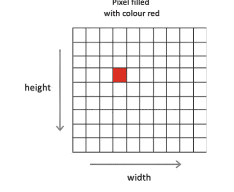

一系列像素可以形成一条线、一个圆或任何数量的不同形状。然而，由于像素网格基于单个点，对角线或圆可能需要使用多个像素，当放大时可能会出现锯齿状边缘。例如，下图显示了我们放大后的部分圆形：


每个像素都可以关联一种颜色和一种透明度。可用的颜色范围取决于所使用的显示系统。例如，单色显示器只允许黑白两色，而灰度显示器只允许显示各种深浅的灰色。在现代系统上，通常可以使用传统的RGB颜色代码（其中R代表红色，G代表绿色，B代表蓝色）来表示广泛的颜色范围。在这种编码中，纯红色由[255, 0, 0]这样的代码表示，纯绿色由[0, 255, 0]表示，纯蓝色由[0, 0, 255]表示。基于此，各种深浅的颜色可以通过这些代码的组合来表示，例如橙色可能由[255, 150, 50]表示。下图说明了一组使用不同红、绿、蓝值的RGB颜色：

| | RGB | 纯色 | 75% | 50% | 25% |
|---|---|---|---|---|---|
| 1 | RGB(0, 0, 0) |  |  |  |  |
| 2 | RGB(30, 0, 0) |  |  |  |  |
| 3 | RGB(60, 0, 0) |  |  |  |  |
| 4 | RGB(90, 0, 0) |  |  |  |  |
| 5 | RGB(120, 0, 0) |  |  |  |  |
| 6 | RGB(150, 0, 0) |  |  |  |  |
| 7 | RGB(180, 0, 0) |  |  |  |  |
| 8 | RGB(210, 0, 0) |  |  |  |  |
| 9 | RGB(240, 0, 0) |  |  |  |  |
| 10 | RGB(0, 30, 0) |  |  |  |  |
| 11 | RGB(30, 60, 0) |  |  |  |  |
| 12 | RGB(60, 90, 0) |  |  |  |  |
| 13 | RGB(90, 120, 0) |  |  |  |  |
| 14 | RGB(120, 150, 0) |  |  |  |  |
| 15 | RGB(150, 180, 0) |  |  |  |  |
| 16 | RGB(180, 210, 0) |  |  |  |  |
| 17 | RGB(210, 240, 0) |  |  |  |  |
| 18 | RGB(0, 0, 30) |  |  |  |  |
| 19 | RGB(30, 30, 60) |  |  |  |  |
| 20 | RGB(60, 60, 90) |  |  |  |  |
| 21 | RGB(90, 90, 120) |  |  |  |  |
| 22 | RGB(120, 120, 150) |  |  |  |  |
| 23 | RGB(150, 150, 180) |  |  |  |  |
| 24 | RGB(180, 180, 210) |  |  |  |  |
| 25 | RGB(210, 210, 240) |  |  |  |  |

此外，还可以为像素应用透明度。这用于指示填充颜色的实心程度。上面的网格说明了应用

### 11.6 位图与矢量图形

在屏幕上生成图像/显示有两种方式。一种称为位图（或光栅）图形，另一种称为矢量图形。在位图方法中，每个像素被映射到要显示的值以创建图像。在矢量图形方法中，描述几何形状（如线条和点），然后将这些形状*渲染*到显示器上。光栅图形更简单，但矢量图形提供了更大的灵活性和可伸缩性。

### 11.7 缓冲

交互式图形显示的一个问题是能够尽可能平滑、干净地更改显示。如果显示卡顿或似乎从一个图像跳到另一个图像，用户会感到不适。因此，通常在内存中的某个结构上绘制下一个显示；通常称为缓冲区。一旦整个图像创建完成，就可以将此缓冲区渲染到显示器上。例如，Turtle 图形允许用户定义在渲染（或绘制）到屏幕之前应进行多少次显示更改。这可以显著提高图形应用程序的性能。

在某些情况下，系统会使用两个缓冲区；通常称为双缓冲。在这种方法中，一个缓冲区正在渲染或绘制到屏幕上，而另一个缓冲区正在更新。这可以显著提高系统的整体性能，因为现代计算机执行计算和生成数据的速度通常比绘制到屏幕的速度快得多。

### 11.8 Python 与计算机图形学

在本书本节的剩余部分，我们将探讨使用 Python Turtle 图形库生成计算机图形。我们还将讨论使用此库创建计算机生成艺术。之后，我们将探索用于生成图表和数据绘图的 Matplotlib 库，例如条形图、散点图、折线图和热图。然后，我们将探索使用 Python 库通过菜单、字段、表格等创建 GUI。

### 11.9 参考文献

本章引用了以下内容：

- I.E. Sutherland, Sketchpad: a man–machine graphical communication system (courtesy Computer Laboratory, University of Cambridge UCAM-CL-TR-574 September 2003), January 1963.
- D.C. Smith, C. Irby, R. Kimball, B. Verplank, E. Harslem, Designing the Star user interface. BYTE 7(4), 242–282 (1982).

### 11.10 在线资源

以下提供进一步阅读材料：

- https://en.wikipedia.org/wiki/Sketchpad Ivan Sutherlands Sketchpad from 1963.
- http://images.designworldonline.com.s3.amazonaws.com/CADhistory/Sketchpad_A_Man-Machine_Graphical_Communication_System_Jan63.pdf Ivan Sutherlands Ph.D. 1963.
- https://en.wikipedia.org/wiki/Xerox_Star The Xerox Star computer and GUI.

## 第12章
Python Turtle 图形

### 12.1 简介

Python 在图形库方面得到了很好的支持。最广泛使用的图形库之一是 Turtle 图形库。这部分是因为它易于使用，部分是因为它默认随 Python 环境提供（因此您无需安装任何额外的库即可使用它）。本章介绍 Python Turtle 图形库。

本章最后简要介绍了其他一些图形库，包括 PyOpenGL。PyOpenGL 库可用于创建复杂的 3D 场景。

### 12.2 Turtle 图形库

#### 12.2.1 Turtle 模块

此模块提供了一组功能，允许创建所谓的矢量图形。矢量图形指的是可以在屏幕上绘制的线条（或向量）。绘图区域通常称为绘图平面或绘图板，具有 x、y 坐标的概念。

Turtle 图形库仅作为基本绘图工具；其他库可用于绘制二维和三维图形（例如 Matplotlib），但这些库往往专注于特定类型的图形显示。

Turtle 模块（及其名称）背后的思想源于 60 年代和 70 年代的 Logo 编程语言，该语言旨在向儿童介绍编程。它有一个屏幕上的海龟，可以通过命令控制，例如 forward（将海龟向前移动）、right（将海龟旋转一定角度）、left（将海龟向左旋转一定角度）等。这个思想一直延续到当前的 Python Turtle 图形库，其中像 `turtle.forward(10)` 这样的命令将海龟（或现在的光标）向前移动 10 像素等。通过组合这些看似简单的命令，可以创建复杂而精细的形状。

#### 12.2.2 基本 Turtle 图形

虽然 `turtle` 模块内置于 Python 3 中，但在使用之前需要*导入*该模块：

```python
import turtle
```

实际上有两种使用 `turtle` 模块的方法；一种是使用库中可用的类，另一种是使用隐藏类和对象的更简单的函数集。在本章中，我们将重点介绍可用于使用 turtle 库创建绘图的函数集。

我们将做的第一件事是设置用于绘图的窗口；`TurtleScreen` 类是用于您所运行的任何操作系统的所有屏幕实现的父类。

如果我们使用 turtle 模块函数，那么屏幕对象会根据我们的操作系统进行适当初始化。这意味着我们可以专注于以下函数来配置布局/显示，例如此屏幕可以有标题、大小、起始位置等。

关键函数包括：

- `setup(width, height, startx, starty)` 设置主窗口/屏幕的大小和位置。参数为：
    - `width`—如果是整数，则为像素大小；如果是浮点数，则为屏幕的比例；默认为屏幕的 50%
    - `height`—如果是整数，则为像素高度；如果是浮点数，则为屏幕的比例；默认为屏幕的 75%
    - `startx`—如果是正数，则为从屏幕左边缘开始的像素位置；如果是负数，则为从右边缘开始；如果是 None，则水平居中窗口
    - `starty`—如果是正数，则为从屏幕顶部边缘开始的像素位置；如果是负数，则为从底部边缘开始；如果是 None，则垂直居中窗口
- `title(titlestring)` 设置屏幕/窗口的标题。
- `exitonclick()` 当用户点击屏幕时关闭 turtle 图形屏幕/窗口。
- `bye()` 关闭 turtle 图形屏幕/窗口。
- `done()` 启动主事件循环；这必须是 turtle 图形程序中的最后一条语句。
- `speed(speed)` 设置绘图速度，默认为 3。值越高，绘图速度越快，接受 0–10 范围内的值。
- `turtle.tracer(n=None)` 可用于批量更新 Turtle 图形屏幕。当绘图变得庞大而复杂时，它非常有用。通过将数字 (n) 设置为一个较大的数字（例如 600），那么在实际屏幕一次性更新之前，将在内存中绘制 600 个元素；这可以显著加快例如分形图像的生成速度。不带参数调用时，返回当前存储的 n 值。
- `turtle.update()` 执行 turtle 屏幕的更新；当使用 `tracer()` 时，应在程序结束时调用此函数，因为它将确保所有元素都已绘制，即使 tracer 阈值尚未达到。
- `pencolor(color)` 用于设置在屏幕上绘制线条的颜色；颜色可以通过多种方式指定，包括使用命名颜色如 'red'、'blue'、'green'，或使用 RGB 颜色代码，或通过十六进制数字指定颜色。有关要使用的命名颜色和 RGB 颜色代码的更多信息，请参见 https://www.tcl.tk/man/tcl/TkCmd/colors.htm。请注意，所有颜色方法都使用美式拼写，例如此方法是 `pencolor`（而不是 pencolour）。
- `fillcolor(color)` 用于设置用于填充绘制线条内封闭区域的颜色。同样请注意颜色的拼写！

以下代码片段说明了其中一些函数：

```python
import turtle

##### set a title for your canvas window
turtle.title('My Turtle Animation')

##### set up the screen size (in pixels)
##### set the starting point of the turtle (0, 0)
turtle.setup(width=200, height=200, startx=0, starty=0)

##### sets the pen color to red
turtle.pencolor('red')

##### ...

##### Add this so that the window will close when clicked on
turtle.exitonclick()
```

我们现在可以看看如何实际在屏幕上绘制形状。

屏幕上的光标有几个属性；这些属性包括光标移动的*笔*的当前绘图颜色，以及其当前位置（以屏幕的 x、y 坐标表示）和当前朝向。我们已经看到可以使用 `pencolor()` 方法控制其中一个属性；其他方法用于控制光标（或海龟），如下所示。

*光标*指向的方向可以通过多种函数来改变，包括：

- `right(angle)` 将光标向右旋转指定角度单位。
- `left(angle)` 将光标向左旋转指定角度单位。
- `setheading(to_angle)` 将光标的方向设置为*to_angle*。其中0度表示东方，90度表示北方，180度表示西方，270度表示南方。

我们可以移动光标（如果画笔放下，则会绘制线条）：

- `forward(distance)` 将光标沿当前指向的方向向前移动指定距离。如果画笔放下，则绘制线条。
- `backward(distance)` 将光标沿当前指向的相反方向向后移动指定距离。

我们也可以显式地定位光标：

- `goto(x, y)` 将光标移动到屏幕上指定的*x, y*位置；如果画笔放下，则绘制线条。你也可以使用`steps`和`setposition`来实现相同的功能。
- `setx(x)` 设置光标的*x*坐标，*y*坐标保持不变。
- `sety(y)` 设置光标的*y*坐标，*x*坐标保持不变。

也可以通过修改画笔的抬起或放下状态来移动光标而不绘制线条：

- `penup()` 抬起画笔——移动光标将不再绘制线条。
- `pendown()` 放下画笔——移动光标将使用当前画笔颜色绘制线条。

画笔的大小也可以控制：

- `pensize(width)` 将线条粗细设置为*width*。方法`width()`是此方法的别名。

也可以绘制圆形或点：

- `circle(radius, extent, steps)` 使用给定的半径绘制一个圆。`extent`决定了绘制圆的多少部分；如果未指定`extent`，则绘制整个圆。`steps`表示用于绘制圆的步数（可用于绘制正多边形）。
- `dot(size, color)` 使用指定颜色绘制一个直径为*size*的实心圆。

我们现在可以使用上述一些方法在屏幕上绘制图形。在第一个示例中，我们将保持非常简单，绘制一个简单的正方形：

```
##### 绘制一个正方形
turtle.forward(50)
turtle.right(90)
turtle.forward(50)
turtle.right(90)
turtle.forward(50)
turtle.right(90)
turtle.forward(50)
turtle.right(90)
```

上述代码将光标向前移动50像素，然后旋转90度，重复这些步骤三次。最终结果是在屏幕上绘制一个50 × 50像素的正方形：

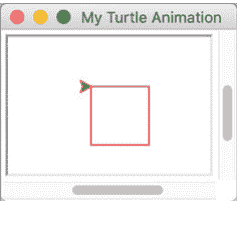

请注意，光标在绘制过程中是可见的（这可以通过`turtle.hideturtle()`关闭，因为光标最初被称为“海龟”）。

### 12.2.3 绘制图形

当然，你不必为绘制的图形使用固定值，可以使用变量或根据表达式计算位置等。
例如，以下程序创建了一系列围绕中心位置旋转的正方形，以生成一个引人入胜的图像：

```
import turtle

def setup():
    """ 为屏幕提供配置 """
    turtle.title('Multiple Squares Animation')
    turtle.setup(100, 100, 0, 0)
    turtle.hideturtle()

def draw_square(size):
    """ 在当前方向绘制一个正方形 """
    turtle.forward(size)
    turtle.right(90)
    turtle.forward(size)
    turtle.right(90)
    turtle.forward(size)
    turtle.right(90)
    turtle.forward(size)

setup()

for _ in range(0, 12):
    draw_square(50)
    # 旋转起始方向
    turtle.right(120)

##### 添加此行以便点击时关闭窗口
turtle.exitonclick()
```

在这个程序中定义了两个函数，一个用于设置屏幕或窗口的标题和大小，并关闭光标显示。第二个函数接受一个大小参数，并用它来绘制一个正方形。程序的主体部分然后设置窗口，并使用一个for循环，通过在每个正方形之间持续旋转120度，绘制12个边长为50像素的正方形。请注意，由于我们不需要引用循环变量，我们使用了'_'格式，这被认为是一个匿名循环变量。

此程序生成的图像如下所示：

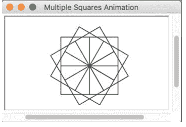

### 12.2.4 填充图形

也可以填充绘制图形内部的区域。例如，如果我们想填充我们绘制的其中一个正方形，如下所示：

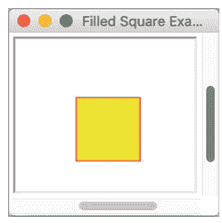

为此，我们可以使用`begin_fill()`和`end_fill()`函数：

- `begin_fill()` 表示图形应使用当前填充颜色填充，此函数应在绘制要填充的图形之前调用。
- `end_fill()` 在要填充的图形绘制完成后调用。这将导致自上次调用`begin_fill()`以来绘制的图形使用当前填充颜色进行填充。
- `filling()` 返回当前填充状态（如果正在填充则为True，否则为False）。

以下程序使用此函数（以及之前的`draw_square()`函数）来绘制上述填充的正方形：

```
turtle.title('Filled Square Example')
turtle.setup(100, 100, 0, 0)
turtle.hideturtle()

turtle.pencolor('red')
turtle.fillcolor('yellow')
turtle.begin_fill()

draw_square(60)

turtle.end_fill()
turtle.done()
```

### 12.3 其他图形库

当然，Turtle图形并不是Python唯一可用的图形选项；然而，其他图形库并非Python预装，必须使用Anaconda或PyCharm等工具下载。

- **PyQtGraph**：PyQtGraph库是一个纯Python库，面向数学、科学和工程图形应用以及GUI应用。更多信息请参见 http://www.pyqtgraph.org。
- **Pillow**：Pillow是一个Python图像处理库（基于PIL，即Python Imaging Library），为Python提供图像处理功能。有关Pillow的更多信息，请参见 https://pillow.readthedocs.io/en/stable。
- **Pyglet**：Pyglet是另一个用于Python的窗口和多媒体库。请参见 https://bitbucket.org/pyglet/pyglet/wiki/Home。

### 12.4 3D图形

虽然开发者当然可以使用Turtle图形创建令人信服的3D图像，但这并非该库的主要目的。这意味着除了基本的光标移动功能和程序员的技巧外，没有直接支持创建3D图像。
然而，Python有可用的3D图形库。其中一个库是Panda3D (https://www.panda3d.org)，另一个是VPython (https://vpython.org)，第三个是pi3d (https://pypi.org/project/pi3d)。不过，我们将简要介绍PyOpenGL库，因为它构建在非常广泛使用的OpenGL库之上。

#### 12.4.1 PyOpenGL

PyOpenGL是一个开源项目，提供了一组对OpenGL库的绑定（或包装）。OpenGL是开放图形库，这是一个跨语言、跨平台的API，用于渲染2D和3D矢量图形。OpenGL广泛应用于从游戏、虚拟现实到数据和信息可视化系统以及计算机辅助设计（CAD）系统等多个领域。PyOpenGL提供了一组Python函数，从Python调用底层的OpenGL库。这使得使用行业标准的OpenGL库在Python中创建基于3D矢量的图像变得非常容易。下面是一个使用PyOpenGL创建的图像的非常简单的示例：

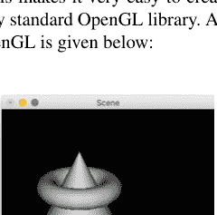

### 12.5 在线资源

以下提供进一步的阅读材料：

- https://docs.python.org/3/library/turtle.html Turtle图形文档。
- http://pythonturtle.org/ Python Turtle编程环境——旨在使用Turtle图形库教授编程背后的基本概念。
- http://pyopengl.sourceforge.net PyOpenGL主页。
- https://www.opengl.org OpenGL主页。

### 12.6 练习

本练习的目标是使用Python Turtle图形创建一个图形显示。你应该创建一个简单的程序，在Turtle图形屏幕上绘制一个八边形。修改你的程序，使其包含一个绘制六边形的函数。该函数应接受三个参数：开始绘制六边形的x和y坐标，以及六边形每条边的大小。修改你的程序，在多个位置绘制六边形，以创建以下图片：

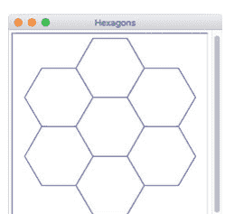

## 第13章
计算机生成艺术

#### 13.1 创作计算机艺术

计算机艺术被定义为任何使用计算机创作的艺术。然而，在本书的语境中，我们特指由计算机或更具体地说，由计算机程序生成的艺术。以下示例展示了如何仅用几行Python代码，借助Turtle图形库，创作出可被视为计算机艺术的图像。

下图由一个递归函数生成，该函数在指定的x、y位置绘制指定大小的圆形。此函数通过修改参数递归调用自身，从而在不同位置绘制越来越小的圆形，直到圆形尺寸小于20像素为止。

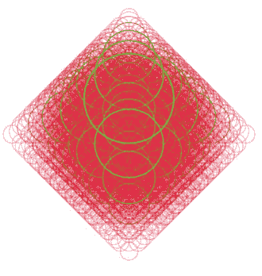

用于生成此图的程序如下，仅供参考：

```python
import turtle

WIDTH = 640
HEIGHT = 360

def setup_window():
    # Set up the window
    turtle.title('Circles in My Mind')
    turtle.setup(WIDTH, HEIGHT, 0, 0)
    # Indicates RGB numbers will be in the range 0 to 255
    turtle.colormode(255)
    turtle.hideturtle()
    # Batch drawing to the screen for faster rendering
    turtle.tracer(2000)

    # Speed up drawing process
    turtle.speed(10)
    turtle.penup()

def draw_circle(x, y, radius, red=50, green=255, blue=10, width=7):
    """ Draw a circle at a specific x, y location.
    Then draw four smaller circles recursively """
    colour = (red, green, blue)

    # Recursively drawn smaller circles
    if radius > 50:
        # Calculate colours and line width for smaller circles
        if red < 216:
            red = red + 33
            green = green - 42
            blue = blue + 10
            width -= 1
        else:
            red = 0
            green = 255
        # Calculate the radius for the smaller circles
        new_radius = int(radius / 1.3)
        # Drawn four circles
        draw_circle(int(x + new_radius), y, new_radius, red, green, blue, width)
        draw_circle(x - new_radius, y, new_radius, red, green, blue, width)
        draw_circle(x, int(y + new_radius), new_radius, red, green, blue, width)
        draw_circle(x, int(y - new_radius), new_radius, red, green, blue, width)

    # Draw the original circle
    turtle.goto(x, y)
    turtle.color(colour)
    turtle.width(width)
    turtle.pendown()
    turtle.circle(radius)
    turtle.penup()

##### Run the program
print('Starting')
setup_window()
draw_circle(25, -100, 200)

##### Ensure that all the drawing is rendered
turtle.update()
print('Done')
turtle.done()
```

关于此程序有几点需要注意。它使用递归来绘制圆形，不断绘制更小的圆形，直到圆形半径低于某个阈值（即终止点）。它还使用了`turtle.tracer()`函数来加速绘图过程，因为屏幕更新前会缓冲2000次更改。最后，用于圆形的颜色在每个递归层级都会改变；这里采用了一种非常简单的方法，即改变红、绿、蓝的代码值，从而产生不同颜色的圆形。此外，还使用了线宽来减小圆形轮廓的大小，为图像增添更多趣味。

#### 13.2 计算机艺术生成器

作为另一个展示如何使用Turtle图形创作计算机艺术的例子，以下程序随机生成RGB颜色用于绘制线条，使图像更具趣味性。它还允许用户输入一个角度，用于改变线条绘制的方向。由于绘图在循环中进行，即使对绘制线条所用角度进行如此简单的改变，也能生成截然不同的图像。

```python
##### Lets play with some colours
import turtle
from random import randint

def get_input_angle():
    """ Obtain input from user and convert to an int """
    message = 'Please provide an angle:'
    value_as_string = input(message)
    while not value_as_string.isnumeric():
        print('The input must be an integer!')
        value_as_string = input(message)
    return int(value_as_string)

def generate_random_colour():
    """ Generates an R,G,B values randomly in range
    0 to 255 """
    r = randint(0, 255)
    g = randint(0, 255)
    b = randint(0, 255)
    return r, g, b

print('Set up Screen')
turtle.title('Colourful pattern')
turtle.setup(640, 600)
turtle.hideturtle()
turtle.bgcolor('black') # Set the background colour of the screen
turtle.colormode(255) # Indicates RGB numbers will be in the range 0 to 255
turtle.speed(10)
angle = get_input_angle()

print('Start the drawing')
for i in range(0, 200):
    turtle.color(generate_random_colour())
    turtle.forward(i)
    turtle.right(angle)

print('Done')
turtle.done()
```

以下是由此程序生成的一些示例图像。最左边的图像是通过输入角度38生成的，右边的图像使用角度68，底部的图像使用角度98。

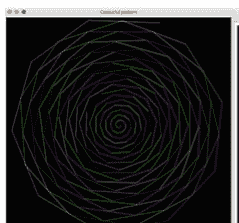

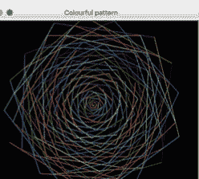

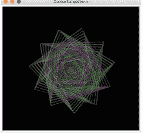

以下图像分别使用角度118、138和168。

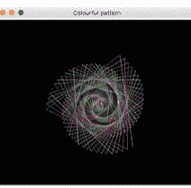

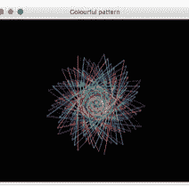

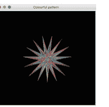

这些图像的有趣之处在于，尽管它们使用完全相同的程序，但每张都如此不同。这说明了算法或计算机生成艺术可以像其他任何艺术形式一样微妙和灵活。它也说明，即使通过这样的过程，最终仍由人来决定哪张图像（如果有的话）最具美感。

#### 13.3 Python中的分形

在计算机艺术领域，分形是一种非常知名的艺术形式。分形是重复的图案，通过迭代方法（如for循环）或递归方法（当函数调用自身但参数被修改时）计算得出。分形真正有趣的特征之一是，它们在连续的粒度层级上展现出相同的图案（或几乎相同的图案）。也就是说，如果你放大一个分形图像，你会发现相同的图案在越来越小的放大倍数下不断重复。这被称为扩展对称性或展开对称性；如果这种复制在每个尺度上都完全相同，则称为仿射自相似。

分形起源于十七世纪的数学世界，而“分形”一词由数学家本华·曼德博在1975年创造。曼德博在描述几何分形时常被引用的一段描述是：

> 一种粗糙或破碎的几何形状，可以被分割成若干部分，每一部分（至少近似地）是整体的缩小版。

更多信息请参见曼德博，本华·B. (1983). 《自然的分形几何》. 麦克米伦. ISBN 978-0-7167-1186-5).

自二十世纪后期以来，分形已成为创作计算机艺术的常用方法。

计算机艺术中常用的一个分形例子是科赫雪花，另一个是曼德博集。这两个都被用作示例，说明如何使用Python和Turtle图形库创作基于分形的艺术。

#### 13.4 科赫雪花

科赫雪花是一种分形，它从等边三角形开始，然后将每条线段的中间三分之一替换为一对形成等边凸起的线段。这种替换可以执行到任意深度，生成越来越精细（越来越小）的三角形，直到整体形状类似于雪花。

以下程序可用于生成具有不同递归层级的科赫雪花。递归层级数越大，每条线段被分割的次数就越多。

```python
import turtle

##### Set up Constants
ANGLES = [60, -120, 60, 0]
SIZE_OF_SNOWFLAKE = 300

def get_input_depth():
    """ Obtain input from user and convert to an int """
```

### 13.5 曼德博集合

最著名的分形图像之一可能就是基于曼德博集合。曼德博集合是复数c的集合，对于这些复数，当函数 z * z + c 从 z = 0 开始迭代时不会发散，即函数序列（func(0), func(func(0)), 等等）的绝对值保持有界。曼德博集合的定义及其名称归功于法国数学家阿德里安·杜阿迪，他以此命名是为了向数学家本华·曼德博致敬。

曼德博集合图像可以通过对复数进行采样并测试每个采样点c来创建，测试序列 func(0), func(func(0)), 等等是否趋向无穷大（在实践中，这意味着进行测试以查看在预定的迭代次数后，它是否离开了0的某个预定有界邻域）。将c的实部和虚部视为复平面上的图像坐标，然后可以根据序列跨越任意选择的阈值的速度对像素进行着色，对于在预定的迭代次数后序列尚未跨越阈值的c值，使用特殊颜色（通常是黑色）（这对于清晰地区分曼德博集合图像与其补集图像至关重要）。

以下图像是使用Python和Turtle图形为曼德博集合生成的。

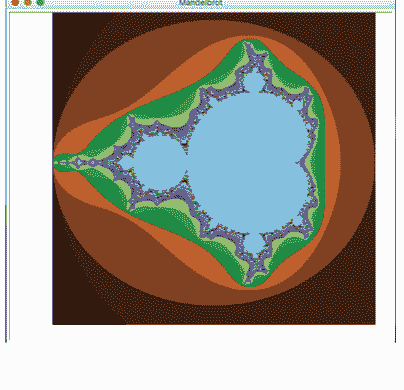

用于生成此图像的程序如下：

```python
import turtle

##### Set up constants
SCREEN_OFFSET_X = 250
SCREEN_OFFSET_Y = 240

##### max iterations allowed
MAX_ITERATIONS = 255

##### image size
IMAGE_SIZE_X = 512
IMAGE_SIZE_Y = 512

##### Drawing area
MIN_X = -2.0
MAX_X = 1.0
MIN_Y = -1.5
MAX_Y = 1.5

def setup_screen(title, background='white', screen_size_x=640,
    screen_size_y=320, tracer_size=200):
    print('Set up Screen')
    turtle.title(title)
    turtle.setup(screen_size_x, screen_size_y)
    turtle.hideturtle()
    turtle.penup()
    turtle.backward(240)
    turtle.tracer(tracer_size)
    turtle.bgcolor(background) # Set the background colour of the screen

setup_screen('Mandelbrot', screen_size_x=IMAGE_SIZE_X, screen_size_y=IMAGE_SIZE_Y, tracer_size=20000)
turtle.colormode(255) # Indicates RGB numbers will be in the range 0 to 255

##### Generate Mandelbrot
for y in range(IMAGE_SIZE_Y):
    zy = y * (MAX_Y - MIN_Y) / (IMAGE_SIZE_Y - 1) + MIN_Y
    for x in range(IMAGE_SIZE_X):
        zx = x * (MAX_X - MIN_X) / (IMAGE_SIZE_Y - 1) + MIN_X
        z = zx + zy * 1j
        c = z
        for i in range(MAX_ITERATIONS):
            if abs(z) > 2.0:
                break
            z = z * z + c
        turtle.color((i % 4 * 64, i % 8 * 32, i % 16 * 16))
        turtle.setposition(x - SCREEN_OFFSET_X, y - SCREEN_OFFSET_Y)
        turtle.pendown()
        turtle.dot(1)
        turtle.penup()

##### Ensure that all the drawing is rendered
turtle.update()

print('Done')
turtle.done()
```

### 13.6 在线资源

以下提供进一步的阅读材料：

- https://en.wikipedia.org/wiki/Fractal 维基百科关于分形的页面。
- https://en.wikipedia.org/wiki/Koch_snowflake 维基百科关于科赫雪花的页面。
- https://en.wikipedia.org/wiki/Mandelbrot_set 维基百科关于曼德博集合的页面。

### 13.7 练习

本练习的目标是创建一棵分形树。
分形树是一种树，其整体结构通过树在越来越精细的层次上复制，直到达到一组叶子元素。
要绘制分形树，你需要：

- 绘制树干。
- 在树干末端，将树干分成两部分，左树干和右树干分别位于原始树干的左侧和右侧30°。出于美学考虑，每次分裂时树干可以变细。树干可以用特定颜色绘制，例如棕色。
- 继续此过程，直到达到最大分裂次数（或树干尺寸减小到特定最小值）。现在你已经到达叶子（你可以用不同的颜色绘制叶子，例如绿色）。

分形树的一个示例如下：


## 第14章
### Matplotlib简介

### 14.1 简介

Matplotlib是一个Python绘图和制图库，可以生成多种不同类型的图形或图表，并支持多种不同的格式。它可用于生成折线图、散点图、热图、条形图、饼图和3D图。它甚至支持动画和交互式显示。

以下是使用Matplotlib生成的图形示例。这显示了一个用于绘制简单正弦波的折线图：

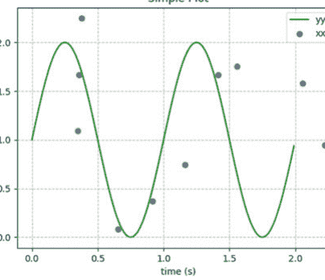

Matplotlib是一个非常灵活且功能强大的绘图库。它支持多种不同的Python图形平台和操作系统窗口环境。它还可以生成多种不同格式的输出图形，包括PNG、JPEG、SVG和PDF。

Matplotlib可以单独使用，也可以与其他库结合使用，以提供各种功能。一个经常与Matplotlib结合使用的库是NumPy，这是一个常用于数据科学应用的库，它提供了各种函数和数据结构（如n维数组），在处理图表显示数据时非常有用。

然而，Matplotlib并未预装在Python环境中；它是一个可选模块，必须添加到你的环境或IDE中。

在本章中，我们将介绍Matplotlib库、其架构、构成图表的组件以及`pyplot` API。`pyplot` API是程序员与Matplotlib交互的最简单和最常用的方式。然后我们将探索各种不同类型的图表以及如何使用Matplotlib创建它们，从简单的折线图、散点图到条形图和饼图。最后，我们将看一个简单的3D图。

### 14.2 Matplotlib

Matplotlib是一个用于Python的图形绘制库。对于简单的图形，Matplotlib非常易于使用，例如，要为一组x和y坐标创建一个简单的折线图，你可以使用`matplotlib.pyplot.plot`函数：

```python
import matplotlib.pyplot as pyplot

##### Plot a sequence of values
pyplot.plot([1, 0.25, 0.5, 2, 3, 3.75, 3.5])

##### Display the chart in a window
pyplot.show()
```

这个非常简单的程序生成以下图形：

在此示例中，`plot()` 函数接收一系列值作为 Y 轴数据；X 轴值则由列表中各值的位置隐式决定。由于列表包含六个元素，因此 X 轴范围为 0–6。同理，列表中的最大值为 3.75，故 Y 值范围从 0 到 4。

### 14.3 图表组成部分

尽管看似简单，Matplotlib 图形或图表实际上由众多元素构成。这些元素均可独立操作和修改。因此，熟悉与这些元素相关的 Matplotlib 术语（如刻度、图例、标签等）十分有用。

图表的组成部分如下图所示：

该图展示了以下元素：

- **坐标轴** 由 `matplotlib.axes.Axes` 类定义。它用于维护图形的大部分元素，包括 X 轴和 Y 轴、刻度、线形图、文本以及多边形形状。
- **标题** 这是整个图形的标题。
- **刻度**（主刻度和次刻度）刻度由 `matplotlib.axis.Tick` 类表示。刻度是坐标轴上指示新值的标记。存在较大且可能带标签的主刻度，也存在较小（也可能带标签）的次刻度。
- **刻度标签**（主刻度和次刻度）这是刻度上的标签。
- **坐标轴** `matplotlib.axis.Axis` 类在父 Axes 实例内定义坐标轴对象（如 X 轴或 Y 轴）。它可包含用于格式化主刻度和次刻度标签的格式器，也可设置主刻度和次刻度的位置。
- **坐标轴标签**（X、Y，有时包括 Z）这些是用于描述坐标轴的标签。
- **图表类型** 如线形图和散点图。Matplotlib 支持多种图表类型，包括线形图、散点图、柱状图和饼图。
- **网格** 这是显示在图表、图形或曲线图背景中的可选网格。网格可以多种不同的线型（如实线或虚线）、颜色和线宽显示。

### 14.4 Matplotlib 架构

Matplotlib 库采用分层架构，隐藏了与不同窗口系统和图形输出相关的大部分复杂性。该架构包含三个主要层：脚本层、艺术家层和后端层。每层都有特定的职责和组件。例如，后端层负责读取和交互正在生成的图形。艺术家层则负责创建将由后端层渲染的图形对象。最后，脚本层供开发者用于创建图形。

该架构如下图所示：

#### 14.4.1 后端层

Matplotlib 后端*层*处理向不同目标格式的输出生成。Matplotlib 本身可以多种不同方式使用，以生成多种不同输出。

Matplotlib 可以交互式使用，可以嵌入应用程序（或图形用户界面），也可以作为批处理应用程序的一部分，将图表存储为 PNG、SVG、PDF 或其他图像格式。

为支持所有这些用例，Matplotlib 可以针对不同输出，每种能力称为一个*后端*；“前端”是面向开发者的代码。后端层维护所有不同的后端，程序员可以使用默认后端，也可以根据需要选择不同的后端。

要使用的后端可通过 `matplotlib.use()` 函数设置。例如，要设置后端以渲染 Postscript，请使用：`matplotlib.use('PS')`，如下所示：

```python
import matplotlib

if 'matplotlib.backends' not in sys.modules:
    matplotlib.use('PS')

import matplotlib.pyplot as pyplot
```

需要注意的是，如果使用 `matplotlib.use()` 函数，必须在导入 `matplotlib.pyplot` *之前*完成。在 `matplotlib.pyplot` *导入*后调用 `matplotlib.use()` 将无效。请注意，传递给 `matplotlib.use()` 函数的参数区分大小写。

默认渲染器是 'Agg'，它使用 Anti-Grain Geometry C++ 库生成图形的栅格（像素）图像。这能生成高质量的基于栅格图形的数据图表图像。

选择 'Agg' 后端作为默认后端，是因为它在广泛的 Linux 机器上都能运行，其支持要求相当小；其他后端可能在某台特定机器上运行，但可能无法在另一台机器上运行。如果特定机器未加载指定 Matplotlib 后端所依赖的所有依赖项，就会发生这种情况。

后端层可分为两类：

- 用户界面后端（交互式），支持各种 Python 窗口系统，如 `wxWidgets`、`Qt`、`TK` 等。
- 硬拷贝后端（非交互式），支持栅格和矢量图形输出。

用户界面和硬拷贝后端都建立在称为后端基类的通用抽象之上。

#### 14.4.2 艺术家层

艺术家层提供了你可能认为是 Matplotlib 实际功能的大部分内容；即生成渲染/显示给用户（或以特定格式输出）的图表和图形。

艺术家层涉及构成图表的线条、形状、坐标轴、坐标系、文本等元素。

艺术家层使用的类可分为以下三组：图元、容器和集合：

- 图元是用于表示将绘制到图形画布上的图形对象的类。
- 容器是持有图元的对象。例如，通常会实例化一个图形并用它创建一个或多个 Axes 等。
- 集合用于高效处理大量相似类型的对象。

尽管了解这些类很有用，但在许多情况下，你不需要直接使用它们，因为 `pyplot` API 隐藏了许多细节。但是，如果需要，可以在图形、坐标轴、刻度等层面进行操作。

#### 14.4.3 脚本层

脚本层是面向开发者的接口，简化了与其他层交互的任务。

请注意，从程序员的角度来看，脚本层由 `pyplot` 模块表示。在底层，`pyplot` 使用模块级对象来跟踪数据状态、处理绘制图形等。

导入时，`pyplot` 会选择系统的*默认*后端或已配置的后端；例如通过 `matplotlib.use()` 函数。然后它调用一个 `setup()` 函数，该函数：

- 创建一个图形管理器工厂函数，调用时将为所选后端创建一个新的图形管理器，
- 准备应与所选后端一起使用的绘图函数，
- 识别与后端 `mainloop` 函数集成的可调用函数，
- 提供所选后端的*模块*。

`pyplot` 接口通过提供 `plot()`、`pie()`、`bar()`、`title()`、`savefig()`、`draw()` 和 `figure()` 等方法，简化了与内部包装器的交互。

本章后面介绍的大多数示例将使用 `pyplot` 模块提供的函数来创建所需的图表，从而隐藏底层细节。

### 14.5 在线资源

请参阅在线文档：

- [https://matplotlib.org](https://matplotlib.org) Matplotlib 库。包含大量完整代码示例、文档、图库以及详细的用户指南和常见问题解答。
- [https://pythonprogramming.net/matplotlib-python-3-basics-tutorial](https://pythonprogramming.net/matplotlib-python-3-basics-tutorial) Python Matplotlib 速成课程。

## 第15章
使用 Matplotlib Pyplot 进行绘图

### 15.1 简介

在本章中，我们将探索 Matplotlib 的 pyplot API。这是开发者使用 Matplotlib 生成不同类型图表或图形的最常用方式。

### 15.2 pyplot API

`pyplot` 模块及其提供的 API 的目的是简化 Matplotlib 图表和图形的生成与操作。总体而言，Matplotlib 库力求让简单的事情变得容易，让复杂的事情成为可能。它实现第一个目标的主要方式是通过 `pyplot` API，因为该 API 提供了诸如 bar()、plot()、scatter() 和 pie() 等高级函数，使得创建条形图、折线图、散点图和饼图变得轻而易举。

关于 `pyplot` API 提供的函数，有一点需要注意：它们通常可以接受非常多的参数；然而，这些参数中的大多数都有默认值，在许多情况下会为你提供合理的默认行为/默认视觉表示。因此，你可以忽略大多数可用参数，直到你确实需要做一些不同的事情；那时你应该查阅 Matplotlib 文档，因为该文档包含大量材料以及众多示例。

当然，有必要导入 `pyplot` 模块；因为它是 Matplotlib（例如 `matplotlib.pyplot`）库中的一个模块。在程序中，它通常被赋予一个别名以便于引用。该模块的常见别名是 `pyplot` 或 `plt`。

`pyplot` 模块的典型导入方式如下所示：

```
import matplotlib.pyplot as pyplot
```

pyplot API 可用于

- 构建图表，
- 配置标签和坐标轴，
- 管理颜色和线条样式，
- 处理事件/允许图表交互，
- 显示（show）图表。

我们将在以下各节中看到使用 pyplot API 的示例。

### 15.3 折线图

折线图或折线图是一种图表，其中图表上的点（通常称为标记）通过线条连接，以显示某个值如何随着一组值（通常是 x 轴）的变化而变化。例如，在一系列时间间隔（也称为时间序列）上。此类折线图通常按时间顺序绘制；此类图表被称为运行图。

以下图表是此类运行图的一个示例；它在底部（x 轴）绘制时间，与速度（由 y 轴表示）相对应。

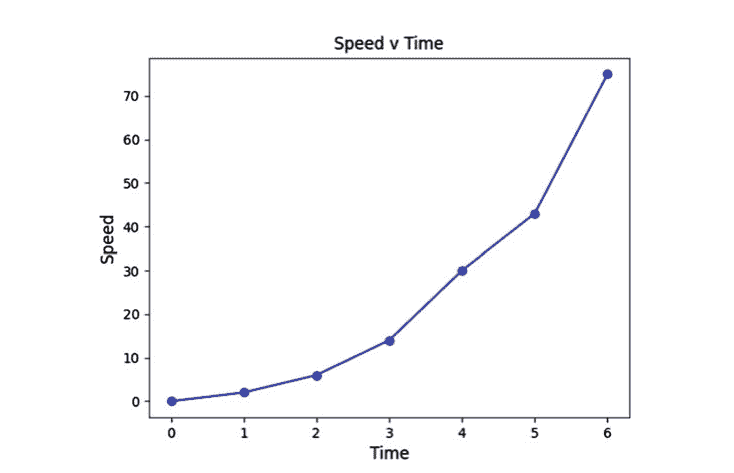

用于生成此图表的程序如下所示：

```
import matplotlib.pyplot as pyplot

##### Set up the data
x = [0, 1, 2, 3, 4, 5, 6]
y = [0, 2, 6, 14, 30, 43, 75]

##### Set the axes headings
pyplot.ylabel('Speed', fontsize=12)
pyplot.xlabel('Time', fontsize=12)

##### Set the title
pyplot.title("Speed v Time")

##### Plot and display the graph
##### Using blue circles for markers ('bo')
##### and a solid line ('-')
pyplot.plot(x, y, 'bo-')
pyplot.show()
```

该程序首先导入 matplotlib.pyplot 模块并为其指定别名 pyplot（因为这是一个更短的名称，它使代码更易于阅读）。

然后为每个标记或绘图点的 x 和 y 坐标创建两个值列表。

接着，通过为 x 轴和 y 轴提供标签（使用 pyplot 函数 xlabel() 和 ylabel()）来配置图表本身。然后设置图表的标题（同样使用 pyplot 函数）。

之后，x 和 y 值被绘制为图表上的折线图。这是通过 pyplot.plot() 函数完成的。该函数可以接受多种参数，唯一必需的参数是用于定义绘图点的数据。在上面的示例中，提供了第三个参数；这是一个字符串 'bo-'。这是一个编码格式字符串，因为字符串的每个元素对 pyplot.plot() 函数都有意义。字符串的元素是：

- b—这表示绘制线条时使用的颜色；在这种情况下，字母 'b' 表示蓝色（同样，'r' 表示红色，'g' 表示绿色）。
- o—这表示每个标记（每个被绘制的点）应该用一个圆圈表示。标记之间的线条则构成了折线图。
- '-'—这表示要使用的线条样式。单破折号 ('-') 表示实线，而双破折号 ('--') 表示虚线。

最后，程序使用 `show()` 函数在屏幕上渲染图形；或者也可以使用 `savefig()` 将图形保存到文件。

#### 15.3.1 编码格式字符串

可以通过格式字符串提供众多选项；下表总结了其中一些：
格式字符串支持以下颜色缩写：

| 字符 | 颜色 |
| :--- | :--- |
| 'b' | 蓝色 |
| 'g' | 绿色 |
| 'r' | 红色 |
| 'c' | 青色 |
| 'm' | 品红色 |
| 'y' | 黄色 |
| 'k' | 黑色 |
| 'w' | 白色 |

还支持不同的方式来表示由线条连接的标记（图表上的点），包括：

| 字符 | 描述 |
| :--- | :--- |
| '.' | 点标记 |
| ',' | 像素标记 |
| 'o' | 圆形标记 |
| 'v' | 三角形向下标记 |
| '^' | 三角形向上标记 |
| '<' | 三角形向左标记 |
| '>' | 三角形向右标记 |
| 's' | 正方形标记 |
| 'p' | 五边形标记 |
| '*' | 星形标记 |
| 'h' | 六边形1标记 |
| '+' | 加号标记 |
| 'x' | x 标记 |
| 'D' | 菱形标记 |

最后，格式字符串支持不同的线条样式：

| 字符 | 描述 |
| :--- | :--- |
| '-' | 实线样式 |
| '--' | 虚线样式 |
| '-.' | 点划线样式 |
| ':' | 点线样式 |

一些格式字符串示例：

- 'r' 红色线条，使用默认标记和线条样式。
- 'g-' 绿色实线。
- '--' 虚线，使用默认颜色和默认标记。
- 'yo:' 黄色点线，带有圆形标记。

### 15.4 散点图

散点图或散点图是一种图表类型，其中单个值使用笛卡尔（或 x 和 y）坐标来显示。每个值通过图表上的一个标记（如圆圈或三角形）来表示。它们可用于表示从两个不同变量获得的值；一个绘制在 x 轴上，另一个绘制在 y 轴上。

下面是一个包含三组散点值的散点图示例：

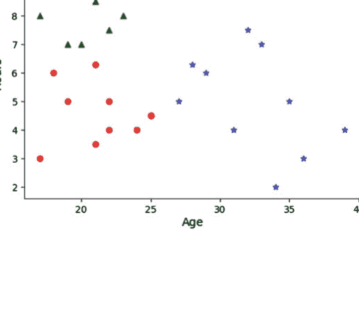

在此图表中，每个点代表不同年龄段的人在三种不同活动上花费的时间量。

用于生成上述图表的程序如下所示：

```
import matplotlib.pyplot as pyplot

##### Create data
riding = ((17, 18, 21, 22, 19, 21, 25, 22, 25, 24),
          (3, 6, 3.5, 4, 5, 6.3, 4.5, 5, 4.5, 4))
swimming = ((17, 18, 20, 19, 22, 21, 23, 19, 21, 24),
            (8, 9, 7, 10, 7.5, 9, 8, 7, 8.5, 9))
sailing = ((31, 28, 29, 36, 27, 32, 34, 35, 33, 39),
           (4, 6.3, 6, 3, 5, 7.5, 2, 5, 7, 4))

##### Plot the data
pyplot.scatter(x=riding[0], y=riding[1], c='red', marker='o',
              label='riding')
pyplot.scatter(x=swimming[0], y=swimming[1], c='green',
              marker='^', label='swimming')
pyplot.scatter(x=sailing[0], y=sailing[1], c='blue', marker='*',
              label='sailing')

##### Configure graph
pyplot.xlabel('Age')
pyplot.ylabel('Hours')
pyplot.title('Activities Scatter Graph')
pyplot.legend()

##### Display the chart
pyplot.show()
```

在上面的示例中，`plot.scatter()` 函数用于为由 riding、swimming 和 sailing 元组定义的数据生成散点图。

标记的颜色已使用命名参数 c 指定。该参数可以接受表示颜色名称的字符串，或者一个单行的二维数组，其中该行中的每个值代表一个 RGB 颜色代码。标记指示标记样式，例如 'o' 表示圆形，'^' 表示三角形，'*' 表示星形。标签用于图表图例中的标记。

`pyplot.scatter()` 函数上可用的其他选项包括：

- `alpha`：表示 alpha 混合值，介于 0（透明）和 1（不透明）之间。
- `linewidths`：用于指示标记边缘的线宽。
- `edgecolors`：如果与用于标记的填充颜色（由参数 'c' 指示）不同，则指示用于标记边缘的颜色。

#### 15.4.1 何时使用散点图

一个值得考虑的有用问题是：何时应该使用散点图？一般来说，当需要显示两个变量之间的关系时，会使用散点图。

散点图有时也被称为相关图，因为它展示了两个变量之间的相关性。

在许多情况下，可以观察到散点图上各点周围存在一种趋势（尽管可能存在离群值）。为了帮助可视化这种趋势，在散点图上绘制一条趋势线会很有用。趋势线有助于更清晰地展示散点图与整体趋势之间的关系。

下图将一组值表示为散点图，并绘制了该散点图的趋势线。可以看到，有些值比其他值更接近*趋势线*。

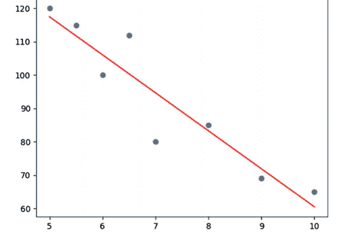

本例中的趋势线是使用 `numpy` 函数 `polyfit()` 创建的。

`polyfit()` 函数对其接收的数据执行最小二乘多项式拟合。然后，基于 `polyfit()` 返回的数组创建一个 `poly1d` 类。这是一个一维多项式类。它是一个便捷类，用于封装多项式的“自然”操作。接着，使用 `poly1d` 对象生成一组值，以配合函数 `pyplot.plot()` 的 *x* 值集合使用。

```python
import numpy as np
import matplotlib.pyplot as pyplot

x = (5, 5.5, 6, 6.5, 7, 8, 9, 10)
y = (120, 115, 100, 112, 80, 85, 69, 65)

##### Generate the scatter plot
pyplot.scatter(x, y)

##### Generate the trend line
z = np.polyfit(x, y, 1)
p = np.poly1d(z)
pyplot.plot(x, p(x), 'r')

##### Display the figure
pyplot.show()
```

### 15.5 饼图

饼图是一种图表类型，其中圆形被划分为多个扇形（或楔形），每个扇形代表整体的一部分。圆形的每个楔形代表一个类别对总体的贡献。因此，该图表类似于一个被切成不同大小切片的馅饼。

通常，饼图的不同扇形以不同颜色呈现，并按大小顺序顺时针排列在图表周围。然而，如果存在一个切片不包含单一的数据类别，而是汇总了多个类别（例如“其他类型”或“其他答案”），那么即使它不是最小的类别，通常也会将其显示在最后，以免影响所关注的命名类别。

下图展示了一个用于表示特定组织内编程语言使用情况的饼图。

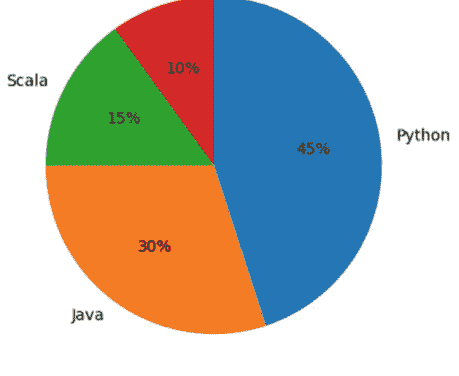

该饼图是使用 `pyplot.pie()` 函数创建的。

```python
import matplotlib.pyplot as pyplot

labels = ('Python', 'Java', 'Scala', 'C#')
sizes = [45, 30, 15, 10]

pyplot.pie(sizes,
           labels=labels,
           autopct='%1.1f%%',
           counterclock=False,
           startangle=90)

pyplot.show()
```

`pyplot.pie()` 函数接受多个参数，其中大部分是可选的。唯一必需的参数是第一个参数，它提供了用于楔形或扇形大小的值。上例中使用了以下可选参数：

- `labels` 参数是一个可选参数，可以接受一个字符串序列，用于为每个楔形提供标签。
- `autopct` 参数接受一个字符串（或函数），用于格式化每个楔形使用的数值。
- `counterclockwise` 参数。在 pyplot 中，默认情况下楔形是逆时针绘制的，因此为了确保布局更接近传统的顺时针方式，将 `counterclock` 参数设置为 `False`。
- `startangle` 参数。起始角度也通过 `startangle` 参数移动了 90°，使得第一个扇形从图表顶部开始。

#### 15.5.1 展开扇形

通过*展开*饼图的特定扇形（即将其从饼图其余部分分离出来）来强调该扇形会很有用。这可以使用 `pie()` 函数的 `explode` 参数来实现，该参数接受一个值序列，指示每个扇形应被展开的程度。
在这种情况下，通过使用命名的 `shadow` 布尔参数为扇形添加阴影，也可以增强饼图的视觉效果。这些效果如下所示：

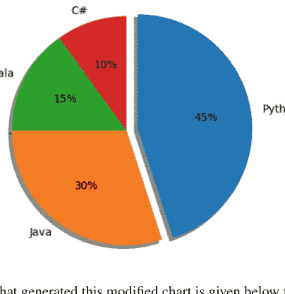

生成此修改后图表的程序如下，供参考：

```python
import matplotlib.pyplot as pyplot

labels = ('Python', 'Java', 'Scala', 'C#')
sizes = [45, 30, 15, 10]

##### only "explode" the 1st slice (i.e. 'Python')
explode = (0.1, 0, 0, 0)

pyplot.pie(sizes,
           explode=explode,
           labels=labels,
           autopct='%1.1f%%',
           shadow=True,
           counterclock=False,
           startangle=90)

pyplot.show()
```

#### 15.5.2 何时使用饼图

考虑哪些数据可以/应该使用饼图来呈现是很有用的。一般来说，饼图适用于显示可以分类为名义或顺序类别的数据。名义数据根据描述性或定性信息进行分类，例如编程语言、汽车类型、出生国家。顺序数据类似，但类别也可以排序，例如在调查中，可能会要求人们将某事物评为非常差、差、一般、好、非常好。

饼图也可用于显示百分比或比例数据，通常每个类别所代表的百分比会显示在相应的馅饼切片旁边。
饼图通常也仅限于呈现六个或更少类别的数据。当类别更多时，眼睛很难区分不同扇形的相对大小，因此图表变得难以解释。

### 15.6 条形图

条形图是一种用于呈现不同离散类别数据的图表类型。数据通常垂直呈现，尽管在某些情况下也可能使用水平条形图。每个类别由一个条形表示，其高度（或长度）代表该类别的数据。
由于条形图易于解释，以及每个类别与其他类别的关系，它们是最常用的图表类型之一。还有几种不同的常见变体，例如分组条形图和堆叠条形图。
以下是一个典型条形图的示例。五个编程语言类别沿 x 轴呈现，而 y 轴表示使用百分比。每个条形代表与每个编程语言相关的使用百分比。

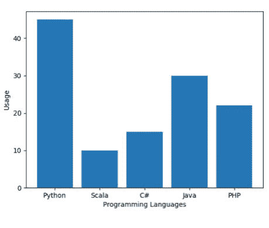

用于生成上图的程序如下：

```python
import matplotlib.pyplot as pyplot

##### Set up the data
labels = ('Python', 'Scala', 'C#', 'Java', 'PHP')
index = (1, 2, 3, 4, 5) # provides locations on x axis
sizes = [45, 10, 15, 30, 22]

##### Set up the bar chart
pyplot.bar(index, sizes, tick_label=labels)

##### Configure the layout
pyplot.ylabel('Usage')
pyplot.xlabel('Programming Languages')

##### Display the chart
pyplot.show()
```

该图表的构建方式使得不同条形的长度与其所代表的类别大小成比例。x 轴代表不同的类别，因此没有刻度。为了强调类别是离散的，在 x 轴上的条形之间留有间隙。y 轴确实有刻度，这表示测量单位。

#### 15.6.1 水平条形图

条形图通常绘制为条形垂直，这意味着条形越高，类别越大。然而，也可以绘制条形为水平的条形图，这意味着条形越长，类别越大。当页面空间不足以容纳垂直条形图所需的所有列时，这是一种呈现大量不同类别的特别有效的方式。

在 Matplotlib 中，可以使用 `pyplot.barh()` 函数生成水平条形图：

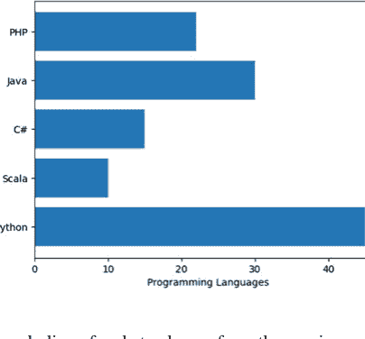

在这种情况下，与上一个示例相比，唯一需要更改的代码行是：

### 15.6.2 彩色条形图

在图表中，为不同的条形使用不同的颜色或不同的色调也是很常见的做法。这有助于区分一个条形与另一个条形。下面给出一个示例：

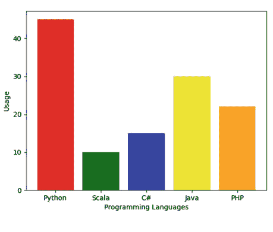

每个类别要使用的颜色可以通过 `bar()`（以及 `barh()`）函数的 `color` 参数提供。这是一个要应用的颜色序列。例如，上面的彩色条形图可以使用以下代码生成：

```python
pyplot.bar(x_values, sizes, tick_label=labels, color=('red', 'green', 'blue', 'yellow', 'orange'))
```

### 15.6.3 堆叠条形图

条形图也可以堆叠起来。这是一种显示多个类别中总计值（以及这些总计值的构成）的方式。也就是说，这是一种基于不同元素如何贡献于总计值，来查看多个不同类别整体总计的方式。

不同的颜色用于构成整体条形的不同子组。在这种情况下，通常会提供一个图例或说明，以指示每种阴影/颜色代表哪个子组。图例可以放置在绘图区域内，也可以位于图表下方。

例如，在下面的图表中，某种特定编程语言的总使用量由其在游戏、网络开发以及数据科学分析中的使用量构成。

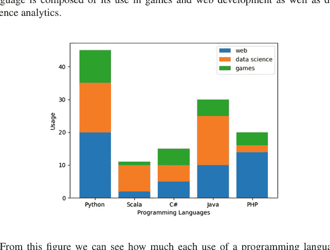

从这个图中，我们可以看到该编程语言的每种用途对其总使用量的贡献有多大。生成此图表的程序如下：

```python
import matplotlib.pyplot as pyplot

##### Set up the data
labels = ('Python', 'Scala', 'C#', 'Java', 'PHP')
index = (1, 2, 3, 4, 5)
web_usage = [20, 2, 5, 10, 14]
data_science_usage = [15, 8, 5, 15, 2]
games_usage = [10, 1, 5, 5, 4]

##### Set up the bar chart
pyplot.bar(index, web_usage, tick_label=labels, label='web')
pyplot.bar(index, data_science_usage, tick_label=labels, label='data science', bottom=web_usage)

web_and_games_usage = [web_usage[i] + data_science_usage[i] for i in range(0, len(web_usage))]
pyplot.bar(index, games_usage, tick_label=labels, label='games', bottom=web_and_games_usage)

##### Configure the layout
pyplot.ylabel('Usage')
pyplot.xlabel('Programming Languages')
pyplot.legend()

##### Display the chart
pyplot.show()
```

从这个例子中需要注意的一点是，在使用 `pyplot.bar()` 函数添加了第一组值之后，有必要使用 `bottom` 参数为下一组条形指定底部位置。对于第二个条形图，我们可以直接使用已经用于 `web_usage` 的值；然而，对于第三个条形图，我们必须将用于 `web_usage` 和 `data_science_usage` 的值相加（在这种情况下使用 for 列表推导式）。

### 15.6.4 分组条形图

最后，分组条形图是一种显示主要类别不同子组信息的方式。在这种情况下，通常会提供一个图例或说明，以指示每种阴影/颜色代表哪个子组。图例可以放置在绘图区域内，也可以位于图表下方。

对于特定类别，会为每个子组绘制单独的条形图。例如，在下面的图表中，显示了两组团队在一系列实验练习中获得的结果。因此，每个团队都有一个对应 lab1、lab2、lab3 等的条形。每个类别之间留有空格，以便更容易比较子类别。

以下程序生成了实验练习示例的分组条形图：

```python
import matplotlib.pyplot as pyplot

BAR_WIDTH = 0.35

##### set up grouped bar charts
teama_results = (60, 75, 56, 62, 58)
teamb_results = (55, 68, 80, 73, 55)
##### Set up the index for each bar
index_teama = (1, 2, 3, 4, 5)
index_teamb = [i + BAR_WIDTH for i in index_teama]

##### Determine the mid point for the ticks
ticks = [i + BAR_WIDTH / 2 for i in index_teama]
tick_labels = ('Lab 1', 'Lab 2', 'Lab 3', 'Lab 4', 'Lab 5')

##### Plot the bar charts
pyplot.bar(index_teama, teama_results, BAR_WIDTH, color='b', label='Team A')
pyplot.bar(index_teamb, teamb_results, BAR_WIDTH, color='g', label='Team B')

##### Set up the graph
pyplot.xlabel('Labs')
pyplot.ylabel('Scores')
pyplot.title('Scores by Lab')
pyplot.xticks(ticks, tick_labels)
pyplot.legend()

##### Display the graph
pyplot.show()
```

注意上面的程序，由于我们希望条形并排显示，因此有必要计算第二个团队的索引。因此，团队的索引包含了每个索引点的条形宽度，所以第一个条形位于索引位置 1.35，第二个位于索引位置 2.35，依此类推。最后，刻度位置因此必须位于两个条形之间，所以计算时考虑了条形宽度。

此程序生成以下分组条形图：

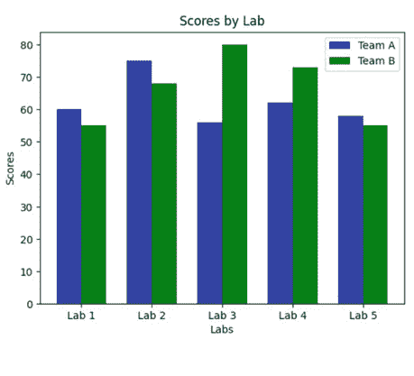

### 15.7 图形与子图

Matplotlib 图形是包含绘图上所有显示图形元素的对象。即坐标轴、图例、标题以及折线图或条形图本身。因此，它代表整个窗口或页面，是顶层图形组件。

在许多情况下，当开发者与 `pyplot` API 交互时，图形是隐式的；但是，如果需要，可以直接访问图形。

`matplotlib.pyplot.subplots()` 函数是一个有用的函数，用于创建子图的常见布局，包括包含的图形对象。此函数可以接受可选参数来指示子图的数量和组织方式，例如：

```python
fig, axs = plt.subplots(2, 2)
```

表示以 2x2 网格显示的 4 个子图。

此函数返回一个 `matplotlib.figure.Figure` 对象和一个可用于子图的轴对象的二维数组。然后可以直接与相应的轴对象进行交互。例如，可以向轴添加子图以及这些子图的标题。

如果要向图形添加多个子图，则需要直接使用轴。如果需要能够并排比较同一数据的不同视图，这会很有用。每个子图都有自己的轴，这些轴可以在图形内共存。

可以使用相应的轴向图形添加一个或多个子图。由于轴是一个二维数组（一个 `ndarray`），因此可以单独访问每个轴并向该轴添加绘图，例如：

```python
axs[0, 0].plot(t, s)
axs[0, 0].set_title('Subplot [0, 0]')
```

这会在 `ndarray` 中位置 0, 0 的轴上添加一个绘图，然后设置此绘图的标题。

例如，下面的图说明了在单个图形中呈现的四个子图。每个子图都通过 `Axes.plot()` 方法添加。

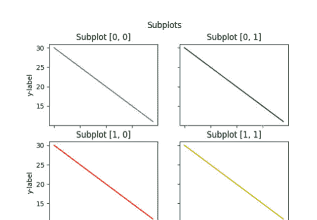

此图由以下程序生成：

```python
import matplotlib.pyplot as plt

##### Generate some data to display
t = range(0, 20)
s = range(30, 10, -1)

##### Set up the grid of subplots to be 2 by 2
fig, axs = plt.subplots(2, 2)
fig.suptitle('Subplots')

##### Add first subplot
print('Adding first subplot to position [0, 0]')
axs[0, 0].plot(t, s)
axs[0, 0].set_title('Subplot [0, 0]')

##### Add second subplot
print('Adding second subplot to position [0, 1]')
axs[0, 1].plot(t, s, 'g-')
axs[0, 1].set_title('Subplot [0, 1]')

##### Add third subplot
print('Adding third subplot to position [1, 0]')
axs[1, 0].plot(t, s, 'r-')
axs[1, 0].set_title('Subplot [1, 0]')

##### Add fourth subplot
print('Adding fourth subplot to position [1, 1]')
axs[1, 1].plot(t, s, 'y-')
axs[1, 1].set_title('Subplot [1, 1]')

##### Set up X and y axis labels
for ax in axs.flat:
    ax.set(xlabel='x-label', ylabel='y-label')

##### Hide x labels and tick labels for top plots and y ticks for
##### right plots.
for ax in axs.flat:
    ax.label_outer()

##### Display the chart
plt.show()
```

此程序的控制台输出如下：

```
Adding first subplot to position [0, 0]
Adding second subplot to position [0, 1]
Adding third subplot to position [1, 0]
Adding fourth subplot to position [1, 1]
```

### 15.8 三维图形

三维图形用于绘制三组值之间的关系（而不是本章迄今为止示例中使用的两组）。在三维图形中，除了 x 轴和 y 轴之外，还有一个 z 轴。

以下程序使用NumPy `arange`函数生成的两组值来创建一个简单的三维图形。这些值随后通过NumPy `meshgrid()`函数转换为坐标矩阵。Z轴的值则使用NumPy `sin()`函数生成。三维图形的曲面是通过坐标轴对象的`plot_surface`函数绘制的。该函数接收x、y和z坐标。同时，函数还指定了一个颜色映射表，用于在渲染曲面时着色（此处使用了Matplotlib的冷暖色调颜色映射表）。

```python
import matplotlib.pyplot as pyplot
##### Import matplotlib colour map
from matplotlib import cm as colormap
##### Provide access to numpy functions
import numpy as np

##### Make the data to be displayed
x_values = np.arange(-6, 6, 0.3)
y_values = np.arange(-6, 6, 0.3)

##### Generate coordinate matrices from coordinate vectors
x_values, y_values = np.meshgrid(x_values, y_values)

##### Generate Z values as sin of x plus y values
z_values = np.sin(x_values + y_values)

##### Obtain the figure object / get the axes object for the 3D graph
figure, axes = pyplot.subplots(subplot_kw={"projection": "3d"})

##### Plot the surface.
surf = axes.plot_surface(x_values,
                        y_values,
                        z_values,
                        cmap=colormap.coolwarm)

##### Add a color bar which maps values to colors.
figure.colorbar(surf)

##### Add labels to the graph
pyplot.title("3D Graph")
axes.set_ylabel('y values', fontsize=8)
axes.set_xlabel('x values', fontsize=8)
axes.set_zlabel('z values', fontsize=8)

##### Display the graph
pyplot.show()
```

该程序生成以下三维图形：

### 三维图形

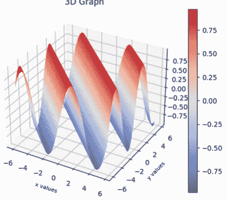

关于三维图形需要注意的一点是，它们并非被普遍认为是呈现数据的好方法。数据可视化的一条准则是保持简单/保持清晰。许多人认为三维图表未能做到这一点，它可能让人难以看清真正展示的内容，或者难以恰当地解读数据。例如，在上面的图表中，与任何峰值相关的值是多少？这很难确定，因为很难看清峰值相对于X、Y和Z轴的位置。许多人认为此类三维图表只是“眼球糖果”；看起来漂亮，但提供的信息不多。因此，应尽量减少使用三维图表，只在确实必要时才使用。

### 15.9 练习

下表提供了英国城市及其人口的信息（注意，伦敦已被省略，因为其人口远大于其他任何城市）。

| 城市 | 人口 |
|---|---|
| 布里斯托尔 | 617,280 |
| 卡迪夫 | 447,287 |
| 巴斯 | 94,782 |
| 利物浦 | 864,122 |
| 格拉斯哥 | 591,620 |
| 爱丁堡 | 464,990 |
| 利兹 | 455,123 |
| 雷丁 | 318,014 |
| 斯旺西 | 300,352 |
| 曼彻斯特 | 395,515 |

使用这些数据创建：

- 1. 城市与人口数据的散点图。
- 2. 城市与人口数据的条形图。

## 第16章
图形用户界面


### 16.1 简介

图形用户界面能够捕捉一个想法或情境的本质，通常避免了长篇大论的需要。此类界面可以使用户免于学习复杂的命令。它们不太可能让计算机用户感到畏惧，并且能够以用户易于吸收的形式快速提供大量信息。

高质量图形界面的广泛使用，使得许多计算机用户期望在他们使用的任何软件中都能看到此类界面。大多数编程语言要么集成了图形用户界面库，要么有第三方库可用。

Python当然是一种跨平台编程语言，这带来了额外的复杂性，因为底层操作系统可能根据程序是在Unix、Linux、macOS还是Windows操作系统上运行而提供不同的窗口设施。

在本章中，我们将首先介绍什么是GUI，特别是基于WIMP的UI。然后，我们将考虑Python可用的库范围，再选择一个来使用。本章将描述如何使用其中一个GUI库创建丰富的客户端图形显示（桌面应用程序）。因此，在本章中，我们将探讨如何创建窗口、按钮、文本字段和标签，以及如何将它们添加到窗口中、定位和组织。

### 16.2 GUI与WIMP

图形用户界面（GUI）以及窗口、图标、鼠标和弹出菜单（WIMP）风格的界面在计算机系统中已经存在了几十年，但它们仍然是最重要的发展之一。

这些界面最初是为了解决纯文本界面的许多感知弱点而开发的。

操作系统的文本界面以专横的提示符为典型特征。例如，在Unix/Linux系统中，提示符通常只是一个字符，如%、>或$，这可能会让人感到畏惧。即使对于经验丰富的计算机用户，如果他们不熟悉Unix/Linux系列操作系统，情况也是如此。

例如，希望将文件从一个目录复制到另一个目录的用户可能需要输入类似以下内容：

```
> cp file.pdf ~otheruser/projdir/srcdir/newfile.pdf
```

这一长串内容需要毫无错误地输入才能被接受。此命令中的任何语法错误都会导致系统生成错误消息，该消息可能有用也可能没用。即使系统试图通过命令历史记录等功能变得更加“用户友好”，通常也需要大量输入箭头键和文件名。

输入和输出的主要问题在于带宽。例如，在必须描述大量信息之间关系的情况下，如果输出以图形方式显示，而不是以数字表格形式显示，则更容易吸收这些信息。在输入方面，鼠标操作的组合可以被赋予含义，而这些含义原本只能通过几行文本来传达。

WIMP代表窗口（或窗口管理器）、图标、鼠标和弹出菜单。WIMP界面允许用户克服其文本对应物的至少一些弱点——可以提供操作系统的图像，该图像可以基于用户能够理解的概念；菜单可以代替文本命令；信息通常可以以图形方式显示。

通过WIMP界面呈现的基本概念最初是在XEROX的帕洛阿尔托研究中心开发的，并在Xerox Star机器上使用，但通过Apple Macintosh和IBM PC对WIMP界面的实现而获得了更广泛的接受。

大多数WIMP风格的环境使用桌面类比（尽管对于手机和平板电脑等移动设备来说，这一点不那么明显）：

- 整个屏幕代表一个工作表面（桌面），
- 可以重叠的图形窗口代表该桌面上的纸张，
- 图形对象用于特定概念，例如文件柜代表磁盘或废纸篓用于文件处理（这些可以被视为桌面附件），
- 各种应用程序显示在屏幕上，这些程序代表您可能在桌面上使用的工具。

为了与此显示进行交互，WIMP用户配备了一个鼠标（或光笔或触摸屏），可用于选择图标和菜单或操作窗口。

任何WIMP风格环境的软件基础是*窗口管理器*。它控制屏幕上显示的多个可能重叠的窗口和图标。它还处理将这些窗口中发生的事件信息传递给相应的应用程序，并生成使用的各种菜单和提示。

窗口是图形屏幕上的一个区域，可以在其中显示一页或一页的一部分信息；它可以显示文本、图形或两者的组合。这些窗口可以重叠，并且可以与同一进程相关联，或者它们可以与单独的进程相关联。窗口通常可以创建、打开、关闭、移动和调整大小。

图标是一个小的图形对象，通常象征着一个操作或一个更大的实体，如应用程序或文件。*打开*图标会导致关联的应用程序执行或关联的窗口显示。

用户与此类基于WIMP的程序交互能力的核心是*事件循环*。此循环*监听*事件，例如用户单击按钮、选择菜单项或进入文本字段。当此类*事件*发生时，它会触发关联的行为（例如运行与按钮链接的函数）。

### 16.3 Python的窗口框架

Python是一种跨平台编程语言。因此，Python程序可以在一个平台（如Linux机器）上编写，然后在该平台或其他操作系统平台（如Windows或macOS）上运行。然而，这可能会给需要在多个操作系统平台上可用的库带来问题。GUI领域尤其是一个问题，因为为利用Windows系统中可用功能而编写的库在macOS或Linux系统上可能不可用（或看起来不同）。

Python运行的每个操作系统可能有一个或多个为其编写的窗口系统，这些系统可能在其他操作系统上可用，也可能不可用。这使得为Python提供GUI库的工作变得更加困难。

Python GUI的开发者采取了两种方法之一来处理这个问题：

- 一种方法是编写一个包装器，抽象底层的GUI设施，使开发者在特定窗口系统设施之上的层次上工作。然后，Python库（尽其所能）将这些设施映射到当前正在使用的底层系统。
- 另一种方法是更紧密地包装底层GUI系统上的特定设施，并且只针对支持这些设施的系统。

下面列出了一些可用于Python的库，并将其分为平台无关库和平台特定库：

#### 16.3.1 平台无关的GUI库

- **Tkinter。** 这是一个广泛使用的标准Python GUI库。它构建在Tcl/Tk控件集之上，该控件集已存在多年，适用于多种不同的操作系统。Tcl代表工具命令语言，而Tk是Tcl的图形用户界面工具包。
- **wxPython。** wxWidgets是一个免费、高度可移植的GUI库。它用C++编写，可以在Windows、macOS和Linux等操作系统上提供原生的外观和感觉。wxPython是wxWidgets的一组Python绑定。本章我们将使用这个库。
- **PyQT** 或 **PySide** 这两个库都封装了Qt工具包的功能。Qt是一个跨平台的软件开发系统，用于实现跨平台的GUI和应用程序。

#### 16.3.2 平台特定的GUI库

1. **PyObjc** 是一个macOS特定的库，它提供了到Apple Mac Cocoa GUI库的Objective-C桥接。
2. **PythonWin** 提供了一组围绕Microsoft Windows基础类的封装，可用于创建基于Windows的GUI。

### 16.4 在线资源

有许多在线参考资料支持GUI的开发，特别是Python GUI的开发，包括：

1. [https://www.wxpython.org](https://www.wxpython.org) wxPython主页。
2. [https://www.tcl.tk](https://www.tcl.tk) 关于Tcl/Tk的信息。
3. [https://www.qt.io](https://www.qt.io) 关于Qt跨平台软件和UI开发库的信息。
4. [https://wiki.python.org/moin/PyQt](https://wiki.python.org/moin/PyQt) 关于PyQt的信息。
5. [https://pypi.org/project/PySide/](https://pypi.org/project/PySide/) 提供PySide的项目信息。
6. [https://en.wikipedia.org/wiki/Cocoa_(API)](https://en.wikipedia.org/wiki/Cocoa_(API)) 关于MacOS Cocoa库的维基百科页面。
7. [https://pythonhosted.org/pyobjc/](https://pythonhosted.org/pyobjc/) 关于Python到Objective-C桥接的信息。
8. [https://docs.microsoft.com/en-us/cpp/mfc/mfc-desktop-applications?view=vs-2019](https://docs.microsoft.com/en-us/cpp/mfc/mfc-desktop-applications?view=vs-2019) 提供Microsoft基础类的介绍。
9. [https://www.cgl.ucsf.edu/Outreach/pc204/pythonwin.html](https://www.cgl.ucsf.edu/Outreach/pc204/pythonwin.html) 关于PythonWin的信息。

## 第17章
### Tkinter GUI库

#### 17.1 简介

Tkinter库是一个用于Python的跨平台GUI库（或工具包）。它允许程序员使用菜单栏、菜单、按钮、字段、面板和框架等常见概念，为其程序开发高度图形化的用户界面。本章介绍Tkinter。它允许程序员使用菜单栏、菜单、按钮、字段、面板和框架等常见概念，为其程序开发高度图形化的用户界面。本章介绍Tkinter。

#### 17.2 Tkinter

Tkinter是Python中创建图形用户界面（GUI）的事实标准。虽然还有其他可用的库，但Tkinter作为Python环境的一部分提供，并提供了创建桌面应用程序所需的所有功能。

Tkinter的一些关键特性包括：

- **跨平台：** Tkinter在大多数操作系统上可用，包括Windows、macOS和Linux，使其成为GUI开发的平台无关选择。
- **控件库：** Tkinter提供了一组预构建的GUI元素，称为控件，例如按钮、标签、字段、复选框、菜单等。
- **事件驱动编程：** Tkinter遵循大多数语言中大多数GUI库常见的事件驱动编程范式。它允许开发者为各种用户操作（如按钮点击或按键）定义事件处理程序，从而实现交互式应用程序。这是下一章的主题。
- **布局管理器**：Tkinter提供不同的布局管理器，如`pack()`、`grid()`和`place()`，以控制窗口或框架内控件的定位和组织。

#### 17.3 窗口作为对象

在Tkinter中，窗口框架、按钮和文本标签及其内容都是相应类（如Frame、Button或Label）的实例。因此，当你创建一个窗口时：

- 你创建了一个知道如何在计算机屏幕上显示自身的对象。你必须告诉它要显示什么，然后告诉它开始监听用户输入（如果适用）。
- 在阅读本章时，你应该记住以下几点；它们将帮助你理解你需要做什么：
- 你通过实例化一个`Tk`对象来创建一个窗口。这是Tk应用程序中应用程序最顶层的窗口，通常代表应用程序的主窗口。也可以有其他由`TopLevel`类表示的顶层窗口。
- 你通过创建具有适当父控件的控件来定义窗口显示的内容。
- 控件可以使用一种或三种策略（如`pack()`）在窗口内进行布局。
- 你可以向窗口发送消息以更改其状态、执行操作并显示图形对象。
- 窗口或窗口内的组件可以向其他对象发送消息，以响应用户（或程序）操作。
- 窗口显示的所有内容都是类的实例，并可能受到上述所有操作的影响。
- `tk.Tk`类处理GUI应用程序的主事件循环。

#### 17.4 关键概念

在Tkinter中，GUI的所有元素都包含在顶层窗口（如`Tk`类根窗口或`TopLevel`窗口）内的Frame中。这些框架包含称为控件的图形组件。这些概念及其他概念概述如下：

- `Tk`：`Tk`类表示Tkinter应用程序的主窗口或根窗口。它作为其他控件的容器，并负责管理应用程序的事件循环。
- `Toplevel`：`Toplevel`类表示Tkinter应用程序中的其他顶层窗口。这些窗口与根窗口分开，可用于对话框、弹出窗口或应用程序内的辅助窗口。
- `Frame`：`Frame`类是一个容器控件，提供一个矩形区域来容纳其他控件。它用于在主窗口或其他窗口内对控件进行分组和组织。
- `控件`，是Frame内的图形组件，例如按钮、字段、标签等。
- `Canvas`：`Canvas`类提供了一个绘图区域，你可以在其中绘制图形、线条、形状和图像。
- `对话框`，类似于Frame，但提供较少的边框控制。

使用这些组件，可以构建复杂的用户界面。

##### 17.4.1 Tk类

Tk类是用于创建TK窗口或框架的核心类。该类的方法和属性可用于自定义主窗口、处理用户事件以及管理应用程序的行为。Tk类的一些常用方法和属性包括：

- `title()`：设置主窗口的标题。
- `geometry()`：可用于设置主窗口的大小和位置。
- `config()`：配置主窗口的各种属性。
- `mainloop()`：启动Tkinter事件循环。
- `destroy()`：关闭主窗口并终止应用程序。
- `bind()`：将事件绑定到事件处理程序/回调函数。

此外，Tk类从Widget类继承方法和属性，Widget类是所有Tkinter控件的基类。这允许开发者使用所有控件可用的方法和属性进一步自定义主窗口，例如设置背景颜色、添加图像或应用样式。通过使用Tk类及其相关方法和属性，开发者可以创建其Tkinter应用程序的主窗口，并定义其行为和外观。

##### 17.4.2 TK控件

在TKinter中有一组称为控件类的类。每个类代表不同类型的图形元素，如按钮、标签、菜单和列表框。控件类都继承（或混入）自tk.Misc类，这意味着所有控件都提供一组通用的行为和属性，以及特定于其类型的行为和属性。

在使用控件时，需要创建相应类的实例，并将其链接到其父控件（父控件可以是窗口、框架或其他容器样式的控件）。

### 17.4.3 TopLevel 类

Tkinter 还有一个名为 `tk.TopLevel` 的类。它代表一个顶层窗口或对话框。它是一个容器控件，功能类似于一个独立的窗口，通常用于在应用程序中创建弹出窗口、对话框或额外的顶层窗口。

`tk.TopLevel` 类派生自 `tk.Tk` 类，然而，与根窗口不同，`TopLevel` 窗口是一个独立的窗口，拥有自己的标题栏和边框。

要创建一个 `TopLevel` 窗口，你需要实例化该类，并将父控件指定为第一个参数，通常是根窗口或另一个 `TopLevel` 窗口。例如：

```python
import tkinter as tk

root = tk.Tk()

##### 创建一个顶层窗口
top_level = tk.Toplevel(root)
top_level.title("My TopLevel")

##### 向顶层窗口添加控件
label = tk.Label(top_level, text="This is a top level window.")
label.pack()

root.mainloop()
```

运行此程序会生成两个窗口，如下所示：


在此代码中，我们创建了一个名为 `top_level` 的 `TopLevel` 实例，以 `root` 作为父控件。然后使用 `title()` 方法将顶层窗口的标题设置为“My TopLevel”。接着，一个 `Label` 控件被添加到顶层窗口中以显示一些文本。

`TopLevel` 窗口对于在 Tkinter 应用程序中创建额外的窗口或对话框非常有用，允许开发者独立于主根窗口来显示信息、提示输入或执行特定任务。

### 17.4.4 Frame 类

TK 的 `Frame` 类是一个控件，代表一个矩形区域，用于在窗口中分组和组织其他控件。因此，它充当窗口内的容器或面板，在创建分层布局时非常有用。这是因为每个 `Frame` 都可以有自己的布局管理，因此通过组合框架可以创建复杂的 UI。

`tk.Frame()` 构造函数可用于相对于父控件（如根窗口）创建一个新的 Frame 实例。例如：

```python
import tkinter as tk

root = tk.Tk()

##### 创建一个框架
frame = tk.Frame(root)
frame.pack()

##### 向框架添加控件
label = tk.Label(frame, text="Hello, World!")
label.pack()

root.mainloop()
```

在此程序中，首先使用 `tk.Tk()` 创建一个初始根窗口。然后，这个根窗口被用作随后实例化的 `tk.Frame()` 的父控件。接着，框架与根窗口一起被打包。之后，创建一个标签并将其添加到框架中。然后启动顶层窗口的主循环。

运行此程序的结果是显示一个简单的窗口，如下所示：


请注意，框架本身在顶层窗口中默认没有可视化的存在。

### 17.4.5 对话框

你可以使用 `tkinter.simpledialog` 或 `tkinter.messagebox` 模块来创建常见的对话框类型，例如输入对话框、文件对话框或消息框。这些库提供了预定义的函数，使得在应用程序中使用对话框变得容易。`simpledialog` 模块提供：

- SimpleDialog — 一个简单的模态对话框。
- Dialog — 对话框的基类。
- askinteger() — 一个显示对话框以从用户获取整数的函数。
- askfloat() — 一个显示对话框以从用户获取浮点数的函数。
- askstring() — 一个显示对话框以从用户获取字符串的函数。

例如，以下代码演示了创建一个简单的“输入您的姓名”样式的对话框：

```python
import tkinter as tk
import tkinter.simpledialog as simpledialog

root = tk.Tk()

##### 显示输入对话框的函数
def display_dialog():
    answer = simpledialog.askstring("Name Entry",
                                   "Please enter your name:")
    if answer:
        print("Your name is:", answer)
    else:
        print("No input provided.")

##### 创建一个按钮来显示对话框
button = tk.Button(root, text="Open Dialog", command=display_dialog)
button.pack()

root.mainloop()
```

此程序导入 `tkinter.simpledialog` 并使用 `askstring()` 函数来显示一个输入对话框。该函数接受两个参数：对话框的*标题*和*提示*消息。它返回用户的输入作为字符串，如果未提供输入则返回 `None`。如果用户输入了他们的名字，则会打印出来；如果用户没有输入名字，则会向控制台打印一条消息，告知用户未提供输入。

运行此程序会生成一个包含单个按钮“Open Dialog”的窗口。当你点击此按钮时，会打开一个“对话框”，要求用户输入他们的名字（作为字符串），例如：


当用户输入他们的名字后，它会被打印到控制台：

```
Your name is: John
```

### 17.4.6 Canvas 类

Tkinter 中的 `Canvas` 类提供了一个二维绘图区域，可用于创建和操作图形元素，如线条、形状、图像和文本。
要使用 `Canvas` 类，首先需要创建一个 `Canvas` 实例并指定其父容器，通常是主窗口或一个 TopLevel 窗口。例如：

```python
import tkinter as tk

window = tk.Tk()
canvas = tk.Canvas(window, width=400, height=300)
canvas.pack()
```

在此示例中，我们创建了一个 `Canvas` 类的实例，将根 `window` 作为父控件传递，并指定了画布所需的 `width` 和 `height`。然后我们使用 `pack()` 方法在主窗口内布局和显示画布。
一旦画布创建完成，就可以使用以下方法来绘制和操作图形元素：

- `create_line()`：在接收画布上的两个坐标之间绘制一条直线。
- `create_rectangle()`：绘制一个由其左上角和右下角坐标指定的矩形。
- `create_oval()`：绘制一个由其边界框坐标指定的椭圆。
- `create_polygon()`：绘制一个由坐标列表指定的多边形。
- `create_image()`：在画布上显示图像。
- `create_text()`：在画布上放置文本。

作为使用画布显示图形元素的示例，以下程序在画布内的特定位置绘制一个矩形和一条线：

```python
##### 绘制一个矩形
canvas.create_rectangle(50, 50, 200, 150, fill='red')

##### 绘制一条线
canvas.create_line(100, 100, 300, 200, fill='blue', width=3)

root.mainloop()
```

在此示例中，我们使用 `create_rectangle()` 方法绘制一个红色矩形，并使用 `create_line()` 方法在画布上绘制一条蓝色线。传递给这些方法的坐标指定了形状的位置和尺寸。

`Canvas` 类提供了额外的方法来控制画布及其元素的外观和行为。例如，你可以更改形状的颜色、轮廓或填充，应用缩放或旋转等变换，处理画布上的鼠标点击或移动等事件等等。

使用 `Canvas` 类，可以在你的 Tkinter 应用程序中创建复杂的图形、交互式可视化或自定义绘图工具。

### 17.5 类继承层次结构

下图说明了图形 Tk 组件（或控件）的部分继承树。

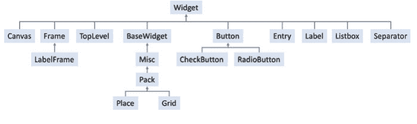

层次结构的顶部是 `Widget` 类，它作为所有 Tkinter 控件的基类。它提供了所有控件共享的基本功能和属性。

`Widget` 类随后被其他中间类子类化，例如 `BaseWidget`、`Misc`、`TopLevel`、`Frame`、`Button` 和 `Canvas`，这些类进一步定义了相关控件组的通用行为和属性。

在这些中间类之下，你会发现具体的控件类，如 `CheckButton`、`RadioButton` 或 `LabelFrame`（它是 `Frame` 的子类）。

此外，还有与菜单相关的控件类，如 `Menu`。

理解继承层次结构在使用 Tkinter 时很有用，因为它有助于识别由小组件组，并允许你利用每个小组件类提供的特定功能和自定义选项。

### 17.5.1 布局管理

所有 Tkinter 小组件都可以访问特定的几何管理方法，这些方法旨在组织小组件在父组件区域内的布局。Tkinter 提供了以下几何管理器类：pack、grid 和 place。

-   pack() 此几何管理器将小组件组织成块状，然后放置在父组件中。
-   grid() 此几何管理器将小组件组织成类似表格的结构，放置在父组件中。
-   place() 此几何管理器通过将小组件放置在父组件中的特定位置来组织它们。

### 17.6 一个简单示例

为了说明 Tkinter 的基本用法，请看以下代码，它创建了一个包含简单按钮的窗口。

```python
import tkinter as tk

def button_click():
    """ function to be run when button is clicked"""
    print("Button clicked!")

##### Set up the window and the button within the window
window = tk.Tk()

window.geometry("200x80")

##### Set the title of the tkinter window
window.title('Simple Window')

##### Add a button to the window
button = tk.Button(window,
                   text="Click Me",
                   command=button_click)
button.pack()

##### Start the main GUI processing loop
window.mainloop()
```

运行此程序时，将显示以下窗口：


如果用户点击“Click Me”按钮，一条消息“button clicked!”将被打印到标准输出，例如，如果我们点击按钮3次，我们将在输出控制台中看到以下内容：

```
Button clicked!
Button clicked!
Button clicked!
```

上面的代码导入了 `tkinter` 模块，并使用 `Tk()` 创建了一个窗口。然后，它使用 `geometry()` 和一个描述窗口尺寸的字符串设置了窗口的大小。接着，使用 `title()` 方法设置了窗口的标题。程序随后使用 `Button()` 创建了一个按钮，并将其与一个函数 `button_click` 关联，以处理按钮点击事件。`pack()` 方法用于管理按钮在窗口内的布局。在这种情况下，只有按钮，所以布局非常简单。最后，调用 `mainloop()` 方法来启动 Tkinter GUI 事件循环，该循环将监听用户事件并触发其相关行为。

### 17.7 Tkinter 安装

Tkinter 通常包含在 macOS 的标准 Python 安装中，因此你不需要单独安装它。

#### 17.7.1 Mac 安装

你可能需要确保 Tkinter 所依赖的 Tcl/Tk 库已安装在你的 Mac 上。大多数 Unix/Linux 操作系统发行版以及 Mac OS X 都包含 Tcl/Tk。如果尚未安装，你可以使用系统的包管理器安装相应的包。

以下是如何检查和安装 Tkinter 相关依赖项的方法：

1.  在你的 Mac 上打开终端。
2.  通过运行以下命令检查 Tcl/Tk 是否已安装：
    `which wish`
    如果 Tcl/Tk 已安装，该命令将显示 Tcl/Tk 解释器的路径。
3.  如果 Tcl/Tk 未安装，你可以使用 Homebrew（macOS 上流行的包管理器）安装它。在终端中执行以下命令安装 Homebrew：
    `/bin/bash -c "$(curl -fsSL https://raw.githubusercontent.com/Homebrew/install/HEAD/install.sh)"`
4.  安装 Homebrew 后，运行以下命令安装 Tcl/Tk：
    `brew install tcl-tk`
    此命令将在你的系统上安装 Tcl/Tk 库。

确保 Tcl/Tk 已安装后，你就可以在 Python 程序中开始使用 Tkinter，无需任何额外的安装步骤。要检查这是否有效，请尝试从命令行运行：

```bash
python -m tkinter
```

这应该会打开一个包含示例 tkinter 应用程序的窗口，以验证一切正常：


如果你的环境仍然存在问题，那么可能需要在你的 Mac 上安装 tkinter 包，这同样可以使用 homebrew 完成：

```bash
brew install python-tk
```

现在重新测试你的系统，确保你可以运行 tkinter 示例应用程序。

#### 17.7.2 Windows 安装

在 Windows 上，Tkinter 通常包含在标准 Python 安装中，因此你不需要单独安装它。

### 17.8 Tkinter 的 GUI 构建器

手动编程 GUI 可以提供非常强大和灵活的 UI；然而，这也非常耗时且容易出错。为了缓解这个问题，有所谓的 Tkinter GUI 构建器可用，它们允许你基本上“绘制” UI，然后 GUI 构建器可以为你生成底层代码。

一般来说，这些类型的工具提供了一个可视化界面，用于创建和排列小组件、设置属性以及生成相应的 Tkinter 代码。

一些更流行的 Tkinter GUI 构建器/编辑器包括：

-   **Pygubu**：Pygubu 是一个简单的 GUI 构建器，允许开发者通过将小组件拖放到画布上、设置属性和分配事件处理程序来可视化地设计他们的 GUI。Pygubu 生成相应的 Python 代码，然后可以在应用程序中使用。
-   **PAGE**：Python 自动 GUI 生成器 (PAGE) 是另一个 Tkinter GUI 构建器。它提供了一个可视化环境来设计 GUI，并生成相应的 Python 代码。PAGE 提供了各种小组件和属性，并支持事件和事件绑定。
-   **Qt Designer with PyQt**：虽然不特定于 Tkinter，但你可以使用 Qt Designer（一个用于 PyQt（流行的 Qt 框架的 Python 绑定）的可视化 GUI 构建器）来设计你的 GUI。PyQt 提供了 Tkinter 和 Qt 之间的桥梁，允许你使用 Qt Designer 工具创建 GUI，然后将生成的“.ui”文件转换为适用于 Tkinter 的 Python 代码。

GUI 构建器可以节省时间，并使创建复杂的小组件布局和排列变得更容易。但是，请记住，学习 Tkinter 的基础知识并手动编写代码可以为你提供对 GUI 应用程序的更多灵活性和控制。

### 17.9 在线资源

-   https://docs.python.org/3/library/tkinter.html 主要的 tkinter 文档。
-   https://realpython.com/python-gui-tkinter/ Tkinter 教程。
-   https://tkdocs.com/tutorial/widgets.html 基本小组件教程。
-   https://www.geeksforgeeks.org/what-are-widgets-in-tkinter/ 另一个关于 Tkinter 小组件的教程。
-   https://github.com/alejandroautalan/pygubu Pygubu 参考。
-   https://sourceforge.net/projects/page/ PAGE 的 SourceForge 站点。
-   https://pythonbasics.org/qt-designer-python/ Qt Designer 教程。

### 17.10 练习

创建一个包含按钮和标签的 GUI 应用程序。当用户点击按钮时，应显示一个对话框，要求用户输入他们的姓名。然后，该字段应填充用户提供的值。

例如，窗口最初可能看起来像：

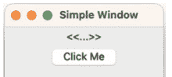

当用户点击按钮时，应提示他们输入姓名：


如果他们输入了姓名，则该值应更新显示，例如，如果他们输入“John”，则显示应更新为：


请注意，要创建标签，你可以使用：

```python
label = tk.Label(window, text="<<...>>")
label.pack()
```

要在创建标签后更新它（例如在你的按钮点击函数中），你可以使用 config 方法：

```python
label.config(text=answer)
```

## 第 18 章 Tkinter 用户界面中的事件

### 18.1 简介

本章介绍 GUI 应用程序中的事件处理，特别是 Tkinter 的事件处理机制。它概述了什么是事件、什么是事件处理程序，以及事件如何绑定到事件处理程序。它考虑了 Tkinter 中有哪些类型的事件。然后，它引导读者了解如何构建一个简单的应用程序来处理几个不同的事件。

### 18.2 事件处理

事件是任何 GUI 不可或缺的一部分；它们代表用户与界面的交互，例如点击按钮、在字段中输入文本和选择菜单选项。

GUI 的主要 *事件循环* 监听事件；当事件发生时，它会处理该事件（通常导致调用一个函数或方法），然后等待下一个事件发生。这个循环在 Tkinter 中通过调用 `tk.Tk` 对象上的 `mainloop()` 方法来启动。

这就引出了一个问题“什么是事件？”事件对象是一段信息，代表通常与 GUI 发生的某种交互（尽管事件可以由任何东西生成）。事件由事件处理程序处理。这是一个在事件发生时被调用的方法或函数。事件作为参数传递给处理程序。事件绑定器用于将事件绑定到事件处理程序。

### 18.3 什么是事件处理？

在 Tkinter 中，事件指的是图形用户界面（GUI）中可能发生的一个特定动作。它可以由用户交互触发，例如点击按钮或按下按键，也可以由系统事件触发，例如窗口大小调整或鼠标移动。

事件是 Tkinter 将用户操作或系统变化传达给应用程序的主要方式，使应用程序能够响应并适当地处理这些操作。

当事件发生时，Tkinter 会生成一个事件对象，其中包含有关该事件的信息，例如事件类型、涉及的部件、鼠标坐标或按键详情。

例如，一些常见的 Tkinter 事件包括：

- 按钮点击事件（`<Button-1>`）：当点击鼠标左键时发生。
- 按键事件（`<Key>`）：当按下键盘上的一个键时发生。
- 鼠标移动事件（`<Motion>`）：当鼠标在部件或窗口内移动时发生。
- 窗口关闭事件（`<Destroy>`）：当窗口关闭时发生。

事件通过 `bind()` 方法（事件绑定器）绑定到特定的部件。通过指定事件类型和关联的事件处理函数，开发者可以定义当该事件发生时应用程序应如何响应。

例如，可以将按钮点击事件绑定到一个按钮部件的鼠标左键上，这样当它被点击时，就会运行一个函数。同样，你可以将按键事件（`<Key>`）绑定到一个部件或根窗口，并通过调用特定函数来处理不同的按键。

当事件被触发时，Tkinter 会调用与该事件关联的事件处理函数，并将一个事件对象作为参数传递。该事件对象提供了对事件特定信息的访问，使你能够确定事件类型、涉及的部件或提取相关详情。

通过理解事件及其关联的事件类型，你可以在 Tkinter 应用程序中捕获并响应用户交互和系统变化，使其具有交互性并能响应用户操作。

### 18.4 什么是事件处理函数？

事件处理函数，也称为事件回调函数或事件监听器，是与图形用户界面（GUI）应用程序中特定事件相关联的函数。它们负责在事件发生时处理和响应事件。

作为程序员，这意味着你将使用 `bind()` 方法将一个函数与一个部件关联起来。当关联的事件被触发时，该函数将被调用。Tkinter 会将一个代表该事件的对象作为参数传递给该函数。这个参数代表事件对象，并提供有关所发生事件的信息，例如事件类型、涉及的部件或附加详情，如鼠标坐标或按键信息。

以下是在 Tkinter 中为按钮点击事件编写的事件处理函数示例。该按钮显示在主 Tk 窗口中：

```python
import tkinter as tk
from datetime import datetime

def button_click(event):
    print('Button clicked!')
    print(event)
    print(f'Event type: {event.type}')
    print(f'Widget: {event.widget}')
    print(f'Time: {datetime.fromtimestamp(event.time / 1e3)}')

##### Create main window
window = tk.Tk()
##### Set the size of the window
window.geometry('200x80')
##### Set the title of the window
window.title('Simple Window')

##### Create button
button = tk.Button(window,
                   text="Click Me!",
                   name='my button')
button.pack()

##### Bind the button_click function to the <Button-1> event
button.bind("<Button-1>", button_click)

window.mainloop()
```

运行此程序时，会显示一个包含单个按钮的窗口，如下所示：


当用户点击该按钮时，以下输出会打印到控制台（尽管日期会不同）：

```
Button clicked!
<ButtonPress event num=1 x=63 y=16>
Event type: 4
Widget: .my button
Time: 2023-06-15 10:48:51.181000
```

该程序定义了一个函数 `button_click(event)`，当使用鼠标左键点击窗口中的按钮时，该函数将被调用。该函数打印出事件（使用事件的默认打印方式）。这表明这是一个位于 x 63 和 y 16 位置的按钮按下事件。然后，该函数访问事件的几个属性，例如事件类型、生成事件的部件以及事件的时间戳（然后将其格式化为日期时间对象）。

请注意，在此示例中，按钮被赋予了一个显式名称，以便我们在访问 `event.widget` 属性时可以看到返回的名称。

该函数通过 `bind()` 方法绑定到按钮，事件绑定器（将部件与特定事件的函数链接起来）是 `"<Button-1>"` 事件绑定器。当按钮被点击时，Tkinter 调用 `button_click` 函数，并将事件对象作为参数传递。

### 18.5 事件绑定器

事件绑定器用于将事件处理函数（例如上面的 `button_click()` 函数）与*特定*部件的*特定*事件关联起来。

事件绑定器允许一个部件绑定多个事件处理函数，以处理不同的事件类型。因此，一个部件可能拥有在获得焦点或失去焦点时的事件处理函数，以及按键等事件的处理函数。每个适当的函数都将通过一个特定的事件绑定器绑定到该部件。

用于将事件处理函数绑定到部件以进行特定事件绑定的主要方法是 `bind()` 方法。`bind()` 方法接受两个或更多参数，其中两个关键参数是：

- **事件绑定**（第一个参数）。这是一个表示用于绑定的事件类型（或事件类型序列）的字符串。该值可以是特定事件，如 `<Button-1>`，也可以是用空格分隔的事件序列，如 `"<Button-1> <Button-3>"`，用于鼠标左键和右键点击。
- **事件处理函数**（第二个参数）。这是当部件上触发事件时将被调用的函数。请注意，它应该是函数的名称，而不是对该函数的直接调用。

除了 `bind()` 方法，Tkinter 还提供了 `unbind()` 方法。这允许从部件中移除事件处理函数。它还提供了 `unbind_all()` 方法，用于从部件中移除所有事件处理函数。

### 18.6 虚拟事件

需要注意的一点是，Tkinter 中内置的由操作系统生成的事件都使用单括号定义，例如 `<KeyPress>` 或 `<Button-1>`。大多数内置事件直接与实际的物理事件相关联，并遵循此格式。

然而，你可能会遇到其他具有双括号名称的事件。这些被称为虚拟事件。它们不一定代表物理事件，并且通常（尽管并非总是）特定于某种类型的部件。例如，`<<ListboxSelect>>` 仅由列表框使用。

虚拟事件可以通过使用 `event_add()` 部件方法由其他事件的组合触发，尽管它们也可以通过调用 `event_generate` 来生成。

例如：

```python
widget.event_add("<<abc>>")
```

### 18.7 事件定义

总结事件的定义很有用，因为所使用的术语可能令人困惑且非常相似：

- **事件** 代表来自底层 GUI 框架的信息，描述已发生的事情及任何关联数据。具体可用的数据将因发生的情况而异。例如，如果窗口被移动，则关联数据将与窗口的新位置有关。
- **事件循环** 是 GUI 的主处理循环，等待事件发生。当事件发生时，会调用关联的事件处理函数。
- **事件处理函数** 是在事件发生时被调用的方法（或函数）。
- **事件绑定器** 将事件类型与事件处理函数关联起来。

事件、通过事件绑定器与事件处理函数之间的关系如下图所示：


### 18.8 有哪些事件类型？

Tkinter 提供了广泛的事件类型，你可以在图形用户界面（GUI）应用程序中捕获和处理这些事件。这些事件涵盖了各种用户交互和系统变化。以下是 Tkinter 中一些常见的事件类型：

- **鼠标事件。** 有一系列可以处理的鼠标事件，包括与以下操作相关的事件：
  - 按钮点击：`<Button-1>`、`<Button-2>`、`<Button-3>`（左键、中键和右键点击）
  - 按钮释放：`<ButtonRelease-1>`、`<ButtonRelease-2>`、`<ButtonRelease-3>`
  - 鼠标移动：`<Motion>`
  - 鼠标滚轮：`<MouseWheel>`

- **键盘事件。** 这些事件与键盘上的按键相关。包括：
  - 按键按下：`<KeyPress>`
  - 按键释放：`<KeyRelease>`
  - 单个按键事件：`<KeyPress-a>`、`<KeyRelease-Enter>` 等。

- **焦点事件。** 这些事件与控件在 UI 中获得或失去焦点相关：
  - 获得焦点：`<FocusIn>`
  - 失去焦点：`<FocusOut>`

- **窗口事件。** 窗口事件与窗口级别的事件相关，例如调整窗口大小和关闭窗口：
  - 窗口调整大小：`<Configure>`
  - 窗口关闭：`<Destroy>`

- **控件特定事件。** 这些是与特定类型控件相关的事件，例如输入框、列表框或组合框：
  - 输入框编辑：输入框控件上的 `<Key>` 事件
  - 列表框选择：`<ListboxSelect>`

- **定时器事件。** 这些是在一段时间后触发的事件，例如每个控件都有一个 `after` 方法，该方法会在调用后指定的时间间隔生成一个事件。该方法至少需要两个参数：生成事件前等待的时间量（以毫秒为单位），以及时间过后要调用的回调函数。
  - 定时器触发：`<Timer>`

这些只是 Tkinter 中可用事件类型的一些示例。每种事件类型都有其特定的格式，可以使用 `bind()` 方法将其绑定到控件上。

### 18.9 将事件绑定到事件处理程序

事件通过事件生成对象（如按钮、字段、菜单项）的 `bind()` 方法，使用命名的事件绑定器（如 `<Button-1>`）绑定到事件处理程序。
例如：

```python
import tkinter as tk

def button_click(event):
    print("Button clicked!")

root = tk.Tk()

button = tk.Button(root, text="Click Me!")
button.pack()
button.bind("<Button-1>", button_click)

root.mainloop()
```

### 18.10 实现事件处理

为控件或窗口实现事件处理涉及四个步骤：

1.  **确定感兴趣的事件。** 许多控件在不同情况下会产生不同的事件；因此可能需要确定你感兴趣的是哪个事件。
2.  **找到正确的事件绑定器名称**，例如 `<Button-1>`、`<MouseWheel>`、`<KeyPress>` 等。同样，你可能会发现你感兴趣的控件支持许多不同的事件绑定器，这些绑定器可用于不同的情况（即使是同一个事件）。
3.  **实现一个事件处理程序**，该程序将在事件发生时被调用。事件处理程序将接收事件对象。
4.  **通过绑定器名称将事件绑定到事件处理程序**，使用事件生成控件的 `bind()` 方法。

为了说明这一点，我们将使用一个简单的例子。
我们将编写一个非常简单的事件处理应用程序。这个应用程序将有一个 Tk 窗口，包含一个按钮、一个标签和一个输入框。
我们将定义一组可以在不同事件下调用的函数。这些函数将响应按钮点击事件（如上所示）。然而，我们还将定义一个用于按键的函数和两个用于焦点（获得和失去）的函数。

我们将 `button_click` 函数与按钮控件的 `<Button-1>` 事件关联起来。例如：

```python
button = tk.Button(window, text='Click Me!')
button.pack()
button.bind('<Button-1>', button_click)
```

然而，我们将其他所有函数都与 `Entry` 控件关联。每个函数将绑定到不同的事件，以便它们在不同的情况下被调用。因此，我们需要确定事件处理程序函数的正确绑定。

一个控件可以支持广泛的事件，因此我们可以选择相关的事件绑定。在这种情况下，我们将选择：

- 用于 `key_pressed` 函数的 `<Key>` 绑定，
- 用于 `focus_gained` 函数的 `<FocusIn>` 绑定，
- 以及用于 `focus_lost` 函数的 `<FocusOut>` 绑定。

例如：

```python
entry = tk.Entry(window, bd=5)
entry.pack(side=tk.RIGHT)
entry.bind('<FocusIn>', focus_gained)
entry.bind('<FocusOut>', focus_lost)
entry.bind('<Key>', key_press)
```

这说明了单个控件如何根据生成的事件类型调用不同的事件处理程序函数。

在这种情况下，我们还向 `pack()` 方法表明，我们希望将控件定向到容器/父控件（在本例中为窗口）的右侧。

最终结果是下面显示的程序：

```python
import tkinter as tk

def button_click(event):
    print(f'Button clicked: {event}')

def key_press(event):
    print("Key pressed:", event.char)

def focus_lost(event):
    print(f'Widget {event.widget} lost focus')

def focus_gained(event):
    print(f'Widget {event.widget} gained focus')

##### Create main window
window = tk.Tk()
##### Set the size of the window
window.geometry('300x120')
##### Set the title of the window
window.title('Sample Application')

button = tk.Button(window, text='Click Me!')
button.pack()
button.bind('<Button-1>', button_click)

label = tk.Label(window, text='User Name')
label.pack(side=tk.LEFT)

entry = tk.Entry(window, bd=5)
entry.pack(side=tk.RIGHT)
entry.bind('<FocusIn>', focus_gained)
entry.bind('<FocusOut>', focus_lost)
entry.bind('<Key>', key_press)

window.mainloop()
```

运行此程序时，窗口将显示，按钮位于显示区域的顶部，用户名标签和输入框位于其下方。

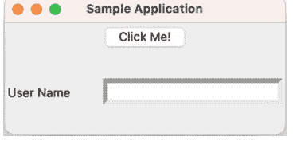

如果用户随后在按钮上点击鼠标左键，则会打印出一条消息。如果他们点击输入框，`focus_gained` 函数将被调用，如果他们在字段中输入任何内容，则每次按键都会回显到输出控制台。因此，如果我们最终得到：


那么控制台中的输出将是：

```
Button clicked: <ButtonPress event num=1 x=47 y=14>
Widget .!entry gained focus
Key pressed:
Key pressed: J
Key pressed: o
Key pressed: h
Key pressed: n
Widget .!entry lost focus
```

### 18.11 一个交互式 GUI 应用程序

下面给出一个稍大的 GUI 应用程序示例，它汇集了本章和上一章提出的许多概念。

在这个应用程序中，我们有一个文本输入字段（一个 `tk.Entry`），允许用户输入他们的名字。当他们点击“Enter”按钮（`tk.Button`）时，会显示一个对话框，允许他们输入名字。输入的值随后用于更新输入框字段的内容。

请注意，对于输入框字段，我们使用了 `StringVar` 作为文本变量，因为这简化了屏幕字段的更新。使用文本变量，我们可以使用 `set()` 方法*设置*输入框的值。如果我们直接与输入框交互，那么我们将不得不使用删除和插入方法来删除现有内容并替换为新值，例如：

```python
e.delete(0, tk.END)
e.insert(0, text_to_add)
```

这仅在我们想要覆盖输入框字段中的任何现有值时才需要。

用于实现此 GUI 应用程序的代码如下：

```python
import tkinter as tk
import tkinter.simpledialog as simpledialog

def key_press(event):
    print("Key pressed:", event.char)

def focus_lost(event):
    print(f'Widget {event.widget} lost focus')

def focus_gained(event):
    print(f'Widget {event.widget} gained focus')

##### Create main window
window = tk.Tk()
##### Set the size of the window
window.geometry('300x120')
##### Set the title of the window
```

### 18.11 一个交互式图形用户界面应用程序

```python
window.title('Sample App')

##### Create a frame
frame = tk.Frame(window)
frame.pack()

label = tk.Label(frame, text='User Name')
label.pack(side=tk.LEFT)

##### Set up a 'ext variable' to use with the entry field
##### Makes setting it programmatically easier (don't need to
##### delete and insert)
entry_text = tk.StringVar()
entry = tk.Entry(frame, textvariable=entry_text, bd=5)
entry.pack(side=tk.RIGHT)
entry.bind('<FocusIn>', focus_gained)
entry.bind('<FocusOut>', focus_lost)
entry.bind('<Key>', key_press)

def button_click(event):
    answer = simpledialog.askstring("Name Entry", "Please enter your name:")
    if answer:
        print("Your name is:", answer)
        entry_text.set(answer)
    else:
        print("No input provided.")

button = tk.Button(window, text='Show Message')
button.pack()
button.bind('<Button-1>', button_click)

window.mainloop()
```

当应用程序运行时，一个包含各种控件的窗口将显示给用户：


如果用户点击“显示消息”按钮，那么 `tkinter.simpledialog` 将向用户显示一个提示，要求输入他们的名字：

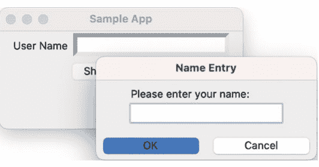

如果用户随后输入他们的名字，例如 John：

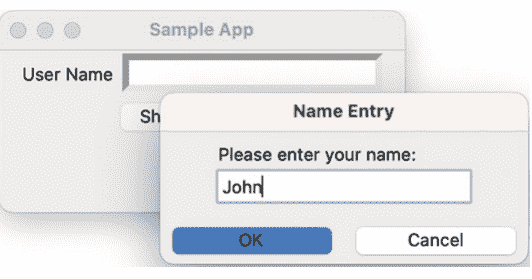

然后点击“确定”，输入框将被填充他们的名字：

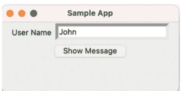

当然，如果用户点击 `Entry` 字段并在其中输入内容，那么输入框的事件处理程序将被触发，例如按键和获得/失去焦点事件处理程序。例如，如果他们在 John 之后输入 hunt，那么控制台中的输出将是：

```
Widget .!frame.!entry gained focus
Key pressed:
Key pressed: H
Key pressed: u
Key pressed: n
Key pressed: t
Widget .!frame.!entry lost focus
```

### 18.12 在线资源

有许多在线参考资料支持图形用户界面的开发，特别是 Python 图形用户界面，包括：

- https://docs.python.org/3/library/tkinter.html 主要的 tkinter 文档。
- https://pythonprogramming.net/tkinter-tutorial-python-3-event-handling 一个关于 Tkinter 事件处理的教程。

### 18.13 练习

该应用程序应允许用户输入他们的姓名和年龄。你需要检查输入到年龄字段的值是否为数值（例如使用 `isnumeric()`）。如果该值不是数字，则应显示错误消息对话框。

应提供一个标有“生日”的按钮；点击时，它应将年龄增加一并显示生日快乐消息。年龄应在图形用户界面中更新。

你在上一章创建的用户界面示例如下：


例如，用户可能如下所示输入他们的姓名和年龄：

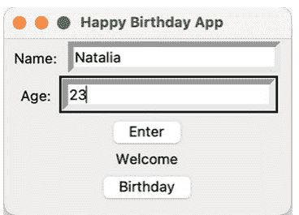

如果他们按回车键，那么欢迎消息应更新为他们的名字：

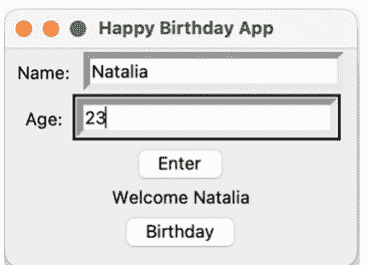

当用户点击“生日”按钮时，将显示生日快乐消息对话框：


请注意查看 `from tkinter import messagebox`，因为该模块中有几个有用的、易于使用的对话框，例如：

```python
messagebox.showerror('Error', msg)
```

以及

```python
messagebox.showinfo("Birthday", msg)
```

## 第 19 章
### PyDraw Tkinter 示例应用程序

#### 19.1 简介

本章建立在前两章介绍的图形用户界面库的基础上，以说明如何构建一个更大的应用程序。它提供了一个类似于 Visio 等工具的绘图工具的案例研究。

#### 19.2 PyDraw 应用程序

PyDraw 应用程序允许用户使用正方形、圆形、线条和文本绘制图表。目前没有提供选择、调整大小、重新定位或删除选项（尽管如果需要可以添加这些功能）。PyDraw 使用 TkInter 组件集实现。下面我们可以看到在 Mac 上运行的 PyDraw 应用程序：

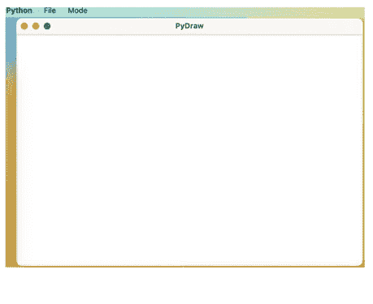

当用户启动 PyDraw 应用程序时，他们会看到上面显示的界面。根据操作系统，它顶部有一个菜单栏（在 Mac 上，此菜单栏位于 Mac 显示屏的顶部），下方是一个绘图区域。该应用程序定义了两个菜单：文件和模式：

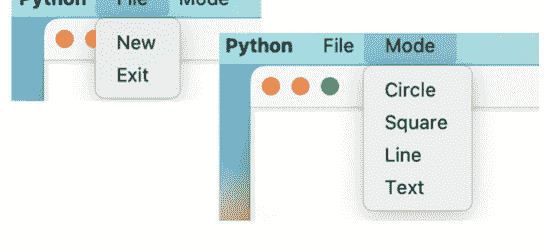

#### 19.3 应用程序的结构

为 PyDraw 应用程序创建的用户界面由多个元素组成（见下文）：`PyDrawMenuBar`、包含窗口顶部一系列按钮的 `PyDrawToolbar`、绘图面板和窗口框架（由 `PyDrawFrame` 类实现）。

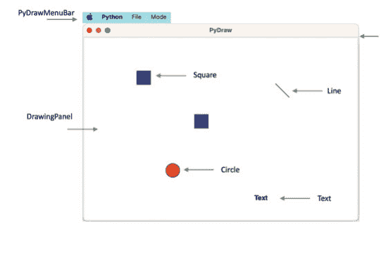

下图显示了与上图相同的信息，但以包含层次结构表示，这意味着该图说明了一个对象如何被包含在另一个对象中。低级对象包含在高级对象中。

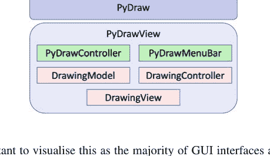

可视化这一点很重要，因为大多数图形用户界面都是以这种方式构建的，使用容器和布局管理器。
PyDraw 应用程序中使用的类之间的继承结构如下图所示。这种类层次结构是结合了用户界面功能和图形元素的应用程序的典型特征。

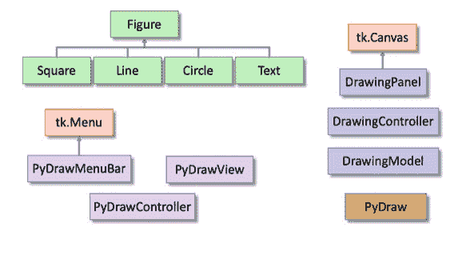

##### 19.3.1 模型、视图和控制器架构

该应用程序采用了成熟的模型-视图-控制器（或 MVC）设计模式，以分离视图元素（例如 Tk 或 Frame）、控制元素（用于处理用户输入）和模型元素（保存要显示的数据）之间的职责。

这种关注点分离并非新想法，它允许构建反映模型-视图-控制器架构的图形用户界面应用程序。MVC 架构的意图是将用户显示、用户输入控制和底层信息模型分离，如下图所示。

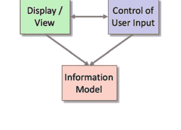

这种分离之所以有用，有几个原因：

- 应用程序和/或用户界面组件的可重用性，
- 能够独立开发应用程序和用户界面，
- 能够从类层次结构的不同部分继承。
- 能够定义控制样式类，这些类提供与这些功能可能如何显示分开的通用功能。

这意味着不同的界面可以与同一个应用程序一起使用，而应用程序无需知道这一点。这也意味着系统的任何部分都可以更改，而不会影响其他部分的操作。例如，可以更改图形界面（外观）显示信息的方式，而无需修改实际应用程序或输入处理方式（感觉）。实际上，应用程序根本不需要知道当前连接的是什么类型的界面。

##### 19.3.2 PyDraw MVC 架构

PyDraw 应用程序的 MVC 结构有一个顶层控制器类 `PyDrawController` 和一个顶层视图类 `PyDrawFrame`（没有模型，因为顶层 MVC 三元组本身不保存任何显式数据）。如下图所示：

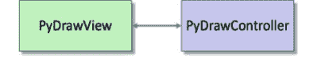

在下一层，还有另一个 MVC 结构；这次是针对应用程序的绘图元素。有一个 `DrawingController`，以及一个 `DrawingModel` 和一个 `DrawingPanel`（视图），如下图所示：

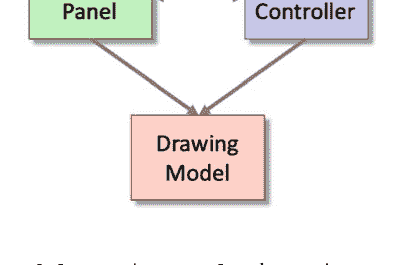

`DrawingModel`、`DrawingPanel` 和 `DrawingController` 类展示了经典的 MVC 结构。视图和控制器类（`DrawingPanel` 和 `DrawingController`）彼此了解，也了解绘图模型，而 `DrawingModel` 对视图或控制器一无所知。视图通过绘制事件获知绘图中的更改。

### 19.3.3 附加类

还有四种绘图对象（属于`Figure`类）：`Circle`、`Line`、`Square`和`Text`图形。这些类之间的唯一区别在于`draw()`方法中在图形*设备上下文*上绘制的内容。它们都继承自`Figure`类，该类定义了`Drawing`中所有对象使用的通用属性（例如表示*x*和*y*位置及大小）。

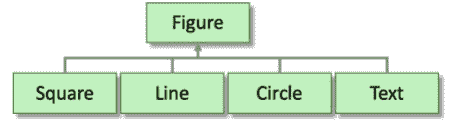

`PyDrawFrame`类还使用了一个`PyDrawMenuBar`类，该类扩展了`tk.Menu`类，并添加了用于PyDraw应用程序的菜单项。

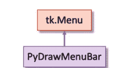

最后一个类是`PyDraw`类，它负责启动整个应用程序的执行。

### 19.3.4 对象关系

然而，对于任何面向对象的应用程序，继承层次结构只是故事的一部分。下图说明了在运行的应用程序中对象之间如何相互关联。

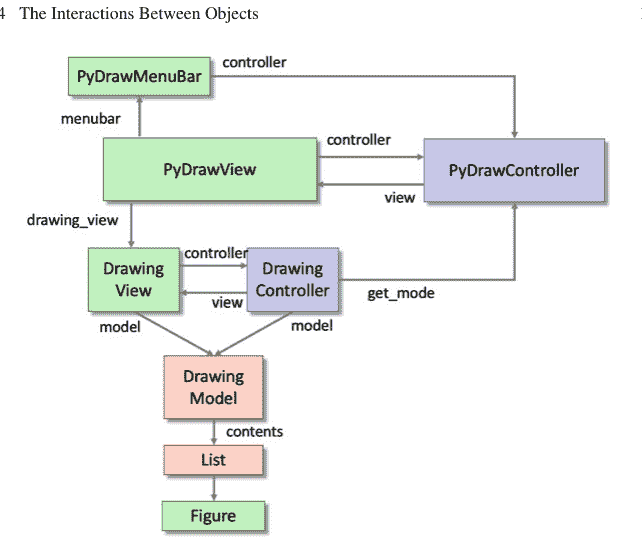

`PyDrawView`负责设置控制器和`DrawingView`。
`PyDrawController`负责处理菜单和工具栏的用户交互。
这将图形元素与用户触发的行为分离开来。
`DrawingView`负责显示`DrawingModel`持有的任何图形。`DrawingController`管理与`DrawingView`的所有用户交互，包括向模型添加图形和清除模型中的所有图形。
`DrawingModel`保存要显示的图形列表。

### 19.4 对象之间的交互

我们现在已经研究了应用程序的物理结构，但尚未研究该应用程序中的对象如何交互。
在许多情况下，这可以从应用程序的源代码中提取出来（难度不一）。然而，对于像PyDraw这样由多个不同交互组件组成的应用程序，明确描述系统交互是有用的。
说明对象之间交互的图表使用以下约定：

- 实线箭头表示消息发送，
- 方框表示类，
- 括号中的名称表示实例类型，
- 数字表示消息发送的顺序。

这些图表基于统一建模语言（UML）符号中的序列图和协作图。

#### 19.4.1 PyDrawApp

当PyDraw应用程序被实例化时，会创建PyDraw对象，如果这是代码的主入口点，就会发生这种情况。PyDraw类创建主PyDrawView显示，并通过视图的mainloop()方法将其显示给用户：

```python
class PyDraw:
    def __init__(self):
        self.view = PyDrawView()
        self.view.mainloop()

if __name__ == '__main__':
    PyDraw()
```

### 19.5 PyDrawView 构造函数

PyDrawView初始化方法设置UI应用程序的主显示，并初始化控制器和绘图元素。下面使用协作图进行说明：

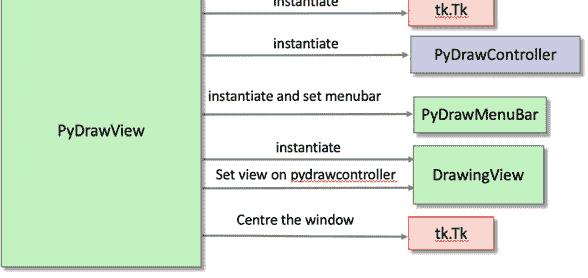

PyDrawView构造函数为应用程序设置环境。它创建顶层的PyDrawController。它创建DrawingView并初始化显示布局。它初始化菜单栏。它将DrawingView绑定到整体的PyDrawController。它还使用Tk对象通过以下方式居中窗口：

```python
self.root.eval('tk::PlaceWindow . center')
```

#### 19.5.1 更改应用程序模式

一个值得注意的有趣之处是当用户从Drawing菜单中选择一个选项时会发生什么。这允许将*模式*更改为正方形、圆形、线条或文本。下面使用协作图展示了用户在Drawing菜单上选择“Circle”菜单项时涉及的交互：

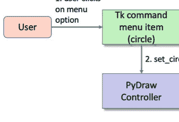

当用户选择其中一个菜单项时，`command`菜单项会调用一个引用的`PyDrawController`方法（例如`set_circle_mode()`方法）。因此，每个命令菜单项都链接到整体控制器上定义的相应方法（例如`set_circle_mode()`或`set_line_mode()`）。这些方法将控制器的`mode`属性设置为适当的值。

#### 19.5.2 添加图形对象

用户通过按下鼠标按钮将图形对象添加到`DrawingView`显示的绘图中。
当用户点击绘图面板时，`DrawingController`的响应如下所示：


上图说明了当用户在绘图面板上按下并释放鼠标按钮以创建新图形时发生的情况。

当用户按下鼠标左键时，会向DrawingController发送鼠标点击消息，DrawingController决定执行什么操作作为响应（见上文）。在PyDraw中，它获取事件发生时的光标*x*和*y*值。

然后控制器调用自己的`add()`方法，传入当前模式和当前鼠标位置。控制器获取当前*模式*（通过`DrawingController`实例化时提供的方法回调从`PyDrawController`获取），并将相应类型的图形添加到`DrawingModel`中。

`add()`方法然后根据指定的模式向绘图模型添加一个新图形。它最后要求视图重绘其内容。

### 19.6 类

本节介绍PyDraw应用程序中的类。由于这些类建立在前几章已经介绍的概念之上，它们将完整呈现，并附有注释以突出其特定实现要点。请注意，代码从tkinter库导入`tk`模块，例如：

```python
import tkinter as tk
from abc import abstractmethod
```

#### 19.6.1 PyDrawConstants 类

此类的目的是提供一组常量，可在应用程序的其余部分中引用。它用于提供表示当前模式（指示应向显示添加线条、正方形、圆形还是文本）、默认窗口大小和背景颜色等的常量。

```python
class PyDrawConstants:
    WIDTH = 600
    HEIGHT = 400

    BACKGROUND_COLOUR = 'white'

    CIRCLE_MODE = 'Circle'
    SQUARE_MODE = 'Square'
    LINE_MODE = 'Line'
    TEXT_MODE = 'Text'

    SIZE = 30
```

#### 19.6.2 PyDrawView 类

PyDrawView类为应用程序提供主窗口。请注意，由于通过MVC架构引入了关注点分离，视图类只关心组件的布局：

```python
class PyDrawView:
    """ Main Frame responsible for the
        layout of the UI."""

    def __init__(self):
        self.root = tk.Tk()

        # Set the title of the window
        self.root.title('PyDraw')

        # Set up the controller
        self.controller = PyDrawController(self.root)

        # Set up menus
        self.menubar = PyDrawMenuBar(self.root, self.controller)
        self.root.config(menu=self.menubar)

        # Setup drawing view
        self.drawing_view = DrawingView(self.root,
            self.controller.get_mode)
        self.controller.view = self.drawing_view

        self.root.eval('tk::PlaceWindow . center')

    def mainloop(self):
        """Delegate method that passes responsibility onto the root"""
        self.root.mainloop()
```

#### 19.6.3 PyDrawMenuBar 类

`PyDrawMenuBar`类是`tk.Menu`类的子类，它定义了PyDraw应用程序菜单栏的内容。它通过创建两个`tk.Menu`对象并将它们添加到菜单栏来实现这一点。每个`tk.Menu`实现一个从菜单栏下拉的菜单。要添加单个菜单项，使用`add_command()`函数。这些菜单项被追加到菜单中。菜单本身使用`add_cascade()`函数追加到菜单栏。每个菜单项调用与菜单栏关联的控制器上的一个方法——从而将定义菜单栏结构和定义菜单栏中每个项的功能的关注点分离开来。

```python
class PyDrawMenuBar(tk.Menu):
    def __init__(self, parent, controller):
        super().__init__(parent)
        self.controller = controller
        self.create_file_menu()
        self.create_mode_menu()

    def create_mode_menu(self):
        mode_menu = tk.Menu(self, tearoff=0)
        mode_menu.add_command(label=PyDrawConstants.CIRCLE_MODE,
                              command=self.controller.set_circle_mode)
        mode_menu.add_command(label=PyDrawConstants.SQUARE_MODE,
                              command=self.controller.set_square_mode)
        mode_menu.add_command(label=PyDrawConstants.LINE_MODE,
                              command=self.controller.set_line_mode)
        mode_menu.add_command(label=PyDrawConstants.TEXT_MODE,
                              command=self.controller.set_text_mode)
        self.add_cascade(label='Mode', menu=mode_menu)

    def create_file_menu(self):
        file_menu = tk.Menu(self, tearoff=0)
        file_menu.add_command(label='New',
                              command=self.controller.new_canvas)
        file_menu.add_command(label='Exit',
                              command=self.controller.exit_app)
        self.add_cascade(label='File', menu=file_menu)
```

#### 19.6.4 PyDrawController 类

此类提供顶层视图的控制元素。它维护当前模式。它还提供一个可用于获取当前模式的方法。最后两个方法支持清除显示和退出应用程序。

class PyDrawController:

    def __init__(self, root):
        self.root = root
        self.view = None
        # 设置初始模式
        self.mode = PyDrawConstants.SQUARE_MODE

    def set_circle_mode(self):
        self.mode = PyDrawConstants.CIRCLE_MODE

    def set_line_mode(self):
        self.mode = PyDrawConstants.LINE_MODE

    def set_square_mode(self):
        self.mode = PyDrawConstants.SQUARE_MODE

    def set_text_mode(self):
        self.mode = PyDrawConstants.TEXT_MODE

    def clear_drawing(self):
        self.view.drawing_controller.clear()

    def get_mode(self):
        return self.mode

    def new_canvas(self):
        self.view.delete('all')

    def exit_app(self):
        self.root.quit()

### 19.6.5 DrawingModel 类

DrawingModel 类有一个 `contents` 属性，用于保存绘图中的所有图形。它还提供了一些便捷方法来重置内容以及向内容中添加图形。

```python
class DrawingModel:

    def __init__(self):
        self.contents = []

    def clear_figures(self):
        self.contents = []

    def add_figure(self, figure):
        self.contents.append(figure)
```

DrawingModel 是一个相对简单的模型，它仅仅在一个列表中记录一组图形对象。这些对象可以是任何类型，只要它们实现了 `draw()` 方法，就可以以任何方式显示。正是对象本身决定了它们被绘制时的外观。

### 19.6.6 DrawingView 类

`DrawingView` 类是 `tk.Canvas` 类的子类。它为绘图数据模型提供视图。这使用了经典的 MVC 架构，包含一个 `model`（`DrawingModel`）、一个 `view`（`DrawingPanel`）和一个 `controller`（`DrawingController`）。

`DrawingPanel` 实例化自己的 `DrawingModel` 来保存待绘制的图形，并实例化 `DrawingController` 来处理鼠标事件。

它还注册了按钮事件，由控制器的 `on_mouse_click` 方法处理。

```python
class DrawingView(tk.Canvas):
    def __init__(self, parent, get_mode,
                 width=PyDrawConstants.WIDTH,
                 height=PyDrawConstants.HEIGHT,
                 bg=PyDrawConstants.BACKGROUND_COLOUR):
        super().__init__(parent, width=width, height=height, bg=bg)
        self.model = DrawingModel()
        self.controller = DrawingController(self, self.model, get_mode)
        self.pack()
        self.bind('<Button-1>', self.controller.on_mouse_click)

    def draw_contents(self):
        for figure in self.model.contents:
            figure.draw()
```

### 19.6.7 DrawingController 类

`DrawingController` 类为与 `DrawingModel`（模型）和 `DrawingPanel`（视图）类一起使用的顶层 MVC 架构提供控制类。特别是，它通过 `on_mouse_click()` 方法处理 `DrawingView` 中的鼠标事件。

它还定义了一个 `add` 方法，用于向 `DrawingModel` 添加图形（实际图形取决于 `PyDrawController` 的当前模式），并请求视图刷新自身。最后一个方法 `clear()` 从绘图模型中移除所有图形并刷新显示。

```python
class DrawingController:

    def __init__(self, view, model, get_mode):
        self.view = view
        self.model = model
        self.get_mode = get_mode

    def on_mouse_click(self, mouse_event):
        x = mouse_event.x
        y = mouse_event.y
        self.add(self.get_mode(), x, y)

    def add(self, mode, x, y, size=PyDrawConstants.SIZE):
        if mode == PyDrawConstants.SQUARE_MODE:
            fig = Square(self.view, x, y, size)
        elif mode == PyDrawConstants.CIRCLE_MODE:
            fig = Circle(self.view, x, y, size)
        elif mode == PyDrawConstants.TEXT_MODE:
            fig = Text(self.view, x, y)
        else:
            fig = Line(self.view, x, y, size)
        self.model.add_figure(fig)
        self.view.draw_contents()

    def clear(self):
        self.model.clear_figures()
        self.view.delete('all')
```

### 19.6.8 Figure 类

Figure 类（Figure 类层次结构的抽象超类）捕获了在绘图中显示的图形对象的共同元素。x 和 y 值定义了图形的位置，而 `size` 属性定义了图形的大小。`fill` 属性定义了用于填充图形的背景颜色（如果适用）。
Figure 类定义了一个抽象方法 `draw()`，所有具体子类都必须实现此方法。此方法应定义如何在绘图面板上绘制形状。

```python
class Figure:
    def __init__(self,
                 canvas,
                 x=0,
                 y=0,
                 size=None,
                 fill='blue'):
        self.canvas = canvas
        self.x = x
        self.y = y
        self.size = size
        self.fill = fill

    @abstractmethod
    def draw(self):
        pass
```

### 19.6.9 Square 类

这是 Figure 的一个子类，指定了如何在绘图中绘制正方形。它使用 `canvas.create_rectangle()` 方法实现了从 Figure 继承的 `draw()` 方法。

```python
class Square(Figure):
    def __init__(self, canvas, x, y, size):
        super().__init__(canvas=canvas, x=x, y=y, size=size)

    def draw(self):
        self.canvas.create_rectangle(self.x,
                                    self.y,
                                    self.x + self.size,
                                    self.y + self.size,
                                    fill=self.fill)
```

### 19.6.10 Circle 类

这是 Figure 的另一个子类。它通过绘制一个圆（使用画布的 `create_oval()` 方法）来实现 `draw()` 方法。注意，必须使用 `size` 属性来生成合适的半径。

```python
class Circle(Figure):
    def __init__(self, canvas, x, y, size):
        super().__init__(canvas=canvas, x=x, y=y, size=size,
                         fill='red')

    def draw(self):
        self.canvas.create_oval(self.x,
                                self.y,
                                self.x + self.size,
                                self.y + self.size,
                                fill=self.fill)
```

### 19.6.11 Line 类

这是 Figure 的另一个子类。在这个非常简单的例子中，为线条生成了一个默认的终点。或者，程序可以查找鼠标释放事件，获取鼠标在此位置的坐标，并将其用作线条的终点。

```python
class Line(Figure):
    def __init__(self, canvas, x, y, size):
        super().__init__(canvas=canvas, x=x, y=y, size=size)

    def draw(self):
        self.canvas.create_line(self.x,
                               self.y,
                               self.x + self.size,
                               self.y + self.size)
```

### 19.6.12 Text 类

这也是 Figure 的一个子类。使用默认值作为要显示的文本；但是，可以向用户显示一个对话框，允许他们输入希望显示的文本：

```python
class Text(Figure):
    def __init__(self, canvas, x, y, text_string='Text',
                 font='Helvetica 15 bold', fill='black'):
        super().__init__(canvas=canvas, x=x, y=y, fill=fill)
        self.text_string = text_string
        self.font = font

    def draw(self):
        text = self.text_string
        self.canvas.create_text(self.x,
                                self.y,
                                text=text,
                                fill=self.fill,
                                font=self.font)
```

### 19.7 参考资料

以下提供了一些关于用户界面中模型-视图-控制器架构的背景信息。

- 1. G.E. Krasner, S.T. Pope, A cookbook for using the model-view controller user interface paradigm in smalltalk-80. JOOP 1(3), 26–49 (1988)

### 19.8 练习

你可以通过添加以下功能来进一步开发 PyDraw 应用程序：

- 1. 删除选项 你可以在窗口中添加一个标有“删除”的按钮。它应该将模式设置为“删除”。必须修改 drawingPanel，以便 mouseReleased 方法向绘图发送删除消息。绘图必须找到并移除相应的图形对象，并向自身发送更改消息。

## 第三部分
计算机游戏

## 第20章
游戏编程简介

#### 20.1 引言

游戏编程由实现驱动游戏逻辑的开发者/程序员完成。历史上，游戏开发者包揽一切；他们编写代码、设计精灵图和图标、处理游戏玩法、处理声音和音乐、生成所需的动画等等。然而，随着游戏产业的成熟，游戏公司已经发展出特定的角色，包括计算机图形（CG）动画师、美术师、游戏开发者以及游戏引擎和物理引擎开发者等。

参与代码开发的人员可能开发物理引擎、游戏引擎、游戏本身等。这些开发者专注于游戏的不同方面。例如，游戏引擎开发者专注于创建游戏运行的框架。而物理引擎开发者则专注于实现模拟游戏世界背后物理的数学原理（例如重力对该世界中角色和组件的影响）。在许多情况下，还会有开发者负责游戏的AI引擎。这些开发者专注于提供允许游戏或游戏中的角色智能运行的功能。

那些开发实际游戏玩法的人将使用这些引擎和框架来创建最终的整体成果。正是他们赋予了游戏生命，使其成为一种令人愉悦（且可玩）的体验。

#### 20.2 游戏框架和库

有许多框架和库可供使用，允许你创建从简单游戏到具有无限世界的大型复杂角色扮演游戏的任何内容。

一个例子是Unity框架，可以与C#编程语言一起使用。另一个这样的框架是Unreal引擎，与C++编程语言一起使用。

Python也被用于游戏开发，一些知名游戏标题以某种方式依赖于它。例如，Digital Illusions CE的《战地2》是一款军事模拟第一人称射击游戏。《战地英雄》使用Python处理涉及游戏模式和得分的部分游戏逻辑。

其他使用Python的游戏包括《文明IV》（用于许多任务）、《加勒比海盗Online》和《守望先锋》（使用Python进行选择）。

Python还作为脚本引擎嵌入在Autodesk Maya等工具中，Maya是一款常用于游戏的计算机动画工具包。

#### 20.3 Python游戏开发

对于那些想了解更多关于游戏开发的人；Python提供了很多东西。网上有许多示例，还有几个面向游戏的框架。

Python中可用于游戏开发的框架/库包括：

- Arcade。这是一个用于创建2D风格视频游戏的Python库。
- pyglet是一个用于Python的窗口和多媒体库，也可用于游戏开发。
- Cocos2d是一个构建在pyglet之上的2D游戏框架。
- pygame可能是Python世界中用于创建游戏最广泛使用的库。还有许多pygame的扩展可用，有助于创建各种不同类型的游戏。

我们将在本书接下来的两章中重点介绍pygame。

对Python游戏开发者感兴趣的其他库包括：

- PyODE。这是Open Dynamics Engine的开源Python绑定，Open Dynamics Engine是一个开源物理引擎。
- pymunk Pymunk是一个易于使用的2D物理库，当你需要使用Python进行2D刚体物理时可以使用。当你在游戏、演示或其他应用程序中需要2D物理时，它非常好用。它建立在2D物理库Chipmunk之上。
- pyBox2D pybox2d是一个用于你的游戏和简单模拟的2D物理库。它基于用C++编写的Box2D库。它支持多种形状类型（圆形、多边形、细线段）以及多种关节类型（旋转、棱柱、车轮等）。
- Blender。这是一个开源的3D计算机图形软件工具集，用于创建动画电影、视觉效果、艺术、3D打印模型、交互式3D应用程序和视频游戏。Blender的功能包括3D建模、纹理、光栅图形编辑、绑定和蒙皮等。Python可以用作创建、原型设计、游戏逻辑等的脚本工具。
- Quake Army Knife，这是一个用于开发基于Quake引擎的3D游戏地图的环境。它是用Delphi和Python编写的。

#### 20.4 使用Pygame

在接下来的两章中，我们将探索核心的*pygame*库以及如何使用它来开发交互式计算机游戏。下一章探讨pygame本身及其提供的功能。随后的章节将开发一个简单的视频游戏，用户在其中移动一艘星际飞船，避开垂直向下滚动屏幕的流星。

#### 20.5 在线资源

有关游戏编程和本章提到的库的更多信息，请参阅：

- https://unity.com/ 用于游戏开发的C#框架。
- https://www.unrealengine.com 用于C++游戏开发。
- http://arcade.academy/ 提供关于Arcade游戏框架的详细信息。
- http://www.pyglet.org/ 获取关于piglet库的信息。
- http://cocos2d.org/ 是Cocos2d框架的主页。
- https://www.pygame.org 获取关于pygame的信息。
- http://pyode.sourceforge.net/ 获取关于PyODE绑定到Open Dynamics Engine的详细信息。
- http://www.pymunk.org/ 提供关于pymunk的信息。
- https://github.com/pybox2d/pybox2d 这是pyBox2d的GitHub仓库。
- https://git.blender.org/gitweb/gitweb.cgi/blender.git Blender的GitHub仓库。
- https://sourceforge.net/p/quark/code Quake Army Knife的SourceForge仓库。
- https://www.autodesk.co.uk/products/maya/overview 获取关于Autodesk Maya计算机动画软件的信息。

## 第21章
使用Pygame构建游戏

#### 21.1 引言

Pygame是一个跨平台、免费和开源的Python库，旨在使构建多媒体应用程序（如游戏）变得容易。pygame的开发始于2000年10月，pygame 1.0版本在六个月后发布。本章讨论的pygame版本是2.4.0。如果你有更新的版本，请检查所做的更改，看看它们是否对这里介绍的示例有任何影响。

你可以使用pip安装pygame，例如。

```
pip install pygame
```

pygame库建立在SDL库之上。SDL（或Simple Directmedia Layer）是一个跨平台开发库，旨在通过OpenGL和Direct3D提供对音频、键盘、鼠标、游戏手柄和图形硬件的访问。为了提高可移植性，pygame还支持各种额外的后端，包括WinDIB、X11、Linux Frame Buffer等。

SDL官方支持Windows、Mac OS X、Linux、iOS和Android（尽管其他平台也非官方支持）。SDL本身是用C编写的，pygame提供了对SDL的封装。然而，pygame添加了SDL中没有的功能，使创建图形或视频游戏更容易。这些功能包括向量数学、碰撞检测、2D精灵场景图管理、MIDI支持、摄像机、像素数组操作、变换、过滤、高级freetype字体支持和绘图。

本章的其余部分将介绍pygame、关键概念；关键模块、类和函数，以及一个非常简单的第一个pygame应用程序。下一章将逐步开发一个简单的街机风格视频游戏，展示如何使用pygame创建游戏。

#### 21.2 显示表面

显示表面（又称显示）：这是pygame游戏最重要的部分。它是游戏的主窗口显示，可以是任何大小；但是，你只能有一个显示表面。

在许多方面，显示表面就像一张空白的纸，你可以在上面绘画。表面本身由像素组成，像素从左上角的0,0开始编号，像素位置在x轴和y轴上索引。如下图所示：


上图说明了表面内像素的索引方式。实际上，表面可用于绘制线条、形状（如矩形、正方形、圆形和椭圆）、显示图像、操作单个像素等。线条从一个像素位置绘制到另一个像素位置（例如，从位置0,0到位置9,0，这将在上面的显示表面顶部绘制一条线）。给定一个起始点（如1,1），可以在显示表面内显示图像。

显示表面由`pygame.display.set_mode()`函数创建。该函数接受一个元组，可用于指定要返回的显示表面的大小。例如：

```
display_surface = pygame.display.set_mode((400, 300))
```

这将创建一个400x300像素的显示表面（窗口）。一旦你有了显示表面，你就可以用适当的背景色填充它（默认是黑色）；但是，如果你想要不同的背景色或想要清除表面上之前绘制的所有内容，那么你可以使用表面的`fill()`方法：

```
WHITE = (255, 255, 255)
display_surface.fill(WHITE)
```

`fill` 方法接受一个元组，该元组用于以红、绿、蓝（或 RGB）颜色来定义一种颜色。虽然上面的示例为表示白色 RGB 值的元组使用了一个有意义的名称，但这当然不是必须的（尽管这被认为是良好的实践）。

为了提高性能，你对显示表面所做的任何更改实际上都是在后台进行的，直到你在该表面调用 `update()` 或 `flip()` 方法之前，都不会渲染到用户看到的实际显示上。例如：

```
pygame.display.update()
pygame.display.flip()
```

`update()` 方法将使用后台对显示所做的所有更改来重绘显示。它有一个可选参数，允许你指定仅更新显示的一个区域（这使用一个 `Rect` 来定义，该 `Rect` 表示屏幕上的一个矩形区域）。`flip()` 方法总是刷新整个显示（因此与不带参数的 `update()` 方法完全相同）。

另一个方法，虽然不是专门的显示表面方法，但通常在创建显示表面时使用，它为顶层窗口提供标题或名称。这就是 `pygame.display.set_caption()` 函数。例如：

```
pygame.display.set_caption('Hello World')
```

这将为顶层窗口设置标题（或名称）为 'Hello World'。

### 21.3 事件

正如前面章节描述的图形用户界面系统有一个事件循环，允许程序员了解用户正在做什么（在那些情况下，这通常是选择菜单项、单击按钮或输入数据等），pygame 也有一个事件循环，允许游戏了解玩家正在做什么。例如，用户可能按下左箭头或右箭头键。这由一个事件表示。

#### 21.3.1 事件类型

发生的每个事件都有相关信息，例如该事件的类型。例如：

- 按下一个键将导致 `KEYDOWN` 类型的事件，而释放一个键将导致 `KEYUP` 事件类型。
- 选择窗口关闭按钮将生成 QUIT 事件类型，等等。
- 使用鼠标可以生成 MOUSEMOTION 事件以及 MOUSEBUTTONDOWN 和 MOUSEBUTTONUP 事件类型。
- 使用操纵杆可以生成几种不同类型的事件，包括 JOYAXISMOTION、JOYBALLMOTION、JOYBUTTONDOWN 和 JOYBUTTONUP。

这些事件类型告诉你发生了什么来生成该事件。这意味着你可以选择要处理哪些类型的事件，并忽略其他事件。

#### 21.3.2 事件信息

每种类型的事件对象都提供与该事件相关的信息。例如，一个键盘相关的事件对象将提供实际按下的键，而一个鼠标相关的事件对象将提供鼠标位置、按下了哪个按钮等信息。如果你尝试访问事件上不支持的属性，则会生成错误。

以下列出了不同事件类型可用的一些属性：

- KEYDOWN 和 KEYUP，事件有一个 key 属性和一个 mod 属性（指示是否还按下了其他修饰键，如 shift）。
- MOUSEBUTTONUP 和 MOUSEBUTTONDOWN 有一个 pos 属性，该属性保存一个元组，表示鼠标在底层表面上的 x 和 y 坐标位置。它还有一个 button 属性，指示按下了哪个鼠标按钮。
- MOUSEMOTION 有 pos、rel 和 buttons 属性。pos 是一个元组，表示鼠标光标的 x 和 y 位置。rel 属性指示鼠标移动的量，buttons 指示鼠标按钮的状态。

例如，如果我们想检查键盘事件类型，然后检查按下的键是否是空格键，那么我们可以这样写：

```
if event.type == pygame.KEYDOWN:
    # 检查按下了哪个键
    if event.key == pygame.K_SPACE:
        print('space')
```

这表示如果这是一个按键事件，并且实际按键是空格键，则打印字符串 'space'。

有许多键盘常量用于表示键盘上的键，上面使用的 pygame.K_SPACE 常量只是其中之一。所有键盘常量都以 'K_' 为前缀，后跟键或键的名称，例如：

- K_TAB、K_SPACE、K_PLUS、K_0、K_1、K_AT、K_a、K_b、K_z、K_DELETE、K_DOWN、K_LEFT、K_RIGHT、K_UP 等。

还提供了用于修饰状态的其他键盘常量，这些常量可以与上述常量组合使用，例如 KMOD_SHIFT、KMOD_CAPS、KMOD_CTRL 和 KMOD_ALT。

#### 21.3.3 事件队列

事件通过事件队列提供给 pygame 应用程序。事件队列用于在事件发生时收集它们。例如，让我们假设用户在程序有机会处理它们之前点击了两次鼠标并按了两次键；那么事件队列中将有四个事件，如下所示：


然后，应用程序可以从事件队列获取一个可迭代对象，并依次处理事件。当程序正在处理这些事件时，可能会发生更多事件，并将它们添加到事件队列中。当程序完成处理初始事件集合后，它可以获取下一组要处理的事件。

这种方法的一个显著优点是永远不会丢失任何事件；也就是说，如果用户在程序处理上一组事件时点击了两次鼠标，它们将被记录并添加到事件队列中。另一个优点是事件将按照它们发生的顺序呈现给程序。

`pygame.event.get()` 函数将读取事件队列中当前的所有事件（将它们从事件队列中移除）。该方法返回一个 `EventList`，这是一个包含所读取事件的可迭代列表。然后可以依次处理每个事件。例如：

```
for event in pygame.event.get():
    if event.type == pygame.QUIT:
        print('Received Quit Event:')
    elif event.type == pygame.MOUSEBUTTONDOWN:
        print('Received Mouse Event')
    elif event.type == pygame.KEYDOWN:
        print('Received KeyDown Event')
```

在上面的代码片段中，从事件队列获取了一个包含当前事件集的 EventList。然后 for 循环依次处理每个事件，检查类型并打印适当的消息。

你可以使用这种方法来触发适当的行为，例如在屏幕上移动图像或计算玩家的分数。但是，请注意，如果此行为耗时过长，可能会使游戏难以进行（尽管本章和下一章中的示例足够简单，因此这不是问题）。

### 21.4 第一个 pygame 应用程序

我们现在到了可以将我们到目前为止所研究的内容组合起来并创建一个简单的 pygame 应用程序的时候了。

在使用新的编程语言或使用新的应用程序框架等时，创建一个 hello world 风格的程序是很常见的。目的是探索语言或框架的核心元素，以使用该语言或框架生成最基本形式的应用程序。因此，我们将使用 pygame 实现尽可能基本的应用程序。

我们将创建的应用程序将显示一个带有 'Hello World' 标题的 pygame 窗口。然后我们将能够退出游戏。虽然从技术上讲这不是一个游戏，但它确实具有 pygame 应用程序的基本架构。

简单的 HelloWorld 游戏将初始化 pygame 和图形显示。然后它将有一个主游戏循环，该循环将持续到用户选择退出应用程序。然后它将关闭 pygame。程序创建的显示在 Mac 和 Windows 操作系统上如下所示：


要退出程序，请单击你正在使用的窗口系统的退出按钮。

简单的 HelloWorld *游戏*如下所示：

```
import pygame

def main():
    print('Starting Game')

    print('Initialising pygame')
    pygame.init() # 每个 pygame 应用程序都需要

    print('Initialising HelloWorldGame')
```

pygame.display.set_mode((200, 100))
pygame.display.set_caption('Hello World')

print('Update display')
pygame.display.update()

print('Starting main Game Playing Loop')
running = True
while running:
    for event in pygame.event.get():
        if event.type == pygame.QUIT:
            print('Received Quit Event:', event)
            running = False

print('Game Over')
pygame.quit()

if __name__ == '__main__':
    main()

这个示例突出了几个关键步骤；这些步骤是

1.  **导入 pygame。** pygame 当然不是 Python 默认可用的模块之一。你必须首先将 pygame 导入到你的代码中。`import pygame` 语句将 `pygame` 模块导入到你的代码中，并使 pygame 中的函数和类可供你使用（注意大小写——pygame 与 PyGame 不是同一个模块名）。通常还会发现程序导入
    * `from pygame.locals import *`
    * 这会将几个常量和函数添加到你的程序命名空间中。在这个非常简单的例子中，我们不需要这样做。
2.  **初始化 pygame。** 几乎每个 pygame 模块都需要以某种方式初始化，最简单的方法是调用 `pygame.init()`。这将执行设置 pygame 环境以供使用所需的必要操作。如果你忘记调用此函数，通常会收到类似 `pygame.error: video system not initialised`（或类似内容）的错误消息。如果你收到这样的消息，请检查是否已调用 `pygame.init()`。请注意，如果需要，你可以初始化单个 pygame 模块（例如，可以使用 `pygame.font.init()` 初始化 `pygame.font` 模块）。然而，`pygame.init()` 是设置 pygame 最常用的方法。
3.  **设置显示。** 一旦你初始化了 pygame 框架，你就可以设置显示。在上面的代码示例中，显示是使用 `pygame.display.set_mode()` 函数设置的。此函数接受一个元组，指定要创建的窗口的大小（在本例中为 200 像素宽，100 像素高）。请注意，如果你尝试通过传递两个参数而不是一个元组来调用此函数，那么你将得到一个错误。此函数返回绘图表面或屏幕/窗口，可用于在游戏内显示项目，如图标、消息和形状。由于我们的示例非常简单，我们不费心将其保存到变量中。然而，任何比这更复杂的示例都需要这样做。我们还设置窗口/框架的标题（或标题）。这显示在窗口的标题栏中。
4.  **渲染显示。** 我们现在调用 `pygame.display.update()` 函数。此函数导致显示的当前细节被绘制。目前这是一个空白窗口。然而，在游戏中，通常会在后台执行一系列显示更新，然后当程序准备好更新显示时调用此函数。这会批量处理一系列更新并导致显示刷新。在复杂的显示中，可以指示显示的哪些部分需要重绘，而不是重绘整个窗口。这是通过向 `update()` 函数传递一个参数来指示要重绘的矩形来完成的。然而，我们的示例非常简单，我们重绘整个窗口就可以了，因此我们不需要向函数传递任何参数。
5.  **主游戏循环。** 通常有一个主游戏循环，用于驱动用户输入的处理、修改游戏状态和更新显示。这在上面由 `while running:` 循环表示。局部变量 `running` 被初始化为 `True`。这意味着 `while` 循环确保游戏持续进行，直到用户选择退出游戏，此时 `running` 变量被设置为 `False`，这将导致循环退出。在许多情况下，此循环将调用 `update()` 来刷新显示。上面的示例没有这样做，因为显示中没有任何内容被更改。然而，本章后面开发的示例将说明这个想法。
6.  **监控驱动游戏的事件。** 如前所述，事件队列用于允许用户输入排队，然后由游戏处理。在上面显示的简单示例中，这由一个 for 循环表示，该循环使用 `pygame.event.get()` 接收事件，然后检查事件是否为 `pygame.QUIT` 事件。如果是，则将 `running` 标志设置为 `False`，这将导致游戏的主 `while` 循环终止。
7.  **完成后退出 pygame。** 在 pygame 中，任何具有 `init()` 函数的模块也有一个等效的 `quit()` 函数，可用于执行任何清理操作。由于我们在程序开始时调用了 `pygame` 模块的 `init()`，因此我们需要在程序结束时调用 `pygame.quit()`，以确保所有内容都得到适当的清理。

此程序示例运行生成的输出如下：

```
pygame 2.4.0 (SDL 2.26.4, Python 3.11.3)
Hello from the pygame community. https://www.pygame.org/contribute.html
Starting Game
Initialising pygame
Initialising HelloWorldGame
Update display
Starting main Game Playing Loop
```

### 21.5 进一步概念

pygame 中有许多功能超出了本书所能涵盖的范围；然而，下面讨论了一些更常见的功能。

**表面是分层的。** 顶层显示表面可以包含其他表面，这些表面可用于绘制图像或文本。反过来，容器（如面板）可以渲染表面以显示图像或文本等。

**其他类型的表面。** 主要的显示表面并不是 pygame 中唯一的表面。例如，当图像（如 PNG 或 JPEG 图像）加载到游戏中时，它会被渲染到一个表面上。然后，该表面可以显示在另一个表面中，例如显示表面。这意味着你可以对显示表面执行的任何操作，也可以对任何其他表面执行，例如在其上绘制、在其上放置文本、为其着色以及在表面上添加另一个图标。

**字体。** `pygame.font.Font` 对象用于创建可用于在表面上渲染文本的字体。render 方法返回一个带有渲染文本的表面，该表面可以显示在另一个表面中，例如显示表面。请注意，你不能在现有表面上写入文本，你必须始终获取一个新表面（使用 render），然后将其添加到现有表面。文本只能以单行显示，并且保存文本的表面将具有渲染文本所需的尺寸。例如：

```
text_font = pygame.font.Font('freesansbold.ttf', 18)
text_surface = text_font.render('Hello World', antialias=True, color=BLUE)
```

这使用指定的字体和指定的字体大小（在本例中为 18）创建一个新的字体对象。然后，它将使用指定的字体和字体大小以蓝色将字符串 'Hello World' 渲染到一个新表面上。指定 antialias 为 true 表示我们希望平滑屏幕上文本的边缘。

**矩形（或 Rects）。** `pygame.Rect` 类是一个用于表示矩形坐标的对象。一个 Rect 可以从左上角坐标加上宽度和高度的组合创建。为了灵活性，许多期望 Rect 对象的函数也可以接受一个 *Rectlike* 列表；这是一个包含创建 Rect 对象所需数据的列表。Rects 在 pygame 游戏中非常有用，因为它们可用于定义游戏对象的边界。这意味着它们可以在游戏中用于检测两个对象是否发生碰撞。这变得特别容易，因为 Rect 类提供了几种碰撞检测方法：

- `pygame.Rect.contains()` 测试一个矩形是否在另一个矩形内部。
- `pygame.Rect.collidepoint()` 测试一个点是否在矩形内部。
- `pygame.Rect.colliderect()` 测试两个矩形是否重叠。
- `pygame.Rect.collidelist()` 测试列表中的一个矩形是否相交。
- `pygame.Rect.collidelistall()` 测试列表中的所有矩形是否相交。

### 21.6 一个更具交互性的 pygame 应用程序

我们之前看到的第一个 pygame 应用程序只是显示了一个标题为 'Hello World' 的窗口。现在，我们可以利用上面介绍的一些功能，将其稍微扩展一下。

新的应用程序将添加一些鼠标事件处理功能。这将允许我们在用户点击窗口时获取鼠标的位置，并在该位置绘制一个小的蓝色方框。

如果用户多次点击鼠标，我们将绘制出多个蓝色方框。如下图所示。


这仍然算不上一个游戏，但确实使 pygame 应用程序更具交互性。
用于生成此应用程序的程序如下所示：

```python
import pygame

FRAME_REFRESH_RATE = 30
BLUE = (0, 0, 255)
BACKGROUND = (255, 255, 255) # White
WIDTH = 10
HEIGHT = 10

def main():
    print('Initialising PyGame')
    pygame.init() # Required by every PyGame application

    print('Initialising Box Game')
    display_surface = pygame.display.set_mode((400, 300))
    pygame.display.set_caption('Box Game')
    print('Update display')
    pygame.display.update()
    print('Setup the Clock')
    clock = pygame.time.Clock()
    # Clear the screen of current contents
    display_surface.fill(BACKGROUND)

    print('Starting main Game Playing Loop')
    running = True
    while running:
        for event in pygame.event.get():
            if event.type == pygame.QUIT:
                print('Received Quit Event:', event)
                running = False
            elif event.type == pygame.MOUSEBUTTONDOWN:
                print('Received Mouse Event', event)
                x, y = event.pos
                pygame.draw.rect(display_surface, BLUE, [x, y, WIDTH, HEIGHT])
        # Update the display
        pygame.display.update()

        # Defines the frame rate - the number of frames per second
        # Should be called once per frame (but only once)
        clock.tick(FRAME_REFRESH_RATE)

    print('Game Over')
    # Now tidy up and quit Python
    pygame.quit()

if __name__ == '__main__':
    main()
```

请注意，我们现在需要将显示表面存储在一个局部变量中，以便我们可以用它来绘制蓝色矩形。我们还需要在每次主 while 循环中调用 `pygame.display.update()` 函数，以便将我们在事件处理 for 循环中绘制的新矩形显示给用户。

我们还在每次主 while 循环中设置帧率。这应该每帧发生一次（且仅一次），并使用程序开始时初始化的时钟对象。

### 21.7 处理输入设备的替代方法

实际上，处理来自鼠标、操纵杆或键盘等设备的输入有两种方式。一种是前面描述的基于事件的模型。另一种是基于状态的方法。

尽管基于事件的方法有许多优点，但它有两个缺点：

- 每个事件代表一个单一的动作，连续的动作没有被明确表示。因此，如果用户同时按下 X 键和 Z 键，这将生成两个事件，程序需要自行判断它们是同时被按下的。
- 程序还需要判断用户是否仍在按住某个键（通过注意没有发生 KEYUP 事件）。
- 这两种情况都是可能的，但容易出错。

一种替代方法是使用基于状态的方法。在基于状态的方法中，程序可以直接检查输入设备（如按键、鼠标或键盘）的状态。例如，你可以使用 `pygame.key.get_pressed()`，它返回所有按键的状态。这可以用来判断在当前时刻是否按下了某个特定的键。例如，`pygame.key.get_`

该类还提供了其他几个实用方法，例如 `move()` 用于移动矩形，以及 `inflate()` 用于增大或缩小矩形的尺寸。

**绘制形状。** `pygame.draw` 模块包含许多函数，可用于在表面上绘制线条和形状，例如：

```python
pygame.draw.rect(display_surface, BLUE, [x, y, WIDTH, HEIGHT])
```

这将在显示表面上绘制一个填充的蓝色矩形（默认）。该矩形将位于由 `x` 和 `y` 指示的位置（在表面上）。这表示矩形的左上角。矩形的宽度和高度表示其大小。请注意，这些尺寸是在一个列表中定义的，这种结构被称为 rect-like（见下文）。如果你不想要填充的矩形（即你只想要轮廓），那么你可以使用可选的 width 参数来指定外边缘的厚度。其他可用的方法包括

- `pygame.draw.polygon()` 绘制具有任意边数的形状。
- `pygame.draw.circle()` 绕一个点绘制一个圆。
- `pygame.draw.ellipse()` 在矩形内绘制一个圆形形状。
- `pygame.draw.arc()` 绘制椭圆的一部分。
- `pygame.draw.line()` 绘制一条直线段。
- `pygame.draw.lines()` 绘制多条连续的线段。
- `pygame.draw.aaline()` 绘制精细的抗锯齿线。
- `pygame.draw.aalines()` 绘制一系列连接的抗锯齿线。

**图像。** `pygame.image` 模块包含用于加载、保存和转换图像的函数。当图像加载到 pygame 中时，它由一个 surface 对象表示。这意味着可以像处理任何其他表面一样绘制、操作和处理图像，这提供了极大的灵活性。

该模块至少支持加载未压缩的 BMP 图像，但通常也支持 JPEG、PNG、GIF（非动画）、BMP、TIFF 以及其他格式。然而，在保存图像时，它只支持有限的格式集；这些格式是 BMP、TGA、PNG 和 JPEG。

可以使用以下命令从文件加载图像：

```python
image_surface = pygame.image.load(filename).convert()
```

这将从指定的文件加载图像到一个表面上。

你可能会对在 `pygame.image.load()` 函数返回的对象上使用 `convert()` 方法感到疑惑。此函数返回一个用于显示文件中包含的图像的表面。我们在这个 Surface 上调用 `convert()` 方法，不是为了将图像从特定的文件格式（如 PNG 或 JPEG）转换；相反，此方法用于转换表面使用的像素格式。如果 `Surface` 使用的像素格式与显示格式不同，那么每次在屏幕上显示图像时都需要进行实时转换；这可能是一个相当耗时（且不必要）的过程。因此，我们在加载图像时执行一次此操作，这意味着它不会阻碍运行时性能，并且可能在某些系统上显著提高性能。

一旦你有了一个包含图像的表面，就可以使用 `Surface.blit()` 方法将其渲染到另一个表面，例如显示表面。例如：

```python
display_surface.blit(image_surface, (x, y))
```

请注意，位置参数是一个元组，指定了图像在显示表面上的 x 和 y 坐标。

严格来说，`blit()` 方法将一个表面（源表面）绘制到另一个表面的目标坐标上。因此，目标表面不需要是顶层显示表面。

**时钟。** `Clock` 对象是一个可用于跟踪时间的对象。特别是，它可以用于定义游戏的帧率，即每秒渲染的帧数。这是通过 `Clock.tick()` 方法完成的。此方法应每帧调用一次（且仅一次）。如果你向 `tick()` 函数传递可选的 `framerate` 参数，那么 pygame 将确保游戏的刷新率慢于给定的每秒 tick 数。这可用于帮助限制游戏的运行时速度。通过每帧调用一次 `clock.tick(30)`，程序将永远不会以超过每秒 30 帧的速度运行。

- `pygame.Rect.collidedict()` 测试字典中的一个矩形是否相交。
- `pygame.Rect.collidedictall()` 测试字典中的所有矩形是否相交。

`pressed()` [pygame.K_SPACE] 可用于检查空格键是否被按下。

这可用于决定采取何种操作。如果你持续检查该键是否被按下，那么你就可以持续执行相关操作。这对于游戏中的连续动作（例如移动物体）非常有用。

然而，如果用户按下某个键后，在程序检查键盘状态之前就释放了它，那么该输入将会被遗漏。

### 21.8 pygame 模块

pygame 本身以及相关库提供了众多模块。一些核心模块如下所列：

- `pygame.display` 此模块用于控制显示窗口或屏幕。它提供了初始化和关闭显示模块的功能。可用于初始化窗口或屏幕，也可用于使窗口或屏幕刷新等。
- `pygame.event` 此模块管理事件和事件队列。例如，`pygame.event.get()` 从事件队列中检索事件，`pygame.event.poll()` 从队列中获取单个事件，而 `pygame.event.peek()` 则测试队列中是否存在任何事件类型。
- `pygame.draw` 绘图模块用于在 Surface 上绘制简单形状。例如，它提供了绘制矩形（`pygame.draw.rect`）、多边形、圆形、椭圆、线条等的函数。
- `pygame.font` 字体模块用于创建 TrueType 字体并将其渲染到新的 surface 对象中。与字体相关的大多数功能都由 `pygame.font.Font` 类支持。独立的模块函数允许初始化和关闭模块，以及访问字体的函数，例如 `pygame.font.get_fonts()`，它提供当前可用字体的列表。
- `pygame.image` 此模块允许保存和加载图像。请注意，图像被加载到 surface 对象中（与许多其他面向 GUI 的框架不同，没有图像类）。
- `pygame.joystick` 摇杆模块提供摇杆对象和几个支持函数。这些可用于与摇杆、游戏手柄和轨迹球进行交互。
- `pygame.key` 此模块提供处理键盘输入的支持。这允许获取输入键并识别修饰键（如 control 和 shift）。它还允许指定重复按键的方式。
- `pygame.mouse` 此模块提供处理鼠标输入的功能，例如获取当前鼠标位置、鼠标按钮状态以及用于鼠标的图像。
- `pygame.time` 这是 pygame 中用于管理游戏内计时的模块。它提供了 `pygame.time.Clock` 类，可用于跟踪时间。

### 21.9 在线资源

关于 pygame 有大量信息可用，包括：

- https://www.pygame.org pygame 主页。
- http://www.libsdl.org/ SDL（Simple Directmedia Layer）文档。
- news://gmane.comp.python.pygame 官方 pygame 新闻组。

## 第 22 章
StarshipMeteors Pygame

### 22.1 简介

在本章中，我们将创建一个游戏，你驾驶一艘星际飞船穿越一片陨石场。游戏玩得越久，你遇到的陨石数量就越多。

### 22.2 创建一个飞船游戏

游戏在 Apple Mac 和 Windows PC 上的典型显示如下所示：


我们将实现几个类来表示游戏中的实体。使用类并不是实现游戏的必需方式，需要注意的是，许多开发者会避免使用类。然而，使用类可以将与游戏中对象相关的数据维护在一个地方；它还简化了在游戏内创建同一对象（例如陨石）的多个实例。

这些类及其关系如下所示：


该图显示 `Starship` 和 `Meteor` 类将扩展一个名为 `GameObject` 的类。它还显示 `Game` 与 starship 类具有一对一的关系。也就是说，`Game` 持有一个对单个 starship 的引用，而 starship 也持有一个对 `Game` 的单一引用。相比之下，`Game` 与 `Meteor` 类具有一对多的关系。也就是说，game 对象持有对多个陨石的引用，而每个 `Meteor` 都持有一个对单个 `Game` 对象的引用。

### 22.3 主游戏类

我们将首先查看 `Game` 类本身。`Game` 类将持有陨石列表和星际飞船，以及主游戏循环。它还将初始化主窗口显示（例如，通过设置窗口的大小和标题）。在这种情况下，我们将把 `pygame.display.set_mode()` 函数返回的显示 surface 存储在游戏对象的一个名为 `display_surface` 的属性中。这是因为我们稍后需要使用它来显示星际飞船和陨石。我们还将保留一个 `pygame.time.Clock()` 类的实例，我们将在每次主游戏 `while` 循环中使用它来设置帧率。

我们游戏的基本框架如下所示；此代码清单提供了基本的 Game 类和启动游戏的主方法。游戏还定义了三个全局*常量*，用于定义帧刷新率和显示大小。

```python
import pygame

##### Set up Global 'constants'
FRAME_REFRESH_RATE = 30

DISPLAY_WIDTH = 600
DISPLAY_HEIGHT = 400

class Game:
    """ Represents the game itself, holds the main game playing
    loop """

    def __init__(self):
        print('Initialising PyGame')
        pygame.init()
        # Set up the display
        self.display_surface = pygame.display.set_mode((DISPLAY_WIDTH, DISPLAY_HEIGHT))
        pygame.display.set_caption('Starship Meteors')
        # Used for timing within the program.
        self.clock = pygame.time.Clock()

    def play(self):
        is_running = True

        # Main game playing Loop
        while is_running:
            # Work out what the user wants to do
            for event in pygame.event.get():
                if event.type == pygame.QUIT:
                    is_running = False
                elif event.type == pygame.KEYDOWN:
                    if event.key == pygame.K_q:
                        is_running = False

            # Update the display
            pygame.display.update()

            # Defines the frame rate
            self.clock.tick(FRAME_REFRESH_RATE)

        # Let pygame shutdown gracefully
        pygame.quit()

def main():
    print('Starting Game')
    game = Game()
    game.play()
    print('Game Over')

if __name__ == '__main__':
    main()
```

`Game` 类的主 `play()` 方法包含一个循环，该循环将持续运行，直到用户选择退出游戏。他们可以通过两种方式之一来实现：按下 'q' 键（由 `event.key K_q` 表示）或点击窗口关闭按钮。无论哪种情况，这些事件都会在主 `while` 循环方法内的主事件处理 for 循环中被捕获。

如果用户不想退出游戏，则会更新（刷新）显示，然后设置 `clock.tick()`（或帧）速率。

当用户选择退出游戏时，主 while 循环终止（`is_running` 标志设置为 `False`），并调用 `pygame.quit()` 方法来关闭 pygame。

目前，这还不是一个非常有互动性的游戏，因为它除了允许用户退出外什么也不做。在下一节中，我们将添加行为，以便在显示中显示星际飞船。

### 22.4 GameObject 类

`GameObject` 类定义了三个方法：

`load_image()` 方法可用于加载用于在视觉上表示特定类型游戏对象的图像。然后，该方法使用图像的宽度和高度来定义游戏对象的宽度和高度。

`rect()` 方法返回一个矩形，表示游戏对象在底层绘图表面上当前使用的区域。这与图像自身的 `rect()` 不同，后者与游戏对象在底层表面上的位置无关。矩形对于比较一个对象与另一个对象的位置非常有用（例如，在确定是否发生碰撞时）。

`draw()` 方法使用游戏对象当前的 x 和 y 坐标，将其图像绘制到游戏持有的 `display_surface` 上。如果子类希望以不同的方式绘制，可以重写该方法。

`GameObject` 类的代码如下所示：

```python
class GameObject:

    def load_image(self, filename):
        self.image = pygame.image.load(filename).convert()
        self.width = self.image.get_width()
        self.height = self.image.get_height()

    def rect(self):
        """ Generates a rectangle representing the objects location
        and dimensions """
        return pygame.Rect(self.x, self.y, self.width, self.height)

    def draw(self):
        """ draw the game object at the
            current x, y coordinates """
```

self.game.display_surface.blit(self.image, (self.x, self.y))
```

`GameObject` 是 `Starship` 类和 `Meteor` 类的父类。
目前只有两种类型的元素：星舰和流星；但这在未来可以扩展到行星、彗星、流星等。

### 22.5 显示星舰

本游戏的人类玩家将控制一艘可以在显示区域内移动的星舰。
星舰将由 `Starship` 类的一个实例来表示。该类将扩展 `GameObject` 类，后者包含了游戏中任何类型元素所共有的行为。
星舰类定义了自己的 `__init__()` 方法，该方法接收一个对星舰所属游戏的引用。这个初始化方法将星舰的初始起始位置设置为显示宽度的一半作为 x 坐标，显示高度减去 40 作为 y 坐标（这在屏幕末端之前提供了一点缓冲）。然后，它使用 `GameObject` 父类中的 `load_image()` 方法来加载用于表示 `Starship` 的图像。该图像存储在一个名为 `starship.png` 的文件中。目前我们将保持星舰类不变（然而，我们将在下一节回到这个类，以便将其变成一个可移动的对象）。
当前版本的星舰类如下所示：

```python
class Starship(GameObject):
    """ Represents a starship"""

    def __init__(self, game):
        self.game = game
        self.x = DISPLAY_WIDTH / 2
        self.y = DISPLAY_HEIGHT - 40
        self.load_image('starship.png')
```

现在，我们将在 `Game` 类的 `__init__()` 方法中添加一行来初始化星舰对象。这一行是：

```python
##### Set up the starship
self.starship = Starship(self)
```

我们还将向 `play()` 方法内的主 while 循环中添加一行，就在刷新显示之前。这一行将调用星舰对象的 `draw()` 方法：

```python
##### Draw the starship
self.starship.draw()
```

这将产生在刷新显示之前，将星舰绘制到窗口绘图表面背景上的效果。
现在当我们运行这个版本的 StarshipMeteor 游戏时，我们可以在显示中看到星舰：


当然，目前星舰不会移动；但我们将在下一节解决这个问题。

### 22.6 移动星舰

我们希望能够将星舰在显示屏幕的边界内移动。
为此，我们需要根据用户按下各种键来改变星舰的 x 和 y 坐标。
我们将使用方向键在屏幕上上下移动或左右移动。为此，我们将在星舰类中定义*四个*方法；这些方法将分别使星舰向上、向下、向左和向右移动。
更新后的星舰类如下所示：

```python
class Starship(GameObject):
    """ Represents a starship"""

    def __init__(self, game):
        self.game = game
        self.x = DISPLAY_WIDTH / 2
        self.y = DISPLAY_HEIGHT - 40
        self.load_image('starship.png')

    def move_right(self):
        """ moves the starship right across the screen """
        self.x = self.x + STARSHIP_SPEED
        if self.x + self.width > DISPLAY_WIDTH:
            self.x = DISPLAY_WIDTH - self.width

    def move_left(self):
        """ Move the starship left across the screen """
        self.x = self.x - STARSHIP_SPEED
        if self.x < 0:
            self.x = 0

    def move_up(self):
        """ Move the starship up the screen """
        self.y = self.y - STARSHIP_SPEED
        if self.y < 0:
            self.y = 0

    def move_down(self):
        """ Move the starship down the screen """
        self.y = self.y + STARSHIP_SPEED
        if self.y + self.height > DISPLAY_HEIGHT:
            self.y = DISPLAY_HEIGHT - self.height

    def __str__(self):
        return 'Starship(' + str(self.x) + ', ' + str(self.y) + ')'
```

这个版本的星舰类定义了各种移动方法。这些方法使用一个新的全局值 `STARSHIP_SPEED` 来确定星舰移动的距离和速度。如果你想改变星舰的移动速度，可以更改这个全局值。

根据预期的方向，我们需要修改星舰的 x 或 y 坐标。

- 如果星舰向左移动，则 x 坐标减少 `STARSHIP_SPEED`。
- 如果向右移动，则 x 坐标增加 `STARSHIP_SPEED`。
- 反之，如果星舰在屏幕上向上移动，则 y 坐标减少 `STARSHIP_SPEED`。
- 但如果在屏幕上向下移动，则 y 坐标增加 `STARSHIP_SPEED`。

当然，我们不希望星舰飞出屏幕边缘，因此必须进行测试以查看它是否已到达屏幕边界。因此，需要测试 x 或 y 值是否低于零或高于 `DISPLAY_WIDTH` 或 `DISPLAY_HEIGHT` 值。如果满足其中任何一个条件，则将 x 或 y 值重置为适当的默认值。

我们现在可以将这些方法与玩家输入一起使用。玩家输入将指示玩家希望移动星舰的方向。由于我们使用左、右、上和下方向键来实现此目的，我们可以扩展已经为主游戏循环定义的事件处理循环。与字母 q 一样，事件键以字母 K 和下划线为前缀，但这次键被命名为 `K_LEFT`、`K_RIGHT`、`K_UP` 和 `K_DOWN`。

当按下其中一个键时，我们将调用游戏对象中已持有的星舰对象上的相应移动方法。

主要事件处理 for 循环现在是：

```python
##### Work out what the user wants to do
for event in pygame.event.get():
    if event.type == pygame.QUIT:
        is_running = False
    elif event.type == pygame.KEYDOWN:
        # Check to see which key is pressed
        if event.key == pygame.K_RIGHT:
            # Right arrow key has been pressed
            # move the player right
            self.starship.move_right()
        elif event.key == pygame.K_LEFT:
            # Left arrow has been pressed
            # move the player left
            self.starship.move_left()
        elif event.key == pygame.K_UP:
            self.starship.move_up()
        elif event.key == pygame.K_DOWN:
            self.starship.move_down()
        elif event.key == pygame.K_q:
            is_running = False
```

然而，我们还没有完全完成。如果我们尝试运行这个版本的程序，我们会在屏幕上看到一串星舰的轨迹；例如：


问题在于我们在不同位置重新绘制了星舰；但之前的图像仍然存在。

我们现在有两个选择：一个是简单地用黑色填充整个屏幕；有效地隐藏到目前为止绘制的任何内容；或者我们可以只覆盖之前图像位置所使用的区域，采用哪种方法取决于你的游戏所代表的特定场景。由于一旦添加了流星，屏幕上会有很多流星；最简单的选项是在重新绘制星舰之前覆盖屏幕上的所有内容。因此，我们将添加以下行：

```python
##### Clear the screen of current contents
self.display_surface.fill(BACKGROUND)
```

这一行被添加在主游戏循环中绘制星舰之前。
现在，当我们移动星舰时，旧图像会在绘制新图像之前被移除：


需要注意的一点是，我们还定义了另一个全局值 `BACKGROUND`，用于保存游戏绘图表面的背景颜色。它被设置为黑色，如下所示：

```python
##### Define default RGB colours
BACKGROUND = (0, 0, 0)
```

如果你想使用不同的背景颜色，可以更改这个全局值。

### 22.7 添加流星类

`Meteor` 类也将是 `GameObject` 类的子类。然而，它只提供一个 `move_down()` 方法，而不是 `Starship` 那样的多种移动方法。

它还需要一个随机的 x 坐标，这样当一颗陨石被添加到游戏中时，其起始位置就会各不相同。这个随机位置可以使用 `random.randint()` 函数生成，取值范围在 0 到绘图表面的宽度之间。陨石也将从屏幕顶部开始，因此其初始 y 坐标与星舰不同。最后，我们还希望我们的陨石具有不同的速度；这可以是另一个介于 1 和某个指定的最大陨石速度之间的随机数。

为了支持这些，我们需要将 `random` 添加到正在导入的模块中，并定义几个新的全局值，例如：

```python
import pygame, random

INITIAL_METEOR_Y_LOCATION = 10
MAX_METEOR_SPEED = 5
```

我们现在可以定义 `Meteor` 类：

```python
class Meteor(GameObject):
    """ represents a meteor in the game """

    def __init__(self, game):
        self.game = game
        self.x = random.randint(0, DISPLAY_WIDTH)
        self.y = INITIAL_METEOR_Y_LOCATION
        self.speed = random.randint(1, MAX_METEOR_SPEED)
        self.load_image('meteor.png')

    def move_down(self):
        """ Move the meteor down the screen """
        self.y = self.y + self.speed
        if self.y > DISPLAY_HEIGHT:
            self.y = 5

    def __str__(self):
        return 'Meteor(' + str(self.x) + ', ' + str(self.y) + ')'
```

`Meteor` 类的 `__init__()` 方法与星舰的步骤相同；不同之处在于 x 坐标和速度是随机生成的。用于陨石的图像也不同，因为它是 'meteor.png'。

我们还实现了一个 `move_down()` 方法。这本质上与星舰的 `move_down()` 相同。

请注意，在这一点上，我们可以创建一个名为 `MoveableGameObject` 的 `GameObject` 子类（它扩展了 `GameObject`），并将移动操作推送到该类中，让 `Meteor` 和 `Starship` 类扩展该类。然而，我们实际上并不希望允许陨石在屏幕上的任何地方移动。

我们现在可以将陨石添加到 Game 类中。我们将添加一个新的全局值来表示游戏中初始陨石的数量：

```python
INITIAL_NUMBER_OF_METEORS = 8
```

接下来，我们将为 Game 类初始化一个新属性，该属性将保存一个陨石列表。我们将在这里使用一个列表，因为我们希望随着游戏的进行增加陨石的数量。

为了使这个过程简单，我们将使用一个列表推导式，它允许一个 for 循环运行，并将表达式的结果捕获到列表中：

```python
##### Set up meteors
self.meteors = [Meteor(self) for _ in range(0, INITIAL_NUMBER_OF_METEORS)]
```

我们现在有一个需要显示的陨石列表。因此，我们需要更新 play() 方法的 while 循环，不仅要绘制星舰，还要绘制所有陨石：

```python
##### Draw the meteors and the starship
self.starship.draw()
for meteor in self.meteors:
    meteor.draw()
```

最终结果是在屏幕顶部随机起始位置创建了一组陨石对象：


### 22.8 移动陨石

我们现在希望能够将陨石向下移动，以便星舰有一些需要躲避的物体。

我们可以非常容易地做到这一点，因为我们已经在 `Meteor` 类中实现了 `move_down()` 方法。因此，我们只需要在主游戏的 `while` 循环中添加一个 for 循环来移动所有陨石。例如：

```python
##### Move the Meteors
for meteor in self.meteors:
    meteor.move_down()
```

这可以添加在事件处理 `for` 循环之后，屏幕刷新/重绘或更新之前。

现在当我们运行游戏时，陨石会移动，玩家可以在下落的陨石之间驾驶星舰。


### 22.9 识别碰撞

目前游戏将永远进行下去，因为没有结束状态，也没有尝试识别星舰是否与陨石发生了碰撞。

我们可以使用 PyGame 矩形来添加陨石/星舰碰撞检测。如上一章所述，`Rect` 是一个 PyGame 类，用于表示矩形坐标。它特别有用，因为 `pygame.Rect` 类提供了几种碰撞检测方法，可用于测试一个矩形（或点）是否在另一个矩形内部。因此，我们可以使用其中一种方法来测试星舰周围的矩形是否与任何陨石周围的矩形相交。

`GameObject` 类已经提供了一个 `rect()` 方法，该方法将返回一个 `Rect` 对象，表示对象相对于绘图表面的当前矩形（本质上是围绕对象表示其在屏幕上位置的方框）。

因此，我们可以使用 `GameObject` 生成的矩形和 `Rect` 类的 `colliderect()` 方法为 `Game` 类编写一个碰撞检测方法：

```python
def _check_for_collision(self):
    """ Checks to see if any of the meteors have collided with
    the starship """
    result = False
    for meteor in self.meteors:
        if self.starship.rect().colliderect(meteor.rect()):
            result = True
            break
    return result
```

请注意，我们在这里遵循了在方法名前加下划线的惯例，表示该方法应被视为类的私有方法。因此，它永远不应被游戏类外部的任何东西调用。此惯例在 PEP 8（Python 增强提案）中定义，但语言本身并不强制执行。

我们现在可以在游戏的主 while 循环中使用此方法来检查碰撞：

```python
##### Check to see if a meteor has hit the ship
if self._check_for_collision():
    starship_collided = True
```

此代码片段还引入了一个新的局部变量 `starship_collided`。我们最初将其设置为 `False`，这是主游戏 while 循环终止的另一个条件：

```python
is_running = True
starship_collided = False

##### Main game playing Loop
while is_running and not starship_collided:
```

因此，如果用户选择退出或星舰与陨石碰撞，游戏循环将终止。

### 22.10 识别胜利

我们目前有输掉游戏的方法，但我们没有赢的方法！然而，我们希望玩家能够通过在指定时间内生存下来来赢得游戏。我们可以用某种计时器来表示这一点。然而，在我们的例子中，我们将它表示为主游戏循环的特定循环次数。如果玩家在这个循环次数内生存下来，那么他们就赢了。例如：

```python
##### See if the player has won
if cycle_count == MAX_NUMBER_OF_CYCLES:
    print('WINNER!')
    break
```

在这种情况下，会打印一条消息说明玩家获胜，然后主游戏循环终止（使用 `break` 语句）。

`MAX_NUMBER_OF_CYCLES` 全局值可以根据需要设置，例如：

```python
MAX_NUMBER_OF_CYCLES = 1000
```

### 22.11 增加陨石数量

我们可以将游戏停留在这一点，因为现在既可以赢也可以输。然而，有一些可以轻松添加的东西将增强游戏体验。其中之一是增加屏幕上的陨石数量，使游戏随着进行而变得更难。

我们可以使用 `NEW_METEOR_CYCLE_INTERVAL` 来做到这一点。

```python
NEW_METEOR_CYCLE_INTERVAL = 40
```

当达到这个间隔时，我们可以向当前陨石列表中添加一个新的 `Meteor`；它将被游戏类自动绘制。例如：

```python
##### Determine if new meteors should be added
if cycle_count % NEW_METEOR_CYCLE_INTERVAL == 0:
    self.meteors.append(Meteor(self))
```

现在，每隔 `NEW_METEOR_CYCLE_INTERVAL`，就会有一个新的陨石以随机的 x 坐标添加到游戏中。

### 22.12 暂停游戏

许多游戏具有的另一个功能是能够暂停游戏。这可以通过监控暂停键（这可以是字母 `p`，由 `event_key pygame.K_p` 表示）轻松添加。当按下此键时，游戏可以暂停，直到再次按下该键。

暂停操作可以实现为一个 `_pause()` 方法，该方法将消耗所有事件，直到按下相应的键。例如：

```python
def _pause(self):
    paused = True
    while paused:
        for event in pygame.event.get():
            if event.type == pygame.KEYDOWN:
                if event.key == pygame.K_p:
                    paused = False
                    break
```

在此方法中，外部 while 循环将循环，直到 `paused` 局部变量设置为 `False`。这仅在按下 'p' 键时发生。之后的 `break` 语句将退出内部 for 循环，然后外部 while 循环将检查 `paused` 变量，此时它已设置为 `False`，因此循环将终止，游戏将恢复。

将 `paused` 语句设置为 `False` 可确保内部 `for` 循环终止，从而允许外部 `while` 循环检查 `paused` 的值并终止。

`_pause()` 方法可以在游戏进行周期中通过在事件 `for` 循环中监听 'p' 键并从那里调用 `_pause()` 方法来调用：

```
elif event.key == pygame.K_p:
    self._pause()
```

请注意，我们再次通过在方法名前加下划线（'_'）来表明我们不希望 `_pause()` 方法从游戏外部被调用。

### 22.13 显示游戏结束消息

Pygame 没有提供简单的方法来创建弹出对话框以显示诸如“你赢了”或“你输了”之类的消息，这就是为什么我们到目前为止一直使用 `print` 语句。然而，我们可以使用像 wxPython 这样的 GUI 框架来实现这一点，或者我们可以在显示表面上显示一条消息来指示玩家是赢了还是输了。

我们可以使用 `pygame.font.Font` 类在显示表面上显示消息。这可以用来创建一个 Font 对象，该对象可以渲染到一个表面上，然后显示到主显示表面上。

因此，我们可以向游戏类添加一个 `_display_message()` 方法，用于显示相应的消息：

```
def _display_message(self, message):
    """ Displays a message to the user on the screen """
    print(message)
    text_font = pygame.font.Font('freesansbold.ttf', 48)
    text_surface = text_font.render(message, True, BLUE, WHITE)
    text_rectangle = text_surface.get_rect()
    text_rectangle.center = (DISPLAY_WIDTH / 2, DISPLAY_HEIGHT / 2)
    self.display_surface.fill(WHITE)
    self.display_surface.blit(text_surface, text_rectangle)
```

同样，方法名中的前导下划线表明它不应该从游戏类外部调用。

我们现在可以修改主循环，以便向用户显示适当的消息，例如：

```
##### Check to see if a meteor has hit the ship
if self._check_for_collision():
    starship_collided = True
    self._display_message('Collision: Game Over')
```

当发生碰撞时，运行上述代码的结果如下所示：


### 22.14 StarshipMeteors 游戏

StarshipMeteors 游戏最终版本的完整代码如下：

```python
import pygame, random, time

FRAME_REFRESH_RATE = 30

DISPLAY_WIDTH = 600
DISPLAY_HEIGHT = 400
WHITE = (255, 255, 255)
BACKGROUND = (0, 0, 0)

INITIAL_METEOR_Y_LOCATION = 10
INITIAL_NUMBER_OF_METEORS = 8
MAX_METEOR_SPEED = 5
STARSHIP_SPEED = 10
MAX_NUMBER_OF_CYCLES = 1000
NEW_METEOR_CYCLE_INTERVAL = 40

class GameObject:
    def load_image(self, filename):
        self.image = pygame.image.load(filename).convert()
        self.width = self.image.get_width()
        self.height = self.image.get_height()

    def rect(self):
        """ Generates a rectangle representing the objects location
        and dimensions """
        return pygame.Rect(self.x, self.y, self.width, self.height)

    def draw(self):
        """ draw the game object at the
        current x, y coordinates """
        self.game.display_surface.blit(self.image, (self.x, self.y))

class Starship(GameObject):
    """ Represents a starship"""

    def __init__(self, game):
        self.game = game
        self.x = DISPLAY_WIDTH / 2
        self.y = DISPLAY_HEIGHT - 40
        self.load_image('starship.png')

    def move_right(self):
        """ moves the starship right across the screen """
        self.x = self.x + STARSHIP_SPEED
        if self.x + self.width > DISPLAY_WIDTH:
            self.x = DISPLAY_WIDTH - self.width

    def move_left(self):
        """ Move the starship left across the screen """
        self.x = self.x - STARSHIP_SPEED
        if self.x < 0:
            self.x = 0

    def move_up(self):
        """ Move the starship up the screen """
        self.y = self.y - STARSHIP_SPEED
        if self.y < 0:
            self.y = 0

    def move_down(self):
        """ Move the starship down the screen """
        self.y = self.y + STARSHIP_SPEED
        if self.y + self.height > DISPLAY_HEIGHT:
            self.y = DISPLAY_HEIGHT - self.height

    def __str__(self):
        return 'Starship(' + str(self.x) + ', ' + str(self.y) + ')'

class Meteor(GameObject):
    """ represents a meteor in the game """

    def __init__(self, game):
        self.game = game
        self.x = random.randint(0, DISPLAY_WIDTH)
        self.y = INITIAL_METEOR_Y_LOCATION
        self.speed = random.randint(1, MAX_METEOR_SPEED)
        self.load_image('meteor.png')

    def move_down(self):
        """ Move the meteor down the screen """
        self.y = self.y + self.speed
        if self.y > DISPLAY_HEIGHT:
            self.y = 5

    def __str__(self):
        return 'Meteor(' + str(self.x) + ', ' + str(self.y) + ')'

class Game:
    """ Represents the game itself, holds the main game playing loop """

    def __init__(self):
        pygame.init()
        # Set up the display
        self.display_surface = pygame.display.set_mode((DISPLAY_WIDTH, DISPLAY_HEIGHT))
        pygame.display.set_caption('Starship Meteors')
        # Used for timing within the program.
        self.clock = pygame.time.Clock()
        # Set up the starship
        self.starship = Starship(self)
        # Set up meteors
        self.meteors = [Meteor(self) for _ in range(0, INITIAL_NUMBER_OF_METEORS)]

    def _check_for_collision(self):
        """ Checks to see if any of the meteors have collided with the starship """
        result = False
        for meteor in self.meteors:
            if self.starship.rect().colliderect(meteor.rect()):
                result = True
                break
        return result

    def _display_message(self, message):
        """ Displays a message to the user on the screen """
        text_font = pygame.font.Font('freesansbold.ttf', 48)
        text_surface = text_font.render(message, True, BLUE, WHITE)
        text_rectangle = text_surface.get_rect()
        text_rectangle.center = (DISPLAY_WIDTH / 2, DISPLAY_HEIGHT / 2)

        self.display_surface.fill(WHITE)
        self.display_surface.blit(text_surface, text_rectangle)

    def _pause(self):
        paused = True
        while paused:
            for event in pygame.event.get():
                if event.type == pygame.KEYDOWN:
                    if event.key == pygame.K_p:
                        paused = False
                        break

    def play(self):
        is_running = True
        starship_collided = False
        cycle_count = 0

        # Main game playing Loop
        while is_running and not starship_collided:
            # Indicates how many times the main game loop has been run
            cycle_count += 1

            # See if the player has won
            if cycle_count == MAX_NUMBER_OF_CYCLES:
                self._display_message('WINNER!')
                break

            # Work out what the user wants to do
            for event in pygame.event.get():
                if event.type == pygame.QUIT:
                    is_running = False
                elif event.type == pygame.KEYDOWN:
                    # Check to see which key is pressed
                    if event.key == pygame.K_RIGHT:
                        # Right arrow key has been pressed
                        # move the player right
                        self.starship.move_right()
                    elif event.key == pygame.K_LEFT:
                        # Left arrow has been pressed
                        # move the player left
                        self.starship.move_left()
                    elif event.key == pygame.K_UP:
                        self.starship.move_up()
                    elif event.key == pygame.K_DOWN:
                        self.starship.move_down()
                    elif event.key == pygame.K_p:
                        self._pause()
                    elif event.key == pygame.K_q:
                        is_running = False

            # Move the Meteors
            for meteor in self.meteors:
                meteor.move_down()

            # Clear the screen of current contents
            self.display_surface.fill(BACKGROUND)

            # Draw the meteors and the starship
            self.starship.draw()
            for meteor in self.meteors:
                meteor.draw()

            # Check to see if a meteor has hit the ship
            if self._check_for_collision():
                starship_collided = True
                self._display_message('Collision: Game Over')

            # Determine if new meteors should be added
            if cycle_count % NEW_METEOR_CYCLE_INTERVAL == 0:
                self.meteors.append(Meteor(self))

            # Update the display
            pygame.display.update()
```

### 22.15 在线资源

关于 PyGame 有大量信息可供参考，包括：

- https://www.pygame.org PyGame 官方主页。
- https://www.pygame.org/docs/tut/PygameIntro.html PyGame 教程。
- https://www.python.org/dev/peps/pep-0008/ PEP8 Python 代码风格指南。

### 22.16 练习

使用本章介绍的示例，完成以下扩展：

- 提供一个分数计数器。这可以基于玩家存活的周期数，或从屏幕顶部重新出现的流星数量等。
- 添加另一种类型的 GameObject，例如一颗水平穿过屏幕的流星；可以使用随机的起始 y 坐标。
- 允许在游戏开始时指定难度。这可以影响初始流星数量、流星的最大速度、流星数量等。

## 第四部分
测试

## 第23章
测试简介


### 23.1 简介

本章探讨你可能希望在 Python 开发的系统中执行的不同类型的测试。它还介绍了测试驱动开发。

### 23.2 测试类型

关于测试，至少有两种思考方式：

1. 它是执行程序以发现错误/缺陷的过程（参见 Glenford Myers 的《软件测试艺术》）。
2. 它是用于确认软件组件满足为其确定的需求的过程，即它们执行了应有的功能。

测试的这两个方面在软件生命周期的不同阶段被强调。错误测试是开发过程的内在组成部分，并且越来越强调将测试作为软件开发的核心部分（参见测试驱动开发）。

应该指出的是，证明软件*有效*且完全*无错误*是极其困难的——在许多情况下是不可能的。一组测试没有发现缺陷并不能证明软件是无错误的。“没有证据不等于证据不存在！”。这一点在 1960 年代末和 1970 年代初由 Dijkstra 讨论过，可以总结为：

> 测试显示的是缺陷的存在，而非不存在

验证软件组件是否履行其契约的测试涉及根据其需求检查操作。虽然这在开发阶段确实会发生，但它构成了质量保证（QA）和用户验收测试的主要部分。应该指出的是，随着测试驱动开发的出现，在开发过程中根据需求进行测试的重视程度已显著提高。

当然，测试还有许多其他方面；例如，性能测试，它识别系统在影响该系统的各种因素变化时的表现，例如，随着并发请求数量的增加、底层硬件使用的处理器数量变化、数据库大小增长等。

无论你如何看待测试，应用于系统的测试越多，系统按要求工作的置信度就越高。

### 23.3 应该测试什么？

一个有趣的问题是“你的软件系统的哪些方面应该接受测试？”

一般来说，任何可重复的事情都应该接受正式（并且最好是自动化的）测试。这包括（但不限于）：

- 所有相关技术的构建过程。
- 部署到所有考虑平台的过程。
- 所有运行时环境的安装过程。
- 所有支持版本的升级过程（如果适用）。
- 随着负载增加，系统/服务器的性能。
- 必须运行任何时间段的系统的稳定性（例如 24 × 7 系统）。
- 备份过程。
- 系统的安全性。
- 系统故障时的恢复能力。
- 系统的功能性。
- 系统的完整性。

请注意，上述列表中只有最后两项可能是通常被认为需要测试的领域。然而，为了确保所考虑系统的质量，所有上述方面都是相关的。事实上，测试应涵盖软件开发生命周期的所有方面，而不仅仅是 QA 阶段。在需求收集阶段，测试是寻找缺失或模糊需求的过程。在此阶段，还应考虑如何在最终软件系统中测试整体需求。测试计划还应着眼于软件的所有方面，以测试功能性、可用性、法律合规性、符合监管约束、安全性、性能、可用性、弹性等。测试应由识别和降低风险的需求驱动。

### 23.4 测试类型


如上所述，行业内通常使用多种不同类型的测试。这些类型包括：

- **单元测试**，用于验证单个组件的行为。
- **集成测试**，测试当单个组件组合在一起提供更高级别的功能单元时，这些单元的组合是否能正常运行。
- **回归测试**。当向系统添加新组件或更改现有组件时，需要验证新功能不会破坏任何现有功能。此类测试称为回归测试。
- **性能测试**用于确保系统性能符合要求，并且在设计参数内，能够随着利用率的增加而扩展。
- **稳定性测试**代表一种试图模拟系统长时间运行的测试风格。例如，对于一个预期 24 × 7 运行的在线购物应用程序，稳定性测试可能确保在平均负载下，系统确实可以每天运行 24 小时，每周运行 7 天。
- **安全性测试**确保根据需求，对系统的访问控制是适当的。例如，对于在线购物系统，根据你是浏览商店、购买产品还是维护产品目录，可能有不同的安全要求。
- **可用性测试**可能由专业的可用性小组执行，并可能涉及在用户使用系统时进行录像。
- **系统测试**验证整个系统是否确实满足用户需求并符合所需的应用程序完整性。
- **用户验收测试**是一种面向用户的测试形式，用户确认系统确实按照他们预期的方式运行和表现。
- **安装、部署和升级测试**。这三种类型的测试验证系统是否可以适当地安装和部署，包括可能需要的任何升级过程。
- **冒烟测试**用于检查大型系统的核心元素是否正常运行。它们通常可以快速运行，并且只需运行完整系统测试所需时间的一小部分。

本节剩余部分将讨论关键的测试方法。

#### 23.4.1 单元测试

一个单元可以小到单个函数，大到子系统，但通常是一个类、对象、独立的库（API）或网页。

通过关注一个小型独立的组件，可以开发出一套广泛的测试来检验单元的定义需求和功能。

单元测试通常遵循*白盒*方法（也称为*玻璃盒*或*结构测试*），其中测试利用对代码及其结构的知识和理解，而不仅仅是其接口（这被称为*黑盒*方法）。

在*白盒*测试中，测试覆盖率通过已测试的代码路径数量来衡量。单元测试的目标是提供 100% 的覆盖率：执行每条指令、每个逻辑分支的所有侧面、所有被调用的对象、所有数据结构的处理、所有循环的正常和异常终止等。当然，这可能并不总是可能实现，但这是一个应该努力的目标。许多自动化测试工具会包含代码覆盖率度量，以便你了解任何给定测试集执行了多少代码。

单元测试几乎总是自动化的——有许多工具可以帮助完成这一点，最著名的可能是 xUnit 系列测试框架，例如用于 Java 的 JUnit 和用于 Python 的 PyUnit。该框架允许开发人员：

- 专注于测试单元。
- 模拟从调用另一个单元获得的数据或结果（代表性的正确和错误结果）。
- 创建数据驱动的测试以实现最大的灵活性和可重复性。
- 依赖于代表单元必须与之交互的外部元素的*模拟*对象。

自动化测试意味着它们可以频繁运行，至少在初始开发之后以及每次影响单元的更改之后运行。

一旦确认某个单元的功能正确，开发者就可以用它来帮助测试与之交互的其他单元，从而形成更大的单元。这些更大的单元同样可以进行单元测试，或者随着规模扩大，进入集成测试阶段。

### 23.4.2 集成测试

集成测试是将多个单元（或模块）组合在一起，作为一个独立实体进行测试的过程。通常，集成测试旨在确保模块间的交互正确，并且各个单元的开发者对需求的理解保持一致。

一组集成的模块可以被视为一个单元，并以与组成它的模块大致相同的方式进行单元测试，但通常是在“更高”功能层级上进行。集成测试是单元测试与完整系统测试之间的中间阶段。

因此，集成测试侧重于两个或多个单元之间的交互，以确保这些单元能够成功且恰当地协同工作。此类测试通常采用自底向上的方式进行，但也可以使用模拟对象（mocks）或存根（stubs）来代表被调用或调用函数，从而自顶向下进行。需要注意的一个重要点是，不应试图一次性测试所有内容（即所谓的*大爆炸*测试），因为这样更难隔离错误以便修复。这就是为什么更常见的情况是集成测试以自底向上的方式进行。

### 23.4.3 系统测试

系统测试旨在验证所有模块、单元、数据、安装、配置等的组合是否运行正常，并满足为整个系统指定的需求。对整个系统进行测试通常涉及测试系统的最高层功能或行为。这种基于行为的测试通常涉及最终用户和其他技术背景较少的利益相关者。为了支持此类测试，已经发展出一系列技术，允许使用更*自然语言*风格的测试描述。这种测试风格可以作为需求收集过程的一部分，并可能引出行为驱动开发（BDD）流程。Python模块`pytest-bdd`为PyTest核心框架提供了BDD风格的扩展。

### 23.4.4 安装/升级测试

安装测试是对完整、部分或升级安装过程的测试。它还验证将产品迁移到新版本所需的安装和过渡软件是否正常运行。通常，它：

-   验证软件是否可以通过其回退过程完全卸载。
-   确定在安装程序的硬件上添加、更改或删除了哪些文件。
-   确定硬件上的任何其他程序是否受到新安装软件的影响。
-   确定软件是否能在其应支持的所有硬件平台和操作系统上正确安装和运行。

### 23.4.5 冒烟测试

冒烟测试是一组旨在验证系统基本功能的测试。冒烟测试可以针对新部署或补丁部署运行，以验证安装是否运行良好，足以进行进一步测试。如果冒烟测试未通过，将暂停任何进一步测试，直到冒烟测试通过为止。该名称源于早期电子学：如果设备在通电后开始冒烟，测试人员就知道没有必要再对其进行测试。对于软件技术，执行冒烟测试的优点包括：

-   冒烟测试通常是自动化的，并且在不同构建版本之间是标准化的。
-   因为冒烟测试验证的是预期应该工作的东西，当它们失败时，通常表明某些基本的东西出了问题（例如使用了错误版本的库），或者新构建在系统核心方面引入了错误。
-   如果系统每天构建一次，就应该每天进行冒烟测试。
-   随着系统新功能的增加，需要定期增加冒烟测试。

### 23.5 测试自动化

测试编写和执行的实际方式需要仔细考虑。通常，我们希望尽可能地自动化测试过程，因为这使得运行测试变得容易，并且不仅确保所有测试都运行，还确保它们每次以相同的方式运行。此外，一旦设置了自动化测试，重新运行该自动化测试通常比手动重复一系列测试更快。然而，并非系统的所有功能都可以通过自动化测试工具轻松测试，在某些情况下，物理环境可能使测试自动化变得困难。

通常，大多数单元测试是自动化的，而大多数验收测试是手动的。你还需要决定必须进行哪些形式的测试。大多数软件项目应将单元测试、集成测试、系统测试和验收测试作为必要要求。并非所有项目都会实施性能或稳定性测试，但你应该谨慎对待省略任何测试阶段，并确保它确实不适用。

### 23.6 测试驱动开发

测试驱动开发（或TDD）是一种开发技术，开发者在编写任何实现代码*之前*编写测试用例。因此，测试驱动或决定了开发的代码。实现只提供通过测试所需的功能，因此测试充当了代码*做什么*的规范（有人认为测试因此成为该规范的一部分，并提供了系统能力的文档）。

TDD的好处在于，由于测试必须首先编写，因此始终有一套可用的测试来执行单元测试、集成测试、回归测试等。这是好的，因为开发者可能会发现编写和维护测试很枯燥，不如实际代码本身有趣，这可能导致对测试制度的重视程度低于理想情况。TDD鼓励并确实要求开发者维护一套详尽的可重复测试，并且这些测试的开发质量和标准与主体代码相同。

罗伯特·马丁（Robert Martin）定义了TDD的三条规则；它们是：

1.  除非是为了让一个失败的单元测试通过，否则不允许编写任何生产代码。
2.  不允许编写超出足以使测试失败的单元测试代码；编译失败也算失败。
3.  不允许编写超出足以通过那一个失败单元测试的生产代码。

这引出了下一节描述的TDD循环。

#### 23.6.1 TDD循环

以TDD方式进行开发时存在一个循环。这个循环最简短的形式是TDD箴言：

红/绿/重构

这与单元测试工具套件相关，在这些工具中可以编写单元测试。在PyCharm等工具中，当你运行PyUnit或PyTest测试时，会显示一个测试视图，红色表示测试失败，绿色表示测试通过。因此红/绿，换句话说，编写测试并让它失败，然后实现代码以确保它通过。这个箴言的最后一部分是*重构*，它表示一旦你让它工作了，就通过重构使代码更清晰、更好、更合适。重构是在不改变系统行为的情况下，修改实现以改进它的过程。

完整的TDD循环如下图所示，突出了TDD的测试先行方法：


TDD箴言可以在上面展示并在下面更详细描述的TDD循环中看到：

1.  编写一个测试。
2.  运行测试并看到它**失败**。
3.  实现*刚好足够*的代码使测试通过。
4.  运行测试并看到它**通过**。
5.  为了清晰度进行**重构**，并处理任何重用等问题。
6.  对下一个测试重复此过程。

#### 23.6.2 测试复杂性

目标是在TDD中所做的一切都力求简单。因此，你编写一个失败的测试，然后做刚好足以让该测试通过的事情（但不多做）。然后你重构实现代码（即更改被测单元的内部结构）以改进代码库。你持续这样做，直到一个单元的所有功能完成。就每个测试而言，你应该再次力求简单，

### 23.6.3 重构

测试驱动开发中对重构的强调，使其不仅仅是测试或测试先行开发。这种对重构的关注，实际上是对（重新）设计和增量改进的关注。测试提供了所需功能的规范以及现有行为得以维持的验证，但重构能带来更好的软件设计。因此，没有重构，测试驱动开发就不是真正的测试驱动开发！

### 23.7 可测试性设计

可测试性包含多个方面：

1.  可配置性。将被测对象设置为适合测试的配置。
2.  可控制性。控制输入（和内部状态）。
3.  可观察性。观察其输出。
4.  可验证性。我们能够以适当的方式验证输出。

#### 23.7.1 可测试性经验法则

> 如果你无法测试代码，那就修改它，直到可以测试为止！
> 如果你的代码难以验证，那就修改它，直到不再难以验证！
> 每个单元测试只应测试一个具体类，其余部分使用模拟对象！
> 如果你的代码难以重新配置以使用模拟对象，那就修改它，使其能够使用模拟对象！
> 为可测试性而设计你的代码！

### 23.8 在线资源

有关测试和测试驱动开发的更多信息，请参阅以下在线资源。

1.  https://www.test-institute.org/Introduction_To_Software_Testing.php 软件测试导论。
2.  https://en.wikibooks.org/wiki/Introduction_to_Software_Engineering/Testing 软件测试导论维基书。
3.  https://en.wikipedia.org/wiki/Test-driven_development 测试驱动开发维基百科页面。
4.  http://agiledata.org/essays/tdd.html 测试驱动开发导论。
5.  https://medium.freecodecamp.org/learning-to-test-with-python-997ace2d8abe 使用Python进行测试的简单导论。
6.  http://butunclebob.com/ArticleS.UncleBob.TheThreeRulesOfTdd Robert Martin的测试驱动开发三原则。
7.  http://butunclebob.com/ArticleS.UncleBob.TheBowlingGameKata 保龄球游戏Kata，展示了一个如何使用测试驱动开发创建十瓶保龄球计分应用程序的实例。

### 23.9 书籍资源

1.  *《软件测试的艺术》*，G. J. Myers, C. Sandler 和 T. Badgett，John Wiley & Sons，第3版（2011年12月），ISBN 978-1118031962。

## 第24章
### PyTest 测试框架

#### 24.1 简介

Python有多种测试框架可用，尽管只有unittest是典型Python安装的一部分。常见的库包括unittest（默认包含在Python发行版中）和PyTest（它实际上直接构建在unittest之上）。
在本章中，我们将探讨PyTest以及如何使用它在Python中为函数和类编写单元测试。

#### 24.2 什么是PyTest？

PyTest是一个Python测试库；它目前是最流行的Python测试库之一（其他包括unittest和doctest）。PyTest可用于各种级别的测试，尽管其最常见的应用是作为单元测试框架。它也经常在基于测试驱动开发的项目中用作测试框架。事实上，Mozilla和Dropbox都使用它作为他们的Python测试框架。
PyTest提供了大量功能，并在测试编写方式和设置行为定义方面具有极大的灵活性。它根据命名约定自动查找测试，并可以轻松集成到各种编辑器和IDE中，包括PyCharm。

#### 24.3 设置PyTest

你可能需要设置PyTest，以便在你的环境中使用它。如果你使用PyCharm编辑器，那么你需要将PyTest模块添加到当前的PyCharm项目中，并告诉PyCharm你希望使用PyTest来运行所有测试。在撰写本文时，PyTest版本为7.3.2——你可以使用pip来安装PyTest。

#### 24.4 一个简单的PyTest示例

##### 待测试的内容

为了探索PyTest，我们首先需要一些待测试的内容；因此我们将定义一个简单的`Calculator`类。该计算器保留所执行操作的累计总和；它允许设置一个新值，然后可以将该值加到或从累计总和中减去。

```python
class Calculator:
    def __init__(self):
        self.current = 0
        self.total = 0

    def set(self, value):
        self.current = value

    def add(self):
        self.total += self.current

    def sub(self):
        self.total -= self.current

    def total(self):
        return self.total
```

将此类保存到名为`calculator.py`的文件中。

##### 编写测试

我们现在将为我们的`Calculator`类创建一个非常简单的PyTest单元测试。该测试将在名为`test_calculator.py`的类中定义。

你需要将我们上面编写的计算器类`import`到你的`test_calculator.py`文件中（记住在Python中每个文件都是一个模块）。

具体的import语句取决于你将计算器文件相对于测试类放置的位置。在这种情况下，两个文件都在同一目录中，因此我们可以这样写：

```python
from calculator import Calculator
```

我们现在将定义一个测试，测试函数应以`test_`为前缀，以便PyTest能够找到它们。事实上，PyTest使用几种约定来查找测试，这些约定是：

- 搜索`test_*.py`或`*_test.py`文件。
- 从这些文件中，收集测试项：
    - 以`test_`为前缀的测试函数，
    - 在以`Test`为前缀的测试类（没有`__init__`方法）内部的以`test_`为前缀的测试方法。

请注意，我们将测试文件和包含待测试代码的文件分开；实际上，在许多情况下，它们被保存在不同的目录结构中。这意味着开发者不太可能意外地在生产代码中使用测试等。

现在，我们将向定义测试的文件中添加内容。我们将函数命名为`test_add_one`；根据上述约定，它需要以`test_`开头。然而，我们试图让函数名的其余部分具有描述性，以便清楚它测试的是什么。函数定义如下：

```python
from calculator import Calculator

def test_add_one():
    calc = Calculator()
    calc.set(1)
    calc.add()
    assert calc.total == 1
```

测试函数创建`Calculator`类的一个新实例，然后调用其上的几个方法；设置要添加的值，然后调用`add()`方法本身等。

测试的最后一部分是断言。断言验证计算器的行为是否符合预期。PyTest的`assert`语句会弄清楚正在测试什么以及应该如何处理结果——包括向测试运行报告添加信息。它避免了必须学习一堆`assertSomething`类型方法的需要（不像其他一些测试框架）。

请注意，没有断言的测试不是测试；即它没有测试任何东西。

许多IDE直接支持测试框架，包括PyCharm。例如，PyCharm现在会检测到你编写了一个包含assert语句的函数，并在编辑器左侧的灰色区域添加一个*运行测试*图标。这可以在下图中看到，第4行添加了一个绿色箭头；这就是“运行测试”按钮：


开发者可以点击绿色箭头运行测试。然后他们将看到*运行*菜单，该菜单已预配置为使用PyTest：


如果开发者现在选择运行选项，这将使用PyTest运行器执行测试，收集有关发生情况的信息，并在IDE底部的PyTest输出视图中呈现：


在这里，你可以在左侧面板中看到一个树状结构，其中包含`test_calculator.py`文件中定义的一个测试。此树显示测试是通过还是失败。在这种情况下，我们有一个绿色勾号，表示测试通过。

此树的右侧是主输出面板，显示运行测试的结果。在这种情况下，它显示PyTest只运行了一个测试，即在`test_calculator.py`中定义的`test_add_one`测试，并且一个测试通过。

如果你现在将测试中的断言更改为检查结果是否为0，测试将失败。IDE显示将相应更新。

左侧面板中的树现在显示测试失败，而右侧面板提供了有关失败测试的详细信息，包括失败断言在测试中的定义位置。这在调试测试失败时非常有帮助。

### 24.5 使用 PyTest

#### 测试函数

我们可以使用 PyTest 测试*独立*函数以及类。例如，给定下面的 `increment` 函数（它只是将传入的任何数字加一）：

```python
def increment(x):
    return x + 1
```

我们可以为它编写一个 PyTest 测试，如下所示：

```python
def test_increment_integer_3():
    assert increment(3) == 4
```

唯一的真正区别在于，我们不需要创建类的实例。

#### 组织测试

测试可以分组到一个或多个文件中；PyTest 会在指定位置搜索所有遵循命名约定（文件名以‘test’开头或结尾）的文件：

- 如果运行 PyTest 时未指定任何参数，则对合适命名的测试文件的搜索将从 `testpaths` 环境变量（如果已配置）或当前目录开始。或者，可以使用命令行参数，以任意组合指定目录或文件名等。
- PyTest 会递归搜索子目录，除非它们匹配 `norecursedirs` 环境变量。
- 在这些目录中，它会搜索匹配命名约定 `test_*.py` 或 `*_test.py` 的文件。

测试也可以在测试文件内安排到测试类中。使用测试类有助于将测试分组在一起，并管理不同测试组的设置和清理行为。但是，通过将与不同函数或类相关的测试分隔到不同的文件中，也可以达到相同的效果。

#### 测试夹具

在每次测试之前或之后，或者在一组测试之前或之后运行一些行为，这并不少见。这些行为通常在所谓的测试夹具中定义。
我们可以添加特定代码来运行：

- 在测试类模块的测试代码的开头和结尾（`setup_module`/`teardown_module`）。
- 在测试类的开头和结尾（`setup_class`/`teardown_class`），或使用类级别夹具的替代样式（`setup`/`teardown`）。
- 在测试函数调用之前和之后（`setup_function`/`teardown_function`）。
- 在测试方法调用之前和之后（`setup_method`/`teardown_method`）。

为了说明我们为什么可能使用夹具，让我们扩展我们的 `Calculator` 测试：

```python
def test_initial_value():
    calc = Calculator()
    assert calc.total == 0

def test_add_one():
    calc = Calculator()
    calc.set(1)
    calc.add()
    assert calc.total == 1

def test_subtract_one():
    calc = Calculator()
    calc.set(1)
    calc.sub()
    assert calc.total == -1

def test_add_one_and_one():
    calc = Calculator()
    calc.set(1)
    calc.add()
    calc.set(1)
    calc.add()
    assert calc.total == 2
```

我们现在有四个测试要运行（我们可以进一步扩展，但目前这已经足够了）。这组测试的问题之一是，我们在每个测试的开头都重复了 Calculator 对象的创建。虽然这本身不是问题，但它确实导致了代码重复，并且如果我们想改变计算器的创建方式，未来可能会出现维护问题。它也可能不如为每个测试重用计算器对象那样高效。

然而，我们可以定义一个夹具，该夹具可以在每个单独的测试函数执行之前运行。为此，我们将编写一个新函数，并在该函数上使用 `pytest.fixture` 装饰器。这将该函数标记为特殊函数，并且它可以用作单个函数的夹具。

需要夹具的函数应接受对夹具的引用作为单个测试函数的参数。例如，对于一个接受名为 `calculator` 的夹具的测试，它应该有一个参数名为夹具名称，即 `calculator`。然后可以使用此名称来访问返回的对象。下面对此进行了说明：

```python
import pytest
from calculator import Calculator

@pytest.fixture
def calculator():
    """Returns a Calculator instance"""
    return Calculator()

def test_initial_value(calculator):
    assert calculator.total == 0

def test_add_one(calculator):
    calculator.set(1)
    calculator.add()
    assert calculator.total == 1

def test_subtract_one(calculator):
    calculator.set(1)
    calculator.sub()
    assert calculator.total == -1

def test_add_one_and_one(calculator):
    calculator.set(1)
    calculator.add()
    calculator.set(1)
    calculator.add()
    assert calculator.total == 2
```

在上面的代码中，每个测试函数都接受 `calculator` 夹具，该夹具用于实例化 `Calculator` 对象。因此，我们*去重*了代码；现在只有一段代码定义了如何为我们的测试创建计算器对象。请注意，每个测试都提供了一个全新的 `Calculator` 对象实例；因此，一个测试不会影响另一个测试。

在夹具中添加*文档字符串*也被认为是良好的实践，正如我们上面所做的那样。这是因为 PyTest 可以生成所有可用夹具及其文档字符串的列表。从命令行执行此操作：

```
> pytest fixtures
```

从命令行。
PyTest 夹具可以应用于函数（如上）、类、模块、包或会话。夹具的 `scope` 可以通过夹具装饰器的（可选）scope 参数来指示。默认值是“function”，这就是为什么我们上面不需要指定任何内容的原因。作用域决定了夹具应在何时运行。例如，会话将在测试会话期间运行一次，模块将在模块中运行一次（即夹具及其生成的任何内容将在当前模块中的所有测试之间共享），类作用域表示为每个创建的新测试类实例运行的夹具，等等。

夹具装饰器的另一个参数是 `autouse`，如果设置为 `True`，将为所有能看到它的测试激活夹具。如果设置为 `False`（这是默认值），则需要在测试函数（或方法等）中显式引用才能激活夹具。

如果我们为测试添加一些额外的夹具，我们可以看到它们何时运行：

```python
import pytest
from calculator import Calculator

@pytest.fixture(scope='session', autouse=True)
def session_scope_fixture():
    print('session_scope_fixture')

@pytest.fixture(scope='module', autouse=True)
def module_scope_fixture():
    print('module_scope_fixture')

@pytest.fixture(scope='class', autouse=True)
def class_scope_fixture():
    print('class_scope_fixture')

@pytest.fixture
def calculator():
    """Returns a Calculator instance"""
    print('calculator fixture')
    return Calculator()

def test_initial_value(calculator):
    assert calculator.total == 0

def test_add_one(calculator):
    calculator.set(1)
    calculator.add()
    assert calculator.total == 1

def test_subtract_one(calculator):
    calculator.set(1)
    calculator.sub()
    assert calculator.total == -1

def test_add_one_and_one(calculator):
    calculator.set(1)
    calculator.add()
    calculator.set(1)
    calculator.add()
    assert calculator.total == 2
```

如果我们运行这个版本的测试，输出将显示各种夹具的运行时间：

```
session_scope_fixture
module_scope_fixture
class_scope_fixture
calculator fixture
.class_scope_fixture
calculator fixture
.class_scope_fixture
calculator fixture
.class_scope_fixture
calculator fixture
```

请注意，更高作用域的夹具会首先实例化。

### 24.6 参数化测试

测试的一个常见需求是使用多个不同的输入值多次运行相同的测试。这可以大大减少必须定义的测试数量。此类测试称为参数化测试，测试的参数值使用 `@pytest.mark.parametrize` 装饰器指定。

### 24.7 在线资源

有关 PyTest 的信息，请参阅以下在线资源：

- http://pythontesting.net/framework/PyTest/PyTest-introduction/ PyTest 简介。
- https://github.com/pluralsight/intro-to-PyTest 基于示例的 PyTest 入门介绍。
- https://docs.pytest.org/en/latest/ PyTest 主页。
- https://docs.pytest.org/en/latest/#documentation PyTest 文档。

### 24.8 练习

创建一个简单的 `Calculator` 类，可用于测试目的。这个简单的计算器可以用于数字的加、减、乘、除运算。

这将是一个纯粹的命令驱动应用程序，允许用户指定：

- 要执行的操作。
- 与该操作一起使用的两个数字。

`Calculator` 对象随后将返回一个结果。同一个对象可以用于重复这一系列步骤。`Calculator` 的这种通用行为如下图所示：


你还应该提供一个记忆功能，允许将当前结果加到或从当前记忆总数中减去。还应该能够检索记忆中的值并清除记忆。

接下来，为 `Calculator` 类编写一套 PyTest 测试。

思考你需要编写哪些测试；记住你无法为操作可能使用的每个值都编写测试；但要考虑边界情况，如 0、-1、1、-10、+10 等。

当然，你还需要考虑计算器记忆功能行为的累积效应；即多次记忆加法或记忆减法以及它们的组合。

在确定测试时，你可能会发现必须更新 `Calculator` 类的实现。你是否考虑了所有输入选项；例如除以零，在这些情况下应该发生什么？

## 第 25 章
用于测试的模拟

### 25.1 简介

测试软件系统并非易事；任何程序中涉及的函数、对象、方法等，其本身就可能是复杂的事物。在许多情况下，它们依赖于其他函数、方法和对象并与之交互；很少有函数和方法是孤立运行的。因此，一个函数或方法的成功或失败，或者一个对象的整体状态，都依赖于其他程序元素。

然而，一般来说，隔离测试单个*单元*要比将其作为更大、更复杂系统的一部分进行测试容易得多。例如，让我们以一个 Python 类作为要测试的单个*单元*。如果我们能单独测试这个类，那么在编写测试和确定适当结果时，我们只需要考虑类对象的状态和为该类定义的行为。


但是，如果该类与外部系统（如外部服务、数据库、第三方软件和数据源）交互，那么测试过程就会变得更加复杂：


现在可能需要验证对数据库的数据更新，或发送到远程服务的信息等，以确认类对象的操作是否正确。这不仅使被测试的软件更加复杂，也使测试本身更加复杂。这意味着测试失败的可能性更大，测试本身可能包含缺陷或问题，并且测试对他人来说更难理解和维护。因此，编写单元测试或子系统测试的一个共同目标是能够隔离测试元素/单元。

问题是，当一个函数或方法依赖于其他元素时，如何做到这一点？
将函数、方法和对象与其他程序或系统元素解耦的关键是使用模拟。这些模拟可用于将一个对象与另一个对象、一个函数与另一个函数、一个系统与另一个系统解耦，从而简化测试环境。这些模拟仅用于测试目的；例如，上述场景可以通过模拟每个外部系统来简化，如下所示：


模拟并非 Python 特有的概念，许多不同的语言都有许多可用的模拟库。然而，在本章中，我们将重点介绍 `unittest.mock` 库，该库自 Python 3.3 起已成为 Python 标准发行版的一部分。

### 25.2 为什么使用模拟？

关于软件测试中的模拟，一个有用的首要问题是“为什么要模拟？”。也就是说，为什么要一开始就使用模拟的概念；为什么不直接用*真实的东西*进行测试？
对此有几个答案，其中一些讨论如下：

- **隔离测试更容易。** 正如简介中提到的，隔离测试一个单元（无论是一个类、一个函数、一个模块等）比依赖外部类、函数、模块等进行测试更容易。
- **真实的东西不可用。** 在许多情况下，需要模拟系统的部分或与其他系统的接口，因为*真实的东西*根本不可用。这可能有几个原因，包括它尚未开发出来。在软件开发的自然过程中，系统的某些部分可能比其他部分更早开发完成并准备好进行测试。如果一个部分依赖于另一个部分来执行其操作的某些元素，那么尚未可用的系统可以被模拟出来。在其他情况下，开发团队或测试团队可能无法访问*真实的东西*。这可能是因为它仅在生产环境中可用。例如，如果一个软件开发公司正在开发一个子系统，它可能无法访问另一个子系统，因为它是专有的，只有在软件部署到客户组织内部后才能访问。
- **真实元素可能耗时。** 我们希望测试尽可能快地运行，当然在持续集成（CI）环境中，我们希望它们运行得足够快，以便我们可以在一天内反复测试系统。在某些情况下，*真实的东西*可能需要大量时间来处理测试场景。由于我们想测试自己的代码，我们可能不关心我们控制之外的系统是否正确运行（至少在这个测试级别；它可能仍然是集成和系统测试的关注点）。因此，如果我们模拟真实系统并用提供更快响应时间（可能是因为它使用预设响应）的模拟来替换它，我们就可以提高测试的响应时间。
- **真实的东西需要时间设置。** 在持续集成（CI）环境中，系统的新的构建会定期和重复地进行测试（例如，每当对其代码库进行更改时）。在这种情况下，可能需要将最终系统配置和部署到合适的环境以执行适当的测试。如果外部系统的配置、部署和初始化耗时较长，那么模拟该系统可能更有效。

• **难以模拟特定场景。** 在测试场景中，模拟特定情况可能很困难。这些情况通常与错误或异常情况有关，这些情况在正常运行的环境中本不应发生。然而，验证如果这种情况确实发生，软件能否处理该场景可能是非常必要的。如果这些扫描仪与外部（被测单元）系统如何失败或错误运行有关，那么可能需要模拟这些系统以生成这些场景。

• **我们需要可重复的测试。** 从本质上讲，当你运行一个测试时，你希望它每次使用相同的输入运行时都能通过或失败。你当然不希望测试有时通过有时失败。这意味着测试没有可信度，人们常常开始忽略失败的测试。如果测试所依赖的系统提供的数据不是可重复的，这种情况就可能发生。这可能由几个不同的原因造成，但一个常见原因是它们返回真实数据。这样的真实数据可能会发生变化，例如考虑一个使用当前基金与美元汇率数据馈送的系统。如果相关测试确认以美元计价的交易使用当前汇率正确转换为基金，那么该测试每次运行时都可能产生不同的结果。在这种情况下，最好模拟当前汇率服务，以便使用固定/已知的汇率。

• **真实系统不够可靠。** 在某些情况下，真实系统本身可能不够可靠，无法进行可重复的测试。

• **真实系统可能不允许重复测试。** 最后，真实系统可能不允许轻松重复测试。例如，一个涉及向交易订单管理系统提交特定数量IBM股票交易的测试，可能不允许该交易、该股票、该客户运行多次（因为这看起来会是多笔交易）。然而，出于测试目的，我们可能希望在多个不同场景中多次测试提交此类交易。因此，可能需要模拟真实的订单管理系统，以便编写此类测试。

### 25.3 什么是模拟？

上一节给出了使用模拟的几个原因；接下来要考虑的是什么是模拟？

模拟，包括模拟函数、方法和模拟对象，是这样的东西：

• 拥有与真实事物相同的*接口*，无论是模拟函数、方法还是整个对象。因此，它们接受相同范围和类型的参数，并使用类似的类型返回类似的信息。

• 定义以某种方式代表/模仿真实示例行为的行为，但通常以非常受控的方式进行。这种行为可能是硬编码的，可能基于一组规则或简化的行为，并且可能非常简单或本身相当复杂。

因此，它们模拟真实系统，并且从模拟的外部来看，实际上可能看起来就是真实系统。

在许多情况下，术语“模拟”用于涵盖模拟真实事物的各种不同方式；每种类型的模拟都有其自身的特征。因此，区分不同类型的模拟是有用的，因为这有助于确定在特定测试情况下要采用的模拟风格。

不同类型的模拟包括：

- **测试存根。** 测试存根通常是一个手工编码的函数、方法或对象，用于测试目的。测试存根实现的行为可能代表真实事物功能的一个有限子集。
- **伪对象。** 伪对象通常比测试存根提供更多的功能。伪对象可以被认为是真实事物的测试特定版本，例如用于测试的内存数据库而不是真实数据库。这样的伪对象通常在其功能上仍有一些限制；例如，当测试终止时，所有数据都会从内存数据库中清除，而不是永久存储在磁盘上。
- **自动生成的测试模拟。** 这些通常使用支持框架自动生成。作为测试设置的一部分，期望与测试模拟相关联。这些期望可以指定针对特定输入返回的结果，以及测试模拟是否被调用等。
- **测试模拟间谍。** 如果我们正在测试一个特定单元并且它返回了正确的结果，我们可能决定不需要考虑该单元的内部行为。然而，通常希望确认测试模拟是否以我们期望的方式被调用。这有助于验证被测单元的内部行为。这可以使用测试模拟间谍来完成。这样的测试模拟记录它被调用的次数以及使用的参数（以及其他信息）。然后测试可以查询测试模拟以验证它是否按预期被调用/按预期次数被调用/使用正确的参数等。

### 25.4 常见的模拟框架概念

如前所述，不仅Python，还有其他语言如Java、C#和Scala都有几种模拟框架。所有这些框架都有一个共同的核心行为。这种行为允许基于真实事物呈现的*接口*创建模拟函数、方法或对象。当然，与C#和Java等语言不同，Python没有正式的接口概念，但这并不妨碍模拟框架仍然使用相同的思想。

通常，一旦创建了模拟，就可以定义该模拟应该如何表现；这通常涉及指定函数或方法要使用的返回结果。还可以验证模拟是否按预期使用预期的参数被调用。

实际的模拟可以通过编程方式或通过某种形式的装饰器添加到测试或一组测试中。在任何一种情况下，在测试期间，模拟将被使用而不是真实事物。

然后可以使用断言来验证被测单元返回的结果，而模拟特定方法通常用于验证（监视）在模拟上定义的方法。

### 25.5 Python的模拟框架

由于Python的动态特性，它非常适合构建模拟函数、方法和对象。事实上，Python有几种广泛使用的模拟框架，包括：

- **unittest.mock** `unittest.mock`（从Python 3.3开始包含在Python发行版中）。这是Python附带的默认模拟库，用于在Python测试中创建模拟对象。
- **pymox** 这是一个广泛使用的模拟框架。它是一个开源框架，具有更完整的设施来强制执行模拟类的接口。
- **Mocktest** 这是另一个流行的模拟框架。它有自己的领域特定语言（DSL）来支持模拟，并具有一套广泛的模拟对象期望匹配行为。

在本章的剩余部分，我们将重点介绍`unittest.mock`库，因为它作为标准Python发行版的一部分提供。

### 25.6 Unittest.Mock库

标准的Python模拟库是`unittest.mock`库。自Python 3.3以来，它已包含在标准Python发行版中，并为单元测试定义模拟提供了一种简单的方法。

unittest.mock库的关键是mock类及其子类MagicMock。Mock和MagicMock对象可用于模拟函数、方法甚至整个类。这些模拟对象可以定义罐装响应，以便当它们被被测单元调用时，它们会适当地响应。现有对象也可以模拟属性或单个方法，允许对象在已知状态和指定行为下进行测试。

为了便于使用模拟对象，该库提供了`@unittest.mock.patch()`装饰器。此装饰器可用于将真实函数和对象替换为模拟实例。装饰器背后的函数

### 25.6 unittest.mock 库

`unittest.mock` 库提供了 `Mock` 类和 `MagicMock` 类。`Mock` 类是模拟对象的基类。`MagicMock` 类是 `Mock` 类的子类。它被称为 `MagicMock` 类，因为它为多个魔术方法提供了默认实现，例如 `__len__()`、`__str__()` 和 `__iter__()`。

作为一个简单的例子，考虑以下待测试的类：

```python
class SomeClass():
    def _hidden_method(self):
        return 0
    def public_method(self, x):
        return self.hidden_method() + x
```

这个类定义了两个方法；一个旨在作为类公共接口的一部分（`public_method()`），另一个仅用于内部或私有使用（`_hidden_method()`）。注意，隐藏方法使用了以下划线（`_`）开头的命名约定。

假设我们希望测试 `public_method()` 的行为，并希望模拟 `_hidden_method()`。

我们可以通过编写一个测试来实现这一点，该测试将创建一个模拟对象并用它来替代真实的 `_hidden_method()`。我们可能可以使用 `Mock` 类或 `MagicMock` 类；然而，由于 `MagicMock` 类提供了额外的功能，使用该类是一种常见做法。因此，我们将采用同样的做法。

要创建的测试将在测试类的一个方法中定义。测试方法和测试类的名称按照惯例是描述性的，因此将描述正在测试的内容，例如：

```python
from unittest.mock import *
from unittest import TestCase
from unittest import main

class test_SomeClass_public_interface(TestCase):
    def test_public_method(self):
        test_object = SomeClass()
        # Set up canned response on mock method
        test_object._hidden_method = MagicMock(name = 'hidden_method')
        test_object._hidden_method.return_value = 10
        # Test the object
        result = test_object.public_method(5)
        self.assertEqual(15, result, 'return value from public_method incorrect')
```

在这个例子中，注意被测试的类首先被实例化。然后实例化 `MagicMock` 并将其赋值给要模拟的方法名。这实际上为 `test_object` 替换了该方法。`MagicMock` 对象被赋予一个名称，因为这有助于处理 unittest 框架生成的报告中的任何问题。接下来定义了模拟版本的 `_hidden_method()` 的预设响应；它将始终返回值 10。

此时，我们已经为测试设置了要使用的模拟对象，并准备好运行测试。这在下一行完成，其中在 `test_object` 上调用 `public_method()` 并传入参数 5。结果被存储。

然后测试验证结果以确保其正确；即返回的值是 15。

虽然这是一个非常简单的例子，但它说明了如何使用 `MagicMock` 类来模拟一个方法。

#### 25.6.1 补丁工具

`unittest.mock.patch()`、`unittest.mock.patch.object()` 和 `unittest.mock.patch.dict()` 装饰器可用于简化模拟对象的创建。

- `patch` 装饰器接受一个补丁目标，并返回一个 `MagicMock` 对象来替代它。它可以用作 `TestCase` 方法或类装饰器。作为类装饰器时，它会自动装饰类中的每个测试方法。它也可以通过 `with` 和 `with-as` 语句用作上下文管理器。
- `patch.object` 装饰器可以接受两个或三个参数。当给定三个参数时，它将用给定属性/方法名的模拟对象替换要补丁的对象。当给定两个参数时，要补丁的对象将获得指定属性/函数的默认 `MagicMock` 对象。
- `patch.dict` 装饰器补丁一个字典或类似字典的对象。

例如，我们可以使用 `@patch.object` 装饰器重写上一节中的示例，为 `_hidden_method()` 提供模拟对象（它返回一个链接到 `SomeClass` 的 `MagicMock`）：

```python
class test_SomeClass_public_interface(TestCase):
    @patch.object(SomeClass, '_hidden_method')
    def test_public_method(self, mock_method):
        # Set up canned response
        mock_method.return_value = 10
        # Create object to be tested
        test_object = SomeClass()
        result = test_object.public_method(5)
        self.assertEqual(15, result, 'return value from public_method incorrect')
```

在上面的代码中，`_hidden_method()` 在 `test_public_method()` 方法中被替换为 `SomeClass` 的模拟版本。注意，方法的模拟版本作为参数传递给测试方法，以便可以指定预设响应。

你也可以使用 `@patch()` 装饰器来模拟模块中的函数。例如，给定一个外部模块，其中有一个函数 `api_call`，我们可以使用 `@patch()` 装饰器来模拟该函数：

```python
@patch('external_module.api_call')
def test_some_func(self, mock_api_call):
```

你使用了 `patch()` 作为装饰器，并传递了目标对象的路径。目标路径是 `'external_module.api_call'`，它由模块名和要模拟的函数组成。

#### 25.6.2 模拟返回的对象

到目前为止，我们看到的示例中，从模拟函数或方法返回的结果都是简单的整数。然而，在某些情况下，返回值本身必须被模拟，因为真实系统会返回一个具有多个属性和方法的复杂对象。

以下示例使用 `MagicMock` 对象来表示从模拟函数返回的对象。该对象有两个属性：一个是响应代码，另一个是 JSON 字符串。JSON 代表 JavaScript 对象表示法，是 Web 服务中常用的格式。

```python
import external_module

from unittest.mock import *

from unittest import TestCase
from unittest import main
import json

def some_func():
    # Calls out to external API - which we want to mock
    response = external_module.api_call()
    return response

class test_some_func_calling_api(TestCase):

    @patch('external_module.api_call')
    def test_some_func(self, mock_api_call):
        # Sets up mock version of api_call
        mock_api_call.return_value = MagicMock(status_code=200,
                                               response=json.dumps({'key': 'value'}))
        # Calls some_func() that calls the (mock) api_call() function
        result = some_func()
        # Check that the result returned from some_func() is what was expected
        self.assertEqual(result.status_code, 200, "returned status code is not 200")
        self.assertEqual(result.response, '{"key": "value"}', "response JSON incorrect")
```

在这个例子中，被测试的函数是 `some_func()`，但 `some_func()` 调用了被模拟的函数 `external_module.api_call()`。这个模拟函数返回一个具有预设 `status_code` 和 `response` 的 `MagicMock` 对象。断言随后验证 `some_func()` 返回的对象包含正确的状态码和响应。

#### 25.6.3 验证模拟对象是否被调用

使用 `unittest.mock`，可以使用 `assert_called()`、`assert_called_with()` 或 `assert_called_once_with()` 来验证模拟函数或方法是否被适当调用，具体取决于函数是否接受参数。

以下版本的 `test_some_func_with_params()` 测试方法验证了模拟的 `api_call()` 函数是否使用正确的参数被调用。

```python
@patch('external_module.api_call_with_param')
def test_some_func_with_param(self, mock_api_call):
    # Sets up mock version of api_call
    mock_api_call.return_value = MagicMock(status_code=200,
                                           response=json.dumps({'age': '23'}))
    result = some_func_with_param('Phoebe')
    # Check result returned from some_func() is what was expected
    self.assertEqual(result.response, '{"age": "23"}', 'JSON result incorrect')
    # Verify that the mock_api_call was called with the correct params
    mock_api_call.api_call_with_param.assert_called_with('Phoebe')
```

如果我们希望验证它只被调用一次，我们可以使用 `assert_called_once_with()` 方法。

### 25.7 Mock 与 MagicMock 的使用

#### 25.7.1 为 Mock 对象命名

为你的 Mock 对象命名会很有用。这个名称会在测试失败的消息中显示。该名称也会传播到 Mock 对象的属性或方法上：

```python
mock = MagicMock(name='foo')
```

#### 25.7.2 Mock 类

除了模拟类上的单个方法，还可以模拟整个类。这可以通过向 `patch()` 装饰器提供要修补的类的名称（不指定具名属性/方法）来实现。在这种情况下，整个类会被一个 `MagicMock` 对象替换。然后你必须指定该类应如何表现。

```python
import people

from unittest.mock import *
from unittest import TestCase
from unittest import main

class MyTest(TestCase):
    @patch('people.Person')
    def test_one(self, MockPerson):
        self.assertIs(people.Person, MockPerson)
        instance = MockPerson.return_value
        instance.calculate_pay.return_value = 250.0
        payroll = people.Payroll()
        result = payroll.generate_payslip(instance)
        self.assertEqual('You earned 250.0', result, 'payslip incorrect')
```

在这个例子中，`people.Person` 类被模拟了。这个类有一个 `calculate_pay()` 方法，这里正在被模拟。`payroll` 类有一个 `generate_payslip()` 方法，它期望接收一个 person 对象。然后它使用 person 对象的 `calculate_pay()` 方法提供的信息来生成 `generate_payslip()` 方法返回的字符串。

#### 25.7.3 Mock 类上的属性

Mock 对象上的属性可以轻松定义；例如，如果我们想在 Mock 对象上设置一个属性，只需为该属性赋值即可：

```python
import people
from unittest.mock import *
from unittest import TestCase

class MyTest(TestCase):
    @patch('people.Person')
    def test_one(self, MockPerson):
        self.assertIs(people.Person, MockPerson)
        instance = MockPerson.return_value
        instance.age = 24
        instance.name = 'Adam'
        self.assertEqual(24, instance.age, 'age incorrect')
        self.assertEqual('Adam', instance.name, 'name incorrect')
```

在这种情况下，属性 `age` 和 `name` 被添加到了 `people.Person` 类的 Mock 实例上。

如果属性本身需要是一个 Mock 对象，那么只需将一个 `MagicMock`（或 `Mock`）对象赋值给该属性即可：

```python
instance.address = MagicMock(name='Address')
```

#### 25.7.4 模拟常量

模拟常量非常容易；这可以使用 `@patch()` 装饰器并提供常量的名称和要使用的新值来完成。这个值可以是字面值，如 `42` 或 `'Hello'`，也可以是一个 Mock 对象本身（例如 `MagicMock` 对象）。例如：

```python
@patch('mymodule.MAX_COUNT', 10)
def test_something(self):
    # 测试现在可以使用 mymodule.MAX_COUNT
```

#### 25.7.5 模拟属性

也可以模拟 Python 属性。这同样使用 `@patch` 装饰器，但使用 `unittest.mock.PropertyMock` 类和 `new_callable` 参数。例如：

```python
@patch('mymodule.Car.wheels', new_callable=mock.PropertyMock)
def test_some_property(self, mock_wheels):
    mock_wheels.return_value = 6
    # 测试方法的其余部分
```

#### 25.7.6 使用 Mock 抛出异常

创建 Mock 对象时可以指定的一个非常有用的属性是 `side_effect`。如果你将其设置为一个异常类或实例，那么当 Mock 被调用时，该异常将被抛出，例如：

```python
mock = Mock(side_effect=Exception('Boom!'))
mock()
```

这将导致在调用 `mock()` 时抛出异常。

#### 25.7.7 将 Patch 应用于每个测试方法

如果你想为测试类中的每个测试都模拟某个东西，你可以装饰整个类，而不是每个单独的方法。装饰类的效果是，patch 将自动应用于类中的所有测试方法（即所有以 `test` 开头的方法）。例如：

```python
import people

from unittest.mock import *
from unittest import TestCase
from unittest import main

@patch('people.Person')
class MyTest(TestCase):
    def test_one(self, MockPerson):
        self.assertIs(people.Person, MockPerson)

    def test_two(self, MockSomeClass):
        self.assertIs(people.Person, MockSomeClass)

    def do_something(self):
        return 'something'
```

在上面的测试类中，测试 `test_one` 和 `test_two` 被提供了 `Person` 类的 Mock 版本。然而，`do_something()` 方法不受影响。

#### 25.7.8 将 Patch 用作上下文管理器

`patch` 函数可以用作上下文管理器。这提供了对 Mock 对象作用域的精细控制。
在下面的例子中，`test_one()` 方法包含一个 `with-as` 语句，我们用它来将 person 类修补（模拟）为 `MockPerson`。这个 Mock 类仅在 `with-as` 语句内可用。

```python
import people

from unittest.mock import *
from unittest import TestCase
from unittest import main

class MyTest(TestCase):

    def test_one(self):
        with patch('people.Person') as MockPerson:
            self.assertIs(people.Person, MockPerson)
            instance = MockPerson.return_value
            instance.calculate_pay.return_value = 250.0
            payroll = people.Payroll()
            result = payroll.generate_payslip(instance)
            self.assertEqual('You earned 250.0', result, 'payslip incorrect')
```

### 25.8 在使用的地方进行 Mock

使用 `unittest.mock` 库的人最常犯的错误是在错误的地方进行模拟。规则是，你必须在你将要使用它的地方进行模拟；或者换句话说，你必须始终在真实对象被导入的地方进行模拟，而不是在它被导入的地方。

### 25.9 Patch 的顺序问题

可以在一个测试方法上使用多个 patch 装饰器。然而，你定义 patch 装饰器的顺序很重要。理解正确顺序的关键是倒推，这样当 Mock 对象被传递给测试方法时，它们会被呈现给正确的参数。例如：

```python
@patch('mymodule.sys')
@patch('mymodule.os')
@patch('mymodule.os.path')
def test_something(self,
                   mock_os_path,
                   mock_os,
                   mock_sys):
    # 测试方法的其余部分
```

请注意，最后一个 patch 的 Mock 被传递给了传递给 `test_something()` 方法的第二个参数（`self` 是所有方法的第一个参数）。依次地，第一个 patch 的 Mock 被传递给了最后一个参数。因此，Mock 对象是按照与它们定义顺序相反的顺序传递给测试方法的。

### 25.10 应该使用多少个 Mock？

一个值得考虑的有趣问题是，每个测试应该使用多少个 Mock？这是软件测试社区内大量争论的主题。关于这个话题的一般经验法则如下；然而，应该记住这些是指导方针，而不是硬性规定。

- **避免每个测试使用超过 2 或 3 个 Mock。** 你应该避免使用超过 2 到 3 个 Mock，因为 Mock 本身会变得更难管理。许多人还认为，如果你每个测试需要超过 2 到 3 个 Mock，那么可能存在一些需要考虑的潜在设计问题。例如，如果你正在测试一个 Python 类，那么该类可能有太多的依赖项。或者，该类可能承担了太多的责任，应该被分解成几个独立的类；每个类都有一个明确的职责。另一个原因可能是该类的行为封装不够，你允许其他元素以更非正式的方式与该类交互（即该类与其他元素之间的接口不够清晰/健壮）。结果是，在继续开发和测试之前，可能需要重构你的类。
- **只模拟你的最近邻。** 你应该只模拟你的最近邻，无论它是一个函数、方法还是对象。你应该尽量避免模拟依赖项的依赖项。如果你发现自己这样做，那么它将变得更难配置、维护、理解和开发。而且，你越来越有可能是在测试 Mock 本身，而不是你自己的函数、方法或类。

### 25.11 模拟注意事项

以下提供了一些在测试中使用 Mock 时需要考虑的经验法则：

- 不要过度模拟——如果你这样做，最终可能只是在测试 Mock 本身。
- 决定要模拟什么，典型的模拟对象包括那些尚未可用的元素、那些默认情况下不可重复的元素（如实时数据馈送）或系统中那些耗时或复杂的元素。
- 决定在哪里模拟，例如被测单元的接口。你想测试该单元，因此它与另一个系统、函数、类的任何接口都可能是模拟的候选对象。
- 决定何时模拟，以便确定测试的边界。
- 决定你将如何实现你的 Mock。例如，你需要考虑你将使用哪个模拟框架，或者如何模拟更大的组件，如数据库。

### 25.12 在线资源

关于如何进行模拟、何时模拟以及使用哪些模拟库，有大量信息可供参考；然而，以下资源为Python模拟提供了有用的起点：

- https://docs.python.org/3/library/unittest.mock.html Python标准库中关于`unittest.mock`库的文档。
- https://docs.python.org/3/library/unittest.mock-examples.html 一组示例，可用于探索使用`unittest.mock`进行模拟。
- https://pymox.readthedocs.io/en/latest/index.html Pymox是Python的另一个开源模拟对象框架。
- http://gfxmonk.net/dist/doc/mocktest/doc mocktest是Python的又一个模拟库。

### 25.13 练习

模拟的原因之一是确保测试的可重复性。在本练习中，我们将模拟随机数生成器的使用，以确保我们的测试可以轻松重复。
以下程序生成一副扑克牌，并从中随机抽取一张：

```python
import random

def create_suite(suite):
    return [ (i, suite) for i in range(1, 14)]

def pick_a_card(deck):
    print('You picked')
    position = random.randint(0, 52)
    print(deck[position][0], "of", deck[position][1])
    return (deck[position])

##### Set up the data
hearts = create_suite('hearts')
spades = create_suite('spades')
diamonds = create_suite('diamonds')
clubs = create_suite('clubs')

##### Make the deck of cards
deck = hearts + spades + diamonds + clubs

##### Randomly pick from the deck of cards
card = pick_a_card(deck)
```

每次运行程序都会抽取不同的牌；例如，连续两次运行会得到如下输出：

```
You picked
13 of clubs
You picked
1 of hearts
```

我们现在想为`pick_a_card()`函数编写一个测试。你应该为此模拟`random.randint(0)`函数。

## 第五部分
文件输入/输出

## 第26章
文件、路径和IO简介

### 26.1 简介

操作系统是任何计算机系统的关键组成部分。它由管理CPU上运行的进程、内存的使用和管理、外围设备（如打印机和扫描仪）的使用等元素组成，它允许计算机系统与其他系统通信，并为所使用的文件系统提供支持。

文件系统允许程序永久存储数据。这些数据可以在以后被应用程序检索，甚至可能在整个计算机关闭并重新启动之后。

文件管理系统负责管理文件中数据的长期存储的创建、访问和修改。

这些数据可以存储在本地或远程的磁盘、磁带、DVD驱动器、USB驱动器等设备上。

尽管情况并非总是如此，但大多数现代操作系统将文件组织成层次结构，通常采用倒置树的形式。例如，在下图中，目录结构的根目录显示为'/'。此根目录包含六个子目录。反过来，users子目录又包含三个子目录，依此类推：


每个文件都包含在一个目录中（在某些操作系统如Windows上也称为文件夹）。一个目录可以包含零个或多个文件，以及零个或多个目录。

对于任何给定的目录，它与其他目录存在如下所示的关系（以目录jhunt为例）：


根目录是层次目录树结构的起点。给定目录的子目录称为子目录。包含给定目录的目录称为父目录。在任何时刻，程序或用户当前所在的目录称为*当前工作目录*。

用户或程序可以根据需要在此目录结构中移动。为此，用户通常可以在终端或命令窗口中发出一系列命令，例如`cd`来更改目录，或`pwd`来打印工作目录。或者，操作系统的图形用户界面（GUI）通常包含某种形式的文件管理器应用程序，允许用户以树状结构查看文件结构。下面显示了Mac的Finder程序，其中显示了`pycharmprojects`目录的树状结构。Windows资源管理器程序也提供了类似的视图。


### 26.2 文件属性

文件将有一组与之关联的属性，例如其创建日期、最后更新/修改日期、文件大小等。它通常还有一个属性指示文件的所有者是谁。这可能是文件的创建者；但是，文件的所有权可以通过命令行或GUI界面进行更改。例如，在Linux和Mac OS X上，可以使用`chown`命令来更改文件所有权。

它还可以具有其他属性，指示谁可以读取、写入或执行该文件。在Unix风格的系统（如Linux和Mac OS X）中，这些访问权限可以为文件所有者、文件所属的组以及所有其他用户指定。

文件所有者可以拥有读取、写入和执行文件的权限。这些通常分别用符号'r'、'w'和'x'表示。例如，以下使用与Unix文件相关的符号表示法，表示文件所有者被允许读取、写入和执行文件：

```
-rwx------
```

这里第一个破折号留空，因为它与特殊文件（或目录）有关，然后接下来的三个字符代表所有者的权限，接下来的三个字符代表所有其他用户的权限。由于此示例在第一组三个字符中具有`rwx`，这表示用户可以读取'r'、写入'w'和执行'x'该文件。然而，接下来的六个字符都是破折号，表示组和所有其他用户根本无法访问该文件。

文件所属的组可以拥有任意数量的用户作为成员。组的成员将拥有文件组设置所指示的访问权限。对于文件所有者，这些权限可以是读取、写入或执行文件。例如，如果允许组成员读取和执行文件，则使用符号表示法将显示为：

```
----r-x---
```

现在此示例表示只有组成员可以读取和执行该文件；请注意，组成员不能写入该文件（因此他们不能修改该文件）。

如果用户既不是文件的所有者，也不是文件所属组的成员，那么他们的访问权限属于“所有其他用户”类别。同样，该类别可以具有读取、写入或执行权限。例如，使用符号表示法，如果所有用户都可以读取该文件但不能执行其他任何操作，则将显示为：

```
--------r--
```

当然，文件可以混合上述权限，例如允许所有者读取、写入和执行文件，组可以读取和执行文件，但所有其他用户只能读取文件。这将显示为：

```
-rwxr-xr--
```

除了符号表示法外，Unix风格的系统还使用数字表示法。数字表示法使用三个数字来表示权限。三个*最右边*的数字中的每一个代表权限的不同组成部分：所有者、组和其他人。
这些数字中的每一个都是其在二进制数字系统中的组成部分位的总和。因此，特定的位会加到总和中，如数字所示：

- 读取位为其总和增加4（二进制100），
- 写入位为其总和增加2（二进制010），以及
- 执行位为其总和增加1（二进制001）。

以下符号表示法可以用等效的数字表示法表示：

| 符号表示法 | 数字表示法 | 含义 |
| :--- | :--- | :--- |
| rwx------ | 0700 | 仅所有者可读、写和执行 |
| -rwxrwx--- | 0770 | 所有者和组可读、写和执行 |
| -rwxrwxrwx | 0777 | 所有者、组和其他人可读、写和执行 |

目录具有与文件类似的属性和访问权限。例如，以下符号表示法表示一个目录（由'd'指示）对目录所有者和组具有读取和执行权限。其他用户无法访问此目录：

```
dr-xr-x---
```

与文件或目录关联的权限可以通过从终端或命令窗口发出命令（例如`chmod`，用于修改与文件或目录关联的权限）或使用文件资源管理器样式的工具交互式地进行更改。

### 26.3 路径

路径是通向特定子目录或文件的特定目录组合。
这个概念很重要，因为Unix/Linux/macOS X和Windows文件系统表示目录和文件的倒置树。因此，能够唯一地引用树中的位置非常重要。

例如，在下图中，路径 `/Users/jhunt/workspaces/pycharmprojects/furtherpython/chapter 2` 被高亮显示：


路径：/Users/jhunt/workspaces/pycharmprojects/furtherpython/chapter2

路径可以是绝对路径或相对路径。绝对路径提供了从文件系统根目录到特定子目录或文件的完整目录序列。

相对路径则提供了从当前工作目录到特定子目录或文件的序列。

无论程序或用户当前位于目录树中的何处，绝对路径都有效。然而，相对路径可能仅在特定位置有意义。

例如，在下图中，相对路径 `pycharmprojects/furtherpython/chapter 2` 仅相对于 `workspaces` 目录才有意义：


相对路径：pycharmprojects/furtherpython/chapter2

请注意，绝对路径从根目录（用 '/' 表示）开始，而相对路径从特定子目录（如 `pycharmprojects`）开始。

### 26.4 文件输入/输出

文件输入/输出（通常简称为文件 I/O）涉及从文件读取数据和向文件写入数据。写入的数据可以是不同的格式。

例如，在 Unix/Linux 和 Windows 系统中常用的一种格式是 ASCII 文本格式。ASCII 格式（或美国信息交换标准代码）是一套表示各种字符的编码，被操作系统广泛使用。下表说明了部分 ASCII 字符代码及其含义：

| 十进制代码 | 字符 | 含义 |
|---|---|---|
| 42 | * | 星号 |
| 43 | + | 加号 |
| 48 | 0 | 零 |
| 49 | 1 | 一 |
| 50 | 2 | 二 |
| 51 | 3 | 三 |
| 65 | A | 大写 A |
| 66 | B | 大写 B |
| 67 | C | 大写 C |
| 68 | D | 大写 D |
| 97 | a | 小写 a |
| 98 | b | 小写 b |
| 99 | c | 小写 c |
| 100 | d | 小写 d |

ASCII 是一种非常有用的文本文件格式，因为它们可以被各种编辑器和浏览器读取。这些编辑器和浏览器使得创建人类可读的文件变得非常容易。然而，像 Python 这样的编程语言通常使用不同的字符编码集，例如 Unicode 字符编码（如 UTF-8）。Unicode 是另一个使用各种代码表示字符的标准。Unicode 编码系统比 ASCII 提供了更广泛的可能字符编码；例如，2019年5月发布的最新版本 Unicode 12.1 包含了 137,994 个字符的集合，涵盖了 150 种现代和历史文字，以及多个符号集和表情符号。

然而，这意味着在 Python 中读写 ASCII 文件时，可能需要将 ASCII 转换为 Unicode（例如 UTF-8），反之亦然。

另一个选择是使用二进制格式存储文件中的数据。使用二进制数据的优点是，Python 程序中数据的内部表示与文件中存储的格式之间几乎不需要或完全不需要转换。它通常也比等效的 ASCII 格式更简洁，程序读写速度更快，占用的磁盘空间更少等。但是，二进制格式的缺点是它不是易于人类阅读的格式。其他程序，特别是用其他编程语言（如 Java 或 C#）编写的程序，也可能难以读取文件中的数据。

### 26.5 顺序访问与随机访问

数据可以从文件中顺序读取（或写入），也可以通过随机访问方式读取（或写入）。

顺序访问文件中的数据意味着程序从文件开头开始，按顺序读取（或写入）数据，一次处理一个数据项，直到到达文件末尾。读取过程只会向前移动，并且只移动到下一个要读取的数据项。

随机访问数据文件意味着程序可以随时在文件中的任何位置读取（或写入）数据。也就是说，程序可以定位到文件中的特定点（或者更准确地说，一个指针可以定位在文件内），然后从该点开始读取（或写入）。如果是读取，它将相对于指针读取下一个数据项，而不是从文件开头读取。如果是写入数据，它将从该点开始写入数据，而不是在文件末尾写入。如果该点已有数据，则会被覆盖。这种类型的访问也称为直接访问，因为计算机程序需要知道数据在文件中的存储位置，从而直接前往该位置获取数据。在某些情况下，数据的位置记录在索引中，因此也称为索引访问。

当程序每次读取数据时都需要按相同顺序访问信息时，顺序文件访问具有优势。顺序读取或写入所有数据也比通过直接访问更快，因为无需移动文件指针。

然而，随机访问文件更灵活，因为数据无需按获取顺序写入或读取。也可以直接跳转到所需数据的位置并读取该数据（而无需顺序读取所有数据以找到感兴趣的数据项）。

### 26.6 Python 中的文件与 I/O

在本节的剩余部分，我们将探讨 Python 中为读写文件提供的基本功能。我们还将了解文件 I/O 底层的流模型。之后，我们将探讨广泛使用的 CSV 和 Excel 文件格式以及支持这些格式的可用库。本节最后将探讨 Python 中的正则表达式功能。虽然最后一个主题严格来说不属于文件 I/O，但它通常用于解析从文件读取的数据，以筛选出不需要的信息。

### 26.7 在线资源

有关本章主题的信息，请参阅以下在线资源：

- https://en.wikipedia.org/wiki/ASCII 维基百科关于 ASCII 的页面。
- https://en.wikipedia.org/wiki/Unicode 维基百科关于 Unicode 的页面。
- https://en.wikipedia.org/wiki/UTF-8 维基百科关于 UTF-8 的页面。

## 第 27 章
读写文件

### 27.1 简介

从文件读取数据和向文件写入数据在许多程序中非常常见。Python 为处理各种类型的文件提供了大量支持。本章向您介绍 Python 中核心的文件 IO 功能。

### 27.2 获取文件引用

在 Python 中读取和写入文本文件相对简单。内置的 `open()` 函数为您创建一个文件对象，您可以使用该对象从文件读取数据和/或向文件写入数据。

该函数至少需要您要处理的文件名。您可以选择指定访问模式（例如读取、写入、追加等）。如果未指定模式，则文件以只读模式打开。您还可以指定是否希望与文件的交互是缓冲的，这可以通过将数据读取分组来提高性能。

`open()` 函数的语法是

```
file_object = open(file_name, access_mode, buffering)
```

其中

- `file_name` 表示要访问的文件。
- `access_mode`：`access_mode` 决定文件的打开模式，即读取、写入、追加等。下表给出了可能值的完整列表。这是一个可选参数，默认的文件访问模式是读取（r）。
- `buffering`：如果缓冲值设置为 0，则不进行缓冲。如果缓冲值为 1，则在访问文件时执行行缓冲。

`access_mode` 的值在下表中给出。

| 模式 | 描述 |
|---|---|
| r | 以只读方式打开文件。文件指针置于文件开头。这是默认模式 |
| rb | 以二进制格式打开文件进行只读。文件指针置于文件开头。这是默认模式 |
| r+ | 打开文件进行读写。文件指针置于文件开头 |
| rb+ | 以二进制格式打开文件进行读写。文件指针置于文件开头 |
| w | 打开文件进行只写。如果文件存在则覆盖。如果文件不存在，则创建一个新文件用于写入 |
| wb | 以二进制格式打开文件进行只写。如果文件存在则覆盖。如果文件不存在，则创建一个新文件用于写入 |
| w+ | 打开文件进行读写。如果文件存在则覆盖现有文件。如果文件不存在，则创建一个新文件用于读写 |
| wb+ | 以二进制格式打开文件进行读写。如果文件存在则覆盖现有文件。如果文件不存在，则创建一个新文件用于读写 |
| a | 打开文件进行追加。如果文件存在，文件指针位于文件末尾。即文件处于追加模式。如果文件不存在，则创建一个新文件用于写入 |
| ab | 以二进制格式打开文件进行追加。如果文件存在，文件指针位于文件末尾。即文件处于追加模式。如果文件不存在，则创建一个新文件用于写入 |
| a+ | 打开文件进行追加和读取。如果文件存在，文件指针位于文件末尾。文件以追加模式打开。如果文件不存在，则创建一个新文件用于读写 |
| ab+ | 以二进制格式打开文件进行追加和读取。如果文件存在，文件指针位于文件末尾。文件以追加模式打开。如果文件不存在，则创建一个新文件用于读写 |

文件对象本身有几个有用的属性，例如

- `file.closed` 如果文件已关闭（因为已对其调用了 `close()` 方法，因此无法再访问），则返回 `True`。
- `file.mode` 返回文件打开时的访问模式。
- `file.name` 文件的名称。

`file.close()` 方法用于在您完成文件操作后关闭文件。这将把任何未写入的信息刷新到文件（这可能是由于缓冲造成的），并将关闭文件对象到实际底层操作系统文件的引用。这样做很重要，因为保持文件引用打开可能会在较大的应用程序中引起问题，因为通常只有一定数量的

### 27.3 读取文件

当然，设置好文件对象后，我们希望能够访问文件内容或向文件写入数据（或两者兼做）。从文本文件读取数据可通过 `read()`、`readline()` 和 `readlines()` 方法实现：

- `read()` 方法将返回整个文件内容作为一个字符串。
- `readline()` 方法从文件中读取下一行文本。它返回一行上的所有文本，直到并包括换行符。可用于逐行读取文件。
- `readlines()` 方法返回文件中所有行的列表，其中列表的每个元素代表一行。

请注意，一旦使用上述任一操作从文件中读取了某些文本，该行就不会再次被读取。因此，无论文件内容如何，再次使用 `readlines()` 都会返回一个空列表。

以下示例展示了如何使用 `readlines()` 方法将文本文件中的所有文本读入程序，然后依次打印每一行：

```
file = open('myfile.txt', 'r')
lines = file.readlines()
for line in lines:
    print(line, end='')
file.close()
```

请注意，在 `for` 循环中，我们向 print 函数指定了结束字符为空字符串 '' 而非换行符；这是因为行字符串本身已包含从文件中读取的换行符。

### 27.4 文件内容迭代

如前一个示例所示，逐行处理文件内容是非常常见的需求。实际上，Python 通过使文件对象支持迭代，让这变得极其简单。文件迭代会访问文件中的每一行，并将该行提供给 for 循环。因此我们可以这样写：

```
file = open('myfile.txt', 'r')
for line in file:
    print(line, end='')
file.close()
```

也可以使用列表推导式，以一种非常简洁的方式将文件中的行加载并处理到列表中。它类似于 `readlines()` 的效果，但我们现在能够在创建列表之前预处理数据：

```
file = open('myfile.txt', 'r')
lines = [line.upper() for line in file]
file.close()
print(lines)
```

### 27.5 向文件写入数据

`write()` 方法支持将字符串写入文件。当然，我们创建的文件对象必须具有允许写入的访问模式（例如 'w'）。请注意，write 方法不会在字符串末尾添加换行符（表示为 '\n'）——你必须手动完成此操作。

下面是一个写入文本文件的简短程序示例：

```
print('Writing file')
f = open('my-new-file.txt', 'w')
f.write('Hello from Python!!\n')
f.write('Working with files is easy...\n')
f.write('It is cool ...\n')
f.close()
```

这将创建一个名为 my-new-file.txt 的新文件。然后它向文件写入三个字符串，每个字符串末尾都有一个换行符；接着关闭文件。

其效果是创建一个名为 `myfile.txt` 的新文件，其中包含三行内容：


### 27.6 使用文件和 with 语句

与几种其他需要关闭资源的类型一样，文件对象类实现了 *上下文管理器协议*，因此可以与 `with` 语句一起使用。因此，通常会编写使用 `with as` 结构打开文件的代码，以确保在代码块执行完毕后文件会被关闭，例如：

```
with open('my-new-file.txt', 'r') as f:
    lines = file.readlines()
    for line in lines:
        print(line, end='')
```

### 27.7 Fileinput 模块

在某些情况下，你可能需要一次性从多个文件读取输入。你可以通过独立打开每个文件，然后读取内容并将该内容追加到列表等方式来实现。然而，这是一个足够常见的需求，以至于 `fileinput` 模块提供了一个 `fileinput.input()` 函数，该函数可以接受一个文件列表，并将所有文件视为单个输入，从而大大简化了此过程，例如：

```
with fileinput.input(files=('spam.txt', 'eggs.txt')) as f:
    for line in f:
        process(line)
```

`fileinput` 模块提供的功能包括：

- 返回当前正在读取的文件名。
- 返回当前文件的整数“文件描述符”。
- 返回刚刚读取的行的累计行号。
- 返回当前文件中的行号。在读取第一行之前，此值返回 0。
- 一个布尔函数，指示刚刚读取的当前行是否为其文件的第一行。

其中一些功能示例如下：

```
with fileinput.input(files=('textfile1.txt', 'textfile2.txt')) as f:
    line = f.readline()
    print('f.filename():', f.filename())
    print('f.isfirstline():', f.isfirstline())
    print('f.lineno():', f.lineno())
    print('f.filelineno():', f.filelineno())
    for line in f:
        print(line, end='')
```

### 27.8 重命名文件

可以使用 `os.rename()` 函数重命名文件。此函数接受两个参数：当前文件名和新文件名。它是 Python `os` 模块的一部分，该模块提供了可用于执行一系列文件处理操作（如重命名文件）的方法。要使用该模块，你首先需要导入它。以下是使用重命名函数的示例：

```
import os
os.rename('myfileoriginalname.txt', 'myfilenewname.txt')
```

### 27.9 删除文件

可以使用 `os.remove()` 方法删除文件。此方法删除由传递给它的文件名指定的文件。同样，它是 `os` 模块的一部分，因此必须先导入：

```
import os
os.remove('somefilename.txt')
```

### 27.10 随机访问文件

到目前为止的所有示例都表明文件是按顺序访问的，先读取第一行，然后是第二行，依此类推。虽然这（可能）是最常见的方法，但它不是 Python 支持的唯一方法；也可以使用随机访问方法来处理文件中的内容。

要理解随机文件访问的概念，了解我们可以维护一个指向文件的指针来指示我们在文件中的读取或写入位置是很有帮助的。在从文件读取任何内容之前，指针位于文件开头之前，例如，读取第一行文本会将指针移动到文件中第二行的开头，等等。此概念如下图所示：


当随机访问文件内容时，程序员会手动将指针移动到所需位置，并相对于该指针读取或写入文本。这意味着他们可以在文件中来回移动以读写数据。

文件的随机访问功能由文件对象的 seek 方法提供：

- `file.seek(offset, whence)` 此方法确定下一次读取或写入操作（取决于 `open()` 调用中使用的模式）发生的位置。

在上面，offset 参数表示读/写指针在文件中的位置。移动也可以是向前或向后（由负偏移量表示）。

可选的 whence 参数表示偏移量相对于何处。whence 使用的值为：

- 0 表示偏移量相对于文件开头（默认值）。
- 1 表示偏移量相对于当前指针位置。
- 2 表示偏移量相对于文件末尾。

因此，我们可以将指针移动到相对于文件开头、文件末尾或当前位置的位置。

例如，在下面的示例代码中，我们创建一个新的文本文件并向该文件写入一组字符。此时，指针位于文件中的 'z' 之后。然而，我们随后使用 `seek()` 将指针移动到文件中的第 10 个字符处，现在写入 'Hello'；接着我们将指针重新定位到文件中的第 6 个字符处，并写出 'BOO'。然后我们关闭文件。最后，我们使用 `with as` 语句和 `open()` 函数从文件中读取所有行，由此我们将看到文件中的文本现在是 `abcdefBOOjHELLOpqrstuvwxyz`：

```
f = open('text.txt', 'w')
f.write('abcdefghijklmnopqrstuvwxyz\n')
f.seek(10,0)
f.write('HELLO')
f.seek(6, 0)
f.write('BOO')
f.close()
with open('text.txt', 'r') as f:
    for line in f:
        print(line, end='')
```

### 27.11 目录

Unix 风格和 Windows 操作系统都是由目录和文件组成的层次结构。`os` 模块有几个函数可以帮助创建、删除和更改目录。这些包括：

- `mkdir()` 此函数用于创建目录，它接受要创建的目录名称作为参数。如果目录已存在，则会引发 `FileExistsError`。
- `chdir()` 此函数可用于更改当前工作目录。这是应用程序默认读取/写入的目录。
- `getcwd()` 此函数返回一个表示当前工作目录名称的字符串。
- `rmdir()` 此函数用于删除目录。它接受要删除的目录名称作为参数。
- `listdir()` 此函数返回一个列表，其中包含作为函数参数指定的目录中的条目名称（如果未给出名称，则使用当前目录）。

下面是一个简单的示例，展示了如何使用其中一些函数：

```python
import os
print('os.getcwd():', os.getcwd())
print('List contents of directory')
print(os.listdir())
print('Create mydir')
os.mkdir('mydir')
print('List the updated contents of directory')
print(os.listdir())
print('Change into mydir directory')
os.chdir('mydir')
print('os.getcwd():', os.getcwd())
print('Change back to parent directory')
os.chdir('..')
print('os.getcwd():', os.getcwd())
print('Remove mydir directory')
os.rmdir('mydir')
print('List the resulting contents of directory')
print(os.listdir())
```

请注意，`'..'` 是当前目录的父目录的简写，而 `'.'` 是当前目录的简写。

以下是在 Mac 上特定设置下，该程序生成的输出示例：

```
os.getcwd(): /Users/Shared/workspaces/pycharm/pythonintro/textfiles
List contents of directory
['my-new-file.txt', 'myfile.txt', 'textfile1.txt', 'textfile2.txt']
Create mydir
List the updated contents of directory
['my-new-file.txt', 'myfile.txt', 'textfile1.txt', 'textfile2.txt', 'mydir']
Change into mydir directory
os.getcwd(): /Users/Shared/workspaces/pycharm/pythonintro/textfiles/mydir
Change back to parent directory
os.getcwd(): /Users/Shared/workspaces/pycharm/pythonintro/textfiles
Remove mydir directory
List the resulting contents of directory
['my-new-file.txt', 'myfile.txt', 'textfile1.txt', 'textfile2.txt']
```

### 27.12 临时文件

在许多应用程序的执行过程中，可能需要创建一个临时文件，该文件在某个时刻创建，并在应用程序结束前删除。当然，你可以自己管理这样的临时文件；然而，`tempfile` 模块提供了一系列功能来简化这些临时文件的创建和管理。

在 `tempfile` 模块中，`TemporaryFile`、`NamedTemporaryFile`、`TemporaryDirectory` 和 `SpooledTemporaryFile` 是高级文件对象，它们提供临时文件和目录的自动清理功能。这些对象实现了*上下文管理器协议*。

`tempfile` 模块还提供了较低级别的函数 `mkstemp()` 和 `mkdtemp()`，可用于创建需要开发者自行管理并在适当时候删除的临时文件。

`tempfile` 模块的高级功能包括：

- `TemporaryFile(mode = 'w + b')` 返回一个匿名的类文件对象，可用作临时存储区域。在托管上下文完成（通过 `with` 语句）或文件对象销毁后，临时文件将从文件系统中移除。请注意，默认情况下所有数据都以二进制格式写入临时文件，这通常更高效。
- `NamedTemporaryFile(mode = 'w + b')` 此函数的操作与 `TemporaryFile()` 完全相同，不同之处在于该文件在文件系统中有一个可见的名称。
- `SpooledTemporaryFile(max_size = 0, mode = 'w + b')` 此函数的操作与 `TemporaryFile()` 完全相同，不同之处在于数据会先在内存中缓存，直到文件大小超过 `max_size`，或者调用文件的 `fileno()` 方法，此时内容将被写入磁盘，后续操作与 `TemporaryFile()` 相同。
- `TemporaryDirectory(suffix = None, prefix = None, dir = None)` 此函数创建一个临时目录。在上下文完成或临时目录对象销毁后，新创建的临时目录及其所有内容将从文件系统中移除。

较低级别的函数包括：

- `mkstemp()` 创建一个仅创建用户可读或可写的临时文件。
- `mkdtemp()` 创建一个临时目录。该目录仅创建用户 ID 可读、可写和可搜索。
- `gettempdir()` 返回用于临时文件的目录名称。这定义了本模块中其他函数使用的默认临时目录的默认值。

下面是一个使用 `TemporaryFile` 函数的示例。此代码导入 `tempfile` 模块，然后打印出用于临时文件的默认目录。接着，它创建一个 `TemporaryFile` 对象并打印其名称和模式（默认模式是二进制，但在此示例中我们已覆盖此设置，以便使用纯文本）。然后我们向文件写入了一行内容。使用 `seek`，我们将位置重新定位到文件开头，然后读取刚刚写入的那一行。

```python
import tempfile

print('tempfile.gettempdir():', tempfile.gettempdir())
temp = tempfile.TemporaryFile('w+')
print('temp.name:', temp.name)
print('temp.mode:', temp.mode)
temp.write('Hello world!')
temp.seek(0)
line = temp.readline()
print('line:', line)
```

在 Apple Mac 上运行时的输出如下：

```
tempfile.gettempdir():
/var/folders/6n/8nrnt9f93pn66ypg9s5dq8y80000gn/T
temp.name: 4
temp.mode: w+
line: Hello world!
```

请注意，文件名是 '4'，临时目录不是一个有意义的名称！

### 27.13 处理路径

`pathlib` 模块提供了一组表示文件系统路径的类，即操作系统文件结构中目录和文件层次结构中的路径。它在 Python 3.4 中引入。此模块中的核心类是 `Path` 类。

`Path` 对象非常有用，因为它提供了允许你操作和管理文件或目录路径的操作。`Path` 类还复制了 `os` 模块中可用的一些操作（如 `mkdir`、`rename` 和 `rmdir`），这意味着无需直接使用 `os` 模块。

路径对象使用 `Path` 构造函数创建；该函数实际上根据所使用的操作系统类型返回特定类型的 `Path`，例如 `WindowsPath` 或 `PosixPath`（用于 Unix 风格系统）。`Path()` 构造函数接受要创建的路径，例如 Windows 上的 `'D:/mydir'`，Mac 上的 `'/Users/user1/mydir'`，或 Linux 上的 `'/var/temp'` 等。

然后，你可以对 `Path` 对象使用几种不同的方法来获取有关路径的信息，例如：

- `exists()` 根据路径是否指向现有文件或目录返回 `True` 或 `False`。
- `is_dir()` 如果路径指向目录则返回 `True`。如果引用文件则返回 `False`。如果路径不存在也返回 `False`。
- `is_file()` 如果路径指向文件则返回 `True`，如果路径不存在或路径引用目录则返回 `False`。
- `absolute()` 如果 `Path` 对象既有根目录又有（如果适用）驱动器，则被视为绝对路径。
- `is_absolute()` 返回一个布尔值，指示 `Path` 是否为绝对路径。

下面是一个使用其中一些方法的示例：

```python
from pathlib import Path

print('Create Path object for current directory')
p = Path('.')
print('p:', p)
print('p.exists():', p.exists())
print('p.is_dir():', p.is_dir())
print('p.is_file():', p.is_file())
print('p.absolute():', p.absolute())
```

此代码片段产生的示例输出：

```
Create Path object for current directory
p: .
p.exists(): True
p.is_dir(): True
p.is_file(): False
p.absolute(): /Users/Shared/workspaces/pycharm/pythonintro/textfiles
```

`Path` 类上还有几种方法可用于创建和删除目录和文件，例如：

- `mkdir()` 用于在目录路径不存在时创建它。如果路径已存在，则会引发 `FileExistsError`。
- `rmdir()` 删除此目录；目录必须为空；否则将引发错误。
- `rename(target)` 将此文件或目录重命名为给定的目标。
- `unlink()` 删除路径对象引用的文件。
- `joinpath(*other)` 将元素附加到路径对象，例如 `path.joinpath('/temp')`。
- `with_name(new_name)` 返回一个名称已更改的新路径对象。
- `/` 运算符也可用于从现有路径创建新的路径对象，例如 `path / 'test' / 'output'`，这会将目录 `test` 和 `out` 附加到路径对象。

`Path` 类有两个方法可用于获取表示关键目录的路径对象，例如当前工作目录（程序在该时刻逻辑上所在的目录）和运行程序的用户的主目录：

- `Path.cwd()` 返回一个表示当前目录的新路径对象。
- `Path.home()` 返回一个表示用户主目录的新路径对象。

下面给出一个使用上述多个特性的示例。此示例获取一个表示当前工作目录的路径对象，然后向其追加“text”。接着检查结果路径对象，查看该路径是否存在（在运行程序的计算机上），假设该路径不存在；则创建它；并重新运行 exists() 方法。

```
p = Path.cwd()
print('Set up new directory')
newdir = p / 'test'
print('Check to see if newdir exists')
print('newdir.exists():', newdir.exists())
print('Create new dir')
newdir.mkdir()
print('newdir.exists():', newdir.exists())
```

创建目录的效果可以在输出中看到：

```
Set up new directory
Check to see if newdir exists
newdir.exists(): False
Create new dir
newdir.exists(): True
```

Path 对象中一个非常有用的方法是 `glob(pattern)` 方法。此方法返回路径中所有符合指定模式的元素。
例如，`path.glob('*.py')` 将返回当前路径下所有以 `.py` 结尾的文件。
请注意，`'**/*.py'` 表示当前目录及其所有子目录。例如，以下代码将返回给定路径下所有文件名以 `.txt` 结尾的文件：

```
print('-' * 10)

for file in path.glob('*.txt'):
    print('file:', file)

print('-' * 10)
```

此代码生成的输出示例如下：

```
----------
file: my-new-file.txt
file: myfile.txt
file: textfile1.txt
file: textfile2.txt
----------
```

引用文件的路径也可用于读取和写入该文件的数据。例如，`open()` 方法可用于打开一个文件，默认情况下允许读取该文件：

- `open(mode='r')` 可用于打开路径对象引用的文件。

下面使用此方法逐行读取文件内容（注意这里使用了 `with` 语句，以确保由 `Path` 表示的文件被关闭）：

```
p = Path('mytext.txt')
with p.open() as f:
    print(f.readline())
```

然而，也有一些高级方法可以让你轻松地将数据写入文件或从文件读取数据。这些包括 Path 方法 `write_text` 和 `read_text`：

- `write_text(data)` 以文本模式打开指向的文件，将数据写入其中，然后关闭文件。
- `read_text()` 以读取模式打开文件，读取文本并关闭文件；然后将文件内容作为字符串返回。

下面使用这些方法。

```
dir = Path('./test')
print('Create new file')
newfile = dir / 'text.txt'
print('Write some text to file')
newfile.write_text('Hello Python World!')
print('Read the text back again')
print(newfile.read_text())
print('Remove the file')
newfile.unlink()
```

生成以下输出：

```
Create new file
Write some text to file
Read the text back again
Hello Python World!
Remove the file
```

### 27.14 在线资源

有关本章主题的信息，请参阅以下在线资源：

- https://docs.python.org/3/tutorial/inputoutput.html 用于 Python 标准教程中的文件输入和输出。
- https://pymotw.com/3/os.path/index.html 用于平台无关的文件名操作。
- https://pymotw.com/3/pathlib/index.html 用于文件系统 Path 对象的信息。
- https://pymotw.com/3/glob/index.html 用于使用 glob 进行文件名模式匹配。
- https://pymotw.com/3/tempfile/index.html 用于临时文件系统对象。
- https://pymotw.com/3/gzip/index.html 用于读取和写入 GNU Zip 文件的信息。

### 27.15 练习

本练习的目的是探索文件的创建和内容访问。

你应该编写两个程序，这些程序概述如下：

1.  创建一个程序，将今天的日期写入文件——文件名可以是硬编码的，也可以由用户提供。你可以使用 `datetime.today()` 函数获取当前日期和时间。你可以使用 `str()` 函数将此日期时间对象转换为字符串，以便将其写入文件。
2.  创建第二个程序，从文件重新加载日期并将字符串转换为日期对象。你可以使用 `datetime.strptime()` 函数将字符串转换为日期时间对象（有关此函数的文档，请参见 [https://docs.python.org/3/library/datetime.html#datetime.datetime.strptime](https://docs.python.org/3/library/datetime.html#datetime.datetime.strptime)）。此函数接受一个包含日期和时间的字符串以及第二个字符串，该字符串定义了预期的格式。如果你使用上述步骤 1 中概述的方法将字符串写入文件，那么你应该会发现以下格式适合解析 `date_str`，从而可以创建日期时间对象：

```
datetime_object = datetime.strptime(date_str, '%Y-%m-%d %H:%M:%S.%f')
```

## 第 28 章
流 IO

### 28.1 简介

在本章中，我们将探讨支撑数据从数据源读取和写入数据接收器的流 I/O 模型。数据源或接收器的一个例子是文件，但另一个可能是字节数组。
这个模型实际上是前一章讨论的文件访问机制的基础。
实际上，要能够从文件读取和写入数据，并不需要理解这个模型；然而，在某些情况下，理解这个模型是有用的，以便在必要时修改默认行为。
本章的其余部分首先介绍流模型，然后讨论 Python 流的一般概念，接着介绍 Python 提供的类。然后考虑使用上一章介绍的 `open()` 函数的实际效果。

### 28.2 什么是流？

流是作为数据源或数据接收器的对象。起初这个概念可能有点奇怪。思考流的最简单方式是将其视为数据从或流入池中的管道。一些流直接从“数据源”读取数据，而另一些流则从其他流读取数据。后者随后对数据进行一些“有用的”处理，例如将原始数据转换为特定格式。下图说明了这个概念。


在上图中，初始的 `FileIO` 流从实际数据源（本例中为文件）读取原始数据。然后 `BufferedReader` 为提高效率而缓冲数据读取过程。最后，`TextIOWrapper` 处理字符串编码；即它将文件中使用的典型 ASCII 表示形式转换为 Python 内部使用的表示形式（使用 Unicode）。

你可能会问，为什么要有流模型，毕竟我们在上一章读写文件时不需要了解流？答案是流可以从数据源读取或写入数据，而不仅仅是文件。当然，文件可以是数据源，但套接字、管道、字符串、Web 服务等也可以是数据源。因此，它是一种更灵活的数据 I/O 模型。

### 28.3 Python 流

Python 的 `io` 模块提供了 Python 处理数据输入和输出的主要设施。主要有三种类型的输入/输出：文本 I/O、二进制 I/O 和原始 I/O。这些类别可用于各种类型的数据源/接收器。

无论属于哪个类别，每个具体的流都可以具有许多属性，例如*只读*、*只写*或*读写*。它还可以支持顺序访问或随机访问，具体取决于底层数据接收器的性质。例如，从套接字或管道读取数据本质上是顺序的，而从文件读取数据可以顺序执行，也可以通过随机访问方式执行。

然而，无论使用哪种流，它们都知道自己可以处理的数据类型。例如，尝试向只写二进制流提供字符串将引发 `TypeError`。同样，向文本流提供二进制数据等也会引发错误。

正如所暗示的，Python `io` 模块提供了多种不同类型的流，其中一些如下所示：

### 28.4 IOBase

抽象的 `IOBase` 类是流式 IO 类层次结构的根。在此类之下是用于无缓冲和缓冲 IO 以及面向文本 IO 的流类。

这是所有 I/O 流类的抽象基类。该类提供了许多子类需要实现的抽象方法。
`IOBase` 类（及其子类）都支持迭代器协议。这意味着一个 `IOBase` 对象（或其子类的对象）可以遍历来自底层流的输入数据。
`IOBase` 还实现了上下文管理器协议，因此可以与 `with` 和 `with-as` 语句一起使用。
`IOBase` 类定义了一组核心方法和属性，包括：

- `close()` 刷新并关闭流。
- `closed` 一个指示流是否已关闭的属性。
- `flush()` 如果适用，刷新流的写缓冲区。
- `readable()` 如果流可读则返回 True。
- `readline(size=-1)` 从流中返回一行。如果指定了 size，则最多读取 size 个字节。
- `readline(hint=-1)` 读取多行。如果指定了 hint，则用于控制读取的行数。
- `seek(offset[, whence])` 此方法将当前流位置/指针移动到给定的偏移量。偏移量的含义取决于 whence 参数。whence 的默认值是 SEEK_SET。
    - SEEK_SET 或 0：从流的开头进行查找（默认）；偏移量必须是 `TextIOBase.tell()` 返回的数字或零。任何其他偏移量值都会产生未定义的行为。
    - SEEK_CUR 或 1：查找至当前位置；偏移量必须为零，这是一个空操作（不支持所有其他值）。
    - SEEK_END 或 2：查找至流的末尾；偏移量必须为零（不支持所有其他值）。
- `seekable()` 流是否支持 `seek()`。
- `tell()` 返回当前流位置/指针。
- `writeable()` 如果可以向流写入数据则返回 true。
- `writelines(lines)` 将行列表写入流。

### 28.5 原始 IO/无缓冲 IO 类

原始 IO 或无缓冲 IO 由 `RawIOBase` 和 `FileIO` 类提供。

**RawIOBase** 此类是 `IOBase` 的子类，是原始二进制（即无缓冲）I/O 的基类。原始二进制 I/O 通常提供对底层操作系统设备或 API 的低级访问，并不尝试将其封装在高级原语中（这是可以包装原始 I/O 流的缓冲 I/O 和文本 I/O 类的职责）。该类添加了诸如：

- `read(size=-1)` 此方法从流中读取最多 size 个字节并返回它们。如果未指定 size 或为 -1，则读取所有可用字节。
- `readall()` 此方法读取并返回流中所有可用的字节。
- `readinto(b)` 此方法将流中的字节读入预分配的、可写的类字节对象 b（例如字节数组）。它返回读取的字节数。
- `write(b)` 此方法将 b（一个类字节对象，如字节数组）提供的数据写入底层原始流。

**FileIO** `FileIO` 类表示链接到操作系统级文件的原始无缓冲二进制 IO 流。当 `FileIO` 类被实例化时，可以给它一个文件名和模式（如 'r' 或 'w'）。也可以给它一个标志，指示是否应关闭与底层操作系统级文件关联的文件描述符。

此类用于二进制数据的低级读取，是所有面向文件数据访问的核心（尽管它通常被另一个流包装，如缓冲读取器或写入器）。

### 28.6 二进制 IO/缓冲 IO 类

二进制 IO 即缓冲 IO，是一种包装较低级别 `RawIOBase` 流（如 `FileIO` 流）的过滤流。实现缓冲 IO 的所有类都扩展了 `BufferedIOBase` 类，它们是：

**BufferedReader** 当从此对象读取数据时，可能会从底层原始流请求更大量的数据并保存在内部缓冲区中。然后可以在后续读取中直接返回缓冲的数据。

**BufferedWriter** 当写入此对象时，数据通常被放入内部缓冲区。缓冲区将在各种条件下写入到底层 `RawIOBase` 对象，包括：

- 当缓冲区对于所有待处理数据来说变得太小时。
- 当调用 `flush()` 时。
- 当 `BufferedWriter` 对象被关闭或销毁时。

**BufferedRandom** 随机访问流的缓冲接口。它支持 `seek()` 和 `tell()` 功能。

**BufferedRWPair** 一个缓冲 I/O 对象，将两个单向 `RawIOBase` 对象——一个可读，另一个可写——组合成一个双向端点。

上述每个类都包装了一个较低级别的面向字节的流类，例如 `io.FileIO` 类：

```python
f = io.FileIO('data.dat')
br = io.BufferedReader(f)
print(br.read())
```

这允许从文件 `data.dat` 读取字节形式的数据。当然，你也可以从不同的源读取数据，例如内存中的 `BytesIO` 对象：

```python
binary_stream_from_file = io.BufferedReader(io.BytesIO(b'starship.png'))
bytes = binary_stream_from_file.read(4)
print(bytes)
```

在此示例中，数据由 `BufferedReader` 从 `BytesIO` 对象读取。然后使用 `read()` 方法读取前 4 个字节，输出为：

```
b'star'
```

注意字符串 `starship.png` 和结果 `star` 前面的 `b`。这表明字符串字面量在 Python 3 中应成为字节字面量。字节字面量总是以 `b` 或 `B` 为前缀；它们产生 bytes 类型的实例而不是 `str` 类型。它们只能包含 ASCII 字符。

缓冲流支持的操作包括，对于读取：

- `peek(n)` 返回最多 n 个字节的数据，而不推进流指针。返回的字节数可能少于或多于请求的数量，具体取决于可用数据量。
- `read(n)` 返回 n 个字节的数据作为字节，如果未提供 n（或为负数），则读取所有可用数据。
- `read1(n)` 使用对原始数据流的单次调用读取最多 n 个字节的数据。

缓冲写入器支持的操作包括：

- `write(bytes)` 写入类字节数据并返回写入的字节数。
- `flush()` 此方法强制将缓冲区中保存的字节写入原始流。

### 28.7 文本流类

文本流类是 `TextIOBase` 类及其两个子类 `TextIOWrapper` 和 `StringIO`。

**TextIOBase** 这是所有文本流类的根类。它提供了基于字符和行的流 I/O 接口。此类在其父类定义的基础上提供了几个额外的方法：

- `read(size=-1)` 此方法将从流中返回最多 size 个字符作为单个字符串。如果 size 为负数或 None，它将读取所有剩余数据。
- `readline(size=-1)` 此方法将返回一个表示当前行的字符串（直到换行符或数据结束，以先到者为准）。如果流已到达 EOF，则返回空字符串。如果指定了 size，则最多读取 size 个字符。
- `seek(offset, [, whence])` 通过指定的偏移量更改流位置/指针。可选的 whence 参数指示查找应从哪里开始：
    - SEEK_SET 或 0：（默认）从流的开头进行查找。
    - SEEK_CUR 或 1：查找至当前位置；偏移量必须为零，这是一个空操作。
    - SEEK_END 或 2：查找至流的末尾；偏移量必须为零。
- `tell()` 以不透明数字的形式返回当前流位置/指针。该数字通常不代表底层二进制存储中的字节数。
- `write(s)` 此方法将字符串 s 写入流并返回写入的字符数。

**TextIOWrapper**。这是一个包装缓冲二进制流的缓冲文本流，是 TextIOBase 的直接子类。创建 TextIOWrapper 时，有一系列选项可用于控制其行为：

```python
io.TextIOWrapper(buffer, encoding=None, errors=None, newline=None, line_buffering=False, write_through=False)
```

其中

1. `buffer` 是缓冲二进制流。
2. `encoding` 表示使用的文本编码，例如 UTF-8。
3. `errors` 定义错误处理策略，例如 *strict* 或 *ignore*。
4. `newline` 控制如何处理行尾，例如它们应该被忽略（None）还是表示为换行符、回车符或换行符/回车符等。
5. `line_buffering` 如果为 True，则当写入调用包含换行符或回车符时，会隐式调用 `flush()`。

### 28.8 流属性

可以查询一个流以确定它支持哪些类型的操作。这可以通过 `readable`、`seekable` 和 `writable` 方法来完成。例如：

```python
f = io.FileIO('myfile.txt')
br = io.BufferedReader(f)
text_stream = io.TextIOWrapper(br, encoding='utf-8')

print('text_stream', text_stream)
print('text_stream.readable():', text_stream.readable())
print('text_stream.seekable():', text_stream.seekable())
print('text_stream.writeable():', text_stream.writable())

text_stream.close()
```

此代码片段的输出为：

```
text_stream <_io.TextIOWrapper name='myfile.txt' encoding='utf-8'>
text_stream.readable(): True
text_stream.seekable(): True
text_stream.writeable(): False
```

### 28.9 关闭流

所有打开的流都必须关闭。但是，你可以关闭顶层流，这将自动关闭底层流，例如：

```python
f = io.FileIO('data.txt')
br = io.BufferedReader(f)
text_stream = io.TextIOWrapper(br, 'utf-8')
print(text_stream.read())
text_stream.close()
```

### 28.10 回到 open() 函数

如果流这么好，为什么你不一直使用它们呢？实际上在 Python 3 中你确实在用！核心的 `open` 函数（以及 `io.open()` 函数）都返回一个流对象。返回对象的实际类型取决于指定的文件模式、是否使用缓冲等。例如：

```python
import io

##### 文本流
f1 = open('myfile.txt', mode='r', encoding='utf-8')
print(f1)

##### 二进制 IO，也称为缓冲 IO
f2 = open('myfile.dat', mode='rb')
print(f2)

f3 = open('myfile.dat', mode='wb')
print(f3)

##### 原始 IO，也称为无缓冲 IO
f4 = open('starship.png', mode='rb', buffering=0)
print(f4)
```

运行这个简短示例时，输出为：

```
<_io.TextIOWrapper name='myfile.txt' mode='r' encoding='utf-8'>
<_io.BufferedReader name='myfile.dat'>
<_io.BufferedWriter name='myfile.dat'>
<_io.FileIO name='starship.png' mode='rb' closefd=True>
```

如输出所示，`open()` 函数返回了四种不同类型的对象。第一个是 `TextIOWrapper`，第二个是 `BufferedReader`，第三个是 `BufferedWriter`，最后一个是 `FileIO` 对象。这反映了传入 `open()` 函数的参数差异。例如，`f1` 引用一个 `io.TextIOWrapper`，因为它必须使用 UTF-8 编码方案将输入文本编码（转换）为 Unicode。而 `f2` 持有一个 `io.BufferedReader`，因为模式表明我们要读取二进制数据；`f3` 持有一个 `io.BufferedWriter`，因为使用的模式表明我们要写入二进制数据。最后一次 `open` 调用返回一个 `FileIO`，因为我们指定了不缓冲数据，因此可以使用最低级别的流对象。

通常，根据指定的模式和编码，应用以下规则来确定返回对象的类型：

| 类 | 模式 | 缓冲 |
|---|---|---|
| FileIO | 二进制 | 否 |
| BufferedReader | 'rb' | 是 |
| BufferedWriter | 'wb' | 是 |
| BufferedRandom | 'rb+' 'wb+' 'ab+' | 是 |
| TextIOWrapper | 任何文本 | 是 |

请注意，并非所有模式组合都有意义，因此某些组合会产生错误。

因此，通常你不需要担心使用的是哪种流或该流的作用；尤其是因为所有流都扩展了 `IOBase` 类，因此具有一组通用的方法和属性。

然而，理解你所做操作的含义是有用的，这样你才能做出更明智的选择。例如，二进制流（处理较少）比必须从 ASCII 转换为 Unicode 的面向 Unicode 的流更快。

此外，理解流在输入和输出中的作用也可以让你在无需重写整个应用程序的情况下更改数据的源和目标。因此，你可以使用文件或 `stdin` 进行测试，而在生产环境中使用套接字读取数据。

### 28.11 在线资源

有关本章主题的信息，请参阅以下在线资源：

- 1. [https://docs.python.org/3/library/io.html](https://docs.python.org/3/library/io.html) 这提供了 Python 标准库中关于使用流的核心工具的指南。

### 28.12 练习

使用底层的流模型创建一个将二进制数据写入文件的应用程序。你可以使用 'b' 前缀创建要写入的二进制字面量，例如 `b'Hello World'`。

接下来创建另一个应用程序，从文件中重新加载二进制数据并将其打印出来。

## 第 29 章 处理 CSV 文件

### 29.1 简介

本章介绍一个支持生成逗号分隔值（CSV）文件的模块。

### 29.2 CSV 文件

逗号分隔值（CSV）格式是电子表格和数据库最常见的导入和导出格式。然而，CSV 并不是一个精确的标准，多个不同的应用程序有不同的约定和特定标准。

Python 的 `csv` 模块实现了读取和写入 CSV 格式表格数据的类。作为其中的一部分，它支持方言的概念，方言是特定应用程序或程序套件使用的 CSV 格式；例如，它支持 Excel 方言。

这允许程序员说，“以 Excel 首选的格式写入此数据”，或“从由 Excel 生成的此文件中读取数据”，而无需知道 Excel 使用的 CSV 格式的精确细节。

程序员还可以描述其他应用程序理解的 CSV 方言，或定义自己的特殊用途的 CSV 方言。

`csv` 模块提供了一系列函数，包括：

- `csv.reader(csvfile, dialect='excel', **fmtparams)` 返回一个 reader 对象，它将遍历给定 csvfile 中的行。可以提供一个可选的 `dialect` 参数。这可以是 `Dialect` 类子类的实例，或者是 `list_dialects()` 函数返回的字符串之一。其他可选的 `fmtparams` 关键字参数可用于覆盖当前方言中的单个格式参数。
- `csv.writer(csvfile, dialect='excel', **fmtparams)` 返回一个 writer 对象，负责将用户数据转换为给定 csvfile 上的分隔字符串。提供了一个可选的 `dialect` 参数。`fmtparams` 关键字参数可用于覆盖当前方言中的单个格式参数。
- `csv.list_dialects()` 返回所有已注册方言的名称。例如，在 macOS X 上，默认的方言列表是 ['excel', 'excel-tab', 'unix']。

#### 29.2.1 CSV Writer 类

CSV Writer 通过 `csv.writer()` 函数获取。csvwriter 支持两种用于将数据写入 CSV 文件的方法：

- `csvwriter.writerow(row)` 将 `row` 参数写入 writer 的文件对象，根据当前方言进行格式化。
- `csvwriter.writerows(rows)` 将 `rows`（如上所述的行对象的可迭代对象）中的所有元素写入 writer 的文件对象，根据当前方言进行格式化。
- Writer 对象还具有以下公共属性：
- `csvwriter.dialect` 对 writer 使用的方言的只读描述。

以下程序说明了 `csv` 模块的简单用法，它创建一个名为 `sample.csv` 的文件。由于我们没有指定方言，因此将使用默认的 'excel' 方言。`writerow()` 方法用于将每个逗号分隔的字符串列表写入 CSV 文件。

```python
print('Creating CSV file')
with open('sample.csv', 'w', newline='') as csvfile:
    writer = csv.writer(csvfile)
    writer.writerow(['She Loves You', 'Sept 1963'])
    writer.writerow(['I Want to Hold Your Hand', 'Dec 1963'])
    writer.writerow(['Cant Buy Me Love', 'Apr 1964'])
    writer.writerow(['A Hard Days Night', 'July 1964'])
```

生成的文件可以如下所示查看：


然而，由于它是一个CSV文件，我们也可以在Excel中打开它：


### 29.2.2 CSV Reader 类

CSV Reader 对象通过 `csv.reader()` 函数获取。它实现了迭代协议。
如果将 csv reader 对象与 `for` 循环一起使用，那么每次循环时，它都会从 CSV 文件中提供下一个 `row`（行），该行是一个列表，根据当前的 CSV 方言进行解析。
Reader 对象还具有以下公共属性：

- `csvreader.dialect` 解析器所使用方言的只读描述。
- `csvreader.line_num` 从源迭代器读取的行数。这与返回的记录数不同，因为记录可以跨越多行。

以下是一个使用 csv reader 对象读取 CSV 文件的非常简单的示例：

```
print('Starting to read csv file')
with open('sample.csv', newline='') as csvfile:
    reader = csv.reader(csvfile)
    for row in reader:
        print(*row, sep=', ')

print('Done Reading')
```

基于之前创建的 sample.csv 文件，此程序的输出为：

```
Starting to read csv file
She Loves You, Sept 1963
I Want to Hold Your Hand, Dec 1963
Cant Buy Me Love, Apr 1964
A Hard Days Night, July 1964
Done Reading
```

### 29.2.3 CSV DictWriter 类

在许多情况下，CSV 文件的第一行包含一组名称（或键），用于定义 CSV 其余部分中的字段。也就是说，第一行为列以及 CSV 文件其余部分中保存的数据赋予了意义。因此，捕获此信息并基于第一行中的键来结构化写入 CSV 文件或从 CSV 文件加载的数据非常有用。

`csv.DictWriter` 返回一个对象，该对象可用于基于此类命名列的使用将值写入 CSV 文件。与 DictWriter 一起使用的文件在类实例化时提供。

```
import csv

with open('names.csv', 'w', newline='') as csvfile:
    fieldnames = ['first_name', 'last_name', 'result']
    writer = csv.DictWriter(csvfile, fieldnames=fieldnames)

    writer.writeheader()
    writer.writerow({'first_name': 'Denise',
                     'last_name': 'Smith',
                     'result': 54})
    writer.writerow({'first_name': 'Natalia',
                     'last_name': 'Lewis',
                     'result': 63})
    writer.writerow({'first_name': 'Adam',
                     'last_name': 'Davies',
                     'result': 72})
```

请注意，创建 DictWriter 时，必须提供用于 CSV 文件列的键列表。

然后使用 `writeheader()` 方法将标题行写入 CSV 文件。

`writerow()` 方法接受一个字典对象，该对象的键基于为 DictWriter 定义的键。然后这些键用于将数据写入 CSV（请注意，字典中键的顺序并不重要）。

在上面的示例代码中，其结果是创建了一个名为 names.csv 的新文件，该文件可以在 Excel 中打开：

```
first_name,last_name,result
Denise,Smith,54
Natalia,Lewis,63
Adam,Davies,72
```

当然，由于这是一个 CSV 文件，它也可以在纯文本编辑器中打开。

### 29.2.4 CSV DictReader 类

除了 `csv.DictWriter` 之外，还有一个 `csv.DictReader`。与 `DictReader` 一起使用的文件在类实例化时提供。与 `DictReader` 一样，`DictWriter` 类接受一个用于定义 CSV 文件列的键列表。如果可以提供用于第一行的标题，尽管这是可选的（如果未提供一组键，则 CSV 文件第一行中的值将用作 `fieldnames`）。

`DictReader` 类提供了几个有用的功能，包括 `fieldnames` 属性，该属性包含由文件第一行定义的 CSV 文件的键/标题列表。

`DictReader` 类也实现了迭代协议，因此可以在 for 循环中使用，其中每一行（第一行之后）依次作为字典返回。然后可以使用表示每一行的字典对象，基于第一行中定义的键来访问每个列值。

下面是一个针对之前创建的 CSV 文件的示例：

```
import csv

print('Starting to read dict CSV example')

with open('names.csv', newline='') as csvfile:
    reader = csv.DictReader(csvfile)
    for heading in reader.fieldnames:
        print(heading, end=' ')

    print('\n-----------------------------------')

    for row in reader:
        print(row['first_name'], row['last_name'], row['result'])

print('Done')
```

这将生成以下输出：

```
Starting to read dict CSV example
first_name last_name result
-----------------------------------
Denise Smith 54
Natalia Lewis 63
Adam Davies 72
Done
```

### 29.3 在线资源

有关本章主题的信息，请参阅以下在线资源：

- https://docs.python.org/3/library/csv.html 获取关于 CSV 文件读写的 Python 标准文档。
- https://pymotw.com/3/csv/index.html 获取关于 CSV 文件的 Python 模块每周一页。
- https://pythonprogramming.net/reading-csv-files-python-3 获取关于读取 CSV 文件的教程。

### 29.4 练习

在本练习中，你将基于存储在活期账户中的一组交易来创建一个 CSV 文件。

1. 为此，首先定义一个新的 Account 类来表示一种银行账户类型。
2. 当类被实例化时，你应该提供账号、账户持有人的姓名、期初余额和账户类型（可以是表示 'current'、'deposit'、'investment' 等的字符串）。这意味着必须有一个 `__init__` 方法，并且你需要将数据存储在对象中。
3. 为 Account 提供三个实例方法：`deposit(amount)`、`withdraw(amount)` 和 `get_balance()`。这些方法的行为应如预期，`deposit` 将增加余额，`withdraw` 将减少余额，`get_balance()` 返回当前余额。

你的 Account 类还应保留其涉及的交易历史记录。
交易是存款或取款以及金额的记录。
请注意，账户中的初始金额可以视为初始存款。
历史记录可以实现为一个包含有序交易序列的列表。交易本身可以由一个类定义，该类包含一个操作（存款或取款）和一个金额。
每次进行取款或存款时，都应将新的交易记录添加到交易历史列表中。
接下来，提供一个函数（可以命名为类似 `write_account_transactions_to_csv()` 的名称），该函数可以接受一个账户，然后将其持有的每笔交易写入 CSV 文件，每笔交易类型和交易金额用逗号分隔。

以下示例应用程序说明了如何使用此函数：

```
print('Starting')
acc = accounts.CurrentAccount('123', 'John', 10.05, 100.0)
acc.deposit(23.45)
acc.withdraw(12.33)

print('Writing Account Transactions')
write_account_transaction_to_csv('accounts.csv', acc)

print('Done')
```

CSV 文件的内容将是：


## 第 30 章
处理 Excel 文件

### 30.1 简介

本章介绍 `openpyxl` 模块，该模块可用于处理 Excel 文件。Excel 是 Microsoft 开发的一款软件应用程序，允许用户处理电子表格。它是一个非常广泛使用的工具，使用 Excel 文件格式的文件在许多组织中很常见。它实际上是电子表格的行业标准，因此是开发者工具箱中一个非常有用的工具。

### 30.2 Excel 文件

尽管 CSV 文件是处理数据的一种方便且简单的方式；但直接读取或写入 Excel 文件的需求非常普遍。为此，Python 中有几个可用的库。一个广泛使用的库是 *OpenPyXL* 库。该库最初是为了支持访问 Excel 2010 文件而编写的。它是一个开源项目，并且文档齐全。
OpenPyXL 库提供了以下功能：

- 读取和写入 Excel 工作簿。
- 创建/访问 Excel 工作表。
- 创建 Excel 公式。
- 创建图表（需要额外模块的支持）。

由于 *OpenPyXL* 不是标准 Python 发行版的一部分，你需要使用 Anaconda 或 pip 等工具自行安装该库（例如 `pip install openpyxl`）。或者，如果你使用的是 PyCharm，你将能够将 OpenPyXL 库添加到你的项目中。

### 30.3 Openpyxl 工作簿类

OpenPyXL 库的核心元素是 Workbook 类。可以从该模块导入：

```python
from openpyxl import Workbook
```

可以使用 Workbook 类创建一个新的（内存中的）工作簿实例（注意此时它只是 Python 程序内的一个结构，必须在创建实际的 Excel 文件之前保存）。

```python
wb = Workbook()
```

### 30.4 Openpyxl 工作表对象

工作簿创建时总是至少包含一个工作表。你可以使用 Workbook.active 属性获取当前活动的工作表：

```python
ws = wb.active
```

你可以使用工作簿的 create_sheet() 方法创建额外的工作表：

```python
ws = wb.create_sheet('Mysheet')
```

你可以使用 title 属性访问或更新工作表的标题：

```python
ws.title = 'New Title'
```

持有此标题的选项卡背景颜色默认为白色。你可以通过向 worksheet.sheet_properties.tabColor 属性提供 RRGGBB 颜色代码来更改它，例如：

```python
ws.sheet_properties.tabColor = "1072BA"
```

### 30.5 处理单元格

可以访问工作表中的单元格。单元格可以直接作为工作表上的键来访问，例如：

```python
ws['A1'] = 42
```

或

```python
cell = ws['A1']
```

这将返回一个单元格对象；你可以使用 value 属性获取单元格的值，例如：

```python
print(cell.value)
```

还有 `Worksheet.cell()` 方法。它使用行和列表示法来访问单元格：

```python
d = ws.cell(row=4, column=2, value=10)
```

也可以使用 append 在 Excel 文件的当前位置添加一行值：

```python
ws.append([1, 2, 3])
```

这将在 Excel 文件中添加一行，包含 1、2 和 3。可以使用切片访问单元格范围：

```python
cell_range = ws['A1':'C2']
```

也可以获取行或列的范围：

```python
col = ws['C']
col_range = ws['C:D']
row10 = ws[10]
row_range = ws[5:10]
```

单元格的值也可以是 Excel 公式，例如：

```python
ws['A3'] = '=SUM(A1, A2)'
```

工作簿实际上只是内存中的一个结构；它必须保存到文件才能永久存储。这些工作簿可以使用 `save()` 方法保存。此方法接受一个文件名，并将 `Workbook` 以 Excel 格式写出。

```python
workbook = Workbook()
...
workbook.save('balances.xlsx')
```

### 30.6 示例 Excel 文件创建应用程序

以下简单应用程序创建了一个包含两个工作表的 `Workbook`。它还包含一个简单的 Excel 公式，用于对其他两个单元格中的值求和：

```python
from openpyxl import Workbook

def main():
    print('Starting Write Excel Example with openPyXL')
    workbook = Workbook()

    # Get the current active worksheet
    ws = workbook.active
    ws.title = 'my worksheet'
    ws.sheet_properties.tabColor = '1072BA'

    ws['A1'] = 42
    ws['A2'] = 12
    ws['A3'] = '=SUM(A1, A2)'

    ws2 = workbook.create_sheet(title='my other sheet')
    ws2['A1'] = 3.42
    ws2.append([1, 2, 3])
    ws2.cell(column=2, row=1, value=15)

    workbook.save('sample.xlsx')

    print('Done Write Excel Example')

if __name__ == '__main__':
    main()
```

由此生成的 Excel 文件可以在 Excel 中查看，如下所示：


### 30.7 从 Excel 文件加载工作簿

当然，在许多情况下，不仅需要创建 Excel 文件用于数据导出，还需要从现有的 Excel 文件导入数据。这可以使用 OpenPyXL 的 load_workbook() 函数来完成。此函数打开指定的 Excel 文件（默认为只读模式）并返回一个 Workbook 对象。

```python
from openpyxl import load_workbook

workbook = load_workbook(filename='sample.xlsx')
```

现在你可以使用工作簿对象提供的属性来访问工作表列表及其名称，并获取当前活动的工作表等：

- workbook.active 返回活动的工作表对象。
- workbook.sheetnames 返回此工作簿中工作表的名称（字符串）。
- workbook.worksheets 返回一个工作表对象列表。

以下示例应用程序读取本章前面创建的 Excel 文件：

```python
from openpyxl import load_workbook

def main():
    print('Starting reading Excel file using openPyXL')

    workbook = load_workbook(filename='sample.xlsx')
    print(workbook.active)
    print(workbook.sheetnames)
    print(workbook.worksheets)

    print('-' * 10)
    ws = workbook['my worksheet']
    print(ws['A1'])
    print(ws['A1'].value)
    print(ws['A2'].value)
    print(ws['A3'].value)

    print('-' * 10)
    for sheet in workbook:
        print(sheet.title)

    print('-' * 10)
    cell_range = ws['A1':'A3']
    for cell in cell_range:
        print(cell[0].value)
    print('-' * 10)

    print('Finished reading Excel file using openPyXL')

if __name__ == '__main__':
    main()
```

此应用程序的输出如下所示：

```
Starting reading Excel file using openPyXL
<Worksheet "my worksheet">
['my worksheet', 'my other sheet']
[<Worksheet "my worksheet">, <Worksheet "my other sheet">]
----------
<Cell 'my worksheet'.A1>
42
12
=SUM(A1, A2)
----------
my worksheet
my other sheet
----------
42
12
=SUM(A1, A2)
----------
Finished reading Excel file using openPyXL
```

### 30.8 在线资源

有关本章主题的信息，请参阅以下在线资源：

- [https://openpyxl.readthedocs.io/en/stable](https://openpyxl.readthedocs.io/en/stable) 提供 OpenPyXL Python 到 Excel 库的文档。

### 30.9 练习

使用你在上一章创建的 Account 类；将账户交易信息写入 Excel 文件而不是 CSV 文件。
为此，请创建一个名为 `write_account_transaction_to_excel()` 的函数，该函数接受 Excel 文件的名称和要存储的账户。然后，该函数应使用 Excel 格式将数据写入文件。
以下示例应用程序说明了如何使用此函数：

```python
print('Starting')
acc = accounts.CurrentAccount('123', 'John', 10.05, 100.0)
acc.deposit(23.45)
acc.withdraw(12.33)

print('Writing Account Transactions')
write_account_transaction_to_excel('accounts.xlsx', acc)

print('Done')
```

Excel 文件的内容将是：


## 第 31 章 Python 中的正则表达式

### 31.1 简介

正则表达式是一种在查找重复模式时处理文本的强大方式；它们通常用于存储在纯文本文件（如日志文件）、CSV 文件以及 Excel 文件中的数据。本章介绍正则表达式，讨论用于定义正则表达式模式的语法，并介绍 Python 的 re 模块及其使用。

### 31.2 什么是正则表达式？

正则表达式（也称为 regex 或简称 re）是一系列字符（字母、数字和特殊字符），它们形成一个模式，可用于搜索文本以查看该文本是否包含与该模式匹配的字符序列。
例如，你可能有一个定义为三个字符后跟三个数字的模式。此模式可用于在其他字符串中查找此类模式。因此，以下字符串要么匹配（或包含）此模式，要么不匹配：

| 字符串 | 是否匹配模式 |
| --- | --- |
| Abc123 | 匹配模式 |
| A123A | 不匹配模式 |
| 123AAA | 不匹配模式 |

例如，正则表达式广泛用于在文件中查找信息。

- 在日志文件中查找与特定用户或特定操作相关的所有行。
- 用于验证输入，例如检查字符串是否为有效的电子邮件地址或邮政编码/ZIP 代码等。

对正则表达式的支持在 Java、C#、PHP 以及特别是 Perl 等编程语言中非常普遍。Python 也不例外，它有内置的 re 模块（以及额外的第三方模块）支持正则表达式。

### 31.3 正则表达式模式

你可以使用任何 ASCII 字符或数字定义正则表达式模式。因此，字符串 'John' 可用于定义一个正则表达式模式，该模式可用于匹配任何其他包含字符 'J'、'o'、'h' 和 'n' 的字符串。因此，以下每个字符串都将匹配此模式：

- 'John Hunt'
- 'John Jones'
- 'Andrew John Smith'
- 'Mary Helen John'
- 'John John John'
- 'I am going to visit the John'
- 'I once saw a film by John Wayne'

但以下字符串不会匹配该模式：

- 'Jon Davies'，因为 John 的拼写不同。
- 'John williams'，因为大写 J 与小写 j 不匹配。
- 'David James'，因为该字符串不包含字符串 John！

正则表达式（regexs）使用特殊字符来描述更复杂的模式。例如，我们可以使用特殊字符 '[ ]' 来定义一组可以匹配的字符。例如，如果我们想表示 J 可以是大写或小写字母，那么我们可以写 '[Jj]'——这表示 'J' 或 'j' 都可以匹配第一个字符。

- [Jj]ohn——这表示模式以大写 J 或小写 j 开头，后跟 'own'。

现在 'john williams' 和 'John Williams' 都将匹配此正则表达式模式。

#### 31.3.1 模式元字符

有几个特殊字符（通常称为元字符）在正则表达式模式中具有特定含义；它们列在下表中：

### 31.3 正则表达式模式

| 字符 | 描述 | 示例 |
| :--- | :--- | :--- |
| [] | 一个字符集 | [a-d] 表示序列 'a' 到 'd' 中的字符 |
| \ | 表示一个特殊序列（也可用于转义特殊字符） | '\d' 表示该字符应为一个整数 |
| . | 除换行符外的任意字符 | 'J.hn' 表示 'J' 和 'h' 之间可以是任意字符 |
| ^ | 表示字符串必须以以下模式开头 | "^hello" 表示字符串必须以 'hello' 开头 |
| $ | 表示字符串必须以之前的模式结尾 | "world$" 表示字符串必须以 'world' 结尾 |
| * | 前一个模式出现零次或多次 | "Python*" 表示我们寻找字符串中出现零次或多次的 Python |
| + | 前一个模式出现一次或多次 | "info+" 表示我们必须在字符串中至少找到一次 info |
| ? | 表示前一个模式出现零次或一次 | "John?" 表示 'John' 出现零次或一次 |
| {} | 恰好出现指定的次数 | "John{3}" 表示我们期望在字符串中看到 'John' 三次。"X{1,2}" 表示字符串中可以有一个或两个相邻的 X |
| \| | 或 | "True\|OK" 表示我们寻找 True 或 OK |
| () | 将正则表达式分组；然后可以对整个组应用另一个运算符 | "(abcxyz){2}" 表示我们寻找字符串 abc 或 xyz 重复两次 |

### 31.3.2 特殊序列

特殊序列是 '\'（反斜杠）后跟一个字符组合的组合，该组合具有特殊含义。下表列出了正则表达式中常用的一些特殊序列：

| 序列 | 描述 | 示例 |
| :--- | :--- | :--- |
| \A | 如果后续字符位于字符串开头，则返回匹配 | "\AThe" 必须以 'The' 开头 |
| \b | 返回匹配，其中指定字符位于单词的开头或结尾 | "\bon" 或 "on\b" 表示字符串必须以 'on' 开头或结尾 |
| \B | 表示后续字符必须出现在字符串中，但不能位于单词的开头（或结尾） | r"\Bon" 或 r"on\B" 必须不以 'on' 开头或结尾 |
| \d | 返回匹配，其中字符串包含数字（0 到 9 的数字） | "\d" |
| \D | 返回匹配，其中字符串不包含数字 | "\D" |
| \s | 返回匹配，其中字符串包含空白字符 | "\s~ " |
| \S | 返回匹配，其中字符串不包含空白字符 | "\S" |
| \w | 返回匹配，其中字符串包含任何单词字符（a 到 Z 的字符、0 到 9 的数字以及下划线 _ 字符） | "\w" |
| \W | 返回匹配，其中字符串不包含任何单词字符 | "\W" |
| \Z | 如果后续字符位于字符串末尾，则返回匹配 | "Hunt\Z" |

### 31.3.3 集合

集合是方括号内的一系列字符，具有特定含义。下表提供了一些示例。

| 集合 | 描述 |
| :--- | :--- |
| [jeh] | 返回匹配，其中存在指定字符（j、e 或 h）之一 |
| [a-x] | 返回匹配，匹配任何在字母顺序上介于 a 和 x 之间的小写字符 |
| [^zxc] | 返回匹配，匹配除 z、x 和 c 之外的任何字符 |
| [0123] | 返回匹配，其中存在指定数字（0、1、2 或 3）之一 |
| [0-9] | 返回匹配，匹配 0 到 9 之间的任何数字 |
| [0-9][0-9] | 返回匹配，匹配从 00 到 99 的任何两位数 |
| [a-zA-Z] | 返回匹配，匹配在字母顺序上介于 a 和 z 或 A 和 Z 之间的任何字符 |

### 31.4 Python re 模块

Python `re` 模块是 Python 提供的用于处理正则表达式的内置模块。

您可能还想研究第三方 `regex` 模块（参见 https://pypi.org/project/regex），它向后兼容默认的 `re` 模块，但提供了额外的功能。

### 31.5 使用 Python 正则表达式

#### 31.5.1 使用原始字符串

关于用于定义正则表达式模式的许多字符串，需要注意的一个重要点是它们前面有一个 'r'，例如 `r'/bin/sh$'`。字符串前的 'r' 表示该字符串应被视为*原始字符串*。

原始字符串是 Python 字符串，其中所有字符都被视为单个字符本身。这意味着反斜杠（'\'）被视为字面字符，而不是用于*转义*下一个字符的特殊字符。

例如，在标准字符串中，'\n' 被视为表示换行符的特殊字符，因此如果我们编写以下代码：

```
s = 'Hello \n world'
print(s)
```

我们将得到输出：

```
Hello
    World
```

但是，如果我们在字符串前加上 'r'，那么我们就是在告诉 Python 将其视为原始字符串。例如：

```
s = r'Hello \n world'
print(s)
```

现在的输出是

```
Hello \n world
```

这对于正则表达式很重要，因为像反斜杠（'\'）这样的字符在模式中用于具有特殊的正则表达式含义，因此我们不希望 Python 以正常方式处理它们。

#### 31.5.2 简单示例

以下简单的 Python 程序说明了 `re` 模块的基本用法。在使用 `re` 模块之前，必须先导入它。

```
import re

text1 = 'John williams'
pattern = '[Jj]ohn'
print('looking in', text1, 'for the pattern', pattern)

if re.search(pattern, text1):
    print('Match has been found')
```

运行此程序时，我们得到以下输出：

```
looking in John williams for the pattern [Jj]ohn
Match has been found
```

如果我们查看代码，可以看到我们正在检查的字符串包含 'John williams'，并且用于此字符串的模式表示我们正在寻找 'J' 或 'j' 后跟 'ohn' 的序列。为了执行此测试，我们使用 `re.search()` 函数，将正则表达式模式和要测试的文本作为参数传递。此函数返回 `None`（If 语句将其视为 *False*）或 `Match` 对象（其布尔值始终为 *True*）。当然，`text1` 开头的 'John' 确实与模式匹配，因此 `re.search()` 函数返回一个匹配对象，我们看到打印出了 'Match has been found' 消息。

`Match` 对象和 `search()` 方法将在下面更详细地描述；但是，这个简短的程序说明了正则表达式的基本操作。

#### 31.5.3 Match 对象

Match 对象由 `search()` 和 `match()` 函数返回。它们的布尔值始终为 *True*。函数 `match()` 和 `search()` 在没有匹配时返回 `None`，在找到匹配时返回 `Match` 对象。因此，可以将匹配对象与 `if` 语句一起使用：

```
import re

match = re.search(pattern, string)
if match:
    process(match)
```

Match 对象支持一系列方法和属性，包括：

- `match.re` 产生此匹配实例的 `match()` 或 `search()` 方法的正则表达式对象。
- `match.string` 传递给 `match()` 或 `search()` 的字符串。
- `match.start([group])` / `match.end([group])` 返回由 group 匹配的子字符串的起始和结束索引。
- `match.group()` 返回字符串中匹配的部分。

#### 31.5.4 search() 函数

`search()` 函数在字符串中搜索匹配项，如果找到匹配项则返回 Match 对象。该函数的签名是：

```
re.search(pattern, string, flags=0)
```

参数的含义是：

- `pattern`：这是在匹配过程中要使用的正则表达式模式。
- `string`：这是要搜索的字符串。
- `flags`：这些（可选）标志可用于修改搜索的操作。

`re` 模块定义了一组标志（或指示符），可用于指示与模式相关的任何可选行为。这些标志包括：

| 标志 | 描述 |
|---|---|
| `re.IGNORECASE` | 执行不区分大小写的匹配 |
| `re.LOCALE` | 根据当前区域设置解释单词。此解释影响字母组（`\w` 和 `\W`）以及单词边界行为（`\b` 和 `\B`） |
| `re.MULTILINE` | 使 `$` 匹配行尾（而不仅仅是字符串末尾），并使 `^` 匹配任何行的开头（而不仅仅是字符串开头） |
| `re.DOTALL` | 使句点（点）匹配任何字符，包括换行符 |
| `re.UNICODE` | 根据 Unicode 字符集解释字母。此标志影响 `\w`、`\W`、`\b`、`\B` 的行为 |
| `re.VERBOSE` | 忽略模式中的空白字符（集合 `[]` 内部或由反斜杠转义的情况除外），并将未转义的 `#` 视为注释标记 |

如果有多个匹配项，则只返回第一个匹配项：

import re

line1 = 'The price is 23.55'
containsIntegers = r'\d+'

if re.search(containsIntegers, line1):
    print('Line 1 contains an integer')
else:
    print('Line 1 does not contain an integer')

在这种情况下，输出为

```
Line 1 contains an integer
```

下面给出了另一个使用 `search()` 函数的示例。在这个例子中，要查找的模式定义了三个可选字符串（即字符串必须包含 Beatles、Adele 或 Gorillaz 中的一个）：

```
import re

##### Alternative words
music = r'Beatles|Adele|Gorillaz'
request = 'Play some Adele'

if re.search(music, request):
    print('Set Fire to the Rain')
else:
    print('No Adele Available')
```

在这种情况下，我们生成的输出是：

```
Set Fire to the Rain
```

### 31.5.5 match() 函数

此函数尝试在字符串的开头匹配一个正则表达式模式。该函数的签名如下：

```
re.match(pattern, string, flags=0)
```

参数如下：

- `pattern`：这是要匹配的正则表达式。
- `string`：这是要搜索的字符串。
- `flags`：可以使用的修饰标志。

`re.match()` 函数成功时返回一个 `Match` 对象，失败时返回 `None`。

### 31.5.6 匹配与搜索的区别

Python 提供了两种基于正则表达式的不同基本操作：

- `match()` 仅在字符串的开头检查匹配。
- `search()` 在字符串中的任何位置检查匹配。

### 31.5.7 findall() 函数

`findall()` 函数返回一个包含所有匹配项的列表。该函数的签名是：

```
re.findall(pattern, string, flags=0)
```

此函数返回 `string` 中所有与 `pattern` 不重叠的匹配项，作为一个字符串列表。`string` 从左到右扫描，匹配项按找到的顺序返回。如果模式中存在一个或多个组，则返回一个组列表；如果模式有多个组，这将是一个元组列表。如果没有找到匹配项，则返回一个空列表。

下面给出了一个使用 `findall()` 函数的示例。此示例查找一个以两个字母开头，后跟 'ai' 和一个字符的子字符串。它应用于一个句子，并仅返回子字符串 'Spain' 和 'plain'。

```
import re

str = 'The rain in Spain stays mainly on the plain'
results = re.findall('[a-zA-Z]{2}ai.', str)
print(results)
for s in results:
    print(s)
```

此程序的输出是

```
['Spain', 'plain']
Spain
plain
```

### 31.5.8 finditer() 函数

此函数返回一个迭代器，该迭代器为提供的 `string` 中的正则表达式模式生成匹配对象。此函数的签名是：

```
re.finditer(pattern, string, flags=0)
```

字符串从左到右扫描，匹配项按找到的顺序返回。空匹配项包含在结果中。可以使用标志来修改匹配。

### 31.5.9 split() 函数

split() 函数返回一个列表，其中字符串已在每个匹配项处被分割。split() 函数的语法是

```
re.split(pattern, string, maxsplit=0, flags=0)
```

结果是通过模式的出现来分割字符串。如果在正则表达式模式中使用了捕获括号，则模式中所有组的文本也将作为结果列表的一部分返回。如果 maxsplit 不为零，则最多发生 maxsplit 次分割，字符串的其余部分作为列表的最后一个元素返回。同样可以使用标志来修改匹配。

```
import re

str = 'It was a hot summer night'
x = re.split('\s', str)
print(x)
```

输出是

```
['It', 'was', 'a', 'hot', 'summer', 'night']
```

### 31.5.10 sub() 函数

sub() 函数用 repl 字符串替换字符串中正则表达式模式的出现。

```
re.sub(pattern, repl, string, max=0)
```

此方法用 repl 替换字符串中所有正则表达式模式的出现，除非提供了 max，否则替换所有出现。此方法返回修改后的字符串。

```
import re

pattern = '(England|Wales|Scotland)'
input = 'England for football, Wales for Rugby and Scotland for the Highland games'
print(re.sub(pattern, 'England', input))
```

生成：

England for football, England for Rugby and England for the Highland games

你可以通过指定 count 参数来控制替换次数：以下代码替换前 2 次出现：

```
import re

pattern = '(England|Wales|Scotland)'
input = 'England for football, Wales for Rugby and Scotland for the Highland games'

x = re.sub(pattern, 'Wales', input, 2)
print(x)
```

产生

Wales for football, Wales for Rugby and Scotland for the Highland games

你也可以使用 subn() 函数来了解进行了多少次替换。此函数在一个元组中返回新字符串和替换次数：

```
import re

pattern = '(England|Wales|Scotland)'
input = 'England for football, Wales for Rugby and Scotland for the Highland games'

print(re.subn(pattern, 'Scotland', input ))
```

此操作的输出是：

```
('Scotland for football, Scotland for Rugby and Scotland for the Highland games', 3)
```

### 31.5.11 compile() 函数

大多数正则表达式操作既可作为模块级函数（如上所述），也可作为编译后的正则表达式对象的方法使用。

模块级函数通常是使用编译后的正则表达式的简化或标准化方式。在许多情况下，这些函数就足够了，但如果需要更细粒度的控制，则可以使用编译后的正则表达式。

```
re.compile(pattern, flags=0)
```

`compile()` 函数将正则表达式模式编译成一个正则表达式对象，该对象可用于使用其 `match()`、`search()` 和其他方法进行匹配，如下所述。可以通过指定 `flags` 值来修改表达式的行为。语句：

```
prog = re.compile(pattern)
result = prog.match(string)
```

等同于：

```
result = re.match(pattern, string)
```

但是，当表达式将在单个程序中多次使用时，使用 `re.compile()` 并保存生成的正则表达式对象以供重用会更高效。编译后的正则表达式对象支持以下方法和属性：

- `Pattern.search(string, pos, endpos)` 扫描 `string`，查找此正则表达式产生匹配的第一个位置，并返回相应的 Match 对象。如果字符串中没有位置匹配模式，则返回 `None`。如果提供了 `pos`，则从 `pos` 开始；如果提供了 `endpos`，则在 `endpos` 结束（否则处理整个字符串）。
- `Pattern.match(string, pos, endpos)` 如果字符串*开头*的零个或多个字符匹配此正则表达式，则返回相应的匹配对象。如果字符串不匹配模式，则返回 `None`。`pos` 和 `endpos` 是可选的，指定要搜索的起始和结束位置。
- `Pattern.split(string, maxsplit = 0)` 与 `split()` 函数相同，使用编译后的模式。
- `Pattern.findall(string[, pos[, endpos]])` 类似于 `findall()` 函数，但也接受可选的 `pos` 和 `endpos` 参数，这些参数像 `search()` 一样限制搜索区域。
- `Pattern.finditer(string[, pos[, endpos]])` 类似于 `finditer()` 函数，但也接受可选的 `pos` 和 `endpos` 参数，这些参数像 `search()` 一样限制搜索区域。
- `Pattern.sub(repl, string, count = 0)` 与 `sub()` 函数相同，使用编译后的模式。
- `Pattern.subn(repl, string, count = 0)` 与 `subn()` 函数相同，使用编译后的模式。
- `Pattern.pattern` 编译此模式对象的模式字符串。

下面给出了一个使用 compile() 函数的示例。要编译的模式定义为包含 1 个或多个数字（0 到 9）：

```
import re

line1 = 'The price is 23.55'
containsIntegers = r'\d+'
rePattern = re.compile(containsIntegers)

matchLine1 = rePattern.search(line1)
if matchLine1:
    print('Line 1 contains a number')
else:
    print('Line 1 does not contain a number')
```

然后可以使用编译后的模式将 search() 等方法应用于特定字符串（本例中为 line1）。由此产生的输出是：

```
Line 1 contains a number
```

当然，编译后的模式对象除了 search() 之外还支持一系列方法，如 split 方法所示：

```
p = re.compile(r'\W+')
s = '20 High Street'
print(p.split(s))
```

此操作的输出是

```
['20', 'High', 'Street']
```

### 31.6 在线资源

有关以下内容，请参阅 Python 标准库文档：

- https://docs.python.org/3/howto/regex.html 标准库正则表达式指南。
- https://pymotw.com/3/re/index.html re 模块的 Python 模块每周页面。
- 其他在线资源包括
- https://regexone.com 正则表达式简介。
- https://www.regular-expressions.info/tutorial.html 正则表达式教程。
- https://www.regular-expressions.info/quickstart.html 正则表达式快速入门。
- https://pypi.org/project/regex 一个著名的第三方正则表达式模块，扩展了内置 re 模块提供的功能。

### 31.7 练习

编写一个 Python 函数，用于验证给定字符串是否仅包含字母（大写或小写）和数字。因此不允许包含空格和下划线（'_'）。该函数的一个使用示例如下：

```python
print(contains_only_characters_and_numbers('John')) # True
print(contains_only_characters_and_numbers('John_Davies')) # False
print(contains_only_characters_and_numbers('42')) # True
print(contains_only_characters_and_numbers('John42')) # True
print(contains_only_characters_and_numbers('John 42')) # False
```

编写一个函数来验证英国邮政编码格式（将其命名为 `verify_postcode`）。邮政编码的格式是两个字母后跟 1 或 2 个数字，然后是一个空格，接着是 1 或 2 个数字，最后是两个字母。邮政编码的一个示例是 SY23 4ZZ；另一个邮政编码可能是 BB1 3PO；最后我们可能有 AA1 56NN（注意这是英国邮政编码系统的简化版本，但适用于我们的目的）。

使用此函数的输出，你应该能够运行以下测试代码：

```python
##### True
print("verify_postcode('SY23 3AA'):", verify_postcode('SY23 3AA'))
##### True
print("verify_postcode('SY23 4ZZ'):", verify_postcode('SY23 4ZZ'))
##### True
print("verify_postcode('BB1 3PO'):", verify_postcode('BB1 3PO'))
##### False
print("verify_postcode('AA111 NN56'):", verify_postcode('AA111 NN56'))
##### True
print("verify_postcode('AA1 56NN'):", verify_postcode('AA1 56NN'))
##### False
print("verify_postcode('AA156NN'):", verify_postcode('AA156NN'))
##### False
print("verify_postcode('AA NN'):", verify_postcode('AA NN'))
```

编写一个函数，用于提取位于两个字符串或字符（例如 '<' 和 '>'）之间的值。该函数应接受三个参数：起始字符、结束字符和要处理的字符串。例如，以下代码片段：

```python
print(extract_values('<', '>', '<John>'))
print(extract_values('<', '>', '<42>'))
print(extract_values('<', '>', '<John 42>'))
print(extract_values('<', '>', 'The <town> was in the <valley>'))
```

应生成如下输出：

```
['John']
['42']
['John 42']
['town', 'valley']
```

## 第六部分
数据库访问

## 第 32 章
数据库简介

#### 32.1 简介

当今常用的数据库系统有几种不同类型，包括对象数据库、NoSQL 数据库以及（可能是最常见的）关系型数据库。本章重点介绍关系型数据库，以 Oracle、Microsoft SQL Server 和 MySQL 等数据库系统为代表。本书中我们将使用的数据库是 MySQL。

#### 32.2 什么是数据库？

数据库本质上是一种存储和检索数据的方式。
通常，会使用某种形式的查询语言与数据库配合，以帮助选择要检索的信息，例如 SQL 或结构化查询语言。
在大多数情况下，会定义一个用于保存数据的结构（尽管对于较新的 NoSQL 或非关系型非结构化数据库，如 CouchDB 或 MongoDB，情况并非如此）。
在关系型数据库中，数据保存在表中，其中 *列* 定义了数据的属性或特征，而每一 *行* 定义了实际保存的值，例如：


在此图中，有一个名为 `students` 的表；它用于保存参加会议的学生信息。该表定义了 5 个属性（或列），分别是 `id`、`name`、`surname`、`subject` 和 `email`。

在这种情况下，`id` 可能是所谓的 *主键*。主键是用于唯一标识学生行的属性；它不能被省略，并且必须是唯一的（在表内）。显然，姓名和科目很可能会重复，因为可能有多个学生学习 *动画* 或 *游戏*，并且学生可能有相同的名字或姓氏。电子邮件列也可能是唯一的，因为学生可能不共享电子邮件地址，但这也未必总是如此。

你可能此时会疑惑，为什么关系型数据库中的数据被称为 *关系型* 而不是表或表格？原因是由于一个称为关系代数的主题，它支撑着关系型数据库理论。关系代数得名于数学概念 *关系*。然而，就本章而言，你无需担心这一点，只需记住数据保存在表中即可。

##### 32.2.1 数据关系

当一个表中保存的数据与另一个表中保存的数据存在链接或关系时，会使用索引或键将一个表中的值链接到另一个表。下图说明了 `addresses` 表和居住在该地址的 `people` 表之间的关系。这表明，例如，'Phoebe Gates' 住在地址 'addr2'，即布里斯托尔皇后街 12 号，邮编 BS42 6YY。


这是一个多对一（通常写作 many: 1）关系的例子；也就是说，许多人可以居住在一个地址（在上例中，Adam Smith 也住在地址 'addr2'）。在关系型数据库中，可能存在几种不同类型的关系，例如：

- **一对一**：一个表中的一行仅引用另一个表中的一行。一对一关系的一个例子可能是从一个人到一件独特珠宝的订单。
- **一对多**：这与上述地址示例相同；然而，在这种情况下，关系的方向是相反的（也就是说，*addresses* 表中的一个地址可以引用 *people* 表中的多个人）。
- **多对多**：这是一个表中的多行可能引用第二个表中的多行的情况。例如，许多学生可能选修一门特定的课程，而一个学生可能选修多门课程。这种关系通常涉及一个中间（连接）表来保存行之间的关联。

##### 32.2.2 数据库模式

关系型数据库的结构是使用数据定义语言或数据描述语言（DDL）来定义的。
通常，这种语言的语法仅限于定义表结构所需的语义（含义）。这种结构被称为数据库模式。通常，DDL 具有诸如 `CREATE TABLE`、`DROP TABLE`（用于删除表）和 `ALTER TABLE`（用于修改现有表的结构）等命令。

许多随数据库提供的工具允许你定义数据库结构，而无需过多关注 DDL 的语法；然而，了解它并理解数据库可以通过这种方式创建是有用的。例如，我们将在本章中使用 MySQL 数据库。MySQL Workbench 是一个工具，允许你使用 MySQL 数据库来管理和查询特定数据库实例中保存的数据。有关 MySQL 和 MySQL Workbench 的参考资料，请参见本章末尾的链接。

例如，在 MySQL Workbench 中，我们可以使用数据库上的菜单选项创建一个新表：


使用此工具，我们可以交互式地定义将构成表的列：


这里指定了每个列名、其类型以及它是否是主键（PK）、非空（或 Not Null NN）或唯一（UQ）。当应用更改时，该工具还会显示将用于创建数据库的 DDL：

```sql
CREATE TABLE `students`.`students` (
  `id` INT NOT NULL,
  `name` VARCHAR(45) NOT NULL,
  `surname` VARCHAR(45) NOT NULL,
  `subject` VARCHAR(45) NOT NULL,
  `email` VARCHAR(45) NOT NULL,
  PRIMARY KEY (`id`),
  UNIQUE INDEX `email_UNIQUE` (`email` ASC));
```

应用此语句后，将在数据库中创建一个新表，如下所示：


该工具还允许我们将数据填充到表中；这是通过在网格中输入数据并点击应用来完成的，如下所示：


#### 32.3 SQL 与数据库

我们现在可以使用查询语言来识别和返回数据库中保存的数据，通常使用特定的条件。
例如，假设我们想从下表中返回所有姓氏为 Jones 的人：

| id | name | surname | subject | email |
|---|---|---|---|---|
| cs_18 | Phoebe | Cooke | Animation | pc@my.com |
| cs_21 | Gryff | Jones | Games | gj@my.com |
| cs_27 | Adam | Fosh | Music | af@my.com |
| cs_29 | Jasmine | Smith | Games | js@my.com |
| cs_31 | Tom | Jones | Music | tj@my.com |

我们可以通过指定返回姓氏为‘Jones’的数据来实现这一点；在SQL中，这看起来像这样：

```sql
SELECT * FROM students where surname='Jones';
```

上述SELECT语句表示，将返回表students中姓氏等于‘Jones’的所有属性（列或字段）。结果是返回了两行数据：

| id | name | surname | subject | email |
|---|---|---|---|---|
| 2 | Gryff | Jones | Games | gj@my.com |
| 5 | Tom | Jones | Music | tj@my.com |

请注意，我们需要指定感兴趣的表以及想要返回的数据（select后的‘*’表示我们想要所有数据）。如果我们只对他们的名字感兴趣，那么可以使用：

```sql
SELECT name FROM students where surname='Jones';
```

这将只返回学生的名字：

| name |
|---|
| Gryff |
| Tom |

### 32.4 数据操作语言

数据也可以插入到表中，或者表中的现有数据可以被更新。这是通过数据操作语言（DML）来完成的。

例如，要向表中插入数据，我们只需要编写一个INSERT SQL语句，提供要添加的值以及它们如何映射到表中的列：

```sql
INSERT INTO `students` (`id`, `name`, `surname`, `subject`, `email`) VALUES ('6', 'James', 'Andrews', 'Games', 'ja@my.com');
```

这将向students表添加第6行，结果是该表现在将多出一行：

| id | name | surname | subject | email |
|---|---|---|---|---|
| 1 | Phoebe | Cooke | Animation | pc@my.com |
| 2 | Gryff | Jones | Games | gj@my.com |
| 3 | Adam | Fosh | Music | af@my.com |
| 4 | Jasmine | Smith | Games | js@my.com |
| 5 | Tom | Jones | Music | tj@my.com |
| 6 | James | Andrews | Games | ja@my.com |

更新现有行稍微复杂一些，因为首先需要确定要更新的行，然后才是要修改的数据。因此，UPDATE语句包含一个where子句，以确保修改正确的行：

```sql
UPDATE 'students' SET 'email'='grj@my.com' WHERE 'id'='2';
```

此代码的效果是，students表中的第二行被修改为新的电子邮件地址：

| id | name | surname | subject | email |
|---|---|---|---|---|
| 1 | Phoebe | Cooke | Animation | pc@my.com |
| 2 | Gryff | Jones | Games | grj@my.com |
| 3 | Adam | Fosh | Music | af@my.com |
| 4 | Jasmine | Smith | Games | js@my.com |
| 5 | Tom | Jones | Music | tj@my.com |
| 6 | James | Andrews | Games | ja@my.com |

### 32.5 数据库中的事务

数据库中的另一个重要概念是事务。事务代表在数据库管理系统（或类似系统）中针对数据库实例执行的一个工作单元，并且独立于任何其他事务。
数据库环境中的事务有两个主要目的。

- 提供一个工作单元，允许从故障中恢复，并在系统故障（完全或部分停止执行）的情况下保持数据库一致性。这是因为事务中的所有操作要么全部执行，要么全部不执行。因此，如果一个操作导致错误，那么该事务迄今为止所做的所有更改都将被回滚，并且都不会被实际执行。
- 为并发访问数据库的程序提供隔离。这意味着一个程序正在进行的工作不会与另一个程序的工作相互作用。

根据定义，数据库事务必须是原子的、一致的、隔离的和持久的：

- **原子性** 这表明事务代表一个原子工作单元；即事务中的所有操作要么全部执行，要么全部不执行。
- **一致性** 一旦完成，事务必须使数据处于一致状态，并满足所有数据约束（例如，在一对多关系中，一个表中的行不能引用另一个表中不存在的行，等等）。
- **隔离性** 这与并发事务所做的更改有关；这些更改必须彼此隔离。也就是说，一个事务在第二个事务完成并且所有更改都永久保存到数据库之前，无法看到另一个事务所做的更改。
- **持久性** 这意味着一旦事务完成，它所做的更改就永久存储到数据库中（直到未来的某个事务修改该数据）。

数据库从业者经常使用首字母缩略词ACID（代表原子性、一致性、隔离性、持久性）来指代数据库事务的这些属性。
并非所有数据库都支持事务，尽管所有商业级、生产质量的数据库，如Oracle、Microsoft SQL Server和MySQL都支持事务。

### 32.6 延伸阅读

如果你想了解更多关于数据库和数据库管理系统的信息，这里有一些在线资源：

- https://en.wikipedia.org/wiki/Database 这是维基百科关于数据库的条目，因此可以作为有用的快速参考和其他材料的起点。
- https://en.wikibooks.org/wiki/Introduction_to_Computer_Information_Systems/Database 提供了数据库的简要介绍。
- https://www.techopedia.com/6/28832/enterprise/databases/introduction-to-databases 另一个深入探索数据库的有用起点。
- https://en.wikipedia.org/wiki/Object_database 关于对象数据库的信息。
- https://en.wikipedia.org/wiki/NoSQL 关于NoSQL或非关系型数据库的介绍。
- https://www.mysql.com/ MySQL数据库主页。
- https://dev.mysql.com/downloads/workbench MySQL Workbench主页。
- https://www.mongodb.com/ MongoDB网站主页。
- http://couchdb.apache.org/ Apache Couch数据库主页。

如果你想探索数据库设计主题（即数据库中表和表之间链接的设计），那么这些参考资料可能会有所帮助：

- https://en.wikipedia.org/wiki/Database_design 维基百科关于数据库设计的条目。
- https://www.udemy.com/cwdatabase-design-introduction/ 涵盖了数据库设计中的大部分核心思想。
- http://en.tekstenuitleg.net/articles/software/database-design-tutorial/intro.html 提供了另一个涵盖数据库设计大部分核心要素的教程。

如果你想进一步探索SQL，请参阅：

- https://en.wikipedia.org/wiki/SQL 维基百科关于SQL的站点
- https://www.w3schools.com/sql/sql_intro.asp 这是W3学校关于SQL的材料，因此是一个极好的资源。
- https://www.codecademy.com/learn/learn-sql 这是codecademy的SQL学习站点。

## 第33章
### Python DB-API

#### 33.1 从Python访问数据库

在Python中访问数据库的标准是Python DB-API。它为希望允许Python访问特定数据库的模块指定了一套标准接口。该标准在PEP 249（https://www.python.org/dev/peps/pep-0249）中描述——PEP是Python增强提案。

几乎所有Python数据库访问模块都遵循此标准。这意味着，如果你从一个数据库迁移到另一个数据库，或者试图将一个Python程序从使用一个数据库移植到另一个数据库，那么你遇到的API应该非常相似（尽管不同数据库处理的SQL也可能不同）。对于大多数常见的数据库，如MySQL、Oracle和Microsoft SQL Server，都有可用的模块。

#### 33.2 DB-API

DB-API有几个关键要素；它们是：

- **connect函数。** 用于连接到数据库并返回一个连接对象的`connect()`函数。
- **连接对象。** 在DB-API中，对数据库的访问是通过连接对象实现的。这些连接对象提供了对游标对象的访问。
- **游标对象** 用于在数据库上执行SQL语句。
- **执行结果。** 这些是可以作为序列的序列（例如元组的元组）获取的结果。因此，该标准可用于选择、插入或更新数据库中的信息。

以下对这些元素进行说明：


该标准定义了一组用于连接数据库的函数和对象。这些包括连接函数、连接对象和游标对象。
下文将对上述元素进行更详细的描述。

### 33.2.1 连接函数

连接函数定义如下：

- 1. connect(parameters...)

它用于建立与数据库的初始连接。连接返回一个连接对象。连接函数所需的参数取决于具体的数据库。

### 33.2.2 连接对象

连接对象由 `connect()` 函数返回。连接对象提供了多种方法，包括：

- `close()` 用于在不再需要连接时关闭它。此后该连接将不可用。
- `commit()` 用于提交一个待处理的事务。
- `rollback()` 用于回滚自上次事务提交以来对数据库所做的所有更改（可选，因为并非所有数据库都提供事务支持）。
- `cursor()` 返回一个新的游标对象，用于与该连接进行交互。

### 33.2.3 游标对象

游标对象由 `connection.cursor()` 方法返回。游标对象代表一个数据库游标，用于管理获取操作或执行数据库命令的上下文。游标支持多种属性和方法：

- `cursor.execute(operation, parameters)` 准备并执行一个数据库操作（例如查询语句或更新命令）。参数可以作为序列或映射提供，并将绑定到操作中的变量。变量以特定于数据库的符号指定。
- `cursor.rowcount` 一个只读属性，提供上次 `cursor.execute()` 调用返回（对于 SELECT 类语句）或影响（对于 UPDATE 或 INSERT 类语句）的行数。
- `cursor.description` 一个只读属性，提供 SELECT 操作返回的任何结果中所包含列的信息。
- `cursor.close()` 关闭游标。此后该游标将不可用。

此外，游标对象还提供了多种获取样式的方法。这些方法用于返回数据库查询的结果。返回的数据由一系列序列（例如元组的元组）组成，其中每个内部序列代表 SELECT 语句返回的单行。标准定义的获取方法包括：

- `cursor.fetchone()` 获取查询结果集的下一行，返回一个序列，如果没有更多可用数据则返回 None。
- `cursor.fetchall()` 获取查询结果的所有（剩余）行，将它们作为序列的序列返回。
- `cursor.fetchmany(size)` 获取查询结果的下一组行，返回一个序列的序列（例如元组的元组）。当没有更多行可用时，返回一个空序列。每次调用要获取的行数由参数指定。

### 33.2.4 数据库类型到 Python 类型的映射

DB-API 标准还规定了一组从数据库中使用的类型到 Python 中使用的类型的映射。完整列表请参见 DB-API 标准本身，但关键映射包括：

| 函数 | 描述 |
| :--- | :--- |
| Date(year, month, day) | 表示数据库日期 |
| Time(hour, minute, second) | 表示数据库时间值 |
| Timestamp(year, month, day, hour, minute, second) | 保存数据库时间戳值 |
| String | 用于表示类似字符串的数据库数据（例如 VARCHAR） |

### 33.2.5 生成错误

该标准还规定了一组可在不同情况下抛出的异常。这些异常如下图及下表所示：


上图说明了与该标准相关的错误和警告的继承层次结构。请注意，DB-API 的 `Warning` 和 `Error` 都扩展了标准 Python 中的 `Exception` 类；然而，根据具体实现，在这些类之间可能存在一个或多个额外的类层次。例如，在 PyMySQL 模块中，有一个 `MySQLError` 类扩展了 `Exception`，然后 `Warning` 和 `Error` 都扩展了它。

还需注意，`Warning` 和 `Error` 彼此之间没有关系。这是因为警告不被视为错误，因此具有独立的类层次结构。但是，`Error` 是所有数据库 `Error` 类的根类。

下面提供了每个 `Warning` 或 `Error` 类的描述。

| 类 | 描述 |
| :--- | :--- |
| `Warning` | 用于警告诸如插入期间数据截断等问题 |
| `Error` | 所有其他错误异常的基类 |
| `InterfaceError` | 为与数据库接口而非数据库本身相关的错误引发的异常 |
| `DatabaseError` | 为与数据库相关的错误引发的异常 |
| `DataError` | 为由数据问题（如除以零和数值超出范围）引起的错误引发的异常 |
| `OperationalError` | 为与数据库操作相关且不一定由程序员控制的错误引发的异常，例如发生意外断开连接等 |
| `IntegrityError` | 当数据库的关系完整性受到影响时引发的异常 |
| `InternalError` | 当数据库遇到内部错误时引发的异常，例如游标不再有效、事务不同步等 |
| `ProgrammingError` | 为编程错误引发的异常，例如找不到表、SQL 语句语法错误、指定的参数数量错误等 |
| `NotSupportedError` | 当使用数据库不支持的方法或数据库 API 时引发的异常，例如在不支持事务或已关闭事务的连接上请求 `.rollback()` |

### 33.2.6 行描述

`Cursor` 对象有一个 `description` 属性，它提供一个序列的序列；每个子序列提供 SELECT 语句返回的数据的其中一个属性的描述。描述属性的序列最多由七个项目组成，包括：

- `name` 表示属性的名称。
- `type_code` 指示此属性已映射到的 Python 类型。
- `display_size` 用于显示属性的大小。
- `internal_size` 内部用于表示值的大小。
- `precision` 如果是实数值，表示属性支持的精度。
- `scale` 表示属性的标度。
- `null_ok` 指示此属性是否可接受空值。

前两个项目（`name` 和 `type_code`）是必需的；其他五个是可选的，如果无法提供有意义的值，则设置为 `None`。

### 33.3 PyMySQL 中的事务

事务在 PyMySQL 中通过数据库连接对象进行管理。该对象提供以下方法：

- `connection.commit()` 这将导致当前事务将所做的所有更改永久提交到数据库。然后开始一个新的事务。
- `connection.rollback()` 这将导致所有已进行但尚未永久存储到数据库中（即未提交）的更改被移除。然后开始一个新的事务。

该标准未规定数据库接口应如何管理事务的开启和关闭（尤其是因为并非所有数据库都支持事务）。但是，MySQL 确实支持事务，并且可以以两种模式工作；一种支持如上所述的事务使用；另一种使用 *自动提交* 模式。在自动提交模式下，发送到数据库的每个命令（无论是 SELECT 语句还是 INSERT/UPDATE 语句）都被视为一个独立的事务，并且任何更改都会在语句结束时自动提交。这种 *自动提交* 模式可以在 PyMySQL 中使用以下方式开启：

- `connection.autocommit(True)` 开启自动提交（`False` 关闭自动提交，这是默认设置）。

其他相关方法包括

- `connection.get_autocommit()` 返回一个布尔值，指示自动提交是否开启。
- `connection.begin()` 显式开始一个新的事务。

### 33.4 在线资源

有关 Python 数据库 API 的更多信息，请参阅以下在线资源：

- 1. https://www.python.org/dev/peps/pep-0249/ Python 数据库 API 规范 V2.0。
- 2. https://wiki.python.org/moin/DatabaseProgramming Python 中的数据库编程。
- 3. https://docs.python-guide.org/scenarios/db/ 数据库与 Python。

## 第 34 章
PyMySQL 模块

### 34.1 PyMySQL 模块

PyMySQL 模块提供了从 Python 访问 MySQL 数据库的功能。它实现了 Python DB-API v 2.0。该模块是一个纯 Python 数据库接口实现，这意味着它可以在不同的操作系统之间移植；这一点值得注意，因为一些数据库接口模块仅仅是其他（原生）实现的包装器，而这些实现可能在不同操作系统上可用，也可能不可用。例如，一个基于 Linux 的原生数据库接口模块可能在 Windows 操作系统上不可用。如果你从不打算在不同操作系统之间切换，那么这当然不是问题。

要使用 PyMySQL 模块，你需要在你的计算机上安装它。这将涉及使用 Anaconda 等工具或将其添加到你的 PyCharm 项目中。你也可以使用 pip 来安装它：

```
> pip install PyMySQL
```

### 34.2 使用 PyMySQL 模块

要使用 PyMySQL 模块访问数据库，你需要遵循以下步骤。

- 1. 导入模块。
- 2. 连接到运行数据库的主机以及你正在使用的数据库。
- 3. 从连接对象获取游标对象。
- 4. 使用 cursor.execute() 方法执行一些 SQL。
- 5. 使用游标对象获取 SQL 的结果（例如 `fetchall`、`fetchmany` 或 `fetchone`）。
- 6. 关闭数据库连接。

这些步骤本质上是样板代码，也就是说，每当你通过 PyMySQL（或任何符合 DB-API 的模块）访问数据库时，你都会使用它们。我们将依次介绍这些步骤中的每一步。

#### 34.2.1 导入模块

由于 PyMySQL 模块不是 Python 默认提供的内置模块之一，你需要将模块导入到你的代码中，例如使用

```
import pymysql
```

请注意此处使用的大小写，因为代码中的模块名称是 `pymysql`（如果你尝试导入 PyMySQL，Python 将找不到它！）。

#### 34.2.2 连接到数据库

每个数据库模块都有其连接到数据库服务器的特定方式；这些通常涉及指定数据库运行所在的机器（因为数据库可能相当耗费资源，它们通常运行在单独的物理计算机上）、用于连接的用户以及所需的安全信息（如密码）和要连接的数据库实例。在大多数情况下，数据库由数据库管理系统（DBMS）管理，该系统可以管理多个数据库实例，因此有必要指定你感兴趣的数据库实例。

对于 MySQL，MySQL 数据库服务器确实是一个可以管理多个数据库实例的 DBMS。因此，`pymysql.connect` 函数在连接到数据库时需要以下信息：

- 托管 MySQL 数据库服务器的机器名称，例如 dbserver.mydomain.com。如果你想连接到与你的 Python 程序运行在同一台机器上，那么你可以使用 `localhost`。这是一个为本地机器保留的特殊名称，可以避免你担心本地计算机的名称。
- 用于连接的 `用户名`。大多数数据库将其数据库的访问权限限制为指定的 `用户`。这些不一定是登录系统的人类用户，而是被允许连接到数据库并执行某些操作的实体。例如，一个用户可能只能读取数据库中的数据，而另一个用户则被允许向数据库插入新数据。这些用户通过要求提供密码进行身份验证。
- 用户的密码。
- 要连接的数据库实例。如前一章所述，数据库管理系统（DMS）可以管理多个数据库实例，因此有必要说明你感兴趣的数据库实例。

例如：

```
##### 打开数据库连接
connection = pymysql.connect(host='localhost',
                           user='user',
                           password='password',
                           database='uni-database')
print('connection:', connection)
```

在这种情况下，我们连接的机器是 'localhost'（即与 Python 程序本身运行在同一台机器上），用户由 'username' 和 'password' 表示，感兴趣的数据库实例名为 'uni-database'。
这将返回一个符合 DB-API 标准的 Connection 对象。

#### 34.2.3 获取游标对象

你可以使用 `cursor()` 方法从连接中获取游标对象：

```
##### 使用 cursor() 方法准备一个游标对象
cursor = connection.cursor()
```

#### 34.2.4 使用游标对象

一旦你获得了游标对象，你就可以用它来执行 SQL 查询或 DML 插入、更新或删除语句。以下示例使用一个简单的 select 语句来选择 students 表中当前存储的所有行的所有属性：

```
##### 使用 execute() 方法执行 SQL 查询。
cursor.execute('SELECT * FROM students')
```

请注意，此方法执行 SELECT 语句，但不直接返回结果集。相反，执行的方法返回一个整数，指示受修改影响的行数或作为查询一部分返回的行数。在 SELECT 语句的情况下，返回的数字可用于确定使用哪种类型的获取方法。

#### 34.2.5 获取有关结果的信息

游标对象也可用于获取有关要获取的结果的信息，例如结果中有多少行以及结果中每个属性的类型是什么：

- `cursor.rowcount()` 这是一个只读属性，指示为 SELECT 语句返回的行数或受 UPDATE 或 INSERT 语句影响的行数。
- `cursor.description()` 这是一个只读属性，提供结果集中每个属性的描述。每个描述提供属性的名称和类型指示（通过 `type_code`），以及有关值是否可以为空以及数字的规模、精度和大小信息的进一步信息。

下面给出了使用这两个属性的示例：

```
print('cursor.rowcount', cursor.rowcount)
print('cursor.description', cursor.description)
```

这些行生成的输出示例如下：

```
cursor.rowcount 6
cursor.description (('id', 3, None, 11, 11, 0, False), ('name', 253, None, 180, 180, 0, False), ('surname', 253, None, 180, 180, 0, False), ('subject', 253, None, 180, 180, 0, False), ('email', 253, None, 180, 180, 0, False))
```

#### 34.2.6 获取结果

现在，已经对数据库成功运行了 SELECT 语句，我们可以获取结果。结果以元组的元组形式返回。如上一章所述，有几种不同的获取选项可用，包括 `fetchone()`、`fetchmany(size)` 和 `fetchall()`。在下面的示例中，我们使用 `fetchall()` 选项，因为我们知道最多只能返回六行。

```
##### 获取所有行，然后遍历数据
data = cursor.fetchall()
for row in data:
    print('row:', row)
```

在这种情况下，我们遍历数据集合中的每个元组并打印该行。然而，我们同样可以轻松地将元组中的信息提取到各个元素中。然后，这些元素可用于构造一个对象，该对象随后可以在应用程序中进行处理，例如：

```
for row in data:
    id, name, surname, subject, email = row
    student = Student(id, name, surname, subject, email)
    print(student)
```

#### 34.2.7 关闭连接

一旦你完成了数据库连接，就应该关闭它。

```
##### 断开与服务器的连接
connection.close()
```

### 34.3 完整的 PyMySQL 查询示例

下面给出了一个完整的代码清单，演示了连接到数据库、运行 SELECT 语句并使用 Student 类打印结果：

```
import pymysql

class Student:
    def __init__(self, student_id, name, surname, subject, email, year):
        self.student_id = student_id
        self.name = name
        self.surname = surname
        self.subject = subject
        self.email = email
        self.year = year

    def __str__(self):
        return f'Student[{self.student_id}] {self.name} {self.surname} - {self.subject} {self.email} {self.year}'

##### 打开数据库连接
connection = pymysql.connect(host='localhost',
                             user='user',
                             password='password',
                             database='uni-database')

##### 使用 cursor() 方法准备一个游标对象
cursor = connection.cursor()

##### 使用 execute() 方法执行 SQL 查询。
cursor.execute('SELECT * FROM students')

##### 获取所有行
data = cursor.fetchall()
```

##### 将数据转换为学生对象
for row in data:
    student_id, name, surname, subject, email, year = row
    student = Student(student_id, name, surname, subject, email, year)
    print(student)

##### 断开与服务器的连接
connection.close()

对于上一章创建的数据库，此程序的输出如下所示：

```
Student[1] Phoebe Cooke - Animation pc@my.com 1
Student[2] Gryff Jones - Games grj@my.com 2
Student[3] Adam Fosh - Music af@my.com MSC
Student[4] Natalia Smith - Games js@my.com PHD
Student[5] Tom Jones - Music tj@my.com 3
Student[6] James Andrews - Games ja@my.com 2
Student[7] Phoebe Cooke - Animation pc1@my.com 1
Student[8] Jill Matthews - Law jm@my.com 2
```

### 34.4 向数据库插入数据

除了从数据库读取数据外，许多应用程序还需要向数据库添加新数据。这通过数据操作语言（DML）的 `INSERT` 语句来完成。此过程与使用 `SELECT` 语句对数据库运行查询非常相似；也就是说，你需要建立连接、获取游标对象并执行语句。这里的一个区别是，你不需要获取结果。

```python
import pymysql

##### 打开数据库连接
connection = pymysql.connect(host='localhost',
                            user='user',
                            password='password',
                            database='uni-database')
connection.autocommit(False)

##### 使用 cursor() 方法创建一个游标对象
cursor = connection.cursor()

try:
    # 执行 INSERT 命令
    cursor.execute(
    "INSERT INTO students (id, name, surname, subject, email, year)
    VALUES (9, 'Denise', 'Byrne', 'History', 'db@my.com', 1)")
    # 将更改提交到数据库
    connection.commit()

except:
    # 出现错误
    # 回滚更改
    connection.rollback()

##### 关闭数据库连接
connection.close()
```

运行此代码的结果是数据库被更新，增加了第七行数据，对应 'Denise Byrne'。如果我们查看 `students` 表的内容，可以在 MySQL Workbench 中看到这一点：


关于此代码示例，有几点需要注意。第一点是我们在定义 `INSERT` 命令的字符串周围使用了双引号——这是因为双引号字符串允许我们在该字符串中包含单引号。这是必要的，因为我们需要引用传递给数据库的任何字符串值（例如 'Denise'）。

第二点需要注意的是，默认情况下，PyMySQL 数据库接口要求程序员决定何时提交或回滚事务。事务在上一章中被介绍为一个原子工作单元，它必须作为一个整体完成，要么全部完成，要么全部回滚，这样就不会进行任何更改。然而，我们表示事务完成的方式是通过调用数据库连接上的 `commit()` 方法。反过来，我们可以通过调用 `rollback()` 来表示我们希望回滚当前事务。无论哪种情况，一旦调用了该方法，就会为任何进一步的数据库活动开始一个新的事务。

在上面的代码中，我们使用了一个 `try` 块来确保如果一切成功，我们将提交所做的更改，但如果抛出异常（任何类型），我们将回滚事务——这是一种常见的模式。

### 34.5 更新数据库中的数据

如果我们能够向数据库插入新数据，我们可能也想更新数据库中的数据，例如更正某些信息。这使用 `UPDATE` 语句完成，该语句必须指明正在更新的现有行以及新数据应该是什么。

```python
import pymysql

##### 打开数据库连接
connection = pymysql.connect(host='localhost',
                           user='user',
                           password='password',
                           database='uni-database')
connection.autocommit(False)

##### 使用 cursor() 方法创建一个游标对象
cursor = connection.cursor()

try:
    # 执行 UPDATE 命令
    cursor.execute("UPDATE students SET email = 'denise@my.com' WHERE id = 9")

    # 将更改提交到数据库
    connection.commit()
except:
    # 如果出现异常/错误则回滚更改
    connection.rollback()

##### 关闭数据库连接
connection.close()
```

在此示例中，我们正在更新 id 为 7 的学生，使其电子邮件地址更改为 'denise@my.com'。这可以通过在 MySQL Workbench 中检查 `students` 表的内容来验证：


### 34.6 删除数据库中的数据

最后，也可以从数据库中删除数据，例如，如果学生离开了他们的课程。这遵循与前两个示例相同的格式，不同之处在于使用了 `DELETE` 语句：

```python
import pymysql

##### 打开数据库连接
connection = pymysql.connect(host='localhost',
                           user='user',
                           password='password',
                           database='uni-database')

connection.autocommit(False)

##### 使用 cursor() 方法创建一个游标对象
cursor = connection.cursor()

try:
    # 执行 DELETE 命令
    cursor.execute("DELETE FROM students WHERE id = 9")

    # 将更改提交到数据库
    connection.commit()
except:
    # 如果出现异常/错误则回滚更改
    connection.rollback()

##### 关闭数据库连接
connection.close()
```

在这种情况下，我们删除了 id 为 7 的学生。我们可以在 MySQL Workbench 中通过检查运行此代码后 `students` 表的内容再次看到这一点：


### 34.7 创建表

你不仅可以向数据库添加数据；如果你愿意，你还可以以编程方式创建新表以供应用程序使用。此过程遵循与用于 `INSERT`、`UPDATE` 和 `DELETE` 完全相同的模式。唯一的区别是发送到数据库的命令包含一个 `CREATE` 语句，其中包含要创建的表的描述。下面对此进行了说明：

```python
import pymysql

##### 打开数据库连接
connection = pymysql.connect(host='localhost',
                            user='user',
                            password='password',
                            database='uni-database')

connection.autocommit(False)

##### 使用 cursor() 方法创建一个游标对象
cursor = connection.cursor()

try:
    # 执行 CREATE 命令
    cursor.execute("CREATE TABLE log (message VARCHAR(100) NOT NULL)")

    # 将更改提交到数据库
    connection.commit()
except:
    # 如果出现异常/错误则回滚更改
    connection.rollback()

##### 关闭数据库连接
connection.close()
```

这将在 `uni-database` 中创建一个新表 `log`；可以通过查看 MySQL Workbench 中 `uni-database` 列出的表来看到这一点。


### 34.8 在线资源

有关 Python 数据库 API 的更多信息，请参阅以下在线资源：

1. https://pymysql.readthedocs.io/en/latest/ PyMySQL 文档站点。
2. https://github.com/PyMySQL/PyMySQL PyMySQL 库的 GitHub 仓库。

### 34.9 练习

在本练习中，你将根据存储在活期账户中的一组交易创建一个数据库和表。你可以使用你在 CSV 和 Excel 章节中创建的账户类来完成此操作。

你需要两个表，一个用于账户信息，一个用于交易历史。

账户信息表的主键可以用作交易历史表的外键。

然后编写一个函数，该函数接受一个 `Account` 对象并用适当的数据填充表。

要创建账户信息表，你可以使用以下 DDL：

```sql
CREATE TABLE acc_info (idacc_info INT NOT NULL, name VARCHAR(255) NOT NULL, PRIMARY KEY (idacc_info))
```

而对于交易表，你可以使用：

```sql
CREATE TABLE transactions (idtransactions INT NOT NULL, type VARCHAR(45) NOT NULL, type VARCHAR(45) NOT NULL, amount VARCHAR(45) NOT NULL, account INT NOT NULL, PRIMARY KEY (idtransactions))
```

如果你正在创建 SQL 字符串，请记住对整数和小数要小心，例如：

```python
statement = "INSERT into transactions (idtransactions, type, amount, account) VALUES (" + str(id) + ", '" + action + "', " + str(amount) + ", " + str(account_number) + ")"
```

## 第七部分
日志记录

## 第35章
#### 日志记录简介

#### 35.1 引言

许多编程语言都有通用的日志库，包括 Java 和 C#，当然 Python 也有一个日志模块。事实上，Python 的日志模块自 Python 2.3 起就一直是内置模块的一部分。

本章将讨论为什么应该在程序中添加日志记录，应该（以及不应该）记录什么，以及为什么仅仅使用 `print()` 函数是不够的。

#### 35.2 为什么要记录日志？

日志记录通常是任何生产应用程序的关键方面；这是因为提供适当的信息非常重要，以便在应用程序发生某些事件或问题后进行后续调查。这些调查包括：

- **诊断故障：** 即应用程序为何失败/崩溃。
- **识别异常或意外行为：** 这些行为可能不会导致应用程序失败，但可能使其处于意外状态，或者数据可能被损坏等。
- **识别性能或容量问题：** 在这种情况下，应用程序按预期运行，但未能满足与其运行速度或随着数据量或用户数量增长而扩展能力相关的一些非功能性需求。
- **处理恶意行为尝试：** 在这种情况下，某些外部代理试图影响系统的行为或获取其不应访问的信息等。例如，如果您正在创建一个 Python Web 应用程序，而用户试图入侵您的 Web 服务器，就可能发生这种情况。
- **监管或法律合规性。** 在某些情况下，出于监管或法律原因，可能需要保留程序执行记录。这在金融行业尤其如此，因为必须保留多年的记录，以防需要调查组织或个人的行为。

#### 35.3 日志记录的目的是什么？

因此，通常有两个通用原因来记录应用程序在运行期间所做的事情：

- 用于诊断目的，以便在出现问题时，可以使用记录的事件/步骤来分析系统的行为。
- 用于审计目的，以便后续出于业务、法律或监管目的分析系统的行为。例如，在这种情况下，可以确定谁在何时对什么做了什么。

如果没有此类记录的信息，就不可能在*事后*知道发生了什么。例如，如果您只知道应用程序崩溃了（意外停止执行），您如何确定应用程序当时处于什么状态，正在执行哪些函数、方法等，以及运行了哪些语句？

请记住，尽管开发人员在开发期间可能一直在使用 IDE 运行他们的应用程序，并且可能一直在使用可用的调试设施，这些设施允许您查看正在执行哪些函数或方法、语句甚至变量值；但这并不是大多数生产系统的运行方式。通常，生产 Python 系统将从命令行运行，或者可能通过快捷方式（在 Windows 机器上）来简化程序的运行。用户所知道的只是某些东西失败了，或者他们期望的行为没有发生——如果他们确实意识到了任何问题的话！

因此，日志记录是*事后*分析故障、意外行为或出于业务原因分析系统运行的关键。

#### 35.4 应该记录什么？

您此时可能正在考虑的一个问题是“我应该记录什么信息？”。

应用程序应记录足够的信息，以便事后调查人员能够了解发生了什么、何时以及何地。通常，这意味着您需要记录日志消息的时间、模块/文件名、正在执行的函数名或方法名、可能使用的日志级别（稍后介绍），以及在某些情况下涉及的参数值/环境、程序或类的状态。

在许多情况下，开发人员记录函数或方法的入口（在较小程度上）以及出口。然而，记录函数或方法内分支点发生的情况也可能很有用，以便可以跟踪应用程序的逻辑。

所有应用程序都应记录所有错误/异常。尽管需要注意确保适当地完成此操作。例如，如果捕获了一个异常然后重新抛出几次，则无需在每次捕获时都记录它。实际上，这样做会使日志文件变得更大，在调查问题时造成混淆，并导致不必要的开销。一种常见的方法是在异常首次引发和捕获时记录它，之后不再记录。

#### 35.5 不应该记录什么

接下来要考虑的问题是“我不应该记录什么信息？”。

一个普遍不应记录的领域是任何个人或敏感信息，包括任何可用于识别个人的信息。这类信息被称为 PII 或个人身份信息。

此类信息包括：

- 用户 ID 和密码。
- 电子邮件地址。
- 出生日期、出生地。
- 个人可识别的财务信息，例如银行账户详情、信用卡详情。
- 生物识别信息。
- 医疗/健康信息。
- 政府颁发的个人信息，例如护照详情、驾照号码、社会保险号码、国民保险号码。
- 官方组织信息，例如专业注册和会员号码。
- 实体地址、电话（固定电话）号码、手机号码。
- 与验证相关的信息，例如母亲的婚前姓名、宠物名字、高中、小学、最喜欢的电影。
- 它还越来越多地包括与社交媒体相关的在线信息，例如 Facebook 或 LinkedIn 帐户。

以上所有都是敏感信息，其中大部分可用于识别个人；这些信息都不应直接记录。

这并不意味着您不能也不应该记录用户登录的事实；您很可能需要这样做。但是，信息应至少经过混淆处理，并且不应包含任何不需要的信息。例如，您可以记录由某个 ID 表示的用户在特定时间尝试登录以及他们是否成功。但是，您不应记录他们的密码，并且可能不记录实际的用户 ID——相反，您可以记录一个可用于映射到其实际用户 ID 的 ID。

您还应小心直接将输入到应用程序的数据直接记录到日志文件中。恶意代理攻击应用程序（尤其是 Web 应用程序）的一种方式是尝试向其发送大量数据（作为字段的一部分或作为操作的参数）。如果应用程序盲目记录提交给它的所有数据，那么日志文件可能会很快填满。这可能导致应用程序使用的文件存储空间被填满，并可能对使用相同文件存储的所有软件造成问题。这种攻击形式被称为日志（或日志文件）注入攻击，并且有充分的文档记录（参见 https://www.owasp.org/index.php/Log_Injection，这是备受尊敬的开放式 Web 应用程序安全项目的一部分）。

另一点需要注意的是，仅仅记录错误是不够的。这不是错误处理；记录错误并不意味着您已经处理了它；只是意味着您已经注意到了它。应用程序仍应决定如何管理错误或异常。

通常，您还应力求在生产系统中保持日志为空；即只记录生产系统中需要记录的信息（通常是关于错误、异常或其他意外行为的信息）。然而，在测试期间需要更多的细节，以便可以跟踪系统的执行。因此，应该能够根据代码运行的环境（即在测试环境中或在生产环境中）选择记录多少信息。

最后一点需要注意的是，将信息记录到正确的位置非常重要。许多应用程序（和组织）将常规信息记录到一个日志文件，将错误和异常记录到另一个日志文件，将安全信息记录到第三个日志文件。因此，了解您的日志信息被发送到何处以及不要将信息发送到错误的日志非常重要。

#### 35.6 为什么不用 Print？

假设您想在应用程序中记录信息，那么下一个问题是如何记录？在本书中，我们一直在使用 Python 的 `print()` 函数来打印出表明代码生成的结果的信息，但有时也打印函数或方法等正在发生的事情。

因此，我们需要考虑使用 `print()` 函数是否是记录信息的最佳方式。

实际上，在生产系统中使用 `print()` 记录信息几乎从来都不是正确的答案；这有几个原因：

- `print()` 函数默认将字符串写入标准输出 (stdout) 或标准错误输出 (stderr)，默认情况下将输出定向到控制台/终端。例如，当您在 IDE 中运行应用程序时，输出会显示在控制台窗口中。如果您从命令行运行应用程序，则输出会定向回该命令/终端窗口。这两者在开发阶段使用`print()`函数输出信息是没问题的，但如果程序不是从命令行窗口运行的呢？比如它可能是由操作系统自动启动的（就像许多服务，如打印服务或Web服务器那样）。这种情况下，没有终端/控制台窗口来接收输出数据；数据就这样丢失了。实际上，`stdout`和`stderr`输出流可以被重定向到文件（或多个文件）。然而，这通常是在程序启动时完成的，并且很容易被忽略。此外，选项仅限于将所有`stdout`发送到特定文件，或将所有错误输出发送到`stderr`。

- 使用`print()`函数的另一个问题是，所有对`print`的调用都会被输出。使用大多数日志记录器时，可以指定所需的*日志级别*。这些不同的日志级别允许根据场景生成不同数量的信息。例如，在一个经过充分测试、可靠的生产系统中，我们可能只希望记录与错误相关或关键的信息。这将减少我们收集的信息量，并降低将日志记录到应用程序中所引入的性能影响。然而，在测试阶段，我们可能需要更详细的日志级别。
- 在其他情况下，我们可能希望更改正在运行的生产系统所使用的日志级别，而无需修改实际代码（因为这有可能在代码中引入错误）。相反，我们希望能够从外部更改日志记录系统的行为方式，例如通过配置文件。这允许系统管理员修改正在记录的信息的数量和详细程度。它通常还允许更改日志信息的指定目标。
- 最后，当使用`print()`函数时，开发者可以使用他们喜欢的任何格式；他们可以在消息中包含时间戳，也可以不包含；他们可以包含模块或函数/方法名称，也可以不包含；他们可以包含参数，也可以不包含。使用日志记录系统通常会标准化生成的信息以及日志消息。因此，所有日志消息都将（或不将）包含时间戳，或者所有消息都将（或不将）包含生成它们的函数或方法的信息，等等。

### 35.7 在线资源

有关日志记录的更多信息，请参阅以下内容：

- https://en.wikipedia.org/wiki/Log_file 一个关于日志记录的维基百科页面。
- https://www.codeproject.com/Articles/42354/The-Art-of-Logging 一篇关于日志记录艺术的有趣文章。
- www.owasp.org/index.php 开放Web应用程序安全项目（OWASP）。

## 第36章
Python中的日志记录

### 36.1 日志模块

自Python 2.3起，Python就包含了一个内置的日志模块。这个模块，即`logging`模块，定义了实现灵活日志记录框架的函数和类，该框架可用于任何Python应用程序/脚本或Python库/模块中。

尽管不同的日志框架在提供的具体细节上有所不同；但几乎所有框架都提供相同的核心元素（尽管有时使用不同的名称）。Python日志模块也不例外，构成日志记录框架及其处理管道的核心元素如下所示（请注意，对于Java、Scala、C++等语言中的日志记录框架，可以绘制非常相似的图表）。

下图说明了一个使用内置Python日志记录框架将消息记录到文件的Python程序。


日志记录框架的核心元素（其中一些是可选的）如上所示，并在下面描述：

- **日志消息** 这是要从应用程序记录的消息。
- **记录器** 为程序员提供日志记录系统的入口点/接口。Logger类提供了多种方法，可用于记录不同级别的消息。
- **处理器** 处理器决定将日志消息发送到何处，默认处理器包括将消息发送到文件的文件处理器和将消息发送到Web服务器的HTTP处理器。
- **过滤器** 这是日志管道中的一个可选元素。它们可用于进一步过滤要记录的信息，提供对哪些日志消息实际输出（例如输出到日志文件）的细粒度控制。
- **格式器** 这些用于根据需要格式化日志消息。这可能涉及向原始日志消息添加时间戳、模块和函数/方法信息等。
- **配置信息** 记录器（以及相关的处理器、过滤器和格式器）可以通过Python编程方式或通过配置文件进行配置。这些配置文件可以使用键值对编写，也可以使用YAML文件（一种简单的标记语言）编写。YAML代表“另一种标记语言”！

值得注意的是，日志记录框架的大部分内容对开发者是隐藏的，开发者实际上只看到记录器；日志管道的其余部分要么通过默认配置，要么通过日志配置信息（通常以日志配置文件的形式）进行配置。

### 36.2 记录器

记录器为程序员提供日志记录管道的接口。
记录器对象通过`logging`模块中定义的`getLogger()`函数获取。以下代码片段演示了获取默认记录器并使用它记录错误消息。注意必须导入`logging`模块：

```
import logging
logger = logging.getLogger()
logger.error('This should be used with something unexpected')
```

这个简短应用程序的输出被记录到控制台，因为这是默认配置：

```
This should be used with something unexpected
```

### 36.3 控制记录的信息量

日志消息实际上与一个日志级别相关联。这些日志级别旨在指示被记录消息的严重性。Python日志记录框架关联了六个不同的日志级别；它们是：

- **NOTSET** 在此级别不进行任何日志记录，日志记录实际上被关闭。
- **DEBUG** 此级别旨在提供详细信息，通常在开发者诊断应用程序中的错误或问题时感兴趣。
- **INFO** 此级别预期提供的详细程度低于DEBUG日志级别，因为它预期提供可用于确认应用程序按预期工作的信息。
- **WARNING** 用于提供有关意外事件的信息，或指示开发者或系统管理员可能希望进一步调查的某些可能问题。
- **ERROR** 用于提供有关应用程序无法处理的某些严重问题或问题的信息，这可能意味着应用程序无法正常运行。
- **CRITICAL** 这是最高级别的问题，保留用于关键情况，例如程序无法继续执行的情况。

日志级别彼此相对，并定义在一个层次结构中。每个日志级别都有一个与之关联的数值，如下所示（尽管您永远不需要使用这些数字）。因此，INFO是比DEBUG更高的日志级别，而ERROR又是比WARNING、INFO、DEBUG等更高的日志级别。


与消息记录的日志级别相关联，记录器也有一个与之关联的日志级别。记录器将处理所有处于记录器日志级别或高于该级别的消息。因此，如果记录器的日志级别为`WARNING`，那么它将记录所有使用`warning`、`error`和`critical`日志级别记录的消息。

一般来说，应用程序在生产系统中不会使用`DEBUG`级别。这通常被认为是不合适的，因为它仅用于调试场景。`INFO`级别可能被认为适用于生产系统，尽管它可能产生大量信息，因为它通常跟踪函数和方法的执行。如果应用程序经过充分测试和验证，那么实际上只有警告和错误应该发生/值得关注。因此，生产系统默认使用`WARNING`级别并不少见（实际上，这就是为什么Python日志系统中的默认日志级别设置为`WARNING`）。

如果我们现在查看以下代码，该代码获取默认记录器对象，然后使用几种不同的记录器方法，我们可以看到日志级别对输出的影响：

```
import logging

logger = logging.getLogger()

logger.debug('This is to help with debugging')
logger.info('This is just for information')
logger.warning('This is a warning!')
logger.error('This should be used with something unexpected')
logger.critical('Something serious')
```

默认日志级别设置为`warning`，因此只有在warning级别或以上记录的消息才会被打印出来：

```
This is a warning!
This should be used with something unexpected
Something serious
```

由此可见，在debug和info级别记录的消息已被忽略。

然而，`Logger`对象允许我们使用`setLevel()`方法以编程方式更改日志级别，例如`logger.setLevel(logging.DEBUG)`，或者通过`logging.basicConfig(level=logging.DEBUG)`函数；这两种方法都将日志级别设置为`DEBUG`。请注意，必须在获取记录器之前设置日志级别。

如果我们将上述设置日志级别的方法之一添加到之前的程序中，将会改变生成的日志信息量：

```python
import logging

logging.basicConfig(level=logging.DEBUG)

logger = logging.getLogger()

logger.warning('This is a warning!')
logger.info('This is just for information')
logger.debug('This is to help with debugging')
logger.error('This should be used with something unexpected')
logger.critical('Something serious')
```

现在这将输出所有日志消息，因为`debug`是最低的日志级别。当然，我们可以通过将日志级别设置为`NOTSET`来关闭日志记录。

```python
logger.setLevel(logging.NOTSET)
```

或者，你可以将Logger的`disabled`属性设置为`True`：

```python
logging.Logger.disabled = True
```

### 36.4 Logger 方法

Logger类提供了许多可用于控制记录内容的方法，包括：

- `setLevel(level)` 设置此日志记录器的日志级别。
- `getEffectiveLevel()` 返回此日志记录器的有效日志级别。
- `isEnabledFor(level)` 检查此日志记录器是否启用了指定的日志级别。
- `debug(message)` 记录`debug`级别的消息。
- `info(message)` 记录`info`级别的消息。
- `warning(message)` 记录`warning`级别的消息。
- `error(message)` 记录`error`级别的消息。
- `critical(message)` 记录`critical`级别的消息。
- `exception(message)` 记录一条`error`级别的消息。但是，它只能在异常处理程序中使用，并包含任何相关异常的堆栈跟踪，例如：

```python
import logging

logger = logging.getLogger()

try:
    print('starting')
    x = 1 / 0
    print(x)
except:
    logger.exception('an exception message')

print('Done')
```

- `log(level, message)` 记录第一条参数指定的日志级别的消息。
- `addFilter(filter)` 此方法将指定的过滤器添加到此日志记录器。
- `removeFilter(filter)` 从此日志记录器对象中移除指定的过滤器。
- `addHandler(handler)` 将指定的处理程序添加到此日志记录器。
- `removeHandler(handler)` 从此日志记录器中移除指定的处理程序。

此外，还有几个用于管理处理程序和过滤器的方法：

### 36.5 默认日志记录器

日志框架始终提供一个默认（或根）日志记录器。可以通过logging模块中定义的函数访问此日志记录器。这些函数允许使用`info()`、`error()`、`warning()`等方法在不同级别记录消息，而无需首先获取对日志记录器对象的引用。例如：

```python
import logging

##### Set the root logger level
logging.basicConfig(level=logging.DEBUG)

##### Use root (default) logger
logging.debug('This is to help with debugging')
logging.info('This is just for information')
logging.warning('This is a warning!')
logging.error('This should be used with something unexpected')
logging.critical('Something serious')
```

此示例将根或默认日志记录器的日志级别设置为DEBUG（默认为WARNING）。然后，它使用默认日志记录器生成一系列不同级别（从DEBUG到CRITICAL）的日志消息。此程序的输出如下：

```
DEBUG:root:This is to help with debugging
INFO:root:This is just for information
WARNING:root:This is a warning!
ERROR:root:This should be used with something unexpected
CRITICAL:root:Something serious
```

请注意，根日志记录器默认使用的格式会打印日志级别、生成输出的日志记录器名称以及消息。由此可以看出，是根日志记录器在生成输出。

### 36.6 模块级日志记录器

大多数模块不会使用根日志记录器来记录信息；相反，它们会使用*命名*或*模块级*日志记录器。这样的日志记录器可以独立于根日志记录器进行配置。这允许开发人员仅为某个模块而不是整个应用程序开启日志记录。如果开发人员希望调查位于单个模块内的问题，这会很有用。

本章前面的代码示例使用了不带参数的`getLogger()`函数来获取日志记录器对象，例如：

```python
logger = logging.getLogger()
```

这实际上是获取对根日志记录器引用的另一种方式，该根日志记录器被独立的日志记录函数（如`logging.info()`、`logging.debug()`函数）使用，因此：

```python
logging.warning('my warning')
```

和

```python
logger = logging.getLogger()
logger.warning('my warning')
```

具有完全相同的效果；唯一的区别是第一种版本涉及的代码更少。

但是，也可以创建一个*命名*日志记录器。这是一个独立的日志记录器对象，它有自己的名称，并且可能拥有自己的日志级别、处理程序、格式化器等。要获取命名日志记录器，请将一个*名称*字符串传递给`getLogger()`方法：

```python
logger1 = logging.getLogger('my logger')
```

这将返回一个名为'my logger'的日志记录器对象。请注意，这可能是一个全新的日志记录器对象；但是，如果当前系统中的任何其他代码之前请求过名为'my logger'的日志记录器，那么该日志记录器对象将被返回给当前代码。因此，使用相同名称多次调用`getLogger()`将始终返回对同一个Logger对象的引用。

通常的做法是使用模块的名称作为日志记录器的名称；因为在任何特定系统中，应该只存在一个具有特定名称的模块。模块的名称不需要硬编码，因为它可以使用`__name__`模块属性获取，因此常见的是：

```python
logger2 = logging.getLogger(__name__)
```

我们可以通过打印每个日志记录器来查看每个语句的效果：

```python
logger = logging.getLogger()
print('Root logger:', logger)

logger1 = logging.getLogger('my logger')
print('Named logger:', logger1)

logger2 = logging.getLogger(__name__)
print('Module logger:', logger2)
```

运行上述代码时，输出为：

```
Root logger: <RootLogger root (WARNING)>
Named logger: <Logger my logger (WARNING)>
Module logger: <Logger __main__ (WARNING)>
```

这表明每个日志记录器都有自己的名称（代码在主模块中运行，因此模块名称是`__main__`），并且所有三个日志记录器的有效日志级别都是WARNING（这是默认值）。

### 36.7 日志记录器层次结构

实际上存在一个日志记录器层次结构，根日志记录器位于此层次结构的顶部。所有*命名*日志记录器都在根日志记录器之下。日志记录器的名称实际上可以是点分隔的层次值，例如`util`、`util.lib`和`util.lib.printer`。位于层次结构更下方的日志记录器是位于日志记录器层次结构更上方的日志记录器的子级。例如，给定一个名为`lib`的日志记录器，它将位于`root`日志记录器之下，但位于名为`util.lib`的日志记录器之上。此日志记录器又将位于名为`util.lib.printer`的日志记录器之上。这在下图中进行了说明：


日志记录器名称层次结构类似于Python包层次结构，如果你使用推荐的构造`logging.getLogger(__name__)`按模块组织日志记录器，则与之相同。

在考虑日志级别时，此层次结构很重要。如果未为当前日志记录器设置日志级别，它将查看其父级以查看该日志记录器是否设置了日志级别。如果设置了，那将是使用的日志级别。这种在日志记录器层次结构中向上回溯的搜索将继续，直到找到显式日志级别或遇到具有默认日志级别WARNING的根日志记录器。

这很有用，因为不必为应用程序中使用的每个日志记录器对象显式设置日志级别。相反，只需设置根日志级别（或对于模块层次结构，在模块层次结构中的适当位置设置）。然后可以在特定需要的地方覆盖此设置。

### 36.8 格式化器

你可以在两个级别格式化记录的消息：一个是在传递给日志记录方法（如`info()`或`warn()`）的日志消息内部，另一个是通过顶级配置，该配置指示可以向单个日志消息添加哪些附加信息。

#### 36.8.1 格式化日志消息

日志消息可以包含控制字符，用于指定消息中应放置的值，例如：

```
logger.warning('%s is set to %d', 'count', 42)
```

这表示格式字符串期望接收一个字符串和一个数字。要替换到格式字符串中的参数，以逗号分隔的值列表形式跟在格式字符串后面。

#### 36.8.2 格式化日志输出

日志管道可以配置为在每条日志消息中包含标准信息。这可以为所有处理程序全局设置。也可以通过编程方式为单个处理程序设置特定的格式化器；这将在下一节讨论。

要全局设置日志消息的输出格式，请使用 `logging.basicConfig()` 函数的命名参数 `format`。

`format` 参数接受一个字符串，该字符串可以包含你认为合适的 LogRecord 属性。有一个全面的 LogRecord 属性列表，可以在 https://docs.python.org/3/library/logging.html#logrecord-attributes 参考。关键属性有：

- `args` 一个元组，列出了调用关联函数或方法时使用的参数。
- `asctime` 表示日志消息创建的时间。
- `filename` 包含日志语句的文件名。
- `module` 模块名（文件名的名称部分）。
- `funcName` 包含日志语句的函数或方法名。
- `levelname` 日志语句的日志级别。
- `message` 提供给日志方法的日志消息本身。

其中一些属性的效果如下所示。

```
import logging

logging.basicConfig(format='%(asctime)s %(message)s',
                    level=logging.DEBUG)

logger = logging.getLogger(__name__)

def do_something():
    logger.debug('This is to help with debugging')
    logger.info('This is just for information')
    logger.warning('This is a warning!')
    logger.error('This should be used with something unexpected')
    logger.critical('Something serious')

do_something()
```

上述程序生成以下日志语句：

```
2023-06-16 12:05:05,903 This is to help with debugging
2023-06-16 12:05:05,903 This is just for information
2023-06-16 12:05:05,903 This is a warning!
2023-06-16 12:05:05,903 This should be used with something unexpected
2023-06-16 12:05:05,903 Something serious
```

然而，了解与日志语句关联的日志级别以及日志语句是从哪个函数调用的可能很有用。可以通过更改传递给 `logging.basicConfig()` 函数的格式字符串来获取此信息：

```
logging.basicConfig(format='%(asctime)s[%(levelname)s] %(funcName)s: %(message)s', level=logging.DEBUG)
```

这现在将生成包含日志级别信息和相关函数的输出：

```
2023-06-16 12:05:24,307[DEBUG] do_something: This is to help with debugging
2023-06-16 12:05:24,307[INFO] do_something: This is just for information
2023-06-16 12:05:24,307[WARNING] do_something: This is a warning!
2023-06-16 12:05:24,307[ERROR] do_something: This should be used with something unexpected
2023-06-16 12:05:24,307[CRITICAL] do_something: Something serious
```

我们甚至可以使用 `logging.basicConfig()` 函数的 `datefmt` 参数来控制与日志语句关联的日期时间信息的格式：

```
logging.basicConfig(format='%(asctime)s %(message)s', datefmt='%m/%d/%Y %I:%M:%S %p', level=logging.DEBUG)
```

此格式字符串使用了 `datetime.strptime()` 函数使用的格式化选项（有关控制字符的信息，请参见 [https://docs.python.org/3/library/datetime.html#strftime-strptime-behavior](https://docs.python.org/3/library/datetime.html#strftime-strptime-behavior)）。

- %m 月份，以零填充的十进制数字表示，例如 01、11、12。
- %d 月份中的日期，以零填充的十进制数字表示，例如 01、12 等。
- %Y 包含世纪的年份，以十进制数字表示，例如 2020。
- %I 小时（12 小时制），以零填充的十进制数字表示，例如 01、10 等。
- %M 分钟，以零填充的十进制数字表示，例如 0、01、59 等。
- %S 秒，以零填充的十进制数字表示，例如 00、01、59 等。
- %p AM 或 PM。

因此，使用上述 `datefmt` 字符串生成的输出是：

```
06/16/2023 12:05:43 PM This is to help with debugging
06/16/2023 12:05:43 PM This is just for information
06/16/2023 12:05:43 PM This is a warning!
06/16/2023 12:05:43 PM This should be used with something unexpected
06/16/2023 12:05:43 PM Something serious
```

要为单个处理程序设置格式化器，请参见下一节。

### 36.9 在线资源

有关 Python 日志框架的更多信息，请参阅以下内容：

- https://docs.python.org/3/library/logging.html Python 标准库中关于日志设施的文档。
- https://docs.python.org/3/howto/logging.html Python 标准库文档中的日志使用指南。
- https://pymotw.com/3/logging/index.html Python 模块之周的日志页面。

### 36.10 练习

本练习将涉及为你在本书中一直在使用的 `Account` 类添加日志记录。

你应该使用 `debug` 或 `info` 方法为类中的每个方法添加日志方法。你还应该为账户类获取一个模块日志记录器。

## 第 37 章 高级日志

### 37.1 简介

在本章中，我们将进一步探讨 Python 日志模块的配置和修改。特别是，我们将研究处理程序（用于确定日志消息的目的地）、过滤器（处理程序可以使用过滤器来提供更细粒度的日志输出控制）以及日志记录器配置文件。本章最后，我们将考虑与日志记录相关的性能问题。

### 37.2 处理程序

在日志管道中，是处理程序将日志消息发送到其最终目的地。

默认情况下，处理程序设置为将输出定向到与运行程序关联的控制台/终端。但是，这可以更改为将日志消息发送到文件、电子邮件服务、Web 服务器等。或者实际上可以是这些的任何组合，因为可以为日志记录器配置多个处理程序。如下图所示：


在上图中，日志记录器已配置为将所有日志消息发送到四个不同的处理程序，这些处理程序允许将日志消息写入控制台、Web 服务器、文件和电子邮件服务。这种行为可能是必需的，因为：

- Web 服务器将允许开发人员访问 Web 界面，即使他们没有权限访问生产服务器，也可以查看日志文件。
- 日志文件确保所有日志数据永久存储在文件存储中的文件中。
- 可能会向通知系统发送电子邮件消息，以便有人会收到通知，表明有需要调查的问题。
- 控制台可能仍然可供系统管理员使用，他们可能希望查看生成的日志消息。

Python 日志框架提供了几种不同的处理程序，如下所列：

- `logging.StreamHandler` 将消息发送到 `stdout`、`stderr` 等输出。
- `logging.FileHandler` 将日志消息发送到文件。除了基本的 `FileHandler` 之外，还有几种 FileHandler 变体；这些包括 `logging.handlers.RotatingFileHandler`（它将基于最大文件大小轮转日志文件）和 `logging.handlers.TimeRotatingFileHandler`（它在指定的时间间隔轮转日志文件，例如每天）。
- `logging.handlers.SocketHandler` 将消息发送到 TCP/IP 套接字，TCP 服务器可以在那里接收。
- `logging.handlers.SMTPHandler` 通过简单邮件传输协议（SMTP）将消息发送到电子邮件服务器。
- `logging.handlers.SysLogHandler` 将日志消息发送到 Unix syslog 程序。
- `logging.handlers.NTEventLogHandler` 将消息发送到 Windows 事件日志。
- `logging.handlers.HTTPHandler` 将消息发送到 HTTP 服务器。
- `logging.NullHandler` 对错误消息不执行任何操作。这通常由库开发人员使用，他们希望在应用程序中包含日志记录，但期望开发人员在使用库时设置适当的处理程序。

所有这些处理程序都可以通过编程方式或通过配置文件进行配置。

#### 37.2.1 设置根输出处理程序

以下示例使用 `logging.basicConfig()` 函数设置根日志记录器，以使用一个 `FileHandler`，该处理程序将日志消息写入名为 'example.log' 的文件：

```
import logging

##### Sets a file handler on the root logger to
##### save log messages to the example.log file
logging.basicConfig(filename='example.log', level=logging.DEBUG)

##### If no handler is explicitly set on the name logger
##### it will delegate the messages to the parent logger to handle
logger = logging.getLogger(__name__)

logger.debug('This is to help with debugging')
logger.info('This is just for information')
logger.warning('This is a warning!')
logger.error('This should be used with something unexpected')
logger.critical('Something serious')
```

请注意，如果未为命名日志记录器指定处理程序，则它会将输出委托给父级（在这种情况下为根）日志记录器。上述程序生成的文件如下所示：


由此可见，默认格式化器现在已为FileHandler配置。此FileHandler会在日志消息本身之前添加日志消息级别。

#### 37.2.2 以编程方式设置Handler

也可以通过编程方式创建handler并将其设置给日志记录器。这可以通过实例化现有的handler类之一（或通过继承现有handler，如根Handler类或FileHandler）来完成。然后可以将实例化的handler作为handler添加到日志记录器（请记住，日志记录器可以有多个handler，这就是为什么该方法名为addHandler()而不是类似setHandler()的原因）。
下面给出了为日志记录器显式设置FileHandler的示例：

```python
import logging

##### Empty basic config turns off default console handler
logging.basicConfig()

logger = logging.getLogger(__name__)
logger.setLevel(logging.DEBUG)

##### create file handler which logs to the specified file
file_handler = logging.FileHandler('detailed.log')

##### Add the handler to the Logger
logger.addHandler(file_handler)

##### 'application' code
def do_something():
    logger.debug('debug message')
    logger.info('info message')
    logger.warning('warn message')
    logger.error('error message')
    logger.critical('critical message')

logger.info('Starting')
do_something()
logger.info('Done')
```

运行此代码的结果是创建了一个包含已记录消息的日志文件：


鉴于这比使用`basicConfig()`函数需要多得多的代码；这里的问题可能是“为什么要这么麻烦？”。答案是双重的：

- 你可以为不同的日志记录器设置不同的handler，而不是集中设置要使用的handler。
- 每个handler可以有自己的格式设置，因此记录到文件的日志与记录到控制台的日志具有不同的格式。

我们可以通过使用适当的格式字符串实例化`logging.Formatter`类来为handler设置格式。然后可以使用handler对象上的`setFormatter()`方法将格式化器对象应用于handler。
例如，我们可以修改上面的代码以包含一个格式化器，然后将其设置在文件handler上，如下所示。

```python
##### create file handler which logs to the specified file
file_handler = logging.FileHandler('detailed.log')

##### Create formatter for the file_handler
formatter = logging.Formatter('%(asctime)s - %(funcName)s - %(message)s')
file_handler.setFormatter(formatter)

logger.addHandler(file_handler)
```

现在生成的日志文件已修改，使得每条消息都包含时间戳、函数名（或在模块级别时为模块名）以及日志消息本身。


#### 37.2.3 多个Handler

如上一节所述，我们可以创建多个handler将日志消息发送到不同的位置；例如，从控制台到文件，甚至到电子邮件服务器。以下程序演示了为模块级日志记录器设置*文件handler*和*控制台handler*。

为此，我们创建了两个handler：`file_handler`和`console_handler`。作为附带效果，我们还可以为它们设置不同的日志级别和不同的格式化器。在这种情况下，`file_handler`继承了日志记录器本身的日志级别（即DEBUG），而`console_handler`的日志级别被显式设置为WARNING。这意味着记录到日志文件的信息量将与控制台输出不同。

我们还为每个handler设置了不同的格式化器；在这种情况下，日志文件handler的格式化器比控制台handler的格式化器提供更多信息。

然后在使用日志记录器之前，将两个handler都添加到日志记录器中。

```python
##### Multiple Handlers and formatters
import logging

##### Set up the default root logger to do nothing
logging.basicConfig(handlers=[logging.NullHandler()])

##### Obtain the module level logger and set level to DEBUG
logger = logging.getLogger(__name__)
logger.setLevel(logging.DEBUG)

##### Create file handler
file_handler = logging.FileHandler('detailed.log')

##### Create console handler with a higher log level
console_handler = logging.StreamHandler()
console_handler.setLevel(logging.WARNING)

##### Create formatter for the file handler
fh_formatter = logging.Formatter('%(asctime)s [%(levelname)s] %(name)s.%(funcName)s: %(message)s',
                                datefmt='%m-%d-%Y %I:%M:%S %p')
file_handler.setFormatter(fh_formatter)

##### Create formatter for the console handler
console_formatter = logging.Formatter('%(asctime)s - %(funcName)s - %(message)s')
console_handler.setFormatter(console_formatter)

##### Add the handlers to logger
logger.addHandler(console_handler)
logger.addHandler(file_handler)

##### 'application' code
def do_something():
    logger.debug('debug message')
    logger.info('info message')
    logger.warning('warn message')
    logger.error('error message')
    logger.critical('critical message')

logger.info('Starting')
do_something()
logger.info('Done')
```

此程序的输出现在在日志文件和控制台输出之间分配，如下所示：


### 37.3 过滤器

Handler可以使用过滤器来提供对日志输出的更细粒度控制。可以使用`logger.addFilter()`方法将过滤器添加到日志记录器。可以通过扩展`logging.Filter`类并实现`filter()`方法来创建过滤器。此方法接受一条日志记录。可以验证此日志记录以确定是否应输出该记录。如果应输出，则返回`True`；如果应忽略该记录，则应返回`False`。

在以下示例中，定义了一个名为`MyFilter`的过滤器，它将过滤掉所有包含字符串“John”的日志消息。它作为过滤器添加到日志记录器，然后生成两条日志消息。

```python
import logging

class MyFilter(logging.Filter):
    def filter(self, record):
        if 'John' in record.msg:
            return False
        else:
            return True

logging.basicConfig(format='%(asctime)s %(message)s', level=logging.DEBUG)
logger = logging.getLogger()
logger.addFilter(MyFilter())

logger.debug('This is to help with debugging')
logger.info('This is information on John')
```

输出显示只有不包含字符串“John”的日志消息被输出：

```
2023-06-16 11:59:48,226 This is to help with debugging
```

### 37.4 日志记录器配置

到目前为止，本章中的所有示例都使用了日志记录框架的编程配置。正如示例所示，这当然是可行的，但如果你希望更改任何特定日志记录器的日志级别或更改特定handler路由日志消息的位置，则需要更改代码。

对于大多数生产系统，更好的解决方案是使用外部配置文件，该文件在应用程序运行时加载，并用于动态配置日志记录框架。这允许系统管理员和其他人更改日志级别、日志目标、日志格式等，而无需更改代码。

日志记录配置文件可以使用多种标准格式编写，从JavaScript对象表示法（JSON）到另一种标记语言（YAML）格式，或作为.conf文件中的一组键值对。有关可用不同选项的更多信息，请参阅Python日志记录模块文档。

在本书中，我们将简要探讨用于配置日志记录器的YAML文件格式。

```yaml
version: 1
formatters:
  myformatter:
    format: '%(asctime)s [%(levelname)s] %(name)s.%(funcName)s: %(message)s'
handlers:
  console:
    class: logging.StreamHandler
    level: DEBUG
    formatter: myformatter
    stream: ext://sys.stdout
loggers:
  myLogger:
    level: DEBUG
    handlers: [console]
    propagate: no
root:
  level: ERROR
  handlers: [console]
```

上面的YAML代码存储在名为`logging.conf.yaml`的文件中；但是，你可以将此文件命名为任何有意义的名称。

YAML文件始终以版本号开头。这是一个整数值，表示YAML模式版本（目前只能是值1）。文件中的所有其他键都是可选的；它们包括：

- `formatters`——这列出了一个或多个格式化器；每个格式化器有一个名称作为键，然后是一个格式值，该值是定义日志消息格式的字符串。
- `filters`——这是过滤器名称列表和一组过滤器定义。
- `handlers`——这是命名handler列表。每个handler定义由一组键值对组成，其中键定义了用于过滤器的类（必需）、过滤器的日志级别（可选）、与handler一起使用的格式化器（可选）以及要应用的过滤器列表（可选）。
- `loggers`提供一个或多个命名的日志记录器。每个日志记录器可以指示日志级别（可选）和handler列表（可选）。`propagate`选项可用于阻止消息传播到父日志记录器（将其设置为`False`）。
- `root`这是根日志记录器的配置。

此文件可以使用PyYAML模块加载到Python应用程序中。可以使用pip安装此模块：

```
pip install PyYAML
```

撰写本文时使用的版本是6.0版。
这提供了一个YAML解析器，可以将YAML文件加载为字典结构，然后传递给`logging.config.dictConfig()`函数。由于这是一个文件，因此必须打开和关闭它以确保资源得到适当处理；因此最好使用`with-as`语句进行管理，如下所示：

```python
with open('logging.config.yaml', 'r') as f:
    config = yaml.safe_load(f.read())
    logging.config.dictConfig(config)
```

这将以只读模式打开YAML文件，并在执行两条语句后关闭它。此代码片段用于以下应用程序，该应用程序从YAML文件加载日志记录器配置：

```python
import logging
import logging.config
import yaml

with open('logging.config.yaml', 'r') as f:
    config = yaml.safe_load(f.read())
    logging.config.dictConfig(config)

logger = logging.getLogger('myLogger')

##### 'application' code
def do_something():
    logger.debug('debug message')
```

logger.info('信息消息')
logger.warning('警告消息')
logger.error('错误消息')
logger.critical('严重消息')

logger.info('开始')
do_something()
logger.info('完成')

使用前面的YAML文件，此代码的输出为：

```
2023-06-16 12:02:23,863 [INFO] myLogger.<module>: Starting
2023-06-16 12:02:23,863 [DEBUG] myLogger.do_something: debug message
2023-06-16 12:02:23,863 [INFO] myLogger.do_something: info message
2023-06-16 12:02:23,863 [WARNING] myLogger.do_something: warn message
2023-06-16 12:02:23,863 [ERROR] myLogger.do_something: error message
2023-06-16 12:02:23,863 [CRITICAL] myLogger.do_something: critical message
2023-06-16 12:02:23,863 [INFO] myLogger.<module>: Done
```

### 37.5 性能考量

日志记录时的性能始终是一个需要考虑的因素。通常，你应该力求在日志记录被禁用（或对当前使用的级别禁用）时避免执行任何不必要的工作。这看似显而易见，但它可能以几种意想不到的方式发生。

一个例子是字符串拼接。如果要记录的消息涉及字符串拼接，那么当调用日志方法时，该字符串拼接将始终被执行。例如：

```
logger.debug('Count: ' + count + ', total: ' + total)
```

这将始终在调用debug函数之前生成`count`和`total`的字符串；即使debug级别未开启。然而，使用格式化字符串将避免这种情况。只有当字符串要用于日志消息时，才会执行相关的格式化操作。因此，你应该始终使用字符串格式化来填充日志消息。例如：

```
logger.debug('Count: %d, total: %d', count, 42)
```

另一个潜在的优化是使用`logger.isEnabledFor(level)`方法作为执行日志语句的守卫。在必须执行关联操作以支持日志记录操作，且该操作开销较大的情况下，这会很有用。例如：

```
if logger.isEnabledFor(logging.DEBUG):
    logger.debug('Message with %s, %s', expensive_func1(),
                 expensive_func2())
```

现在，只有当DEBUG日志级别被设置时，这两个开销大的函数才会被执行。

### 37.6 练习

使用你在上一章为Account类添加的日志记录功能，你应该从一个类似于本章使用的YAML文件加载日志配置信息。

这应该被加载到用于驱动账户类的应用程序中。

## 第八部分
并发与并行

## 第38章
并发与并行简介

### 38.1 简介

在本章中，我们将介绍并发和并行的概念。我们还将简要讨论相关的分布式主题。之后，我们将考虑进程同步、为什么面向对象的方法非常适合并发和并行，最后简要讨论线程与进程。

### 38.2 并发

并发在字典中的定义是：

> 两个或多个事件或情况同时发生或存在。

在计算机科学中，并发指的是程序、算法或问题的不同部分或单元能够*同时执行*的能力，可能在多个处理器或多个核心上。
这里，处理器指的是中央处理单元（或CPU）或计算机，而核心指的是一个CPU芯片可以拥有多个核心或处理器的概念。
最初，一个CPU芯片只有一个核心。也就是说，CPU芯片上只有一个处理单元。然而，随着时间的推移，为了提高计算机性能，硬件制造商在芯片上添加了额外的*核心*或处理单元。因此，双核CPU芯片有两个处理单元，而四核CPU芯片有四个处理单元。这意味着，就计算机的操作系统而言，它拥有多个CPU来运行程序。

在多个CPU上同时运行处理，可以显著提高应用程序的整体性能。

例如，假设我们有一个程序将调用三个独立的函数；这些函数是：

- 备份程序当前持有的数据，
- 打印程序当前持有的数据，
- 使用当前数据运行一个动画。

假设这些函数按顺序运行，耗时如下：

- *备份*函数需要13秒，
- *打印*函数需要15秒，
- *动画*函数需要10秒。

这将导致执行所有三个操作总共需要38秒。下图对此进行了说明：


然而，这三个函数彼此完全*独立*。也就是说，它们不依赖于彼此的任何结果或行为；它们不需要等待其他函数完成才能完成，等等。因此我们可以*并发地*运行每个函数。

如果底层的操作系统和所使用的编程语言支持多进程，那么我们有可能在单独的进程中同时运行每个函数，从而显著加快整体执行时间。

如果应用程序同时启动所有三个函数，那么主进程可以继续之前的最大等待时间将是15秒，因为这是执行时间最长的函数所需的时间。然而，主程序可能在所有三个函数启动后就能继续，因为它也不依赖于任何函数的结果；因此延迟可能可以忽略不计（尽管通常会有一些小的延迟，因为每个进程都需要设置）。下图对此进行了说明：


### 38.3 并行

在计算机科学中，通常区分并发和*并行*。
在并发中，独立的任务可能同时执行。
在并行中，一个大型复杂任务被分解为一组*子任务*。这些子任务代表整体问题的一部分。每个子任务可以同时执行。通常需要将子任务的结果组合起来以生成整体结果。这些子任务即使不是功能上完全相同，也非常相似（尽管通常每次子任务调用都会提供不同的数据）。
因此，并行是指*同一功能的多个副本*同时运行，但处理不同的数据。
并行可以应用的一些例子包括：

- 网络搜索引擎。这样的系统可能需要查看非常多的网页。每次查看时，它必须向相应的网站发送请求，接收结果并处理获得的数据。无论是BBC网站、微软网站还是剑桥大学网站，这些步骤都是相同的。因此，这些请求可以按顺序运行，也可以并行运行。

- 图像处理。一张大图像可以被分割成多个切片，以便每个切片可以并行分析。

下图说明了并行背后的基本思想；一个主程序启动三个子任务，每个子任务并行运行。然后主程序等待所有子任务完成，然后将子任务的结果组合起来，才能继续执行。


### 38.4 分布式

在实现并发或并行解决方案时，生成的进程在哪里运行通常是一个实现细节。从概念上讲，这些进程可以在同一个处理器、物理机器上运行，也可以在远程或分布式机器上运行。因此，分布式（通过在多个物理机器之间共享工作来解决问题或执行进程）通常与并发和并行相关。

然而，并没有要求必须将工作分布到物理机器上，实际上这样做通常会涉及额外的工作。

要将工作分发到远程机器，必须传输数据（在许多情况下还包括代码）并使其在远程机器上可用。这可能导致远程运行代码时出现显著延迟，并可能抵消使用物理上独立的计算机所带来的任何潜在性能优势。因此，许多并发/并行技术默认在同一台机器上的单独进程中执行代码。

### 38.5 网格计算

网格计算基于使用一组松散耦合的计算机网络，其中每台计算机都可以接收提交给它的作业，并在完成运行后返回结果。

在许多情况下，网格由一组*异构*的计算机组成（而非所有计算机都相同），并且可能在地理上分散。这些计算机可能包括物理计算机和虚拟机。

*虚拟机*是一种模拟整个计算机的软件，它运行在与其他虚拟机共享的底层硬件上。每台虚拟机都认为自己是硬件上唯一的计算机；然而，所有虚拟机都共享物理计算机的资源。因此，多台虚拟机可以在同一台物理计算机上同时运行。每台虚拟机提供自己的虚拟硬件，包括CPU、内存、硬盘驱动器、网络接口和其他设备。然后，虚拟硬件被映射到物理机器上的真实硬件，这通过减少对物理硬件系统及其相关维护成本的需求，以及降低多台计算机的功耗和冷却需求来节省成本。

在网格内部，软件用于管理网格节点并向这些节点提交作业。此类软件将从网格的客户端接收要执行的作业（要运行的程序和有关环境的信息，如要使用的库）。这些作业通常被添加到作业队列中，然后由作业调度器将它们提交到网格中的某个节点。当作业产生任何结果时，这些结果会从节点收集并返回给客户端。下图说明了这一点：

使用网格可以使在一组物理和虚拟机之间分配并发/并行进程变得更加容易。

### 38.6 并发与同步

并发涉及同时执行多个任务。在许多情况下，这些任务彼此不相关，例如打印文档和刷新用户界面。在这些情况下，各个任务完全独立，可以在没有任何交互的情况下同时执行。

在其他情况下，多个并发任务需要交互；例如，一个或多个任务产生数据，而一个或多个其他任务消耗这些数据。这通常被称为*生产者-消费者*关系。在其他情况下，所有并行进程必须达到相同的点，然后才能执行其他行为。

另一种可能发生的情况是，我们希望确保一次只有一个并发任务执行一段敏感代码；因此，这段代码必须受到保护，防止并发访问。

并发和并行库需要提供允许此类同步发生的设施。

### 38.7 面向对象与并发

面向对象编程背后的概念特别适合与并发相关的概念。例如，一个系统可以被描述为一组离散对象在必要时相互通信。在Python中，在单个解释器中，一次只能有一个对象执行。然而，至少在概念上，没有理由强制执行这种限制。即使每个对象在单独的独立进程中执行，面向对象的基本概念仍然成立。

传统上，消息发送被视为过程调用，其中调用对象的执行被阻塞，直到返回响应。然而，我们可以相当简单地扩展这个模型，将每个对象视为一个可并发执行的程序，活动在对象创建时开始，即使在向另一个对象发送消息时也继续（除非需要响应进行进一步处理）。在这个模型中，可能有许多（并发）对象同时执行。当然，这引入了与资源分配等相关的问题，但不会比任何并发系统更严重。

并发对象模型的一个含义是，对象比传统的单执行线程方法中的对象更大，因为每个对象作为单独执行线程的开销。诸如需要调度器来处理这些执行线程和资源分配机制等开销意味着将整数、字符等作为单独进程是不可行的。

### 38.8 线程与进程

作为本讨论的一部分，理解进程的含义很有用。进程是正在由操作系统执行的计算机程序的一个实例。任何进程都有三个关键要素：正在执行的程序、该程序使用的数据（例如程序使用的变量）以及进程的状态（也称为程序的执行上下文）。

（Python）线程是一个抢占式轻量级进程。
线程被认为是*抢占式*的，因为每个线程都有机会在某个时刻作为主线程运行。当一个线程得到执行时，它将执行直到：
-   完成，
-   直到它正在等待某种形式的I/O（输入/输出），
-   休眠一段时间，
-   它已经运行了15毫秒（Python 3中的当前阈值）。

如果线程在发生上述情况之一时尚未完成，那么它将放弃成为执行线程，而另一个线程将被运行。这意味着一个线程可能在执行一系列相关步骤的中间被中断。

线程被认为是*轻量级*进程，因为它不拥有自己的地址空间，并且不被主机操作系统视为单独的实体。相反，它存在于单个机器进程中，使用相同的地址空间。

清楚地了解线程（在单个机器进程中运行）与使用底层硬件上单独进程的多进程系统之间的区别是有用的。

### 38.9 一些术语

并发编程的世界充满了你可能不熟悉的术语。其中一些术语和概念概述如下：

-   **异步与同步调用。** 你在编程中看到的大多数方法、函数或过程调用都代表同步调用。同步方法或函数调用会阻塞调用代码，直到它返回。此类调用通常在单个执行线程内。异步调用是控制流立即返回给被调用者，调用者能够在自己的执行线程中执行。允许调用者和被调用者继续处理。
-   **非阻塞与阻塞代码。** 阻塞代码是一个术语，用于描述在一个执行线程中运行的代码，等待某个活动完成，这会导致一个或多个单独的执行线程也被延迟。例如，如果一个线程是某些数据的生产者，而其他线程是这些数据的消费者，那么消费者线程在生产者生成它们要消费的数据之前无法继续。相反，非阻塞意味着没有线程能够无限期地延迟其他线程。
-   **并发与并行代码。** 并发代码和并行代码相似，但在一个重要方面有所不同。并发表示两个或多个活动都在取得进展，即使它们可能不在同一时间点执行。这通常通过在执行和非执行之间不断交换竞争进程来实现。这个过程重复进行，直到至少一个执行线程（线程）完成其任务。这可能是因为两个线程共享同一个物理处理器，每个线程在另一个获得一小段时间进行推进之前，被给予一小段时间进行推进。这两个线程被称为使用一种称为时间片的技术共享处理时间。另一方面，并行性意味着有多个处理器可用，允许每个线程在自己的处理器上同时执行。

### 38.10 在线资源

-   有关本章主题的信息，请参阅以下在线资源：
-   https://en.wikipedia.org/wiki/Concurrency_(computer_science)。关于并发的维基百科页面。
-   https://en.wikipedia.org/wiki/Virtual_machine。关于虚拟机的维基百科页面。
-   https://en.wikipedia.org/wiki/Parallel_computing。关于并行计算的维基百科页面。

### 38.10 在线资源

- http://tutorials.jenkov.com/java-concurrency/concurrency-vs-parallelism.html. 并发与并行教程。
- https://www.redbooks.ibm.com/redbooks/pdfs/sg246778.pdf. IBM红皮书：网格计算导论。

## 第39章
### 线程

#### 39.1 简介

线程是Python允许你编写多任务程序的方式之一；即*看起来*同时在做多件事情。本章介绍`threading`模块，并通过一个简短的例子来说明如何使用这些功能。

#### 39.2 线程

在Python中，`threading`模块中的`Thread`类表示在一个单独进程中，在独立执行线程中运行的活动。这些执行线程是轻量级的、抢占式的执行线程。线程是一个*轻量级*进程，因为它不拥有自己的地址空间，并且不被宿主操作系统视为一个独立的实体；它不是一个进程。相反，它存在于单个机器进程中，与其他线程使用相同的地址空间。

##### 39.2.1 线程状态

当一个线程对象首次被创建时，它存在，但尚未可调度；它必须被启动。一旦启动，它就变为可运行状态；即，它有资格被调度执行。它可能在调度器的控制下，在运行和可运行状态之间来回切换。调度器负责管理所有希望获取执行时间的多个线程。

线程对象保持可运行或运行状态，直到其`run()`方法终止；此时它已完成执行并已死亡。从未启动到死亡之间的所有状态都被认为表示线程是存活的（因此可能在某个时刻运行）。如下图所示：


线程也可能处于等待状态；例如，当它等待另一个线程完成其工作后再继续（可能因为它需要该线程产生的结果才能继续）。这可以通过使用`join()`方法来实现，上图也对此进行了说明。一旦第二个线程完成，等待的线程将再次变为可运行状态。当前正在执行的线程称为活动线程。关于线程状态，有几点需要注意：

- 除非线程的`run()`方法终止，否则线程被认为是存活的，之后可以认为它已死亡。
- 一个存活的线程可以是运行中、可运行、等待等状态。
- `可运行`状态表示线程可以被处理器执行，但当前未在执行。这是因为一个相同或更高优先级的进程已经在执行，线程必须等待处理器空闲。因此，该图显示调度器可以在运行和可运行状态之间移动线程。事实上，这可能会发生多次，因为线程执行一段时间后，被调度器从处理器移除并添加到等待队列，然后在稍后某个时间点再次返回给处理器。

##### 39.2.2 创建线程

有两种方式可以启动一个新的执行线程：

- 将一个可调用对象（如函数或方法）的引用传递给`Thread`类构造函数。此引用作为线程执行的目标。
- 创建`Thread`类的子类，并重新定义`run()`方法以执行线程预定要执行的一组操作。

我们将探讨这两种方法。由于线程是一个对象，它可以像任何其他对象一样被对待：它可以接收消息，可以有实例变量，并且可以提供方法。因此，Python的多线程方面都符合面向对象模型。这极大地简化了多线程系统的创建，以及最终软件的可维护性和清晰度。一旦创建了线程的新实例，它必须被启动。在启动之前，它不能运行，尽管它存在。

##### 39.2.3 实例化Thread类

`Thread`类可以在`threading`模块中找到，因此在使用前必须导入。`Thread`类定义了一个构造函数，最多接受六个可选参数：

```
class threading.Thread(group=None,
                     target=None,
                     name=None,
                     args=(),
                     kwargs={},
                     daemon=None)
```

`Thread`构造函数应始终使用*关键字*参数调用；这些参数的含义是：

- `group` 应为None；保留用于未来实现`ThreadGroup`类时的扩展。
- `target` 是由`run()`方法调用的可调用对象。默认为None，表示不调用任何内容。
- `name` 是线程名称。默认情况下，会构造一个唯一名称，格式为"Thread-N"，其中N是一个整数。
- `args` 是目标调用的参数元组。默认为()。如果提供单个参数，则不需要元组。如果提供多个参数，则每个参数是元组中的一个元素。
- `kwargs` 是目标调用的关键字参数字典。默认为{}。
- `daemon` 指示此线程是否作为守护线程运行。如果不是None，`daemon`显式设置线程是否为守护线程。如果是None（默认值），则守护属性从当前线程继承。

一旦创建了`Thread`，必须使用`Thread.start()`方法启动它，才能使其有资格执行。

以下示例展示了一个非常简单的程序，该程序创建一个线程来运行`simple_worker()`函数：

```
from threading import Thread

def simple_worker():
    print('hello')

###### 创建一个新线程并启动它
###### 该线程将运行函数 simple_worker
t1 = Thread(target=simple_worker)
t1.start()
```

在这个例子中，线程`t1`将执行函数`simple_worker`。主代码将由程序启动时存在的`main`线程执行；因此，上述程序中使用了两个线程：`main`和`t1`。

#### 39.3 Thread类

`Thread`类定义了创建一个可以在其自身轻量级进程中执行的对象所需的所有设施。关键方法是：

- `start()` 启动线程的活动。每个线程对象最多只能调用*一次*。它安排在单独的控制线程中调用对象的`run()`方法。如果在同一程对象上调用多次，此方法将引发`RuntimeError`。
- `run()` 表示线程活动的方法。你可以在子类中重写此方法。标准的`run()`方法调用传递给对象构造函数作为`target`参数的可调用对象（如果有），并使用分别从`args`和`kwargs`参数获取的位置参数和关键字参数。你*不应*直接调用此方法。
- `join(timeout = None)` 等待发送此消息的线程终止。这会阻塞调用线程，直到调用其`join()`方法的线程终止。当`timeout`参数存在且不为None时，它应该是一个浮点数，指定操作的超时时间（以秒为单位，或其分数）。一个线程可以被`join()`多次。
- `name` 仅用于标识目的的字符串。它没有语义。多个线程可以被赋予相同的名称。初始名称由构造函数设置。为线程命名对于调试目的可能很有用。
- `ident` 此线程的“线程标识符”，如果线程尚未启动，则为`None`。这是一个非零整数。
- `is_alive()` 返回线程是否存活。此方法在`run()`方法开始之前返回`True`，直到`run()`方法终止之后。模块函数`threading.enumerate()`返回所有存活线程的列表。
- `daemon` 一个布尔值，指示此线程是否为守护线程（True）或不是（False）。这必须在调用`start()`之前设置，否则会引发RuntimeError。其默认值从创建线程继承。当没有存活的非守护线程时，整个Python程序退出。

下面给出了一个使用其中一些方法的示例：

```
from threading import Thread

def simple_worker():
    print('hello')

t1 = Thread(target=simple_worker)
t1.start()

print(t1.name)
print(t1.ident)
print(t1.is_alive())
```

输出如下：

```
Hello
Thread-1 (simple_worker)
123145398558720
True
```

`join()`方法可以使一个线程等待另一个线程完成。例如，如果我们希望主线程等待一个线程完成后再打印完成消息；那么我们可以让它`join`那个线程：

```
from threading import Thread
from time import sleep

def worker():
    for i in range(0, 10):
        print('.', end='', flush=True)
        sleep(1)

print('Starting')
##### 创建一个引用worker函数的线程对象
t = Thread(target=worker)
##### 启动线程对象
t.start()
##### 等待线程完成
t.join()

print('\nDone')
```

现在，'Done'消息应该在工作线程完成后才打印出来，如下所示：

```
Starting
..........
Done
```

### 39.4 线程模块函数

`threading` 模块提供了一组支持线程操作的函数，这些函数包括：

- `threading.active_count()` 返回当前存活的 `Thread` 对象数量。返回的计数等于 `enumerate()` 返回的列表长度。
- `threading.current_thread()` 返回当前的 `Thread` 对象，对应于调用者的控制线程。如果调用者的控制线程不是通过 `threading` 模块创建的，则返回一个功能有限的虚拟线程对象。
- `threading.get_ident()` 返回当前线程的“线程标识符”。这是一个非零整数。线程标识符在线程退出并创建新线程时可能会被回收。
- `threading.enumerate()` 返回当前所有存活的 `Thread` 对象列表。该列表包括守护线程、`current_thread()` 创建的虚拟线程对象以及 `main` 线程。它不包括已终止的线程和尚未启动的线程。
- `threading.main_thread()` 返回 `main` `Thread` 对象。

### 39.5 向线程传递参数

许多函数在运行时需要一组参数值；当通过单独的线程运行时，这些参数仍然需要传递给函数。这些参数可以通过 `args` 参数传递给要执行的函数，例如：

```python
from threading import Thread
from time import sleep

def worker(msg):
    for i in range(0, 10):
        print(msg, end='', flush=True)
        sleep(1)

print('Starting')
t1 = Thread(target=worker, args='A')
t2 = Thread(target=worker, args='B')
t3 = Thread(target=worker, args='C')
t1.start()
t2.start()
t3.start()

print('Done')
```

在这个例子中，`worker` 函数接收一个消息，并在循环中打印 10 次。在循环内部，线程会打印消息，然后休眠一秒。这允许其他线程执行，因为该线程必须等待休眠超时结束才能再次变为可运行状态。

然后创建了三个线程 `t1`、`t2` 和 `t3`，每个线程都有不同的消息。请注意，`worker()` 函数可以被每个线程重用，因为每次调用该函数时，都会传递自己的参数值。

然后启动这三个线程。这意味着此时存在 *main* 线程和三个可运行的工作线程（尽管一次只有一个线程会运行）。三个工作线程各自运行 `worker()` 函数，打印出字母 A、B 或 C 十次。这意味着一旦启动，每个线程将打印一个字符串，休眠 1 秒，然后等待直到再次被选中运行，如下图所示：


该程序生成的输出如下所示：

```
Starting
ABCDone
BACBACBCABCABACCBACABCABCAB
```

请注意，*main* 线程在工作线程仅打印出一个字母后就完成了；然而，只要至少有一个 *非守护* 线程在运行，程序就不会终止；由于这些线程都没有被标记为守护线程，程序会继续运行，直到最后一个线程完成打印其第十个字母。还要注意每个线程如何在再次休眠之前有机会在处理器上运行；因此我们可以看到字母 A、B 和 C 混合在一起。

### 39.6 扩展 Thread 类

前面提到的创建线程的第二种方法是继承 `Thread` 类。为此，你必须：

1. 定义一个新的 `Thread` 子类。
2. 重写 `run()` 方法。
3. 定义一个新的 `__init__()` 方法，该方法调用父类的 `__init__()` 方法，将所需的参数传递给 `Thread` 类构造函数。

下面的示例说明了这一点，其中 `WorkerThread` 类将 `name`、`target` 和 `daemon` 参数传递给 `Thread` 超类构造函数。

```python
from threading import Thread
from time import sleep

class WorkerThread(Thread):
    def __init__(self, daemon=None, target=None, name=None):
        super().__init__(daemon=daemon, target=target,
                         name=name)
    def run(self):
        for i in range(0, 10):
            print('.', end='', flush=True)
            sleep(1)
```

完成此操作后，你可以创建新的 `WorkerThread` 类的实例，然后启动该实例。

```python
print('Starting')
t = WorkerThread()
t.start()
print('\nDone')
```

输出如下：

```
Starting
.
Done
.........
```

请注意，通常将 `Thread` 类的任何子类命名为 `SomethingThread`，以明确表示它是 `Thread` 类的子类，并应像 `Thread` 一样对待（它当然是）。

### 39.7 守护线程

可以通过在构造函数中设置 `daemon` 属性为 `true`，或稍后通过访问器属性来将线程标记为 *守护* 线程。例如：

```python
from threading import Thread
from time import sleep

def worker(msg):
    for i in range(0, 10):
        print(msg, end='', flush=True)
        sleep(1)

print('Starting')

##### 创建一个守护线程
d = Thread(daemon=True, target=worker, args='C')
d.start()

sleep(5)
print('Done')
```

这将创建一个后台守护线程，该线程将运行 `worker()` 函数。此类线程通常用于后台任务（例如后台数据备份等）。

如上所述，仅靠守护线程本身不足以阻止当前程序终止。这意味着守护线程将一直循环，直到主线程完成。由于主线程休眠 5 秒，这允许守护线程在主线程终止之前打印出大约 5 个字符串。下面的输出说明了这一点：

```
Starting
CCCCCDone
```

### 39.8 命名线程

线程可以被命名，这在调试具有多个线程的应用程序时非常有用。

在下面的示例中，创建了三个线程；两个被显式地赋予了与其功能相关的名称，而中间一个则保留了默认名称。然后我们启动所有三个线程，并使用 `threading.enumerate()` 函数遍历所有当前存活的线程，打印它们的名称：

```python
import threading
from threading import Thread
from time import sleep

def worker(msg):
    for i in range(0, 10):
        print(msg, end='', flush=True)
        sleep(1)

t1 = Thread(name='worker', target=worker, args='A')
t2 = Thread(target=worker, args='B') # 使用默认名称，例如 Thread-1
d = Thread(daemon = True, name='daemon', target=worker, args='C')

t1.start()
t2.start()
d.start()

print()
for t in threading.enumerate():
    print(t.name)
```

该程序的输出如下：

```
ABC
MainThread
worker
Thread-1 (worker)
demon
ACBACBACBACBACBACBACBACBACBACBACBACBACBACBACBACBACBACBACBACBACBACBACBACBACBACBACBACBACBACBACBACBACBACBACBACBACBACBACBACBACBACBACBACBACBACBACBACBACBACBACBACBACBACBACBACBACBACBACBACBACBACBACBACBACBACBACBACBACBACBACBACBACBACBACBACBACBACBACBACBACBACBACBACBACBACBACBACBACBACBACBACBACBACBACBACBACBACBACBACBACBACBACBACBACBACBACBACBACBACBACBACBACBACBACBACBACBACBACBACBACBACBACBACBACBACBACBACBACBACBACBACBACBACBACBACBACBACBACBACBACBACBACBACBACBACBACBACBACBACBACBACBACBACBACBACBACBACBACBACBACBACBACBACBACBACBACBACBACBACBACBACBACBACBACBACBACBACBACBACBACBACBACBACBACBACBACBACBACBACBACBACBACBACBACBACBACBACBACBACBACBACBACBACBACBACBACBACBACBACBACBACBACBACBACBACBACBACBACBACBACBACBACBACBACBACBACBACBACBACBACBACBACBACBACBACBACBACBACBACBACBACBACBACBACBACBACBACBACBACBACBACBACBACBACBACBACBACBACBACBACBACBACBACBACBACBACBACBACBACBACBACBACBACBACBACBACBACBACBACBACBACBACBACBACBACBACBACBACBACBACBACBACBACBACBACBACBACBACBACBACBACBACBACBACBACBACBACBACBACBACBACBACBACBACBACBACBACBACBACBACBACBACBACBACBACBACBACBACBACBACBACBACBACBACBACBACBACBACBACBACBACBACBACBACBACBACBACBACBACBACBACBACBACBACBACBACBACBACBACBACBACBACBACBACBACBACBACBACBACBACBACBACBACBACBACBACBACBACBACBACBACBACBACBACBACBACBACBACBACBACBACBACBACBACBACBACBACBACBACBACBACBACBACBACBACBACBACBACBACBACBACBACBACBACBACBACBACBACBACBACBACBACBACBACBACBACBACBACBACBACBACBACBACBACBACBACBACBACBACBACBACBACBACBACBACBACBACBACBACBACBACBACBACBACBACBACBACBACBACBACBACBACBACBACBACBACBACBACBACBACBACBACBACBACBACBACBACBACBACBACBACBACBACBACBACBACBACBACBACBACBACBACBACBACBACBACBACBACBACBACBACBACBACBACBACBACBACBACBACBACBACBACBACBACBACBACBACBACBACBACBACBACBACBACBACBACBACBACBACBACBACBACBACBACBACBACBACBACBACBACBACBACBACBACBACBACBACBACBACBACBACBACBACBACBACBACBACBACBACBACBACBACBACBACBACBACBACBACBACBACBACBACBACBACBACBACBACBACBACBACBACBACBACBACBACBACBACBACBACBACBACBACBACBACBACBACBACBACBACBACBACBACBACBACBACBACBACBACBACBACBACBACBACBACBACBACBACBACBACBACBACBACBACBACBACBACBACBACBACBACBACBACBACBACBACBACBACBACBACBACBACBACBACBACBACBACBACBACBACBACBACBACBACBACBACBACBACBACBACBACBACBACBACBACBACBACBACBACBACBACBACBACBACBACBACBACBACBACBACBACBACBACBACBACBACBACBACBACBACBACBACBACBACBACBACBACBACBACBACBACBACBACBACBACBACBACBACBACBACBACBACBACBACBACBACBACBACBACBACBACBACBACBACBACBACBACBACBACBACBACBACBACBACBACBACBACBACBACBACBACBACBACBACBACBACBACBACBACBACBACBACBACBACBACBACBACBACBACBACBACBACBACBACBACBACBACBACBACBACBACBACBACBACBACBACBACBACBACBACBACBACBACBACBACBACBACBACBACBACBACBACBACBACBACBACBACBACBACBACBACBACBACBACBACBACBACBACBACBACBACBACBACBACBACBACBACBACBACBACBACBACBACBACBACBACBACBACBACBACBACBACBACBACBACBACBACBACBACBACBACBACBACBACBACBACBACBACBACBACBACBACBACBACBACBACBACBACBACBACBACBACBACBACBACBACBACBACBACBACBACBACBACBACBACBACBACBACBACBACBACBACBACBACBACBACBACBACBACBACBACBACBACBACBACBACBACBACBACBACBACBACBACBACBACBACBACBACBACBACBACBACBACBACBACBACBACBACBACBACBACBACBACBACBACBACBACBACBACBACBACBACBACBACBACBACBACBACBACBACBACBACBACBACBACBACBACBACBACBACBACBACBACBACBACBACBACBACBACBACBACBACBACBACBACBACBACBACBACBACBACBACBACBACBACBACBACBACBACBACBACBACBACBACBACBACBACBACBACBACBACBACBACBACBACBACBACBACBACBACBACBACBACBACBACBACBACBACBACBACBACBACBACBACBACBACBACBACBACBACBACBACBACBACBACBACBACBACBACBACBACBACBACBACBACBACBACBACBACBACBACBACBACBACBACBACBACBACBACBACBACBACBACBACBACBACBACBACBACBACBACBACBACBACBACBACBACBACBACBACBACBACBACBACBACBACBACBACBACBACBACBACBACBACBACBACBACBACBACBACBACBACBACBACBACBACBACBACBACBACBACBACBACBACBACBACBACBACBACBACBACBACBACBACBACBACBACBACBACBACBACBACBACBACBACBACBACBACBACBACBACBACBACBACBACBACBACBACBACBACBACBACBACBACBACBACBACBACBACBACBACBACBACBACBACBACBACBACBACBACBACBACBACBACBACBACBACBACBACBACBACBACBACBACBACBACBACBACBACBACBACBACBACBACBACBACBACBACBACBACBACBACBACBACBACBACBACBACBACBACBACBACBACBACBACBACBACBACBACBACBACBACBACBACBACBACBACBACBACBACBACBACBACBACBACBACBACBACBACBACBACBACBACBACBACBACBACBACBACBACBACBACBACBACBACBACBACBACBACBACBACBACBACBACBACBACBACBACBACBACBACBACBACBACBACBACBACBACBACBACBACBACBACBACBACBACBACBACBACBACBACBACBACBACBACBACBACBACBACBACBACBACBACBACBACBACBACBACBACBACBACBACBACBACBACBACBACBACBACBACBACBACBACBACBACBACBACBACBACBACBACBACBACBACBACBACBACBACBACBACBACBACBACBACBACBACBACBACBACBACBACBACBACBACBACBACBACBACBACBACBACBACBACBACBACBACBACBACBACBACBACBACBACBACBACBACBACBACBACBACBACBACBACBACBACBACBACBACBACBACBACBACBACBACBACBACBACBACBACBACBACBACBACBACBACBACBACBACBACBACBACBACBACBACBACBACBACBACBACBACBACBACBACBACBACBACBACBACBACBACBACBACBACBACBACBACBACBACBACBACBACBACBACBACBACBACBACBACBACBACBACBACBACBACBACBACBACBACBACBACBACBACBACBACBACBACBACBACBACBACBACBACBACBACBACBACBACBACBACBACBACBACBACBACBACBACBACBACBACBACBACBACBACBACBACBACBACBACBACBACBACBACBACBACBACBACBACBACBACBACBACBACBACBACBACBACBACBACBACBACBACBACBACBACBACBACBACBACBACBACBACBACBACBACBACBACBACBACBACBACBACBACBACBACBACBACBACBACBACBACBACBACBACBACBACBACBACBACBACBACBACBACBACBACBACBACBACBACBACBACBACBACBACBACBACBACBACBACBACBACBACBACBACBACBACBACBACBACBACBACBACBACBACBACBACBACBACBACBACBACBACBACBACBACBACBACBACBACBACBACBACBACBACBACBACBACBACBACBACBACBACBACBACBACBACBACBACBACBACBACBACBACBACBACBACBACBACBACBACBACBACBACBACBACBACBACBACBACBACBACBACBACBACBACBACBACBACBACBACBACBACBACBACBACBACBACBACBACBACBACBACBACBACBACBACBACBACBACBACBACBACBACBACBACBACBACBACBACBACBACBACBACBACBACBACBACBACBACBACBACBACBACBACBACBACBACBACBACBACBACBACBACBACBACBACBACBACBACBACBACBACBACBACBACBACBACBACBACBACBACBACBACBACBACBACBACBACBACBACBACBACBACBACBACBACBACBACBACBACBACBACBACBACBACBACBACBACBACBACBACBACBACBACBACBACBACBACBACBACBACBACBACBACBACBACBACBACBACBACBACBACBACBACBACBACBACBACBACBACBACBACBACBACBACBACBACBACBACBACBACBACBACBACBACBACBACBACBACBACBACBACBACBACBACBACBACBACBACBACBACBACBACBACBACBACBACBACBACBACBACBACBACBACBACBACBACBACBACBACBACBACBACBACBACBACBACBACBACBACBACBACBACBACBACBACBACBACBACBACBACBACBACBACBACBACBACBACBACBACBACBACBACBACBACBACBACBACBACBACBACBACBACBACBACBACBACBACBACBACBACBACBACBACBACBACBACBACBACBACBACBACBACBACBACBACBACBACBACBACBACBACBACBACBACBACBACBACBACBACBACBACBACBACBACBACBACBACBACBACBACBACBACBACBACBACBACBACBACBACBACBACBACBACBACBACBACBACBACBACBACBACBACBACBACBACBACBACBACBACBACBACBACBACBACBACBACBACBACBACBACBACBACBACBACBACBACBACBACBACBACBACBACBACBACBACBACBACBACBACBACBACBACBACBACBACBACBACBACBACBACBACBACBACBACBACBACBACBACBACBACBACBACBACBACBACBACBACBACBACBACBACBACBACBACBACBACBACBACBACBACBACBACBACBACBACBACBACBACBACBACBACBACBACBACBACBACBACBACBACBACBACBACBACBACBACBACBACBACBACBACBACBACBACBACBACBACBACBACBACBACBACBACBACBACBACBACBACBACBACBACBACBACBACBACBACBACBACBACBACBACBACBACBACBACBACBACBACBACBACBACBACBACBACBACBACBACBACBACBACBACBACBACBACBACBACBACBACBACBACBACBACBACBACBACBACBACBACBACBACBACBACBACBACBACBACBACBACBACBACBACBACBACBACBACBACBACBACBACBACBACBACBACBACBACBACBACBACBACBACBACBACBACBACBACBACBACBACBACBACBACBACBACBACBACBACBACBACBACBACBACBACBACBACBACBACBACBACBACBACBACBACBACBACBACBACBACBACBACBACBACBACBACBACBACBACBACBACBACBACBACBACBACBACBACBACBACBACBACBACBACBACBACBACBACBACBACBACBACBACBACBACBACBACBACBACBACBACBACBACBACBACBACBACBACBACBACBACBACBACBACBACBACBACBACBACBACBACBACBACBACBACBACBACBACBACBACBACBACBACBACBACBACBACBACBACBACBACBACBACBACBACBACBACBACBACBACBACBACBACBACBACBACBACBACBACBACBACBACBACBACBACBACBACBACBACBACBACBACBACBACBACBACBACBACBACBACBACBACBACBACBACBACBACBACBACBACBACBACBACBACBACBACBACBACBACBACBACBACBACBACBACBACBACBACBACBACBACBACBACBACBACBACBACBACBACBACBACBACBACBACBACBACBACBACBACBACBACBACBACBACBACBACBACBACBACBACBACBACBACBACBACBACBACBACBACBACBACBACBACBACBACBACBACBACBACBACBACBACBACBACBACBACBACBACBACBACBACBACBACBACBACBACBACBACBACBACBACBACBACBACBACBACBACBACBACBACBACBACBACBACBACBACBACBACBACBACBACBACBACBACBACBACBACBACBACBACBACBACBACBACBACBACBACBACBACBACBACBACBACBACBACBACBACBACBACBACBACBACBACBACBACBACBACBACBACBACBACBACBACBACBACBACBACBACBACBACBACBACBACBACBACBACBACBACBACBACBACBACBACBACBACBACBACBACBACBACBACBACBACBACBACBACBACBACBACBACBACBACBACBACBACBACBACBACBACBACBACBACBACBACBACBACBACBACBACBACBACBACBACBACBACBACBACBACBACBACBACBACBACBACBACBACBACBACBACBACBACBACBACBACBACBACBACBACBACBACBACBACBACBACBACBACBACBACBACBACBACBACBACBACBACBACBACBACBACBACBACBACBACBACBACBACBACBACBACBACBACBACBACBACBACBACBACBACBACBACBACBACBACBACBACBACBACBACBACBACBACBACBACBACBACBACBACBACBACBACBACBACBACBACBACBACBACBACBACBACBACBACBACBACBACBACBACBACBACBACBACBACBACBACBACBACBACBACBACBACBACBACBACBACBACBACBACBACBACBACBACBACBACBACBACBACBACBACBACBACBACBACBACBACBACBACBACBACBACBACBACBACBACBACBACBACBACBACBACBACBACBACBACBACBACBACBACBACBACBACBACBACBACBACBACBACBACBACBACBACBACBACBACBACBACBACBACBACBACBACBACBACBACBACBACBACBACBACBACBACBACBACBACBACBACBACBACBACBACBACBACBACBACBACBACBACBACBACBACBACBACBACBACBACBACBACBACBACBACBACBACBACBACBACBACBACBACBACBACBACBACBACBACBACBACBACBACBACBACBACBACBACBACBACBACBACBACBACBACBACBACBACBACBACBACBACBACBACBACBACBACBACBACBACBACBACBACBACBACBACBACBACBACBACBACBACBACBACBACBACBACBACBACBACBACBACBACBACBACBACBACBACBACBACBACBACBACBACBACBACBACBACBACBACBACBACBACBACBACBACBACBACBACBACBACBACBACBACBACBACBACBACBACBACBACBACBACBACBACBACBACBACBACBACBACBACBACBACBACBACBACBACBACBACBACBACBACBACBACBACBACBACBACBACBACBACBACBACBACBACBACBACBACBACBACBACBACBACBACBACBACBACBACBACBACBACBACBACBACBACBACBACBACBACBACBACBACBACBACBACBACBACBACBACBACBACBACBACBACBACBACBACBACBACBACBACBACBACBACBACBACBACBACBACBACBACBACBACBACBACBACBACBACBACBACBACBACBACBACBACBACBACBACBACBACBACBACBACBACBACBACBACBACBACBACBACBACBACBACBACBACBACBACBACBACBACBACBACBACBACBACBACBACBACBACBACBACBACBACBACBACBACBACBACBACBACBACBACBACBACBACBACBACBACBACBACBACBACBACBACBACBACBACBACBACBACBACBACBACBACBACBACBACBACBACBACBACBACBACBACBACBACBACBACBACBACBACBACBACBACBACBACBACBACBACBACBACBACBACBACBACBACBACBACBACBACBACBACBACBACBACBACBACBACBACBACBACBACBACBACBACBACBACBACBACBACBACBACBACBACBACBACBACBACBACBACBACBACBACBACBACBACBACBACBACBACBACBACBACBACBACBACBACBACBACBACBACBACBACBACBACBACBACBACBACBACBACBACBACBACBACBACBACBACBACBACBACBACBACBACBACBACBACBACBACBACBACBACBACBACBACBACBACBACBACBACBACBACBACBACBACBACBACBACBACBACBACBACBACBACBACBACBACBACBACBACBACBACBACBACBACBACBACBACBACBACBACBACBACBACBACBACBACBACBACBACBACBACBACBACBACBACBACBACBACBACBACBACBACBACBACBACBACBACBACBACBACBACBACBACBACBACBACBACBACBACBACBACBACBACBACBACBACBACBACBACBACBACBACBACBACBACBACBACBACBACBACBACBACBACBACBACBACBACBACBACBACBACBACBACBACBACBACBACBACBACBACBACBACBACBACBACBACBACBACBACBACBACBACBACBACBACBACBACBACBACBACBACBACBACBACBACBACBACBACBACBACBACBACBACBACBACBACBACBACBACBACBACBACBACBACBACBACBACBACBACBACBACBACBACBACBACBACBACBACBACBACBACBACBACBACBACBACBACBACBACBACBACBACBACBACBACBACBACBACBACBACBACBACBACBACBACBACBACBACBACBACBACBACBACBACBACBACBACBACBACBACBACBACBACBACBACBACBACBACBACBACBACBACBACBACBACBACBACBACBACBACBACBACBACBACBACBACBACBACBACBACBACBACBACBACBACBACBACBACBACBACBACBACBACBACBACBACBACBACBACBACBACBACBACBACBACBACBACBACBACBACBACBACBACBACBACBACBACBACBACBACBACBACBACBACBACBACBACBACBACBACBACBACBACBACBACBACBACBACBACBACBACBACBACBACBACBACBACBACBACBACBACBACBACBACBACBACBACBACBACBACBACBACBACBACBACBACBACBACBACBACBACBACBACBACBACBACBACBACBACBACBACBACBACBACBACBACBACBACBACBACBACBACBACBACBACBACBACBACBACBACBACBACBACBACBACBACBACBACBACBACBACBACBACBACBACBACBACBACBACBACBACBACBACBACBACBACBACBACBACBACBACBACBACBACBACBACBACBACBACBACBACBACBACBACBACBACBACBACBACBACBACBACBACBACBACBACBACBACBACBACBACBACBACBACBACBACBACBACBACBACBACBACBACBACBACBACBACBACBACBACBACBACBACBACBACBACBACBACBACBACBACBACBACBACBACBACBACBACBACBACBACBACBACBACBACBACBACBACBACBACBACBACBACBACBACBACBACBACBACBACBACBACBACBACBACBACBACBACBACBACBACBACBACBACBACBACBACBACBACBACBACBACBACBACBACBACBACBACBACBACBACBACBACBACBACBACBACBACBACBACBACBACBACBACBACBACBACBACBACBACBACBACBACBACBACBACBACBACBACBACBACBACBACBACBACBACBACBACBACBACBACBACBACBACBACBACBACBACBACBACBACBACBACBACBACBACBACBACBACBACBACBACBACBACBACBACBACBACBACBACBACBACBACBACBACBACBACBACBACBACBACBACBACBACBACBACBACBACBACBACBACBACBACBACBACBACBACBACBACBACBACBACBACBACBACBACBACBACBACBACBACBACBACBACBACBACBACBACBACBACBACBACBACBACBACBACBACBACBACBACBACBACBACBACBACBACBACBACBACBACBACBACBACBACBACBACBACBACBACBACBACBACBACBACBACBACBACBACBACBACBACBACBACBACBACBACBACBACBACBACBACBACBACBACBACBACBACBACBACBACBACBACBACBACBACBACBACBACBACBACBACBACBACBACBACBACBACBACBACBACBACBACBACBACBACBACBACBACBACBACBACBACBACBACBACBACBACBACBACBACBACBACBACBACBACBACBACBACBACBACBACBACBACBACBACBACBACBACBACBACBACBACBACBACBACBACBACBACBACBACBACBACBACBACBACBACBACBACBACBACBACBACBACBACBACBACBACBACBACBACBACBACBACBACBACBACBACBACBACBACBACBACBACBACBACBACBACBACBACBACBACBACBACBACBACBACBACBACBACBACBACBACBACBACBACBACBACBACBACBACBACBACBACBACBACBACBACBACBACBACBACBACBACBACBACBACBACBACBACBACBACBACBACBACBACBACBACBACBACBACBACBACBACBACBACBACBACBACBACBACBACBACBACBACBACBACBACBACBACBACBACBACBACBACBACBACBACBACBACBACBACBACBACBACBACBACBACBACBACBACBACBACBACBACBACBACBACBACBACBACBACBACBACBACBACBACBACBACBACBACBACBACBACBACBACBACBACBACBACBACBACBACBACBACBACBACBACBACBACBACBACBACBACBACBACBACBACBACBACBACBACBACBACBACBACBACBACBACBACBACBACBACBACBACBACBACBACBACBACBACBACBACBACBACBACBACBACBACBACBACBACBACBACBACBACBACBACBACBACBACBACBACBACBACBACBACBACBACBACBACBACBACBACBACBACBACBACBACBACBACBACBACBACBACBACBACBACBACBACBACBACBACBACBACBACBACBACBACBACBACBACBACBACBACBACBACBACBACBACBACBACBACBACBACBACBACBACBACBACBACBACBACBACBACBACBACBACBACBACBACBACBACBACBACBACBACBACBACBACBACBACBACBACBACBACBACBACBACBACBACBACBACBACBACBACBACBACBACBACBACBACBACBACBACBACBACBACBACBACBACBACBACBACBACBACBACBACBACBACBACBACBACBACBACBACBACBACBACBACBACBACBACBACBACBACBACBACBACBACBACBACBACBACBACBACBACBACBACBACBACBACBACBACBACBACBACBACBACBACBACBACBACBACBACBACBACBACBACBACBACBACBACBACBACBACBACBACBACBACBACBACBACBACBACBACBACBACBACBACBACBACBACBACBACBACBACBACBACBACBACBACBACBACBACBACBACBACBACBACBACBACBACBACBACBACBACBACBACBACBACBACBACBACBACBACBACBACBACBACBACBACBACBACBACBACBACBACBACBACBACBACBACBACBACBACBACBACBACBACBACBACBACBACBACBACBACBACBACBACBACBACBACBACBACBACBACBACBACBACBACBACBACBACBACBACBACBACBACBACBACBACBACBACBACBACBACBACBACBACBACBACBACBACBACBACBACBACBACBACBACBACBACBACBACBACBACBACBACBACBACBACBACBACBACBACBACBACBACBACBACBACBACBACBACBACBACBACBACBACBACBACBACBACBACBACBACBACBACBACBACBACBACBACBACBACBACBACBACBACBACBACBACBACBACBACBACBACBACBACBACBACBACBACBACBACBACBACBACBACBACBACBACBACBACBACBACBACBACBACBACBACBACBACBACBACBACBACBACBACBACBACBACBACBACBACBACBACBACBACBACBACBACBACBACBACBACBACBACBACBACBACBACBACBACBACBACBACBACBACBACBACBACBACBACBACBACBACBACBACBACBACBACBACBACBACBACBACBACBACBACBACBACBACBACBACBACBACBACBACBACBACBACBACBACBACBACBACBACBACBACBACBACBACBACBACBACBACBACBACBACBACBACBACBACBACBACBACBACBACBACBACBACBACBACBACBACBACBACBACBACBACBACBACBACBACBACBACBACBACBACBACBACBACBACBACBACBACBACBACBACBACBACBACBACBACBACBACBACBACBACBACBACBACBACBACBACBACBACBACBACBACBACBACBACBACBACBACBACBACBACBACBACBACBACBACBACBACBACBACBACBACBACBACBACBACBACBACBACBACBACBACBACBACBACBACBACBACBACBACBACBACBACBACBACBACBACBACBACBACBACBACBACBACBACBACBACBACBACBACBACBACBACBACBACBACBACBACBACBACBACBACBACBACBACBACBACBACBACBACBACBACBACBACBACBACBACBACBACBACBACBACBACBACBACBACBACBACBACBACBACBACBACBACBACBACBACBACBACBACBACBACBACBACBACBACBACBACBACBACBACBACBACBACBACBACBACBACBACBACBACBACBACBACBACBACBACBACBACBACBACBACBACBACBACBACBACBACBACBACBACBACBACBACBACBACBACBACBACBACBACBACBACBACBACBACBACBACBACBACBACBACBACBACBACBACBACBACBACBACBACBACBACBACBACBACBACBACBACBACBACBACBACBACBACBACBACBACBACBACBACBACBACBACBACBACBACBACBACBACBACBACBACBACBACBACBACBACBACBACBACBACBACBACBACBACBACBACBACBACBACBACBACBACBACBACBACBACBACBACBACBACBACBACBACBACBACBACBACBACBACBACBACBACBACBACBACBACBACBACBACBACBACBACBACBACBACBACBACBACBACBACBACBACBACBACBACBACBACBACBACBACBACBACBACBACBACBACBACBACBACBACBACBACBACBACBACBACBACBACBACBACBACBACBACBACBACBACBACBACBACBACBACBACBACBACBACBACBACBACBACBACBACBACBACBACBACBACBACBACBACBACBACBACBACBACBACBACBACBACBACBACBACBACBACBACBACBACBACBACBACBACBACBACBACBACBACBACBACBACBACBACBACBACBACBACBACBACBACBACBACBACBACBACBACBACBACBACBACBACBACBACBACBACBACBACBACBACBACBACBACBACBACBACBACBACBACBACBACBACBACBACBACBACBACBACBACBACBACBACBACBACBACBACBACBACBACBACBACBACBACBACBACBACBACBACBACBACBACBACBACBACBACBACBACBACBACBACBACBACBACBACBACBACBACBACBACBACBACBACBACBACBACBACBACBACBACBACBACBACBACBACBACBACBACBACBACBACBACBACBACBACBACBACBACBACBACBACBACBACBACBACBACBACBACBACBACBACBACBACBACBACBACBACBACBACBACBACBACBACBACBACBACBACBACBACBACBACBACBACBACBACBACBACBACBACBACBACBACBACBACBACBACBACBACBACBACBACBACBACBACBACBACBACBACBACBACBACBACBACBACBACBACBACBACBACBACBACBACBACBACBACBACBACBACBACBACBACBACBACBACBACBACBACBACBACBACBACBACBACBACBACBACBACBACBACBACBACBACBACBACBACBACBACBACBACBACBACBACBACBACBACBACBACBACBACBACBACBACBACBACBACBACBACBACBACBACBACBACBACBACBACBACBACBACBACBACBACBACBACBACBACBACBACBACBACBACBACBACBACBACBACBACBACBACBACBACBACBACBACBACBACBACBACBACBACBACBACBACBACBACBACBACBACBACBACBACBACBACBACBACBACBACBACBACBACBACBACBACBACBACBACBACBACBACBACBACBACBACBACBACBACBACBACBACBACBACBACBACBACBACBACBACBACBACBACBACBACBACBACBACBACBACBACBACBACBACBACBACBACBACBACBACBACBACBACBACBACBACBACBACBACBACBACBACBACBACBACBACBACBACBACBACBACBACBACBACBACBACBACBACBACBACBACBACBACBACBACBACBACBACBACBACBACBACBACBACBACBACBACBACBACBACBACBACBACBACBACBACBACBACBACBACBACBACBACBACBACBACBACBACBACBACBACBACBACBACBACBACBACBACBACBACBACBACBACBACBACBACBACBACBACBACBACBACBACBACBACBACBACBACBACBACBACBACBACBACBACBACBACBACBACBACBACBACBACBACBACBACBACBACBACBACBACBACBACBACBACBACBACBACBACBACBACBACBACBACBACBACBACBACBACBACBACBACBACBACBACBACBACBACBACBACBACBACBACBACBACBACBACBACBACBACBACBACBACBACBACBACBACBACBACBACBACBACBACBACBACBACBACBACBACBACBACBACBACBACBACBACBACBACBACBACBACBACBACBACBACBACBACBACBACBACBACBACBACBACBACBACBACBACBACBACBACBACBACBACBACBACBACBACBACBACBACBACBACBACBACBACBACBACBACBACBACBACBACBACBACBACBACBACBACBACBACBACBACBACBACBACBACBACBACBACBACBACBACBACBACBACBACBACBACBACBACBACBACBACBACBACBACBACBACBACBACBACBACBACBACBACBACBACBACBACBACBACBACBACBACBACBACBACBACBACBACBACBACBACBACBACBACBACBACBACBACBACBACBACBACBACBACBACBACBACBACBACBACBACBACBACBACBACBACBACBACBACBACBACBACBACBACBACBACBACBACBACBACBACBACBACBACBACBACBACBACBACBACBACBACBACBACBACBACBACBACBACBACBACBACBACBACBACBACBACBACBACBACBACBACBACBACBACBACBACBACBACBACBACBACBACBACBACBACBACBACBACBACBACBACBACBACBACBACBACBACBACBACBACBACBACBACBACBACBACBACBACBACBACBACBACBACBACBACBACBACBACBACBACBACBACBACBACBACBACBACBACBACBACBACBACBACBACBACBACBACBACBACBACBACBACBACBACBACBACBACBACBACBACBACBACBACBACBACBACBACBACBACBACBACBACBACBACBACBACBACBACBACBACBACBACBACBACBACBACBACBACBACBACBACBACBACBACBACBACBACBACBACBACBACBACBACBACBACBACBACBACBACBACBACBACBACBACBACBACBACBACBACBACBACBACBACBACBACBACBACBACBACBACBACBACBACBACBACBACBACBACBACBACBACBACBACBACBACBACBACBACBACBACBACBACBACBACBACBACBACBACBACBACBACBACBACBACBACBACBACBACBACBACBACBACBACBACBACBACBACBACBACBACBACBACBACBACBACBACBACBACBACBACBACBACBACBACBACBACBACBACBACBACBACBACBACBACBACBACBACBACBACBACBACBACBACBACBACBACBACBACBACBACBACBACBACBACBACBACBACBACBACBACBACBACBACBACBACBACBACBACBACBACBACBACBACBACBACBACBACBACBACBACBACBACBACBACBACBACBACBACBACBACBACBACBACBACBACBACBACBACBACBACBACBACBACBACBACBACBACBACBACBACBACBACBACBACBACBACBACBACBACBACBACBACBACBACBACBACBACBACBACBACBACBACBACBACBACBACBACBACBACBACBACBACBACBACBACBACBACBACBACBACBACBACBACBACBACBACBACBACBACBACBACBACBACBACBACBACBACBACBACBACBACBACBACBACBACBACBACBACBACBACBACBACBACBACBACBACBACBACBACBACBACBACBACBACBACBACBACBACBACBACBACBACBACBACBACBACBACBACBACBACBACBACBACBACBACBACBACBACBACBACBACBACBACBACBACBACBACBACBACBACBACBACBACBACBACBACBACBACBACBACBACBACBACBACBACBACBACBACBACBACBACBACBACBACBACBACBACBACBACBACBACBACBACBACBACBACBACBACBACBACBACBACBACBACBACBACBACBACBACBACBACBACBACBACBACBACBACBACBACBACBACBACBACBACBACBACBACBACBACBACBACBACBACBACBACBACBACBACBACBACBACBACBACBACBACBACBACBACBACBACBACBACBACBACBACBACBACBACBACBACBACBACBACBACBACBACBACBACBACBACBACBACBACBACBACBACBACBACBACBACBACBACBACBACBACBACBACBACBACBACBACBACBACBACBACBACBACBACBACBACBACBACBACBACBACBACBACBACBACBACBACBACBACBACBACBACBACBACBACBACBACBACBACBACBACBACBACBACBACBACBACBACBACBACBACBACBACBACBACBACBACBACBACBACBACBACBACBACBACBACBACBACBACBACBACBACBACBACBACBACBACBACBACBACBACBACBACBACBACBACBACBACBACBACBACBACBACBACBACBACBACBACBACBACBACBACBACBACBACBACBACBACBACBACBACBACBACBACBACBACBACBACBACBACBACBACBACBACBACBACBACBACBACBACBACBACBACBACBACBACBACBACBACBACBACBACBACBACBACBACBACBACBACBACBACBACBACBACBACBACBACBACBACBACBACBACBACBACBACBACBACBACBACBACBACBACBACBACBACBACBACBACBACBACBACBACBACBACBACBACBACBACBACBACBACBACBACBACBACBACBACBACBACBACBACBACBACBACBACBACBACBACBACBACBACBACBACBACBACBACBACBACBACBACBACBACBACBACBACBACBACBACBACBACBACBACBACBACBACBACBACBACBACBACBACBACBACBACBACBACBACBACBACBACBACBACBACBACBACBACBACBACBACBACBACBACBACBACBACBACBACBACBACBACBACBACBACBACBACBACBACBACBACBACBACBACBACBACBACBACBACBACBACBACBACBACBACBACBACBACBACBACBACBACBACBACBACBACBACBACBACBACBACBACBACBACBACBACBACBACBACBACBACBACBACBACBACBACBACBACBACBACBACBACBACBACBACBACBACBACBACBACBACBACBACBACBACBACBACBACBACBACBACBACBACBACBACBACBACBACBACBACBACBACBACBACBACBACBACBACBACBACBACBACBACBACBACBACBACBACBACBACBACBACBACBACBACBACBACBACBACBACBACBACBACBACBACBACBACBACBACBACBACBACBACBACBACBACBACBACBACBACBACBACBACBACBACBACBACBACBACBACBACBACBACBACBACBACBACBACBACBACBACBACBACBACBACBACBACBACBACBACBACBACBACBACBACBACBACBACBACBACBACBACBACBACBACBACBACBACBACBACBACBACBACBACBACBACBACBACBACBACBACBACBACBACBACBACBACBACBACBACBACBACBACBACBACBACBACBACBACBACBACBACBACBACBACBACBACBACBACBACBACBACBACBACBACBACBACBACBACBACBACBACBACBACBACBACBACBACBACBACBACBACBACBACBACBACBACBACBACBACBACBACBACBACBACBACBACBACBACBACBACBACBACBACBACBACBACBACBACBACBACBACBACBACBACBACBACBACBACBACBACBACBACBACBACBACBACBACBACBACBACBACBACBACBACBACBACBACBACBACBACBACBACBACBACBACBACBACBACBACBACBACBACBACBACBACBACBACBACBACBACBACBACBACBACBACBACBACBACBACBACBACBACBACBACBACBACBACBACBACBACBACBACBACBACBACBACBACBACBACBACBACBACBACBACBACBACBACBACBACBACBACBACBACBACBACBACBACBACBACBACBACBACBACBACBACBACBACBACBACBACBACBACBACBACBACBACBACBACBACBACBACBACBACBACBACBACBACBACBACBACBACBACBACBACBACBACBACBACBACBACBACBACBACBACBACBACBACBACBACBACBACBACBACBACBACBACBACBACBACBACBACBACBACBACBACBACBACBACBACBACBACBACBACBACBACBACBACBACBACBACBACBACBACBACBACBACBACBACBACBACBACBACBACBACBACBACBACBACBACBACBACBACBACBACBACBACBACBACBACBACBACBACBACBACBACBACBACBACBACBACBACBACBACBACBACBACBACBACBACBACBACBACBACBACBACBACBACBACBACBACBACBACBACBACBACBACBACBACBACBACBACBACBACBACBACBACBACBACBACBACBACBACBACBACBACBACBACBACBACBACBACBACBACBACBACBACBACBACBACBACBACBACBACBACBACBACBACBACBACBACBACBACBACBACBACBACBACBACBACBACBACBACBACBACBACBACBACBACBACBACBACBACBACBACBACBACBACBACBACBACBACBACBACBACBACBACBACBACBACBACBACBACBACBACBACBACBACBACBACBACBACBACBACBACBACBACBACBACBACBACBACBACBACBACBACBACBACBACBACBACBACBACBACBACBACBACBACBACBACBACBACBACBACBACBACBACBACBACBACBACBACBACBACBACBACBACBACBACBACBACBACBACBACBACBACBACBACBACBACBACBACBACBACBACBACBACBACBACBACBACBACBACBACBACBACBACBACBACBACBACBACBACBACBACBACBACBACBACBACBACBACBACBACBACBACBACBACBACBACBACBACBACBACBACBACBACBACBACBACBACBACBACBACBACBACBACBACBACBACBACBACBACBACBACBACBACBACBACBACBACBACBACBACBACBACBACBACBACBACBACBACBACBACBACBACBACBACBACBACBACBACBACBACBACBACBACBACBACBACBACBACBACBACBACBACBACBACBACBACBACBACBACBACBACBACBACBACBACBACBACBACBACBACBACBACBACBACBACBACBACBACBACBACBACBACBACBACBACBACBACBACBACBACBACBACBACBACBACBACBACBACBACBACBACBACBACBACBACBACBACBACBACBACBACBACBACBACBACBACBACBACBACBACBACBACBACBACBACBACBACBACBACBACBACBACBACBACBACBACBACBACBACBACBACBACBACBACBACBACBACBACBACBACBACBACBACBACBACBACBACBACBACBACBACBACBACBACBACBACBACBACBACBACBACBACBACBACBACBACBACBACBACBACBACBACBACBACBACBACBACBACBACBACBACBACBACBACBACBACBACBACBACBACBACBACBACBACBACBACBACBACBACBACBACBACBACBACBACBACBACBACBACBACBACBACBACBACBACBACBACBACBACBACBACBACBACBACBACBACBACBACBACBACBACBACBACBACBACBACBACBACBACBACBACBACBACBACBACBACBACBACBACBACBACBACBACBACBACBACBACBACBACBACBACBACBACBACBACBACBACBACBACBACBACBACBACBACBACBACBACBACBACBACBACBACBACBACBACBACBACBACBACBACBACBACBACBACBACBACBACBACBACBACBACBACBACBACBACBACBACBACBACBACBACBACBACBACBACBACBACBACBACBACBACBACBACBACBACBACBACBACBACBACBACBACBACBACBACBACBACBACBACBACBACBACBACBACBACBACBACBACBACBACBACBACBACBACBACBACBACBACBACBACBACBACBACBACBACBACBACBACBACBACBACBACBACBACBACBACBACBACBACBACBACBACBACBACBACBACBACBACBACBACBACBACBACBACBACBACBACBACBACBACBACBACBACBACBACBACBACBACBACBACBACBACBACBACBACBACBACBACBACBACBACBACBACBACBACBACBACBACBACBACBACBACBACBACBACBACBACBACBACBACBACBACBACBACBACBACBACBACBACBACBACBACBACBACBACBACBACBACBACBACBACBACBACBACBACBACBACBACBACBACBACBACBACBACBACBACBACBACBACBACBACBACBACBACBACBACBACBACBACBACBACBACBACBACBACBACBACBACBACBACBACBACBACBACBACBACBACBACBACBACBACBACBACBACBACBACBACBACBACBACBACBACBACBACBACBACBACBACBACBACBACBACBACBACBACBACBACBACBACBACBACBACBACBACBACBACBACBACBACBACBACBACBACBACBACBACBACBACBACBACBACBACBACBACBACBACBACBACBACBACBACBACBACBACBACBACBACBACBACBACBACBACBACBACBACBACBACBACBACBACBACBACBACBACBACBACBACBACBACBACBACBACBACBACBACBACBACBACBACBACBACBACBACBACBACBACBACBACBACBACBACBACBACBACBACBACBACBACBACBACBACBACBACBACBACBACBACBACBACBACBACBACBACBACBACBACBACBACBACBACBACBACBACBACBACBACBACBACBACBACBACBACBACBACBACBACBACBACBACBACBACBACBACBACBACBACBACBACBACBACBACBACBACBACBACBACBACBACBACBACBACBACBACBACBACBACBACBACBACBACBACBACBACBACBACBACBACBACBACBACBACBACBACBACBACBACBACBACBACBACBACBACBACBACBACBACBACBACBACBACBACBACBACBACBACBACBACBACBACBACBACBACBACBACBACBACBACBACBACBACBACBACBACBACBACBACBACBACBACBACBACBACBACBACBACBACBACBACBACBACBACBACBACBACBACBACBACBACBACBACBACBACBACBACBACBACBACBACBACBACBACBACBACBACBACBACBACBACBACBACBACBACBACBACBACBACBACBACBACBACBACBACBACBACBACBACBACBACBACBACBACBACBACBACBACBACBACBACBACBACBACBACBACBACBACBACBACBACBACBACBACBACBACBACBACBACBACBACBACBACBACBACBACBACBACBACBACBACBACBACBACBACBACBACBACBACBACBACBACBACBACBACBACBACBACBACBACBACBACBACBACBACBACBACBACBACBACBACBACBACBACBACBACBACBACBACBACBACBACBACBACBACBACBACBACBACBACBACBACBACBACBACBACBACBACBACBACBACBACBACBACBACBACBACBACBACBACBACBACBACBACBACBACBACBACBACBACBACBACBACBACBACBACBACBACBACBACBACBACBACBACBACBACBACBACBACBACBACBACBACBACBACBACBACBACBACBACBACBACBACBACBACBACBACBACBACBACBACBACBACBACBACBACBACBACBACBACBACBACBACBACBACBACBACBACBACBACBACBACBACBACBACBACBACBACBACBACBACBACBACBACBACBACBACBACBACBACBACBACBACBACBACBACBACBACBACBACBACBACBACBACBACBACBACBACBACBACBACBACBACBACBACBACBACBACBACBACBACBACBACBACBACBACBACBACBACBACBACBACBACBACBACBACBACBACBACBACBACBACBACBACBACBACBACBACBACBACBACBACBACBACBACBACBACBACBACBACBACBACBACBACBACBACBACBACBACBACBACBACBACBACBACBACBACBACBACBACBACBACBACBACBACBACBACBACBACBACBACBACBACBACBACBACBACBACBACBACBACBACBACBACBACBACBACBACBACBACBACBACBACBACBACBACBACBACBACBACBACBACBACBACBACBACBACBACBACBACBACBACBACBACBACBACBACBACBACBACBACBACBACBACBACBACBACBACBACBACBACBACBACBACBACBACBACBACBACBACBACBACBACBACBACBACBACBACBACBACBACBACBACBACBACBACBACBACBACBACBACBACBACBACBACBACBACBACBACBACBACBACBACBACBACBACBACBACBACBACBACBACBACBACBACBACBACBACBACBACBACBACBACBACBACBACBACBACBACBACBACBACBACBACBACBACBACBACBACBACBACBACBACBACBACBACBACBACBACBACBACBACBACBACBACBACBACBACBACBACBACBACBACBACBACBACBACBACBACBACBACBACBACBACBACBACBACBACBACBACBACBACBACBACBACBACBACBACBACBACBACBACBACBACBACBACBACBACBACBACBACBACBACBACBACBACBACBACBACBACBACBACBACBACBACBACBACBACBACBACBACBACBACBACBACBACBACBACBACBACBACBACBACBACBACBACBACBACBACBACBACBACBACBACBACBACBACBACBACBACBACBACBACBACBACBACBACBACBACBACBACBACBACBACBACBACBACBACBACBACBACBACBACBACBACBACBACBACBACBACBACBACBACBACBACBACBACBACBACBACBACBACBACBACBACBACBACBACBACBACBACBACBACBACBACBACBACBACBACBACBACBACBACBACBACBACBACBACBACBACBACBACBACBACBACBACBACBACBACBACBACBACBACBACBACBACBACBACBACBACBACBACBACBACBACBACBACBACBACBACBACBACBACBACBACBACBACBACBACBACBACBACBACBACBACBACBACBACBACBACBACBACBACBACBACBACBACBACBACBACBACBACBACBACBACBACBACBACBACBACBACBACBACBACBACBACBACBACBACBACBACBACBACBACBACBACBACBACBACBACBACBACBACBACBACBACBACBACBACBACBACBACBACBACBACBACBACBACBACBACBACBACBACBACBACBACBACBACBACBACBACBACBACBACBACBACBACBACBACBACBACBACBACBACBACBACBACBACBACBACBACBACBACBACBACBACBACBACBACBACBACBACBACBACBACBACBACBACBACBACBACBACBACBACBACBACBACBACBACBACBACBACBACBACBACBACBACBACBACBACBACBACBACBACBACBACBACBACBACBACBACBACBACBACBACBACBACBACBACBACBACBACBACBACBACBACBACBACBACBACBACBACBACBACBACBACBACBACBACBACBACBACBACBACBACBACBACBACBACBACBACBACBACBACBACBACBACBACBACBACBACBACBACBACBACBACBACBACBACBACBACBACBACBACBACBACBACBACBACBACBACBACBACBACBACBACBACBACBACBACBACBACBACBACBACBACBACBACBACBACBACBACBACBACBACBACBACBACBACBACBACBACBACBACBACBACBACBACBACBACBACBACBACBACBACBACBACBACBACBACBACBACBACBACBACBACBACBACBACBACBACBACBACBACBACBACBACBACBACBACBACBACBACBACBACBACBACBACBACBACBACBACBACBACBACBACBACBACBACBACBACBACBACBACBACBACBACBACBACBACBACBACBACBACBACBACBACBACBACBACBACBACBACBACBACBACBACBACBACBACBACBACBACBACBACBACBACBACBACBACBACBACBACBACBACBACBACBACBACBACBACBACBACBACBACBACBACBACBACBACBACBACBACBACBACBACBACBACBACBACBACBACBACBACBACBACBACBACBACBACBACBACBACBACBACBACBACBACBACBACBACBACBACBACBACBACBACBACBACBACBACBACBACBACBACBACBACBACBACBACBACBACBACBACBACBACBACBACBACBACBACBACBACBACBACBACBACBACBACBACBACBACBACBACBACBACBACBACBACBACBACBACBACBACBACBACBACBACBACBACBACBACBACBACBACBACBACBACBACBACBACBACBACBACBACBACBACBACBACBACBACBACBACBACBACBACBACBACBACBACBACBACBACBACBACBACBACBACBACBACBACBACBACBACBACBACBACBACBACBACBACBACBACBACBACBACBACBACBACBACBACBACBACBACBACBACBACBACBACBACBACBACBACBACBACBACBACBACBACBACBACBACBACBACBACBACBACBACBACBACBACBACBACBACBACBACBACBACBACBACBACBACBACBACBACBACBACBACBACBACBACBACBACBACBACBACBACBACBACBACBACBACBACBACBACBACBACBACBACBACBACBACBACBACBACBACBACBACBACBACBACBACBACBACBACBACBACBACBACBACBACBACBACBACBACBACBACBACBACBACBACBACBACBACBACBACBACBACBACBACBACBACBACBACBACBACBACBACBACBACBACBACBACBACBACBACBACBACBACBACBACBACBACBACBACBACBACBACBACBACBACBACBACBACBACBACBACBACBACBACBACBACBACBACBACBACBACBACBACBACBACBACBACBACBACBACBACBACBACBACBACBACBACBACBACBACBACBACBACBACBACBACBACBACBACBACBACBACBACBACBACBACBACBACBACBACBACBACBACBACBACBACBACBACBACBACBACBACBACBACBACBACBACBACBACBACBACBACBACBACBACBACBACBACBACBACBACBACBACBACBACBACBACBACBACBACBACBACBACBACBACBACBACBACBACBACBACBACBACBACBACBACBACBACBACBACBACBACBACBACBACBACBACBACBACBACBACBACBACBACBACBACBACBACBACBACBACBACBACBACBACBACBACBACBACBACBACBACBACBACBACBACBACBACBACBACBACBACBACBACBACBACBACBACBACBACBACBACBACBACBACBACBACBACBACBACBACBACBACBACBACBACBACBACBACBACBACBACBACBACBACBACBACBACBACBACBACBACBACBACBACBACBACBACBACBACBACBACBACBACBACBACBACBACBACBACBACBACBACBACBACBACBACBACBACBACBACBACBACBACBACBACBACBACBACBACBACBACBACBACBACBACBACBACBACBACBACBACBACBACBACBACBACBACBACBACBACBACBACBACBACBACBACBACBACBACBACBACBACBACBACBACBACBACBACBACBACBACBACBACBACBACBACBACBACBACBACBACBACBACBACBACBACBACBACBACBACBACBACBACBACBACBACBACBACBACBACBACBACBACBACBACBACBACBACBACBACBACBACBACBACBACBACBACBACBACBACBACBACBACBACBACBACBACBACBACBACBACBACBACBACBACBACBACBACBACBACBACBACBACBACBACBACBACBACBACBACBACBACBACBACBACBACBACBACBACBACBACBACBACBACBACBACBACBACBACBACBACBACBACBACBACBACBACBACBACBACBACBACBACBACBACBACBACBACBACBACBACBACBACBACBACBACBACBACBACBACBACBACBACBACBACBACBACBACBACBACBACBACBACBACBACBACBACBACBACBACBACBACBACBACBACBACBACBACBACBACBACBACBACBACBACBACBACBACBACBACBACBACBACBACBACBACBACBACBACBACBACBACBACBACBACBACBACBACBACBACBACBACBACBACBACBACBACBACBACBACBACBACBACBACBACBACBACBACBACBACBACBACBACBACBACBACBACBACBACBACBACBACBACBACBACBACBACBACBACBACBACBACBACBACBACBACBACBACBACBACBACBACBACBACBACBACBACBACBACBACBACBACBACBACBACBACBACBACBACBACBACBACBACBACBACBACBACBACBACBACBACBACBACBACBACBACBACBACBACBACBACBACBACBACBACBACBACBACBACBACBACBACBACBACBACBACBACBACBACBACBACBACBACBACBACBACBACBACBACBACBACBACBACBACBACBACBACBACBACBACBACBACBACBACBACBACBACBACBACBACBACBACBACBACBACBACBACBACBACBACBACBACBACBACBACBACBACBACBACBACBACBACBACBACBACBACBACBACBACBACBACBACBACBACBACBACBACBACBACBACBACBACBACBACBACBACBACBACBACBACBACBACBACBACBACBACBACBACBACBACBACBACBACBACBACBACBACBACBACBACBACBACBACBACBACBACBACBACBACBACBACBACBACBACBACBACBACBACBACBACBACBACBACBACBACBACBACBACBACBACBACBACBACBACBACBACBACBACBACBACBACBACBACBACBACBACBACBACBACBACBACBACBACBACBACBACBACBACBACBACBACBACBACBACBACBACBACBACBACBACBACBACBACBACBACBACBACBACBACBACBACBACBACBACBACBACBACBACBACBACBACBACBACBACBACBACBACBACBACBACBACBACBACBACBACBACBACBACBACBACBACBACBACBACBACBACBACBACBACBACBACBACBACBACBACBACBACBACBACBACBACBACBACBACBACBACBACBACBACBACBACBACBACBACBACBACBACBACBACBACBACBACBACBACBACBACBACBACBACBACBACBACBACBACBACBACBACBACBACBACBACBACBACBACBACBACBACBACBACBACBACBACBACBACBACBACBACBACBACBACBACBACBACBACBACBACBACBACBACBACBACBACBACBACBACBACBACBACBACBACBACBACBACBACBACBACBACBACBACBACBACBACBACBACBACBACBACBACBACBACBACBACBACBACBACBACBACBACBACBACBACBACBACBACBACBACBACBACBACBACBACBACBACBACBACBACBACBACBACBACBACBACBACBACBACBACBACBACBACBACBACBACBACBACBACBACBACBACBACBACBACBACBACBACBACBACBACBACBACBACBACBACBACBACBACBACBACBACBACBACBACBACBACBACBACBACBACBACBACBACBACBACBACBACBACBACBACBACBACBACBACBACBACBACBACBACBACBACBACBACBACBACBACBACBACBACBACBACBACBACBACBACBACBACBACBACBACBACBACBACBACBACBACBACBACBACBACBACBACBACBACBACBACBACBACBACBACBACBACBACBACBACBACBACBACBACBACBACBACBACBACBACBACBACBACBACBACBACBACBACBACBACBACBACBACBACBACBACBACBACBACBACBACBACBACBACBACBACBACBACBACBACBACBACBACBACBACBACBACBACBACBACBACBACBACBACBACBACBACBACBACBACBACBACBACBACBACBACBACBACBACBACBACBACBACBACBACBACBACBACBACBACBACBACBACBACBACBACBACBACBACBACBACBACBACBACBACBACBACBACBACBACBACBACBACBACBACBACBACBACBACBACBACBACBACBACBACBACBACBACBACBACBACBACBACBACBACBACBACBACBACBACBACBACBACBACBACBACBACBACBACBACBACBACBACBACBACBACBACBACBACBACBACBACBACBACBACBACBACBACBACBACBACBACBACBACBACBACBACBACBACBACBACBACBACBACBACBACBACBACBACBACBACBACBACBACBACBACBACBACBACBACBACBACBACBACBACBACBACBACBACBACBACBACBACBACBACBACBACBACBACBACBACBACBACBACBACBACBACBACBACBACBACBACBACBACBACBACBACBACBACBACBACBACBACBACBACBACBACBACBACBACBACBACBACBACBACBACBACBACBACBACBACBACBACBACBACBACBACBACBACBACBACBACBACBACBACBACBACBACBACBACBACBACBACBACBACBACBACBACBACBACBACBACBACBACBACBACBACBACBACBACBACBACBACBACBACBACBACBACBACBACBACBACBACBACBACBACBACBACBACBACBACBACBACBACBACBACBACBACBACBACBACBACBACBACBACBACBACBACBACBACBACBACBACBACBACBACBACBACBACBACBACBACBACBACBACBACBACBACBACBACBACBACBACBACBACBACBACBACBACBACBACBACBACBACBACBACBACBACBACBACBACBACBACBACBACBACBACBACBACBACBACBACBACBACBACBACBACBACBACBACBACBACBACBACBACBACBACBACBACBACBACBACBACBACBACBACBACBACBACBACBACBACBACBACBACBACBACBACBACBACBACBACBACBACBACBACBACBACBACBACBACBACBACBACBACBACBACBACBACBACBACBACBACBACBACBACBACBACBACBACBACBACBACBACBACBACBACBACBACBACBACBACBACBACBACBACBACBACBACBACBACBACBACBACBACBACBACBACBACBACBACBACBACBACBACBACBACBACBACBACBACBACBACBACBACBACBACBACBACBACBACBACBACBACBACBACBACBACBACBACBACBACBACBACBACBACBACBACBACBACBACBACBACBACBACBACBACBACBACBACBACBACBACBACBACBACBACBACBACBACBACBACBACBACBACBACBACBACBACBACBACBACBACBACBACBACBACBACBACBACBACBACBACBACBACBACBACBACBACBACBACBACBACBACBACBACBACBACBACBACBACBACBACBACBACBACBACBACBACBACBACBACBACBACBACBACBACBACBACBACBACBACBACBACBACBACBACBACBACBACBACBACBACBACBACBACBACBACBACBACBACBACBACBACBACBACBACBACBACBACBACBACBACBACBACBACBACBACBACBACBACBACBACBACBACBACBACBACBACBACBACBACBACBACBACBACBACBACBACBACBACBACBACBACBACBACBACBACBACBACBACBACBACBACBACBACBACBACBACBACBACBACBACBACBACBACBACBACBACBACBACBACBACBACBACBACBACBACBACBACBACBACBACBACBACBACBACBACBACBACBACBACBACBACBACBACBACBACBACBACBACBACBACBACBACBACBACBACBACBACBACBACBACBACBACBACBACBACBACBACBACBACBACBACBACBACBACBACBACBACBACBACBACBACBACBACBACBACBACBACBACBACBACBACBACBACBACBACBACBACBACBACBACBACBACBACBACBACBACBACBACBACBACBACBACBACBACBACBACBACBACBACBACBACBACBACBACBACBACBACBACBACBACBACBACBACBACBACBACBACBACBACBACBACBACBACBACBACBACBACBACBACBACBACBACBACBACBACBACBACBACBACBACBACBACBACBACBACBACBACBACBACBACBACBACBACBACBACBACBACBACBACBACBACBACBACBACBACBACBACBACBACBACBACBACBACBACBACBACBACBACBACBACBACBACBACBACBACBACBACBACBACBACBACBACBACBACBACBACBACBACBACBACBACBACBACBACBACBACBACBACBACBACBACBACBACBACBACBACBACBACBACBACBACBACBACBACBACBACBACBACBACBACBACBACBACBACBACBACBACBACBACBACBACBACBACBACBACBACBACBACBACBACBACBACBACBACBACBACBACBACBACBACBACBACBACBACBACBACBACBACBACBACBACBACBACBACBACBACBACBACBACBACBACBACBACBACBACBACBACBACBACBACBACBACBACBACBACBACBACBACBACBACBACBACBACBACBACBACBACBACBACBACBACBACBACBACBACBACBACBACBACBACBACBACBACBACBACBACBACBACBACBACBACBACBACBACBACBACBACBACBACBACBACBACBACBACBACBACBACBACBACBACBACBACBACBACBACBACBACBACBACBACBACBACBACBACBACBACBACBACBACBACBACBACBACBACBACBACBACBACBACBACBACBACBACBACBACBACBACBACBACBACBACBACBACBACBACBACBACBACBACBACBACBACBACBACBACBACBACBACBACBACBACBACBACBACBACBACBACBACBACBACBACBACBACBACBACBACBACBACBACBACBACBACBACBACBACBACBACBACBACBACBACBACBACBACBACBACBACBACBACBACBACBACBACBACBACBACBACBACBACBACBACBACBACBACBACBACBACBACBACBACBACBACBACBACBACBACBACBACBACBACBACBACBACBACBACBACBACBACBACBACBACBACBACBACBACBACBACBACBACBACBACBACBACBACBACBACBACBACBACBACBACBACBACBACBACBACBACBACBACBACBACBACBACBACBACBACBACBACBACBACBACBACBACBACBACBACBACBACBACBACBACBACBACBACBACBACBACBACBACBACBACBACBACBACBACBACBACBACBACBACBACBACBACBACBACBACBACBACBACBACBACBACBACBACBACBACBACBACBACBACBACBACBACBACBACBACBACBACBACBACBACBACBACBACBACBACBACBACBACBACBACBACBACBACBACBACBACBACBACBACBACBACBACBACBACBACBACBACBACBACBACBACBACBACBACBACBACBACBACBACBACBACBACBACBACBACBACBACBACBACBACBACBACBACBACBACBACBACBACBACBACBACBACBACBACBACBACBACBACBACBACBACBACBACBACBACBACBACBACBACBACBACBACBACBACBACBACBACBACBACBACBACBACBACBACBACBACBACBACBACBACBACBACBACBACBACBACBACBACBACBACBACBACBACBACBACBACBACBACBACBACBACBACBACBACBACBACBACBACBACBACBACBACBACBACBACBACBACBACBACBACBACBACBACBACBACBACBACBACBACBACBACBACBACBACBACBACBACBACBACBACBACBACBACBACBACBACBACBACBACBACBACBACBACBACBACBACBACBACBACBACBACBACBACBACBACBACBACBACBACBACBACBACBACBACBACBACBACBACBACBACBACBACBACBACBACBACBACBACBACBACBACBACBACBACBACBACBACBACBACBACBACBACBACBACBACBACBACBACBACBACBACBACBACBACBACBACBACBACBACBACBACBACBACBACBACBACBACBACBACBACBACBACBACBACBACBACBACBACBACBACBACBACBACBACBACBACBACBACBACBACBACBACBACBACBACBACBACBACBACBACBACBACBACBACBACBACBACBACBACBACBACBACBACBACBACBACBACBACBACBACBACBACBACBACBACBACBACBACBACBACBACBACBACBACBACBACBACBACBACBACBACBACBACBACBACBACBACBACBACBACBACBACBACBACBACBACBACBACBACBACBACBACBACBACBACBACBACBACBACBACBACBACBACBACBACBACBACBACBACBACBACBACBACBACBACBACBACBACBACBACBACBACBACBACBACBACBACBACBACBACBACBACBACBACBACBACBACBACBACBACBACBACBACBACBACBACBACBACBACBACBACBACBACBACBACBACBACBACBACBACBACBACBACBACBACBACBACBACBACBACBACBACBACBACBACBACBACBACBACBACBACBACBACBACBACBACBACBACBACBACBACBACBACBACBACBACBACBACBACBACBACBACBACBACBACBACBACBACBACBACBACBACBACBACBACBACBACBACBACBACBACBACBACBACBACBACBACBACBACBACBACBACBACBACBACBACBACBACBACBACBACBACBACBACBACBACBACBACBACBACBACBACBACBACBACBACBACBACBACBACBACBACBACBACBACBACBACBACBACBACBACBACBACBACBACBACBACBACBACBACBACBACBACBACBACBACBACBACBACBACBACBACBACBACBACBACBACBACBACBACBACBACBACBACBACBACBACBACBACBACBACBACBACBACBACBACBACBACBACBACBACBACBACBACBACBACBACBACBACBACBACBACBACBACBACBACBACBACBACBACBACBACBACBACBACBACBACBACBACBACBACBACBACBACBACBACBACBACBACBACBACBACBACBACBACBACBACBACBACBACBACBACBACBACBACBACBACBACBACBACBACBACBACBACBACBACBACBACBACBACBACBACBACBACBACBACBACBACBACBACBACBACBACBACBACBACBACBACBACBACBACBACBACBACBACBACBACBACBACBACBACBACBACBACBACBACBACBACBACBACBACBACBACBACBACBACBACBACBACBACBACBACBACBACBACBACBACBACBACBACBACBACBACBACBACBACBACBACBACBACBACBACBACBACBACBACBACBACBACBACBACBACBACBACBACBACBACBACBACBACBACBACBACBACBACBACBACBACBACBACBACBACBACBACBACBACBACBACBACBACBACBACBACBACBACBACBACBACBACBACBACBACBACBACBACBACBACBACBACBACBACBACBACBACBACBACBACBACBACBACBACBACBACBACBACBACBACBACBACBACBACBACBACBACBACBACBACBACBACBACBACBACBACBACBACBACBACBACBACBACBACBACBACBACBACBACBACBACBACBACBACBACBACBACBACBACBACBACBACBACBACBACBACBACBACBACBACBACBACBACBACBACBACBACBACBACBACBACBACBACBACBACBACBACBACBACBACBACBACBACBACBACBACBACBACBACBACBACBACBACBACBACBACBACBACBACBACBACBACBACBACBACBACBACBACBACBACBACBACBACBACBACBACBACBACBACBACBACBACBACBACBACBACBACBACBACBACBACBACBACBACBACBACBACBACBACBACBACBACBACBACBACBACBACBACBACBACBACBACBACBACBACBACBACBACBACBACBACBACBACBACBACBACBACBACBACBACBACBACBACBACBACBACBACBACBACBACBACBACBACBACBACBACBACBACBACBACBACBACBACBACBACBACBACBACBACBACBACBACBACBACBACBACBACBACBACBACBACBACBACBACBACBACBACBACBACBACBACBACBACBACBACBACBACBACBACBACBACBACBACBACBACBACBACBACBACBACBACBACBACBACBACBACBACBACBACBACBACBACBACBACBACBACBACBACBACBACBACBACBACBACBACBACBACBACBACBACBACBACBACBACBACBACBACBACBACBACBACBACBACBACBACBACBACBACBACBACBACBACBACBACBACBACBACBACBACBACBACBACBACBACBACBACBACBACBACBACBACBACBACBACBACBACBACBACBACBACBACBACBACBACBACBACBACBACBACBACBACBACBACBACBACBACBACBACBACBACBACBACBACBACBACBACBACBACBACBACBACBACBACBACBACBACBACBACBACBACBACBACBACBACBACBACBACBACBACBACBACBACBACBACBACBACBACBACBACBACBACBACBACBACBACBACBACBACBACBACBACBACBACBACBACBACBACBACBACBACBACBACBACBACBACBACBACBACBACBACBACBACBACBACBACBACBACBACBACBACBACBACBACBACBACBACBACBACBACBACBACBACBACBACBACBACBACBACBACBACBACBACBACBACBACBACBACBACBACBACBACBACBACBACBACBACBACBACBACBACBACBACBACBACBACBACBACBACBACBACBACBACBACBACBACBACBACBACBACBACBACBACBACBACBACBACBACBACBACBACBACBACBACBACBACBACBACBACBACBACBACBACBACBACBACBACBACBACBACBACBACBACBACBACBACBACBACBACBACBACBACBACBACBACBACBACBACBACBACBACBACBACBACBACBACBACBACBACBACBACBACBACBACBACBACBACBACBACBACBACBACBACBACBACBACBACBACBACBACBACBACBACBACBACBACBACBACBACBACBACBACBACBACBACBACBACBACBACBACBACBACBACBACBACBACBACBACBACBACBACBACBACBACBACBACBACBACBACBACBACBACBACBACBACBACBACBACBACBACBACBACBACBACBACBACBACBACBACBACBACBACBACBACBACBACBACBACBACBACBACBACBACBACBACBACBACBACBACBACBACBACBACBACBACBACBACBACBACBACBACBACBACBACBACBACBACBACBACBACBACBACBACBACBACBACBACBACBACBACBACBACBACBACBACBACBACBACBACBACBACBACBACBACBACBACBACBACBACBACBACBACBACBACBACBACBACBACBACBACBACBACBACBACBACBACBACBACBACBACBACBACBACBACBACBACBACBACBACBACBACBACBACBACBACBACBACBACBACBACBACBACBACBACBACBACBACBACBACBACBACBACBACBACBACBACBACBACBACBACBACBACBACBACBACBACBACBACBACBACBACBACBACBACBACBACBACBACBACBACBACBACBACBACBACBACBACBACBACBACBACBACBACBACBACBACBACBACBACBACBACBACBACBACBACBACBACBACBACBACBACBACBACBACBACBACBACBACBACBACBACBACBACBACBACBACBACBACBACBACBACBACBACBACBACBACBACBACBACBACBACBACBACBACBACBACBACBACBACBACBACBACBACBACBACBACBACBACBACBACBACBACBACBACBACBACBACBACBACBACBACBACBACBACBACBACBACBACBACBACBACBACBACBACBACBACBACBACBACBACBACBACBACBACBACBACBACBACBACBACBACBACBACBACBACBACBACBACBACBACBACBACBACBACBACBACBACBACBACBACBACBACBACBACBACBACBACBACBACBACBACBACBACBACBACBACBACBACBACBACBACBACBACBACBACBACBACBACBACBACBACBACBACBACBACBACBACBACBACBACBACBACBACBACBACBACBACBACBACBACBACBACBACBACBACBACBACBACBACBACBACBACBACBACBACBACBACBACBACBACBACBACBACBACBACBACBACBACBACBACBACBACBACBACBACBACBACBACBACBACBACBACBACBACBACBACBACBACBACBACBACBACBACBACBACBACBACBACBACBACBACBACBACBACBACBACBACBACBACBACBACBACBACBACBACBACBACBACBACBACBACBACBACBACBACBACBACBACBACBACBACBACBACBACBACBACBACBACBACBACBACBACBACBACBACBACBACBACBACBACBACBACBACBACBACBACBACBACBACBACBACBACBACBACBACBACBACBACBACBACBACBACBACBACBACBACBACBACBACBACBACBACBACBACBACBACBACBACBACBACBACBACBACBACBACBACBACBACBACBACBACBACBACBACBACBACBACBACBACBACBACBACBACBACBACBACBACBACBACBACBACBACBACBACBACBACBACBACBACBACBACBACBACBACBACBACBACBACBACBACBACBACBACBACBACBACBACBACBACBACBACBACBACBACBACBACBACBACBACBACBACBACBACBACBACBACBACBACBACBACBACBACBACBACBACBACBACBACBACBACBACBACBACBACBACBACBACBACBACBACBACBACBACBACBACBACBACBACBACBACBACBACBACBACBACBACBACBACBACBACBACBACBACBACBACBACBACBACBACBACBACBACBACBACBACBACBACBACBACBACBACBACBACBACBACBACBACBACBACBACBACBACBACBACBACBACBACBACBACBACBACBACBACBACBACBACBACBACBACBACBACBACBACBACBACBACBACBACBACBACBACBACBACBACBACBACBACBACBACBACBACBACBACBACBACBACBACBACBACBACBACBACBACBACBACBACBACBACBACBACBACBACBACBACBACBACBACBACBACBACBACBACBACBACBACBACBACBACBACBACBACBACBACBACBACBACBACBACBACBACBACBACBACBACBACBACBACBACBACBACBACBACBACBACBACBACBACBACBACBACBACBACBACBACBACBACBACBACBACBACBACBACBACBACBACBACBACBACBACBACBACBACBACBACBACBACBACBACBACBACBACBACBACBACBACBACBACBACBACBACBACBACBACBACBACBACBACBACBACBACBACBACBACBACBACBACBACBACBACBACBACBACBACBACBACBACBACBACBACBACBACBACBACBACBACBACBACBACBACBACBACBACBACBACBACBACBACBACBACBACBACBACBACBACBACBACBACBACBACBACBACBACBACBACBACBACBACBACBACBACBACBACBACBACBACBACBACBACBACBACBACBACBACBACBACBACBACBACBACBACBACBACBACBACBACBACBACBACBACBACBACBACBACBACBACBACBACBACBACBACBACBACBACBACBACBACBACBACBACBACBACBACBACBACBACBACBACBACBACBACBACBACBACBACBACBACBACBACBACBACBACBACBACBACBACBACBACBACBACBACBACBACBACBACBACBACBACBACBACBACBACBACBACBACBACBACBACBACBACBACBACBACBACBACBACBACBACBACBACBACBACBACBACBACBACBACBACBACBACBACBACBACBACBACBACBACBACBACBACBACBACBACBACBACBACBACBACBACBACBACBACBACBACBACBACBACBACBACBACBACBACBACBACBACBACBACBACBACBACBACBACBACBACBACBACBACBACBACBACBACBACBACBACBACBACBACBACBACBACBACBACBACBACBACBACBACBACBACBACBACBACBACBACBACBACBACBACBACBACBACBACBACBACBACBACBACBACBACBACBACBACBACBACBACBACBACBACBACBACBACBACBACBACBACBACBACBACBACBACBACBACBACBACBACBACBACBACBACBACBACBACBACBACBACBACBACBACBACBACBACBACBACBACBACBACBACBACBACBACBACBACBACBACBACBACBACBACBACBACBACBACBACBACBACBACBACBACBACBACBACBACBACBACBACBACBACBACBACBACBACBACBACBACBACBACBACBACBACBACBACBACBACBACBACBACBACBACBACBACBACBACBACBACBACBACBACBACBACBACBACBACBACBACBACBACBACBACBACBACBACBACBACBACBACBACBACBACBACBACBACBACBACBACBACBACBACBACBACBACBACBACBACBACBACBACBACBACBACBACBACBACBACBACBACBACBACBACBACBACBACBACBACBACBACBACBACBACBACBACBACBACBACBACBACBACBACBACBACBACBACBACBACBACBACBACBACBACBACBACBACBACBACBACBACBACBACBACBACBACBACBACBACBACBACBACBACBACBACBACBACBACBACBACBACBACBACBACBACBACBACBACBACBACBACBACBACBACBACBACBACBACBACBACBACBACBACBACBACBACBACBACBACBACBACBACBACBACBACBACBACBACBACBACBACBACBACBACBACBACBACBACBACBACBACBACBACBACBACBACBACBACBACBACBACBACBACBACBACBACBACBACBACBACBACBACBACBACBACBACBACBACBACBACBACBACBACBACBACBACBACBACBACBACBACBACBACBACBACBACBACBACBACBACBACBACBACBACBACBACBACBACBACBACBACBACBACBACBACBACBACBACBACBACBACBACBACBACBACBACBACBACBACBACBACBACBACBACBACBACBACBACBACBACBACBACBACBACBACBACBACBACBACBACBACBACBACBACBACBACBACBACBACBACBACBACBACBACBACBACBACBACBACBACBACBACBACBACBACBACBACBACBACBACBACBACBACBACBACBACBACBACBACBACBACBACBACBACBACBACBACBACBACBACBACBACBACBACBACBACBACBACBACBACBACBACBACBACBACBACBACBACBACBACBACBACBACBACBACBACBACBACBACBACBACBACBACBACBACBACBACBACBACBACBACBACBACBACBACBACBACBACBACBACBACBACBACBACBACBACBACBACBACBACBACBACBACBACBACBACBACBACBACBACBACBACBACBACBACBACBACBACBACBACBACBACBACBACBACBACBACBACBACBACBACBACBACBACBACBACBACBACBACBACBACBACBACBACBACBACBACBACBACBACBACBACBACBACBACBACBACBACBACBACBACBACBACBACBACBACBACBACBACBACBACBACBACBACBACBACBACBACBACBACBACBACBACBACBACBACBACBACBACBACBACBACBACBACBACBACBACBACBACBACBACBACBACBACBACBACBACBACBACBACBACBACBACBACBACBACBACBACBACBACBACBACBACBACBACBACBACBACBACBACBACBACBACBACBACBACBACBACBACBACBACBACBACBACBACBACBACBACBACBACBACBACBACBACBACBACBACBACBACBACBACBACBACBACBACBACBACBACBACBACBACBACBACBACBACBACBACBACBACBACBACBACBACBACBACBACBACBACBACBACBACBACBACBACBACBACBACBACBACBACBACBACBACBACBACBACBACBACBACBACBACBACBACBACBACBACBACBACBACBACBACBACBACBACBACBACBACBACBACBACBACBACBACBACBACBACBACBACBACBACBACBACBACBACBACBACBACBACBACBACBACBACBACBACBACBACBACBACBACBACBACBACBACBACBACBACBACBACBACBACBACBACBACBACBACBACBACBACBACBACBACBACBACBACBACBACBACBACBACBACBACBACBACBACBACBACBACBACBACBACBACBACBACBACBACBACBACBACBACBACBACBACBACBACBACBACBACBACBACBACBACBACBACBACBACBACBACBACBACBACBACBACBACBACBACBACBACBACBACBACBACBACBACBACBACBACBACBACBACBACBACBACBACBACBACBACBACBACBACBACBACBACBACBACBACBACBACBACBACBACBACBACBACBACBACBACBACBACBACBACBACBACBACBACBACBACBACBACBACBACBACBACBACBACBACBACBACBACBACBACBACBACBACBACBACBACBACBACBACBACBACBACBACBACBACBACBACBACBACBACBACBACBACBACBACBACBACBACBACBACBACBACBACBACBACBACBACBACBACBACBACBACBACBACBACBACBACBACBACBACBACBACBACBACBACBACBACBACBACBACBACBACBACBACBACBACBACBACBACBACBACBACBACBACBACBACBACBACBACBACBACBACBACBACBACBACBACBACBACBACBACBACBACBACBACBACBACBACBACBACBACBACBACBACBACBACBACBACBACBACBACBACBACBACBACBACBACBACBACBACBACBACBACBACBACBACBACBACBACBACBACBACBACBACBACBACBACBACBACBACBACBACBACBACBACBACBACBACBACBACBACBACBACBACBACBACBACBACBACBACBACBACBACBACBACBACBACBACBACBACBACBACBACBACBACBACBACBACBACBACBACBACBACBACBACBACBACBACBACBACBACBACBACBACBACBACBACBACBACBACBACBACBACBACBACBACBACBACBACBACBACBACBACBACBACBACBACBACBACBACBACBACBACBACBACBACBACBACBACBACBACBACBACBACBACBACBACBACBACBACBACBACBACBACBACBACBACBACBACBACBACBACBACBACBACBACBACBACBACBACBACBACBACBACBACBACBACBACBACBACBACBACBACBACBACBACBACBACBACBACBACBACBACBACBACBACBACBACBACBACBACBACBACBACBACBACBACBACBACBACBACBACBACBACBACBACBACBACBACBACBACBACBACBACBACBACBACBACBACBACBACBACBACBACBACBACBACBACBACBACBACBACBACBACBACBACBACBACBACBACBACBACBACBACBACBACBACBACBACBACBACBACBACBACBACBACBACBACBACBACBACBACBACBACBACBACBACBACBACBACBACBACBACBACBACBACBACBACBACBACBACBACBACBACBACBACBACBACBACBACBACBACBACBACBACBACBACBACBACBACBACBACBACBACBACBACBACBACBACBACBACBACBACBACBACBACBACBACBACBACBACBACBACBACBACBACBACBACBACBACBACBACBACBACBACBACBACBACBACBACBACBACBACBACBACBACBACBACBACBACBACBACBACBACBACBACBACBACBACBACBACBACBACBACBACBACBACBACBACBACBACBACBACBACBACBACBACBACBACBACBACBACBACBACBACBACBACBACBACBACBACBACBACBACBACBACBACBACBACBACBACBACBACBACBACBACBACBACBACBACBACBACBACBACBACBACBACBACBACBACBACBACBACBACBACBACBACBACBACBACBACBACBACBACBACBACBACBACBACBACBACBACBACBACBACBACBACBACBACBACBACBACBACBACBACBACBACBACBACBACBACBACBACBACBACBACBACBACBACBACBACBACBACBACBACBACBACBACBACBACBACBACBACBACBACBACBACBACBACBACBACBACBACBACBACBACBACBACBACBACBACBACBACBACBACBACBACBACBACBACBACBACBACBACBACBACBACBACBACBACBACBACBACBACBACBACBACBACBACBACBACBACBACBACBACBACBACBACBACBACBACBACBACBACBACBACBACBACBACBACBACBACBACBACBACBACBACBACBACBACBACBACBACBACBACBACBACBACBACBACBACBACBACBACBACBACBACBACBACBACBACBACBACBACBACBACBACBACBACBACBACBACBACBACBACBACBACBACBACBACBACBACBACBACBACBACBACBACBACBACBACBACBACBACBACBACBACBACBACBACBACBACBACBACBACBACBACBACBACBACBACBACBACBACBACBACBACBACBACBACBACBACBACBACBACBACBACBACBACBACBACBACBACBACBACBACBACBACBACBACBACBACBACBACBACBACBACBACBACBACBACBACBACBACBACBACBACBACBACBACBACBACBACBACBACBACBACBACBACBACBACBACBACBACBACBACBACBACBACBACBACBACBACBACBACBACBACBACBACBACBACBACBACBACBACBACBACBACBACBACBACBACBACBACBACBACBACBACBACBACBACBACBACBACBACBACBACBACBACBACBACBACBACBACBACBACBACBACBACBACBACBACBACBACBACBACBACBACBACBACBACBACBACBACBACBACBACBACBACBACBACBACBACBACBACBACBACBACBACBACBACBACBACBACBACBACBACBACBACBACBACBACBACBACBACBACBACBACBACBACBACBACBACBACBACBACBACBACBACBACBACBACBACBACBACBACBACBACBACBACBACBACBACBACBACBACBACBACBACBACBACBACBACBACBACBACBACBACBACBACBACBACBACBACBACBACBACBACBACBACBACBACBACBACBACBACBACBACBACBACBACBACBACBACBACBACBACBACBACBACBACBACBACBACBACBACBACBACBACBACBACBACBACBACBACBACBACBACBACBACBACBACBACBACBACBACBACBACBACBACBACBACBACBACBACBACBACBACBACBACBACBACBACBACBACBACBACBACBACBACBACBACBACBACBACBACBACBACBACBACBACBACBACBACBACBACBACBACBACBACBACBACBACBACBACBACBACBACBACBACBACBACBACBACBACBACBACBACBACBACBACBACBACBACBACBACBACBACBACBACBACBACBACBACBACBACBACBACBACBACBACBACBACBACBACBACBACBACBACBACBACBACBACBACBACBACBACBACBACBACBACBACBACBACBACBACBACBACBACBACBACBACBACBACBACBACBACBACBACBACBACBACBACBACBACBACBACBACBACBACBACBACBACBACBACBACBACBACBACBACBACBACBACBACBACBACBACBACBACBACBACBACBACBACBACBACBACBACBACBACBACBACBACBACBACBACBACBACBACBACBACBACBACBACBACBACBACBACBACBACBACBACBACBACBACBACBACBACBACBACBACBACBACBACBACBACBACBACBACBACBACBACBACBACBACBACBACBACBACBACBACBACBACBACBACBACBACBACBACBACBACBACBACBACBACBACBACBACBACBACBACBACBACBACBACBACBACBACBACBACBACBACBACBACBACBACBACBACBACBACBACBACBACBACBACBACBACBACBACBACBACBACBACBACBACBACBACBACBACBACBACBACBACBACBACBACBACBACBACBACBACBACBACBACBACBACBACBACBACBACBACBACBACBACBACBACBACBACBACBACBACBACBACBACBACBACBACBACBACBACBACBACBACBACBACBACBACBACBACBACBACBACBACBACBACBACBACBACBACBACBACBACBACBACBACBACBACBACBACBACBACBACBACBACBACBACBACBACBACBACBACBACBACBACBACBACBACBACBACBACBACBACBACBACBACBACBACBACBACBACBACBACBACBACBACBACBACBACBACBACBACBACBACBACBACBACBACBACBACBACBACBACBACBACBACBACBACBACBACBACBACBACBACBACBACBACBACBACBACBACBACBACBACBACBACBACBACBACBACBACBACBACBACBACBACBACBACBACBACBACBACBACBACBACBACBACBACBACBACBACBACBACBACBACBACBACBACBACBACBACBACBACBACBACBACBACBACBACBACBACBACBACBACBACBACBACBACBACBACBACBACBACBACBACBACBACBACBACBACBACBACBACBACBACBACBACBACBACBACBACBACBACBACBACBACBACBACBACBACBACBACBACBACBACBACBACBACBACBACBACBACBACBACBACBACBACBACBACBACBACBACBACBACBACBACBACBACBACBACBACBACBACBACBACBACBACBACBACBACBACBACBACBACBACBACBACBACBACBACBACBACBACBACBACBACBACBACBACBACBACBACBACBACBACBACBACBACBACBACBACBACBACBACBACBACBACBACBACBACBACBACBACBACBACBACBACBACBACBACBACBAC

为了克服这个问题，Python 提供了一种称为*线程局部*数据的概念。线程局部数据是指其值与线程而非共享内存相关联的数据。下面的图示说明了这一概念：


要创建线程局部数据，只需创建一个 `threading.local`（或其子类）的实例，并将属性存储到其中。这些实例将是线程特定的，这意味着一个线程不会看到另一个线程存储的值。

例如：

```python
from threading import Thread, local, current_thread
from random import randint

def show_value(data):
    try:
        val = data.value
    except AttributeError:
        print(current_thread().name, '- No value yet')
    else:
        print(current_thread().name, '- value =', val)

def worker(data):
    show_value(data)
    data.value = randint(1, 100)
    show_value(data)

print(current_thread().name, '- Starting')

##### Create thread local data object
local_data = local()
show_value(local_data)

for i in range(2):
    t = Thread(name='W'+ str(i),
               target=worker, args=[local_data])
    t.start()

show_value(local_data)
print(current_thread().name, '- Done')
```

其输出如下：

```
MainThread         - Starting
MainThread         - No value yet
W0    - No value yet
W0    - value = 43
W1    - No value yet
W1    - value = 75
MainThread - No value yet
MainThread - Done
```

上面的例子定义了两个函数。

- 第一个函数尝试访问线程局部数据对象中的一个值。如果该值不存在，则会引发异常（`AttributeError`）。`show_value()` 函数捕获该异常或成功处理数据。
- worker 函数调用 `show_value()` 两次，一次是在它在局部数据对象中设置值之前，一次是在之后。由于此函数将由不同的线程运行，因此 `show_value()` 函数会打印 `current_thread` 的名称。

主函数使用 threading 库中的 `local()` 函数创建一个局部数据对象。然后它自己调用 `show_value()`。接下来，它创建两个线程来执行 worker 函数，并将 `local_data` 对象传递给它们；然后启动每个线程。最后，它再次调用 `show_value()`。

从输出可以看出，一个线程无法看到另一个线程在 `local_data` 对象中设置的数据（即使属性名称相同）。

### 39.10 定时器

`Timer` 类表示一个在经过一定时间后运行的操作（或任务）。`Timer` 类是 `Thread` 的子类，因此也作为创建自定义线程的一个示例。

定时器与线程一样，通过调用其 `start()` 方法来启动。定时器可以在其操作开始之前通过调用 `cancel()` 方法来停止。定时器在执行其操作之前等待的时间间隔可能与用户指定的间隔不完全相同，因为当定时器希望启动时，可能有另一个线程正在运行。

`Timer` 类构造函数的签名是：

```
Timer(interval, function, args=None, kwargs=None)
```

下面是一个使用 `Timer` 类的示例：

```python
from threading import Timer

def hello():
    print('hello')

print('Starting')
t = Timer(5, hello)
t.start()

print('Done')
```

在这种情况下，`Timer` 将在初始延迟 5 秒后运行 hello 函数。输出是：

```
Starting
Done
hello
```

但是，当你运行这个程序时，你会注意到 hello 是在 'Done' 字符串打印后大约 5 秒才打印出来的。

### 39.11 全局解释器锁

全局解释器锁（或 GIL）是底层 CPython 解释器中的一个全局锁，旨在避免多个任务之间潜在的死锁。它旨在通过防止多个线程同时执行来保护对 Python 对象的访问。

在大多数情况下，你不需要担心 GIL，因为它处于你将编写的程序的更低级别。

然而，值得注意的是，GIL 是有争议的，因为它在某些情况下阻止了多线程 Python 程序充分利用多处理器系统。

这是因为为了执行，一个线程必须获得 GIL，并且一次只能有一个线程持有 GIL（即它所代表的锁）。这意味着 Python 的行为类似于单 CPU 机器；一次只能运行一件事。线程只有在休眠、必须等待某些东西（例如某些 I/O）或它已经持有 GIL 一定时间后才会放弃 GIL。如果线程持有 GIL 的最长时间已达到，调度程序将从该线程释放 GIL（导致其停止执行，现在必须等待直到 GIL 被归还给它），并选择另一个线程来获得 GIL 并开始执行。

因此，标准 Python 线程无法利用现代计算机硬件上通常可用的多个 CPU。

一个解决方案是使用下一章描述的 Python `multiprocessing` 库。

### 39.12 在线资源

有关本章主题的信息，请参阅以下在线资源：

- https://docs.python.org/3/library/threading.html。Python 标准库关于线程的文档。
- https://pymotw.com/3/threading/。Python 模块之周关于线程的页面。
- https://pythonprogramming.net/threading-tutorial-python/。关于 Python 线程模块的教程。

### 39.13 练习

创建一个名为 `printer()` 的函数，该函数接受一个消息和一个用于休眠周期的最大值。

在函数内部创建一个循环，迭代 10 次。在循环内部。

- 生成一个从 0 到指定最大周期的随机数，然后休眠该时间段。你可以使用 `random.randint()` 函数来完成此操作。
- 休眠期结束后，打印传入函数的消息。
- 然后再次循环，直到重复 10 次。

现在创建五个线程来运行你上面创建的函数的五个调用，并启动所有五个线程。每个线程应具有不同的 `max_sleep` 时间。

下面是一个通过一组线程运行 printer 函数五次的示例程序：

```python
t1 = Thread(target=printer, args=('A', 10))
t2 = Thread(target=printer, args=('B', 5))
t3 = Thread(target=printer, args=('C', 15))
t4 = Thread(target=printer, args=('D', 7))
t5 = Thread(target=printer, args=('E', 2))
t1.start()
t2.start()
t3.start()
t4.start()
t5.start()
```

下面是一个可能生成的输出示例：

```
BAEAEABEDAEAEBEDCECBEEEADCDBBDABCADBBDABADCDCDCCCC
```

## 第 40 章
多进程

### 40.1 简介

`multiprocessing` 库支持生成独立的（操作系统级别的）进程来执行行为（例如函数或方法），使用类似于上一章介绍的线程 API 的 API。

它可以用来避免全局解释器锁（GIL）引入的限制，通过使用独立的操作系统进程而不是轻量级线程（在单个进程内运行）。

这意味着 `multiprocessing` 库允许开发者充分利用现代计算机硬件的多处理器环境，该环境通常具有多个处理器核心，允许多个操作/行为并行运行；这对于数据分析、图像处理、动画和游戏应用可能非常重要。

多进程库还引入了一些新功能，最著名的是 `Pool` 对象，用于并行化可调用对象（例如函数和方法）的执行，这在线程 API 中没有等效项。

### 40.2 Process 类

Process 类是 `multiprocessing` 库中与 `threading` 库中的 `Thread` 类等效的类。它可用于在单独的进程中运行可调用对象，例如函数。为此，需要创建一个新的 `Process` 类实例，然后调用其 `start()` 方法。`join()` 等方法也可用，以便一个进程可以等待另一个进程完成后再继续，等等。

主要区别在于，当创建一个新的 `Process` 时，它在底层操作系统（如 Windows、Linux 或 Mac）上的单独进程中运行。

操作系统）。相比之下，线程在与原始程序相同的进程内运行。这意味着该进程由操作系统直接在底层计算机硬件的其中一个处理器上管理和执行。

这样做的好处是，你能够利用物理计算机硬件固有的并行性。缺点是，与更轻量级的线程相比，设置一个进程需要更多的工作。

`Process` 类的构造函数提供了与 `Thread` 类相同的参数集，即：

```python
class multiprocessing.Process(group=None,
                            target=None,
                            name=None,
                            args=(),
                            kwargs={},
                            daemon=None)
```

-   `group` 应始终为 `None`；它仅为了与 `Threading` API 兼容而存在。
-   `target` 是将由 `run()` 方法调用的可调用对象。默认为 `None`，表示不调用任何内容。
-   `name` 是进程名称。
-   `args` 是目标调用的参数元组。
-   `kwargs` 是目标调用的关键字参数字典。
-   `daemon` 参数将进程守护标志设置为 `True` 或 `False`。如果为 `None`（默认值），此标志将从创建进程继承。

与 `Thread` 类一样，`Process` 构造函数应始终使用关键字参数调用。

`Process` 类还提供了一组与 `Thread` 类相似的方法：

-   `start()` 启动进程的活动。每个进程对象最多只能调用一次此方法。它安排在单独的进程中调用对象的 `run()` 方法。
-   `join([timeout])` 如果可选参数 `timeout` 为 `None`（默认值），该方法将阻塞，直到被连接的进程终止。如果 `timeout` 是一个正数，它最多阻塞 `timeout` 秒。请注意，如果其进程终止或方法超时，该方法将返回 `None`。
-   `is_alive()` 返回进程是否存活。大致来说，从 `start()` 方法返回到子进程终止的这段时间内，进程对象都是存活的。

`Process` 类还有几个属性：

-   `name` 进程的名称。该名称是仅用于标识目的的字符串。它没有语义。可以为多个进程指定相同的名称。它对于调试目的很有用。
-   `daemon` 进程的守护标志，一个布尔值。必须在调用 `start()` 之前设置。默认值从创建进程继承。当进程退出时，它会尝试终止其所有守护子进程。请注意，不允许守护进程创建子进程。
-   `pid` 返回进程 ID。在进程生成之前，这将是 `None`。
-   `exitcode` 进程退出代码。如果进程尚未终止，这将是 `None`。负值 `-N` 表示子进程被信号 N 终止。

除了这些方法和属性之外，`Process` 类还定义了其他与进程相关的方法，包括：

-   `terminate()` 终止进程。
-   `kill()` 与 `terminate()` 相同，只是在 Unix 上使用 `SIGKILL` 信号而不是 `SIGTERM` 信号。
-   `close()` 关闭 `Process` 对象，释放与其关联的所有资源。如果底层进程仍在运行，将引发 `ValueError`。一旦 `close()` 成功返回，`Process` 对象的大多数其他方法和属性都将引发 `ValueError`。

### 40.3 使用 Process 类

以下简单程序创建了三个 `Process` 对象；每个对象分别运行函数 `worker()`，并传入字符串参数 A、B 和 C。然后使用 `start()` 方法启动这三个进程对象。

```python
from multiprocessing import Process, set_start_method
from time import sleep

def worker(msg):
    for _ in range(0, 10):
        print(msg, end="", flush=True)
        sleep(1)

if __name__ == '__main__':
    print('Starting')
    set_start_method('spawn')

    t2 = Process(target=worker, args='A')
    t3 = Process(target=worker, args='B')
    t4 = Process(target=worker, args='C')

    t2.start()
    t3.start()
    t4.start()
    print('Done')
```

它本质上与线程的等效程序相同，只是使用了 `Process` 类而不是 `Thread` 类。

此应用程序的输出如下所示：

```
Starting
Done
ABCABCABCABCABCABCABCABCABCABCABCABCABCABCABCABCABCABCABCABCABCABCABCABCABCABCABCABCABCABCABCABCABCABCABCABCABCABCABCABCABCABCABCABCABCABCABCABCABCABCABCABCABCABCABCABCABCABCABCABCABCABCABCABCABCABCABCABCABCABCABCABCABCABCABCABCABCABCABCABCABCABCABCABCABCABCABCABCABCABCABCABCABCABCABCABCABCABCABCABCABCABCABCABCABCABCABCABCABCABCABCABCABCABCABCABCABCABCABCABCABCABCABCABCABCABCABCABCABCABCABCABCABCABCABCABCABCABCABCABCABCABCABCABCABCABCABCABCABCABCABCABCABCABCABCABCABCABCABCABCABCABCABCABCABCABCABCABCABCABCABCABCABCABCABCABCABCABCABCABCABCABCABCABCABCABCABCABCABCABCABCABCABCABCABCABCABCABCABCABCABCABCABCABCABCABCABCABCABCABCABCABCABCABCABCABCABCABCABCABCABCABCABCABCABCABCABCABCABCABCABCABCABCABCABCABCABCABCABCABCABCABCABCABCABCABCABCABCABCABCABCABCABCABCABCABCABCABCABCABCABCABCABCABCABCABCABCABCABCABCABCABCABCABCABCABCABCABCABCABCABCABCABCABCABCABCABCABCABCABCABCABCABCABCABCABCABCABCABCABCABCABCABCABCABCABCABCABCABCABCABCABCABCABCABCABCABCABCABCABCABCABCABCABCABCABCABCABCABCABCABCABCABCABCABCABCABCABCABCABCABCABCABCABCABCABCABCABCABCABCABCABCABCABCABCABCABCABCABCABCABCABCABCABCABCABCABCABCABCABCABCABCABCABCABCABCABCABCABCABCABCABCABCABCABCABCABCABCABCABCABCABCABCABCABCABCABCABCABCABCABCABCABCABCABCABCABCABCABCABCABCABCABCABCABCABCABCABCABCABCABCABCABCABCABCABCABCABCABCABCABCABCABCABCABCABCABCABCABCABCABCABCABCABCABCABCABCABCABCABCABCABCABCABCABCABCABCABCABCABCABCABCABCABCABCABCABCABCABCABCABCABCABCABCABCABCABCABCABCABCABCABCABCABCABCABCABCABCABCABCABCABCABCABCABCABCABCABCABCABCABCABCABCABCABCABCABCABCABCABCABCABCABCABCABCABCABCABCABCABCABCABCABCABCABCABCABCABCABCABCABCABCABCABCABCABCABCABCABCABCABCABCABCABCABCABCABCABCABCABCABCABCABCABCABCABCABCABCABCABCABCABCABCABCABCABCABCABCABCABCABCABCABCABCABCABCABCABCABCABCABCABCABCABCABCABCABCABCABCABCABCABCABCABCABCABCABCABCABCABCABCABCABCABCABCABCABCABCABCABCABCABCABCABCABCABCABCABCABCABCABCABCABCABCABCABCABCABCABCABCABCABCABCABCABCABCABCABCABCABCABCABCABCABCABCABCABCABCABCABCABCABCABCABCABCABCABCABCABCABCABCABCABCABCABCABCABCABCABCABCABCABCABCABCABCABCABCABCABCABCABCABCABCABCABCABCABCABCABCABCABCABCABCABCABCABCABCABCABCABCABCABCABCABCABCABCABCABCABCABCABCABCABCABCABCABCABCABCABCABCABCABCABCABCABCABCABCABCABCABCABCABCABCABCABCABCABCABCABCABCABCABCABCABCABCABCABCABCABCABCABCABCABCABCABCABCABCABCABCABCABCABCABCABCABCABCABCABCABCABCABCABCABCABCABCABCABCABCABCABCABCABCABCABCABCABCABCABCABCABCABCABCABCABCABCABCABCABCABCABCABCABCABCABCABCABCABCABCABCABCABCABCABCABCABCABCABCABCABCABCABCABCABCABCABCABCABCABCABCABCABCABCABCABCABCABCABCABCABCABCABCABCABCABCABCABCABCABCABCABCABCABCABCABCABCABCABCABCABCABCABCABCABCABCABCABCABCABCABCABCABCABCABCABCABCABCABCABCABCABCABCABCABCABCABCABCABCABCABCABCABCABCABCABCABCABCABCABCABCABCABCABCABCABCABCABCABCABCABCABCABCABCABCABCABCABCABCABCABCABCABCABCABCABCABCABCABCABCABCABCABCABCABCABCABCABCABCABCABCABCABCABCABCABCABCABCABCABCABCABCABCABCABCABCABCABCABCABCABCABCABCABCABCABCABCABCABCABCABCABCABCABCABCABCABCABCABCABCABCABCABCABCABCABCABCABCABCABCABCABCABCABCABCABCABCABCABCABCABCABCABCABCABCABCABCABCABCABCABCABCABCABCABCABCABCABCABCABCABCABCABCABCABCABCABCABCABCABCABCABCABCABCABCABCABCABCABCABCABCABCABCABCABCABCABCABCABCABCABCABCABCABCABCABCABCABCABCABCABCABCABCABCABCABCABCABCABCABCABCABCABCABCABCABCABCABCABCABCABCABCABCABCABCABCABCABCABCABCABCABCABCABCABCABCABCABCABCABCABCABCABCABCABCABCABCABCABCABCABCABCABCABCABCABCABCABCABCABCABCABCABCABCABCABCABCABCABCABCABCABCABCABCABCABCABCABCABCABCABCABCABCABCABCABCABCABCABCABCABCABCABCABCABCABCABCABCABCABCABCABCABCABCABCABCABCABCABCABCABCABCABCABCABCABCABCABCABCABCABCABCABCABCABCABCABCABCABCABCABCABCABCABCABCABCABCABCABCABCABCABCABCABCABCABCABCABCABCABCABCABCABCABCABCABCABCABCABCABCABCABCABCABCABCABCABCABCABCABCABCABCABCABCABCABCABCABCABCABCABCABCABCABCABCABCABCABCABCABCABCABCABCABCABCABCABCABCABCABCABCABCABCABCABCABCABCABCABCABCABCABCABCABCABCABCABCABCABCABCABCABCABCABCABCABCABCABCABCABCABCABCABCABCABCABCABCABCABCABCABCABCABCABCABCABCABCABCABCABCABCABCABCABCABCABCABCABCABCABCABCABCABCABCABCABCABCABCABCABCABCABCABCABCABCABCABCABCABCABCABCABCABCABCABCABCABCABCABCABCABCABCABCABCABCABCABCABCABCABCABCABCABCABCABCABCABCABCABCABCABCABCABCABCABCABCABCABCABCABCABCABCABCABCABCABCABCABCABCABCABCABCABCABCABCABCABCABCABCABCABCABCABCABCABCABCABCABCABCABCABCABCABCABCABCABCABCABCABCABCABCABCABCABCABCABCABCABCABCABCABCABCABCABCABCABCABCABCABCABCABCABCABCABCABCABCABCABCABCABCABCABCABCABCABCABCABCABCABCABCABCABCABCABCABCABCABCABCABCABCABCABCABCABCABCABCABCABCABCABCABCABCABCABCABCABCABCABCABCABCABCABCABCABCABCABCABCABCABCABCABCABCABCABCABCABCABCABCABCABCABCABCABCABCABCABCABCABCABCABCABCABCABCABCABCABCABCABCABCABCABCABCABCABCABCABCABCABCABCABCABCABCABCABCABCABCABCABCABCABCABCABCABCABCABCABCABCABCABCABCABCABCABCABCABCABCABCABCABCABCABCABCABCABCABCABCABCABCABCABCABCABCABCABCABCABCABCABCABCABCABCABCABCABCABCABCABCABCABCABCABCABCABCABCABCABCABCABCABCABCABCABCABCABCABCABCABCABCABCABCABCABCABCABCABCABCABCABCABCABCABCABCABCABCABCABCABCABCABCABCABCABCABCABCABCABCABCABCABCABCABCABCABCABCABCABCABCABCABCABCABCABCABCABCABCABCABCABCABCABCABCABCABCABCABCABCABCABCABCABCABCABCABCABCABCABCABCABCABCABCABCABCABCABCABCABCABCABCABCABCABCABCABCABCABCABCABCABCABCABCABCABCABCABCABCABCABCABCABCABCABCABCABCABCABCABCABCABCABCABCABCABCABCABCABCABCABCABCABCABCABCABCABCABCABCABCABCABCABCABCABCABCABCABCABCABCABCABCABCABCABCABCABCABCABCABCABCABCABCABCABCABCABCABCABCABCABCABCABCABCABCABCABCABCABCABCABCABCABCABCABCABCABCABCABCABCABCABCABCABCABCABCABCABCABCABCABCABCABCABCABCABCABCABCABCABCABCABCABCABCABCABCABCABCABCABCABCABCABCABCABCABCABCABCABCABCABCABCABCABCABCABCABCABCABCABCABCABCABCABCABCABCABCABCABCABCABCABCABCABCABCABCABCABCABCABCABCABCABCABCABCABCABCABCABCABCABCABCABCABCABCABCABCABCABCABCABCABCABCABCABCABCABCABCABCABCABCABCABCABCABCABCABCABCABCABCABCABCABCABCABCABCABCABCABCABCABCABCABCABCABCABCABCABCABCABCABCABCABCABCABCABCABCABCABCABCABCABCABCABCABCABCABCABCABCABCABCABCABCABCABCABCABCABCABCABCABCABCABCABCABCABCABCABCABCABCABCABCABCABCABCABCABCABCABCABCABCABCABCABCABCABCABCABCABCABCABCABCABCABCABCABCABCABCABCABCABCABCABCABCABCABCABCABCABCABCABCABCABCABCABCABCABCABCABCABCABCABCABCABCABCABCABCABCABCABCABCABCABCABCABCABCABCABCABCABCABCABCABCABCABCABCABCABCABCABCABCABCABCABCABCABCABCABCABCABCABCABCABCABCABCABCABCABCABCABCABCABCABCABCABCABCABCABCABCABCABCABCABCABCABCABCABCABCABCABCABCABCABCABCABCABCABCABCABCABCABCABCABCABCABCABCABCABCABCABCABCABCABCABCABCABCABCABCABCABCABCABCABCABCABCABCABCABCABCABCABCABCABCABCABCABCABCABCABCABCABCABCABCABCABCABCABCABCABCABCABCABCABCABCABCABCABCABCABCABCABCABCABCABCABCABCABCABCABCABCABCABCABCABCABCABCABCABCABCABCABCABCABCABCABCABCABCABCABCABCABCABCABCABCABCABCABCABCABCABCABCABCABCABCABCABCABCABCABCABCABCABCABCABCABCABCABCABCABCABCABCABCABCABCABCABCABCABCABCABCABCABCABCABCABCABCABCABCABCABCABCABCABCABCABCABCABCABCABCABCABCABCABCABCABCABCABCABCABCABCABCABCABCABCABCABCABCABCABCABCABCABCABCABCABCABCABCABCABCABCABCABCABCABCABCABCABCABCABCABCABCABCABCABCABCABCABCABCABCABCABCABCABCABCABCABCABCABCABCABCABCABCABCABCABCABCABCABCABCABCABCABCABCABCABCABCABCABCABCABCABCABCABCABCABCABCABCABCABCABCABCABCABCABCABCABCABCABCABCABCABCABCABCABCABCABCABCABCABCABCABCABCABCABCABCABCABCABCABCABCABCABCABCABCABCABCABCABCABCABCABCABCABCABCABCABCABCABCABCABCABCABCABCABCABCABCABCABCABCABCABCABCABCABCABCABCABCABCABCABCABCABCABCABCABCABCABCABCABCABCABCABCABCABCABCABCABCABCABCABCABCABCABCABCABCABCABCABCABCABCABCABCABCABCABCABCABCABCABCABCABCABCABCABCABCABCABCABCABCABCABCABCABCABCABCABCABCABCABCABCABCABCABCABCABCABCABCABCABCABCABCABCABCABCABCABCABCABCABCABCABCABCABCABCABCABCABCABCABCABCABCABCABCABCABCABCABCABCABCABCABCABCABCABCABCABCABCABCABCABCABCABCABCABCABCABCABCABCABCABCABCABCABCABCABCABCABCABCABCABCABCABCABCABCABCABCABCABCABCABCABCABCABCABCABCABCABCABCABCABCABCABCABCABCABCABCABCABCABCABCABCABCABCABCABCABCABCABCABCABCABCABCABCABCABCABCABCABCABCABCABCABCABCABCABCABCABCABCABCABCABCABCABCABCABCABCABCABCABCABCABCABCABCABCABCABCABCABCABCABCABCABCABCABCABCABCABCABCABCABCABCABCABCABCABCABCABCABCABCABCABCABCABCABCABCABCABCABCABCABCABCABCABCABCABCABCABCABCABCABCABCABCABCABCABCABCABCABCABCABCABCABCABCABCABCABCABCABCABCABCABCABCABCABCABCABCABCABCABCABCABCABCABCABCABCABCABCABCABCABCABCABCABCABCABCABCABCABCABCABCABCABCABCABCABCABCABCABCABCABCABCABCABCABCABCABCABCABCABCABCABCABCABCABCABCABCABCABCABCABCABCABCABCABCABCABCABCABCABCABCABCABCABCABCABCABCABCABCABCABCABCABCABCABCABCABCABCABCABCABCABCABCABCABCABCABCABCABCABCABCABCABCABCABCABCABCABCABCABCABCABCABCABCABCABCABCABCABCABCABCABCABCABCABCABCABCABCABCABCABCABCABCABCABCABCABCABCABCABCABCABCABCABCABCABCABCABCABCABCABCABCABCABCABCABCABCABCABCABCABCABCABCABCABCABCABCABCABCABCABCABCABCABCABCABCABCABCABCABCABCABCABCABCABCABCABCABCABCABCABCABCABCABCABCABCABCABCABCABCABCABCABCABCABCABCABCABCABCABCABCABCABCABCABCABCABCABCABCABCABCABCABCABCABCABCABCABCABCABCABCABCABCABCABCABCABCABCABCABCABCABCABCABCABCABCABCABCABCABCABCABCABCABCABCABCABCABCABCABCABCABCABCABCABCABCABCABCABCABCABCABCABCABCABCABCABCABCABCABCABCABCABCABCABCABCABCABCABCABCABCABCABCABCABCABCABCABCABCABCABCABCABCABCABCABCABCABCABCABCABCABCABCABCABCABCABCABCABCABCABCABCABCABCABCABCABCABCABCABCABCABCABCABCABCABCABCABCABCABCABCABCABCABCABCABCABCABCABCABCABCABCABCABCABCABCABCABCABCABCABCABCABCABCABCABCABCABCABCABCABCABCABCABCABCABCABCABCABCABCABCABCABCABCABCABCABCABCABCABCABCABCABCABCABCABCABCABCABCABCABCABCABCABCABCABCABCABCABCABCABCABCABCABCABCABCABCABCABCABCABCABCABCABCABCABCABCABCABCABCABCABCABCABCABCABCABCABCABCABCABCABCABCABCABCABCABCABCABCABCABCABCABCABCABCABCABCABCABCABCABCABCABCABCABCABCABCABCABCABCABCABCABCABCABCABCABCABCABCABCABCABCABCABCABCABCABCABCABCABCABCABCABCABCABCABCABCABCABCABCABCABCABCABCABCABCABCABCABCABCABCABCABCABCABCABCABCABCABCABCABCABCABCABCABCABCABCABCABCABCABCABCABCABCABCABCABCABCABCABCABCABCABCABCABCABCABCABCABCABCABCABCABCABCABCABCABCABCABCABCABCABCABCABCABCABCABCABCABCABCABCABCABCABCABCABCABCABCABCABCABCABCABCABCABCABCABCABCABCABCABCABCABCABCABCABCABCABCABCABCABCABCABCABCABCABCABCABCABCABCABCABCABCABCABCABCABCABCABCABCABCABCABCABCABCABCABCABCABCABCABCABCABCABCABCABCABCABCABCABCABCABCABCABCABCABCABCABCABCABCABCABCABCABCABCABCABCABCABCABCABCABCABCABCABCABCABCABCABCABCABCABCABCABCABCABCABCABCABCABCABCABCABCABCABCABCABCABCABCABCABCABCABCABCABCABCABCABCABCABCABCABCABCABCABCABCABCABCABCABCABCABCABCABCABCABCABCABCABCABCABCABCABCABCABCABCABCABCABCABCABCABCABCABCABCABCABCABCABCABCABCABCABCABCABCABCABCABCABCABCABCABCABCABCABCABCABCABCABCABCABCABCABCABCABCABCABCABCABCABCABCABCABCABCABCABCABCABCABCABCABCABCABCABCABCABCABCABCABCABCABCABCABCABCABCABCABCABCABCABCABCABCABCABCABCABCABCABCABCABCABCABCABCABCABCABCABCABCABCABCABCABCABCABCABCABCABCABCABCABCABCABCABCABCABCABCABCABCABCABCABCABCABCABCABCABCABCABCABCABCABCABCABCABCABCABCABCABCABCABCABCABCABCABCABCABCABCABCABCABCABCABCABCABCABCABCABCABCABCABCABCABCABCABCABCABCABCABCABCABCABCABCABCABCABCABCABCABCABCABCABCABCABCABCABCABCABCABCABCABCABCABCABCABCABCABCABCABCABCABCABCABCABCABCABCABCABCABCABCABCABCABCABCABCABCABCABCABCABCABCABCABCABCABCABCABCABCABCABCABCABCABCABCABCABCABCABCABCABCABCABCABCABCABCABCABCABCABCABCABCABCABCABCABCABCABCABCABCABCABCABCABCABCABCABCABCABCABCABCABCABCABCABCABCABCABCABCABCABCABCABCABCABCABCABCABCABCABCABCABCABCABCABCABCABCABCABCABCABCABCABCABCABCABCABCABCABCABCABCABCABCABCABCABCABCABCABCABCABCABCABCABCABCABCABCABCABCABCABCABCABCABCABCABCABCABCABCABCABCABCABCABCABCABCABCABCABCABCABCABCABCABCABCABCABCABCABCABCABCABCABCABCABCABCABCABCABCABCABCABCABCABCABCABCABCABCABCABCABCABCABCABCABCABCABCABCABCABCABCABCABCABCABCABCABCABCABCABCABCABCABCABCABCABCABCABCABCABCABCABCABCABCABCABCABCABCABCABCABCABCABCABCABCABCABCABCABCABCABCABCABCABCABCABCABCABCABCABCABCABCABCABCABCABCABCABCABCABCABCABCABCABCABCABCABCABCABCABCABCABCABCABCABCABCABCABCABCABCABCABCABCABCABCABCABCABCABCABCABCABCABCABCABCABCABCABCABCABCABCABCABCABCABCABCABCABCABCABCABCABCABCABCABCABCABCABCABCABCABCABCABCABCABCABCABCABCABCABCABCABCABCABCABCABCABCABCABCABCABCABCABCABCABCABCABCABCABCABCABCABCABCABCABCABCABCABCABCABCABCABCABCABCABCABCABCABCABCABCABCABCABCABCABCABCABCABCABCABCABCABCABCABCABCABCABCABCABCABCABCABCABCABCABCABCABCABCABCABCABCABCABCABCABCABCABCABCABCABCABCABCABCABCABCABCABCABCABCABCABCABCABCABCABCABCABCABCABCABCABCABCABCABCABCABCABCABCABCABCABCABCABCABCABCABCABCABCABCABCABCABCABCABCABCABCABCABCABCABCABCABCABCABCABCABCABCABCABCABCABCABCABCABCABCABCABCABCABCABCABCABCABCABCABCABCABCABCABCABCABCABCABCABCABCABCABCABCABCABCABCABCABCABCABCABCABCABCABCABCABCABCABCABCABCABCABCABCABCABCABCABCABCABCABCABCABCABCABCABCABCABCABCABCABCABCABCABCABCABCABCABCABCABCABCABCABCABCABCABCABCABCABCABCABCABCABCABCABCABCABCABCABCABCABCABCABCABCABCABCABCABCABCABCABCABCABCABCABCABCABCABCABCABCABCABCABCABCABCABCABCABCABCABCABCABCABCABCABCABCABCABCABCABCABCABCABCABCABCABCABCABCABCABCABCABCABCABCABCABCABCABCABCABCABCABCABCABCABCABCABCABCABCABCABCABCABCABCABCABCABCABCABCABCABCABCABCABCABCABCABCABCABCABCABCABCABCABCABCABCABCABCABCABCABCABCABCABCABCABCABCABCABCABCABCABCABCABCABCABCABCABCABCABCABCABCABCABCABCABCABCABCABCABCABCABCABCABCABCABCABCABCABCABCABCABCABCABCABCABCABCABCABCABCABCABCABCABCABCABCABCABCABCABCABCABCABCABCABCABCABCABCABCABCABCABCABCABCABCABCABCABCABCABCABCABCABCABCABCABCABCABCABCABCABCABCABCABCABCABCABCABCABCABCABCABCABCABCABCABCABCABCABCABCABCABCABCABCABCABCABCABCABCABCABCABCABCABCABCABCABCABCABCABCABCABCABCABCABCABCABCABCABCABCABCABCABCABCABCABCABCABCABCABCABCABCABCABCABCABCABCABCABCABCABCABCABCABCABCABCABCABCABCABCABCABCABCABCABCABCABCABCABCABCABCABCABCABCABCABCABCABCABCABCABCABCABCABCABCABCABCABCABCABCABCABCABCABCABCABCABCABCABCABCABCABCABCABCABCABCABCABCABCABCABCABCABCABCABCABCABCABCABCABCABCABCABCABCABCABCABCABCABCABCABCABCABCABCABCABCABCABCABCABCABCABCABCABCABCABCABCABCABCABCABCABCABCABCABCABCABCABCABCABCABCABCABCABCABCABCABCABCABCABCABCABCABCABCABCABCABCABCABCABCABCABCABCABCABCABCABCABCABCABCABCABCABCABCABCABCABCABCABCABCABCABCABCABCABCABCABCABCABCABCABCABCABCABCABCABCABCABCABCABCABCABCABCABCABCABCABCABCABCABCABCABCABCABCABCABCABCABCABCABCABCABCABCABCABCABCABCABCABCABCABCABCABCABCABCABCABCABCABCABCABCABCABCABCABCABCABCABCABCABCABCABCABCABCABCABCABCABCABCABCABCABCABCABCABCABCABCABCABCABCABCABCABCABCABCABCABCABCABCABCABCABCABCABCABCABCABCABCABCABCABCABCABCABCABCABCABCABCABCABCABCABCABCABCABCABCABCABCABCABCABCABCABCABCABCABCABCABCABCABCABCABCABCABCABCABCABCABCABCABCABCABCABCABCABCABCABCABCABCABCABCABCABCABCABCABCABCABCABCABCABCABCABCABCABCABCABCABCABCABCABCABCABCABCABCABCABCABCABCABCABCABCABCABCABCABCABCABCABCABCABCABCABCABCABCABCABCABCABCABCABCABCABCABCABCABCABCABCABCABCABCABCABCABCABCABCABCABCABCABCABCABCABCABCABCABCABCABCABCABCABCABCABCABCABCABCABCABCABCABCABCABCABCABCABCABCABCABCABCABCABCABCABCABCABCABCABCABCABCABCABCABCABCABCABCABCABCABCABCABCABCABCABCABCABCABCABCABCABCABCABCABCABCABCABCABCABCABCABCABCABCABCABCABCABCABCABCABCABCABCABCABCABCABCABCABCABCABCABCABCABCABCABCABCABCABCABCABCABCABCABCABCABCABCABCABCABCABCABCABCABCABCABCABCABCABCABCABCABCABCABCABCABCABCABCABCABCABCABCABCABCABCABCABCABCABCABCABCABCABCABCABCABCABCABCABCABCABCABCABCABCABCABCABCABCABCABCABCABCABCABCABCABCABCABCABCABCABCABCABCABCABCABCABCABCABCABCABCABCABCABCABCABCABCABCABCABCABCABCABCABCABCABCABCABCABCABCABCABCABCABCABCABCABCABCABCABCABCABCABCABCABCABCABCABCABCABCABCABCABCABCABCABCABCABCABCABCABCABCABCABCABCABCABCABCABCABCABCABCABCABCABCABCABCABCABCABCABCABCABCABCABCABCABCABCABCABCABCABCABCABCABCABCABCABCABCABCABCABCABCABCABCABCABCABCABCABCABCABCABCABCABCABCABCABCABCABCABCABCABCABCABCABCABCABCABCABCABCABCABCABCABCABCABCABCABCABCABCABCABCABCABCABCABCABCABCABCABCABCABCABCABCABCABCABCABCABCABCABCABCABCABCABCABCABCABCABCABCABCABCABCABCABCABCABCABCABCABCABCABCABCABCABCABCABCABCABCABCABCABCABCABCABCABCABCABCABCABCABCABCABCABCABCABCABCABCABCABCABCABCABCABCABCABCABCABCABCABCABCABCABCABCABCABCABCABCABCABCABCABCABCABCABCABCABCABCABCABCABCABCABCABCABCABCABCABCABCABCABCABCABCABCABCABCABCABCABCABCABCABCABCABCABCABCABCABCABCABCABCABCABCABCABCABCABCABCABCABCABCABCABCABCABCABCABCABCABCABCABCABCABCABCABCABCABCABCABCABCABCABCABCABCABCABCABCABCABCABCABCABCABCABCABCABCABCABCABCABCABCABCABCABCABCABCABCABCABCABCABCABCABCABCABCABCABCABCABCABCABCABCABCABCABCABCABCABCABCABCABCABCABCABCABCABCABCABCABCABCABCABCABCABCABCABCABCABCABCABCABCABCABCABCABCABCABCABCABCABCABCABCABCABCABCABCABCABCABCABCABCABCABCABCABCABCABCABCABCABCABCABCABCABCABCABCABCABCABCABCABCABCABCABCABCABCABCABCABCABCABCABCABCABCABCABCABCABCABCABCABCABCABCABCABCABCABCABCABCABCABCABCABCABCABCABCABCABCABCABCABCABCABCABCABCABCABCABCABCABCABCABCABCABCABCABCABCABCABCABCABCABCABCABCABCABCABCABCABCABCABCABCABCABCABCABCABCABCABCABCABCABCABCABCABCABCABCABCABCABCABCABCABCABCABCABCABCABCABCABCABCABCABCABCABCABCABCABCABCABCABCABCABCABCABCABCABCABCABCABCABCABCABCABCABCABCABCABCABCABCABCABCABCABCABCABCABCABCABCABCABCABCABCABCABCABCABCABCABCABCABCABCABCABCABCABCABCABCABCABCABCABCABCABCABCABCABCABCABCABCABCABCABCABCABCABCABCABCABCABCABCABCABCABCABCABCABCABCABCABCABCABCABCABCABCABCABCABCABCABCABCABCABCABCABCABCABCABCABCABCABCABCABCABCABCABCABCABCABCABCABCABCABCABCABCABCABCABCABCABCABCABCABCABCABCABCABCABCABCABCABCABCABCABCABCABCABCABCABCABCABCABCABCABCABCABCABCABCABCABCABCABCABCABCABCABCABCABCABCABCABCABCABCABCABCABCABCABCABCABCABCABCABCABCABCABCABCABCABCABCABCABCABCABCABCABCABCABCABCABCABCABCABCABCABCABCABCABCABCABCABCABCABCABCABCABCABCABCABCABCABCABCABCABCABCABCABCABCABCABCABCABCABCABCABCABCABCABCABCABCABCABCABCABCABCABCABCABCABCABCABCABCABCABCABCABCABCABCABCABCABCABCABCABCABCABCABCABCABCABCABCABCABCABCABCABCABCABCABCABCABCABCABCABCABCABCABCABCABCABCABCABCABCABCABCABCABCABCABCABCABCABCABCABCABCABCABCABCABCABCABCABCABCABCABCABCABCABCABCABCABCABCABCABCABCABCABCABCABCABCABCABCABCABCABCABCABCABCABCABCABCABCABCABCABCABCABCABCABCABCABCABCABCABCABCABCABCABCABCABCABCABCABCABCABCABCABCABCABCABCABCABCABCABCABCABCABCABCABCABCABCABCABCABCABCABCABCABCABCABCABCABCABCABCABCABCABCABCABCABCABCABCABCABCABCABCABCABCABCABCABCABCABCABCABCABCABCABCABCABCABCABCABCABCABCABCABCABCABCABCABCABCABCABCABCABCABCABCABCABCABCABCABCABCABCABCABCABCABCABCABCABCABCABCABCABCABCABCABCABCABCABCABCABCABCABCABCABCABCABCABCABCABCABCABCABCABCABCABCABCABCABCABCABCABCABCABCABCABCABCABCABCABCABCABCABCABCABCABCABCABCABCABCABCABCABCABCABCABCABCABCABCABCABCABCABCABCABCABCABCABCABCABCABCABCABCABCABCABCABCABCABCABCABCABCABCABCABCABCABCABCABCABCABCABCABCABCABCABCABCABCABCABCABCABCABCABCABCABCABCABCABCABCABCABCABCABCABCABCABCABCABCABCABCABCABCABCABCABCABCABCABCABCABCABCABCABCABCABCABCABCABCABCABCABCABCABCABCABCABCABCABCABCABCABCABCABCABCABCABCABCABCABCABCABCABCABCABCABCABCABCABCABCABCABCABCABCABCABCABCABCABCABCABCABCABCABCABCABCABCABCABCABCABCABCABCABCABCABCABCABCABCABCABCABCABCABCABCABCABCABCABCABCABCABCABCABCABCABCABCABCABCABCABCABCABCABCABCABCABCABCABCABCABCABCABCABCABCABCABCABCABCABCABCABCABCABCABCABCABCABCABCABCABCABCABCABCABCABCABCABCABCABCABCABCABCABCABCABCABCABCABCABCABCABCABCABCABCABCABCABCABCABCABCABCABCABCABCABCABCABCABCABCABCABCABCABCABCABCABCABCABCABCABCABCABCABCABCABCABCABCABCABCABCABCABCABCABCABCABCABCABCABCABCABCABCABCABCABCABCABCABCABCABCABCABCABCABCABCABCABCABCABCABCABCABCABCABCABCABCABCABCABCABCABCABCABCABCABCABCABCABCABCABCABCABCABCABCABCABCABCABCABCABCABCABCABCABCABCABCABCABCABCABCABCABCABCABCABCABCABCABCABCABCABCABCABCABCABCABCABCABCABCABCABCABCABCABCABCABCABCABCABCABCABCABCABCABCABCABCABCABCABCABCABCABCABCABCABCABCABCABCABCABCABCABCABCABCABCABCABCABCABCABCABCABCABCABCABCABCABCABCABCABCABCABCABCABCABCABCABCABCABCABCABCABCABCABCABCABCABCABCABCABCABCABCABCABCABCABCABCABCABCABCABCABCABCABCABCABCABCABCABCABCABCABCABCABCABCABCABCABCABCABCABCABCABCABCABCABCABCABCABCABCABCABCABCABCABCABCABCABCABCABCABCABCABCABCABCABCABCABCABCABCABCABCABCABCABCABCABCABCABCABCABCABCABCABCABCABCABCABCABCABCABCABCABCABCABCABCABCABCABCABCABCABCABCABCABCABCABCABCABCABCABCABCABCABCABCABCABCABCABCABCABCABCABCABCABCABCABCABCABCABCABCABCABCABCABCABCABCABCABCABCABCABCABCABCABCABCABCABCABCABCABCABCABCABCABCABCABCABCABCABCABCABCABCABCABCABCABCABCABCABCABCABCABCABCABCABCABCABCABCABCABCABCABCABCABCABCABCABCABCABCABCABCABCABCABCABCABCABCABCABCABCABCABCABCABCABCABCABCABCABCABCABCABCABCABCABCABCABCABCABCABCABCABCABCABCABCABCABCABCABCABCABCABCABCABCABCABCABCABCABCABCABCABCABCABCABCABCABCABCABCABCABCABCABCABCABCABCABCABCABCABCABCABCABCABCABCABCABCABCABCABCABCABCABCABCABCABCABCABCABCABCABCABCABCABCABCABCABCABCABCABCABCABCABCABCABCABCABCABCABCABCABCABCABCABCABCABCABCABCABCABCABCABCABCABCABCABCABCABCABCABCABCABCABCABCABCABCABCABCABCABCABCABCABCABCABCABCABCABCABCABCABCABCABCABCABCABCABCABCABCABCABCABCABCABCABCABCABCABCABCABCABCABCABCABCABCABCABCABCABCABCABCABCABCABCABCABCABCABCABCABCABCABCABCABCABCABCABCABCABCABCABCABCABCABCABCABCABCABCABCABCABCABCABCABCABCABCABCABCABCABCABCABCABCABCABCABCABCABCABCABCABCABCABCABCABCABCABCABCABCABCABCABCABCABCABCABCABCABCABCABCABCABCABCABCABCABCABCABCABCABCABCABCABCABCABCABCABCABCABCABCABCABCABCABCABCABCABCABCABCABCABCABCABCABCABCABCABCABCABCABCABCABCABCABCABCABCABCABCABCABCABCABCABCABCABCABCABCABCABCABCABCABCABCABCABCABCABCABCABCABCABCABCABCABCABCABCABCABCABCABCABCABCABCABCABCABCABCABCABCABCABCABCABCABCABCABCABCABCABCABCABCABCABCABCABCABCABCABCABCABCABCABCABCABCABCABCABCABCABCABCABCABCABCABCABCABCABCABCABCABCABCABCABCABCABCABCABCABCABCABCABCABCABCABCABCABCABCABCABCABCABCABCABCABCABCABCABCABCABCABCABCABCABCABCABCABCABCABCABCABCABCABCABCABCABCABCABCABCABCABCABCABCABCABCABCABCABCABCABCABCABCABCABCABCABCABCABCABCABCABCABCABCABCABCABCABCABCABCABCABCABCABCABCABCABCABCABCABCABCABCABCABCABCABCABCABCABCABCABCABCABCABCABCABCABCABCABCABCABCABCABCABCABCABCABCABCABCABCABCABCABCABCABCABCABCABCABCABCABCABCABCABCABCABCABCABCABCABCABCABCABCABCABCABCABCABCABCABCABCABCABCABCABCABCABCABCABCABCABCABCABCABCABCABCABCABCABCABCABCABCABCABCABCABCABCABCABCABCABCABCABCABCABCABCABCABCABCABCABCABCABCABCABCABCABCABCABCABCABCABCABCABCABCABCABCABCABCABCABCABCABCABCABCABCABCABCABCABCABCABCABCABCABCABCABCABCABCABCABCABCABCABCABCABCABCABCABCABCABCABCABCABCABCABCABCABCABCABCABCABCABCABCABCABCABCABCABCABCABCABCABCABCABCABCABCABCABCABCABCABCABCABCABCABCABCABCABCABCABCABCABCABCABCABCABCABCABCABCABCABCABCABCABCABCABCABCABCABCABCABCABCABCABCABCABCABCABCABCABCABCABCABCABCABCABCABCABCABCABCABCABCABCABCABCABCABCABCABCABCABCABCABCABCABCABCABCABCABCABCABCABCABCABCABCABCABCABCABCABCABCABCABCABCABCABCABCABCABCABCABCABCABCABCABCABCABCABCABCABCABCABCABCABCABCABCABCABCABCABCABCABCABCABCABCABCABCABCABCABCABCABCABCABCABCABCABCABCABCABCABCABCABCABCABCABCABCABCABCABCABCABCABCABCABCABCABCABCABCABCABCABCABCABCABCABCABCABCABCABCABCABCABCABCABCABCABCABCABCABCABCABCABCABCABCABCABCABCABCABCABCABCABCABCABCABCABCABCABCABCABCABCABCABCABCABCABCABCABCABCABCABCABCABCABCABCABCABCABCABCABCABCABCABCABCABCABCABCABCABCABCABCABCABCABCABCABCABCABCABCABCABCABCABCABCABCABCABCABCABCABCABCABCABCABCABCABCABCABCABCABCABCABCABCABCABCABCABCABCABCABCABCABCABCABCABCABCABCABCABCABCABCABCABCABCABCABCABCABCABCABCABCABCABCABCABCABCABCABCABCABCABCABCABCABCABCABCABCABCABCABCABCABCABCABCABCABCABCABCABCABCABCABCABCABCABCABCABCABCABCABCABCABCABCABCABCABCABCABCABCABCABCABCABCABCABCABCABCABCABCABCABCABCABCABCABCABCABCABCABCABCABCABCABCABCABCABCABCABCABCABCABCABCABCABCABCABCABCABCABCABCABCABCABCABCABCABCABCABCABCABCABCABCABCABCABCABCABCABCABCABCABCABCABCABCABCABCABCABCABCABCABCABCABCABCABCABCABCABCABCABCABCABCABCABCABCABCABCABCABCABCABCABCABCABCABCABCABCABCABCABCABCABCABCABCABCABCABCABCABCABCABCABCABCABCABCABCABCABCABCABCABCABCABCABCABCABCABCABCABCABCABCABCABCABCABCABCABCABCABCABCABCABCABCABCABCABCABCABCABCABCABCABCABCABCABCABCABCABCABCABCABCABCABCABCABCABCABCABCABCABCABCABCABCABCABCABCABCABCABCABCABCABCABCABCABCABCABCABCABCABCABCABCABCABCABCABCABCABCABCABCABCABCABCABCABCABCABCABCABCABCABCABCABCABCABCABCABCABCABCABCABCABCABCABCABCABCABCABCABCABCABCABCABCABCABCABCABCABCABCABCABCABCABCABCABCABCABCABCABCABCABCABCABCABCABCABCABCABCABCABCABCABCABCABCABCABCABCABCABCABCABCABCABCABCABCABCABCABCABCABCABCABCABCABCABCABCABCABCABCABCABCABCABCABCABCABCABCABCABCABCABCABCABCABCABCABCABCABCABCABCABCABCABCABCABCABCABCABCABCABCABCABCABCABCABCABCABCABCABCABCABCABCABCABCABCABCABCABCABCABCABCABCABCABCABCABCABCABCABCABCABCABCABCABCABCABCABCABCABCABCABCABCABCABCABCABCABCABCABCABCABCABCABCABCABCABCABCABCABCABCABCABCABCABCABCABCABCABCABCABCABCABCABCABCABCABCABCABCABCABCABCABCABCABCABCABCABCABCABCABCABCABCABCABCABCABCABCABCABCABCABCABCABCABCABCABCABCABCABCABCABCABCABCABCABCABCABCABCABCABCABCABCABCABCABCABCABCABCABCABCABCABCABCABCABCABCABCABCABCABCABCABCABCABCABCABCABCABCABCABCABCABCABCABCABCABCABCABCABCABCABCABCABCABCABCABCABCABCABCABCABCABCABCABCABCABCABCABCABCABCABCABCABCABCABCABCABCABCABCABCABCABCABCABCABCABCABCABCABCABCABCABCABCABCABCABCABCABCABCABCABCABCABCABCABCABCABCABCABCABCABCABCABCABCABCABCABCABCABCABCABCABCABCABCABCABCABCABCABCABCABCABCABCABCABCABCABCABCABCABCABCABCABCABCABCABCABCABCABCABCABCABCABCABCABCABCABCABCABCABCABCABCABCABCABCABCABCABCABCABCABCABCABCABCABCABCABCABCABCABCABCABCABCABCABCABCABCABCABCABCABCABCABCABCABCABCABCABCABCABCABCABCABCABCABCABCABCABCABCABCABCABCABCABCABCABCABCABCABCABCABCABCABCABCABCABCABCABCABCABCABCABCABCABCABCABCABCABCABCABCABCABCABCABCABCABCABCABCABCABCABCABCABCABCABCABCABCABCABCABCABCABCABCABCABCABCABCABCABCABCABCABCABCABCABCABCABCABCABCABCABCABCABCABCABCABCABCABCABCABCABCABCABCABCABCABCABCABCABCABCABCABCABCABCABCABCABCABCABCABCABCABCABCABCABCABCABCABCABCABCABCABCABCABCABCABCABCABCABCABCABCABCABCABCABCABCABCABCABCABCABCABCABCABCABCABCABCABCABCABCABCABCABCABCABCABCABCABCABCABCABCABCABCABCABCABCABCABCABCABCABCABCABCABCABCABCABCABCABCABCABCABCABCABCABCABCABCABCABCABCABCABCABCABCABCABCABCABCABCABCABCABCABCABCABCABCABCABCABCABCABCABCABCABCABCABCABCABCABCABCABCABCABCABCABCABCABCABCABCABCABCABCABCABCABCABCABCABCABCABCABCABCABCABCABCABCABCABCABCABCABCABCABCABCABCABCABCABCABCABCABCABCABCABCABCABCABCABCABCABCABCABCABCABCABCABCABCABCABCABCABCABCABCABCABCABCABCABCABCABCABCABCABCABCABCABCABCABCABCABCABCABCABCABCABCABCABCABCABCABCABCABCABCABCABCABCABCABCABCABCABCABCABCABCABCABCABCABCABCABCABCABCABCABCABCABCABCABCABCABCABCABCABCABCABCABCABCABCABCABCABCABCABCABCABCABCABCABCABCABCABCABCABCABCABCABCABCABCABCABCABCABCABCABCABCABCABCABCABCABCABCABCABCABCABCABCABCABCABCABCABCABCABCABCABCABCABCABCABCABCABCABCABCABCABCABCABCABCABCABCABCABCABCABCABCABCABCABCABCABCABCABCABCABCABCABCABCABCABCABCABCABCABCABCABCABCABCABCABCABCABCABCABCABCABCABCABCABCABCABCABCABCABCABCABCABCABCABCABCABCABCABCABCABCABCABCABCABCABCABCABCABCABCABCABCABCABCABCABCABCABCABCABCABCABCABCABCABCABCABCABCABCABCABCABCABCABCABCABCABCABCABCABCABCABCABCABCABCABCABCABCABCABCABCABCABCABCABCABCABCABCABCABCABCABCABCABCABCABCABCABCABCABCABCABCABCABCABCABCABCABCABCABCABCABCABCABCABCABCABCABCABCABCABCABCABCABCABCABCABCABCABCABCABCABCABCABCABCABCABCABCABCABCABCABCABCABCABCABCABCABCABCABCABCABCABCABCABCABCABCABCABCABCABCABCABCABCABCABCABCABCABCABCABCABCABCABCABCABCABCABCABCABCABCABCABCABCABCABCABCABCABCABCABCABCABCABCABCABCABCABCABCABCABCABCABCABCABCABCABCABCABCABCABCABCABCABCABCABCABCABCABCABCABCABCABCABCABCABCABCABCABCABCABCABCABCABCABCABCABCABCABCABCABCABCABCABCABCABCABCABCABCABCABCABCABCABCABCABCABCABCABCABCABCABCABCABCABCABCABCABCABCABCABCABCABCABCABCABCABCABCABCABCABCABCABCABCABCABCABCABCABCABCABCABCABCABCABCABCABCABCABCABCABCABCABCABCABCABCABCABCABCABCABCABCABCABCABCABCABCABCABCABCABCABCABCABCABCABCABCABCABCABCABCABCABCABCABCABCABCABCABCABCABCABCABCABCABCABCABCABCABCABCABCABCABCABCABCABCABCABCABCABCABCABCABCABCABCABCABCABCABCABCABCABCABCABCABCABCABCABCABCABCABCABCABCABCABCABCABCABCABCABCABCABCABCABCABCABCABCABCABCABCABCABCABCABCABCABCABCABCABCABCABCABCABCABCABCABCABCABCABCABCABCABCABCABCABCABCABCABCABCABCABCABCABCABCABCABCABCABCABCABCABCABCABCABCABCABCABCABCABCABCABCABCABCABCABCABCABCABCABCABCABCABCABCABCABCABCABCABCABCABCABCABCABCABCABCABCABCABCABCABCABCABCABCABCABCABCABCABCABCABCABCABCABCABCABCABCABCABCABCABCABCABCABCABCABCABCABCABCABCABCABCABCABCABCABCABCABCABCABCABCABCABCABCABCABCABCABCABCABCABCABCABCABCABCABCABCABCABCABCABCABCABCABCABCABCABCABCABCABCABCABCABCABCABCABCABCABCABCABCABCABCABCABCABCABCABCABCABCABCABCABCABCABCABCABCABCABCABCABCABCABCABCABCABCABCABCABCABCABCABCABCABCABCABCABCABCABCABCABCABCABCABCABCABCABCABCABCABCABCABCABCABCABCABCABCABCABCABCABCABCABCABCABCABCABCABCABCABCABCABCABCABCABCABCABCABCABCABCABCABCABCABCABCABCABCABCABCABCABCABCABCABCABCABCABCABCABCABCABCABCABCABCABCABCABCABCABCABCABCABCABCABCABCABCABCABCABCABCABCABCABCABCABCABCABCABCABCABCABCABCABCABCABCABCABCABCABCABCABCABCABCABCABCABCABCABCABCABCABCABCABCABCABCABCABCABCABCABCABCABCABCABCABCABCABCABCABCABCABCABCABCABCABCABCABCABCABCABCABCABCABCABCABCABCABCABCABCABCABCABCABCABCABCABCABCABCABCABCABCABCABCABCABCABCABCABCABCABCABCABCABCABCABCABCABCABCABCABCABCABCABCABCABCABCABCABCABCABCABCABCABCABCABCABCABCABCABCABCABCABCABCABCABCABCABCABCABCABCABCABCABCABCABCABCABCABCABCABCABCABCABCABCABCABCABCABCABCABCABCABCABCABCABCABCABCABCABCABCABCABCABCABCABCABCABCABCABCABCABCABCABCABCABCABCABCABCABCABCABCABCABCABCABCABCABCABCABCABCABCABCABCABCABCABCABCABCABCABCABCABCABCABCABCABCABCABCABCABCABCABCABCABCABCABCABCABCABCABCABCABCABCABCABCABCABCABCABCABCABCABCABCABCABCABCABCABCABCABCABCABCABCABCABCABCABCABCABCABCABCABCABCABCABCABCABCABCABCABCABCABCABCABCABCABCABCABCABCABCABCABCABCABCABCABCABCABCABCABCABCABCABCABCABCABCABCABCABCABCABCABCABCABCABCABCABCABCABCABCABCABCABCABCABCABCABCABCABCABCABCABCABCABCABCABCABCABCABCABCABCABCABCABCABCABCABCABCABCABCABCABCABCABCABCABCABCABCABCABCABCABCABCABCABCABCABCABCABCABCABCABCABCABCABCABCABCABCABCABCABCABCABCABCABCABCABCABCABCABCABCABCABCABCABCABCABCABCABCABCABCABCABCABCABCABCABCABCABCABCABCABCABCABCABCABCABCABCABCABCABCABCABCABCABCABCABCABCABCABCABCABCABCABCABCABCABCABCABCABCABCABCABCABCABCABCABCABCABCABCABCABCABCABCABCABCABCABCABCABCABCABCABCABCABCABCABCABCABCABCABCABCABCABCABCABCABCABCABCABCABCABCABCABCABCABCABCABCABCABCABCABCABCABCABCABCABCABCABCABCABCABCABCABCABCABCABCABCABCABCABCABCABCABCABCABCABCABCABCABCABCABCABCABCABCABCABCABCABCABCABCABCABCABCABCABCABCABCABCABCABCABCABCABCABCABCABCABCABCABCABCABCABCABCABCABCABCABCABCABCABCABCABCABCABCABCABCABCABCABCABCABCABCABCABCABCABCABCABCABCABCABCABCABCABCABCABCABCABCABCABCABCABCABCABCABCABCABCABCABCABCABCABCABCABCABCABCABCABCABCABCABCABCABCABCABCABCABCABCABCABCABCABCABCABCABCABCABCABCABCABCABCABCABCABCABCABCABCABCABCABCABCABCABCABCABCABCABCABCABCABCABCABCABCABCABCABCABCABCABCABCABCABCABCABCABCABCABCABCABCABCABCABCABCABCABCABCABCABCABCABCABCABCABCABCABCABCABCABCABCABCABCABCABCABCABCABCABCABCABCABCABCABCABCABCABCABCABCABCABCABCABCABCABCABCABCABCABCABCABCABCABCABCABCABCABCABCABCABCABCABCABCABCABCABCABCABCABCABCABCABCABCABCABCABCABCABCABCABCABCABCABCABCABCABCABCABCABCABCABCABCABCABCABCABCABCABCABCABCABCABCABCABCABCABCABCABCABCABCABCABCABCABCABCABCABCABCABCABCABCABCABCABCABCABCABCABCABCABCABCABCABCABCABCABCABCABCABCABCABCABCABCABCABCABCABCABCABCABCABCABCABCABCABCABCABCABCABCABCABCABCABCABCABCABCABCABCABCABCABCABCABCABCABCABCABCABCABCABCABCABCABCABCABCABCABCABCABCABCABCABCABCABCABCABCABCABCABCABCABCABCABCABCABCABCABCABCABCABCABCABCABCABCABCABCABCABCABCABCABCABCABCABCABCABCABCABCABCABCABCABCABCABCABCABCABCABCABCABCABCABCABCABCABCABCABCABCABCABCABCABCABCABCABCABCABCABCABCABCABCABCABCABCABCABCABCABCABCABCABCABCABCABCABCABCABCABCABCABCABCABCABCABCABCABCABCABCABCABCABCABCABCABCABCABCABCABCABCABCABCABCABCABCABCABCABCABCABCABCABCABCABCABCABCABCABCABCABCABCABCABCABCABCABCABCABCABCABCABCABCABCABCABCABCABCABCABCABCABCABCABCABCABCABCABCABCABCABCABCABCABCABCABCABCABCABCABCABCABCABCABCABCABCABCABCABCABCABCABCABCABCABCABCABCABCABCABCABCABCABCABCABCABCABCABCABCABCABCABCABCABCABCABCABCABCABCABCABCABCABCABCABCABCABCABCABCABCABCABCABCABCABCABCABCABCABCABCABCABCABCABCABCABCABCABCABCABCABCABCABCABCABCABCABCABCABCABCABCABCABCABCABCABCABCABCABCABCABCABCABCABCABCABCABCABCABCABCABCABCABCABCABCABCABCABCABCABCABCABCABCABCABCABCABCABCABCABCABCABCABCABCABCABCABCABCABCABCABCABCABCABCABCABCABCABCABCABCABCABCABCABCABCABCABCABCABCABCABCABCABCABCABCABCABCABCABCABCABCABCABCABCABCABCABCABCABCABCABCABCABCABCABCABCABCABCABCABCABCABCABCABCABCABCABCABCABCABCABCABCABCABCABCABCABCABCABCABCABCABCABCABCABCABCABCABCABCABCABCABCABCABCABCABCABCABCABCABCABCABCABCABCABCABCABCABCABCABCABCABCABCABCABCABCABCABCABCABCABCABCABCABCABCABCABCABCABCABCABCABCABCABCABCABCABCABCABCABCABCABCABCABCABCABCABCABCABCABCABCABCABCABCABCABCABCABCABCABCABCABCABCABCABCABCABCABCABCABCABCABCABCABCABCABCABCABCABCABCABCABCABCABCABCABCABCABCABCABCABCABCABCABCABCABCABCABCABCABCABCABCABCABCABCABCABCABCABCABCABCABCABCABCABCABCABCABCABCABCABCABCABCABCABCABCABCABCABCABCABCABCABCABCABCABCABCABCABCABCABCABCABCABCABCABCABCABCABCABCABCABCABCABCABCABCABCABCABCABCABCABCABCABCABCABCABCABCABCABCABCABCABCABCABCABCABCABCABCABCABCABCABCABCABCABCABCABCABCABCABCABCABCABCABCABCABCABCABCABCABCABCABCABCABCABCABCABCABCABCABCABCABCABCABCABCABCABCABCABCABCABCABCABCABCABCABCABCABCABCABCABCABCABCABCABCABCABCABCABCABCABCABCABCABCABCABCABCABCABCABCABCABCABCABCABCABCABCABCABCABCABCABCABCABCABCABCABCABCABCABCABCABCABCABCABCABCABCABCABCABCABCABCABCABCABCABCABCABCABCABCABCABCABCABCABCABCABCABCABCABCABCABCABCABCABCABCABCABCABCABCABCABCABCABCABCABCABCABCABCABCABCABCABCABCABCABCABCABCABCABCABCABCABCABCABCABCABCABCABCABCABCABCABCABCABCABCABCABCABCABCABCABCABCABCABCABCABCABCABCABCABCABCABCABCABCABCABCABCABCABCABCABCABCABCABCABCABCABCABCABCABCABCABCABCABCABCABCABCABCABCABCABCABCABCABCABCABCABCABCABCABCABCABCABCABCABCABCABCABCABCABCABCABCABCABCABCABCABCABCABCABCABCABCABCABCABCABCABCABCABCABCABCABCABCABCABCABCABCABCABCABCABCABCABCABCABCABCABCABCABCABCABCABCABCABCABCABCABCABCABCABCABCABCABCABCABCABCABCABCABCABCABCABCABCABCABCABCABCABCABCABCABCABCABCABCABCABCABCABCABCABCABCABCABCABCABCABCABCABCABCABCABCABCABCABCABCABCABCABCABCABCABCABCABCABCABCABCABCABCABCABCABCABCABCABCABCABCABCABCABCABCABCABCABCABCABCABCABCABCABCABCABCABCABCABCABCABCABCABCABCABCABCABCABCABCABCABCABCABCABCABCABCABCABCABCABCABCABCABCABCABCABCABCABCABCABCABCABCABCABCABCABCABCABCABCABCABCABCABCABCABCABCABCABCABCABCABCABCABCABCABCABCABCABCABCABCABCABCABCABCABCABCABCABCABCABCABCABCABCABCABCABCABCABCABCABCABCABCABCABCABCABCABCABCABCABCABCABCABCABCABCABCABCABCABCABCABCABCABCABCABCABCABCABCABCABCABCABCABCABCABCABCABCABCABCABCABCABCABCABCABCABCABCABCABCABCABCABCABCABCABCABCABCABCABCABCABCABCABCABCABCABCABCABCABCABCABCABCABCABCABCABCABCABCABCABCABCABCABCABCABCABCABCABCABCABCABCABCABCABCABCABCABCABCABCABCABCABCABCABCABCABCABCABCABCABCABCABCABCABCABCABCABCABCABCABCABCABCABCABCABCABCABCABCABCABCABCABCABCABCABCABCABCABCABCABCABCABCABCABCABCABCABCABCABCABCABCABCABCABCABCABCABCABCABCABCABCABCABCABCABCABCABCABCABCABCABCABCABCABCABCABCABCABCABCABCABCABCABCABCABCABCABCABCABCABCABCABCABCABCABCABCABCABCABCABCABCABCABCABCABCABCABCABCABCABCABCABCABCABCABCABCABCABCABCABCABCABCABCABCABCABCABCABCABCABCABCABCABCABCABCABCABCABCABCABCABCABCABCABCABCABCABCABCABCABCABCABCABCABCABCABCABCABCABCABCABCABCABCABCABCABCABCABCABCABCABCABCABCABCABCABCABCABCABCABCABCABCABCABCABCABCABCABCABCABCABCABCABCABCABCABCABCABCABCABCABCABCABCABCABCABCABCABCABCABCABCABCABCABCABCABCABCABCABCABCABCABCABCABCABCABCABCABCABCABCABCABCABCABCABCABCABCABCABCABCABCABCABCABCABCABCABCABCABCABCABCABCABCABCABCABCABCABCABCABCABCABCABCABCABCABCABCABCABCABCABCABCABCABCABCABCABCABCABCABCABCABCABCABCABCABCABCABCABCABCABCABCABCABCABCABCABCABCABCABCABCABCABCABCABCABCABCABCABCABCABCABCABCABCABCABCABCABCABCABCABCABCABCABCABCABCABCABCABCABCABCABCABCABCABCABCABCABCABCABCABCABCABCABCABCABCABCABCABCABCABCABCABCABCABCABCABCABCABCABCABCABCABCABCABCABCABCABCABCABCABCABCABCABCABCABCABCABCABCABCABCABCABCABCABCABCABCABCABCABCABCABCABCABCABCABCABCABCABCABCABCABCABCABCABCABCABCABCABCABCABCABCABCABCABCABCABCABCABCABCABCABCABCABCABCABCABCABCABCABCABCABCABCABCABCABCABCABCABCABCABCABCABCABCABCABCABCABCABCABCABCABCABCABCABCABCABCABCABCABCABCABCABCABCABCABCABCABCABCABCABCABCABCABCABCABCABCABCABCABCABCABCABCABCABCABCABCABCABCABCABCABCABCABCABCABCABCABCABCABCABCABCABCABCABCABCABCABCABCABCABCABCABCABCABCABCABCABCABCABCABCABCABCABCABCABCABCABCABCABCABCABCABCABCABCABCABCABCABCABCABCABCABCABCABCABCABCABCABCABCABCABCABCABCABCABCABCABCABCABCABCABCABCABCABCABCABCABCABCABCABCABCABCABCABCABCABCABCABCABCABCABCABCABCABCABCABCABCABCABCABCABCABCABCABCABCABCABCABCABCABCABCABCABCABCABCABCABCABCABCABCABCABCABCABCABCABCABCABCABCABCABCABCABCABCABCABCABCABCABCABCABCABCABCABCABCABCABCABCABCABCABCABCABCABCABCABCABCABCABCABCABCABCABCABCABCABCABCABCABCABCABCABCABCABCABCABCABCABCABCABCABCABCABCABCABCABCABCABCABCABCABCABCABCABCABCABCABCABCABCABCABCABCABCABCABCABCABCABCABCABCABCABCABCABCABCABCABCABCABCABCABCABCABCABCABCABCABCABCABCABCABCABCABCABCABCABCABCABCABCABCABCABCABCABCABCABCABCABCABCABCABCABCABCABCABCABCABCABCABCABCABCABCABCABCABCABCABCABCABCABCABCABCABCABCABCABCABCABCABCABCABCABCABCABCABCABCABCABCABCABCABCABCABCABCABCABCABCABCABCABCABCABCABCABCABCABCABCABCABCABCABCABCABCABCABCABCABCABCABCABCABCABCABCABCABCABCABCABCABCABCABCABCABCABCABCABCABCABCABCABCABCABCABCABCABCABCABCABCABCABCABCABCABCABCABCABCABCABCABCABCABCABCABCABCABCABCABCABCABCABCABCABCABCABCABCABCABCABCABCABCABCABCABCABCABCABCABCABCABCABCABCABCABCABCABCABCABCABCABCABCABCABCABCABCABCABCABCABCABCABCABCABCABCABCABCABCABCABCABCABCABCABCABCABCABCABCABCABCABCABCABCABCABCABCABCABCABCABCABCABCABCABCABCABCABCABCABCABCABCABCABCABCABCABCABCABCABCABCABCABCABCABCABCABCABCABCABCABCABCABCABCABCABCABCABCABCABCABCABCABCABCABCABCABCABCABCABCABCABCABCABCABCABCABCABCABCABCABCABCABCABCABCABCABCABCABCABCABCABCABCABCABCABCABCABCABCABCABCABCABCABCABCABCABCABCABCABCABCABCABCABCABCABCABCABCABCABCABCABCABCABCABCABCABCABCABCABCABCABCABCABCABCABCABCABCABCABCABCABCABCABCABCABCABCABCABCABCABCABCABCABCABCABCABCABCABCABCABCABCABCABCABCABCABCABCABCABCABCABCABCABCABCABCABCABCABCABCABCABCABCABCABCABCABCABCABCABCABCABCABCABCABCABCABCABCABCABCABCABCABCABCABCABCABCABCABCABCABCABCABCABCABCABCABCABCABCABCABCABCABCABCABCABCABCABCABCABCABCABCABCABCABCABCABCABCABCABCABCABCABCABCABCABCABCABCABCABCABCABCABCABCABCABCABCABCABCABCABCABCABCABCABCABCABCABCABCABCABCABCABCABCABCABCABCABCABCABCABCABCABCABCABCABCABCABCABCABCABCABCABCABCABCABCABCABCABCABCABCABCABCABCABCABCABCABCABCABCABCABCABCABCABCABCABCABCABCABCABCABCABCABCABCABCABCABCABCABCABCABCABCABCABCABCABCABCABCABCABCABCABCABCABCABCABCABCABCABCABCABCABCABCABCABCABCABCABCABCABCABCABCABCABCABCABCABCABCABCABCABCABCABCABCABCABCABCABCABCABCABCABCABCABCABCABCABCABCABCABCABCABCABCABCABCABCABCABCABCABCABCABCABCABCABCABCABCABCABCABCABCABCABCABCABCABCABCABCABCABCABCABCABCABCABCABCABCABCABCABCABCABCABCABCABCABCABCABCABCABCABCABCABCABCABCABCABCABCABCABCABCABCABCABCABCABCABCABCABCABCABCABCABCABCABCABCABCABCABCABCABCABCABCABCABCABCABCABCABCABCABCABCABCABCABCABCABCABCABCABCABCABCABCABCABCABCABCABCABCABCABCABCABCABCABCABCABCABCABCABCABCABCABCABCABCABCABCABCABCABCABCABCABCABCABCABCABCABCABCABCABCABCABCABCABCABCABCABCABCABCABCABCABCABCABCABCABCABCABCABCABCABCABCABCABCABCABCABCABCABCABCABCABCABCABCABCABCABCABCABCABCABCABCABCABCABCABCABCABCABCABCABCABCABCABCABCABCABCABCABCABCABCABCABCABCABCABCABCABCABCABCABCABCABCABCABCABCABCABCABCABCABCABCABCABCABCABCABCABCABCABCABCABCABCABCABCABCABCABCABCABCABCABCABCABCABCABCABCABCABCABCABCABCABCABCABCABCABCABCABCABCABCABCABCABCABCABCABCABCABCABCABCABCABCABCABCABCABCABCABCABCABCABCABCABCABCABCABCABCABCABCABCABCABCABCABCABCABCABCABCABCABCABCABCABCABCABCABCABCABCABCABCABCABCABCABCABCABCABCABCABCABCABCABCABCABCABCABCABCABCABCABCABCABCABCABCABCABCABCABCABCABCABCABCABCABCABCABCABCABCABCABCABCABCABCABCABCABCABCABCABCABCABCABCABCABCABCABCABCABCABCABCABCABCABCABCABCABCABCABCABCABCABCABCABCABCABCABCABCABCABCABCABCABCABCABCABCABCABCABCABCABCABCABCABCABCABCABCABCABCABCABCABCABCABCABCABCABCABCABCABCABCABCABCABCABCABCABCABCABCABCABCABCABCABCABCABCABCABCABCABCABCABCABCABCABCABCABCABCABCABCABCABCABCABCABCABCABCABCABCABCABCABCABCABCABCABCABCABCABCABCABCABCABCABCABCABCABCABCABCABCABCABCABCABCABCABCABCABCABCABCABCABCABCABCABCABCABCABCABCABCABCABCABCABCABCABCABCABCABCABCABCABCABCABCABCABCABCABCABCABCABCABCABCABCABCABCABCABCABCABCABCABCABCABCABCABCABCABCABCABCABCABCABCABCABCABCABCABCABCABCABCABCABCABCABCABCABCABCABCABCABCABCABCABCABCABCABCABCABCABCABCABCABCABCABCABCABCABCABCABCABCABCABCABCABCABCABCABCABCABCABCABCABCABCABCABCABCABCABCABCABCABCABCABCABCABCABCABCABCABCABCABCABCABCABCABCABCABCABCABCABCABCABCABCABCABCABCABCABCABCABCABCABCABCABCABCABCABCABCABCABCABCABCABCABCABCABCABCABCABCABCABCABCABCABCABCABCABCABCABCABCABCABCABCABCABCABCABCABCABCABCABCABCABCABCABCABCABCABCABCABCABCABCABCABCABCABCABCABCABCABCABCABCABCABCABCABCABCABCABCABCABCABCABCABCABCABCABCABCABCABCABCABCABCABCABCABCABCABCABCABCABCABCABCABCABCABCABCABCABCABCABCABCABCABCABCABCABCABCABCABCABCABCABCABCABCABCABCABCABCABCABCABCABCABCABCABCABCABCABCABCABCABCABCABCABCABCABCABCABCABCABCABCABCABCABCABCABCABCABCABCABCABCABCABCABCABCABCABCABCABCABCABCABCABCABCABCABCABCABCABCABCABCABCABCABCABCABCABCABCABCABCABCABCABCABCABCABCABCABCABCABCABCABCABCABCABCABCABCABCABCABCABCABCABCABCABCABCABCABCABCABCABCABCABCABCABCABCABCABCABCABCABCABCABCABCABCABCABCABCABCABCABCABCABCABCABCABCABCABCABCABCABCABCABCABCABCABCABCABCABCABCABCABCABCABCABCABCABCABCABCABCABCABCABCABCABCABCABCABCABCABCABCABCABCABCABCABCABCABCABCABCABCABCABCABCABCABCABCABCABCABCABCABCABCABCABCABCABCABCABCABCABCABCABCABCABCABCABCABCABCABCABCABCABCABCABCABCABCABCABCABCABCABCABCABCABCABCABCABCABCABCABCABCABCABCABCABCABCABCABCABCABCABCABCABCABCABCABCABCABCABCABCABCABCABCABCABCABCABCABCABCABCABCABCABCABCABCABCABCABCABCABCABCABCABCABCABCABCABCABCABCABCABCABCABCABCABCABCABCABCABCABCABCABCABCABCABCABCABCABCABCABCABCABCABCABCABCABCABCABCABCABCABCABCABCABCABCABCABCABCABCABCABCABCABCABCABCABCABCABCABCABCABCABCABCABCABCABCABCABCABCABCABCABCABCABCABCABCABCABCABCABCABCABCABCABCABCABCABCABCABCABCABCABCABCABCABCABCABCABCABCABCABCABCABCABCABCABCABCABCABCABCABCABCABCABCABCABCABCABCABCABCABCABCABCABCABCABCABCABCABCABCABCABCABCABCABCABCABCABCABCABCABCABCABCABCABCABCABCABCABCABCABCABCABCABCABCABCABCABCABCABCABCABCABCABCABCABCABCABCABCABCABCABCABCABCABCABCABCABCABCABCABCABCABCABCABCABCABCABCABCABCABCABCABCABCABCABCABCABCABCABCABCABCABCABCABCABCABCABCABCABCABCABCABCABCABCABCABCABCABCABCABCABCABCABCABCABCABCABCABCABCABCABCABCABCABCABCABCABCABCABCABCABCABCABCABCABCABCABCABCABCABCABCABCABCABCABCABCABCABCABCABCABCABCABCABCABCABCABCABCABCABCABCABCABCABCABCABCABCABCABCABCABCABCABCABCABCABCABCABCABCABCABCABCABCABCABCABCABCABCABCABCABCABCABCABCABCABCABCABCABCABCABCABCABCABCABCABCABCABCABCABCABCABCABCABCABCABCABCABCABCABCABCABCABCABCABCABCABCABCABCABCABCABCABCABCABCABCABCABCABCABCABCABCABCABCABCABCABCABCABCABCABCABCABCABCABCABCABCABCABCABCABCABCABCABCABCABCABCABCABCABCABCABCABCABCABCABCABCABCABCABCABCABCABCABCABCABCABCABCABCABCABCABCABCABCABCABCABCABCABCABCABCABCABCABCABCABCABCABCABCABCABCABCABCABCABCABCABCABCABCABCABCABCABCABCABCABCABCABCABCABCABCABCABCABCABCABCABCABCABCABCABCABCABCABCABCABCABCABCABCABCABCABCABCABCABCABCABCABCABCABCABCABCABCABCABCABCABCABCABCABCABCABCABCABCABCABCABCABCABCABCABCABCABCABCABCABCABCABCABCABCABCABCABCABCABCABCABCABCABCABCABCABCABCABCABCABCABCABCABCABCABCABCABCABCABCABCABCABCABCABCABCABCABCABCABCABCABCABCABCABCABCABCABCABCABCABCABCABCABCABCABCABCABCABCABCABCABCABCABCABCABCABCABCABCABCABCABCABCABCABCABCABCABCABCABCABCABCABCABCABCABCABCABCABCABCABCABCABCABCABCABCABCABCABCABCABCABCABCABCABCABCABCABCABCABCABCABCABCABCABCABCABCABCABCABCABCABCABCABCABCABCABCABCABCABCABCABCABCABCABCABCABCABCABCABCABCABCABCABCABCABCABCABCABCABCABCABCABCABCABCABCABCABCABCABCABCABCABCABCABCABCABCABCABCABCABCABCABCABCABCABCABCABCABCABCABCABCABCABCABCABCABCABCABCABCABCABCABCABCABCABCABCABCABCABCABCABCABCABCABCABCABCABCABCABCABCABCABCABCABCABCABCABCABCABCABCABCABCABCABCABCABCABCABCABCABCABCABCABCABCABCABCABCABCABCABCABCABCABCABCABCABCABCABCABCABCABCABCABCABCABCABCABCABCABCABCABCABCABCABCABCABCABCABCABCABCABCABCABCABCABCABCABCABCABCABCABCABCABCABCABCABCABCABCABCABCABCABCABCABCABCABCABCABCABCABCABCABCABCABCABCABCABCABCABCABCABCABCABCABCABCABCABCABCABCABCABCABCABCABCABCABCABCABCABCABCABCABCABCABCABCABCABCABCABCABCABCABCABCABCABCABCABCABCABCABCABCABCABCABCABCABCABCABCABCABCABCABCABCABCABCABCABCABCABCABCABCABCABCABCABCABCABCABCABCABCABCABCABCABCABCABCABCABCABCABCABCABCABCABCABCABCABCABCABCABCABCABCABCABCABCABCABCABCABCABCABCABCABCABCABCABCABCABCABCABCABCABCABCABCABCABCABCABCABCABCABCABCABCABCABCABCABCABCABCABCABCABCABCABCABCABCABCABCABCABCABCABCABCABCABCABCABCABCABCABCABCABCABCABCABCABCABCABCABCABCABCABCABCABCABCABCABCABCABCABCABCABCABCABCABCABCABCABCABCABCABCABCABCABCABCABCABCABCABCABCABCABCABCABCABCABCABCABCABCABCABCABCABCABCABCABCABCABCABCABCABCABCABCABCABCABCABCABCABCABCABCABCABCABCABCABCABCABCABCABCABCABCABCABCABCABCABCABCABCABCABCABCABCABCABCABCABCABCABCABCABCABCABCABCABCABCABCABCABCABCABCABCABCABCABCABCABCABCABCABCABCABCABCABCABCABCABCABCABCABCABCABCABCABCABCABCABCABCABCABCABCABCABCABCABCABCABCABCABCABCABCABCABCABCABCABCABCABCABCABCABCABCABCABCABCABCABCABCABCABCABCABCABCABCABCABCABCABCABCABCABCABCABCABCABCABCABCABCABCABCABCABCABCABCABCABCABCABCABCABCABCABCABCABCABCABCABCABCABCABCABCABCABCABCABCABCABCABCABCABCABCABCABCABCABCABCABCABCABCABCABCABCABCABCABCABCABCABCABCABCABCABCABCABCABCABCABCABCABCABCABCABCABCABCABCABCABCABCABCABCABCABCABCABCABCABCABCABCABCABCABCABCABCABCABCABCABCABCABCABCABCABCABCABCABCABCABCABCABCABCABCABCABCABCABCABCABCABCABCABCABCABCABCABCABCABCABCABCABCABCABCABCABCABCABCABCABCABCABCABCABCABCABCABCABCABCABCABCABCABCABCABCABCABCABCABCABCABCABCABCABCABCABCABCABCABCABCABCABCABCABCABCABCABCABCABCABCABCABCABCABCABCABCABCABCABCABCABCABCABCABCABCABCABCABCABCABCABCABCABCABCABCABCABCABCABCABCABCABCABCABCABCABCABCABCABCABCABCABCABCABCABCABCABCABCABCABCABCABCABCABCABCABCABCABCABCABCABCABCABCABCABCABCABCABCABCABCABCABCABCABCABCABCABCABCABCABCABCABCABCABCABCABCABCABCABCABCABCABCABCABCABCABCABCABCABCABCABCABCABCABCABCABCABCABCABCABCABCABCABCABCABCABCABCABCABCABCABCABCABCABCABCABCABCABCABCABCABCABCABCABCABCABCABCABCABCABCABCABCABCABCABCABCABCABCABCABCABCABCABCABCABCABCABCABCABCABCABCABCABCABCABCABCABCABCABCABCABCABCABCABCABCABCABCABCABCABCABCABCABCABCABCABCABCABCABCABCABCABCABCABCABCABCABCABCABCABCABCABCABCABCABCABCABCABCABCABCABCABCABCABCABCABCABCABCABCABCABCABCABCABCABCABCABCABCABCABCABCABCABCABCABCABCABCABCABCABCABCABCABCABCABCABCABCABCABCABCABCABCABCABCABCABCABCABCABCABCABCABCABCABCABCABCABCABCABCABCABCABCABCABCABCABCABCABCABCABCABCABCABCABCABCABCABCABCABCABCABCABCABCABCABCABCABCABCABCABCABCABCABCABCABCABCABCABCABCABCABCABCABCABCABCABCABCABCABCABCABCABCABCABCABCABCABCABCABCABCABCABCABCABCABCABCABCABCABCABCABCABCABCABCABCABCABCABCABCABCABCABCABCABCABCABCABCABCABCABCABCABCABCABCABCABCABCABCABCABCABCABCABCABCABCABCABCABCABCABCABCABCABCABCABCABCABCABCABCABCABCABCABCABCABCABCABCABCABCABCABCABCABCABCABCABCABCABCABCABCABCABCABCABCABCABCABCABCABCABCABCABCABCABCABCABCABCABCABCABCABCABCABCABCABCABCABCABCABCABCABCABCABCABCABCABCABCABCABCABCABCABCABCABCABCABCABCABCABCABCABCABCABCABCABCABCABCABCABCABCABCABCABCABCABCABCABCABCABCABCABCABCABCABCABCABCABCABCABCABCABCABCABCABCABCABCABCABCABCABCABCABCABCABCABCABCABCABCABCABCABCABCABCABCABCABCABCABCABCABCABCABCABCABCABCABCABCABCABCABCABCABCABCABCABCABCABCABCABCABCABCABCABCABCABCABCABCABCABCABCABCABCABCABCABCABCABCABCABCABCABCABCABCABCABCABCABCABCABCABCABCABCABCABCABCABCABCABCABCABCABCABCABCABCABCABCABCABCABCABCABCABCABCABCABCABCABCABCABCABCABCABCABCABCABCABCABCABCABCABCABCABCABCABCABCABCABCABCABCABCABCABCABCABCABCABCABCABCABCABCABCABCABCABCABCABCABCABCABCABCABCABCABCABCABCABCABCABCABCABCABCABCABCABCABCABCABCABCABCABCABCABCABCABCABCABCABCABCABCABCABCABCABCABCABCABCABCABCABCABCABCABCABCABCABCABCABCABCABCABCABCABCABCABCABCABCABCABCABCABCABCABCABCABCABCABCABCABCABCABCABCABCABCABCABCABCABCABCABCABCABCABCABCABCABCABCABCABCABCABCABCABCABCABCABCABCABCABCABCABCABCABCABCABCABCABCABCABCABCABCABCABCABCABCABCABCABCABCABCABCABCABCABCABCABCABCABCABCABCABCABCABCABCABCABCABCABCABCABCABCABCABCABCABCABCABCABCABCABCABCABCABCABCABCABCABCABCABCABCABCABCABCABCABCABCABCABCABCABCABCABCABCABCABCABCABCABCABCABCABCABCABCABCABCABCABCABCABCABCABCABCABCABCABCABCABCABCABCABCABCABCABCABCABCABCABCABCABCABCABCABCABCABCABCABCABCABCABCABCABCABCABCABCABCABCABCABCABCABCABCABCABCABCABCABCABCABCABCABCABCABCABCABCABCABCABCABCABCABCABCABCABCABCABCABCABCABCABCABCABCABCABCABCABCABCABCABCABCABCABCABCABCABCABCABCABCABCABCABCABCABCABCABCABCABCABCABCABCABCABCABCABCABCABCABCABCABCABCABCABCABCABCABCABCABCABCABCABCABCABCABCABCABCABCABCABCABCABCABCABCABCABCABCABCABCABCABCABCABCABCABCABCABCABCABCABCABCABCABCABCABCABCABCABCABCABCABCABCABCABCABCABCABCABCABCABCABCABCABCABCABCABCABCABCABCABCABCABCABCABCABCABCABCABCABCABCABCABCABCABCABCABCABCABCABCABCABCABCABCABCABCABCABCABCABCABCABCABCABCABCABCABCABCABCABCABCABCABCABCABCABCABCABCABCABCABCABCABCABCABCABCABCABCABCABCABCABCABCABCABCABCABCABCABCABCABCABCABCABCABCABCABCABCABCABCABCABCABCABCABCABCABCABCABCABCABCABCABCABCABCABCABCABCABCABCABCABCABCABCABCABCABCABCABCABCABCABCABCABCABCABCABCABCABCABCABCABCABCABCABCABCABCABCABCABCABCABCABCABCABCABCABCABCABCABCABCABCABCABCABCABCABCABCABCABCABCABCABCABCABCABCABCABCABCABCABCABCABCABCABCABCABCABCABCABCABCABCABCABCABCABCABCABCABCABCABCABCABCABCABCABCABCABCABCABCABCABCABCABCABCABCABCABCABCABCABCABCABCABCABCABCABCABCABCABCABCABCABCABCABCABCABCABCABCABCABCABCABCABCABCABCABCABCABCABCABCABCABCABCABCABCABCABCABCABCABCABCABCABCABCABCABCABCABCABCABCABCABCABCABCABCABCABCABCABCABCABCABCABCABCABCABCABCABCABCABCABCABCABCABCABCABCABCABCABCABCABCABCABCABCABCABCABCABCABCABCABCABCABCABCABCABCABCABCABCABCABCABCABCABCABCABCABCABCABCABCABCABCABCABCABCABCABCABCABCABCABCABCABCABCABCABCABCABCABCABCABCABCABCABCABCABCABCABCABCABCABCABCABCABCABCABCABCABCABCABCABCABCABCABCABCABCABCABCABCABCABCABCABCABCABCABCABCABCABCABCABCABCABCABCABCABCABCABCABCABCABCABCABCABCABCABCABCABCABCABCABCABCABCABCABCABCABCABCABCABCABCABCABCABCABCABCABCABCABCABCABCABCABCABCABCABCABCABCABCABCABCABCABCABCABCABCABCABCABCABCABCABCABCABCABCABCABCABCABCABCABCABCABCABCABCABCABCABCABCABCABCABCABCABCABCABCABCABCABCABCABCABCABCABCABCABCABCABCABCABCABCABCABCABCABCABCABCABCABCABCABCABCABCABCABCABCABCABCABCABCABCABCABCABCABCABCABCABCABCABCABCABCABCABCABCABCABCABCABCABCABCABCABCABCABCABCABCABCABCABCABCABCABCABCABCABCABCABCABCABCABCABCABCABCABCABCABCABCABCABCABCABCABCABCABCABCABCABCABCABCABCABCABCABCABCABCABCABCABCABCABCABCABCABCABCABCABCABCABCABCABCABCABCABCABCABCABCABCABCABCABCABCABCABCABCABCABCABCABCABCABCABCABCABCABCABCABCABCABCABCABCABCABCABCABCABCABCABCABCABCABCABCABCABCABCABCABCABCABCABCABCABCABCABCABCABCABCABCABCABCABCABCABCABCABCABCABCABCABCABCABCABCABCABCABCABCABCABCABCABCABCABCABCABCABCABCABCABCABCABCABCABCABCABCABCABCABCABCABCABCABCABCABCABCABCABCABCABCABCABCABCABCABCABCABCABCABCABCABCABCABCABCABCABCABCABCABCABCABCABCABCABCABCABCABCABCABCABCABCABCABCABCABCABCABCABCABCABCABCABCABCABCABCABCABCABCABCABCABCABCABCABCABCABCABCABCABCABCABCABCABCABCABCABCABCABCABCABCABCABCABCABCABCABCABCABCABCABCABCABCABCABCABCABCABCABCABCABCABCABCABCABCABCABCABCABCABCABCABCABCABCABCABCABCABCABCABCABCABCABCABCABCABCABCABCABCABCABCABCABCABCABCABCABCABCABCABCABCABCABCABCABCABCABCABCABCABCABCABCABCABCABCABCABCABCABCABCABCABCABCABCABCABCABCABCABCABCABCABCABCABCABCABCABCABCABCABCABCABCABCABCABCABCABCABCABCABCABCABCABCABCABCABCABCABCABCABCABCABCABCABCABCABCABCABCABCABCABCABCABCABCABCABCABCABCABCABCABCABCABCABCABCABCABCABCABCABCABCABCABCABCABCABCABCABCABCABCABCABCABCABCABCABCABCABCABCABCABCABCABCABCABCABCABCABCABCABCABCABCABCABCABCABCABCABCABCABCABCABCABCABCABCABCABCABCABCABCABCABCABCABCABCABCABCABCABCABCABCABCABCABCABCABCABCABCABCABCABCABCABCABCABCABCABCABCABCABCABCABCABCABCABCABCABCABCABCABCABCABCABCABCABCABCABCABCABCABCABCABCABCABCABCABCABCABCABCABCABCABCABCABCABCABCABCABCABCABCABCABCABCABCABCABCABCABCABCABCABCABCABCABCABCABCABCABCABCABCABCABCABCABCABCABCABCABCABCABCABCABCABCABCABCABCABCABCABCABCABCABCABCABCABCABCABCABCABCABCABCABCABCABCABCABCABCABCABCABCABCABCABCABCABCABCABCABCABCABCABCABCABCABCABCABCABCABCABCABCABCABCABCABCABCABCABCABCABCABCABCABCABCABCABCABCABCABCABCABCABCABCABCABCABCABCABCABCABCABCABCABCABCABCABCABCABCABCABCABCABCABCABCABCABCABCABCABCABCABCABCABCABCABCABCABCABCABCABCABCABCABCABCABCABCABCABCABCABCABCABCABCABCABCABCABCABCABCABCABCABCABCABCABCABCABCABCABCABCABCABCABCABCABCABCABCABCABCABCABCABCABCABCABCABCABCABCABCABCABCABCABCABCABCABCABCABCABCABCABCABCABCABCABCABCABCABCABCABCABCABCABCABCABCABCABCABCABCABCABCABCABCABCABCABCABCABCABCABCABCABCABCABCABCABCABCABCABCABCABCABCABCABCABCABCABCABCABCABCABCABCABCABCABCABCABCABCABCABCABCABCABCABCABCABCABCABCABCABCABCABCABCABCABCABCABCABCABCABCABCABCABCABCABCABCABCABCABCABCABCABCABCABCABCABCABCABCABCABCABCABCABCABCABCABCABCABCABCABCABCABCABCABCABCABCABCABCABCABCABCABCABCABCABCABCABCABCABCABCABCABCABCABCABCABCABCABCABCABCABCABCABCABCABCABCABCABCABCABCABCABCABCABCABCABCABCABCABCABCABCABCABCABCABCABCABCABCABCABCABCABCABCABCABCABCABCABCABCABCABCABCABCABCABCABCABCABCABCABCABCABCABCABCABCABCABCABCABCABCABCABCABCABCABCABCABCABCABCABCABCABCABCABCABCABCABCABCABCABCABCABCABCABCABCABCABCABCABCABCABCABCABCABCABCABCABCABCABCABCABCABCABCABCABCABCABCABCABCABCABCABCABCABCABCABCABCABCABCABCABCABCABCABCABCABCABCABCABCABCABCABCABCABCABCABCABCABCABCABCABCABCABCABCABCABCABCABCABCABCABCABCABCABCABCABCABCABCABCABCABCABCABCABCABCABCABCABCABCABCABCABCABCABCABCABCABCABCABCABCABCABCABCABCABCABCABCABCABCABCABCABCABCABCABCABCABCABCABCABCABCABCABCABCABCABCABCABCABCABCABCABCABCABCABCABCABCABCABCABCABCABCABCABCABCABCABCABCABCABCABCABCABCABCABCABCABCABCABCABCABCABCABCABCABCABCABCABCABCABCABCABCABCABCABCABCABCABCABCABCABCABCABCABCABCABCABCABCABCABCABCABCABCABCABCABCABCABCABCABCABCABCABCABCABCABCABCABCABCABCABCABCABCABCABCABCABCABCABCABCABCABCABCABCABCABCABCABCABCABCABCABCABCABCABCABCABCABCABCABCABCABCABCABCABCABCABCABCABCABCABCABCABCABCABCABCABCABCABCABCABCABCABCABCABCABCABCABCABCABCABCABCABCABCABCABCABCABCABCABCABCABCABCABCABCABCABCABCABCABCABCABCABCABCABCABCABCABCABCABCABCABCABCABCABCABCABCABCABCABCABCABCABCABCABCABCABCABCABCABCABCABCABCABCABCABCABCABCABCABCABCABCABCABCABCABCABCABCABCABCABCABCABCABCABCABCABCABCABCABCABCABCABCABCABCABCABCABCABCABCABCABCABCABCABCABCABCABCABCABCABCABCABCABCABCABCABCABCABCABCABCABCABCABCABCABCABCABCABCABCABCABCABCABCABCABCABCABCABCABCABCABCABCABCABCABCABCABCABCABCABCABCABCABCABCABCABCABCABCABCABCABCABCABCABCABCABCABCABCABCABCABCABCABCABCABCABCABCABCABCABCABCABCABCABCABCABCABCABCABCABCABCABCABCABCABCABCABCABCABCABCABCABCABCABCABCABCABCABCABCABCABCABCABCABCABCABCABCABCABCABCABCABCABCABCABCABCABCABCABCABCABCABCABCABCABCABCABCABCABCABCABCABCABCABCABCABCABCABCABCABCABCABCABCABCABCABCABCABCABCABCABCABCABCABCABCABCABCABCABCABCABCABCABCABCABCABCABCABCABCABCABCABCABCABCABCABCABCABCABCABCABCABCABCABCABCABCABCABCABCABCABCABCABCABCABCABCABCABCABCABCABCABCABCABCABCABCABCABCABCABCABCABCABCABCABCABCABCABCABCABCABCABCABCABCABCABCABCABCABCABCABCABCABCABCABCABCABCABCABCABCABCABCABCABCABCABCABCABCABCABCABCABCABCABCABCABCABCABCABCABCABCABCABCABCABCABCABCABCABCABCABCABCABCABCABCABCABCABCABCABCABCABCABCABCABCABCABCABCABCABCABCABCABCABCABCABCABCABCABCABCABCABCABCABCABCABCABCABCABCABCABCABCABCABCABCABCABCABCABCABCABCABCABCABCABCABCABCABCABCABCABCABCABCABCABCABCABCABCABCABCABCABCABCABCABCABCABCABCABCABCABCABCABCABCABCABCABCABCABCABCABCABCABCABCABCABCABCABCABCABCABCABCABCABCABCABCABCABCABCABCABCABCABCABCABCABCABCABCABCABCABCABCABCABCABCABCABCABCABCABCABCABCABCABCABCABCABCABCABCABCABCABCABCABCABCABCABCABCABCABCABCABCABCABCABCABCABCABCABCABCABCABCABCABCABCABCABCABCABCABCABCABCABCABCABCABCABCABCABCABCABCABCABCABCABCABCABCABCABCABCABCABCABCABCABCABCABCABCABCABCABCABCABCABCABCABCABCABCABCABCABCABCABCABCABCABCABCABCABCABCABCABCABCABCABCABCABCABCABCABCABCABCABCABCABCABCABCABCABCABCABCABCABCABCABCABCABCABCABCABCABCABCABCABCABCABCABCABCABCABCABCABCABCABCABCABCABCABCABCABCABCABCABCABCABCABCABCABCABCABCABCABCABCABCABCABCABCABCABCABCABCABCABCABCABCABCABCABCABCABCABCABCABCABCABCABCABCABCABCABCABCABCABCABCABCABCABCABCABCABCABCABCABCABCABCABCABCABCABCABCABCABCABCABCABCABCABCABCABCABCABCABCABCABCABCABCABCABCABCABCABCABCABCABCABCABCABCABCABCABCABCABCABCABCABCABCABCABCABCABCABCABCABCABCABCABCABCABCABCABCABCABCABCABCABCABCABCABCABCABCABCABCABCABCABCABCABCABCABCABCABCABCABCABCABCABCABCABCABCABCABCABCABCABCABCABCABCABCABCABCABCABCABCABCABCABCABCABCABCABCABCABCABCABCABCABCABCABCABCABCABCABCABCABCABCABCABCABCABCABCABCABCABCABCABCABCABCABCABCABCABCABCABCABCABCABCABCABCABCABCABCABCABCABCABCABCABCABCABCABCABCABCABCABCABCABCABCABCABCABCABCABCABCABCABCABCABCABCABCABCABCABCABCABCABCABCABCABCABCABCABCABCABCABCABCABCABCABCABCABCABCABCABCABCABCABCABCABCABCABCABCABCABCABCABCABCABCABCABCABCABCABCABCABCABCABCABCABCABCABCABCABCABCABCABCABCABCABCABCABCABCABCABCABCABCABCABCABCABCABCABCABCABCABCABCABCABCABCABCABCABCABCABCABCABCABCABCABCABCABCABCABCABCABCABCABCABCABCABCABCABCABCABCABCABCABCABCABCABCABCABCABCABCABCABCABCABCABCABCABCABCABCABCABCABCABCABCABCABCABCABCABCABCABCABCABCABCABCABCABCABCABCABCABCABCABCABCABCABCABCABCABCABCABCABCABCABCABCABCABCABCABCABCABCABCABCABCABCABCABCABCABCABCABCABCABCABCABCABCABCABCABCABCABCABCABCABCABCABCABCABCABCABCABCABCABCABCABCABCABCABCABCABCABCABCABCABCABCABCABCABCABCABCABCABCABCABCABCABCABCABCABCABCABCABCABCABCABCABCABCABCABCABCABCABCABCABCABCABCABCABCABCABCABCABCABCABCABCABCABCABCABCABCABCABCABCABCABCABCABCABCABCABCABCABCABCABCABCABCABCABCABCABCABCABCABCABCABCABCABCABCABCABCABCABCABCABCABCABCABCABCABCABCABCABCABCABCABCABCABCABCABCABCABCABCABCABCABCABCABCABCABCABCABCABCABCABCABCABCABCABCABCABCABCABCABCABCABCABCABCABCABCABCABCABCABCABCABCABCABCABCABCABCABCABCABCABCABCABCABCABCABCABCABCABCABCABCABCABCABCABCABCABCABCABCABCABCABCABCABCABCABCABCABCABCABCABCABCABCABCABCABCABCABCABCABCABCABCABCABCABCABCABCABCABCABCABCABCABCABCABCABCABCABCABCABCABCABCABCABCABCABCABCABCABCABCABCABCABCABCABCABCABCABCABCABCABCABCABCABCABCABCABCABCABCABCABCABCABCABCABCABCABCABCABCABCABCABCABCABCABCABCABCABCABCABCABCABCABCABCABCABCABCABCABCABCABCABCABCABCABCABCABCABCABCABCABCABCABCABCABCABCABCABCABCABCABCABCABCABCABCABCABCABCABCABCABCABCABCABCABCABCABCABCABCABCABCABCABCABCABCABCABCABCABCABCABCABCABCABCABCABCABCABCABCABCABCABCABCABCABCABCABCABCABCABCABCABCABCABCABCABCABCABCABCABCABCABCABCABCABCABCABCABCABCABCABCABCABCABCABCABCABCABCABCABCABCABCABCABCABCABCABCABCABCABCABCABCABCABCABCABCABCABCABCABCABCABCABCABCABCABCABCABCABCABCABCABCABCABCABCABCABCABCABCABCABCABCABCABCABCABCABCABCABCABCABCABCABCABCABCABCABCABCABCABCABCABCABCABCABCABCABCABCABCABCABCABCABCABCABCABCABCABCABCABCABCABCABCABCABCABCABCABCABCABCABCABCABCABCABCABCABCABCABCABCABCABCABCABCABCABCABCABCABCABCABCABCABCABCABCABCABCABCABCABCABCABCABCABCABCABCABCABCABCABCABCABCABCABCABCABCABCABCABCABCABCABCABCABCABCABCABCABCABCABCABCABCABCABCABCABCABCABCABCABCABCABCABCABCABCABCABCABCABCABCABCABCABCABCABCABCABCABCABCABCABCABCABCABCABCABCABCABCABCABCABCABCABCABCABCABCABCABCABCABCABCABCABCABCABCABCABCABCABCABCABCABCABCABCABCABCABCABCABCABCABCABCABCABCABCABCABCABCABCABCABCABCABCABCABCABCABCABCABCABCABCABCABCABCABCABCABCABCABCABCABCABCABCABCABCABCABCABCABCABCABCABCABCABCABCABCABCABCABCABCABCABCABCABCABCABCABCABCABCABCABCABCABCABCABCABCABCABCABCABCABCABCABCABCABCABCABCABCABCABCABCABCABCABCABCABCABCABCABCABCABCABCABCABCABCABCABCABCABCABCABCABCABCABCABCABCABCABCABCABCABCABCABCABCABCABCABCABCABCABCABCABCABCABCABCABCABCABCABCABCABCABCABCABCABCABCABCABCABCABCABCABCABCABCABCABCABCABCABCABCABCABCABCABCABCABCABCABCABCABCABCABCABCABCABCABCABCABCABCABCABCABCABCABCABCABCABCABCABCABCABCABCABCABCABCABCABCABCABCABCABCABCABCABCABCABCABCABCABCABCABCABCABCABCABCABCABCABCABCABCABCABCABCABCABCABCABCABCABCABCABCABCABCABCABCABCABCABCABCABCABCABCABCABCABCABCABCABCABCABCABCABCABCABCABCABCABCABCABCABCABCABCABCABCABCABCABCABCABCABCABCABCABCABCABCABCABCABCABCABCABCABCABCABCABCABCABCABCABCABCABCABCABCABCABCABCABCABCABCABCABCABCABCABCABCABCABCABCABCABCABCABCABCABCABCABCABCABCABCABCABCABCABCABCABCABCABCABCABCABCABCABCABCABCABCABCABCABCABCABCABCABCABCABCABCABCABCABCABCABCABCABCABCABCABCABCABCABCABCABCABCABCABCABCABCABCABCABCABCABCABCABCABCABCABCABCABCABCABCABCABCABCABCABCABCABCABCABCABCABCABCABCABCABCABCABCABCABCABCABCABCABCABCABCABCABCABCABCABCABCABCABCABCABCABCABCABCABCABCABCABCABCABCABCABCABCABCABCABCABCABCABCABCABCABCABCABCABCABCABCABCABCABCABCABCABCABCABCABCABCABCABCABCABCABCABCABCABCABCABCABCABCABCABCABCABCABCABCABCABCABCABCABCABCABCABCABCABCABCABCABCABCABCABCABCABCABCABCABCABCABCABCABCABCABCABCABCABCABCABCABCABCABCABCABCABCABCABCABCABCABCABCABCABCABCABCABCABCABCABCABCABCABCABCABCABCABCABCABCABCABCABCABCABCABCABCABCABCABCABCABCABCABCABCABCABCABCABCABCABCABCABCABCABCABCABCABCABCABCABCABCABCABCABCABCABCABCABCABCABCABCABCABCABCABCABCABCABCABCABCABCABCABCABCABCABCABCABCABCABCABCABCABCABCABCABCABCABCABCABCABCABCABCABCABCABCABCABCABCABCABCABCABCABCABCABCABCABCABCABCABCABCABCABCABCABCABCABCABCABCABCABCABCABCABCABCABCABCABCABCABCABCABCABCABCABCABCABCABCABCABCABCABCABCABCABCABCABCABCABCABCABCABCABCABCABCABCABCABCABCABCABCABCABCABCABCABCABCABCABCABCABCABCABCABCABCABCABCABCABCABCABCABCABCABCABCABCABCABCABCABCABCABCABCABCABCABCABCABCABCABCABCABCABCABCABCABCABCABCABCABCABCABCABCABCABCABCABCABCABCABCABCABCABCABCABCABCABCABCABCABCABCABCABCABCABCABCABCABCABCABCABCABCABCABCABCABCABCABCABCABCABCABCABCABCABCABCABCABCABCABCABCABCABCABCABCABCABCABCABCABCABCABCABCABCABCABCABCABCABCABCABCABCABCABCABCABCABCABCABCABCABCABCABCABCABCABCABCABCABCABCABCABCABCABCABCABCABCABCABCABCABCABCABCABCABCABCABCABCABCABCABCABCABCABCABCABCABCABCABCABCABCABCABCABCABCABCABCABCABCABCABCABCABCABCABCABCABCABCABCABCABCABCABCABCABCABCABCABCABCABCABCABCABCABCABCABCABCABCABCABCABCABCABCABCABCABCABCABCABCABCABCABCABCABCABCABCABCABCABCABCABCABCABCABCABCABCABCABCABCABCABCABCABCABCABCABCABCABCABCABCABCABCABCABCABCABCABCABCABCABCABCABCABCABCABCABCABCABCABCABCABCABCABCABCABCABCABCABCABCABCABCABCABCABCABCABCABCABCABCABCABCABCABCABCABCABCABCABCABCABCABCABCABCABCABCABCABCABCABCABCABCABCABCABCABCABCABCABCABCABCABCABCABCABCABCABCABCABCABCABCABCABCABCABCABCABCABCABCABCABCABCABCABCABCABCABCABCABCABCABCABCABCABCABCABCABCABCABCABCABCABCABCABCABCABCABCABCABCABCABCABCABCABCABCABCABCABCABCABCABCABCABCABCABCABCABCABCABCABCABCABCABCABCABCABCABCABCABCABCABCABCABCABCABCABCABCABCABCABCABCABCABCABCABCABCABCABCABCABCABCABCABCABCABCABCABCABCABCABCABCABCABCABCABCABCABCABCABCABCABCABCABCABCABCABCABCABCABCABCABCABCABCABCABCABCABCABCABCABCABCABCABCABCABCABCABCABCABCABCABCABCABCABCABCABCABCABCABCABCABCABCABCABCABCABCABCABCABCABCABCABCABCABCABCABCABCABCABCABCABCABCABCABCABCABCABCABCABCABCABCABCABCABCABCABCABCABCABCABCABCABCABCABCABCABCABCABCABCABCABCABCABCABCABCABCABCABCABCABCABCABCABCABCABCABCABCABCABCABCABCABCABCABCABCABCABCABCABCABCABCABCABCABCABCABCABCABCABCABCABCABCABCABCABCABCABCABCABCABCABCABCABCABCABCABCABCABCABCABCABCABCABCABCABCABCABCABCABCABCABCABCABCABCABCABCABCABCABCABCABCABCABCABCABCABCABCABCABCABCABCABCABCABCABCABCABCABCABCABCABCABCABCABCABCABCABCABCABCABCABCABCABCABCABCABCABCABCABCABCABCABCABCABCABCABCABCABCABCABCABCABCABCABCABCABCABCABCABCABCABCABCABCABCABCABCABCABCABCABCABCABCABCABCABCABCABCABCABCABCABCABCABCABCABCABCABCABCABCABCABCABCABCABCABCABCABCABCABCABCABCABCABCABCABCABCABCABCABCABCABCABCABCABCABCABCABCABCABCABCABCABCABCABCABCABCABCABCABCABCABCABCABCABCABCABCABCABCABCABCABCABCABCABCABCABCABCABCABCABCABCABCABCABCABCABCABCABCABCABCABCABCABCABCABCABCABCABCABCABCABCABCABCABCABCABCABCABCABCABCABCABCABCABCABCABCABCABCABCABCABCABCABCABCABCABCABCABCABCABCABCABCABCABCABCABCABCABCABCABCABCABCABCABCABCABCABCABCABCABCABCABCABCABCABCABCABCABCABCABCABCABCABCABCABCABCABCABCABCABCABCABCABCABCABCABCABCABCABCABCABCABCABCABCABCABCABCABCABCABCABCABCABCABCABCABCABCABCABCABCABCABCABCABCABCABCABCABCABCABCABCABCABCABCABCABCABCABCABCABCABCABCABCABCABCABCABCABCABCABCABCABCABCABCABCABCABCABCABCABCABCABCABCABCABCABCABCABCABCABCABCABCABCABCABCABCABCABCABCABCABCABCABCABCABCABCABCABCABCABCABCABCABCABCABCABCABCABCABCABCABCABCABCABCABCABCABCABCABCABCABCABCABCABCABCABCABCABCABCABCABCABCABCABCABCABCABCABCABCABCABCABCABCABCABCABCABCABCABCABCABCABCABCABCABCABCABCABCABCABCABCABCABCABCABCABCABCABCABCABCABCABCABCABCABCABCABCABCABCABCABCABCABCABCABCABCABCABCABCABCABCABCABCABCABCABCABCABCABCABCABCABCABCABCABCABCABCABCABCABCABCABCABCABCABCABCABCABCABCABCABCABCABCABCABCABCABCABCABCABCABCABCABCABCABCABCABCABCABCABCABCABCABCABCABCABCABCABCABCABCABCABCABCABCABCABCABCABCABCABCABCABCABCABCABCABCABCABCABCABCABCABCABCABCABCABCABCABCABCABCABCABCABCABCABCABCABCABCABCABCABCABCABCABCABCABCABCABCABCABCABCABCABCABCABCABCABCABCABCABCABCABCABCABCABCABCABCABCABCABCABCABCABCABCABCABCABCABCABCABCABCABCABCABCABCABCABCABCABCABCABCABCABCABCABCABCABCABCABCABCABCABCABCABCABCABCABCABCABCABCABCABCABCABCABCABCABCABCABCABCABCABCABCABCABCABCABCABCABCABCABCABCABCABCABCABCABCABCABCABCABCABCABCABCABCABCABCABCABCABCABCABCABCABCABCABCABCABCABCABCABCABCABCABCABCABCABCABCABCABCABCABCABCABCABCABCABCABCABCABCABCABCABCABCABCABCABCABCABCABCABCABCABCABCABCABCABCABCABCABCABCABCABCABCABCABCABCABCABCABCABCABCABCABCABCABCABCABCABCABCABCABCABCABCABCABCABCABCABCABCABCABCABCABCABCABCABCABCABCABCABCABCABCABCABCABCABCABCABCABCABCABCABCABCABCABCABCABCABCABCABCABCABCABCABCABCABCABCABCABCABCABCABCABCABCABCABCABCABCABCABCABCABCABCABCABCABCABCABCABCABCABCABCABCABCABCABCABCABCABCABCABCABCABCABCABCABCABCABCABCABCABCABCABCABCABCABCABCABCABCABCABCABCABCABCABCABCABCABCABCABCABCABCABCABCABCABCABCABCABCABCABCABCABCABCABCABCABCABCABCABCABCABCABCABCABCABCABCABCABCABCABCABCABCABCABCABCABCABCABCABCABCABCABCABCABCABCABCABCABCABCABCABCABCABCABCABCABCABCABCABCABCABCABCABCABCABCABCABCABCABCABCABCABCABCABCABCABCABCABCABCABCABCABCABCABCABCABCABCABCABCABCABCABCABCABCABCABCABCABCABCABCABCABCABCABCABCABCABCABCABCABCABCABCABCABCABCABCABCABCABCABCABCABCABCABCABCABCABCABCABCABCABCABCABCABCABCABCABCABCABCABCABCABCABCABCABCABCABCABCABCABCABCABCABCABCABCABCABCABCABCABCABCABCABCABCABCABCABCABCABCABCABCABCABCABCABCABCABCABCABCABCABCABCABCABCABCABCABCABCABCABCABCABCABCABCABCABCABCABCABCABCABCABCABCABCABCABCABCABCABCABCABCABCABCABCABCABCABCABCABCABCABCABCABCABCABCABCABCABCABCABCABCABCABCABCABCABCABCABCABCABCABCABCABCABCABCABCABCABCABCABCABCABCABCABCABCABCABCABCABCABCABCABCABCABCABCABCABCABCABCABCABCABCABCABCABCABCABCABCABCABCABCABCABCABCABCABCABCABCABCABCABCABCABCABCABCABCABCABCABCABCABCABCABCABCABCABCABCABCABCABCABCABCABCABCABCABCABCABCABCABCABCABCABCABCABCABCABCABCABCABCABCABCABCABCABCABCABCABCABCABCABCABCABCABCABCABCABCABCABCABCABCABCABCABCABCABCABCABCABCABCABCABCABCABCABCABCABCABCABCABCABCABCABCABCABCABCABCABCABCABCABCABCABCABCABCABCABCABCABCABCABCABCABCABCABCABCABCABCABCABCABCABCABCABCABCABCABCABCABCABCABCABCABCABCABCABCABCABCABCABCABCABCABCABCABCABCABCABCABCABCABCABCABCABCABCABCABCABCABCABCABCABCABCABCABCABCABCABCABCABCABCABCABCABCABCABCABCABCABCABCABCABCABCABCABCABCABCABCABCABCABCABCABCABCABCABCABCABCABCABCABCABCABCABCABCABCABCABCABCABCABCABCABCABCABCABCABCABCABCABCABCABCABCABCABCABCABCABCABCABCABCABCABCABCABCABCABCABCABCABCABCABCABCABCABCABCABCABCABCABCABCABCABCABCABCABCABCABCABCABCABCABCABCABCABCABCABCABCABCABCABCABCABCABCABCABCABCABCABCABCABCABCABCABCABCABCABCABCABCABCABCABCABCABCABCABCABCABCABCABCABCABCABCABCABCABCABCABCABCABCABCABCABCABCABCABCABCABCABCABCABCABCABCABCABCABCABCABCABCABCABCABCABCABCABCABCABCABCABCABCABCABCABCABCABCABCABCABCABCABCABCABCABCABCABCABCABCABCABCABCABCABCABCABCABCABCABCABCABCABCABCABCABCABCABCABCABCABCABCABCABCABCABCABCABCABCABCABCABCABCABCABCABCABCABCABCABCABCABCABCABCABCABCABCABCABCABCABCABCABCABCABCABCABCABCABCABCABCABCABCABCABCABCABCABCABCABCABCABCABCABCABCABCABCABCABCABCABCABCABCABCABCABCABCABCABCABCABCABCABCABCABCABCABCABCABCABCABCABCABCABCABCABCABCABCABCABCABCABCABCABCABCABCABCABCABCABCABCABCABCABCABCABCABCABCABCABCABCABCABCABCABCABCABCABCABCABCABCABCABCABCABCABCABCABCABCABCABCABCABCABCABCABCABCABCABCABCABCABCABCABCABCABCABCABCABCABCABCABCABCABCABCABCABCABCABCABCABCABCABCABCABCABCABCABCABCABCABCABCABCABCABCABCABCABCABCABCABCABCABCABCABCABCABCABCABCABCABCABCABCABCABCABCABCABCABCABCABCABCABCABCABCABCABCABCABCABCABCABCABCABCABCABCABCABCABCABCABCABCABCABCABCABCABCABCABCABCABCABCABCABCABCABCABCABCABCABCABCABCABCABCABCABCABCABCABCABCABCABCABCABCABCABCABCABCABCABCABCABCABCABCABCABCABCABCABCABCABCABCABCABCABCABCABCABCABCABCABCABCABCABCABCABCABCABCABCABCABCABCABCABCABCABCABCABCABCABCABCABCABCABCABCABCABCABCABCABCABCABCABCABCABCABCABCABCABCABCABCABCABCABCABCABCABCABCABCABCABCABCABCABCABCABCABCABCABCABCABCABCABCABCABCABCABCABCABCABCABCABCABCABCABCABCABCABCABCABCABCABCABCABCABCABCABCABCABCABCABCABCABCABCABCABCABCABCABCABCABCABCABCABCABCABCABCABCABCABCABCABCABCABCABCABCABCABCABCABCABCABCABCABCABCABCABCABCABCABCABCABCABCABCABCABCABCABCABCABCABCABCABCABCABCABCABCABCABCABCABCABCABCABCABCABCABCABCABCABCABCABCABCABCABCABCABCABCABCABCABCABCABCABCABCABCABCABCABCABCABCABCABCABCABCABCABCABCABCABCABCABCABCABCABCABCABCABCABCABCABCABCABCABCABCABCABCABCABCABCABCABCABCABCABCABCABCABCABCABCABCABCABCABCABCABCABCABCABCABCABCABCABCABCABCABCABCABCABCABCABCABCABCABCABCABCABCABCABCABCABCABCABCABCABCABCABCABCABCABCABCABCABCABCABCABCABCABCABCABCABCABCABCABCABCABCABCABCABCABCABCABCABCABCABCABCABCABCABCABCABCABCABCABCABCABCABCABCABCABCABCABCABCABCABCABCABCABCABCABCABCABCABCABCABCABCABCABCABCABCABCABCABCABCABCABCABCABCABCABCABCABCABCABCABCABCABCABCABCABCABCABCABCABCABCABCABCABCABCABCABCABCABCABCABCABCABCABCABCABCABCABCABCABCABCABCABCABCABCABCABCABCABCABCABCABCABCABCABCABCABCABCABCABCABCABCABCABCABCABCABCABCABCABCABCABCABCABCABCABCABCABCABCABCABCABCABCABCABCABCABCABCABCABCABCABCABCABCABCABCABCABCABCABCABCABCABCABCABCABCABCABCABCABCABCABCABCABCABCABCABCABCABCABCABCABCABCABCABCABCABCABCABCABCABCABCABCABCABCABCABCABCABCABCABCABCABCABCABCABCABCABCABCABCABCABCABCABCABCABCABCABCABCABCABCABCABCABCABCABCABCABCABCABCABCABCABCABCABCABCABCABCABCABCABCABCABCABCABCABCABCABCABCABCABCABCABCABCABCABCABCABCABCABCABCABCABCABCABCABCABCABCABCABCABCABCABCABCABCABCABCABCABCABCABCABCABCABCABCABCABCABCABCABCABCABCABCABCABCABCABCABCABCABCABCABCABCABCABCABCABCABCABCABCABCABCABCABCABCABCABCABCABCABCABCABCABCABCABCABCABCABCABCABCABCABCABCABCABCABCABCABCABCABCABCABCABCABCABCABCABCABCABCABCABCABCABCABCABCABCABCABCABCABCABCABCABCABCABCABCABCABCABCABCABCABCABCABCABCABCABCABCABCABCABCABCABCABCABCABCABCABCABCABCABCABCABCABCABCABCABCABCABCABCABCABCABCABCABCABCABCABCABCABCABCABCABCABCABCABCABCABCABCABCABCABCABCABCABCABCABCABCABCABCABCABCABCABCABCABCABCABCABCABCABCABCABCABCABCABCABCABCABCABCABCABCABCABCABCABCABCABCABCABCABCABCABCABCABCABCABCABCABCABCABCABCABCABCABCABCABCABCABCABCABCABCABCABCABCABCABCABCABCABCABCABCABCABCABCABCABCABCABCABCABCABCABCABCABCABCABCABCABCABCABCABCABCABCABCABCABCABCABCABCABCABCABCABCABCABCABCABCABCABCABCABCABCABCABCABCABCABCABCABCABCABCABCABCABCABCABCABCABCABCABCABCABCABCABCABCABCABCABCABCABCABCABCABCABCABCABCABCABCABCABCABCABCABCABCABCABCABCABCABCABCABCABCABCABCABCABCABCABCABCABCABCABCABCABCABCABCABCABCABCABCABCABCABCABCABCABCABCABCABCABCABCABCABCABCABCABCABCABCABCABCABCABCABCABCABCABCABCABCABCABCABCABCABCABCABCABCABCABCABCABCABCABCABCABCABCABCABCABCABCABCABCABCABCABCABCABCABCABCABCABCABCABCABCABCABCABCABCABCABCABCABCABCABCABCABCABCABCABCABCABCABCABCABCABCABCABCABCABCABCABCABCABCABCABCABCABCABCABCABCABCABCABCABCABCABCABCABCABCABCABCABCABCABCABCABCABCABCABCABCABCABCABCABCABCABCABCABCABCABCABCABCABCABCABCABCABCABCABCABCABCABCABCABCABCABCABCABCABCABCABCABCABCABCABCABCABCABCABCABCABCABCABCABCABCABCABCABCABCABCABCABCABCABCABCABCABCABCABCABCABCABCABCABCABCABCABCABCABCABCABCABCABCABCABCABCABCABCABCABCABCABCABCABCABCABCABCABCABCABCABCABCABCABCABCABCABCABCABCABCABCABCABCABCABCABCABCABCABCABCABCABCABCABCABCABCABCABCABCABCABCABCABCABCABCABCABCABCABCABCABCABCABCABCABCABCABCABCABCABCABCABCABCABCABCABCABCABCABCABCABCABCABCABCABCABCABCABCABCABCABCABCABCABCABCABCABCABCABCABCABCABCABCABCABCABCABCABCABCABCABCABCABCABCABCABCABCABCABCABCABCABCABCABCABCABCABCABCABCABCABCABCABCABCABCABCABCABCABCABCABCABCABCABCABCABCABCABCABCABCABCABCABCABCABCABCABCABCABCABCABCABCABCABCABCABCABCABCABCABCABCABCABCABCABCABCABCABCABCABCABCABCABCABCABCABCABCABCABCABCABCABCABCABCABCABCABCABCABCABCABCABCABCABCABCABCABCABCABCABCABCABCABCABCABCABCABCABCABCABCABCABCABCABCABCABCABCABCABCABCABCABCABCABCABCABCABCABCABCABCABCABCABCABCABCABCABCABCABCABCABCABCABCABCABCABCABCABCABCABCABCABCABCABCABCABCABCABCABCABCABCABCABCABCABCABCABCABCABCABCABCABCABCABCABCABCABCABCABCABCABCABCABCABCABCABCABCABCABCABCABCABCABCABCABCABCABCABCABCABCABCABCABCABCABCABCABCABCABCABCABCABCABCABCABCABCABCABCABCABCABCABCABCABCABCABCABCABCABCABCABCABCABCABCABCABCABCABCABCABCABCABCABCABCABCABCABCABCABCABCABCABCABCABCABCABCABCABCABCABCABCABCABCABCABCABCABCABCABCABCABCABCABCABCABCABCABCABCABCABCABCABCABCABCABCABCABCABCABCABCABCABCABCABCABCABCABCABCABCABCABCABCABCABCABCABCABCABCABCABCABCABCABCABCABCABCABCABCABCABCABCABCABCABCABCABCABCABCABCABCABCABCABCABCABCABCABCABCABCABCABCABCABCABCABCABCABCABCABCABCABCABCABCABCABCABCABCABCABCABCABCABCABCABCABCABCABCABCABCABCABCABCABCABCABCABCABCABCABCABCABCABCABCABCABCABCABCABCABCABCABCABCABCABCABCABCABCABCABCABCABCABCABCABCABCABCABCABCABCABCABCABCABCABCABCABCABCABCABCABCABCABCABCABCABCABCABCABCABCABCABCABCABCABCABCABCABCABCABCABCABCABCABCABCABCABCABCABCABCABCABCABCABCABCABCABCABCABCABCABCABCABCABCABCABCABCABCABCABCABCABCABCABCABCABCABCABCABCABCABCABCABCABCABCABCABCABCABCABCABCABCABCABCABCABCABCABCABCABCABCABCABCABCABCABCABCABCABCABCABCABCABCABCABCABCABCABCABCABCABCABCABCABCABCABCABCABCABCABCABCABCABCABCABCABCABCABCABCABCABCABCABCABCABCABCABCABCABCABCABCABCABCABCABCABCABCABCABCABCABCABCABCABCABCABCABCABCABCABCABCABCABCABCABCABCABCABCABCABCABCABCABCABCABCABCABCABCABCABCABCABCABCABCABCABCABCABCABCABCABCABCABCABCABCABCABCABCABCABCABCABCABCABCABCABCABCABCABCABCABCABCABCABCABCABCABCABCABCABCABCABCABCABCABCABCABCABCABCABCABCABCABCABCABCABCABCABCABCABCABCABCABCABCABCABCABCABCABCABCABCABCABCABCABCABCABCABCABCABCABCABCABCABCABCABCABCABCABCABCABCABCABCABCABCABCABCABCABCABCABCABCABCABCABCABCABCABCABCABCABCABCABCABCABCABCABCABCABCABCABCABCABCABCABCABCABCABCABCABCABCABCABCABCABCABCABCABCABCABCABCABCABCABCABCABCABCABCABCABCABCABCABCABCABCABCABCABCABCABCABCABCABCABCABCABCABCABCABCABCABCABCABCABCABCABCABCABCABCABCABCABCABCABCABCABCABCABCABCABCABCABCABCABCABCABCABCABCABCABCABCABCABCABCABCABCABCABCABCABCABCABCABCABCABCABCABCABCABCABCABCABCABCABCABCABCABCABCABCABCABCABCABCABCABCABCABCABCABCABCABCABCABCABCABCABCABCABCABCABCABCABCABCABCABCABCABCABCABCABCABCABCABCABCABCABCABCABCABCABCABCABCABCABCABCABCABCABCABCABCABCABCABCABCABCABCABCABCABCABCABCABCABCABCABCABCABCABCABCABCABCABCABCABCABCABCABCABCABCABCABCABCABCABCABCABCABCABCABCABCABCABCABCABCABCABCABCABCABCABCABCABCABCABCABCABCABCABCABCABCABCABCABCABCABCABCABCABCABCABCABCABCABCABCABCABCABCABCABCABCABCABCABCABCABCABCABCABCABCABCABCABCABCABCABCABCABCABCABCABCABCABCABCABCABCABCABCABCABCABCABCABCABCABCABCABCABCABCABCABCABCABCABCABCABCABCABCABCABCABCABCABCABCABCABCABCABCABCABCABCABCABCABCABCABCABCABCABCABCABCABCABCABCABCABCABCABCABCABCABCABCABCABCABCABCABCABCABCABCABCABCABCABCABCABCABCABCABCABCABCABCABCABCABCABCABCABCABCABCABCABCABCABCABCABCABCABCABCABCABCABCABCABCABCABCABCABCABCABCABCABCABCABCABCABCABCABCABCABCABCABCABCABCABCABCABCABCABCABCABCABCABCABCABCABCABCABCABCABCABCABCABCABCABCABCABCABCABCABCABCABCABCABCABCABCABCABCABCABCABCABCABCABCABCABCABCABCABCABCABCABCABCABCABCABCABCABCABCABCABCABCABCABCABCABCABCABCABCABCABCABCABCABCABCABCABCABCABCABCABCABCABCABCABCABCABCABCABCABCABCABCABCABCABCABCABCABCABCABCABCABCABCABCABCABCABCABCABCABCABCABCABCABCABCABCABCABCABCABCABCABCABCABCABCABCABCABCABCABCABCABCABCABCABCABCABCABCABCABCABCABCABCABCABCABCABCABCABCABCABCABCABCABCABCABCABCABCABCABCABCABCABCABCABCABCABCABCABCABCABCABCABCABCABCABCABCABCABCABCABCABCABCABCABCABCABCABCABCABCABCABCABCABCABCABCABCABCABCABCABCABCABCABCABCABCABCABCABCABCABCABCABCABCABCABCABCABCABCABCABCABCABCABCABCABCABCABCABCABCABCABCABCABCABCABCABCABCABCABCABCABCABCABCABCABCABCABCABCABCABCABCABCABCABCABCABCABCABCABCABCABCABCABCABCABCABCABCABCABCABCABCABCABCABCABCABCABCABCABCABCABCABCABCABCABCABCABCABCABCABCABCABCABCABCABCABCABCABCABCABCABCABCABCABCABCABCABCABCABCABCABCABCABCABCABCABCABCABCABCABCABCABCABCABCABCABCABCABCABCABCABCABCABCABCABCABCABCABCABCABCABCABCABCABCABCABCABCABCABCABCABCABCABCABCABCABCABCABCABCABCABCABCABCABCABCABCABCABCABCABCABCABCABCABCABCABCABCABCABCABCABCABCABCABCABCABCABCABCABCABCABCABCABCABCABCABCABCABCABCABCABCABCABCABCABCABCABCABCABCABCABCABCABCABCABCABCABCABCABCABCABCABCABCABCABCABCABCABCABCABCABCABCABCABCABCABCABCABCABCABCABCABCABCABCABCABCABCABCABCABCABCABCABCABCABCABCABCABCABCABCABCABCABCABCABCABCABCABCABCABCABCABCABCABCABCABCABCABCABCABCABCABCABCABCABCABCABCABCABCABCABCABCABCABCABCABCABCABCABCABCABCABCABCABCABCABCABCABCABCABCABCABCABCABCABCABCABCABCABCABCABCABCABCABCABCABCABCABCABCABCABCABCABCABCABCABCABCABCABCABCABCABCABCABCABCABCABCABCABCABCABCABCABCABCABCABCABCABCABCABCABCABCABCABCABCABCABCABCABCABCABCABCABCABCABCABCABCABCABCABCABCABCABCABCABCABCABCABCABCABCABCABCABCABCABCABCABCABCABCABCABCABCABCABCABCABCABCABCABCABCABCABCABCABCABCABCABCABCABCABCABCABCABCABCABCABCABCABCABCABCABCABCABCABCABCABCABCABCABCABCABCABCABCABCABCABCABCABCABCABCABCABCABCABCABCABCABCABCABCABCABCABCABCABCABCABCABCABCABCABCABCABCABCABCABCABCABCABCABCABCABCABCABCABCABCABCABCABCABCABCABCABCABCABCABCABCABCABCABCABCABCABCABCABCABCABCABCABCABCABCABCABCABCABCABCABCABCABCABCABCABCABCABCABCABCABCABCABCABCABCABCABCABCABCABCABCABCABCABCABCABCABCABCABCABCABCABCABCABCABCABCABCABCABCABCABCABCABCABCABCABCABCABCABCABCABCABCABCABCABCABCABCABCABCABCABCABCABCABCABCABCABCABCABCABCABCABCABCABCABCABCABCABCABCABCABCABCABCABCABCABCABCABCABCABCABCABCABCABCABCABCABCABCABCABCABCABCABCABCABCABCABCABCABCABCABCABCABCABCABCABCABCABCABCABCABCABCABCABCABCABCABCABCABCABCABCABCABCABCABCABCABCABCABCABCABCABCABCABCABCABCABCABCABCABCABCABCABCABCABCABCABCABCABCABCABCABCABCABCABCABCABCABCABCABCABCABCABCABCABCABCABCABCABCABCABCABCABCABCABCABCABCABCABCABCABCABCABCABCABCABCABCABCABCABCABCABCABCABCABCABCABCABCABCABCABCABCABCABCABCABCABCABCABCABCABCABCABCABCABCABCABCABCABCABCABCABCABCABCABCABCABCABCABCABCABCABCABCABCABCABCABCABCABCABCABCABCABCABCABCABCABCABCABCABCABCABCABCABCABCABCABCABCABCABCABCABCABCABCABCABCABCABCABCABCABCABCABCABCABCABCABCABCABCABCABCABCABCABCABCABCABCABCABCABCABCABCABCABCABCABCABCABCABCABCABCABCABCABCABCABCABCABCABCABCABCABCABCABCABCABCABCABCABCABCABCABCABCABCABCABCABCABCABCABCABCABCABCABCABCABCABCABCABCABCABCABCABCABCABCABCABCABCABCABCABCABCABCABCABCABCABCABCABCABCABCABCABCABCABCABCABCABCABCABCABCABCABCABCABCABCABCABCABCABCABCABCABCABCABCABCABCABCABCABCABCABCABCABCABCABCABCABCABCABCABCABCABCABCABCABCABCABCABCABCABCABCABCABCABCABCABCABCABCABCABCABCABCABCABCABCABCABCABCABCABCABCABCABCABCABCABCABCABCABCABCABCABCABCABCABCABCABCABCABCABCABCABCABCABCABCABCABCABCABCABCABCABCABCABCABCABCABCABCABCABCABCABCABCABCABCABCABCABCABCABCABCABCABCABCABCABCABCABCABCABCABCABCABCABCABCABCABCABCABCABCABCABCABCABCABCABCABCABCABCABCABCABCABCABCABCABCABCABCABCABCABCABCABCABCABCABCABCABCABCABCABCABCABCABCABCABCABCABCABCABCABCABCABCABCABCABCABCABCABCABCABCABCABCABCABCABCABCABCABCABCABCABCABCABCABCABCABCABCABCABCABCABCABCABCABCABCABCABCABCABCABCABCABCABCABCABCABCABCABCABCABCABCABCABCABCABCABCABCABCABCABCABCABCABCABCABCABCABCABCABCABCABCABCABCABCABCABCABCABCABCABCABCABCABCABCABCABCABCABCABCABCABCABCABCABCABCABCABCABCABCABCABCABCABCABCABCABCABCABCABCABCABCABCABCABCABCABCABCABCABCABCABCABCABCABCABCABCABCABCABCABCABCABCABCABCABCABCABCABCABCABCABCABCABCABCABCABCABCABCABCABCABCABCABCABCABCABCABCABCABCABCABCABCABCABCABCABCABCABCABCABCABCABCABCABCABCABCABCABCABCABCABCABCABCABCABCABCABCABCABCABCABCABCABCABCABCABCABCABCABCABCABCABCABCABCABCABCABCABCABCABCABCABCABCABCABCABCABCABCABCABCABCABCABCABCABCABCABCABCABCABCABCABCABCABCABCABCABCABCABCABCABCABCABCABCABCABCABCABCABCABCABCABCABCABCABCABCABCABCABCABCABCABCABCABCABCABCABCABCABCABCABCABCABCABCABCABCABCABCABCABCABCABCABCABCABCABCABCABCABCABCABCABCABCABCABCABCABCABCABCABCABCABCABCABCABCABCABCABCABCABCABCABCABCABCABCABCABCABCABCABCABCABCABCABCABCABCABCABCABCABCABCABCABCABCABCABCABCABCABCABCABCABCABCABCABCABCABCABCABCABCABCABCABCABCABCABCABCABCABCABCABCABCABCABCABCABCABCABCABCABCABCABCABCABCABCABCABCABCABCABCABCABCABCABCABCABCABCABCABCABCABCABCABCABCABCABCABCABCABCABCABCABCABCABCABCABCABCABCABCABCABCABCABCABCABCABCABCABCABCABCABCABCABCABCABCABCABCABCABCABCABCABCABCABCABCABCABCABCABCABCABCABCABCABCABCABCABCABCABCABCABCABCABCABCABCABCABCABCABCABCABCABCABCABCABCABCABCABCABCABCABCABCABCABCABCABCABCABCABCABCABCABCABCABCABCABCABCABCABCABCABCABCABCABCABCABCABCABCABCABCABCABCABCABCABCABCABCABCABCABCABCABCABCABCABCABCABCABCABCABCABCABCABCABCABCABCABCABCABCABCABCABCABCABCABCABCABCABCABCABCABCABCABCABCABCABCABCABCABCABCABCABCABCABCABCABCABCABCABCABCABCABCABCABCABCABCABCABCABCABCABCABCABCABCABCABCABCABCABCABCABCABCABCABCABCABCABCABCABCABCABCABCABCABCABCABCABCABCABCABCABCABCABCABCABCABCABCABCABCABCABCABCABCABCABCABCABCABCABCABCABCABCABCABCABCABCABCABCABCABCABCABCABCABCABCABCABCABCABCABCABCABCABCABCABCABCABCABCABCABCABCABCABCABCABCABCABCABCABCABCABCABCABCABCABCABCABCABCABCABCABCABCABCABCABCABCABCABCABCABCABCABCABCABCABCABCABCABCABCABCABCABCABCABCABCABCABCABCABCABCABCABCABCABCABCABCABCABCABCABCABCABCABCABCABCABCABCABCABCABCABCABCABCABCABCABCABCABCABCABCABCABCABCABCABCABCABCABCABCABCABCABCABCABCABCABCABCABCABCABCABCABCABCABCABCABCABCABCABCABCABCABCABCABCABCABCABCABCABCABCABCABCABCABCABCABCABCABCABCABCABCABCABCABCABCABCABCABCABCABCABCABCABCABCABCABCABCABCABCABCABCABCABCABCABCABCABCABCABCABCABCABCABCABCABCABCABCABCABCABCABCABCABCABCABCABCABCABCABCABCABCABCABCABCABCABCABCABCABCABCABCABCABCABCABCABCABCABCABCABCABCABCABCABCABCABCABCABCABCABCABCABCABCABCABCABCABCABCABCABCABCABCABCABCABCABCABCABCABCABCABCABCABCABCABCABCABCABCABCABCABCABCABCABCABCABCABCABCABCABCABCABCABCABCABCABCABCABCABCABCABCABCABCABCABCABCABCABCABCABCABCABCABCABCABCABCABCABCABCABCABCABCABCABCABCABCABCABCABCABCABCABCABCABCABCABCABCABCABCABCABCABCABCABCABCABCABCABCABCABCABCABCABCABCABCABCABCABCABCABCABCABCABCABCABCABCABCABCABCABCABCABCABCABCABCABCABCABCABCABCABCABCABCABCABCABCABCABCABCABCABCABCABCABCABCABCABCABCABCABCABCABCABCABCABCABCABCABCABCABCABCABCABCABCABCABCABCABCABCABCABCABCABCABCABCABCABCABCABCABCABCABCABCABCABCABCABCABCABCABCABCABCABCABCABCABCABCABCABCABCABCABCABCABCABCABCABCABCABCABCABCABCABCABCABCABCABCABCABCABCABCABCABCABCABCABCABCABCABCABCABCABCABCABCABCABCABCABCABCABCABCABCABCABCABCABCABCABCABCABCABCABCABCABCABCABCABCABCABCABCABCABCABCABCABCABCABCABCABCABCABCABCABCABCABCABCABCABCABCABCABCABCABCABCABCABCABCABCABCABCABCABCABCABCABCABCABCABCABCABCABCABCABCABCABCABCABCABCABCABCABCABCABCABCABCABCABCABCABCABCABCABCABCABCABCABCABCABCABCABCABCABCABCABCABCABCABCABCABCABCABCABCABCABCABCABCABCABCABCABCABCABCABCABCABCABCABCABCABCABCABCABCABCABCABCABCABCABCABCABCABCABCABCABCABCABCABCABCABCABCABCABCABCABCABCABCABCABCABCABCABCABCABCABCABCABCABCABCABCABCABCABCABCABCABCABCABCABCABCABCABCABCABCABCABCABCABCABCABCABCABCABCABCABCABCABCABCABCABCABCABCABCABCABCABCABCABCABCABCABCABCABCABCABCABCABCABCABCABCABCABCABCABCABCABCABCABCABCABCABCABCABCABCABCABCABCABCABCABCABCABCABCABCABCABCABCABCABCABCABCABCABCABCABCABCABCABCABCABCABCABCABCABCABCABCABCABCABCABCABCABCABCABCABCABCABCABCABCABCABCABCABCABCABCABCABCABCABCABCABCABCABCABCABCABCABCABCABCABCABCABCABCABCABCABCABCABCABCABCABCABCABCABCABCABCABCABCABCABCABCABCABCABCABCABCABCABCABCABCABCABCABCABCABCABCABCABCABCABCABCABCABCABCABCABCABCABCABCABCABCABCABCABCABCABCABCABCABCABCABCABCABCABCABCABCABCABCABCABCABCABCABCABCABCABCABCABCABCABCABCABCABCABCABCABCABCABCABCABCABCABCABCABCABCABCABCABCABCABCABCABCABCABCABCABCABCABCABCABCABCABCABCABCABCABCABCABCABCABCABCABCABCABCABCABCABCABCABCABCABCABCABCABCABCABCABCABCABCABCABCABCABCABCABCABCABCABCABCABCABCABCABCABCABCABCABCABCABCABCABCABCABCABCABCABCABCABCABCABCABCABCABCABCABCABCABCABCABCABCABCABCABCABCABCABCABCABCABCABCABCABCABCABCABCABCABCABCABCABCABCABCABCABCABCABCABCABCABCABCABCABCABCABCABCABCABCABCABCABCABCABCABCABCABCABCABCABCABCABCABCABCABCABCABCABCABCABCABCABCABCABCABCABCABCABCABCABCABCABCABCABCABCABCABCABCABCABCABCABCABCABCABCABCABCABCABCABCABCABCABCABCABCABCABCABCABCABCABCABCABCABCABCABCABCABCABCABCABCABCABCABCABCABCABCABCABCABCABCABCABCABCABCABCABCABCABCABCABCABCABCABCABCABCABCABCABCABCABCABCABCABCABCABCABCABCABCABCABCABCABCABCABCABCABCABCABCABCABCABCABCABCABCABCABCABCABCABCABCABCABCABCABCABCABCABCABCABCABCABCABCABCABCABCABCABCABCABCABCABCABCABCABCABCABCABCABCABCABCABCABCABCABCABCABCABCABCABCABCABCABCABCABCABCABCABCABCABCABCABCABCABCABCABCABCABCABCABCABCABCABCABCABCABCABCABCABCABCABCABCABCABCABCABCABCABCABCABCABCABCABCABCABCABCABCABCABCABCABCABCABCABCABCABCABCABCABCABCABCABCABCABCABCABCABCABCABCABCABCABCABCABCABCABCABCABCABCABCABCABCABCABCABCABCABCABCABCABCABCABCABCABCABCABCABCABCABCABCABCABCABCABCABCABCABCABCABCABCABCABCABCABCABCABCABCABCABCABCABCABCABCABCABCABCABCABCABCABCABCABCABCABCABCABCABCABCABCABCABCABCABCABCABCABCABCABCABCABCABCABCABCABCABCABCABCABCABCABCABCABCABCABCABCABCABCABCABCABCABCABCABCABCABCABCABCABCABCABCABCABCABCABCABCABCABCABCABCABCABCABCABCABCABCABCABCABCABCABCABCABCABCABCABCABCABCABCABCABCABCABCABCABCABCABCABCABCABCABCABCABCABCABCABCABCABCABCABCABCABCABCABCABCABCABCABCABCABCABCABCABCABCABCABCABCABCABCABCABCABCABCABCABCABCABCABCABCABCABCABCABCABCABCABCABCABCABCABCABCABCABCABCABCABCABCABCABCABCABCABCABCABCABCABCABCABCABCABCABCABCABCABCABCABCABCABCABCABCABCABCABCABCABCABCABCABCABCABCABCABCABCABCABCABCABCABCABCABCABCABCABCABCABCABCABCABCABCABCABCABCABCABCABCABCABCABCABCABCABCABCABCABCABCABCABCABCABCABCABCABCABCABCABCABCABCABCABCABCABCABCABCABCABCABCABCABCABCABCABCABCABCABCABCABCABCABCABCABCABCABCABCABCABCABCABCABCABCABCABCABCABCABCABCABCABCABCABCABCABCABCABCABCABCABCABCABCABCABCABCABCABCABCABCABCABCABCABCABCABCABCABCABCABCABCABCABCABCABCABCABCABCABCABCABCABCABCABCABCABCABCABCABCABCABCABCABCABCABCABCABCABCABCABCABCABCABCABCABCABCABCABCABCABCABCABCABCABCABCABCABCABCABCABCABCABCABCABCABCABCABCABCABCABCABCABCABCABCABCABCABCABCABCABCABCABCABCABCABCABCABCABCABCABCABCABCABCABCABCABCABCABCABCABCABCABCABCABCABCABCABCABCABCABCABCABCABCABCABCABCABCABCABCABCABCABCABCABCABCABCABCABCABCABCABCABCABCABCABCABCABCABCABCABCABCABCABCABCABCABCABCABCABCABCABCABCABCABCABCABCABCABCABCABCABCABCABCABCABCABCABCABCABCABCABCABCABCABCABCABCABCABCABCABCABCABCABCABCABCABCABCABCABCABCABCABCABCABCABCABCABCABCABCABCABCABCABCABCABCABCABCABCABCABCABCABCABCABCABCABCABCABCABCABCABCABCABCABCABCABCABCABCABCABCABCABCABCABCABCABCABCABCABCABCABCABCABCABCABCABCABCABCABCABCABCABCABCABCABCABCABCABCABCABCABCABCABCABCABCABCABCABCABCABCABCABCABCABCABCABCABCABCABCABCABCABCABCABCABCABCABCABCABCABCABCABCABCABCABCABCABCABCABCABCABCABCABCABCABCABCABCABCABCABCABCABCABCABCABCABCABCABCABCABCABCABCABCABCABCABCABCABCABCABCABCABCABCABCABCABCABCABCABCABCABCABCABCABCABCABCABCABCABCABCABCABCABCABCABCABCABCABCABCABCABCABCABCABCABCABCABCABCABCABCABCABCABCABCABCABCABCABCABCABCABCABCABCABCABCABCABCABCABCABCABCABCABCABCABCABCABCABCABCABCABCABCABCABCABCABCABCABCABCABCABCABCABCABCABCABCABCABCABCABCABCABCABCABCABCABCABCABCABCABCABCABCABCABCABCABCABCABCABCABCABCABCABCABCABCABCABCABCABCABCABCABCABCABCABCABCABCABCABCABCABCABCABCABCABCABCABCABCABCABCABCABCABCABCABCABCABCABCABCABCABCABCABCABCABCABCABCABCABCABCABCABCABCABCABCABCABCABCABCABCABCABCABCABCABCABCABCABCABCABCABCABCABCABCABCABCABCABCABCABCABCABCABCABCABCABCABCABCABCABCABCABCABCABCABCABCABCABCABCABCABCABCABCABCABCABCABCABCABCABCABCABCABCABCABCABCABCABCABCABCABCABCABCABCABCABCABCABCABCABCABCABCABCABCABCABCABCABCABCABCABCABCABCABCABCABCABCABCABCABCABCABCABCABCABCABCABCABCABCABCABCABCABCABCABCABCABCABCABCABCABCABCABCABCABCABCABCABCABCABCABCABCABCABCABCABCABCABCABCABCABCABCABCABCABCABCABCABCABCABCABCABCABCABCABCABCABCABCABCABCABCABCABCABCABCABCABCABCABCABCABCABCABCABCABCABCABCABCABCABCABCABCABCABCABCABCABCABCABCABCABCABCABCABCABCABCABCABCABCABCABCABCABCABCABCABCABCABCABCABCABCABCABCABCABCABCABCABCABCABCABCABCABCABCABCABCABCABCABCABCABCABCABCABCABCABCABCABCABCABCABCABCABCABCABCABCABCABCABCABCABCABCABCABCABCABCABCABCABCABCABCABCABCABCABCABCABCABCABCABCABCABCABCABCABCABCABCABCABCABCABCABCABCABCABCABCABCABCABCABCABCABCABCABCABCABCABCABCABCABCABCABCABCABCABCABCABCABCABCABCABCABCABCABCABCABCABCABCABCABCABCABCABCABCABCABCABCABCABCABCABCABCABCABCABCABCABCABCABCABCABCABCABCABCABCABCABCABCABCABCABCABCABCABCABCABCABCABCABCABCABCABCABCABCABCABCABCABCABCABCABCABCABCABCABCABCABCABCABCABCABCABCABCABCABCABCABCABCABCABCABCABCABCABCABCABCABCABCABCABCABCABCABCABCABCABCABCABCABCABCABCABCABCABCABCABCABCABCABCABCABCABCABCABCABCABCABCABCABCABCABCABCABCABCABCABCABCABCABCABCABCABCABCABCABCABCABCABCABCABCABCABCABCABCABCABCABCABCABCABCABCABCABCABCABCABCABCABCABCABCABCABCABCABCABCABCABCABCABCABCABCABCABCABCABCABCABCABCABCABCABCABCABCABCABCABCABCABCABCABCABCABCABCABCABCABCABCABCABCABCABCABCABCABCABCABCABCABCABCABCABCABCABCABCABCABCABCABCABCABCABCABCABCABCABCABCABCABCABCABCABCABCABCABCABCABCABCABCABCABCABCABCABCABCABCABCABCABCABCABCABCABCABCABCABCABCABCABCABCABCABCABCABCABCABCABCABCABCABCABCABCABCABCABCABCABCABCABCABCABCABCABCABCABCABCABCABCABCABCABCABCABCABCABCABCABCABCABCABCABCABCABCABCABCABCABCABCABCABCABCABCABCABCABCABCABCABCABCABCABCABCABCABCABCABCABCABCABCABCABCABCABCABCABCABCABCABCABCABCABCABCABCABCABCABCABCABCABCABCABCABCABCABCABCABCABCABCABCABCABCABCABCABCABCABCABCABCABCABCABCABCABCABCABCABCABCABCABCABCABCABCABCABCABCABCABCABCABCABCABCABCABCABCABCABCABCABCABCABCABCABCABCABCABCABCABCABCABCABCABCABCABCABCABCABCABCABCABCABCABCABCABCABCABCABCABCABCABCABCABCABCABCABCABCABCABCABCABCABCABCABCABCABCABCABCABCABCABCABCABCABCABCABCABCABCABCABCABCABCABCABCABCABCABCABCABCABCABCABCABCABCABCABCABCABCABCABCABCABCABCABCABCABCABCABCABCABCABCABCABCABCABCABCABCABCABCABCABCABCABCABCABCABCABCABCABCABCABCABCABCABCABCABCABCABCABCABCABCABCABCABCABCABCABCABCABCABCABCABCABCABCABCABCABCABCABCABCABCABCABCABCABCABCABCABCABCABCABCABCABCABCABCABCABCABCABCABCABCABCABCABCABCABCABCABCABCABCABCABCABCABCABCABCABCABCABCABCABCABCABCABCABCABCABCABCABCABCABCABCABCABCABCABCABCABCABCABCABCABCABCABCABCABCABCABCABCABCABCABCABCABCABCABCABCABCABCABCABCABCABCABCABCABCABCABCABCABCABCABCABCABCABCABCABCABCABCABCABCABCABCABCABCABCABCABCABCABCABCABCABCABCABCABCABCABCABCABCABCABCABCABCABCABCABCABCABCABCABCABCABCABCABCABCABCABCABCABCABCABCABCABCABCABCABCABCABCABCABCABCABCABCABCABCABCABCABCABCABCABCABCABCABCABCABCABCABCABCABCABCABCABCABCABCABCABCABCABCABCABCABCABCABCABCABCABCABCABCABCABCABCABCABCABCABCABCABCABCABCABCABCABCABCABCABCABCABCABCABCABCABCABCABCABCABCABCABCABCABCABCABCABCABCABCABCABCABCABCABCABCABCABCABCABCABCABCABCABCABCABCABCABCABCABCABCABCABCABCABCABCABCABCABCABCABCABCABCABCABCABCABCABCABCABCABCABCABCABCABCABCABCABCABCABCABCABCABCABCABCABCABCABCABCABCABCABCABCABCABCABCABCABCABCABCABCABCABCABCABCABCABCABCABCABCABCABCABCABCABCABCABCABCABCABCABCABCABCABCABCABCABCABCABCABCABCABCABCABCABCABCABCABCABCABCABCABCABCABCABCABCABCABCABCABCABCABCABCABCABCABCABCABCABCABCABCABCABCABCABCABCABCABCABCABCABCABCABCABCABCABCABCABCABCABCABCABCABCABCABCABCABCABCABCABCABCABCABCABCABCABCABCABCABCABCABCABCABCABCABCABCABCABCABCABCABCABCABCABCABCABCABCABCABCABCABCABCABCABCABCABCABCABCABCABCABCABCABCABCABCABCABCABCABCABCABCABCABCABCABCABCABCABCABCABCABCABCABCABCABCABCABCABCABCABCABCABCABCABCABCABCABCABCABCABCABCABCABCABCABCABCABCABCABCABCABCABCABCABCABCABCABCABCABCABCABCABCABCABCABCABCABCABCABCABCABCABCABCABCABCABCABCABCABCABCABCABCABCABCABCABCABCABCABCABCABCABCABCABCABCABCABCABCABCABCABCABCABCABCABCABCABCABCABCABCABCABCABCABCABCABCABCABCABCABCABCABCABCABCABCABCABCABCABCABCABCABCABCABCABCABCABCABCABCABCABCABCABCABCABCABCABCABCABCABCABCABCABCABCABCABCABCABCABCABCABCABCABCABCABCABCABCABCABCABCABCABCABCABCABCABCABCABCABCABCABCABCABCABCABCABCABCABCABCABCABCABCABCABCABCABCABCABCABCABCABCABCABCABCABCABCABCABCABCABCABCABCABCABCABCABCABCABCABCABCABCABCABCABCABCABCABCABCABCABCABCABCABCABCABCABCABCABCABCABCABCABCABCABCABCABCABCABCABCABCABCABCABCABCABCABCABCABCABCABCABCABCABCABCABCABCABCABCABCABCABCABCABCABCABCABCABCABCABCABCABCABCABCABCABCABCABCABCABCABCABCABCABCABCABCABCABCABCABCABCABCABCABCABCABCABCABCABCABCABCABCABCABCABCABCABCABCABCABCABCABCABCABCABCABCABCABCABCABCABCABCABCABCABCABCABCABCABCABCABCABCABCABCABCABCABCABCABCABCABCABCABCABCABCABCABCABCABCABCABCABCABCABCABCABCABCABCABCABCABCABCABCABCABCABCABCABCABCABCABCABCABCABCABCABCABCABCABCABCABCABCABCABCABCABCABCABCABCABCABCABCABCABCABCABCABCABCABCABCABCABCABCABCABCABCABCABCABCABCABCABCABCABCABCABCABCABCABCABCABCABCABCABCABCABCABCABCABCABCABCABCABCABCABCABCABCABCABCABCABCABCABCABCABCABCABCABCABCABCABCABCABCABCABCABCABCABCABCABCABCABCABCABCABCABCABCABCABCABCABCABCABCABCABCABCABCABCABCABCABCABCABCABCABCABCABCABCABCABCABCABCABCABCABCABCABCABCABCABCABCABCABCABCABCABCABCABCABCABCABCABCABCABCABCABCABCABCABCABCABCABCABCABCABCABCABCABCABCABCABCABCABCABCABCABCABCABCABCABCABCABCABCABCABCABCABCABCABCABCABCABCABCABCABCABCABCABCABCABCABCABCABCABCABCABCABCABCABCABCABCABCABCABCABCABCABCABCABCABCABCABCABCABCABCABCABCABCABCABCABCABCABCABCABCABCABCABCABCABCABCABCABCABCABCABCABCABCABCABCABCABCABCABCABCABCABCABCABCABCABCABCABCABCABCABCABCABCABCABCABCABCABCABCABCABCABCABCABCABCABCABCABCABCABCABCABCABCABCABCABCABCABCABCABCABCABCABCABCABCABCABCABCABCABCABCABCABCABCABCABCABCABCABCABCABCABCABCABCABCABCABCABCABCABCABCABCABCABCABCABCABCABCABCABCABCABCABCABCABCABCABCABCABCABCABCABCABCABCABCABCABCABCABCABCABCABCABCABCABCABCABCABCABCABCABCABCABCABCABCABCABCABCABCABCABCABCABCABCABCABCABCABCABCABCABCABCABCABCABCABCABCABCABCABCABCABCABCABCABCABCABCABCABCABCABCABCABCABCABCABCABCABCABCABCABCABCABCABCABCABCABCABCABCABCABCABCABCABCABCABCABCABCABCABCABCABCABCABCABCABCABCABCABCABCABCABCABCABCABCABCABCABCABCABCABCABCABCABCABCABCABCABCABCABCABCABCABCABCABCABCABCABCABCABCABCABCABCABCABCABCABCABCABCABCABCABCABCABCABCABCABCABCABCABCABCABCABCABCABCABCABCABCABCABCABCABCABCABCABCABCABCABCABCABCABCABCABCABCABCABCABCABCABCABCABCABCABCABCABCABCABCABCABCABCABCABCABCABCABCABCABCABCABCABCABCABCABCABCABCABCABCABCABCABCABCABCABCABCABCABCABCABCABCABCABCABCABCABCABCABCABCABCABCABCABCABCABCABCABCABCABCABCABCABCABCABCABCABCABCABCABCABCABCABCABCABCABCABCABCABCABCABCABCABCABCABCABCABCABCABCABCABCABCABCABCABCABCABCABCABCABCABCABCABCABCABCABCABCABCABCABCABCABCABCABCABCABCABCABCABCABCABCABCABCABCABCABCABCABCABCABCABCABCABCABCABCABCABCABCABCABCABCABCABCABCABCABCABCABCABCABCABCABCABCABCABCABCABCABCABCABCABCABCABCABCABCABCABCABCABCABCABCABCABCABCABCABCABCABCABCABCABCABCABCABCABCABCABCABCABCABCABCABCABCABCABCABCABCABCABCABCABCABCABCABCABCABCABCABCABCABCABCABCABCABCABCABCABCABCABCABCABCABCABCABCABCABCABCABCABCABCABCABCABCABCABCABCABCABCABCABCABCABCABCABCABCABCABCABCABCABCABCABCABCABCABCABCABCABCABCABCABCABCABCABCABCABCABCABCABCABCABCABCABCABCABCABCABCABCABCABCABCABCABCABCABCABCABCABCABCABCABCABCABCABCABCABCABCABCABCABCABCABCABCABCABCABCABCABCABCABCABCABCABCABCABCABCABCABCABCABCABCABCABCABCABCABCABCABCABCABCABCABCABCABCABCABCABCABCABCABCABCABCABCABCABCABCABCABCABCABCABCABCABCABCABCABCABCABCABCABCABCABCABCABCABCABCABCABCABCABCABCABCABCABCABCABCABCABCABCABCABCABCABCABCABCABCABCABCABCABCABCABCABCABCABCABCABCABCABCABCABCABCABCABCABCABCABCABCABCABCABCABCABCABCABCABCABCABCABCABCABCABCABCABCABCABCABCABCABCABCABCABCABCABCABCABCABCABCABCABCABCABCABCABCABCABCABCABCABCABCABCABCABCABCABCABCABCABCABCABCABCABCABCABCABCABCABCABCABCABCABCABCABCABCABCABCABCABCABCABCABCABCABCABCABCABCABCABCABCABCABCABCABCABCABCABCABCABCABCABCABCABCABCABCABCABCABCABCABCABCABCABCABCABCABCABCABCABCABCABCABCABCABCABCABCABCABCABCABCABCABCABCABCABCABCABCABCABCABCABCABCABCABCABCABCABCABCABCABCABCABCABCABCABCABCABCABCABCABCABCABCABCABCABCABCABCABCABCABCABCABCABCABCABCABCABCABCABCABCABCABCABCABCABCABCABCABCABCABCABCABCABCABCABCABCABCABCABCABCABCABCABCABCABCABCABCABCABCABCABCABCABCABCABCABCABCABCABCABCABCABCABCABCABCABCABCABCABCABCABCABCABCABCABCABCABCABCABCABCABCABCABCABCABCABCABCABCABCABCABCABCABCABCABCABCABCABCABCABCABCABCABCABCABCABCABCABCABCABCABCABCABCABCABCABCABCABCABCABCABCABCABCABCABCABCABCABCABCABCABCABCABCABCABCABCABCABCABCABCABCABCABCABCABCABCABCABCABCABCABCABCABCABCABCABCABCABCABCABCABCABCABCABCABCABCABCABCABCABCABCABCABCABCABCABCABCABCABCABCABCABCABCABCABCABCABCABCABCABCABCABCABCABCABCABCABCABCABCABCABCABCABCABCABCABCABCABCABCABCABCABCABCABCABCABCABCABCABCABCABCABCABCABCABCABCABCABCABCABCABCABCABCABCABCABCABCABCABCABCABCABCABCABCABCABCABCABCABCABCABCABCABCABCABCABCABCABCABCABCABCABCABCABCABCABCABCABCABCABCABCABCABCABCABCABCABCABCABCABCABCABCABCABCABCABCABCABCABCABCABCABCABCABCABCABCABCABCABCABCABCABCABCABCABCABCABCABCABCABCABCABCABCABCABCABCABCABCABCABCABCABCABCABCABCABCABCABCABCABCABCABCABCABCABCABCABCABCABCABCABCABCABCABCABCABCABCABCABCABCABCABCABCABCABCABCABCABCABCABCABCABCABCABCABCABCABCABCABCABCABCABCABCABCABCABCABCABCABCABCABCABCABCABCABCABCABCABCABCABCABCABCABCABCABCABCABCABCABCABCABCABCABCABCABCABCABCABCABCABCABCABCABCABCABCABCABCABCABCABCABCABCABCABCABCABCABCABCABCABCABCABCABCABCABCABCABCABCABCABCABCABCABCABCABCABCABCABCABCABCABCABCABCABCABCABCABCABCABCABCABCABCABCABCABCABCABCABCABCABCABCABCABCABCABCABCABCABCABCABCABCABCABCABCABCABCABCABCABCABCABCABCABCABCABCABCABCABCABCABCABCABCABCABCABCABCABCABCABCABCABCABCABCABCABCABCABCABCABCABCABCABCABCABCABCABCABCABCABCABCABCABCABCABCABCABCABCABCABCABCABCABCABCABCABCABCABCABCABCABCABCABCABCABCABCABCABCABCABCABCABCABCABCABCABCABCABCABCABCABCABCABCABCABCABCABCABCABCABCABCABCABCABCABCABCABCABCABCABCABCABCABCABCABCABCABCABCABCABCABCABCABCABCABCABCABCABCABCABCABCABCABCABCABCABCABCABCABCABCABCABCABCABCABCABCABCABCABCABCABCABCABCABCABCABCABCABCABCABCABCABCABCABCABCABCABCABCABCABCABCABCABCABCABCABCABCABCABCABCABCABCABCABCABCABCABCABCABCABCABCABCABCABCABCABCABCABCABCABCABCABCABCABCABCABCABCABCABCABCABCABCABCABCABCABCABCABCABCABCABCABCABCABCABCABCABCABCABCABCABCABCABCABCABCABCABCABCABCABCABCABCABCABCABCABCABCABCABCABCABCABCABCABCABCABCABCABCABCABCABCABCABCABCABCABCABCABCABCABCABCABCABCABCABCABCABCABCABCABCABCABCABCABCABCABCABCABCABCABCABCABCABCABCABCABCABCABCABCABCABCABCABCABCABCABCABCABCABCABCABCABCABCABCABCABCABCABCABCABCABCABCABCABCABCABCABCABCABCABCABCABCABCABCABCABCABCABCABCABCABCABCABCABCABCABCABCABCABCABCABCABCABCABCABCABCABCABCABCABCABCABCABCABCABCABCABCABCABCABCABCABCABCABCABCABCABCABCABCABCABCABCABCABCABCABCABCABCABCABCABCABCABCABCABCABCABCABCABCABCABCABCABCABCABCABCABCABCABCABCABCABCABCABCABCABCABCABCABCABCABCABCABCABCABCABCABCABCABCABCABCABCABCABCABCABCABCABCABCABCABCABCABCABCABCABCABCABCABCABCABCABCABCABCABCABCABCABCABCABCABCABCABCABCABCABCABCABCABCABCABCABCABCABCABCABCABCABCABCABCABCABCABCABCABCABCABCABCABCABCABCABCABCABCABCABCABCABCABCABCABCABCABCABCABCABCABCABCABCABCABCABCABCABCABCABCABCABCABCABCABCABCABCABCABCABCABCABCABCABCABCABCABCABCABCABCABCABCABCABCABCABCABCABCABCABCABCABCABCABCABCABCABCABCABCABCABCABCABCABCABCABCABCABCABCABCABCABCABCABCABCABCABCABCABCABCABCABCABCABCABCABCABCABCABCABCABCABCABCABCABCABCABCABCABCABCABCABCABCABCABCABCABCABCABCABCABCABCABCABCABCABCABCABCABCABCABCABCABCABCABCABCABCABCABCABCABCABCABCABCABCABCABCABCABCABCABCABCABCABCABCABCABCABCABCABCABCABCABCABCABCABCABCABCABCABCABCABCABCABCABCABCABCABCABCABCABCABCABCABCABCABCABCABCABCABCABCABCABCABCABCABCABCABCABCABCABCABCABCABCABCABCABCABCABCABCABCABCABCABCABCABCABCABCABCABCABCABCABCABCABCABCABCABCABCABCABCABCABCABCABCABCABCABCABCABCABCABCABCABCABCABCABCABCABCABCABCABCABCABCABCABCABCABCABCABCABCABCABCABCABCABCABCABCABCABCABCABCABCABCABCABCABCABCABCABCABCABCABCABCABCABCABCABCABCABCABCABCABCABCABCABCABCABCABCABCABCABCABCABCABCABCABCABCABCABCABCABCABCABCABCABCABCABCABCABCABCABCABCABCABCABCABCABCABCABCABCABCABCABCABCABCABCABCABCABCABCABCABCABCABCABCABCABCABCABCABCABCABCABCABCABCABCABCABCABCABCABCABCABCABCABCABCABCABCABCABCABCABCABCABCABCABCABCABCABCABCABCABCABCABCABCABCABCABCABCABCABCABCABCABCABCABCABCABCABCABCABCABCABCABCABCABCABCABCABCABCABCABCABCABCABCABCABCABCABCABCABCABCABCABCABCABCABCABCABCABCABCABCABCABCABCABCABCABCABCABCABCABCABCABCABCABCABCABCABCABCABCABCABCABCABCABCABCABCABCABCABCABCABCABCABCABCABCABCABCABCABCABCABCABCABCABCABCABCABCABCABCABCABCABCABCABCABCABCABCABCABCABCABCABCABCABCABCABCABCABCABCABCABCABCABCABCABCABCABCABCABCABCABCABCABCABCABCABCABCABCABCABCABCABCABCABCABCABCABCABCABCABCABCABCABCABCABCABCABCABCABCABCABCABCABCABCABCABCABCABCABCABCABCABCABCABCABCABCABCABCABCABCABCABCABCABCABCABCABCABCABCABCABCABCABCABCABCABCABCABCABCABCABCABCABCABCABCABCABCABCABCABCABCABCABCABCABCABCABCABCABCABCABCABCABCABCABCABCABCABCABCABCABCABCABCABCABCABCABCABCABCABCABCABCABCABCABCABCABCABCABCABCABCABCABCABCABCABCABCABCABCABCABCABCABCABCABCABCABCABCABCABCABCABCABCABCABCABCABCABCABCABCABCABCABCABCABCABCABCABCABCABCABCABCABCABCABCABCABCABCABCABCABCABCABCABCABCABCABCABCABCABCABCABCABCABCABCABCABCABCABCABCABCABCABCABCABCABCABCABCABCABCABCABCABCABCABCABCABCABCABCABCABCABCABCABCABCABCABCABCABCABCABCABCABCABCABCABCABCABCABCABCABCABCABCABCABCABCABCABCABCABCABCABCABCABCABCABCABCABCABCABCABCABCABCABCABCABCABCABCABCABCABCABCABCABCABCABCABCABCABCABCABCABCABCABCABCABCABCABCABCABCABCABCABCABCABCABCABCABCABCABCABCABCABCABCABCABCABCABCABCABCABCABCABCABCABCABCABCABCABCABCABCABCABCABCABCABCABCABCABCABCABCABCABCABCABCABCABCABCABCABCABCABCABCABCABCABCABCABCABCABCABCABCABCABCABCABCABCABCABCABCABCABCABCABCABCABCABCABCABCABCABCABCABCABCABCABCABCABCABCABCABCABCABCABCABCABCABCABCABCABCABCABCABCABCABCABCABCABCABCABCABCABCABCABCABCABCABCABCABCABCABCABCABCABCABCABCABCABCABCABCABCABCABCABCABCABCABCABCABCABCABCABCABCABCABCABCABCABCABCABCABCABCABCABCABCABCABCABCABCABCABCABCABCABCABCABCABCABCABCABCABCABCABCABCABCABCABCABCABCABCABCABCABCABCABCABCABCABCABCABCABCABCABCABCABCABCABCABCABCABCABCABCABCABCABCABCABCABCABCABCABCABCABCABCABCABCABCABCABCABCABCABCABCABCABCABCABCABCABCABCABCABCABCABCABCABCABCABCABCABCABCABCABCABCABCABCABCABCABCABCABCABCABCABCABCABCABCABCABCABCABCABCABCABCABCABCABCABCABCABCABCABCABCABCABCABCABCABCABCABCABCABCABCABCABCABCABCABCABCABCABCABCABCABCABCABCABCABCABCABCABCABCABCABCABCABCABCABCABCABCABCABCABCABCABCABCABCABCABCABCABCABCABCABCABCABCABCABCABCABCABCABCABCABCABCABCABCABCABCABCABCABCABCABCABCABCABCABCABCABCABCABCABCABCABCABCABCABCABCABCABCABCABCABCABCABCABCABCABCABCABCABCABCABCABCABCABCABCABCABCABCABCABCABCABCABCABCABCABCABCABCABCABCABCABCABCABCABCABCABCABCABCABCABCABCABCABCABCABCABCABCABCABCABCABCABCABCABCABCABCABCABCABCABCABCABCABCABCABCABCABCABCABCABCABCABCABCABCABCABCABCABCABCABCABCABCABCABCABCABCABCABCABCABCABCABCABCABCABCABCABCABCABCABCABCABCABCABCABCABCABCABCABCABCABCABCABCABCABCABCABCABCABCABCABCABCABCABCABCABCABCABCABCABCABCABCABCABCABCABCABCABCABCABCABCABCABCABCABCABCABCABCABCABCABCABCABCABCABCABCABCABCABCABCABCABCABCABCABCABCABCABCABCABCABCABCABCABCABCABCABCABCABCABCABCABCABCABCABCABCABCABCABCABCABCABCABCABCABCABCABCABCABCABCABCABCABCABCABCABCABCABCABCABCABCABCABCABCABCABCABCABCABCABCABCABCABCABCABCABCABCABCABCABCABCABCABCABCABCABCABCABCABCABCABCABCABCABCABCABCABCABCABCABCABCABCABCABCABCABCABCABCABCABCABCABCABCABCABCABCABCABCABCABCABCABCABCABCABCABCABCABCABCABCABCABCABCABCABCABCABCABCABCABCABCABCABCABCABCABCABCABCABCABCABCABCABCABCABCABCABCABCABCABCABCABCABCABCABCABCABCABCABCABCABCABCABCABCABCABCABCABCABCABCABCABCABCABCABCABCABCABCABCABCABCABCABCABCABCABCABCABCABCABCABCABCABCABCABCABCABCABCABCABCABCABCABCABCABCABCABCABCABCABCABCABCABCABCABCABCABCABCABCABCABCABCABCABCABCABCABCABCABCABCABCABCABCABCABCABCABCABCABCABCABCABCABCABCABCABCABCABCABCABCABCABCABCABCABCABCABCABCABCABCABCABCABCABCABCABCABCABCABCABCABCABCABCABCABCABCABCABCABCABCABCABCABCABCABCABCABCABCABCABCABCABCABCABCABCABCABCABCABCABCABCABCABCABCABCABCABCABCABCABCABCABCABCABCABCABCABCABCABCABCABCABCABCABCABCABCABCABCABCABCABCABCABCABCABCABCABCABCABCABCABCABCABCABCABCABCABCABCABCABCABCABCABCABCABCABCABCABCABCABCABCABCABCABCABCABCABCABCABCABCABCABCABCABCABCABCABCABCABCABCABCABCABCABCABCABCABCABCABCABCABCABCABCABCABCABCABCABCABCABCABCABCABCABCABCABCABCABCABCABCABCABCABCABCABCABCABCABCABCABCABCABCABCABCABCABCABCABCABCABCABCABCABCABCABCABCABCABCABCABCABCABCABCABCABCABCABCABCABCABCABCABCABCABCABCABCABCABCABCABCABCABCABCABCABCABCABCABCABCABCABCABCABCABCABCABCABCABCABCABCABCABCABCABCABCABCABCABCABCABCABCABCABCABCABCABCABCABCABCABCABCABCABCABCABCABCABCABCABCABCABCABCABCABCABCABCABCABCABCABCABCABCABCABCABCABCABCABCABCABCABCABCABCABCABCABCABCABCABCABCABCABCABCABCABCABCABCABCABCABCABCABCABCABCABCABCABCABCABCABCABCABCABCABCABCABCABCABCABCABCABCABCABCABCABCABCABCABCABCABCABCABCABCABC

### 40.4 启动进程的其他方式

回到生成进程的不同方式，我们应该考虑底层操作系统以及这些方式对它的意义：

- `spawn` 父进程启动一个新的 Python 解释器进程。子进程仅继承运行进程对象 `run()` 方法所必需的资源。特别是，不会继承父进程中不必要的文件描述符和句柄。与使用 `fork` 或 `forkserver` 相比，使用此方法启动进程相当慢。在 Unix 和 Windows 上可用。
- `fork` 父进程使用 `os.fork()` 来分叉 Python 解释器。子进程在启动时，实际上与父进程完全相同。父进程的所有资源都被子进程继承。仅在 Unix 类型的操作系统上可用。
- `forkserver` 在这种情况下，会启动一个服务器进程。从那时起，每当需要一个新进程时，父进程就连接到服务器并请求它分叉一个新进程。分叉服务器进程是单线程的，因此它使用 `os.fork()` 是安全的。不会继承不必要的资源。在支持通过 Unix 管道传递文件描述符的 Unix 风格平台上可用。

应使用 `set_start_method()` 来设置启动方法（并且在程序中应只设置一次）。

下面进行了说明，其中指定了 `spawn` 启动方法：

```python
from multiprocessing import Process
from multiprocessing import set_start_method
from time import sleep
import os

def worker(msg):
    print('module name:', __name__)
    print('parent process:', os.getppid())
    print('process id:', os.getpid())
    for i in range(0, 10):
        print(msg, end="", flush=True)
        sleep(1)

def main():
    print('Starting')
    print('Root application process id:', os.getpid())
    set_start_method('spawn')
    t = Process(target=worker, args='A')
    t.start()
    print('Done')

if __name__ == '__main__':
    main()
```

其输出如下所示：

```
Starting
Root application process id: 23417
Done
module name: __mp_main__
parent process: 23417
process id: 23419
AAAAAAAAAA
```

请注意，`worker()` 函数打印了父进程和当前进程 ID，而 `main()` 方法仅打印其自身的 ID。这表明 `main` 应用程序进程 ID 与工作进程父进程的 ID 相同。

或者，可以使用 `get_context()` 方法来获取一个上下文对象。上下文对象具有与 `multiprocessing` 模块相同的 API，并允许你在同一程序中使用多种启动方法，例如：

```python
ctx = multiprocessing.get_context('spawn')
q = ctx.Queue()
p = ctx.Process(target=foo, args=(q,))
```

### 40.5 使用进程池

创建进程在计算机资源方面是昂贵的。因此，能够在应用程序中重用进程将是有用的。`Pool` 类提供了这样的可重用进程。

`Pool` 类表示一个工作进程池，可用于执行一组并发、并行的操作。`Pool` 提供了允许将任务卸载到这些工作进程的方法。

`Pool` 类提供了一个构造函数，它接受多个参数：

```python
class multiprocessing.pool.Pool(processes,
                                initializer, initargs,
                                maxtasksperchild,
                                context)
```

这些参数代表：

- `processes` 是要使用的工作进程数。如果 `processes` 为 `None`，则使用 `os.cpu_count()` 返回的数字。
- `initializer` 如果 `initializer` 不是 `None`，则每个工作进程在启动时都会调用 `initializer(*initargs)`。
- `maxtasksperchild` 是一个工作进程在退出并被一个新的工作进程替换之前可以完成的任务数，以便释放未使用的资源。默认的 `maxtasksperchild` 是 `None`，这意味着工作进程将与池一样长。
- `context` 可用于指定用于启动工作进程的上下文。通常使用函数 `multiprocessing.Pool()` 创建池。或者，可以使用上下文对象的 `Pool()` 方法创建池。

`Pool` 类提供了一系列方法，可用于向池管理的工作进程提交工作。请注意，`Pool` 对象的方法应仅由创建池的进程调用。

下图说明了向池提交一些工作或任务的效果。从可用进程列表中，选择一个进程并将任务传递给该进程。然后该进程将执行任务。完成后，任何结果都会返回，并且该进程返回到可用列表。如果在向池提交任务时没有可用进程，则该任务将被添加到等待队列中，直到有进程可用于处理该任务。


`Pool` 提供的用于提交工作的最简单方法是 `map` 方法：

```python
pool.map(func, iterable, chunksize=None)
```

此方法返回一个结果列表，这些结果是通过并行执行函数对 `iterable` 参数中的每个项执行得到的。

- `func` 参数是要执行的可调用对象（例如函数或方法）。
- `iterable` 用于向函数传递任何参数。
- 此方法将可迭代对象切分成多个块，并将其作为单独的任务提交给进程池。这些块的（近似）大小可以通过将 `chunksize` 设置为正整数来指定。该方法会阻塞，直到结果准备好。

以下示例程序说明了 `Pool` 和 `map()` 方法的基本用法。

```python
from multiprocessing import Pool

def worker(x):
    print('In worker with: ', x)
    return x * x

def main():
    with Pool(processes=4) as pool:
        print(pool.map(worker, [0, 1, 2, 3, 4, 5]))

if __name__ == '__main__':
    main()
```

请注意，一旦完成使用 `Pool` 对象，就必须关闭它；因此，我们使用本书前面描述的 `with as` 语句来干净地处理 `Pool` 资源（它将确保在 `with as` 语句内的代码块完成时关闭 `Pool`）。

此程序的输出为。

```
In worker with: 0
In worker with: 1
In worker with: 2
In worker with: 3
In worker with: 4
In worker with: 5
[0, 1, 4, 9, 16, 25]
```

从这个输出可以看出，`map()` 函数用于使用整数列表提供的值运行六个不同的 `worker()` 函数实例。每个实例都由 `Pool` 管理的 `worker` 进程执行。

但是，请注意 `Pool` 只有 4 个工作进程，这意味着最后两个工作函数实例必须等待，直到两个工作进程完成它们正在做的工作并可以被重用。这可以作为一种节流或控制并行完成多少工作的方式。

`map()` 方法的一个变体是 `imap_unordered()` 方法。此方法也将给定函数应用于可迭代对象，但不尝试保持结果的顺序。结果可通过函数返回的可迭代对象访问。这可能会提高生成程序的性能。

以下程序修改了 `worker()` 函数以返回其结果而不是打印它。然后可以通过 `for` 循环在它们产生时迭代它们来访问这些结果：

```python
from multiprocessing import Pool

def worker(x):
    print('In worker with: ', x)
    return x * x

def main():
    with Pool(processes=4) as pool:
        for result in pool.imap_unordered(worker,
                                         [0, 1, 2, 3, 4, 5]):
            print(result)

if __name__ == '__main__':
    main()
```

由于新方法在结果可用时立即获取结果，因此返回结果的顺序可能不同，如下所示：

```
In worker with: 0
In worker with: 1
In worker with: 3
In worker with: 2
In worker with: 4
In worker with: 5
0
1
9
16
4
25
```

`Pool` 类上可用的另一个方法是 `Pool.apply_async()` 方法。此方法允许异步执行操作/函数，允许方法调用立即返回。也就是说，一旦进行方法调用，控制权就会立即返回给调用代码，调用代码可以立即继续。可以从异步操作收集的任何结果可以通过提供回调函数或使用阻塞的 `get()` 方法来获取结果。

下面显示了两个示例，第一个使用阻塞的 `get()` 方法。此方法将等待直到结果可用，然后继续。第二种方法使用 *回调* 函数。当结果可用时，会调用回调函数；结果被传递给该函数。请注意，如果我们不等待池完成它正在做的事情，那么回调函数可能永远不会被调用，因为程序（因为它很短）很可能已经终止了。因此我们 `join()` 池，这将阻塞主程序，直到池在完成所有当前任务后关闭。

```python
from multiprocessing import Pool
```

def collect_results(result):
    print('In collect_results: ', result)

def worker(x):
    print('In worker with: ', x)
    return x * x

def main():
    with Pool(processes=2) as pool:
        # 基于获取的示例
        res = pool.apply_async(worker, [6])
        print('异步获取的结果: ', res.get(timeout=1))

    # 基于回调的示例
    pool = Pool(processes=2)
    pool.apply_async(worker, args=[4], callback=collect_results)
    pool.close()
    # 需要等待异步进程完成
    pool.join()

if __name__ == '__main__':
    main()

此代码的输出为：

In worker with: 6
Result from async: 36
In worker with: 4
In collect_results: 16

### 40.6 进程间数据交换

在某些情况下，两个进程需要交换数据。然而，由于两个进程对象运行在独立的操作系统级进程中，它们不共享内存。为了解决这个问题，`multiprocessing` 库提供了 `Pipe()` 函数。
`Pipe()` 函数返回一对通过管道连接的 `connection.Connection` 对象，默认情况下是双工（双向）的。
`Pipe()` 返回的两个连接对象代表管道的两端。每个连接对象都有 `send()` 和 `recv()` 方法（以及其他方法）。这允许一个进程通过连接对象一端的 `send()` 方法发送数据。反过来，第二个进程可以通过另一个连接对象的 `recv()` 方法接收该数据。下图说明了这一点：


一旦程序使用完连接，就应该使用 `close()` 关闭它。

以下程序说明了如何使用管道连接：

```python
from multiprocessing import Process, Pipe
from time import sleep

def worker(conn):
    print('Worker - started now sleeping for 1 second')
    sleep(1)
    print('Worker - sending data via Pipe')
    conn.send('hello')
    print('Worker - closing worker end of connection')
    conn.close()

def main():
    print('Main - Starting, creating the Pipe')
    main_connection, worker_connection = Pipe()
    print('Main - Setting up the process')
    p = Process(target=worker, args=[worker_connection])
    print('Main - Starting the process')
    p.start()
    print('Main - Wait for a response from the child process')
    print(main_connection.recv())
    print('Main - closing parent process end of connection')
    parent_connection.close()
    print('Main - Done')

if __name__ == '__main__':
    main()
```

此 `Pipe` 示例的输出为：

```
Main - Starting, creating the Pipe
Main - Setting up the process
Main - Starting the process
Main - Wait for a response from the child process
Worker - started now sleeping for 1 second
Worker - sending data via Pipe
Worker - closing worker end of connection
hello
Main - closing parent process end of connection
Main - Done
```

请注意，如果两个进程同时尝试从管道的同一端读取或写入，管道中的数据可能会损坏。但是，如果进程同时使用管道的不同端，则不存在损坏的风险。

### 40.7 进程间状态共享

一般来说，如果可以避免，就不应该在独立的进程之间共享状态。但是，如果无法避免，`multiprocessing` 库提供了两种共享状态（数据）的方式：共享内存（由 `multiprocessing.Value` 和 `multiprocessing.Array` 支持）和服务器进程。

#### 40.7.1 进程共享内存

可以使用 `multiprocessing.Value` 或 `multiprocessing.Array` 将数据存储在共享内存映射中。多个进程可以访问此数据。
`multiprocessing.Value` 类型的构造函数是：

```
multiprocessing.Value(typecode_or_type, *args, lock=True)
```

其中

- `typecode_or_type` 决定返回对象的类型：它是一个 ctypes 类型或一个字符类型码。例如，‘d’ 表示双精度浮点数，‘i’ 表示有符号整数。
- `*args` 传递给该类型的构造函数。
- `lock` 如果 `lock` 为 `True`（默认值），则会创建一个新的递归锁对象来同步对值的访问。如果 `lock` 为 `False`，则对返回对象的访问不会自动受到锁的保护，因此不一定是*进程安全*的。

`multiprocessing.Array` 的构造函数是：

```
multiprocessing.Array(typecode_or_type,
                     size_or_initializer,
                     lock=True)
```

其中

- `typecode_or_type` 决定返回数组元素的类型。
- `size_or_initializer` 如果 `size_or_initializer` 是一个整数，则它决定数组的长度，并且数组将被初始化为零。否则，`size_or_initializer` 是一个用于初始化数组的序列，其长度决定数组的长度。
- 如果 `lock` 为 True（默认值），则会创建一个新的锁对象来同步对值的访问。如果 `lock` 为 False，则对返回对象的访问不会自动受到锁的保护，因此不一定是“进程安全”的。

下面给出了一个同时使用 `Value` 和 `Array` 类型的示例：

```python
from multiprocessing import Process, Value, Array

def worker(n, a):
    n.value = 3.1415927
    for i in range(len(a)):
        a[i] = -a[i]

def main():
    print('Starting')
    num = Value('d', 0.0)
    arr = Array('i', range(10))
    p = Process(target=worker, args=(num, arr))
    p.start()
    p.join()
    print(num.value)
    print(*arr)
    print('Done')

if __name__ == '__main__':
    main()
```

### 40.8 在线资源

有关 `multiprocessing` 的信息，请参阅以下在线资源：

- https://docs.python.org/3/library/multiprocessing.html。Python 标准库关于 MultiProcessing 的文档。
- https://pymotw.com/3/multiprocessing。Python Module of the Week 关于 MultiProcessing 的页面。
- https://pythonprogramming.net/multiprocessing-python-intermediate-python-tutorial。关于 Python MultiProcessing 模块的教程。

### 40.9 练习

使用你在本书前面编写的 `factorial()` 函数，并行运行多个阶乘计算。

- 将所有结果收集到一个列表中并打印该列表。
- 你可以使用任何你喜欢的方法来运行多个进程，尽管使用 `Pool` 可能是一个不错的方法。
- 你的程序应该并行计算 5、8、10、15、3、6 和 4 的阶乘。

## 第 41 章
线程/进程间同步

### 41.1 简介

在本章中，我们将探讨 `threading` 和 `multiprocessing` 库都支持的几种功能，这些功能允许线程或进程之间的同步和协作。
在本章的剩余部分，我们将探讨 Python 支持多线程和多进程之间同步的一些方式。请注意，大多数库在 `threading` 和 `multiprocessing` 之间是镜像的，因此相同的基本思想适用于这两种方法，并且 API 非常相似。但是，你不应该混合使用线程和进程。如果你使用的是线程，那么你应该只使用 `threading` 库中的功能。同样，如果你使用的是进程，那么你应该只使用 `multiprocessing` 库中的功能。本章给出的示例将使用其中一种技术，但对两种方法都适用。

### 41.2 使用屏障

使用 `threading.Barrier`（或 `multiprocessing.Barrier`）是同步一组线程（或进程）执行的最简单方法之一。
参与屏障的线程或进程被称为参与屏障的*参与方*。
屏障中的每个*参与方*都可以独立工作，直到它到达代码中的屏障点。

屏障代表一个终点，所有参与方必须到达该终点才能触发任何进一步的行为。当所有参与方都到达屏障时，可以选择触发一个*后阶段*操作（也称为屏障回调）。此后阶段操作表示当所有参与方到达屏障时应运行的一些行为，但在允许这些参与方继续之前。后阶段操作（回调）在单个线程（或进程）中执行。一旦完成，所有参与方都将被解除阻塞并可以继续。

下图说明了这一点。线程 t1、t2 和 t3 都参与了屏障。当线程 t1 到达屏障时，它必须等待，直到被屏障释放。同样，当 t2 到达屏障时，它也必须等待。当 t3 最终到达屏障时，将调用回调。一旦回调完成，屏障将释放所有三个线程，然后它们就可以继续执行。


下面给出了一个使用 `Barrier` 对象的示例。请注意，在每个线程中调用的函数也必须协作使用屏障，因为代码将运行到 `barrier.wait()` 方法，然后等待所有其他线程也到达此点后才被允许继续。

`Barrier` 是一个可用于创建屏障对象的类。当实例化 `Barrier` 类时，可以提供三个参数：

```
Barrier(parties, action=None, timeout=None)
```

其中

- `parties` 将参与屏障的单独参与方的数量。
- `action` 是一个可调用对象（例如函数），如果提供，它将在所有参与方进入屏障后、释放它们之前被调用。
- `timeout` 如果提供了 'timeout'，它将用作屏障上所有后续 `wait()` 调用的默认值。

### 41.2 使用屏障

因此，在以下代码中：

```python
b = Barrier(3, action=callback)
```

表示将有三方参与屏障，并且当所有三方都到达屏障时，将调用回调函数（不过超时时间保留为默认值 `None`）。

屏障对象在线程（或进程）外部创建，但必须提供给线程（或进程）执行的函数。处理此问题最简单的方法是将屏障作为参数之一传递给函数；这意味着该函数可以根据上下文与不同的屏障对象一起使用。

下面是一个使用 `Barrier` 类与一组线程的示例：

```python
from threading import Barrier, Thread
from time import sleep
from random import randint

def print_it(msg, barrier):
    print('print_it for:', msg)
    for i in range(0, 10):
        print(msg, end='', flush=True)
        sleep(1)
    sleep(randint(1, 6))
    print('Wait for barrier with:', msg)
    barrier.wait()
    print('Returning from print_it:', msg)

def callback():
    print('Callback Executing')

print('Main - Starting')

b = Barrier(3, callback)
t1 = Thread(target=print_it, args=('A', b))
t2 = Thread(target=print_it, args=('B', b))
t3 = Thread(target=print_it, args=('C', b))
t1.start()
t2.start()
t3.start()

print('Main - Done')
```

其输出如下：

```
Main - Starting
print_it for: A
print_it for: B
print_it for: C
ABC
Main - Done
ABCACBACBABCACBCABACBACBBAC
Wait for barrier with: B
Wait for barrier with: A
Wait for barrier with: C
Callback Executing
Returning from print_it: A
Returning from print_it: B
Returning from print_it: C
```

由此你可以看到，`print_it()` 函数被并发运行了三次；所有三次调用都到达了 `barrier.wait()` 语句，但顺序与它们启动的顺序不同。一旦这三方都到达此点，在 `print_it()` 函数调用能够继续之前，`callback` 函数将被执行。

`Barrier` 类本身提供了几种用于管理或获取屏障信息的方法：

| 方法 | 描述 |
|---|---|
| wait(timeout = None) | 等待直到所有线程都已通知屏障（除非达到超时时间）– 返回通过屏障的线程数 |
| reset() | 将屏障恢复到默认状态 |
| abort() | 将屏障置于损坏状态 |
| parties | 返回通过屏障所需的线程数 |
| n_waiting | 当前正在等待的线程数 |

`Barrier` 对象可以为相同数量的线程重复使用任意次数。

上述示例可以轻松地通过更改 `import` 语句并创建一组进程而非线程来改为使用 `Process` 运行。这次我们还将启动方法设置为 ‘fork’，因为 ‘spawn’ 在 macOS 的某些 Python 版本上可能会导致问题。我们还将使用 `if __name__=='__main__'` 模式：

```python
from multiprocessing import Barrier, Process, set_start_method
from time import sleep
from random import randint

def print_it(msg, barrier):
    print('print_it for:', msg)
    for i in range(0, 10):
        print(msg, end="", flush=True)
        sleep(1)
    sleep(randint(1, 6))
    print('Wait for barrier with:', msg)
    barrier.wait()
    print('Returning from print_it:', msg)

def callback():
    print('\nCallback Executing')

if __name__ == '__main__':
    print('Main - Starting')

    set_start_method('fork')
    barrier = Barrier(3, callback)
    p1 = Process(target=print_it, args=('A', barrier))
    p2 = Process(target=print_it, args=('B', barrier))
    p3 = Process(target=print_it, args=('C', barrier))
    p1.start()
    p2.start()
    p3.start()

    print('Main - Done')
```

请注意，你应该只将线程与 `threading.Barrier` 一起使用。相应地，你应该只将进程与 `multiprocessing.Barrier` 一起使用。

### 41.3 事件信号

尽管使用多个线程或进程的目的是并发执行独立操作，但有时能够允许两个或多个线程或进程在它们行为的时序上进行协作是很重要的。上面介绍的屏障对象是一种相对高级的方式；然而，在某些情况下需要更细粒度的控制。`threading.Event` 或 `multiprocessing.Event` 类可用于此目的。

事件管理一个内部标志，调用者可以 `set()` 或 `clear()` 该标志。其他线程可以 `wait()` 等待该标志被 `set()`，这实际上会阻塞它们自身的进度，直到被事件允许继续。内部标志最初设置为 `False`，这确保了如果一个任务在事件被设置之前到达，那么它必须等待。

实际上，你可以使用可选的超时时间调用 `wait`。如果不包含可选的超时时间，那么 `wait()` 将永远等待，而 `wait(timeout)` 将等待给定的秒数。如果达到超时时间，则 `wait` 方法返回 `False`；否则 `wait` 返回 `True`。

例如，下图说明了两个进程共享一个事件对象。第一个进程运行一个等待事件被设置的函数。相应地，第二个进程运行一个将设置事件并因此释放等待进程的函数。


以下程序实现了上述场景：

```python
from multiprocessing import Process, Event, set_start_method
from time import sleep

def wait_for_event(event):
    print('wait_for_event - Entered and waiting')
    event_is_set = event.wait()
    print('wait_for_event - Event is set: ', event_is_set)

def set_event(event):
    print('set_event - Entered but about to sleep')
    sleep(5)
    print('set_event - Waking up and setting event')
    event.set()
    print('set_event - Event set')

if __name__ == '__main__':
    print('Main - Starting')

    set_start_method('fork')

    # Create the event object
    event = Event()

    # Start a Process to wait for the event notification
    p1 = Process(target=wait_for_event, args=[event])
    p1.start()

    # Set up a process to set the event
    p2 = Process(target=set_event, args=[event])
    p2.start()

    # Wait for the first process to complete
    p1.join()

    print('Done')
```

此程序的输出为：

```
Main - Starting
wait_for_event - Entered and waiting
set_event - Entered but about to sleep
set_event - Waking up and setting event
set_event - Event set
wait_for_event - Event is set: True
Done
```

要将其更改为使用线程，我们只需更改导入并创建两个线程：

```python
from threading import Thread, Event
...
print('Starting')
event = Event()
t1 = Thread(target=wait_for_event, args=[event])
t1.start()
t2 = Thread(target=set_event, args=[event])
t2.start()
t1.join()
print('Done')
```

### 41.4 同步并发代码

确保代码的关键区域免受多个线程或进程并发执行的保护并不少见。这些代码块通常涉及共享数据的修改或访问。因此，有必要确保一次只有一个线程或进程更新共享对象，并且在更新发生时，消费者线程或进程被阻塞。

这种情况最常见于一个或多个线程或进程是数据的生产者，而一个或多个其他线程或进程是该数据的消费者。

下图说明了这一点。


在此图中，*生产者*在其自己的线程中运行（尽管它也可以在单独的进程中运行），并将数据放置到某个公共共享数据容器上。随后，多个独立的*消费者*可以在数据可用且它们有空闲处理数据时消费该数据。然而，消费者反复检查容器中的数据是没有意义的，因为这会浪费资源（例如，在处理器上执行代码以及在多个线程或进程之间进行上下文切换）。

因此，我们需要生产者和消费者之间的某种形式的通知或同步来管理这种情况。

Python 在 `threading`（以及 `multiprocessing`）库中提供了几个类，可用于管理关键代码块。这些类包括 `Lock`、`Condition` 和 `Semaphore`。

### 41.5 Python 锁

`Lock` 类（在 `threading` 和 `multiprocessing` 库中都有定义）提供了一种同步访问代码块的机制。`Lock` 对象可以处于两种状态之一：*已锁定*和*未锁定*（初始状态为*未锁定*）。`Lock` 一次只授予一个线程访问权限；其他线程必须等待 `Lock` 变为空闲才能继续。

`Lock` 类提供了两个基本方法：获取锁（`acquire()`）和释放锁（`release()`）。

- 当 `Lock` 对象的状态为未锁定时，`acquire()` 将状态更改为已锁定并立即返回。
- 当状态为已锁定时，`acquire()` 会阻塞，直到另一个线程中的 `release()` 调用将其更改为未锁定，然后 `acquire()` 调用将其重置为已锁定并返回。
- `release()` 方法应仅在*已锁定*状态下调用；它将状态更改为*未锁定*并立即返回。如果尝试释放未锁定的锁，将引发 `RuntimeError`。

下面是一个使用锁对象的示例：

```python
from threading import Thread, Lock

class SharedData(object):
    def __init__(self):
        self.value = 0
        self.lock = Lock()

    def read_value(self):
        try:
            print('read_value Acquiring Lock')
            self.lock.acquire()
            return self.value
        finally:
```

### 41.6 Python 条件变量

条件变量可用于同步两个或多个线程或进程之间的交互。条件对象支持通知模型的概念；非常适合多个消费者和生产者访问共享数据资源的场景。

条件变量可用于通知一个或所有等待的线程或进程可以继续执行（例如从共享资源读取数据）。支持此功能的方法有：

- `notify()` 通知一个等待的线程，该线程随后可以继续执行
- `notify_all()` 通知所有等待的线程可以继续执行
- `wait()` 使线程等待，直到收到可以继续执行的通知。

条件变量始终与一个内部锁关联，在调用 `wait()` 和 `notify()` 方法之前必须获取并释放该锁。条件变量支持上下文管理器协议，因此可以通过 `with` 语句（这是使用条件变量最典型的方式）来获取此锁。例如，要获取条件锁并调用 wait 方法，我们可以这样写：

```python
with condition:
    condition.wait()
    print('Now we can proceed')
```

以下示例使用条件对象来说明生产者线程和两个消费者线程如何协作。定义了一个 `DataResource` 类，它将保存一个在消费者和一组生产者之间共享的数据项。它还（在内部）定义了一个条件属性。这意味着条件变量完全内置于 `DataResource` 类中；外部代码不需要知道或关心条件变量及其使用。外部代码只需根据需要在单独的线程中调用 `consumer()` 和 `producer()` 函数即可。

`consumer()` 方法使用 `with` 语句获取条件对象的（内部）锁，然后等待通知数据可用。同样，`producer()` 方法也使用 `with` 语句获取条件对象的锁，然后生成数据属性值，接着通知所有在条件上等待的线程可以继续执行。请注意，尽管消费者方法获取了条件对象的锁；但如果它需要等待，它会释放锁，并在收到可以继续执行的通知后重新获取锁。这是一个经常被忽略的微妙之处。

```python
from threading import Thread, Condition, current_thread
from time import sleep
from random import randint

class DataResource:
    def __init__(self):
        print('DataResource - Initialising the empty data')
        self.data = None
        print('DataResource - Setting up the Condition object')
        self.condition = Condition()

    def consumer(self):
        """wait for the condition and use the resource"""
        print('DataResource - Starting consumer method in', current_thread().name)
        with self.condition:
            self.condition.wait()
            print('DataResource - Resource is available to', current_thread().name)
            print('DataResource - Data read in', current_thread().name, ':', self.data)

    def producer(self):
        """set up the resource to be used by the consumer"""
        print('DataResource - Starting producer method')
        with self.condition:
            print('DataResource - Producer setting data')
            self.data = randint(1, 100)
            print('DataResource - Producer notifying all waiting threads')
            self.condition.notify_all()

print('Main - Starting')
print('Main - Creating the DataResource object')
resource = DataResource()

print('Main - Create the Consumer Threads')
c1 = Thread(target=resource.consumer)
c1.name = 'Consumer1'
c2 = Thread(target=resource.consumer)
c2.name = 'Consumer2'
print('Main - Create the Producer Thread')
p = Thread(target=resource.producer)

print('Main - Starting consumer threads')
c1.start()
c2.start()
sleep(1)

print('Main - Starting producer thread')
p.start()

print('Main - Done')
```

此程序示例运行的输出为：

```
Main - Starting
Main - Creating the DataResource object
DataResource - Initialising the empty data
DataResource - Setting up the Condition object
Main - Create the Consumer Threads
Main - Create the Producer Thread
Main - Starting consumer threads
DataResource - Starting consumer method in Consumer1
DataResource - Starting consumer method in Consumer2
Main - Starting producer thread
DataResource - Starting producer method
DataResource - Producer setting data
Main - Done
DataResource - Producer notifying all waiting threads
DataResource - Resource is available to Consumer1
DataResource - Data read in Consumer1 : 36
DataResource - Resource is available to Consumer2
DataResource - Data read in Consumer2 : 36
```

### 41.7 Python 信号量

Python 的 `Semaphore` 类实现了 Dijkstra 计数信号量模型。
通常，信号量就像一个整型变量；其值旨在表示某种可用资源的数量。信号量通常有两种可用操作；这些操作是 `acquire()` 和 `release()`；尽管在某些库中使用了 Dijkstra 原始的 `p()` 和 `v()` 名称，但这些操作名称基于原始的荷兰语短语。

- `acquire()` 操作将信号量的值减一，除非值为 0，在这种情况下它会阻塞调用线程，直到信号量的值再次增加到 0 以上。
- `signal()` 操作将值加一，表示资源池中添加了一个新的资源实例。

`threading.Semaphore` 和 `multiprocessing.Semaphore` 类也支持*上下文管理协议*。
与信号量构造函数一起使用的一个可选参数为内部计数器提供初始值；默认值为 1。如果给定的值小于 0，则会引发 `ValueError`。

以下示例说明了 5 个不同的线程都运行相同的 `worker()` 函数。`worker()` 函数尝试获取信号量；如果成功，则继续进入 `with` 语句块；如果失败，则等待直到可以获取它。由于信号量初始化为 2，因此一次只能有两个线程获取 `Semaphore`。
然而，示例程序启动了五个线程；这意味着前 2 个运行的线程将获取信号量，其余三个将必须等待获取信号量。一旦前两个释放信号量，另外两个就可以获取它，依此类推。

```python
from threading import Thread, Semaphore, current_thread
from time import sleep

def worker(semaphore):
    with semaphore:
        print(current_thread().name + " - entered")
        sleep(0.5)
        print(current_thread().name + " - exiting")

print('MainThread - Starting')

semaphore = Semaphore(2)
for i in range(0, 5):
    thread = Thread(name='T' + str(i), target=worker, args=[semaphore])
    thread.start()

print('MainThread - Done')
```

程序运行后的输出如下：

```
MainThread - Starting
T0 - entered
T1 - entered
MainThread - Done
T0 - exiting
T2 - entered
T1 - exiting
T3 - entered
T2 - exiting
T4 - entered
T3 - exiting
T4 - exiting
```

### 41.8 并发队列类

正如预期的那样，生产者线程或进程生成数据，由一个或多个消费者线程或进程处理的模型非常常见，因此 Python 提供了比使用锁、条件变量或信号量更高层次的抽象；这就是由 `threading.Queue` 或 `multiprocessing.Queue` 类实现的阻塞队列模型。

这两个队列类都是线程和进程安全的。也就是说，它们能适当地（使用内部锁）管理来自并发线程或进程的数据访问。

下面展示了一个使用队列在工作进程和主进程之间交换数据的示例。

`worker` 进程执行 `worker()` 函数，休眠 2 秒后将字符串 'Hello World' 放入队列。主应用程序函数设置队列并创建进程。队列作为参数之一传递给进程。然后启动该进程。主进程随后通过（阻塞的）`get()` 方法等待队列中出现数据。一旦数据可用，主进程就会检索并打印出来，然后终止。

```python
from multiprocessing import Process, Queue
from time import sleep
def worker(queue):
    print('Worker - going to sleep')
    sleep(2)
    print('Worker - woken up and putting data on queue')
    queue.put('Hello World')

def main():
    print('Main - Starting')
    queue = Queue()
    p = Process(target=worker, args=[queue])
    print('Main - Starting the process')
    p.start()
    print('Main - waiting for data')
    print(queue.get())
    print('Main - Done')

if __name__ == '__main__':
    main()
```

其输出如下：

```
Main - Starting
Main - Starting the process
Main - wait for data
Worker - going to sleep
Worker - woken up and putting data on queue
Hello World
Main - Done
```

然而，这并不能清晰地展示两个进程的执行是如何交织的。下图对此进行了图形化说明：


在上图中，主进程在调用 get() 方法后等待从队列返回结果；在等待期间，它不使用任何系统资源。相应地，工作进程休眠两秒，然后将一些数据放入队列（通过 put('Hello World')）。在此值发送到队列后，该值被返回给主进程，主进程被唤醒（移出等待状态），并可以继续执行主函数的其余部分。

### 41.9 在线资源

有关本章讨论的信息，请参阅以下在线资源：

- https://docs.python.org/3/library/threading.html 获取有关基于线程的屏障、锁、条件、信号量和事件的信息。
- https://docs.python.org/3/library/multiprocessing.html 获取有关基于进程的屏障、锁、条件、信号量和事件的信息。
- https://en.wikipedia.org/wiki/Semaphore_programming 信号量编程模型。

### 41.10 练习

本练习的目标是实现一个基于 `Stack` 的容器/集合的并发版本。
应该能够安全地向栈中添加数据，并使用多个线程从栈中 *弹出* 数据。
它应该遵循类似于上述队列类的模式，但支持栈的后进先出（FILO）行为，并且可以与任意数量的生产者和消费者线程一起使用（本练习可以忽略进程）。
实现 `Stack` 的关键在于记住，在有数据可访问之前，无法从栈中读取任何数据；因此有必要等待数据变得可用，然后再读取它。然而，提供该数据的将是生产者线程，然后它会通知任何等待的线程有数据可用。你可以用任何你希望的方式实现这一点；然而，一个常见的解决方案是使用 `Condition`。
为了说明这个想法，可以使用以下测试程序来验证你的 `Stack` 的行为：

```python
from stack.Stack import Stack
from time import sleep
from threading import Thread

def producer(stack):
    for i in range(0,6):
        data = 'Task' + str(i)
        print('Producer pushing:', data)
        stack.push(data)
        sleep(2)

def consumer(label, stack):
    while True:
        print(label, 'stack.pop():', stack.pop())

print('Create shared stack')
stack = Stack()
print('Stack:', stack)
print('Creating and starting consumer threads')
consumer1 = Thread(target=consumer, args=('Consumer1', stack))
consumer2 = Thread(target=consumer, args=('Consumer2', stack))
consumer3 = Thread(target=consumer, args=('Consumer3', stack))
consumer1.start()
consumer2.start()
consumer3.start()

print('Creating and starting producer thread')
producer = Thread(target=producer, args=[stack])
producer.start()
```

此示例程序生成的输出（包括来自 Stack 的打印语句）如下：

```
Create shared stack
Stack: Stack: []
Creating and starting consumer threads
Creating and starting producer thread
Producer pushing: Task0
Consumer1 stack.pop(): Task0
Producer pushing: Task1
Consumer2 stack.pop(): Task1
Producer pushing: Task2
Consumer3 stack.pop(): Task2
Producer pushing: Task3
Consumer1 stack.pop(): Task3
Producer pushing: Task4
Consumer2 stack.pop(): Task4
Producer pushing: Task5
Consumer3 stack.pop(): Task5
```

## 第 42 章
Future


### 42.1 简介

Future 是一个线程（或进程），它承诺在关联的行为完成后返回一个值。因此，它是一个 *未来* 的值。它提供了一种非常简单的方式来启动那些执行起来耗时或可能因昂贵操作（如输入/输出）而延迟的行为，这些延迟可能会减慢程序其他元素的执行。本章讨论 Python 中的 Future。

### 42.2 为什么需要 Future

在正常的方法或函数调用中，方法或函数的执行与调用代码（*调用者*）是同步的，调用者必须等待函数或方法（*被调用者*）返回。只有在此之后，调用者才能继续执行下一行代码。在许多（大多数）情况下，这正是你想要的，因为下一行代码可能依赖于上一行代码返回的结果等。

然而，在某些情况下，下一行代码与上一行代码是独立的。例如，假设我们正在填充一个用户界面（UI）。第一行代码可能从某个外部数据源（如数据库）读取用户的姓名，然后将其显示在 UI 的一个字段中。下一行代码可能将今天的日期添加到 UI 的另一个字段中。这两行代码彼此独立，可以并发/并行运行。

在这种情况下，我们可以使用线程或进程来独立于调用者运行这两行代码，从而实现一定程度的并发性，并允许调用者继续执行第三行代码等。

然而，线程或进程默认都不提供从此类独立操作获取结果的简单机制。这可能不是问题，因为操作可能是自包含的；例如，它们可能从数据库或今天的日期获取数据，然后更新 UI。然而，在许多情况下，计算将返回一个结果，该结果需要由原始调用代码（调用者）处理。这可能涉及执行长时间运行的计算，然后使用返回的结果生成另一个值或更新另一个对象等。

Future 是一种抽象，它简化了此类并发任务的定义和执行。Future 在许多不同的语言中可用，包括 Python，但也包括 Java、Scala、C++ 等。使用 Future 时；一个可调用对象（如函数）被传递给 Future，Future 将其作为单独的线程或单独的进程执行，然后在生成结果后返回。结果可以通过回调函数（在结果可用时调用）处理，也可以通过使用等待结果提供的操作来处理。

### 42.3 Python 中的 Future

`concurrent.futures` 库在 Python 3.2 版本中引入（也可在 Python 2.5 及更高版本中使用）。`concurrent.futures` 库提供了 Future 类和用于处理 Future 的高级 API。

`concurrent.futures.Future` 类封装了可调用对象（例如函数或方法）的异步执行。

`Future` 类提供了一系列方法，可用于获取有关 future 状态的信息、检索结果或取消 future：

- `cancel()` 尝试取消 Future。如果 Future 当前正在执行且无法取消，则该方法将返回 `False`，否则调用将被取消，该方法将返回 `True`。
- `cancelled()` 如果 Future 已成功取消，则返回 `True`。
- `running()` 如果 Future 当前正在执行且无法取消，则返回 `True`。
- `done()` 如果 Future 已成功取消或已完成运行，则返回 `True`。
- `result(timeout=None)` 返回 Future 返回的值。如果 Future 尚未完成，则此方法将等待最多 timeout 秒。如果调用在 timeout 秒内未完成，则将引发 `TimeoutError`。timeout 可以是 `int` 或 `float`。如果未指定 timeout 或为 `None`，则等待时间没有限制。如果 future 在完成前被取消，则将引发 `CancelledError`。如果调用引发异常，此方法将引发相同的异常。

但应注意，不应直接创建 Future 实例，而应通过适当 `executor` 的 submit 方法创建。

#### 42.3.1 Future 的创建

Future 由执行器创建和执行。`Executor` 提供了两个可用于执行 `Future`（或多个 Future）的方法，以及一个用于关闭执行器的方法。执行器类层次结构的根是 `concurrent.futures.Executor` 抽象类。它有两个子类：

- `ThreadPoolExecutor` 和
- `ProcessPoolExecutor`。

`ThreadPoolExecutor` 使用*线程*来执行 Future，而 `ProcessPoolExecutor` 使用独立的*进程*。因此，你可以通过指定这两种执行器之一来选择希望 Future 如何被执行。

#### 42.3.2 简单示例 Future

为了说明这些概念，我们将看一个使用 Future 的非常简单的例子。为此，我们将使用一个简单的工作者函数；类似于前面章节中使用的：

```python
from time import sleep

##### define function to be used with future
def worker(msg):
    for i in range(0, 10):
        print(msg, end='', flush=True)
        sleep(1)
    return i
```

这个版本的 `worker` 唯一的区别是它还返回一个结果，即工作者打印消息的次数。我们当然可以像下面这样内联调用此方法：

```python
res = worker('A')
print(res)
```

我们可以将此方法的调用转换为一个 Future。为此，我们使用从 `concurrent.futures` 模块导入的 `ThreadPoolExecutor`。然后我们将 `worker` 函数提交到池中执行。这将返回一个 Future 的引用，我们可以用它来获取结果：

```python
from time import sleep
from concurrent.futures import ThreadPoolExecutor

print('Setting up the ThreadPoolExecutor')
pool = ThreadPoolExecutor(1)

##### Submit the function to the pool to run
##### concurrently - obtain a future from pool
print('Submitting the worker to the pool')
future = pool.submit(worker, 'A')

print('Obtained a reference to the future object', future)

##### Obtain the result from the future - wait if necessary
print('future.result():', future.result())

print('Done')
```

其输出如下：

```
Setting up the ThreadPoolExecutor
Submitting the worker to the pool
AAObtained a reference to the future object <Future at
0x1086ea8d0 state=running>
AAAAAAAAfuture.result(): 9
Done
```

注意主程序和工作者的输出是如何交织在一起的，在以“Obtained a...”开头的消息打印出来之前，打印了两个‘A’。
在这种情况下，创建了一个新的 `ThreadPoolExecutor`，池中有一个线程（通常池中会有多个线程，但这里为了说明目的只使用了一个）。
然后使用 `submit()` 方法将函数 `worker` 及其参数‘A’提交给 `ThreadPoolExecutor`，由其调度执行该函数。`submit()` 方法返回一个 Future 对象。
然后主程序等待 future 对象返回结果（通过调用 future 上的 `result()` 方法）。此方法也可以接受一个超时参数。
要将此示例改为使用进程而非线程，只需将池执行器更改为 `ProcessPoolExecutor`：

```python
from multiprocessing import set_start_method
from time import sleep
from concurrent.futures import ProcessPoolExecutor

def worker(msg):
    for i in range(0, 10):
        print(msg, end='', flush=True)
        sleep(1)
    return i

if __name__ == '__main__':
    print('Starting')

    set_start_method('spawn')

    print('Setting up the ProcessPoolExecutor')
    pool = ProcessPoolExecutor(1)

    print('Submitting the worker to the pool')
    future = pool.submit(worker, 'A')

    print('Obtained a reference to the future object', future)
    print('future.result():', future.result())

    print('Done')
```

此程序的输出与上一个非常相似：

```
Starting
Setting up the ThreadPoolExecutor
Submitting the worker to the pool
Obtained a reference to the future object <Future at 0x109178630 state=running>
AAAAAAAAAAfuture.result(): 9
Done
```

唯一的区别是在这次特定的运行中，以“Obtained a.”开头的消息在任何‘A’打印出来之前就打印出来了；这可能是由于进程初始设置比线程需要更长时间。

### 42.4 运行多个 Future

`ThreadPoolExecutor` 和 `ProcessPoolExecutor` 都可以通过池配置为支持多个线程/进程。提交到池中的每个任务都将在一个单独的线程/进程中运行。如果提交的任务多于可用的线程/进程数量，那么提交的任务将等待第一个可用的线程/进程，然后被执行。这可以作为一种管理并发工作量的方式。

例如，在下面的示例中，`worker()` 函数被提交到池中四次，但池被配置为使用线程。因此，第四个 worker 将需要等待前三个中的一个完成才能执行：

```python
from concurrent.futures import ThreadPoolExecutor

print('Starting...')
pool = ThreadPoolExecutor(3)
future1 = pool.submit(worker, 'A')
future2 = pool.submit(worker, 'B')
future3 = pool.submit(worker, 'C')
future4 = pool.submit(worker, 'D')
print('\nfuture4.result():', future4.result())
print('All Done')
```

当它运行时，我们可以看到 A、B 和 C 的 Future 都并发运行，但 D 必须等待其他中的一个完成：

```
Starting...
ABCACBCABCBABCACBACABCBAACBCBADDdddddddddd
future4.result(): 9
All Done
```

主线程也等待 `future4` 完成，因为它请求结果，这是一个阻塞调用，只有在 future 完成并生成结果后才会返回。

同样，要使用进程而非线程，我们只需将 `ThreadPoolExecutor` 替换为 `ProcessPoolExecutor`，并添加所需的进程结构，例如 `set_start_method` 和模块名称的 if 语句：

```python
from concurrent.futures import ProcessPoolExecutor
from multiprocessing import set_start_method
from time import sleep

def worker(msg):
    for i in range(0,10):
        print(msg,end='', flush=True)
        sleep(1)
    return i

if __name__ == '__main__':
    print('Starting')
    set_start_method('spawn')

    pool = ProcessPoolExecutor(3)
    future1 = pool.submit(worker, 'A')
    future2 = pool.submit(worker, 'B')
    future3 = pool.submit(worker, 'C')
    future4 = pool.submit(worker, 'D')
    print('\nfuture4.result():', future4.result())
    print('All Done')
```

#### 42.4.1 等待所有 Future 完成

可以在继续之前等待所有 future 完成。在上一节中，我们假设 `future4` 将是最后一个完成的 future；但在许多情况下，可能无法知道哪个 `future` 将是最后一个完成的。在这种情况下，能够在继续之前等待所有 future 完成非常有用。这可以使用 `concurrent.futures.wait` 函数来完成。此函数接受一个 future 集合，以及可选的 `timeout` 和 `return_when` 指示器。

```python
wait(fs, timeout=None, return_when=ALL_COMPLETED)
```

其中：

- `timeout` 可用于控制返回前等待的最大秒数。`timeout` 可以是 `int` 或 `float`。如果未指定 `timeout` 或为 `None`，则等待时间没有限制。
- `return_when` 指示此函数应何时返回。它必须是以下常量之一：
    - `FIRST_COMPLETED` 当任何 future 完成或被取消时，函数将返回。
    - `FIRST_EXCEPTION` 当任何 future 通过引发异常完成时，函数将返回。如果没有 future 引发异常，则等同于 `ALL_COMPLETED`。
    - `ALL_COMPLETED` 当所有 future 完成或被取消时，函数将返回。

`wait()` 函数返回两个集合 `done` 和 `not_done`。第一个集合包含在等待完成之前已完成（完成或被取消）的 future。第二个集合 `not_done` 包含未完成的 future。
我们可以使用 `wait()` 函数来修改我们之前的示例，这样我们就不再依赖 `future4` 最后完成：

```python
from concurrent.futures import ProcessPoolExecutor
from concurrent.futures import wait
from multiprocessing import set_start_method
from time import sleep

def worker(msg):
    for i in range(0,10):
        print(msg,end='', flush=True)
        sleep(1)
    return i

if __name__ == '__main__':
    set_start_method('spawn')
    print('Starting...setting up pool')
    pool = ProcessPoolExecutor(3)
    futures = []

    print('Submitting futures')
    future1 = pool.submit(worker, 'A')
    futures.append(future1)
    future2 = pool.submit(worker, 'B')
    futures.append(future2)
    future3 = pool.submit(worker, 'C')
    futures.append(future3)
    future4 = pool.submit(worker, 'D')
    futures.append(future4)

    print('Waiting for futures to complete')
    wait(futures)

    print('\nAll Done')
```

其输出如下：

```
Starting...setting up pool
Submitting futures
Waiting for futures to complete
```

### 42.4.2 作为已完成状态处理结果

如果我们想处理由一组 future 返回的每一个结果，该怎么办？我们可以在上一节中，等到所有结果都生成后，再遍历 futures 列表。然而，这意味着我们必须等待它们全部完成，然后才能处理列表。

在许多情况下，我们希望在结果生成后立即处理它们，而不关心它是第一个、第三个、最后一个还是第二个等等。

`concurrent.futures.as_completed()` 函数正是做这件事的；它会依次提供每个 future，一旦它们完成；所有 future 最终都会被返回，但不保证顺序（只是当一个 future 完成生成结果后，它会立即可用）。

例如，在下面的例子中，`is_even()` 函数会休眠一个随机的秒数（确保此函数的不同调用将花费不同的时间），然后计算一个结果：

```python
from concurrent.futures import ThreadPoolExecutor, as_completed
from time import sleep
from random import randint

def is_even(n):
    print('Checking if', n , 'is even')
    sleep(randint(1, 5))
    return str(n) + ' ' + str(n % 2 == 0)

print('Started')
data = [1, 2, 3, 4, 5, 6]
pool = ThreadPoolExecutor(5)
futures = []

for v in data:
    futures.append(pool.submit(is_even, v))

for f in as_completed(futures):
    print(f.result())

print('Done')
```

第二个 for 循环将在每个 future 完成时遍历它们，并打印出每个的结果，如下所示：

```
Started
Checking if 1 is even
Checking if 2 is even
Checking if 3 is even
Checking if 4 is even
Checking if 5 is even
Checking if 6 is even
1 False
4 True
5 False
3 False
2 True
6 True
Done
```

从这个输出可以看出，尽管六个 future 是按顺序启动的，但返回的结果顺序不同（返回的顺序是 1, 4, 5, 3, 2，最后是 6）。

### 42.5 使用回调处理 Future 结果

`as_completed()` 方法的另一种替代方案是提供一个函数，该函数将在结果生成后被调用。这样做的好处是主程序永远不会暂停；它可以继续执行任何需要它做的事情。

结果生成后被调用的函数通常被称为回调函数；即当结果可用时，future 会回调到这个函数。

每个 future 可以有一个单独的回调，因为要调用的函数是使用 `add_done_callback()` 方法在 future 上设置的。此方法接受要调用的函数的名称。

例如，在这个修改过的前一个示例中，我们指定了一个回调函数，该函数将用于打印 future 的结果。这个回调函数名为 `print_future_result()`。它接受已完成的 future 作为其参数：

```python
from concurrent.futures import ThreadPoolExecutor
from time import sleep
from random import randint

def is_even(n):
    print('Checking if', n, 'is even')
    sleep(randint(1, 5))
    return str(n) + ' ' + str(n % 2 == 0)

def print_future_result(future):
    print('In callback Future result: ', future.result())

print('Started')
data = [1, 2, 3, 4, 5, 6]

pool = ThreadPoolExecutor(5)
for v in data:
    future = pool.submit(is_even, v)
    future.add_done_callback(print_future_result)

print('Done')
```

当我们运行这个程序时，我们可以看到回调函数是在主线程完成后被调用的。同样，顺序是不确定的，因为 `is_even()` 函数仍然会休眠一个随机的时间量。

```
Started
Checking if 1 is even
Checking if 2 is even
Checking if 3 is even
Checking if 4 is even
Checking if 5 is even
Done
In callback Future result: 1 False
Checking if 6 is even
In callback Future result: 5 False
In callback Future result: 4 True
In callback Future result: 3 False
In callback Future result: 2 True
In callback Future result: 6 True
```

### 42.6 在线资源

有关 Future 的信息，请参阅以下在线资源：

- https://docs.python.org/3/library/concurrent.futures.html Python 标准库中关于 Future 的文档。
- https://pymotw.com/3/concurrent.futures Python 模块之周关于 Future 的页面。
- https://www.blog.pythonlibrary.org/2016/08/03/python-3-concurrency-the-concurrent-futures-module 关于 Python Future 的另一个教程。

### 42.7 练习

在数学中，正整数 n 的阶乘，记为 n!，是所有小于或等于 n 的正整数的乘积。例如，

```
5! = 5 x 4 x 3 x 2 x 1 = 120
```

注意 0! 的值是 1。

编写一个 `Future`，它将计算任何数字的阶乘，并通过回调函数打印结果。

计算阶乘值有几种方法，可以使用 for 循环或递归函数。无论哪种情况，在每次计算之间休眠一毫秒。

为不同的阶乘值启动多个 Future，看看哪个最先返回。

## 第 43 章 使用 AsyncIO 实现并发

### 43.1 简介

Python 中的 Async IO 功能是相对较新的补充，最初在 Python 3.4 中引入，并在 Python 3.7 中不断演进。它们由两个新的关键字 `async` 和 `await`（在 Python 3.7 中引入）以及 Async IO Python 包组成。

在本章中，我们首先讨论异步 IO，然后介绍 `async` 和 `await` 关键字。接着，我们将介绍 Async IO 任务，以及它们是如何创建、使用和管理的。

### 43.2 异步 IO

异步 IO（或 Async IO）是一种与语言无关的并发编程模型（或范式），已在多种不同的编程语言（如 C# 和 Scala）以及 Python 中实现。

异步 IO 是你在 Python 中构建并发应用程序的另一种方式。在许多方面，它是 Python 中 Threading 库所提供功能的替代方案。然而，Threading 库更容易受到与 GIL（全局解释器锁）相关的问题的影响，这可能会影响性能，而 Async IO 功能则能更好地隔离这个问题。

Async IO 的运行方式也比 `multiprocessing` 库提供的功能更轻量级，因为 Async IO 中的异步任务在单个进程内运行，而不需要在底层硬件上生成单独的进程。

因此，Async IO 是实现问题并发解决方案的另一种替代方式。应该注意的是，它并不基于 Threading 或 Multi Processing；相反，Async IO 基于协作式多任务处理的思想。这些协作任务异步运行；我们的意思是这些任务：

- 能够与其他任务分开运行，
- 能够在需要时等待另一个任务返回结果，
- 因此能够在等待时允许其他任务运行。

Async IO 名称中的 IO（输入/输出）方面是因为这种形式的并发程序最适合 I/O 密集型任务。

在 I/O 密集型任务中，程序大部分时间都在向某种外部设备（例如数据库或一组文件等）发送数据或从中读取数据。这种通信是耗时的，意味着程序大部分时间都在等待来自外部设备的响应。

此类 I/O 密集型应用程序（看起来）加速的一种方式是重叠不同任务的执行；因此，当一个任务正在等待数据库返回一些数据时，另一个任务可以正在将数据写入日志文件等。

### 43.3 Async IO 事件循环

当你使用 Async IO 功能开发代码时，你不需要担心 Async IO 库内部是如何工作的；然而，至少在概念层面，理解一个关键概念是有用的；那就是 Async IO 事件循环；这个循环控制每个任务如何以及何时运行。为了本讨论的目的，一个任务代表一些可以独立于其他工作运行的工作。

事件循环知道每个要运行的任务以及该任务当前的状态（例如，它是否正在等待某事发生/完成）。它从可用任务列表中选择一个*准备运行*的任务并执行它。该任务完全控制 CPU，直到它完成其工作或将控制权交还给事件循环（例如，因为它现在必须等待从数据库提供一些数据）。事件循环现在检查是否有任何等待的任务准备好继续执行，并记录它们的状态。事件循环然后选择另一个准备运行的任务并启动该任务。这个循环一直持续到所有任务完成。如下图所示：

在上述描述中需要注意的一个重要点是，任务不会放弃处理器，除非它决定这样做，例如必须等待其他事情。它们永远不会在操作过程中被中断；这避免了当两个线程被单独的调度器进行时间分片时可能出现的问题，因为它们可能共享相同的资源。这可以大大简化你的代码。

### 43.4 Async 和 Await 关键字

`async` 关键字在 Python 3.7 中引入，用于标记一个函数为使用 `await` 关键字的函数（我们稍后会回到这一点，因为 `async` 关键字还有另一个用途）。使用 `await` 关键字的函数可以作为单独的任务运行，并且当它对另一个 `async` 函数调用 `await` 时，可以放弃处理器的控制权，并必须*等待*该函数完成。然后被调用的 `async` 函数可以作为单独的任务运行，依此类推。

要调用一个 `async` 函数，需要启动 Async IO 事件循环，并让该函数被事件循环视为一个任务。这是通过调用 `asyncio.run()` 方法并传入根异步函数来完成的。

`asyncio.run()` 函数在 Python 3.7 中引入（旧版本的 Python，如 Python 3.6，需要你显式获取事件循环的引用并通过该循环运行根异步函数）。关于此函数需要注意的一点是，它在 Python 3.7 中被标记为临时性的。这意味着未来版本的 Python 可能支持也可能不支持该函数，或者可能以某种方式修改该函数。因此，你应该检查你所使用的 Python 版本的文档，看看 `run` 方法是否已被更改。

#### 43.4.1 使用 Async 和 Await

我们将从上到下研究一个非常简单的 Async IO 程序。该程序的 `main()` 函数如下所示：

```
print('Main - Starting')
asyncio.run(do_something())
print('Main - Done')
```

`main()` 函数是程序的入口点，并调用：

```
asyncio.run(do_something())
```

这会启动 Async IO 事件循环运行，并导致 `do_something()` 函数被包装在一个由循环管理的 `Task` 中。请注意，你不会在 Async IO 中显式创建 `Task`；它们总是由某个函数创建的；然而，了解任务是有用的，因为你可以与它们交互以检查其状态或检索结果。

`do_something()` 函数用关键字 `async` 标记：

```
async def do_something():
    print('do_something - will wait for worker')
    result = await worker()
    print('do_something - result:', result)
```

如前所述，这表明它可以作为单独的 `Task` 运行，并且可以使用关键字 `await` 来等待其他函数或行为完成。在这种情况下，`do_something()` 异步函数必须等待 `worker()` 函数完成。

`await` 关键字的作用不仅仅是表明 `do_something()` 函数必须等待 worker 完成。它触发创建另一个将执行 `worker()` 函数的 `Task`，并释放处理器，允许事件循环选择下一个要执行的任务（可能是也可能不是运行 `worker()` 函数的任务）。`do_something` 任务的状态现在是*等待中*，而 `worker()` 任务的状态是*就绪*（准备运行）。

worker 任务的代码如下所示：

```
async def worker():
    print('worker - will take some time')
    time.sleep(3)
    print('worker - Done it')
    return 42
```

`async` 关键字再次表明此函数可以作为单独的任务运行。然而，这次函数体没有使用 `await` 关键字。这是因为这是一个特殊情况，称为 Async IO *协程*函数。这是一个从 `Task` 返回值的函数（它与标准 Python 协程的概念相关，后者是一个数据消费者）。

遗憾的是，计算机科学中有很多例子，同一个术语被用于不同的事物，也有不同的术语被用于同一个事物的例子。在这种情况下，为了避免混淆，只需记住 Async IO 协程是用 async 标记的函数，可以作为单独的任务运行，并且*可能*调用 await。

程序的完整清单如下所示：

```
import asyncio
import time

async def worker():
    print('worker - will take some time')
    time.sleep(3)
    print('worker - done it')
    return 42

async def do_something():
    print('do_something - will wait for worker')
    result = await worker()
    print('do_something - result:', result)

print('Main - Starting')
asyncio.run(do_something())
print('Main - Done')
```

当执行此程序时，输出为：

```
Main - Starting
do_something - will wait for worker
worker - will take some time
worker - done it
do_something - result: 42
Main - Done
```

运行时，两次 worker 打印之间会有暂停，因为它在休眠，因此最终输出为：

```
Main - Starting
do_something - will wait for worker
worker - will take some time
worker - done it
do_something - result: 42
Main - Done
```

虽然这里不完全明显，但 `do_something()` 函数作为一个任务运行，该任务在遇到 `worker()` 函数时等待，而 `worker()` 函数作为另一个任务运行。一旦 worker 任务完成，do_something 任务就可以继续并完成其操作。一旦发生这种情况，Async IO 事件循环就可以终止，因为没有更多可用的任务。

### 43.5 Async IO 任务

任务用于并发执行标记为 `async` 关键字的函数。任务从不直接创建，而是通过关键字 `await` 或通过上述描述的 `asyncio.run` 或 `asyncio.create_task()`、`asyncio.gather()` 和 `asyncio.as_completed()` 等函数隐式创建。这些额外的任务创建函数描述如下：

- `asyncio.create_task()` 此函数接受一个标记为 `async` 的函数，并将其包装在 Task 中，并安排由 Async IO 事件循环执行。此函数在 Python 3.7 中添加。
- `asyncio.gather(*aws)` 此函数将所有传递给它的异步函数作为单独的任务运行。它将每个单独任务的结果收集在一起，并以列表形式返回。结果的顺序对应于 `aws` 列表中异步函数的顺序。
- `asyncio.as_completed(aws)` 运行传递给它的每个异步函数

Task 对象支持几个有用的方法：

- `cancel()` 取消正在运行的任务。调用此方法将导致 Task 抛出 `CancelledError` 异常。
- `cancelled()` 如果任务已被取消，则返回 `True`。
- `done()` 如果任务已完成、引发异常或被取消，则返回 `True`。
- `result()` 如果任务已完成，则返回 Task 的结果。如果 Task 的结果尚不可用，则该方法引发 `InvalidStateError` 异常。
- `exception()` 如果 Task 引发了异常，则返回异常。如果任务被取消，则引发 `CancelledError` 异常。如果任务尚未 `done`，则引发 `InvalidStateError` 异常。

还可以添加一个回调函数，以便在任务完成时调用（或者如果已添加，则删除此类函数）：

- `add_done_callback(callback)` 添加一个回调，以便在 Task 完成时运行。
- `remove_done_callback(callback)` 从回调列表中删除回调。

请注意，该方法名为“add”而不是“set”，这意味着在任务完成时可以调用多个函数（如果需要）。

以下示例说明了上述一些内容：

```
import asyncio

async def worker():
    print('worker - will take some time')
    await asyncio.sleep(1)
    print('worker - Done it')
    return 42

def print_it(task):
    print('print_it result:', task.result())

async def do_something():
    print('do_something - create task for worker')
    task = asyncio.create_task(worker())
    print('do_something - add a callback')
    task.add_done_callback(print_it)
    await task
    # Information on task
    print('do_something - task.cancelled():',
          task.cancelled())
    print('do_something - task.done():', task.done())
    print('do_something - task.result():', task.result())
    print('do_something - task.exception():',
          task.exception())
    print('do_something - finished')

print('Main - Starting')
asyncio.run(do_something())
print('Main - Done')
```

在此示例中，`worker()` 函数被包装在一个任务对象中，该对象从 `asyncio.create_task(worker())` 调用返回。一个函数（`print_it()`）使用 `asyncio.create_task(worker())` 函数注册为任务上的回调。请注意，worker 接收已完成的任务作为参数。这允许它从任务中获取信息，例如生成的任何结果。

在此示例中，异步函数 `do_something()` 显式等待任务完成。一旦发生这种情况，将使用几种不同的方法来获取有关任务的信息（例如它是否已被取消）。

关于此清单的另一个需要注意的点是，在 `worker()` 函数中，我们使用 `asyncio.sleep(1)` 函数添加了一个 `await`；这允许 worker 休眠并等待触发的任务完成；它是 `time.sleep(1)` 的 Async IO 替代方案。

此程序的输出为：

```
Main - Starting
do_something - create task for worker
do_something - add a callback
worker - will take some time
worker - Done it
print_it result: 42
do_something - task.cancelled(): False
do_something - task.done(): True
do_something - task.result(): 42
do_something - task.exception(): None
do_something - finished
Main - Done
```

### 43.6 运行多个任务

在许多情况下，能够同时运行多个任务非常有用。为此提供了两种选择：`asyncio.gather()` 函数和 `asyncio.as_completed()` 函数；我们将在本节中探讨这两种方法。

#### 43.6.1 汇总多个任务的结果

通常，将一组任务的所有结果收集在一起，并在所有结果都获得后才继续执行，这非常有用。当使用线程或进程时，可以通过启动多个线程或进程，然后使用其他对象（如屏障）来等待所有结果可用后再继续。在异步IO库中，只需使用 `asyncio.gather()` 函数并传入要运行的异步函数列表即可，例如：

```python
import asyncio
import random

async def worker():
    print('Worker - will take some time')
    await asyncio.sleep(1)
    result = random.randint(1,10)
    print('Worker - Done it')
    return result

async def do_something():
    print('do_something - will wait for worker')
    # Run three calls to worker concurrently and collect results
    results = await asyncio.gather(worker(), worker(), worker())
    print('results from calls:', results)

print('Main - Starting')
asyncio.run(do_something())
print('Main - Done')
```

在这个程序中，`do_something()` 函数使用：

```python
results = await asyncio.gather(worker(), worker(), worker())
```

来在三个独立的任务中运行 `worker()` 函数的三次调用，并等待所有三个任务的结果可用，然后将它们作为值列表返回并存储在 `results` 变量中。

这使得处理多个并发任务并汇总其结果变得非常容易。

请注意，在此代码示例中，`worker` 异步函数返回一个1到10之间的随机数。

该程序的输出为：

```
Main - Starting
do_something - will wait for worker
Worker - will take some time
Worker - will take some time
Worker - will take some time
Worker - Done it
Worker - Done it
Worker - Done it
results from calls: [5, 3, 4]
Main - Done
```

如你所见，所有三个 worker 调用都已启动，但在它们休眠时释放了处理器。之后，三个任务被唤醒并完成，然后结果被收集在一起并打印出来。

#### 43.6.2 在任务结果可用时进行处理

运行多个任务时的另一个选择是在结果可用时立即处理它们，而不是等待所有结果都提供后再继续。此选项由 `asyncio.as_completed()` 函数支持。该函数返回一个异步函数的迭代器，这些函数将在完成工作后立即被提供。

可以将 for 循环结构与该函数返回的迭代器一起使用；然而，在 for 循环内，代码必须对返回的异步函数调用 `await`，以便获取任务的结果。例如：

```python
async def do_something():
    print('do_something - will wait for worker')
    # Run three calls to worker concurrently and collect results
    for async_func in asyncio.as_completed((worker('A'),
                                           worker('B'),
                                           worker('C'))):
        result = await async_func
        print('do_something - result:', result)
```

请注意，`asyncio.as_completed()` 函数接受一个容器，例如异步函数的元组。

我们还稍微修改了 worker 函数，以便在生成的随机数上添加标签，从而清楚哪个 worker 函数的调用返回了哪个结果：

```python
async def worker(label):
    print('Worker - will take some time')
    await asyncio.sleep(1)
    result = random.randint(1,10)
    print('Worker - Done it')
    return label + str(result)
```

当我们运行此程序时：

```python
print('Main - Starting')
asyncio.run(do_something())
print('Main - Done')
```

输出为：

```
Main - Starting
do_something - will wait for worker
Worker - will take some time
Worker - will take some time
Worker - will take some time
Worker - Done it
Worker - Done it
Worker - Done it
do_something - result: C2
do_something - result: A1
do_something - result: B10
Main - Done
```

如你所见，结果并非按照任务创建的顺序返回，任务 'C' 最先完成，其次是 'A' 和 'B'。这说明了 `asyncio.as_completed()` 函数的行为。

### 43.7 在线资源

有关 Futures 的信息，请参阅以下在线资源：

- https://docs.python.org/3/library/asyncio-task.html Python 标准库中关于 AsyncIO 的文档。
- https://pymotw.com/3/asyncio Python 模块之周关于 AsyncIO 的页面。
- https://pythonprogramming.net/asyncio-basics-intermediate-python-tutorial 一个 AsyncIO 教程。

### 43.8 练习

- 本练习将使用 AsyncIO 库中的功能来计算一组阶乘数。

正整数 n 的阶乘是所有小于或等于 n 的正整数的乘积。例如，

```
5! = 5 × 4 × 3 × 2 × 1 = 120
```

请注意，0! 的值为 1。

创建一个应用程序，使用 `async` 和 `await` 关键字来计算一组数字的阶乘。阶乘函数应在用于计算数字阶乘的每次循环中等待 0.1 秒（使用 `asyncio.sleep(0.1)`）。

你可以使用 `asyncio.as_completed()` 或 `asyncio.gather()` 来收集结果。

你也可以使用列表推导式来创建对阶乘函数的调用列表。

主函数可能如下所示：

```python
def main():
    print('Main - Starting')
    asyncio.run(calculate_factorials([5, 7, 3, 6]))
    print('Main - Done')

if __name__ == '__main__':
    main()
```

## 第44章 性能监控与分析

### 44.1 简介

本章讨论 Python 程序的性能监控与分析。它探讨了为什么你可能想要监控性能和内存，以及监控与分析之间的区别。然后介绍了可用于监控和行为分析以及内存分析的工具。

### 44.2 为什么要监控性能和内存？

性能监控和分析的目标都是收集关于一段代码行为的数据。这可能涉及：

- 统计函数被调用的次数，
- 收集内存使用情况的统计数据，
- 记录在一个或多个函数中花费的时间。

这是一项重要的活动，因为它可以帮助避免不必要的优化，转而帮助识别实际的瓶颈、内存泄漏或低效的数据结构及其使用方式。

性能监控和分析通常有两个方面，即数据收集和结果可视化：


Python 支持这两个方面，尽管开源/免费解决方案往往图形化程度较低，更多基于报告文件。

### 44.3 性能监控与分析

性能监控和分析是相关概念，但在软件分析的背景下服务于不同的目的。

- **性能监控** 涉及监控运行应用程序的各个方面。这可以包括 CPU 使用率、内存消耗、磁盘 I/O、网络活动以及其他应用程序或系统级指标。因此，它旨在从系统使用/利用各种系统和应用程序特定资源的角度，提供关于系统行为的更高层次指标。目标是帮助识别应用程序或系统瓶颈或资源限制。性能监控通常使用随时间收集和分析应用程序和系统级指标的工具和实用程序进行。重点在于监控系统的健康状况和资源利用率，而不是分析特定的代码级性能。
- **分析** 是一组用于详细分析特定代码段、应用程序或脚本的运行时行为和特征的技术。分析涉及收集关于函数或方法调用、内存使用、执行时间、执行路径和其他相关数据的详细指标，以帮助识别代码库中的特定瓶颈、内存泄漏或其他性能问题。因此，分析的重点在于所考虑代码的行为，而不是整体系统性能。例如，内存分析通常会识别特定类及其对象使用了多少内存，但不一定识别这些对象是在哪里创建的。

总之，性能监控着眼于应用程序和系统级指标，以评估系统的整体健康状况和资源利用率，而分析则分析特定代码段或函数的行为和性能，以优化其执行。性能监控和分析都是有价值的

### 44.4 性能监控

有几个内置模块支持性能监控的各个方面。此外，还有第三方工具（包括开源免费工具和付费商业工具）提供更复杂的功能。

内置工具包括：

- **time 模块。** 这个内置模块可用于获取有用的时间戳，这些时间戳可用于确定代码执行不同操作所需的时间。
- **timeit 模块。** `timeit` 模块提供了可用于测量代码片段执行时间的功能。`timeit` 模块在比较不同方法或算法的性能时尤其有用。

有几种第三方工具可用于 Python 性能监控。一些流行的选择包括 psutils、Py-Spy、New Relic、Datadog 和 Prometheus。这些工具提供更高级的监控和分析功能，包括实时监控、可视化以及与监控平台的集成。

还有其他工具需要考虑，例如 PyCharm Profiler 和 snakeviz。这些工具提供更高级的分析功能，例如可视化、火焰图和实时监控。

#### 44.4.1 Time 模块

你可以使用 `time` 模块为你的代码添加行为，这些行为可用于生成性能信息。这代表添加到代码中的*插桩*，即实际代码库被修改，以添加可用于生成监控信息的代码插桩。

例如，你可以使用 time 模块创建一个装饰器，用于计时函数。为此，我们可以使用 `time.time()` 函数生成一个时间戳，该时间戳可用于计算运行函数所需的时间：

```python
from time import time

##### decorator to time functions
def timer(func):
    def func_timer(*args, **kwargs):
        start = time()
        result = func(*args, **kwargs)
        end = time()
        print(func.__name__, 'executed in', end - start)
        return result
    return func_timer

@timer
def sample_function():
    result = 0
    for i in range(100000):
        result = result + (i * i * i)
    return result

sample_function()
```

此代码的输出为：

```
sample_function executed in 0.008463859558105469
```

在上面的代码中，`timer()` 装饰器使用 `time.time()` 函数在函数执行前和函数完成后获取时间戳。然后报告差值作为运行函数所需的时间量。

#### 44.4.2 Timeit 模块

也可以使用内置的 `timeit` 模块。这可用于测量代码片段的执行时间。`timeit` 模块提供了 `timeit` 和 `repeat` 函数以及 `Timer` 类。`timeit` 函数接受一个要执行的函数和运行该函数的次数，以获取其执行时间的指示。`timeit` 函数的语法为：

```
timeit(stmt, setup, timer, number)
```

`timeit` 函数的其他参数是 `setup` 参数，它提供代码片段所需的任何设置代码，以及 `timer` 参数，它指定要使用的计时器函数。默认情况下，使用 `timeit.default_timer()` 函数，它在不同平台上提供最准确的计时。

`timeit()` 函数以浮点数形式返回 `stmt` 的执行时间（以秒为单位）。然后可用于生成信息，例如运行函数的平均时间。

`repeat()` 函数与 `timeit()` 函数非常相似。区别在于它返回一个执行时间列表，如 repeat 参数所示。`repeat()` 函数的语法为：

```
repeat(stmt, setup, timer, repeat, number):
```

这里的 repeat 参数表示重复测试的次数。例如，要使用 `timeit` 和 `repeat` 测试某个函数 `sample_function` 的性能，我们可以编写：

```python
from timeit import timeit, Timer, repeat

TIMES_TO_RUN_FUNCTION = 1000

def sample_function():
    result = 0
    for i in range(100000):
        result = result + (i * i * i)
    return result

##### Using the timer function
time_taken = timeit(sample_function, number=TIMES_TO_RUN_FUNCTION)
print(f'total time: {time_taken}, average time: {time_taken / TIMES_TO_RUN_FUNCTION}')

print('-' * 25)
##### Using the repeat function
print(repeat(sample_function, repeat=5, number=TIMES_TO_RUN_FUNCTION))
```

此代码的输出为：

```
total time: 8.464858236999135, average time: 0.008464858236999134
-------------------------
[8.49980784500076, 8.38068166100129, 8.414855341005023, 8.5682273949933, 8.524605954007711]
```

从这里可以看出，`repeat()` 函数执行与 `timeit()` 函数相同的基本功能，但在本例中重复了 5 次。

`timeit` 模块的最后一个元素是 `Timer` 类。这个类是 `timeit` 函数背后的类。`timeit` 函数旨在为 `Timer` 类提供的功能提供一个简化的接口。因此，`Timer` 类提供了一种更灵活和面向对象的方法。你不是将代码片段直接传递给 `timeit` 函数，而是创建 `Timer` 类的实例并指定要计时的代码。

例如，我们可以创建一个 `Timer` 类的实例来计时上面定义的 `sample_function`。然后我们可以以类似于调用独立 `timeit()` 函数的方式调用 `Timer` 实例上的 `timeit()` 方法。例如：

```python
print('-' * 25)
timer = Timer(sample_function)
print(timer.timeit(number=1000))
```

此代码的输出为：

```
-------------------------
8.36629470900516
```

使用 `Timer` 类的主要优点是你可以创建和重用 `Timer` 对象，调整设置代码并自定义测量过程。

`timeit` 模块既有命令行接口，也有编程接口。上面的示例使用了编程接口。但是，我们可以使用命令行接口来交互式地计时代码的执行。此命令行接口可按如下方式使用：

```
python -m timeit 'statement to time'
```

可用的命令行选项包括：

- `-n N`, `-number = N` 执行 'statement' 的次数
- `-s S`, `-setup = S` 最初执行一次的语句（默认为 pass）
- `-p`, `-process` 测量进程时间，而非挂钟时间
- `-u`, `-unit = U` 为计时器输出指定时间单位；可选择 nsec、usec、msec 或 sec
- `-v`, `-verbose` 打印原始计时结果；重复以获得更高精度的数字
- `-h`, `-help` 打印简短的使用消息并退出。

#### 44.4.3 Psutil 模块

psutil 模块是一个 Python 跨平台库，用于访问系统详细信息和进程实用程序。此模块提供允许你获取系统级性能指标的功能，包括 CPU 使用率、内存使用率、磁盘 I/O 和网络统计信息。

psutil 库可以使用 pip 安装，例如：

```
pip install psutil
```

下面给出了使用 psutil 库的示例。此代码使用 `psutil.cpu_percent()` 和 `psutil.virtual_memory()` 函数。第一个函数返回 CPU 利用率的百分比信息。如果 `percpu` 参数为 `True`，则记录底层机器上每个 CPU 的数据。如果 `interval` 参数 > 0，则比较间隔前后经过的系统 CPU 时间（阻塞）。第二个函数 `psutil.virtual_memory()` 返回一组关于系统内存使用情况的统计信息，作为 namedtuple，例如 `total physical memory available` 以及 `current available memory`，均以字节为单位。

代码示例如下：

```python
import psutil as psutil

CPU_usage = psutil.cpu_percent(interval=1, percpu=True)
ram = psutil.virtual_memory()

print(f'CPU: {CPU_usage}')
print(f'RAM: {ram}')
```

此代码的输出为：CPU: [26.7, 2.0, 25.3, 1.0, 15.2, 0.0, 11.0, 1.0]
RAM: svmem(total=17179869184, available=7709667328, percent=55.1, used=9346764800, free=141074432, active=7553294336, inactive=7421161472, wired=1793470464)

### 44.5 Python 性能分析

对 Python 程序进行性能分析涉及测量其执行时间、内存使用情况，并识别性能瓶颈。Python 提供了多种内置工具来辅助性能分析；我们将在下文讨论 cProfile。此外，还有其他第三方库可用于 Python 的性能分析，包括 line_profiler、memory_profiler 以及 py-spy。

#### 44.5.1 cProfile 模块

内置的 cProfile 模块为 Python 提供了性能分析功能。它用 C 语言实现，对自身代码的影响极小。
另一种选择是 profile 模块，它用纯 Python 实现，因此是跨平台的（适用于 cProfile 在特定平台上不可用的情况）。
cProfile 有两种使用方式：可以用于检测你的代码（即向代码库添加性能分析语句），或者通过命令行使用，此时使用 `-m` 选项配合 `python` 命令来对整个 Python 程序运行 cProfile 模块。例如：

```
python -m cProfile my_program.py
```

这将显示性能分析结果，包括函数调用次数、每个函数花费的总时间等。

#### 44.5.2 Line_Profiler 模块

此模块允许开发者分析单行代码的性能。它不是内置模块，因此需要将其安装到你的运行时环境中，例如使用 pip：

```
pip install line_profiler
```

安装完成后，你可以使用 `@profile` 装饰器来监控函数。使用 `kernprof` 脚本运行程序会生成性能分析结果：

```
kernprof -l my_program.py
```

这将创建一个 `my_program.py.lprof` 文件，其中包含逐行的性能分析信息。

#### 44.5.3 Memory_Profiler 模块

memory_profiler 模块是 line_profiler 的内存版本。它允许你分析一段代码所使用的内存。与 line_profiler 一样，需要将其安装到你的运行时环境中，例如：

```
pip install memory_profiler
```

安装后，你可以用 `@profile` 装饰器修饰目标函数。使用以下命令运行程序会生成一组性能分析结果：

```
python -m memory_profiler
```

例如：

```
python -m memory_profiler my_program.py
```

生成的输出将包括程序执行过程中不同时间点的内存使用情况。memory_profiler 是一个开源项目。

#### 44.5.4 其他第三方库

有几种常用的第三方库用于内存性能分析，包括：

- **py-spy**。除了用于性能监控，py-spy 也可用于提供内存性能分析信息。
- **objgraph**：这是一个专门用于可视化和调试对象引用及内存使用的 Python 库。
- **pympler**：这是一个提供 Python 内存性能分析和监控工具的库。

### 44.6 使用 cProfile 进行性能分析

性能分析库 `cProfile` 和 `Profile` 提供确定性性能分析。建议使用 `cProfile`，因为它比 profile 库更新，用 C 语言实现，侵入性更低，开销更小。

为了说明 cProfile 的使用，我们将使用 cProfile 模块提供的编程接口。为此，我们将定义一个函数 `fibonacci()` 和另一个函数 `calculate()`。`calculate()` 函数运行 `fibonacci()` 函数 n 次，每次调用之间休眠 0.5 毫秒。在代码主体中，我们使用 cProfile 来运行 calculate 函数。分析结果存储到名为 `profile_results.profile` 的输出文件中。最后，程序使用 stats。`Stats` 类用于从性能分析库类生成的数据创建报告。它是这些类的“朋友”，通过直接访问 cProfile 类的成员或读取从 Profile 类发出的字典来导入数据。在这种情况下，我们正在将运行 `cProfile.run()` 函数时创建的文件中的数据加载到 Stats 实例中。

接下来，我们使用该类的一些功能从原始数据中移除目录名，按时间对统计信息进行排序，然后打印出来。

```
import cProfile
import pstats

from random import randint
from time import sleep

def fibonacci(n):
    if n < 0:
        print("Incorrect input")
    # First Fibonacci number is 0
    elif n == 1:
        return 0
    # Second Fibonacci number is 1
    elif n == 2:
        return 1
    else:
        return fibonacci(n - 1) + fibonacci(n - 2)

def calculate(n):
    print('In calculate')
    for _ in range(0, n):
        fibonacci(randint(10,30))
        sleep(0.5)
    print('Done calculate')

print('Running cProfile')
cProfile.run('calculate(5)', 'profile_results.profile')
print('Done profiling')

p = pstats.Stats('profile_results.profile')
p.strip_dirs().sort_stats('time').print_stats()
```

此代码的输出如下（尽管运行程序时会作为副作用创建一个额外的文件 'profile_results.profile'）：

```
Running cProfile
In calculate
Done calculate
Done profiling
Fri May 19 15:17:16 2023 profile_results.profile
271225 function calls (59 primitive calls) in 2.618 seconds
Ordered by: internal time

ncalls  tottime  percall  cumtime  percall filename:lineno(function)
    5    2.511    0.502    2.511    0.502 {built-in method time.sleep}
271171/5    0.107    0.000    0.107    0.021 main3.py:7(fibonacci)
    1    0.000    0.000    2.618    2.618 main3.py:19(calculate)
    2    0.000    0.000    0.000    0.000 {built-in method builtins.print}
    5    0.000    0.000    0.000    0.000 random.py:235(_randbelow_with_getrandbits)
    1    0.000    0.000    2.618    2.618 {built-in method builtins.exec}
    5    0.000    0.000    0.000    0.000 random.py:284(randrange)
    5    0.000    0.000    0.000    0.000 random.py:358(randint)
   15    0.000    0.000    0.000    0.000 {built-in method _operator.index}
    8    0.000    0.000    0.000    0.000 {method 'getrandbits' of '_random.Random' objects}
    1    0.000    0.000    2.618    2.618 <string>:1(<module>)
    5    0.000    0.000    0.000    0.000 {method 'bit_length' of 'int' objects}
    1    0.000    0.000    0.000    0.000 {method 'disable' of '_lsprof.Profiler' objects}
```

此报告说明了在每个函数中花费的时间、函数被调用的次数以及在函数中花费的累积时间等。报告中的标题含义如下：

- **ncalls**：调用次数。
- **tottime**：在给定函数中花费的总时间（不包括调用子函数的时间）。
- **percall**：是 tottime 除以 ncalls 的商。
- **cumtime**：是在此函数及所有子函数中花费的累积时间（从调用到退出）。即使对于递归函数，此数字也是准确的。
- **percall**：是 cumtime 除以原始调用次数的商。
- **filename:lineno(function)**：提供每个函数的相应数据。

由此我们可以看到，内置函数 `time.sleep` 被调用了 5 次，我们在该函数中总共花费了 2.511 毫秒等。
也可以在命令行模式下对整个 Python 程序或脚本使用 cProfiler。为此，我们可以使用以下命令格式：

```
python -m cProfile [-o outputfile] [-s sortorder] some_program.py
```

其中

- `-o` 定义性能分析结果文件，而不是标准输出。
- `-s` 指定 `sort_stats()` 的排序值之一来对输出进行排序，例如 'name'。
- `-s` 仅在未提供 `-o` 时适用。

### 44.7 内存性能分析

在最基本的层面上，你可以使用 `sys.getsizeof()` 函数来查找对象的大小。此函数会以字节为单位告诉你某物占用了多少空间。例如：

```
import sys

class Person:
    def __init__(self, name, age):
        self.name = name
        self.age = age

print('int', sys.getsizeof(1), 'bytes')
print('float:', sys.getsizeof(1.0))
print('tuple:', sys.getsizeof((1, 2, 3)))
print('list:', sys.getsizeof([1, 2, 3]))
print('set:', sys.getsizeof({1, 2, 3}))
print('string:', sys.getsizeof('Hello World'))
print('Person:', sys.getsizeof(Person('Phoebe', 22)))
```

在上面的程序中，我们使用 `sys.getsizeof()` 来确定 int、float、tuple、list、set、string 和 Person 实例的大小。实际返回的值将取决于你使用的 Python 版本，较新的版本减少了对象等事物的内存开销。对于 Python 3.11，在 macOS 上返回的结果是：

```
int 28 bytes
float: 24
tuple: 64
list: 88
set: 216
string: 60
Person: 56
```

然而，就可用功能以及能够生成适当的内存使用报告而言，上述方法相当原始。为此，像 pympler 这样的模块/库是更好的选择。要使用 pympler 库，你需要首先使用例如 pip 将其安装到你自己的运行时环境中，例如使用：

```
pip install pympler
```

安装完成后，你现在可以在自己的应用程序中进行内存性能分析。一些简单的示例使用 `asizeof.asizeof()` 函数、tracker 和 ClassTracker 类（用于跟踪对象的生命周期）。例如：

```
from pympler import asizeof

class Person:
    def __init__(self, name):
        self.name = name

    def __repr__(self):
```

### 44.8 在线资源

- memory_profiler 是一个开源项目；更多信息请参见 https://pypi.org/project/memory-profiler。
- pympler 的文档可在 https://pympler.readthedocs.io/en/latest/ 找到。

## 第九部分
响应式编程

## 第45章
响应式编程简介

### 45.1 简介

在本章中，我们将介绍响应式编程的概念。响应式编程是一种编写程序的方式，它允许系统*响应*发布给它的数据。我们将探讨 RxPy 库，它提供了 ReactiveX 响应式编程方法的 Python 实现。

### 45.2 什么是响应式应用？

响应式应用是指必须对数据做出反应的应用；通常是对新数据的出现或现有数据的变化做出反应。响应式宣言提出了响应式系统的关键特征：

- **响应性。** 这意味着此类系统能够及时响应。当然，“及时”会因应用和领域而异；在一种情况下一秒可能是及时的，而在另一种情况下可能就太慢了。
- **韧性。** 这类系统在面临故障时仍能保持响应。因此，系统必须设计成能够优雅地处理故障，并在故障后继续正常工作。
- **弹性。** 随着工作负载的增长，系统应继续保持响应。
- **消息驱动。** 响应式系统的各个元素之间通过消息交换信息。这确保了这些组件之间的松耦合、隔离和位置透明性。

举个例子，考虑一个根据最新的市场股票价格数据列出一组*股票交易*价值的应用。该应用可能会在表格中显示每笔交易的当前价值。当新的市场股票价格数据发布时，应用必须更新表格中的交易价值。这样的应用可以被描述为响应式的。

响应式编程是一种编程风格（通常由库支持），它允许编写遵循响应式系统思想的代码。当然，仅仅因为应用的一部分使用了响应式编程库，并不意味着整个应用就是响应式的；实际上，可能只有应用的一部分需要表现出响应式行为。

### 45.3 ReactiveX 项目

ReactiveX 是响应式编程范式最著名的实现。

ReactiveX 基于*观察者-可观察对象*设计模式。然而，它是对该设计模式的扩展，因为它扩展了该模式，使得该方法支持数据和/或事件的序列，并添加了允许开发者以声明式方式组合序列的运算符，同时抽象了与低级线程、同步、并发数据结构和非阻塞 I/O 相关的顾虑。

ReactiveX 项目为多种语言提供了实现，包括 RxJava、RxScala 和 RxPy；后者是我们正在研究的版本，因为它适用于 Python 语言。

RxPy 被描述为：

> 一个使用可观察对象集合和查询运算符函数在 Python 中组合异步和基于事件的程序的库

### 45.4 观察者模式

观察者模式是四人帮模式集中的一种模式。四人帮模式（最初在1995年 Addison-Wesley 出版的名为《设计模式：可复用面向对象软件的基础》一书中描述）之所以得名，是因为这本关于设计模式的书是由四位非常著名的作者撰写的，即 Erich Gamma、Richard Helm、Ralph Johnson 和 John Vlissides。

*观察者*模式提供了一种确保当另一个对象的状态发生变化时，一组对象能够被通知的方式。它已在多种语言（如 Smalltalk 和 Java）中广泛使用，也可以在 Python 中使用。

*观察者*模式的意图是管理一个对象与那些对该对象的状态（特别是状态变化）感兴趣的对象之间的一对多关系。因此，当对象的状态发生变化时，感兴趣的（依赖的）对象会被通知到这一变化，并可以采取任何适当的行动。

观察者模式中有两个关键角色，即可观察对象和观察者角色。

### 45.5 热可观察对象与冷可观察对象

- **可观察对象**。这是负责通知其他对象其状态已发生变化的对象。
- **观察者**。观察者是一个对象，它将被通知可观察对象的状态变化，并可以采取适当的行动（例如触发自身状态的变化或执行某些操作）。

此外，状态通常被显式表示：

- **状态**。这个角色可以由一个对象扮演，该对象用于共享关于可观察对象内部发生的状态变化的信息。这可能简单到只是一个表示可观察对象新状态的字符串，也可能是一个提供更详细信息的面向数据的对象。

这些在下图中进行了说明。


在上图中，可观察对象将数据发布到数据流。数据流中的数据随后被发送给注册到该可观察对象的每个观察者。通过这种方式，数据被广播给可观察对象的所有观察者。

通常，可观察对象只有在至少有一个观察者可用以处理数据时才会发布数据。向可观察对象注册的过程称为订阅。因此，一个可观察对象可以有零个或多个订阅者（观察者）。

如果可观察对象发布数据的速度快于观察者处理数据的速度，那么数据将通过数据流进行排队。这允许观察者以自己的节奏逐个处理接收到的数据；而无需担心数据丢失（只要数据流有足够的内存可用）。

### 45.5 热可观察对象与冷可观察对象

另一个需要理解的有用概念是热可观察对象和冷可观察对象。

- 冷可观察对象是惰性可观察对象。也就是说，冷可观察对象只有在至少有一个观察者订阅它时才会发布数据。
- 相比之下，热可观察对象无论是否有观察者订阅都会发布数据。

创建热可观察对象（Hot Observable）最常见的情况是，当源生产者代表的数据如果未被立即处理可能变得无关紧要，或者可能被后续数据取代时。例如，股票市场价格数据源发布的信息就属于此类。当一个可观察对象（Observable）封装此数据源时，无论是否有观察者（Observer）订阅，它都可以发布数据。

了解你使用的是热可观察对象还是冷可观察对象非常重要，因为这会影响你对提供给观察者的数据所能做出的假设，进而影响你的应用程序设计方式。如果确保数据不丢失很重要，那么就需要在热可观察对象开始发布数据之前确保订阅者已就位（而对于冷可观察对象则无需担心此问题）。

### 45.6 事件驱动编程与响应式编程的区别

在事件驱动编程中，事件是为响应某事的发生而生成的；该事件随后会连同任何关联数据一起表示该事件。例如，如果用户点击鼠标，则可能会生成一个关联的 `MouseEvent`。此对象通常会保存鼠标 x 和 y 坐标的信息，以及点击了哪个按钮等信息。然后，可以将某些行为（如函数或方法）与此事件关联，以便在事件发生时，调用关联的操作并将事件对象作为参数提供。这当然是本书前面介绍的 `wxPython` 库所采用的方法：


从上图可以看出，当生成 `MoveEvent` 时，会调用 `on_move()` 方法，并将事件传递给该方法。

在响应式编程方法中，观察者与可观察对象相关联。可观察对象生成的任何数据都将由观察者接收和处理。无论数据是什么，情况都是如此，因为观察者是处理可观察对象生成的数据的处理器，而不是处理特定类型数据的处理器（如事件驱动方法）。

这两种方法都可以在许多情况下使用。例如，我们可能有一个场景，即每当股票价格发生变化时，就需要处理一些数据。

这可以通过将 `StockPriceChangeEvent` 与 `StockPriceEventHandler` 关联来实现。也可以通过 `StockPriceChangeObservable` 和 `StockPriceChangeObserver` 来实现。在任何一种情况下，一个元素处理另一个元素生成的数据。然而，RxPy 库简化了此过程，并允许观察者在与可观察对象相同的线程中运行，或者在单独的线程中运行，只需对代码进行微小的更改即可。

### 45.7 响应式编程的优势

使用响应式编程库有几个优点，包括：

- **避免多个回调方法。** 与使用回调相关的问题有时被称为*回调地狱*。当存在多个回调，所有回调都定义为在生成某些数据或某些操作完成时运行时，就可能发生这种情况。这样的系统可能难以理解、维护和调试。
- **更简单的异步、多线程执行。** RxPy 采用的方法使得在具有独立异步函数的多线程环境中执行操作/行为变得非常容易。
- **可用的操作符。** RxPy 库预置了大量操作符，使得处理可观察对象产生的数据变得更加容易。
- **数据组合。** 从两个或多个其他可观察对象提供的数据组合新的数据流（可观察对象）以进行异步处理是直接了当的。

### 45.8 响应式编程的缺点

当你开始将操作符链接在一起时，很容易使事情变得过于复杂。如果使用太多操作符，或者使用过于复杂的函数集与操作符，可能会变得难以理解发生了什么。

许多开发者认为响应式编程本质上是多线程的；情况并非一定如此；事实上，RxPy（接下来两章探讨的库）默认是单线程的。如果应用程序需要行为异步执行，则必须明确指出这一点。

对于某些响应式编程框架，另一个问题是，存储数据流以便观察者可以在准备好时处理这些数据可能会变得非常消耗内存。

### 45.9 RxPy 响应式编程框架

RxPy 库是更大的 ReactiveX 项目的一部分，为 Python 提供了 ReactiveX 的实现。它建立在可观察对象、观察者、主题（Subjects）和操作符的概念之上。在本书中，我们使用 RxPy 版本 3。

在下一章中，我们将使用 RxPy 库讨论可观察对象、观察者、主题和订阅。接下来的章节将探讨各种 RxPy 操作符。

### 45.10 在线资源

有关响应式编程的信息，请参阅以下在线资源：

- https://www.reactivemanifesto.org/ 响应式宣言。
- http://reactivex.io/ ReactiveX 主页。
- https://en.wikipedia.org/wiki/Design_Patterns 维基百科关于设计模式一书的页面。

## 第 46 章
RxPy 可观察对象、观察者
和主题

### 46.1 简介

在本章中，我们将讨论可观察对象、观察者和主题。我们还将考虑观察者是否可能并发运行。在本章的其余部分，我们将介绍 RxPy 版本 3，这是从 RxPy 版本 1 的重大更新（因此，如果你在网上查找示例，需要小心，因为某些方面已经改变；最显著的是操作符的链接方式）。

### 46.2 RxPy 库

你需要将 Rx 库安装到你的环境中，例如使用 pip：

```
pip install rx
```

在撰写本文时，当前版本是 3.2.0，本章中的示例就是使用此版本进行测试的。

### 46.3 RxPy 中的可观察对象

`Observable` 是一个 Python 类，它发布数据，以便一个或多个观察者（可能在单独的线程中运行）可以处理这些数据。
可以创建 `Observable` 来发布来自静态数据或动态源的数据。可观察对象可以链接在一起，以控制数据发布的方式和时间，在发布之前转换数据，并限制实际发布的数据。

例如，要从值列表创建可观察对象，我们可以使用 `rx.from_list()` 函数。此函数（也称为 RxPy 操作符）用于创建新的可观察对象：

```
import rx
Observable = rx.from_list([2, 3, 5, 7])
```

### 6.4 RxPy 中的观察者

我们可以使用 `subscribe()` 方法将观察者添加到可观察对象。此方法可以提供一个 `lambda` 函数、一个命名函数或一个实现了观察者协议的类的对象。

例如，创建观察者最简单的方法是使用 `lambda` 函数：

```
##### 订阅一个 lambda 函数
observable.subscribe(lambda value: print('Lambda Received', value))
```

当可观察对象发布数据时，将调用 `lambda` 函数。发布的每个数据项都将独立提供给该函数。上述订阅对先前可观察对象的输出是：

```
Lambda Received 2
Lambda Received 3
Lambda Received 5
Lambda Received 7
```

我们也可以使用标准或命名函数作为观察者：

```
def prime_number_reporter(value):
    print('Function Received', value)

##### 订阅一个命名函数
observable.subscribe(prime_number_reporter)
```

请注意，`subscribe()` 方法只使用函数的名称（因为这实际上将函数的引用传递给了该方法）。

如果我们现在使用先前的可观察对象运行此代码，会得到：

```
Function Received 2
Function Received 3
Function Received 5
Function Received 7
```

实际上，`subscribe()` 方法接受四个可选参数。它们是：

- `on_next` [可选] 为可观察对象生成的每个数据项调用的操作。

• on_error [可选] 在 Observable 序列异常终止时调用的操作。
• on_completed [可选] 在 Observable 序列正常终止时调用的操作。
• Observer [可选] 用于接收通知的对象。你可以使用 Observer 或回调函数进行订阅，但不能同时使用两者。

以上各项均可作为位置参数或关键字参数使用，例如：

```
##### 使用 lambda 函数设置所有三个函数
observable.subscribe(
    on_next = lambda value: print('Received on_next', value),
    on_error = lambda exp: print('Error Occurred', exp),
    on_completed = lambda: print('Received completed notification')
)
```

上述代码定义了三个 lambda 函数，它们将根据 Observable 是否提供数据、是否发生错误或数据流是否终止而被调用。其输出为：

```
Received on_next 2
Received on_next 3
Received on_next 5
Received on_next 7
Received completed notification
```

请注意，由于本示例中未产生错误，因此 `on_error` 函数未运行。`subscribe()` 方法的最后一个可选参数是一个 Observer 对象。Observer 对象可以实现 Observer 协议，该协议包含以下方法：`on_next()`、`on_completed()` 和 `on_error()`，例如：

```
class PrimeNumberObserver:
    def on_next(self, value):
        print('Object Received', value)

    def on_completed(self):
        print('Data Stream Completed')

    def on_error(self, error):
        print('Error Occurred', error)
```

此类的实例现在可以通过 `subscribe()` 方法用作 Observer：

```
##### 订阅一个 Observer 对象
observable.subscribe(PrimeNumberObserver())
```

使用先前的 Observable，此示例的输出为：

```
Object Received 2
Object Received 3
Object Received 5
Object Received 7
Data Stream Completed
```

请注意，`on_completed()` 方法也被调用了；但是，由于没有产生异常，因此 `on_error()` 方法未被调用。
Observer 类必须确保实现的方法符合 Observer 协议（即 `on_next()`、`on_completed()` 和 `on_error()` 方法的签名是正确的）。

### 46.5 多个订阅者/观察者

一个 Observable 可以有多个 Observer 订阅它。在这种情况下，每个 Observer 都会收到 Observable 发布的所有数据。可以通过多次调用 subscribe 方法将多个 Observer 注册到一个 Observable。例如，以下程序有四个订阅，以及注册的 `on_error` 和 `on_completed` 函数：

```
##### 使用列表中的数据创建一个 observable
observable = rx.from_list([2, 3, 5, 7])

class PrimeNumberObserver:
    """ 一个 Observer 类 """

    def on_next(self, value):
        print('Object Received', value)

    def on_completed(self):
        print('Data Stream Completed')

    def on_error(self, error):
        print('Error Occurred', error)

def prime_number_reporter(value):
    print('Function Received', value)

print('Set up Observers / Subscribers')

##### 订阅一个 lambda 函数
observable.subscribe(lambda value: print('Lambda Received', value))
##### 订阅一个命名函数
observable.subscribe(prime_number_reporter)
##### 订阅一个 Observer 对象
observable.subscribe(PrimeNumberObserver())

##### 使用 lambda 函数设置所有三个函数
observable.subscribe(
    on_next=lambda value: print('Received on_next', value),
    on_error=lambda exp: print('Error Occurred', exp),
    on_completed=lambda: print('Received completed notification')
)
```

此程序的输出为：

```
Create the Observable object
Set up Observers / Subscribers
Lambda Received 2
Lambda Received 3
Lambda Received 5
Lambda Received 7
Function Received 2
Function Received 3
Function Received 5
Function Received 7
Object Received 2
Object Received 3
Object Received 5
Object Received 7
Data Stream Completed
Received on_next 2
Received on_next 3
Received on_next 5
Received on_next 7
Received completed notification
```

请注意，在下一个订阅者收到数据之前，每个订阅者都收到了所有数据（这是 RxPy 默认的单线程行为）。

### 46.6 RxPy 中的 Subject

*Subject* 既是 Observer 也是 Observable。这使得 Subject 可以接收一项数据，然后重新发布该数据或从中派生的数据。
例如，想象一个 Subject 接收由外部（相对于接收数据的组织）来源发布的股票市场价格数据。该 Subject 可能在将数据重新发布给其他内部 Observer 之前，为数据添加时间戳和来源位置。

然而，*Subject* 和普通的 *Observable* 之间有一个微妙的区别需要注意。订阅一个 Observable 会导致在数据发布时独立执行该 Observable。请注意上一节中，在向下一个 Observer 发送任何数据之前，所有消息都发送给了特定的 Observer。

然而，Subject 与所有订阅者共享发布操作，因此它们都将在下一个数据项之前以链式方式接收相同的数据项。

在类层次结构中，`Subject` 类是 `Observer` 类的直接子类。

以下示例创建了一个 `Subject`，它通过为每个数据项添加时间戳来丰富接收到的数据。然后，它将数据项重新发布给任何已订阅它的 Observer。

```
import rx
from rx.subject import Subject
from datetime import datetime

source = rx.from_list([2, 3, 5, 7])

class TimeStampSubject(Subject):
    def on_next(self, value):
        print('Subject Received', value)
        super().on_next((value, datetime.now()))

    def on_completed(self):
        print('Data Stream Completed')
        super().on_completed()

    def on_error(self, error):
        print('In Subject - Error Occurred', error)
        super().on_error(error)

def prime_number_reporter(value):
    print('Function Received', value)

print('Set up')

##### 创建 Subject
subject = TimeStampSubject()

##### 为 subject 设置多个订阅者
subject.subscribe(prime_number_reporter)
subject.subscribe(lambda value: print('Lambda Received', value))
subject.subscribe(
    on_next = lambda value: print('Received on_next', value),
    on_error = lambda exp: print('Error Occurred', exp),
    on_completed = lambda: print('Received completed notification')
)

##### 将 Subject 订阅到 Observable 源
source.subscribe(subject)

print('Done')
```

请注意，在上面的程序中，Observer 是在 Subject 添加到源 Observable 之前添加到 Subject 的。这确保了在 Subject 开始接收 Observable 发布的数据之前，Observer 已经订阅。如果 Subject 在 Observer 订阅到 Subject 之前就订阅了 Observable，那么所有数据可能在 Observer 注册到 Subject 之前就已经发布了。

此程序的输出为：

```
Set up
Subject Received 2
Function Received (2, datetime.datetime(2023, 6, 16, 14, 19, 57, 276451))
Lambda Received (2, datetime.datetime(2023, 6, 16, 14, 19, 57, 276451))
Received on_next (2, datetime.datetime(2023, 6, 16, 14, 19, 57, 276451))
Subject Received 3
Function Received (3, datetime.datetime(2023, 6, 16, 14, 19, 57, 276481))
Lambda Received (3, datetime.datetime(2023, 6, 16, 14, 19, 57, 276481))
Received on_next (3, datetime.datetime(2023, 6, 16, 14, 19, 57, 276481))
Subject Received 5
Function Received (5, datetime.datetime(2023, 6, 16, 14, 19, 57, 276504))
Lambda Received (5, datetime.datetime(2023, 6, 16, 14, 19, 57, 276504))
Received on_next (5, datetime.datetime(2023, 6, 16, 14, 19, 57, 276504))
Subject Received 7
Function Received (7, datetime.datetime(2023, 6, 16, 14, 19, 57, 276527))
Lambda Received (7, datetime.datetime(2023, 6, 16, 14, 19, 57, 276527))
Received on_next (7, datetime.datetime(2023, 6, 16, 14, 19, 57, 276527))
Data Stream Completed
Received completed notification
Done
```

从这个输出可以看出，一旦 Subject 添加了时间戳，数字 2 就被所有 Observer 接收了。

最后，请注意 `rx.subject` 模块以前被称为 `rx.subjects` 模块。

### 46.7 观察者并发

默认情况下，RxPy 使用单线程模型；即 Observable 和 Observer 在同一个执行线程中运行。然而，这只是默认设置，因为它是最简单的实现方式。

可以通过在 `subscribe()` 方法上使用 `scheduler` 关键字参数，来指定当 Observer 订阅 Observable 时应在单独的线程中运行。该关键字需要传入一个合适的调度器，例如 `rx.scheduler.NewThreadScheduler`（以前称为 `rx.concurrency.NewThreadScheduler`）。此调度器将确保 Observer 在单独的线程中运行。

要查看差异，请看以下两个程序。程序之间的主要区别在于使用了特定的调度器：

```python
import rx

##### Set up an observable
observable = rx.from_list([2, 3, 5])

##### Subscribe three observers
observable.subscribe(lambda v: print('Lambda1 Received', v))
observable.subscribe(lambda v: print('Lambda2 Received', v))
observable.subscribe(lambda v: print('Lambda3 Received', v))
```

第一个版本的输出如下：

```
Lambda1 Received 2
Lambda1 Received 3
Lambda1 Received 5
Lambda2 Received 2
Lambda2 Received 3
Lambda2 Received 5
Lambda3 Received 2
Lambda3 Received 3
Lambda3 Received 5
```

`subscribe()` 方法接受一个可选的关键字参数 `scheduler`，允许提供一个调度器对象。

现在，如果我们指定几个不同的调度器，将会看到效果是 Observer 并发运行，导致输出交织在一起：

```python
import rx
from rx.scheduler import NewThreadScheduler, ThreadPoolScheduler, ImmediateScheduler

observable = rx.from_list([2, 3, 5])

observable.subscribe(lambda v: print('Lambda1 Received', v),
                     scheduler=ThreadPoolScheduler(3))
observable.subscribe(lambda v: print('Lambda2 Received', v),
                     scheduler=ImmediateScheduler())
observable.subscribe(lambda v: print('Lambda3 Received', v),
                     scheduler=NewThreadScheduler())

##### As the observable runs in a separate thread we need
##### to ensure that the main thread does not terminate
input('Press enter to finish')
```

请注意，我们必须确保运行程序的主线程不会终止（因为所有 Observable 现在都在它们自己的线程中运行），方法是等待用户输入。此版本的输出是：

```
Lambda2 Received 2
Lambda1 Received 2
Lambda2 Received 3
Lambda2 Received 5
Lambda1 Received 3
Lambda1 Received 5
Press enter to finish
Lambda3 Received 2
Lambda3 Received 3
Lambda3 Received 5
```

默认情况下，`subscribe()` 方法的 `scheduler` 关键字默认为 `None`，表示将使用当前线程进行对 Observable 的订阅。

另外请注意，`rx.scheduler` 模块以前称为 `rx.concurrency`。

#### 46.7.1 可用调度器

为了支持不同的调度策略，RxPy 库提供了几种不同的调度器。

RxPy 中可用的调度器如下：

- `rx.scheduler.ImmediateScheduler` 此调度器安排一个操作立即执行。
- `rx.scheduler.CurrentThreadScheduler` 此调度器为当前线程安排活动。
- `rx.scheduler.TimeoutScheduler` 此调度器通过定时回调工作。
- `rx.scheduler.NewThreadScheduler` 为每个工作单元在单独的线程上创建一个调度器。
- `rx.scheduler.ThreadPoolScheduler` 这是一个利用线程池执行工作的调度器。此调度器可以作为一种限制并发执行工作量的方式。

`rx.scheduler.eventloop` 模块还定义了以下调度器：

- `IOLoopScheduler` 一个通过 Tornado I/O 主事件循环安排工作的调度器。
- `AsyncIOScheduler` 一个与 AsyncIO 一起安排工作的调度器。

请注意，以前称为 `rx.concurrency.mainloopscheduler` 的包已拆分为两部分：`rx.scheduler.mainloop` 和 `rx.scheduler.eventloop`。

### 46.8 在线资源

有关 RxPy 的信息，请参阅以下在线资源：

- [https://github.com/ReactiveX/RxPY](https://github.com/ReactiveX/RxPY) RxPy GitHub 仓库。
- [https://rxpy.readthedocs.io/en/latest/](https://rxpy.readthedocs.io/en/latest/) RxPy 库的文档。
- [https://rxpy.readthedocs.io/en/latest/operators.html](https://rxpy.readthedocs.io/en/latest/operators.html) 可用 RxPy 操作符列表。

### 46.9 练习

给定以下表示股票/股权价格的元组集合：

```python
stocks = (('APPL', 12.45), ('IBM', 15.55), ('MSFT', 5.66), ('APPL', 13.33))
```

编写一个程序，基于股票数据创建一个 Observable。接下来，订阅三个不同的 Observer 到该 Observable。第一个应打印股票价格，第二个应打印股票名称，第三个应打印整个元组。

## 第 47 章 RxPy 操作符

### 47.1 简介

在本章中，我们将探讨 RxPy 提供的操作符类型，这些操作符可以应用于 Observable 发出的数据。

### 47.2 响应式编程操作符

Observable 和 Observer 交互的背后是数据流。即 Observable 向消耗/处理该数据流的 Observer 提供数据流。可以将操作符应用于此数据流，用于过滤、转换以及总体上优化数据提供给 Observer 的方式和时机。

这些操作符主要定义在 `rx.operators` 模块中，例如 `rx.operators.average()`。然而，通常使用别名来引用该模块，例如将 `operators` 模块称为 `op`，如：

```python
from rx import operators as op
```

这允许在引用操作符时使用简写形式，例如 `op.average()`。

许多 RxPy 操作符执行一个函数，该函数应用于 Observable 产生的每个数据项。其他操作符可用于创建初始的 Observable（实际上，你已经在 `from_list()` 操作符的形式中见过这些操作符）。另一组操作符可用于基于 Observable 产生的数据生成结果（例如 `sum()` 操作符）。

事实上，RxPy 提供了多种多样的操作符，这些操作符可以分类如下：

- 创建型，
- 转换型，
- 组合型，
- 过滤型，
- 错误处理型，
- 条件和布尔型操作符，
- 数学型，
- 可连接型。

本节其余部分将介绍其中一些类别的示例。

### 47.3 管道操作符

要将创建型操作符以外的操作符应用于 Observable，需要创建一个管道。管道本质上是一系列可以应用于 Observable 生成的数据流的一个或多个操作。应用管道的结果是生成一个新的数据流，该数据流代表依次应用每个操作符后产生的结果。下图说明了这一点：


要创建管道，使用 `Observable.pipe()` 方法。此方法接受一个以逗号分隔的一个或多个操作符列表，并返回一个数据流。然后，Observer 可以订阅该管道的数据流。这可以在本章其余部分关于转换、过滤、数学操作符等的示例中看到。

### 47.4 创建型操作符

你已经在本章前面的示例中见过创建型操作符的例子。这是因为 `rx.from_list()` 操作符就是创建型操作符的一个例子。它用于基于存储在*类似列表*结构中的数据创建一个新的 Observable。

`from_list()` 的一个更通用的版本是 `from_()` 操作符。此操作符接受一个可迭代对象，并基于该可迭代对象提供的数据生成一个 Observable。任何实现了可迭代协议的对象都可以使用，包括用户定义的类型。还有一个操作符 `from_iterable()`。所有三个操作符执行相同的功能，你可以根据哪个在你的上下文中提供最具语义意义的含义来选择使用哪个。

以下三条语句具有相同的效果：

```python
source = rx.from_([2, 3, 5, 7])
source = rx.from_iterable([2, 3, 5, 7])
source = rx.from_list([2, 3, 5, 7])
```

下图对此进行了说明：


另一个创建型操作符是 `rx.range()` 操作符。此操作符为一个整数范围生成一个 Observable。该范围可以指定起始值（或不指定）以及增量（或不指定）。但是，范围中的最大值必须始终提供，例如：

```python
obs1 = rx.range(10)
obs2 = rx.range(0, 10)
obs3 = rx.range(0, 10, 1)
```

### 47.5 转换型操作符

`rx.operators` 模块中定义了几种转换型操作符，包括 `rx.operators.map()` 和 `rx.operators.flat_map()`。

`rx.operators.map()` 操作符将一个函数应用于 Observable 生成的每个数据项。

`rx.operators.flat_map()` 操作符同样将一个函数应用于每个数据项，但随后会对结果应用一个扁平化操作。例如，如果结果是一个列表的列表，那么 `flat_map` 会将其扁平化为一个单一列表。在本节中，我们将重点介绍 `rx.operators.map()` 操作符。

`rx.operators.map()` 操作符允许将一个函数应用于 Observable 生成的所有数据项。该函数的结果随后作为 map() 操作符的 Observable 的结果返回。该函数通常用于对提供的数据执行某种形式的转换。这可以是为所有整数值加一、将数据格式从 XML 转换为 JSON、用附加信息（如数据获取时间、数据提供者等）丰富数据。

在下面给出的示例中，我们将原始 Observable 提供的整数值集合转换为字符串。在图中，这些字符串包含引号以突出显示它们实际上是字符串：


这是转换操作符的典型用法；即将数据从一种格式更改为另一种格式，或向数据添加信息。

实现此场景的代码如下所示。请注意使用 `pipe()` 方法将操作符应用于 Observable 生成的数据流：

```
##### Apply a transformation to a data source to convert
##### integers into strings
import rx
from rx import operators as op

##### Set up a source with a map function
source = rx.from_list([2, 3, 5, 7]).pipe(
    op.map(lambda value: "'" + str(value) + "'")
)

##### Subscribe a lambda function
source.subscribe(lambda value: print('Lambda Received',
                                    value,
                                    ' is a string ',
                                    isinstance(value, str)))
```

此程序的输出为：

```
Lambda Received '2' is a string True
Lambda Received '3' is a string True
Lambda Received '5' is a string True
Lambda Received '7' is a string True
```

### 47.6 组合操作符

组合操作符以某种方式将多个数据项组合在一起。组合操作符的一个例子是 `rx.merge()` 操作符。此操作符将两个 Observable 产生的数据合并到一个单一的 Observable 数据流中。例如：


在上图中，两个 Observable 由序列 2, 3, 5, 7 和序列 11, 13, 16, 19 表示。这些 Observable 被提供给 merge 操作符，该操作符生成一个单一的 Observable，该 Observable 将提供来自两个原始 Observable 的数据。这是一个不接受函数而是接受两个 Observable 的操作符示例。

表示上述场景的代码如下：

```
##### An example illustrating how to merge two data sources
import rx

##### Set up two sources
source1 = rx.from_list([2, 3, 5, 7])
source2 = rx.from_list([10, 11, 12])

##### Merge two sources into one
rx.merge(source1, source2)
    .subscribe(lambda v: print(v, end=','))
```

请注意，在这种情况下，我们直接订阅了 merge() 操作符返回的 Observable，而没有将其存储在中间变量中（这是一个设计决定，两种方法都是可以接受的）。

此程序的输出如下：

```
2,3,5,7,10,11,12,
```

请注意输出中原始 Observable 中保存的数据是如何交织在 merge() 操作符生成的 Observable 的输出中的。

### 47.7 过滤操作符

此类别中有几个操作符，包括 `rx.operators.filter()`、`rx.operators.first()`、`rx.operators.last()` 和 `rx.operators.distinct()`。

`filter()` 操作符仅允许那些通过传入 filter 的函数定义的测试表达式的数据项通过。此函数必须返回 `True` 或 `False`。任何导致函数返回 `True` 的数据项都允许通过过滤器。

例如，让我们假设传入 `filter()` 的函数设计为仅允许偶数通过。如果数据流包含数字 2, 3, 5, 7, 4, 9 和 8，那么 `filter()` 将仅发出数字 2, 4 和 8。如下图所示：


以下代码实现了上述场景：

```
##### Filter source for even numbers
import rx
from rx import operators as op

##### Set up a source with a filter
source = rx.from_list([2, 3, 5, 7, 4, 9, 8]).pipe(
    op.filter(lambda value: value % 2 == 0)
)

##### Subscribe a lambda function
source.subscribe(lambda value: print('Lambda Received', value))
```

在上面的代码中，`rx.operators.filter()` 操作符接受一个 lambda 函数，该函数将验证当前值是否为偶数（请注意，这也可以是一个命名函数或对象上的方法等）。它使用 `pipe()` 方法应用于 Observable 生成的数据流。此示例生成的输出为：

```
Lambda Received 2
Lambda Received 4
Lambda Received 8
```

`first()` 和 `last()` 操作符仅发出 Observable 发布的第一个和最后一个数据项。
`distinct()` 操作符抑制 Observable 发布的重复项。例如，在以下用作 Observable 数据的列表中，数字 2 和 3 是重复的：

```
##### Use distinct to suppress duplicates
source = rx.from_list([2, 3, 5, 2, 4, 3, 2]).pipe(
    op.distinct()
)

##### Subscribe a lambda function
source.subscribe(lambda value: print('Received', value))
```

然而，当程序生成输出时，所有重复项都已被抑制：

```
Received 2
Received 3
Received 5
Received 4
```

### 47.8 数学操作符

数学和聚合操作符对 Observable 提供的数据流执行计算。例如，`rx.operators.average()` 操作符可用于计算 Observable 发布的一组数字的平均值。类似地，`rx.operators.max()` 可以选择最大值，`rx.operators.min()` 选择最小值，`rx.operators.sum()` 将对所有发布的数字求和，等等。
下面给出了使用 `rx.operators.sum()` 操作符的示例：

```
##### Example of summing all the values in a data stream
import rx
from rx import operators as op

##### Set up a source
observable = rx.from_list([2, 3, 5, 7])
##### Apply sum function to initial source
observable2 = observable.pipe(
    op.sum()
)

##### Subscribe to the result generated by sum
observable2.subscribe(lambda v: print(v))
```

`rx.operators.sum()` 操作符的输出是 Observable 发布的数据项的总和（在本例中是 2, 3, 5 和 7 的总和）。订阅 `rx.operators.sum()` 操作符的 Observable 的 Observer 函数将打印出此值：

```
17
```

然而，在某些情况下，除了最终值之外，通知中间运行总计也可能很有用，以便链中的其他操作符可以对这些小计做出反应。这可以使用 `rx.operators.scan()` 操作符来实现。`rx.operators.scan()` 操作符实际上是一个转换操作符，但在此情况下可用于提供数学运算。`scan()` 操作符将一个函数应用于 Observable 发布的每个数据项，并为接收到的每个值生成自己的数据项。每个生成的值都会传递给 `scan()` 函数的下一次调用，同时也会发布到 `scan()` 操作符的 Observable 数据流。因此，可以从先前的小计和新获得的值生成运行总计。如下所示：

```
import rx
from rx import operators as op
##### Rolling or incremental sum
rx.from_([2, 3, 5, 7]).pipe(
    op.scan(lambda subtotal, i: subtotal+i)
).subscribe(lambda v: print(v))
```

此示例的输出为：

```
2
5
10
17
```

这意味着每个小计以及最终总计都会被发布。

### 47.9 链式操作符

RxPy 数据流处理方法的一个有趣方面是可以将多个操作符应用于 Observable 产生的数据流。

前面讨论的运算符实际上会返回另一个 Observable。这个新的 Observable 可以基于原始数据流和应用运算符的结果来提供自己的数据流。这允许将另一个运算符按顺序应用于新 Observable 产生的数据。这使得运算符可以链接在一起，对原始 Observable 发布的数据进行复杂的处理。

例如，我们可能首先从过滤 Observable 的输出开始，使得只有特定的数据项被发布。然后，我们可能以 `map()` 运算符的形式对该数据应用转换，如下所示：


注意我们应用运算符的顺序；我们首先过滤掉不感兴趣的数据，然后应用转换。这比以相反顺序应用运算符更高效，因为在上面的例子中我们不需要转换奇数值。因此，通常会尝试将过滤运算符尽可能地推到链的上游。

用于生成链接运算符集的代码如下所示。在这种情况下，我们使用 lambda 函数来定义 `filter()` 函数和 `map()` 函数。运算符应用于从提供的列表获得的 Observable。Observable 生成的数据流由管道中定义的每个运算符处理。由于现在有两个运算符，管道包含这两个运算符，并充当数据流经的管道。

用作 Observable 数据初始源的列表包含一系列偶数和奇数。`filter()` 函数仅选择偶数，`map()` 函数将整数值转换为字符串。然后，我们将一个 Observer 函数订阅到由转换运算符 `map()` 产生的 Observable。

```python
##### Example of chaining operators together
import rx
from rx import operators as op

##### Set up a source with a filter
source = rx.from_list([2, 3, 5, 7, 4, 9, 8])
pipe = source.pipe(
    op.filter(lambda value: value % 2 == 0),
    op.map(lambda value: "'" + str(value) + "'")
)

##### Subscribe a lambda function
pipe.subscribe(lambda value: print('Received', value))
```

此应用程序的输出如下：

```
Received '2'
Received '4'
Received '8'
```

这清楚地表明，只有三个偶数（2、4 和 8）被允许通过并传递给 `map()` 函数。

### 47.10 在线资源

有关 RxPy 的信息，请参阅以下在线资源：

- https://rxpy.readthedocs.io/en/latest/ RxPy 库的文档。
- https://rxpy.readthedocs.io/en/latest/operators.html 可用 RxPy 运算符列表。

### 47.11 练习

给定以下表示股票/股权价格的元组集合：

```python
stocks = (('APPL', 12.45), ('IBM', 15.55), ('MSFT', 5.66), ('APPL', 13.33))
```

提供以下问题的解决方案：

- 选择所有 'APPL' 股票。
- 选择所有价格超过 15.00 的股票。
- 计算所有 'APPL' 股票的平均价格。

现在使用第二组元组，并将它们与第一组股票价格合并：

```python
stocks2 = (('GOOG', 8.95), ('APPL', 7.65), ('APPL', 12.45), ('MSFT', 5.66), ('GOOG', 7.56), ('IBM', 12.76))
```

将每个元组转换为列表，并计算持有该股票 25 股的价值是多少，将此结果打印出来）。

- 找出价值最高的股票。
- 找出价值最低的股票。
- 只发布唯一的数据项（即，抑制重复项）。

## 第 X 部分
网络编程

## 第 48 章
套接字和 Web 服务简介

### 48.1 简介

在接下来的两章中，我们将探讨基于套接字和 Web 服务的进程间通信方法。这些进程可能运行在同一台计算机上，也可能运行在同一局域网的不同计算机上，或者可能在地理上相距遥远。在所有情况下，信息都是通过互联网套接字从一个进程中运行的程序发送到另一个独立进程中运行的程序。

### 48.2 套接字

基于套接字的通信，或者更确切地说是互联网协议套接字，为底层操作系统管理的网络协议栈提供了编程接口。使用这样的 API 意味着程序员可以抽象掉（可能）不同计算机上的进程之间如何交换数据的底层细节，而可以专注于解决方案的更高层次方面。

有多种不同类型的 IP 套接字可用；然而，本书的重点是*流套接字*。流套接字使用传输控制协议来发送消息。这种套接字通常被称为 TCP/IP 套接字。

TCP 提供跨两个设备（或主机）之间连接的有序和可靠的数据传输。这可能很重要，因为 TCP 保证对于发送的每条消息；不仅每条消息都会到达接收主机，而且消息会按正确的顺序到达。

TCP 的一个常见替代方案是用户数据报协议。UDP 不提供任何传输保证（即消息可能会丢失或可能乱序到达）。然而，UDP 是一个更简单的协议，对于广播系统特别有用，在广播系统中，多个客户端可能需要接收服务器主机发布的数据（特别是当数据丢失不是问题时）。

### 48.3 Web 服务

Web 服务是由主机计算机提供的服务，可以由远程客户端使用超文本传输协议调用。HTTP 可以在任何可靠的流传输协议上运行，尽管它通常在 TCP/IP 上使用。它最初设计用于允许数据在 HTTP 服务器和 Web 浏览器之间传输，以便数据可以以人类可读的形式呈现给用户。然而，当与 Web 服务一起使用时，它用于支持客户端和服务器之间使用机器可读数据格式的程序到程序通信。目前，这种格式最典型的是 JavaScript 对象表示法，尽管过去经常使用可扩展标记语言。

### 48.4 寻址服务

连接到互联网的每个设备（主机）都有一个唯一的标识（我们在这里忽略私有网络）。这个唯一标识表示为一个 IP 地址。使用 IP 地址，我们可以将套接字连接到互联网上任何地方的特定主机。因此，通过这种方式可以连接到各种各样的设备类型，从打印机到收银机到冰箱，以及服务器、大型机和 PC 等。

IP 地址具有通用格式，例如 144.124.16.237。IP 版本 4 地址始终是一组由句点分隔的四个数字。每个数字可以在 0-255 的范围内，因此 IP 地址的完整范围是从 0.0.0.0 到 255.255.255.255。

IP 地址可以分为两部分；表示主机所连接网络的部分和主机的 ID，例如：


因此：

- IP 地址的网络 ID 元素标识主机当前所在的特定网络。
- 主机 ID 是 IP 地址中指定网络上特定设备（例如您的计算机）的部分。

在任何给定的网络上，可能有多个主机，每个主机都有自己的主机 ID，但共享一个网络 ID。例如，在一个私有家庭网络上，可能有：

- 192.168.1.1 Natalia 的笔记本电脑
- 192.168.1.2 Adam 的 PC
- 192.168.1.3 家用打印机
- 192.168.1.4 智能电视。

在许多方面，IP 地址的网络 ID 和主机 ID 元素就像街道上房屋的邮政地址。街道可能有一个名称，例如 Coleridge Avenue，街道上可能有多栋房屋。每栋房屋都有一个唯一的编号；因此，10 Coleridge Avenue 通过房屋编号与 20 Coleridge Avenue 区分开来。

此时，您可能想知道在 Web 浏览器中看到的 URL（如 www.bbc.co.uk）从何而来。这些是文本名称，实际上映射到一个 IP 地址。这种映射由称为域名系统的服务器执行。DNS 服务器充当查找服务，为特定的文本 URL 名称提供实际的 IP 地址。主机地址存在英文文本版本是因为人类更容易记住（希望是有意义的）名称，而不是看起来像随机数字序列的东西。

有几个网站可以用来查看这些映射（本章末尾提供了一个）。下面给出了一些英文文本名称如何映射到 IP 地址的示例：

- www.aber.ac.uk 映射到 144.124.16.237
- www.uwe.ac.uk 映射到 164.11.132.96
- www.bbc.net.uk 映射到 212.58.249.213
- www.gov.uk 映射到 151.101.188.144。

请注意，这些映射在撰写本文时是正确的；它们可能会更改，因为可以向 DNS 服务器提供新条目，导致特定的文本名称映射到不同的物理主机。

### 48.5 本地主机

有一个特殊的 IP 地址通常在主机计算机上可用，对开发人员和测试人员非常有用。这个 IP 地址是：

```
127.0.0.1
```

它也被称为 *localhost*，这通常更容易记住。

Localhost（以及127.0.0.1）用于指代程序运行时所在的当前计算机；即你的本地主机计算机（因此得名localhost）。

例如，如果你在本地计算机上启动一个套接字服务器，并希望运行在同一计算机上的客户端套接字程序连接到该服务器程序；你可以通过让它连接到localhost来实现。

这在你不知道本地计算机的IP地址，或者代码可能在多个不同的计算机上运行（每台计算机都有自己的IP地址）时特别有用。如果你编写的测试代码将被开发者在不同的开发者（主机）机器上运行自己的测试时使用，这种情况尤其常见。

我们将在接下来的两章中使用localhost作为指定服务器程序查找位置的一种方式。

### 48.6 端口号

每个互联网设备/主机通常可以支持多个进程。因此，有必要确保每个进程都有自己的通信通道。为此，每个主机都提供了多个端口供程序连接。例如，端口80通常保留给HTTP Web服务器，而端口25保留给SMTP服务器。这意味着如果客户端想要连接到特定计算机上的HTTP服务器，则必须指定该主机上的端口80，而不是端口25。

端口号写在主机的IP地址之后，并用冒号与地址分隔，例如：

- www.aber.ac.uk:80 表示主机上的端口80，该主机通常运行HTTP服务器，在本例中是阿伯里斯特威斯大学的服务器。
- localhost:143 这表示你希望连接到端口143，该端口通常保留给本地机器上的IMAP（互联网消息访问协议）服务器。
- www.uwe.ac.uk:25 这表示在布里斯托尔西英格兰大学运行的主机上的端口25。端口25通常保留给简单邮件传输协议（SMTP）服务器。

IP系统中的端口号是16位数字，范围在0–65,536之间。通常，低于1024的端口号保留给预定义的服务（这意味着除非你希望与这些服务之一（如telnet、SMTP邮件、ftp等）通信，否则应避免使用它们）。因此，在设置自己的服务时，通常选择高于1024的端口号。

### 48.7 IPv4 与 IPv6

本章中我们描述的IP地址实际上是基于互联网协议第4版（也称为IPv4）。这个版本的互联网协议是在1970年代开发的，并于1981年9月由互联网工程任务组（IETF）发布（取代了1980年1月发布的早期定义）。这个版本的标准使用32个二进制位作为主机地址的每个元素（因此地址的每个部分范围是0到255）。这提供了总共42.9亿个可能的唯一地址。这在1981年看起来是一个巨大的数字，当然足以满足当时对互联网的设想。

自1981年以来，互联网不仅成为万维网本身的支柱，也成为物联网概念的支柱（在物联网中，从你的冰箱、中央供暖系统到你的烤面包机，每一个可能的设备都可能连接到互联网）。这种互联网可寻址设备/主机的潜在爆炸式增长在1990年代中期引发了对使用IPv4可能缺乏互联网地址的担忧。因此，IETF设计了一个新版本的互联网协议；互联网协议第6版（或IPv6）。该协议于2017年7月被批准为互联网标准。

IPv6使用128位地址作为主机地址中的每个元素。它还使用八组数字（而不是四组），并用冒号分隔。每组数字有四个十六进制数字。

以下说明了IPv6地址的样子：

```
2001:0DB8:AC10:FE01:EF69:B5ED:DD57:2CLE
```

IPv6协议的采用速度比最初预期的要慢；这部分是因为IPv4和IPv6在设计上并不兼容，但也因为IPv4地址的使用速度没有许多人最初担心的那么快（部分原因是私有网络的使用）。然而，随着时间的推移，随着更多组织转向使用IPv6，这种情况可能会改变。

### 48.8 Python中的套接字和Web服务

接下来的两章讨论如何在Python中实现套接字和Web服务。第一章讨论通用套接字和HTTP服务器套接字。第二章探讨如何使用Flask库创建通过HTTP使用TCP/IP套接字运行的Web服务。

### 48.9 在线资源

有关信息，请参阅以下在线资源

- https://en.wikipedia.org/wiki/Network_socket 维基百科关于套接字的页面。
- https://en.wikipedia.org/wiki/Web_service 维基百科关于Web服务的页面。
- https://codebeautify.org/website-to-ip-address 提供从URL到IP地址的映射。
- https://en.wikipedia.org/wiki/IPv4 维基百科关于IPv4的页面。
- https://en.wikipedia.org/wiki/IPv6 维基百科关于IPv6的页面。
- https://www.techopedia.com/definition/28503/dns-server DNS简介。

## 第49章
Python中的套接字

### 49.1 简介

*套接字*是独立进程之间通信链路中的一个端点。在Python中，套接字是对象，提供了一种以直接且平台无关的方式在两个进程之间交换信息的方法。

在本章中，我们将介绍套接字通信的基本概念，然后展示一个简单的套接字服务器和客户端应用程序。

### 49.2 套接字到套接字通信

当两个操作系统级别的进程希望通信时，它们可以通过套接字进行通信。每个进程都有一个套接字连接到另一个套接字。然后，一个进程可以将信息写入套接字，而第二个进程可以从套接字读取信息。

每个套接字都关联着两个流，一个用于输入，一个用于输出。因此，要将信息从一个进程传递到另一个进程，你需要将该信息写入一个套接字对象的输出流，并从另一个套接字对象的输入流中读取它（假设两个套接字已连接）。

有几种不同类型的套接字可用；然而，在本章中，我们将重点讨论TCP/IP套接字。这种套接字是面向连接的套接字，将提供数据传输保证（或传输失败通知）。TCP/IP，即传输控制协议/互联网协议，是一套用于在互联网或私有内网中互连网络设备的通信协议。TCP/IP实际上规定了数据如何通过提供端到端通信在互联网上的程序之间交换，这些通信确定了数据应如何分解成数据包、寻址、传输、路由和在目的地接收。

### 49.3 建立连接

要建立连接，一个进程必须运行一个等待连接的程序，而另一个进程必须尝试连接到第一个程序。第一个被称为服务器套接字，而第二个则简称为套接字。

第二个进程要连接到第一个（服务器套接字），它必须知道第一个进程运行在哪台机器上以及它连接到哪个端口。


例如，在上图中，服务器套接字连接到端口8084。反过来，客户端套接字连接到服务器运行的机器以及该机器上的端口号8084。在服务器套接字接受连接之前，什么都不会发生。在那一刻，套接字连接起来，套接字流相互绑定。这意味着服务器的输出流连接到客户端套接字的输入流，反之亦然。

### 49.4 示例客户端服务器应用程序

#### 49.4.1 系统结构

上图说明了我们试图构建的系统的基本结构。将有一个服务器对象在一台机器上运行，一个客户端对象在另一台机器上运行。客户端将使用套接字连接到服务器以获取信息。

本示例中实现的实际应用程序是一个地址簿查询应用程序。公司员工的地址保存在一个字典中。这个字典在服务器程序中设置，但同样可以保存在数据库等中。当客户端连接到服务器时，它可以获取员工的办公地址。

### 49.4.2 实现服务器应用程序

我们将首先描述服务器应用程序。这是一个将为客户端应用程序提供服务的Python应用程序。为此，它必须提供一个供客户端连接的服务器套接字。这通过首先将服务器套接字绑定到服务器机器上的一个端口来实现。然后，服务器程序必须监听传入的连接。以下清单展示了服务器程序的源代码。

```python
import socket

def main():
    # Setup names and offices
    addresses = {'JOHN': 'C45',
                 'DENISE': 'C44',
                 'PHOEBE': 'D52',
                 'ADAM': 'B23'}

    print('Starting Server')
    print('Create the socket')
    sock = socket.socket(socket.AF_INET, socket.SOCK_STREAM)

    print('Bind the socket to the port')
    server_address = ('localhost', 8084)
    print('Starting up on', server_address)
    sock.bind(server_address)

    # specifies the number of connections
    # before refusing new connections.
    print('Listen for incoming connections')
    sock.listen(1)
    while True:
        print('Waiting for a connection')
        connection, client_address = sock.accept()
        try:
            print('Connection from', client_address)
            while True:
                data = connection.recv(1024).decode()
                print('Received: ', data)
                if data:
                    key = str(data).upper()
                    response = addresses[key]
                    print('sending data back to the client: ',
                          response)
                    connection.sendall(response.encode())
                else:
                    print('No more data from', client_address)
                    break
        finally:
            connection.close()

if __name__ == '__main__':
    main()
```

上述清单中的服务器设置了`addresses`，其中包含一个名称和地址的字典。

然后它等待客户端连接。这是通过创建一个套接字并将其绑定到特定端口（本例中为端口8084）来完成的：

```python
print('Create the socket')
sock = socket.socket(socket.AF_INET,
                    socket.SOCK_STREAM)
print('Bind the socket to the port')
server_address = ('localhost',
                  8084)
```

套接字对象的构造将在下一节中更详细地讨论。请注意，你可以使用`socket.gethostname()`代替'localhost'，因为后者仅在服务器和客户端位于同一台机器上时才有效——这对于测试来说没问题，但在现实世界中不太可能工作。例如，你可以将上述代码重写为：

```python
server_address = (socket.gethostname(),
                  8084)
```

接下来，服务器监听来自客户端的连接。请注意，`sock.listen()`方法接受值1，表示它将一次处理一个连接。

然后设置一个无限循环来运行服务器。当客户端发起连接时，连接和客户端地址都变得可用。当客户端有可用数据时，使用recv函数读取。请注意，从客户端接收的数据被假定为字符串。然后将其用作键在地址字典中查找地址。

一旦获得地址，就可以将其发送回客户端。在Python 3中，需要对通过套接字流传输的原始数据的字符串格式进行`decode()`和`encode()`。

请注意，使用完套接字后，你应该始终*关闭*它。

### 49.4.3 套接字类型和域

当我们上面创建套接字类时，我们向套接字构造函数传递了两个参数：

```python
socket(socket.AF_INET, socket.SOCK_STREAM)
```

要理解传递给`socket()`构造函数的两个值，有必要理解套接字是根据两个属性来表征的：它们的*域*和它们的*类型*。

套接字的*域*本质上定义了用于将数据从一个进程传输到另一个进程的通信协议。它还包含了套接字的命名方式（以便在建立通信时可以引用它们）。

Unix系统上可用两个*标准*域：AF_UNIX代表系统内通信，其中数据通过内核内存缓冲区从进程移动到进程。AF_INET代表使用TCP/IP协议套件进行通信；其中进程可以在同一台机器上，也可以在不同的机器上。

套接字的*类型*表示数据如何通过套接字传输。这里基本上有两个选项。

- 数据报套接字支持*基于消息*的模型，其中不涉及连接，通信不保证可靠。
- 流套接字支持*虚拟电路*模型，其中数据作为字节流交换，连接是可靠的。

根据域的不同，可能还有其他套接字类型可用，例如支持在可靠连接上传递消息的类型。

### 49.4.4 实现客户端应用程序

客户端应用程序本质上是一个非常简单的程序，它创建与服务器应用程序的链接。为此，它创建一个连接到服务器主机的套接字对象，在我们的例子中，这个套接字连接到端口8084。

一旦建立连接，客户端就可以将编码的消息字符串发送到服务器。然后服务器将发回一个响应，客户端必须对其进行解码。然后它关闭连接。

客户端的实现如下所示：

```python
import socket

def main():
    print('Starting Client')
    print('Create a TCP/IP socket')
    sock = socket.socket(socket.AF_INET, socket.SOCK_STREAM)
    print('Connect the socket to the server port')
    server_address = ('localhost', 8084)
    print('Connecting to: ', server_address)
    try:
        sock.connect(server_address)
        print('Connected to server')
        print('Send data')
        message = 'John'
        print('Sending: ', message)
        sock.send(message.encode())
        data = sock.recv(1024).decode()
        print('Received from server: ', data)
    except ConnectionRefusedError as err:
        print(f'Error connecting to server: {err}')
    except Exception as exp:
        print(f'Something went wrong: {exp}')
    finally:
        print('Closing socket')
        sock.close()

if __name__ == '__main__':
    main()
```

两个程序的输出需要一起考虑。


从这个图中可以看出，服务器等待来自客户端的连接。当客户端连接到服务器时，服务器等待从客户端接收数据。此时，客户端必须等待从服务器发送数据。然后服务器设置响应数据并将其发送回客户端。客户端接收并打印出来，然后关闭连接。与此同时，服务器一直在等待查看是否有更多来自客户端的数据；当客户端关闭连接时，服务器知道客户端已完成，并返回等待下一个连接。

### 49.5 Socketserver模块

在上面的例子中，服务器代码比客户端更复杂；而且这只是一个单线程服务器；如果服务器需要是一个多线程服务器（即一个可以同时处理来自不同客户端的多个请求的服务器），情况可能会变得复杂得多。

然而，`socketserver`模块提供了一种更方便、面向对象的方法来创建服务器。此类应用程序所需的许多*样板*代码都在类中定义，开发人员只需提供自己的类或覆盖方法来定义所需的具体功能。

`socketserver`模块中定义了五个不同的服务器类。

- `BaseServer`是服务器类层次结构的根；它实际上并不打算直接实例化和使用。相反，它被`TCPServer`和其他类扩展。
- `TCPServer`使用TCP/IP套接字进行通信，可能是最常用的套接字服务器类型。
- `UDPServer`提供对数据报套接字的访问。
- `UnixStreamServer`和`UnixDatagramServer`使用Unix域套接字，仅在Unix平台上可用。

处理请求的责任在*服务器*类和*请求处理程序*类之间划分。服务器处理*通信*问题（监听套接字和端口、接受连接等），请求处理程序处理*请求*问题（解释传入数据、处理它、将数据发送回客户端）。

这种责任划分意味着在许多情况下，你可以简单地使用现有的服务器类之一而无需任何修改，并为其提供一个自定义的请求处理程序类来协同工作。

以下示例定义了一个请求处理程序，该处理程序在构造`TCPServer`时被插入。请求处理程序定义了一个`handle()`方法，该方法将用于处理请求处理。

```python
import socketserver

class MyTCPHandler(socketserver.BaseRequestHandler):
    """
    The RequestHandler class for the server.
    """

    def __init__(self, request, client_address, server):
        print('Setup names and offices')
        self.addresses = {'JOHN': 'C45',
                          'DENISE': 'C44',
                          'PHOEBE': 'D52',
                          'ADAM': 'B23'}
        super().__init__(request, client_address, server)

    def handle(self):
        print('In Handle')
        # self.request is the TCP socket connected
        # to the client
        data = self.request.recv(1024).decode()
        print('data received:', data)
        key = str(data).upper()
        response = self.addresses[key]
        print('response:', response)
        # Send the result back to the client
        self.request.sendall(response.encode())

def main():
```

print('Starting server')
server_address = ('localhost', 8084)
print('Creating server')
server = socketserver.TCPServer(server_address,
                               MyTCPHandler)
print('Activating server')
server.serve_forever()

if __name__ == '__main__':
    main()

请注意，之前的客户端应用程序完全不需要更改；服务器的更改对客户端是隐藏的。

然而，这仍然是一个单线程服务器。我们可以通过将 `socketserver.ThreadingMixIn` 混入 `TCPServer` 来非常简单地将其变成一个多线程服务器（一个可以并发处理多个请求的服务器）。这可以通过定义一个新类来实现，该类仅仅是同时继承 `ThreadingMixIn` 和 `TCPServer` 的类，并创建这个新类的实例，而不是直接创建 `TCPServer` 的实例。例如：

```
class ThreadedEchoServer(
        socketserver.ThreadingMixIn,
        socketserver.TCPServer):
    pass

def main():
    print('Starting')
    address = ('localhost', 8084)
    server = ThreadedEchoServer(address,
                               MyTCPHandler)
    print('Activating server')
    server.serve_forever()
```

事实上，你甚至不需要创建自己的类（例如 `ThreadedEchoServer`），因为 `socketserver.ThreadingTCPServer` 已经作为 `TCPServer` 和 `ThreadingMixIn` 类的默认混合体提供了。因此，我们只需编写：

```
def main():
    print('Starting')
    address = ('localhost', 8084)
    server = socketserver.ThreadedTCPServer(address,
                               MyTCPHandler)
    print('Activating server')
    server.serve_forever()
```

### 49.6 HTTP 服务器

除了 TCPServer，你还可以使用 `http.server.HTTPServer`；它的使用方式与 TCPServer 类似，但用于创建响应 Web 浏览器使用的 HTTP 协议的服务器。换句话说，它可以用来创建一个非常简单的 Web 服务器（尽管应该指出，它实际上只适用于创建测试 Web 服务器，因为它只实现了非常基本的安全检查）。

可能值得简要说明一下 Web 服务器和 Web 浏览器是如何交互的。下图说明了基本的交互过程：


在上图中，用户正在使用浏览器（如 Chrome、IE 或 Safari）访问 Web 服务器。浏览器运行在他们的本地机器上（可能是 PC、Mac、Linux 机器、iPad、智能手机等）。

要访问 Web 服务器，他们在浏览器中输入一个统一资源定位符（URL）地址。在示例中，这是 URL `www.foo.com`。它还表明他们希望连接到端口 8080（而不是用于 HTTP 连接的默认端口 80）。远程机器（即地址 `www.foo.com` 指示的那台机器）接收此请求并确定如何处理它。如果没有程序监听端口 8080，它将拒绝该请求。在我们的例子中，有一个 Python 程序（实际上是 Web 服务器程序）正在监听该端口，请求被传递给它。然后它将处理此请求并生成一个响应消息，该消息将被发送回用户本地机器上的浏览器。响应将指示它支持的 HTTP 协议版本，以及一切是否正常（这是上图中的 200 代码——你可能见过代码 404 表示未找到网页等）。本地机器上的浏览器随后将数据渲染为网页或适当地处理数据等。

要创建一个简单的 Python Web 服务器，可以直接使用 `http.server.HTTPServer`，也可以将其与 `socketserver.ThreadingMixIn` 一起子类化来创建一个多线程 Web 服务器，例如：

```
class ThreadingHTTPServer(ThreadingMixIn, HTTPServer):
    """Simple multi-threaded HTTP server """
    pass
```

自 Python 3.7 起，http.server 模块现在提供了这个内置的类，因此不再需要自己定义它（参见 http.server.ThreadingHTTPServer）。

要处理 HTTP 请求，你必须实现一个 HTTP 请求方法，例如 do_GET() 或 do_POST()。每个方法对应一种 HTTP 请求类型，例如：

- do_GET() 对应于在 Web 浏览器的 URL 栏中输入网址时生成的 HTTP Get 请求，或者
- do_POST() 对应于当网页上的表单用于向 Web 服务器提交数据时使用的 HTTP Post 请求。

do_GET(self) 或 do_POST(self) 方法必须处理请求中提供的任何输入，并生成任何适当的响应返回给浏览器。这意味着它必须遵循 HTTP 协议。

以下简短程序创建了一个简单的 Web 服务器，该服务器将生成一条欢迎消息和当前时间作为对 GET 请求的响应。它通过使用 datetime 模块的 today() 函数创建一个日期和时间的时间戳来实现这一点。这使用 UTF-8 字符编码（UTF-8 是网页中文本表示最广泛使用的方式）转换为字节数组。我们需要一个字节数组，因为这是稍后 write() 方法将执行的内容。

完成此操作后，需要设置各种元数据项，以便浏览器知道它将接收什么数据。这些元数据称为头部数据，可以包括发送的内容类型和传输的数据（内容）量。在我们非常简单的情况下，我们需要通过 'Content-type' 头部信息告诉它我们发送的是纯文本（而不是用于描述典型网页的 HTML）。我们还需要使用内容长度告诉它我们发送了多少数据。然后我们可以表明我们已经完成了头部信息的定义，现在正在发送实际数据。

数据本身通过从 BaseHTTPRequestHandler 继承的 wfile 属性发送。实际上有两个相关的属性 rfile 和 wfile：

- rfile 这是一个输入流，允许你读取输入数据（在此示例中未使用）。
- wfile 保存输出流，可用于向浏览器写入（发送）数据。此对象提供了一个 write() 方法，该方法接受一个类似字节的对象，该对象将被写入（最终）到浏览器。

使用 main() 方法来设置 HTTP 服务器，遵循用于 TCPServer 的模式；但是，此服务器的客户端将是 Web 浏览器。

```
from http.server import BaseHTTPRequestHandler, ThreadingHTTPServer
from datetime import datetime

class MyHttpRequestHandler(BaseHTTPRequestHandler):
    """Very simple request handler. Only supports GET."""

    def do_GET(self):
        print("do_GET() starting to process request")
        welcome_msg = 'Hello From Server at ' + str(datetime.today())
        byte_msg = bytes(welcome_msg, 'utf-8')
        self.send_response(200)
        self.send_header("Content-type", 'text/plain; charset=utf-8')
        self.send_header('Content-length', str(len(byte_msg)))
        self.end_headers()
        print('do_GET() replying with message')
        self.wfile.write(byte_msg)

def main():
    print('Setting up server')
    server_address = ('localhost', 8080)
    httpd = ThreadingHTTPServer(server_address, MyHttpRequestHandler)
    print('Activating HTTP server')
    httpd.serve_forever()

if __name__ == '__main__':
    main()
```

一旦服务器启动并运行，就可以使用浏览器连接到服务器，并在浏览器的 URL 字段中输入适当的网址。这意味着在你的浏览器中（假设它与上述程序在同一台机器上运行），你只需在 URL 栏中输入 http://localhost:8080（这表示你希望使用 http 协议连接到本地机器的 8080 端口）。

当你这样做时，你应该会看到带有当前日期和时间的欢迎消息：


### 49.7 在线资源

有关本章主题的信息，请参阅以下在线资源：

### 49.8 练习

本练习的目标是探索如何使用 TCP/IP 套接字。
你需要创建一个 TCP 服务器，该服务器将从客户端接收一个字符串。
然后应检查该字符串指示需要什么信息，支持的输入包括：

- 'Date'，应返回当前日期。
- 'Time'，应返回当前时间。
- 'Date and Time'，应返回当前日期和时间。
- 其他任何输入都应将输入字符串以大写形式返回给客户端，并在字符串前加上消息 'UNKNOWN OPTION'。

然后将结果发送回客户端。
接着，你需要创建一个客户端程序来调用该服务器。客户端程序可以以字符串形式从用户获取输入，并将该字符串提交给服务器。服务器返回的结果应在提示用户进行下一次输入之前显示在客户端中。如果用户输入 -1，则程序应终止。
下面给出了客户端可能生成的输出示例，以说明练习的一般目标：

```
Starting Client
Please provide an input (Date, Time, DataAndTime or -1 to exit): Date
Connected to server
Sending data
Received from server: 2019-02-19
Closing socket
Please provide an input (Date, Time, DataAndTime or -1 to exit): Time
Connected to server
Sending data
Received from server: 15:50:40
Closing socket
Please provide an input (Date, Time, DataAndTime or -1 to exit):
DateAndTime
Connected to server
Sending data
Received from server: 2019-02-19 15:50:44.720747
Closing socket
Please provide an input (Date, Time, DataAndTime or -1 to exit): -1
```

## 第50章
Python 中的 Web 服务

#### 50.1 简介

本章探讨 RESTful Web 服务。

#### 50.2 RESTful 服务

REST 代表表述性状态转移，是 Roy Fielding 在其博士论文中创造的一个术语，用于描述支撑 Web 的轻量级、面向资源的架构风格。Fielding 是 HTTP 的主要作者之一，他寻求一种方法来概括 HTTP 和 Web 的运作方式。他将网页的提供概括为一种按需向客户端提供数据的形式，其中客户端持有交互的当前状态。基于此状态信息，客户端请求下一个相关数据项，并在请求中发送所有识别所需信息的必要信息。因此，请求是独立的，不是持续的有状态对话的一部分（因此称为状态转移）。
需要注意的是，尽管 Fielding 的目标是创建一种描述 Web 内部行为模式的方法，但他也着眼于创建比使用专有企业集成框架或基于 SOAP 的服务更轻量级的基于 Web 的服务。这些更轻量级的基于 HTTP 的 Web 服务已经变得非常流行，现在广泛应用于许多领域。遵循这些原则的系统被称为 RESTful 服务。
RESTful 服务的一个关键方面是，客户端（无论是浏览器中运行的 JavaScript 还是独立应用程序）之间的所有交互都是使用简单的基于 HTTP 的操作完成的。HTTP 支持四种操作；它们是 HTTP Get、HTTP Post、HTTP Put 和 HTTP Delete。这些可以用作动词来指示所请求的操作类型。通常它们的使用方式如下：

- 检索信息（HTTP Get）。
- 创建信息（HTTP Post）。
- 更新信息（HTTP Put）。
- 删除信息（HTTP Delete）。

需要注意的是，REST 并不像 HTML 那样是一个标准。相反，它是一种设计模式，可用于创建可以通过 HTTP 调用的 Web 应用程序，并且对于特定资源（或数据类型）赋予 Get、Post、Put 和 Delete HTTP 操作以意义。

与某些其他方法（例如也可以通过 HTTP 调用的基于 SOAP 的服务）相比，使用 RESTful 服务作为技术的优势在于：

- 实现往往更简单。
- 维护更容易。
- 它们运行在标准的 HTTP 和 HTTPS 协议上。
- 不需要昂贵的基础设施和许可证即可使用。

这意味着服务器和服务器端成本更低。几乎没有供应商或技术依赖性，客户端不需要了解有关创建服务所使用的实现细节或技术的任何信息。

#### 50.3 RESTful API

RESTful API 是一种你必须首先确定所表示或管理的关键概念或*资源*的 API。

这些可能是书籍、商店中的产品、酒店的房间预订等。例如，一个与书店相关的服务可能提供有关书籍、CD 和 DVD 等资源的信息。在此服务中，书籍只是一种资源类型。我们将忽略其他资源，如 DVD 和 CD 等。

基于书籍作为资源的概念，我们将为这些 RESTful 服务确定合适的 URL。请注意，尽管 URL 经常用于描述网页——那只是一种资源类型。例如，我们可能开发一个资源，如

```
/bookservice/book
```

由此我们可以开发一个基于 URL 的 API，例如

```
/bookservice/book/<isbn>
```

其中变量 isbn（代表国际标准书号）表示一个用于标识特定书籍的唯一编号，其详细信息将使用此 URL 返回。

我们还需要设计服务可以提供的表示或格式。这些可能包括纯文本、JSON、XML 等。JSON 代表 JavaScript 对象表示法，是一种简洁的方式来描述从服务器上运行的服务传输到浏览器中运行的客户端的数据。这是我们在下一节中将使用的格式。作为其中的一部分，我们可能会根据用于调用服务的 HTTP 方法类型和提供的 URL 内容，确定我们的服务要提供的一系列操作。例如，对于一个简单的 BookService，这可能是：

- GET /book/<isbn>—用于检索给定 ISBN 的书籍。
- GET /book/list—用于以 JSON 格式检索所有当前书籍。
- POST /book（消息正文中的 JSON）—支持创建新书。
- PUT /book（消息正文中的 JSON）—用于更新现有书籍上保存的数据。
- DELETE /book/<isbn>—用于表示我们希望从保存的书籍列表中删除特定书籍。

请注意，上述 URL 中的*参数 isbn* 实际上构成了 URL 路径的一部分。

#### 50.4 Python Web 框架

Python 中有许多框架和库可供你创建基于 JSON 的 Web 服务；可供选择的选项数量之多可能会让人不知所措。例如，你可能会考虑

1. Flask，
2. Django，
3. Web2py 和
4. CherryPy，仅举几例。

这些框架和库提供不同的功能集和复杂程度。例如，Django 是一个全栈 Web 框架；也就是说，它不仅旨在开发 Web 服务，还旨在开发完整的网站。
然而，对于我们的目的来说，这可能有些大材小用，而且 Django Rest 接口只是一个更大基础设施的一部分。这当然并不意味着我们不能使用 Django 来创建我们的书店服务；但是，有更简单的选择可用。Web2py 是另一个全栈 Web 框架，出于同样的原因，我们也将不予考虑。

### 50.5 在线资源

有关本章主题的信息，请参阅以下在线资源：

1.  http://www.ics.uci.edu/~fielding/pubs/dissertation/top.htm Roy Fielding 的博士论文；如果你对 REST 的背景感兴趣，请阅读此文。
2.  https://wiki.python.org/moin/WebFrameworks 一个非常全面的 Python Web 框架列表。
3.  https://www.djangoproject.com/ 关于 Django 的信息。
4.  http://www.web2py.com/ Web2py Web 框架文档。
5.  https://cherrypy.org/ CherryPy Web 框架的文档。
6.  http://flask.pocoo.org/ 关于 Flask Web 开发框架的信息和示例。
7.  http://flask.pocoo.org/docs/1.0/foreword/#what-does-micro-mean Flask 对“微”含义的解释。
8.  https://www.json.org/ 关于 JSON 的信息。
9.  https://en.wikipedia.org/wiki/Web_Server_Gateway_Interface WSGI Web 服务器网关接口标准。
10. https://curl.haxx.se/ 关于 curl 命令行工具的信息。
11. https://developer.mozilla.org/en-US/docs/Web/HTTP/Status HTTP 响应状态码。

相比之下，Flask 和 CherryPy 被认为是非全栈框架（尽管你可以使用它们创建全栈 Web 应用程序）。这意味着它们更轻量级，上手更快。CherryPy 最初更侧重于提供远程过程调用功能，允许通过 HTTP 调用函数；然而，这已经扩展到提供更类似 REST 的功能。

在本章中，我们将重点介绍 Flask，因为它是 Python 中用于轻量级 RESTful 服务最广泛使用的框架之一。

## 第 51 章 Flask Web 服务

#### 51.1 简介

本章介绍用于创建 RESTful 服务的 Flask 框架。

#### 51.2 Flask

Flask 是一个用于 Python 的 Web 开发框架。它自称是 Python 的微框架，这有点令人困惑；以至于他们的网站上有一个专门的页面来解释它的含义以及这对 Flask 意味着什么。根据 Flask 的说法，其描述中的 *微* 与其主要目标相关，即保持 Flask 核心简单但可扩展。与 Django 不同，它不包含旨在帮助你将应用程序与数据库集成的功能。相反，Flask 专注于 Web 服务框架所需的核心功能，并允许根据需要使用扩展来添加额外功能。

Flask 也是一个约定优于配置的框架；也就是说，如果你遵循标准约定，那么你将不需要处理太多额外的配置信息（尽管如果你希望遵循不同的约定，那么你可以提供配置信息来更改默认值）。由于大多数人（至少在最初）会遵循这些约定，这使得快速启动和运行某些东西变得非常容易。

由于 Flask 不是内置库，你需要将其安装到你的环境中，例如使用 pip，例如：

```
pip install flask
```

在撰写本文时，使用的 Flask 版本是 2.3.2，本章和下一章中的示例都是针对此版本运行的。

#### 51.3 Flask 中的 Hello World

按照所有编程语言的传统，我们将从一个简单的‘Hello World’风格应用程序开始。这个应用程序将允许我们创建一个非常简单的 Web 服务，将特定的 URL 映射到一个返回 JSON 格式数据的函数。我们将使用 JSON 数据格式，因为它在基于 Web 的服务中被广泛使用。

##### 51.3.1 使用 JSON

JSON 代表 JavaScript 对象表示法；它是一种轻量级的数据交换格式，也易于人类读写。虽然它源自 JavaScript 编程语言的子集，但实际上它完全与语言无关，现在许多语言和框架都支持将其自身格式自动处理为 JSON 或从 JSON 处理。这使其成为 RESTful Web 服务的理想选择。

JSON 实际上建立在一些基本结构之上：

-   名称/值对的集合，其中名称和值由冒号‘:’分隔，每对可以由逗号‘,’分隔。
-   包含在方括号（‘[]’）中的有序值列表。

这使得构建代表任何数据集的结构变得非常容易，例如，一本包含 ISBN、书名、作者和价格的书可以表示为：

```
{
    "author": "Phoebe Cooke",
    "isbn": 2,
    "price": 12.99,
    "title": "Java"
}
```

反过来，一本书的列表可以由方括号内用逗号分隔的一组书来表示。例如：

```
[ {"author": "Gryff Smith","isbn": 1, "price": 10.99, "title": "XML"},
{"author": "Phoebe Cooke", "isbn": 2, "price": 12.99, "title": "Java"},
{"author": "Jason Procter", "isbn": 3, "price": 11.55, "title": "C#"}]
```

#### 51.4 实现 Flask Web 服务

创建 Flask Web 服务涉及几个步骤；这些步骤是：

1.  导入 flask。
2.  初始化 Flask 应用程序。
3.  实现一个或多个函数（或方法）来支持你希望发布的服务。
4.  提供路由信息，将 URL 路由到函数（或方法）。
5.  启动 Web 服务运行。

我们将在本章的其余部分中查看这些步骤。

##### 51.4.1 一个简单的服务

我们现在将创建我们的 *hello world* Web 服务。为此，我们必须首先导入 flask 模块。在这个例子中，我们将使用 Flask 类和 `jsonify()` 函数元素。

然后我们需要创建主应用程序对象，它是 Flask 类的一个实例：

```
from flask import Flask, jsonify

app = Flask(__name__)
```

传递给 `Flask()` 构造函数的参数是应用程序模块或包的名称。由于这是一个简单的例子，我们将使用模块的 `__name__` 属性，在这种情况下将是 `'__main__'`。在更大、更复杂的应用程序中，有多个包和模块，你可能需要选择一个合适的包名。

Flask 应用程序对象实现了 Python 的 Web 服务器网关接口（WSGI）标准。该标准最初在 2003 年的 PEP-333 中指定，并在 2010 年发布的 PEP-3333 中针对 Python 3 进行了更新。它为 Web 服务器应如何处理对应用程序的请求提供了一个简单的约定。Flask 应用程序对象是能够将对 URL 的请求路由到 Python 函数的元素。

##### 51.4.2 提供路由信息

我们现在可以为 Flask 应用程序对象定义路由信息。此信息将 URL 映射到函数。当该 URL 例如被输入到 Web 浏览器的 URL 字段时，Flask 应用程序对象将接收该请求并调用相应的函数。

为了提供路由映射信息，我们在函数或方法上使用 `@app.route` 装饰器。

例如，在以下代码中，`@app.route` 装饰器将 URL `/hello` 映射到用于 HTTP Get 请求的函数 `welcome()`：

```
@app.route('/hello', methods=['GET'])
def welcome():
    return jsonify({'msg': 'Hello Flask World'})
```

关于这个函数定义有两点需要注意：

-   `@app.route` 装饰器用于声明性地指定函数的路由信息。这意味着 URL `/hello` 将被映射到函数 `welcome()`。装饰器还指定了支持的 HTTP 方法；在这种情况下，支持 GET 请求（这实际上是默认值，因此不需要在此处包含，但从文档角度来看很有用）。
-   第二点是我们将使用 JSON 格式返回数据；因此我们使用 `jsonify()` 函数并传递一个包含单个键/值对的 Python 字典结构。在这种情况下，键是 `msg`，与该键关联的数据是 `Hello Flask World`。`jsonify()` 函数将把这个 Python 数据结构转换为等效的 JSON 结构。

#### 51.5 运行服务

我们现在准备好运行我们的应用程序了。为此，我们调用 Flask 应用程序对象的 `run()` 方法：

```
app.run(debug=True)
```

此方法有一个可选的关键字参数 `debug`，可以设置为 `True`；如果这样做，那么当应用程序运行时，会生成一些调试信息，允许你查看正在发生什么。这在开发中很有用，但通常不会在生产环境中使用。

整个程序如下所示：

```
from flask import Flask, jsonify

app = Flask(__name__)

@app.route('/hello', methods=['GET'])
def welcome():
    return jsonify({'msg': 'Hello Flask World'})

app.run(debug=True)
```

当运行此程序时，生成的初始输出如下所示：

```
* Serving Flask app "hello_flask_world" (lazy loading)
```

### 51.6 调用 RESTful 服务

我们将使用网页浏览器来访问 Web 服务。为此，我们必须输入完整的 URL，该 URL 会将请求路由到我们正在运行的应用程序以及 `welcome()` 函数。
该 URL 实际上由两部分组成：第一部分是运行应用程序的机器及其用于监听请求的端口。这实际上在上面的输出中已列出——查看以 ‘Running on’ 开头的行。这意味着 URL 必须以 `http://127.0.0.1:5000` 开头。这表明应用程序正在 IP 地址为 127.0.0.1 的计算机上运行，并监听 5000 端口。
当然，我们也可以使用 localhost 代替 127.0.0.1。
URL 的其余部分必须提供允许 Flask 从计算机和端口路由到我们要运行的函数的信息。
因此，完整的 URL 是 `http://127.0.0.1:5000/hello`，并在下面显示的网页浏览器中使用：


如你所见，返回的结果是我们提供给 `jsonify()` 函数的文本，但现在是纯 JSON 格式，并在网页浏览器中显示。
你还应该能够在控制台输出中看到，Flask 框架收到了一个针对映射到 `/hello` URL 的 GET 请求的请求：

```
127.0.0.1 - - [16/Jun/2023 15:10:11] "GET /hello HTTP/1.1" 200 -
```

这种方法的一个有用特性是，如果你对程序进行了更改，那么 Flask 框架在开发模式下运行时会注意到此更改，并可以使用部署的代码更改重新启动 Web 服务。如果你这样做，你会看到输出通知你更改：

```
* Detected change in 'hello_flask_world.py', reloading
* Restarting with stat
```

这允许即时进行更改，并且可以立即看到其效果。

#### 51.6.1 最终解决方案

我们可以通过定义一个可用于创建 Flask 应用程序对象的函数，并确保仅在代码作为主模块运行时才运行应用程序，来稍微整理一下这个示例：

```python
from flask import Flask, jsonify, url_for

def create_service():
    app = Flask(__name__)

    @app.route('/hello', methods=['GET'])
    def welcome():
        return jsonify({'msg': 'Hello Flask World'})

    with app.test_request_context():
        print(url_for('welcome'))

    return app

if __name__ == '__main__':
    app = create_service()
    app.run(debug=True)
```

我们为此程序添加的一个特性是使用 `test_request_context()`。返回的测试请求上下文对象实现了上下文管理器协议，因此可以通过 `with` 语句使用；这对于调试目的很有用。它可以用于验证为任何指定了路由信息的函数使用的 URL。在这种情况下，print 语句的输出是 '/hello'，因为这是由 `@app.route` 装饰器定义的 URL。

### 51.7 在线资源

有关本章主题的信息，请参阅以下在线资源：

- 1. https://flask.palletsprojects.com/en/2.3.x/ 关于 Flask Web 开发框架的信息和示例。
- 2. https://flask.palletsprojects.com/en/2.3.x/design/#what-does-micro-mean Flask 关于“微”含义的解释。
- 3. https://curl.haxx.se/ 关于 curl 命令行工具的信息。

## 第 52 章 Flask 书店 Web 服务


### 52.1 简介

本章探讨一个使用 Flask 框架编写的更大的 RESTful 应用程序。本章讨论了 RESTful 应用程序的设计、领域模型的实现、将领域模型转换为 JSON 以及定义 GET、POST、PUT 和 DELETE 支持的各种服务。

### 52.2 构建 Flask 书店服务

上一章说明了一个非常简单的 Web 服务应用程序的基本结构。我们现在可以探索为更现实的东西创建一组 Web 服务；书店 Web 服务应用程序。
在本章中，我们将为一个非常简单的书店实现上一章中描述的一组 Web 服务。这意味着我们将定义服务来处理不仅 GET 请求，还有 RESTful 书店 API 的 PUT、POST 和 DELETE 请求。

### 52.3 设计

在查看书店 RESTful API 的实现之前，我们将考虑服务需要哪些元素。
一个经常引起混淆的问题是 Web 服务如何与传统的设计方法（如面向对象设计）相关联。这里采用的方法是，Web 服务 API 提供了一种实现*接口*的方式，该接口用于实现应用程序/领域模型的适当函数、对象和方法。

© Springer Nature Switzerland AG 2023
J. Hunt, *Advanced Guide to Python 3 Programming*,
Undergraduate Topics in Computer Science,
https://doi.org/10.1007/978-3-031-40336-1_52

583

这意味着我们仍然会有一组类来表示*书店*以及书店中持有的*书籍*。反过来，实现 Web 服务的函数将访问书店以检索、修改、更新和删除书店持有的书籍。
整体设计如下所示：


这表明 `Book` 对象将具有 ISBN、标题、作者和价格属性。
反过来，`Bookshop` 对象将具有一个 `books` 属性，该属性将保存零本或多本书。books 属性实际上将保存一个 `List`，因为书籍列表需要在添加新书或删除旧书时动态更改。
`Bookshop` 还将定义三个方法，这些方法将

- 允许通过 ISBN 获取一本书。
- 允许将一本书添加到书籍列表中。
- 能够删除一本书（基于其 ISBN）。

将为一组函数提供路由信息，这些函数将调用书店对象上的适当方法。需要用 `@app.route` 装饰的函数及其使用的映射如下所列：

- `get_books()` 映射到 `/book/list` URL，使用 HTTP Get 方法请求。
- `get_book(isbn)` 映射到 `/book/<isbn>` URL，其中 ISBN 是将传递给函数的 URL 参数。这也将使用 HTTP GET 请求。
- `create_book()` 映射到 `/book` URL，使用 HTTP Post 请求。
- `update_book()` 映射到 `/book` URL，但使用 HTTP Put 请求。
- `delete_book()` 映射到 `/book/<isbn>` URL，但使用 HTTP Delete 请求。

### 52.4 领域模型

领域模型由 Book 和 Bookshop 类组成。如下所示。

Book 类是一个简单的值类型类（即它是数据导向的，没有自己的行为）：

```python
class Book:
    def __init__(self, isbn, title, author, price):
        self.isbn = isbn
        self.title = title
        self.author = author
        self.price = price

    def __str__(self):
        return self.title + 'by ' + self.author + '@ ' + str(self.price)
```

Bookshop 类保存书籍列表，并提供一组方法来访问书籍、更新书籍和删除书籍：

```python
class Bookshop:
    def __init__(self, books):
        self.books = books

    def get(self, isbn):
        if int(isbn) > len(self.books):
            abort(404)
        return list(filter(lambda b: b.isbn == isbn,
                           self.books))[0]

    def add_book(self, book):
        self.books.append(book)
    def delete_book(self, isbn):
        self.books = list(filter(lambda b: b.isbn != isbn,
                                self.books))
```

在上面的代码中，books 属性保存当前可用的书籍列表。get() 方法根据指定的 ISBN 返回一本书。add_book() 方法将一本书对象添加到书籍列表中。delete_book() 方法根据 ISBN 删除一本书。bookshop 全局变量保存用默认书籍集初始化的 Bookshop 对象：

```python
bookshop = Bookshop(
    [Book(1, 'XML', 'Gryff Smith', 10.99),
     Book(2, 'Java', 'Phoebe Cooke', 12.99),
     Book(3, 'Scala', 'Adam Davies', 11.99),
     Book(4, 'Python', 'Natalia Nadal', 15.99)])
```

### 52.5 将书籍编码为 JSON

我们面临的一个问题是，尽管 `jsonify()` 函数知道如何将字符串、整数、列表和字典等内置类型转换为适当的 JSON 格式，但它不知道如何为 `Book` 这样的自定义类型执行此操作。

因此，我们需要定义某种将 `Book` 转换为适当 JSON 格式的方法。

一种可行的方法是定义一个可调用的方法，将 `Book` 类的实例转换为 JSON 格式。我们可以将此方法命名为 `to_json()`。例如：

```python
class Book:
    """ Represents a book in the bookshop"""
    def __init__(self, isbn, title, author, price):
        self.isbn = isbn
        self.title = title
        self.author = author
        self.price = price
    def __str__(self):
        return self.title + ' by ' + self.author + ' @ ' + str(self.price)
    def to_json(self):
        return {
            'isbn': self.isbn,
            'title': self.title,
            'author': self.author,
            'price': self.price
        }
```

现在我们可以将此方法与 `jsonify()` 函数一起使用，将一本书转换为 JSON 格式：

```python
jsonify({'book': book.to_json()})
```

这种方法确实有效，并提供了一种非常轻量级的方式来将书籍转换为 JSON。

然而，上述方法确实意味着每次我们想要 `jsonify` 一本书时，都必须记得调用 `to_json()` 方法。在某些情况下，这意味着我们还需要编写一些稍微复杂的代码。例如，如果我们希望将 `Bookshop` 中的书籍列表作为 JSON 列表返回，我们可能会这样写：

```python
jsonify({'books': [b.to_json() for b in bookshop.books]})
```

这里我们使用了列表推导式来生成一个包含书店中所有书籍 JSON 版本的列表。

这开始显得过于复杂，容易忘记，并且可能容易出错。

Flask 本身使用 JSON 提供程序来将类型编码为 JSON。Flask 提供了一种创建自定义 JSON 提供程序的方法，可用于将自定义类型（如 `Book` 类）转换为 JSON。这样的 JSON 提供程序可以被 `jsonify()` 函数自动使用。

为此，我们必须实现一个 *Provider* 类；该类将扩展 `flask.json.provider.DefaultJSONProvider` 父类。

该类必须定义一个方法 `dumps(self, obj: t.Any, **kwargs: t.Any)` 来将对象转换为 JSON，以及 `loads(self, s: str | bytes, **kwargs: t.Any)` 来执行反向操作。

`dumps()` 方法接受一个对象并返回该对象的 JSON 表示。因此，我们可以为我们的 RESTful 服务编写一个编码器，如下所示：

```python
class BookJSONProvider(DefaultJSONProvider):
    def dumps(self, obj: t.Any, **kwargs: t.Any):
        if isinstance(obj, Book):
            return {'book': obj.to_json()}
        elif isinstance(obj, list):
            return {'books': list(map(lambda b: b.to_json(),
                                    obj))}
        return super().dumps(obj, **kwargs)
```

这里的 `dumps()` 方法检查传递给它的值是否是一本书；如果是，它将使用 `to_json()` 方法将书籍转换为 JSON 并返回结果。如果传入的值是一个列表，则假定它是一个书籍列表，并对列表中的所有书籍执行相同的过程。如果是其他任何类型，则将处理 JSON 转换的责任委托给父类。

这个新的 `BookJSONProvider` 在创建 Flask 应用时注册，例如：

```python
app = Flask(__name__)
app.json = BookJSONProvider(app)
```

现在，如果我们希望编码单本书或书籍列表，上述编码器将自动使用，因此我们不需要做任何其他事情。因此，我们之前的示例可以简单地通过引用 `book` 或 `bookshop.books` 属性来编写：

```python
jsonify(book)
jsonify(bookshop.books)
```

请注意，这比第一个示例更简单，因为我们不包含 `{'book': book.to_json()}` 等字典格式。

关于 `jsonify()` 最后一点需要注意的是，它不仅仅将对象转换为 JSON 格式。它还返回一个 `flask.Response` 对象，其 mime 类型设置为 `application/json`。这意味着返回的对象适合作为 RESTful 服务的响应。

### 52.6 设置 GET 服务

我们现在可以设置两个支持 GET 请求的服务，它们是：

- `/book/list` 和 `/book/<isbn>` 服务。

这些 URL 映射到的函数如下：

```python
@app.route('/book/list', methods=['GET'])
def get_books():
    response = jsonify(bookshop.books)
    return response

@app.route('/book/<int:isbn>', methods=['GET'])
def get_book(isbn):
    book = bookshop.get(isbn)
    return jsonify(book)
```

第一个函数仅使用 books 键以 JSON 结构返回书店当前持有的书籍列表。

第二个函数接受一个 ISBN 号码作为参数。这是一个 URL 参数；换句话说，用于调用此函数的 URL 的一部分实际上是动态的，并将被传递到函数中。这意味着用户只需更改 URL 的 ISBN 部分即可请求不同 ISBN 的书籍详细信息，例如：

- `/book/1` 表示我们想要 ISBN 为 1 的书籍信息。
- `/book/2` 表示我们想要 ISBN 为 2 的书籍信息。

在 Flask 中，为了表示某物是 URL 参数而不是 URL 的硬编码元素，我们使用尖括号 (`<>`)。它们包围 URL 参数名称，并允许参数传递到函数中（使用相同的名称）。

在上面的示例中，我们还（可选地）指定了参数的类型。默认情况下，类型将是字符串；然而，我们知道 ISBN 实际上是一个整数，因此我们通过在参数名称前加上类型 `int`（并用冒号 ':' 将类型信息与参数名称分隔开）来表示这一点。实际上有几种可用的选项，包括：

- `string`（默认）。
- `int`（如上所用）。
- `float` 用于正浮点值。
- `uuid` 用于 uuid 字符串。
- `path` 类似于字符串但接受斜杠。

我们可以再次使用浏览器来查看调用这些服务的结果；这次的 URL 将是：

- `http://127.0.0.1:5000/book/list`
- `http://127.0.0.1:5000/book/1`

例如：


从图中可以看出，书籍信息以 JSON 格式的 *键/值* 对集合返回。

### 52.7 删除一本书

*删除一本书* 的 Web 服务与 *获取一本书* 的服务非常相似，因为它接受一个 ISBN 作为 URL 路径参数。然而，在这种情况下，它仅返回删除成功的确认：

```python
@app.route('/book/<int:isbn>', methods=['DELETE'])
def delete_book(isbn):
    bookshop.delete_book(isbn)
    return jsonify({'result': True})
```

然而，我们不能再仅通过使用 Web 浏览器来测试它。这是因为 Web 浏览器对所有输入到 URL 字段的 URL 都使用 HTTP Get 请求方法。但是，删除 Web 服务与 HTTP Delete 请求方法相关联。

因此，要调用 `delete_book()` 函数，我们需要确保发送的请求使用 DELETE 请求方法。这可以从能够指示所使用请求方法类型的客户端完成。示例可能包括另一个 Python 程序、JavaScript 网站等。

然而，出于测试目的，我们将使用 `curl` 程序。该程序在大多数 Linux 和 Mac 系统上可用，如果尚未可用，也可以在其他操作系统上轻松安装。

`curl` 是一个命令行工具和库，可用于通过互联网发送和接收数据。它支持广泛的协议和标准，特别是支持 HTTP 和 HTTPS 协议，并且可以使用不同的请求方法通过 HTTP/S 发送和接收数据。

例如，要使用 `/book/2` URL 和 HTTP Delete 方法调用 `delete_book()` 函数，我们可以使用 `curl`，如下所示：

```bash
curl http://localhost:5000/book/2 -X DELETE
```

这表示我们想要调用该 URL (`http://localhost:5000/book/2`)，并且我们希望使用自定义请求方法（即不是默认的 GET），在这种情况下是 DELETE（由 `-X` 选项指示）。命令返回的结果如下所示，表明书籍已成功删除。

```json
{
    "result": true
}
```

我们可以通过在 Web 浏览器中检查 `/book/list` URL 的输出来验证这一点：


这确认了书籍 2 已被删除。

### 52.8 添加新书

我们还希望支持向书店添加新书。新书的详细信息可以作为 URL 路径参数添加到 URL 中；然而，随着要添加的数据量增长，这将变得越来越难以维护，

验证。确实，尽管历史上微软的Internet Explorer（IE）浏览器存在2083个字符的限制（理论上自IE8起已移除），但实际上URL的大小通常仍有限制。大多数Web服务器的限制为8 KB（或8192字节），尽管这通常是可配置的。客户端也可能有限制（例如IE或Apple的Safari浏览器施加的限制，通常为2 KB）。如果在浏览器或服务器端超出限制，大多数系统只会截断超出限制的字符（在某些情况下甚至没有任何警告）。

因此，此类数据通常作为HTTP Post请求的一部分，在HTTP请求体中发送。Post请求消息体的大小限制要高得多（通常高达2 GB）。这意味着它是一种更可靠、更安全的向Web服务传输数据的方式。

然而，需要注意的是，这并不意味着数据比作为URL的一部分更*安全*；只是发送方式不同。

从作为HTTP Post方法请求结果而被调用的Python函数的角度来看，这意味着数据不是作为URL的参数提供给函数的。相反，在函数内部，需要获取请求对象，然后使用它来获取请求体中包含的信息。

当HTTP请求包含JSON数据时，请求对象上有一个关键属性可用，即`request.json`属性。该属性包含一个类似字典的结构，其中保存了与JSON数据结构中键关联的值。下面在`create_book()`函数中展示了这一点。

```python
from flask import request, abort

@app.route('/book', methods=['POST'])
def create_book():
    print('create book')
    if not request.json or not 'isbn' in request.json:
        abort(400)
    book = Book(request.json['isbn'],
                request.json['title'],
                request.json.get('author', ""),
                float(request.json['price']))
    bookshop.add_book(book)
    return jsonify(book), 201
```

上述函数访问代表当前HTTP请求的`flask.request`对象。该函数首先检查它是否包含JSON数据，以及要添加的书籍的`ISBN`是否是该JSON结构的一部分。如果ISBN不存在，则调用`flask.abort()`函数，并传入适当的HTTP响应状态码。在这种情况下，错误码表示这是一个错误请求（HTTP错误码400）。

但是，如果JSON数据存在且确实包含ISBN号，则获取键`isbn`、`title`、`author`和`price`的值。请记住，JSON是一个类似字典的键值对结构；因此，以这种方式处理它使得提取JSON结构保存的数据变得容易。这也意味着我们可以同时使用方法和键导向的访问风格。上面展示了我们使用`get()`方法以及一个默认值，以便在未指定作者时使用。

最后，由于我们希望将价格作为浮点数处理，我们必须使用`float()`函数将JSON提供的字符串格式转换为浮点数。

使用提取的数据，我们可以实例化一个新的`Book`实例，该实例可以添加到书店中。与Web服务中常见的一样，我们返回新创建的书籍对象作为创建书籍的结果，以及HTTP响应状态码201，表示资源创建成功。

我们现在可以使用`curl`命令行程序测试此服务：

```
curl -H "Content-Type: application/json" -X POST -d '{"title":"Read a book", "author":"Bob","isbn":"5", "price":"3.44"}' 'http://localhost:5000/book'
```

此命令使用的选项指示在请求体中发送的数据类型（`-H`）以及要包含在请求体中的数据（`-d`）。运行此命令的结果是：

```json
{
  "book": {
    "author": "Bob",
    "isbn": "5",
    "price": 3.44,
    "title": "Read a book"
  }
}
```

说明Bob的新书已被添加。

### 52.9 更新书籍

更新书店对象中已有的书籍与添加书籍非常相似，只是使用了HTTP Put请求方法。

同样，实现所需行为的函数必须使用`flask.request`对象来访问随PUT请求提交的数据。但是，在这种情况下，指定的ISBN号用于查找要更新的书籍，而不是指定一本全新的书。

`update_book()`函数如下所示：

```python
@app.route('/book', methods=['PUT'])
def update_book():
    if not request.json or not 'isbn' in request.json:
        abort(400)
    isbn = request.json['isbn']
    book = bookshop.get(isbn)
    book.title = request.json['title']
    book.author = request.json['author']
    book.price = request.json['price']
    return jsonify(book), 201
```

此函数重置从书店检索到的书籍的标题、作者和价格。它再次返回更新后的书籍作为运行函数的结果。curl程序可以再次用于调用此函数，尽管这次必须指定HTTP Put方法：

```
curl -H "Content-Type: application/json" -X PUT -d '{"title":"Read a book", "author":"Bob Jones","isbn":"5", "price":"3.44"}' 'http://localhost:5000/book'
```

此命令的输出是：

```json
{
  "book": {
    "author": "Bob Jones",
    "isbn": "5",
    "price": "3.44",
    "title": "Read a book"
  }
}
```

这表明书籍5已用新信息更新。

### 52.10 如果我们搞错了会怎样？

为书店Web服务提供的代码防御性不是特别强，因为有可能尝试添加一本与现有书籍具有相同ISBN的新书。但是，它确实检查了在`create_book()`和`update_book()`函数中是否提供了ISBN号。但是，如果没有提供ISBN号会怎样？在这两个函数中，我们调用了`flask.abort()`函数。默认情况下，如果发生这种情况，将向客户端发送一条错误消息。例如，在以下命令中，我们忘记了包含ISBN号：

```
curl -H "Content-Type: application/json" -X POST -d '{"title":"Read a book", "author":"Tom Andrews", "price":"13.24"}' 'http://localhost:5000/book'
```

这会产生以下错误输出：

```html
<!DOCTYPE HTML PUBLIC "-//W3C//DTD HTML 3.2 Final//EN">
<title>400 Bad Request</title>
<h1>Bad Request</h1>
<p>The browser (or proxy) sent a request that this server could not understand.</p>
```

这里奇怪的是错误输出是HTML格式，这可能不是我们所期望的，因为我们正在创建一个Web服务并处理JSON。问题在于Flask默认生成一个错误HTML网页，它期望在Web浏览器中渲染。

我们可以通过定义自己的自定义错误处理函数来克服这个问题。这是一个用`@app.errorhandler()`装饰器装饰的函数，该装饰器提供它处理的响应状态码。例如：

```python
@app.errorhandler(400)
def not_found(error):
    return make_response(jsonify({'error': 'Book Not Found'}), 400)
```

现在，当通过`flask.abort()`函数生成400代码时，将调用`not_found()`函数，并使用`flask.make_response()`函数提供的信息生成JSON响应。例如：

```
curl -H "Content-Type: application/json" -X POST -d '{"title":"Read a book", "author":"Tom Andrews", "price":"13.24"}' http://localhost:5000/book
```

此命令的输出是：

```json
{
    "Error": "Book Not Found"
}
```

### 52.11 书店服务列表

书店Web服务应用程序的完整列表如下：

```python
import typing as t
from flask import Flask, jsonify, request, abort, make_response
from flask.json.provider import DefaultJSONProvider

class Book:
    def __init__(self, isbn, title, author, price):
        self.isbn = isbn
        self.title = title
        self.author = author
        self.price = price

    def __str__(self):
```

### 52.11 书店服务列表

```python
return self.title + ' by ' + self.author + ' @ ' + str(self.price)

def to_json(self):
    return {
        'isbn': self.isbn,
        'title': self.title,
        'author': self.author,
        'price': self.price
    }

class BookJSONProvider(DefaultJSONProvider):

    def dumps(self, obj: t.Any, **kwargs: t.Any):
        if isinstance(obj, Book):
            return {'book': obj.to_json()}
        elif isinstance(obj, list):
            return {'books': list(map(lambda b: b.to_json(), obj))}
        return super().dumps(obj, **kwargs)

class Bookshop:
    def __init__(self, books):
        self.books = books

    def get(self, isbn):
        if int(isbn) > len(self.books):
            abort(404)
        return list(filter(lambda b: b.isbn == isbn, self.books))[0]

    def add_book(self, book):
        self.books.append(book)

    def delete_book(self, isbn):
        self.books = list(filter(lambda b: b.isbn != isbn, self.books))

bookshop = Bookshop([Book(1, 'XML', 'Gryff Smith', 10.99),
                     Book(2, 'Java', 'Phoebe Cooke', 12.99),
                     Book(3, 'Scala', 'Adam Davies', 11.99),
                     Book(4, 'Python', 'Natalia Nadal', 15.99)])

def create_bookshop_service():
    app = Flask(__name__)
    app.json=BookJSONProvider(app)

    @app.route('/book/list', methods=['GET'])
    def get_books():
        return jsonify(bookshop.books)

    @app.route('/book/<int:isbn>', methods=['GET'])
    def get_book(isbn):
        book = bookshop.get(isbn)
        return jsonify(book)

    @app.route('/book', methods=['POST'])
    def create_book():
        print('create book')
        if not request.json or not 'isbn' in request.json:
            abort(400)
        book = Book(request.json['isbn'],
                    request.json['title'],
                    request.json.get('author', ""),
                    float(request.json['price']))
        bookshop.add_book(book)
        return jsonify(book), 201

    @app.route('/book', methods=['PUT'])
    def update_book():
        if not request.json or not 'isbn' in request.json:
            abort(400)
        isbn = request.json['isbn']
        book = bookshop.get(isbn)
        book.title = request.json['title']
        book.author = request.json['author']
        book.price = request.json['price']
        return jsonify(book), 201

    @app.route('/book/<int:isbn>', methods=['DELETE'])
    def delete_book(isbn):
        bookshop.delete_book(isbn)
        return jsonify({'result': True})

    @app.errorhandler(400)
    def not_found(error):
        return make_response(jsonify({'Error': 'Book Not Found'}), 400)

    return app

if __name__ == '__main__':
    app = create_bookshop_service()
    app.run(debug=True)
```

### 52.12 练习

本章的练习涉及创建一个提供股票市场价格信息的网络服务。

需要实现的服务如下：

**Get 方法：**

- `/stock/list` 将返回可查询价格的股票列表。
- `/stock/ticker` 将返回由 ticker 指示的股票的当前价格，例如 `/stock/APPL` 或 `/stock/MSFT`。

**Post 方法：**

- `/stock` 请求体包含新股票代码和价格的 JSON，例如 `{'IBM': 12.55}`。
- `/stock` 请求体包含现有股票代码和价格的 JSON。

**Put 方法：**

- `/stock/<ticker>` 将导致由 ticker 指示的股票从服务中删除。

**DELETE 方法：**

你可以用一组默认的股票和价格来初始化服务，例如 `[('IBM', 12.55), ('APPL', 15.66), ('GOOG', 5.22)]`。你可以使用 curl 命令行工具测试这些服务。

## 第十一部分

## 数据科学：数据分析与机器学习

## 第53章

### 数据科学简介

#### 53.1 引言

在本章中，我们将介绍数据科学及其相关主题数据分析，它是什么以及如何使用它。我们还将探讨如何使用 Python 来支持数据科学类型的应用程序。

#### 53.2 数据科学

数据科学是一个跨学科领域，它使用来自不同学科和技术的方法，从各种形式的数据中提取知识。其目的是从这些数据中获得新的理解，以帮助决策或为组织提供其他利益，例如产生额外的价值。

一个简单的例子可能是注意到，当超市会员卡持有者突然开始购买尿布时，他们很可能也会开始购买即食食品等。因此，在婴儿用品区放置即食食品的广告可能是有用的。

下图旨在概述数据科学如何被视为增加价值。


在图表的*左侧*，我们可以看到数据科学可用于提供对数据的洞察，例如进一步理解数据中可能对组织有用的任何潜在或隐藏模式。这可能与客户或个人的行为模式有关，这些模式可能从原始数据中并不明显。从这些信息（或知识）中获得的信息随后可用于影响组织的决策，例如推动哪些促销活动或进行哪些流程或程序更改。

在图表的*右侧*，我们有“数据产品的开发”，这涉及创建产品（通常是软件产品，如数据分类器或预测器）。这些工具可以使用现有数据开发，然后用于分析未来数据。一个例子是基于机器学习分类器的系统，该系统经过训练以识别欺诈性银行贷款申请。一旦经过训练，它就可以用于分析新的贷款申请，以帮助识别未来的欺诈行为。

#### 53.3 数据科学工具和技术

数据科学涵盖了从商业领域、IT 到统计学和数学的广泛主题。与数据科学相关的一些主题包括：

- **数据识别。** 识别用于特定项目的数据是任何数据科学项目的重要方面。
- **数据获取。** 一旦数据被识别，就需要获取它，正如本章后面所讨论的，这本身可能是一项重要的任务。
- **数据完整性。** 数据完整性涉及要分析的数据的准确性、完整性、一致性和有效性。这通常涉及检查数据以确保数据具有完整性；例如，如果你考虑总体人口，并发现你的数据集表明你组织中的每个人都有蓝眼睛，那么该数据可能存在问题，因为在统计上，任何规模的组织中每个人都拥有蓝眼睛的可能性极低。进一步调查可能会发现数据收集系统中的一个错误，其中所有眼睛颜色都默认为蓝色，因此在使用的数据集中，眼睛颜色不可靠。
- **数据预处理。** 数据预处理/清理在数据分析领域通常称为数据整理，涉及进行初步工作以将数据转换为可处理的格式和布局。例如，这可能涉及将 PDF 文件转换为纯文本格式，或从自定义数据文件格式中提取数据到 CSV 或 Excel 格式。
- **数据探索。** 这涉及探索、检查并大致理解可用数据。此过程通常涉及数据可视化工具、编程语言库、数据库查询等的某种组合。目的不是识别数据中的模式或使用数据创建某些分析工具，而只是感受数据本身的原始状态，例如，与预期相比缺少多少数据，存在哪些类型的数据，多少是结构化的，多少是非结构化的。存在哪些类型的数据，例如，仅仅因为一个值是字符串并不意味着它不包含可以被视为时间戳、整数或浮点数等的数据。探索性数据分析是一个类似但更广泛的主题，因为它通常涉及某种形式的统计分析以确定数据中非常普遍的趋势。数据探索通常是整个数据科学过程中的一个重要步骤，因为它允许理解可用数据。这反过来又有助于数据科学家在决定如何处理数据时做出更好的决策。重要的是要理解，成功的数据探索始于开放的心态，任何关于数据的先入之见都应该被抛在一边，因为它可能会使任何和所有进一步的分析产生偏差（即，如果你要去寻找数据中的某种特定趋势，即使它一开始并不存在，你也可能会找到某种识别它的方法）。
- **数据可视化。** 数据可视化只是使用图表、图形、地图、仪表等对信息和数据进行图形化表示。这些工具提供了一种易于访问的方法来查看和理解数据、异常值和总体趋势。专业的数据可视化工具可以与编程库一起使用，以帮助在程序中向最终用户呈现数据。
- **数据库。** 大多数数据存储在某种形式的数据库中，Python 提供了允许程序员访问这些数据的接口。这些接口使得查询数据库以获取信息并将该信息拉回 Python 程序以进行进一步处理变得容易。例如，可以查询客户信息数据库以检索有关客户的详细信息。
- **分布式处理。** 数据科学项目中处理的数据集可能非常大，并且将某些算法应用于该数据分析可能需要大量时间。将处理分布在多个处理器上或跨服务器集群进行可能非常有益。理解分布式处理技术以及在数据科学环境中支持此类处理的库可能非常有用。
- **统计和数学建模。** 尽管这对于有抱负的数据科学家来说可能是一个惊喜，他们认为自己将定期使用高级分析库或机器学习算法，但在许多情况下，应用成熟的统计或数学建模技术通常就足够了。因此，拥有统计和数学建模的强大背景可能是至关重要的。
- **商业智能和 BI 仪表板。** 商业智能（或 BI）和 BI 分析指的是（通常）非程序员可以使用的集体工具、技术、应用程序和基础设施，以帮助企业做出决策和评估绩效。这些系统通常受益于并集成数据科学项目获得的结果和产生的洞察。例如，将数据科学项目生成的结果集成到 BI 仪表板中并不少见，这样最终用户就可以在一个地方以他们习惯的格式获得所需的所有信息。

• **机器学习。** 机器学习是应用通常源自人工智能领域的算法和技术，可用于基于对数据的纯粹分析来生成对数据的进一步理解，或创建分类器和预测器。在许多情况下，这些算法在人工智能的范畴下广泛使用了统计技术。

### 53.4 数据分析流程

在数据科学领域内，数据分析可被视为将操作性观察转化为我们已知或未知问题的部分。因此，数据分析是检查数据集以得出关于其所含信息结论的过程，且越来越多地借助专业系统和软件来完成。

数据分析项目通常遵循的通用生命周期如下所示。


数据分析生命周期通常包含几个步骤。这些步骤将在下文讨论：

1.  **发现。** 在数据分析生命周期的这一阶段，目标是找到/获取将在后续生命周期中使用的数据。这可能并不总是像听起来那么容易，因为数据可能以多种不同方式存储在组织的不同部分。数据可能以结构化格式存在，如关系数据库或 CSV 文件，也可能以半结构化格式存在，如电子邮件，或以非结构化格式存在，如 PDF 文件或图像。此外，数据科学家默认情况下可能无法访问所有这些信息，可能需要与组织（在某些情况下与外部组织）合作以获取数据访问权限或获取适当的脱敏数据集等。此过程的一个有趣方面可能是实际查明数据是否存在。在某些组织中，你可能会被明确告知数据存在或不存在，但进一步的调查可能会与你被告知的情况相矛盾。那些可能从数据科学活动中获益最多的大型组织，通常拥有庞大而复杂的结构，其中关于持有哪些数据以及数据位置的知识常常被混淆（有意或无意）。数据科学家必须访问这些数据，才能对其进行任何进一步的工作。

2.  **数据准备。** 获得数据访问权限后，数据科学家现在必须准备数据，以便使用可用的工具、编程语言和技术进行处理。这可能并不像听起来那么容易；例如，可能需要将 PDF 文件转换为纯文本文档，或分析图像以提取其中的文本数据。在许多情况下，数据可能缺失，这可能是由于初始数据捕获过程的问题，或由于组织的不同部分使用了不同的流程。在这种情况下，需要决定如何处理缺失数据。这通常并非易事。例如，考虑一个简单的情况：八月份每天中午 12 点的温度数据集。如果其中一些温度读数缺失（可能是监控硬件出现技术故障，五分之一的读数未被记录），你该怎么办？你应该如何表示这些缺失的数据点——用空白、用 −1 还是用 0？如果你使用空白，那么当你尝试计算平均温度时，你可能会发现你将 25 个值相加，但除以 31 来得到日平均值。这将给出一个误导性的结果！如果你使用 −1，那么你将拥有完整的 31 个读数，但所有 −1 的读数可能暗示那些特定日子是冰冻的。如果你完全排除没有读数的日期然后绘制图表，图表可能会看起来很奇怪，等等。通常，需要根据后续生命周期中将应用于该数据集的模型和任务，为每个数据集采用适当的策略。

3.  **模型规划。** 考虑哪些数据分析和机器学习模型可能适合要执行的任务非常重要。这可能涉及对数据本身的一些研究和探索。据此，可以决定应用哪些分析技术或使用哪些机器学习算法。在许多情况下，这涉及使用部分（或全部）可用数据进行实验，以探索可用的选项。例如，有几种分类器风格的机器学习算法可用，如 *最近邻* 和 *随机森林* 决策树。然而，应该使用哪种算法既与所涉及的数据有关，也与最终系统的实际目的有关。

4.  **模型构建。** 一旦数据科学家（或团队）选择了要使用的模型，他们就可以开始构建模型并将数据应用于其中。通常，这是一个迭代过程。这可能是因为在模型规划阶段只使用了数据样本，当所有数据应用于特定模型时，可能会引发额外的关注或问题。

5.  **结果沟通。** 将结果传达给利益相关者的方式因组织、项目背后的意图和可用工具而有很大差异。在某些情况下，数据科学家可能需要向管理层展示结果，并概述从数据中获得的含义或见解。在其他情况下，可能会创建一个图形化的 BI 仪表板系统，以便利益相关者（例如高级管理层）可以自己查看结果并采取适当的行动。其他系统可能会生成某种形式的自动化分析工具，该工具可以识别数据中的特定趋势，并随后将这些趋势标记出来供人工进一步调查等。

6.  **运营化。** 最后一步可能是将开发的系统投入运营。这可能是将 BI 仪表板嵌入到数据最终接收者日常使用的工具中。或者，也可能是将一段软件嵌入到现有系统的工作流程中，例如在潜在识别欺诈性贷款申请时。

关于此类系统应实现何种程度的自动化存在很多争论，例如，贷款是否应由基于机器学习算法生成的欺诈识别系统自动拒绝，还是应在最终接受或拒绝之前由人工审核。这超出了本书的讨论范围，并且很可能是一个根据具体项目或具体组织来决定的问题。

### 53.5 Python 与数据科学

数据科学家有许多工具可用于帮助他们完成日常工作。其中一些工具是大型复杂的预构建软件，如 SAS 工具套件；其他是特定语言或多种语言可用的库，如适用于 Java、Kotlin 和 Scala 的 Apache Spark。还有一些专业的编程语言，最初用于特定目的（如统计分析），现在越来越多地用于数据科学类型的项目，例如 R。

相比之下，Python 是一种通用编程语言，非常适合数据科学类型的项目，并且已经开发了许多第三方库来简化数据科学项目的创建。

有一系列常用的数据科学库，我们将在本书的剩余部分中研究其中几个，特别是我们将考虑：

-   **NumPy**，它提供了处理数字的复杂功能。
-   **SciPy**，代表科学 Python。
-   **Pandas** 是一个数据操作和分析模块套件。它提供了从多种不同格式读取数据、管理和处理缺失数据、重塑数据等功能。
-   **Matplotlib** 是一个复杂的绘图库，本书前面已经讨论过。
-   **Seaborn** 是一个基于 Matplotlib 构建的统计数据可视化库。它提供了用于创建和呈现统计图形的更高级接口。
-   **SciKitLearn** 提供了一组机器学习实现，可用于数据科学项目以创建分类器、回归预测器、聚类算法、降维库等。

### 53.6 数据科学的机器学习

继上一节关于数据分析的内容之后，在分析数据时应用一些机器学习技术并不罕见，例如使用先前见过的数据对新数据执行一些分类。也就是说，机器学习是一种自动化分析模型构建的数据分析方法。通过使用从数据中迭代学习的算法，机器学习使计算机能够在没有明确编程的情况下发现隐藏的见解。通用模型如下所示：


这说明了训练数据（可能是所谓的监督或无监督数据）被输入到机器学习算法中，其输出是一个可用于对新数据进行分类、基于新数据预测行为或基于新数据做出某些决策的系统。

SciKitLearn 提供了一系列机器学习算法（通常称为模型），可用于基于过去数据预测未来模式。这些可以分为监督学习和无监督学习系统。

### 53.7 在线资源

监督学习系统涉及使用带有已知结果标签或标记的数据来训练系统。例如，贷款申请数据被标记为欺诈或非欺诈等。相比之下，无监督学习系统则涉及系统自身在呈现的数据中识别模式或聚类。术语“无监督”旨在表明没有已知（或至少未提供）的正确答案。这使用户能够理解或学习更多关于数据的信息。术语“无监督”旨在表明没有已知（或至少未提供）的正确答案（因此没有教师）。在某些情况下，存在大量数据，但只有其中一部分数据可以被标记上适当的结果或结论。这类问题有时被称为半结构化机器学习。在许多情况下，需要结合监督和无监督技术来分析此类数据。

与Python一起使用的每种常用机器学习算法都有其优缺点以及最适合应用的场景。因此，拥有一个可以在适当时应用的此类算法工具箱是很有用的。

Python中有几个常用的库可用于此目的，包括SciKitLearn（又名SKLearn）、TensorFlow和PyTorch。总的来说，SciKitLearn和TensorFlow在Python市场中的份额大致相同，PyTorch紧随其后，尽管就Python开发者的使用率而言，三者都接近30%。

在本书的剩余部分，我们将重点介绍监督学习在*K*近邻、决策树和随机森林机器学习算法中的应用。

有关机器学习的更多信息，请参阅：

- 《哈佛商业评论》——“每位经理都应该了解的机器学习知识” http://hbr.org/2015/07/what-every-manager-should-know-about-machine-learning。
- 机器学习算法/用途快速参考速查表 [http://www.lauradhamilton.com/machine-learning-algorithm-cheat-sheet](http://www.lauradhamilton.com/machine-learning-algorithm-cheat-sheet)。
- 每位数据科学家都应了解的10种机器学习方法 [https://towardsdatascience.com/10-machine-learning-methods-that-every-datascientist-should-know-3cc96e0eeee9](https://towardsdatascience.com/10-machine-learning-methods-that-every-datascientist-should-know-3cc96e0eeee9)。
- [https://numpy.org/](https://numpy.org/) Numpy。
- [https://scipy.org/](https://scipy.org/) SciPy。
- [https://pandas.pydata.org/](https://pandas.pydata.org/) Pandas。
- [https://matplotlib.org/](https://matplotlib.org/) MatplotLib。
- [https://seaborn.pydata.org/](https://seaborn.pydata.org/) Seaborn。
- [https://scikit-learn.org/](https://scikit-learn.org/) SciKitlearn。

## 第54章
### Pandas与数据分析

### 54.1 引言

COVID-19大流行是2020年代初期的决定性特征，相关数据已成为许多研究的焦点。包括谷歌和英国政府在内的许多组织已将这些数据公开，以便学术界、学生和其他相关方进行分析。此类分析可以使用从MATLAB、R到Python及其数据分析技术栈（包括Pandas数据分析库和Matplotlib绘图库）的各种工具来实现。在本章中，我们将探讨两个可从公共来源免费获取的数据集，以及如何使用Python Pandas库执行一些简单的数据分析。

### 54.2 数据

我们将使用两个数据集，通过Python Pandas库探索与COVID大流行相关的数据。这些数据集描述如下。两个数据集均可在本章的GitHub仓库中找到；请参阅 https://github.com/johnhunt/advancedpython3_2nd/tree/main/chapter54_pandas。

#### 54.2.1 英国政府COVID数据集

第一个数据集由英国政府作为其冠状病毒（COVID-19）数据提供的一部分提供。网站如下图所示：

在该网站上，用户可以选择各种标准来确定感兴趣的区域、指标、日期范围和所需的数据格式。在本章中，我们选择了英国作为区域，2020年可用的最新数据，CSV数据格式（因为易于处理）以及一组要下载的指标。选择的指标包括每日医院病例数、每日新增入院人数、新增COVID病例数，以及接种第一剂和第二剂疫苗的人数，如下所示：

为了使此类实验可以重复进行，该网站还提供了数据请求的永久链接，如下所示：

[https://api.coronavirus.data.gov.uk/v2/data?areaType=overview&metric=hospitalCases&metric=newAdmissions&metric=newCasesByPublishDate&metric=newPeopleVaccinatedFirstDoseByPublishDate&metric=newPeopleVaccinatedSecondDoseByPublishDate&format=csv](https://api.coronavirus.data.gov.uk/v2/data?areaType=overview&metric=hospitalCases&metric=newAdmissions&metric=newCasesByPublishDate&metric=newPeopleVaccinatedFirstDoseByPublishDate&metric=newPeopleVaccinatedSecondDoseByPublishDate&format=csv)

我们使用的是2021年中期的数据集，因为该数据集顶部的数据填充得相当好且有趣。尽管英国最新的数据集可追溯到2023年，但现在关于新增病例和疫苗接种人数等数据的记录很少。

#### 54.2.2 谷歌移动数据集

要使用的第二个数据集由谷歌提供。可从下面所示的谷歌COVID-19社区移动报告网站访问：

它提供了两个可下载的文件；第一个提供全球移动性视图，而第二个为谷歌覆盖的所有区域提供单独的数据文件。本章下载的是第二个数据集。此下载以ZIP文件形式提供。解压后，它包含许多不同国家的不同数据文件。在本章中，选择了GB数据文件。

数据范围相当广泛，包括关于谷歌用户在不同场所（如零售地点、公园和交通枢纽）访问次数和停留时间的百分比变化信息。

现在将使用Python Pandas库处理这两个数据集。

### 54.3 Python Pandas

Python Pandas库提供了简化数据集访问、处理和可视化的功能。Pandas本身建立在其他库（如NumPy库）之上。它也常与Matplotlib和Seaborn等绘图库一起使用。所有这些库与Python之间的关系如下图所示。

上图旨在说明一个库通常建立在另一个库之上，但可以独立使用或组合使用。
Pandas并非Python环境的默认组成部分，而是必须与任何其他正在使用的第三方库一起安装。这可以使用`pip`或`conda`（取决于你如何管理Python环境）来完成。Pip是用于安装Python包的工具，是Python的一部分。Conda是另一个包管理工具，是Anaconda的一部分，也是使用Python的数据科学家的热门选择（这将在后面的章节中讨论）。两者都可以用于安装Pandas，如下所示：

```bash
pip install pandas
```

或者如果你使用conda：

```bash
conda install pandas
```

请注意，在撰写本文时，Pandas有两个主要版本可用；有原始的1.x系列和2.x系列。从开发者的角度来看，两者看起来非常相似；然而，Pandas 2.0在底层进行了重大重写，显著提高了其在处理超大数据集时的性能。在这些示例中，我们将使用Pandas 2.0.2，因此我们将受益于其可用的性能优势。

为确保您使用的是最新版本的 Pandas，您可以明确指定要使用的版本，例如在安装时指定版本号，如下所示：

```
pip install pandas==2.0.2
```

但如果您希望使用旧版本的 Pandas，也可以指定——例如：

```
pip install pandas==1.5.3
```

由于我们还将使用 Matplotlib 和 Seaborn，因此也需要安装这两个第三方库：

```
pip install matplotlib
pip install seaborn
```

```
conda install matplotlib
conda install seaborn
```

#### 54.3.1 Pandas Series 和 DataFrame

Pandas 中的关键概念是 Series 和 DataFrame。Series 是一种一维数组类对象，用于保存特定类型的数据（如整数、字符串或浮点数）。每个值都可以通过索引值访问，索引可以是数字整数（如 0 或 1）或标签（如字符串或时间戳）。下图展示了两个这样的 Series；一个是从零开始的数字索引，保存了一系列浮点数；另一个是一组时间戳索引，保存了一系列整数。


DataFrame 是一种表格结构，有点像电子表格。它有列和行。每列都有一个类型和一个标签。列由 Series 表示。每行都有一个索引。索引可以是数字或其他值，例如日期序列。DataFrame 可以如下所示进行可视化：


我们将使用 DataFrame 来加载、处理和分析与 COVID 相关的数据集。

### 54.4 加载和分析英国 COVID 数据集

我们要做的第一件事是将从英国政府 COVID 数据门户获取的 CSV 文件加载到 Pandas DataFrame 中。使用 Pandas 可以非常轻松地完成此操作，因为它提供了一个名为 `read_csv()` 的函数，专门用于此目的（还有其他形式的读取函数，如 `read_excel` 和 `read_sql`）。

我们只需要导入 Pandas 库，然后调用该函数即可。请注意，在 Python 世界中，通常将 Pandas 别名为 pd，作为库的简写引用。

以下代码将数据集加载到 DataFrame 中：

```python
import pandas as pd
import seaborn as sns

sns.set()

df1 = pd.read_csv('overview_2021-07-15.csv')
```

变量 df1 现在包含对 Pandas DataFrame 的引用。DataFrame 中可以保存大量数据，这可能使其难以可视化；但是，可以使用 `head()` 和 `tail()` 函数来查看 DataFrame 的前几行和后几行：

```python
print(df1.head().to_string())
print(df1.tail().to_string())
```

上述代码获取 DataFrame 的头部和尾部，然后将它们转换为适合打印的字符串格式。这些代码的输出如下所示：

```
areaCode areaName areaType date hospitalCases newAdmissions
newCasesByPublishDate newPeopleVaccinatedFirstDoseByPublishDate
newPeopleVaccinatedSecondDoseByPublishDate
0 K02000001 United Kingdom overview 2021-07-15 NaN NaN
48553 NaN
1 K02000001 United Kingdom overview 2021-07-14 3786.0 NaN
42302 60374.0
185661.0
2 K02000001 United Kingdom overview 2021-07-13 3623.0 NaN
36660 59073.0
158276.0
3 K02000001 United Kingdom overview 2021-07-12 3415.0 NaN
34471 54296.0
125360.0
4 K02000001 United Kingdom overview 2021-07-11 3144.0 582.0
31772 42000.0
107620.0
```

```
areaCode areaName areaType date hospitalCases newAdmissions
newCasesByPublishDate newPeopleVaccinatedFirstDoseByPublishDate
newPeopleVaccinatedSecondDoseByPublishDate
527 K02000001 United Kingdom overview 2020-02-04 NaN NaN
0 NaN
528 K02000001 United Kingdom overview 2020-02-03 NaN NaN
0 NaN
529 K02000001 United Kingdom overview 2020-02-02 NaN NaN
0 NaN
530 K02000001 United Kingdom overview 2020-02-01 NaN NaN
0 NaN
531 K02000001 United Kingdom overview 2020-01-31 NaN NaN
2 NaN
```

这仍然相当难以阅读，不仅因为数据中有许多列，还因为存在大量表示缺失值的 NaN 值。

尽管如此，我们已经可以从中看出一些信息；例如，有 531 行，并且有几列没有提供太多有意义的信息。例如，我们知道这些数据是关于英国的；因此，areaCode、areaName 和 areaType 这些都表明这是关于英国的数据的列并不是特别有用，并且都具有相同的值。因此，我们可以选择从 DataFrame 中删除这些列：

```python
df1.drop(['areaCode', 'areaName', 'areaType'],
         axis='columns',
         inplace=True)
print(df1.head().to_string())
```

DataFrame 的 drop() 方法接收要删除的列的列表，后跟 axis 选项，该选项表明我们正在删除列而不是行。最后一个参数 inplace 表示它应该更改 DataFrame 本身，而不是为结果生成一个新的 DataFrame。

现在，当我们查看 DataFrame 的输出时，列更少了，无意义的数据也更少了：

```
        date  hospitalCases  newAdmissions  newCasesByPublishDate  newPeopleVaccinatedFirstDoseByPublishDate  newPeopleVaccinatedSecondDoseByPublishDate
0  2021-07-15            NaN            NaN                    NaN                                      48553                                        NaN
1  2021-07-14         3786.0            NaN              185661.0                                      42302                                    60374.0
2  2021-07-13         3623.0            NaN              158276.0                                      36660                                    59073.0
3  2021-07-12         3415.0            NaN              125360.0                                      34471                                    54296.0
4  2021-07-11         3144.0          582.0              107620.0                                      31772                                    42000.0
```

当然，我们可以更进一步，现在可以很容易地看到有一个日期列，其中包含从 2021 年 7 月 15 日开始的各个日期。然而，目前 DataFrame 对此列的了解仅限于它包含对象（具体来说是字符串）。但是，如果我们告诉 DataFrame 这一列实际上代表日期，或者更具体地说是日期时间信息，那么我们就可以对其进行与日期相关的比较，例如选择开始日期和结束日期之间的所有行。

我们可以使用 Pandas 的 to_datetime() 函数告诉 DataFrame，date 列应被视为一组 datetime 对象：

```python
df1['date'] = pd.to_datetime(df1['date'])
```

此代码告诉 Pandas 将 df1 DataFrame 中的 date 列转换为一组 datetime 实例，然后用新版本覆盖原始列。请注意如何使用方括号（索引）表示法访问列。

我们现在可以使用 date 列对 DataFrame 执行多个操作：

```python
##### 将行按日期升序排序
df1.sort_values(by=["date"],
                ignore_index=True,
                inplace=True)
##### 想要选择 2020-02-15 到 2020-12-31 的日期
##### 设置一个掩码来指示日期选择
date_mask = (df1['date'] > '2020-02-14') & (df1['date'] <= '2020-12-31')
##### 选择所有满足掩码搜索条件的行
df1 = df1.loc[date_mask]
```

此代码片段做了三件事：

1.  它将 DataFrame 中的行重新排序为升序（而不是降序）日期顺序。这是使用 DataFrame 对象提供的 `sort_values()` 方法完成的。此函数接受三个参数：
    a. `by`——用于指示用于排序的列。
    b. `ignore_index` 表示应忽略当前索引。
    c. `inplace` 选项，如前所述。
2.  然后我们只想选择与 2020 年 2 月 14 日至 2020 年 12 月 31 日之间的日期相关的行。这是因为我们只对 2020 年的数据感兴趣，而 Google 数据仅涵盖 2020 年 2 月 14 日之后的数据。为此，我们设置了一个掩码。这会为 DataFrame 中的每一行返回一系列 `True` 和 `False` 值。如果一行满足测试中指定的条件，则生成值 `True`；否则为 `False`。
3.  然后使用 DataFrame 的 `loc()` 方法选择与掩码中条件匹配的行。`loc()` 方法将返回 `date_mask` 中对应 `True` 的每一行。

如果我们现在查看 DataFrame 的头部和尾部，可以看到：

```
date  hospitalCases  newAdmissions  newCasesByPublishDate  newPeopleVaccinatedFirstDoseByPublishDate  newPeopleVaccinatedSecondDoseByPublishDate
15  2020-02-15             NaN            NaN                    NaN                                        NaN                                        NaN
16  2020-02-16             NaN            NaN                    NaN                                        NaN                                        NaN
17  2020-02-17             NaN            NaN                    NaN                                        NaN                                        NaN
18  2020-02-18             NaN            NaN                    NaN                                        NaN                                        NaN
19  2020-02-19             NaN            NaN                    NaN                                        NaN                                        NaN
```

```
date  hospitalCases  newAdmissions  newCasesByPublishDate  newPeopleVaccinatedFirstDoseByPublishDate  newPeopleVaccinatedSecondDoseByPublishDate
331  2020-12-27        22764.0         2870.0                30501                                        NaN                                        NaN
332  2020-12-28        24049.0         3133.0                41385                                        NaN                                        NaN
333  2020-12-29        25549.0         3249.0                53135                                        NaN                                        NaN
334  2020-12-30        26551.0         3288.0                50023                                        NaN                                        NaN
335  2020-12-31        26578.0         2915.0                55892                                        NaN                                        NaN
```

上述输出显示，*数据的头部*始于2月14日，*尾部*结束于2020年12月31日，目前共有335行数据。
我们还可以看到，打印输出中仍有大量NaN值。查看每列有多少这样的值会很有用。我们可以通过测试DataFrame中的每个值是否为NaN（或空值或null），然后统计每列的结果来实现这一点。由于DataFrame允许批量执行操作（尽可能高效），我们可以使用两个批量函数`isnull()`和`sum()`来完成：

```
is_null_count = df1.isnull().sum()
print(is_null_count)
```

由此我们得到：

```
date                                        0
hospitalCases                              41
newAdmissions                              37
newCasesByPublishDate                       0
newPeopleVaccinatedFirstDoseByPublishDate  321
newPeopleVaccinatedSecondDoseByPublishDate 321
dtype: int64
```

从这里我们可以看到，上面列表中的最后两行表明，相关列几乎没有提供任何有意义的信息，因为它们不包含有意义的数据（这可能是因为数据来自2020年，早于英国主要疫苗接种计划的推出）。因此，我们也可以从DataFrame中删除这些列：

```
df1.drop(['newPeopleVaccinatedFirstDoseByPublishDate',
          'newPeopleVaccinatedSecondDoseByPublishDate'],
         axis='columns',
         inplace=True)
```

现在，如果我们打印DataFrame的一个随机样本，可以看到我们得到了一个更简单的数据集，其中大部分信息都是有意义的：

```
##### 从DataFrame中随机选择10行样本
print(df1.sample(10).to_string())
```

下面给出上述语句生成的一些数据，注意由于我们使用了sample()方法，行是随机选择的，不是按顺序排列的：

### 54.5 加载Google移动数据集

| date | hospitalCases | newAdmissions | newCasesByPublishDate |
|---|---|---|---|
| 198 2020-08-16 | 979.0 | 80.0 | 1040 |
| 208 2020-08-26 | 829.0 | 132.0 | 1048 |
| 145 2020-06-24 | 4030.0 | 368.0 | 653 |
| 278 2020-11-04 | 13817.0 | 1677.0 | 25177 |
| 71 2020-04-11 | 21254.0 | 2162.0 | 5234 |
| 315 2020-12-11 | 16885.0 | 1686.0 | 21672 |
| 113 2020-05-23 | 8814.0 | 643.0 | 2959 |
| 304 2020-11-30 | 16564.0 | 1404.0 | 12330 |
| 46 2020-03-17 | NaN | NaN | 407 |
| 182 2020-07-31 | 1266.0 | 114.0 | 880 |

如果我们现在想看看2020年期间人员流动的变化，我们可以获取英国的Google移动数据集并进行类似的分析。以下代码正是这样做的：

```
##### 加载英国的Google移动数据
df2 = pd.read_csv('2020_GB_Region_Mobility_Report.csv', low_memory=False)

##### 删除不提供任何额外数据的列
df2.drop(['country_region_code',
          'country_region',
          'sub_region_1',
          'sub_region_2',
          'metro_area',
          'iso_3166_2_code',
          'census_fips_code',
          'place_id'],
         axis='columns',
         inplace=True)
df2['date'] = pd.to_datetime(df2['date'])
df2.rename(columns={'retail_and_recreation_percent_change_from_baseline': 'retail_and_recreation_change'}, inplace=True)

##### 取前322行
df2 = df2.head(321)

print(df2.sample(8).to_string())
```

与之前的代码相比，唯一的额外操作是我们将`retail_and_recreation_percent_change_from_baseline`列重命名为`retail_and_recreation_change`，因为这样引用起来更简短。上述代码的输出如下：

| date | retail_and_recreation_change | grocery_and_pharmacy_percent_change_from_baseline | parks_percent_change_from_baseline | transit_stations_percent_change_from_baseline | workplaces_percent_change_from_baseline | residential_percent_change_from_baseline |
|---|---|---|---|---|---|---|
| 44 2020-03-30 | -74.0 | -32.0 | -33.0 | -73.0 | -69.0 | 27.0 |
| 96 2020-05-21 | -64.0 | -16.0 | 51.0 | 58.0 | -59.0 | 23.0 |
| 90 2020-05-15 | -69.0 | -21.0 | 21.0 | 60.0 | -60.0 | 24.0 |
| 37 2020-03-23 | -45.0 | -8.0 | 1.0 | -45.0 | 17.0 | -53.0 |
| 29 2020-03-15 | -11.0 | 7.0 | -1.0 | -4.0 | 2.0 | -16.0 |
| 202 2020-09-04 | -21.0 | -10.0 | 61.0 | 35.0 | -40.0 | 9.0 |
| 309 2020-12-20 | -43.0 | -7.0 | 5.0 | -13.0 | 7.0 | -45.0 |
| 142 2020-07-06 | -36.0 | -11.0 | 76.0 | 43.0 | -48.0 | 14.0 |

### 54.6 合并两个DataFrame

我们现在有两个DataFrame，都包含有关联日期和COVID相关信息的数据。由于我们希望一起处理这两个DataFrame，我们将使用Pandas的`merge()`函数合并之前获得的两个DataFrame。这将基于日期连接两个DataFrame，每行都包含来自两个DataFrame的数据：

```
df3 = pd.merge(df1, df2, on='date')
print(df3.sample(8).to_string())
```

变量`df3`中保存的DataFrame现在包含了之前两个DataFrame的所有列：

| date | hospitalCases | newAdmissions | newCasesByPublishDate | retail_and_recreation_change | grocery_and_pharmacy_percent_change_from_baseline | parks_percent_change_from_baseline | transit_stations_percent_change_from_baseline | workplaces_percent_change_from_baseline | residential_percent_change_from_baseline |
|---|---|---|---|---|---|---|---|---|---|
| 107 2020-06-01 | 7248.0 | 604.0 | -13.0 | 1570 | -56.0 | 74.0 | -51.0 | -53.0 | 19.0 |
| 152 2020-07-16 | 1829.0 | 166.0 | -10.0 | 642 | -31.0 | 85.0 | -45.0 | -45.0 | 14.0 |
| 128 2020-06-22 | 4281.0 | 394.0 | -13.0 | 958 | -45.0 | 72.0 | -49.0 | -51.0 | 17.0 |
| 188 2020-08-21 | 888.0 | 109.0 | -13.0 | 1033 | -26.0 | 56.0 | -40.0 | -45.0 | 12.0 |
| 22 2020-03-08 | NaN | NaN | 65 | 4.0 | 15.0 | 2.0 | 2.0 | 1.0 | -1.0 |
| 112 2020-06-06 | 6149.0 | 406.0 | -22.0 | 1557 | -70.0 | -17.0 | -57.0 | -33.0 | 14.0 |
| 273 2020-11-14 | 16299.0 | 1613.0 | -16.0 | 26860 | -59.0 | -29.0 | -59.0 | -28.0 | 13.0 |
| 30 2020-03-16 | NaN | NaN | 152 | -3.0 | 29.0 | 20.0 | -16.0 | -9.0 | 4.0 |

### 54.7 分析合并后的数据

我们现在可以查看英国政府数据和Google COVID移动数据之间的关系。例如，我们可以看看这些数据之间是否存在任何正相关或负相关：

```
print(df3.corr().to_string())
```

这将生成以下网格：

| | date | hospitalCases | newAdmissions | newCasesByPublishDate | retail_and_recreation_change | grocery_and_pharmacy_percent_change_from_baseline | parks_percent_change_from_baseline | transit_stations_percent_change_from_baseline | workplaces_percent_change_from_baseline | residential_percent_change_from_baseline |
|---|---|---|---|---|---|---|---|---|---|---|
| date | 1.000000 | 0.130890 | 0.081505 | 0.733346 | 0.128420 | 0.142496 | 0.129175 | -0.123013 | 0.048206 | -0.090359 |
| hospitalCases | 0.900970 | 1.000000 | 0.637143 | 0.130890 | -0.251541 | -0.733562 | -0.551667 | -0.689504 | -0.359466 | 0.530903 |
| newAdmissions | 1.000000 | 0.618497 | 1.000000 | 0.081505 | 0.900970 | -0.278846 | -0.736805 | -0.490277 | -0.672790 | -0.374371 | 0.521693 |
| newCasesByPublishDate | 0.618497 | 1.000000 | 0.733346 | 0.637143 | 0.081381 | -0.335174 | -0.074673 | -0.251770 | -0.069931 | 0.127715 |
| retail_and_recreation_change | -0.490277 | -0.074673 | 0.128420 | -0.551667 | 0.765417 | 0.375138 | 1.000000 | 0.890613 | 0.647121 | -0.766577 |
| grocery_and_pharmacy_percent_change_from_baseline | -0.278846 | 0.081381 | 0.142496 | -0.251541 | 1.000000 | 0.212263 | 0.765417 | 0.698326 | 0.549779 | -0.539766 |
| parks_percent_change_from_baseline | -0.736805 | -0.335174 | 0.129175 | -0.733562 | 0.212263 | 1.000000 | 0.375138 | 0.267764 | 0.036072 | -0.249077 |
| transit_stations_percent_change_from_baseline | -0.672790 | -0.251770 | -0.123013 | -0.689504 | 0.698326 | 0.267764 | 0.890613 | 1.000000 | 0.839920 | -0.882870 |
| workplaces_percent_change_from_baseline | -0.374371 | -0.069931 | 0.048206 | -0.359466 | 0.549779 | 0.036072 | 0.647121 | 0.839920 | 1.000000 | -0.939791 |
| residential_percent_change_from_baseline | 0.521693 | 0.127715 | -0.090359 | 0.530903 | -0.539766 | -0.249077 | -0.766577 | -0.882870 | -0.939791 | 1.000000 |

这里有很多数据，但我们可以看到的一点是，`hospitalCases`和`retail_and_recreation_change`之间似乎存在负相关。

这可能在图表上可视化会很有用。因此，我们可以生成一个新的DataFrame，只包含日期、`hospitalCases`和`retail_and_recreation_change`数据：

```
df4 = pd.concat([df3['date'],
                  df3['hospitalCases'],
                  df3['retail_and_recreation_change']], axis=1)
```

我们现在可以选择以不同的方式绘制这些数据。例如，我们可能决定生成一个简单的折线图来说明这两个数据列之间的关系。为此，我们使用Matplotlib和Seaborn；这意味着我们需要导入这些库，以便我们的程序可以访问它们，并使用`sns.set()`初始化绘图配置值：

```
import matplotlib.pyplot as plt
import seaborn as sns

sns.set()

##### 让我们比较医院病例数与零售和娱乐变化
axis1 = df4.plot(x="date", y="hospitalCases", legend=False)
axis2 = axis1.twinx()
df4.plot(x="date",
         y="retail_and_recreation_change",
         ax=axis2,
         legend=False,
         color="r")
axis1.figure.legend()
plt.show()
```

请注意，由于这两列的值范围不同，我们需要将它们绘制在两个独立的坐标轴上，以查看它们各自的变化。为此，我们创建两个坐标轴对象，一个用于`hospitalCases`，一个用于`retail_and_recreation_change`数据。然后我们绘制图表。生成的图表如下所示：

这张图确实突出了数据中的趋势，但红线中显然存在相当多的噪声。因此，我们可能决定对数据进行一些平滑处理，以观察总体趋势。我们可以通过对每个数据点取前七天的平均值来实现这一点。这可以使用 `rolling()` 函数，然后计算滚动值的平均值来完成。

```python
df5 = pd.concat([df3['date'],
                 df3['hospitalCases'].rolling(7).mean(),
                 df3['retail_and_recreation_change'].rolling(7).mean()], axis=1)
ax1 = df5.plot(x="date", y="hospitalCases", legend=False, color="b")
ax2 = ax1.twinx()
df5.plot(x="date",
         y="retail_and_recreation_change",
         ax=ax2,
         legend=False,
         color="r")
ax1.set_ylabel('cases', color='b')
ax2.set_ylabel('% change from baseline', color='r')
ax1.figure.legend()
plt.show()
```

然后，这些新值也可以被绘制成图，并添加适当的标签：

### 54.8 总结

得益于 Python 以及 Pandas、Matplotlib 和 Seaborn 等免费开源工具，我们可以快速构建、操作和可视化数据。

在这个相对简单的实例中，我们整合了两组可免费下载的英国数据，以展示 2020 年 COVID 相关住院病例数量与购物者流动之间的关联——这两个因素之间的关系相当显著，很好地证明了数据可视化的力量。

你可以将这些数据分析技术应用于各种类型的数据，并且可以大规模进行。实际上，几乎可以从任何来源提取和提炼有价值的信息。

## 第 55 章
### Pandas 的替代方案

#### 55.1 引言

本章探讨 Pandas 2.x 的替代方案，包括 Pandas 1.x、Polars 和 R。

#### 55.2 比较 Pandas 2.0.0

如果你在网上搜索，会发现许多文章将 Pandas 与一系列工具进行比较，从 R 和 PySpark 到 Excel、SAS 或 SQL 数据库等工具。其中一些是相关的（例如 PySpark）；另一些则不太合适，比如 SQL。在本节中，我们将快速比较和对比几种额外的工具。

#### 55.3 Pandas 1.x 与 2.x

或许值得首先考虑 Pandas 2.0 与 Pandas 1.x 的不同之处。

Pandas 2.0 实现了各种性能增强，例如写时复制增强。举个例子，一种新的延迟复制机制，它将复制操作推迟到相关对象被修改时才执行。

对 Pandas 1.x 的一个批评涉及在处理非常大的数据集时的内存使用情况。最初，Pandas 是建立在 NumPy 数据结构之上的。

要解释为什么这很重要，了解 Pandas 通常如何使用是有用的。在大多数情况下，会从某个来源（如文件、CSV 文件、Excel 文件和数据库）加载某个数据集。这可以使用 `read_csv`、`read_excel` 或 `read_sql` 等读取函数之一来完成。这些数据被加载到 Python/Pandas 程序中，Pandas 决定如何表示这些数据。对于整数和浮点数，这种表示非常直接，但对于字符串、日期、时间等，则需要一些处理/决策来确定存储这些数据的最佳方式。Python 中的基本类型（如列表、元组和字典）并非为存储大量数据而设计，如果使用它们，可能会变得非常慢。因此，Pandas 选择使用另一种表示数组的方式，那就是使用 NumPy。

在当时，这是一个非常好的主意，因为 NumPy 已经非常成熟，并提供了大量的开箱即用支持，可以在此基础上构建数据处理和数据分析功能。

然而，此后各种竞争库或 Pandas 的附加组件试图改进 NumPy 和 NumPy 数组的性能，因为它们被认为对于许多现代应用程序来说“太慢”，并且缺乏对字符串和缺失值的支持。事实上，Wes McKinney 在《Apache Arrow》和《我讨厌 pandas 的 10 件事》中写了一篇文章，概述了为什么 NumPy 现在不再是 Pandas 的最佳选择。

事实上，Pandas 多年来（至少从 2018 年开始）一直在努力与 NumPy 解耦，随着 Pandas 2.0.0 的发布，现在使用 PyArrow 来支持所有数据类型。

#### 55.4 Pandas 与其他库和工具的比较

**Pandas 与 NumPy**
如果你去搜索，会发现这种分析并不少见。然而，如上所述，这并不真正合适，因为 Pandas 1.x 是直接建立在 NumPy 之上的，而 Pandas 2.0 仍然可以使用 NumPy 或提供 PyArrow 作为替代表示。也许值得说的是，如果你只需要 NumPy 提供的功能，那么 Pandas 对你来说可能有些大材小用了！

**Pandas 与 SciPy**
你会发现的另一个比较是与 SciPy（或科学 Python）的比较。有趣的是，SciPy 并不是 Pandas 严格必需的，而是被列为*可选依赖项*。SciPy 是另一个开源 Python 库，这次面向数学、科学和工程任务，因为它包含用于线性代数、积分、插值、FFT、图像处理等的模块。因此，SciPy 是对 Pandas 的补充，而不是替代品。

**Pandas 与 PySpark**
PySpark 是一个用于基于 Scala（和 Java）的 Spark 生态系统工具的 Python 库。Spark 是一个在分布式计算环境中处理大型数据集的框架。相比之下，Pandas 基本上是在单台计算机上运行操作。因此，如果你想利用联网计算机集群的好处来完成数据分析任务，那么 PySpark 可能是一个更好的选择。然而，PySpark 比 Pandas 更复杂，并且显然涉及分布式计算环境，因此需要比 Pandas 更多的设置。在这种比较中，这些是针对显著不同规模任务的明显不同的工具。

**Pandas 与 Dask**
上一节指出 Pandas 主要是一个基于单台计算机的解决方案，而 PySpark 是一个基于多台计算机的解决方案。然而，Dask 改变了一点。Dask 是一个库，允许 Pandas（实际上还有 NumPy 本身和 SciKitLearn 等其他库）在分布式计算环境中扩展。因此，可以使用 Dask 让 Pandas 在多计算机环境中运行，并利用多计算机系统来完成数据分析任务。如果你已经熟悉 Pandas，这可能比 PySpark 更可取。因此，Dask 并不是 Pandas 的真正竞争对手，而是一个赋能者！

**Pandas 与 Polars**
这可能是本列表中最合适的比较。Polars 在目标和宗旨上是 Pandas 的直接竞争对手，并额外专注于比 Pandas 更快、更高效。其性能的主要主张是它使用基于箭头的表示，并原生地并行化数据处理。实际上，Polars 有两个 API：一个即时 API 和一个延迟 API。即时 API 在执行上与 Pandas 类似。延迟 API 仅在需要时运行代码，在某些情况下可以进一步提高性能。

与 Pandas 1.x 相比，Polars 有显著的性能改进。然而，与 Pandas 2.0 相比，改进要么不那么明显，要么不真正显著，或者在某些情况下确实不存在，因为 Pandas 2.0 可能更快。Polars 仍然是 Pandas 2.0 的一个替代方案，但结果不那么明确，任何希望选择其中一个的开发者都应该执行自己的性能基准测试，以确定哪个最适合他们。

需要注意的一点是，Pandas 的文档和示例远多于 Polars。

**Pandas 与 R**
这是一个有趣的比较，因为 Pandas 是建立在通用编程语言 Python 之上的数据分析库。相比之下，R 是一种为统计计算和图形设计的编程语言和环境。因此，这两种方法背后的基本理念存在根本差异。对于许多来自传统编程背景的开发者来说，Python 是一种易于学习的编程语言，它受益于庞大的开源和商业库生态系统。这当然包括 Pandas，但也包括市场上可用的所有 GUI、绘图、数据库、RESTful 等库，而 R 是一种略显深奥的编程语言，拥有自己的一套库和附加组件生态系统，其广泛程度不如 Python。

### 55.5 在线资源

有关本章主题的信息，请参阅以下在线资源：

- NumPy https://numpy.org。
- SciPy https://scipy.org/。
- PySpark https://pypi.org/project/pyspark/。
- Dask https://docs.dask.org/en/stable/。
- Polars https://www.pola.rs/。
- R 编程语言 https://www.r-project.org/。
- PyArrow https://arrow.apache.org/docs/python/index.html。
- Apache Arrow 和 “我讨厌 pandas 的 10 件事” https://wesmckinney.com/blog/apache-arrow-pandas-internals/。
- 更多信息请参阅 Pandas 2.0 中的 ‘增强性能’。https://pandas.pydata.org/docs/user_guide/enhancingperf.html。
- SAS https://www.sas.com/en_gb/home.html/。

## 第 56 章
Python 中的机器学习

#### 56.1 简介

本章探讨使用机器学习算法来执行进一步的数据科学任务。它通过采用 Pandas 和数据分析章节中使用的数据集，并应用多种机器学习系统，基于 2020 年 COVID 数据来创建人们行为的预测器。

#### 56.2 数据

与前一章一样，我们将使用两个提供 COVID 大流行信息的数据集。本章使用的数据集可在本章的 GitHub 仓库中找到；请参阅 https://github.com/johnhunt/advancedpython3_2nd/tree/main/chapter55_machine_learning。

第一个数据集由英国政府作为其冠状病毒 (COVID-19) 数据提供的一部分。在其网站上，可以使用网页表单下载与 COVID 大流行相关的数据。用户可以选择感兴趣的指标，例如：


在这种情况下，指标代表按发布日期统计的医院病例数、新入院人数和新增病例数。
为了便于重复此类下载，他们提供了一个永久链接，允许下载相同的数据。用于下载本章数据的链接是：

https://api.coronavirus.data.gov.uk/v2/data?areaType=overview&metric=hospitalCases&metric=newAdmissions&metric=newCasesByPublishDate&format=csv。

第二个数据集由 Google 提供，同样是 Google COVID-19 社区流动报告站点。此下载以 ZIP 文件形式提供。解压后，它包含许多不同国家的不同数据文件。对于本博客，选择了英国的数据文件。

#### 56.3 SciKitLearn

为了处理创建各种机器学习算法/模型，我们将使用 SciKitLearn 库。


这是一个建立在 NumPy、SciPy 和 Matplotlib 之上的 Python 库，提供了广泛的机器学习方法的实现，包括用于分类、回归、聚类等的方法。SciKitLearn 使用非常广泛，是开源的，可用于商业应用。当然，它并不是唯一可用的库，其他广泛使用的 Python 机器学习库还有 TensorFlow 和 PyTorch。

要安装 SciKitLearn，你需要将其添加到你的 Python 解释器中。这可以使用 pip 或 conda 来完成：

```
pip install scikit-learn
conda install -c conda-forge scikit-learn
```

撰写本文时使用的 SciKitLearn 版本是 1.2 版。
在本章中，我们将重点介绍使用监督学习，包括 *K*-近邻、决策树和随机森林机器学习算法。

#### 56.4 问题

这项工作的目标是生成一个系统，该系统能够根据医院病例数、新入院人数和 COVID 数字来预测 *零售和休闲流动性* 的百分比变化。

为此，我们需要获取英国政府 COVID 站点提供的数据和 Google 流动性数据，并将其合并到一个数据集中。此过程在前一章中已有描述，因此此处不再重复。

获得相关数据后，我们现在需要将该数据拆分为用于 *训练* 学习系统的数据集和用于 *测试* 其性能的数据集。为此，我们使用 SciKitLearn 库提供的 `train_test_split()` 函数。此函数将数据集随机拆分为训练子集和测试子集。使用 `test_size` 参数，可以指定训练和测试之间的拆分百分比。例如，使用 `test_size=0.2` 表示训练集将包含 80% 的数据，测试集将包含 20% 的数据。

如下所示。请注意，`df` 保存一个 Pandas `DataFrame`，而 `train_test_split()` 返回两个保存在 `train` 和 `test` 中的 DataFrame：

```
import pandas as pd
from sklearn.model_selection import train_test_split
df = pd.read_csv('merged_covid_data.csv')
train, test = train_test_split(df, test_size=0.2)
```

基于此拆分，我们现在可以提取 DataFrame 中将用作输入值（特征集）和输出值（目标变量）的列。为此，我们可以向训练和测试 DataFrame 指定：

```
FEATURES_LIST = ['hospitalCases',
                 'newAdmissions',
                 'NewCasesByPublishDate']
TARGET_VARIABLE = 'retail_and_recreation_change'

training_features = train[FEATURES_LIST].values
training_target = train[TARGET_VARIABLE].values

test_features = test[FEATURES_LIST].values
test_target = test[TARGET_VARIABLE].values
```

DataFrame 允许使用方括号访问运算符（例如 [TARGET_VARIABLE]）指定一列或多列。然后可以使用 values 属性将它们转换为简单的 NumPy ndarray。这些 ndarray 可以用于各种学习系统进行训练和测试。

#### 56.5 使用回归监督学习系统

在本章中，我们将使用三种 *回归* 监督学习系统。我们使用回归模型是因为它们可以用于预测连续的数量输出，而机器学习分类算法预测的是一组离散值。
我们将使用 SciKitLearn 库中的 *K-近邻回归器*、*决策树回归器* 和 *随机森林回归器*。

#### 56.6 *K-近邻回归器*

*K-近邻*（或 *KNN*）是机器学习领域中最简单和最广泛使用的算法之一。*KNN* 使用过去的数据，基于相似性度量（最近邻方面）来预测新数据的分类。新数据点越接近一组相关数据点，它就越可能被分类为该类型的数据。最近邻算法中的 *k* 值表示应考虑多少个附近的数据点来确定新值的分类。例如：


在上图中，如果 *k*（要考虑的最近邻数量）为 3，则 ? 数据点将被归类为圆形。但是，如果 *k* 设置为 6，则 ? 数据点将被归类为正方形。
SciKitLearn 提供了 `KNeighborsRegressor` 类作为 *KNN* 回归器的实现。此类可以使用 *k* 值作为参数（称为 `n_neighbours`）进行实例化。例如：

knn_model = KNeighborsRegressor(n_neighbors=3)

上面的代码行创建了一个新的 *KNN* 模型实例，其 *k*（*n-neighbours*）值初始化为 3。

我们现在可以使用训练特征集和训练目标输出来训练 *KNN* 模型对象，例如：

model.fit(training_features, training_target)

运行此命令后，*KNN* 模型对象已基于训练数据被 *训练*。

现在的问题是效果如何？

通常使用两个指标来评估像 *KNN* 回归器这样的学习系统有多 *好*；它们是均方根误差 (RMSE) 和 *R* 平方：

- **RMSE** 是衡量模型预测数据误差的标准方法。它在机器学习中用作评估训练模型准确性（或有用性）的一种方式。通常，RMSE 值越小，结果越好。当然，*小* 是一个相对术语，但当 RMSE 值与在可比数据集上获得的替代模型的 RMSE 值进行比较时，它可以作为衡量一个模型相对于另一个模型效用的相对指南。
- **R 平方** 是衡量数据与拟合回归线接近程度的统计量。换句话说，它以百分比表示模型拟合数据的程度，零表示拟合非常差，100% 表示完美拟合。因此，*R* 平方值越高越好。

因此，我们可以使用这些指标来评估我们的 *KNN* 模型对其训练数据的拟合程度，以及它在测试数据（它从未见过的数据）上的成功程度。以下代码正是使用 NumPy 和 SciKitLearn 提供的函数来完成此操作：

```
print(f'KNeighborsRegressor(n_neighbors=3)')

##### 确定指标 - 针对训练数据
pred_train_rf = model.predict(training_feature_set)
trainingRMSE = np.sqrt(mean_squared_error(training_target_attribute, pred_train_rf))
trainingRSquared = r2_score(training_target_attribute, pred_train_rf)
trainingRSquared *= 100

##### 基于测试数据集确定指标
pred_test = model.predict(test_feature_set)
testingRMSE = np.sqrt(mean_squared_error(test_target_attribute, pred_test))
testingRSquared = r2_score(test_target_attribute, pred_test)
testingRSquared *= 100
```

获得的训练和测试 *R* 平方值乘以 100，以将其转换为用于打印的常规百分比。

针对训练好的 *KNN* 模型运行指标获得的结果如下所示：

### 56.7 决策树回归器

决策树学习系统是一种构建单个根决策树的系统，通常用于对未来值进行分类。该树通常是通过根据用于确定区分数据最佳方式的算法，在树的每个节点处分割数据来构建的。有多种算法可用于创建决策树，例如 ID3、C4.5 和 CART（分类与回归树）。

SciKitLearn 库提供了 `DecisionTreeRegressor` 类。该类遵循与 KNN 回归器类似的模式。这意味着我们必须实例化该类并相应地配置回归器。例如：

```
dt_model = DecisionTreeRegressor(max_depth=4,
                                min_samples_leaf=0.13,
                                random_state=3)
```

在此例中，我们将树的 `max_depth` 配置为 4。我们还将 `min_samples_leaf` 参数设置为 0.13。此参数用于指示叶节点分裂成分支之前所需的样本数量（其中 0.13 代表 13%）。最后，`random_state` 设置为 3 以确保树的行为是确定性的。

接下来，我们可以训练决策树模型实例。请注意，我们执行此操作的方式与 KNN 模型实例相同：

```
dt_model.fit(training_features, training_target)
```

我们现在可以获取 `dt_model` 的 RMSE 和 R-squared 指标。同样，这与 KNN 模型的处理方式相同。这说明了 SciKitLearn 为我们正在处理的每个学习系统提供的通用模式。

决策树回归器获得的结果如下：

```
DecisionTreeRegressor(max_depth=4, min_samples_leaf=0.13,
                       random_state=3)
Testing Decision Tree against Training data
Training RMSE - 11.1
Training R-squared - 81.4%
Testing Decision Tree against test data
Testing RMSE - 10.7
Testing R-squared - 80.0%
```

有趣的是，这些结果在训练数据上通常不如 *KNN* 示例。*KNN* 的 RMSE 值为 7.2，但这里为 11.1，而 *R-squared* 值为 91.3%，这里为 81.4%。然而，测试数据的结果略好一些。对于 *KNN*，RMSE 值为 11.1，但这里为 10.7，*KNN* 的 *R-squared* 结果为 77.9，这里为 80%。然而，总体而言，结果非常接近，并且考虑到训练和测试数据是随机生成的，如果我们再次运行两个实验，可能会得到略有不同的结果。因此，总体而言，这两种机器学习方法之间没有太大区别。

问题是我们能否做得更好？一个选择是探索 `DecisionTreeRegressor` 的不同设置，例如修改树的最大深度或更改叶节点分裂成分支之前所需的百分比。或者，我们可以选择尝试随机森林模型（本质上是决策树的森林）。

### 56.8 随机森林回归器

决策树很有用，但它们可能会对训练数据过拟合，随机森林通过本质上创建一个决策树森林来克服这个问题。SciKitLearn 库提供了 `RandomForestRegressor` 类，可用于创建随机森林回归器的实现，该回归器可以以类似于决策树和 *KNN* 模型的方式进行训练。

要创建随机森林回归器对象，我们使用 `RandomForestRegressor` 类并相应地设置该类使用的参数，例如：

```
rf_model = RandomForestRegressor(max_depth=4,
                                n_estimators=500)
```

在此例中，我们设置了树的最大深度和 `n_estimators` 参数（表示森林的大小）。

接下来，我们像以前一样训练随机森林对象：

```
rf_model.fit(training_features, training_target)
```

最后，我们获取随机森林模型的指标：

```
RandomForestRegressor(max_depth=4, n_estimators=500)
Testing Random Forest against Training data
Training RMSE - 7.4
Training R-squared - 92.4%
Testing Random Forest against test data
Testing RMSE - 9.6
Testing R-squared - 91.8%
```

同样，RMSE 值与 KNN 和决策树模型在训练数据上获得的值相差不大。然而，测试数据获得的结果显著更好。

### 56.9 获得的指标总结

下表总结了我们创建的三个回归模型获得的指标。

| 模型 | 训练 | | 测试 | |
| :--- | :--- | :--- | :--- | :--- |
| | RMSE | R-squared (%) | RMSE | R-squared (%) |
| KNN | 6.8 | 91.5 | 10.3 | 84.3 |
| 决策树 | 11.1 | 81.4 | 10.7 | 80 |
| 随机森林 | 7.4 | 92.4 | 9.6 | 91.8 |

总体而言，KNN 和决策树模型在测试数据上没有太大差异，但随机森林方法在测试数据上对两者都有显著改进。因此，我们将为 2021 年获得的新数据创建一个基于随机森林回归的预测器。

### 56.10 创建回归器对象

我们可以使用 Python 提供的 pickle 包将预测器对象（使用 `RandomForestRegressor` 类实现）保存为二进制格式文件：

```
import pickle

file = open('random_forest_regressor.pkl', "bw")
pickle.dump(rf_model, file)
```

完成此操作后，我们可以在需要时重新加载并使用此回归器来处理新数据。这再次使用 Python pickle 模块完成：

```
file = open('random_forest_regressor.pkl', "br")
regressor = pickle.load(file)
```

例如，我们可以使用它来分析 2021 年的 COVID 数据，以预测零售和休闲活动的百分比变化。

使用 Pandas 库，我们可以加载并配置包含 2021 年数据的 CSV 文件。这可能涉及按日期排序数据，删除回归器对象未使用的列，如下所示：

```
df = pd.read_csv('covid_data_2021_only.csv')
df.sort_values(by=['date'], ignore_index=True, inplace=True)
##### Store date column for use with output
dates = df['date']

##### Drop date as now used in classifier
df.drop(['date'], axis='columns', inplace=True)

##### Make sure all columns have a value even if its Zero
df['hospitalCases'] = df['hospitalCases'].fillna(0)
df['newAdmissions'] = df['newAdmissions'].fillna(0)
df['newCasesByPublishDate'] = df['newCasesByPublishDate'].fillna(0)
```

我们可以使用回归器对象通过 `predict()` 方法预测 COVID 2021 数据的零售和休闲百分比变化：

```
predictions = regressor.predict(df)
```

results 变量现在保存了 DataFrame df 中每一行的预测值。然而，这本身并不是特别有用，因为我们现在需要将预测结果与 2021 年的 COVID 数据关联起来。我们可以通过将 COVID 数据和日期列合并到一个新的 DataFrame 中，并绘制原始数据和预测的百分比变化来实现这一点。由于比例差异很大，我们将它们上下绘制，如下所示。

上方的图表展示了英国政府在 2021 年前 10 个月发布的 COVID 新病例数、新住院人数和总住院病例数。

下方的图表显示了预测的零售和休闲活动百分比变化。请注意，下方图表的 X 轴是负值；图表越往下，百分比变化越大：


这些图表显示，随着新增COVID病例数的减少，随机森林回归模型预测零售和休闲出行的百分比变化将会下降（请注意底部图表的左侧刻度为负值）。然而，随着新增COVID病例的增加，出行变化则会呈现负向增长。
请注意，此分析忽略了2021年的疫苗接种情况。

### 56.11 在线资源

- https://en.wikipedia.org/wiki/K-nearest_neighbors_algorithm K-近邻算法。
- https://en.wikipedia.org/wiki/Root-mean-square_deviation RMSE（均方根误差）。
- https://en.wikipedia.org/wiki/Coefficient_of_determination R平方值。
- https://en.wikipedia.org/wiki/Decision_tree_learning 决策树算法。
- https://en.wikipedia.org/wiki/ID3_algorithm ID3算法。
- https://en.wikipedia.org/wiki/C4.5_algorithm C4.5算法。
- https://en.wikipedia.org/wiki/Predictive_analytics#Classification_and_regression_trees_(CART) 分类与回归树（CART）。
- https://en.wikipedia.org/wiki/Random_forest 随机森林。
- https://pandas.pydata.org/ Pandas。
- https://scikit-learn.org/ Scikit-learn。

## 第57章
### Pip与Conda虚拟环境

#### 57.1 简介

许多Python开发者使用虚拟环境来管理为特定项目安装的模块。对于许多开发者来说，pip虚拟环境是处理此类配置的首选方式。本书的大部分内容都基于这种方法。然而，在数据科学领域，同样多的开发者使用conda及相关的Anaconda环境。本章将介绍conda、Anaconda以及它们为何在数据科学家中如此受欢迎。

#### 57.2 虚拟环境

作为快速回顾，我们将探讨为何虚拟环境是任何Python开发者工作空间中不可或缺的元素。

Python提供了pip作为其默认的模块安装工具。然而，默认情况下，pip会将模块安装到中央Python运行时环境中。这种方式很高效，但仅适用于单台机器上单个用户处理单个项目的情况。这是因为，一旦模块安装到中央Python运行时，所有使用该安装的用户都会获得该模块。这似乎问题不大，但试想一个用户在计算机上有多个活跃项目。每个项目对所使用的模块都有自己的要求。例如，一个项目使用Pandas 1.5，而另一个项目使用Pandas 2.0。这是同一个库的不同版本！如果我们把一个版本的Pandas安装到中央Python运行时，所有人都会使用这个版本；如果我们现在安装一个更新的版本，它会覆盖之前的版本！通常，这不是个好主意。我们通常希望每个项目都有自己的一套第三方库及其特定版本。

为此，pip提供了一个称为*pip虚拟环境*的功能。虚拟环境是一种可以按项目配置的Python模块集合。

也就是说，每个独立的Python项目（或程序）都可以拥有自己的虚拟环境，并且可以根据需要激活该虚拟环境。然后，虚拟环境用于配置所有使用的模块，将一个虚拟环境的配置与另一个隔离。尽管应该注意，多个Python程序没有理由不能共享同一个虚拟环境，但为每个程序设置一个虚拟环境是非常常见的做法。

#### 57.3 使用Pip

要使用虚拟环境，首先需要创建它。这通过Python命令本身（而不是pip命令）完成，例如：

```
python -m venv venv
```

在上面的命令中，Python命令被传递了`-m`选项，后跟`venv`。这表示你希望Python运行`venv`模块。`venv`是虚拟环境的缩写。其后是你希望创建的虚拟环境的名称。一个常见的模式是将其命名为`venv`——这将在当前目录中创建，例如：

```
% mkdir proj
% cd proj
% python -m venv venv
% ls -la
total 0
drwxr-xr-x 3 jeh staff 96 19 Jun 17:04 .
drwxr-xr-x 18 jeh staff 576 19 Jun 17:04 ..
drwxr-xr-x 6 jeh staff 192 19 Jun 17:04 venv
```

##### 57.3.1 激活Pip环境

我们现在可以使用`<virtual_env_name>/bin/activate`（在Windows上为`activate.bin`）命令来激活虚拟环境。在Mac上，我们可以使用`source`命令运行此命令，例如：

```
% source venv/bin/activate
(venv) %
```

请注意，在这台Mac上，你可以看到已激活的虚拟环境，因为它显示在提示符前的圆括号中。

在Windows机器上，这个文件将是一个bat文件，因此你可以通过直接运行`activate.bat`文件来激活它，例如：

```
> venv\Scripts\activate.bat
```

##### 57.3.2 使用Pip安装模块

我们现在可以将特定模块安装到这个虚拟环境中，这些模块将对其他任何虚拟环境隐藏。例如，如果我们首先使用`pip list`检查虚拟环境中安装了什么，我们可以看到：

```
% pip list
Package    Version
---------- -------
pip        23.1.2
setuptools 67.6.1
```

由此我们可以看到虚拟环境中安装了两个模块。我们现在可以将模块安装到这个环境中。为此，我们使用`pip install`命令，其语法如下：

```
pip install module-name
```

以下终端会话演示了为Pandas执行此操作时会发生什么：

```
% pip install pandas
Collecting pandas
  Using cached pandas-2.0.2-cp311-cp311-macosx_10_9_x86_64.whl (11.6 MB)
Collecting python-dateutil>=2.8.2 (from pandas)
  Using cached python_dateutil-2.8.2-py2.py3-none-any.whl (247 kB)
Collecting pytz>=2020.1 (from pandas)
  Using cached pytz-2023.3-py2.py3-none-any.whl (502 kB)
Collecting tzdata>=2022.1 (from pandas)
  Using cached tzdata-2023.3-py2.py3-none-any.whl (341 kB)
Collecting numpy>=1.21.0 (from pandas)
  Downloading numpy-1.25.0-cp311-cp311-macosx_10_9_x86_64.whl (20.0 MB)
     ━━━━━━━━━━━━━━━━━━━━━━━━━━━━━━━━━━━━━━━━ 20.0/20.0 MB 8.5 MB/s eta 0:00:00
Collecting six>=1.5 (from python-dateutil>=2.8.2->pandas)
  Using cached six-1.16.0-py2.py3-none-any.whl (11 kB)
Installing collected packages: pytz, tzdata, six, numpy, python-dateutil, pandas
Successfully installed numpy-1.25.0 pandas-2.0.2 python-dateutil-2.8.2 pytz-2023.3 six-1.16.0 tzdata-2023.3
```

如果我们现在让pip列出已安装的内容，我们可以看到这些模块已列出：

```
% pip list
Package            Version
------------------ -------
numpy              1.25.0
pandas             2.0.2
pip                23.1.2
python-dateutil    2.8.2
pytz               2023.3
setuptools         67.6.1
six                1.16.0
tzdata             2023.3
```

我们现在可以看到，pip安装了Pandas（版本2.0.2），但也安装了Pandas所依赖的模块，如NumPy 1.25.0和six（1.16.0）。

##### 57.3.3 停用Pip环境

我们可以根据需要停用虚拟环境并激活其他虚拟环境。例如，要完全停用它，我们只需发出`deactivate`命令（在Windows机器上为`deactivate.bat`）。

```
(venv) % deactivate
jeh@Johns-iMac proj %
```

在许多情况下，这由PyCharm等工具为开发者处理。

##### 57.3.4 检查Pip版本

你可以使用以下命令检查pip的版本。

```
pip --version
```

##### 57.3.5 将模块安装到Pip环境

可以使用`pip install <module name>`安装新模块。
例如：

```
pip install pandas
```

或者，如果需要模块的特定版本，则可以在模块名称后使用两个`==`指定版本号，例如：

```
pip install pandas==1.5.2
```

要更新pip本身，请使用：

```
pip install --upgrade pip
```

请注意，这是将安装请求传递给pip命令，在本例中是pip的升级。在Windows上，你可能需要使用此命令的变体，如下所示：

```
python -m pip install --upgrade pip
```

##### 57.3.6 冻结模块

`pip freeze`命令可用于创建一个requirements格式的文件。此文件包含有关已安装模块的信息，pip命令可以使用这些信息来配置另一个虚拟环境以包含相同的模块（及其版本）。这允许两个用户共享他们的虚拟环境配置。

例如：

```
(genesis_venv)% pip freeze
numpy==1.24.3
pandas==2.0.1
python-dateutil==2.8.2
pytz==2023.3
six==1.16.0
tzdata==2023.3
(genesis_venv) %
```

这会将每个已安装的模块打印到输出。如果我们希望将此信息存储到文件中，可以使用重定向箭头，例如：

```
% pip freeze > johnsenv.txt
```

我们现在可以在另一个虚拟环境中使用此文件来设置该环境以使用相同的模块集：

```
% pip install -r johnsenv.txt
```

### 57.4 Conda

那么，既然已经有了 pip 和 pip 虚拟环境，为什么我们还需要 Conda？Conda 是一个开源的包管理和环境管理系统，用于安装、配置和管理软件包及其依赖项。它通常用于 Python 编程，但也支持其他编程语言。

在许多数据科学项目中，使用 Conda 而非 pip 主要有三个原因：

1.  **Conda 管理 Python** 以及为特定项目安装的模块。也就是说，当设置一个 Conda 环境时，你可以指定与之一起使用的 Python 版本，例如 Python 3.10、3.9 或 3.12 等。而使用 pip 时，Python 必须已经安装好，并且需要开发者自己处理其机器上需要不同 Python 版本的情况。这样做的一个额外好处是，在 Mac、Windows 和 Linux 系统上，Conda 使用相同的方式安装 Python；而使用 pip 时，你需要了解如何在每个平台上安装 Python 以及如何管理这些不同的实现。
2.  **Conda 可以管理和安装工具二进制文件**，而 pip 则获取 Python 源代码并按需编译供开发者使用。
3.  **Conda 使用托管在 Anaconda 上的通道（channels）**。相比之下，pip 使用的是 Python 包索引仓库（PyPI）模块仓库。默认的 Conda 通道由 Anaconda 公司（创建 Conda 的公司）维护。这是一个经过筛选的仓库，旨在提供库之间以及环境支持方面的额外稳定性和完整性。此外，还有 conda-forge 社区通道，它通常包含额外的第三方模块，可能需要用于安装额外的包。

Anaconda 和 conda-forge 的共同优势在于，它们做了大量工作/自动化来提供标准化的软件包构建。

从技术上讲，`pip` 和 `conda` 还有第四个区别：pip 仅适用于 Python，而 Conda 可用于任何语言。然而，由于我们专注于 Python，这里将忽略这个区别。

以下是与 Conda 相关的一些关键特性和概念：

-   **包管理**：Conda 提供了安装、更新和删除软件（Python）包的功能。它提供了对大量预构建包的访问，包括库、工具和应用程序。Conda 处理包之间的依赖关系，确保兼容性并解决冲突。
-   **环境管理**：Conda 可用于创建其版本的虚拟环境，称为 *conda 环境*。环境为管理一个或多个项目中要使用的 Python 版本和库提供了一个受控且可重现的环境。
-   **跨平台支持**：Conda 设计为可在不同操作系统上工作，包括 Windows、macOS 和 Linux。
-   **Conda 通道**：Conda 使用通道来托管和分发包。通道是托管包并使其可供安装的仓库。默认通道是 Anaconda 仓库，但可以添加额外的通道以从不同的来源或组织获取包。
-   **Conda-forge**：Conda-forge 是一个社区驱动的通道，提供了大量不属于默认 Anaconda 发行版的开源包。它提供了由来自不同背景的贡献者维护的广泛包集合。
-   **Anaconda**：Conda 通常与 Anaconda 结合使用，Anaconda 是一个发行版，包含 Conda 以及用于科学计算和数据科学的全面 Python 包和工具集合。因此，它在数据科学社区中被广泛用于管理数据科学项目的 Python 环境。

那么，为什么还要使用 pip 呢？简短的回答是，因为它随 Python 运行时本身一起提供，因此任何安装了 Python 的人都可以轻松使用。相比之下，Conda 需要单独安装。人们常用的一种方法是安装 Anaconda。Anaconda 的第二个问题是它有一些限制，可能使其不太适合商业用途（除非购买商业许可证），而 pip 没有这样的限制。

### 57.5 Anaconda

Anaconda 是一个流行的 Python 编程语言发行版，主要用于数据科学和科学计算。它旨在成为数据分析、机器学习和科学研究的默认工具和库发行版。
Anaconda 支持一系列 IDE，如 Jupyter Notebook、Spyder 和 Visual Studio Code。这些 IDE 与 Anaconda 一起预配置和捆绑，为数据科学和科学计算提供无缝的开发环境。

#### 57.5.1 安装 Anaconda

你可以从 Anaconda 网站使用 URL https://www.anaconda.com/download/ 下载 Anaconda。或者，如果你使用的是 Mac，可以使用 homebrew 通过 brew cask 安装 Anaconda：

```
brew install --cask anaconda
.
.
==> Installing Cask anaconda
==> Running installer script 'Anaconda3-2023.03-1-MacOSX-x86_64.sh'
.
.
anaconda was successfully installed!
```

你还需要将 Anaconda 的 bin 目录添加到你的 PATH 变量中，例如：

```
export PATH="/usr/local/anaconda3/bin:$PATH"
```

这可以在你的 ~/.zshrc 文件中完成。
你可以通过在提示符下发出 conda 命令来验证 Anaconda 环境（和 conda）是否已成功安装，例如：

```
conda
```

这应该会显示 conda 的使用信息。
你也可以启动 Anaconda Navigator 工具。它可以用来查看可用的模块、管理你的 conda 环境以及你使用的 IDE：


### 57.6 使用 Anaconda

当使用 Conda 管理你的 Python 版本和项目中的依赖项时，你可以使用命令行、Anaconda 网页界面或嵌入在 PyCharm 等工具中的功能。在本节中，我们将介绍命令行工具，因为它最能清晰地展示正在发生的事情。

#### 57.6.1 检查 Conda 版本

你可以使用 conda info 命令检查已安装的 Conda 版本：

```
% conda info

active environment : None
    user config file : /Users/jeh/.condarc
populated config files : /Users/jeh/.condarc
          conda version : 23.3.1
    conda-build version : 3.24.0
         python version : 3.10.9.final.0
       virtual packages : __archspec=1=x86_64
                          __osx=10.16=0
                          __unix=0=0
.
.
```

这显示我目前安装的 Conda 版本是 23.3.1；它还显示了 Anaconda 的安装位置等信息。

#### 57.6.2 更新 Conda

要更新 Conda，你可以使用 Conda 本身；可以使用以下命令完成：

```
conda update conda
```

发出此命令将导致 Conda 更新自身及其使用的所有包，例如：

```
Collecting package metadata (current_repodata.json): done
Solving environment: done

##### Package Plan ##

  environment location: /usr/local/anaconda3

  added / updated specs:
    - conda


The following packages will be downloaded:

    package                    |            build
    ---------------------------|-----------------
    -------------------------|-------------------------
.
.
.
Proceed ([y]/n)? y
Downloading and Extracting Packages
Preparing transaction: done
Executing transaction: done
```

如果我们现在检查 conda info，应该会看到 Conda 版本已经更新。在这种情况下，Conda 版本现在是：

```
conda version : 23.5.0
```

#### 57.6.3 创建 Conda 环境

要将 Conda 配置用于项目，我们需要做的第一件事是创建 Conda 环境。
要创建一个新的 Conda 环境，你可以使用 conda create 命令，后跟环境的名称以及可选的要安装的 Python 版本；使用以下格式完成。

```
conda create -name <nameofenv> python=<python version>
```

例如，

```
% conda create --name data-proj-311 python=3.11
Collecting package metadata (current_repodata.json): done
Solving environment: done
##### Package Plan ##

  environment location: /usr/local/anaconda3/envs/data-proj-311

  added / updated specs:
    - python=3.11

The following NEW packages will be INSTALLED:

  bzip2              pkgs/main/osx-64::bzip2-1.0.8-h1de35cc_0
  ca-certificates    pkgs/main/osx-64::ca-certificates-2023.05.30-hecd8cb5_0
.
.
Proceed ([y]/n)? Y
.
.
done
#
```

### 57.6.4 列出可用的 Conda 环境

你可以使用 `conda env list` 命令来列出可用的 conda 环境，例如：

```
% conda env list
##### conda environments:
#
base                     *  /usr/local/anaconda3
bio-proj-310                /usr/local/anaconda3/envs/bio-proj-310
data-proj-311               /usr/local/anaconda3/envs/data-proj-311
test-proj-309               /usr/local/anaconda3/envs/test-proj-309
```

在此示例中，有四个可用的 conda 环境：base、bio-proj-310、data-proj-311 和 test-proj-309。每个项目都有其自己的 Python 版本和模块依赖项。

你也可以使用 `--export` 选项将依赖项集导出到文本文件。

```
conda list --export > proj-dependencies.txt
```

这将在当前目录中创建一个文件，该文件描述了环境中加载的模块、它们的版本以及一个校验和值，用于验证在其他地方使用的版本是否相同。

然后，其他人可以使用此文件通过 `conda create` 命令的 `--file` 选项来创建具有相同依赖项的新环境：

```
conda create --name <envname> --file <dependency-file.txt>
```

例如：

```
conda create --name new-proj-env --file proj-dependencies.txt
```

### 57.6.5 激活 Conda 环境

你可以使用 `conda activate <nameofenv>` 来激活一个 conda 环境，例如：

```
% conda activate data-proj-311
(data-proj-311) jeh@Johns-iMac ~ %
```

请注意，在此处使用的 Mac 机器上，当前的 conda 环境现在是提示符的一部分，因此你始终知道哪个 conda 环境是当前环境。

用于 conda 环境的名称可以是任何名称，个人而言，我倾向于使用我正在处理的项目名称及其设置的 Python 版本。这作为快速参考很有用，但可能会成为问题，因为你可以在创建环境后更改 Python 版本。

你也可以在 Anaconda 导航器中看到该环境，因为“环境”选项卡列出了当前环境：

### 57.6.6 停用 Conda 环境

可以使用 `conda deactivate` 命令停用当前的 conda 环境，例如：

```
(data-proj-311) jeh@Johns-iMac ~ % conda deactivate
(base) jeh@Johns-iMac ~ %
```

在上面的示例中，你可以看到在停用后，我们不再“处于” data-proj-311 conda 环境中，因为提示符现在包含了 (base) 环境，这是默认的 conda Python 环境。

### 57.6.7 列出加载到 Conda 环境中的模块

要列出 conda 环境中的可用模块（及其版本），请使用 `conda list` 命令，例如：

```
% conda list
##### packages in environment at /usr/local/anaconda3/envs/data-proj-311:
#
##### Name                    Version                   Build  Channel
bzip2                     1.0.8                h1de35cc_0  
ca-certificates           2023.05.30           hecd8cb5_0  
libffi                    3.4.4                hecd8cb5_0  
ncurses                   6.4                  hcec6c5f_0  
openssl                   3.0.8                hca72f7f_0  
pip                       23.1.2         py311hecd8cb5_0  
python                    3.11.3               hf27a42d_1  
readline                  8.2                  hca72f7f_0  
setuptools                67.8.0         py311hecd8cb5_0  
sqlite                    3.41.2               h6c40b1e_0  
tk                        8.6.12               h5d9f67b_0  
tzdata                    2023c                h04d1e81_0  
wheel                     0.38.4         py311hecd8cb5_0  
xz                        5.4.2                h6c40b1e_0  
zlib                      1.2.13               h4dc903c_0
```

这显示了为任何新 conda 环境加载的默认模块集。请注意，python 本身在 conda 环境中被列为一个模块。你也可以使用 Anaconda 导航器工具来查看特定环境中安装了什么。

### 57.6.8 删除 Anaconda 环境

要删除 conda 环境，请使用 `conda env remove --name <envname>` 命令，例如：

```
conda env remove --name data-proj-311
```

或者，使用 Anaconda 导航器工具并为给定环境选择“删除”。

### 57.6.9 将模块安装到 Conda 环境中

当然，使用 conda 的原因之一是为了能够安装和管理额外的模块。要将模块安装到 conda 环境中，请使用 `conda install <module-name>` 命令，例如：

```
(data-proj-311) jeh@Johns-iMac ~ % conda install pandas
Collecting package metadata (current_repodata.json): done
Solving environment: done

##### Package Plan ##

  environment location: /usr/local/anaconda3/envs/data-proj-311

  added / updated specs:
    - pandas

The following packages will be downloaded:

    package                    |            build
    ---------------------------|-----------------
    numpy-1.24.3               |   py311h728a8a3_1        11 KB
    numpy-base-1.24.3          |   py311h53bf9ac_1       6.9 MB
    pandas-1.5.3               |   py311hc5848a5_0      12.5 MB

Total: 202.1 MB

The following NEW packages will be installed:

    numpy           pkgs/main/osx-64::numpy-1.24.3-py311h728a8a3_1
    numpy-base      pkgs/main/osx-64::numpy-base-1.24.3-py311h53bf9ac_1
    pandas          pkgs/main/osx-64::pandas-1.5.3-py311hc5848a5_0

Proceed ([y]/n)? y
Downloading and Extracting Packages
```

这已经安装了 Pandas 及其相关的支持模块。唯一的问题是，在撰写本文时，conda 默认安装的是 Pandas 1.5.3，而当前版本是 2.0.2。为了确保安装模块的当前版本，我们可以使用：

```
conda install <library-name>=<library-version>
```

例如：

```
% conda install pandas=2.0.2
```

不幸的是，在这种情况下，在撰写本文时，主 Anaconda 仓库没有最新版本的 Pandas 可用，因此我们必须使用 conda-forge 频道，如下所示：

```
% conda install -c conda-forge pandas=2.0.2
```

这将把 Pandas 2.0.2 安装到当前的 conda 环境中。

#### 57.6.9.1 删除 Anaconda

你可以使用 Anaconda-clean 程序从系统中删除 Anaconda。这可以使用 conda 安装，然后直接执行，例如：

```
conda install anaconda-clean
```

然后

```
anaconda-clean --yes
```

### 57.7 PyCharm 中的 Anaconda

也可以在 PyCharm 中使用 conda。例如，在创建新项目时，你可以选择使用 conda 而不是 pip 虚拟环境来创建项目：

在这种情况下，新环境将由 conda 管理并存储在 .conda 目录中，而不是当前项目中。

### 57.8 在线资源

- https://www.anaconda.com/ Anaconda 主页。
- https://www.anaconda.com/download/ Anaconda 下载页面。
- https://medium.com/ayuth/install-anaconda-on-macos-with-homebrew-c94437d63a37 使用 HomeBrew 在 Mac 上安装 Anaconda 的指南。