**运筹学与管理科学国际系列丛书**

Raymond Bisdorff

## 基于Python资源的算法决策

从多准则绩效记录到决策算法：基于双极值优势有向图


## 运筹学与管理科学国际系列丛书

**创始编辑**
Frederick S. Hillier，斯坦福大学，美国加利福尼亚州斯坦福

第324卷

**系列编辑**
Camille C. Price，计算机科学系，斯蒂芬·F·奥斯汀州立大学，美国德克萨斯州纳科多奇斯

**编委会成员**
Emanuele Borgonovo，决策科学系，博科尼大学，意大利米兰
Barry L. Nelson，工业工程与管理科学系，西北大学，美国伊利诺伊州埃文斯顿
Bruce W. Patty，Veritec Solutions，美国加利福尼亚州米尔谷
Michael Pinedo，斯特恩商学院，纽约大学，美国纽约州纽约市
Robert J. Vanderbei，普林斯顿大学，美国新泽西州普林斯顿

**副编辑**
Joe Zhu，福伊西商学院，伍斯特理工学院，美国马萨诸塞州伍斯特

丛书**运筹学与管理科学国际系列**涵盖了运筹学与管理科学的各个领域。既包括理论著作，也包括应用著作。它描述了世界各地在该领域前沿的最新进展。该系列尤其面向研究人员、高年级研究生和经验丰富的实践者。

该系列丛书包含三种类型的书籍：

- 扩展和统一我们对特定领域理解的高级阐述性著作。
- 对知识做出重大贡献的研究专著。
- 定义特定领域最新技术状态的手册。每本手册将由该领域的一位权威人士编辑，他将组织一个由各方面专家组成的团队来撰写各个章节。手册可能强调阐述性综述或全新的进展（无论是研究还是应用），或两者的结合。

该系列丛书强调以下四个领域：

**数学规划：** 包括线性规划、整数规划、非线性规划、内点法、博弈论、网络优化模型、组合数学、均衡规划、互补理论、多目标优化、动态规划、随机规划、复杂性理论等。

**应用概率：** 包括排队论、模拟、更新理论、布朗运动和扩散过程、决策分析、马尔可夫决策过程、可靠性理论、预测、其他由应用驱动的随机过程等。

**生产与运营管理：** 包括库存理论、生产调度、产能规划、设施选址、供应链管理、配送系统、物料需求计划、准时制系统、柔性制造系统、生产线设计、物流规划、战略问题等。

**运筹学与管理科学的应用：** 包括电信、医疗保健、资本预算与金融、经济学、市场营销、公共政策、军事运筹学、人道主义救援与灾害缓解、服务运营、运输系统等。

本丛书被Scopus收录。

更多关于本系列丛书的信息，请访问 [https://link.springer.com/bookseries/6161](https://link.springer.com/bookseries/6161)

Raymond Bisdorff

## 基于Python资源的算法决策

从多准则绩效记录到决策算法：基于双极值优势有向图


Raymond Bisdorff
卢森堡市，卢森堡

ISSN 0884-8289
运筹学与管理科学国际系列丛书
ISBN 978-3-030-90927-7
https://doi.org/10.1007/978-3-030-90928-4

ISSN 2214-7934 (电子版)
ISBN 978-3-030-90928-4 (电子书)

© 编者（如适用）和作者，根据与Springer Nature Switzerland AG的独家许可，2022年
本作品受版权保护。所有权利均由出版商独家和完全许可，无论涉及材料的全部还是部分，特别是翻译、重印、插图重用、朗诵、广播、在微缩胶片或任何其他物理方式上的复制，以及信息存储和检索、电子改编、计算机软件，或通过现在已知或未来开发的类似或不同方法进行的传输。
在本出版物中使用通用描述性名称、注册名称、商标、服务标志等，即使没有具体声明，也并不意味着这些名称不受相关保护性法律法规的约束，因此可以自由使用。
出版商、作者和编辑有理由相信，本书中的建议和信息在出版之日是真实和准确的。无论是出版商还是作者或编辑，对于本文所含材料或可能存在的任何错误或遗漏，均不提供任何明示或暗示的保证。出版商对已出版地图中的管辖权主张和机构隶属关系保持中立。

本Springer印记由注册公司Springer Nature Switzerland AG出版
注册公司地址为：Gewerbestrasse 11, 6330 Cham, Switzerland

本书献给我的同事和
挚友，已故的Marc Roubens教授。

## 前言

读者将在本专著中找到一系列教程和高级主题，这些内容最初是在过去十年中作为DIGRAPH3 Python模块集合的文档部分编写的。这些编程资源——如outrankingDigraphs模块——主要用于决策算法的计算验证，以及为2010年至2020年在卢森堡大学讲授的算法决策理论硕士课程做准备和说明。一些资源，如randomNumbers模块，用于为计算统计课程的讲座做准备和说明。好奇的读者还会发现一些资源——arithmetics模块——用于为第一学期的离散数学课程做准备和说明。

DIGRAPH3 Python编程资源在算法决策理论领域非常有用，更具体地说，适用于多准则决策辅助（MCDA）的优势方法。在后一个科学领域，我们主要处理三种用途。

首先，我们介绍算法并说明计算工具，用于解决多准则首选选择或双重末选拒绝问题。我们还探讨了如何根据多个不可通约的绩效标准，将一组项目从最好到最差（排序问题）或从最差到最好（排序问题）列出。最后，我们介绍了用于多准则绩效记录的相对或绝对分位数评级的顺序统计算法。

有必要提及的是，DIGRAPH3资源并非专业的Python软件库。我在本书中描述的Python模块集合并非遵循任何专业的软件开发方法构建。类和方法的设计尽可能保持简单和基础，以适应作者的需求。在整个过程中，或多或少避免了复杂和晦涩的类、方法和变量重载。通常更倾向于采用简单的复制、粘贴和临时定制的开发策略。因此，DIGRAPH3模块保持了很大程度的独立性。此外，由于DIGRAPH3模块的开发跨越了二十年，编程风格确实随着经验的增长以及标准Python3库持续新版本带来的变化和增强而不断演进。

本书旨在以单卷专著的形式，呈现作者在过去二十年间对多准则决策辅助领域所做出的方法论和科学贡献，这些贡献要么尚未发表，要么仅发表在难以获取的非常专业化的媒体上。

本专著应为读者提供一套自成体系的教程系列，解释如何解决多准则选择、排序或评级决策问题。如果这一目标得以实现，好奇的读者将有效地在他们的笔记本电脑上安装DIGRAPH3编程资源，并亲自尝试和重做所提出的计算。

本书中的材料对于计算机科学、数学、工程科学或计算管理科学专业的硕士生和博士候选人非常有价值，特别是那些正在修读算法决策理论、多准则决策辅助或决策分析课程的学生。一些计算机编程经验，特别是Python方面的经验，将有助于读者，但这并非先决条件。文中展示的许多编码示例从编程角度来看都特意保持了基础性。

介绍从最佳到最差对多准则性能记录进行排序的算法的章节——尤其是在面对大型性能表时——对于网络推荐系统的设计者将具有计算上的意义。

同样，在多个章节中讨论和说明的相对和绝对分位数评级算法，对于公共或私人绩效审计师将具有实际意义。

最后，本专著不提供任何数学推导或证明。那些对我们的决策算法数学背景感兴趣的读者，请参阅各章提供的参考文献。这些参考文献中的大部分全文可从卢森堡大学的开放获取存储库 https://orbilu.uni.lu/ 下载。

## 致谢

本专著包含许多思想、方法和工具，并非作者一人独有。它们与朋友、同事和许多学生共享并得以完善。特此列出最相关的几位：*Pascal Bouvry, Denis Bouyssou, Luis C Dias, Claude Lamboray, Patrick Meyer, Vincent Mousseau, Alex Olteanu, Marc Pirlot, 已故的 Bernard Roy, Ulrich Sorger, Alexis Tsoukiàs, Thomas Veneziano*，以及特别是已故的 *Marc Roubens*。

UL HPC团队，特别是 *Valentin Plugaru* 和 *Sébastien Varette*，帮助掌握了在HPC平台上的多处理实验。Springer出版团队非常友善地协助我最终完成了手稿的准备工作。

感谢所有人的帮助。

卢森堡市，卢森堡
2021年秋

Raymond Bisdorff

## 引言

### 编辑策略

在本专著的五个部分中，读者将找到一系列教程和高级主题，它们介绍和说明了主要在多准则决策辅助和决策分析领域中有用的计算方法和工具。这些方法和工具是作者在过去二十年间首先在Python2中，然后在Python3中设计和实现的，旨在支持决策算法的计算验证和验证，以及为算法决策理论硕士课程的准备和说明提供支持。

每章都说明了一个特定的偏好建模方面，例如构建最佳选择推荐、对一组潜在决策备选方案进行排序或评级，或计算选举的获胜者。为了使各部分和章节或多或少自成体系，主要概念的定义和解释，如双极值有向图、多准则性能表和优超关系，可能会在专著中多次出现。

明确的Python编程示例，特意保持基础性，在许多终端会话风格的列表中展示。所有章节中显示的编号列表的完整列表印在附录中。这些编程示例都使用标准Python3库的`doctest`模块进行了错误检查，应该可以有效地在Python3交互式终端控制台中工作，或者肯定在`ipython`控制台中工作。¹请注意，在某些列表中，控制台`print(...)`输出的布局经过编辑以方便阅读。某些章节将依赖于DIGRAPH3资源`examples`目录中提供的给定数据文件。

为了同样方便阅读，大多数章节不提供数学推导和证明。对这些细节感兴趣的读者请参阅每章末尾单独列出的参考文献。作者的参考文献提供了对卢森堡大学开放获取存储库 https://orbilu.uni.lu/ 上预印本的全文访问。

对DIGRAPH3 Python模块集合的组织和实施技术方面感兴趣的读者，请参阅详尽的参考手册：https://digraph3.readthedocs.io/en/latest/techDoc.html，并辅以覆盖整个DIGRAPH3文档的搜索页面 https://digraph3.readthedocs.io/en/latest/search.html。

### 本书组织

本专著的内容分为五个部分。

**第一部分**包含三章，介绍DIGRAPH3编程资源和本书讨论的主要形式对象，即*双极值有向图*，特别是*优超有向图*。

在**第1章**中，读者将接触DIGRAPH3 Python资源。首先给出安装说明和主要DIGRAPH3 Python模块及其用途的列表。一个使用根模块*digraphs*的Python终端会话最终说明了如何生成、保存和检查一个随机的清晰有向图。

**第2章**介绍了双极值有向图模型——我们所有有向图模型的根类型。生成了一个随机的双极值有向图实例。说明了绘制有向图、分离其非对称和对称部分，或其边界和内部部分。初始有向图实例可以通过这些各自部分的认识论析取融合来重构。介绍了对偶、逆和余对偶变换以及对称和传递闭包。最终介绍了完全、空和不确定有向图。

**第3章**介绍了双极值优超有向图——本专著中使用和讨论的主要形式对象。我们首先注意到它的混合类型：它同时是一个多准则性能表和一个建模给定性能记录之间优超关系的双极值关系。然后说明了决策备选方案的成对比较和有向图特征赋值的记录。优超有向图的余对偶变换给出了相应的严格优超有向图，即其非对称部分。

**第二部分**在八个方法论章节中说明了多准则绩效评估模型和决策算法。这些章节大多以问题为导向。

**第4章**介绍了RUBIS最佳选择推荐系统。该方法通过构建最佳办公室位置推荐来说明。我们展示了如何探索给定的性能表并计算相应的优超有向图。在介绍了支配我们最佳选择推荐算法的实用原则之后，我们解决了最佳办公室位置选择问题。

**第5章**说明了通过编辑一个包含五个决策备选方案、三个决策目标与六项绩效标准。我们将详细讨论如何编辑决策备选方案、决策目标、绩效标准族，以及最终对决策备选方案在绩效标准上的评估。

第6章描述了用于生成随机多准则绩效表的DIGRAPH3资源。这些随机绩效表实例主要用于说明和培训目的，服务于算法决策理论课程讲义的准备和说明。随机生成器提出了几种有用的模型，如成本效益表、三目标（经济、社会和环境）表以及学术绩效表。

第7章更具体地致力于处理线性投票偏好并计算此类选举结果的获胜者，如简单多数或即时决选获胜者。遵循孔多塞的方法，我们考虑选举候选人的两两比较，并平衡第一个候选人击败第二个候选人的次数与第二个候选人击败第一个候选人的次数，以获得多数优势有向图，实际上是一个双极值有向图。当选民表达相互矛盾的线性投票偏好时，人们可能会自然地观察到循环的社会偏好，而不会在此情况下看到任何悖论。最后，本章通过考虑选前民意调查，提出了一个更符合政治现实的随机线性投票偏好生成器。

第8章介绍了通过双极值优势有向图解决多准则排序问题的几种算法。COPELAND、NETFLOWS、KEMENY、SLATER、KOHLER和RANKEDPAIRS排序规则借助随机优势有向图进行了说明。它们各自排序结果的适应度通过KENDALL序数相关指数的双极值版本来衡量。

第9章应用顺序统计量将一组$X$个潜在决策备选方案（在$m$个不可通约的绩效标准上进行评估）排序为$q$个分位数等价类。排序算法基于涉及每个标准上观察到的分位数类别限制的两两优势特征。因此，我们可以实现一个复杂度为$O(nmq)$的弱排序算法。

第10章解决了根据过去观察到的类似决策备选方案所学习到的绩效分位数，对一组潜在决策备选方案的多准则绩效记录进行评级的问题。我们展示了如何从传入的绩效表中增量计算绩效分位数。新的绩效记录现在可以根据这些历史分位数规范进行评级。

第11章处理包含数千或数百万条记录的大型多准则绩效表的排序问题。为了有效地从这些规模的绩效表中计算排序，本章提出了一系列C编译和优化的模块，这些模块可以在Linux Debian HPC集群上运行，例如卢森堡大学可用的集群。

**第三部分**提供了三个现实的算法决策案例研究。

第12章展示了一个关于为爱丽丝建立最佳选择推荐的案例研究，爱丽丝是一名德国学生，希望就她未来的大学学习选择获得一些建议。我们展示了爱丽丝的绩效表——潜在的外语学习项目、她的决策目标、绩效标准和绩效评估——并为她建立了一个最佳选择推荐。彻底的稳健性分析证实这是一个非常好的选择。

在第13章中，我们使用DIGRAPH3资源解决了一个基于《泰晤士高等教育》（THE）2016年计算机科学（CS）学科世界大学排名公布数据的排序决策问题。我们首先通过简短的Python脚本查看THE多准则排序数据。在第二节中，我们放宽了排序标准的可通约性假设，并展示了如何使用仅具有序数意义的多个不可通约绩效标准进行类似排序。第三节最终致力于介绍用于评估排序结果质量的度量标准。

第14章展示并讨论了如何借助DIGRAPH3资源对高等教育机构的明显学生入学质量进行评级。我们使用的多准则绩效表灵感来源于《明镜周刊》2004年发表的一项学生调查，该调查涉及近50,000名学生，他们就读于15个热门学术学科之一，如德语研究、生命科学、心理学、法律或计算机科学。

在第15章中，我们提出了一系列不同难度的决策问题，这些问题可以作为算法决策理论或多准则决策分析课程的练习和考试题目。它们涵盖了选择、排序和评级问题。

**第四部分**在五章中介绍了更高级的主题，展示了双极值认知逻辑的一些精华。

从一个关于如何将一组由记者和影评人评级的电影从最佳到最差排序的启发性决策问题出发，第16章表明KENDALL的序数相关指数tau可以扩展到双极值有向图的关系双极值等价度量。这一发现一方面为衡量多准则排序规则的适应度和公平性提供了途径。另一方面，它提供了一个工具来说明决策目标和/或绩效标准之间的偏好差异。

我们在第17章首先说明了图核的概念，即顶点的最大独立集。在非对称有向图中，核的概念变得更加丰富，并分为初始核和终端核。此外，在侧向化优势有向图中，初始核和终端核可以分别提供首选或末选推荐。在评论了核计算的可处理性之后，我们通过求解双极值核方程组来结束本章。

在第18章中，我们建议将优势情况的显著性多数与所需的α%置信水平联系起来。因此，我们将显著性权重建模为随机变量，这些变量围绕对应于给定确定性显著性权重的平均值呈或多或少的广泛分布。由于优势情况的双极值随机可信度因此是正或负独立随机变量的简单和，我们可以应用中心极限定理（CLT）来计算预期显著性优势差确实为正或负的双极值可能性。

在第19章中，我们研究了当标准显著性权重仅忠实指示重要性顺序时，优势有向图的稳健性。绩效标准所需的基数显著性权重实际上是优势方法的“阿喀琉斯之踵”。决策者很少能在认知上有能力提出精确的十进制值标准显著性权重。这种方法进一步引出了无反对或帕累托有效多目标选择的概念。

在社会选择背景下，决策目标对应不同的政党，这种帕累托有效选择实际上代表了多党派社会选择。第20章表明，它们可以在两阶段选举系统中明智地提供初步选择。优势模型基于“至少同等评价”的双极值赞成-反对陈述。类似的方法在双极值赞成-反对投票系统中得以实践。当将这种赞成-反对投票选票转换为相应的绩效记录时，会得到一个（-1, 0, 1）值的评价性投票系统。我们最终在本章中表明，在这种双极值投票系统中，选举获胜者往往出现在或多或少的多党派候选人中。

**第五部分**在三章中说明了处理简单无向图的计算资源。

第21章介绍了双极值无向图，并说明了几种特殊的图模型和算法，如Q着色、最大独立集（MIS）和团枚举、线图和最大匹配、网格图以及具有其非同构MIS的n-环图。

第22章专门讨论处理树图和图森林。我们说明了如何生成和识别随机树图，以及如何计算树的中心并绘制有根有向树。最后，介绍了计算生成树和森林的算法。

第23章最终介绍了一些著名的BERGE图类，即可比图、区间图、置换图和分裂图。我们首先展示了一个区间图的例子，它同时是一个三角化图、可比分图、分裂图和置换图。区间图的重要性通过*克洛德·贝尔热*的悬疑故事进行了说明。我们进一步讨论了置换图的生成，并以如何识别给定图实际上是置换图作为结束。

## 亮点

与普遍看法相反，多准则绩效表的准备占据了决策分析的大部分时间，而不是运行任何决策算法。为每个决策目标设计适当的绩效评估标准函数，并收集有意义且精确的评估，对于决策的成功至关重要。这是一个非常关键且必不可少的步骤。第4、5和12章详细阐述和讨论了连贯的多准则绩效表。为了发现更多潜在绩效表的示例，我们在第6章提供了几种常见绩效表的随机生成器。

一旦多准则绩效表准备就绪，发现由此产生的优超关系的激动人心的步骤就开始了。是否存在许多无弦优超回路？其对称性程度如何？其传递性程度如何？如果潜在决策备选方案的数量较少——少于30个——在选择问题的情况下，可以尝试计算预核，以寻找潜在的首选或末选决策备选方案？第4、12和17章阐述和讨论了这个具有挑战性的计算问题。

通过比较基于各种绩效表（成本效益型、3目标型和学术型等）构建的双极值优超关系的各种排序规则，我们确信，判断排序结果质量的令人信服的标准可能无法仅通过数学性质（如KEMENY最优性或CONDORCET一致性）来找到。更有用的似乎是决策目标和绩效标准之间的公平平衡。在这方面，NETFLOWS排序规则似乎最为有效，并且通常能给出相当平衡的多准则排序。关于排序规则的第8章，第13和14章的排序与评级案例研究，以及关于有向图双极值关系等价的第16章，阐述和讨论了这个重要主题。

我们的决策算法在其中进行计算和表达其决策解决方案的双极值认知逻辑，为处理缺失数据和不精确的绩效评估提供了有效帮助。第14和16章阐述了这一优势。高效的稳健性分析进一步可用于处理：一方面，不确定的准则重要性权重，这在第18章中导致α%-置信优超有向图；另一方面，第19章阐述了当仅给出序数准则重要性权重时，如何计算稳健的优超有向图和决策解决方案。在第20章中，同类型的稳健性分析提出了通过支持多党派候选人来缓解社会选择问题中多数暴政效应的策略，例如采用多党派候选人两阶段初选的选举或双极值赞成-反对投票系统。

注意到双极值认知逻辑框架在处理优超有向图方面的效率，我们忍不住在第21和22章中涉足简单无向图和树图领域。M. Ch. Golumbic所著的精彩著作《算法图论与完美图》最终为我们提供了在最后一章处理一些著名的BERGE图类的机会。

我希望读者在继续阅读时，能体验到与我相同的惊讶和着迷，即发现使用Python编程资源处理双极值优超有向图和图的简单性、高效性和优雅性。我确信，将双极值认知逻辑框架扩展到其他计算科学领域，将对未来的许多科学工作证明是有价值的。

# 目录

### 第一部分 DIGRAPH3 Python资源简介

- 1 使用DIGRAPH3 Python资源
  - 1.1 安装DIGRAPH3资源
  - 1.2 DIGRAPH3 Python模块的组织结构
  - 1.3 启动DIGRAPH3终端会话
  - 1.4 检查有向图对象
  - 参考文献

- 2 使用双极值有向图
  - 2.1 随机双极值有向图
  - 2.2 Graphviz绘图
  - 2.3 非对称部分与对称部分
  - 2.4 边界部分与内部部分
  - 2.5 通过认知析取进行融合
  - 2.6 对偶、逆和余对偶有向图
  - 2.7 对称闭包与传递闭包
  - 2.8 强连通分量
  - 2.9 CSV存储
  - 2.10 完全、空和不确定有向图
  - 注释
  - 参考文献

- 3 使用优超有向图
  - 3.1 混合优超有向图模型
  - 3.2 双极值优超有向图
  - 3.3 成对比较
  - 3.4 重新编码特征值域
  - 3.5 严格优超有向图
  - 注释
  - 参考文献

### 第二部分 评估模型与决策算法

- 4 构建最佳选择推荐
  - 4.1 选择哪个办公地点？
  - 4.2 给定的绩效表
  - 4.3 计算优超有向图
  - 4.4 设计最佳选择推荐系统
  - 4.5 计算RUBIS最佳选择推荐
  - 4.6 对优超有向图进行弱排序
  - 注释
  - 参考文献

- 5 如何创建新的多准则绩效表
  - 5.1 编辑模板文件
  - 5.2 编辑决策备选方案
  - 5.3 编辑决策目标
  - 5.4 编辑绩效标准族
  - 5.5 编辑绩效评估
  - 5.6 检查模板优超关系
  - 参考文献

- 6 生成随机绩效表
  - 6.1 引言
  - 6.2 随机标准绩效表
  - 6.3 随机成本效益绩效表
  - 6.4 随机三目标绩效表
  - 6.5 随机学术绩效表
  - 参考文献

- 7 谁赢得了选举？
  - 7.1 线性投票偏好
  - 7.2 计算获胜者
  - 7.3 多数票差有向图
  - 7.4 循环社会偏好
  - 7.5 关于生成现实的随机线性投票偏好
  - 参考文献

- 8 使用多个不可公度准则进行排序
  - 8.1 排序问题
  - 8.2 COPELAND排序
  - 8.3 NETFLOWS排序
  - 8.4 KEMENY排序
  - 8.5 SLATER排序
  - 8.6 KOHLER选择排序规则
  - 8.7 RANKEDPAIRS排序规则
  - 参考文献

- 9 通过分位数排序进行评级
  - 9.1 单一绩效标准的分位数排序
  - 9.2 使用多个绩效标准进行分位数排序
  - 9.3 稀疏预排序优超有向图模型
  - 9.4 对预排序稀疏优超有向图进行排序
  - 参考文献

- 10 使用学习到的绩效分位数规范进行排序评级
  - 10.1 绝对评级问题
  - 10.2 历史绩效分位数的增量学习
  - 10.3 使用分位数规范对新绩效进行排序评级
  - 参考文献

- 11 大型绩效表的高性能计算排序
  - 11.1 C编译的Python模块
  - 11.2 大数据绩效表
  - 11.3 C实现的整数值优超有向图
  - 11.4 大型优超有向图的稀疏实现
  - 11.5 大型绩效表的分位数排序
  - 11.6 高性能计算分位数排序记录
  - 参考文献

### 第三部分 评估与决策案例研究

- 12 爱丽丝的最佳选择：一个选择案例研究
  - 12.1 决策问题
  - 12.2 绩效表
  - 12.3 构建最佳选择推荐
  - 12.4 稳健性分析
  - 参考文献

- 13 最佳学术计算机科学系：一个排序案例研究
  - 13.1 THE绩效表
  - 13.2 使用序数重要性多准则进行排序
  - 13.3 如何判断排序结果的质量？
  - 参考文献

- 14 最优秀的学生，他们在哪里学习？一个评级案例研究
  - 14.1 评级问题
  - 14.2 2004年绩效五分位数
  - 14.3 使用下闭五分位数限值进行排序评级
  - 14.4 通过五分位数排序进行评级
  - 参考文献

- 15 练习
  - 15.1 谁将获得最佳学生奖？(§)
  - 15.2 如何公平地对电影进行排序？(§)
  - 15.3 你的最佳选择推荐是什么？($$)
  - 15.4 规划下一次假期活动 ($$)
  - 15.5 什么是最佳公共政策？($$)
  - 15.6 一个公平的文凭验证决策 ($$$)
  - 参考文献

### 第四部分 高级主题

- 16 关于衡量多准则排序的适配度
  - 16.1 从最佳星级到最差星级列出电影
  - 16.2 KENDALL序数相关Tau指数
  - 16.3 双极值关系等价性
  - 16.4 排序启发式方法的适配度
  - 16.5 阐明偏好分歧
  - 16.6 探索“评价更高”和“评价相当”的观点
  - 参考文献

- 17 关于计算有向图核
  - 17.1 什么是图核？
  - 17.2 初始核与终端核
  - 17.3 侧化有向图中的核
  - 17.4 计算首选和末选推荐
  - 17.5 核计算的易处理性
  - 17.6 求解核方程组
  - 注释
  - 参考文献

- 18 关于具有不确定准则重要性权重的置信优超
  - 18.1 建模不确定的准则重要性权重
  - 18.2 优超情况的双极值似然
  - 18.3 优超有向图的置信水平
  - 参考文献

- 19 优超有向图的稳健性分析
  - 19.1 基数还是序数准则重要性权重？
  - 19.2 评估优超情况的稳定性
  - 19.3 计算优超情况的稳定性表示
  - 19.4 稳健的双极值优超有向图
  - 19.5 表征无异议的多目标优超情况
  - 19.6 计算帕累托有效的多目标选择
  - 参考文献

# 目录

20 在社会选择中缓和多数暴政效应 279

- 20.1 多党派初选的两阶段选举 279
- 20.2 双极性赞成-反对投票系统 287
- 20.3 赞成-反对票的成对比较 290
- 20.4 三值评价投票系统 293
- 20.5 倾向于多党派候选人 296
- 参考文献 300

## 第五部分 无向图的应用

21 双极值无向图 303

- 21.1 实现简单图 303
- 21.2 图的Q-着色 306
- 21.3 最大独立集与团枚举 307
- 21.4 线图与最大匹配 309
- 21.5 网格与伊辛模型 311
- 21.6 模拟梅特罗波利斯随机游走 311
- 21.7 计算n-圈图的非同构最大独立集 313
- 参考文献 318

22 关于树图与图森林 319

- 22.1 生成随机树图 319
- 22.2 识别树图 322
- 22.3 生成树与森林 324
- 22.4 最大确定生成森林 326
- 参考文献 328

23 关于分裂图、可比图、区间图与置换图 329

- 23.1 一个“多重”完美图 329
- 23.2 谁是说谎者？ 331
- 23.3 生成置换图 333
- 23.4 识别置换图 336
- 参考文献 341

索引 343

## 图表列表

- 图 1.1 教程中的清晰有向图 10
- 图 1.2 浏览教程有向图的关系图 11
- 图 1.3 循环[1,3]有向图与3网格有向图 12
- 图 2.1 教程中的随机赋值有向图 16
- 图 2.2 教程随机赋值有向图的非对称与对称部分 17
- 图 2.3 由终端与初始核定向的线性序的边界与内部部分 18
- 图 2.4 教程随机赋值有向图rdg的边界与内部部分 19
- 图 2.5 教程随机赋值有向图rdg的对称与传递闭包 22
- 图 2.6 在浏览器窗口中显示的赋值关系表 24
- 图 3.1 严格（对偶）优超有向图 36
- 图 4.1 办公室选择绩效表的未排序热图 45
- 图 4.2 双极值邻接矩阵 46
- 图 4.3 由严格优超有向图得出的最佳办公室选择推荐 51
- 图 4.4 通过选择对潜在办公室地点进行排序 52
- 图 4.5 最佳选择推荐的内部稳定性问题 53
- 图 5.1 模板优超有向图 64
- 图 5.2 模板绩效表的COPELAND排序热图 65
- 图 5.3 模板绩效表的NETFLOWS排序热图 65
- 图 6.1 浏览器视图中的随机绩效表实例 70
- 图 6.2 随机成本-收益绩效表的未排序热图 74
- 图 6.3 浏览器视图中给定的随机三目标绩效表 77
- 图 6.4 由首次与末次选择定向的严格优超有向图 78
- 图 6.5 浏览器视图中的COPELAND排序绩效表 79
- 图 6.6 在绩效热图视图中对学生进行排序 81
- 图 7.1 选举结果可视化 88
- 图 7.2 循环社会偏好 89
- 图 7.3 在NETFLOWS排序热图中可视化线性投票概况 91
- 图 7.4 浏览多数优势 94
- 图 8.1 严格优超关系 \succeq 99
- 图 8.2 弱COPELAND排序的绘制 104
- 图 8.3 最优KEMENY排序的认知析取 106
- 图 8.4 最优SLATER排序的认知析取 108
- 图 9.1 稀疏优超有向图的关系图 122
- 图 10.1 显示每个标准的更新四分位数限值 129
- 图 10.2 绝对四分位数排序热图 133
- 图 10.3 绝对四分位数评级有向图 134
- 图 10.4 绝对十分位数评级热图 135
- 图 11.1 稀疏四分位数排序分解的优超关系 143
- 图 11.2 HPC-UL排序性能记录（2018年春季） 147
- 图 12.1 Alice D. 152
- 图 12.2 Alice的绩效标准 154
- 图 12.3 Alice绩效表的热图 155
- 图 12.4 COPELAND排序的优超关系图 157
- 图 12.5 Alice的最佳选择推荐 159
- 图 12.6 比较排名第一和第二的学习项目 160
- 图 12.7 潜在学习项目的无异议部分排序 162
- 图 13.1 THE排名标准 171
- 图 13.2 稳健优超关系的关系图 180
- 图 13.3 成对标准相关表的3D PCA图 181
- 图 13.4 浏览器视图中NETFLOWS排序结果的热图摘录 184
- 图 14.1 每个学科的学生入学质量分数 189
- 图 14.2 十五个热门学术学科 190
- 图 14.3 五分位数评级排序结果的热图视图 192
- 图 14.4 五分位数评级排序结果的绘制 193
- 图 14.5 KEMENY、COPELAND和NETFLOWS排序的析取融合 195
- 图 15.1 2003年2月电影的星级评分 201
- 图 16.1 2007年9月电影的星级评分 210
- 图 16.2 使用NETFLOWS规则排序的电影星级评分 213
- 图 16.3 电影评论家的成对赋值相关性 219
- 图 16.4 “至少与星级评分一样好”陈述的非对称部分 221
- 图 16.5 标准序相关矩阵的3D PCA图 221
- 图 16.6 “至少与星级评分一样好”陈述的对称部分 222
- 图 17.1 3-正则图中的彩色最大独立集 226
- 图 17.2 无弦6-圈的对偶 231
- 图 17.3 弱6-圈的对偶与逆变换 231
- 图 17.4 一个阶为7、弧概率为0.3的随机有向图 233
- 图 17.5 有向图的定向绘制 235
- 图 17.6 随机优超有向图实例的绩效表 236
- 图 17.7 一个随机严格优超有向图实例 237
- 图 17.8 由其首次与末次选择推荐定向的严格优超有向图 238
- 图 17.9 带有Copeland排序的绩效表热图 239
- 图 17.10 初始核 {a1, a2, a4} 限制邻接表 244
- 图 17.11 终端前核 {a3, a7} 限制邻接表 245
- 图 17.12 由其初始与终端前核定向的严格优超有向图 246
- 图 18.1 不确定标准重要性权重的四种模型 252
- 图 18.2 双极值优超特征函数 253
- 图 18.3 10,000个随机优超特征值的分布 255
- 图 18.4 由其初始与终端前核定向的90%置信度严格优超有向图 258
- 图 19.1 由其初始与终端前核定向的标准与稳健严格优超有向图 271
- 图 19.2 由NETFLOWS排序规则排序的随机3目标绩效表的稳健热图 272
- 图 19.3 由首次与末次选择推荐定向的标准与无异议严格优超有向图 276
- 图 20.1 多党派优超有向图的关系表 283
- 图 20.2 由多数优势有向图建模的线性排序 287
- 图 20.3 双极值成对多数优势 292
- 图 20.4 成对更受赞成的多数优势 299
- 图 21.1 简单图实例示例 305
- 图 21.2 教程图的3-着色与2-着色 307
- 图 21.3 8-圈图的完美最大匹配 310
- 图 21.4 15 × 15网格图的伊辛模型 312
- 图 21.5 12-圈图的四个非同构最大独立集的对称轴 317
- 图 22.1 阶为9的随机树图实例 320

## 图表列表

-   图 22.2 由随机PRÜFER码生成的树图 ................................................ 321
-   图 22.3 识别树图 .............................................................. 323
-   图 22.4 绘制以中心为根的有向树 ................................................ 323
-   图 22.5 随机生成树 ............................................................ 324
-   图 22.6 随机生成森林 .......................................................... 325
-   图 22.7 最佳确定生成树 ....................................................... 327
-   图 23.1 一个联合三角化、可比、区间、置换和分裂图 .............................. 331
-   图 23.2 教授证词的图表示 ..................................................... 332
-   图 23.3 三角化后的证词图 ..................................................... 333
-   图 23.4 [4,3,6,1,5,2] 置换图 ................................................ 334
-   图 23.5 置换图的最小顶点着色 ................................................. 335
-   图 23.6 置换 [4,3,6,1,5,2] 的彩色匹配图 .................................... 335
-   图 23.7 置换图的传递定向 ..................................................... 336
-   图 23.8 以边概率0.4生成的8阶随机图 .......................................... 337
-   图 23.9 图的传递邻域 ......................................................... 338
-   图 23.10 对偶图的传递邻域 .................................................... 339
-   图 23.11 同构的置换图 ......................................................... 340

## 表格列表

-   表 4.1 潜在的新办公地点 ....................................................... 42
-   表 4.2 绩效标准族 ............................................................. 42
-   表 4.3 潜在办公地点的绩效评估 ................................................. 43
-   表 10.1 两个潜在决策方案的多准则绩效 ......................................... 125
-   表 12.1 潜在的学习项目 ....................................................... 152
-   表 12.2 Alice的绩效标准族 ................................................... 153
-   表 14.1 按学业成绩划分的入学质量得分 ......................................... 188
-   表 15.1 学生获得的成绩 ....................................................... 200
-   表 15.2 潜在电视机的绩效评估 ................................................. 203
-   表 15.3 潜在的假期活动集合 ................................................... 203
-   表 15.4 绩效标准集合 ......................................................... 204
-   表 15.5 绩效矩阵 ............................................................. 204

## 代码清单

-   1.1 生成一个有向图实例
-   1.2 一个存储的有向图实例
-   1.3 随机清晰有向图对象
-   1.4 检查一个有向图对象
-   1.5 各种计算...()方法
-   1.6 循环有向图和 n × m 网格有向图
-   2.1 随机双极值有向图实例
-   2.2 随机赋值有向图示例
-   2.3 计算非对称和对称部分
-   2.4 计算双极值关系的非对称部分
-   2.5 线性序的边界和内部部分
-   2.6 部分有向图的认识融合
-   2.7 计算关联的对偶、逆和余对偶有向图
-   2.8 计算有向图的对偶、逆和余对偶
-   2.9 对称和传递闭包
-   2.10 计算有向图中的强连通分量
-   2.11 完全、空和不确定有向图
-   3.1 生成随机绩效矩阵
-   3.2 检查绩效标准
-   3.3 检查绩效评估
-   3.4 随机双极值优超有向图示例
-   3.5 检查赋值邻接表
-   3.6 检查成对多准则比较
-   3.7 具有显著绩效差异的成对比较
-   3.8 重新编码有向图赋值
-   4.1 检查officeChoice绩效矩阵
-   4.2 检查绩效标准
-   4.3 计算双极值优超有向图 46
-   4.4 计算最佳选择推荐 48
-   4.5 检查方案G和D之间的成对比较 49
-   4.6 检查方案C和G之间的成对比较 50
-   4.7 通过选择对优超有向图进行排序 51
-   5.1 PerformanceTableau对象模板 55
-   5.2 决策方案描述示例 57
-   5.3 决策目标描述示例 58
-   5.4 绩效标准描述示例 59
-   5.5 基数成本标准示例 60
-   5.6 编辑绩效评估 62
-   5.7 模板优超关系 63
-   6.1 生成随机绩效矩阵 69
-   6.2 生成随机成本-效益绩效矩阵 72
-   6.3 生成随机三目标绩效矩阵 75
-   6.4 检查三个目标 75
-   6.5 应推荐什么作为最佳选择的公共政策？ 77
-   6.6 生成随机学业绩效矩阵 80
-   6.7 按课程划分的学生成绩摘要统计 80
-   6.8 学生排名的共识质量 82
-   7.1 随机线性投票剖面示例 84
-   7.2 显示线性投票剖面 84
-   7.3 即时决选获胜者示例 85
-   7.4 BORDA排名得分示例 85
-   7.5 使用BORDA得分的排名分析示例 86
-   7.6 多数优势有向图示例 86
-   7.7 循环社会偏好示例 88
-   7.8 投票剖面上的NETFLOWS排名热图视图 90
-   7.9 使用BORDA得分的排名分析表 90
-   7.10 使用随机民意调查生成线性投票剖面 92
-   7.11 单名制和BORDA选举获胜者 93
-   7.12 从线性投票剖面构建的多数优势有向图 93
-   7.13 通过迭代选择剩余的第一和最后候选人进行排名 94
-   8.1 随机双极值严格优超关系特征 98
-   8.2 中位数切割极化严格优超关系特征 98
-   8.3 计算COPELAND排名 101
-   8.4 检查COPELAND排名的序质量 101
-   8.5 计算弱COPELAND排名 102
-   8.6 计算NETFLOWS排名 103
-   8.7 检查NETFLOWS排名的质量 103
-   8.8 计算KEMENY排名 105
-   8.9 最优KEMENY排名 105
-   8.10 计算所有最优KEMENY排名的认识析取 105
-   8.11 计算第一个KEMENY排名的共识质量 106
-   8.12 计算第二个KEMENY排名的共识质量 107
-   8.13 计算SLATER排名 107
-   8.14 计算最优SLATER排名的认识析取 109
-   8.15 计算KOHLER排名 109
-   8.16 使用迭代最大NETFLOWS得分进行选择排序 110
-   8.17 计算RANKEDPAIRS排名 112
-   9.1 计算五分位数分类结果 117
-   9.2 检查分位数限制 118
-   9.3 计算五分位数分类结果 118
-   9.4 双极值分类特征（摘录） 119
-   9.5 对五分位数分类结果进行弱排序 120
-   9.6 计算预排序稀疏优超有向图 120
-   9.7 预排序优超有向图的分位数分解 121
-   9.8 函数二元关系特征 123
-   10.1 从给定绩效矩阵计算绩效分位数 127
-   10.2 打印估计的四分位数限制 127
-   10.3 生成同一模型的100个新随机决策方案 128
-   10.4 计算10个新决策方案的绝对评级 130
-   11.3 构建稀疏整数优超有向图 ................................................ 141
-   11.4 稀疏优超有向图的6个组成部分 .......................................... 142
-   11.5 稀疏优超有向图的relation()函数 ...................................... 143
-   11.6 对稀疏整数优超有向图进行排序 ........................................ 144
-   11.7 稀疏优超有向图的有序组成部分 ........................................ 145
-   11.8 相对于标准优超有向图衡量质量损失 .................................... 146
-   12.1 Alice的绩效矩阵 ...................................................... 153
-   12.2 计算Alice的优超有向图 ................................................. 156
-   12.3 检查极化优超情境 ...................................................... 156
-   12.4 Alice的最佳选择推荐 ................................................... 158
-   12.5 Alice的严格最佳选择推荐 ............................................... 159
-   12.6 使用双极值最佳选择和最后拒绝进行弱排序 ............................... 160
-   12.7 计算90%置信度的优超有向图 ............................................ 161
-   12.8 计算90%置信度的最佳选择推荐 .......................................... 161
-   12.9 计算无异议的优超情境 .................................................. 163
-   13.1 排名前75的学术机构的绩效矩阵 ........................................ 166
-   13.2 打印计算机科学系 ...................................................... 166
-   13.3 THE排名目标 ........................................................... 167
-   13.4 计算THE总分 ........................................................... 169
-   13.5 打印排序后的绩效表 .................................................... 169
-   13.6 检查绩效区分阈值 ...................................................... 171
-   13.7 计算稳健优超有向图 .................................................... 173
-   13.8 检查优超回路 ........................................................... 173
-   13.9 显示带有稳定性标记的关系表 ............................................ 174
-   13.10 计算稳健NETFLOWS排名 ................................................ 175
-   13.11 将稳健NETFLOWS排名与THE排名进行比较 ................................ 176
-   13.12 比较成对标准绩效 ..................................................... 178
-   13.13 衡量NETFLOWS排名结果的质量 ......................................... 179
-   13.14 衡量NETFLOWS排名结果的共识质量 ..................................... 180
-   13.15 显示边际标准关系之间的序相关性 ...................................... 181
-   13.16 计算THE排名的序质量 .................................................. 182
-   14.1 检查存储的历史绩效分位数 .............................................. 189
-   14.2 2004年调查的估计五分位数限制 ......................................... 191
-   14.3 显示5所大学入学质量的五分位数划分 .................................... 192
-   14.4 计算三个按排名评级结果的认识融合 ...................................... 194
-   14.5 检查KEMENY排名的共识质量 ............................................. 195

## 代码清单

- 14.6 检查COPELAND排序的共识质量 ........... 196
- 14.7 展示分位数排序特征 ........................... 197
- 14.8 展示五分位数评级排序结果 ....................... 197
- 16.1 计算每部电影的平均加权星级 ......... 211
- 16.2 在热力图视图中展示从最佳到最差评级的电影 ........................................................................ 212
- 16.3 计算关系等价有向图 ......................... 213
- 16.4 两个随机双极值有向图 ................................ 214
- 16.5 双极值等价有向图 ................................. 215
- 16.6 从等价有向图计算序相关指数 ........................................................................ 216
- 16.7 计算赋值序相关指数 ..................... 217
- 16.8 星级电影的双极值优超有向图 ........................................................................ 217
- 16.9 计算与全局NETFLOWS排序的边际准则相关性 ........................................................... 218
- 16.10 计算NETFLOWS与全局优超有向图之间的序相关性 .................................................. 218
- 16.11 双极值选择排序电影 ........................... 222
- 17.1 生成一个12阶的随机3-正则图 .................. 226
- 17.2 打印随机3-正则图的所有极大独立集 ........................................................... 227
- 17.3 完全有向图的预核 .............................. 228
- 17.4 空或不确定有向图的预核 ............. 229
- 17.5 5-环有向图的预核 ........................... 230
- 17.6 6-环有向图的预核 ........................... 230
- 17.7 6-环有向图对偶的预核 .............. 231
- 17.8 弱6-环有向图 ........................................ 232
- 17.9 生成一个7阶、弧概率为0.3的随机有向图rd ........................................................................ 233
- 17.10 检查随机有向图rd的性质 .................. 234
- 17.11 检查随机有向图rd的预核 .................. 234
- 17.12 生成一个随机双极值优超有向图 ........... 236
- 17.13 计算严格优超有向图gcd的预核 ........................................................................ 237
- 17.14 从有向图gcd计算首选和末选推荐 ........................................................................ 237
- 17.15 通过仅访问极大独立选择来枚举MIS（A. Hertz） ........................................................... 240
- 17.16 生成有向图中的所有独立选择 .................. 240
- 17.17 计算支配和吸收预核 ...................... 241
- 17.18 在一个微小的随机有向图上验证核方程组 ........................................ 242
- 17.19 计算支配预核的受限邻接表 ........................................ 244
- 17.20 初始预核 {a1, a2, a4} 的不动点迭代 ........................................ 245
- 18.1 计算一个90%置信度的优超有向图........................................ 256
- 18.2 具有三角分布显著性权重的90%置信度优超关系........................................ 257
- 18.3 99%置信度优超关系 ........................................ 258
- 18.4 具有均匀变量的90%置信度优超有向图 ........................................ 259
- 19.1 生成一个随机3目标性能表 ........................................ 261
- 19.2 显著性权重预序 ........................................ 262
- 19.3 双极值优超有向图示例 ........................................ 263
- 19.4 带稳定性标记的双极值优超关系表 ........................................ 264
- 19.5 方案p2与p1的比较 ........................................ 265
- 19.6 方案p7与p3的比较 ........................................ 266
- 19.7 计算一个稳健的优超有向图 ........................................ 269
- 19.8 检查极化的优超情况 ........................................ 270
- 19.9 计算一个稳健的性能热力图视图 ........................................ 271
- 19.10 计算无对立优超情况 ........................................ 273
- 19.11 计算无对立优超有向图 ........................................ 274
- 19.12 无对立多目标优超情况示例 ........................................ 275
- 19.13 帕累托有效多目标选择 ........................................ 275
- 20.1 三方投票概况示例 ........................................ 280
- 20.2 将投票概况转换为性能表 ........................................ 281
- 20.3 计算无对立多目标优超情况 ........................................ 282
- 20.4 计算无对立多目标优超情况 ........................................ 282
- 20.5 推荐第二轮选举获胜者 ........................................ 283
- 20.6 一个分裂性两党随机线性投票概况示例 ........................................ 284
- 20.7 无效的初步多党选择示例 ........................................ 285
- 20.8 非显而易见的第二轮选择示例........................................ 286
- 20.9 双极值赞成投票概况 ........................................ 287
- 20.10 检查赞成-反对选票 ........................................ 288
- 20.11 比较净赞成度与NETFlows排序........................................ 291
- 20.12 计算优超有向图 ........................................ 293
- 20.13 比较NETFlows与净赞成度排序 ........................................ 294
- 20.14 计算最佳社会选择推荐........................................ 294
- 20.15 分裂性政治背景下的随机赞成-反对投票概况 ........................................ 296
- 21.1 生成一个随机图实例 ........................................ 304
- 21.2 随机图的存储实例 ........................................ 304
- 21.3 检查图实例 ........................................ 305
- 21.4 图与有向图之间的转换 306
- 21.5 计算随机图g的3-着色 306
- 21.6 计算并打印图g的极大独立集 307
- 21.7 计算并打印图g的极大独立集 308
- 21.8 计算5-环图的线图 309
- 21.9 计算8-环图线图的MIS 310
- 21.10 计算8-环图中的最大匹配 311
- 21.11 在15 × 15矩形网格上模拟伊辛模型 311
- 21.12 在图上模拟随机游走 312
- 21.13 检查MCMC采样器的质量 313
- 21.14 打印转移概率分布 313
- 21.15 计算12-环图的MIS 314
- 21.16 使用perrinMIS shell命令计算MIS 315
- 21.17 计算自同构群生成元 316
- 21.18 计算12-环图的MIS轨道 317
- 22.1 生成一个随机树图 319
- 22.2 使用随机PRÜFER码生成树图 321
- 22.3 识别树图 322
- 22.4 计算树图实例的PRÜFER码 322
- 22.5 计算树的中心并绘制有根有向树 323
- 22.6 生成均匀随机生成树 324
- 22.7 在非连通图上计算生成森林 325
- 22.8 生成随机双极值图 326
- 22.9 对称关系表 326
- 22.10 计算最佳确定生成森林 326
- 23.1 测试完美图类别 330

## 第一部分
DIGRAPH3 Python 资源简介

第一部分包含三章，用于介绍 DIGRAPH3 这套 Python 编程资源软件集合。第一章专注于 DIGRAPH3 Python 模块的安装以及使用 DIGRAPH3 资源运行第一个 Python 终端会话。第二章介绍双极值有向图，这是所有可用专用有向图的基础类型。第三章最终介绍了本书的主要形式对象，即双极值优序有向图。

## 第一章
使用 DIGRAPH3 Python 资源

# 目录

- 1.1 安装 DIGRAPH3 资源
- 1.2 DIGRAPH3 Python 模块的组织结构
- 1.3 启动 DIGRAPH3 终端会话
- 1.4 检查有向图对象

**摘要** 本章致力于与 DIGRAPH3 Python 资源的初次接触。遵循安装说明，我们列出了主要的 Python 模块及其用途，并最终在一个 Python 终端会话中演示如何生成、保存和检查一个随机的清晰有向图。

### 1.1 安装 DIGRAPH3 资源

使用 DIGRAPH3 Python 模块很简单。¹ 你只需要在你的系统上安装 Python 3 版本的编程语言（在 Linux 和 MacOS 下默认可用）。

提供了几种下载选项（在 Linux 或 MacOS 下最简单）：要么使用 `git` 客户端从 `github.com` 目录 `clone` 一个工作副本：
`...$ git clone https://github.com/rbisdorff/Digraph3`
或者从 `sourceforge.net` 目录：
`...$ git clone https://git.code.sf.net/p/digraph3/code Digraph3`

也可以通过浏览器访问，从 `github.com` 链接或 `sourceforge.net` 链接下载最新的发行版 zip 压缩包并解压。

在 Linux 或 MacOS 上，`...$ cd` 到克隆或解压后的 Digraph3 目录。以下 shell 命令（使用 sudo！）将 DIGRAPH3 模块安装到系统级的 python 环境中：

```
.../Digraph3$ make install
```

推荐使用 Python-3.8（或更高版本）环境（请参阅 makefile 以将 make install 命令适配到你正在运行的 python 环境）。而以下 shell 命令则将 DIGRAPH3 模块本地安装到已激活的虚拟 python 用户环境中：

```
.../Digraph3$ make installVenv
```

如果需要用于大数据应用的 C 编译模块，则必须事先在运行的 Python 环境中安装 cython 编译器² 包：

```
...$ python3 -m pip install cython
```

建议运行测试套件：

```
.../Digraph3$ make tests
```

测试结果存储在 Digraph3/test 目录中。请注意，需要 python3 pytest 包：

```
...$ python3 -m pip install pytest
```

一个详细（不捕获 stdout）的 pytest 套件可以如下运行：

```
.../Digraph3$ make verboseTests
```

当安装了 GNU parallel shell 工具³ 并且检测到多个核心时，测试将在多处理模式下执行：

```
.../Digraph3$ make pTests
```

也提供了单独的模块 pytest 套件（参见 makefile），例如用于 outrankingDigraphs 模块的套件（见第 2 章）：

```
.../Digraph3$ make outrankingDigraphsTests
```

#### 依赖项

为了完全正常工作，DIGRAPH3 资源主要需要：

- 安装 graphviz 工具 (Gansner and North 2000),⁴ 和
- 安装 R 统计资源⁵；
- 当探索有向图同构时，需要 `nauty` 同构测试程序 (McKay and Piperno 2013)。在 Linux 上你可以尝试：`sudo apt install nauty`。对于 MacOS，可以下载相应的 `dmg` 安装程序：
- `OutrankingDigraph` 类的两个特定方法用于聚类性能标准或决策方案，此外还需要安装 `calmat` 矩阵计算资源（参见 DIGRAPH3 资源中的 `calmat` 目录）。

¹ 参见 DIGRAPH3 编程资源的技术描述，Bisdorff (2021)。
² https://cython.org。
³ https://www.gnu.org/software/parallel。
⁴ https://graphviz.org。
⁵ https://www.r-project.org。

### 1.2 DIGRAPH3 Python 模块的组织结构

DIGRAPH3 资源的主要数据处理模块如下：

1. `digraphs`：DIGRAPH3 源代码的主要部分，包含根 `Digraph` 类。
2. `graphs`：用于处理无向图的资源，包含根 `Graph` 类以及与 `digraphs` 模块资源的桥接。
3. `perfTabs`：用于处理多标准性能表的工具，包含根 `PerformanceTableau` 类。
4. `outrankingDigraphs`：用于处理优序有向图的根模块，包含抽象根 `OutrankingDigraph` 类和主要的 `Bipolar-OutrankingDigraph` 类。⁶
5. `votingProfiles`：用于处理投票选票和计算选举结果的类和方法，主要包含 `LinearVotingProfile` 类。

以下模块提供了各种随机生成器：

1. `randomDigraphs`：各种随机有向图模型，如随机清晰有向图（`RandomDigraph` 类）或随机双极值有向图（`RandomValuationDigraph` 类）。
2. `randomPerfTabs`：各种已实现的随机性能表模型，如成本-效益表（`RandomCBPerformanceTableau` 类）或 3-目标表（`Random3ObjectivesPerformanceTableau` 类）。
3. `randomNumbers`：标准 Python `random.py` 库中不可用的附加随机数生成器，如离散随机变量（`DiscreteRandomVariable` 类）或柯西随机变量（`CauchyRandomVariable` 类）。

> ⁶ 请注意，outrankingDigraph 类定义了一个混合对象类型，同时继承自 Digraph 类和 PerformanceTableau 类。

以下模块为 *排序*、*排名* 和 *评级* 问题提供了工具：

1. `sortingDigraphs`：用于解决排序问题的工具，包含根 `SortingDigraph` 类和主要的 `QuantilesSortingDigraph` 类；
2. `linearOrders`：用于解决线性排名或排序问题的工具，包含根 `LinearOrder` 类；
3. `transitiveDigraphs`：用于处理传递有向图的附加工具，包含根 `TransitiveDigraph` 类。

专门用于处理大数据的工具最终由以下模块提供：

1. `performanceQuantiles`：通过每个标准的分箱累积密度函数来增量表示大型性能表；依赖于 `randomPerfTabs` 模块。
2. `sparseOutrankingDigraphs`：针对阶数 >500 的双极值优序有向图的稀疏实现设计。
3. *Cythonized* 模块：用于处理大型性能表和阶数 >1000 的双极优序有向图的 C 编译和优化的 Python 模块。

对技术实现细节感兴趣的读者，请参阅 DIGRAPH3 资源的参考手册，您将在其中找到所有 DIGRAPH3 模块、类和方法的文档和完整源代码 (Bisdorff 2021)。

## 1.3 启动 DIGRAPH3 终端会话

下载 DIGRAPH3 资源后，可以在 `Digraph3` 目录中启动一个交互式 Python3 终端会话。

```
$HOME/.../Digraph3$ python3
Python 3.9.6 (v3.9.6:db3ff76da1, Jun 28 2021, 11:49:53)
[Clang 6.0 (clang-600.0.57)] on darwin
Type "help", "copyright", "credits" or "license" for more information.
>>>
```

要探索 DIGRAPH3 模块提供的类和方法，请在会话提示符 `>>>` 或 `...` 后输入 Python3 命令；没有提示符的行是 Python3 解释器的输出。按照惯例，Python 类名和布尔参数以大写字母开头；其他 Python 对象的名称，如模块、方法和变量，以小写字母开头。所有 Python 名称和代码均以 `typewriting` 字体显示。

**清单 1.1** 生成一个有向图实例

```
>>> from randomDigraphs import RandomDigraph
>>> dg = RandomDigraph(order=5,arcProbability=0.5)
```

## 1.3 启动 DIGRAPH3 终端会话

```
>>> dg
*------- 有向图实例描述 -------*
实例类 : RandomDigraph
实例名称 : randomDigraph
有向图阶数 : 5
有向图规模 : 12
赋值域 : [-1.00; 1.00]
确定性 (%) : 100.00
属性 : ['actions','valuationdomain',
'relation','order','name',
'gamma','notGamma']
```

在对面页的清单 1.1 中，我们从 `randomDigraphs` 模块导入 `RandomDigraph` 类，以生成一个阶数为 5、弧概率为 50% 的随机有向图对象 `dg`。生成的阶数为 5（节点数，称为（决策）行动）且规模为 12（弧数）的有向图是完全确定的（参见第 11 行）。

`dg` 的内容可以保存到名为 `tutorialDigraph.py` 的文件中。

```
>>> dg.save('tutorialDigraph')
*--- 正在将有向图保存到文件: <tutorialDigraph.py> ---*
```

其内容如下：

### 清单 1.2 一个已存储的有向图实例

```
from decimal import Decimal
from collections import OrderedDict
actions = OrderedDict([
('a1', {'shortName': 'a1',
'name': 'random decision action'}),
('a2', {'shortName': 'a2',
'name': 'random decision action'}),
('a3', {'shortName': 'a3',
'name': 'random decision action'}),
('a4', {'shortName': 'a4',
'name': 'random decision action'}),
('a5', {'shortName': 'a5',
'name': 'random decision action'}),
])
valuationdomain = {
'min': Decimal('-1.0'),
'med': Decimal('0.0'),
'max': Decimal('1.0'),
'hasIntegerValuation': True, # 表示格式
}
relation = {
'a1': {'a1':Decimal('-1.0'), 'a2':Decimal('-1.0'),
'a3':Decimal('1.0'), 'a4':Decimal('-1.0'),
'a5':Decimal('-1.0'),},
'a2': {'a1':Decimal('1.0'), 'a2':Decimal('-1.0'),
'a3':Decimal('-1.0'), 'a4':Decimal('1.0'),
'a5':Decimal('1.0'),},
'a3': {'a1':Decimal('1.0'), 'a2':Decimal('-1.0'),
'a3':Decimal('-1.0'), 'a4':Decimal('1.0'),
'a5':Decimal('-1.0')},
'a4': {'a1':Decimal('1.0'), 'a2':Decimal('1.0'),
'a3':Decimal('1.0'), 'a4':Decimal('-1.0'),
'a5':Decimal('-1.0')},
'a5': {'a1':Decimal('1.0'), 'a2':Decimal('1.0'),
'a3':Decimal('1.0'), 'a4':Decimal('-1.0'),
'a5':Decimal('-1.0')},
}
```

在 DIGRAPH3 资源中，所有有向图对象实例都是根 `Digraph` 类型（参见技术描述），并至少包含以下属性（参见第 6 页清单 1.1 第 12-14 行）：

- 1. 一个 `name` 属性，通常保存用于创建实例的已存储实例的实际名称；
- 2. 一个称为 `actions`（决策备选方案）的有向图节点有序字典，至少包含一个 `name` 属性；
- 3. 一个 `order` 属性，包含由对象构造函数自动添加的图节点数（actions 字典的长度）；
- 4. 一个逻辑特征 `valuationdomain` 字典，包含三个十进制条目：最小值（-1.0，表示肯定为假）、中值（0.0，表示信息缺失）和最大特征值（+1.0，表示肯定为真）；
- 5. 一个称为 `relation` 的双重字典，以行动（节点）的有序对为索引，并携带一个在前述赋值域范围内的十进制特征值；
- 6. 其关联的 `gamma` 属性，一个包含每个行动的直接后继或前驱的字典，由对象构造函数自动添加；
- 7. 其关联的 `notGamma` 属性，一个包含不是每个行动的直接后继或前驱的行动的字典，由对象构造函数自动添加。

## 1.4 检查有向图对象

不同的 `show...()` 方法，如 `showShort()` 方法，现在向我们揭示 `dg` 是一个清晰的、非自反的、连通的五阶有向图（参见清单 1.3 第 1、16、26、29 行）。

### 清单 1.3 随机清晰有向图对象

```
>>> dg.showShort()
*----- 简短显示 ---------------*
有向图          : tutorialDigraph
行动          : OrderedDict([
 ('a1', {'shortName': 'a1', 'name': 'random decision action'}),
 ('a2', {'shortName': 'a2', 'name': 'random decision action'}),
 ('a3', {'shortName': 'a3', 'name': 'random decision action'}),
 ('a4', {'shortName': 'a4', 'name': 'random decision action'}),
 ('a5', {'shortName': 'a5', 'name': 'random decision action'})
]
赋值域 : {
 'min': Decimal('-1.0'),
 'max': Decimal('1.0'),
 'med': Decimal('0.0'), 'hasIntegerValuation': True
 }
>>> dg.showRelationTable()
* ---- 关系表 -----
  S   |  'a1'  'a2'  'a3'  'a4'  'a5'
------|---------------------------------
 'a1' |    -1    -1     1    -1    -1
 'a2' |     1    -1    -1     1     1
 'a3' |     1    -1    -1     1    -1
 'a4' |     1     1     1    -1    -1
 'a5' |     1     1     1    -1    -1
赋值域: [-1;+1]
>>> dg.showComponents()
*--- 连通分量 ---*
1: ['a1', 'a2', 'a3', 'a4', 'a5']
>>> dg.showNeighborhoods()
邻域:
  Gamma     :
'a1': 入 => {'a2', 'a4', 'a3', 'a5'}, 出 => {'a3'}
'a2': 入 => {'a5', 'a4'}, 出 => {'a1', 'a4', 'a5'}
'a3': 入 => {'a1', 'a4', 'a5'}, 出 => {'a1', 'a4'}
'a4': 入 => {'a2', 'a3'}, 出 => {'a1', 'a3', 'a2'}
'a5': 入 => {'a2'}, 出 => {'a1', 'a3', 'a2'}
  Not Gamma :
'a1': 入 => set(), 出 => {'a2', 'a4', 'a5'}
'a2': 入 => {'a1', 'a3'}, 出 => {'a3'}
'a3': 入 => {'a2'}, 出 => {'a2', 'a5'}
'a4': 入 => {'a1', 'a5'}, 出 => {'a5'}
'a5': 入 => {'a1', 'a4', 'a3'}, 出 => {'a4'}
```

`exportGraphViz()` 方法会在当前工作目录中生成一个 `tutorialDigraph.dot` 文件和一个教程有向图 `dg` 的 `tutorialdigraph.png` 图片（参见图 1.1），前提是您的系统上安装了 `graphviz` 工具（Gansner and North 2000）。

```
>>> dg.exportGraphViz('tutorialDigraph')
*---- 正在导出 dot 文件以供 GraphViz 工具使用 ----------*
正在导出到 tutorialDigraph.dot
dot -Grankdir=BT -Tpng tutorialDigraph.dot -o tutorialDigraph.png
```

图 1.1 *教程清晰有向图。* exportGraphViz() 方法依赖于来自 https://graphviz.org 的绘图工具。在 Linux Ubuntu 或 Debian 上，您可以尝试 'sudo apt-get install graphviz' 来安装它们。在 MacOS 下有现成的 dmg 安装程序可用。

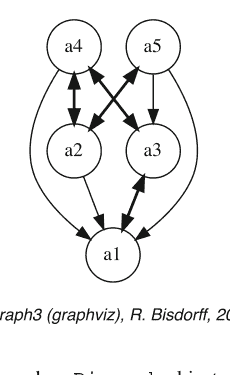

还提供了其他方法来检查这个随机有向图对象 `dg`，例如下面的 `showStatistics()` 方法。

### 清单 1.4 检查有向图对象

```
>>> dg.showStatistics()
*----- 通用统计 ---------------*
对于有向图                : <tutorialDigraph.py>
阶数                      : 5 个节点
规模                       : 12 条弧
未确定               : 0 条弧
确定性 (%)        : 100.0
弧密度                : 0.60
双弧密度         : 0.40
单弧密度         : 0.40
缺失密度            : 0.20
严格单弧密度: : 0.40
严格缺失密度     : 0.20
分量数         : 1
强分量数  : 1
传递性度 (%)    : 60.0
                           : [0, 1, 2, 3, 4, 5]
出度分布    : [0, 1, 1, 3, 0, 0]
入度分布     : [0, 1, 2, 1, 1, 0]
平均出度             : 2.40
平均入度              : 2.40
                           : [0, 1, 2, 3, 4, 5, 6, 7, 8, 9, 10]
对称度分布.    : [0, 0, 0, 0, 1, 4, 0, 0, 0, 0, 0]
平均对称度      : 4.80
出度集中指数 : 0.1667
入度集中指数  : 0.2333
对称度集中指数 : 0.0333
                           : [0, 1, 2, 3, 4, 'inf']
邻域深度分布: [0, 1, 4, 0, 0, 0]
平均邻域深度   : 1.80
有向图直径           : 2
聚集分布 :
a1 : 58.33
a2 : 33.33
a3 : 33.33
a4 : 50.00
a5 : 50.00
聚集系数 : 45.00
```

图 1.2 浏览教程有向图的关系图。+ 表示肯定有效的关系，– 表示肯定无效的关系。这里我们再次确认，我们的随机有向图实例 `dg` 确实是一个清晰的，即 100% 确定的非自反有向图实例。

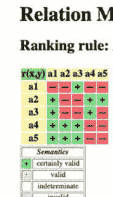

前面的 `show...()` 方法通常依赖于相应的计算方法，例如：`computeSize()`、`computeDeterminateness()` 或 `computeTransitivityDegree()`。

### 清单 1.5 各种 compute...() 方法

```
>>> dg.computeSize()
12
>>> dg.computeDeterminateness(InPercents=True)
Decimal('100.00')
>>> dg.computeTransitivityDegree(InPercents=True)
Decimal('60.00')
```

请注意，`show...()` 方法在 Python 终端控制台中输出其结果。我们还提供了一些 `showHTML...()` 方法，它们在系统浏览器的标签页或窗口中输出其结果（图 1.2）。

```
>>> dg.showHTMLRelationMap(relationName='r(x,y)',
... rankingRule=None)
```

一些特殊类型的有向图实例，如 `CirculantDigraph` 或 `GridDigraph` 类，可以轻松获得（参见下一页的图 1.3）。

### 清单 1.6 循环有向图和 n × m 网格有向图

```
>>> from digraphs import CirculantDigraph, GridDigraph
>>> c8 = CirculantDigraph(order=8, circulants=[1,3])
>>> c8.exportGraphViz('c8')
```

## 第2章
处理双极值有向图

# 目录

- 2.1 随机双极值有向图
- 2.2 Graphviz 绘图
- 2.3 非对称与对称部分
- 2.4 边界与内部部分
- 2.5 通过认知析取进行融合
- 2.6 对偶、逆与余对偶有向图
- 2.7 对称与传递闭包
- 2.8 强连通分量
- 2.9 CSV 存储
- 2.10 完全、空与不确定有向图

**摘要** 本章介绍双极值有向图，这是 DIGRAPH3 模块中实现的所有专用有向图的基本根类型。借助一个随机赋值的有向图，我们演示一些基本的有向图操作方法，例如绘制有向图、将其划分为非对称和对称部分、分离边界与内部部分、计算相关的对偶、逆和余对偶有向图，以及操作对称和传递闭包。

## 2.1 随机双极值有向图

在清单 2.1 中，我们生成一个阶为 7 的均匀随机 $[-1.0; +1.0]$ 赋值有向图，记为 `rdg`，例如，它建模了定义在 `rdg` 节点集上的一个二元关系 $S(x, y)$。为此，DIGRAPH3 资源在 `randomDigraphs` 模块中提供了一个特定的 `RandomValuationDigraph` 类 (Bisdorff 2021b)。

**清单 2.1** 随机双极值有向图实例

```
>>> from randomDigraphs import RandomValuationDigraph
>>> rdg = RandomValuationDigraph(order=7)
>>> rdg.save('tutRandValDigraph')
```

```
>>> from digraphs import Digraph
>>> rdg = Digraph('tutRandValDigraph')
>>> rdg
*------- Digraph instance description -------*
  Instance class       : Digraph
  Instance name        : tutRandValDigraph
  Digraph Order        : 7
  Digraph Size         : 22
  Valuation domain     : [-1.00;1.00]
  Determinateness (%)  : 75.24
  Attributes           : ['name','actions','order',
                          'valuationdomain','relation',
                          'gamma','notGamma']
```

通过 save() 方法（参见前一页清单 2.1 第 3 行），我们保存了 rdg 的备份版本以供将来使用，该备份保存在当前工作目录中名为 tutRandValDigraph.py 的文件中。真正的 Digraph 类构造函数可以从存储的文件中重新加载 rdg 对象（第 5 行）。人们可以轻松地检查名为 rdg 的 Digraph 对象的内容（第 6 行）。有向图大小 22 表示正赋值弧的数量（第 11 行）。赋值域在区间 [-1.0; 1.0] 内均匀分布，平均绝对弧赋值为 (0.7524 × 2) − 1.0 = 0.5048（第 13 行）。

如前一章第 1 章所述，所有 Digraph 类型的对象至少包含此处第 14–16 行所示的属性列表：

- 一个名称（字符串）和一个动作字典（有向图节点），
- 一个阶（整数）属性，包含节点数量，
- 一个 valuationdomain 字典和一个双层字典 relation，表示有向图关系的邻接表，
- 一个 gamma 和一个 notGamma 字典，包含每个节点的直接邻域和非邻域。

Digraph 类提供了一些通用的 show...() 方法来探索给定 Digraph 对象的内容，例如 showRelationTable()、showComponents() 和 showNeighborhoods() 方法。

## 清单 2.2 随机赋值有向图示例

```
>>> rdg.showRelationTable()
  * ---- Relation Table ----
  r(xSy) |  '1'    '2'    '3'    '4'    '5'    '6'    '7'
  -------|-------------------------------------------------
  '1'    |  0.00 -0.48  0.70  0.86  0.30  0.38  0.44
  '2'    | -0.22  0.00 -0.38  0.50  0.80 -0.54  0.02
  '3'    | -0.42  0.08  0.00  0.70 -0.56  0.84 -1.00
  '4'    |  0.44 -0.40 -0.62  0.00  0.04  0.66  0.76
  '5'    |  0.32 -0.48 -0.46  0.64  0.00 -0.22 -0.52
  '6'    | -0.84  0.00 -0.40 -0.96 -0.18  0.00 -0.22
  '7'    |  0.88  0.72  0.82  0.52 -0.84  0.04  0.00
>>> rdg.showComponents()
```

```
*--- Connected Components ---*
1: ['1', '2', '3', '4', '5', '6', '7']
>>> rdg.showNeighborhoods()
*---- Neighborhoods ------*
    Gamma:
    '1': in => {'5','7','4'}, out => {'5','7','6','3','4'}
    '2': in => {'7','3'}, out => {'5','7','4'}
    '3': in => {'7','1'}, out => {'6','2','4'}
    '4': in => {'5','7','1','2','3'}, out => {'5','7','1','6'}
    '5': in => {'1','2','4'}, out => {'1','4'}
    '6': in => {'7','1','3','4'}, out => set()
    '7': in => {'1','2','4'}, out => {'1','2','3','4','6'}
    Not Gamma:
    '1': in => {'6','2','3'}, out => {'2'}
    '2': in => {'5','1','4'}, out => {'1','6','3'}
    '3': in => {'5','6','2','4'}, out => {'5','7','1'}
    '4': in => {'6'}, out => {'2','3'}
    '5': in => {'7','6','3'}, out => {'7','6','2','3'}
    '6': in => {'5','2'}, out => {'5','7','1','3','4'}
    '7': in => {'5','6','3'}, out => {'5'}
```

正特征值表示弧的存在，而负值表示其不存在。0.0 值表示不确定的情况：可能存在也可能不存在弧（参见对面页清单 2.2 第 5–11 行）。请注意，某些 Digraph 类方法会忽略自反链接，将其视为不确定，即所有动作 x 的特征值 r(x S x) 被设置为中位数，即此处的不确定值 0.0 (Bisdorff 2004)。

## 2.2 Graphviz 绘图

通过查看图 2.1 中的 graphviz 绘图 (Gansner and North 2000)，可以更好地洞察 Digraph 对象 rdg。¹

```
>>> rdg.exportGraphViz('tutRandValDigraph')
*---- exporting a dot file for GraphViz tools ------*
  Exporting to tutRandValDigraph.dot
  dot -Grankdir=BT -Tpng tutRandValDigraph.dot -o tutRandValDigraph.png
```

¹exportGraphViz() 方法依赖于 graphviz 软件 (https://graphviz.org/) 的绘图工具。在 Linux Ubuntu 或 Debian 上，您可以尝试使用 . . .$ sudo apt-get install graphviz 进行安装。MacOS 有现成的 dmg 安装程序。

---

图 1.3 循环 [1,3] 有向图和 3 网格有向图

```
*---- exporting a dot file for GraphViz tools ----*
Exporting to c8.dot
circo -Tpng c8.dot -o c8.png
>>> grid3 = GridDigraph(n=3,m=3,
...                     hasMedianSplitOrientation=True)
>>> grid.exportGraphViz('grid3')
*---- exporting a dot file for GraphViz tools ----*
Exporting to grid3.dot
dot -Grankdir=BT -Tpng grid3.dot -o grid3.png
```

下一章第 2 章介绍了基本的 *双极值有向图* 模型，这是 DIGRAPH3 模块中实现的所有有向图模型的 *根对象类型* (Bisdorff 2021)。

## 参考文献

Bisdorff R (2021) Digraph3 Python 模块集合的技术文档。 https://digraph3.readthedocs.io/en/latest/techDoc.html
Gansner E, North S (2000) 一个开放的图形可视化系统及其在软件工程中的应用。 Softw Pract Exp 30(11):1203–1233. https://graphviz.org/documentation/
McKay B, Piperno A (2013) 实用图同构，II。 J Symb Comput 60:94–112. https://www.cs.sunysb.edu/~algorith/implement/nauty/implement.shtml

## 2.3 非对称与对称部分

提取有向图 `rdg` 的*对称*部分和*非对称*部分，可以借助两个相应的类来完成（参见代码清单 2.3）。

代码清单 2.3 计算非对称和对称部分

```
>>> from digraphs import AsymmetricPartialDigraph,
...                     SymmetricPartialDigraph
>>> asymDg = AsymmetricPartialDigraph(rdg)
>>> asymDg.exportGraphViz()
>>> symDg = SymmetricPartialDigraph(rdg)
>>> symDg.exportGraphViz()
```

部分对象 `asymDg` 和 `symDg` 的关系构造器，会将节点间所有非对称或非对称的链接的特征值设置为不确定值 0.0（参见下一页的图 2.2）。

例如，下面的代码清单 2.4 展示了 `AsymmetricPartialDigraph` 类的关系构造器的源代码：

代码清单 2.4 计算双极值关系的非对称部分

```
def _constructRelation(self):
    actions = self.actions
    Min = self.valuationdomain['min']
    Max = self.valuationdomain['med']
    relationIn = self.relation
    relationOut = {}
    for a in actions:
        relationOut[a] = {}
        for b in actions:
            if a != b:
                if relationIn[a][b] >= Med and relationIn[b][a] <= Med:
                    relationOut[a][b] = relationIn[a][b]
                elif relationIn[a][b] <= Med and relationIn[b][a] >= Med:
                    relationOut[a][b] = relationIn[a][b]
                else:
                    relationOut[a][b] = Med
            else: # reflexive links are ignored
                relationOut[a][b] = Med
    return relationOut
```

在上面的第 17 行，所有非对称的情况都被设置为不确定的——中值——特征值。顺便提一下，所有自反关系也被类似地设置为这个不确定值（参见第 19 行）。

## 2.4 边界与内部部分

我们也可以借助两个相应的类 `GraphBorder` 和 `GraphInner`（参见代码清单 2.5）来提取边界——由有向图的初始和终端预核的并集所诱导的部分（参见第 17 章）——以及内部部分——边界的补集。

下一页的图 2.3 展示了从教程随机赋值有向图 `rdg` 中，使用 NETFLOWS 排序规则（参见第 8.3 节）获得的线性排序的边界和内部部分。

代码清单 2.5 线性排序的边界和内部部分

```
>>> from digraphs import GraphBorder, GraphInner
>>> from linearOrders import NetFlowsOrder
>>> nf = NetFlowsOrder(rdg)
>>> nf.netFlowsOrder
['6', '4', '5', '3', '2', '1', '7']
>>> bnf = GraphBorder(nf)
>>> bnf.exportGraphViz(lastChoice=['6'],firstChoice=['7'])
>>> inf = GraphInner(nf)
>>> inf.exportGraphViz(lastChoice=['6'],firstChoice=['7'])
```

图 2.3 中的绘图以终端节点 6（`lastChoice` 参数）和初始节点 7（`firstChoice` 参数）为方向（参见上一页代码清单 2.5 的第 7 行和第 9 行）。

部分有向图 `bnf` 和 `inf` 的类构造器（参见第 6 行和第 8 行）将所有不在*边界*内或不在*内部*部分的链接的特征值设置为*不确定*值（参见图 2.3）。由于比线性排序*密集*得多，我们教程随机赋值有向图 `rdg` 的实际内部部分缩减为节点 3 和 4 之间的一条弧（参见对面页右侧的图 2.4）。实际上，一个完全有向图在极限情况下根本没有内部部分（隐私！），而空和不确定的有向图则同时允许空的边界和空的内部部分。

## 2.5 通过认知析取进行融合

有向图对象 `rdg` 可以从部分对象 `asymDg` 和 `symDg` 恢复，或者同样可以从边界 `bg` 和内部部分 `ig` 恢复，使用*双极析取融合算子 o-max*，也称为*认知析取*，该算子可通过 `FusionDigraph` 类使用。

**代码清单 2.6** 部分有向图的认知融合

```
>>> from digraphs import FusionDigraph
>>> fusDg = FusionDigraph(asymDg,symDg,operator='o-max')
>>> # fusDg = FusionDigraph(bg,ig,operator='o-max')
>>> fusDg.showRelationTable()
    * ---- Relation Table ----
    r(xSy) | '1'   '2'   '3'   '4'   '5'   '6'   '7'
    -------------------------------------------------
    '1'     |  0.00 -0.48  0.70  0.86  0.30  0.38  0.44
    '2'     | -0.22  0.00 -0.38  0.50  0.80 -0.54  0.02
    '3'     | -0.42  0.08  0.00  0.70 -0.56  0.84 -1.00
    '4'     |  0.44 -0.40 -0.62  0.00  0.04  0.66  0.76
    '5'     |  0.32 -0.48 -0.46  0.64  0.00 -0.22 -0.52
    '6'     | -0.84  0.00 -0.40 -0.96 -0.18  0.00 -0.22
    '7'     |  0.88  0.72  0.82  0.52 -0.84  0.04  0.00
```

认知融合算子 `o-max`（参见代码清单 2.6 第 2 行）定义如下：

**定义 2.1（析取认知融合算子 o-max）** 设 $r$ 和 $r'$ 表征两个双极值认知情境：

- 当 $r \geqslant 0.0$ 且 $r' \geqslant 0.0$ 时，即 $r$ 和 $r'$ 均为正有效或不确定，则 o-max($r, r'$) = max($r, r'$)；
- 当 $r \leqslant 0.0$ 且 $r' \leqslant 0.0$ 时，即 $r$ 和 $r'$ 均为正无效或不确定，则 o-max($r, r'$) = min($r, r'$)；
- 否则 o-max($r, r'$) = 0.0，即不确定。

请注意，`o-max` 算子与均值算子类似，当有超过 2 个操作数时，*不满足结合律*。为了使 `o-max` 融合结果唯一，应用以下规则——首先，分别聚合所有正项和负项——然后对两个聚合结果应用 `o-max` 融合。

## 2.6 对偶、逆和余对偶有向图

`*digraphs*` 模块提供了类构造器，用于计算有向图实例 `*rdg*` 的*对偶*<sup>2</sup>（取反关系）、*逆*（转置关系）和*余对偶*（转置并取反关系）（参见代码清单 2.7 第 4、16、29 行）。

代码清单 2.7 计算关联的对偶、逆和余对偶有向图

```
>>> from digraphs import
...           DualDigraph, ConverseDigraph, CoDualDigraph
>>> # dual of rdg
>>> ddg = DualDigraph(rdg)
>>> ddg.showRelationTable()
    -r(xSy) |  '1'    '2'    '3'    '4'    '5'    '6'    '7'
    ---------------------------------------------------------
     '1'     |  0.00  0.48 -0.70 -0.86 -0.30 -0.38 -0.44
     '2'     |  0.22  0.00  0.38 -0.50  0.80  0.54 -0.02
     '3'     |  0.42  0.08  0.00 -0.70  0.56 -0.84  1.00
     '4'     | -0.44  0.40  0.62  0.00 -0.04 -0.66 -0.76
     '5'     | -0.32  0.48  0.46 -0.64  0.00  0.22  0.52
     '6'     |  0.84  0.00  0.40  0.96  0.18  0.00  0.22
     '7'     |  0.88 -0.72 -0.82 -0.52  0.84 -0.04  0.00
>>> # converse of rdg
>>> cdg = ConverseDigraph(rdg)
>>> cdg.showRelationTable()
    * ---- Relation Table -----
    r(ySx) |  '1'    '2'    '3'    '4'    '5'    '6'    '7'
    ---------------------------------------------------------
    '1'     |  0.00 -0.22 -0.42  0.44  0.32 -0.84  0.88
    '2'     | -0.48  0.00  0.08 -0.40 -0.48  0.00  0.72
    '3'     |  0.70 -0.38  0.00 -0.62 -0.46 -0.40  0.82
    '4'     |  0.86  0.50  0.70  0.00  0.64 -0.96  0.52
    '5'     |  0.30  0.80 -0.56  0.04  0.00 -0.18 -0.84
    '6'     |  0.38 -0.54  0.84  0.66 -0.22  0.00  0.04
    '7'     |  0.44  0.02 -1.00  0.76 -0.52 -0.22  0.00
>>> # codual of rdg
>>> cddg = CoDualDigraph(rdg)
>>> cddg.showRelationTable()
    * ---- Relation Table -----
    -r(ySx) |  '1'    '2'    '3'    '4'    '5'    '6'    '7'
    ---------------------------------------------------------
    '1'     |  0.00  0.22  0.42 -0.44 -0.32  0.84 -0.88
    '2'     |  0.48  0.00 -0.08  0.40  0.48  0.00 -0.72
    '3'     | -0.70  0.38  0.00  0.62  0.46  0.40 -0.82
    '4'     | -0.86 -0.50 -0.70  0.00 -0.64  0.96 -0.52
    '5'     | -0.30 -0.80  0.56 -0.04  0.00  0.18  0.84
```

> <sup>2</sup>不要与平面图 *g* 的对偶图混淆，后者为 *g* 的每个面都有一个顶点。这里我们指的是与*大于或等于*关系相对应的*小于*（严格逆）关系，或与（严格的）*优于*关系相对应的*小于或等于*关系。

计算有向图的*对偶*或*逆*，也可以通过添加 `__neg__`（`-`）或 `__invert__`（`~`）运算符前缀来实现。因此，一个有向图对象的*余对偶*也可以通过两种运算的*组合*（顺序不限）来计算（见下文第3行）。

**清单 2.8** 计算有向图的对偶、逆和余对偶

```
>>> ddg = -rdg   # rdg 的对偶
>>> cdg = ~rdg   # rdg 的逆
>>> cddg = ~(-rdg) # = -(~(rdg) rdg 的余对偶
>>> (~(-rdg)).showRelationTable()
 * ---- 关系表 ----
 -r(y&x) |  '1'    '2'    '3'    '4'    '5'    '6'    '7'
 --------|-------------------------------------------------
 '1'     |  0.00  0.22  0.42 -0.44 -0.32  0.84 -0.88
 '2'     |  0.48  0.00 -0.08  0.40  0.48  0.00 -0.72
 '3'     | -0.70  0.38  0.00  0.62  0.46  0.40 -0.82
 '4'     | -0.86 -0.50 -0.70  0.00 -0.64  0.96 -0.52
 '5'     | -0.30 -0.80  0.56 -0.04  0.00  0.18  0.84
 '6'     | -0.38  0.54 -0.84 -0.66  0.22  0.00 -0.04
 '7'     | -0.44 -0.02  1.00 -0.76  0.52  0.22  0.00
```

## 2.7 对称闭包与传递闭包

对称闭包和传递闭包，默认是原地操作方法，同样可用（见图 2.5）。请注意，在执行这些会不可逆地修改原始 `rdg` 对象的原地操作之前，最好先备份 `rdg`。最简单的存储方法，即通用的 `Digraph.save()` 方法，会将有向图对象的字符串表示形式的 Python 内容写入一个命名文件中（见第 1.3 节）。

**清单 2.9** 对称闭包与传递闭包

```
>>> rdg.save('tutRandValDigraph')
>>> rdg.closeSymmetric(InSite=True)
>>> rdg.closeTransitive(InSite=True)
>>> rdg.exportGraphViz('symTransClosure')
```

`closeSymmetric()` 方法（见清单 2.9 第2行），其复杂度为 $O(n^2)$，其中 $n$ 表示有向图的阶，一方面，它通过执行成对关系的析取，将所有检测到的单向成对链接更改为双向链接。另一方面，`closeTransitive()` 方法（见图 2.5 教程随机赋值有向图 rdg 的对称闭包和传递闭包

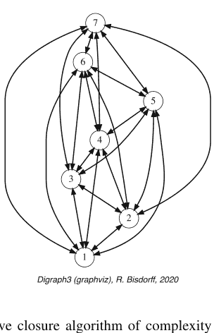

第3行）实现了复杂度为 $O(n^3)$ 的 *Roy-Warshall* 传递闭包算法（Roy 1959; Warshall 1962）。

使用带有 `Reverse = True` 标志的相同 `closeTransitive()` 方法，可以轻松地从传递有向图实例中消除所有传递弧。我们在绘制 TransitiveDigraph 对象的 HASSE 图时会使用此功能。

## 2.8 强连通分量

由于原始有向图 rdg 是连通的（见上文 showShort() 命令的结果），对称闭包和传递闭包共同操作，必然会产生一个单一的强连通分量，即一个**完全**有向图。有时，将给定有向图中的所有强连通分量合并，并构建所谓的*折叠*有向图是有用的。使用这里的 StrongComponentsCollapsedDigraph 构造函数将呈现一个单一的超节点，汇集所有原始节点（见下文第7行）。

**清单 2.10** 计算有向图中的强连通分量

```
>>> from digraphs import StrongComponentsCollapsedDigraph
>>> sc = StrongComponentsCollapsedDigraph(rdg)
>>> sc.showAll()
*----- 显示详情 ----*
有向图 : tutRandValDigraph_Scc
*----- 操作 ----*
['_7_1_2_6_5_3_4_']
*----- 关系表 ----*
S | 'Scc_1'
-------|--------
 'Scc_1' |  0.00
*---- 强连通分量 ----*
 简称          内容
 'Scc_1'        '_7_1_2_6_5_3_4_'
*---- 邻域 ----*
 Gamma :
 'frozenset({'7','1','2','6','5','3','4'})':
                 入 => set(), 出 => set()
 Not Gamma :
 'frozenset({'7','1','2','6','5','3','4'})':
                 入 => set(), 出 => set()
```

## 2.9 CSV 存储

有时需要与 R³ 或 gretl⁴ 等统计软件以 CSV 格式交换图赋值数据。为此，可以将有向图邻接表导出为 CSV 文件。特征赋值域在此默认归一化到范围 [−1.0, 1.0]，对角线默认设置为最小值 −1.0。

```
>>> rdg = Digraph('tutRandValDigraph')
>>> rdg.saveCSV('tutRandValDigraph')
# 文件 tutRandValDigraph.csv 的内容
"d","1","2","3","4","5","6","7"
"1",-1.0,0.48,-0.7,-0.86,-0.3,-0.38,-0.44
"2",0.22,-1.0,0.38,-0.5,-0.8,0.54,-0.02
"3",0.42,-0.08,-1.0,-0.7,0.56,-0.84,1.0
"4",-0.44,0.4,0.62,-1.0,-0.04,-0.66,-0.76
"5",-0.32,0.48,0.46,-0.64,-1.0,0.22,0.52
"6",0.84,0.0,0.4,0.96,0.18,-1.0,0.22
"7",-0.88,-0.72,-0.82,-0.52,0.84,-0.04,-1.0
```

可以从先前保存的 CSV 文件内容重新加载 Digraph 实例。

```
>>> from digraphs import CSVDigraph
>>> rdgcsv = CSVDigraph('tutRandValDigraph')
>>> rdgcsv.showRelationTable(ReflexiveTerms=False)
    * ---- 关系表 -----
 r(xSy) |  '1'   '2'   '3'   '4'   '5'   '6'   '7'
 --------|-----------------------------------------
  '1'    |  -   -0.48  0.70  0.86  0.30  0.38  0.44
  '2'    | -0.22  -   -0.38  0.50  0.80 -0.54  0.02
  '3'    | -0.42  0.08  -    0.70 -0.56  0.84 -1.00
  '4'    |  0.44 -0.40 -0.62  -    0.04  0.66  0.76
```

³ https://www.r-project.org/.
⁴ Gnu 回归、计量经济学和时间序列库 http://gretl.sourceforge.net/.

图 2.6 在浏览器窗口中显示的赋值关系表。正弧显示为绿色，负弧显示为红色。不确定的——零值的——弧，如自反对角线弧或节点6和2之间的弧，显示为灰色。

## 教程随机有向图

| r(x S y) | 1 | 2 | 3 | 4 | 5 | 6 | 7 |
|---|---|---|---|---|---|---|---|
| 1 | 0.00 | -0.48 | 0.70 | 0.86 | 0.30 | 0.38 | 0.44 |
| 2 | -0.22 | 0.00 | -0.38 | 0.50 | 0.80 | -0.54 | 0.02 |
| 3 | -0.42 | 0.08 | 0.00 | 0.70 | -0.56 | 0.84 | -1.00 |
| 4 | 0.44 | -0.40 | -0.62 | 0.00 | 0.04 | 0.66 | 0.76 |
| 5 | 0.32 | -0.48 | -0.46 | 0.64 | 0.00 | -0.22 | -0.52 |
| 6 | -0.84 | 0.00 | -0.40 | -0.96 | -0.18 | 0.00 | -0.22 |
| 7 | 0.88 | 0.72 | 0.82 | 0.52 | -0.84 | 0.04 | 0.00 |

```
'5'   |  0.32 -0.48 -0.46  0.64   -  -0.22 -0.52
'6'   | -0.84  0.00 -0.40 -0.96 -0.18   -  -0.22
'7'   |  0.88  0.72  0.82  0.52 -0.84  0.04   -
```

同样可以使用 `showHTMLRelationTable()` 方法在系统浏览器窗口中显示赋值关系表的彩色版本（见图 2.6）。

```
>>> rdgcsv.showHTMLRelationTable(tableTitle="教程随机有向图")
```

## 2.10 完全、空和不确定有向图

最后，让我们提及一些在 `digraphs` 模块⁵ 中现成可用的特殊通用有向图类，例如：

- `CompleteDigraph` 类，
- `EmptyDigraph` 类，以及
- `IndeterminateDigraph` 类，

它们分别将所有成对特征值设置为*最大值*、*最小值*，或*中位数*——不确定值。

**清单 2.11** 完全、空和不确定有向图

```
>>> from digraphs import CompleteDigraph,EmptyDigraph, \
...                     IndeterminateDigraph
>>> # 空有向图
>>> e = EmptyDigraph(order=5)
>>> e.showRelationTable()
    * ---- 关系表 ----
      S   |   '1'   '2'   '3'   '4'   '5'
    ----- -|---------------------------------
    '1'   | -1.00 -1.00 -1.00 -1.00 -1.00
    '2' | -1.00 -1.00 -1.00 -1.00 -1.00
    '3' | -1.00 -1.00 -1.00 -1.00 -1.00
    '4' | -1.00 -1.00 -1.00 -1.00 -1.00
    '5' | -1.00 -1.00 -1.00 -1.00 -1.00
>>> e.showNeighborhoods()
邻域:
  Gamma :
'1': 入 => set(), 出 => set()
'2': 入 => set(), 出 => set()
'5': 入 => set(), 出 => set()
'3': 入 => set(), 出 => set()
'4': 入 => set(), 出 => set()
  Not Gamma :
'1': 入 => {'2','4','5','3'}, 出 => {'2','4','5','3'}
'2': 入 => {'1','4','5','3'}, 出 => {'1','4','5','3'}
'5': 入 => {'1','2','4','3'}, 出 => {'1','2','4','3'}
'3': 入 => {'1','2','4','5'}, 出 => {'1','2','4','5'}
'4': 入 => {'1','2','5','3'}, 出 => {'1','2','5','3'}
>>> # 不确定有向图
>>> i = IndeterminateDigraph()
* ---- 关系表 -----
    S     '1'   '2'   '3'   '4'   '5'
------|---------------------------------
'1'   |  0.00  0.00  0.00  0.00  0.00
'2'   |  0.00  0.00  0.00  0.00  0.00
'3'   |  0.00  0.00  0.00  0.00  0.00
'4'   |  0.00  0.00  0.00  0.00  0.00
'5'   |  0.00  0.00  0.00  0.00  0.00
>>> i.showNeighborhoods()
邻域:
  Gamma :
'1': 入 => set(), 出 => set()
'2': 入 => set(), 出 => set()
'5': 入 => set(), 出 => set()
'3': 入 => set(), 出 => set()
'4': 入 => set(), 出 => set()
  Not Gamma :
'1': 入 => set(), 出 => set()
'2': 入 => set(), 出 => set()
'5': 入 => set(), 出 => set()
'3': 入 => set(), 出 => set()
'4': 入 => set(), 出 => set()
```

请注意*空*有向图实例与*不确定*有向图实例邻域之间的微妙区别。在第一种情况下，邻域已知是完全*空*的（见前一页清单 2.11 第23–27行），而在后一种情况下，节点的实际邻域*一无所知*（见第47–51行）。这两种情况说明了为什么在*双极赋值*有向图中，我们有时可能同时需要 *gamma* **和** *notGamma* 属性。

⁵ 参见 Bischoff (2021a)。

## 注释

正是*丹尼斯·布伊索*在九十年代末首次向我们提出，当时我们刚开始使用Prolog和有限域约束求解器来计算模糊有向图核，50%的准则显著性多数是一个需要仔细考虑的非常特殊的值。不动点核方程的收敛解向量进一步证实了50%多数的这一特殊地位（见第17章）。这些早期的洞见催生了关于双极值认知逻辑的开创性文章，我们在其中引入了分裂真/假语义，用于模糊偏好建模的多值逻辑处理（Bisdorff 2000, 2002）。然而，特征值域仍然是经典的模糊[0.0; 1.0]值域。

直到2004年，当我们成功评估了仅给定序数准则显著性权重时优势有向图的稳定性，我们才清楚地认识到，特征值域必须转移到一个[−1.0; +1.0]值域（见第19章和Bisdorff 2004）。在这种双极值中，50%多数阈值现在对应于中位数0.0值，用正确的零值表征了一种认知不确定性——无知识——状态。此外，通过特征值的符号直接识别真与假，不仅从计算角度，而且从科学和符号学角度来看，都被证明是非常高效的。一个正（或负）的特征值现在证明了一个逻辑上有效（或无效）的陈述，而一个否定的断言现在意味着一个肯定的反驳，反之亦然。此外，中位数零值使得能够高效处理部分对象——比如有向图的边界或非对称部分——并且，从实际决策的角度来看，更重要的是处理任何缺失数据。

双极[−1.0; +1.0]值特征域因此为重要的新运算和概念开辟了道路，例如第2.5节第18页讨论的析取认知融合运算，它赋予了优势有向图一个逻辑上合理且认知上正确的定义（Bisdorff 2013）。KENDALL的序数相关指数可以扩展为有向图之间的双极值关系等价指数（见第16章和Bisdorff 2012）。利用双极值高斯误差函数自然引出了定义一个双极值似然函数，其中正（或负）值分别给出一个断言（或反驳）的似然度（见第18章和Bisdorff 2014）。

在接下来的第3章中，我们将介绍本书的主要形式对象，即*双极值优势*有向图。

## 参考文献

Bisdorff R (2000) 模糊偏好系统的逻辑基础及其在electre决策辅助方法中的应用。Comput Oper Res 27:673–687. http://hdl.handle.net/10993/23724

Bisdorff R (2002) 多准则偏好聚合的逻辑基础。见：Bouyssou D, Jacquet-Lagrèze E, Perny P, Slowiński R, Vanderpooten D, Vincke P (编) 多准则决策辅助。Kluwer Academic, pp 379–403. http://hdl.handle.net/10993/45313

Bisdorff R (2004) 论布尔逻辑的自然模糊化。见：Klément EP, Pap E (编) 林茨模糊集理论研讨会，模糊系统数学，林茨（奥地利）圣玛格达莱纳教育中心, pp 20–26. http://hdl.handle.net/10993/23721

Bisdorff R (2012) 论双极优势关系间序数相关的测量与检验。见：Mousseau V, Pirlot M (编) DAP’2012 从多准则决策辅助到偏好学习，蒙斯大学（比利时）, pp 91–100. http://hdl.handle.net/10993/23909

Bisdorff R (2013) 论具有大性能差异的优势关系的极化。J Multi-Criteria Decis Anal Wiley 20:3–12. http://hdl.handle.net/10993/245

Bisdorff R (2014) 论具有不确定显著性多准则的置信优势。见：Mousseau V, Pirlot M (编) DAP’2014 从多准则决策辅助到偏好学习，巴黎中央理工学院, pp 1–6. http://hdl.handle.net/10993/23910

Bisdorff R (2021a) 算法决策理论Python模块集合Digraph3的文档。https://digraph3.readthedocs.io/en/latest/

Bisdorff R (2021b) Python模块集合Digraph3的技术文档。https://digraph3.readthedocs.io/en/latest/techDoc.html

Gansner E, North S (2000) 一个开放的图形可视化系统及其在软件工程中的应用。Softw Pract Exp 30(11):1203–1233. https://graphviz.org/documentation/

Roy B (1959) 传递性与连通性。C R Acad Sci Paris 249:216–218

Warshall S (1962) 布尔矩阵的一个定理。J ACM 9:11–12

## 第3章
使用优势有向图

> 当用信念强度来表达时，独立并发论证的组合规则采取一种非常简单的形式……它是这样的：取所有支持论证单独产生的所有信念感觉之和，减去所有反对论证的类似总和，余数就是整体应有的信念感觉。这是人们经常采用的一种做法，称为平衡理由。

—C.S. 皮尔斯，《归纳的概率》(1878)

# 目录

- 3.1 混合优势有向图模型
- 3.2 双极值优势有向图
- 3.3 成对比较
- 3.4 重新编码特征值域
- 3.5 严格优势有向图

**摘要** 在本章中，我们将介绍本书的主要形式对象，即双极值优势有向图。通过一个随机生成的多准则性能表，我们从成对比较构建相应的双极值优势关系。由此产生的双极值优势特征可以被重新编码。最后，余优势有向图给出了相关的严格优势关系。

### 3.1 混合优势有向图模型

在`outrankingDigraphs`模块中，`BipolarOutrankingDigraph`类提供了我们标准的*优势有向图*构造器。这样的实例代表了一个*混合*对象，兼具`PerformanceTableau`类型和OutrankingDigraph类型（Bisdorff 2021）。因此，一个给定的BipolarOutrankingDigraph对象始终至少包含以下属性：

1. actions：一个有序字典，描述潜在的决策行动或备选方案，包含名称和注释属性
2. objectives：一个可能为空的有序字典，包含决策目标，描述决策问题中涉及的多个偏好维度，包含名称和注释属性
3. criteria：一个性能准则的有序字典，即偏好独立且非冗余的十进制值评估函数，用于评估每个潜在决策行动相对于某个决策目标的性能
4. evaluation：一个双重字典，汇集每个决策备选方案在每个准则函数上的性能评估
5. valuationdomain：一个包含三个条目的字典：最小值（-1.0，肯定被优势）、中位数（0.0，不确定）和最大特征值（+1.0，肯定优势）
6. relation：一个定义在决策备选方案集合笛卡尔积上的双重字典，捕捉基于给定准则函数族上观察到的决策备选方案对之间的性能差异计算出的成对优势情况的可信度

例如，让我们考虑一个随机生成的具有七个决策行动（标记为a1, a2, ..., a7）的双极值优势有向图。因此，我们首先需要在代码清单3.1中生成一个相应的随机性能表。

**代码清单3.1** 生成随机性能表

```python
>>> from perfTabs import RandomPerformanceTableau
>>> pt = RandomPerformanceTableau(numberOfActions=7,
...                                seed=100)
>>> pt
 *------- PerformanceTableau instance description -------*
    Instance class     : RandomPerformanceTableau
    Seed               : 100
    Instance name      : randomperftab
    Actions            : 7
    Criteria           : 7
    NaN proportion (%) : 6.1
>>> pt.showActions()
 *----- show digraphs actions ---------------*
   key:  a1
     name:        action 1
     comment:     RandomPerformanceTableau() generated.
   key:  a2
     name:        action 2
     comment:     RandomPerformanceTableau() generated.
     ...
     ...
```

## 3.2 双极值优超有向图

给定前述的随机性能表 `pt`，`BipolarOutrankingDigraph` 类构造函数会计算出相应的*双极值优超有向图*。

**清单 3.4** 随机双极值优超有向图示例

```
>>> from outrankingDigraphs import \
...                     BipolarOutrankingDigraph
>>> odg = BipolarOutrankingDigraph(pt)
>>> odg
 *------- Object instance description ------*
 Instance class       : BipolarOutrankingDigraph
 Instance name        : rel_randomperftab
 Actions              : 7
 Criteria             : 7
 Size                 : 20
 Determinateness (%)  : 63.27
 Valuation domain     : [-1.00;1.00]
 Attributes           : [
     'name', 'actions',
     'criteria', 'evaluation', 'NA',
     'valuationdomain', 'relation',
     'order', 'gamma', 'notGamma', ...
     ]
```

生成的有向图包含 20 个正（有效）的优超关系。并且，所有成对优超情况的平均多数准则显著性支持度为 63.3%（参见清单 3.4 的第 10-11 行）。

我们可以使用 `showRelationTable()` 方法检查完整的 `[-1.0, +1.0]` 值邻接表。

**清单 3.5** 检查值化邻接表

```
>>> odg.showRelationTable()
 * ---- Relation Table ----
 r(x,y)|  'a1'  'a2'  'a3'  'a4'  'a5'  'a6'  'a7'
 -------|-------------------------------------------------
 'a1' | +1.00  +0.71  +0.29  +0.29  +0.29  +0.29  +0.00
 'a2' | -0.71  +1.00  -0.29  -0.14  +0.14  +0.29  -0.57
 'a3' | -0.29  +0.29  +1.00  -0.29  -0.14  +0.00  -0.29
 'a4' | +0.00  +0.14  +0.57  +1.00  +0.29  +0.57  -0.43
 'a5' | -0.29  +0.00  +0.14  +0.00  +1.00  +0.29  -0.29
 'a6' | -0.29  +0.00  +0.14  -0.29  +0.14  +1.00  +0.00
 'a7' | +0.00  +0.71  +0.57  +0.43  +0.29  +0.00  +1.00
 Valuation domain: [-1.0; 1.0]
```

`BipolarOutrankingDigraph` 类构造函数从给定的性能表 `pt` 计算出*成对优超关系* $x \succsim y$ 的特征值 $r(x \succsim y)$，其默认*值域*为 $[-1.0, +1.0]$，其中*中位数*值 0.0 作为*不确定*特征值。
$r(x \succsim y)$ 的语义如下：

### 定义 3.1（优超特征函数的语义）

- a. 当 $r(x \succsim y) > 0.0$ 时，$x$ 优超 $y$ 为**真**，即备选方案 $x$ 在多数准则显著性上*“至少与备选方案 y 评价相当”*，**且**未观察到对 $x$ 不利的显著负性能差异。
- b. 当 $r(x \succsim y) < 0.0$ 时，$x$ 优超 $y$ 为**假**，即备选方案 $x$ **仅**在少数准则显著性上*“至少与备选方案 y 评价相当”*，**且**未观察到对 $x$ 有利的显著正性能差异。
- c. 当 $r(x \succsim y) = 0.0$ 时，$x$ 是否优超 $y$ 是**不确定**的。

## 3.3 成对比较

根据上述语义，我们注意到前一页清单 3.5 的第 5 行中，a1 优超 a2：$r(a1 \succsim a2) + 0.71$，但不优超 a7：$r(a1 \succsim a7) = 0.0)$。为了理解优超关系表中显示的特征值，我们可以使用 `showPairwiseComparison()` 方法检查，例如，备选方案 a1 和 a2 之间的成对多准则比较的详细信息。

**清单 3.6** 检查成对多准则比较

```
>>> odg.showPairwiseComparison('a1','a2')
*-------------- pairwise comparison ----*
Comparing actions : (a1, a2)
crit. wght. g(a1) g(a2) diff | ind pref r()
-----------------------------------------
g1 1.00 15.17 44.51 -29.34 | 2.50 5.00 -1.00
g2 1.00 82.29 43.90 +38.39 | 2.50 5.00 +1.00
g3 1.00 44.23 19.10 +25.13 | 2.50 5.00 +1.00
g4 1.00 46.37 16.22 +30.15 | 2.50 5.00 +1.00
g5 1.00 47.67 14.81 +32.86 | 2.50 5.00 +1.00
g6 1.00 69.62 45.49 +24.13 | 2.50 5.00 +1.00
g7 1.00 82.88 41.66 +41.22 | 2.50 5.00 +1.00
Valuation in range: -7.00 to +7.00; -------
r(a1,a2): +5.00/7.00 = +0.71 +5.00
```

优超特征值 $r(a1 \succsim a2)$ 代表了支持备选方案 a1 *“至少与备选方案 y 评价相当”*这一陈述的准则显著性权重与反对该陈述的准则显著性权重之差所产生的相对*多数优势*。由于未观察到显著的性能差异，此成对比较中未触发极化情况。

然而，当我们使用 `showPairwiseOutrankings()` 方法比较备选方案 a1 和 a7 的评估时，观察到了这种极化情况。

**清单 3.7** 具有显著性能差异的成对比较

```
>>> odg.showPairwiseOutrankings('a1','a7')
*---------------- pairwise comparison ----*
Comparing actions : (a1, a7)
crit. wgth. g(a1)  g(a7)  diff  | ind  pref  r() |  v     veto
----------------------------------------------------
g1   1.00  15.17  96.58  -81.41 | 2.50  5.00  -1.00 | 80.00 -1.00
g2   1.00  82.29  62.22  +20.07 | 2.50  5.00  +1.00 |
g3   1.00  44.23  56.90  -12.67 | 2.50  5.00  -1.00 |
g4   1.00  46.37  32.06  +14.31 | 2.50  5.00  +1.00 |
g5   1.00  47.67  80.16  -32.49 | 2.50  5.00  -1.00 |
g6   1.00  69.62  48.80  +20.82 | 2.50  5.00  +1.00 |
g7   1.00  82.88   6.05  +76.83 | 2.50  5.00  +1.00 |
----------------------------------------------------
Valuation in range: -7.00 to +7.00; r(x,y)= +1/7 => 0.0
*---------------- pairwise comparison ----*
Comparing actions : (a1, a7)
crit. wgth. g(a7)  g(a1)  diff  | ind  pref  r() |  v     veto
----------------------------------------------------
g1   1.00  96.58  15.17  +81.41 | 2.50  5.00  +1.00 | 80.00 +1.00
g2   1.00  62.22  82.29  -20.07 | 2.50  5.00  -1.00 |
g3   1.00  56.90  44.23  +12.67 | 2.50  5.00  +1.00 |
g4   1.00  32.06  46.37  -14.31 | 2.50  5.00  -1.00 |
g5   1.00  80.16  47.67  +32.49 | 2.50  5.00  +1.00 |
g6   1.00  48.80  69.62  -20.82 | 2.50  5.00  -1.00 |
g7   1.00   6.05  82.88  -76.83 | 2.50  5.00  -1.00 |
----------------------------------------------------
Valuation in range: -7.00 to +7.00; r(x,y)= -1/7 => 0.0
```

这一次，我们观察到 $(1/7 + 1)/2 = 57.1\%$ 的多数准则显著性支持备选方案 a1 和备选方案 a7 之间存在*“至少与备选方案 y 评价相当”*的情况。然而，我们也观察到准则 g1 上存在显著的*负*性能差异（参见清单 3.7 的第 6 行）。这两个矛盾的事实最终在第 14 行触发了一个*不确定*的优超情况。当考虑备选方案 a7 和备选方案 a1 之间相反的性能差异时（第 19-25 行），出现了相反的极化效应。准则 g1 上显著更好的表现使得原本*“并非至少与备选方案 y 评价相当”*的情况变得可疑（参见第 19 行和第 27 行）。

请注意，在成对比较中同时出现显著的正和负性能差异也会触发不确定的优超情况。当同时观察到正（或负）的*“至少与备选方案 y 评价相当”*情况和一个或多个显著的正（或负）性能差异时，优超情况将被确定地验证（或无效）(Bisdorff 2013)。

## 3.4 重新编码特征值域

所有优势有向图，作为根`Digraph`类型的子类，都继承了该父类提供的方法。例如，可以使用`recodeValuation()`方法将有向图的特征值域重新编码为*整数*范围 $[-7, +7]$，即本示例实例`odg`中所考虑的准则族总显著性权重的正负值。

**代码清单 3.8** 重新编码有向图的值域

```
>>> odg.recodeValuation(-7,+7)
>>> odg.valuationdomain['hasIntegerValuation'] = True
>>> Digraph.showRelationTable (odg,ReflexiveTerms=False)
  * ---- 关系表 -----
  r(x,y) |  'a1'  'a2'  'a3'  'a4'  'a5'  'a6'  'a7'
  --------|------------------------------------------
  'a1'    |    -   +5   +2   +2   +2   +2    0
  'a2'    |   -5    -   -1   -1   +1   +2   -4
  'a3'    |   -1   +2    -   -1   -1    0   -1
  'a4'    |    0   +1   +4    -   +2   +4   -3
  'a5'    |   -1    0   +1    0    -   +2   -1
  'a6'    |   -1    0   +1   -1   +1    -    0
  'a7'    |    0   +5   +4   +3   +2    0    -
  值域:  [-7;+7]
```

请注意代码清单 3.8 中，通过将`ReflexiveTerms`参数设置为`False`，可以忽略自比较特征 $r(x \succcurlyeq x)$。请注意，在DIGRAPH3的某些方法中，优势关系的平凡自反项会被忽略。

## 3.5 严格优势有向图

根据理论，我们知道双极值优势有向图是*弱完备的*，即如果 $r(x \succcurlyeq y) < 0.0$，则 $r(y \succcurlyeq x) \geqslant 0.0$。由此性质可推知，双极值优势有向图满足*余对偶原则*：优势关系 $(x \succcurlyeq y)$ 的*逆*（转置）的*对偶*<sup>1</sup>（否定）对应于其非对称的*严格优势*部分 $(x \succ y)$ (Bisdorff 2013, 2020)。
可以通过graphviz绘图来可视化*余对偶*（*严格*）优势有向图（图 3.1）。<sup>2</sup>

> <sup>1</sup> 不要与平面图 $g$ 的对偶图混淆，后者为 $g$ 的每个面都有一个顶点。这里我们指的是与*大于或等于*关系相对应的*小于*（*严格逆*）关系，或与（*严格*）*优于*关系相对应的*小于或等于*关系。
> <sup>2</sup> `exportGraphViz()`方法依赖于graphviz软件（https://graphviz.org/）的绘图工具。在Linux Ubuntu或Debian上，你可以尝试`sudo apt-get install graphviz`来安装它们。Mac OSX有现成的dmg安装程序。

图 3.1 *严格（余对偶）优势有向图。* 从图中可以清楚地看到，备选方案a1和a7都*未被任何其他备选方案所超越*。因此，a1和a7表现为*弱*孔多塞胜者，并可能在此说明性偏好建模示例中被推荐为潜在的*最佳*决策备选方案。

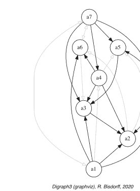

```
>>> cdodg = -(~odg)
>>> cdodg.exportGraphViz('codualOdg')
*---- 正在导出用于GraphViz工具的dot文件 ---------*
  正在导出到 codualOdg.dot
  dot -Grankdir=BT -Tpng codualOdg.dot -o codualOdg.png
```

DIGRAPH3资源库（Bisdorff 2021）中提供了更多用于利用双极值优势有向图的工具。

## 注释

关于优势有向图的开创性工作可以追溯到七八十年代，当时*伯纳德·罗伊*加入了刚成立的巴黎多芬大学，并在那里创立了“*决策支持系统分析与建模实验室*”（LAMSADE）。LAMSADE成为了发展多准则决策支持优势方法的主要基地（Roy and Bouyssou 1993）。

原始*优势*概念的持续成功源于其植根于健全的实用主义。与给定优势有向图必然相关的多准则性能表，确实是令人信服的客观且有意义的（Roy 1991）。而且，社会选择理论的思想最初提供了洞见，即类似孔多塞的成对投票机制可以提供一种序统计工具，将一组偏好观点聚合成*马克·巴尔布特*所称的*中心*孔多塞观点（de Caritat, Marquis de Condorcet 1784 and Barbut 1980），实际上是多个偏好观点的中位数，与所有个体观点的绝对肯德尔序相关距离最小（见第16章）。

因此，将每个性能准则视为一致投票者的子集，并平衡支持票与反对的显著反性能，最终催生了*优势情境*的概念，这是多准则决策支持方法的一个显著特征（Bisdorff et al. 2015）。一个现代的定义是：当——*显著多数*的准则确认备选方案 $x$ 必须被视为*至少与*备选方案 $y$ *评价相当*（*一致性*论据），并且——没有不一致的准则通过揭示备选方案 $x$ 相对于 $y$ 的显著反性能来对先前确认的有效性提出重大质疑（*不一致性*论据）时，称备选方案 $x$ *优于*备选方案 $y$。

如果一致性论据总是被很好地接受，那么不一致性论据，起初非常混乱（Benayoun et al. 1966），只能通过使用双极值认知逻辑（见定义 3.1 和 Bisdorff 2013）以认识论上正确且逻辑上合理的方式处理。因此，优势情境必须接受一个明确的否定定义：当——*显著多数*的准则确认备选方案 $x$ 必须被视为*不至少与*备选方案 $y$ *评价相当*，并且——没有不一致的准则通过揭示备选方案 $x$ 相对于 $ y$ 的显著*更好*性能来对先前确认的有效性提出重大质疑时，称备选方案 $ x$ *不优于*备选方案 $ y$。

此外，一致性和不一致性论据的初始合取聚合必须被一个析取认知融合操作所取代，该操作以逻辑上合理且认识论上正确的方式将一致性与不一致性论据极化。这样，双极值优势有向图从测度理论的角度获得了两个非常有用的性质。它们是*弱完备的*；不可比情境不再通过正优势关系的缺失来证明，而是通过认知不确定性来证明。并且它们满足*余对偶原则*：认知“至少与...评价相当”情境的否定在形式上对应于严格的逆认知“评价不如”情境。

在接下来的方法论第二部分，我们将介绍和讨论多准则评估模型和决策算法，例如构建最佳选择推荐、确定选举获胜者以及使用多个不可通约准则计算线性排序或分位数评级。

## 参考文献

Barbut M (1980) Médiannes, Condorcet et Kendall. Math Sci Hum 69:9–13
Benayoun R, Roy B, Sussmann B (1966) ELECTRE: une méthode pour guider le choix en présence de points de vue multiples. Tech. Rep. 49, Société d’Économie et de Mathématique Appliqué, Direction Scientifique
Bisdorff R (2013) On polarizing outranking relations with large performance differences. J Multi-Criteria Dec Anal Wiley 20:3–12. http://hdl.handle.net/10993/245
Bisdorff R (2020) Lecture 7: best multiple criteria choice: the Rubis outranking method. In: Lectures of the algorithmic decision theory course, University of Luxembourg. http://hdl.handle.net/10993/37933
Bisdorff R (2021) Technical documentation of the Digraph3 collection of Python modules. https://digraph3.readthedocs.io/en/latest/techDoc.html
Bisdorff R, Dias L, Meyer P, Mousseau V, Pirlot M (eds) (2015) Evaluation and decision models with multiple criteria: case studies. International handbooks on information systems. Springer, Berlin. http://hdl.handle.net/10993/23698
de Caritat, Marquis de Condorcet J (1784) Essai sur l’application de l’analyse à la probabilité des décisions rendues à la pluralité des voix. Imprimerie royale, Paris
Roy B (1991) The outranking approach and the foundations of electre methods. Theory Decis 31(1):49–73
Roy B, Bouyssou D (1993) Aide Multicritère à la Décision : Méthodes et Cas. Economica, Paris

## 第二部分
评估模型与决策算法

本书的第二部分，即方法论部分，共包含八章，介绍了多准则评估模型与决策算法。这些模型和算法旨在：借助双极值优势有向图，选出最佳决策备选方案；将潜在决策备选方案从优到劣进行排序；以及进行相对或绝对的分位数评级。我们还展示了如何编辑新的多准则绩效表，并介绍了几种随机绩效表生成器模型。最后一章则致力于高性能计算（HPC）对大型绩效表的排序。

## 第四章
构建最佳选择推荐系统

> ……我们研究的目标是设计一种解决方案……它易于实践，所需假设尽可能少且可靠，并能满足[决策者]的需求……
—（Benayoun 等人，1966）

# 目录

- 4.1 选择哪个办公地点？ ........................................................................ 41
- 4.2 给定的绩效表 ........................................................................ 43
- 4.3 计算优势有向图 .................................................................... 45
- 4.4 设计最佳选择推荐系统 .................................................. 47
- 4.5 计算 RUBIS 最佳选择推荐 ........................................ 48
- 4.6 对优势有向图进行弱排序 ........................................................... 50

**摘要** 本章介绍了 RUBIS 最佳选择推荐系统。我们通过一个最佳办公地点选择问题来阐述我们的方法。我们展示了如何探索给定的绩效表并计算相应的优势有向图。在介绍了指导我们最佳选择推荐算法的实用原则之后，我们解决了最佳办公地点选择问题。

### 4.1 选择哪个办公地点？

一家专注于印刷和复印服务的中小企业需要搬迁至新办公室，其首席执行官（CEO）已收集了七个*潜在的新办公地点*（见下页表 4.1）。
三个*决策目标*按重要性递减的顺序指导着 CEO 的选择：
1. *最大化*中小企业的未来营业额，
2. *最小化*搬迁引起的未来年度成本，
3. *最大化*新的工作条件。

为评估潜在新办公地点在每个目标上的决策后果，我们使用了下表 4.2 所示的*绩效标准族*<sup>1</sup> 进行建模。

在表 4.2 中，我们注意到*成本*标准具有最高的显著性权重（45），其次是*未来营业额*标准（32、26、23）。*工作条件*标准的显著性最低（10、6、3）。<sup>2</sup> 因此，CEO 认为*最大化未来营业额*是最重要的目标（(32 + 26 + 23) = 81），其次是最小化未来年度成本（45），而*最大化工作条件*的重要性较低（(10 + 6 + 3) = 19）。

七个潜在新地点在每个绩效标准上的评估结果汇总在下页表 4.3 所示的*绩效表*中。除*成本*标准外，所有标准均采用从 0%（最弱）到 100%（最强）的定性满意度量表进行评估。因此，我们可以注意到，地点 A（*Ave*）是最昂贵的，但在*邻近度*和*档次*标准上均达到 100% 的满意度。而地点 C（*Ces*）是最便宜的；但在*档次*和*工作空间*标准上均未提供任何满意度。

> <sup>1</sup> 参见 Roy (2000)。
<sup>2</sup> 这些标准权重据称是通过摆动加权多准则决策分析（MCDA）方法确定的（Keeney and Raiffa 1976）。

### 表 4.1 潜在的新办公地点

| ID | 名称 | 地址 | 备注 |
|---|---|---|---|
| A | Ave | Avenue de la liberté | 高档市中心 |
| B | Bon | Bonnevoie | 工业环境 |
| C | Ces | Cessange | 住宅郊区位置 |
| D | Dom | Dommeldange | 工业郊区环境 |
| E | Bel | Esch-Belval | 远离城市的新且雄心勃勃的城市化区域 |
| F | Fen | Fentange | 乡村地区 |
| G | Gar | Avenue de la Gare | 主要城市购物街 |

### 表 4.2 绩效标准族

| 目标 | ID | 名称 | 权重 | 备注 |
|---|---|---|---|---|
| 年度成本 | Ct | 成本 | 45 | 年租金、费用和清洁费 |
| 未来营业额 | Pr | 邻近度 | 32 | 距离市中心的距离 |
| 未来营业额 | V | 可见度 | 26 | 潜在客户的流通量 |
| 未来营业额 | St | 档次 | 32 | 形象和展示 |
| 工作条件 | W | 空间 | 10 | 工作空间 |
| 工作条件 | Cf | 舒适度 | 6 | 办公设备质量 |
| 工作条件 | P | 停车 | 3 | 可用停车设施 |

### 4.2 给定的绩效表

### 表 4.3 潜在办公地点的绩效评估

| 标准 | A | B | C | D | E | F | G |
| :--- | :--- | :--- | :--- | :--- | :--- | :--- | :--- |
| 成本 | 35.0K€ | 17.8K€ | 6.7K€ | 14.1K€ | 34.8K€ | 18.6K€ | 12.0K€ |
| 邻近度 | 100 | 20 | 80 | 70 | 40 | 0 | 60 |
| 可见度 | 60 | 80 | 70 | 50 | 60 | 0 | 100 |
| 档次 | 100 | 10 | 0 | 30 | 90 | 70 | 20 |
| 工作空间 | 75 | 30 | 0 | 55 | 100 | 0 | 50 |
| 工作舒适度 | 0 | 100 | 10 | 30 | 60 | 80 | 50 |
| 停车 | 90 | 30 | 100 | 90 | 70 | 0 | 80 |

关于年度成本，我们假设 CEO 在绩效差异不超过 1000.00€ 时是无差异的，而当差异至少为正 2500.00€ 时，他实际上更偏好某个地点。在六个定性标准（以满意度百分比衡量）上观察到的评估非常主观且相当不精确。因此，CEO 在满意度差异不超过 10% 时是*无差异*的，而当满意度差异至少为 20% 时，他声称存在显著的*偏好*。此外，对他而言，80% 的满意度差异代表了*相当大*的绩效差异，这将触发偏好情况的*极化*（Bisdorff 2013）。

鉴于表 4.3，我们现在可以向 CEO 推荐哪个办公地点作为**最佳选择**？

### 4.2 给定的绩效表

存储在 DIGRAPH3 资源的 `examples` 目录中的文件 `officeChoice.py` 提供了一个相应的 `PerformanceTableau` 对象。我们可以使用 `perfTabs` 模块提供的计算资源来检查其实际内容。

**代码清单 4.1** 检查 officeChoice 绩效表

```
>>> from perfTabs import PerformanceTableau
>>> pt = PerformanceTableau('officeChoice')
>>> pt
*------- PerformanceTableau instance description -------*
    Instance class     : PerformanceTableau
    Instance name      : officeChoice
    Actions            : 7
    Objectives         : 3
    Criteria           : 7
    NaN proportion (%) : 0.0
    Attributes         : ['name', 'actions', 'objectives',
                          'criteria', 'weightPreorder',
                          'NA', 'evaluation']
>>> pt.showPerformanceTableau()
```

因此，我们恢复了第 4.1 节中显示的所有输入数据。请注意，*成本*标准的*负*评估表示负偏好方向：成本*越低*，*越好*。

`showCriteria()` 方法评估了我们在每个绩效标准上观察到的实际偏好区分度。

**代码清单 4.2** 检查绩效标准

```
>>> pt.showCriteria(IntegerWeights=True)
*---- criteria ----*
Ct 'Costs'
  Preference direction: min
  Scale = (0.00, 50000.00)
  Weight = 45
  Threshold ind : 1000.00 + 0.00x ; percentile: 9.52
  Threshold pref : 2500.00 + 0.00x ; percentile: 14.29
Cf 'Comfort'
  Preference direction: max
  Scale = (0.00, 100.00)
  Weight = 6
  Threshold ind : 10.00 + 0.00x ; percentile: 9.52
  Threshold pref : 20.00 + 0.00x ; percentile: 28.57
  Threshold veto : 80.00 + 0.00x ; percentile: 90.48
  ...
  ...
```

在*成本*标准上，9.5% 的绩效差异被视为不显著，14.3% 低于偏好区分阈值（见代码清单 4.2 第 7-8 行）。在定性的*舒适度*标准上，我们再次观察到 9.5% 的不显著绩效差异（第 13 行）。由于主观评估的不精确性，我们注意到此处有 28.6% 的绩效差异低于偏好区分阈值（第 14 行）。此外，100.0 – 90.5 = 9.5% 的绩效差异被判断为*相当大*（第 15 行），因此将触发相关优势情况的极化（Bisdorff 2013）。所有其他标准也提供相同的信息。所有评估的彩色比较显示在对面页的图 4.1 中，通过*热图*统计说明了每个评估各自的分位数类别。由于潜在备选方案集合很小，我们在此选择按绩效五分位数进行分类。

## 绩效表 'officeChoice' 的热力图

| 标准 | Ct | Pr | V | St | W | Cf | P |
|---|---|---|---|---|---|---|---|
| 权重 | +45.00 | +32.00 | +26.00 | +23.00 | +10.00 | +6.00 | +3.00 |
| Ave | -35000 | 100 | 60 | 100 | 75 | 0 | 90 |
| Bon | -17800 | 20 | 80 | 10 | 30 | 100 | 30 |
| Ces | -6700 | 80 | 70 | 0 | 0 | 10 | 100 |
| Dom | -14100 | 70 | 50 | 30 | 55 | 30 | 90 |
| Bel | -34800 | 40 | 60 | 90 | 100 | 60 | 70 |
| Fen | -18600 | 0 | 0 | 70 | 0 | 80 | 0 |
| Gar | -12000 | 60 | 100 | 20 | 50 | 50 | 80 |

颜色图例：
分位数 20.00% 40.00% 60.00% 80.00% 100.00%

图 4.1 办公地点选择绩效表的未排序热力图

```
>>> pt.showHTMLPerformanceHeatmap(colorLevels=5,
...                                 rankingRule=None)
```

地点 Ave 显示出极端且矛盾的评价：一方面*成本*最高且没有*工作舒适度*，另一方面对*站立空间*、*邻近性*和*停车设施*完全满意。地点 Ces 的情况类似但相反：一方面*工作空间*不令人满意、没有*站立空间*、没有*工作舒适度*，另一方面*成本*最低、*邻近性*和*停车设施*最佳。与这些矛盾的备选方案相反，我们观察到两个有吸引力的折中方案：地点 Dom 和 Gar。最后，地点 Fen 显然是所有方案中最不令人满意的。为了帮助 CEO 选择最佳办公地点，我们将计算潜在决策备选方案集合上的成对优超情况（参见 Bisdorff 2013）。

## 4.3 计算优超有向图

**定义 4.1（优超情况）** 对于两个潜在决策备选方案 *x* 和 *y*：

- ‘备选方案 *x 优超* 备选方案 *y*’，记为 (*x* ≽ *y*)，当满足以下条件时成立：
    1. *多数*标准的重要性保证备选方案 *x* 的评估*至少与*备选方案 *y* 一样好，且
    2. 在任何标准上均未观察到*显著的*负面绩效差异。
- ‘备选方案 *x 不优超 y*’，记为 (*x* ≁ *y*)，当满足以下条件时成立：
    1. 仅有*少数*标准的重要性保证备选方案 *x* 的评估*至少与*备选方案 *y* 一样好，且
    2. 在任何标准上均未观察到*显著的*正面绩效差异。

图 4.2 *双极值邻接矩阵*。在所得的优超关系中，我们一方面可以注意到，备选方案 D *正向优超*所有其他潜在办公地点。另一方面，备选方案 A（最昂贵）和 C（最便宜）*不被*任何其他地点优超。

## 双极值邻接矩阵

| r(x ≽ y) | A | B | C | D | E | F | G |
|---|---|---|---|---|---|---|---|
| A | - | 0.00 | 1.00 | 0.30 | 0.78 | 0.00 | 0.00 |
| B | 0.00 | - | 0.00 | -0.56 | 0.00 | 1.00 | -0.60 |
| C | 0.00 | 0.00 | - | 0.46 | 0.00 | 1.00 | 0.10 |
| D | 0.10 | 0.56 | 0.02 | - | 0.46 | 1.00 | 0.25 |
| E | 0.52 | 0.00 | 0.00 | -0.10 | - | 1.00 | -0.42 |
| F | 0.00 | -1.00 | -1.00 | -1.00 | -1.00 | - | -1.00 |
| G | 0.00 | 0.92 | -0.10 | 1.00 | 0.54 | 1.00 | - |

赋值域：[-1.00; +1.00]

- 否则，备选方案 $x$ 和 $y$ 之间的优超情况被视为*不确定*。

每个成对优超情况的可信度，记为 $r(x \succcurlyeq y)$，在双极重要性赋值 $[-1.0, 1.0]$ 中度量，其中*正*项 $r(x \succcurlyeq y) > 0.0$ 表示*已验证的优超*，*负*项 $r(x \succcurlyeq y) < 0.0$ 表示*未验证的优超*，即*已验证的被优超*情况。*中位*值 $r(x \succcurlyeq y) = 0.0$ 代表*不确定*情况（参见 Bisdorff 2004, 2013）。

为了从给定的绩效表 pt 计算这种双极值二元优超关系，我们使用 `outrankingDigraphs` 模块中的 `BipolarOutrankingDigraph` 类。相应的 `showHTMLRelationTable()` 方法在系统浏览器窗口中显示所得的双极值邻接矩阵（见图 4.2）。

**清单 4.3** 计算双极值优超有向图

```
>>> from outrankingDigraphs import BipolarOutrankingDigraph
>>> bod = BipolarOutrankingDigraph(pt)
>>> bod.showHTMLRelationTable()
```

备选方案 D 产生一个孔多塞胜者³，而备选方案 A（最昂贵）和 C（最便宜）实际上产生*弱*孔多塞胜者。

```
>>> bod.computeCondorcetWinners()
['D']
>>> bod.computeWeakCondorcetWinners()
['A', 'C', 'D']
```

根据理论，我们知道优超有向图是*弱完全的*，即对于 $X$ 中的所有 $x$ 和 $y$，$r(x \succcurlyeq y) < 0.0$ 意味着 $r(y \succcurlyeq x) \geq 0.0$。并且，它们满足*余对偶原则*：$r(x \succcurlyeq y) = r(y \succcurlyeq x)$ (Bisdorff 2013)。⁴

³ 参见第 7 章关于计算选举胜者的内容。
⁴ 不要与平面图 g 的对偶图混淆，后者为 g 的每个面都有一个顶点。这里我们指的是与*大于或等于*关系对应的*小于*（严格逆）关系，或与（严格）*优于*关系对应的*小于或等于*关系。

定义 4.2（严格优超情况） 对于两个潜在决策备选方案 x 和 y，‘x 严格优超备选方案 y’，记为 (x ≻ y)，当‘x 优超备选方案 y’ ((x ≻ y) > 0.0) 且“y 不优超备选方案 x” ((y ≻ x) < 0.0)。

根据余对偶原则，严格优超有向图 bodcd 是通过余对偶变换从优超有向图 bod 构建的（参见第 2.6 节）。

```
>>> bodcd = ~(-bod)  # 余对偶变换
>>> bodcd
*------- 对象实例描述 -------*
实例类        : BipolarOutrankingDigraph
实例名称      : converse-dual-rel_officeChoice
行动数        : 7
标准数        : 7
规模          : 10
确定性 (%)    : 72.38
赋值域        : [-1.00;1.00]
```

## 4.4 设计最佳选择推荐系统

解决最佳选择问题传统上在于找到唯一的最佳决策备选方案。我们在此采用现代推荐系统的方法，该方法显示一个非空的决策备选方案子集，该子集在构造上包含潜在的最佳备选方案。

计算此类最佳选择推荐（BCR）的五个实用原则如下：

- P1：基于充分理由的排除；每个被排除的备选方案必须被 BCR 中至少一个备选方案严格优超。
- P2：最小规模；BCR 的基数必须尽可能有限。
- P3：高效且信息丰富；BCR 不得包含一个自包含的子推荐。
- P4：有效更优；BCR 不得模棱两可，即它不能同时是首选推荐和末选推荐。
- P5：最大程度确定；在所有潜在的最佳选择推荐中，BCR 是在双极值优超关系的认识特征意义上最确定的一个。

设 X 为潜在决策备选方案的集合。设 Y 为 X 的一个非空子集，在严格优超有向图 G(X, r(≻)) 中称为一个选择。我们现在可以用以下术语来限定一个 BCR Y：

- Y 被称为严格优超（respectively, 被优超）的，当对于所有未被选中的备选方案 x，存在一个被保留的备选方案 y ∈ X，使得 r(y ≻ x) > 0.0（respectively, r(y ≻ x) > 0.0）。这样的选择验证原则 P1。
- $Y$ 被称为*弱独立*的，当对于 $Y$ 中所有 $x \neq y$，我们观察到 $r(x \not\succ y) \leq 0.0$。这样的选择验证原则 P3（*内部稳定性*）。
- $Y$ 同时是一个严格*优超*（respectively, *被优超*）**和***弱独立*的选择。这样的选择被称为*初始*（respectively, *终端*）*预核*。$^5$ 初始预核现在验证原则 P1、P2、P3 和 P4。
- 为了最终验证原则 P5，我们在所有潜在的初始预核中推荐一个*最确定*的，即一个由最高标准重要性支持的严格*优超*和*弱独立*的选择。并且在这个最确定的初始预核中，我们最终保留那些以最高标准重要性被包含的备选方案。$^6$

请注意，给定的严格优超有向图可能并不总是存在预核。当有向图包含奇数长度的无弦回路时，就会出现这种情况（参见第 17 章）。幸运的是，我们这里的严格优超有向图 `bodcd` 没有显示任何无弦优超回路；我们可以通过 `computeChordlessCircuits()` 方法后跟 `showChordlessCircuits()` 方法来检查这一事实。$^7$

```
>>> bodcd.computeChordlessCircuits()
[]
>>> bodcd.showChordlessCircuits()
此有向图中未观察到回路。
```

当观察到无弦奇数优超回路时，我们需要在枚举预核之前，使用 `BrokenCocsDigraph` 类在其最薄弱的环节将其打破（Bisdorff 2021）。

我们现在准备好构建最佳选择推荐了。

## 4.5 计算 RUBIS 最佳选择推荐

`showBestChoiceRecommendation()` 方法直接从优超有向图 `bod` 计算 RUBIS 最佳选择推荐。默认情况下，此方法在*余对偶*（严格）优超有向图上操作，其中无弦奇数回路已被打破（参见清单 4.4 第 2 行中的 `CoDual` 和 `BrokenCocs` 参数）：

**清单 4.4** 计算最佳选择推荐

```
>>> bod.showBestChoiceRecommendation(
...                 CoDual=True, BrokenCocs=True # 默认设置
```

$^5$ 参见第 17 章关于计算有向图中核的内容。
$^6$ 参见第 17.6 节。
$^7$ `computeChordlessCircuits()` 和 `showChordlessCircuits()` 方法是分开的，因为有多种方法可用于枚举有向图中的无弦回路（Bisdorff 2010）。

有趣的是，注意到上面第8行中，RUBIS的*首选推荐*实际上由之前提到的弱孔多塞获胜者集合组成：A、C和D（见第46页图4.2）。在相应的预核特征向量（见第3、15行及第17.6节）中，该向量代表了每个备选方案确实被纳入或排除出此推荐的双极可信度，我们发现备选方案D是唯一被正面验证的，而两个极端方案——A（最昂贵的）和C（最便宜的）——仍处于不确定状态（见Bisdorff 2006; Bisdorff et al. 2006）。它们*可能成为也可能不成为*潜在的最佳选择。此外，请注意折中方案G，虽然实际上未被纳入此严格优势预核，但相对于*是否被*推荐为潜在最佳选择，也显示出不确定状态。备选方案B、E和F均被负面纳入，即被正面排除出此最佳选择推荐（见第16行）。

为了探究为何备选方案D是唯一被正面推荐的最佳选择，我们现在将从成对比较的角度审视备选方案D和G的评估。

**清单4.5** 检查备选方案G和D之间的成对比较

```
>>> bod.showPairwiseComparison('G','D')
*-------------- pairwise comparison ----*
Comparing actions : ('G', 'D')
crit. wght. g(x) g(y) diff. | ind. pref. concord.
======================================================
Costs 45.00 -12000.00 -14100.00 +2100.00 | 1000.00 2500.00 +45.00
Comp. 6.00 50.00 30.00 +20.00 | 10.00 20.00 +6.00
Park. 3.00 80.00 90.00 -10.00 | 10.00 20.00 +3.00
Prox. 32.00 60.00 70.00 -10.00 | 10.00 20.00 +32.00
Stdg. 23.00 20.00 30.00 -10.00 | 10.00 20.00 +23.00
Visi. 26.00 100.00 50.00 +50.00 | 10.00 20.00 +26.00
Spac. 10.00 50.00 55.00 -5.00 | 10.00 20.00 +10.00
=========================================================================
Valuation in range: -145.00 to +145.00; global concordance: +145.00
```

在前一页的清单4.5中，我们注意到，在给定的偏好区分阈值下，备选方案G实际上*确定至少与*备选方案D*评估得一样好*：r(G ≳ D) = +145/145 = +1.0。

然而，我们也必须在清单4.6中承认，最便宜的备选方案C实际上*严格优于*备选方案G：r(C ≳ G) = +15/145 > 0.0，且 r(G ≳ C) = -15/145 < 0.0。

**清单4.6** 检查备选方案C和G之间的成对比较

```
>>> bod.showPairwiseComparison('C','G')
*---------------- pairwise comparison ----*
Comparing actions : (C,G)/(G,C)
crit. wght. g(x) g(y) diff. | ind. pref. (C,G)/(G,C)
==========================================================
'C' 45.00 -6700.00 -12000.00 +5300.00 | 1000.00 2500.00 +45.00/-45.00
'Cf' 6.00 10.00 50.00 -40.00 | 10.00 20.00 -6.00/ +6.00
'P' 3.00 100.00 80.00 +20.00 | 10.00 20.00 +3.00/ -3.00
'Pr' 32.00 80.00 60.00 +20.00 | 10.00 20.00 +32.00/-32.00
'St' 23.00 0.00 20.00 -20.00 | 10.00 20.00 -23.00/+23.00
'V' 26.00 70.00 100.00 -30.00 | 10.00 20.00 -26.00/+26.00
'W' 10.00 0.00 50.00 -50.00 | 10.00 20.00 -10.00/+10.00

Valuation in range: -145 to +145; r(C >= G)/r(G >= c): +15.00/-15.00
```

最后，让我们注意第48页清单4.4的第18行，其中备选方案A和F均被报告为潜在的末选推荐。然而，此末选推荐整体上似乎是不确定的（第25-26行）。这证实了备选方案A的*不可比*状态（见下一页图4.3）。

```
>>> bodcd.exportGraphViz(fileName='bestOfficeChoice',
...                     firstChoice=['C','D'],
...                     lastChoice=['F'])
*---- exporting a dot file for GraphViz tools ---------*
Exporting to bestOfficeChoice.dot
dot -Grankdir=BT -Tpng bestOfficeChoice.dot \
    -o bestOfficeChoice.png
```

## 4.6 对优势有向图进行弱排序

为了全面了解整体的严格优势情况，我们可以使用从传递有向图模块导入的`RankingByChoosingDigraph`类，从对偶图（即严格优势有向图实例`bodcd`，见上文）计算*通过选择排序*的结果。如果计算节点支持多处理器核心，*首选*和*末选*迭代可以并行运行（见对面页清单4.7第4行）。

图4.3 来自严格优势有向图的最佳办公室选择推荐。注意，地点A（Ave）（最昂贵的）与其他所有备选方案均显示为不可比

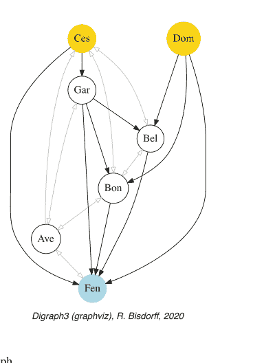

**清单4.7** 对优势有向图进行通过选择排序

```
>>> from transitiveDigraphs import \
...                 RankingByChoosingDigraph
>>> rbc = RankingByChoosingDigraph(bodcd)
Threading ... # multiprocessing if 2 cores are available
Exiting computing threads
>>> rbc.showRankingByChoosing()
Ranking by Choosing and Rejecting
    1st ranked ['D']
        2nd ranked ['C', 'G']
       2nd last ranked ['B', 'C', 'E']
    1st last ranked ['A', 'F']
>>> rbc.exportGraphViz('officeChoiceRanking')
*---- exporting a dot file for GraphViz tools ---------*
Exporting to officeChoiceRanking.dot
dot -Grankdir=TB -Tpng officeChoiceRanking.dot \
                        -o officeChoiceRanking.png
```

因此，最佳选择推荐取决于CEO对其每个决策目标所赋予的重要性。在给定的设定中，他认为最大化未来营业额是最重要的目标，其次是最小化成本，再次是最大化工作条件（重要性较低），地点D实际上代表了最佳折中。然而，如果成本不那么重要，那么决定搬迁到最有利的地点A可能更好；或者，相反，如果成本非常重要，搬迁到最便宜的备选方案C绝对可能是一个更具说服力的推荐（图4.4）。

图4.4
*对潜在办公室地点进行通过选择排序。* 在这种*通过选择排序*方法中，我们对迭代的（严格）首选和末选进行*认识融合*，折中方案Dom现在排在折中方案Gar之前。整体偏序结果再次显示了一个重要事实：最昂贵的地点Ave和最便宜的地点Ces，由于其相互矛盾的表现，与大多数其他备选方案均*不可比*

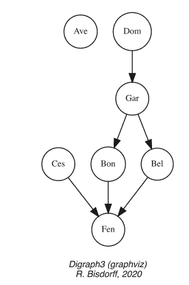

或许值得编辑`office Choice.py`数据文件中的标准重要性权重，使得：

-   所有三个决策目标被视为*同等重要*，并且
-   每个目标下的所有标准被视为*同等重要*。

在此工作假设下，最佳选择推荐将是什么？<sup>8</sup>

在下一章第5章中，我们将精确展示如何从给定的模板文件编辑新的性能矩阵。

## 注释

继2005年在LAMSADE<sup>9</sup>的一次研讨会演讲之后，作者在其中提倡使用优势有向图的核作为提供最佳选择推荐的合适候选者（Bisdorff 2005），一场关于令人信服的最佳选择推荐的方法论要求（即内部稳定性，实用原则 ℘3）的批判性讨论开始了。*Denis Bouyssou*用下一页图4.5所示的潜在优势有向图阐述了他的疑虑。

<sup>8</sup> 另见MICS算法决策理论课程讲义7的注释（Bisdorff 2020）。
<sup>9</sup> Laboratoires d'Analyse et de Modélisation de Systèmes d'Aide à la Décision, Université Paris-Dauphine, UMR 7243 CNRS.

## 第5章
如何创建新的多准则绩效评估表

# 目录

- 5.1 编辑模板文件
- 5.2 编辑决策备选方案
- 5.3 编辑决策目标
- 5.4 编辑绩效评估准则族
- 5.5 编辑绩效评估
- 5.6 检查模板优超关系

**摘要** 本章说明了通过编辑一个给定模板来创建新的`PerformanceTableau`实例的方法，该模板包含五个决策备选方案、三个决策目标和六个绩效评估准则。我们详细讨论了编辑决策备选方案、决策目标、绩效评估准则族，以及最后对决策备选方案在绩效评估准则上的评估。

## 5.1 编辑模板文件

为了便于编辑新的多准则绩效评估表，我们在DIGRAPH3资源的`examples`目录中提供了以下`perfTab_Template.py`文件。

**清单 5.1** PerformanceTableau对象模板

```python
###############################################
# Digraph3 documentation
# Template for creating a new PerformanceTableau instance
# (C) R. Bisdorff Mar 2021
# Digraph3/examples/perfTab_Template.py
###############################################
from decimal import Decimal
from collections import OrderedDict
#####
# edit the decision actions
# avoid special characters, like '_', '/' or ':',
# in action identifiers and short names
actions = OrderedDict([
('a1', {
 'shortName': 'action1',
 'name': 'decision alternative a1',
 'comment': 'some specific features of this alternative',
}),
...
...
]),
#####
# edit the decision objectives
# adjust the list of performance criteria
# and the total weight (sum of the criteria weights
# per objective
objectives = OrderedDict([
('obj1', {
 'name': 'decision objective obj1',
 'comment': "some specific features of this objective",
 'criteria': ['g1', 'g2'],
 'weight': Decimal('6'),
}),
...
...
])
#####
# edit the performance criteria
# adjust the objective reference
# Left Decimal of a threshold = constant part and
# right Decimal = proportional part of the threshold
criteria = OrderedDict([
('g1', {
 'shortName': 'crit1',
 'name': "performance criteria 1",
 'objective': 'obj1',
 'preferenceDirection': 'max',
 'comment': 'measurement scale type and unit',
 'scale': (Decimal('0.0'), Decimal('100.0'),
 'thresholds': {'ind': (Decimal('2.50'), Decimal('0.0')),
                'pref': (Decimal('5.00'), Decimal('0.0')),
                'veto': (Decimal('60.00'), Decimal('0.0'))
                },
 'weight': Decimal('3'),
}),
...
...
])
#####
# default missing data symbol = -999
NA = Decimal('-999')
#####
# edit the performance evaluations
# criteria to be minimized take negative evaluations
evaluation = {
'g1': {
   'a1':Decimal("41.0"),
   'a2':Decimal("100.0"),
   'a3':Decimal("63.0"),
   'a4':Decimal('23.0'),
   'a5': NA,
 },
 # g2 is of ordinal type and scale 0-10
'g2': {
   'a1':Decimal("4"),
   'a2':Decimal("10"),
   'a3':Decimal("6"),
   'a4':Decimal('2'),
   'a5':Decimal('9'),
 },
```

Digraph3 (graphviz), R. Bisdorff, 2020

**图 4.5** *一个最佳选择推荐的内部稳定性问题*
该有向图的唯一核是{a, d}；然而，这是一个模糊的推荐，因为{a, d}同时是一个优超选择和被优超选择。但是，如果最佳选择推荐的不稳定性不被视为问题，那么选择{a, b}显示出最具说服力的严格优超质量，并且可以优先考虑作为潜在的最佳选择推荐。

他的评论如下：将备选方案d添加到潜在最佳选择候选集中是不令人信服的，因为在给定的有向图中存在节点b，其评估优于d。认为a和d之间的不可比性应有利于d作为潜在最佳选择的论点很有趣，但另一个假设是b可能优超a。在后一种情况下，似乎很清楚，实际的最佳选择推荐应缩减为节点b，除非拥有其他信息，如绩效评估表和/或优超情况的实际计算方法。无论如何，在评判最佳选择程序时，必须对可用信息非常清楚。

此后，我们所有人都清楚地认识到，既缺乏特定的绩效评估表，也缺乏精确定义的算法来计算有效的优超情况，这使得无法判断给定的有向图是否确实模拟了潜在的优超关系。在我们当前的双极值认知方法中，一个有效的优超有向图实例，源自给定的绩效评估表和优超关系的析取认知融合构造（见第3章），必然满足弱完备性条件和余对偶原则。因此，不可比情况现在由认知不确定性建模，而不是由实际缺乏相互优超关系来建模。

*D. Bouyssou*在2005年10月讨论中提出的有向图不是弱完备的——节点a不优超节点d，反之亦然——因此，在我们当前的意义上，不代表一个有效的优超有向图实例。然而，它可能是一个部分竞赛图，因此可能是一个严格优超有向图，即一个有效优超有向图的非对称部分——余对偶。在这种情况下，节点a和d——严格优超有向图的核——实际上肯定会相互优超，因此都同样代表自然的最佳选择推荐。然而，在这个非严格余对偶有向图中，节点a也成为唯一的孔多塞赢家——肯定会优超所有其他节点——因此给出了明显的唯一最佳选择推荐。

直到2013年，当优超有向图的弱完备性和余对偶性质被发现后，人们才清楚地认识到，严格优超有向图的初始预核，结合相应核方程组的解，实际上提供了最具说服力的最佳选择推荐（见第17章、第20.4节和Bisdorff 2013）。一个有趣的开放数学问题是证明（或不证明）这两个必要条件——弱完备性和余对偶——是否也是将任何双极值有向图定性为潜在优超有向图实例的充分条件。

## 参考文献

Benayoun R, Roy B, Sussmann B (1966) ELECTRE: une méthode pour guider le choix en présence de points de vue multiples. Tech. Rep. 49, Société d’Economie et de Mathématique Appliqué, Direction Scientifique

Bisdorff R (2004) On a natural fuzzification of Boolean logic. In: Klement EP, Pap E (eds) Linz seminar on fuzzy set theory, mathematics of fuzzy systems, Bildungszentrum St. Magdalena, Linz (Austria), pp 20–26. http://hdl.handle.net/10993/23721

Bisdorff R (2005) Exploitation en problématique du choix d’une relation de surclassement valuée. http://hdl.handle.net/10993/47659

Bisdorff R (2006) On enumerating the kernels in a bipolar-valued digraph. Ann Lamsade 6:1–38. http://hdl.handle.net/10993/38741

Bisdorff R (2010) Enumerating chordless circuits in directed graphs. In: ORBEL24-2010, 24th annual conference of the Belgian Operational Research Society (ORBEL aka Sogesci-B.V.W.B.), January 28–29, Liège (BE), Université de Liège (BE), pp 1–12. http://hdl.handle.net/10993/23926

Bisdorff R (2013) On polarizing outranking relations with large performance differences. J Multi-Criteria Decis Anal Wiley 20:3–12. http://hdl.handle.net/10993/245

Bisdorff R (2020) Lecture 7: Best multiple criteria choice: the Rubis outranking method. In: Lectures of the algorithmic decision theory course, University of Luxembourg. http://hdl.handle.net/10993/37933

Bisdorff R (2021) Technical documentation of the Digraph3 collection of Python modules. https://digraph3.readthedocs.io/en/latest/techDoc.html

Bisdorff R, Pirlot M, Roubens M (2006) Choices and kernels from bipolar valued digraphs. Eur J Oper Res 175:155–170. http://hdl.handle.net/10993/23720

Keeney R, Raiffa H (1976) Decisions with multiple objectives: preferences and value tradeoffs. Cambridge University Press

Roy B (2000) A French-English decision aiding glossary. Newsl Eur Working Group Multicriteria Aid Decis 3(Suppl 1):1–10

## 5.2 编辑决策备选方案

决策备选方案以 `OrderedDict` 格式存储在 `actions` 属性中。`OrderedDict` 对象在遍历决策备选方案时保持此初始顺序。¹

每个决策备选方案，除了对象标识符²之外，所需的属性包括：`shortName`、`name` 和 `comment`（参见第55页清单5.1中的第15-17行）。`shortName` 属性主要用于在浏览器视图中显示性能矩阵或性能热图。

第6章介绍的随机性能矩阵模型使用 `actions` 属性来存储决策备选方案的特殊特征。例如，*成本-效益* 模型使用 `type` 属性来区分 *有利的*、*中性的* 和 *廉价的* 备选方案（参见第6.3节）。*3-目标* 模型则详细记录了每个决策目标的性能概况以及每个性能标准对应的随机生成器，如清单5.2所示。

**清单5.2** 决策备选方案描述示例

```python
>>> from randomPerfTabs import \
...             Random3ObjectivesPerformanceTableau
>>> t = Random3ObjectivesPerformanceTableau()
>>> t.actions
OrderedDict([
    ('p01', {'shortName': 'p01',
             'name': 'action p01 Eco- Soc- Env+',
             'comment': 'random public policy',
             'Eco': 'fair',
             'Soc': 'weak',
             'Env': 'good',
             'profile': {'Eco':'fair',
                         'Soc':'weak',
                         'Env':'good'},
             'generators': {'ec01': ('triangular', 50.0, 0.5),
                            'so02': ('triangular', 30.0, 0.5),
                            'en03': ('triangular', 70.0, 0.5),
                            ...
                            },
             }
    ),
    ...
    ])
```

> ¹ 参见Python文档中的 `OrderedDict` 描述（Python Software Foundation 2021）。

² 请注意，`graphviz` 绘图要求节点标识符字符串不包含任何特殊字符，如 `_` 或 `/`。

模板文件的第二部分涉及决策 *目标*。

## 5.3 编辑决策目标

有序决策 *目标* 字典的最小必需属性，除了各个目标标识符外，还包括：name（名称）、comment（注释）、criteria（重要性能标准列表）以及 weight（决策目标的重要性）。后一个属性包含该目标标准列表的 *显著性* 权重之和（参见第55页清单5.1中的第27-33行）。

*objectives* 属性在构建决策建议时，对于指定性能标准的显著性具有方法论上的实用性。通常，我们确实假设所有决策目标同等重要，并且每个目标下的性能标准具有相等的显著性。例如，这是随机 *3-目标* 性能矩阵模型中的默认设置。

**清单5.3** 决策目标描述示例

```python
>>> # t = Random3ObjectivesPerformanceTableau()
>>> t.objectives
OrderedDict([
('Eco',
 {'name': 'Economical aspect',
  'comment': 'Random3ObjectivesPerformanceTableau generated',
  'criteria': ['ec01', 'ec06', 'ec09'],
  'weight': Decimal('48')}),
('Soc',
 {'name': 'Societal aspect',
  'comment': 'Random3ObjectivesPerformanceTableau generated',
  'criteria': ['so02', 'so12'],
  'weight': Decimal('48')}),
('Env',
 {'name': 'Environmental aspect',
  'comment': 'Random3ObjectivesPerformanceTableau generated',
  'criteria': ['en03', 'en04', 'en05', 'en07',
               'en08', 'en10', 'en11', 'en13'],
  'weight': Decimal('48')})
])
```

在清单5.3所示的三个示例决策目标中，每个目标的重要性权重总和为48，因此3个经济标准的显著性权重各设为16，2个社会标准的显著性权重各设为24，6个环境标准的显著性权重各设为8（参见第8、13和19行）。

请注意，即使为空，`objectives` 属性也始终存在于性能矩阵对象实例中。在这种情况下，我们认为每个性能标准都规范地代表其自身的决策目标。此时，标准的显著性权重等于相应决策目标的重要性权重。

模板文件的第三部分现在涉及性能标准。

## 5.4 编辑性能标准族

为了评估每个潜在决策备选方案在多大程度上满足给定的决策目标，我们需要性能标准，即收集在有序标准字典中的十进制值评估函数。所需属性（参见清单5.4）除了标准标识符外，还包括通常的 `shortName`、`name` 和 `comment`。特定于标准的属性还包括：目标引用、显著性权重、评估量表（最小和最大性能值）、`preferenceDirection`（'max' 或 'min'）以及性能区分阈值属性。

**清单5.4** 性能标准描述示例

```python
criteria = OrderedDict([
('g1', {
 'shortName': 'crit1',
 'name': "performance criteria 1",
 'comment': 'measurement scale type and unit',
 'objective': 'obj1',
 'weight': Decimal('3'),
 'scale': (Decimal('0.0'), Decimal('100.0')),
 'preferenceDirection': 'max',
 'thresholds': {'ind': (Decimal('2.50'), Decimal('0.0')),
                'pref': (Decimal('5.00'), Decimal('0.0')),
                'veto': (Decimal('60.00'), Decimal('0.0'))
                },
 }),
...
...])
```

在我们的双极值偏好排序方法中，所有性能标准都实现 *十进制值* 评估函数，其中偏好随测量性能的增加而 *递增* 或 *递减*。为了建模一个 *连贯的* 性能矩阵，决策标准族必须满足两个方法论要求：

1.  *独立性*：每个决策标准实现的评估在功能上 *独立于* 其他决策标准的评估，即在一个标准上评估的性能不会在任何意义上 *约束* 在任何其他标准上评估的性能。
2.  *非冗余性*：每个性能标准仅对 *单个* 决策目标 *显著*。

为了考虑性能评估过程中任何通常 *不可避免的不精确性*，我们可以指定三个性能 *区分阈值*：*无差异*（*ind*）、*偏好*（*pref*）和 *显著性能差异*（*veto*）阈值（参见前一页清单5.4中的第10-12行）。阈值描述元组中的左侧十进制数表示 *常量* 部分，而右侧十进制数表示 *比例* 部分。

在清单5.4所示的模板性能标准 g1 上，我们观察到，例如，评估量表从0.0到100.0，具有2.5的常量 *无差异* 阈值、5.0的常量 *偏好* 阈值和60.0的常量 *显著性能差异* 阈值。在给定情况下，后一个阈值将触发偏好排序陈述的 *极化*（Bisdorff 2013）。

在随机 *成本-效益* 性能矩阵模型中，我们默认可能获得以下基数 *成本* 标准的描述：

**清单5.5** 基数 *成本* 标准示例

```python
>>> from randomPerfTabs import \
...                 RandomCBPerformanceTableau
>>> tcb = RandomCBPerformanceTableau()
>>> tcb.showObjectives()
*------- decision objectives -------*
C: Costs
  c1 random cardinal cost criterion 6
  Total weight: 6.00 (1 criteria)
  ...
...
>>> tcb.criteria
OrderedDict([
  ('c1', {'preferenceDirection': 'min',
          'scaleType': 'cardinal',
          'objective': 'C',
          'shortName': 'c1',
          'name': 'random cardinal cost criterion',
          'scale': (0.0, 100.0),
          'weight': Decimal('6'),
          'randomMode': ['triangular', 50.0, 0.5],
          'comment': 'Evaluation generator: triangular law ...',
```

## 5.5 编辑绩效评估

每个决策备选方案在每个决策准则上的个体评估记录在一个名为 *evaluation* 的双层 *准则 × 行动* 字典中（参见清单 5.5）。由于我们可能会遇到数据缺失的情况，我们预先定义了一个 *缺失数据* 符号 NA，其默认值设置为与所有测量尺度都不相交的 `Decimal('-999')`（参见下一页清单 5.6 的第 2 行）。

### 清单 5.6 编辑绩效评估

```python
#----------
NA = Decimal('-999')
#----------
evaluation = {
  'g1': {
    'a1':Decimal("41.0"),
    'a2':Decimal("100.0"),
    'a3':Decimal("63.0"),
    'a4':Decimal('23.0'),
    'a5': NA,  # missing data
  },
  ...
  ...
  # g3 has preferenceDirection = 'min'
  'g3': {
    'a1':Decimal("-52.2"), # negative grades
    'a2':NA,
    'a3':Decimal("-47.3"),
    'a4':Decimal('-35.7'),
    'a5':Decimal('-68.00'),
  },
  ...
  ...
}
```

请注意清单 5.6 中，在 `preferenceDirection = 'min'` 的准则上，所有绩效评估都记录为 *负* 值（第 16 行及后续行）。

我们现在可以通过 `showPerformanceTableau()` 方法查看最终编辑完成的模板绩效矩阵 `perfTab_Template.py`。

```python
>>> from perfTabs import PerformanceTableau
>>> pt = PerformanceTableau('perfTab_Template')
>>> pt.showPerformanceTableau(ndigits=1)
*----  performance tableau ----*
 Criteria  |  'g1'  'g2'  'g3'  'g4'  'g5'  'g6'
 Actions   |    3     3     6     2     2     2
 ----------|------------------------------------
 'action1' |  41.0   4.0  -52.2  71.0  63.0  22.5
 'action2' | 100.0  10.0    NA   89.0  30.7  75.0
 'action3' |  63.0   6.0  -47.3  55.4  63.5    NA
 'action4' |  23.0   2.0  -35.7  83.5  37.5  54.9
 'action5' |    NA   9.0  -68.0  10.0  88.0  75.0
```

下面计算相关的双极偏好排序有向图 `bod`，以检查是否存在任何极化的偏好排序情况。

```python
>>> from outrankingDigraphs import BipolarOutrankingDigraph
>>> bod = BipolarOutrankingDigraph(pt)
>>> bod.showPolarisations()
*----  Negative polarisations ----*
number of negative polarisations : 1
1: r(a4 >= a2) = -0.44
    criterion: g1
    Considerable performance difference : -77.00
    Veto discrimination threshold : -60.00
    Polarisation: r(a4 >= a2) = -0.44 ==> -1.00
*---- Positive polarisations ----*
number of positive polarisations : 1
1: r(a2 >= a4) = 0.56
    criterion: g1
    Considerable performance difference : +77.00
    Counter-veto threshold : 60.00
    Polarisation: r(a2 >= a4) = 0.56 ==> +1.00
```

确实，由于在绩效准则 g1 上观察到的显著正绩效差异（+77.00），备选方案 a2 *“肯定优于”* 备选方案 a4，反之，a4 *“肯定不优于”* a2。

## 5.6 检查模板偏好排序关系

在清单 5.7 中，`showRelationTable()` 方法打印出偏好排序关系表。

### 清单 5.7 模板偏好排序关系

```python
>>> bod.showRelationTable()
* ---- Relation Table ----
  r   |  'a1'  'a2'  'a3'  'a4'  'a5'
------|---------------------------------
'a1'  | +1.00 -0.44 -0.22 -0.11 +0.06
'a2'  | +0.44 +1.00 +0.33 +1.00 +0.28
'a3'  | +0.67 -0.33 +1.00 +0.00 +0.17
'a4'  | +0.11 -1.00 +0.00 +1.00 +0.06
'a5'  | -0.06 -0.06 -0.17 -0.06 +1.00
```

可以注意到，在上面的偏好排序关系表中，决策备选方案 a2 正向 *优于* 其他所有四个备选方案（第 6 行）。类似地，备选方案 a5 被所有其他备选方案正向 *优于*（参见第 9 行）。我们可以据此来确定模板偏好排序有向图的 *graphviz* 绘图方向。

```python
>>> bod.exportGraphViz(fileName= 'template',
...                     firstChoice =['a2'],
...                     lastChoice=['a5'])
*---- exporting a dot file for GraphViz tools -------*
  Exporting to template.dot
  dot -Grankdir=BT -Tpng template.dot -o template.png
```

在下一页的图 5.1 中，备选方案 *action3* (a3) 和 *action4* (a4) 实际上是 *不可比* 的。在清单 5.7 中，它们的成对偏好排序特征确实显示为 *不确定* 值 0.00（第 7-8 行）。

检查它们的成对比较可以使用 `showPairwiseComparison()` 方法：

```python
>>> bod.showPairwiseComparison('a3','a4')
*------------ pairwise comparison ----*
Comparing actions : ('a3','a4')
crit. wght. g(a3) g(a4) diff | ind pref r() |
---------------------------------------------
'g1' 3.00 63.00 23.00 +40.00 | 2.50 5.00 +3.00 |
'g2' 3.00 6.00 2.00 +4.00 | 0.00 1.00 +3.00 |
'g3' 6.00 -47.30 -35.70 -11.60 | 0.00 10.00 -6.00 |
'g4' 2.00 55.40 83.50 -28.10 | 2.09 4.18 -2.00 |
'g5' 2.00 63.50 37.50 +26.00 | 0.00 10.00 +2.00 |
'g6' NA 54.90
Outranking characteristic value: r(a3 >= a4) = +0.00
Valuation in range: -18.00 to +18.00
```

a3 和 a4 之间的不可比情况实际上是由于正（+8）负（-8）准则重要性权重的完美平衡造成的。

这五个决策备选方案最终可以按照 COPELAND 排序规则（参见第 8.2 节）通过热图浏览器视图进行排序，该规则一致地再现了图 5.1 所示的部分偏好排序序。

```python
>>> bod.showHTMLPerformanceHeatmap(ndigits=1,
...     colorLevels=5, Correlations=True,
...     rankingRule='Copeland',
...     pageTitle=
...     'Heatmap of the template performance tableau')
```

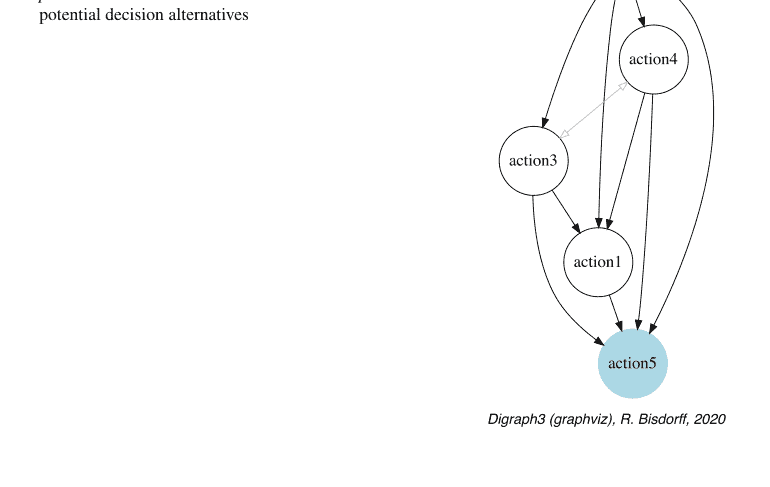

### 图 5.2 模板绩效矩阵的 COPELAND 排序热图

| criteria | crit4 | crit1 | crit3 | crit2 | crit6 | crit5 |
|---|---|---|---|---|---|---|
| weights | +2.00 | +3.00 | +6.00 | +3.00 | +2.00 | +2.00 |
| tau(*) | +0.60 | +0.40 | +0.35 | +0.20 | +0.10 | -0.60 |
| action2 | 89.0 | 100.0 | NA | 10.0 | 75.0 | 30.7 |
| action3 | 55.4 | 63.0 | -47.3 | 6.0 | NA | 63.5 |
| action4 | 83.5 | 23.0 | -35.7 | 2.0 | 54.9 | 37.5 |
| action1 | 71.0 | 41.0 | -52.2 | 4.0 | 22.5 | 63.0 |
| action5 | 10.0 | NA | -68.0 | 9.0 | 75.0 | 88.0 |

颜色图例：
分位数 20.00% 40.00% 60.00% 80.00% 100.00%

(*) tau：边际准则与全局排序关系之间的序数（Kendall）相关性
偏好排序模型：标准，排序规则：Copeland
全局排序与全局偏好排序关系之间的序数（Kendall）相关性：+1.000
平均边际相关性 (a) : +0.228
标准边际相关性偏差 (b) : +0.322
排序公平性 (a) - (b) : -0.094

### 图 5.3 模板绩效矩阵的 NETFLOWS 排序热图

| criteria | crit2 | crit6 | crit1 | crit4 | crit3 | crit5 |
|---|---|---|---|---|---|---|
| weights | +3.00 | +2.00 | +3.00 | +2.00 | +6.00 | +2.00 |
| tau(*) | +0.60 | +0.50 | +0.40 | +0.20 | -0.05 | -0.20 |
| action2 | 10.0 | 75.0 | 100.0 | 89.0 | NA | 30.7 |
| action3 | 6.0 | NA | 63.0 | 55.4 | -47.3 | 63.5 |
| action5 | 9.0 | 75.0 | NA | 10.0 | -68.0 | 88.0 |
| action4 | 2.0 | 54.9 | 23.0 | 83.5 | -35.7 | 37.5 |
| action1 | 4.0 | 22.5 | 41.0 | 71.0 | -52.2 | 63.0 |

颜色图例：
分位数 20.00% 40.00% 60.00% 80.00% 100.00%

(*) tau：边际准则与全局排序关系之间的序数（Kendall）相关性
偏好排序模型：标准，排序规则：NetFlows
全局排序与全局偏好排序关系之间的序数（Kendall）相关性：+0.920
平均边际相关性 (a) : +0.206
标准边际相关性偏差 (b) : +0.286
排序公平性 (a) - (b) : -0.081

由于 8 对 7 的多数暴政效应，主要基于精确多数偏好排序计数的 COPELAND 排序规则在此将备选方案 action5 (a5) 排在最后，尽管它在准则 g2、g5 和 g6 上观察到了出色的评估（图 5.2）。
使用 NETFLOWS 排序规则（参见第 8.3 节）可以在图 5.3 中获得稍微更公平的排序结果。

```python
>>> bod.showHTMLPerformanceHeatmap(ndigits=1,
...     colorLevels=5, Correlations=True,
...     rankingRule='NetFlows',
...     pageTitle=
...     'Heatmap of the template performance tableau')
```

在假设*不确定*或仅为*序数*准则重要性权重的情况下，进一步研究明显优超情况的稳健性可能是适时的（参见第18章和第19章）。

下一章第6章介绍了DIGRAPH3资源，用于生成各种类型的随机多准则性能表，如成本-效益表、三目标表或学术表。

## 参考文献

Bisdorff R (2013) On polarizing outranking relations with large performance differences. J Multi-Criteria Decis Anal Wiley 20:3–12. http://hdl.handle.net/10993/245

Python Software Foundation (2021) Python documentation. https://docs.python.org/3/

## 第6章
生成随机性能表

# 目录

- 6.1 引言
- 6.2 随机标准性能表
- 6.3 随机成本-效益性能表
- 6.4 随机三目标性能表
- 6.5 随机学术性能表

**摘要** 本章介绍了DIGRAPH3资源，用于生成随机多准则性能表，如*成本-效益*表、三目标——*经济*、*社会*和*环境*——表，以及*学术*性能表。

### 6.1 引言

`randomPerfTabs`模块提供了多个类，用于生成不同类型的随机性能表模型，主要用于测试卢森堡大学算法决策理论课程讲座中介绍和讨论的已实现方法和工具。本章将介绍其中几种性能表模型。

最简单的类名为`RandomPerformanceTableau`，它生成一组*n*个决策行动、一个包含*m*个实数值性能准则的族（默认范围从0.0到100.0），并关联默认的区分阈值：2.5（无差异）、5.0（偏好）和60.0（否决）。生成的随机评估值默认在每个测量尺度上服从Beta(2, 2)分布。

其中一个最有用的模型涉及两个决策目标，分别命名为*成本*（需最小化）和*效益*（需最大化），由`RandomCBPerformanceTableau`类提供；其目的是在这两个通常相互冲突的目标上生成或多或少矛盾的性能。*低成本*将随机与*低效益*相关联，而*高成本*将随机与*高效益*相关联。

许多公共政策决策问题通常涉及三个或多或少相互冲突的决策目标，需考虑*经济*、*社会*以及*环境*方面。对于这类性能表模型，`randomPerfTabs`模块提供了一个特定的类，名为`Random3ObjectivesPerformanceTableau`。

根据学生在若干门考试中获得的成绩，决定哪些学生是否完成其学业，是大学和学院真正的决策实践。为了深入研究这类决策问题，`randomPerfTabs`模块提供了一个相应的性能表模型，名为`RandomAcademicPerformanceTableau`，它收集了给定数量的学生在给定数量的加权课程中获得的成绩。

### 6.2 随机标准性能表

`RandomPerformanceTableau`类是此类中最简单的，它特化了通用的`PerformanceTableau`类，并接受以下参数：

- `numberOfActions` := 决策行动的数量。
- `numberOfCriteria` := 性能准则的数量。
- `weightDistribution` := 'random'（默认）| 'fixed' | 'equisignificant'：
  - 如果为'random'，权重从给定的权重尺度中均匀随机选择；
  - 如果为'fixed'，`weightScale`必须提供相应的权重分布；
  - 如果为'equi-significant'，所有准则权重均设为1。
- `weightScale` := [最小值, 最大值]（默认 = (1, numberOfCriteria)）。
- `IntegerWeights` := True（默认）| False（归一化为1.0的比例）。
- `commonScale` := [a, b]；通用性能测量尺度（默认 = [0.0, 100.0]）。
- `commonThresholds` := [(q0, q1), (p0, p1), (v0, v1)]；无差异(q)、偏好(p)和显著性能差异(v)区分阈值。对于每种阈值类型x ∈ {q, p, v}，浮点数x0值表示通用尺度的*恒定百分比*，浮点数x1值表示实际性能测量的*比例值*。默认值为[(2.5, 0.0), (5.0, 0.0), (60.0, 0.0)]。
- `commonMode` := 随机性能测量的通用分布：¹
  - ('beta', None（默认设置）, (α, β))，一个Beta生成器，默认参数α = 2和β = 2。
  - ('uniform', None, None)，在给定通用尺度范围[最小值, 最大值]上均匀分布的浮点值；
  - ('normal', μ, σ)，截断高斯分布，默认μ = (b-a)/2且σ = (b-a)/4；
  - ('triangular', mode, repartition)，广义三角分布，其中概率分配参数指定累积到众数值的概率质量。默认mode = (b - a)/2且repartition=0.5。²
- `valueDigits` := 整数，性能测量的精度（默认为2位小数）。
- `missingDataProbability` := 0.0 ≤ 浮点数 ≤ 1.0；某个行动在某个准则上缺失性能评估的概率（默认0.025）。
- `NA` := Decimal（默认 = -999）；缺失数据符号。

¹ 参见计算统计课程讲座3（Bisdorff 2020）。
² `randomNumbers`模块为此提供了ExtendedTriangular-RandomVariable类。

### 代码示例

清单6.1 生成随机性能表

```python
>>> from randomPerfTabs import RandomPerformanceTableau
>>> t = RandomPerformanceTableau(numberOfActions=21,
...                             numberOfCriteria=13,seed=100)
>>> t.actions
  {'a01': {
    'comment': 'RandomPerformanceTableau() generated.',
    'name': 'random decision action'
    },
    'a02': { ... },
   ...
  }
>>> t.criteria
  {'g01': {
    'thresholds': {
      'ind' : (Decimal('10.0'), Decimal('0.0')),
      'veto': (Decimal('80.0'), Decimal('0.0')),
      'pref': (Decimal('20.0'), Decimal('0.0'))},
    'scale': [0.0, 100.0],
    'weight': Decimal('1'),
    'name': 'RandomPerformanceTableau() instance',
    'comment': "Arguments: weightDistribution=random;
                            weightScale=(1, 1);
                            commonMode=None"
},
'g02': { ... },
...
}
>>> t.NA
Decimal('-999')
>>> t.evaluation
{'g01': {'a01': Decimal('15.17'),
         'a02': Decimal('44.51'),
         'a03': Decimal('-999'), # 缺失评估
         ... },
...
}
>>> t.showHTMLPerformanceTableau()
```

每个准则上的最高和最低评估值分别用*浅绿色*和*浅红色*标记。请注意，缺失（NA）评估值在性能表中默认记录为Decimal('-999')值（参见前一页清单6.1第28-29行；图6.1）。

### 性能表 randomperftab

| 准则 | g01 | g02 | g03 | g04 | g05 | g06 | g07 | g08 | g09 | g10 | g11 | g12 | g13 |
|---|---|---|---|---|---|---|---|---|---|---|---|---|---|
| 权重 | 1.00 | 1.00 | 1.00 | 1.00 | 1.00 | 1.00 | 1.00 | 1.00 | 1.00 | 1.00 | 1.00 | 1.00 | 1.00 |
| a01 | 15.17 | 46.37 | 82.88 | 41.14 | 59.94 | 41.19 | 58.68 | 44.73 | 22.19 | 64.64 | 34.93 | 42.36 | 17.55 |
| a02 | 44.51 | 16.22 | 41.66 | 53.58 | 31.39 | 65.22 | 71.96 | 57.84 | 78.08 | 77.37 | 8.30 | 63.41 | 61.55 |
| a03 | NA | 21.53 | 12.82 | 56.93 | 26.80 | 48.03 | 54.35 | 62.42 | 94.27 | 73.57 | 71.11 | 21.81 | 56.90 |
| a04 | 58.00 | 51.16 | 21.92 | 65.57 | 59.02 | 44.77 | 37.49 | 58.39 | 80.79 | 55.39 | 46.44 | 19.57 | 39.22 |
| a05 | 24.22 | 77.01 | 75.74 | 83.87 | 40.85 | 8.55 | 85.44 | 67.34 | 57.40 | 39.08 | 64.83 | 29.37 | 96.39 |
| a06 | 29.10 | 39.35 | 15.45 | 34.99 | 49.12 | 11.49 | 28.44 | 52.89 | 64.24 | 62.92 | 58.28 | 32.02 | 10.25 |
| a07 | 96.58 | 32.06 | 6.05 | 49.56 | NA | 66.06 | 41.64 | 13.08 | 38.31 | 24.82 | 48.39 | 57.03 | 42.91 |
| a08 | 82.29 | 47.67 | 9.96 | 79.43 | 29.45 | 84.17 | 31.99 | 90.88 | 39.58 | 50.78 | 61.88 | 44.40 | 48.26 |
| a09 | 43.90 | 14.81 | 60.55 | 42.37 | 6.72 | 56.14 | 34.20 | 51.54 | 21.79 | 79.13 | 50.95 | 93.16 | 81.89 |
| a10 | 38.75 | 79.70 | 27.88 | 42.39 | 71.88 | 66.09 | 58.33 | 58.88 | 17.10 | 44.25 | 48.73 | 30.63 | 52.73 |
| a11 | 35.84 | 67.48 | 38.81 | 33.75 | 26.87 | 64.10 | 71.95 | 62.72 | NA | 85.80 | 58.37 | 49.33 | NA |
| a12 | 29.12 | 13.97 | 67.45 | 38.60 | 48.30 | 11.87 | NA | 57.76 | 74.86 | 26.57 | 48.80 | 43.57 | 7.68 |
| a13 | 34.79 | 90.72 | 38.93 | 57.38 | 64.14 | 97.86 | 91.16 | 43.80 | 33.68 | 38.98 | 28.87 | 63.36 | 60.03 |
| a14 | 62.22 | 80.16 | 19.26 | 62.34 | 60.96 | 24.72 | 73.63 | 71.21 | 56.43 | 46.12 | 26.09 | 51.43 | 12.86 |
| a15 | 44.23 | 69.62 | 94.95 | 34.95 | 63.46 | 52.97 | 98.84 | 78.74 | 36.64 | 65.12 | 22.46 | 55.52 | 68.79 |
| a16 | 19.10 | 45.49 | 65.63 | 64.96 | 50.57 | 55.91 | 10.02 | 34.70 | 29.31 | 50.15 | 70.68 | 62.57 | 71.09 |
| a17 | 27.73 | 22.03 | 48.00 | 79.38 | 23.35 | 74.03 | 58.74 | 59.42 | 50.95 | 82.27 | 49.20 | 43.27 | 38.61 |
| a18 | 41.46 | 33.83 | 7.97 | 75.11 | 49.00 | 55.70 | 64.99 | 38.47 | 49.86 | 17.45 | 28.08 | 35.21 | 67.81 |
| a19 | 22.41 | NA | 34.86 | 49.30 | 65.18 | 39.84 | 81.16 | NA | 55.99 | 66.55 | 55.38 | 43.08 | 29.72 |
| a20 | 21.52 | 69.98 | 71.81 | 43.74 | 24.53 | 55.39 | 52.67 | 13.67 | 66.80 | 57.46 | 70.81 | 5.41 | 76.05 |
| a21 | 56.90 | 48.80 | 31.66 | 15.31 | 40.57 | 58.14 | 70.19 | 67.23 | 61.10 | 31.04 | 60.72 | 22.39 | 70.38 |

图6.1 浏览器视图中的随机性能表实例

## 6.3 随机成本-效益绩效表

`randomPerfTabs` 模块提供了一个 `RandomCBPerformanceTableau` 类，用于生成按*成本*与*效益*组织的绩效表。默认情况下，随机生成器遵循以下指令：

-   区分三种类型的决策行动：*廉价*、*中性*和*昂贵*，各占1/3的相同比例。同时区分两种类型的加权标准：需要*最小化*的*成本*标准和需要*最大化*的*效益*标准，比例分别为1/3和2/3；
-   每种类型的标准上的随机绩效从序数尺度 [0; 10] 或基数尺度 [0.0; 100.0] 中抽取，遵循参数三角分布，其众数分别为：廉价决策行动的30%绩效，中性决策行动的50%绩效，以及昂贵决策行动的70%绩效，在各自众数的两侧具有恒定的概率分布0.5；
-   成本标准主要使用基数尺度（3/4），而效益标准主要使用序数尺度（2/3）；
-   成本标准的权重总和默认等于效益标准的权重总和：`weighDistribution = 'equiobjectives'`；
-   在基数标准上，无论是成本类型还是效益类型，都实例化以下恒定的绩效区分分位数：5%的无差异情况，90%的偏好情况，以及5%的显著绩效差异情况。

### 参数

-   如果 `numberOfActions == None`，则实例化一个在10到31之间的均匀随机数个*廉价*、*中性*或*有利*行动（每种类型概率相等，均为1/3）。所需的最小决策行动数为3；
-   如果 `numberOfCriteria == None`，则实例化一个在5到21之间的均匀随机数个成本或效益标准（概率分别为1/3和2/3）；
-   `weightDistribution := 'equisignificant'`（默认）| `'equiobjectives'` | `'fixed'` | `'random'`；
-   对于 `'random'` 权重分布，默认的 `weightScale` 为 1 - `numberOfCriteria`；
-   所有*基数*标准的评估值为0.0到100.0之间的小数，而*序数*标准的评估值为0到10之间的整数。
-   `commonThresholds` 已过时。偏好区分被指定为相关绩效差异的*百分位数*（见下文）。
-   `commonPercentiles := {'ind': 5, 'pref': 10, 'veto': 95}` 以百分比表示（对于否决是反向的），并且仅涉及基数标准。
-   `missingDataProbability := 0.0 <= float <= 1.0`；某个备选方案在某个标准上缺失绩效评估的概率（默认为0.025）。
-   `NA := Decimal`（默认 = -999）；缺失数据符号。

## 示例 Python 会话

清单 6.2 生成一个随机成本-效益绩效表

```
>>> from randomPerfTabs import
...                 RandomCBPerformanceTableau
>>> t = RandomCBPerformanceTableau(
...             numberOfActions=7,
...             numberOfCriteria=5,
...             weightDistribution='equiobjectives',
...             commonPercentiles={'ind':0.05,
...                                 'pref':0.10,
...                                 'veto':0.95},
...             seed=100)
>>> t.showActions()
  *----- show decision action ---------------*
    key:  a1
      short name: a1c
      name:  random cheap decision action
    key:  a2
      short name: a2n
      name:  random neutral decision action
    ...
    key:  a7
      short name: a7a
      name:  random advantageous decision action
>>> t.showCriteria()
  *----  criteria ----*
    b1 'random ordinal benefit criterion'
     Preference direction: max
     Scale = (0, 10)
     Weight = 3
     ...
    c1 'random cardinal cost criterion'
     Preference direction: min
     Scale = (0.0, 100.0)
     Weight = 2
     Threshold ind  :  1.76 + 0.00x ; percentile:  9.5
     Threshold pref :  2.16 + 0.00x ; percentile: 14.3
     Threshold veto : 73.19 + 0.00x ; percentile: 95.2
     ...}
```

在清单6.2中，可以注意到三种类型的决策行动（见第12-22行），以及两种类型的标准，它们分别使用*序数*或*基数*绩效测量尺度（第24-36行）。在后一种情况下，默认情况下，大约5%的随机绩效差异将低于*无差异*区分阈值，10%低于*偏好*区分阈值。大约5%将是*显著较大*的。可以使用 `showStatistics()` 方法检查生成的绩效评估的更多统计数据。

## 6.3 随机成本-效益绩效表

```
>>> t.showStatistics()
*-------- Performance tableau summary statistics --------*
Instance name : randomCBperftab
Actions : 7
Criteria : 5
Criterion name : b1
Criterion weight : 3
criterion scale : 0.00 - 10.00
mean evaluation : 5.14
standard deviation : 2.64
maximal evaluation : 8.00
quantile Q3 (x_75) : 8.00
median evaluation : 6.50
quantile Q1 (x_25) : 3.50
minimal evaluation : 1.00
mean absolute difference : 2.94
standard difference deviation : 3.74
...
Criterion name : c1
Criterion weight : 2
criterion scale : -100.00 - 0.00
mean evaluation : -49.32
standard deviation : 27.59
maximal evaluation : 0.00
quantile Q3 (x_75) : -27.51
median evaluation : -35.98
quantile Q1 (x_25) : -54.02
minimal evaluation : -91.87
mean absolute difference : 28.72
standard difference deviation : 39.02
...
```

一个具有五个颜色级别的热图视图给出了下一页图6.2所示的结果。

```
>>> t.showHTMLPerformanceHeatmap(colorLevels=5,
...     rankingRule=None,
...     pageTitle='Random Cost-Benefit Performance Tableau')
```

这样的绩效表可以使用 `save()` 方法存储，并使用 `PerformanceTableau` 类重新加载：

```
>>> t.save('temp')
*----- saving performance tableau in XMCDA 2.0 format
-----------*
File: temp.py saved !
>>> from perfTabs import PerformanceTableau
>>> t = PerformanceTableau('temp')
```

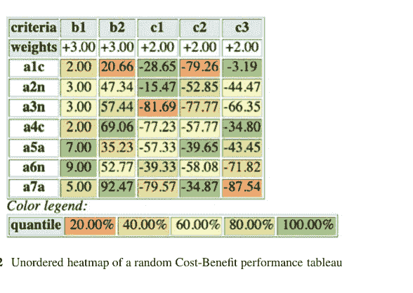

图 6.2 随机成本-效益绩效表的无序热图

## 6.4 随机三目标绩效表

`randomPerfTabs` 模块提供了一个 `Random3ObjectivesPerformanceTableau` 类，用于生成关于公共政策的随机绩效表，这些政策根据三个决策目标进行评估，分别考虑*经济*、*社会*和*环境*方面。每个潜在的公共政策被随机定性为在三个目标中的每一个上表现*弱*（−）、*一般*（~）或*良好*（+）。

**生成器指令如下**

-   `numberOfActions = 20`（默认），最小要求为3；
-   `numberOfCriteria = 13`（默认），
-   `weightDistribution = 'equiobjectives'`（默认）| `'random'` | `'equisignificant'`，
-   `weightScale = (1,numberOfCriteria)`：仅在请求随机标准权重时使用，
-   `integerWeights = True`（默认）：False 给出归一化的有理权重，
-   `commonScale = (0.0,100.0)`，
-   `commonThresholds = [(5.0, 0.0), (10.0, 0.0), (60.0, 0.0)]`：可以为 'ind'、'pref' 和 'veto' 阈值设置绩效区分阈值，
-   `commonMode = ['triangular','variable',0.5]`：其他类型的随机数生成器（'uniform'、'beta'）也可用。如果 'triangular' 分布的众数设置为 'variable'，则对于每个联盟和行动，会在共同尺度范围的0.3(−)、0.5(~)和0.7(+)处随机设置三个众数。
-   `valueDigits = 2`（默认）：评估值编码为小数，
-   `missingDataProbability = 0.05`（默认）：以给定概率随机插入缺失值，
-   `NA := Decimal`（默认 = Decimal('-999')）；缺失数据符号，
-   `seed = None`（默认）。

## 示例 Python 会话

清单 6.3 生成一个随机三目标绩效表

```
>>> from randomPerfTabs import
...                 Random3ObjectivesPerformanceTableau
>>> t = Random3ObjectivesPerformanceTableau(
...                 numberOfActions=7,
...                 numberOfCriteria=13,
...                 weightDistribution='equiobjectives',
...                 seed=120)
>>> t
  *------- PerformanceTableau instance description -------*
 Instance class     : Random3ObjectivesPerformanceTableau
 Seed               : 120
 Instance name      : random3ObjectivesPerfTab
 Actions            : 7
 Objectives         : 3
 Criteria           : 13
 NaN proportion (%) : 2.2
 Attributes         : ['name', 'valueDigits', 'BigData',
     'OrdinalScales', 'missingDataProbability',
     'negativeWeightProbability', 'randomSeed',
     'sumWeights', 'valuationPrecision', 'commonScale',
     'objectiveSupportingTypes', 'actions', 'objectives',
     'criteriaWeightMode', 'criteria',
     'weightPreorder', 'evaluation', 'NA']
```

默认的缺失数据概率为5%。在我们这个随机实例中，我们观察到2.2%的缺失评估（见第16行）。'equiobjectives' 指令（见第6行）因此导致每个决策目标的总权重平衡（72.00），如下所示的 `showObjectives()` 方法所示。

清单 6.4 检查三个目标

```
>>> t.showObjectives()
  *------- show objectives -------"
  Eco: Economical aspect
    ec01 criterion of objective Eco 18
    ec05 criterion of objective Eco 18
    ec06 criterion of objective Eco 18
    ec12 criterion of objective Eco 18
  Total weight: 72.00 (4 criteria)
  Soc: Societal aspect
   so02 criterion of objective Soc 24
   so11 criterion of objective Soc 24
   so13 criterion of objective Soc 24
```

## 性能表 random3ObjectivesPerfTab

| 标准 | ec01 | ec05 | ec06 | ec12 | en03 | en04 | en07 | en08 | en09 | en10 | so02 | so11 | so13 |
|---|---|---|---|---|---|---|---|---|---|---|---|---|---|
| 权重 | 18.00 | 18.00 | 18.00 | 18.00 | 12.00 | 12.00 | 12.00 | 12.00 | 12.00 | 12.00 | 24.00 | 24.00 | 24.00 |
| p1 | 31.05 | 26.95 | 35.91 | 32.85 | 68.88 | 70.52 | 22.94 | 50.04 | 17.06 | 32.52 | 20.90 | NA | 62.37 |
| p2 | 12.54 | 11.31 | 29.63 | 9.77 | 43.09 | 36.04 | 32.96 | 54.35 | 82.25 | 22.29 | 75.76 | 51.42 | 27.96 |
| p3 | 30.70 | 58.45 | 38.31 | 24.89 | 72.36 | 87.02 | 30.57 | 80.17 | 90.38 | 86.60 | 54.51 | 43.21 | 6.58 |
| p4 | 16.18 | 61.70 | 60.27 | 15.10 | 26.63 | 66.28 | 12.84 | 58.78 | 86.68 | 57.92 | NA | 71.91 | 70.18 |
| p5 | 86.00 | 89.43 | 44.41 | 18.32 | 31.10 | 74.55 | 29.89 | 40.26 | 26.86 | 41.91 | 23.83 | 57.41 | 22.41 |
| p6 | 77.65 | 94.24 | 24.75 | 65.64 | 3.85 | 36.15 | 47.36 | 81.22 | 72.54 | 80.54 | 27.25 | 37.04 | 34.11 |
| p7 | 72.26 | 44.62 | 70.55 | 29.82 | 52.69 | 37.80 | 50.06 | 28.27 | 28.53 | 29.50 | 29.81 | 41.38 | 26.31 |

图 6.3 给定随机三目标性能表的浏览器视图

**清单 6.5** 作为最佳选择推荐的公共政策是什么？

```
>>> from outrankingDigraphs import
...         BipolarOutrankingDigraph
>>> g = BipolarOutrankingDigraph(t)
>>> g.showBestChoiceRecommendation()
 ********************
Rubis 最佳选择推荐 (BCR)
（按确定性递减顺序）
可信域：[-1.00,1.00]
=== >> 潜在首选
 * 选择                : ['p3', 'p4', 'p5', 'p6']
   独立性              : 0.00
   支配性              : 0.17
   吸收性              : -1.00
   覆盖率 (%)          : 41.67
   确定性 (%)          : 52.98
   - 最可信行动 = { 'p3': 0.17, }
=== >> 潜在末选
 * 选择                : ['p1', 'p2', 'p5', 'p7']
   独立性              : 0.00
   支配性              : -0.44
   吸收性              : 0.19
   被覆盖率 (%)        : 41.67
   确定性 (%)          : 50.79
   - 最可信行动 = { 'p7': 0.06, }
```

政策 p3 给出了最可信的首选推荐，获得了 57.5% 的显著多数支持，而政策 p7 给出了可信的末选推荐。

政策 p5 代表了一个模糊的首选和末选候选者。由首选和末选推荐定向的严格优势有向图如图 6.4 所示，展示了完整的偏好图景。

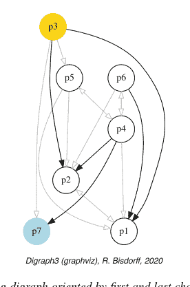

图 6.4 *由首选和末选推荐定向的严格优势有向图。* 政策 p5 在严格优势意义上与其他所有六个政策不可比，而政策 p1、p2 和 p7 则被严格劣势。

```
>>> (~(-g)).exportGraphViz(
...     fileName='3ObjPerfTabBestChoice',
...     firstChoice=['p3'],lastChoice=['p7'])
*---- 正在为 GraphViz 工具导出 dot 文件 ---------*
导出至 3ObjPerfTabBestChoice.dot
dot -Grankdir=BT -Tpng 3ObjPerfTabBestChoice.dot
    -o 3ObjPerfTabBestChoice.png
```

下一页图 6.5 中的热力图视图显示了基于COPELAND排序的性能表，证实了最佳选择推荐（参见第 8.2 节）。

```
>>> t.showHTMLPerformanceHeatmap(
...     Correlations=True,
...     colorLevels=5,ndigits=1,
...     rankingRule='Copeland')
```

基于双极优势有向图的COPELAND排序确认政策 p3 为排名第一。请注意，三个被严格劣势的政策确实出现在最后位置。

## 性能表 'random3ObjectivesPerfTab' 的热力图

| 标准 | en10 | ec05 | en09 | en04 | ec08 | ec01 | ec12 | ec06 | so11 | so02 | en07 | so13 | en03 |
|---|---|---|---|---|---|---|---|---|---|---|---|---|---|
| 权重 | +12.00 | +18.00 | +12.00 | +12.00 | +12.00 | +18.00 | +18.00 | +18.00 | +24.00 | +24.00 | +12.00 | +24.00 | +12.00 |
| tau(*) | +0.79 | +0.52 | +0.45 | +0.40 | +0.38 | +0.14 | +0.12 | +0.10 | +0.02 | -0.02 | -0.10 | -0.10 | -0.17 |
| p3 | 86.6 | 58.5 | 90.4 | 87.0 | 80.2 | 30.7 | 24.9 | 38.3 | 43.2 | 54.5 | 30.6 | 6.6 | 72.4 |
| p4 | 57.9 | 61.7 | 86.7 | 66.3 | 58.8 | 16.2 | 15.1 | 60.3 | 71.9 | NA | 12.8 | 70.2 | 26.6 |
| p6 | 80.5 | 94.2 | 72.5 | 36.1 | 81.2 | 77.7 | 65.6 | 24.8 | 37.0 | 27.2 | 47.4 | 34.1 | 3.9 |
| p5 | 41.9 | 89.4 | 26.9 | 74.5 | 40.3 | 86.0 | 18.3 | 44.4 | 57.4 | 23.8 | 29.9 | 22.4 | 31.1 |
| p7 | 29.5 | 44.6 | 28.5 | 37.8 | 28.3 | 72.3 | 29.8 | 70.5 | 41.4 | 29.8 | 50.1 | 26.3 | 52.7 |
| p1 | 32.5 | 26.9 | 17.1 | 70.5 | 50.0 | 31.1 | 32.9 | 35.9 | NA | 20.9 | 22.9 | 62.4 | 68.9 |
| p2 | 22.3 | 11.3 | 82.2 | 36.0 | 54.4 | 12.5 | 9.8 | 29.6 | 51.4 | 75.8 | 33.0 | 28.0 | 43.1 |

颜色图例：
分位数：20.00% 40.00% 60.00% 80.00% 100.00%

(*) tau：边际标准与全局排序关系之间的序数（Kendall）相关性
优势模型：标准，排序规则：Copeland
全局排序与全局优势关系之间的序数（Kendall）相关性：+0.896
平均边际相关性 (a) : +0.161
标准边际相关性偏差 (b) : +0.258
排序公平性 (a) - (b) : -0.098

图 6.5 COPELAND排序性能表的浏览器视图

## 6.5 随机学术性能表

RandomAcademicPerformanceTableau 类为给定数量的学生在不同课程中生成具有随机成绩的性能表。

## 生成器指令

- numberOfStudents := 整数（默认 10），
- numberOfCourses := 整数（默认 5），
- weightDistribution := 'equisignificant' | 'random'（默认），
- weightScale := 1, 1 - numberOfCourses（随机时的默认值），
- IntegerWeights := 布尔值（True = 默认），
- commonScale := (整数, 整数) (0, 20)（默认），
- ndigits := 整数（默认 0），
- WithTypes := 布尔值（默认 False），
- commonMode := ('triangular', xm=14, r=0.25)（默认），
- commonThresholds := 'ind':(0,0), 'pref':(1,0)（默认），
- missingDataProbability := 0.0（默认），
- NA := 十进制数（默认 = -999）；缺失数据符号。

当参数 WithTypes 设置为 True 时，学生被随机分配到以下四个类别之一——弱（1/6）、中（1/3）、良（1/3）和优（1/3）——括号内为比例。在默认的 0-20 评分范围内，弱学生的随机范围是 0-10，中等学生是 4-16，良好学生是 8-20，优秀学生是 12-20。在这种情况下，随机评分生成器遵循双三角概率定律，其众数 (xm) 等于随机范围的中点，且概率在众数两侧呈中位数分布 (r = 0.5)。

## 6 生成随机成绩表

清单 6.6 生成一个随机学业成绩表

```
>>> from randomPerfTabs import RandomAcademicPerformanceTableau
>>> t = RandomAcademicPerformanceTableau(
...         numberOfStudents=11,
...         numberOfCourses=7, missingDataProbability=0.03,
...         WithTypes=True, seed=100)
>>> t
  *------ PerformanceTableau instance description ------*
    Instance class   : RandomAcademicPerformanceTableau
    Seed             : 100
    Instance name    : randstudPerf
    Actions          : 11
    Criteria         : 7
    NA proportion(%) : 5.2
    Attributes       : ['randomSeed', 'name', 'actions',
                        'criteria', 'evaluation', 'weightPreorder']
>>> t.showPerformanceTableau()
  *---- performance tableau ----*
    Courses |  'm1'  'm2'  'm3'  'm4'  'm5'  'm6'  'm7'
    ECTS    |   2     1     3     4     1     1     5
    --------|--------------------------------------------
    's01f'  |  12    13    15    08    16    06    15
    's02g'  |  10    15    20    11    14    15    18
    's03g'  |  14    12    19    11    15    13    11
    's04f'  |  13    15    12    13    13    10    06
    's05e'  |  12    14    13    16    15    12    16
    's06g'  |  17    13    10    14    NA    15    13
    's07e'  |  12    12    12    18    NA    13    17
    's08f'  |  14    12    09    13    13    15    12
    's09g'  |  19    14    15    13    09    13    16
    's10g'  |  10    12    14    17    12    16    09
    's11w'  |  10    10    NA    10    10    NA    08
>>> t.weightPreorder
  [['m2', 'm5', 'm6'], ['m1'], ['m3'], ['m4'], ['m7']]
```

例如，上面生成的随机成绩表（见清单 6.6 第 2-5 行），其缺失数据概率为 0.03，`WithTypes` 为 `True`，随机种子为 100，结果包含两名优秀学生（s05e 和 s07e）、五名良好学生（s02g、s03g、s06g、s09g 和 s10g）、三名中等学生（s01f、s04f 和 s08f）和一名较弱学生（s11w）。请注意，有六名学生的成绩低于课程及格线 10 分，并且我们观察到四个缺失成绩（NA），其中两个在 m5 课程，一个在 m3 课程，一个在 m6 课程（见第 21-31 行）。

使用 `showCourseStatistics()` 方法，可以显示学生在权重最高的课程（即 m7）中获得的成绩统计摘要。

清单 6.7 按课程统计的学生成绩摘要

```
>>> t.showCourseStatistics('m7')
  *----- Summary performance statistics ------*
    Course name   : m7
    Course weight : 5
    Students      : 11
    Grading scale  : 0.00 - 20.00
    Missing evaluations : 0
    Mean evaluation      : 12.82
    Standard deviation   : 3.79
    Maximal evaluation   : 18.00
    Quantile Q3 (x_75)   : 16.25
    Median evaluation    : 14.00
    Quantile Q1 (x_25)   : 10.50
    Minimal evaluation   : 6.00
    Mean absolute difference : 4.30
    Standard difference deviation : 5.35
```

在上一页的清单 6.7 中，课程 m7 的成绩统计显示平均成绩为 12.82，中位数成绩为 14。最高（最低）成绩为 18（6）。

通过一个按等级排序的热力图视图，我们现在可以在图 6.6 中看到所有 11 名学生的整体成绩表现。此处显示的排名由 NETFLOWS 排序规则（见第 8.3 节）生成，其与相应的双极值优超有向图（见第 16 章）的相关性高达 +0.887。

NETFLOWS 排序也代表了各课程边际排序之间相当*公平的加权共识*，这在下一页清单 6.8 的 `showRankingConsensusQuality()` 方法中得到了体现。

| criteria | m7 | m4 | m2 | m3 | m1 | m6 | m5 |
|---|---|---|---|---|---|---|---|
| weights | +5.00 | +4.00 | +1.00 | +3.00 | +2.00 | +1.00 | +1.00 |
| tau(*) | +0.73 | +0.31 | +0.29 | +0.20 | +0.11 | +0.09 | +0.07 |
| s07e | 17.00 | 18.00 | 12.00 | 12.00 | 12.00 | 13.00 | NA |
| s02g | 18.00 | 11.00 | 15.00 | 20.00 | 10.00 | 15.00 | 14.00 |
| s09g | 16.00 | 13.00 | 14.00 | 15.00 | 19.00 | 13.00 | 9.00 |
| s05e | 16.00 | 16.00 | 14.00 | 13.00 | 12.00 | 12.00 | 15.00 |
| s06g | 13.00 | 14.00 | 13.00 | 10.00 | 17.00 | 15.00 | NA |
| s03g | 11.00 | 11.00 | 12.00 | 19.00 | 14.00 | 13.00 | 15.00 |
| s10g | 9.00 | 17.00 | 12.00 | 14.00 | 10.00 | 16.00 | 12.00 |
| s01f | 15.00 | 8.00 | 13.00 | 15.00 | 12.00 | 6.00 | 16.00 |
| s08f | 12.00 | 13.00 | 12.00 | 9.00 | 14.00 | 15.00 | 13.00 |
| s04f | 6.00 | 13.00 | 15.00 | 12.00 | 13.00 | 10.00 | 13.00 |
| s11w | 8.00 | 10.00 | 10.00 | NA | 10.00 | NA | 10.00 |

颜色图例：
分位数 20.00% 40.00% 60.00% 80.00% 100.00%

(*) tau：边际准则与全局排序关系之间的序数（Kendall）相关性
优超模型：标准，排序规则：NetFlows
全局排序与全局优超关系之间的序数（Kendall）相关性：+0.887

图 6.6 在成绩热力图视图中对学生进行排序

## 清单 6.8 学生排序的共识质量

```
>>> from outrankingDigraphs import
...                     BipolarOutrankingDigraph
>>> g = BipolarOutrankingDigraph(t)
>>> t.showRankingConsensusQuality(
...                     g.computeNetFlowsRanking())
  Consensus quality of ranking:
  ['s07', 's02', 's09', 's05', 's06', 's03', 's10',
   's01', 's08', 's04', 's11']
  Criterion (weight): correlation
 ----------------------------------------
     'm7'  (5): +0.727
     'm4'  (4): +0.309
     'm2'  (1): +0.291
     'm3'  (3): +0.200
     'm1'  (2): +0.109
     'm6'  (1): +0.091
     'm5'  (1): +0.073
 Summary:
   Weighted mean marginal correlation  (a): +0.361
   Standard deviation (b)              : +0.248
   Ranking fairness  (a) -(b)          : +0.113
```

除了课程 m2 外，与各课程边际排序的相关性遵循给定的 ECTS 权重顺序。课程 m7 的相对 ECTS 权重最高（5），在全局 NETFlows 排序中表现最突出（+0.727），并且没有一个边际课程排序与该全局排序呈负相关。平均加权相关性为 +0.361。

有用的多准则排序规则在第 8 章中进行了详细介绍和讨论。下一章第 7 章将讨论社会选择理论中讨论的另一种成绩评估模型，即*线性投票偏好*。

## 参考文献

Bisdorff R (2020) 讲座 3：连续随机变量。见：卢森堡大学计算统计课程讲座。http://hdl.handle.net/10993/37870

# 第 7 章
谁赢得了选举？

# 目录

- 7.1 线性投票偏好 ........................................................................ 83
- 7.2 计算获胜者 ........................................................................ 85
- 7.3 多数差额有向图 ............................................................. 86
- 7.4 循环社会偏好 ..................................................................... 88
- 7.5 生成逼真的随机线性投票偏好 ....................... 91

**摘要** 本章更具体地致力于处理线性投票偏好并计算此类选举结果的获胜者。遵循孔多塞的方法，我们考虑选举候选人之间的两两比较，并平衡第一个候选人击败第二个候选人的次数与第二个候选人击败第一个候选人的次数。因此我们得到了多数差额有向图，实际上是一个双极值有向图。当选民表达相互矛盾的线性投票偏好时，人们自然会观察到循环社会偏好，而不会在此情况中看到任何悖论。最后，我们介绍了一个更符合政治现实的随机线性投票偏好生成器，它考虑了选前民意调查。

## 7.1 线性投票偏好

`votingProfiles` 模块提供了诸如 `LinearVotingProfile` 类等资源，用于处理选举结果（Bisdorff 2020a）。为了说明这些资源，让我们考虑涉及一组合格候选人和一组加权选民的选举，选民以完整的线性排序（无平局）表达他们对合格候选人的投票偏好。该模块提供了一个 `RandomLinearVotingProfile` 类，用于生成此类 `LinearVotingProfile` 类型的随机实例。在清单 7.1 所示的交互式 Python 会话中，例如，为五位选民选举三名候选人生成了一个随机线性投票偏好：

## 7.1 清单 7.1 随机线性投票概况示例

```python
>>> from votingProfiles import
...                     RandomLinearVotingProfile
>>> lvp = RandomLinearVotingProfile(numberOfVoters=5,
...                                 numberOfCandidates=3,
...                                 RandomWeights=True)
>>> lvp.candidates
OrderedDict([('c1', {'name': 'Candidate 1'}),
            ('c2', {'name': 'Candidate 2'}),
            ('c3', {'name': 'Candidate 3'})])
>>> lvp.voters
OrderedDict([('v1', {'weight': 2}),
            ('v2', {'weight': 3}),
            ('v3', {'weight': 1}),
            ('v4', {'weight': 5}),
            ('v5', {'weight': 4})])
>>> lvp.linearBallot
{'v1': ['c2', 'c1', 'c3'],
 'v2': ['c3', 'c1', 'c2'],
 'v3': ['c1', 'c3', 'c2'],
 'v4': ['c1', 'c2', 'c3'],
 'v5': ['c3', 'c1', 'c2']}
```

关于合格候选人和选民的线性投票概况数据，内部存储在两个有序字典中：属性 `candidates`（第6行）和属性 `voters`（第10行）。请注意，在这个随机示例中，五位选民被赋予了权重。线性投票选票存储在一个标准字典中：属性 `linearBallot`（第16行）。这些选票可以通过 `showLinearBallots()` 方法进行查看。

## 7.1 清单 7.2 显示线性投票概况

```python
>>> lvp.showLinearBallots()
voters(weight)    candidates rankings
v1(2):            ['c2', 'c1', 'c3']
v2(3):            ['c3', 'c1', 'c2']
v3(1):            ['c1', 'c3', 'c2']
v4(5):            ['c1', 'c2', 'c3']
v5(4):            ['c3', 'c1', 'c2']
nbr. of voters: 15
```

编辑此线性投票概况可以通过先将数据保存到文件，然后编辑该文件，再重新加载来完成。

```python
>>> lvp.save(fileName='tutorialLinearVotingProfile1')
*--- Saving linear profile in file:
                <tutorialLinearVotingProfile1.py> ---*
>>> from votingProfiles import LinearVotingProfile
>>> lpv = LinearVotingProfile('tutorialLinearVotingProfile1')
```

## 7.2 计算获胜者

`computeUninominalVotes()` 和 `computeSimpleMajorityWinner()` 方法计算*单名投票*，即每位候选人被排在第一位的次数，以及谁是本次选举中*简单多数*（相对多数）的获胜者。

```python
>>> lvp.computeUninominalVotes()
{'c1': 6, 'c2': 2, 'c3': 7}
>>> lvp.computeSimpleMajorityWinner()
['c3']
```

由于我们观察到三位候选人中没有任何一位获得绝对多数（8/15）的选票，因此可以使用 `computeInstantRunoffWinner()` 方法来寻找*即时决选*获胜者（Bisdorff 2020a）。

### 清单 7.3 即时决选获胜者示例

```python
>>> lvp.computeInstantRunoffWinner(Comments=True)
Half of the Votes = 7.50
==> stage = 1
    remaining candidates ['c1', 'c2', 'c3']
    uninominal votes {'c1': 6, 'c2': 2, 'c3': 7}
    minimal number of votes = 2
    maximal number of votes = 7
    candidate to remove = c2
    remaining candidates = ['c1', 'c3']
==> stage = 2
    remaining candidates ['c1', 'c3']
    uninominal votes {'c1': 8, 'c3': 7}
    minimal number of votes = 7
    maximal number of votes = 8
    candidate c1 obtains an absolute majority
Instant run off winner: ['c1']
```

在清单 7.3 中，第一阶段没有任何候选人获得绝对多数的选票。候选人 c2 获得最少的选票（2/15），因此被淘汰。在第二阶段，候选人 c1 最终获得了绝对多数的选票（8/15），因此当选。

也可以遵循*博尔达骑士*的建议，在对线性选票进行*排名分析*后，计算每位候选人的 BORDA 分数——平均排名——从而确定 BORDA 获胜者（de Borda 1781）。

### 清单 7.4 BORDA 排名分数示例

```python
>>> lvp.computeRankAnalysis()
{'c1': [6, 9, 0], 'c2': [2, 5, 8], 'c3': [7, 1, 7]}
>>> v.computeBordaScores()
OrderedDict([
    ('c1', {'BordaScore': 24, 'averageBordaScore': 1.6}),
    ('c3', {'BordaScore': 30, 'averageBordaScore': 2.0}),
    ('c2', {'BordaScore': 36, 'averageBordaScore': 2.4}) ])
>>> lvp.computeBordaWinners()
['c1']
```

在清单 7.4 中，候选人 c1 获得了最低的 BORDA 分数，其次是候选人 c3，最后是候选人 c2。相应的 BORDA 排名分析表可以通过 `showRankAnalysisTable()` 方法打印出来。

### 清单 7.5 带有 BORDA 分数的排名分析示例

```python
>>> lvp.showRankAnalysisTable()
*---- Borda rank analysis tableau ----*
candi- | alternative-to-rank | Borda
dates | 1 2 3 | score average
------|---------------------|-----------------
'c1' | 6 9 0 | 24/15 1.60
'c3' | 7 1 7 | 30/15 2.00
'c2' | 2 5 8 | 36/15 2.40
```

在我们随机生成的选举结果中，我们很幸运：候选人 c1 既是即时决选获胜者，也是 BORDA 获胜者（参见前一页的清单 7.3 和清单 7.4）。然而，也可以遵循孔多塞侯爵的建议，计算每对候选人之间投票获得的多数优势（de Caritat, Marquis de Condorcet 1784）。

## 7.3 多数优势有向图

例如，候选人 c1 有四次排在候选人 c2 之前，一次排在其后（参见第84页的清单 7.2）。因此，由于选民的权重，相应的多数优势 M(c1, c2) 等于 (3 + 1 + 5 + 4) - (2) = +11。这些成对的多数优势在候选人集合上定义了我们所谓的多数优势有向图。`MajorityMarginsDigraph` 类处理此类有向图。

### 清单 7.6 *多数优势*有向图示例

```python
>>> from votingProfiles import MajorityMarginsDigraph
>>> mmdg = MajorityMarginsDigraph(lvp,
... IntegerValuation=True)
>>> mmdg
*------- Digraph instance description -------*
Instance class : MajorityMarginsDigraph
Instance name : rel_randomLinearVotingProfile1
Digraph Order : 3
Digraph Size : 3
Valuation domain : [-15.00;15.00]
Determinateness (%) : 55.56
Attributes : ['name', 'actions', 'voters',
'ballot', 'valuationdomain',
'relation', 'order',
'gamma', 'notGamma']
>>> mmdg.showAll()
*----- show detail ---------------*
```

```python
Digraph          : rel_randLinearVotingProfile1
*----- Candidates -----*
 ['c1', 'c2', 'c3']
*----- Characteristic valuation domain ----*
 {'max': Decimal('15.0'),
  'med': Decimal('0'),
  'min': Decimal('-15.0'),
  'hasIntegerValuation': True}
*----- majority margins -----*
     M(x,y) |  'c1'  'c2'  'c3'
 -----------|-------------------
      'c1'  |    0    11     1
      'c2'  |  -11     0    -1
      'c3'  |   -1     1     0
 Valuation domain: [-15;+15]
```

请注意清单 7.6 的第 29-31 行，在线性投票概况的情况下，多数优势总是满足*零和性质*：对于所有候选人 $x$ 和 $y$，$M(x, y) + M(y, x) = 0$。这对于任意投票概况通常不成立。线性投票概况的*多数优势*有向图实际上定义了一个*弱竞赛图*，因此属于*自对偶*<sup>1</sup>双极值有向图的类别（参见第 2.6 节）。

候选人 $x$ 显示出正的多数优势 $M(x, y)$，意味着在成对投票中以绝对多数击败了候选人 $y$。因此，在*多数优势*有向图关系表中，其行仅显示正项的候选人，以绝对多数的选票击败了所有其他候选人。孔多塞准则建议宣布这位候选人（总是唯一的，为什么？）为选举的获胜者。这里我们很幸运，再次是候选人 c1 成为孔多塞获胜者（参见前一页清单 7.6 的第 29 行）。此结果在下面通过 `computeCondorcetWinners()` 方法得到确认。

```python
>>> mmdg.computeCondorcetWinners()
['c1']
```

通过将多数优势视为定义在合格候选人集合上的全局选民偏好关系的*双极值特征函数*，我们可以重用通用 `Digraph` 类的所有操作资源。<sup>2</sup> 特别是其 `exportGraphViz()` 方法，用于在下一页的图 7.1 中可视化选举结果。

> <sup>1</sup> 自对偶双极值有向图的类别由所有弱不对称有向图组成，即仅包含不对称和/或不确定链接的有向图。极限情况一方面包括具有不确定自反链接的完全竞赛图，另一方面包括完全不确定的有向图。在此类别中，逆（逆 ~）运算符确实与对偶（否定 −）运算符相同。
<sup>2</sup> 参见第 2 章。

## 7.4 循环社会偏好

例如，让我们考虑清单7.7中的以下线性投票概况v，并构建相应的多数优势有向图。

**清单7.7** 循环社会偏好示例

```
>>> v.showLinearBallots()
    voters(weight) : candidates rankings
    v1(1) : ['c1', 'c3', 'c5', 'c2', 'c4']
    v2(1) : ['c1', 'c2', 'c4', 'c3', 'c5']
    v3(1) : ['c5', 'c2', 'c4', 'c3', 'c1']
    v4(1) : ['c3', 'c4', 'c1', 'c5', 'c2']
    v5(1) : ['c4', 'c2', 'c3', 'c5', 'c1']
    v6(1) : ['c2', 'c4', 'c5', 'c1', 'c3']
    v7(1) : ['c5', 'c4', 'c3', 'c1', 'c2']
    v8(1) : ['c2', 'c4', 'c5', 'c1', 'c3']
    v9(1) : ['c5', 'c3', 'c4', 'c1', 'c2']
>>> mmdg = MajorityMarginsDigraph(v)
>>> mmdg.showRelationTable(ReflexiveTerms=False)
 * ---- 关系表 ----*
```

**图7.2** *循环社会偏好。* 例如，c1 > c2 > c3 > c1

Digraph3 (graphviz), R. Bisdorff, 2020

```
15  M(x, y) | 'c1'  'c2'  'c3'  'c4'  'c5'
16  ---------|---------------------------------
17  'c1'     |  -     1    -1    -5    -3
18  'c2'     | -1     -     1     1    -1
19  'c3'     |  1    -1     -    -3    -1
20  'c4'     |  5    -1     3     -     1
21  'c5'     |  3     1     1    -1     -
22  评估域：[-9;+9]
```

现在关系表中不再存在完全正的行（参见清单7.7中的第17-21行）。五位候选人中没有一位能以绝对多数票击败所有其他人。不再有孔多塞获胜者。事实上，当查看图7.2中这个*多数优势*有向图的graphviz绘图时，我们可能会观察到*循环的*选民偏好，例如c1 > c2 > c3 > c1。

```
1  >>> mmdg.exportGraphViz('cycles', graphType='pdf')
2  *---- 为GraphViz工具导出dot文件 ----*
3  导出到 cycles.dot
4  dot -Grankdir=BT -Tpng cycles.dot -o cycles.pdf
```

在*多数优势*有向图中可能会出现许多回路。`computeChordlessCircuits`方法检测并枚举有向图实例中所有最小的无弦回路。

```
1  >>> mmdg.computeChordlessCircuits()
2  [(['c2', 'c3', 'c1'], frozenset({'c2', 'c3', 'c1'})),
3   (['c2', 'c4', 'c5'], frozenset({'c2', 'c5', 'c4'})),
4   (['c2', 'c4', 'c1'], frozenset({'c2', 'c1', 'c4'}))]
```

在我们的示例投票概况v中，我们实际上获得了三个无弦社会偏好回路，因此确定这次选举结果的获胜者变得不平凡。例如，不再有即时决选获胜者。

```
>>> v.computeInstantRunoffWinner(Comments=True)
总票数 =  9.000
半数票 =  4.50
 ==> 阶段 =  1
    剩余候选人 ['c2', 'c5', 'c1', 'c4', 'c3']
    单名制投票 {'c2': 2.0, 'c5': 3.0, 'c1': 2.0, 'c4': 1.0, 'c3': 1.0}
    最小票数 =  1.0
    最大票数 =  3.0
    待移除候选人 =  c3
    待移除候选人 =  c4
    剩余候选人 =  ['c2', 'c5', 'c1']
 ==> 阶段 =  2
    剩余候选人 ['c2', 'c5', 'c1']
    单名制投票 {'c2': 3.0, 'c5': 3.0, 'c1': 3.0}
    最小票数 =  3.0
    最大票数 =  3.0
    待移除候选人 =  c1
    待移除候选人 =  c5
    待移除候选人 =  c2
    剩余候选人 =  []
[]
```

孔多塞确定选举获胜者的方法在这个示例投票概况中*不具有决定性*。因此，在给定情况下，需要利用更复杂的方法，基于给定的线性选票来寻找选举的获胜者（参见第8章和Bisdorff等人2008年）。

使用`showHTMLVotingHeatmap()`方法的NETFLOWS排序热力图视图是显示令人信服的选举结果的工具之一（参见第8.3节）。

### 清单7.8  投票概况的NETFLOWS排序热力图视图

```
>>> v.showHTMLVotingHeatmap(rankingRule='Netflows',\n...                         colorLevels=3,Correlations=True)
```

值得注意的是，在对面页的图7.3中，妥协的NETFLOWS排序c4 > c5 > c2 > c3 > c1，在此热力图中显示，与多数优势有向图产生了最高的可能*序数相关*指数+0.778（参见第16章）。这个NETFLOWS排序结果也对应于BORDA分数排序。³

### 清单7.9  带BORDA分数的排序分析表

```
>>> v.showRankAnalysisTable()
 *----  Borda排序分析表 -----*
 候选- | 待排序的备选方案 |          Borda
 人    |  1    2    3    4    5  | 分数  平均值
```

> ³ 注意，BORDA分数需要一个不切实际的工作假设，即知道如何精确地用数字编码每位选民的边际线性排序。

**图7.3** 在NETFLOWS排序热力图中可视化线性投票概况。由于选民数量通常远大于合格候选人数量，投票热力图默认转置为选民×候选人视图。注意选民的重要性权重为负值，这意味着标准（在此情况下为个体选民）的偏好方向是递减的（最小化），即从最低（最佳）排序到最高（最差）排序

### 投票热力图

| 标准 | 权重 | tau* | c4 | c5 | c2 | c3 | c1 |
|---|---|---|---|---|---|---|---|
| v5 | -1.00 | +0.60 | 1 | 4 | 2 | 3 | 5 |
| v3 | -1.00 | +0.60 | 3 | 1 | 2 | 4 | 5 |
| v8 | -1.00 | +0.40 | 2 | 3 | 1 | 5 | 4 |
| v7 | -1.00 | +0.40 | 2 | 1 | 5 | 3 | 4 |
| v6 | -1.00 | +0.40 | 2 | 3 | 1 | 5 | 4 |
| v9 | -1.00 | +0.20 | 3 | 1 | 5 | 2 | 4 |
| v4 | -1.00 | +0.00 | 2 | 4 | 5 | 1 | 3 |
| v2 | -1.00 | -0.40 | 3 | 5 | 2 | 4 | 1 |
| v1 | -1.00 | -0.80 | 5 | 3 | 4 | 2 | 1 |

颜色图例：
分位数 33.33% 66.66% 100.00%
(*) tau：边际标准与全局排序关系之间的序数（Kendall）相关性
优势模型：稳健，排序规则：NETFLOWS
全局排序与全局优势关系之间的序数（Kendall）相关性：+0.778

```
5  ------|-----------------------------------------------------------
6  'c4' | 1  4  3  0  1  | 23  2.56
7  'c5' | 3  0  3  2  1  | 25  2.78
8  'c2' | 2  3  0  1  3  | 27  3.00
9  'c3' | 1  2  2  2  2  | 29  3.22
10 'c1' | 2  0  1  4  2  | 31  3.44
```

让我们最终在上面清单7.9所示的排序分析表中注意到，单名制相对多数获胜者将是获得三票的候选人c5，而最佳的NETFLOWS和BORDA排序候选人c1仅与候选人c3获得一票。
但是，我们这里的示例线性投票概况是否代表了现实的选举结果？

## 7.5 关于生成现实的随机线性投票概况

默认情况下，`RandomLinearVotingProfile`类生成随机线性投票概况，其中每位候选人在所有选民的某个位置被排序的概率相同。每位选民的随机线性选票确实是通过候选人列表的均匀洗牌生成的。
在现实中，政治选举数据则大不相同。通常每个政党都会有不同的首选和边缘候选人。为了用我们的随机生成器模拟这些方面，我们使用两个随机指数分布的候选人民意调查，并考虑一个具有特定在两组潜在政党支持者之间随机平衡（默认理论政党分配比例 = 0.50）。其中有一定理论比例（默认 = 0.1）的选民不支持任何政党。

让我们在清单 7.10 中为一个有 1000 名选民和 15 名候选人的选举生成这样一个线性投票概况。

## 清单 7.10 生成带有随机民意调查的线性投票概况

```
>>> from votingProfiles import
...             RandomLinearVotingProfile
>>> lvp = RandomLinearVotingProfile(
...         numberOfCandidates=15,
...         numberOfVoters=1000,
...         WithPolls=True,
...         partyRepartition=0.5,
...         other=0.1,
...         seed=0.9189670954954139)
>>> lvp
*------- VotingProfile instance description -------*
Instance class : RandomLinearVotingProfile
Instance name  : randLinearProfile
Candidates     : 15
Voters         : 1000
Attributes     : ['name', 'seed', 'candidates',
                  'voters', 'RandomWeights',
                  'sumWeights', 'poll1', 'poll2',
                  'bipartisan', 'linearBallot',
                  'ballot']
>>> lvp.showRandomPolls()
Random repartition of voters
Party-1 supporters : 460 (46.0%)
Party-2 supporters : 436 (43.6%)
Other voters       : 104 (10.4%)
*------------------ random polls ------------------*
Party-1(46.0%) | Party-2(43.6%)|  expected
-----------------------------------------------
c06 : 19.91%   | c11 : 22.94%   | c06 : 15.00%
c07 : 14.27%   | c08 : 15.65%   | c11 : 13.08%
c03 : 10.02%   | c04 : 15.07%   | c08 : 09.01%
c13 : 08.39%   | c06 : 13.40%   | c07 : 08.79%
c15 : 08.39%   | c03 : 06.49%   | c03 : 07.44%
c11 : 06.70%   | c09 : 05.63%   | c04 : 07.11%
c01 : 06.17%   | c07 : 05.10%   | c01 : 05.06%
c12 : 04.81%   | c01 : 05.09%   | c13 : 05.04%
c08 : 04.75%   | c12 : 03.43%   | c15 : 04.23%
c10 : 04.66%   | c13 : 02.71%   | c12 : 03.71%
c14 : 04.42%   | c14 : 02.70%   | c14 : 03.21%
c05 : 04.01%   | c15 : 00.86%   | c09 : 03.10%
c09 : 01.40%   | c10 : 00.44%   | c10 : 02.34%
c04 : 01.18%   | c05 : 00.29%   | c05 : 01.97%
c02 : 00.90%   | c02 : 00.21%   | c02 : 00.51%
```

在此示例中（参见上文第 21 行及后续行），我们得到 460 名政党1支持者（46%），436 名政党2支持者（43.6%），以及 104 名其他选民（10.4%）。政党1支持者最喜欢的候选人（支持率超过 10%）似乎是 c06（19.91%）、c07（14.27%）和 c03（10.02%）。而对于政党2支持者，最喜欢的候选人似乎是 c11（22.94%），其次是 c08（15.65%）、c04（15.07%）和 c06（13.4%）。作为政党1支持者的*第一*选择和政党2支持者的*第四*选择，候选人 c06 是赢得这场选举游戏的自然人选（参见清单 7.11）。

## 清单 7.11 单名制和 BORDA 选举获胜者

```
1 >>> lvp.computeSimpleMajorityWinner()
2 ['c06']
3 >>> lvp.computeInstantRunoffWinner()
4 ['c06']
5 >>> lvp.computeBordaWinners()
6 ['c06']
```

候选人 c06 也是孔多塞获胜者吗？为了验证，我们首先借助 MajorityMarginsDigraph 类创建相应的*多数优势*有向图 *mmdg*。创建的有向图实例包含 15 个*行动*——即候选人——和 104 条*有向弧*——即*正*多数优势——（参见清单 7.12 第 7-8 行）。

## 清单 7.12 从线性投票概况构建的多数优势有向图

```
1 >>> from votingProfiles import MajorityMarginsDigraph
2 >>> mmdg = MajorityMarginsDigraph(lvp)
3 >>> mmdg
4 *------- Digraph instance description ------*
5  Instance class      : MajorityMarginsDigraph
6  Instance name       : rel_randLinearProfile
7  Digraph Order       : 15
8  Digraph Size        : 104
9  Valuation domain    : [-1000.00;1000.00]
10  Determinateness (%) : 67.08
11  Attributes          : ['name', 'actions', 'voters',
12                         'ballot', 'valuationdomain',
13                         'relation', 'order',
13                         'gamma', 'notGamma']
```

showHTMLRelationTable() 方法通过在浏览器视图中显示 *mmdg* 关系表的 HTML 格式版本，来可视化成对多数优势的结果。

```
1 >>> mmdg.showHTMLRelationTable(
2 ...         tableTitle='Pairwise majority margins',
3 ...         relationName='M(x,y)')
```

下一页图 7.4 中一个完整的浅绿色*行*揭示了一个孔多塞获胜者，而一个完整的浅绿色*列*则揭示了一个孔多塞失败者。我们再次确认候选人 c06 是孔多塞获胜者，⁴ 而明显的孔多塞失败者是候选人 c02，该候选人在两个政党中的支持率都是最低的（参见第 92 页清单 7.10 第 43 行）。

使用相同的双极第一排名和最后排名选择程序，我们可以通过在剩余候选人中迭代这些第一和最后的选择来弱排名候选人（可能存在平局）（Bisdorff 1999）。

在展示按选择排名的结果之前，我们必须首先计算迭代的双极选择程序（参见清单 7.13）。

## 清单 7.13 通过迭代选择剩余的第一和最后候选人进行排名

```
1 >>> cdg.showRankingByChoosing()
Ranking by Choosing and Rejecting
  1st best ranked ['c06']
    2nd best ranked ['c11']
      3rd best ranked ['c07','c08']
        4th best ranked ['c03']
          5th best ranked ['c01']
            6th best ranked ['c13']
              7th first ranked ['c04']
             7th last ranked ['c12']
           6th last ranked ['c14']
         5th last ranked ['c15']
       4th last ranked ['c09']
     3rd last ranked ['c10']
   2nd last ranked ['c05']
 1st last ranked ['c02']
```

> ⁴ 孔多塞获胜者的概念——绝对多数获胜者的推广——由孔多塞在 1784 年提出，是初始有向图核的一个早期历史示例（参见第 17 章）。

第一次选择涉及 c06（第一）和 c02（最后），接着是 c11（第一）对阵 c05（最后），依此类推，直到在第 7 次迭代步骤中剩下最后一对候选人，即 [c04, c12]（参见第 9-10 行）。

另外请注意第 3 次迭代步骤中的第 3 名最佳候选人（参见第 5 行），即 (c07, c08) 这一对。这两位候选人确实共同代表了*第 3 名最佳*选择。因此我们得到了一个*弱排名*，即一个带有平局的排名。

让我们提一下，我们之前在使用 Comments=True 参数设置时使用的*即时淘汰*程序，将提供一个或多或少相似的*通过拒绝进行的逆线性排序*结果，即 [c02, c10, c14, c05, c09, c13, c12, c15, c04, c01, c08, c03, c07, c11, c06]，从*最后*到*第一*选择排序。

关于这两个*按选择排名*或*通过拒绝排序*结果值得注意的是，这里借助两个离散随机变量⁵ 模拟的随机投票行为，其定义分别来自两个随机政党民意调查，产生的排名或多或少与模拟的民意调查平衡一致：政党1支持者：460；政党2支持者：436（参见第 92 页清单 7.10 第 29-43 行第三列）。尽管每位选民的投票行为是随机的，但给定的民意调查显然对最终的选举结果产生了*非常强烈的影响*。为了避免任何对选举结果的操纵，因此在一些国家，公共媒体在普选前的最后几周不允许发布民意调查。

请注意，我们这里在多数优势有向图上使用的特定*按选择排名*程序，通过在每一步提取*初始*和*终端*预核来操作选择程序，即困难的操作问题（参见第 17 章和 Bisdorff 1999）；这种技术通常无法处理超过 30 名候选人的投票概况。

下一章第 8 章关于多不可比标准排名方法，将介绍当有更多潜在候选人或决策替代方案时，从成对多数优势进行排名的更多方法和工具。

## 参考文献

Bisdorff R (1999) Bipolar ranking from pairwise fuzzy outrankings. Belg J Oper Res Stat Comput Sci 37(4):379–387. http://hdl.handle.net/10993/38738

Bisdorff R (2020a) Lecture 2: Who wins the election? In: Lectures of the algorithmic decision theory course, University of Luxembourg. http://hdl.handle.net/10993/37933

Bisdorff R (2020b) Lecture 4: Discrete random variables. In: Lectures of the computational statistics course, University of Luxembourg. http://hdl.handle.net/10993/37870

⁵ 具有给定经验概率律（此处为民意调查）的离散随机变量由 `randomNumbers` 模块中的 `DiscreteRandomVariable` 类提供（Bisdorff 2020b）。

# 7 谁赢得了选举？

图 7.4 浏览多数优势。浅绿色单元格包含正多数优势，而浅红色单元格包含负多数优势

## 成对多数优势

| M(x,y) | c01 | c02 | c03 | c04 | c05 | c06 | c07 | c08 | c09 | c10 | c11 | c12 | c13 | c14 | c15 |
|---|---|---|---|---|---|---|---|---|---|---|---|---|---|---|---|
| c01 | - | 768 | 138 | 108 | 478 | -436 | -198 | -140 | 238 | 440 | -268 | 148 | 50 | 202 | 218 |
| c02 | -768 | - | -796 | -484 | -368 | -858 | -828 | -772 | -546 | -496 | -800 | -722 | -768 | -696 | -658 |
| c03 | 138 | 796 | - | 160 | 590 | -286 | -80 | -8 | 372 | 522 | -158 | 280 | 210 | 360 | 338 |
| c04 | -108 | 484 | -160 | - | -184 | -370 | -180 | -288 | 160 | 136 | -420 | 16 | -62 | 56 | 30 |
| c05 | -478 | 368 | -590 | 184 | - | -730 | -640 | -472 | -234 | -116 | -550 | -442 | -522 | -376 | -386 |
| c06 | 436 | 858 | 286 | 370 | 730 | - | 248 | 234 | 574 | 692 | 102 | 556 | 482 | 566 | 520 |
| c07 | 198 | 828 | 80 | 180 | 640 | -248 | - | 0 | 358 | 602 | -94 | 304 | 266 | 384 | 420 |
| c08 | 140 | 772 | 8 | 288 | 472 | -234 | 0 | - | 436 | 396 | -176 | 276 | 134 | 298 | 244 |
| c09 | -238 | 546 | -372 | -160 | 234 | -574 | -358 | -436 | - | 116 | -594 | -126 | -194 | -90 | -14 |
| c10 | -440 | 496 | -522 | -136 | 116 | -692 | -602 | -396 | -116 | - | -510 | -310 | -442 | -304 | -266 |
| c11 | 268 | 800 | 158 | 420 | 550 | -102 | 94 | 176 | 594 | 510 | - | 388 | 268 | 474 | 292 |
| c12 | -148 | 722 | -280 | -16 | 442 | -556 | -304 | -276 | 126 | 310 | -388 | - | -92 | 100 | 148 |
| c13 | -50 | 768 | -210 | 62 | 522 | -482 | -266 | -134 | 194 | 442 | -268 | 92 | - | 158 | 186 |
| c14 | -202 | 696 | -360 | -56 | 376 | -566 | -384 | -298 | 90 | 304 | -474 | -100 | -158 | - | 68 |
| c15 | -218 | 658 | -338 | -30 | 386 | -520 | -420 | -244 | 14 | 266 | -292 | -148 | -186 | -68 | - |

估值域：[-1000; +1000]

## 第8章
基于多个不可公度准则的排序


> ... 无论我们是在决定购买不同的商品组合，还是在选择假期要做什么，抑或是在选举中决定投票给谁，我们都不可避免地要评估具有不可公度方面的备选方案。

—阿马蒂亚·森，《正义的理念》（Sen 2009）

# 目录

- 8.1 排序问题
- 8.2 COPELAND 排序法
- 8.3 NETFLOWS 排序法
- 8.4 KEMENY 排序法
- 8.5 SLATER 排序法
- 8.6 KOHLER 选择排序规则
- 8.7 RANKEDPAIRS 排序规则

**摘要** DIGRAPH3 Python 资源提供了多种算法，用于通过双极值优超有向图解决多个不可公度准则的排序问题。本文介绍了 COPELAND、NETFLOWS、KEMENY、SLATER、KOHLER 和 RANKEDPAIRS 排序规则，并通过一个随机优超有向图进行了说明。

### 8.1 排序问题

我们需要对一组项目（通常是决策备选方案）$X$ 进行无平局排序，这些项目基于多个不可公度的性能准则进行评估；然而，我们已知它们的成对双极值*严格优超*特征，即对所有 $x, y \in X$，$r(x \succcurlyeq y)$（参见第3.5节和 Bisdorff 2013）。

让我们在清单8.1中考虑一个教学用的优超有向图 g，它由一个随机的成本-效益性能表（参见第6.3节）生成，涉及9个决策备选方案，基于13个性能准则进行评估。BipolarOutrankingDigraph 计算相应的双极值优超有向图 g，而一个余对偶变换则给出了我们所需的严格优超有向图 gcd，其中包含成对的 r(x ≳ y) 特征值（参见下面的第11-19行）。

**清单 8.1** 随机双极值严格优超关系特征

```
>>> from randomPerfTabs import RandomCBPerformanceTableau
>>> t = RandomCBPerformanceTableau(numberOfActions=9,
...         numberOfCriteria=13,seed=200)
>>> from outrankingDigraphs import BipolarOutrankingDigraph
>>> g = BipolarOutrankingDigraph(t)
>>> gcd = ~(-g) # strict (codual) outranking digraph
>>> gcd.showRelationTable(ReflexiveTerms=False)
* ---- Relation Table -----
r(>) |  'a1'  'a2'  'a3'  'a4'  'a5'  'a6'  'a7'  'a8'  'a9'
-----|------------------------------------------------------
'a1' |   -   0.00 +0.10 -1.00 -0.13 -0.57 -0.23 +0.10 +0.00
'a2' | -1.00  -    0.00 +0.00 -0.37 -0.42 -0.28 -0.32 -0.12
'a3' | -0.10  0.00  -   -0.17 -0.35 -0.30 -0.17 -0.17 +0.00
'a4' |  0.00  0.00 -0.42  -   -0.40 -0.20 -0.60 -0.27 -0.30
'a5' | +0.13 +0.22 +0.10 +0.40  -   +0.03 +0.40 -0.03 -0.07
'a6' | -0.07 -0.22 +0.20 +0.20 -0.37  -   +0.10 -0.03 -0.07
'a7' | -0.20 +0.28 -0.03 -0.07 -0.40 -0.10  -   +0.27 +1.00
'a8' | -0.10 -0.02 -0.23 -0.13 -0.37 +0.03 -0.27  -   +0.03
'a9' |  0.00 +0.12 -1.00 -0.13 -0.03 -0.03 -1.00 -0.03  -
```

一些排序规则将作用于相关的孔多塞有向图，即相应的中位数切割极化严格优超有向图。

**清单 8.2** 中位数切割极化严格优超关系特征

```
>>> ccd = PolarisedOutrankingDigraph(gcd,
...         level=g.valuationdomain['med'],
...         KeepValues=False,StrictCut=True)
>>> ccd.showRelationTable(ReflexiveTerms=False,
...         IntegerValues=True)
*---- Relation Table -----
r(>)_med | 'a1' 'a2' 'a3' 'a4' 'a5' 'a6' 'a7' 'a8' 'a9'
---------|--------------------------------------------
  'a1'   |  -    0   +1   -1   -1   -1   -1   +1    0
  'a2'   | -1    -   +0    0   -1   -1   -1   -1   -1
  'a3'   | -1    0    -   -1   -1   -1   -1   -1    0
  'a4'   |  0    0   -1    -   -1   -1   -1   -1   -1
  'a5'   | +1   +1   +1   +1    -   +1   +1   -1   -1
  'a6'   | -1   -1   +1   +1   -1    -   +1   -1   -1
  'a7'   | -1   +1   -1   -1   -1   -1    -   +1   +1
  'a8'   | -1   -1   -1   -1   -1   +1   -1    -   +1
  'a9'   |  0   +1   -1   -1   -1   -1   -1   -1    -
```

### 8.1 排序问题

图 8.1 *严格优超关系* $\succsim$。此处显示的关系，例如，*不是传递的*：备选方案 a8 优超备选方案 a6，备选方案 a6 优超 a4，然而，a8 并不优超 a4。此外，备选方案 a6、a7 和 a8 显示出循环的优超关系。

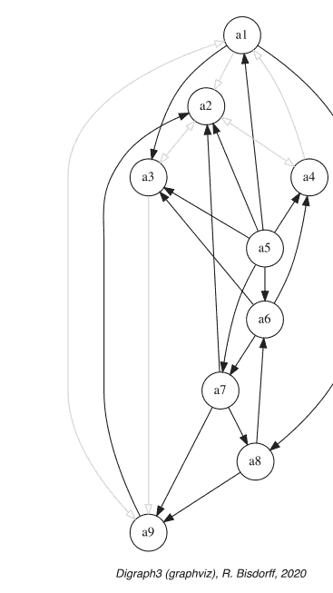

不幸的是，与给定严格优超有向图相关的这种清晰的中位数切割孔多塞有向图，仅在特殊情况下才能建模线性排序。通常，成对的多数比较不会产生*完整的*或至少是*传递的*偏序。甚至可能经常出现*循环的*优超情况（参见第7.4节）。

为了了解这个排序问题可能变得多么*困难*，让我们在图8.1中查看相应的严格优超有向图 *graphviz* 绘图。¹

```
>>> gcd.exportGraphViz(fileName='rankingTutorial')
*---- exporting a dot file for GraphViz tools ---------*
Exporting to rankingTutorial.dot
dot -Grankdir=BT -Tpng rankingTutorial.dot -o rankingTutorial.png
```

`computeTransitivityDegree()` 方法计算图8.1所示优超有向图 gcd 的*传递度*，即闭合传递三元组的数量——$x \succcurlyeq y$，$y \succcurlyeq z$ 且 $x \succcurlyeq z$——与三元组 $x \succcurlyeq y$，$y \succcurlyeq z$ 总数的比率（参见下面的第3-4行）。

> ¹ `exportGraphViz()` 方法依赖于 graphviz 软件 (https://graphviz.org/) 的绘图工具。

```
>>> gcd.computeTransitivityDegree(Comments=True)
Transitivity degree of graph <codual_rel_randomCBperftab>
triples x>y>z: 78, closed: 38, open: 40
closed/triples = 0.487
```

由于只有49%所需的传递弧，严格优超有向图 gcd 因此远非传递；当寻求决策备选方案的线性排序时，这是一个严重的问题。

`computeChordlessCircuits()` 方法，后跟 `showChordlessCircuits()` 方法，可以进一步检查是否出现任何循环的优超情况。²

> ² `computeChordlessCircuits()` 和 `showChordlessCircuits()` 方法是分开的，因为有多种方法可用于枚举有向图中的无弦回路 (Bisdorff 2010)。

```
>>> gcd.computeChordlessCircuits()
>>> gcd.showChordlessCircuits()
1 circuit(s).
*---- Chordless circuits ----*
1: ['a6', 'a7', 'a8'] , credibility : 0.033
```

在给定的严格优超有向图 gcd 中检测到一个无弦回路，即备选方案 a6 优超备选方案 a7，后者优超 a8，而 a8 又优超备选方案 a6（参见前一页的图8.1）。这三个备选方案的任何潜在线性排序实际上都会在某种程度上与给定的优超关系相矛盾。

现在，已经提出了几种启发式排序规则，用于构建在某种特定意义上最接近给定优超关系的线性排序。DIGRAPH3 资源提供了一些最常见的排序规则，如 COPELAND、KEMENY、SLATER、KOHLER 和 RANKEDPAIRS 排序规则。

### 8.2 COPELAND 排序法

**算法 8.1 COPELAND 排序规则 (Copeland 1951)**
*输入*：中位数切割严格优超有向图 $G(X, \succcurlyeq_{>0})$，
*输出*：决策行动集合 $X$ 的线性排序。

1. 对于每个备选方案 $x \in X$，COPELAND 排序规则计算一个分数，该分数是所有非自反对 $(x, y)$ 上，清晰*严格优超*特征 $r(x \succcurlyeq_{>0} y)$ 与清晰*严格被优超*特征 $r(y \succcurlyeq_{>0} x)$ 之差的总和。
2. 备选方案按这些 COPELAND 分数的降序排列；如果出现平局，则使用应用于决策行动标识符的字典序规则来解决。

## 清单 8.3 计算 COPELAND 排名

```
>>> from linearOrders import CopelandRanking
>>> cop = CopelandRanking(gcd,Comments=True)
Copeland decreasing scores
    a5 : +12
    a1 :  +2
    a6 :  +2
    a7 :  +2
    a8 :   0
    a4 :  -3
    a9 :  -3
    a3 :  -5
    a2 :  -7
Copeland Ranking:
['a5','a1','a6','a7','a8','a4','a9','a3','a2']
```

在此，备选方案 a5 获得了最佳的 COPELAND 得分（+12），其次是得分相同（+2）的备选方案 a1、a6 和 a7；根据字典序规则，a1 因此排在 a6 之前，a6 排在 a7 之前。对于得分为 −3 的 a4 和 a9，情况相同（参见清单 8.3 第 4–12 行）。事实上，COPELAND 排名规则在*余对偶*变换下是*不变的*（参见第 2.6 节），并且无论从有向图 g 还是 gcd 出发，都会产生相同的线性序。

COPELAND 规则运行良好，此外，它适用于任何严格优势有向图，该图在*中位切割*严格优势有向图 ccd 上建模了一个线性（偏）序（Dias and Lamboray 2010）。在清单 8.4 中，`computeRankingCorrelation()` 方法与 `showCorrelation()` 方法结合使用，表明了清单 8.3 第 14 行所示的 COPELAND 排名结果与给定优势有向图 g 的序相关性（参见第 16 章和 Bisdorff 2012）。

## 清单 8.4 检查 COPELAND 排名的序质量

```
>>> corr = g.computeRankingCorrelation(cop.copelandRanking)
>>> g.showCorrelation(corr)
Correlation indexes:
  Crisp ordinal correlation : +0.463
  Valued equivalence       : +0.107
  Epistemic determination   :  0.230
```

认知确定性水平为 0.230（第 6 行），清晰的序相关性——KENDALL τ 指数 +0.463 实际上得到了 61.5%（100.0x(1.0 + 0.23)/2）严格优势情况的支持。此外，严格优势关系与 COPELAND 排名之间的双极值*关系等价性*等于 +0.107，即 55.35% 的*多数*准则重要性支持给定严格优势关系与 COPELAND 排名之间的关系等价性（参见第 16 章）。

清单 8.3 中显示的 COPELAND 得分实际上只提供了一个*弱排名*，即一个存在并列的排名。这个弱排名可以使用 `transitiveDigraphs` 模块中的 `WeakCopelandOrder` 类来构建。

## 清单 8.5 计算弱 COPELAND 排名

```
>>> from transitiveDigraphs import WeakCopelandOrder
>>> wcop = WeakCopelandOrder(g)
>>> wcop.showRankingByChoosing()
Ranking by Choosing and Rejecting
  1st ranked ['a5']
    2nd ranked ['a1', 'a6', 'a7']
      3rd ranked ['a8']
      3rd last ranked ['a4', 'a9']
    2nd last ranked ['a3']
  1st last ranked ['a2']
```

在清单 8.5 中，`WeakCopelandOrder` 类对 COPELAND 得分实际提供的弱排名进行了建模（参见前一页的清单 8.3）。我们可以绘制其对应的骨架图。³

```
>>> wcop.exportGraphViz(fileName='weakCopelandRanking')
*---- exporting a dot file for GraphViz tools ---------*
Exporting to weakCopelandRanking.dot
dot -Grankdir=TB -Tpng weakCopelandRanking.dot -o weakCopelandRanking.png
```

现在让我们考虑一个类似的排名规则，但它直接作用于准则的*重要性多数优势*，即*双极值优势特征估值*。

## 8.3 NETFLOWS 排名

COPELAND 排名规则的双极值版本，我们称之为 NETFLOWS，⁴ 为每个备选方案 $x \in X$ 计算一个*净流量*得分。

### 算法 8.2 NETFLOWS 排名规则

*输入*：双极值严格优势有向图 $G(X, \succcurlyeq)$，
*输出*：决策行动集合 $X$ 的线性排名。

1.  NETFLOWS 规则为每个备选方案 $x \in X$ 计算所有非自反 $y \in X$ 的*严格优势*特征 $r(x \succcurlyeq y)$ 与*严格劣势*特征 $r(y \succcurlyeq x)$ 之差的总和。
2.  备选方案按这些 NETFLOWS 得分的降序排列；如果存在并列情况，则通过对决策行动标识符应用字典序规则来解决。

³ 传递关系的骨架图会删除传递性诱导的弧。
⁴ 此排名规则也以 PROMETHEE 排名规则而闻名（Brans and Vincke 1985）。

`linearOrders` 模块中的 `NetFlowsRanking` 类从给定的严格优势有向图 gcd 计算此线性排名。

## 清单 8.6 计算 NETFLOWS 排名

```
>>> from linearOrders import NetFlowsRanking
>>> nf = NetFlowsRanking(gcd,Comments=True)
  Net flow scores :
    a5 : +3.600
    a7 : +2.800
    a6 : +1.300
    a3 : +0.033
    a1 : -0.400
    a8 : -0.567
    a4 : -1.283
    a9 : -2.600
    a2 : -2.883
  NetFlows Ranking:
    ['a5','a7','a6','a3','a1','a8','a4','a9','a2']
>>> cop.copelandRanking # comparing both
    ['a5','a1','a6','a7','a8','a4','a9','a3','a2']
```

在清单 8.6 中，NETFLOWS 得分实际上直接提供了一个*无并列*的线性排名，这与 COPELAND 规则提供的排名相当不同（比较第 14 行和第 16 行）。然而，也可能出现像上面 COPELAND 得分那样的情况，只得到一个存在并列的排名，然后可以通过对决策备选方案的标识符应用字典序规则来类似地解决。在这种情况下，可以再次使用 `transitiveDigraphs` 模块中相应的 `WeakNetFlowsOrder` 类来构建一个*弱排名*。

值得注意的是，类似于之前看到的 COPELAND 排名规则，NETFLOWS 排名规则在余对偶变换下也是*不变的*（参见第 2.6 节），并且无论从有向图 g 还是 gcd 出发，都会产生相同的排名结果。

NETFLOWS 排名结果似乎与给定的严格优势关系的相关性（+0.638 对比 +0.463）优于其清晰的表亲 COPELAND 排名（参见清单 8.7 第 4 行）。

## 清单 8.7 检查 NETFLOWS 排名的质量

```
>>> corr = gcd.computeOrdinalCorrelation(nf)
>>> gcd.showCorrelation(corr)
  Correlation indexes:
    Extended Kendall tau          : +0.638
    Epistemic determination       : 0.230
    Bipolar-valued equivalence    : +0.147
```

确实，+0.638 的序相关性指数导致了 +0.147 的双极值*关系等价性*特征，即 57.35% 的*多数*准则重要性支持给定优势有向图 g 或 gcd 与相应 NETFLOWS 排名之间的关系等价性（参见第 16 章）。COPELAND 规则较弱的序排名质量（+0.463）在此示例中本质上源于实际 COPELAND 排名结果的*弱性*以及我们随后对 COPELAND 得分给出的众多并列情况的*任意*字典序解决（参见图 8.2）。

为了理解 COPELAND 和 NETFLOWS 排名与底层严格优势关系的序相关性，考虑*'最优'*的 KEMENY 和 SLATER 排名规则是有用的。

## 8.4 KEMENY 排名

KEMENY 排名 $k$ 是 $n$ 个决策备选方案集合 $X$ 的一个无并列线性排名，它在序 KENDALL 距离⁵ 的意义上与给定的赋值优势有向图 $\mathfrak{g}$ *最接近*（Kemeny 1959）。

形式上：

$$k = \text{argmax}_{p \in \mathscr{P}(X)} \sum_{i \neq j} (r(p[i] \succcurlyeq p[j]) - r(p[j] \succcurlyeq p[i])), \quad (8.1)$$

其中 $\mathscr{P}(X)$ 表示 $X$ 的所有排列的集合，且 $i, j = 0, \dots n$。

> ⁵ 参见第 16 章和 Bisdorff (2012)。

`linearOrders` 模块中的 `KemenyRanking` 类计算的排序，与底层严格优势关系具有尽可能高的相关性。KEMENY 规则在共轭变换下也保持*不变性*。

请注意，`KemenyRanking` 类的构造函数为了找到 KEMENY 排序，必须为决策备选方案列表的每个排列计算 NETFLOWS 分数（参见对面页面的公式 8.1）。因此，该类默认限制有向图的阶数不超过 7（Bisdorff 2021）。在代码清单 8.8 第 2 行中，`orderLimit` 参数允许提高此限制。

**代码清单 8.8** 计算 KEMENY 排序

```
>>> from linearOrders import KemenyRanking
>>> ke = KemenyRanking(gcd,orderLimit=9)
>>> # 默认 orderLimit 为 7
>>> ke.showRanking()
['a5','a6','a7','a3','a9','a4','a1','a8','a2']
>>> corr = gcd.computeOrdinalCorrelation(ke)
>>> gcd.showCorrelation(corr)
Correlation indexes:
Extended Kendall tau : +0.779
Epistemic determination : 0.230
Bipolar-valued equivalence : +0.179
```

因此，+0.779 代表了任何潜在线性排序与给定成对优势有向图所能达到的*最高可能*序数相关指数——*拟合度*（参见代码清单 8.8 第 9 行）。

KEMENY 排序可能不是唯一的。在我们的示例中，实际上获得了两个具有相同*最大* KEMENY 指数 12.92 的此类 KEMENY 排序。

**代码清单 8.9** 最优 KEMENY 排序

```
>>> ke.maximalRankings
[['a5','a6','a7','a3','a8','a9','a4','a1','a2'],
['a5','a6','a7','a3','a9','a4','a1','a8','a2']]
>>> ke.maxKemenyIndex
Decimal('12.9166667')
```

下一页的图 8.3 展示了使用 `RankingsFusionDigraph` 类（参见第 2.5 节）获得的两个最优 KEMENY 排序的认知析取所定义的偏序。

**代码清单 8.10** 计算所有最优 KEMENY 排序的认知析取

```
>>> from transitiveDigraphs import RankingsFusionDigraph
>>> wke = RankingsFusionDigraph(ke,ke.maximalRankings)
>>> wke.exportGraphViz(fileName='tutorialKemeny')
*---- exporting a dot file for GraphViz tools ---------*
Exporting to tutorialKemeny.dot
dot -Grankdir=TB -Tpng tutorialKemeny.dot\n -o tutorialKemeny.png
```

图 8.3 *最优 KEMENY 排序的认知析取。* 有趣的是，两个 KEMENY 排序仅在备选方案 a8 的位置上有所不同；要么在备选方案 a9、a4 和 a1 之前，要么在其之后。

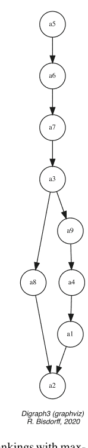

现在，为了在所有具有最大 KEMENY 指数的潜在排序中保留一个特定的代表，我们将借助 `showRankingConsensusQuality()` 方法，选择提出最佳准则共识的那个排序。

**代码清单 8.11** 计算第一个 KEMENY 排序的共识质量

```
>>> g.showRankingConsensusQuality(ke.maximalRankings[0])
Consensus quality of ranking:
['a5','a6','a7','a3','a8','a9','a4','a1','a2']
crit. (weight):  tau  | crit. (weight):  tau
-------------------------------------------
b09 (0.050)  : +0.361 | b04 (0.050)  : +0.333
b08 (0.050)  : +0.292 | b01 (0.050)  : +0.264
c01 (0.167)  : +0.250 | b03 (0.050)  : +0.222
b07 (0.050)  : +0.194 | b05 (0.050)  : +0.167
c02 (0.167)  : +0.000 | b10 (0.050)  : +0.000
b02 (0.050)  : -0.042 | b06 (0.050)  : -0.097
c03 (0.167)  : -0.167
Summary:
Weighted mean marginal correlation (a): +0.099
Standard deviation (b)                : +0.177
Ranking fairness (a)-(b)              : -0.079
```

在对面页面的代码清单 8.11 中，展示了第一个 Kemeny 排序与所有按绩效准则划分的边际严格优势关系的序数相关性（参见第 6-12 行）。效益准则 b09 与该 KEMENY 排序的相关性最高（+0.361，第 6 行），而成本准则 c03 的相关性最低（−0.167，第 12 行）。

第二个 KEMENY 排序的排序共识质量如下方代码清单 8.12 所示。

**代码清单 8.12** 计算第二个 KEMENY 排序的共识质量

```
>>> g.showRankingConsensusQuality(ke.maximalRankings[1])
Consensus quality of ranking:
['a5', 'a6', 'a7', 'a3', 'a9', 'a4', 'a1', 'a8', 'a2']
crit. (weight): tau | crit. (weight): tau
-------------------|-------------------
b09 (0.050) : +0.306 | b08 (0.050) : +0.236
c01 (0.167) : +0.194 | b07 (0.050) : +0.194
c02 (0.167) : +0.167 | b04 (0.050) : +0.167
b03 (0.050) : +0.167 | b01 (0.050) : +0.153
b05 (0.050) : +0.056 | b02 (0.050) : +0.014
b06 (0.050) : -0.042 | c03 (0.167) : -0.111
b10 (0.050) : -0.111
Summary:
Weighted mean marginal correlation (a): +0.099
Standard deviation (b) : +0.132
Ranking fairness (a)-(b) : -0.033
```

效益准则 b09 与该 KEMENY 排序的相关性再次最高（+0.306，第 6 行），但相关性最弱的准则现在是效益准则 b10（−0.111，第 12 行）。

两个 KEMENY 排序与所有 13 个绩效准则都显示出相同的*加权平均边际相关性*（+0.099）。然而，第二个排序显示出略低的*标准差*：+0.132 对比 +0.177，从而产生了一个略*公平*的排序结果：−0.033 对比 −0.079（参见前一页代码清单 8.11 第 14-16 行和代码清单 8.12 第 14-16 行）。

当存在多个具有最大 KEMENY 指数的排序时，Kemeny-Ranking 类构造函数会实例化具有*最高*平均边际相关性的排序，并在平局时选择具有*最低*加权标准差的排序。这里我们得到的排序是：[a5, a6, a7, a3, a9, a4, a1, a8, a2]（参见第 105 页代码清单 8.8 第 5 行）。

## 8.5 SLATER 排序

SLATER 排序规则与 KEMENY 规则相同，但它作用于 CONDORCET——*中位数切割极化*——有向图 gcd（Slater 1961）。SLATER 规则在共轭变换下同样*保持不变性*，因此来自 linearOrders 模块的 SlaterRanking 类在 g 或 gcd 上无差别地给出以下结果：

图 8.4 *最优 SLATER 排序的认知析取。* 因此，我们应该采用哪个精确的 SLATER 排序结果？

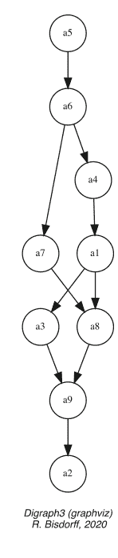

**代码清单 8.13** 计算 SLATER 排序

```
>>> from linearOrders import SlaterRanking
>>> sl = SlaterRanking(gcd,orderLimit=9)
>>> sl.slaterRanking
['a5','a6','a4','a1','a3','a7','a8','a9','a2']
>>> corr = gcd.computeRankingCorrelation(sl.slaterRanking)
>>> sl.showCorrelation(corr)
Correlation indexes:
Extended Kendall tau : +0.676
Epistemic determination : 0.230
Bipolar-valued equivalence : +0.156
>>> len(sl.maximalRankings)
7
```

我们在上面的代码清单 8.13 中注意到，第 4 行显示的 SLATER 排序代表了相当好的拟合度（+0.676），显然略优于 NETFLOWS 排序结果（+0.638）。然而，实际上存在 7 个这样的最优 SLATER 排序（参见第 12 行）。相应的认知析取，同样使用来自 transitiveDigraphs 模块的 RankingsFusionDigraph 类，给出了图 8.4 所示的偏序：

**代码清单 8.14** 计算最优 SLATER 排序的认知析取

```
>>> from transitiveDigraphs import RankingsFusionDigraph
>>> slw = RankingsFusionDigraph(sl,sl.maximalRankings)
>>> slw.exportGraphViz(fileName='tutorialSlater')
*---- exporting a dot file for GraphViz tools ----*
Exporting to tutorialSlater.dot
dot -Grankdir=TB -Tpng tutorialSlater.dot\n -o tutorialSlater.png
```

此外，KEMENY 和 SLATER 排序规则是计算上困难的问题，有效的排序结果只能为微小的优势有向图（<20 个对象）计算（参见第 104 页公式 8.1）。

因此，实践中需要计算效率更高的排序启发式方法，如 COPELAND 和 NETFLOWS 规则。最后，在这些基于评分的排序策略之后，让我们也介绍两种流行的基于选择的排序规则。

## 8.6 KOHLER 基于选择的排序规则

算法 8.3 KOHLER 基于选择的排序规则（Kohler 1978）

输入：双极值有向图 G(X, ≳)，
输出：决策行动集合 X 的线性排序。

在步骤 i（i 从 1 到 n）执行以下操作：

1.  计算双极值严格优势关系表（参见第 98 页代码清单 8.1）每一行的最小值；
2.  选择该最小值最大的行。平局按字典序解决；
3.  将选定的决策备选方案置于等级 i；
4.  从关系表中删除相应的行和列，并重新开始，直到表为空。

**代码清单 8.15** 计算 KOHLER 排序

```
>>> from linearOrders import KohlerRanking
>>> kocd = KohlerRanking(gcd)
>>> kocd.showRanking()
['a5','a7','a6','a3','a9','a8','a4','a1','a2']
>>> corr = gcd.computeOrdinalCorrelation(kocd)
>>> gcd.showCorrelation(corr)
Correlation indexes:
Extended Kendall tau : +0.747
Epistemic determination : 0.230
Bipolar-valued equivalence : +0.172
```

通过这种最小-最大字典序基于选择的策略，我们获得了一个相关性结果（+0.747），迄今为止显然最接近最优。

## 8.7 RANKEDPAIRS 排序规则

N. Tideman 的“选择排序”启发式方法——RANKEDPAIRS 规则，此次在非严格优势有向图 g 上表现最佳——其基础是审慎地增量构建线性序，以在过程中避免任何循环优势情况（Tideman 1987）。

**算法 8.5 RANKEDPAIRS 排序规则**
*输入*：双极值有向图 G(X, ≳)。
*输出*：决策行动集合 X 的线性排序。
1.  将备选方案的有序对 (x, y) 按 r(x ≳ y) + r(y ≳ x) 的值降序排列；
2.  按此顺序考虑这些对（平局通过字典序规则解决）：
    -   如果下一个对与已阻塞的对不构成回路，则阻塞该对；
    -   如果下一个对与已阻塞的对构成回路，则跳过它。

使用我们的教学优势有向图 g，我们得到以下结果。

```
清单 8.17 计算 RANKEDPAIRS 排序
>>> from linearOrders import RankedPairsRanking
>>> rp = RankedPairsRanking(g)
>>> rp.showRanking()
['a5', 'a6', 'a7', 'a3', 'a8', 'a9', 'a4', 'a1', 'a2']
```

在我们的示例中，RANKEDPAIRS 规则幸运地给出了两个最优 KEMENY 排序之一，我们可以在下面验证。

```
>>> ke.maximalRankings
[['a5', 'a6', 'a7', 'a3', 'a8', 'a9', 'a4', 'a1', 'a2'],
 ['a5', 'a6', 'a7', 'a3', 'a9', 'a4', 'a1', 'a8', 'a2']]
>>> corr = g.computeOrdinalCorrelation(rp)
>>> g.showCorrelation(corr)
相关性指标：
  扩展 Kendall tau 系数   : +0.779
  认知确定性              :  0.230
  双极值等价性            : +0.179
```

与 KOHLER 规则类似，RANKEDPAIRS 规则也有一个审慎的对偶版本，即 Dias-Lamboray “选择排序”规则。当此次在对偶优势有向图 -g 上运行时，它会产生类似的排序结果（参见 Dias and Lamboray 2010; Lamboray 2009）。

除了不能提供唯一的线性排序外，“选择排序”规则及其对偶的“选择排序”规则，不幸的是无法扩展到更大的优势有向图（阶数 > 100）。对于这些更大的、包含数百或数千个备选方案的优势有向图，实际上只有具有多项式复杂度 O(n²)（其中 $n$ 是优势有向图的阶数）的 COPELAND 和 NETFLOWS “评分排序”规则是可处理的。此外，由于 COPELAND 和 NETFLOWS 分数的计算可以按备选方案分别进行，当有多处理资源可用时，后一种排序规则可以立即并行处理。

将项目列表写成线性序列的物理必要性使得排序决策问题在实践中非常重要。然而，从偏好建模的角度来看，将此类项目相对评级为性能分位数类别，会更具表现力和忠实度。这是下一章第 9 章的主题。

## 参考文献

Arrow KJ, Raynaud H (1986) 社会选择与多准则决策。MIT出版社，剑桥

Bisdorff R (2010) 枚举有向图中的弦无关回路。见：ORBEL24-2010，比利时运筹学学会第24届年会（ORBEL 又称 Sogesci-B.V.W.B.），1月28-29日，列日（比利时），列日大学（比利时），第1-12页。http://hdl.handle.net/10993/23926

Bisdorff R (2012) 论双极优势关系的序相关性测量与检验。见：Mousseau V, Pirlot M (编) DAP’2012 从多准则决策辅助到偏好学习，蒙斯大学（比利时），第91-100页。http://hdl.handle.net/10993/23909

Bisdorff R (2013) 论具有大性能差异的优势关系的极化。Wiley 多准则决策分析杂志 20:3-12。http://hdl.handle.net/10993/245

Bisdorff R (2021) Digraph3 Python 模块集合的技术文档。https://digraph3.readthedocs.io/en/latest/techDoc.html

Brans JP, Vincke P (1985) 一种偏好排序组织方法：用于多准则决策的 PROMETHEE 方法。管理科学 31(6):647-656

Copeland A (1951) 一个合理的社会福利函数。密歇根大学社会科学数学研讨会

Dias L, Lamboray C (2010) 将审慎原则扩展到利用赋值优势关系。欧洲运筹学杂志 201(3):828-837

Kemeny J (1959) 无数字的数学。代达罗斯 88:577-591

Kohler G (1978) 多准则选择与序数数据的代数分析。博士论文，格勒诺布尔科学与医学大学

Lamboray C (2009) Ranked-Pairs 规则的审慎特征。社会选择与福利 32:129-155

Sen A (2009) 正义的理念。Allen Lane，伦敦

Slater P (1961) 配对比较计划中的不一致性。生物统计学 48:303-312

Tideman N (1987) 克隆独立性作为投票规则的标准。社会选择与福利 4(3):185-206

## 第9章
通过排序至相对绩效分位数进行评级

# 目录

- 9.1 单一绩效标准的分位数排序 115
- 9.2 多绩效标准的分位数排序 116
- 9.3 稀疏预排序优势图模型 120
- 9.4 预排序稀疏优势图的排序 123

摘要 本章中，我们应用顺序统计学，将一组在$m$个不可通约的绩效标准上评估的$n$个潜在决策备选方案集合$X$，排序至$q$个分位数等价类中。该排序算法基于涉及每个标准上观察到的分位数类别界限的成对优势特征。因此，我们可以实现一个复杂度为$O(nmq)$的弱排序算法。

## 9.1 单一绩效标准的分位数排序

单一标准排序类别$K$是实值绩效测量尺度上的一个（通常）下闭区间$[m_k; M_k[$，其中$m_k \le M_k$。如果$x$是该尺度上的测量绩效，我们可以区分三种排序情况：

1.  $x < m_k$ 且 $x < M_k$：绩效$x$低于类别$K$。
2.  $x \ge m_k$ 且 $x < M_k$：绩效$x$属于类别$K$。
3.  $x > m_k$ 且 $x \ge M_k$：绩效$x$高于类别$K$。

由于关系$<$是$\ge (\not\ge)$的对偶，只需检查$x \ge m_k$以及$x \not\ge M_k$均为真，即可认为$x$是类别$K$的成员。

上闭类别（采用更数学化的积分风格）同样可以考虑。在这种情况下，只需检查$m_k \not\ge x$以及$M_k \ge x$均为真，即可认为$x$是类别$K$的成员。值得注意的是，一个满足$m_k = M_k$的类别$K$根据定义总是空的。为了能够对需要排序的整个值域进行正确排序，我们将需要使用一个特殊的、双侧闭合的最后（或第一个）类别。

设$K = K_1, ..., K_q$是将标准的绩效测量尺度划分为$q \ge 2$个有序类别$K_k$（即下闭区间$[m_k; M_k[$）的一个非平凡划分，使得$m_k < M_k$，$M_k = m_{k+1}$（对于$k = 0, ..., q - 1$），且$M_q = \infty$。并且，设$A = \{a_1, a_2, a_3, ...\}$是在相关尺度上观察到的、并非全部相等的有限绩效测量集合。

**性质** 对于所有绩效测量$x \in A$，现在存在唯一的$k$使得$x \in K_k$。如果我们像在描述性统计中那样，将收集在类别$K_k$中的所有测量值等同于该类别的中心值——即$(m_k + M_k)/2$——那么排序结果将在$A$上定义一个弱序（完全预序）。

设$Q = \{Q_0, Q_1, ..., Q_q\}$表示我们可以从绩效尺度上观察到的有序绩效测量集合$A$计算出的$q + 1$个递增顺序统计分位数——如四分位数或十分位数。如果$Q_0 = \min(X)$，则以下区间：$[Q_0; Q_1[$，$[Q_1; Q_2[$，...，$[Q_{q-1}; \infty[$定义了一组$q$个下闭排序类别。并且，在上闭类别的情况下，如果$Q_q = \max(X)$，我们得到区间$]-\infty; Q_1]$，$]Q_1; Q_2]$，...，$]Q_{q-1}; Q_q]$。在两种情况下，$A$的相应排序都将导致所有测量值$x$重新分配到$q$个分位数类别$K_k$中，其中$k = 1, ..., q$。

**示例** 设$A = \{ a_7 = 7.03, a_{15} = 9.45, a_{11} = 20.35, a_{16} = 25.94, a_{10} = 31.44, a_9 = 34.48, a_{12} = 34.50, a_{13} = 35.61, a_{14} = 36.54, a_{19} = 42.83, a_5 = 50.04, a_2 = 59.85, a_{17} = 61.35, a_{18} = 61.61, a_3 = 76.91, a_6 = 91.39, a_1 = 91.79, a_4 = 96.52, a_8 = 96.56, a_{20} = 98.42 \}$是在给定标准上观察到的20个递增绩效测量值的集合。我们使用四分位数（$q = 4$）得到的下闭类别界限为：$Q_0 = 7.03 = a_7$，$Q_1 = 34.485$，$Q_2 = 54.945$（中位数绩效），以及$Q_3 = 91.69$。将$A$排序至这四个类别中，定义了一个完全预序，包含以下四个等价类：$K_1 = \{a_7, a_{10}, a_{11}, a_{10}, a_{15}, a_{16}\}$，$K_2 = \{a_5, a_9, a_{13}, a_{14}, a_{19}\}$，$K_3 = \{a_2, a_3, a_6, a_{17}, a_{18}\}$，以及$K_4 = \{a_1, a_4, a_8, a_{20}\}$。

## 9.2 多绩效标准的分位数排序

现在让我们假设我们有一个绩效表，其中包含一组$n$个决策备选方案$X$，这些方案在$m$个绩效标准的一致族上进行评估，并与定义在$X$上的相应优势关系$\succsim$相关联。我们用$x_j$表示备选方案$x$在标准$j$上观察到的绩效。

进一步假设我们希望将决策备选方案排序至$q$个上闭分位数等价类中。因此，我们考虑一个序列：$k = k/q$，其中$k = 0, ..., q$，表示$q + 1$个等间距的分位数，例如：四分位数：0, 0.25, 0.5, 0.75, 1；五分位数：0, 0.2, 0.4, 0.6, 0.8, 1；或十分位数：0, 0.1, 0.2, ..., 0.9, 1。

上闭$\mathbf{q}^k$类对应于在每个标准$j$上观察到的$m$个分位数区间$]q_j(p_{k-1}); q_j(p_k)]$，其中$k = 2, \dots, q$，$q_j(p_q) = \max_X(x_j)$，第一个类别汇集所有低于或等于$Q_j(p_1)$的绩效。

下闭$\mathbf{q}_k$类对应于在每个标准$j$上观察到的$m$个分位数区间$[q_j(p_{k-1}); q_j(p_k[$，其中$k = 1, \dots, q-1$，$q_j(p_0) = \min_X(x_j)$，最后一个类别汇集所有高于或等于$Q_j(p_{q-1})$的绩效。

我们将$k = 1, \dots, q$个上闭$\mathbf{q}^k$（或下闭$\mathbf{q}_k$）多标准分位数类的完整序列称为**q分位数**。

**性质** 借助优势关系的双极值特征$r(x \succsim y)$，我们可以如下计算断言的双极值特征：$x$属于上闭$q$分位数类$\mathbf{q}^k$（或下闭类$\mathbf{q}_k$）(Bisdorff 2020)：

$$r(x \in \mathbf{q}^k) = \min[-r(\mathbf{q}(p_{k-1}) \succsim x), r(\mathbf{q}(p_k) \succsim x)] \quad (9.1)$$
$$r(x \in \mathbf{q}_k) = \min[r(x \succsim \mathbf{q}(p_{k-1})), -r(x \succsim \mathbf{q}(p_k))] \quad (9.2)$$

$\min$算子实现逻辑合取，并且优势关系$\succsim$满足对偶性原则，即$-r(\mathbf{q}(p_{k-1}) \succsim x) = r(\mathbf{q}(p_{k-1}) \prec x)$，或$-r(x \succsim \mathbf{q}(p_k)) = r(x \prec \mathbf{q}(p_k))$。

sortingDigraphs模块中的QuantilesSortingDigraph类可以计算，例如，给定随机绩效表的五分位数排序（Bisdorff 2021）。

### 代码清单 9.1 计算五分位数排序结果

```
>>> from randomPerfTabs import RandomPerformanceTableau
>>> t = RandomPerformanceTableau(numberOfActions=50,seed=5)
>>> from sortingDigraphs import QuantilesSortingDigraph
>>> qs = QuantilesSortingDigraph(t,limitingQuantiles=5)
>>> qs
*------ Object instance description -----------*
Instance class : QuantilesSortingDigraph
Instance name : sorting_with_5-tile_limits
Actions : 50
Criteria : 7
Categories : 5
Lowerclosed : False
Size : 841
Valuation domain : [-1.00;1.00]
Determinateness (%) : 81.39
Attributes : ['actions','actionsOrig',
'criteria','evaluation','runTimes','name',
'limitingQuantiles','LowerClosed',
'categories','criteriaCategoryLimits',
'profiles','profileLimits','hasNoVeto',
'valuationdomain','nbrThreads','relation',
'categoryContent','order','gamma','notGamma']
*------- Constructor run times (in sec.) ------*
# Threads : 1
Total time : 0.03120
Data input : 0.00300
Compute profiles : 0.00075
Compute relation : 0.02581
Weak Ordering : 0.00052
```

将50个决策备选方案进行五分位数排序，得到5个有序的上闭决策备选方案类别——即五分位数——由81.39%的显著性标准多数支持（见上文第15行）。

`showCriteriaQuantileLimits()`方法在代码清单9.2中显示了五分位数界限，这些界限将每个标准上50个决策备选方案的相应评估分隔为5个五分位数。在标准g1上观察到最高评估值（见下文第6行）。

### 代码清单 9.2 检查分位数界限

```
>>> qs.showCriteriaQuantileLimits()
Quantile Class Limits (q = 5)
Upper-closed classes
crit.        0.20      0.40      0.60      0.80      1.00
*-----------------------------------------------------------
g1           31.35     41.09     58.53     71.91     98.08
g2           27.81     39.19     49.87     61.66     96.18
g3           25.10     34.78     49.45     63.97     92.59
g4           24.61     37.91     53.91     71.02     89.84
g5           26.94     36.43     52.16     72.52     96.25
g6           23.94     44.06     54.92     67.34     95.97
g7           30.94     47.40     55.46     69.04     97.10
```

通过`showSorting()`方法，我们可以在下面的代码清单9.3中检查实际的五分位数排序结果。

### 代码清单 9.3 计算五分位数排序结果

```
>>> qs.showSorting()
    *--- Sorting results in descending order ---*
    ]0.80 - 1.00]: ['a22']
    ]0.60 - 0.80]: ['a03','a07','a08','a11','a14','a17',
                    'a19','a20','a29','a32','a33','a37',
                    'a39','a41','a42','a49']
    ]0.40 - 0.60]: ['a01','a02','a04','a05','a06','a08',
                    'a09','a16','a17','a18','a19','a21',
                    'a24','a27','a28','a30','a31','a35',
                    'a36','a40','a43','a46','a47','a48',
                    'a49','a50']
    ]0.20 - 0.40]: ['a04','a10','a12','a13','a15','a23',
                    'a25','a26','a34','a38','a43','a44',
                    'a45','a49']
    ]   < - 0.20]: ['a44']
```

大多数决策备选方案（26个）汇集在中位数五分位数]0.40 – 0.60]类别中，而最高五分位数]0.80 – 1.00]和最低五分位数] < –0.20]类别各汇集一个独特的决策备选方案（分别是a22和a44）。

检查相应排序特征的详细信息可以通过`showSortingCharacteristics()`方法完成。

## 9.2 基于多重绩效标准的分位数排序

清单 9.4 双极值排序特征（摘录）

```
>>> qs.showSortingCharacteristics()
    x  in  q^k          r(q^k-1 < x)  r(q^k >= x)  r(x in q^k)
 a22 in ]< - 0.20]       1.00          -0.86         -0.86
 a22 in ]0.20 - 0.40]    0.86          -0.71         -0.71
 a22 in ]0.40 - 0.60]    0.71          -0.71         -0.71
 a22 in ]0.60 - 0.80]    0.71          -0.14         -0.14
 a22 in ]0.80 - 1.00]    0.14           1.00          0.14
 ...
 ...
 a44 in ]< - 0.20]       1.00           0.00          0.00
 a44 in ]0.20 - 0.40]    0.00           0.57          0.00
 a44 in ]0.40 - 0.60]   -0.57           0.86         -0.57
 a44 in ]0.60 - 0.80]   -0.86           0.86         -0.86
 a44 in ]0.80 - 1.00]   -0.86           0.86         -0.86
 ...
 ...
 a49 in ]< - 0.20]       1.00          -0.43         -0.43
 a49 in ]0.20 - 0.40]    0.43           0.00          0.00
 a49 in ]0.40 - 0.60]    0.00           0.00          0.00
 a49 in ]0.60 - 0.80]    0.00           0.57          0.00
 a49 in ]0.80 - 1.00]   -0.57           0.86         -0.57
```

在清单 9.4 第 7 行中，备选方案 a22 仅在最高五分位数 [0.80−1.00] 类中确实同时满足两个排序条件。而例如备选方案 a44 和 a49，则分别在两个和三个相邻的五分位数类中弱满足两个排序条件（第 10−11 行和第 18−20 行）。

分位数排序结果确实始终满足以下性质（Bisdorff 2020）：

性质 9.1（分位数排序结果的形式性质）

1.  一致性：每个对象都被排序到一个非空的相邻 q 分位数类子集中。一个在所有标准上都缺少评估的备选方案将被共同排序到所有 q 分位数类中。
2.  唯一性：当 r(x ∈ q^k) ≠ 0.0，其中 k = 1, ..., q 时，绩效 x 被精确地排序到一个单一的 q 分位数类中。
3.  可分性：计算绩效 x 的排序结果独立于计算其他绩效的排序结果。这一性质使得类成员特征的高效并行处理成为可能。

因此，q 分位数排序结果给我们留下了或多或少重叠的有序分位数等价类。为了构建 X 的一个线性排序的 q 分位数划分，我们可以应用三种策略：

1.  平均（默认）：按下限和上限分位数极限以及上限分位数类极限的平均值的降序字典序排列；
2.  乐观：按上限和下限分位数类极限的降序字典序排列；
3.  悲观：按下限和上限分位数类极限的降序字典序排列；

## 清单 9.5 弱排序五分位数排序结果

```
>>> qs.showQuantileOrdering(strategy='average')
]0.80-1.00]  : ['a22']
]0.60-0.80]  : ['a03','a07','a11','a14','a20','a29',
                'a32','a33','a37','a39','a41','a42']
]0.40-0.80]  : ['a08','a17','a19']
]0.20-0.80]  : ['a49']
]0.40-0.60]  : ['a01','a02','a05','a06','a09','a16',
                'a18','a21','a24','a27','a28','a30',
                'a31','a35','a36','a40','a46','a47',
                'a48','a50']
]0.20-0.60]  : ['a04','a43']
]0.20-0.40]  : ['a10','a12','a13','a15','a23','a25',
                'a26','a34','a38','a45']
]  < -0.40]  : ['a44']
```

例如，遵循*平均*排序策略，我们在清单 9.5 所示的弱排序中确认，备选方案 a49 确实被排序到三个相邻的五分位数类中，即 ]0.20−0.80]，并且排在 ]0.40−0.60] 类之前，因为它们具有相同的上下限平均值（见第 6 行）。

因此，QuantilesSortingDigraph 类构造函数对相应的双极值优势有向图进行了线性有序分解。这种分解引导我们得到一个新的*稀疏预排序*优势有向图模型。

## 9.3 稀疏预排序优势有向图模型

遵循优势排序方法的方法论要求，一个给定的优势有向图必然与一个相应的绩效矩阵相关联（见第 3 章）。并且，我们可以使用这个关联的绩效矩阵，通过上一节介绍的分位数排序算法，将潜在决策备选方案集合线性分解为有序的分位数等价类。

在下面清单 9.6 所示的编码示例中，我们首先生成一个包含 75 个决策备选方案的简单绩效矩阵，然后使用 sparseOutrankingDigraphs 模块中的 PreRankedOutrankingDigraph 类构建相应的稀疏优势有向图，称为 prg。顺便注意第 3 行中用于生成一个注释简洁的绩效矩阵的 BigData 标志（Bisdorff 2021）。

## 清单 9.6 计算一个*预排序*的稀疏优势有向图

```
>>> from randomPerfTabs import RandomPerformanceTableau
>>> tp = RandomPerformanceTableau(numberOfActions=75,
...                               BigData=True,seed=100)
>>> from sparseOutrankingDigraphs import
...     PreRankedOutrankingDigraph
>>> prg = PreRankedOutrankingDigraph(Tp,quantiles=5)
>>> prg
```

```
*----- Object instance description ------*
Instance class    : PreRankedOutrankingDigraph
Instance name     : randomperftab_pr
Actions           : 75
Criteria          : 7
Sorting by        : 5-Tiling
Ordering strategy : average
Components        : 9
Minimal order     : 1
Maximal order     : 25
Average order     : 8.3
fill rate         : 20.432%
Attributes        :
    ['actions','criteria','evaluation','NA','name',
    'order','runTimes','dimension','sortingParameters',
    'valuationdomain','profiles','categories','sorting',
    'decomposition','nbrComponents','components',
    'fillRate','minimalComponentSize','maximalComponentSize',
    ... ]
```

5 分位数排序结果遵循*平均*上下限五分位数极限策略（见前一页清单 9.6 第 14 行）。我们在这里得到 9 个有序分量，最小阶为 1，最大阶为 25。通过 showDecomposition() 方法，可以如下检查相应的*预排序分解*：

## 清单 9.7 预排序优势有向图的分位数分解

```
>>> prg.showDecomposition()
    *--- quantiles decomposition in decreasing order----*
    c1. ]0.80-1.00] : [5, 42, 43, 47]
    c2. ]0.60-1.00] : [73]
    c3. ]0.60-0.80] : [1, 4, 13, 14, 22, 32, 34, 35, 40,
                      41, 45, 61, 62, 65, 68, 70, 75]
    c4. ]0.40-0.80] : [2, 54]
    c5. ]0.40-0.60] : [3, 6, 7, 10, 15, 18, 19, 21, 23, 24,
                      27, 30, 36, 37, 48, 51, 52, 56, 58,
                      63, 67, 69, 71, 72, 74]
    c6. ]0.20-0.60] : [8, 11, 25, 28, 64, 66]
    c7. ]0.20-0.40] : [12, 16, 17, 20, 26, 31, 33, 38, 39,
                      44, 46, 49, 50, 53, 55]
    c8. ]    <-0.40] : [9, 29, 60]
    c9. ]    <-0.20] : [57, 59]
```

最高的五分位数类（[80% – 100%]）包含决策备选方案 5、42、43 和 47。最低的五分位数类（[ – 20%]）汇集了备选方案 57 和 59（见清单 9.7 第 3 行和第 15 行）。
生成的稀疏优势关系通过 showHTMLRelationMap() 方法以热图浏览器视图显示。

```
>>> prg.showHTMLRelationMap()
```

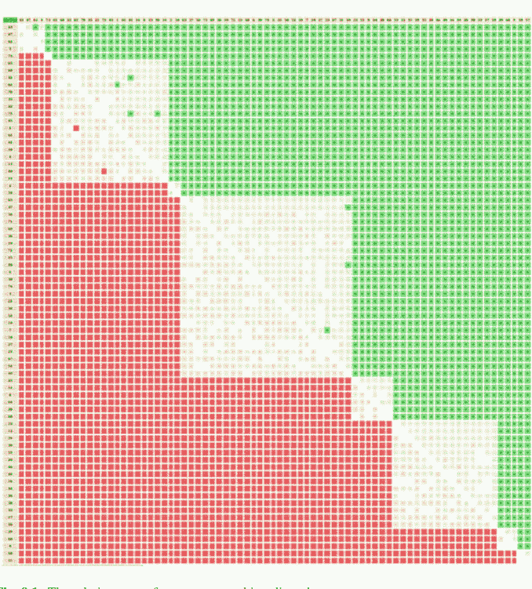

**图 9.1** 稀疏优势有向图的关系图

在图 9.1 中，我们很容易识别出 9 个线性排序的分位数等价类。*绿色*和*浅绿色*像素显示正向的*优势*情况，而正向的*被优势*（即负向优势）情况则以*红色*和*浅红色*显示。不确定的情况显示为白色。在 9 个分位数等价类中的每一个，我们都恢复了相应的双极值优势*子关系*，这导致了 20.4% 的实际*填充率*（见第 120 页清单 9.6 第 19 行）。

计算稀疏优势有向图与标准优势有向图之间的序相关，可以检查稀疏模型在多大程度上忠实地表示了完整的优势关系。

## 9.4 对预排序稀疏优势有向图进行排序

```python
>>> g = BipolarOutrankingDigraph(tp)
>>> corr = prg.computeOrdinalCorrelation(g)
>>> g.showCorrelation(corr)
Correlation indexes:
  Crisp ordinal correlation  : +0.863
  Epistemic determination    :  0.315
  Bipolar-valued equivalence : +0.272
```

标准优势有向图与稀疏优势有向图之间的序相关指数相当高（+0.863），并且它们的双极值等价性得到了平均准则显著性多数 (1.0 + 0.272)/2 = 64% 的支持。

值得注意的是，在第120页的清单9.6（第20行及后续行）中，稀疏预排序优势有向图不包含 `relation` 属性。此处对成对优势特征值的访问是通过相应的 `relation()` 函数提供的。

### 清单 9.8 函数式二元关系特征

```python
def relation(self,x,y):
    """
    Dynamic construction of the global
    outranking characteristic function r(x,y).
    """
    Min = self.valuationdomain['min']
    Med = self.valuationdomain['med']
    Max = self.valuationdomain['max']
    if x == y:
        return Med
    cx = self.actions[x]['component']
    cy = self.actions[y]['component']
    if cx == cy:
        return self.components[cx]['subGraph'].relation[x][y]
    elif self.components[cx]['rank'] > self.components[cy]['rank']:
        return Min
    else:
        return Max
```

在清单9.8的第9-10行中，所有自反情况都被设置为*不确定*值。当两个决策备选方案属于同一组件——分位数等价类时，我们访问相应优势子图的 `relation` 属性（第13-14行）。否则，我们只需检查各组件的相应排名。

这九个有序组件中的每一个都使用合适的排序规则进行局部排序。在运行时间和质量方面，使用COPELAND和NETFLOWS规则（参见第8.2节和第8.3节）都能获得大致相当的最佳操作结果。最终获得的线性排序（从最差到最佳）存储在 `prg.boostedOrder` 属性中。反向线性排序（从最佳到最差）存储在 `prg.boostedRanking` 属性中。

```python
>>> prg.boostedRanking
[43, 47, 42, 5, 73, 65, 68, 32, 62, 70, 35, 22, 75, 45, 1,
 61, 41, 34, 4, 13, 40, 14, 2, 54, 63, 37, 56, 71, 69, 36,
 19, 72, 15, 48, 6, 30, 74, 3, 21, 58, 52, 18, 7, 24, 27,
 23, 67, 51, 10, 25, 11, 8, 64, 28, 66, 53, 12, 31, 39, 55,
 20, 46, 49, 16, 44, 26, 38, 33, 17, 50, 29, 60, 9, 59, 57]
```

备选方案43*排名第一*，而备选方案57*排名最后*（见上文）。

可以通过使用 `computeRankingCorrelation()` 方法计算其与标准优势有向图g的序相关指数来评估此排序结果的质量。

```python
>>> corr = g.computeRankingCorrelation(prg.boostedRanking)
>>> g.showCorrelation(corr)
Correlation indexes:
  Crisp ordinal correlation  : +0.807
  Epistemic determination    :  0.315
  Bipolar-valued equivalence : +0.254
```

我们也可以在下面验证，例如从标准优势有向图g获得的COPELAND排序与从稀疏优势有向图prg获得的排序也具有高度相关性（+0.822）。

```python
>>> from linearOrders import CopelandOrder
>>> cop = CopelandOrder(g)
>>> print(cop.computeRankingCorrelation(prg.boostedRanking))
{'correlation': 0.822, 'determination': 1.0}
```

注意到分位数排序构建的计算效率，以及分位数类成员特征计算的可分离性，我们将在第11章中使用 `PreRankedOutrankingDigraph` 构造函数来处理高性能计算（HPC）中大型甚至超大型性能矩阵的排序问题（Bisdorff 2016）。接下来的第10章将讨论基于学习到的分位数性能规范进行绝对评级的问题。

## 参考文献

Bisdorff R (2016) Computing linear rankings from trillions of pairwise outranking situations. In: Busa-Fekete R, Hüllermeier E, Mousseau V, Pfannschmidt K (eds) From multiple criteria decision aid to preference learning, DAP'2016, University of Paderborn (Germany), pp 1–16. http://hdl.handle.net/10993/28613

Bisdorff R (2020) Lecture 10: On quantiles rating with multiple incommensurable criteria. In: Lectures of the algorithmic decision theory course, University of Luxembourg. http://hdl.handle.net/10993/37933

Bisdorff R (2021) Technical documentation of the Digraph3 collection of Python modules. https://digraph3.readthedocs.io/en/latest/techDoc.html

# 第10章
基于学习到的性能分位数规范进行排序评级


# 目录

- 10.1 绝对评级问题
- 10.2 历史性能分位数的增量学习
- 10.3 使用分位数规范对新性能进行排序评级

**摘要** 本章我们解决的问题是：根据从过去观察到的类似决策备选方案收集的历史性能数据中学习到的性能分位数，对一组潜在决策备选方案的多准则性能进行评级。我们展示了如何从此类历史性能矩阵中学习性能分位数。新的性能记录现在可以根据这些分位数规范进行评级。

## 10.1 绝对评级问题

为了说明我们面临的*绝对评级*问题，请暂时考虑一下，在给定的决策问题中，我们观察到，例如在下面的表10.1中，两个潜在决策备选方案（名为a1001和a1010）的多准则性能评估，它们在7个*不可通约*的性能准则上进行评估：2个*成本*准则c1和c2（需*最小化*）和5个*效益*准则b1到b5（需*最大化*）。

*效益*准则b1、b4和b5的性能在0.0（最差）到100.0（最佳）的基数尺度上测量，而*效益*准则b2和b3以及*成本*准则c1的性能分别在0（最差）到10（最佳）的序数尺度上测量，以及-10（最差）到0（最佳）。*成本*准则c2的性能最终在-100.00（最差）到0.0（最佳）的基数*负*尺度上测量。两个*成本*准则具有同等重要性（权重5）。同样，五个效益准则也具有同等重要性（权重2）。因此，*成本*准则的*重要性*（显著性权重之和：2 × 5 = 10）*等同于**效益*准则的*重要性*（显著性权重之和：5 × 2 = 10）。

我们现在面临的非平凡决策问题是，如何对备选方案a1001和a1010先前的两个多准则性能记录进行评级：*优秀？良好？*还是*一般？*；甚至可能是*较弱？*或*非常弱？*当与过去已经评级到分位数中的类似多准则性能记录进行比较时。

为了解决这个*绝对*评级问题，首先，我们需要从历史记录中估计多准则*性能分位数*（Bisdorff 2020）。

## 10.2 历史性能分位数的增量学习

假设我们从给定的随机性能矩阵模型（参见第5章）中随机看到飞入的多准则性能。我们在此解决的问题是，根据迄今为止观察到的性能向量来估计经验性能分位数。对于这项任务，我们受到Chambers等人（2006）的启发，他们提出了一种高效的算法，用于使用新观察到的累积分布函数（CDF）增量更新分位数分箱的累积分布函数。¹

`PerformanceQuantiles`类使用`randomNumbers`模块中的`IncrementalQuantilesEstimator`类，实现了基于给定性能矩阵的这种性能分位数估计（Bisdorff 2021）。

其主要属性包括：

- 来自有效性能矩阵实例的有序`objectives`和`criteria`字典；
- 分位数频率列表`quantileFrequencies`，例如：
  - *四分位数* [0.0, 0.25, 0.5, 0.75, 1.0]，
  - *五分位数* [0.0, 0.2, 0.4, 0.6, 0.8, 1.0]，或
  - *十分位数* [0.0, 0.1, 0.2, ...1.0]；
- 有序字典`limitingQuantiles`，包含迄今为止为每个准则的每个频率估计的*下限*（默认）或*上限*分位数类界限；

> ¹ 我们在Python中改编了Press等人（2007，第5章）发表的C++实现。

**表 10.1** 两个潜在决策备选方案的多准则性能

| 准则 (权重) | b1 (2) | b2 (2) | b3 (2) | b4 (2) | b5 (2) | c1 (5) | c2 (5) |
| :--- | :--- | :--- | :--- | :--- | :--- | :--- | :--- |
| a1001 | 37.0 | 2 | 2 | 61.0 | 31.0 | −4 | −40.0 |
| a1010 | 32.0 | 9 | 6 | 55.0 | 51.0 | −4 | −35.0 |

• 一个有序字典 `historySizes`，用于跟踪每个准则迄今为止已评估的次数。缺失数据（即当前情况）导致这些大小因准则而异。

下面，我们展示一个Python会话示例，该示例涉及900个随机生成的决策方案，使用*成本-效益*性能表模型（参见第5.3节），表10.1（第125页）中显示的方案a1001和a1010的性能也来源于此模型。

**清单 10.1** 从给定性能表计算性能分位数

```
>>> from performanceQuantiles import PerformanceQuantiles
>>> from randomPerfTabs import RandomCBPerformanceTableau
>>> nbrActions=900
>>> nbrCrit = 7
>>> seed = 100
>>> pt = RandomCBPerformanceTableau(numberOfActions=nbrActions,
...                     numberOfCriteria=nbrCrit,seed=seed)
>>> pq = PerformanceQuantiles(pt,
...                     numberOfBins = 'quartiles',
...                     LowerClosed=True)
>>> pq
    *------ PerformanceQuantiles instance description ------*
    Instance class   : PerformanceQuantiles
    Instance name    : 4-tiled_performances
    Objectives       : 2
    Criteria         : 7
    Quantiles        : 4
    History sizes    : {'c1': 887,'b1': 888,'b2': 891,'b3': 895,
                        'b4': 892,'c2': 893,'b5': 887}
    Attributes       : ['perfTabType','valueDigits',
                        'actionsTypeStatistics',
                        'objectives', 'BigData',
                        'missingDataProbability',
                        'criteria', 'LowerClosed', 'name',
                        'quantilesFrequencies', 'historySizes',
                        'limitingQuantiles', 'cdf']
```

在上面的第10行中，我们用于设置所需分位数频率数量的*PerformanceQuantiles*类参数`numberOfBins`，可以是*四分位数*（4个箱）、*五分位数*（5个箱）、*十分位数*（10个箱）、*二十分位数*（20个箱）或任何其他整数数量的分位数箱。分位数箱可以是*下闭*（默认）或*上闭*。

可以通过`showLimitingQuantiles()`方法检查估计的四分位数界限。

**清单 10.2** 打印估计的四分位数界限

```
>>> pq.showLimitingQuantiles(ByObjectives=True)
    ---- Historical performance quantiles ----*
    Costs
    criteria | weights |  '0.00' '0.25' '0.50' '0.75' '1.00'
```

| | | '0.00' | '0.25' | '0.50' | '0.75' | '1.00' |
|---|---|---|---|---|---|---|
| 'c1' | 5 | -10 | -7 | -5 | -3 | 0 |
| 'c2' | 5 | -96.37 | -70.65 | -50.10 | -30.00 | -1.43 |
| Benefits criteria | weights | '0.00' | '0.25' | '0.50' | '0.75' | '1.00' |
| 'b1' | 2 | 1.99 | 29.82 | 49.44 | 70.73 | 99.83 |
| 'b2' | 2 | 0 | 3 | 5 | 7 | 10 |
| 'b3' | 2 | 0 | 3 | 5 | 7 | 10 |
| 'b4' | 2 | 3.27 | 30.10 | 50.82 | 70.89 | 98.05 |
| 'b5' | 2 | 0.85 | 29.08 | 48.55 | 69.98 | 97.56 |

两个目标*同等重要*；*成本*准则的权重之和（10）与*效益*准则的权重之和（10）相平衡（参见前一页清单10.2第2列）。*成本*准则c1和c2的偏好方向是*负向*的；成本越低越好，而所有*效益*准则b1到b5都显示*正向*偏好方向，即效益越高越好。标题为0.00和1.00的列分别显示了迄今为止在每个准则上观察到的*四分位数* Q0（*最差*）和Q4（*最佳*）性能。0.50列显示了在各准则上观察到的*中位数*（Q2）性能。

现在可以使用`randomPerfTabs`模块（Bisdorff 2021）中的通用`RandomPerformanceGenerator`类，从与`pt`相同的随机性能表模型（参见前一页清单10.1）生成具有随机多准则性能向量的新决策方案。²

**清单 10.3** 生成100个相同模型的新随机决策方案

```
>>> from randomPerfTabs import RandomPerformanceGenerator
>>> rpg = RandomPerformanceGenerator(pt,seed=seed)
>>> newTab = rpg.randomPerformanceTableau(100)
```

首先，必须用这新到达的100条数据记录更新迄今为止估计的历史分位数界限：

```
>>> # 更新上面显示的四分位数标准
>>> pq.updateQuantiles(newTab,historySize=None)
```

`updateQuantiles()`方法（上面第2行）的参数`historySize`允许*平衡**新*评估与*历史*评估。

使用`historySize = None`（默认设置），上例中的平衡是900/1000（90%，历史数据的权重）对100/1000（10%，新到达观测值的权重）。例如，设置`historySize = 0`将忽略所有历史数据（0/100对100/100），并仅使用新到达的数据重新开始构建分位数估计。

> ² `RandomPerformanceGenerator`类适用于*标准*性能表模型（参见第5.2节）、*成本-效益*模型（参见第5.3节）和3目标模型（参见第5.4节）。

## 性能分位数

采样大小在986到995之间。

| criterion | 0.00 | 0.25 | 0.50 | 0.75 | 1.00 |
| :--- | :--- | :--- | :--- | :--- | :--- |
| **b1** | 1.99 | 28.77 | 49.63 | 75.27 | 99.83 |
| **b2** | 0.00 | 2.94 | 4.92 | 6.72 | 10.00 |
| **b3** | 0.00 | 2.90 | 4.86 | 8.01 | 10.00 |
| **b4** | 3.27 | 35.91 | 58.58 | 72.00 | 98.05 |
| **b5** | 0.85 | 32.84 | 48.09 | 69.75 | 99.00 |
| **c1** | -10.00 | -7.35 | -5.39 | -3.38 | 0.00 |
| **c2** | -96.37 | -72.22 | -52.27 | -33.99 | -1.43 |

**图 10.1** *显示每个准则更新后的四分位数界限。* 0.25列显示第一四分位数（Q1）界限，0.50列显示第二四分位数（Q2）界限，0.75列显示第三四分位数（Q3）界限。0.00列（或1.00列）显示每个准则上的最小值（或最大值）性能。

`showHTMLLimitingQuantiles()`方法在浏览器视图中显示更新后的分位数界限（参见图10.1）。

```
>>> # 在浏览器视图中显示更新后的分位数界限
>>> pq.showHTMLLimitingQuantiles(Transposed=True)
```

## 10.3 使用分位数标准对新性能进行排序评级

为了使用从历史数据估计的经验性能分位数对一组新给定的决策方案进行*评级*，`sortingDigraphs`模块提供了`LearnedQuantilesRatingDigraph`类，这是`QuantilesSortingDigraph`类（参见第9章）的一个特化。绝对评级结果是通过将新性能记录与学习到的历史分位数界限一起*排序*来计算的。

该类构造函数需要一个有效的`PerformanceQuantiles`实例，并且默认使用`COPELAND`或`NETFLOWS`排序规则，具体取决于哪个在序相关意义上最适合底层的偏好有向图。

需要注意的是，与通用的`OutrankingDigraph`类不同，`LearnedQuantilesRatingDigraph`类不是继承自通用的`PerformanceTableau`类，而是继承自`PerformanceQuantiles`类（Bisdorff 2021）。

此类`LearnedQuantilesRatingDigraph`类实例中的`actions`属性不仅包含新给定的决策方案，还包含从给定的`PerformanceQuantiles`类实例获得的历史分位数界限（属性`profiles`），即从历史性能数据估计的分位数箱性能界限。

我们现在重新考虑上一节计算的`PerformanceQuantiles`对象实例`pq`。令`newActions`为一个包含10个新决策方案的列表，这些方案由相同的随机性能表生成器`rpg`生成，并且为了我们的教学目的，包含了开头提到的两个决策方案`a1001`和`a1010`。

**清单 10.4** 计算10个新决策方案的绝对评级

```
>>> from sortingDigraphs import LearnedQuantilesRatingDigraph
>>> newActions = rpg.randomActions(10)
>>> lqr = LearnedQuantilesRatingDigraph(pq,newActions,
rankingRule='best')
>>> lqr
*---- Object instance description
Instance class : LearnedQuantilesRatingDigraph
Instance name : normedRatingDigraph
Criteria : 7
Quantile profiles : 4
Lower-closed bins : True
New actions : 10
Size : 93
Determinateness (%) : 76.1
Ranking rule : Copeland
Ordinal correlation : +0.95
Attributes: ['runTimes','objectives','criteria',
'LowerClosed','quantilesFrequencies',
'limitingQuantiles','historySizes','cdf','name',
'newActions','evaluation','categories',
'criteriaCategoryLimits','profiles','profileLimits',
'hasNoVeto','actions','completeRelation','relation',
'concordanceRelation','valuationdomain','order',
'gamma','notGamma','rankingRule','rankingCorrelation',
'rankingScores','actionsRanking','ratingCategories',
'ratingRelation','relationOrig']
```

输入到`LearnedQuantilesRatingDigraph`类构造函数的数据是一个有效的`PerformanceQuantiles`对象`pq`和一个`newActions`列表，该列表包含使用相同随机生成器`rpg`新生成的决策方案（参见清单10.4第3-4行）。

`showPerformanceTableau()`方法的`actionsSubset`参数允许查看有向图的节点，此处称为`newActions`。

**清单 10.5** 新到达决策方案的性能表

```
>>> lqr.showPerformanceTableau(actionsSubset=lqr.newActions)
*---- performance tableau ----*
criteria | a1001 a1002 a1003 a1004 a1005 a1006 a1007 a1008 a1009 a1010
---------------------------------------------------------------
'b1' | 37.0 27.0 24.0 16.0 42.0 33.0 39.0 64.0 42.0 32.0
'b2' | 2.0 5.0 8.0 3.0 3.0 3.0 6.0 5.0 4.0 9.0
'b3' | 2.0 4.0 2.0 1.0 6.0 3.0 2.0 6.0 6.0 6.0
'b4' | 61.0 54.0 74.0 25.0 28.0 20.0 20.0 49.0 44.0 55.0
'b5' | 31.0 63.0 61.0 48.0 30.0 39.0 16.0 96.0 57.0 51.0
'c1' | -4.0 -6.0 -8.0 -5.0 -1.0 -5.0 -1.0 -6.0 -6.0 -4.0
'c2' | -40.0 -23.0 -37.0 -37.0 -24.0 -27.0 -73.0 -43.0 -94.0 -35.0
```

在10个新的待评估决策方案中，我们识别出方案a1001（见第2列）和a1010（见最后一列），这两个方案已在第125页的表10.1中展示过。

`LearnedQuantilesRatingDigraph`类实例的动作字典，除了包含这十个新方案的10项性能评估值外，还包含四个四分位数类别的闭合下限：m1 = [0.0 – [, m2 = [0.25 – [, m3 = [0.5 – [, m4 = [0.75 – [。我们可以在`profiles`属性（见下方代码清单10.6）中找到这些限值。

**代码清单 10.6** 展示评级分位数的限值轮廓

```
>>> lqr.showPerformanceTableau(actionsSubset=lqr.profiles)
*---- 四分位数限值轮廓 ----*
criteria | 'm1' 'm2' 'm3' 'm4'
---------|---------------------------------
'b1' | 2.0 28.8 49.6 75.3
'b2' | 0.0 2.9 4.9 6.7
'b3' | 0.0 2.9 4.9 8.0
'b4' | 3.3 35.9 58.6 72.0
'b5' | 0.8 32.8 48.1 69.7
'c1' | -10.0 -7.4 -5.4 -3.4
'c2' | -96.4 -72.2 -52.3 -34.0
```

`LearnedQuantilesRatingDigraph`类构造函数的主要运行时间用于计算一个扩展动作集上的双极值优超关系，该集合既包含新方案，也包含四分位数类别限值。在数据量较大的情况下，例如有许多新的决策方案和百分位数类别时，如果存在多个处理核心，可以使用多线程版本（Bisdorff 2021）。

实际的评级过程将依赖于从相应的双极值优超有向图中获得的新决策方案及分位数类别限值的完整排序。为此，可以使用两种高效且可扩展的排序规则：COPELAND规则及其赋值版本NETFLOWS规则。`rankingRule`参数允许选择其中之一。当设置`rankingRule='best'`（见前一页代码清单10.4第4行）时，`LearnedQuantilesRatingDigraph`构造函数将选择与给定优超关系具有最高序相关性的排序规则（参见第16章和Bisdorff 2012）。

在此评级示例中，COPELAND规则似乎是更合适的排序规则。

**代码清单 10.7** 新方案与历史四分位数限值的COPELAND排序

```
>>> lqr.rankingRule
'Copeland'
>>> lqr.actionsRanking
['m4', 'a1005', 'a1010', 'a1002', 'a1008', 'a1006', 'a1001',
'a1003', 'm3', 'a1007', 'a1004', 'a1009', 'm2', 'm1']
>>> lqr.showCorrelation(lqr.rankingCorrelation)
相关性指标：
清晰序相关性 : +0.945
认知确定性 : 0.522
双极值等价性 : +0.493
```

我们在前一页的代码清单10.7中，得到了有向图动作集（包括新的决策方案以及四分位数限值m1至m4）的一个无平局的线性排序（从最佳到最差），该排序在序意义上（τ = 0.945）与底层的严格优超关系非常接近。

在此示例中，最终的评级过程基于*下限*四分位数，因此四分位数内容按*四分位数*递增顺序被筛选出来。

```
>>> lqr.ratingCategories
OrderedDict([
('m2', ['a1007','a1004','a1009']),
('m3', ['a1005','a1010','a1002','a1008',
         'a1006','a1001','a1003'])
])
```

我们注意到，实际上没有新的决策方案被评级到最低的[0.0−0.25[或最高的[0.75−[四分位数中。绝对评级结果通过`showQuantilesRating()`方法展示：

**代码清单 10.8** 绝对四分位数评级结果

```
>>> lqr.showQuantilesRating()
*-------- 四分位数评级结果 ---------
[0.50 - 0.75[ ['a1005', 'a1010', 'a1002', 'a1008',
              'a1006', 'a1001', 'a1003']
[0.25 - 0.50[ ['a1007', 'a1004', 'a1009']
```

相同的结果也可以通过`showHTMLRatingHeatmap()`方法在浏览器视图中以专门的评级热力图格式显示（见下一页图10.2）：

```
>>> lqr.showHTMLRatingHeatmap(
...         pageTitle='四分位数评级热力图',
...         Correlations=True,colorLevels=5)
```

此外，使用`exportGraphViz()`方法的专门版本，可以在第134页的图10.3中以HASSE图格式绘制相同的评级结果。³

```
>>> lqr.exportRatingGraphViz('quartileRatingDigraph')
*---- 正在为GraphViz工具导出dot文件 ---------*
正在导出至 quartileRatingDigraph.dot
dot -Grankdir=TB -Tpng quartileRatingDigraph.dot -o quartileRatingDigraph.png
```

我们现在已经解决了开头提出的*绝对评级*问题。决策方案a1001和a1010（见第125页表10.1）都被评级到相同的第三四分位数Q3类别中（见第134页图10.3），即使从底层严格优超有向图（见图10.2）获得的COPELAND排序表明方案a1010实际上比方案a1001*表现更好*。

³ 注意，graphviz dot文件经过了后期编辑，以蓝色标记方案a1001和a1010。

**图 10.2** 绝对四分位数排序的热力图。四分位数等价类别呈现下闭合。没有方案被评级到Q1类别（[0.00 – 0.25[），也没有方案被评级到Q4类别（[0.75 – 1.00[）。

# 四分位数评级热力图

排序规则：Copeland；排序相关性：0.938

| criteria | c2 | b3 | c1 | b4 | b1 | b2 | b5 |
|---|---|---|---|---|---|---|---|
| weights | 5 | 2 | 5 | 2 | 2 | 2 | 2 |
| tau(*) | +0.64 | +0.54 | +0.43 | +0.37 | +0.37 | +0.35 | +0.34 |
| [0.75 - | -30.00 | 7.00 | -3.00 | 70.89 | 70.73 | 7.00 | 69.98 |
| a1005c | -24.00 | 6.00 | -1.00 | 28.00 | 42.00 | 3.00 | 30.00 |
| a1010n | -35.00 | 6.00 | -4.00 | 55.00 | 32.00 | 9.00 | 51.00 |
| a1002c | -23.00 | 4.00 | -6.00 | 54.00 | 27.00 | 5.00 | 63.00 |
| a1008n | -43.00 | 6.00 | -6.00 | 49.00 | 64.00 | 5.00 | 96.00 |
| a1006c | -27.00 | 3.00 | -5.00 | 20.00 | 33.00 | 3.00 | 39.00 |
| a1001c | -40.00 | 2.00 | -4.00 | 61.00 | 37.00 | 2.00 | 31.00 |
| a1003a | -37.00 | 2.00 | -8.00 | 74.00 | 24.00 | 8.00 | 61.00 |
| [0.50 - | -50.10 | 5.00 | -5.00 | 50.82 | 49.44 | 5.00 | 48.55 |
| a1007c | -73.00 | 2.00 | -1.00 | 20.00 | 39.00 | 6.00 | 16.00 |
| a1004c | -37.00 | 1.00 | -5.00 | 25.00 | 16.00 | 3.00 | 48.00 |
| a1009n | -94.00 | 6.00 | -6.00 | 44.00 | 42.00 | 4.00 | 57.00 |
| [0.25 - | -70.65 | 3.00 | -7.00 | 30.10 | 29.82 | 3.00 | 29.08 |
| [0.00 - | -96.37 | 0.00 | -10.00 | 3.27 | 1.99 | 0.00 | 0.85 |
| 颜色图例： | | | | | | | |
| 分位数 | 20.00% | 40.00% | 60.00% | 80.00% | 100.00% | | |
| (*) tau: 边际准则与全局排序关系之间的序（Kendall）相关性。 | | | | | | | |

当使用*十分位数*而非*四分位数*来估计历史边际累积分布函数时，确实可以获得*更精确*的评级结果。

**代码清单 10.9** 绝对十分位数评级结果

```
>>> pq1 = PerformanceQuantiles(pt, numberOfBins='deciles',
...                             LowerClosed=True)
>>> pq1.updateQuantiles(newTab,historySize=None)
>>> lqr1 = LearnedQuantilesRatingDigraph(pq1,newActions,
...                                       rankingRule='best')
>>> lqr1.showQuantilesRating()
*------- 十分位数评级结果 ---------*
   [0.60 - 0.70[  ['a1005', 'a1010', 'a1008', 'a1002']
   [0.50 - 0.60[  ['a1006', 'a1001', 'a1003']
   [0.40 - 0.50[  ['a1007', 'a1004']
   [0.30 - 0.40[  ['a1009']
```

与四分位数评级结果相比，我们在代码清单10.9中注意到，之前被评级到第三四分位数类别[0.50 – 0.75[的七个方案（a1001, a1002, a1003, a1005, a1006, a1008, 和 a1010）现在被细分：方案a1002, a1005, a1008, 和 a1010现在达到第7十分位数类别[0.60 – 0.70[，而方案a1001, a1003 和 a1006仅达到第6十分位数类别[0.50 – 0.60[。在三个被评级到Q2 [0.25 – 0.50[的方案（a1004, a1007 和 a1009）中，方案a1004 和 a1007现在被评级到第5十分位数类别[0.40 – 0.50]，而a1009被最低评级到第4十分位数类别[0.30 – 0.40[。

下一页图10.4中的浏览器热力图视图更方便地展示了这一细化的评级结果。

```
>>> lqr1.showHTMLRatingHeatmap(
...     pageTitle='十分位数评级热力图',
...     colorLevels=5, Correlations=True)
```

为了避免在希望细化评级结果时必须从历史数据重新计算性能十分位数，根据历史数据的实际规模，最初使用相对较高的分箱数（例如*十二分位数*甚至*百分位数*）来计算性能分位数是有用的。然后，在构建评级有向图时，可以即时插值出*四分位数*或*十分位数*。

## 10.3 使用分位数规范对新表现进行排序评级

135

图 10.4 *绝对十分位评级。* 如预期，决策方案 a1001 和 a1010 现在分别被评为第6十分位（D6）和第7十分位（D7）。

### 十分位评级热图

*排序规则：净流量；排序相关性：0.960*

| 标准 | c2 | b3 | c1 | b1 | b5 | b2 | b4 |
|---|---|---|---|---|---|---|---|
| 权重 | 5 | 2 | 5 | 2 | 2 | 2 | 2 |
| tau(*) | 0.67 | 0.65 | 0.58 | 0.57 | 0.53 | 0.53 | 0.48 |
| [0.90 - | -20.32 | 7.73 | -2.53 | 86.83 | 82.16 | 7.66 | 82.04 |
| [0.80 - | -29.70 | 7.26 | -3.35 | 79.30 | 75.15 | 6.64 | 74.66 |
| [0.70 - | -37.97 | 6.67 | -4.14 | 70.95 | 60.20 | 5.88 | 69.76 |
| a1005c | -24.00 | 6.00 | -1.00 | 42.00 | 30.00 | 3.00 | 28.00 |
| a1010n | -35.00 | 6.00 | -4.00 | 32.00 | 51.00 | 9.00 | 55.00 |
| a1008n | -43.00 | 6.00 | -6.00 | 64.00 | 96.00 | 5.00 | 49.00 |
| a1002c | -23.00 | 4.00 | -6.00 | 27.00 | 63.00 | 5.00 | 54.00 |
| [0.60 - | -44.23 | 5.92 | -5.04 | 60.56 | 56.01 | 5.37 | 62.23 |
| a1006c | -27.00 | 3.00 | -5.00 | 33.00 | 39.00 | 3.00 | 20.00 |
| a1001c | -40.00 | 2.00 | -4.00 | 37.00 | 31.00 | 2.00 | 61.00 |
| a1003a | -37.00 | 2.00 | -8.00 | 24.00 | 61.00 | 8.00 | 74.00 |
| [0.50 - | -52.22 | 4.64 | -6.02 | 49.56 | 48.07 | 4.83 | 58.45 |
| a1007c | -73.00 | 2.00 | -1.00 | 39.00 | 16.00 | 6.00 | 20.00 |
| a1004c | -37.00 | 1.00 | -5.00 | 16.00 | 48.00 | 3.00 | 25.00 |
| [0.40 - | -60.50 | 3.84 | -6.69 | 39.61 | 40.16 | 4.25 | 49.82 |
| a1009n | -94.00 | 6.00 | -6.00 | 42.00 | 57.00 | 4.00 | 44.00 |
| [0.30 - | -67.14 | 3.12 | -7.32 | 30.85 | 34.33 | 3.30 | 40.89 |
| [0.20 - | -77.07 | 2.55 | -7.94 | 23.84 | 29.57 | 2.27 | 30.45 |
| [0.10 - | -83.04 | 1.99 | -8.48 | 16.64 | 16.91 | 1.58 | 24.78 |
| [0.00 - | -96.37 | 0.00 | -10.00 | 1.99 | 0.85 | 0.00 | 3.27 |

颜色图例：
分位数 20.00% 40.00% 60.00% 80.00% 100.00%

(*) tau：边际标准与全局排序关系之间的序数（肯德尔）相关性。

### 清单 10.10 从十分位插值得到的四分位评级结果

```
1 >>> lqr2 = LearnedQuantilesRatingDigraph(pq1, newActions,
2 ...                     quantiles='quartiles')
3 >>> lqr2.showQuantilesRating()
4 *--------- Deciles rating result ---------*
5   [0.50 - 0.75[ ['a1005', 'a1010', 'a1002', 'a1008',
6                 'a1006', 'a1001', 'a1003']
7   [0.25 - 0.50[ ['a1004', 'a1007', 'a1009']
```

通过使用分位数参数（见清单 10.10 第2行），我们通过插值恢复了与直接使用历史表现四分位数（见第132页清单 10.8）得到的相同四分位评级。请注意，从给定的累积分布函数正确插值分位数，要求每个区间内的观测值分布大致均匀。

更一般地，例如在工业生产监控问题中，可能有大量历史表现数据可用，此时更精确地估计边际累积分布函数可能很有意义，特别是当*尾部*评级结果，即区分*非常*优秀或非常弱的多标准表现成为关键问题时。类似地，`historySize`参数可用于实时监控不稳定的随机多标准表现数据（Chambers et al. 2006）。

下一章第11章将探讨在HPC集群上对包含数千和数百万条多标准记录的大型表现表进行排序这一具有挑战性的问题。

## 参考文献

Bisdorff R (2012) 关于双极偏好关系序数相关性的测量与检验。载于：Mousseau V, Pirlot M (编) DAP’2012 从多标准决策辅助到偏好学习，比利时蒙斯大学，第91–100页。http://hdl.handle.net/10993/23909

Bisdorff R (2020) 讲座5：从任意经验随机分布进行模拟。载于：计算统计学课程讲座，卢森堡大学。http://hdl.handle.net/10993/37870

Bisdorff R (2021) Digraph3 Python模块集合的技术文档。https://digraph3.readthedocs.io/en/latest/techDoc.html

Chambers J, James D, Lambert D, Vander Wiel S (2006) 使用增量分位数估计监控网络应用。Stat Sci 21(4):463–475

Press W, Teukolsky S, Vetterling W, Flannery B (2007) 任意分位数的单次通过估计。载于：数值食谱：科学计算的艺术，第5.8.2节，第3版。剑桥大学出版社，剑桥，第435–438页

# 第11章
## 大型表现表的HPC排序


# 目录

- 11.1 C编译的Python模块
- 11.2 大数据表现表
- 11.3 C实现的整数值偏好关系有向图
- 11.4 大型偏好关系有向图的稀疏实现
- 11.5 大型表现表的分位数排序
- 11.6 HPC分位数排序记录

**摘要** 第9章引入的稀疏偏好关系有向图，适用于处理包含数千或数百万条记录的大型多标准表现表的排序问题。为了有效地从这些规模的表现表中计算排序，本章提出了一系列C编译和优化的DIGRAPH3模块，这些模块可以在可用的HPC设备上运行，例如卢森堡大学的设备。

## 11.1 C编译的Python模块

DIGRAPH3集合提供了经过cython化¹，即C编译和优化的主要Python模块版本，用于处理面对非常大决策方案集合（>10,000）的多标准决策问题。此类问题通常出现在潜在决策方案具有组合结构的情况下，例如在生物信息学中经常如此。如果拥有支持多核（>20）和大内存（>50 GB）节点的HPC设施可用，那么对多达数百万个方案进行排序就变得切实可行（Bisdorf 2016）。

四个cython化的DIGRAPH3模块，以字母c为前缀并采用.pyx扩展名，连同其相应的安装工具一起，位于DIGRAPH3资源的cython目录中，即：

> ¹ CYTHON Python的C扩展，https://cython.org/.

cRandPerfTabs.pyx,
cIntegerOutrankingDigraphs.pyx,
cIntegerSortingDigraphs.pyx, 和
cSparseIntegerOutrankingDigraphs.pyx。

它们的自动编译和安装，与标准DIGRAPH3 python3模块一起，需要*cython*编译器：
...$ python3 -m pip install cython
以及一个C编译器：
...$ sudo apt install gcc（例如在Ubuntu上）。
这些cython化模块专为在HPC集群上运行而设计，需要Unix的子进程*forking*启动方法，因此，由于Mac OS平台上的forking问题，只能在Linux平台上安全运行（参见[Python multiprocessing库](https://docs.python.org/3/library/multiprocessing.html)的启动方法）。

## 11.2 大数据表现表

为了有效地定义C变量类型，`cRandPerfTabs`模块提供了根类`cPerformanceTableau`，但使用*整数*方案键、*浮点*表现评估、*整数*标准权重和*浮点*区分阈值。并且，为了尽可能限制类实例的内存占用，*方案*和*标准*字典的描述中省略了所有通常的冗长注释。可以使用`cRandPerfTabs`模块中的`cRandomPerformanceTableau`类生成一个随机实例：

### 清单 11.1 大数据表现表格式

```
1 >>> from cRandPerfTabs import cRandomPerformanceTableau
2 >>> t = cRandomPerformanceTableau(numberOfActions=4,
3 ...                                numberOfCriteria=2)
4 >>> t
5  *------- PerformanceTableau instance description ------*
6     Instance class : cRandomPerformanceTableau
7     Seed           : None
8     Instance name  : cRandomperftab
9     Actions        : 4
10    Criteria       : 2
11    Attributes     : ['randomSeed', 'name', 'actions',
12                       'criteria', 'evaluation', 'weightPreorder']
13 >>> t.actions
14    OrderedDict([(1, {'name': '#1'}), (2, {'name': '#2'}),
15                (3, {'name': '#3'}), (4, {'name': '#4'})])
16 >>> t.criteria
17    OrderedDict([
18    ('g1', {'name': 'RandomPerformanceTableau() instance',
19            'thresholds': {'ind': (10.0, 0.0),
20                           'pref': (20.0, 0.0),
21                           'veto': (80.0, 0.0)},
22            'scale': (0.0, 100.0),
23            'weight': 1,
24            'preferenceDirection': 'max'}),
25    ('g2', {'name': 'RandomPerformanceTableau() instance',
26            'thresholds': {'ind': (10.0, 0.0),
```

## 11.3 C语言实现的整数值优超有向图

BipolarOutrankingDigraph类的C编译版本采用整数r-特征值。

**清单 11.2** 构建大型双极值优超有向图

```python
>>> from cRandPerfTabs import cRandomPerformanceTableau
>>> t = cRandomPerformanceTableau(numberOfActions=1000,
...                                numberOfCriteria=2,seed=100)
>>> from cIntegerOutrankingDigraphs import
...                 IntegerBipolarOutrankingDigraph
>>> g = IntegerBipolarOutrankingDigraph(t,
...                 Threading=True, nbrCores=4)
>>> g
*------- Object instance description -------*
 Instance class   : IntegerBipolarOutrankingDigraph
 Instance name    : rel_cRandomperftab
 Actions          : 1000
 Criteria         : 2
 Size             : 460795
 Determinateness  : 55.975
 Valuation domain : {'min': -2, 'med': 0, 'max': 2,
                    'hasIntegerValuation': True}
 Attributes       : ['name', 'actions', 'criteria',
                    'totalWeight', 'valuationdomain',
                    'methodData', 'evaluation',
                    'order', 'runTimes', 'nbrThreads',
                    'relation', 'gamma', 'notGamma']
 ----  Constructor run times (in sec.) ----
 Total time       : 2.29166
 Data input       : 0.01170
 Compute relation : 1.73179
 Gamma sets       : 0.54816
 Threads          : 4
```

在配备四个单线程核心的普通PC上，IntegerBipolarOutrankingDigraph类构造函数计算*一百万*个成对优超特征值大约需要2.3秒（参见前一页的清单11.2）。在类似设置下，标准BipolarOutrankingDigraph构造函数的运行速度要慢三倍以上。

```python
>>> from outrankingDigraphs import BipolarOutrankingDigraph
>>> t1 = t.convert2Standard()
>>> g1 = BipolarOutrankingDigraph(t1,
...                     Threading=True,nbrCores=4)
>>> g1
*------- Object instance description -------*
 Instance class      : BipolarOutrankingDigraph
 Instance name       : rel_std_cRandomperftab
 Actions             : 1000
 Criteria            : 2
 Size                : 460795
 Determinateness (%) : 77.99
 Valuation domain    : [-1.00;1.00]
 Attributes          : ['name','actions','valuationdomain',
                        'criteria','methodData','evaluation',
                        'NA','order','runTimes','nbrThreads',
                        'relation','gamma','notGamma']
 ----  Constructor run times (in sec.) ----
 Total time          : 8.35748
 Data input          : 0.01407
 Compute relation    : 7.30510
 Gamma sets          : 1.03831
 Threads             : 4
```

迄今为止，大部分运行时间在两种情况下都用于计算各个成对优超特征值：1.7秒对比7.3秒。同时请注意下面两个优超有向图实例的内存占用——g约108 MB，g1约212 MB（参见下面第3行和第5行）。

```python
>>> from digraphsTools import total_size
>>> total_size(g)
107503580
>>> total_size(g1)
211519995
>>> total_size(g.relation)/total_size(g)
0.34
>>> total_size(g.gamma)/total_size(g)
0.46
```

因此，标准Decimal值的BipolarOutrankingDigraph实例g1的内存占用几乎是相应IntegerBipolarOutrankingDigraph实例g的两倍。这种内存占用的大约80%归因于g.relation（34%）和g.gamma（46%）字典。并且这个比例随着优超有向图阶数呈二次方增长。为了限制真正大型优超有向图的对象大小，我们需要进一步放弃完整邻接表和gamma函数的实现。

## 11.4 大型优超有向图的稀疏实现

其思想是首先将完整的优超关系分解为一个有序的等效分位数性能类别集合。让我们考虑一个示例，一个包含100个决策方案、在7个标准上进行评估的随机性能表。

```python
>>> from cRandPerfTabs import cRandomPerformanceTableau
>>> t = cRandomPerformanceTableau(numberOfActions=100,
...                               numberOfCriteria=7,seed=100)
```

cSparseIntegerOutrankingDigraphs模块提供了SparseIntegerOutrankingDigraph类，用于将100个决策方案分类到重叠的四分位数类别中，并根据平均分位数限制对所有100个方案进行排序。

**清单 11.3** 构建稀疏整数优超有向图

```python
>>> from cSparseIntegerOutrankingDigraphs import
...                               SparseIntegerOutrankingDigraph
>>> sg = SparseIntegerOutrankingDigraph(t,quantiles=4)
>>> sg
  *----- Object instance description ---------------*
  Instance class     : SparseIntegerOutrankingDigraph
  Instance name      : cRandomperftab_mp
  Actions            : 100
  Criteria           : 7
  Sorting by         : 4-Tiling
  Ordering strategy  : average
  Ranking rule       : Copeland
  Components         : 6
  Minimal order      : 1
  Maximal order      : 35
  Average order      : 16.7
  fill rate          : 24.970%
  *---- Constructor run times (in sec.) ----*
  Nbr of threads     : 1
  Total time         : 0.08212
  QuantilesSorting   : 0.01481
  Preordering        : 0.00022
  Decomposing        : 0.06707
  Ordering           : 0.00000
  Attributes         : ['runTimes', 'name', 'actions',
      'criteria', 'evaluation', 'order', 'dimension',
      'sortingParameters', 'nbrOfCPUs',
      'valuationdomain', 'profiles', 'categories',
      'sorting', 'minimalComponentSize',
      'decomposition', 'nbrComponents', 'nd',
      'components', 'fillRate',
      'maximalComponentSize', 'componentRankingRule',
      'boostedRanking']
```

在此示例中，我们得到了一个分解为6个线性有序分量的结果，其中分量c3的最大分量大小为35。

**清单 11.4** 稀疏优超有向图的6个分量

```python
>>> sg.showDecomposition()
*--- quantiles decomposition in decreasing order---*
c1. ]0.75-1.00] : [3,22,24,34,41,44,50,53,56,62,93]
c2. ]0.50-1.00] : [7,29,43,58,63,81,96]
c3. ]0.50-0.75] : [1,2,5,8,10,11,20,21,25,28,30,33,
    35,36,45,48,57,59,61,65,66,68,70,
    71,73,76,82,85,89,90,91,92,94,95,97]
c4. ]0.25-0.75] : [17,19,26,27,40,46,55,64,69,87,98,100]
c5. ]0.25-0.50] : [4,6,9,12,13,14,15,16,18,23,31,32,
    37,38,39,42,47,49,51,52,54,60,67,72,
    74,75,77,78,80,86,88,99]
c6. ]<-0.25]    : [79,83,84]
```

对于包含多个方案的分量，会存储一个受限的优超关系。showRelationMap()在下面打印出稀疏有向图sg中前75个排名方案的关系图（参见下一页的图11.1）：

```python
>>> sg.showRelationMap(toIndex=75)
```

填充率为25%时，这个稀疏优超有向图sg实例的内存占用现在仅为769 kB，而相应的标准BipolarOutrankingDigraph实例则需要1.7 MB（参见前一页的清单11.3）。

```python
>>> print('%.0fkB' % (total_size(sg)/1024) )
769kB
```

对于稀疏优超有向图，邻接表被实现为一个动态的relation()函数，而不是一个双重字典。

## 11.4 大型优势关系图的稀疏实现

图 11.1 稀疏四分位数排序分解的优势关系（摘录）。图例：确定优势（⊤）；确定劣势（⊥）；大致优势（+）；大致劣势（−）；不确定（ ）

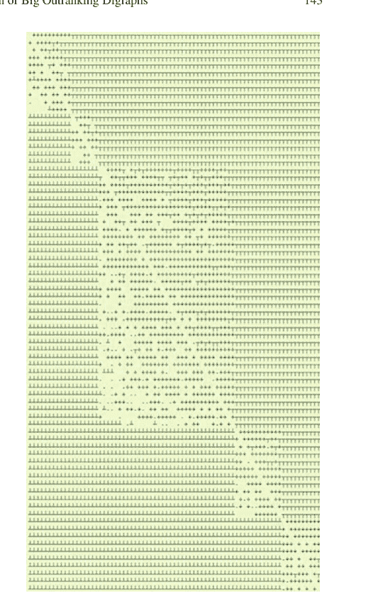

代码清单 11.5 稀疏优势关系图的 `relation()` 函数

```python
def relation(self, int x, int y):
    """
    *Parameters*:
        * x (int action key),
        * y (int action key).
    Dynamic construction of the global outranking
    characteristic function *r(x S y)*.
    """
    cdef int Min, Med, Max, rx, ry
    Min = self.valuationdomain['min']
    Med = self.valuationdomain['med']
    Max = self.valuationdomain['max']
    if x == y:
        return Med
    cx = self.actions[x]['component']
    cy = self.actions[y]['component']
    #print(self.components)
    rx = self.components[cx]['rank']
    ry = self.components[cy]['rank']
    if rx == ry:
        try:
            rxpg = self.components[cx]['subGraph'].relation
            return rxpg[x][y]
        except AttributeError:
            componentRanking = self.components[cx]['componentRanking']
            if componentRanking.index(x) < componentRanking.index(y):
                return Max
            else:
                return Min
    elif rx > ry:
        return Min
    else:
        return Max
```

## 11.5 大型性能矩阵的分位数排序

稀疏优势关系图 `sg` 的 `boostedRanking` 属性包含了 100 个决策方案的全局线性排序。该排序是通过使用 COPELAND 规则（参见第 142 页的代码清单 11.4）对 6 个独立组件进行局部排序后计算得出的。

```
>>> sg.boostedRanking
[22, 53, 3, 34, 56, 62, 24, 44, 50, 93, 41, 63, 29, 58,
 96, 7, 43, 81, 91, 35, 25, 76, 66, 65, 8, 10, 1, 11, 61,
 30, 48, 45, 68, 5, 89, 57, 59, 85, 82, 73, 33, 94, 70,
 97, 20, 92, 71, 90, 95, 21, 28, 2, 36, 87, 40, 98, 46, 55,
 100, 64, 17, 26, 27, 19, 69, 6, 38, 4, 37, 60, 31, 77, 78,
 47, 99, 18, 12, 80, 54, 88, 39, 9, 72, 86, 42, 13, 23, 67,
 52, 15, 32, 49, 51, 74, 16, 14, 75, 79, 83, 84]
```

在实际计算完整方案集的线性排序时，每个组件的局部优势关系并无实际用途，我们还可以通过以下方式进一步减少所得关系图的内存占用：

- 1. 通过考虑一个方案对其分位数类别下限的优势程度，以及其分位数类别上限*不*对该方案构成优势的程度，来细化分位数类别的排序；
- 2. 丢弃局部优势关系图，仅为每个组件保留一个局部排序的方案列表。

因此，我们提供了来自 `cSparseIntegerOutrankingDigraphs` 模块的 `cQuantilesRankingDigraph` 类。

**代码清单 11.6** 对稀疏整数优势关系图进行排序

```
>>> from cSparseIntegerOutrankingDigraphs import cQuantilesRankingDigraph
>>> qr = cQuantilesRankingDigraph(t,4)
>>> qr
*----- Object instance description ----------------*
 Instance class    : cQuantilesRankingDigraph
 Instance name     : cRandomperftab_mp
 Actions           : 100
 Criteria          : 7
 Sorting by        : 4-Tiling
 Ordering strategy : optimal
 Ranking rule      : Copeland
 Components        : 47
 Minimal order     : 1
 Maximal order     : 10
 Average order     : 2.1
 fill rate         : 2.566%
*----  Constructor run times (in sec.) ----*
 Nbr of threads    : 1
 Total time        : 0.03702
 QuantilesSorting  : 0.01785
 Preordering       : 0.00022
 Decomposing       : 0.01892
 Attributes        : ['runTimes', 'name',
 'actions', 'order', 'dimension', 'sortingParameters',
 'nbrOfCPUs', 'valuationdomain', 'profiles', 'categories',
 'sorting', 'minimalComponentSize', 'decomposition',
 'nbrComponents', 'nd', 'components', 'fillRate',
 'maximalComponentSize', 'componentRankingRule',
 'boostedRanking']
```

通过这种*优化的*分位数排序策略，我们现在得到了 47 个性能等价类（参见对面页代码清单 11.6 第 13 行）。

### 代码清单 11.7 稀疏优势关系图的有序组件

```
>>> qr.components
OrderedDict([
 ('c01', {'rank': 1,
           'lowQtileLimit': ']0.75',
           'highQtileLimit': '1.00]',
           'componentRanking': [53]}),
 ('c02', {'rank': 2,
           'lowQtileLimit': ']0.75',
           'highQtileLimit': '1.00]',
           'componentRanking': [3, 23, 63, 50]}),
 ('c03', {'rank': 3,
           'lowQtileLimit': ']0.75',
           'highQtileLimit': '1.00]',
           'componentRanking': [34, 44, 56, 24, 93, 41]}),
 ...
 ...
 ...
 ('c45', {'rank': 45,
           'lowQtileLimit': ']0.25',
           'highQtileLimit': '0.50]',
           'componentRanking': [49]}),
 ('c46', {'rank': 46,
           'lowQtileLimit': ']0.25',
           'highQtileLimit': '0.50]',
           'componentRanking': [52, 16, 86]}),
 ('c47', {'rank': 47,
           'lowQtileLimit': ']<',
           'highQtileLimit': '0.25]',
           'componentRanking': [79, 83, 84]}))
>>> print('%.0fkB' % (total_size(qr)/1024) )
208kB
```

我们在前一页代码清单 11.7 的最后一行观察到，与 SparseIntegerOutrankingDigraph 实例的 769 kB 相比，内存占用显著减少至 208 kB。然而，有必要衡量在使用稀疏优势关系图时，所得 COPELAND 排序的质量损失。

### 代码清单 11.8 衡量相对于标准优势关系图的质量损失

```python
>>> from cIntegerOutrankingDigraphs import IntegerBipolarOutrankingDigraph
>>> ig = IntegerBipolarOutrankingDigraph(t)
>>> print('Complete outranking : %+.3f'
...       % (ig.computeOrderCorrelation(
...          ig.computeCopelandOrder()))['correlation']))
Complete outranking : +0.747

>>> print('Sparse 4-tiling : %+.3f'
...       % (ig.computeOrderCorrelation(
...          list(reversed(sg.boostedRanking)))['correlation']))
Sparse 4-tiling       : +0.717

>>> print('Optimized sparse 4-tiling: %+.3f'
...       % (ig.computeOrderCorrelation(
...          list(reversed(qr.boostedRanking)))
...          ['correlation']))
Optimized sparse 4-tiling: +0.705
```

与成对优势情况的最佳排序相关性（+0.747）自然是在将 COPELAND 规则应用于标准优势关系图时获得的（参见第 132 页的代码清单 10.8 第 7 行）。当将相同的规则应用于稀疏 4-分块优势关系图时，得到的相关性为 +0.717（第 12 行），而当将 COPELAND 规则应用于优化的稀疏 4-分块关系图时，我们仍然获得 +0.705 的相关性（第 18 行）。这些乐观的结果实际上取决于我们使用的分位数数量以及给定的随机性能矩阵模型。在 Random3ObjectivesPerformanceTableau 实例的情况下，在类似设置中，我们将获得更好的标准优势相关性 +0.86，稀疏 4-分块相关性 +0.82，以及优化的稀疏 4-分块相关性 +0.81。

## 11.6 高性能计算分位数排序记录

图 11.2 *HPC-UL 排序性能记录（2018 年春季）*。在配备大内存的 Gaia-183 节点（64 核）上，我们能够在大约 2 分钟和 41 分钟内分别对一百万和六百万个决策方案进行排序。

| $\succcurlyeq^q$ 优势关系阶 | 规模 | $q$ | 填充率 | 核心数 | 运行时间 |
|---|---|---|---|---|---|
| 5 000 | $25 \times 10^6$ | 4 | 0.005% | 28 | 0.5" |
| 10 000 | $1 \times 10^8$ | 4 | 0.001% | 28 | 1" |
| 100 000 | $1 \times 10^{10}$ | 5 | 0.002% | 28 | 10" |
| 1 000 000 | $1 \times 10^{12}$ | 6 | 0.001% | 64 | 2' |
| 3 000 000 | $9 \times 10^{12}$ | 15 | 0.004% | 64 | 13' |
| 6 000 000 | $36 \times 10^{12}$ | 15 | 0.002% | 64 | 41' |

由于每个方案的 $q$-分位数排序具有可分离性，$q$-排序算法可以安全地拆分为与可用并行处理核心数量一样多的线程（参见命题 9.1）。此外，由于排序过程对每个对角线组件是局部的，这些过程也可以安全地在每个组件受限的优势关系图上并行线程处理。

使用卢森堡大学的高性能计算平台——https://hpc-docs.uni.lu/（Varrette 等人，2014 年）——图 11.2 中所示的非常大的排序问题的运行时间可以在以下环境中实现：

- *Iris* -skylake 节点（28 核）：（参见 https://hpc-docs.uni.lu/systems/iris），以及
- 3TB 大内存 *Gaia-183* 节点（64 核）（参见 https://hpc.uni.lu/systems/gaia），

通过在 Debian 8 Linux 上的 Intel 编译虚拟 Python 3.6.5 环境 [GCC Intel(R) 17.0.1—enable-optimisations c++ gcc 6.3 模式] 中运行 Cython 化的 Python 模块。

下一部分第三部分介绍了三个构建最佳选择推荐的实际案例研究——第 12 章，对不可通约的多准则性能记录进行排序——第 13 章，以及评估学生入学质量——第 14 章。第 15 章最终列出了一些家庭作业和考试题目。

## 参考文献

Bisdorff R (2016) 从数万亿成对优势情况计算线性排序。载于：Busa-Fekete R, Hüllermeier E, Mousseau V, Pfannschmidt K (编) 从多准则决策辅助到偏好学习，DAP’2016，帕德博恩大学（德国），第 1–16 页。http://hdl.handle.net/10993/28613

Varrette S, Bouvry P, Cartiaux H, Georgatos F (2014) 学术高性能计算集群的管理：UL 经验。载于：高性能计算与模拟国际会议（HPCS 2014），博洛尼亚（意大利）。IEEE，纽约，第 959–967 页

## 第三部分
评估与决策案例研究

第三部分包含四章，提出了决策案例研究，展示了不同的绩效评估模型和决策问题。第12章涉及为一名年轻学生选择外语学习项目构建最佳选择推荐。第13章受《泰晤士高等教育世界大学排名》启发，提出并讨论了学术计算机科学系的多不可比标准排名。受《明镜周刊》2004年公布的数据启发，第14章展示了一个关于德国大学入学质量的多标准评级问题。第15章最后列出了一些供修读算法决策理论课程的学生练习的习题。

## 第12章
爱丽丝的最佳选择：一个选择案例研究

# 目录

- 12.1 决策问题
- 12.2 绩效评估表
- 12.3 构建最佳选择推荐
- 12.4 稳健性分析

**摘要** 本章介绍了一个案例研究，涉及为爱丽丝构建最佳选择推荐。爱丽丝是一名德国学生，希望就其未来大学学习的选择获得一些建议。我们展示了爱丽丝的绩效评估表——潜在的外语学习项目、她的决策目标、绩效标准和绩效评估——并为她构建了一个最佳选择推荐。彻底的稳健性分析确认了一个最佳选择。

### 12.1 决策问题

本章内容灵感来源于一个多标准决策分析案例研究（Düsch 2001）。
爱丽丝可能以满意和/或良好的成绩获得她的“高中毕业证书”，并希望在此后开始她的进一步学习（见下页图12.1）。她不介意留在科隆，但如果机会合适，也愿意搬到其他地方。高等教育的时长确实让她担忧，因为她想尽快谋生。然而，她的父母同意在她学习期间资助她的学费和生活费。
爱丽丝已经确定了10个潜在的学习项目。
在下页的表12.1中，我们注意到爱丽丝考虑了三个*研究生口译*学习项目（8或9个学期），分别在科隆、萨尔布吕肯或海德堡；以及五个*合格翻译*学习项目（8或9个学期），分别在科隆、杜塞尔多夫、萨尔布吕肯、海德堡或慕尼黑。她还考虑了在科隆商会的两个短期（4个学期）学习项目。

图12.1 爱丽丝·D.，19岁德国学生，即将在德国科隆完成中学学业，希望攻读外语学习项目


表12.1 潜在的学习项目

| ID | 文凭 | 机构 | 城市 |
|---|---|---|---|
| T-UD | 合格翻译 (T) | 大学 (UD) | 杜塞尔多夫 |
| T-FHK | 合格翻译 (T) | 高等技术学校 (FHK) | 科隆 |
| T-FHM | 合格翻译 (T) | 高等技术学校 (FHM) | 慕尼黑 |
| I-FHK | 研究生口译 (I) | 高等技术学校 (FHK) | 科隆 |
| T-USB | 合格翻译 (T) | 大学 (USB) | 萨尔布吕肯 |
| I-USB | 研究生口译 (I) | 大学 (USB) | 萨尔布吕肯 |
| T-UHB | 合格翻译 (T) | 大学 (UHB) | 海德堡 |
| I-UHB | 研究生口译 (I) | 大学 (UHB) | 海德堡 |
| S-HKK | 专业秘书 (S) | 商会 (HKK) | 科隆 |
| C-HKK | 外国记者 (C) | 商会 (HKK) | 科隆 |

四个**决策目标**重要性大致相等，指导着爱丽丝的选择：

1. *最大化*学习地点的吸引力（GEO），
2. *最大化*她进一步学习的吸引力（LEA），
3. *最小化*她对父母的经济依赖（FIN），
4. *最大化*她的职业前景（PRA）。

爱丽丝希望考虑的决策后果，用于根据这四个目标评估潜在学习项目，由以下*一致的标准族*建模（Roy 1991; Roy and Bouyssou 1993）。这样的绩效标准族满足：

1. *穷尽性*：当*x*和*y*在每个绩效标准上具有相同的绩效水平时，不能提出任何爱丽丝可接受的论据来证明偏好学习项目*x*而非项目*y*；
2. *一致性*：爱丽丝承认，当项目*x*在某个正权重标准上的绩效水平显著优于项目*y*，而*x*和*y*在其他每个标准上的绩效水平相同时，项目*x*必须优于项目*y*；
3. *非冗余性*：如果从标准族中省略其中一个绩效标准，则违反上述要求之一。

在每个决策目标内，绩效标准被视为*同等重要*。因此，四个决策目标获得相同的*重要性权重*6（见表12.2第5列）。

### 12.2 绩效评估表

爱丽丝潜在学习项目的实际评估存储在一个名为AliceChoice.py的PerformanceTableau格式文件中。¹

清单12.1 爱丽丝的绩效评估表

```
1 >>> from perfTabs import PerformanceTableau
2 >>> t = PerformanceTableau('AliceChoice')
3 >>> t.showObjectives()
4   *------ decision objectives -------*
5     GEO: Geographical aspect
6       DH Distance to parent's home 3
7       BC Number of inhabitants 3
8       Total weight: 6 (2 criteria)
9     LEA: Learning aspect
10      AS Attractiveness of the study program 6
11      Total weight: 6.00 (1 criteria)
12      FIN: Financial aspect
13        SF Annual registration fees 2
14        LC Monthly living costs      2
15        SL Study time                2
16      Total weight: 6.00 (3 criteria)
17      PRA: Professional aspect
18        AP Attractiveness of the profession            2
19        AI Annual professional income after studying 2
20        OP Occupational Prestige                      2
21      Total weight: 6.00 (3 criteria)
```

¹ 绩效评估表AliceChoice.py可在DIGRAPH3资源的示例目录中找到（Bisdorff 2021）。

表12.2 爱丽丝的绩效标准族

| ID | 名称 | 说明 | 目标 | 权重 |
|---|---|---|---|---|
| DH | 邻近性 | 距离家的公里数（最小化） | GEO | 3 |
| BC | 大城市 | 居民数量（最大化） | GEO | 3 |
| AS | 学习 | 学习的吸引力（最大化） | LEA | 6 |
| SF | 费用 | 年度学习费用（最小化） | FIN | 2 |
| LC | 生活 | 月度生活成本（最小化） | FIN | 2 |
| SL | 时长 | 学习时长（最小化） | FIN | 2 |
| AP | 职业 | 职业的吸引力（最大化） | PRA | 2 |
| AI | 收入 | 学习后的年收入（最大化） | PRA | 2 |
| PR | 声望 | 职业声望（最大化） | PRA | 2 |

图12.2 爱丽丝的绩效标准

绩效标准的详细信息可在下方的浏览器视图中查阅。

```
1 >>> t.showHTMLCriteria()
```

值得注意的是，在图12.2中，在她主观的学习项目吸引力量表（标准AS）上，爱丽丝认为7分的绩效差异是*显著的*，并在给定情况下触发了优序极化（Bisdorff 2013）。还要注意标准BC（居民数量）上显示的比例*无差异*（1%）和*偏好*（5%）区分阈值。

爱丽丝主观地在从*弱*（0）到*优秀*（10）的序数量表上评估学习的*吸引力*（标准AS）。类似地，她主观地在从*弱*（0）、*一般*（1）到*好*（2）的三级序数量表上评估各自职业的*吸引力*（标准AP）。考虑到*职业声望*（标准OP），她查阅了SIOPS。² 所有其他评估数据她都是在网上找到的。

² 标准国际职业声望量表（Ganzeboom and Treiman 1996）。

# AliceChoice：标准族

| # | 标识符 | 名称 | 说明 | 权重 | 量表方向 | 量表最小值 | 量表最大值 | 阈值 (ax + b) 无差异 | 阈值 (ax + b) 偏好 | 阈值 (ax + b) 否决 |
|---|---|---|---|---|---|---|---|---|---|---|
| 1 | AI | 学习后的年专业收入 | 以x / 1000欧元衡量的专业方面 | 2.00 | 最大化 | 0.00 | 50.00 | 0.00x + 0.00 | 0.00x + 1.00 | |
| 2 | AP | 职业的吸引力 | 在三级量表上主观衡量的专业方面：0（弱），1（一般），2（好） | 2.00 | 最大化 | 0.00 | 2.00 | 0.00x + 0.00 | 0.00x + 1.00 | |
| 3 | AS | 学习项目的吸引力 | 从0（弱）到10（优秀）主观衡量的学习方面 | 6.00 | 最大化 | 0.00 | 10.00 | 0.00x + 0.00 | 0.00x + 1.00 | 0.00x + 7.00 |
| 4 | BC | 居民数量 | 以x / 1000衡量的地理方面 | 3.00 | 最大化 | 0.00 | 2000.00 | 0.01x + 0.00 | 0.05x + 0.00 | |
| 5 | DH | 距离父母家的距离 | 以公里衡量的地理方面 | 3.00 | 最小化 | 0.00 | 1000.00 | 0.00x + 0.00 | 0.00x + 10.00 | |
| 6 | LC | 月度生活成本 | 以欧元衡量的财务方面 | 2.00 | 最小化 | 0.00 | 1000.00 | 0.00x + 0.00 | 0.00x + 100.00 | |
| 7 | OP | 职业声望 | 以SIOPS分数衡量的专业方面 | 2.00 | 最大化 | 0.00 | 100.00 | 0.00x + 0.00 | 0.00x + 10.00 | |
| 8 | SF | 年度注册费 | 以欧元衡量的财务方面 | 2.00 | 最小化 | 400.00 | 4000.00 | 0.00x + 0.00 | 0.00x + 100.00 | |
| 9 | SL | 学习时间 | 以学期数衡量的财务方面 | 2.00 | 最小化 | 0.00 | 10.00 | 0.00x + 0.00 | 0.00x + 0.50 | |

## 表现图'AliceChoice'的热力图

| 标准 | AS | AP | SF | OP | AI | DH | LC | BC | SL |
|---|---|---|---|---|---|---|---|---|---|
| 权重 | +6.00 | +2.00 | +2.00 | +2.00 | +2.00 | +3.00 | +2.00 | +3.00 | +2.00 |
| tau(*) | +0.71 | +0.64 | +0.36 | +0.36 | +0.24 | +0.03 | -0.04 | -0.07 | -0.24 |
| I-FHK | 8 | 2 | -400 | 62 | 35 | 0 | 0 | 1015 | -8 |
| I-USB | 8 | 2 | -400 | 62 | 45 | -269 | -1000 | 196 | -9 |
| T-FHK | 5 | 1 | -400 | 62 | 35 | 0 | 0 | 1015 | -8 |
| I-UHB | 8 | 2 | -400 | 62 | 45 | -275 | -1000 | 140 | -9 |
| T-UD | 5 | 1 | -400 | 62 | 45 | -41 | -1000 | 567 | -9 |
| T-USB | 5 | 1 | -400 | 62 | 45 | -260 | -1000 | 196 | -9 |
| T-FHM | 4 | 1 | -400 | 62 | 35 | -631 | -1000 | 1241 | -8 |
| T-UHB | 5 | 1 | -400 | 62 | 45 | -275 | -1000 | 140 | -9 |
| C-HKK | 2 | 0 | -400 | 44 | 30 | 0 | 0 | 1015 | -4 |
| S-HKK | 1 | 0 | -400 | 44 | 30 | 0 | 0 | 1015 | -4 |

颜色图例：
分位数 20.00% 40.00% 60.00% 80.00% 100.00%

(*) tau：边际标准与全局排序关系之间的序数（Kendall）相关性
排序规则：净流量
全局排序与全局优势关系之间的序数（Kendall）相关性：+0.692

图 12.3 Alice的表现图热力图

在图12.3所示的热力图视图中，我们现在可以查阅Alice的表现评估。

```
>>> t.showHTMLPerformanceHeatmap(
...         colorLevels=5,Correlations=True,ndigits=0)
```

她的十个潜在学习项目是根据应用于相应的双极值优势有向图（见第8.3节）的净流量排序规则进行排序的。在科隆（I-FHK）或萨尔布吕肯（I-USB）的口译研究生学习，以及随后在科隆（T-FHK）的合格翻译学习，似乎是Alice最偏好的选择。对她来说，最不吸引人的似乎是在科隆商会（C-HKK, S-HKK）的学习。顺便注意一下，对于需要最小化的表现标准，如离家距离（标准DH）或学习时间（标准SL），其评估值记录为负值，因此在这种情况下，较小的度量值比大的更受青睐。

最后，有趣的是观察图12.3（第三行），对Alice而言，最显著的表现标准，一方面是学习项目的吸引力（标准AS，tau = +0.72），其次是未来职业的吸引力（标准AP，tau = +0.62）。另一方面，学习时间（标准SL，tau = -0.24）、大城市（标准BC，tau = -0.07）以及每月生活成本（标准LC，tau = -0.04）似乎不那么显著（见第16章）。

## 12.3 构建最佳选择推荐

现在让我们看看由此产生的成对优势情况。

清单12.2 计算Alice的优势有向图

```
>>> from outrankingDigraphs import BipolarOutrankingDigraph
>>> dg = BipolarOutrankingDigraph(t)
>>> dg
*------- Object instance description ------*
Instance class       : BipolarOutrankingDigraph
Instance name        : rel_AliceChoice
Actions              : 10
Criteria             : 9
Size                 : 67
Determinateness (%)  : 73.91
Valuation domain     : [-1.00;1.00]
>>> dg.computeSymmetryDegree(Comments=True)
Symmetry degree of graph <rel_AliceChoice> : 0.49
```

从Alice的表现图中，我们在有向图dg中获得了67个得到正向验证的成对优势情况，这些情况得到了74%的显著标准多数的支持（见清单12.2的第9-10行）。

由于表现评估的区分度较差，几乎一半的这些优势情况（见第12行）是*对称的*，实际上揭示了潜在学习项目之间*或多或少的无差异*情况。这在下一页图12.4所示的优势有向图的*关系图*中得到了很好的说明。

```
>>> dg.showHTMLRelationMap(
...         tableTitle='Outranking relation map',
...         rankingRule='Copeland')
```

我们已经提到，Alice认为在*学习吸引力*标准AS上7分的表现差异是相当大的，这在给定的情况下触发了优势特征的潜在极化。在对面页的图12.4中，这些极化出现在最后一列和最后一行。showPolarisations()方法对于检查优势极化的发生很有用。

清单12.3 检查极化的优势情况

```
>>> dg.showPolarisations()
*---- Negative polarisations ----*
number of negative polarisations : 3
1: r(S-HKK >= I-FHK) = -0.17
criterion: AS
Considerable performance difference : -7.00
Veto discrimination threshold       : -7.00
Polarisation: r(S-HKK >= I-FHK) = -0.17 ==> -1.00
2: r(S-HKK >= I-USB) = -0.17
criterion: AS
Considerable performance difference : -7.00
Veto discrimination threshold       : -7.00
Polarisation: r(S-HKK >= I-USB) = -0.17 ==> -1.00
3: r(S-HKK >= I-UHB) = -0.17
criterion: AS
Considerable performance difference : -7.00
Veto discrimination threshold       : -7.00
Polarisation: r(S-HKK >= I-UHB) = -0.17 ==> -1.00
*----  Positive polarisations ----*
number of positive polarisations: 3
1: r(I-FHK >= S-HKK) = 0.83
criterion: AS
Considerable performance difference : 7.00
Counter-veto threshold                : 7.00
Polarisation: r(I-FHK >= S-HKK) = 0.83 ==> +1.00
2: r(I-USB >= S-HKK) = 0.17
criterion: AS
Considerable performance difference : 7.00
Counter-veto threshold                : 7.00
Polarisation: r(I-USB >= S-HKK) = 0.17 ==> +1.00
3: r(I-UHB >= S-HKK) = 0.17
criterion: AS
Considerable performance difference : 7.00
Counter-veto threshold                : 7.00
Polarisation: r(I-UHB >= S-HKK) = 0.17 ==> +1.00
```

在前一页的清单12.3中，我们看到，关于*学习吸引力*（AS标准）的*相当大*的表现差异，确实在科隆提供的*专业秘书*学习项目与在科隆、萨尔布吕肯和海德堡提供的口译研究生学习项目之间被观察到。因此，它们将三个或多或少无效的优势情况极化为肯定无效（第8、13、18行），并将相应的三个或多或少有效的反向优势情况极化为肯定有效（第25、30、35行）。

最后，可以在前一页图12.4所示的关系图中注意到，排名前四的学习项目I-FHK、I-USB、I-UHB和T-FHK实际上是孔多塞获胜者（见清单12.4第2行），即它们四个彼此无差异，并且正向优于所有其他选择，这一结果在下面的清单12.4中通过我们的RUBIS最佳选择推荐（第4章和Bisdorff等人，2008年）得到证实。

## 清单12.4 Alice的最佳选择推荐

```
>>> dg.computeCondorcetWinners()
['I-FHK', 'I-UHB', 'I-USB', 'T-FHK']
>>> dg.showBestChoiceRecommendation()
Best choice recommendation(s) (BCR)
(in decreasing order of determinateness)
Credibility domain: [-1.00,1.00]
=== >> potential first choice(s)
choice : ['I-FHK','I-UHB','I-USB','T-FHK']
independence : 0.17
dominance : 0.08
absorbency : -0.83
covering (%) : 62.50
determinateness (%) : 68.75
most credible action(s) = {'I-FHK': 0.75,'T-FHK': 0.17,
'I-USB': 0.17,'I-UHB': 0.17}
=== >> potential last choice(s)
choice : ['C-HKK', 'S-HKK']
independence : 0.50
dominance : -0.83
absorbency : 0.17
covered (%) : 100.00
determinateness (%) : 58.33
most credible action(s) = {'S-HKK': 0.17,'C-HKK': 0.17}
```

在四个排名最高的学习项目中，最终最可信的最佳选择是科隆技术高中的口译研究生学习项目（见第14行），得到了(0.75 + 1)/2.0 = 87.5%（18/24）的全局标准显著性多数的支持。³

在前一页图12.4所示的关系图中，我们在左下角看到，优势关系的非对称部分，即相应的严格优势关系，实际上是传递的（见下一页清单12.5的第3行）。因此，通过先前的第一选择或最后选择定向的其骨架的graphviz绘图，可以很好地说明我们的

³ 见第4.5节关于计算最佳选择推荐，以及第17.6节关于求解核方程组。

## 12.3 构建最优选择推荐

图 12.5 *爱丽丝的最优选择推荐。* 我们注意到，*口译研究生*学习项目排在首位，其次是*笔译研究生*学习项目。最后是*商会*的专业学习项目。这再次证实了爱丽丝对其进一步学习和未来职业的*吸引力*（参见第155页图12.3中的标准AS和AP）的高度重视。

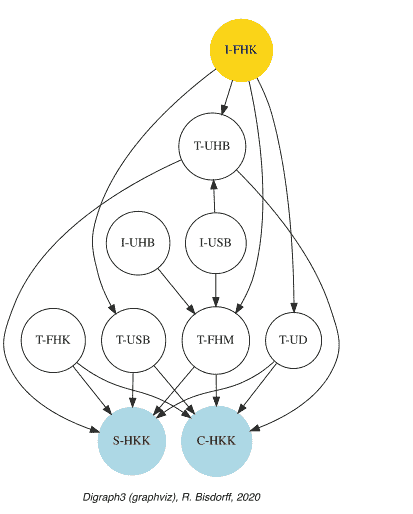

*最优选择推荐。* 第4行中的 `Reverse=True` 标志从有向图 `dgcd`（图12.5）中消除了由传递性引起的弧。

**代码清单 12.5** 爱丽丝的严格最优选择推荐

```
>>> dgcd = ~(-dg)
>>> dgcd.isTransitive()
    True
>>> dgcd.closeTransitive(Reverse=True,InSite=True)
>>> dgcd.exportGraphViz('aliceBestChoice',
...                     firstChoice=['I-FHK'],
...                     lastChoice=['S-HKK','C-HKK']))
  *---- exporting a dot file for GraphViz tools ---------*
  Exporting to aliceBestChoice.dot
  dot -Grankdir=BT -Tpng aliceBestChoice.dot -o aliceBestChoice.png
```

现在，让我们例如检查排名第一和第二的备选方案之间观察到的成对优超情况，即科隆的*口译研究生*学习项目与萨尔布吕肯的*口译研究生*学习项目（参见下一页图12.6中的 I-FHK 和 I-USB）。

```
>>> dq.showHTMLPairwiseOutrankings('I-FHK','I-USB')
```

类似地，最终可以借助 *transitiveDigraphs* 模块中的 `RankingByChoosingDigraph` 类，通过联合*最优选择*和*最后拒绝*（Bisdorff 1999）来计算所有潜在学习项目的*弱排序*。

图 12.6 *比较排名第一和第二的学习项目。科隆的备选方案在所有绩效标准上至少与萨尔布吕肯的备选方案评价相当，除了年收入（重要性为2/24）。相反，萨尔布吕肯的备选方案在地理（0/6）和财务（2/6）方面均明显处于劣势*

### 成对比较

比较行动：(I-FHK, I-USB)

| 标准 | 权重 | g(x) | g(y) | 差值 | 无差异 | 偏好 | 一致性 | v 极化 |
|---|---|---|---|---|---|---|---|---|
| AI | 2.00 | 35.00 | +45.00 | -10 | 0.00 | 1.00 | -2.00 |
| AP | 2.00 | 2.00 | +2.00 | 0 | 0.00 | 1.00 | +2.00 |
| AS | 6.00 | 8.00 | +8.00 | 0 | 0.00 | 1.00 | +6.00 |
| BC | 3.00 | 1015.00 | +196.00 | 819 | 10.15 | 50.75 | +3.00 |
| DH | 3.00 | 0.00 | -269.00 | 269 | 0.00 | 10.00 | +3.00 |
| LC | 2.00 | 0.00 | -1000.00 | 1000 | 0.00 | 100.00 | +2.00 |
| OP | 2.00 | 62.00 | +62.00 | 0 | 0.00 | 10.00 | +2.00 |
| SF | 2.00 | -400.00 | -400.00 | 0 | 0.00 | 100.00 | +2.00 |
| SL | 2.00 | -8.00 | -9.00 | 1 | 0.00 | 0.50 | +2.00 |

估值范围：-24.00 至 +24.00；全局一致性：+20.00

### 成对比较

比较行动：(I-USB, I-FHK)

| 标准 | 权重 | g(x) | g(y) | 差值 | 无差异 | 偏好 | 一致性 | v 极化 |
|---|---|---|---|---|---|---|---|---|
| AI | 2.00 | 45.00 | +35.00 | 10 | 0.00 | 1.00 | +2.00 |
| AP | 2.00 | 2.00 | +2.00 | 0 | 0.00 | 1.00 | +2.00 |
| AS | 6.00 | 8.00 | +8.00 | 0 | 0.00 | 1.00 | +6.00 |
| BC | 3.00 | 196.00 | +1015.00 | -819 | 10.15 | 50.75 | -3.00 |
| DH | 3.00 | -269.00 | +0.00 | -269 | 0.00 | 10.00 | -3.00 |
| LC | 2.00 | -1000.00 | +0.00 | -1000 | 0.00 | 100.00 | -2.00 |
| OP | 2.00 | 62.00 | +62.00 | 0 | 0.00 | 10.00 | +2.00 |
| SF | 2.00 | -400.00 | -400.00 | 0 | 0.00 | 100.00 | +2.00 |
| SL | 2.00 | -9.00 | -8.00 | -1 | 0.00 | 0.50 | -2.00 |

估值范围：-24.00 至 +24.00；全局一致性：+4.00

**代码清单 12.6** 通过双极最优选择和最后拒绝进行弱排序

```
>>> from transitiveDigraphs import
...                 RankingByChoosingDigraph
>>> rbc = RankingByChoosingDigraph(dg)
>>> rbc.showRankingByChoosing()
    Ranking by Choosing and Rejecting
      1st ranked ['I-FHK']
        2nd ranked ['I-USB']
          3rd ranked ['I-UHB']
            4th ranked ['T-FHK']
             5th ranked ['T-UD']
             5th last ranked ['T-UD']
           4th last ranked ['T-UHB', 'T-USB']
         3rd last ranked ['T-FHM']
       2nd last ranked ['C-HKK']
     1st last ranked ['S-HKK']
```

在代码清单12.6中，我们确认了*口译*学习项目均优于*笔译*学习项目。此外，萨尔布吕肯的*口译*学习项目似乎优于海德堡的同类学习项目。科隆的备选方案显然是所有*笔译*学习项目中的首选。而*驻外记者*和*专业秘书*学习项目则分别排在倒数第二和最后。

然而，我们的发现在多大程度上是*稳健*的，这取决于决策目标重要性和绩效标准重要性权重的潜在设定？

## 12.4 稳健性分析

爱丽丝认为她的四个决策目标*大致*同等重要。然而，我们在此为每个目标分配了*严格相等*的重要性权重，并且每个目标下的标准具有*严格等重要性*。现在，如果我们考虑目标的重要性，以及相应绩效标准的重要性*大致不确定*，那么先前的最优选择推荐有多稳健？

为了回答这个问题，我们考虑各自的标准重要性权重 $w_j$（$j = 1, ..., 9$）是范围在0到 $2w_j$ 之间、众数为 $w_j$ 的*三角随机变量*。可以借助 `ConfidentBipolarOutrankingDigraph` 类（参见第18章）计算相应的*90%置信度*优超有向图。

**代码清单 12.7** 计算90%置信度优超有向图

```
>>> from outrankingDigraphs import
...     ConfidentBipolarOutrankingDigraph
>>> cdg = ConfidentBipolarOutrankingDigraph(t,
...     distribution='triangular',confidence=90.0)
>>> cdg
    *------- Object instance description ------*
    Instance class : ConfidentBipolarOutrankingDigraph
    Instance name : rel_AliceChoice_CLT
    Actions : 10
    Criteria : 9
    Size : 44
    Valuation domain : [-1.00;1.00]
    Uncertainty model : triangular(a=0,b=2w)
    Likelihood domain : [-1.0;+1.0]
    Confidence level : 90.0%
    Confident majority : 14/24 (58.3%)
    Determinateness (%) : 68.19
```

在原始的67个有效优超情况中，有44个优超情况被保留为具有90%置信度（参见代码清单12.7第11行）。相应的90%置信度*合格多数*标准重要性为14/24 = 58.3%（第16行）。

现在，关于90%置信度的最优选择推荐，我们很幸运。

**代码清单 12.8** 计算90%置信度最优选择推荐

```
>>> cdg.computeCondorcetWinners()
['I-FHK']
>>> cdg.showBestChoiceRecommendation()
***************************
Best choice recommendation(s) (BCR)
(in decreasing order of determinateness)
Credibility domain: [-1.00,1.00]
=== >> potential best choice(s)
  9  choice            : ['I-FHK', 'I-UHB', 'I-USB',
                        'T-FHK', 'T-FHM']
     independence    : 0.00
     dominance       : 0.42
     absorbency      : 0.00
     covering (%)    : 20.00
     determinateness (%) : 61.25
  - most credible action(s) = { 'I-FHK': 0.75, }
```

科隆的*口译研究生*学习项目确实仍然是一个90%置信度的孔多塞获胜者（参见图12.7第2行）。因此，该学习项目也仍然是我们90%置信度的最可信最优选择，得到了全局标准重要性18/24（87.5%）的舒适多数支持（参见前一页代码清单12.8中的第9-10行和第16行）。

先前比较两个排名最高的学习项目时（参见第160页图12.6），我们观察到 I-FHK 实际上在所有四个决策目标上都正向优超 I-USB。当承认标准重要性等重要时

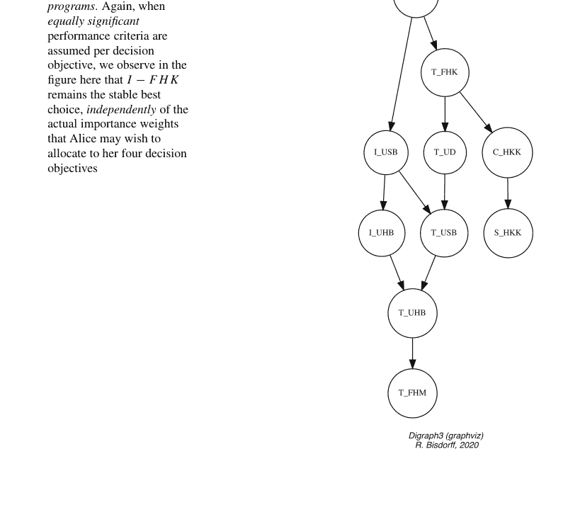

就每个目标而言，这种优超关系因此独立于爱丽丝可能为每个决策目标分配的重要性权重而有效。

`outrankingDigraphs` 模块中的 `UnOpposedBipolarOutrankingDigraph` 类构造函数计算这些*无对立*的优超关系（参见第 19.5 节）。

### 清单 12.9 计算无对立的优超关系

```
>>> from outrankingDigraphs import UnOpposedBipolarOutrankingDigraph
>>> uop = UnOpposedBipolarOutrankingDigraph(t)
>>> uop
  *------- Object instance description ------*
  Instance class       : UnOpposedBipolarOutrankingDigraph
  Instance name        : AliceChoice_unopposed_outrankings
  Actions              : 10
  Criteria             : 9
  Size                 : 28
  Oppositeness (%)     : 58.21
  Determinateness (%)  : 62.94
  Valuation domain     : [-1.00;1.00]
>>> uop.isTransitive()
True
```

67 个标准优超关系中有 28 个仍然有效，这导致*对立度*为 (1.0 – 28/67) = 58.21%（参见清单 12.9 中的第 10–11 行）。此外值得注意的是，这个无对立的优超有向图 uop 实际上是*传递的*，即模拟了学习项目的*部分排序*（第 14–15 行）。

`TransitiveDigraph` 类的 `exportGraphViz()` 方法绘制相应的部分排序图。

```
>>> from transitiveDigraphs import TransitiveDigraph
>>> TransitiveDigraph.exportGraphViz(uop, fileName='choiceUnopposed')
  *---- exporting a dot file for GraphViz tools ----------*
  Exporting to choiceUnopposed.dot
  dot -Grankdir=TB -Tpng choiceUnopposed.dot -o choiceUnopposed.png
```

鉴于她在第 155 页图 12.3 中展示的性能矩阵，科隆技术高中的*口译研究生*学习项目，因此，绝对是**爱丽丝的最佳选择**。

关于 RUBIS *最佳选择*方法论的进一步阅读，可以参考 Bis Dorff (2015) 中关于在科学会议上选择最佳海报的*真实决策辅助案例*研究。

## 参考文献

Bis Dorff R (1999) Bipolar ranking from pairwise fuzzy outrankings. Belg J Oper Res Stat Comp Sci 37(4):379–387. http://hdl.handle.net/10993/38738

Bisdorff R (2013) On polarizing outranking relations with large performance differences. J Multi-Crit Dec Anal Wiley 20:3–12. http://hdl.handle.net/10993/245

Bisdorff R (2015) The EURO 2004 best poster award: choosing the best poster in a scientific conference. In: Bisdorff R, Dias L, Meyer P, Mousseau V, Pirlot M (eds) Evaluation and decision models with multiple criteria: case studies. Springer, New York, pp 117–166

Bisdorff R (2021) Documentation of the Digraph3 collection of Python modules for Algorithmic Decision Theory. https://digraph3.readthedocs.io/en/latest/

Bisdorff R, Meyer P, Roubens M (2008) Rubis: a bipolar-valued outranking method for the best choice decision problem. Quart J Oper Res 6(2):143–165. http://hdl.handle.net/10993/23716

Düsch E (2001) Entscheidung für eine fremdsprachenausbildung. In: Eisenfuhr F, Langer T, Weber M (eds) Fallstudien zu rationalem Entscheiden. Fallstudie A. Springer, New York, pp 1–18

Ganzeboom H, Treiman D (1996) Internationally comparable measures of occupational status for the 1988 international standard classification of occupations. Soc Sci Res 25:201–239

Roy B (1991) The outranking approach and the foundations of electre methods. Theory Decis 31(1):49–73

Roy B, Bouyssou D (1993) Aide Multicritère à la Décision : Méthodes et Cas. Economica, Paris

# 第 13 章
## 最佳学术计算机科学系：一个排名案例研究


# 目录

- 13.1 THE 性能矩阵
- 13.2 使用具有序数意义的多标准进行排名
- 13.3 如何判断排名结果的质量？

**摘要** 在本案例研究中，我们使用 DIGRAPH3 资源解决一个基于 *Times Higher Education* (THE) *世界大学排名* 2016 年 *计算机科学* (CS) 学科发布数据的排名决策问题。当年，来自世界各地的数百个学术计算机科学系根据基于五个绩效标准加权平均的总体数值分数进行了排名：*教学*（学习环境，30%）、*研究*（数量、收入和声誉，30%）、*引用*（研究影响力，27.5%）、*国际视野*（员工、学生和研究，7.5%）以及*产业收入*（创新，5%）。为了说明我们的 DIGRAPH3 编程资源，我们将首先通过简短的 Python 脚本查看 THE 多标准排名数据。在第二部分，我们将放宽排名标准的可公度性假设，并展示如何使用仅具有序数意义的多个不可公度绩效标准进行类似的排名。第三部分最终致力于介绍用于评估排名结果质量的度量标准。

## 13.1 THE 性能矩阵

对于这个决策案例研究，我们使用了发布的 TIMES HIGHER EDUCATION (THE) 2016 年按计算机科学 (CS) 学科划分的世界大学排名摘录，涉及排名前 75 的学术机构。¹ 从 THE 网页收集的多标准性能矩阵数据存储在名为 the-cs-2016.py 的 PerformanceTableau 格式文件中。²

### 清单 13.1 排名前 75 的学术机构的性能矩阵

```
>>> from perfTabs import PerformanceTableau
>>> cspt = PerformanceTableau('the_cs_2016')
>>> cspt
*------- PerformanceTableau instance description -------*
Instance class : PerformanceTableau
Instance name : the-cs-2016
Actions : 75
Objectives : 5
Criteria : 5
NaN proportion (%) : 0.0
Attributes : ['name','description','actions',
'objectives','criteria',
'weightPreorder','NA','evaluation']
```

潜在的决策备选方案，在我们这里的情况下，是 2016 年 THE 排名前 75 的计算机科学系，它们都位于世界知名机构，如加州理工学院、苏黎世联邦理工学院、慕尼黑工业大学、牛津大学或新加坡国立大学（参见下面的清单 13.2）。

清单 13.2 说明了如何编写小型 Python 脚本来打印其内容，而不是使用预先配置的 DIGRAPH3 show . . . () 方法（这些方法可用于检查 PerformanceTableau 实例）。

### 清单 13.2 打印计算机科学系

```
>>> for x in cspt.actions:
...     print('%s:\t%s (%s)' % (x,cspt.actions[x]['name'],cspt.actions[x]['comment']) )
albt: University of Alberta (CA)
anu:  Australian National University (AU)
ariz: Arizona State University (US)
bju:  Beijing University (CN)
bro:  Brown University (US)
calt: California Institute of Technology (US)
cbu:  Columbia University (US)
chku: Chinese University of Hong Kong (HK)
cihk: City University of Hong Kong (HK)
cir:  University of California at Irvine (US)
cmel: Carnegie Mellon University (US)
cou:  Cornell University (US)
csb:  University of California at Santa Barbara (US)
csd:  University Of California at San Diego (US)
dut:  Delft University of Technology (NL)
eind: Eindhoven University of Technology (NL)
ens:  Superior Normal School at Paris (FR)
epfl: Swiss Federal Institute Technology Lausanne (CH)
epfr: Polytechnic school of Paris (FR)
ethz: Swiss Federal Institute of Technology Zurich (CH)
```

¹ THE 2016 年按计算机科学学科划分的世界大学排名。

² 性能矩阵 the-cs-2016.py 可在 DIGRAPH3 资源的示例目录中找到 (Bisdorff 2021)。

© The Author(s), under exclusive license to Springer Nature Switzerland AG 2022
R. Bisdorff, *Algorithmic Decision Making with Python Resources*,
International Series in Operations Research & Management Science 324,
https://doi.org/10.1007/978-3-030-90928-4_13

## 13.1 THE 绩效全景图

frei: 弗莱堡大学 (DE)
git: 佐治亚理工学院 (US)
glas: 格拉斯哥大学 (UK)
hels: 赫尔辛基大学 (FI)
hkpu: 香港理工大学 (CN)
hkst: 香港科技大学 (HK)
hku: 香港大学 (HK)
humb: 柏林洪堡大学 (DE)
icl: 帝国理工学院 (UK)
indis: 印度科学研究所 (IN)
itmo: 圣彼得堡国立信息技术、机械与光学大学 (RU)
kcl: 伦敦国王学院 (UK)
kist: 韩国高等科学技术研究院 (KR)
kit: 卡尔斯鲁厄理工学院 (DE)
kth: 皇家理工学院 (SE)
kuj: 京都大学 (JP)
kul: 鲁汶天主教大学 (BE)
lms: 莫斯科罗蒙诺索夫国立大学 (RU)
man: 曼彻斯特大学 (UK)
mcp: 马里兰大学帕克分校 (US)
mel: 墨尔本大学 (AU)
mil: 米兰理工大学 (IT)
mit: 麻省理工学院 (US)
naji: 南京大学 (CN)
ntu: 南洋理工大学 (SG)
ntw: 台湾大学 (TW)
nyu: 纽约大学 (US)
oxf: 牛津大学 (UK)
pud: 普渡大学 (US)
qut: 昆士兰科技大学 (AU)
rcu: 莱斯大学 (US)
rwth: 亚琛工业大学 (DE)
shji: 上海交通大学 (CN)
sing: 新加坡国立大学 (SG)
sou: 南安普顿大学 (UK)
stut: 斯图加特大学 (DE)
tech: 以色列理工学院 (IL)
tlavu: 特拉维夫大学 (IL)
tsu: 清华大学 (CN)
tub: 柏林工业大学 (DE)
tud: 达姆施塔特工业大学 (DE)
tum: 慕尼黑工业大学 (DE)
ucl: 伦敦大学学院 (UK)
ued: 爱丁堡大学 (UK)
uiuc: 伊利诺伊大学厄巴纳-香槟分校 (US)
unlu: 卢森堡大学 (LU)
unsw: 新南威尔士大学 (AU)
utor: 多伦多大学 (CA)
uta: 德克萨斯大学奥斯汀分校 (US)
utj: 东京大学 (JP)
utw: 特文特大学 (NL)
uwa: 滑铁卢大学 (CA)
wash: 华盛顿大学 (US)
wtu: 维也纳工业大学 (AT)
zhej: 浙江大学 (CN)

THE 作者将其 2016 年的排名基于五个决策目标（Times Higher Education 2016）。

## 清单 13.3 THE 排名目标

```
>>> for obj in cspt.objectives:
...     print('%s: %s (%.1f%%),\n\t%s' %
...           (obj,cspt.objectives[obj]['name'],
...            cspt.objectives[obj]['weight'],
...            cspt.objectives[obj]['comment']))
```

```
6 ...
7 Teaching: Best learning environment (30.0%)
8     Reputation survey; Staff-to-student ratio;
9     Doctorate-to-student ratio;
10    Doctorate-to-academic-staff ratio;
11    Institutional income.
12 Research: Highest volume and reputation (30.0%)
13    Reputation survey;
14    Research income;
15    Research productivity.
16 Citations: Highest research influence (27.5%)
17    Impact.
18 International outlook: Most international staff,
19                         students and research (7.5%)
20    Proportions of international students;
21    Proportions of international staff;
22    International collaborations.
23 Industry income: Best knowledge transfer (5.0%)
24    Volume.
```

*教学*、*研究*和*引用*的累计重要性达到 87%（见上文），显然构成了主要的排名目标。*国际视野*和*产业收入*则被认为重要性较低（12.5%）。

遗憾的是，THE 作者并未公布其绩效评估的细节，即针对每个排名目标下各项绩效标准的评估方法。³ THE 2016 年的排名出版物仅揭示了每个排名目标下单一绩效标准的综合评估。所保留的五个绩效标准可打印如下。

```
1 >>> for g in cspt.criteria:
2 ...     print('%s:\t%s, %s (%.1f%%)' %
3 ...           (g,cspt.criteria[g]['name'],cspt.criteria[g]['comment'],
4 ...            cspt.criteria[g]['weight']) )
5 gtch: Teaching, The learning environment (30.0%)
6 gres: Research, Volume, income and reputation (30.0%)
7 gcit: Citations, Research influence (27.5%)
8 gint: International outlook, In staff, students and research (7.5%)
9 gind: Industry income, knowledge transfer (5.0%)
```

因此，标准重要性的最大部分（87.5%）被规范地分配给了主要的排名标准：*教学*（30%）、*研究*（30%）和*引用*（27.5%）。剩余的一小部分（12.5%）则分配给*国际视野*（7.5%）和*产业收入*（5%）。

为了使这些绩效标准具有可比性，THE 作者对每个标准，用所有被调查机构绩效评估的累积分布中观察到的相应*分位数*，替换了每所大学实际获得的绩效评估（Times Higher Education 2016）。THE 排名最终由每所大学的*总分*决定

> ³ THE 在其网站上提供了一些关于用于评估每个排名目标的实际排名标准的主题和重要性的见解（Times Higher Education 2016）。

该总分对应于这五个标准分位数的加权平均值，如清单 13.4 所示。

## 清单 13.4 计算 THE 总分

```
1 >>> theScores = []
2 >>> for x in cspt.actions:
3 ...     xscore = Decimal('0')
4 ...     for g in cspt.criteria:
5 ...         xscore += cspt.evaluation[g][x] *
6 ...             (cspt.criteria[g]['weight']/Decimal('100'))
7 ...     theScores.append((xscore,x))
```

在清单 13.5（第 15-16 行）中，我们可以注意到，在 2016 年 THE 计算机科学学科世界大学排名中，瑞士苏黎世联邦理工学院以 92.9 的总分排名第一；其次是加州理工学院（总分：92.4）。⁴

## 清单 13.5 打印排名绩效表

```
1 >>> theScores.sort(reverse = True)
2 >>> print('## Univ \tgtch  gres  gcit  gint  gind  overall')
3 >>> print('----------------------------------------------------')
4 >>> i = 1
5 >>> for it in theScores:
6 ...     x = it[1]
7 ...     xScore = it[0]
8 ...     print('%2d: %s' % (i,x), end=' \t')
9 ...     for g in cspt.criteria:
10 ...         print('%.1f ' % (cspt.evaluation[g][x]),end=' ')
11 ...     print(' %.1f' % xScore)
12 ...     i += 1
```

| 排名 | 大学 | gtch | gres | gcit | gint | gind | 总分 |
|---|---|---|---|---|---|---|---|
| 1 | ethz | 89.2 | 97.3 | 97.1 | 93.6 | 64.1 | 92.9 |
| 2 | calt | 91.5 | 96.0 | 99.8 | 59.1 | 85.9 | 92.4 |
| 3 | oxf | 94.0 | 92.0 | 98.8 | 93.6 | 44.3 | 92.2 |
| 4 | mit | 87.3 | 95.4 | 99.4 | 73.9 | 87.5 | 92.1 |
| 5 | git | 87.2 | 99.7 | 91.3 | 63.0 | 79.5 | 89.9 |
| 6 | cmel | 88.1 | 92.3 | 99.4 | 58.9 | 71.1 | 89.4 |
| 7 | icl | 90.1 | 87.5 | 95.1 | 94.3 | 49.9 | 89.0 |
| 8 | epfl | 86.3 | 91.6 | 94.8 | 97.2 | 42.7 | 88.9 |
| 9 | tum | 87.6 | 95.1 | 87.9 | 52.9 | 95.1 | 87.7 |
| 10 | sing | 89.9 | 91.3 | 83.0 | 95.3 | 50.6 | 86.9 |
| 11 | cou | 81.6 | 94.1 | 99.7 | 55.7 | 45.7 | 86.6 |
| 12 | ucl | 85.5 | 90.3 | 87.6 | 94.7 | 42.4 | 86.1 |
| 13 | wash | 84.4 | 88.7 | 99.3 | 57.4 | 41.2 | 85.6 |
| 14 | hkst | 74.3 | 92.0 | 96.2 | 84.4 | 55.8 | 85.5 |
| 15 | ntu | 76.6 | 87.7 | 90.4 | 92.9 | 86.9 | 85.5 |
| 16 | ued | 85.7 | 85.3 | 89.7 | 95.0 | 38.8 | 85.0 |
| 17 | unt | 79.9 | 84.4 | 99.6 | 77.6 | 38.4 | 84.4 |
| 18 | uiuc | 85.0 | 83.1 | 99.2 | 51.4 | 42.2 | 83.7 |
| 19 | mcp | 79.7 | 89.3 | 94.6 | 29.8 | 51.7 | 81.5 |
| 20 | cbu | 81.2 | 78.5 | 94.7 | 66.9 | 45.7 | 81.3 |
| 21 | tsu | 88.1 | 90.2 | 76.7 | 27.1 | 85.9 | 80.9 |
| 22 | csd | 75.2 | 81.6 | 99.8 | 39.7 | 59.8 | 80.5 |
| 23 | uwa | 75.3 | 82.6 | 91.3 | 72.9 | 41.5 | 80.0 |
| 24 | nyu | 71.1 | 77.4 | 99.4 | 78.0 | 39.8 | 79.7 |
| 25 | uta | 72.6 | 85.3 | 99.6 | 31.6 | 49.7 | 79.6 |
| 26 | kit | 73.8 | 85.5 | 84.4 | 41.3 | 76.8 | 77.9 |
| 27 | bju | 83.0 | 85.3 | 70.1 | 30.7 | 99.4 | 77.0 |
| 28 | csb | 65.6 | 70.9 | 94.8 | 72.9 | 74.9 | 76.2 |
| 29 | rwth | 77.8 | 85.0 | 70.8 | 43.7 | 89.4 | 76.1 |
| 30 | hku | 77.0 | 73.0 | 77.0 | 96.8 | 39.5 | 75.4 |
| 31 | pud | 76.9 | 84.8 | 70.8 | 58.1 | 56.7 | 75.2 |
| 32 | kist | 79.4 | 88.2 | 64.2 | 31.6 | 92.8 | 74.9 |
| 33 | kcl | 45.5 | 94.6 | 86.3 | 95.1 | 38.3 | 74.8 |
| 34 | chku | 64.1 | 69.3 | 94.7 | 75.6 | 49.9 | 74.2 |
| 35 | epfr | 81.7 | 60.6 | 78.1 | 85.3 | 62.9 | 73.7 |
| 36 | dut | 64.1 | 78.3 | 76.3 | 69.8 | 90.1 | 73.4 |
| 37 | tub | 66.2 | 82.4 | 71.0 | 55.4 | 99.9 | 73.3 |
| 38 | utj | 92.0 | 91.7 | 48.7 | 25.8 | 49.6 | 72.9 |
| 39 | cir | 68.8 | 64.6 | 93.0 | 65.1 | 40.4 | 72.5 |
| 40 | ntw | 81.5 | 79.8 | 66.6 | 25.5 | 67.6 | 72.0 |
| 41 | anu | 47.2 | 73.0 | 92.2 | 90.0 | 48.1 | 70.6 |
| 42 | rcu | 64.1 | 53.8 | 99.4 | 63.7 | 46.1 | 69.8 |
| 43 | mel | 56.1 | 70.2 | 83.7 | 83.3 | 50.4 | 69.7 |
| 44 | lms | 81.5 | 68.1 | 61.0 | 31.1 | 87.8 | 68.4 |
| 45 | ens | 71.8 | 40.9 | 98.7 | 69.6 | 43.5 | 68.3 |
| 46 | wtu | 61.8 | 73.5 | 73.7 | 51.9 | 62.2 | 67.9 |
| 47 | tech | 54.9 | 71.0 | 85.1 | 51.7 | 40.1 | 67.1 |
| 48 | bro | 58.5 | 54.9 | 96.8 | 52.3 | 38.6 | 66.5 |
| 49 | man | 63.5 | 71.9 | 62.9 | 84.1 | 42.1 | 66.3 |
| 50 | zhej | 73.5 | 70.4 | 60.7 | 22.6 | 75.7 | 65.3 |
| 51 | frei | 54.2 | 51.6 | 89.5 | 49.7 | 99.9 | 65.1 |
| 52 | unsw | 60.2 | 58.2 | 70.5 | 87.0 | 44.3 | 63.6 |
| 53 | kuj | 75.4 | 72.8 | 49.5 | 28.3 | 51.4 | 62.8 |
| 54 | sou | 48.2 | 60.7 | 75.5 | 87.4 | 43.2 | 62.1 |
| 55 | shji | 66.9 | 68.3 | 62.4 | 22.8 | 38.5 | 61.4 |
| 56 | itmo | 58.0 | 32.0 | 98.7 | 39.2 | 68.7 | 60.5 |
| 57 | kul | 35.2 | 55.8 | 92.0 | 46.0 | 88.3 | 60.5 |
| 58 | glas | 35.2 | 52.5 | 91.2 | 85.8 | 39.2 | 59.8 |
| 59 | utw | 38.2 | 52.8 | 87.0 | 69.0 | 60.0 | 59.4 |
| 60 | stut | 54.2 | 60.6 | 61.1 | 36.3 | 97.8 | 58.9 |
| 61 | naji | 51.4 | 76.9 | 48.8 | 39.7 | 74.4 | 58.6 |
| 62 | tud | 46.6 | 53.6 | 75.9 | 53.7 | 66.5 | 58.3 |
| 63 | unlu | 35.2 | 44.2 | 87.4 | 99.7 | 54.1 | 58.0 |
| 64 | qut | 45.5 | 42.6 | 82.8 | 75.2 | 63.0 | 58.0 |
| 65 | hkpu | 46.8 | 36.5 | 91.4 | 73.2 | 41.5 | 57.7 |
| 66 | albt | 39.2 | 53.3 | 69.9 | 91.9 | 75.4 | 57.6 |
| 67 | mil | 46.4 | 64.3 | 69.2 | 44.1 | 38.5 | 57.5 |
| 68 | hels | 48.8 | 49.6 | 80.4 | 50.6 | 39.5 | 57.4 |
| 69 | cihk | 42.4 | 44.9 | 80.1 | 76.2 | 67.9 | 57.3 |
| 70 | tlavu | 34.1 | 57.2 | 89.0 | 45.3 | 38.6 | 57.2 |
| 71 | indis | 56.9 | 76.1 | 49.3 | 20.1 | 41.5 | 57.0 |
| 72 | ariz | 28.4 | 61.8 | 84.3 | 59.3 | 42.0 | 56.8 |
| 73 | kth | 44.8 | 42.0 | 83.6 | 71.6 | 39.2 | 56.4 |
| 74 | humb | 48.4 | 31.3 | 94.7 | 41.5 | 45.5 | 55.3 |
| 75 | eind | 32.4 | 48.4 | 81.5 | 72.2 | 45.8 | 54.4 |

> ⁴ 作者所在的卢森堡大学计算机科学系排名第 63 位，总分为 58.0。

需要注意的是，按加权平均分排名要求*排名标准具有可比性*，具有精确的小数重要性，并且有精确的小数绩效评估。THE 2016 年的绩效评估很可能并未满足这些条件。在此，我们展示如何通过遵循基于双极值认知逻辑的排名方法（见第 8 章）来放宽这些方法论要求——精确的可比标准和小数评估。

## 13.2 基于序数显著性多标准的排序

首先，让我们批判性地审视图13.1中的THE绩效标准。

```python
>>> cspt.showHTMLCriteria(Sorted=False)
```

考虑到绩效评估过程很可能存在不精确性，以及随后可能违反均匀分布分位数类别的情况，我们在此假设：绩效分位数差异在2.5%以内是*不显著的*，而5%及以上的差异则表明绩效*明显更好*或*明显较差*。例如，牛津大学的教学环境分位数为94%，而麻省理工学院为87.3%，因此前者明显优于后者（参见第169页清单13.5第27-28行）。此外，我们进一步假设，在*教学*、*研究*和*引用*这三个主要排名标准上观察到的60%的*显著*绩效分位数差异，将引发成对优超或被优超情况的极化（Bisdorff 2013）。

这些绩效区分阈值对优超建模的影响可以通过`showCriteria()`方法进行检查。

**清单13.6** 检查绩效区分阈值

```python
>>> cspt.showCriteria()
*---- criteria ----*
  gtch 'Teaching'
    Scale = (Decimal('0.00'), Decimal('100.00'))
    Weight = 0.300
    Threshold ind : 2.50 + 0.00x ; percentile: 8.07
    Threshold pref : 5.00 + 0.00x ; percentile: 15.75
    Threshold veto : 60.00 + 0.00x ; percentile: 99.75
  gres 'Research'
    Scale = (Decimal('0.00'), Decimal('100.00'))
    Weight = 0.300
    Threshold ind : 2.50 + 0.00x ; percentile: 7.86
    Threshold pref : 5.00 + 0.00x ; percentile: 16.14
    Threshold veto : 60.00 + 0.00x ; percentile: 99.21
  gcit 'Citations'
    Scale = (Decimal('0.00'), Decimal('100.00'))
    Weight = 0.275
    Threshold ind : 2.50 + 0.00x ; percentile: 11.82
    Threshold pref : 5.00 + 0.00x ; percentile: 22.99
    Threshold veto : 60.00 + 0.00x ; percentile: 100.00
  gint 'International outlook'
    Scale = (Decimal('0.00'), Decimal('100.00'))
    Weight = 0.075
    Threshold ind : 2.50 + 0.00x ; percentile: 6.45
    Threshold pref : 5.00 + 0.00x ; percentile: 11.75
  gind 'Industry income'
    Scale = (Decimal('0.00'), Decimal('100.00'))
    Weight = 0.050
    Threshold ind : 2.50 + 0.00x ; percentile: 11.82
    Threshold pref : 5.00 + 0.00x ; percentile: 21.51
```

### the_cs_2016：标准族

| # | 标识符 | 名称 | 说明 | 权重 | 量表方向 | 量表最小值 | 量表最大值 | 阈值 (ax + b) 无差异 | 阈值 (ax + b) 偏好 | 阈值 (ax + b) 否决 |
|---|---|---|---|---|---|---|---|---|---|---|
| 1 | gtch | 教学 | 学习环境 | 30.00 | 最大化 | 0.00 | 100.00 | 0.00x + 2.50 | 0.00x + 5.00 | 0.00x + 60.00 |
| 2 | gres | 研究 | 规模、收入和声誉 | 30.00 | 最大化 | 0.00 | 100.00 | 0.00x + 2.50 | 0.00x + 5.00 | 0.00x + 60.00 |
| 3 | gcit | 引用 | 研究影响力 | 27.50 | 最大化 | 0.00 | 100.00 | 0.00x + 2.50 | 0.00x + 5.00 | 0.00x + 60.00 |
| 4 | gint | 国际视野 | 教职员工、学生和研究 | 7.50 | 最大化 | 0.00 | 100.00 | 0.00x + 2.50 | 0.00x + 5.00 | |
| 5 | gind | 行业收入 | 创新 | 5.00 | 最大化 | 0.00 | 100.00 | 0.00x + 2.50 | 0.00x + 5.00 | |

图13.1 THE排名标准

因此，观察到的分位数差异中，6%到12%被认为是*不显著的*。同样，77%到88%被认为是*显著的*。在*教学*和*研究*标准上，只有不到1%对应于*显著的*分位数差异；这实际上触发了认识论上的极化效应（Bisdorff 2013）。

除了可能不精确的绩效区分外，THE作者分配给五个排名标准的*精确小数显著性权重*也相当*值得商榷*。标准显著性权重有时可能隐藏着策略，旨在使绩效评估在计算总体排名分数时具有可比性。最终的排名结果，在给定情况下，既取决于给定标准显著性权重的精确值，反之，给定的精确显著性权重也取决于主观预期和接受的排名结果。⁵ 因此，我们将放弃这些精确的小数权重，转而只要求一个相应的标准显著性预序：gtch = gres > gcit > gint > gind。*教学环境*和*研究规模与声誉*被认为同等最重要，其次是*研究影响力*。然后是*教职员工、学生和研究的国际视野*，最后最不重要的是*行业收入与创新*。

这两个工作假设：——绩效区分阈值和——仅序数标准显著性，为我们提供了一种基于*稳健成对优超*情况的排序方法（参见第19章和(Bisdorff 2004)）。

### 定义13.1（具有序数标准显著性权重的稳健优超情况）

- 我们说计算机系*x**稳健地优超*计算机系*y*，当*x*在**所有**与显著性预序gtch = gres > gcit > gint > gind兼容的显著性权重向量下，都正向优超*y*；
- 我们说计算机系*x*被计算机系*y***稳健地优超**，当*x*在**所有**与显著性预序gtch = gres > gcit > gint > gind兼容的显著性权重向量下，都被*y*正向优超；
- 否则，计算机系*x*和*y*被认为是*不可比的*。

`RobustOutrankingDigraph`类提供了相应的有向图构造器。

**清单13.7** 计算稳健优超有向图

```python
>>> from outrankingDigraphs import RobustOutrankingDigraph
>>> rdg = RobustOutrankingDigraph(cspt)
>>> rdg
  *------ Object instance description ------*
    Instance class       : RobustOutrankingDigraph
    Instance name        : robust_the_cs_2016
    Actions              : 75
    Criteria             : 5
    Size                 : 2993
    Determinateness (%)  : 78.16
    Valuation domain     : [-1.00;1.00]
>>> rdg.computeIncomparabilityDegree(Comments=True)
   Incomparability degree (%) of digraph <robust_the_cs_2016>:
   links x<->y y: 2775, incomparable: 102, comparable: 2673
   (incomparable/links) =  0.037
>>> rdg.computeTransitivityDegree(Comments=True)
   Transitivity degree of digraph <robust_the_cs_2016>:
   triples x>y>z: 405150, closed: 218489, open: 186661
   (closed/triples) =  0.539
>>> rdg.computeSymmetryDegree(Comments=True)
   Symmetry degree (%) of digraph <robust_the_cs_2016>:
   arcs x>y: 2673, symmetric: 320, asymmetric: 2353
   (symmetric/arcs) =  0.12
```

在生成的有向图实例`rdg`（参见清单**13.7**第9行）中，我们观察到2993个这样的稳健成对优超情况，其平均显著性为78%（第10行）。不幸的是，在本例中，它们并未提供任何完整的线性排序。稳健优超有向图`rdg`包含102个不可比情况（3.7%，第15行）；其传递闭包几乎缺失了一半（46.1%，第19行），并且12%的正向优超情况实际上对应于对称的无差异情况（第23行）。

更糟糕的是，有向图`rdg`包含数量非常多的优超回路。⁶

**清单13.8** 检查优超回路

```python
>>> rdg.computeChordlessCircuits()
>>> rdg.showChordlessCircuits()
```

```
*---- Chordless circuits ----*
145 circuits.
1:  ['albt', 'unlu', 'ariz', 'hels'], cred. : 0.300
2:  ['albt', 'tlavu', 'hels'], cred. : 0.150
3:  ['anu', 'man', 'itmo'], cred. : 0.250
4:  ['anu', 'zhej', 'rcu'], cred. : 0.250
...
...
82:  ['csb', 'epfr', 'rwth'], cred. : 0.250
83:  ['csb', 'epfr', 'pud', 'nyu'], cred. : 0.250
84:  ['csd', 'kcl', 'kist'], cred. : 0.250
...
...
142:  ['kul', 'qut', 'mil'], cred. : 0.250
143:  ['lms', 'rcu', 'tech'], cred. : 0.300
144:  ['mil', 'stut', 'qut'], cred. : 0.300
145:  ['mil', 'stut', 'tud'], cred. : 0.300
```

在上一页清单13.8报告的145个检测到的稳健优超回路中，我们注意到，例如，有两个长度为4的优超回路（参见回路1和83）。

让我们在下面检查第一个回路的双极值稳健优超特征。

**清单13.9** 显示带有稳定性标记的关系表

```python
>>> rdg.showRelationTable(actionsSubset=['albt', 'unlu', 'ariz', 'hels'], Sorted=False)
* ---- Relation Table -----
r/(stab)|  'albt' 'unlu' 'ariz' 'hels'
-----|---------------------------------
'albt' | +1.00  +0.30  +0.00  +0.00
|  (+4)   (+2)   (-1)   (-1)
'unlu' | +0.00  +1.00  +0.40  +0.00
|  (+0)   (+4)   (+2)   (-1)
'ariz' | +0.00  -0.12  +1.00  +0.40
|  (+1)   (-2)   (+4)   (+2)
'hels' | +0.45  +0.00  -0.03  +1.00
|  (+2)   (+1)   (-2)   (+4)
Valuation domain: [-1.0; 1.0]
Stability denotation semantics:
+4|-4 : unanimous outranking | outranked situation;
+2|-2 : outranking | outranked situation validated
with all potential significance weights that are
compatible with the given significance preorder;
+1|-1 : validated outranking | outranked situation
with the given significance weights;
0 : indeterminate relational situation.
```

在清单13.9中，我们注意到稳健优超回路[albt, unlu, ariz, hels]将在所有与给定预序gtch = gres > gcit > gint > gind兼容的潜在标准显著性权重向量下重现。

---
⁵ 在社会选择背景下，这种投票偏好与选举结果之间的潜在双重束缚对应于投票操纵策略。

⁶ `computeChordlessCircuits()`和`showChordlessCircuits()`方法是分开的，因为有多种方法可用于枚举有向图中的弦无关回路（Bisdorff 2010）。

还需注意标记为（±1）的优超情况，例如阿尔伯塔大学（albt）与亚利桑那州立大学（ariz）之间的情况。声明“亚利桑那州立大学严格优超阿尔伯塔大学”在精确的THE标准重要性权重下实际上是成立的，但对于所有与给定重要性预序兼容的潜在重要性权重向量则不然。因此，所有这些标记为（±1）的优超情况都变得可疑（r(x ≳ y) = 0.00），相应的计算机科学系，如阿尔伯塔大学和亚利桑那州立大学，在稳健优超意义上变得不可比。

由于存在许多不可比性和无差异性，不具有传递性，并且包含许多稳健优超回路，因此不存在任何应用于有向图rdg的排序算法能够产生唯一的最优线性排序结果。从方法论上讲，我们只剩下排序启发式方法。在关于多标准排序的第8章中，我们已经看到了几种可用于优超有向图排序的潜在启发式排序规则；然而，它们可能产生或多或少存在差异的结果。考虑到有向图rdg（75）的阶数以及THE标准重要性权重的极大不均衡性，在本教程中，我们更倾向于选择NETFlows排序规则。其O(n²)的复杂度确实相当易于处理，并且通过避免短期多数效应的潜在暴政，NETFlows规则可能更公平地考虑排序标准的重要性权重。

计算机科学系的NETFlows排序结果可以直接通过computeNetFlowsRanking()方法计算得出。

### 清单 13.10 计算稳健的NETFlows排序

```
>>> nfRanking = rdg.computeNetFlowsRanking()
>>> nfRanking
['ethz','calt','mit', 'oxf', 'cmel','git', 'epfl',
 'icl', 'cou', 'tum', 'wash', 'sing','hkst','ucl',
 'uiu', 'unt', 'ued', 'ntu', 'mcp', 'csd', 'cbu',
 'uta', 'tsu', 'nyu', 'uwa', 'csb', 'kit', 'utj',
 'bju', 'kcl', 'chku','kist', 'rwth','pud', 'epfr',
 'hku', 'rcu', 'cir', 'dut', 'ens', 'ntw', 'anu',
 'tub', 'mel', 'lms', 'bro', 'frei','wtu', 'tech',
 'itmo','zhej','man', 'kuj', 'kul', 'unsw','glas',
 'utw', 'unlu','naji','sou', 'hkpu','qut', 'humb',
 'shJi','stut','tud', 'tlavu','cihk','albt','indis',
 'ariz','kth', 'hels','eind', 'mil']
```

我们在清单13.10中实际得到的排序结果与使用THE平均分得到的结果非常相似。同一组七个系：ethz、calt、mit、oxf、cmel、git和epfl位列前茅。同一组系：tlavu、cihk、indis、ariz、kth、hels、eind和mil出现在列表末尾。

> 7 读者可以尝试其他排序规则，如COPELAND或KOHLER规则。请注意，后者的“选择排序”规则更为复杂（参见第8章）。

我们可以使用以下简短的Python脚本打印出基于THE排序的总分与上述NETFLOWS排序之间的差异，其中我们利用了一个有序的Python字典，其中包含净流量分数，该字典由先前的计算存储在rdg.netFlowsRankingDict属性中。

### 清单 13.11 比较稳健的NETFLOWS排序与THE排序

```
>>> # rdg.netFlowsRankingDict: 有序字典，包含净流量
>>> # 分数，由rdg中的computeNetFlowsRanking()方法存储
>>> # theScores = [(xScore_1,x_1), (xScore_2,x_2),... ]
>>> # 按xscores_i降序排序
>>> print('\n...     'NetFlows ranking  gtch  gres  gcit  gint  gind   THE ranking')
>>> for i in range(75):
...     x = nfRanking[i]
...     xScore = rdg.netFlowsRankingDict[x]['netFlow']
...     thexScore,thex = theScores[i]
...     print('%2d: %s (%.2f)' % (i+1,x,xScore), end='\t')
...     for g in rdg.criteria:
...         print('%.1f' % (t.evaluation[g][x]),end=' ')
...     print(' %s (%.2f)' % (thex,thexScore) )
```

| NetFlows排序 | gtch | gres | gcit | gint | gind | THE排序 |
| :--- | :--- | :--- | :--- | :--- | :--- | :--- |
| 1: ethz (116.95) | 89.2 | 97.3 | 97.1 | 93.6 | 64.1 | ethz (92.88) |
| 2: calt (116.15) | 91.5 | 96.0 | 99.8 | 59.1 | 85.9 | calt (92.42) |
| 3: mit (112.72) | 87.3 | 95.4 | 99.4 | 73.9 | 87.5 | oxf (92.20) |
| 4: oxf (112.00) | 94.0 | 92.0 | 98.8 | 93.6 | 44.3 | mit (92.06) |
| 5: cmel (101.60) | 88.1 | 92.3 | 99.4 | 58.9 | 71.1 | git (89.88) |
| 6: git (93.40) | 87.2 | 99.7 | 91.3 | 63.0 | 79.5 | cmel (89.43) |
| 7: epfl (90.88) | 86.3 | 91.6 | 94.8 | 97.2 | 42.7 | icl (89.00) |
| 8: icl (90.62) | 90.1 | 87.5 | 95.1 | 94.3 | 49.9 | epfl (88.86) |
| 9: cou (84.60) | 81.6 | 94.1 | 99.7 | 55.7 | 45.7 | tum (87.70) |
| 10: tum (80.42) | 87.6 | 95.1 | 87.9 | 52.9 | 95.1 | sing (86.86) |
| 11: wash (76.28) | 84.4 | 88.7 | 99.3 | 57.4 | 41.2 | cou (86.59) |
| 12: sing (73.05) | 89.9 | 91.3 | 83.0 | 95.3 | 50.6 | ucl (86.05) |
| 13: hkst (71.05) | 74.3 | 92.0 | 96.2 | 84.4 | 55.8 | wash (85.60) |
| 14: ucl (66.78) | 85.5 | 90.3 | 87.6 | 94.7 | 42.4 | hkst (85.47) |
| 15: uiu (64.80) | 85.0 | 83.1 | 99.2 | 51.4 | 42.2 | ntu (85.46) |
| 16: unt (62.65) | 79.9 | 84.4 | 99.6 | 77.6 | 38.4 | ued (85.03) |
| 17: ued (58.67) | 85.7 | 85.3 | 89.7 | 95.0 | 38.8 | unt (84.42) |
| 18: ntu (57.88) | 76.6 | 87.7 | 90.4 | 92.9 | 86.9 | uiu (83.67) |
| 19: mcp (54.08) | 79.7 | 89.3 | 94.6 | 29.8 | 51.7 | mcp (81.53) |
| 20: csd (46.62) | 75.2 | 81.6 | 99.8 | 39.7 | 59.8 | cbu (81.25) |
| 21: cbu (44.27) | 81.2 | 78.5 | 94.7 | 66.9 | 45.7 | tsu (80.91) |
| 22: uta (43.27) | 72.6 | 85.3 | 99.6 | 31.6 | 49.7 | csd (80.45) |
| 23: tsu (42.42) | 88.1 | 90.2 | 76.7 | 27.1 | 85.9 | uwa (80.02) |
| 24: nyu (35.30) | 71.1 | 77.4 | 99.4 | 78.0 | 39.8 | nyu (79.72) |
| 25: uwa (28.88) | 75.3 | 82.6 | 91.3 | 72.9 | 41.5 | uta (79.61) |
| 26: csb (18.18) | 65.6 | 70.9 | 94.8 | 72.9 | 74.9 | kit (77.94) |
| 27: kit (16.32) | 73.8 | 85.5 | 84.4 | 41.3 | 76.8 | bju (77.04) |
| 28: utj (15.95) | 92.0 | 91.7 | 48.7 | 25.8 | 49.6 | csb (76.23) |
| 29: bju (15.45) | 83.0 | 85.3 | 70.1 | 30.7 | 99.4 | rwth (76.06) |
| 30: kcl (11.95) | 45.5 | 94.6 | 86.3 | 95.1 | 38.3 | hku (75.41) |
| 31: chku (9.43) | 64.1 | 69.3 | 94.7 | 75.6 | 49.9 | pud (75.17) |
| 32: kist (7.30) | 79.4 | 88.2 | 64.2 | 31.6 | 92.8 | kist (74.94) |
| 33: rwth (5.00) | 77.8 | 85.0 | 70.8 | 43.7 | 89.4 | kcl (74.81) |
| 34: pud (2.40) | 76.9 | 84.8 | 70.8 | 58.1 | 56.7 | chku (74.23) |
| 35: epfr (-1.70) | 81.7 | 60.6 | 78.1 | 85.3 | 62.9 | epfr (73.71) |
| 36: hku (-3.83) | 77.0 | 73.0 | 77.0 | 96.8 | 39.5 | dut (73.44) |
| 37: rcu (-6.38) | 64.1 | 53.8 | 99.4 | 63.7 | 46.1 | tub (73.25) |
| 38: cir (-8.20) | 68.8 | 64.6 | 93.0 | 65.1 | 40.4 | utj (72.92) |
| 39: dut (-8.85) | 64.1 | 78.3 | 76.3 | 69.8 | 90.1 | cir (72.50) |
| 40: ens (-8.97) | 71.8 | 40.9 | 98.7 | 69.6 | 43.5 | ntw (72.00) |
| 41: ntw (-11.15) | 81.5 | 79.8 | 66.6 | 25.5 | 67.6 | anu (70.57) |
| 42: anu (-11.50) | 47.2 | 73.0 | 92.2 | 90.0 | 48.1 | rcu (69.79) |
| 43: tub (-12.20) | 66.2 | 82.4 | 71.0 | 55.4 | 99.9 | mel (69.67) |
| 44: mel (-23.98) | 56.1 | 70.2 | 83.7 | 83.3 | 50.4 | lms (68.38) |
| 45: lms (-25.43) | 81.5 | 68.1 | 61.0 | 31.1 | 87.8 | ens (68.35) |
| 46: bro (-27.18) | 58.5 | 54.9 | 96.8 | 52.3 | 38.6 | wtu (67.86) |
| 47: frei (-34.42) | 54.2 | 51.6 | 89.5 | 49.7 | 99.9 | tech (67.06) |
| 48: wtu (-35.05) | 61.8 | 73.5 | 73.7 | 51.9 | 62.2 | bro (66.49) |
| 49: tech (-37.95) | 54.9 | 71.0 | 85.1 | 51.7 | 40.1 | man (66.33) |
| 50: itmo (-38.50) | 58.0 | 32.0 | 98.7 | 39.2 | 68.7 | zhej (65.34) |
| 51: zhej (-43.70) | 73.5 | 70.4 | 60.7 | 22.6 | 75.7 | frei (65.08) |
| 52: man (-44.83) | 63.5 | 71.9 | 62.9 | 84.1 | 42.1 | unsw (63.65) |
| 53: kuj (-47.40) | 75.4 | 72.8 | 49.5 | 28.3 | 51.4 | kuj (62.77) |
| 54: kul (-49.98) | 35.2 | 55.8 | 92.0 | 46.0 | 88.3 | sou (62.15) |
| 55: unsw (-54.88) | 60.2 | 58.2 | 70.5 | 87.0 | 44.3 | shJi (61.35) |
| 56: glas (-56.98) | 35.2 | 52.5 | 91.2 | 85.8 | 39.2 | itmo (60.52) |
| 57: utw (-59.27) | 38.2 | 52.8 | 87.0 | 69.0 | 60.0 | kul (60.47) |
| 58: unlu (-60.08) | 35.2 | 44.2 | 87.4 | 99.7 | 54.1 | glas (59.78) |
| 59: naji (-60.52) | 51.4 | 76.9 | 48.8 | 39.7 | 74.4 | utw (59.40) |
| 60: sou (-60.83) | 46.2 | 80.7 | 75.5 | 87.4 | 43.2 | stut (58.85) |
| 61: hkpu (-62.05) | 46.8 | 36.5 | 91.4 | 73.2 | 41.5 | naji (58.61) |
| 62: qut (-66.17) | 45.5 | 42.6 | 82.8 | 75.2 | 63.0 | tud (58.28) |
| 63: humb (-68.10) | 48.4 | 31.3 | 94.7 | 41.5 | 45.5 | unlu (58.04) |
| 64: shJi (-69.72) | 66.9 | 68.3 | 62.4 | 22.8 | 38.5 | qut (57.99) |
| 65: stut (-69.90) | 54.2 | 60.6 | 61.1 | 36.3 | 97.8 | hkpu (57.69) |
| 66: tud (-70.83) | 46.6 | 53.6 | 75.9 | 53.7 | 66.5 | albt (57.63) |
| 67: tlavu (-71.50) | 34.1 | 57.2 | 89.0 | 45.3 | 38.6 | mil (57.47) |
| 68: cihk (-72.20) | 42.4 | 44.9 | 80.1 | 76.2 | 67.9 | hels (57.40) |
| 69: albt (-72.33) | 39.2 | 53.3 | 69.9 | 91.9 | 75.4 | cihk (57.33) |
| 70: indis (-72.53) | 56.9 | 76.1 | 49.3 | 20.1 | 41.5 | tlavu (57.19) |
| 71: ariz (-75.10) | 28.4 | 61.8 | 84.3 | 59.3 | 42.0 | indis (57.04) |
| 72: kth (-77.10) | 44.8 | 42.0 | 83.6 | 71.6 | 39.2 | ariz (56.79) |
| 73: hels (-79.55) | 48.8 | 49.6 | 80.4 | 50.6 | 39.5 | kth (56.36) |
| 74: eind (-82.85) | 32.4 | 48.4 | 81.5 | 72.2 | 45.8 | humb (55.34) |
| 75: mil (-83.67) | 46.4 | 64.3 | 69.2 | 44.1 | 38.5 | eind (54.36) |

我们在对面页的清单13.11中观察到的第一个反转（第18-19行）涉及牛津大学和麻省理工学院，它们交换了第3和第4的位置。大多数反转同样很短，仅涉及非常接近的位置之间的相互交换。存在一些稍微更重要的反转，例如，香港大学计算机科学系在THE排序中排名第30位，而在此处排名第36位（第51行）。相反的情况也可能发生；柏林洪堡大学计算机科学系在THE排序中占据第74位，在稳健的NETFLOWS排序中前进到第63位（第78行）。

在我们的双极值认知框架中，任何计算机科学系$x$的NETFLOWS分数对应于逻辑陈述“$x$排名第一”的标准重要性支持。形式上

$r(x \text{ is first-ranked}) = \sum_{y \neq x} r((x \succsim y) + (y \nsuccsim x)) = \sum_{y \neq x} (r(x \succsim y) - r(y \succsim x)).$

(13.1)

利用有向图$\text{rdg}$的稳健优超特性，我们可以显式地计算，例如，苏黎世联邦理工学院（ETH Zürich）的NETFLOWS分数，下面记为$\text{nfx}$。

```
>>> x = 'ethz'
>>> nfx = Decimal('0')
>>> for y in rdg.actions:
...     if x != y:
...         nfx += (rdg.relation[x][y] - rdg.relation[y][x])
>>> nfx
Decimal('116.95')
```

## 13.3 如何评判排序结果的质量？

在基于多标准的排序问题中，检查成对边际性能差异可以为全局偏好陈述提供客观性。计算机科学系 *x* 是否令人信服地优于系 *y*，可以方便地使用 `showPairwiseOutrankings()` 方法进行检验。例如，在之前的两次排名中，苏黎世联邦理工学院计算机系都排在加州理工学院系之前。让我们检查一下偏好原因。

**清单 13.12** 比较成对标准性能

```
>>> rdg.showPairwiseOutrankings('ethz','calt')
*------------ pairwise comparisons ----*
Valuation in range: -100.00 to +100.00
Comparing actions : ('ethz', 'calt')
crit.  wght.  g(ethz) g(calt) diff | ind  pref   r() |
------------------------------------|------------------
'gcit'  27.50  97.10  99.80  -2.70 | 2.50  5.00  +0.00 |
'gind'   5.00  64.10  85.90 -21.80 | 2.50  5.00  -5.00 |
'gint'   7.50  93.60  59.10 +34.50 | 2.50  5.00  +7.50 |
'gres'  30.00  97.30  96.00  +1.30 | 2.50  5.00 +30.00 |
'gtch'  30.00  89.20  91.50  -2.30 | 2.50  5.00 +30.00 |
------------------------------------|------------------
                                    r(x >= y):  +62.50
crit.  wght.  g(calt) g(ethz) diff | ind  pref   r() |
------------------------------------|------------------
'gcit'  27.50  99.80  97.10  +2.70 | 2.50  5.00 +27.50 |
'gind'   5.00  85.90  64.10 +21.80 | 2.50  5.00  +5.00 |
'gint'   7.50  59.10  93.60 -34.50 | 2.50  5.00  -7.50 |
'gres'  30.00  96.00  97.30  -1.30 | 2.50  5.00 +30.00 |
'gtch'  30.00  91.50  89.20  +2.30 | 2.50  5.00 +30.00 |
------------------------------------|------------------
                                    r(y >= x):  +85.00
```

在清单 13.12 中，观察到关于 *国际视野* 标准（显著性为 7.5%）存在显著的正性能差异（+34.50），有利于苏黎世联邦理工学院系（上文第 9 行）。类似地，观察到关于 *工业收入* 标准（显著性为 5%）存在显著的正性能差异（+21.80），这次有利于加州理工学院系（第 17 行）。前者在更显著的标准上观察到的更大的正性能差异，目前给出了一个 12.5% 显著性的令人信服的论据，支持将苏黎世联邦理工学院排在加州理工学院之前。然而，加州理工学院和苏黎世联邦理工学院在 *引用* 标准（显著性为 27.5%）上的略微正性能差异（+2.70，第 16 行）证实了加州理工学院系“*至少被同等评价*”的情况。

然而，反向的负性能差异（−2.70，第 7 行）既不*显著*（< −5.00），也不*不显著*（> −2.50），因此既不确认也不表明苏黎世联邦理工学院处于“未被同等评价”的不利情况。我们在这里观察到一个 27.5% 显著性的令人信服的论据，支持将加州理工学院排在苏黎世联邦理工学院之前。

最后请注意，在总显著性为 60% 的 *教学* 和 *研究* 标准上，两个系的表现差异（<| 2.50 |）表明它们表现得一样好。由于这两个主要性能标准在给定的显著性权重预序下必然总是具有最高的显著性：gtch = gres > gcit > gint > gind，因此两种优超情况实际上都在稳定性水平 +2 下得到了全局确认（见第 19 章）。

相应的稳健关系图的浏览器视图，再次使用 NETFLOWS 排序规则对计算机科学系进行排序，很好地说明了所有这些*稳定优超*情况。

```
>>> rdg.showHTMLRelationMap(
...     tableTitle='Robust Outranking Map',
...     rankingRule='NetFlows')
```

在下一页的图 13.2 中，*深绿色* 和 *浅绿色* 标记的位置分别表示确定的和正向有效的优超情况，而 *深红色* 和 *浅红色* 标记的位置分别表示确定的和正向有效的被优超情况。在左上角，可以验证排名前五的系（[ethz, calt, oxf, mit, cmel]）实际上相互优超，因此彼此无差异。它们甚至通过稳健地优超所有其他系而成为稳健的孔多塞胜者。

顺便注意，在下文第 181 页的图 13.3 中，主对角线以下或以上没有出现确定的稳健优超（深绿色）和确定的稳健被优超（深红色）情况；因此，这些稳健偏好情况都没有被稳健的 NETFLOWS 排序所违反。关系图中的非自反*白色*位置，例如佐治亚理工学院和麻省理工学院之间的位置，标记了相对于给定显著性权重预序不稳健的优超或被优超情况。因此，它们变得可疑，并被设置为不确定特征值 0.0。

通过测量与底层成对全局和边际稳健优超情况的序数相关性，可以使用 `computeRankingCorrelation()` 方法和 `showCorrelation()` 方法（见第 16 章）正式评估稳健 NETFLOWS 排序结果的质量。

**清单 13.13** 测量 NETFLOWS 排序结果的质量

```
>>> corrnf = rdg.computeRankingCorrelation(nfRanking)
>>> rdg.showCorrelation(corrnf)
```

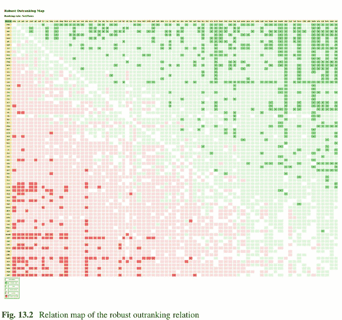

图 13.2 稳健优超关系的关系图

```
Correlation indexes:
    Crisp ordinal correlation   : +0.901
    Epistemic determination     :   0.563
    Bipolar-valued equivalence  : +0.507
```

上一页清单 13.13 第 4 行表明，NETFLOWS 排序结果确实与成对全局稳健优超关系高度相关（+0.901，在 KENDALL tau 指数意义上）。它们的双极值*关系等价*指数（+0.51，第 6 行）表明有超过 75% 的标准显著性支持。

使用 `showRankingConsensusQuality()` 方法，我们还可以检查 NETFLOWS 排序规则实际上是如何平衡五个排序目标的。

**清单 13.14** 测量 NETFLOWS 排序结果的共识质量

```
>>> rdg.showRankingConsensusQuality(nfRanking)
Criterion (weight): correlation
------------------------------
    gtch (0.300): +0.660
    gres (0.300): +0.638
    gcit (0.275): +0.370
    gint (0.075): +0.155
    gind (0.050): +0.101
    Summary:
Weighted mean marginal correlation (a): +0.508
Standard deviation (b)                : +0.187
Ranking fairness (a) - (b)            : +0.321
```

与边际性能标准排序的序数相关指数几乎遵循给定的显著性权重预序：gtch ≈ gres > gcit > gint > gind（见上文第 4-8 行）。平均边际序数相关指数相当高（+0.51）。结合较低的标准差（0.187），我们得到了一个相当公平平衡的排序结果（第 10-12 行）。

我们还可以使用 `showCriteriaCorrelationTable()` 方法检查各个标准边际稳健优超关系之间观察到的相互相关指数。

**清单 13.15** 显示边际标准关系之间的序数相关性

```
>>> rdg.showCriteriaCorrelationTable()
Criteria ordinal correlation index
| gcit gind gint gres gtch
-----|------------------------------------------
gcit | +1.00 -0.11 +0.24 +0.13 +0.17
gind | +1.00 -0.18 +0.15 +0.15
gint | +1.00 +0.04 -0.00
gres | +1.00 +0.67
gtch | +1.00
```

*引用* 和 *工业收入* 标准显示出略微矛盾（−0.11）（上一页清单 13.15 第 5 行第 3 列）。这可能是由于潜在的保密条款，似乎并不总是可能在高排名期刊上发表与工业相关的研究成果。然而，*引用* 和 *国际视野* 标准显示出略微正相关（+0.24，第 4 列），而 *国际视野* 标准与主要的 *教学* 和 *研究* 标准没有明显相关性。然而，后者高度相关（+0.67，第 9 行第 6 列）。

主成分分析可以使用 `export3DplotOfCriteriaCorrelation()` 方法很好地说明上述发现（Bisdorff 2020）。

```
>>> rdg.export3DplotOfCriteriaCorrelation(graphType='pdf')
```

在上一页的图 13.3 中，首先可以注意到，超过 80% 的总方差是由标准边际优超之间的明显对立解释的：左侧的 *教学*、*研究* 和 *工业收入* 标准，以及右侧的 *引用* 和 *国际视野* 标准。还要注意左下角主要的 *教学* 和 *研究* 标准的边际优超位置几乎相同。在因子 2 和 3 的图中，大约 30% 的总方差是由 *教学* 和 *研究* 标准的边际优超与 *工业收入* 标准的边际优超之间的对立所捕获的。最后，在因子 1 和 3 的图中，几乎 15% 的总方差是由 *国际视野* 标准的边际优超与 *引用* 标准的边际优超之间的对立所解释的。

最后，同样有趣的是评估 THE 平均分排序与稳健优超有向图之间的序数相关性。

**清单 13.16** 计算 THE 排序的序数质量

```
>>> # theScores = [(xScore_1,x_1), (xScore_2,x_2),... ]
>>> # is sorted in decreasing order of xscores
>>> theRanking = [item[1] for item in theScores]
>>> corrthe = rdg.computeRankingCorrelation(theRanking)
>>> rdg.showCorrelation(corrthe)
Correlation indexes:
Crisp ordinal correlation : +0.907
Epistemic determination : 0.563
Bipolar-valued equivalence : +0.511
```

## 13.3 如何评判排序结果的质量？

```
>>> rdg.showRankingConsensusQuality(theRanking)
Criterion (weight): correlation
-----------------------------------
gtch (0.300): +0.683
gres (0.300): +0.670
gcit (0.275): +0.319
gint (0.075): +0.161
gind (0.050): +0.106
Summary:
Weighted mean marginal correlation (a): +0.511
Standard deviation (b) : +0.210
Ranking fairness (a)-(b) : +0.302
```

THE 排序结果与成对全局稳健优势关系同样具有相关性（+0.907，见代码清单 13.16 第 7 行）。通过其整体加权评分规则，THE 排序自然地诱导出与给定显著性权重预序相容的边际准则相关性（第 13–17 行）。请注意，其平均边际相关性（+0.51，第 19 行）与稳健的 NETFLOWS 排序具有相似的值。然而，其标准差略高，这导致对三个主要排序准则的平衡性稍差。

最后，让我们强调，无需任何可公度性假设，并且进一步考虑到，首先，任何性能评估都或多或少存在固有的不精确性，其次，仅使用序数准则显著性权重，我们在此处通过我们的稳健优势方法可以获得一个非常相似的排序结果，且具有稍好的偏好建模质量。一个令人信服的、展示前 25 名机构的热力图视图，最终可以通过以下命令在默认系统浏览器中生成（见下页图 13.4）。

```
>>> rdg.showHTMLPerformanceHeatmap(
... WithActionNames=True,
... outrankingModel='this',
... rankingRule='NetFlows',
... ndigits=1,
... Correlations=True,
... fromIndex=0,toIndex=25)
```

作为练习，读者可以尝试其他基于稳健优势的排序启发式方法。同时请注意，在本案例研究中，我们并未质疑 THE 提供的准则显著性预序。考虑将五个排序目标视为同等重要，从而认为排序准则是等显著的，这将是非常有趣的。好奇在这样的设置下会得到怎样的排序结果。

第 14 章的下一个案例研究将探讨高等教育机构学生入学质量的绝对分位数评级问题。

## 性能表 'robust_the_cs_2016' 的热力图

| criteria | gtch | gres | gcit | gint | gind |
|---|---|---|---|---|---|
| weights | +30.00 | +30.00 | +27.50 | +7.50 | +5.00 |
| tau(*) | +0.66 | +0.64 | +0.37 | +0.15 | +0.10 |
| Swiss Federal Institute of Technology Zürich (ethz) | 89.2 | 97.3 | 97.1 | 93.6 | 64.1 |
| California Institute of Technology (calt) | 91.5 | 96.0 | 99.8 | 59.1 | 85.9 |
| Massachusetts Institute of Technology (mit) | 87.3 | 95.4 | 99.4 | 73.9 | 87.5 |
| University of Oxford (oxf) | 94.0 | 92.0 | 98.8 | 93.6 | 44.3 |
| Carnegie Mellon University (cmel) | 88.1 | 92.3 | 99.4 | 58.9 | 71.1 |
| Georgia Institute of Technology (git) | 87.2 | 99.7 | 91.3 | 63.0 | 79.5 |
| Swiss Federal Institute of Technology Lausanne (epfl) | 86.3 | 91.6 | 94.8 | 97.2 | 42.7 |
| Imperial College London (icl) | 90.1 | 87.5 | 95.1 | 94.3 | 49.9 |
| Cornell University (cou) | 81.6 | 94.1 | 99.7 | 55.7 | 45.7 |
| Technical University of München (tum) | 87.6 | 95.1 | 87.9 | 52.9 | 95.1 |
| University of Washington (wash) | 84.4 | 88.7 | 99.3 | 57.4 | 41.2 |
| National University of Singapore (sing) | 89.9 | 91.3 | 83.0 | 95.3 | 50.6 |
| Hong Kong University of Science and Technology (hkst) | 74.3 | 92.0 | 96.2 | 84.4 | 55.8 |
| University College London (ucl) | 85.5 | 90.3 | 87.6 | 94.7 | 42.4 |
| University of Illinois at Urbana-Champaign (uiu) | 85.0 | 83.1 | 99.2 | 51.4 | 42.2 |
| University of Toronto (unt) | 79.9 | 84.4 | 99.6 | 77.6 | 38.4 |
| University of Edinburgh (ued) | 85.7 | 85.3 | 89.7 | 95.0 | 38.8 |
| Nanyang Technological University of Singapore (ntu) | 76.6 | 87.7 | 90.4 | 92.9 | 86.9 |
| University of Maryland College Park (mcp) | 79.7 | 89.3 | 94.6 | 29.8 | 51.7 |
| University Of California at San Diego (csd) | 75.2 | 81.6 | 99.8 | 39.7 | 59.8 |
| Columbia University (cbu) | 81.2 | 78.5 | 94.7 | 66.9 | 45.7 |
| University of Texas at Austin (uta) | 72.6 | 85.3 | 99.6 | 31.6 | 49.7 |
| Tsinghua University (tsu) | 88.1 | 90.2 | 76.7 | 27.1 | 85.9 |
| New York University (nyu) | 71.1 | 77.4 | 99.4 | 78.0 | 39.8 |
| University of Waterloo (uwa) | 75.3 | 82.6 | 91.3 | 72.9 | 41.5 |

颜色图例：
分位数 14.29% 28.57% 42.86% 57.14% 71.43% 85.71% 100.00%

(*) tau：边际准则与全局排序关系之间的序数（Kendall）相关性
优势模型：this，排序规则：NetFlows
全局排序与全局优势关系之间的序数（Kendall）相关性：+0.901
平均边际相关性 (a) : +0.508
标准边际相关性偏差 (b) : +0.187
排序公平性 (a) - (b) : +0.321

图 13.4 NETFLOWS 排序结果的热力图浏览器视图摘录

## 参考文献

Bisdorff R (2004) Concordant outranking with multiple criteria of ordinal significance. 4OR 2(4):293–308. http://hdl.handle.net/10993/23721
Bisdorff R (2010) Enumerating chordless circuits in directed graphs. In: ORBEL24-2010, 24th annual conference of the Belgian operational research society (ORBEL aka Sogesci-B.V.W.B.), January 28-29, Liège (BE), Université de Liège (BE), pp 1–12. http://hdl.handle.net/10993/23926
Bisdorff R (2013) On polarizing outranking relations with large performance differences. J Multi-Crit Decis Anal Wiley 20:3–12. http://hdl.handle.net/10993/245
Bisdorff R (2020) Lecture 2: Introduction to statistical computing. In: Lectures of the Computational Statistics Course, University of Luxembourg. http://hdl.handle.net/10993/37870
Bisdorff R (2021) Documentation of the Digraph3 collection of Python modules for Algorithmic Decision Theory. https://digraph3.readthedocs.io/en/latest/
Times Higher Education (2016) World University Rankings by Computer Science Subject. http://www.timeshighereducation.com/world-university-rankings/methodology-world-university-rankings-2016-2017

## 第 14 章
最优秀的学生在哪里学习？一个评级案例研究

# 目录

- 14.1 评级问题
- 14.2 2004 年性能五分位数
- 14.3 使用下闭五分位数限值的基于排序的评级
- 14.4 通过五分位数排序进行评级

**摘要** 2004 年，德国杂志《明镜周刊》在麦肯锡公司和 AOL 的帮助下，进行了一项广泛的在线调查，评估德国大学生的显性质量。《明镜周刊》最终公布的结果涉及近 50,000 名学生，他们就读于十五个热门学术科目之一，如*德语研究*、*生命科学*、*心理学*、*法学*或*计算机科学*。基于这些已公布的数据，我们在本章中介绍并讨论如何借助我们的 DIGRAPH3 软件资源，对新的性能记录的显性全局*入学质量*进行*评级*。

## 14.1 评级问题

在 2004 年的《明镜周刊》调查中，超过 80,000 名学生通过参与调查，被询问了他们的“高中毕业考试”和大学考试成绩、学习时间和年龄、资助、奖项和出版物、IT 技能、语言能力、实践经验、国外流动性和公民参与情况。每位学生通过特定的数据加权方式获得一个质量分数，该加权方式取决于学生主要学习的科目。仅公布那些至少有 18 名学生正确填写了问卷的科目-大学组合，留下了 41 所德国大学，在这些大学中，对于十五个科目中的至少八个，可以确定平均入学质量分数（DER SPIEGEL 2004; Friedmann et al. 2004）。

## 14 最优秀的学生在哪里学习？一个评级案例研究

表 14.1 各学科的入学质量得分

| 学科 | U1 | U2 | U3 | U4 | U5 |
| :--- | :--- | :--- | :--- | :--- | :--- |
| 生物 | NA | 53.10 | 49.70 | 52.20 | 55.20 |
| 医学 | NA | NA | NA | 49.50 | 55.50 |
| 数学 | 56.80 | 54.70 | 56.30 | 58.60 | 61.30 |
| 物理 | 58.90 | 59.80 | 53.90 | 59.10 | 60.90 |
| 化学 | 52.00 | 50.10 | 54.20 | 53.60 | 56.70 |
| 德语研究 | 51.40 | 53.50 | 51.40 | 53.30 | 61.40 |
| 政治学 | NA | 54.00 | NA | 50.80 | 59.60 |
| 社会学 | 59.10 | 51.50 | 55.60 | 51.00 | 52.20 |
| 心理学 | 57.70 | NA | 54.40 | 62.70 | 59.80 |
| 法学 | NA | NA | 41.90 | NA | 51.10 |
| 经济学 | 49.60 | NA | NA | NA | 54.40 |
| 管理学 | 54.00 | 53.40 | 50.70 | 49.60 | NA |
| 信息学 | 55.40 | 52.60 | 55.80 | 54.60 | NA |
| 电气工程 | 56.10 | 54.50 | NA | 57.20 | NA |
| 机械工程 | 54.30 | 55.20 | NA | 54.40 | NA |

在这个评级案例研究中，我们假设五所德国大学：U1、U2、U3、U4 和 U5，在 2005 年对其在读学生进行了一项类似的调查，得出了以下各学术学科的入学质量得分。

在表 14.1 中，十五个热门学术学科被归入主题“学院”：*人文学院、法学院、经济与管理学院、生命科学与医学院、自然科学与数学学院*以及*技术学院*。这五所大学中没有一所大学在所有十五个学科都有学生注册。例如，大学 U1 在生命科学与医学以及法学和政治学方面没有学生，而大学 U5 则不提供任何技术类学科。

表 14.1 中显示的五所大学的平均入学质量得分，存储在一个名为 `ratingCaseStudy.py` 的 PerformanceTableau 格式文件中。¹ `showHTMLPerformanceTableau()` 方法在下一页的图 14.1 中生成了这些绩效记录的彩色浏览器视图。

```
>>> from perfTabs import PerformanceTableau
>>> pt = PerformanceTableau('ratingCaseStudy')
>>> pt.showHTMLPerformanceTableau(Transposed=True,
...                                title='Average enrolment scores')
```

大学 U5 在十五个学科中的九个学科中得分最高，呈现出五所大学中最高的整体入学质量，而大学 U3 有五个最低得分，显示出五所大学中最低的学生入学质量。

大学管理部门现在想知道，考虑到 2004 年《明镜周刊》调查的结果，他们各自的入学质量得分应如何评价。他们是属于顶尖大学、中游，还是垫底群体？

¹ 该文件可在 DIGRAPH3 资源的示例目录中找到。

## 14.2 2004 年绩效五分位数

图 14.1 各学科的学生入学质量得分。浅绿色和浅红色数字分别表示五所大学中的最高和最低得分

### 平均入学得分

| 标准 | U1 | U2 | U3 | U4 | U5 |
|---|---|---|---|---|---|
| 生物 | NA | 53.10 | 49.70 | 52.20 | 55.20 |
| 化学 | 52.00 | 50.10 | 54.20 | 53.60 | 56.70 |
| 经济学 | 49.60 | NA | NA | NA | 54.40 |
| 电气工程 | 56.10 | 54.50 | NA | 57.20 | NA |
| 德语研究 | 51.40 | 53.50 | 51.40 | 53.30 | 61.40 |
| 信息学 | 55.40 | 52.60 | 55.80 | 54.60 | NA |
| 法学 | NA | NA | 41.90 | NA | 51.10 |
| 数学 | 56.80 | 54.70 | 56.30 | 58.60 | 61.30 |
| 机械工程 | 54.30 | 55.20 | NA | 54.40 | NA |
| 医学 | NA | NA | NA | 49.50 | 55.50 |
| 管理学 | 54.00 | 53.40 | 50.70 | 49.60 | NA |
| 物理 | 58.90 | 59.80 | 53.90 | 59.10 | 60.90 |
| 政治学 | NA | 54.00 | NA | 50.80 | 59.50 |
| 心理学 | 57.70 | NA | 54.40 | 62.70 | 59.80 |
| 社会学 | 59.10 | 51.50 | 55.60 | 51.00 | 52.20 |

2004 年各学科平均入学质量的估计下限闭合绩效五分位数存储在一个名为 `historicalQuintiles.py` 的文件中，² 可以使用 PerformanceQuintiles 类重新加载。

### 清单 14.1 检查存储的历史绩效分位数

```
>>> from performanceQuantiles import PerformanceQuantiles
>>> pq = PerformanceQuantiles('historicalQuintiles')
>>> pq
*---- PerformanceQuantiles instance description ---*
  Instance class    : PerformanceQuantiles
  Instance name     : historicalQuintiles
  Objectives        : 4
  Criteria          : 15
  Quantiles         : 5
  History sizes     : {'germ': 39, 'pol': 34, 'psy': 34,
                      'soc': 32, 'law': 32, 'eco': 21,
                      'mgt': 34, 'bio': 34, 'med': 28,
                      'phys': 37, 'chem': 35, 'math': 27,
                      'info': 33, 'elec': 14, 'mec': 13}
  Attributes : ['name', 'objectives', 'NA', 'criteria',
              'quantilesFrequencies', 'historySizes',
              'LowerClosed', 'limitingQuantiles',
              'cdf', 'perfTabType']
```

² 该文件可在 DIGRAPH3 资源的示例目录中找到。

| # | 标识符 | 名称 | 注释 | 权重 | 刻度方向 | 刻度最小值 | 刻度最大值 | 阈值 (ax + b) 无差异 | 阈值 (ax + b) 偏好 | 阈值 (ax + b) 否决 |
|---|---|---|---|---|---|---|---|---|---|---|
| 1 | 生物 | 生命科学 | 生命科学与医学 | 1.00 | 最大值 | 45.00 | 65.00 | 0.00x + 0.10 | 0.00x + 0.50 | |
| 2 | 化学 | 化学 | 自然科学与数学 | 1.00 | 最大值 | 45.00 | 65.00 | 0.00x + 0.10 | 0.00x + 0.50 | |
| 3 | 经济学 | 经济学 | 法学、经济与管理 | 1.00 | 最大值 | 45.00 | 65.00 | 0.00x + 0.10 | 0.00x + 0.50 | |
| 4 | 电气工程 | 电气工程 | 技术 | 1.00 | 最大值 | 45.00 | 65.00 | 0.00x + 0.10 | 0.00x + 0.50 | |
| 5 | 德语研究 | 德语研究 | 人文 | 1.00 | 最大值 | 45.00 | 65.00 | 0.00x + 0.10 | 0.00x + 0.50 | |
| 6 | 信息学 | 计算机科学 | 技术 | 1.00 | 最大值 | 45.00 | 65.00 | 0.00x + 0.10 | 0.00x + 0.50 | |
| 7 | 法学 | 法学研究 | 法学、经济与管理 | 1.00 | 最大值 | 35.00 | 65.00 | 0.00x + 0.10 | 0.00x + 0.50 | |
| 8 | 数学 | 数学 | 自然科学与数学 | 1.00 | 最大值 | 45.00 | 65.00 | 0.00x + 0.10 | 0.00x + 0.50 | |
| 9 | 机械工程 | 机械工程 | 技术 | 1.00 | 最大值 | 45.00 | 65.00 | 0.00x + 0.10 | 0.00x + 0.50 | |
| 10 | 医学 | 医学 | 生命科学与医学 | 1.00 | 最大值 | 45.00 | 65.00 | 0.00x + 0.10 | 0.00x + 0.50 | |
| 11 | 管理学 | 管理学 | 法学、经济与管理 | 1.00 | 最大值 | 40.00 | 80.00 | 0.00x + 0.10 | 0.00x + 0.50 | |
| 12 | 物理 | 物理学 | 自然科学与数学 | 1.00 | 最大值 | 45.00 | 65.00 | 0.00x + 0.10 | 0.00x + 0.50 | |
| 13 | 政治学 | 政治学 | 人文 | 1.00 | 最大值 | 50.00 | 70.00 | 0.00x + 0.10 | 0.00x + 0.50 | |
| 14 | 心理学 | 心理学 | 人文 | 1.00 | 最大值 | 50.00 | 70.00 | 0.00x + 0.10 | 0.00x + 0.50 | |
| 15 | 社会学 | 社会学 | 人文 | 1.00 | 最大值 | 45.00 | 65.00 | 0.00x + 0.10 | 0.00x + 0.50 | |

图 14.2 用于评估学生入学质量的十五个学术学科

前一页清单 14.1 中报告的历史规模，表明了 2004 年调查中在十五个热门学科中评估的大学数量。例如，德语研究在 41 所大学中有 39 所被评估，而电气工程和机械工程分别只有 14 所和 13 所机构被评估。十五个学科中没有一个在所有 41 所大学中都被评估。³

十五个学术学科——绩效标准——的详细信息可以在浏览器视图中查阅（见图 14.2）。

```
>>> pt.showHTMLLCriteria()
```

所有十五个学科被认为同等重要（见权重列）。大多数学科的平均分在 45 到 65 之间变化。然而，在某些学科，如法学研究（35.0–65.0）和政治学（50.0–70.0），观察到了不同的变异性。因此，各学科的平均入学得分是不可通约的，所有学科的总平均入学得分变得毫无意义。

此外，考虑到质量得分计算中潜在且极有可能的不精确性，我们假设对于所有学科，平均入学质量得分差异为 0.1 是*不显著的*，而差异为 0.5 则足以肯定地证明入学质量*更好*。没有假设存在显著的绩效差异。

> ³ 如果能从所有近 50,000 名被调查学生的个人质量得分中估计出这样的分位数界限，那将是很有趣的。但这些数据并未公开（Friedmann et al. 2004）。

`showLimitingQuantiles()` 方法在清单 14.2 中打印了 2004 年调查的估计五分位数限制。

**清单 14.2** 2004 年调查的估计五分位数限制

```
>>> pq.showLimitingQuantiles()
*----- performance quantiles ----*
criteria | weights | '0.00' '0.20' '0.40' '0.60' '0.80' '1.00'
---------------------------------------------------------------
'bio' | 1.0 | 45.00 50.40 51.80 53.14 55.04 57.10
'chem' | 1.0 | 45.00 53.30 54.20 55.80 57.40 58.80
'eco' | 1.0 | 49.60 52.14 53.38 54.28 56.94 60.80
'elec' | 1.0 | 50.10 54.08 55.34 56.54 57.64 60.20
'germ' | 1.0 | 45.00 52.14 54.02 55.84 57.48 61.40
'info' | 1.0 | 45.00 54.40 55.44 56.68 58.10 59.80
'law' | 1.0 | 39.10 42.30 45.08 46.30 47.26 51.10
'math' | 1.0 | 51.60 56.54 57.76 59.44 61.00 63.10
'mec' | 1.0 | 51.90 54.02 54.48 55.18 56.54 57.80
'med' | 1.0 | 45.00 49.20 49.84 51.10 52.42 60.10
'mgt' | 1.0 | 47.50 52.16 52.98 54.68 55.96 68.00
'phys' | 1.0 | 53.90 58.78 59.90 60.96 61.96 62.80
'pol' | 1.0 | 50.80 54.62 56.18 57.78 59.78 65.90
'psy' | 1.0 | 52.50 57.58 58.46 59.80 60.94 64.10
'soc' | 1.0 | 45.00 51.70 53.92 55.42 56.26 59.80
```

我们再次确认了学科之间的不可通约性，这一点我们在明显的入学质量评分中已经注意到，尤其是在法学研究（39.1–51.1）和政治学（50.5–65.9）之间。⁴

## 14.3 基于下限闭合五分位数的评级排序

现在，我们将估计的五分位数限制添加到 5 所大学的入学质量记录中，并使用 `sortingDigraphs` 模块中的 `LearnedQuantilesRatingDigraph` 类，借助 COPELAND 规则对所有这些记录进行联合排序。

```
>>> from sortingDigraphs import
... LearnedQuantilesRatingDigraph
>>> lqr = LearnedQuantilesRatingDigraph(pq,pt,
... rankingRule='Copeland')
>>> lqr
*----- Object instance description -----------*
Instance class : LearnedQuantilesRatingDigraph
Instance name : learnedRatingDigraph
Criteria : 15
Quantiles : 5
Lower-closed bins : True
New actions : 5
Size : 44
```

> ⁴ 因此，《明镜》的作者们选择对每个评估的学术学科进行简单的 3 等分划分，然后基于平均 BORDA 分数进行全局排名（Friedmann 等人，2004 年）。

### 性能表 'learnedRatingDigraph' 的热力图

排序规则：Copeland；排序相关性：0.973

| criteria | phys | math | germ | chem | bio | mgt | psy | info | pol | law | elec | med | eco | mec | soc |
|---|---|---|---|---|---|---|---|---|---|---|---|---|---|---|---|
| weights | 1.0 | 1.0 | 1.0 | 1.0 | 1.0 | 1.0 | 1.0 | 1.0 | 1.0 | 1.0 | 1.0 | 1.0 | 1.0 | 1.0 | 1.0 |
| tau(*) | +0.79 | +0.77 | +0.77 | +0.66 | +0.62 | +0.59 | +0.54 | +0.52 | +0.46 | +0.41 | +0.41 | +0.40 | +0.39 | +0.38 | +0.36 |
| [0.80 - | 62.0 | 61.0 | 57.5 | 57.4 | 55.0 | 56.0 | 60.9 | 58.1 | 59.8 | 47.3 | 57.6 | 52.4 | 56.9 | 56.5 | 56.3 |
| U5 | 60.9 | 61.3 | 61.4 | 56.7 | 55.2 | NA | 59.8 | NA | 59.5 | 51.1 | NA | 55.5 | 54.4 | NA | 52.2 |
| [0.60 - | 61.0 | 59.4 | 55.8 | 55.8 | 53.1 | 54.7 | 59.8 | 56.7 | 57.8 | 46.3 | 56.5 | 51.1 | 54.3 | 55.2 | 55.4 |
| [0.40 - | 59.9 | 57.8 | 54.0 | 54.2 | 51.8 | 53.0 | 58.5 | 55.4 | 56.2 | 45.1 | 55.3 | 49.8 | 53.4 | 54.5 | 53.9 |
| U1 | 58.9 | 56.8 | 51.4 | 52.0 | NA | 54.0 | 57.7 | 55.4 | NA | NA | 56.1 | NA | 49.6 | 54.3 | 59.1 |
| U4 | 59.1 | 58.6 | 53.3 | 53.6 | 52.2 | 49.6 | 62.7 | 54.6 | 50.8 | NA | 57.2 | 49.5 | NA | 54.4 | 51.0 |
| U2 | 59.8 | 54.7 | 53.5 | 50.1 | 53.1 | 53.4 | NA | 52.6 | 54.0 | NA | 54.5 | NA | NA | 55.2 | 51.5 |
| [0.20 - | 58.8 | 56.5 | 52.1 | 53.3 | 50.4 | 52.2 | 57.6 | 54.4 | 54.6 | 42.3 | 54.1 | 49.2 | 52.1 | 54.0 | 51.7 |
| U3 | 53.9 | 56.3 | 51.4 | 54.2 | 49.7 | 50.7 | 54.4 | 55.8 | NA | 41.9 | NA | NA | NA | NA | 55.6 |
| [0.00 - | 53.9 | 51.6 | 1.0 | 2.0 | 1.0 | 47.5 | 52.5 | 3.0 | 50.8 | 39.1 | 50.1 | 3.0 | 49.6 | 51.9 | 1.0 |

颜色图例：
五分位数 20.00% 40.00% 60.00% 80.00% 100.00%

(*) tau：边际准则与全局排序关系之间的序数（Kendall）相关性。

图 14.3 五分位数评级排序结果的热力图视图

```
14  确定性 (%) : 77.6
15  排序规则        : Copeland
16  序数相关性 : +0.97
```

包含下限闭合五分位数分数的 5 所大学的最终排名可以很好地通过 `showHTMLRatingHeatmap()` 方法来展示。

```
>>> lqr.showHTMLRatingHeatmap(colorLevels=5,
...                          Correlations=True,
...                          ndigits=1, rankingRule='Copeland')
```

COPELAND 排序与底层双极值优超有向图的序数相关性（+0.97）非常高（见图 14.3 第 1 行）。与此*评级排序*结果最相关的学科似乎是物理学（+0.79）、数学（+0.77）和德语研究（+0.77）。社会学（+0.36）是相关性最低的学科（见第 4 行）。

从下限 5 等分限制的实际排序位置，我们现在可以立即推导出五分位数入学质量等价类。没有大学达到最高五分位数（[0.80 – ]），而 U3 被评级到最低五分位数（[0.00 – 0.20[）。其他三所大学 U1、U2 和 U4 被评级在第二五分位数（[0.20 – 0.40[）。评级结果可以很容易地用 `showQuantilesRating()` 方法打印出来。

**清单 14.3** 显示 5 所大学入学质量的五分位数划分

```
>>> lqr.showQuantilesRating()
```

图 14.4 五分位数评级排序结果的绘图

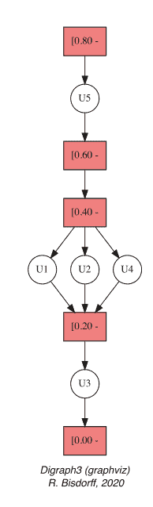

```
*---- Quantiles rating result ----*
[0.60 - 0.80[ ['U5']
[0.20 - 0.40[ ['U1', 'U4', 'U2']
[0.00 - 0.20[ ['U3']
```

使用特殊的 `exportRatingByRankingGraphViz()` 方法生成的相应 *graphviz* 绘图可以很好地在图 14.4 中展示这些入学质量等价类。

```
>>> lqr.exportRatingByRankingGraphViz('ratingResult')
*---- exporting a dot file for GraphViz tools ---------*
Exporting to ratingResult.dot
dot -Grankdir=TB -Tpdf dot -o ratingResult.png
```

我们在第 8 章中注意到，对于从给定的优超有向图（如这里的有向图 lqr）进行排序，并不存在唯一的最优规则。例如，COPELAND 规则的优点是满足孔多塞一致性，即当优超有向图建模了一个线性排序时，该排序必然是 COPELAND 规则的结果。当情况并非如此时，特别是当优超有向图显示无弦回路时，所有潜在的排序规则可能会给出非常不同的排序结果，有时甚至会给出实质上不同的评级排序结果。

`computeChordlessCircuits()` 和 `showChordlessCircuits()` 方法允许检查这个问题。⁵

```
>>> lqr.computeChordlessCircuits()
>>> lqr.showChordlessCircuits()
*---- Chordless circuits ----*
1 circuits.
1:  ['U1', 'U2', 'U4'] , credibility : 0.200
```

确实，在评级到第二五分位数的三所大学 U1、U2 和 U4 之间出现了一个优超回路。因此，验证当应用三种不同的排序规则（如 KEMENY、COPELAND 和 NETFLOWS 规则）时获得的评级排序结果的认识融合，是否确实确认了我们在前一页图 14.4 中显示的评级排序结果，是很有意义的。为此，我们在清单 14.4 中使用了 `RankingsFusionDigraph` 类。

**清单 14.4** 计算三种评级排序结果的认识融合

```
>>> # lqr.actionsRanking is Copeland ranked
>>> from linearOrders import KemenyOrder,
...                     NetFlowsOrder
>>> ke = KemenyOrder(lqr,orderLimit=10)
>>> nf = NetFlowsOrder(lqr)
>>> from transitiveDigraphs import
...                     RankingsFusionDigraph
>>> rankings = [lqr.actionsRanking,
...             nf.netFlowsRanking,
...             ke.kemenyRanking]
>>> rankings
[['m5','u5','m4','m3','u1','u2','u4','m2','u3','m1'],
 ['m5','u5','m4','m3','u1','u4','u2','u3','m2','m1'],
 ['m5','u5','m4','m3','u1','u4','u2','m2','u3','m1']]
>>> rf = RankingsFusionDigraph(lqr,rankings)
>>> rf.exportGraphViz(fileName='fusionResult',
...                   WithRatingDecoration=True)
exporting a dot file for GraphViz tools
Exporting to fusionResult.dot
dot -Grankdir=TB -Tpng fusionResult.dot
...                   -o fusionResult.png
```

三种评级排序结果的融合显示在下一页的图 14.5 中，我们看到它们仅在对大学 U2、U3 和 U4 的评级排序上存在分歧。在清单 14.4 的第 12-14 行，我们可以更精确地注意到，KEMENY 和 COPELAND 规则将 U3 评级在第一五分位数（[0.00 – 0.20]），而 NETFLOWS 规则将 U3 与 U1、U2 和 U4 一起放入第二五分位数（[0.20 – 0.40]）。并且，KEMENY 规则颠倒了 U2 和 U4 的位置。

> ⁵ `computeChordlessCircuits()` 和 `showChordlessCircuits()` 方法是分开的，因为有多种方法可用于枚举有向图中的无弦回路（Bisdorff 2010）。

## 14.3 基于下限闭合五分位数的排序评级法

**图 14.5** *KEMENY、COPELAND 和 NETFLOWS 排名的析取融合。* 它们在对大学 U2、U3 和 U4 进行排序评级时存在分歧。

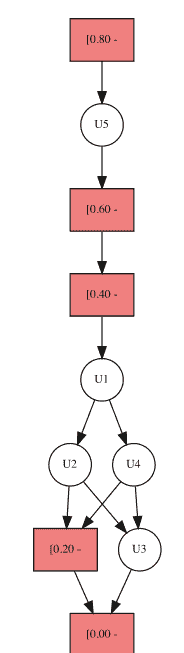

在代码清单 14.5 中，`showRankingConsensusQuality()` 方法最终揭示了 KEMENY 和 COPELAND 规则实际上是如何公平地平衡这十五个学科的。

**代码清单 14.5** 检查 KEMENY 排名的共识质量

```
>>> lqr.showRankingConsensusQuality(ke.kemenyRanking)
Consensus quality of ranking:
['m5', 'u5', 'm4', 'm3', 'u1', 'u2', 'u4', 'm2', 'u3', 'm1']
criterion (weight): correlation
------------------------------
phys (0.067): +0.833
germ (0.067): +0.789
math (0.067): +0.722
bio (0.067): +0.667
mgt (0.067): +0.633
chem (0.067): +0.611
psy (0.067): +0.544
pol (0.067): +0.500
info (0.067): +0.478
mec (0.067): +0.422
law (0.067): +0.411
soc (0.067): +0.400
med (0.067): +0.400
eco (0.067): +0.389
elec (0.067): +0.367
Summary:
Weighted mean marginal correlation (a): +0.544
Standard deviation (b) : +0.150
Ranking fairness (a)-(b) : +0.394
```

**代码清单 14.6** 检查 COPELAND 排名的共识质量

```
>>> lqr.showRankingConsensusQuality(lqr.actionsRanking)
Consensus quality of ranking:
['m5', 'u5', 'm4', 'm3', 'u1', 'u4', 'u2', 'm2', 'u3', 'm1']
criterion (weight): correlation
----------------------------------------
phys (0.067): +0.789
math (0.067): +0.767
germ (0.067): +0.767
chem (0.067): +0.656
bio (0.067): +0.622
mgt (0.067): +0.589
psy (0.067): +0.544
info (0.067): +0.522
pol (0.067): +0.456
law (0.067): +0.411
elec (0.067): +0.411
med (0.067): +0.400
eco (0.067): +0.389
mec (0.067): +0.378
soc (0.067): +0.356
Summary:
Weighted mean marginal correlation (a): +0.537
Standard deviation (b) : +0.148
Ranking fairness (a)-(b) : +0.389
```

这两种排序评级结果的共识质量并无显著差异。它们都显示出相似的高平均边际相关性（+0.544，+0.537）、相似的标准差（+0.150，+0.148），因此也具有相似的排名公平性（+0.394，+0.389）。

为了进一步检查我们的 COPELAND 排序评级结果的质量，我们将在下面直接计算一个基于历史 2004 年入学质量分数五分位数的排序评级，而不使用任何基于优势有向图的排名规则。

## 14.4 基于五分位数排序的评级

在本案例研究中，五所大学 U1、U2、U3、U4 和 U5 代表决策行动：*在哪里学习*。我们现在说，当大学 *x* 的绩效记录正向优于五分位数 *q* 的下限记录 **q**($p_{k-1}$)，且 *x* 不正向优于五分位数 *q* 的上限记录 **q**($p_k$) 时，大学 *x* 被归入下限闭合的五分位数 *k*，其中 *q* = 1, ..., 5（参见第 189 页的代码清单 14.1）。

借助优势关系 $r(x \succsim y)$ 的双极值特征，我们确实可以计算断言：‘$x$ 属于下限闭合的五分位数类 $\mathbf{q}_k$’ 的双极值特征：

$$r(x \in \mathbf{q}_k) = \min [r(x \succsim \mathbf{q}(p_{k-1})), r(x \succnsim \mathbf{q}(p_k))],$$

其中 $k = 1, \dots, 5$，$(p_k)$ 表示各自的五分位数比例：0.20、0.40、0.60、0.80 和 1.00。由于双极值优势有向图验证了余对偶原则，$r(x \succnsim \mathbf{q}(p_k)) = r(x \precnsim \mathbf{q}(p_k))$（参见第 9.2 节）。

`showSortingCharacteristics()` 方法在代码清单 14.7 中精确展示了这些五分位数排序特征。

**代码清单 14.7** 显示分位数排序特征

```
>>> lqr.showSortingCharacteristics()
x  in  K_k      r (x >= m_k)    r (x < M_k)    r (x in K_k)
U5 in [0.00 - 0.20[    0.73           -0.73           -0.73
U5 in [0.20 - 0.40[    0.73           -0.60           -0.60
U5 in [0.40 - 0.60[    0.60           -0.60           -0.60
U5 in [0.60 - 0.80[    0.60            0.00            0.00
U5 in [0.80 - <[       0.00            1.00            0.00

U2 in [0.00 - 0.20[    0.73           -0.13           -0.13
U2 in [0.20 - 0.40[    0.13            0.20            0.13
U2 in [0.40 - 0.60[   -0.20            0.47           -0.20
U2 in [0.60 - 0.80[   -0.47            0.73           -0.47
U2 in [0.80 - <[      -0.73            1.00           -0.73

U4 in [0.00 - 0.20[    0.87           -0.47           -0.47
U4 in [0.20 - 0.40[    0.47            0.13            0.13
U4 in [0.40 - 0.60[   -0.13            0.60           -0.13
U4 in [0.60 - 0.80[   -0.60            0.67           -0.60
U4 in [0.80 - <[      -0.67            1.00           -0.67

U1 in [0.00 - 0.20[    0.73           -0.33           -0.33
U1 in [0.20 - 0.40[    0.33            0.13            0.13
U1 in [0.40 - 0.60[   -0.13            0.53           -0.13
U1 in [0.60 - 0.80[   -0.53            0.60           -0.53
U1 in [0.80 - <[      -0.60            1.00           -0.60

U3 in [0.00 - 0.20[    0.67            0.13            0.13
U3 in [0.20 - 0.40[   -0.13            0.27           -0.13
U3 in [0.40 - 0.60[   -0.27            0.53           -0.27
U3 in [0.60 - 0.80[   -0.53            0.67           -0.53
U3 in [0.80 - <[      -0.67            1.00           -0.67
```

大学 U5 的绩效记录无法被正向评级到一个精确的五分位数中，但第四和第五五分位数都未被正向排除作为评级结果。除此之外，双极值排序特征验证了我们之前用 KEMENY 和 COPELAND 排序评级法得到的结果。`showActionsSortingResult()` 方法打印出最终的五分位数评级结果：

**代码清单 14.8** 显示基于排序的五分位数评级结果

```
>>> lqr.showActionsSortingResult()
Quantiles sorting result per decision action
 [0.20 - 0.40[: U1 with credibility: 0.13 = min(0.33,0.13)
 [0.20 - 0.40[: U2 with credibility: 0.13 = min(0.13,0.20)
 [0.00 - 0.20[: U3 with credibility: 0.13 = min(0.67,0.13)
 [0.20 - 0.40[: U4 with credibility: 0.13 = min(0.47,0.13)
 [0.60 - <[: U5 with credibility: 0.60 = min(0.60,1.00)
```

代码清单 14.8 中显示的基于排序的五分位数评级结果证实了之前的 COPELAND 排序评级结果。然而，大学 U5 在此被联合归入第四和第五五分位数，因此属于评级最高的机构之一。这一结果已在第 192 页图 14.3 的排序热图中令人信服地展示过。

让我们总结这个假设的评级案例研究：我们更喜欢后一种基于排序的评级方法。由于给定的情况、缺失和矛盾的绩效数据，它可能提供了一个不太精确的评级结果。然而，基于排序的评级算法建立在强大的双极值逻辑和认知框架之上，基础更为坚实。

第 15 章提出了一系列适合用作练习和考试题目的决策问题。

## 参考文献

Bisdorff R (2010) Enumerating chordless circuits in directed graphs. In: ORBEL24-2010, 24th annual conference of the Belgian operational research society (ORBEL aka Sogesci-B.V.W.B.), January 28-29, Liège (BE), Université de Liège (BE), pp 1–12. http://hdl.handle.net/10993/23926

DER SPIEGEL (2004) Studentenbefragung des SPIEGEL Die Methode. https://www.spiegel.de/lebenundlernen/uni/studentenbefragung-des-spiegel-die-methode-a-329082.html

Friedmann J, Hackenbroch V, Hipp D, Klauwiter N, Koch J, Lakotta B, Mohr J, Schmitz C, Thimm K, Wüst C (2004) Die Elite von morgen. DER SPIEGEL 48. https://www.spiegel.de/politik/die-elite-von-morgen-a-afd0507a-0002-0001-0000-000037494731

# 第 15 章
练习


# 目录

- 15.1 谁将获得最佳学生奖？($) ……………………………… 199
- 15.2 如何公平地对电影进行排名？($) ………………………………………… 200
- 15.3 什么是你的最佳选择推荐？($$) ……………………… 202
- 15.4 规划下一次假期活动 ($$) ……………………………… 203
- 15.5 什么是最佳公共政策？($$) ………………………………… 205
- 15.6 一个公平的文凭验证决策 ($$$) …………………………… 205

**摘要** 在本章中，我们提出了一系列不同难度的决策问题，这些问题可作为算法决策理论或多准则决策分析课程的练习和考试题。它们涵盖了*选择*、*排名*和*评级*决策问题。

练习的难度标记如下：*热身* ($)、*家庭作业* ($$) 和*研究工作* ($$$)。解答应同时得到使用 DIGRAPH3 编程资源的计算 Python 代码以及来自*算法决策理论*讲座（Bisdorff 2020, 2021）的方法论和算法论证的支持。

## 15.1 谁将获得最佳学生奖？($)

### 数据

在下一页的表 15.1 中，你可以找到四位学生：*Ariana* (A)、*Bruce* (B)、*Clare* (C) 和 *Daniel* (D) 在五门课程 C1、C2、C3、C4 和 C5 中获得的实际成绩，这些成绩按各自的 ECTS 学分加权。¹

## 15.1 学生获得的成绩

| 课程 | CF | C2 | C3 | C4 | C5 |
| :--- | :--- | :--- | :--- | :--- | :--- |
| ECTS | 2 | 3 | 4 | 2 | 4 |
| Ariana (A) | 11 | 13 | 9 | 15 | 11 |
| Bruce (B) | 12 | 9 | 13 | 10 | 13 |
| Clare (C) | 8 | 11 | 14 | 12 | 14 |
| Daniel (D) | 15 | 10 | 12 | 8 | 13 |

学生成绩采用从0分（最弱）到20分（最高）的序数表现尺度进行衡量。假设评分允许1分的偏好区分阈值。不存在显著的表现差异。ECTS学分越多，该课程在学生课程体系中的重要性就越高。将向表现出*最佳*成绩的学生授予奖项。

### 问题

- 1. 使用上述数据编辑一个`PerformanceTableau`实例。
- 2. 你会提名谁获得该奖项？
- 3. 解释并说明你的选择算法。
- 4. 假设评分实际上允许1分的无差异区分阈值和2分的偏好区分阈值。你的奖项推荐对于评分尺度的这种偏好区分能力有多稳定？

## 15.2 如何公平地对电影进行排名？ (§)

### 数据

文件`graffiti03.py`²包含一个表现图表，其灵感来源于2003年春季在卢森堡市可以看到的电影星级评分（来源：卢森堡《涂鸦》杂志，2003年2月）。其内容显示在下一页的图15.1中。

```python
>>> from perfTabs import PerformanceTableau
>>> t = PerformanceTableau('graffiti03')
>>> t.showHTMLPerformanceHeatmap(WithActionNames=True,
...                               pageTitle='Graffiti Star wars',
...                               rankingRule=None,colorLevels=5,
...                               ndigits=0)
```

### 表现图表 graffiti03

| 标准 | ap | as | cf | cn | cs | dr | jh | jt | mk | mr | rr | td | vt |
|---|---|---|---|---|---|---|---|---|---|---|---|---|---|
| 权重 | 1.00 | 1.00 | 1.00 | 1.00 | 1.00 | 1.00 | 2.00 | 1.00 | 1.00 | 1.00 | 1.00 | 1.00 | 2.00 |
| ah | NA | NA | NA | -1 | 1 | NA | 1 | 1 | 2 | NA | 1 | 3 | NA |
| aw | -1 | NA | 1 | NA | 2 | NA | NA | -1 | 1 | NA | 1 | NA | NA |
| bb | 2 | 1 | 2 | 2 | 3 | 2 | 2 | 2 | 3 | 2 | 3 | 1 | 1 |
| dl | -1 | -1 | -1 | NA | -1 | 1 | 1 | 1 | NA | 1 | 1 | 1 | -1 |
| gny | 2 | 4 | 2 | 4 | 2 | 3 | 3 | 4 | 2 | 4 | 3 | 2 | 3 |
| gs | 1 | NA | -1 | NA | 1 | 1 | NA | 1 | NA | -1 | -1 | -1 | NA |
| hn | 3 | NA | 3 | 2 | 2 | NA | 2 | 2 | 3 | 2 | 2 | NA | 1 |
| la | 3 | 2 | 3 | 3 | 2 | 2 | 3 | 3 | 3 | 4 | 3 | NA | 3 |
| lor | 2 | 3 | 3 | NA | 3 | 4 | 3 | 4 | 1 | 2 | 2 | 2 | 2 |
| ma | NA | NA | NA | 3 | 2 | 3 | 3 | 3 | 3 | 2 | 2 | 3 | 3 |
| md | 1 | 1 | -1 | NA | NA | -1 | NA | 1 | -1 | NA | NA | 1 | NA |
| mi | NA | -1 | NA | 1 | -1 | NA | 1 | 2 | NA | NA | -1 | 2 | 1 |
| sa | NA | NA | NA | NA | 2 | NA | 2 | 1 | 3 | 1 | NA | NA | NA |
| sc | 1 | NA | 1 | NA | -1 | NA | NA | 1 | 1 | NA | 1 | NA | NA |
| sha | 2 | -1 | 1 | 1 | 2 | 2 | -1 | 2 | 1 | 1 | 1 | NA | NA |
| ss | 3 | 3 | 3 | 4 | 2 | 3 | 3 | 3 | 3 | 3 | 1 | 3 | 3 |
| vf | NA | NA | NA | 1 | NA | NA | 1 | 1 | NA | NA | 1 | 1 | NA |

图15.1 2003年2月的电影星级评分

影评人的意见以七个序数评级水平表示：−2（两个零，*我讨厌*），−1（一个零，*我不喜欢*），1（一颗星，*也许*），2（两颗星，*好*），3（三颗星，*优秀*），4（四颗星，*不容错过*），以及5（五颗星，*杰作*）。请注意，当影评人未观看相应电影时，存在许多缺失数据（NA）。还需注意，两位影评人（*jh*和*vt*）的评分被赋予了更高的显著性权重。

### 问题

- 1. 《涂鸦》杂志通过计算电影获得的平均星数来推荐最佳评分电影，忽略了缺失数据和影评人的任何显著性权重。哪部电影获得的平均分最高？
- 2. 在考虑缺失数据和不同的显著性权重的情况下，如何在不计算任何平均星数的情况下找到最佳评分电影？
- 3. 如何对这些电影进行排名，以最好地尊重每位影评人的加权评分意见？
- 4. 一部没有任何影评人观看过的电影会出现在什么排名位置？通过向给定的表现图表实例添加这样一部虚构的、*完全未被评估*的电影，从计算上确认你的答案。
- 5. 当影评人的显著性权重仅被视为序数类型时，上述结果有多稳健？

## 15.3 你的最佳选择推荐是什么？ (§§)

**数据**

一位想购买电视机的人在初步筛选后保留了八款潜在电视型号。³ 为了做出最佳选择，这八款型号根据三个同等重要的决策目标进行了评估：

1. 电视机的*成本*（需最小化）
2. 电视的*画面和声音*质量（需最大化）
3. 供应商的*维护合同*质量（需最大化）

*成本*目标通过电视机的价格（需最小化的标准*Pr*）来评估。*画面*质量（标准*Pq*）、*声音*质量（标准*Sq*）和*维护合同*质量（标准*Mq*）各自在四级定性表现尺度上进行评估：−1（*不好*），0（*一般*），1（*好*），和2（*非常好*）。

实际评估数据汇集在对面页的表15.2中。

*价格*标准*Pr*还支持25.00欧元的无差异阈值和75.00欧元的偏好阈值。不考虑显著的表现差异（否决阈值）。

**问题**

- 1. 使用下一页表15.2中的数据编辑一个新的`PerformanceTableau`实例，并通过最佳方式展示目标、标准、决策备选方案和表现表格来说明其内容。如果需要，编写适当的Python代码。
- 2. 推荐的最佳电视机是哪一款？
- 3. 用适当的*graphviz*图示说明你的最佳选择推荐。
- 4. 解释并说明你的选择算法。
- 5. 假设定性标准：*画面*质量（*Pq*）、*声音*质量（*Sq*）和*维护合同*质量（*Mq*）三者均被视为同等重要，并且*价格*标准（*Pr*）的重要性等于这三个质量标准重要性的总和。你的最佳选择推荐对于这样重新审视标准重要性权重有多稳定？

³ Vincke (1992, pp.33–35)讨论了一个类似的教学决策问题。

### 表15.2 潜在电视机的表现评估

| 标准 | Pr (€) | Pq | Sq | Mq |
|---|---|---|---|---|
| 显著性 | 2 | 1 | 1 | 1 |
| 型号 T1 | -1300 | 2 | 2 | 0 |
| 型号 T2 | -1200 | 2 | 2 | 1 |
| 型号 T3 | -1150 | 2 | 1 | 1 |
| 型号 T4 | -1000 | 1 | 1 | -1 |
| 型号 T5 | -950 | 1 | 1 | 0 |
| 型号 T6 | -950 | 0 | 1 | -1 |
| 型号 T7 | -900 | 1 | 0 | -1 |
| 型号 T8 | -900 | 0 | 0 | 0 |

### 表15.3 潜在假期活动集合

| 标识符 | 名称 | 评论 |
|---|---|---|
| ant | Antequerra | 下午前往Antequerra及周边地区的短途旅行 |
| ard | Ardales | 下午前往Ardales和El Chorro的短途旅行 |
| be | 海滩 | 阳光、大海、乐趣等等 |
| crd | Cordoba | 全天驾车游览Cordoba |
| dn | 无所事事 | 什么都不做 |
| lw | 长途步行 | 全天徒步旅行 |
| mal | Malaga | 全天游览Malaga |
| sev | Sevilla | 全天游览Sevilla |
| sw | 短途步行 | 不到半天的徒步旅行 |

## 15.4 规划下一次假期活动 (§§)

### 数据

一个在假期期间住在龙达（安达卢西亚）的家庭正在计划第二天的活动（Bisdorff 2008）。表15.3中显示的备选方案被视为潜在行动。

家庭成员同意根据一组七个表现标准来衡量他们的偏好，例如前往地点所需的时间（需最小化）、所需的体力投入、预期的食物质量、旅游价值、放松程度、阳光乐趣等等（见下一页的表15.4）。

与所有家庭成员商定后，对九个备选方案在所有标准上的评估产生了下一页表15.5所示的表现图表。

所有定性标准上的表现都标记在相同的序数尺度上，从0（最低）到10（最高）。在定量的距离标准（需最小化）上，前往和返回活动地点所需的旅行时间以负分钟数标记。为了仅建模有效偏好，在定性表现度量上设置了1分的无差异阈值和2分的偏好阈值。在距离标准上，设置了

## 15 练习

表 15.4 绩效标准集

| 标识符 | 名称 | 备注 |
| :--- | :--- | :--- |
| cult | 文化兴趣 | 安达卢西亚遗产 |
| dis | 距离 | 往返活动地点所需时间（分钟） |
| food | 餐饮 | 预期餐饮机会的质量 |
| sun | 阳光、乐趣等 | 无备注 |
| phy | 体力投入 | 对身体健康的贡献 |
| rel | 放松 | 抗压支持 |
| tour | 旅游吸引力 | 指南中有多少颗星？ |

表 15.5 绩效表

| 标准 | 权重 | ant | ard | be | crd | dn | lw | mal | sev | sw |
| :--- | :--- | :--- | :--- | :--- | :--- | :--- | :--- | :--- | :--- | :--- |
| cult | 1 | 7 | 3 | 0 | 10 | 0 | 0 | 5 | 10 | 0 |
| dis | 1 | -120 | -100 | -30 | -360 | 0 | -90 | -240 | -240 | 0 |
| phy | 1 | 3 | 7 | 0 | 5 | 0 | 10 | 5 | 5 | 5 |
| rel | 1 | 1 | 5 | 8 | 3 | 10 | 5 | 3 | 3 | 6 |
| food | 1 | 8 | 10 | 4 | 8 | 10 | 1 | 8 | 10 | 1 |
| sun | 1 | 0 | 3 | 10 | 3 | 1 | 3 | 8 | 5 | 5 |
| tour | 1 | 5 | 7 | 3 | 10 | 0 | 8 | 10 | 10 | 5 |

考虑20分钟和45分钟的偏好阈值。此外，往返活动地点超过两小时的差异被认为会引发否决。

各个标准分别反映了家庭成员中某一方的偏好观点。因此，它们被认为对于最终选择最佳行动具有同等重要性。

### 问题

1.  编辑一个新的 `PerformanceTableau` 实例，使用上述数据并展示其内容。
2.  标准如何表达它们对备选方案集的偏好观点？例如，旅游吸引力标准似乎在偏好判断上与文化兴趣和餐饮标准都存在某种正相关。同样明显的是，距离标准与后两者标准存在某种负相关。如何探索和展示这些直觉？
3.  距离标准假设的120分钟显著绩效差异对偏好建模有何影响？
4.  你将如何以绩效标准最公平的平衡来对潜在的假期活动进行排序？
5.  你会向家庭成员推荐的首选是什么？

## 15.5 什么是最佳公共政策？ ($$)

**数据文件**

-   文件 `perfTab_1.py` 包含一个3目标绩效表，其中有100条绩效记录，涉及根据*经济*、*社会*和*环境*决策目标评估的公共政策。
-   文件 `historicalData_1.py` 包含一个同类绩效表，其中有2000条历史绩效记录。

### 问题

1.  通过最佳展示*目标*、*标准*、*决策备选方案*（公共政策）和*绩效评估*，来说明给定的 `perfTab_1.py` 绩效表的内容。如果需要，编写适当的Python代码。
2.  构建相应的双极值有向图。明显的优超情况有多*置信*和/或*稳健*？
3.  从不同决策目标的角度以及从全局公平折衷的角度来看，你的决策问题中显然排名前5的决策备选方案是什么？从方法论角度证明你的排序方法。
4.  你将如何将你的100个公共政策评级为相对十分位数类别？
5.  使用文件 `historicalData_1.py` 中给定的历史记录，你将如何将你的100个公共政策评级为绝对十分位数类别？
6.  解释你可能观察到的绝对评级与先前相对评级结果之间的差异。
7.  从你的100个潜在公共政策中，选择一个最多包含15个潜在最佳政策的候选名单，所有政策都达到至少66.67%的绝对绩效分位数。
8.  基于先前的最佳政策候选名单（见问题7），你最终的最佳选择推荐是什么？它是否可能是所有三个目标都无异议的最佳选择？

## 15.6 公平的文凭验证决策 ($$$)

**数据**

使用 `randomPerfTab` 模块中的 `RandomAcademicPerformanceTableau` 类，生成关于九门ECTS加权课程（Bisdorff 2021）的真实随机学生成绩表。假设所有评分都在0（最弱）到20（最佳）的整数范围内进行。已知评分程序不可避免地存在某种不精确性；因此假设

> 4 文件 `perfTab_1.py` 和 `historicalData_1.py` 提供在 DIGRAPH3 资源的示例目录中（Bisdorff 2021）。

无差异判别阈值为1分，偏好判别阈值为2分。此外，超过12分的绩效差异被认为是显著的，并将引发极化情况。为了最终验证他们的课程，学生需要在每门课程中获得大约10分。

### 问题

1.  基于九门课程的成绩，设计并实现一个公平的文凭验证决策规则。
2.  使用随机学生成绩表运行模拟测试，以验证你的设计和实现。

## 参考文献

Bisdorff R (2008) On clustering the criteria in an outranking based decision aid approach. In: Thi HAL, Bouvry P, Pham D (eds) Computation and Optimization in Information Systems and Management Sciences, Springer, CCIS, pp 409–418. http://hdl.handle.net/10993/23718
Bisdorff R (2020) Lectures of the algorithmic decision theory course, University of Luxembourg. http://hdl.handle.net/10993/37933
Bisdorff R (2021) Technical documentation of the Digraph3 collection of Python modules. https://digraph3.readthedocs.io/en/latest/techDoc.html
Graffiti magazine, Luxembourg (February 2003) Star wars
Vincke P (1992) Multicriteria Decision-Aid. John Wiley & Sons Ltd, Chichester

# 第四部分
高级主题

第四部分汇集了五章，介绍并讨论进一步的算法发展。在第16章中，KENDALL的序数相关指数被一致地扩展到双极值有向图。第17章解释了有向图核的重要概念，并说明了DIGRAPH3计算它们的算法方法。在第18章中，标准显著性权重被认为是不确定的，并成为随机变量。这一想法为计算优超和被优超情况的双极值似然度开辟了道路，从而导致α%-置信优超有向图。在第19章中，标准显著性权重被认为仅具有序数类型。这一工作假设导致需要对相应的优超有向图进行特定的稳健性分析。最后一章，第20章，利用先前的稳健性分析来介绍和讨论一些想法，例如具有多党派初步选择的两阶段选举或双极投票系统，以缓和社会选择问题中的多数暴政效应。

# 第16章
关于衡量多重标准排序的适配性


# 内容

- 16.1 从最佳星级到最差列出电影 ……………………………… 209
- 16.2 KENDALL的序数相关Tau指数…………………………………… 212
- 16.3 双极值关系等价性 ……………………………………… 214
- 16.4 排序启发式方法的适配性 …………………………………………………… 217
- 16.5 说明偏好分歧 …………………………………………… 219
- 16.6 探索“评价更好”和“评价相当”的观点 ………… 220

**摘要** 从一个关于如何将一组由记者和影评人评级的电影从最佳到最差列出的激励性决策问题出发，本章表明KENDALL的序数相关指数tau可以扩展到双极值有向图的双极值关系等价性度量。这一发现一方面为衡量多重标准排序规则的适配性和公平性提供了途径。另一方面，它提供了一个工具来说明决策目标和标准之间的偏好分歧。

## 16.1 从最佳星级到最差列出电影

在固守二值逻辑的情况下，每个论点只能为真或为假，没有有效考虑缺失数据或逻辑不确定性的空间。这些情况被视为有问题的，充其量只是被忽略。更糟的是，在现代数据科学中，缺失数据经常被*虚构*值所取代，这可能会因此歪曲所有后续计算。

然而，在社会选择问题中，投票弃权是经常观察到的，并且代表了一种社会表达，可能对于揭示未被代表的社会偏好具有重要意义。同样，在市场研究中，受访者并不总是回答所有提交的问题。同样，这些弃权有时仍然包含有关消费者偏好的有效信息。

## 涂鸦星球大战

| 标准 | AP | AS | CF | CS | DR | FG | GS | JH | JPT | MR | RR | SF | SJ | TD | VT |
|---|---|---|---|---|---|---|---|---|---|---|---|---|---|---|---|
| 权重 | 1.00 | 1.00 | 1.00 | 1.00 | 1.00 | 1.00 | 1.00 | 3.00 | 1.00 | 1.00 | 1.00 | 1.00 | 1.00 | 1.00 | 3.00 |
| mv_AL | 3 | -1 | 2 | -1 | NA | NA | 3 | NA | 2 | NA | NA | NA | 2 | NA | 2 |
| mv_BI | 1 | -1 | 1 | 1 | -1 | NA | NA | NA | 2 | NA | 2 | NA | NA | NA | NA |
| mv_CM | NA | 3 | 3 | 2 | NA | NA | 3 | 2 | 3 | 2 | 1 | 2 | 2 | NA | 2 |
| mv_DF | NA | 4 | 3 | 1 | 2 | NA | 1 | 3 | 2 | 2 | 2 | 3 | -1 | NA | 1 |
| mv_DG | 3 | 2 | 2 | 3 | 3 | 1 | 4 | 3 | 3 | 3 | NA | NA | NA | NA | 3 |
| mv_DI | 1 | 2 | NA | 1 | 2 | 2 | NA | 1 | 2 | 2 | NA | 1 | 1 | NA | NA |
| mv_DJ | 3 | 1 | 3 | NA | NA | NA | 3 | NA | 2 | 2 | NA | 2 | 4 | 3 | -1 |
| mv_FC | 3 | 2 | 2 | 1 | 3 | NA | 1 | 3 | 3 | 3 | 2 | NA | 2 | 1 | 3 |
| mv_FF | 2 | 3 | 2 | 1 | 2 | 2 | NA | 1 | 2 | 2 | 1 | 2 | 1 | 3 | 1 |
| mv_GG | 2 | 3 | 3 | 1 | NA | NA | 1 | -1 | NA | -1 | 2 | NA | -1 | NA | 1 |
| mv_GH | 1 | 1 | 1 | -1 | 2 | 2 | 1 | 2 | 1 | 3 | NA | 4 | NA | NA | NA |
| mv_HN | 3 | 1 | 3 | 1 | 3 | NA | 4 | 3 | 2 | NA | 1 | NA | 3 | 3 | 3 |
| mv_HP | 1 | 1 | 3 | 1 | NA | NA | 1 | 1 | 2 | 3 | NA | NA | 1 | 2 | NA |
| mv_HS | 2 | 4 | 2 | 3 | 2 | 2 | 2 | 3 | 4 | 2 | 3 | NA | 1 | 3 | NA |
| mv_JB | 3 | 4 | 3 | NA | 3 | 2 | 3 | 2 | 3 | 2 | NA | 2 | 2 | NA | 3 |
| mv_MB | NA | 2 | NA | NA | 1 | NA | 1 | 2 | 2 | 1 | 2 | NA | 2 | 2 | NA |
| mv_NP | NA | 1 | 3 | 1 | NA | 3 | 2 | 3 | 3 | 3 | 2 | 3 | NA | NA | 3 |
| mv_PE | 3 | 4 | 2 | NA | 3 | 1 | NA | 2 | 4 | 2 | NA | 3 | 3 | NA | 3 |
| mv_QS | NA | 3 | 2 | NA | 4 | 3 | NA | 4 | 4 | 3 | 3 | 4 | NA | 4 | 4 |
| mv_RG | 2 | 2 | 2 | 2 | NA | NA | 3 | 1 | 2 | 2 | 1 | NA | NA | 3 | NA |
| mv_RR | 3 | 2 | NA | 1 | 4 | NA | 4 | 3 | 3 | 4 | 3 | 3 | NA | 4 | 2 |
| mv_SM | 3 | 3 | 2 | 2 | 2 | 2 | NA | 3 | 2 | 2 | 3 | NA | 2 | 2 | 3 |
| mv_TF | -1 | NA | 1 | 1 | 1 | NA | NA | 1 | 2 | NA | -1 | NA | -1 | 1 | NA |
| mv_TM | 2 | 1 | 2 | 2 | NA | NA | 2 | 2 | 2 | 3 | NA | 2 | NA | 4 | NA |
| mv_TP | 2 | 3 | 3 | 1 | 2 | NA | NA | 3 | 2 | NA | 2 | NA | 1 | NA | 2 |

图 16.1 2007年9月电影的星级评定

这里给出一个案例，涉及2007年9月在镇上可以看到的星级评定电影列表。¹ 其底层的性能矩阵数据存储在名为`graffiti07.py`²的文件中，下面通过`showHTMLPerformanceTableau()`方法展示：

```
>>> from outrankingDigraphs import
...                     PerformanceTableau
>>> gt07 = PerformanceTableau('graffiti07')
>>> gt07.showHTMLPerformanceTableau(
...                     title='Graffiti Star wars',
...                     ndigits=0)
```

图 16.1 显示了15位记者和影评人对25部电影的星级评定：5星（杰作）、4星（必看）、3星（优秀）、2星（良好）、1星（可看）、−1星（不喜欢）、−2星（讨厌）以及 NA（未观看）。注意第二行中，两位当地知名影评人 JH 和 VT 被赋予了更高的显著性（3.00）。他们的意见权重是其他影评人的三倍。凭借六次4星（必看）的标记，电影 mv_QS 获得了最高评分，其次是获得四次4星标记的 mv_RR。获得最少星级的是电影 mv_TF，它获得了三次-1星（不喜欢）标记和五次1星标记。请注意，许多电影，如 mv_BI，仅由部分影评人进行了评定。

为了汇总所有影评人的星级评定，《*涂鸦*》杂志为每部电影计算一个全局分数——即其获得的加权平均星级数——同时忽略*未观看*的电影。清单 16.1 展示了如何使用存储在 gt07 性能矩阵中的数据来计算这些全局分数。属性 gt07.actions 和 gt07.criteria 分别包含25部电影和15位影评人的描述。实际的星级评定可以在 gt07.evaluation 属性中找到。

### 清单 16.1 计算每部电影的加权平均星级数

```
1 >>> # gt07 = PerformanceTableau('graffiti07')
2 >>> globalScores = {}
3 >>> for mv in gt07.actions:
4 >>>     globalScores[mv] = Decimal('0')
5 >>>     sumWeights = Decimal('0')
6 >>>     for critic in gt07.criteria:
7 >>>         stars = gt07.evaluation[critic][mv]
8 >>>         if stars != gt07.NA:
9 >>>             weight = gt07.criteria[critic]['weight']
10 >>>             globalScores[mv] += (stars * weight)
11 >>>             sumWeights += weight
12 >>>     globalScores[mv] /= sumWeights
13 >>> graffitiList = [(globalScores[mv],mv) for mv in globalScores]
14 >>> graffitiList.sort(reverse=True)
15 >>> for item in graffitiList:
16 >>>     print('%s: %.2f' % (item[1],item[0]) )
17 mv_QS: 3.60
18 mv_RR: 2.88
19 mv_PE: 2.67
20 mv_JB: 2.62
21 mv_HN: 2.62
22 mv_NP: 2.60
23 mv_HS: 2.60
24 mv_DG: 2.56
25 mv_SM: 2.53
26 mv_FC: 2.41
27 mv_TP: 2.21
28 mv_CM: 2.20
29 mv_TM: 2.17
30 mv_DF: 1.94
31 mv_RG: 1.83
32 mv_MB: 1.73
33 mv_GH: 1.67
34 mv_DJ: 1.67
35 mv_FF: 1.61
36 mv_AL: 1.60
37 mv_HP: 1.55
38 mv_DI: 1.42
39 mv_GG: 0.71
40 mv_BI: 0.71
41 mv_TF: 0.55
```

全局分数排名在第17-18行再次确认了两部领先电影——mv_QS (3.60) 和 mv_RR (2.88)——以及在第41行确认了评分最低的电影——mv_TF (0.55)。但请注意，由于存在大量缺失评分，这些全局平均值的计算分母并不一致；一些影评人确实使用了或多或少扩展的星级范围。例如，影评人 SJ 未观看的电影会受到青睐，因为这位影评人的评分比其他人更严格。同样，也不能简单地丢弃未被所有影评人评定的电影，因为实际上没有一部电影被所有15位影评人评定过。为众多“未观看”情况提供一个虚构值也总会以某种方式歪曲全局分数。该怎么办呢？

一个更好的方法是基于成对的双极值“至少被评为同等好”的陈述来对电影进行排序。在这种认识论论证方法下，缺失的评估自然被视为意见弃权，因此不会歪曲逻辑计算。通过`showHTMLPerformanceHeatmap()`方法生成的**热力图**浏览器视图（见清单 16.2）提供了从最佳到最差的**NETFLOWS**排名。

### 清单 16.2 在热力图视图中显示从最佳到最差的电影

```
1 >>> gt07.showHTMLPerformanceHeatmap(
2 ...                 pageTitle='Ranking the movies',
3 ...                 rankingRule='NetFlows',
4 ...                 Correlations=True,
4 ...                 ndigits=0)
```

图 16.2（对面页）所示的**NETFLOWS**排名再次确认，获得6个*必看*标记的电影 mv_QS 正确排名第一，而获得五个*不喜欢*标记的电影 mv_TF 排名最后。

然而，公平地说，最终需要提及的是，《*涂鸦*》杂志的平均星级排名规则实际上显示了非常相似的结果。确实，平均分数通常能很好地确认所有明显的成对比较，但对所有不太明显的比较则*强制*了可比性。那么，如何判断给定排名规则的适用性呢？

这就是下一页图 16.2 第三行所示的序数相关性 *tau* 指数的目的。计算这些序数相关性指数是下一节的主题。

## 16.2 KENDALL 序数相关性 Tau 指数

M.G. Kendall 将其序数相关性 τ (tau) 指数定义为针对维度为 n 的线性序，平衡正确排序的对数 Co 与错误排序的对数 In（Kendall 1938）。对于线性序，非自反对的总数为 n(n − 1)，因此 Co + In = n(n − 1)。因此 τ = (Co / n(n-1)) − (In / n(n-1))。如果 In 为零，则 τ = +1（所有对都等价排序）；反之，如果 Co 为零，则 τ = −1（所有对都不同排序）。

---
¹ 涂鸦星球大战，卢森堡评论版，2007年9月，第30页。
² 可在 DIGRAPH3 资源的 examples 目录中找到。

## 电影排名

| 标准 | JH | JPT | AP | DR | MR | VT | GS | CS | SJ | RR | TD | CF | SF | AS | FG |
|---|---|---|---|---|---|---|---|---|---|---|---|---|---|---|---|
| 权重 | +3.00 | +1.00 | +1.00 | +1.00 | +1.00 | +3.00 | +1.00 | +1.00 | +1.00 | +1.00 | +1.00 | +1.00 | +1.00 | +1.00 | +1.00 |
| tau(*) | +0.50 | +0.43 | +0.32 | +0.26 | +0.25 | +0.23 | +0.16 | +0.14 | +0.14 | +0.13 | +0.11 | +0.11 | +0.10 | +0.08 | +0.03 |
| mv_QS | 4 | 4 | NA | 4 | 3 | 4 | NA | NA | NA | 3 | 4 | 2 | 4 | 3 | 3 |
| mv_RR | 3 | 3 | 3 | 4 | 4 | 2 | 4 | 1 | NA | 3 | 4 | NA | 3 | 2 | NA |
| mv_DG | 3 | 3 | 3 | 3 | 3 | 3 | 4 | 3 | -1 | NA | NA | 2 | NA | 2 | 1 |
| mv_NP | 3 | 3 | NA | NA | 3 | 3 | 2 | 1 | NA | 2 | NA | 3 | 3 | 1 | 3 |
| mv_HN | 3 | 2 | 3 | NA | 3 | 3 | 4 | 1 | 3 | 1 | 3 | NA | 3 | NA | NA |
| mv_HS | 3 | 4 | 2 | 2 | 2 | NA | 2 | 3 | 1 | 3 | 3 | 2 | NA | 4 | 2 |
| mv_SM | 3 | 2 | 3 | 2 | 2 | 3 | NA | 2 | 2 | 3 | 2 | NA | NA | 3 | 2 |
| mv_JB | 2 | 3 | 3 | 3 | 2 | 3 | 3 | NA | 2 | NA | NA | 3 | 2 | 4 | 2 |
| mv_PE | 2 | 4 | 3 | 3 | 2 | 3 | NA | NA | 3 | NA | NA | 2 | 3 | 4 | 1 |
| mv_FC | 3 | 3 | 3 | 3 | 3 | 3 | 1 | 1 | 2 | 2 | 1 | NA | 2 | 2 | NA |
| mv_TP | 3 | 2 | 2 | 2 | NA | 2 | NA | 1 | 1 | 2 | NA | 3 | NA | 3 | NA |
| mv_CM | 2 | 3 | NA | NA | 2 | 2 | 3 | 2 | 2 | 1 | NA | 3 | 2 | 3 | NA |
| mv_DF | 3 | 2 | NA | 2 | 2 | 1 | 1 | 1 | -1 | 2 | NA | 3 | 3 | 4 | NA |
| mv_TM | 2 | 2 | 2 | NA | 3 | NA | 2 | 2 | NA | NA | 4 | 2 | 2 | 1 | NA |
| mv_DJ | NA | 2 | 3 | NA | 2 | -1 | 3 | NA | 4 | NA | 3 | 3 | 2 | 1 | NA |
| mv_AL | NA | 2 | 3 | NA | NA | 2 | 3 | -1 | 2 | NA | NA | 2 | NA | -1 | NA |
| mv_RG | 1 | 2 | 2 | NA | 2 | NA | 3 | 2 | NA | 1 | 3 | 2 | NA | 2 | NA |
| mv_MB | 2 | 2 | NA | 1 | 1 | NA | 1 | NA | 2 | 2 | 2 | NA | NA | 2 | NA |
| mv_GH | 2 | 1 | 1 | 2 | 3 | NA | 1 | -1 | NA | 4 | NA | 1 | NA | NA | 2 |
| mv_HP | 1 | 1 | 1 | NA | 2 | NA | 1 | 1 | 1 | 3 | 2 | 3 | NA | NA | NA |
| mv_BI | NA | 2 | 1 | -1 | NA | NA | NA | 1 | NA | 2 | NA | 1 | NA | -1 | NA |
| mv_DI | 1 | 2 | 1 | 2 | 2 | NA | 1 | 1 | NA | NA | NA | 1 | 2 | 2 | 2 |
| mv_FF | 1 | 2 | 2 | 2 | 2 | 1 | NA | 1 | 1 | 1 | 3 | 2 | 2 | 3 | 2 |
| mv_GG | -1 | NA | 2 | NA | -1 | 1 | 1 | 1 | -1 | 2 | NA | 3 | NA | 3 | NA |
| mv_TF | 1 | 2 | -1 | 1 | NA | NA | NA | 1 | -1 | -1 | 1 | 1 | NA | NA | NA |

颜色图例：
分位数 20.00% 40.00% 60.00% 80.00% 100.00%

(*) tau：边际标准与全局排序关系之间的序数（Kendall）相关性
优势模型：标准，排序规则：NetFlows
全局排序与全局优势关系之间的序数（Kendall）相关性：+0.780
平均边际相关性 (a)：+0.234
标准边际偏差 (b)：+0.147
排序公平性 (a) - (b)：+0.087

图 16.2 使用 NETFlows 规则排序的电影星级评分

注意到 $\frac{Co}{n(n-1)} = 1 - \frac{In}{n(n-1)}$，并且回想双极值否定是通过改变特征值的符号来操作的，

$\tau = 1 - 2\frac{In}{n(n-1)} = -\left(2\frac{In}{n(n-1)} - 1\right) = 2\frac{Co}{n(n-1)} - 1. \quad (16.1)$

KENDALL 原始的 $\tau$ 定义实际上实现了两个线性序的非等价性的双极值否定，即等价定向的非自反对的归一化多数优势。

设 $\mathfrak{r}1$ 和 $\mathfrak{r}2$ 是定义在同一组 5 个备选方案上的两个随机清晰关系。计算 KENDALL 的 $\tau$ 指数可以如清单 16.3 所示进行。

清单 16.3 计算关系等价有向图

```
>>> from randomDigraphs import RandomDigraph
>>> r1 = RandomDigraph(order=5,Bipolar=True)
>>> r2 = RandomDigraph(order=5,Bipolar=True)
>>> from digraphs import EquivalenceDigraph
>>> eqd = EquivalenceDigraph(r1,r2)
>>> eqd.showRelationTable(ReflexiveTerms=False)
 * ---- 关系表 -----
r(<=>)|  'a1'   'a2'   'a3'   'a4'   'a5'
------|------------------------------------
 'a1' |   -   -1.00  1.00  -1.00  1.00
 'a2' | -1.00   -   -1.00  1.00  -1.00
 'a3' | -1.00 -1.00   -    1.00  1.00
 'a4' | -1.00  1.00 -1.00   -    1.00
 'a5' | -1.00  1.00 -1.00  1.00   -
 估值域：[-1.00;1.00]
>>> eqd.correlation
{'correlation': -0.1, 'determination': 1.0}
```

在上面的等价关系 (r1 ⇔ r2) 表中（参见第 211 页清单 16.1，第 10-14 行），我们观察到等价与非等价非自反对的归一化多数优势为 (9 – 11)/20 = –0.1，即在此完全确定的清晰情况下 KENDALL tau 指数的值（参见第 17 行）。

那么，对于或多或少认识论上确定的、甚至部分不确定的关系，会发生什么？我们可以用类似的方式进行吗？

## 16.3 双极值关系等价

在清单 16.4 中生成的两个五阶随机双极值有向图 d1 和 d2 将有助于探索这个想法。

清单 16.4 两个随机双极值有向图

```
>>> from randomDigraphs import RandomValuationDigraph
>>> d1 = RandomValuationDigraph(order=5,seed=1)
>>> d1.showRelationTable(ReflexiveTerms=False)
 * ---- 关系表 -----
 r(d1)|  'a1'   'a2'   'a3'   'a4'   'a5'
------|------------------------------------
 'a1' |   -   -0.66  0.44  0.94  -0.84
 'a2' | -0.36   -   -0.70  0.26  0.94
 'a3' |  0.14  0.20   -    0.66  -0.04
 'a4' | -0.48 -0.76  0.24   -   -0.94
 'a5' | -0.02  0.10  0.54  0.94   -
 估值域：[-1.00;1.00]
>>> d2 = RandomValuationDigraph(order=5,seed=2)
>>> d2.showRelationTable(ReflexiveTerms=False)
 * ---- 关系表 -----
r(d2) | 'a1' 'a2' 'a3' 'a4' 'a5'
------|----------------------------------------
'a1' | - -0.86 -0.78 -0.80 -0.08
'a2' | -0.58 - 0.88 0.70 -0.22
'a3' | -0.36 0.54 - -0.46 0.54
'a4' | -0.92 0.48 0.74 - -0.60
'a5' | 0.10 0.62 0.00 0.84 -
估值域：[-1.00;1.00]
```

在生成的随机有向图 d1 和 d2 中，有 9 对，例如 (a1,a2) 或 (a3,a2)，呈现等价定向（参见第 7 行和第 18 行，或第 9 行和第 20 行）。EquivalenceDigraph 类计算有向图 d1 和 d2 之间的这种双极值关系等价性（参见清单 16.5）。

清单 16.5 双极值等价有向图

```
>>> from digraphs import EquivalenceDigraph
>>> eqd = EquivalenceDigraph(d1,d2)
>>> eqd.showRelationTable(ReflexiveTerms=False)
 * ---- 关系表 -----
r(<=>) | 'a1' 'a2' 'a3' 'a4' 'a5'
------|----------------------------------------
'a1' | - 0.66 -0.44 -0.80 0.08
'a2' | 0.36 - -0.70 0.26 -0.22
'a3' | -0.14 0.20 - -0.46 -0.04
'a4' | 0.48 -0.48 0.24 - 0.60
'a5' | -0.02 0.10 0.00 0.84 -
估值域：[-1.00;1.00]
```

在我们的双极值认知逻辑中，逻辑析取和合取分别实现为 max 和 min 操作。还要注意，逻辑等价 (d1 ⇔ d2) 对应于双重蕴含 (d1 ⇒ d2) ∧ (d2 ⇒ d1)，并且蕴含 (d1 ⇒ d2) 在逻辑上等价于析取 (¬d1 ∨ d2)。

当 r(x d1 y) 和 r(x d2 y) 分别表示关系 d1 和 d2 的双极值特征值时，我们可以如下计算等价与非等价定向的非自反对 (x, y) 之间的多数优势 M(d1 ⇔ d2)：

M(d1 ⇔ d2) =
∑_{(x≠y)} [min(max(−r(x d1 y), r(x d2 y)), max(−r(x d2 y), r(x d1 y)))].
(16.2)

因此，M(d1 ⇔ d2) 由上面计算的关系等价有向图 eqd 的关系表的非自反项之和给出（参见清单 16.5）。在清晰情况下，M(d1 ⇔ d2) 用最大可能的非自反对数，即 n(n − 1) 进行归一化。在扩展的 r 值情况下，最大可能的等价多数优势 M 对应于 $(x \d1 y)$ 和 $(x \d2 y)$ 的联合确定度之和 D（参见 Bisdorff 2012）：

$$D = \sum_{x \neq y} \min \left[ abs(r(x \d1 y)), abs(r(x \d2 y)) \right], \quad (16.3)$$

因此，在一般的 $r$ 值情况下，我们得到：

$$\tau(\d1, \d2) = \frac{M(\d1 \Leftrightarrow \d2)}{D} . \quad (16.4)$$

$\tau(\d1, \d2)$ 因此对应于经典的序数相关指数，但仅限于给定有向图 $\d1$ 和 $\d2$ 的联合确定部分。在两个清晰线性序的极限情况下，$D$ 等于 $n(n-1)$，即非自反对的数量，我们恢复了 KENDALL 原始的 *tau* 指数定义。

值得注意的是，上面得到的序数相关指数 $\tau(\d1, \d2)$ 实际上对应于以下比率：

- $r(\d1 \Leftrightarrow \d2) = \frac{M(\d1 \Leftrightarrow \d2)}{n(n-1)}$：成对*关系*等价陈述的归一化多数优势，也称为*值序数相关*。
- $d = \frac{D}{n(n-1)}$：相应成对关系等价陈述的归一化认识论确定度，实际上是关系等价有向图的*确定性*。

因此，认识论确定效应被成功地从序数相关效应中*分离*出来。对于完全确定的关系，$\tau(\d1, \d2) = r(\d1 \Leftrightarrow \d2)$。与完全不确定的有向图（即当 $D = 0$ 时）的序数相关性，按惯例设置为不确定的相关值 0.0。对于均匀选择的随机 $r$ 值有向图，预期的 $\tau$ 指数为 0.0，实际上表示不确定的关系等价性。相应的预期归一化确定度 $d$ 约为 0.333（参见 Bisdorff (2012)）。

我们在下面借助上一页清单 16.5 中计算的等价有向图 eqd 来验证方程 16.4。

清单 16.6 从等价有向图计算序数相关指数

```
>>> # eqd = EquivalenceDigraph(d1,d2)
>>> M = Decimal('0'); D = Decimal('0')
>>> n2 = eqd.order*(eqd.order - 1)
>>> for x in eqd.actions:
...     for y in eqd.actions:
...         M += eqd.relation[x][y]
...         D += abs(eqd.relation[x][y])
>>> print('r(rd1<=>rd2) = %+.3f, d = %.3f, tau = %+.3f' %\n        (M/n2,D/n2,M/D))
r(rd1<=>rd2) = +0.026, d = 0.356, tau = +0.073
```

DIGRAPH3 资源直接提供了 `computeOrdinalCorrelation()` 方法，用于执行前述计算，该方法返回一个包含相关性（τ）和确定性（d）属性的字典。通过将 τ 与 d 相乘即可得到 r(d1 ⇔ d2)（参见清单 16.7，第 4 行）。

**清单 16.7** 计算赋值序数相关性指数

```
>>> corr1d2 = d1.computeOrdinalCorrelation(d2)
>>> tau = corr1d2['correlation']
>>> d = corr1d2['determination']
>>> r = tau * d
>>> print('tau(d1,d2) = %+.3f, d = %.3f,\n...       r(d1<=>d2) = %+.3f' % (tau, d, r))
tau(d1,d2) = +0.073, d = 0.356, r(d1<=>d2) = +0.026
```

DIGRAPH3 资源还提供了一个便捷的 `showCorrelation()` 方法：

```
>>> d1.showCorrelation(d1.computeOrdinalCorrelation(d2))
  Correlation indexes:
    Extended Kendall tau       : +0.073
    Epistemic determination    :  0.356
    Bipolar-valued equivalence : +0.026
```

现在，我们已准备好评估第 213 页图 16.2 热图视图中所示电影的 NETFLOWS 排名质量。

## 16.4 排名启发式方法的适用性

第 213 页图 16.2 热图视图中所示电影的 NETFLOWS 排名，基于对性能数据表实例 gt07 中 25 部电影两两全局“评级不低于”关系的双极值优势有向图建模。

**清单 16.8** 星级评定电影的双极值优势有向图

```
>>> bod = BipolarOutrankingDigraph(gt07)
  *------- Object instance description -------*
  Instance class   : BipolarOutrankingDigraph
  Instance name    : rel_grafittiPerfTab.xml
  Actions          : 25
  Criteria         : 15
  Size             : 390
  Determinateness  : 65%
  Valuation domain : {'min': Decimal('-1.0'),
                     'med': Decimal('0.0'),
                     'max': Decimal('1.0'),}
>>> g.computeCoSize()
  188
```

前一页的清单 16.8 显示，优势有向图 bod 包含 390 个正向验证（第 7 行）、188 个正向无效（第 13 行）以及 22 个不确定的优势关系，这些关系来自潜在的 25 × 24 = 600 个非自反电影对。

清单 16.9 第 2 行首先说明了如何使用 linearOrders 模块中的 NetFlowsOrder 类计算全局 NETFlows 排名 nf，该排名如第 213 页图 16.2 的有序热图所示。在第 8–27 行，我们随后计算每位影评人个人星级评定与 nf 排名之间的双极值关系等价指数。

### 清单 16.9 计算与全局 NETFlows 排名的边际准则相关性

```
>>> from linearOrders import NetFlowsOrder
>>> nf = NetFlowsOrder(bod)
>>> nf.netFlowsRanking
['mv_QS', 'mv_RR', 'mv_DG', 'mv_NP', 'mv_HN', 'mv_HS', 'mv_SM',
 'mv_JB', 'mv_PE', 'mv_FC', 'mv_TP', 'mv_CM', 'mv_DF', 'mv_TM',
 'mv_DJ', 'mv_AL', 'mv_RG', 'mv_MB', 'mv_GH', 'mv_HP', 'mv_BI',
 'mv_DI', 'mv_FF', 'mv_GG', 'mv_TF']
>>> for i,item in enumerate(
...         bod.computeMarginalVersusGlobalRankingCorrelations(
...             nf.netFlowsRanking,ValuedCorrelation=True) ):
...     print('r(%s<=>nf) = %+.3f' % (item[1],item[0]) )

r(JH<=>nf) = +0.500
r(JPT<=>nf) = +0.430
r(AP<=>nf) = +0.323
r(DR<=>nf) = +0.263
r(MR<=>nf) = +0.247
r(VT<=>nf) = +0.227
r(GS<=>nf) = +0.160
r(CS<=>nf) = +0.140
r(SJ<=>nf) = +0.137
r(RR<=>nf) = +0.133
r(TD<=>nf) = +0.110
r(CF<=>nf) = +0.110
r(SF<=>nf) = +0.103
r(AS<=>nf) = +0.080
r(FG<=>nf) = +0.027
```

在清单 16.9（参见第 13–27 行）中，我们获得了排名热图第三行所示的关系等价特征值（参见第 213 页图 16.2）。全局 NETFlows 排名 nf 显然在每位影评人的星级评定之间取得了相当平衡的折衷，因为与其中任何一位都未出现负相关。排名 nf 似乎也正确地考虑了当地知名影评人、记者 JH 具有更高的显著性权重（参见第 13 行）。

全局 NETFLOWS 排名与优势有向图 bod 之间的序数相关性可进一步按清单 16.10 所示计算：

### 清单 16.10 计算 NETFLOWS 与全局优势有向图之间的序数相关性

```
>>> corrgnf = bod.computeOrdinalCorrelation(nf)
>>> bod.showCorrelation(corrgnf)
Correlation indexes:
Extended Kendall tau : +0.780
Epistemic determination : 0.300
Bipolar-valued equivalence : +0.234
```

可以注意到，在上面的第 4 行中，NETFLOWS 排名 nf 与优势有向图 bod 确定部分之间的序数相关性 τ(bod, nf) 指数相当高（+0.780）。由于缺失数据数量较多，nf 与 bod 有向图之间的 r 值关系等价性（特征值仅为 +0.234）可能会产生误导。然而，+0.234 仍然对应着影评人星级评定 62% 的多数支持。

同样比较其他全局排名启发式方法（如 COPELAND 排名规则）所获得的相关性将会很有趣。

## 16.5 说明偏好分歧

双极值关系等价指数通过 `showCriteriaCorrelationTable(ValuedCorrelation=True)` 方法，为我们提供了进一步的度量，用于研究影评人表达的评级意见可能存在多大程度的分歧。

值得注意的是，在图 16.3 中，由于缺失数据相当多，除了对角线元素外，所有成对赋值序数相关性指数 r(x ⇔ y) 似乎都值较低。这些自反指数 r(x ⇔ x) 在完全确定的情况下将简单地全部等于 +1.0。此处它们表示自反归一化确定性分数 d，即每位影评人评估的电影对比例。例如，影评人 JPT（《涂鸦》杂志编辑）评估了除一部外的所有电影（$d = 24 \times 23/600 = 0.92$），而影评人 FG 仅评估了讨论的 25 部电影中的 10 部（$d = 10 \times 9/600 = 0.15$）。

```
>>> g = BipolarOutrankingDigraph(t,Normalized=True)
>>> g.showCriteriaCorrelationTable(ValuedCorrelation=True)
Criteria valued ordinal correlation index
AP AS CF CS DR FG GS JH JPT MR RR SF SJ TD VT
--------------------------------------------------
AP +0.63 +0.04 +0.19 +0.09 +0.22 -0.01 +0.11 +0.23 +0.25 +0.08 +0.02 +0.04 +0.19 +0.04 +0.12
AS +0.77 +0.12 +0.12 +0.04 -0.02 -0.06 +0.02 -0.24 -0.08 -0.07 +0.04 -0.07 -0.01 +0.02
CF +0.77 +0.07 +0.11 +0.03 -0.05 +0.07 -0.10 -0.03 +0.01 +0.00 +0.06 +0.03 -0.04
CS +0.63 -0.04 -0.02 -0.07 +0.13 -0.25 +0.01 -0.03 +0.00 -0.02 +0.02 +0.03 -0.07
DR +0.45 -0.03 +0.04 +0.07 -0.04 +0.02 +0.00 +0.00 +0.00 +0.00 +0.00 +0.00 +0.00
FG +0.15 -0.01 +0.04 +0.01 -0.06 -0.00 +0.00 -0.02 +0.01 +0.01 -0.02
GS +0.40 +0.07 +0.07 +0.09 -0.02 +0.00 +0.06 +0.04 +0.04
JH +0.77 +0.28 +0.26 +0.15 +0.12 +0.10 +0.05 +0.14
JPT +0.92 +0.15 -0.06 +0.09 -0.08 +0.08 -0.17
MR +0.63 +0.10 +0.08 +0.05 +0.09 -0.10
RR +0.51 +0.01 +0.01 +0.01 +0.00
SF +0.18 +0.01 +0.02 +0.05
SJ +0.51 +0.03 +0.07
TD +0.26 +0.00
VT +0.40
```

图 16.3 影评人之间的成对赋值相关性

为了了解关于共同观看电影对的实际评级意见分歧，我们可以对相应的 $\tau$ 相关矩阵进行主成分分析。$^3$ 前三个主轴的 3D 图如第 213 页图 16.2 所示。

```
>>> bod.export3DplotOfCriteriaCorrelation(ValuedCorrelation=False)
```

前三个主轴共同承载了约 70% 的总惯量。在第一主轴（惯量 27.2%）上，最偏离且评级意见最对立的是保守的日报媒体与劳工及公共媒体。在第二主轴（惯量 23.7%）上，是大众媒体与文化批判媒体。而在第三主轴（惯量 19.3%）上，平面媒体与广播媒体显得最为对立（见下一页图 16.5）。

## 16.6 探索“评级更高”和“评级相当”的意见

为了进一步研究排名结果的质量，分别审视“评级不低于”意见的非对称和对称部分（参见第 2.3 节）可能很有趣。

让我们首先检查非对称部分，即影评人的“评级高于”和“评级低于”意见。

```
>>> from digraphs import AsymmetricPartialDigraph
>>> ag = AsymmetricPartialDigraph(bod)
>>> ag.showHTMLRelationTable(
...     actionsList=g.computeNetFlowsRanking(),ndigits=0)
```

我们在对面页的图 16.4 中注意到，NETFLOWS 排名规则实际上只颠倒了三个“评级低于”意见和四个“评级高于”意见。类似地，查看第 222 页图 16.6 中的对称部分——成对的“评级相当”意见——表明存在一个预序偏好结构，包含多个等价评级类别。

```
>>> from digraphs import SymmetricPartialDigraph
>>> sg = SymmetricPartialDigraph(bod)
>>> sg.showHTMLRelationTable(
...     actionsList=g.computeNetFlowsRanking(),
...     ndigits=0)
```

> $^3$ 3D PCA 绘图方法需要运行中的 R 统计软件（https://www.r-project.org/）安装和 Calmat 矩阵计算器（参见 DIGRAPH3 资源中的 calmat 目录）。

## 赋值邻接矩阵

| | item_OS | item_RB | item_DG | item_JP | item_XP | item_VT | item_JH | item_TD | item_MR | item_SF | item_CS | item_CF | item_AS | item_FG | item_RR | item_AP | item_DR | item_SJ | item_HP | item_JDT | item_JPT | item_FF | item_CG | item_TF |
|---|---|---|---|---|---|---|---|---|---|---|---|---|---|---|---|---|---|---|---|---|---|---|---|---|
| item_OS | - | 11 | 11 | 11 | 11 | 11 | 11 | 11 | 11 | 11 | 11 | 11 | 11 | 11 | 11 | 11 | 11 | 11 | 11 | 11 | 11 | 11 | 11 | 11 |
| item_RB | 5 | - | 0 | 0 | 0 | 0 | 0 | 0 | 0 | 0 | 0 | 0 | 0 | 0 | 0 | 0 | 0 | 0 | 0 | 0 | 0 | 0 | 0 | 0 |
| item_DG | 4 | 0 | - | 0 | 0 | 0 | 0 | 0 | 0 | 0 | 0 | 0 | 0 | 0 | 0 | 0 | 0 | 0 | 0 | 0 | 0 | 0 | 0 | 0 |
| item_JP | 4 | 0 | 0 | - | 0 | 0 | 0 | 0 | 0 | 0 | 0 | 0 | 0 | 0 | 0 | 0 | 0 | 0 | 0 | 0 | 0 | 0 | 0 | 0 |
| item_XP | 10 | 0 | 0 | 0 | - | 0 | 0 | 0 | 0 | 0 | 0 | 0 | 0 | 0 | 0 | 0 | 0 | 0 | 0 | 0 | 0 | 0 | 0 | 0 |
| item_VT | 3 | 0 | 0 | 0 | 0 | - | 0 | 0 | 0 | 0 | 0 | 0 | 0 | 0 | 0 | 0 | 0 | 0 | 0 | 0 | 0 | 0 | 0 | 0 |
| item_JH | 3 | 0 | 0 | 0 | 0 | 0 | - | 0 | 0 | 0 | 0 | 0 | 0 | 0 | 0 | 0 | 0 | 0 | 0 | 0 | 0 | 0 | 0 | 0 |
| item_TD | 9 | 1 | 0 | 0 | 0 | 0 | 0 | - | 0 | 0 | 0 | 0 | 0 | 0 | 0 | 0 | 0 | 0 | 0 | 0 | 0 | 0 | 0 | 0 |
| item_MR | 7 | 0 | 0 | 0 | 0 | 0 | 0 | 0 | - | 0 | 0 | 0 | 0 | 0 | 0 | 0 | 0 | 0 | 0 | 0 | 0 | 0 | 0 | 0 |
| item_SF | 4 | 0 | 0 | 0 | 0 | 0 | 0 | 0 | 0 | - | 0 | 0 | 0 | 0 | 0 | 0 | 0 | 0 | 0 | 0 | 0 | 0 | 0 | 0 |
| item_CS | 8 | 1 | 1 | 4 | 3 | 3 | 1 | 0 | 0 | 0 | - | 0 | 0 | 0 | 0 | 0 | 0 | 0 | 0 | 0 | 0 | 0 | 0 | 0 |
| item_CF | 8 | 0 | 0 | 0 | 0 | 0 | 0 | 0 | 0 | 0 | 0 | - | 0 | 0 | 0 | 0 | 0 | 0 | 0 | 0 | 0 | 0 | 0 | 0 |
| item_AS | 4 | 0 | 4 | 6 | 6 | 0 | 1 | 3 | 4 | 2 | 0 | 0 | - | 0 | 0 | 0 | 0 | 0 | 0 | 0 | 0 | 0 | 0 | 0 |
| item_FG | 7 | 3 | 4 | 4 | 1 | 2 | 1 | 5 | 4 | 2 | 3 | 2 | 0 | - | 0 | 0 | 0 | 0 | 0 | 0 | 0 | 0 | 0 | 0 |
| item_RR | 5 | 4 | 4 | 4 | 4 | 3 | 3 | 5 | 5 | 3 | 5 | 3 | 0 | 0 | - | 0 | 0 | 0 | 0 | 0 | 0 | 0 | 0 | 0 |
| item_AP | 4 | 3 | 3 | 3 | 3 | 3 | 3 | 3 | 3 | 3 | 3 | 3 | 0 | 0 | 0 | - | 0 | 0 | 0 | 0 | 0 | 0 | 0 | 0 |
| item_DR | 4 | 3 | 3 | 3 | 3 | 3 | 3 | 3 | 3 | 3 | 3 | 3 | 0 | 0 | 0 | 0 | - | 0 | 0 | 0 | 0 | 0 | 0 | 0 |
| item_SJ | 4 | 3 | 3 | 3 | 3 | 3 | 3 | 3 | 3 | 3 | 3 | 3 | 0 | 0 | 0 | 0 | 0 | - | 0 | 0 | 0 | 0 | 0 | 0 |
| item_HP | 4 | 3 | 3 | 3 | 3 | 3 | 3 | 3 | 3 | 3 | 3 | 3 | 0 | 0 | 0 | 0 | 0 | 0 | - | 0 | 0 | 0 | 0 | 0 |
| item_JDT | 4 | 3 | 3 | 3 | 3 | 3 | 3 | 3 | 3 | 3 | 3 | 3 | 0 | 0 | 0 | 0 | 0 | 0 | 0 | - | 0 | 0 | 0 | 0 |
| item_JPT | 4 | 3 | 3 | 3 | 3 | 3 | 3 | 3 | 3 | 3 | 3 | 3 | 0 | 0 | 0 | 0 | 0 | 0 | 0 | 0 | - | 0 | 0 | 0 |
| item_FF | 11 | 11 | 11 | 10 | 5 | 0 | 3 | 9 | 4 | 2 | 4 | 0 | 0 | 0 | 0 | 0 | 0 | 0 | 0 | 0 | 0 | - | 0 | 0 |
| item_CG | 6 | 7 | 4 | 5 | 7 | 8 | 10 | 9 | 4 | 2 | 0 | 0 | 0 | 0 | 0 | 0 | 0 | 0 | 0 | 0 | 0 | 0 | - | 0 |
| item_TF | 8 | 7 | 5 | 7 | 11 | 4 | 4 | 8 | 7 | 4 | 4 | 3 | 0 | 0 | 0 | 0 | 0 | 0 | 0 | 0 | 0 | 0 | 0 | - |

赋值域：[-19.00; +19.00]

图 16.4 “至少同等星级评价”陈述的非对称部分

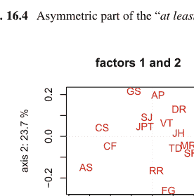

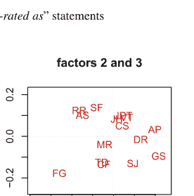

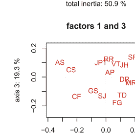

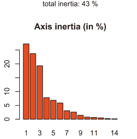

图 16.5 准则序数相关矩阵的3D PCA图

## 赋值邻接矩阵

| | mv_QS | mv_RR | mv_DG | mv_NP | mv_HN | mv_HS | mv_SM | mv_JB | mv_PE | mv_FC | mv_TP | mv_CM | mv_DF | mv_TM | mv_DJ | mv_AL | mv_RG | mv_MB | mv_GH | mv_BI | mv_DI | mv_HP | mv_FF | mv_GG | mv_TF |
|---|---|---|---|---|---|---|---|---|---|---|---|---|---|---|---|---|---|---|---|---|---|---|---|---|---|
| mv_QS | - | 0 | 0 | 0 | 0 | 0 | 0 | 0 | 0 | 0 | 0 | 0 | 0 | 0 | 0 | 0 | 0 | 0 | 0 | 0 | 0 | 0 | 0 | 0 | 0 |
| mv_RR | 0 | - | 5 | 7 | 8 | 4 | 0 | 2 | 9 | 10 | 0 | 0 | 0 | 0 | 0 | 0 | 0 | 0 | 0 | 0 | 0 | 0 | 0 | 0 | 0 |
| mv_DG | 0 | 9 | - | 9 | 10 | 5 | 9 | 7 | 8 | 13 | 0 | 0 | 0 | 0 | 0 | 0 | 0 | 0 | 0 | 0 | 0 | 0 | 0 | 0 | 0 |
| mv_NP | 0 | 6 | 4 | - | 10 | 3 | 9 | 8 | 10 | 10 | 0 | 0 | 0 | 0 | 0 | 0 | 0 | 0 | 0 | 0 | 0 | 0 | 0 | 0 | 0 |
| mv_HN | 0 | 4 | 6 | 8 | - | 5 | 9 | 9 | 8 | 10 | 10 | 0 | 0 | 0 | 0 | 0 | 0 | 0 | 0 | 0 | 0 | 0 | 0 | 0 | 0 |
| mv_HS | 0 | 2 | 5 | 3 | 10 | - | 10 | 2 | 5 | 6 | 10 | 10 | 0 | 0 | 0 | 0 | 0 | 0 | 0 | 0 | 0 | 0 | 0 | 0 | 0 |
| mv_SM | 0 | 3 | 5 | 3 | 5 | 10 | - | 2 | 5 | 6 | 10 | 10 | 0 | 0 | 0 | 0 | 0 | 0 | 0 | 0 | 0 | 0 | 0 | 0 | 0 |
| mv_JB | 0 | 5 | 7 | 3 | 4 | 8 | 8 | - | 0 | 0 | 13 | 0 | 0 | 0 | 0 | 0 | 0 | 0 | 0 | 0 | 0 | 0 | 0 | 0 | 0 |
| mv_PE | 0 | 2 | 6 | 0 | 4 | 3 | 8 | 11 | - | 5 | 0 | 5 | 7 | 0 | 0 | 0 | 0 | 0 | 0 | 0 | 0 | 0 | 0 | 0 | 0 |
| mv_FC | 0 | 5 | 11 | 5 | 8 | 2 | 8 | 7 | 7 | - | 10 | 0 | 11 | 0 | 0 | 0 | 0 | 0 | 0 | 0 | 0 | 0 | 0 | 0 | 0 |
| mv_TP | 0 | 0 | 0 | 0 | 0 | 0 | 0 | 0 | 0 | 0 | - | 3 | 8 | 8 | 9 | 0 | 0 | 0 | 0 | 0 | 0 | 0 | 0 | 0 | 0 |
| mv_CM | 0 | 0 | 0 | 0 | 0 | 0 | 0 | 0 | 5 | 0 | 0 | - | 3 | 8 | 8 | 9 | 0 | 7 | 5 | 0 | 0 | 0 | 0 | 0 | 0 |
| mv_DF | 0 | 0 | 2 | 2 | 2 | 2 | 0 | 1 | 1 | 5 | 1 | 0 | - | 2 | 2 | 0 | 0 | 0 | 0 | 0 | 5 | 0 | 8 | 13 | 13 |
| mv_TM | 0 | 0 | 0 | 0 | 0 | 0 | 0 | 0 | 0 | 0 | 0 | 0 | 0 | - | 2 | 2 | 0 | 0 | 0 | 0 | 0 | 0 | 0 | 0 | 0 |
| mv_DJ | 0 | 0 | 0 | 2 | 4 | 2 | 1 | 0 | 0 | 0 | 0 | 0 | 4 | 0 | - | 2 | 0 | 0 | 0 | 0 | 0 | 0 | 0 | 4 | 1 |
| mv_AL | 0 | 0 | 0 | 0 | 0 | 0 | 0 | 0 | 0 | 0 | 0 | 0 | 0 | 0 | 0 | - | 2 | 3 | 2 | 2 | 0 | 0 | 3 | 1 | 0 |
| mv_RG | 0 | 0 | 0 | 0 | 0 | 0 | 0 | 0 | 0 | 0 | 0 | 0 | 0 | 0 | 0 | 1 | - | 3 | 4 | 0 | 0 | 0 | 0 | 8 | 0 |
| mv_MB | 0 | 0 | 0 | 0 | 0 | 0 | 0 | 0 | 0 | 0 | 0 | 0 | 0 | 0 | 0 | 0 | 1 | - | 0 | 0 | 0 | 0 | 0 | 0 | 0 |
| mv_GH | 0 | 0 | 0 | 0 | 0 | 0 | 0 | 0 | 0 | 0 | 0 | 0 | 0 | 0 | 0 | 0 | 0 | 0 | - | 0 | 0 | 0 | 0 | 0 | 0 |
| mv_BI | 0 | 0 | 0 | 0 | 0 | 0 | 0 | 0 | 0 | 0 | 0 | 0 | 0 | 0 | 0 | 0 | 0 | 0 | 0 | - | 0 | 0 | 0 | 0 | 0 |
| mv_DI | 0 | 0 | 0 | 0 | 0 | 0 | 0 | 0 | 0 | 0 | 0 | 0 | 0 | 0 | 0 | 0 | 0 | 0 | 0 | 0 | - | 0 | 0 | 0 | 0 |
| mv_HP | 0 | 0 | 0 | 0 | 0 | 0 | 0 | 0 | 0 | 0 | 0 | 0 | 0 | 0 | 0 | 0 | 0 | 0 | 0 | 0 | 0 | - | 0 | 0 | 0 |
| mv_FF | 0 | 0 | 0 | 0 | 0 | 0 | 0 | 0 | 0 | 0 | 0 | 0 | 0 | 0 | 0 | 0 | 0 | 0 | 0 | 0 | 0 | 0 | - | 0 | 0 |
| mv_GG | 0 | 0 | 0 | 0 | 0 | 0 | 0 | 0 | 0 | 0 | 0 | 0 | 0 | 0 | 0 | 0 | 0 | 0 | 0 | 0 | 0 | 0 | 0 | - | 0 |
| mv_TF | 0 | 0 | 0 | 0 | 0 | 0 | 0 | 0 | 0 | 0 | 0 | 0 | 0 | 0 | 0 | 0 | 0 | 0 | 0 | 0 | 0 | 0 | 0 | 0 | - |

图 16.6 “至少同等星级评价”陈述的对称部分

例如，可以使用 `transitiveDigraphs` 模块中的 `RankingByChoosingDigraph` 类在清单 16.11 中计算这种电影预排序，我们通过迭代方式提取剩余的最佳选择——初始核，以及剩余的最差选择——终端核（参见第 17 章）。

### 清单 16.11 双极选择排序电影

```
1 >>> from transitiveDigraphs import RankingByChoosingDigraph
2 >>> rbc = RankingByChoosingDigraph(bod)
3 Threading ... # if multiple processing cores are detected
4 Exiting computing threads
5 >>> rbc.showRankingByChoosing()
6 Ranking by Choosing and Rejecting
7   1st Best Choice ['mv_QS']
8     2nd Best Choice ['mv_DG','mv_FC','mv_HN','mv_HS','mv_NP',
9                       'mv_PE','mv_RR','mv_SM']
10      3rd Best Choice ['mv_CM','mv_JB','mv_TM']
11        4th Best Choice ['mv_AL','mv_TP']
12        4th Worst Choice ['mv_AL','mv_TP']
13      3rd Worst Choice ['mv_GH','mv_MB','mv_RG']
14    2nd Worst Choice ['mv_DF','mv_DJ','mv_FF','mv_GG']
15  1st Worst Choice ['mv_BI','mv_DI','mv_HP','mv_TF']
```

在第 17 章中，我们将深入讨论双极赋值有向图中此类核的计算。

## 参考文献

Bisdorff R (2012) On measuring and testing the ordinal correlation between bipolar outranking relations. In: Mousseau V, Pirlot M (eds) DAP'2012 From Multiple Criteria Decision Aid to Preference Learning, University of Mons (Belgium), pp 91–100. http://hdl.handle.net/10993/23909

Kendall MG (1938) A new measure of rank correlation. Biometrica 30:81–93

## 第17章
关于有向图核的计算

# 目录

- 17.1 什么是图核？ ................................................................ 225
- 17.2 初始核与终端核 ................................................................ 228
- 17.3 侧向化有向图中的核 ................................................................ 232
- 17.4 计算首选与末选推荐 ................................................................ 236
- 17.5 核计算的易处理性 ................................................................ 239
- 17.6 求解核方程组 ................................................................ 242

**摘要** 本章首先阐述图核的概念，即顶点的最大独立集。在非对称有向图中，核的概念变得更加丰富，并分化为初始核和终端核。此外，在侧向化优势有向图中，初始核和终端核相互分离，并可能分别提供合适的首选和末选推荐。在讨论了核计算的易处理性之后，我们以求解双极值核方程组来结束本章。

## 17.1 什么是图核？

我们称图（或有向图）中顶点（或节点、行动）的一个子集为一个*选择*。如果一个选择 $Y$ 的成员之间不存在任何链接——（边）或关系（弧），则称该选择是*内部稳定*的或*独立*的。此外，如果对于不在 $Y$ 中的每个顶点、节点或行动 $x$，都存在至少一个 $Y$ 的成员 $y$，使得 $x$ 与 $y$ 有链接或关系，则称该选择 $Y$ 是*外部稳定*的。现在，一个既内部*又*外部稳定的选择被称为*核*。

一个简单的例子立即由 $n$-环图的最大独立顶点集（MIS）给出（见第317页图21.5）。确实，根据定义，$n$-环图中的每个MIS都是独立的，即*内部稳定*的，并且 $n$-环图中每个未被选中的顶点都与MIS的一个或两个成员有关系。

226

第17章 关于有向图核的计算

图 17.1 在随机3-正则图 r3g12 中着色的一个随机MIS。所有非蓝色顶点都被一个蓝色顶点覆盖

在所有图或对称有向图中，施加于内部稳定性的*极大性条件*等价于*外部稳定性*条件。确实，如果存在一个顶点或节点与选择中的任何元素都没有关系，我们可以安全地将该顶点或节点添加到给定的选择中，而不会违反其内部稳定性。因此，所有核都必须是最大独立选择。事实上，从拓扑意义上讲，它们对应于给定图中的最大*空洞*。

图17.1通过一个在清单17.1中生成的随机3-正则图实例，说明了图和对称有向图中MIS与核之间的这种一致性。该图中的一个随机MIS可以使用MISModel类计算（见下面第5行）。

清单 17.1 生成一个12阶的随机3-正则图

```
>>> from graphs import RandomRegularGraph
>>> r3g12 = RandomRegularGraph(order=12,
...                         degree=3,seed=4)
>>> from graphs import MISModel
>>> mg = MISModel(r3g12)
  Iteration:  1
    Running a Gibbs Sampler for 660 step !
    {'a05', 'a07', 'a12'}  is maximal !
>>> mg.exportGraphViz('random3RegularGraph-mis')
  *---- exporting a dot file for GraphViz tools ---*
  Exporting to random3RegularGraph-mis.dot
  fdp -Tpng random3RegularGraph-mis.dot
                   -o random3RegularGraph-mis.png
```

在图17.1中很容易验证，计算出的MIS确实是给定图的一个有效核。因此，这个3-正则图实例的完整核集合与其MIS集合一致。

## 17.1 什么是图核？

清单 17.2 打印出随机3-正则图的所有最大独立集

```
>>> g.showMIS()
*--- Maximal Independent Sets ---*
['a05', 'a07', 'a12']
['a01', 'a06', 'a08']
['a07', 'a08', 'a11']
['a01', 'a09', 'a11', 'a12']
['a01', 'a02', 'a09', 'a11']
['a01', 'a06', 'a09', 'a12']
['a01', 'a02', 'a06', 'a09']
['a07', 'a09', 'a11', 'a12']
['a02', 'a07', 'a09', 'a11']
['a06', 'a07', 'a09', 'a12']
['a04', 'a06', 'a07', 'a08']
['a02', 'a04', 'a05', 'a07']
['a04', 'a05', 'a07', 'a08']
['a09', 'a10', 'a11', 'a12']
['a06', 'a09', 'a10', 'a12']
['a04', 'a06', 'a08', 'a10']
['a04', 'a06', 'a09', 'a10']
['a01', 'a03', 'a11', 'a12']
['a01', 'a02', 'a03', 'a11']
['a01', 'a03', 'a08', 'a11']
['a01', 'a03', 'a05', 'a12']
['a01', 'a02', 'a03', 'a05']
['a01', 'a03', 'a05', 'a08']
['a02', 'a03', 'a04', 'a05']
['a03', 'a10', 'a11', 'a12']
['a03', 'a08', 'a10', 'a11']
['a03', 'a05', 'a10', 'a12']
['a02', 'a04', 'a06', 'a07', 'a09']
['a03', 'a04', 'a05', 'a08', 'a10']
number of solutions: 29
cardinality distribution
card.: [0, 1, 2, 3, 4, 5, 6, 7, 8, 9, 10, 11, 12]
freq.: [0, 0, 0, 3, 24, 2, 0, 0, 0, 0, 0, 0, 0]
stability number : 5
execution time: 0.00056 sec.
Results in self.misset
>>> g.misset
[frozenset({'a05', 'a07', 'a12'}),
 frozenset({'a11', 'a01', 'a12', 'a09'}),
 frozenset({'a11', 'a01', 'a02', 'a09'}),
 ...
 ...
 frozenset({'a03', 'a10', 'a08', 'a11'}),
 frozenset({'a03', 'a10', 'a12', 'a05'}),
 frozenset({'a03', 'a10', 'a04', 'a05', 'a08'})]
```

所有图和对称有向图都允许MIS，因此也允许核。在有向图（即定向图）的背景下，核的概念变得丰富得多，并与对称的MIS概念分离。

## 17.2 初始核与终端核

在定向图的背景下，核概念的内部稳定性条件保持不变；然而，外部稳定性条件确实被方向性分化为两个侧向情况：

1. 一个*支配*稳定性条件，其中每个未被选中的节点至少被核的一个成员所支配
2. 一个*吸收*稳定性条件，其中每个未被选中的节点至少被核的一个成员所吸收

一个既内部稳定**又**支配（或吸收）的选择被称为支配核或*初始*核，或吸收核或*终端*核。从拓扑角度看，初始核概念是从有向图的外部看向其内部，而终端核则是从有向图的内部看向其外部。从代数角度看，初始核是核方程组（见第242页第17.6节）中的前缀操作数，而终端核是后缀操作数。

此外，由于核概念同时涉及正逻辑否定（内部稳定性）和正逻辑肯定（外部稳定性），在我们的操作开发中，很快就有必要采用一个双极值特征域 [-1.0, 1.0]，通过数值符号的变化来建模逻辑否定，并明确包含第三个中间值 (0.0)，表示逻辑*不确定性*——既非正也非负（Bisdorff 2000, 2002, 2004）。

在这样的双极值背景下，我们称一个*外部稳定*且其内部稳定性条件*有效*或*不确定*的选择为*预核*。我们说在这种情况下，独立性条件只是*弱满足*。注意，所有核因此都是预核，但反之则不然。

在图或对称有向图中，本质上没有明显的*侧向性*，所有预核同时是初始核和终端核。一个普遍的例子是*完全*有向图。

**清单 17.3** 一个完全有向图的预核

```
>>> from digraphs import CompleteDigraph
>>> u = CompleteDigraph(order=5)
>>> u
  *------- Digraph instance description -------*
    Instance class   : CompleteDigraph
    Instance name    : complete
    Digraph Order    : 5
    Digraph Size     : 20
    Valuation domain : [-1.00 ; 1.00]
   --------------------------------------------
>>> u.showPreKernels()
  *--- Computing preKernels ---*
    Dominant kernels :
```

## 17.3 侧向有向图中的核

人类确实生活在一个具有简单传递侧向性的明显物理空间中，完全掌握在具有线性序的有限几何三维模型中，其中排名第一和最后的节点分别提供唯一的初始核和终端核。

类似地，在有限预序中，第一个和最后一个等价类分别提供唯一的初始核和唯一的终端核。更一般地，在有限偏序（即非对称和传递的有向图）中，拓扑排序算法将轻松揭示第一层和最后一层上所有唯一的初始核和终端核。

然而，在真正的随机有向图中，我们可能需要检查其每个最大独立集（MIS），以确定侧向外稳定性条件之一、两者或两者都不满足。例如，考虑清单17.9中以下阶数为7、弧概率为30%的随机有向图实例。

**清单17.9** 生成一个阶数为7、弧概率为0.3的随机有向图rd

```
>>> from randomDigraphs import RandomDigraph
>>> rd = RandomDigraph(order=7,arcProbability=0.3,seed=5)
>>> rd.exportGraphViz('randomLaterality')
*---- exporting a dot file for GraphViz tools ---*
Exporting to randomLaterality.dot
dot -Grankdir=BT -Tpng randomLaterality.dot -o randomLaterality.png
```

图17.4所示的随机有向图除了是连通的（见下一页清单17.10第3行）之外，没有明显的特殊性质。

**图17.4** *一个阶数为7、弧概率为0.3的随机有向图实例。该有向图实例既非非对称（a3 ⇔ a6）也非对称（a2 → a1, a1 ↛ a2），且该有向图不是传递的（a5 → a2 → a1，但a5 ↛ a1）*

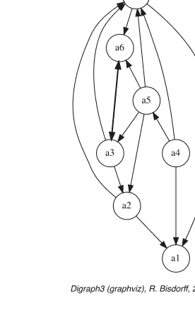

在一个完全有向图中，每个单独的节点确实既是初始预核候选也是终端预核候选，并且没有明确的有向图起点或终点可被检测。侧向性在这里完全相对于所选为参考点的特定单元素集。

同样的侧向性缺失在另外两种通用有向图模型中也很明显（见清单17.4），即*空*有向图和*不确定*有向图。

### 清单17.4 空或不确定有向图的预核

```
>>> from digraphs import EmptyDigraph
>>> ed = EmptyDigraph(order=5)
>>> ed.showPreKernels()
*--- Computing preKernels ---*
Dominant kernel :
['1', '2', '3', '4', '5']
independence : 1.0
dominance : 1.0
absorbency : 1.0
Absorbent kernel :
['1', '2', '3', '4', '5']
independence : 1.0
dominance : 1.0
absorbency : 1.0
>>> from digraphs import IndeterminateDigraph
>>> id = IndeterminateDigraph(order=5)
>>> id.showPreKernels()
*--- Computing preKernels ---*
Dominant prekernel :
['1', '2', '3', '4', '5']
independence : 0.0
dominance : 1.0
absorbency : 1.0
Absorbent prekernel :
['1', '2', '3', '4', '5']
independence : 0.0
dominance : 1.0
absorbency : 1.0
```

在空有向图中，整个节点集确实同时提供了唯一的初始和终端预核（见第6行和第11行），类似地，对于*不确定*有向图也是如此（见第20行和第25行）。
这两个结果都是合理的，因为在完全空或不确定的有向图中，没有定义有向图的*内部*，只有一个*边界*，因此该边界同时是初始和终端预核（见第2.4节）。然而，请注意，在后一种不确定情况下，完整的节点集仅弱地验证了内部稳定性条件（见第21行和第26行）。
其他常见的有向图模型，尽管明显是有向的，但可能仍然没有明显的侧向性，例如*无弦回路*，即由奇数长度的有向环（一个回路）包围的孔洞。它们实际上不承认任何初始或终端预核。

### 清单17.5 5-回路有向图的预核

```
>>> from digraphs import CirculantDigraph
>>> c5 = CirculantDigraph(order=5,circulants=[1])
>>> c5.showPreKernels()
*----- statistics -----
digraph name:  c5
number of solutions
  dominant prekernels :  0
  absorbent prekernels:  0
```

然而，长度为2 × k（k > 1）的*偶数*无弦回路包含两个同构的预核，其基数k共同符合初始和终端候选的资格。

### 清单17.6 6-回路有向图的预核

```
>>> c6 = CirculantDigraph(order=6,circulants=[1])
>>> c6.showPreKernels()
*--- Computing preKernels ---*
  Dominant preKernels :
  ['1', '3', '5'] ind. : 1.0, dom. : 1.0, abs. : 1.0
  ['2', '4', '6'] ind. : 1.0, dom. : 1.0, abs. : 1.0
  Absorbent preKernels :
  ['1', '3', '5'] ind. : 1.0, dom. : 1.0, abs. : 1.0
  ['2', '4', '6'] ind. : 1.0, dom. : 1.0, abs. : 1.0
```

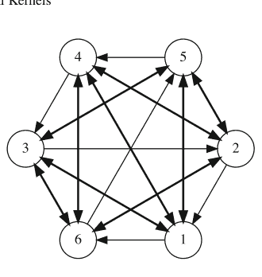

Digraph3 (graphviz), R. Bisdorff, 2020

**图17.2** *无弦6-回路的对偶。* 在这类有向图中找不到任何初始或终端预核——即弱独立且占优的，或吸收的节点子集。

弱6-回路的对偶

弱6-回路的逆

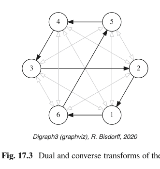

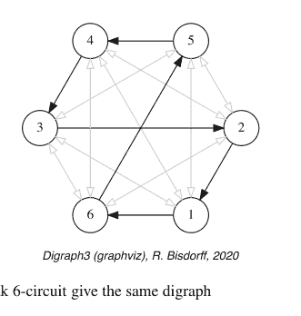

Digraph3 (graphviz), R. Bisdorff, 2020

Digraph3 (graphviz), R. Bisdorff, 2020

**图17.3** 弱6-回路的对偶和逆变换得到相同的有向图

因此，偶数长度的无弦回路可以无差别地沿两个相反方向定向。顺便注意图17.2，所有奇数或偶数长度的无弦回路的对偶，即填充回路也称为反孔（见图17.3），从不包含任何潜在的预核候选。

### 清单17.7 6-回路有向图对偶的预核

```
>>> dc6 = -c6    # dc6 = DualDigraph(c6)
>>> dc6.showPreKernels()
*----- statistics -----
    graph name:  dual_c6
    number of solutions
    dominant prekernels :  0
    absorbent prekernels:  0
    >>> dc6.exportGraphViz(fileName='dualChordlessCircuit')
    *---- exporting a dot file for GraphViz tools ----*
    Exporting to dualChordlessCircuit.dot
    circo -Tpng dualChordlessCircuit.dot -o dualChordlessCircuit.png
```

我们将内部部分不确定的无弦回路称为*弱*回路。在清单17.8中，我们使用`CirculantDigraph`类的`IndeterminateInnerPart`参数来构建这样一个弱无弦6-回路有向图。值得注意的是，在前一页的图17.3中，弱回路的*对偶*版本对应于其*逆*版本。¹

### 清单17.8 弱6-回路有向图

```
>>> from digraphs import CirculantDigraph
>>> c6 = CirculantDigraph(order=6,circulants=[1],\
...                      IndeterminateInnerPart=True)
>>> (-c6).exportGraphViz()
*---- exporting a dot file for GraphViz tools ----------*
Exporting to dual_c6.dot
circo -Tpng dual_c6.dot -o dual-c6.png
>>> (~c6).exportGraphViz()
*---- exporting a dot file for GraphViz tools ----------*
Exporting to converse_c6.dot
circo -Tpng converse_c6.dot -o converse-c6.png
```

长度为*n*的弱无弦回路实际上是*余对偶*变换下不变的有向图类的一部分，*cn* = *~(∼ cn)* = *∼ (−cn)*。² 当有向图*cn*是弱无弦*n*-回路时，*cn*、*−cn*、*∼ cn*和*∼ (−cn)*都将承认相同的预核集。

> ¹ 不要与平面图*g*的对偶图混淆，后者为*g*的每个面都有一个顶点。这里我们指的是对应于*大于或等于*关系的*小于*（严格逆）关系，或对应于（严格逆）*大于*关系的*小于或等于*关系。

> ² *自余对偶*双极值有向图类由所有弱非对称有向图组成，即仅包含非对称和/或不确定链接的有向图。极限情况一方面包括具有不确定自反链接的完全竞赛图，另一方面包括完全不确定的有向图。在此类中，逆（逆*~*）运算符确实与对偶（否定*−*）运算符相同。

## 清单 17.10 检查随机有向图 rd 的属性

```
>>> rd.showComponents()
*--- 连通分量 ---*
1: ['a1', 'a2', 'a3', 'a4', 'a5', 'a6', 'a7']
>>> rd.computeSymmetryDegree(Comments=True)
有向图 <randomDigraph> 的对称度 (%)：
  弧 x>y: 14, 对称: 1, 不对称: 13
  对称/弧 = 0.071
>>> rd.computeChordlessCircuits()
[]  # 未检测到无弦回路
>>> rd.computeTransitivityDegree(Comments=True)
图 <randomDigraph> 的传递度 (%)：
  三元组 x>y>z: 23, 闭合: 11, 开放: 12
  闭合/三元组 = 0.478
```

没有无弦回路（见上方第 9 行），并且超过一半所需的传递闭包缺失（见上方第 13 行）。现在，我们知道它的潜在预核必须在其最大独立选择集合中。

## 清单 17.11 检查随机有向图 rd 的预核

```
>>> rd.showMIS()
*--- 最大独立选择 ---*
  ['a2', 'a4', 'a6']
  ['a6', 'a1']
  ['a5', 'a1']
  ['a3', 'a1']
  ['a4', 'a3']
  ['a7']
>>> rd.showPreKernels()
*--- 计算预核 ---*
  优势预核 :
    ['a2', 'a4', 'a6']
      独立性 : 1.0
      优势度    : 1.0
      吸收度   : -1.0
      覆盖度     : 0.500
    ['a4', 'a3']
      独立性 : 1.0
      优势度    : 1.0
      吸收度   : -1.0
      覆盖度     : 0.600
  吸收预核 :
    ['a3', 'a1']
      独立性 : 1.0
      优势度    : -1.0
      吸收度   : 1.0
      覆盖度     : 0.500
    ['a6', 'a1']
      独立性 : 1.0
      优势度    : -1.0
      吸收度   : 1.0
      覆盖度     : 0.600
```

在随机有向图 rd 包含的六个最大独立选择中，我们在对面页的清单 17.11 中发现了两个初始预核和两个终端预核。顺便注意一下 `showPreKernels()` 方法（第 16、21、27 和 32 行）显示的覆盖度值（介于 0.0 和 1.0 之间）。这个值越高，相应的预核候选就越能明显地体现有向图的侧向性。在图 17.5 中，同一个有向图 rd 通过其最佳覆盖度初始预核候选：优势选择 {a3, a4}（黄色）从内部观察，并通过其最佳被覆盖终端预核候选：吸收选择 {a1, a6}（蓝色）从外部观察，被重新绘制。

```
>>> rd.exportGraphViz(fileName='orientedLaterality',
...                   firstChoice=set(['a3', 'a4']),
...                   lastChoice=set(['a1', 'a6']))
*---- 导出用于 GraphViz 工具的 dot 文件 ----*
导出至 orientedLaterality.dot
dot -Grankdir=BT -Tpng orientedLaterality.dot -o orientedLaterality.png
```

正如所有合理的双极值优超有向图通常表现出一些侧向性——边际准则偏好并非完全相互矛盾——初始和终端预核分别提供了令人信服的首选和末选推荐，如第 4 章第 41 页所述。

## 17.4 计算首选和末选推荐

为了说明这个想法，让我们最后在清单 17.12 中计算一个随机双极值优超有向图的首选和末选推荐。

### 清单 17.12 生成一个随机双极值优超有向图

```
>>> from outrankingDigraphs import
...                     RandomBipolarOutrankingDigraph
>>> g = RandomBipolarOutrankingDigraph(seed=5)
>>> g
  *------- 对象实例描述 ------*
  实例类    : RandomBipolarOutrankingDigraph
  实例名称     : randomOutranking
  行动           : 7
  准则          : 7
  规模              : 26
  确定性度   : 34.275
  估值域  : {'min': -100.0, 'med': 0.0, 'max': 100.0}
>>> g.showHTMLPerformanceTableau()
```

图 17.6 所示的关联随机性能表显示了 7 个潜在决策方案相对于 7 个决策准则的性能评估，每个准则支持一个从 0.0 到 100.0 的递增性能尺度。注意决策方案 a2 和 a5 缺失的性能数据。由此产生的*严格优超*——即由加权多数支持的*优于且无显著反性能*——有向图显示在下一页的图 17.7 中。

```
>>> gcd = ~(-g)  # 余对偶：否定的逆
>>> gcd.exportGraphViz(fileName='tutOutRanking')
  *---- 导出用于 GraphViz 工具的 dot 文件 ----*
  导出至 tutOutranking.dot
  dot -Grankdir=BT -Tpng tutOutranking.dot -o tutOutranking.png
```

### 性能表 randomOutranking

| 准则 | g1 | g2 | g3 | g4 | g5 | g6 | g7 |
|---|---|---|---|---|---|---|---|
| a1 | 64.90 | 1.31 | 13.88 | 98.24 | 94.10 | 14.57 | 31.00 |
| a2 | NA | NA | 61.75 | 87.24 | 69.06 | 6.51 | 81.85 |
| a3 | 11.32 | 27.95 | 12.67 | 28.93 | 96.66 | 30.14 | 48.07 |
| a4 | 46.91 | 91.63 | 0.18 | 96.15 | 89.37 | 60.31 | 31.58 |
| a5 | NA | 76.57 | 87.14 | 53.92 | 29.88 | 0.34 | 48.12 |
| a6 | 54.38 | 15.96 | 20.95 | 67.78 | 36.12 | 67.79 | 70.47 |
| a7 | 57.39 | 79.71 | 21.55 | 20.48 | 16.60 | 33.79 | 5.70 |

图 17.6 一个随机优超有向图实例的性能表

**图 17.7** *一个随机严格优超有向图实例。* 所有决策方案都严格优于方案 a7。我们称其为孔多塞失败者，它是一个明显的终端预核候选。另一方面，三个方案：a1、a2 和 a4 未被支配。它们共同构成一个初始预核候选。

### 清单 17.13 计算严格优超有向图 gcd 的预核

```
>>> gcd.showPreKernels()
*--- 计算预核 ---*
  优势预核 :
    ['a1', 'a2', 'a4']
      独立性 :  0.00
      优势度    :  6.98
      吸收度   : -48.84
      覆盖度     :  0.667
  吸收预核 :
    ['a3', 'a7']
      独立性 :  0.00
      优势度    : -74.42
      吸收度   :  16.28
      被覆盖度      :  0.800
```

由于存在这样唯一的不相交初始和终端预核（见清单 17.13 中的第 4 行和第 10 行），随机有向图 gcd 显然具有侧向性。实际上，余对偶优超有向图的这些初始和终端预核揭示了基于给定优超有向图实例可以制定的*首选*和*末选*推荐。

### 清单 17.14 从有向图 gcd 计算首选和末选推荐

```
>>> g.showBestChoiceRecommendation()
Rubis 最佳选择推荐 (BCR)
  （按确定性度降序排列）
  可信度域: [-100.00,100.00]
  === >> 潜在首选
    * 选择                    : ['a1', 'a2', 'a4']
      独立性              : 0.00
      优势度                 : 6.98
      吸收度                : -48.84
      覆盖度 (%)              : 66.67
      确定性度 (%)        : 57.97
      - 最可信行动 =
                                {'a4': 20.93,'a2': 20.93}
  === >> 潜在末选
    * 选择                    : ['a3', 'a7']
      独立性              : 0.00
      优势度                 : -74.42
      吸收度                : 16.28
      被覆盖度 (%)               : 80.00
      确定性度 (%)        : 64.62
      - 最可信行动 = { 'a7': 48.84, }
```

注意前一页清单 17.14 中的第 13 行和第 21 行，求解赋值核方程组进一步提供了每个相应选择推荐中最可信决策方案的正面特征。方案 a2 和 a4 是唯一*首选*的等效候选，而方案 a7 则被明确确认为*末选*。

在图 17.8 中，我们借助这些首选和末选推荐来调整严格优超有向图实例的绘制方向。

```
>>> gcd.exportGraphViz(fileName='firstLastOrientation',
...                     firstChoice=['a2','a4'],
...                     lastChoice=['a7'])
*----- 导出用于 GraphViz 工具的 dot 文件 -----*
导出至 firstLastOrientation.dot
dot -Grankdir=BT -Tpng firstLastOrientation.dot -o firstLastOrientation.png
```

## 性能表 'randomOutranking' 的热力图

| 标准 | g4 | g7 | g5 | g6 | g1 | g2 | g3 |
|---|---|---|---|---|---|---|---|
| 权重 | 9 | 10 | 6 | 5 | 4 | 8 | 1 |
| tau(*) | +0.64 | +0.40 | +0.29 | +0.17 | +0.02 | -0.05 | -0.10 |
| a4 | 96 | 32 | 89 | 60 | 47 | 92 | 0 |
| a2 | 87 | 82 | 69 | 7 | NA | NA | 62 |
| a6 | 68 | 70 | 36 | 68 | 54 | 16 | 21 |
| a1 | 98 | 31 | 94 | 15 | 65 | 1 | 14 |
| a5 | 54 | 48 | 30 | 0 | NA | 77 | 87 |
| a3 | 29 | 48 | 97 | 30 | 11 | 28 | 13 |
| a7 | 20 | 6 | 17 | 34 | 57 | 80 | 22 |

颜色图例：
分位数：20.00% 40.00% 60.00% 80.00% 100.00%

(*) tau：边际标准与全局排序关系之间的序数（Kendall）相关性
排序规则：Copeland
全局排序与全局优超关系之间的序数（Kendall）相关性：+0.848

图 17.9 采用 Copeland 排序的性能表热力图

将此结果与底层性能表的 Copeland 排序进行比较可能很有趣（参见第 8.2 节关于不可通约标准的排序）。

```
>>> g.showHTMLPerformanceHeatmap(colorLevels=5, ndigits=0,
...                              Correlations=True, rankingRule='Copeland')
```

在得到的线性排序中（见图 17.9），备选方案 a4 被置于第一位，其次是备选方案 a2。这是合理的，因为备选方案 a4 在第一个五分位数中显示了三个性能，而 a2 仅被部分评估，只显示了两个这样的优秀性能。但 a4 在第一个五分位数中也显示了一个非常弱的性能。因此，这两种决策行动最终都没有显示出一个性能概况，能够明显表明对其中一种或另一种的明确偏好。从这个意义上说，基于预核的最佳选择建议可能比图 17.9 所示的任何“强制性”线性排序结果更忠实于实际确定的严格优超关系。

## 17.5 核计算的易处理性

让我们提供一些关于预核计算易处理性的提示。在有向图中检测所有预核是一个计算上困难的问题。检查独立选择的外部稳定性条件等价于检查其极大性，并且可以在与有向图阶数成线性复杂度内完成。然而，检查有向图中包含的所有独立选择对于阶数 n > 20 的微小稀疏有向图可能已经变得困难（Bisdorff 2006）。事实上，最坏情况出现在空或不确定的有向图中，其中需要检查的所有潜在独立选择的集合实际上是顶点的幂集。

```
>>> from digraphs import EmptyDigraph
>>> e = EmptyDigraph(order=20)
>>> e.showMIS()   # 通过访问所有 2^20 个独立选择
*---- 极大独立选择 ----*
    [ '1', '2', '3', '4', '5', '6', '7', '8', '9','10',
      '11','12','13','14','15','16','17','18','19','20']
    解的数量：  1
    执行时间： 1.47640 秒。  # <------
>>> 2**20
1048576
```

现在，存在更高效的专用算法，可以直接枚举特定有向图模型中的极大独立集（MISs）以及主导或吸收核，而无需访问所有独立选择（Bisdorff 2006）。*Alain Hertz* 为 DIGRAPH3 项目友好地提供了这样一个 MISs 枚举算法（`showMIS_AH()` 方法）。当独立选择的数量与实际 MISs 的数量相比很大时，例如在非常稀疏或空的有向图中，性能差异可能是巨大的（参见上面的第 8 行和下面的第 16 行）。

**清单 17.15** 仅通过访问极大独立选择来枚举 MISs（*A. Hertz*）

```
>>> e.showMIS_AH()
    # 仅通过访问极大独立选择
    *---------------------------------------*
    * Hertz 算法的 Python 实现，用于生成所有 MISs *
    * R.B. 版本 7(6)-2006年4月25日          *
    *---------------------------------------*
    ===>>> 初始解：
    [ '1','2','3','4','5','6','7','8','9','10','11',
      '12','13','14','15','16','17','18','19','20']
    *---- 结果 ----*
    [ '1','2','3','4','5','6','7','8','9','10','11',
      '12','13','14','15','16','17','18','19','20']
    *---- 统计信息 ----*
    MIS 解         ：  1
    执行时间       ：  0.00026 秒。 # <----
    迭代历史       ：  1
```

对于中等阶数的或多或少密集的严格优超有向图，如 MCDA 应用中通常遇到的，枚举所有独立选择在大多数情况下仍然是易处理的，特别是通过使用清单 17.16 所示的 `independentChoices()` 方法中的非常高效的迭代器生成器。

**清单 17.16** 在有向图中生成所有独立选择

```
def independentChoices(self,U):
    """
    用于生成所有独立选择的生成器，包含关联的
    被支配、被吸收和独立邻域。
    以 U = self.singletons() 初始化。
    产出 [(独立选择, domnb, absnb, indnb)]。
    """
    if U == []:
        yield [(frozenset(),set(),set(),set(self.actions))]
    else:
        x = list(U.pop())
        for S in self.independentChoices (U):
            yield S
            if x[0] <=  S[0][3]:
                Sxgamdom = S[0][1] | x[1]
                Sxgamabs = S[0][2] | x[2]
                Sxindep = S[0][3] &  x[3]
                Sxchoice = S[0][0] | x[0]
                Sx = [(Sxchoice,Sxgamdom,Sxgamabs,Sxindep)]
                yield Sx
```

并且，在枚举过程中通过外部稳定性条件检查独立选择的极大性，如清单 17.17 所示的 `computePreKernels()` 方法，提供了在单个循环中计算所有初始和终端预核的有效优势（参见第 10 行和 Bisdorff 2006）。

### 清单 17.17 计算主导和吸收预核

```
def computePreKernels(self):
    """
    计算主导和吸收预核：
    结果存储在 self.dompreKernels 和 self.abspreKernels 中
    """
    actions = set(self.actions)
    n = len(actions)
    dompreKernels = set()
    abspreKernels = set()
    for choice in self.independentChoices(self.singletons()):
        restactions = actions - choice[0][0]
        if restactions <= choice[0][1]:
            dompreKernels.add(choice[0][0])
        if restactions <= choice[0][2]:
            abspreKernels.add(choice[0][0])
    self.dompreKernels = dompreKernels
    self.abspreKernels = abspreKernels
```

最后，我们使用我们的双极值认知逻辑框架来计算有向图的单个节点作为初始或终端预核成员的可信度。为此，我们使用核方程组（Schmidt 和 Ströhlein 1985）。

## 17.6 求解核方程组

令 $G(X, R)$ 是一个定义在有限节点集 $X$ 上的清晰非自反有向图，其中 $R$ 是相应的 $\{-1, +1\}$-值邻接矩阵。令 $Y$ 是 $X$ 中一个选择的 $\{-1, +1\}$-值成员特征（行）向量。
当 $Y$ 满足以下方程组时：
$$Y \circ R = -Y, \tag{17.1}$$
其中对于 $X$ 中的所有 $x$，
$$(Y \circ R)(x) = \max_{y \in X, x \neq y} (\min(Y(x), R(x, y))), \tag{17.2}$$
那么 $Y$ 表征了一个*初始核*（Bisdorff 2006; Bisdorff et al. 2006）。
现在将成员特征向量 $Y$ 转置为列向量 $Y^t$，以下方程组：$R \circ Y^t = -Y^t$ 使得 $Y^t$ 类似地表征一个*终端核*。
让我们在清单 17.18 中的一个微小随机有向图上验证这个结果。

**清单 17.18** 在微小随机有向图上验证核方程组

```
1 >>> from digraphs import RandomDigraph
2 >>> g = RandomDigraph(order=3,seed=1)
3 >>> g.showRelationTable()
4   * ---- 关系表 ----
5     R  | 'a1'  'a2'  'a3'
6   -----|-------------------
7   'a1' |  -1    +1    -1
8   'a2' |  -1    -1    +1
9   'a3' |  +1    +1    -1
10 >>> g.showPreKernels()
11   *--- 计算预核 ---*
12    主导预核：
13     ['a3']
14    吸收预核：
15     ['a2']
```

很容易手动验证特征向量 $[-1, -1, +1]$ 满足初始核方程组；节点 a3 给出了一个*初始*核。类似地，特征向量 $[-1, +1, -1]$ 确实验证了终端核方程组，因此节点 a2 给出了一个*终端*核。
我们现在成功地将清晰核方程组推广到真正的双极值有向图（Bisdorff 2006; Bisdorff et al. 2006）。*Marc Pirlot* 找到的构造性证明基于以下*不动点方程*，该方程可用于计算双极值核成员向量：
$$T(Y) := -(Y \circ R) = Y. \tag{17.3}$$

约翰·冯·诺依曼确实证明了，当一个有向图 $G(X, R)$ 是无环的，并且具有一个由其成员特征向量 $Y_k$ 表征的唯一初始核 $K$ 时，那么以下双重不动点方程：

$$T^2(Y) := -( -(Y \circ R) \circ R) = Y \quad (17.4)$$

将存在一个稳定的*高*不动点解和一个稳定的*低*不动点解，两者都收敛于 $Y_k$（Schmidt and Ströhlein 1985）。

受清晰的双重不动点方程 17.4 的启发，我们观察到，对于给定的双极值有向图 $G(X, R)$，其在 $X$ 中的每一个主导或吸收的预核 $K_i$ 都确定了一个诱导的部分有向图 $G(X, R/K_i)$，该图是无环的，并且以 $K_i$ 作为唯一的预核（Bisdorff 1997）。

遵循*冯·诺依曼*不动点算法，一个类似的双极值扩展双重不动点算法应用于 $G(X, R/K_i)$，使我们能够以多项式复杂度计算相关的双极值核特征向量 $Y_i$。

### 算法 17.1 计算双极值核特征向量
*输入*：双极值有向图 $G(X, R)$，
*输出*：双极值核成员特征向量的集合 $\{Y_1, Y_2, ..\}$。

1.  枚举给定双极值有向图中的所有初始和终端预核 $K_1, K_2, ...$（参见第 241 页的清单 17.17）；
2.  对于每个清晰的初始核 $K_i$：
    a.  构造一个部分确定的子图 $G(X, R/K_i)$，该子图恰好支持这个唯一的初始核 $K_i$；
    b.  使用双重不动点方程 $T^2$ (17.4) 和部分确定的邻接矩阵 $R/K_i$ 来计算一个稳定的低不动点和一个稳定的高不动点；
    c.  通过先前低不动点和高不动点的认知析取，确定双极值的 $K_i$-成员特征向量 $Y_i$；
3.  对于每个终端核 $K_j$，使用邻接矩阵 $R/K_j$ 的转置重复步骤 (2)。

## 实例说明

我们重新考虑第 236 页清单 17.12 中生成的随机有向图 $\mathfrak{g}$。有向图 $\mathfrak{g}$ 模拟了七个决策方案在七个不可通约的绩效准则下的两两优超关系。我们在相关的余对偶有向图 $\mathfrak{gcd}$ 上重新计算其对应的双极值预核。

```
>>> gcd = ~(-g) # 严格优超有向图
>>> gcd.showPreKernels()
*--- 计算预核 ---*
主导预核：
 ['a1', 'a4', 'a2']
 独立性：+0.000
7         主导性     ：+0.070
8         吸收性    ：-0.488
9         覆盖      ：+0.667
10  吸收预核：
11      ['a7', 'a3']
12          独立性：+0.000
13          主导性    ：-0.744
14          吸收性   ：+0.163
15          被覆盖      ：+0.800
16  *----- 统计 -----
17  图名称：  converse-dual_rel_randomperftab
18  解的数量
19    主导核：  1
20    吸收核：  1
21  基数频率分布
22    基数      ：  [0, 1, 2, 3, 4, 5, 6, 7]
23    主导核  ：  [0, 0, 0, 1, 0, 0, 0, 0]
24    吸收核：  [0, 0, 1, 0, 0, 0, 0, 0]
25  执行时间  ： 0.00022 秒。
```

模拟严格优超关系的余对偶优超有向图 gcd 允许一个初始预核 {a1, a2, a4} 和一个终端预核 {a3, a7}（参见上面的第 5 行和第 11 行）。

在清单 17.19 中，我们现在使用 `domkernelrestrict()` 方法计算初始预核限制的邻接表（参见图 17.10）。

### 清单 17.19 计算主导预核限制的邻接表

```
>>> k1Relation = gcd.domkernelrestrict(['a1','a2','a4'])
>>> gcd.showHTMLRelationTable(
...     actionsList=['a1','a2','a4','a3','a5','a6','a7'],
...     relation=k1Relation,
...     tableTitle='K1 限制的邻接表')
```

相应的初始预核成员特征向量可以使用 `computeKernelVector()` 方法计算。

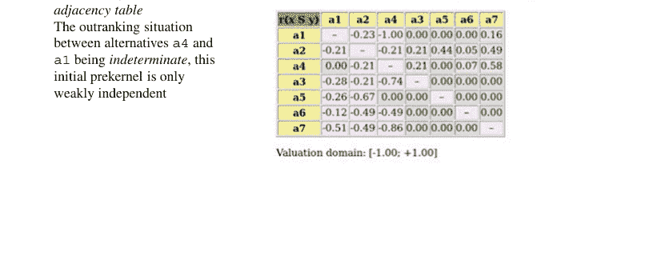

## 17.6 求解核方程组

### 清单 17.20 初始预核 {a1, a2, a4} 的不动点迭代

```
>>> gcd.computeKernelVector(['a1','a2','a4'],
...                     Initial=True,Comments=True)
--> 初始预核：{'a1', 'a2', 'a4'}
初始低向量：[-1.00,-1.00,-1.00,-1.00,-1.00,-1.00]
初始高向量：[+1.00,+1.00,+1.00,+1.00,+1.00,+1.00]
第1次低向量     ：[ 0.00,+0.21,-0.21, 0.00,-0.44,-0.07,-0.58]
第1次高向量    ：[+1.00,+1.00,+1.00,+1.00,+1.00,+1.00,+1.00]
第2次低向量     ：[ 0.00,+0.21,-0.21, 0.00,-0.44,-0.07,-0.58]
第2次高向量    ：[ 0.00,+0.21,-0.21,+0.21,-0.21,-0.05,-0.21]
第3次低向量     ：[ 0.00,+0.21,-0.21,+0.21,-0.21,-0.07,-0.21]
第3次高向量    ：[ 0.00,+0.21,-0.21,+0.21,-0.21,-0.05,-0.21]
第4次低向量     ：[ 0.00,+0.21,-0.21,+0.21,-0.21,-0.07,-0.21]
第4次高向量    ：[ 0.00,+0.21,-0.21,+0.21,-0.21,-0.07,-0.21]
迭代次数         ：4
低与高融合  ：[ 0.00,+0.21,-0.21,+0.21,-0.21,-0.07,-0.21]
初始预核的选择向量：{'a1', 'a2', 'a4'}
'a2': +0.21
'a4': +0.21
'a1':  0.00
'a6': -0.07
'a3': -0.21
'a5': -0.21
'a7': -0.21
```

在清单 17.20 中，我们以空集特征作为第一个低向量，以完整集 X 特征作为高向量开始不动点计算。每次迭代后，低向量被设置为前一个高向量的否定，高向量被设置为前一个低向量的否定。

在第四次迭代时达到了一个唯一的稳定预核特征向量 Y₁，其中正成员 a2: +0.21 和 a4: +0.21（60.5% 准则显著性多数），a1: 0.00 是一个模糊的潜在成员。方案 a3、a5、a6 和 a7 都是负成员，即这个优超预核的正非成员。

让我们也计算被优超的，即终端预核 {a3, a7} 的限制邻接表（图 17.11）。

```
>>> k2Relation = gcd.abskernelrestrict(['a3','a7'])
>>> gcd.showHTMLRelationTable(
...    actionsList=['a3','a7','a1','a2','a4','a5','a6'],
...    relation=k2Relation,
...    tableTitle='K2 限制的邻接表')
```

图 17.11 终端预核 {a3, a7} 限制的邻接表。我们再次注意到，这个终端预核只是弱独立的。

K2 限制的邻接表

| r(x S y) | a3 | a7 | a1 | a2 | a4 | a5 | a6 |
|---|---|---|---|---|---|---|---|
| a3 | - | 0.00 | -0.28 | -0.21 | -0.74 | -0.40 | -0.53 |
| a7 | -1.00 | - | -0.51 | -0.49 | -0.86 | -0.67 | -0.63 |
| a1 | 0.00 | 0.16 | - | 0.00 | 0.00 | 0.00 | 0.00 |
| a2 | 0.21 | 0.49 | 0.00 | - | 0.00 | 0.00 | 0.00 |
| a4 | 0.21 | 0.58 | 0.00 | 0.00 | - | 0.00 | 0.00 |
| a5 | 0.00 | 0.16 | 0.00 | 0.00 | 0.00 | - | 0.00 |
| a6 | 0.30 | 0.26 | 0.00 | 0.00 | 0.00 | 0.00 | - |

赋值域：[-1.00; +1.00]

相应的双极值特征向量 $Y_2$ 可以如下计算：

```
>>> gcd.computeKernelVector(['a3','a7'],
...                     Initial=False,Comments=True)
--> 终端预核：{'a3', 'a7'}
初始低向量  ：[-1.00,-1.00,-1.00,-1.00,-1.00,-1.00,-1.00]
初始高向量 ：[+1.00,+1.00,+1.00,+1.00,+1.00,+1.00,+1.00]
第1次低向量      ：[-0.16,-0.49, 0.00,-0.58,-0.16,-0.30,+0.49]
第1次高向量     ：[+1.00,+1.00,+1.00,+1.00,+1.00,+1.00,+1.00]
第2次低向量      ：[-0.16,-0.49, 0.00,-0.58,-0.16,-0.30,+0.49]
第2次高向量     ：[-0.16,-0.49, 0.00,-0.49,-0.16,-0.26,+0.49]
第3次低向量      ：[-0.16,-0.49, 0.00,-0.49,-0.16,-0.26,+0.49]
第3次高向量     ：[-0.16,-0.49, 0.00,-0.49,-0.16,-0.26,+0.49]
迭代次数          ：3
高与低融合   ：[-0.16,-0.49, 0.00,-0.49,-0.16,-0.26,+0.49]
终端预核的选择向量：{'a3', 'a7'}
    'a7': +0.49
    'a3':  0.00
    'a1': -0.16
    'a5': -0.16
    'a6': -0.26
    'a2': -0.49
    'a4': -0.49
```

在第三次迭代时达到了一个唯一的稳定双极值高和低不动点，其中方案 a7 被正向确认（大约 (1.0 + 0.49)/2 = 0.75% 准则显著性多数，参见上面的第 15 行）为该终端预核的成员，而方案 a3 在该预核中的成员资格似乎是不确定的。所有其余节点都具有负的成员特征值，因此被正向排除在该预核之外。

当我们重新考虑图 17.12 中该优超有向图的 graphviz 绘图时，这里变得显而易见，为什么方案 a1 *既不包含也不排除*在初始预核之外。同样的观察也适用于方案 a3，它*既不能包含也不能排除*在终端预核之外。在更不确定的优超关系情况下，甚至可能发生没有方案被正向包含或排除在一个弱独立的预核中，其相应的双极值成员特征向量完全不确定。

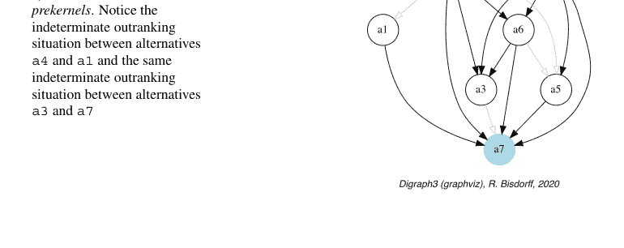

为了最终说明为何有时需要对不等稳定的低、高隶属特征向量进行认识论析取融合（参见第243页算法17.1，步骤2c），让我们以以下清晰的7-循环图为例：

```
>>> from digraphs import CirculantDigraph
>>> c7 = CirculantDigraph(order=7,circulants=[-1,1])
>>> c7
*------- Digraph instance description -------*
Instance class      : CirculantDigraph
Instance name       : c7
Digraph Order       : 7
Digraph Size        : 14
Valuation domain    : [-1.00;1.00]
Determinateness (%) : 100.00
Attributes          : ['name','order','circulants',
                       'actions','valuationdomain',
                       'relation','gamma','notGamma']
```

有向图c7是一个对称的清晰有向图，它展示了（除其他外）最大独立集{2,5,7}，即一个初始核与终端核。`computeKernelVector()`方法计算相应的初始核特征向量。

```
>>> c7.computeKernelVector(['2','5','7'],\n...                         Initial=True,Comments=True)
--> Initial kernel: {'2', '5', '7'}
initial low vector  : [-1.0, -1.0, -1.0, -1.0, -1.0, -1.0, -1.0]
initial high vector : [+1.0, +1.0, +1.0, +1.0, +1.0, +1.0, +1.0]
1 st low vector     : [-1.0,  0.0, -1.0, -1.0,  0.0, -1.0,  0.0]
1 st high vector    : [+1.0, +1.0, +1.0, +1.0, +1.0, +1.0, +1.0]
2 nd low vector     : [-1.0,  0.0, -1.0, -1.0,  0.0, -1.0,  0.0]
2 nd high vector    : [ 0.0, +1.0,  0.0,  0.0, +1.0,  0.0, +1.0]
stable low vector   : [-1.0,  0.0, -1.0, -1.0,  0.0, -1.0,  0.0]
stable high vector  : [ 0.0, +1.0,  0.0,  0.0, +1.0,  0.0, +1.0]
Iterations          : 3
low & high fusion   : [-1.0, +1.0, -1.0, -1.0, +1.0, -1.0, +1.0]
Choice vector for initial prekernel: {'2', '5', '7'}
'7': +1.00
'5': +1.00
'2': +1.00
'6': -1.00
'4': -1.00
'3': -1.00
'1': -1.00
```

请注意，稳定的低向量表征了*负隶属*部分，而稳定的高向量表征了*正隶属*部分（参见上面第10-11行）。双极认识论融合最终将这两个稳定部分组装成正确的预核特征向量（第13行）。
由于对称有向图的邻接矩阵在转置算子下保持*不变*，因此先前的计算在将同一个核定性为终端实例时，将产生完全相同的结果。
值得注意的是逻辑不确定值0.0在这个双不动点算法中所扮演的关键计算作用。实现这类算法而不使用逻辑*中性*项，就像实现数值算法而不使用数字0一样。这将导致无数平凡的不可能定理和可疑的逻辑结果。

## 注释

基于在非循环有向图中一个独立吸收选择对应于相关GRUNDY函数的零值这一观察，Riquet (1948) 将此类选择命名为“noyau”（核）。终端核随后由Berge (1962) 在组合博弈论的背景下进行了研究。初始核——独立且支配的选择——由von Neumann和Morgenstern (1944) 以博弈解的名称引入。清晰核方程组17.1（第242页）的吸收版本最初由Schmidt和Ströhlein (1985) 在其对关系代数的深入探索中引入。

核方程组的模糊版本最初由Kitainik (1993) 研究。1995年春天在瑞士洛桑举行的EURO多准则决策辅助工作组会议上评论这项工作时，*Marc Roubens* 担心求解此类模糊核方程组在计算上可能很困难。受他悲观言论的触发，并了解核方程组和VON NEUMANN不动点定理（Schmidt and Ströhlein 1985; von Neumann and Morgenstern 1944），我立即开始在Prolog中实现一个求解器，用于求解第243页方程17.4的赋值版本，该方程组作为所有可能有理数解向量离散标记的约束。在1995年夏天，我们幸运地使用一个商业有限域求解器，从一个阶为8的教学性优超有向图中获得了第一个赋值的初始核和终端核，该图在多准则决策辅助社区中广为人知。在配备12个处理器、以如今看来可笑的90 MHz CPU速度运行的CRAY 6412超级服务器上，计算耗时数秒。随后为任何具有单个初始或终端核的优超有向图获得的标记解向量，其结构方式暗示了VON NEUMANN不动点算法的收敛阶段，从而为算法17.1提供了最初的线索（Bisdorff 1996, 1997; Bisdorff and Roubens 2004）。

在我们当前的Python 3.9实现中，这样一个微小的问题在普通笔记本电脑上不到千分之一秒就能解决。对于在实际决策辅助问题中观察到的任何相关优超有向图示例，情况也基本如此。我们多次在个人日记中写道，这种计算效率肯定已无进一步实质性改进的潜力；然而不久后就发现，遵循新的理论思想或选择更高效的实现——例如使用Python中令人惊叹的迭代器生成器工具——执行时间完全可以缩短到原来的1/20。

如今可用的计算效率赋予了双极赋值核概念一种方法论上的优势，用于在双极赋值优超有向图的基础上解决特定的决策问题（参见第4章和第12章）。但它也为验证和实现用于更图论目的的核提取算法开辟了新的机会。新的成果，例如枚举已知困难图实例（如n-循环）的非同构最大独立集——核——得以实现（参见第21.7节和Bisdorff and Marichal 2008）。

## 参考文献

- Berge C (1962) 图论（原名：图论及其应用）。Dover 2001（最初由Wiley 1962出版）。译自Dunod 1958法文版
- Bisdorff R (1996) 使用CPL(FD)系统通过组合枚举计算模糊简单图上的核。载于：第八届比荷卢逻辑编程研讨会，1996年9月9日，比利时鲁汶天主教大学。http://hdl.handle.net/10993/46933
- Bisdorff R (1997) 关于l-赋值简单图上核的计算。载于：EUFIT'97会议论文集，第五届欧洲模糊与智能技术大会，1997年9月8-11日，亚琛，第97-103页
- Bisdorff R (2000) 模糊偏好系统的逻辑基础及其在electre决策辅助方法中的应用。Comput Oper Res 27:673–687. http://hdl.handle.net/10993/23724
- Bisdorff R (2002) 多准则偏好聚合的逻辑基础。载于：Bouyssou D, Jacquet-Lagrèze E, Perny P, Slowiński R, Vanderpooten D, Vincke P (编) 多准则辅助决策。Kluwer Academic Publishers, 第379–403页。http://hdl.handle.net/10993/45313
- Bisdorff R (2004) 关于布尔逻辑的自然模糊化。载于：Klement EP, Pap E (编) 林茨模糊集理论研讨会，模糊系统数学。林茨圣玛达莲娜教育中心（奥地利），第20–26页。http://hdl.handle.net/10993/23721
- Bisdorff R (2006) 关于枚举双极赋值有向图中的核。Annales du Lamsade 6:1–38. http://hdl.handle.net/10993/38741
- Bisdorff R, Marichal J (2008) 计算n-循环图的非同构最大独立集。J Integer Seq 11(Art. 08.5.7):1–16. https://cs.uwaterloo.ca/journals/JIS/VOL11/Marichal/marichal.html
- Bisdorff R, Roubens M (2004) 成对比较多属性决策方法中的选择程序。载于：Berghammer R, Möller B, Struth G (编) 计算机科学中的关系与Kleene代数方法：第七届计算机科学关系方法国际研讨会暨第二届Kleene代数应用国际研讨会，2003年5月12-17日，巴特马伦特。计算机科学讲义，第3051卷。Springer, Heidelberg, 第1–7页
- Bisdorff R, Pirlot M, Roubens M (2006) 来自双极赋值有向图的选择与核。Eur J Oper Res 175:155–170. http://hdl.handle.net/10993/23720
- Kitainik L (1993) 具有二元关系的模糊决策过程：迈向统一理论。Kluwer Academic Publisher, Boston
- Riguet J (1948) 二元关系、闭包、伽罗瓦对应。Bull Soc Math France 76:114–155
- Schmidt G, Ströhlein T (1985) 关于图的核与博弈的解：基于关系和不动点的概要。SIAM, J Algebraic Discrete Methods 6:54–65
- von Neumann J, Morgenstern O (1944) 博弈论与经济行为。Princeton University Press, Princeton

## 第18章
关于准则重要性权重不确定时的置信优超关系

# 目录

- 18.1 不确定准则重要性权重的建模
- 18.2 优超情形的双极值似然度
- 18.3 优超有向图的置信水平

**摘要** 在遵循优超方法建模偏好时，多数优势的符号会明确区分成对优超情形的有效性与无效性。当我们承认准则重要性权重通常具有不精确性，且多数优势较小时，我们如何能对所得的优超有向图保持信心？在本章中，我们提出将具有资格的重要性多数与所需的 $\alpha\%$ 置信水平联系起来。因此，我们将重要性权重建模为随机变量，它们围绕一个对应于给定确定性权重的平均重要性值，呈现或多或少广泛分布。由于优超陈述的双极值随机可信度因此源于正或负独立随机变量的简单求和，我们可以应用中心极限定理（CLT）来计算预期多数优势确实为正或为负的双极值似然度。

## 18.1 不确定准则重要性权重的建模

让我们考虑一个包含 $m$ 个准则的族 $F$ 的重要性权重是独立的随机变量 $W_j$，它们将每个准则 $j = 1, ..., m$ 的潜在重要性权重分布在其均值 $E(W_j)$ 周围，方差为 $V(W_j)$。

选择特定的不确定性随机模型通常是应用相关的。在本章有限的范围内，我们将通过四个略有不同的模型来说明这一设计决策对最终优超建模的影响，这些模型用于考虑我们对数值重要性权重认知的不确定性：*均匀分布*、*三角分布*和两种*Beta分布*模型，一种分布更广泛，另一种更集中。

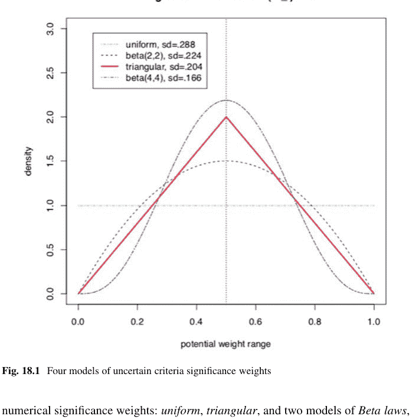

例如，当考虑一个潜在重要性权重的范围分布在0到其均值的两倍之间时，我们得到以下随机变量（Bisdorff 2020）：

- 一个在0到 $2E(W_j)$ 范围上的连续*均匀*分布。因此，$W_j \leadsto U(0, 2E(W_j))$ 且 $V(W_j) = 1/3(E(W_j))^2$。
- 一个对称的*beta*分布，例如参数 $\alpha = 2$ 和 $\beta = 2$。因此，$W_j \leadsto Beta(2, 2) \times 2E(W_j)$ 且 $V(W_j) = 1/5(E(W_j))^2$。
- 一个在相同范围上、众数为 $E(W_j)$ 的对称*三角*分布。因此 $W_j \leadsto Tr(0, 2E(W_j), E(W_j))$，方差 $V(W_j) = 1/6(E(W_j))^2$。
- 一个更窄的*beta*分布，例如参数 $\alpha = 4$ 和 $\beta = 4$。因此 $W_j \leadsto Beta(4, 4) \times 2E(W_j)$ 且 $V(W_j) = 1/9(E(W_j))^2$。

值得注意的是，在图 18.1 中，这四种不确定性模型都具有相同的期望值 $E(W_j)$，然而，其方差分别从 $E(W_j)$ 平方的 1/3 递减到 1/9（Bisdorff 2014）。

## 18.2 优超情形的双极值似然度

设 $A = \{x, y, z, ...\}$ 是一个包含 $n$ 个潜在决策行动的有限集合，在 $F = \{1, ..., m\}$ 上进行评估——这是一个包含 $m$ 个性能准则的有限且一致的族。在每个准则 $j \in F$ 上，决策行动在一个实数性能尺度 $[0; M_j]$ 上进行评估，该尺度支持一个上闭的无差异阈值 $ind_j$ 和一个下闭的偏好阈值 $pr_j$，使得 $0 \leq ind_j < pr_j \leq M_j$。对象 $x$ 在准则 $j$ 上的边际性能记为 $x_j$。因此，每个准则 $j$ 在 $A$ 上表征了一个边际双阈值序 $\succcurlyeq_j$：

$$r(x \succcurlyeq_j y) = \begin{cases} +1 & \text{如果 } x_j - y_j \succcurlyeq -ind_j, \\ -1 & \text{如果 } x_j - y_j \preccurlyeq -pr_j, \\ 0 & \text{其他情况。} \end{cases}$$

边际双极值特征函数的语义：

- $+1$ 表示在准则 $j$ 上，$x$ 的评估结果至少与 $y$ 一样好。
- $-1$ 表示在准则 $j$ 上，$x$ 的评估结果并非至少与 $y$ 一样好。
- $0$ 表示在准则 $j$ 上，$x$ 的评估结果是否至少与 $y$ 一样好尚不清楚（图 18.2）。

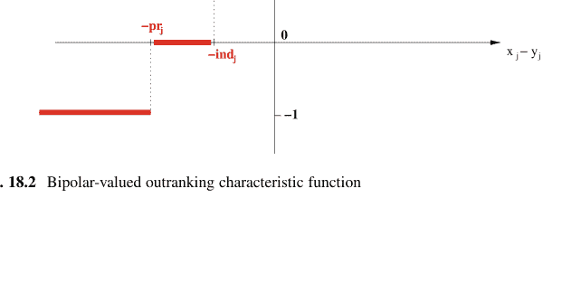

$F$ 中的每个准则 $j$ 将其“至少与...一样好”特征 $r(x \succcurlyeq_j y)$ 的随机重要性 $W_j$ 以如下方式贡献给全局特征 $\tilde{r}(x \succcurlyeq y)$：

$$\tilde{r}(x \succcurlyeq y) = \sum_{j \in F} W_j \times r(x \succcurlyeq_j y)). \quad (18.2)$$

因此，$\tilde{r}(x \succcurlyeq y)$ 变成了具有已知均值和方差的正或负独立随机变量的简单求和，其中 $\tilde{r}(x \succcurlyeq y) > 0$ 表示 $x$ 在全局上至少与 $y$ 一样好，$\tilde{r}(x \succcurlyeq y) < 0$ 表示 $x$ 在全局上并非至少与 $y$ 一样好，而 $\tilde{r}(x \succcurlyeq y) = 0$ 表示 $x$ 在全局上是否至少与 $y$ 一样好尚不清楚。

根据*中心极限定理*（CLT），我们知道随着 $m$ 变大，这样的随机变量求和会导致一个高斯分布 $Y$，其

$$E(Y) = \sum_{j \in F} \left( E(W_j) \times r(x \succcurlyeq_j y) \right), \text{ 且} \quad (18.3)$$
$$V(Y) = \sum_{j \in F} \left( V(W_j) \times |r(x \succcurlyeq_j y)| \right). \quad (18.4)$$

而一个“至少与...一样好”情形的*有效性似然度*，或*无效性似然度*，记为 $lh(x \succcurlyeq y)$，因此可以通过概率 $P(Y > 0) = 1.0 - P(Y \leqslant 0)$ 来评估 $Y$ 取正值的可能性，或通过 $P(Y < 0)$ 评估其取负值的可能性。在我们这里的双极值情况下，我们可以明智地使用标准高斯*误差函数*，即标准高斯概率分布函数 $P(Z)$ 的双极值 $2P(Z) - 1.0$ 版本（Press et al. 2007）：

$$lh(x \succcurlyeq y) = -\text{erf}\left(\frac{1}{\sqrt{2}} \frac{-E(Y)}{\sqrt{V(Y)}}\right). \quad (18.5)$$

因此，双极值 $lh(x \succcurlyeq y)$ 的范围变为 $[-1.0; +1.0]$，并且 $-lh(x \succcurlyeq y) = lh(x \not\succcurlyeq y)$，即一个*负似然度*代表了相应*否定*的“至少与...一样好”情形的似然度。似然度为 $+1.0$（或 $-1.0$）意味着相应的偏好情形*肯定*被验证（或被否定）。

*示例 18.1* 设 $x$ 和 $y$ 根据7个等重要性准则进行评估；四个准则积极支持 $x$ *至少与* $y$ *一样好*，三个准则支持 $x$ *并非至少与* $y$ *一样好*。假设对于 $j = 1, \ldots, 7$，$E(W_j) = w$ 且 $W_j \leadsto Tr(0, 2w, w)$。全局“至少与...一样好”特征值的期望变为 $E(\tilde{r}(x \succcurlyeq y)) = 4w - 3w = w$，方差为 $V(\tilde{r}(x \succcurlyeq y)) = 7\frac{1}{6}w^2$。

如果 $w = 1$，则 $E(\tilde{r}(x \succcurlyeq y)) = 1$ 且 $sd(\tilde{r}(x \succcurlyeq y)) = 1.08$。根据CLT，*至少与...一样好*情形的双极值似然度变为 $lh(x \succcurlyeq y) = 0.66$。

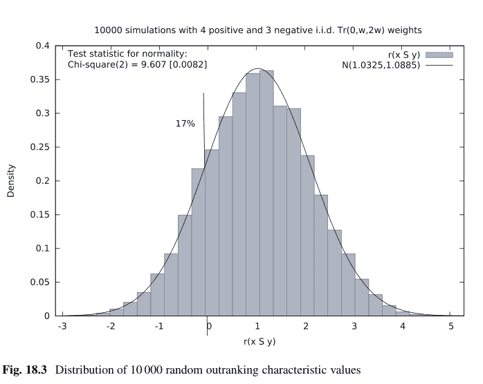

这对应于准则重要性权重的全局支持度为 (0.66 + 1.0)/2 = 83%。

一个包含10,000次运行的蒙特卡洛模拟从经验上证实了向高斯分布的有效收敛（见图 18.3，由gretl实现。¹）

实际上，$\bar{r}(x \succcurlyeq y) \rightsquigarrow Y = \mathcal{N}(1.03, 1.089)$，观察到负多数优势的经验概率约为17%。

## 18.3 优超有向图的置信水平

**定义 18.1（置信优超情形）** 遵循经典的优超方法（参见 (Bisdorff 2013)），我们从认知视角说，当满足以下条件时，决策行动 $x$ 在 $\alpha\%$ *置信*水平上*优超*决策行动 $y$：

- 一个预期的多数准则在 $\alpha\%$ 或更高的置信水平上，验证了 $x$ 和 $y$ 之间全局的“至少与...一样好”情形。
- 在一个不一致准则上未观察到显著较差的性能。

¹ GNU 回归、计量经济学和时间序列库，http://gretl.sourceforge.net/.

相应地，决策行动 $x$ 在置信水平 $\alpha\%$ 下*不优于*决策行动 $y$，当：

-   在置信水平 $-\alpha\%$ 或更低时，仅有少数预期的准则验证了 $x$ 与 $y$ 之间全局*至少同等评估*的情况。
-   在不一致的准则上未观察到显著更优的表现。

否则，情况是不确定的。

## 代码示例时间

让我们考虑以下随机性能表：

```
>>> from randomPerfTabs import RandomPerformanceTableau
>>> t = RandomPerformanceTableau(
...         numberOfActions=7,
...         numberOfCriteria=7,seed=100)
>>> t.showPerformanceTableau(Transposed=True)
*----- performance tableau -----*
criteria | weights | 'a1'   'a2'   'a3'   'a4'   'a5'   'a6'   'a7'
---------|---------|-------------------------------------------------
   'g1'  |    1    | 15.17  44.51  57.87  58.00  24.22  29.10  96.58
   'g2'  |    1    | 82.29  43.90  NA     35.84  29.12  34.79  62.22
   'g3'  |    1    | 44.23  19.10  27.73  41.46  22.41  21.52  56.90
   'g4'  |    1    | 46.37  16.22  21.53  51.16  77.01  39.35  32.06
   'g5'  |    1    | 47.67  14.81  79.70  67.48  NA     90.72  80.16
   'g6'  |    1    | 69.62  45.49  22.03  33.83  31.83  NA     48.80
   'g7'  |    1    | 82.88  41.66  12.82  21.92  75.74  15.45  6.05
```

对于相应的置信优超有向图，我们假设准则重要性权重服从*三角形*分布的不确定性，并要求置信水平为 $\alpha = 90\%$。`ConfidentBipolarOutrankingDigraph` 类提供了这样的构建。

### 清单 18.1 计算 90% 置信优超有向图

```
>>> from outrankingDigraphs import
...         ConfidentBipolarOutrankingDigraph
>>> g90 = ConfidentBipolarOutrankingDigraph(t,
...         distribution ='triangular',confidence=90)
>>> g90
*------- Object instance description -------*
Instance class       : ConfidentBipolarOutrankingDigraph
Instance name        : rel_randomperftab_CLT
Actions              : 7
Criteria             : 7
Size                 : 15
Uncertainty model    : triangular (a=0,b=2w)
Likelihood domain    : [-1.0;+1.0]
Confidence level     : 0.80 (90.0%)
Confident majority   : 0.14 (57.1%)
Determinateness (%)  : 62.07
Valuation domain     : [-1.00;1.00]
Attributes           : ['name', 'bipolarConfidenceLevel',
                       'distribution', 'betaParameter', 'actions',
                       'order', 'valuationdomain', 'criteria',
                       'evaluation', 'concordanceRelation',
```

得到的 90% 置信优超关系如下所示。

### 清单 18.2 具有三角形分布重要性权重的 90% 置信优超关系

```
>>> g90.showRelationTable(LikelihoodDenotation=True)
 * ---- Outranking Relation Table -----
 r/(lh) |  'a1'    'a2'    'a3'    'a4'    'a5'    'a6'    'a7'
 -------+-------------------------------------------------------
  'a1'  |  +0.00   +0.71   +0.29   +0.29   +0.29   +0.29   +0.00
         |  ( - )  (+1.00) (+0.95) (+0.95) (+0.95) (+0.95) (+0.65)
  'a2'  |  -0.71   +0.00   -0.29   +0.00   +0.00   +0.29   -0.57
         | (-1.00)  ( - )  (-0.95) (-0.65) (+0.73) (+0.95) (-1.00)
  'a3'  |  -0.29   +0.29   +0.00   -0.29   +0.00   +0.00   -0.29
         | (-0.95) (+0.95)  ( - )  (-0.95) (-0.73) (-0.00) (-0.95)
  'a4'  |  +0.00   +0.00   +0.57   +0.00   +0.29   +0.57   -0.43
         | (-0.00) (+0.65) (+1.00)  ( - )  (+0.95) (+1.00) (-0.99)
  'a5'  |  -0.29   +0.00   +0.00   +0.00   +0.00   +0.29   -0.29
         | (-0.95) (-0.00) (+0.73) (-0.00)  ( - )  (+0.99) (-0.95)
  'a6'  |  -0.29   +0.00   +0.00   -0.29   +0.00   +0.00   +0.00
         | (-0.95) (-0.00) (+0.73) (-0.95) (+0.73)  ( - )  (-0.00)
  'a7'  |  +0.00   +0.71   +0.57   +0.43   +0.29   +0.00   +0.00
         | (-0.65) (+1.00) (+1.00) (+0.99) (+0.95) (-0.00)  ( - )
 Valuation domain    : [-1.000; +1.000]
 Uncertainty model   : triangular(a=2.0,b=2.0)
 Likelihood domain   : [-1.0;+1.0]
 Confidence level    : 0.80 (90.0%)
 Confident majority  : 0.14 (57.1%)
 Determinateness     : 0.24 (62.1%)
```

清单 18.2 中所示的 $(lh)$ 数字对应于双极似然值，所需的双极置信水平等于 $(0.90 + 1.0)/2 = 0.80$（见上文第 22 行）。因此，行动 a1 置信地优于所有其他行动，除了 a7，其实际似然值 $(+0.65)$ 低于所需的 $(+0.80)$，并且我们进一步观察到在准则 g1 上存在显著的反向表现。

还要注意，在行动 a2 与行动 a4 和 a5 之间观察到的优超情况缺乏置信度。在确定性情况下，我们会有 $r(a2 \succcurlyeq a4) = -0.143$ 和 $r(a2 \succcurlyeq a5) = +0.143$。所有特征值低于或等于 $abs(0.143)$ 的优超情况，即多数支持为 $1.143/2 = 57.1\%$ 或更低，在 $\alpha$ 水平 90% 下确实*不置信*（见上文第 23 行）。

下一页的图 18.4 显示了相应的严格 90% 置信优超有向图，由其初始和终端严格预核定向。

```
>>> gcd90 = ~ (-g90)
>>> gcd90.showPreKernels()
 *--- Computing preKernels ---*
 Dominant preKernels :
   ['a1', 'a7']
     independence :  0.0
     dominance    :  0.2857
     absorbency   : -0.7143
     covering : 0.800
 Absorbent preKernels :
   ['a2', 'a5', 'a6']
     independence : 0.0
     dominance : -0.2857
     absorbency : 0.2857
     covered : 0.583
>>> gcd90.exportGraphViz(fileName='confidentOutranking',
... firstChoice=['a1', 'a7'],
... lastChoice=['a2', 'a5', 'a6'])
*----- exporting a dot file for GraphViz tools ----*
Exporting to confidentOutranking.dot
dot -Grankdir=BT -Tpng confidentOutranking.dot
-o confidentOutranking.png
```

现在，当我们要求更强的置信水平，比如 99% 时，这个 90% 置信优超有向图会变成什么样子？

### 清单 18.3 99% 置信优超关系

```
>>> g99 = ConfidentBipolarOutrankingDigraph(t,
... distribution='triangular',confidence=99)
>>> g99.showRelationTable()
 * ----- Outranking Relation Table -----
 r/(lh) | 'a1'    'a2'    'a3'    'a4'    'a5'    'a6'    'a7'
 -------+-------------------------------------------------------
  'a1'  | +0.00   +0.71   +0.00   +0.00   +0.00   +0.00   +0.00
         | ( - )  (+1.00) (+0.95) (+0.95) (+0.95) (+0.95) (+0.65)
  'a2'  | -0.71   +0.00   +0.00   +0.00   +0.00   +0.00   -0.57
         | (-1.00)  ( - )  (-0.95) (-0.65) (+0.73) (+0.95) (-1.00)
  'a3'  | +0.00   +0.00   +0.00   +0.00   +0.00   +0.00   +0.00
         | (-0.95) (+0.95)  ( - )  (-0.95) (-0.73) (-0.00) (-0.95)
  'a4'  | +0.00   +0.00   +0.57   +0.00   +0.00   +0.57   -0.43
         | (-0.00) (+0.65) (+1.00)  ( - )  (+0.95) (+1.00) (-0.99)
  'a5'  | +0.00   +0.00   +0.00   +0.00   +0.00   +0.29   +0.00
         | (-0.95) (-0.00) (+0.73) (-0.00)  ( - )  (+0.99) (-0.95)
  'a6'  | +0.00   +0.00   +0.00   +0.00   +0.00   +0.00   +0.00
         | (-0.95) (-0.00) (+0.73) (-0.95) (+0.73)  ( - )  (-0.00)
  'a7'  | +0.00   +0.71   +0.57   +0.43   +0.00   +0.00   +0.00
         | (-0.65) (+1.00) (+1.00) (+0.99) (+0.95) (-0.00)  ( - )
 Valuation domain    : [-1.000; +1.000]
 Uncertainty model   : triangular(a=0.0,b=2.0)
 Likelihood domain   : [-1.0;+1.0]
 Confidence level    : 0.98 (99.0%)
 Confident majority  : 0.29 (64.3%)
 Determinateness     : 0.13 (56.6%)
```

在 99% 置信水平下，所需的最小重要性多数支持达到 64.3%（见清单 18.3，上文第 25 行）。结果，大多数优超情况不再得到验证，例如行动 a1 与行动 a3、a4、a5 和 a6 之间的优超情况（见上文第 5 行）。因此，有向图的整体认知确定性从 62.1% 下降到 56.6%（见第 26 行）。

最后，当准则重要性权重的不确定性用更大的方差建模时，例如*均匀*变量（见下文第 2 行），之前的 90% 置信优超有向图会变成什么样子？

### 清单 18.4 具有均匀变量的 90% 置信优超有向图

```
>>> gu90 = ConfidentBipolarOutrankingDigraph(t,
...                 confidence=90,distribution='uniform')
>>> gu90.showRelationTable()
 * ----- Outranking Relation Table -----
 r/(lh) |   'a1'   'a2'   'a3'   'a4'   'a5'   'a6'   'a7'
 -------+-------------------------------------------------
  'a1'  | +0.00  +0.71  +0.29  +0.29  +0.29  +0.29  +0.00
         |  ( - ) (+1.00) (+0.84) (+0.84) (+0.84) (+0.84) (+0.49)
  'a2'  | -0.71  +0.00  -0.29  +0.00  +0.00  +0.29  -0.57
         | (-1.00)  ( - ) (-0.84) (-0.49) (+0.56) (+0.84) (-1.00)
  'a3'  | -0.29  +0.29  +0.00  -0.29  +0.00  +0.00  -0.29
         | (-0.84) (+0.84)  ( - ) (-0.84) (-0.56) (-0.00) (-0.84)
  'a4'  | +0.00  +0.00  +0.57  +0.00  +0.29  +0.57  -0.43
         | (-0.00) (+0.49) (+1.00)  ( - ) (+0.84) (+1.00) (-0.95)
  'a5'  | -0.29  +0.00  +0.00  +0.00  +0.00  +0.29  -0.29
         | (-0.84) (-0.00) (+0.56) (-0.00)  ( - ) (+0.92) (-0.84)
  'a6'  | -0.29  +0.00  +0.00  -0.29  +0.00  +0.00  +0.00
         | (-0.84) (-0.00) (+0.56) (-0.84) (+0.56)  ( - ) (-0.00)
  'a7'  | +0.00  +0.71  +0.57  +0.43  +0.29  +0.00  +0.00
         | (-0.49) (+1.00) (+1.00) (+0.95) (+0.84) (-0.00)  ( - )
 Valuation domain    : [-1.000; +1.000]
 Uncertainty model   : uniform(a=0.0,b=2.0)
 Likelihood domain   : [-1.0;+1.0]
 Confidence level    : 0.80 (90.0%)
 Confident majority  : 0.14 (57.1%)
 Determinateness     : 0.24 (62.1%)
```

尽管似然值较低（见第 257 页清单 18.2 中的 g90 有向图），我们在此保持相同的置信多数水平 57.1%（第 25 行），因此也保持相同的 90% 置信优超有向图。

最后，值得再次注意的是，正是双极值认知逻辑的*中性*值，使得在面对不确定的准则重要性权重时，能够轻松处理优超情况的 *α*% 置信度。此外值得注意的是，标准高斯误差函数 (erf) 的使用，通过立即提供关于以下任一情况的*带符号*似然值一个正向的关系陈述，或当其为负向时的否定版本（Press 等人，2007）。

第19章分析了当准则重要性权重仅忠实反映重要性顺序时，偏好关系有向图的稳健性。

## 参考文献

Bisdorff R (2013) 关于具有大性能差异的极化偏好关系。《多准则决策分析杂志》，Wiley 20:3–12，http://hdl.handle.net/10993/245

Bisdorff R (2014) 关于具有多个不确定重要性准则的置信偏好关系。载于：Mousseau V, Pirlot M (编) DAP’2014 从多准则决策辅助到偏好学习，巴黎中央理工学院，第1–6页。http://hdl.handle.net/10993/23910

Bisdorff R (2020) 讲座3：连续随机变量。载于：计算统计学课程讲座。卢森堡大学。http://hdl.handle.net/10993/37870

Press W, Teukolsky S, Vetterling W, Flannery B (2007) 数值食谱：科学计算的艺术，第3版，特殊函数，第6.2节。剑桥大学出版社，剑桥，第209–214页

## 第19章
偏好关系有向图的稳健性分析

# 目录

- 19.1 基数还是序数准则重要性权重？ ........................................ 261
- 19.2 偏好情境的稳定性定性分析 ........................................ 263
- 19.3 计算偏好情境的稳定性标记 ........................ 267
- 19.4 稳健的双极值偏好有向图.............................................. 269
- 19.5 表征无对抗的多目标偏好
情境 ........................................................................................................ 272
- 19.6 计算帕累托有效的多目标选择 ...................................... 275

**摘要** 性能准则所需的基数重要性权重代表了偏好方法的“阿喀琉斯之踵”。决策者很少能在认知上胜任提出精确的十进制准则重要性权重。更常见的是，决策问题涉及或多或少同等重要的决策目标，每个目标下有或多或少同等重要的准则。在本章中，我们研究当准则重要性权重仅忠实反映重要性顺序时，偏好关系有向图的稳健性。

### 19.1 基数还是序数准则重要性权重？

一个具有同等重要决策目标和同等重要准则的此类决策问题的随机示例，可以使用 `Random3ObjectivesPerformanceTableau` 类生成。

**清单 19.1** 生成一个随机的3目标性能表

```
>>> from randomPerfTabs import \
...                 RandomObjectivesPerformanceTableau
>>> pt = Random3ObjectivesPerformanceTableau(
...                 numberOfActions=7,
...                 numberOfCriteria=9,seed=102)
>>> pt
```

```
*------- PerformanceTableau instance description -------*
Instance class : Random3ObjectivesPerformanceTableau
Seed : 102
Instance name : random3ObjectivesPerfTab
Actions : 7
Objectives : 3
Criteria : 9
NA proportion (%): 0.0
Attributes : ['name', 'valueDigits', 'BigData',
'OrdinalScales', 'missingDataProbability',
'negativeWeightProbability', 'randomSeed',
'sumWeights', 'valuationPrecision',
'commonScale', 'objectiveSupportingTypes',
'actions', 'objectives', 'criteriaWeightMode',
'criteria', 'evaluation', 'weightPreorder']
>>> pt.showObjectives()
*------- show objectives -------*
Eco: Economical aspect
ec1 criterion of objective Eco 8
ec4 criterion of objective Eco 8
ec8 criterion of objective Eco 8
Total weight: 24.00 (3 criteria)
Soc: Societal aspect
so2 criterion of objective Soc 12
so7 criterion of objective Soc 12
Total weight: 24.00 (2 criteria)
Env: Environmental aspect
en3 criterion of objective Env 6
en5 criterion of objective Env 6
en6 criterion of objective Env 6
en9 criterion of objective Env 6
Total weight: 24.00 (4 criteria)
```

在上面的清单19.1中，可以注意到一个性能表 `pt`，它描述了七个决策方案，这些方案根据三个同等重要的决策目标进行评估，涉及：

- 1. 一个*经济*方面，由三个重要性权重为8的性能准则联盟组成（第24行）
- 2. 一个*社会*方面，由两个重要性权重为12的性能准则联盟组成（第29行）
- 3. 一个*环境*方面，由四个重要性权重为6的性能准则联盟组成（第33行）

我们在本章要解决的问题是：相应的双极值偏好关系有向图在多大程度上*依赖于*重要性权重的实际值？在前一章（第18章）中，我们假设准则重要性权重是随机变量。在这里，我们将假设我们确切知道的仅仅是重要性权重的预序。

在随机性能表 `pt` 中，我们观察到三个递增的权重等价类。

清单19.2 重要性权重预序

```
>>> pt.showWeightPreorder()
['en3', 'en5', 'en6', 'en9'] (6) <
['ec1', 'ec4', 'ec8'] (8) <
['so2', 'so7'] (12)
```

现在，当允许所有与上述权重预序兼容的可能重要性权重时（Bisdorff 等人，2009, 2014），已验证的偏好和被偏好情境将显得多么稳健？

### 19.2 偏好情境的稳定性定性分析

让我们构建与随机3目标性能表 `pt` 对应的双极值偏好关系有向图。

清单19.3 双极偏好有向图示例

```
>>> from outrankingDigraphs import BipolarOutrankingDigraph
>>> g = BipolarOutrankingDigraph(pt)
>>> g.showRelationTable()
* ---- Relation Table -----
r(>=) | 'p1' 'p2' 'p3' 'p4' 'p5' 'p6' 'p7'
------|----------------------------------------
'p1' | +1.00 -0.42 +0.00 -0.69 +0.39 +0.11 -0.06
'p2' | +0.58 +1.00 +0.83 +0.00 +0.58 +0.58 +0.58
'p3' | +0.25 -0.33 +1.00 +0.00 +0.50 +1.00 +0.25
'p4' | +0.78 +0.00 +0.61 +1.00 +1.00 +1.00 +0.67
'p5' | -0.11 -0.50 -0.25 -0.89 +1.00 +0.11 -0.14
'p6' | +0.22 -0.42 +0.00 -1.00 +0.17 +1.00 -0.11
'p7' | +0.22 -0.50 +0.17 -0.06 +0.78 +0.42 +1.00
```

在清单19.3的第7–13行中，我们注意到关系表主对角线上确定的验证自反项 +1.00；它们显然独立于任何重要性权重。现在，我们确切知道*一致*的偏好情境也完全独立于重要性权重。并且，所有在每个同等重要准则联盟中得到多数重要性支持的偏好情境，也独立于我们赋予每个单独准则联盟的实际重要性。我们还能够有效测试一个偏好情境是否在所有与清单19.2所示给定预序兼容的潜在重要性权重下保持有效（Bisdorff 2014）。请注意，通常会获得或多或少数量的偏好情境，这些情境实际上*依赖于*赋予准则的精确基数重要性权重。

这种偏好情境的*稳定性标记*可以使用 `showRelationTable()` 方法的 `StabilityDenotation=True` 标志来检查。

### 清单19.4 带稳定性标记的双极值偏好关系表

```
>>> g.showRelationTable(StabilityDenotation=True)
* ---- Relation Table ----
r/ (stab) | 'p1' 'p2' 'p3' 'p4' 'p5' 'p6' 'p7'
-----------|--------------------------------------------------
'p1' | +1.00 -0.42 +0.00 -0.69 +0.39 +0.11 -0.06
| (+4) (-2) (+0) (-3) (+2) (+2) (-1)
'p2' | +0.58 +1.00 +0.83 0.00 +0.58 +0.58 +0.58
| (+2) (+4) (+3) (+2) (+2) (+2) (+2)
'p3' | +0.25 -0.33 +1.00 0.00 +0.50 +1.00 +0.25
| (+2) (-2) (+4) (0) (+2) (+2) (+1)
'p4' | +0.78 0.00 +0.61 +1.00 +1.00 +1.00 +0.67
| (+3) (-1) (+3) (+4) (+4) (+4) (+2)
'p5' | -0.11 -0.50 -0.25 -0.89 +1.00 +0.11 -0.14
| (-2) (-2) (-2) (-3) (+4) (+2) (-2)
'p6' | +0.22 -0.42 0.00 -1.00 +0.17 +1.00 -0.11
| (+2) (-2) (+1) (-2) (+2) (+4) (-2)
'p7' | +0.22 -0.50 +0.17 -0.06 +0.78 +0.42 +1.00
| (+2) (-2) (+1) (-1) (+3) (+2) (+4)
```

在上面的清单19.4中，我们可以区分以下双极值稳定性水平：

- **±4：** *一致*的偏好，或被偏好情境。例如，所有成对的平凡自反偏好都显示此稳定性水平。
- **±3：** 在*每个*同等重要准则联盟中*验证*的偏好，或被偏好情境。例如，方案p1和p4之间的偏好情境就是这种情况（见第6行和第12行）。
- **±2：** 在所有与给定重要性预序*兼容*的*所有*潜在重要性权重下*验证*的偏好，或被偏好情境（见第262页的清单19.2）。比较方案p1和p2时就是这种情况（见第6行和第8行）。
- **±1：** 在*精确给定的十进制*重要性权重下*验证*的偏好，或被偏好情境，例如方案p3和p7之间观察到的情况（见第10行和第18行）。
- **0：** *不确定的*偏好情境，例如方案p1和p3之间的情况（见第6行和第10行）。

值得注意的是，在一个极限情况下，当所有性能准则显得同等重要时——即存在一个包含所有准则重要性权重的单一等价类——人们只能区分稳定性水平±4和±3。在另一个极限情况下，当所有性能准则具有不同的重要性权重时，重要性权重可以线性排序而没有并列，因此观察不到稳定性水平±3。

如上所述，所有自反比较都平凡地确认了一致的偏好情境：所有决策方案确实总是“至少与自身评价一样好”。但也出现了两个非自反的一致偏好情境：例如，比较方案p4与方案p5和p6时（见清单19.4，第14行和第16行）。让我们与

`showPairwiseComparison()` 方法展示了备选方案 p4 和 p5 的多准则性能记录。

```
>>> g.showPairwiseComparison('p4','p5')
*------------ pairwise comparison ----*
 Comparing actions : (p4, p5)
 crit. wgth.  g(x)  g(y)    diff | ind  pref  r()
 ec1   8.00  85.19  46.75  +38.44 | 5.00 10.00  +8.00
 ec4   8.00  72.26   8.96  +63.30 | 5.00 10.00  +8.00
 ec8   8.00  44.62  35.91   +8.71 | 5.00 10.00  +8.00
 en3   6.00  80.81  31.05  +49.76 | 5.00 10.00  +6.00
 en5   6.00  49.69  29.52  +20.17 | 5.00 10.00  +6.00
 en6   6.00  66.21  31.22  +34.99 | 5.00 10.00  +6.00
 en9   6.00  50.92   9.83  +41.09 | 5.00 10.00  +6.00
 so2  12.00  49.05  12.36  +36.69 | 5.00 10.00 +12.00
 so7  12.00  55.57  44.92  +10.65 | 5.00 10.00 +12.00
 Valuation in range: -72.00 to +72.00;          -------
                              global concordance:  +72.00
```

备选方案 p4 确实被一致地认为“至少与备选方案 p5 评价相当”，且 r(p4 ≿ p5) = 72/72 = +1.00（参见对面页的清单 19.4，第 11 行）。然而，反向比较并未显示出如此一致的被超越情况。

```
>>> g.showPairwiseComparison('p5','p4')
*------------ pairwise comparison ----*
 Comparing actions : (p5, p4)
 crit. wgth.  g(x)  g(y)    diff | ind  pref  r()
 ec1   8.00  46.75  85.19  -38.44 | 5.00 10.00  -8.00
 ec4   8.00   8.96  72.26  -63.30 | 5.00 10.00  -8.00
 ec8   8.00  35.91  44.62   -8.71 | 5.00 10.00  +0.00
 en3   6.00  31.05  80.81  -49.76 | 5.00 10.00  -6.00
 en5   6.00  29.52  49.69  -20.17 | 5.00 10.00  -6.00
 en6   6.00  31.22  66.21  -34.99 | 5.00 10.00  -6.00
 en9   6.00   9.83  50.92  -41.09 | 5.00 10.00  -6.00
 so2  12.00  12.36  49.05  -36.69 | 5.00 10.00 -12.00
 so7  12.00  44.92  55.57  -10.65 | 5.00 10.00 -12.00
 Valuation in range: -72.00 to +72.00;          -------
                              global concordance:  -64.00
```

反向比较仅在稳定性水平 −3 时合格（参见前一页的清单 19.4，第 13 行）；r(p5 ≿ p4) = −64/72 = −0.89）。在准则 ec8 上，我们实际上观察到一个微小的负性能差异 −8.71（参见上面第 7 行），这实际上低于假定的偏好区分阈值 10.00。然而，被超越的情况得到了每个决策目标中大多数准则的支持。因此，报告的偏好情况完全独立于任何选定的重要性权重。

现在让我们考虑一个比较，例如备选方案 p2 和 p1 之间的比较，它分别在稳定性水平 +2 和 −2 时合格。

## 清单 19.5 备选方案 p2 和 p1 的比较

```
>>> g.showPairwiseOutrankings('p2','p1')
*------------- pairwise comparison ----*
Comparing actions : (p2, p1)
crit. wght.  g(x)  g(y)   diff | ind  pref  r()
ec1   8.00  89.77  38.11  +51.66 | 5.00 10.00  +8.00
ec4   8.00  86.00  22.65  +63.35 | 5.00 10.00  +8.00
ec8   8.00  89.43  77.02  +12.41 | 5.00 10.00  +8.00
en3   6.00  20.79  58.16  -37.37 | 5.00 10.00  -6.00
en5   6.00  23.83  31.40   -7.57 | 5.00 10.00  +0.00
en6   6.00  18.66  11.41   +7.25 | 5.00 10.00  +6.00
en9   6.00  26.65  44.37  -17.72 | 5.00 10.00  -6.00
so2  12.00  89.12  22.43  +66.69 | 5.00 10.00 +12.00
so7  12.00  84.73  28.41  +56.32 | 5.00 10.00 +12.00
Valuation in range: -72.00 to +72.00;          -------
                              global concordance:  +42.00
*------------- pairwise comparison ----*
Comparing actions : ('p1', 'p2')
crit. wght.  g(x)  g(y)   diff | ind  pref  r()
ec1   8.00  38.11  89.77  -51.66 | 5.00 10.00  -8.00
ec4   8.00  22.65  86.00  -63.35 | 5.00 10.00  -8.00
ec8   8.00  77.02  89.43  -12.41 | 5.00 10.00  -8.00
en3   6.00  58.16  20.79  +37.37 | 5.00 10.00  +6.00
en5   6.00  31.40  23.83   +7.57 | 5.00 10.00  +6.00
en6   6.00  11.41  18.66   -7.25 | 5.00 10.00  +0.00
en9   6.00  44.37  26.65  +17.72 | 5.00 10.00  +6.00
so2  12.00  22.43  89.12  -66.69 | 5.00 10.00 -12.00
so7  12.00  28.41  84.73  -56.32 | 5.00 10.00 -12.00
Valuation in range: -72.00 to +72.00;          -------
                              global concordance:  -30.00
```

在这两个比较中，就环境决策目标而言观察到的评估并未以显著多数验证超越或被超越的情况。因此，报告的偏好情况的稳定性实际上取决于选择与给定重要性权重前序兼容的重要性权重（参见第 262 页的清单 19.2）。

最后，让我们检查一个仅在稳定性水平 +1 时合格的比较，例如备选方案 p7 和 p3 之间的比较。

## 清单 19.6 备选方案 p7 和 p3 的比较

```
>>> g.showPairwiseOutrankings('p7','p3')
*------------- pairwise comparison ----*
Comparing actions : ('p7', 'p3')
crit. wght.  g(x)  g(y)   diff | ind  pref  r()
ec1   8.00  15.33  80.19  -64.86 | 5.00 10.00  -8.00
ec4   8.00  36.31  68.70  -32.39 | 5.00 10.00  -8.00
ec8   8.00  38.31  91.94  -53.63 | 5.00 10.00  -8.00
en3   6.00  30.70  46.78  -16.08 | 5.00 10.00  -6.00
en5   6.00  35.52  27.25   +8.27 | 5.00 10.00  +6.00
en6   6.00  69.71   1.65  +68.06 | 5.00 10.00  +6.00
en9   6.00  13.10  14.85   -1.75 | 5.00 10.00  +6.00
so2  12.00  68.06  58.85  +9.21 |  5.00  10.00  +12.00
so7  12.00  58.45  15.49  +42.96 |  5.00  10.00  +12.00
Valuation in range: -72.00 to +72.00;          -------
                              global concordance: +12.00
*--------------  pairwise comparison ----*
Comparing actions : ('p3', 'p7')
crit. wght.  g(x)  g(y)  diff |  ind   pref    r()
ec1   8.00  80.19  15.33  +64.86 |  5.00  10.00  +8.00
ec4   8.00  68.70  36.31  +32.39 |  5.00  10.00  +8.00
ec8   8.00  91.94  38.31  +53.63 |  5.00  10.00  +8.00
en3   6.00  46.78  30.70  +16.08 |  5.00  10.00  +6.00
en5   6.00  27.25  35.52  -8.27 |  5.00  10.00  +0.00
en6   6.00   1.65  69.71  -68.06 |  5.00  10.00  -6.00
en9   6.00  14.85  13.10  +1.75 |  5.00  10.00  +6.00
so2  12.00  58.85  68.06  -9.21 |  5.00  10.00  +0.00
so7  12.00  15.49  58.45  -42.96 |  5.00  10.00  -12.00
Valuation in range: -72.00 to +72.00;          -------
                              global concordance: +18.00
```

在这两种情况下，仅选择与给定权重前序兼容的重要性权重并不总是能产生积极验证的超越情况。

## 19.3 计算超越情况的稳定性标示

稳定性水平 ±4 和 ±3 在给定情况下易于检测。检测稳定性水平 ±2 则远不那么明显。现在，正是双极值认知特征域再次为我们提供了一种有效测试稳定性水平 +2 和 −2 的方法（Bisdorff 2004a,b）。

让我们考虑在给定权重前序中观察到的重要性等价类。这里，我们观察到三个权重类：6、8 和 12，按递增顺序排列（参见第 262 页的清单 19.2）。在上面显示的成对比较中，这些等价类可能以正或负的形式出现，此外还有值为 0.00 的不确定重要性。因此，我们得到以下有序的双极重要性权重列表：W = [−12, −8, −6, 0, 6, 8, 12]。

在上一节显示的所有成对边际比较中，我们可以观察到九个准则中的每一个都从该列表 W 中分配了一个精确的项目。让我们用 q[i] 表示分配项目 W[i] 的准则数量，用 Q[i] 表示这些 q[i] 计数的累积和，其中 i 是列表 W 长度范围内的索引。

例如，在备选方案 p2 和 p1 的比较中（参见第 265 页的清单 19.5），我们观察到以下计数：

| W[i] | -12 | -8 | -6 | 0 | 6 | 8 | 12 |
|---|---|---|---|---|---|---|---|
| q[i] | 0 | 0 | 2 | 1 | 1 | 3 | 2 |
| Q[i] | 0 | 0 | 2 | 3 | 4 | 7 | 9 |

让我们用 $-q$ 和 $-Q$ 表示 $q$ 和 $Q$ 列表的反转版本。因此，我们得到以下结果：

| W[i] | -12 | -8 | -6 | 0 | 6 | 8 | 12 |
|---|---|---|---|---|---|---|---|
| -q[i] | 2 | 3 | 1 | 1 | 2 | 0 | 0 |
| -Q[i] | 2 | 5 | 6 | 7 | 9 | 9 | 9 |

现在，当对于所有 $i$，我们观察到 $Q[i] \le -Q[i]$，并且存在一个 $i$ 使得 $Q[i] < -Q[i]$ 时，成对超越情况将在稳定性水平 +2 时合格，即被任何与给定权重前序兼容的重要性权重积极验证。类似地，当对于所有 $i$，我们观察到 $Q[i] \ge -Q[i]$，并且存在一个 $i$ 使得 $Q[i] > -Q[i]$ 时，成对被超越情况将在稳定性水平 $-2$ 时合格（Bisdorff 2004b）。

让我们验证一下，例如，在备选方案 p2 和 p1 之间观察到的超越情况确实验证了这个*一阶分布优势*条件。

| W[i] | -12 | -8 | -6 | 0 | 6 | 8 | 12 |
|---|---|---|---|---|---|---|---|
| Q[i] | 0 | 0 | 2 | 3 | 4 | 7 | 9 |
| -Q[i] | 2 | 5 | 6 | 7 | 9 | 9 | 9 |

请注意，在稳定性水平 $\pm4$ 和 $\pm3$ 下合格的超越情况显然也验证了上述稳定性水平 $\pm2$ 的测试。然而，备选方案 p7 和 p3 之间的超越情况并未验证此测试（参见第 266 页的清单 19.6）。

| W[i] | -12 | -8 | -6 | 0 | 6 | 8 | 12 |
|---|---|---|---|---|---|---|---|
| q[i] | 0 | 3 | 1 | 0 | 3 | 0 | 2 |
| Q[i] | 0 | 3 | 4 | 4 | 7 | 7 | 9 |
| -Q[i] | 2 | 2 | 5 | 5 | 6 | 9 | 9 |

这一次，并非所有的 $Q[i]$ 都*小于或等于*相应的 $-Q[i]$ 项。因此，p7 和 p3 之间的超越情况未被积极验证。

与所有符合给定权重预序的潜在显著性权重。

利用这种稳定性表示，我们可以定义以下*稳健*的双极值优势有向图版本。

## 19.4 稳健双极值优势有向图

**定义 19.1（稳健优势情境）**

- 我们称决策备选方案 $x$ *稳健地优于*决策备选方案 $y$，当：
  - $x$ 在稳定性水平 $+2$ 或更高时，至少与 $y$ 一样被良好评估。
  - 我们未观察到 $x$ 在任何不一致准则上有显著的反向表现。
- 对偶地，我们称决策备选方案 $x$ *未稳健地优于*决策备选方案 $y$，当：
  - $x$ 在稳定性水平 $-2$ 或更低时，未至少与 $y$ 一样被良好评估。
  - 我们未观察到 $x$ 在任何不一致准则上有显著的更优表现。
- 否则，优势情境是不确定的。

相应的*稳健*优势有向图可以使用 `RobustOutrankingDigraph` 类计算如下：

**清单 19.7** 计算稳健优势有向图

```
>>> from outrankingDigraphs import \
...                 RobustOutrankingDigraph
>>> rg = RobustOutrankingDigraph(pt) # same pt
>>> rg
 *------- Object instance description ------*
 Instance class       : RobustOutrankingDigraph
 Instance name        : robust_random3ObjectivesPerfTab
 Actions              : 7
 Criteria             : 9
 Size                 : 22
 Determinateness (%)  : 68.45
 Valuation domain     : [-1.00;1.00]
 Attributes           : ['name', 'methodData', 'actions',
          'order', 'criteria', 'evaluation',
          'vetos', 'valuationdomain',
          'cardinalRelation', 'ordinalRelation',
          'equisignificantRelation', 'unanimousRelation',
          'relation', 'gamma', 'notGamma']
>>> rg.showRelationTable()
 * ---- Relation Table -----
```

| r/ (stab) | 'p1' | 'p2' | 'p3' | 'p4' | 'p5' | 'p6' | 'p7' |
|---|---|---|---|---|---|---|---|
| 'p1' | +1.00 (+4) | -0.42 (-2) | +0.00 (+0) | -0.69 (-3) | +0.39 (+2) | +0.11 (+2) | +0.00 (-1) |
| 'p2' | +0.58 (+2) | +1.00 (+4) | +0.83 (+3) | +0.00 (+2) | +0.58 (+2) | +0.58 (+2) | +0.58 (+2) |
| 'p3' | +0.25 (+2) | -0.33 (-2) | +1.00 (+4) | +0.00 (+0) | +0.50 (+2) | +1.00 (+2) | +0.00 (+1) |
| 'p4' | +0.78 (+3) | +0.00 (-1) | +0.61 (+3) | +1.00 (+4) | +1.00 (+4) | +1.00 (+4) | +0.67 (+2) |
| 'p5' | -0.11 (-2) | -0.50 (-2) | -0.25 (-2) | -0.89 (-3) | +1.00 (+4) | +0.11 (+2) | -0.14 (-2) |
| 'p6' | +0.22 (+2) | -0.42 (-2) | +0.00 (+1) | -1.00 (-2) | +0.17 (+2) | +1.00 (+4) | -0.11 (-2) |
| 'p7' | +0.22 (+2) | -0.50 (-2) | +0.00 (+1) | +0.00 (-1) | +0.78 (+3) | +0.42 (+2) | +1.00 (+4) |

所有在稳定性水平 ±1 下被认定的优势情境，现在都被置于*不确定*状态（参见上面清单 19.7 的第 23–36 行）。在此示例中，三个正向优势被舍弃：p3 与 p7 之间、p7 与 p3 之间，以及 p6 与 p3 之间（最后一种情况由于否决情境实际上已经存疑）。三个负向优势也被舍弃：p1 与 p7 之间、p4 与 p2 之间，以及 p7 与 p4 之间。

顺便注意，优势或被优势情境，尽管在水平 ±2 或 ±3 下被认定，但由于显著的表现差异，仍可能变得存疑。例如，当比较备选方案 p2 和 p4 时，我们观察到这种存疑情境（参见清单 19.8 的第 4–8 行）。

### 清单 19.8 检查极化的优势情境

```
>>> rg.showPolarisations()
*---- Negative polarisations ----*
number of negative polarisations : 3
1: r(p2 >= p4) = 0.33
criterion: en3
Considerable performance difference : -60.02
Veto discrimination threshold : -60.00
Polarisation: r(p2 >= p4) = 0.33 ==> 0.00
2: r(p6 >= p3) = 0.06
criterion: ec8
Considerable performance difference : -62.31
Veto discrimination threshold : -60.00
Polarisation: r(p6 >= p3) = 0.06 ==> 0.00
3: r(p6 >= p4) = -0.36
criterion: en3
Considerable performance difference : -68.27
Veto discrimination threshold : -60.00
Polarisation: r(p6 >= p4) = -0.36 ==> -1.00
```

尽管是稳健的，备选方案 p2 和 p4 之间“至少与...一样被良好评估”的情境，由于在准则 en3 上观察到 p2 显著的反向表现（−60.02），这一负向差异略微超过了假定的否决区分阈值 v = 60.00，因此变得存疑。当比较备选方案 p6 和 p3 时，同样的极化到 0.00（不确定）发生（第 13 行）。注意备选方案 p6 和 p4 之间“至少与...一样被良好评估”的情境极化到 −1.0（肯定为假）（第 18 行）。

最后，可以在图 19.1 中比较标准版和稳健版的相应严格优势有向图，两者都由各自相同的初始和终端预核定向。

稳健版本（图 19.1 右侧）舍弃了两个严格优势情境：p4 与 p7 之间以及 p7 与 p1 之间。剩余的 14 个严格优势（相应地，被优势）情境现在都在稳定性水平 +2 及以上（相应地，−2 及以下）下得到验证。因此，它们对于所有符合给定显著性权重预序的潜在显著性权重都保持有效（参见第 262 页清单 19.2）。

为了理解图 19.1 所示的标准版和稳健版严格优势有向图的明显偏序，让我们在下一页的图 19.2 中，通过实际应用于稳健版优势有向图的 NETFlows 排序规则（参见下面第 4 行的 outrankingModel='this' 标志），对底层性能表进行最终的热图视图。

### 清单 19.9 计算稳健性能热图视图

```
>>> rg.showHTMLPerformanceHeatmap(
...                 Correlations=True,
...                 colorLevels=5,
...                 outrankingModel='this',
...                 rankingRule='NetFlows')
```

由于初始预核 {p2, p4} 在稳健优势有向图中至少在稳定性水平 ±2 下得到验证，因此推荐备选方案 p4 和 p2 作为潜在最佳选择似乎是稳健合理的。备选方案 p4 确实代表了所有决策目标之间的整体最佳折衷选择，而备选方案 p2 在三个决策目标中的两个上给出了全体一致的最佳选择。最终选择权在决策者手中。

## 19.5 表征无对立的多目标优势情境

当面对涉及多个决策目标的性能表时，稳健性水平 ±3 可能导致区分我们所谓的无对立优势情境，如上一节中备选方案 p4 和 p1 之间所示的情境（r(p4 ≳ p1) = +0.78，参见第 264 页清单 19.4 第 11 行），即或多或少被所有决策目标验证或证伪的偏好情境。

**定义 19.2（无对立优势情境）**

- 我们称决策备选方案 x 无对立地优于决策备选方案 y，当 x 在一个或多个决策目标上正向优于 y，且 x 未在任何决策目标上被 y 正向优于。

## 19.6 计算帕累托有效的多目标选择

对偶地，我们说决策备选方案 x 被决策备选方案 y **无反对地超越**，当 x 在一个或多个决策目标上被 y 正向超越，而 x 在任何决策目标上都没有正向超越 y。

例如，让我们重新考虑第 261 页清单 19.1 中已经看到的具有三个决策目标的性能表 `pt`：

```
>>> pt.showObjectives()
*------- show objectives -------"
Eco: Economical aspect
  ec1 criterion of objective Eco 8
  ec4 criterion of objective Eco 8
  ec8 criterion of objective Eco 8
  Total weight: 24.00 (3 criteria)
Soc: Societal aspect
  so2 criterion of objective Soc 12
  so7 criterion of objective Soc 12
  Total weight: 24.00 (2 criteria)
Env: Environmental aspect
  en3 criterion of objective Env 6
  en5 criterion of objective Env 6
  en6 criterion of objective Env 6
  en9 criterion of objective Env 6
  Total weight: 24.00 (4 criteria)
```

我们注意到在这个例子中，三个决策目标具有同等重要性（见第 3、13 和 17 行）。对于每个单独考虑的决策目标，哪些超越情况会被正向（或负向）验证？

这种无反对的多目标超越情况，可以通过对限制在支持每个决策目标的准则联盟上的边际超越有向图进行认知平均融合（参见 `symmetricAverage()` 方法）来获得（见清单 19.10）。

清单 19.10 计算无反对超越情况

```
>>> from outrankingDigraphs import\n...                     BipolarOutrankingDigraph
>>> geco = BipolarOutrankingDigraph(pt,\n...                     objectivesSubset=['Eco'])
>>> gsoc = BipolarOutrankingDigraph(pt,\n...                     objectivesSubset=['Soc'])
>>> genv = BipolarOutrankingDigraph(pt,\n...                     objectivesSubset=['Env'])
>>> from digraphs import FusionLDigraph
>>> objectiveWeights = \n...                     [pt.objectives[obj]['weight']\n...                     for obj in t.objectives]
>>> uopg = FusionLDigraph([geco,gsoc,genv],\n...                     operator='o-average',\n...                     weights=objectiveWeights)
>>> uopg.showRelationTable(ReflexiveTerms=False)
```

```
* ---- Relation Table -----
r | 'p1' 'p2' 'p3' 'p4' 'p5' 'p6' 'p7'
-----|--------------------------------------------------------------
'p1' | - +0.00 +0.00 -0.69 +0.39 +0.11 +0.00
'p2' | +0.00 - +0.83 +0.00 +0.00 +0.00 +0.00
'p3' | +0.00 -0.33 - +0.00 +0.50 +0.00 +0.00
'p4' | +0.78 +0.00 +0.61 - +1.00 +1.00 +0.67
'p5' | -0.11 +0.00 +0.00 -0.89 - +0.11 +0.00
'p6' | +0.00 +0.00 +0.00 -0.44 +0.17 - +0.00
'p7' | +0.00 +0.00 +0.00 +0.00 +0.78 +0.42 -
Valuation domain: [-1.0; 1.0]
```

正向（或负向）的 $r(x \succsim y)$ 特征值，例如 $r(p1 \succsim p5) = +0.39$（见上面清单 19.10 第 20 行），因此仅显示那些被一个或多个决策目标验证（或否定）而未被任何其他决策目标否定（或验证）的超越情况。

为了方便计算这类*无反对的多目标*超越有向图，`outrankingDigraphs` 模块提供了一个相应的 `UnOpposedBipolarOutrankingDigraph` 构造函数。

清单 19.11 计算无反对超越有向图

```
1 >>> from outrankingDigraphs import\n2 ...                 UnOpposedBipolarOutrankingDigraph
3 >>> uopg = UnOpposedBipolarOutrankingDigraph(pt)
4 >>> uopg
5   *-------- Object instance description --------*
6   Instance class       : UnOpposedBipolarOutrankingDigraph
7   Instance name        : unopposed_outrankings
8   Actions              : 7
9   Criteria             : 9
10  Size                 : 13
11  Oppositeness (%)     : 43.48
12  Determinateness (%)  : 61.71
13  Valuation domain     : [-1.00;1.00]
14  Attributes           : ['name', 'actions',
15                          'valuationdomain', 'objectives',
16                          'criteria', 'methodData',
17                          'evaluation', 'order', 'runTimes',
18                          'relation', ...
19                          'gamma', 'notGamma']
20 >>> uopg.computeOppositeness(InPercents=True)
21 {'standardSize': 23, 'unopposedSize': 13,
22  'oppositeness': 43.47826086956522}
```

生成的*无反对*超越有向图实际上保留了 23 个正向验证的*标准*超越情况中的 13 个（见清单 19.11 第 10、11 行），导致*对立度*——决策目标之间的偏好分歧——为 $(1.0 - 13/23) = 0.4348$。

我们现在可以，例如，验证备选方案 p1 和 p5 之间观察到的超越情况的无反对状态。

清单 19.12 无反对多目标超越情况示例

```
1 >>> uopg.showPairwiseComparison('p1','p5')
2 *----------- pairwise comparison ----*
3 Comparing actions : ('p1', 'p5')
4 crit. wght. g(x) g(y) diff | ind pref r()
5 ec1 8.00 38.11 46.75 -8.64 | 5.00 10.00 +0.00
6 ec4 8.00 22.65 8.96 +13.69 | 5.00 10.00 +8.00
7 ec8 8.00 77.02 35.91 +41.11 | 5.00 10.00 +8.00
8 en3 6.00 58.16 31.05 +27.11 | 5.00 10.00 +6.00
9 en5 6.00 31.40 29.52 +1.88 | 5.00 10.00 +6.00
10 en6 6.00 11.41 31.22 -19.81 | 5.00 10.00 -6.00
11 en9 6.00 44.37 9.83 +34.54 | 5.00 10.00 +6.00
12 so2 12.00 22.43 12.36 +10.07 | 5.00 10.00 +12.00
13 so7 12.00 28.41 44.92 -16.51 | 5.00 10.00 -12.00
14 Valuation in range: -72.00 to +72.00; -------
15 global concordance: +28.00
```

在清单 19.12 中，我们看到备选方案 p1 确实从经济角度正向超越了备选方案 p5（r(p1 ≽Eco p5) = +16/24），并且从环境角度也正向超越（r(p1 ≽Env p5) = +12/24），而从社会角度看，两个备选方案显得不可比较（r(p1 ≽Soc p5) = 0/24）。

当每个目标的准则重要性权重按比例相等时，这些超越情况对于我们可以分配给决策目标的所有可能的重要性权重都是稳定的。

这就为计算多目标帕累托有效选择推荐提供了途径。

事实上，从无反对多目标超越有向图计算出的最佳选择推荐，提供了给定情况下的帕累托有效选择。

清单 19.13 帕累托有效多目标选择

```
1 >>> uopg.showBestChoiceRecommendation()
2 Best choice recommendation(s) (BCR)
3 (in decreasing order of determinateness)
4 Credibility domain: [-1.00,1.00]
5 === >> potential first choice(s)
6 choice : ['p2', 'p4', 'p7']
7 independence : 0.00
8 dominance : 0.33
9 absorbency : 0.00
10 covering (%) : 33.33
11 determinateness (%) : 50.00
12 === >> potential last choice(s)
13 choice : ['p3', 'p5', 'p6', 'p7']
14 independence : 0.00
15 dominance : -0.61
16 absorbency : 0.11
17 covered (%) : 33.33
18 determinateness (%) : 50.00
```

我们之前*稳健的*最佳选择推荐（p2 和 p4，见第 271 页图 19.1）在这个例子中仍然是*稳定的*。我们确实得到了最佳选择推荐 [p2, p4, p7]（见前一页清单 19.13 第 6 行）。然而，请注意决策备选方案 p7 同时是一个潜在的*首选*和一个潜在的*末选*推荐（见第 13 行），这是由于当可比性仅限于无反对的严格超越情况时，p7 与其他决策备选方案完全*不可比较*。

这种帕累托有效结果如图 19.3 所示。

```
1 >>> (~(-uopg)).exportGraphViz(fileName = 'unopDigraph',\n2 ...                     firstChoice = ['p2','p4'],\n3 ...                     lastChoice = ['p3','p5','p6'])
4 *---- exporting a dot file for GraphViz tools ----*
5 Exporting to unopDigraph.dot
6 dot -Grankdir=BT -Tpng unopDigraph.dot -o unopDigraph.png
``

为了现在做出最终的最佳唯一选择，决策者必然需要在决策辅助过程的第二阶段权衡各个决策目标的相对重要性。

最后，让我们提一下，正是我们双极值逻辑特征框架在这里为我们提供了一阶分布优势检验，以有效地表征一个

图 19.3 由首选和末选推荐导向的标准与*无反对*严格超越有向图

在面对仅具有序数重要性标准的绩效评估表时，优超关系有向图。关于此类绩效评估表的稳定性分析的实际应用，可参阅 Bisdorff (2015)。

在*社会选择*的背景下，当决策目标与不同政党相对应时，帕累托最优的最佳选择建议实际上代表了*多党派*的社会选择，这些选择可以明智地缓和多数暴政的影响。这一观点在第20章中进行了阐述。

## 参考文献

Bisdorff R (2004a) 具有多重序数重要性标准的协调优超。4OR 2(4):293–308. http://hdl.handle.net/10993/23721

Bisdorff R (2004b) 具有多重序数重要性标准的偏好聚合。Annales du LAMSADE 3:25–44. http://hdl.handle.net/10993/42420

Bisdorff R (2014) 关于具有多重不确定性重要性标准的置信优超。载于：Mousseau V, Pirlot M (编) DAP’2014 从多标准决策辅助到偏好学习。巴黎中央理工学院，第1–6页。http://hdl.handle.net/10993/23910

Bisdorff R (2015) EURO 2004最佳海报奖：在科学会议中选择最佳海报。载于：Bisdorff R, Dias L, Meyer P, Mousseau V, Pirlot M (编) 具有多标准的评估与决策模型：案例研究。Springer, Berlin, 第117–166页

Bisdorff R, Meyer P, Veneziano T (2009) 从价值优超关系的孔多塞稳健性表示进行逆分析。载于：Rossi F, Tsoukiàs A (编) 算法决策理论。人工智能讲义 (LNAI), 卷 5783. Springer, Berlin, 第180–191页。http://hdl.handle.net/10993/23454

Bisdorff R, Meyer P, Veneziano T (2014) 最大化成对优超陈述稳定性的标准权重引出。J Multi-Criteria Decision Analy (Wiley) 21:113–124. http://hdl.handle.net/10993/23701

## 第20章
在社会选择中缓和多数暴政效应


> 投票程序的选择塑造了我们生活的民主
— Baujard, Gavrel, Igersheim, Laslier, and Lebon (2013)

# 目录

- 20.1 具有多党派初选的两阶段选举 … 279
- 20.2 双极赞成-反对投票系统 … 287
- 20.3 赞成-反对投票的成对比较 … 290
- 20.4 三值评估投票系统 … 293
- 20.5 支持多党派候选人 … 296

**摘要** 在*社会选择*的背景下，当决策目标与不同政党相对应时，帕累托最优的选择建议实际上代表了*多党派*的社会选择，这些选择可以在两阶段选举系统中明智地进行初选。我们的双极值优超模型基于对‘*至少被同等评价*’陈述的赞成-反对。类似的方法已在赞成-反对投票系统中付诸实践。当将这种赞成-反对投票选票转换为相应的绩效记录时，我们得到了一个（-1, 0, 1）值的评估投票系统。我们最终表明，在这种赞成-反对投票系统中，获胜者往往是那些或多或少具有多党派背景的候选人。

### 20.1 具有多党派初选的两阶段选举

源于*伯纳德·罗伊*的开创性工作，在优超方法中，通过考虑显著的负面绩效差异来缓和多数暴政效应，这些差异使得原本积极的‘*至少被同等评价*’情况变得可疑（Benayoun et al. 1966）。在普选的社会选择背景下，这种两极分化是不可行的，因为真正的单记名投票选票不包含足够丰富的偏好信息。然而，当将决策目标与政党相匹配时，第19.6节中看到的帕累托最优优超情况，在成对比较合格候选人时，对应于多党派的‘至少被同等赞成’情况。基于相应的多党派严格‘更受赞成’情况的最佳选择建议，在条件允许时，可以在两阶段选举中提供令人信服的初选。

为了计算多党派社会选择，我们首先需要将给定的带有选前民意调查的线性投票概况转换为相应的绩效评估表。我们将用第7章中已经讨论过的一个投票概况来说明这一点。

**清单 20.1** 一个3政党投票概况示例

```
1 >>> from votingProfiles import RandomLinearVotingProfile
2 >>> lvp = RandomLinearVotingProfile(numberOfCandidates=15,
3 ...                                 numberOfVoters=1000,
4 ...                                 WithPolls=True,
5 ...                                 partyRepartition=0.5,
6 ...                                 other=0.1,
7 ...                                 seed=0.9189670954954139)
8 >>> lvp
9   *------- VotingProfile instance description -------*
10  Instance class    : RandomLinearVotingProfile
11  Instance name     : randLinearProfile
12  Candidates        : 15
13  Voters            : 1000
14  Attributes        : ['name', 'seed', 'candidates',
15                      'voters', 'WithPolls', 'RandomWeights',
16                      'sumWeights', 'poll1', 'poll2',
17                      'other', partyRepartition,
18                      'linearBallot', 'ballot']
19 >>> lvp.showRandomPolls()
20  Random repartition of voters
21  Party_1 supporters : 460 (46.0%)
22  Party_2 supporters : 436 (43.6%)
23  Other voters       : 104 (10.4%)
24  *------------------ random polls ------------------*
25  Party-1(46.0%) | Party-(43.6%)|  expected
26  ----------------------------------------------------
27  c06 : 19.91%   | c11 : 22.94%  | c06 : 15.00%
28  c07 : 14.27%   | c08 : 15.65%  | c11 : 13.08%
29  c03 : 10.02%   | c04 : 15.07%  | c08 : 09.01%
30  c13 : 08.39%   | c06 : 13.40%  | c07 : 08.79%
31  c15 : 08.39%   | c03 : 06.49%  | c03 : 07.44%
32  c11 : 06.70%   | c09 : 05.63%  | c04 : 07.11%
33  c01 : 06.17%   | c07 : 05.10%  | c01 : 05.06%
34  c12 : 04.81%   | c01 : 05.09%  | c13 : 05.04%
35  c08 : 04.75%   | c12 : 03.43%  | c15 : 04.23%
36  c10 : 04.66%   | c13 : 02.71%  | c12 : 03.71%
37  c14 : 04.42%   | c14 : 02.70%  | c14 : 03.21%
38    c05 : 04.01%  | c15 : 00.86%  | c09 : 03.10%
39    c09 : 01.40%  | c10 : 00.44%  | c10 : 02.34%
40    c04 : 01.18%  | c05 : 00.29%  | c05 : 01.97%
41    c02 : 00.90%  | c02 : 00.21%  | c02 : 00.51%
```

在此示例中（参见对面页的清单 20.1，第19–41行），我们观察到460名第一党支持者（46%），436名第二党支持者（43.6%），以及104名其他选民（10.4%）。第一党支持者最喜欢的候选人（支持率超过10%）是 c06 (19.91%)、c07 (14.27%) 和 c03 (10.02%)。而对于第二党支持者，最喜欢的候选人是 c11 (22.94%)，其次是 c08 (15.65%)、c04 (15.07%) 和 c06 (13.4%)。

我们可以将这个线性投票概况转换为一个 PerformanceTableau 对象，其中每个政党对应一个决策目标。

### 清单 20.2 将投票概况转换为绩效评估表

```
1  >>> lvp.save2PerfTab('votingPerfTab')
2  >>> from perfTabs import PerformanceTableau
3  >>> vpt = PerformanceTableau('votingPerfTab')
4  >>> vpt
5  *------- PerformanceTableau instance description ---*
6      Instance class   : PerformanceTableau
7      Instance name    : votingPerfTab
8      Actions          : 15
9      Objectives       : 3
10     Criteria         : 1000
11     Attributes       : ['name', 'actions', 'objectives',
12                          'criteria', 'weightPreorder', 'evaluation']
13 >>> vpt.objectives
14     OrderedDict([
15     ('party0', {'name': 'other', 'weight': Decimal('104'),
16     'criteria': ['v0003', 'v0008', 'v0011', ... ]}),
17     ('party1', {'name': 'party 1', 'weight': Decimal('460'),
18     'criteria': ['v0002', 'v0006', 'v0007', ...]}),
19     ('party2', {'name': 'party 2', 'weight': Decimal('436'),
20     'criteria': ['v0001', 'v0004', 'v0005', ... ]})
21     ])
```

在清单 20.2 中，线性投票概况 lvp 首先以 PerformanceTableau 格式存储（见第1行）。在第3行，PerformanceTableau 类重新加载了这个存储的绩效评估表数据。线性投票概况中的三个政党代表三个决策目标，而1000名选民根据他们支持的政党被分配为1000个绩效标准。

为了现在对潜在的选举获胜者进行*多党派初选*，我们计算相应的无异议多目标优超有向图（参见第19.5节）。

## 清单 20.3 计算无对抗多目标优超情境

```
>>> from outrankingDigraphs import \
...     UnOpposedBipolarOutrankingDigraph
>>> uog = UnOpposedBipolarOutrankingDigraph(vpt)
>>> uog
  *------- 对象实例描述 -------*
    实例类         : UnOpposedBipolarOutrankingDigraph
    实例名称       : unopposed_outrankings
    行动           : 15
    准则           : 1000
    规模           : 34
    对抗性 (%)     : 67.31
    确定性 (%)     : 57.61
    评价域         : [-1.00;1.00]
    属性           : ['name', 'actions', 'valuationdomain',
                      'objectives', 'criteria',
                      'methodData',
                      'evaluation', 'order', 'runTimes',
                      'relation',
                      'marginalRelationsRelations',
                      'gamma', 'notGamma']
```

在潜在的105个成对优超情境中，我们保留了34个经过正向验证的优超情境，这导致政党间的*对抗性*程度为67.31%（参见清单20.3第11行）。

相应的双极值关系表可以通过借助初始和终端预核来定向候选列表来展示。

## 清单 20.4 计算无对抗多目标优超情境

```
>>> uog.showPreKernels()
  *--- 计算预核 ---*
    支配性预核 :
      ['c11', 'c06', 'c13', 'c15']
        独立性 :  0.0
        支配性 :  0.18
        吸收性 : -0.66
        覆盖度 :  0.43
    被吸收性预核 :
      ['c02', 'c04', 'c14', 'c03']
        独立性 :  0.0
        支配性 :  0.0
        吸收性 :  0.37
        被覆盖度 :  0.46
>>> orientedCandidatesList = ['c06','c11','c13','c15',
...     'c01','c05','c07','c08','c09','c10','c12',
...     'c02','c03','c04','c14']
>>> uog.showHTMLRelationTable(
...     actionsList=orientedCandidatesList,
...     tableTitle='无对抗三党优超情境')
```

## 多党优超情境

| r(x S y) | a06 | a11 | a13 | a15 | a01 | a03 | a07 | a08 | a09 | a10 | a12 | a02 | a03 | a04 | a14 |
|---|---|---|---|---|---|---|---|---|---|---|---|---|---|---|---|
| a06 | - | 0.00 | 0.00 | 0.00 | 0.44 | 0.00 | 0.25 | 0.00 | 0.00 | 0.00 | 0.56 | 0.86 | 0.29 | 0.00 | 0.57 |
| a11 | 0.00 | - | 0.00 | 0.00 | 0.00 | 0.55 | 0.00 | 0.18 | 0.59 | 0.51 | 0.39 | 0.80 | 0.00 | 0.42 | 0.47 |
| a13 | 0.00 | 0.00 | - | 0.00 | 0.00 | 0.52 | -0.27 | 0.00 | 0.00 | 0.00 | 0.00 | 0.77 | 0.00 | 0.00 | 0.16 |
| a15 | 0.00 | 0.00 | 0.00 | - | 0.00 | 0.39 | 0.00 | 0.00 | 0.00 | 0.00 | 0.00 | 0.66 | 0.00 | 0.00 | 0.00 |
| a01 | -0.44 | 0.00 | 0.00 | 0.00 | - | 0.00 | 0.00 | 0.00 | 0.00 | 0.00 | 0.00 | 0.77 | 0.00 | 0.00 | 0.20 |
| a05 | 0.00 | -0.55 | -0.52 | -0.39 | 0.00 | - | 0.00 | -0.47 | 0.00 | -0.12 | 0.00 | 0.37 | 0.00 | 0.00 | 0.00 |
| a07 | -0.25 | 0.00 | 0.27 | 0.00 | 0.00 | 0.00 | - | 0.00 | 0.00 | 0.00 | 0.00 | 0.30 | 0.83 | 0.00 | 0.38 |
| a08 | 0.00 | -0.18 | 0.00 | 0.00 | 0.00 | 0.47 | 0.00 | - | 0.00 | 0.00 | 0.00 | 0.77 | 0.00 | 0.29 | 0.00 |
| a09 | 0.00 | -0.59 | 0.00 | 0.00 | 0.00 | 0.00 | 0.00 | 0.00 | - | 0.00 | 0.00 | 0.55 | 0.00 | 0.00 | 0.00 |
| a10 | 0.00 | -0.51 | 0.00 | 0.00 | 0.00 | 0.12 | 0.00 | 0.00 | 0.00 | - | 0.00 | 0.50 | 0.00 | 0.00 | 0.00 |
| a12 | -0.56 | -0.39 | 0.00 | 0.00 | 0.00 | 0.00 | -0.30 | 0.00 | 0.00 | 0.00 | - | 0.72 | 0.00 | 0.00 | 0.10 |
| a02 | -0.86 | -0.80 | -0.77 | -0.66 | -0.77 | -0.37 | -0.83 | -0.77 | -0.55 | -0.50 | -0.72 | - | 0.00 | 0.00 | 0.00 |
| a03 | -0.29 | 0.00 | 0.00 | 0.00 | 0.00 | 0.00 | 0.00 | 0.00 | 0.00 | 0.00 | 0.00 | 0.00 | - | 0.00 | 0.00 |
| a04 | 0.00 | -0.42 | 0.00 | 0.00 | 0.00 | 0.00 | 0.00 | -0.29 | 0.00 | 0.00 | 0.00 | 0.00 | 0.00 | - | 0.00 |
| a14 | -0.57 | -0.47 | -0.16 | 0.00 | -0.20 | 0.00 | -0.38 | 0.00 | 0.00 | 0.00 | -0.10 | 0.00 | 0.00 | 0.00 | - |

评价域：[-1.00; +1.00]

图 20.1 多党优超有向图的关系表

在图20.1中，我们可能注意到，支配性优超预核 {c06, c11, c13, c15} 实际上汇集了一个潜在的选举获胜者的多党选择。值得注意的是，从线性投票偏好中获得的多数优势确实验证了零和规则：(r(x ≿ y) + r(y ≿ x) = 0.0)。每一个正向的优超情境都对应一个等价的负向逆向情境，由此产生的优超和严格优超有向图是相同的。

现在，在第二轮选举阶段，将合格候选人集合限制到这个支配性预核，我们可以计算出实际的最佳社会选择。

## 清单 20.5 推荐第二轮选举获胜者

```
>>> from outrankingDigraphs import BipolarOutrankingDigraph
>>> g2 = BipolarOutrankingDigraph(vpt,
...     actionsSubset=['c06','c11','c13','c15'])
>>> g2.showRelationTable(ReflexiveTerms=False)
* ---- 关系表 ----
  r   | 'c06'  'c11'  'c13'  'c15'
------|---------------------------------
'c06' |   -    +0.10  +0.48  +0.52
'c11' | -0.10   -     +0.27  +0.29
'c13' | -0.48  -0.27   -     +0.19
'c15' | -0.52  -0.29  -0.19   -
评价域：[-1.0; 1.0]
>>> g2.computeCondorcetWinners()
['c06']
>>> g2.computeCopelandRanking()
['c06', 'c11', 'c13', 'c15']
```

候选人c06显然是这次选举的获胜者。顺便注意，清单20.5第8-11行所示的受限成对优超关系，模拟了预选候选人的线性排序。

我们最终可以通过注意到候选人c06确实代表了初始给定的线性投票偏好lvp的*简单多数*、*即时决选*、BORDA以及孔多塞获胜者，来检验这个最佳选择的质量。

```
>>> lvp.computeSimpleMajorityWinner()
['c06']
>>> lvp.computeInstantRunoffWinner()
['c06']
>>> lvp.computeBordaWinners()
['c06']
>>> from votingProfiles import MajorityMarginsDigraph
>>> cd = MajorityMarginsDigraph(lvp)
>>> cd.computeCondorcetWinners()
['c06']
```

在我们这个投票偏好的例子中，多党初选阶段在将合格候选人数量从15人减少到4人方面显得相当有效，同时并未拒绝实际的获胜候选人。

然而，在一个非常*分裂的*两党制体系中，比如美国，一个主要政党的支持者偏好与另一个主要政党的支持者偏好相反，多党优超有向图将变得几乎不确定。

在下面的清单20.6中，我们借助DivisivePolitics标志（参见第4行和第14-20行）生成了这样一个分裂型的线性投票偏好。现在，当将投票偏好转换为性能矩阵（第20-21行）时，我们可以计算相应的无对抗优超有向图。

## 清单 20.6 一个分裂型两党随机线性投票偏好的例子

```
>>> from votingProfiles import RandomLinearVotingProfile
>>> lvp = RandomLinearVotingProfile(
...     numberOfCandidates=7,numberOfVoters=500,
...     WithPolls=True, partyRepartition=0.4,other=0.2,
...     DivisivePolitics=True, seed=1)
>>> lvp.showRandomPolls()
选民随机分布
政党-1支持者 : 240 (48.00%)
政党-2支持者 : 160 (32.00%)
其他选民     : 100 (20.00%)
*------------------- 随机民意调查 -------------------
政党_1(48.0%) | 政党_2(32.0%) | 预期
-----------------------------------------------
c2 : 30.84% | c1 : 30.84% | c2 : 15.56%
c3 : 23.67% | c4 : 23.67% | c3 : 12.91%
c7 : 17.29% | c6 : 17.29% | c7 : 11.43%
c5 : 11.22% | c5 : 11.22% | c1 : 11.00%
c6 : 09.79% | c7 : 09.79% | c6 : 10.23%
c4 : 04.83% | c3 : 04.83% | c4 : 09.89%
c1 : 02.37% | c2 : 02.37% | c5 : 08.98%
```

## 20.1 带有多党初选的两阶段选举

```
>>> lvp.save2PerfTab('divisiveExample')
>>> dvp = PerformanceTableau('divisiveExample')
>>> from outrankingDigraphs import \
...         UnOpposedBipolarOutrankingDigraph
>>> uodg = UnOpposedBipolarOutrankingDigraph(dvp)
>>> uodg
*------- 对象实例描述 ------*
  实例类 : UnOpposedBipolarOutrankingDigraph
  实例名称  : divisiveExample
  行动        : 7
  准则       : 500
  规模           : 0
  对抗性 (%)     : 100.00
  确定性 (%)     : 50.00
  评价域         : [-1.00;1.00]
```

对抗性程度为100.0%（参见清单20.6，第32-33行），政党间的偏好分歧是完全的，无对抗优超有向图uodg变得完全不确定，如下表所示。

```
>>> uodg.showRelationTable(ReflexiveTerms=False)
* ---- 关系表 -----
  r    'c1'  'c2'  'c3'  'c4'  'c5'  'c6'  'c7'
-----|--------------------------------------------------
'c1' |  -   +0.00 +0.00 +0.00 +0.00 +0.00 +0.00
'c2' | +0.00  -   +0.00 +0.00 +0.00 +0.00 +0.00
'c3' | +0.00 +0.00  -   +0.00 +0.00 +0.00 +0.00
'c4' | +0.00 +0.00 +0.00  -   +0.00 +0.00 +0.00
'c5' | +0.00 +0.00 +0.00 +0.00  -   +0.00 +0.00
'c6' | +0.00 +0.00 +0.00 +0.00 +0.00  -   +0.00
'c7' | +0.00 +0.00 +0.00 +0.00 +0.00 +0.00  -
评价域：[-1.0; 1.0]
```

因此，使用showBestChoiceRecommendation()方法计算的多党初选将保留完整的初始合格候选人集合，从而变得无效（参见清单20.7，第6行）。

## 清单 20.7 无效的多党初选示例

```
>>> uodg.showBestChoiceRecommendation()
  Rubis 最佳选择推荐 (BCR)
  (按确定性降序排列)
  可信域: [-1.00,1.00]
  === >> 模糊选择
  选择              : ['c1','c2','c3','c4','c5','c6','c7']
  独立性        : 0.00
  支配性           : 1.00
  吸收性          : 1.00
  被覆盖度 (%)         : 100.00
  确定性 (%) : 50.00
  - 最可信行动 = { }
```

面对如此分裂的投票分布，确实可能并不总是存在一个明显的赢家。例如，在清单20.8中，我们看到简单多数获胜者是c2（第2行），而即时决选获胜者是c6（第4行）。

## 清单20.8 非明显二次选择示例

```
>>> lvp.computeSimpleMajorityWinner()
['c2']
>>> lvp.computeInstantRunoffWinner()
['c6']
>>> from votingProfiles import MajorityMarginsDigraph
>>> cg = MajorityMarginsDigraph(lvp)
>>> cg.showRelationTable(ReflexiveTerms=False)
* ---- 关系表 -----
r() | 'c1' 'c2' 'c3' 'c4' 'c5' 'c6' 'c7'
----|------------------------------------
'c1' | - -68 -90 -46 -68 -88 -84
'c2' | +68 - -32 +80 +46 -6 -24
'c3' | +90 +32 - +58 +46 +4 +8
'c4' | +4 -80 -58 - -16 -68 -72
'c5' | +68 -46 -46 +16 - -26 -64
'c6' | +88 +6 -4 +68 +26 - -2
'c7' | +84 +24 -8 +72 +64 +2 -
估值域：[-500;+500]
>>> cg.computeCondorcetWinners()
['c3']
>>> lvp.computeBordaWinners()
['c3','c7']
>>> cg.computeCopelandRanking()
['c3', 'c7', 'c6', 'c2', 'c5', 'c4', 'c1']
```

但在我们这个例子中，我们很幸运。当使用成对多数优势有向图（第6行）进行构建时，一个孔多塞获胜者，即c3，变得显而易见（第13行和第20行），它同时也是两个波达获胜者之一（第22行）。更有趣的是，我们注意到这个明显的优势有向图实际上对所有合格候选人建模了一个线性排序[c3, c7, c6, c2, c5, c4, c1]，如科佩兰排序规则所示（第24行）。

在图20.2中，这个线性排序通过graphviz绘图展示，其中所有传递弧被省略，并且绘图以孔多塞获胜者c3和失败者c1（下面第3行）为方向。

```
>>> cg.closeTransitive(Reverse=True)
>>> cg.exportGraphViz('divGraph',
... firstChoice=['c3'],lastChoice=['c1'])
*---- 为GraphViz工具导出dot文件 ----------*
导出到 divGraph.dot
dot -Grankdir=BT -Tpng divGraph.dot -o divGraph.png
```

## 20.2 双极性赞成-反对投票系统

图20.2 多数优势有向图建模的线性排序

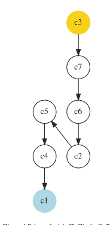

传统上，世界上大多数在用的投票系统只收集赞成票和弃权票，忽略了潜在的强烈反对意见，这些意见不应与投票弃权相混淆。同时收集明确的赞成（+1）和明确的反对（-1）票，本质上丰富了选民偏好的表达。

在votingProfiles模块中，我们提供了一个`BipolarApprovalVotingProfile`类来处理投票结果，其中对于每个合格候选人x，选民被邀请对“候选人c应该赢得选举”这一陈述表示赞成（+1）、反对（-1）或忽略（0）（Baujard等人，2013）。

文件`bpApVotingProfile.py`包含了一个关于100名选民和15名合格候选人的此类赞成-反对投票概况示例。¹ 我们可以使用`BipolarApprovalVotingProfile`类检查其内容：

### 清单20.9 双极性赞成投票概况

```
>>> from votingProfiles import \
...                     BipolarApprovalVotingProfile
>>> bavp = BipolarApprovalVotingProfile('bpApVotingProfile')
>>> bavp
  *------- 投票概况实例描述 -------*
    实例类   : BipolarApprovalVotingProfile
    实例名称    : bpApVotingProfile
    候选人       : 15
    选民           : 100
   属性       : ['name', 'candidates', 'voters',
                       'approvalBallot', 'netApprovalScores',
                       'ballot']
```

¹ 文件`bpApVotingProfile.py`可以在DIGRAPH3资源的examples目录中找到。

除了候选人（candidates）和选民（voters）属性外，我们在清单20.10中发现了`approvalBallot`属性，它汇集了赞成-反对票。其内容如下。

### 清单20.10 检查赞成-反对票

```
>>> bavp.approvalBallot
{'v001':
    {'c01': Decimal('0'),
        ...
        'c04': Decimal('1'),
        ...
        'c15': Decimal('0')
    },
    'v002':
       {'c01': Decimal('-1'),
        'c02': Decimal('0'),
        ...
        'c15': Decimal('1')
       },
       ...
    'v100':
       {'c01': Decimal('0'),
        'c02': Decimal('1'),
        ...
        'c15': Decimal('1')
       }
    }
```

让我们用$A_v$表示选民v所赞成的候选人集合。因此，在`approvalBallot`属性中，我们实际上记录了陈述“候选人c被选民v赞成”的双极性真值特征值$r(c \in A_v)$。在清单20.10第5行，我们观察到，例如，选民v001正面赞成候选人c04。并且，在第10行，我们看到选民v002负面赞成，即正面反对，候选人c01。

`showApprovalResults()`方法和`showDisapprovalResults()`方法显示了每个候选人获得的赞成票（分别地，反对票）数量。

```
>>> bavp.showApprovalResults()
赞成结果
候选人: 'c12' 获得 34 票
候选人: 'c05' 获得 30 票
候选人: 'c03' 获得 28 票
候选人: 'c14' 获得 27 票
候选人: 'c11' 获得 27 票
候选人: 'c04' 获得 27 票
候选人: 'c01' 获得 27 票
候选人: 'c13' 获得 24 票
候选人: 'c07' 获得 24 票
候选人: 'c15' 获得 23 票
候选人: 'c02' 获得 23 票
候选人: 'c09' 获得 22 票
候选人: 'c08' 获得 22 票
候选人: 'c10' 获得 21 票
候选人: 'c06' 获得 21 票
总赞成票: 380
赞成比例: 380/1500 = 0.25
>>> bavp.showDisapprovalResults()
反对结果
候选人: 'c12' 获得 16 票
候选人: 'c03' 获得 22 票
候选人: 'c09' 获得 23 票
候选人: 'c04' 获得 24 票
候选人: 'c06' 获得 24 票
候选人: 'c13' 获得 24 票
候选人: 'c11' 获得 25 票
候选人: 'c02' 获得 26 票
候选人: 'c07' 获得 26 票
候选人: 'c08' 获得 26 票
候选人: 'c05' 获得 27 票
候选人: 'c10' 获得 27 票
候选人: 'c14' 获得 27 票
候选人: 'c15' 获得 27 票
候选人: 'c01' 获得 32 票
总反对票: 376
反对比例: 376/1500 = 0.25
```

在上面的第3行和第22行，我们注意到，在所有合格候选人中，候选人c12获得了最多的赞成票（34）和最少的反对票（16）。总赞成票（分别地，反对票）大约接近100 × 15 = 1500个潜在赞成票的25%。因此，大约50%的潜在票被忽略了。

现在，对于每个候选人x，计算他们获得的赞成票数与反对票数之差，我们得到每个候选人对应的*净赞成分数*，这实际上是陈述“*候选人x应该赢得选举*”的双极性真值特征值。

$r(\text{候选人x应该赢得选举}) = \sum_{\text{v}} (r(x \in A_{\text{v}}))$ 。 (20.1)

这些双极性特征值存储在`netApprovalScores`属性中，可以通过`showNetApprovalScores()`方法打印出来：

```
>>> bavp.showNetApprovalScores()
  净赞成分数
    候选人: 'c12' 获得 18 净赞成
    候选人: 'c03' 获得 6 净赞成
    候选人: 'c05' 获得 3 净赞成
    候选人: 'c04' 获得 3 净赞成
    候选人: 'c11' 获得 2 净赞成
    候选人: 'c14' 获得 0 净赞成
    候选人: 'c13' 获得 0 净赞成
   候选人: 'c09' 获得 -1 净赞成
```

## 20.3 赞成-反对票的成对比较

每位选民的赞成票现在在合格候选人集合上定义了三个有序类别：他赞成的（+1）、他忽略的（0）和他反对的（−1）。在这三个类别中的每一个内部，我们认为选民的实际偏好是*未传达的*，即作为缺失数据。这为每位选民提供了一个部分确定的严格顺序，我们可以在 `ballot` 属性中找到它。

```
>>> bavp.ballot['v001']['c12']
{'c02': Decimal('1'), 'c11': Decimal('1'),
 'c14': Decimal('1'), 'c04': Decimal('0'),
 'c06': Decimal('1'), 'c05': Decimal('1'),
 'c12': Decimal('0'), 'c13': Decimal('0'),
 'c15': Decimal('1'), 'c01': Decimal('1'),
 'c08': Decimal('1'), 'c07': Decimal('1'),
 'c09': Decimal('0'), 'c03': Decimal('1'),
 'c10': Decimal('0')}
```

例如，对于选民 v001，最佳赞成的候选人 c12 严格优于候选人：c01、c02、c03、c05、c06、c07、c08、c11、c14 和 c15。没有候选人优于 c12，并且与 c04、c09、c10 和 c13 的比较未传达，因此是不确定的。顺便请注意，c12 与自身的反身比较通常被忽略，即不确定。因此，每位选民 v 在合格候选人上定义了一个部分确定的传递性严格偏好关系，记为 ≻v。

对于每一对合格候选人，我们将先前的个体选民偏好聚合成陈述“候选人 x *比*候选人 y *更受赞成*”的真实性特征，记为 r(x ≻ y)：

$$r(x \succ y) = \sum_{\mathrm{v}} (r(x \succ_{\mathrm{v}} y)) .$$

当 $r(x > y) > 0$ 时，我们说候选人 $x$ *比*候选人 $y$ *更受赞成*，即大多数选民对 $x$ 的赞成*更多*、反对*更少*。反之，当 $r(x > y) < 0$ 时，我们说候选人 $x$ *不比*候选人 $y$ *更受赞成*，即大多数选民对 $x$ 的反对更多、赞成更少。此计算通过 `MajorityMarginsDigraph` 构造函数实现。

```
>>> from votingProfiles import MajorityMarginsDigraph
>>> m = MajorityMarginsDigraph(bavp)
>>> m
*------ Digraph instance description ------*
    Instance class      : MajorityMarginsDigraph
    Instance name       : rel_bpApVotingProfile
    Digraph Order       : 15
    Digraph Size        : 97
    Valuation domain    : [-100.00;100.00]
    Determinateness (%) : 52.55
    Attributes          : ['name', 'actions',
                           'criteria','ballot',
                           'valuationdomain', 'relation',
                           'order', 'gamma', 'notGamma']
```

生成的有向图 `m` 包含 97 个正向验证的关系（见上文第 8 行），并且对于所有合格候选人的配对 $(x, y)$，$r(x > y)$ 的值在从 $-100.00$（一致拒绝）到 $+100.00$（一致赞成）的估值范围内。

这些成对的 $r(x > y)$ 值可以通过 `showHTMLRelationTable()` 方法在浏览器视图中查看：

```
>>> m.showHTMLRelationTable(relationName='r(x > y)')
```

在图 20.3 中，可以明显看出候选人 c12 是孔多塞胜者，即击败所有其他候选人的候选人，并且在给定的投票概况 `gavp` 下，毫无疑问应该赢得选举。这有力地证实了先前使用净赞成评分获得的第一名结果。

让我们最终借助 NETFlows 排序规则，计算 15 个合格候选人的线性排序，并将结果与净赞成分数排序进行比较。

**清单 20.11** 比较净赞成和 NETFlows 排序

```
>>> from linearOrders import NetFlowsOrder
>>> nf = NetFlowsOrder(m,Comments=True)
>>> print('NetFlows versus Net Approval Ranking')
>>> print('Candidate\tNetFlows score\tNet Approval score')
>>> for item in nf.netFlows:
...     print( '%9s\t  %+.3f\t %+.1f' %\
...            (item[1], item[0],\
...             bavp.netApprovalScores[item[1]]) )
```

> 2 参见第 8.3 节。

| r(x > y) | c01 | c02 | c03 | c04 | c05 | c06 | c07 | c08 | c09 | c10 | c11 | c12 | c13 | c14 | c15 |
|---|---|---|---|---|---|---|---|---|---|---|---|---|---|---|---|
| c01 | - | 1 | -10 | -10 | -8 | -2 | -2 | -3 | -3 | 2 | -5 | -19 | -4 | -2 | 2 |
| c02 | -1 | - | -5 | -4 | -9 | -2 | 5 | 1 | -7 | 3 | -2 | -20 | -1 | -4 | -2 |
| c03 | 10 | 5 | - | 1 | 4 | 6 | 5 | 10 | 7 | 11 | 0 | -5 | 2 | 6 | 9 |
| c04 | 10 | 4 | -1 | - | 2 | 5 | 7 | 8 | -1 | 4 | 0 | -7 | 8 | 2 | 8 |
| c05 | 8 | 9 | -4 | -2 | - | 4 | 6 | 7 | 4 | 2 | 1 | -17 | 6 | 0 | 3 |
| c06 | 2 | 2 | -6 | -5 | -4 | - | -1 | 2 | -3 | 5 | -4 | -13 | -1 | -1 | 2 |
| c07 | 2 | -5 | -5 | -7 | -6 | 1 | - | 7 | -4 | 2 | -5 | -17 | -2 | -2 | 4 |
| c08 | 3 | -1 | -10 | -8 | -7 | -2 | -7 | - | -2 | 2 | -2 | -16 | 0 | 0 | -1 |
| c09 | 3 | 7 | -7 | 1 | -4 | 3 | 4 | 2 | - | 3 | 0 | -18 | -4 | 0 | 2 |
| c10 | -2 | -3 | -11 | -4 | -2 | -5 | -2 | -2 | -3 | - | -6 | -15 | -4 | -4 | 2 |
| c11 | 5 | 2 | 0 | 0 | -1 | 4 | 5 | 2 | 0 | 6 | - | -15 | 4 | 0 | 5 |
| c12 | 19 | 20 | 5 | 7 | 17 | 13 | 17 | 16 | 18 | 15 | 15 | - | 12 | 13 | 18 |
| c13 | 4 | 1 | -2 | -8 | -6 | 1 | 2 | 0 | 4 | 4 | -4 | -12 | - | 1 | 4 |
| c14 | 2 | 4 | -6 | -2 | 0 | 1 | 2 | 0 | 0 | 4 | 0 | -13 | -1 | - | -1 |
| c15 | -2 | 2 | -9 | -8 | -3 | -2 | -4 | 1 | -2 | -2 | -5 | -18 | -4 | 1 | - |

估值域：[-100; +100]

图 20.3 双极值成对多数优势

```
NetFlows versus Net Approval Ranking
Candidate   NetFlows score  Net Approval score
'c12'       +410.000        +18.0
'c03'       +142.000        +6.0
'c04'       +98.000         +3.0
'c05'       +54.000         +3.0
'c11'       +34.000         +2.0
'c09'       -16.000         -1.0
'c14'       -20.000         +0.0
'c13'       -22.000         +0.0
'c06'       -50.000         -3.0
'c07'       -74.000         -2.0
'c02'       -96.000         -3.0
'c08'       -102.000        -4.0
'c15'       -110.000        -4.0
'c10'       -122.000        -6.0
'c01'       -126.000        -5.0
```

在上一页的清单 20.11 中，我们可能注意到 NETFLOWS 规则提供的排序与先前使用相应的*净赞成*分数获得的排序非常相似。只出现了轻微的反转，例如在中间位置，候选人 c09 排在候选人 c13 和 c14 之前（见第 16 行），候选人 c06 和 c07 交换了他们的第 9 和第 10 位（见第 19 行）。最后两名的候选人 c10 和 c01 也交换了他们的位置。

这再次证实了净赞成评分方法在寻找赞成-反对投票系统中获胜者的相关性。然而，通过赞成（+1）、反对（−1）或忽略（0）合格候选人进行投票，也可以被视为在 {−1, 0, 1} 值的序数尺度上对合格候选人的绩效评估。

## 20.4 三值评价性投票系统

遵循这种认识论视角，我们实际上可以将给定的 BipolarApprovalVotingProfile 实例转换为 Performance-Tableau 实例，以便获得相应的优序决策辅助方法。

请注意，与“比...更受赞成”关系的多数优势相反，所有选民现在认为赞成的候选人是等价的（+1）。反对的（−1）和忽略的（0）候选人也是如此。选民的边际偏好这次建模了一个具有三个等价类的完全预序。

从保存的文件 AVPerfTab.py（见下文第 1 行），我们可以使用标准的 BipolarOutrankingDigraph 类构造函数在合格候选人上构建一个优序关系。此优序关系的语义如下：

- 当大多数选民认为候选人 $x$ *至少与*候选人 $y$ *一样好*时，我们说候选人 $x$ 优序于候选人 $y$。
- 当大多数选民认为候选人 $x$ *不比*候选人 $y$ *一样好*时，我们说候选人 $x$ *被*候选人 $y$ *优序*。
- 否则，优序情况是不确定的。

**清单 20.12** 计算优序有向图

```
>>> bavp.save2PerfTab(fileName='AVPerfTab',valueDigits=0)
*--- Saving as performance tableau in AVPerfTab.py ---*
>>> from outrankingDigraphs import\
...                     BipolarOutrankingDigraph
>>> odg = BipolarOutrankingDigraph('AVPerfTab')
>>> odg
*------- Object instance description ------*
  Instance class       : BipolarOutrankingDigraph
  Instance name        : rel_AVPerfTab
  Actions              : 15
  Criteria             : 100
  Size                 : 210
  Determinateness (%)  : 69.29
  Valuation domain     : [-1.00;1.00]
  Attributes           : ['name', 'actions', 'order',
  'criteria', 'evaluation', 'NA',
  'valuationdomain', 'relation',
  'gamma', 'notGamma', ...]
```

所得优超有向图 odg 的大小（210 = 15 × 14），如前一页的清单 20.12 第 12 行所示，表明对应的“至少同等评价”关系实际上建模了一个平凡的*完全*有向图。所有候选方案似乎*同等*地至少被同等评价，而严格的“评价优于”（余对偶）优超有向图实际上为空。转换后的性能矩阵显然不包含足够区分性的性能评估，无法支持任何严格的偏好情境。

然而，我们仍可尝试再次将 NETFLOWS 排序规则应用于这个完全优超有向图 odg，并将对应的 NETFLOWS 分数与之前的净认可分数并列打印。

## 清单 20.13 比较 NETFLOWS 与净认可排序

```
>>> from linearOrders import NetFlowsOrder
>>> nf = NetFlowsOrder(odg)
>>> print('NetFlows versus Net Approval Ranking')
>>> print('Candidate\tNetFlows Score\tNet Approval Score')
>>> for item in nf.netFlows:
...     print('%9s\t  %+.3f\t %+.0f' %
...           (item[1],item[0],
...            bavp.netApprovalScores[item[1]]) )
NetFlows versus Net Approval Ranking
Candidate     NetFlows score Net Approval score
     c12           +4.100              +18
     c03           +1.420               +6
     c04           +0.980               +3
     c05           +0.540               +3
     c11           +0.340               +2
     c09           -0.160               -1
     c14           -0.200                0
     c13           -0.220                0
     c06           -0.500               -3
     c07           -0.740               -2
     c02           -0.960               -3
     c08           -1.020               -4
     c15           -1.100               -4
     c10           -1.220               -6
     c01           -1.260               -5
```

尽管其严格的偏好区分能力明显不足，但我们在清单 20.13 中得到的 NETFLOWS 分数与使用*优于认可*多数边际有向图 m（见第 291 页清单 20.11）获得的分数成正比（除以 100）。

受到这一积极结果的鼓舞，我们可进一步计算 RUBIS 最佳选择推荐（见第 4 章）。

## 清单 20.14 计算最佳社会选择推荐

```
>>> odg.showBestChoiceRecommendation()
Rubis best choice recommendation(s) (BCR)
(in decreasing order of determinateness)
Credibility domain: [-1.00,1.00]
=== >> ambiguous first choice(s)
 * choice        : ['c01','c02','c03','c04','c05',
                   'c06','c07','c08','c09','c10',
                   'c11','c12','c13','c14','c15']
   independence  : 0.06
   dominance     : 1.00
   absorbency    : 1.00
   covering (%)  : 100.00
   determinateness (%) : 61.13
   - most credible action(s) = {
       'c12': 0.44, 'c03': 0.34, 'c04': 0.30,
       'c14': 0.28, 'c13': 0.24, 'c06': 0.24,
       'c11': 0.20, 'c10': 0.20, 'c07': 0.20,
       'c01': 0.20, 'c08': 0.18, 'c05': 0.18,
       'c15': 0.14, 'c09': 0.14, 'c02': 0.06, }
=== >> ambiguous last choice(s)
 * choice        : ['c01','c02','c03','c04','c05',
                   'c06','c07','c08','c09','c10',
                   'c11','c12','c13','c14','c15']
   independence  : 0.06
   dominance     : 1.00
   absorbency    : 1.00
   covered (%)   : 100.00
   determinateness (%) : 63.73
   - most credible action(s) = {
       'c13': 0.36, 'c06': 0.36, 'c15': 0.34,
       'c01': 0.34, 'c08': 0.32, 'c07': 0.30,
       'c02': 0.30, 'c14': 0.28, 'c11': 0.28,
       'c09': 0.28, 'c04': 0.26, 'c10': 0.24,
       'c05': 0.20, 'c03': 0.20, 'c12': 0.06, }
```

由于严格的优超有向图（$\sim (\neg odg)$）实际上*为空*，我们得到一个唯一的*模糊*——既是首选也是末选——选择推荐，它平凡地保留了所有十五个候选方案（见前一页清单 20.14，上述第 6-8 行）。然而，双极值最佳选择隶属特征向量显示，在所有十五个潜在获胜者中，候选方案 c12 确实是最可信的，获得了 72% 的选民支持（见第 15 行，$(0.44 + 1.0)/2 = 0.72$），其次是候选方案 c03（67%）和候选方案 c04（65%）。类似地，候选方案 c13 和 c06 代表了最可信的失败者，获得了 68% 的多数选民支持（第 30 行）。

我们在此经验性地观察到，使用三值序数性能尺度的*评价性*投票系统与对应的认可-不认可投票系统紧密匹配。然而，后者更忠实地建模了通过*认可*、*不认可*和*忽略*陈述所表达的偏好信息。对应的三级尺度评估基于数值，无法表达在认可-不认可投票系统中，对于所有被认可、不认可或忽略的候选方案之间的成对比较，没有给出偏好信息这一事实。

## 20.5 偏好多党派支持的候选方案

最后，让我们说明认可-不认可投票系统如何可能偏好多党派支持的候选方案。因此，我们将在考虑一个高度分裂和党派化的政治背景时，比较*认可-不认可与单记名相对多数*选举结果。

在现代民主中，政治在很大程度上由政党和活动家构建。因此，让我们考虑一个认可-不认可投票概况 `dvp`，其中随机选民行为是根据两次选前民意调查模拟的，涉及一个本质上存在两个主要高度竞争政党的政治场景，就像美国存在的那样。

### 清单 20.15 分裂政治背景下的随机认可-不认可投票概况

```
>>> dvp = RandomBipolarApprovalVotingProfile(
...                 numberOfCandidates=15,
...                 numberOfVoters=100,
...                 approvalProbability=0.25,
...                 disapprovalProbability=0.25,
...                 WithPolls=True,
...                 partyRepartition=0.5,
...                 other=0.05,
...                 DivisivePolitics=True,
...                 seed=200)
>>> dvp.showRandomPolls()
Random repartition of voters
Party-1 supporters : 45 (45.00%)
Party-2 supporters : 49 (49.00%)
Other voters       : 6 (06.00%)
*------------------- random polls -------------------
Party-1(45.0%) | Party-2(49.0%) |     expected
-----------------------------------------------
'c05' : 24.10% | 'c07' : 24.10% | 'c07' : 11.87%
'c14' : 23.48% | 'c10' : 23.48% | 'c10' : 11.60%
'c03' : 15.13% | 'c01' : 15.13% | 'c05' : 10.91%
'c12' : 07.55% | 'c04' : 07.55% | 'c14' : 10.67%
'c08' : 07.11% | 'c09' : 07.11% | 'c01' : 07.67%
'c15' : 04.37% | 'c13' : 04.37% | 'c03' : 07.09%
'c11' : 03.99% | 'c02' : 03.99% | 'c04' : 04.55%
'c06' : 03.80% | 'c06' : 03.80% | 'c09' : 04.49%
'c02' : 02.79% | 'c11' : 02.79% | 'c12' : 04.32%
'c13' : 02.63% | 'c15' : 02.63% | 'c08' : 04.30%
'c09' : 02.24% | 'c08' : 02.24% | 'c06' : 03.57%
'c04' : 01.89% | 'c12' : 01.89% | 'c13' : 03.32%
'c01' : 00.57% | 'c03' : 00.57% | 'c15' : 03.25%
'c10' : 00.20% | 'c14' : 00.20% | 'c02' : 03.21%
'c07' : 00.14% | 'c05' : 00.14% | 'c11' : 03.16%
```

在对面页的清单 20.15 中，分裂的政治局势反映在这样一个事实：政党 1 和政党 2 的支持者表现出严格相反的偏好。政党 1 的领先候选方案（c05 和 c14）是政党 2 支持者的末选，而政党 2 支持者的领先候选方案 c07 和 c10 同样是政党 1 支持者的最不受欢迎选择。

从这些选前民意调查中无法猜测出明确的获胜者。然而，由于政党 2 显示的支持者略多于政党 1，在单记名相对多数或即时决选投票系统中，预期的获胜者将是候选方案 c07，即多数政党 2 的领先候选方案（见下文）。

```
>>> dvp.computeSimpleMajorityWinner()
['c07']
>>> dvp.computeInstantRunoffWinner()
['c07']
```

现在，在对应的认可-不认可投票系统中，政党 1 的支持者通常会认可他们的领先候选方案，并不认可政党 2 的领先候选方案。反之，政党 2 的支持者通常会认可他们的领先候选方案，并不认可政党 1 的领先候选方案。让我们查看每个候选方案获得的认可票数。

```
>>> dvp.showApprovalResults()
Candidate: 'c07' obtains 30 votes
Candidate: 'c10' obtains 28 votes
Candidate: 'c05' obtains 28 votes
Candidate: 'c01' obtains 28 votes
Candidate: 'c03' obtains 26 votes
Candidate: 'c02' obtains 26 votes
Candidate: 'c12' obtains 25 votes
Candidate: 'c14' obtains 24 votes
Candidate: 'c13' obtains 24 votes
Candidate: 'c09' obtains 21 votes
Candidate: 'c04' obtains 21 votes
Candidate: 'c08' obtains 19 votes
Candidate: 'c06' obtains 17 votes
Candidate: 'c15' obtains 15 votes
Candidate: 'c11' obtains 12 votes
Total approval votes: 344
Approval proportion: 344/1500 = 0.23
```

当仅考虑认可票时，我们发现上述情况得到证实：政党 2 的领先候选方案在此模拟中获得了相对多数的认可票。因此，在单记名相对多数或即时决选投票系统中，该候选方案赢得了选举，这让政党 1 的支持者相当失望。作为可预见的结果，这一选举结果将或多或少地受到激烈质疑，导致民众对民主选举和制度的信任丧失。

然而，如果我们查看对应的不认可票，我们发现，毫不奇怪，两个政党的领先候选方案都获得了迄今为止最多的不认可票。

平衡当前的赞成票与反对票将有利于获得温和派、跨党派支持的候选人。

候选人c02在选前民调中处于中游位置（在Party-2支持者中排名第7，在Party-1支持者中排名第9，参见第296页的列表20.15），确实显示出最高的净赞成分数。净赞成分数第二高的是候选人c13，在Party-2支持者中排名第6，在Party-1支持者中排名第10。

对页的图20.4展示了“优于”多数优势有向图的NETFlows排序关系表，证实了上述净赞成分数结果。

## 20.5 有利于多党派候选人

| r(x > y) | c02 | c13 | c04 | c09 | c12 | c08 | c06 | c01 | c11 | c15 | c03 | c10 | c07 | c14 | c05 |
|---|---|---|---|---|---|---|---|---|---|---|---|---|---|---|---|
| c02 | - | 6 | 5 | 6 | 9 | 5 | 10 | 12 | 12 | 14 | 11 | 15 | 22 | 22 | 23 |
| c13 | -6 | - | 2 | 5 | 2 | 5 | 8 | 10 | 14 | 10 | 9 | 13 | 18 | 23 | 20 |
| c04 | -5 | -2 | - | 0 | 2 | 2 | 3 | 7 | 7 | 8 | 11 | 13 | 18 | 21 | 18 |
| c09 | -6 | -5 | 0 | - | 0 | 2 | 5 | 5 | 11 | 9 | 5 | 13 | 16 | 21 | 16 |
| c12 | -9 | -2 | -2 | 0 | - | 4 | 6 | 2 | 9 | 6 | 10 | 5 | 10 | 23 | 25 |
| c08 | -5 | -5 | -2 | -2 | -4 | - | 4 | 0 | 8 | 9 | 7 | 5 | 11 | 21 | 20 |
| c06 | -10 | -8 | -3 | -5 | -6 | -4 | - | -2 | 5 | 5 | 5 | 6 | 13 | 17 | 18 |
| c01 | -12 | -10 | -7 | -5 | -2 | 0 | 2 | - | 1 | -1 | 3 | 8 | 11 | 9 | 13 |
| c11 | -12 | -14 | -7 | -11 | -9 | -8 | -5 | -1 | - | 1 | -2 | 7 | 14 | 13 | 16 |
| c15 | -14 | -10 | -8 | -9 | -6 | -9 | -5 | 1 | -1 | - | 0 | 3 | 10 | 14 | 14 |
| c03 | -11 | -9 | -11 | -5 | -10 | -7 | -5 | -3 | 2 | 0 | - | -3 | 7 | 16 | 16 |
| c10 | -15 | -13 | -13 | -13 | -5 | -5 | -6 | -8 | -7 | -3 | 3 | - | 3 | 6 | 7 |
| c07 | -22 | -18 | -18 | -16 | -10 | -11 | -13 | -11 | -14 | -10 | -7 | -3 | - | 3 | 5 |
| c14 | -22 | -23 | -21 | -21 | -23 | -21 | -17 | -9 | -13 | -14 | -16 | -6 | -3 | - | 0 |
| c05 | -23 | -20 | -18 | -16 | -25 | -20 | -18 | -13 | -16 | -14 | -16 | -7 | -5 | 0 | - |

赋值域：[-100; +100]

图20.4 成对*优于*多数优势

候选人c02确实*优于*任何其他候选人（孔多塞胜者），而Party-1的领先候选人c05和c14则*劣于*任何其他候选人（弱孔多塞败者）。

当我们计算相应的首选和末选推荐时，这一结果得到了进一步证实。

候选人c02实际上是孔多塞胜者，给出了有向图m的初始预核，而Party-1的领先候选人c05和c14都是弱孔多塞败者，共同构成了终端预核。因此，他们分别代表了我们赢得这次模拟选举的*首选*和*末选*推荐。

值得再次注意的是，忽略值在赞成-反对投票系统中所扮演的基本结构和计算角色。这个认识论和逻辑上的*中性*术语确实需要用于以一致和高效的方式处理*未传达的选票*和/或*不确定的偏好陈述*。

让我们通过预测来总结：在激烈分裂的政治背景下，对于主要的政治候选人来说，轻松通过赞成-反对投票系统赢得选举的前景可能会或将会改变通常的竞选活动方式。那些避免激进的竞争性宣传，转而提出多党派协作社会选择的政党和政治家，将获得比任何极端主义都更好的选举结果。这可能意味着无休止的政治阻挠和战争般的选举斗争的终结。*让我们行动起来吧！*

本专著的最后一部分，第五部分，在三章中阐述了处理简单无向图的计算资源。

## 参考文献

Baujard A, Gavrel F, Igersheim H, Laslier JF, Lebon I (2013) Approval voting, evaluation voting: an experiment during the 2012 French presidential election. Revue Économique (Presses de Sciences Po) 64(2):345–356

Benayoun R, Roy B, Sussmann B (1966) Electre: une méthode pour guider le choix en présence de points de vue multiples. Tech. Rep. 49, Société d’Economie et de Mathématique Appliqué, Direction Scientifique

# 第五部分
处理无向图

最后一部分介绍了处理无向图的Python资源。其最终目的是展示在实现具有双极值特征的顶点邻接时可能获得的操作优势。书中阐述了几种特殊的图模型和算法：Q-着色、MIS和团枚举、线图和计算最大匹配、网格图和计算Ising模型、*n*环图及其非同构MIS、生成树图和图森林，以及生成和识别分裂图、区间图和置换图。

# 第21章
双极值无向图

# 内容

- 21.1 实现简单图
- 21.2 图的Q-着色
- 21.3 MIS和团枚举
- 21.4 线图和最大匹配
- 21.5 网格和ISING模型
- 21.6 模拟METROPOLIS随机游走
- 21.7 计算n环图的非同构MIS

**摘要** 本章介绍了双极值无向图，并阐述了几种特殊的图模型和算法，如Q-着色、MIS和团枚举、线图和最大匹配、网格图，以及具有非同构最大独立顶点集的n环图。

## 21.1 实现简单图

在DIGRAPH3 `graphs`模块中，根`Graph`类提供了一个通用的简单图模型，没有环和多重链接。给定的`Graph`类型对象至少包含以下属性：

1. name：通常是存储实例的名称
2. vertices：一个包含name和shortName属性的字典
3. order：顶点的数量
4. valuationDomain：一个包含三个条目的字典：最小值（-1表示肯定无链接）、中位数（0表示信息缺失）和最大特征值（+1表示肯定有链接）
5. edges：一个以顶点对的frozenset为键的字典，其特征值在前述赋值域范围内

1 Python文档。

## 6. size：正边的数量
7. gamma：一个包含每个顶点直接邻居的字典，由对象构造函数自动添加

## 示例 Python 终端会话

可以使用 `graphs` 模块中的 `RandomGraph` 类（见下文）生成一个随机清晰图实例。

**清单 21.1 生成一个随机图实例**

```python
>>> from graphs import RandomGraph
>>> g = RandomGraph(order=7, edgeProbability=0.5)
>>> g.save(fileName='tutorialGraph')
```

保存的图实例，名为 `tutorialGraph.py`，其编码方式如清单 21.2 所示。

**清单 21.2 随机图的存储实例**

```python
# Graph instance saved in Python format
from decimal import Decimal
vertices = {
    'v1': {'shortName': 'v1', 'name': 'random vertex'},
    'v2': {'shortName': 'v2', 'name': 'random vertex'},
    'v3': {'shortName': 'v3', 'name': 'random vertex'},
    'v4': {'shortName': 'v4', 'name': 'random vertex'},
    'v5': {'shortName': 'v5', 'name': 'random vertex'},
    'v6': {'shortName': 'v6', 'name': 'random vertex'},
    'v7': {'shortName': 'v7', 'name': 'random vertex'},
}
valuationDomain = {
    'min': Decimal('-1'), 'med': Decimal('0'),
    'max': Decimal('1')}
edges = {
    frozenset(['v1', 'v2']): Decimal('-1'),
    frozenset(['v1', 'v3']): Decimal('-1'),
    frozenset(['v1', 'v4']): Decimal('-1'),
    frozenset(['v1', 'v5']): Decimal('1'),
    frozenset(['v1', 'v6']): Decimal('-1'),
    frozenset(['v1', 'v7']): Decimal('-1'),
    frozenset(['v2', 'v3']): Decimal('1'),
    frozenset(['v2', 'v4']): Decimal('1'),
    frozenset(['v2', 'v5']): Decimal('-1'),
    frozenset(['v2', 'v6']): Decimal('1'),
    frozenset(['v2', 'v7']): Decimal('-1'),
    frozenset(['v3', 'v4']): Decimal('-1'),
    frozenset(['v3', 'v5']): Decimal('-1'),
    frozenset(['v3', 'v6']): Decimal('-1'),
    frozenset(['v3', 'v7']): Decimal('-1'),
    frozenset(['v4', 'v5']): Decimal('1'),
    frozenset(['v4', 'v6']): Decimal('-1'),
    frozenset(['v4', 'v7']): Decimal('1'),
    frozenset(['v5', 'v6']): Decimal('1'),
    frozenset(['v5', 'v7']): Decimal('-1'),
    frozenset(['v6', 'v7']): Decimal('-1'),
}
```

## 21.1 实现简单图

图 21.1 示例简单图实例

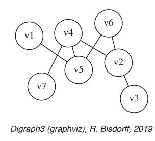

存储的图实例可以使用 `exportGraphViz()` 方法重新加载并绘制（见图 21.1）：

```python
>>> g = Graph('tutorialGraph')
>>> g.exportGraphViz()
 *---- exporting a dot file for GraphViz tools ----------*
  Exporting to tutorialGraph.dot
  fdp -Tpng tutorialGraph.dot -o tutorialGraph.png
```

诸如 gamma 函数（覆盖关系）、顶点度和邻域深度等属性，可以通过 `showShort()` 方法显示。

**清单 21.3 检查图实例**

```python
>>> g.showShort()
 *---- short description of the graph ----*
  Name : 'tutorialGraph'
  Vertices : ['v1', 'v2', 'v3', 'v4', 'v5', 'v6', 'v7']
  Valuation domain : {'min': -1, 'med': 0, 'max': 1}
  Gamma function :
    v1 -> ['v5']
    v2 -> ['v6', 'v4', 'v3']
    v3 -> ['v2']
    v4 -> ['v5', 'v2', 'v7']
    v5 -> ['v1', 'v6', 'v4']
    v6 -> ['v2', 'v5']
    v7 -> ['v4']
  degrees : [0, 1, 2, 3, 4, 5, 6]
  distribution : [0, 3, 1, 3, 0, 0, 0]
  nbh depths : [0, 1, 2, 3, 4, 5, 6, 'inf.']
  distribution : [0, 0, 1, 4, 2, 0, 0, 0]
```

一个图实例与一个对称有向图实例之间存在双射关系，我们可以使用 `graph2Digraph()` 方法将图转换为有向图，反之，使用 `digraph2Graph()` 方法将有向图转换为图（见清单 21.4）。因此，适用于对称有向图的有向图类的所有计算资源都变得可用，反之亦然。

**清单 21.4 图与有向图之间的转换**

```python
>>> dg = g.graph2Digraph()
>>> dg.showRelationTable(ndigits=0, ReflexiveTerms=False)
 * ---- Relation Table -----
   S  |  'v1'  'v2'  'v3'  'v4'  'v5'  'v6'  'v7'
------|--------------------------------------------
 'v1' |   -    -1    -1    -1     1    -1    -1
 'v2' |  -1     -     1     1    -1     1    -1
 'v3' |  -1     1     -    -1    -1    -1    -1
 'v4' |  -1     1    -1     -     1    -1     1
 'v5' |   1    -1    -1     1     -     1    -1
 'v6' |  -1     1    -1    -1     1     -    -1
 'v7' |  -1    -1    -1     1    -1    -1     -
>>> g1 = dg.digraph2Graph()
>>> g1
 *------- Digraph instance description -------*
 Instance class       : Digraph
 Instance name        : tutorialGraph
 Digraph Order        : 7
 Digraph Size         : 14
 Valuation domain     : [-1.00;1.00]
 Determinateness (%)  : 100.00
 Attributes           : ['name', 'order', 'actions',
                        'valuationdomain', 'relation',
                        'gamma', 'notGamma']
```

## 21.2 图的 Q-着色

使用 `Q_Coloring` 类，可以使用吉布斯采样器（Geman and Geman 1984）计算教程图 `g` 的 3-着色，并如清单 21.5 所示进行绘制。

**清单 21.5 计算随机图 g 的 3-着色**

```python
>>> from graphs import Q_Coloring
>>> qc = Q_Coloring(g)
 Running a Gibbs Sampler for 42 step !
 The q-coloring with 3 colors is feasible !!
>>> qc.showConfiguration()
 v5 lightblue
 v3 gold
 v7 gold
 v2 lightblue
 v4 lightcoral
 v1 gold
 v6 lightcoral
>>> qc.exportGraphViz('tutorial-3-coloring')
 *---- exporting a dot file for GraphViz tools
 Exporting to tutorial-3-coloring.dot
 fdp -Tpng tutorial-3-coloring.dot -o tutorial-3-coloring.png
```

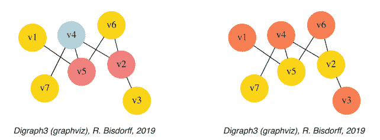

图 21.2 教程图的 3-着色和 2-着色

实际上，对于给定的教程图实例，2-着色已经是可行的（见图 21.2）。

```python
>>> qc = Q_Coloring(g, colors=['gold', 'coral'])
 Running a Gibbs Sampler for 42 step !
 The q-coloring with 2 colors is feasible !!
>>> qc.showConfiguration()
 v5 gold
 v3 coral
 v7 gold
 v2 gold
 v4 coral
 v1 coral
 v6 coral
>>> qc.exportGraphViz('tutorial-2-coloring')
 Exporting to tutorial-2-coloring.dot
 fdp -Tpng tutorial-2-coloring.dot -o tutorial-2-coloring.png
```

## 21.3 MIS 和团枚举

2-着色定义了基数最大的独立顶点集——即最大独立集（MIS）。`showMIS()` 方法计算并打印这些集合。结果存储在 `misset` 属性中（见清单 21.6）。

**清单 21.6 计算并打印图 g 的最大独立集**

```python
>>> g = Graph('tutorialGraph')
>>> g.showMIS()
 *--- Maximal Independent Sets ---*
 ['v2', 'v5', 'v7']
 ['v3', 'v5', 'v7']
 ['v1', 'v2', 'v7']
 ['v1', 'v3', 'v6', 'v7']
 ['v1', 'v3', 'v4', 'v6']
 number of solutions: 5
 cardinality distribution
 card.: [0, 1, 2, 3, 4, 5, 6, 7]
 freq.: [0, 0, 0, 3, 2, 0, 0, 0]
 execution time: 0.00032 sec.
 Results in self.misset
>>> g.misset
 [frozenset({'v7', 'v2', 'v5'}),
  frozenset({'v3', 'v7', 'v5'}),
  frozenset({'v1', 'v2', 'v7'}),
  frozenset({'v1', 'v6', 'v7', 'v3'}),
  frozenset({'v1', 'v6', 'v4', 'v3'})]
```

图实例 `g` 的对偶 `-g` 中的一个最大独立集对应于 `g` 中的一个最大团，即一个最大完全子图。最大团可以使用 `showCliques()` 方法计算并打印。结果存储在 `clique` 属性中，如清单 21.7 所示。

**清单 21.7 计算并打印图 g 的最大团**

```python
>>> g.showCliques()
 *--- Maximal Cliques ---*
 ['v2', 'v3']
 ['v4', 'v7']
 ['v2', 'v4']
 ['v4', 'v5']
 ['v1', 'v5']
 ['v2', 'v6']
 ['v5', 'v6']
 number of solutions: 7
 cardinality distribution
 card.: [0, 1, 2, 3, 4, 5, 6, 7]
 freq.: [0, 0, 7, 0, 0, 0, 0, 0]
 execution time: 0.00049 sec.
 Results in self.cliques
>>> g.cliques
 [frozenset({'v2', 'v3'}), frozenset({'v4', 'v7'}),
  frozenset({'v2', 'v4'}), frozenset({'v4', 'v5'}),
  frozenset({'v1', 'v5'}), frozenset({'v6', 'v2'}),
  frozenset({'v6', 'v5'})]
```

## 21.4 线图与最大匹配

`graphs` 模块还提供了一个 `LineGraph` 构造函数。线图表示给定图实例中边之间的邻接关系。在清单 21.8 中，我们计算了 5-环图的线图。

**清单 21.8 计算 5-环图的线图**

```python
>>> from graphs import CycleGraph, LineGraph
>>> g = CycleGraph(order=5)
>>> g
*------ Graph instance description ----*
Instance class   : CycleGraph
Instance name    : cycleGraph
Graph Order      : 5
Graph Size       : 5
Valuation domain : [-1.00; 1.00]
Attributes       : ['name', 'order',
                    'vertices', 'valuationDomain',
                    'edges', 'size', 'gamma']
>>> lg = LineGraph(g)
>>> lg
*------ Graph instance description ----*
Instance class   : LineGraph
Instance name    : line-cycleGraph
Graph Order      : 5
Graph Size       : 5
Valuation domain : [-1.00; 1.00]
Attributes       : ['name', 'graph',
                    'valuationDomain', 'vertices',
                    'order', 'edges', 'size', 'gamma']
>>> lg.showShort()
*---- short description of the graph ----*
Name             : 'line-cycleGraph'
Vertices         : [frozenset({'v1', 'v2'}),
                    frozenset({'v1', 'v5'}), frozenset({'v2', 'v3'}),
                    frozenset({'v3', 'v4'}), frozenset({'v4', 'v5'})]
Valuation domain : {'min': Decimal('-1'),
                    'med': Decimal('0'), 'max': Decimal('1')}
Gamma function   :
  frozenset({'v1', 'v2'}) ->
    [frozenset({'v2', 'v3'}), frozenset({'v1', 'v5'})]
  frozenset({'v1', 'v5'}) ->
    [frozenset({'v1', 'v2'}), frozenset({'v4', 'v5'})]
  frozenset({'v2', 'v3'}) ->
    [frozenset({'v1', 'v2'}), frozenset({'v3', 'v4'})]
  frozenset({'v3', 'v4'}) ->
    [frozenset({'v2', 'v3'}), frozenset({'v4', 'v5'})]
  frozenset({'v4', 'v5'}) ->
    [frozenset({'v4', 'v3'}), frozenset({'v1', 'v5'})]
degrees          : [0, 1, 2, 3, 4]
distribution     : [0, 0, 5, 0, 0]
nbh depths       : [0, 1, 2, 3, 4, 'inf.']
distribution     : [0, 0, 5, 0, 0, 0]
```

迭代线图构造通常是扩张的，除了无弦环（其中相同的环被重复）和非闭合路径（其中迭代线图会逐步减少顶点和边的数量，最终变成一个空图）。

请注意，在清单 21.9 中，线图中的最大独立集（MISs）提供了原图的*最大匹配*——即独立边的最大集合。

## 清单 21.9 计算 8 环图线图的最大独立集

```
1 >>> c8 = CycleGraph(order=8)
2 >>> lc8 = LineGraph(c8)
3 >>> lc8.showMIS()
  *--- 最大独立集 ---*
  [frozenset({'v3', 'v4'}), frozenset({'v5', 'v6'}), frozenset({'v1', 'v8'})]
  [frozenset({'v2', 'v3'}), frozenset({'v5', 'v6'}), frozenset({'v1', 'v8'})]
  [frozenset({'v8', 'v7'}), frozenset({'v2', 'v3'}), frozenset({'v5', 'v6'})]
  [frozenset({'v8', 'v7'}), frozenset({'v2', 'v3'}), frozenset({'v4', 'v5'})]
  [frozenset({'v7', 'v6'}), frozenset({'v3', 'v4'}), frozenset({'v1', 'v8'})]
  [frozenset({'v2', 'v1'}), frozenset({'v8', 'v7'}), frozenset({'v4', 'v5'})]
  [frozenset({'v2', 'v1'}), frozenset({'v7', 'v6'}), frozenset({'v4', 'v5'})]
  [frozenset({'v2', 'v1'}), frozenset({'v7', 'v6'}), frozenset({'v3', 'v4'})]
  [frozenset({'v7', 'v6'}), frozenset({'v2', 'v3'}), frozenset({'v1', 'v8'}),
      frozenset({'v4', 'v5'})]
  [frozenset({'v2', 'v1'}), frozenset({'v8', 'v7'}), frozenset({'v3', 'v4'}),
      frozenset({'v5', 'v6'})]
  解的数量:  10
  基数分布
  基数:  [0, 1, 2, 3, 4, 5, 6, 7, 8]
  频率:  [0, 0, 0, 8, 2, 0, 0, 0, 0]
  执行时间: 0.00029 秒.
```

最后两个基数为 4 的最大独立集（见清单 21.9 的第 13-16 行）给出了 8 环图的完美最大匹配，如图 21.3 所示。

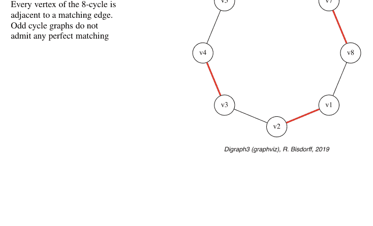

## 清单 21.10 计算 8 环图中的最大匹配

```
1 >>> maxMatching = c8.computeMaximumMatching()
2 >>> c8.exportGraphViz(fileName='maxMatchingcycleGraph',
3 ...                    matching=maxMatching)
*---- 导出用于 GraphViz 工具的 dot 文件 ----*
导出至 maxMatchingcyleGraph.dot
匹配: {frozenset({'v1', 'v2'}),
           frozenset({'v5', 'v6'}),
           frozenset({'v3', 'v4'}),
           frozenset({'v7', 'v8'}) }
circo -Tpng maxMatchingcyleGraph.dot
                  -o maxMatchingcyleGraph.png
```

## 21.5 网格与伊辛模型

特殊类别的图，如 GridGraph 类，提供 $n \times m$ 的矩形或三角形网格。借助吉布斯采样器$^2$，IsingModel 类可以在下一页的图 21.4 中模拟，例如在 $15 \times 15$ 网格上的伊辛模型（Ising 1925）。

### 清单 21.11 在 $15 	imes 15$ 矩形网格上模拟伊辛模型

```
1 >>> from graphs import GridGraph, IsingModel
2 >>> g = GridGraph(n=15,m=15)
3 >>> g.showShort()
*---- 简短显示 ----------------*
网格图    : grid-6-6
n             : 6
m             : 6
阶数         : 36
>>> im = IsingModel(g,beta=0.3,nSim=100000)
运行吉布斯采样器 100000 步！
>>> im.exportGraphViz(colors=['lightblue','lightcoral'])
*---- 导出用于 GraphViz 工具的 dot 文件 ----------*
导出至 grid-15-15-ising.dot
fdp -Tpng grid-15-15-ising.dot -o grid-15-15-ising.png
```

## 21.6 模拟梅特罗波利斯随机游走

最后，我们提供 MetropolisChain 类，它是 Graph 类的一个特化，实现了一个通用的马尔可夫链蒙特卡洛（MCMC）采样器，用于模拟图上遵循给定转移概率 probs = {'v1': x, 'v2': y, ...} 的随机游走（见清单 21.12）（Metropolis et al. 1953）。

> $^2$ Geman and Geman (1984).

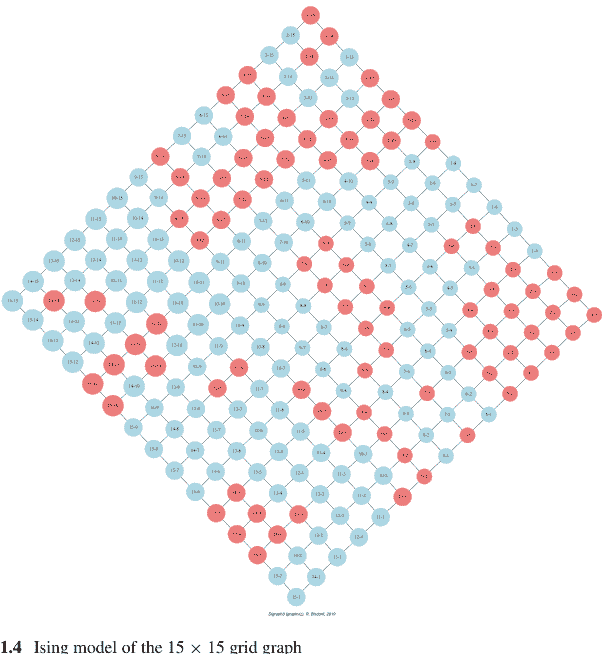

图 21.4 15 × 15 网格图的伊辛模型

### 清单 21.12 在图上模拟随机游走

```
1 >>> from graphs import Graph
2 >>> g = Graph(numberOfVertices=5,edgeProbability=0.5)
3 >>> g.showShort()
*---- 图的简短描述 ----*
名称                : 'randomGraph'
顶点            : ['v1', 'v2', 'v3', 'v4', 'v5']
赋值域     : {'max': 1, 'med': 0, 'min': -1}
Gamma 函数       :
  v1 -> ['v2', 'v3', 'v4']
  v2 -> ['v1', 'v4']
  v3 -> ['v5', 'v1']
  v4 -> ['v2', 'v5', 'v1']
  v5 -> ['v3', 'v4']
>>> # 初始化一个潜在的平稳概率向量
>>> n = g.order
>>> i = 0
>>> for v in g.vertices:
...     probs[v] = (n - i)/(n*(n+1)/2)
...     i += 1
```

`MetropolisChain` 类的 `checkSampling()` 方法（见下文）在给定图上生成一个 $nSim = 30,000$ 步的随机游走，并顺便记录每个顶点被经过的观测相对频率。在清单 21.13 中，我们注意到随机游走与给定的平稳概率向量匹配得非常好。

### 清单 21.13 检查 MCMC 采样器的质量

```
>>> from graphs import MetropolisChain
>>> met = MetropolisChain(g,probs)
>>> frequency = met.checkSampling(verticesList[0],nSim=30000)
>>> for v in verticesList:
...     print(v,probs[v],frequency[v])
v1 0.3333 0.3343
v2 0.2666 0.2680
v3 0.2    0.2030
v4 0.1333 0.1311
v5 0.0666 0.0635
```

在这个例子中，平稳转移概率分布（见上面的清单 21.13），由清单 21.14 中的 `showTransitionMatrix()` 方法显示，被相当充分地模拟了。

### 清单 21.14 打印转移概率分布

```
>>> met.showTransitionMatrix()
* ---- 转移矩阵 -----
Pij | 'v1'    'v2'    'v3'    'v4'    'v5'
----|-------------------------------------
'v1'|  0.23    0.33    0.30    0.13    0.00
'v2'|  0.42    0.42    0.00    0.17    0.00
'v3'|  0.50    0.00    0.33    0.00    0.17
'v4'|  0.33    0.33    0.00    0.08    0.25
'v5'|  0.00    0.00    0.50    0.50    0.00
```

对于对马尔可夫链算法应用感兴趣的读者，我们建议查阅 (Häggström 2002)。

## 21.7 计算 $n$ 环图的非同构最大独立集

由于我们与 Jean-Luc Marichal 的共同工作取得了公开成功（Bisdorff and Marichal 2008），我们在本章中展示了一个 Python 会话示例，用于计算 12 环图的非同构最大独立集（MISs），即一个阶数为 12、对称循环为 1 和 −1 的 CirculantDigraph 类实例。

```
1 >>> from digraphs import CirculantDigraph
2 >>> c12 = CirculantDigraph(order=12,circulants=[1,-1])
3 >>> c12 # 12 环有向图实例
  *------- 有向图实例描述 ------*
  实例类   : CirculantDigraph
  实例名称    : c12
  有向图阶数    : 12
  有向图大小     : 24
  赋值域 : [-1.0, 1.0]
  确定性  : 100.000
  属性       : ['name', 'order', 'circulants',
                       'actions', 'valuationdomain',
                       'relation', 'gamma', 'notGamma']
```

此类 $n$ 环图——见第 317 页图 21.5 中的 12 环图——也由 CycleGraph 类作为无向图实例提供。

```
1 >>> from graphs import CycleGraph
2 >>> cg12 = CycleGraph(order=12)
3 >>> cg12
  *------- 图实例描述 ------*
  实例类   : CycleGraph
  实例名称    : cycleGraph
  图阶数      : 12
  图大小       : 12
  赋值域 : [-1.0, 1.0]
  属性       : ['name', 'order', 'vertices',
                       'valuationDomain', 'edges',
                       'size', 'gamma']
```

12 环图的一个非同构最大独立集实际上对应于一组同构的最大独立集，即 12 环图自同构群下的一个最大独立集轨道。在清单 21.15 中，我们现在首先使用 showMIS() 方法计算在 12 环有向图中可检测到的所有最大独立集。

### 清单 21.15 计算 12 环图的最大独立集

```
1 >>> c12.showMIS(withListing=False)
  *--- 最大独立选择 ---*
  解的数量:  29
  基数分布
  基数:  [0, 1, 2, 3, 4,  5,  6, 7, 8, 9, 10, 11, 12]
  频率:  [0, 0, 0, 0, 3, 24,  2, 0, 0, 0,  0,  0,  0]
  结果存储在 c12.misset 中
```

在 12 环图中，我们观察到 29 个标记的最大独立集：3 个基数为 4，24 个基数为 5，2 个基数为 6。对于 $n > 20$ 的 $n$ 环图，由于最大独立集的基数变得很大，最好使用，如

## 清单 21.16 使用 perrinMIS shell 命令计算 MIS

```
$ echo 12 | /usr/local/bin/perrinMIS
# $--------------------------------------- #
# 使用 Perrin 序列算法生成 Cn 的 MIS 集。 #
# 使用了临时文件。                         #
# 针对偶数和奇数阶进行了优化。             #
# RB 2006年12月                           #
# 当前修订版 2018年12月                    #
# --------------------------------------- #
输入环的阶数？ <-- 12
mis 1 : 100100100100
mis 2 : 010010010010
mis 3 : 001001001001
...
...
...
mis 27 : 001001010101
mis 28 : 101010101010
mis 29 : 010101010101
基数：
0 : 0
1 : 0
2 : 0
3 : 0
4 : 3
5 : 24
6 : 2
7 : 0
8 : 0
9 : 0
10 : 0
11 : 0
12 : 0
总计：29
执行时间：0 秒 2 毫秒。
```

> ³ perrinMIS shell 命令可以通过在 DIGRAPH3 主目录下执行 `make installPerrin` 命令进行系统级安装。它默认存储在 `/usr/local/bin/` 中。这可以通过 `INSTALLDIR` 标志进行更改。`make installPerrinUser` 命令则会将其安装到用户的私有 `.bin` 目录中，而无需 `sudo` 权限。

读取 `perrinMIS` shell 命令的结果（默认存储在名为 `curd.dat` 的文件中），可以使用 `readPerrinMisset()` 方法进行操作。

```
>>> cl2.readPerrinMisset(file='curd.dat')
>>> cl2.misset
    {frozenset({'5', '7', '10', '1', '3'}),
     frozenset({'9', '11', '5', '2', '7'}),
     frozenset({'7', '2', '4', '10', '12'}),
     ...
     ...
     ...
     frozenset({'8', '4', '10', '1', '6'}),
     frozenset({'11', '4', '1', '9', '6'}),
     frozenset({'8', '2', '4', '10', '12', '6'})
    }
```

为了计算相应的非同构 MIS，我们实际上需要 12 环图的自同构群。因此，`Digraph` 类提供了 `automorphismGenerators()` 方法，该方法借助来自 `nauty` 软件包的外部 `dreadnaut` shell 命令，将自同构群生成元添加到 `Digraph` 类实例中。⁴

## 清单 21.17 计算自同构群生成元

```
>>> cl2.automorphismGenerators()
    ...
    置换
    {'1':'1', '2':'12', '3':'11', '4':'10',
     '5':'9', '6':'8', '7':'7', '8':'6', '9':'5',
     '10':'4', '11':'3', '12':'2'}
    {'1':'2', '2':'1', '3':'12', '4':'11', '5':'10',
     '6':'9', '7':'8', '8':'7', '9':'6', '10':'5',
     '11':'4', '12':'3'}
>>> print('grpsize = ', cl2.automorphismGroupSize)
    grpsize = 24
```

12 环图的自同构群（大小为 24）由清单 21.17 中显示的两个置换生成。
`showOrbits()` 方法现在渲染了在 12 环图中观察到的四个同构 MIS 轨道的带标签代表元（参见下面的第 7-10 行）。

> ⁴ `automorphismGenerators` 方法使用来自 `nauty` 软件包的 `dreadnaut` shell 命令。参见 https://www3.cs.stonybrook.edu/~algorith/implement/nauty/implement.shtml。在 Mac OS 上，存在 dmg 安装程序；在 Ubuntu Linux 或 Debian 上，可以轻松地通过 ...$ sudo apt-get install nauty 进行安装。

## 21.7 计算 n 环图的非同构 MIS

### 清单 21.18 计算 12 环图的 MIS 轨道

```
>>> c12.showOrbits(c12.misset,withListing=False)
...
*---- 全局结果 ----
MIS 数量：29
轨道数量：4
带标签的代表元和基数：
1: ['2','4','6','8','10','12'], 2
2: ['2','5','8','11'], 3
3: ['2','4','6','9','11'], 12
4: ['1','4','7','9','11'], 12
对称向量
稳定子大小：[1, 2, 3, ..., 8, 9, ..., 12, 13, ...]
频率：[0, 2, 0, ..., 1, 0, ..., 1, 0, ...]
```

相应的群稳定子大小和频率（轨道 1 有 6 个对称轴，轨道 2 有 4 个对称轴，轨道 3 和 4 各有一个对称轴，参见清单 21.18 中的第 12-13 行）在图 21.5 的相应无标签图中进行了说明。

12 环图中的非同构 MIS 实际上代表了将数字 12 写成“2”和“3”的循环和的所有方式，而不区分相反的书写方向。第一个轨道对应于书写六次“2”，第二个轨道对应于书写四次“3”。第三和第四个轨道对应于书写两次“3”和三次“2”。对于后一种循环和，有两种非同构的方式，即用一个和两个“2”分隔“3”，或者用零个和三个“2”分隔“3”（Bisdorff and Marichal 2008）。

第 22 章将更具体地讨论树图和图森林。

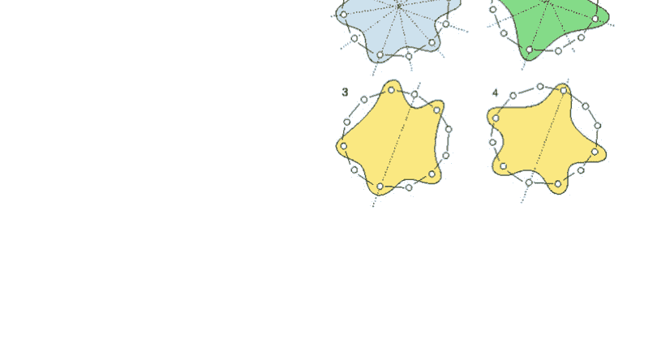

## 参考文献

Bisdorff R, Marichal J (2008) Counting non-isomorphic maximal independent sets of the n-cycle graph. J Int Seq 11(Art. 08.5.7):1–16. https://cs.uwaterloo.ca/journals/JIS/VOL11/Marichal/marichal.html

Geman S, Geman D (1984) Stochastic relaxation, Gibbs distributions, and the Bayesian restoration of images. IEEE Trans Pattern Anal Mach Intell 6:721–741

Häggström O (2002) Finite Markov Chains and algorithmic applications. Cambridge University Press, Cambridge

Ising E (1925) Beitrag zur Theorie des Ferromagnetismus. Zeitschrift für Physik 31:253–258

Metropolis N, Rosenbluth A, Rosenbluth M, Teller A (1953) Equation of state calculations by fast computing machines. J Chem Phys 21(6):1087

# 第 22 章
关于树图和图森林


# 目录

- 22.1 生成随机树图
- 22.2 识别树图
- 22.3 生成树和森林
- 22.4 最大确定生成森林

**摘要** 本章专门讨论树图和图森林的处理。我们说明了如何生成和识别随机树图，以及如何计算树的中心并绘制有根定向树。最后，介绍了计算生成树和森林的算法。

## 22.1 生成随机树图

使用 `graphs` 模块中的 `RandomTree` 类，我们可以例如生成一个具有 9 个顶点的随机树图。

### 清单 22.1 生成随机树图

```
>>> from graphs import RandomTree
>>> rt = RandomTree(order=9,seed=100)
>>> rt
*------ 图实例描述 ----*
实例类：RandomTree
实例名称：randomTree
图阶：9
图大小：8
赋值域：[-1.00; 1.00]
属性：['name', 'order',
'vertices', 'valuationDomain',
'edges', 'prueferCode',
'size', 'gamma']
*---- RandomTree 特定数据 ----*
Pruefer 代码：['v3','v8','v8','v3','v7','v6','v7']
```

```
>>> rt.exportGraphViz('tutRandomTree')
*---- 为 GraphViz 工具导出 dot 文件 --*
导出到 tutRandomTree.dot
neato -Tpng tutRandomTree.dot -o tutRandomTree.png
```

在图 22.1 中，可以注意到阶为 $n > 2$ 的树图总是包含 $n-1$ 条边（参见上一页清单 22.1 中的第 7 和第 8 行），其结构完全由相应的 PRÜFER 代码表征，即一个长度为 $n-2$ 的顶点键列表。例如，在第 15 行，代码 ['v3', 'v8', 'v8', 'v3', 'v7', 'v6', 'v7'] 对应于我们的示例树图 rt。

代码的每个位置表示剩余叶子中具有最小顶点标签的父节点。因此，顶点 v3 是 v1 的父节点，我们移除叶子 v1；v8 现在是叶子 v2 的父节点，我们移除 v2；顶点 v8 再次是叶子 v4 的父节点，我们移除 v4；顶点 v3 是叶子 v5 的父节点，我们移除 v5；v7 现在是叶子 v3 的父节点，我们可以移除 v3；v6 成为叶子 v8 的父节点，我们移除 v8；v7 成为叶子 v6 的父节点，我们可以移除 v6。最终剩下的两个顶点 v7 和 v9 给出了重构树中的最后一条边（Barthélémy and Guenoche 1991）。

也可以首先从一组 $n$ 个顶点生成一个长度为 $n-2$ 的随机 PRÜFER 代码，然后通过反转上述过程来构造相应的阶为 $n$ 的树（参见下一页的清单 22.2）。生成的树图如对面页的图 22.2 所示。

**图 22.1** *阶为 9 的随机树图实例。可以区分度为 1 的顶点（如 v1、v2、v4、v5 或 v9），称为树的叶子，以及度为 2 或更大的顶点（如 v3、v6、v7 或 v8），称为树的节点*

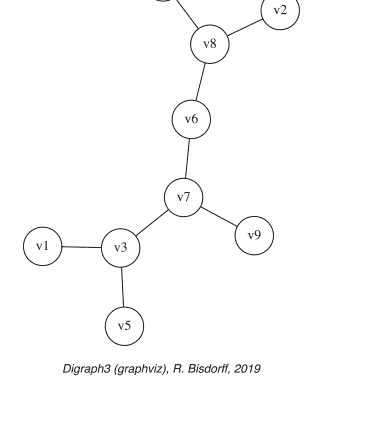

Digraph3 (graphviz), R. Bisdorff, 2019

## 22.1 生成随机树图

图 22.2 使用随机普吕弗码 ['v5', 'v7', 'v2', 'v5', 'v3'] 生成的树图实例

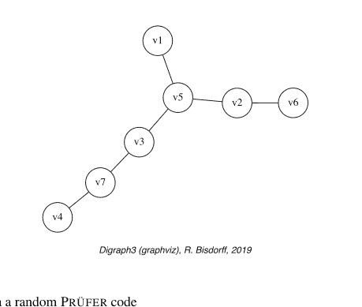

Digraph3 (graphviz), R. Bisdorff, 2019

## 代码清单 22.2 使用随机普吕弗码生成树图

```
>>> verticesList = ['v1','v2','v3','v4','v5','v6','v7']
>>> n = len(verticesList)
>>> from random import seed, choice
>>> seed(101)
>>> code = []
>>> for k in range(n-2):
...     code.append( choice(verticesList) )
>>> print (code)
['v5', 'v7', 'v2', 'v5', 'v3']
>>> rt = RandomTree(prueferCode=code)
>>> rt
*------- Graph instance description -------*
Instance class   : RandomTree
Instance name    : randomTree
Graph Order      : 7
Graph Size       : 6
Valuation domain : [-1.00; 1.00]
Attributes : ['name', 'order', 'vertices',
             'valuationDomain', 'edges',
             'prueferCode', 'size', 'gamma']
*---- RandomTree specific data ----*
Pruefer code : ['v5', 'v7', 'v2', 'v5', 'v3']
>>> rt.exportGraphViz('tutPruefTree')
*---- exporting a dot file for GraphViz tools -----------*
Exporting to tutPruefTree.dot
neato -Tpng tutPruefTree.dot -o tutPruefTree.png
```

基于标记树与其普吕弗码之间的双射关系，我们实际上知道存在 $n^{n-2}$ 个具有相同 $n$ 个顶点的不同树图。给定一个真实的图，我们如何识别它实际上是一个树实例？

## 22.2 识别树图

给定一个阶为 n、大小为 s 的图 g，以下 5 个断言 A1、A2、A3、A4 和 A5 都是等价的（参见 Barthélemy 和 Guenoche 1991）：

- A1：g 是一棵树。
- A2：g 没有（无弦）环且 n = s + 1。
- A3：g 是连通的且 n = s + 1。
- A4：g 的任意两个顶点总是由一条唯一路径连接。
- A5：g 是连通的，且删除任何一条边都会使 g 断开。

例如，断言 A3 提供了一种识别树图的简单测试。在代码清单 22.3 的惰性求值测试中（见下面第 3 行），从计算复杂度的角度来看，先检查图的阶和大小，再检查其潜在的连通性是合适的。我们提供了 `isTree()` 方法来计算这两个测试（见第 8 行）。

### 代码清单 22.3 识别树图

```
>>> from graphs import RandomGraph
>>> g = RandomGraph(order=8,edgeProbability=0.3,seed=62)
>>> if g.order == (g.size +1) and g.isConnected():
...     print('The graph is a tree ?', True)
... else:
...     print('The graph is a tree ?',False)
  The graph is a tree ? True
>>> g.isTree()
  True
```

使用种子 62 生成的阶为 8、边概率为 30% 的随机图，实际上是一个树图实例，这由其在对面页图 22.3 中显示的 graphviz 图所证实。

```
>>> g.exportGraphViz('test62')
  *---- exporting a dot file for GraphViz tools ---*
  Exporting to test62.dot
  fdp -Tpng test62.dot -o test62.png
```

然而，我们仍然需要恢复其对应的普吕弗码。因此，我们可以使用 TreeGraph 类的 `tree2Pruefer()` 方法。但是，首先，图 g 的实例类被更改为 TreeGraph 类型（见下面第 2 行）。

### 代码清单 22.4 计算树图实例的普吕弗码

```
>>> from graphs import TreeGraph
>>> g.__class__ = TreeGraph
>>> g.tree2Pruefer()
  ['v6', 'v1', 'v2', 'v1', 'v2', 'v5']
```

图 22.3 识别树图。可以注意到顶点 v2 实际上位于树的中心，邻域深度为 2

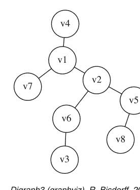

Digraph3 (graphviz), R. Bisdorff, 2019

图 22.4 绘制以其为中心的有根有向树

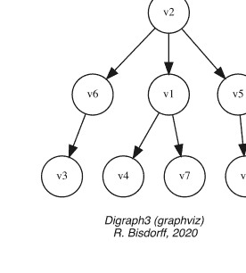

Digraph3 (graphviz)
R. Bisdorff, 2020

在图 22.3 中，我们注意到顶点 v2 实际上位于树的中心，邻域深度为 2。图的中心是具有最小邻域深度的顶点。为了找到这样的中心，Graph 类提供了 `computeGraphCentres()` 方法（见代码清单 22.5 第 1 行）。现在知道了图 g 的中心，我们可以使用 TreeGraph 类的 `exportOrientedTreeGraphViz()` 方法绘制相应的有根有向树（见图 22.4）。

### 代码清单 22.5 计算树的中心并绘制有根有向树

```
>>> g.computeGraphCentres()
{'v2': 2}
>>> g.exportOrientedTreeGraphViz(
...     fileName='rootedTree', root='v2')
*----- exporting a dot file for GraphViz tools
Exporting to rootedTree.dot
dot -Grankdir=TB -Tpng rootedTree.dot -o rootedTree.png
```

现在让我们将注意力转向树图的一个主要应用，即与图遍历相关的生成树和森林。

## 22.3 生成树和森林

使用 `RandomSpanningTree` 类，我们可以从给定的连通图 $g$ 实例生成*均匀*随机的生成树实例，使用 WILSON 算法（见代码清单 22.6 和图 22.5）。

### 代码清单 22.6 生成均匀随机生成树

```
>>> from graphs import RandomGraph,
...                     RandomSpanningTree
>>> g = RandomGraph(order=9,
...                  edgeProbability=0.4,seed=100)
>>> spt = RandomSpanningTree(g)
>>> spt
  *------ Graph instance description ------*
    Instance class    : RandomSpanningTree
    Instance name     : randomGraph_randomSpanningTree
   Graph Order       : 9
   Graph Size        : 8
   Valuation domain  : [-1.00; 1.00]
   Attributes        : ['name','vertices','order',
                        'valuationDomain',
                        'edges','size','gamma',
                        'dfs','date', 'dfsx',
                        'prueferCode']
  *----- RandomTree specific data ----*
    Pruefer code     : ['v7','v9','v5','v1','v8','v4','v9']
>>> spt.exportGraphViz(fileName='randomSpanningTree',
...                    WithSpanningTree=True)
  *----- exporting a dot file for GraphViz tools -----*
    Exporting to randomSpanningTree.dot
    [['v1','v5','v6','v5','v1','v8','v9','v3','v9','v4',
      'v7','v2','v7','v4','v9','v8','v1']]
    neato -Tpng randomSpanningTree.dot
          -o randomSpanningTree.png
```

图 22.5 随机生成树

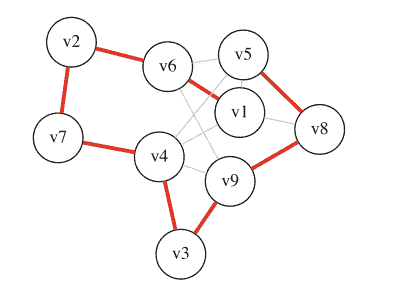

Digraph3 (graphviz), R. Bisdorff, 2019

图 22.6 随机生成森林

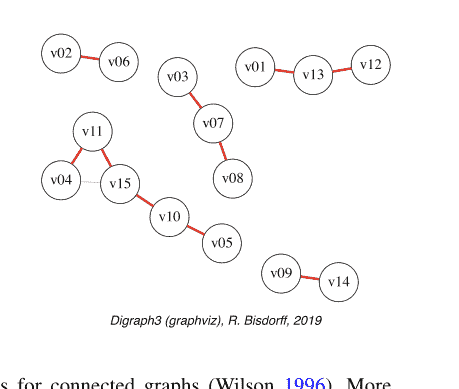

Digraph3 (graphviz), R. Bisdorff, 2019

WILSON 算法仅适用于连通图（Wilson 1996）。更一般地，在图不连通的情况下，`RandomSpanningForest` 类生成一个不一定均匀的随机生成森林实例——一个或多个随机树图——通过对图的分量进行随机深度优先搜索遍历生成（见代码清单 22.7 和图 22.6）。

### 代码清单 22.7 在不连通图上计算生成森林

```
>>> g = RandomGraph(order=15,
...                 edgeProbability=0.1, seed=140)
>>> g.computeComponents()
[{'v12', 'v01', 'v13'}, {'v02', 'v06'},
 {'v08', 'v03', 'v07'}, {'v15', 'v11', 'v10', 'v04', 'v05'},
 {'v09', 'v14'}]
>>> spf = RandomSpanningForest(g, seed=100)
>>> spf.exportGraphViz(fileName='spanningForest',
...                    WithSpanningTree=True)
 *---- exporting a dot file for GraphViz tools -----*
 Exporting to spanningForest.dot
[['v03', 'v07', 'v08', 'v07', 'v03'],
 ['v13', 'v12', 'v13', 'v01', 'v13'],
 ['v02', 'v06', 'v02'],
 ['v15', 'v11', 'v04', 'v11', 'v15',
          'v10', 'v05', 'v10', 'v15'],
 ['v09', 'v14', 'v09']]
neato -Tpng spanningForest.dot -o spanningForest.png
```

## 22.4 最大确定生成森林

对于赋值图——支持加权边——我们最终可以使用 KRUSKAL 的贪心最小生成树算法在图的对偶赋值上构建一个*最确定*的生成树（或如果不连通则为森林）（Kruskal 1956）。¹

在代码清单 22.8 中，我们生成一个具有五个顶点和七条边的随机赋值图，其双极赋值在 [-1.0; 1.0] 范围内。

### 代码清单 22.8 生成随机双极赋值图

```
>>> from graphs import RandomValuationGraph
>>> g = RandomValuationGraph(order=5,seed=2)
>>> g
  *------- Graph instance description ------*
  Instance class    : RandomValuationGraph
  Instance name     : randomGraph
  Graph Order       : 5
  Graph Size        : 7
  Valuation domain  : [-1.00; 1.00]
  Attributes        : ['name', 'order',
                      'vertices', 'valuationDomain',
                      'edges', 'size', 'gamma']
```

为了检查边的实际权重，我们在代码清单 22.9 中将随机图 g 转换为相应的有向图 dg，并使用 `showRelationTable()` 方法打印其对称邻接矩阵。

### 代码清单 22.9 对称关系表

```
>>> dg = g.graph2Digraph()
>>> dg.showRelationTable()
  *---- Relation Table ----*
    S   |  'v1'  'v2'  'v3'  'v4'  'v5'
  ------|---------------------------------
  'v1'  |  0.00  0.91  0.90 -0.89 -0.83
  'v2'  |  0.91  0.00  0.67  0.47  0.34
  'v3'  |  0.90  0.67  0.00 -0.38  0.21
  'v4'  | -0.89  0.47 -0.38  0.00  0.21
  'v5'  | -0.83  0.34  0.21  0.21  0.00
  Valuation domain: [-1.00;1.00]
```

为了计算最确定的生成树或森林，我们可以使用 `Best-DeterminedSpanningForest` 类构造函数。

> ¹ KRUSKAL 算法是一种最小生成树算法，它找到连接森林中任意两棵树的权重最小的边。

## 22.4 最大确定生成森林

清单 22.10 计算最佳确定生成森林

```
>>> from graphs import BestDeterminedSpanningForest
>>> mt = BestDeterminedSpanningForest(g)
>>> print(mt)
  *------- 图实例描述 ------*
  实例类         : BestDeterminedSpanningForest
  实例名称       : bdSpanningForest
  图阶           : 5
  图规模         : 4
  评价域         : [-1.00; 1.00]
  属性           : ['name','vertices','order',
                       'valuationDomain',
                       'edges','size','gamma',
                       'dfs','date',
                       'averageTreeDetermination']
  *---- 最佳确定生成树  ----*
  深度优先搜索路径 :
  [['v1','v2','v4','v2','v5','v2','v1','v3','v1']]
  平均确定度 : [Decimal('0.655')]
```

随机图 g 是连通的，因此存在一个平均确定度最大的唯一生成树，其值为 (0.47 + 0.91 + 0.90 + 0.34)/4 = 0.655（参见对面页清单 22.9 的第 9、6 和 10 行）（图 22.7）。

```
>>> mt.exportGraphViz(
...     fileName='bestDeterminedspanningTree',
...     WithSpanningTree=True)
  *---- 为 GraphViz 工具导出 dot 文件 ---*
  导出至 spanningTree.dot
  [['v4','v2','v1','v3','v1','v2','v5','v2','v4']]
  neato -Tpng bestDeterminedSpanningTree.dot
        -o bestDeterminedSpanningTree.png
```

可以很容易地验证，所有其他潜在的生成树，包括用边 {v3, v5} 和/或 {v4, v5} 替换的，都将显示出较低的平均确定度。

第 23 章是关于无向图的最后一章，致力于介绍不同类型的 BERGE 图或完美图，即分裂图、区间图、可比图和置换图。

图 22.7 最佳确定生成树

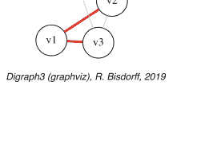

Digraph3 (graphviz), R. Bisdorff, 2019

## 参考文献

Barthélemy J, Guenoche A (1991) Trees and Proximities Representations. Wiley, Hoboken

Kruskal J (1956) On the shortest spanning subtree of a graph and the traveling salesman problem. Proc Am Math Soc 7:48–50

Wilson DB (1996) Generating random spanning trees more quickly than the cover time. In: Proceedings of the twenty-eighth annual ACM symposium on the theory of computing (Philadelphia PA), ACM New York, pp 296–303

# 第 23 章
关于分裂图、可比图、区间图和置换图

# 目录

- 23.1 一个“多重”完美图
- 23.2 谁是说谎者？
- 23.3 生成置换图
- 23.4 识别置换图

**摘要** 本书的最后一章最终介绍了一些著名的完美图类别，即可比图、区间图、置换图和分裂图。我们首先展示一个同时是三角化图、可比图、分裂图和置换图的图的例子。通过 BERGE 的神秘故事说明了成为区间图的重要性。我们进一步讨论了置换图的生成，并以如何识别给定图是否为置换图作为结束。

## 23.1 一个“多重”完美图

一个图 𝔤 被称为：

- BERGE 图或*完美图*，当 𝔤 及其对偶 -𝔤 都不包含任何长度大于 3 的无弦奇环时（Berge 1963; Chudnovsky et al. 2006）。
- *三角化图*，当 𝔤 不包含任何长度大于等于 4 的*无弦环*时。

**定义 23.1（一些完美图类别）** 遵循 Martin Golumbic（参见 Golumbic 2004, p. 149），我们称一个给定的图 𝔤 为：

- *可比图*，当 𝔤 是*可传递定向的*。
- *区间图*，当 𝔤 是*三角化的*且其对偶 -𝔤 是*可比图*。
- *置换图*，当 𝔤 及其对偶 -𝔤 都是*可比图*。
- *分裂图*，当 𝔤 及其对偶 -𝔤 都是*三角化图*。

为了说明这些*完美图*类别，我们将从默认整数范围 [0, 10] 中随机选择的 8 个区间生成一个 RandomIntervalIntersectionsGraph 实例 g（参见下面第 2 行）。

```
>>> from graphs import RandomIntervalIntersectionsGraph
>>> g = RandomIntervalIntersectionsGraph(order=8,seed=100)
>>> g
*------ 图实例描述 ------*
  实例类         : RandomIntervalIntersectionsGraph
  实例名称       : randIntervalIntersections
  种子           : 100
  图阶           : 8
  图规模         : 23
  评价域         : [-1.0; 1.0]
  属性           : ['seed', 'name', 'order',
        'intervals', 'vertices', 'valuationDomain',
        'edges', 'size', 'gamma']
>>> print(g.intervals)
[(2,7), (2,7), (5,6), (6,8), (1,8), (1,1), (4,7), (0,10)]
```

使用种子 = 100，我们在此得到一个*区间图*，实际上是一个*完美图*，它*同时是三角化图、可比图、分裂图和置换图*（参见清单 23.1 的第 2、6、10 和 14 行以及下一页的图 23.1）。

### 清单 23.1 测试完美图类别

```
>>> g.isPerfectGraph(Comments=True)
  图 'randIntervalIntersections' 是完美图！
>>> g.isIntervalGraph(Comments=True)
  图 'randIntervalIntersections' 是三角化的。
  图 'dual_randIntervalIntersections' 是可传递定向的。
  => 图 'randIntervalIntersections' 是区间图。
>>> g.isSplitGraph(Comments=True)
  图 'randIntervalIntersections' 是三角化的。
  图 'dual_randIntervalIntersections' 是三角化的。
  => 图 'randIntervalIntersections' 是分裂图。
>>> g.isPermutationGraph(Comments=True)
  图 'randIntervalIntersections' 是可传递定向的。
  图 'dual_randIntervalIntersections' 是可传递定向的。
  => 图 'randIntervalIntersections' 是置换图。
>>> g.exportGraphViz('randomSplitGraph')
  *----- 为 GraphViz 工具导出 dot 文件 ----------*
  导出至 randomSplitGraph.dot
  fdp -Tpng randomSplitGraph.dot -o randomSplitGraph.png
```

然而请注意，给定图 g 的以下四个属性：

1. g 是*可比图*，
2. −g 是可比图，
3. g 是*三角化图*，
4. −g 是三角化图，

它们彼此都是*独立的*（Golumbic 2004, p. 275）。

## 23.2 谁是说谎者？

图 23.1 一个联合的三角化、可比、区间、置换和分裂图
在此图中，可以很容易地识别出分裂图的基本特征，即总是可以分裂成两个不相交的子图：一个独立集 {v6} 和一个团——{v1, v2, v3, v4, v5, v7, v8}——这解释了它们的名称。

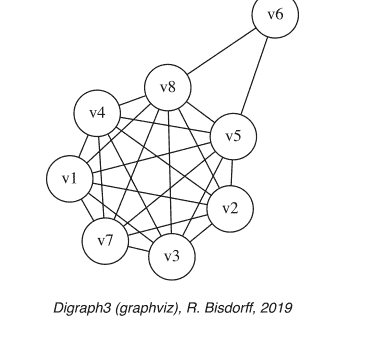

## 23.2 谁是说谎者？

Golumbic（2004, p. 20）讲述的 Claude Berge 著名的神秘故事很好地说明了成为区间图的重要性。
假设文件 berge.py¹ 包含以下图实例数据：

```
vertices = {
    'A': {'name': 'Abe', 'shortName': 'A'},
    'B': {'name': 'Burt', 'shortName': 'B'},
    'C': {'name': 'Charlotte', 'shortName': 'C'},
    'D': {'name': 'Desmond', 'shortName': 'D'},
    'E': {'name': 'Eddie', 'shortName': 'E'},
    'I': {'name': 'Ida', 'shortName': 'I'},
    }
valuationDomain = {'min':-1,'med':0,'max':1}
edges = {
    frozenset(['A','B']) : 1,
    frozenset(['A','C']) : -1,
    frozenset(['A','D']) : 1,
    frozenset(['A','E']) : 1,
    frozenset(['A','I']) : -1,
    frozenset(['B','C']) : -1,
    frozenset(['B','D']) : -1,
    frozenset(['B','E']) : 1,
    frozenset(['B','I']) : 1,
    frozenset(['C','D']) : 1,
    frozenset(['C','E']) : 1,
    frozenset(['C','I']) : 1,
    frozenset(['D','E']) : -1,
    frozenset(['D','I']) : 1,
    frozenset(['E','I']) : 1,
    }
```

¹ 文件 berge.py 提供在 DIGRAPH3 资源的 examples 目录中。

## 23 关于分裂图、可比性图、区间图和置换图

图 23.2 教授证词的图表示

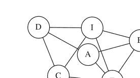

Digraph3 (graphviz), R. Bisdorff, 2019

六位教授（标记为 A、B、C、D、E 和 I）在一份珍贵文件被盗当天都去过图书馆。每人进入一次，停留一段时间后离开。如果两位教授同时在图书馆，那么他们中至少有一人看到了另一位。侦探询问了教授们，并收集到证词：*Abe* 看到了 *Burt* 和 *Eddie*；*Burt* 看到了 *Abe* 和 *Ida*；*Charlotte* 看到了 *Desmond* 和 *Ida*；*Desmond* 看到了 *Abe* 和 *Ida*；*Eddie* 看到了 *Burt* 和 *Ida*；而 *Ida* 看到了 *Charlotte* 和 *Eddie*。这些数据收集在前面的文件中，其中每条正边 {x, y} 模拟了证词，即 x 看到了 y 或 y 看到了 x。

```
>>> from graphs import Graph
>>> g = Graph('berge')
>>> g.showShort()
*---- short description of the graph ----*
Name            : 'berge'
Vertices        : ['A', 'B', 'C', 'D', 'E', 'I']
Valuation domain : {'min': -1, 'med': 0, 'max': 1}
Gamma function  :
  A -> ['D', 'B', 'E']
  B -> ['E', 'I', 'A']
  C -> ['E', 'D', 'I']
  D -> ['C', 'I', 'A']
  E -> ['C', 'B', 'I', 'A']
  I -> ['C', 'E', 'B', 'D']
>>> g.exportGraphViz('berge1')
*---- exporting a dot file for GraphViz tools ---------*
Exporting to berge1.dot
fdp -Tpng berge1.dot -o berge1.png
```

根据图论，时间区间交集图实际上必须是区间图实例，即*三角化*且*余可比*的图。因此，图 23.2 所示的证词图不应包含任何长度为四或以上的无弦环。现在，证词图中是否存在此类无弦环，可以使用 `computeChordlessCycles()` 方法（Bisdorff 2010）进行检查。

```
>>> g.computeChordlessCycles()
Chordless cycle certificate: ['D','C','E','A','D']
Chordless cycle certificate: ['D','I','E','A','D']
Chordless cycle certificate: ['D','I','B','A','D']
[(['D','C','E','A','D'],frozenset({('C','D','E','A')})),
 (['D','I','E','A','D'],frozenset({('D','E','I','A')})),
 (['D','I','B','A','D'],frozenset({('D','B','I','A')}))]
```

我们在上面的列表中看到三个长度为 4 的交集环，这在线性时间线上是不可能发生的。显然，有一位教授撒谎了！

而这个人是 *Desmond*。如果我们怀疑他关于看到 *Abe* 的证词（见下面第 1 行），那么我们确实在图 23.3 中得到了一个三角化图实例，其对偶图是一个可比性图。

```
1 >>> g.setEdgeValue( ('D','A'), 0)
2 >>> g.showShort()
3 *---- short description of the graph ----*
4 Name : 'berge'
5 Vertices : ['A','B','C','D','E','I']
6 Valuation domain : {'med': 0,'min': -1,'max': 1}
7 Gamma function :
8 A -> ['B', 'E']
9 B -> ['A', 'I', 'E']
10 C -> ['I', 'E', 'D']
11 D -> ['I', 'C']
12 E -> ['A', 'I', 'B', 'C']
13 I -> ['B', 'E', 'D', 'C']
14 >>> g.isIntervalGraph(Comments=True)
15 Graph 'berge' is triangulated.
16 Graph 'dual_berge' is transitively orientable.
17 => Graph 'berge' is an interval graph.
18 >>> g.exportGraphViz('berge2')
19 *---- exporting a dot file for GraphViz tools ----------*
20 Exporting to berge2.dot
21 fdp -Tpng berge2.dot -o berge2.png
```

## 23.3 生成置换图

如果一个图的顶点列表存在一个置换（例如 [4, 3, 6, 1, 5, 2]），使得该图同构于该置换在此列表中产生的逆序（参见 Golumbic 2004, Chap. 7, pp 157-170），则该图被称为*置换图*或*逆序图*。这类图也属于 BERGE 图类（图 23.4）。

```
1 >>> from graphs import PermutationGraph
2 >>> g = PermutationGraph(permutation = [4,3,6,1,5,2])
3 >>> g
```

图 23.4 [4,3,6,1,5,2] 置换图

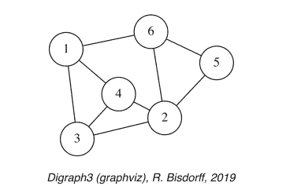

```
4   *------- Graph instance description ------*
5   Instance class    : PermutationGraph
6   Instance name     : permutationGraph
7   Graph Order       : 6
8   Permutation       : [4, 3, 6, 1, 5, 2]
9   Graph Size        : 9
10  Valuation domain  : [-1.00; 1.00]
11  Attributes        : ['name', 'vertices', 'order',
12                      'permutation', 'valuationDomain',
13                      'edges', 'size', 'gamma']
14  >>> g.isPerfectGraph()
15  True
16  >>> g.exportGraphViz(fileName='permutationGraph')
17  *---- exporting a dot file for GraphViz tools ----*
18  Exporting to permutationGraph.dot
19  fdp -Tpng permutationGraph.dot -o permutationGraph.png
```

通过使用颜色排序队列，可以在 $O(n\log(n))$ 时间内计算出对面页图 23.5 所示的最小顶点着色（Golumbic 2004）。

```
1   >>> g.computeMinimalVertexColoring(Comments=True)
2   vertex 1: lightcoral
3   vertex 2: lightcoral
4   vertex 3: lightblue
5   vertex 4: gold
6   vertex 5: lightblue
7   vertex 6: gold
8   >>> g.exportGraphViz(fileName='coloredPermutationGraph',
9   ...                  WithVertexColoring=True)
10  *---- exporting a dot file for GraphViz tools -------*
11  Exporting to coloredPermutationGraph.dot
12  fdp -Tpng coloredPermutationGraph.dot -o coloredPermutationGraph.png
```

由给定的 [4,3,6,1,5,2] 置换所诱导的九个逆序（即置换图的实际边）的相应着色*匹配图*，也可以使用 graphviz neato 布局和显式定位的水平顶点列表来绘制，如下一页图 23.6 所示。

图 23.5 置换图的最小顶点着色

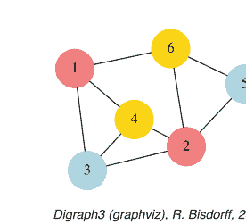

Digraph3 (graphviz), R. Bisdorff, 2019

图 23.6 置换 [4,3,6,1,5,2] 的着色匹配图

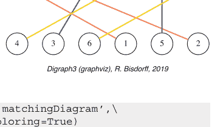

Digraph3 (graphviz), R. Bisdorff, 2019

```
1 >>> g.exportPermutationGraphViz('matchingDiagram',
2 ...                     WithEdgeColoring=True)
3 *---- exporting a dot file for GraphViz tools ----*
4   Exporting to matchingDiagram.dot
5   neato -n -Tpng matchingDiagram.dot -o matchingDiagram.png
```

如前所述，置换图及其对偶图是*可传递定向的*。`transitiveOrientation()` 方法从给定的置换图构造一个有向图，其中置换图的每条边都被转换为一条弧，其方向按相邻顶点键的字母递增顺序排列（参见 Golumbic 2004）。这种置换图边的定向总是传递的，并提供了顶点的*传递排序*，如下一页图 23.7 所示。

```
1 >>> dg = g.transitiveOrientation()
2 >>> dg
3   *------- Digraph instance description -------*
4   Instance class    : TransitiveDigraph
5   Instance name     : oriented_permutationGraph
6   Digraph Order     : 6
7   Digraph Size      : 9
8   Valuation domain  : [-1.00; 1.00]
9   Determinateness   : 100.000
10  Attributes        : ['name', 'order', 'actions',
11                      'valuationdomain', 'relation',
12                      'gamma', 'notGamma', 'size']
13 >>> print('Transitivity degree: %.3f' %
14 ...         dgd.computeTransitivityDegree() )
15   Transitivity degree: 1.000
16 >>> dg.exportGraphViz(fileName='orientedPermGraph')
```

图 23.7 置换图的传递定向


```
17 *---- exporting a dot file for GraphViz tools ----*
18 Exporting to orientedPermGraph.dot
19 dot -Grankdir=TB -Tpng orientedPermGraph.dot -o orientedPermGraph.png
```

置换图的对偶图仍然是一个置换图，因此也是可传递定向的。

```
1 >>> dgd = (~g).transitiveOrientation()
2 >>> print('Dual transitivity degree: %.3f' %
3 ... dgd.computeTransitivityDegree() )
4 Dual transitivity degree: 1.00
```

## 23.4 识别置换图

现在，一个给定的图 g 是置换图，当且仅当 g 和 -g 都是可传递定向的。这个性质提供了一个多项式时间的测试程序（由于传递性检查，复杂度为 O(n^3)）来识别置换图。

让我们考虑以下随机生成的 8 阶图，其边概率为 40%，随机种子为 4335。

```
1 >>> from graphs import RandomGraph
2 >>> g = RandomGraph(order=8,
3 ... edgeProbability=0.4,seed=4335)
4 >>> g
5 *------- Graph instance description -------*
6 Instance class : RandomGraph
7 Instance name : randomGraph
8 Seed : 4335
9 Edge probability : 0.4
10 Graph Order : 8
11 Graph Size : 10
12 Valuation domain : [-1.00; 1.00]
```

## 23.4 识别置换图

图 23.8 以边概率 0.4 生成的 8 阶随机图


Digraph3 (graphviz), R. Bisdorff, 2019

```
13 Attributes : ['name', 'order', 'vertices',
14 'valuationDomain', 'seed',
15 'edges', 'size', 'gamma',
16 'edgeProbability']
17 >>> g.isPerfectGraph()
18 True
19 >>> g.exportGraphViz(fileName='randomGraph4335')
20 *---- exporting a dot file for GraphViz tools ----*
21 Exporting to randomGraph4335.dot
22 fdp -Tpdf randomGraph4335.dot -o randomGraph4335.pdf
```

如果图 23.8 所示的随机完美图实例 g 确实是一个置换图，那么 g 及其对偶图 -g 都是可传递定向的，即都是可比图 (Golumbic 2004)。通过 `isComparabilityGraph()` 测试，我们可以轻松验证这一事实。该方法确实通过尝试构建给定图实例的传递邻域分解来进行，如果成功，则将生成的边方向存储到 `edgeOrientations` 属性中 (Golumbic 2004, p.129-132)。

```
1 >>> if g.isComparabilityGraph():
2 ... print(g.edgeOrientations)
{('v1','v1'): 0, ('v1','v2'): 1, ('v2','v1'): -1, ('v1','v3'): 1,
3 ('v3','v1'): -1, ('v1','v4'): 1, ('v4','v1'): -1, ('v1','v5'): 0,
4 ('v5','v1'): 0, ('v1','v6'): 1, ('v6','v1'): -1, ('v1','v7'): 0,
5 ('v7','v1'): 0, ('v1','v8'): 1, ('v8','v1'): -1, ('v2','v2'): 0,
6 ('v2','v3'): 0, ('v3','v2'): 0, ('v2','v4'): 0, ('v4','v2'): 0,
7 ('v2','v5'): 0, ('v5','v2'): 0, ('v2','v6'): 0, ('v6','v2'): 0,
8 ('v2','v7'): 0, ('v7','v2'): 0, ('v2','v8'): 0, ('v8','v2'): 0,
9 ('v3','v3'): 0, ('v3','v4'): 0, ('v4','v3'): 0, ('v3','v5'): 0,
10 ('v5','v3'): 0, ('v3','v6'): 0, ('v6','v3'): 0, ('v3','v7'): 0,
11 ('v7','v3'): 0, ('v3','v8'): 0, ('v8','v3'): 0, ('v4','v4'): 0,
12 ('v4','v5'): 0, ('v5','v4'): 0, ('v4','v6'): 0, ('v6','v4'): 0,
13 ('v4','v7'): 0, ('v7','v4'): 0, ('v4','v8'): 0, ('v8','v4'): 0,
14 ('v5','v5'): 0, ('v5','v6'): 1, ('v6','v5'): -1, ('v5','v7'): 1,
15 ('v7','v5'): -1, ('v5','v8'): 1, ('v8','v5'): -1, ('v6','v6'): 0,
16 ('v6','v7'): 0, ('v7','v6'): 0, ('v6','v8'): 1, ('v8','v6'): -1,
17 ('v7','v7'): 0, ('v7','v8'): 1, ('v8','v7'): -1, ('v8','v8'): 0}
18 >>> g.exportEdgeOrientationsGraphViz('transOrientGraph')
19 *---- exporting a dot file for GraphViz tools ----------*
20 Exporting to transOrientGraph.dot
21 fdp -Tpng transOrientGraph.dot -o transOrientGraph.png
```

图 23.9 图 g 的传递邻域


图 g 的边的最终定向（如图 23.9 所示）确实是传递的。将相同的程序应用于对偶图 -g，同样得到其边的传递定向，如后一页的图 23.10 所示。

```
>>> gd = -g
>>> if gd.isComparabilityGraph():
    print(gd.edgeOrientations)
{('v1', 'v1'): 0, ('v1', 'v2'): 0, ('v2', 'v1'): 0, ('v1', 'v3'): 0,
 ('v3', 'v1'): 0, ('v1', 'v4'): 0, ('v4', 'v1'): 0, ('v1', 'v5'): 1,
 ('v5', 'v1'): -1, ('v1', 'v6'): 0, ('v6', 'v1'): 0, ('v1', 'v7'): 1,
 ('v7', 'v1'): -1, ('v1', 'v8'): 0, ('v8', 'v1'): 0, ('v2', 'v2'): 0,
 ('v2', 'v3'): -2, ('v3', 'v2'): 2, ('v2', 'v4'): -3, ('v4', 'v2'): 3,
 ('v2', 'v5'): 1, ('v5', 'v2'): -1, ('v2', 'v6'): 1, ('v6', 'v2'): -1,
 ('v2', 'v7'): 1, ('v7', 'v2'): -1, ('v2', 'v8'): 1, ('v8', 'v2'): -1,
 ('v3', 'v3'): 0, ('v3', 'v4'): -3, ('v4', 'v3'): 3, ('v3', 'v5'): 1,
 ('v5', 'v3'): -1, ('v3', 'v6'): 1, ('v6', 'v3'): -1, ('v3', 'v7'): 1,
 ('v7', 'v3'): -1, ('v3', 'v8'): 1, ('v8', 'v3'): -1, ('v4', 'v4'): 0,
 ('v4', 'v5'): 1, ('v5', 'v4'): -1, ('v4', 'v6'): 1, ('v6', 'v4'): -1,
 ('v4', 'v7'): 1, ('v7', 'v4'): -1, ('v4', 'v8'): 1, ('v8', 'v4'): -1,
 ('v5', 'v5'): 0, ('v5', 'v6'): 0, ('v6', 'v5'): 0, ('v5', 'v7'): 0,
 ('v7', 'v5'): 0, ('v5', 'v8'): 0, ('v8', 'v5'): 0, ('v6', 'v6'): 0,
 ('v6', 'v7'): 1, ('v7', 'v6'): -1, ('v6', 'v8'): 0, ('v8', 'v6'): 0,
 ('v7', 'v7'): 0, ('v7', 'v8'): 0, ('v8', 'v7'): 0, ('v8', 'v8'): 0}
>>> gd.exportEdgeOrientationsGraphViz('transOrientDualGraph')
*---- exporting a dot file for GraphViz tools ---------*
Exporting to transOrientDualGraph.dot
fdp -Tpng transOrientDualGraph.dot -o transOrientDualGraph.png
```

让我们通过使用 `computeTransitivelyOrientedDigraph()` 方法显式构建传递定向有向图实例来重新验证这些事实。

```
>>> og = g.computeTransitivelyOrientedDigraph(
...                     PartiallyDetermined = True)
>>> print('Transitivity degree: %.3f' %
...                     (og.transitivityDegree))
Transitivity degree: 1.000
>>> ogd = (-g).computeTransitivelyOrientedDigraph(
...                     PartiallyDetermined = True)
>>> print('Transitivity degree: %.3f' %
...                     (ogd.transitivityDegree))
Transitivity degree: 1.000
```


Digraph3 (graphviz), R. Bisdorff, 2019

**图 23.10** *对偶图 -g 的传递邻域*

值得注意的是，g 的定向是通过一次覆盖所有顶点的邻域分解实现的，而对偶图 -g 的定向则需要分解为三个连续的邻域，分别标记为黑色、红色和蓝色。

上面第 2 行和第 7 行中的 `PartiallyDetermined = True` 标志在这里是必需的，以便仅对图的实际边进行定向。未通过边连接的顶点之间的关系被设置为不确定的特征值 0。这使我们能够在之后计算方便的析取有向图融合。

由于两个图确实都是可传递定向的，我们得出结论：给定的随机图 g 实际上是一个置换图实例。然而，我们仍然需要找到其对应的置换。因此，我们实现 (Golumbic 2004, p. 159) 中给出的方法。

我们将首先使用对称 o-max 算子（参见第 2.5 节）进行的*认识论析取*来*融合*上面的 og 和 ogd 定向。

```
1 >>> from digraphs import FusionDigraph
2 >>> f1 = FusionDigraph(og,ogd,operator='o-max')
3 >>> s1 = f1.computeCopelandRanking()
4 >>> print(s1)
5 ['v5','v7','v1','v6','v8','v4','v3','v2']
```

通过 `computeCopelandRanking()` 方法，我们得到顶点的线性排序 [v5, v7, v1, v6, v8, v4, v3, v2]（参见上面第 5 行）。

我们现在反转 og 中边的方向，以便再次通过析取融合生成我们正在寻找的置换所产生的*逆序*（参见下面第 1 行中的 -og）。再次使用 COPELAND 规则计算排名，揭示了我们正在寻找的置换后的顶点列表（参见下面第 4 行）。

```
1 >>> f2 = FusionDigraph((-og),ogd,operator='o-max')
2 >>> s2 = f2.computeCopelandRanking()
3 >>> print(s2)
4 ['v8','v7','v6','v5','v4','v3','v2','v1']
```

顶点 v8 从位置 5 移动到位置 1，顶点 v7 从位置 2 移动到位置 2，顶点 v6 从位置 4 移动到位置 3，顶点 v5 从位置 1 移动到位置 4，等等。我们为所有顶点生成这些位置交换，从而获得所需的置换（参见下面第 5 行）。

```
>>> permutation = [0 for j in range(g.order)]
>>> for j in range(g.order):
...     permutation[s2.index(s1[j])] = j+1
>>> print(permutation)
[5, 2, 4, 1, 6, 7, 8, 3]
```

顺便值得注意的是，给定图及其对偶图的传递定向通常*不是唯一的*，因此最终的置换也可能不是唯一的。然而，它们都对应于同构图 (Golumbic 2004)。在我们这里的情况下，我们观察到两个不同的置换及其逆：

```
1 s1: ['v1', 'v4', 'v3', 'v2', 'v5', 'v6', 'v7', 'v8']
2 s2: ['v4', 'v3', 'v2', 'v8', 'v6', 'v1', 'v7', 'v5']
3 (s1 -> s2): [2, 3, 4, 8, 6, 1, 7, 5]
4 (s2 -> s1): [6, 1, 2, 3, 8, 5, 7, 4]
```

以及

```
1 s3: ['v5', 'v7', 'v1', 'v6', 'v8', 'v4', 'v3', 'v2']
2 s4: ['v8', 'v7', 'v6', 'v5', 'v4', 'v3', 'v2', 'v1']
3 (s3 -> s4): [5, 2, 4, 1, 6, 7, 8, 3]
4 (s4 -> s3) = [4, 2, 8, 3, 1, 5, 6, 7]
```

`computePermutation()` 方法直接执行所有这些步骤：计算传递定向、对其认识论融合进行排名，并提供相应的置换。

```
>>> g.computePermutation(Comments=True)
['v1', 'v2', 'v3', 'v4', 'v5', 'v6', 'v7', 'v8']
['v2', 'v3', 'v4', 'v8', 'v6', 'v1', 'v7', 'v5']
[2, 3, 4, 8, 6, 1, 7, 5]
```

最后，让我们在图 23.11 中检查上面观察到的两个置换 [2, 3, 4, 8, 6, 1, 7, 5] 和 [4, 2, 8, 3, 1, 5, 6, 7] 将生成对应的*同构*置换图。


## 参考文献

Berge C (1963) 完美图。图论六篇论文。印度统计研究所，加尔各答，第1–21页
Bisdorff R (2010) 枚举有向图中的弦无关回路。见：ORBEL24-2010，比利时运筹学学会第24届年会（ORBEL，又名Sogesci-B.V.W.B.），2010年1月28–29日，列日（比利时），列日大学（比利时），第1–12页。http://hdl.handle.net/10993/23926
Chudnovsky M, Robertson N, Seymour P, Robin T (2006) 强完美图定理。数学年刊。164(1):51–229
Golumbic M (2004) 算法图论与完美图。离散数学年鉴，第57卷，第2版。Elsevier，阿姆斯特丹

## 索引

A
- 反洞，231
- AsymmetricPartialDigraph 类，16, 220
- automorphismGenerators()，316

- 可比图，329
- CompleteDigraph 类，24, 228
- computeBordaWinners()，85
- computeChordlessCircuits()，48, 89, 100
- computeChordlessCycles()，332
- computeCondorcetWinners()，46, 87
- computeCopelandRanking()，339
- computeCoSize()，218
- computeDeterminateness()，11
- computeGraphCentres()，323
- computeInstantRunoffWinner()，85
- computeKernelVector()，244, 247
- computeMinimalVertexColoring()，334
- computeNetFlowsRanking()，175
- computeOrdinalCorrelation()，217
- computePermutation()，340
- computeRankAnalysis()，85
- computeRankingByChoosing()，94
- computeRankingCorrelation()，101, 124, 179
- computeSimpleMajorityWinner()，85
- computeSize()，11
- computeTransitivelyOrientedDigraph()，338
- computeTransitivityDegree()，11, 99
- computeUninominalVotes()，85
- computeWeakCondorcetWinners()，46
- CONDORCET
    - 有向图，98
    - 获胜者，49, 87

B
- Barbut, M.，36
- Berge, Cl.，xv
- BERGE 图，329
- BestDeterminedSpanningForest 类，326
- BipolarApprovalVotingProfile 类，287
- BipolarOutrankingDigraph，32, 33
- BipolarOutrankingDigraph 类，29, 46
- Borda 分数，85
- Bouyssou, D.，26, 52
- BrokenCocsDigraph 类，48

C
- checkSampling()，313
- 弦无关回路，230
- cIntegerOutrankingDigraphs 模块，139
- CirculantDigraph 类，11, 230, 314
- closeSymmetric()，21
- closeTransitive()，21, 159
- 对偶变换，47
- CoDualDigraph 类，20
- 对偶性原则，35, 46
- ConfidentBipolarOutrankingDigraph 类，161
- ConverseDigraph 类，20
- convertEvaluation2Decimal()，139
- convert2Standard()，139
- convertWeight2Decimal()，139
- Copeland, A.H.，100
- CopelandRanking 类，101
- cPerformanceTableau 类，138
- cQuantilesRankingDigraph 类，144
- cRandomPerformanceTableau 类，138
- cRandPerfTabs 模块，138
- cSparseIntegerOutrankingDigraphs 模块，141
- CycleGraph 类，309, 314

D
- Dias, L.C.，112
- Digraph 类，8
- digraph2Graph()，306
- digraphsTools 模块，140
- domkernelrestrict()，244
- dreadnaut shell 命令，316
- DualDigraph 类，20, 231

E
- EmptyDigraph 类，24, 229
- EquivalenceDigraph 类，215
- export3DplotOfCriteriaCorrelation()，182, 220
- exportGraphViz()，9
- exportOrientedTreeGraphViz()，323
- exportPermutationGraphViz()，334
- exportRatingByRankingGraphViz()，193
- ExtendedTriangularRandomVariable 类，69
- 外部稳定性，225

F
- 填充回路，231
- FusionDigraph 类，18, 339

G
- Gibbs 采样器，306
- Golumbic, M.Ch.，xvi, 329
- GraphBorder 类，17
- Graph 类，303
- graph2Digraph()，305
- graphs 模块，303
- Graphviz，15, 35
- GridDigraph 类，11
- GridGraph 类，311

H
- Hertz, A.，240
- 洞，226

I
- IncrementalQuantilesEstimator 类，126
- independentChoices()，240
- IndeterminateDigraph 类，24, 229
- IndeterminateInnerPart 参数，232
- IntegerBipolarOutrankingDigraph 类，139
- 内部稳定性，225
- isComparabilityGraph()，337
- IsingModel 类，311
- isIntervalGraph()，330
- isPerfectGraph()，330
- isPermutationGraph()，330
- isSplitGraph()，330
- isTree()，322
- IteratedNetFlowsRanking 类，110

K
- KemenyRanking 类，105
- Kendall, M.G.，36, 212
- 核，225
    - 初始核，228
    - 预核，228
    - 终端核，228
- Kohler, G.，109

L
- Lamboray, Cl.，112
- LearnedQuantilesRatingDigraph 类，129, 191
- linearOrders 模块，101, 218
- LinearVotingProfile 类，83
- LineGraph 类，309

M
- 多数优势，86
- 多数优势有向图，86
- MajorityMarginsDigraph 类，86
- Marichal, J.-L.，313
- 极大独立选择，226
- MetropolisChain 类，311, 313
- MIS，225
- MISModel 类，226

N
- NetFlowsOrder 类，218
- NetFlowsRanking 类，103
- Neumann, J. von，243
- numberOfBins 参数，127

O
- o-max()，339
- 对立度，163
- 优序关系
    - 情境，45
    - 严格情境，47
- outrankingDigraphs 模块，29, 46

P
- parallel shell 工具，4
- 绩效准则，59
- PerformanceQuantiles 类，126, 189
- 绩效矩阵
    - 一致的，60
- PerformanceTableau 类，43
- perfTabs 模块，43
- 置换图，329
- PermutationGraph 类，333
- perrinMIS shell 命令，315
- Pirlot, M.，242
- PreRankedOutrankingDigraph 类，120

Q
- Q_Coloring 类，306
- QuantilesSortingDigraph 类，117

R
- Random3ObjectivesPerformanceTableau 类，74, 261
- RandomAcademicPerformanceTableau 类，79, 205
- RandomCBPerformanceTableau 类，71
- RandomDigraph 类，7
- randomDigraphs 模块，7, 13
- RandomGraph 类，304
- RandomIntervalIntersectionsGraph 类，330
- RandomLinearVotingProfile 类，83
- randomNumbers 模块，126
- RandomPerformanceGenerator()，128
- RandomPerformanceTableau 类，68
- randomPerfTabs 模块，67
- RandomRegularGraph 类，226
- RandomSpanningForest 类，325
- RandomSpanningTree 类，324
- RandomTree 类，319
- RandomValuationDigraph 类，13
- RandomValuationGraph 类，326
- RankedPairsRanking 类，112
- RankingByChoosingDigraph 类，50, 159, 222
- RankingsFusionDigraph 类，105, 194
- readPerrinMisset()，316
- recodeValuation()，35
- RobustOutrankingDigraph 类，173, 269
- Roubens, M.，248
- Roy, B.，41
- Roy, B.，22, 36, 279

S
- save()，14
- Sen, A.，97
- setEdgeValue()，333
- showActionsSortingResult()，197
- showApprovalResults()，288
- showBestChoiceRecommendation()，48
- showChordlessCircuits()，48, 100, 173
- showCliques()，308
- showComponents()，14
- showCorrelation()，179, 217
- showCourseStatistics()，80
- showCriteria()，44, 171
- showCriteriaCorrelationTable()，181, 219
- showCriteriaQuantileLimits()，118
- showDecomposition()，121
- showDisapprovalResults()，288
- showHTMCriteria()，154
- showHTMLLimitingQuantiles()，129
- showHTMLPairwiseOutrankings()，159
- showHTMLPerformanceHeatmap()，44, 212
- showHTMLPerformanceTableau()，210
- showHTMLRatingHeatmap()，132, 192
- showHTMLRelationMap()，121
- showHTMLRelationTable()，24, 46, 93
- showHTMLVotingHeatmap()，90
- showHTMPerformanceTableau()，76
- showLimitingQuantiles()，127, 191
- showLinearBallots()，84
- showMIS()，307
- showMIS_AH()，240
- showNeighborhoods()，14
- showNetApprovalScores()，289
- showObjectives()，75
- showPairwiseComparison()，33, 49, 64
- showPairwiseOutrankings()，34, 178
- showPerformanceTableau()，31, 62, 130
- showPolarisations()，156, 270
- showPreKernels()，235, 282
- showQuantilesRating()，132, 192
- showRankAnalysisTable()，86
- showRankingByChoosing()，94
- showRankingConsensusQuality()，81, 106, 180, 195
- showRelationMap()，142
- showRelationTable()，14, 32, 63
- showShort()，8, 305
- showSorting()，118
- showSortingCharacteristics()，118, 197
- showStatistics()，10, 72
- showTransitionMatrix()，313
- Slater, P.，107
- SlaterRanking 类，107
- sortingDigraphs 模块，117, 191
- SparseIntegerOutrankingDigraph 类，141
- sparseOutrankingDigraphs 模块，120
- 分裂图，329
- 稳定性表示，263
- StabilityDenotation 标志，263
- StrongComponentsCollapsedDigraph 类，22
- symmetricAverage()，273
- SymmetricPartialDigraph 类，16, 220

T
- THE 2016年计算机科学学科大学排名，166
- Tideman, N.，112
- total_size()，140
- TransitiveDigraph 类，22, 163
- transitiveDigraphs 模块，50, 102, 103, 159, 222
- transitiveOrientation()，335
- tree2Pruefer()，322
- TreeGraph 类，322
- 三角化图，329

U
- UnOpposedBipolarOutrankingDigraph 类，163, 274
- updateQuantiles()，128

V
- votingProfiles 模块，83, 287

W
- Warshall, S.，22
- WeakCopelandOrder 类，102
- 弱完全，46
- WeakNetFlowsOrder 类，103
- 弱竞赛图，87