# Python编程与计算机科学导论

克莱顿·卡菲耶罗

佛蒙特大学

本书可在GNU自由文档许可证或知识共享署名-相同方式共享3.0美国许可证下免费使用。任选其一。

- http://www.gnu.org/copyleft/fdl.html
- http://creativecommons.org/licenses/by-sa/3.0/us/

书籍样式改编自$\mathrm{\TeX}$的Memoir类，版权所有© 2001–2011 Peter R. Wilson, 2011–2022 Lars Madsen，因此不包含在上述许可证中。

第15章中来自Matplotlib.org的图片不包含在本材料的许可证范围内。它们受Matplotlib许可证约束，详见 https://matplotlib.org/stable/users/project/license.html。埃德斯加·迪克斯特拉的照片由德克萨斯大学奥斯汀分校的汉密尔顿·理查兹拍摄，可在知识共享CC BY-SA 3.0许可证下使用：https://creativecommons.org/licenses/by-sa/3.0/。

本书写作未使用任何生成式人工智能。

手稿由作者使用Quarto、Pandoc和$\mathrm{X_{\!\!\!\!}L\!A\!T\!E\!X}$准备。

插图、图表和封面艺术由作者创作，第17章练习2中的图表除外，该图表由哈里·沙曼创作。

版本：0.1.9b（测试版）

ISBN：979-8-9887092-0-6
美国国会图书馆控制号：2023912320

第一版
10 9 8 7 6 5 4 3

印刷于美国

# 致虫与牛

# 目录

目录 . . . . . . . . . . . . . . . . . . . . . . . . . . . . . . . . . . . . . . . . . . . . . . . . . . . . . . . . . . . . . . . . . . . . . . . . . . . . . . . . . . . . . . . . . . . . . . . . . . . . . . . . . . . . . . . . . . . . . . . . . . . . . . . . . . . . . . . . . . . . . . . . . . . . . . . . . . . . . . . . . . . . . . . . . . . . . . . . . . . . . . . . . . . . . . . . . . . . . . . . . . . . . . . . . . . . . . . . . . . . . . . . . . . . . . . . . . . . . . . . . . . . . . . . . . . . . . . . . . . . . . . . . . . . . . . . . . . . . . . . . . . . . . . . . . . . . . . . . . . . . . . . . . . . . . . . . . . . . . . . . . . . . . . . . . . . . . . . . . . . . . . . . . . . . . . . . . . . . . . . . . . . . . . . . . . . . . . . . . . . . . . . . . . . . . . . . . . . . . . . . . . . . . . . . . . . . . . . . . . . . . . . . . . . . . . . . . . . . . . . . . . . . . . . . . . . . . . . . . . . . . . . . . . . . . . . . . . . . . . . . . . . . . . . . . . . . . . . . . . . . . . . . . . . . . . . . . . . . . . . . . . . . . . . . . . . . . . . . . . . . . . . . . . . . . . . . . . . . . . . . . . . . . . . . . . . . . . . . . . . . . . . . . . . . . . . . . . . . . . . . . . . . . . . . . . . . . . . . . . . . . . . . . . . . . . . . . . . . . . . . . . . . . . . . . . . . . . . . . . . . . . . . . . . . . . . . . . . . . . . . . . . . . . . . . . . . . . . . . . . . . . . . . . . . . . . . . . . . . . . . . . . . . . . . . . . . . . . . . . . . . . . . . . . . . . . . . . . . . . . . . . . . . . . . . . . . . . . . . . . . . . . . . . . . . . . . . . . . . . . . . . . . . . . . . . . . . . . . . . . . . . . . . . . . . . . . . . . . . . . . . . . . . . . . . . . . . . . . . . . . . . . . . . . . . . . . . . . . . . . . . . . . . . . . . . . . . . . . . . . . . . . . . . . . . . . . . . . . . . . . . . . . . . . . . . . . . . . . . . . . . . . . . . . . . . . . . . . . . . . . . . . . . . . . . . . . . . . . . . . . . . . . . . . . . . . . . . . . . . . . . . . . . . . . . . . . . . . . . . . . . . . . . . . . . . . . . . . . . . . . . . . . . . . . . . . . . . . . . . . . . . . . . . . . . . . . . . . . . . . . . . . . . . . . . . . . . . . . . . . . . . . . . . . . . . . . . . . . . . . . . . . . . . . . . . . . . . . . . . . . . . . . . . . . . . . . . . . . . . . . . . . . . . . . . . . . . . . . . . . . . . . . . . . . . . . . . . . . . . . . . . . . . . . . . . . . . . . . . . . . . . . . . . . . . . . . . . . . . . . . . . . . . . . . . . . . . . . . . . . . . . . . . . . . . . . . . . . . . . . . . . . . . . . . . . . . . . . . . . . . . . . . . . . . . . . . . . . . . . . . . . . . . . . . . . . . . . . . . . . . . . . . . . . . . . . . . . . . . . . . . . . . . . . . . . . . . . . . . . . . . . . . . . . . . . . . . . . . . . . . . . . . . . . . . . . . . . . . . . . . . . . . . . . . . . . . . . . . . . . . . . . . . . . . . . . . . . . . . . . . . . . . . . . . . . . . . . . . . . . . . . . . . . . . . . . . . . . . . . . . . . . . . . . . . . . . . . . . . . . . . . . . . . . . . . . . . . . . . . . . . . . . . . . . . . . . . . . . . . . . . . . . . . . . . . . . . . . . . . . . . . . . . . . . . . . . . . . . . . . . . . . . . . . . . . . . . . . . . . . . . . . . . . . . . . . . . . . . . . . . . . . . . . . . . . . . . . . . . . . . . . . . . . . . . . . . . . . . . . . . . . . . . . . . . . . . . . . . . . . . . . . . . . . . . . . . . . . . . . . . . . . . . . . . . . . . . . . . . . . . . . . . . . . . . . . . . . . . . . . . . . . . . . . . . . . . . . . . . . . . . . . . . . . . . . . . . . . . . . . . . . . . . . . . . . . . . . . . . . . . . . . . . . . . . . . . . . . . . . . . . . . . . . . . . . . . . . . . . . . . . . . . . . . . . . . . . . . . . . . . . . . . . . . . . . . . . . . . . . . . . . . . . . . . . . . . . . . . . . . . . . . . . . . . . . . . . . . . . . . . . . . . . . . . . . . . . . . . . . . . . . . . . . . . . . . . . . . . . . . . . . . . . . . . . . . . . . . . . . . . . . . . . . . . . . . . . . . . . . . . . . . . . . . . . . . . . . . . . . . . . . . . . . . . . . . . . . . . . . . . . . . . . . . . . . . . . . . . . . . . . . . . . . . . . . . . . . . . . . . . . . . . . . . . . . . . . . . . . . . . . . . . . . . . . . . . . . . . . . . . . . . . . . . . . . . . . . . . . . . . . . . . . . . . . . . . . . . . . . . . . . . . . . . . . . . . . . . . . . . . . . . . . . . . . . . . . . . . . . . . . . . . . . . . . . . . . . . . . . . . . . . . . . . . . . . . . . . . . . . . . . . . . . . . . . . . . . . . . . . . . . . . . . . . . . . . . . . . . . . . . . . . . . . . . . . . . . . . . . . . . . . . . . . . . . . . . . . . . . . . . . . . . . . . . . . . . . . . . . . . . . . . . . . . . . . . . . . . . . . . . . . . . . . . . . . . . . . . . . . . . . . . . . . . . . . . . . . . . . . . . . . . . . . . . . . . . . . . . . . . . . . . . . . . . . . . . . . . . . . . . . . . . . . . . . . . . . . . . . . . . . . . . . . . . . . . . . . . . . . . . . . . . . . . . . . . . . . . . . . . . . . . . . . . . . . . . . . . . . . . . . . . . . . . . . . . . . . . . . . . . . . . . . . . . . . . . . . . . . . . . . . . . . . . . . . . . . . . . . . . . . . . . . . . . . . . . . . . . . . . . . . . . . . . . . . . . . . . . . . . . . . . . . . . . . . . . . . . . . . . . . . . . . . . . . . . . . . . . . . . . . . . . . . . . . . . . . . . . . . . . . . . . . . . . . . . . . . . . . . . . . . . . . . . . . . . . . . . . . . . . . . . . . . . . . . . . . . . . . . . . . . . . . . . . . . . . . . . . . . . . . . . . . . . . . . . . . . . . . . . . . . . . . . . . . . . . . . . . . . . . . . . . . . . . . . . . . . . . . . . . . . . . . . . . . . . . . . . . . . . . . . . . . . . . . . . . . . . . . . . . . . . . . . . . . . . . . . . . . . . . . . . . . . . . . . . . . . . . . . . . . . . . . . . . . . . . . . . . . . . . . . . . . . . . . . . . . . . . . . . . . . . . . . . . . . . . . . . . . . . . . . . . . . . . . . . . . . . . . . . . . . . . . . . . . . . . . . . . . . . . . . . . . . . . . . . . . . . . . . . . . . . . . . . . . . . . . . . . . . . . . . . . . . . . . . . . . . . . . . . . . . . . . . . . . . . . . . . . . . . . . . . . . . . . . . . . . . . . . . . . . . . . . . . . . . . . . . . . . . . . . . . . . . . . . . . . . . . . . . . . . . . . . . . . . . . . . . . . . . . . . . . . . . . . . . . . . . . . . . . . . . . . . . . . . . . . . . . . . . . . . . . . . . . . . . . . . . . . . . . . . . . . . . . . . . . . . . . . . . . . . . . . . . . . . . . . . . . . . . . . . . . . . . . . . . . . . . . . . . . . . . . . . . . . . . . . . . . . . . . . . . . . . . . . . . . . . . . . . . . . . . . . . . . . . . . . . . . . . . . . . . . . . . . . . . . . . . . . . . . . . . . . . . . . . . . . . . . . . . . . . . . . . . . . . . . . . . . . . . . . . . . . . . . . . . . . . . . . . . . . . . . . . . . . . . . . . . . . . . . . . . . . . . . . . . . . . . . . . . . . . . . . . . . . . . . . . . . . . . . . . . . . . . . . . . . . . . . . . . . . . . . . . . . . . . . . . . . . . . . . . . . . . . . . . . . . . . . . . . . . . . . . . . . . . . . . . . . . . . . . . . . . . . . . . . . . . . . . . . . . . . . . . . . . . . . . . . . . . . . . . . . . . . . . . . . . . . . . . . . . . . . . . . . . . . . . . . . . . . . . . . . . . . . . . . . . . . . . . . . . . . . . . . . . . . . . . . . . . . . . . . . . . . . . . . . . . . . . . . . . . . . . . . . . . . . . . . . . . . . . . . . . . . . . . . . . . . . . . . . . . . . . . . . . . . . . . . . . . . . . . . . . . . . . . . . . . . . . . . . . . . . . . . . . . . . . . . . . . . . . . . . . . . . . . . . . . . . . . . . . . . . . . . . . . . . . . . . . . . . . . . . . . . . . . . . . . . . . . . . . . . . . . . . . . . . . . . . . . . . . . . . . . . . . . . . . . . . . . . . . . . . . . . . . . . . . . . . . . . . . . . . . . . . . . . . . . . . . . . . . . . . . . . . . . . . . . . . . . . . . . . . . . . . . . . . . . . . . . . . . . . . . . . . . . . . . . . . . . . . . . . . . . . . . . . . . . . . . . . . . . . . . . . . . . . . . . . . . . . . . . . . . . . . . . . . . . . . . . . . . . . . . . . . . . . . . . . . . . . . . . . . . . . . . . . . . . . . . . . . . . . . . . . . . . . . . . . . . . . . . . . . . . . . . . . . . . . . . . . . . . . . . . . . . . . . . . . . . . . . . . . . . . . . . . . . . . . . . . . . . . . . . . . . . . . . . . . . . . . . . . . . . . . . . . . . . . . . . . . . . . . . . . . . . . . . . . . . . . . . . . . . . . . . . . . . . . . . . . . . . . . . . . . . . . . . . . . . . . . . . . . . . . . . . . . . . . . . . . . . . . . . . . . . . . . . . . . . . . . . . . . . . . . . . . . . . . . . . . . . . . . . . . . . . . . . . . . . . . . . . . . . . . . . . . . . . . . . . . . . . . . . . . . . . . . . . . . . . . . . . . . . . . . . . . . . . . . . . . . . . . . . . . . . . . . . . . . . . . . . . . . . . . . . . . . . . . . . . . . . . . . . . . . . . . . . . . . . . . . . . . . . . . . . . . . . . . . . . . . . . . . . . . . . . . . . . . . . . . . . . . . . . . . . . . . . . . . . . . . . . . . . . . . . . . . . . . . . . . . . . . . . . . . . . . . . . . . . . . . . . . . . . . . . . . . . . . . . . . . . . . . . . . . . . . . . . . . . . . . . . . . . . . . . . . . . . . . . . . . . . . . . . . . . . . . . . . . . . . . . . . . . . . . . . . . . . . . . . . . . . . . . . . . . . . . . . . . . . . . . . . . . . . . . . . . . . . . . . . . . . . . . . . . . . . . . . . . . . . . . . . . . . . . . . . . . . . . . . . . . . . . . . . . . . . . . . . . . . . . . . . . . . . . . . . . . . . . . . . . . . . . . . . . . . . . . . . . . . . . . . . . . . . . . . . . . . . . . . . . . . . . . . . . . . . . . . . . . . . . . . . . . . . . . . . . . . . . . . . . . . . . . . . . . . . . . . . . . . . . . . . . . . . . . . . . . . . . . . . . . . . . . . . . . . . . . . . . . . . . . . . . . . . . . . . . . . . . . . . . . . . . . . . . . . . . . . . . . . . . . . . . . . . . . . . . . . . . . . . . . . . . . . . . . . . . . . . . . . . . . . . . . . . . . . . . . . . . . . . . . . . . . . . . . . . . . . . . . . . . . . . . . . . . . . . . . . . . . . . . . . . . . . . . . . . . . . . . . . . . . . . . . . . . . . . . . . . . . . . . . . . . . . . . . . . . . . . . . . . . . . . . . . . . . . . . . . . . . . . . . . . . . . . . . . . . . . . . . . . . . . . . . . . . . . . . . . . . . . . . . . . . . . . . . . . . . . . . . . . . . . . . . . . . . . . . . . . . . . . . . . . . . . . . . . . . . . . . . . . . . . . . . . . . . . . . . . . . . . . . . . . . . . . . . . . . . . . . . . . . . . . . . . . . . . . . . . . . . . . . . . . . . . . . . . . . . . . . . . . . . . . . . . . . . . . . . . . . . . . . . . . . . . . . . . . . . . . . . . . . . . . . . . . . . . . . . . . . . . . . . . . . . . . . . . . . . . . . . . . . . . . . . . . . . . . . . . . . . . . . . . . . . . . . . . . . . . . . . . . . . . . . . . . . . . . . . . . . . . . . . . . . . . . . . . . . . . . . . . . . . . . . . . . . . . . . . . . . . . . . . . . . . . . . . . . . . . . . . . . . . . . . . . . . . . . . . . . . . . . . . . . . . . . . . . . . . . . . . . . . . . . . . . . . . . . . . . . . . . . . . . . . . . . . . . . . . . . . . . . . . . . . . . . . . . . . . . . . . . . . . . . . . . . . . . . . . . . . . . . . . . . . . . . . . . . . . . . . . . . . . . . . . . . . . . . . . . . . . . . . . . . . . . . . . . . . . . . . . . . . . . . . . . . . . . . . . . . . . . . . . . . . . . . . . . . . . . . . . . . . . . . . . . . . . . . . . . . . . . . . . . . . . . . . . . . . . . . . . . . . . . . . . . . . . . . . . . . . . . . . . . . . . . . . . . . . . . . . . . . . . . . . . . . . . . . . . . . . . . . . . . . . . . . . . . . . . . . . . . . . . . . . . . . . . . . . . . . . . . . . . . . . . . . . . . . . . . . . . . . . . . . . . . . . . . . . . . . . . . . . . . . . . . . . . . . . . . . . . . . . . . . . . . . . . . . . . . . . . . . . . . . . . . . . . . . . . . . . . . . . . . . . . . . . . . . . . . . . . . . . . . . . . . . . . . . . . . . . . . . . . . . . . . . . . . . . . . . . . . . . . . . . . . . . . . . . . . . . . . . . . . . . . . . . . . . . . . . . . . . . . . . . . . . . . . . . . . . . . . . . . . . . . . . . . . . . . . . . . . . . . . . . . . . . . . . . . . . . . . . . . . . . . . . . . . . . . . . . . . . . . . . . . . . . . . . . . . . . . . . . . . . . . . . . . . . . . . . . . . . . . . . . . . . . . . . . . . . . . . . . . . . . . . . . . . . . . . . . . . . . . . . . . . . . . . . . . . . . . . . . . . . . . . . . . . . . . . . . . . . . . . . . . . . . . . . . . . . . . . . . . . . . . . . . . . . . . . . . . . . . . . . . . . . . . . . . . . . . . . . . . . . . . . . . . . . . . . . . . . . . . . . . . . . . . . . . . . . . . . . . . . . . . . . . . . . . . . . . . . . . . . . . . . . . . . . . . . . . . . . . . . . . . . . . . . . . . . . . . . . . . . . . . . . . . . . . . . . . . . . . . . . . . . . . . . . . . . . . . . . . . . . . . . . . . . . . . . . . . . . . . . . . . . . . . . . . . . . . . . . . . . . . . . . . . . . . . . . . . . . . . . . . . . . . . . . . . . . . . . . . . . . . . . . . . . . . . . . . . . . . . . . . . . . . . . . . . . . . . . . . . . . . . . . . . . . . . . . . . . . . . . . . . . . . . . . . . . . . . . . . . . . . . . . . . . . . . . . . . . . . . . . . . . . . . . . . . . . . . . . . . . . . . . . . . . . . . . . . . . . . . . . . . . . . . . . . . . . . . . . . . . . . . . . . . . . . . . . . . . . . . . . . . . . . . . . . . . . . . . . . . . . . . . . . . . . . . . . . . . . . . . . . . . . . . . . . . . . . . . . . . . . . . . . . . . . . . . . . . . . . . . . . . . . . . . . . . . . . . . . . . . . . . . . . . . . . . . . . . . . . . . . . . . . . . . . . . . . . . . . . . . . . . . . . . . . . . . . . . . . . . . . . . . . . . . . . . . . . . . . . . . . . . . . . . . . . . . . . . . . . . . . . . . . . . . . . . . . . . . . . . . . . . . . . . . . . . . . . . . . . . . . . . . . . . . . . . . . . . . . . . . . . . . . . . . . . . . . . . . . . . . . . . . . . . . . . . . . . . . . . . . . . . . . . . . . . . . . . . . . . . . . . . . . . . . . . . . . . . . . . . . . . . . . . . . . . . . . . . . . . . . . . . . . . . . . . . . . . . . . . . . . . . . . . . . . . . . . . . . . . . . . . . . . . . . . . . . . . . . . . . . . . . . . . . . . . . . . . . . . . . . . . . . . . . . . . . . . . . . . . . . . . . . . . . . . . . . . . . . . . . . . . . . . . . . . . . . . . . . . . . . . . . . . . . . . . . . . . . . . . . . . . . . . . . . . . . . . . . . . . . . . . . . . . . . . . . . . . . . . . . . . . . . . . . . . . . . . . . . . . . . . . . . . . . . . . . . . . . . . . . . . . . . . . . . . . . . . . . . . . . . . . . . . . . . . . . . . . . . . . . . . . . . . . . . . . . . . . . . . . . . . . . . . . . . . . . . . . . . . . . . . . . . . . . . . . . . . . . . . . . . . . . . . . . . . . . . . . . . . . . . . . . . . . . . . . . . . . . . . . . . . . . . . . . . . . . . . . . . . . . . . . . . . . . . . . . . . . . . . . . . . . . . . . . . . . . . . . . . . . . . . . . . . . . . . . . . . . . . . . . . . . . . . . . . . . . . . . . . . . . . . . . . . . . . . . . . . . . . . . . . . . . . . . . . . . . . . . . . . . . . . . . . . . . . . . . . . . . . . . . . . . . . . . . . . . . . . . . . . . . . . . . . . . . . . . . . . . . . . . . . . . . . . . . . . . . . . . . . . . . . . . . . . . . . . . . . . . . . . . . . . . . . . . . . . . . . . . . . . . . . . . . . . . . . . . . . . . . . . . . . . . . . . . . . . . . . . . . . . . . . . . . . . . . . . . . . . . . . . . . . . . . . . . . . . . . . . . . . . . . . . . . . . . . . . . . . . . . . . . . . . . . . . . . . . . . . . . . . . . . . . . . . . . . . . . . . . . . . . . . . . . . . . . . . . . . . . . . . . . . . . . . . . . . . . . . . . . . . . . . . . . . . . . . . . . . . . . . . . . . . . . . . . . . . . . . . . . . . . . . . . . . . . . . . . . . . . . . . . . . . . . . . . . . . . . . . . . . . . . . . . . . . . . . . . . . . . . . . . . . . . . . . . . . . . . . . . . . . . . . . . . . . . . . . . . . . . . . . . . . . . . . . . . . . . . . . . . . . . . . . . . . . . . . . . . . . . . . . . . . . . . . . . . . . . . . . . . . . . . . . . . . . . . . . . . . . . . . . . . . . . . . . . . . . . . . . . . . . . . . . . . . . . . . . . . . . . . . . . . . . . . . . . . . . . . . . . . . . . . . . . . . . . . . . . . . . . . . . . . . . . . . . . . . . . . . . . . . . . . . . . . . . . . . . . . . . . . . . . . . . . . . . . . . . . . . . . . . . . . . . . . . . . . . . . . . . . . . . . . . . . . . . . . . . . . . . . . . . . . . . . . . . . . . . . . . . . . . . . . . . . . . . . . . . . . . . . . . . . . . . . . . . . . . . . . . . . . . . . . . . . . . . . . . . . . . . . . . . . . . . . . . . . . . . . . . . . . . . . . . . . . . . . . . . . . . . . . . . . . . . . . . . . . . . . . . . . . . . . . . . . . . . . . . . . . . . . . . . . . . . . . . . . . . . . . . . . . . . . . . . . . . . . . . . . . . . . . . . . . . . . . . . . . . . . . . . . . . . . . . . . . . . . . . . . . . . . . . . . . . . . . . . . . . . . . . . . . . . . . . . . . . . . . . . . . . . . . . . . . . . . . . . . . . . . . . . . . . . . . . . . . . . . . . . . . . . . . . . . . . . . . . . . . . . . . . . . . . . . . . . . . . . . . . . . . . . . . . . . . . . . . . . . . . . . . . . . . . . . . . . . . . . . . . . . . . . . . . . . . . . . . . . . . . . . . . . . . . . . . . . . . . . . . . . . . . . . . . . . . . . . . . . . . . . . . . . . . . . . . . . . . . . . . . . . . . . . . . . . . . . . . . . . . . . . . . . . . . . . . . . . . . . . . . . . . . . . . . . . . . . . . . . . . . . . . . . . . . . . . . . . . . . . . . . . . . . . . . . . . . . . . . . . . . . . . . . . . . . . . . . . . . . . . . . . . . . . . . . . . . . . . . . . . . . . . . . . . . . . . . . . . . . . . . . . . . . . . . . . . . . . . . . . . . . . . . . . . . . . . . . . . . . . . . . . . . . . . . . . . . . . . . . . . . . . . . . . . . . . . . . . . . . . . . . . . . . . . . . . . . . . . . . . . . . . . . . . . . . . . . . . . . . . . . . . . . . . . . . . . . . . . . . . . . . . . . . . . . . . . . . . . . . . . . . . . . . . . . . . . . . . . . . . . . . . . . . . . . . . . . . . . . . . . . . . . . . . . . . . . . . . . . . . . . . . . . . . . . . . . . . . . . . . . . . . . . . . . . . . . . . . . . . . . . . . . . . . . . . . . . . . . . . . . . . . . . . . . . . . . . . . . . . . . . . . . . . . . . . . . . . . . . . . . . . . . . . . . . . . . . . . . . . . . . . . . . . . . . . . . . . . . . . . . . . . . . . . . . . . . . . . . . . . . . . . . . . . . . . . . . . . . . . . . . . . . . . . . . . . . . . . . . . . . . . . . . . . . . . . . . . . . . . . . . . . . . . . . . . . . . . . . . . . . . . . . . . . . . . . . . . . . . . . . . . . . . . . . . . . . . . . . . . . . . . . . . . . . . . . . . . . . . . . . . . . . . . . . . . . . . . . . . . . . . . . . . . . . . . . . . . . . . . . . . . . . . . . . . . . . . . . . . . . . . . . . . . . . . . . . . . . . . . . . . . . . . . . . . . . . . . . . . . . . . . . . . . . . . . . . . . . . . . . . . . . . . . . . . . . . . . . . . . . . . . . . . . . . . . . . . . . . . . . . . . . . . . . . . . . . . . . . . . . . . . . . . . . . . . . . . . . . . . . . . . . . . . . . . . . . . . . . . . . . . . . . . . . . . . . . . . . . . . . . . . . . . . . . . . . . . . . . . . . . . . . . . . . . . . . . . . . . . . . . . . . . . . . . . . . . . . . . . . . . . . . . . . . . . . . . . . . . . . . . . . . . . . . . . . . . . . . . . . . . . . . . . . . . . . . . . . . . . . . . . . . . . . . . . . . . . . . . . . . . . . . . . . . . . . . . . . . . . . . . . . . . . . . . . . . . . . . . . . . . . . . . . . . . . . . . . . . . . . . . . . . . . . . . . . . . . . . . . . . . . . . . . . . . . . . . . . . . . . . . . . . . . . . . . . . . . . . . . . . . . . . . . . . . . . . . . . . . . . . . . . . . . . . . . . . . . . . . . . . . . . . . . . . . . . . . . . . . . . . . . . . . . . . . . . . . . . . . . . . . . . . . . . . . . . . . . . . . . . . . . . . . . . . . . . . . . . . . . . . . . . . . . . . . . . . . . . . . . . . . . . . . . . . . . . . . . . . . . . . . . . . . . . . . . . . . . . . . . . . . . . . . . . . . . . . . . . . . . . . . . . . . . . . . . . . . . . . . . . . . . . . . . . . . . . . . . . . . . . . . . . . . . . . . . . . . . . . . . . . . . . . . . . . . . . . . . . . . . . . . . . . . . . . . . . . . . . . . . . . . . . . . . . . . . . . . . . . . . . . . . . . . . . . . . . . . . . . . . . . . . . . . . . . . . . . . . . . . . . . . . . . . . . . . . . . . . . . . . . . . . . . . . . . . . . . . . . . . . . . . . . . . . . . . . . . . . . . . . . . . . . . . . . . . . . . . . . . . . . . . . . . . . . . . . . . . . . . . . . . . . . . . . . . . . . . . . . . . . . . . . . . . . . . . . . . . . . . . . . . . . . . . . . . . . . . . . . . . . . . . . . . . . . . . . . . . . . . . . . . . . . . . . . . . . . . . . . . . . . . . . . . . . . . . . . . . . . . . . . . . . . . . . . . . . . . . . . . . . . . . . . . . . . . . . . . . . . . . . . . . . . . . . . . . . . . . . . . . . . . . . . . . . . . . . . . . . . . . . . . . . . . . . . . . . . . . . . . . . . . . . . . . . . . . . . . . . . . . . . . . . . . . . . . . . . . . . . . . . . . . . . . . . . . . . . . . . . . . . . . . . . . . . . . . . . . . . . . . . . . . . . . . . . . . . . . . . . . . . . . . . . . . . . . . . . . . . . . . . . . . . . . . . . . . . . . . . . . . . . . . . . . . . . . . . . . . . . . . . . . . . . . . . . . . . . . . . . . . . . . . . . . . . . . . . . . . . . . . . . . . . . . . . . . . . . . . . . . . . . . . . . . . . . . . . . . . . . . . . . . . . . . . . . . . . . . . . . . . . . . . . . . . . . . . . . . . . . . . . . . . . . . . . . . . . . . . . . . . . . . . . . . . . . . . . . . . . . . . . . . . . . . . . . . . . . . . . . . . . . . . . . . . . . . . . . . . . . . . . . . . . . . . . . . . . . . . . . . . . . . . . . . . . . . . . . . . . . . . . . . . . . . . . . . . . . . . . . . . . . . . . . . . . . . . . . . . . . . . . . . . . . . . . . . . . . . . . . . . . . . . . . . . . . . . . . . . . . . . . . . . . . . . . . . . . . . . . . . . . . . . . . . . . . . . . . . . . . . . . . . . . . . . . . . . . . . . . . . . . . . . . . . . . . . . . . . . . . . . . . . . . . . . . . . . . . . . . . . . . . . . . . . . . . . . . . . . . . . . . . . . . . . . . . . . . . . . . . . . . . . . . . . . . . . . . . . . . . . . . . . . . . . . . . . . . . . . . . . . . . . . . . . . . . . . . . . . . . . . . . . . . . . . . . . . . . . . . . . . . . . . . . . . . . . . . . . . . . . . . . . . . . . . . . . . . . . . . . . . . . . . . . . . . . . . . . . . . . . . . . . . . . . . . . . . . . . . . . . . . . . . . . . . . . . . . . . . . . . . . . . . . . . . . . . . . . . . . . . . . . . . . . . . . . . . . . . . . . . . . . . . . . . . . . . . . . . . . . . . . . . . . . . . . . . . . . . . . . . . . . . . . . . . . . . . . . . . . . . . . . . . . . . . . . . . . . . . . . . . . . . . . . . . . . . . . . . . . . . . . . . . . . . . . . . . . . . . . . . . . . . . . . . . . . . . . . . . . . . . . . . . . . . . . . . . . . . . . . . . . . . . . . . . . . . . . . . . . . . . . . . . . . . . . . . . . . . . . . . . . . . . . . . . . . . . . . . . . . . . . . . . . . . . . . . . . . . . . . . . . . . . . . . . . . . . . . . . . . . . . . . . . . . . . . . . . . . . . . . . . . . . . . . . . . . . . . . . . . . . . . . . . . . . . . . . . . . . . . . . . . . . . . . . . . . . . . . . . . . . . . . . . . . . . . . . . . . . . . . . . . . . . . . . . . . . . . . . . . . . . . . . . . . . . . . . . . . . . . . . . . . . . . . . . . . . . . . . . . . . . . . . . . . . . . . . . . . . . . . . . . . . . . . . . . . . . . . . . . . . . . . . . . . . . . . . . . . . . . . . . . . . . . . . . . . . . . . . . . . . . . . . . . . . . . . . . . . . . . . . . . . . . . . . . . . . . . . . . . . . . . . . . . . . . . . . . . . . . . . . . . . . . . . . . . . . . . . . . . . . . . . . . . . . . . . . . . . . . . . . . . . . . . . . . . . . . . . . . . . . . . . . . . . . . . . . . . . . . . . . . . . . . . . . . . . . . . . . . . . . . . . . . . . . . . . . . . . . . . . . . . . . . . . . . . . . . . . . . . . . . . . . . . . . . . . . . . . . . . . . . . . . . . . . . . . . . . . . . . . . . . . . . . . . . . . . . . . . . . . . . . . . . . . . . . . . . . . . . . . . . . . . . . . . . . . . . . . . . . . . . . . . . . . . . . . . . . . . . . . . . . . . . . . . . . . . . . . . . . . . . . . . . . . . . . . . . . . . . . . . . . . . . . . . . . . . . . . . . . . . . . . . . . . . . . . . . . . . . . . . . . . . . . . . . . . . . . . . . . . . . . . . . . . . . . . . . . . . . . . . . . . . . . . . . . . . . . . . . . . . . . . . . . . . . . . . . . . . . . . . . . . . . . . . . . . . . . . . . . . . . . . . . . . . . . . . . . . . . . . . . . . . . . . . . . . . . . . . . . . . . . . . . . . . . . . . . . . . . . . . . . . . . . . . . . . . . . . . . . . . . . . . . . . . . . . . . . . . . . . . . . . . . . . . . . . . . . . . . . . . . . . . . . . . . . . . . . . . . . . . . . . . . . . . . . . . . . . . . . . . . . . . . . . . . . . . . . . . . . . . . . . . . . . . . . . . . . . . . . . . . . . . . . . . . . . . . . . . . . . . . . . . . . . . . . . . . . . . . . . . . . . . . . . . . . . . . . . . . . . . . . . . . . . . . . . . . . . . . . . . . . . . . . . . . . . . . . . . . . . . . . . . . . . . . . . . . . . . . . . . . . . . . . . . . . . . . . . . . . . . . . . . . . . . . . . . . . . . . . . . . . . . . . . . . . . . . . . . . . . . . . . . . . . . . . . . . . . . . . . . . . . . . . . . . . . . . . . . . . . . . . . . . . . . . . . . . . . . . . . . . . . . . . . . . . . . . . . . . . . . . . . . . . . . . . . . . . . . . . . . . . . . . . . . . . . . . . . . . . . . . . . . . . . . . . . . . . . . . . . . . . . . . . . . . . . . . . . . . . . . . . . . . . . . . . . . . . . . . . . . . . . . . . . . . . . . . . . . . . . . . . . . . . . . . . . . . . . . . . . . . . . . . . . . . . . . . . . . . . . . . . . . . . . . . . . . . . . . . . . . . . . . . . . . . . . . . . . . . . . . . . . . . . . . . . . . . . . . . . . . . . . . . . . . . . . . . . . . . . . . . . . . . . . . . . . . . . . . . . . . . . . . . . . . . . . . . . . . . . . . . . . . . . . . . . . . . . . . . . . . . . . . . . . . . . . . . . . . . . . . . . . . . . . . . . . . . . . . . . . . . . . . . . . . . . . . . . . . . . . . . . . . . . . . . . . . . . . . . . . . . . . . . . . . . . . . . . . . . . . . . . . . . . . . . . . . . . . . . . . . . . . . . . . . . . . . . . . . . . . . . . . . . . . . . . . . . . . . . . . . . . . . . . . . . . . . . . . . . . . . . . . . . . . . . . . . . . . . . . . . . . . . . . . . . . . . . . . . . . . . . . . . . . . . . . . . . . . . . . . . . . . . . . . . . . . . . . . . . . . . . . . . . . . . . . . . . . . . . . . . . . . . . . . . . . . . . . . . . . . . . . . . . . . . . . . . . . . . . . . . . . . . . . . . . . . . . . . . . . . . . . . . . . . . . . . . . . . . . . . . . . . . . . . . . . . . . . . . . . . . . . . . . . . . . . . . . . . . . . . . . . . . . . . . . . . . . . . . . . . . . . . . . . . . . . . . . . . . . . . . . . . . . . . . . . . . . . . . . . . . . . . . . . . . . . . . . . . . . . . . . . . . . . . . . . . . . . . . . . . . . . . . . . . . . . . . . . . . . . . . . . . . . . . . . . . . . . . . . . . . . . . . . . . . . . . . . . . . . . . . . . . . . . . . . . . . . . . . . . . . . . . . . . . . . . . . . . . . . . . . . . . . . . . . . . . . . . . . . . . . . . . . . . . . . . . . . . . . . . . . . . . . . . . . . . . . . . . . . . . . . . . . . . . . . . . . . . . . . . . . . . . . . . . . . . . . . . . . . . . . . . . . . . . . . . . . . . . . . . . . . . . . . . . . . . . . . . . . . . . . . . . . . . . . . . . . . . . . . . . . . . . . . . . . . . . . . . . . . . . . . . . . . . . . . . . . . . . . . . . . . . . . . . . . . . . . . . . . . . . . . . . . . . . . . . . . . . . . . . . . . . . . . . . . . . . . . . . . . . . . . . . . . . . . . . . . . . . . . . . . . . . . . . . . . . . . . . . . . . . . . . . . . . . . . . . . . . . . . . . . . . . . . . . . . . . . . . . . . . . . . . . . . . . . . . . . . . . . . . . . . . . . . . . . . . . . . . . . . . . . . . . . . . . . . . . . . . . . . . . . . . . . . . . . . . . . . . . . . . . . . . . . . . . . . . . . . . . . . . . . . . . . . . . . . . . . . . . . . . . . . . . . . . . . . . . . . . . . . . . . . . . . . . . . . . . . . . . . . . . . . . . . . . . . . . . . . . . . . . . . . . . . . . . . . . . . . . . . . . . . . . . . . . . . . . . . . . . . . . . . . . . . . . . . . . . . . . . . . . . . . . . . . . . . . . . . . . . . . . . . . . . . . . . . . . . . . . . . . . . . . . . . . . . . . . . . . . . . . . . . . . . . . . . . . . . . . . . . . . . . . . . . . . . . . . . . . . . . . . . . . . . . . . . . . . . . . . . . . . . . . . . . . . . . . . . . . . . . . . . . . . . . . . . . . . . . . . . . . . . . . . . . . . . . . . . . . . . . . . . . . . . . . . . . . . . . . . . . . . . . . . . . . . . . . . . . . . . . . . . . . . . . . . . . . . . . . . . . . . . . . . . . . . . . . . . . . . . . . . . . . . . . . . . . . . . . . . . . . . . . . . . . . . . . . . . . . . . . . . . . . . . . . . . . . . . . . . . . . . . . . . . . . . . . . . . . . . . . . . . . . . . . . . . . . . . . . . . . . . . . . . . . . . . . . . . . . . . . . . . . . . . . . . . . . . . . . . . . . . . . . . . . . . . . . . . . . . . . . . . . . . . . . . . . . . . . . . . . . . . . . . . . . . . . . . . . . . . . . . . . . . . . . . . . . . . . . . . . . . . . . . . . . . . . . . . . . . . . . . . . . . . . . . . . . . . . . . . . . . . . . . . . . . . . . . . . . . . . . . . . . . . . . . . . . . . . . . . . . . . . . . . . . . . . . . . . . . . . . . . . . . . . . . . . . . . . . . . . . . . . . . . . . . . . . . . . . . . . . . . . . . . . . . . . . . . . . . . . . . . . . . . . . . . . . . . . . . . . . . . . . . . . . . . . . . . . . . . . . . . . . . . . . . . . . . . . . . . . . . . . . . . . . . . . . . . . . . . . . . . . . . . . . . . . . . . . . . . . . . . . . . . . . . . . . . . . . . . . . . . . . . . . . . . . . . . . . . . . . . . . . . . . . . . . . . . . . . . . . . . . . . . . . . . . . . . . . . . . . . . . . . . . . . . . . . . . . . . . . . . . . . . . . . . . . . . . . . . . . . . . . . . . . . . . . . . . . . . . . . . . . . . . . . . . . . . . . . . . . . . . . . . . . . . . . . . . . . . . . . . . . . . . . . . . . . . . . . . . . . . . . . . . . . . . . . . . . . . . . . . . . . . . . . . . . . . . . . . . . . . . . . . . . . . . . . . . . . . . . . . . . . . . . . . . . . . . . . . . . . . . . . . . . . . . . . . . . . . . . . . . . . . . . . . . . . . . . . . . . . . . . . . . . . . . . . . . . . . . . . . . . . . . . . . . . . . . . . . . . . . . . . . . . . . . . . . . . . . . . . . . . . . . . . . . . . . . . . . . . . . . . . . . . . . . . . . . . . . . . . . . . . . . . . . . . . . . . . . . . . . . . . . . . . . . . . . . . . . . . . . . . . . . . . . . . . . . . . . . . . . . . . . . . . . . . . . . . . . . . . . . . . . . . . . . . . . . . . . . . . . . . . . . . . . . . . . . . . . . . . . . . . . . . . . . . . . . . . . . . . . . . . . . . . . . . . . . . . . . . . . . . . . . . . . . . . . . . . . . . . . . . . . . . . . . . . . . . . . . . . . . . . . . . . . . . . . . . . . . . . . . . . . . . . . . . . . . . . . . . . . . . . . . . . . . . . . . . . . . . . . . . . . . . . . . . . . . . . . . . . . . . . . . . . . . . . . . . . . . . . . . . . . . . . . . . . . . . . . . . . . . . . . . . . . . . . . . . . . . . . . . . . . . . . . . . . . . . . . . . . . . . . . . . . . . . . . . . . . . . . . . . . . . . . . . . . . . . . . . . . . . . . . . . . . . . . . . . . . . . . . . . . . . . . . . . . . . . . . . . . . . . . . . . . . . . . . . . . . . . . . . . . . . . . . . . . . . . . . . . . . . . . . . . . . . . . . . . . . . . . . . . . . . . . . . . . . . . . . . . . . . . . . . . . . . . . . . . . . . . . . . . . . . . . . . . . . . . . . . . . . . . . . . . . . . . . . . . . . . . . . . . . . . . . . . . . . . . . . . . . . . . . . . . . . . . . . . . . . . . . . . . . . . . . . . . . . . . . . . . . . . . . . . . . . . . . . . . . . . . . . . . . . . . . . . . . . . . . . . . . . . . . . . . . . . . . . . . . . . . . . . . . . . . . . . . . . . . . . . . . . . . . . . . . . . . . . . . . . . . . . . . . . . . . . . . . . . . . . . . . . . . . . . . . . . . . . . . . . . . . . . . . . . . . . . . . . . . . . . . . . . . . . . . . . . . . . . . . . . . . . . . . . . . . . . . . . . . . . . . . . . . . . . . . . . . . . . . . . . . . . . . . . . . . . . . . . . . . . . . . . . . . . . . . . . . . . . . . . . . . . . . . . . . . . . . . . . . . . . . . . . . . . . . . . . . . . . . . . . . . . . . . . . . . . . . . . . . . . . . . . . . . . . . . . . . . . . . . . . . . . . . . . . . . . . . . . . . . . . . . . . . . . . . . . . . . . . . . . . . . . . . . . . . . . . . . . . . . . . . . . . . . . . . . . . . . . . . . . . . . . . . . . . . . . . . . . . . . . . . . . . . . . . . . . . . . . . . . . . . . . . . . . . . . . . . . . . . . . . . . . . . . . . . . . . . . . . . . . . . . . . . . . . . . . . . . . . . . . . . . . . . . . . . . . . . . . . . . . . . . . . . . . . . . . . . . . . . . . . . . . . . . . . . . . . . . . . . . . . . . . . . . . . . . . . . . . . . . . . . . . . . . . . . . . . . . . . . . . . . . . . . . . . . . . . . . . . . . . . . . . . . . . . . . . . . . . . . . . . . . . . . . . . . . . . . . . . . . . . . . . . . . . . . . . . . . . . . . . . . . . . . . . . . . . . . . . . . . . . . . . . . . . . . . . . . . . . . . . . . . . . . . . . . . . . . . . . . . . . . . . . . . . . . . . . . . . . . . . . . . . . . . . . . . . . . . . . . . . . . . . . . . . . . . . . . . . . . . . . . . . . . . . . . . . . . . . . . . . . . . . . . . . . . . . . . . . . . . . . . . . . . . . . . . . . . . . . . . . . . . . . . . . . . . . . . . . . . . . . . . . . . . . . . . . . . . . . . . . . . . . . . . . . . . . . . . . . . . . . . . . . . . . . . . . . . . . . . . . . . . . . . . . . . . . . . . . . . . . . . . . . . . . . . . . . . . . . . . . . . . . . . . . . . . . . . . . . . . . . . . . . . . . . . . . . . . . . . . . . . . . . . . . . . . . . . . . . . . . . . . . . . . . . . . . . . . . . . . . . . . . . . . . . . . . . . . . . . . . . . . . . . . . . . . . . . . . . . . . . . . . . . . . . . . . . . . . . . . . . . . . . . . . . . . . . . . . . . . . . . . . . . . . . . . . . . . . . . . . . . . . . . . . . . . . . . . . . . . . . . . . . . . . . . . . . . . . . . . . . . . . . . . . . . . . . . . . . . . . . . . . . . . . . . . . . . . . . . . . . . . . . . . . . . . . . . . . . . . . . . . . . . . . . . . . . . . . . . . . . . . . . . . . . . . . . . . . . . . . . . . . . . . . . . . . . . . . . . . . . . . . . . . . . . . . . . . . . . . . . . . . . . . . . . . . . . . . . . . . . . . . . . . . . . . . . . . . . . . . . . . . . . . . . . . . . . . . . . . . . . . . . . . . . . . . . . . . . . . . . . . . . . . . . . . . . . . . . . . . . . . . . . . . . . . . . . . . . . . . . . . . . . . . . . . . . . . . . . . . . . . . . . . . . . . . . . . . . . . . . . . . . . . . . . . . . . . . . . . . . . . . . . . . . . . . . . . . . . . . . . . . . . . . . . . . . . . . . . . . . . . . . . . . . . . . . . . . . . . . . . . . . . . . . . . . . . . . . . . . . . . . . . . . . . . . . . . . . . . . . . . . . . . . . . . . . . . . . . . . . . . . . . . . . . . . . . . . . . . . . . . . . . . . . . . . . . . . . . . . . . . . . . . . . . . . . . . . . . . . . . . . . . . . . . . . . . . . . . . . . . . . . . . . . . . . . . . . . . . . . . . . . . . . . . . . . . . . . . . . . . . . . . . . . . . . . . . . . . . . . . . . . . . . . . . . . . . . . . . . . . . . . . . . . . . . . . . . . . . . . . . . . . . . . . . . . . . . . . . . . . . . . . . . . . . . . . . . . . . . . . . . . . . . . . . . . . . . . . . . . . . . . . . . . . . . . . . . . . . . . . . . . . . . . . . . . . . . . . . . . . . . . . . . . . . . . . . . . . . . . . . . . . . . . . . . . . . . . . . . . . . . . . . . . . . . . . . . . . . . . . . . . . . . . . . . . . . . . . . . . . . . . . . . . . . . . . . . . . . . . . . . . . . . . . . . . . . . . . . . . . . . . . . . . . . . . . . . . . . . . . . . . . . . . . . . . . . . . . . . . . . . . . . . . . . . . . . . . . . . . . . . . . . . . . . . . . . . . . . . . . . . . . . . . . . . . . . . . . . . . . . . . . . . . . . . . . . . . . . . . . . . . . . . . . . . . . . . . . . . . . . . . . . . . . . . . . . . . . . . . . . . . . . . . . . . . . . . . . . . . . . . . . . . . . . . . . . . . . . . . . . . . . . . . . . . . . . . . . . . . . . . . . . . . . . . . . . . . . . . . . . . . . . . . . . . . . . . . . . . . . . . . . . . . . . . . . . . . . . . . . . . . . . . . . . . . . . . . . . . . . . . . . . . . . . . . . . . . . . . . . . . . . . . . . . . . . . . . . . . . . . . . . . . . . . . . . . . . . . . . . . . . . . . . . . . . . . . . . . . . . . . . . . . . . . . . . . . . . . . . . . . . . . . . . . . . . . . . . . . . . . . . . . . . . . . . . . . . . . . . . . . . . . . . . . . . . . . . . . . . . . . . . . . . . . . . . . . . . . . . . . . . . . . . . . . . . . . . . . . . . . . . . . . . . . . . . . . . . . . . . . . . . . . . . . . . . . . . . . . . . . . . . . . . . . . . . . . . . . . . . . . . . . . . . . . . . . . . . . . . . . . . . . . . . . . . . . . . . . . . . . . . . . . . . . . . . . . . . . . . . . . . . . . . . . . . . . . . . . . . . . . . . . . . . . . . . . . . . . . . . . . . . . . . . . . . . . . . . . . . . . . . . . . . . . . . . . . . . . . . . . . . . . . . . . . . . . . . . . . . . . . . . . . . . . . . . . . . . . . . . . . . . . . . . . . . . . . . . . . . . . . . . . . . . . . . . . . . . . . . . . . . . . . . . . . . . . . . . . . . . . . . . . . . . . . . . . . . . . . . . . . . . . . . . . . . . . . . . . . . . . . . . . . . . . . . . . . . . . . . . . . . . . . . . . . . . . . . . . . . . . . . . . . . . . . . . . . . . . . . . . . . . . . . . . . . . . . . . . . . . . . . . . . . . . . . . . . . . . . . . . . . . . . . . . . . . . . . . . . . . . . . . . . . . . . . . . . . . . . . . . . . . . . . . . . . . . . . . . . . . . . . . . . . . . . . . . . . . . . . . . . . . . . . . . . . . . . . . . . . . . . . . . . . . . . . . . . . . . . . . . . . . . . . . . . . . . . . . . . . . . . . . . . . . . . . . . . . . . . . . . . . . . . . . . . . . . . . . . . . . . . . . . . . . . . . . . . . . . . . . . . . . . . . . . . . . . . . . . . . . . . . . . . . . . . . . . . . . . . . . . . . . . . . . . . . . . . . . . . . . . . . . . . . . . . . . . . . . . . . . . . . . . . . . . . . . . . . . . . . . . . . . . . . . . . . . . . . . . . . . . . . . . . . . . . . . . . . . . . . . . . . . . . . . . . . . . . . . . . . . . . . . . . . . . . . . . . . . . . . . . . . . . . . . . . . . . . . . . . . . . . . . . . . . . . . . . . . . . . . . . . . . . . . . . . . . . . . . . . . . . . . . . . . . . . . . . . . . . . . . . . . . . . . . . . . . . . . . . . . . . . . . . . . . . . . . . . . . . . . . . . . . . . . . . . . . . . . . . . . . . . . . . . . . . . . . . . . . . . . . . . . . . . . . . . . . . . . . . . . . . . . . . . . . . . . . . . . . . . . . . . . . . . . . . . . . . . . . . . . . . . . . . . . . . . . . . . . . . . . . . . . . . . . . . . . . . . . . . . . . . . . . . . . . . . . . . . . . . . . . . . . . . . . . . . . . . . . . . . . . . . . . . . . . . . . . . . . . . . . . . . . . . . . . . . . . . . . . . . . . . . . . . . . . . . . . . . . . . . . . . . . . . . . . . . . . . . . . . . . . . . . . . . . . . . . . . . . . . . . . . . . . . . . . . . . . . . . . . . . . . . . . . . . . . . . . . . . . . . . . . . . . . . . . . . . . . . . . . . . . . . . . . . . . . . . . . . . . . . . . . . . . . . . . . . . . . . . . . . . . . . . . . . . . . . . . . . . . . . . . . . . . . . . . . . . . . . . . . . . . . . . . . . . . . . . . . . . . . . . . . . . . . . . . . . . . . . . . . . . . . . . . . . . . . . . . . . . . . . . . . . . . . . . . . . . . . . . . . . . . . . . . . . . . . . . . . . . . . . . . . . . . . . . . . . . . . . . . . . . . . . . . . . . . . . . . . . . . . . . . . . . . . . . . . . . . . . . . . . . . . . . . . . . . . . . . . . . . . . . . . . . . . . . . . . . . . . . . . . . . . . . . . . . . . . . . . . . . . . . . . . . . . . . . . . . . . . . . . . . . . . . . . . . . . . . . . . . . . . . . . . . . . . . . . . . . . . . . . . . . . . . . . . . . . . . . . . . . . . . . . . . . . . . . . . . . . . . . . . . . . . . . . . . . . . . . . . . . . . . . . . . . . . . . . . . . . . . . . . . . . . . . . . . . . . . . . . . . . . . . . . . . . . . . . . . . . . . . . . . . . . . . . . . . . . . . . . . . . . . . . . . . . . . . . . . . . . . . . . . . . . . . . . . . . . . . . . . . . . . . . . . . . . . . . . . . . . . . . . . . . . . . . . . . . . . . . . . . . . . . . . . . . . . . . . . . . . . . . . . . . . . . . . . . . . . . . . . . . . . . . . . . . . . . . . . . . . . . . . . . . . . . . . . . . . . . . . . . . . . . . . . . . . . . . . . . . . . . . . . . . . . . . . . . . . . . . . . . . . . . . . . . . . . . . . . . . . . . . . . . . . . . . . . . . . . . . . . . . . . . . . . . . . . . . . . . . . . . . . . . . . . . . . . . . . . . . . . . . . . . . . . . . . . . . . . . . . . . . . . . . . . . . . . . . . . . . . . . . . . . . . . . . . . . . . . . . . . . . . . . . . . . . . . . . . . . . . . . . . . . . . . . . . . . . . . . . . . . . . . . . . . . . . . . . . . . . . . . . . . . . . . . . . . . . . . . . . . . . . . . . . . . . . . . . . . . . . . . . . . . . . . . . . . . . . . . . . . . . . . . . . . . . . . . . . . . . . . . . . . . . . . . . . . . . . . . . . . . . . . . . . . . . . . . . . . . . . . . . . . . . . . . . . . . . . . . . . . . . . . . . . . . . . . . . . . . . . . . . . . . . . . . . . . . . . . . . . . . . . . . . . . . . . . . . . . . . . . . . . . . . . . . . . . . . . . . . . . . . . . . . . . . . . . . . . . . . . . . . . . . . . . . . . . . . . . . . . . . . . . . . . . . . . . . . . . . . . . . . . . . . . . . . . . . . . . . . . . . . . . . . . . . . . . . . . . . . . . . . . . . . . . . . . . . . . . . . . . . . . . . . . . . . . . . . . . . . . . . . . . . . . . . . . . . . . . . . . . . . . . . . . . . . . . . . . . . . . . . . . . . . . . . . . . . . . . . . . . . . . . . . . . . . . . . . . . . . . . . . . . . . . . . . . . . . . . . . . . . . . . . . . . . . . . . . . . . . . . . . . . . . . . . . . . . . . . . . . . . . . . . . . . . . . . . . . . . . . . . . . . . . . . . . . . . . . . . . . . . . . . . . . . . . . . . . . . . . . . . . . . . . . . . . . . . . . . . . . . . . . . . . . . . . . . . . . . . . . . . . . . . . . . . . . . . . . . . . . . . . . . . . . . . . . . . . . . . . . . . . . . . . . . . . . . . . . . . . . . . . . . . . . . . . . . . . . . . . . . . . . . . . . . . . . . . . . . . . . . . . . . . . . . . . . . . . . . . . . . . . . . . . . . . . . . . . . . . . . . . . . . . . . . . . . . . . . . . . . . . . . . . . . . . . . . . . . . . . . . . . . . . . . . . . . . . . . . . . . . . . . . . . . . . . . . . . . . . . . . . . . . . . . . . . . . . . . . . . . . . . . . . . . . . . . . . . . . . . . . . . . . . . . . . . . . . . . . . . . . . . . . . . . . . . . . . . . . . . . . . . . . . . . . . . . . . . . . . . . . . . . . . . . . . . . . . . . . . . . . . . . . . . . . . . . . . . . . . . . . . . . . . . . . . . . . . . . . . . . . . . . . . . . . . . . . . . . . . . . . . . . . . . . . . . . . . . . . . . . . . . . . . . . . . . . . . . . . . . . . . . . . . . . . . . . . . . . . . . . . . . . . . . . . . . . . . . . . . . . . . . . . . . . . . . . . . . . . . . . . . . . . . . . . . . . . . . . . . . . . . . . . . . . . . . . . . . . . . . . . . . . . . . . . . . . . . . . . . . . . . . . . . . . . . . . . . . . . . . . . . . . . . . . . . . . . . . . . . . . . . . . . . . . . . . . . . . . . . . . . . . . . . . . . . . . . . . . . . . . . . . . . . . . . . . . . . . . . . . . . . . . . . . . . . . . . . . . . . . . . . . . . . . . . . . . . . . . . . . . . . . . . . . . . . . . . . . . . . . . . . . . . . . . . . . . . . . . . . . . . . . . . . . . . . . . . . . . . . . . . . . . . . . . . . . . . . . . . . . . . . . . . . . . . . . . . . . . . . . . . . . . . . . . . . . . . . . . . . . . . . . . . . . . . . . . . . . . . . . . . . . . . . . . . . . . . . . . . . . . . . . . . . . . . . . . . . . . . . . . . . . . . . . . . . . . . . . . . . . . . . . . . . . . . . . . . . . . . . . . . . . . . . . . . . . . . . . . . . . . . . . . . . . . . . . . . . . . . . . . . . . . . . . . . . . . . . . . . . . . . . . . . . . . . . . . . . . . . . . . . . . . . . . . . . . . . . . . . . . . . . . . . . . . . . . . . . . . . . . . . . . . . . . . . . . . . . . . . . . . . . . . . . . . . . . . . . . . . . . . . . . . . . . . . . . . . . . . . . . . . . . . . . . . . . . . . . . . . . . . . . . . . . . . . . . . . . . . . . . . . . . . . . . . . . . . . . . . . . . . . . . . . . . . . . . . . . . . . . . . . . . . . . . . . . . . . . . . . . . . . . . . . . . . . . . . . . . . . . . . . . . . . . . . . . . . . . . . . . . . . . . . . . . . . . . . . . . . . . . . . . . . . . . . . . . . . . . . . . . . . . . . . . . . . . . . . . . . . . . . . . . . . . . . . . . . . . . . . . . . . . . . . . . . . . . . . . . . . . . . . . . . . . . . . . . . . . . . . . . . . . . . . . . . . . . . . . . . . . . . . . . . . . . . . . . . . . . . . . . . . . . . . . . . . . . . . . . . . . . . . . . . . . . . . . . . . . . . . . . . . . . . . . . . . . . . . . . . . . . . . . . . . . . . . . . . . . . . . . . . . . . . . . . . . . . . . . . . . . . . . . . . . . . . . . . . . . . . . . . . . . . . . . . . . . . . . . . . . . . . . . . . . . . . . . . . . . . . . . . . . . . . . . . . . . . . . . . . . . . . . . . . . . . . . . . . . . . . . . . . . . . . . . . . . . . . . . . . . . . . . . . . . . . . . . . . . . . . . . . . . . . . . . . . . . . . . . . . . . . . . . . . . . . . . . . . . . . . . . . . . . . . . . . . . . . . . . . . . . . . . . . . . . . . . . . . . . . . . . . . . . . . . . . . . . . . . . . . . . . . . . . . . . . . . . . . . . . . . . . . . . . . . . . . . . . . . . . . . . . . . . . . . . . . . . . . . . . . . . . . . . . . . . . . . . . . . . . . . . . . . . . . . . . . . . . . . . . . . . . . . . . . . . . . . . . . . . . . . . . . . . . . . . . . . . . . . . . . . . . . . . . . . . . . . . . . . . . . . . . . . . . . . . . . . . . . . . . . . . . . . . . . . . . . . . . . . . . . . . . . . . . . . . . . . . . . . . . . . . . . . . . . . . . . . . . . . . . . . . . . . . . . . . . . . . . . . . . . . . . . . . . . . . . . . . . . . . . . . . . . . . . . . . . . . . . . . . . . . . . . . . . . . . . . . . . . . . . . . . . . . . . . . . . . . . . . . . . . . . . . . . . . . . . . . . . . . . . . . . . . . . . . . . . . . . . . . . . . . . . . . . . . . . . . . . . . . . . . . . . . . . . . . . . . . . . . . . . . . . . . . . . . . . . . . . . . . . . . . . . . . . . . . . . . . . . . . . . . . . . . . . . . . . . . . . . . . . . . . . . . . . . . . . . . . . . . . . . . . . . . . . . . . . . . . . . . . . . . . . . . . . . . . . . . . . . . . . . . . . . . . . . . . . . . . . . . . . . . . . . . . . . . . . . . . . . . . . . . . . . . . . . . . . . . . . . . . . . . . . . . . . . . . . . . . . . . . . . . . . . . . . . . . . . . . . . . . . . . . . . . . . . . . . . . . . . . . . . . . . . . . . . . . . . . . . . . . . . . . . . . . . . . . . . . . . . . . . . . . . . . . . . . . . . . . . . . . . . . . . . . . . . . . . . . . . . . . . . . . . . . . . . . . . . . . . . . . . . . . . . . . . . . . . . . . . . . . . . . . . . . . . . . . . . . . . . . . . . . . . . . . . . . . . . . . . . . . . . . . . . . . . . . . . . . . . . . . . . . . . . . . . . . . . . . . . . . . . . . . . . . . . . . . . . . . . . . . . . . . . . . . . . . . . . . . . . . . . . . . . . . . . . . . . . . . . . . . . . . . . . . . . . . . . . . . . . . . . . . . . . . . . . . . . . . . . . . . . . . . . . . . . . . . . . . . . . . . . . . . . . . . . . . . . . . . . . . . . . . . . . . . . . . . . . . . . . . . . . . . . . . . . . . . . . . . . . . . . . . . . . . . . . . . . . . . . . . . . . . . . . . . . . . . . . . . . . . . . . . . . . . . . . . . . . . . . . . . . . . . . . . . . . . . . . . . . . . . . . . . . . . . . . . . . . . . . . . . . . . . . . . . . . . . . . . . . . . . . . . . . . . . . . . . . . . . . . . . . . . . . . . . . . . . . . . . . . . . . . . . . . . . . . . . . . . . . . . . . . . . . . . . . . . . . . . . . . . . . . . . . . . . . . . . . . . . . . . . . . . . . . . . . . . . . . . . . . . . . . . . . . . . . . . . . . . . . . . . . . . . . . . . . . . . . . . . . . . . . . . . . . . . . . . . . . . . . . . . . . . . . . . . . . . . . . . . . . . . . . . . . . . . . . . . . . . . . . . . . . . . . . . . . . . . . . . . . . . . . . . . . . . . . . . . . . . . . . . . . . . . . . . . . . . . . . . . . . . . . . . . . . . . . . . . . . . . . . . . . . . . . . . . . . . . . . . . . . . . . . . . . . . . . . . . . . . . . . . . . . . . . . . . . . . . . . . . . . . . . . . . . . . . . . . . . . . . . . . . . . . . . . . . . . . . . . . . . . . . . . . . . . . . . . . . . . . . . . . . . . . . . . . . . . . . . . . . . . . . . . . . . . . . . . . . . . . . . . . . . . . . . . . . . . . . . . . . . . . . . . . . . . . . . . . . . . . . . . . . . . . . . . . . . . . . . . . . . . . . . . . . . . . . . . . . . . . . . . . . . . . . . . . . . . . . . . . . . . . . . . . . . . . . . . . . . . . . . . . . . . . . . . . . . . . . . . . . . . . . . . . . . . . . . . . . . . . . . . . . . . . . . . . . . . . . . . . . . . . . . . . . . . . . . . . . . . . . . . . . . . . . . . . . . . . . . . . . . . . . . . . . . . . . . . . . . . . . . . . . . . . . . . . . . . . . . . . . . . . . . . . . . . . . . . . . . . . . . . . . . . . . . . . . . . . . . . . . . . . . . . . . . . . . . . . . . . . . . . . . . . . . . . . . . . . . . . . . . . . . . . . . . . . . . . . . . . . . . . . . . . . . . . . . . . . . . . . . . . . . . . . . . . . . . . . . . . . . . . . . . . . . . . . . . . . . . . . . . . . . . . . . . . . . . . . . . . . . . . . . . . . . . . . . . . . . . . . . . . . . . . . . . . . . . . . . . . . . . . . . . . . . . . . . . . . . . . . . . . . . . . . . . . . . . . . . . . . . . . . . . . . . . . . . . . . . . . . . . . . . . . . . . . . . . . . . . . . . . . . . . . . . . . . . . . . . . . . . . . . . . . . . . . . . . . . . . . . . . . . . . . . . . . . . . . . . . . . . . . . . . . . . . . . . . . . . . . . . . . . . . . . . . . . . . . . . . . . . . . . . . . . . . . . . . . . . . . . . . . . . . . . . . . . . . . . . . . . . . . . . . . . . . . . . . . . . . . . . . . . . . . . . . . . . . . . . . . . . . . . . . . . . . . . . . . . . . . . . . . . . . . . . . . . . . . . . . . . . . . . . . . . . . . . . . . . . . . . . . . . . . . . . . . . . . . . . . . . . . . . . . . . . . . . . . . . . . . . . . . . . . . . . . . . . . . . . . . . . . . . . . . . . . . . . . . . . . . . . . . . . . . . . . . . . . . . . . . . . . . . . . . . . . . . . . . . . . . . . . . . . . . . . . . . . . . . . . . . . . . . . . . . . . . . . . . . . . . . . . . . . . . . . . . . . . . . . . . . . . . . . . . . . . . . . . . . . . . . . . . . . . . . . . . . . . . . . . . . . . . . . . . . . . . . . . . . . . . . . . . . . . . . . . . . . . . . . . . . . . . . . . . . . . . . . . . . . . . . . . . . . . . . . . . . . . . . . . . . . . . . . . . . . . . . . . . . . . . . . . . . . . . . . . . . . . . . . . . . . . . . . . . . . . . . . . . . . . . . . . . . . . . . . . . . . . . . . . . . . . . . . . . . . . . . . . . . . . . . . . . . . . . . . . . . . . . . . . . . . . . . . . . . . . . . . . . . . . . . . . . . . . . . . . . . . . . . . . . . . . . . . . . . . . . . . . . . . . . . . . . . . . . . . . . . . . . . . . . . . . . . . . . . . . . . . . . . . . . . . . . . . . . . . . . . . . . . . . . . . . . . . . . . . . . . . . . . . . . . . . . . . . . . . . . . . . . . . . . . . . . . . . . . . . . . . . . . . . . . . . . . . . . . . . . . . . . . . . . . . . . . . . . . . . . . . . . . . . . . . . . . . . . . . . . . . . . . . . . . . . . . . . . . . . . . . . . . . . . . . . . . . . . . . . . . . . . . . . . . . . . . . . . . . . . . . . . . . . . . . . . . . . . . . . . . . . . . . . . . . . . . . . . . . . . . . . . . . . . . . . . . . . . . . . . . . . . . . . . . . . . . . . . . . . . . . . . . . . . . . . . . . . . . . . . . . . . . . . . . . . . . . . . . . . . . . . . . . . . . . . . . . . . . . . . . . . . . . . . . . . . . . . . . . . . . . . . . . . . . . . . . . . . . . . . . . . . . . . . . . . . . . . . . . . . . . . . . . . . . . . . . . . . . . . . . . . . . . . . . . . . . . . . . . . . . . . . . . . . . . . . . . . . . . . . . . . . . . . . . . . . . . . . . . . . . . . . . . . . . . . . . . . . . . . . . . . . . . . . . . . . . . . . . . . . . . . . . . . . . . . . . . . . . . . . . . . . . . . . . . . . . . . . . . . . . . . . . . . . . . . . . . . . . . . . . . . . . . . . . . . . . . . . . . . . . . . . . . . . . . . . . . . . . . . . . . . . . . . . . . . . . . . . . . . . . . . . . . . . . . . . . . . . . . . . . . . . . . . . . . . . . . . . . . . . . . . . . . . . . . . . . . . . . . . . . . . . . . . . . . . . . . . . . . . . . . . . . . . . . . . . . . . . . . . . . . . . . . . . . . . . . . . . . . . . . . . . . . . . . . . . . . . . . . . . . . . . . . . . . . . . . . . . . . . . . . . . . . . . . . . . . . . . . . . . . . . . . . . . . . . . . . . . . . . . . . . . . . . . . . . . . . . . . . . . . . . . . . . . . . . . . . . . . . . . . . . . . . . . . . . . . . . . . . . . . . . . . . . . . . . . . . . . . . . . . . . . . . . . . . . . . . . . . . . . . . . . . . . . . . . . . . . . . . . . . . . . . . . . . . . . . . . . . . . . . . . . . . . . . . . . . . . . . . . . . . . . . . . . . . . . . . . . . . . . . . . . . . . . . . . . . . . . . . . . . . . . . . . . . . . . . . . . . . . . . . . . . . . . . . . . . . . . . . . . . . . . . . . . . . . . . . . . . . . . . . . . . . . . . . . . . . . . . . . . . . . . . . . . . . . . . . . . . . . . . . . . . . . . . . . . . . . . . . . . . . . . . . . . . . . . . . . . . . . . . . . . . . . . . . . . . . . . . . . . . . . . . . . . . . . . . . . . . . . . . . . . . . . . . . . . . . . . . . . . . . . . . . . . . . . . . . . . . . . . . . . . . . . . . . . . . . . . . . . . . . . . . . . . . . . . . . . . . . . . . . . . . . . . . . . . . . . . . . . . . . . . . . . . . . . . . . . . . . . . . . . . . . . . . . . . . . . . . . . . . . . . . . . . . . . . . . . . . . . . . . . . . . . . . . . . . . . . . . . . . . . . . . . . . . . . . . . . . . . . . . . . . . . . . . . . . . . . . . . . . . . . . . . . . . . . . . . . . . . . . . . . . . . . . . . . . . . . . . . . . . . . . . . . . . . . . . . . . . . . . . . . . . . . . . . . . . . . . . . . . . . . . . . . . . . . . . . . . . . . . . . . . . . . . . . . . . . . . . . . . . . . . . . . . . . . . . . . . . . . . . . . . . . . . . . . . . . . . . . . . . . . . . . . . . . . . . . . . . . . . . . . . . . . . . . . . . . . . . . . . . . . . . . . . . . . . . . . . . . . . . . . . . . . . . . . . . . . . . . . . . . . . . . . . . . . . . . . . . . . . . . . . . . . . . . . . . . . . . . . . . . . . . . . . . . . . . . . . . . . . . . . . . . . . . . . . . . . . . . . . . . . . . . . . . . . . . . . . . . . . . . . . . . . . . . . . . . . . . . . . . . . . . . . . . . . . . . . . . . . . . . . . . . . . . . . . . . . . . . . . . . . . . . . . . . . . . . . . . . . . . . . . . . . . . . . . . . . . . . . . . . . . . . . . . . . . . . . . . . . . . . . . . . . . . . . . . . . . . . . . . . . . . . . . . . . . . . . . . . . . . . . . . . . . . . . . . . . . . . . . . . . . . . . . . . . . . . . . . . . . . . . . . . . . . . . . . . . . . . . . . . . . . . . . . . . . . . . . . . . . . . . . . . . . . . . . . . . . . . . . . . . . . . . . . . . . . . . . . . . . . . . . . . . . . . . . . . . . . . . . . . . . . . . . . . . . . . . . . . . . . . . . . . . . . . . . . . . . . . . . . . . . . . . . . . . . . . . . . . . . . . . . . . . . . . . . . . . . . . . . . . . . . . . . . . . . . . . . . . . . . . . . . . . . . . . . . . . . . . . . . . . . . . . . . . . . . . . . . . . . . . . . . . . . . . . . . . . . . . . . . . . . . . . . . . . . . . . . . . . . . . . . . . . . . . . . . . . . . . . . . . . . . . . . . . . . . . . . . . . . . . . . . . . . . . . . . . . . . . . . . . . . . . . . . . . . . . . . . . . . . . . . . . . . . . . . . . . . . . . . . . . . . . . . . . . . . . . . . . . . . . . . . . . . . . . . . . . . . . . . . . . . . . . . . . . . . . . . . . . . . . . . . . . . . . . . . . . . . . . . . . . . . . . . . . . . . . . . . . . . . . . . . . . . . . . . . . . . . . . . . . . . . . . . . . . . . . . . . . . . . . . . . . . . . . . . . . . . . . . . . . . . . . . . . . . . . . . . . . . . . . . . . . . . . . . . . . . . . . . . . . . . . . . . . . . . . . . . . . . . . . . . . . . . . . . . . . . . . . . . . . . . . . . . . . . . . . . . . . . . . . . . . . . . . . . . . . . . . . . . . . . . . . . . . . . . . . . . . . . . . . . . . . . . . . . . . . . . . . . . . . . . . . . . . . . . . . . . . . . . . . . . . . . . . . . . . . . . . . . . . . . . . . . . . . . . . . . . . . . . . . . . . . . . . . . . . . . . . . . . . . . . . . . . . . . . . . . . . . . . . . . . . . . . . . . . . . . . . . . . . . . . . . . . . . . . . . . . . . . . . . . . . . . . . . . . . . . . . . . . . . . . . . . . . . . . . . . . . . . . . . . . . . . . . . . . . . . . . . . . . . . . . . . . . . . . . . . . . . . . . . . . . . . . . . . . . . . . . . . . . . . . . . . . . . . . . . . . . . . . . . . . . . . . . . . . . . . . . . . . . . . . . . . . . . . . . . . . . . . . . . . . . . . . . . . . . . . . . . . . . . . . . . . . . . . . . . . . . . . . . . . . . . . . . . . . . . . . . . . . . . . . . . . . . . . . . . . . . . . . . . . . . . . . . . . . . . . . . . . . . . . . . . . . . . . . . . . . . . . . . . . . . . . . . . . . . . . . . . . . . . . . . . . . . . . . . . . . . . . . . . . . . . . . . . . . . . . . . . . . . . . . . . . . . . . . . . . . . . . . . . . . . . . . . . . . . . . . . . . . . . . . . . . . . . . . . . . . . . . . . . . . . . . . . . . . . . . . . . . . . . . . . . . . . . . . . . . . . . . . . . . . . . . . . . . . . . . . . . . . . . . . . . . . . . . . . . . . . . . . . . . . . . . . . . . . . . . . . . . . . . . . . . . . . . . . . . . . . . . . . . . . . . . . . . . . . . . . . . . . . . . . . . . . . . . . . . . . . . . . . . . . . . . . . . . . . . . . . . . . . . . . . . . . . . . . . . . . . . . . . . . . . . . . . . . . . . . . . . . . . . . . . . . . . . . . . . . . . . . . . . . . . . . . . . . . . . . . . . . . . . . . . . . . . . . . . . . . . . . . . . . . . . . . . . . . . . . . . . . . . . . . . . . . . . . . . . . . . . . . . . . . . . . . . . . . . . . . . . . . . . . . . . . . . . . . . . . . . . . . . . . . . . . . . . . . . . . . . . . . . . . . . . . . . . . . . . . . . . . . . . . . . . . . . . . . . . . . . . . . . . . . . . . . . . . . . . . . . . . . . . . . . . . . . . . . . . . . . . . . . . . . . . . . . . . . . . . . . . . . . . . . . . . . . . . . . . . . . . . . . . . . . . . . . . . . . . . . . . . . . . . . . . . . . . . . . . . . . . . . . . . . . . . . . . . . . . . . . . . . . . . . . . . . . . . . . . . . . . . . . . . . . . . . . . . . . . . . . . . . . . . . . . . . . . . . . . . . . . . . . . . . . . . . . . . . . . . . . . . . . . . . . . . . . . . . . . . . . . . . . . . . . . . . . . . . . . . . . . . . . . . . . . . . . . . . . . . . . . . . . . . . . . . . . . . . . . . . . . . . . . . . . . . . . . . . . . . . . . . . . . . . . . . . . . . . . . . . . . . . . . . . . . . . . . . . . . . . . . . . . . . . . . . . . . . . . . . . . . . . . . . . . . . . . . . . . . . . . . . . . . . . . . . . . . . . . . . . . . . . . . . . . . . . . . . . . . . . . . . . . . . . . . . . . . . . . . . . . . . . . . . . . . . . . . . . . . . . . . . . . . . . . . . . . . . . . . . . . . . . . . . . . . . . . . . . . . . . . . . . . . . . . . . . . . . . . . . . . . . . . . . . . . . . . . . . . . . . . . . . . . . . . . . . . . . . . . . . . . . . . . . . . . . . . . . . . . . . . . . . . . . . . . . . . . . . . . . . . . . . . . . . . . . . . . . . . . . . . . . . . . . . . . . . . . . . . . . . . . . . . . . . . . . . . . . . . . . . . . . . . . . . . . . . . . . . . . . . . . . . . . . . . . . . . . . . . . . . . . . . . . . . . . . . . . . . . . . . . . . . . . . . . . . . . . . . . . . . . . . . . . . . . . . . . . . . . . . . . . . . . . . . . . . . . . . . . . . . . . . . . . . . . . . . . . . . . . . . . . . . . . . . . . . . . . . . . . . . . . . . . . . . . . . . . . . . . . . . . . . . . . . . . . . . . . . . . . . . . . . . . . . . . . . . . . . . . . . . . . . . . . . . . . . . . . . . . . . . . . . . . . . . . . . . . . . . . . . . . . . . . . . . . . . . . . . . . . . . . . . . . . . . . . . . . . . . . . . . . . . . . . . . . . . . . . . . . . . . . . . . . . . . . . . . . . . . . . . . . . . . . . . . . . . . . . . . . . . . . . . . . . . . . . . . . . . . . . . . . . . . . . . . . . . . . . . . . . . . . . . . . . . . . . . . . . . . . . . . . . . . . . . . . . . . . . . . . . . . . . . . . . . . . . . . . . . . . . . . . . . . . . . . . . . . . . . . . . . . . . . . . . . . . . . . . . . . . . . . . . . . . . . . . . . . . . . . . . . . . . . . . . . . . . . . . . . . . . . . . . . . . . . . . . . . . . . . . . . . . . . . . . . . . . . . . . . . . . . . . . . . . . . . . . . . . . . . . . . . . . . . . . . . . . . . . . . . . . . . . . . . . . . . . . . . . . . . . . . . . . . . . . . . . . . . . . . . . . . . . . . . . . . . . . . . . . . . . . . . . . . . . . . . . . . . . . . . . . . . . . . . . . . . . . . . . . . . . . . . . . . . . . . . . . . . . . . . . . . . . . . . . . . . . . . . . . . . . . . . . . . . . . . . . . . . . . . . . . . . . . . . . . . . . . . . . . . . . . . . . . . . . . . . . . . . . . . . . . . . . . . . . . . . . . . . . . . . . . . . . . . . . . . . . . . . . . . . . . . . . . . . . . . . . . . . . . . . . . . . . . . . . . . . . . . . . . . . . . . . . . . . . . . . . . . . . . . . . . . . . . . . . . . . . . . . . . . . . . . . . . . . . . . . . . . . . . . . . . . . . . . . . . . . . . . . . . . . . . . . . . . . . . . . . . . . . . . . . . . . . . . . . . . . . . . . . . . . . . . . . . . . . . . . . . . . . . . . . . . . . . . . . . . . . . . . . . . . . . . . . . . . . . . . . . . . . . . . . . . . . . . . . . . . . . . . . . . . . . . . . . . . . . . . . . . . . . . . . . . . . . . . . . . . . . . . . . . . . . . . . . . . . . . . . . . . . . . . . . . . . . . . . . . . . . . . . . . . . . . . . . . . . . . . . . . . . . . . . . . . . . . . . . . . . . . . . . . . . . . . . . . . . . . . . . . . . . . . . . . . . . . . . . . . . . . . . . . . . . . . . . . . . . . . . . . . . . . . . . . . . . . . . . . . . . . . . . . . . . . . . . . . . . . . . . . . . . . . . . . . . . . . . . . . . . . . . . . . . . . . . . . . . . . . . . . . . . . . . . . . . . . . . . . . . . . . . . . . . . . . . . . . . . . . . . . . . . . . . . . . . . . . . . . . . . . . . . . . . . . . . . . . . . . . . . . . . . . . . . . . . . . . . . . . . . . . . . . . . . . . . . . . . . . . . . . . . . . . . . . . . . . . . . . . . . . . . . . . . . . . . . . . . . . . . . . . . . . . . . . . . . . . . . . . . . . . . . . . . . . . . . . . . . . . . . . . . . . . . . . . . . . . . . . . . . . . . . . . . . . . . . . . . . . . . . . . . . . . . . . . . . . . . . . . . . . . . . . . . . . . . . . . . . . . . . . . . . . . . . . . . . . . . . . . . . . . . . . . . . . . . . . . . . . . . . . . . . . . . . . . . . . . . . . . . . . . . . . . . . . . . . . . . . . . . . . . . . . . . . . . . . . . . . . . . . . . . . . . . . . . . . . . . . . . . . . . . . . . . . . . . . . . . . . . . . . . . . . . . . . . . . . . . . . . . . . . . . . . . . . . . . . . . . . . . . . . . . . . . . . . . . . . . . . . . . . . . . . . . . . . . . . . . . . . . . . . . . . . . . . . . . . . . . . . . . . . . . . . . . . . . . . . . . . . . . . . . . . . . . . . . . . . . . . . . . . . . . . . . . . . . . . . . . . . . . . . . . . . . . . . . . . . . . . . . . . . . . . . . . . . . . . . . . . . . . . . . . . . . . . . . . . . . . . . . . . . . . . . . . . . . . . . . . . . . . . . . . . . . . . . . . . . . . . . . . . . . . . . . . . . . . . . . . . . . . . . . . . . . . . . . . . . . . . . . . . . . . . . . . . . . . . . . . . . . . . . . . . . . . . . . . . . . . . . . . . . . . . . . . . . . . . . . . . . . . . . . . . . . . . . . . . . . . . . . . . . . . . . . . . . . . . . . . . . . . . . . . . . . . . . . . . . . . . . . . . . . . . . . . . . . . . . . . . . . . . . . . . . . . . . . . . . . . . . . . . . . . . . . . . . . . . . . . . . . . . . . . . . . . . . . . . . . . . . . . . . . . . . . . . . . . . . . . . . . . . . . . . . . . . . . . . . . . . . . . . . . . . . . . . . . . . . . . . . . . . . . . . . . . . . . . . . . . . . . . . . . . . . . . . . . . . . . . . . . . . . . . . . . . . . . . . . . . . . . . . . . . . . . . . . . . . . . . . . . . . . . . . . . . . . . . . . . . . . . . . . . . . . . . . . . . . . . . . . . . . . . . . . . . . . . . . . . . . . . . . . . . . . . . . . . . . . . . . . . . . . . . . . . . . . . . . . . . . . . . . . . . . . . . . . . . . . . . . . . . . . . . . . . . . . . . . . . . . . . . . . . . . . . . . . . . . . . . . . . . . . . . . . . . . . . . . . . . . . . . . . . . . . . . . . . . . . . . . . . . . . . . . . . . . . . . . . . . . . . . . . . . . . . . . . . . . . . . . . . . . . . . . . . . . . . . . . . . . . . . . . . . . . . . . . . . . . . . . . . . . . . . . . . . . . . . . . . . . . . . . . . . . . . . . . . . . . . . . . . . . . . . . . . . . . . . . . . . . . . . . . . . . . . . . . . . . . . . . . . . . . . . . . . . . . . . . . . . . . . . . . . . . . . . . . . . . . . . . . . . . . . . . . . . . . . . . . . . . . . . . . . . . . . . . . . . . . . . . . . . . . . . . . . . . . . . . . . . . . . . . . . . . . . . . . . . . . . . . . . . . . . . . . . . . . . . . . . . . . . . . . . . . . . . . . . . . . . . . . . . . . . . . . . . . . . . . . . . . . . . . . . . . . . . . . . . . . . . . . . . . . . . . . . . . . . . . . . . . . . . . . . . . . . . . . . . . . . . . . . . . . . . . . . . . . . . . . . . . . . . . . . . . . . . . . . . . . . . . . . . . . . . . . . . . . . . . . . . . . . . . . . . . . . . . . . . . . . . . . . . . . . . . . . . . . . . . . . . . . . . . . . . . . . . . . . . . . . . . . . . . . . . . . . . . . . . . . . . . . . . . . . . . . . . . . . . . . . . . . . . . . . . . . . . . . . . . . . . . . . . . . . . . . . . . . . . . . . . . . . . . . . . . . . . . . . . . . . . . . . . . . . . . . . . . . . . . . . . . . . . . . . . . . . . . . . . . . . . . . . . . . . . . . . . . . . . . . . . . . . . . . . . . . . . . . . . . . . . . . . . . . . . . . . . . . . . . . . . . . . . . . . . . . . . . . . . . . . . . . . . . . . . . . . . . . . . . . . . . . . . . . . . . . . . . . . . . . . . . . . . . . . . . . . . . . . . . . . . . . . . . . . . . . . . . . . . . . . . . . . . . . . . . . . . . . . . . . . . . . . . . . . . . . . . . . . . . . . . . . . . . . . . . . . . . . . . . . . . . . . . . . . . . . . . . . . . . . . . . . . . . . . . . . . . . . . . . . . . . . . . . . . . . . . . . . . . . . . . . . . . . . . . . . . . . . . . . . . . . . . . . . . . . . . . . . . . . . . . . . . . . . . . . . . . . . . . . . . . . . . . . . . . . . . . . . . . . . . . . . . . . . . . . . . . . . . . . . . . . . . . . . . . . . . . . . . . . . . . . . . . . . . . . . . . . . . . . . . . . . . . . . . . . . . . . . . . . . . . . . . . . . . . . . . . . . . . . . . . . . . . . . . . . . . . . . . . . . . . . . . . . . . . . . . . . . . . . . . . . . . . . . . . . . . . . . . . . . . . . . . . . . . . . . . . . . . . . . . . . . . . . . . . . . . . . . . . . . . . . . . . . . . . . . . . . . . . . . . . . . . . . . . . . . . . . . . . . . . . . . . . . . . . . . . . . . . . . . . . . . . . . . . . . . . . . . . . . . . . . . . . . . . . . . . . . . . . . . . . . . . . . . . . . . . . . . . . . . . . . . . . . . . . . . . . . . . . . . . . . . . . . . . . . . . . . . . . . . . . . . . . . . . . . . . . . . . . . . . . . . . . . . . . . . . . . . . . . . . . . . . . . . .

# 目录

- 5.2 深入探讨函数

# 目录

- 9.7 橡皮鸭调试法

## 13.8 练习

## 前言

本书是为佛蒙特大学CS1210编程导论课程（原CS021）编写的教材。这是一门为期一学期的课程，涵盖编程的大部分基础知识，并介绍计算机科学的一些基本概念。由于对现有教材均不满意，我决定亲自编写一本。初稿始于2022年8月，基本上在学期内每周撰写一章，通过UVM的学习管理系统分发给学生。文本在随后的学期中进行了修订、编辑和扩充。

UVM的CS1210课程具有“QR”（定量推理）和“QD”（定量与数据素养）的指定要求。因此，教材中包含了一些数学内容：

- 编写函数执行计算，
- 编写程序生成有趣的整数序列，
- 展示纯函数与数学函数之间的联系，
- 展示列表索引与下标表示法之间的联系，
- 展示求和即循环，

等等，以满足QR要求。为满足QD要求，我们包含了一些使用Matplotlib的简单绘图。这些要求的其他方面则通过编程作业、实验练习和讲座来涵盖。

尽管本书的主要目标是作为UVM特定课程的教学材料，但其他人也可能发现这些材料有用。

–CC，2023年7月

## 勘误与建议

我完全清楚本文尚未“完全准备好”，但正如俗话所说，“时光不等人”，新学期即将来临。因此，我们将这份未完成的作品推出，希望一切顺利。如果您发现勘误（我确信会有很多）或建议，我洗耳恭迎您的反馈——无论是赞扬、批评还是任何中间意见。

## 联系方式

Clayton Cafiero
佛蒙特大学
工程与数学科学学院
计算机科学系
Innovation E309
82 University Place
Burlington, VT 05405-0125 (USA)

cbcafier@uvm.edu
https://www.uvm.edu/~cbcafier

## 致学生

学习编程既有趣又有回报，但它需要一种相当不同的、结构化的问题解决方法。这需要时间和实践。虽然我希望本书能帮助你学习如何用代码解决问题，但学习编程的唯一方法就是动手实践。这其中包含大量的试错。如果你发现自己感到困难，不要绝望——这只需要时间和实践。

你会犯错——这是过程的一部分。正如约翰·杜威所说：“失败是有教益的。真正思考的人从失败中学到的和从成功中学到的一样多。”

你会注意到本书中有大量使用Python shell的示例。Python shell是进行实验和加深理解的好方法。我鼓励你跟随书中的示例，并自己在shell中输入它们。与编写程序然后运行它们不同，与Python shell交互会给你即时反馈。如果你对某些内容理解不够深入，可以转向shell。在那里进行实验，然后回去编写你的程序。

如果从编程入门课程中只能学到一件事，那不应该是语言语法的细节。相反，它应该是一种将问题*分解*为更小单元、用代码解决这些小问题、然后从更小的子问题构建完整解决方案的能力。这种方法的主要载体是*函数*。因此，确保你牢固掌握函数（特别是参见第5章）。

祝你好运，编程愉快！

## 致谢

感谢佛蒙特大学计算机科学系的同事、学生和助教们提供的动力、鼓励、建议、反馈和修正。没有你们，这本书就不会存在。感谢Chris Skalka的支持和鼓励，感谢他提供的教学机会，以及将我引诱回UVM。感谢Isaac Levy关于Python的启发性对话，以及他对早期草稿的反馈，这些草稿他也在自己的教学中使用。感谢Jackie Horton，特别是对第3章的有益评论。感谢Jim Eddy帮助我度过教授CS1210的第一学期（当时还是CS021）。感谢Sami Connolly在她自己的教学中使用初步草稿并提供反馈。感谢Lisa Dion的晨间交流和许多有益的建议。感谢Joan “Rosi” Rosebush定期的巧克力供应和可以依靠的肩膀。感谢Harry Sharman帮助完成将文字转化为书籍的许多艰苦工作，并贡献了一些练习和附录D。感谢Deborah Cafiero的校对和耐心。感谢Jim Hefferon，他在不知情的情况下成为了榜样。

自第一版印刷版发布以来，以下人员报告了缺陷并提供了修正：Murat Güngör、Daniel Triplett、Anna Gale、Nina Holm、Colin Menuchi、Shiloh Chiu、Ted Pittman、Milan Chirag Shah、Andrew Slowman、Joey Donohue、Gale Stone、Darby Lane、Lillian Wyckoff、Angelique Macie、Alex Marshall和Ryan Stailey。感谢你们所有人。


# 第1章

## 引言

> 计算机科学是一门抽象的科学——为问题创建正确的模型，并设计适当的可机械化技术来解决它。
–Alfred V. Aho

本书的目标是提供使用Python进行计算机编程的入门介绍。这包括

- 函数分解和结构化的编程方法，
- 编写地道的Python代码，
- 理解抽象的重要性，
- 实际的问题解决练习，
- 以及使用Matplotlib进行绘图的简要介绍。

当你了解它时，Python是一种独特的编程语言。¹ Python的许多独特之处被其看似简单的语法所掩盖。这正是使Python成为一门优秀的入门语言的部分原因——而且它很有趣！

## 本书的组织结构

本书按章节组织，大致对应一周的学习内容（有些偏差）。某些章节，特别是前几章，应以每周两章的速度学习。下面我们简要描述每一章，然后提及本书中使用的一些约定。

## 编程与Python shell

本章提供了一些关于编程语言为何有用的动机，并概述了Python解释器如何执行程序。本章还介绍了使用Python的两种模式。*交互模式*允许用户使用Python shell与Python解释器交互。Python语句和表达式一次输入一个，解释器评估或执行用户输入的代码。这是实验和学习各种语言特性细节的基本工具。*脚本模式*允许用户编写、保存和执行Python程序。这很方便，因为在这种模式下我们可以保存工作，并多次运行它，而无需在Python shell中反复输入。

本章还包括二进制数和二进制算术的简要介绍。

## 类型与字面量

*类型*的概念是整个计算机科学中最重要的概念之一（实际上有一个完整的领域称为“类型理论”）。

本章介绍了最常用的Python类型，尽管在某些情况下，对给定类型的完整介绍将在文本后面出现——例如列表和字典。其他类型在文本后面介绍（例如，函数、range、enumerate等）。在介绍类型时，会给出每种类型的字面量示例。

由于表示错误是初学者常见的困惑原因，因此对*浮点*对象为何会发生这种情况进行了一些讨论。

## 变量、语句和表达式

本章介绍了文本其余部分将使用的大部分机制：变量、赋值、表达式、运算符和表达式求值。

由于其广泛的适用性，本章还详细介绍了模运算。

### 函数

函数是初学者程序员可以掌握的最重要的概念。*函数分解*是编写可靠、健壮、正确代码的关键要求。

本章解释了我们为什么使用函数、如何定义函数、如何调用函数以及如何返回值。我们试图保持“非技术性”，因此没有讨论调用栈，但讨论了作用域。

由于初学者程序员经常在函数中引入不必要或不需要的副作用，本章明确了*纯*函数（无副作用）和*非纯*函数（有副作用，包括修改可变对象）之间的区别。

由于math模块被广泛使用并包含许多有用的函数，我们在本章介绍math模块。这样，我们也强化了信息隐藏和良好函数设计的理念。我们需要知道math模块如何实现其sqrt()函数吗？当然不需要。我们应该知道一个函数是如何实现的吗？

¹它并非完全*独一无二*——Python牢固植根于受ALGOL影响的编程语言传统。

## 风格

我们的目标是鼓励编写地道的 Python 代码。因此，我们重点介绍了 PEP 8 的要点——这是 Python 的*事实上的*风格指南——并提供了良好和不良风格的示例。学生并不总是理解风格对于代码可读性的重要性。遵循风格指南可以减少阅读代码所需的认知负荷，从而更容易推理和理解我们的代码。

## 控制台 I/O（输入/输出）

本章演示如何从用户（在命令行程序中）获取输入，以及如何使用 f-string 格式化输出。由于 f-string 已经存在很长时间，并且它们允许编写更具可读性的代码，我们避免了介绍较旧且现在很少使用的 C 风格字符串格式化。

### 分支

*分支*是编程语言处理代码*条件执行*的方式。在本章中，我们涵盖了条件（布尔表达式），这些表达式求值为真或假（或“真值”或“假值”——像真或像假）。Python 使用这些条件来确定是否应执行一段代码块。在许多情况下，我们有多个分支——可能采取的多个执行路径。这些通过 `if`、`elif`（“else if”的*混成词*）以及通常的 `else` 来实现。初学者面临的一个常见困惑是理解在 if/elif/else 结构中执行哪个分支，希望本章能阐明这一点。本章还涵盖了嵌套的 `if` 语句，以及两种可视化表示分支的方式（每种都适用于不同的用例）——决策树和流程图。

## 结构、开发和测试

初学者经常在如何构建代码方面遇到困难——既为了正确的执行流程，也为了可读性。本章根据 Python 中的常见惯用法，为构建代码提供了清晰的指南。它还解决了我们如何增量地构建和测试代码。与许多入门文本不同，我们在本章中介绍了*断言*。断言易于理解，并且其使用具有很大的教学价值。为了编写断言，程序员必须清楚地理解对于给定输入预期的行为或输出。使用断言有助于你推理代码执行时应该发生什么。

## 序列

本章介绍了序列——列表、元组和字符串。在介绍循环之前介绍这些是有道理的，原因有二。首先，序列是*可迭代的*，因此用于 `for` 循环，如果不清楚什么构成可迭代对象，理解这样的循环可能会带来挑战。其次，我们经常在循环中执行可能涉及构建或过滤对象列表的工作。序列的共同特征——例如，它们都是索引的，支持索引读取，并且是可迭代的——在本章中被重点强调。由于本章介绍了我们的第一个*可变*类型——Python 列表，我们在本章中介绍了可变性和不可变性的概念。

### 循环

循环允许重复工作或计算。在本章中，我们介绍了 Python 支持的两种循环——`while` 循环和 `for` 循环。此时，学生已经看到了可迭代对象（以序列的形式）和布尔表达式，这是正确介绍循环的必要基础。此外，本章介绍了两种新类型——`range` 和 `enumerate`——以及它们相应的构造函数。介绍 `range` 需要讨论*等差数列*，而介绍 `enumerate` 与元组*解包*（或更一般地，序列解包）配合得很好，因此这些在本章中首先被介绍。本章还简要介绍了栈和队列，它们在 Python 中使用 `list` 作为底层数据结构可以轻松实现。我有意排除了对*推导式*的处理，因为初学者在没有扎实的 `for` 循环基础的情况下，阅读和编写推导式有困难。

## 随机性、游戏和模拟

随机性有许多用途。学生喜欢编写实现游戏的程序，而许多游戏涉及一些随机元素——掷骰子、转轮盘、抛硬币、洗牌等等。另一个应用是在模拟中，模拟也可能包括一些随机元素。各种物理和其他现象都可以通过内置一些随机性来模拟。本章介绍了 Python 的 `random` 模块，以及该模块中一些更常用的方法——`random.random()`、`random.randint()`、`random.choice()` 和 `random.shuffle()`。大部分内容是在赌博游戏的背景下完成的，但我们也包括一些模拟（例如，随机游走和赌徒破产）。本章还讨论了伪随机数以及 Python 的伪随机数生成器是如何播种的。

## 文件 I/O（输入/输出）

本章向你展示如何从文件读取数据以及将数据写入文件。文件 I/O 最好使用上下文管理器来完成。上下文管理器在 2006 年随 Python 2.5 引入，是一种更受青睐的惯用法（与使用 try/finally 相比）。因此，所有文件 I/O 演示都使用 Python 关键字 `with` 创建的上下文管理器。由于大量数据采用 CSV 格式（或可以轻松导出到此格式），我们在本章中介绍了 csv 模块。使用 csv 模块减少了我们从文件读取数据时面临的一些复杂性，因为我们不必自己解析它。

### 异常处理

在本章中，我们介绍了简单的异常处理（使用 try/except，但不使用 finally），并解释了某些异常不应该被处理，因为这样做可能会隐藏应该纠正的编程缺陷。我们还演示了在输入验证中使用异常处理。当你读到本章时，你已经见过用于输入验证的 while 循环，因此在这种情况下，添加异常处理只代表复杂性的增量增加。

## 数据分析和展示

本章在很大程度上是由佛蒙特大学为本教材所写的课程的 QD（定量和数据素养）指定所驱动的。因此，我们介绍了一些非常基础的描述性统计，并介绍了 Python 的 statistics 模块，包括 statistics.mean()、statistics.pstdev() 和 statistics.quantiles()。本章的展示部分使用 Matplotlib 完成，这是 Python 中绘图和可视化的事实标准。这仅涵盖了 Matplotlib 的 Pyplot 接口的基础知识（折线图、条形图等），并非旨在作为完整的介绍。

## 字典

字典是我们在本书中介绍的最后一种新类型。字典使用键/值模型存储信息——我们通过键在字典中查找值。与序列一样，字典是可迭代的，但由于它们有键而不是索引，这工作方式略有不同。我们将看到三种不同的方式来迭代字典。我们还将学习字典键的哈希性。

### 图

由于图在计算机科学中如此普遍，在本书中包含图的基本介绍似乎是合适的。此外，图真的很有趣！图是顶点（也称为节点）和边的集合，边连接图的顶点。使用了高速公路地图的具体示例，并演示了广度优先搜索（BFS）算法。由于队列在第 11 章中已经介绍过，这里的概念飞跃——在 BFS 算法中使用队列——应该不会太大。

## 关于数学先验知识的假设

本书假设读者具有合理的高中代数背景和一点几何知识（例如，勾股定理和直角三角形）。之前接触过求和和下标会对读者有所帮助，但并非必需，因为这些内容在本书中会介绍。平均值、标准差和分位数也是如此。如果你以前见过这些，可能会觉得有帮助，但这些内容也在本书中介绍。最低要求是你会加、减、乘、除；理解指数和平方根；并理解运算的优先级、用括号对表达式进行分组，以及求值包含多个项和运算的表达式。

## 关于计算机使用先验知识的假设

虽然本书在编程方面假设没有任何先验知识，但它假设你熟悉使用计算机，并对计算机的文件系统（一个由文件和目录组成的层次系统）有基本的了解。如果你不知道什么是文件，或者什么是目录，请参阅附录 D，或查阅操作系统的文档。编写和运行程序需要你理解计算机文件系统的基础知识。

## 本书中使用的排版约定

函数、变量和模块的名称以固定宽度字体呈现，Python 关键字、代码片段和示例输出也是如此。

```
print("Hello, World!")
```

当指代使用多个关键字的结构时，我们用斜杠分隔这些关键字，但不使用固定宽度字体。示例：if/else、if/elif、if/elif/else、try/except、try/finally 等。文件名（例如 hello_world.py）和模块名（例如 math）也以固定宽度字体呈现。在理解代码是输入到 Python shell 中的情况下，会显示交互式 Python 提示符 `>>>`。无论你在哪里看到这个，都应该理解我们是在 Python shell 中工作。`>>>` 不应出现在你的代码中。返回值和表达式的求值与在 Python shell 中一样显示，没有前导的 `>>>`。

```
>>> 1 + 2
3
>>> import math
>>> math.sqrt(36)
6
```

> 2 除了 doctest 的情况，本书中未介绍 doctest。

在一些地方，实际值或变量名的占位符会用尖括号表示，例如 `<foo>`。例如，在描述 `range()` 函数的三参数语法时，我们可能会写 `range(<start>, <stop>, <stride>)`，以表示必须提供三个参数——第一个是起始值，第二个是停止值，最后一个是步长。重要的是要理解，尖括号不是语法的一部分，而仅仅是一种排版惯例，用于指示必须进行适当替换的位置。

所有这些惯例都与 python.org 上官方 Python 文档中使用的排版惯例一致。希望这能让学生在查阅官方文档时更容易。

请注意，当涉及异常发生时打印的回溯消息时，这种尖括号的使用略有不同。在那里，你可能会看到类似 `<stdin>` 和 `<module>` 的内容，在这种情况下，它们不是需要用户替换的占位符。

## 其他惯例

在指代函数时，无论是内置函数、来自某个导入模块的函数，还是其他函数，在没有其他上下文或特定问题实例的情况下，我们写函数标识符时会带上括号（作为我们正在谈论函数的视觉指示），但不带形式参数。例如：“`range()` 函数接受一个、两个或三个参数。”这不应被理解为暗示 `range()` 不接受任何参数。

## 入口点 / 顶层代码环境

如文中所述，与许多其他语言（如 C、C++、Java 等）不同，名为 `main()` 的函数在 Python 中*没有任何特殊意义*。在 Python 中指定代码入口点的正确方式是使用

```python
if __name__ == '__main__':
    # the rest of your code here
```

这在第 9 章中有详细解释。

然而，在本书的代码示例中，如果代码中*不包含任何函数定义*，我们会避免使用这个 *if*。我们这样做是为了节省空间并使示例简洁。同样的道理也适用于你的代码。在大多数情况下，如果你的模块中没有函数定义，就不需要这个 `if` 语句（尽管包含它也没问题）。但是，如果你的模块中有任何函数定义，那么 `if __name__ == '__main__':` 就是将驱动代码与函数定义分开的正确、符合 Python 风格的方式。

## Python 的起源

Python 已经存在很长时间了，第一个版本发布于 1991 年（比 Java 早四年）。它是由 Guido van Rossum 发明的，他现在正式担任 Python 的终身仁慈独裁者（BDFL）。

Python 的名字来源于英国喜剧团体 *Monty Python's Flying Circus*（Guido 是粉丝）。
如今，Python 是地球上使用最广泛的编程语言之一，拥有庞大的生态系统和蓬勃发展的社区。更多信息请参见：[https://python.org/](https://python.org/)。

## Python 版本

在撰写本书时，Python 的当前版本是 3.11.4。然而，本书不介绍自 3.6 版本以来引入的任何新语言特性（因为大多数对初学者来说不合适甚至无用）。本书确实涵盖了 f-strings，它是在 3.6 版本中引入的。因此，如果你使用的是 Python 3.6–3.11 版本，你应该能够跟上所有的代码示例和练习。

## 使用 Python 文档

对于初学者和专家来说，语言的文档都是必不可少的资源。因此，了解如何查找和查阅 Python 的在线文档非常重要。
互联网上有许多资源，这些资源的质量参差不齐，从非常糟糕到非常优秀。Python 的在线文档属于好的那一端。

### 优点

- 权威且最新
- 不同版本的文档明确指定
- 全面且准确
- 包含所有标准库的参考
- 提供多种语言版本
- 包含面向 Python 初学者的综合教程
- 代码示例（如果提供）符合良好的 Python 风格（PEP 8）

### 缺点

- 可能冗长或技术性强——对初学者来说并不总是理想的选择。
- 在搜索引擎结果中并不总是排在最前面。

## python.org

官方的 Python 文档、教程和其他资源托管在 [https://python.org](https://python.org)。

- 文档：https://docs.python.org/3/
- 教程：https://docs.python.org/3/tutorial/
- 初学者指南：https://wiki.python.org/moin/BeginnersGuide

我建议将这些作为查找在线资源的首选。

> ⚠️ 警告

互联网上有很多不正确、过时或有问题的代码。在查阅官方文档以外的来源时要小心。

# 第 2 章

## 编程与 Python Shell

本章的目标是为课程的其余部分奠定基础。如果你之前做过一些编程，其中一些内容可能看起来很熟悉，但无论如何请仔细阅读。如果你之前没有做过任何编程，那也没关系。

## 学习目标

- 你将学习如何使用 *Python shell* 与 Python 解释器交互。
- 你将了解 *交互模式*（在 shell 中）和 *脚本模式*（编写、保存和运行程序）之间的区别。
- 你将了解一些关于计算机的知识，它们的结构，以及它们使用二进制代码。
- 你将理解为什么我们希望用零和一以外的东西来编写代码，并且你将了解一点 Python 如何将高级代码（由你，程序员编写）翻译成计算机可以执行的二进制指令。
- 你将编写、保存并运行你的第一个 Python 程序——一个有序的语句和表达式集合。

## 引入的术语

- 二进制代码
- 字节码
- 编译 *vs* 解释
- 编译器
- 控制台
- 集成开发环境（IDE）
- 交互模式
- 低级 *vs* 高级编程语言
- Python 解释器 / shell
- 读取-求值-打印循环（REPL）
- 语义
- 脚本模式
- 语法
- 终端

### 2.1 为什么要学习编程语言？

计算机是强大的工具。计算机可以执行各种任务：通信、计算、管理和操作数据、建模自然现象以及创建图像、视频和音乐，仅举几例。然而，计算机还不能读取思想，因此我们必须向计算机提供指令，以便它们能够执行这些任务。

计算机还不能理解自然语言——它们只理解二进制代码。二进制代码对人类来说是不可读的。

例如，一个可执行程序的一部分可能看起来像这样（二进制）：

```
0110101101101011 1100000000110101 1011110100100100
1010010100100100 0010100100010011 1110100100010101
1110100100010101 0001110110000000 1110000111100000
0000100000000001 0100101101110100 0000001000101011
0010100101110000 0101001001001001 1010100110101000
```

这是无法理解的。尝试阅读它已经够糟糕了，如果我们必须以这种方式编写计算机程序，那就更糟了。

计算机不说人类语言，人类也不说计算机语言。这就是问题所在。解决方案是*编程语言*。

编程语言允许我们人类以一种我们可以理解和推理的形式编写指令，然后将这些指令转换成计算机可以读取和执行的形式。

编程语言种类繁多。有些语言是*低级*的，比如汇编语言，机器指令和汇编语言指令之间大致是一一对应的。这是一个用汇编语言（针对 ARM64 架构）编写的 "Hello World!" 程序：¹

```assembly
.equ STDOUT, 1
.equ SVC_WRITE, 64
.equ SVC_EXIT, 93

.text
.global _start

_start:
    stp x29, x30, [sp, -16]!
    mov x0, #STDOUT
    ldr x1, =msg
    mov x2, 13
```

> ¹汇编语言代码示例来自 Rosetta Code：https://www.rosettacode.org/wiki/Hello_world

## 2.2 编译与解释

一般来说，*编译*是将某种编程语言的源代码转换为可在特定架构上执行的二进制代码的过程。执行此转换的程序称为*编译器*。编译器以源代码（某种编程语言）作为输入，并生成二进制机器代码作为输出。

*解释型*语言的工作方式略有不同。Python 就是一种解释型语言。在 Python 的情况下，会生成中间代码，然后由另一个程序读取并执行该中间代码。这种中间代码称为*字节码*。

虽然编译和解释之间的区别并不像这里描述的那样泾渭分明，但这些描述对于当前的目的来说已经足够了。

## Python 解释器

Python 是一种带有中间字节码的解释型语言。虽然你不需要理解这个过程的所有细节，但对正在发生的事情有一个大致的了解会很有帮助。
假设你编写了这个程序并将其保存为 hello_world.py。

```
print('Hello World!')
```

你可以从终端（命令提示符）运行此程序，如下所示：

```
$ python hello_world.py
```

其中 $ 表示命令提示符（你的提示符可能有所不同）。当此程序运行时，以下内容将打印到控制台：

```
Hello World!
```

当我们运行这个程序时，Python 首先读取源代码，然后生成中间字节码，最后执行字节码中的每条指令。

1.  通过发出命令 `python hello_world.py`，我们调用 Python 解释器并告诉它读取并执行程序 `hello_world.py`（.py 是 Python 文件使用的文件扩展名）。
2.  Python 解释器读取文件 `hello_world.py`。
3.  Python 解释器生成 `hello_world.py` 中程序的中间字节码表示。
4.  字节码由 Python 虚拟机执行。
5.  这导致“Hello World!”被打印到控制台。

所以你看，当我们运行一个 Python 程序时，幕后发生了很多事情。² 然而，这使我们能够用人类可以理解的高级语言编写程序。

## 补充阅读

- *激发你的兴趣*，来自（官方）Python 教程。³

## 2.3 Python shell

Python 解释器为你提供了一个用于实验和观察的环境——*Python shell*，我们在其中以*交互模式*工作。这是让你入门的好方法。

使用 Python shell 时，你可以输入*表达式*，Python 会*读取*它们、*求值*它们并*打印*结果。（你还可以做更多事情，但这只是一个开始。）

有几种方法可以运行 Python shell：在终端（命令提示符）中输入 `python`、`python3` 或 `py`，具体取决于你机器上安装的 Python 版本。你也可以通过你选择的 IDE 运行 Python shell（细节会有所不同）。

你首先注意到的是这个符号：`>>>`。这是 Python 提示符（你不需要输入这部分，这是 Python 在告诉你它已准备好接受新输入）。

我们将从一些简单的例子开始（在你的计算机上打开 shell 并跟着操作）：

```
>>> 1
1
```

这里我们输入了 `1`。Python 将其解释为一个整数，Python 通过打印你刚刚输入内容的*求值结果*来响应：`1`。

当我们像这样输入数字时，我们称它们为“整数字面量”——在上面的例子中，我们输入的*字面上*就是一个 `1`。字面量的特殊之处在于*它们求值为自身*。

现在让我们尝试一个不是简单字面量的简单*表达式*：

```
>>> 1 + 2
3
```

Python 理解算术运算，当操作数是数字（整数或浮点数）时，+ 的工作方式正如你所预期的那样。所以这里我们有一个简单的*表达式*——一个语法上有效的符号序列，它求值为一个*值*。这个表达式求值为什么？当然是 3！

我们将 + 运算符称为*二元中缀运算符*，因为它接受两个操作数（因此称为“二元”），并且操作数放置在操作数*之间*（因此称为“中缀”）。

这是另一个熟悉的二元中缀运算符：-。你已经知道它的作用了。

```
>>> 17 - 5
12
```

是的。正如你所预期的那样。Python shell 对表达式 17 - 5 求值并返回结果：12。

## REPL

这个过程——输入表达式并让 Python 对其求值并显示结果——称为 *REPL*，它是 *read-evaluate-print loop*（读取-求值-打印循环）的首字母缩写。许多语言都有 REPL，显然，Python 也有。REPL 是在（早在 1960 年代初）为提供*探索性编程*环境而发明的。这通过允许程序员看到他们输入的每部分代码的结果来实现。因此，我鼓励你尝试使用 Python shell。做一些小实验并查看结果。通过这种方式工作，你可以学到*很多*。

## 保存你的工作

在 Python shell 中输入表达式*不会保存任何内容*。为了保存你的代码，你需要在 shell 之外工作（我们很快会看到更多相关内容）。

## 退出解释器

如果你使用的是 IDE，则无需退出 shell。但是，如果你使用的是终端，并且希望返回到命令提示符，可以使用 `exit()` 退出 shell。

```
>>> exit()
```

## 2.4 你好，Python！

学习一门新的编程语言时，习惯上——事实上，这几乎是一个普遍的仪式——编写一个向控制台打印“Hello World!”的程序。这个传统至少可以追溯到 1974 年，当时 Brian Kernighan 在他在贝尔实验室的 C 语言教程中包含了这样一个程序，也许更早。

因此，为了遵循这个优良传统，我们的第一个程序也将做同样的事情——向控制台打印“Hello World!”。

Python 为我们提供了向控制台打印的简单方法：一个名为 `print()` 的函数。如果我们希望向控制台打印某些内容，我们编写 `print()` 并将我们希望打印的内容放在括号内。

```
print("Hello World!")
```

就是这样！

如果我们想在脚本模式下运行程序，我们必须编写并保存它。让我们这样做。

在你的编辑器或 IDE 中打开一个新文件，并输入这一行代码（上面）。将文件保存为 `hello_world.py`。

现在你可以运行你的程序了。如果你使用的是 IDE，你可以在 IDE 中运行该文件。你也可以从命令行运行该文件，*例如*，

```
$ python hello_world.py
```

其中 `$` 是命令行提示符（这会因系统而异）。`$` 不是你输入的内容，它只是用来表示命令提示符（就像 Python shell 中的 `>>>`）。当你运行这个程序时，它应该打印：

```
Hello World!
```

²实际上，幕后发生的事情要多得多，但这应该足以满足我们的目的。如果你好奇并想了解更多，请提问！
³https://docs.python.org/release/3.10.4/tutorial/appetite.html

你好，世界！

## 下一步

上面的基本步骤对于你编写的每个新程序都是相似的。当然，随着我们不断深入，程序将变得更具挑战性，你很可能需要通过多次运行来测试程序，在最终正确之前进行多次修改。这是意料之中的。但现在你已经学会了创建新文件、编写一些 Python 代码并运行程序的基本步骤。

## 2.5 语法与语义

在本文中，我们将讨论*语法*和*语义*，因此理解这些术语的含义非常重要，尤其是在计算机编程的语境下。

### 语法

在（自然）语言课程中——比如西班牙语、中文或拉丁语——你会学习某些*语法规则*，即我们如何排列单词并选择正确的单词形式来产生一个有效的句子或话语。例如，在英语中，

> My hovercraft is full of eels.

是一个语法上有效的句子。⁴ 无论它是否真实，甚至是否合理，它无疑是一个*结构完整*的英语句子。相比之下，单词序列

> Is by is is and cheese for

则*不是*一个结构完整的英语句子。这些是有效和无效语法的例子。第一个在语法上是有效的（*结构完整*）；第二个则不是。

每种编程语言都有语法规则——这些规则规定了什么是语言中有效的语句或表达式，什么不是。例如，在 Python 中

```python
>>> 2 3
```

在语法上是无效的。如果我们尝试在 Python shell 中使用它，Python 解释器会报错。

> ⁴ “My hovercraft is full of eels” 源自蒙提·派森的飞行马戏团的一个著名小品。

```python
>>> 2 3
File "<stdin>", line 1
    2 3
    ^^^
SyntaxError: invalid syntax. Perhaps you forgot a comma?
```

这是 Python 中语法错误的一个明确例子。再看一个：

```python
>>> = 5
File "<stdin>", line 1
    = 5
    ^
SyntaxError: invalid syntax
```

Python 会清楚地指出我们代码中的语法错误。通常，它可以精确指出错误发生的位置。有时，它甚至能提供一些建议，例如“Perhaps you forgot a comma?”（也许你忘了加逗号？）

### 语义

另一方面，语义关乎*意义*。在英语中我们可能会说

> The ball is red.

我们知道这里提到了某个物体——一个球——并且对球的颜色做出了断言——红色。这相当直接明了。

当然，在英语中也可能构造出有歧义的句子。例如（向可能正在阅读的素食者致歉）：

> The turkey is ready to eat.

这是指有人烹饪了一只火鸡，它已经可以被食用了？还是指有一只饥饿的火鸡准备好被喂食了？这种歧义在自然语言中相当常见。但在编程语言中则不然。如果我们产生了一个语法上有效的语句或表达式，它只有一种“解释”。编程中没有歧义。

这是另一个著名的例子，由语言学家诺姆·乔姆斯基设计：⁵

> Colorless green ideas sleep furiously.

同样，在编程中，每个语法上有效的语句或表达式都有其意义。作为程序员，我们的工作就是编写语法有效且语义正确的代码。

如果我们写了一些语法上有效但语义上不正确的东西，会发生什么？这意味着我们编写的代码*没有按照我们的意图执行*。对此有一个专门的词：*bug*（缺陷）。

这里有一个例子。假设我们知道华氏温度，但想知道对应的摄氏温度。你可能知道公式：

$$C = \frac{F - 32}{1.8}$$

其中 F 是华氏度，C 是摄氏度。

假设我们写了这段 Python 代码。

```python
f = 68.0            # 68 degrees Fahrenheit
c = (f - 32) * 1.8  # attempt conversion to Celsius
print(c)            # print the result
```

这会打印出 64.8，这是不正确的！哪里错了？我们乘以了 1.8，而我们应该除以 1.8！这是一个*语义*问题。我们的代码在语法上是有效的。Python 解释了它，运行了它，并产生了一个结果——但这个结果是*错误的*。我们的代码没有按照我们的意图执行。无论你称之为缺陷、错误还是 bug——它都是一个语义错误，而不是语法错误。

要修复它，我们必须改变代码的*语义*——即意义。在这个例子中，修复很简单。

```python
f = 68.0            # 68 degrees Fahrenheit
c = (f - 32) / 1.8  # correct conversion to Celsius
print(c)            # print the result
```

现在它会打印出正确的 20.0。现在我们的程序具有了我们预期的语义。

## 2.6 二进制数简介

你可能知道计算机使用二进制代码来表示，嗯……*一切*。存储在计算机磁盘或固态驱动器上的所有内容都以二进制形式存储，即一串零和一。计算机运行的所有程序都是零和一的序列。你保存的所有照片、你听的所有音乐，甚至你的文字处理文档都是零和一。颜色用二进制数表示。音频波形用二进制数表示。文字处理文档中的字符用二进制数表示。计算机执行的所有指令和处理的所有数据都以二进制形式表示。

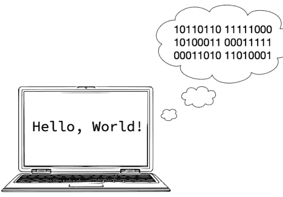

因此，作为计算机科学家，我们需要理解如何用二进制形式表示数字，以及如何对这些数字执行算术运算。
不过，首先，让我们回顾一下熟悉的*十进制系统*。

### 十进制系统

我们都使用过十进制系统。

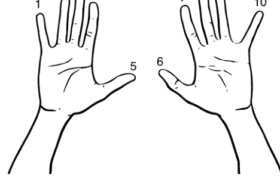

十进制系统是一种基于十的幂的*位置记数系统*。⁶ 这是什么意思呢？在十进制系统中，我们将数字表示为一系列十的幂的系数，每个系数出现在对应于某个十的幂的位置上。（我知道这有点拗口。）最好用一个例子来解释。

以（十进制）数字 8,675,309 为例。每个数字都是序列中的一个系数：

$8 \times 10^6 + 6 \times 10^5 + 7 \times 10^4 + 5 \times 10^3 + 3 \times 10^2 + 0 \times 10^1 + 9 \times 10^0$

回想一下，任何数的零次幂都是一——所以，$10^0 = 1$。如果我们进行计算，会得到正确的结果：

$8 \times 10^6 = 8,000,000$
$6 \times 10^5 = 600,000$
$7 \times 10^4 = 70,000$
$5 \times 10^3 = 5,000$
$3 \times 10^2 = 300$
$0 \times 10^1 = 00$
$9 \times 10^0 = 9$

所有这些加起来就是 8,675,309。

这展示了位置记数系统的强大和简洁。

请注意，如果我们使用十进制系统，我们需要十个数字作为系数。对于十进制，我们使用数字 0, 1, 2, 3, 4, 5, 6, 7, 8 和 9。

然而，除了我们大多数人恰好有十根手指可以用来计数这一事实外，选择 10 作为基数是任意的。

### 计算机与二进制系统

如前所述，计算机使用二进制系统。这一选择最初是基于这样一个事实：能够处于两种状态之一的电子元件通常比能够处于两种以上状态的元件更容易设计和实现。

那么二进制系统是如何工作的呢？它也是一种*位置记数系统*，但不是使用 10 作为基数，而是使用 2。

使用二进制时，我们只需要两个数字：0 和 1。

在二进制系统中，我们将数字表示为一系列*二*的幂的系数。与十进制系统一样，最好用一个例子来解释。

以十进制数字 975 为例。在二进制中是 1111001111。即：

$1 \times 2^9 + 1 \times 2^8 + 1 \times 2^7 + 1 \times 2^6 + 0 \times 2^5$
$+ 0 \times 2^4 + 1 \times 2^3 + 1 \times 2^2 + 1 \times 2^1 + 1 \times 2^0$

同样，进行计算

## 二进制算术

一旦掌握了窍门，二进制算术就很简单了。这里是最基本的例子：1加1。

```
      1
    + 1
    ----
    1 0
```

在个位上，我们计算一加一，结果是二——二进制的10——所以我们写下0，向十位进1，然后在十位上写下1，计算就完成了。

现在让我们计算1011（十进制的11）和11（十进制的3）的和。

```
  1 0 1 1
+     1 1
---------
  1 1 1 0
```

在个位上，我们计算一加一，结果是二——二进制的10——所以我们写下0，向十位进1。然后在十位上，我们计算一（进位）加一，再加一，结果是三——二进制的11——所以我们写下1，向四位进1。在四位上，我们计算一（进位）加零，所以我们写下1，没有进位。在八位上，我们只有单独的八，所以我们写下它，计算就完成了。验证一下（十进制）：

```
1 × 2³ + 1 × 2² + 1 × 2¹ + 0 × 2⁰ = 1 × 8 + 1 × 4 + 1 × 2 + 0 × 1
= 14
```

结果正确。

## 2.7 练习

### 练习 01

编写一行Python代码，将你的名字打印到控制台。

### 练习 02

选择题：Python是一种__________编程语言。

- a. 编译型
- b. 汇编型
- c. 解释型
- d. 二进制型

### 练习 03

判断对错？你在Python shell中编写的代码会被保存。

### 练习 04

如何退出Python shell？

### 练习 05

Python可以在两种不同的模式下运行。这些模式是什么，它们有何不同？

### 练习 06

以下是什么类型的代码示例？

```
1001011011011011 1110010110110001 1010101010101111
1111000011110010 0000101101101011 0110111000110110
```

### 练习 07

用二进制计算以下和：

- a. 10 + 1
- b. 100 + 11
- c. 11 + 11
- d. 1011 + 10

在二进制中计算出结果后，转换为十进制形式并检查你的计算。

### 练习 08（挑战！）

尝试二进制减法。11011 - 1110等于多少？在二进制中计算后，转换为十进制并检查你的答案。

# 第3章

## 类型与字面量

本章将通过介绍类型和字面量来扩展我们对编程的理解。Python中的所有对象都有一个*类型*，而*字面量*是给定类型的固定值。例如，字面量1是一个整数，其类型为`int`（“integer”的缩写）。Python有许多不同的类型。

## 学习目标

- 你将了解Python中许多常用的类型。
- 你将理解为什么我们需要不同的类型。
- 你将能够编写各种类型的字面量。
- 你将学习编写字符串字面量的不同方式，包括其中包含的各种引号。
- 你将了解表示误差，特别是它如何应用于数值类型（尤其是浮点值）。

## 引入的术语

- 动态类型
- 转义序列
- 空字符串、空元组和空列表
- 异构
- 字面量
- 表示误差
- 静态类型
- “强”类型与“弱”类型
- 类型（包括int、float、str、list、tuple、dict等）
- 类型推断
- Unicode

## 3.1 什么是*类型*？

考虑轮式机动车辆的范畴。有许多类型：摩托车、轻便摩托车、汽车、运动型多用途车、公共汽车、货车、牵引挂车、皮卡车、全地形车，*等等*，以及农业车辆如拖拉机、收割机，*等等*。每种类型都有区别于其他类型的特征。每种类型都适用于特定的目的（你不会用轻便摩托车去干拖拉机的活，对吧？）。

同样，Python中的每样东西都有一个*类型*，每种类型都适用于特定的目的。Python的类型包括数值类型，如整数和浮点数；序列，如字符串、列表和元组；布尔值（真和假）；以及其他类型，如集合、字典、范围和函数。

为什么编程语言中要有不同的类型？主要有三个原因。

首先，不同类型在计算机内存中的存储方式有不同的要求（我们将在讨论*表示*时稍作探讨）。

其次，某些操作可能适用于某些类型，而不适用于其他类型。例如，我们不能将5提升到“南瓜”次幂，也不能将“照亮”除以2。

第三，某些运算符的行为取决于其操作数的类型。例如，我们将在下一章看到+用于数值类型的加法，但当操作数是字符串时，+执行连接操作。Python如何知道要执行哪些操作以及允许哪些操作？它会检查操作数的类型。

## 什么是*字面量*？

**字面量**就是给定类型的固定值。例如，1是一个字面量。它字面上就是整数1。其他字面量示例如下。

## Python中一些常用的类型

以下是我们将看到的一些类型的示例。如果你现在还不知道它们都是什么，请不要担心——一切都会逐渐清晰。

| 类型 | 描述 | 字面量示例 |
|---|---|---|
| int | 整数 | 42, 0, -1 |
| float | 浮点数 | 3.14159, 2.7182, 0.0 |
| str | 字符串 | 'Python', 'badger', 'hovercraft' |
| bool | 布尔值 | True, False |
| NoneType | 无，无值 | None |
| tuple | 元组 | (), ('a', 'b', 'c'), (-1, 1) |
| list | 列表 | [], [1, 2, 3], ['foo', 'bar', 'baz'] |
| dict | 字典（键: 值） | {'cheese': 'stilton'}, {'age': 99} |
| function | 函数 | （见：第5章） |

## int

int类型表示*整数*，即正数、负数和零的整数。int字面量示例：1, 42, -99, 0, 10000000, *等等*。为了可读性，我们可以在整数字面量中使用下划线作为千位分隔符。例如，1_000_000比1000000更容易阅读，两者具有相同的值。

## float

float类型的对象表示浮点数，即带有小数（基数）点的数字。这些数字近似于实数（近似程度不一；参见表示误差部分）。float字面量示例：1.0, 3.1415, -25.1, *等等*。

## str

*字符串*是字符的有序序列。本页上的每个单词都是一个字符串。"abc123"和"@&)z)$"也是字符串——字符串的符号不必是字母。在Python中，str（字符串）类型的对象在有序序列中保存零个或多个符号。字符串必须用*定界符*括起来，以区别于变量名和我们稍后将看到的其他标识符。字符串可以用单引号、双引号或“三引号”定界。str字面量示例："abc", "123", "vegetable", "My hovercraft is full of eels.", """What nonsense is this?""", *等等*。

单引号和双引号在定界字符串时是等效的，但你必须保持一致——开始和结束的定界符必须相同。"foo"和'foo'都是有效的字符串字面量；"foo'和'foo"则不是。

```
>>> "foo'
File "<stdin>", line 1
    "foo'
    ^
SyntaxError: unterminated string literal (detected at line 1)
```

字符串可以完全没有字符！我们称之为*空字符串*，写作`''`或`""`（只是引号，中间什么也没有）。

三引号字符串在Python中有特殊含义，我们将在第6章关于风格的部分看到更多内容。它们也可用于创建多行字符串。多行字符串对于电子邮件模板和较长文本等内容很方便，但通常最好使用单引号或双引号版本。

## bool

bool类型用于Python中的两个特殊值：`True`和`False`。bool是“Boolean”的缩写，以乔治·布尔（1815–1864）命名，他是一位主要靠自学的逻辑学家和数学家，创立了布尔逻辑——现代逻辑和计算机科学的基石（尽管在布尔的时代计算机尚未存在）。

bool类型只有两个字面量：`True`和`False`。注意，这些不是字符串，而是该类型的特殊字面量（所以没有引号，且大小写很重要）。¹

## NoneType

NoneType是Python中一个表示值缺失的特殊类型。这可能看起来有点奇怪，但在编程中经常出现。这种类型*只有一个*字面量：`None`（实际上也只有一个该类型的实例）。

像`True`和`False`一样，`None`不是字符串，而是一个特殊字面量。

## tuple

*元组*是零个或多个值的*不可变序列*。如果一个对象是**不可变的**，这意味着它一旦创建就不能被更改。元组使用逗号分隔值来构造。*空元组*，`()`，是一个不包含任何元素的元组。

元组的元素可以是任何类型——包括另一个元组！元组的元素不必是相同的类型。也就是说，元组可以是*异构的*。

虽然Python语法并非严格要求（空元组的情况除外），但按照惯例，元组用括号括起来书写。元组示例：`()`, `(42, 71, 99)`, `(x, y)`, `('cheese', 11, True)`, *等等*。

元组的完整介绍出现在第10章。

## list

*列表*是零个或多个值的*可变序列*。如果一个对象是**可变的**，那么它可以在创建后被更改（我们稍后将看到如何修改列表）。列表必须用方括号创建，并且元素

¹在某些情况下，将它们解释为“开”和“关”可能有所帮助，但这会因上下文而异。

列表中的元素由逗号分隔。*空列表*，即 `[]`，是一个不包含任何元素的列表。

列表的元素可以是任何类型——包括另一个列表！列表的元素不必是相同类型。也就是说，与元组类似，列表可以是*异构的*。

列表示例：`[]`、`['hello']`、`['Larry', 'Moe', 'Curly']`、`[3, 6, 9, 12]`、`[a, b, c]`、`[4, 'alpha', ()]` 等。

关于列表的完整介绍请参见第 10 章。

## dict

dict 是 *dictionary*（字典）的缩写。与传统词典非常相似，Python 字典以键值对的形式存储信息。我们用花括号编写字典。键和值成对出现，用冒号分隔键和值。

字典的键有严格的限制（我们将在第 16 章看到）。然而，字典的值几乎可以是任何东西——包括列表、元组和其他字典！与列表一样，字典是可变的。示例：

```
{'Egbert': 19, 'Edwina': 22, 'Winston': 35}
```

关于字典的完整介绍请参见第 16 章。

我们将首先研究的几种类型是 int（整数）、float（浮点数）、str（字符串）和 bool（布尔值）。如前所述，我们将在后面了解更多关于其他类型的信息。

有关 Python 内置类型的完整参考，请参见：https://docs.python.org/3/library/stdtypes.html

## 3.2 动态类型

你可能听说过“强类型”语言或“弱类型”语言。这些术语没有精确的定义，其用途也有限。然而，人们将 Python 称为弱类型语言的情况并不少见。事实*并非*如此。如果我们一定要使用这些术语，Python 位于*强*类型的一端。Python 在运行时防止大多数类型错误，并且在类型之间执行非常少的隐式转换——因此，更准确地描述它是强类型语言。

### 静态类型和动态类型

更有用且更精确的概念是*静态类型*和*动态类型*。一些语言是*静态类型*的，这意味着类型在编译时已知——并且对象（变量）的类型在*运行时*（程序运行时）不能更改。

然而，Python 是*动态类型*的。这意味着变量的类型可以在运行时更改。例如，这在 Python 中可以正常工作：

```
>>> x = 1
>>> print(type(x))
<class 'int'>
>>> x = 'Hey! Now I am a string!'
>>> print(type(x))
<class 'str'>
```

这演示了动态类型。当我们第一次创建变量 `x` 时，我们给它赋值为字面值 `1`。Python 理解 `1` 是一个整数，因此结果是一个类型为 `'int'`（“integer”的缩写）的对象。在下一行，我们打印 `x` 的类型，Python 如预期打印出：`<class 'int'>`。然后，我们给 `x` 赋一个新值，Python 毫不迟疑地接受了。由于 Python 是动态类型的，我们可以在运行时更改变量的类型。当我们给 `x` 赋值 `'Hey! Now I am a string!'` 时，`x` 的类型变成了 `'str'`（“string”的缩写）。

在静态类型语言（比如 C、Java 或 Rust）中，如果我们尝试类似的操作，会在编译时收到错误。例如，在 Java 中：

```
int x = 1;
x = "Hey! Now I am a string!";
```

会导致编译时错误：“incompatible types: java.lang.String cannot be converted to int”。

请注意，与 Python 不同，在 Java 中声明变量时*必须*提供类型注解，并且一旦某个变量被声明为给定类型，该类型就*不能*更改。重要的是要注意，并非类型注解

```
int x = 1
```

使得 Java 成为静态类型语言。例如，其他语言具有*类型推断*但仍然是静态类型（Python 具有有限的类型推断）。*类型推断*是指编译器或解释器可以*推断*某物的类型，而无需明确被告知“这是一个字符串”或“这是一个整数”。例如，在 Rust 中：

```
let x = 1;
x = "Hey! Now I am a string!";
```

同样会导致编译时错误：“mismatched types... expected integer, found &str”。

虽然动态类型很方便，但这确实给程序员你带来了额外的责任。这一点尤其重要，因为 Python 与许多其他语言不同，它完全不关心函数的形式参数或返回值的类型。一些语言确保程序员不能编写以错误类型参数调用函数，或从函数返回错误类型值的代码。

Python 不会。Python 不会强制正确使用类型——这取决于你！

## 3.3 类型与内存

Python 如何在内存中存储对象的细节超出了本文的范围。然而，稍微窥探一下可能会很有启发性。

```
x = 65
```

变量 `x` 的实际内存内容

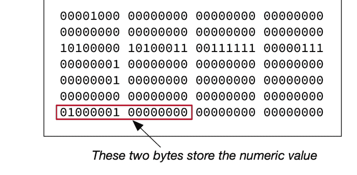

图 3.1：窥探一个 int 对象

图 3.1 包含一个值为（十进制）65 的整数的表示。在二进制中，十进制 65 表示为 01000001。即

0 × 2^7 + 1 × 2^6 + 0 × 2^5 + 0 × 2^4 + 0 × 2^3 + 0 × 2^2 + 0 × 2^1 + 1 × 2^0

在图 3.1 所示的位串²中找到 01000001。那就是整数值。³

图 3.2 显示了字符串 `'A'` 的表示。⁴ 字母 `'A'` 用值（码点）65 表示。

> ²位串只是一串零和一。
>
> ³实际上，该值存储在两个字节 `01000001 00000000` 中，如图 3.1 方框内所示。这种内存布局会因你机器上的特定实现而异。
>
> ⁴Python 使用 Unicode 编码字符串。关于字符编码的阅读，不要错过 Joel Spolsky 的《每个软件开发者绝对必须了解的关于 Unicode 和字符集的最低要求（没有借口！）》。

x = 'A'

变量 `x` 的实际内存内容

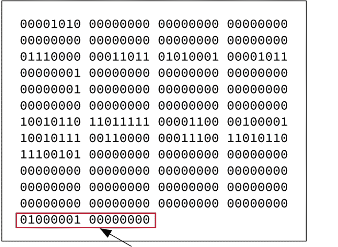

这两个字节存储了字母 'A' 的编码

图 3.2：窥探一个 str 对象

同样，在图 3.2 的位串中找到 01000001——那就是 'A' 的编码。

除了两种表示都包含值 65（01000001）之外，请注意整数和字符串的表示方式有多么不同！Python 如何知道将一个解释为整数，另一个解释为字符串？类型信息编码在这种表示中（这就是所有其他零和一的一部分）。这就是 Python 知道的方式。这就是类型至关重要的一个原因！

注意：其他语言的做法不同，并且上述表示会因你机器的架构而略有不同。

现在，你不需要知道 Python 如何使用计算机内存的所有细节就能编写有效的程序，但这应该能让你稍微洞察到我们需要类型的一个原因。作为程序员，对你来说重要的是理解不同类型具有不同的行为。有些事情你可以用整数做，但不能用字符串做，反之亦然（这是一件好事）。

## 3.4 关于字符串字面量的更多信息

### 字符串作为字符的有序集合

正如我们所看到的，字符串是由引号分隔的字符的有序集合。但字符串中可以包含什么样的字符？

自 Python 3.0 起，字符串由 *Unicode* 字符组成。⁵

> Unicode，正式名称为 Unicode 标准，是一项信息技术标准，用于一致地编码、表示和处理世界上大多数书写系统表达的文本。该标准由 Unicode 联盟维护，根据当前版本（15.0）定义了 149,186 个字符，涵盖 161 种现代和历史文字，以及符号、数千个表情符号（包括彩色）和非可视控制和格式代码。⁶

这是很多字符！

我们不会深入探讨 Unicode，但你应该知道 Python 使用它，并且 "hello"、"γειά σου" 和 "привіт" 在 Python 中都是有效的字符串。字符串也可以包含表情符号！

### 包含引号或撇号的字符串

你已经知道在 Python 中，我们可以使用单引号或双引号来分隔字符串。

```
>>> 'Hello World!'
'Hello World!'
>>> "Hello World!"
'Hello World!'
```

两者在语法上都是有效的，Python 不区分两者。

我们经常会遇到包含引号或撇号的字符串。这可能会影响我们对分隔符的选择。

例如，给定一家本地咖啡店的名字 "Speeder and Earl's"，我们有两种方式可以在 Python 中编写它。一种方法是在单引号分隔的字符串中*转义*撇号：

```
>>> 'Speeder and Earl\'s'
"Speeder and Earl's"
```

注意这里发生了什么。因为我们想在这个字符串中包含一个撇号，如果我们使用单引号，就需要在撇号前加上 `\`。这这被称为*转义*，它告诉Python接下来的内容应被解释为撇号，而不是结束定界符。我们将字符串`\'`称为*转义序列*。<sup>7</sup>

如果我们省略了它会怎样？

```
>>> 'Speeder and Earl's'
Traceback (most recent call last):
  File "<input>", line 1
    'Speeder and Earl's'
          ^
SyntaxError: unterminated string literal (detected at line 1)
```

这里发生了什么？Python将第二个单引号读作结束定界符，因此末尾多出了一个——语法上无效的——`s'`。

另一种方法是使用双引号作为定界符。

```
>>> "Speeder and Earl's"
"Speeder and Earl's"
```

同样的规则也适用于字符串内的双引号。假设我们想打印

"Medium coffee, please", she said.

我们可以在双引号定界符的字符串内转义双引号：

```
>>> ""Medium coffee, please", she said."
'"Medium coffee, please", she said.'
```

然而，在这种情况下，使用单引号定界符会更整洁一些。

```
>>> '"Medium coffee, please", she said.'
'"Medium coffee, please", she said.'
```

## 如果我们有一个同时包含撇号和双引号的字符串会怎样？

假设我们想要字符串

"I'll have a Speeder's Blend to go", she said.

现在怎么办？现在我们必须使用转义。以下两种方式都可以：

> <sup>7</sup>*转义序列*是一个确切起源未知的术语。它通常被理解为我们使用这些序列来“转义”所使用符号的常规含义。在这个特定的上下文中，它的意思是我们不将斜杠后的撇号视为字符串定界符（否则它会被这样处理），而是将其视为一个字面上的撇号。

```
>>> 'I\'ll have a Speeder\'s Blend to go", she said.'
'"I\'ll have a Speeder\'s Blend to go", she said.'
>>> print('"I\'ll have a Speeder\'s Blend to go", she said.')
"I'll have a Speeder's Blend to go", she said.
```

或者

```
>>> ""I'll have a Speeder's Blend to go", she said."
'"I\'ll have a Speeder\'s Blend to go", she said.'
>>> print(""I'll have a Speeder's Blend to go", she said.")
"I'll have a Speeder's Blend to go", she said.
```

虽然不太美观，但这就是它的样子。

## 关于转义序列的更多信息

我们已经看到如何使用转义序列`\'`和`\"`来避免撇号和引号被当作字符串定界符处理，从而允许我们在字符串字面量中使用这些符号。
还有其他工作方式不同的转义序列。转义序列`\n`和`\t`分别用于在字符串中插入换行符或制表符。转义序列`\\`用于在字符串中插入单个反斜杠。

| 转义序列 | 含义 |
| --- | --- |
| \n | 换行 |
| \t | 制表符 |
| \\ | 反斜杠 |
| \' | 单引号 / 撇号 |
| \" | 双引号 |

## Python字符串文档

更多信息，请参阅Python字符串文档，包括*Python非正式入门*<sup>8</sup>和*词法分析*。<sup>9</sup>

## 3.5 数值类型的表示错误

*表示错误*发生在我们试图使用有限的位数或数字来表示一个在所选系统中无法精确表示的数字时。例如，在我们熟悉的十进制系统中：

| 数字 | 十进制表示 | 表示错误 |
| :--- | :--- | :--- |
| 1 | 1 | 0 |
| 1/3 | 0.3333333333333333 | 0.0000000000000000333... |
| 1/7 | 0.1428571428571428 | 0.0000000000000000571428... |

## 自然数、整数、有理数和实数

你可能知道所有自然数的集合
$$\mathbb{N} = \{0, 1, 2, 3, ...\}$$
是无限的。

由此不难看出，所有整数的集合
$$\mathbb{Z} = \{..., -2, -1, 0, 1, 2, ...\}$$
也是无限的。

有理数$\mathbb{Q}$和所有实数的集合$\mathbb{R}$也是无限的。

这个事实——这些集合的大小是无限的——对计算机上的数值表示和数值计算有影响。

当我们使用计算机时，数字以整数或浮点数的形式表示。例如，在Python中，我们有独立的类型`int`和`float`来分别保存整数和浮点数。

我不会详细讨论它们在二进制中是如何表示的，但这里提供一些信息。

## 整数

整数的表示相对简单。整数被表示为二进制数，并为符号预留了一个位置。因此，12345将被表示为00110000 00111001。即
$$0 \times 2^{15} + 0 \times 2^{14} + 1 \times 2^{13} + 1 \times 2^{12}$$
$$+ 0 \times 2^{11} + 0 \times 2^{10} + 0 \times 2^9 + 0 \times 2^8$$
$$+ 0 \times 2^6 + 1 \times 2^5 + 1 \times 2^4 + 1 \times 2^3$$
$$+ 0 \times 2^2 + 0 \times 2^1 + 1 \times 2^0$$
计算结果为
$$8192 + 4096 + 32 + 16 + 8 + 1 = 12345.$$
负整数略有不同。如果你对此感到好奇，请参阅维基百科关于*二进制补码*的文章。

## 浮点数和IEEE 754

浮点数有点复杂。停下来想一分钟：*你*会如何表示浮点数？（这并不像你想象的那么简单。）

浮点数使用IEEE 754标准表示（IEEE代表“电气与电子工程师协会”）。<sup>10</sup>这种表示法有三个部分：符号、指数和尾数（也称为*尾数*或*有效数字*）——所有这些都必须用二进制表示。IEEE 754使用32位或64位来表示浮点数。表示的问题在于可用的位数是固定的：一位用于数字的符号，八位用于指数，其余用于小数部分。由于位数有限，因此可以无误差表示的值的数量也是有限的。

## 表示错误的例子

现在我们对整数和浮点数在计算机中的表示有了一些了解。考虑一下：我们为这些表示预留了固定数量的位数。<sup>11</sup>因此，我们在计算机上表示数字时可用的位数是有限的。你看出问题了吗？

所有整数的集合Z是无限的。所有实数的集合ℝ是无限的。我们能制造的任何计算机都是有限的。现在你看出问题了吗？

存在的整数和实数比我们能在*任何*固定位数的系统中表示的要多得多。请仔细体会这一点。

对于任何给定的机器或有限的表示方案，都存在*无限多个无法在该系统中表示的数字*！这意味着许多数字只能通过近似值来表示。

让我们回到十进制系统中1/3的例子。我们永远无法在小数点右边写下足够多的数字来得到1/3的精确值。

0.3333333333333333333333 ...

无论我们把这个展开式延伸多远，这个值都只是*1/3的近似值*。然而，它的十进制展开是非终止的这一事实是由基数（10）的选择决定的。

如果我们用三进制来表示它会怎样？在三进制中，十进制的1/3是0.1。在三进制中，它很容易表示！

当然，我们的计算机使用二进制，所以在那个系统（基数为2）中，有些数字可以精确表示，而无限多的数字只能近似表示。

这是一个典型的例子，在Python中：

<sup>10</sup>更多信息，请参阅：https://en.wikipedia.org/wiki/IEEE_754
<sup>11</sup>对于Python中的整数来说，这并不完全正确，但就当前目的而言，这样理解是合理的。

```
>>> 0.1
0.1
>>> 0.2
0.2
>>> 0.1 + 0.2
0.30000000000000004
```

等等！什么？是的。发生了一些奇怪的事情。Python在shell中显示时会四舍五入数值。这是证明：

```
>>> print(f'{0.1:.56f}')
0.10000000000000000555111512312578270211815834045410156250
>>> print(f'{0.2:.56f}')
0.20000000000000001110223024625156540423631668090820312500
>>> print(f'{0.1 + 0.2:.56f}')
0.30000000000000004440892098500626161694526672363281250000
```

最后一个，0.1 + 0.2，是表示错误累积到不再被Python的自动四舍五入所隐藏的例子，因此

```
>>> 0.1 + 0.2
0.30000000000000004
```

记住我们只处理2的幂。因此，无法用固定的小数位数在二进制中精确表示这些数字。

## 要点是什么？

- 1. 在给定的进位制中可以精确表示的实数子集取决于所选择的基数（1/3在十进制系统中无法无误差表示，但在三进制中可以）。
- 2. 重要的是我们要理解*没有有限的机器能够无误差地表示所有实数*。
- 3. 我们提供给计算机以及计算机以答案形式提供给我们的大多数数字*只是近似值*。
- 4. 也许从实际角度来看最重要的是，*表示错误会随着重复计算而累积*。
- 5. 理解表示错误可以防止你在没有错误时去寻找错误。

更多信息，请参阅：

- 浮点数算术：问题与限制：https://docs.python.org/3.10/tutorial/floatingpoint.html。

## 3.6 练习

### 练习 01

指出以下每个字面量的类型：

- a. 42
- b. True
- c. "Burlington"
- d. -17.45
- e. "100"
- f. "3.141592"
- g. "False"

你可以在 Python shell 中使用内置函数 `type()` 来检查你的答案。例如，

```
>>> type(777)
<class 'int'>
```

这告诉我们 777 的类型是 `int`。

### 练习 02

当你在 Python shell 中输入以下内容时会发生什么？

- a. 123.456.789
- b. 123_456_789
- c. hello
- d. "hello"
- e. "Hello" "World!"（这个可能会让你惊讶！）
- f. 1,000（这个也可能让你惊讶！）
- g. 1,000.234
- h. 1,000,000,000
- i. '1,000,000,000'

### 练习 03

以下代码都会导致 `SyntaxError`。请修复它们！

- a. 'Still the question sings like Saturn's rings'
- b. "When I asked him what he was doing, he said "That isn't any business of yours.""
- c. 'I can't hide from you like I hide from myself.'
- d. What's up, doc?

### 练习 04（挑战题！）

我们已经看到，大多数浮点十进制值都会出现表示误差。你能在区间 [0.0, 1.0) 中找到*没有*表示误差的值吗？给出三到四个例子。这些例子有什么共同点？

# 第 4 章

## 变量、语句和表达式

本章将通过引入类型和字面量来扩展我们对编程的理解。我们还将学习另外两个算术运算符：使用 `//` 运算符的整除（也称为欧几里得除法或整数除法），以及取模运算符 `%`（也称为余数运算符）。请注意，取模运算符与计算百分比无关——这是初学者常见的混淆点。

## 学习目标

- 你将学习如何使用赋值运算符，以及如何创建和命名变量。
- 你将学习如何使用加法、减法、乘法、除法和幂运算符。
- 你将学习除法和欧几里得除法（整数除法）的区别和用例。
- 你将学习如何使用余数或“取模”运算符。
- 你将学习 Python 中的运算符优先级。

## 引入的术语

- 绝对值
- 赋值
- 同余
- 被除数
- 除数
- 欧几里得除法
- 求值
- 异常
- 表达式
- 取整函数
- 模数
- 名称
- 运算符
- 商
- 余数
- 变量

### 4.1 变量和赋值

你已经编写过一个“Hello, World!”程序。如你所见，这并不十分灵活——你提供了要打印的确切文本。然而，更多时候，我们在编写程序时并不知道要使用的值。这些值可能依赖于用户输入、数据库记录、计算结果以及其他在编写程序时无法预知的来源。

想象一下编写一个程序来计算两个数的和并打印结果。我们可以这样写，

```
print(1 + 1)
print(2 + 2)
...
```

但这真的很笨拙。对于每一个我们想计算的和，我们都必须写另一条语句。

因此，当我们编写计算机程序时，我们使用*变量*。在 Python 中，**变量**是一个*名称*和一个具有特定*类型*的相关*值*的组合。<sup>1</sup>

需要注意的是，计算机程序中的变量*不同于*你在数学中学到的变量。例如，在数学中，我们可能会写 *a + b = 5*，当然，有无穷多对值的和为五。

在编写计算机程序时，变量则大不相同。虽然同一个名称可以在不同时间引用不同的值，但一个名称一次只能引用*一个*值。

### 赋值语句

在 Python 中，我们使用 `=` 将一个值赋给一个变量，我们称 `=` 为*赋值运算符*。变量名在赋值运算符的左侧，表达式（产生一个值）在赋值运算符的右侧。

```
a = 3       # 名为 `a` 的变量的值为 3
print(a)    # 向控制台打印 3
a = 17      # 现在名为 `a` 的变量的值为 17
print(a)    # 向控制台打印 17
```

> <sup>1</sup>Python 在这方面与大多数其他编程语言不同。在许多其他编程语言中，变量引用的是存储值的内存位置。（是的，从底层来看，这就是“幕后”发生的事情，但从用 Python 编写程序的人的角度来看，范式是变量是附加在*值*上的*名称*。）欢迎查阅术语表中的条目以获取更多信息。

赋值是 Python 中的一种*语句*。赋值语句将一个名称与一个值关联起来（或者在某些情况下，可以修改一个值）。

初学者常常对赋值运算符感到困惑。你可能会发现把它想象成一个指向左边的箭头会有所帮助。² 例如，在阅读你的代码时，

```
a = 42
```

说“*让* a 等于 42”，或者“a *得到* 42”，而不是“a 等于 42”（这听起来更像是一个关于 a 值的声明或断言）可能会有所帮助。这可以强化赋值的概念。³

### 动态类型

在 Python 中，所有值都有一个*类型*，并且 Python 在每一刻都知道每个值的类型。然而，Python 是一种*动态类型*语言。这意味着任何给定的*名称*可以在程序的不同时间点引用不同类型的值。所以这是有效的 Python 代码：

```
a = 42      # 现在 'a' 的类型是 int
print(a)    # 向控制台打印 42
a = 'abc'   # 现在 'a' 的类型是 str
print(a)    # 向控制台打印 'abc'
```

### 求值和赋值

有时我们可以在某个计算中使用一个变量，然后将结果重新赋值。例如：

```
x = 0
print(x)    # 向控制台打印 0
x = x + 1
print(x)    # 向控制台打印 1
x = x + 1
print(x)    # 向控制台打印 2
```

这里发生了什么？记住，`=` 是*赋值*运算符。所以在上面的代码片段中，我们不是在对等价性做断言；相反，我们是在给 x 赋值。对于：

```
x = 0
```

²实际上，指向左边的箭头在*伪代码*中常用来表示赋值——伪代码是在任何特定编程语言上下文之外对算法的描述。

³稍后，我们将看到比较运算符 `==`。它用于比较两个值是否相同。例如，如果 a 和 b 的值相同，那么 `a == b` 就是*真*。因此，在脑海中分清赋值（`=`）和比较（`==`）运算符很重要。

我们是将字面量值 0 赋给 x。此时我们可以说 x 的值是 0。

考虑这里发生的事情：

```
x = x + 1
```

所以首先，Python 会求值右边的表达式，然后将结果赋给 x。开始时，x 的值仍然是零，所以我们可以认为 Python 将 x 的值代入了右边的对象 x。

```
x = 0 + 1
```

然后求值右边：

```
x = 1
```

并将结果赋给 x。现在 x 的值是 1。如果我们再做一次，

```
x = x + 1
```

现在右边的 x 的值是 1，而 1 + 1 是 2，所以变量 x 的值是 2。

### 变量是与值关联的*名称*

Python 中的变量是什么？变量在 Python 中的工作方式与在许多其他语言中不同。再次强调，在 Python 中，变量是一个与值关联的名称。

考虑这段代码：

```
>>> x = 1001
>>> y = x
```

我们在这里做的是给同一个值起了两个不同的名字。这在 Python 中是完全没问题的。x 引用什么？值 1001。y 引用什么？*完全相同的 1001。*<sup>4</sup> 并*不是*内存中有两个不同的位置都存储着值 1001（这在另一种编程语言中可能是这种情况）。

现在，如果我们给 x 赋一个新值会发生什么？y 会“改变”吗？你怎么想？

```
>>> x = 2001
>>> x
2001
>>> y
1001
```

> <sup>4</sup>我们可以通过使用 Python 的内置 `id()` 函数检查相关对象的标识号来验证这一点。

不。尽管 x 现在有了新值 2001，但 y 保持不变，其值仍为 1001。

当我们给一个变量赋值时，

```python
>>> x = 1001
```

实际上发生的是我们将一个*名称*与一个值关联起来。在上面的例子中，1001 是值，x 是我们赋予它的名称。

一个值可以有多个名称与之关联。事实上，我们可以给同一个值赋予任意数量的名称。

```python
>>> x = 1001
>>> y = x
>>> z = y
```

现在，如果我们给 x 赋一个新值会怎样？

```python
>>> x = 500
>>> x
500
>>> y
1001
>>> z
1001
```

y 和 z 仍然是 1001 的名称，但现在名称 x 与一个新值 500 关联。

虽然一个值可以有多个名称与之关联，但理解每个名称只能引用一个单一的值（或对象）这一点很重要。x 不可能同时拥有两个不同的值。

```python
>>> x = 3
>>> x
3
>>> x = 42  # 3 怎么了？永远消失了。
>>> x
42
```

### 理解检查

给定以下 Python 代码片段，确定 x 的最终值：

1.  ```python
    x = 1
    ```

2.  ```python
    x = 1
    x = x + 1
    ```

3.  ```python
    y = 200
    x = y
    ```

4.  ```python
    x = 0
    x = x * 200
    ```

5.  ```python
    x = 1
    x = 'hello'
    ```

6.  ```python
    x = 5
    y = 3
    x = x + 2 * y - 1
    ```

## 常量

在编程中，很多时候我们希望多次使用一个特定的值或计算。与其一遍又一遍地重复相同的值或计算，我们可以将值赋给一个变量，然后在整个程序中重用它。我们称之为*常量*。**常量**是一个变量，其值在程序运行过程中将保持不变。使用常量可以提高程序的可读性，因为它们为固定的值提供了有意义且易于识别的名称。让我们看一个例子：

```python
HOURS_IN_A_DAY = 24
```

这里我们将变量 `HOURS_IN_A_DAY` 赋值为 24。这个变量是一个常量，因为一天中的小时数总是 24（至少在可预见的未来是这样）。现在，如果我们需要使用一天中的小时数进行一些计算，我们可以直接使用这个变量。注意，常量通常使用大写字母。虽然 Python 并不强制要求这样做，但这是一种良好的通用实践。

## 4.2 表达式

在编程——以及更广泛的计算机科学中——**表达式**是可以被*求值*的东西——也就是说，一个语法上有效的常量、变量、函数和运算符的组合，它会产生一个*值*。

让我们用 Python shell 试几个表达式。

### 重新审视字面量和类型

最简单的表达式是一个单独的*字面量*。

```python
>>> 1
1
```

刚才发生了什么？我们输入了一个简单的表达式——一个单独的字面量——Python 回复了它的值。字面量的特殊之处在于它们求值为自身！

再看一个：

```python
>>> 'Hello, Python!'
'Hello, Python!'
```

我们再次提供了一个单独的字面量，Python 再次回复了它的值。

你可能注意到 `'Hello, Python!'` 与 `1` 相当不同。你可能会说这些是不同*类型*的字面量——你是对的！字面量有不同的类型。以下是四种不同类型的四个不同字面量。

| 字面量 | 类型 |
| :--- | :--- |
| 'Hello, Python' | 字符串 (str) |
| 1 | 整数 (int) |
| 3.141592 | 浮点数 (float) |
| True | 布尔值 (bool) |

'Hello, Python!' 是一个*字符串*字面量。引号*界定*了字符串。它们让 Python 知道它们之间的内容应被解释为字符串，但*它们本身并不是字符串的一部分*。Python 允许使用单引号或双引号字符串，因此 "Hello, Python!" 和 'Hello, Python!' 在语法上都是正确的。注意，如果你以单引号 (') 开始，必须以单引号结束。同样，如果你以双引号 (") 开始，必须以双引号结束。

1 则不同。它是一个*整数*字面量。注意它周围没有引号。
鉴于此，后两个例子按预期工作。

```python
>>> 3.141592
3.141592
>>> True
True
```

这些是什么类型？3.141592 是一个*浮点数*字面量（即小数点右边有数字的数）。True 是所谓的*布尔*字面量。注意它周围没有引号，且首字母大写。True 和 False 是仅有的两个布尔字面量。

### 使用算术运算符的表达式

让我们尝试一些更复杂的表达式。为了构建更复杂的表达式，我们将使用一些简单的算术运算符，特别是一些*二元中缀*运算符。这些应该非常熟悉。*二元运算符*是作用于两个*操作数*的运算符。术语*中缀*意味着我们将运算符放在操作数*之间*。

```python
>>> 1 + 2
3
```

惊讶吗？可能不会。但无论如何，让我们考虑一下刚才发生了什么。
在提示符下，我们输入了 1 + 2，Python 回复了 3。1 和 2 是整数字面量，+ 是加法运算符。1 和 2 是操作数，+ 是运算符。这个组合 1 + 2 是一个语法上有效的 Python 表达式，它求值为……你猜对了，3。
Python 中的一些中缀算术运算符有：

| 运算符 | 描述 |
| :--- | :--- |
| + | 加法 |
| - | 减法 |
| * | 乘法（注意我们使用 * 而不是 ×） |
| / | 除法 |
| // | 整数除法或“地板除” |
| % | 余数或“取模” |
| ** | 幂运算 |

还有其他运算符，但这些目前足够了。这里我们将展示前四个的例子，其他的——地板除、取模和幂运算——我们稍后介绍。让我们试几个（我鼓励你跟着我们，在 Python shell 中尝试这些）。

```python
>>> 40 + 2
42
>>> 3 * 5
15
>>> 5 - 1
4
>>> 30 / 3
10.0
```

注意在最后一种情况下，执行除法时，Python 返回的是浮点数而不是整数（Python 确实支持所谓的*整数除法*或*地板除*，但我们稍后会讲到）。所以即使我们有两个整数操作数，除法也会产生一个浮点数。

你认为如果我们执行以下操作会得到什么结果？

```python
>>> 1 + 1.0
```

在这种情况下，Python 执行*隐式类型转换*，本质上是将 1 提升为 1.0，以便可以对相同类型进行加法。因此，结果是：

```python
>>> 1 + 1.0
2.0
```

Python 在类似上下文中会执行类似的类型转换：

```python
>>> 2 - 1.0
1.0
>>> 3 * 5.0
15.0
```

### 运算符的优先级

毫无疑问，你已经学过*运算优先级*，Python 遵循这些规则。

```python
>>> 40 + 2 * 3
46
>>> 3 * 5 - 1
14
>>> 30 - 18 / 3
24.0
```

乘法和除法的优先级高于加法和减法。我们也说乘法和除法比加法和减法*结合*得更紧密——这只是表达同一事物的不同方式。

正如你可能预期的那样，我们可以使用括号来对表达式进行分组。我们这样做是为了对优先级较低的操作进行分组——要么是为了执行所需的计算，要么是为了消除歧义或使我们的代码更易于阅读，或者两者兼而有之。

```python
>>> 40 + (2 * 3)
46
>>> 3 * (5 - 1)
12
>>> (30 - 18) / 3
4.0
```

那么这里发生了什么？括号内的部分首先被求值，然后 Python 执行剩余的操作。
我们可以使用这些算术运算符和括号来构建任意复杂度的表达式。

```python
>>> (1 + 1) * (1 + 1 + 1) - 1
5
```

Python 还有*一元运算符*。这些是只有一个操作数的运算符。例如，我们通过在前面加上 - 来对一个数取反。

```python
>>> -1
-1
>>> -1 + 3
2
>>> 1 + -3
-2
```

我们也可以对括号内的表达式取反。

```python
>>> -(3 * 5)
-15
```

### 运算符优先级总结

| 运算符 | 描述 |
| :--- | :--- |
| ** | 幂运算 |
| +, - | 一元正号或负号 (+x, -x) |
| *, /, //, % | 乘法，以及各种形式的除法 |
| +, - | 加法和减法 (x - y, x + y) |

括号内的表达式首先求值，因此你可能在高中学到的规则及其相关的助记符——PEMDAS（括号、幂运算、乘法和除法、加法和减法）——适用。

### 理解检查

1.  在计算表达式时，你认为Python是从左到右还是从右到左进行的？你能想到一个可以验证你假设的实验吗？写下可能提供一些证据的表达式。
2.  你认为为什么 `1 / 1` 的结果是 `1.0`（一个浮点数）而不是 `1`（一个整数）？

## 关于运算的更多内容

到目前为止，我们已经看到了一些涉及字面量、运算符和括号的简单表达式。我们也看到了几种类型的例子：整数、浮点数（简称“浮点数”）、字符串和布尔值。我们已经看到，我们可以对数值类型（整数和浮点数）执行算术运算。

## 运算符 + 和 * 应用于字符串

当操作数是字符串时，某些算术运算符的行为会有所不同。例如，

```
>>> 'Hello' + ', ' + 'World!'
'Hello, World!'
```

这是一个*运算符重载*的例子，这只是一个花哨的说法，表示一个运算符在不同的上下文中行为不同。在这种情况下，操作数是字符串，`+` 不执行加法，而是执行**连接**。**连接**是将两个或多个字符串连接在一起，就像连接铁路车厢一样。我们也可以将乘法运算符 `*` 与字符串一起使用。在字符串的上下文中，此运算符将多个字符串副本连接在一起。

```
>>> 'Foo' * 1
'Foo'
>>> 'Foo' * 2
'FooFoo'
>>> 'Foo' * 3
'FooFooFoo'
```

你认为以下表达式的结果是什么？

```
>>> 'Foo' * 0
```

这会得到 `''`，它被称为*空字符串*，是将零个 `'Foo'` 副本连接在一起的结果。请注意，结果仍然是一个字符串，尽管是空的。

## 4.3 增强赋值运算符

作为一种简写，Python提供了所谓的*增强赋值*运算符。以下是一些（但不是全部）：

| 增强赋值 | 类似于 |
| --- | --- |
| a += b | a = a + b |
| a -= b | a = a - b |
| a *= b | a = a * b |

一个常见的例子是递增或递减一。

```
>>> a = 0
>>> a += 1
>>> a
1
>>> a += 1
>>> a
2
>>> a -= 1
>>> a
1
>>> a -= 1
>>> a
0
```

你可以根据自己的偏好选择使用或不使用这些运算符。⁵

## 4.4 欧几里得或“地板”除法

在介绍表达式时，我们看到了一些常见的算术运算：加法、减法、乘法和除法。这里我们将介绍两个密切相关的额外运算：取模或“余数”运算符，以及各种被称为“商”、“地板除法”、“整数除法”或“欧几里得除法”的运算。⁶

很可能，当你在小学第一次学习除法时，你学的是欧几里得（地板）除法。例如，17 ÷ 5 = 3 余 2，或者 21 ÷ 4 = 5 余 1。在后一个例子中，我们称21为被除数，4为除数，5为商，1为余数。

> ⁵上表说“类似于”，因为例如，`a += b` 并不*完全*等同于 `a = a + b`。在增强赋值中，左侧*先于*右侧被求值，然后右侧被求值，结果被赋值给左侧的变量。还有一些其他细微的差别。

⁶欧几里得有许多以他命名的东西，即使他不是原创者（我猜名声带来名声）。无论如何，欧几里得并不知道你在小学学的除法算法。类似的除法算法依赖于印度-阿拉伯数字的位值系统，这些可以追溯到公元12世纪左右。你最可能学到的算法，称为“长除法”，可以追溯到公元1600年左右。

## 欧几里得或“地板”除法

显然，求商和求余数的操作密切相关。对于任意两个整数 $a$ 和 $b$，其中 $b \neq 0$，存在唯一的整数 $q$ 和 $r$，使得

$$a = bq + r$$

其中 $q$ 是欧几里得商，$r$ 是余数。此外，$0 \leq r < |b|$，其中 $|b|$ 是 $b$ 的绝对值。这应该很熟悉。

以防你需要复习：

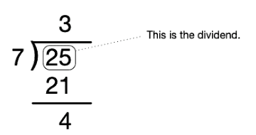

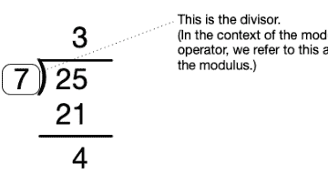

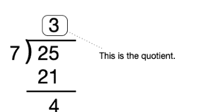

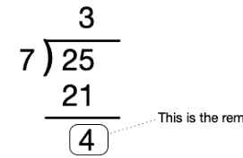

## Python的 // 和 % 运算符

Python为我们提供了计算商和余数的运算符。它们分别是 `//` 和 `%`。以下是一些例子：

```
>>> 17 // 5  # 计算商
3
>>> 17 % 5   # 计算余数
2
>>> 21 // 4  # 计算商
5
>>> 21 % 4   # 计算余数
1
```

你可能会问：我们之前看到的除法 `/` 和地板除法 `//` 有什么区别？区别在于 `/` 将商计算为十进制展开。这里有一个简单的比较：

```
>>> 4 / 3
1.3333333333333333  # 3除以4得1又1/3次
>>> 4 // 3          # 计算欧几里得商
1
>>> 4 % 3           # 计算余数
1
```

## 常见问题

### 当除数为零时会发生什么？

就像在数学中一样，在Python中我们也不能除以零。因此，如果右操作数为零，所有这些操作都会失败，Python会报错：`ZeroDivisionError`。

### 如果我们给 `//` 或 `%` 提供浮点操作数会怎样？

在这两种情况下，操作数首先被转换为公共类型。因此，如果一个操作数是浮点数，另一个是整数，整数将被转换为浮点数。然后计算会按你预期的方式进行。

```
>>> 7 // 2    # 如果两个操作数都是整数，我们得到一个整数
3
>>> 7.0 // 2  # 否则，我们得到一个浮点数...
3.0
>>> 7 // 2.0
3.0
>>> 7.0 // 2.0
3.0
>>> 7 % 2     # 如果两个操作数都是整数，我们得到一个整数
1
>>> 7.0 % 2   # 否则，我们得到一个浮点数...
1.0
>>> 7 % 2.0
1.0
>>> 7.0 % 2.0
1.0
```

### 如果被除数为零会怎样？

`0 // n` 和 `0 % n` 是什么？

```
>>> 0 // 5    # 5除以0得0次
0
>>> 0 % 5     # 余数也是0
0
```

### 如果被除数小于除数会怎样？

当 `m < n`，且 `m` 和 `n` 都是整数，`m ≥ 0`，`n > 0` 时，`m // n` 和 `m % n` 是什么？

第一个很简单：如果 `m < n`，那么 `m // n` 的结果是零。另一个一开始会让一些人困惑。

```
>>> 5 % 7
5
```

也就是说，7除以5得0次，余数是5。所以如果 `m < n`，那么 `m % n` 的结果是 `m`。

### 如果除数是负数会怎样？

当 `n < 0` 时，`m % n` 是什么？这可能一开始不会按你预期的方式工作。

```
>>> 15 // -5
-3
>>> 15 % -5
0
```

到目前为止，一切正常。现在考虑：

```
>>> 17 // -5
-4
>>> 17 % -5
-3
```

为什么 `17 // -5` 的结果是 `-4` 而不是 `-3`？记住，这被称为“地板除法”。Python所做的，是计算（浮点）商，然后应用地板函数。

地板函数是一个数学函数，给定某个数 $x$，返回小于或等于 $x$ 的最大整数。在数学中写作：

$\lfloor x \rfloor$。

所以在 `17 // -5` 的情况下，Python首先将操作数转换为浮点类型，然后计算（浮点）商，即 `-3.4`，然后应用地板函数，得到 `-4`（因为 `-4` 是小于或等于 `-3.4` 的最大整数）。

这也清楚地说明了为什么 `17 % -5` 的结果是 `-3`。这保持了等式

$a = bq + r$
$17 = (-5 \times -4) + (-3)$
$17 = 20 - 3$。

### 如果被除数是负数会怎样？

```
>>> -15 // 5
-3
>>> -15 % 5
0
```

到目前为止，一切正常。现在考虑：

```
>>> -17 // 5
-4
>>> -17 % 5
3
```

同样，Python保持了等式

$a = bq + r$
$-17 = (5 \times -4) + 3$
$-17 = -20 + 3$。

是的。我知道。这些需要一点时间来适应。

### 如果被除数和除数都是负数会怎样？

让我们试一试——既然已经看到了前面的例子，这应该不会令人惊讶。

```
>>> -43 // -3
14
>>> -43 % -3
-1
```

验证这个结果：

$$a = bq + r$$
$$-43 = (-3 \times 14) + (-1)$$
$$-43 = -42 - 1$$

`%` 运算符的结果总是与第二个操作数（或零）具有相同的符号。我们鼓励你使用Python shell进行实验。这是一个帮助你加深理解的好工具。

## 4.5 模运算

现在，在Python文档⁷中，你会看到 `//` 被称为地板除法。你也会看到 `%` 被称为*取模运算符*。将 `%` 视为余数运算符（带有上述注意事项）是可以的，但什么是“取模运算符”？让我们从时钟的例子开始。

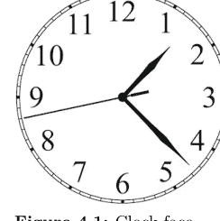

**图 4.1：** 时钟盘面

也许你没有意识到，但你一直在脑子里进行模运算。例如，如果有人问你9点之后5小时是几点，你会回答2点。你不会说14点。⁸这就是模运算的一个例子。事实上，模运算有时被称为“时钟算术”。

⁷https://docs.python.org/3/reference/expressions.html
⁸好吧。也许在军队或在欧洲你可能会这么说，但你明白我们的意思。我们有一个数字从12到11的时钟，12小时会让我们回到起点（至少就时钟盘面而言）。还要注意，对于带指针的模拟时钟盘面和数字时钟盘面，算术是相同的。这种接口上的差异根本不会改变数学，只是*视觉上*模拟时钟盘面看起来更直观。

## 4.5 模运算

**图 4.2：** 时钟算术：5 + 9 ≡ 2 (mod 12)

在数学中，我们会说 5 + 9 *模 12 同余于 2*，并写作

$$5 + 9 \equiv 2 \pmod{12}$$

5 + 9 = 14，而 14 ÷ 12 的余数是 2。

再看一个例子：

**图 4.3：** 时钟算术：11 + 6 ≡ 5 (mod 12)

类似地，我们会说 11 + 6 模 12 同余于 5，并写作

$$11 + 6 \equiv 5 \pmod{12}$$

让我们更正式地思考一下。假设我们有一个正整数 *n*，我们称之为*模数*。我们可以按照以下方式对这个整数进行算术运算。在计数时，当我们达到这个数，我们就从 0 重新开始。在时钟的情况下，这个正整数是 12，但它不必是 12——我们可以选择任何正整数。

例如，当 *n* = 5 时，我们会这样计数：

0, 1, 2, 3, 4, 0, 1, 2, 3, 4, 0, 1, 2, 3, 4, 0, ...

注意我们永远不会数到 5，而是从零重新开始。你会看到上面图中的时钟表盘上没有十二，而是零。如果 *n* = 5，那么我们的“时钟”上会有 5 个位置，编号从 0 到 4。

在这样的系统下，加法和减法将具有新的含义。例如，当 *n* = 5 时，4 + 1 ≡ 0 (mod 5)，4 + 2 ≡ 1 (mod 5)，4 + 3 ≡ 2 (mod 5)，依此类推。

减法的工作原理类似，只是我们逆时针进行。例如 1 − 3 ≡ 3 (mod 5)。

同样的原理也适用于乘法：2 × 4 ≡ 3 (mod 5) 且 3 × 3 ≡ 4 (mod 5)。

图 4.4：一个 (mod 5) 的“时钟”

图 4.5：4 + 1 ≡ 0 (mod 5)

图 4.6：4 + 2 ≡ 1 (mod 5)

图 4.7：4 + 3 ≡ 2 (mod 5)

图 4.8：1 - 3 ≡ 3 (mod 5)

### 负模数

我们已经看到，加法时我们顺时针走，减法时我们逆时针走。当模数是负数时会发生什么？

为了保持加法（顺时针）和减法（逆时针）的“方向”，如果我们的模数是负数，我们就逆时针地给时钟表盘编号。

示例：
1 ≡ -4 (mod -5)
2 ≡ -3 (mod -5)
2 + 4 ≡ -4 (mod -5)

我们可以确认这些与 Python 对这些表达式的求值一致：

```
>>> 1 % -5
-4
>>> 2 % -5
-3
>>> (4 + 2) % -5
-4
```

为什么我把 (4 + 2) 放在括号里？因为 % 的优先级高于 +。再次强调，尝试在 Python shell 中输入你自己的表达式。

图 4.9：一个 (mod -5) 的“时钟”

图 4.10：1 ≡ -4 (mod -5)

图 4.11：2 ≡ -3 (mod -5)

### 一些需要注意的事项

- 如果模数是整数，n > 0，那么可能的余数只有 [0, 1, ..., n - 1]。
- 如果模数是整数，n < 0，那么可能的余数只有 [n + 1, ..., -1, 0]。

### 接下来呢？

这实际上是一个很大的主题，涉及等价类、余数（在此上下文中称为“剩余”）等。这些都超出了本教科书的范围。然而，实际上，模运算有丰富的应用，我们将在本文中反复看到它。

模运算的一些应用包括：

- 哈希函数
- 密码学
- 素性与整除性测试
- 数论

这里有几个简单的例子。

### 示例：鸡蛋和纸箱

珍妮有 n 个鸡蛋。如果一个纸箱能装 12 个鸡蛋，她能装满多少个完整的纸箱，还剩下多少个鸡蛋？

```
EGGS_PER_CARTON = 12
cartons = n // EGGS_PER_CARTON
leftover = n % EGGS_PER_CARTON
```

### 示例：奇数或偶数

给定某个整数 $n$，$n$ 是偶数还是奇数？

```
if n % 2 == 0:
    print(f'{n} is even')
else:
    print(f'{n} is odd')
```

（是的，有更简单的写法。我们稍后会讲到。）

### 理解检查

1. 给定某个模数 $n$（一个整数）和某个被除数 $d$（也是一个整数），如果
   a. $n = 5$
   b. $n = -4$
   c. $n = 2$
   d. $n = 0$
   那么 $d \% n$ 的可能值是什么？
2. 解释为什么如果模数是正数，余数永远不可能大于模数。
3. 行星 Zorlax 每 291 1/3 个 Zorlax 日绕其太阳公转一周。因此，从第 1 年开始，Zorlax 上每三年是一个闰年。所以第 3 年是闰年。第 6 年是闰年。第 273 年是闰年。编写一个 Python 表达式，给定某个大于或等于 1 的整数 $y$ 表示年份，将确定 $y$ 是否代表 Zorlax 闰年。
4. 有一首有趣的小诗：所罗门·格兰迪—— / 星期一出生， / 星期二受洗， / 星期三结婚， / 星期四生病， / 星期五恶化， / 星期六去世， / 星期日安葬。 / 这就是 / 所罗门·格兰迪的结局。⁹ 这怎么可能？所罗门·格兰迪是婴儿时就结婚了吗？他在一周岁前就去世了吗？这与模运算有什么关系？如果我告诉你所罗门·格兰迪在 28 岁时结婚，81 岁时去世呢？请解释。

⁹首次由 James Orchard Halliwell 记录并于 1842 年出版。作者对标点符号做了细微修改。

## 4.6 指数运算

指数运算是一种普遍的数学运算。然而，指数运算的语法在不同编程语言中有所不同。在某些语言中，脱字符（^）是指数运算符。在其他语言中，包括 Python，它是双星号（**）。有些语言没有指数运算符，而是提供一个库函数 `pow()`。

这些差异的原因很大程度上是历史性的。在数学中，我们将指数写为上标，例如 $x^2$。然而，键盘和字符集不知道上标¹⁰，因此编程语言的设计者必须想出不同的方式来书写指数运算。

** 最早用于 Fortran，该语言于 1957 年首次出现。这就是 Python 用于指数运算的运算符。

出于好奇，这里有一个表格，列出了一些编程语言及其用于指数运算的运算符或函数。

| 运算符 | 语言 |
| :--- | :--- |
| ** | Algol, Basic, Fortran, JavaScript, OCaml, Pascal, Perl, **Python**, Ruby, Smalltalk |
| ^ | J, Julia, Lua, Mathematica |
| pow() | C, C++, C#, Dart, Go, Java, Kotlin, Rust, Scala |
| expt | Lisp, Clojure |

### Python 中的指数运算

现在我们知道 ** 是 Python 中的指数运算符。这是一个*中缀*运算符，意味着运算符出现在其两个操作数*之间*。正如你所料，第一个操作数是*底数*，第二个操作数是*指数*或*幂*。所以，

```
b ** n
```

实现了 $b^n$。

以下是一些示例，

| 描述 | 表达式 |
| :--- | :--- |
| 给定半径的圆的面积 | 3.14159 * radius ** 2 |
| 给定质量和速度的动能 | (1 / 2) * m * v ** 2 |

同样，正如你所料，** 的优先级高于 *，所以在上面的例子中，radius ** 2 和 v ** 2 在与其他项相乘之前计算。

> ¹⁰吹毛求疵地说，这并不完全正确，因为现在有些字符集包含上标 2 和 3。但它们不被理解为数字，在编程中也没有用处。

### 但是等等！还有更多！

你迟早会发现，所以你现在不妨知道 Python 也有一个内置函数 `pow()`。就我们的目的而言，`**` 和 `pow()` 是等价的，所以你可以使用任何一个。以下是 Python shell 中的一个会话：

```
>>> 3 ** 2
9
>>> 3.0 ** 2
9.0
>>>
>>> pow(3, 2)
9
>>> pow(3.0, 2)
9.0
```

有两个操作数或参数时，`**` 和 `pow()` 的行为完全相同。如果两个操作数都是整数，并且指数是正数，结果将是整数。如果一个或多个操作数是浮点数，结果将是浮点数。

负指数或分数指数的行为如你所料。

```
>>> 3 ** 0.5    # 计算 3 的平方根
1.7320508075688772
>>> 3 ** -1      # 计算 1 / 3
0.3333333333333333
```

这里没有意外。

$x^0 = 1$

从代数中我们知道，任何非零数的零次幂都是一。如果不是这样，这个规则会变成什么样？

$b^{m+n} = b^m \times b^n$

所以对于所有非零 $x$，$x^0 = 1$。Python 也知道这一点。

```
>>> 1 ** 0
1
>>> 2 ** 0
1
>>> 0.1 ** 0
1.0
```

那么 $0^0$ 呢？许多数学文本指出这应该是未定义的或不确定的。另一些则说 $0^0 = 1$。你认为 Python 会怎么做？

所以，Python 对此有自己的看法。
现在，去进行指数运算吧！

## 一个小谜题

考虑以下 Python shell 会话：

```
>>> pow(-1, 0)
1
>>> -1 ** 0
-1
```

这是怎么回事？我们使用 `pow()` 得到的结果是预期的。难道这两个表达式不应该产生相同的结果吗？你能猜出为什么它们会得到不同的答案吗？

## 4.7 异常

**异常**是在运行时发生的错误，也就是在你运行代码时发生的错误。当发生此类错误时，Python 会引发一个异常，打印一条包含异常信息的消息，然后停止执行。异常有不同的类型，这告诉我们发生了哪种错误。

如果存在语法错误，会引发 `SyntaxError` 类型的异常。如果存在缩进错误（一种更具体的语法错误），会引发 `IndentationError`。这些错误发生在你的代码运行之前——它们是在 Python 首次读取你的文件时被发现的。

大多数其他异常发生在你的程序运行时。在这些情况下，消息将包含所谓的*回溯信息*，它提供了关于错误发生在代码中何处的一些信息。异常消息的最后一行报告了已发生异常的类型。从下往上阅读此类消息通常很有帮助。

以下是对你可能遇到的前几种异常类型的简要总结，并且在每个新章节中，我们将根据需要介绍新的异常类型。

### SyntaxError

如果你编写的代码不符合 Python 语法规则，Python 将引发 `SyntaxError` 类型的异常。示例：

```
>>> 1 + / 1
File "<stdin>", line 1
  1 + / 1
    ^
SyntaxError: invalid syntax
```

注意，`^` 字符用于指示错误发生的位置。
另一个示例：

```
>>> True False
File "<stdin>", line 1
    True False
    ^
SyntaxError: invalid syntax
```

当你遇到语法错误时，意味着你的代码的某些部分不符合语法规则。包含语法错误的代码无法被 Python 解释器执行，并且必须在代码运行之前纠正语法错误。

### NameError

当我们尝试使用一个未定义的名称时，会发生 NameError。在使用名称之前，必须为该名称分配一个值。
这是一个 NameError 的示例：

```
>>> print(x)
Traceback (most recent call last):
  File "<stdin>", line 1, in <module>
NameError: name 'x' is not defined
```

注意，Python 报告了 NameError 并告知你尝试使用但未定义的名称（在本例中为 x）。
这类错误最常发生在我们拼写错误名称时。
根据错误的根本原因，有两种方法可以纠正这些错误。

- 如果原因是拼写错误，只需纠正你的拼写错误。
- 如果不仅仅是拼写错误，那么你必须通过使用适当的名称进行赋值来*定义*该名称。

```
>>> pet = 'rabbit'
>>> print(pot)
Traceback (most recent call last):
  File "<stdin>", line 1, in <module>
NameError: name 'pot' is not defined
>>> print(pet)
rabbit
```

```
>>> age = age + 1  # Happy birthday!
Traceback (most recent call last):
  File "<stdin>", line 1, in <module>
NameError: name 'age' is not defined
```

```
>>> age = 100
>>> age = age + 1  # Happy birthday!
>>> print(age)
101
```

### TypeError

当我们尝试对不支持该操作的对象执行操作时，会发生 TypeError。

Python 文档指出："[TypeError 在]将操作或函数应用于不适当类型的对象时引发。关联值是一个字符串，提供有关类型不匹配的详细信息。"<sup>11</sup>

例如，我们可以使用 `+` 运算符对 `int` 类型的操作数执行加法，也可以使用相同的运算符连接字符串，但我们不能将 `int` 与 `str` 相加。

```
>>> 2 + 2
4
>>> 'fast' + 'fast' + 'fast'
'fastfastfast'
>>> 2 + 'armadillo'
Traceback (most recent call last):
  File "<stdin>", line 1, in <module>
TypeError: unsupported operand type(s) for +: 'int' and 'str'
```

当你遇到 TypeError 时，你必须检查运算符和操作数，并确定最佳的修复方法。这将因情况而异。

以下是其他一些 TypeError 示例：

```
>>> 'hopscotch' / 2
Traceback (most recent call last):
  File "<stdin>", line 1, in <module>
TypeError: unsupported operand type(s) for /: 'str' and 'int'
```

```
>>> 'barbequeue' + 1
Traceback (most recent call last):
  File "<stdin>", line 1, in <module>
TypeError: can only concatenate str (not "int") to str
```

### ZeroDivisionError

正如我们在数学中不能除以零一样，在 Python 中也不能除以零。由于取余运算符 (%) 和整数（也称为地板）除法 (//) 依赖于除法，因此同样的限制也适用于它们。

<sup>11</sup>https://docs.python.org/3/library/exceptions.html#TypeError

```
>>> 1000 / 0
Traceback (most recent call last):
  File "<stdin>", line 1, in <module>
ZeroDivisionError: division by zero
```

## 4.8 练习

### 练习 01

在不先在 Python 提示符下输入这些内容的情况下，确定以下每个表达式的值。一旦你计算出你认为的求值结果，请使用 Python shell 检查你的答案。

- a. 13 + 6 - 1 * 7
- b. (17 - 2) / 5
- c. -5 / -1
- d. 42 / 2 / 3
- e. 3.0 + 1
- f. 1.0 / 3
- g. 2 ** 2
- h. 2 ** 3
- i. 3 * 2 ** 8 + 1

### 练习 02

对于练习 01 中的每个表达式，给出求值结果的*类型*。示例：1 + 1 求值为 2，其类型为 *int*。

### 练习 03

以下表达式的求值结果是什么？

- a. 10 % 2
- b. 19 % 2
- c. 24 % 5
- d. -8 % 3

### 练习 04

你认为如果我们对非数字类型使用刚刚看到的操作数会发生什么？例如，你认为如果我们输入以下内容会发生什么。然后使用 Python 解释器检查你的预期。有什么意外吗？

- a. 'Hello' + ', ' + 'World!'
- b. 'Hello' * 3
- c. True * True
- d. True * False
- e. False * 42
- f. -True
- g. True + True

### 练习 05

以下语句有什么区别？

```
it_is_cloudy_today = True
it_will_rain_tomorrow = 'True'
```

### 练习 06

有些操作数不适用于某些类型。例如，以下内容将导致错误。在提示符下尝试这些，并观察发生了什么。记下发生的错误类型。

- a. 'Hello' / 3
- b. -'Hello'
- c. 'Hello' - 'H'

### 练习 07

- a. 编写一条语句，将值 79.95 赋给变量名 subtotal。
- b. 编写一条语句，将值 0.06 赋给变量名 tax_rate。
- c. 编写一条语句，将 subtotal 乘以 tax_rate，并将结果赋给变量名 sales_tax。
- d. 编写一条语句，将 subtotal 和 sales_tax 相加，并将结果赋给变量名 total。

### 练习 08

你认为如果我们求值表达式 1 / 0 会发生什么？为什么？这会导致错误吗？会导致什么类型的错误？

### 练习 09

- a. 既然我们已经了解了一点模运算，重新考虑我们在十进制（基数为 10）系统中使用的数字。在该系统中，为什么我们只有数字 0、1、2、3、4、5、6、7、8 和 9？
- b. 在基数为 7 的系统中我们需要哪些数字？基数为 5 呢？

# 第 5 章

### 函数

本章介绍*函数*。函数是所有编程语言中代码的基本构建块（尽管根据上下文，它们可能有不同的名称）。

## 学习目标

- 你将学习如何使用 `def` 在 Python 中编写简单的函数。
- 你将学习如何在代码中使用函数。
- 你将学习缩进在 Python 中具有语法意义（与许多其他语言不同）。
- 你将学习如何在 Python 的 math 模块中使用函数（和常量），例如平方根和正弦。
- 你将扩展和巩固对前面章节中介绍的主题的理解。

## 引入的术语和关键字

- 参数
- 调用或调用
- def 关键字
- 点表示法
- 形式参数
- 函数
- import
- 关键字
- 局部变量
- 模块
- 纯函数和非纯函数
- return 关键字
- 返回值
- 作用域
- 遮蔽
- 副作用

## 5.1 函数简介

作为程序员，我们拥有的最强大的工具之一——或许是最强大的工具——是*函数*。

我们已经见过一些内置的 Python 函数，*例如* `print()` 和 `type()`。我们很快会看到更多。

本质上，函数是一个子程序，我们可以在更大的程序中“调用”或“调用”它。例如，考虑这段将字符串打印到控制台的代码。

```
print('Do you want a cookie?')
```

这里我们使用了内置的 Python 函数 `print()`。Python 的开发者已经为你编写了这个函数，所以你可以在你的程序中使用它。当我们使用一个函数时，我们说我们正在“调用”或“调用”该函数。

在上面的例子中，我们*调用*了 `print()` 函数，并提供了字符串 `'Do you want a cookie?'` 作为参数。

作为使用此函数的程序员，你不需要担心“底层”发生了什么（实际上相当多）。多么方便！

当我们调用一个函数时，程序中的控制流会传递给该函数，函数执行其工作，然后返回一个值。所有 Python 函数都返回一个值，尽管在某些情况下，返回的值是 `None`。

## 定义函数

Python 允许我们定义自己的函数。**函数**是执行某些计算或任务的代码单元。函数可以接受零个或多个**参数**（函数的输入）。函数的定义可以包含零个或多个**形式参数**，这些参数本质上是将接受所提供的参数值的变量。当被调用时，函数体被执行。在大多数情况下（但不是所有情况），会显式返回一个值。返回的值可能是计算结果或某种状态指示器——这将根据函数的目的而变化。如果没有显式返回值，则隐式返回值 `None`。

让我们以一个对数字求平方的函数为例。在你的数学课上，你可能会写

$$f(x) = x^2$$

你会理解，当我们对某个参数 $x$ 应用函数 $f$ 时，结果是 $x^2$。例如，$f(3) = 9$。让我们用 Python 编写一个对提供的参数求平方的函数：

> ¹与 C 或 Java 不同，Python 中没有 *void* 函数这样的东西。所有 Python 函数都返回一个值，即使该值是 `None`。

²不同的语言对可以在更大程序中调用的子程序有不同的名称，*例如*，函数、方法、过程、子程序等，其中一些名称会根据上下文而变化。此外，这些在不同语言中的定义和实现方式也有些不同。然而，所有语言的基本思想是相似的：这些是我们可以在程序中调用或调用的代码部分。

```
def square(x):
    return x * x
```

`def` 是一个 Python 关键字，是“define”的缩写，它告诉 Python 我们正在定义一个函数。（**关键字**是语言语法的一部分保留字。`def` 就是这样一个关键字，我们很快会看到其他关键字。）用 `def` 定义的函数必须有名称（也称为“标识符”），³ 因此我们给函数取名为“square”。

现在，为了计算某个东西的平方，我们需要知道那个东西是什么。这就是 `x` 的作用。我们将其称为函数的*形式参数*。当我们在代码的其他地方使用此函数时，必须为 `x` 提供一个值。传递给函数的值称为*参数*（然而，在非正式用法中，人们经常互换使用“parameter”和“argument”）。

在定义的第一行末尾，我们添加一个冒号。冒号之后的内容称为函数的*体*。函数的实际工作是在函数体内完成的。函数体必须缩进，如下所示——这是语言语法要求的。需要注意的是，*函数体仅在函数被调用时执行，而不是在定义时执行*。

在这个例子中，我们计算平方 `x * x`，并*返回*结果。`return` 是一个 Python 关键字，它的作用正是如此：从函数返回某个值。

让我们在 Python shell 中尝试一下，看看它是如何工作的：

```
>>> def square(x):
...     return x * x
...
>>>
```

这里我们定义了函数 `square()`。注意，如果我们在 shell 中输入这个，在冒号后按回车键后，Python 会回复 `...` 并为我们缩进。这是为了表明 Python 期望函数体紧随其后。记住：函数体必须缩进。Python 中的缩进在语法上很重要（如果你用过 Java、C、C++、Rust、JavaScript、C# 等语言编码，这可能看起来很奇怪；Python 使用缩进而不是花括号）。

所以我们编写函数体——在这个例子中，它只有一行。同样，Python 回复 `...`，本质上是在问“还有更多吗？”。这里我们按回车键，Python 理解我们完成了，我们回到了 `>>>` 提示符。

现在让我们通过调用它来使用我们的函数。要调用一个函数，我们给出名称，并提供所需的参数。

> ³Python 确实允许匿名函数，称为“lambdas”，但那是以后的事了。目前，我们将按照这里演示的方式定义和调用函数。

```
>>> square(5)   # 用参数 5 调用 `square`
25
>>> square(7)   # 用参数 7 调用 `square`
49
>>> square(10)  # 用参数 10 调用 `square`
100
```

注意，一旦我们定义了函数，就可以一遍又一遍地重用它。这是函数的主要动机之一。
还要注意，在这种情况下，函数体外没有 `x`。

```
>>> x
Traceback (most recent call last):
  File "/blah/blah/code.py", line 90, in runcode
    exec(code, self.locals)
  File "<input>", line 1, in <module>
NameError: name 'x' is not defined
```

在这种情况下，`x` 仅存在于函数体内。⁴ 我们在括号内提供的参数在函数体内作为 `x` 变得可用。然后函数计算 `x * x` 并返回作为此计算结果的*值*。
如果我们希望使用函数返回的值，可以通过将值赋给某个变量来保存它，或在表达式中使用它，甚至将其作为另一个函数的参数！

## 我们能在函数中创建新变量吗？

是的。当然可以。

```
def cube(x):
    y = x ** 3   # 将结果赋给局部变量 `y`
    return y      # 返回 `y` 的值
```

我们将这样的变量名（本例中的 `y`）称为*局部变量*，与函数的形式参数一样，它们仅存在于函数体内。

⁴这就是所谓的“作用域”，在给定的例子中，`x` 仅存在于函数的作用域内。它在函数外部不存在——为此我们说“`x` 超出了作用域”。我们稍后会了解更多关于作用域的知识。

## 存储函数返回的值

继续我们的 `square()` 示例：

```
>>> a = 17
>>> b = square(a)
>>> b
289
```

注意，我们可以将变量作为参数提供给函数。还要注意，这个对象不必称为 `x`。⁵

## 在表达式中使用函数返回的值

有时不需要将函数返回的值赋给变量。让我们使用 `square()` 函数返回的值来计算半径为 `r` 的圆的周长。

```
>>> PI = 3.1415926
>>> r = 126.1
>>> PI * square(r)
49955.123667046
```

注意，我们没有先将返回的值赋给变量，而是直接在表达式中使用了结果。

## 将函数返回的值传递给另一个函数

类似地，我们可以将函数返回的值传递给另一个函数。

```
>>> print(square(12))
144
```

这里发生了什么？我们将值 12 传递给 `square()` 函数，该函数计算平方并返回结果（144）。这个结果成为我们传递给 `print()` 函数的值，毫不奇怪，Python 打印 144。

## 所有 Python 函数都返回值吗？

这是一个合理的问题，答案是“是的”。但是 `print()` 呢？嗯，`print()` 的重点不是返回某个值，而是在控制台中显示某些内容。我们称函数除了返回值之外所做的其他事情为*副作用*。调用 `print()` 的副作用是在控制台中显示某些内容。

> ⁵事实上，即使外部作用域中的变量与函数的参数或函数内的局部变量同名在语法上是有效的，但最好它们不要使用相同的标识符。有关更多信息，请参阅“遮蔽”部分。

## 函数能为我们做什么

-   函数允许我们将程序分解成更小、更易于管理的部分。
-   它们使程序更容易调试。
-   它们使程序员更容易进行团队协作。
-   函数可以被高效地测试。
-   函数可以编写一次，多次使用。

### 理解检查

1.  编写一个函数，计算任意整数的后继数。也就是说，给定某个参数 n，函数应返回 n + 1。
2.  形式参数和实参有什么区别？
3.  函数的函数体何时执行？

## 5.2 深入探讨函数

回想一下，我们使用 Python 关键字 `def` 来定义一个函数。因此，例如，如果我们想在 Python 中实现以下数学函数：

$f(x) = x^2 - 1$

我们的函数需要接受一个参数并返回计算结果。

```python
def f(x):
    return x ** 2 - 1
```

我们将 f 称为函数的*名称*或*标识符*。标识符后面括号内的是函数的*形式参数*。一个函数可以有零个或多个参数。上面的函数有一个参数 x。⁷

让我们看一个完整的 Python 程序，其中定义了这个函数，然后被调用了两次：一次使用参数 12，一次使用参数 5。

> ⁷虽然 Python 确实支持可选参数，但我们这里不介绍其语法。

```python
"""
函数演示
"""

def f(x):
    return x ** 2 - 1

if __name__ == '__main__':

    y = f(12)
    print(y)

    y = f(5)
    print(y)
```

这里我们定义了函数。
此时，x 还没有值，
并且这段代码不会被执行。

记住：编写函数定义并不会执行该函数。
函数*仅在被调用时*才会执行。

## 调用函数

一旦我们编写了函数，我们就可以通过名称*调用*或*执行*该函数，并提供必要的参数。要调用上面的函数 `f()`，我们必须提供一个参数。

```python
y = f(12)
```

这会调用函数 `f()`，参数为 12，并将结果赋值给名为 y 的变量。现在发生了什么？

```python
"""
函数演示
"""

def f(x):
    return x ** 2 - 1

if __name__ == '__main__':

    y = f(12)
    print(y)

    y = f(5)
    print(y)
```

这里我们调用函数，
提供 12 作为参数。

当我们用参数调用函数时，参数被*传递*给函数。形式参数接收该参数——也就是说，*参数被赋值给形式参数*。因此，当我们把参数 12 传递给函数 `f()` 时，首先发生的是形式参数 x 被赋值为该参数。这几乎就像我们在函数体的第一行执行了赋值 `x = 12`。

```python
"""
函数演示
"""
def f(x):
    return x ** 2 - 1

if __name__ == '__main__':
    y = f(12)
    print(y)

    y = f(5)
    print(y)
```

当我们调用函数并传递参数 12 时，x 的值变为 12。

一旦形式参数被赋予了参数的值，函数就开始工作，执行函数体。

```python
"""
函数演示
"""
def f(x):
    return x ** 2 - 1

if __name__ == '__main__':
    y = f(12)
    print(y)

    y = f(5)
    print(y)
```

现在，当 x = 12 时，函数计算表达式...
...12 × 12 - 1
...144 - 1
...143

然后，函数返回结果。控制流返回*到调用该函数的位置*。

```python
"""
函数演示
"""

def f(x):
    return x ** 2 - 1

if __name__ == '__main__':
    y = f(12)
    print(y)

    y = f(5)
    print(y)
```

函数返回计算出的值（143）...

所以 `f(12)` 的计算结果为 143，并将结果赋值给 y。

在这个例子中，我们打印结果 143。

```python
"""
函数演示
"""

def f(x):
    return x ** 2 - 1

if __name__ == '__main__':
    y = f(12)
    print(y)

    y = f(5)
    print(y)
```

在控制台打印 143。

让我们再次调用函数，这次使用不同的参数 5。

```python
"""
函数演示
"""

def f(x):
    return x ** 2 - 1

if __name__ == '__main__':
    y = f(12)
    print(y)

    y = f(5)
    print(y)
```

这里我们再次调用函数，提供 5 作为参数。

## 深入探讨函数

```python
"""
函数演示
"""

def f(x):
    return x ** 2 - 1

if __name__ == '__main__':
    y = f(12)
    print(y)

    y = f(5)
    print(y)
```

当我们调用函数并传递参数 5 时，x 的值变为 5。

```python
"""
函数演示
"""

def f(x):
    return x ** 2 - 1

if __name__ == '__main__':
    y = f(12)
    print(y)

    y = f(5)
    print(y)
```

现在，当 x = 5 时，函数计算表达式...

...5 × 5 - 1
...25 - 1
...24

```python
"""
函数演示
"""

def f(x):
    return x ** 2 - 1

if __name__ == '__main__':
    y = f(12)
    print(y)

    y = f(5)
    print(y)
```

函数返回计算出的值（24）...

所以 `f(5)` 的计算结果为 24，并将结果赋值给 y。

```python
"""
函数演示
"""

def f(x):
    return x ** 2 - 1

if __name__ == '__main__':
    y = f(12)
    print(y)

    y = f(5)
    print(y)  # 在控制台打印 24。
```

## 应该向函数传递什么？

函数调用必须与函数的*签名*匹配。函数的签名是其标识符和形式参数。当我们调用函数时，参数的数量必须与形式参数的数量一致。⁸

函数应该接收其工作所需的*所有*信息作为参数。函数*不应*依赖于仅存在于外部作用域的变量。（在大多数情况下，函数依赖于外部作用域中定义的*常量*是可以的。）

下面是一个例子，说明如果我们编写一个依赖于外部作用域中某个变量的函数，可能会出错。

```python
y = 2

def square(x):
    return x ** y

print(square(3))  # 打印 "9"

y = 3

print(square(3))  # 糟糕！打印 "27"
```

这是引入错误和导致问题的绝佳方式。最好让函数使用作为参数传入的值，或在函数体内赋值的值（局部变量），或字面量。例如，这样是可以的：

```python
def square(x):
    y = 2
    return x ** y
```

⁸同样，我们这里不考虑具有可选参数或关键字参数的函数。

而这样更好：

```python
def square(x):
    return x ** 2
```

现在，无论我们提供什么特定参数，我们总是会得到相同、正确的返回值。

## 函数应该是“黑盒子”

在大多数情况下，函数应该像*黑盒子*一样运作，接受一些输入（或多个输入）并返回一些输出。


我们应该以这样的方式编写函数：一旦编写完成，我们就不需要跟踪函数内部发生的事情就能正确使用它。编程的一条基本原则：函数应该向外部世界*隐藏实现细节*。事实上，*信息隐藏*被认为是软件设计的一个基本原则。⁹

例如，假设我给你一个函数，它可以计算任何大于零的实数的平方根。为了正确使用它，你是否需要理解这个函数的内部工作原理？当然不需要！想象一下，如果为了让这个函数正常工作，你必须初始化其内部使用的变量！那将使我们作为程序员的工作变得更加复杂且容易出错。

相反，我们编写函数，让它们在内部处理实现细节，而不必依赖函数体外部的代码或变量的存在。

## 5.3 向函数传递参数

在 Python 中，当我们向函数传递参数时会发生什么？当我们调用函数并提供参数时，参数被*赋值*给相应的形式参数。例如：

```python
def f(z):
    z = z + 1
    return z
```

> ⁹如果你好奇，可以查看 David Parnas 1972 年的开创性文章："On the Criteria To Be Used in Decomposing Systems into Modules"，发表于 Communications of the ACM, 15(12) (https://dl.acm.org/doi/pdf/10.1145/361598.361623)。

x = 5
y = f(x)

print(x)  # 输出 5
print(y)  # 输出 6

当我们调用这个函数并传入 x 作为参数时，我们将值 x 赋给了 z。这就像我们写了 z = x 一样。当我们调用函数并提供参数时，这种赋值会自动发生。
如果我们有两个（或更多）形参，情况也没有不同。

```python
def add(a, b):
    return a + b

x = 1
y = 2

print(add(x, y))  # 输出 3
```

在这个例子中，我们有两个形参 a 和 b，所以当我们调用 add 函数时，必须提供两个参数。这里我们提供 x 和 y 作为参数，因此当函数被调用时，Python 会自动进行赋值 a = x 和 b = y。
如果我们提供的是字面量而不是变量，工作方式也类似。

```python
print(add(12, 5))  # 输出 17
```

在这个例子中，执行的赋值是 a = 12 和 b = 5。
你可能听说过“按值传递”或“按引用传递”这些术语。这些并不真正适用于 Python。*Python 总是通过赋值传递参数。* 始终如此。

## 5.4 作用域

形参的名称以及在函数内创建的任何局部变量都有有限的生命周期——它们只存在到函数完成其工作为止。我们称之为*作用域*。
这里最重要的是要理解，我们在函数内定义的形参名称和局部变量名称具有局部作用域。它们的生命周期仅限于函数的执行，之后这些名称就消失了。

这是一个简单的例子。

```python
>>> def foo():
...     x = 1
...     return x
...
>>> y = foo()
>>> y
1
```

函数 foo 内的名称 x 只在 foo 执行期间存在。一旦 foo 返回了 x 的值，x 就不复存在了。

```python
>>> def foo():
...     x = 1
...     return x
...
>>> y = foo()
>>> y
1
>>> x
Traceback (most recent call last):
  File "<stdin>", line 1, in <module>
NameError: name 'x' is not defined
```

所以名称 x 只存在于 foo 的执行期间。在这个例子中，x 的作用域仅限于函数 foo。

### 遮蔽

也许不幸的是，Python 允许我们在函数内使用存在于函数外部的变量名。这被称为*遮蔽*，有时会导致混淆。
这是一个例子：

```python
>>> def square(x):
...     x = x * x
...     return x
...
>>> x = 5
>>> y = square(x)
>>> y
25
>>> x
5
```

发生了什么？我们不是设置了 x = x * x 吗？x 不应该也是 25 吗？
不是。这里我们有两个同名但不同的变量 x。我们有外部作用域中的 x，通过赋值 x = 5 创建。函数 square 内的 x 是局部的，仅在该函数内。是的，它与外部作用域中的 x 同名，但它是不同的 x。

通常，在函数中遮蔽变量名不是一个好主意。Python 允许这样做，但这更多是风格和避免混淆的问题。通常，我们会重命名函数中的变量，添加一个下划线。

```python
>>> def square(x_):
...     x_ = x_ * x_
...     return x_
...
>>> x = 5
>>> y = square(x)
>>> y
25
```

这是避免遮蔽的一种方法。

另一种方法是给外部作用域中的变量起更长、更具描述性的名称，而将较短或单字符的名称留给函数。哪种方法最好取决于上下文。

## 5.5 纯函数与非纯函数

到目前为止，我们编写的所有函数都是*纯*的。也就是说，它们接受一个或多个参数，并返回一个结果，表现得像一个黑盒子，与盒子外部的任何东西都没有交互。例如：

```python
def successor(n):
    return n + 1
```

在这种情况下，有一个参数，一个简单的计算，然后返回结果。这是纯的，因为函数外部没有任何改变，除了返回结果外，函数没有可观察的行为。这就像数学函数

$s(n) = n + 1$。

### 非纯函数

有时实现一个*非纯*函数是有用的。非纯函数是指具有*副作用*的函数。例如，我们可能想编写一个函数，提示用户输入，然后返回结果。

```python
def get_price():
    while True:
        price = float(input("Enter the asking price "
                           "for the item you wish "
                           "to sell: $"))
        if price > 1.00:
            break
        else:
            print("Price must be greater than $1.00!")
    return price
```

这是一个非纯函数，因为它有副作用，副作用是向用户显示的提示和响应。也就是说，我们可以观察到这个函数除了返回值之外的其他行为。它*确实*返回一个值，但也暴露了其他行为。

### 将副作用保持在最低限度

始终，*始终*考虑你的函数有什么副作用，以及这些副作用是否正确且可取。

作为一条规则，最好将副作用保持在*最低限度*（如果可能，完全消除它们）。但有时依赖副作用是合适的。只需确保，如果你依赖副作用，它是正确的并且是设计好的，而不是由于编程缺陷。也就是说，如果你编写一个带有副作用的函数，那应该是因为*你选择这样做*并且*你理解副作用可能如何改变或不改变你的程序状态*。这应该始终是一个有意识的选择，而不是无意的，否则你可能会在程序中引入错误。例如，如果你无意中修改了一个可变对象，你可能会以未预料到的方式改变程序的状态，你的程序可能会表现出意外和不良的行为。

我们将在第 10 章和第 16 章讨论可变数据类型如 `list` 和 `dict` 时再次讨论这个主题。

### 理解检查

1. 编写一个产生副作用但返回 `None` 的非纯函数。
2. 编写一个执行简单计算并返回结果的纯函数。

## 5.6 math 模块

我们已经看到 Python 为我们提供了许多“开箱即用”的便利。其中包括*内置*函数，我们作为程序员可以在代码中轻松使用——并重用。例如，`print()`，还有很多其他函数。

我们还学习了如何在 Python 中定义常量。例如，牛顿引力常数：

```python
G = 6.67 * 10 ** -11  # N m^2 / kg^2
```

这里我们将学习一些关于 Python 的 `math` 模块的知识。Python 的 `math` 模块是一个常量和函数的集合，你可以在自己的程序中使用——这些非常非常方便。例如，为什么要在 Python 可以帮你做的情况下编写自己的函数来求一个数的主平方根呢？<sup>10</sup>

与内置函数不同，为了使用 Python `math` 模块提供的函数（和常量），我们必须首先*导入*该模块（或其部分）。<sup>11</sup> 你可以将此视为将你需要的功能导入到你的程序中。

Python 的 `math` 模块功能丰富。它提供了许多函数，包括

| 函数 | 计算 |
| :--- | :--- |
| `sqrt(x)` | $\sqrt{x}$ |
| `exp(x)` | $e^x$ |
| `log(x)` | $\ln x$ |
| `log2(x)` | $\log_2 x$ |
| `sin(x)` | $\sin x$ |
| `cos(x)` | $\cos x$ |

以及许多其他函数。

### 使用 `math` 模块

要导入一个模块，我们使用 `import` 关键字。导入语句应出现在代码开头的文档字符串之后，并且你只需要导入一次模块。如果导入成功，那么导入的模块就可用了。

```python
>>> import math
```

现在怎么办？假设我们想使用 `math` 模块提供的 `sqrt()` 函数。我们如何访问它？

如果我们想访问 `math` 模块内的函数（或常量），我们使用 `.` 运算符。

```python
>>> import math
>>> math.sqrt(25)
5.0
```

让我们解析一下。在 `math` 模块内，有一个名为 `sqrt()` 的函数。编写 `math.sqrt()` 就是访问 `math` 模块内的 `sqrt()` 函数。这使用了 Python 中所谓的*点表示法*（许多其他语言也使用这种方式）。

让我们尝试 `math` 模块中的另一个函数 `sin()`，它计算一个角的正弦值。你可能从预备微积分或三角学课程中记得 $\sin 0 = 0$，$\sin \frac{\pi}{2} = 1$，$\sin \pi = 0$，$\sin \frac{3\pi}{2} = -1$，以及 $\sin 2\pi = 0$。让我们试试看。

## math 模块文档

如前所述，math 模块有许多现成的函数可供使用。更多信息，请参阅 math 模块文档。

- https://docs.python.org/3/library/math.html.

## 5.7 异常

### IndentationError

在 Python 中，与许多其他语言不同，缩进在语法上具有重要意义。我们已经看到，在定义函数时，函数体必须缩进（我们很快会看到缩进的其他用途）。
如果 Python 不同意你对缩进的使用——通常是期望缩进而你的代码没有缩进，或者你的代码某部分缩进过多——就会引发 `IndentationError` 类型的异常。`IndentationError` 是 `SyntaxError` 的一个更具体的类型。
当你遇到缩进错误时，你应该检查你的代码并修正缩进。
这里有一个例子：

```python
>>> def square(n):
...     return n * n
File "<stdin>", line 2
    return n * n
    ^
IndentationError: expected an indented block after function definition on line 1
```

```python
>>> def square(n):
...     return n * n  # 现在缩进正确了！
...
>>> square(4)
16
```

### ValueError

当参数或操作数的类型有效，但其值在某种程度上不合适时，会引发 `ValueError`。我们已经看到如何导入 math 模块以及如何使用 `math.sqrt()` 来计算某个数字的平方根。然而，`math.sqrt()` 不接受负的操作数（它不知道复数），因此，如果你向 `math.sqrt()` 提供一个负的操作数，就会引发 `ValueError`。

示例：

```python
>>> import math
>>> math.sqrt(4)  # 这完全没问题
2.0
>>> math.sqrt(-1)
Traceback (most recent call last):
  File "<stdin>", line 1, in <module>
ValueError: math domain error
```

在这种情况下，你需要确保导致问题的参数或操作数具有合适的值。

### ModuleNotFoundError

如果我们尝试导入一个不存在的模块、Python 找不到的模块，或者我们拼错了模块名称，就会遇到 `ModuleNotFoundError`。

示例：

```python
>>> import maath
Traceback (most recent call last):
  File "<stdin>", line 1, in <module>
ModuleNotFoundError: No module named 'maath'
```

## 5.8 练习

### 练习 01

识别以下每个函数中的形式参数。

- a.

```python
def add_one(n):
    n = n + 1
    return n
```

- b.

```python
def power(x, y):
    return x ** y
```

### 练习 02

以下每个函数定义都有问题。找出问题并提出修复方法。

- a. 计算任意实数立方的函数。

```python
def cube:
    return x ** 3
```

- b. 打印某人名字的函数。

```python
def say_hello():
    print(name)
```

- c. 计算任意实数 $x$ 的 $x^2 + 3x - 1$ 的函数。

```python
def poly(x):
return x ** 2 + 3 * x - 1
```

- d. 接受某个数字 $x$，减去 1，并返回结果的函数。

```python
def subtract_one(x):
    y = x - 1
```

### 练习 03

编写一个函数，该函数接受任意字符串作为参数，并将该字符串打印到控制台。

### 练习 04

编写一个函数，该函数接受两个数值参数（浮点数或整数）并返回它们的乘积。

### 练习 05

- a. 编写一个函数，该函数接受一个整数作为参数，如果整数是偶数则返回 0，如果是奇数则返回 1。提示：取余（模）运算符 `%` 在执行整数除法时计算余数。例如，`17 % 5` 的结果是 2，因为 5 除以 17 三次，余数为二。
- b. 你给你的函数起了什么名字，为什么？

### 练习 06

编写一个函数，该函数接受两个数值参数，一个名为 `subtotal`，另一个名为 `tax_rate`，计算并返回含税总额。例如，如果提供的参数是 `subtotal` 为 114.0，`tax_rate` 为 0.05，你的函数应返回值 119.7。如果参数是 328.0 和 0.045，你的函数应返回值 342.76。
此函数不应产生任何副作用。

# 第 6 章

## 风格

> 程序必须为人类阅读而编写，只是顺便为机器执行。
–Abelson, Sussman, and Sussman

学习规则，这样你才知道如何打破它们。
–第十四世达赖喇嘛

本章将通过使用 PEP 8 风格指南来介绍良好 Python 风格的概念。我们将进一步理解常量，了解使用注释的好处，以及如何/何时有效地使用它们。

## 学习目标

- 你将了解良好 Python 风格和 PEP 8 风格指南的重要性。
- 你将学习命名常量的约定。
- 你将了解 Python 中的注释和文档字符串及其用途。

## 引入的术语

- camelCase
- docstring
- inline comment
- PEP 8
- single-line comment
- snake_case

## 6.1 风格的重要性

当我们学习编写程序时，我们也将学习如何使用良好的风格。良好的编码风格比许多初学者意识到的更重要。使用良好的风格：

- 帮助你更快、更准确地阅读你的代码。
- 使识别语法错误和常见错误更容易。
- 帮助澄清你对代码的推理。

大多数工作场所和开源项目都要求遵守编码标准。例如，*Google 的 Python 风格指南*。<sup>1</sup>

当我们解决问题时，我们不希望阅读代码或决定代码格式消耗超过其应占份额的宝贵认知负荷。所以从一开始就走正确的道路，使用良好的风格。这样，你就可以解放你的大脑去解决问题——那才是有趣的部分。

每种语言都有其约定，你应该遵守它们。这是编写可读、地道代码的一部分。

## 6.2 PEP 8

幸运的是，有一个长期存在的、全面的 Python 风格指南，称为 PEP 8。<sup>2</sup> 整个风格指南 *PEP 8 – Python 代码风格指南* 可在线获取。<sup>3</sup> 著名的 Python 开发者 Kenneth Reitz 制作了一个稍微美化的版本，地址为 [https://pep8.org/](https://pep8.org/)。你应该查阅这些资源以获取关于 Python 良好风格的完整指南。工业界和开源世界中的许多项目都强制执行此标准。

不要想着节省按键次数——遵循风格指南，你会发现这有助于你（以及他人！）阅读和理解你所写的内容。

## 6.3 空白

是的！空白很重要！正确使用空白可以使你的代码*更*易读。

在运算符之间和逗号之后使用空白。<sup>4</sup> 示例：

```python
# 不要这样做

x=3.4*y+9-17/2

joules=(kg*m**2)/(sec**2)

amount=priceperitem*items
```

相反，这样做：

```python
# 更好

x = 3.4 * y + 9 - 17 / 2

joules = (kg * m ** 2) / (sec ** 2)

amount = price_per_item * items
```

如果没有运算符之间的空白，你的眼睛和大脑需要做更多的工作来划分这些内容以便阅读。

然而，有时额外的空白是不必要的，甚至可能妨碍可读性。你应该避免在右括号、方括号或圆括号之前以及左括号、方括号或圆括号之后使用不必要的空白。

```python
# 不要这样做

picas = inches_to_picas ( inches )

# 更好

picas = inches_to_picas(inches)
```

不要在函数名后放置空白。

```python
# 不要这样做

def inches_to_points (in):
    return in * POINTS_PER_INCH

# 更好

def inches_to_points(in):
    return in * POINTS_PER_INCH
```

这样做，我们就在函数名和其参数之间创建了紧密的视觉关联。

不要在逗号或冒号之前放置空白。

```python
# 不要这样做

lst = [3 , 2 , 1]

# 更好
lst = [3, 2, 1]
```

在代码块内插入空行以逻辑分隔元素是可以的，但不要使用超过一个空行。例外情况是函数声明前应有两个空行，函数体后应有两个空行。

<sup>1</sup> [https://google.github.io/styleguide/pyguide.html](https://google.github.io/styleguide/pyguide.html)
<sup>2</sup> PEP 是 Python Enhancement Proposal 的缩写
<sup>3</sup> [https://peps.python.org/pep-0008/](https://peps.python.org/pep-0008/)
<sup>4</sup> 此规则的一个例外是函数调用中的关键字参数，*例如*，内置 `print()` 函数的 `end` 关键字参数。

## 6.4 名称（标识符）

选择好的名称对于编写可读性强的代码至关重要。在定义变量、常量和函数时，请使用有意义的名称。这会使你的代码更易于阅读和调试！

好的变量名示例：

- velocity
- average_score
- watts

坏的变量名示例：

- q
- m7
- rsolln

将这些与上面的好名字进行比较。有了好名字，你就知道变量代表什么。而这些坏名字，谁知道它们是什么意思？（说真的，rsolln 到底是什么鬼？）

有些特别糟糕的名称无论如何都应该避免使用。永远不要使用字母 "O"（大写或小写）或 "l"（小写 "L"）或 "I"（大写 "i"）作为变量名。"O" 和 "o" 看起来太像 "0"，"l" 和 "I" 看起来太像 "1"。

虽然通常应避免使用单字母变量名，但有时（取决于上下文）是可以的。例如，使用 i、j 等作为循环索引（我们稍后会讲到循环）以及 x、y、z 作为空间坐标是常见做法，但只有在上下文能100%明确这些代表什么时，才使用如此短的名称。

类似的规则也适用于函数。坏的函数名示例：

- i2m()
- sd()

好的函数名示例：

- inches_to_meters()
- standard_deviation()

## 全大写、小写、蛇形命名法、驼峰命名法、首字母大写命名法

在 Python 中，命名变量和函数的惯例是使用小写或所谓的蛇形命名法，其中单词用下划线分隔。

在其他一些语言中，驼峰命名法（中间有大写字母）或首字母大写命名法（每个单词首字母大写）是标准。Python 则不然。应避免使用驼峰命名法（始终如此）。首字母大写命名法适用于类名（面向对象编程的一个特性——本文不涉及）。

- 好：price_per_item
- 坏：Priceperitem 或 pricePerItem

## 6.5 行长度

PEP 8 建议行长度不应超过 79 个字符。这是一个好习惯，原因有几个。

- 它使得在纸上打印源代码或在各种源代码托管网站（例如 GitHub、GitLab 等）上查看时不被截断成为可能。
- 它适应不同宽度的视口（编辑器窗口等）（别忘了你可能与他人协作）。
- 即使你有宽屏显示器，并且可以在视口中容纳长行，长行也会*减慢你的阅读速度*。这一点有充分的文献记载。如果你的眼睛必须扫描太远的距离才能找到下一行的开头，可读性就会受损。

在整篇文本中，你可能会注意到一些用于将代码示例中的行长度保持在这些限制内的技巧。

## 6.6 常量

在大多数编程语言中，命名常量都有一个惯例。Python 也不例外——而且这个惯例与许多其他语言非常相似。
在 Python 中，我们对常量名称使用全大写，必要时用下划线分隔单词。以下是一些示例：

```
# 物理常量
C = 299792458  # 光速：米 / 秒 ** -1
MASS_ELECTRON = 9.1093837015 * 10 ** -31  # 质量，单位为 kg

# 数学常量
PI = 3.1415926535  # 圆周率
PHI = 1.6180339887  # 黄金分割比

# 单位换算
FEET_PER_METER = 3.280839895
KM_PER_NAUTICAL_MILES = 1.852

# 其他常量
EGGS_PER_CARTON = 12
```

与 Java 不同，Python 没有 `final` 关键字来告诉编译器一个常量不能被更改（其他语言如 C++ 或 Rust 有 `const` 关键字也是如此）。
是什么阻止用户更改常量？在 Python 中，没有任何东西。这更需要我们立即清楚地——在视觉上——表明我们处理的是一个常量。
因此，Python 中的规则是只对常量使用全大写，其他情况则不用。然后，作为程序员，你需要确保这些常量保持不变。

## 6.7 代码中的注释

几乎所有编程语言都允许程序员在代码中添加*注释*，Python 也不例外。注释是代码中被 Python 解释器忽略的文本。

注释有许多用途：

- 解释*为什么*代码的某一部分是这样编写的，
- 给程序员的提醒，以及
- 为可能阅读你代码的其他人提供指引。

注释是你代码的重要组成部分。事实上，将注释视为与代码同等重要会很有帮助。我的意思是，*你提供的注释应该对读者有价值*——即使那个读者是*你自己*。

有人说代码应该解释*如何做*，而注释应该解释*为什么做*。这并不总是如此，但通常是一个很好的规则。但要小心：好的注释无法弥补晦涩难懂或写得糟糕的代码。

Python 还有所谓的*文档字符串*。虽然它们不会被 Python 解释器忽略，但为了本教科书的目的，可以这样理解它们。

文档字符串用于：

- 提供标识信息，
- 指明代码的目的和正确用法，以及
- 提供关于函数输入和输出的详细信息。

话虽如此，以下是一些注释和文档字符串的形式和指南。

## 行内和单行注释

最简单的注释是*行内*或*单行*注释。Python 使用 #（随便你怎么称呼——井号、哈希符号、数字键符号或八角符）来开始一个注释。同一行中 # 之后的所有内容都将被 Python 解释器忽略。以下是一些示例：

```
# 这是一个单行注释

foo = 'bar'  # 这是一个行内注释
```

### 文档字符串

*文档字符串*是*documentation string*的缩写。它们与注释有些不同。根据 PEP 257

> *文档字符串*是作为模块、函数、类或方法定义中第一条语句出现的字符串字面量。

文档字符串不会被 Python 解释器忽略，但为了本教科书的目的，你可以这样理解它们。文档字符串用三引号分隔。文档字符串可以是单行的，如下所示：

```
def square(n):
    """返回 n 的平方。"""
    return n * n
```

或者它们可以跨越多行：

```
"""
Egbert Porcupine <egbert.porcupine@uvm.edu>
CS 1210, Z 班
作业 5
"""
```

在每个程序文件中包含一个文档字符串来解释你是谁以及你的代码打算做什么，这是一个好主意。

```
"""
距离转换器
J. Jones

这是一个简单的程序，
将英里转换为公里。
我们使用常量 KM_PER_MILE
= 1.60934 进行这些计算。
"""
```

## 使用注释作为脚手架

你可能会发现使用注释作为代码的*脚手架*很有帮助。这涉及使用临时注释作为程序的占位符或大纲。在计算机科学中，用自然语言编写的步骤描述嵌入代码中被称为*伪代码*。
例如，如果被要求编写一个程序，提示用户输入两个整数然后打印它们的和，人们可能会用注释勾勒出来，然后用代码替换注释。例如：

```
# 从用户获取第一个整数
# 从用户获取第二个整数
# 计算总和
# 显示结果
```

然后，逐行实现代码：

```
a = int(input('请输入一个整数： '))
# 从用户获取第二个整数
# 计算总和
# 显示结果
```

```
a = int(input('请输入一个整数： '))
b = int(input('请输入另一个整数： '))
# 计算总和
# 显示结果
```

```
a = int(input('请输入一个整数： '))
b = int(input('请输入另一个整数： '))
result = a + b
# 显示结果
```

```
a = int(input('请输入一个整数： '))
b = int(input('请输入另一个整数： '))
result = a + b
print(f'两个数的和是 {result}')
```

这种方法允许你最初设计程序时不必纠结于语法或实现细节，然后，一旦你在注释中勾勒出大纲，你就可以一步一步地专注于细节。

## TODO 和提醒

在编写代码时，为自己（或在同一代码上工作的其他人）留下笔记通常很有帮助。TODO 通常用于表示代码中尚未完成的部分。许多 IDE 能识别 TODO 并可以自动生成未完成的待办事项列表。

## 避免过度注释

虽然在代码中包含注释是良好的实践，但编写良好的代码通常不需要太多注释。因此，重要的是不要过度注释你的代码。以下是一些过度注释的例子：

```
song.set_tempo(120)  # 将节奏设置为每分钟 120 拍  不要这样！

x = x + 1  # 给 x 加一  不要这样！

# 我在喝咖啡之前写了这段代码  不要这样！
```

## 6.8 练习

### 练习 01

以下是一些糟糕的标识符。请用更好的名称替换它们。

```python
# 牛顿引力常数，G
MY_CONSTANT = 6.674E-11

# 圆的周长
circle = rad ** 2 * math.pi

# 时钟算术
# 计算7点之后17小时的时间
thisIsHowWeDoItInJava = (7 + 17) % 12
```

### 练习 02

以下 Python 代码运行正常，但不符合 PEP 8 风格指南。请使用你选择的 IDE 修复问题，并确保程序仍然正确运行。

```python
def CIRCUMFERENCEOFCIRCLE(radius):
    c=2*pi*radius
    return c
pi=3.14159
CIRC=CIRCUMFERENCEOFCIRCLE(22)
print("The circumference of a circle with a radius of 22cm"
"is "+str(CIRC)+ "cm.")
```

# 第 7 章

## 控制台输入/输出

到目前为止，我们代码中函数的所有值都是预先提供的。当用户能够提供这些值时，事情就变得有趣多了。在本章中，我们将学习如何从用户那里获取输入，并将其用于计算。我们还将学习如何格式化显示给用户的输出。我们称这种获取和显示数据的方式为*控制台 I/O*（“I/O”是*输入/输出*的缩写）。我们还将学习如何使用 Python 的 *f-string*（*格式化字符串字面量*的缩写）来格式化输出。例如，我们可以将 f-string 与*格式说明符*一起使用，以显示小数点后特定位数的浮点数。使用 f-string，我们可以对齐字符串，以表格格式显示数据。

> ⚠️ 警告
> 在本文中，我们将专门使用 f-string 来格式化输出。注意！互联网上有很多关于如何在 Python 中格式化字符串的过时信息。例如，你可能会看到所谓的 *printf 风格*（继承自 C 编程语言）或 *str.format()* 方法。这些替代方法偶尔有其用途，但对于通用的字符串格式化，你的默认选择应该是使用 f-string。

## 学习目标

- 你将学习如何提示用户输入，并处理用户输入，必要时将其转换为适当的类型。
- 你将学习如何使用 f-string 和插值来格式化字符串。
- 你将学习如何在 f-string 中使用格式说明符。
- 你将编写接收用户输入并基于该输入产生输出的程序，通常涉及计算。

### 介绍的术语和内置函数

- 命令行界面 (CLI)
- 控制台
- 构造函数 (int(), float(), 和 str())
- f-string
- 格式说明符
- 图形用户界面 (GUI)
- I/O (输入/输出)
- input()
- 字符串插值

## 7.1 动机

通常，在编写代码时，我们并没有程序产生所需结果的所有信息。例如，假设你被要求编写一个计算器程序。毫无疑问，这样的程序应该能够进行加、减、乘、除运算。但它应该加*什么*？乘*什么*？作为程序员，你事先并不知道。因此，你需要一种方法将信息从用户*输入*到程序中。

当然，从用户那里获取输入的方法有很多。最常见的方式可能是通过*图形用户界面*或 *GUI*。你在笔记本电脑、台式机、平板电脑或手机上使用的大多数（或可能所有）软件都使用 GUI。

在本章中，我们将看到如何以最简单的方式获取输入，而无需构建 GUI。这里我们将介绍如何从控制台获取用户输入。稍后，在第 13 章，我们将学习如何从外部文件读取数据。

## 7.2 命令行界面

我们已经了解了如何使用 Python shell，在那里我们输入表达式或其他 Python 代码，它会交互式地执行。

我们现在将学习如何编写所谓的 *CLI* 程序。这是*命令行界面*的缩写。这将其与 GUI 或图形用户界面程序区分开来。

当我们与 CLI 程序交互时，我们从命令行（或在你的 IDE 中）运行它，我们输入数据并以文本格式查看程序输出。我们通常将这种交互称为发生在*控制台*内。控制台只是一个我们接收文本提示并通过键盘输入进行回复的窗口。

这与 Python shell 有相似的感觉：提示然后回复，提示然后回复。

## 7.3 input() 函数

Python 使用内置函数 *input()* 使得从控制台获取输入相对容易。*input()* 函数接受一个可选的参数——一个字符串，如果提供，该字符串将用作显示给用户的提示。

以下是在 Python shell 中的一个快速示例：

```python
>>> input("What is your name? ")
What is your name? Sir Robin of Camelot
'Sir Robin of Camelot'
>>> input("What is your favorite color? ")
What is your favorite color? Blue
'Blue'
>>> input("What is the capital of Assyria? ")
What is the capital of Assyria? I don't know that!
"I don't know that!"
```

input() 接受一个字符串作为参数。这个字符串作为提示显示给用户，比如“你多大了？”或“你想烤多少块饼干？”或“你的滑雪板有多长（以厘米为单位）？”。显示提示后，input() 等待用户在键盘上输入内容。当用户按下回车键时，input() 将用户输入的内容作为字符串返回。

再次，这里是在 Python shell 中的一个示例——注意我们将使用一个变量来存储 input() 函数返回的值。

```python
>>> users_name = input("What is your name? ")
What is your name? Sir Robin of Camelot
>>> users_name
'Sir Robin of Camelot'
```

请在你的 Python shell 中自己尝试一下。

刚才发生了什么。在第一行（上面）我们调用了 input() 函数并提供了字符串参数“What is your name? ”。然后，在第二行，input() 执行其工作。它打印“What is your name?”然后等待用户输入他们的响应。在这个例子中，用户输入了“Sir Robin of Camelot”。当用户按下回车键时，input() 函数将用户输入的内容（在按下回车键之前）作为字符串返回。在这个例子中，input() 返回的字符串被赋值给变量 users_name。在第三行，我们输入表达式 users_name，Python 会打印出关联的值：“Sir Robin of Camelot”。

这是一个简短的程序，它提示用户输入他们的名字和任务，并回显用户输入的内容：

```python
"""Prompts the user for their name and quest
and prints the results. """

name = input('What is your name? ')
quest = input('What is your quest? ')

print(name)
print(quest)
```

试一试。复制这段代码，将其粘贴到你的文本编辑器或 IDE 的编辑器窗口中，并将文件保存为 name_and_quest.py。然后运行该程序。运行时，程序首先会提示用户输入‘What is your name? ‘，然后将 input() 返回的值赋给变量 name。然后它会提示用户输入他们的任务，并以类似的方式处理结果，将结果赋给变量 quest。一旦程序收集了所需的信息，它就会打印出用户提供的名字和任务。

一个会话可能看起来像这样：

```
What is your name? Galahad
What is your quest? To seek the Holy Grail!
Galahad
To seek the Holy Grail!
```

注意，为了使用 input() 返回的字符串，我们将它们赋给了变量。再次记住，input() 函数返回一个字符串。

当我们想要的是字符串时，这非常方便，但有时我们想要数字数据，因此我们还将学习如何使用函数 int() 和 float() 将字符串转换为数字数据（在可能的情况下）。

## 7.4 将字符串转换为数字类型

### 问题

这里有一个例子，说明了我们尝试从用户获取数字输入时遇到的问题——input() 函数*总是*返回一个字符串，而我们无法对字符串进行数学运算。

```python
"""
Prompts the user for weight in kilograms
and converts to (US customary) pounds.
"""

POUNDS_PER_KILOGRAM = 2.204623

def kg_to_pounds(kg_):
    return kg_ * POUNDS_PER_KILOGRAM
```

## 7.5 格式化输出的几种方法

假设我们想编写一个程序，提示用户输入一个数字并计算该数字的平方。下面就是一个这样的程序：

```python
"""一个计算用户输入数字的平方并显示结果的程序。"""

x = input("请输入一个数字：")
x = float(x)
result = x * x
print(result)
```

这样运行没问题，但或许我们可以让它更友好一些。比如，我们希望将结果打印成这样：

17.0 的平方是 289.0

我们该如何实现呢？有几种方法。一种稍显笨拙的方法是使用字符串拼接。现在，我们不能这样做：

```python
"""一个计算用户输入数字的平方并显示结果的程序。"""

x = input("请输入一个数字：")
x = float(x)
result = x * x
print(x + ' squared is ' + result)
```

这个程序会失败，并出现错误：

```
Traceback (most recent call last):
  File ".../squared_with_concatenation.py", line 4, in <module>
    print(x + ' squared is ' + result)
TypeError: unsupported operand type(s) for +: 'float' and 'str'
```

为什么？因为我们不能将浮点数和字符串拼接起来。一种解决方法是显式地将浮点值转换为字符串。我们可以通过使用 Python 的内置函数 `str()` 来*显式地*做到这一点。

```python
"""一个计算用户输入数字的平方并显示结果的程序。"""

x = input("请输入一个数字：")
x = float(x)
result = x * x
print(str(x) + ' squared is ' + str(result))
```

现在，这可以工作了。下面是一个测试。

```python
kg = input("请输入体重（千克）：")
lbs = kg_to_pounds(kg)
print(lbs)
```

如果我们把这段代码保存到文件并尝试运行它，在尝试将千克转换为磅时会失败。我们会得到这样的信息：

```
TypeError: can't multiply sequence by non-int of type 'float'
```

发生了什么？当程序从用户那里获取输入时：

```python
kg = input("请输入体重（千克）：")
```

`input()` 函数返回的值是一个字符串。`input()` 函数返回的值*总是*一个字符串。假设用户在提示符后输入了 "82"。那么，保存在变量 `kg` 中的是*字符串* '82'，而不是数字 82，而我们不能将一个字符串乘以一个浮点数——这没有意义！

幸运的是，有一个简单的解决方法。Python 提供了内置函数，可用于将字符串转换为数字类型（如果可能的话）。这些是整数*构造函数* `int()` 和浮点数*构造函数* `float()`。这些函数可以接受一个*看起来*应该可以转换为数字的字符串，执行转换，并返回相应的数字类型。

让我们在 Python shell 中试试这些：

```python
>>> int('82')
82
>>> float('82')
82.0
```

在第一个例子中，我们将字符串 '82' 转换为整数。在第二个例子中，我们将字符串 '82' 转换为浮点数。

如果我们尝试转换像 '82.5' 这样的字符串会发生什么？转换为浮点数时可以工作，但转换为整数时不行。

```python
>>> float('82.5')  # 这可以正常工作
82.5
>>> int('82.5')
Traceback (most recent call last):
  File "<stdin>", line 1, in <module>
ValueError: invalid literal for int() with base 10: '82.5'
```

错误信息告诉我们，字符串 '82.5' 无法转换为整数。

现在，回到手头的问题——将用户输入转换为浮点数——以下是我们如何修复最初代码的方法。

```python
"""
提示用户输入体重（千克）并转换为（美制）磅。
"""

POUNDS_PER_KILOGRAM = 2.204623

def kg_to_pounds(kg_):
    return kg_ * POUNDS_PER_KILOGRAM

kg = float(input("请输入体重（千克）："))
lbs = kg_to_pounds(kg)
print(lbs)
```

注意，我们将对 `input()` 的调用包装在了对 `float` 构造函数的调用中。这个表达式是从内向外求值的（正如你可能猜测的那样）。首先，对 `input()` 的调用显示提供的提示，等待输入，然后返回一个字符串。返回的值（比如 '82.5'）随后作为参数传递给 `float` 构造函数。`float` 构造函数完成其工作，构造函数返回一个浮点数 82.5。现在，当我们把这个值传递给函数 `kg_to_pounds()` 时，一切就都正常工作了。

如果你以前见过数学函数，这与下面这样的形式没什么不同：

$f(g(x))$

其中我们首先计算 $g(x)$，然后将 $f$ 应用于结果。

## 另一个存在严重错误的场景

考虑这个有严重错误的程序：

```python
"""这个程序有一个错误！
它不像你预期的那样进行加法运算。"""

a = input("请输入一个整数：")
b = input("请输入另一个整数：")
print(a + b)
```

你能看出错误是什么吗？
想象一下，如果在第一个提示符处用户输入了 "42"，在第二个提示符处用户输入了 "10"，会发生什么。当然，42 加 10 等于 52，但这是这个程序会打印的结果吗？
不是。下面是这个程序的一次试运行：

```
请输入一个整数：42
请输入另一个整数：10
4210
```

"4210" 不是正确的结果！发生了什么？
记住，`input()` 总是返回一个字符串，所以在上面的程序中，`a` 是一个字符串，`b` 也是一个字符串。因此，当我们执行 `a + b` 这个操作时，它不是加法，而是字符串拼接！
在这种情况下我们该怎么办？为了对来自 `input()` 的用户提供的值进行算术运算，我们首先需要将输入字符串转换为数字类型（如上所述）。

```python
"""这个程序修复了前面程序中的错误。"""

a = input("请输入一个整数：")
b = input("请输入另一个整数：")
a = int(a)
b = int(b)
print(a + b)
```

我们可以让它更简洁一些：

```python
"""提示用户输入两个整数并显示它们的和。"""

a = int(input("请输入一个整数："))
b = int(input("请输入另一个整数："))
print(a + b)
```

## 转换可能失败

虽然上面的代码示例在用户遵循指示并输入可以转换为整数的数字字符串时可以正常工作，但用户并不总是阅读指示，他们也不总是守规矩。例如，如果一个不守规矩的用户输入了无法转换为整数的值，我们可能会看到这样的会话：

```
请输入一个整数：cheese
请输入另一个整数：bananas
Traceback (most recent call last):
  File "/myfiles/addition_fixed.py", line 5, in <module>
    a = int(a)
ValueError: invalid literal for int() with base 10: 'cheese'

Process finished with exit code 1
```

这发生是因为 'cheese' 无法转换为整数。在这种情况下，Python 报告了一个 `ValueError` 并指出了无效的字面量 'cheese'。我们将在第 15 章中看到如何处理这类问题。

## input() 不验证输入

需要注意的是，`input()` 不会验证用户的输入。

验证是一个过程，通过它我们检查来自用户或其他来源的输入是否满足某些标准。这是一个很大的话题，我们稍后会涉及，但现在，请记住，用户可以在提示符处输入几乎任何内容，而 `input()` 会返回用户输入的任何内容——不进行任何检查。

因此，使用同一个程序（上面那个）的另一次会话可能是：

```
What is your name? -1
-1

Be warned.
```

## 不要使用与 Python 内置函数名称冲突的名称！

如前所述，`input`、`int` 和 `float` 是 Python 内置函数的名称。非常重要的一点是，你不要使用这样的名称作为你自己的函数或变量的名称。这样做，例如，你会重新赋值 `input` 这个名称，因此 `input()` 函数将不再可访问。例如，这个

```python
input = input('What is your name? ')
print(input)  # 到目前为止，没问题 -- 打印用户输入的内容
input = input('What is your quest? ')
print(input)
```

会彻底失败，出现

```
Traceback (most recent call last):
  File ".../3.10/lib/python3.10/code.py", line 90, in runcode
    exec(code, self.locals)
  File "<input>", line 1, in <module>
TypeError: 'str' object is not callable
```

发生了什么？我们将结果赋值给了一个名为 `input` 的对象，所以在执行完第一行（上面）之后，`input` 不再指向该函数，而是变成了一个字符串（因此出现了错误信息 "'str' object is not callable"）。

所以要小心选择好的名称，避免与内置名称冲突。

## 附加资源

任何编程语言的文档可能都有点技术性。但看看 `input()`、`int()` 和 `float()` 的文档总没有坏处。如果它让你头晕，就直接跳过，继续前进。但也许文档可以加深你对这些函数的理解。参见以下相关部分：

- https://docs.python.org/3/library/functions.html

输入一个数字：17
17.0 的平方是 289.0

同样，这方法可行，但算不上特别优雅的解决方案。如果你觉得“肯定有更好的办法”，那你就对了！

## 7.6 Python f-string 与字符串插值

上述方法是有效的 Python 代码，但还有更好的方式。早期版本的 Python 提供了一种借鉴自 C 语言和字符串 `format()` 函数的 *字符串插值* 形式（此处均不介绍）。这些方法仍然可用，但已基本被取代。Python 3.6 引入了 *f-string*。<sup>1</sup>

f-string 提供了一种改进的字符串插值方法。本质上，它们是带有占位符的模板字符串，用于将我们希望插入字符串的值进行插值。

f-string 以字母 `f` 为前缀，如下所示：

```
f'I am an f-string, albeit a boring one.'
```

该前缀告诉 Python 解释器这是一个 f-string。

在 f-string 内部，我们可以将希望插值的对象名称或表达式包含在花括号中（这些被称为 *替换字段*）。例如，

```
>>> name = 'Carol'
>>> f'My name is {name}.'
My name is Carol.
>>> favorite_number = 498
>>> f'My favorite number is {favorite_number}.'
My favorite number is 498.
>>> f'My favorite number is {400 + 90 + 8}.'
My favorite number is 498.
```

以下是我们使用 f-string 解决上述问题的方法。

```
"""一个程序，用于计算用户提供的数字的平方并显示结果。"""

x = input("Enter a number: ")
x = float(x)
result = x * x
print(f'{x} squared is {result}')
```

> <sup>1</sup>“F-string”是“格式化字符串字面值”的缩写。它们在 Python 3.6 中引入。详情请参阅官方 Python 教程的 *输入与输出* 部分 (https://docs.python.org/3/tutorial/inputoutput.html#formatted-string-literals)，以及 PEP 498 (https://peps.python.org/pep-0498/) 了解字面字符串插值背后的完整原理。

## 7.7 格式说明符

假设某个计算的结果是 1/3。其十进制展开是 0.333... 让我们打印它。

```
>>> 1 / 3
0.3333333333333333
```

现在，在这个例子中，你不太可能需要或想要显示 0.3333333333333333 这么多位小数。通常，打印小数点后较少的数字就足够了，例如 0.33 或 0.3333。如果我们将这个值插值到 f-string 中，会得到类似的结果。

```
>>> x = 1 / 3
>>> f'{x}'
'0.3333333333333333'
```

幸运的是，我们可以告诉 Python 我们希望使用多少位小数。我们可以在 f-string 中包含一个 *格式说明符*。

```
>>> x = 1 / 3
>>> f'{x:.2f}'
'0.33'
```

其语法是在插值元素后跟一个冒号 `:`，然后是指定所需格式的说明符。在上面的例子中，我们使用了 `.2f`，意思是“显示为保留两位小数的浮点数”。注意这里发生了什么：

```
>>> x = 2 / 3
>>> f'{x:.2f}'
'0.67'
```

Python 已经为我们处理了四舍五入，将值 0.6666666666666666 四舍五入到两位小数。除非你有非常特殊的原因不这样做，否则你应该使用 f-string 来格式化输出。我们可以使用许多格式说明符。以下是一些示例：

### 将浮点数格式化为百分比。

```
>>> x = 2 / 3
>>> f'{x:.2%}'
'66.67%'
```

### 将整数格式化为带逗号分隔的千位分隔符

```
>>> x = 1234567890
>>> f'{x:,}'
'1,234,567,890'
```

### 将浮点数格式化为带逗号分隔的千位分隔符

```
>>> gdp = 22996100000000  # 美国国内生产总值
>>> population = 331893745  # 美国人口，2021年估计值
>>> gdp_per_capita = gdp / population
>>> f'${gdp_per_capita:,.2f}'
'$69,287.54'
```

## 7.8 科学计数法

使用 `E` 作为格式说明符将产生 *规范化* 的科学计数法。

```
>>> x = 1234567890
>>> f"{x:.4E}"
'1.2346E+09'
```

## 7.9 格式化表格

我们经常希望以表格形式打印数据或计算结果。为此，我们需要能够指定字段或列的 *宽度* 以及字段或列的 *对齐方式*。例如，假设我们想打印如下表格：²

| 国家 | GDP（十亿美元） | 人口（百万） | 人均GDP（美元） |
|---|---|---|---|
| 乍得 | 11.780 | 16.818 | 700 |
| 智利 | 317.059 | 19.768 | 16,039 |
| 中国 | 17,734.063 | 1,412.600 | 12,554 |
| 哥伦比亚 | 314.323 | 51.049 | 6,157 |

我们希望“国家”列左对齐，数字右对齐（几乎所有情况下数字都应该右对齐，如果显示小数点，所有小数点应该垂直对齐）。让我们看看如何使用 f-string 和格式说明符来实现这一点。我们将从列标题开始。

²数据来源：2021年GDP来自世界银行 (https://data.worldbank.org/)；2021年人口来自联合国 (https://www.un.org/development/desa/pd/)。

```
print(f'{"":<12}'
      f'{"GDP":>16}'
      f'{"Population":>16}'
      f'{"GDP per":>16}')
print(f'{"Country":<12}'
      f'{"($ billion)":>16}'
      f'{"(million)":>16}'
      f'{"capita ($)":>16}')
```

如果作为两行单行代码会有点长，所以将其拆分为多行。³ 这将打印列标题：

GDP Population GDP per
Country ($ billion) (million) capita ($)

`<` 用于左对齐（它指向左）。`>` 用于右对齐（它指向右）。格式说明符中的数字（如上）指定了字段（或列）的宽度，因此国家列宽为 12 个字符，GDP 列宽为 16 个字符，*等等*。

现在让我们看看如何添加一条水平线，将列标题与数据分开。为此，我们可以使用重复连接。

```
print('-' * 60)  # 打印 60 个连字符
```

所以现在我们有

```
print(f'{"":<12}'
      f'{"GDP":>16}'
      f'{"Population":>16}'
      f'{"GDP per":>16}')
print(f'{"Country":<12}'
      f'{"($ billion)":>16}'
      f'{"(million)":>16}'
      f'{"capita ($)":>16}')
print('-' * 60)
```

输出为：

GDP Population GDP per
Country ($ billion) (million) capita ($)
------------------------------------------------------------

现在我们需要处理数据。假设我们有如下形式的数据：

³这利用了 Python 看到两个没有运算符的字符串时会自动连接它们的特性。不要仅仅为了节省按键次数而这样做。最好将此特性保留用于处理长行或在多行中构建长字符串。

```
gdp_chad = 11.780
gdp_chile = 317.059
gdp_china = 17734.063
gdp_colombia = 314.323
pop_chad = 16.818
pop_chile = 19.768
pop_china = 1412.600
pop_colombia = 51.049
```

（是的。这有点笨拙。我们稍后会学习更好的数据处理方法。）我们可以这样打印表格中的行：

```
print(f'{"Chad":<12}'
      f'{gdp_chad:>16,.3f}'
      f'{pop_chad:>16,.3f}'
      f'{gdp_chad / pop_chad * 1000:>16,.0f}')

print(f'{"Chile":<12}'
      f'{gdp_chile:>16,.3f}'
      f'{pop_chile:>16,.3f}'
      f'{gdp_chile / pop_chile * 1000:>16,.0f}')

print(f'{"China":<12}'
      f'{gdp_china:>16,.3f}'
      f'{pop_china:>16,.3f}'
      f'{gdp_china / pop_china * 1000:>16,.0f}')

print(f'{"Colombia":<12}'
      f'{gdp_colombia:>16,.3f}'
      f'{pop_colombia:>16,.3f}'
      f'{gdp_colombia / pop_colombia * 1000:>16,.0f}')
```

（是的。这也有点笨拙。我们很快会看到更好的方法。）注意我们可以组合格式说明符，因此对于 GDP 列中的值，我们有一个格式说明符

```
>16,.3f
```

第一个符号 `>` 表示该列应右对齐。`16` 表示列的宽度。`,` 表示我们应使用逗号作为千位分隔符。`.3f` 表示格式化为浮点数，保留三位小数精度。其他格式说明符类似。

将所有内容放在一起，我们有：

```
gdp_chad = 11.780
gdp_chile = 317.059
gdp_china = 17734.063
gdp_colombia = 314.323
pop_chad = 16.818
pop_chile = 19.768
pop_china = 1412.600
pop_colombia = 51.049

print(f'{"":<12}'
      f'{"GDP":>16}'
      f'{"Population":>16}'
      f'{"GDP per":>16}')
print(f'{"Country":<12}'
      f'{"($ billion)":>16}'
      f'{"(million)":>16}'
      f'{"capita ($)":>16}')
print('-' * 60)

print(f'{"Chad":<12}'
      f'{gdp_chad:>16,.3f}'
      f'{pop_chad:>16,.3f}'
      f'{gdp_chad / pop_chad * 1000:>16,.0f}')

print(f'{"Chile":<12}'
      f'{gdp_chile:>16,.3f}'
      f'{pop_chile:>16,.3f}'
      f'{gdp_chile / pop_chile * 1000:>16,.0f}')

print(f'{"China":<12}'
      f'{gdp_china:>16,.3f}'
      f'{pop_china:>16,.3f}'
      f'{gdp_china / pop_china * 1000:>16,.0f}')

print(f'{"Colombia":<12}'
      f'{gdp_colombia:>16,.3f}'
      f'{pop_colombia:>16,.3f}'
      f'{gdp_colombia / pop_colombia * 1000:>16,.0f}')
```

输出为：

| 国家 | GDP（十亿美元） | 人口（百万） | 人均GDP（美元） |
| :--- | :--- | :--- | :--- |
| 乍得 | 11.780 | 16.818 | 700 |
| 智利 | 317.059 | 19.768 | 16,039 |
| 中国 | 17,734.063 | 1,412.600 | 12,554 |
| 哥伦比亚 | 314.323 | 51.049 | 6,157 |

## 7.10 示例：货币转换器

我们从一些程序开始，这些程序接收输入，执行一些简单的计算，并显示一些输出。

这里我们将演示一个货币转换器。思考一下，假设我们需要用户提供汇率，我们希望这样的程序如何运行。执行计算需要哪些信息？

- 我们想要转换的金额。
- 我们想要转换的货币标签，*例如*，USD、CAD、MXN、BRL、EUR，*等等*<sup>4</sup>。我们称之为*源货币*。
- 汇率。
- 我们想要接收的货币标签（同上）。我们称之为*目标货币*。

让我们想象一下这可能如何工作：

1.  程序提示用户输入源货币标签。
2.  程序提示用户输入目标货币标签。
3.  程序提示用户输入金额（以源货币计）。
4.  程序提示用户输入汇率。
5.  程序显示结果。

这就引出了一个问题：我们如何表示汇率？一种方法是将汇率表示为源货币单位价值与目标货币单位价值的比率。例如，在撰写本文时，一美元（USD）相当于1.3134加元（CAD）。

采用这种方法，我们将源货币金额乘以汇率，以获得目标货币的等值。以下是一个会话可能的进行方式：

```
Enter source currency label: USD
Enter target currency label: CAD
OK. We will convert USD to CAD.
Enter the amount in USD you wish to convert: 1.00
Enter the exchange rate (USD/CAD): 1.3134
1.00 USD is worth 1.31 CAD
```

此时，我们还没有所有需要的工具来验证用户的输入，因此对于这个程序，我们将信任用户行为良好，并输入合理的标签和汇率。（我们很快会看到更多关于输入验证和异常处理的内容。）有了这个前提，我们可以这样开始这个程序：

```
source_label = input('Enter source currency label: ')
target_label = input('Enter target currency label: ')
print(f'OK. We will convert {source_label} '
      f'to {target_label}.')
```

这段代码将提示用户输入源和目标标签，然后打印出用户请求的转换。注意我们使用了一个f-string来插值用户提供的标签。

<sup>4</sup>关于三字符ISO 4217标准货币代码，请参见：https://en.wikipedia.org/wiki/ISO_4217。

## 示例：货币转换器

现在我们需要另外两条信息：我们希望转换的金额和汇率。（这里我们将使用`\`，当如图所示使用时，在Python中表示显式行继续。Python将自动连接这些行。）⁵

```
source_prompt = f'Enter the amount in {source_label} ' \
                f'you wish to convert: '

ex_rate_prompt = f'Enter the exchange rate ' \
                 f'({source_label}/{target_label}): '

source_amount = float(input(source_prompt))
exchange_rate = float(input(ex_rate_prompt))
```

此时，我们有了标签`source_label`和`target_label`，希望转换的金额存储为`source_amount`，汇率存储为`exchange_rate`。标签是`str`类型。源金额和汇率是`float`类型。
给这些对象起有意义的名字（而不是`x`、`y`、`z`……）使代码易于阅读和理解。
现在，进行计算。由于我们将汇率表示为源货币单位价值与目标货币单位价值的比率，我们只需要做乘法。

```
target_amount = source_amount * exchange_rate
```

看到选择好的名字如何使事情变得如此清晰了吗？在命名对象并使用它们时，你应该追求类似的清晰度。
剩下的就是打印结果。同样，我们将使用f-string，但这次我们将包含格式说明符，以显示两位小数精度的结果。

```
print(f'{source_amount:,.2f} {source_label} is worth '
      f'{target_amount:,.2f} {target_label}')
```

将所有内容放在一起，我们得到：

```
"""
Currency Converter
Egbert Porcupine <egbert.porcupine@uvm.edu>
CS 1210

Prompts users for two currencies, amount to convert,
and exchange rate, and then performs the conversion
and displays the result.
"""

source_label = input('Enter source currency label: ')
target_label = input('Enter target currency label: ')
print(f'OK. We will convert {source_label} '
      f'to {target_label}.')

source_prompt = f'Enter the amount in {source_label} ' \
                f'you wish to convert: '

ex_rate_prompt = f'Enter the exchange rate ' \
                 f'({source_label}/{target_label}): '

source_amount = float(input(source_prompt))
exchange_rate = float(input(ex_rate_prompt))

target_amount = source_amount * exchange_rate

print(f'{source_amount:,.2f} {source_label} is worth '
      f'{target_amount:,.2f} {target_label}')
```

注意我们不需要任何注释来解释我们的代码。通过选择好的名字，我们使注释变得不必要！
我们将在获得更多信息后重新审视这个程序，并进行改进。
请随意复制、保存并运行此代码。有很多网站提供汇率并执行此类转换。其中一个网站是Xe货币转换器（https://www.xe.com/currencyconverter/）。

> ⁵来自Python文档：两个或多个物理行可以使用反斜杠字符（`\`）连接成逻辑行，如下所示：当一个物理行以反斜杠结尾，且该反斜杠不是字符串字面量或注释的一部分时，它将与下一行连接形成一个逻辑行，删除反斜杠和随后的行结束符（https://docs.python.org/3/reference/lexical_analysis.html）。

## 7.11 格式说明符：快速参考

格式说明符实际上构成了它们自己的“迷你语言”。完整参考，请参见Python文档中字符串部分的“格式规范迷你语言”（https://docs.python.org/3/library/string.html）。
记住，格式说明符可选择性地包含在f-string替换字段中。格式说明符通过冒号与替换表达式分隔。示例：

```
>>> x = 0.16251
>>> f'{x:.1%}'
'16.3%'
>>> f'{x:.2f}'
'0.16'
>>> f'{x:>12}'
'      0.16251'
>>> f'{x:.3E}'
'1.625E-01'
```

以下是一些常用格式说明符的快速参考：

| 选项 | 含义 | 示例 |
| :--- | :--- | :--- |
| < | 左对齐，可与宽度组合 | <12 |
| > | 右对齐，可与宽度组合 | >15 |
| f | 定点表示法，与精度组合 | .2f |
| % | 百分比（自动乘以100） | .1% |
| , | 使用千位分隔符，例如，1,000 | , |
| E | 科学计数法，与精度组合 | .4E |

## 7.12 异常

**ValueError**

在前面的章节中，我们看到尝试使用`math.sqrt()`并以负数作为参数会导致`ValueError`。

在本章中，我们看到了`ValueError`的另一种情况——当传递给数字构造函数`int()`和`float()`的输入无效时。这些函数接受字符串，因此问题不在于参数的类型。相反，这是参数值的问题——某些字符串无法转换为数字类型。

例如，

```
>>> int('5')
5
>>> int('5.0')
Traceback (most recent call last):
  File "<stdin>", line 1, in <module>
ValueError: invalid literal for int() with base 10: '5.0'
>>> int('kumquat')
Traceback (most recent call last):
  File "<stdin>", line 1, in <module>
ValueError: invalid literal for int() with base 10: 'kumquat'
```

第一次调用，参数为`'5'`，成功是因为字符串`'5'`可以转换为`int`类型的对象。另外两次调用失败并抛出`ValueError`。

`int('5.0')`失败是因为Python在尝试构造`int`时不知道如何处理小数点。即使5.0有对应的整数值5，Python也拒绝此输入并引发`ValueError`。

最后一个例子`int('kumquat')`失败的原因很明显，`'kumquat'`无法转换为整数。

那么`float`构造函数`float()`呢？大多数数字字符串可以转换为`float`类型的对象。示例：

## 7.13 练习

### 练习 01

以下代码存在一个错误。它没有打印用户输入的内容，而是打印了 `<built-in function input>`。问题出在哪里？你会如何修复它？

```python
input('Please enter your name: ')
print(input)
```

### 练习 02

以下哪些可以转换为整数？（请在 Python shell 中尝试。）

- a. '1'
- b. '1.0'
- c. '-3'
- d. 5
- e. 'pumpkin'
- f. '1,000'
- g. '+1 802 555 1212'
- h. '192.168.1.1'
- i. '2023-01-15'
- j. '2023/01/15'
- k. 2023-01-15
- l. 2023/01/15

### 练习 03

以下哪些可以转换为浮点数？（请在 Python shell 中尝试。）

- a. 3.141592
- b. 'A'
- c. '5.0 + 1.0'
- d. '17'
- e. 'inf'（一定要试试这个！你认为它是什么意思？）
- f. 2023/01/15
- g. 2023/1/15

### 练习 04

编写一个程序，提示用户输入两个浮点数，然后显示这两个数的乘积。示例：

```
Enter a floating-point number: 3.14159
Enter another floating-point number: 17
53.40703
```

请注意，这里的第二个输入是一个整数字符串。像这样的输入很容易被当作整数处理，就像我们可以写 "17.0" 而不是 "17" 一样简单。

```python
>>> float(17)
17.0
```

### 练习 05

编写一个程序，提示用户输入他们的名字，然后打印 'Hello' 后跟用户的名字。示例：

```
What is your name? Egbert
Hello Egbert
```

# 第 8 章

## 分支与布尔表达式

在本章中，我们将进一步理解布尔值和布尔表达式，学习分支和流程控制，并学习一些便捷的字符串方法。

## 学习目标

- 你将了解更多关于布尔值的知识，如何构建真值表，以及如何使用连接词 `and` 和 `or` 组合布尔值。
- 你将学习如何在 Python 中编写 `if`、`if/else`、`if/elif` 和 `if/elif/else` 语句，这些语句允许程序根据特定条件执行不同的分支。
- 你将学习如何使用流程图和决策树来表示程序流程和决策。
- 你将了解一些关于输入验证的知识。
- 你将学习如何使用便捷的字符串方法，如 `.upper()`、`.lower()` 和 `.capitalize()`。

### 介绍的术语和字符串方法

- 布尔表达式
- 分支
- `.capitalize()`
- 比较运算符
- 条件
- 德摩根定律
- 决策树
- 假值性
- 流程图
- 字典序
- `.lower()`
- 字符串方法
- 真值
- 真值性
- `.upper()`

## 8.1 布尔逻辑与布尔表达式

布尔表达式和布尔逻辑在数学、计算机科学、计算机编程和哲学中被广泛使用。它们以 19 世纪的数学家和逻辑学家乔治·布尔的名字命名。他的动机是系统化和形式化哲学家及其他人士使用的逻辑，这些逻辑主要源自古希腊的亚里士多德。

其基本思想其实非常简单：我们有真值——*真*或*假*——以及简化复合表达式的规则。

通过例子来解释最为简单。我们将从非正式的介绍开始，然后稍后进行形式化。

假设我们有这样一个句子“正在下雨。”那么，要么正在下雨，要么没有下雨。如果正在下雨，我们说这个句子是*真*的。如果*没有*下雨，我们说这个句子是*假*的。

我们称这样的句子为*命题*。

请注意，这里没有中间地带。从我们的角度来看，像这样的命题要么为真，要么为假。例如，它不可能是 67% 真和 33% 假。我们称之为*排中律*。

陈述这条定律的另一种方式是：一个命题要么为真，要么它的否定为真。也就是说，要么“正在下雨”为真，要么它的*否定*，“没有下雨”（或“并非正在下雨”）为真。二者必居其一。¹

这对我们作为计算机程序员意味着什么？有时我们希望代码在某个条件为真时做一件事，而在该条件为假（不为真）时做不同的事情。没有这种能力，我们的程序将非常不灵活。

但在我们开始编码之前，让我们多了解一些关于*布尔表达式*的知识。

### 布尔表达式

什么是布尔表达式？嗯，真和假都是布尔表达式。我们可以使用布尔连接词 *not*、*and* 和 *or* 来构建更复杂的表达式。

我们经常使用*真值表*来演示。这是最简单的真值表。我们通常将真和假分别缩写为 T 和 F，但在这里我们将坚持使用 Python 的布尔字面量 `True` 和 `False`。

| 表达式 | 真值 |
| :--- | :--- |
| True | True |
| False | False |

> ¹有一些逻辑学家拒绝排中律。考虑这个被称为*说谎者悖论*或*埃庇米尼得斯悖论*的命题：“这个陈述是假的。”这是真的还是假的？如果它是真的，它就是假的；如果它是假的，它就是真的！有些人以此为例说明排中律失效的情况。幸运的是，在这本教科书中我们不需要担心这个，但如果你好奇，请参阅：排中律（维基百科）。在原版《星际迷航》电视剧集中甚至有一集，柯克船长和哈里·马德通过让一个人形机器人面对说谎者悖论而击败了它。你可以在 YouTube 上观看：https://www.youtube.com/watch?v=QqCiW0wD44U。

## 布尔逻辑与布尔表达式

真是真，假是假（我知道，这真是个大发现）。
现在让我们疯狂一下，混合使用它们。我们将从布尔连接词 *not* 开始。*not* 简单地否定其后的值或表达式。

| 表达式 | 真值 |
| :--- | :--- |
| True | True |
| False | False |
| not True | False |
| not False | True |

现在让我们看看其他连接词 *and* 和 *or* 的情况。一些语言有特殊的符号表示它们（例如，Java 使用 `&&` 和 `||` 分别表示 *and* 和 *or*）。在 Python 中，我们简单地使用 `and` 和 `or`。当我们使用这些连接词时，我们称被连接的表达式为*子句*。

| 表达式 | 真值 |
| :--- | :--- |
| True and True | True |
| True and False | False |
| False and True | False |
| False and False | False |

因此，当使用合取连接词 *and* 时，表达式为真当且仅当两个子句都为真。在所有其他情况下（如上所示），表达式为假。
下面是 *or*。

| 表达式 | 真值 |
| :--- | :--- |
| True or True | True |
| True or False | True |
| False or True | True |
| False or False | False |

你看，在 *or* 的情况下，只要有一个子句为真，整个表达式就为真。只有当两个子句都为假时，整个表达式才为假。
我们称由 *and* 连接的子句为*合取式*。我们称由 *or* 连接的子句为*析取式*。让我们在 Python shell 中试试这个：

```python
>>> True
True
>>> False
False
>>> not True
False
>>> not False
True
>>> True and True
True
```

True
>>> True and False
False
>>> False and True
False
>>> False and False
False
>>> True or True
True
>>> True or False
True
>>> False or True
True
>>> False or False
False

现在，我们通常不会在代码中直接使用这样的字面量。通常，我们想要测试某个条件，看它是否求值为 True 或 False。然后，如果条件为真，程序执行一件事；如果条件为假，程序执行另一件事。我们将在另一节中了解这是如何工作的。

## 德摩根定律

在处理布尔表达式时，*德摩根定律*为我们提供了将布尔表达式从一种形式转换为另一种形式的便捷规则。这里我们将使用 a 和 b 来代表任意的布尔表达式。

| not (a or b) | 等同于 | (not a) and (not b) |
| not (a and b) | 等同于 | (not a) or (not b) |

你可以将其视为一种否定的分配律。我们将 not 分配到析取式 (a or b) 上，但这样做时，我们将 or 改为 and。同样地，我们将 not 分配到合取式 (a and b) 上，但这样做时，我们将 and 改为 or。
你会看到，当我们进行输入验证（以及其他应用）时，这些可能会派上用场。

## 补充信息

如果你想进一步探索，这里有一些很好的资源：

- 斯坦福哲学百科全书中关于乔治·布尔的条目：https://plato.stanford.edu/entries/boole
- 布尔代数（维基百科）：https://en.wikipedia.org/wiki/Boolean_algebra
- 德摩根定律（维基百科）：https://en.wikipedia.org/wiki/De_Morgan%27s_laws

## 8.2 比较运算符

我们经常需要比较两个对象或两个值。我们使用*比较运算符*来完成此操作。

**比较运算符**比较两个对象（或这些对象的值），如果比较成立则返回布尔值 `True`，如果不成立则返回 `False`。

Python 为我们提供了以下比较运算符（以及更多）：

| 运算符 | 示例 | 解释 |
| :--- | :--- | :--- |
| == | a == b | a 的值是否*等于* b 的值？ |
| > | a > b | a 的值是否*大于* b 的值？ |
| < | a < b | a 的值是否*小于* b 的值？ |
| >= | a >= b | a 的值是否*大于或等于* b 的值？ |
| <= | a <= b | a 的值是否*小于或等于* b 的值？ |
| != | a != b | a 的值是否*不等于* b 的值？ |

理解*这些运算符执行比较*并且使用它们的表达式*求值为一个布尔值*（True 或 False）非常重要。

让我们在 Python shell 中演示一下。

```
>>> a = 12
>>> b = 31
>>> a == b
False
>>> a > b
False
>>> a < b
True
>>> a >= b
False
>>> a <= b
True
>>> a != b
True
>>> not (a == b)
True
```

那么字符串的情况呢？让我们试一试，看看结果！

```
>>> a = 'duck'
>>> b = 'swan'
>>> a == b
False
>>> a > b
False
>>> a < b
True
>>> a >= b
False
>>> a <= b
True
>>> a != b
True
>>> not (a == b)
True
```

这是怎么回事？当我们比较字符串时，我们是按*字典顺序*进行比较的。如果一个字符串的字典顺序低于另一个字符串，则它*小于*另一个字符串。如果一个字符串的字典顺序高于另一个字符串，则它*大于*另一个字符串。

## 什么是*字典顺序*？

字典顺序类似于字母顺序，但更为通用。考虑我们的例子 'duck' 和 'swan'。这是一个简单的情况，因为两者都是四个字符长，所以对它们进行字母排序很简单。
但是 'a' 和 'aa' 呢？哪个排在前面？两者都以 'a' 开头，所以它们的第一个字符相同。如果你查字典，你会发现 'a' 出现在 'aa' 之前。² 为什么？因为在比较不同长度的字符串时，比较是这样进行的：就好像较短的字符串用一个在排序中位于所有其他字符之前的不可见字符进行了填充。因此，在字典顺序中，'a' 排在 'aa' 之前。

```
>>> 'a' < 'aa'
True
>>> 'a' > 'aa'
False
```

情况比这稍微复杂一些，因为字符串可以包含任何字符（不仅仅是字母，因此“字母顺序”这个术语失去了意义）。所以 Python 实际比较的是 Unicode 字符的*码点*。Unicode 是 Python 用来编码字符信息的系统，Unicode 包括许多其他字母表（阿拉伯语、亚美尼亚语、西里尔字母、希腊语、韩语、希伯来语、印地语、泰卢固语、泰语等）、来自非字母语言的符号（如中文或日文汉字）以及许多特殊符号（®, €, ±, ∞ 等）。每个字符都有一个与之关联的数字，称为*码点*（是的，这有点简化）。在比较字符串时，Python 比较这些值。³

> ²是的，“aa”是一个单词，有时拼写为“a'a”。它来自夏威夷语，意思是粗糙且锯齿状的冷却熔岩（与非常光滑的 *pahoehoe* 相对）。
> ³如果你想对此刨根问底，可以使用 Python 内置函数 ord() 来获取与每个字符关联的数值。*例如*，
> ```
> >>> ord('A')
> 65
> ```

因此，'duck' < 'swan' 求值为 True，'wing' < 'wings' 求值为 True，而 'bingo' < 'bin' 求值为 False。

```
>>> 'duck' < 'swan'
True
>>> 'wing' < 'wings'
True
>>> 'bingo' < 'bin'
False
```

现在，你可能想知道在字母系统中会发生什么，比如英语和现代欧洲语言，它们有大写字母（majuscule）和小写字母（miniscule）（并非所有字母系统都有这种区分）。

```
>>> 'a' > 'A'
True
>>> 'a' < 'A'
False
```

大写字母的顺序低于小写字母。

```
>>> 'ALPHA' < 'aLPHA'
True
```

因此，在比较字符串时请记住这一点。

## 8.3 分支

到目前为止，我们看到和编写的所有程序都是从开始到结束以线性方式执行的。这对某些程序来说没问题，但相当不灵活。有时我们希望程序对不同的条件做出不同的响应。

想象一下，我们想编写一个计算某人所得税的程序。美国国税局承认五种不同的申报状态：

```
>>> ord('a')
97
>>> ord('b')
98
>>> ord('É')
163
```

> 另请参阅：Joel Spolsky 的 *The Absolute Minimum Every Software Developer Absolutely, Positively Must Know About Unicode and Character Sets (No Excuses!)* 最后一次出现在 https://www.joelonsoftware.com/2003/10/08/the-absolute-minimum-every-software-developer-absolutely-positively-must-know-about-unicode-and-character-sets-no-excuses/

- 单身，
- 已婚，联合申报，
- 已婚，分别申报，
- 户主，
- 有受抚养子女的合格丧偶者。⁴

因此，在编写我们的程序时，我们需要根据用户的申报状态，提示用户回答不同的问题，收集不同的数据，执行不同的计算，并使用不同的税率表。显然，这无法以严格的线性方式完成。

相反，我们希望我们的程序能够做出决策，并根据这些决策的结果遵循不同的*分支*。

这个所得税程序的例子绝非罕见。事实上，大多数现实世界的程序都涉及某种分支。

当我们的程序包含分支时，我们根据某些条件执行程序的不同部分。这些条件可能是什么？这完全取决于我们希望编写的程序。

因此，大多数编程语言（包括 Python）都允许*控制流*——包括分支和代码的条件执行。

我们如何做到这一点？在 Python 中，我们使用 `if`、`elif` 和 `else` 语句（或它们的组合）来实现这一点。

## 8.4 if、elif 和 else

`if`、`elif` 和 `else` 与布尔表达式一起工作，以确定我们的程序将执行哪个分支（或哪些分支）。

由于税务准备很复杂，让我们考虑一些更简单的例子。

### 使用 if、elif 和 else 的例子

我们可以使用 `if` 和 `else` 编写的一个最小程序可能这样工作：

- 提示用户猜测一个魔法词。
- 如果用户猜对了，打印“You WIN!”
- 如果用户猜错了，打印“You LOSE!”

让我们思考一下这个程序工作需要什么：

- 一个秘密单词。
- 提示用户输入他们的猜测。
- 然后将用户的猜测与秘密单词进行*比较*。
- 打印相应的消息。

以下是我们如何在 Python 中使用 `if` 和 `else` 来实现这一点。

## 8.4 嵌套 if 语句

这是另一个例子，但这次我们使用了嵌套的 if 语句和一个 elif（它是“else”和“if”的合成词）：

```python
"""
CS 1210
What's for dinner?
"""

bank_balance = float(input('What is your bank balance $? '))

if bank_balance < 20.0:
    meal_points = input('Do you have any meal points? y/n: ')
    if meal_points == 'y':
        print('Eat at the dining hall.')
    else:
        print('Eat that leftover burrito.')
elif bank_balance < 50.0:
    print('Order pizza from Leonardo\'s')
else:
    print('Go out to Tiny Thai in Winooski with a friend!')
```

首先，我们提示用户输入他们的银行余额。如果这个金额小于20.00美元，那么我们会*再次*提示用户，以了解他们是否还有任何餐点积分。如果他们有，也就是说，如果 `meal_points == 'y'`，我们就打印“在食堂吃饭”。如果没有，我们就打印“吃那个剩下的墨西哥卷饼”。

现在，如果第一个条件为假会发生什么？如果它为假，我们*知道*我们有超过20.00美元，所以我们接下来的比较是：

```python
elif bank_balance < 50.0:
```

你可能会问，为什么不是：

```python
elif bank_balance >= 20 and bank_balance < 50.0:
```

？因为只有当第一个条件为假时，我们才会到达 `elif`。没有必要再次检查。

所以，如果银行余额大于或等于20.00美元且小于50.00美元，我们就打印“从莱昂纳多那里订购披萨”。

现在，如果银行余额大于或等于50.00美元呢？我们就打印“和朋友一起去威努斯基的Tiny Thai餐厅！”。

我们可以有一个单独的 `if` 语句，没有 `elif` 或 `else`。我们也可以，正如我们刚刚看到的，编写组合语句，将 `if` 和 `else`、`if` 和 `elif`，或者所有三个 `if`、`elif` 和 `else` 结合起来。我们将这种复合语句中的每个代码块称为*子句*（不同于复合布尔表达式中的子句）。

## 一些需要记住的重要事项

1. 如果我们的程序中有一个复合的 if/else 语句，那么要么执行 `if` 子句的主体，要么执行 `else` 子句的主体——永远不会两者都执行。
2. 如果我们的程序中有一个复合的 if/elif/else 语句，那么只会执行其中一个分支的主体。

## 补充资源

关于流程控制的更多信息，请参阅：[https://docs.python.org/3/tutorial/controlflow.html](https://docs.python.org/3/tutorial/controlflow.html)

## 8.5 真值与假值

Python 允许在布尔表达式中使用许多快捷方式。Python 中的几乎所有东西都有一个真值。如前所述，我们用“真值”和“假值”这两个诙谐的术语来指代布尔值以外的任何东西的真值（我们也使用“真实性”和“虚假性”这些术语）。

当用于布尔表达式以及循环或分支（if/elif）的条件时，*真值*（或多或少）被视为 `True`，而*假值*（或多或少）被视为 `False`。

输入验证

| 真值事物 | 假值事物 |
| :--- | :--- |
| 任何非零值的整数或浮点数，例如，5, -17, 3.1415 | 0, 0.0 |
| 任何非空列表，例如，['foo'], [0], ['a', 'b', 'c'] | 空列表，[] |
| 任何非空元组，例如，(42.781, -73.901), ('vladimir') | 空元组，() |
| 任何非空字符串，例如，"bluster", "kimchee" | 空字符串，"" |

这允许我们使用如下条件：

```python
if x % 2:
    # it's odd
    print(f"{x} is odd")

if not s:
    print("The string, s, is empty!")
```

如果你想在 Python 中知道某样东西是真值还是假值，你可以尝试使用 `bool()` 方法将其转换为布尔值。

```python
>>> bool(1)
True
>>> bool(-1)
True
>>> bool(0)
False
>>> bool('xyz')
True
>>> bool('')
False
>>> bool(None)
False
```

## 8.6 输入验证

早些时候，我们编写了一个将千克转换为磅的 Python 程序。我们信任用户为千克体重提供有效的整数或浮点数，并且我们没有做任何事情来确保提供的信息是合理的。也就是说，我们没有验证输入。

输入验证是任何接受用户输入的程序的关键部分。用户有时会提供无效输入。造成这种情况的一些原因包括：

- 提示不够清晰。
- 用户没有仔细阅读提示。
- 用户不理解需要什么样的输入。
- 用户在捣乱——试图破坏程序。
- 用户在输入数据时出现了拼写错误或格式错误。

我们希望我们的程序能够优雅地处理无效输入。在本教科书中，我们将看到几种不同的验证输入和响应无效输入的方法。我们现在要学习的第一种方法是简单的*边界检查*。

边界检查是一种输入验证方法，它确保一个值在某个期望的范围内。回到我们的千克到磅的转换程序，用户输入负的千克体重是没有意义的。我们可以通过边界检查来防范这种情况。

```python
POUNDS_PER_KILOGRAM = 2.204623

kg = float(input('Enter weight in kilograms: '))
if kg >= 0:
    # convert kilograms to pounds and print result
else:
    print('Invalid input! '
          'Weight in kilograms must not be negative!')
```

因此，我们的程序将执行所需的计算，当且仅当用户输入的千克体重为非负数（即大于或等于零）时。

这是另一个例子。假设我们正在编写一个玩*奇偶游戏*的程序。这是一个两人游戏，其中一个玩家喊出“偶数”或“奇数”，然后两个玩家同时伸出零、一、二、三、四或五根手指。然后计算总和，如果总和与呼叫者所喊的一致，则呼叫者获胜。

在这样的游戏中，我们希望用户输入一个在区间 [0, 5] 内的整数。以下是我们验证此输入的方法：

```python
fingers = int(input('Enter a number of fingers [0, 5]: '))
if fingers >= 0 and fingers <= 5:
    # Generate a random integer in the range [0, 5],
    # calculate sum, and report the winner.
else:
    print('Invalid input!')
```

诚然，这些都不是令人满意的解决方案。通常，当用户输入无效数据时，程序会给用户另一次或多次机会，直到提供有效数据。我们很快就会看到如何做到这一点。

尽管如此，简单的边界检查是一个良好的开端！

### 理解检查

1. 你能使用德摩根定律（参见：布尔表达式）来重写上面的边界检查吗？
2. 如果我们这样做，我们是在检查 *fingers* 是否在期望的范围内，还是在期望的范围之外？
3. 如果你对第2题（上面）的答案是*在期望的范围之外*，你需要如何修改程序？

## 8.7 一些字符串方法

Python 为我们提供了许多操作字符串的工具。我们不会在这里介绍所有这些工具，而是会演示一些我们将在编程练习中使用的方法，然后在需要时介绍更多。

首先，什么是*字符串方法*？如果你曾经在 Java 或 C# 或其他面向对象编程语言中编程，你可能熟悉方法。如果没有，别担心，因为这个概念并不太难。

字符串是 Python 中的一种*对象*类型。考虑一下当我们询问 Python 字符串“Mephistopheles”是什么类型时会发生什么。

```python
>>> type('Mephistopheles')
<class 'str'>
```

Python 告诉我们的是，“Mephistopheles”是一个类型为 str 的对象。

当 Python 的开发者定义 *str*、*int*、*float*、*bool* 等类型时，他们为这些不同类型的对象创建了相应的*类*。我们不会在本书中涵盖任何面向对象编程，但你可以将类视为创建给定类型对象的蓝图。我们通过赋值来*实例化*一个对象，例如

```python
n = 42
```

创建一个类型为 *int* 的*对象*，而

```python
s = 'Cheese Shoppe'
```

创建一个类型为 *str* 的*对象*，依此类推。类定义为 Python 提供了实例化这些不同类型对象的蓝图。

类允许我们做的一件事是定义*方法*，这些方法是类定义的一部分，并随对象及其数据一起包含。方法不过是为一类对象定义的函数，这些函数操作这些对象的数据。

这是一个例子。让我们创建一个字符串对象 s

```python
>>> s = 'mephistopheles'
```

现在，就像我们可以通过成员（.）运算符访问数学模块的各个成员（例如，`math.pi`、`math.sqrt(2)`、`math.sin(0.478)` 等）一样，我们也可以用同样的方式访问字符串方法！

例如，`capitalize()` 方法可以被任何字符串对象调用，它将返回一个首字母大写的字符串副本（注意：这不会修改原字符串，它只是返回一个字符串的副本）。

```
>>> s = 'mephistopheles'  # 注意：这里全是小写
>>> s.capitalize()
'Mephistopheles'
```

这是另一个方法：`upper()`（你可以猜猜这是做什么的）。

```
>>> s = 'mephistopheles'  # 注意：这里全是小写
>>> s.upper()
'MEPHISTOPHELES'
```

现在，如果我们有一个全大写的字符串，但想要把它变成小写呢？

```
>>> s = 'PLEASE STOP YELLING'
>>> s.lower()
'please stop yelling'
```

正如你可能想象的那样，这些方法会非常方便，而且还有更多（如果你好奇，可以看看内置类型 (https://docs.python.org/3/library/stdtypes.html) 并向下滚动到字符串方法部分）。

重要的是要记住，这些方法不会改变字符串的值，它们只返回一个修改后的字符串副本。

```
>>> s = 'PLEASE STOP YELLING'
>>> s.lower()
'please stop yelling'
>>> s
'PLEASE STOP YELLING'
```

如果你想使用这些方法返回的结果，你可能需要将结果赋给一个新对象或覆盖当前变量的值，如下所示：

```
>>> s = 'PLEASE STOP YELLING'
>>> s = s.lower()
>>> s
'please stop yelling'
```

这并非总是必要的，但请记住这一点。

## 一些应用

假设我们想编写一个程序，提示用户是否希望继续。在代码的某个地方，我们可能会有这样的内容：

```
response = input('Do you wish to continue? Enter "y" '
                    'to continue or any other key to abort: ')
if response == 'y':
    # 这是我们将继续执行任何操作的地方
else:
    # 这是我们将中止的地方
```

如果用户输入大写的 'Y' 会发生什么？显然用户打算继续，但比较

```
response == 'y'
```

将返回 False，程序将中止。这可能会让用户不高兴。我们可以写成

```
response = input('Do you wish to continue? Enter "y" '
                    'to continue or any other key to abort: ')
if response == 'y':
    # 这是我们将继续执行任何操作的地方
elif response == 'Y':
    # 这是我们将继续执行任何操作的地方
else:
    # 这是我们将中止的地方
```

或者

```
response = input('Do you wish to continue? Enter "y" '
                    'to continue or any other key to abort: ')
if response == 'y' or response == 'Y':
    # 这是我们将继续执行任何操作的地方
else:
    # 这是我们将中止的地方
```

相反，我们可以使用 `lower()` 来简化我们的代码！

```
response = input('Do you wish to continue? Enter "y" to '
                    'continue or any other key to abort: ')
if response.lower() == 'y':
    # 这是我们将继续执行任何操作的地方
else:
    # 这是我们将中止的地方
```

这段代码（上面）无论用户输入 'y' 还是 'Y'，行为都相同，因为我们在执行比较之前将其转换为小写。这是字符串方法应用的一个例子。另一个例子可能是处理开启了大写锁定键的用户。

```
name = input('Please enter your name: ')
# 现在如果用户输入：'EGBERT' 怎么办？
# 我们可以修复它：
name = name.capitalize()
# 现在 name 是 'Egbert'
```

用途*很多*。

## 8.8 流程图

流程图是一种方便且常用的工具，用于在图表中表示程序（或其部分）的行为。它们可以帮助我们在开始编写程序之前推理程序的行为。如果我们有一个好的流程图，这可以成为程序的有用“蓝图”。我们将从基础开始。流程图最常用的元素是：

-   椭圆，表示程序执行的开始或结束，
-   矩形，表示执行某些计算或任务，
-   菱形，表示决策，以及
-   有向边（又称箭头），表示流程。

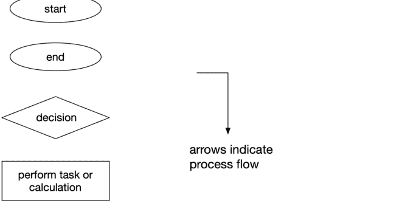

**图 8.1：** 基本流程图元素

菱形（决策）有一个输入和两个输出。正是在这些点上，我们测试某个条件。我们称之为分支——我们通过流程图的路径可以遵循两个分支之一。如果条件为真，我们走一个分支。如果条件为假，我们走另一个分支。

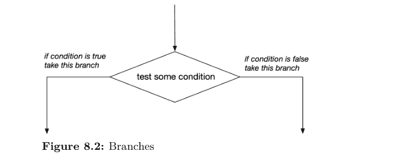

### 一个最小的例子

这是一个最小的例子——一个程序，它提示用户输入一个整数 n，然后，如果 n 是偶数，程序打印“n 是偶数”，否则程序打印“n 是奇数！”

为了确定 n 是偶数还是奇数，我们将执行一个简单的测试：我们将计算模二的余数，并将此值与零进行比较。⁵ 如果比较结果为 True，那么我们知道除以二的余数为零，因此 n 必须是偶数。如果比较结果为 False，那么我们知道余数为一，因此 n 必须是奇数。（当然，这假设用户输入了一个有效的整数。）

这个程序的流程图如下所示：

> ⁵记住，如果我们有一个整数 n，那么必然有 n ≡ 0 mod 2 或 n ≡ 1 mod 2。这是*仅有的*可能性。

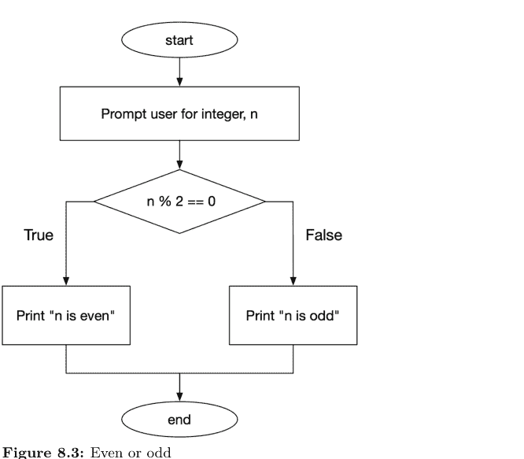

**图 8.3：偶数还是奇数**

-   我们从顶部（标记为“开始”的椭圆）开始。
-   从那里，我们进入下一步：提示用户输入一个整数 n。
-   然后我们测试 n 除以二的余数是否等于零。
    -   如果是，我们走左边的分支，打印“n 是偶数！”
    -   否则，我们走右边的分支，打印“n 是奇数！”
-   最后，我们的程序结束。

这是用 Python 实现的：

```
"""
CS 1210
偶数还是奇数？
"""

n = int(input('Please enter an integer: '))

if n % 2 == 0:
    print('n is even!')
else:
    print('n is odd!')
```

分支发生在这里：

```
if n % 2 == 0:
    print('n is even!')
else:
    print('n is odd!')
```

注意有两个分支：

-   if 子句——当表达式 `n % 2 == 0` 求值为 True 时执行的部分；以及
-   else 子句——当表达式 `n % 2 == 0` 求值为 False 时执行的部分。

### 另一个例子：一个数是正数、负数还是零？

假设我们想判断一个数是正数、负数还是零。在这种情况下，有三种可能性。我们如何用只产生 True 或 False 的比较来做到这一点？答案是：使用多个比较！

首先，我们将检查该数是否大于零。如果是，它是正数。

但如果它不大于零呢？那么，这个数可能是负数，也可能是零。没有其他可能性。为什么？因为我们已经排除了该数为正数的可能性（通过之前的比较）。

这是一个流程图：

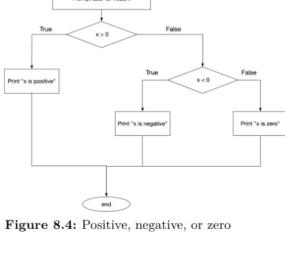

**图 8.4：** 正数、负数还是零

像之前一样，我们从标记为“开始”的椭圆开始。然后我们提示用户输入一个浮点数 x。然后我们到达第一个决策点：x 是否大于零？如果是，我们知道 x 是正数，我们走左边的分支，打印“x 是正数”，然后结束。

如果 x 不是正数，我们走右边的分支。流程图的这一部分仅在第一个测试结果为 False（即 x *不*大于零）时执行。在这里，我们面临另一个选择：x 是否*小于*零？如果是，我们知道 x 是负数，我们走（从第二个决策点出发的）左边的分支，打印“x 是负数”，然后结束。

还有最后一个分支：如果 x 既不是正数也不是负数——那么它*必须*是零。如果我们走这个分支，打印“x 是零”，然后结束。

这是用 Python 实现的，

```
"""
CS 1210
正数、负数还是零？
使用嵌套 if。
"""

x = float(input('Please enter an real number: '))

if x > 0:
    print('x is positive!')
else:
    if x < 0:
        print('x is negative!')
    else:
        print('x is zero!')
```

这种结构非常常见，被称为“嵌套 if”语句。Python 为我们提供了另一种等效的方式来处理这个问题。我们可以使用 `elif` 来实现我们三路决策的流程图，如下所示：

```
"""
CS 1210
正数、负数还是零？
使用 elif。
"""

x = float(input('Please enter an real number: '))

if x > 0:
    print('x is positive!')
elif x < 0:
    print('x is negative!')
else:
    print('x is zero!')
```

两个程序——一个使用嵌套 if，一个使用 elif——都正确地实现了我们流程图描述的程序。在某些情况下，选择主要取决于个人喜好。在其他情况下，我们可能有理由偏好其中一个。在其他条件相同的情况下（在行为），我认为这里提出的 elif 解决方案是两者中更优雅的一种。

无论如何，我希望你能看到流程图是用于描绘程序预期行为的有用工具。有了好的流程图，实现起来会更容易。你应该在编写代码之前自由地绘制程序的流程图。你可能会发现这有助于理清思路并提供一个行动计划。

## 8.9 决策树

在另一节中，我们看到了如何在流程图中使用菱形符号来表示决策和分支，并且我们看到一个流程图（或程序）可以有多个分支。

表示决策过程的另一种方式是使用*决策树*。决策树通常用于物种鉴定。⁶

这里有一个例子：

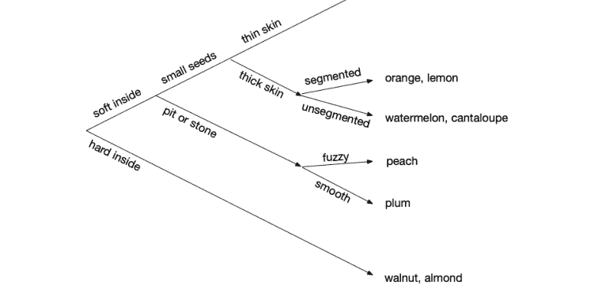

**图 8.5：** 水果决策树

在这里，我们从左边开始向右移动，在过程中做出决策。注意，在每个分支点我们都有两个分支。

所以，例如，要达到“西瓜、哈密瓜”，我们需要做出以下决策：内部柔软、种子小、皮厚且不分瓣。要达到“桃子”，我们需要做出以下决策：内部柔软、有核或石、且有绒毛。

> ⁶如果你上过生物学课程，你可能听说过用于表示生物分类关系的*分支图*。分支图是一种决策树。如果你好奇，可以参见：https://en.wikipedia.org/Cladogram 及类似应用。

我们如何编码这些决策点？一种方法是将它们视为是或否的问题。所以如果我们问“水果内部柔软吗？”，那么我们有一个是或否的答案。如果答案是“否”，那么我们知道水果内部不柔软，因此内部一定是硬的（比如核桃或杏仁）。

这是一段 Python 代码片段，演示了一个问题：

```
response = input('Is the fruit soft inside? y/n  ')
if response == 'y':
    # we know the fruit is soft inside
    # ...
else:
    # we know the fruit is hard inside
    # ...
```

我们可以编写一个程序，通过使用多个嵌套的 if 语句来实现这个决策树。

```
"""
CS 1210
Decision tree for fruit identification
"""

response = input('Is the fruit soft inside? y/n  ')
if response.lower() == 'y':
    # soft inside
    response = input('Does it have small seeds? y/n  ')
    if response.lower() == 'y':
        # small seeds
        response = input('Does it have a thin skin? y/n  ')
        if response.lower() == 'y':
            # thin skin
            print("Tomato")
        else:
            # thick skin
            response = input('Is it segmented? y/n  ')
            if response.lower() == 'y':
                # segmented
                print("Orange or lemon")
            else:
                # unsegmented
                print("Watermelon or cantaloupe")
else:
    # pit or stone
    response = input('Is it fuzzy? y/n  ')
    if response.lower() == 'y':
        # segmented
        print("Peach")
    else:
        # unsegmented
        print("Plum")
```

```
else:
    # hard inside
    print("Walnut or almond")
```

### 理解检查

1. 在上面的决策树（图 8.5）中，哪些决策会导致李子？（有三个。）
2. 回顾第 8.4 节，并为所示的代码示例绘制决策树。

## 8.10 练习

### 练习 01

给定以下条件，评估结果：

```
a = True
b = False
c = True
```

先在纸上完成，然后在 Python shell 中检查你的答案。

1. a or b and c
2. a and b or c
3. a and b and c
4. not a or not b or c
5. not (a and b)

### 练习 02

给定以下条件，评估结果：

```
a = 1
b = 'pencil'
c = 'pen'
d = 'crayon'
```

先在纸上完成，然后在 Python shell 中检查你的答案。其中一些可能会让你惊讶！

1. a == b
2. b > c
3. b > d or a < 5
4. a != c
5. d == 'rabbit'
6. c < d or b > d
7. a and b < d
8. (a == b) and (b != c)
9. (a and b) and (b < c)
10. not (a and b and c and d)

问问自己，'crayon' 小于 'pencil' 是什么意思？你会如何解释这个？问问自己，当像 0 or 'crayon' 这样的表达式被求值时，发生了什么？

### 练习 03

完成以下 if 语句，使其打印正确的消息。注意代码中有空白处需要你完成。你可以假设我们有三个变量，被赋予了字符串值：cheese, blankets, toast，例如：

```
cheese = 'runny'
```

1. Cheese is smelly and blankets are warm!

```
if cheese == 'smelly' and :
    print('Cheese is smelly and blankets are warm!')
```

2. Blankets are warm and toast is not pickled. 提示：使用 not 或 !=

```
if blankets :
    print('Blankets are warm but toast is not pickled.')
```

3. Toast is yummy and so is cheese!

```
if :
    print('Toast is yummy and so is cheese!')
```

4. Either toast is yummy or toast is green (or maybe both).

```
if :
    print('Either toast is yummy or toast is green '
          '(or maybe both).')
```

### 练习 04

以下各项在控制台打印什么？

1. 
```
>>> 'HELLO'.capitalize()
```

2. 
```
>>> s = 'HoverCraft'
>>> s.lower()
```

3. 
```
>>> s = 'wATer'.lower()
>>> s
```

### 练习 05

如果在决策树中我们只有两种可能的结果，并且决策是二元的，那么我们的树只有一个分支点。如果我们有四种可能的结果，那么我们的树必须有三个分支点。

a. 如果决策树中有八种可能的结果，并且决策是二元的，我们必须有多少个分支点？
b. 那么 16 种呢？
c. 你能找到一个公式，根据结果的数量计算分支点的数量吗？（如果找不到也没关系，别太纠结。）

# 第 9 章

## 结构、开发和测试

编程时有条理很重要，在本章中，我们将看到如何最好地组织你的 Python 代码。遵循这种结构可以消除编程中的许多猜测。关于程序某些元素应该放在哪里的许多问题已经为你解答了。这里介绍的内容基于专业编写的代码的常见（实际上是几乎普遍的）实践。

我们还将学习一点关于编写代码时如何进行（即，以小的、增量的步骤），如何测试你的代码，如何使用*断言*，以及如何处理不可避免的错误。

## 学习目标

- 你将了解增量开发，以及如何使用注释作为代码的“脚手架”。
- 你将学习如何组织和构建你的代码。
- 你将理解 Python 如何处理程序的主*入口点*，以及 Python 如何区分要导入的模块和要执行的模块。
- 你将能够编写带有函数的代码，这些函数可以独立于任何*驱动代码*进行导入和使用。
- 你将理解如何测试你的代码，以及何时在代码中使用断言。

## 介绍的术语和 Python 关键字

- assert（Python 关键字）和断言
- AssertionError
- bug
- driver code
- dunder
- entry point and top-level code environment
- incremental development
- namespace
- rubberducking

## 9.1 Python 风格的 main

到目前为止，我们遵循了这个通用大纲：

```
"""
A program which prompts the user for a radius of a circle,
r, and calculates and reports the circumference.
"""

import math

def circumference(r_):
    return 2 * math.pi * r_

r = float(input('Enter a non-negative real number: '))
if r >= 0:
    c = circumference(r)
    print(f'The circumference of a circle of radius '
          f'{r:,.3f} is {c:,.3f}.')
else:
    print(f'I asked for a non-negative number, and '
          f'{r} is negative!')
```

这是传统的，并且遵循良好的编码风格（例如，PEP 8）。你可能见过类似这样的：

```
"""
A program which prompts the user for a radius of a circle,
r, and calculates and reports the circumference.
"""

import math

def circumference(r_):
    return 2 * math.pi * r_

def main():
    r = float(input('Enter a non-negative real number: '))
    if r >= 0:
        c = circumference(r)
        print(f'The circumference of a circle of radius '
              f'{r:,.3f} is {c:,.3f}.')
    else:
        print(f'I asked for a non-negative number, and '
              f'{r} is negative!')

main()
```

虽然这在语法上没有错误，但它也不是真正的 Python 风格。

一些教科书会使用这种写法，网上也有大量示例，或许是为了让Python代码看起来更像C或Java这类语言（对于Java，可执行程序*必须*实现`main()`）。但再次强调，*这不是Python的方式*。

以下是Python中的实际工作方式。Python有一个所谓的*顶层代码环境*。当程序在此环境中执行时（即在IDE中运行代码或从命令行运行时），会有一个特殊变量`__name__`被自动设置为值`'__main__'`。¹ `'__main__'`是运行顶层代码的环境的名称。

因此，如果我们希望区分代码中在执行时自动运行的部分（有时称为*驱动代码*）与其他部分（如导入和我们定义的函数），可以这样做：

```
"""
一个提示用户输入圆半径r，
并计算和报告周长的程序。
"""

import math

def circumference(r_):
    return 2 * math.pi * r_

if __name__ == '__main__':

    # 此代码仅在该模块（程序）被运行时执行。
    # 如果该模块被导入，则*不会*执行。

    r = float(input('Enter a non-negative real number: '))
    if r >= 0:
        c = circumference(r)
        print(f'The circumference of a circle of radius '
              f'{r:.3f} is {c:.3f}.')
    else:
        print(f'I asked for a non-negative number, and '
              f'{r} is negative!')
```

假设我们将此文件保存为`circle.py`。如果我们从IDE或命令行运行此程序：

```
$ python circle.py
```

Python会读取该文件，看到我们正在执行它，因此会将`__name__`设置为等于`'__main__'`。然后，在读取函数`circumference(r_)`的定义后，它会到达`if`语句，

¹其他一些编程语言将顶层称为*入口点*。`'__main__'`是Python程序入口点的名称。

```
if __name__ == '__main__':
```

此条件求值为True，嵌套在此if语句中的代码将被执行。因此，它会提示用户输入半径，然后检查输入是否有效并返回相应的响应。

## 另一个简单的演示

考虑这个Python程序

```
"""
tlce.py（顶层代码环境）
另一个演示__name__和__main__重要性的程序。
"""

print(__name__)

if __name__ == '__main__':
    print("Hello World!")
```

复制此代码并将其保存为tlce.py（顶层代码环境的缩写）。然后，尝试从IDE或命令行运行此程序。运行时它会打印什么？它应该打印

```
__main__
Hello World!
```

所以，你看，当我们运行Python程序时，Python将变量__name__的值设置为字符串'__main__'，然后，当程序执行比较__name__ == '__main__'时，这求值为True，if内的代码被执行。

## 如果我们在另一个程序中导入我们的模块会怎样？

现在编写另一个导入此模块的程序（正式地，我们将Python程序称为模块）。
在包含tlce.py的同一目录中，创建一个新文件

```
"""
一个导入tlce（来自上一个示例）的程序。
"""

import tlce
```

将其保存为use_tlce.py，然后运行它。打印了什么？此程序应该打印

tlce

所以，如果我们导入tlce，那么Python将__name__设置为等于'tlce'，if的主体永远不会执行。

我们为什么要这样做？一个原因是我们可以在一个模块中编写函数，然后导入该模块而不执行模块的任何代码，但使函数对我们可用。听起来很熟悉？应该如此。考虑当我们导入math模块时会发生什么。没有执行任何操作，但现在我们有了math.pi、math.sqrt()、math.sin()等可用。

## 一个完整的示例

早些时候，我们创建了一个程序，该程序根据用户提供的某个半径r，计算半径为r的球体的周长、直径、表面积和体积。以下是它，经过一些小的修改，特别是添加了对__name__值的检查。

```
"""
球体计算器（sphere.py）

提示用户输入某个半径r，然后打印
具有此半径的球体的周长、直径、表面积和体积。
"""

import math

def circumference(r_):
    return 2 * math.pi * r_

def diameter(r_):
    return 2 * r_

def surface_area(r_):
    return 4 * math.pi * r_ ** 2

def volume(r_):
    return 4 / 3 * math.pi * r_ ** 3

if __name__ == '__main__':
    r = float(input("Enter a radius >= 0.0: "))
    if r < 0:
        print("Invalid input")
    else:
        print(f"The diameter is "
              f"{diameter(r):0,.3f} units.")
        print(f"The circumference is "
              f"{circumference(r):0,.3f} units.")
        print(f"The surface area is "
              f"{surface_area(r):0,.3f} units squared.")
        print(f"The volume is "
              f"{volume(r):0,.3f} units cubed.")
```

现在我们有了一个程序，它提示用户输入某个半径$r$，并使用一些方便的函数来计算球体的这些其他值。但不难看出，我们可能想在其他地方使用这些函数！

假设我们正在制造瑜伽球——那些用于需要平衡的特定练习的充气球。我们想知道制造一定数量的球需要多少塑料。假设我们的瑜伽球充气后的半径为33厘米，并且我们希望球的厚度为0.1厘米。

为了完成此计算，我们需要计算体积。为什么要重新发明轮子？我们已经编写了一个函数来完成这个！

让我们导入sphere.py并使用此模块提供的函数。

```
"""
瑜伽球材料需求
"""

import sphere
# sphere.py必须在同一目录中才能工作

RADIUS_CM = 33
THICKNESS_CM = 0.1
VINYL_G_PER_CC = 0.95
G_PER_KG = 1000

if __name__ == '__main__':
    balls = int(input("How many balls do you want "
                     "to manufacture this month? "))
    outer = sphere.volume(RADIUS_CM)
    inner = sphere.volume(RADIUS_CM - THICKNESS_CM)
    material_per_ball = outer - inner
    total_material = balls * material_per_ball
    total_material_by_weight = total_material / VINYL_G_PER_CC / G_PER_KG

    print(f"To make {balls} balls, you will need "
          f"{total_material:,.1f} cc of vinyl.")
    print(f"Order at least "
          f"{total_material_by_weight:,.1f} "
          f"kg of vinyl to meet material requirements.")
```

看到了吗？我们导入了sphere，以便可以使用它的函数。当我们导入sphere时，__name__（对于sphere）取值为sphere，因此if __name__ == '__main__'下的代码没有被执行！

这让我们既能拥有蛋糕（一个计算球体直径、周长、表面积和体积的程序），又能吃掉它（通过允许导入和代码重用）！这有多酷？

## 这些奇怪的名字是怎么回事？

这些奇怪的名字`__name__`和`'__main__'`被称为*dunders*。Dunder是*double underscore*（双下划线）的缩写。这是Python使用的一种命名约定，用于将特殊变量、方法和函数与程序员为他们定义的变量、方法和函数使用的典型名称区分开来。

## 9.2 程序结构

事物有其顺序，程序也不例外。你的Python代码应遵循以下一般布局：

1. 文档字符串
2. 导入（如果有）
3. 常量（如果有）
4. 函数定义（如果有）

... 然后，嵌套在`if __name__ == '__main__':`下，是你的所有其余代码。以下是一个示例：

```
"""
一个文档字符串，由三个双引号分隔，
包含你的名字和程序的简要描述。
"""

import foo   # 导入（如果有）

MEGACYCLES_PER_FROMBULATION = 133   # 常量（如果有）

# 你定义的函数...
def f(x_):
    return 2 * x_ + 1

def g(x_):
    return (x_ - 1) ** 2

# 你的其余代码...
if __name__ == '__main__':
    x = float(input("Enter a real number: "))
    print(f"Answer: {f(g(x))
            / MEGACYCLES_PER_FROMBULATION} megacycles!")
```

## 9.3 迭代式和增量式开发

*增量式开发*是一个过程，我们通过增量式地构建我们的程序——通常以小步骤或按组件进行。这是一种结构化的软件开发方法，有助于管理复杂性和提高代码质量。

一种结构化的、循序渐进的软件编写方法。这种方法长期以来一直被用于使构建复杂程序的过程更加可靠。即使你没有进行大规模的软件开发项目，这种方法也能带来益处。此外，将问题分解成小部分或组件，可以帮助降低你在任何给定时间处理任务的复杂性。

举个例子。假设我们想编写一个程序，提示用户输入质量和速度，并计算由此产生的动能。如果你之前没有上过物理课，也不用担心——公式相当简单。

$$K_e = \frac{1}{2}mv^2$$

其中 $K_e$ 是以焦耳为单位的动能，$m$ 是以千克为单位的质量，$v$ 是以米/秒为单位的速度。

你会如何逐步进行呢？第一步可能是用注释勾勒出需要做的事情。²

```
"""
Kinetic Energy Calculator
Egbert Porcupine <egbert.porcupine@uvm.edu>
CS 1210
"""

# Step 1: Prompt user for mass in kg and save result
# Step 2: Prompt user for velocity in m / s and save result
# Step 3: Calculate kinetic energy in Joules using formula
# Step 4: Display pretty result
```

这是一个开始，但随后你想起 Python 的 `input()` 函数返回的是一个字符串，因此你需要将这些字符串转换为浮点数。你决定在开始编写代码之前，先将这一点添加到注释中，以免忘记。

```
"""
Kinetic Energy Calculator
Egbert Porcupine <egbert.porcupine@uvm.edu>
CS 1210
"""

# Step 1: Prompt user for mass in kg and convert input
#         to float and save result
# Step 2: Prompt user for velocity in m / s and convert
#         input to float and save result
# Step 3: Calculate kinetic energy in Joules using formula
# Step 4: Display pretty result
```

²这里我们省略了 `if __name__ == __main__:` 以避免演示时显得杂乱。

现在你决定开始编码，于是从第一步开始。

```
"""
Kinetic Energy Calculator
Egbert Porcupine <egbert.porcupine@uvm.edu>
CS 1210
"""

# Step 1: Prompt user for mass in kg and convert input
#         to float and save result
mass = float(input('Enter mass in kg: '))
print(mass)
# Step 2: Prompt user for velocity in m / s and convert
#         input to float save result
# Step 3: Calculate kinetic energy in Joules using formula
# Step 4: Display pretty result
```

注意注释保持不变，并且添加了一个 `print` 语句来验证质量是否正确存储在 `mass` 变量中。现在你运行代码——是的，它还不完整，但你决定运行它来确认第一步是否正确实现。

```
Enter mass in kg: 72.1
72.1
```

所以它按预期工作。现在你决定可以进入第二步了。

```
"""
Kinetic Energy Calculator
Egbert Porcupine <egbert.porcupine@uvm.edu>
CS 1210
"""

# Step 1: Prompt user for mass in kg and convert
#         input to float and save result
mass = float(input('Enter mass in kg: '))
print(mass)
# Step 2: Prompt user for velocity in m / s and
#         convert input to float save result
velocity = float(input('Enter velocity in m / s: '))
print(velocity)
# Step 3: Calculate kinetic energy in Joules using formula
# Step 4: Display pretty result
```

现在当你运行代码时，结果如下：

```
Enter mass in kg: 97.13
97.13
Enter velocity in m / s: 14.5
14.5
```

同样，到目前为止一切顺利。现在是时候进行动能计算了。

```
"""
Kinetic Energy Calculator
Egbert Porcupine <egbert.porcupine@uvm.edu>
CS 1210
"""

# Step 1: Prompt user for mass in kg and convert
#         input to float and save result
mass = float(input('Enter mass in kg: '))
print(mass)
# Step 2: Prompt user for velocity in m / s and
#         convert input to float save result
velocity = float(input('Enter velocity in m / s: '))
print(velocity)
# Step 3: Calculate kinetic energy in Joules using formula
kinetic_energy = 0.5 * mass * velocity ** 2
print(kinetic_energy)
# Step 4: Display pretty result
```

你再次运行代码，测试不同的值。

```
Enter mass in kg: 22.7
22.7
Enter velocity in m / s: 30.1
30.1
10283.213500000002
```

此时，你认为获取输入的部分工作正常，于是移除了 `mass` 和 `velocity` 后面的 `print` 语句。然后你决定专注于打印一个漂亮的结果。你知道你想使用格式说明符，但还不想马上处理这个，所以你从一个简单（但不太美观）的版本开始。

```
"""
Kinetic Energy Calculator
Egbert Porcupine <egbert.porcupine@uvm.edu>
CS 1210
"""

# Step 1: Prompt user for mass in kg and convert
#         input to float and save result
mass = float(input('Enter mass in kg: '))
# Step 2: Prompt user for velocity in m / s and
#         convert input to float save result
velocity = float(input('Enter velocity in m / s: '))
# Step 3: Calculate kinetic energy in Joules using formula
kinetic_energy = 0.5 * mass * velocity ** 2
# Step 4: Display pretty result
print(f'Mass = {mass} kg')
print(f'Velocity = {velocity} m / s')
print(f'Kinetic energy = {energy} Joules')
```

现在你运行这个，得到了一个错误。

```
Enter mass in kg: 17.92
Enter velocity in m / s: 25.0
Traceback (most recent call last):
  File "/blah/blah/kinetic_energy.py", line 10, in <module>
    print(f'Kinetic energy = {energy} Joules')
NameError: name 'energy' is not defined
```

你意识到你输入了 `energy`，而应该使用 `kinetic_energy`。这不难修复，而且你知道其他代码工作正常，所以不需要改动它们。以下是修复：

```
"""
Kinetic Energy Calculator
Egbert Porcupine <egbert.porcupine@uvm.edu>
CS 1210
"""

# Step 1: Prompt user for mass in kg and convert input
#         to float and save result
mass = float(input('Enter mass in kg: '))
# Step 2: Prompt user for velocity in m / s and convert
#         input to float save result
velocity = float(input('Enter velocity in m / s: '))
# Step 3: Calculate kinetic energy in Joules using formula
kinetic_energy = 0.5 * mass * velocity ** 2
# Step 4: Display pretty result
print(f'Mass = {mass} kg')
print(f'velocity = {velocity} m / s')
print(f'kinetic energy = {kinetic_energy} Joules')
```

现在这可以无错误地运行了。

```
Enter mass in kg: 22.901
Enter velocity in m / s: 13.33
Mass = 22.901 kg
Velocity = 13.33 m / s
Kinetic energy = 2034.6267494499998 Joules
```

最后一步是添加格式说明符以进行漂亮的打印，但由于其他一切工作正常，你*唯一*需要关注的就是格式说明符。其他一切都在工作！

```
"""
Kinetic Energy Calculator
Egbert Porcupine <egbert.porcupine@uvm.edu>
CS 1210
"""

# Step 1: Prompt user for mass in kg and convert input
#         to float and save result
mass = float(input('Enter mass in kg: '))
# Step 2: Prompt user for velocity in m / s and convert
#         input to float save result
velocity = float(input('Enter velocity in m / s: '))
# Step 3: Calculate kinetic energy in Joules using formula
kinetic_energy = 0.5 * mass * velocity ** 2
# Step 4: Display pretty result
print(f'Mass = {mass:.3f} kg')
print(f'velocity = {velocity:.3f} m / s')
print(f'kinetic energy = {kinetic_energy:.3f} Joules')
```

你测试你的代码：

```
Enter mass in kg: 100
Enter velocity in m / s: 20
Mass = 100.000 kg
Velocity = 20.000 m / s
Kinetic energy = 20000.000 Joules
```

你认为这可以，但你更希望输出中有逗号分隔符，于是你修改了格式说明符。

```
"""
Kinetic Energy Calculator
Egbert Porcupine <egbert.porcupine@uvm.edu>
CS 1210
"""

# Step 1: Prompt user for mass in kg and convert input
#         to float and save result
mass = float(input('Enter mass in kg: '))
# Step 2: Prompt user for velocity in m / s and convert
#         input to float save result
velocity = float(input('Enter velocity in m / s: '))
# Step 3: Calculate kinetic energy in Joules using formula
kinetic_energy = 0.5 * mass * velocity ** 2
# Step 4: Display pretty result
print(f'Mass = {mass:,.3f} kg')
```

print(f'velocity = {velocity:,.3f} m / s')
print(f'kinetic energy = {kinetic_energy:,.3f} Joules')
```

你再测试一次，得到了一个不错的输出。

```
Enter mass in kg: 72.1
Enter velocity in m / s: 19.5
Mass = 72.100 kg
Velocity = 19.500 m / s
Kinetic energy = 13,708.012 Joules
```

看起来很棒！
现在我们可以移除那些用作脚手架的注释，最终得到：

```
"""
Kinetic Energy Calculator
Egbert Porcupine <egbert.porcupine@uvm.edu>
CS 1210
"""

mass = float(input('Enter mass in kg: '))
velocity = float(input('Enter velocity in m / s: '))
kinetic_energy = 0.5 * mass * velocity ** 2
print(f'Mass = {mass:,.3f} kg')
print(f'velocity = {velocity:,.3f} m / s')
print(f'kinetic energy = {kinetic_energy:,.3f} Joules')
```

所以现在你已经了解了如何进行增量开发。³ 注意，我们并没有试图一次性解决整个问题。我们从用作占位符/提醒的注释开始，然后一步一步地构建程序，并在过程中进行测试。使用这种方法，通过将问题分解成小的、可管理的、易于处理的（或者我应该说“字节大小”的？）块，可以使整个过程变得更容易。这就是增量开发。

## 9.4 测试你的代码

测试你的代码很重要。事实上，编程中有一句著名的格言：

> 如果它没有被测试过，那它就是坏的。

在编写代码时，尝试预测奇怪或不符合规范的输入，然后测试你的程序，看看它如何处理这些输入。

³ 如果你对专业人士如何进行迭代和增量开发感到好奇，请参阅维基百科上关于迭代和增量开发的文章：https://en.wikipedia.org/wiki/Iterative_and_incremental_development

如果你的代码有多个分支，那么测试每个分支可能是个好主意。显然，对于较大的程序，这可能会变得难以处理，但对于分支较少的小程序，尝试每个分支并非不合理。

### 一些例子

假设我们编写了一个程序，旨在接收以磅每平方英寸（psi）为单位的压力，并将其转换为巴（bar）。*巴*是一个压力单位，1巴相当于14.503773773 psi。
在不看代码的情况下，让我们测试我们的程序。以下是一些代表程序合理输入的值。

| 输入（psi） | 预期输出（bars） | 实际输出（bars） |
| :--- | :--- | :--- |
| 0 | 0 | |
| 14.503773773 | 1.0 | |
| 100.0 | ~ 6.894757293 | |

这是我们的第一次测试运行。

```
Enter pressure in psi: 0
Traceback (most recent call last):
  File "/.../pressure.py", line 15, in <module>
    bars = psi_to_bars(psi)
  File "/.../pressure.py", line 8, in psi_to_bars
    return PSI_PER_BAR / p
TypeError: unsupported operand type(s) for /: 'float' and 'str'
```

哦，天哪！我们已经遇到了一个问题。查看错误消息的最后一行，我们看到

> TypeError: unsupported operand type(s) for /: 'float' and 'str'

**哪里出错了？**
显然，我们试图进行算术运算——除法——其中一个操作数是*浮点数*，另一个是*字符串*。这是不允许的，因此出现了类型错误。
当我们稍微思考一下，我们意识到很可能是在尝试计算之前，没有将用户输入转换为*浮点数*（记住，*input()*函数*总是*返回一个字符串）。
我们回到代码并修复它，使得从*input()*得到的字符串使用*float*构造函数*float()*转换为*浮点数*。做出这个改变后，让我们再试一次程序。

```
Enter pressure in psi: 0
Traceback (most recent call last):
  File "/.../pressure.py", line 15, in <module>
    bars = psi_to_bars(psi)
  File "/.../pressure.py", line 8, in psi_to_bars
    return PSI_PER_BAR / p
ZeroDivisionError: float division by zero
```

现在我们有了一个不同的错误：

```
ZeroDivisionError: float division by zero
```

这怎么可能发生呢？当然，如果压力（psi）为零，那么压力（bars）也应该为零（就像在完美真空中一样）。
当我们查看代码（你可以在上面的回溯中看到有问题的那一行）时，我们看到我们没有将psi值除以每巴的psi数，而是把操作数的顺序搞错了。显然，我们需要将psi除以每巴的psi数才能得到正确的结果。你也可以从上面的回溯中看到，有一个常量PSI_PER_BAR，所以我们只需要交换操作数。这样做还有一个额外的好处，即分母是一个非零常量，因此在此更改之后，此操作将永远不会导致ZeroDivisionError。
现在让我们再试一次。

```
Enter pressure in psi: 0
0.0 psi is equivalent to 0.0 bars.
```

这行得通！到目前为止，一切顺利。
现在让我们尝试一个不同的值。我们知道，根据巴的定义，一巴相当于14.503773773 psi。因此，如果我们输入14.503773773作为psi，程序应该报告这相当于1.0巴。

```
Enter pressure in psi: 14.503773773
14.503773773 psi is equivalent to 1.0 bars.
```

太棒了。
让我们尝试一个不同的值。100怎么样？你可以在上面的表格中看到，100 psi大约相当于~6.894757293巴。

```
Enter pressure in psi: 100
100.0 psi is equivalent to 6.894757293178307 bars.
```

这看起来是正确的，尽管我们现在可以看到，我们显示的小数点右边的数字比有用的要多。
假设我们回到代码中，添加格式说明符，使psi和bars都显示到小数点后四位精度。

```
Enter pressure in psi: 100
100.0000 psi is equivalent to 6.8948 bars.
```

这看起来不错。
回到我们的表格，并填入实际值，现在我们有

| 输入（psi） | 预期输出（bars） | 实际输出（bars） |
|---|---|---|
| 0 | 0.0 | 0.0000 |
| 14.503773773 | 1.0 | 1.0000 |
| 100.0 | ~ 6.894757293 | 6.8948 |

我们所有观察到的实际输出都与预期输出一致。
那么负的压力值呢？是的，在某些情况下，负的压力值是有意义的。例如，以生物医学研究的隔离室为例。隔离室的气压应低于外部走廊或相邻房间的气压。这样，当隔离室的门打开时，空气会流入房间，而不是流出。这有助于防止不受控制的外部环境污染。通常将隔离室与外部走廊之间的压力差表示为负值。
我们的程序能处理这样的值吗？让我们扩展我们的表格：

| 输入（psi） | 预期输出（bars） | 实际输出（bars） |
|---|---|---|
| 0 | 0.0 | 0.0000 |
| 14.503773773 | 1.0 | 1.0000 |
| 100.0 | ~ 6.894757293 | 6.8948 |
| -0.01 | ~ -0.000689476 | ?? |

我们的程序能正确处理这个吗？

```
Enter pressure in psi: -0.01
-0.0100 psi is equivalent to -0.0007 bars.
```

同样，这看起来没问题。
现在让我们尝试破坏我们的程序以测试其极限。让我们尝试一些大值。金星表面的大气压力是1334 psi。我们期望的结果大约是91.9761巴。太平洋马里亚纳海沟底部的压力是15,750 psi，大约是1,086巴。

| 输入（psi） | 预期输出（bars） | 实际输出（bars） |
|---|---|---|
| 0 | 0.0 | 0.0000 |
| 14.503773773 | 1.0 | 1.0000 |
| 100.0 | ~ 6.894757293 | 6.8948 |
| -0.01 | ~ -0.000689476 | 0.0007 |
| 1334 | ~ 91.9761 | ?? |
| 15,750 | ~ 1086 | ?? |

让我们测试：

```
Enter pressure in psi: 1334
1334.0000 psi is equivalent to 91.9761 bars.
```

这个通过了，但下一个呢（字符串中包含逗号）？字符串'15,750'（注意逗号）能被正确转换为浮点数吗？唉，这失败了：

```
Traceback (most recent call last):
  File "/.../pressure.py", line 13, in <module>
    psi = float(input("Enter pressure in psi: "))
ValueError: could not convert string to float: '15,750'
```

稍后，我们将学习如何创建一个删除了逗号的此类字符串的修改副本，但现在只需知道这是可以修复的。然而，请注意，如果我们没有检查这个大值（人类用户可能会合理地输入如图所示的逗号），我们可能不会意识到代码中存在这个缺陷！*始终尽可能多地测试用户可能输入数据的方式！*

修复后，一切正常。

```
Enter pressure in psi: 15,750
15750.0000 psi is equivalent to 1085.9243 bars.
```

通过测试这些较大的值，我们看到将输出格式化为使用逗号作为千位分隔符以提高可读性可能是有意义的。同样，如果我们没有测试较大的值，我们可能不会注意到这一点。要修复这个问题，我们只需更改代码中的格式说明符。

```
Enter pressure in psi: 15,750
15,750.0000 psi is equivalent to 1,085.9243 bars.
```

太棒了。

这引发了另一个想法：如果用户以科学计数法输入psi，比如1E3代表1,000呢？事实证明，float构造函数可以处理这样的输入——但检查一下总没有坏处！

请注意，通过测试，我们能够在不实际阅读代码的情况下了解很多关于代码的信息！事实上，通常为代码编写测试的工作会落在不是代码编写者的开发人员身上。

编写被测试的代码！一个开发团队编写代码，另一个不同的团队为代码编写测试。

我们在这里学到的重要经验是：

-   在测试之前（通过使用计算器、手工计算或其他方法）预先确定程序在任何给定输入下的*预期*输出。然后，你可以将预期值与*实际*值进行比较，从而找出任何差异。
-   使用广泛的值范围来测试你的代码。在输入为数值的情况下，使用极端值进行测试。
-   不要忘记人类可能如何输入输入值。不同的用户可能以不同的方式输入 1000：1000、1000.0000、1E3、1,000、1,000.0，*等等*。等效的输入值应始终产生等效的输出！

## 另一个例子：克到摩尔

如果你上过化学课，你一定将克转换为*摩尔*。*摩尔*是衡量物质数量的单位。一摩尔相当于 6.02214076 × 10²³ 个*基本实体*，其中基本实体可以是原子、离子、分子，*等等*，具体取决于上下文。例如，一个反应可能产生若干克某种物质，通过转换为摩尔，我们确切地知道这代表了多少个实体。为了将摩尔转换为克，需要知道相关实体的质量。

这里有一个例子。我们的反应产生了 75 克水，H₂O。每个水分子包含两个氢原子和一个氧原子。氢的原子质量为每摩尔 1.008 克。氧的原子质量为每摩尔 15.999 克。因此，一个 H₂O 分子的分子质量为

2 × 1.008 g/mole + 1 × 15.999 g/mole = 18.015 g/mole.

我们的程序将需要两个输入：克数，以及每摩尔克数（针对相关物质）。我们的程序应返回摩尔数。
让我们构建一个可用于测试程序的输入输出表。

| 克数 | 每摩尔克数 | 预期输出（摩尔） | 实际输出（摩尔） |
|---|---|---|---|
| 0 | 任意 | 0 | |
| 75 | 18.015 | ~ 4.16319 E0 | |
| 245 | 16.043 | ~ 1.527240 E1 | |
| 3.544 | 314.469 | ~ 1.12698 E-2 | |
| 1,000 | 100.087 | ~ 9.99130 E0 | |

让我们测试我们的程序：

## 测试你的代码

173

```
How many grams of stuff have you? 75
What is the atomic weight of your stuff? 18.015
You have 4.1632E+00 moles of stuff!
```

这检查通过了。

```
How many grams of stuff have you? 245
What is the atomic weight of your stuff? 16.043
You have 1.5271E+01 moles of stuff!
```

继续检查...

```
How many grams of stuff have you? 3.544
What is the atomic weight of your stuff? 314.469
You have 1.1270E-02 moles of stuff!
```

仍然很好。继续检查...

```
How many grams of stuff have you? 1,000
Traceback (most recent call last):
  File "/.../moles.py", line 9, in <module>
    grams = float(input("How many grams of stuff have you? "))
ValueError: could not convert string to float: '1,000'
```

哎呀！这是我们之前看到的同样问题：`float` 构造函数无法处理包含逗号的数字字符串。让我们假设我们已经应用了类似的修复，然后再次测试。

```
How many grams of stuff have you? 1,000
What is the atomic weight of your stuff? 100.087
You have 9.9913E+00 moles of stuff!
```

耶！成功了！
现在，如果我们用克数或原子质量的负值进行测试会发生什么？

```
How many grams of stuff have you? -500
What is the atomic weight of your stuff? 42
You have -1.1905E+01 moles of stuff!
```

毫无意义！理想情况下，我们的程序不应接受克数的负值，也不应接受原子质量的负值或零值。
无论如何，你现在看到测试一系列值是多么有用。不要让自己误以为你的程序没有缺陷，如果你没有用足够多样的输入进行测试的话。

## 9.5 术语“bug”的起源

那么，我们到底是从哪里得到“bug”这个词的呢？唉，这个术语的起源已经无从考证。然而，在 1947 年，著名的计算机先驱格蕾丝·默里·霍珀正在研究哈佛 Mark I 计算机，当时一个程序出现了异常行为。⁴


图 9.1：格蕾丝·默里·霍珀。来源：格蕾丝·默里·霍珀收藏，美国国家历史博物馆档案中心（图片属于公共领域）

在检查代码并发现没有错误后，她进一步调查，发现计算机的一个继电器中有一只飞蛾（记住，那时计算机占据了整个大房间）。飞蛾被移除，并被粘贴到霍珀的实验室笔记本中。

> ⁴根据霍珀的笔记本（1947 年 9 月 9 日），出现异常行为的程序是一个“多加法器测试”。看起来他们正在对机器进行一系列测试——例如，当天早些时候进行了某些三角函数的测试。至少有一个测试失败了，并且更换了一些继电器（硬件组件）。多加法器测试于下午 3:25 开始（霍珀在笔记本中使用军用时间：“1525”），二十分钟后，飞蛾被粘贴到笔记本中。目前尚不清楚问题是如何显现的，但有人去检查硬件并发现了这只飞蛾。

## 术语“bug”的起源

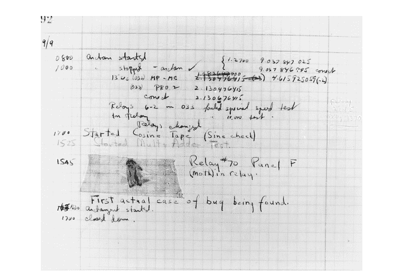

在采访中，霍珀说，在这次发现之后，每当出现问题时，她和她的团队都会说“肯定有个 bug。”

并非所有人都喜欢“bug”这个术语。例如，以脾气暴躁著称的艾兹格·迪科斯彻认为，将错误称为“bug”在智识上是不诚实的。他在一篇题为“论真正教授计算机科学的残酷性”的文章中提出了这一点。⁵

> 例如，我们可以从清理我们的语言开始，不再将 bug 称为 bug，而是将其称为错误。这要诚实得多，因为它直接将责任归咎于犯错的程序员。那种认为 bug 是在程序员不注意时恶意溜进来的拟人化比喻，在智识上是不诚实的，因为它掩盖了错误是程序员自己创造的这一事实。

⁵艾兹格·迪科斯彻，1988 年，“论真正教授计算机科学的残酷性”。推荐阅读这篇文章。参见德克萨斯大学奥斯汀分校托管的艾兹格·迪科斯彻档案中的条目：https://www.cs.utexas.edu/~EWD/transcriptions/EWD10xx/EWD1036.html


图 9.3：艾兹格·迪科斯彻。来源：德克萨斯大学奥斯汀分校，采用知识共享许可协议

尽管迪科斯彻提出了抗议，但这个术语还是保留了下来。所以现在我们有了“bug”。
Bug 当然是不可避免的。重要的是我们如何努力避免它们，以及当我们发现它们时如何修复它们。

## 9.6 使用断言测试你的代码

许多语言，包括 Python，都允许使用*断言*或*断言语句*。这些用于验证你认为*应该*为真的关于某些条件或结果的事情。通过做出断言，你在说“我相信 *x* 为真”，无论 *x* 可能是什么。断言是验证函数或程序是否确实执行了你期望它执行的操作的强大工具。
Python 提供了一个关键字 `assert`，可用于*断言语句*。以下是一些例子：
假设你有一个函数，它接受一些购买的物品列表并应用销售税。无论小计是多少，我们知道销售税必须大于或等于零。所以我们写一个断言：

```
sales_tax = calc_sales_tax(items)
assert sales_tax >= 0
```

如果 `sales_tax` 为负数（这是意料之外的），这个语句将引发一个 `AssertionError`，通知你你认为为真的事情，实际上并非如此。这大致等同于

```
if sales_tax < 0:
    raise AssertionError
```

但更简洁易读。

请注意，如果断言成立，则不会引发异常，你的代码执行将继续不间断。这里是另一个例子：

```
def calc_hypotenuse(a, b):
    """Given two legs of a right triangle, return the
    length of the hypotenuse. """
    assert a >= 0
    assert b >= 0

    return math.sqrt(a ** 2 + b ** 2)
```

这里发生了什么？这不是数据验证。相反，我们是在记录函数返回有效结果必须满足的条件，并确保如果这些条件不满足，程序将失败。我们可能会有一个*退化三角形*，其中一条或两条直角边的长度为零，但不可能出现任何一条直角边长度为负的情况。这种方法还有一个额外的好处，就是提醒程序员必须满足哪些条件才能确保正确的行为。明智地使用断言可以帮助你编写正确、健壮的代码。

### 添加友好消息

Python 的 `assert` 允许你在发生 `AssertionError` 时提供自定义消息。语法很简单，

```
assert 1 + 1 == 2, "Something is horribly wrong!"
```

### 一些注意事项

重要的是要理解 `assert` 是一个 Python 关键字，*而不是*内置函数的名称。这是正确的：

```
assert 0.0 <= x <= 1.0, "x must be in [0.0, 1.0]"
```

但这不是

```
assert(0.0 <= x <= 1.0, "x must be in [0.0, 1.0]")
```

为什么？这将把元组

```
(0.0 <= x <= 1.0, "x must be in [0.0, 1.0]")
```

视为被断言的内容。但非空元组是真值，因此无论 x 的值是什么，这都*永远不会*导致 `AssertionError`！让我们测试一下

## 9.7 小黄鸭调试法

“小黄鸭调试法”？这到底是什么？别笑：小黄鸭调试法是已知宇宙中最强大的调试工具之一！许多程序员会在桌上放一只小橡皮鸭，以备调试紧急情况之需。

它的原理是这样的。如果你遇到卡壳，无法解决某个特定问题或修复一个恼人的*bug*，你就*和鸭子对话*。现在，橡皮鸭可没那么聪明，所以你必须用最简单的术语向它们解释。用尽可能少的计算机行话向鸭子解释你的问题。就像对一个聪明的五岁孩子说话一样对你的鸭子说话。你会惊讶于这种方法能解决多少问题！

为什么它有效？

首先，通过和鸭子说话，你暂时跳出了你的代码。你在谈论你的代码，而无需在键盘上打字，也不会陷入语法细节的泥潭。你在谈论你认为你的代码*应该*做什么。

其次，你的鸭子永远不会评判你。在你尽力解释时，它会保持沉默。鸭子是了不起的倾听者！

通常情况下，当你向鸭子解释你的困扰，或者描述你认为你的代码*应该*做什么时，你会达到一个顿悟的时刻。通过把问题说出来，你找到了解决方案，或者你认识到了自己错在哪里。

## 如果我没有小黄鸭怎么办？

没关系。如果需要，许多其他东西都可以代替鸭子。你有毛绒玩具吗？任何种类的小雕像？朋友的照片？戴着降噪耳机的室友？如果需要，这些都可以代替鸭子。

重要的是，你要把手从键盘上拿开，甚至可能把目光从代码上移开，用简单的术语描述你的问题。

相信这个过程！它有效！

## 9.8 异常

### AssertionError

正如我们所见，如果断言通过，代码执行会正常继续。然而，如果断言失败，就会引发一个`AssertionError`。这表明被断言的内容求值结果为`False`。

如果你写了一个断言，当你测试代码时引发了`AssertionError`，那么你应该做两件事：

1.  确保你写的断言是正确的。也就是说，你断言某个条件为真，而它事实上应该为真。
2.  如果你已经验证了你的断言语句是正确的，但`AssertionError`仍然被引发，那么是时候调试你的代码了。继续更新和测试，直到问题解决。

## 9.9 练习

### 练习 01

排列以下代码并添加任何缺失的元素，使其遵循程序结构的既定指南（根据第9.2节）：

```python
x = float(input("Enter a value for x: "))

def square(x_):
    return x * x

x_sqrd = square(x)
print(f"{x} squared is {x_sqrd}.")
```

### 练习 02

编写一个完整的程序，提示用户输入两个整数（一次一个），然后打印这两个整数的和。确保遵循程序结构的既定指南。

### 练习 03

埃格伯特编写了一个函数，它接受两个参数，都表示以度为单位的角度。该函数返回两个角度之和对360取模的结果。
以下是该函数的一个测试示例：

```python
>>> sum_angles(180, 270)
90.0
```

你还可以用哪些其他值来测试这个函数？对于你选择的每一对值，给出函数的预期输出。（参见第9.3节）

### 练习 04

考虑这个模块（程序）：

```python
"""
A simple program
"""

def cube(x_):
    return x_ ** 3

# Test function to make sure it works
# as intended

assert cube(3) == 27
assert cube(0) == 0
assert cube(-1) == -1

# Allow for other test at user's discretion

x = float(input("Enter a number: "))
print(f"The cube of {x} is {cube(x)}.")
```

a. 如果我们导入这个模块会发生什么？
b. 导入时会发生什么不良行为，我们如何修复它？

### 练习 05

这些断言有什么问题，你会如何修复它们？

a.
```python
assert 1 + 1 = 5, "I must not understand addition!"
```

b.
```python
n = int(input("Enter an integer: "))
assert (n + n == 2 * n + 1, "Arithmetic error!")
```

提示：在Python shell中尝试这些。

### 练习 06

编写一个程序，其中包含一个函数，该函数接受三个整数作为参数并返回它们的和。先写注释，然后编写代码。

# 第10章

## 序列

在本章中，我们将介绍两种新类型：列表和元组。这些是基本的数据结构，可用于存储、检索，并在某些情况下操作数据。我们有时将这些称为“序列”，因为它们带有顺序和序列的概念。字符串（str）也是序列。

## 学习目标

- 你将学习列表，以及常见的列表操作，包括添加和删除元素、查找列表中的元素数量、检查列表是否包含某个值等。
- 你将学习列表是可变的。这意味着你可以在列表创建后修改它。我们可以追加项目、删除项目、更改单个项目的值等等。
- 你将学习元组。元组与列表不同，因为它们是不可变的——它们不能被更改。
- 你将学习字符串是序列。
- 你将学习如何使用索引从这些结构中检索单个值。

在下一章中，我们将学习如何遍历序列的元素。

## 引入的术语

- 列表
- 元组
- 可变
- 不可变
- 索引
- 序列解包
- 切片

## 10.1 列表

*列表*是Python中使用最广泛的数据结构之一。人们无法列举列表的所有可能应用。¹ 列表无处不在，你会发现它们非常有用！

### 什么是列表？

*列表*是一个*可变的对象序列*。这听起来很拗口，但其实并不那么复杂。如果某物是*可变的*，这意味着它可以改变（与*不可变的*相反，后者意味着它不能改变）。*序列*是一个*有序集合*——也就是说，集合中的每个元素在某个排序中都有自己的位置。

例如，我们可以用一个列表来表示在咖啡店排队的顾客。列表可以改变——新的人可以加入咖啡店的队伍，而队伍前面的人被服务后离开。所以咖啡店的队伍是*可变的*。它也是*有序的*——每个顾客在队伍中都有一个位置，我们可以为每个位置分配一个数字。这被称为*索引*。

### 如何在Python中编写列表

在Python中编写列表的语法很简单：我们将想要包含在列表中的对象放在方括号内。以下是一些列表的示例：

```python
coffee_shop_queue = ['Bob', 'Egbert', 'Jason', 'Lisa',
                     'Jim', 'Jackie', 'Sami']
scores = [74, 82, 78, 99, 83, 91, 77, 98, 74, 87]
```

我们用逗号分隔列表中的元素。

与许多其他语言不同，Python列表的元素不必都是相同的类型。所以这是一个完全有效的列表：

```python
mixed = ['cheese', 0.1, 5, True]
```

在Python中创建列表还有其他方式，但目前这些就足够了。

在Python shell中，我们可以通过给出列表的名称来显示它。

```python
>>> mixed = ['cheese', 0.1, 5, True]
>>> mixed
['cheese', 0.1, 5, True]
```

¹ 如果你以前用另一种语言编程过，你可能已经了解了类似的数据结构，*例如*，Java中的*ArrayList*，C++中的可变向量，*等等*。然而，它们之间有许多不同之处，所以请记住这一点。

## 空列表

一个列表可能没有任何元素吗？是的，我们称之为*空列表*。

```
>>> aint_nothing_here = []
>>> aint_nothing_here
[]
```

## 访问列表中的单个元素

如上所述，列表是*有序的*。这使我们能够使用*索引*来访问列表中的单个元素。**索引**只是一个数字，对应于元素在列表中的位置。唯一的区别在于，在Python和大多数编程语言中，索引从零开始，而不是从一。² 因此，列表中的第一个元素索引为0，第二个索引为1，依此类推。给定一个包含*n*个元素的列表，其索引将是区间[0, *n* − 1]内的整数。

| 列表: | 4.2 | 9.5 | 1.1 | 3.1 | 2.9 | 8.5 | 7.2 | 3.5 | 1.4 | 1.9 | 3.3 |
|---|---|---|---|---|---|---|---|---|---|---|---|
| 索引: | 0 | 1 | 2 | 3 | 4 | 5 | 6 | 7 | 8 | 9 | 10 |
| | | | | | | | | | | | n - 1 |

**图 10.1:** 一个列表及其索引

在上图中，我们描绘了一个包含十一个浮点数的列表——即列表中有十一个元素。索引显示在列表下方，每个索引值与列表中的一个给定元素相关联。请注意，对于一个包含十一个元素的列表，索引是区间[0, 10]内的整数。

让我们将其转化为一个具体示例：

```
>>> data = [4.2, 9.5, 1.1, 3.1, 2.9, 8.5, 7.2, 3.5, 1.4, 1.9, 3.3]
```

现在让我们访问列表中的单个元素。为此，我们给出列表的名称，后跟括在方括号中的索引：

```
>>> data[0]
4.2
```

列表`data`中索引为0的元素，其值为4.2。我们可以类似地访问其他元素。

> ²某些语言是*从一开始索引的*，这意味着它们的索引从1开始，但这些语言是少数。*从一开始索引的*语言包括Cobol、Fortran、Julia、Matlab、R和Lua。

```
>>> data[1]
9.5
>>> data[9]
1.9
```

### IndexError

假设我们有一个包含*n*个元素的列表。如果我们尝试使用一个不存在的索引（比如索引*n*或索引*n + 1*）来访问列表，会发生什么？

```
>>> foo = [2, 4, 6]
>>> foo[3]  # 索引3处没有元素！！！
Traceback (most recent call last):
  File "/.../code.py", line 90, in runcode
    exec(code, self.locals)
  File "<input>", line 1, in <module>
IndexError: list index out of range
```

这个`IndexError`消息告诉我们*不存在索引为3的元素*。

## 更改列表中单个元素的值

我们也可以使用索引来访问列表中的单个元素进行修改（记住：列表是可变的）。
假设数据收集时有一个错误，我们想将索引7处的值从3.5更改为6.1。为此，我们将列表和索引放在赋值语句的左侧。

```
>>> data
[4.2, 9.5, 1.1, 3.1, 2.9, 8.5, 7.2, 3.5, 1.4, 1.9, 3.3]
>>> data[7] = 6.1
>>> data
[4.2, 9.5, 1.1, 3.1, 2.9, 8.5, 7.2, 6.1, 1.4, 1.9, 3.3]
```

我们再做一个：我们将索引2处的元素更改为4.7。

```
>>> data[2] = 4.7
>>> data
[4.2, 9.5, 4.7, 3.1, 2.9, 8.5, 7.2, 6.1, 1.4, 1.9, 3.3]
```

## 一些处理列表的便捷内置函数

Python提供了许多处理列表（以及我们很快会看到的元组）的工具和内置函数。以下是一些这样的内置函数：

| 描述 | 约束（如有） | 示例 |
| --- | --- | --- |
| sum() 计算元素的总和 | 值必须是数字或布尔值 * | sum(data) |
| len() 返回元素数量 | 无 | len(data) |
| max() 返回最大值 | 不能混合数字和字符串；必须全是数字或全是字符串 | max(data) |
| min() 返回最小值 | 不能混合数字和字符串；必须全是数字或全是字符串 | min(data) |

* 在`sum()`、`max()`和`min()`的上下文中，布尔值`True`被视为1，`False`被视为0。

使用我们的示例数据（来自上文）：

```
>>> sum(data)
52.8
>>> len(data)
11
>>> max(data)
9.5
>>> min(data)
1.4
```

此时很自然地会问，我能计算列表中值的平均值（均值）吗？如果列表只包含数字值，答案是“可以”，但Python没有为此提供内置函数。然而，解决方案很简单。

```
>>> sum(data) / len(data)
4.8
```

... 这就是我们的均值！

## 一些便捷的列表方法

我们已经看到字符串对象有关联的方法。例如，`.upper()`、`.lower()`和`.capitalize()`。回想一下，方法只是与给定类型对象相关联的函数，它们操作对象的数据（值或多个值）。

列表也有方便的方法来操作列表的数据。以下是一些：

| | 描述 | 约束（如有） | 示例 |
|---|---|---|---|
| .sort() | 对列表排序 | 不能混合字符串和数字 | data.sort() |
| .append() | 将一个项目追加到列表末尾 | 无 | data.append(8) |
| .pop() | “弹出”列表的最后一个元素并返回其值，或移除索引`i`处的元素并返回其值 | 不能从空列表弹出；索引必须有效 | data.pop() data.pop(2) |

还有很多其他方法，但我们先从这些开始。

## 向列表追加元素

要向列表追加一个元素，我们使用`.append()`方法，其中`x`是我们希望追加的元素。

```
>>> data
[4.2, 9.5, 4.7, 3.1, 2.9, 8.5, 7.2, 6.1, 1.4, 1.9, 3.3]
>>> data.append(5.9)
>>> data
[4.2, 9.5, 4.7, 3.1, 2.9, 8.5, 7.2, 6.1, 1.4, 1.9, 3.3, 5.9]
```

通过使用`.append()`方法，我们将值5.9追加到了列表的末尾。

## 从列表中“弹出”元素

我们可以使用`.pop()`方法从列表中移除（弹出）元素。如果我们不带参数调用`.pop()`，Python将移除列表中的最后一个元素并返回其值。

```
>>> data.pop()
5.9
>>> data
[4.2, 9.5, 4.7, 3.1, 2.9, 8.5, 7.2, 6.1, 1.4, 1.9, 3.3]
```

请注意，值5.9被返回，并且列表中的最后一个元素（5.9）已被移除。
有时我们希望弹出一个不是列表最后一个元素的元素。为此，我们可以提供一个索引，`.pop(i)`，其中`i`是我们希望弹出的元素的索引。

```
>>> data.pop(1)
9.5
>>> data
[4.2, 4.7, 3.1, 2.9, 8.5, 7.2, 6.1, 1.4, 1.9, 3.3]
```

出于可能显而易见的原因，我们不能从空列表中`.pop()`，并且如果索引`i`不存在，我们也不能`.pop(i)`。

## 就地排序列表

现在让我们看看`.sort()`。*就地*意味着列表就在其原位置被修改，并且`.sort()`不返回任何列表。这意味着调用`.sort()`*会改变列表！*

```
>>> data
[4.2, 4.7, 3.1, 2.9, 8.5, 7.2, 6.1, 1.4, 1.9, 3.3]
>>> data.sort()
>>> data
[1.4, 1.9, 2.9, 3.1, 3.3, 4.2, 4.7, 6.1, 7.2, 8.5]
```

这*不同于*像`.lower()`这样的字符串方法，后者返回字符串的一个修改后的*副本*。为什么是这样？字符串是不可变的；列表是可变的。因为`.sort()`*就地*排序列表，它返回`None`。所以不要以为你可以使用`.sort()`的返回值，因为它没有任何返回值！示例：

```
>>> m = [5, 7, 1, 3, 8, 2]
>>> n = m.sort()
>>> n
>>> type(n)
<class 'NoneType'>
```

## 一些你可能意想不到的事情

列表在执行赋值时的行为与许多其他对象不同。假设你想保留数据“原样”，但同时又有一个排序后的版本。你可能认为这样做会奏效。

```
>>> data = [4.2, 4.7, 3.1, 2.9, 8.5, 7.2, 6.1, 1.4, 1.9, 3.3]
>>> copy_of_data = data  # 天真地以为你在制作副本
>>> data.sort()
>>> data
[1.4, 1.9, 2.9, 3.1, 3.3, 4.2, 4.7, 6.1, 7.2, 8.5]
```

但现在看看当我们检查`copy_of_data`时发生了什么。

```
>>> copy_of_data
[1.4, 1.9, 2.9, 3.1, 3.3, 4.2, 4.7, 6.1, 7.2, 8.5]
```

等等！什么？这是怎么发生的？

当我们进行赋值`copy_of_data = data`时，我们（相当合理地）假设我们正在制作数据的副本。事实证明并非如此。我们最终得到的是*同一个底层数据结构的两个名称*，`data`和`copy_of_data`。这就是可变对象（如列表）的工作方式。<sup>3</sup>

那么我们如何获得列表的副本呢？一种方法是使用`.copy()`方法。<sup>4</sup> 这将返回列表的一个副本，这样我们就有了两个不同的列表实例。<sup>5</sup>

```
>>> data = [4.2, 4.7, 3.1, 2.9, 8.5, 7.2, 6.1, 1.4, 1.9, 3.3]
>>> copy_of_data = data.copy()   # 调用copy方法
>>> data.sort()
>>> data
[1.4, 1.9, 2.9, 3.1, 3.3, 4.2, 4.7, 6.1, 7.2, 8.5]
>>> copy_of_data
[4.2, 4.7, 3.1, 2.9, 8.5, 7.2, 6.1, 1.4, 1.9, 3.3]
```

## 获取列表最后一个元素的巧妙技巧

假设我们有一个列表，但不知道它有多少个元素。假设我们想要列表中的*最后一个*元素。我们该怎么做呢？

我们可以采用一种简单粗暴的方法。假设我们的列表叫做`x`。

```
>>> x[len(x) - 1]
```

让我们解析一下。在方括号内，我们有表达式`len(x) - 1`。`len(x)`返回列表中的元素数量，然后我们减去1以适应从零开始的索引（如果列表中有*n*个元素，最后一个元素的索引是*n* − 1）。所以这行得通，但有点笨拙。幸运的是，Python允许我们使用索引-1来获取列表的最后一个元素。

```
>>> x[-1]
```

你可以将其理解为通过列表的索引进行反向计数。

## 一个谜题（可选）

假设我们有一个列表`x`（如上），我们对这种通过列表反向计数的想法很感兴趣，我们想找到一种替代方法，使用负值索引来访问*任何*大小的列表的第一个元素。

> <sup>3</sup>这种情况的原因超出了本文的范围。但是，如果你好奇，请参阅：https://docs.python.org/3/library/copy.html。
<sup>4</sup>还有其他创建列表副本的方法，特别是使用列表构造函数或使用`[:]`进行切片，但我们把这些留到以后再说。然而，切片比其他两种方法慢。*来源*：我计时过。
<sup>5</sup>实际上它创建的是所谓的*浅拷贝*。请参阅：https://docs.python.org/3/library/copy.html。

## 10.2 元组

元组？什么是元组？**元组**是一个*不可变的*对象序列。与列表类似，它们允许通过索引访问元素。与列表类似，它们可以包含任意类型的Python对象（整数、浮点数、布尔值、字符串等）。与列表不同的是，它们是不可变的，这意味着一旦创建就不能更改。你会看到这个特性在某些情况下是可取的。

### 我们如何编写元组？

编写元组的关键是逗号——我们用逗号分隔元组的元素——但按照惯例，也会用括号将它们括起来。以下是一些示例：

```
>>> coordinates = 0.378, 0.911
>>> coordinates
(0.378, 0.911)
>>> coordinates = (1.452, 0.872)
>>> coordinates
(1.452, 0.872)
```

我们可以用逗号创建一个包含单个元素的元组，可以带括号，也可以不带括号。

```
>>> singleton = 5,
>>> singleton
(5,)
>>> singleton = ('Hovercraft',)
>>> singleton
('Hovercraft',)
```

注意，关键的是逗号。

```
>>> (5)
5
>>> ('Hovercraft')
'Hovercraft'
```

我们可以这样创建一个空元组：

```
>>> empty = ()
>>> empty
()
```

在这种情况下，不需要逗号。

### 访问元组中的元素

与列表类似，我们可以使用整数索引访问元组的元素。

```
>>> t = ('cheese', 42, True, -1.0)
>>> t[0]
'cheese'
>>> t[1]
42
>>> t[2]
True
>>> t[3]
-1.0
```

就像列表一样，我们可以通过提供-1作为索引来访问最后一个元素。

```
>>> t[-1]
-1.0
```

### 查找元组中的元素数量

与列表类似，我们可以使用`len()`获取元组中的元素数量。

```
>>> t = ('cheese', 42, True, -1.0)
>>> len(t)
4
```

### 为什么我们使用元组而不是列表？

首先，有些情况下我们希望数据是不可变的。列表是一种动态数据结构。而元组则非常适合静态数据。
举个例子，假设我们正在进行一些地理空间跟踪或分析。我们可能会使用元组来保存某个位置的坐标——纬度和经度。在这种情况下，元组是合适的。

```
>>> (44.4783021, -73.1985849)
```

显然，列表是不合适的：我们永远不想向纬度和经度追加或删除元素，像这样的坐标应该在一起——它们形成一对。
另一种情况是从某种数据库中检索的记录。

```
>>> student_record = ('Porcupine', 'Egbert', 'eporcupi@uvm.edu',
....                    3.21, 'sophomore')
```

元组在许多情况下更受青睐的另一个原因是，创建元组比创建列表更高效。因此，例如，如果你从数据库中读取许多记录到Python对象中，使用元组会更快。然而，差异很小，只有在处理大量记录（比如数百万条）时才会成为因素。

### 你说元组是不可变的。证明一下。

试着修改一个元组。假设我们有元组(1, 2, 3)。我们可以像读取列表一样读取元组中的各个元素。但与列表不同的是，我们不能使用相同的方法为元组的元素赋新值。

```
>>> t = (1, 2, 3)
>>> t[0]
1
>>> t[0] = 51
Traceback (most recent call last):
  File "<stdin>", line 1, in <module>
TypeError: 'tuple' object does not support item assignment
```

看到了吧：“'tuple' object does not support item assignment.”

### 那这个呢？

```
>>> t = (1, 2, 3)
>>> t = ('a', 'b', 'c')
```

“看！”你说，“我改变了元组！”不，你没有。这里发生的是你创建了一个新元组，并给了它相同的名称t。

### 那包含列表的元组呢？

元组可以包含任何类型的Python对象——甚至列表。这是有效的：

```
>>> t = ([1, 2, 3],)
>>> t
([1, 2, 3],)
```

现在让我们修改列表。

```
>>> t[0][0] = 5
>>> t
([5, 2, 3],)
```

我们不是刚刚修改了元组吗？实际上，没有。元组包含列表（列表是可变的）。所以我们可以修改元组中的列表，但不能用另一个列表替换它。

```
>>> t = ([1, 2, 3],)
>>> new_list = [4, 5, 6]
>>> t[0] = new_list
Traceback (most recent call last):
  File "<stdin>", line 1, in <module>
TypeError: 'tuple' object does not support item assignment
```

再次，元组没有改变。
你可能会问：那两个索引是怎么回事？
假设我们有一个包含列表的元组。列表在元组中有一个索引，列表的元素在列表中也有自己的索引。所以第一个索引用于从元组中检索列表，第二个索引用于从列表中检索元素。

```
>>> t = (['a', 'b', 'c'],)
>>> t[0]
['a', 'b', 'c']
>>> t[0][0]
'a'
>>> t[0][1]
'b'
>>> t[0][2]
'c'
```

## 10.3 可变性与不可变性

可变性和不可变性是某些类对象的属性。例如，这些是不可变的——一旦创建就不能更改：

- 数值类型（整数和浮点数）
- 布尔值
- 字符串
- 元组

然而，列表是可变的。稍后，我们将看到另一种可变的数据结构，字典。

### 不可变对象

你可能会问，在像这样的情况下发生了什么：

```
>>> x = 75021
>>> x
75021
>>> x = 61995
>>> x
61995
```

我们不是在改变x的值吗？虽然我们可能随意这样说，但这里真正发生的是我们创建了一个新的整数x。

我们可以通过Python的内置函数id()来证明这一点。⁶

```
>>> x = 75021
>>> id(x)
4386586928
>>> x = 61995
>>> id(x)
4386586960
```

看到了吗？ID已经改变了。
如果你在自己的电脑上尝试这个，看到的ID无疑会不同。但你明白了：不同的ID意味着我们有两个不同的对象！
字符串也是如此，另一种不可变类型。

```
>>> s = 'Pharoah Sanders'  # who passed away the day I wrote this
>>> id(s)
4412581232
>>> s = 'Sal Nistico'
>>> id(s)
4412574640
```

元组也是如此，另一种不可变类型。

```
>>> t = ('a', 'b', 'c')
>>> id(t)
4412469504
>>> t[0] = 'z'   # Try to change an element of t...
Traceback (most recent call last):
  File "/Library/.../code.py", line 90, in runcode
    exec(code, self.locals)
  File "<input>", line 1, in <module>
TypeError: 'tuple' object does not support item assignment
>>> id(t)    # still the same object
4412469504
>>> t = ('z', 'y', 'x')
>>> id(t)
4412558784
```

### 可变对象

现在让我们看看列表的情况。列表是可变的。

> ⁶虽然在Python shell中使用id()进行调试是可以的，但这是唯一应该使用它的地方。永远不要在你编写的任何程序中包含id()。Python文档指出，id()返回“对象的‘身份’。这是一个整数，在对象的生命周期内保证是唯一且恒定的。两个生命周期不重叠的对象可能具有相同的id()值。”所以请记住这一点。

```
>>> parts = ['rim', 'hub', 'spokes']
>>> id(parts)
4412569472
>>> parts.append('inner tube')
>>> parts
['rim', 'hub', 'spokes', 'inner tube']
>>> id(parts)
4412569472
>>> parts.pop(0)
'rim'
>>> parts
['hub', 'spokes', 'inner tube']
>>> id(parts)
4412569472
```

看到了吗？我们对列表进行了更改，但ID保持不变。它始终是同一个对象！

### 变量、名称和可变性

Python中的赋值都是关于*名称*的，重要的是要理解，当我们进行赋值时，我们*不是*将值从一个变量复制到另一个变量。当我们检查可变对象（例如列表）的行为时，这一点变得最为清晰：

```
>>> lst_a = [1, 2, 3, 4, 5]
>>> lst_b = lst_a
```

现在让我们改变lst_a。

```
>>> lst_a.append(6)
>>> lst_b
[1, 2, 3, 4, 5, 6]
```

看到了吗？lst_b不是lst_a的副本，它是同一个对象的另一个名称！如果一个可变值有多个名称，如果我们通过一个名称对值进行了更改，所有其他名称仍然引用这个已更改的值。

现在，你对这个例子有什么看法：

```
>>> lst_a = [1, 2, 3, 4, 5]
>>> lst_b = [1, 2, 3, 4, 5]
>>> lst_a.append(6)
```

lst_a和lst_b是同一个对象的不同名称吗？还是它们引用不同的对象？

## 10.4 下标即索引

这里我们明确阐述数学中的下标表示法与 Python 中索引之间的联系。

在数学中：假设我们有一个对象集合 $X$。我们可以通过将集合中的每个元素与自然数中的某个索引相关联来引用该集合的各个元素。因此，

$$x_0 \in X$$
$$x_1 \in X$$
$$\dots$$
$$x_n \in X$$

不同的文本可能使用不同的起始索引。例如，线性代数教材可能从 1 开始索引。而集合论教材则可能使用从 0 开始的索引。

在 Python 中，序列——列表、元组和字符串——正是以这种方式进行索引的。所有 Python 索引都从 0 开始，我们称 Python 是 *零索引* 的。

索引对列表、元组甚至字符串的工作方式都相同。请记住，这些都是序列——有序的集合——因此每个元素都有一个索引，我们可以通过索引来访问序列中的元素。

```
my_list = ['P', 'O', 'R', 'C', 'U', 'P', 'I', 'N', 'E']
```

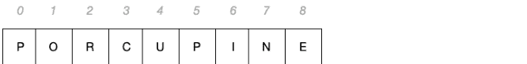

我们从 0 开始索引，对于一个长度为 $n$ 的列表，索引范围是从 0 到 $n - 1$。

对于元组，情况完全相同。

```
my_tuple = ('P', 'O', 'R', 'C', 'U', 'P', 'I', 'N', 'E')
```

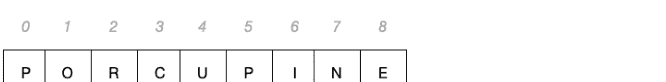

图片看起来一样，不是吗？因为确实如此！对于字符串也是如此。

```
my_string = 'PORCUPINE'
```


虽然我们没有用逗号显式地分隔字符串中的字符，但它们仍然是一个序列，我们可以通过索引来读取字符。

## 10.5 连接列表和元组

有时我们有两个或多个列表或元组，想要将它们组合起来。我们已经见过如何使用 `+` 运算符连接字符串。这对列表和元组同样适用！

```
>>> plain_colors = ['red', 'green', 'blue', 'yellow']
>>> fancy_colors = ['ultramarine', 'ochre', 'indigo', 'viridian']
>>> all_colors = plain_colors + fancy_colors
>>> all_colors
['red', 'green', 'blue', 'yellow', 'ultramarine', 'ochre',
 'indigo', 'viridian']
```

或者

```
>>> plain_colors = ('red', 'green', 'blue', 'yellow')
>>> fancy_colors = ('ultramarine', 'ochre', 'indigo', 'viridian')
>>> all_colors = plain_colors + fancy_colors
>>> all_colors
('red', 'green', 'blue', 'yellow', 'ultramarine', 'ochre',
 'indigo', 'viridian')
```

这就像连接火车车厢一样。将两列有多节车厢的火车连接起来，会保持车厢的顺序。

> 回答一个不可避免的问题：我们能用 `+` 运算符连接一个列表和一个元组吗？不能。

```
>>> [1, 2, 3] + [4, 5, 6]
[1, 2, 3, 4, 5, 6]
>>> [1, 2, 3] + (4, 5, 6)
Traceback (most recent call last):
  File "<stdin>", line 1, in <module>
TypeError: can only concatenate list (not "tuple") to list
```

## 10.6 复制列表

我们在其他地方见过，以下操作只是给列表起了另一个名字。

```
>>> lst_1 = ['gamma', 'epsilon', 'delta', 'alpha', 'beta']
>>> lst_2 = lst_1
>>> lst_1.sort()
>>> lst_2
['alpha', 'beta', 'delta', 'epsilon', 'gamma']
```

然而，有时我们确实想要制作一个副本。之前我们看到 `.copy()` 方法返回列表的 *浅拷贝*。我们也见过可以使用切片来复制列表。

```
>>> lst_1 = ['gamma', 'epsilon', 'delta', 'alpha', 'beta']
>>> lst_2 = lst_1.copy()
>>> lst_1.sort()
>>> lst_2
['gamma', 'epsilon', 'delta', 'alpha', 'beta']
```

或者

```
>>> lst_1 = ['gamma', 'epsilon', 'delta', 'alpha', 'beta']
>>> lst_2 = lst_1[:]  # 切片
>>> lst_1.sort()
>>> lst_2
['gamma', 'epsilon', 'delta', 'alpha', 'beta']
```

还有另一种复制列表的方法：使用 *列表构造函数*。列表构造函数接受某个可迭代对象并对其进行迭代，生成一个由迭代产生的元素组成的新列表。由于列表是可迭代的，我们可以用它来创建列表的副本。

```
>>> lst_1 = ['gamma', 'epsilon', 'delta', 'alpha', 'beta']
>>> lst_2 = list(lst_1)  # 使用列表构造函数
>>> lst_1.sort()
>>> lst_2
['gamma', 'epsilon', 'delta', 'alpha', 'beta']
```

所以现在我们有 *三种* 方法来复制列表：

- 使用 `.copy()` 方法
- 使用切片 (`lst_2 = lst_1[:]`)
- 使用列表构造函数 (`lst_2 = list(lst_1)`)

有趣的事实：在底层，`.copy()` 只是调用列表构造函数来创建一个新列表。

## 10.7 在序列中查找元素

毫不奇怪，如果我们有一个对象序列，我们常常希望查看某个元素是否在该序列（列表、元组或字符串）中。有时我们也想找到该元素在序列中的索引。Python 使这变得相对简单。

### 检查元素是否在序列中

假设我们有以下列表：

```
>>> fruits = ['kumquat', 'papaya', 'kiwi', 'lemon', 'lychee']
```

我们可以使用 Python 关键字 `in` 来检查元素是否存在。

```
>>> 'kiwi' in fruits
True
>>> 'apple' in fruits
False
```

我们可以在条件语句中使用此类表达式的求值结果：

```
>>> if 'apple' in fruits:
...     print("Let's bake a pie!")
... else:
...     print("Oops. No apples.")
...
Oops. No apples.
```

或者

```
>>> if 'kiwi' in fruits:
...     print("Let's bake kiwi tarts!")
... else:
...     print("Oops. No kiwis.")
...
Let's bake kiwi tarts!
```

这对数字或混合类型的列表同样适用。

```
>>> some_primes = [2, 3, 5, 7, 11, 13, 17, 19, 23]
>>> 5 in some_primes
True
>>> 4 in some_primes
False
```

或者

```
>>> mixed = (42, True, 'tobacconist', 3.1415926)
>>> 42 in mixed
True
>>> -5 in mixed
False
```

我们还可以检查某个子字符串是否在字符串中。

```
>>> "quick" in "The quick brown fox..."
True
```

因此，我们可以看到 Python 关键字 `in` 在各种情况下都非常有用。

### 获取序列中元素的索引

有时我们想知道序列中某个元素的索引。为此，我们使用 `.index()` 方法。此方法接受某个值作为参数，并返回该元素在序列中首次出现的索引（如果找到）。

```
>>> fruits = ['kumquat', 'papaya', 'kiwi', 'lemon', 'lychee']
>>> fruits.index('lychee')
4
```

然而，这个方法可能会出问题。如果元素 *不在* 列表中，Python 将引发 `ValueError` 异常。

```
>>> fruits.index('frog')
Traceback (most recent call last):
  File "/Library/Frameworks/.../code.py", line 90, in runcode
    exec(code, self.locals)
  File "<input>", line 1, in <module>
ValueError: 'frog' is not in list
```

这相当不方便，因为如果在运行程序时发生这种情况，它会使你的程序崩溃！哎呀！那么该怎么办呢？在本教材的后面，我们将学习 *异常处理*，但现在，这里有一个不同的解决方案：只需先使用 `if` 语句检查元素是否在列表（或其他序列）中，*然后* 如果确实在列表中再获取索引。

```
>>> if 'frog' in fruits:
...     print(f"The index of frog in fruits is "
...           f"{fruits.index('frog')}")
... else:
...     print("'frog' is not among the elements in the list!")
```

这样你就可以避免 `ValueError`。

## 10.8 序列解包

Python 为我们提供了一种优雅的语法，可以将序列中的各个元素解包为独立的变量。我们称之为*解包*。

```
>>> x, y = (3.945, 7.002)
>>> x
3.945
>>> y
7.002
```

这里，右侧元组中的每个元素都被赋值给左侧对应的变量。

```
>>> x = (2,)
>>> x
2
>>> x, y, z = ('a', 'b', 'c')
>>> x
'a'
>>> y
'b'
>>> z
'c'
```

这适用于任何大小的元组！

```
a, b, c, d, e = ('Hello', 5, [1, 2, 3], 'Chocolate', 2022)
```

但是，左侧变量的数量必须与右侧元组中的元素数量匹配。如果不匹配，我们会得到一个错误，要么是 `ValueError: too many values to unpack`，要么是 `ValueError: not enough values to unpack`。

元组解包特别有用，因为：

-   允许在单行中将多个值赋给变量，使代码更简洁、更易读。
-   允许函数返回多个值。
-   使交换变量值更容易（稍后会详细介绍）。

## 我们也能解包列表吗？

是的。我们可以用同样的方式解包列表。

```
x, y = [1, 2]
```

但这不如元组解包常用。你能想到为什么吗？

原因是列表是动态的，我们可能在运行时不知道有多少元素需要解包。这种情况在元组中较少发生，因为元组是不可变的，一旦创建，我们就知道它有多少个元素。

## 如果我们想解包但不关心序列中的某些元素怎么办？

假设我们想要序列解包的便利性，但右侧是一个元组或返回元组的函数，而我们不关心元组中的某些元素。在这种情况下，我们经常使用变量名 `_` 来表示“我真的不关心这个值”。

示例：

```
>>> _, lon = (44.318393, -72.885126)  # 不关心纬度
```

或

```
>>> lat, _ = (44.318393, -72.885126)  # 不关心经度
```

这在视觉上清楚地表明我们只关心特定的值，比使用 `temp`、`foo`、`junk` 或其他名称更受欢迎。

偶尔，你可能会看到代码中解包序列的两个元素被忽略。在这些情况下，同时使用 `_` 和 `__` 作为变量名来表示“我不关心”并不罕见。

示例：

```
>>> _, lon, __ = (44.318393, -72.885126, 1244.498)
```

或

```
>>> lat, _, __ = (44.318393, -72.8851266, 1244.498)
```

或

```
>>> _, __, elevation = (44.318393, -72.8851266, 1244.498)
```

也可以重用 `_`。例如，这完全可行：

```
>>> _, _, elevation = (44.318393, -72.8851266, 1244.498)
```

在这个例子中，Python 将元组的第一个元素解包给 `_`，然后将第二个元素解包给 `_`，最后将第三个元素解包给变量 `elevation`。

如果你在执行上面这行代码后检查 `_` 的值，你会看到它持有的值是 `-72.8851266`。

## 使用元组解包交换变量

在许多语言中，交换变量需要一个临时变量。假设我们想交换变量 `a` 和 `b` 的值。在大多数语言中，我们需要这样做：

```
int a = 1
int b = 2

// 现在交换
int temp = a
a = b
b = temp
```

在 Python 中这是不必要的。

```
a = 1
b = 2

# 现在交换
b, a = a, b
```

这是个有趣的技巧，对吧？

## 10.9 字符串是序列

我们已经见过另一种序列类型：字符串。字符串不过是字符的不可变序列（更准确地说是 Unicode 码点的序列）。由于字符串是序列，我们可以使用索引表示法从字符串中读取单个字符。例如：

```
>>> word = "omphaloskepsis"  # 意思是“凝视肚脐”
>>> word[0]
'o'
>>> word[-1]
's'
>>> word[2]
'p'
```

我们可以使用 `in` 来检查子字符串是否在字符串中。子字符串是字符串中的一个或多个连续字符。

```
>>> word = "omphaloskepsis"
>>> "k" in word
True
>>> "halo" in word
True
>>> "chicken" in word
False
```

我们可以对字符串使用 `min()` 和 `max()`。当我们这样做时，Python 会比较字符串中的字符（Unicode 码点）。对于 `min()`，Python 会返回码点值最低的字符。对于 `max()`，Python 会返回码点值最高的字符。
我们也可以对字符串使用 `len()`。这返回字符串的长度。

```
>>> word = "omphaloskepsis"
>>> max(word)
's'
>>> min(word)
'a'
>>> len(word)
14
```

回想一下，Unicode 包含数千个字符，所以这些函数不仅适用于英文字母。

### 理解检查

1.  `max('headroom')` 返回什么？
2.  `min('frequency')` 返回什么？
3.  `len('toast')` 返回什么？

## 10.10 序列：快速参考指南

### 可变性与不可变性

| 类型 | 可变 | 索引读取 | 索引写入 |
| :--- | :--- | :--- | :--- |
| list | 是 | 是 | 是 |
| tuple | 否 | 是 | 否 |
| str | 否 | 是 | 否 |

### 内置函数

| 类型 | len() | sum() | min() 和 max() |
| :--- | :--- | :--- | :--- |
| list | 是 | 是（如果是数字） | 是，但有限制 |
| tuple | 是 | 是（如果是数字） | 是，但有限制 |
| str | 是 | 否 | 是 |

### 方法

| 类型 | .sort(), .append(), 和 .pop() | .index() |
| :--- | :--- | :--- |
| list | 是 | 是 |
| tuple | 否 | 是 |
| str | 否 | 是 |

-   如果一个对象是*可变的*，那么该对象可以被修改。
-   索引读取：`m[i]`，其中 `m` 是列表或元组，`i` 是列表或元组的有效索引。
-   索引写入：`m[i]` 在赋值语句的左侧。
-   Python 内置函数 `len()` 对列表和元组的工作方式相同。
-   Python 内置函数 `sum()`、`min()` 和 `max()` 对列表和元组的行为相同。
-   要使 `sum()` 工作，`m` 必须只包含数字类型（`int`、`float`）或布尔值。因此，例如，`sum([1, 1.0, True])` 的结果是三。我们不能对字符串求和。
-   `min()` 和 `max()` 只要列表或元组的元素是*可比较的*就可以工作——这意味着 `>`、`>=`、`<`、`<=`、`==` 可以应用于任何一对列表元素。我们不能比较数字和字符串，但我们可以比较数字与数字，字符串与字符串。
-   我们可以使用 `in` 测试一个值是否在列表或元组中。例如，`'cheese' in m` 返回一个布尔值。
-   `m.sort()`、`m.append()` 和 `m.pop()` 仅适用于列表。元组是不可变的。注意这些方法会*就地*修改列表。
-   如果列表或元组包含不可比较的元素，我们不能应用 `m.sort()`。
-   我们必须向 `m.append()` 提供一个参数（我们必须追加*某些东西*）。
-   不带参数的 `m.pop()` 从列表中弹出最后一个元素。
-   `m.pop(i)`，其中 `i` 是 `m` 的有效索引，从列表中弹出索引 `i` 处的元素。
-   我们不能从空列表中弹出元素（`IndexError`）。
-   `m.index(x)` 将返回 `x` 在 `m` 中第一次出现的索引。注意：如果 `x` 不在 `m` 中，这将引发 `ValueError`。

## 10.11 切片

Python 支持一种强大的从序列（字符串、列表或元组）中提取数据的方法，称为*切片*。

### 基本切片

我们可以通过指定索引范围来获取某个序列的*切片*。

```
>>> un_security_council = ['China', 'France', 'Russia', 'UK',
...                        'USA', 'Albania', 'Brazil', 'Gabon',
...                        'Ghana', 'UAE', 'India', 'Ireland',
...                        'Kenya', 'Mexico', 'Norway']
```

假设我们只想要联合国安理会的常任理事国（这些是列表中的前五个）。我们不是在方括号内提供单个索引，而是提供一个索引范围，形式为 `<sequence>[<start>:<end>]`。

```
>>> un_security_council[0:5]
['China', 'France', 'Russia', 'UK', 'USA']
```

“嘿！等一下！”你说，“我们提供了*六个*索引的范围！为什么这不包括‘Albania’？”

合理的问题。Python 将结束索引视为其停止点，因此它从索引 0 切片到索引 5，*但不包括索引 5 处的元素*！这是 Python 的方式，你很快就会在其他示例中看到。这确实需要一点时间来适应，但当你在其他地方看到这种索引方式时，你会理解其原理。

如果我们想要任期在 2023 年结束的非常任理事国呢？那就是 Albania、Brazil、Gabon、Ghana 和 UAE。

要获取该切片，我们将使用

```
>>> un_security_council[5:10]
['Albania', 'Brazil', 'Gabon', 'Ghana', 'UAE']
```

同样，Python 不返回索引 10 处的项目；它只到索引 10 然后停止。

### 一些快捷方式

Python 允许一些快捷方式。例如，我们可以省略起始索引，Python 会从列表（或元组）的开头读取。

```
>>> un_security_council[:10]
['China', 'France', 'Russia', 'UK', 'USA',
 'Albania', 'Brazil', 'Gabon', 'Ghana', 'UAE']
```

同样，如果我们省略结束索引，那么 Python 会读取到列表（或元组）的末尾。

```
>>> un_security_council[10:]
['India', 'Ireland', 'Kenya', 'Mexico', 'Norway']
```

现在你应该能猜出如果我们同时省略起始和结束索引会发生什么。

## 指定步长

想象你正走在花园里的踏脚石小径上。你可能一次能跨一块石头，也可能一次能跨两块石头——跳过中间的那块。如果你腿很长，或者石头之间挨得很近，你甚至可能一次跨三块！我们把这称为*步长*或*步幅*。

在Python中，指定切片时，我们可以将步长作为第三个参数。如果我们只想获取奇数索引或偶数索引的值，这会非常方便。

语法是 `<sequence>[<start>:<stop>:<stride>]`。

以下是一些示例：

```python
>>> un_security_council[::2]  # 只取偶数索引
['China', 'Russia', 'USA', 'Brazil', 'Ghana',
 'India', 'Kenya', 'Norway']
>>> un_security_council[1::2]  # 只取奇数索引
['France', 'UK', 'Albania', 'Gabon', 'UAE',
 'Ireland', 'Mexico']
```

如果步长大于序列中的元素数量会怎样？

```python
>>> un_security_council[::1000]
['China']
```

我们能反向跨步吗？当然可以！

```python
>>> un_security_council[-1::-1]
['Norway', 'Mexico', 'Kenya', 'Ireland', 'India',
 'UAE', 'Ghana', 'Gabon', 'Brazil', 'Albania',
 'USA', 'UK', 'Russia', 'France', 'China']
```

现在你知道了获取序列反转的一种方法。你能想到一些改变步长的用例吗？

## 10.12 将可变对象传递给函数

你会记得，当一个参数传递给函数时，它会被*赋值*给相应的形参。这一点，加上可变性，有时会引起混淆。⁷

### 函数的可变与不可变参数

这里有一个经常引起混淆的例子。

```python
>>> def foo(lst):
...     lst.append('Waffles')
...
>>> breakfasts = ['Oatmeal', 'Eggs', 'Pancakes']
>>> foo(breakfasts)
>>> breakfasts
['Oatmeal', 'Eggs', 'Pancakes', 'Waffles']
```

有些人错误地解释了这种行为，认为Python一定是以不同方式处理不可变和可变参数！这*不*正确。Python传递可变和不可变参数的方式是相同的。参数被赋值给形参。

这个例子的结果与我们这样做相比，只有一点点不同：

```python
>>> breakfasts = ['Oatmeal', 'Eggs', 'Pancakes']
>>> lst = breakfasts
>>> lst.append('Waffles')
>>> breakfasts
['Oatmeal', 'Eggs', 'Pancakes', 'Waffles']
```

我们所做的只是通过赋值，给同一个列表起了两个不同的*名字*。在上面的函数foo示例中，唯一的区别是名字`lst`只存在于函数的作用域内。除此之外，这两个示例的行为是相同的。

请注意，这里传递的不是“引用”，只是发生了赋值。

### 名字有作用域，值没有

这个例子引出了另一点。引用Python大师Ned Batchelder的话：

> 名字有作用域但没有类型。值有类型但没有作用域。

⁷如果你在网上搜索，可能会发现一些资料说在Python中，不可变对象是*按值传递*的，而*可变*对象是*按引用传递*的。这是不正确的！Python总是按赋值传递——没有例外。这与许多其他语言（例如C、C++、Java）不同。如果你以前没听过这些术语，直接忽略它们就好。

我们这么说是什么意思呢？嗯，在我们将列表`breakfast`传递给函数`foo`的情况下，我们为`breakfast`创建了一个新名字`lst`。这个名字`lst`只存在于函数的作用域内，但值会持续存在。由于我们给了这个列表另一个名字`breakfast`，它存在于函数的作用域之外，因此即使在函数调用返回后，我们仍然可以访问这个列表，尽管名字`lst`已不复存在。这里还有另一个演示，可能有助于更清楚地说明这一点。

```python
>>> def foo(lst):
...     lst.append('Waffles')
...     print(lst)
...
>>> foo(['Oatmeal', 'Eggs', 'Pancakes'])
['Oatmeal', 'Eggs', 'Pancakes', 'Waffles']
```

然而，现在我们不能再使用名字`lst`了，因为它只存在于函数的作用域内。

```python
>>> lst
Traceback (most recent call last):
  File "<stdin>", line 1, in <module>
NameError: name 'lst' is not defined. Did you mean: 'list'?
```

### 列表去哪了？

当一个对象不再有引用它的名字时，Python会销毁该对象，这个过程称为*垃圾回收*。我们不会详细讨论垃圾回收。只需理解，一旦一个对象不再有引用它的名字，它就会被*垃圾回收*，从而无法访问。

所以在前面的例子中，我们将一个列表字面量传递给函数，列表唯一有名字的时候是在函数执行期间。同样，形参是`lst`，而参数（在最后一个例子中）是字面量`['Oatmeal', 'Eggs', 'Pancakes']`。函数调用时发生的赋值是`lst = ['Oatmeal', 'Eggs', 'Pancakes']`。然后我们追加了`'Waffles'`，打印了列表，然后返回了。

噗！`lst`消失了。

## 10.13 异常

### IndexError

处理序列时，你可能会遇到`IndexError`。当提供一个整数作为索引，但该索引处没有元素时，就会引发此异常。

```python
>>> lst = ['j', 'a', 's', 'p', 'e', 'r']
>>> lst[6]
Traceback (most recent call last):
  File "<stdin>", line 1, in <module>
IndexError: list index out of range
```

请注意，错误消息明确指出“list index out of range”。在上面的例子中，我们有一个包含六个元素的列表，因此有效索引范围最大到五。索引六处没有元素，因此如果我们尝试访问`lst[6]`，就会引发`IndexError`。

### TypeError

同样，在处理序列时，你可能会在新的上下文中遇到`TypeError`。如果你尝试使用整数（或切片）以外的东西作为索引，就会发生这种情况。

```python
>>> lst[1.0]
Traceback (most recent call last):
  File "<stdin>", line 1, in <module>
TypeError: list indices must be integers or slices, not float
```

```python
>>> lst['cheese']
Traceback (most recent call last):
  File "<stdin>", line 1, in <module>
TypeError: list indices must be integers or slices, not str
```

```python
>>> lst[None]
Traceback (most recent call last):
  File "<stdin>", line 1, in <module>
TypeError: list indices must be integers or slices, not NoneType
```

请注意，错误消息明确指出“list indices must be integers or slices”，并且在每种情况下，它都指出了实际提供的错误类型。

## 10.14 练习

在适当的情况下，先猜测，然后在Python shell中验证你的猜测。

### 练习 01

给定以下列表，

```python
>>> mammals = ['cheetah', 'aardvark', 'bat', 'dikdik', 'ermine']
```

写出对应以下元素的索引：

- a. aardvark
- b. bat
- c. cheetah
- d. dikdik
- e. ermine

给出一个索引`n`的例子，如果在表达式`mammals[n]`中使用它，会导致`IndexError`。

### 练习 02

给定以下元组

```python
>>> elements = (None, 'hydrogen', 'helium', 'lithium',
...            'beryllium', 'boron', 'carbon',
...            'nitrogen', 'oxygen')
```

写出对应以下元素的索引

- a. beryllium
- b. boron
- c. carbon
- d. helium
- e. hydrogen
- f. lithium
- g. nitrogen
- h. oxygen

（附加题：如果你学过化学，你认为为什么元组中的第一个元素是`None`？）

### 练习 03

给定多项式 $4x^3 + 2x^2 + 5x - 4$，将系数写成一个元组，并将结果命名为`coefficients`。使用赋值语句。

- a. `len(coefficients)`的值是多少？
- b. `coefficients[2]`的值是多少？
- c. 你是按升序还是降序写系数的？为什么做出这个选择？

### 练习 04

给定练习1和2中的列表

```python
>>> mammals = ['cheetah', 'aardvark', 'bat', 'dikdik', 'ermine']
>>> elements = (None, 'hydrogen', 'helium', 'lithium',
...             'beryllium', 'boron', 'carbon',
...             'nitrogen', 'oxygen')
```

以下表达式的求值结果是什么？

- a. `len(mammals) > len(elements)`
- b. `elements[5] < mammals[2]`
- c. `elements[-1]`

### 练习 05

编写一个函数，给定任意列表，如果列表有偶数个元素则返回`True`，如果列表有奇数个元素则返回`False`。将你的函数命名为`is_even_length()`。

### 练习 06

给定以下列表

```python
moons = ['Mimas', 'Enceladus', 'Tethys', 'Dione']
```

编写一行代码，调用函数`is_even_length()`（见练习05），以`moons`作为参数，并将结果赋值给一个名为`n`的对象。`n`的类型是什么？

### 练习 07

给定以下列表，其中包含一些土星卫星及其直径（以公里为单位）的数据，

```python
moons = [('Mimas', 396.4), ('Enceladus', 504.2),
         ('Tethys', 1062.2), ('Dione', 1122.8)]
```

- a. 如果我们执行赋值`m = moons[0]`，`m`的类型会是什么？
- b. 我们如何从`m`中获取卫星的名称？
- c. 我们如何从`m`中获取卫星的直径？
- d. 编写一行代码，计算这些卫星的平均直径，并将结果赋值给一个名为`avg_diameter`的对象。（不，你不需要循环。）
- e. 编写一行代码，使用相同的结构将土卫八（Iapetus）添加到列表中。土卫八的直径是1468.6（公里）。

### 练习 08

给定以下代码：

```python
>>> countries = ['Ethiopia', 'Benin', 'Ghana', 'Angola',
...             'Cameroon', 'Kenya']
>>> countries.append('Nigeria')
>>> countries.sort()
>>> countries.pop()
>>> country = countries[2]
```

回答以下问题：

- a. `len(countries)` 的值是多少？
- b. `country` 的最终值是多少？
- c. `len(countries[3])` 的计算结果是什么？

### 练习 09

复制列表有三种方法：

```python
lst_2 = lst_1.copy()    # 使用 copy() 方法

lst_2 = lst_1[:]         # 切片覆盖整个列表

lst_2 = list(lst_1)      # 使用 list() 构造函数
```

编写一个函数，该函数接受一个列表作为参数，复制该列表，修改列表，并*返回*修改后的副本。如何修改列表由你决定，但你应至少使用两种不同的列表方法。演示当使用一个列表变量作为参数调用此函数时，函数返回一个修改后的副本，而原始列表保持不变。

# 第 11 章

## 循环与迭代

在本章中，我们介绍*循环*。通过循环，我们可以自动化重复性任务或计算。为什么它们被称为循环？嗯，到目前为止，我们看到的代码（除了函数调用）都是从开始到结束以线性方式推进的（即使有分支，我们仍然以线性方式推进）。循环以一种非常有趣且强大的方式改变了我们代码的执行形状。它们循环！

循环允许我们代码的某部分重复执行——要么执行固定次数，要么在某个条件成立时执行——然后再继续执行代码的其余部分。

Python 为我们提供了两种类型的循环：`for` 循环和 `while` 循环。`for` 循环通过迭代某个可迭代对象来工作，无论是列表、元组、范围，甚至是字符串。`while` 循环只要某个条件为真就继续执行。

```python
word = "cat"

for letter in word:
    print(letter)

print("All done!")
```

有了变量、函数、分支和循环，我们就拥有了创建强大程序所需的所有工具。其余的，正如他们所说，就是锦上添花了。

## 学习目标

- 你将学习如何使用 `for` 循环和 `while` 循环。
- 你将学习如何迭代序列。
- 你将学习如何定义和使用控制 `while` 循环的条件。
- 你将学习如何为特定问题选择最合适的循环类型。

## 介绍的术语、Python 关键字、内置函数和类型

- 累加器
- 交错和
- 等差数列
- break
- enumerate()（内置）和 enumerate（类型）
- 斐波那契数列
- for
- 可迭代对象
- 迭代
- 循环
- 嵌套循环
- range()（内置）和 range（类型）
- 步长
- 求和
- while

## 11.1 循环：简介

我们经常需要执行重复性任务，或者执行涉及一个或多个步骤重复的计算。这正是计算机真正擅长的地方。人类不太喜欢重复性任务。计算机则毫不在意。它们能够相对轻松地执行重复性任务。

我们使用循环或迭代来执行重复性任务或计算，或者对某些数据结构中的元素进行操作。

在 Python 中，我们有两种基本类型的循环：while 循环和 for 循环。

如果你用其他语言编写过代码，你可能会发现 Python 处理 while 循环的方式类似，但 Python 处理 for 循环的方式则相当不同。

while 循环只要某个条件为真，就执行一些重复性任务或计算。

for 循环迭代一个可迭代对象。什么是可迭代对象？可迭代对象是一个复合对象（由称为“成员”或“元素”的部分组成），能够按特定顺序一次返回一个成员。回想一下：列表、元组和字符串都是可迭代的。

以这个列表为例：

```python
m = [4, 2, 0, 1, 7, 9, 8, 3]
```

如果我们要求 Python 迭代这个列表，列表对象本身“知道”如何一次返回一个成员：4，然后是 2，然后是 0，然后是 1，依此类推。

我们可以用它来控制我们希望执行的迭代次数，并提供我们可以在任务或计算中使用的数据。在接下来的章节中，我们将深入探讨两种循环：while 和 for。

## 11.2 while 循环

有时，我们希望重复执行某些任务或计算，但我们只希望在特定条件下这样做。为此，我们有 while 循环。只要某个条件为真或具有真值，while 循环就会继续执行。

想象一下，你正在模拟一场二十一点游戏，现在是庄家的回合。庄家翻开他们的暗牌，如果他们的总点数小于 17，他们必须继续摸牌，直到达到 17 点或超过 21 点。¹ 我们不知道他们会摸多少张牌，但他们必须继续摸牌，直到满足条件。while 循环只要某个条件为真就会重复，所以它非常适合这种情况。

这里有一小段 Python 代码，展示了我们如何使用 while 循环。

```python
# 假设庄家明牌是五，然后
# 翻开一张四。这给了庄家
# 九点。他们*必须*摸牌。
dealer = 9

prompt = "What's the value of the next card drawn? "

while dealer < 17:
    next_card = int(input(prompt))
    dealer = dealer + next_card

if dealer <= 21:
    print(f"Dealer has {dealer} points!")
else:
    print(f"Oh, dear. "
          f"Dealer has gone over with {dealer} points!")
```

这里庄家从九点开始。然后，在 while 循环中，我们不断提示输入要加到庄家手牌的点数。点数被加到 dealer 的值上。只要庄家的分数小于 17，这个循环就会继续执行。我们在 while 条件中看到这一点：

```python
while dealer < 17:
    ...
```

自然，这种结构引发了一些问题。

¹如果你不熟悉二十一点的规则，请参阅 https://en.wikipedia.org/wiki/Blackjack

- 什么可以用作 while 条件？
- while 条件何时被检查？
- while 循环何时终止？
- 循环终止后会发生什么？

### while 条件可以是任何计算结果为布尔值或真值的表达式

在上面的例子中，我们有一个简单的布尔表达式作为 while 条件。然而，while 条件可以是任何布尔表达式，简单的或复合的，或者是任何真值或假值的值或表达式——在 Python 中，这几乎是任何东西！例如：

```python
lst = ['a', 'b', 'c']

while lst:
    print(lst.pop(0))
```

非空序列是真值。空序列是假值。因此，只要列表 `lst` 包含任何元素，这个 while 循环就会继续。这将打印

```
a
b
c
```

然后终止（因为弹出最后一个元素后，列表为空，因此是假值）。

```python
while x < 100 and x % 2 == 0:
    ...
```

只要 `x` 小于 100 且 `x` 是偶数，这个循环就会执行。

### while 循环的条件在每次迭代前检查

while 循环的条件在每次迭代*之前*检查。在这个例子中，条件是 `dealer < 17`。开始时，庄家有九点，所以 `dealer < 17` 计算结果为 `True`。由于此条件为真，循环的*主体*被执行。（主体由 `while dealer < 17` 下的缩进行组成。）

一旦 while 循环的主体执行完毕，条件会*再次*检查。如果条件仍然为真，那么循环的主体将*再次*被执行。这就是为什么我们称之为循环！

> 重要的是要理解，条件在循环主体执行时不会被检查。

条件总是在执行循环主体*之前*检查。这听起来可能有些矛盾。我们不是刚刚说过在执行主体*之后*条件会再次检查吗？是的。这是真的，而且它在循环的本质确实有点……循环往复。不过，在 `while` 循环中，我们检查的是是否应该执行循环体。如果条件为真，我们就执行循环体，然后回到开头再次检查条件。

## while 循环的终止

在某个时刻（如果我们程序设计正确），`while` 条件会变为假。例如，如果庄家抽到一张八点牌，加上八分后庄家的分数将达到17分。此时，条件 `dealer < 17` 的求值结果为 `False`（因为17不小于17），循环终止。

## 循环之后

一旦 `while` 循环终止，代码执行将继续进行循环之后的代码。

> 重要的是要理解，循环终止后，`while` 条件不会再次被求值。

## 回顾我们的二十一点循环

```python
dealer = 9

prompt = "What's the value of the next card drawn? "

while dealer < 17:
    next_card = int(input(prompt))
    dealer = dealer + next_card

if dealer <= 21:
    print(f"Dealer has {dealer} points!")
else:
    print(f"Oh, dear. "
          f"Dealer has gone over with {dealer} points!")
```

当我们第一次到达这行代码时，`dealer` 的值是9，所以条件为真。我们进入循环，循环体被执行。

```python
dealer = 9

prompt = "What's the value of the next card drawn? "

while dealer < 17:
    next_card = int(input(prompt))
    dealer = dealer + next_card

if dealer <= 21:
    print(f"Dealer has {dealer} points!")
else:
    print(f"Oh, dear. "
          f"Dealer has gone over with {dealer} points!")
```

进入循环后，循环体被执行。在执行循环体期间，条件不会被求值。

循环！
回到循环的开头，再次检查条件。
如果条件仍然为真，我们再次执行循环体。

```python
dealer = 9

prompt = "What's the value of the next card drawn? "

while dealer < 17:
    next_card = int(input(prompt))
    dealer = dealer + next_card

if dealer <= 21:
    print(f"Dealer has {dealer} points!")
else:
    print(f"Oh, dear. "
          f"Dealer has gone over with {dealer} points!")
```

既然我们已经循环了，我们再次执行循环体。

```python
dealer = 9

prompt = "What's the value of the next card drawn? "

while dealer < 17:
    next_card = int(input(prompt))
    dealer = dealer + next_card

if dealer <= 21:
    print(f"Dealer has {dealer} points!")
else:
    print(f"Oh, dear. "
          f"Dealer has gone over with {dealer} points!")
```

循环！
在某个时刻，条件应该变为假，此时循环终止……

```python
dealer = 9

prompt = "What's the value of the next card drawn? "

while dealer < 17:
    next_card = int(input(prompt))
    dealer = dealer + next_card

if dealer <= 21:
    print(f"Dealer has {dealer} points!")
else:
    print(f"Oh, dear. "
          f"Dealer has gone over with {dealer} points!")
```

……此时我们退出循环，继续执行循环之后的程序代码。

请注意，退出循环后我们不会重新求值条件。

## 另一个例子：咖啡店排队与有限的咖啡

这是使用 `while` 循环的另一个例子。

假设我们在咖啡店有一队顾客。他们都想要咖啡（当然）。咖啡店提供小杯（8盎司）、中杯（12盎司）和大杯（20盎司）咖啡。然而，咖啡店的咖啡豆已经用完，只剩下咖啡壶里的存量。咖啡师必须按顺序服务顾客，并且只能在咖啡壶里至少还有20盎司咖啡时才能接受订单。

我们可以编写一个函数来计算队列中有多少人被服务，并报告结果。为此，我们将使用一个 `while` 循环。我们的函数将接受三个参数：咖啡壶中咖啡的盎司数、表示订单队列的列表，以及咖啡师必须停止接单前咖啡壶中必须保留的最小咖啡量。队列将是一个值列表——8、12或20——取决于每位顾客请求的杯型。例如，

```python
queue = [8, 12, 20, 20, 12, 12, 20, 8, 12, ...]
```

我们称咖啡壶中的咖啡量为 `reserve`，最小值为 `minimum`，顾客队列为 `customers`。我们的 `while` 条件是 `reserve >= minimum`。

```python
def serve_coffee(reserve, customers, minimum):

    customers_served = 0

    while reserve >= minimum:
        reserve = reserve - customers[customers_served]
        customers_served += 1

    print(f"We have served {customers_served} customers, "
          f"and we have only {reserve} ounces remaining.")
```

在每次迭代中，我们检查是否还有足够的咖啡继续接受订单。然后，在循环体内，我们按顺序服务顾客，并——一次一位——扣除他们所点咖啡的量。一旦剩余咖啡量低于最小值，我们就停止接单并报告结果。

## 如果 while 条件从未满足会怎样？

假设我们调用上面的 `serve_coffee()` 函数，参数为6、`lst`和8，其中 `lst` 是某个任意的订单列表：

```python
serve_coffee(6, lst, 8)
```

在这种情况下，当我们第一次检查 `while` 条件时，条件失败，因为六不大于或等于八。因此，循环体将永远不会执行，函数将报告：

We have served 0 customers, and we have only 6 ounces remaining.

所以，任何给定的 `while` 循环的循环体都有可能永远不被执行。如果在开始时 `while` 条件为假，Python 将完全跳过循环！

## 11.3 使用 while 循环进行输入验证

`while` 循环的一个常见用途是*输入验证*。

假设我们希望用户提供一个1到10之间（包括1和10）的数字。我们向用户显示一个提示：

```
Pick a number from 1 to 10:
```

到目前为止，我们只见过如何向用户抱怨：

```
Pick a number from 1 to 10: 999
You have done a very bad thing.
I will terminate now and speak to you no further!
```

这不太友好！通常在这种情况下，我们会继续提示用户，直到他们提供一个合适的值。

```
Pick a number from 1 to 10: 999
Invalid input.
Pick a number from 1 to 10: -1
Invalid input.
Pick a number from 1 to 10: 7
You have entered 7, which is a very lucky number!
```

但问题是：我们不知道用户需要尝试多少次才能提供有效的输入！他们会在第一次尝试时成功吗？第二次？第四次？第十二次？我们根本不知道！因此，`while` 循环是完美的工具。

我们如何在Python中实现这样的循环？什么可以作为条件？

情节转折：在这种情况下，我们会选择一个*总是*为真的条件，然后只在我们得到一个在所需范围内的数字时才*跳出*循环。这是Python（以及许多其他编程语言）中的一个常见惯用法。

```python
while True:
    n = int(input("Pick a number from 1 to 10: "))
    if 1 <= n <= 10:
        break
    print("Invalid input.")

if n == 7:
    print("You have entered 7, "
          "which is a very lucky number!")
else:
    print(f"You have entered {n}. Good for you!")
```

注意我们在这里做了什么：*while* 条件是布尔字面量 *True*。这*永远*不会是假！所以我们必须有一种退出循环的方法。这就是 *break* 的用武之地。*break* 是一个Python关键字，意思是“跳出最近的封闭循环”。*if* 子句包含一个条件，只有当用户的选择在所需范围内时才为真。因此，这个循环将无限期地执行，直到用户输入一个1到10之间的数字。

就用户体验而言，这比如果用户不遵循指令就立即终止程序要友好得多。当收到无效输入时，我们的程序可以再次询问，而不是抱怨并退出。

## 注意事项

虽然上面的例子展示了 *break* 的有效用法，但 *break* 应该谨慎使用。如果有好的方法可以不使用 *break* 来编写 *while* 循环，那么你应该这样做！这通常涉及仔细考虑 *while* 条件——这是值得你投入时间的。

在一个循环中包含多个 *break* 语句也被认为是不良形式。同样，请谨慎使用 *break*。

## *while* 循环的其他应用

我们将看到 *while* 循环的许多其他用途，包括执行数值计算和从文件中读取数据。

### 理解检查

1. 打印什么？

```python
>>> c = 5
>>> while c >= 0:
...     print(c)
...     c -= 1
```

## 2. “Hello”被打印了多少次？

```python
>>> while False:
...     print("Hello")
...
```

## 3. 这个 while 循环有什么问题？

```python
>>> while True:
...     print("The age of the universe is...")
...
```

## 4. 这个循环将执行多少次？

```python
>>> while True:
...     break
...
```

## 5. 这个循环将执行多少次？

```python
>>> n = 10
>>> while n > 0:
...     n = n // 2
...
```

## 6. 这是一个在循环中从列表弹出元素的示例。

```python
>>> while some_list:
...     element = some_list.pop()
...     # 现在对这个元素做一些有用的事情
...
```

问问自己：

-   为什么这能行？
-   while 循环何时终止？
-   这与真值或假值有什么关系？
-   空列表是假值吗？

## 挑战！

这个循环怎么样？用一个手持计算器试试看。

```python
EPSILON = 0.01

x = 2.0

guess = x
while True:
    guess = sum((guess, x / guess)) / 2

    if abs(guess ** 2 - x) < EPSILON:
        break

print(guess)
```

（`abs()` 是一个内置的 Python 函数，用于计算一个数的绝对值。）这个循环是做什么的？

## 11.4 一个使用 while 循环的古老算法

有一个相当优美的算法，用于求两个正整数的最大公约数。

你可能在初等代数课程中回忆过，两个正整数 *a* 和 *b* 的 *最大公约数* 是能整除 *a* 和 *b* 而没有余数的最大整数。

例如，120 和 105 的最大公约数是 15。很明显，15 是 120 和 105 的公约数：

120/15 = 8
105/15 = 7。

我们怎么知道 15 是 *最大* 公约数呢？一种方法是将两个数分解质因数，并找出所有公因数。

**120 = 2 × 2 × 2 × 3 × 5**
**105 = 3 × 5 × 7**

我们找到了 120 和 105 的公因数，即 3 和 5，它们的乘积是 15。因此，15 是 120 和 105 的最大公约数。这种方法可行，而且很可能就是你在初等代数中学到的，然而，对于较大的数字，这种方法变得困难且效率不高。

## 欧几里得算法

欧几里得是古希腊数学家，活跃于公元前 300 年左右。这里有一个以欧几里得命名的算法。它出现在欧几里得的《几何原本》中，但它很可能在欧几里得之前很多年就已出现。²

²一些历史学家认为，尼多斯的欧多克索斯（约公元前 375 年）已经知道这个算法，而且它很可能在那个时间之前就已为人所知。

## 欧几里得最大公约数算法

**输入**：正整数 $a$ 和 $b$
**输出**：计算 $a$ 和 $b$ 的最大公约数
**当** $b$ 不等于 0 **时** **执行**
    求 $a$ 除以 $b$ 的余数；
    令 $a$ 等于 $b$；
    令 $b$ 等于余数；
**结束**
$a$ 就是最大公约数

让我们来计算一个例子。假设我们有 $a = 342$ 和 $b = 186$。
首先，我们求 342/186 的余数。186 进入 342 一次，余数为 156。现在，令 $a = 186$，令 $b = 156$。$b$ 等于 0 吗？不，所以我们继续。
求 186/156 的余数。156 进入 186 一次，余数为 30。现在，令 $a = 156$，令 $b = 30$。$b$ 等于 0 吗？不，所以我们继续。
求 156/30 的余数。30 进入 156 五次，余数为 6。现在，令 $a = 30$，令 $b = 6$。$b$ 等于 0 吗？不，所以我们继续。
求 30/6 的余数。6 进入 30 五次，余数为 0。现在，令 $a = 6$，令 $b = 0$。$b$ 等于 0 吗？是的，所以我们完成了。
最大公约数就是 $a$ 的值，所以最大公约数是 6。
很酷，对吧？

## 为什么它有效？

如果我们有 $a$ 和 $b$ 都是正整数，且 $a > b$，那么我们可以写成
$$a = bq + r$$
其中 $q$ 是 $a$ 除以 $b$ 的商（欧几里得除法），$r$ 是余数。例如，在我们上面例子的第一步中，我们有
$$342 = 1 \times 186 + 156.$$
由此可知，$a$ 和 $b$ 的最大公约数等于 $b$ 和 $r$ 的最大公约数。³ 也就是说，
$$\gcd(a, b) = \gcd(b, r).$$
因此，通过连续的除法，我们不断地将问题简化为更小的项。在算法执行的某个时刻，$b$ 变为 0，我们无法再进行除法。此时，$a$ 的值就是最大公约数，因为 $a$ 和零的最大公约数就是 $a$！

> ³如果我们有正整数 $a$, $b$ 且 $a > b$，那么根据除法算法，我们知道存在整数 $q$, $r$，使得 $a = bq + r$，其中 $b > r \ge 0$。令 $d$ 是 $a$ 和 $b$ 的一个公约数。由于 $d$ 整除 $a$ 且 $d$ 整除 $b$，那么存在整数 $n$, $m$，使得 $a = dm$ 且 $b = dn$。通过代入，我们有 $dm = dqn + r$。重新排列项，我们有 $dm - dqn = r$。通过因式分解，我们有 $d(m - qn) = r$。因此，$d$ 整除 $r$。所以 $a$ 和 $b$ 的公约数集合与 $b$ 和 $r$ 的公约数集合相同。因此，这两个集合中的最大元素必须相同。因此，我们有 $\gcd(a, b) = \gcd(b, r)$，正如所期望的。

这个算法使我们不必对两个数都进行因式分解。
考虑一个更大的问题实例，$a = 30759$ 和 $b = 9126$。
对这些数进行因式分解会很麻烦，但欧几里得算法只需八次迭代就能找到答案，即 3。

## 给我看代码！

这是一个 Python 实现。

```python
"""
欧几里得算法的实现。
"""

a = int(input("Enter a positive integer, a: "))
b = int(input("Enter a positive integer, b: "))

while b != 0:
    remainder = a % b
    a = b
    b = remainder

print(f"The GCD is {a}.")
```

这是一个优雅的小算法（也是我个人最喜欢的算法之一）。
它也展示了 while 循环的使用，这是必需的，因为我们事先不知道需要多少次迭代才能得到一个解。

## 11.5 for 循环

我们已经看到，当我们知道我们希望执行一个计算或任务，但事先不知道可能需要多少次迭代时，while 循环很有用。因此，while 循环提供一个条件，我们循环直到该条件（无论它是什么）不再成立。
Python 有另一种类型的循环，在以下情况下很有用：

-   我们确切地知道需要多少次迭代，或者
-   我们有一些序列（即列表、元组或字符串），并且我们希望对序列的元素（或其某个子集）执行计算、任务或操作。

这种新的循环就是 for 循环。for 循环之所以得名，是因为它们为某个可迭代对象中的每个元素进行迭代。Python 的 for 循环总是迭代某个可迭代对象。⁴

⁴Python 中的 for 循环与许多其他语言中的工作方式相当不同。一些语言使用计数器，因此 for 循环是 *计数控制* 的。例如，在 Java 中我们可能会写

```java
for (int i = 0; i < 10; ++i) {
    // 做一些事情
}
```

什么是可迭代对象？当然是我们可以迭代的东西！那可能是什么？我们目前见过的序列类型（列表、元组、字符串）都是序列，这些是可迭代的。我们也可以产生其他可迭代对象（我们很快就会看到）。

这里有一个例子。我们可以通过按顺序逐个获取元素来迭代一个列表 [1, 2, 3]。

```python
>>> numbers = [1, 2, 3]
>>> for n in numbers:
...     print(n)
...
1
2
3
```

看到了吗？在我们的 for 循环中，Python 迭代了所提供列表的元素（也称为“成员”）。它从 1 开始，然后是 2，然后是 3。此时列表已耗尽，所以循环终止。

如果这有帮助，你可以将 `for n in numbers:` 读作“对于名为‘numbers’的可迭代对象中的每个数字 n”。

这对元组也适用。

```python
>>> letters = ('a', 'b', 'c')
>>> for letter in letters:
...     print(letter)
...
a
b
c
```

注意语法：`for <某个变量> in <某个可迭代对象>:`。当我们迭代某个可迭代对象时，我们依次获得可迭代对象的每个成员，一次一个。因此，我们需要将这些成员（一次一个）分配给某个变量。

在上面的第一个例子中，变量标识符是 n。

```python
>>> numbers = [1, 2, 3]
>>> for n in numbers:
...     print(n)
...
```

当我们迭代 numbers（一个列表）时，我们一次从列表中获取一个元素（按它们在列表中出现的顺序）。所以在第一次迭代中，n 被赋值为 1。在第二次迭代中，n 被赋值为 2。

> 在这种情况下，有一个计数器 i，在循环的每次迭代中更新。这里我们通过使用 ++i（在 Java 中使 i 递增）来更新 i。只要控制条件 i < 10 为真，循环就运行。在最后一次迭代中，当 i 等于九时，i 被递增到十，然后条件不再成立，循环退出。Python 中的 for 循环不是这样工作的！Python 的 for 循环总是迭代一个可迭代对象。

在第三次迭代时，n 被赋值为 3。第三次迭代后，序列中已无剩余元素，循环终止。

因此，for 循环的语法*要求*我们为一个变量命名，该变量将用于保存序列中的各个元素。例如，我们不能这样做：

```
>>> for [1, 2, 3]:
...     print("Hello!")
```

如果我们尝试这样做，会得到一个语法错误。必须使用的语法是：

```
for <some variable> in <some iterable>:
    # 循环体，缩进
```

其中 `<some variable>` 替换为一个有效的变量名，而 `<some iterable>` 是某个可迭代对象的名称，可以是列表、元组、字符串或其他可迭代对象。

## 遍历数字范围

有时我们想遍历一个*数字范围*，或者希望执行固定次数的迭代，Python 为我们提供了一种实现方式：range 类型。这是一个我们之前未见过的新类型。range 对象是可迭代的，我们可以在 for 循环中使用它们。

我们可以使用 Python 的内置函数 `range()` 创建一个新的 range 对象。这个函数也称为 range 构造函数，用于创建表示*等差数列*的 range 对象。

在使用 range 对象创建循环之前，让我们先做一些实验。创建 range 对象最简单的语法是向 range 构造函数传递一个正整数作为参数。我们得到的是一个 range 对象，它类似于一个数字列表。如果我们提供一个正整数 n 作为唯一参数，我们会得到一个包含 n 个元素的 range 对象。

```
>>> r = range(4)
```

现在我们有了一个名为 r 的 range 对象。让我们探究一下。

```
>>> len(r)
4
```

好的。所以 r 有 4 个元素。这验证了。

等差数列是一个数字序列，其中序列中任何数字与其前驱数字之间的差是恒定的。1, 2, 3, 4, ... 是一个等差数列，因为每一项之间的差是 1。类似地，2, 4, 6, 8, ... 也是一个等差数列，因为每一项之间的差是 2。Python 的 range 对象仅限于整数的等差数列。

```
>>> r[0]
0
>>> r[1]
1
>>> r[2]
2
>>> r[3]
3
>>> r[4]
Traceback (most recent call last):
  File "<stdin>", line 1, in <module>
IndexError: range object index out of range
```

我们看到这个 range 对象包含的值依次是 0, 1, 2 和 3。

现在让我们在 for 循环中使用 range 对象。这是最简单的例子：

```
>>> for n in range(4):
...     print(n)
```

你认为这会打印什么？

- 数字 1 到 4？
- 数字 0 到 4？（因为 Python 是从零开始索引的）
- 数字 0 到 3？（因为 Python 切片是到停止索引但不包括它）

答案如下：

```
>>> for n in range(4):
...     print(n)
...
0
1
2
3
```

从零到三。`range(n)` 带有一个整数参数时，会生成一个从 0 开始，到参数值*但不包括*该值的等差数列。

不过请注意，如果我们使用 `range(n)`，我们的循环将执行 n 次。如果我们想遍历区间 [5, 10] 内的整数呢？我们该怎么做？

```
>>> for n in range(5, 11):
...     print(n)
...
5
6
7
8
9
10
```

这里使用的语法，当我们使用两个参数时，是 `range(<start>, <stop>)`，其中 `<start>` 和 `<stop>` 是整数或具有整数值的变量。`range` 将包含从起始值开始，到*但不包括*停止值的整数。

如果出于某种原因，我们只想要偶数或奇数值呢？或者如果我们想按三、五或十来计数呢？我们能使用不同的步长或步幅吗？当然可以。这些都是有效的等差数列。让我们按三来计数。

```
>>> for n in range(3, 19, 3):
...     print(n)
...
3
6
9
12
15
18
```

这种三个参数的语法是 `range(<start>, <stop>, <stride>)`。最后一个参数，称为*步幅*或*步长*，对应于等差数列中各项之间的差（默认步幅为 1）。

我们能倒着走吗？可以。我们只需使用负步幅，并相应地调整起始和停止值。

```
>>> for n in range(18, 2, -3):
...     print(n)
...
18
15
12
9
6
3
```

这会产生一个 `range`，从 18 开始，向下到*但不包括* 2，按三倒数。

所以你看，`range()` 相当灵活。

## 如果我只想做某件事很多次，而不关心序列中的成员呢？

没什么大不了的。虽然我们确实需要一个变量来保存我们正在遍历的序列或其他可迭代对象的每个成员，但我们并*不必须*在循环体中使用它。有一个惯例，不是语言要求的，但常用，就是使用下划线作为我们不打算使用或不真正关心的变量的名称。

```
>>> for _ in range(5):
...     print("I don't like Brussels sprouts!")
...
I don't like Brussels sprouts!
I don't like Brussels sprots!
I don't like Brussels sprouts!
I don't like Brussels sprouts!
I don't like Brussels sprouts!
```

（现在你知道我对抱子甘蓝的看法了。）

### 理解检查

1. `sum(range(5))` 的求值结果是什么？
2. `max(range(10))` 的求值结果是什么？
3. `len(range(0, 10, 2))` 的求值结果是什么？

## 11.6 可迭代对象

正如我们所看到的，可迭代对象是 Python 控制 for 循环的方式。
你可以将可迭代对象视为一个序列或复合对象（由多个部分组成），它可以一次返回一个元素，直到序列耗尽。我们通常将可迭代对象的元素称为可迭代对象的成员。
这很像从一副牌中发牌，并对发出的每张牌执行一次操作（执行任务或计算）。
一副扑克牌是一个可迭代对象。它有 52 个成员（单张牌）。这些牌有一定的顺序（它们可能被洗过也可能没洗过，但一副牌中的牌仍然是有序的）。我们可以一次发一张牌。这就是遍历这副牌。一旦我们发完第 52 张牌，这副牌就耗尽了，迭代停止。
现在，有两种方式可以使用这些牌。
首先，我们可以使用每张牌中编码的信息。例如，我们可以说出牌的名字，或者我们可以将每张牌上的点数相加，等等。
或者，如果我们想做某件事 52 次（比如俯卧撑），我们可以每发一张牌就做一个俯卧撑。在这种情况下，每张牌中编码的信息和单张牌的顺序就无关紧要了。然而，如果我们每发一张牌就做一个俯卧撑，当我们到达牌堆末尾时，我们就知道我们已经做了 52 个俯卧撑。
Python 中也是如此。当遍历某个可迭代对象时，我们可以使用每个成员的数据或值（比如计算列表中数字的总和），或者我们也可以只使用迭代作为一种计数方式。在 Python 中，这两种方式都是可以的。

## 使用可迭代对象提供的数据

以下是使用可迭代对象成员数据的两个例子。
首先，假设我们有一个整数列表，我们想知道其中有多少个偶数和多少个奇数。假设我们有一个这样的列表，变量名为 `lst`。

```
evens = 0

for n in lst:
    if n % 2 == 0:  # 是偶数
        evens += 1

print(f"There are {evens} even numbers in this list, "
      f"and there are {len(lst) - evens} odd numbers.")
```

再举一个例子，假设我们有一个所有已知周期彗星的列表，我们想生成一个轨道周期小于 100 年的彗星列表。我们将遍历彗星列表，检查每颗彗星的轨道周期，如果该值小于 100 年，我们就将该彗星添加到另一个列表中。在下面的例子中，列表 `COMETS` 包含元组，其中元组的第一个元素是彗星的名称，第二个元素是其以年为单位的轨道周期。[^6]

```
"""
生成一个轨道周期小于 100 年的哈雷型周期彗星列表。
"""
COMETS = [('Mellish', 145), ('Sheppard-Trujillo', 66),
          ('Levy', 51), ('Halley', 75), ('Borisov', 152),
          ('Tsuchinshan', 101), ('Holvorcem', 38)]
          # 此列表已精简。你明白意思即可。

short_period_comets = []

for comet in COMETS:
    if comet[1] < 100:
        short_period_comets.append(comet)
        # 是的，有更好的方法可以做到这一点，
        # 但这足以说明问题。
```

这里我们使用了可迭代对象 `COMETS` 每个成员中编码的数据。

[^6] 彗星的*轨道周期*是彗星绕太阳运行一周所需的时间。

## 仅使用可迭代对象来计数

```python
for _ in range(1_000_000):
    print("I will not waste chalk")
```

这里我们没有使用可迭代对象成员中编码的数据。相反，我们只是用它来计数。因此，我们给保存可迭代对象返回的各个成员的变量取名为 `_`。`_` 通常用作我们不打算在任何计算中使用的变量的名称。这是程序员表达“是的，无所谓，它有什么值并不重要，我不在乎”的方式。

所以这是处理可迭代对象的两种不同方式。一种情况下，我们关心可迭代对象每个成员的值；另一种情况下，我们不关心。然而，*两种*方法都用于控制 `for` 循环。

## 11.7 遍历字符串

我们已经了解了如何遍历序列，如列表、元组和范围。Python 允许我们以与其他序列相同的方式遍历字符串！

当我们遍历字符串时，迭代器一次返回一个字符。这里有一个例子：

```python
>>> word = "cat"
>>> for letter in word:
...     print(letter)
...
c
a
t
```

## 11.8 在循环中计算总和

虽然我们有 Python 内置函数 `sum()` 可以对序列的元素求和（前提是序列的元素都是数字类型），但看看我们如何在循环中实现这一点是很有启发性的（事实上，循环求和正是 `sum()` 函数所做的）。

这里有一个简单的例子。

```python
t = (27, 3, 19, 43, 11, 9, 31, 36, 75, 2)

sum_ = 0

for n in t:
    sum_ += n

print(sum_)           # prints 256
assert sum_ == sum(t) # verify answer
```

我们从一个包含数值的元组 `t` 开始。由于 `t` 的元素都是数字，我们可以计算它们的和。首先，我们创建一个变量来保存求和的结果。我们称之为 `sum_`。然后，我们遍历 `t` 中的所有元素，在循环的每次迭代中，我们将每个元素的值加到变量 `sum_` 上。一旦循环终止，`sum_` 就保存了 `t` 所有元素的总和。然后我们打印出来，并与 `sum(t)` 返回的结果进行比较，以验证这确实是正确的结果。

在这样的计算中，我们将变量 `sum_` 称为*累加器*（因为它累积了迭代中元素的值）。

这就是我们在循环中计算总和的方法！

## 11.9 循环与求和

通常，我们有一些包含*求和*的公式，并希望在 Python 中实现这个求和。

例如，计算一组数字的算术平均值的公式要求我们首先对所有数字求和：

$$\mu = \frac{1}{N} \sum_{i=0}^{N-1} x_i$$

如果你以前没见过符号 $\sum$，它只是“把它们全部加起来”的简写。

求和与循环之间有什么联系？求和*就是一个循环*！

在上面的公式中，有一个由 $i$ 索引的值列表 $x$。求和表示：“取所有元素 $x_i$ 并将它们相加。”求和部分就是

$$\sum_{i=0}^{N-1} x_i$$

这等同于

$$x_0 + x_1 + \dots + x_{N-2} + x_{N-1}$$

这是 Python 中的循环（假设我们有一个名为 `x` 的列表）：

```python
s = 0
for e in x:
    s = s + e
```

之后，我们将除以列表中的元素数量：

```python
mean = s / len(x)
```

是的，我们可以用 `sum()` 来计算总和，但你认为 `sum()` 在幕后做了什么？正是这个！

> 为什么我们使用尾随下划线？为了避免用新定义覆盖 Python 内置函数 `sum()`。

再举一个例子。假设我们想计算一个数字列表的平方和（这很常见）。这是求和符号（同样使用零索引）：

$$\sum_{i=0}^{N-1} x_i^2$$

这是 Python 中的循环：

```python
s = 0
for e in x:
    s = s + e ** 2
```

看到了吗？求和与循环之间的联系是直接的。

## 11.10 乘积

乘积也是同样的道理。正如我们可以通过将某个数字列表或元组中的所有元素相加来求和一样，我们也可以通过相乘来求它们的乘积。为此，我们使用符号 $\Pi$（这是一个大写的 $\Pi$，以区别于常数 $\pi$），而不是符号 $\sum$。

$$\prod_{i=0}^{N-1} x_i$$

这等同于

$$x_0 \times x_1 \times \dots \times x_{N-2} \times x_{N-1}$$

Python 中对应的循环：

```python
p = 1
for e in x:
    p = p * e
```

为什么我们将累加器初始化为 1？因为那是乘法单位元。如果我们将其设置为零，乘积将为零，因为任何数乘以零都是零。任何数乘以一都是它本身。因此，如果计算重复乘积，我们将累加器初始化为一。

## 11.11 enumerate()

我们已经了解了如何在 `for` 循环中遍历可迭代对象的元素。

```python
for e in lst:
    print(e)
```

然而，有时在每次迭代中同时拥有元素和元素的索引会很有帮助。一个需要元素及其索引的常见应用是计算交错和。交错和出现在分析、数论、组合学中，许多都有现实世界的应用。

交错和就是一个项的符号交替的求和。而不是

$x_0 + x_1 + x_2 + x_3 + x_4 + x_5 + \dots$

其中所有符号都是正的，交错和看起来像这样：

$x_0 - x_1 + x_2 - x_3 + x_4 - x_5 + \dots$

注意我们交替进行加法和减法。

我们可以通过多种方式实现这一点。这里有一个相当笨拙的例子（假设我们有一个名为 `lst` 的数字列表）：

```python
alternating_sum = 0

for i in range(len(lst)):
    if i % 2:  # i is odd, then we subtract
        alternating_sum -= lst[i]
    else:
        alternating_sum += lst[i]
```

这行得通。严格从数学角度来看它是正确的，但 `i in range(len(lst))` 然后使用 `i` 作为 `lst` 的索引在 Python 中被认为是“反模式”。（反模式是我们应该避免的模式。）

那么程序员该怎么办呢？

`enumerate()` 来救援！Python 为我们提供了一个方便的内置函数 `enumerate()`。它遍历某个序列中的所有元素，并在每次迭代中生成一个包含索引和元素的元组。这是使用 `enumerate()` 实现的相同循环：

```python
alternating_sum = 0

for i, e in enumerate(lst):
    if i % 2:
        alternating_sum -= e
    else:
        alternating_sum += e
```

我们不再需要调用 `len(lst)`，也不再需要从 `lst` 进行索引读取。显然，这是更清晰、更具可读性的代码。但它是如何工作的？`enumerate()` 到底做了什么？

如果我们传递某个可迭代对象——比如列表、元组或字符串——作为 `enumerate()` 的参数，我们会得到一个新的可迭代对象，其类型为 `enumerate`（这是我们以前没见过的新类型）。当我们遍历一个 `enumerate` 对象时，它会生成*元组*。元组的第一个元素是元素在原始可迭代对象中的索引。元组的第二个元素是元素本身。

一开始这有点难以消化，所以这里有一个例子：

```python
lst = ['a', 'b', 'c', 'd']
for i, element in enumerate(lst):
    print(f"The element at index {i} is '{element}'.")
```

这会打印：

```
The element at index 0 is 'a'.
The element at index 1 is 'b'.
The element at index 2 is 'c'.
The element at index 3 is 'd'.
```

我们上面使用的语法是*元组解包*（我们在前面的章节中见过）。在使用 `enumerate()` 时，这非常方便。我们使用一个变量来保存索引，一个变量来保存元素。`enumerate()` 生成一个元组，我们将其即时解包到这两个变量中。

让我们使用 Python shell 深入了解一下。

```python
>>> lst = ['a', 'b', 'c']
>>> en = enumerate(lst)
>>> type(en)    # verify type is `enumerate`
<class 'enumerate'>
>>> for t in en:  # iterate `en` without tuple unpacking
...     print(t)
...
(0, 'a')
(1, 'b')
(2, 'c')
```

所以你看，每次迭代生成的是索引和元素的元组。很酷，对吧？

现在我们已经了解了一些关于 `enumerate()` 的知识，让我们重新审视交错和的例子：

```python
alternating_sum = 0

for i, e in enumerate(lst):
    if i % 2:
        alternating_sum -= e
    else:
        alternating_sum += e
```

回想一下，我们假设 `lst` 是一个先前定义的数字元素列表。当我们把 `lst` 作为参数传递给 `enumerate()` 时，我们得到一个 `enumerate` 对象。当我们遍历这个对象时，每次迭代都会得到元组。这里我们将它们解包到变量 `i` 和 `e`。`i` 被赋值为索引，`e` 被赋值为元素。

如果你需要同时获取元素及其索引，请使用 `enumerate()`。

## 11.12 追踪循环

很多时候，我们希望理解一个可能并非自己编写的循环的行为。一种探究循环的方法是使用表格来*追踪*循环的执行过程。当我们这样做时，规律往往会浮现出来——对于*while*循环而言——我们能更好地理解循环的终止条件。

举个例子。假设你需要确定这个循环终止后变量*s*的值：

```
s = 0
for n in range(1, 10):
    if n % 2:
        # n是奇数；1为真值
        s = s + 1 / n
    else:
        # n必为偶数；0为假值
        s = s - 1 / n
```

让我们制作一个表格并填写它。表格的第一行代表我们的起始点，后续行将记录循环中发生的事情。在这个表格中，我们需要跟踪两件事：*n*和*s*。

| n | s |
|---|---|
|   | 0 |

在进入循环之前，*s*的值为0。

现在考虑我们将要迭代的值。`range(1, 10)`将产生值1, 2, 3, 4, 5, 6, 7, 8和9。所以让我们把这些值添加到表格中（暂时不计算*s*的值）。

| n | s |
|---|---|
|   | 0 |
| 1 | ? |
| 2 | ? |
| 3 | ? |
| 4 | ? |
| 5 | ? |
| 6 | ? |
| 7 | ? |
| 8 | ? |
| 9 | ? |

由于没有`break`或`return`语句，我们知道我们将遍历*n*的所有这些值。

现在让我们弄清楚循环内部*s*发生了什么。在第一次迭代中，*n*将是1，这是奇数，所以将执行`if`分支。这将把1 / *n*加到*s*上，因此在第一次迭代结束时，*s*将等于1（1 / 1）。所以我们把它写在表格里：

| n | s |
|---|---|
| 0 | 0 |
| 1 | 1 |
| 2 | ? |
| 3 | ? |
| 4 | ? |
| 5 | ? |
| 6 | ? |
| 7 | ? |
| 8 | ? |
| 9 | ? |

现在进行下一次迭代。在下一次迭代中，n取值为2。哪个分支执行？嗯，2是偶数，所以将执行else分支，并从s中减去1/2。我们不进行小数展开，所以可以写成：

| n | s |
|---|---|
| 0 | 0 |
| 1 | 1 |
| 2 | 1 - 1/2 |
| 3 | ? |
| 4 | ? |
| 5 | ? |
| 6 | ? |
| 7 | ? |
| 8 | ? |
| 9 | ? |

现在进行下一次迭代。n取值为3，3是奇数，因此执行if分支，我们将1/3加到s上。同样，我们不进行小数展开（这样做将帮助我们看到即将出现的规律）。

| n | s |
|---|---|
| 0 | 0 |
| 1 | 1 |
| 2 | 1 - 1/2 |
| 3 | 1 - 1/2 + 1/3 |
| 4 | ? |
| 5 | ? |
| 6 | ? |
| 7 | ? |
| 8 | ? |
| 9 | ? |

现在进行下一次迭代。n取值为4，4是偶数，因此执行else分支，我们从s中减去1/4。

| n | s |
|---|---|
|   | 0 |
| 1 | 1 |
| 2 | 1 - 1/2 |
| 3 | 1 - 1/2 + 1/3 |
| 4 | 1 - 1/2 + 1/3 - 1/4 |
| 5 | ? |
| 6 | ? |
| 7 | ? |
| 8 | ? |
| 9 | ? |

你看出规律了吗？没有？让我们再做几次迭代。

在下一次迭代中。n取值为5，5是奇数，因此执行if分支，我们将1/5加到s上。然后n取值为6，6是偶数，因此执行else分支，我们从s中减去1/6。

| n | s |
|---|---|
|   | 0 |
| 1 | 1 |
| 2 | 1 - 1/2 |
| 3 | 1 - 1/2 + 1/3 |
| 4 | 1 - 1/2 + 1/3 - 1/4 |
| 5 | 1 - 1/2 + 1/3 - 1/4 + 1/5 |
| 6 | 1 - 1/2 + 1/3 - 1/4 + 1/5 - 1/6 |
| 7 | ? |
| 8 | ? |
| 9 | ? |

此时，你很可能已经看出规律了（如果没有，就再做两三次迭代）。这个循环正在计算

$$1 - \frac{1}{2} + \frac{1}{3} - \frac{1}{4} + \frac{1}{5} - \frac{1}{6} + \frac{1}{7} - \frac{1}{8} + \frac{1}{9}$$

看到了吗？在每次迭代中，我们都在检查n是偶数还是奇数。如果n是奇数，我们加上1 / n；如果n是偶数，我们减去1 / n。

我们可以用求和符号更简洁地表示。这个循环计算

$$s = \sum_{n=1}^{n=9} (-1)^{n-1} \frac{1}{n}.$$

你可能会问自己：$(-1)^{n-1}$这一项是干什么的？它处理的是交替符号！

- $(-1)^0$是多少？1。
- $(-1)^1$是多少？-1。
- $(-1)^2$是多少？1。
- $(-1)^3$是多少？-1。
- $(-1)^4$是多少？1。

## 另一个例子：阶乘

在数学中，自然数$n$的*阶乘*是所有小于等于$n$的自然数的乘积。它用感叹号表示，*例如*，

$$6! = 1 \times 2 \times 3 \times 4 \times 5 \times 6.$$

让我们追踪一个计算阶乘的Python循环。

```
n = 6

f = 1
for i in range(2, n + 1):
    f = f * i
```

这个循环做什么？在每次迭代中，它将$f$乘以$i$，并将结果作为新的$f$。

| i | f |
|---|---|
|   | 1 |
| 2 | 2 |
| 3 | 6 |
| 4 | 24 |
| 5 | 120 |
| 6 | 720 |

这计算了某个$n$的阶乘，$n!$。（是的，有更简单的方法。）记住：

$$n! = \prod_{i=1}^{i=n} i.$$

## 另一个例子：离散人口增长

```
birth_rate = 0.05
death_rate = 0.03
pop = 1000  # 人口
n = 4

for _ in range(n):
    pop = int(pop * (1 + birth_rate - death_rate))
```

|   | p |
|---|---|
|   | 1000 |
| 1 | 1020 |
| 2 | 1040 |
| 3 | 1060 |
| 4 | 1081 |

这里我们没有在计算中使用循环索引的值，但我们将其包含在表格中只是为了跟踪我们处于哪次迭代。在这个例子中，我们在每次迭代中将旧的pop乘以(1 + birth_rate - death_rate)，并将其作为新的pop。这个计算手动做起来很麻烦，但用计算器就很直接。

这是在计算什么？这是在计算一个初始有1000个个体、出生率为5%、死亡率为3%的种群规模。这计算了四个时间间隔（例如，年）后的种群数量。

能够追踪循环（或程序的任何部分）是程序员的一项有用技能。

## 11.13 嵌套循环

将一个循环包含在另一个循环中并不少见。这被称为*嵌套*，这样的循环被称为*嵌套循环*。

假设我们想打印出循环赛国际象棋锦标赛（“循环赛”是指每位选手与其他所有选手都进行比赛的比赛）中选手的配对。因为在国际象棋中白方对黑方有轻微优势，所以公平的做法是每位选手与其他所有选手比赛两次：一次执黑，一次执白。

我们将用选手的名字成对地表示每场比赛，其中列出的第一个选手执白，第二个选手执黑。

因此，在一个有Anne、Bojan、Carlos和Doris四位选手的小型锦标赛中，配对将是：

- Anne (W) vs Bojan (B)
- Anne (W) vs Carlos (B)
- Anne (W) vs Doris (B)
- Bojan (W) vs Anne (B)
- Bojan (W) vs Carlos (B)
- Bojan (W) vs Doris (B)
- Carlos (W) vs Anne (B)
- Carlos (W) vs Bojan (B)
- Carlos (W) vs Doris (B)
- Doris (W) vs Anne (B)
- Doris (W) vs Bojan (B)
- Doris (W) vs Carlos (B)

（我们排除了自我配对，原因显而易见。）

给定选手列表['Anne', 'Bojan', 'Carlos', 'Doris']，我们如何编写代码来生成所有这些配对？一种方法是使用嵌套循环。

```
players = ['Anne', 'Bojan', 'Carlos', 'Doris']

for white in players:
    for black in players:
        if white != black:  # 排除自我配对
            print(f"{white} (W) vs {black} (B)")
```

这段代码执行时，会精确打印出上面显示的配对列表。

这是如何工作的？外层循环——for white in players:——遍历所有选手，一次一个：Anne、Bojan、Carlos和Doris。对于外层循环的每次迭代，内层循环也会迭代一次，同样是：Anne、Bojan、Carlos和Doris。如果外层循环中分配给white的元素不等于内层循环中分配给black的元素，我们就打印该配对。通过这种方式，所有可能的配对都被生成了。

这是另一个例子——使用嵌套循环执行乘法。（以下内容效率不高，可能有点傻，但希望能说明问题。）

假设我们想计算5 × 7而不使用*运算符。我们可以用嵌套循环来做到这一点！

```
answer = 0

for _ in range(5):
    for __ in range(7):
        answer += 1

print(answer)  # 打印35
```

外层循环执行多少次？五次。内层循环*对于外层循环的每次迭代*执行多少次？七次。我们递增answer多少次？5 × 7 = 35。

## 使用嵌套循环遍历二维列表

哎呀！什么是二维列表？二维列表就是一个包含其他列表的列表！

假设我们有一个井字棋游戏的结果编码在一个二维列表中：

```
game = [
    ['X', ' ', 'O'],
    ['O', 'X', 'O'],
    ['X', ' ', 'X']
]
```

要以表格形式打印此信息，我们可以使用嵌套循环。

for row in game:
    for col in row:
        print(col, end='')
    print()

这将打印出

```
X O
OXO
X X
```

## 11.14 栈和队列

既然我们已经了解了列表和循环，现在介绍两种基本数据结构是顺理成章的：*栈*和*队列*。你会看到，在 Python 中实现它们几乎是小菜一碟——我们对两者都使用列表，唯一的区别在于我们*如何*使用这个列表。

## 栈

*栈*是一种后进先出的数据结构（缩写为 LIFO，发音为 life-o）。它是一种线性数据结构，我们在一端向列表添加元素，并从*同一端*移除元素。

栈的经典例子是自助餐厅的托盘。通常这些托盘放在一个弹簧床上，顾客从顶部取走托盘，栈中的下一个托盘就露出来了。第一个放上栈的托盘是最后一个被取走的。你可能见过可以堆叠的椅子。最后放上去的是第一个被拿走的。你打包过行李箱吗？最后放进去的东西是第一个被拿出来的。你点击过网页浏览器中的“后退”按钮吗？网页浏览器使用栈来跟踪你访问过的页面。你使用过 ctrl-z 来撤销对文档的编辑吗？你的橱柜里有一摞盘子或碗吗？猜怎么着？这些都是栈在日常生活中的例子。

我们将向栈添加一个元素称为*入栈*。我们将从栈中移除一个元素称为*出栈*（这听起来应该很熟悉）。

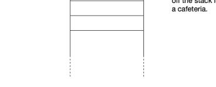

当我们把一个项目推入栈时，它就成为了“栈顶”项目。

这是一个跟踪 Egbert 访问过的网站的栈。


当 Egbert 点击“后退”按钮时，YouTube 从栈中弹出，Reddit 现在位于栈顶。他回到了之前访问的网站。

栈在计算机科学中应用非常广泛，是许多重要算法的核心。（事实上，函数调用就是使用栈来管理的！）
Python 中列表的默认行为就是作为栈使用。是的，没错，我们免费获得了栈功能！如果我们向列表追加一个项目，它会被添加到一端。当我们从列表中弹出一个项目时，默认情况下，它从*同一端*弹出。因此，Python 列表中的最后一个元素代表栈的*栈顶*。
这里有一个简单的例子：

```
>>> stack = []
>>> stack.append("Pitchfork")
>>> stack.append("Spotify")
>>> stack.append("Netflix")
>>> stack.append("Reddit")
>>> stack.append("YouTube")
>>> stack[-1]  # 查看栈顶是什么
YouTube
>>> stack.pop()
YouTube
>>> stack[-1]  # 查看栈顶是什么
Reddit
>>> stack.pop()
Reddit
>>> stack[-1]  # 查看栈顶是什么
Netflix
```

所以你看，在 Python 中实现一个栈是轻而易举的事。

## 队列

队列是一种先进先出的线性数据结构（FIFO，发音为 fife-o）。栈和队列的唯一区别在于，对于栈，我们从同一端入栈和出栈；而对于队列，我们在一端添加元素，在另一端移除元素。这是唯一的区别。

现实世界中有哪些例子？杂货店的结账队伍——排在第一个的人最先结账。你是否曾在打印机前等待，因为有人在你之前发送了打印任务？那是另一个队列。通过收费站的汽车、客户服务聊天的等待列表等等——现实世界的例子比比皆是。

术语略有不同。我们将向队列添加一个元素称为*入队*。我们将从队列中移除一个元素称为*出队*。但这些只是追加和弹出的花哨名称。

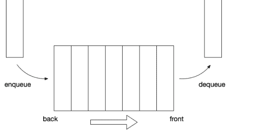

与栈一样，队列在计算机科学中应用非常广泛，是许多重要算法的核心。

将列表转换为队列需要一个小技巧。对于队列，我们从一端入队，从另一端出队。像栈一样，我们可以使用 append 来入队。这个小技巧是，我们不使用 .pop()（它会从同一端弹出），而是使用 .pop(0) 从列表的另一端弹出，*瞧*，我们就有了一个队列。

这里有一个简单的例子：

```
queue = []
>>> queue.append("Fred")    # Fred 排在第一个
>>> queue.append("Mary")    # Mary 排在第二个
>>> queue.append("Claire")  # Claire 在 Mary 后面
>>> queue.pop(0)            # Fred 已被服务
'Fred'
>>> queue[0]                # 现在看看谁在前面
'Mary'
>>> queue.append("Gladys")  # Gladys 加入队伍
>>> queue.pop(0)            # Mary 已被服务
'Mary'
```

所以你看，一个列表可以用作栈或队列。通常，栈和队列在循环中使用。我们将在后面的章节中进一步了解这一点。

## 11.15 深入了解 Python 中的迭代

接下来是关于 Python 中可迭代对象和迭代的更多细节。如果你愿意，可以完全跳过本节。这里介绍的唯一目的是展示当我们迭代 Python 中的某个对象时，“幕后”发生了什么。话虽如此，让我们从列表的情况开始（元组或其他任何可迭代对象的工作原理相同）。

```
>>> m = ['Greninja', 'Lucario', 'Mimikyu', 'Charizard']
```

当我们要求 Python 迭代某个可迭代对象时，它会调用 iter() 函数，该函数返回该可迭代对象的*迭代器*（在本例中是一个列表）。

```
>>> iterator = iter(m)
>>> type(iterator)
<class 'list_iterator'>
```

迭代器的工作方式是 Python 不断询问“给我下一个成员”，直到迭代器耗尽。这是通过（在幕后）调用迭代器的 __next__() 方法来完成的。

```
>>> iterator.__next__()
'Greninja'
>>> iterator.__next__()
'Lucario'
>>> iterator.__next__()
'Mimikyu'
>>> iterator.__next__()
'Charizard'
```

现在，如果我们再调用一次 __next__() 会发生什么？
我们会得到一个 StopIteration 错误

```
>>> iterator.__next__()
Traceback (most recent call last):
  File "/Library/.../code.py", line 90, in runcode
    exec(code, self.locals)
  File "<input>", line 1, in <module>
StopIteration
```

同样，在幕后，当迭代一个可迭代对象时，Python 会获取该对象的迭代器，然后调用 __next__() 直到发生 StopIteration 错误，然后停止迭代。

## 那 range() 呢？

正如我们之前看到的，range() 返回一个 range 类型的对象。

```
>>> r = range(5)
>>> type(r)
<class 'range'>
```

但 range 是可迭代的，所以它们可以与 iter(r) 函数一起使用，生成的迭代器将具有 __next__() 作为方法。

```
>>> iterator = iter(r)
>>> iterator.__next__()
0
>>> iterator.__next__()
1
>>> iterator.__next__()
2
>>> iterator.__next__()
3
>>> iterator.__next__()
4
>>> iterator.__next__()
Traceback (most recent call last):
  File "<stdin>", line 1, in <module>
StopIteration
```

所有可迭代对象都共享此接口和行为。

## 11.16 练习

### 练习 01

编写一个 while 循环，将从一到十的所有数字相加。不要使用 for。总和是多少？检查你的答案。（参见：第 11.2 节）

### 练习 02

不使用循环，但使用 range()，计算从一到十的所有数字的总和。检查你的答案。（参见：第 11.5 节）

### 练习 03

- a. 编写一个 for 循环，打印数字 0, 2, 4, 6, 8，每个数字单独一行。
- b. 编写一个 for 循环，打印你选择的某个句子五次。

### 练习 04

编写一个 for 循环，计算某个任意数值列表（命名为 data）的平方和（自己编一个列表，但确保它至少有四个元素）。
例如，如果数值列表是 [2, 9, 5, -1]，结果将是 111，因为
并且 4 + 81 + 25 + 1 = 111。
（参见：第 11.6 节）

### 练习 05

编写一个 for 循环，迭代列表
并打印列表的奇偶和。也就是说，如果数字是偶数，将其加到总和中；如果数字是奇数，将其从总和中减去。
总和是多少？检查你的答案。再次检查你的答案。
（参见：第 11.11 节）

```
lst = [23, 7, 42, 17, 9, 38, 28, 31, 49, 22, 5, 26, 15]
```

### 练习 06

编写一个 for 循环，遍历一个字符串并将每隔一个字母大写。例如，对于字符串 “Rumplestiltskin”，结果应该是 “RuMpLeStIlTsKiN”。对于字符串 “HELLO WORLD!”，结果结果应为“HeLLO WoRLD!”。对于字符串“123456789”，结果应为“123456789”。
如果我们对空格、标点符号或数字进行大写转换会发生什么？

### 练习 07

创建一个你自选的列表。你的列表应包含至少五个元素。创建列表后，编写一个循环，使用 `enumerate()` 遍历你的列表，在每次迭代中同时获取索引和元素。打印结果，指明元素及其索引。
例如，给定列表

```
albums = ['Rid Of Me', 'Spiderland', 'This Stupid World',
          'Icky Thump', 'Painless', 'New Long Leg']
```

你的程序应打印

```
"Rid Of Me" is at index 0.
"Spiderland" is at index 1.
"This Stupid World" is at index 2.
"Icky Thump" is at index 3.
"Painless" is at index 4.
"New Long Leg" is at index 5.
```

### 练习 08（挑战！）

*斐波那契数列*是一个整数序列，以 0 和 1 开始，之后序列中的每个后续数字都是前两个数字之和。例如，下一个数字是 1，因为 0 + 1 = 1；再下一个数字是 2，因为 1 + 1 = 2；再下一个数字是 3，因为 1 + 2 = 3；再下一个数字是 5，因为 2 + 3 = 5，依此类推。
编写一个程序，使用循环（而非递归）计算斐波那契数列的前 *n* 项。从这个列表开始：

```
fibos = [0, 1]
```

你可以使用一次 `input()` 调用、一个 `if` 语句和一个 `while` 循环。你不能使用任何其他循环。你不能使用递归。示例：

```
Enter n for the first n terms in the Fibonacci sequence: 7
[0, 1, 1, 2, 3, 5, 8]

Enter n for the first n terms in the Fibonacci sequence: 10
[0, 1, 1, 2, 3, 5, 8, 13, 21, 34]
```

```
Enter n for the first n terms in the Fibonacci sequence: 50
[0, 1, 1, 2, 3, 5, 8, 13, 21, 34, 55, 89, 144, 233, 377,
610, 987, 1597, 2584, 4181, 6765, 10946, 17711, 28657,
46368, 75025, 121393, 196418, 317811, 514229, 832040,
1346269, 2178309, 3524578, 5702887, 9227465, 14930352,
24157817, 39088169, 63245986, 102334155, 165580141,
267914296, 433494437, 701408733, 1134903170, 1836311903,
2971215073, 4807526976, 7778742049]
```

### 练习 09

编写一个函数，该函数接受一个列表作为参数，并在循环中修改该列表。如何修改列表由你决定，但你应至少使用两种不同的列表方法。包含调用该函数的代码，传入一个列表变量，然后在函数返回后演示列表已发生更改。

### 练习 10

编写一个函数，该函数接受两个整数 $n$ 和 $k$ 作为参数，并生成一个列表，包含 1 到 $n$ 之间所有 $k$ 的奇数倍数。例如，给定输入 $n = 100$ 和 $k = 7$，函数应返回

```
[7, 21, 35, 49, 63, 77, 91]
```

### 练习 11（挑战！）

取模运算符根据整数相对于某个模数的*余数*（剩余）将整数*划分*为*等价类*。例如，模数为三时，整数被划分为三个等价类：$n \bmod 3 \equiv 0$、$n \bmod 3 \equiv 1$ 和 $n \bmod 3 \equiv 2$ 的那些。

编写并测试一个函数，该函数接受一个任意整数列表和某个模数 $n$ 作为参数，并返回一个元组，包含列表中每个等价类的元素计数，其中元组元素的索引对应于余数。因此，例如，如果输入列表是 [1, 5, 8, 2, 11, 15, 9]，模数是 3，那么函数应返回元组 (2, 1, 4)，因为有两个元素余数为 0（15 和 9），一个元素余数为 1（1），四个元素余数为 2（5, 8, 2, 11）。

还要注意，如果模数是 $n$，返回的值将是一个 $n$ 元组。

### 练习 12

使用 Python 列表作为栈。从一个空列表开始：

```
stack = []
```

1. 压入 ‘teal’
2. 压入 ‘magenta’
3. 压入 ‘yellow’
4. 压入 ‘viridian’
5. 弹出
6. 弹出
7. 压入 ‘amber’
8. 弹出
9. 弹出
10. 压入 ‘vermilion’

打印你的栈。你的栈应如下所示

```
['teal', 'vermilion']
```

如果不像这样，请重新开始并再次尝试。
参见：第 11.14 节 栈和队列

### 练习 13

在 Python shell 中，创建一个列表并将其用作队列。开始时，队列应为空。

```
>>> queue = []
```

现在执行以下操作：

1. 入队 ‘red’
2. 入队 ‘blue’
3. 出队
4. 入队 ‘green’
5. 出队
6. 入队 ‘ochre’
7. 入队 ‘cyan’
8. 入队 ‘umber’
9. 出队
10. 入队 ‘mauve’

现在，打印你的队列。你的队列应如下所示：

```
['ochre', 'cyan', 'umber', 'mauve']
```

如果不像这样，请重新开始并再次尝试。

# 第 12 章

## 随机性、游戏与模拟

在这里，我们将学习随机性的丰富用途。随机性在游戏中很有用（洗牌、掷骰子），但它在建模和模拟种类繁多的真实世界过程方面也很有用。

## 学习目标

- 你将理解为什么在计算机程序中能够生成伪随机数或做出伪随机选择是有用的。
- 你将学习如何使用 Python `random` 模块中一些最常用的方法，包括
    - `random.random()` 生成一个在区间 [0.0, 1.0) 内的伪随机浮点数，
    - `random.randint()` 生成一个在指定区间内的伪随机整数，
    - `random.choice()` 从可迭代对象中伪随机选择一个项目，以及
    - `random.shuffle()` 打乱一个列表。
- 你将理解 `seed`（种子）在生成伪随机数中的作用，并理解设置种子如何使包含伪随机性的程序行为变得可预测。

## 引入的术语

- 蒙特卡洛模拟
- 伪随机
- `random` 模块
- 随机游走
- 种子

## 12.1 random 模块

想想你玩过的所有涉及掷骰子或洗牌的游戏。这类游戏之所以有趣，部分原因是其中的偶然元素。我们不知道掷骰子会出现多少点数。我们不知道下一张发的牌是什么。如果我们事先知道所有这些事情，这样的游戏就会很无聊！

在游戏之外，有大量应用需要随机性。

各种模拟都利用了这一点——例如，建模生物或生态现象、统计力学和物理学、物理化学、建模人类的社会或经济行为、运筹学以及气候建模。随机性也用于密码学、人工智能和许多其他领域。例如，蒙特卡洛方法（以摩纳哥著名的赌场命名）是一种广泛使用的技术，它从随机分布中重复采样数据，自 1940 年代以来一直在科学和工业中使用。

Python 的 `random` 模块为我们提供了许多生成“随机”数字或做出“随机”选择的方法。当我们想要实现一个机会游戏（或带有某些机会元素的游戏）或模拟时，这些方法就派上了用场。

但想想看：你会如何编写代码来模拟掷骰子或挑选一个“随机”数字，比如在一到十之间？真的。停下来想一想。这就是 `random` 模块的用武之地。我们可以用它来模拟此类事件。

我在上面将“随机”放在引号中，因为真正的随机性是无法计算的。Python random 模块所做的就是生成*伪随机*数字并做出*伪随机*选择。有什么区别？对于普通观察者来说，没有区别。然而，在这些伪随机数字的生成和伪随机选择的背后，存在着确定性过程。

这听起来相当复杂，但使用 `random` 模块并不复杂。如果我们希望使用 `random` 模块，我们首先导入它（就像我们之前使用 `math` 模块一样）。

```
import random
```

现在我们可以使用 `random` 模块中的方法了。

### random.choice()

`random.choice()` 方法接受一个可迭代对象，并从可迭代对象的元素中返回一个伪随机选择。当从固定的可能性集合中进行选择时，这很有用。例如：

```
>>> import random
>>> random.choice(['heads', 'tails'])
'tails'
```

每次我们这样调用 `choice` 时，它都会在 'heads' 和 'tails' 之间做出伪随机选择，从而模拟抛硬币。

这适用于任何可迭代对象。

```
>>> random.choice((1, 2, 3, 4, 5))
2
>>> random.choice(['A', 'K', 'Q', 'J', '10', '9', '8', '7', '6',
...                '5', '4', '3', '2'])
'7'
>>> random.choice(['rock', 'paper', 'scissors'])
'rock'
>>> random.choice(range(10))
4
```

它甚至适用于字符串作为可迭代对象！

```
>>> random.choice("random")
'm'
```

### 理解检查

- 1. 我们如何使用 `random.choice()` 来模拟投掷一个六面骰子？
- 2. 我们如何使用 `random.choice()` 来模拟投掷一个十二面骰子？

## 使用 `random.choice()` 进行随机游走

*随机游走*是一个过程，我们沿着数轴随机地向正方向或负方向移动。
从0开始，走五步，随机选择-1或+1，一次游走可能像这样进行：0, -1, 0, 1, 2, 1。在每一步，我们向左移动一个单位（负方向）或向右移动一个单位（正方向）。在这样的游走中，有 $2^n$ 种可能的结果，其中 $n$ 是所走的步数。
下面是一个实现这种游走的循环：

```
>>> position = 0
>>> for _ in range(5):
...     position = position + random.choice([-1, 1])
...
```

## random.random()

此方法返回区间 [0.0, 1.0) 中的下一个伪随机浮点数。请注意，这里给出的区间是数学符号表示，不是Python语法。示例：

```
x = random.random()
```

这里 `x` 被赋予一个大于或等于零，且严格小于1的伪随机值。

这有什么用？我们可以用它来模拟具有特定概率 p 的事件。回想一下，概率在区间 [0.0, 1.0] 内，其中0.0代表不可能，1.0代表必然。介于这两个极端之间的任何情况都很有趣。

### 理解检查

- 1. 我们如何生成一个在区间 [0.0, 1.0) 内的伪随机数？

## 使用 random.random() 模拟有偏硬币的投掷

假设我们想模拟一枚略有偏差的硬币的投掷——一枚被设定为53%概率出现正面的硬币。我们可以这样做。

```
if random.random() < 0.53:
    print("Heads!")
else:
    print("Tails!")
```

这种方法在物理或生物建模、经济学和游戏的模拟中很常用。

如果你想选择一个在区间 [-100.0, 100.0] 内的伪随机浮点数呢？没什么大不了的。记住 random.random() 给我们一个在区间 [0.0, 1.0) 内的伪随机数，所以要得到所需区间的值，我们只需减去0.5（使分布以零为中心）并乘以200（以“拉伸”结果）。

```
x = (random.random() - 0.5) * 200
```

### 理解检查

- 1. 我们如何模拟一个发生概率为1/4的事件？
- 2. 我们如何生成一个在区间 [-2.0, 2.0) 内的伪随机浮点数？

## random.randint()

如前所述，我们可以使用 random.choice() 从某个可迭代对象中选择对象。如果我们想从一到十中选一个数，我们可以使用

```
n = random.choice([1, 2, 3, 4, 5, 6, 7, 8, 9, 10])
```

这是正确的，但可能会变得繁琐。如果我们想选择一个1到1000之间的伪随机数呢？在这种情况下，最好使用 random.randint()。此方法接受两个参数，表示上下界（包含）。因此，要选择一个1到1000之间的伪随机整数：

```
n = random.randint(1, 1000)
```

现在我们有了 $n$，使得 $n$ 是一个整数，$n \geq 1$，且 $n \leq 1000$。

## random.shuffle()

有时，我们想打乱值，例如一副牌。`random.shuffle()` 会就地打乱一个可变序列（例如列表）。示例：

```
cards = ['A', '2', '3', '4', '5', '6', '7', '8', '9', '10',
        'J', 'Q', 'K']
random.shuffle(cards)
```

现在牌被打乱了。

### 理解检查

- 1. `random.shuffle()` 适用于列表。为什么它不适用于元组？它适用于字符串吗？
- 2. 这段代码中的错误在哪里？

```
>>> import random
>>> cards = ['A', '2', '3', '4', '5', '6', '7', '8', '9',
...         '10', 'J', 'Q', 'K']
>>> cards = random.shuffle(cards)
>>> print(cards)
None
>>>
```

## 其他 `random` 方法

random模块包含许多其他方法，包括从各种分布中生成随机数，以及其他巧妙的工具！

> 如果你感兴趣——特别是如果你有一些概率论和统计学基础——请参阅：`random` — *生成伪随机数*：https://docs.python.org/3/library/random.html

## 12.2 伪随机性详解

我之前提到过，`random` 模块生成的数字和做出的选择并非真正的随机，而是伪随机的，但这意味着什么？

计算机进行计算。它们无法凭空抓取一个随机数。你可能会认为计算机的计算是确定性的，你是对的。

那么，我们如何使用一个确定性的计算设备来产生看起来随机的东西，一个具有我们需要的所有统计特性的东西呢？

从根本上说，`random` 模块使用了一种叫做 *梅森旋转算法* 的算法（多么可爱的名字！）。¹ 你不需要理解这个算法是如何工作的，但理解它确实需要一个输入作为其计算的起点是有用的。这个输入被称为 *种子*，从这个种子开始，算法产生一系列伪随机数。每次请求，我们都会得到一个新的伪随机数。

```
>>> import random
>>> random.random()
0.16558225561225903
>>> random.random()
0.20717009610984627
>>> random.random()
0.2577426786448077
>>> random.random()
0.5173312574262303
>>>
```

试一试。（你得到的数字序列会有所不同。）
那么种子从哪里来呢？默认情况下，算法从你的计算机操作系统获取种子。现代操作系统为此提供了一个特殊的来源，如果你的代码中没有提供种子，`random` 模块会要求操作系统提供一个。²

## 12.3 使用种子

大多数时候，我们希望伪随机数生成器（或选择）具有不可预测性。然而，有时我们希望稍微控制一下过程，以便结果具有可比性。
例如，测试一个输出不可预测的程序将是困难的，如果不是不可能的话。这就是为什么 `random` 模块允许我们提供自己的种子。如果我们从相同的种子开始这个过程，生成的随机数序列或做出的选择序列是相同的。例如，

```
>>> import random
>>> random.seed(42)  # 设置种子。
>>> random.random()
0.6394267984578837
>>> random.random()
0.025010755222666936
>>> random.random()
0.27502931836911926
>>> random.seed(42)  # 再次设置种子，使用相同的值。
>>> random.random()
0.6394267984578837
>>> random.random()
0.025010755222666936
>>> random.random()
0.27502931836911926
```

注意，连续调用 random.random() 生成的数字序列是相同的：0.6394267984578837, 0.025010755222666936, 0.27502931836911926, ...

这是另一个例子：

```
>>> import random
>>> results = []
>>> random.seed('walrus')
>>> for _ in range(10):
...     results.append(random.choice(['a', 'b', 'c']))
...
>>> results
['b', 'a', 'c', 'b', 'a', 'a', 'a', 'c', 'a', 'b']
>>> results = []
>>> random.seed('walrus')
>>> for _ in range(10):
...     results.append(random.choice(['a', 'b', 'c']))
...
>>> results
['b', 'a', 'c', 'b', 'a', 'a', 'a', 'c', 'a', 'b']
```

注意，在这两种情况下结果是相同的。如果我们用相同的种子进行一百万次这样的实验，我们总是会得到相同的结果。它看起来是随机的，但从根本上说并非如此。

通过设置种子，我们可以使对随机方法的调用行为 *完全可预测*。正如你可能想象的那样，这允许我们测试包含伪随机数生成或选择的程序。

尝试用 random.shuffle() 做类似的事情。从一个短列表开始，设置种子，然后打乱它。然后将列表重新初始化为其原始值，再次设置种子——使用相同的值——并再次打乱它。两次打乱后的列表相同吗？

---
¹ M. Matsumoto and T. Nishimura, 1998, "Mersenne Twister: A 623-dimensionally equidistributed uniform pseudorandom number generator", *ACM Transactions on Modeling and Computer Simulation*, 8(1).
² 如果你好奇，试试这个：

```
>>> import os        # 与操作系统接口
>>> os.urandom(8)    # 请求一个大小为8的字节串
b'\xa6t\x08=\xa5\x19\xde\x94'
```

这就是 `random` 模块默认获取种子的地方。这个服务本身需要一个种子，操作系统从各种硬件来源获取它。目标是让种子尽可能不可预测。

## 12.4 练习

### 练习 01

使用 `random.choice()` 来模拟一次公平的抛硬币。此方法接受一个可迭代对象，并在每次调用时，从该可迭代对象中随机选择一个元素。例如，

```python
random.choice([1, 2, 3, 4, 5])
```

将从列表中选择一个元素，每个元素被选中的概率相等。在一个循环中模拟10次抛硬币。然后报告正面和反面的次数。

### 练习 02

使用 `random.random()` 来模拟一次公平的抛硬币。请记住，`random.random()` 返回一个在区间 [0.0, 1.0) 内的浮点数。在一个循环中模拟10次抛硬币。然后报告正面和反面的次数。

### 练习 03

模拟一次有偏的抛硬币。你可以假设，在极限情况下，这枚有偏的硬币有51.7%的概率出现正面。与练习01不同，`random.choice()` 在这里不适用，因为结果出现的概率并不相等。在一个循环中模拟10次这样的有偏抛硬币。然后报告正面和反面的次数。

### 练习 04

`random.shuffle()` 接受一个列表作为参数，并*就地*打乱该列表。（请记住，列表是可变的，就地打乱意味着 `random.shuffle()` 会修改你传入的列表，并返回 `None`。）编写一个程序，打乱以下列表

```python
['A', 'K', 'Q', 'J', '10', '9', '8', '7', '6',
 '5', '4', '3', '2']
```

然后在一个 while 循环中使用 `.pop()` 一次“发一张牌”，直到列表耗尽。每从列表中弹出一张牌，就打印它。

### 练习 05

*赌徒破产*模拟一个赌徒从一定金额开始赌博，直到输光。概率论告诉我们，他们*总是*会输光——这只是时间问题。编写一个程序，提示用户输入一定金额，然后通过押注公平的抛硬币来模拟赌徒破产。使用整数表示金额，并在每次抛硬币时押注一个单位。你的程序应该报告赌徒输光所经历的抛硬币次数。

### 练习 06

编写一个程序，模拟投掷两个六面骰子。在一个循环中，模拟投掷并报告结果。例如，如果投出的结果是二和五，则打印 "2 + 5 = 7"。提示用户，询问他们是想再次投掷还是退出。

### 练习 07（挑战！）

编写一个程序，提示用户输入投掷次数 $n$，然后模拟 $n$ 次投掷两个六面骰子。记录每次投掷的点数总和。使用一个整数列表来记录点数。从一个全为零的列表开始。

```python
counts = [0] * 13
# 这会给你一个像这样的全零列表：
# [0, 0, 0, 0, 0, 0, 0, 0, 0, 0, 0, 0, 0]
# 我们将忽略索引为零的元素
```

然后，对于每次骰子投掷，计算点数总和，并递增列表中对应的元素。例如，如果前三次投掷的结果是五、五和九，那么 `counts` 应该看起来像这样

```python
[0, 0, 0, 0, 0, 2, 0, 0, 0, 1, 0, 0, 0]
```

完成 $n$ 次投掷后，打印结果（同样，忽略索引为0的元素），并使用断言验证列表的总和等于 $n$。

### 练习 08

在数学中，函数的一个要求是，给定相同的输入，它总是产生相同的输出。总是如此。例如，2的平方总是4。你不能过一会儿再检查，发现它变成了4.1，或者9，或者其他什么。对同一个参数应用函数总是会得到相同的结果。如果情况并非如此，那么它就不是一个函数。

问题：`random` 模块中的函数是真正的函数吗？如果是，为什么？如果不是，为什么不是？

### 练习 09（挑战！）

重新审视练习05中的赌徒破产问题。修改程序，使其运行1,000次赌徒破产模拟，并记录赌徒输光所花费的次数。然而——这一点很重要——总是从相同的金额开始（比如1,000单位，任何你喜欢的货币）。然后计算这组模拟结果的均值和标准差。

均值，记为 $\mu$，由下式给出

$$\mu = \frac{1}{N} \sum_{i=0}^{N-1} x_i$$

其中我们有一组结果 $X$，由索引 $i$ 标记，$N$ 等于 $X$ 中的元素数量。

标准差，记为 $\sigma$，由下式给出

$$\sigma = \frac{1}{N} \sum_{i=0}^{N-1} (x_i - \mu)^2.$$

完成之后，分别再次运行程序，进行10,000、100,000和1,000,000次模拟，并记录结果。

均值会随着模拟次数的变化而变化吗？标准差呢？

这一切告诉你关于赌博的什么？

提示：编写单独的函数来计算均值和标准差是合理的。

# 第13章

## 文件 I/O

到目前为止，我们程序的所有输入和所有输出都发生在控制台中。也就是说，我们使用 `input()` 来提示用户输入，使用 `print()` 将输出发送到控制台。

当然，向程序发送信息和从程序接收输出的方式有很多：鼠标和触摸板、音频数据、图形用户界面（“GUIs”，发音为“gooeys”）、温度传感器、加速度计、数据库、执行器、网络、Web API（应用程序编程接口）等等。

在这里，我们将学习如何从文件读取数据和向文件写入数据。我们称之为“文件 i/o”，即“文件输入和输出”的缩写。当我们需要处理大量数据时，这特别有用。

为了从文件读取或向文件写入，我们需要能够打开和关闭文件。我们将使用*上下文管理器*来完成此操作。

我们还将看到在尝试从文件读取或向文件写入时可能出现的新异常，特别是 `FileNotFoundError`。

## 学习目标

- 你将学习如何从文件读取。
- 你将学习一些向文件写入的方法。
- 你将学习一些有价值的关键词参数。
- 你将了解 csv 文件格式和 Python 模块，以及如何从 .csv 文件读取和向其写入。

## 介绍的术语和 Python 关键字

- as
- 上下文管理器
- CSV（文件格式）
- 关键词参数
- with

## 13.1 上下文管理器

**上下文管理器**是一个 Python 对象，它（在一定程度上）控制 `with` 语句内部发生的事情。上下文管理器减轻了程序员的一些负担。例如，如果我们打开一个文件，由于某种原因出了问题并引发了异常，我们仍然希望确保文件被关闭。在引入 `with` 语句之前（在 Python 2.5 中，大约二十年前），程序员经常使用 `try/finally` 语句（我们将在讨论异常处理时看到更多关于 `try` 的内容）。

我们在文件 i/o 的上下文中介绍 `with` 和上下文管理器，因为这种方法简化了我们的代码，并确保当我们完成从文件读取或向文件写入时，文件会自动关闭，无需显式调用 `.close()` 方法。我们将遵循的惯用法是：

```python
with open("somefile.txt") as fh:
    # 做一些事情，例如，从文件读取
    s = fh.read()
```

当我们退出这个代码块（即所有缩进的代码执行完毕）时，Python 将自动关闭文件。如果没有这个上下文管理器，我们需要显式调用 `.close()`，而未能这样做可能导致意外和不良的结果。

`with` 和 `as` 是 Python 关键字。这里，`with` 创建上下文管理器，`as` 用于给我们的文件对象命名。因此，一旦文件被打开，我们可以通过 `as` 给出的名称来引用它——在这个例子中是 `fh`（“file handle”的常用缩写）。

## 13.2 从文件读取

假设我们有一个名为 `hello.txt` 的 .txt 文件，它与我们刚创建的 Python 文件在同一目录中。我们希望打开该文件，读取其内容并将其赋值给一个变量，然后将该变量打印到控制台。我们可以这样做：

```python
>>> with open('hello.txt') as f:
...     s = f.read()
...
>>> print(s)
Hello World!
```

一次读取一行到列表中通常很有用。

```python
>>> lines = []
>>> with open('poem.txt') as f:
...     for line in f:
...         lines.append(line)
...
```

## 13.3 写入文件

到目前为止，我们程序产生的唯一输出是打印到控制台的字符。就目前而言，这已经足够了，但通常我们会有比希望在控制台阅读更多的输出，或者我们希望存储输出以供将来使用、分发或其他目的。在这里，我们将学习如何将数据写入文件。

使用Python，这并不困难。Python为我们提供了一个内置函数`open()`，它返回一个文件对象。然后我们可以使用这个对象从文件读取和写入文件。

打开文件进行写入的最佳方法如下：

```python
with open('hello.txt', 'w') as f:
    f.write('Hello World!')
```

让我们一步一步地解析它。`open()`函数接受一个文件名、一个可选的模式和其他我们现在不需要担心的可选参数。所以在上面的例子中，`'hello.txt'`是文件名（这里是一个带引号的字符串），`'w'`是模式。你可能已经猜到`'w'`表示“写入”，如果猜对了，你是正确的！

Python允许其他方式来指定文件，`open()`将接受任何“类路径”对象。这里我们只使用字符串，但要注意还有其他方式来指定Python应该在哪里查找给定的文件。

有多种不同的模式，其中一些可以组合使用。引用Python文档：¹

| 字符 | 含义 |
| :--- | :--- |
| 'r' | 打开用于读取（默认） |
| 'w' | 打开用于写入，首先截断文件 |
| 'x' | 打开用于独占创建，如果文件已存在则失败 |
| 'a' | 打开用于写入，如果文件存在则追加到文件末尾 |
| 'b' | 二进制模式 |
| 't' | 文本模式（默认） |
| '+' | 打开用于更新（读取和写入） |

同样，在上面的代码片段中，我们指定了`'w'`，因为我们希望写入。我们本可以写成：

```python
with open('hello.txt', 'wt') as f:
    f.write('Hello World!')
```

显式地指定文本模式，但这有些多余。本文中我们将只介绍读取和写入文本数据。²

惯用法`with open('hello.txt', 'w') as f:`是读取或写入文件时的首选方法。我们可以写成

```python
f = open('hello.txt', 'w')
f.write('Hello World')
f.close()
```

但那样的话，关闭文件就是我们的责任了。惯用法`with open('hello.txt', 'w') as f:`会自动处理关闭文件，一旦退出代码块就会关闭。

现在让我们写入更多数据。这是沃尔特·惠特曼一首诗的片段（对换行做了一些自由处理）：

```python
fragment = ["Flood-tide below me!\n"
           "I see you face to face\n"
           "Clouds of the west--\n"
           "Sun there half an hour high--\n"
           "I see you also face to face.\n"]

with open('poem.txt', 'w') as fh:
    for line in fragment:
        fh.write(line)
```

这里我们只是遍历这个片段中的行，并将它们写入文件`poem.txt`。注意我们包含了换行符`'\n'`来结束每一行。

### 写入数字数据

`.write()`方法需要一个字符串，所以如果你希望写入数字数据，你应该使用`str()`或f-strings。示例：

```python
import random

# 写入10,000个在范围[-1.0, 1.0)内的随机值
with open('data.txt', 'w') as f:
    for _ in range(10_000):
        x = (random.random() - 0.5) * 2.0
        f.write(f"{x}\n")
```

### 始终使用with

来自文档：

> 警告：在不使用`with`关键字或不调用`f.close()`的情况下调用`f.write()`，可能会导致`f.write()`的参数没有完全写入磁盘，即使程序成功退出。

由于我们可能会忘记调用`f.close()`，使用`with`是首选（也是最Pythonic的）方法。

### 理解检查

1.  尝试上面的代码片段，将内容写入文件`hello.txt`和`poem.txt`。
2.  编写一个程序，将关于你的五条陈述写入一个名为`about_me.txt`的文件。

## 13.4 关键字参数

我们将对文件进行的一些操作涉及使用*关键字参数*。到目前为止，当我们调用或定义函数时，我们只见过*位置参数*。例如，`math.sqrt(x)`和`list.append(x)`各接受一个位置参数。有些函数接受两个或更多位置参数。例如，`math.pow(x, y)`接受*两个*位置参数。第一个是底数，第二个是指数。所以这个函数返回x的y次幂（x^y）。注意，这里重要的不是形式参数的名称，而是它们的*顺序*。调用此函数时，我们如何提供参数很重要。显然，2^3（8）与3^2（9）不同。函数如何知道哪个参数应该用作底数，哪个参数应该用作指数？这完全基于它们的位置。底数是第一个参数。指数是第二个参数。

有些函数允许*关键字*参数。关键字参数跟在位置参数之后，并在调用函数时给出一个名称。例如，`print()`允许你提供一个关键字参数`end`，它可以用来覆盖`print()`的默认行为，即每次调用时追加一个换行符`\n`。示例：

```python
print("Cheese")
print("Shop")
```

将“Cheese”和“Shop”打印在两行不同的行上，因为默认行为是追加那个换行符。然而...

```python
print("Cheese", end=" ")
print("Shop")
```

将“Cheese Shop”打印在一行上（后面跟着一个换行符），因为在第一次调用`print()`时，提供了`end`关键字参数为一个空格`" "`，因此没有追加换行符。这就是关键字参数的一个例子。

在文件输入和输出的上下文中，我们在处理CSV文件（逗号分隔值）时将使用类似的关键字参数。

```python
open('my_data.csv', newline='')
```

这使我们能够避免Python的CSV模块在某些上下文中令人烦恼的行为。我们很快会对此进行更详细的介绍，但现在，只需注意在某些情况下，我们可以在允许的地方使用关键字参数，语法如所示：位置参数在前，后面是可选的关键字参数，关键字参数以`keyword=value`的形式提供。参见：下面的`newline=''`关键字参数。

## 13.5 关于打印字符串的更多内容

### 指定打印字符串的结尾

默认情况下，`print()`函数在每次调用时追加一个换行符。由于这迄今为止是我们打印时最期望的行为，这个默认值非常合理。然而，有时我们不希望这种行为，例如当打印以换行符（`'\n'`）结尾的字符串时，因为这会在末尾产生*两个*换行符。这在从文件读取某些数据时经常发生。在这种情况下，以及其他我们希望覆盖`print()`默认行为的情况下，我们可以提供关键字参数`end`。`end`关键字参数指定了我们希望追加到打印字符串的字符（或多个字符），如果有的话。

¹https://docs.python.org/3/library/functions.html#open

²我们通常希望将二进制数据写入文件，但这样做超出了本文的范围。

## `.strip()` 方法

有时——尤其是在从文件中读取某些数据时——我们希望移除字符串中的空白字符，包括空格、制表符和换行符。一种方法是使用 `.strip()` 方法。在不提供任何参数的情况下，`.strip()` 会移除所有前导和尾随的空白字符及换行符。

```
>>> s = '\nHello     \t   \n'
>>> s.strip()
'Hello'
```

或者，你可以指定要移除的字符。

```
>>> s = '\nHello     \t   \n'
>>> s.strip('\n')
'Hello     \t   '
```

此方法允许更复杂的行为（但我发现其用例很少）。关于 `.strip()` 的更多信息，请参阅：https://docs.python.org/3/library/stdtypes.html?highlight=strip#str.strip

## 13.6 csv 模块

表格数据有一种非常常用的格式，即 CSV 或逗号分隔值格式。许多在线数据源以这种格式发布数据，所有电子表格软件都可以读写这种格式。其理念很简单：数据列由逗号分隔。仅此而已！

以下是一些表格数据的示例：

| 年份 | FIFA 冠军 |
|------|---------------|
| 2018 | 法国        |
| 2014 | 德国       |
| 2010 | 西班牙         |
| 2006 | 意大利         |
| 2002 | 巴西        |

在 CSV 格式中，它可能表示如下：

```
Year,FIFA champion
2018,France
2014,Germany
2010,Spain
2006,Italy
2002,Brazil
```

非常简单。

如果我们的数据中包含逗号会怎样？通常，在 CSV 格式中，数字不包含逗号分隔符。相反，逗号仅在显示数据时添加。因此，例如，我们可能有如下数据（使用格式说明符）：

| 国家 | 2018 年人口 |
| --- | --- |
| 中国 | 1,427,647,786 |
| 印度 | 1,352,642,280 |
| 美国 | 327,096,265 |
| 印度尼西亚 | 267,670,543 |
| 巴基斯坦 | 212,228,286 |
| 巴西 | 209,469,323 |
| 尼日利亚 | 195,874,683 |
| 孟加拉国 | 161,376,708 |
| 俄罗斯 | 145,734,038 |

而 CSV 数据将如下所示：

```
Country,2018 population
China,1427647786
India,1352642280
USA,327096265
Indonesia,267670543
Pakistan,212228286
Brazil,209469323
Nigeria,195874683
Bangladesh,161376708
Russia,145734038
```

但是，如果我们*真的*想在数据中包含逗号呢？

| 建筑 | 地址 |
| --- | --- |
| Waterman | 85 Prospect St, Burlington, VT |
| Innovation | 82 University Pl, Burlington, VT |

我们可能会将其拆分为额外的列。

```
Building,Street,City,State
Waterman,85 Prospect St,Burlington,VT
Innovation,82 University Pl,Burlington,VT
```

如果我们真的、*真的*必须在数据中包含逗号呢？哦，好吧。以下是表弟大卫有史以来最喜欢的乐队：

| 乐队 | 排名 |
| --- | --- |
| Lovin' Spoonful | 1 |
| Sly and the Family Stone | 2 |
| Crosby, Stills & Nash | 3 |
| Earth, Wind and Fire | 4 |
| Herman's Hermits | 5 |
| Iron Butterfly | 6 |
| Blood, Sweat & Tears | 7 |
| The Monkees | 8 |
| Peter, Paul & Mary | 9 |
| Ohio Players | 10 |

现在数据中无法避免逗号了。为此，我们将包含逗号的数据用引号括起来。

```
Band,Rank
Lovin' Spoonful,1
Sly and the Family Stone,2
"Crosby, Stills, Nash and Young",3
"Earth, Wind and Fire",4
Herman's Hermits,5
Iron Butterfly,6
"Blood, Sweat & Tears",7
The Monkees,8
"Peter, Paul & Mary",9
Ohio Players,10
```

（我们将数据中同时包含逗号*和*引号的情况留到改天再讨论。）

我们可以使用 Python 的 csv 模块读取这样的数据。

```
import csv
with open('bands.csv', newline='') as csvfile:
    reader = csv.reader(csvfile)
    for row in reader:
        print(row)
```

这将打印：

```
['Band', 'Rank']
["Lovin' Spoonful", '1']
['Sly and the Family Stone', '2']
['Crosby, Stills, Nash and Young', '3']
['Earth, Wind and Fire', '4']
["Herman's Hermits", '5']
['Iron Butterfly', '6']
['Blood, Sweat & Tears', '7']
['The Monkees', '8']
['Peter, Paul & Mary', '9']
['Ohio Players', '10']
```

注意，我们必须创建一个特殊对象，即 CSV reader。我们通过调用*构造函数* csv.reader() 来*实例化*这个对象，并将我们希望读取的文件*对象*传递给这个函数。还要注意，我们将数据文件的每一行读入一个列表，其中列由逗号分隔。这非常方便！

我们也可以将数据写入 CSV 文件。

```
import csv

bands = [['Deerhoof', 1],
         ['Lightning Bolt', 2],
         ['Radiohead', 3],
         ['Big Thief', 4],
         ['King Crimson', 5],
         ['French for Rabbits', 6],
         ['Yak', 7],
         ['Boygenius', 8],
         ['Tipsy', 9],
         ['My Bloody Valentine', 10]]

with open('bands.csv', 'w', newline='') as csvfile:
    writer = csv.writer(csvfile)
    for item in bands:
        writer.writerow(item)
```

这将写入

```
Deerhoof,1
Lightning Bolt,2
Radiohead,3
Big Thief,4
King Crimson,5
French for Rabbits,6
Yak,7
Boygenius,8
Tipsy,9
My Bloody Valentine,10
```

到文件中。

## `newline=''` 关键字参数

如果你使用的是 Mac 或 Linux 机器，在打开用于 csv reader 或 writer 的文件时，`newline=''` 关键字参数可能不是严格必需的。但是，省略它可能会在 Windows 机器上导致问题，因此为了最大的可移植性，最好包含它。Python 文档建议使用它。

## 13.7 异常

### FileNotFoundError

正如其名：当找不到文件时引发的异常。这几乎总是由于文件名中的拼写错误或拼写错误，或者未包含正确的路径。

假设我们的文件系统中没有名为 `some_non-existent_file.foobar` 的文件。那么，如果我们尝试在不创建文件的情况下打开它，我们将得到一个 FileNotFoundError。

```
>>> with open("some_non-existent_file.foobar") as fh:
...     s = fh.read()
...
Traceback (most recent call last):
  File "<stdin>", line 1, in <module>
FileNotFoundError: [Errno 2] No such file or directory:
    'some_non-existent_file.foobar'
```

通常，我们可以通过提供正确的文件名或文件的完整路径来修复此问题。

## 13.8 练习

### 练习 01

编写一个程序，将以下行（包括空行）写入名为 `bashos_frog.txt` 的文件。

```
Basho's Frog

The old pond
A frog jumped in,
Kerplunk!

Translated by Allen Ginsberg
```

运行程序后，使用文本编辑器或 IDE 打开 `bashos_frog.txt`，并验证其是否已正确写入。如果没有，请返回并修改程序，直到其按预期工作。

### 练习 02

下载 https://www.uvm.edu/~cbcafier/cs1210/book/data/random_floats.txt 处的文本文件，并编写一个程序读取它并报告其包含多少行。

### 练习 03

这段代码中有一个错误。

```
import csv

prices = []

with open("price_list.csv") as fh:
    reader = csv.reader(fh)
    next(reader)
    for row in reader:
        prices.append(row[1])

average_price = sum(prices) / len(prices)
print(average_price)
```

运行时，此程序因异常“TypeError: unsupported operand type(s) for +: 'int' and 'str'”而停止。你可以假设该文件是格式良好的 CSV，第一字段是商品描述，第二字段是美元价格。问题是什么，如何修复？

### 练习 04

编写一个程序，将 10 个数字写入文件，关闭文件，然后从文件中读取这 10 个数字，并验证结果是否正确。使用断言进行验证。

### 练习 05

这是一首诗，保存为文件名 `doggerel.txt`。

```
Roses are red.
Violets are blue.
I cannot rhyme.
Have you ever seen a wombat?
```

以下程序中有一个错误，该程序旨在读取包含这首诗的文件。

```
with open("doggerel.txt") as fh:
    for line in fh:
        print(line)
```

运行时，这会导致在诗的每一行之间打印一个空行。

```
Roses are red.

Violets are blue.

I cannot rhyme.

Have you ever seen a wombat?
```

问题是什么，如何修复？

# 第 14 章

## 数据分析与呈现

本章接下来的内容仅仅是数据分析和呈现这个巨大主题的一瞥。这并非旨在替代统计学课程。关于这个主题有很多好的教科书（任何大学都有很多课程），因此这里介绍的内容只是为了让你在 Python 中入门。

## 学习目标

- 你将获得对两个重要的描述性统计量：均值和标准差的基本理解。
- 你将理解如何计算这些统计量，并能够在 Python 中自行实现它们。
- 你将学习 Matplotlib 的 Pyplot 接口的基础知识，并能够使用 matplotlib.pyplot 创建折线图、条形图和散点图。

## 引入的术语

- 算术平均值
- 集中趋势
- 描述性统计
- Matplotlib
- 正态分布
- 分位数（包括四分位数、五分位数、百分位数）
- 标准差

## 14.1 一些基础统计学

统计学是关于数据的科学——收集、分析和解释数据。

这里我们将涉及一些基础的*描述性统计*，涉及描述一组数据。这通常是统计学领域最先学习的内容之一。

最广泛使用的两种描述性统计量是*均值*和*标准差*。给定一些数值数据集合，均值为我们提供了数据*集中趋势*的度量。有几种

计算数据集平均值有多种方法。这里我们将介绍*算术平均值*（即平均数）。标准差是衡量数据集中观测到的变异程度的指标。
我们还将简要介绍*分位数*，它提供了另一种视角来观察数据集的离散程度或变异情况。

### 算术平均值

通常，当我们谈论一组数据的*平均值*而没有进一步说明时，我们指的是算术平均值。你可能对这个概念有一些直观的理解。平均值概括了数据，将其提炼成一个在某种程度上“居中”的单一数值。
以下是给定一组值 $X$ 时，我们如何定义和计算**算术平均值**，记为 $\mu$。

$$\mu = \frac{1}{N} \sum_{i=0}^{N-1} x_i$$

其中我们有一组数值 $X$，由索引 $i$ 标识，$N$ 等于 $X$ 中元素的数量。
这里有一个例子：2020年每10,000人口的牙医数量，按国家划分。¹
该数据集的前几条记录如下所示：

| 国家 | 数值 |
|---|---|
| 孟加拉国 | 0.69 |
| 比利时 | 11.33 |
| 不丹 | 0.97 |
| 巴西 | 6.68 |
| 文莱 | 2.38 |
| 喀麦隆 | 0.049 |
| 乍得 | 0.011 |
| 智利 | 14.81 |
| 哥伦比亚 | 8.26 |
| 哥斯达黎加 | 10.58 |
| 塞浦路斯 | 8.58 |
| ... | ... |

假设我们将这些数据保存在名为 `dentists_per_10k.csv` 的 CSV 文件中。我们可以使用 Python 的 `csv` 模块来读取数据。

> ¹来源：世界卫生组织：https://www.who.int/data/gho/data/indicators/indicator-details/GHO/dentists-(per-10-000-population) (检索于 2023-07-07)

```
data = []
with open('dentists_per_10k.csv', newline='') as fh:
    reader = csv.reader(fh)
    next(reader)  # 跳过第一行（列标题）
    for row in reader:
        data.append(float(row[1]))
```

我们可以编写一个函数来计算平均值。这是一个简单的一行代码。

```
def mean(lst):
    return sum(lst) / len(lst)
```

这就是该公式的完整实现：

$$\mu = \frac{1}{N} \sum_{i=0}^{N-1} x_i$$

我们将所有 $x_i$ 相加（使用 `sum()`）。然后我们获取集合中元素的数量（使用 `len()`）并将其用作除数。如果我们用 `print(f"{mean(data):.4f}")` 打印结果，得到 5.1391。

这告诉我们一些关于数据集的信息：平均而言（对于所包含的国家样本），每10,000人口有略多于五名牙医。如果每个人都每年看一次牙医，那将意味着，平均而言，每位牙医每年服务略少于2,000名患者。考虑到一年大约有2,000个工作小时，这似乎是合理的。但平均值告诉我们的信息仅限于此。

为了更好地理解数据，了解数值围绕平均值的分布情况会很有帮助。

假设我们对数值围绕平均值的分布一无所知。我们有理由假设这些值是*正态分布*的。有一个函数描述了*正态分布*，你可能以前见过所谓的“钟形曲线”。

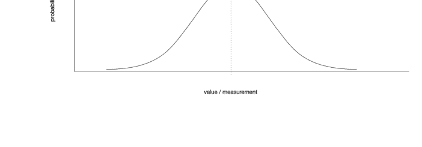

在 $x$ 轴上是我们可能测量的值，在 $y$ 轴上是观测到特定值的概率。在正态分布中，平均值是观测值最可能的值，距离平均值越远，给定值出现的可能性就越小。*标准差*告诉我们数值围绕平均值的离散程度。如果标准差很大，我们得到的是一条宽阔的曲线：

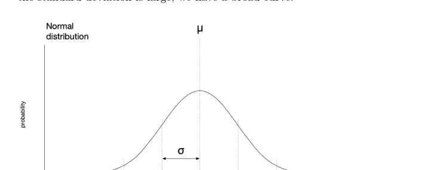

标准差较小时，我们得到的是一条峰值更高的窄曲线。

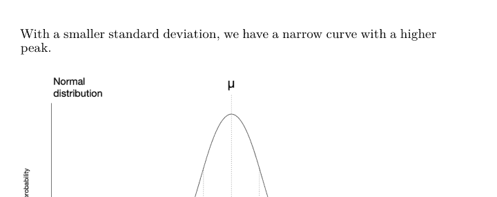

这些曲线下的面积是相等的。

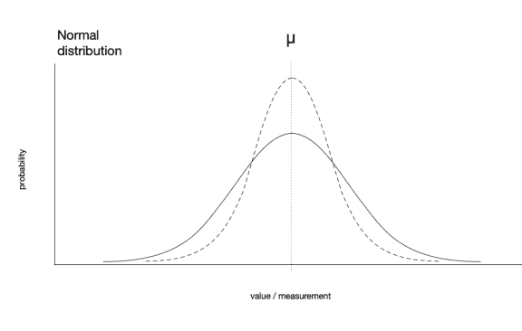

如果标准差为零，那将意味着数据集中的每个值都是相同的（这种情况并不常见）。关键在于，标准差越大，数据中的变异就越大。

就像我们可以计算数据的平均值一样，我们也可以计算标准差。**标准差**，记为 $\sigma$，由下式给出

$$\sigma = \frac{1}{N} \sqrt{\sum_{i=0}^{N-1} (x_i - \mu)^2}.$$

让我们解析一下。首先，请记住这个度量的目标是告诉我们数据中有多少变异。但相对于什么变异？看表达式 $(x_i - \mu)^2$。我们从数据集中的每个值 $x_i$ 中减去平均值 $\mu$。这告诉我们某个观测值与平均值的距离。但我们更关心的是与平均值的距离，而不是某个值是高于还是低于平均值。这就是平方的作用所在。当我们对一个正数平方时，得到一个正数。当我们对一个负数平方时，也得到一个正数。因此，通过平方给定值与平均值之间的差值，我们消除了符号。然后，我们将这些平方差的总和除以数据集中元素的数量（就像计算平均值时一样）。最后，我们对结果取平方根。我们为什么要这样做？因为通过平方差值，我们拉伸了它们，改变了尺度。例如，$5 - 2 = 3$，但 $5^2 - 2^2 = 25 - 4 = 21$。所以最后一步，取平方根，将结果恢复到适合数据的尺度。这就是我们计算标准差的方法。$^2$

在计算求和时，我们执行 $(x_i - \mu)^2$ 的计算。因此，我们不能使用 `sum()`。相反，我们必须在循环中计算这个。然而，这并不是太复杂，在 Python 中实现这一点留作读者的练习。

> $^2$严格来说，这是*总体*标准差，当数据集代表所有可能的观测值（而不仅仅是一个样本）时使用。对于*样本*标准差，有一个略有不同的公式。

假设我们已经正确实现了这一点，在一个名为 `std_dev()` 的函数中，如果我们将其应用于数据并用 `print(f"{std_dev(data):.4f}")` 打印，得到 4.6569。

我们如何解释这个结果？同样，标准差告诉我们数值围绕平均值的离散程度。较高的值意味着数据更分散。较低的值意味着数据更集中地分布在平均值周围。

标准差有什么实际用途？它有很多用途，但通常用于识别不寻常或“不太可能”的观测值。

我们可以计算正态曲线下某个部分的面积。利用这个事实，我们知道，给定一个正态分布，我们预期在平均值的一个标准差范围内找到 68.26% 的观测值。我们预期在平均值的两个标准差范围内找到 95.45% 的观测值。因此，距离平均值越远，观测值出现的可能性就越小。如果我们用标准差来表示这个距离，我们就可以确定一个观测值可能有多大的可能性或不可能性（假设正态分布）。例如，一个距离平均值超过五个标准差的观测值确实非常不可能。

| 范围 | 范围内的预期比例 |
| :--- | :--- |
| $\mu \pm \sigma$ | 68.2689% |
| $\mu \pm 2\sigma$ | 95.4500% |
| $\mu \pm 3\sigma$ | 99.7300% |
| $\mu \pm 4\sigma$ | 99.9937% |
| $\mu \pm 5\sigma$ | 99.9999% |

当我们有现实世界的数据时，它通常不是完美的正态分布。通过将我们的数据与正态分布下的预期进行比较，我们可以学到很多东西。

回到我们的牙医例子，我们可以通过遍历数据并找出任何大于平均值两个标准差的值来寻找可能的异常值。

```
m = mean(data)
std = std_dev(data)

outliers = []
for datum in data:
    if abs(datum) > m + 2 * std:
        outliers.append(datum)
```

这样做，我们发现了两个可能的异常值——14.81，16.95——分别对应智利和乌拉圭。这很可能引导我们提出问题：“为什么这些特定国家的每10,000人口牙医数量如此之多？”

## 14.2 Python 的 statistics 模块

虽然在 Python 中实现标准差（无论是样本标准差还是总体标准差）很简单，但我们通常不会自己编写这样的函数（除非是在学习如何编写函数）。为什么呢？因为 Python 为我们提供了 statistics 模块。

我们可以像使用 math 模块一样使用 Python 的 statistics 模块。首先导入模块，然后就可以访问模块内的所有函数（方法）。

让我们从使用 Python 的函数计算均值和总体标准差开始。这些函数是 `statistics.mean()` 和 `statistics.pstdev()`，它们各自接受一个数值可迭代对象作为参数。

```python
import csv
import statistics

data = []
with open('dentists_per_10k.csv', newline='') as fh:
    reader = csv.reader(fh)
    next(reader)  # skip the first row
    for row in reader:
        data.append(float(row[1]))

print(f"{statistics.mean(data):.4f}")
print(f"{statistics.pstdev(data):.4f}")
```

运行这段代码，我们会看到均值和标准差的结果——分别为 5.1391 和 4.6569——与上面报告的结果完全一致。

statistics 模块包含许多函数，包括：

- `mean()`
- `median()`
- `pstdev()`
- `stdev()`
- `quantiles()`

等等。

## 使用 statistics 模块计算分位数

分位数将数据集划分为连续的区间，每个区间的概率相等。例如，如果我们将数据集划分为四分位数（n = 4），那么每个四分位数代表分布的 1/4。如果我们将数据集划分为五分位数（n = 5），那么每个五分位数代表分布的 1/5。如果我们将数据划分为百分位数（n = 100），那么每个百分位数代表分布的 1/100。

你可能以前见过分位数——特别是百分位数——因为标准化考试成绩经常报告这些数据。如果你的分数在第 80 百分位，那么你的成绩优于 79% 的其他考生。如果你的分数在第 95 百分位，那么你处于所有考生的前 5%。

让我们使用 statistics 模块来找出我们牙医数据的五分位数（回想一下，五分位数将分布分为五部分）。

如果我们导入 csv 和 statistics，然后读取数据（如上所述），我们可以计算将数据划分为五分位数的值：

```python
quintiles = statistics.quantiles(data, n=5)
print(quintiles)
```

注意，我们像使用 `mean()` 和 `pstdev()` 一样将数据传递给函数。这里我们还提供了一个关键字参数 `n=5`，表示我们想要五分位数。打印结果时，我们得到：

```
[0.274, 2.2359999999999998, 6.590000000000001, 8.826]
```

注意我们有*四个*值，它们将数据划分为*五个*相等的部分。任何低于 0.274 的值都在第一个五分位数中。介于 0.274 和 2.236（四舍五入）之间的值在第二个五分位数中，依此类推。高于 8.826 的值在第五个五分位数中。

如果我们查看美国的值（未在上表中显示），我们发现美国每 10,000 人有 5.99 名牙医，这使其稳稳地处于第三个五分位数中。每 10,000 人拥有超过 8.826 名牙医的国家——那些处于前五分之一的国家——是比利时（11.33）、智利（14.81）、哥斯达黎加（10.58）、以色列（8.88）、立陶宛（13.1）、挪威（9.29）、巴拉圭（12.81）和乌拉圭（16.95）。当然，解释这些结果是一件复杂的事情，结果无疑受到*人均*收入、认可牙科学校的数量和规模、执照和认证法规以及其他基础设施和经济因素的影响。³

## **statistics** 模块中的其他函数

我鼓励你尝试 statistics 模块中的这些和其他函数。如果你有一门课程需要计算均值、标准差等，你可以考虑放弃电子表格，尝试在 Python 中完成！

## 14.3 Matplotlib 绘图简介

既然我们已经了解了如何从文件中读取数据，以及如何为数据生成一些描述性统计数据，那么接下来讨论数据的可视化呈现是合理的。为此，我们将使用一个第三方⁴模块：Matplotlib。

Matplotlib 是一个功能丰富的模块，用于生成各种图形、图表、图像和动画。它是 Python 中数据可视化呈现的*事实标准*（是的，还有一些其他工具，但它们远不如 Matplotlib 使用广泛）。

由于 Matplotlib 不是 Python 核心库的一部分（就像我们目前看到的 math、csv 和 statistics 模块），我们需要在使用前安装 Matplotlib。

第三方 Python 模块的安装过程与在手机或桌面电脑上安装应用程序不同。一些 IDE（PyCharm、Thonny、VS Code 等）内置了安装此类模块的功能。IDLE（Python 自带的 IDE）没有这样的功能。因此，我们不会在这里详细介绍安装过程（因为细节会因操作系统和机器而异），但如果你是 DIY 类型，并且没有使用 PyCharm、Thonny 或 VS Code，你可能会发现*附录 C：pip 和 venv* 很有帮助。

以下是一些使用 Matplotlib 制作的图表示例（来自 matplotlib.org 的 Matplotlib 画廊）：

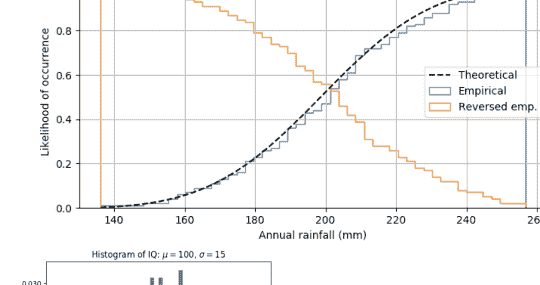

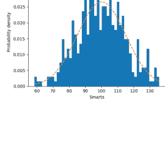

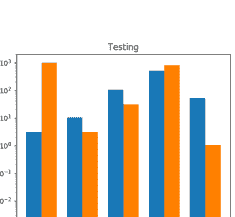

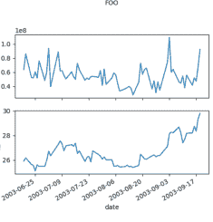

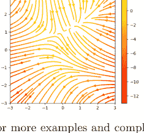

更多示例和完整（写得非常好的）文档，请访问 https://matplotlib.org。

## 14.4 Matplotlib 基础

我们这里只介绍基础知识。为什么？因为 Matplotlib 有成千上万的功能*并且*有优秀的文档。所以我们只是浅尝辄止。更多信息，请参阅：

- Matplotlib 网站：https://matplotlib.org
- 入门指南：https://matplotlib.org/stable/users/getting_started
- 文档：https://matplotlib.org/stable/index.html
- 快速参考指南和讲义：https://matplotlib.org/cheatsheets

## 最基础的基础

我们将从 Matplotlib 提供的最简单的接口开始，称为 pyplot。要使用 pyplot，我们通常导入并缩写：

```python
import matplotlib.pyplot as plt
```

重命名不是必需的，但很常见（Matplotlib 文档中就是这样做的）。我们以前见过这种语法——使用 `as` 给对象一个名称，而不使用赋值运算符（`=`）。这非常类似于在使用 `with` 上下文管理器时给文件对象命名。这里我们给 `matplotlib.pyplot` 一个更短的名称 `plt`，这样我们就可以在代码中轻松引用它。这几乎就像我们写了：

```python
import matplotlib.pyplot

plt = matplotlib.pyplot
```

几乎。

现在让我们生成一些要绘制的数据。我们将在区间 (-1.0, 1.0) 内生成随机数。

```python
import random

data = [0]
for _ in range(100):
    data.append(data[-1]
               + random.random()
               * random.choice([-1, 1]))
```

现在我们有了一些要绘制的随机数据。让我们绘制它。

```python
plt.plot(data)
```

这很简单，对吧？

现在让我们给 y 轴加上标签。

```python
plt.ylabel('Random numbers (cumulative)')
```

让我们把所有内容放在一起并显示我们的图表。

```python
import random
import matplotlib.pyplot as plt

data = [0]
for _ in range(100):
    data.append(data[-1]
               + random.random()
               * random.choice([-1, 1]))

plt.plot(data)
plt.ylabel('Random numbers (cumulative)')
plt.show()
```

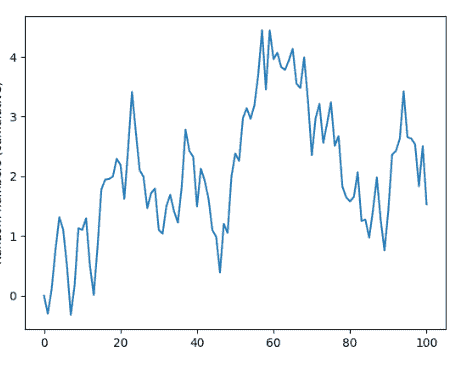

只需再加一行代码，就可以将我们的图表保存为图像文件。我们调用 `savefig()` 方法并提供我们希望用于图表的文件名。图表将保存在当前目录中，使用提供的名称。

---
³ 我对佛蒙特州的牙医很满意，但我要说她预约已经排到九个月以后了，所以也许美国多几个牙医也不是坏事。
⁴ 即，不是由 Python 提供或由你编写的

import random
import matplotlib.pyplot as plt

data = [0]
for _ in range(100):
    data.append(data[-1]
                + random.random()
                * random.choice([-1, 1]))

plt.plot(data)
plt.ylabel('Random numbers (cumulative)')
plt.savefig('my_plot.png')
plt.show()

就是这样。我们的第一个图表——已展示并保存到文件。
让我们再做一个。来个条形图怎么样？对于我们的条形图，我们将使用以下数据（这完全是作者编造的）：

| 口味 | 份数 |
|---|---|
| 曲奇面团 | 9,214 |
| 草莓 | 3,115 |
| 巧克力 | 5,982 |
| 香草 | 2,707 |
| 软糖布朗尼 | 6,553 |
| 薄荷巧克力片 | 7,005 |
| 羽衣甘蓝和甜菜 | 315 |

假设我们将这些数据保存在一个名为 `flavors.csv` 的 CSV 文件中。我们将从 CSV 文件中读取数据，并生成一个简单的条形图。

```python
import csv

import matplotlib.pyplot as plt

servings = []  # data
flavors = []   # labels

with open('flavors.csv') as fh:
    reader = csv.reader(fh)
    for row in reader:
        flavors.append(row[0])
        servings.append(int(row[1]))

plt.bar(flavors, servings)
plt.xticks(flavors, rotation=-45)
plt.ylabel("Servings")
plt.xlabel("Flavor")
plt.tight_layout()
plt.show()
```

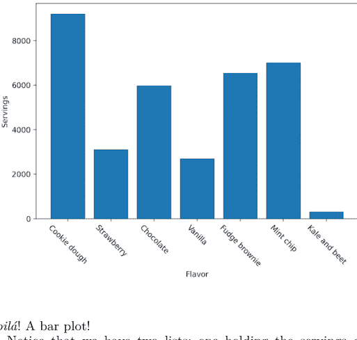

*瞧！* 一个条形图！

注意我们有两个列表：一个存放份数数据，另一个存放 *x* 轴标签（口味）。我们没有使用 `plt.plot()`，而是使用了 `plt.bar()`（这很合理，对吧？），并将口味和份数作为参数传入。我们对 *x* 轴标签做了一点小调整，将它们旋转了 45 度，这样它们就不会挤在一起变得难以辨认。`plt.tight_layout()` 用于自动调整图表本身的边距，为条形标签和坐标轴标签留出合适的空间。

## 注意 `plt.show()` 的行为

当你调用 `plt.show()` 来显示图表时，Matplotlib 会创建一个窗口并在其中显示图表。此时，你的程序执行将暂停，直到你关闭图表窗口。当你关闭图表窗口后，程序流程将继续。

## 总结

再次强调，这里不是全面介绍 Matplotlib 所有功能的地方。目的是给你足够的知识来入门。幸运的是，Matplotlib 的文档非常出色，我鼓励你首先查阅那里以获取示例和帮助。

- https://matplotlib.org

## 14.5 异常

### StatisticsError

`statistics` 模块有其自己的异常类型，`StatisticsError`。如果你尝试计算一个空列表的平均值、中位数或众数，可能会遇到这个异常。

```python
>>> statistics.mean([])
Traceback (most recent call last):
  File "<stdin>", line 1, in <module>
  File "/.../python3.10/statistics.py", line 328, in mean
    raise StatisticsError('mean requires at least one data point')
statistics.StatisticsError: mean requires at least one data point
```

如果你指定的分位数少于一个，也会引发此异常。

```python
>>> statistics.quantiles([3, 6, 9, 5, 1], n=0)
Traceback (most recent call last):
  File "<stdin>", line 1, in <module>
  File "/.../python3.10/statistics.py", line 658, in quantiles
    raise StatisticsError('n must be at least 1')
statistics.StatisticsError: n must be at least 1
```

`StatisticsError` 实际上是 `ValueError` 的一个更具体的类型。

### 使用 Matplotlib 时的异常

在使用 Matplotlib 时，如果你犯了编程错误，可能会引发许多不同的异常。异常及其修复方法取决于具体情况。如果你遇到 Matplotlib 的异常，最好的办法是查阅 Matplotlib 文档。

## 14.6 练习

### 练习 01

尝试创建你自己的小型数据集（一维，五到十个元素）并绘制它。遵循本章给出的示例。将你的数据绘制为折线图和条形图。

### 练习 02

Matplotlib 也支持散点图。在散点图中，每个数据点是一对值，$x$ 和 $y$。散点图看起来像这样。

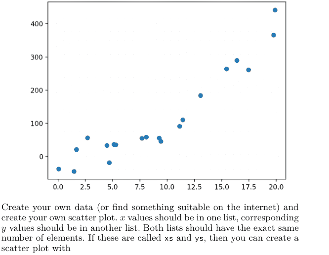

创建你自己的数据（或在网上找一些合适的数据）并创建你自己的散点图。*x* 值应在一个列表中，对应的 *y* 值应在另一个列表中。两个列表必须具有完全相同数量的元素。如果它们分别称为 `xs` 和 `ys`，那么你可以用以下方式创建散点图：

```python
plt.scatter(xs, ys)
```

确保你显示了图表，并将图表保存为图像文件。

### 练习 03

Edwina 计算了她数据集的平均值和标准差——数据是关于冠豪猪（物种：*Hystrix cristata*）刺长的测量值。她发现平均值是 31.2 厘米，标准差是 7.9 厘米。

- a. 如果她样本中的一根刺长 40.5 厘米，她应该认为这是一根异常长的刺吗？为什么？
- b. 如果有一根刺长 51.2 厘米呢？这应该被认为是异常长的吗？为什么？

### 练习 04

考虑所示的两个分布，A 和 B。

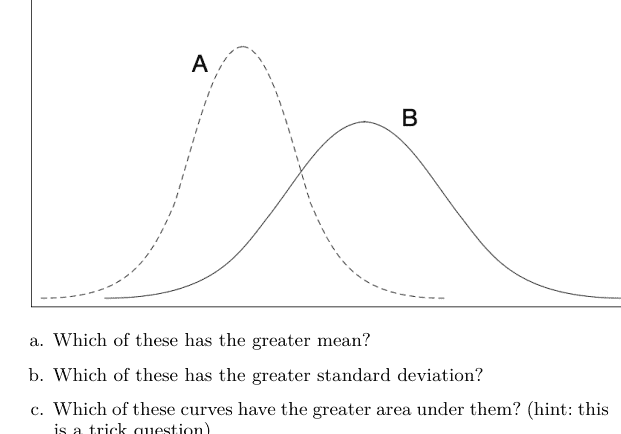

- a. 哪一个的平均值更大？
- b. 哪一个的标准差更大？
- c. 哪一条曲线下方的面积更大？（提示：这是个陷阱问题）

### 练习 05

几何平均数是统计学和金融学中使用的另一种平均数。它不是将数据中的所有值相加然后除以值的数量，而是取所有值的*乘积*，然后，如果有 *N* 个值，就取结果的 *N* 次方根。通常，这仅在数据集中的所有值都为正数时使用。

我们定义几何平均数：

$$\gamma = \left( \prod_{i=0}^{N-1} x_i \right)^{\frac{1}{N}}$$

其中 $\prod$ 符号表示重复乘法。就像 $\sum$ 表示“将它们全部相加”，$\prod$ 表示“将它们全部相乘”。

我们可以使用分数指数来计算一个数的 *N* 次方根，如所示。例如，要计算某个 *x* 的立方根，我们可以使用 `x ** (1 / 3)`。

实现一个函数，计算任意正数值列表的几何平均数。你可以通过将你的函数输出与 `statistics` 模块的 `geometric_mean()` 函数的输出进行比较来验证你的结果。

# 第 15 章

### 异常处理

到目前为止，我们已经看到了很多异常：

- SyntaxError
- IndentationError
- AttributeError
- NameError
- TypeError
- IndexError
- ValueError
- ZeroDivisionError
- FileNotFoundError

这些是 Python 定义的异常，当发生某些错误时会被*引发*。（还有许多、许多其他异常超出了本教材的范围。）

当发生*未处理*的异常时，你的程序会终止。这通常是一个不希望的结果。

在这里，我们将看到其中一些异常可以使用 `try` 和 `except` 优雅地处理——它们携手并进。在 `try` 块中，我们包含我们认为*可能*引发异常的代码。在随后的 `except` 块中，我们*捕获*或*处理*某些异常。我们在 `except` 块中做什么将取决于你程序的预期行为。

然而，我们也会看到其中一些——例如 `SyntaxError` 和 `IndentationError`——是无法处理的，因为这些异常发生在 Python 首次读取你的代码时，在执行之前。

我们还将看到，其中一些异常只在我们的代码存在缺陷且我们不想处理时才会发生！这些异常就像 `AttributeError` 和 `NameError`。试图处理这些异常会掩盖我们代码中应该修复的缺陷。因此，我们甚至不想处理这些异常的情况并不多。

有时我们想处理 `TypeError` 或 `IndexError`。我们经常想处理 `ValueError` 或 `ZeroDivisionError`。我们几乎总是想处理 `FileNotFoundError`。这在很大程度上取决于上下文，确定哪些异常应该被处理以及如何处理，其中有一点艺术性。

## 学习目标

- 你将理解许多 Python 异常被引发的原因。
- 你将学习当异常被引发时如何处理它们，以及如何优雅地处理它们。
- 你将了解到，有时并非总是处理每一个可能引发的异常才是最佳选择。

## 引入的术语

- 异常处理
- “请求原谅比请求许可更容易”（EAFP）
- “三思而后行”（LBYL）
- 引发（异常）
- try/except

## 15.1 异常

到目前为止，你已经见过不少异常了。当某些事情出错时，就会发生异常。我们称之为*引发*一个异常。

异常可能由 Python 解释器、内置函数或 Python 模块提供的方法引发。你甚至可以在自己的代码中引发异常（但我们稍后会讲到）。

异常包含有关已引发异常类型以及异常在代码中发生位置的信息。有时，异常会提供相当多的信息。通常，一个好的方法是从异常消息的最后几行开始，必要时向前追溯，以查看出了什么问题。

Python 中有许多内置异常类型。以下是你可能之前见过的一些。

### SyntaxError

当模块被执行或导入时，Python 会读取文件并尝试*解析*文件。如果在此过程中解析器遇到语法错误，就会引发 SyntaxError 异常。在 Python shell 中使用无效语法时，也可能引发 SyntaxError。

```
>>> # if 需要一个条件和一个冒号
>>> if
  File "<stdin>", line 1
    if
    ^
SyntaxError: invalid syntax
```

这里你可以看到异常包含了有关错误以及错误发生位置的信息。`^` 用于指向错误发生位置的代码部分。

### IndentationError

IndentationError 是 SyntaxError 的一个子类型。回想一下，缩进在 Python 中很重要——我们用它来构建分支、循环和函数。因此，当 Python 遇到归因于无效缩进的语法错误时，就会发生 IndentationError。

```
if True:
    x = 1    # 这里应该缩进！
  File "<stdin>", line 2
    x = 1  # should be indented
    ^
IndentationError: expected an indented block
    after 'if' statement on line 1
```

同样，你需要知道的几乎所有信息都包含在消息的最后几行中。这里 Python 告诉我们，它期望在 `if` 语句之后立即有一个缩进的代码块。

### AttributeError

有几种方式可以引发 AttributeError。你可能因为拼错了导入模块中的方法名而遇到过 AttributeError。

```
>>> import math
>>> math.foo   # math 中没有这样的方法或常量
Traceback (most recent call last):
  File "<stdin>", line 1, in <module>
AttributeError: module 'math' has no attribute 'foo'
```

AttributeError 与 SyntaxError 不同，因为它发生在运行时，而不是在代码的解析或早期处理过程中。AttributeError 仅与*属性*的可用性有关，而与违反 Python 语法规则无关。

### NameError

当 Python 找不到标识符时，会引发 NameError。例如，如果你尝试使用某个变量 `x` 进行计算，但之前没有给 `x` 赋值。

```
>>> x + 1   # 之前没有给 x 赋值
Traceback (most recent call last):
  File "<stdin>", line 1, in <module>
NameError: name 'x' is not defined
```

任何尝试访问未定义变量的操作都会导致 NameError。

```
>>> foo  # 之前没有定义
Traceback (most recent call last):
  File "<stdin>", line 1, in <module>
NameError: name 'foo' is not defined
```

### IndexError

可以使用索引来访问序列的各个元素。当然，这假设索引是有效的——即该索引处存在一个元素。如果你尝试通过索引访问序列的元素，但该索引不存在，Python 将引发 IndexError。

```
>>> lst = []
>>> lst[2]  # 索引 2 处没有元素
Traceback (most recent call last):
  File "<stdin>", line 1, in <module>
IndexError: list index out of range
```

上面的代码失败是因为列表为空，索引 2 处没有元素。因此，2 是一个无效索引，引发了 IndexError。这里是另一个例子：

```
>>> alphabet = 'abcdefghijklmnopqrstuvwxyz'
>>> alphabet[26]  # Python 是从 0 开始索引的，所以 z 的索引是 25
Traceback (most recent call last):
  File "<stdin>", line 1, in <module>
IndexError: string index out of range
```

### TypeError

当期望某种类型的值但提供了不同类型的值时，会引发 TypeError。例如，序列索引——对于列表、元组、字符串——必须是整数。如果我们尝试使用浮点数或字符串作为索引，Python 将引发 TypeError。

```
>>> lst = [6, 5, 4, 3, 2]
>>> lst['foo']  # 不能使用字符串作为索引
Traceback (most recent call last):
  File "<stdin>", line 1, in <module>
TypeError: list indices must be integers or slices, not str
```

```
>>> lst[1.0]  # 不能使用浮点数作为索引
Traceback (most recent call last):
  File "<stdin>", line 1, in <module>
TypeError: list indices must be integers or slices, not float
```

如果我们尝试对不支持的操作数执行操作，Python 也会引发 TypeError。例如，我们不能将整数连接到字符串，也不能将字符串加到整数上。

```
>>> 'foo' + 1  # 尝试将 1 与 'foo' 连接
Traceback (most recent call last):
  File "<stdin>", line 1, in <module>
TypeError: can only concatenate str (not "int") to str
```

```
>>> 1 + 'foo'  # 尝试将 'foo' 加到 1 上
Traceback (most recent call last):
  File "<stdin>", line 1, in <module>
TypeError: unsupported operand type(s) for +: 'int' and 'str'
```

我们无法计算一个数字和一个字符串的和。我们无法计算任何包含字符串的列表或元组的和。

```
>>> sum('Add me up!')  # 不能对字符串求和
Traceback (most recent call last):
  File "<stdin>", line 1, in <module>
TypeError: unsupported operand type(s) for +: 'int' and 'str'
```

```
>>> sum(1)  # Python 的 sum() 需要一个可迭代的数值对象
Traceback (most recent call last):
  File "<stdin>", line 1, in <module>
TypeError: 'int' object is not iterable
```

同样，我们无法获取浮点数或整数的长度。

```
>>> len(1)
Traceback (most recent call last):
  File "<stdin>", line 1, in <module>
TypeError: object of type 'int' has no len()
```

### ValueError

当某个参数或操作数的类型正确但值不正确时，会引发 ValueError。例如，如果我们尝试对负数取平方根，`math.sqrt(x)` 将引发 ValueError。

```
>>> import math
>>> math.sqrt(-1)
Traceback (most recent call last):
  File "<stdin>", line 1, in <module>
ValueError: math domain error
```

请注意，除以零被视为算术错误，并有其自己的异常（见下文）。

### ZeroDivisionError

就像在数学中一样，Python 不允许我们除以零。如果我们尝试这样做，Python 将引发 ZeroDivisionError。请注意，这在整除和取模运算中也会发生（因为它们依赖于除法）。

```
>>> 10 / 0
Traceback (most recent call last):
  File "<stdin>", line 1, in <module>
ZeroDivisionError: division by zero
```

```
>>> 10 % 0
Traceback (most recent call last):
  File "<stdin>", line 1, in <module>
ZeroDivisionError: integer division or modulo by zero
```

```
>>> 10 // 0
Traceback (most recent call last):
  File "<stdin>", line 1, in <module>
ZeroDivisionError: integer division or modulo by zero
```

### FileNotFoundError

我们已经了解了如何打开文件进行读写。这可能会以多种方式出错，但一个常见的问题是 FileNotFoundError。当 Python 找不到指定的文件时，会引发此异常。文件可能不存在、可能在错误的目录中，或者可能命名不正确。

```
open('non-existent file')
Traceback (most recent call last):
  File "<stdin>", line 1, in <module>
FileNotFoundError: [Errno 2] No such file or directory:
    'non-existent file'
```

## 15.2 处理异常

到目前为止，我们所看到的是，当异常被引发时，我们的程序会终止（或者在 SyntaxError 的情况下甚至根本没有开始运行）。然而，Python 允许我们处理异常。这意味着当异常被引发时，可以执行特定的代码块来处理问题。

为此，我们至少有一个 try/except 复合语句。这涉及创建两个代码块：一个 try 块和一个异常处理程序——一个 except 块。

try 块中的代码是我们希望防范未处理异常的代码。try 块后面跟着一个 except 块。

## 使用 try/except 进行输入验证

这是一个使用 try/except 进行输入验证的例子。假设我们希望输入一个正整数。我们已经了解了如何在 while 循环中验证输入。

```python
while True:
    n = int(input("Please enter a positive integer: "))
    if n > 0:
        break
```

这确保了如果用户输入一个小于一的整数，系统会再次提示，直到他们提供一个正整数为止。但是，如果调皮的用户输入了无法转换为整数的内容会怎样呢？

```
Please enter a positive integer: cheese
Traceback (most recent call last):
  File "/.../code.py", line 90, in runcode
    exec(code, self.locals)
  File "<input>", line 2, in <module>
ValueError: invalid literal for int() with base 10: 'cheese'
```

Python 无法将 'cheese' 转换为整数，因此会引发 ValueError。

那么现在怎么办？我们将可能导致 ValueError 的代码放在 try 块中，然后在 except 块中提供一个异常处理器。以下是我们的做法。

```python
while True:
    try:
        user_input = input("Enter a positive integer: ")
        n = int(user_input)
        if n > 0:
            break
    except ValueError:
        print(f'"{user_input}" cannot be converted to an int!')
```

```python
print(f'You have entered {n}, a positive integer.')
```

让我们运行这段代码，并尝试一点小恶作剧：

```
Enter a positive integer: negative
"negative" cannot be converted to an int!
Enter a positive integer: cheese
"cheese" cannot be converted to an int!
Enter a positive integer: -42
Enter a positive integer: 15
You have entered 15, a positive integer.
```

看到了吗？现在恶作剧（或未能阅读说明）被优雅地处理了。

## 使用 try/except 获取索引

之前我们看到，如果传递给 .index() 方法的参数在底层序列中找不到，.index() 会引发 ValueError 异常。

```python
>>> lst = ['apple', 'boat', 'cat', 'drama']
>>> lst.index('egg')
Traceback (most recent call last):
  File "/.../code.py", line 90, in runcode
    exec(code, self.locals)
  File "<input>", line 1, in <module>
ValueError: 'egg' is not in list
```

我们可以使用异常处理来改进这一点。

```python
lst = ['apple', 'boat', 'cat', 'drama']
s = input('Enter a string to search for: ')
try:
    i = lst.index(s)
    print(f'The index of "{s}" in {lst} is {i}.')
except ValueError:
    print(f'"{s}" was not found in {lst}.')
```

如果我们在提示符下输入“egg”，这段代码将打印：

```
"egg" was not found in ['apple', 'boat', 'cat', 'drama']
```

这就引出了一个古老的问题：是先检查是否能无误地完成操作更好，还是先尝试然后在发生异常时处理更好。有时这两种方法被称为“三思而后行”（LBYL）和“请求原谅比请求许可更容易”（EAFP）。Python 偏爱后者。

为什么是这样？通常，EAFP 使你的代码更具可读性，而且无法保证程序员能够预见并编写所有必要的检查来确保操作成功。

在这个例子中，有点难以抉择。我们可以这样写：

```python
if s in lst:
    print(f'The index of "{s}" in {lst} is {lst.index(s)}.')
else:
    print(f'"{s}" was not found in {lst}.')
```

或者我们可以这样写（就像我们之前做的那样）：

```python
try:
    print(f'The index of "{s}" in {lst} is {lst.index(s)}.')
except ValueError:
    print(f'"{s}" was not found in {lst}.')
```

## 注意事项

应该做：

-   保持 try 块尽可能小。
-   捕获并处理特定的异常。
-   避免捕获和处理 IndexError、TypeError、NameError。当这些异常发生时，几乎总是由于编程缺陷。捕获和处理这些异常可能会隐藏应该被纠正的缺陷。
-   使用单独的 except 块来处理不同类型的异常。

不应该做：

-   为不同的异常类型编写一个处理器。
-   将所有代码包装在一个大的 try 块中。
-   使用异常处理来隐藏编程错误。
-   使用裸露的 except: 或 except Exception:——这些过于宽泛，可能会捕获你不应该捕获的东西。

## 15.3 异常与控制流

虽然使用异常并遵循 EAFP（“请求原谅比请求许可更容易”）的规则被认为是 Pythonic 的，但除了在非常有限的范围内，使用异常来控制程序执行流程是不明智的。
以下是一些需要遵循的规则：

-   保持 try 和 except 块尽可能小。
-   以最简单、最直接的方式处理异常。
-   避免在 except 块内调用另一个函数，这可能会使程序流偏离引发异常的点。

## 15.4 练习

### 练习 01

> **! 重要**

请务必保存此练习的工作，因为我们将在后续练习中重新审视这些内容！

这是一个引发 SyntaxError 的代码示例：

```python
>>> foo bar
File "<stdin>", line 1
    foo bar
    ^^^
SyntaxError: invalid syntax
```

这是一个引发 TypeError 的代码示例：

```python
>>> 1 + []
Traceback (most recent call last):
  File "<stdin>", line 1, in <module>
TypeError: unsupported operand type(s) for +: 'int' and 'list'
```

在不使用 raise 的情况下，编写你自己的代码以产生以下异常：

-   a. SyntaxError
-   b. IndentationError
-   c. IndexError
-   d. NameError
-   e. TypeError
-   f. AttributeError
-   g. ZeroDivisionError
-   h. FileNotFoundError

### 练习 02

现在，从你在练习 01 中编写的代码开始，为以下异常编写 try/except。

-   a. TypeError
-   b. ZeroDivisionError
-   c. FileNotFoundError

### 练习 03

SyntaxError 和 IndentationError 应该始终在你的代码中修复。在正常情况下，这些*不能*被处理。NameError 和 AttributeError 几乎总是由编程缺陷引起的。几乎没有任何理由为这些编写 try/except。
修复你在练习 01 中编写的代码，针对以下情况：

-   a. SyntaxError
-   b. IndentationError
-   c. AttributeError
-   d. NameError

### 练习 04

通常（但并非总是）IndexError 和 TypeError 是由编程缺陷引起的。看看你在练习 01 中为导致这些错误而编写的代码。你所写的是否构成了编程缺陷？如果是，请修复它。
如果你认为你编写的代码构成了 try/except 的合理情况，请为每个异常编写 try/except。

# 第 16 章

## 字典

字典无处不在，这无疑是由于它们的实用性和灵活性。字典以键/值对的形式存储信息——我们通过键在字典中查找值。在本章中，我们将学习字典：如何创建它们、修改它们、遍历它们等等。

## 学习目标

-   你将学习如何创建一个字典。
-   你将理解字典是*可变的*，这意味着它们的内容可以改变。
-   你将学习如何通过键访问字典中的单个值。
-   你将学习如何遍历字典。
-   你将理解字典的键必须是*可哈希的*。

## 介绍的术语和 Python 关键字

-   del
-   dictionary
-   hashable
-   key
-   value
-   view object

## 16.1 字典简介

到目前为止，我们已经将元组、列表和字符串视为对象的有序集合。我们还了解了如何通过元素的索引来访问列表、元组或字符串中的单个元素。

```python
>>> lst = ['rossi', 'agostini', 'marquez', 'doohan', 'lorenzo']
>>> lst[0]
'rossi'
>>> lst[2]
'marquez'

>>> t = ('hearts', 'clubs', 'diamonds', 'spades')
>>> t[1]
'clubs'
```

这一切都很好，但有时我们希望能够使用数字索引以外的东西来访问元素。

想想我们用来查找单词含义的传统词典。想象一下，如果这样的词典使用数字索引来查找单词。假设我们想查找单词“pianist”。我们怎么知道它的索引？我们必须在词典中搜寻才能找到它。即使所有单词都按字典顺序排列，以这种方式查找单词仍然很麻烦。

好消息是字典不是这样工作的。我们可以通过找到单词本身来查找其含义。这就是 Python 中字典的基本思想。

简单来说，Python 字典是一种将*键*和*值*关联起来的数据结构。在传统词典的情况下，每个单词是一个*键*，相关的定义是*值*。

以下是我的词典中“pianist”词条的出现方式：¹

> *pianist* n. a person who plays the piano, esp. a skilled or professional performer

这里 *pianist* 是键，其余部分是值。我们可以稍加自由地将其写成一个 Python 字典，如下所示：

```python
>>> d = {'pianist': "a person who plays the piano, " \
...     "esp. a skilled or professional performer"}
```

字典的条目出现在花括号 {} 内。键/值对由冒号分隔，即：<key>: <value>，其中 <key> 是有效的键，<value> 是有效的值。

我们可以通过键在字典中查找值。语法类似于通过索引访问列表或元组中的元素。

```python
>>> d['pianist']
'a person who plays the piano, esp. a skilled or professional performer'
```

与列表一样，字典是*可变的*。让我们在字典中添加几个单词。要向字典添加新条目，我们可以使用这种方法：

## 字典简介

```python
>>> d['cicada'] = "any of a family of large flylike " \
...             "insects with transparent wings"
>>> d['proclivity'] = "a natural or habitual tendency or " \
...                   "inclination, esp. toward something " \
...                   "discreditable"
>>> d['tern'] = "any of several sea birds, related to the " \
...             "gulls, but smaller, with a more slender " \
...             "body and beak, and a deeply forked tail"
>>> d['firewood'] = "wood used as fuel"
>>> d['holophytic'] = "obtaining nutrition by photosynthesis, " \
...                   "as do green plants and some bacteria"
```

现在让我们来检查一下我们的字典。

```python
>>> d
{'pianist': 'a person who plays the piano, esp. a skilled or professional performer', 'cicada': 'any of a family of large flylike insects with transparent wings', 'proclivity': 'a natural or habitual tendency or inclination, esp. toward something discreditable', 'tern': 'any of several sea birds, related to the gulls, but smaller, with a more slender body and beak, and a deeply forked tail', 'firewood': 'wood used as fuel', 'holophytic': 'obtaining nutrition by photosynthesis, as do green plants and some bacteria'}
```

我们看到，我们的字典由键/值对组成。

| 键 | 值 |
| :--- | :--- |
| 'pianist' | 'a person who plays the piano, esp. a skilled or professional performer' |
| 'cicada' | 'any of a family of large flylike insects with transparent wings' |
| 'proclivity' | 'a natural or habitual tendency or inclination, esp. toward something discreditable' |
| 'tern' | 'any of several sea birds, related to the gulls, but smaller, with a more slender body and beak, and a deeply forked tail' |
| 'firewood' | 'wood used as fuel' |
| 'holophytic' | 'obtaining nutrition by photosynthesis, as do green plants and some bacteria' |

我们可以通过键来查找任何值。

```python
>>> d['tern']
'any of several sea birds, related to the gulls, but smaller, with a more slender body and beak, and a deeply forked tail'
```

如果我们尝试访问一个不存在的键，这将导致一个 `KeyError`。

```python
>>> d['bungalow']
Traceback (most recent call last):
  File "<stdin>", line 1, in <module>
KeyError: 'bungalow'
```

这是一种我们之前未曾见过的新型异常。
我们可以用一个新值覆盖一个键。

```python
>>> d = {'France': 'Paris',
...     'Mali': 'Bamako',
...     'Argentina': 'Buenos Aires',
...     'Thailand': 'Bangkok',
...     'Australia': 'Sydney'}  # oops!
>>> d['Australia'] = 'Canberra'  # fixed!
```

到目前为止，在上面的例子中，键和值都是字符串。但情况并非必须如此。
对于我们可以用作键的事物类型存在一些限制，但几乎任何东西都可以用作值。
以下是一些有效键的示例：

```python
>>> d = {(1, 2): 'My key is the tuple (1, 2)',
...     100: 'My key is the integer 100',
...     'football': 'My key is the string "football"'}
```

值可以是几乎任何东西——甚至是其他字典！

```python
>>> students = {'eporcupi': {'name': 'Egbert Porcupine',
...                           'major': 'computer science',
...                           'gpa': 3.14},
...             'epickle': {'name': 'Edwina Pickle',
...                         'major': 'biomedical engineering',
...                         'gpa': 3.71},
...             'aftoure': {'name': 'Ali Farka Touré',
...                        'major': 'music',
...                        'gpa': 4.00}}
```

```python
>>> students['aftoure']['major']
'music'
```

```python
>>> recipes = {'bolognese': ['beef', 'onion', 'sweet pepper',
...                           'celery', 'parsley', 'white wine',
...                           'olive oil', 'garlic', 'milk',
...                           'black pepper', 'basil', 'salt'],
...             'french toast': ['baguette', 'egg', 'milk',
...                             'butter', 'cinnamon',
...                             'maple syrup'],
```

```python
>>> recipes['french toast']
['baguette', 'egg', 'milk', 'butter', 'cinnamon', 'maple syrup']
>>> recipes['french toast'][-1]
'maple syrup'

>>> coordinates = {'Northampton': (42.5364, -70.9857),
...                'Kokomo': (40.4812, -86.1418),
...                'Boca Raton': (26.3760, -80.1223),
...                'Sausalito': (37.8658, -122.4980),
...                'Amarillo': (35.1991, -101.8452),
...                'Fargo': (46.8771, -96.7898)}

>>> lat, lon = coordinates['Fargo']  # tuple unpacking
>>> lat
46.8771
>>> lon
-96.7898
```

## 键的限制

字典中的键必须是*可哈希的*。为了使一个对象可哈希，它必须是不可变的，或者如果它是一个包含其他对象的不可变容器（例如元组），那么其中包含的所有对象也必须是不可变的。有效的键包括 `int`、`float`（可以，但有点奇怪）、`str`、`bool`（也可以，但用例有限）类型的对象。只要元组不包含任何可变对象，它们也可以用作键。

```python
>>> d = {0: 'Alexei Fyodorovich', 1: 'Dmitri Fyodorovich',
...      2: 'Ivan Fyodorovich', 3: 'Fyodor Pavlovich',
...      4: 'Agrafena Alexandrovna', 5: 'Pavel Fyodorovich',
...      6: 'Zosima', 7: 'Katerina Ivanovna'}

>>> d = {True: 'if porcupines are blue, then the sky is pink',
...      False: 'chunky monkey is the best ice cream'}

>>> d = {'Phelps': 23, 'Latynina': 9, 'Nurmi': 9, 'Spitz': 9,
...      'Lewis': 9, 'Bjørgen': 8}
```

然而，以下情况是不允许的：

```python
>>> d = {['hello']: 'goodbye'}
Traceback (most recent call last):
  File "<stdin>", line 1, in <module>
TypeError: unhashable type: 'list'

>>> d = {(0, [1]): 'foo'}
Traceback (most recent call last):
  File "<stdin>", line 1, in <module>
TypeError: unhashable type: 'list'
```

## 测试成员资格

就像列表一样，我们可以使用关键字 `in` 来测试某个特定的键是否在字典中。

```python
>>> d = {'jane': 'maine', 'wanda': 'new hampshire',
...     'willard': 'vermont', 'simone': 'connecticut'}
>>> 'wanda' in d
True
>>> 'dobbie' in d
False
>>> 'dobbie' not in d
True
```

## 16.2 遍历字典

如果我们像遍历列表一样遍历字典，这将产生字典的键。

```python
>>> furniture = {'living room': ['armchair', 'sofa', 'table'],
...              'bedroom': ['bed', 'nightstand', 'dresser'],
...              'office': ['desk', 'chair', 'cabinet']}
...
>>> for x in furniture:
...     print(x)
...
living room
bedroom
office
```

通常，当我们遍历字典时，我们使用字典视图对象。这些对象提供了对字典的键、值或条目的动态视图。

字典有三种不同的视图对象：`items`、`keys` 和 `values`。字典有返回这些视图对象的方法：

- `dict.keys()` 提供字典键的视图，
- `dict.values()` 提供字典值的视图，以及
- `dict.items()` 提供键/值对的元组。

字典视图对象都是可迭代的。

### 遍历字典的键

```python
>>> furniture = {'living room': ['armchair', 'sofa', 'table'],
...             'bedroom': ['bed', 'nightstand', 'dresser'],
...             'office': ['desk', 'chair', 'cabinet']}
>>> for key in furniture.keys():
...     print(key)
...
living room
bedroom
office
```

请注意，如果你想要的是键，通常可以省略 `.keys()`，因为默认行为就是遍历键（如前一个示例所示）。

### 遍历字典的值

```python
>>> for value in furniture.values():
...     print(value)
...
['armchair', 'sofa', 'table']
['bed', 'nightstand', 'dresser']
['desk', 'chair', 'cabinet']
```

### 遍历字典的条目

```python
>>> for item in furniture.items():
...     print(item)
...
('living room', ['armchair', 'sofa', 'table'])
('bedroom', ['bed', 'nightstand', 'dresser'])
('office', ['desk', 'chair', 'cabinet'])
```

### 使用元组解包遍历字典的条目

```python
>>> for key, value in furniture.items():
...     print(f"Key: '{key}', value: {value}")
...
Key: 'living room', value: ['armchair', 'sofa', 'table']
Key: 'bedroom', value: ['bed', 'nightstand', 'dresser']
Key: 'office', value: ['desk', 'chair', 'cabinet']
```

### 一些例子

假设我们想计算我们住所中家具的数量。

```python
>>> count = 0
>>> for lst in furniture.values():
...     count = count + len(lst)
...
>>> count
9
```

假设我们想找出班级里所有不是计算机科学专业的学生，假设我们字典中的条目如下所示：

```python
>>> students =
...     {'esmerelda' : {'class': 2024, 'major': 'ENSC', 'gpa': 3.08},
...      'winston': {'class': 2023, 'major': 'CS', 'gpa': 3.30},
...      'clark': {'class': 2022, 'major': 'PHYS', 'gpa': 2.95},
...      'kumiko': {'class': 2023, 'major': 'CS', 'gpa': 3.29},
...      'abeba' : {'class': 2024, 'major': 'MATH', 'gpa': 3.71}}
```

一种方法：

```python
>>> non_cs_majors = []
>>> for student, info in students.items():
...     if info['major'] != 'CS':
...         non_cs_majors.append(student)
...
>>> non_cs_majors
['esmerelda', 'clark', 'abeba']
```

## 16.3 删除字典键

早些时候我们看到，我们可以使用列表的 `.pop()` 方法从列表中移除一个元素，移除列表中的最后一个元素（默认情况，当未提供参数时），或者在特定索引处移除（如果我们提供参数）。

字典是*可变的*，因此和列表一样，它们可以被修改。字典也支持`.pop()`方法，但其工作方式与列表略有不同。字典的`.pop()`方法*需要*一个有效的键作为参数。这是因为字典不像列表那样具有线性顺序感——一切都基于*键*。
所以这样是可行的：

```
>>> d = {'foo': 'bar'}
>>> d.pop('foo')
'bar'
```

但这样不行：

```
>>> d = {'foo': 'bar'}
>>> d.pop()
Traceback (most recent call last):
  File "<stdin>", line 1, in <module>
TypeError: pop expected at least 1 argument, got 0
```

Python还提供了关键字`del`，可用于从字典中删除一个键。

```
>>> pets = {'fluffy': 'gerbil', 'george': 'turtle',
...         'oswald': 'goldfish', 'wyatt': 'ferret'}
>>> del pets['oswald']  # RIP oswald :(
>>> pets
{'fluffy': 'gerbil', 'george': 'turtle', 'wyatt': 'ferret'}
```

但要小心！如果你没有指定一个键，整个字典将被删除！

```
>>> pets = {'fluffy': 'gerbil', 'george' : 'turtle',
...         'oswald': 'goldfish', 'wyatt': 'ferret'}
>>> del pets  # oops!
>>> pets
Traceback (most recent call last):
  File "<stdin>", line 1, in <module>
NameError: name 'pets' is not defined
```

还要注意，提供键的`.pop()`会返回与该键关联的值，然后删除该键/值对。`del`则只是删除该条目。

## 16.4 可哈希对象

字典的键不能是任意的Python对象。为了充当键，对象必须是*可哈希的*。
无需深入太多技术细节，原因相当直接。我们不能拥有可能改变的键！

想象一下，如果你桌上的字典或词典拥有可以改变的神奇键。你将永远无法找到任何东西。因此，字典中的所有键都必须是可哈希的——并且不会发生可能的改变。

哈希是一个过程，我们通过它从一个对象计算出一个数字（称为哈希值）。为了充当字典键，这个哈希值必须永不改变。

什么样的对象是可哈希的？实际上，我们目前见过的大多数对象都是可哈希的。

任何不可变且不是容器的东西都是可哈希的。这包括int、float、bool、str。它甚至包括range类型的对象（尽管如果有人使用range作为字典键，那将非常奇怪）。

那么那些不可变但又是容器的东西呢？这里我们指的是元组。如果一个元组的所有元素本身都是不可变的，那么这个元组就是可哈希的。如果一个元组包含一个可变对象，比如一个列表，那么它就不是可哈希的。

我们可以使用内置函数`hash()`来检查各种对象的哈希值。

```
>>> x = 2
>>> hash(x)
2
>>> x = 4.11
>>> hash(x)
253642731013507076
>>> x = 'hello'
>>> hash(x)
1222179648610370860
>>> x = True
>>> hash(x)
1
>>> x = (1, 2, 3)
>>> hash(x)
529344067295497451
```

现在，如果我们尝试对不可哈希的对象这样做会发生什么？

```
>>> x = [1, 2, 3]
>>> hash(x)
Traceback (most recent call last):
  File "<stdin>", line 1, in <module>
TypeError: unhashable type: 'list'
```

如果我们尝试一个包含可变对象（列表）的不可变容器（元组）会发生什么？

```
>>> x = (1, 2, [3])
>>> hash(x)
Traceback (most recent call last):
  File "<stdin>", line 1, in <module>
TypeError: unhashable type: 'list'
```

现在，一个元组可以包含另一个元组，而那个元组又可以包含另一个元组，以此类推。只需要一个可变元素，无论嵌套多深，都会使对象不可哈希。

```
>>> x = (1, 2, (3, 4, (5, 6, (7, 8, [9]))))
>>> hash(x)
Traceback (most recent call last):
  File "<stdin>", line 1, in <module>
TypeError: unhashable type: 'list'
```

最后，不言而喻，由于字典是可变的，它们不是可哈希的，因此字典不能作为另一个字典的键。

```
>>> x = {'foo': 'bar'}
>>> hash(x)
Traceback (most recent call last):
  File "<stdin>", line 1, in <module>
TypeError: unhashable type: 'dict'
```

## 16.5 统计字符串中的字母

这是一个如何使用字典来跟踪字符串中字母或其他字符出现次数的例子。在许多猜词及相关游戏中，我们经常需要这些信息。

假设我们有这个字符串：“How far that little candle throws its beams! So shines a good deed in a naughty world.”²

我们该如何统计其中的所有符号呢？当然，使用单独的变量会很麻烦。让我们改用字典。字典中的键是字符串中的各个字母和符号，值将是它们的计数。为了简化一点，我们将在统计前将字符串转换为小写。

> ²威廉·莎士比亚，《威尼斯商人》，第五幕第一场（鲍西娅）。

```
s = "How far that little candle throws its beams! " \
    "So shines a good deed in a naughty world."

d = {}
for char in s.lower():
    try:
        d[char] += 1
    except KeyError:
        d[char] = 1
```

我们从一个空字典开始。然后对于字符串中的每个字符，我们尝试增加与字典键关联的值。如果我们得到一个KeyError，这意味着我们还没有见过该字符，因此我们向字典添加一个新键，其值为一。运行此代码后，字典`d`如下所示：

```
{'h': 5, 'o': 6, 'w': 3, ' ': 16, 'f': 1, 'a': 7, 'r': 3,
 't': 7, 'l': 4, 'i': 4, 'e': 6, 'c': 1, 'n': 4, 'd': 5,
 's': 6, 'b': 1, 'm': 1, '!': 1, 'g': 2, 'u': 1, 'y': 1,
 '.': 1}
```

所以我们有五个'h'，六个'o'，三个'w'，等等。
我们可以编写一个函数来报告给定字符在字符串中出现的次数，如下所示：

```
def get_count(char, d):
    try:
        return d[char]
    except KeyError:
        return 0
```

如果`char`在`d`中，此函数返回计数，否则返回零。

## 16.6 异常

### KeyError

如果你尝试从字典中读取、弹出或删除一个不存在的键，会引发KeyError。这类似于你在列表和元组情况下看到的IndexError。
如果你遇到KeyError，这意味着指定的键在字典中不存在。

```
>>> furniture = {'living room': ['armchair', 'sofa', 'table'],
...             'bedroom': ['bed', 'nightstand', 'dresser'],
...             'office': ['desk', 'chair', 'cabinet']}
>>> furniture['kitchen']
Traceback (most recent call last):
  File "<stdin>", line 1, in <module>
KeyError: 'kitchen'
```

### TypeError

如果你尝试向字典添加一个不可哈希的键，Python将引发类型错误：

```
>>> d = {[1, 2, 3]: 'cheese'}
Traceback (most recent call last):
  File "<stdin>", line 1, in <module>
TypeError: unhashable type: 'list'
```

与几乎总是由于编程错误而引发的`IndexError`不同——因此我们不希望处理此类异常——在某些情况下，我们可能希望处理`KeyError`。这将取决于上下文。

## 16.7 练习

### 练习 01

为以下数据创建一个字典：

| 学生 | 网络ID | 专业 | 课程 |
| :--- | :--- | :--- | :--- |
| Porcupine, Egbert | eporcupi | CS | CS1210, CS1080, MATH2055, ANTH1100 |
| Pickle, Edwina | epickle | BIOL | BIOL1450, BIOL1070, MATH2248, CHEM1150 |
| Quux, Winston | wquux | ARTS | ARTS2100, ARTS2750, CS1210, ARTH1990 |
| Garply, Mephista | mgarply | ENSC | ENSC2300, GEOG1170, FS2020, STAT2870 |

- a. 你认为什么应该作为字典的键？
- b. 你应该使用嵌套字典吗？
- c. 学生、网络ID、专业和课程的类型是什么？

### 练习 02

既然你已经在练习01中创建了字典，请为以下内容编写查询。*查询*是从某个数据结构中检索选定的数据。这里的数据结构是练习01中创建的字典。有些查询可能是一行代码。有些查询可能需要循环。

- 1. 获取Winston Quux的专业。
- 2. 如果你使用了网络ID作为键，那么编写一个查询来获取与网络ID `epickle`关联的名称。如果你使用了其他东西作为键，那么编写一个查询来获取Edwina Pickle的网络ID。
- 3. 构建一个所有选修CS1210的学生的列表。

### 练习 03

字典键必须是唯一的。我们不能在字典中有重复的键。
你认为如果我们输入这个到Python shell会发生什么？

```
d = {'foo': 'bar', 'foo': 'baz'}
```

你认为*d*的值是什么？先猜猜，然后检查！

### 练习 04

创建这个字典：

```
d = {'foo': 'bar'}
```

现在将*d*作为参数传递给一个具有单个形参*d_*的函数。在函数内部修改字典（改变它），但返回*None*（如何修改由你决定）。外部作用域中的*d*会发生什么？
注意：不要给*d_*赋新值。只需通过添加键、删除键、更改值等方式来改变它。

### 练习 05

编写一个函数，该函数接受一个字符串作为参数，并返回一个包含字符串中每个字符出现次数的字典。

### 练习 06

- a. 编写一个函数，该函数接受一个任意字典，并将字典的键作为列表返回。
- b. 编写一个函数，该函数接受一个任意字典，并将字典的值作为列表返回。

# 第17章

### 图

我们已经了解了*字典*数据结构，它将*键*与*值*关联起来，并且看了一些示例和用例。既然我们已经理解了字典，接下来我们将深入探讨*图*。图是由顶点（节点）和连接它们的边组成的集合，用于表示顶点（节点）之间的关系。我们将看到，字典可以用来表示图。

## 学习目标

- 你将学习一些与图相关的术语。
- 你将学习如何使用图来表示数据。
- 你将学习使用广度优先搜索来搜索图。

## 引入的术语

- 图
- 顶点（节点）
- 边
- 邻居（公共边）
- 相邻
- 广度优先搜索

## 17.1 图简介

图是一种非常通用的数据结构。它们可以用来表示游戏状态、带有路线的地图位置、社交网络中的人等等。这里我们将考虑表示地图上带有路线的位置以及表示社交网络中友谊关系的图。

让我们从地图开始。考虑密歇根州两个城镇的最小示例：安娜堡和伊普西兰蒂。

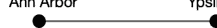

这里，用图的语言来说，我们有两个顶点（也称为节点）代表城镇安娜堡和伊普西兰蒂，以及一条连接这两个顶点的边，表示它们之间存在一条路线。我们可以沿着这条路线从安娜堡到伊普西兰蒂，也可以从伊普西兰蒂到安娜堡。注意这种对称性。这是因为安娜堡和伊普西兰蒂之间的边是*无向*的，这是合理的，因为连接它们的高速公路允许双向通行。¹

我们将共享一条公共边的顶点称为*邻居*。我们也将共享一条公共边的顶点称为*相邻*。因此，在上面的例子中，安娜堡和伊普西兰蒂是邻居。安娜堡与伊普西兰蒂相邻，伊普西兰蒂也与安娜堡相邻。

这是一个稍微复杂一点的例子：

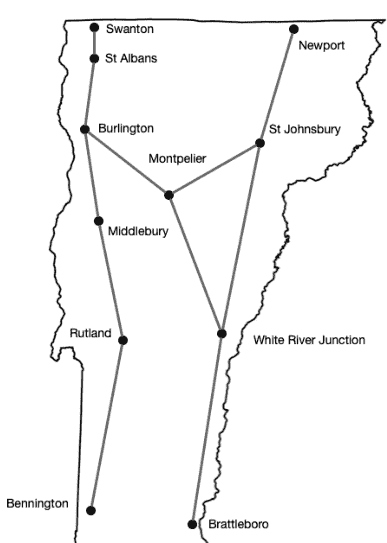

在这个例子中，伯灵顿与圣奥尔本斯、蒙彼利埃和米德尔伯里相邻。拉特兰与米德尔伯里和本宁顿相邻。（是的，为了简单起见，我们省略了很多细节。）

那么问题来了：我们如何在代码中表示图？有几种方法，但我们将在这里演示的是所谓的*邻接表*表示法。

我们将使用一个字典，以城镇名称作为键，值将是一个列表，包含与该键相邻的所有城镇。

> ¹存在所谓的*有向*边，比如单行道，但本文中我们只处理无向边。

例如，蒙彼利埃与圣约翰斯伯里、怀特河交汇处和伯灵顿相邻，因此蒙彼利埃的字典条目如下所示：

```
ROUTES = {'Montpelier': ['Burlington', 'White River Junction',
                         'St Johnsbury']}
```

根据上面的地图，完整的邻接表示如下：

```
ROUTES = {
    'Burlington': ['St Albans', 'Montpelier', 'Middlebury'],
    'Montpelier': ['Burlington', 'White River Junction',
                   'St Johnsbury'],
    'White River Junction': ['Montpelier', 'Brattleboro',
                             'St Johnsbury'],
    'Brattleboro': ['White River Junction'],
    'Newport': ['St Johnsbury'],
    'St Albans': ['Burlington', 'Swanton'],
    'St Johnsbury': ['Montpelier', 'Newport',
                     'White River Junction'],
    'Swanton': ['St Albans'],
    'Middlebury': ['Burlington', 'Rutland'],
    'Rutland': ['Middlebury', 'Bennington'],
    'Bennington': ['Rutland']
}
```

注意，蒙彼利埃、圣约翰斯伯里和怀特河交汇处彼此都是邻居。这被称为一个*环*。如果一个图没有任何环，它被称为*无环图*。类似地，如果一个图至少包含一个环，那么它被称为*有环图*。所以，这是一个有环图。

## 17.2 搜索图：广度优先搜索

我们经常需要搜索这样的结构。一种常见的方法是使用所谓的广度优先搜索（BFS）。以下是它的工作原理（在当前上下文中）：

我们维护一个已访问城镇的列表，以及一个待访问城镇的队列。城镇列表和队列都是`list`类型。我们选择一个起点（这里选哪个都一样），并将其添加到已访问城镇列表和队列中。这就是我们的开始。

然后，在一个while循环中，只要队列中还有元素：

- 从队列前端弹出一个城镇
- 对于每个相邻的城镇，如果我们还没有访问过该城镇：
    - 我们将相邻城镇添加到已访问城镇列表
    - 我们将相邻城镇添加到队列末尾

在某个时刻，队列会耗尽（当我们弹出最后一个元素后），并且我们只将未访问的城镇添加到队列中。因此这个算法会终止。

一旦算法终止，我们就得到了一个按访问顺序排列的已访问城镇列表。

不用说，这不是一个非常复杂的方法。例如，我们没有考虑行驶的距离，而且我们有一个非常简单的图。但这足以演示BFS。

## 一个完整的例子

这是一个完整的广度优先搜索示例。你在查看上面的地图时，可以参考这个例子。

假设我们选择圣约翰斯伯里作为起点。因此，已访问城镇列表将是圣约翰斯伯里，队列中只包含圣约翰斯伯里。然后，在一个while循环中...

首先，我们从队列前端弹出圣约翰斯伯里，并检查它的邻居。它的邻居是蒙彼利埃、纽波特和怀特河交汇处，所以我们把蒙彼利埃、纽波特和怀特河交汇处添加到已访问城镇列表和队列中。此时，队列如下所示：

```
['Montpelier', 'Newport', 'White River Junction']
```

在下一次迭代中，我们从队列前端弹出蒙彼利埃。现在，当我们检查蒙彼利埃的邻居时，我们发现伯灵顿、怀特河交汇处和圣约翰斯伯里。圣约翰斯伯里已经访问过了，怀特河交汇处也访问过了，所以我们忽略它们。然而，我们还没有访问伯灵顿，所以我们把它添加到已访问城镇列表和队列中。此时，队列如下所示：

```
['Newport', 'White River Junction', 'Burlington']
```

在下一次迭代中，我们从队列前端弹出纽波特。我们检查纽波特的邻居，只发现圣约翰斯伯里，所以没有什么可以添加到队列中。此时，队列如下所示：

```
['White River Junction', 'Burlington']
```

在下一次迭代中，我们从队列前端弹出怀特河交汇处。怀特河交汇处与蒙彼利埃（已访问）、布拉特尔伯勒和圣约翰斯伯里（已访问）相邻。所以我们把布拉特尔伯勒添加到已访问列表和队列中。此时，队列如下所示：

```
['Burlington', 'Brattleboro']
```

在下一次迭代中，伯灵顿从队列中弹出。现在我们检查伯灵顿的邻居，发现圣奥尔本斯、蒙彼利埃（已访问）和米德尔伯里。蒙彼利埃我们已经访问过了，但圣奥尔本斯和米德尔伯里还没有访问过，所以我们把它们添加到已访问城镇列表和队列中。此时，队列如下所示：

```
['Brattleboro', 'St Albans', 'Middlebury']
```

在下一次迭代中，布拉特尔伯勒从队列前端弹出。布拉特尔伯勒与怀特河交汇处（已访问）相邻。此时，队列如下所示：

```
['St Albans', 'Middlebury']
```

在下一次迭代中，我们从队列前端弹出圣奥尔本斯。我们检查圣奥尔本斯的邻居。它们是伯灵顿（已访问）和斯旺顿。所以我们把斯旺顿添加到已访问列表和队列中。此时，队列如下所示：

```
['Middlebury', 'Swanton']
```

在下一次迭代中，我们从队列中弹出米德尔伯里，并检查它的邻居。它的邻居是伯灵顿（已访问）和拉特兰。拉特兰是新的，所以我们把它添加到已访问列表和队列中。此时，队列如下所示：

```
['Swanton', 'Rutland']
```

在下一次迭代中，我们从队列前端弹出斯旺顿。斯旺顿唯一的邻居是圣奥尔本斯，而圣奥尔本斯已经访问过了，所以我们什么都不做。此时，队列如下所示：

```
['Rutland']
```

在下一次迭代中，我们从队列前端弹出拉特兰。拉特兰的邻居是本宁顿和米德尔伯里。我们已经访问过米德尔伯里，但还没有访问过本宁顿，所以我们把它添加到已访问城镇列表和队列中。此时，队列如下所示：

```
['Bennington']
```

在下一次迭代中，我们弹出本宁顿。本宁顿唯一的邻居是拉特兰（已访问），所以我们什么都不做。此时，队列如下所示：

```
[]
```

当空队列中没有添加任何内容时，队列保持为空，while循环终止。（记住：空列表是假值。）此时，我们得到了一个按访问顺序排列的所有已访问城镇的完整列表：

圣约翰斯伯里、蒙彼利埃、纽波特、怀特河交汇处、伯灵顿、布拉特尔伯勒、圣奥尔本斯、米德尔伯里、斯旺顿、拉特兰和本宁顿。

## 应用

图上的搜索算法有着广泛的应用，包括解决迷宫问题，以及井字棋和各种棋盘游戏。

## 补充阅读

- https://en.wikipedia.org/wiki/Breadth-first_search
- https://en.wikipedia.org/wiki/Depth-first_search

## 17.3 练习

### 练习 01

查看这个表示图的字典（使用邻接表表示法）：

```
FRIENDS = {
    'Alessandro': ['Amelia'],
    'Amelia': ['Sofia', 'Emma', 'Daniel', 'Alessandro'],
    'Ava': ['Mia'],
    'Sofia': ['Amelia', 'Selim', 'Olivia'],
    'Daniel': ['Amelia', 'Emma', 'Selim', 'Olivia'],
    'Emma': ['Amelia', 'Daniel', 'Selim'],
    'Selim': ['Sofia', 'Daniel', 'Emma', 'Ethan'],
    'Olivia': ['Sofia', 'Ethan', 'Daniel'],
    'Ethan': ['Olivia', 'Selim'],
    'Amara': ['Isabella', 'Benjamin'],
    'Benjamin': ['Amara', 'Isabella'],
    'Isabella': ['Amara', 'Benjamin'],
    'Mia': ['Ava', 'James'],
    'James': ['Mia']
}
```

a. 在一张纸上，从 Ethan 开始执行广度优先搜索。写下顶点被访问的顺序，并随着队列的变化进行更新。如果觉得有帮助，可以画出图。广度优先搜索是否访问了所有的人（节点）？如果没有，为什么？

b. 友谊关系是否存在对称性？我们如何在邻接表中看到这一点？

### 练习 02

考虑这个图：

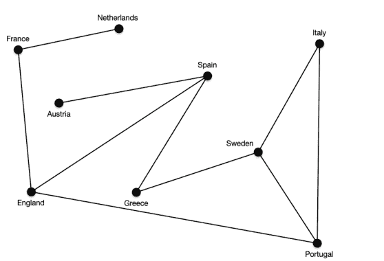

a. 使用字典写出这个图的邻接表表示。
b. 这个图是循环的还是非循环的？为什么？
c. 图中显示的国家没有按照它们在欧洲地图上的相对位置排列，这有关系吗？为什么或为什么不？

### 练习 03（挑战！）

在无向图（本文中唯一展示的类型）的情况下，边没有方向，因此如果 A 连接到 B，那么 B 也连接到 A。我们在邻接表表示中看到这一点：如果 Selim 是 Emma 的朋友，那么 Emma 也是 Selim 的朋友。

编写一个函数，该函数接受任意图的邻接表表示，并在邻接表表示中正确表示了这种对称性时返回 True，否则返回 False。这样的函数可以用来验证无向图的编码。

# 附录 A

## 术语表

### 绝对值

一个数的*绝对值*是它到原点（0）的距离，即该数的大小，无论其符号如何。在数学中，这通过在数字或变量两侧加上竖线来表示。因此

$|4| = 4$
$|-4| = 4$

通常，

$|x| = \begin{cases} x & x \geq 0 \\ -x & x < 0. \end{cases}$

任何数字字面量、变量或表达式的绝对值都可以用 Python 内置函数 abs() 计算。

### 累加器

*累加器*是在循环中用于保存累积结果的变量。例如，我们可以计算从 1 到 10 所有数字的和，如下所示

```
s = 0  # s 是累加器
for n in range(1, 11):
    s += n  # s 在每次迭代中递增
```

### 相邻

我们说图中的两个顶点 A、B 是*相邻的*，如果图中存在一条以 A 和 B 为端点的边。

### 交替和

*交替和*是一种根据项的索引或奇偶性交替进行加法和减法的求和。例如：

```
s = 0
for n in range(1, 11):
    if n % 2:    # n 是奇数
        s -= n   # 减去 n
    else:        # n 必须是偶数
        s += n   # 加上 n
```

实现了交替和

$0 - 1 + 2 - 3 + 4 - 5 + 6 - 7 + 8 - 9 + 10$

或等价地

$\sum_{i=0}^{10} (-1)^i x_i$

交替和在数学中经常出现。

### 参数

*参数*是在调用函数时传递给函数的值（或变量）。然后，该参数被赋值给函数定义中相应的形式参数。例如，如果我们调用 Python 的内置 sum() 函数，我们必须提供一个参数（被求和的对象）。

```
s = sum([2, 3, 5, 7, 11])
```

这里，提供给 sum() 函数的参数是列表 [2, 3, 5, 7, 11]。参见：形式参数。

本文中出现的大多数参数是*位置参数*，即它们被赋值给的形式参数取决于函数定义中形式参数的顺序。第一个参数被赋值给第一个形式参数（如果有的话）。第二个参数被赋值给第二个形式参数，依此类推。位置参数的数量必须与位置形式参数的数量一致，否则会引发 TypeError。

另见：关键字参数。

### 算术平均值

*算术平均值*是非正式地称为一组数字的平均值。它是集合中所有数字的总和除以集合中元素的数量。通常，

$\mu = \frac{1}{N} \sum_{i=0}^{N-1} x_i$

这可以在 Python 中实现：

```
m = sum(x) / len(x)
```

其中 x 是某个数字值的列表或元组。

### 等差数列

数字的*等差数列*是其中连续项之间的差为常数的数列。例如，1, 2, 3, 4, 5,... 是一个等差数列，因为连续项之间的差是常数 1。等差数列的其他例子：

2, 4, 6, 8, 10, ...
7, 10, 13, 16, 19, 22, ...
44, 43, 42, 41, 40, 39, ...

Python 的 range 对象是等差数列的一种形式。步长（默认为 1）是连续项之间的差。示例：

```
range(3, 40, 3)
```

当迭代时，从 3 开始以 3 为步长计数到 39。

### 断言

*断言*是关于你认为是真实的事情的陈述。“此刻，天空是蓝色的。”是一个断言（在我写这段话时，我所在的地方恰好是真的）。我们在代码中使用断言来帮助验证正确性，断言也经常用于软件测试。断言可以使用 Python 关键字 *assert*（注意这是一个关键字，*不是*函数）来做出。示例：

```
assert 4 == math.sqrt(16)
```

### 赋值

我们使用*赋值*将值绑定到名称。在 Python 中，这是通过赋值运算符 = 完成的。例如：

```
x = 4
```

创建一个名称 x（假设 x 之前未定义），并将其与值 4 关联。

### 二进制代码

最终，在你的计算机上执行的所有指令和在你的计算机上表示的所有数据都是*二进制代码*。即，作为 0 和 1 的序列。

### 绑定 / 已绑定 / 绑定

当我们进行赋值时，我们说一个值被*绑定*到一个名称——从而在两者之间创建关联。例如，赋值 n = 42 将名称 n *绑定*到值 42。

在运算符优先级的情况下，我们说优先级较高的运算符比优先级较低的运算符*绑定*得更紧密。例如，在表达式 1 + 2 * 3 中，子表达式 2 * 3 在执行加法之前被求值，因为 * 比 + 绑定得更紧密。

### 布尔连接词

Python 中的*布尔连接词*是关键字 and、or 和 not。参见：布尔表达式，以及第 8 章 分支。

### 布尔表达式

*布尔*表达式是一个包含一个或多个布尔变量或字面量（或具有真值的变量或字面量），由零个或多个布尔连接词连接的表达式。Python 中的布尔连接词是关键字 and、or 和 not。例如：

```
(x1 or x2 or x3) and (not x2 or x3 or x4)
```

是一个布尔表达式，但单个字面量

```
True
```

也是。

重要的是要理解，在 Python 中，几乎一切都有真值（我们称之为真值或假值），并且布尔表达式不必只求值为 True 或 False。

### 分支

正是通过*分支*，我们实现了代码部分的条件执行。例如，我们可能希望代码的某部分仅在某个条件为真时才执行。Python 中的分支是通过关键字 if、elif 和 else 实现的。示例：

```
if x > 1:
    print("x is greater than one")
```

和

```
if x < 0:
    print("x is less than zero")
elif x > 1:
    print("x is greater than one")
else:
    print("x must be between 0 and 1, inclusive")
```

重要的是要理解，在任何给定的 if/elif/else 复合语句中，只有一个分支被执行——第一个条件为真的分支，或者如果前面的条件都不为真，则执行 else 子句（如果有的话）。

### bug

简而言之，*bug* 是我们代码中的一个缺陷。我倾向于不将语法错误称为“bug”。最好将这个术语限制在代码中的语义缺陷（以及可能未处理但应该处理的异常）上。无论如何，当你发现一个 bug 时，请修复它！

### bytecode

*字节码* 是介于源代码（由人类编写）和二进制代码（由计算机的中央处理器单元 (CPU) 执行）之间的一种中间形式。字节码是一种旨在被解释器高效执行的表示形式。Python 作为一种解释型语言，会生成中间字节码，以便在 Python 虚拟机 (PVM) 上执行。Python 源代码到中间字节码的转换由 Python 编译器执行。

### call (see: invoke)

当我们希望使用先前定义的函数或方法时，我们会*调用*该函数或方法，并提供所需的任何参数（如果有的话）。当我们调用一个函数时，执行流程会暂时传递给该函数。函数执行其工作（无论那是什么），然后控制流和一个值会返回到调用该函数的位置。更多详情请参见：第 5 章 函数。

```
print("Hello, World!")  # 调用 print() 函数
x = math.sqrt(2)       # 调用 sqrt() 函数
```

注意：*call* 与 *invoke* 同义。

### camel case

*驼峰命名法* 是一种命名约定，其中由多个单词组成的标识符，其每个内部单词的首字母大写。有时这样书写：camelCase。请参见：PEP 8 了解适当用法。

### central tendency

在统计学中，算术平均值是*集中趋势*度量的一个例子，它衡量数据集的“中心”或（希望是）“典型”值。集中趋势的另一个方面是，值倾向于聚集在某个中心值（*例如*，平均值）周围。

### comma separated values (CSV)

*逗号分隔值*格式 (CSV) 是一种常用的方式来表示组织成行和列的数据。在此格式中，逗号用于分隔不同列中的值。如果逗号出现在值中，例如在文本字符串的情况下，该值会用引号括起来。Python 提供了一个方便的模块——csv 模块，用于读取、解析和遍历 CSV 文件中的行。

### command line interface (CLI)

命令行界面（缩写为 CLI）是一种用户界面，用户通过以文本形式键入命令或响应提示，或以类似格式查看程序的数据和响应来与程序交互。本书中的所有程序都使用命令行界面。

### comment

严格来说，注释是出现在源代码中的文本，不会被语言读取或解释，而是完全为了人类读者的便利。Python 中的注释由井号 `#`（也称为 hash 符号、pound 符号等）分隔。在 Python 中，给定行上此符号之后的任何文本都会被解释器忽略。

一般来说，留下解释为什么某事如此的注释是良好的实践。理想情况下，注释不应该用来解释某事是如何完成的（因为这应该从代码本身就能明显看出）。

### comparable

如果对象可以被排序或比较，即如果可以应用比较运算符——`==`、`<=`、`>=`、`<`、`>` 和 `!=`，那么这些对象就是可比较的。如果可以，那么比较运算符两侧的操作数就是可比较的。许多类型的实例可以相互比较（任何字符串都可以与所有其他字符串比较，任何数字都可以与所有其他数字比较），但某些类型不能与相同类型的其他对象进行比较。例如，我们不能以这种方式比较 `range` 或 `function` 类型的对象。在大多数情况下，不同类型的对象是不可比较的（不同的数字类型是一个显著的例外）。例如，我们不能比较字符串和整数。

### compiler

编译器是一种将源代码转换为机器代码的程序，或者在 Python 的情况下，转换为字节码，然后可以在 Python 虚拟机上运行。

### concatenation

连接是一种连接在一起的方式，类似于铁路车厢的连接。某些类型可以连接，其他则不能。字符串和列表是两种可以连接的类型。如果两个操作数都是字符串，或者两个操作数都是列表，那么 `+` 运算符执行连接（而不是加法，如果两个操作数都是数字的话）。

示例：

```
>>> 'dog' + 'food'
'dogfood'
>>> [1, 2, 3] + ['a', 'b', 'c']
[1, 2, 3, 'a', 'b', 'c']
```

### condition

*条件* 用于控制 `while` 循环和 `if/elif/else` 语句的行为。当条件为真时——即它求值为 `True` 或具有真值（truthy value）时，循环或分支就会执行。注意：Python 支持*条件表达式*，它们是 `if/else` 的简写形式，但本文不介绍这些。

### congruent

在模算术的上下文中，如果两个数相对于某个给定的模数具有相同的余数，我们称这两个数是*同余*的。例如，5 与 19 模 2 同余，因为 5 % 2 的余数是 1，19 % 2 的余数也是 1。在数学符号中，我们用 ≡ 符号表示同余，我们可以将此示例写为 5 ≡ 19 (mod 2)。在 Python 中，表达式 `5 % 2 == 19 % 2` 的求值结果为 `True`。

### console

*控制台* 指的是 Python shell，或在终端中运行时的 Python 输入/输出。

### constructor

*构造函数* 是一个特殊的函数，它构造并返回给定类型的对象。Python 提供了许多内置构造函数，*例如* `int()`、`float()`、`str()`、`list()`、`tuple()` 等。这些在 Python 中通常用于执行类型之间的转换。示例：

- `list(('a', 'b', 'c'))` 将元组参数转换为列表：`['a', 'b', 'c']`。
- `list('apple')` 将字符串参数转换为列表：`['a', 'p', 'p', 'l', 'e']`。
- `int(42.1)` 将浮点数参数转换为整数，截断小数点右侧的部分：`42`。
- `int('2001')` 将字符串参数转换为整数：`2001`。
- `float('98.6')` 将字符串参数转换为浮点数：`98.6`。
- `tuple([2, 4, 6, 8])` 将列表参数转换为元组：`(2, 4, 6, 8)`。

其他构造函数包括 `range()` 和 `enumerate()`。

### context manager

上下文管理器使用 `with` 关键字创建，在处理文件 I/O 时常用。上下文管理器接管了打开和关闭文件的部分工作，或者确保在 `with` 块结束时关闭文件，无论该块内可能发生什么其他情况。如果不使用上下文管理器，程序员需要确保文件被关闭。因此，`with` 是打开文件时的首选惯用法。

上下文管理器还有其他用途，但这些超出了本文的范围。

### cycle (within a graph)

如果在一个图中，从一个顶点到另一个顶点存在多条边路径，则存在*环*。我们称包含一个或多个环的图为*有环的*，没有任何环的图为*无环的*。

### delimiter

*分隔符* 是用于将一个事物与另一个事物区分开来的符号或符号组合。使用什么分隔符、如何使用以及它们分隔什么取决于上下文。例如，Python 中的单行和内联注释由行首的 `#` 符号和行尾的换行符分隔。字符串可以用单引号 `'`、双引号 `"` 或三引号 `"""` 来分隔（开始和结束）。在 CSV 文件中，列由逗号分隔。

### dictionary

*字典* 是一种可变类型，它以键/值对的形式存储数据，类似于传统字典。键必须是唯一的，每个键与一个值相关联。字典的值几乎可以是任何东西，包括其他字典，但键必须是*可哈希的*。在 Python 中，字典使用花括号书写，冒号用于分隔键和值。字典条目（元素）用逗号分隔。

示例：

- `{1: 'odd', 2: 'even'}`
- `{'apple': 'red', 'lime': 'green', 'lemon': 'yellow'}`
- `{'name': 'Egbert', 'courses': ['CS1210', 'CS2240', 'CS2250'], 'age': 19}`

### directory (file system)

*目录* 是文件系统的一个组成部分，它包含文件，可能还包含其他目录。正是目录的嵌套（一个目录包含在另一个目录中）赋予了文件系统其层次结构。磁盘驱动器或卷中的顶级目录称为*根*目录。

在现代操作系统的图形用户界面 (GUI) 中，目录在视觉上表示为文件夹，也可能被称为文件夹。

### 被除数

在除法（包括整除 `//` 和取模运算符 `%`）的语境中，*被除数*是被除的数。例如，在表达式 `21 / 3` 中，被除数是 `21`。

### 除数

在除法（包括整除 `//` 和取模运算符 `%`）的语境中，*除数*是除被除数的数。例如，在表达式 `21 / 3` 中，除数是 `3`。在取模运算符和模运算的语境中，我们也称其为模数。

### 驱动代码

*驱动代码*是一个非正式术语，指代驱动（运行）你程序的代码，以区别于程序员定义的函数、常量赋值或类。驱动代码通常被 `if` 语句包裹：`if __name__ == '__main__':`。

### 文档字符串

*文档字符串*是一个三引号字符串，包含关于程序、模块、函数或方法的信息。它们不应被用作行内注释。与行内注释不同，文档字符串会被 Python 解释器读取和解析。程序（模块）级别的示例：

```
"""
My Fabulous Program
Egbert Porcupine <eporcupi@uvm.edu>
This program prompts the user for a number and
returns the corresponding frombulation coefficient.
"""
```

或函数级别的示例：

```
def successor(n_):
    """Given some number, n_, returns its successor. """
    return n_ + 1
```

### 双下划线

Python 中的特殊变量和函数具有以两个下划线开头和结尾的标识符。这样的标识符被称为 *dunders*，是“double underscore”的描述性*混成词*。示例包括变量 `__name__` 和特殊名称 `'__main__'`，以及语言定义的许多其他标识符。这些通常用于直观地表示它们是系统定义的标识符。

### 动态类型 / 动态类型化

与静态类型语言（例如 C、C++、Java、Haskell、OCaml、Rust、Scala）不同，Python 是*动态类型化*的。这意味着我们可以将新值重新绑定到现有名称，即使这些值与之前赋值绑定的类型不同。例如，在 Python 中，这是完全允许的：

```
x = 1          # 现在 x 绑定到一个 int 类型的值
x = 'wombat'   # 现在 x 绑定到一个 str 类型的值
x = [3, 5, 7]  # ...现在是一个列表
```

这展示了*动态类型*——在此代码执行的不同点，`x` 与不同类型的值相关联。在许多其他语言中，这将导致类型错误。

### 边（图）

图由顶点（也称为节点）和*边*组成。一条*边*连接两个顶点，图中的每条边恰好有两个端点（顶点）。本文中所有图中的边都是*无向的*，意味着它们没有方向。如果顶点 A 和 B 之间存在一条边，那么 A 与 B 相邻，B 也与 A 相邻。

### 空序列

术语*空*适用于任何不包含元素的序列。例如，空字符串 `""`、空列表 `[]` 和空元组 `(,)`——这些都是*空序列*。我们使用定冠词（“the”）来指代它们，因为每种类型只有一个这样的对象。值得注意的是，空序列是假值。

### 入口点

程序的*入口点*是代码开始执行的位置。在 Python 中，双下划线 `__main__` 是运行顶层代码的环境的名称，因此指示了入口点。示例：

```
"""
Some docstring here
"""

def square(x_):
    return x_ * x_

# 这是入口点，代码执行从这里开始...
if __name__ == '__main__':
    x = float(input("Enter a number: "))
    x_squared = square(x)
    print(f"{x} squared is {x_squared}")
```

### 转义序列

*转义序列*（在字符串内）是以 `\` 字符开头的子字符串，表示后续字符应被按字面意义解释，而不是作为分隔符。示例：`print('The following apostrophe isn\'t a delimiter')`

转义序列也用于表示在字符串中无法直接表示的特殊值。例如，`\n` 表示换行，`\t` 表示制表符。

### 欧几里得除法

这是你在小学时最初学到的除法，在你学习小数展开之前。涉及*欧几里得除法*的计算会产生一个商和一个余数（余数可能为零）。在 Python 中，这由两个独立的运算符实现，一个产生商（不带小数展开），另一个产生余数。它们分别是 `//`（也称为整除）和 `%`（也称为取模）。

所以，例如，在小学时，当被要求将 25 除以 3 时，你会回答 8 余 1。在 Python 中：

```
quotient = 25 // 3   # 商得到 8
remainder = 25 % 3   # 余数得到 1
```

### 求值 / 求值

表达式通过将其归约为一个值来*求值*。例如，表达式 `1 + 1` 的*求值*结果为 2。更大表达式的求值按照运算符优先级或函数调用顺序进行。所以，例如，

```
>>> import math
>>> x = 16
>>> y = 5
>>> int(math.sqrt(x) + 4 * y + 1)
25
```

首先对 `math.sqrt()` 的调用进行求值（结果为 4.0）。接下来对乘法 `4 * y` 进行求值（结果为 20）。然后执行加法（`4.0 + 20 + 1`，结果为 25.0）。最后，调用 `int` 构造函数，此表达式的最终求值结果为 25。

当字面量被求值时，它们求值为自身。

### 异常

*异常*是运行时发生的错误。当代码语法正确，但包含语义缺陷（错误）或接收到意外值时，就会发生这种情况。当 Python 检测到此类错误时，它会引发一个异常。如果异常未被处理，程序执行将终止。

Python 提供了大量内置异常，有助于诊断错误。示例：`TypeError`、`ValueError`、`ZeroDivisionError` 等。异常可以使用 `try` 和 `except` 来处理。

### 异常处理

异常处理允许程序员预见执行期间可能出现的某些异常的可能性，并提供后备方案或在异常发生时进行响应的方法。例如，我们经常在验证用户输入时使用异常处理。

```
while True:
    response = input("Enter a valid number greater than zero: ")
    try:
        x = float(response)
        if x > 0:
            break
    except ValueError:
        print(f"Sorry I cannot convert {response} to a float!")
```

异常处理应尽可能有限和具体。例如，你永远不应该使用裸 `except:` 或 `except Exception:`。

某些类型的异常，例如 `NameError`，永远不应该被处理，因为这会掩盖一个严重的编程缺陷，应该通过修改代码来解决。

### 表达式

表达式是任何语法上有效的、可以被求值的代码，也就是说，表达式会产生一个值。表达式可以是简单的（例如，单个字面量）或复杂的（即由字面量、变量、运算符、函数调用等组成）。表达式应与语句区分开来——表达式有求值，语句没有。

### 假值

当用作条件或在布尔表达式中时，Python 中的大多数事物都有一个真值。如果某个事物的真值被视为假，我们称这样的事物是假值。假值事物包括（但不限于）空序列、`0` 和 `0.0`。

### 斐波那契数列

斐波那契数列是一个从 0、1 开始的自然数序列，其中每个后续元素是前两个元素的和。因此斐波那契数列以 0, 1, 1, 2, 3, 5, 8, 13, 21, ... 开始。斐波那契数列以比萨的莱昂纳多（约 1170–约 1245 年）命名，他的绰号是斐波那契。斐波那契数列早在公元前 200 年就为印度数学家（特别是平伽拉）所知，但历史在命名这些事物上并不总是公平的。

### 文件

*文件*是文件系统中用于存储数据的组件。你编写的计算机程序以文件形式保存，你计算机上的所有其他文档、程序和其他资源也同样如此。文件包含在目录中。

### 浮点数

*浮点数*是带有小数点的数字。它们的表示方式与整数不同。Python 有一种名为 `float` 的类型，用于表示浮点数。

### 整除

*整除*计算的是欧几里得商，或者，如果你愿意的话，是小于或等于浮点除法结果的最大整数。例如，`8 // 3` 的结果是 2，因为 2 是小于 2.666...（即 `8 / 3` 的结果）的最大整数。

### 取整函数

取整函数返回小于或等于给定参数的最大整数。在数学符号中，我们写作

$$\lfloor x \rfloor$$

例如，$\lfloor 6.125 \rfloor = 6$。

Python 在 `math` 模块中实现了此函数。示例：`math.floor(6.125)` 的结果是 6。

### 流程图

*流程图*是一种用于表示程序、函数、方法或其部分中可能的执行路径和控制流的工具。参见：第 8 章 分支。

### 格式说明符

*格式说明符*用于 f-string 替换字段内，以指示插值内容应如何格式化，*例如*，指定浮点数的精度；将文本左对齐、右对齐或居中对齐，*等等*。格式说明符有一套完整的“迷你语言”。在替换字段中，格式说明符跟在插值表达式之后，用冒号分隔。格式说明符是可选的。

### 文件夹（参见：目录）

*文件夹*与目录同义。

### f-string

f-string 是 *格式化字符串字面量* 的缩写。f-string 用于字符串插值，其中值被替换到 f-string 内的替换字段中（带有可选的格式说明符）。f-string 的语法要求其以字母“f”为前缀，替换字段出现在花括号内。例如，`f"The secret number is {num}."`。在这个例子中，替换字段是 `{num}`，与标识符 `num` 关联的值的字符串表示被替换到字符串中。因此，如果我们有 `num = 42`，那么这个字符串就变成了“The secret number is 42.”

### 函数

在 Python 中，*函数*是一个命名的代码块，用于执行某些任务或返回某些值。我们区分函数的定义（使用关键字 `def`）和对函数的调用（导致函数被执行，然后返回到调用点）。函数可以有零个或多个形式参数。形式参数在函数被调用时接收实参。

所有 Python 函数都返回一个值（如果没有显式的 `return` 语句，默认情况下函数返回 `None`）。

参见：第 5 章 函数。

### 图

*图*由一组顶点和一组边组成。简单来说，空图是没有顶点因此也没有边的图。一个包含两个或更多顶点的图可能包含边（假设我们排除了常见的自环边）。一条边连接两个顶点。

图在计算机科学中被广泛用于表示各种网络以及数学和其他对象。

### 图形用户界面

*图形用户界面*（缩写为 GUI，发音为“gooey”）是一种包含图形元素（如窗口、按钮、滚动条、输入框和其他花哨小部件）的界面。这些与命令行界面不同，后者缺乏这些元素且基于文本。

### 可哈希

字典的键必须是*可哈希的*。在内部，Python 为字典中的每个键生成一个哈希值（一个数字），并使用它来查找字典中的元素。为了使这能够工作，这样的哈希值必须是稳定的——它们不能改变。因此，Python 禁止使用不可哈希的对象作为字典键。这包括可变对象（列表、字典）或包含可变对象的不可变容器（例如，包含列表的元组）。大多数其他对象是可哈希的：整数、浮点数、字符串，*等等*。

### 异构

*异构*意味着“混合种类或类型”。Python 允许异构列表或元组，这意味着它们可以包含不同类型的对象。例如，这在 Python 中是完全没问题的：`['a', 42, False, [x], 101.9]`。

### 标识符

*标识符*是我们给 Python 中对象起的名字。对于许多类型，我们通过赋值来命名。示例：

```
x = 1234567
```

将值 1234567 赋予名称（标识符）`x`。这允许我们在代码中通过其标识符 `x` 来引用值 1234567。

```
print(x)
z = x // 100
# 等等
```

我们使用 `def` 关键字为函数赋予标识符。

```
def successor(n):
    return n + 1
```

现在这个函数就有了标识符（名称）`successor`。

关于标识符的限制，请参阅 Python 文档 [https://docs.python.org/3/reference/lexical_analysis.html](https://docs.python.org/3/reference/lexical_analysis.html)（第 2.3 节 标识符和关键字）。

### 不可变

如果一个对象是*不可变的*，这意味着该对象不能被更改。在 Python 中，`int`、`float`、`str` 和 `tuple` 都是不可变类型。确实，我们可以将一个新值重新赋给一个变量，但这与更改值本身是不同的。

### 导入

我们通过使用 Python 的 `import` 关键字来*导入*模块以在我们自己的代码中使用。例如，如果我们希望使用 `math` 模块，我们必须首先这样导入它：

```
import math
```

### 非纯函数

*非纯函数*是具有副作用的函数。副作用包括从控制台读取或写入、从文件读取或写入，或修改（更改）非局部变量。*参见*，纯函数。

### 增量开发

增量开发是一个过程，我们以小的增量编写并（大概）测试我们的程序。

### 索引 / 索引（复数）

所有序列都有索引（index 的复数形式）。序列中的每个元素都对应一个索引。我们可以使用索引来访问序列中的单个元素。为此，我们使用方括号表示法（这与用于创建列表的语法不同）。例如，给定列表

```
>>> lst = ['dog', 'cat', 'gerbil']
```

我们可以通过索引访问单个元素。Python（像大多数编程语言一样）是零索引的，所以索引从零开始。

```
>>> lst[0]
'dog'
>>> lst[2]
'gerbil'
>>> lst[1]
'cat'
```

列表是可变的，因此支持索引写入和索引读取，所以这样是可行的：

```
>>> lst[2] = 'hamster'
```

但这对元组或字符串不起作用（因为它们是不可变的）。

### I/O

I/O 是输入/输出的缩写。这可能指控制台 I/O、文件 I/O 或其他形式的输入和输出。

### 实例 / 实例化

实例是给定类型一旦创建后的对象。例如，1 是 int 类型对象的一个实例。不过，我们更常将实例称为由构造函数返回的对象。例如，使用 csv 模块时，我们可以通过调用相应的构造函数 csv.reader() 和 csv.writer() 来实例化 CSV 读取器和写入器对象。这些构造函数返回的是相应类型的实例。

### 集成开发环境（IDE）

集成开发环境是编写代码的便捷（但非必需）工具。它们不仅仅是文本编辑器，还提供语法高亮、提示以及其他用于编写、测试、调试和运行代码的功能。Python 提供了自己的 IDE，称为 IDLE（集成开发和学习环境），还有许多商业或开源 IDE：Thonny（如果你是初学者，值得一看）、JetBrains Fleet、JetBrains PyCharm、Microsoft VS Code 等等。

### 交互模式

交互模式是我们在 Python shell 中交互时使用的模式。在 shell 中，你会看到 Python 提示符 >>>。在 shell 中的工作不会被保存——因此它适合实验，但不适合编写程序。
与下面的脚本模式进行比较。

### 插值

在本文中，当我们提到插值时，我们总是指字符串插值（而不是数值插值或帧插值）。
参见：字符串插值。

### 解释器

解释器是一种程序，它执行某种形式的代码，而无需先将其编译成二进制机器码。在 Python 中，这是由 Python 解释器完成的，它解释由 Python 编译器产生的字节码。

### 调用（参见：调用）

调用与调用同义。

### 可迭代 / 迭代

可迭代对象是我们可以迭代的对象，也就是说，它是一个包含零个或多个元素的对象，这些元素是有序的，并且可以一次取一个。一个熟悉的迭代形式是从一副牌中发牌。这副牌包含零个或多个元素（标准牌有 52 张）。这副牌是有序的——这并不意味着牌是排好序的，只是意味着每张牌在牌堆中都有一个唯一的位置（取决于牌堆是如何洗牌的）。如果我们从牌堆顶部一张一张地翻开牌，直到没有牌剩下，我们就已经迭代了这副牌。在第一次迭代中，我们可能翻开了梅花六。在第二次迭代中，我们可能翻开了方块九。以此类推。这就是迭代一个可迭代对象。
Python 中的可迭代对象包括 str、list、tuple、dict、range 和 enumerate 类型的对象（还有其他）。当我们迭代这些对象时，我们一次获得一个元素，按照它们在

### 关键字

任何语言的语法都会将某些标识符保留为*关键字*。关键字始终具有相同的含义，用户无法更改。本文中我们见过的 Python 关键字有：False、None、True、as、assert、break、def、del、elif、else、except、for、if、import、in、not、or、pass、return、try、while 和 with。你可以在 Python shell 中尝试重新定义其中任何一个——你不会成功的。

### 关键字参数

关键字参数是提供给函数的、前面带有名称的参数。（注意：关键字参数与 Python 关键字毫无关系。）关键字参数在函数定义中指定。本文不涉及使用关键字参数定义函数，但有一些使用关键字参数的实例，特别是：

1.  `print()` 函数的可选 `end` 关键字参数，它允许用户覆盖打印字符串的默认结尾（即换行符 `\n`）。
2.  `open()` 函数的可选 `newline` 关键字参数（这是一个小技巧，用于防止某些 Windows 机器上出现不良行为）。

关键字参数（如果有的话）总是跟在位置参数之后。

### 字典序

*字典序*是 Python 在排序字符串和某些其他类型时默认使用的顺序。本质上，这就像字符串在传统词典中出现的顺序。例如，当对两个单词排序时，会比较首字母。如果首字母不同，那么包含在字母表中出现较早的首字母的单词会排在另一个之前。如果首字母相同，则比较第二个字母，依此类推。如果字母数量不同，但所有可比较的字母都相同，那么较短的单词会排在另一个之前。因此，例如，在排序后的单词列表中，单词 'sort' 会出现在单词 'sorted' 之前。

> ¹字典在这里有点特殊，因为元素添加到字典的顺序不一定与它们在迭代时出现的顺序相同，但存在一个底层顺序。此外，Python 确实提供了一个 orderedDict 类型（由 collections 模块提供），它在迭代时保留添加的顺序。但这些都是次要的点。

### 列表

列表（类型 `list`）是其他对象的可变容器。列表是序列，这意味着它们的内容是有序的（列表中的每个对象在列表中都有一个特定的位置）。列表是可迭代的，这意味着我们可以在 `for` 循环中遍历它们。我们可以通过将列表字面量赋值给一个变量来创建列表：

```
cheeses = ['gouda', 'brie', 'mozzarella', 'cheddar']
```

或者我们可以使用列表构造函数从其他可迭代对象创建列表：

```
# 这创建了列表 ['a', 'b', 'c']
letters = list(('a', 'b', 'c'))
# 这创建了列表 ['w', 'o', 'r', 'd']
letters = list('word')
```

列表构造函数也可用于制作列表的副本。

### 字面量

字面量是给定类型的实际值。`1` 是 `int` 类型的字面量。`'muffin'` 是 `str` 类型的字面量。`['foo', 'bar', 123]` 是 `list` 类型的字面量。在求值过程中，字面量求值为其自身。

### 局部变量

*局部变量*是在有限作用域内定义的变量。本文中我们见过的局部变量是在函数内通过赋值创建的变量。

### 循环

*循环*是一种重复零次或多次的结构，对于 `while` 循环取决于条件，对于 `for` 循环取决于正在迭代的可迭代对象。`break` 和（在某些情况下）`return` 可用于退出一个可能原本会继续的循环。
Python 支持两种循环：`while` 循环在某个条件为真时持续执行，以及 `for` 循环遍历某个可迭代对象。

### Matplotlib

Matplotlib 是一个广泛使用的库，用于在 Python 中创建绘图、动画和其他数据可视化。它*不是* Python 标准库的一部分，因此必须在使用前安装。
更多信息，请参见：https://matplotlib.org。

### 方法

*方法*是绑定到特定类型对象的函数。² 例如，我们有列表方法如 `.append()`、`.pop()` 和 `.sort()`，字符串方法如 `.upper()`、`.capitalize()` 和 `.strip()`，等等。方法通过使用点运算符（如上面标识符所示）来访问。因此，要对列表 `lst` 排序，我们使用 `lst.sort()`；要从非空列表 `lst` 中移除并返回最后一个元素，我们使用 `lst.pop()`；要返回字符串 `s` 的首字母大写副本，我们使用 `s.capitalize()`；等等。

### 模块

*模块*是 Python 对象和代码的集合。例如 `math` 模块、`csv` 模块和 `statistics` 模块。为了使用模块，必须导入它，*例如*，`import math`。导入的模块被赋予*命名空间*，我们使用点运算符访问模块内的函数。例如，导入 `math` 模块时，命名空间是 `math`，我们这样访问该命名空间内的函数：`math.sqrt(2)`，这是一个例子。

如果你想重用另一个程序中编写的函数，你可以导入你自己编写的程序。在这种情况下，你的程序可以作为模块导入。

### 取模

使用取模运算符时，我们将第二个操作数称为*模数*。例如，在 `23 % 5` 的情况下，模数是 5。

另见：欧几里得除法和同余。

### 蒙特卡洛

*蒙特卡洛*方法利用重复随机抽样（来自某个分布）来解决某类问题。例如，我们可以使用蒙特卡洛方法来近似 π。蒙特卡洛方法广泛应用于物理学、经济学、运筹学管理以及许多其他领域。

### 可变

如果一个对象（类型）在创建后可以被更改，则它是可变的。列表和字典是可变的，而类型为 `int`、`float`、`str` 和 `tuple` 的对象则不是。

### 名称（见：标识符）

*名称*与*标识符*同义。

²严格来说，方法是在类中定义的函数。

### 命名空间

命名空间是存储 Python 对象的地方，它们非常像但不完全等同于字典。例如，像字典键一样，命名空间内的标识符是唯一的（你不能在同一个命名空间中有两个名为 x 的不同变量）。
大多数情况下，你是在全局命名空间中工作。然而，函数和你导入的模块有自己的命名空间。对于函数，函数的命名空间在函数被调用时创建，在函数返回时销毁。对于模块，我们使用点运算符引用模块命名空间内的元素（见：模块）。

### 节点（图；见：顶点）

在图的上下文中，*节点*和顶点是同义词。

### 对象

Python 中几乎任何不是关键字、运算符或标点符号的东西都是对象。每个对象都有一个类型，所以我们有类型为 int 的对象、类型为 str 的对象，等等。函数是类型为 function 的对象。
如果你学习面向对象编程，你将学习如何定义自己的类型，并实例化这些类型的对象。

### 运算符

运算符是一个特殊符号（或符号组合），它接受一个或多个操作数并执行某种操作，如加法、乘法、*等等*，或某种比较。运算符包括（但不限于）+、-、*、**、/、//、%、=、==、>、<、>=、<= 和 !=。只有一个操作数的运算符称为*一元运算符*，*例如*，一元取负。接受两个操作数的运算符称为*二元运算符*。
某些运算符根据其操作数的类型执行不同的操作。这称为*运算符重载*。例如：如果两个操作数都是数字，+ 执行加法；如果两个操作数都是字符串，或者两个操作数都是列表，+ 执行连接。

### 参数（和形式参数）

函数定义可以包含一个或多个*参数*（也称为*形式参数*）。这些参数在函数被调用时为实参提供名称。例如：

```
def square(x):
    return x * x
```

在这个例子中，x 是形式参数，为了调用函数，我们必须提供一个相应的实参。

### PEP 8

PEP 8 是 Python 的官方风格指南。参见：[https://peps.python.org/pep-0008/](https://peps.python.org/pep-0008/)

### 伪随机

计算机不可能产生真正的随机数（无论其实际定义如何）。相反，它们可以产生*伪随机*数，这些数看起来是随机的，并且近似于某些分布。伪随机数生成在 Python 的 `random` 模块中实现。更多信息请参见：第 12 章 随机性、游戏与模拟。

### 纯函数

*纯函数*是没有副作用的函数。此外，纯函数的输出（返回的值）仅取决于提供的参数和函数定义，并且给定相同的参数，纯函数总是返回完全相同的结果。在这方面，*纯函数*类似于数学函数。
*参见* 非纯函数。

### 分位数

在统计学中，*分位数*是一组点，它们将一个分布或数据集划分为概率相等的区间。例如，如果我们将数据划分为四分位数（一种四部分的分位数），那么这四个部分中的每一个都具有相等的概率。请注意，如果要划分为 *n* 部分，我们需要 *n* − 1 个值来实现。
一些分位数有特殊的名称。例如，我们将一个值称为*中位数*，该值将一个分布、样本或总体划分为两个概率相等的部分。如果划分为 100 部分，我们称之为*百分位数*。

### 商

*商*是除法的结果，无论是整数除法还是浮点数除法。对于 `/` 和 `//`，产生的值称为商。

### 随机游走

*随机游走*是一个数学对象，它描述了在某个空间（例如整数）中通过重复的随机步骤序列所走的路径。
例如，如果所讨论的空间是整数，我们从零开始，可以通过反复抛掷一枚公平的硬币来进行随机游走：如果抛出正面则加一，如果抛出反面则减一。

随机游走不必局限于单一维度。例如，我们可以通过三维空间中的随机游走来模拟悬浮在流体中的粒子的运动（布朗运动）。

随机游走被用于建模工程、物理、化学、生态学、经济学和其他领域的许多现象。

### 读取-求值-打印循环 (REPL)

*读取-求值-打印*循环是一种交互式界面，允许用户在提示符下键入命令或表达式，执行或求值它们，然后在控制台看到打印的结果。这在一个循环中执行，允许用户无限期地继续，直到他们选择终止会话。*Python shell* 就是一个例子。

### 余数

*余数*是执行欧几里得（整数）除法后剩下的量。这种运算的余数必须在区间 [0, *m*) 内，其中 *m* 是除数（或模数）。请注意，这是一个半开区间。例如，如果我们用 31 除以 6，余数是 1。这在 Python 中通过取模运算符 % 实现。另见：取模，以及第 4 章的相关部分。

### 替换字段

在 f-string 中，*替换字段*指示表达式要在字符串中插值的位置。替换字段由花括号分隔。示例：`f"Hello {name}, it's nice to meet you!"`

### 表示误差

浮点数的*表示误差*是实数无限而计算机中数字表示有限这一事实不可避免的结果——实数的数量比使用有限位数在计算机上可以表示的要多得多。

### 返回值

所有 Python 函数都返回一个值，我们称之为*返回值*。例如，`math.sqrt()` 返回所提供参数的平方根（有一些限制）。如前所述，所有 Python 函数都返回一个值，尽管在某些情况下返回的值是 `None`。返回 `None` 的函数包括（但不限于）`print()` 和某些就地修改列表的列表方法（例如，`.append()`、`.sort()`）。

### 橡皮鸭调试法

橡皮鸭调试法是一个过程，程序员试图向一只橡皮鸭解释他们的代码，并在此过程中（希望）解决问题或意识到需要做什么来修复错误。橡皮鸭在这方面特别有用，因为它们不会打断你，而且由于不太聪明，它们需要程序员给出最简单的解释。如果你卡住了，*和鸭子谈谈*！

### 运行时

*运行时*（有时也称为 *runtime*）指的是程序运行的时间。

### 作用域

*作用域*指的是名称（或标识符）的可见性或生命周期。例如，首先在函数内的赋值语句或函数的形式参数中定义的变量是该函数的*局部*变量，当函数返回且其命名空间被销毁时，这些局部变量就超出了作用域。

我们通常将*内部作用域*称为函数或方法体内的作用域，将*外部作用域*称为函数体外的代码。

另见：第 5 章 函数，以及命名空间的术语表条目。

### 脚本模式

*脚本模式*指的是当我们运行先前编写并保存的程序时的工作模式。这与在 Python shell 中进行的*交互模式*不同。

### 种子

*种子*是用于生成伪随机数（或伪随机数序列）的计算的起点。通常，在使用 random 模块中的函数时，我们允许随机数生成器使用计算机操作系统提供的种子（该种子被设计为尽可能不可预测）。然而，有时，特别是当我们希望测试包含使用伪随机数的代码时，我们会将种子显式设置为已知值。通过这样做，我们可以重现伪随机数序列。参见：第 12 章 随机性、游戏与模拟。

### 语义

*语义*指的是我们代码的含义，与语言要求的*语法*不同。错误是语义上的缺陷——我们的代码没有表达（或执行）我们打算让它表达（或执行）的意思。

### 序列解包

序列解包是一种语言特性，允许我们将序列中的值解包到单个变量中。示例：

```
>>> lst = [1, 2, 3]
>>> a, b, c = lst
>>> a
1
>>> b
2
>>> c
3
>>> coordinates = (44.47844, -73.19758)
>>> lat, lon = coordinates
>>> lat
44.47844
>>> lon
-73.19758
```

为了使序列解包工作，赋值运算符左侧的变量数量必须与右侧序列中要解包的元素数量完全相同。因此，如果有大量元素要解包或元素数量未知，序列解包就不太有用（或者可能不可能）。这就是为什么我们看到元组解包的例子比列表解包更多（因为列表是可变的，我们并不总是知道它们包含多少个元素）。
元组解包是 Python 中使用 enumerate() 时的首选惯用法。它对于交换变量也很方便。

### 遮蔽

当我们使用相同的标识符在两个不同的作用域中时，就会发生遮蔽，内部作用域中的名称会遮蔽外部作用域中的名称。在函数的情况下，函数有自己的命名空间，遮蔽是允许的（语法上是合法的），Python 不会混淆标识符。然而，即使是经验丰富的程序员也经常被遮蔽搞混。它不仅影响代码的可读性，还可能导致难以定位和修复的微妙缺陷。因此，不鼓励使用遮蔽（PEP 8 中提到了这一点）。
这是一个例子：

```
def square(x):
    x = x * x
    return x

if __name__ == '__main__':
    x = float(input("Enter a number and I'll square it: "))
    print(square(x))
```

### 副作用

*副作用*是指函数除了简单地返回结果之外的可观察行为。副作用的例子包括打印或提示用户输入信息，或者修改传递给函数的可变对象（这会影响外部作用域中的对象）。
编写函数时，任何副作用都应通过设计有意为之，绝不能无意中产生。因此，在可能的情况下，应优先使用纯函数而非非纯函数。

### 切片 / 切片操作

Python 提供了一种便捷的记法，用于从序列中提取子集。这被称为*切片*。例如，我们可以从字符串中提取每隔一个字母：

```
>>> s = 'omphaloskepsis'
>>> s[::2]
'opaokpi'
```

我们可以提取前五个字母，或最后三个字母：

```
>>> s[:5]
'ompha'
>>> s[-3:]
'sis'
```

我们将此类操作的结果称为*切片*。通常，语法为 `s[<start>:<stop>:<stride>]`，其中 `s` 是某个序列。如上例所示，步长是可选的。
另见：第 10 章 序列。

### 蛇形命名法

*蛇形命名法*是一种命名约定，其中所有字母均为小写，单词之间用下划线分隔（所有内容都保持在低位，就像蛇在地面上滑行一样）。你的变量名和函数名应全部小写或使用蛇形命名法。有时也写作 `snake_case`。
另见：PEP 8。

### 标准差

*标准差*是衡量分布、样本或总体中变异性的指标。标准差是相对于均值计算的。
另见：第 14 章 数据分析与呈现，了解标准差的计算方法。

### 语句

*语句*是 Python 中没有求值结果的代码，因此语句与表达式是有区别的。例子包括赋值语句、分支语句、循环控制语句和 with 语句。
例如，考虑一个简单的赋值语句：

```
>>> x = 1
>>>
```

注意，赋值后控制台没有打印任何内容。这是因为 `x = 1` 是一个语句，而不是一个表达式。表达式有求值结果，但语句没有。
不要混淆，例如，认为 while 循环的控制语句有求值结果。它没有。确实，*条件*必须是一个表达式，但控制语句本身没有求值结果（if 语句、elif 语句等也是如此）。

### 静态类型 / 静态类型语言

一些语言（非 Python）是*静态类型*的。在*静态类型*的情况下，所有变量的类型必须在*编译时*已知，虽然这些变量的值可以改变，但它们的类型不能改变。静态类型语言的例子：C、C++、Haskell、OCaml、Java、Rust、Go 等。

### 步长

*步长*是指在 range 对象和切片上下文中的步进大小。在这两种情况下，默认值都是 1，因此可以通过语法省略。
例如，`x[0:10]` 和 `range(0, 10)` 在语法上都是有效的。但是，如果我们希望使用不同的步长，则必须显式提供参数，例如 `x[0:10:2]` 和 `range(0, 10, 2)`。

### 字符串

*字符串*是一个序列，是字符（或更准确地说是 Unicode 码点）的有序集合。

### 字符串插值

*字符串插值*是将值替换到包含某种占位符的字符串中。Python 支持多种形式的字符串插值，但本文中的大多数示例都使用 f-strings 进行字符串插值。有些用例适合使用早期的、所谓的 C 风格字符串插值，但自 2002 年 Python 3.6 引入 f-strings 以来，对于大多数其他用例，f-strings 一直是首选方法。

### 求和

*求和*（在数学符号中，用 $\sum$ 表示）仅仅是将某个集合（列表、元组等）中的所有项相加。有时，求和不过就是将一堆数字相加。在这种情况下，Python 的内置 `sum()` 就足够了。在其他情况下，它是需要求和的某些计算的结果，例如，对某个集合中所有数字的平方求和。在这种情况下，我们在循环中实现求和。

### 语法

编程语言的*语法*是确定哪些内容被允许作为有效代码的所有规则的集合。如果你的代码包含语法错误，将引发 `SyntaxError`（或其子类）。

### 终端

大多数现代操作系统都提供一个*终端*（或者更严格地说是一个终端模拟器），它提供了一个基于文本的命令行界面来执行命令。
如何打开终端窗口的细节因操作系统而异。

### 顶层代码环境

*顶层代码环境*是执行顶层代码的地方。当我们运行一个 Python 程序（无论是从终端还是在 IDE 中）时，我们（可能是无意中）指定了顶层代码环境。我们将顶层环境与可能根据需要导入以运行代码的其他模块区分开来。
另见：入口点，以及第 9 章 结构、开发与测试。

### 真值

Python 中几乎一切（关键字除外）都有一个*真值*，即使它严格来说不是一个布尔值或求值结果为布尔值的东西。这意味着程序员在选择控制流（分支和循环控制）的条件时具有相当大的灵活性。
例如，我们可能想对某个列表执行操作，但前提是该列表非空。Python 通过将非空列表视为具有“真”真值（我们说它是 truthy）并将空列表视为“假”或“falsey”来满足这一需求。因此，我们可以这样写：

```
if lst:
    # 现在我们知道列表非空，我们可以
    # 对列表的元素执行任何我们想执行的操作。
```

另见：第 8 章 分支与布尔表达式，特别是涵盖 truthy 和 falsey 的部分。

### 真值为真

在 Python 中，许多东西在用作 while 循环或分支语句的条件时，都被视为求值结果为 True。我们称这样的东西为*真值为真*。这包括非零值的数字、任何非空序列以及许多其他对象。

### 元组

*元组*是一个不可变的对象序列。它们与列表相似，因为它们可以包含异构元素（或根本不包含任何元素），但它们与列表不同，因为一旦创建就不能更改。
另见：第 10 章 序列。

### 类型

Python 允许多种不同种类的对象。我们将这些种类称为*类型*。我们有整数（int）、浮点数（float）、字符串（str）、列表（list）、元组（tuple）、字典（dict）、函数（function）以及许多其他类型。一个对象的类型不仅决定了它在计算机内存中的内部表示方式，还决定了可以对各种类型的对象执行哪些操作。例如，我们可以将一个数字除以另一个数字（前提是除数不为零），但我们不能将一个字符串除以一个数字或另一个字符串。

### 类型推断

Python 具有有限的*类型推断*，称为“鸭子类型”（这意味着如果它看起来像鸭子，叫起来像鸭子，那它很可能就是一只鸭子）。所以当我们写

```
x = 17
```

Python 知道标识符 `x` 已被赋值给一个 `int` 类型的对象（我们不需要像在 C 或 Java 中那样提供类型注解）。

然而，正如文中指出的，Python 完全不关心函数的形式参数或返回值的类型。一些语言也能推断这些类型，从而确保程序员不会编写出以错误类型参数调用函数，或从函数返回错误类型代码。

### Unicode

Unicode 是一种广泛使用的符号（字母、字形及其他）编码标准。自 2008 年发布的 3.0 版本起，Python 就提供了完整的 Unicode 支持。就本教材而言，你只需理解 Python 字符串可以包含字母、带变音符号的字母（重音、分音符等）、来自不同字母表的字母（从西里尔字母到阿拉伯字母再到泰语）、来自非字母书写系统的符号（中文、日文、象形文字、楔形文字、切罗基语、伊博语）、数学符号，以及种类繁多的项目符号、箭头、图标、装饰符号——甚至表情符号！

### 解包

参见：序列解包。

### 变量

回答“什么是变量？”这个问题可能会有点棘手。我认为，将变量视为一个与值绑定形成一对的名称——两个紧密相连的事物——是最有用的。

以这个赋值的结果为例

```
animal = 'porcupine'
```

变量仅仅是名称 `animal` 吗？不是。变量仅仅是值 `'porcupine'` 吗？也不是。它实际上是这两样东西的结合：一个附加到值上的名称。

因此，我们可以说变量拥有一个名称和一个值。
这个变量的名称是什么？`animal`。
这个变量的值是什么？`'porcupine'`。
我们有时会谈论变量的类型，虽然在 Python 中名称没有类型，但值有。

### 顶点（图）

如其他地方所述，图由一组顶点（vertex 的复数）和一组边（连接顶点）组成。

如果我们用图来表示一张公路地图，城市和城镇将由顶点表示，连接它们的公路将是图的边。

# 附录 B

## 数学符号

注意：以下是本书中使用的*数学*符号，不应与 Python 的语言元素混淆。

*省略号* `...` 可以读作“等等”。例如，`1, 2, 3, ..., 100` 表示从 1 到 100 的所有数字的列表，`1 + 2 + 3 + ··· + 100` 表示从 1 到 100（含）的所有整数之和。

花括号用于表示*集合*，*例如*，`{4, 12, 31}` 是包含元素 4、12 和 31 的集合。

`∈` 表示*属于*某个集合。例如，`4 ∈ {4, 12, 31}`。

`∉` 用于表示某个对象*不是*某个集合的元素。例如，`7 ∉ {4, 12, 31}`。

`ℕ` 表示所有*自然数*的集合，即 0, 1, 2, 3, ...

`ℤ` 表示所有*整数*的集合，即 ... − 2, −1, 0, 1, 2, ...

`ℝ` 表示所有*实数*的集合。与整数不同，实数可用于测量连续量。

有时我们通过陈述其成员必须满足的属性来描述一个集合。在这种情况下，我们使用竖线 `|`，可以读作“使得”。例如，`{x ∈ ℝ | x ≥ 0}` 是所有大于或等于零的实数的集合。

`ℚ` 是所有*有理数*的集合，*即* `ℚ = {a/b | a, b ∈ ℤ, b ≠ 0}`。

`≡` 表示*同余*。我们写 `a ≡ b (mod m)` 来表示 `a` 模 `m` 与 `b` 同余。例如，`5 ≡ 1 (mod 2)`，`72 ≡ 18 (mod 9)`。

`∘` 是*复合运算符*。例如，`f ∘ g` 是函数 `f` 和 `g` 的复合。使用此符号时，复合是从右到左执行的，因此将 `f ∘ g` 读作“在 `g` 之后应用 `f`”可能更有帮助。

方括号表示*闭区间*，区间的元素通常由上下文决定。例如，`[0, 12] = {n ∈ ℤ | 0 ≤ n ≤ 12}` 和 `[π, 2π] = {x ∈ ℝ | π ≤ x ≤ 2π}`。

下标用于表示集合或序列中的单个元素。例如，`$x_i$` 是序列 `$X$` 的第 `$i$` 个元素，我们称 `$i$` 为该元素的*索引*。注意：在本文中，索引从 0 开始。

`$\Sigma$` 表示*求和*。例如，给定集合 `$X = \{2, 9, 3, 5, 1\}$`，`$\Sigma x_i$` 是 `$X$` 所有元素的和，即 `$2 + 9 + 3 + 5 + 1 = 20$`。有时，一个或多个操作会应用于求和的元素。例如，给定集合 `$X = \{1, 2, 3\}$`，`$\Sigma x_i^2$` 是 `$X$` 所有元素的平方和，即 `$1^2 + 2^2 + 3^2 = 1 + 4 + 9 = 14$`。

`$\Pi$`（大写）表示*连乘*。例如，给定集合 `$X = \{2, 9, 3, 5, 1\}$`，`$\Pi x_i$` 是 `$X$` 所有元素的乘积，即 `$2 \times 9 \times 3 \times 5 \times 1 = 270$`。

`$\pi$`（小写）是一个数学常数，表示圆的周长与其直径的比值。其值约等于 3.141592653589793。

在统计学中，`$\mu$` 用于表示样本、总体或分布的均值。你可能在其他文本中见过 `$\bar{x}$`。它们是同一事物的不同表示法。

在统计学中，`$\sigma$` 表示样本、总体或分布的标准差（`$\sigma^2$` 表示方差）。

`$\pm$` 表示“加或减”，例如 `$\mu \pm 2.5\sigma$` 或 `$-b \pm \sqrt{b^2 - 4ac}$`。

# 附录 C

## pip 和 venv

### 简介

本节涵盖创建虚拟环境以及为在你自己的项目中使用而安装软件包。如果你使用的不是 IDLE 的 IDE，那么你的 IDE 很可能有一个用于管理软件包和虚拟环境的界面。以下说明更多地面向那些不使用 IDLE 以外 IDE 的人，或者喜欢自己动手的人，或者只是对 Python 及其生态系统如何工作更感兴趣的人。以下内容适用于 Python 3.4 或更高版本的用户。

### PyPI、pip 和 venv

有一个巨大的模块仓库，你可以在自己的项目中使用。这个仓库叫做 PyPI——Python 包索引——托管在 [https://pypi.org/](https://pypi.org/)。

> Python 包索引 (PyPI) 是一个用于 Python 编程语言的软件仓库。
PyPI 帮助你查找和安装由 Python 社区开发和共享的软件。
——来自 PyPI 网站

在那里，你会找到几乎所有东西的模块——与云计算服务集成、科学计算、机器学习、访问和读取基于 Web 的信息、创建游戏、加密等等。PyPI 上托管了近 50 万个项目的事实。我们通常想要安装托管在 PyPI 上的软件包，而这些软件包并不随 Python 一起提供。幸运的是，有一些工具可以使这比原本可能的情况更容易。其中最有用的两个是 `pip` 和 `venv`。

`pip` 是 Python 的软件包安装程序。你可以使用它来安装 PyPI 上列出的任何软件包。`pip` 会为你管理所有依赖项。什么是依赖项？PyPI 上的一个软件包通常需要另一个（有时是几十个），而每个又可能需要其他软件包。`pip` 会为你处理所有这些。`pip` 会识别你请求的软件包可能需要的所有软件包，并自动下载并安装它们，通常只需一个命令。

这里介绍的另一个工具是 `venv`。这可能有点抽象，常常会让初学者困惑，但在大多数情况下它并不太复杂。`venv` 所做的是创建一个虚拟环境，你可以在其中使用 `pip` 安装软件包。首先，我们将介绍虚拟环境背后的原因以及如何使用 `venv` 创建一个。然后我们将看到如何激活该虚拟环境、使用 `pip` 安装软件包并开始编码。

当然，你可以按照 https://packaging.python.org/en/latest/tutorials/installing-packages/#creating-and-using-virtual-environments 和 https://pip.pypa.io/en/stable/installation/ 上的说明操作，但如果你想要一个更温和的介绍，请继续阅读。

### 到底什么是虚拟环境，为什么我需要一个？

根据你的操作系统和操作系统版本，你的计算机可能预装了 Python，或者 Python 可能安装在某个受保护的位置。因此，我们通常不想随意修改操作系统安装的 Python 环境（事实上，这样做可能会破坏操作系统的某些组件）。因此，将软件包安装到操作系统安装的（或其他受保护的）Python 环境中通常是个坏主意。这就是虚拟环境的用武之地。使用 `venv`，你可以为你自己的编程项目创建一个隔离的 Python 环境，在其中你可以更改 Python 版本、安装和删除软件包等，而无需触及操作系统安装的 Python 环境。

你可能想使用 `venv` 的另一个原因是按项目隔离和控制依赖项。假设你正在与 Jane 合作开发一个用 Python 编写的新游戏。你们都希望能够在相同的环境中运行和测试代码。使用 `venv`，同样，你可以为该项目创建一个虚拟环境，并共享有关如何设置环境的说明。这样，你可以确保如果你的项目使用了软件包 XYZ，你和 Jane 在各自的虚拟环境中都拥有完全相同版本的软件包 XYZ。如果你与多个协作者在多个项目上工作，这种隔离和控制至关重要。

所以这就是我们想要使用 `venv` 的原因。虚拟环境允许我们创建隔离的 Python 安装以及已安装的模块。我们通常为特定项目创建虚拟环境——这样为一个项目安装或卸载模块不会破坏另一个项目或你操作系统安装的 Python。

虚拟环境并不是什么神奇的东西。它只是一个目录（文件夹），其中包含（除其他外）其自己的 Python 版本、已安装的模块和一些实用程序脚本。

`venv` 模块支持创建轻量级的“虚拟环境”，每个环境都有自己的独立 Python 软件包集，安装在其 site 目录中。虚拟环境是在现有 Python 安装之上创建的，该安装被称为虚拟环境的“基础” Python，并且可能可以选择与基础环境中的包隔离，这样只有在虚拟环境中明确安装的包才可用。
当在虚拟环境中使用时，常见的安装工具（如 `pip`）会将 Python 包安装到虚拟环境中，而无需显式指定。

创建虚拟环境的语法很简单。在命令提示符下，

```
$ python -m venv [环境名称或路径]
```

其中 `$` 代表命令提示符，我们替换为希望创建的环境名称。因此，如果我们想创建一个名为 "cs1210" 的虚拟环境，可以使用此命令：

```
$ python -m venv cs1210
```

这将在当前目录中创建一个名为 cs1210 的虚拟环境（你可能希望在其他地方创建虚拟环境，但这取决于你）。

> 💡 如果你遇到错误，提示没有 python...

在某些系统上，python 可能被命名为 python3。如果你遇到这种情况，只需在说明中出现 python 的地方用 python3 或（在某些操作系统上）用 py 替换即可。

要使用虚拟环境，必须先*激活*它。一旦激活，任何模块的安装都会将模块安装到虚拟环境中。在此虚拟环境中运行的 Python 将可以访问所有已安装的模块。

在 macOS 上

```
$ . ./cs1210/bin/activate
(cs1210) $
```

在 Windows 上（使用 PowerShell）

```
PS C:\your\path\here > .\cs1210\Scripts\activate
(cs1210) PS C:\your\path\here >
```

请注意，在每种情况下，激活后命令提示符都发生了变化。前缀（在此例中为 (cs1210)）表示当前活动的虚拟环境。
当你使用完虚拟环境后，可以*停用*它。要停用，请使用 deactivate 命令。
如果你在不同项目中使用多个虚拟环境，只需停用一个虚拟环境，激活另一个，然后就可以继续工作了。
有关虚拟环境和 venv 的更多信息，请参阅：[https://docs.python.org/3/library/venv.html](https://docs.python.org/3/library/venv.html)。

### 好的。我已经激活了我的虚拟环境。现在怎么办？

第三方 Python 模块的安装、升级和卸载通过 `pip` 完成。`pip` 是 *package installer for Python* 的缩写。

> pip 是首选的安装程序。从 Python 3.4 开始，它默认包含在 Python 二进制安装程序中。
– Python 文档

当你要求 `pip` 安装一个模块时，它会从 PyPI（Python 包的公共仓库）获取必要的文件，然后构建并安装到当前活动的任何环境中。例如，我们可以使用 `pip` 安装 `colorama` 包（`colorama` 是一个便于显示彩色文本的模块）。
首先，在使用 `pip` 之前，请确保你有一个活动的虚拟环境。请注意，在接下来的示例中，这个虚拟环境被称为 `my_venv`（你如何命名你的虚拟环境取决于你）。示例：

```
(my_venv) $ pip install colorama
Collecting colorama
  Using cached colorama-0.4.6-py2.py3-none-any.whl (25 kB)
Installing collected packages: colorama
Successfully installed colorama-0.4.6

(my_venv) $
```

此时，`colorama` 包已安装并准备就绪。很简单，对吧？
要查看你的虚拟环境中有哪些包，可以使用 `pip freeze`。这将报告所有已安装的包，以及依赖项和版本信息。你可以将此信息保存到文件中并与他人分享。然后他们需要做的就是使用此列表通过 `pip install -r <文件名>` 进行安装（通常使用 `requirements.txt`）。
有关更多信息和文档，请参阅：[https://docs.python.org/3/installing/index.html](https://docs.python.org/3/installing/index.html)

# 附录 D

## 文件系统

作者：Harry Sharman

### 简介

本附录涵盖了 macOS、Linux 和 Windows 文件系统的基础知识。尽管这些文件系统之间有许多相似之处，特别是 Mac 和 Linux 之间，但接下来将分为三个不同的部分——每个操作系统一个。这是一个基本概述，以便你可以进入有趣的部分——编程！

如果你已经熟悉你机器的文件系统，那么你可能在这里学不到任何新东西，但也许你可以了解其他操作系统的一些知识！

macOS、Linux 和 Windows 各自拥有不同的文件系统，但它们都是层次化的，并且都由文件和目录（也称为文件夹）组成。在层次化的文件系统中，文件以树状结构组织，顶层有一个目录，所有其他文件和目录都在其下。你可以将其想象为一棵倒置的树，根在顶部，枝叶在下面。因为你的文件系统是树状结构，所以计算机上的每个文件或目录都有一个唯一的*路径*。每个路径的末尾是一个文件（或者可能是一个空目录）。文件就像树的叶子。

我们将详细介绍每个操作系统，因为它们都略有不同。（在本文档中，路径或其部分以固定宽度字体显示。）

### macOS

macOS 使用 Finder 作为其默认的文件管理应用程序。Finder 是用于管理文件、文件夹（目录）和应用程序的图形用户界面（GUI）。Finder 通常位于屏幕底部的 Dock 中，看起来像一个半蓝半白的笑脸。或者，你也可以通过导航到桌面并点击文件或文件夹的背景来打开 Finder。在屏幕顶部的菜单栏中，点击文件 > 新建 Finder 窗口。

macOS 中的根目录位于 "Macintosh HD"（你的机器的主要存储设备）中。¹ 在 Finder 窗口的左侧，你会注意到有一个侧边栏，其中包含各种文件夹和位置。如果你没有看到这个侧边栏，请转到查看 > 显示侧边栏。在侧边栏中，在位置下，选择你的主要存储设备。同样，这通常标记为 "Macintosh HD"。在这里你可以找到所有其他文件、文件夹和应用程序。默认情况下，每个在你的 Mac 上有登录名的用户都有一个单独的目录来存放他们的文件。要访问*你的*文件和文件夹，如桌面和下载，你应该导航到此主要存储设备中的目录：/Users/<你的账户名称>，例如 /Users/harry。

/Users/harry 就是所谓的路径。路径段由 / 分隔。每个路径段（除了最后一个）都是一个目录（文件夹）。因此 /Users/harry 表示目录 harry 位于另一个目录 /Users 中。典型的 macOS 用户目录将包含其他目录（文件夹），例如文档、下载、桌面等。例如，目录 /Users/harry/Desktop 位于 /Users/harry 中，而 /Users/harry 位于 /Users 中。/Users 位于根目录中，由开头的斜杠 / 表示。

要在桌面上创建一个文件夹，你可以导航到此目录：/Users/<你的账户名称>/桌面（替换为你的实际账户名称），然后右键单击（在触控板或 Apple Magic Mouse 上用两指按下）以打开上下文菜单。现在，选择新建文件夹，为你的新文件夹命名，然后按键盘上的回车键。恭喜，你已经在桌面上创建了一个文件夹！

要删除、重命名、复制等，你可以右键单击文件夹或文件。要将文件或文件夹移动到新文件夹，你可以单击并将其拖动到所需位置。

与许多其他操作系统一样，macOS 使用*文件扩展名*——通常是一个点后跟两个、三个或四个字符。这些用于指示文件的附加信息（并可能将其与可以打开它的程序关联起来）。例如，Python 程序通常具有扩展名 .py，文本文件通常具有扩展名 .txt，等等。然而，在 macOS 中，应用程序（以及某些其他文件或目录）的文件扩展名默认是隐藏的。

### Windows

Windows 使用文件资源管理器作为其默认的文件管理应用程序。文件资源管理器是用于管理文件、文件夹和应用程序的图形用户界面（GUI）。文件资源管理器通常可以通过屏幕底部的任务栏访问，你也可以通过 Windows 开始菜单找到它。尝试按 Windows 键，然后导航到文件资源管理器。

Windows 中的主要存储设备通常标记为 c:。此驱动器上的根目录是 c:\。这是所有其他文件、文件夹和应用程序的来源。在 Windows 机器上，磁盘驱动器

> ¹请注意，你机器上主要存储设备的名称可能不同，因为这是用户可自定义的。由一个字母表示，这里是 C:，路径的各段由反斜杠（\）分隔。要访问桌面和下载等常用文件夹，应遵循此目录路径：C:\Users\<your account name>。在该文件夹内，您应该能找到其他文件夹，例如桌面（C:\Users\<your account name>\Desktop）。要在桌面上创建文件夹，您可以导航到此目录：C:\Users\<your account name>\Desktop（您会在 Windows 文件资源管理器窗口底部看到此路径显示），然后右键单击（在触控板上用两根手指按下或使用鼠标右键单击）以打开上下文菜单。现在，选择“新建”，然后选择“文件夹”。您可以为文件夹任意命名，并按键盘上的 Enter 键完成操作。恭喜，您已在桌面上创建了一个文件夹。

要执行删除、重命名、复制等各种文件操作，您可以右键单击文件或文件夹以调出上下文菜单。要将文件或文件夹移动到新位置，您可以单击并将其拖动到目标文件夹。

Windows 文件资源管理器默认隐藏已知文件类型的文件扩展名（包括 Python 程序等文件）。但是，您可以通过文件资源管理器功能区中的“查看”选项卡启用文件扩展名的显示。文件扩展名告诉我们文件的类型。例如，Python 文件具有 .py 扩展名，文本文件具有 .txt 扩展名，依此类推。

### Linux

Linux 使用名为文件管理器或 Nautilus（在某些 Linux 发行版中）的文件管理应用程序作为其默认图形用户界面（GUI）来处理文件、文件夹和应用程序。文件管理器或 Nautilus 通常可以从系统菜单或应用程序启动器访问。

在 Linux 中，根目录表示为 /，它是所有其他文件、目录和应用程序分支的顶级目录。要访问桌面和下载等常用文件夹，应遵循此目录路径：/home/<your account name>/。/home 目录包含特定于用户的目录，<your account name> 是您用户帐户名称的占位符。

与 macOS 一样，目录路径中的每个正斜杠（/）都表示一个新文件夹。例如，您桌面文件夹的路径是 /home/<your account name>/Desktop。换句话说，您的桌面文件夹位于 /home/<your account name> 中。

要在桌面上创建文件夹，您可以导航到此目录：/home/<your account name>/Desktop/，然后右键单击以打开上下文菜单。选择“创建新文件夹”，根据需要命名，然后按键盘上的 Enter 键（具体细节可能因发行版而异）。恭喜，您已成功在桌面上创建了一个文件夹。

对于删除、重命名、复制等各种文件操作，您可以右键单击文件或文件夹。要将文件或文件夹移动到其他位置，请单击并将其拖动到目标位置。

默认情况下，Linux 可能会隐藏已知文件类型的文件扩展名。但是，您可以通过文件管理器的设置或首选项启用文件扩展名的显示。

# 附录 E

## 封面艺术代码

以下是用于生成本书封面上使用的镶嵌图案的代码。它是用 Python 编写的，并使用了 DrawSVG 包。这里包含它是因为它是一个完整的 Python 程序的简洁示例，其中包含文档字符串（模块和函数）、导入的 Python 模块、导入的第三方模块、常量、函数和功能分解，以及驱动代码。所有这些都符合 PEP 8 规范（或者在书籍页面格式限制下尽可能接近）。

```
"""
ITPACS 的封面背景。
Clayton Cafiero <cbcafier@uvm.edu>

需要 DrawSVG 包。
安装 DrawSVG：`$ pip install "drawsvg[raster]~=2.2"`
参见：https://pypi.org/project/drawsvg/

DrawSVG 需要主机系统上的 Cairo。
Ubuntu：`$ sudo apt install libcairo2`
macOS：`$ brew install cairo`
Anaconda：`$ conda install -c anaconda cairo`
参见：https://www.cairographics.org/

关于 SVG 2 的信息：https://svgwg.org/svg2-draft/
"""
import math  # 因为我们需要一点三角函数
import random
import drawsvg as draw

# 命名的 SVG 颜色。追求那种绿色和金色！
COLORS = ['goldenrod', 'lightseagreen', 'lightgreen',
          'gold', 'cyan', 'olivedrab', 'cadetblue',
          'darkgreen', 'lawngreen', 'green', 'teal',
          'darkseagreen', 'palegreen', 'orange',
          'khaki', 'turquoise', 'mediumspringgreen',
          'lawngreen', 'yellowgreen', 'yellow',
          'seagreen', 'lemonchiffon', 'greenyellow',
          'chartreuse', 'limegreen', 'forestgreen']

TRAPEZOID_LEG = 40  # 一切都源于此...
TRAPEZOID_HEIGHT = math.sin(math.radians(60)) * TRAPEZOID_LEG
TRAPEZOID_BASE_SEGMENT = TRAPEZOID_LEG / 2
TRAPEZOID_BASE = TRAPEZOID_LEG + 2 * TRAPEZOID_BASE_SEGMENT
TILE_HEIGHT = TRAPEZOID_LEG * math.sqrt(3)
# 考虑重叠，我们以 120 x 105 进行平铺
COVER_WIDTH = 1950
COVER_HEIGHT = 2850
COLS = math.ceil(COVER_WIDTH / 120) + 2
ROWS = math.ceil(COVER_HEIGHT / 105) + 2

def draw_tile(rotate, fill):
    """如果我们为绘制图块选择正确的起点，
    并围绕该点旋转，我们就不必担心 x、y 平移。"""
    transform = f'rotate({rotate}, 0, 0)'  # 角度, cx, cy
    return draw.Lines(0, 0,
                     TRAPEZOID_BASE, 0,
                     TRAPEZOID_BASE_SEGMENT + TRAPEZOID_LEG,
                     TRAPEZOID_HEIGHT,
                     TRAPEZOID_BASE_SEGMENT,
                     TRAPEZOID_HEIGHT,
                     0, TILE_HEIGHT,
                     -TRAPEZOID_LEG, TILE_HEIGHT,
                     close=True, stroke_width=0.5,
                     stroke='gray', fill=fill,
                     fill_opacity=1.0, transform=transform)

def draw_cube(trans_x, trans_y, colors_):
    """从三个旋转的图块组装一个立方体。"""
    transform = f'translate({trans_x}, {trans_y})'
    c = draw.Group(fill='none',
                   stroke='black',
                   transform=transform)
    c.append(draw_tile(0, colors_[0]))
    c.append(draw_tile(120, colors_[1]))
    c.append(draw_tile(240, colors_[2]))
    return c

if __name__ == '__main__':

    d = draw.Drawing(COVER_WIDTH, COVER_HEIGHT, origin=(0, 0))
    translate_y = 0.0

    for i in range(ROWS):
        if i % 2:  # 奇数行
            translate_x = 0.0
        else:  # 偶数行
            translate_x = TRAPEZOID_BASE_SEGMENT + TRAPEZOID_LEG
        for j in range(COLS):
            colors = random.sample(COLORS, 3)
            d.append(draw_cube(translate_x,
                               translate_y,
                               colors))
            translate_x += TRAPEZOID_BASE + TRAPEZOID_LEG

        translate_y += TILE_HEIGHT + TRAPEZOID_HEIGHT

    d.set_pixel_scale(1.0)
    d.save_svg('cover.svg')
    d.save_png('cover.png')
```

## 索引

- `__name__`, 157
- 绝对值, 55, 333
- 累加器, 237, 238, 333
- 邻接表, 326
- 交错和, 239, 333
- 歧义, 20
- 反模式, 239
- 参数, 76, 77, 79, 334
    - 关键字参数, 271, 350
    - 位置参数, 271, 334
- 算术平均值, 237, 334
- 等差数列, 231, 335
- 汇编语言, 12
- 断言, 176, 179, 335
- 赋值, *参见* 语句, 335
- 增强赋值, 54
- 钟形曲线, 283
- 二进制算术, 24
- 二进制代码, 12, 335
- 二进制数, 21
- 位串, 33
- 布尔, 乔治, 30
- 布尔连接词, 130, 336
- 布尔表达式, *参见* 表达式
- 分支, 136
- 分支, 336
- 错误, 174, 337
- 内置函数
    - abs(), 227, 333
    - enumerate(), 239, 240
    - exit(), 18
    - float(), 111
    - input(), 108
    - int(), 111
    - print(), 18, 79
    - range(), 231, 251
    - str(), 115
    - sum(), 236, 334
- 字节码, 14, 337
- 驼峰命名法, 337
- 集中趋势, 337
- 乔姆斯基, 诺姆, 20
- 逗号分隔值 (CSV), 337
- 命令行界面 (CLI), 108, 338
- 注释, 102, 338
    - 作为脚手架的注释, 103
- 可比较的, 338
- 编译, 14
- 编译器, 14, 338
- 复合语句, 138, 304
- 连接, 113, 338
- 条件, 136, 339, 359
- 全等, 60, 339
- 合取, 131
- 控制台, 108, 339
- 常量, 48, 101
- 构造函数, 231, 339
- 上下文管理器, 268, 340
- CSV 读取器, 276
- CSV 写入器, 276
- 德摩根定律, 132
- 十进制系统, 22
- 分隔符, 29, 35, 340
- 确定性, 262
- 图表
    - 决策树, 149
    - 流程图, 144, 345
- 字典, 312, 340
    - 键, 340
    - 视图对象, 316
- 字典方法
    - .items(), 317
    - .keys(), 317
    - .pop(), 319
    - .values(), 317
- 迪杰斯特拉, 埃德斯赫, 175
- 被除数, 54, 341
- 除数, 54, 341
- 文档字符串, 102, 341
- 驱动代码, 341
- 鸭子类型, 361
- 双下划线方法, 161, 341
- 动态类型, 342
- 边, 342
- 空序列, 342
- 入口点, 342
- 转义序列, 36, 37, 343

## 索引

欧几里得算法，227，229
欧几里得除法，54，343
求值，46，343
异常处理，344
异常，68，343
- AssertionError，177，179
- AttributeError，301
- FileNotFoundError，277，304
- IndentationError，93，301
- IndexError，186，302
- KeyError，313，322
- ModuleNotFoundError，94
- NameError，69，301
- SyntaxError，68，300
- TypeError，70，302，323
- ValueError，94，125，303
- ZeroDivisionError，56，70，304
表达式，49，344
- 布尔表达式，130，132，136，336

f-string，116，117，346
阶乘，244
假值，344
斐波那契数列，253，344
浮点数，39
浮点数，29，345
整除，54，345
向下取整函数，58，345
格式说明符，117，120
函数，76，346
- 调用或调用，76，337，349
- 定义，76
- 形式参数，77，353
- 非纯函数，347
- 局部变量，78
- 纯函数，354
- 返回值，77
- 返回 None，80

垃圾回收，211
图，325，346
- 无环图，327
- 邻接，326
- 广度优先搜索，327
- 环，327
- 有环图，327
- 边，326
- 邻居，326
- 顶点，326
图形用户界面（GUI），108，346
最大公约数（GCD），227

可哈希，315，319，340，346
Hello World，18
异构，30，31，347
霍珀，格蕾丝·默里，174

标识符，347
IDLE，349
IEEE 754，39
不可变，30，347
导入，347
增量开发，348
索引，185，238，348
信息隐藏，87
输入验证，224
输入/输出（I/O），348
实例，348
实例化，276
集成开发环境（IDE），348
交互模式，2，16，349
解释，14
解释器，*参见* Python 解释器
ISO 4217，122
可迭代对象，229，349

关键字，77，350
- and，130，131，336
- as，268
- assert，176，177，236，335
- def，77
- del，319
- elif，336
- else，336
- if，336
- import，347
- in，316
- not，130，336
- or，130，131，336
- return，77
- with，268

字典序，134，350
行续接，123
列表方法，187
- .append()，188
- .copy()，190
- .pop()，188
- .sort()，188
字面量，28，49，351
局部变量，88，351
循环，217，351
- break，225
- for，217，229
- 嵌套循环，245
- while，217，219，221，223，227

Matplotlib，351
均值，281–283，286，287
梅森旋转算法，262
方法，352
模块，352
模运算，60，352
蒙特卡洛方法，258，352
可变，30，352

名称，46
命名空间，353
命名
- 驼峰命名法，100
- 蛇形命名法，100
- 单词首字母大写，100
自然数，38
正态分布，283，286

对象，27，353
操作数，50
运算符，50，353
- 加法，50
- 赋值运算符，44，335
- 二元运算符，50
- 比较运算符，133
- 连接（+），53
- 除法，50
- 求幂，50，66
- 整除，50，56，345
- 取模，50
- 乘法，50
- 重载，353
- PEMDAS，52
- 优先级，51，52
- 余数，56
- 重复连接，53
- 减法，50
- 一元取负，52
外层作用域，89

帕纳斯，大卫，87
PEP 8，98，354
乘积，238
命题，130
伪随机，261，354
伪代码，103
Python 解释器，15
Python shell，16
Python 虚拟机，337

Python 内置模块
- csv，338
- math，91
- random，258
- statistics，287

分位数，282，287，354
商，54，354

随机游走，354
有理数，38
读取-求值-打印循环（REPL），17，355
实数，38
余数，54，355
REPL，17
替换字段，116
表示误差，37，39，355
返回值，355
橡皮鸭调试法，356
运行时，356

作用域，78，88，211，356
脚本模式，2，18，356
种子，262，356
语义，20，356
序列方法
- .index()，202
变量遮蔽，89，90，357
副作用，358
切片，207，358
蛇形命名法，359
标准差，281，284-287，359
语句，359
- 赋值语句，44，45，359
- 复合语句，138
静态类型，359
步长，209，233，359
字符串，29，360
字符串插值，116，349，360
字符串方法，141
- .capitalize()，142
- .lower()，142
- .strip()，269，273
- .upper()，142
风格，97
- 行长度，101
下标作为索引，237
求和，237，360
语法，19，360

终端，360
顶层代码环境，157，360

追踪（循环），241
回溯，68
真值表，130
真值，130，361
真值，361
真值与假值，138，336
try/except，304
类型推断，361
类型，28，49，361
- bool，30
- dict，31
- 动态类型，31，45
- enumerate，239，240
- float，29
- 函数，353
- 隐式转换，51
- int，29，38
- 迭代器，250
- list，30，184，351
- NoneType，30
- range，231，335
- 静态类型，31
- str，29，35
- tuple，30，191，361

Unicode，33，35，362
解包，203，240，357，362

变量，44，46，362
顶点，362

while，224
with，340

ISBN 979-8-9887092-0-6


9 798988 709206