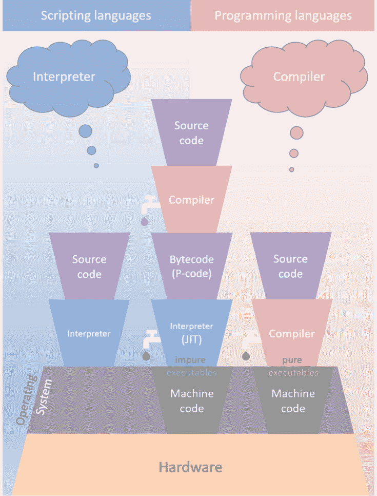
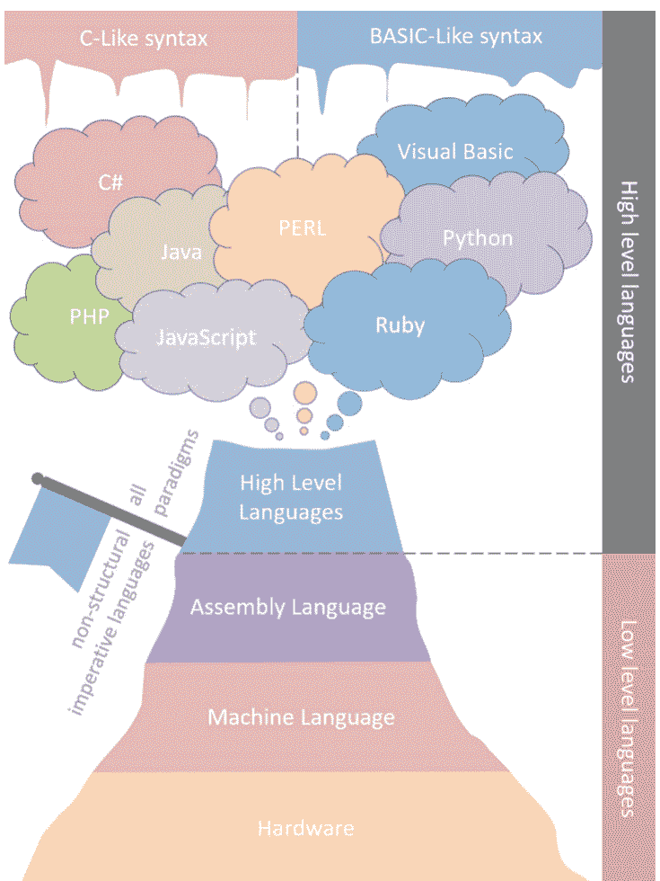
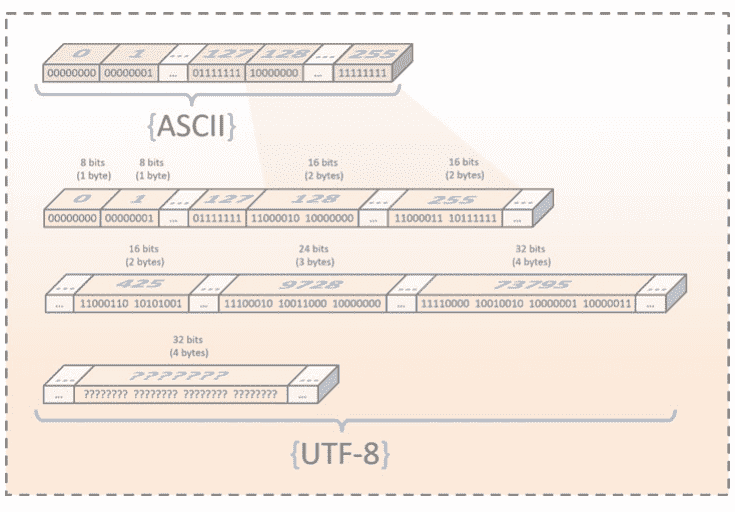
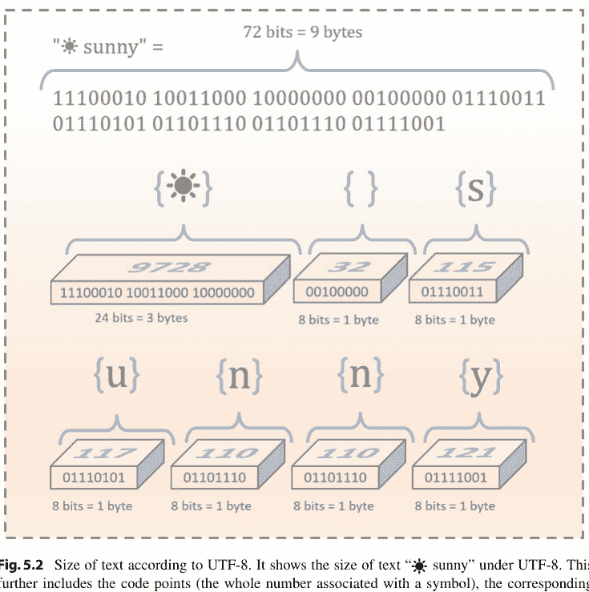
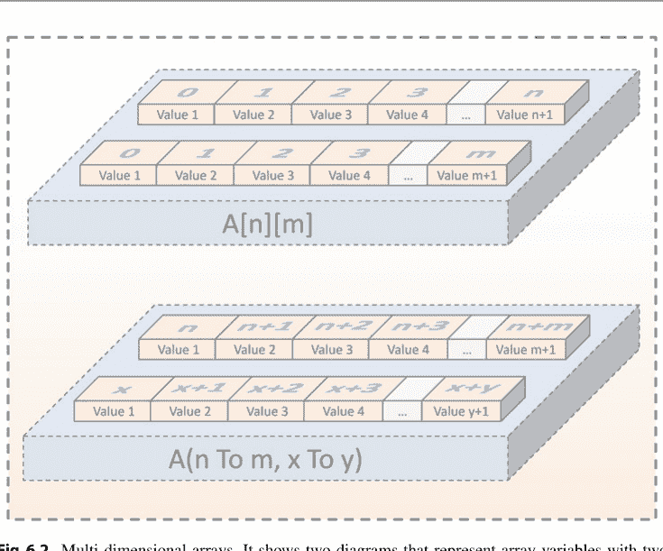

**计算机科学综合讲座**

**技术综合丛书**

Paul A. Gagniuc

# 编程语言导论：在多种编码环境中同步学习


Springer

# 计算机科学综合讲座

本系列丛书出版关于计算机科学通用主题的短篇专著，旨在吸引计算机科学各领域的高年级学生、研究人员和从业者。

Paul A. Gagniuc

# 编程语言导论：在多种编码环境中同步学习


Paul A. Gagniuc
外语工程系
外语工程学院
布加勒斯特理工大学
布加勒斯特，罗马尼亚

ISSN 1932-1228
ISSN 1932-1686 (电子版)
计算机科学综合讲座
ISBN 978-3-031-23276-3
ISBN 978-3-031-23277-0 (电子书)
https://doi.org/10.1007/978-3-031-23277-0

© 编者（如适用）和作者，根据与 Springer Nature Switzerland AG 签订的独家许可协议，2023年
本作品受版权保护。所有权利均由出版商独家许可，无论涉及材料的全部还是部分，特别是翻译权、转载权、插图重用权、朗诵权、广播权、以缩微胶片或任何其他物理方式复制的权利，以及信息存储和检索、电子改编、计算机软件或现在已知或今后开发的类似或不同方法的传输权。
本出版物中使用的一般性描述名称、注册名称、商标、服务标志等，即使没有具体声明，也并不意味着这些名称不受相关保护性法律法规的约束，因此可以自由使用。
出版商、作者和编辑有理由相信，本书中的建议和信息在出版之日是真实和准确的。无论是出版商还是作者或编辑，都不对本文所含材料或可能存在的任何错误或遗漏提供任何明示或暗示的保证。出版商对已出版地图中的管辖权主张和机构隶属关系保持中立。

本 Springer 印记由注册公司 Springer Nature Switzerland AG 出版
注册公司地址为：Gewerbestrasse 11, 6330 Cham, Switzerland

值此85岁生日之际，我将此作品献给我最好的朋友、科学伙伴和父亲般的角色，Constantin Ionescu-Tirgoviste。您是我所认识的最伟大的人！您集智慧、睿智、善良、耐心、正直、外交、道德和灵感于一身。


院士、教授、博士 Constantin Ionescu-Tirgoviste

# 前言

本著作是一本关于多种计算机语言的入门教科书。它描述了最著名和最流行的编程环境，例如：C#、C++、Java、JavaScript、PERL、PHP、Python、Ruby 和 Visual Basic (VB) 或 Visual Basic for Applications (VBA)。因此，这本独特指南的主要目标是提供在这九种计算机语言中体现的代码示例。读者可以轻松理解不同环境语法之间的联系和通用性，并熟练进行代码转换。这种学习体验对于高年级本科入门课程、研究人员、博士生以及负责实施数据分析的社会学家或工程师来说是理想的。本书使用图形插图来展示计算示例的技术细节，以帮助深入理解其内部工作原理。此外，本书包含作者经过课堂测试的原创材料，并考察了众多案例。读者还将受益于以下内容的加入：(1) 关于计算机语言过去、现在和未来的哲学与历史视角。(2) 总共448个额外文件可在线免费获取，其中44个文件是海报演示（即 PowerPoint 和 PDF 文件）。(3) 总共404个代码示例，体现了九种计算机语言，即：C#、C++、Java、JavaScript、PERL、PHP、Python、Ruby 和 VB。本书首先从历史的总体介绍开始，展示了从机械自动化到现代电子计算机的自然必然路径。在此历史介绍之后，详细探讨了哲学问题、实现、熵和生命。通常，年轻一代对计算机技术的进步感到真正的惊奇。导致技术发展的历史事件已被提炼成精髓。然而，任何故事的精髓都是在大量丢失详细信息的情况下形成的。精髓中的精髓会丢失更多信息。随着时间的推移，细节的缺失会导致集体失忆，这可能会阻碍我们理解技术演进的自然性。因此，新的构建总是建立在旧的构建之上，以适应技术进步的进化链，这归结为与生物进化相同的基本规则。在第一阶段，本书通过从远古时代开始并以现代示例结束，讨论了编程构建的自然路径。最终，各种自然驱动的构建也在今天驱动着我们的社会。在第二部分，重点放在技术方面，同时使用九种计算机语言进行镜像示例。同步学习多种计算机语言可以被视为科学技术领域的一项资产。因此，读者可以熟悉大多数已知的编程或脚本语言。此外，即使以入门方式了解多种计算机语言的软件实施基础知识，也有助于提高读者在工业、教育或研究中可能出现的新情况下的通用性和适应性。因此，本著作旨在带来对计算机语言之间异同点的更具体理解。

Ionel Bujorel Păvăloiu
外语工程系，外语工程学院
布加勒斯特理工大学
布加勒斯特，罗马尼亚

# 致谢

我要感谢我的朋友 Andrei Vasilateanu 进行精彩而精确的审阅。他在编程语言方面的背景使他成为本书理想的审阅者。

# 个人感言

我从可靠来源了解到，*42是所有事物、宇宙和一切的答案*。如今我开始相信这一点，因为我正迅速接近这个智慧的年龄。本书的大部分内容基于个人经验，这些经验来自技术快速变革的时期。在我的童年，我在90年代初的“FELIX计算机”上见过穿孔卡片的使用，我个人在计算机软件领域的经验始于“Z80”处理器。我知道在显示器的荧光绿色屏幕上花费几个小时后看到红色是什么感觉。我记得软件那独特的声音，即传入或传出的数据。我还记得如何将源代码保存到盒式磁带的磁带上以及从磁带加载。我知道从“Z80”微处理器和“BASIC”功能键切换到配备DOS操作系统和“QuickBASIC”的“286”计算机意味着什么。我是鼠标这一新事物以及需要定期清理灰尘的橡胶球完善的直接见证者。我经历了互联网所有阶段描绘的浪漫，并见证了自90年代中期以来编程语言的演变。当我转向“C”、“Turbo Pascal”或“Delphi”等语言时，我记得我对“486 CPU”计算机所感受到的神秘感和潜力。后来，在“586”上，我对“Visual Studio 6.0”软件包感到惊讶，尤其是对“Visual Basic 6.0”编程语言感到惊讶。直到今天，我仍然对这个软件包感到惊讶。我有幸见证了科技公司的起起落落和互联网的彻底变革，而且因为我是罗马尼亚人，我见证了地球上最高的互联网连接速度。我出生在正确的时间，经历了穿孔卡片、磁带、盒式磁带、软盘、调制解调器的歌曲/声音、硬盘、CD、DVD、蓝光光盘、USB驱动器和SSD驱动器。计算机塑造了我！这段旅程让我成为一个快乐的“年轻老人”。但是，四十年能包含这么多吗？似乎可以！嗯，那就是那个时代，最好的时代。

# 目录

# 1 历史笔记
1.1 引言
1.2 终极基础
1.2.1 接近我们的时代
1.2.2 普遍性的十字路口
1.3 论计算机的近代起源
1.3.1 自动机与灵魂的记忆
1.3.2 机械计算机
1.3.3 电子计算机
1.3.4 美国信息交换标准代码
1.3.5 一场趋同的阴谋
1.4 编程语言的历史
1.4.1 高级文明的诞生
1.4.2 计算机语言的黑暗时代
1.4.3 ActiveX 的非凡故事
1.4.4 执行任务时被友军火力误杀
1.4.5 浏览器：抵抗是徒劳的，你将被同化
1.5 结论

# 2 哲学与讨论
2.1 引言
2.2 软件的熵
2.2.1 代码的熵与人性
2.2.2 原始熵与细粒度熵
2.2.3 软件熵如何增加？
2.3 操作系统与熵
2.3.1 双胞胎
2.3.2 拒绝平衡
2.3.3 第三方软件
2.3.4 普遍性的例子
2.4 软件更新与老化
2.5 普遍性支持自我反思
2.5.1 大脑的进化与熵
2.6 从计算机语言到艺术与运动
2.6.1 艺术
2.6.2 运动
2.7 编译型与解释型
2.7.1 编程语言
2.7.2 脚本语言
2.7.3 源代码加密
2.7.4 可执行文件
2.7.5 可执行文件与脚本语言
2.8 不可见与不可言说
2.8.1 猎巫行动暴露弱点
2.8.2 荣休教授没有秘密
2.8.3 反可执行文件的战争
2.8.4 我们决定产出何种产品
2.9 心理战
2.9.1 以威胁进行清除
2.9.2 以广告进行清除
2.9.3 术语的处理
2.9.4 计算机语言之战
2.9.5 统一意味着死亡
2.9.6 现代不意味着更好
2.9.7 市场份额要求责任
2.10 人类角色与困境
2.10.1 身份危机
2.10.2 工作环境
2.10.3 属：人属
2.11 最糟糕的教授是那些臆断的教授
2.12 结论

# 3 范式与概念
3.1 引言
3.2 编程范式的故事
3.2.1 命令式编程
3.2.2 声明式编程
3.2.3 中间地带
3.2.4 基础
3.3 此处使用的计算机语言
3.3.1 C#
3.3.2 C++
3.3.3 Java
3.3.4 JavaScript
3.3.5 Perl
3.3.6 PHP
3.3.7 Python
3.3.8 Ruby
3.3.9 Visual Basic
3.4 分类可能具有误导性
3.4.1 一项批判
3.4.2 哪种计算机语言更好？
3.4.3 操作系统与应用程序构成
3.4.4 虚拟机：字节码的 CPU
3.4.5 编译型语言
3.4.6 解释型语言
3.4.7 即时编译
3.4.8 另一项批判
3.4.9 一个安全思想实验
3.4.10 关于安全权限
3.5 快速修复
3.6 结论

# 4 运算符与表达式
4.1 引言
4.2 运算符
4.2.1 算术运算符
4.2.2 赋值运算符
4.2.3 关系运算符
4.2.4 连接运算符
4.2.5 逻辑运算符
4.3 运算符符号
4.3.1 幂运算符：指数运算的奇特案例
4.3.2 取模运算符
4.3.3 一元运算符
4.3.4 字符串运算符
4.3.5 重复运算符
4.3.6 连接运算符
4.3.7 关系与逻辑运算符
4.4 赋值
4.4.1 简单赋值
4.4.2 聚合赋值
4.4.3 多重赋值

# 5 数据类型与语句

5.1 引言

5.2 数据

5.2.1 位与字节

5.2.2 符号频率的重要性

5.2.3 编码

5.2.4 一个假设的参考系统

5.2.5 异世界的字节

5.3 数据类型

5.3.1 字符串数据类型的奇特案例

5.3.2 实验性构造

5.4 语句

5.4.1 ASCII 符号

5.4.2 Unicode 转换格式

5.4.3 句子由构造组成

5.4.4 行为的根源

5.4.5 行的终结

5.4.6 语句与行

5.4.7 多语句与行续接

5.4.8 推荐与可接受的语句

5.5 源代码

5.5.1 缩进

5.5.2 注释

5.6 结论

# 6 经典与现代变量

6.1 引言

6.2 变量

6.2.1 字面量

6.2.2 变量命名

6.2.3 变量：显式与隐式

6.2.4 静态类型与动态类型语言

6.3 表达式求值

6.3.1 按语言细分的细节

6.4 常量

6.5 类与对象

6.5.1 关于设计模式

6.6 数组

6.6.1 创建空数组

6.6.2 创建带值的数组

6.6.3 添加元素

6.6.4 访问数组元素

6.6.5 更改数组元素的值

6.6.6 数组长度

6.6.7 嵌套数组

6.6.8 多维数组

6.7 结论

# 7 控制结构

7.1 引言

7.2 条件语句

7.3 重复循环

7.3.1 While 循环

7.3.2 For 循环

7.3.3 嵌套循环

7.3.4 用单个 For 循环进行多维遍历

7.4 结论

# 8 函数

8.1 引言

8.2 定义函数

8.2.1 简单参数

8.2.2 复杂参数

8.2.3 嵌套函数调用

8.2.4 链式函数调用

8.2.5 函数的相对定位

8.2.6 递归调用

8.2.7 全局变量与局部变量

8.2.8 函数：纯函数与非纯函数

8.2.9 函数与过程

8.2.10 内置函数

8.3 结论

# 9 实现与实验

9.1 引言

9.2 递归实验

9.2.1 将字符串重复 n 次

9.2.2 从 0 到 n 求和

9.2.3 从 0 到 n 的阶乘

9.2.4 简单序列生成器

9.2.5 斐波那契数列

9.2.6 数组中所有整数求和

9.3 区间扫描

9.4 频谱预测

9.5 结论

参考文献

## 图表列表

图 2.1 从熵到艺术再回归。单词“entropy”写在保加利亚金沙滩的沙滩上。沙中书写的单词表示低熵，而由黑海海浪代表的噪声迅速增加了熵。右上角的面板显示了一个靠近细胞壁的病毒衣壳，该细胞壁由 ASCII 艺术描绘。

图 2.2 计算机语言类型及其与术语的关系。它展示了脚本语言与编程语言之间的关系，并试图突出与解释器和编译器概念的关系。从左数第一列展示了脚本语言的经典案例，其中源代码由解释器应用程序直接解释。中间列展示了当今常见的情况，源代码被转换为字节码，然后字节码由解释器应用程序解释以兼容操作系统，最后编译成机器码。在右列，经典的编程语言是特定于操作系统的，其中源代码直接转换为机器码。请注意，字节码是 P-code 的一种形式，它代表伪代码。此外，JIT 是虚拟机根据操作系统进行的即时解释和编译。

## 汇编语言中的跳转指令

在大多数过去的高级计算机语言中，被称为“GOTO”的关键字能够将执行从当前行移动到任意行（例如，在一个100行的实现中，“GOTO 10”可以将执行移动到第10行，无论该语句出现在何处）。在汇编语言中，最著名的无条件跳转命令是Intel CPU的“JMP”助记符。还有其他类型的跳转，代表条件跳转，这些跳转以两到四个字符为一组，都以字母“J”开头，代表了多种助记符（例如，“JL”——小于则跳转，“JGE”——大于或等于则跳转，“JNLE”——不小于或等于则跳转，等等）。在其他CPU（如Z80）中，绝对跳转命令的助记符是“JP”。从固件到固件，这些符号或助记符可以由不同的字符集表示。然而，由于世界基于Intel CPU设计，汇编语言一词通常与Intel CPU相关联。请注意，助记符意为“memoria technica”或“技术记忆”，它指的是如何以最简短的方式书写信息，以便在不丢失信息的情况下被记住。简而言之，它是符号的优化。

## 图表列表

通过模糊性或多步骤优化，或两者兼有。因此，在这种情况下，“原生代码”将是Java高级源代码。同时，请注意，图中所示模块的抽象表示表明，通常所谓的解释器或编译器之间缺乏极端的对比。也就是说，编译器也会做一点解释工作，而解释器也会做一点编译工作………………………………………………… 53

图 4.1 按计算机语言划分的运算符优先级和结合性符号。在此表中，被相同边框包围的运算符具有相等的优先级，其结合性显示在符号旁边的列中。单元格的粉红色表示一组运算符，浅黄色表示每个级别的单个运算符。注意，缩写 OP 表示优先级顺序；A = 结合性；N = 方向顺序此处不适用——非结合性；L = 从左到右；R = 从右到左。一些较少使用和不常见的运算符符号未在此处显示。属于加法和减法的加号和减号可以直接在乘法和除法下方看到。出现在该位置上方或下方的其他加号或减号符号具有双重作用，例如 JavaScript 中的加号，该符号既用于连接也用于加法。其他有趣的观察结果是：在 VB 中，“\”表示整数除法；在 Ruby 中，“=~”表示匹配运算符；同样在 Ruby 中，“!~”表示不匹配。在 C# 中，“^”表示按位异或，而在 VB 中它表示乘方………………… 75

图 4.2 运算符优先级和结合性示例。顶部两个面板分别展示了运算符优先级或运算符结合性的一个示例。图底部给出了一个混合示例，展示了运算符优先级和运算符结合性之间的关系。在右下角有一个简短列表，仅包含少数运算符的符号。在此列表中，运算符的垂直顺序表示运算符优先级，位于同一级别的符号具有相等的优先级。请注意，在所有面板中，都存在一个基于优先级和结合性的、明确且编号的计算顺序………………………………………………… 76

图 5.1 ASCII 和 UTF-8。它展示了 UTF-8 的向后兼容性。在垂直轴上，图的前半部分显示了 ASCII 的结构，它使用 8 位序列（1 字节）对符号进行编码。图的后半部分展示了 UTF-8 的示意图，其无与伦比。对于从 0 到 127 的编码位置，UTF-8 与 ASCII 的关系得以保留。然而，从位置 128 到 255，ASCII 和 UTF-8 使用不同的编码。也就是说，ASCII 对此范围使用 1 字节，而 UTF-8 使用 2 字节。在 ASCII 范围之外，UTF-8 使用 2 字节到 4 字节来编码符号集中的新成员。UTF-8 可能止步于 32 位（4 字节）表示，因为人类历史上所有有意义的符号总数不超过 43 亿，而 4 字节可以编码

图 5.2 根据 UTF-8 的文本大小。它显示了文本“☀ sunny”在 UTF-8 下的大小。这进一步包括了码点（与符号关联的整数）、相应的位序列以及与这些抽象表示关联的实际符号。请注意，方框表示物理内存的抽象区域。组成单词“sunny”的空格字符和字母总共占用 6 字节，然而，太阳符号是新的，它被编码为 3 字节而不是 1 字节。这一观察实际上非常重要。通常，最必要的符号是计算机发展过程中最早引入为字符的那些符号。因此，字符的时间优先级与其在数据中出现的频率成正比。因此，为最频繁的符号保留初始编码决定了文件大小的保持。UTF-8 字符可以用 1 字节表示旧的遗留符号，最多用 4 字节表示较新的符号。与其他字符编码相比，这是 UTF-8 对技术未来至关重要的主要原因之一

图 5.3 以“外星字节”衡量的外星文本。图的顶部显示了五个假设字符，排列成 5 × 6 位的二维阵列。在这些表示下方是可以与这些对象字符关联的 3 位代码。在 3 位代码正下方，字符使用颜色而不是 0 和 1 来显示。抽象的方框表示显示了与符号关联的 3 位代码和字符代码。在图的底部，显示了一个由 20 个字符组成的“外星”短语。该短语的含义并不重要。这里比较了 20 个字符的大小（200 字节）和编码的大小（20 字节）。因此，“外星”示例表明了字符编码在不丢失信息的情况下减小大小的作用。请注意，在此示例中，一个“外星”字节代表一个 3 位序列

## 图表列表

图 5.4 数据类型表示。它描述了计算机语言用于表示数据的一般构造。此处显示的数据类型构造通常分为两类：原始数据类型和非原始数据类型。原始数据类型又分为另外两类，即数值型和非数值型数据。非数值型数据包含字符类型和布尔类型，而数值型类别包含了构造的权重。也就是说，对于整数，有字节类型、整数类型、长整型和短整型。在浮点类别的情况下，有双精度类型和单精度类型。在非原始类别中，列出了数组类型、字符串类型和对象类型。对象类型还意味着创建其他新数据类型的可能性。注意：如今有许多计算机语言不再使用真正意义上的原始类型，而是使用模拟原始类型的对象，例如纯面向对象语言，如 Ruby ........................... 90

图 5.5 以 Python 为例展示了多行注释的示例，它们显示了前表中的一维模式与源代码中的二维表示之间的联系。请注意，源代码是上下文相关的，并且可以通过复制/粘贴使用 ..................................................... 104

图 6.1 一维数组变量。它展示了数组变量的两种不同表示方法。上面的第一种方法显示了下界如何从零开始（0 ... n）。请注意，数组中的元素总数为 n + 1。这是许多现代计算机语言的情况。第二种方法显示了 VB 的情况，其中数组变量的索引可以从任何值开始，并以任何大于第一个值的值结束（n ... n + m; m > n）。请注意，数组中的元素总数为 m + 1 ...... 137

图 6.2 多维数组。它显示了两个表示二维数组变量的图表。第一个图表显示了两个维度的下界都从零开始，第二个（底部）图表表示每个维度具有任意下界位置的数组变量。通过在图中提供另一行，这两种表示可以扩展到三维。对于任何维度都是如此，其中每个维度都可以通过在图中线性排列的方框来表示 ........................... 146

## 表格列表

表 4.1 关键算术运算符。这些运算符可以安全地称为原始运算符，因为它们是每个操作的基础（尤其是加法和减法）。此表显示了本工作中使用的每种计算机语言的加法、减法、乘法、除法和乘方的符号 ........................ 64

表 4.2 连接、重复和非关键算术运算符。其中一些运算符可以被视为高级运算符，因为它们是与内置函数的边界构造（特别是这些运算符是：取模、连接、重复）。递增和递减运算符是上表延续的原始运算符列表的一部分。简要显示了本工作中使用的每种计算机语言的取模、连接、重复、递增、递减的符号 ........................ 65

表 4.3 关系运算符。关系运算符也称为比较运算符，用于比较两个操作数的值。简要显示了本工作中使用的每种计算机语言的等于、不等于、小于、大于、小于或等于、大于或等于的符号。表格单元格中的方括号表示操作数的可选表示 ... 69

表 4.4 逻辑运算符。关系操作只能通过使用逻辑运算符链接在一起。简要显示了本工作中使用的每种计算机语言的 *逻辑非*、*逻辑与*、*逻辑或* 的符号。表格单元格中的方括号表示操作数的可选表示 ........................ 70

表 5.1 从位到编码可能性和字节。它显示了 1 到 64 位之间位序列的编码可能性数量。对于此处考虑的每个位序列，从八位字节的角度显示了字节数。也就是说，表格的最后一列显示

## 附加算法列表

附加算法 3.1 展示了本作品中使用的所有计算机语言的“Hello world”示例。这旨在作为一个积极的首次介绍。请注意，源代码在上下文中有效，并且可以通过复制/粘贴使用 ......... 57

附加算法 4.1 展示了多种计算机语言的赋值示例。一个重要的观察是，VB 指的是 Visual Basic 6.0 (VB6) 和 VBA 语法，即 Visual Basic 的最后一个版本。因此，VB6 缺乏聚合赋值，因为这种风格是计算机语言中相对较新的补充。VB6 可以显式声明特定数据类型的多个变量（Dim a, b, c As Integer），但是，它缺乏多重赋值的可能性。请注意，源代码不在上下文中，旨在用于方法的解释 ........................ 71

附加算法 5.1 上述列表中每种计算机语言的第一行，展示了基于 ASCII 码提取 ASCII 字符。第二行展示了基于给定 ASCII 字符提取 ASCII 码。上述任何语句的输出都是“Code 65 is the: ‘A’ letter”和“Letter A has the code: ‘65’”。请注意，源代码在上下文中有效，并且可以通过复制/粘贴使用 ........................................ 95

附加算法 5.2 展示了 JavaScript 中的基本良好实践，例如：推荐的做法、可接受的做法和错误的做法。请注意，源代码不在上下文中，旨在用于方法的解释 ........................ 98

附加算法 5.3 演示了在一行中编写多条语句，以及长语句的续行。此处展示的语句非常简短，但练习的要点仍然有效。请注意，源代码不在上下文中，旨在用于方法的解释 …………………………………………………… 99

附加算法 6.1 展示了一些字面量的示例。这些示例引入了一系列已知的数据类型，即一个整数字面量（42）、一个浮点字面量（3.1415）和两个字符串字面量（“a”和“this text”）。因此，任何写入的数据都是字面量。请注意，文本不在上下文中，旨在用于方法的解释 …………………………………………………… 106

附加算法 6.2 展示了如何将不同数据类型的值（字面量）赋给变量。请注意，C#、C++、Java 和 VB 显式使用数据类型，即变量的类型在赋值前声明。另一方面，请注意所有其他环境使用隐式数据类型，即值能够显式声明变量类型。根据趋势，未来显式赋值可能会减少。请注意，源代码在上下文中有效，并且可以通过复制/粘贴使用 …………………………………………………… 107

附加算法 6.3 展示了此处使用的所有计算机语言中变量的显式和隐式声明，以及表达式及其求值的示例。它主要展示了运算符和数据类型之间的联系。请注意，源代码在上下文中有效，并且可以通过复制/粘贴使用 …………………………………………………… 112

附加算法 6.4 PERL 中有趣求值的示例，展示了使用“+”运算符而不是“.”运算符进行连接会导致字符串值从结果中消除，且没有错误出现。请注意，源代码不在上下文中，旨在用于方法的解释 ……… 117

附加算法 6.5 展示了如何在不同的计算机语言中声明常量。此外，它展示了常量声明（第二列）和变量声明（第三列）之间的区别。一些计算机语言使用特殊关键字和数据类型声明，而其他计算机语言则不使用。请注意，在某些没有定义常量的特殊关键字的计算机语言中，常量和变量的区别是通过约定来实现的；即用大写字母书写的变量表示常量，用小写字母书写的变量表示内容可以随意更改的简单变量。请注意，源代码不在上下文中，旨在用于方法的解释 ......... 119

附加算法 6.6 展示了声明空数组的两种方法。出于声明目的，计算机语言使用方括号或圆括号来表示变量代表一组“内部子变量”。第二列是数组方括号类型的声明。第三列是数组构造函数类型的声明。大多数使用数组构造函数语句的计算机语言通常是面向对象的。但并非全部；例如 Python 没有这种特殊关键字，更倾向于使用数组方括号表示法。那些显式写出数组数据类型的声明，显然可以接受任何数据类型。此处以 C++、C#、Java 或 VB6 等计算机语言的字符串数据类型为例。请注意，源代码不在上下文中，旨在用于方法的解释 ......... 122

附加算法 6.7 展示了如何使用字面量创建多值一维数组变量。在此示例中，数组变量 A 仅用于存储字符串字面量，数组变量 B 用于存储整数字面量。在 Javascript、PHP、PERL、Ruby 或 Python 等语言中，数组变量可以存储多种类型的字面量，包括对象。在 C++、C#、Java 或 VB6 等语言中，数组变量只能存储一种类型的字面量。请注意，源代码在上下文中有效，并且可以通过复制/粘贴使用 ........................................ 124

当位序列小于或大于 8 的倍数时，字节不再由整数值表示。可以看出，32 位序列允许接近 43 亿种编码可能性（$2^{32} = 4.294967296e + 9$）。同样，64 位序列覆盖了难以想象的范围，因为世界上没有足够的意义来填充编码可能性的空间（$2^{64} = 1.84467440737e + 19$） ........................................ 82

表 5.2 Java 中原始数据类型的示例。原始数据类型指定了变量将存储的信息的大小和类型。有八种对编程至关重要的原始数据类型。请注意，1 字节是 8 位。此外，short 是继承的整数。根据计算机语言的不同，整数数据类型可能是旧的（-32,768 到 32,767）或新的（-2,147,483,648 到 2,147,483,647）。请注意，从一种计算机语言到另一种，与这些数据类型相关的值范围差异很大。由于硬件能力随时间的提高，数据类型构造的值范围自然也增加了 ........................................ 86

表 5.3 原始数据类型和复合数据类型列表。该表列出了本作品中使用的每种计算机语言的原始数据类型和复合数据类型。请注意，所有计算机语言都以某种方式拥有数据类型，这些类型由于过去的继承而必然适用于现代编程，例如数组、字符串、整数、布尔值等。没有这些，范式会自动改变 ........................................ 91

表 5.4 换行符、回车符和 ASCII 转换。此处展示了本作品中使用的所有计算机语言的一些非打印 ASCII 字符的表示。请注意，“LF”代表换行符，“CR”代表回车符，“CR & LF”将这两个 ASCII 字符作为一个单元表示。最后两列展示了基于 ASCII 码获取字符的方法，或者基于给定字符获取 ASCII 码的方法。第五列中的语句返回一个字符，而最后一列中的语句返回一个整数。字母“a”代表 0 到 255 之间的整数，而“b”代表一个字符 ..... 95

表 5.5 多条语句和续行。在某些复杂性较高的情况下，将语句延续到多行或将多条语句放在一行中至关重要。第二列展示了通过分隔符（即“:”符号，或更常见的“;”符号）将标记为 *a*、*b* 和 *c* 的代码行依次放置的模式。第三列展示了一种模式，该模式指示了将非常长的语句分解为多行的规则。在此情况下，示例是针对赋值的，即放置在等号运算符右侧的表达式。字母 *a*、*b* 和 *c* 代表不同数据类型的值。请注意，仅在此示例中，“■”字符表示按下 *Enter* 键的操作 ………… 97

表 5.6 注释和符号。为了举例说明，展示了每种计算机语言中用于开始注释行的 ASCII 字符。也许由于历史原因，一些字符在语言之间是共享的。在第三列中，一系列一维模型展示了每种计算机语言编写多行注释的方法。在这些模式中，字母 *a*、*b* 和 *c* 可以代表任何文本行。仅在此示例中，“■”字符表示按下 *Enter* 键的操作 …………………………… 103

## 附加算法 6.8

它展示了声明数组变量 A 的语句，以及随后将字面值插入该数组变量元素的语句。需要注意的是，某些计算机语言（如 Javascript、PHP、PERL 或 Ruby）允许声明一个空的数组变量，之后可以将值插入新声明的元素中。另一方面，在其他计算机语言（如 C++、C#、Java、VB6 和 Python）中，必须在赋值之前声明数组变量中的元素数量。请注意，源代码在上下文中有效，并且可以通过复制/粘贴使用 ……………………………… 127

## 附加算法 6.9

它展示了如何访问存储在数组变量元素中的值。声明了一个数组字面量，其中存储了三个字符串值（三个独立的字符，即 “a”、 “b”、 “c”）。然后，声明了两个变量 x 和 y，它们从数组变量 A 的元素中取值。接着，一旦赋值给 x 和 y 变量，字符串值就会在输出中显示以供可视化。可以观察到，执行后得到的结果是 “bc”。请注意，源代码在上下文中有效，并且可以通过复制/粘贴使用 ……………………………… 129

## 附加算法 6.10

它展示了如何更改现有数组元素中的值。声明了一个数组变量 A。将字符串字面量赋值给 A 的每个元素。将数组变量 A 第一个元素的值赋值给变量 x。然后，将一个字符串字面量值（即 “d”）赋值给变量数组 A 的第二个元素，从而擦除该元素中的先前值（即 “a”）。接下来，将 A 第三个元素的值赋值给 A 的第二个元素，从而删除第二个元素中的初始值（即 “b”）。存储在变量 x 中的值赋值给数组 A 的第三个元素。最后，每个元素的值在输出中显示以供检查。这里，初始序列 “abc” 被转换为序列 “dcb”。请注意，源代码在上下文中有效，并且可以通过复制/粘贴使用 ………… 132

## 附加算法 6.11

它展示了如何获取数组中的元素总数。首先声明一个数组字面量 *A*，包含三个元素，每个元素都有一个字符串字面量（一个字符）。接下来，声明一个变量 *x* 并为其赋值。该值表示数组 *A* 中的元素数量，并由内置函数或数组对象的方法提供，具体取决于所使用的计算机语言。最后，变量 *x* 的内容在输出中显示以供检查。需要注意的一点是，在 VB 中，ubound 内部函数返回数组中的最后一个索引，而不是其他示例中预期的元素总数。请注意，源代码在上下文中有效，并且可以通过复制/粘贴使用 ………… 135

## 附加算法 6.12

它展示了 Javascript、Ruby 和 Python 中的嵌套数组。这里声明了三个数组变量 *A*、*B* 和 *C*，每个变量都有三个字面值。为了表示嵌套的概念，又声明了另外三个数组变量，即 *D*、*E* 和 *F*，每个变量有三个元素，分别保存数组 *A*、*B* 或 *C* 中的一个。为了提供嵌套的另一层，最后声明了一个三元素数组变量（即 *G*），其中每个元素取最近提到的数组（即 *D*、*E* 或 *F*）中的一个。请注意，源代码在上下文中有效，并且可以通过复制/粘贴使用 ………… 138

## 附加算法 6.13

它展示了多维数组变量的声明方式。可以观察到两组计算机语言之间的一个有趣差异。一组涉及 Javascript、PHP、PERL、Ruby 或 Python，另一组涉及经典计算机语言，即 C++、C#、Java 或 VB6。第一组（即 Javascript、PHP、PERL、Ruby 或 Python）在多个维度上基本使用相同类型的声明。Javascript 示例展示了如何声明二维和三维数组变量，其中该模式可以遵循用于任何更高维度（即 4D、5D、6D 等）。在 PHP、PERL、Ruby 或 Python 中，示例仅针对二维重复，并假设对于超过两个维度的声明可以像在 Javascript 中一样进行。第二组差异更大，其中 Java、C# 和 VB 在语句的编写方式上存在根本差异。显然，Java 和 C# 具有共同的语法元素，但在数组声明方式上略有不同。在 VB 中，首先声明维度数和每个维度的元素数量。然后，这些各自维度中的元素才能通过赋值接收值。与其他计算机语言相比，VB 差异如此之大，以至于数组变量具有下界（通过 *LBound* 函数读取）和上界（通过 *UBound* 函数读取），这一特性可以在原型设计（尤其是在科学领域）中开辟道路。在 VB 示例中，每个 *Debug.Print* 语句行对应输出中的一行。请注意，源代码在上下文中有效，并且可以通过复制/粘贴使用

## 附加算法 7.1

演示了条件语句的实现。声明了三个变量 *a*、*b* 和 *c*，并赋予不同的值。一个条件触发一条语句，仅当变量 *a* 的值小于变量 *b* 的值时，才增加变量 *c* 的值，否则对 *c* 的值进行递减。请注意，源代码在上下文中有效，并且可以通过复制/粘贴使用

## 附加算法 7.2

演示了在数组变量上实现条件语句。声明了数组变量（A）的三个元素并填充了值。一个条件触发一条语句，仅当第一个元素（即 “A[0]”）的值小于第二个元素（即 “A[1]”）的值时，才增加数组最后一个元素（即 “A[2]”）的值，否则对数组最后一个元素的值进行递减。请注意，源代码在上下文中有效，并且可以通过复制/粘贴使用 ......... 151

## 附加算法 7.3

这里演示了正增量 while 循环结构。声明了一个变量 *i* 并设置为零。一个 while 循环结构将变量 *i* 从其初始值增加到其上限（数字五）。在每次迭代中，变量 *i* 在输出中打印。结果是从 0 到 4 的值枚举。请注意，源代码在上下文中有效，并且可以通过复制/粘贴使用 ........................................ 155

## 附加算法 7.4

它演示了一维数组的遍历。声明了一个包含字符串字面量的数组变量。实现还使用了另外两个变量。一个变量 *t* 存储字符串值，初始设置为空。另一个变量（即 *i*）初始化为零，是 while 循环的计数器。while 循环使用计数器 *i* 作为索引来遍历数组 *A* 的元素。在每次迭代中，一个元素的值与其他字符串字符一起添加到变量 *t* 中。一旦到达 while 循环周期的末尾，变量 *t* 中收集的值就在输出中打印以供检查。请注意，源代码在上下文中有效，并且可以通过复制/粘贴使用 ........................................ 160

## 附加算法 7.5

演示了用于递增一些简单变量的 for 循环周期。具体来说，声明并初始化了两个变量 *a* 和 *b*。变量 *a* 初始化为整数五，变量 *b* 设置为零。然后声明 for 循环从 *i* 的初始值开始，到变量 *a* 指示的值结束。在每次递增时，变量 *i* 中的值被添加到存储在变量 *b* 中的数值。在循环结束时，存储在变量 *b* 中的最终值被打印到输出以供检查。请注意，源代码在上下文中有效，并且可以通过复制/粘贴使用 ........................................ 166

## 附加算法 7.6

它演示了如何使用 for 循环遍历一维数组。一个数组变量使用字符串字面量进行声明。该实现还使用了另外两个变量。一个变量 *t* 用于存储字符串值，初始设置为空。另一个变量（即 *i*）初始化为零，作为 for 循环的计数器。for 循环使用计数器 *i* 作为索引来遍历数组 A 的元素。在每次迭代中，一个元素的值与其他字符串字符一起添加到变量 *t* 的内容中。一旦 for 循环周期结束，变量 *t* 中收集的值将被打印到输出中以供检查。请注意，源代码是完整的，可以直接复制粘贴使用 …………………………………………………… 171

## 附加算法 7.7

它演示了嵌套 for 循环的使用。它展示了如何通过嵌套 for 循环结构遍历二维数组。一个二维数组变量 (A) 使用混合数据类型进行声明，即字符串字面量和数字字面量。一个字符串变量 *t* 初始设置为空。另外两个变量（即 *i* 和 *j*）初始化为零，作为嵌套 for 循环的主计数器。每个 for 循环的上限由两个维度确定，即矩阵 A 的行数和列数。两个 for 循环使用计数器 *i* 和 *j* 作为索引来遍历数组 A 的元素。在每次迭代中，一个元素的值被添加到变量 *t* 的内容中。一旦嵌套 for 循环结束，变量 *t* 中收集的值将被打印到输出中以供检查。最终结果是以线性方式在输出中枚举每个值。请注意，源代码是完整的，可以直接复制粘贴使用 ……… 174

# 附加算法列表

## 附加算法 7.8

它演示了如何使用单个 for 循环处理二维数组。它展示了如何通过一个 for 循环结构遍历二维数组。一个二维数组变量 (A) 与之前一样使用混合数据类型进行声明，即字符串字面量和数字字面量。一个字符串变量 t 初始设置为空。一个变量 v 设置为零，它代表 for 循环的主计数器。另外两个变量（即 i 和 j）初始化为零，作为元素识别的主坐标。数组 A 的每个维度存储在变量 n 和 m 中，即 n 中的行数和 m 中的列数。for 循环的上限基于两个已知维度 n 和 m 计算得出。因此，m 乘以 n 确定了 for 循环的上限。这里，for 循环的计数器 v 的值用于计算 i 和 j 的值，这些值用作遍历数组变量 A 的索引。变量 j 的值计算为 v % m，该表达式的结果表示余数（例如 5 mod 3 是 2）。此实现的关键在于一个条件：每当 j（列）等于零时，变量 i（行）就递增。因此，通过这种方式，该方法提供了嵌套 for 循环所提供的 i 和 j 值。在每次迭代中，一个元素的值被添加到变量 t 的内容中。一旦 for 循环结束，变量 t 中收集的值将被打印到输出中以供检查。最终结果是以线性方式在输出中枚举每个值。请注意，源代码是完整的，可以直接复制粘贴使用

## 附加算法 7.9

它演示了如何使用单个 for 循环处理三维数组，并扩展到多维数组。请注意，此处所示的示例仅为 Javascript 编写，以节省篇幅。您可以如前所述将其移植到任何其他语言。使用单个 for 循环结构遍历 3D 数组基于前面的示例。一个 3D 数组变量 (A) 使用混合数据类型进行声明，即字符串字面量和数字字面量。3D 数组由五个矩阵表示，其中列表示一个维度，行表示第二个维度，矩阵的数量表示第三个维度。因此，该数组可以理解为一个立方体结构。一个字符串变量 t 初始设置为空。一个变量 v 设置为零，它代表 for 循环的主计数器。另外三个变量（即 i、j 和 d）初始化为零，作为数组元素识别的主坐标。数组 A 的每个维度存储在变量 s、m 和 n 中，即 s 中的矩阵数量、m 中的行数和 n 中的列数。for 循环的上限计算为 s × m × n。这里，与之前一样，使用 for 循环的计数器 v 的值来计算 i、j 和 d 的值，这些值用作遍历数组变量 A 的索引。变量 j 的值计算为 v % m。一个条件在每次 j（列）等于零时递增变量 i（行）。因此，i 和 j 的值都被计算出来。然而，变量 d（矩阵编号）的值计算为 v % (m × n)，这在每次遍历完一个矩阵时都提供一个零值。因此，一个条件在每次 k 的值等于零时递增变量 d 并重置变量 i。在每次迭代中，一个元素 (d, i, j) 的值被添加到变量 t 的内容中。一旦 for 循环结束，变量 t 中收集的字符串值将被打印到输出中以供检查。最终结果是以线性方式在输出中枚举每个值。请注意，源代码是完整的，可以直接复制粘贴使用 . . . . . . . 185

# 附加算法列表

## 附加算法 8.1

它展示了如何使用接受简单参数的函数。一个整数字面量被赋值给变量 *a*。然后变量 *a* 作为参数传递给一个名为 "compute" 的函数。函数 "compute" 接受该参数并在数学表达式中使用其值。函数 "compute" 的返回值随后被赋值给变量 *b*，然后打印到输出中以供检查。请注意，源代码是完整的，可以直接复制粘贴使用 … 189

## 附加算法 8.2

它展示了如何使用接受复杂参数的函数。这些复杂参数可以是字符串、数组变量或复杂对象。在这个特定案例中，一个字符串和一个数组变量被用作名为 "compute" 的函数的参数。一个包含五个元素的数组变量使用字符串字面量进行声明。然后声明一个字符串变量 *t* 并设置为空。这两个变量被传递给 "compute" 函数。在 "compute" 函数内部，一个 for 循环遍历数组 *a* 的每个元素，并将其值添加到累加器变量 *t* 中。在 for 循环结束时，"compute" 函数返回 *t* 的值，该值被赋值给一个字符串变量 *b*，然后进一步打印到输出中以供检查。请注意，源代码是完整的，可以直接复制粘贴使用 … 193

## 附加算法 8.3

它展示了嵌套函数调用的原理，其中最内层函数的返回值成为最直接外层函数调用的参数，依此类推。一个整数字面量被赋值给变量 *a*。然后，一组嵌套函数调用的最终返回值被赋值给变量 *b*，变量 *b* 又被打印到输出中以供检查。最初，存储在变量 *b* 中的值是一个负值（即 −756029）。因此，为了演示目的，在变量 *b* 前插入了减号以改变存储的整数值的符号（即 *b* = −*b*）。请注意，源代码是完整的，可以直接复制粘贴使用 … 197

## 附加算法 8.4

它展示了函数如何在调用链中使用其他函数。这里做出的另一个重要观察与函数相对于主程序的位置有关。在某些计算机语言中，函数必须在主程序之前声明，而在其他计算机语言中，函数的顺序或函数相对于主程序的位置并不重要。这一事实表明了编译器如何处理源代码。也就是说，在某些计算机语言中，无论函数是否加载，执行都是立即进行的，而在其他计算机语言中，执行在所有代码加载后才开始。上面的示例展示了两个变量如何成为函数 c1 的参数，这些参数将它们的值传递给链中的其他函数，最终到达函数 c5。参数的这次旅程展示了不同类型的加法，直到达到最后一级，例如值的加法，无论是字面量、其他函数的返回值还是新变量的值。函数 c5 使用 for 循环遍历数组变量的元素，以便将值累加到累加器变量 t 中。一旦 for 循环完成迭代，变量 t 的值被返回给函数 c4，函数 c4 将一些其他值添加到该响应中。反过来，函数 c4 将值返回给函数 c3，直到它到达函数 c1 的路径，函数 c1 将最终的响应值赋值给变量 b。变量 b 又被打印到输出中以供检查。请注意，在 C++ 的情况下，变量 t 保存数组 a 的元素总数，直到调用链到达函数 c5。在那里，变量 t 的内容被赋值给一个新变量（即 l），变量 t 被设置为零以承担累加器变量的角色来计算总和。应该注意的是，可以使用指针，即参数 "int a[]" 可以写成指针，即 "*a"，这将提供相同的结果，因为元素的数量

## 附加算法 8.5
它展示了如何用递归函数调用替代 for 循环语句。因此，一个名为“for-loop”的函数能够接收三个参数：一个参数用于 *a*，它是自调用次数的计数器；另一个参数用于 *b*，它表示递归调用（自调用）的上限；最后一个参数用于 *r*，它在每次迭代/递归中累加一个整数字面量（即 5）。在函数内部，一个条件检查 *a* 的值是否大于或等于限制值，即 *b*。如果 *a* 小于 *b*，则递归继续；而如果 *a* 大于或等于 *b*，则将 *r* 的值返回给原始调用者。一旦最终的返回值到达调用者，它会立即被赋值给主程序中的变量 *a*，然后 *a* 变量的内容被打印到输出中以供检查。请注意，源代码在上下文中有效，并且可以通过复制/粘贴使用 …………………………………………………… 210

## 附加算法 8.6
此示例展示了常量和全局变量的含义。一个常量（即 *a*）和一个全局变量（即 *b*）被声明，可以在主例程中（例如在 Javascript、PHP、PERL、Ruby 和 Python 中），也可以在主例程/程序之外（例如在 C++、C#、Java 和 VB/VBA 中）。在主例程中，调用一个名为“compute”的函数，为名为 *b* 的变量提供返回值。一旦执行线程移动到“compute”函数，全局变量 *b* 的值在函数内部可见，并被赋值给一个局部变量 *x*。变量 *x* 的内容随后用于一个数学表达式中，结果被返回给调用者。一旦返回值被赋值给变量 *b*，变量和常量的内容随后被打印到输出中以供检查。在 C++ 计算机语言中，可以看到一个注释在两个函数之间声明了常量和全局变量。为了测试，激活这些声明会导致错误，因为在 C++ 或 VB 中，常量和全局变量写在程序的开头，因为编译器需要在执行前了解上下文。在 PHP 和 Python 中，全局变量只有在函数内部有特殊声明（即 Global $name_of_variable;）时才可见。另外请注意，在 Ruby 中，全局变量使用变量名前的美元符号表示（例如 $b）。请注意，源代码在上下文中有效，并且可以通过复制/粘贴使用 ………………………………………… 215

## 附加算法 8.7
它展示了纯函数和非纯函数的含义。一个名为“pure”的函数接收一个参数 x，并返回一个数学表达式求值的结果。这个函数是纯的，因为它不改变函数外部的任何东西。另一方面，一个名为“impure”的函数接收相同的参数 x，该参数用于与“pure”函数相同的数学表达式中。然而，“impure”函数修改了全局变量 a 的值。这种在函数外部进行的修改使得该函数成为非纯的。请注意，两个函数在初始调用中返回相同的结果。然而，在第三次调用中，返回值不同，因为被“impure”函数修改的全局变量 a 实际上是后续调用的参数。请注意，源代码在上下文中有效，并且可以通过复制/粘贴使用 ……… 219

## 附加算法 8.8
它展示了函数和过程之间的区别。一个名为 f 的纯函数接收一个参数，并根据一个数学表达式返回一个值。一个名为“p”的过程不接收参数，也不返回值，用于将减法的结果赋值给一个局部变量 x（即 x = a – 11）。接下来，一个数学表达式的结果被赋值给一个全局变量 b，之后执行线程自动返回给调用者。请注意，在 PHP 和 Python 中，全局变量只有在函数内部有特殊声明（即 Global $name_of_variable;）时才可见。另外，请注意 VB 有一个用于过程的特殊关键字。函数和过程之间的区别分别通过使用关键字“function”和关键字“Sub”来实现。此外，在 VB 中，调用 sub 时不使用圆括号“p()”，而是简单地陈述过程的名称，如“p”。在 VB 中，单字母的过程名称可能会引起混淆，建议使用超过两个字符的过程名称。请注意，源代码在上下文中有效，并且可以通过复制/粘贴使用 ………… 224

## 附加算法 8.9
这展示了使用内置函数的一个例子。在这个特定案例中，它展示了如何检查一个字符串是否存在于另一个字符串之上。一个字符串字面量被赋值给变量“a”，一个表示目标的字符串字面量被赋值给变量“q”。在 *a* 中找到的字符数被赋值给变量 *b*。接下来，在一个函数链中，所有在 *a* 字符串中找到的 *q* 都被替换为空。如果 *q* 字符串存在于变量 *a* 中，那么结果是一个比原始字符串更短的字符串。接下来在这个函数链中，结果被直接传递给 length 函数，该函数提供处理后字符串中的总字符数。这个最终结果随后被赋值给变量 *c*。在一个条件语句中，*c* 的值与 *a* 的值进行比较。如果两个值不同，则意味着 *q* 存在于原始字符串 *a* 中。请注意，替换是通过两种方法进行的：(1) 使用 *q* 作为分隔符的 *split* 函数提供一个数组，该数组随后被转换回一个普通字符串，其中没有任何 *q* 的实例（这可以在 Javascript 和 VB 中看到）。(2) replace 函数能够将 *a* 中找到的所有 *q* 实例替换为空字符串（例如，它从 *a* 中删除 *q*）。请注意，源代码在上下文中有效，并且可以通过复制/粘贴使用 ……… 229

## 附加算法 9.1
它展示了关于递归函数的不同实验。总共展示了六个示例，其中：(1) 一个递归函数将一个（或一组）字符重复 n 次，并返回一个长度为 n 的字符串。(2) 一个递归函数对从零到 n 的整数求和。(3) 一个递归函数计算整数 n 的阶乘。(4) 一个函数根据各种规则生成一个数字序列。(5) 一个递归函数提供斐波那契数列。(6) 一个递归函数对存储在数组变量元素中的所有整数求和。请注意，源代码在上下文中有效，并且可以通过复制/粘贴使用 .................... 235

## 附加算法 9.2
它展示了如何计算一个整数范围的分布。此示例使用了贯穿各章的数学表达式。该数学表达式接受一个输入值，并如预期那样提供一个输出值。在这个特定示例中，一个实现接受一个整数范围，并返回使用该数学表达式计算出的相应值范围。对于每种计算机语言，有两个示例。一个示例使用字符串变量存储结果，另一个示例使用数组变量存储结果。每种计算机语言的两个示例展示了代码的灵活性，指出了一个问题可能有多种解决方案的可能性。请注意，源代码在上下文中有效，并且可以通过复制/粘贴使用 .................... 257

## 附加算法 9.3
它展示了 *Spectral Forecast* 方程在两个信号上的实现。两个信号各自由一个数字序列表示。这个数字序列作为字符串值存储在两个变量 *A* 和 *B* 中。然后这两个值被解码为数组变量（*tA* 和 *tB*）元素内的单个数字。在切换到 *Spectral Forecast* 的计算之前，计算并存储了在两个数组变量元素中找到的最大值。然后数组变量 *tA* 和 *tB* 在一个 for 循环中使用，使用 *Spectral Forecast* 方程为预定义的索引 *d* 计算第三个信号 *M*。索引 *d* 决定了第三个信号与信号 *A* 或信号 *B* 的相似程度。此处展示的方法允许一个有用的协议来管理和处理存储为简单文本的数值数据，这在科学和工程中经常遇到。请注意，在 C++ 的情况下，一些新的内置函数可以应用于变量 *v* 中的值，例如：“substr”函数用于截取字符串的某个部分，或者“strtof(v)”将字符串转换为浮点数。此处未使用的其他相关函数有：“strtod(c)”函数将字符串转换为双精度数，或者“v.c_str()”方法将数值转换为字符串。另外，在 C++ 中，示例使用了向量，组件的数量由“size()”方法给出。同样，源代码在上下文中有效，并且可以通过复制/粘贴使用 ………………………………………… 267

## 历史注记

## 1.1 引言

在人类物种的历史中，对人工计算的需求始终存在。在此，编程语言的历史被追溯到遥远的过去，远超预期。本章阐述了编程语言的广泛含义。它从生命的起源开始，并指出技术的自然发展如何导向了当今的通用电子计算机。为了理解其并非神秘莫测，本章依次介绍了过去几个世纪的里程碑式成就。具体而言，自动机被呈现为机械计算机诞生的主要路径。接着，机械计算机模型被描述为机电计算机的自然前身。相应地，基于真空管的第一代电子计算机被描述为相较于早期计算机模型的机电继电器所迈出的主要一步。真空管计算机的时代被进一步描述为一个短暂的梦，随后被晶体管时代和基于集成电路的当代通用计算机所取代。在本章末尾，详细介绍了最早的高级计算机语言及其演变至今的过程。

**补充信息** 在线版本包含补充材料，可访问 https://doi.org/10.1007/978-3-031-23277-0_1。

© 作者，经 Springer Nature Switzerland AG 2023 独家许可
P. A. Gagniuc, *《编程语言导论：在多种编码环境中同步学习》*, 计算机科学综合讲座, https://doi.org/10.1007/978-3-031-23277-0_1

## 1.2 终极基础

在所有方面，生命都是基于离散组件和数量的现象[1]。通过发挥想象力，可以假设编程语言与这一现象相关联。将计算的起源追溯到生命的最初源头或许不寻常。然而，从人类的视角来看，可以轻易地识别出两种主要的编程语言：一类适用于所有生物生命形式，另一类则延伸适用于机器。可以认为，最早可能的语言是最早生命形式中生物体之间的生化反馈[2, 3]。因此，行动与反应是计算的主要根源。换句话说，行为引发了行为。自生命诞生以来，生物体就能够相互发出信号，或者更准确地说，通过不同的沟通方式相互编程[4]。从根本上说，沟通是在两个生物和/或人工代理之间交换原始或编码信息的行为。因此，无论是化学、机械、电磁还是其他类型的沟通环境，一方的输出就是另一方的输入[1]。

### 1.2.1 更接近我们的时代

当人科动物（类人猿）出现时，编程达到了新的复杂程度。在此之前，首先是符号，即手势，被用来传达指令[5, 6]。这是基于我们对其他动物的观察而推测的[7]。后来，在现代人类中，声音演变成了更有意义的沟通渠道，能够编码复杂信息。因此，这些声音反过来又成为了传达更离散和复杂指令的方式[8, 9]。当声音的意义与绘制的符号相关联时，书面语言便诞生了[10]。因此，计算机编程语言确实是具有意义的书面符号的延伸。在一段时间内，符号序列是编码和记录意义的唯一实用方法。所有的文字，如书籍、文章或信件，实际上都是一种软件形式，其中语法规定了指令如何表示的规则。

### 1.2.2 十字路口的普遍性

让我们想象一段由一个人写下的文字，后来被另一个人阅读。这段文字是否是在读者头脑中执行的软件？可以认为确实如此。阅读一本书就是执行一个程序的过程。例如，这正是书面宣传能够按预期发挥作用的主要原因[11]。正确的词语顺序允许简单的程序在接收者之间具有普遍性。因此，它们相应地发挥作用。在这种原始程序中，书写的真相始终是主要应用，而书写的谎言则代表了恶意软件。为了建立联系，我们可以指出，即使在我们当前的计算机编程环境中，源代码也可以以高度特定于语言的方式实现，或者以一种通用的、广泛兼容的方式实现，可以轻松移植到其他环境中。上述讨论的要点是展示编程语言的不同形式及其普遍性。在现代，除了书面语言，还有数学的书面语言和音乐的书面语言（乐谱）。因此，编程语言在不同时期呈现出不同的形式，但无论生命体采取何种形式，它们都是生命不可或缺的一部分。为了更好地理解，这些基本定律也是人们对地外生命形式产生某些经典预期的原因[12, 13]。在我们星球的生命王国之上，所有编程范式都可以以某种方式找到。作为旁注，编程范式是生物或人工机器可以被编程的不同风格。

## 1.3 论计算机的近代起源

在计算机的发展过程中，尝试了许多发明、发现和创新。本小节简要讨论了导致计算机革命的主要步骤。这个故事从自动机（机器人）开始，以今天的电子计算机结束。此外，还描述了为实现完全可编程、通用计算机这一最终目标所采取的主要步骤和采用的技术。以下指出了自动机如何成为机械计算机的前身，然后是机电计算机，接着是热离子管（真空管）计算机，最后是基于晶体管的计算机和集成电路计算机的前身。请注意，此处不讨论模拟计算机。模拟计算机和数字计算机之间的区别，嗯，在于二进制。随着模拟计算机变得越来越复杂，由于噪声导致数值随时间产生或高或低的偏移，这类机器总是处于混沌理论的范畴之下。换句话说，相同的输入到复杂的模拟计算机中总是导致略有不同的输出。另一方面，数字计算机是无噪声的，实际上能够生成一个与我们自身分离的宇宙，在这个宇宙中，相同的输入总是导致相同的输出[1]。因此，主要故事从导致数字机器的概念开始。

### 1.3.1 自动机与灵魂的记忆

开始讨论机械计算机的能力源于古人对永生和人工生命的追求[14, 15]。我们当今电子计算机背后的基本思想来自一类名为自动机的机器。自动机是一种自动操作的机器，它遵循一系列操作，这些操作可能代表预定的指令。通常，这类机器在过去是用于模仿人类和动物的机械机器人[16]。数字的概念源于对动作离散化的渴望。在这个时期，模拟机器开始越来越倾向于离散化。可以想象一个带有坚硬凸起的旋转圆柱体，这些凸起推动一系列杆件。圆柱体上凸起的位置决定了推动杆件的顺序。反过来，杆件触发不同的机械事件。这种机制实际上是一种带有记忆的原始机械计算机的核心。信息量，即可以放置在圆柱体表面的凸起数量，是有限的。需要的信息越多，圆柱体的直径就必须越大，或者必须通过减小凸起尺寸来增加其密度。为了避免这些限制，解决方案是展开的圆柱体。打孔卡系统（带孔的纸带）由 Basile Bouchon 和 Jean-Baptiste Falcon 在 1725–1728 年间发明，作为一种存储图案的方法，这些图案反过来控制织布机[17, 18]。请注意，织布机是一种能够编织布料和挂毯的机器。1741 年，Jacques de Vaucanson 改进了 Bouchon-Falcon 的设计，并简化了机构，使其可用于自动机[19]。1804 年，Joseph Marie Jacquard 利用了这些“存储单元”，即打孔卡。他申请了一项设计专利，今天被称为雅卡尔提花机。这些被称为“打孔卡”的存储单元基于在厚纸甚至薄木板上打孔形成的图案。打孔卡能够控制机械机器执行的操作顺序。卡片上的一个孔可以理解为二进制 1，没有孔则为二进制 0。通过遵循这些卡片上孔的位置，雅卡尔提花机能够在纺织材料上精确地构建不同的图案[17]。雅卡尔提花机可能代表了计算机硬件和计算机软件历史上最重要的节点之一[18, 20]。通过更换打孔卡来改变织布机“记忆”的能力，是数据输入和计算机编程最重要的概念前身[21]。为了在古今之间做出最后一个明显的类比，可以强行在雅卡尔提花机和我们时代的计算机之间建立等价关系[20]。雅卡尔所做的，或许是最古老的显卡，其中打孔卡代表了图像编码到内存的方式，而生成的纺织材料可以被视为显示器[18]。

### 1.3.2 机械计算机

从打孔卡逐步演进的过程，被磁芯存储器、磁带技术、光盘等技术缓慢取代。然而，无论支撑技术如何变化，诞生于法国的这些概念性思想至今仍在使用[19]。简而言之，它们都是用“某物”表示的二进制1，以及用“某物”的缺失表示的二进制0。在世界范围内，打孔卡一直被用于向计算机加载软件，直到80年代末。尽管如此，回到19世纪，我们可以进一步讨论机械计算机历史上的另外两个重要关键点。第一个关键点与分析机[22]有关。分析机是一个有设计的概念，但从未在实践中实现。分析机被设想包含算术逻辑单元（ALU）、基本流程控制，当然还有打孔卡。第二个关键点与机械计算机的实际设计和制造有关。1935年至1938年间，第一台名为“Z1”的机械数字计算机在德国柏林建成[23, 24]。“Z”系列机器也标志着从机械计算机向电子计算机过渡的开始。接下来，“Z3”机电计算机于1941年完成。“Z3”机器主要基于电气继电器，是一台可编程的、全自动的机电数字计算机。“Z1”和“Z3”机器不具备后来通用计算机那样的条件分支功能。值得一提的是，在这个系列的机器中，“Z10”版本是世界上第一台商业销售的计算机。随后，“Z22”版本是第一台使用磁存储作为内存的计算机。

### 1.3.3 电子计算机

1939年制造的阿塔纳索夫-贝瑞机是第一台真空管计算机[25]。然而，这个原型机并非通用计算机。1945年，电子数值积分计算机（ENIAC）是第一台真空管通用数字计算机[26, 27]。通过使用穿孔纸带（打孔纸带）的原理，ENIAC能够接收我们今天称之为软件的东西[28]。文明史上的一个关键点是1947年晶体管的发明[29, 30]。在40年代末，一场新的技术革命的高期望正基于充分的理由而兴起：半导体[30]。真空管和晶体管基本上做着同样的事情，即放大和开关[27]。两者之间唯一的区别在于功耗、温度和尺寸等相关特性[31]。因此，第一台使用分立晶体管而非真空管的计算机是1953年制造的“晶体管计算机”[32]。接下来，几个月后（1954年1月），贝尔实验室的TRADIC（晶体管数字计算机）被公布[33, 34]。

在整个50年代，晶体管组件逐渐取代了所有计算机设计中的真空管。在50年代末，计算机不仅只使用晶体管，而且小型化的革命还在继续。集成电路（IC）的第一个原型于1958年制成[35, 36]。从那时起，通往我们时代的整个计算机发展道路很可能为我们所有人所熟知和高度熟悉。过去的成就清单很长。这里，我只提到了其中几个，以展示通向现代计算机的平稳、逐步的创新。这里的关键点是，从我们的角度来看，所有这些发展似乎都是自然而然的。值得注意的是，这些机器中没有一台是纯机械的，或纯机电的，或仅使用真空管的电子设备，或仅使用晶体管的电子设备。这些独特的机器大多数都使用了混合技术。例如，机械计算机有一个电动机为其提供动力，机电计算机仍然包含机械部件，真空管计算机在某些处理过程中仍然使用一些继电器。最后但同样重要的是，晶体管计算机在某些地方仍然使用真空管等先前的组件。当然，所有这些都迅速汇聚到完全晶体管化的计算机，并通过使用微芯片实现更多小型化，直到我们达到今天。

### 1.3.4 美国信息交换标准代码

随着技术的飞速发展，对计算机数据标准化的需求变得迫切[37, 38]。因此，1963年出现了第一个用于电子通信的字符编码标准，被称为美国信息交换标准代码（ASCII）。在遥远的过去，在任何真正的技术出现之前，人们就通过阻挡或释放火光来使用数字编码，向另一个人发出敌人存在及其位置细节的信号[39]。这在所有有记载的历史中都有发生，从古代到*斯特凡大帝与圣者*时代，直到最近的第二次世界大战[40–43]。因此，媒介是火发出的可见频率的光子[43–45]。这种信号传递原理导致了电报的发明，电报使用了不同的媒介（电子），但通信原理完全相同[46, 47]。正如过去总是遵循现在一样，ASCII基于电报码。电报码是过去广泛用于通过光学或有线方式传输信息的字符编码[48]。碰巧的是，在这些一维环境中，使用点和线进行数字化编码是最好的，就像莫尔斯电码一样[49, 50]。因此，它们直接用于数字计算机就像上面介绍的任何其他发展一样自然。

### 1.3.5 趋同的阴谋

本节是计算机历史中许多人不了解的部分，旨在向我们文明的真正英雄致敬。60年代是我们当前技术最重要的年代。与计算机的图形交互比许多人预期的要早。第一个图形用户界面（GUI）于1963年开发[51–53]。这个原型展示了面向对象的方法，并包括矢量图形、3D建模、触摸屏功能，甚至一个流程图编译器（汇编器）[52]。1968年，在“SDS 940”计算机上全面展示了计算机鼠标和现代计算的基础，例如文件修订控制、超文本链接、实时文本编辑、具有灵活视图控制的多窗口、阴极显示管和共享屏幕电话会议[54–56]。“施乐Alto”（1973–1975）机器是基于多年前在“SDS 940”计算机上展示的现代计算概念构建的[57]。此外，“施乐Alto”是按照我们今天理解的第一台计算机桌面。“施乐Alto”配备了图形操作系统，使用图形图标和鼠标来控制系统[57]。它具有当今的概念，如文档布局、位图、矢量图形编辑，甚至面向对象编程（即“Smalltalk”编程语言中的OOP）[57–59]。1981年，施乐Star计算机以我们今天习惯的方式，用桌面图标表示对象和应用程序。所有先进的现代功能都已作为现实嵌入施乐Star机器（官方名称：施乐8010信息系统）[60]。例如，它使用了我们今天称之为桌面界面的东西，包含基于窗口的图形用户界面、桌面图标、文件类型、文件夹、复制/粘贴、位图显示、字体、多媒体文档、打印机、以太网连接，甚至电子邮件功能[61]。从这个时间点到现在，以下历史事件为许多人所熟知。因此，这些事件将不再进一步讨论。

## 1.4 编程语言的历史

电子计算机的历史几乎与编程语言的历史密不可分[62, 63]。只提其一而不提其二，就像讨论鸡而不讨论蛋一样。最早的计算机确实是直接使用机器代码进行指令的，没有任何其他更复杂的编程语言的帮助。编程语言今天存在以及在计算机历史早期就存在的原因，是为了提供与这些机器的简便交互[64]。在“*没有计算机我们什么都不是*”的口号下，我们可以继续简要介绍编程和脚本语言的历史，这些语言对我们的社会产生了真正的影响。

### 1.4.1 高级文明的诞生

40年代中期，出现了《Plankalkül》（计划演算），这是第一个高级编程语言的提案（二战前，大约在1933年至1945年之间）[64–66]。然而，编程语言历史的真正开端始于40年代末，当时汇编语言首次作为一种计算机编程语言被使用，以简化科学家与计算机之间的交互（二战后）[67]。这是计算机语言首次充当人类与机器代码之间的中介[68–70]。汇编语言诞生后，编程语言的演变在二三十年间几乎是指数级增长的。50年代初，“Autocode”是第一个能够将高级指令编译成机器代码的计算机编程语言的名称[71, 72]。50年代末，具有历史意义的重要编程语言如雨后春笋般涌现。一种名为“FORTRAN”（公式翻译器）的计算机语言被创造出来，旨在服务于科学研究和工程领域[73]。同样，在1958年，“Algol”作为第一个算法编程语言出现，如今它被认为是“Java”和“C”等计算机语言的主要根源[74]。然而，“Algol”的重要部分似乎源自30年代和40年代初提出的“Plankalkül”编程语言[75, 76]。在50年代末，即1959年，另外两种计算机语言诞生了。首先要提到的是计算机语言“COBOL”（面向通用商业的语言），其设计意图是在所有计算机之间通用[77]。第二种是一种名为“LISP”的编程语言，旨在为一个名为人工智能的特殊研究领域服务[78]。60年代是相对平静的十年，但它见证了一种具有历史意义的编程语言“BASIC”（1964年）的诞生。“BASIC”（初学者通用符号指令代码）语言家族是编程和脚本语言的主线，它引领了我们今天的文明，因为“BASIC”家族使计算机高度普及并为大众所接受[79]。世界要感谢“BASIC”，即使不是全部，也至少是大部分。70年代或许是最重要的十年，其影响一直回响至今。1970年，编程语言“PASCAL”被开发出来[80]。同样诞生于70年代的，还有最受尊敬的高级编程语言之一，它在软件开发领域树立了许多标准。1972年，这种编程语言被称为“C”，它被认为是机器代码与人类之间真正的中介[81]。同年，即1972年，“SQL”计算机语言作为数据库数据操作的解决方案出现[82]。70年代末，一种名为“MATLAB”的计算机语言作为科学和教育的解决方案发布[83]。在80年代，除了少数例外，编程语言开始看起来和感觉上像今天的编程语言。1983年，两种重要的编程语言登上舞台，一种是编程语言“C++”，另一种是编程语言“Objective-C”[84, 85]。80年代末，更准确地说是1987年，脚本语言“PERL”作为报告自动化的解决方案出现[86, 87]。90年代是计算机语言的黄金岁月。90年代上半叶见证了新计算机语言的爆发，这些语言至今仍在使用并持续发展。编程语言“Haskell”于1990年被开发为一种用于高等数学的函数式计算机语言[88, 89]。1991年见证了两种重要计算机语言的加入，即脚本语言Python和编程语言Visual Basic[90–94]。值得注意的是，这两种计算机语言包含相似的语法。此外，计算机语言“R”于1993年发布，作为数学家和统计学家的解决方案[95]。从我们当前的角度来看，1995年或许是90年代最重要的一年，主要是因为它见证了四种不同且重要的计算机语言进入市场。1995年，编程语言“Java”诞生[96]。同年，脚本语言“PHP”作为Web开发的解决方案出现[97]。计算机语言“Ruby”也在1995年作为一种通用语言出现[98]。最重要的是，1995年带来了脚本语言JavaScript，如今它是互联网浏览器的主要脚本语言[99–101]。值得一提的是，JavaScript如今迅速变得重要，因为它成为一个独立于互联网浏览器的环境，在科学和整个工业界中逐步承担起越来越多、越来越多样化的重要角色。在1995年至2000年之间，编程语言历史上没有发生什么特别重大的事件，除了可能发布了BASIC编程语言家族中最后一个真正的编程语言，即Visual Basic 6.0[102, 103]。2000年，“C Sharp”或“C#”作为“Java”的一个版本诞生。自2000年以来，有几种编程和脚本语言值得一提，分别是2003年的“SCALA”和“Groovy”，2009年的计算机语言“GO”，以及2014年的“Swift”[104]。

### 1.4.2 计算机语言的黑暗时代

然而，2000年之后的时期可以被视为编程语言历史上的巨大空白。造成这一空白的原因是，任何新的、引人注目的创新都未能对市场产生影响。然而，为了给予2000年至今这一时期应有的历史评价，可以说，90年代出现的编程和脚本语言已经根据行业需求和科学研究需求得到了完善和改进。这种计算机语言的一个例子是JavaScript，多年来它一直在持续改进；有些改进是适应时代的必要之举，而另一些改进则纯粹是明智和富有远见的。多年来JavaScript开发的良好实践体现在其语法得到了严格保留。历史的另一面是一种名为Visual Basic的计算机语言。到90年代末，Visual Basic 6.0（VB6）正在崛起，迅速成为快速应用程序开发（RAD）的首选工具。Visual Basic的语法战略性地覆盖了几个关键环境，即Visual Basic Scripting（VBS）、Visual Basic for Applications（VBA）以及当然还有1998年上市的“VB 6.0”编程语言。在1998年至2002年间，Visual Basic 6.0迅速成为全球最受欢迎和使用最广泛的编程语言。Visual Basic 6.0是一种在当时非常先进、在90年代中期设计得如此完美的编程语言，以至于在随后的几十年里无需更新。此外，如今仍有一大批程序员将其用于科学研究和行业中的先进技术。不幸的是，Visual Basic 6.0是迄今为止BASIC的最后一个版本，是该系列中最后一个能够进行真正编译的编程语言。2002年，VB.NET作为Visual Basic 6.0编程语言的继任者被推出。不幸的是，VB.NET彻底改变了BASIC语法，并且与“VB6”项目完全不兼容。由于这些原因，VB.NET从未像Visual Basic 6.0那样受到广泛欢迎或广泛使用。直到今天，Visual Basic 6.0在在线开源项目数量和可用程序员数量方面都超越了所有后续版本的VB.NET。2002年发生的范式转变如此重要和彻底，以至于它促成了Python和JavaScript的兴起。当时，互联网浏览器允许两种脚本语言用于HTML（超文本标记语言）页面。第一种语言是Visual Basic Scripting（VBS），第二种是JavaScript。随着从Visual Basic 6.0切换到VB.NET，互联网秩序受到了影响。“VBS”环境崩溃了，完全被JavaScript取代。接下来，VB.NET发布造成的市场空白为Python和其他编程及脚本语言的兴起提供了机会。这种部分取代并非一蹴而就，然而，Visual Basic 6.0和Python之间语法的相似性使得这种过渡成为可能。要指出Visual Basic 6.0引擎的重要性，只需看看Office Excel或其他使用Visual Basic for Applications（VBA）脚本语言的MS Office套件即可。关于Visual Basic 6.0的例子给未来上了一课，即决策者必须利用完美的技术，而不是仅仅以虚荣的名义去摧毁它们（或试图摧毁）。90年代结束后，关于什么是编程语言出现了各种混淆。这些从工业界传入教育领域的误解，是导致臃肿、消耗内存且缓慢的软件开发工具出现的主要原因。从以上内容中可以得出的一点是，当今的新计算机编程语言是建立在为90年代甚至更早的编程语言设计的概念之上的。许多90年代的旧编程和脚本语言至今仍在使用。其中一些语言得到了更新，而另一些则没有。时间已经证明，设计良好的编程语言或脚本语言很少需要更新，如果有的话。这是因为它们是所有计算机相关领域的基础。不幸的是，行业以平等的名义增加程序员数量的意愿，导致了新的计算机语言的出现，其目的是简化程序员的工作。简化的程度使得工程师变成了受限于环境约束。这是一个代际问题，必须找到解决方案，以避免停滞或倒退。

### 1.4.3 ActiveX 的非凡故事

1990年代末，另一场激烈的竞争极大地扰乱了互联网的秩序，那就是对动态网页垄断权的争夺。当时，动态HTML页面的概念尚处于起步阶段。实现动态网页最直接、最合乎逻辑的方法，是将编译好的应用程序及其图形用户界面作为外部对象嵌入到互联网浏览器窗口中。换句话说，这些是一种原始的嵌套对象，其执行独立于互联网浏览器。这种方法显然存在安全问题，而试图进行规范和标准化的努力在此后持续了十多年。当时，两种技术在此激烈竞争，即ActiveX技术（".ocx"文件）和Java Applets技术（".class"文件）。两者都是编译后的对象。然而，ActiveX对象是直接注入到互联网浏览器窗口中的，其执行独立于浏览器。另一方面，Java Applets由虚拟机模拟执行，而虚拟机本身又作为独立于主浏览器执行的对象被注入到浏览器窗口中。使用虚拟机进行模拟比ActiveX方法需要更多的执行时间，但它提供了安全性。

### 1.4.4 执行任务时被友军误伤

随着VB 6.0和其他生成ActiveX对象的技术被强制替换，这场战斗自动地以Java Applets的胜利而告终。ActiveX消失后，Java Applets意外获益，这推动了Java和JavaScript走向互联网的未来。虚拟机方法因其自动提供的安全保护伞，至今仍被所有互联网浏览器采用。ActiveX所提供的强大功能、控制力和速度，显然与任何直接在中央处理器（CPU）上运行的编译应用程序相当。迄今为止，没有其他互联网技术能像这种方法一样快。我们可能有一天会重新采用这种类似ActiveX的方法，既因其简单性，也因其非凡的执行速度。就目前而言，WebAssembly（".wasm"文件）似乎是ActiveX曾经所为的最接近的安全版本。WebAssembly是一项有前途的技术，它宣称通过使用API，能提供接近原生的执行速度和JavaScript控制能力。

### 1.4.5 浏览器：抵抗是徒劳的，你将被同化

在此发展过程中，后来出现了其他类似于Java Applets的技术，例如使用名为"ActionScript"的专用脚本语言的"Flash"Applets（".swf"文件）。2008年，随着标准化允许此类虚拟机默认嵌入HTML5，Flash和Java Applets的重要性大大降低。因此，最终，层叠样式表（CSS）和JavaScript通过将这些想法整合到HTML标准中，取代了所有这些先驱技术。第三方对象的消亡或许是一个不可避免的结果。对Applet技术的第一次间接打击是一种名为异步JavaScript和XML（Ajax）的方法，它允许浏览器和服务器之间交换数据（至今仍然如此），而无需重新加载HTML页面。在2005年Ajax出现之前，互联网浏览器和互联网服务器之间的所有数据交换都是通过完全重新加载HTML源代码来完成的。以上或许是对技术演进过程的一个简短介绍，展示了世界上最复杂的应用程序——即伟大的互联网浏览器——是如何通过自然选择而存在的。换句话说，有效的东西被纳入了标准，无效的东西则被遗忘。最终，我们的技术是我们进化的延伸。展望未来，操作系统被互联网浏览器同化并不会让任何人感到惊讶。我个人想知道，我们真的需要整个操作系统作为一个独立的实体吗？或者我们可以启动浏览器，并在其中拥有一个桌面标签页？当然，过去曾有过几次开发互联网浏览器操作系统的成功尝试，但这会成为标准吗？我们拭目以待。在本书后续章节中，基于经验的讨论将继续在多个层面上对软件进行这些观察，从熵到心理学，最后到关于人性的讨论。

## 1.5 结论

任何高级编程语言存在的全部理由，都是在人类和机器代码之间架起一座桥梁。因此，代码可被其他程序员阅读，并且可以在经济驱动的时间段内更容易地维护。本章揭示了一条路径，突出了主要的基本概念，从原始的机械技术开始，直至今天的先进通用计算机。在这段紧凑的旅程中，自动机被描述为早期机械计算机的支柱，为后来的发展奠定了基础。随着电磁学的进步，机械开关变成了继电器。因此，机电计算机被呈现为从机械计算机到电子计算机的主要桥梁。在电子计算机方面，提到了几个阶段，即热离子阀（真空管）的短暂时代、晶体管时代，以及最终延续至今的集成电路时代。接下来，详细介绍了编程语言的历史及其演变。最后，讨论了编程语言过度简化带来的未来危险。在这方面，我们在生活各个方面对软件技术的依赖，很可能会增加对过去编程和脚本语言的兴趣，以避免专业知识的流失。

# 哲学与讨论

## 2

## 2.1 引言

哲学讨论对于理解计算机语言对我们文明未来进化的影响变得越来越重要。自软件成为我们所处环境不可分割的一部分以来，已经过去了很长时间。通过数十年来的许多观察，我们得出了关于软件应用的明确结论，这些结论最初是无法预见的。主要的是，我们观察到了熵在软件应用的构建和维护中的应用，尤其是软件活动随时间推移（即操作系统）产生的熵。在此，我们详细讨论了系统的共性，无论是电子系统还是生物系统。本章解释了人类状况如何将噪声引入复杂软件应用的结构中。在本章中部，讨论了软件应用在互联网严酷现实背景下的生命周期。因此，基于经验，描述了一些罕见的主题，涉及不公平商业行为中使用的技术手段和心理战。在本章接近尾声时，合理详细地解释了行业中关于人力资源库的角色和困境。

**补充信息** 在线版本包含补充材料，可在 https://doi.org/10.1007/978-3-031-23277-0_2 获取。

© 作者，经 Springer Nature Switzerland AG 2023 独家许可
P. A. Gagniuc, *《编程语言导论：在多编码环境中同步学习》*, 计算机科学综合讲座, https://doi.org/10.1007/978-3-031-23277-0_2

## 2.2 软件的熵

软件的生命周期是一个非常有趣的现象，与系统（即软件应用）中熵的增加有关。换句话说，即使在像软件这样的简单系统中，我们也自然地见证了老化现象。根据每个人的经验，我们能够观察到软件应用的后续版本如何变得更慢、体积更大，并且对计算能力的要求越来越高。在这些情况下产生的问题是：一个在所有版本中主要做同样事情的应用程序，为何需要越来越多的硬件资源？从编程语言的集成开发环境（IDE）到互联网浏览器，都观察到了这种悖论。当然，有许多因素参与了这一现象。关键在于，软件应用与我们一同老化。它们的熵有两个主要原因：程序员的老化，以及随时间推移在该项目上工作的程序员数量。

### 2.2.1 代码的熵与人性

当一个应用程序的软件错误频率增加时，很明显熵正在超出理解地增加。任何软件项目中随时间推移可能出现的"癌症"，在于最初由软件设计者以远见卓识构想的原始模块之间功能的紧密交叉。这种功能交叉发生在程序员缺乏兴趣、缺乏时间，或者经验或能力不足的情况下。此外，对项目缺乏归属感，当然也参与了熵的增加。为了快速完成应用程序中的任务而进行的功能混合（代码捷径），导致了不必要的代码出现，并使软件模块之间清晰的功能身份丧失，这反过来又导致了熵的不可控增加，并最终导致项目的终结。

### 2.2.2 原始熵与细粒度熵

有一句罗马尼亚谚语说："趁热打铁。"程序员的头脑也是如此。那些启动软件项目的人能够以最低的熵完成它。同样，众所周知，"向一个已经延期的软件项目增加人力，只会让它更延期" [105]。然而，时间只是这项事业中的一个因素。值得补充的是，后来接手他人项目片段的程序员，将不可避免地向源代码中添加难以察觉的噪声。随着时间的推移，这种噪声是由项目发起人的原始意图与项目继承者的一厢情愿的解释之间的小的不一致所产生的。

此外，每个个体的异构编码风格以及个体间代码解释的主观性，增加了从一个任务到另一个任务的熵。为了降低软件应用的熵，程序员团队采用了一个顾名思义的过程，即：*代码重构*，其中优化通常通过消除冗余来实现。简而言之，*代码重构*意味着在不改变软件外部行为的情况下改变代码的结构[106]。然而，这个过程在局部降低了整体熵，却在整个系统中引入了细粒度的熵[107, 108]。

### 2.2.3 软件熵如何增加？

在一个复杂的项目中，程序员理所当然地关注他们正在修改的代码的输入-输出部分。然而，随着代码复杂性的增加，问题也随之产生并放大。软件应用的结构从一开始就被初始设计者划定了一条线。随着时间的推移，其他参与该应用的程序员无法感知到这条线。因此，对代码的添加、删除或更改将取决于这些应用的即时功能，而这些功能是由程序员局部理解的。对问题的局部理解会自动导致与设计者最初计划的持续偏离。此外，在团队协作中，程序员之间沟通出现的不同步，也参与了这种熵的增加。这些细微的偏差以及试图纠正它们的努力，只会增加应用的熵。清晰的头脑是一个人能为任何项目带来的最重要的附加价值。但即使是这种非凡的个人品质，也无法阻止由系统中的未知因素引起的软件熵，而这些未知因素需要时间来了解。不幸的是，时间是平衡经济的主要货币之一。因此，管理者对程序员施加的压力导致了软件应用熵的某种程度上升。由于这些原因，可以观察到明显的效果，比如资源消耗的增加以及这些应用速度越来越慢。随着时间的推移，这种不良影响会导致对该软件感兴趣的用户减少。反过来，不断萎缩的用户群会导致产品从市场中消失，即导致应用生命周期的终结。

## 2.3 操作系统与熵

熵在我们参考框架之上的任何尺度的一切事物中都有所体现。因此，也存在一种与软件使用相关的熵，而不是通过编程过程诱导产生的熵。一个可以阐明软件熵现象的例子与复杂操作系统（OS）有关。下面讨论的例子，我们每个人都至少经历过一次。

### 2.3.1 双胞胎

让我们想象两台相同的计算机，以及两个相同的操作系统。在第一台计算机上安装操作系统后，将其关机两年。在第二台计算机上安装操作系统后，该机器被一个用户连续使用了两年。在这两年期结束时，第一台计算机被开机。这两台计算机中哪一台会更快？显然，低熵的第一台计算机响应命令的速度会比第二台计算机快。另一个随之而来的问题是：这两台计算机中哪一台更重要？在这里我们可以明确地说，高熵的第二台更重要，因为它包含了用户体验和数据。这里我们也可以再次将我们自己与人类进行类比。低熵的年轻人思维敏捷，但没有经验，只有潜力，因此用处不大。而经历过生活的人熵更高，经验更丰富，但反应不如前者敏捷。

### 2.3.2 拒绝平衡

系统的普遍性也可以通过案例类比再次观察到。一个好的起点是将人工系统与生物体进行比较。例如，一个随之而来的问题是：生物体是否处于平衡状态？答案可能最初会让读者感到惊讶，但生物体处于永久的非平衡状态。生物体的身体利用能量来维持自身低于最大熵的状态。相反，平衡发生在相应生物体死亡（最大熵）时。操作系统以及需要更新的软件程序的情况也是如此。

### 2.3.3 第三方软件

无尽的临时文件、日志文件和不断增长的冗余文件夹路径导致内存碎片化，直到系统出现明显的卡顿，甚至可能偶尔崩溃。从过去最原始的操作系统到我们这个时代最复杂的操作系统，都发生过这种情况。因此，熵问题很早就开始了，即使对于低复杂度的系统也是如此。操作系统是所有其他软件依赖的环境。所有操作系统熵的主要来源是“软件阵营”中的人类。想象一下在操作系统上安装一些软件应用程序。它们在操作系统上的使用会在注册表、临时文件、日志文件、文件夹路径中留下痕迹，甚至会在操作系统文件中留下更改。一旦这些软件被卸载，系统的熵只会降低一点点，但对操作系统不可避免的损害已经造成。在这个世界上，不同的开发团队很难跟踪他们的软件随时间推移对操作系统所做的所有更改。一个由程序员规划的、适当的分阶段卸载是极其困难甚至不可能的。一旦对操作系统进行了更改，由于其他软件应用程序，未来的更改将在旧更改的基础上累积。因此，正确的卸载可能极其复杂，或者可能非常直接，但在过程中操作系统可能会崩溃（就像过去卸载防病毒引擎一样，导致计算机无法启动）。对许多人来说，迄今为止最明智的卸载解决方案是将痕迹留在系统中，以避免像操作系统完全崩溃这样的并发症。使用第三方软件就像吸烟，它有用但也有害。如果一个人停止使用它们，到那时为止的损害已经造成，因为所有的痕迹都在那里。

**注意：** “*第三方软件*”是什么意思？“*第一方软件*”是操作系统及其附带的所有应用程序。因此，设计操作系统的公司制作的是“*第一方软件*”。“*第二方软件*”指的是由操作系统用户制作的软件。“*第三方软件*”是指任何不是由操作系统公司或操作系统用户制作的软件[109]。因此，“*第三方软件*”是指操作系统之外或在其上本地构建的任何软件[110, 111]。这就是为什么“*第三方软件*”这个短语如此常见，而其他两个短语则不常见。

### 2.3.4 普遍性的例子

在社会中，这种法则的普遍性也是可观察的。例如，社会压力导致系统熵的增加，即我们所说的腐败。一个更清晰的例子是新税种的出现及其增加（压力），这不可避免地导致腐败（熵增加）。此外，熵的增加导致身份认同的淡化，最终导致毁灭。另一个简单的例子与汽车有关，司机加速越频繁，发动机的寿命就越短。显然，这些思考在任何系统中都会产生共鸣，因为它们受普遍法则的支配。与生物系统不同，任何软件系统的破坏性旅程都可以在任何时间点停止。然而，如果你是一名管理者，你是否试图正确估计任务的截止日期，以减少程序员正在开发的软件应用中的熵？上述内容的要点是表明软件中的熵具有多重且相互交织的来源。

## 2.4 软件更新与老化

软件老化是一个涉及诸多考量的复杂现象，其中之一便与升级过程相关[112–114]。某些应用对更新并无要求。例如，有些电子游戏或编程语言自设计之初的二三十年来从未更新，至今仍被使用。然而，对于依赖恶意软件签名以与时俱进的安全应用而言，此类更新或许确实是必要的。问题未必与数据更新相关，而是涉及方法论更新、算法更新等。此外，“更新”一词既是一个心理学术语，也是应用老化的方式之一。升级包含一系列步骤，其中涉及诸如*持续集成*（CI）等流程。*持续集成*是指定期将源代码的相近版本合并为最终版本的术语[115, 116]。因此，此过程（即CI）是累积熵的层次之一。更新越频繁，软件应用老化越快。为建立关联，此现象直接等同于人体或任何其他生物体的新陈代谢。新陈代谢越快，身体衰老越快。在生物体生命周期中，正确的营养摄入有助于延长活力与寿命。此处的关键在于，适度的饥饿会导致身体衰老更慢。将此普遍性推至极致，恒星亦是如此。它们消耗自身越快，就越明亮。因此，这些恒星衰老和消亡的速度也快于其他恒星。就软件应用而言，每次将新内容添加并集成到源代码中，应用的熵就会增加。这种熵转化为更高的资源消耗和应用明显的运行迟缓。当然，*代码重构*及其他方法能进一步降低熵，但剩余的熵会变得细粒化。细粒化的熵在软件后续的添加或修改中更难管理。因此，在后续代码变更中进一步消除熵变得愈发困难。当涉及软件更新频率时，上述例子便显得相关。从心理学角度看，这些更新自动传递出信任感，并基于投入大量时间和付费人力资源的印象而要求尊重。然而，让我们稍作提醒，关于操作系统熵及第三方软件的影响。众所周知，每个第三方软件都会留下特定的数字签名。因此，该签名是该特定软件的特征。第三方软件的更新会在同一软件应用的旧签名之上构建新签名，直至熵升至最高水平。因此，这只是熵增加的另一种机制。换言之，所有与软件的交互，只要产生新对象或向旧对象添加信息，都会增加熵。

## 2.5 普遍性支持自我反思

> 或许直觉会暗示，当涉及更大复杂性时，软件实现可能变得嘈杂。然而，请注意，无论复杂性如何，数字系统中都不存在噪声，因为噪声涉及随机性元素，而计算机完全缺乏这种元素，除非有来自机器外部的输入（来自我们宇宙的随机变量）。我想在此强调，低熵或高熵与低噪声或高噪声的含义截然不同。请阅读正文中指定的材料，以对该问题进行更深入的澄清。

自计算机时代黎明以来，软件的演化方式可能与我们关于地球生命起源的思考存在直接类比。我们宇宙中的所有系统都具有可以从任何参考系观察到的共同法则。或许，研究计算机如何随时间演化，可以揭示地球生命是如何起源的。尽管生命与现代计算机是不同的事物，但它们仍有一个共同点和一个主要差异。共同点与离散化有关。生物和数字电子系统都使用离散元素。原子、复杂分子和细胞都是离散元素。甚至热能也是离散的（光子）。另一方面，主要区别在于数字系统是无噪声的，而生命本质上是嘈杂的。数字系统的这一关键特性使我们人类能够获得完全脱离我们宇宙噪声相关影响的模拟。任何技术都是自然过程（即生物进化）的进化延伸。审视技术进化直接反映了我们自身在地球上的出现。关于此主题的更多内容，我建议读者参阅《生物信息学算法：理论与实现》中关于*哲学汇刊*的一章，其中详细阐述了生物学与软件之间的这些联系[1]。

### 2.5.1 大脑的演化与熵

> 人类行为与计算机之间最基本的自然联系，在于我们看到极端的能力。诸如阴阳、善恶，或自然中的二元性（如猎物与捕食者、光明与黑暗）等概念，实际上是自然重复周期的古老行为记忆。或许，正因如此，我们的计算机是二进制的，而非其他形式。

我们的大脑直接负责引入软件程序的熵量。由于人与人不同，软件中的熵水平也不同。为解释软件熵与人之间的联系，此处将做出一些假设。我们必须首先推断我们作为物种如何以及为何出现，然后才能理解熵如何被引入软件技术——这也是生物进化过程的延伸。简言之，人类越聪明，在修改这些应用时注入的熵就越低。大脑如何随时间演化以及哪些因素导致其当前尺寸，仍是一个谜。存在许多假设，但它们都是猜测，因为无人能确凿证明颅骨大幅扩大的背后原因。尽管如此，此处可给出一个简短的合理解释。约6500万年前大型恐龙消失时，哺乳动物经历了一个相对宽松的演化环境[1]。对于某些有多个捕食者的哺乳动物，有利的进化适应是颅容量的增加。或许，这种适应是以牺牲其他身体特征为代价的，这些特征曾是过去无数捕食者的防御/攻击机制。因此，更大的脑容量导致用复杂行为取代了防御和攻击的身体特征。拟态是主要特征，例如，模仿捕食者的行为以捕捉其类型的猎物。随着时间的推移，跨越世代，特定拟态行为的保留受到生存条件的制约，并作为自我特征固化在DNA中。因此，在其他行为机制中，我们的大脑通过拟态和联想运作。后来，复杂行为涉及投掷石头、投掷长矛、理解位置的重要性、设计陷阱、解读动物行为。在此行为中，最重要的是正确理解给定情境中其他个体位置的复杂含义，这最终导致了我们所谓的团队合作。此外，每种动物都与一系列与上下文无关的特征相关联，这些特征进一步与一系列防御事件相关联以确保生存。然后，这些关联转变为有意义的符号，被绘制出来并被其他个体识别。因此，事件的完整上下文被有意遗忘，因为它与导致期望结果（生存）的步骤序列无关。换言之，一种基于情境的模式被保留下来。回到我们当今的时代，或许更能说明当前的状况。当软件被非原始程序员修改时，上下文也会被移除，这是由于人类演化的方式。因此，在众多其他因素中，这种无上下文的演化路径可能是软件应用熵的根源之一。与上述相反，上下文能保持熵处于低水平。

## 2.6 从计算机语言到艺术与体育

计算机时代的开端是一个数学与艺术广泛交汇的时期（如果它们曾经不同的话）。如前一章所述，计算机时代的开端确实模糊不清，与自动机和织布机联系起来更为合理。在现代

### 2.6.1 艺术

语言能产生艺术，比如诗歌或其他文学作品。因此，计算机语言通过联想也能产生艺术。艺术性体现在多个方面。其中一个方面与代码的格式化方式有关。文本行开头之前的空白区域被称为缩进。缩进的作用是将代码行构建成嵌套结构，以便人脑能够阅读。在所有编程和脚本语言中，缩进都是艺术的主要表现形式。艺术的另一个方面是代码的优化，使其尽可能简短且在计算上尽可能高效。艺术的另一个方面允许程序员实际上在注释中使用ASCII字符进行绘画（图2.1）。这是编程语言中最古老的艺术形式，它起源于图形界面还只是一个美好梦想的过去。最重要的方面是编程艺术中的平衡。源代码应在简短性和易于被他人理解之间保持平衡。这确实是最主观和最有趣的艺术形式，每个程序员在编码时都有个人风格或签名。就像作家或画家可以通过清晰的个人风格来区分一样，程序员也是如此。另一种艺术类型是可适应软件的设计。这意味着有远见的程序员能够在没有试错的情况下预测软件应用的未来环境。这样的应用能够简单地适应不可预见的元素，比如媒介中的新变量、新数据或应用输入中的新数据类型。简而言之，这是处理部分未知输入数据的艺术。这种艺术形式主要由最有经验的程序员完成。如果没有艺术天赋，可以应用许多强制良好实践（或安全编程）的编码策略，以确保软件应用的更长生命周期。尽管如此，我们将在本书中讨论其中一些良好实践。在艺术的“大师”级别，这种对技术的预测超越了简单的动态输入。它可能达到程序员能够凭直觉预测操作系统未来版本中可能影响应用生命周期的基本变化（即操作系统未来版本中的API变化）。这确实是逻辑远见的天赋。


**图2.1** 从熵到艺术再回归。单词“熵”写在保加利亚金沙滩上。沙子中书写的单词表示低熵，而黑海的海浪所代表的噪音迅速增加了熵。右上角的面板显示了一个靠近细胞壁的病毒衣壳，由ASCII艺术描绘

### 2.6.2 运动

正如角斗士拥有*罗马竞技场*来赢得同情和名声一样，程序员在他们的世界角落里也有类似的东西。过去，计算机语言与数学和逻辑竞赛齐头并进。在这样的竞赛中，必须尽快解决一个问题。在其他情况下，需要在有限时间内找到最优解。有时，竞赛测试的是参与团队的管理能力和凝聚力。为了能在其他人之前完成项目，任务被团队负责人尽可能地分解为子任务。这类竞赛显然训练了年轻人的思维，并在某种程度上为他们进入行业做好了准备。然而，这些是人类心智在这些竞赛中探索的经典智力属性。编程语言中的运动自旧时代以来已经发展了很多。在现代，文明的上层阶级集体地，正如通常那样，希望资助并看到原创性，以获得附加值，这些附加值后来可以用于推动进步的事情。行业和教育对人类普遍的理解是，在现代时代，某些条件似乎具有巨大优势，特别是对于原创思维和独特性。诸如微妙形式的自闭症或图雷特综合症等条件，似乎被赋予了新的智力能力，这些能力在计算机时代之前从未得到充分认识。

## 2.7 编译型与解释型

高级计算机语言，如C、C++、VB6、Erlang、Haskell、Rust和Go，是编译型语言的一些例子。另一方面，计算机语言如JavaScript、Java、C#、Python、VBA、PHP、Ruby和Perl是常见的解释型语言的例子。编程语言和经典脚本语言之间的主要区别是根本性的。简而言之，编程语言能够将高级源代码转换为机器代码，机器代码进一步结构化为二进制文件（特定于操作系统）。脚本语言使用解释器应用程序来读取和执行高级源代码中的指令，这些源代码通常进一步存储在简单的文本文件中。换句话说，解释型（脚本）语言无法保护源代码，而编译型（编程）语言通过转换为机器代码来保护源代码，这对普通程序员来说更难理解。此外，编程语言生成的机器代码速度极快，而脚本语言是解释型的，执行速度较慢。脚本语言和编程语言之间的这种根本差异需要更广泛的讨论，从中可以得出结论（图2.2）。

### 2.7.1 编程语言

高级编译型语言是平台相关的，即依赖于硬件和操作系统。编译型语言一直被视为转换器，因为编译过程实际上是一个动态转换过程。高级编程语言非常像乐高积木，其中标准机器代码片段被动态地组合在一起以执行高度复杂的操作。因此，编程语言将源代码编译/转换为机器代码，然后由CPU直接执行。编程语言通过模糊性提供源代码安全性。换句话说，缺乏专业知识和机器代码的复杂性确保了应用程序的安全性，即使它没有加密。此外，能够逆向工程机器代码以获取专业知识的程序员，可以毫不费力地从头开始创建一个复杂的算法。



◀图2.2 计算机语言类型及其与术语的关系。它展示了脚本语言和编程语言之间的关系，并试图突出与解释器和编译器概念的关系。从左数第一列显示了脚本语言的经典案例，其中源代码由解释器应用程序直接解释。中间列显示了当今常见的情况，其中源代码被转换为字节码，然后字节码由解释器应用程序解释以与操作系统兼容，然后编译为机器代码。在右列，经典的编程语言是特定于操作系统的，其中源代码直接转换为机器代码。注意，字节码是P-code的一种形式，它表示伪代码。此外，JIT是虚拟机根据操作系统进行的即时解释和编译

### 2.7.2 脚本语言

脚本语言包含一个解释源代码的模块。这个模块被广泛称为“解释器”。大多数情况下，源代码对感兴趣的人是可见的。源代码显然可以被混淆，以使盗窃变得困难。混淆是改变文本外观同时保留预期含义的过程，从而使源代码难以理解。然而，混淆仍然允许源代码清晰可见。可以使用加密方法来隐藏源代码，但最终，无论是否加密，源代码对经验丰富的程序员都是可见的。有趣的是，大多数聪明的源代码保护方法是由恶意软件创建者发明的。在恶意软件的情况下，混淆脚本源代码的想法是为了避免防病毒引擎的静态签名。这些引擎可以通过聪明的代码混淆被欺骗。许多公司受到了这些方法的启发。因此，为了保持专有内部工作原理的秘密，他们的软件产品被充分混淆和/或加密。

### 2.7.3 源代码加密

编程语言和脚本语言都可以加密它们的代码。编程语言可以加密重要的代码片段，机器只能为立即执行而解密，而脚本语言可以加密源代码，在执行过程中可以逐块解密。有趣的是，重要应用程序保护其代码的方法起源于90年代病毒设计者需要向防病毒引擎隐藏其代码的需求。此外，这些方法催生了多态病毒，这些病毒能够加密自己的主体，使得每次感染看起来都不同。由于病毒的主体在每次感染中看起来都不同，恶意软件专家只能为防病毒引擎提供主观签名。作为一个小插曲，具有解密作用的未加密代码核心，通常也是用于检测的签名。然而，这个主题的发展需要一本独立的书。显然，这些从恶意软件中借鉴的创新策略最终出于安全考虑被采用，因为源代码能更好地保护起来，免受好奇者的窥探。

### 2.7.4 可执行文件

可执行文件是一种计算机文件，包含数据和一系列可在其激活的机器上执行的指令。这些指令可以是直接在CPU上执行的机器码形式，也可以是高级解释型脚本的形式。因此，充当可执行文件的二进制机器码文件可以在任何兼容的操作系统上运行，而无需第三方应用程序的存在。简而言之，包含二进制机器码的可执行文件是由不同的编程语言基于高级源代码编译而成的。在执行时，二进制文件由CPU直接解释，CPU进而驱动其他硬件模块。可执行文件可以从基于图形用户界面的操作系统（如双击等简单事件）运行，也可以通过基于命令行界面的操作系统运行。在某些情况下，可执行文件可以被其他软件应用程序被动地触发和运行。根据操作系统制造商或同一制造商的不同操作系统版本，可执行文件包含的文件扩展名如：.exe、.bat、.com、.cmd、.inf、.ipa、.osx、.pif、.run、.wsh、.app以及现有操作系统上的许多其他扩展名。然而，在这些可执行文件格式中，“.exe”扩展名是普通公众最为熟知的。因此，由于微软Windows在全球市场数十年来的存在，可执行文件通常指的是“.exe”文件格式。

### 2.7.5 可执行文件与脚本语言

传统的脚本语言缺乏任何形式的编译器，因此无法编写真正的可执行文件。然而，传统的脚本语言可以模拟/模仿一种可执行文件。另一方面，这些可执行文件初看之下可能会迷惑人。这些由脚本语言生成的文件是解释器的可执行文件和脚本本身的复合体，两者在物理上都是最终可执行文件的一部分。通过脚本语言生成可执行文件的方法，同样源于恶意软件设计者。病毒有许多类别。其中一类是追加或打包方法。这种版本的病毒通过将病毒文件放置在受感染的可执行文件前面来进行感染。感染后，受感染文件的图标会通过某些技术注入到病毒的可执行文件中，以避免受感染文件看起来可疑。当受感染文件被执行时，病毒会首先执行。然后，病毒文件会从自身主体中将原始文件复制到一个临时文件中，该临时文件会在用户不知情的情况下自动执行。通常，这个包含用户原始文件的临时文件会被写入与病毒文件相同的路径（病毒 + 原始文件）。从这种基本的感染方法到通过脚本语言制作可执行文件，只是一步之遥。同样，包含源代码的文本文件被追加到解释器的副本中，两者最终形成一个单一的可执行文件。因此，脚本语言无法编写适当的可执行文件。另一个源于恶意软件设计者发明的方法的例子是WinZip或WinRAR生成的自解压归档（SFX或SEA）文件。这种类型的可执行文件将解压器和要解压的数据包含在单个文件中，无需安装额外的应用程序。归根结底，重要的是一个人如何使用一种方法以及出于什么目的。

## 2.8 未见与未言

> 注意：处理可执行文件主要有两种方法。第三方应用程序可以设计为简单的独立可执行文件，没有依赖关系（这种情况很少见），或者设计为独立的可执行安装程序，可以解压文件（包括其他可执行文件）并配置对操作系统的更改。独立可执行文件不需要依赖外部库或组件，也不需要在操作系统注册表中设置条目。需要包含在独立安装程序中的可执行文件通常具有存在于同一软件包中的依赖关系，并且对操作系统进行更改的请求需要安全权限。

本小节讨论了垄断、权力集中以及许多创新的真正来源。这里讨论的大部分内容在2005年至今的时期内是有效的，它既涉及普遍的人性，也涉及第三方实施的冒险策略。本文广泛讨论了防病毒公司与可执行文件之间的持续斗争，以及通过有意或无意地推广脚本语言而导致软件方法暴露的必然结果。这种对脚本语言的推动进一步导致了“该”工作的完全公开，这极大地降低了许多算法实现的经济价值。本文从过去的角度讨论了软件产品投放市场的情况，然后将其作为近期未来的经验加以呈现。在下面可能出现的许多批评之前，应该提到的是，防病毒引擎、数字证书或互联网浏览器过滤器都是推动进步的非凡工具。然而，这些方法只有在背后的人怀有良好意图时，才是有益的秩序工具，否则它们就会成为集中控制的工具。在本小节接近尾声时，讨论了基本术语的操纵与社会学领域常见的不同策略之间的关系。

### 2.8.1 猎巫行动暴露弱点

任何软件应用程序出现的第一个问题是：*Cui bono?* 或 *cui prodest?*（谁受益？）。这个问题的答案似乎揭示了市场需求，也似乎预测了软件项目的发展轨迹。但事实果真如此吗？经验可以讲述与软件、无能和政治相关的未知故事。为了开始一个生命周期，软件应用程序在发布到互联网时会遇到各种障碍甚至整面墙。这些障碍相对未被讨论。例如，通过使用激进的、不科学的或考虑不周的政策，许多反病毒/反恶意软件公司基本上成功地阻止了程序员编译可执行文件。此外，所谓的严格控制以及将正常文件错误检测为恶意软件，最终导致了对防病毒公司的不信任。这种不信任被放大，因为在这些错误检测的情况下，即使是程序员也无法区分是恶意意图、错误还是安全公司的恶作剧。在过去，情况发展到如此地步，以至于那些对安全问题略知一二的人也不再使用防病毒软件。公众和文明世界的嘲讽如此之大，以至于某些编程语言编译的可执行文件在没有任何理由的情况下被直接检测为恶意软件。*Visual Basic 6.0*编程语言也是如此，它默认生成16 Kb的可执行文件，显示一个简单的界面。即使是那些默认的16 Kb可执行文件，在某个时候也被归类为恶意软件。另一个导致灾难的问题是引入了允许防病毒用户自己决定哪个可执行文件可疑、哪个不可疑的可能性。这种方法加深了对防病毒公司的不信任。

### 2.8.2 荣休者无秘密

防病毒公司对提升脚本语言的地位负有责任，因此也对为企业开发的新算法和新想法缺乏保密性负有责任。在可执行文件作为具有悠久历史和高度重要性的实体被摧毁之前，所有的实现至少在理论上可以对那些想不劳而获的投机者隐藏起来。在部分转向脚本语言之后，所有的源代码都变得可见，很容易被投机者抓取和使用。因此，这种情况造成了一个恶性循环，投机者从中获得的比应得的人更多。另一方面，代码的这种可见性使得没有坚实基础的人也能轻易获取专业知识。许多人可以看到并使用实现的片段，却对通向这些设计的路径知之甚少。这种对待技术的方法类似于一辆使用德国汽车轮子的十九世纪马车。我们能说什么呢？这对马车来说绝对是一个进步！

### 2.8.3 对可执行文件的战争

一方面，对可执行文件的战争源于贪婪和对未来的短视。过去，杀毒软件公司曾非正式地要求软件开发者购买并为可执行文件附加数字证书。这些证书向杀毒引擎表明，某个可执行文件不应被扫描。最终，数字证书表明某个软件应用程序确实源自某个经过验证的来源。因此，数字证书也有其优势。然而，这种推动使用数字证书的做法，对某些编程语言的用户群体产生了诸多后果，导致他们新编译的可执行文件被毫无理由地自动检测为恶意软件。首先，数字证书的积极方面本应是标准化并逐步优化恶意软件特征提取。进一步推广证书最终本应消除对安全性和安全程序的普遍需求。然而，这种使用数字证书的方法是一种乌托邦式的设想，最终导致了灾难。此外，数字证书在没有任何法律或道德依据的情况下，对软件公司和普通程序员进行了征税。由此联想，这与黑手党勒索保护费非常相似。但这种策略可能带来什么影响？为了使进步得以延续，互联网上软件的存在或许不应依赖于任何人。推动购买证书以签署可执行文件，最终成为杀毒软件公司大幅削弱其对互联网主导地位的主要行动。这是如何发生的？为了在某些孤立的生态系统中运行自己的商业可执行文件，人们逐渐开始卸载杀毒软件。此外，对具有默认和干净功能的新编译文件的误报，最终导致大众普遍认识到许多杀毒引擎的无用性。另一方面，对可执行文件的战争也产生了积极影响。对可执行文件的“严格控制”最大限度地减少了直接访问CPU、内存和操作系统设置的机会，这导致第三方软件应用程序产生的错误减少或完全消除。然而，这种积极影响的弊端是广大程序员失去了对操作系统的底层知识。换句话说，今天更少的人知道如何与操作系统内部交互，因为可执行文件比以往任何时候都更具排他性。诚然，操作系统也已发展并变得更加复杂，但其复杂程度尚不足以解释或开脱上述情况。

### 2.8.4 我们决定什么产品问世

二十多年来，杀毒引擎和浏览器过滤器一直在决定谁可以进入市场，谁不可以。我经常看到一些无害且构建精巧的应用程序被毫无理由地归类为恶意软件。当然，上述陈述也包括我对相关可执行文件的分析。为了拥有生命周期，应用程序必须首先在市场上诞生。通过各种方法（如与恶意软件“混淆”）阻止软件应用程序上市，可能会延迟应用程序生命周期的开始，甚至完全阻止其启动。即使恶意软件检测特征已从杀毒引擎的特征数据库中移除，心理影响也可能摧毁在产品上所做的工作。安全公司进行的这种操纵或错误活动，可以进一步详细讨论，以更好地理解市场环境。

## 2.9 心理战

无论是计算机语言还是其他类型的软件应用程序，最终都是由人使用的。人们对某些应用程序的看法决定了这些应用程序的未来及其财务成功。因此，与软件公司相关的一个重要但鲜为人知的环节涉及意见领袖的存在，甚至通过市场上已有产品（如杀毒引擎或其扩展、互联网浏览器过滤器）提供的技术手段来消除竞争。此外，这些方法甚至可能采用政治选举活动中常用的社会学宣传策略。威胁清除、广告宣传或术语扭曲是主要策略，通过对客户心理的直接破坏来实施不公平的商业行为。为了理解这些恶意方法在现实中如何运作，需要进行更广泛的讨论。

### 2.9.1 通过威胁进行清除

在互联网浏览器过滤器的情况下，像“*此文件可能损坏您的计算机*”这样的公告，对于生产被错误认为是“恶意软件”的文件的公司来说是一场灾难。对下载安装文件的用户的心理影响是剧烈的。即使随后从杀毒引擎的特征数据库中移除了恶意软件特征，也无法弥补这些安全公司先前造成的损害和创伤。值得一提的是，即使现在，安全公司也未受到监管，它们对全球中小型软件公司可能造成的伤害绝对是巨大的。当然，这种行为对具有此类做法的安全公司也有一定的后果，即用户群自然减少到破产水平。但这些后果会持续多年，对第三方造成的伤害依然存在，且未受到惩罚。随着时间的推移，许多专家观察到了这种不公平的商业行为。就作者而言，我观察到了针对我自己于2008年推向市场的安全产品“Scut Antivirus”的不良做法。可能，Scut Antivirus的这个故事本身就值得写一本安全方面的书，其中可以详细解释市场中应用的技术和心理策略。

### 2.9.2 通过广告进行清除

在互联网上移除或支持新应用程序的技术和心理斗争并未止于这些“安全”方法，如杀毒引擎或互联网浏览器的下载过滤器。这些斗争甚至发展到一些软件公司专门设立了包含意见领袖的办公室。他们处理互联网评论、视频，甚至是在不同平台上自动分析和评论的机器人。这些“实体”是生产软件的公司与当前或未来用户之间看不见的纽带。由于所有软件应用程序都是由人使用的，他们的思想成为目标。无论是选择软件解决方案的普通用户还是工程师，关于产品的说服和灌输的心理危险是相同的。对某一产品的伪装赞美以及通过虚假比较对其他产品的诽谤，是这些意见机构背后的主要策略。

### 2.9.3 术语处理

与程序员的寿命相比，软件应用程序的生命周期可能定义明确且相当短暂。对有价值应用程序形象的诽谤会对生产公司产生财务影响，但不会影响整个行业。然而，研究和行业中使用的基本术语是支撑整个计算机科学领域的法则。因此，研究和行业中使用的术语必须代表事实，因为它们具有特别长的寿命。不幸的是，术语的操纵可能是计算机科学中心理操纵最严重和最具灾难性的后果。由于这些竞争性操纵策略，其他领域也开始受到影响，例如计算机科学研究领域。这里可以描绘的一个明显例子与“人工智能”这个术语有关。人工智能（AI）是一个研究领域，而非现实。因此，神经网络经常被称为“人工智能”，但这些算法是确定性的，其调节值是根据输出的期望来塑造的。这种神经网络环境的建模与智能无关。通过使用自然界的联想来看待神经网络，我们可以想象一个像山丘一样的景观，山顶有一个泉水，山丘旁边某处有一所房子。最初，泉水沿着山丘景观中小瑕疵形成的路径自然流动，水流到达远离房子的山脚。反复尝试将河流引向房子可以与神经网络的训练相关联。位置

### 2.9.4 编程语言之争

编程语言之争由来已久，它迎合了那些对某种编程语言比另一种更有经验的程序员的挫败感。因此，在智慧时代到来之前，这关乎我们所有人（42岁 = 智慧时代，或许吧）。应用于软件产品的策略也被用来管理编程语言的用户群。因此，受挫的程序员成了其牺牲品。在互联网上，人们可以看到诸如“*20XX年十大编程语言*”或“*20XX年最佳编程语言*”之类的标题，甚至更具体的问题，比如：“*哪种是最好的编程语言？*”。所有这些标题对新一代产生了巨大影响，并代表了为了有意将某种编程语言推到其他语言之前以增加用户群而进行的粗暴心理操纵。当然，这些策略适用于任何产品，从袜子到战斗机，无一例外。然而，编程语言的声望也是这些操纵方法的目标。更微妙、更可信的操纵包括在各种在线平台上发布结构良好的评论，旨在为其他竞争产品做广告或诋毁。在这些评论中，主要成分通常是这样的句子：“*X编程语言是一种玩具语言*”，或“*X编程语言会产生意大利面条式代码*”，或“*X不是一种现代编程语言*”，或是绝对化的论断，如“*根本不存在……这回事*”。毕竟，编程语言也是软件应用程序，遵循相同的规则。以我的主观看法，这些策略大约从2007-2008年开始被过度使用。从那时起，这些行为导致竞争公司雇佣意见领袖来破坏竞争对手的用户群。他们很可能借鉴了非政府组织（NGOs）的模式，这些组织做着完全相同的事情，但通常是为了其他目的且持续时间更长。未来，这些策略的过度延续不仅可能摧毁信息技术（IT）领域，甚至可能摧毁我们生活的社会，因为趋势是走向垄断，而垄断可能导致单一决策。自然产生的问题是：为什么在这种情况下单一决策是不可取的？简而言之，没有备份机制，第一个错误决策通常会对整个系统造成不可逆转的影响。然而，一个清晰的例子最适合说明这类情况。

### 2.9.5 统一意味着死亡

最好的例子是通过联想得出的。因此，一个与政治和社会相关的例子是恰当的。以罗马尼亚等前共产主义国家为例，体制的崩溃因与邻国的贸易而得以缓冲。这是所有共产主义国家的备份系统。然而，在被称为苏联的庞大实体中，情况要严重得多，邻国几乎无法缓冲体制的崩溃。考虑到上述情况，我们可以想象一个全球层面的单一系统。问题是，如果这个全球系统做出一个导致崩溃的错误决定，会发生什么？文明的缓冲机制会是什么？问题很简单，这些机制将不存在，文明可能会在没有替代品的情况下消失。上述例子与编程语言的生态系统有关，可以将其视为一种独立的国家。编程和脚本语言越多、越稳定，IT领域就越能为使我们文明进步的现有技术提供备份系统。

### 2.9.6 现代不等于更好

再次，讨论的线索被推向了术语的含义。软件应用程序的新版本被视为比过去的版本更现代。然而，“现代”一词常常与“更好”一词混淆。这两个词当然毫无共同之处。因此，软件的新版本实际上可能比旧版本更差。例如，我想到了编程语言近代史上的一个例子。从1998年到大约2005年（甚至可能是2007年），Visual Basic 6.0是世界上最流行的编程语言。为了破坏该语言的声誉和程序员群体，应用了经典的心理战术。随着时间的推移，一个经常被推动的主题是陈旧的“*VB6不是一种现代编程语言*”。这些策略的主要动机是迫使VB6程序员转向VB.NET和.NET Framework环境。次要动机是为其他编程语言社区争取专家。值得注意的是，Visual Basic.NET (VB.NET) 并不是 Visual Basic。从2002年至今，VB.NET从未被软件社区认可为Visual Basic。尽管它沿用了名称和事件驱动范式，但VB.NET的语法与BASIC不同，且不向后兼容。此外，微软甚至试图采取孤注一掷的举措，模仿Visual Basic 6.0的名称，为后来的版本注入了Visual Basic 9.0的名称，以暗示是VB的延续。当然这没有奏效，因为与所有VB6项目的向后兼容性至关重要。如今，无论是工业界还是科学界，VB6和VBA的使用都比所有版本的VB.NET加起来还要多；甚至更多。随着时间的推移，这些针对VB6的心理战术导致程序员流向Java和Python，并完全拒绝VB.NET。尽管如此，大多数程序员仍然留在VB6社区，现在他们是多语言程序员。最意想不到的是，直到今天，每年仍有大量年轻程序员涌入VB6社区。原因是网上有无数先进的开源项目，吸引着年轻的思想加入VB6集体。最终，一门有二十年历史的语言似乎仍然明显优于.NET Framework生态系统中取代它的那些语言。此外，90年代的组件对象模型（COM）已被证明如此有效和关键，以至于.NET Framework无法轻易忽视它，并且很可能在未来Windows的下一代中继续使用。从远处看，关于编程语言，90年代末到2000年代初的这段时期，似乎显示了微软人力资源的变化。换句话说，90年代中期的远见者被2000年代自以为是的糟糕决策者所取代。作为一个普遍规律，耗费精力去掩盖自身的平庸或过去的一些致命错误，最终都是他们自己的错误。将精力用于用更好的东西来掩盖它，才是健康的前进道路。消除挫败感能消除人性中的一切邪恶。因此，也许重要的人是那些能抵抗挫败感的人，但我们中这样的人很少。

### 2.9.7 市场份额要求承担责任

“市场份额”一词代表特定市场中总销售额的百分比。这样的市场可能代表一类产品。因此，市场份额越高，影响力和收益就越大。任何公司在某种产品上的市场份额超过一定比例，就对文明拥有或必须承担一定的责任。在这里，我主要想提及那些构建和维护操作系统的公司。因此，道德困境应该是：何时允许一家软件公司在其自己的操作系统上过滤运行的应用程序？如其他小节所述，这可以通过操纵第三方文件的安全签名来轻松实现。市场份额与此类决策权之间的平衡或许在未来需要加以规范。软件公司不应再拥有决定哪些应用程序在其自己的操作系统上运行的任何权利。为什么？一个非常大的市场份额显然意味着整个（或大部分）文明依赖于该操作系统。运行应用程序的权利不能再由生产操作系统的公司拥有，因为它很容易影响文明的自然发展以及导致文明维护和/或发展的软件解决方案的出现。这将是为什么防病毒引擎不应默认存在于操作系统中，除非用户明确请求的原因。如果安全引擎和操作系统由同一家公司制造，这种道德困境甚至可能被进一步放大。最终，一家公司的市场份额可以与其对文明的责任相关联，因此应由一个专门的联盟来规范。

## 2.10 人类角色与困境

“计算机程序员”或“程序员”一词，在信息技术领域有着悠久的根源，指向软件艺术中高度进化的“大师”型个体。计算机程序员编写和测试新软件项目的源代码，能够调试和更新现有应用程序，为不同的操作系统重写源代码，最后但同样重要的是，确保应用程序免受可能的网络安全威胁。过去，技术多样性足够低，对大多数技术人员来说相对容易理解。对软件技术需求的增加，无论是为了自动化还是其他具有经济意义的任务，都导致了技术人员的精细化专业分工，随着文明复杂性的提高，这一趋势很可能会持续下去。

### 2.10.1 身份危机

在当今时代，人力资源的快速发展给程序员带来了身份危机[117]。因此，程序员被细分为具有相对难以理解的名称和定义的角色。这些头衔的名称并非自然产生，通常是由不同公司因大型团队中的工作分工而强加的。因此，今天我们可能会听到一些令人困惑的术语作为程序员的主要头衔，例如：编码员、软件设计师、软件工程师、软件开发人员、软件架构师等等。为了更好地理解这些头衔的含义，可以做出如下相对描述：

*编码员*——一种可以被视为“小丑”的承包商，即不可预测、被误解的叛逆者。这类人要么是出乎意料的惊喜，要么是缺乏经验且无用，但正在成长中。

*软件开发人员*——应代表遵循设计（即软件项目规范）的个体。他们是能够理解问题并按要求实现的人。应用程序的骨架由开发人员决定。全球信息技术的所有实现都建立在这些开发人员的肩膀上。

*软件设计师*——应代表进行软件设计（即软件规范）的个体。

*软件架构师*——软件架构师负责与整体系统结构、行为以及最重要的集成相关的高层设计选择。这些人负责（除其他事项外）将软件熵保持在较低水平。

*软件工程师*——这是程序员的“现代”术语。软件工程涉及软件应用程序的设计、开发、测试和维护。

*程序员*——这个头衔带有一种超越所有其他头衔的光环。首先，它是一个古老的头衔。其次，这个词本身指的是天生有才华的“大师”型个体，他们精通汇编语言和所有与算法相关的内容。被称为程序员是一件大事，它涵盖了上述所有头衔。然而，所有这些发明的头衔最终都没有意义，因为除了专业知识之外，能为软件项目带来的最高品质是清晰的思维。程序员可以拥有的第二个非凡品质是能够浏览其他程序员的代码以修复任何错误或进一步更新。第一项活动被称为调试。并非所有程序员都能轻松承担这样的任务。这两项活动都类似于两个人之间的口头沟通技巧。有些人更擅长交谈，而另一些人则不善言辞。调试或创建更新时也是如此。头衔会来来去去，然而，“程序员”这个词将保留下来，因为它标志着该领域的根源和未来。

### 2.10.2 工作环境

这些头衔可以包含在不同的专业工作环境中，这些环境的作用是减少软件项目的执行时间。此外，这些专业的工作分工有助于在不同部门的团队之间公平分配工作量。因此，之前讨论的程序员头衔可以适应*前端*、*后端*或*全栈*等工作环境。但这些术语是什么意思呢？首先，我们必须从关于增强的简单定义开始。为了在意义上相对宽泛，可以说增强是生物与人工机器之间的交互体验。“前端”部分指的是人机增强。这种交互，正如“前端”一词所示，意味着“在某物之前”。由于我们在计算机上交互的所有对象都是虚拟的，这更像是一种增强现实。“后端”术语指的是远程机器，即“在后方、远离此机器的机器”。因此，这个术语中的一切都是从前端用户的视角来看的。远程机器是接收、处理并传输数据到执行增强的机器的那台。这种设置被称为*前端*（客户端）和*后端*（服务器端，远程机器）。相应地，有诸如*前端开发人员*、*后端开发人员*和*全栈开发人员*（包括两者）等角色头衔。这些术语通常与Web开发相关，但这些类别可以扩展到任何包含本地计算机和远程计算机的设置。例如，在*前端*我们可以包括桌面开发人员或移动开发人员等，而任何装有服务器软件的机器都可以包含在*后端*部分。

### 2.10.3 属：*智人*

在工程时代之前，我们见证了*抽象智人*的兴起，然后随着对应用程序需求的增加，我们见证了*离散智人*的出现。随着计算机时代，我们见证了*计算智人*的兴起，这是该属中最新的成员。未来为我们的文明储备了什么很难预测，很可能是*无知智人*的缓慢出现以及随之而来的文明终结和专业知识的巨大损失，或者是*改良智人*的光明未来。请注意，这些物种实际上都不存在，它们只是读者的思维游戏。

## 2.11 最糟糕的教授是那些想当然的教授

最糟糕的教授是那些想当然地认为学生已经知道的教授。另一方面，过去的BASIC源代码不作任何假设，对我们许多人来说是最好的教授。本小节讲述了一个关于与计算机长期友谊如何开始的个人故事，我希望与读者分享。今天，当有人开始学习编程时，在“学习即收获”的原则下，他清楚地理解自己在做什么以及为什么这样做。但在过去，情况非常不同。1989年，就在罗马尼亚政变发生之前，共产主义罗马尼亚与西方之间的硬件差距大约为2-4年（根据我的主观评估）。在90年代中期，西方与我们之间的差距几乎是十年，而且随着所有专业知识、工厂和社会秩序几乎被完全摧毁，这一趋势仍在继续。我们人民过去为之奋斗的东西现在已经消失了。无论如何，由于这种技术差距，我遇到了基于Z80微处理器、默认使用BASIC编程语言的70年代和80年代的计算机。在80年代初，罗马尼亚设计了一种特殊版本的计算机，名为HC-85。HC-85于80年代中期投放市场，包含Z80微处理器、16 Kb可擦除可编程只读存储器（EPROM）和48 Kb随机存取存储器（RAM）。简而言之，它可能受到*Sinclair Research*开发的8位家用个人计算机*Spectrum*系列（ZX Spectrum）的启发并与之兼容。Z80 CPU时钟频率约为3.5 MHz，这已经很高了。人们可以想象，每秒能执行350万条指令的能力。在80年代末，随着该CPU系列开发的结束，Z80达到了8 MHz的时钟频率。在90年代，当我拥有Z80和BASIC时，世界其他地方，甚至在罗马尼亚，已经有了Pentium（586）计算机，CPU时钟频率约为66 MHz，以及MS-DOS操作系统。顺便提一下，“Pentium”是英特尔生产的第五代×86架构兼容微处理器的名称。现在，CPU时钟频率超过3 GHz且具有多个核心，其处理速度对我们大多数人来说是难以想象的。3 GHz的时钟速度意味着每秒30亿次操作或每秒3000百万次操作（3,000,000,000 Cycles Per Second，或“cps”）。如今，CPU的时钟速度如此之高，以至于没有人费心谈论我们这个时代的这些惊人事实。然而，我个人进入软件世界的旅程始于90年代中期，当时在一个名为“Savage”（可能制作于80年代初或中期）的游戏中发现了一个bug，该游戏是通过音频磁带加载到计算机中的。如果出现错误，某些游戏的源代码会清晰地显示在屏幕上，并且可以编辑。那些成功修复了bug的人，我至今还记得，可以输入*Load “”*，游戏就会重新开始。对源代码所做的修改。在我的案例中，这是一种“猴子式”的修改，我删除了游戏名称“Savage”，并用“Paul”这个词取而代之。重启后，原本在“Savage”这个词上放大缩小的动画，变成了“Paul”这个词。由此开始，我花了三个星期的时间，除了像猴子一样在那个软件里敲击，用字典学习“FOR”、“TO”、“LOOP”、“DO”、“GOTO”等单词外，什么也没做。那个“Savage”游戏改变了我的生活。让我感到羞愧的是，与HC-85的人机交互非常粗暴，要么是敲打键盘，要么是出于对键盘（那就是整台电脑）的“热爱”，这源于我对相关知识或任何文献的匮乏所带来的挫败感。如今，文献已经存在，我们需要的是智力、意志力和对它的召唤。

## 2.12 结论

软件领域复杂性的提升，要求我们呈现更广阔的背景。关于编程语言的解释包含了基于经验的哲学讨论。随着软件复杂性的增加，软件熵的影响变得显而易见。本文论证了生物学与软件之间的紧密联系。因此，本章在软件应用的熵与人性之间建立了联系。文中还讨论了第三方应用中熵的增减。通过几个例子，展示了应用程序的更新活动和运行如何反映在不同参考框架中广泛可观察到的普遍规律。信息技术（IT）世界进一步通过艺术的棱镜呈现，自晶体管计算机阶段以来，艺术已扎根其中。此外，还描述了编程语言与脚本语言的主要区别，以及可执行文件的作用和类型。在本章末尾，关于政治与文明的讨论引发了关于其对软件世界影响的一些争论。同样的影响也体现在人力资源方面，其中程序员的角色和环境在工业和研究的背景下进行了阐述。

# 范式与概念

## 3

## 3.1 引言

上下文很重要，某些术语的含义对读者可能大有裨益。因此，本章对编程范式进行了有益的介绍，并简要描述了本书涉及的计算机语言。重点放在命令式和声明式编程上。接下来，本文使用的计算机语言按以下顺序列出并描述：C#、C++、Java、JavaScript、Perl、PHP、Python、Ruby和Visual Basic。同时，客观地介绍了计算机语言分类背后的原则，包括具体的解释和一些批评。因此，进一步建立了范式、计算机语言及其语法之间的联系。关于安全性，权衡了操作系统的基本构成与标准第三方应用的构成。为了有意义地强调这种对比，详细介绍了编译语言和解释语言之间的区别。解释语言进一步推动了关于虚拟机、字节码和“即时编译”含义的讨论。在本章末尾，通过所有计算机语言中简单的“hello world”进行了技术介绍，这也为读者学习后续章节做好了准备。

**补充信息** 在线版本包含补充材料，可访问 https://doi.org/10.1007/978-3-031-23277-0_3。

© 作者，经 Springer Nature Switzerland AG 2023 独家许可
P. A. Gagniuc, *《编程语言导论：在多种编码环境中同步学习》*, 计算机科学综合讲座, https://doi.org/10.1007/978-3-031-23277-0_3

## 3.2 编程范式的故事

计算机编程有两种主要方法，即命令式编程和声明式编程风格。最著名的命令式计算机语言有：ALGOL、汇编语言、BASIC、C#、C++、C、COBOL、Fortran、Java、Pascal、Python、Ruby。另一方面，声明式编程语言对公众乃至许多程序员来说，在某种程度上不太为人所知。声明式编程语言包括：Erlang、Haskell、Lisp、Miranda、Prolog甚至SQL等名称。允许至少两种范式的混合方法包括Perl、Java、Ruby、Scala、JavaScript等计算机语言，因为这似乎是未来的一个持续趋势。今天，我们可以看到从命令式编程向声明式编程的微弱转变。例如，即使是像Java这样的老语言，也在更新以支持函数式编程的能力。

### 3.2.1 命令式编程

“命令式”一词的含义源自拉丁语“imperare”，意为“命令”。命令式编程很像厨房食谱，指示如何达到结果。因此，它将控制流定义为改变程序状态的语句。它是最古老的编程类型，也是我们拥有的最重要的类型。命令式编程的主要特点是将值赋给变量。命令式语言也分为非结构化语言和结构化语言（图3.1）。

#### 3.2.1.1 非结构化命令式语言

非结构化命令式语言依赖于绝对跳转命令。绝对跳转命令是指令，它导致处理在另一点继续，而不是下一条命令。例如，汇编语言是命令式且非结构化的（图3.1）。

#### 3.2.1.2 结构化命令式语言

另一方面，结构化命令式语言不依赖于绝对跳转命令，而是使用控制循环和结构。它们采用现代方法，其目的是避免跳转的复杂性。编译后，它们本质上变成了非结构化的。



◄图3.1 范式、计算机语言及其语法。它展示了硬件、计算机语言、范式和语法风格之间的联系。注意，低级计算机语言是命令式且非结构化的。一些配备了绝对跳转命令的较老的高级计算机语言，实际上是命令式且非结构化的（例如QBASIC）。从非结构化到结构化的桥梁也存在。一些最新的高级计算机语言同时配备了绝对跳转命令和函数（例如VB6）。请注意，在过去的大多数高级计算机语言中，绝对跳转命令被称为“GOTO”，这个关键字能够将执行从当前行移动到任意行（例如，在100行的实现中，“GOTO 10”可以将执行移动到第10行，无论该语句在何处）。在汇编语言中，最著名的无条件跳转命令是Intel CPU的“JMP”助记符。还有其他类型的跳转，代表条件跳转，这些是两到四个字符的助记符组，都以字母“J”开头（例如“JL”—小于则跳转，“JGE”—大于或等于则跳转，“JNLE”—不大于或等于则跳转，等等）。在其他CPU（如Z80）中，绝对跳转命令的助记符是“JP”。从固件到固件，这些符号或助记符可以由不同的字符集表示。然而，由于世界基于Intel CPU设计运作，汇编语言一词通常与Intel CPU相关联。请注意，助记符意为“memoria technica”或“技术记忆”，它指的是如何以最短的方式书写信息，以便在不丢失信息的情况下被记住。简而言之，它是符号的优化。

#### 3.2.1.3 过程式编程

过程式编程包括结构化命令式语言和非结构化命令式语言。过程式编程是将算法划分为可管理的部分，称为子程序、例程或函数。过程式编程是防止人为冗余（即不必要的代码重复）的关键一步。

#### 3.2.1.4 事件驱动编程

事件驱动编程位于此处提到的经典范式之上。然而，包括时间驱动编程在内的事件驱动编程是一个非常重要的范式，它促成了*快速应用开发（RAD）*。在*事件驱动*编程中，硬件事件触发代码片段，这些代码片段通常代表用户的虚拟扩展（例如键盘、鼠标或非用户扩展，如计时器等）。

换句话说，硬件事件绑定到对象，这就是为什么该范式被称为*事件驱动*。像JavaScript、Visual Basic、Visual FoxPro或Visual C++这样的计算机语言，只是可以作为这种编程风格代表的一些例子。

#### 3.2.1.5 面向对象编程

顾名思义，这种方法不是围绕逻辑和函数，而是围绕包含数据字段和方法的对象（数据结构）。面向对象（OO）编程的一些原则包括封装、抽象等。继承和多态。封装保护数据和函数免受对象外部的不当访问。在抽象中，只展示与对象使用相关的内部机制。继承指的是代码的分层重用。新对象的部分被添加到旧对象的部分中，以形成更复杂的对象。面向对象编程这些著名的基本原则中的最后一个是多态。术语“多态”源于希腊语“polymorphos”，意为“多种形式”（poly：多；morphos：形态）。该词的首次使用源于生物学，现在常用于遗传学而非信息技术（IT）。然而，在计算机科学中，即在面向对象的计算机语言中，多态代表依赖于上下文的行为。

### 3.2.2 声明式编程

该名称源自拉丁语“declarare”，意为“描述”。声明式编程有两种主要方法，即函数式编程和逻辑编程。从行为上看，声明式风格非常令人满意，它给程序员一种他稍微欺骗了宇宙的印象，而这实际上是真实的。

#### 3.2.2.1 函数式编程

> 要以实践方式理解和使用函数式编程，请打开一个Excel表格！Excel表格单元格内公式之间的关系实际上是函数式编程。

顾名思义，函数式编程基于函数调用。编程通过将参数应用于函数来完成。因此，编程主要基于参数。参数是注入函数输入的值。这种类型的编程回答了这样一个问题：你想要什么结果？它专注于执行什么，定义程序逻辑，但不定义详细的控制流。声明式编程的源代码对人类来说并不直接和自然，然而，它很简短。应该注意的是，函数式编程基于缺乏改变程序状态能力的纯函数。前面的陈述听起来确实模糊，然而，需要澄清：（1）在纯函数中，相同的输入导致相同的输出。（2）纯函数没有副作用。副作用是指从函数内部对函数外部的程序属性进行的更改。换句话说，它指的是对不包含在函数本身的程序属性的更改。因此，副作用会改变程序的状态。例如，如果一个函数修改了函数外部（全局变量）的变量值，那么该函数就是不纯的。此外，如果一个函数除了参数之外，还使用一些输入/输出流值或一些随机值作为函数的输出，那么该函数也可能是不纯的。缺乏副作用允许创建复杂度较低的清洁软件。由此联想，函数式编程类似于结构化编程，其中通过移除绝对跳转来降低复杂度水平。因此，这两种范式最终都允许降低软件实现的熵。请注意，在机器级别上什么都没有改变，所有这些都只对人类思维有帮助。尽管如此，纯函数和不纯函数将在接下来的章节中通过示例进行讨论，其中函数将从简单到复杂进行详细介绍。

#### 3.2.2.2 逻辑编程

逻辑编程是一种被许多人视为计算抽象模型的编程范式。在这种计算机语言中，程序语句表达事实和规则，这些事实和规则被编写为带有头部和主体的逻辑子句。逻辑编程对于人类难以评估的复杂推理很有价值。PROgramming LOGic（Prolog）是使用这种范式的编程语言之一。逻辑编程可以总结为一种评估抽象对象之间关系的方法。

### 3.2.3 中间地带

问题是：函数式编程能在命令式语言中存在吗？答案显然是肯定的。命令式语言能够制定一组函数，甚至拥有可以作为函数式编程使用的默认内置函数。因此，命令式语言也可以是声明式的。声明式语言的问题与未来有关，但并非积极方面。声明式语言和声明式编程总体上特别有用，并大大优化了工作时间，但在未来，它可能在命令式编程的专门知识方面产生非常真实的后果。声明式编程位于编程语言和常规应用程序的边界。为了强行关联，用户不是按下按钮，而是逐行编写应该按下哪些按钮。因此，声明式编程是编程语言的一种难以实现的过度简化。无论是声明式还是命令式方法，编程或脚本语言都利用了两者。今天，在实践中，程序员不再意识到区别是什么。应该注意的是，关于编程范式的深入讨论总是高度主观的。

### 3.2.4 基础

需要始终记住的一个细节是，机器代码是命令式的，因为硬件要求如此。这就是为什么从根本上说，一切都是命令式的。然而，以声明式模型作为计算的基础将是一种可能性，特别是在计算机研究领域。硬件可以构建为基于声明式编程建模。可以想象，代替经典的CPU，硬件结构可以表示不同类型的复杂函数。我甚至可以说，神经网络可能代表这种声明式技术的部分。由此延伸，我们自己的大脑也许是一种声明式系统，然而，我们却是以命令式方式构建的。

## 3.3 此处使用的计算机语言

在简要描述之前，需要对计算机语言进行一些澄清。通常，高级命令式计算机语言的语法分为两大类，即：*类C*语法和*类BASIC*语法。在计算机语言方面，会遇到两个常见术语，即：用于编程语言的*编译器*和用于脚本语言的*解释器*。经典编译器将源代码转换为依赖于操作系统的机器语言。另一方面，今天的脚本语言比旧版本更复杂。脚本语言将其源代码转换为字节码，然后在程序运行时转换为机器指令。此类示例可以在Python、PERL等计算机语言中找到。人们可能注意到Java的工作方式相同，在这里它被称为编程语言。在以下描述中，计算机语言按照其提供者最初开始的方式被称为脚本语言或编程语言。今天，编程语言和脚本语言之间的界限比过去更加模糊。

### 3.3.1 C#

C#（发音为“C sharp”）是一种通用编程语言，于2002年首次发布。与Java一样，C#也是一种多范式语言，能够支持面向对象和函数式编程。C#语法类似于Java，因此类似于C和C++。由于C#严重依赖于.NET框架，该语言可以被描述为跨平台环境。

### 3.3.2 C++

C++的原始版本于1979年首次发布。“带类的C”是我们今天所知的C++计算机语言的原始术语，它是C编程语言的扩展。然而，“带类的C”在很久之后的1983年被重命名为C++。“++”代表增量运算符，它指出C++是C版本加一（请参阅与运算符相关的章节）。因此，C++大致意味着“比C高一步”。今天，C++是一种通用编程语言。

### 3.3.3 Java

Java是一种基于类的面向对象编程语言，最初创建于1995年。Java语法与C和C++相似。它是一个跨平台环境（Windows、Mac、Linux、树莓派等），能够在这些平台上实现各种应用。它被用于桌面应用、移动应用、Web应用、服务器应用、游戏等。Java因其用于网页的Java应用而创造了历史。

### 3.3.4 JavaScript

JavaScript是一种脚本语言，最初创建于1995年，如今是世界上使用最广泛的计算机语言。互联网的前端覆盖了大约99%被视为通用计算机的机器。因此，除少数例外，互联网都建立在JavaScript的肩膀上。这种脚本语言可以被描述为一个跨平台、跨浏览器的环境。JavaScript也是多范式语言的经典例子，支持命令式、面向对象和函数式编程（它具有一等函数）。其基本语法与Java和C++都相似。

### 3.3.5 Perl

Perl是一种通用脚本语言，最初于1987年为Unix创建。如今，Perl是一种跨平台的计算机语言，用于公共和私营部门的关键项目。Perl语法常与Raku混淆，Raku是一种源自Perl的新计算机语言。Perl本质上是过程式的，但它支持面向对象、过程式和函数式编程。Perl语法曾被一些人指责具有“行噪声”，意思是它在变量前使用特殊字符，并且当较长的表达式排列在一行时，看起来像随机的字符序列。然而，这种“行噪声”在任何语言中在一定程度上都可以实现，通常是由最高级的程序员推动的风格。Perl与Python等一起，属于下一代脚本语言，介于经典脚本语言和编程语言之间。文本处理能力和快速开发生命周期是Perl的标志。过去，Perl中发现的许多文本处理方法可能已被其他环境默认采用。

### 3.3.6 PHP

PHP是一种通用脚本语言，设计于1994年。它是一种具有类C语法的多范式语言。它涵盖了命令式、函数式、面向对象、过程式和反射式等范式。PHP在所有重要平台上运行（Windows、Linux、Unix、MacOS等）。通常，它在Web服务器上作为守护进程或通用网关接口（CGI）可执行文件使用。PHP的角色不仅限于后端应用。前端应用也是可能的，但超出了PHP的原始范围。与JavaScript相比，PHP至少二十年来一直是互联网的另一支柱。

### 3.3.7 Python

Python是一种脚本语言，最初创建于1991年。像伟大的JavaScript一样，Python也是一种多范式语言，能够支持面向对象和函数式编程。它是一个跨平台环境（Windows、Mac、Linux等），能够在这些平台上实现各种应用。Python具有类似BASIC的语法，强制缩进。Python的成功部分归功于Visual Basic 6.0在2000年代中期留下的空白。Python和Visual Basic都在1991年发布。如今，Python是一种特殊的脚本语言，处于与编程语言的边界，使用古老的恶意软件策略来加速其执行。它使用将字节码转换为二进制机器码的方法。

### 3.3.8 Ruby

Ruby是一种脚本语言，最初发布于1995年。该语言是为GNU/Linux开发的，但如今它是一个跨平台环境，可在Windows、MacOS、DOS、Unix等上运行。它支持多种编程范式。Ruby同时使用函数式编程和命令式编程。在Ruby中，一切都是对象，包括原始数据类型。与Python一样，Ruby的语法非常接近BASIC语法。这里的教训是：如果一个人了解BASIC，那么他就能轻松理解Python或Ruby。

### 3.3.9 Visual Basic

Visual Basic最初创建于1991年。它是一种多范式语言，能够支持面向对象编程和多线程应用。Visual Basic包括最新版本，即Visual Basic 6.0（VB6）和Visual Basic for Applications（VBA）。两者具有相同的语法，但VBA是一种脚本语言，而VB6是一种编程语言。VBA在整个Microsoft Office套件中使用，自诞生以来就是世界上所有公司中最有价值的脚本语言。使用VBA可以实现的自动化水平超出了所有预期，特别是对于*Excel*或*PowerPoint*。VB6近十年来一直是世界上最流行的编程语言，它过去是，现在部分仍然是公共和私营部门关键项目所使用的语言。如今它被称为原型语言，因为BASIC语法允许人们专注于问题而不是要表述的语法。VB6是为Windows设计的，但也可以通过著名的“Wine”环境在Linux上工作。

## 3.4 分类可能具有误导性

人们喜欢严格分类信息，以便更好地向同行展示重要事实。这种分类需求深深植根于人性之中。因此，上述分类在现实中不可能如此对立（例如，编程语言与脚本语言）。为什么？有人可能会问。从根本上说，所有这些计算机语言大致由语法+语义+工具集组成。语法定义了计算机语言的结构和语法规则，而语义定义了不同单词和符号组合的含义。关于语义是什么，有许多美妙的定义。这里可以尝试一个新的定义：语义是将意义分配给语法中符号组之间的转换。上述观点的关键在于，最终重要的是围绕语法构建的工具集。如果为该语法构建了编译器，那么它就是编程语言；如果构建了解释器，那么它就是脚本语言。如果工具集同时包含编译器和解释器，那么它可以属于这两个类别。凭借知识，任何能够完全访问随机存取存储器（RAM）和固态硬盘（SSD）/硬盘驱动器（HDD）的计算机语言，都可以创建另一种计算机语言。因此，高级语言可以重新创建低级语言或新的高级语言。此外，可以使用多种编程语言和中间通信媒体创建混合应用程序，从进程间通信的字符串到整个复杂对象。甚至文件和注册表值也可以用作消息传递媒体。

### 3.4.1 批评

编译语言的所有强大功能以及对这些工具的尊重，源于创建无依赖或尽可能少依赖的软件应用程序的可能性。与上述相反，解释型语言完全依赖于其他应用程序的存在。一方面，由于当今操作系统的构建和配备方式，这些从解释型语言扩展而来的应用程序依赖性对普通开发人员来说越来越不可见。然而，这些依赖以不同的形式存在，例如：*Java虚拟机（JVM）*属于*Java运行时环境（JRE）*，*公共语言运行时（CLR）*属于*.NET框架*，*Android运行时（ART）*，或其他代表应用程序运行时环境的名称（图3.2）。另一方面，缺乏依赖性使得编译语言与自由和强大联系在一起。基于解释器和基于编译器的应用程序之间的依赖性差异在编程社区中引发了其他问题，例如对不同阵营的归属感。从心理上讲，由于“编程”和“编程语言”之间的术语相似性，编程工作是在编程语言中完成的观念已经根深蒂固。

为了避免这种术语关联，公司开始随着时间的推移改变头衔，从程序员变为无法与编程或脚本相关联的中性头衔，例如“开发者”。此外，为了将软件世界从编程语言中转移焦点，同样的情况也适用于“编程”这个词，现在它伴随着同义词“编码”。然而，需要澄清的是，在编程语言和脚本语言中，程序员都在进行软件编程。作为一种批评，那些一直渴望被称为编程语言而不是其本来面目的所谓脚本语言，如今因为JavaScript而处于徒劳的地位。美妙的JavaScript是迄今为止世界上最强大的计算机语言。可以补充的是，它不能直接访问硬件，安全措施将其与操作系统隔离。然而，它继续被称为脚本语言，并带着最应得的骄傲：它驱动着互联网的最大份额。

### 3.4.2 哪种计算机语言更好？

哪种计算机语言更好是一个主观问题，没有明确的答案，因为在某些特定情况下，一种计算机语言比另一种表现得更好。一般来说，所有计算机语言在价值上非常接近，所使用的范式常常被用作展示某种优越性的借口。更轻松地说，可以说计算机语言之间没有大的差异，存在的差异仅在某些特定情况下才是显著的。此外，对操作系统应用程序编程接口（API）的访问使得这些计算机语言几乎同样强大。请注意，基于API的编程本身就是一种范式。事实上，API范式可能属于声明式编程，因为程序员向操作系统指示其想要的结果。如前所述，这种声明式范式是“欺骗宇宙”。最终，也许最好使用

### 3.4.3 操作系统与应用程序的构成

世界上的编程语言比先前认为的要少。如果有人想知道为什么如今不再有因第三方软件应用程序导致的致命错误，那是因为所有应用程序实际上都是安全地被解释执行的。解释执行确实有其积极的一面。第三方软件的构成不应与操作系统文件相同。这当然是有争议的。脚本语言的流行是好是坏，仍有待观察。然而，将所有非操作系统应用程序从操作系统构成中分离出来，或许是一个非常好的主意。直到几年前，系统文件和第三方应用程序还处于同等地位（如果需要，现在和将来也依然如此）。因此，操作系统错误经常出现。而使用解释型计算机语言，这类系统错误如今已不那么频繁，因为第三方应用程序的构成与操作系统编译后的文件不同。使用解释型计算机语言，新的配置（构成）是应用程序运行时环境和字节码，然后字节码被安全地逐步编译或转换为机器码并同时执行。

### 3.4.4 虚拟机：字节码的CPU

虚拟机（VM）是一种能够对物理计算机的硬件资源进行分区的软件应用程序。在硬件允许的情况下，一台计算机可以运行多个虚拟机实例。因此，虚拟机可以被称为客户机，而运行它的物理计算机可以被称为主机。上述的虚拟机属于复杂类型，从中可以衍生出嵌套的通用计算机。因此，虚拟机软件应用程序能够承载整个操作系统。虚拟机有不同的形态、形式和独立的概念。因此，其他虚拟机要简单得多，其存在有特定的目的，比上面讨论的要简单。例如，这样的虚拟机可以是运行时应用程序的一部分。虚拟机可以包含模拟、虚拟化，或两者兼有。大多数虚拟机在适当的情况下，通过使用模拟和/或虚拟化，实现了两者的良好结合。请注意，模拟意味着对硬件的软件模拟，而虚拟化意味着将硬件资源分配给与主操作系统分离的软件层。与处理复杂硬件虚拟化和/或模拟的虚拟机不同，运行时应用程序的虚拟机专注于字节码的解释。构成字节码的指令集与这种抽象CPU（即虚拟机）普遍兼容，该虚拟机需要在每台物理机器上以相同的方式运行。从广义上讲，虚拟机是由字节码驱动的软件处理器，就像物理CPU由机器码驱动一样。

### 3.4.5 编译型语言

经典编译器，或称纯编译器，将高级源代码转换为目标代码（机器码），目标代码由链接器检查并集成为特定于平台的可执行文件。编译型语言在执行前需要编译。任何更改都需要重新编译。经典编译器提供的可执行文件直接在主机上运行，并提供对内存管理和/或CPU使用等硬件方面的控制。

### 3.4.6 解释型语言

非纯编译器将高级源代码转换为伪代码，然后由解释器解释执行应用程序。伪代码通常缩写为P-code，该术语已被字节码一词取代。字节码是平台中立的，有助于实现著名的“一次编写，到处运行”的跨平台执行方法。运行时环境（RE）通常包括一个虚拟机，该虚拟机具有高度可移植性，因为它可以被设计为存在于多个操作系统上。因此，同一个虚拟机是根据其运行的平台类型量身定制的。虚拟机是字节码解释器，运行在线性指令流上。为了引用一种特定的计算机语言，让我们考虑Java。使用Java的人将编写源代码，最终由Java虚拟机使用。然而，一些计算机语言可以同时具有编译和解释的实现。但是，大多数情况下，具有编译器选项的语言并非经典意义上的纯编译器。

### 3.4.7 即时编译

即时编译（JIT）代表了虚拟机的虚拟化部分。JIT是运行时环境的重要组成部分，它指的是在执行基于字节码的软件应用程序期间进行的性能驱动的编译。JIT编译将字节码翻译成针对主机CPU架构优化的机器码指令。JIT环境的例子包括：Java虚拟机（JVM）、公共语言运行时（CLR）或Android运行时（ART）等。

### 3.4.8 另一种批判

大多数资料将高级源代码转换为字节码的过程描述为“编译过程”。但真的是这样吗？高级源代码到字节码的转换被称为编译，因为其背后的原理是它为抽象CPU（即虚拟机）进行编译。编译在经典意义上意味着“终点”，正如我们在纯编译器中看到的那样。然而，字节码（伪代码或P-code）并非“终点”。字节码是初始高级源代码中实现的通用版本。因此，从源代码到字节码的翻译是一种带有解释的转换，而不是经典的编译。基于上述理由，将源代码到字节码的过程称为“编译”是相对且不恰当的。将字节码转换和压缩为机器码的时刻，才同时代表了解释和真正的编译，因为它符合纯编译器中该术语的经典含义。因此，作为一种批判，我不得不说参考体系应该颠倒过来，其中源代码到字节码的转换可以称为“解释”，而字节码到机器码的转换可以称为“解释和编译”。最多，使用这种源代码-字节码-本机码方法的计算机语言可以被称为双重解释编译或半编译。

### 3.4.9 一个安全思想实验

尽管在上一章（哲学与讨论）中表达了对攻击二进制可执行文件的负面立场，但我认为在某些情况下，其缺失有其优点。字节码也可以成为安全检查的桥梁，而无需在操作系统中实现复杂的权限。换句话说，没有纯二进制可执行文件，安全权限检查可以直接由这些应用程序运行时环境。但为什么我这么说呢？纯二进制可执行文件在拥有管理员权限时，能对操作系统提供巨大的控制力。这类（即二进制）可执行文件在操作系统上运行时，会直接从源代码执行，不经过任何安全检查（杀毒软件除外）。让我们设想一下，在编译型语言中，编译器负责确保二进制可执行文件将在其上运行的操作系统的安全检查（这是假设性的）。但是，这个编译器掌握在黑客手中，他显然可以修改编译器以绕过这些安全措施。现在让我们设想一下在P代码（字节码）中的编译情况。让我们设想在解释型语言中，编译器也负责其将运行的操作系统的安全（与前面的例子完全一样）。但是，同样，这个编译器掌握在黑客手中，他可以修改编译器以绕过这些安全措施。然而，P代码（伪代码）是黑客所能做的极限。因此，P代码是将在目标机器上运行的包，而不是纯可执行文件。应用程序运行时环境是为每个操作系统量身定制和适配的。因此，在目标端，无论操作系统是什么，应用程序运行时环境都会解释未知的P代码，将其转换为与其所属平台兼容的机器代码。这种对P代码的解释不再能被黑客触及，而由供应商提供的应用程序运行时环境所进行的解释，可以在执行前执行安全检查。因此，安全系统无法被操纵，除非修改生产它的公司的应用程序运行时环境的源代码（我希望这几乎是不可能的）。

### 3.4.10 关于安全权限

到目前为止，已经提出了对应用程序运行时实施安全权限的建议。但是，当为纯可执行文件提升权限时会发生什么？以管理员权限运行的纯可执行文件对操作系统拥有近乎绝对的控制力。这些安全考虑是直接的，管理员很少会忽视它们。然而，安全中最危险的情况是那些通过诱导授予权限的情况。我这么说是什么意思？在经典的脚本语言中，源代码由应用程序运行时环境直接解释和执行，不使用像字节码这样的中间方法。如果代表应用程序运行时环境的可执行文件拥有管理员权限，那么任何脚本都可以通过这个可执行文件完全控制操作系统。一个恶意的脚本应用程序最终可能拥有任何二进制可执行文件所拥有的权限。因此，一个拥有管理员权限的脚本应用程序可能比一个权限较低的纯可执行文件更危险。

## 3.5 快速入门

为了更熟悉这里使用的所有编程和脚本环境，下面给出了第一个例子。这个例子是经典的“Hello World”快捷方式，旨在提供快速入门，带来最初的积极体验。上述任何示例都应在这些计算机语言的输出中显示“Hello World”文本（附加算法3.1）。在各章节中，所有示例将以总共九种编程和脚本语言给出，即：JavaScript、C++、C#、VB、PHP、PERL、Ruby、Java和Python。根据语法和环境施加的约束，对于完全相同的输出结果，源代码的外观可能会有一些变化。请注意，除非使用“<script></script>”标签，否则本作品中的JavaScript实现是使用“*Rhino*”引擎（即JavaScript（Rhino）版本）执行的。

| 语言 | 示例 |
|---|---|
| JS | <script>alert("Hello World");</script> |
| C# | using System; class HelloWorld { static void Main() { Console.WriteLine("Hello World"); } } |
| C++ | #include <iostream> using namespace std; int main() { cout<<"Hello World"; return 0; } |
| VB | Private Sub Form_Load() MsgBox "Hello World" End Sub |
| PHP | php <?php echo "Hello World"; ?> |
| PERL | perl print "Hello World"; |
| Ruby | ruby puts "Hello World" |
| Java | java public class Main { public static void main(String[] args) { System.out.println("Hello World"); } } |
| Python | python print ('Hello World') |

**附加算法3.1** 展示了本作品中使用的所有计算机语言的“Hello World”示例。这旨在作为积极的初次介绍。请注意，源代码在上下文中有效，可直接复制/粘贴使用。

集成开发环境（IDE）是软件开发人员的主要工具。它由一个配备错误处理能力以及与编译器或/和解释器进行双向通信可能性的编辑器组成。任何IDE都连接到一个控制台终端，该终端能够显示输出，即执行过程中遇到的错误或执行源代码产生的数据。编程和脚本语言有一个特定的关键字用于在输出中显示数据，即IDE的控制台。例如，在JavaScript中，有两种可能性：数据可以显示在弹出窗口中，也可以显示在控制台日志中（通常是浏览器的控制台日志）。在Visual Basic的所有版本中，显示数据的可能性与JavaScript中看到的相似，即弹出窗口或IDE的console.log。另一方面，PHP是一种现代脚本语言，通常存在于远程服务器（一台计算机）上。PHP脚本的执行通过远程请求或本地执行完成。同样，PHP的输出显示在本地控制台或连接到服务器系统的远程控制台上。在Web开发中，PHP的输出提供给客户端，通常是Internet浏览器，或者较少情况下提供给计算机语言的IDE。对于PHP，在输出中显示数据的关键字是*echo*或*print*。PERL（*print*）、Ruby（*puts*）或Python（*print*）也是如此。因此，除了一些例外，在所有这些编程和脚本语言中，最重要的关键字具有某种通用性。因此，用一种计算机语言编写的源代码可以轻松地移植到其他计算机语言。

## 3.6 结论

大多数计算机语言具有相同的目的，即指令通用计算机。然而，这些高级计算机语言工作的底层基础是根本性的，它造成了自由与束缚之间的区别，或者更具体地说，是编译型与解释型之间的区别。两者中哪个是主要的，是一个难以评价的问题。一方面，自由（编译）是有风险的，因为它能够改变既定和经过验证的结构（即操作系统），并推动其改进或破坏。另一方面，束缚（解释）保护既定和经过验证的结构免受破坏，并且相对无法推动其改进。在这种情况下，真正的问题是：在达到一定的复杂性和可靠性之后，某些结构是否需要改进？上述背景引发了关于本作品中使用的范式和计算机语言的简要而简洁的讨论，例如：Java、JavaScript、Python、C#、Perl、PHP、Ruby和Visual Basic。计算机语言是以主观的方式呈现的，这给它们分类的确定性和对比性蒙上了一层阴影。对编译型语言的简要描述概述了操作系统的组成，而对解释型语言更详细的介绍则展示了第三方应用程序的构成。这种对解释型语言的描述涵盖了运行时应用程序及其虚拟机、字节码和*即时*编译模块。此外，在本章的最后，通过“*hello world*”方法进行了第一次技术介绍。

## 运算符与表达式

在大多数编程语言中，表达式是由运算符、常量和变量（即一段代码）组合而成，根据优先级规则（运算顺序）计算出一个值。相比之下，语句指的是动作，即执行特定指令/任务的代码片段。

## 4.1 引言

我们的书面语言和高级计算机语言遵循相似的规律，因为它们都必须被人类理解。在书面语言中，语句的构成需要有意义的词语按照既定的顺序排列。在数学中，这些有意义的词语中的一部分由特定的符号表示，这些符号被称为运算符，这也是数学被称为一种语言的原因之一。计算机语言继承并使用了数学领域的这些符号，目的是为机器制定语句。因此，本章将详细讨论所有重要的运算符，并提供代表性示例。同时，展示了每种计算机语言中用于表示这些运算符的相应符号。为了深入讨论，还考虑了更有趣的运算符，例如幂运算符、取模运算符、一元运算符、字符串运算符、重复运算符和连接运算符。接下来，解释了三种类型的赋值，即简单赋值、复合赋值和多重赋值。本章进一步展示了运算符优先级和结合性的示例，并为所有通用计算机语言构建了运算符优先级和结合性表。

**补充信息** 在线版本包含补充材料，可访问 https://doi.org/10.1007/978-3-031-23277-0_4。

© 作者，经 Springer Nature Switzerland AG 2023 独家许可
P. A. Gagniuc, *《编程语言导论：在多种编码环境中同步学习》*, 计算机科学综合讲座, https://doi.org/10.1007/978-3-031-23277-0_4

## 4.2 运算符

通常，运算符是表示动作的符号。“运算符”一词源自拉丁语“operari”，意为“执行”、“动作”或“工作”。在普通运算符中，有算术运算符、赋值运算符、比较运算符、逻辑运算符和连接运算符。当然，也有特殊的运算符，但此处不作讨论。在运算符的情况下，使用特殊字符。这些特殊字符包含数学中使用的符号，用于指定表达式中要执行的计算类型。根据计算机语言的不同，运算符可能看起来略有不同。然而，大多数情况下，这些代表性字符是由计算机语言的设计者选择的；特别是当所讨论的运算符使用频率较低或是新的运算符时。

### 4.2.1 算术运算符

最基本的运算符是*算术运算符*，用于执行经常需要的数学运算。这意味着首先要讨论的算术运算符是：加法、减法、乘法、除法、幂运算、自增、自减以及其他特殊运算符，如取模。虽然所有其他算术运算符至少使用两个操作数，但自增和自减运算符是一元运算符，它们对其唯一操作数加1或减1。顺便提一下，一元运算是只有一个操作数的运算。在数字系统的情况下，一元数字系统是表示自然数的最简单数字系统。在函数的情况下，一元函数是只接受一个参数的函数。

### 4.2.2 赋值运算符

赋值运算符用于为变量赋值。所有赋值运算符的列表很长。除了用于正常赋值的等号运算符外，所有其他运算符都是复合的，由两个不同的字符组成。即，一个字符通常来自算术运算符集合，后跟带有等号的赋值运算符。这些被称为复合赋值运算符。这些复合赋值运算符代表了计算机语言中相对较新且复杂的进化特征，因为一些较旧的计算机语言不支持复合赋值（例如 VB6）。

### 4.2.3 关系运算符

顾名思义，关系或比较运算符用于比较两个值并返回一个布尔值。重要的比较运算符有：*等于*、*不等于*、*大于*、*小于*、*大于或等于*、*小于或等于*。除了*等于*、*大于*和*小于*在数学符号中有深厚根基且与算术运算符一样神圣外，其余的比较运算符支持由计算机语言制作者选择的符号进行艺术化表示。

### 4.2.4 连接运算符

连接运算符能够将两个字符串值组合成一个。作为代码优化的一种方法，一些计算机语言对加法和连接使用相同的符号。另一方面，其他计算机语言通过使用不同的符号来保留这两种操作的分离。这两种方法及其重要影响在“*表达式求值*”子章节中进行了详细讨论。

### 4.2.5 逻辑运算符

*逻辑运算符*是运算符的一个子集，用于连接两个或多个表达式。例如，重要的逻辑运算符有：*相等*、*不相等*、*逻辑非*、*逻辑与*、*逻辑或*或*条件选择*。这些运算符存在于所有编程或脚本语言的语法中。下图展示了运算符在多种编程和脚本语言中的样子。

## 4.3 运算符符号

到目前为止，运算符的类型已经介绍和讨论，但没有提及任何代表性符号。这些运算符在所有计算机语言中使用的符号在下面的表格中以全面的方式完整展示。对于基本的算术运算符，加法、减法、乘法和除法的符号在数学中根基深厚，因此在所有计算机语言中共享。由于它们的特殊性，一些有趣的运算符将相应地进行讨论，因为它们在数学领域或现代计算机起源中存在遗留问题。

### 4.3.1 幂运算符：幂运算的奇特案例

幂运算是一个值乘以自身一定次数的操作。在高级计算机语言中，如果没有其他“动作”运算符，这样的操作在机器上很难实现。如上所述，基本算术运算符的符号在计算机语言和机器之间得以保留（表 4.1）。然而，其中一个例外是幂运算的符号。在数学中，幂运算缺乏任何代表性符号，它通过一个底数和幂数的相对右上位置来表示：

$base^{power}; b^p$

这被称为“b 的 p 次幂”。数学中缺乏幂运算符，随着时间的推移，导致计算机语言使用不同类型的符号来表示指数。可以说，幂运算的不同符号在所有初学者心中造成了困惑。大多数计算机语言使用两个连续字符的乘法符号，即“**”。另一方面，在 VB 中，指数由一个称为脱字符（^）的单一符号表示。此外，像 Java 这样的计算机语言，因此也自动扩展到 C#，缺乏指数运算符符号，使用“Math.pow(base, power)”方法。在所有这些表示中，BASIC 系列计算机语言对这种运算符的表示是迄今为止最好的。

需要注意的是，缺乏一个非关键运算符通常可以通过内置函数来补偿。对于缺乏此类情况内置函数的计算机语言，可以使用控制结构来替代指数运算符（请参阅下一章）。因此，幂运算符可以被视为一个半关键运算符，因为它可以通过使用控制结构来计算。其他不太关键的算术

表 4.1 关键算术运算符。这些运算符可以安全地称为原始运算符，因为它们是每个操作的基础（尤其是加法和减法）。展示了本书中使用的每种计算机语言的加法、减法、乘法、除法和幂运算的符号

| 语言 | 加法 | 减法 | 乘法 | 除法 | 幂运算 |
|---|---|---|---|---|---|
| VB | + | - | * | / | ^ |
| JS | + | - | * | / | ** |
| PHP | + | - | * | / | ** |
| PERL | + | - | * | / | ** |
| Ruby | + | - | * | / | ** |
| Python | + | - | * | / | ** |
| Java | + | - | * | / | 无 |
| C# | + | - | * | / | 无 |
| C++ | + | - | * | / | 无 |

表 4.2 连接、重复和非关键算术运算符。其中一些运算符可被视为高级运算符，因为它们是与内置函数存在边界关系的结构（特别是这些运算符是：取模、连接、重复）。递增和递减运算符是延续自上一表格的基本运算符列表的一部分。简而言之，下表展示了本研究中使用的每种计算机语言中取模、连接、重复、递增、递减的符号表示。

| 语言 | 取模 | 连接 | 重复 | 递增 | 递减 |
|---|---|---|---|---|---|
| VB | Mod | & | 无 | 无 (+1) | 无 (-1) |
| Ruby | % | + | * | 无 (+1) | 无 (-1) |
| Python | % | + | * | 无 (+1) | 无 (-1) |
| PERL | % | . | x | ++ | -- |
| PHP | % | . | 无 | ++ | -- |
| JS | % | + | 无 | ++ | -- |
| C++ | % | + | 无 | ++ | -- |
| C# | % | + | 无 | ++ | -- |
| Java | % | + | 无 | ++ | -- |

运算符可以被讨论，例如取模、递增和递减（表 4.2）。此处，它们被称为非关键运算符，因为其中一些可以被使用关键算术运算符的普通数学表达式部分替代。此处，它们被称为非关键运算符，因为其中一些可以被使用关键算术运算符的普通数学表达式部分替代。

### 4.3.2 取模运算符

取模是现有运算符中最优雅、最实用且使用较少的运算符之一。因此，这个优美的运算符值得一些详细介绍。“modulus”一词源自拉丁语，意为“小的度量”。本质上，取模实际上是一种度量，正如其含义所示。因此，取模度量的是除法的余数。为了提供一个图形化的例子，请考虑两根棍子：一根非常长，另一根非常短。取模会问的问题是：用短棍子测量长棍子后，长棍子上还剩下什么长度？长棍子的长度相当于多少根小棍子？覆盖长棍子需要多少根小棍子？长棍子上剩下的长度小于一根小棍子是多少？让我们假设长棍子长度为 10 厘米（cm），而短棍子长度为 4 cm。因此，只有两根短棍子可以覆盖长棍子，剩余长度为 2 cm。请将 $a$ 视为长棍子，$b$ 视为小棍子。然后，可以制定一个关系式来更好地解释取模运算符：
$$r = a - m \times b$$
其中 $r$ 是余数，$m$ 是乘数。由于运算顺序很重要，此表达式中不需要括号（乘法 $m \times b$ 的结果然后从 $a$ 中减去）。计算取模意味着最大化乘数（$m$），使得乘法（$m \times b$）的结果尽可能接近 $a$，而不超过 $a$ 的值。因此，上述复杂运算可写为：
$$a \mod b = r$$
这意味着：
$$10 \mod 4 = 2$$
上面，数字 4 只能放入数字 10 中 2 次。因此，余数可以计算为：$r = 10 - 2 \times 4 = 2$。其他有用的示例可以是：
$$11 \mod 4 = 3$$
其中数字 4 只能放入数字 11 中 2 次。因此，余数可以计算为：$r = 11 - 2 \times 4 = 3$。在下一个示例中 $a = 12$ 且 $b = 4$：
$$12 \mod 4 = 0$$
其中数字 4 恰好可以放入数字 12 中 3 次。因此，余数可以计算为：$r = 12 - 3 \times 4 = 0$。在下一个示例中 $a = 15$ 且 $b = 5$：
$$15 \mod 5 = 0$$
其中数字 5 恰好可以放入数字 15 中 3 次。因此，余数可以计算为：$r = 15 - 3 \times 5 = 0$。在下一个示例中 $a = 3$ 且 $b = 2$：
$$3 \mod 2 = 1$$
其中数字 2 只能放入数字 3 中 1 次。因此，余数可以计算为：$r = 3 - 1 \times 2 = 1$。在下一个示例中 $a = 5$ 且 $b = 2$：
$$5 \mod 2 = 1$$
在上面的最后一个示例中，数字 2 只能放入数字 5 中 2 次。因此，余数是：$r = 5 - 2 \times 2 = 1$。棍子示例也可以从另一个角度来看，即：从 $a$ 中减去 $b$ 直到 $a < b$：$a = 10 \text{ cm}$；$b = 4 \text{ cm}$；$a - b = 6 \text{ cm}$；$a = 6 \text{ cm}$；$a - b = 2 \text{ cm}$；$a = 2 \text{ cm}$；$a < b$）。请注意，上述操作需要一个函数，否则取模运算符难以实现。因此，需要一个自我限制，其中该运算符可以被称为半非关键运算符，而不是非关键运算符。在本研究提供的计算机语言列表中，取模运算符只有两种表示形式。更接近数学符号的表示形式是‘Mod’字符集，它存储了字母‘M’、‘o’和‘d’的符号。另一种表示形式只使用一个符号，即百分号“%”（表 4.2）。有时在本研究未讨论的计算机语言中，会使用符号“|”，或使用“rem”字符组（“rem”是单词 remainder 的缩写）。随着时间的推移，取模运算符在不同实现中的标准化程度降低，在最基础层面的使用也减少。因此，取模随着时间的推移以不同的方式表达。因此，使用了不同的单个符号或符号组来表示取模运算。

### 4.3.3 一元运算符

其他重要的非关键运算符是递增和递减运算符。列表中的一些计算机语言，如 VB、Ruby 和 Python，没有利用递增和递减运算符，而列表的互补部分则允许这些运算符的存在。缺乏递增和递减运算符的计算机语言可以简单地对变量加一或减一（例如，对整数值 +1 或 −1）。这两个对立的运算符有助于避免在一些专业级实现中引入新变量。示例将在后续章节中提供。

### 4.3.4 字符串运算符

最后一些“纯粹行动”的运算符是连接和重复运算符。连接运算符负责将两个文本（连接字符串值）添加为一个，而重复运算符负责将一个文本（一个字符串值）复制多次。

### 4.3.5 重复运算符

重复运算符在计算机语言中是罕见的，但在我看来，它在未来是必然的。尽管任何程序员都能感觉到重复运算符是一个自然存在的运算符，但它只存在于 Ruby、Python 和 PERL 等计算机语言中。重复运算符由乘法表示，因为它对每个人都有意义。然而，使用了两种不同的符号：Ruby 和 Python 使用“*”，而 PERL 使用“x”，后者实际上更接近数学符号。其他计算机语言更喜欢使用不同的策略而不是重复运算符。例如，像 PHP 这样的计算机语言缺少重复运算符，而是使用内置函数（*str_repeat("text",10)*；将单词“text”重复十次）。像 Java 和 JavaScript 这样的计算机语言使用对象方法（"text".repeat(10);），而不是重复运算符。在 C# 中，有 "*string x = new string('text', 10);*"，其中 *x* 是一个包含单词“text”十次的新字符串变量。请注意，缺乏运算符的计算机语言使用方法来填补空白。另一方面，缺乏重复运算符是可以理解的，因为它实际上具有函数而非运算符的行为。此外，它并非至关重要，因为普通用户也可以通过在控制结构内构建外部函数来替代它。然而，拥有重复运算符是非常有用的。

### 4.3.6 连接运算符

字符串连接是将一个或多个字符序列连接成一个的操作。换句话说，三个字符串 *a*、*b* 和 *c* 的连接是 *a* 中的符号序列后跟 *b* 中的符号序列，再后跟 *c* 中的符号序列，表示为：
*a.b.c*
假设 *a* 代表单词 "*Stephen*"，*b* 代表单词 "*The*"，最后，*c* 代表单词 "*Great*"。此连接产生：
*a.b.c = StephenTheGreat*
而交换顺序则产生：
*b.c.a = TheGreatStephen*
连接也是结合的，即：
*(a.b).c = a.(b.c)*
请注意，左侧这些字符串的顺序必须与右侧字符串的顺序相同。这一观察对于接下来讨论的关系运算符很重要。连接运算符至少由三个众所周知的符号表示，即：“and”（&）、“dot”（.）和“plus”（+）。“&”符号被 BASIC 系列计算机语言使用，并且特别直观，而“.”符号起源于数学，并被 Ruby 和 PERL 使用。其他计算机许多语言使用加号“+”，既用于加法运算，也用于连接操作。

### 4.3.7 关系运算符和逻辑运算符

这里讨论的最后一种运算符是关系运算符和逻辑运算符，它们对于控制结构至关重要（见下一章）。关系或比较运算符能够比较两个操作数的值，即运算符左侧和右侧的值。另一方面，逻辑运算符可以将两个或多个关系操作绑定在一起。关系运算符的符号在计算机语言中是通用的，只有少数例外（表4.3）。简而言之，相等运算符在所有（此处使用的）计算机语言中都由两个表示等号的字符表示，即“==”。这样做可能是为了区分控制结构和赋值（请参阅下一小节以了解详情）。然而，这两个并列的符号源于数学领域，其含义是“关系运算符”。

这个明显的规则有两个例外。这些例外指向BASIC系列的计算机语言，它们使用单个等号字符来表示相等运算符。另一个例外是“不等于”关系运算符，在BASIC系列的计算机语言中写作“<>”，而在其他计算机语言中写作“!=”。在VB中，使用*小于*符号“<”后跟*大于*符号“>”更为直观，因为它暗示如果值*小于*或*大于*，则不可能相等。与上述含义相反，感叹号“!”后跟等号“=”，直接表示“不等于”。另一个值得一提的特点是，PERL的关系运算符也有成对字母的镜像表示。例如，*相等*运算符可以写作“eq”，*不等于*写作“ne”，*小于*写作“lt”，*大于*写作“gt”，*小于或等于*写作“le”，正如预期的那样，*大于或等于*写作“ge”。最后，如上所述，逻辑运算符是最后提到的（表4.4）。逻辑运算符要么使用拉丁字母表之外的符号，要么直接使用当前语言中具有相关含义的单词。因此，对于*非运算符*，要么有关键字“Not”/“not”（例如VB、Python），要么使用具有相同含义的感叹号（例如列表中的所有其他计算机语言）。对于*与运算符*，同样有关键字“And”/“and”（例如VB、Python、PHP），或者两个连续的“*与*”符号“&&”，表示“与”的含义（例如列表中的所有其他计算机语言，包括PHP）。最后但同样重要的是，*或运算符*可以由关键字“Or”/“or”表示（例如VB、Python、PHP），也可以由两个连续的竖线符号“||”表示，它们在语义上与“或”的含义相关联（例如列表中的所有其他计算机语言，包括PHP）。

在一些动态类型语言中，如JavaScript、PHP等，标准相等运算符“==”在两个值相等但数据类型不同时也返回true。例如，字符串值“42”将等于整数，即使这两个值的数据类型不同（“42” == 42 的结果为true）。存在一个类型化的相等运算符“===”，它仅对数据类型相同的值返回true（在PHP中，42 === “42” 为false，但 42 == “42” 的结果为true）。换句话说，这个相等运算符（“===”）在两个值完全相同时返回true。像VB这样的编程语言能够仅通过使用标准等号“=”来区分数据类型和值。在Ruby中，“===”运算符表示集合关系，而不是它在JavaScript或PHP中的含义。

**表4.3** 关系运算符。关系运算符也称为比较运算符，用于比较两个操作数的值。简要列出了本工作中使用的每种计算机语言的相等、不等、小于、大于、小于或等于、大于或等于的符号。表格单元格中的方括号表示操作数的可选表示

| 语言 | 相等 (E) | 不等 | 小于 (L) | 大于 (G) | L 或 E | G 或 E |
|---|---|---|---|---|---|---|
| PERL | ==[eq] | !=[ne] | <[lt] | >[gt] | <=[le] | >=[ge] |
| VB | = | <> | < | > | <= | >= |
| JS | == | != | < | > | <= | >= |
| C++ | == | != | < | > | <= | >= |
| C# | == | != | < | > | <= | >= |
| PHP | == | != | < | > | <= | >= |
| Ruby | == | != | < | > | <= | >= |
| Java | == | != | < | > | <= | >= |
| Python | == | != | < | > | <= | >= |

**表4.4** 逻辑运算符。关系操作只能通过使用逻辑运算符来链接在一起。简要列出了本工作中使用的每种计算机语言的*逻辑非*、*逻辑与*、*逻辑或*的符号。表格单元格中的方括号表示操作数的可选表示

| 语言 | 非 | 与 | 或 |
|---|---|---|---|
| VB | Not | And | Or |
| Python | not | and | or |
| PHP | ! | &&[and] | ||[or] |
| JS | ! | && | || |
| C++ | ! | && | || |
| C# | ! | && | || |
| PERL | ! | && | || |
| Ruby | ! | && | || |
| Java | ! | && | || |

## 4.4 赋值

在正常情况下，赋值代表责任的转移。然而，在计算机科学中，赋值是一种“事物”与另一种“事物”之间的关联。换句话说，赋值是内存地址（即数据所在位置）和名称（即变量、常量、函数等）之间的关联。从另一个角度来看，这个术语可以被视为抽象对象之间的意义桥梁。首先出现的问题是：在高级计算机语言中，赋值通常是如何进行的？可能存在哪些其他赋值变体？以及为什么？因此，本小节展示了三种主要的赋值类型，即：简单赋值、复合赋值和多重赋值。

### 4.4.1 简单赋值

将值赋给变量是高级计算机语言的核心，当然，它意味着运算符的使用。在命令式计算机语言中，等号“=”通常是给变量赋值的运算符。“=”运算符的左操作数是变量名，而右操作数是存储在变量中的值。右操作数可以是值、变量、整个表达式等形式。简单赋值的示例在附加算法4.1中为多种计算机语言展示。

| 语言 | 简单 | 复合 | 多重 |
| :--- | :--- | :--- | :--- |
| PERL | $a = 1; | $a += 1; | $a = $b = $c = 1; |
| PHP | $a = 1; | $a += 1; | $a = $b = $c = 1; |
| JS | a = 1; | a += 1; | a = b = c = 1; |
| C++ | a = 1; | a += 1; | a = b = c = 1; |
| C# | a = 1; | a += 1; | a = b = c = 1; |
| Java | a = 1; | a += 1; | a = b = c = 1; |
| Ruby | a = 1 | a += 1 | a = b = c = 1 |
| Python | a = 1 | a += 1 | a = b = c = 1 |
| VB | a = 1 | 无 (a = a + 1) | 无 |

**附加算法4.1** 为多种计算机语言展示了赋值的示例。一个重要的观察是，VB指的是Visual Basic 6.0 (VB6)和VBA语法，即Visual Basic的最后一个版本。因此，VB6缺少复合赋值，因为这种风格是计算机语言中相对较新的补充。VB6可以显式声明特定数据类型的多个变量（Dim a, b, c As Integer），然而，它缺少多重赋值的可能性。请注意，源代码脱离上下文，旨在解释该方法

### 4.4.2 复合赋值

随着时间的推移，计算机语言在语法和语义上都变得越来越优化。有时，这样的优化使得任何计算机语言的源代码更加美观和精确。复合赋值就是这种情况，它通过将赋值运算符与其他一些操作结合来提供快捷方式。换句话说，一个通常来自算术运算符集合的字符与赋值运算符（等号）一起使用。例如，在计算机语言Javascript中，“+=”运算符执行加法和赋值。作为示例，表达式“x = x + 9”可以重写为“x += 9”，这大大简化了语法和程序员在特定时间框架内必须消化的信息量。在“x = x + 9”的情况下，变量x将保存当前值加上“9”。另一方面，表达式“x += 9”意味着将“9”加到x中已存储的任何值上。使用相同的规则，“*=”运算符执行乘法和赋值（“x *= 9”，等同于“x = x * 9”），或者“/=”运算符执行除法和赋值（“x /= 9”，等同于“x = x/9”），等等。上述这些示例甚至可以接受表达式。让我们考虑另外两个变量，即变量r和变量t。

例如，在表达式“x += r * t”中，变量r和t被求值（“r * t”），结果被加到变量x中已存在的任何值上。当这些组合在普通赋值和其他类型的运算符（如逻辑运算符）之间进行时，其含义可能变得相当难以理解，尤其是与过去的旧习惯相比。然而，算术运算符和赋值运算符（“=”）是实践中最常用于复合赋值的。甚至一些特殊运算符也可以在某些计算机语言中使用。例如，PERL包含一个重复运算符（“x”），可用于多次重复字符序列。对于复合赋值，这对写作“x=”。甚至字符串连接也可以用于复合赋值（例如“.=”）。此外，这种复合赋值类型非常类似于汇编语言（机器码和高级编程语言之间的中间语言）在CPU寄存器中处理数据的方式。因此，复合赋值可能为代码编写方式增添一丝优雅。复合赋值的简单而简洁的示例在附加算法4.1中展示。

### 4.4.3 多重赋值

对于存储相同值的多个变量，可以实施什么样的优化？这个问题的答案由多重赋值给出。通常，变量是逐个单独声明的，即在单独的行上。像Visual Basic 6.0、Python或JavaScript这样的计算机语言允许将单个值赋给多个变量同时赋值。例如，考虑三个变量，即 *a*、*b* 和 *c*。在常规情况下，使用简单赋值方法，以下语句成立，即：“*a = 1; b = 1; c = 1;*”。请注意，分号表示语句的结束，就像在 JavaScript、C++、C#、Java 等语言中一样。然而，使用多重赋值方法，这三个不同的语句可以简化为一个，例如：“*a = b = c = 1;*”。这样，所有三个变量都具有相同的值，即 1。以此类推，值 1 可以替换为一个变量。考虑变量 *d*，即：“*a = b = c = d;*”，其中变量 *a*、*b* 和 *c* 将取存储在变量 *d* 中的值，无论该值是什么。这种简化不仅是一种表面上的优化，而且在大多数计算机语言中，这种优化也体现在硬件层面。也就是说，因为所有三个变量（*a*、*b* 和 *c*）都被分配到相同的内存位置。无论涉及的是模拟整数原始数据类型的真实原始数据类型（例如 VB），还是模拟整数原始数据类型的对象（例如 Ruby），这种多重赋值优化的工作原理都是相同的。如上所述的多重赋值优化实际上是一种旧方法。而新的方法是将多个对象赋值给多个变量。例如在 Python 中，可以将多个对象赋值给多个变量，即一种一一对应的关系，如：（*a, b, c = 3, “Paul”, 1*）。这样，一个值为“3”的整数被赋给变量 *a*。一个值为“Paul”的字符串被赋给变量 *b*。一个值为“1”的整数被赋给变量 *c*。然而，这种优化实际上更多是为了语法上的美观和缩短源代码，而这在其他方面非常重要。

## 4.5 运算符优先级和结合性

每种计算机语言都配备了一组定义明确的运算符。这些运算符与称为“优先级”的求值顺序相关联。这种优先级层次直接植根于数学运算顺序。与较低顺序的运算符相比，较高顺序的运算符在表达式中首先被求值。请考虑一个运算符列表，其中顶部的运算符在表达式中首先被求值，而最低的运算符最后被求值：

+   较高优先级

[...]
[/*]
[+−]
[...]

较低优先级

其中方括号中的三个点表示列表在上方或下方有延续。每种计算机语言的扩展运算符符号列表可以在图 4.1 中看到。

# 4 运算符和表达式

| C++/C# | Java | JS | PHP | PERL | Python | Ruby | VB |
|---|---|---|---|---|---|---|---|
| OP | A | OP | A | OP | A | OP | A | OP | A | OP | A | OP | A | OP | A |
| () | L | () | L | () | N | () | N | () | N | () | L | [][]= | N | () | N |
| [] | L | [] | L | ++ | R | [] | N | ++ | N | ** | R | ** | R | ^ | R |
| . | L | . | L | -- | R | ! | R | -- | N | * | L | ! | R | / | L |
| -> | L | ++ | L | -- N | R | ~ | R | - | R | @ | L | ~ | R | \ | L |
| ++ | L | -- | L | ! | L | ++ | R | ~ | R | / | L | + | R | Mod | L |
| -- | L | -- | R | * | L | -- | R | * | R | // | L | - | R | + | L |
| ++ | R | ++ | R | / | L | * | L | ** | R | + | L | * | L | - | L |
| -- | R | + | R | % | L | / | L | == | L | - | L | / | L | & | L |
| + | R | - | R | + | L | % | L | != | L | << | L | % | L | = | R |
| - | R | ! | R | - | L | + | L | * | L | >> | L | + | L | = | L |
| ! | R | ~ | R | + C | R | - | L | / | L | < | L | << | L | < | L |
| ~ | R | < | L | < | L | . | L | % | L | <= | L | >> | L | > | L |
| * | R | / | L | <= | L | , | L | x | L | > | L | & | L | <= | L |
| & | R | % | L | > | L | << | L | + | L | >= | L | ^ | L | >= | L |
| * | L | + | L | >= | L | >> | L | < | N | == | L | | | L | <> | L |
| / | L | - | L | == | L | <= | L | - | L | != | L | === | L | And | L |
| % | L | << | L | != | L | > | N | . | L | is | L | ! | L | Eqv | L |
| + | L | >> | L | === | L | >= | N | << | L | is not | L | ~= | L | Imp | L |
| - | L | >>> | L | !== | L | == | N | -e | N | not in | L | !~ | L | Or | L |
| << | L | && | L | || | L | != | N | -r | N | & | L | <=> | L | Xor | L |
| >> | L | <= | L | ? | R | === | N | < | L | ^ | L | === | L | Not | L |
| < | L | >= | L | = | R | !==== | N | <= | L | | | L | ! | L | | |
| <= | L | == | L | += | R | & | L | > | L | not | R | ~= | L | | |
| > | L | != | L | -= | R | ^ | L | >= | L | and | L | !~ | L | | |
| >= | L | & | L | *= | R | | | L | == | L | or | L | && | L | | |
| == | L | ^ | L | /= | R | && | L | != | L | = | L | || | L | | |
| != | L | | | L | %= | R | || | L | <=> | L | += | R | .. | L | | |
| & | L | && | L | **= | R | ?: | R | eq | L | -= | R | ?: | R | | |
| ^ | L | || | L | = | R | = | R | ne | L | *= | R | = | R | | |
| | | L | || | L | += | R | cmp | L | /= | L | += | R | | |
| && | L | ?: | R | -= | R | & | L | %= | R | -= | R | | |
| || | L | = | R | *= | R | | | L | //= | R | *= | R | | |
| ?: | R | += | R | /= | R | ^ | L | **= | R | /= | R | | |
| = | R | -= | R | %= | R | && | L | &= | R | %= | R | | |
| += | R | *= | R | &= | R | || | L | ^= | R | **= | R | | |
| -= | R | /= | R | |= | R | .. | L | <<= | R | &&= | R | | |
| *= | R | %= | R | ^= | R | >> | R | >>= | R | ||= | R | | |
| /= | R | &= | R | <<= | R | ? and : | R | | |
| %= | R | |= | R | >>= | R | += | R | | |
| &= | R | ^= | R | ??= | R | -= | R | | |
| |= | R | <<= | R | and | L | *= | R | | |
| ^= | R | >>= | R | xor | L | /= | R | | |
| <<= | R | | | or | L | %= | R | | |
| >>= | R | | | , | L | **= | R | | |
| , | L | | | | | ; | L | | |
| | | | | | | not | L | | |
| | | | | | | and | L | | |
| | | | | | | xor | L | | |
| | | | | | | or | L | | |
| | | | | | | not | R | | |
| | | | | | | or | L | | |
| | | | | | | and | L | | |

**图 4.1** 按计算机语言划分的运算符优先级和结合性符号。在此表中，被相同边框包围的运算符具有相等的优先级，其结合性显示在符号旁边的列中。单元格的粉红色表示一组运算符，浅黄色表示每个级别的单个运算符。请注意，缩写 OP 表示优先级顺序；A = 结合性；N = 方向顺序此处不适用——非结合性；L = 从左到右；R = 从右到左。一些较少使用和不常见的运算符符号未在此处显示。属于加法和减法的加号和减号可以直接在乘法和除法下方看到。出现在该位置上方或下方的其他加号或减号具有双重作用，例如 JavaScript 中的加号，该符号既用于连接也用于加法。其他有趣的观察是：在 VB 中，“\”表示整数除法；在 Ruby 中，“=~”表示匹配运算符；同样在 Ruby 中，“!~”表示不匹配。在 C# 中，“^”表示按位异或，而在 VB 中它表示求幂。

在此列表中，“较高优先级”一词意味着一个运算符在运算符列表中位于另一个运算符之上。相反，“较低优先级”一词用于一个运算符在此列表中位于另一个运算符之下。一些运算符可以在运算符列表中占据相同的位置。这种情况称为两个或多个运算符的*相等优先级*。例如，乘法和除法具有相等的优先级。对于下面的表达式：

```
2 * 2 / 2 / 2 * 2 / 2
```

求值过程应该怎么做？由于两个运算符（“/”和“*”）具有相同的优先级，无法选择先进行哪个计算（也请参考图 4.2）。因此，对于相同优先级的运算符，还有一个求值方向，称为*运算符结合性*。对于上面仅包含两个相等优先级运算符（“/”和“*”）的表达式，计算展开如下：

```
2 * 2 / 2 / 2 * 2 / 2 =
4 / 2 / 2 * 2 / 2 =
2 / 2 * 2 / 2 =
1 * 2 / 2 =
2 / 2 =
1
```

请注意从左到右的结合性，这意味着计算从该表达式的左侧逐步向右进行，直到结束。为了更好地理解这一点，使用括号可以更好地解释：

```
((((2 * 2) / 2) / 2) * 2) / 2 =
(((4 / 2) / 2) * 2) / 2 =
((2 / 2) * 2) / 2 =
(1 * 2) / 2 =
2 / 2 =
1
```

## 4.6 结论

本章对所有重要的运算符进行了简要描述，包括算术运算符、赋值运算符、关系运算符、连接运算符和逻辑运算符。文中展示了本书所用所有语言中表示这些运算符的符号。本章进一步概述了一些复杂的运算符，并结合现实世界的例子探讨了它们可能的起源。因此，后续讨论涵盖了幂运算符、取模运算符、一元运算符、字符串运算符、有趣的重复运算符、连接运算符，以及最后的关系和逻辑运算符。接着，清晰地解释了“赋值”这一术语的含义。讨论了三种类型的赋值，即：简单赋值、聚合赋值和多重赋值。本章继续对数学中已知的运算顺序进行了关键解释，并进一步介绍了运算符优先级和结合性。为了清晰理解，给出了优先级和结合性的示例。此外，还为本书使用的所有计算机语言提供了一张运算符优先级和结合性的表格。

# 5 数据类型与语句

## 5.1 引言

信息是人类理解世界的媒介。信息的表示是技术的基础。对于机器而言，数据是信息呈现的形式。信息结构以数据结构的形式为这种表示增添了不同的层次。因此，本章介绍了度量单位以及信息的二进制表示形式。它还概述了重要的编码系统，并提供了示例来说明数据类型的含义。在此讨论之后，所有数据类型都以基本构造的形式被普遍呈现。具体来说，数据类型主要从两个方面进行讨论：(i) 原始数据类型，和 (ii) 复合数据类型。本章的第二部分介绍了计算机语句。同样，简要提及了 ASCII 和 UTF 编码作为这些语句的离散单元。接下来，根据最佳实践讨论了编写计算机语句的规则。本章最后对源代码进行了简单而简洁的介绍，这是通过扩展缩进和注释的概念来实现的。

## 5.2 数据

“数据”一词源自拉丁语“datum”，意为“给定之物”，即一个事实、一个观察结果。在现代，数据是表示观察信息的离散意义单元的集合。对于人类来说，这些离散的意义单元是书写符号。然而，书写符号有不同的类型，有些代表字母，有些代表数字，等等。因此，一个观察结果可以用特定类型的符号来描述，即字母、数字或其他类型的符号。例如，莫尔斯电码使用点符号和划符号来表示复杂信息。因此，这些观察结果可以产生不同类型的数据。

### 5.2.1 位与字节

对于计算机，这些离散的意义单元可以通过比特序列（0 和 1）来表示。因此，类似于莫尔斯电码，机器代码使用表示“某物”的符号和表示“某物缺失”的符号作为任何类型表示的基础。通过考虑在一定长度的比特序列上可以形成的比特组合，计算机可以实现复杂符号的二进制表示。例如，序列“01,000,001”有 8 位，在 UTF-8 中表示大写字母“A”的符号（在 ASCII 中可以是 7 位，即“1,000,001”）。上述两个缩写的含义是：*美国信息交换标准代码*（ASCII）和*统一码转换格式*（UTF）。另一个相同长度的组合，如“01,100,001”，表示小写“a”符号。另一方面，在相同的格式（即 8 位）下，可以表示数字。比特序列“00,110,011”编码了整数“3”的符号。许多类型的符号可以在相同的比特结构下进行编码。8 位序列表示基本单位，并由此衍生出许多单位换算。例如，“octet”是一个表示 8 位序列的单位。同时，一个 8 位序列表示 1 字节。因此，产生了以下度量单位：

| 位 | 字节 | 千字节 | 兆字节 |
| :--- | :--- | :--- | :--- |
| 8 | 1 | 0.001 | 0.000001 |
| 80 | 10 | 0.01 | 0.00001 |
| 800 | 100 | 0.1 | 0.0001 |
| 8000 | 1000 | 1 | 0.001 |
| 80000 | 10000 | 10 | 0.01 |
| 800000 | 100000 | 100 | 0.1 |
| 8000000 | 1000000 | 1000 | 1 |

上述度量单位的缩写是：1 b（1 字节）、1 Kb（1 千字节）、1 Mb（1 兆字节）、1 Gb（吉字节）、1 Tb（太字节）等等。为什么 8 是表示一个完整度量单位的神奇数字？4 位序列不足以存储发达世界使用的所有关键符号。4 位序列允许 16 种可能性（例如，$2^4 = 16$；其中 2 代表由 1 组成的序列的字母表

以及0）。因此，由于已知关键符号空间超过16个符号，因此需要超过4位的位序列（表5.1）。在某个时刻，这些序列从3位增长到8位，最终稳定在8位（例如，2^8 = 256种可能性）。8位序列代表了一个平衡点。少于8位无法编码通用计算机所需的关键字符集（大约128-256个符号），而多于8位则意味着某些组合将缺乏任何符号关联。例如，一个9位序列有512种可能性（例如，2^9 = 512种可能性），然而，关键符号集远小于512。由于8位序列与关键字符数量之间的这种巧合，“字节”在90年代初成为了一个标准，其中8位被定义为一个字节。“八位组”这个术语很少使用，主要是因为这种标准化，它已成为“字节”的同义词。主要问题可以再次提出：为什么八位组成为表示字节的标准？文本存储是主要原因。因为八位组可以存储一个字符，它在表示大小方面变得很重要，尤其是文本文件的大小。任何扩展编码更复杂结构所需空间的更改几乎总是8的倍数（例如，16、32、64），因为字节是一个标准（表5.1）。随着时间的推移，随着硬件能力的增强，通用计算机的符号集将涵盖其他字母表，从每个国家使用的字母表，到已灭绝且具有历史重要性的字母表。

然而，ASCII集的编码是在8位序列上建立的，并被标准化为一个度量单位。字节允许256种可能性，而世界上的符号可能有数千甚至数万个。为了解决字节的问题，Unicode联盟找到了一个稳定的解决方案来调和过去与未来。这个解决方案就是今天所知的UTF-8。UTF-8解决方案扩展了关键的ASCII字符集，通过动态编码字符来保持向后兼容性，对于一些经典ASCII字符使用1个字节，对于其他特殊字符使用2、3或4个字节（图5.1）。

请注意，UTF-8意味着代码单元是8位。因此，任何复杂的表示都是由8位的倍数组成的，并且“字节”在某种意义上是最短的可寻址内存单元。有人可能会合理地问：那么为什么会有UTF-16和UTF-32？答案可以是：UTF-16编码中的一个Unicode字符介于16位（2字节）和32位（4字节）之间，而UTF-32编码中的一个Unicode字符始终是32位（4字节）。与UTF-16和UTF-32不同，UTF-8是迄今为止最有价值的编码系统，因为它是向后兼容的。UTF-8从8位（1字节）扩展到32位（4字节），如果需要，它可以做得更多，因为它是无限可扩展的（图5.1）。UTF-16和UTF-32可以被视为一种实验，而不是一种有用的策略，因为它们的存在忽略了过去，这从来都不是一件好事。

表5.1 从位到编码可能性和字节。它显示了1到64位位序列的编码可能性数量。对于这里考虑的每个位序列，从八位组的角度显示了字节数。也就是说，表中的最后一列显示，当位序列小于或大于8的倍数时，字节不再由整数值表示。可以看出，32位序列允许接近43亿种编码可能性（$2^{32} = 4.294967296e + 9$）。同样，64位序列涵盖了难以想象的范围，因为世界上没有足够的意义来填充编码可能性的空间（$2^{64} = 1.84467440737e + 19$）。

| 位 | 编码可能性 | 字节 |
|---|---|---|
| 1 | 2 | 0.125 |
| 2 | 4 | 0.25 |
| 3 | 8 | 0.375 |
| 4 | 16 | 0.5 |
| 5 | 32 | 0.625 |
| 6 | 64 | 0.75 |
| 7 | 128 | 0.875 |
| 8 | 256 | 1 |
| 9 | 512 | 1.125 |
| 10 | 1024 | 1.25 |
| 11 | 2048 | 1.375 |
| 12 | 4096 | 1.5 |
| 13 | 8192 | 1.625 |
| 14 | 16384 | 1.75 |
| 15 | 32768 | 1.875 |
| 16 | 65536 | 2 |
| ... | ... | ... |
| 24 | 16777216 | 3 |
| ... | ... | ... |
| 32 | 4294967296 | 4 |
| ... | ... | ... |
| 64 | 18446744073709551616 | 8 |
| ... | ... | ... |

### 5.2.2 符号频率很重要

UTF-8对于文本文件的大小很重要，因为与其他符号相比，ASCII符号的频率非常高。因此，将高频符号永久编码在多个字节上（即UTF-16或UTF-32）意味着文本文件大小的明显增加。这可能对存储和互联网带宽不利。为了理解上面关于UTF-8所说的内容，我们可以考虑文本“☀ sunny”作为例子（图5.2）。如果只涉及ASCII符号，那么这样的字符序列将需要占用7个字节，因为示例中有7个符号。然而，“☀”符号被编码为一个位于ASCII范围之外的字符。



**图5.1** ASCII和UTF-8。它显示了UTF-8的向后兼容性。在垂直轴上，图的前半部分显示了ASCII的结构，它使用8位序列（1字节）对符号进行编码。图的后半部分展示了UTF-8的示意图，其无与伦比。UTF-8与ASCII的关系在编码位置从0到127时得以保留。然而，从位置128到255，ASCII和UTF-8使用不同的编码。也就是说，ASCII在这个范围内使用1个字节，而UTF-8使用2个字节。在ASCII范围之外，UTF-8使用2个字节到4个字节来编码符号集中的新成员。UTF-8可能会停止在32位（4字节）表示，因为人类历史上所有有意义的符号不超过43亿，而4字节可以编码。

因此，仅“☀”字符就使用3个字节进行编码，而其他6个字符（包括空格字符）通常使用1个字节进行编码。因此，文本“☀ sunny”总共占用9个字节（图5.2）。另一个相关的观察是，在“☀ sunny”的七个字符中，六个来自ASCII子集，一个来自UTF-8集中的非ASCII部分。这意味着即使在我们的示例中，ASCII字符也占86%（ASCII% = (100/7个字符) × 6个字符 = 85.7%）。如果这些字符存储在UTF-32中，文本“☀ sunny”将占用28个字节（7个字符 × 4字节 = 28字节），而不是UTF-8中的9个字节。这是因为UTF-32使用4个字节对集合中的所有符号进行编码。



**图5.2** 根据UTF-8的文本大小。它显示了文本“☀ sunny”在UTF-8下的大小。这进一步包括了码点（与符号相关的整数）、相应的位序列以及与这些抽象表示相关的实际符号。请注意，方框表示物理内存的抽象区域。组成单词“sunny”的空格字符和字母总共占用6个字节，然而，太阳符号是新的，它被编码为3个字节而不是1个字节。这个观察实际上非常重要。通常，最必要的符号是那些在计算机发展过程中最早作为字符引入的符号。因此，字符的时间优先级与其在数据中的出现频率成正比。因此，为最频繁的符号保留初始编码决定了文件大小的保持。UTF-8字符可以用1个字节表示旧的遗留符号，最多用4个字节表示新的符号。这是UTF-8与其他字符编码相比对技术未来至关重要的主要原因之一。

### 5.2.3 编码

编码表示可以用一种简单的方式来解释。理解“编码”这个术语的含义在正确的上下文中很重要，因为8位块并不存储构成符号绘制图案的位序列，正如人们可能已经怀疑的那样。表示符号形状的位是独立的位序列片段，可以显示为0的白色像素和1的黑色像素。由于过去的硬件有限，编码过程的目的是以最短的方式存储信息。8位块的作用是允许从内存中已存在的集合中检索特定字符。因此，构建了一个字符序列，使人类可读的文本可见。换句话说，这种编码中的每个8位序列都是一个标签，用于指示应从现有集合中获取哪些符号。换句话说，ASCII编码中的每个8位序列都是一个标签，用于指示应从存储在同一通用计算机上的已知集合中检索哪些符号。在UTF-8中，这些字符标签可以由一个8位序列表示，最多四个8位序列。实际上，事件比上面描述的要复杂得多。这些字符有不同的字体。因此，计算机有许多具有相同含义的符号集，而不仅仅是一个。每个字符的编码标签将与一个内存地址相关联，该地址指向可以找到构成符号形状的位字符串并检索以进行显示的集合。此外，构成符号形状的像素在我们的现代计算机中并不像黑白那样简单，每个像素的颜色由表示复杂颜色的大数字表示。尽管如此，上面的例子指的是符号在通用计算机中的编码方式。因此，存储为字符的符号代表一种数据类型。人们可能已经怀疑数据类型是可以采取多种形式的构造。然而，无论数据类型如何，所有这些构造都是以字节为单位测量的（表5.2）。

### 5.2.4 一个假设的参考系统

为了精确理解当今通用计算机中使用的参考系统，可以想象并讨论一个更窄的参考系统。一个狭窄的参考框架可以强烈地表明信息编码的普遍性和自然演变。历史上，“字节”这个术语是模糊的，因为它代表了不同大小的位单位。如果没有“字节”标准化，人们可以在模式下为代表位序列设置任何长度：

### 5.2.5 异星世界的字节

表 5.2 Java 中原始数据类型示例。原始数据类型指定了变量将存储信息的大小和类型。有八种对编程至关重要的原始数据类型。请注意，1 字节等于 8 位。此外，`short` 是继承的整数类型。根据计算机语言的不同，整数数据类型可能是旧的（-32,768 到 32,767）或新的（-2,147,483,648 到 2,147,483,647）。请注意，从一种计算机语言到另一种，与这些数据类型相关的值范围差异很大。由于硬件能力随时间推移而增强，数据类型构造的值范围自然也随之增加。

| 数据类型 | 大小 | 描述 |
|---|---|---|
| byte | 1 字节 | 存储范围在：-128 到 127 之间的整数。 |
| boolean | 1 位 | 存储 true 或 false（大小未精确定义）。 |
| char | 1 字节 | 存储编码为单个字符的符号。 |
| short | 2 字节 | 存储范围在：-32,768 到 32,767 之间的整数。 |
| integer | 2 或 4 字节 | 存储范围在：-2,147,483,648 到 2,147,483,647 之间的整数。 |
| float | 4 字节 | 存储最多 7 位小数的数字。 |
| double | 8 字节 | 存储最多 15 位小数的数字。 |
| long | 8 字节 | 存储范围在：-9,223,372,036,854,775,808 到 9,223,372,036,854,775,807 之间的数字。 |

```
x bits = 1 byte = 0.001 Kilobytes = 0.000001 Megabytes
x0 bits = 10 bytes = 0.01 Kilobytes = 0.00001 Megabytes
x00 bits = 100 bytes = 0.1 Kilobytes = 0.0001 Megabytes
x000 bits = 1000 bytes = 1 Kilobyte = 0.001 Megabytes
x0000 bits = 10000 bytes = 10 Kilobytes = 0.01 Megabytes
x00000 bits = 100000 bytes = 100 Kilobytes = 0.1 Megabytes
x000000 bits = 1000000 bytes = 1000 Kilobytes = 1 Megabyte
```

其中“x”是一个整数（x > 0）。上述示例的要点在于说明“字节”一直是一个不稳定的度量单位。请注意，术语“octet”常被用来强调“字节”是指一个 8 位的单位序列。

让我们想象一下，如果不用 ASCII 中的关键字符，而是使用一个外星文明非常小的关键符号集。在这个想象的宇宙中，这个外星文明使用 5 个关键符号，可以进行大多数表示和描述。为了优化这个文本，可以通过回答以下问题来设想一种表示方式：表示这五个字符需要多少位？如上所述，1 位可以编码两种可能性，即 1 或 0。两位可以编码总共四种可能性，即：“00”、“10”、“01”、“11”。一个 3 位序列可以编码 8 种可能性，即：“000”、“100”、“001”、“110”、“011”、“111”、“101”、“010”。因此，2 位表示最多有 4 种可能性，无法覆盖这个假想字母表的所有 5 个字符。3 位表示最多有 8 种可能性，足以表示这 5 个字符。此外，由于五个位置将与五个字符相关联，而其他三个位置将没有任何关联，因此还有空间可以再编码三个字符。为简单起见，在这个系统中，外星字母表中的每个字符都将由一个由五行 6 位序列组成的二维映射来表示（图 5.3）。任何字符的映射都将包含 30 位（即 5 行 × 6 位）。由于我们的外星字节被定义为一个 3 位序列，一个字符将有 10 个字节（即 30 位 / 每字节 3 位）。一个外星人想用这五个字符写出有意义的内容。如果它写一个包含 20 个字符的命题，那么文本的大小将是 200 字节（即 20 个字符 × 10 字节 = 200 字节）。换句话说，这也可以理解为文本的 20 个字符乘以每个字符 30 位，等于 600 位。600 位除以构成我们“外星”字节的 3 位，整个文本的结果将是 200 字节。这个假想宇宙中的外星人意识到 200 字节对他的计算机硬件来说太多了，于是问自己一个问题：如何用尽可能少的位编码和解码尽可能多的字符？外星人设想了字符与 3 位组合之间的关联。他意识到，通过在他世界中的每台计算机上存储这五个字符，他只能发送和接收代表字母表字符的 3 位组合序列。如果他接收到一个位序列，他将把该序列按 3 位一组进行结构化，并查询映射表以查看每个 3 位组对应哪个字符。同样，当外星人发送文本时，他发送的不是实际字符，而是一系列 3 位代码。

他查看关联映射表，看看哪个字符对应哪个 3 位组。因此，他用一个 3 位代码替换每个字符，从而产生一个位序列。在 20 个字符的命题案例中，字符到 3 位组合的映射将信息大小从 200 字节减少到 20 字节（即信息大小减少了 90%）。从长远来看，一个 1 Mb 的 5 × 6 位映射文件，当位映射被 3 位序列替换时，会减少到 100 Kb。

**图 5.3** 以外星字节度量的外星文本。图的顶部显示了五个假设字符的 5 × 6 位二维排列。在这些表示下方是可以与这些对象字符关联的 3 位代码。在 3 位代码正下方，字符使用颜色而不是 0 和 1 来显示。抽象的方框表示显示了与符号关联的 3 位代码和字符代码。在图的底部，显示了一个由 20 个字符组成的“外星”短语。短语的含义并不重要。这里比较了 20 个字符的大小（200 字节）和编码的大小（20 字节）。因此，“外星”示例表明了字符编码在不丢失信息的情况下减小大小的作用。请注意，在此示例中，一个“外星”字节代表一个 3 位序列。

## 5.3 数据类型

关于数据如何在通用计算机上表示的讨论显示了数据类型的重要性。事实上，前面章节给出的示例提供了关于一种数据类型的信息，即字符（`char`）。为了全面了解这些构造，需要进行基本描述。数据类型可以分为*原始数据类型*和*复合数据类型*。原始数据类型是一组基本数据类型，所有其他数据类型都由它们构建（图 5.4）。在原始数据类型中，可以列举：*`byte`、`short`、`integer`、`long`、`float`、`double`、`boolean`* 和 *`char`*，而在复合数据类型（非原始数据类型）的情况下，可以提到诸如*数组、字符串*和*类*（*对象*的蓝图）等结构（表 5.2 和 5.3）。在*复合数据类型*的情况下，情况变得更加复杂，例如一个变量可能包含额外的子结构。为了继续之前的抽象说明，这样的变量可以被描绘成一个包含更小盒子的大盒子。在大多数情况下，这些复杂的变量被称为*数组*。通常，*数组*在某些现代计算机语言（例如 Python、Ruby、JavaScript 等）中实际上是*对象*。例如，Ruby 是一种纯粹的面向对象计算机语言，所有数据类型都基于类。因此，在 Ruby 及其他语言中，没有真正的原始数据类型，只有原始类型的模拟。

因此，整个数据类型集合有时是特定于语言的，而有时无论语言如何都是既定的（表 5.3）。例如，在 JavaScript 中，可以区分三种主要的*数据类型*，即：*`Number`*、*`String`* 和 *`Boolean`*。*`Number`* 可以是*整数*或*小数*。另一方面，*字符串*是用单引号或双引号括起来的字符序列，具体取决于所使用的编程或脚本语言。字符串变量是保存字符字符串（即字符序列）的变量。

一个值得注意的观察是，符号可以代表任何具有意义的形状。因此，除其他外，符号可以代表字母或数字的形状。最后但同样重要的是，*`Boolean`* 类型代表 true 或 false。实际上，*`boolean`* 变量很少使用。在其他计算机语言中，这些*数据类型*可能有所不同，如表 5.3 所示。在*原始数据类型*与*复合数据类型*的情况下，我们可以讨论两个要点，即：(i) *原始数据类型*的变量保存数据的实际值。(ii) *复合数据类型*的变量仅保存对复合类型值的引用。

### 5.3.1 字符串数据类型的奇特案例

字符串数据类型是计算机语言自然演进的最新证明之一。关于字符串，可以问一个简单的问题，即：*是否所有计算机语言都配备了字符串数据类型？* 大多数现代通用编程和脚本语言在其核心库或附加库中默认包含字符串数据类型。此外，今天，对于我们大多数人来说，一种没有字符串数据类型的计算机语言几乎是不可想象的，而且直接无用。另一个出现的问题是：*对于一种默认不配备字符串数据类型的计算机语言，我们能做什么？* 答案是：程序员可以在附加库中自己设计字符串数据类型。不仅如此，还可以制定新型的实验性数据类型。字符串数据类型相对较新。较旧的编程语言缺乏*字符串*数据类型。例如，“C”语言当然还有“汇编”语言都没有字符串数据类型。“汇编”语言介于机器码和高级语言之间，完全缺乏数据类型的概念。如上所述，“C”语言没有实际的字符串类型。相反，它使用 *`char`* 数据类型来构造*字符串*。在现代计算机语言中，*`char`* 是一种原始类型，只能存储一个字符（2 字节），而*字符串*是一个类，它创建*字符串*对象，该对象又可以封装零个或多个字符。在内部，*字符串*可以被视为一个普通的 *`char`* *数组*。因此，当我们将*字符串*称为一种数据类型时，我们是通过扩展来这样做的。

### 5.3.2 实验性构造

然而，使用实验性构造（例如一种新数据类型）对使用者而言风险极高。当计算机语言的提供者移除某个实验性构造时，所有使用了该构造的设计自然也会受到影响。因此，对外部实验性构造的依赖会大幅缩短软件应用的生命周期。此外，嵌入在计算机语言中的实验性方法不能被视为遗留特性，对其向后兼容性的期望也是荒谬的，因为它们本就是“实验性的”。随着时间的推移，这一问题在 JavaScript/CSS/HTML 应用中变得尤为明显，那些被废弃的方法影响了当时所有使用了这些实验性方法的应用。操作系统的实验性 API 也是如此。它可能在一次更新到下一次更新之间，或从一个操作系统版本到另一个版本之间就消失不见。因此，只有那些深深植根于计算机语言结构并与其紧密交织的方法，才是安全使用的唯一选择，以延长应用程序的生命周期。

## 5.4 语句

在自然语言中，短语由连续的书写符号构成，然后由受过教育的*智人*个体及其他生物识别其含义。在高级计算机语言中，同样的意义模式得以保留。然而，计算机首先必须能够表示用于书写意义的符号。在任何人类与机器交互的核心，都存在一个用于特定目的的关键符号列表。这个符号列表被称为：*美国信息交换标准代码（ASCII）*。次要且不那么关键的是*Unicode 联盟*的*Unicode 转换格式（UTF）*下的符号扩展。

### 5.4.1 ASCII 符号

ASCII 经历了多次变迁。它起源于电报系统中使用的符号，其历史甚至更为久远，可追溯至最原始的通信信号模式。然而，ASCII 的一个稳定版本在几十年前就已成为计算机领域的标准。ASCII 包含 256 个字符，每个字符占 8 位。ASCII 字符表示了通用机器基本操作所需的关键符号。ASCII 控制字符（字符代码 0–31）是主要用于硬件（如转义、回车、退格等）和软件构造（如文件、数据结构等）的非打印控制代码。ASCII 可打印字符（代码 32 到 127）代表字母、数字、标点符号和其他符号。扩展 ASCII 码从代码 128 开始，到代码 255 结束。在本节中，读者还将理解所使用的编号样式，这在本章末尾涉及数组变量时非常有用。请注意，一处提到 256 个字符，另一处则指代码 255。实际上有 256 个字符，但这些符号的编号从零开始，而不是从一开始。换句话说，一个数字范围（1–256）指的是总数，而另一个范围（0–255）代表字符代码或标记系统。

### 5.4.2 Unicode 转换格式

在现代，符号的范围已超出了 ASCII 关键的 256 个字符限制。国际社会努力将所有已知符号集合纳入我们今天所认识的 Unicode 标准。Unicode 标准的原因是为了编码地球上每种语言的符号，同时也编码具有主观或客观意义的其他重要符号。*Unicode 转换格式*（UTF）指的是几种 Unicode 字符编码类型，包括：UTF-7、UTF-8、UTF-16 和 UTF-32。单词“UTF”后面的数字表示用于编码符号的字节数（即 UTF-8 表示 8 字节）。许多计算机语言现在使用 UTF-8 而不是 ASCII。UTF-8 编码的符号比 ASCII 多得多。此外，UTF-8 也与 ASCII 兼容，允许使用 UTF-8 解释 ASCII 字符。换句话说，UTF-8 代码以完整的 ASCII 范围（0–255）开始。因此，使用基于 UTF-8 的计算机语言的程序员几乎不会注意到差异，除非他们超出了 255 个 ASCII 字符代码的限制。

### 5.4.3 语句由构造组成

语句是由连续的 ASCII 字符组成的完整指令。语句可以包含关键字、运算符、常量、变量和完整的表达式。语句可以是声明性的或可执行的。*声明语句*包括变量命名、数据类型、常量、过程。*可执行语句*包括赋值、循环、通过代码块进行分支以及对方法或函数的调用。语句是源代码的一部分，可以根据情况由编译器或解释器进行求值。语句的组织以文本行的形式进行，这值得对其历史根源稍作展开。

### 5.4.4 行为的根源

所有欧洲语言都使用从左到右书写的西里尔字母或拉丁字母，其意义的阅读也遵循相同的顺序。为了突出欧洲某些亚群体之间相似的遗传特性，随着时间的推移，从一个国家到另一个国家，逐渐添加了诸如变音符号之类的小补充。由于这种美丽的传承，计算机语言的文本也遵循相同的规则。也就是说，句子的解释是从左到右进行的。然而，也存在例外。例如，赋值是从右到左进行的。此外，数学表达式的求值规则没有左右方向之分，运算顺序决定了求值的位置和内容。

### 5.4.5 行的终结

程序执行的操作在语句中表达。因此，请注意，*源代码*是语句的集合，就像烹饪书是短语的集合一样。

**图 5.4** 数据类型表示。它描述了计算机语言用于表示数据的通用构造。此处显示的数据类型构造通常分为两类：原始数据类型和非原始数据类型。原始数据类型又进一步分为另外两类，即数值型和非数值型数据。非数值型数据包含字符类型和布尔类型，而数值型类别则包含了构造的权重。也就是说，对于整数，有字节类型、整数类型、长整型和短整型。在浮点类别的情况下，有双精度类型和单精度类型。在非原始类别中，列出了数组类型、字符串类型和对象类型。对象类型也意味着创建其他新数据类型的可能性。注意：当今许多计算机语言不再使用真正意义上的原始类型，而是使用模拟原始类型的对象，例如纯面向对象语言 Ruby。

**表 5.3** 原始数据类型和复合数据类型列表。该表列出了本作品中使用的每种计算机语言的原始数据类型和复合数据类型。请注意，所有计算机语言都以某种方式拥有数据类型，这些类型由于历史传承的必要性而适用于现代编程，例如数组、字符串、整数、布尔值等。没有这些，范式会自动改变。

| JS | C# /C++ | VB | PHP | PERL | Ruby | Java | Python |
|---|---|---|---|---|---|---|---|
| Number | int | Array | String | Scalars | Numbers | Byte | str |
| Booleans | float | Boolean | Integer | Arrays of | Strings | Short | int, |
| String | double | Byte | Float | scalars | Symbols | Int | float complex |
| Object | bool | Currency | Boolean | Hashes | Hashes | Long | list |
| ... | char | Date | Array | ... | Arrays | Float | tuple |
| | string | Double | Object | | Booleans | Double | range |
| | long (C#) | Integer | NULL | | ... | Boolean | dict |
| | ... | Long | Resource | | | Char | set |
| | | String | ... | | | String | frozenset |
| | | ... | | | | Arrays | bool |
| | | | | | | ... | bytes |
| | | | | | | | bytearray |
| | | | | | | | NoneType |
| | | | | | | | ... |

仅从上表直观来看，可以说那些数据类型数量有限的计算机语言表现出稳定性和成熟性，而拥有大量数据类型的计算机语言则表现出一种不成熟，仿佛它们尚未完全提炼。这不一定是坏事，它意味着这些计算机语言的设计者仍在进行实验，未来可能会从中涌现出其他有用的构造，用于软件技术的发展。因此，数据类型是构造，它们的出现确实是我们需要优化编程时间和软件应用速度的自然结果。

语句的表示方式很重要。每条语句可以由一行或多行组成。每行的结束由不同的ASCII字符表示，具体取决于语法类型。在某些计算机语言中，行尾可能有多种标记方式。例如，在JavaScript、PHP或PERL等脚本语言中，或在Java、C Sharp或C++等编程语言中，行尾总是以分号“;”结束。这是解释器或编译器在其语法中理解行尾的方式。另一方面，Visual Basic、Ruby或Python等编程语言则用一个不可见字符来标记行尾。这个行尾不可见字符由ASCII字符*换行符*和*回车符*的组合表示。当然，这两个ASCII字符的组合包含着源于过去旧式机械技术现实的历史。正如我们猜测的那样，我们谈论的是打字机，其中新行的开始由打字员执行的两个机械动作组成。即，将打字机滑架上的整张纸从左向右推动，以便将机器的中部置于纸上行首。然而，这并不是开始新行所需的唯一机械动作。因此，打字员执行了另一个称为换行的机械动作。此动作将纸张在垂直轴上推动，以便将打字机的中部置于先前书写的句子下方。这就是“Enter”键背后组合字符的历史。当然，某些操作系统之间存在差异。我们之前讨论的内容与Microsoft Windows操作系统用于标记任何文本行尾的方式有关。例如，在Unix中，行尾通过使用*换行符*的ASCII字符来标记。

### 5.4.6 语句与行

在BASIC系列计算机语言中，不可打印的ASCII字符可以通过调用名为“chr(c)”的内置函数来提供。此函数接收一个参数“c”，该参数代表ASCII字符代码。然后，在返回时，该函数能够以纯形式提供字符（附加算法5.1）。所有计算机语言都配备了内置函数，这些函数根据符号代码返回ASCII字符（表5.4）。表5.4的最后两列，标题为“代码转字符”和“字符转代码”，显示了用于正向和反向转换的内置函数，或显示了String对象属性的使用（附加算法5.1）。实际上，从字符串对象或内置函数返回的值通常与字符串连接。因此，为每种计算机语言提供了一个示例（附加算法5.1）。

在VB中，一些负责结构化数据的重要不可打印ASCII字符拥有自己的专用关键字。这些关键字是：*vbCr*、*vbLf*和*vbcrlf*。在上面的故事中，对打字机的讨论详细说明了一些不可打印ASCII字符的起源。在那段历史注释中，对*回车符*的技术解释表明它意味着*返回到行首*。因此，*vbCr*关键字代表用于打印和显示功能的*回车符*。另一方面，换行被描述为“转到下一行”。代表性的关键字是*vbLf*，它代表用于打印和显示的*换行符*。两个字符的连接由关键字*vbcrlf*表示，它代表一个*回车符*字符与一个*换行符*字符的组合，同样两者都频繁用于打印和显示功能。简而言之，这两个字符由用户每次按*Enter*键时提供。相比之下，这两个字符（*vbcrlf*）也可以模拟*Enter*键。列表中的所有其他计算机语言都包含特定且普遍接受的*回车符*和*换行符*字符表示。*换行符*字符的表示使用两个可打印的ASCII字符，即“\n”。相比之下，*回车符*字符的表示使用另外两个ASCII字符，即“\r”。其他重要的不可打印ASCII字符以类似方式表示（例如，制表符写为“\t”）。行尾是操作系统特定的。

如前所述，基于UNIX的系统使用“\n”来指定文本的行尾，MacOS使用“\n”作为行分隔符，而基于DOS的系统则使用“\r\n”来实现相同目的。“*换行符*”和/或“*回车符*”字符的表示直接在字符串内使用（例如，“\n”可以用作：*print “this\n is under”;*）。在ASCII表中，*回车符*的表示（“\r”）被评估为代码为13的ASCII字符（*回车符*—CR），而“\n”被评估并替换为代码为10的ASCII字符（*换行符*—LF）。ASCII字符集应被视为基本符号的核心。这个关键集合今天是Unicode转换格式（UTF）的一部分。许多计算机语言与UTF-8兼容。与UTF-8兼容的计算机语言也可以在其控制台中显示UTF-8符号。这是测试UTF-8兼容性的一种方法。例如，在附加算法5.1的示例中，将字符代码65替换为大于255的数字，将显示ASCII集之外的符号。例如，包含太阳符号（“☀”）的字符由UTF-8代码“9728”表示，显示云朵（“☁”）的字符由UTF-8代码“9729”表示，显示雨伞符号（“☂”）的UTF-8字符被称为UTF-8代码“9730”，而本章经常使用的一个字符，即实心方块（“■”），由UTF-8代码“9608”表示（请使用附加算法5.1进行测试）。

**附加算法5.1** 上面列表中每种计算机语言的第一行显示了基于ASCII代码提取ASCII字符。第二行显示了基于给定ASCII字符提取ASCII代码。上述任何语句的输出都是“Code 65 is the: ‘A’ letter”和“Letter A has the code: ‘65’”。请注意，源代码在上下文中有效，可通过复制/粘贴使用。

**表5.4** 换行符、回车符和ASCII转换。此处显示了本工作中使用的所有计算机语言的一些不可打印ASCII字符的表示。请注意，“LF”代表换行符，“CR”代表回车符，“CR & LF”代表两个ASCII字符作为一个单元。最后两列显示了基于ASCII代码获取字符的方法，或者如何基于给定字符获取ASCII代码。第五列中的语句返回一个字符，而最后一列中的语句返回一个整数。字母“a”代表0到255之间的整数，而“b”代表一个字符。

| 语言 | LF | CR | CR & LF | 代码转字符 | 字符转代码 |
|---|---|---|---|---|---|
| JS | "\n" | "\r" | "\r\n" | String.fromCharCode(a); | b.charCodeAt(0) |
| PERL | "\n" | "\r" | "\r\n" | chr($a); | ord($b); |
| PHP | "\n" | "\r" | "\r\n" | chr($a); | ord($b); |
| C++ | "\n" | "\r" | "\r\n" | (char) a; | (int) b; |
| C# | "\n" | "\r" | "\r\n" | (char) a; | (int) b; |
| Java | "\n" | "\r" | "\r\n" | (char) a; | (int) b; |
| Ruby | "\n" | "\r" | "\r\n" | a.chr | b.ord |
| Python | "\n" | "\r" | "\r\n" | chr(a) | ord(b) |
| VB | vbLf | vbCr | vbCrLf | Chr(a) | Asc(b) |

| 语言 | 示例 |
|---|---|
| JS | print ("Code 65 is the:'" + String.fromCharCode(65) + "' letter");<br>print ("Letter A has the code:'" + 'A'.charCodeAt(0) + "'"); |
| C++ | cout<<"Code 65 is the:'"<<(char) 65<<"' letter\n";<br>cout<<"Letter A has the code:'"<<(int) 'A'<<"'"; |
| C# | Console.WriteLine("Code 65 is the:'" + (char) 65 + "' letter");<br>Console.WriteLine("Letter A has the code:'" + (int) 'A' + "'"); |
| VB | MsgBox "Code 65 is the:'" & Chr(65) & "' letter"<br>MsgBox "Letter A has the code:'" & Asc("A") & "'" |
| PHP | echo "Code 65 is the:'" . chr(65) . "' letter";<br>echo "Letter A has the code:'" . ord('A') . "'"; |
| PERL | print "Code 65 is the:'" . chr(65) . "' letter";<br>print "Letter A has the code:'" . ord('A') . "'"; |
| Ruby | puts "Code 65 is the:'" + 65.chr + "' letter"<br>puts "Letter A has the code:'" + ('A'.ord).to_s + "'" |
| Java | System.out.println("Code 65 is the:'" + (char) 65 + "' letter");<br>System.out.println("Letter A has the code:'" + (int) 'A' + "'"); |
| Python | print ("Code 65 is the:'" + chr(65) + "' letter")<br>print ("Letter A has the code:'" + str(ord('A')) + "'") |

### 5.4.7 多语句与行续接

行续接允许将过长的语句拆分为多行。因此，无论长度如何，整个语句都会引起程序员的注意垂直轴。通常，拆分长指令最简单的方法是在赋值运算符右侧的操作数之间进行。此方法在此处详细说明（表5.5）。语句在多行上的延续可以通过多种方式实现。语句的换行也接受其他变体，例如Python中的某些*数组*变量，其详细信息可以根据需要在不同行上填写（例如，[a, b, c]；其中“■”表示*回车*键）。在PERL中，写在字符串值内的变量会进行*字符串插值*求值。具体在PERL中，每次写入“\”符号时，字符串都接受换行延续（例如，“$a\■$b\■$c”；）。然而，上述表达式也可以使用*字符串连接*运算符以不同方式编写（例如，“${a}.■${b}.■${c}”；）。另一方面，也存在行非常短且焦点会分散在太多代码行上的情况。

因此，大多数计算机语言都有可用于逐行添加代码的符号，这样程序员的注意力更多地集中在屏幕的右侧而不是屏幕的底部。上述描述指的是同一行上的多个语句。因此，多个语句可以组合在一行上。此外，一个语句也可以在多行上延续。根据所使用的计算机语言，多个语句可能存在于一行上，前提是它们由特定的ASCII字符分隔。在BASIC系列计算机语言中，表示一行结束和另一行开始的符号是冒号（即“:”语句分隔符）。在列表中的其他计算机语言中，表示一行结束和另一行开始的符号是分号（即“;”语句分隔符）。

**表5.5** 多语句与行延续。在某些复杂性较高的情况下，将语句延续到多行或将多个语句放在一行上至关重要。第二列显示了通过分隔符（即“:”符号，或更常见的“;”符号）将代码行*a*、*b*和*c*依次定位的模式。第三列显示了一种模式，该模式指示了将非常长的语句拆分为多行的规则。在此示例中，针对赋值进行了示例，即针对放置在等号运算符右侧的表达式。字母*a*、*b*和*c*代表不同数据类型的值。请注意，仅在此示例中，“■”字符表示按下*回车*键的操作。

| 语言 | 多语句 | 行延续 |
| :--- | :--- | :--- |
| PERL | $a;$b;$c | = ${a}.■${b}.■${c}; |
| PHP | $a;$b;$c | = $a.■$b.■$c; |
| JS | a;b;c | = a +■b +■+ c; |
| C++ | a;b;c | = a +■b +■+ c; |
| C# | a;b;c | = a +■b +■+ c; |
| Java | a;b;c | = a +■b +■+ c; |
| Ruby | a;b;c | = a +■b +■c |
| Python | a;b;c | = a + /■b + /■c |
| VB | a:b:c | = a & _■b & _■c |

### 5.4.8 推荐与可接受的语句

语句的基本良好实践需要一些主观分类，例如*推荐实践*或*可接受*与*错误实践*。将多个语句放在一行上或为非常长的语句进行行延续，仅在复杂性需要时才是*可接受的实践*。也就是说，当语句过长时，推荐在多行上延续语句。然而，当语句较短且在平均显示分辨率下清晰可见时，在多行上延续语句是可接受的，但不推荐。此外，占用太多行的短语句可以使用适当的分隔符符号放在同一行上。为了说明上述内容，可以在附加算法5.2中给出一个JavaScript示例，遵循关于实践应该是什么的主观规则。

JavaScript允许省略每行末尾的分号，而在Python中省略分号是正常的。对于需要分号的类C计算机语言，作为良好实践，建议将这些字符放在每行末尾以避免错误。可以为列表中的每种计算机语言给出更复杂的示例（附加算法5.3）。这次，只显示*推荐*和*可接受*的实践。可以理解，*错误*的实践可能有很多，此处不再进一步讨论。然而，这些通常会被编译器或解释器阻止执行并发出警报，甚至会被IDE的语法验证模块阻止。

该示例在主列表中的所有计算机语言中都得到了紧密反映（附加算法5.3）。它演示了字符串连接、回车符的使用以及在两种形式（推荐形式和可接受形式）下的多行语句延续。推荐形式包含四行中的三个语句，而可接受形式包含一行中的三个语句。请注意，变量在任何关于这些结构的正式解释之前就被使用了。目前，可以说一个变量（如*a*或*b*）代表一段数据，这个简单的定义在此阶段就足够了。用文字来说，字母*a*与一个值为“*this is*”的字符串相关联。然后，字母*b*被赋予字母*a*的内容和一个值为“*PERL\output*”的字符串，其中先前提到的字符串中的符号“\”表示字符串的值延续到另一行。赋值后，*b*中的字符串值被写入输出供观察者查看。

## 5.5 源代码

源代码位于数据结构的最顶层，它代表了机器语句的高阶组织。严格的组织规则使得源代码在特定计算机语言的程序员之间具有通用性。源代码是解释器程序将遵循的指令列表，也是编译器程序将转换为机器代码的指令列表。因此，编译也可以被视为向低阶的结构变化。尽管如此，在同一源代码中，既有面向计算机的语句，也有面向人的语句。换句话说，源代码包含两种类型的指令，即如上所示的机器指令和仅由程序员解释其含义的注释。此外，这两种类型的语句都通过缩进进行组织，下面对此进行了清晰的描述。

### 5.5.1 缩进

代码缩进表示计算机指令前的空白，以嵌套方式显示源代码的结构。通常，ASCII字符

### 5.5.2 注释

注释是源代码的重要组成部分。注释用于解释代码。在某些极端情况下，注释可用于描述每一行代码。想象一下，如果今天设计一个软件应用程序时完全没有注释，只有代码。该应用程序的设计者可能在几个月内还能记住这段代码的结构。然而，随着时间的推移，这种对代码的清晰理解会逐渐模糊，这是很自然的。多年后，由同一软件开发者或其他软件开发者对该应用程序进行进一步开发时，如果没有一些初始注释，可能会变得困难且耗时。因此，注释可用于使代码更易于人类阅读，并能以合理的方式解释应用程序的结构。因此，编译器或解释器会忽略注释，因为它们只对应用程序的开发者有用。注释的另一个用途是在测试代码时防止执行特定行。例如，一个人可能编写两行不同的代码，即两个或多个必须按顺序测试的解决方案。因此，与其删除其他解决方案的所有行，不如将这些行简单地临时转换为注释。根据编程或脚本环境，注释可以通过在行首插入一个特殊字符来开始。在VB中，这个特殊字符是“'”，而在PERL、Ruby和Python中，注释字符由“#”表示。在JavaScript、C++、C#、PHP和Java中，注释以两个字符的组合开始，即“//”（请参见表5.6）。

表5.6 注释和符号。为举例说明，显示了每种计算机语言中用于开始注释行的ASCII字符。可能由于历史原因，某些字符在不同语言之间是共享的。在第三列中，一系列一维模型展示了每种计算机语言编写多行注释的方法。在这些模式中，字母*a*、*b*和*c*可以代表任何文本行。仅在此示例中，“■”字符表示按下*Enter*键的操作。

| 语言 | 单行注释 | 多行注释 |
| :--- | :--- | :--- |
| VB | ' VB中的注释 | 'a ■'b ■'c |
| C# | // C#中的注释 | /*a ■b c*/ |
| JavaScript | // JavaScript中的注释 | /*a ■b c*/ |
| PHP | // PHP中的注释 | /*a ■b c*/ |
| Java | // Java中的注释 | /*a ■b c*/ |
| C++ | // C++中的注释 | /*a ■b c*/ |
| PERL | # PERL中的注释 | =begin a ■b ■c =end ■=cut |
| Ruby | # Ruby中的注释 | =begin a ■b ■c =end |
| Python | # Python中的注释 | '''a ■b ■c''' |

上表显示了此处使用的每种编程和脚本语言中注释的一些示例（表5.6）。为了有用，这些注释可以放置在代码上方一行，或者在同一行代码之后立即放置。当源代码中需要复杂的注释时，也可以使用多行注释。为了能够展示如何在我们列表中的计算机语言中打开和关闭注释，使用了一种一维表示方法（表5.6）。在这些模式中，字母*a*、*b*和*c*可以代表一行或多行文本，而“■”符号代表按下*Enter*键的操作。例如，Python中“'a■b■c'”模式的展开，产生了附加算法5.4中的含义。还要注意，VB中不允许使用多行注释。缺乏多行注释的可能性有一个优点，即限制程序员过度注释源代码。在VB中，'a■b■c表示在每个新行的开头插入一个单引号符号。

高级程序员也使用注释将整个源代码格式化为一件艺术品。这种格式化由缩进和不同特殊字符之间的相互作用组成。这种格式化策略甚至可以导致开发由ASCII字符组成的低分辨率图像（ASCII艺术）。

```
print('''
========================================
||                                    ||
|| Python                             ||
|| multiline comment [single commas]  ||
========================================
''')

print("""
========================================
||                                    ||
|| Python                             ||
|| multiline comment [double commas]  ||
========================================
""")
```

**图5.5** 展示了Python中多行注释的示例，显示了前表中的一维模式与源代码中二维表示之间的联系。请注意，源代码在上下文中有效，并且可以通过复制/粘贴使用。

## 5.6 结论

当某物基于另一物而诞生时，这个过程被称为自然进化。在计算机中也是如此，数据类型基于生物进化的基本构造而存在。因此，通过延伸，数据类型本身就是自然构造。为了扩展上述解释，本章描述了数据、数据类型、语句以及最终源代码的含义。展示了数据如何被测量，以及“位”和“字节”这两个术语的含义。对不同编码系统的解释指出了继承的重要性，缺乏编码继承会导致计算机效率低下和资源浪费。因此，讨论了最常用的数据类型，包括原始和非原始数据类型。重点放在非原始数据类型上，因为这些类型引出了字符串和其他更复杂数据类型的概念。本章的后半部分描述了设计计算机语句的规则。再次提到了ASCII作为构成计算机语句的离散单元集合。对于现代计算机，这个ASCII集合现在是UTF-8的子集，而UTF-8也被描述为语句表示的重要工具。在本章末尾，在人机交互的背景下描述了源代码。

## 6.1 引言

变量是数据容器，它允许将指令分解为更小、更易管理的块。因此，变量是所有过程的核心。本章将描述变量是什么，以及如何修改这些结构以适应不同的数据类型。首先，将讨论关于变量命名的最佳实践。接着，在静态类型与动态类型计算机语言的背景下，解释显式变量声明与隐式变量声明之间的区别。最重要的是，在运算符优先级和结合性的框架下，讨论关于变量赋值的实验，以及它们在不同数据类型下的行为。这些简单的实验将在本著作提供的每种语言中进行。在第二部分，本章将描述更复杂变量的结构，例如数组。因此，将通过大量示例广泛讨论数组的创建、其元素的访问以及元素的添加或删除。此外，在本章末尾，还将通过更复杂的实现来讨论诸如长度、上界或下界等属性。

## 6.2 变量

为了理解基础知识，必须首先了解变量的概念。变量是什么以及如何处理它，是本章的主要关注点。变量是与一块数据相关联的名称，即对数据的引用。

**补充信息** 在线版本包含补充材料，可访问 https://doi.org/10.1007/978-3-031-23277-0_6。

© 作者，经 Springer Nature Switzerland AG 2023 独家许可
P. A. Gagniuc, *《编程语言导论：在多种编码环境中同步学习》*, 计算机科学综合讲座, https://doi.org/10.1007/978-3-031-23277-0_6

变量允许在软件应用程序中存储或操作数据。抽象地看，变量可以被视为装有特定信息的小盒子。在大多数计算机语言中，变量首先被声明，然后用字面量“加载”。什么是字面量？

### 6.2.1 字面量

术语“字面量”源于数据是逐字写入程序的事实。因此，字面量是在源代码中声明的值，后来成为编译后应用程序的一部分（对于可以编译为机器码的计算机语言）。换句话说，字面量是直接存储在源代码中的数据，而不是间接从变量或函数调用中获取。附加算法 6.1 的每一行都展示了一些不同数据类型字面量的例子。

字面量是固定值，不能被包含它们的程序更改。但是，字面量可以被复制到变量中以供进一步使用。因此，字面量通常通过将字面量赋值给变量来初始化变量。这些写入的值对于本章后面讨论的只读变量也很重要。下面有一些示例，展示了在不同解释型和编译型语言中，变量是如何创建的，以及不同数据类型的字面量是如何赋值给这些变量的（附加算法 6.2）。

到目前为止，变量声明在所使用的语言之间只显示出微小的差异。这些差异可能在于每行末尾分号的存在与否，或者变量书写方式的细微差别。例如，在 PERL 和 PHP 中，变量以美元符号开头，然后是变量名，而在其他语言中，变量只包含变量名。当然，无论使用何种语言；在变量命名方面都有一些规则。这些限制是由编译器或解释器的功能所施加的，正如前面章节所讨论的。

```
42
3.14159265358979323846264
'a'
"this text"
```

附加算法 6.1 展示了一些字面量的例子。这些例子涉及一系列已知的数据类型，即一个整数字面量（42）、一个浮点字面量（3.1415）和两个字符串字面量（“a”和“this text”）。因此，任何写入的数据都是字面量。请注意，文本脱离上下文，旨在解释该方法。

| 语言 | 示例 |
|---|---|
| JS | <script> var x = 10; var y = 17; var color = "green"; var xname = "Paul"; var logic = true; </script> |
| C# | using System; class HelloWorld { static void Main() { int x = 12; int y = 15; string color = "green"; string xname = "Paul"; bool logic = true; } } |
| VB | Private Sub Form_Load() Dim x As Integer Dim y As Integer Dim color As String Dim name As String Dim logic As Boolean x = 12 y = 15 color = "green" xname = "Paul" logic = True End Sub |
| PHP | <?php $x = 12; $y = 15; $color = "green"; $xname = "Paul"; $logic = true; ?> |

**附加算法 6.2** 展示了不同数据类型的值（字面量）是如何赋值给变量的。请注意，C#、C++、Java 和 VB 显式使用数据类型，即变量的类型在赋值前声明。另一方面，请注意所有其他环境使用隐式数据类型，即值能够显式声明变量类型。根据趋势，未来显式赋值可能会减少。请注意，源代码在上下文中，并且可以通过复制/粘贴使用。

```
my $x = 12;
my $y = 15;
my $color = "green";
my $xname = "Paul";
my $logic = true;
```

```
x = 12;
y = 15;
color = "green";
xname = "Paul";
logic = true;
```

```
public class Main
{
    public static void main(String[] args) {
        int x = 12;
        int y = 15;
        String color = "green";
        String xname = "Paul";
        boolean logic = true;
    }
}
```

```
x = 12
y = 15
color = "green"
xname = "Paul"
logic = True
```

```
#include <iostream>
using namespace std;
int main()
{
    int x = 12;
    int y = 15;
    string color = "green";
    string xname = "Paul";
    bool logic = true;
}
```

附加算法 6.2（续）

### 6.2.2 变量命名

关于变量命名，可以提到一些好的做法。变量名必须以字母开头，而不是数字。当变量名以数字开头时，解释器会将此变量检测为一个数字，后面应该跟一个等号。因此，它会引发一个错误。为了举例说明，让我们想象一个表达式，如：“a = 5 + 5a”或“5a = 5”。对于这两个语句，都会引发错误。此外，变量名区分大小写，并且只能包含字母数字字符和下划线（“a–z”、“A–Z”、“0–9”和“_”）。小写字母和大写字母是有区别的。例如，变量名“Paul”与变量名“paul”不同，它们是两个独立的实体。通常，变量名没有单词长度限制。唯一的规则是变量名不能包含空格字符或制表符。空格字符或制表符在特定情况下由解释器使用，以将代码分割成有意义的小代码块。最重要的是，变量名不能与保留关键字相同，例如计算机指令如“if”、“for”、“print”等。保留关键字能够指示解释器，因此与保留关键字同名的变量将被解释器视为指令。所有保留关键字都放置在特定的上下文中，否则缺乏上下文将引发错误。例如，在上下文中，保留关键字后面不会像变量那样跟等号。一个简单的建议是，变量名应该描述它们在应用程序整体上下文中的用途。除非构建算法，否则建议避免使用单字母变量。单字母变量允许简短而紧凑的实现，程序员可以一目了然。单字母变量在两种情况下使用：(i) 代码代表一个算法，其中局部变量隔离在函数内部，或者 (ii) 程序员经验丰富，并在注释中解释代码和变量的含义。变量名越短，就越有可能错误地将同一变量重新赋值给另一个用途，尤其是在非常复杂的应用程序中。例如，对于单字母变量，有 24 个变量名可以使用。因此，随着变量名长度的增加，错误地重新赋值变量的概率自然会降低。不言而喻，区分变量名和变量的值至关重要。例如，如果考虑一个表达式，其中变量名为“color”，它等于几个字符，即“green”，那么 color 是变量名，而“green”是值。在下面，有一些在多种编程和脚本语言中的例子，指出了上述讨论的内容。如果我们仍然考虑变量与盒子相关的抽象例子，那么“color”将是盒子的名称，而“green”是盒子包含的内容。

### 6.2.3 变量：显式与隐式

或许过去所有的计算机语言都是*强类型*的，这意味着变量的类型在实际存储任何值之前就已经声明。因此，显式声明的变量是动态保留的内存位置，用于存储值。有些计算机语言可以是*弱类型*的，这意味着一旦声明，变量就没有显式的数据类型。换句话说，一旦声明，变量在赋值时可能会采用所赋值的数据类型。注意：术语*强类型*和*弱类型*实际上被称为，并指代，“强类型”（typed）和“弱类型”（untyped）语言。一种计算机语言可以同时是*强类型*和*弱类型*的。例如，VB6就是这样一种编程语言，程序员可以在代码开头指定一个选项（*Option Explicit*），这强制要求所有变量都必须显式声明。否则，所有隐式声明都被视为“Variant”类型。但隐式声明是如何工作的呢？像JavaScript或Python这样的计算机语言中的变量不需要显式声明来保留内存空间。这里的诀窍是，“显式”声明在值被赋给变量时会自动发生。简而言之，当某些计算机语言缺乏变量的显式声明时，它们必须有变量的隐式声明。例如，JavaScript就是这样一种脚本语言。在JavaScript中，无法指定某个特定变量代表整数、字符串或实数。此外，同一个变量在不同的上下文中可以具有不同的数据类型。JavaScript的这种简化代表了现代软件技术的巨大进步。程序员能够动态地为变量附加数据类型这一简单事实，代表了当今软件技术的主要优化之一。然而，当我们考虑到软件开发中的旧有习惯时，我们就能理解随意更改变量数据类型可能带来的弊端。在过去，所有变量都在实现的开头声明。因此，程序员更改变量的数据类型既困难又耗时。通过这种方式，整个软件应用程序从一开始就建立在骨架基础之上。随着这种关于动态更改变量数据类型的优化的出现，良好的实践对于程序员团队变得至关重要。因此，良好的实践在特定的软件项目/应用方面提供了共同的基础和共同的锚点。

### 6.2.4 静态类型与动态类型语言

为什么变量的显式声明很重要？为什么我们不在所有计算机语言中默认使用隐式声明？简单的答案与错误捕获和编译器所做的优化有关。当变量的类型预先已知时，编译器可以使用不同的优化策略。编译器优化策略指的是将高级源代码转换为机器代码以实现更高速度和/或更小体积的方式。在变量隐式声明的情况下，编译器会获得大量意外的信息，这些信息它一开始并不知道，这就是为什么它无法制定全局策略来优化机器代码。例如，如下文子章节“*表达式求值*”所示，在某些情况下，变量的隐式声明只能在函数提供结果或/和表达式求值之后才能完成。通常，为了进行类型检查，编译器必须首先识别变量的名称和类型，然后求值表达式和其他语义问题。因此，为了使编译器能够识别变量的类型，它将不得不求值包含变量本身的表达式。因此，这是不可能的，并且这里可能出现一个悖论。大多数动态类型计算机语言实际上是脚本语言，这并非偶然。无论解释模型如何，脚本语言都没有编译器需要满足和考虑。那些拥有某种编译器的语言，要么不做优化，因为当今的硬件非常强大，值得这种权衡；要么，编译器的实现在实际编译过程之前能够收集有关源代码的信息（预编译）。这种对源代码的预扫描意味着所有隐式声明都可以转换为显式声明。这种预扫描还意味着要对表达式进行求值以找出变量的类型（上述讨论的情况）。简而言之，源代码可以先被静默解释并收集信息，然后基于这些信息进行编译。尽管如此，应该注意的是，动态类型语言允许程序员根据分配给变量的数据动态地更改变量的类型（VB6、JavaScript、Python等）。再次强调，如上所述，大多数脚本语言具有此功能，因为没有编译器进行静态类型检查。与动态类型相比，静态类型是冗长的，因为它声明了所有变量、参数和返回值（返回值与下一章讨论的函数有关）。要理解冗长的真正含义，可以查看VB6部分的附加算法6.3，其中所有变量都是显式声明的。可以看到像“*Dim x As Integer*”这样的声明，简单来说，它的意思是“*在内存中为名为x的变量创建一个2字节的一维空位，等待接收此大小的数据*”（另请参阅表5.2作为参考）。可以将VB6的源代码量与JavaScript、Ruby或Python中的对应代码进行比较，由于隐式变量声明，后者的源代码更短。隐式变量声明在许多*弱类型*计算机语言中是正常的，因为优化需要可重用性。

| 语言 | 示例 | 输出 |
| :--- | :--- | :--- |
| JS | `<script> var x = 12; var y = 15; var color = "green"; var xname = "Paul"; var logic = true; print(logic); print(x + y); print(color + x); print(x + xname); print(x + y + color); print(color + x + y); print(x + x / x - x * x); </script>` | **JS 输出:**<br>true<br>27<br>green12<br>12Paul<br>27green<br>green1215<br>-131 |
| C# | `using System; class HelloWorld { static void Main() { int x = 12; int y = 15; string color = "green"; string xname = "Paul"; bool logic = true; Console.WriteLine(logic); Console.WriteLine(x + y); Console.WriteLine(color + x); Console.WriteLine(x + xname); Console.WriteLine(x + y + color); Console.WriteLine(color + x + y); Console.WriteLine(x + x / x - x * x); } }` | **C# 输出:**<br>True<br>27<br>green12<br>12Paul<br>27green<br>green1215<br>-131 |
| VB | `Private Sub Form_Load() Dim x As Integer Dim y As Integer Dim color As String Dim name As String Dim logic As Boolean x = 12 y = 15 color = "green" xname = "Paul" logic = True Debug.Print (logic) Debug.Print (x + y) Debug.Print (color & x) Debug.Print (x & xname) Debug.Print (x + y & color) Debug.Print (color & x + y) Debug.Print (x + x / x - x * x) End Sub` | **VB 输出:**<br>True<br>27<br>green12<br>12Paul<br>27green<br>green27<br>-131 |
| PHP | `<?php $x = 12; $y = 15; $color = "green"; $xname = "Paul"; $logic = true; print ($logic); print ($x + $y); print ($color . $x); print ($x . $xname); print ($x + $y . $color); print $color . ($x + $y); print ($x + $x / $x - $x * $x); ?>` | **PHP 输出:**<br>1<br>27<br>green12<br>12Paul<br>27green<br>Green27<br>-131 |
| PERL | `my $x = 12; my $y = 15; my $color = "green"; my $xname = "Paul"; my $logic = true; print ($logic); print ($x + $y); print ($color . $x); print ($x . $xname); print ($x + $y . $color); print ($color . $x + $y); print ($x + $x / $x - $x * $x);` | **PERL 输出:**<br>True<br>27<br>green12<br>12Paul<br>27green<br>15<br>-131 |

**附加算法 6.3** 它展示了变量的显式和隐式声明，以及此处使用的所有计算机语言的表达式及其求值示例。它主要展示了运算符和数据类型之间的联系。请注意，源代码在上下文中有效，可直接复制/粘贴使用。

## 6.3 表达式的求值

数学领域的许多内容在纸面上是以二维形式呈现的（例如矩阵、指数运算、求和等等）。从现代计算机时代伊始乃至更早之前，数学表达式的表示方式就显然存在问题。然而，最终这些一维表示法往往提供了超出预期的价值和实用性。关于一维表达式求值的一些讨论起初可能看似微不足道，直到它们变得不再简单。解释器/编译器如何进行表达式的求值？这又为何重要？简而言之，这对于具有隐式赋值模型的计算机语言尤为重要，因为它们受到的影响最大。表达式可能通过一种归纳方式来决定变量的类型。也就是说，求值的结果通过赋值来确定变量的类型。例如，一个将两个整数相加的表达式，其求值结果将是一个整数（例如 1 + 1 = 2）。这个结果当然是我们任何人所预期的。让我们考虑一个变量名“a”。将表达式的结果赋值给变量 a，决定了变量 a 可以是什么类型（例如 a = 1 + 1 = 2；因此：a = 2）。所以，变量 a 是整数类型，因为求值的结果决定了这一点。另一方面，一个将字符串和数字（为简单起见，这里也仅指整数）相加的表达式，其求值结果将是一个字符串（例如 “Paul” + 1 = “Paul1”）。将表达式的结果赋值给变量 a 将使其转换为字符串变量（例如 a = “Paul” + 1 = “Paul1”；因此：a = “Paul1”）。这就是为什么将整个表达式赋值给一个新变量极其重要并值得关注的原因。

以上观察对于 JavaScript 是成立的。计算机语言为数学表达式使用不同的运算符符号。此外，一些运算符符号可能具有多重含义。例如，JavaScript 中的加号既是算术运算符也是连接运算符，而在其他语言中，这两种操作有不同的代表性符号。因此，求值的结果可能因计算机语言而异。所以，上文讨论的求值行为，可以通过为本工作中使用的每种编程或脚本语言使用新的示例来检验。

首先需要注意的是，对于解释器来说，变量的顺序确实很重要。例如，在 Java、JavaScript 和 C Sharp（也记作 C#）中，“+”运算符能够动态地将不同的数据类型相加。然而，将不同数据类型的内容相加的顺序会导致不同的结果。如果先声明一个字符串值，接着是“+”运算符，然后在“+”运算符后声明一个数字值，那么结果将是另一个字符串。反之，如果先声明一个数字值，接着是“+”运算符，然后在“+”运算符后声明字符串值，结果将是相同的，即一个字符串值。当字符串值后面跟着“+”运算符，然后是一个数学表达式时，情况变得更有趣。在这种情况下，结果将是一个字符串值，因为解释器对这个复合表达式的求值是从左到右进行的。因此，由于第一项是字符串值，任何逐个添加到此字符串值的内容；都将产生另一个字符串值。当数学表达式出现在字符串值之前时，则预期会有不同的行为。也就是说，求值器将首先遇到数学表达式（从左到右），然后才是字符串值。输出将包含数学表达式的结果，后跟字符串值。因此，顺序很重要。在其他编程和脚本语言中，“+”运算符不允许以这种方式使用。例如，Python、Ruby、Perl、PHP 或 VB 不允许以这种方式使用“+”运算符。更准确地说，Python 和 Ruby 使用“+”运算符将两个字符串相加，即连接两个字符串。在这两种环境中，字符串值不能直接使用“+”运算符与数字相加。数字数据类型首先需要使用专门的特殊方法转换为字符串（见下文）。像 PERL、PHP 和 VB 这样的语言，需要专门的运算符来正确求值复合表达式。

### 6.3.1 按语言细分的细节

这里可以逐点进行一些观察。正如预期的那样，在 Java 的情况下，“+”运算符的工作方式与在 JavaScript 中相同。在 C# 中，在 *Boolean* 值和数字之间使用“+”运算符当然会导致求值失败（*运算符“+”不能应用于类型为“bool”和“int”的操作数*）。在 Visual Basic 中，“+”运算符只能用于数学表达式，而字符串与数字的加法/连接则通过使用另一个运算符“&”来实现。请注意，在 PHP 中，*Boolean* 变量显示为“1”表示真，“0”表示假。在 PHP 中，字符串值不能像在 JavaScript 中那样使用相同的“+”运算符与整数连接。相反，连接使用“.”字符作为字符串运算符。在 PHP 中，字符串值与数学表达式相加会导致错误（例如 “$color. $x + $y;”）。为避免错误，数学表达式通过使用括号与连接分开（例如 “$color. ($x + $y);”）。因此，附加算法 6.3 中的 PHP 示例表明，将字符串与数学表达式的结果（一个整数）连接将提供一个有效的结果。指令“print”后跟表达式“$color. ($x + $y);”，输出“Green27”。此外，Visual Basic 和 PHP 中的加号运算符不能像在 JavaScript 或 C# 中那样使用。对于字符串连接，Visual Basic 使用“&”字符作为运算符（“Debug.Print (color & x + y)”），而 PHP 使用“.”字符作为运算符（“print $color. ($x + $y);”）。在 PERL 中，字符串与任何其他数据类型之间的连接使用“.”字符作为运算符，就像在 PHP 中一样。因此，两个字符串的连接将产生另一个字符串。同样，字符串与数字的连接也将产生一个字符串。在 PERL 中，使用“+”运算符而不是“.”运算符进行连接，会导致字符串值从结果中被无错误地移除。例如，当使用“+”运算符连接字符串值和数字值时，结果是“true2712122727”，如附加算法 6.4 所示。

在附加算法 6.4 的结果中，可以观察到所有字符串值都从输出中消失了。换句话说，一个字符串后跟“+”运算符，然后是一个数字值，将输出数字值。反之亦然。对于

```ruby
x = 12;
y = 15;
color = "green";
xname = "Paul";
logic = true;

puts logic;
puts (x + y);
puts (color + x.to_s);
puts (x.to_s + xname);
puts (x + y).to_s + color;
puts color + (x + y).to_s;
puts (x + x / x - x * x);
```

Ruby 输出：
true
27
green12
12Paul
27green
green27
-131

```java
public class Main
{
    public static void main(String[] args) {

        int x = 12;
        int y = 15;
        String color = "green";
        String xname = "Paul";
        boolean logic = true;

        System.out.println(logic);
        System.out.println(x + y);
        System.out.println(color + x);
        System.out.println(x + xname);
        System.out.println(x + y + color);
        System.out.println(color + x + y);
        System.out.println(x + x / x - x * x);
    }
}
```

Java 输出：
true
27
green12
12Paul
27green
green1215
-131

```python
x = 12
y = 15
color = "green"
xname = "Paul"
logic = True

print (logic)
print (x + y)
print (color + str(x))
print (str(x) + xname)
print (str(x + y) + color)
print (color + str(x + y))
print (x + x / x - x * x)
```

Python 输出：
True
27
green12
12Paul
27green
green27
-131

```cpp
#include <iostream>
using namespace std;

int main()
{
    int x = 12;
    int y = 15;
    string color = "green";
    string xname = "Paul";
    bool logic = true;

    cout<<logic<<"\n";
    cout<<(x + y)<<"\n";
    cout<<(color + to_string(x))<<"\n";
    cout<<(to_string(x) + xname)<<"\n";
    cout<<(to_string(x + y) + color)<<"\n";
    cout<<(color + to_string(x + y))<<"\n";
    cout<<(x + x / x - x * x)<<"\n";
}
```

C++ 输出：
1
27
green12
12Paul
27green
green27
-131

```perl
print ($logic);            #true
print ($x + $y);           #27
print ($color + $x);       #12
print ($x + $xname);       #12
print ($x + $y + $color);  #27
print ($color + $x + $y);  #27
print ($color + $x + $x / $x - $x * $x); #-131
print ($color . $x + $x / $x - $x * $x); #-143
```

PERL 输出：
true2712122727

**附加算法 6.4** PERL 中有趣的求值示例，展示了使用“+”运算符而不是“.”运算符进行连接，会导致字符串值从结果中被消除，且没有错误出现。请注意，源代码脱离了上下文，旨在解释该方法

例如，在上述示例的上下文中，“print ($color + $x);”将输出“12”，而交换项的顺序后，“print ($color + $x);”同样输出“12”。但请注意，在PERL中，使用“+”运算符连接字符串和数学表达式时，会导致输出结果忽略字符串部分，仅保留并显示数学表达式的计算结果（即“print ($x + $y + $color);”将输出“27”而非“27green”）。每种编程语言或脚本语言都包含不同的辅助工具。这些辅助工具是内部函数或内置函数，可以视为接收数据并输出数据的黑盒子。对于数据类型转换器，这些语言包含特殊的内置函数，能够在不同数据类型之间进行切换。在Ruby中，使用“+”运算符不会将整数隐式转换为字符串。因此，为了允许连接操作，需要使用“.to_s”方法将数字动态转换为字符串。在Python中也会遇到相同的情况，数字必须在连接过程之前转换为字符串。在Python中，可以使用“str()”方法将数字动态转换为字符串。如果不将数字值转换为字符串值，“+”运算符默认情况下无法自动连接字符串和数字。因此，如果没有额外的帮助，字符串只能与字符串相加。这对于Python和Ruby都是如此。请注意，每种计算机语言中附加算法6.3的最后一行代码测试了上文讨论的运算符优先级和结合性（例如“x + x/x − x × x”）。PERL在不同操作方面的特殊性引发了附加算法6.4中的补充实验。尽管规则和结果在前面的章节中已知，但运算符优先级和结合性的示例在PERL中使用字符串值和两个不同的运算符（即加法运算符和连接运算符，例如“$color. $x + $x/$x − $x * $x”）进行了测试。字符串变量（即“$color”）从左到右位于第一位，数学表达式通过使用“+”运算符或“.”运算符添加到它。这两个运算符在表达式求值中提供不同的结果，加法运算符的结果为“−131”，连接运算符的结果为“−143”。在调试perl脚本时，这些结果值得注意。

## 6.4 常量

常量是只读变量，存储不可变（固定）的值，称为字面量。换句话说，常量可以视为具有定义后限制的变量。在任何计算机语言的源代码中，人们都希望有表示常量值的关键字。这些关键字可以将变量设置为特定值一次，确保变量的值永远不会改变。通常，当计算机语言由于各种原因不允许只读变量时，常量必须用大写字母编写，以便程序员根据惯例知道该变量实际上是常量。因此，良好的做法是遵循既定的共识，即所有大写名称的变量应被视为常量。这种大写表示法告诉程序员变量包含常量，但这并不阻止为该变量赋值其他值。Ruby或Python等计算机语言遵循上述描述。列表中的其他语言使用“const”关键字声明常量。Java使用关键字“final”，指出变量的赋值是最终的且不能更改。通常，常量可以存储比简单字面量（即“a”、1或3.1415等）更多的内容。Javascript等计算机语言可以声明存储整个对象的常量。

例如，像“const x = [‘a’, ‘b’, ‘c’];”这样的语句是有效的，其中*x*是一个常量，其值不能更改（请参阅数组子章节）。如上所述，静态类型具有使类型不可变的优点，但同时也具有过于僵化的缺点。静态类型意味着变量只能存储特定类型（即数据类型）的数据。在C++、C#、Java或VB6等计算机语言中，变量声明伴随着数据类型声明。常量也是如此，数据类型声明可以指示整数、浮点数、字符、字符串或布尔值（附加算法6.5）。在C++、C#、Java或VB6中，常量的数据类型必须在赋值之前声明。例如，以“*const string x = ‘anything’;*”形式声明的常量*x*将存储字符串“anything”，且无法更改*x*的值。对于整数也可以这样做；例如“*const int x = 10;*”，其中*x*在声明后不能更改。

| 语言 | 常量 | 变量 |
| :--- | :--- | :--- |
| VB | Const X As Double = 3.1415926 | x = 3.14159265358979323846264 |
| Ruby | X = 3.14159265358979323846264 | x = 3.14159265358979323846264 |
| Python | X = 3.14159265358979323846264 | x = 3.14159265358979323846264 |
| PERL | use constant X => 3.14159265; | $x = 3.141592653589793238462; |
| PHP | define("X", 3.1415926535897); | $x = 3.141592653589793238462; |
| JS | const X = 3.1415926535897932; | var x = 3.141592653589793238; |
| C# | const double X = 3.141592653; | double x = 3.141592653589793; |
| Java | final double X = 3.141592653; | double x = 3.141592653589793; |
| C++ | const float a = 3.1415926535; | float b = 3.1415926535897932; |

**附加算法6.5** 它展示了常量在不同计算机语言中的声明方式。此外，它还显示了常量声明（第二列）和变量声明（第三列）之间的区别。一些计算机语言使用特殊关键字和数据类型声明，而其他计算机语言则不使用。请注意，在某些没有定义常量的特殊关键字的计算机语言中，常量和变量之间的区别是通过惯例来实现的；即用大写字母书写的变量表示常量，用小写字母书写的变量表示内容可以随意更改的简单变量。请注意，源代码脱离上下文，旨在解释该方法。

## 6.5 类和对象

本子章节简要描述了类的含义以及它们与对象的关系。为什么在现阶段描述类和对象的含义很重要？许多纯面向对象或部分面向对象的计算机语言可以使用对象来表示变量。因此，在这种情况下，变量从其经典含义（简单的内存地址）转变为更复杂的含义（对对象的引用）。例如，在Ruby等面向对象的计算机语言中，一切都是对象。此外，对象必须具有相互交互的能力。在Ruby中，对象通过交换消息进行交互。如果希望找出数组的长度，它会向数组对象的实例发送“length”消息。该数组对象计算存在的元素数量，并将该数字返回给调用者。上述解释与经典情况非常不同，在经典情况下，数据位于与变量名称关联的内存地址中。因此，尽管本书不专注于类的主题，但理解对象很重要，因为这些结构在许多计算机语言中内部用于表示变量。请注意，面向对象编程是一种范式，对计算机并非至关重要，因为非面向对象语言同样可以高效地制作软件。

### 6.5.1 关于设计模式

类和对象通常是面向对象计算机语言的概念。类是创建对象的模板（或模式）。因此，类不占用内存，只有其对象占用内存（除非在使用内存的解释型语言中，例如Java的类加载器）。因为这些结构是模板或模型，术语“设计模式”指的是可以适应不同情况的最有用的模板。换句话说，面向对象设计模式描述了可重用解决方案的模板，用于频繁遇到的特定上下文问题。设计模式还考虑了类之间以及因此对象之间的关系和交互。为了夸大关联，我们可以说类非常像光刻技术，其中光的存在或不存在可以在光敏材料表面绘制形状。简而言之，对象是类的实例（然而，在某些计算机语言中，如Javascript，对象可以在不使用类的情况下创建）。对象存储在特定的内存位置。引用是指向对象变量和方法的内存位置的变量。因此，表示对象的变量名实际上是对象的引用。

#### 6.5.1.1 构造函数和析构函数

在软件工程中，术语“构造函数”通常用于指出基于类的对象构造。当使用术语“构造函数”和“析构函数”时，大多数情况下，引用都是针对对象而言的。对于对象的创建，术语“构造函数”表示对象被实例化（具体化），或者说对象被创建出来。当这个对象不再需要时，会使用术语“析构函数”，它表示删除该对象并释放其占用的内存。

## 6.6 数组

数组是所有用高级语言编写的命令式算法的*核心与基础*。数组是一种复合数据类型，用于存储带编号的数据片段。每个带编号的数据项称为数组的元素，分配给它的编号称为索引。数组的元素可以是任何类型。在现代语言中，数组甚至可以存储不同类型的元素。例如，在一个数组中，一个元素可以存储数字，另一个元素可以存储字符串。脚本语言 JavaScript 就是如此。在较旧的计算机语言中，数组只能是单一数据类型。为了规避这一点，程序员会将数组声明为字符串数据类型。这样，程序员就能将任何类型的数据伪装成字符串来存储。当需要从数组中获取数据时，首要步骤是将字符串转换为数字（当然，如果数据是数字的话）。这种通过使用旧语言来模拟现代编程或脚本语言的有趣方法，在 Visual Basic 或 Visual Basic for Applications (Excel) 中使用了多年，并且至今仍在以相同方式使用。值得注意的是，将数字存储为字符串并在需要时再转换回数字的方法，即使对于现代编程或脚本语言来说也极具实用性。然而，对于初学者来说，这种方法容易出错。对于初学者乃至程序员团队来说，最佳实践是在整个源代码中遵循普遍认可的数据类型，而不进行任何转换。数组变量可用于需要在方法中实现多维数据结构的场景。下面首先完整给出一些一维数组的示例，随后这些案例将扩展到多维数组变量。

### 6.6.1 创建空数组

为了更好地理解数组，需要观察不同计算机语言中的一些示例（补充算法 6.6）。如上所述，经典变量由一个内存位置表示。因为数组通常代表一组变量，所以经典数组变量由连续的内存分配表示。目前，数组的连续内存分配主要适用于非完全面向对象的编译型计算机语言（例如 C++、VB）。例如，JavaScript 中的数组则不是这样。

| 语言 | 方法 1 | 方法 2 |
|---|---|---|
| VB | Dim A() as String | 无 |
| PERL | @A = (); | 无 |
| Python | A = [] | 无 |
| Ruby | A = [] | A = Array.new |
| PHP | $A = []; | $A = array(); |
| JS | var A = []; | var A = new Array(); |
| C++ | string A[0]; | string *A = new string[0]; |
| C# | string[] A; | string[] A = new string[0]; |
| Java | String[] A; | String[] A = new String[0]; |

**补充算法 6.6** 展示了声明空数组的两种方法。出于声明目的，计算机语言使用方括号或圆括号来表示该变量代表一组“内部子变量”。第二列是数组方括号类型的声明。第三列是数组构造函数类型的声明。大多数使用数组构造函数语句的计算机语言通常是面向对象的。但并非全部；例如 Python 没有这种特殊的关键字，而是更倾向于使用数组方括号表示法。那些明确写出数组数据类型的声明，显然可以接受任何数据类型。这里给出的示例是针对 C++、C#、Java 或 VB6 等计算机语言的字符串数据类型。请注意，源代码脱离了上下文，旨在解释由连续内存分配所代表的方法。JavaScript 数组是具有可枚举属性名和某些重要方法（如返回数组元素数量的“.length”）的对象。

根据所使用的计算机语言，创建数组有两种方式：使用数组方括号（即“var A = [1, 2, 3];”）或实例化构造函数（即“A = new Array(1, 2, 3);”）。在纯面向对象语言（Javascript、Ruby 等）中，一切皆由对象表示，包括变量。在 Ruby 中，甚至数字也被视为具有属性的对象。因此，在此类计算机语言中，数组字面量和数组构造函数之间没有区别，因为数组在两种情况下都是被实例化的类，结果都是数组对象。

#### 6.6.1.1 使用数组构造函数

构造函数的意义何在？在类似 Java 的计算机语言中，类必须使用关键字“new”来实例化。数组构造函数的意义在于提醒程序员，数组变量实际上是一个对象。在现代这已无实际意义，但仍是一种提醒。与数组字面量声明相比，使用数组构造函数编写时间更长且性能较差。然而，它能够创建一个具有特定数量空元素的数组。例如，向函数传递参数“A = new Array(10)”，将创建一个包含 10 个空元素的数组对象。换句话说，语句“new Array(10);”创建了对象，并将其引用赋值给名为“A”的变量。

#### 6.6.1.2 使用数组字面量

在所有计算机语言中，字面量是固定值，即写入源代码的值。因此，通常使用以下类型的字面量：整数字面量（例如“12”）、双精度字面量（例如“4.1234”）、字符串字面量（例如“anything”）等等。数组字面量包括前面提到的字面量。数组字面量的性能优势在于它在脚本加载时就提供了数组编译。请注意，字面量表示法已成为数组的良好实践标准。后面的所有示例都使用数组字面量。

### 6.6.2 创建带值的数组

前面讨论了展示如何声明空数组变量的示例（补充算法 6.6）。至此，我们理解数组是一种可以保存一组值的特殊变量。以下示例展示了如何声明没有任何值的数组变量，然后展示将字面量加载到数组元素中的方法（补充算法 6.7）。首先，声明了两个空的数组变量 A 和 B。然后，为了展示两种字面量的使用，变量 A 被加载了三个字符串字面量（即“a”、“b”和“c”），变量 B 被加载了整数字面量（即 1、2、3）。每个数组变量的各个元素在输出中显示以便可视化。数组变量的元素编号从零到 n。请注意，数组变量的元素是通过一个整数（索引）来访问的。

示例还展示了 PERL 或 Ruby 等语言的不同特性。在 PERL 中，有多种声明数组的方法：可以使用“qw”关键字来声明由空格分隔的字符串值，也可以声明数字或字母值的范围。对于 C# 和 Java 等计算机语言，构造函数声明也在注释中展示（补充算法 6.7）。对于无类型计算机语言，需要记住的一个重要方面是，数组变量可以保存多种类型数据的引用（毕竟，在这些计算机语言中，数组是一个对象）。然而，在有类型的计算机语言中，数组变量只能保存一种类型的值。

### 6.6.3 添加元素

下一步展示了一系列可以向数组添加元素的示例。这里声明了一个名为“A”的空数组变量（补充算法 6.8）。然后生成新元素，并根据模型 A[元素索引] = 字面量 为其分配不同的字面量值。与前面的示例一样，在构造数组变量后，各个元素在输出中显示以便可视化。

### 6.6.4 访问数组元素

| 语言 | 示例 | 输出 |
| :--- | :--- | :--- |
| JS | var A = [];
var B = [];

A = ["a", "b", "c"];
B = [1, 2, 3];

print(A[0] + A[1] + A[2]);
print(B[0] + B[1] + B[2]); | JS 输出：
abc
6 |
| C# | using System;
class HelloWorld {
  static void Main() {

//string[] A = new string[] {"a", "b", "c"};
//int[] B = new int[] {1, 2, 3};

    string[] A = {"a", "b", "c"};
    int[] B = {1, 2, 3};

    Console.WriteLine(A[0] + A[1] + A[2]);
    Console.WriteLine(B[0] + B[1] + B[2]);
  }
} | C# 输出：
abc
6 |
| VB | A = Array("a", "b", "c")
B = Array(1, 2, 3)

Debug.Print A(0) & A(1) & A(2)
Debug.Print B(0) + B(1) + B(2) | VB 输出：
abc
6 |
| PHP | $A = [];
$B = [];

$A = ["a", "b", "c"];
$B = [1, 2, 3];

print($A[0] . $A[1] . $A[2]);
print($B[0] + $B[1] + $B[2]); | PHP 输出：
abc6 |
| PERL | @A = ();
@B = ();

@A = ("a", "b", "c");
@B = (1, 2, 3); | PERL 输出：
abc6 |

**附加算法 6.7** 它展示了如何使用字面量创建多值一维数组变量。在此示例中，数组变量 *A* 仅用于存储字符串字面量，而数组变量 *B* 用于存储整数字面量。在 Javascript、PHP、PERL、Ruby 或 Python 等语言中，数组变量可以存储多种类型的字面量，包括对象。在 C++、C#、Java 或 VB6 等语言中，数组变量只能存储一种类型的字面量。请注意，源代码在上下文中有效，并且可以通过复制/粘贴使用。

```
print($A[0] . $A[1] . $A[2]);
print($B[0] + $B[1] + $B[2]);

# @A = ("a", "b", "c");
# @B = (1, 2, 3);
# @C = (1, 2, 'c');
# @D = qw/a b c/;
# @E = (4..10);
# @F = (c..p);
```

```
A = ["a", "b", "c"]
B = [1, 2, 3]

puts A[0] + A[1] + A[2]
puts B[0] + B[1] + B[2]

#A = Array.new(3, "a")
#puts "#{A}"
```

```
public class Main
{
    public static void main(String[] args) {

//String[] A = new String[] {"a", "b", "c"};
//int[] B = new int[] {1, 2, 3};

        String[] A = {"a", "b", "c"};
        int[] B = {1, 2, 3};

        System.out.println(A[0] + A[1] + A[2]);
        System.out.println(B[0] + B[1] + B[2]);
    }
}
```

```
A = ["a", "b", "c"]
B = [1, 2, 3]

print (A[0] + A[1] + A[2])
print (B[0] + B[1] + B[2])
```

```
#include <iostream>
using namespace std;

int main()
{
    string A[] = {"a", "b", "c"};
    int B[] = {1, 2, 3};

    cout<<(A[0] + A[1] + A[2]);
    cout<<(B[0] + B[1] + B[2]);

    return 0;
}
```

附加算法 6.7（续）

其中预期结果是“abc”。我们注意到，在某些情况下，必须在分配任何字面量之前确定空元素的数量。例如，在 C++、C#、Java、VB6 和 Python 中，元素的数量是预先定义的，而在其他计算机语言中，数组元素可以在赋值时创建（附加算法 6.8）。

这里，我们可以以 Javascript 为例，说明数组元素可以在赋值时创建。过去，要向数组添加新的空元素，可以简单地通过使用构造函数为其赋值。像“var A = new Array(10);”这样的语句就是一个例子，其中 10 表示空数组元素的数量。然而，也可以声明一个空数组（即“var A = [];”），然后借助额外的一行来插入元素数量（即“A.length = 10;”）。如上所述，值 10 表示新数组中空元素的数量。因此，元素总数为 10，即：0, 1, 2, ... 9。接下来，让我们假设在索引为 100 的元素处（即“A[100] = 42;”）向此变量添加一个值（例如 42）。由此产生的问题将是：数组变量现在有多少个元素？通过实验可以观察到，数组变量的元素数量会自动扩展到 101（即 0,1,2, ... 100），其中只有元素 100 会有值，其他元素将为空。

因此，数组元素通过使用括号（例如“()”或“[]”运算符）和各个元素的索引（例如“A[索引]”或“A(索引)”等）来访问。这种方法可以列出数组中的任何值。在下面的示例中，使用了数组字面量声明，其中声明了三个字符串值。然后，将索引为 1 的元素的值（即在 Javascript 中：“var x = A[1];”）赋给变量 x，将索引为 2 的元素的值（即在 Javascript 中：“var y = A[2];”）赋给变量 y。然后，在输出中显示两个变量 x 和 y。由于数组元素包含字符串值，因此 x 和 y 的值也包含相同类型，并使用连接运算符来显示它们。因此，输出中的预期结果是“bc”。在某些计算机语言中，此运算符由“+”号或“.”号表示。

在 Ruby 计算机语言中，评论了一些有趣的功能。在 Ruby 中，可以直接用连续的值填充数组。例如，语句“A = Array(5,0,9)”将创建一个包含 5 个元素的数组（即 5,6,7,8,9）。除了附加算法 6.9 中显示的经典方法外，在 Ruby 中可以使用诸如“x = A.at(2)”之类的语句从元素中提取值，其中数字 2 表示数组中元素的索引。因此，将提供索引为 2 的元素的值，即数字 7（即索引 0 是 5，索引 1 是 6，索引 2 是 7，索引 3 是 8，索引 4 是 9）。

| 语言 | 示例 | 输出 |
| :--- | :--- | :--- |
| JS | var A = [];

A[0] = "a";
A[1] = "b";
A[2] = "c";

print(A[0] + A[1] + A[2]); | JS 输出：
abc |
| C# | using System;
class HelloWorld {
    static void Main() {

        string[] A = new string[3];

        A[0] = "a";
        A[1] = "b";
        A[2] = "c";

        Console.WriteLine(A[0] + A[1] + A[2]);
    }
} | C# 输出：
abc |
| VB | Dim A(0 To 3) As String

A(0) = "a"
A(1) = "b"
A(2) = "c"

MsgBox A(0) & A(1) & A(2) | VB 输出：
abc |
| PHP | $A = [];

$A[0] = "a";
$A[1] = "b";
$A[2] = "c";

echo $A[0] . $A[1] . $A[2]; | PHP 输出：
abc |

**附加算法 6.8** 它展示了声明数组变量 A 的语句，以及随后将字面量值插入数组变量元素的语句。应该注意的是，一些计算机语言如 Javascript、PHP、PERL 或 Ruby 允许声明空数组变量，之后可以将值插入新声明的元素中。另一方面，在其他计算机语言如 C++、C#、Java、VB6 和 Python 中，必须在赋值之前声明数组变量中的元素数量。请注意，源代码在上下文中有效，并且可以通过复制/粘贴使用。

| 语言 | 代码 | 输出 |
| :--- | :--- | :--- |
| PERL | perl
@A = [];

$A[0] = "a";
$A[1] = "b";
$A[2] = "c";

print $A[0] . $A[1] . $A[2];
 | PERL 输出：abc |
| Ruby | ruby
A = []

A[0] = "a"
A[1] = "b"
A[2] = "c"

puts A[0] + A[1] + A[2]
 | Ruby 输出：abc |
| Java | java
public class Main
{
    public static void main(String[] args) {

        String[] A = new String[3];

        A[0] = "a";
        A[1] = "b";
        A[2] = "c";

        System.out.println(A[0] + A[1] + A[2]);
    }
}
 | Java 输出：abc |
| Python | python
A = [0]*3

A[0] = "a"
A[1] = "b"
A[2] = "c"

print (A[0] + A[1] + A[2])
 | Python 输出：abc |
| C++ | cpp
#include <iostream>
using namespace std;

int main()
{
    string A[3];

    A[0] = "a";
    A[1] = "b";
    A[2] = "c";

    cout<<(A[0] + A[1] + A[2]);

    return 0;
}
 | C++ 输出：abc |

附加算法 6.8（续）

| 语言 | 示例 | 输出 |
| :--- | :--- | :--- |
| JS | A = ["a", "b", "c"];

var x = A[1];
var y = A[2];

print(x + y); | JS 输出：
bc |
| C# | using System;
class HelloWorld {
    static void Main() {

        string[] A = {"a", "b", "c"};

        string x = A[1];
        string y = A[2];

        Console.WriteLine(x + y);
    }
} | C# 输出：
bc |
| VB | A = Array("a", "b", "c")

x = A(1)
y = A(2)

Debug.Print x & y | VB 输出：
bc |
| PHP | $A = ["a", "b", "c"];

$x = $A[1];
$y = $A[2];

print($x . $y); | PHP 输出：
bc |
| PERL | my @A = ("a", "b", "c");

my $x = $A[1]; | PERL 输出：
bc |

**附加算法 6.9** 它展示了如何访问存储在数组变量元素中的值。声明了一个数组字面量，其中存储了三个字符串值（三个独立的字符，即“a”、“b”、“c”）。然后，声明了两个变量 x 和 y，它们从数组变量 A 的元素中获取值。然后，一旦赋值给 x 和 y 变量，字符串值就会在输出中显示以供可视化。如观察到的，执行后获得的结果是“bc”。请注意，源代码在上下文中有效，并且可以通过复制/粘贴使用。

### 6.6.5 更改数组元素中的值

接下来，以下实验展示了如何更改数组元素内部的值（补充算法 6.10）。首先，使用一个名为 A 的数组字面量声明，其中每个元素直接写入字符串字面量（即 A = ["a", "b", "c"]；其中索引 0 为 "a"，索引 1 为 "b"，索引 2 为 "c"）。然后，将索引为 1 的数组元素的值赋给一个新变量 x。变量 x 是一个临时变量，因为它扮演着为后续步骤保存值的角色。数组 A 中索引为 0 的元素被赋予一个字符串字面量，即值 "d"。到目前为止，数组 A 的元素唯一的变化是将值 "a" 替换为值 "d"（即当前的情况是 ["d", "b", "c"]）。

接下来，将数组 A 中索引为 2 的元素的字符串值赋给数组 A 中索引为 1 的元素（即当前的情况是 ["d", "c", "c"]）。在最后一步，将名为 x 的临时变量的值赋给数组 A 中索引为 2 的元素。变量 x 保存了数组变量 A 中索引为 1 的元素的初始值的副本（即当前的情况是 ["d", "c", "b"]）。数组变量 A 的每个元素的内容在输出中显示，以便可视化结果（补充算法 6.10）。

| 语言 | 代码 | 输出 |
| :--- | :--- | :--- |
| JS | A = ["a", "b", "c"];<br>var x = A[1];<br>A[0] = "d";<br>A[1] = A[2];<br>A[2] = x;<br>print(A[0] + A[1] + A[2]); | JS 输出: dcb |
| C# | using System;<br>class HelloWorld {<br>    static void Main() {<br>        string[] A = {"a", "b", "c"};<br>        string x = A[1];<br>        A[0] = "d";<br>        A[1] = A[2];<br>        A[2] = x;<br>        Console.WriteLine(A[0] + A[1] + A[2]);<br>    }<br>} | C# 输出: dcb |
| VB | A = Array("a", "b", "c")<br>x = A(1)<br>A(0) = "d"<br>A(1) = A(2)<br>A(2) = x<br>Debug.Print A(0) & A(1) & A(2) | VB 输出: dcb |
| PHP | $A = ["a", "b", "c"];<br>$x = $A[1];<br>$A[0] = "d";<br>$A[1] = $A[2];<br>$A[2] = $x;<br>print($A[0] . $A[1] . $A[2]); | PHP 输出: dcb |
| PERL | my @A = ("a", "b", "c");<br>my $x = $A[1];<br>$A[0] = "d";<br>$A[1] = $A[2];<br>$A[2] = $x;<br>print($A[0] . $A[1] . $A[2]); | PERL 输出: dcb |
| Ruby | A = ["a", "b", "c"]<br>x = A[1]<br>A[0] = "d"<br>A[1] = A[2]<br>A[2] = x<br>puts (A[0] + A[1] + A[2]) | Ruby 输出: dcb |
| Java | public class Main {<br>    public static void main(String[] args) {<br>        String[] A = {"a", "b", "c"};<br>        String x = A[1];<br>        A[0] = "d";<br>        A[1] = A[2];<br>        A[2] = x;<br>        System.out.println(A[0] + A[1] + A[2]);<br>    }<br>} | Java 输出: dcb |
| Python | A = ["a", "b", "c"]<br>x = A[1]<br>A[0] = "d"<br>A[1] = A[2]<br>A[2] = x<br>print (A[0] + A[1] + A[2]) | Python 输出: dcb |
| C++ | #include <iostream><br>using namespace std;<br>int main()<br>{<br>    string A[] = {"a", "b", "c"};<br>    string x;<br>    x = A[1];<br>    A[0] = "d";<br>    A[1] = A[2];<br>    A[2] = x;<br>    cout<<(A[0] + A[1] + A[2]);<br>    return 0;<br>} | C++ 输出: dcb |

**补充算法 6.10** 它展示了如何更改现有数组元素中的值。声明了一个数组变量 *A*。将字符串字面量赋给 *A* 的每个元素。将数组变量 *A* 第一个元素的值赋给变量 *x*。然后，将一个字符串字面量值（即 "d"）赋给变量数组 *A* 的第二个元素，从而擦除该元素之前的值（即 "a"）。接下来，将 *A* 第三个元素的值赋给 *A* 的第二个元素，从而删除第二个元素的初始值（即 "b"）。存储在变量 *x* 中的值被赋给数组 *A* 的第三个元素。最后，每个元素的值在输出中显示以供检查。这里，初始序列 "abc" 被转换为序列 "dcb"。请注意，源代码在上下文中有效，并且可以通过复制/粘贴使用。

### 6.6.6 数组长度

在下一步中，介绍了一系列示例，通过这些示例可以找到数组中的元素数量（补充算法 6.11）。这里，有两种可能性。对于面向对象程度较低的计算机语言，可以通过调用一个返回数组变量中元素数量的内部函数来找到此信息。对于面向对象的计算机语言，数组变量是一个对象，与数组中元素数量相关的信息由数组对象的方法提供。与前面的示例一样，声明一个包含三个值 "a"、"b" 和 "c" 的数组字面量。然后，声明一个变量 x 并为其赋值。此值可以由对象的方法返回，也可以由内置函数返回。然后，显示 x 中的值以供可视化。关于数组需要记住的一点是，这些复合变量包含一个下界和一个上界，即它们开始索引第一个元素的位置和索引结束的位置，也就是数组中的最后一个元素（图 6.1）。在许多计算机语言中，下界设置为零。

在面向对象的计算机语言中，数组内部的元素数量由数组对象的 length 方法指定，该方法表示上界，而下界设置为零。在其他面向对象程度较低的计算机语言中，下界的情况有所不同。要找到数组中最后一个元素的索引，通常有一个上界函数可用。对于数组中的第一个元素也可能如此，即可能存在一个下界函数。请注意，VB6/VBA 示例中的注释显示了一个特别重要的版本，这在其他计算机语言中很少作为可能性出现。即，声明一个从任意索引到另一个任意索引的数组变量。这意味着在 VB6/VBA 中，数组变量可以定义为从任何索引开始，而不仅仅是从索引 0 开始。

例如，VB6 可能有以下有效的数组语句：“*Dim A(−4 To −1) As String*”。如果这些数组边界由算法计算和设置，那么 VB 配备了两个内置函数，分别返回数组的下界和上界。在面向对象的计算机语言中观察到的数组总长度（即数组中的元素数量）的意义，在 VB 的情况下可以计算出来。数组中的元素总数是 *UBound* 函数返回的值与 *LBound* 函数返回的值之间的减法结果（即 “total = UBound(A) – LBound(A)”）。

| 语言 | 示例 | 输出 |
| :--- | :--- | :--- |
| JS | A = ["a", "b", "c"];<br>var x = A.length;<br>print(x); | JS 输出: 3 |
| C# | using System;<br>class HelloWorld {<br>  static void Main() {<br>    string[] A = {"a", "b", "c"};<br>    int x = A.Length;<br>    Console.WriteLine(x);<br>  }<br>} | C# 输出: 3 |
| VB | A = Array("a", "b", "c")<br>x = Ubound(A)<br>Debug.Print x<br>'Dim A(4 To 7) As String<br>'A(4) = "a"<br>'A(5) = "b"<br>'A(6) = "c"<br>'A(7) = "d"<br>'x = LBound(A)<br>'y = UBound(A)<br>'Debug.Print x & " ... " & y | VB 输出: 2 |

**补充算法 6.11** 它展示了如何获取数组中的元素总数。首先声明一个数组字面量 *A*，其中包含三个元素，每个元素都有一个字符串字面量（一个字符）。接下来，声明一个变量 *x* 并为其赋值。所讨论的值表示数组 *A* 中的元素数量，并由内置函数或数组对象的方法提供，具体取决于所使用的计算机语言。最后，变量 *x* 的内容在输出中显示以供检查。需要注意的一点是，在 VB 中，ubound 内部函数返回数组中的最后一个索引，而不是其他示例中预期的元素总数。请注意，源代码在上下文中有效，并且可以通过复制/粘贴使用。

### 6.6.7 嵌套数组

在一些面向对象的计算机语言中，数组变量的元素可以容纳其他数组变量。这可以以嵌套的方式实现，即数组变量的元素可以容纳其他数组变量，以此类推。例如，Javascript、Ruby 或 Python 等面向对象的计算机语言可以轻松支持嵌套数组，因为这些结构是持有对其他对象引用的对象（附加算法 6.12）。在传统的计算机语言中，数组变量由内存的顺序分配表示，使用嵌套数组的过程并不那么简单。一些计算机语言缺乏对嵌套数组的支持。

在示例中，使用了七个数组变量，即：A、B、C、D、E、F 和 G。数组变量 A、B 和 C 加载了字符串字面量。接下来，数组变量 D、E 和 F 加载了数组 A、B 和 C 的不同组合。最后，数组变量 G 加载了数组变量 D、E 和 F。因此，这里有三个级别的嵌套数组。如果需要，级别可以继续增加。为了可视化，输出中显示了每个嵌套级别数组的第一个元素的内容。

| 语言 | 示例 | 输出 |
| :--- | :--- | :--- |
| JS | var A = ["a", "b", "c"];<br>var B = ["d", "e", "f"];<br>var C = ["g", "h", "i"];<br><br>var D = [A, B, C];<br>var E = [B, C, A];<br>var F = [C, B, A];<br><br>var G = [D, E, F];<br><br>print (A[0]);<br>print (D[0]);<br>print (G[0]); | JS 输出：<br>a<br>a,b,c<br>a,b,c,d,e,f,g,h,i |
| Ruby | A = ["a", "b", "c"]<br>B = ["d", "e", "f"]<br>C = ["g", "h", "i"]<br><br>D = [A, B, C]<br>E = [B, C, A]<br>F = [C, B, A]<br><br>G = [D, E, F]<br><br>print (A[0])<br>print (D[0])<br>print (G[0]) | Ruby 输出：<br>a<br>["a", "b", "c"]<br>[["a", "b", "c"],<br>["d", "e", "f"],<br>["g", "h", "i"]] |
| Python | A = ["a", "b", "c"]<br>B = ["d", "e", "f"]<br>C = ["g", "h", "i"]<br><br>D = [A, B, C]<br>E = [B, C, A]<br>F = [C, B, A]<br><br>G = [D, E, F]<br><br>print (A[0])<br>print (D[0])<br>print (G[0]) | Python 输出：<br>a<br>['a', 'b', 'c']<br>[['a', 'b', 'c'],<br>['d', 'e', 'f'],<br>['g', 'h', 'i']] |

**附加算法 6.12** 它展示了 Javascript、Ruby 和 Python 中的嵌套数组。这里声明了三个数组变量 *A*、*B* 和 *C*，每个变量包含三个字面值。为了表示嵌套的概念，又声明了另外三个数组变量，即 *D*、*E* 和 *F*，每个变量包含三个元素，这些元素分别持有数组 *A*、*B* 或 *C* 中的一个。为了提供嵌套的另一个级别，最后声明了一个包含三个元素的数组变量（即 *G*），其中每个元素取自前面提到的数组（即 *D*、*E* 或 *F*）中的一个。请注意，源代码是完整的，并且可以通过复制/粘贴直接使用。

### 6.6.8 多维数组

到目前为止，讨论的都是具有单个维度的数组变量。大多数情况下，一维数组变量描述向量。这些一维复合变量也可以容纳构成字符串的字符类型元素（例如，在计算机语言 C 中，字符串就是这样构造的），甚至可以容纳字符串元素，在某些情况下还可以容纳对其他对象的引用。在附加算法 6.13 中，为每种计算机语言展示了一些示例。在许多面向对象的计算机语言中，如 Javascript、PHP、PERL、Ruby 或 Python，可以在嵌套数组中声明具有多个维度的数组变量，并且可以包含多种数据类型的字面量。对于传统的计算机语言，这些数组变量也可以具有无限数量的维度，但每个数组只能有一种数据类型。C++、C#、Java 或 VB6 就是这种情况。

在附加算法 6.13 中，给出了一些 Java 的示例，其中一个示例展示了二维数组的构造，另一个示例展示了三维数组的构造（图 6.2）。最后一个 Java 示例展示了声明一个具有固定维度数和每个维度固定元素数的数组变量。一旦以这种方式声明了数组变量，就可以使用每个维度的已知索引范围为各个元素赋值。

请注意，为 C# 展示的示例与 Java 中的相同。在 VB 中，展示了三个独立的案例，其中一些类似于 Java 和 C# 的示例。第一个示例展示了如何从一开始就声明一个具有固定维度数的数组变量，然后展示了如何使用每个维度的索引为各个元素赋值。此外，在其他语言中只有上界，而在 VB 中每个维度都有一个下界和一个上界。VB 的第二个示例展示了如何在多个数组维度中找到下界和上界。具体来说，这个示例展示了一维数组的语句，然后是二维数组，然后是三维数组。对于任何上述计算机语言，该语句模型都可以扩展到超过三个维度。VB 的最后一个示例展示了在二维数组变量的情况下调整数组大小的可能性；直观地展示了如何将此语句模型扩展到多个维度。

| 语言 | 示例 | 输出 |
| :--- | :--- | :--- |
| JS | //2D<br>var A = [<br>    ["a", 88, 146],<br>    ["b", 34, 124],<br>    ["c", 96, 564],<br>    [100, 12, "d"],<br>];<br><br>print(A[1][2]);<br><br>//3D<br>var A = [<br>    [<br>        ["a", 88, 146],<br>        ["b", 34, 124],<br>        ["c", 96, 564],<br>        [100, 12, "d"],<br>    ],<br>    [<br>        ["e", 48, 996],<br>        ["f", 34, 554],<br>        ["g", 26, 884],<br>        [111, 92, "h"],<br>    ]<br>];<br><br>print(A[1][2]); | JS 输出：<br>124<br>9,26,884 |

**附加算法 6.13** 它展示了多维数组变量的声明方式。可以观察到两组计算机语言之间的一个有趣差异。一组涉及 Javascript、PHP、PERL、Ruby 或 Python，另一组涉及传统计算机语言，即 C++、C#、Java 或 VB6。第一组（即 Javascript、PHP、PERL、Ruby 或 Python）在多个维度上使用基本相同类型的声明。Javascript 示例展示了如何声明二维和三维数组变量，该模式可以遵循用于任何更高维度（即 4D、5D、6D 等）。在 PHP、PERL、Ruby 或 Python 中，示例仅重复了二维的情况，并假设对于超过两个维度的声明可以按照 Javascript 中的方式进行。第二组则更为不同，其中 Java、C# 和 VB 在语句的构造方式上存在根本差异。显然，Java 和 C# 具有共同的语法元素，但在数组声明的方式上略有不同。在 VB 中，首先声明维度数和每个维度的元素数。然后，这些元素才能通过赋值在各自的维度中接收值。与其他计算机语言相比，VB 的差异如此之大，以至于数组变量具有下界（通过 *LBound* 函数读取）和上界（通过 *UBound* 函数读取），这一特性可以在原型设计（尤其是在科学领域）中开辟新的途径。在 VB 示例中，每个 *Debug.Print* 语句行对应输出中的一行。请注意，源代码是完整的，并且可以通过复制/粘贴直接使用。

## 6.7 结论

讨论了不同的结构，从可以读写的简单变量，到只读变量（称为常量）。在第一阶段，描述了这些简单变量，并将源代码中明确写出的值以字面量的术语呈现。良好的实践也是本章的重点，尤其是

| 语言 | 代码 | 输出 |
| :--- | :--- | :--- |
| PHP | php $A = [ ["a", 88, 146], ["b", 34, 124], ["c", 96, 564], [100, 12, "d"], ]; print($A[1][2]); | PHP 输出：124 |
| PERL | perl my @A = ( ["a", 88, 146], ["b", 34, 124], ["c", 96, 564], [100, 12, "d"], ); print($A[1][2]); | PERL 输出：124 |
| Ruby | ruby A = [["a", 88, 146], ["b", 34, 124], ["c", 96, 564], [100, 12, "d"]] print(A[1][2]) | Ruby 输出：124 |
| Python | python A = [["a", 88, 146], ["b", 34, 124], ["c", 96, 564], [100, 12, "d"]] print(A[1][2]) | Python 输出：124 |
| Java | java public class Main { public static void main(String[] args) { int[][] A = new int[][] {{1,2}, {3,4}, {5,6}, {7,8}}; System.out.println(A[0][1]); } } | Java 输出：2 5 6 |

**补充算法 6.13**（续）

```java
int[][][] B = new int[][][] {{
    {1,2,3},
    {4,5,6}},
    {{7,8,9},
    {10,11,12}}
    };

System.out.println(B[0][1][1]);
```

```java
int[][] C = new int[2][3];

C[0][0] = 5;
C[0][1] = 6;
C[0][2] = 5;

C[1][0] = 5;
C[1][1] = 5;
C[1][2] = 5;

System.out.println(C[0][1]);
}
```

```csharp
using System;
class HelloWorld {
  static void Main() {

    int[, ] A = new int[, ] {{1,2},
                            {3,4},
                            {5,6},
                            {7,8}};

    Console.WriteLine(A[0,1]);
```

```csharp
int[, , ] B = new int[, , ] {
    {{1,2,3},
    {4,5,6}},
    {{7,8,9},
    {10,11,12}}
}
```

```csharp
int[, ] C = new int[2,3];
```

补充算法 6.13（续）

```csharp
C[0,0] = 5;
C[0,1] = 6;
C[0,2] = 5;

C[1,0] = 5;
C[1,1] = 5;
C[1,2] = 5;

Console.WriteLine(C[0,1]);
}
}
```

```cpp
#include <iostream>
using namespace std;

int main()
{
    int A[][2] = {{1,2},
                  {3,4},
                  {5,6},
                  {7,8}};

    cout<<A[0][1];
```

```cpp
int B[][2][3] = {
                    {{1,2,3},
                     {4,5,6}},
                    {{7,8,9},
                     {10,11,12}}
                    };

    cout<<"\n"<<B[0][1][1];
```

```cpp
int C[2][3];

C[0][0] = 5;
C[0][1] = 6;
C[0][2] = 5;

C[1][0] = 5;
C[1][1] = 5;
C[1][2] = 5;

cout<<"\n"<<C[0][1];

return 0;
}
```

补充算法 6.13（续）

```vb
Private Sub Form_Load()

    Dim C(0 To 2, 0 To 3) As Integer

    C(0, 0) = 5
    C(0, 1) = 6
    C(0, 2) = 5

    C(1, 0) = 5
    C(1, 1) = 5
    C(1, 2) = 5

    Debug.Print C(0, 1)

End Sub
```

```
VB 输出：
6
1D -------
7
2
2D -------
7
2
9
3
3D -------
7
2
7
2
9
3
15
8
之前--
1
2
-------
1
1
-------
之后--
1
2
-------
1
3
-------
```

```vb
Private Sub Form_Load()

    Debug.Print ("1D -------")

    '1D
    Dim A(2 To 7)

    Debug.Print UBound(A)
    Debug.Print LBound(A)

    '2D
    Dim B(2 To 7, 3 To 9)

    Debug.Print ("2D -------")

    'Debug.Print UBound(B)
    Debug.Print UBound(B, 1)
    Debug.Print LBound(B, 1)

    'Debug.Print LBound(B)
    Debug.Print UBound(B, 2)
    Debug.Print LBound(B, 2)

    '3D
    Dim C(2 To 7, 3 To 9, 8 To 15)

    Debug.Print ("3D -------")

    Debug.Print UBound(C)
    Debug.Print LBound(C)

    Debug.Print UBound(C, 1)
    Debug.Print LBound(C, 1)
```

补充算法 6.13（续）

```vb
Debug.Print UBound(C, 2)
Debug.Print LBound(C, 2)

Debug.Print UBound(C, 3)
Debug.Print LBound(C, 3)

End Sub

Private Sub Form_Load()

    Dim n, m As Integer

    n = 2
    m = 1

    Dim A() As Variant
    ReDim A(1 To n, 1 To m)

    Debug.Print ("之前--")
    Debug.Print LBound(A, 1)
    Debug.Print UBound(A, 1)
    Debug.Print ("-------")
    Debug.Print LBound(A, 2)
    Debug.Print UBound(A, 2)
    Debug.Print ("-------")

    n = n + 1
    m = m + 1

    ReDim Preserve A(1 To m, 1 To n)

    Debug.Print ("之后--")
    Debug.Print LBound(A, 1)
    Debug.Print UBound(A, 1)
    Debug.Print ("-------")
    Debug.Print LBound(A, 2)
    Debug.Print UBound(A, 2)
    Debug.Print ("-------")

End Sub
```

**补充算法 6.13**（续）

涉及变量命名和声明的方式。解释了显式或隐式声明，并讨论了与静态类型和动态类型计算机语言相关的一些概念。为了建立运算符优先级、运算符结合性与变量之间的联系，对列表中的每种语言都尝试了一些表达式和不同的运算符。由于某些计算机语言内部处理变量的方式，简要讨论了类和对象的概念。这对于那些内部将变量表示为对象的计算机语言尤为重要，相比之下，其他计算机语言的变量则通过名称与内存地址之间的关联来表示。在本章末尾，讨论了数组变量。具体来说，讨论的重点是一维数组变量在各种计算机语言中的表示方式（即作为对象或连续的内存位置）。给出了大量示例，展示了如何声明数组变量、如何在此类变量中创建新元素以及其他特定操作。此外，还介绍了嵌套数组以及多维数组变量的声明方式。



**图 6.2** 多维数组。它展示了两个表示二维数组变量的图表。第一个图表显示两个维度的下界都从零开始，第二个（底部）图表表示一个数组变量，其每个维度的下界位置是任意的。通过在图中提供另一行，可以将这两种表示扩展到三维。这对于任何维度都是成立的，其中每个维度都可以用图中线性排列的方框来表示。

# 7 控制结构

## 7.1 引言

基于抽象规则组织信息的结果所做的决策是一切的基础。对于人类来说，决策代表了经过逻辑思考后得出的结论或判断。在计算中，这些基于规则的组织和决策涉及控制结构，并且在我们的参考框架中是完全确定性的，因为它们是在一个封闭系统中做出的，没有任何干扰。其中一些控制结构需要特定的语句，例如条件语句，这在本章的第一部分进行了举例说明。在本章的第二部分，讨论了不同类型的重复循环。在涉及重复循环的控制结构中，通过扩展其他章节中展示的先前示例，详细介绍了 while 循环和 for 循环。讨论了两种类型的 while 重复循环结构，即 do 循环和 while 循环。这些结构中的迭代方向通过使用一元运算符或赋值运算符来举例说明。此外，本章还展示了如何构建嵌套循环结构来遍历多维数组变量。在本章的最后，展示了一种使用单个循环遍历多维数组变量的策略。请注意，这些解决方案在多种计算机语言中进行了解释。

**补充信息** 在线版本包含补充材料，可访问 https://doi.org/10.1007/978-3-031-23277-0_7。

© 作者，根据 Springer Nature Switzerland AG 2023 的独家许可
P. A. Gagniuc, *《编程语言导论：在多种编码环境中同步学习》*, 计算机科学综合讲座, https://doi.org/10.1007/978-3-031-23277-0_7

## 7.2 条件语句

简而言之，“if-then”语句允许程序员根据先前的值做出决策。每当在实现中遇到“分支”时，就会使用“if-then”语句。条件可以用多种方式编写。请考虑三个变量 $a$、$b$ 和 $c$。本例中的目标是根据变量 $a$ 和 $b$ 的值，为变量 $c$ 赋予不同的值。变量 $a$ 和 $b$ 的内容在这里是已知的，因为它们已被声明，但在实现过程中，变量 $a$ 和 $b$ 的内容可能取决于实现之外的先前因素而不确定。大多数情况下，条件可以编写如下：

```
If a < b Then c = 4 else c = 1
```

这等同于：

```
c = 1
if a < b then c = 4
```

如果 $a$ 和 $b$ 之间的关系为真，则第一个条件设置变量 $c$ 的值。在第二个示例中，条件仅更改变量 $c$ 的值。以下是一些不同计算机语言中的示例。声明了三个变量，即：$a = 1$、$b = 2$ 和 $c = 3$（补充算法 7.1）。然后，仅当变量 $a$ 中的值小于变量 $b$ 中的值时，才进一步增加变量 $c$，否则减少变量 $c$ 中的值。然后将存储在 $c$ 中的结果打印到输出。由于 $a = 1$ 且 $b = 2$，该条件将允许将存储在变量 $c$ 中的值从 3 增加到最终值 4。

在适用的情况下，可以观察到聚合赋值递增（即“+=”）或聚合赋值递减（即“-=”）的使用。在不允许聚合赋值的计算机语言中，这些聚合赋值被表达式（即“c = c + 1”）所替代。上面提出了一个使用简单整数变量的条件简单演示（补充算法 7.2）。这些示例可以扩展到更复杂的变量，例如数组变量。如前所述，对于数组变量，可以使用索引（整数）访问其元素。

让我们考虑一个包含三个元素的数组变量 $A$。第一个元素包含值 1，第二个元素包含值 2，第三个元素包含值 3（即 $A = [1, 2, 3]$）。然后，仅当条件确认数组第一个元素（即“A[0]”）的值小于第二个元素（即“A[1]”）的值时，才增加数组最后一个元素中的值。然后将数组最后一个元素中的值显示在输出中。在允许聚合赋值的计算机语言中，使用聚合赋值递增（即“+=”）或聚合赋值递减（即“-=”）。请注意，代替聚合赋值运算符

## 7.2 条件语句

| 语言 | 示例 | 输出 |
|---|---|---|
| JS | a = 1;
b = 2;
c = 3;

if(a < b){c += 1;} else {c -= 1;}

print("c=" + c); | JS 输出：
c=4 |
| C# | using System;
class HelloWorld {
    static void Main() {
        int a = 1;
        int b = 2;
        int c = 3;

        if(a < b){c += 1;} else {c -= 1;}

        Console.WriteLine("c=" + c);
    }
} | C# 输出：
c=4 |
| VB | Dim a, b, c As Integer

a = 1
b = 2
c = 3

If a < b Then c = c + 1 Else c = c - 1

Debug.Print c | VB 输出：
c=4 |
| PHP | $a = 1;
$b = 2;
$c = 3;

if($a < $b){$c += 1;} else {$c -= 1;}

echo "c=" . $c; | PHP 输出：
c=4 |
| PERL | my $a = 1;
my $b = 2;
my $c = 3;

if($a < $b){$c += 1;} else {$c -= 1;}

print "$/c=" . $c; | PERL 输出：
c=4 |
| Ruby | a = 1
b = 2
c = 3

if a < b then c += 1 else c -= 1 end

puts "c=" + c.to_s | Ruby 输出：
c=4 |
| Java | public class Main
{
    public static void main(String[] args) {

        int a = 1;
        int b = 2;
        int c = 3;

        if(a < b){c += 1;} else {c -= 1;}

        System.out.println("c=" + c);
    }
} | Java 输出：
c=4 |
| Python | a = 1
b = 2
c = 3

if a < b: c += 1
else: c -= 1

print ("c=" + str(c)) | Python 输出：
c=4 |
| C++ | int main()
{
    int a = 1;
    int b = 2;
    int c = 3;

    if(a < b){c += 1;} else {c -= 1;}

    cout<<"c="<<c;

    return 0;
} | C++ 输出：
c=4 |

**附加算法 7.1** 演示了条件语句的实现。声明了三个变量 *a*、*b* 和 *c*，并赋予不同的值。一个条件触发一条语句，仅当变量 *a* 的值小于变量 *b* 的值时，才增加变量 *c* 的值，否则对 *c* 的值进行递减。请注意，源代码是完整的上下文，可以直接复制/粘贴使用。

| 语言 | 示例 | 输出 |
| :--- | :--- | :--- |
| JS | `var A = [1, 2, 3];`

`if(A[0] < A[1]){A[2] += 1;}`

`print("A[2]=" + A[2]);`

---

`var A = [];`

`A[0] = 1;`
`A[1] = 2;`
`A[2] = 3;`

`if(A[0] < A[1]){A[2] += 1;}`

`print("A[2]=" + A[2]);` | JS 输出：
A[2]=4 |
| C# | `using System;`
`class HelloWorld {`
`  static void Main() {`

`    int[] A = {1, 2, 3};`

`    if(A[0] < A[1]){A[2] += 1;}`

`    Console.WriteLine("A[2]=" + A[2]);`
`  }`
`}` | C# 输出：
A[2]=4 |
| VB | `A = Array(1, 2, 3)`

`If A(0) < A(1) Then A(2) = A(2) + 1`

`Debug.Print "A(2)=" & A(2)` | VB 输出：
A(2)=4 |
| PHP | `$A = [1, 2, 3];`

`if($A[0] < $A[1]){$A[2] += 1;}`

`echo "A[2]=" . $A[2];` | PHP 输出：
A[2]=4 |
| PERL | `my @A = (1, 2, 3);`
`if($A[0] < $A[1]){$A[2] += 1;}`
`print "$/A[2]=" . $A[2];` | PERL 输出：
$A[2]=4 |
| Ruby | `A = [1, 2, 3]`
`if A[0] < A[1] then A[2] += 1 end`
`puts "A[2]=" + A[2].to_s` | Ruby 输出：
A[2]=4 |
| Java | `public class Main`
`{`
`    public static void main(String[] args) {`
`        int[] A = {1, 2, 3};`
`        if(A[0] < A[1]){A[2] += 1;}`
`        System.out.println("A[2]=" + A[2]);`
`    }`
`}` | Java 输出：
A[2]=4 |
| Python | `A = [1, 2, 3];`
`if A[0] < A[1]: A[2] += 1`
`print ("A[2]=" + str(A[2]))` | Python 输出：
A[2]=4 |
| C++ | `#include <iostream>`
`using namespace std;`
`int main()`
`{`
`    int A[] = {1, 2, 3};`
`    if(A[0] < A[1]){A[2] += 1;}`
`    cout<<"A[2]="<<A[2];`
`    return 0;`
`}` | C++ 输出：
A[2]=4 |

**附加算法 7.2** 演示了在数组变量上实现条件语句。声明并填充了一个数组变量（A）的三个元素。一个条件触发一条语句，仅当第一个元素（即“A[0]”）的值小于第二个元素（即“A[1]”）的值时，才增加数组最后一个元素（即“A[2]”）的值，否则对数组最后一个元素的值进行递减。请注意，源代码是完整的上下文，可以直接复制/粘贴使用。

（即“+=”；“-=”），递增和递减运算符可以直接使用（即“++”；“--”，也就是用“A[2]++”代替“A[2]+= 1”，用“A[2]--”代替“A[2]-= 1”）。请注意，在 Javascript 的情况下有两个示例。一个示例使用数组字面量，就像附加算法 7.2 中的所有情况一样；另一个示例中数组被声明为空，然后逐步为元素赋值。其余示例使用数组字面量，并假设 Javascript 的第二种方法可以从附加算法 6.8 中推导出来。

## 7.3 重复循环

到目前为止，值都是逐行分配给变量的。由此产生的问题是：如何在变量中执行算法的值分配？这个过程是通过重复循环完成的。循环是一组重复执行直到满足指定条件的语句。重复循环是非常强大的编程方法，尤其是在命令式计算机语言中。可以使用两种主要类型的重复循环结构：while 循环和 for 循环。然而，这些并不是循环操作值的唯一可能性。例如，“goto”语句（即条件跳转）和条件，或者函数的递归和条件，主要做同样的事情（但由于各种原因在程序员中并不流行）。下一章将通过清晰的例子讨论递归。

### 7.3.1 While 循环

“while 循环”用于在某个条件为真时执行一段代码块。请考虑一个值为零的变量 i，在 while 循环内递增，直到一个条件指示变量 i 内容的上限。我们可以用 javascript 举一些例子，这些例子可以推广到其他计算机语言。例如，可以编写以下示例：

```
let i = 0;
while (i <= 5) {
    print(i);
    i++;
}

let i = 0;
do {
    print(i);
    i++;
} while (i <= 5);
```

在这两种情况下，结果都是从 0 到 5 的值序列。注意第二种语句类型，即“do—while”语句，其含义与第一种完全相同。同样，变量 *i* 中的值可以等于十（即 *i* = 10），while 循环可以对 *i* 进行递减，其中打破循环的条件是 *i* 中的值变为零或小于零。例如，可以编写以下示例：

```
let i = 5;
while (i >= 0) {
    print(i);
    i--;
}

let i = 5;
do {
    print(i);
    i--;
} while (i >= 0);
```

上面，结果是从 5 到 0 的值序列。下面可以观察到我们列表中所有计算机语言的多个示例（附加算法 7.3）。这些示例仅给出上述示例的递增版本，以节省纸张空间。当然，请注意，当计算机语言不允许时，递增运算符被语句替换（即 *i*++；*i* = *i* + 1；）。

在那些与汇编语言风格保持低级连接的旧计算机语言（非结构化编程范式）中，“goto”关键字用于绝对跳转语句仍然存在。在当今的结构化命令式计算机语言中，像“goto”这样的绝对跳转关键字不再是可选项。“goto”语句允许将执行线程移动到任意行（这就是为什么它被称为绝对跳转）。因此，可以使用条件跳转来代替“while 循环”结构。条件跳转由一个绝对跳转和一个条件表示。例如，在具有绝对跳转选项的计算机语言 Visual Basic 6.0 中，“while 循环”可以替换为：

```
//第一个 goto 示例
Private Sub Form_Load()

    Dim i As Integer
    i = 0
1:
    Debug.Print i
    i = i + 1
    If i > 5 Then GoTo 2
    GoTo 1
2:

End Sub
```

| 语言 | 示例 | 输出 |
| :--- | :--- | :--- |
| JS | let i = 0;

while (i < 5) {
    print("i = " + i);
    i++;
} | JS 输出：
i = 0
i = 1
i = 2
i = 3
i = 4 |
| | let i = 0;

do {
    print("i = " + i);
    i++;
}
while (i < 5); | |
| C# | using System;
class HelloWorld {
    static void Main() {
        int i = 0;
        while (i < 5) {
            Console.WriteLine("i = " + i);
            i++;
        }
    }
} | C# 输出：
i = 0
i = 1
i = 2
i = 3
i = 4 |
| | using System;
class HelloWorld {
    static void Main() {
        int i = 0;
        do {
            Console.WriteLine("i = " + i);
            i++;
        }
        while (i < 5);
    }
} | |
| VB | Dim i As Integer
i = 0 | VB 输出：
i = 0 |

**附加算法 7.3** 这里演示了正递增 while 循环结构。声明一个变量 *i* 并设置为零。一个 while 循环结构将变量 *i* 从其初始值递增到其上限（数字五）。在每次迭代中，变量 *i* 被打印到输出中。结果是从 0 到 4 的值枚举。请注意，源代码是完整的上下文，可以直接复制/粘贴使用。

## 附加算法 7.3（续）

| 语言 | 代码 | 输出 |
| :--- | :--- | :--- |
| VB | `Do While i < 5`<br>`    Debug.Print "i = " & i`<br>`    i = i + 1`<br>`Loop` | `i = 1`<br>`i = 2`<br>`i = 3`<br>`i = 4` |
| | `Dim i As Integer`<br>`i = 0`<br>`Do`<br>`    Debug.Print "i = " & i`<br>`    i = i + 1`<br>`Loop Until i >= 5` | |
| PHP | `$i = 0;`<br>`while ($i < 5) {`<br>`    echo "\n i = " . $i;`<br>`    $i++;`<br>`}` | `PHP 输出：`<br>`i = 0`<br>`i = 1`<br>`i = 2`<br>`i = 3`<br>`i = 4` |
| | `$i = 0;`<br>`do {`<br>`    echo "\n i = " . $i;`<br>`    $i++;`<br>`} while ($i < 5);` | |
| PERL | `my $i = 0;`<br>`while ($i < 5) {`<br>`    print "\n i = " . $i;`<br>`    $i++;`<br>`}` | `PERL 输出：`<br>`i = 0`<br>`i = 1`<br>`i = 2`<br>`i = 3`<br>`i = 4` |
| | `my $i = 0;`<br>`do {`<br>`    print "\n i = " . $i;`<br>`    $i++;`<br>`} while ($i < 5);` | |
| Ruby | `i = 0`<br><br>`while i < 5`<br>`    puts "i = " + i.to_s`<br>`    i += 1`<br>`end`<br><br>`i = 0`<br><br>`loop do`<br>`    puts "i = " + i.to_s`<br>`    i += 1`<br><br>`    if i >= 5 then break end`<br>`end` | **Ruby 输出：**<br><br>`i = 0`<br>`i = 1`<br>`i = 2`<br>`i = 3`<br>`i = 4` |
| Java | `public class Main`<br>`{`<br>`    public static void main(String[] args) {`<br><br>`        int i = 0;`<br><br>`        while (i < 5) {`<br>`            System.out.println("i = " + i);`<br>`            i++;`<br>`        }`<br>`    }`<br>`}`<br><br>`public class Main`<br>`{`<br>`    public static void main(String[] args) {`<br><br>`        int i = 0;`<br><br>`        do {`<br>`            System.out.println("i = " + i);`<br>`            i++;`<br>`        }`<br>`        while (i < 5);`<br>`    }`<br>`}` | **Java 输出：**<br><br>`i = 0`<br>`i = 1`<br>`i = 2`<br>`i = 3`<br>`i = 4` |
| Python | `i = 0`<br><br>`while i < 5:`<br>`    print('i = ' + str(i))`<br>`    i += 1` | **Python 输出：**<br><br>`i = 0`<br>`i = 1`<br>`i = 2`<br>`i = 3`<br>`i = 4` |
| C++ | `#include <iostream>`<br>`using namespace std;`<br><br>`int main()`<br>`{`<br>`    int i = 0;`<br><br>`    while (i < 5) {`<br>`        cout<<"\n i = "<<i;`<br>`        i++;`<br>`    }`<br><br>`    return 0;`<br>`}`<br><br>`#include <iostream>`<br>`using namespace std;`<br><br>`int main()`<br>`{`<br>`    int i = 0;`<br><br>`    do {`<br>`        cout<<"\n i = "<<i;`<br>`        i++;`<br>`    }`<br>`    while (i < 5);`<br><br>`    return 0;`<br>`}` | `C++ 输出：`<br>`i = 0`<br>`i = 1`<br>`i = 2`<br>`i = 3`<br>`i = 4` |

## 附加算法 7.3（续）

```
//第二个 goto 示例
Private Sub Form_Load()

    Dim i As Integer
    i = 0
1:
    Debug.Print i
    i = i + 1
    If i <= 5 Then GoTo 1
2:

End Sub
```

在上面的第一个示例中，标记为“1:”和“2:”的两行构成了此实现的各个部分。在第 1 行和第 2 行之间，变量 *i* 被递增，并且一个条件检查 *i* 变量的值是否超过某个限制（即 5）。如果条件为假，即 *i* 小于限制，则不会触发任何其他语句。然而，此条件之后的行会绝对跳转回第 1 行，在那里变量 *i* 再次被递增。这个循环持续进行，直到条件为真，这会导致绝对跳转到第 2 行，执行在那里结束。当然，通过重新表述条件，可以大大简化这种结构。在上面的第二个示例中，只有当 *i* 小于或等于某个限制（即值 5）时，条件才会触发绝对跳转到第 1 行。否则，如果没有触发任何条件，执行将通过继续到第 2 行而自然终止。这第二种解决方案当然是优雅的。此外，重复循环也可以通过使用函数递归地实现，然而，这些结构将单独讨论。回到 while 循环语句，它们对于使用变量的值作为索引来遍历数组元素可能极其重要。因此，为了实现更高效的软件设计，迭代循环非常适合处理数组。附加算法 7.4 中的示例展示了两种允许数组遍历的语句类型。

上面的示例使用了数组字面量，其中数组的每个元素包含一个字符（附加算法 7.4）。借助“while 循环”完成数组元素的遍历，同时将每个元素的值添加到一个字符串变量（即 *t*）中，然后将其打印在输出中以供检查。可以看到，在 while 循环的这个条件中，上限由数组中的元素数量表示。请注意，根据计算机语言的不同，元素数量由对象方法或专用函数给出。

### 7.3.2 For 循环

首先描述了“while 循环”的结构。然而，重复循环的第二种结构是迄今为止所有计算机语言中使用最广泛的循环。这种结构就是“for 循环”。“for 循环”在已知步数并且需要在代码块内为某些变量设置计数器时使用。在大多数计算机语言中，计数器在循环开始前初始化，并在每次迭代后进行测试，以查看其是否低于目标值。为了理解 for 循环策略，一些示例可能非常有价值。以下是几种计算机语言中的多个示例，它们在简单的整数变量上解释了 for 循环（附加算法 7.5）。最简单的例子可能是输出计数器变量的值。例如，可以展示来自类 C 计算机语言家族的“for 循环”：

```
for (i = 1; i <= 10; i++){
    print(i);
}
```

## 附加算法 7.4

| 语言 | 示例 | 输出 |
| :--- | :--- | :--- |
| JS | `A = ["a", "b", "c", "d", "e", "f", "g"];`<br><br>`let i = 0;`<br>`let t = '';`<br><br>`while (i < A.length) {`<br>`    t += "\n i[" + i + "]=" + A[i];`<br>`    i++;`<br>`}`<br><br>`print(t);`<br><br>`A = ["a", "b", "c", "d", "e", "f", "g"];`<br><br>`let i = 0;`<br>`let t = '';`<br><br>`do {`<br>`    t += "\n i[" + i + "]=" + A[i];`<br>`    i++;`<br>`}`<br>`while (i < A.length);`<br><br>`print(t);` | `JS 输出：`<br>`i[0]=a`<br>`i[1]=b`<br>`i[2]=c`<br>`i[3]=d`<br>`i[4]=e`<br>`i[5]=f`<br>`i[6]=g` |
| C# | `using System;`<br>`class HelloWorld {`<br>`    static void Main() {`<br>`        string[] A = {"a", "b", "c", "d", "e"};`<br><br>`        int i = 0;`<br>`        string t = "";`<br><br>`        while (i < A.Length) {`<br>`            t += "\n i[" + i + "]=" + A[i];`<br>`            i++;`<br>`        }`<br>`        Console.WriteLine(t);`<br>`    }`<br>`}`<br><br>`using System;`<br>`class HelloWorld {`<br>`    static void Main() {`<br>`        string[] A = {"a", "b", "c", "d", "e"};`<br><br>`        int i = 0;`<br>`        string t = "";`<br><br>`        do {`<br>`            t += "\n i[" + i + "]=" + A[i];`<br>`            i++;`<br>`        }`<br>`        while (i < A.Length);`<br><br>`        Console.WriteLine(t);`<br>`    }`<br>`}` | `C# 输出：`<br>`i[0]=a`<br>`i[1]=b`<br>`i[2]=c`<br>`i[3]=d`<br>`i[4]=e` |
| VB | `Dim i As Integer`<br><br>`A = Array("a", "b", "c", "d", "e", "f", "g")`<br><br>`i = 0`<br><br>`Do While i <= UBound(A)`<br><br>`    t = t & vbCrLf & "i[" & i & "]=" & A(i)`<br>`    i = i + 1`<br><br>`Loop`<br><br>`Debug.Print t` | `VB 输出：`<br>`i[0]=a`<br>`i[1]=b`<br>`i[2]=c`<br>`i[3]=d`<br>`i[4]=e`<br>`i[5]=f`<br>`i[6]=g` |
| | `Dim i As Integer`<br><br>`A = Array("a", "b", "c", "d", "e", "f", "g")`<br><br>`i = 0`<br><br>`Do`<br>`    t = t & vbCrLf & "i[" & i & "]=" & A(i)`<br>`    i = i + 1`<br><br>`Loop Until i > UBound(A)`<br><br>`Debug.Print t` | |
| PHP | `$A = ["a", "b", "c", "d", "e", "f", "g"];`<br><br>`$i = 0;`<br>`$t = '';`<br><br>`while ($i < count($A)) {`<br><br>`    $t .= "\n i[" . $i . "]=" . $A[$i];`<br>`    $i++;`<br>`}`<br><br>`echo $t;` | `PHP 输出：`<br>`i[0]=a`<br>`i[1]=b`<br>`i[2]=c`<br>`i[3]=d`<br>`i[4]=e`<br>`i[5]=f`<br>`i[6]=g` |
| | `$A = ["a", "b", "c", "d", "e", "f", "g"];`<br><br>`$i = 0;`<br>`$t = '';`<br><br>`do {`<br>`    $t .= "\n i[" . $i . "]=" . $A[$i];`<br>`    $i++;`<br>`}`<br>`while ($i < count($A));`<br><br>`echo $t;` | |
| PERL | `my @A = ("a", "b", "c", "d", "e", "f", "g");`<br><br>`my $i = 0;`<br>`my $t = '';`<br><br>`while ($i < scalar(@A)) {`<br><br>`    $t .= "\n i[" . $i . "]=" . $A[$i];`<br>`    $i++;`<br>`}`<br><br>`print $t;` | `PERL 输出：`<br>`i[0]=a`<br>`i[1]=b`<br>`i[2]=c`<br>`i[3]=d`<br>`i[4]=e`<br>`i[5]=f`<br>`i[6]=g` |

它演示了一维数组的遍历。使用字符串字面量声明了一个数组变量。该实现还使用了另外两个变量。一个变量 *t* 存储字符串值，初始设置为空。另一个变量（即 *i*）初始化为零，是 while 循环的计数器。while 循环通过使用计数器 *i* 作为索引来遍历数组 *A* 的元素。在每次迭代中，一个元素的值与其他字符串字符一起添加到变量 *t* 中。一旦到达 while 循环周期的末尾，变量 *t* 中收集的值就会被打印在输出中以供检查。请注意，源代码是上下文相关的，并且可以通过复制/粘贴来工作。

## 附加算法 7.4（续）

```perl
my @A = ("a", "b", "c", "d", "e", "f", "g");

my $i = 0;
my $t = '';

do {
    $t .= "\n i[" . $i . "]=" . $A[$i];
    $i++;
} while ($i < scalar(@A));

print $t;
```

```ruby
A = ["a", "b", "c", "d", "e", "f", "g"]

i = 0
t = ''

while i < A.size
    t += "\n i[" + i.to_s + "]=" + A[i].to_s
    i += 1
end

puts t
```

```ruby
A = ["a", "b", "c", "d", "e", "f", "g"]

i = 0
t = ''

loop do
    t += "\n i[" + i.to_s + "]=" + A[i].to_s
    i += 1

    if i >= A.size then break end
end

puts t
```

```java
public class Main
{
    public static void main(String[] args) {

        String[] A = {"a", "b", "c", "d", "e"};

        int i = 0;
        String t = "";

        while (i < A.length) {
            t += "\n i[" + i + "]=" + A[i];
            i++;
        }
    }
}
```

| 语言 | 代码 | 输出 |
| :--- | :--- | :--- |
| Java | `System.out.println(t);`<br>`}`<br>`public class Main`<br>`{`<br>`    public static void main(String[] args) {`<br>`        String[] A = {"a", "b", "c", "d", "e"};`<br>`        int i = 0;`<br>`        String t = "";`<br>`        do {`<br>`            t += "\n i[" + i + "]=" + A[i];`<br>`            i++;`<br>`        }`<br>`        while (i < A.length);`<br>`        System.out.println(t);`<br>`    }`<br>`}` | |
| Python | `A = ["a", "b", "c", "d", "e", "f", "g"]`<br>`i = 0`<br>`t = ''`<br>`while i <= len(A)-1:`<br>`    t += "\n i[" + str(i) + "]=" + str(A[i])`<br>`    i += 1`<br>`print(t)` | **Python 输出：**<br>i[0]=a<br>i[1]=b<br>i[2]=c<br>i[3]=d<br>i[4]=e<br>i[5]=f<br>i[6]=g |
| C++ | `#include <iostream>`<br>`using namespace std;`<br>`int main()`<br>`{`<br>`    string A[] = {"a", "b", "c", "d", "e"};`<br>`    int n = sizeof(A) / sizeof A[0];`<br>`    int i = 0;`<br>`    string t = "";`<br>`    while (i < n) {`<br>`        t += "\n i[" + to_string(i);`<br>`        t += "]=" + A[i];`<br>`        i++;`<br>`    }`<br>`    cout<<t;`<br>`    return 0;`<br>`}` | **C++ 输出：**<br>i[0]=a<br>i[1]=b<br>i[2]=c<br>i[3]=d<br>i[4]=e |

```cpp
#include <iostream>
using namespace std;

int main()
{
    string A[] = {"a", "b", "c", "d", "e"};
    int n = sizeof(A) / sizeof A[0];

    int i = 0;
    string t = "";

    do {
        t += "\n i[" + to_string(i);
        t += "]=" + A[i];
        i++;
    }
    while (i < n);

    cout<<t;
    return 0;
}
```

## 附加算法 7.5

其中，上面的“for 循环”在每次迭代中打印 *i* 的值，从零到十（即 1 ... 10）。圆括号中的第一个声明代表（即 *i = 1*）计数器变量 *i* 的初始化部分。第二个语句表示一个条件，用于验证迭代次数的上限（即 *i < = 10*）。第三个语句在每次迭代时更新计数器（即 *i++*）。在这个特定案例中，第三个语句使用递增运算符，表示在每次迭代中将计数器变量的值加一。为了展示迭代的“方向”，另一个示例可以使用递减运算符：

```c
for (i = 10; i >= 1; i--){
    print(i);
}
```

其中，“for 循环”在每次迭代中打印 *i* 的值，从十到一（即 10 ... 1）。在这个示例中，*i* 变量被初始化为上限值，即数字十（即 *i = 10*）。然后条件被修改为检查 *i* 的下限（即 *i>= 1*），因为递减运算符在每次迭代中从计数器值中减去一（即 *i-*）。在我们列表（附加算法 7.5）中所有计算机语言的语法中，可以观察到多个示例。为了节省纸张空间，这些示例仅针对“for 循环”的递增版本给出。注意：当计算机语言不允许使用递增运算符时，则使用赋值语句代替（即 *i++; i = i + 1;*）。在附加算法 7.5 的示例中，两个变量 *a* 和 *b* 被

| 语言 | 示例 | 输出 |
| :--- | :--- | :--- |
| JS | `let a = 5;`<br>`let b = 0;`<br>`for (let i = 0; i < a; i++) {`<br>`  b += i;`<br>`}`<br>`print(b);` | JS 输出：<br>10 |
| C# | `using System;`<br>`class HelloWorld {`<br>`  static void Main() {`<br>`    int a = 5;`<br>`    int b = 0;`<br>`    for (int i = 0; i < a; i++) {`<br>`      b += i;`<br>`    }`<br>`    Console.WriteLine(b);`<br>`  }`<br>`}` | C# 输出：<br>10 |
| VB | `Private Sub Form_Load()`<br>`    A = 4`<br>`    b = 0`<br>`    For i = 0 To A`<br>`        b = b + i`<br>`    Next i`<br>`    Debug.Print (b)`<br>`End Sub`<br><br>`Private Sub Form_Load()`<br>`    Dim A(4 To 8) As Integer`<br>`    A(4) = 1`<br>`    A(5) = 2`<br>`    A(6) = 3`<br>`    A(7) = 4` | VB 输出：<br>10<br>A[0]=1<br>A[1]=2<br>A[2]=3<br>A[3]=4<br>A[4]=5<br>A[4]=1<br>A[5]=2<br>A[6]=3<br>A[7]=4<br>A[8]=5<br>A[0]=0<br>A[1]=0<br>A[2]=1<br>A[3]=2<br>A[4]=3<br>A[5]=0 |

**附加算法 7.5** 演示了用于递增某些简单变量的 for 循环。具体来说，声明并初始化了两个变量 *a* 和 *b*。变量 *a* 被初始化为整数五，变量 *b* 被设置为零。然后声明 for 循环从 *i* 的初始值开始，到变量 *a* 指示的值结束。在每次递增时，变量 *i* 中的值被加到存储在变量 *b* 中的数值上。在循环结束时，存储在变量 *b* 中的最终值被打印到输出以供检查。请注意，源代码在上下文中有效，并且可以复制/粘贴使用

```vb
A(8) = 5

u = UBound(A)
l = LBound(A)

For n = 0 To (u - l)
    t = t & "A[" & n & "]=" & A(l + n)
    t = t & vbCrLf
Next n

Debug.Print t

End Sub
```

```vb
Private Sub Form_Load()

    Dim A(4 To 8) As Integer

    A(4) = 1
    A(5) = 2
    A(6) = 3
    A(7) = 4
    A(8) = 5

    For n = LBound(A) To UBound(A)
        t = t & "A[" & n & "]=" & A(n)
        t = t & vbCrLf
    Next n

    Debug.Print t

End Sub
```

```vb
Private Sub Form_Load()

    Dim A(0 To 8) As Integer

    A(2) = 1
    A(3) = 2
    A(4) = 3

    For n = 0 To UBound(A)
        t = t & "A[" & n & "]=" & A(n)
        t = t & vbCrLf
    Next n

    Debug.Print t

End Sub
```

## 附加算法 7.5（续）

| 语言 | 代码 | 输出 |
| :--- | :--- | :--- |
| PHP | `$a = 5;`<br>`$b = 0;`<br>`for ($i = 0; $i < $a; $i++) {`<br>`    $b += $i;`<br>`}`<br>`echo $b;` | PHP 输出：10 |
| PERL | `my $a = 5;`<br>`my $b = 0;`<br>`for (my $i = 0; $i < $a; $i++) {`<br>`    $b += $i;`<br>`}`<br>`print $b;` | PERL 输出：10 |
| Ruby | `a = 4`<br>`b = 0`<br>`for i in 0..a`<br>`    b += i`<br>`end`<br>`puts b` | Ruby 输出：10 |
| Java | `public class Main`<br>`{`<br>`    public static void main(String[] args) {`<br>`        int a = 5;`<br>`        int b = 0;`<br>`        for (int i = 0; i < a; i++) {`<br>`            b += i;`<br>`        }`<br>`        System.out.println(b);`<br>`    }`<br>`}` | Java 输出：10 |
| Python | `a = 5`<br>`b = 0` | Python 输出：10 |

| 语言 | 代码 | 输出 |
| :--- | :--- | :--- |
| Python | `for i in range(0, a):`<br>`    b += i`<br>`print (b)` | |
| C++ | `#include <iostream>`<br>`using namespace std;`<br>`int main()`<br>`{`<br>`    int a = 5;`<br>`    int b = 0;`<br>`    for (int i = 0; i < a; i++) {`<br>`        b += i;`<br>`    }`<br>`    cout<<b;`<br>`    return 0;`<br>`}` | C++ 输出：<br>10 |

用整数值初始化（即 $a = 5; b = 0$）。然后，一个“for 循环”使用变量 $i$ 作为计数器，其中循环的上限由 $a$ 变量决定。在循环内部，变量 $i$ 的值在每次迭代中被加到变量 $b$ 的值上（即 $b = b + i$；即对于 $b = 0 + 0, b = 0 + 1, b = 1 + 2, b = 3 + 3, b = 6 + 4$，此时循环结束的条件为真；$i < a$）。在附加算法 7.5 中，作为额外内容，给出了三个更多关于 VB6 的示例，以展示在“for 循环”上下文中数组及其边界的有用且有趣的方式。

“while 循环”和“for 循环”对于所有算法设计都至关重要。然而，“while”类型的循环既是福音也是诅咒。例如，在大多数早期的计算机语言中，“do-while 循环”或“while 循环”在它们的条件指向无穷大时可能会进入无限循环，从而在过程中冻结计算机。这类事件是初学者或很少使用“do-while 循环”或“while 循环”的专业人士的典型特征。“for 循环”是直接且直观的，然而，即使在“for 循环”结构中也可能出现一些问题。例如，程序员在处理计数器的起点和终点时可能会遇到困难。最常见的是，这些问题出现在计数器用于处理数组的下限和上限时。无论在软件开发领域的经验如何，这些常见问题都会出现。像 Python 或 JavaScript 这样的计算机语言包含特殊的指令，用于处理与数组对象一起工作的“for 循环”。这种“for 循环”被写成“For x in object”，它将以有序的方式从对象中逐一检索每个元素。这种类型的“for 循环”语句帮助程序员编写遍历策略，而无需特别考虑上限或数组的下界。在以下一系列示例中，“for 循环”用于对数组变量的元素进行经典遍历（附加算法 7.6）。

考虑一个包含五个元素的数组变量 $A$，这些元素存储不同的字符串值。使用“for 循环”结构遍历数组变量 $A$ 的元素，并将每个元素的内容添加到变量 $t$ 中。换句话说，这些示例的作用是列出数组变量元素内的值。请注意，数组中的元素编号通常从零开始。在某些计算机语言中，例如 VB，数组元素的编号可以从任意值开始，只要下界小于上界即可（附加算法 6.13）。

### 7.3.3 嵌套循环

巢是由干草制成的凹形物体，鸟蛋位于其中。这种结构包含两层：巢本身和蛋。作为参考，具有这种多层结构的人造物体包括俄罗斯套娃，其中娃娃相互嵌套。另一个与嵌套相关的联想是洋葱结构。然而，在软件工程中，“嵌套”一词指的是信息或过程以相互包含的层次结构组织。到目前为止，“for 循环”结构已用于操作简单变量或操作一维复合变量（如数组）。但是如何遍历多维数组呢？一种直观的方法是在二维数组的情况下将一个“for 循环”嵌入另一个“for 循环”中，或者在三维数组的情况下使用三个相互嵌套的“for 循环”结构，依此类推。下面的示例处理二维数组变量的遍历（附加算法 7.7）。

简而言之，一个二维数组字面量包含字符串值和整数值。定义了两个嵌套的“for 循环”结构，其中变量计数器 $i$ 用于第一维，变量计数器 $j$ 用于第二维。在两个循环内部，计数器变量 $i$ 和 $j$ 用于遍历数组的元素，并将这些元素中的各个值添加到变量 $t$ 中。然后，将变量 $t$ 的内容打印到输出中以供检查。请注意，在两个“for 循环”中，条件会根据每个维度的大小来停止计数器。

### 7.3.4 使用单个 For 循环进行多维遍历

可能很清楚，数组的每个维度都由一个 for 循环覆盖。但是，“for 循环”结构与维度之间的这种直接关联是遍历数组变量内多维的唯一解决方案吗？简短的回答是否定的。这是因为在底层，数组元素以线性方式顺序存储，而底层表示当然可以在高层实现。为了更好地理解这种与顺序性相关的描述，可以提出一个问题：如何在一维中表示矩阵？这个问题的答案驱动了实现。让我们想象一个普通的 3 × 3 矩阵 A，其中包含一些随机值：

$$A = \begin{pmatrix} 0 & 1 & 0 \\ 1 & 1 & 0 \\ 0 & 1 & 1 \end{pmatrix}$$

上面的矩阵（A）清楚地显示了两个维度，然而，这两个维度可以分解为一维。事实上，这就是信息在底层内存中的存储方式。例如，矩阵 A 可以转换为序列 A，例如：

$$A = (010110011)$$

| 语言 | 示例 | 输出 |
| :--- | :--- | :--- |
| JS | javascript
const A = ["a", "b", "c", "d", "e"];

let t = "";

for (let i = 0; i < A.length; i++) {
    t += "\n A[" + i + "]=" + A[i];
}

print(t);
 | **JS 输出：**
A[0]=a
A[1]=b
A[2]=c
A[3]=d
A[4]=e |
| C# | csharp
using System;
class HelloWorld {
    static void Main() {

        string[] A = {"a", "b", "c", "d", "e"};
        string t = "";

        for (int i = 0; i < A.Length; i++) {
            t += "\n A[" + i + "]=" + A[i];
        }

        Console.WriteLine(t);
    }
}
 | **C# 输出：**
A[0]=a
A[1]=b
A[2]=c
A[3]=d
A[4]=e |
| VB | vbnet
Private Sub Form_Load()

    A = Array("a", "b", "c", "d", "e")

    i = 0
    t = ""

    For i = 0 To UBound(A)
        t = t & "A(" & i & ")=" & A(i) & vbCrLf
    Next i

    Debug.Print (t)

End Sub
 | **VB 输出：**
A(0)=a
A(1)=b
A(2)=c
A(3)=d
A(4)=e |
| PHP | php
$A = ["a", "b", "c", "d", "e"];
$t = "";
for ($i = 0; $i < count($A); $i++) {
    $t .= "\n A[" . $i . "]=" . $A[$i];
}
echo($t);
 | **PHP 输出：**
A[0]=a
A[1]=b
A[2]=c
A[3]=d
A[4]=e |
| PERL | perl
my @A = ("a", "b", "c", "d", "e");
my $t = "";
for (my $i = 0; $i < scalar(@A); $i++) {
    $t .= "\n A[" . $i . "]=" . $A[$i];
}
print $t;
 | **PERL 输出：**
A[0]=a
A[1]=b
A[2]=c
A[3]=d
A[4]=e |
| Ruby | ruby
A = ["a", "b", "c", "d", "e"]
i = 0
t = ''
for i in 0..(A.size-1)
    t += "\n A[" + i.to_s + "]=" + A[i].to_s
    i += 1
end
puts t
 | **Ruby 输出：**
A[0]=a
A[1]=b
A[2]=c
A[3]=d
A[4]=e |
| Java | java
public class Main {
    public static void main(String[] args) {
        String[] A = {"a", "b", "c", "d", "e"};
        String t = "";
        for (int i = 0; i < A.length; i++) {
            t += "\n A[" + i + "]=" + A[i];
        }
        System.out.println(t);
    }
}
 | **Java 输出：**
A[0]=a
A[1]=b
A[2]=c
A[3]=d
A[4]=e |
| Python | `A = ["a", "b", "c", "d", "e"]`

`i = 0`
`t = ''`

`for i in range(0, len(A)):`
`    t += "\n A[" + str(i) + "]=" + str(A[i])`

`print (t)` | **Python 输出：**
A[0]=a
A[1]=b
A[2]=c
A[3]=d
A[4]=e |
| C++ | `#include <iostream>`
`using namespace std;`

`int main()`
`{`
`    string A[] = {"a","b","c","d","e"};`
`    string t = "";`

`    int n = sizeof(A) / sizeof A[0];`

`    for (int i = 0; i < n; i++) {`

`        t += "A["+to_string(i)+"]=";`
`        t += A[i]+"\n";`
`    }`

`    cout<<t;`

`    return 0;`
`}` | **C++ 输出：**
A[0]=a
A[1]=b
A[2]=c
A[3]=d
A[4]=e |

**附加算法 7.6** 它演示了使用 for 循环遍历一维数组。声明了一个包含字符串字面量的数组变量。实现还使用了另外两个变量。变量 *t* 存储字符串值，初始设置为空。另一个变量（即 *i*）初始化为零，是 for 循环的计数器。for 循环使用计数器 *i* 作为索引来遍历数组 A 的元素。在每次迭代中，元素的值与其他字符串字符一起添加到变量 *t* 的内容中。一旦到达 for 循环周期的末尾，变量 *t* 中收集的值就会打印到输出中以供检查。请注意，源代码在上下文中，并且可以通过复制/粘贴工作。

| 语言 | 示例 | 输出 |
| --- | --- | --- |
| JS | javascript
var A = [
    ["a", 88, 146],
    ["b", 34, 124],
    ["c", 96, 564],
    [100, 12, "d"],
];

let t = "";

for (let i = 0; i < A.length; i++) {
    for (let j = 0; j < A[i].length; j++) {
        t += "\n A["+i+"]["+j+"]=" + A[i][j];
    }
}

print(t);
 | **JS 输出：**
A[0][0]=a
A[0][1]=88
A[0][2]=146
A[1][0]=b
A[1][1]=34
A[1][2]=124
A[2][0]=c
A[2][1]=96
A[2][2]=564
A[3][0]=100
A[3][1]=12
A[3][2]=d |
| PHP | php
$A = [
    ["a", 88, 146],
    ["b", 34, 124],
    ["c", 96, 564],
    [100, 12, "d"],
];

$t = "";

for ($i = 0; $i < count($A); $i++) {
    for ($j = 0; $j < count($A[$i]); $j++) {
        $t .= "\n A[".$i."][".$j."]=".$A[$i][$j];
    }
}

echo $t;
 | **PHP 输出：**
A[0][0]=a
A[0][1]=88
A[0][2]=146
A[1][0]=b
A[1][1]=34
A[1][2]=124
A[2][0]=c
A[2][1]=96
A[2][2]=564
A[3][0]=100
A[3][1]=12
A[3][2]=d |
| PERL | perl
my @A = (
    ["a", 88, 146],
    ["b", 34, 124],
    ["c", 96, 564],
    [100, 12, "d"],
);

my $t = "";

for my $i (0 .. $#A) {
    for my $j (0 .. $#{$A[$i]}) {
        $t .= "\n A[".$i."][".$j."]=".$A[$i][$j];
    }
}

print $t;
 | **PERL 输出：**
A[0][0]=a
A[0][1]=88
A[0][2]=146
A[1][0]=b
A[1][1]=34
A[1][2]=124
A[2][0]=c
A[2][1]=96
A[2][2]=564
A[3][0]=100
A[3][1]=12
A[3][2]=d |

**附加算法 7.7** 它演示了嵌套 for 循环的使用。它展示了通过嵌套 for 循环结构遍历二维数组。声明了一个二维数组变量（A），其数据类型混合，即包含字符串字面量和数字字面量。字符串变量 t 初始设置为空。另外两个变量（即 i 和 j）初始化为零，是嵌套 for 循环的主要计数器。每个 for 循环的上限由两个维度确定，即矩阵 A 的行数和列数。两个 for 循环使用计数器 i 和 j 作为索引来遍历数组 A 的元素。在每次迭代中，元素的值被添加到变量 t 的内容中。一旦到达嵌套 for 循环的末尾，变量 t 中收集的值就会打印到输出中以供检查。最终结果是以线性方式在输出中枚举每个值。请注意，源代码在上下文中，并且可以通过复制/粘贴工作。

## 7.3 重复循环

| 语言 | 代码 | 输出 |
| :--- | :--- | :--- |
| Perl | perl ["b", 34, 124], ["c", 96, 564], [100, 12, "d"], ); my $r = $#A; my $c = $#{$A[0]}+1; for($i=0; $i<=$r; $i++) { for($j=0; $j<$c; $j++) { $t .= "\n A[".$i."][".$j."]=". $A[$i][$j]; } } print $t; | A[0][1]=88 A[0][2]=146 A[1][0]=b A[1][1]=34 A[1][2]=124 A[2][0]=c A[2][1]=96 A[2][2]=564 A[3][0]=100 A[3][1]=12 A[3][2]=d |
| Ruby | ruby A = [ ["a", 88, 146], ["b", 34, 124], ["c", 96, 564], [100, 12, "d"] ] t = "" for i in 0..(A.size-1) for j in 0..(A[i].size-1) t += "\n A[" + i.to_s + "][" t += j.to_s + "]=" + A[i][j].to_s end end puts t | Ruby 输出: A[0][0]=a A[0][1]=88 A[0][2]=146 A[1][0]=b A[1][1]=34 A[1][2]=124 A[2][0]=c A[2][1]=96 A[2][2]=564 A[3][0]=100 A[3][1]=12 A[3][2]=d |
| Python | python A = [["a", 88, 146], ["b", 34, 124], ["c", 96, 564], [100, 12, "d"]] t = "" for i in range(0, len(A)): for j in range(0, len(A[i])): t += "\n A[" + str(i) + "][" t += str(j) + "]=" + str(A[i][j]) print(t) | Python 输出: A[0][0]=a A[0][1]=88 A[0][2]=146 A[1][0]=b A[1][1]=34 A[1][2]=124 A[2][0]=c A[2][1]=96 A[2][2]=564 A[3][0]=100 A[3][1]=12 A[3][2]=d |
| Java | java public class Main { public static void main(String[] args) { String[][] A = new String[][] { {"a","b"}, {"c","d"}, {"e","f"}, {"g","h"} }; String t = ""; int x = A.length; int y = A[0].length; for (int i = 0; i < x; i++) { for (int j = 0; j < y; j++) { t += "\n A["+i+"]["+j+"]="+A[i][j]; } } System.out.println(t); } } | Java 输出: A[0][0]=a A[0][1]=b A[1][0]=c A[1][1]=d A[2][0]=e A[2][1]=f A[3][0]=g A[3][1]=h |
| C# | csharp using System; class HelloWorld { static void Main() { string[, ] A = new string[, ] { {"a","b"}, {"c","d"}, {"e","f"}, {"g","h"} }; string t = ""; int x = A.GetLength(0); int y = A.GetLength(1); for (int i = 0; i < x; i++) { for (int j = 0; j < y; j++) { t += "\n A["+i+","+j+"]=" + A[i,j]; } } Console.WriteLine(t); } } | C# 输出: A[0,0]=a A[0,1]=b A[1,0]=c A[1,1]=d A[2,0]=e A[2,1]=f A[3,0]=g A[3,1]=h |
| C++ | C++ #include <iostream> using namespace std; int main() { string A[][2] = { {"a","b"}, {"c","d"}, {"e","f"}, {"g","h"}, }; string t = ""; int n = sizeof(A) / sizeof A[0]; int m = sizeof A[0] / sizeof(string); for (int i = 0; i < n; i++) { for (int j = 0; j < m; j++) { t += "A["+to_string(i); t += "]["+to_string(j); t += "]="+A[i][j]+"\n"; } } cout<<t; return 0; } | C++ 输出: A[0][0]=a A[0][1]=b A[1][0]=c A[1][1]=d A[2][0]=e A[2][1]=f A[3][0]=g A[3][1]=h |
| VB | VB Private Sub Form_Load() Dim A(0 To 1, 0 To 2) As String Dim i As Integer Dim t As String A(0, 0) = "a" A(0, 1) = "b" A(0, 2) = "c" A(1, 0) = "d" A(1, 1) = "e" A(1, 2) = "f" For i = LBound(A, 1) To UBound(A, 1) For j = LBound(A, 2) To UBound(A, 2) t = t & "A(" & i & "," & j & ")=" t = t & A(i, j) & vbCrLf Next j Next i Debug.Print (t) End Sub | VB 输出: A(0,0)=a A(0,1)=b A(0,2)=c A(1,0)=d A(1,1)=e A(1,2)=f |

为了更好的可视化，可以在每三个数字之间插入一个空格，即“010 110 011”。因此，一个矩阵由一个一维数字序列和一个用于重建二维结构的规则来表示。在从左到右遍历一维序列时，该规则在每次达到三的倍数时指示一个新行。因此，基于此规则，可以实现一个“for 循环”来遍历二维数组 A。现在的问题是：如何找到 n 的倍数？人们可能回想起前面章节中的取模运算符以及与棍子相关的例子，这正是这个想法所需要的。在这种方法中，取模运算符的重要性至关重要（请参见第 4 章）。这种方法需要的是每个计数器（即 i 和 j）的正确值，以便能够遍历二维数组，就好像有两个 for 循环结构一样。可以在附加算法 7.8 中找到使用单个 for 循环遍历二维数组的示例。与前面的示例一样，使用了二维数组字面量。可以观察到的区别是使用单个 for 循环来遍历二维数组。

首先，变量 n 和变量 m 将保存数组 A 两个维度的长度，变量 i 和 j 将初始化为零。为了在单个 for 循环中覆盖数组的所有元素，将第一维和第二维相乘（即 n × m），结果表示 for 循环结构停止的上限。此循环中的计数器变量用 v 表示。然后使用 v 变量的值来推导矩阵 A 的 i 和 j 坐标。在循环内部，使用取模运算符计算维度 j：

```
// 抽象公式

j = v % m
if j = 0 then i = i + 1

// 逐步计算

j = 0 % 3 = 0; i = 0 + 1
j = 1 % 3 = 1
j = 2 % 3 = 2
j = 3 % 3 = 0; i = 1 + 1
j = 4 % 3 = 1
j = 5 % 3 = 2
j = 6 % 3 = 0; i = 2 + 1
```

取模运算符提供除法的余数。因此，每当维度 m 是 v 的倍数时，j 的值将为零，i 的值将递增。因此，对于矩阵 A，索引 j 可以取 0 到 2 的值（即 3 列），i 可以取 0 到 3 的值（即 4 行）。但请注意，这种方法并没有提供任何真正的优化，因为单个 for 循环与具有相同目的的嵌套 for 循环所需的步骤数相同。这种方法可以应用于任何维度的数量。例如，将三个维度压缩到一个维度是通过扩展规则数量来完成的。可以在附加算法 7.9 中找到使用单个 for 循环遍历三维数组的示例。在

| 语言 | 示例 | 输出 |
|---|---|---|
| JS | var A = [ ["a", 88, 146], ["b", 34, 124], ["c", 96, 564], [100, 12, "d"], ]; let t = ""; let n = A.length; // 行 let m = A[0].length; // 列 let i = 0; let j = 0; for (let v = 0; v < n*m; v++) { j = v % m; if(v!=0 && j == 0){i++;} t += v + " A["+i+"]["+j+"]="; t += A[i][j] + "\n"; } print(t); | JS 输出: 0 A[0][0]=a 1 A[0][1]=88 2 A[0][2]=146 3 A[1][0]=b 4 A[1][1]=34 5 A[1][2]=124 6 A[2][0]=c 7 A[2][1]=96 8 A[2][2]=564 9 A[3][0]=100 10 A[3][1]=12 11 A[3][2]=d |
| C# | using System; class HelloWorld { static void Main() { | C# 输出: 0 A[0,0]=a |

**附加算法 7.8** 它演示了如何使用单个 for 循环处理二维数组。它展示了如何通过一个 for 循环结构遍历二维数组。一个二维数组变量（A）被声明为混合数据类型，如前所述，包含字符串字面量和数字字面量。一个字符串变量 t 初始设置为空。一个变量 v 设置为零，它代表 for 循环的主计数器。另外两个变量（即 i 和 j）初始化为零，它们是用于元素识别的主要坐标。数组 A 的每个维度存储在变量 n 和 m 中，即 n 中的行数和 m 中的列数。for 循环的上限是基于两个已知维度 n 和 m 计算的。因此，m 乘以 n 确立了 for 循环的上限。这里，for 循环中计数器 v 的值用于计算 i 和 j 值，这些值用作索引来遍历数组变量 A。变量 j 的值计算为 v % m，此表达式的结果表示余数（例如 5 mod 3 是 2）。此实现的秘诀是一个条件，每当 j（列）等于零时，就递增变量 i（行）。因此，通过这种方式，这种方法提供了嵌套 for 循环所提供的 i 和 j 值。在每次迭代中，一个元素的值被添加到变量 t 的内容中。一旦到达 for 循环的末尾，变量 t 中收集的值将被打印到输出中以供检查。最终结果是以线性方式在输出中枚举每个值。请注意，源代码在上下文中，并且可以通过复制/粘贴工作

string[,] A = new string[,] {
    {"a", "b"},
    {"c", "d"},
    {"e", "f"},
    {"g", "h"}
};

string t = "";

int n = A.GetLength(0);
int m = A.GetLength(1);
int i = 0;
int j = 0;

for (int v = 0; v < n*m; v++) {
    j = v % m;
    if(v!=0 && j == 0){i++;}
    t += v + " A["+i+", "+j+"]=";
    t += A[i,j] + "\n";
}

Console.WriteLine(t);

```
2 A[1,0]=c
3 A[1,1]=d
4 A[2,0]=e
5 A[2,1]=f
6 A[3,0]=g
7 A[3,1]=h
```

Private Sub Form_Load()
    Dim A(0 To 1, 0 To 2) As String
    Dim i As Integer
    Dim t As String

    A(0, 0) = "a"
    A(0, 1) = "b"
    A(0, 2) = "c"
    A(1, 0) = "d"
    A(1, 1) = "e"
    A(1, 2) = "f"

    ' 行数
    n = UBound(A, 1) - LBound(A, 1) + 1
    ' 列数
    m = UBound(A, 2) - LBound(A, 2) + 1

    i = 0
    j = 0

    For v = 0 To (n * m) - 1
        j = v Mod m
        If (v <> 0 And j = 0) Then i = i + 1
        t = t & v & " A(" & i & "," & j & ")="
        t = t & A(i, j) & vbCrLf

    Next v

    Debug.Print (t)

End Sub

```
VB 输出:
0 A(0,0)=a
1 A(0,1)=b
2 A(0,2)=c
3 A(1,0)=d
4 A(1,1)=e
5 A(1,2)=f
```

附加算法 7.8（续）

$A = [
    ["a", 88, 146],
    ["b", 34, 124],
    ["c", 96, 564],
    [100, 12, "d"],
];

$t = "";
$n = count($A);
$m = count($A[0]);

$i = 0;
$j = 0;

for ($v = 0; $v < $n*$m; $v++) {

    $j = $v % $m;

    if($v!=0 && $j == 0){$i++;}

    $t .= $v . " A[".$i."][".$j."]=";
    $t .= $A[$i][$j] . "\n";
}

echo $t;

```
PHP 输出:
0 A[0][0]=a
1 A[0][1]=88
2 A[0][2]=146
3 A[1][0]=b
4 A[1][1]=34
5 A[1][2]=124
6 A[2][0]=c
7 A[2][1]=96
8 A[2][2]=564
9 A[3][0]=100
10 A[3][1]=12
11 A[3][2]=d
```

my @A = (
    ["a", 88, 146],
    ["b", 34, 124],
    ["c", 96, 564],
    [100, 12, "d"],
);

my $t = "";
my $n = $#A + 1;       # 行数
my $m = $#{$A[0]} + 1; # 列数

my $i = 0;
my $j = 0;

for ($v = 0; $v < $n*$m; $v++) {
    $j = $v % $m;

    if($v != 0 && $j == 0){$i++;}

    $t .= $v . " A[".$i."][".$j."]=";
    $t .= $A[$i][$j] . "\n";
}

print $t;

```
PERL 输出:
0 A[0][0]=a
1 A[0][1]=88
2 A[0][2]=146
3 A[1][0]=b
4 A[1][1]=34
5 A[1][2]=124
6 A[2][0]=c
7 A[2][1]=96
8 A[2][2]=564
9 A[3][0]=100
10 A[3][1]=12
11 A[3][2]=d
```

附加算法 7.8（续）

A = [
    ["a", 88, 146],
    ["b", 34, 124],
    ["c", 96, 564],
    [100, 12, "d"],
    ]

t = ""
n = (A.size)    # 行数
m = (A[0].size)  # 列数

i = 0
j = 0

for v in 0..(n*m)-1

    j = v % m

    if(v != 0 and j == 0)
        i = i + 1
    end

    t += v.to_s + " A[" + i.to_s + "]["
    t += j.to_s + "]=" + A[i][j].to_s + "\n"
end

puts(t)

```
Ruby 输出:
0 A[0][0]=a
1 A[0][1]=88
2 A[0][2]=146
3 A[1][0]=b
4 A[1][1]=34
5 A[1][2]=124
6 A[2][0]=c
7 A[2][1]=96
8 A[2][2]=564
9 A[3][0]=100
10 A[3][1]=12
11 A[3][2]=d
```

public class Main
{
    public static void main(String[] args) {

        String[][] A = new String[][] {
            {"a", "b"},
            {"c", "d"},
            {"e", "f"},
            {"g", "h"}
        };

        String t = "";

        int n = A.length;
        int m = A[0].length;

        int i = 0;
        int j = 0;

        for (int v = 0; v < n*m; v++) {

            j = v % m;
            if(v!=0 && j == 0){i++;}

            t += v + " A["+i+","+j+"]=";
            t += A[i][j] + "\n";
        }

        System.out.println(t);
    }
}

```
Java 输出:
0 A[0,0]=a
1 A[0,1]=b
2 A[1,0]=c
3 A[1,1]=d
4 A[2,0]=e
5 A[2,1]=f
6 A[3,0]=g
7 A[3,1]=h
```

附加算法 7.8（续）

A = [["a", 88, 146],
     ["b", 34, 124],
     ["c", 96, 564],
     [100, 12, "d"]]

t = ""
n = len(A)    # 行数
m = len(A[0]) # 列数

i = 0
j = 0

for v in range(0, n*m):
    j = v % m
    if(v != 0 and j == 0):
        i = i + 1
    t += str(v) + " A[" + str(i) + "]["
    t += str(j) + "]=" + str(A[i][j]) + "\n"

print(t)

```
Python 输出:
0 A[0][0]=a
1 A[0][1]=88
2 A[0][2]=146
3 A[1][0]=b
4 A[1][1]=34
5 A[1][2]=124
6 A[2][0]=c
7 A[2][1]=96
8 A[2][2]=564
9 A[3][0]=100
10 A[3][1]=12
11 A[3][2]=d
```

#include <iostream>
using namespace std;

int main()
{
    string A[][2] = {
        {"a","b"},
        {"c","d"},
        {"e","f"},
        {"g","h"},
    };

    string t = "";

    int n = sizeof(A) / sizeof A[0];
    int m = sizeof A[0] / sizeof(string);

    int i = 0;
    int j = 0;

    for (int v = 0; v < n*m; v++) {
        j = v % m;
        if(v!=0 && j == 0){i++;}

        t += to_string(v);
        t += " A["+to_string(i)+"][";
        t += to_string(j)+"]=";
        t += A[i][j] + "\n";
    }
    cout<<t;

    return 0;
}

```
C++ 输出:
0 A[0][0]=a
1 A[0][1]=b
2 A[1][0]=c
3 A[1][1]=d
4 A[2][0]=e
5 A[2][1]=f
6 A[3][0]=g
7 A[3][1]=h
```

附加算法 7.8（续）

首先声明一个三维数组 $A$。接着，变量 $s$、$m$ 和 $n$ 分别存储数组 $A$ 每个维度的长度。

变量 $s$ 表示矩阵的数量，变量 $n$ 存储矩阵的行数，最后变量 $n$ 存储矩阵的列数。变量 $q$ 存储三个维度相乘的结果，代表主 for 循环的上限（即 $q = n \times m \times s$）。索引变量 $i$、$j$ 和 $d$ 被声明并初始化为零。然后，for 循环被设置为从零迭代到 $q$。for 循环的主计数器随后用于计算所有其他索引变量，如 $i$、$j$、$k$ 和 $d$。注意，当 $m$ 乘以 $n$ 的结果是 $v$ 的倍数时，变量 $k$ 变为零。这意味着，一旦遍历完一个矩阵，$k$ 就为零。因此，对于数组的第三个维度，有一个条件在每次变量 $k$ 等于零时递增变量 $d$。同时，在相同条件下，变量 $i$ 被重置为零。注意，在此示例中，第一个索引（即 $d$）表示矩阵，第二个索引（即 $i$）表示矩阵的行，数组的最后一个索引（即 $j$）表示矩阵的列。

## 7.4 结论

为了在未来设计出更有用、更逼真的机器，我们将自己的价值观和规则灌输给它们。为此，我们的基础已成为机器的基础，无论这些基础是否由绝对的普遍法则所代表。因此，机器是我们的复制品。遵循这些基础的一些规则是

var A = [
    [
        ["a", 55, 146],
        ["b", 34, 124],
        ["c", 96, 564],
        [100, 12, "d"],
    ],
    [
        ["e", 88, 146],
        ["f", 34, 124],
        ["g", 96, 564],
        [100, 12, "h"],
    ],
    [
        ["i", 88, 146],
        ["j", 34, 124],
        ["k", 96, 564],
        [100, 12, "k"],
    ],
    [
        ["m", 88, 146],
        ["n", 34, 124],
        ["o", 96, 564],
        [100, 12, "p"],
    ],
]

```
JS 输出:
0 A[0][0][0]=a
1 A[0][0][1]=55
2 A[0][0][2]=146
3 A[0][1][0]=b
4 A[0][1][1]=34
5 A[0][1][2]=124
6 A[0][2][0]=c
7 A[0][2][1]=96
8 A[0][2][2]=564
9 A[0][3][0]=100
10 A[0][3][1]=12
11 A[0][3][2]=d
12 A[1][0][0]=f
13 A[1][0][1]=88
14 A[1][0][2]=146
15 A[1][1][0]=b
16 A[1][1][1]=34
17 A[1][1][2]=124
18 A[1][2][0]=c
19 A[1][2][1]=96
20 A[1][2][2]=564
21 A[1][3][0]=100
22 A[1][3][1]=12
```

**附加算法 7.9** 它演示了如何使用单个 for 循环遍历三维数组，并可推广到多维数组。请注意，此处所示的示例仅为 Javascript 编写，以节省篇幅。可以像之前展示的那样，将其移植到任何其他语言。使用单个 for 循环结构遍历三维数组，是基于前面的示例。声明了一个具有混合数据类型的三维数组变量（A），即包含字符串字面量和数字字面量。该三维数组由五个矩阵表示，其中列代表一个维度，行代表第二个维度，矩阵的数量代表第三个维度。因此，这个数组可以被理解为一个立方体结构。字符串变量 *t* 初始设置为空。变量 *v* 设置为零，它代表 for 循环的主计数器。另外三个变量（即 *i*、*j* 和 *d*）初始化为零，它们是用于标识数组元素的主要坐标。数组 *A* 的每个维度存储在变量 *s*、*m* 和 *n* 中，即 *s* 中的矩阵数量，*m* 中的行数，以及 *n* 中的列数。for 循环的上限计算为 *s* × *m* × *n*。这里，for 循环中计数器 *v* 的值像之前一样，用于计算 *i*、*j* 和 *d* 的值，这些值作为索引来遍历数组变量 *A*。变量 *j* 的值计算为 *v* % *m*。一个条件在每次 *j*（列）等于零时递增变量 *i*（行）。因此，*i* 和 *j* 的值都被计算出来。然而，变量 *d*（矩阵编号）的值计算为 *v* % (*m* × *n*)，这在每次遍历完一个矩阵时提供一个零值。因此，一个条件在每次 *k* 的值等于零时递增变量 *d* 并重置变量 *i*。在每次迭代中，元素 (*d*, *i*, *j*) 的值被添加到变量 *t* 的内容中。一旦到达 for 循环的末尾，变量 *t* 中收集的字符串值将被打印到输出中以供检查。最终结果是以线性方式枚举输出中的每个值。请注意，源代码在上下文中，可以通过复制/粘贴使用

## 8.2 定义函数

函数是执行重复任务的代码块。通常，函数用于消除冗余或将代码组织成子问题。现在产生的问题是：如何定义这样的函数？在所有计算机语言中，函数语句由 `function` 关键字后跟函数名、逗号分隔的参数名列表（通常在括号内）以及包含函数体的语句组成。为了使编译器或解释器兼容所使用的语法，定义必须是特定于语言的。例如，下面是一些计算机语言中的示例，展示了定义函数的最常见方式（附加算法 8.1）。一些计算机语言使用关键字 `function` 来定义函数（即 VB、Javascript 或 PHP）。这是因为函数的含义源于数学世界。在近几十年中，`function` 这个词被其他实际上具有相同含义的词所取代。例如，在 Python 和 Ruby 中，这种“黑盒”的关键字称为 `def`。在其他语言如 Perl 中，定义函数的关键字是 `sub`，而在 C# 或 Java 等计算机语言中，定义函数的关键字是 `static`。请注意，在面向对象的计算机语言中，函数也称为方法，并具有对象通信的附加角色。在 C++ 中，函数仅以数据类型关键字和函数名开头，没有任何特殊关键字指定该代码块代表一个函数。在某些计算机语言如 C++、C#、Java 或 VB6 中，会指定函数返回的数据类型。在 C# 和 Java 中，`static` 关键字后可以跟另一个关键字，表示函数返回的数据类型。如果函数不打算返回任何内容，则数据类型关键字被替换为 `void` 关键字，因为 `void` 表示函数（方法）没有返回值。在 VB 中，此数据类型由语句末尾的关键字指定。如果函数不打算返回任何内容而只是执行一些指令，则不写数据类型关键字。根据语法，函数体可以使用不同的策略来关闭。例如，类 C 计算机语言将函数体括在花括号中。另一方面，其他计算机语言如 Ruby 或 VB 更喜欢用关键字结束函数体，即 `end` 或 `end function`。此外，Python 甚至忽略任何终止符，而是使用缩进来表示代码的层次顺序。就在函数体终止之前，函数通常包含一个 `return` 关键字，后跟一个变量或整个表达式，具体取决于情况。类 C 计算机语言的语法与数学中的含义更密切相关，而非类 C 语法（如 Python 或 Visual Basic）则更接近我们所说的伪代码，或者更准确地说，更接近自然语言。上面讨论的两类语法对工业、教育和研究都具有重要价值。这两种主要类型的语法允许更广泛的人参与并在科学和工业的不同领域取得成果。来自数学、物理或化学等精确科学的人会更喜欢类 C 语法，因为它与数学符号有惊人的相似之处，而来自其他领域的人可能会更喜欢更接近自然语言的语法。同样，类 C 和非类 C（即类 VB）语法对我们的文明进步具有同等价值，因为自然语言和数学有很多共同点。

### 8.2.1 简单参数

函数可以包含具有各种含义的代码片段。例如，函数可能包含一个简单的方程或整个算法（甚至是整个应用程序的大部分）。参数是函数声明中的变量，而实参是在调用函数时传递给函数的值。

| 语言 | 示例 | 输出 |
|---|---|---|
| JS | a = 10;<br>b = compute(a);<br><br>print(b);<br><br>function compute(x)<br>{<br>    return x + x / x - x * x;<br>} | JS 输出：<br>-89 |
| C# | using System;<br>class HelloWorld {<br><br>    static int compute(int x)<br>    {<br>        return x + x / x - x * x;<br>    }<br><br>    static void Main(string[] args)<br>    {<br>        int a = 10;<br>        int b = compute(a);<br><br>        Console.WriteLine(b);<br>    }<br>} | C# 输出：<br>-89 |
| VB | Private Sub Form_Load()<br>    a = 10<br>    b = compute(a)<br>    Debug.Print b<br>End Sub<br><br>Function compute(x) As Integer<br>    compute = x + x / x - x * x<br>End Function | VB 输出：<br>-89 |

**附加算法 8.1** 它展示了使用接受简单参数的函数。一个整数字面量被赋值给变量 *a*。然后变量 *a* 作为参数传递给名为 `compute` 的函数。函数 `compute` 接受该参数并在数学表达式中使用其值。函数 `compute` 的返回值随后被赋值给变量 *b*，然后打印到输出中以供检查。请注意，源代码是完整的，可以通过复制/粘贴运行。

**补充信息** 在线版本包含补充材料，可在 https://doi.org/10.1007/978-3-031-23277-0_8 获取。

© 作者，经 Springer Nature Switzerland AG 2023 独家许可
P. A. Gagniuc, *《编程语言导论：在多种编码环境中同步学习》*, 计算机科学综合讲座, https://doi.org/10.1007/978-3-031-23277-0_8

# 附加算法 7.9（续）

控制结构，它们指导我们自身的行为。对于机器，介绍了两种基本类型的控制结构：条件语句和重复循环语句。对于重复循环，确定了三种类型，即 do-while 循环、while 循环和 for 循环。每种控制结构都被证明能够处理表达式块。还描述了重复循环的迭代方向。此外，在多维数组变量的上下文中介绍了嵌套循环的使用。本章结尾介绍了一种使用取模运算符结合单个 for 循环结构遍历多维数组变量的方法。请注意，所有表达式块在本文介绍的计算机语言之间编写方式不同，但主要设计以镜像方式得以保留。

# 函数

## 8.1 简介

函数是旨在消除冗余或伪冗余的构造。这些块结构显示了输入输出原理在软件开发中的重要性。函数的概念在上下文中通过抽象解释和具体示例进行了全面描述。参数被呈现为输入，即与函数进行单向通信的手段，而返回值被呈现为函数的输出。在不同的计算机语言中，表示函数的关键字不同，这就是为什么这些关键字是根据具体情况讨论的。展示了两种类型的函数调用，即级联调用和递归调用或两者的混合。给出了级联函数调用的示例，然后是递归过程的示例，其中展示了如何用调用自身的函数替换重复循环。在本章中，函数提供了讨论全局变量和局部变量及其在上下文中含义的机会。接下来，通过示例介绍了前几章讨论的纯函数和非纯函数的一些例子。

| 语言 | 代码 | 输出 |
| :--- | :--- | :--- |
| PHP | php
$a = 10;
$b = compute($a);
echo $b;

function compute($x)
{
    return $x + $x / $x - $x * $x;
}
 | PHP 输出：
-89 |
| PERL | perl
my $a = 10;
my $b = compute($a);
print $b;

sub compute
{
    my ($x) = @_;
    return $x + $x / $x - $x * $x;
}
 | PERL 输出：
-89 |
| Ruby | ruby
def compute(x)
    return x + x / x - x * x
end

a = 10
b = compute(a)
puts b
 | Ruby 输出：
-89 |
| Java | java
public class Main
{
    public static void main(String[] args) {

        int a = 10;
        int b = compute(a);

        System.out.println(b);
    }

    static int compute(int x)
    {
        return x + x / x - x * $x;
    }
}
 | Java 输出：
-89 |
| Python | python
def compute(x):
    return x + x / x - x * x
 | Python 输出：
-89.0 |

附加算法 8.1（续）

```
a = 10
b = compute(a)
print(b)
```

```
int compute(int x)
{
    return x + x / x - x * x;
}

int main()
{
    int a = 10;
    int b = compute(a);

    cout<<b;

    return 0;
}
```

```
C++ 输出：
-89.0
```

# 附加算法 8.1（续）

传递给函数的变量的值。在所有情况下，函数参数都是函数内部代码块的输入。这些代码块的结果是返回给调用者的函数输出（使用函数的主行被称为调用者）。尽管如此，最简单的函数，也是最无用的函数，是直接将参数值返回到输出的函数。如上所述，函数包含三个主要部分，即函数名、输入或参数以及输出。一个可以声明的有用函数是接收一个参数并立即根据使用该参数值的计算返回结果的函数。函数可以通过引用、按值或按名称调用（如果函数不包含参数）。“参数”是作为输入提供给函数的变量标识符（即函数声明中的占位符），而“实参”是在调用时作为输入传递给函数的值。实参可以通过按值或按引用传递给函数。在“按值调用”中，实参从一个内存位置复制到与函数参数变量关联的不同内存位置。对参数变量的任何更改都将仅限于函数内部。然而，在“按引用调用”中，调用者使用的变量的内存地址被传递给函数的参数变量（即对变量的引用）。因此，在函数内部对参数变量所做的任何更改都会反映在调用者使用的变量中。换句话说，对引用参数的更改将传播到原始值。在这种情况下，“按引用调用”会修改调用者使用的变量位置的数据，这反过来可以使函数的返回与“按值调用”方法相比变得可选。因此，“按引用调用”与“按值调用”相比使用更少的内存，提高应用程序的速度，并用于硬件密集型实现。相反，与“按引用调用”相比，“按值调用”使用更多内存，并且应用程序速度因此较慢，但它安全且非常有条理（易于调试）。然而，附加算法 8.1 展示了单参数函数的最简单用法。声明了两个变量 *a* 和 *b*。

第一个变量，即 *a*，被赋予一个整数字面量。第二个变量，变量名 *b*，被赋予一个名为“compute”的函数返回的值。对 *compute* 函数的调用将实参发送给 *x* 变量。因此，参数的值取自变量 *a* 中的值，然后传递给函数体进行进一步计算。在函数体内，*x* 的值用于对数学表达式（即 *x + x/x - x × x*）进行简单的计算，该表达式在运算符优先级和结合性小节中已讨论过。一旦该表达式被求值，结果将直接返回给调用者。然后调用者将新结果赋给变量 *b*，然后将其打印到输出以供检查。注意：与列表中的其他计算机语言不同，在 Perl 中，参数是在函数体内声明的。

### 8.2.2 复杂参数

从哲学上讲，每个软件应用程序都可以被视为一个独立于我们自己的宇宙，有始有终。因此，函数反过来总可以被视为主要宇宙（即应用程序）的袖珍宇宙，或者基本上是可以被反复调用的子代码。为了更好地理解此类语句块的重要性，一个更复杂的示例展示了一个具有两个参数的函数，即一个由字符串变量表示的参数和一个包含字符串字面量的数组变量表示的参数（附加算法 8.2）。在附加算法 8.2 中，一个函数列出数组变量元素的值。首先，将字符串字面量赋给数组 *A* 的元素。同时，字符串变量 *t* 被设置为空，以便稍后用作不同字符串值的累加器。然后声明一个变量 *b*，并将函数返回的值赋给它。名为“compute”的函数接受两个参数，即变量 *t* 和数组变量 *A*。

其次，在函数内部，一个 for 循环被初始化，使用一个整数变量 *i*，其范围从零到数组 *A* 的上界。在 for 循环内部，每次迭代时，一个包含数组 *A* 中元素 *i* 的值的字符串被添加到字符串变量 *t* 中。一旦 for 循环完成迭代过程，字符串变量 *t* 的内容将返回给调用者。因此，函数返回的值被赋给变量 *b*。然后变量 *b* 的内容被打印到输出以供检查。

| 语言 | 示例 | 输出 |
| :--- | :--- | :--- |
| JS | javascript
const a = ["a", "b", "c", "d", "e"];
let t = "";
let b = compute(t, a);
print(b);

function compute(t, a)
{
    for (let i = 0; i < a.length; i++) {
        t += "\n a[" + i + "]=" + a[i];
    }
    return t;
}
 | **JS 输出：**
a[0]=a
a[1]=b
a[2]=c
a[3]=d
a[4]=e |
| C# | csharp
using System;
class HelloWorld {

    static string compute(string t, string [] a)
    {
        for (int i = 0; i < a.Length; i++) {
            t += "\n a[" + i + "]=" + a[i];
        }

        return t;
    }

    static void Main(string[] args)
    {
        string[] a = {"a", "b", "c", "d", "e"};
        string t = "";
        string b = compute(t, a);

        Console.WriteLine(b);
    }
}
 | **C# 输出：**
a[0]=a
a[1]=b
a[2]=c
a[3]=d
a[4]=e |
| VB | vbnet
Private Sub Form_Load()

    a = Array("a", "b", "c", "d", "e")
    t = ""
    b = compute(t, a)
    Debug.Print b

End Sub
 | **VB 输出：**
a[0]=a
a[1]=b
a[2]=c
a[3]=d
a[4]=e |

**附加算法 8.2** 它通过考虑复杂参数展示了函数的使用。这些复杂参数可以是字符串、数组变量或复杂对象。在这个特定案例中，字符串和数组变量被用作名为“compute”的函数的参数。使用字符串字面量声明了一个包含五个元素的数组变量。然后声明一个字符串变量 *t* 并设置为空。这两个变量被传递给“compute”函数。在“compute”函数内部，一个 for 循环遍历数组 *a* 的每个元素，并将其值添加到累加器变量 *t* 中。在 for 循环结束时，“compute”函数返回 *t* 的值，该值被赋给一个字符串变量 *b*，然后进一步打印到输出以供检查。请注意，源代码在上下文中有效，可通过复制/粘贴使用。

```
Function compute(ByRef t, ByRef a) As String

    For i = 0 To UBound(a)
        t = t & "a[" & i & "]=" & a(i)
        t = t & vbCrLf
    Next i

    compute = t

End Function
```

```
$a = ["a", "b", "c", "d", "e"];
$t = "";
$b = compute($t, $a);
echo $b;

function compute($t, $a)
{
    for ($i = 0; $i < count($a); $i++) {
        $t .= "\n a[" . $i . "]=" . $a[$i];
    }
    return $t;
}
```

```
PHP 输出：
a[0]=a
a[1]=b
a[2]=c
a[3]=d
a[4]=e
```

```
my @a = ("a", "b", "c", "d", "e");
my $t = "";
my $b = compute($t, $a);
print $b;

sub compute
{
    my ($t, $a) = @_;

    for ($i = 0; $i < scalar(@a); $i++) {
        $t .= "\n a[" . $i . "]=" . $a[$i];
    }
    return $t;
}
```

```
PERL 输出：
a[0]=a
a[1]=b
a[2]=c
a[3]=d
a[4]=e
```

```
def compute(t, a = [])
    for i in 0..(a.size-1)
        t += "\n a[" + i.to_s + "]="
        t += a[i].to_s
    end
    return t
end

a = ["a", "b", "c", "d", "e"]
t = ''
```

```
Ruby 输出：
a[0]=a
a[1]=b
a[2]=c
a[3]=d
a[4]=e
```

附加算法 8.2（续）

### 8.2.3 嵌套函数调用

正如之前在嵌套循环案例中所描述的，在软件工程中，“嵌套”一词指的是信息或过程以层层嵌套的方式组织。这里仅能提及“嵌套”一词的部分含义，例如：算术表达式中的嵌套括号层级、嵌套数据结构（即记录、对象或类），以及命令式源代码中的嵌套代码块，如嵌套的 if 子句或 repeat-loop 子句。简单地调用一个函数并直接将返回值赋给变量是一条直接的语句（附加算法 8.2）。然而，如果同一个函数需要被多次调用，并且每次调用的返回值都作为下一次调用的参数呢？可以使用迭代方法，即调用函数一定次数。在这种情况下，必须声明一个额外的新变量，该变量既用作存储前一次的返回值，也用作当前调用的参数。让我们考虑以下示例：

```
// VB 脱离上下文的表述

a = 0

For i = 0 To UBound(a)
    a = compute(a)
Next i
```

其中变量 $a$ 和整个重复循环都可以用嵌套函数调用来替代。在附加算法 8.3 中，一个示例展示了嵌套函数调用的思想。该示例涉及两个变量，即 $a$ 和 $b$。一个整数字面量被赋值给变量 $a$，而对函数 $c$ 的一系列调用结果被赋值给变量 $b$。对函数 $c$ 的调用将一个参数传递给变量 $x$。因此，参数的值取自变量 $a$ 中的值，然后传递给函数体。与之前一样，在函数 $c$ 的函数体内，该参数用于一个数学表达式，即 $x + x/x - x \times x$。一旦该表达式被计算，结果将直接返回给调用者。调用者随后将该结果作为下一次调用的参数赋值。一旦这个调用链结束，返回值被赋值给变量 $b$。

在下一步中，通过简单地在变量 $b$ 前加上负号，将结果的负号更改为正号。因此，$b$ 的正值随后被赋值给同一个变量，然后打印到输出以供检查。

| 语言 | 示例 | 输出 |
|---|---|---|
| JS | `a = 3; b = c(c(c(c(a)))); b = -b; print(b); function c(x) {return x + x / x - x * x;}` | JS 输出: 756029 |
| C# | `using System; class HelloWorld { static void Main() { int a = 3; int b = c(c(c(c(a)))); b = -b; Console.WriteLine(b); } static int c(int x) {return x + x / x - x * x;} }` | C# 输出: 756029 |
| VB | `Private Sub Form_Load() a = 3 b = c(c(c(c(a)))) b = -b Debug.Print b End Sub Function c(x) As Double` | VB 输出: 756029 |

**附加算法 8.3** 它展示了嵌套函数调用的原理，其中最内层函数的返回值成为最直接外层函数调用的参数，依此类推。一个整数字面量被赋值给变量 $a$。然后，一组嵌套函数调用的最终返回值被赋值给变量 $b$，该变量随后被打印到输出以供检查。最初，存储在变量 $b$ 中的值是一个负值（即 $-756029$）。因此，为了演示目的，在变量 $b$ 前插入负号以改变存储的整数值的符号（即 $b = -b$）。请注意，源代码是上下文相关的，并且可以通过复制/粘贴运行。

```
c = x + x / x - x * x
End Function
```

```
$a = 3;
$b = c(c(c(c($a))));
$b = -$b;

echo $b;

function c($x)
{return $x + $x / $x - $x * $x;}
```

```
my $a = 3;
my $b = c(c(c(c($a))));
$b = -$b;

print $b;

sub c{
    my ($x) = @_;
    return $x + $x / $x - $x * $x;
}
```

```
def c(x)
    return x + x / x - x * x
end

a = 3
b = c(c(c(c(a))))
b = -b

puts b
```

```
public class Main
{
    public static void main(String[] args) {

        int a = 3;
        int b = c(c(c(c(a))));
        b = -b;

        System.out.println(b);
    }

    static int c(int x)
    {return x + x / x - x * x;}
}
```

```
python
def c(x):
    return x + x / x - x * x

a = 3
b = c(c(c(c(a))))
b = -b

print(b)
```

```
cpp
#include <iostream>
using namespace std;

int c(int x)
{
    return x + x / x - x * x;
}

int main()
{
    int a = 3;
    int b = c(c(c(c(a))));
    b = -b;

    cout<<b;

    return 0;
}
```

注意：本示例中负号的意义在于展示变量内部的数值可以以这种方式进行操作。请注意初始种子，即存储在变量 *a* 中的整数值。实验将表明，使用变量 *a* 作为参数调用函数 *c*，将返回 −5 作为结果。然而，一旦函数 *c* 被声明为另一次对函数 *c* 调用的参数，返回值将是 −29（即 “c(c(a))”）。对于三次调用函数 *c* 并将返回值作为下一次调用的参数，结果将显示数字 −869（即 “c(c(c(a)))”）。在四次嵌套调用的情况下，结果是 −756029（即 “c(c(c(c(a))))”）。

### 8.2.4 链式函数调用

在附加算法 8.4 中，展示了函数如何依次调用其他函数。这次，整数字面量 1 到 5 被声明用于数组 “a”。声明一个整型变量 t 并设置为零，然后用作累加器。接下来，声明一个变量 b 并设置为函数 c1 提供的返回值。然后，变量 b 的结果被打印到输出以供检查。然而，c1 函数之外发生的事情是本示例的主要演示。请注意，函数 c1 调用函数 c2，函数 c2 调用函数 c3，依此类推。最重要的是，注意复杂的参数如何从一个函数传递到另一个函数（即变量 t 和数组 a）。当然，这些参数可以在此函数调用链的任何层级使用。在这个特定案例中，参数被传递到最后一级并在那里用于计算返回值。尽管如此，在此链的每个环节，都会向返回值添加一些新内容，以向读者展示一些可能性。一旦函数 c1 调用函数 c2，函数 c2 返回一个由整数和函数 c3 返回的任何内容组成的值。反过来，函数 c3 返回函数 c4 提供的任何内容，加上一个整数。注意，一个函数在返回值之前添加了一个值，而另一个函数在返回值之后添加了一个值。接下来，c3 函数演示了它可以在函数体内声明一个局部变量并赋予一个整数值（即 1）。

函数 c3 的返回值是变量 s 的内容加上函数 c4 提供的结果。反过来，函数 c4 返回函数 c5 提供的值加上同一函数 c5 返回的相同值。这展示了在其他函数内部从不同类型的函数返回值的能力。函数 c5 是本示例中链的终点。c5 函数接受沿链传递的两个参数，并使用它们的值来处理一些信息。即，函数 c5 获取数组 a 每个元素的值，并在变量 t 中进行逐步累加求和。在 for 循环结束时，变量 t 被返回给调用者，即函数 c4，函数 c4 将其自身的值返回给函数 c3，函数 c3 将其值返回给函数 c2，函数 c2 将其值返回给函数 c1，函数 c1 最终将其返回值赋值给变量 b。

### 8.2.5 函数的相对位置

主程序是执行开始的地方。根据所使用的计算机语言，主程序由函数外部的代码表示，或者由位于称为 main 的特殊代码块中的代码表示。可能在这个阶段，在这组计算机语言中可以做出的最重要的观察之一是函数相对于主程序的位置。人们可以注意到像 C++、Python 和 Ruby 以及其他语言中的一些特殊性。在 C++ 中，函数的顺序必须对编译器完全可见。例如，调用

## 附加算法 8.4

| 语言 | 示例 | 输出 |
| :--- | :--- | :--- |
| JS | javascript<br>const a = [1, 2, 3, 4, 5];<br>let t = 0;<br>let b = c1(t, a);<br>print(b);<br><br>function c1(t, a){<br>    return 5 + c2(t, a);<br>}<br><br>function c2(t, a){<br>    return c3(t, a) + 5;<br>}<br><br>function c3(t, a){<br>    let s = 1;<br>    return s + c4(t, a);<br>}<br><br>function c4(t, a){<br>    return c5(t, a) + c5(t, a);<br>}<br><br>function c5(t, a){<br>    for (let i = 0; i < a.length; i++){<br>        t += a[i];<br>    }<br>    return t;<br>} | JS 输出：<br>41 |

它展示了函数如何在调用链中使用其他函数。这里做出的另一个重要观察与函数相对于主程序的位置有关。在某些计算机语言中，函数必须在主程序之前声明，而在其他计算机语言中，函数的顺序或函数相对于主程序的位置并不重要。这一事实表明了编译器如何处理源代码。也就是说，在某些计算机语言中，无论函数是否已加载，执行都是立即进行的，而在其他计算机语言中，执行在所有代码加载后才开始。上面的例子展示了两个变量如何成为函数 `c1` 的参数，这些参数将其值传递给调用链中的其他函数，该链最终结束于函数 `c5`。参数的这次旅程展示了不同类型的加法，直到达到最后一级，例如值的加法，无论是字面量、其他函数的返回值还是新变量的值。函数 `c5` 使用 `for` 循环遍历数组变量的元素，以便将值累加到累加器变量 `t` 中。一旦 `for` 循环完成迭代，变量 `t` 的值被返回给函数 `c4`，后者将一些其他值添加到此响应中。反过来，函数 `c4` 将值返回给函数 `c3`，直到它到达函数 `c1` 的路径，后者将最终的响应值赋给变量 `b`。变量 `b` 随后被打印到输出中以供检查。请注意，在 C++ 的情况下，变量 `t` 保存数组 `a` 的元素总数，直到调用链到达函数 `c5`。在那里，变量 `t` 的内容被赋给一个新变量（即 `l`），而变量 `t` 被设置为零，以充当计算总和的累加器变量。应该注意的是，可以使用指针，即参数 `int a[]` 可以写成指针，即 `*a`，这将提供相同的结果，因为在任何函数被调用之前，数组 `a` 中的元素数量就已经计算好了。请注意，源代码是上下文相关的，并且可以通过复制/粘贴来工作。

```
C#
```

```
using System;
class HelloWorld {

    static void Main(string[] args)
    {
        int[] a = {1, 2, 3, 4, 5};
        int t = 0;
        int b = c1(t, a);

        Console.WriteLine(b);
    }

    static int c1(int t, int[] a){
        return 5 + c2(t, a);
    }

    static int c2(int t, int[] a){
        return c3(t, a) + 5;
    }

    static int c3(int t, int[] a){
        int s = 1;
        return s + c4(t, a);
    }

    static int c4(int t, int[] a){
        return c5(t, a) + c5(t, a);
    }

    static int c5(int t, int[] a){

        for (int i = 0; i < a.Length; i++) {
            t += a[i];
        }

        return t;
    }
}
```

```
C# 输出：
41
```

```
VB
```

```
Private Sub Form_Load()

    Dim t, b As Integer

    a = Array(1, 2, 3, 4, 5)
    t = 0
    b = c1(t, a)

Debug.Print b

End Sub

Function c1(ByRef t, ByRef a) As Integer
    c1 = 5 + c2(t, a)
End Function

Function c2(ByRef t, ByRef a) As Integer
    c2 = c3(t, a) + 5
End Function

Function c3(ByRef t, ByRef a) As Integer
    Dim s As Integer
    s = 1
    c3 = s + c4(t, a)
End Function

Function c4(ByRef t, ByRef a) As Integer
    c4 = c5(t, a) + c5(t, a)
End Function

Function c5(ByRef t, ByRef a) As Integer
    For i = 0 To UBound(a) - 1
        t = t + a(i)
    Next i

    c5 = t

End Function
```

```
VB 输出：
41
```

```
$a = [1, 2, 3, 4, 5];
$t = 0;
$b = c1($t, $a);
echo $b;

function c1($t, $a){
    return 5 + c2($t, $a);
}

function c2($t, $a){
    return c3($t, $a) + 5;
}

function c3($t, $a){
    $s = 1;
    return $s + c4($t, $a);
}

function c4($t, $a){
    return c5($t, $a) + c5($t, $a);
}

function c5($t, $a)
{
    for ($i = 0; $i < count($a); $i++) {
        $t += $a[$i];
    }
    return $t;
}
```

```
PHP 输出：
41
```

```
PERL

my @a = (1, 2, 3, 4, 5);
my $t = 0;
my $b = c1($t, $a);
print $b;

sub c1{
    my ($t, $a) = @_;
    return 5 + c2($t, $a);
}

sub c2{
    my ($t, $a) = @_;
    return c3($t, $a) + 5;
}

sub c3{
    my ($t, $a) = @_;
    my $s = 1;
    return $s + c4($t, $a);
}

sub c4{
    my ($t, $a) = @_;
    return c5($t, $a) + c5($t, $a);
}

sub c5{
    my ($t, $a) = @_;

    for ($i = 0; $i < scalar(@a); $i++) {
        $t += $a[$i];
    }
    return $t;
}
```

```
PERL 输出：
41
```

```
Ruby

def c1(t, a = [])
    return 5 + c2(t, a)
end

def c2(t, a = [])
    return c3(t, a) + 5
end

def c3(t, a = [])
    s = 1
    return s + c4(t, a)
end

def c4(t, a = [])
    return c5(t, a) + c5(t, a)
end

def c5(t, a = [])
    for i in 0..(a.size-1)
        t += a[i]
    end
    return t
end

a = [1, 2, 3, 4, 5]
t = 0
b = c1(t, a)
puts b
```

```
Ruby 输出：
41
```

```
public class Main
{
    public static void main(String[] args) {

        int[] a = {1, 2, 3, 4, 5};
        int t = 0;
        int b = c1(t, a);

        System.out.println(b);
    }

    static int c1(int t, int[] a){
        return 5 + c2(t, a);
    }

    static int c2(int t, int[] a){
        return c3(t, a) + 5;
    }

    static int c3(int t, int[] a){
        int s = 1;
        return s + c4(t, a);
    }

    static int c4(int t, int[] a){
        return c5(t, a) + c5(t, a);
    }

    static int c5(int t, int[] a){
        for (int i = 0; i < a.length; i++) {
            t += a[i];
        }

        return t;
    }
}
```

```
Java 输出：
41
```

```
def c1(t, a = []):
    return 5 + c2(t, a)

def c2(t, a = []):
    return c3(t, a) + 5

def c3(t, a = []):
    s = 1
    return s + c4(t, a)

def c4(t, a = []):
    return c5(t, a) + c5(t, a)

def c5(t, a = []):
    for i in range(0, len(a)):
        t += a[i]
    return t

a = [1, 2, 3, 4, 5]
t = 0
b = c1(t, a)
print(b)
```

```
Python 输出：
41
```

```
#include <iostream>
using namespace std;

// 函数的顺序很重要！

int c5(int t, int a[]){
    int l = t;
    t = 0;

    for (int i = 0; i < l; i++) {
        t += a[i];
    }

    return t;
}

int c4(int t, int a[]){
    return c5(t, a) + c5(t, a);
}

int c3(int t, int a[]){
    int s = 1;
    return s + c4(t, a);
}

int c2(int t, int a[]){
    return c3(t, a) + 5;
}

int c1(int t, int a[]){
    return 5 + c2(t, a);
}

int main()
{
    int a[] = {1, 2, 3, 4, 5};
    int t = sizeof(a) / sizeof(int);
    int b = c1(t, a);

    cout<<b;

    return 0;
}
```

```
C++ 输出：
41
```

*c1* 的调用最终会导致函数 *c5* 的调用。因此，C++ 编译器必须将所有函数加载到内存中，才能触发此链。像 *c1*、*c2*、*c3*、*c4*、*c5* 这样的顺序会导致运行时错误，因为函数 *c1* 在其他函数加载到内存之前就被执行了。然而，像 *c5*、*c4*、*c3*、*c2*、*c1* 这样的顺序允许编译器在执行函数 *c1* 之前将所有函数加载到内存中。在 Ruby 和 Python 中，函数相对于主程序的位置也很重要，但不如在 C++ 中那么重要。如果函数在主程序之后声明，Ruby 和 Python 的实现会导致错误。请注意，在 Python 和 Ruby 中，所有函数都在主程序之前声明，但是它们的声明顺序无关紧要，因为似乎所有函数在任何调用之前都已加载到内存中。这与 C++ 形成对比，在 C++ 中调用是提前进行的。在列表中的其他计算机语言中，可以看到函数相对于主程序的声明顺序无关紧要。在附加算法 8.4 中，在允许的情况下，函数被有意地放置在主程序之后，以强调这一观察结果。这意味着在像 Javascript、PHP、PERL、C#、Java 和 VB 这样的计算机语言中，只有在解释器或编译器知道所有函数之后，执行才开始。

### 8.2.6 递归调用

递归是指自我调用或导致自我调用的调用链。一个简单地返回自身调用的函数，如果执行过程受到监控，很可能会抛出错误；否则，执行将指向无穷，导致高CPU使用率，甚至使操作系统（OS）挂起。然而，递归本身具有一种优雅性。在这样的函数中，整数变量的递增和一个简单的条件语句可以按预期停止递归过程。递归调用实现中的简单错误，例如错误的条件语句，可能导致上述问题。因此，递归调用不如重复循环等过程流行。

```
// 抽象表述

function do_it() {

    // 执行操作

    if(condition) {
        // 停止自我调用
        // 返回结果
    } else {
        do_it();
    }
}
```

直观地，当我们想到重复循环时，可能会想到“推”这个词，而递归函数可能与“拉”这个词相关联。在附加算法8.5中，展示了一个递归函数的例子。设计了一个名为“for-loop”的函数，该函数的名称指出了此过程与重复循环结构的相似性。“for-loop”函数能够接收三个参数：使用参数$a$作为计数器，参数$b$作为递归过程的上限，以及另一个参数$r$用于存储结果。

在主程序中，for-loop函数的返回值被赋值给变量$a$，并打印在输出中以供检查。一旦for-loop函数被调用，执行线程进入函数内部，第一个非空行递增整数变量$a$的值。接下来，一个注释部分指示了一个可以插入不同计算变体的区域。在本节的特定情况下，一个整数字面量被添加到存储在变量$r$中的值。然后，一个条件验证计数器（变量$a$）的值是否大于或等于变量$b$的值。如果条件为真，意味着递归过程已达到参数（即变量$b$）指示的限制，然后将变量$r$中找到的结果返回给调用者。否则，条件执行另一条语句，该语句返回对同一函数的调用，这次使用变量$b$和$r$的更新值。注意，结果指示的值为35，因为5被添加到变量$r$中的值恰好7次（或$b$次）。自我调用并非唯一可能的递归类型。在其他方法中，递归也可以通过一种归纳来实现，即函数调用的循环链。例如，下面仅用Javascript展示了一个这样的示例：

```
a = for_loop(0, 7, 0);
print(a);

// 通过归纳进行递归
function for_loop(a, b, r)
{
    return add(a, b, r);
}

function add(a, b, r)
{
    return by_induction(a, b, r);
}

function by_induction(a, b, r){

    a++;
    r += 5;

    if(a>=b){
        return r;
    } else {
        return for_loop(a, b, r);
    }
}
```

当然，这种循环设置可以采取不同的路径来闭合，不一定是一个简单链中的调用序列。然而，在上面的例子中，三个函数以循环方式依次相互调用。名为“for_loop”的函数的返回值被赋值给一个变量，然后打印到输出中以供检查。一旦“for_loop”函数被调用，该函数的返回值会进一步从另一个名为“add”的函数请求。反过来，函数“add”返回名为“by_induction”的函数所返回的任何内容。在“by_induction”函数的主体内部，可以看到经典的递归策略。然而，在条件为假的情况下，返回值是从“for-loop”请求的，而不是自我调用。因此，递归的工作方式与前面的例子相同，但是，对自身的调用是通过中介函数完成的。请注意，对变量a的赋值可以从三个函数中的任何一个完成，因为结果将是相同的（即35）。

| 语言 | 示例 | 输出 |
|---|---|---|
| JS | a = for_loop(0, 7, 0);<br>print(a);<br><br>// 替代重复循环<br>function for_loop(a, b, r){<br><br>    a++;<br>    // 从这里开始执行操作<br>    r += 5;<br>    // 到这里结束<br><br>    if(a>=b){<br>        return r;<br>    } else {<br>        return for_loop(a, b, r);<br>    }<br>} | JS 输出：<br>35 |
| C# | using System;<br>class HelloWorld {<br><br>    // 替代重复循环<br>    static int for_loop(int a, int b, int r){<br><br>        a++;<br>        // 从这里开始执行操作<br>        r += 5;<br>        // 到这里结束<br><br>        if(a>=b){<br>            return r;<br>        } else {<br>            return for_loop(a, b, r);<br>        }<br>    }<br>} | C# 输出：<br>35 |

**附加算法 8.5** 它展示了递归函数调用如何可以替代for循环语句。因此，一个名为“for-loop”的函数能够接收三个参数：一个用于*a*的参数，它是自我调用次数的计数器；另一个用于*b*的参数，指示递归调用（自我调用）的上限；最后一个用于*r*的参数，在每次迭代/递归中累积一个整数字面量（即5）。在函数内部，一个条件检查*a*的值是否大于或等于限制值，即*b*。在*a*小于*b*的情况下，递归继续；而如果*a*大于或等于*b*，则将*r*的值返回给原始调用者。一旦最终的返回值到达调用者，它会立即被赋值给主程序中的变量*a*，然后变量*a*的内容被打印到输出中以供检查。请注意，源代码是上下文相关的，可以通过复制/粘贴工作。

```
static void Main() {
    int a = for_loop(0, 7, 0);
    Console.WriteLine(a);
}
```

```
Private Sub Form_Load()
    Dim a As Integer
    a = for_loop(0, 7, 0)
    Debug.Print a
End Sub
```

```
' 替代重复循环
Function for_loop(a, b, r) As Integer
    a = a + 1
    ' 从这里开始执行操作
    r = r + 5
    ' 到这里结束
    If (a >= b) Then
        for_loop = r
    Else
        for_loop = for_loop(a, b, r)
    End If
End Function
```

```
$a = for_loop(0, 7, 0);
echo($a);
```

```
// 替代重复循环
function for_loop($a, $b, $r){
    $a++;
    // 从这里开始执行操作
    $r += 5;
    // 到这里结束
    if($a>=$b){
        return $r;
    } else {
        return for_loop($a, $b, $r);
    }
}
```

附加算法 8.5（续）

```
PERL
$a = for_loop(0, 7, 0);
print $a;

# 替代重复循环
sub for_loop{
    my ($a, $b, $r) = @_;

    $a++;
    # 从这里开始执行操作
    $r += 5;
    # 到这里结束

    if($a>=$b){
        return $r;
    } else {
        return for_loop($a, $b, $r);
    }
}
```

PERL 输出：
35

```
Ruby
# 替代重复循环
def for_loop(a, b, r)
    a = a + 1
    # 从这里开始执行操作
    r += 5
    # 到这里结束

    if(a>=b)
        return r
    else
        return for_loop(a, b, r)
    end
end

a = for_loop(0, 7, 0)
puts(a)
```

Ruby 输出：
35

```
Java
public class Main
{
    // 替代重复循环
    static int for_loop(int a, int b, int r){

        a++;
        // 从这里开始执行操作
        r += 5;
        // 到这里结束

        if(a>=b){
            return r;
        } else {
            return for_loop(a, b, r);
        }
    }

    public static void main(String[] args) {
        int a = for_loop(0, 7, 0);
        System.out.println(a);
    }
}
```

Java 输出：
35

```
# 替代重复循环
def for_loop(a, b, r):
    a = a + 1
    # 从这里开始执行操作
    r += 5
    # 到这里结束

    if(a>=b):
        return r
    else:
        return for_loop(a, b, r)

a = for_loop(0, 7, 0)
print(a)
```

```
#include <iostream>
using namespace std;

// 替代重复循环
int for_loop(int a, int b, int r){

    a++;
    // 从这里开始执行操作
    r += 5;
    // 到这里结束

    if(a>=b){
        return r;
    } else {
        return for_loop(a, b, r);
    }
}

int main()
{
    int a = for_loop(0, 7, 0);
    cout<<a;
    return 0;
}
```

附加算法 8.5（续）

### 8.2.7 全局变量与局部变量

全局变量和局部变量的主要区别在于，全局变量可以在整个程序中全局访问，而局部变量只能在其定义的函数内部访问。与全局变量相比，局部变量的主要优势在于，一旦其所在的代码块（即函数、子程序或过程）执行完毕，内存就会立即释放（此外，局部变量在调试时具有约束错误的能力）。全局变量可能会在内存中保持活动状态，直到程序卸载。例如，在Javascript中，全局变量的声明是在主代码块的开头、任何函数之外进行的，并在变量名前使用关键字“var”。在C++、Visual Basic 6.0和VBA中，常量和全局变量首先在任何代码块之外声明。在C#和Java中，常量和类似全局的变量（类变量）都通过在变量名前使用“public”等关键字专门声明为这种类型，而常量则使用关键字“const”声明。在PHP的情况下，常量有特殊的声明类型，而全局变量只是位于任何代码块之外的另一个变量。在其他计算机语言中，如Python、Ruby或Perl，常量没有特殊的声明类型。相反，这些计算机语言中应用了良好的实践，例如使用大写字母作为常量的名称。在缺乏声明常量能力的计算机语言中，可以使用函数作为常量。例如，与其使用容易被误修改的“THIS_CONSTANT = 5;”，不如使用一个名为“THIS_CONSTANT(){return 5;}”的函数，这样更难被误修改。这样的函数可以完全像常量一样使用。例如，在表达式“x = x + THIS_CONSTANT;”中，程序员不会感觉到变量名和函数名之间的区别。附加算法8.6中的示例展示了全局变量与局部变量以及常量的含义。

在主程序中，声明了一个常量（即 *a*）并将其设置为 *PI* 的值。接下来，声明了一个全局变量 *b* 并为其赋值。该示例的重点是调用一个名为“compute”的函数，该函数能够通过直接从全局变量 *b* 获取值来接收参数。从函数内部可以看到全局变量 *b* 的值，并将其进一步赋给一个新的局部变量 *x*，然后用于计算返回值。接下来，返回值在主程序中被赋给变量 *c*，该变量与只读变量 *a* 一起被打印到输出中以供检查。

| 语言 | 示例 | 输出 |
|-------|---------|--------|
| JS | javascript<br>const a = 3.1415; // 常量<br>var b = 11;       // 全局变量<br><br>b = compute();<br>print(b + "\n" + a);<br><br>function compute(){<br>    let x = b;<br>    return x + x / x - x * x;<br>} | JS 输出:<br>-109<br>3.1415 |
| C# | csharp<br>using System;<br>class HelloWorld {<br><br>    // 常量<br>    public const double a = 3.1415;<br>    // 类似全局（类变量）<br>    public static int b;<br><br>    static int compute()<br>    {<br>        int x = b;<br>        return x + x / x - x * x;<br>    }<br><br>    static void Main(string[] args)<br>    {<br>        b = 11;<br>        int c = compute();<br>        Console.WriteLine(c + "\n" + a);<br>    }<br>} | C# 输出:<br>-109<br>3.1415 |

**附加算法 8.6** 此示例展示了常量和全局变量的含义。一个常量（即 *a*）和一个全局变量（即 *b*）被声明，无论是在主例程中（例如在Javascript、PHP、PERL、Ruby和Python中）还是在主例程/程序之外（例如在C++、C#、Java和VB/VBA中）。在主例程中，调用一个名为“compute”的函数，为名为 *b* 的变量提供返回值。一旦执行线程移动到“compute”函数，全局变量 *b* 的值在函数内部可见，并被赋给一个局部变量 *x*。然后，变量 *x* 的内容在数学表达式中使用，结果返回给调用者。一旦返回值被赋给变量 *b*，变量和常量的内容就被打印到输出中以供检查。在C++计算机语言中，可以看到在两个函数之间声明常量和全局变量的注释。为了测试，激活这些声明将导致错误，因为在C++或VB中，常量和全局变量写在程序的开头，因为编译器需要在执行前了解上下文。在PHP和Python中，全局变量只有在进行了特殊声明（即 Global $name_of_variable;）后才能在函数内部可见。还要注意，在Ruby中，全局变量使用变量名前的美元符号表示（例如 $b）。请注意，源代码在上下文中有效，可通过复制/粘贴使用。

| 语言 | 代码 | 输出 |
| :--- | :--- | :--- |
| VB | vb<br>Const a = 3.1415  '常量<br>Dim b As Integer  '全局变量<br><br>Private Sub Form_Load()<br>    b = 11<br>    c = compute()<br>    Debug.Print c & vbCrLf & a<br>End Sub<br><br>Function compute() As Integer<br>    x = b<br>    compute = x + x / x - x * x<br>End Function | VB 输出:<br>-109<br>3.1415 |
| PHP | php<br>define("a", 3.1415); // 常量<br>$b = 11;            // 全局变量<br><br>$c = compute();<br>echo $c . "\n" . a;<br><br>function compute()<br>{<br>    global $b;<br>    $x = $b;<br>    return $x + $x / $x - $x * $x;<br>} | PHP 输出:<br>-109<br>3.1415 |
| PERL | perl<br>use constant a => 3.1415; # 常量<br>$b = 11;                  # 全局变量<br><br>my $c = compute($b);<br>print $c . "\n" . a;<br><br>sub compute<br>{<br>    my $x = $b;<br>    return $x + $x / $x - $x * $x;<br>} | PERL 输出:<br>-109<br>3.1415 |
| Ruby | ruby<br>def compute()<br>    x = $b<br>    return x + x / x - x * x<br>end<br><br>A = 3.1415 # 常量<br>$b = 11    # 全局变量<br><br>c = compute()<br><br>puts "#{c}\n#{A}"; | Ruby 输出:<br>-109<br>3.1415 |
| Java | java<br>public class Main<br>{<br>    // 常量<br>    public static final double a = 3.1415;<br>    // 类似全局（类变量）<br>    public static int b;<br><br>    static int compute()<br>    {<br>        int x = b;<br>        return x + x / x - x * x;<br>    }<br><br>    public static void main(String[] args) {<br>        b = 11;<br>        int c = compute();<br>        System.out.println(c + "\n" + a);<br>    }<br>} | Java 输出:<br>-109<br>3.1415 |

```python
def compute():
    x = b
    return x + x / x - x * x

A = 3.1415 # 常量
b = 11     # 全局变量

c = compute()

print(str(c) + "\n" + str(A));
```

```
Python 输出:
-109
3.1415
```

```cpp
#include <iostream>
using namespace std;

const float a = 3.141592; // 常量
int b = 11;               // 全局变量

int compute(){
    int x = b;
    return x + x / x - x * x;
}

//const float a = 3.141592;
//int b = 11;

int main()
{
    b = compute();
    cout<<(to_string(b) + "\n" + to_string(a));
    return 0;
}
```

```
C++ 输出:
-109
3.141592
```

### 8.2.8 函数：纯函数与非纯函数

在本书前面的一些讨论中，提到了纯函数和非纯函数的概念。这种区分很重要，因为函数式编程是基于纯函数的。因此，这里给出了一些纯函数和非纯函数的示例（附加算法8.7）。在纯函数中，相同的输入导致相同的输出。这类函数没有副作用，这意味着不会改变函数外部程序属性的状态。相反，副作用会从函数内部改变程序的状态。例如，如果一个函数改变了函数外部变量（例如全局变量）的值，那么它就是非纯函数。一个整数值（即10）被赋给一个名为 *a* 的全局变量。变量 *a* 被用作两个函数的参数：一个名为“pure”的函数，它返回数学表达式求值的结果；另一个名为“impure”的函数，它为全局变量 *a* 赋予一个新值（附加算法8.7）。

两个函数都接收来自变量 *a* 的值，该值进一步被局部变量 *x* 使用。请注意，在第一次调用中，“pure”函数和“impure”函数返回的结果都是−89。然而，在第二次调用时，结果不同，即−109。原因是“impure”函数在之前的调用中修改了全局变量 *a*。由于全局变量 *a* 是“impure”函数在修改变量 *a* 的值之前的参数，因此结果在第一次调用中不受影响，只在第二次调用中受影响。请注意，后续对“pure”函数的调用将提供相同的结果-109。然而，如果“impure”函数在之前的调用中被调用过，结果每次都会改变。

### 8.2.9 函数与过程

一些术语与历史视角密切相关。最初，计算机科学的主要关注点是消除冗余以节省硬件资源。因此，频繁执行的代码块被组织成子程序、子例程或过程。这种结构由可以在需要时调用的指令块组成。对过程的调用不带任何参数，也不期望从其获得返回值。因此，执行线程只是从主程序移动到子例程指令，然后再返回。另一方面，函数是参数化的指令块，可以在调用时接收参数，并可能提供有用的返回值。函数和过程都是可以从不同地方调用的代码片段，无论是从主程序还是从其他过程和函数。如果函数不接受参数，它们的行为可能像过程。换句话说，函数为其代码片段接收输入，并可以返回输出。相反，过程为其代码片段缺乏任何输入，并且没有返回输出。在最近几十年，过程的概念在一些计算机语言中开始逐渐消失，因为函数可以被用作过程。使用函数的调用者一个没有参数且没有可用返回值的过程，实际上是一个被掩盖的过程。关于函数和过程的一系列示例在附加算法 8.8 中给出。

声明了一个全局变量 $a$ 并为其赋了一个整数值。同时声明了一个变量 $b$，并将函数“f”返回的值赋给它。函数“f”接收一个参数，并返回一个数学表达式求值的结果。接下来

| 语言 | 示例 | 输出 |
|---|---|---|
| JS | a = 10;
b = pure(a);
print(b + " & " + a);

c = impure(a);
print(c + " & " + a);

d = impure(a);
print(d + " & " + a);

function pure(x){
    return x + x / x - x * x;
}

function impure(x){
    a = 11;
    return x + x / x - x * x;
} | JS 输出:
-89 & 10
-89 & 11
-109 & 11 |
| C# | using System;
class HelloWorld {
    public static int a;
    static void Main() {
        a = 10;
        int b = pure(a);
        Console.WriteLine(b + " & " + a);
    }
} | C# 输出:
-89 & 10
-89 & 11
-109 & 11 |

**附加算法 8.7** 它展示了纯函数和非纯函数的含义。一个名为“pure”的函数接收一个参数 $x$，并返回一个数学表达式求值的结果。这个函数是纯的，因为它没有改变函数外部的任何东西。另一方面，一个名为“impure”的函数接收相同的参数 $x$，该参数在与“pure”函数相同的数学表达式中使用。然而，“impure”函数修改了全局变量 $a$ 的值。这种在函数外部进行的修改使得该函数成为非纯的。请注意，两个函数在初始调用时返回相同的结果。然而，在第三次调用时，返回的值不同，因为被“impure”函数修改的全局变量 $a$ 实际上是后续调用的参数。请注意，源代码是上下文相关的，并且可以通过复制/粘贴运行

```
int c = inpure(a);
Console.WriteLine(c + " & " + a);

int d = pure(a);
Console.WriteLine(d + " & " + a);
}

static int pure(int x){
    return x + x / x - x * x;
}

static int inpure(int x){
    a = 11;
    return x + x / x - x * x;
}
}
```

```
Dim a, b As Integer

Private Sub Form_Load()

    a = 10
    b = pure(a)
    Debug.Print b & " & " & a

    c = inpure(a)
    Debug.Print c & " & " & a

    d = pure(a)
    Debug.Print d & " & " & a

End Sub
Function pure(x) As Integer
    pure = x + x / x - x * x
End Function

Function inpure(x) As Integer
    a = 11
    inpure = x + x / x - x * x
End Function
```

```
$a = 10;

$b = pure($a);
echo "$b & $a\n";

$c = inpure($a);
echo "$c & $a\n";

$d = inpure($a);
echo "$d & $a";

function pure($x){
    return $x + $x / $x - $x * $x;
}
```

附加算法 8.7（续）

```
function inpure($x){
    global $a;
    $a = 11;
    return $x + $x / $x - $x * $x;
}
```

PERL

```
$a = 10;

my $b = pure($a);
print "$b & $a\n";

my $c = inpure($a);
print "$c & $a\n";

my $d = inpure($a);
print "$d & $a";

sub pure{
    my ($x) = @_;
    return $x + $x / $x - $x * $x;
}

sub inpure{
    my ($x) = @_;
    $a = 11;
    return $x + $x / $x - $x * $x;
}
```

```
PERL 输出:
-89 & 10
-89 & 11
-109 & 11
```

Ruby

```
def pure(x)
    return x + x / x - x * x
end

def inpure(x)
    $a = 11
    return x + x / x - x * x
end

$a = 10

b = pure($a)
puts "#{b} & #{$a}";

c = inpure($a)
puts "#{c} & #{$a}";

d = pure($a)
puts "#{d} & #{$a}";
```

```
Ruby 输出:
-89 & 10
-89 & 11
-109 & 11
```

附加算法 8.7（续）

```
java
public class Main
{
    public static int a;

    public static void main(String[] args) {

        a = 10;

        int b = pure(a);
        System.out.println(b + " & " + a);

        int c = inpure(a);
        System.out.println(c + " & " + a);

        int d = pure(a);
        System.out.println(d + " & " + a);
    }

    static int pure(int x){
        return x + x / x - x * x;
    }

    static int inpure(int x){
        a = 11;
        return x + x / x - x * x;
    }
}
```

```
text
Java 输出:
-89 & 10
-89 & 11
-109 & 11
```

```
python
def pure(x):
    return x + x / x - x * x

def inpure(x):
    global a
    a = 11
    return x + x / x - x * x

a = 10

b = pure(a)
print(str(b) + " & " + str(a))

c = inpure(a)
print(str(c) + " & " + str(a))

d = pure(a)
print(str(d) + " & " + str(a))
```

```
text
Python 输出:
-89.0 & 10
-89.0 & 11
-109.0 & 11
```

附加算法 8.7（续）

```
cpp
#include <iostream>
using namespace std;

int a = 10;

int pure(int x){
    return x + x / x - x * x;
}

int inpure(int x){
    a = 11;
    return x + x / x - x * x;
}

int main()
{
    int b = pure(a);
    cout<<b<<" & "<<a<<"\n";

    int c = inpure(a);
    cout<<c<<" & "<<a<<"\n";

    int d = pure(a);
    cout<<d<<" & "<<a;

    return 0;
}
```

```

C++ 输出:
-89 & 10
-89 & 11
-109 & 11
```

**附加算法 8.7**（续）

结果被打印到输出中以供检查。调用了一个不接收参数也不返回值的过程或函数“p”。“p”的代码块由两行组成。第一行中，变量 *a* 的内容减去整数 11 的结果被赋值给一个局部整型变量 *x*。在“p”代码块的第二行中，一个数学表达式的结果被赋值给全局变量 *b*，然后执行线程返回给调用者。一旦过程“p”返回执行线程，变量 *b* 的内容再次被打印到输出中以供检查。请注意，在 C# 和 Java 中，过程使用“void”声明来表示不存在返回值。在 PHP 和 Python 中，全局变量必须在函数或过程内部声明，才能使其值对其代码块可见。

### 8.2.10 内置函数

任何计算机语言都默认配备了一系列内部函数，旨在帮助程序员处理基本操作。其中许多函数已经

| 语言 | 示例 | 输出 |
| :--- | :--- | :--- |
| JS | a = 16;
b = f(a); print(b);
p(); print(b);

function f(x){
    return x + x / x - x * x;
}

function p(){
    let x = a - 11;
    b = x + x / x - x * x;
} | JS 输出:
-239
-19 |
| C# | using System;
class HelloWorld {
    public static int b;
    public static int a;

    static void Main() {
        a = 16;
        b = f(a);
        Console.WriteLine(b);
        p();
        Console.WriteLine(b);
    }

    static int f(int x){
        return x + x / x - x * x;
    } | C# 输出:
-239
-19 |

**附加算法 8.8** 它展示了函数和过程之间的区别。一个名为 *f* 的纯函数接收一个参数，并根据一个数学表达式返回一个值。一个名为“p”的过程不接收参数也不返回值，用于将减法的结果赋值给一个局部变量 *x*（即 *x = a - 11*）。接下来，一个数学表达式的结果被赋值给全局变量 *b*，之后执行线程自动返回给调用者。请注意，在 PHP 和 Python 中，全局变量只有在存在特殊声明（即 Global $name_of_variable;）的情况下，才能在函数内部可见。另外，请注意 VB 有一个用于过程的特殊关键字。函数和过程的区别分别通过使用关键字“function”和关键字“Sub”来实现。此外，在 VB 中，调用一个子程序（sub）时不使用圆括号，如“p()”，而是简单地陈述过程的名称，如“p”。在 VB 中，单字母的过程名称可能会引起混淆，建议使用超过两个字符的过程名称。请注意，源代码是上下文相关的，并且可以通过复制/粘贴运行

```
static void p(){
    int x = a - 11;
    b = x + x / x - x * x;
}
```

```
Dim a, b As Integer

Private Sub Form_Load()
    a = 16
    b = f(a)
    Debug.Print b
    p
    Debug.Print b
End Sub

Function f(x)
    f = x + x / x - x * x
End Function

Sub p()
    x = a - 11
    b = x + x / x - x * x
End Sub
```

```
VB 输出:
-239
-19
```

```
$a = 16;
$b = f($a);
echo $b . "\n";
p(); echo $b;

function f($x){
    return $x + $x / $x - $x * $x;
}

function p(){
    global $a;
    global $b;
    $x = $a - 11;
    $b = $x + $x / $x - $x * $x;
}
```

```
PHP 输出:
-239
-19
```

```
$a = 16;
$b = f($a);
print $b . "\n";
p(); print $b;

sub f{
    my ($x) = @_;
    return $x + $x / $x - $x * $x;
}
```

```
PERL 输出:
-239
-19
```

附加算法 8.8（续）

## 附加算法 8.8（续）

```ruby
sub p{
    $x = $a - 11;
    $b = $x + $x / $x - $x * $x;
}
```

```ruby
def f(x)
    return x + x / x - x * x
end

def p()
    x = $a - 11
    $b = x + x / x - x * x
end

$a = 16
$b = f($a); puts $b
p(); puts $b
```

Ruby 输出：
-239
-19

```java
public class Main
{
    public static int b;
    public static int a;

    public static void main(String[] args) {

        a = 16;
        b = f(a);

        System.out.println(b);

        p();

        System.out.println(b);
    }

    static int f(int x){
        return x + x / x - x * x;
    }

    static void p(){
        int x = a - 11;
        b = x + x / x - x * x;
    }
}
```

Java 输出：
-239
-19

```python
def f(x):
    return x + x / x - x * x
```

Python 输出：
-239
-19

```python
def p():
    global a
    global b
    x = a - 11
    b = x + x / x - x * x

a = 16
b = f(a); print(b)
p(); print(b)
```

```cpp
#include <iostream>
using namespace std;

int a = 16;
int b = 0;

int f(int x){
    return x + x / x - x * x;
}

void p(){
    int x = a - 11;
    b = x + x / x - x * x;
}

int main()
{
    b = f(a); cout<<b;
    p(); cout<<b;
    return 0;
}
```

C++ 输出：
-239
-19

# 附加算法 8.8（续）

用于贯穿各章节的示例中。例如，用于将整数转换为字符串的函数、用于检测字符串字符数的函数，或检测数组内元素数量的函数，等等。下面的示例演示了一种通过使用内置函数（如“replace”、“split”、“join”、“len”或它们在不同计算机语言中的同义词）来检测一个字符串是否存在于另一个字符串中的策略。该方法基于两个字符串的长度差。即，原始字符串的长度与替换掉某些感兴趣字符后的同一字符串长度之间的差异。注意：这里演示的另一个策略是函数链，其中一个函数返回的值直接作为下一个函数的参数，无需使用中间变量。函数链是使用点表示法（即 `a = f1(x).f2(y).f3(z)`）将函数调用组合在一行中。在正常情况下，子字符串的搜索是通过使用一个能够返回目标在主字符串中位置的专用函数来完成的。然而，在许多情况下，目标的具体位置并不重要。在主字符串中检测到目标可能比精确位置更重要。目标字符串值的存在或缺失足以触发条件语句向某个方向执行。附加算法 8.9 中的示例首先声明了两个变量，即 `$a$` 和 `$q$`。一个字符串被赋值给变量 `$a$`，另一个字符串被赋值给变量 `$q$`。变量 `$a$` 保存源字符串。变量 `$q$` 保存必须在变量 `$a$` 中搜索的目标字符串。

接下来，变量 `$b$` 保存在变量 `$a$` 中找到的原始字符串的长度，而另一个变量 `$c$` 保存了变量 `$a$` 中字符串的一个版本的长度，该版本不包含任何 `$q$` 的实例。这里展示了两种替换子字符串的主要策略。两者都使用内置函数。第一种方法是基于 `$q$` 中找到的分隔符对变量 `$a$` 中的字符串进行分割。这将返回一个未命名的数组。然后使用“join”函数将该数组转换回字符串。“join”函数允许一个参数，即在构造字符串时是否在数组元素的值之间插入分隔符的选项。然而，为了获得一个“未受污染”的字符串，“join”函数的参数为空。接下来，“join”函数提供的字符串被传递给“length”函数（或方法），该函数又返回字符串内的字符数。这种策略可以在 Javascript 和 PERL 等计算机语言中观察到。注意，“split”、“join”和“length”函数相互链接，最终结果被赋值给变量 `$c$`。第二种方法是“replace”函数。在存储于变量 `$a$` 的字符串中，所有遇到的 `$q$` 都被替换为空。接下来，“replace”函数提供的字符串作为“length”函数的参数。“length”函数又提供一个整数值，该值指定字符串中的字符数。再次注意，这两个函数被链接在一起，最终结果被赋值给变量 `$c$`。因此，为了检测 `$q$` 是否存在于 `$a$` 中，需要比较两个变量 `$b$` 和 `$c$` 的值。如果两个变量包含相同的值，则意味着变量 `$b$` 中找到的字符串内不存在 `$q$` 的字符。否则，存储在变量 `$b$` 和 `$c$` 中的不同值表明变量 `$b$` 中找到的字符串内存在 `$q$` 的字符。再次注意，在面向对象的计算机语言中，函数被称为方法。但这里仍然使用术语“函数”。

## 8.3 结论

每当需要重复执行一段指令时，就会使用函数。函数作为冗余问题的解决方案而存在，即避免一遍又一遍地编写相同代码的解决方案。因此，函数是在冗余任务中被重复执行的代码片段。这些被称为函数的代码片段能够接收某些输入，进而产生特定的输出。传递给函数的输入值被称为参数。通过联想来想象函数的一种方式是思考

| 语言 | 示例 | 输出 |
| :--- | :--- | :--- |
| JS | javascript<br>a = "*********%%**************%%*********";<br>q = "%%";<br><br>b = a.length;<br>c = a.split(q).join("").length;<br><br>if(c < b){print("a contains q");}<br> | JS 输出：<br>a contains q |
| C# | csharp<br>using System;<br>class HelloWorld {<br>  static void Main() {<br><br>    string a = "*********%%**************%%*********";<br>    string q = "%%";<br><br>    int b = a.Length;<br>    int c = a.Replace(q, "").Length;<br><br>    if(c < b){<br>        Console.WriteLine("a contains q");<br>    }<br>  }<br>}<br> | C# 输出：<br>a contains q |
| VB | vb<br>Private Sub Form_Load()<br>    a = "*********%%**************%%*********"<br>    q = "%%"<br><br>    b = Len(a)<br>    c = Len(Replace(a, q, ""))<br><br>    If (c < b) Then<br>        Debug.Print "a contains q"<br>    End If<br>End Sub<br> | VB 输出：<br>a contains q |

**附加算法 8.9** 这展示了使用内置函数的一个例子。在这个特定案例中，它展示了如何检查一个字符串是否存在于另一个字符串之上。一个字符串字面量被赋值给变量“a”，一个表示目标的字符串字面量被赋值给变量“q”。在 *a* 中找到的字符数被赋值给变量 *b*。接下来，在一个函数链中，所有在 *a* 的字符串中找到的 *q* 实例都被替换为空。如果 *q* 字符串存在于变量 *a* 中，那么结果将是一个比原始字符串更短的字符串。接下来在这个函数链中，结果被直接传递给 length 函数，该函数提供处理后字符串的总字符数。这最后一个结果随后被赋值给变量 *c*。在一个条件语句中，*c* 的值与 *a* 的值进行比较。如果两个值不同，则意味着 *q* 存在于 *a* 的原始字符串中。注意，替换是通过使用两种方法完成的：(1) 使用 *q* 作为分隔符的 *split* 函数提供一个数组，该数组随后被转换回一个不包含任何 *q* 实例的普通字符串（这可以在 Javascript 和 VB 中看到）。(2) replace 函数能够将 *a* 中找到的所有 *q* 实例替换为空字符串（例如，它从 *a* 中删除 *q*）。注意，源代码是上下文相关的，可以通过复制/粘贴来工作。

| 语言 | 代码 | 输出 |
| :--- | :--- | :--- |
| PHP | php<br>$a = "*********%***********%********";<br>$q = "%";<br><br>$b = strlen($a);<br>$c = strlen(str_replace($q, "", $a));<br><br>if($c < $b){echo "a contains q";}<br> | PHP 输出：<br>a contains q |
| PERL | perl<br>$a = "*********%***********%********";<br>$q = "%";<br><br>$b = length($a);<br><br>$c = length(join "", split($q, $a));<br><br>if($c < $b){print "a contains q";}<br> | PERL 输出：<br>a contains q |
| Ruby | ruby<br>a = "*********%***********%********"<br>q = "%"<br><br>b = a.length<br>c = a.gsub(q,'').length<br><br>if(c != b) then puts("a contains q") end<br> | Ruby 输出：<br>a contains q |
| Java | java<br>public class Main<br>{<br>    public static void main(String[] args) {<br><br>        String a = "*********%***********%********";<br>        String q = "%";<br><br>        int b = a.length();<br>        int c = a.replace(q, "").length();<br><br>        if(c < b){<br>            System.out.println("a contains q");<br>        }<br><br>    }<br>}<br> | Java 输出：<br>a contains q |
| Python | python<br>a = "*********%***********%********"<br>q = "%"<br> | Python 输出：<br>a contains q |

附加算法 8.9（续）

## 附加算法 8.9（续）

将函数视为执行操作的“黑盒子”，即当你放入某些东西时，它会执行某些操作。函数可以被视为“黑盒子”的原因与软件社区有关。全球范围内的软件社区包含一组程序员。在这组程序员中，有相当一部分人向社区中的其他程序员提供编码解决方案。因此，过去由程序员编写的复杂函数，无论是新手还是高级软件开发人员都可以直接使用，而无需完全理解该函数的内容。在这种情况下，唯一的要求是另一个程序员需要理解这个被称为“函数”的黑盒子可以接收一系列参数，并且可以提供特定的输出格式。

## 实现与实验

## 9

## 9.1 引言

不同计算机语言之间编程范式的相似性导致了学习新计算机语言的陡峭学习曲线，这主要涉及语法知识。要实现这一点，需要至少掌握一种计算机语言的先验知识。然而，无论使用何种计算机语言，算法知识都可以成为执行各种自动化操作的有用工具。本章首先描述了一系列递归函数，其中演示了不同类型的参数和返回值。示例包括递归函数：(1) 将字符 $n$ 重复多次以形成更长的字符串值，(2) 执行零到 $n$ 之间整数的求和，(3) 计算整数 $n$ 的阶乘，(4) 生成数字序列，(5) 计算斐波那契数列，以及 (6) 对数组变量中找到的所有整数求和。在本章的第二部分，介绍了一个扫描器，作为遍历数字范围以检测使用数学表达式时其分布的一种手段。在最后一部分，本章描述了一种名为 *Spectral Forecast* 的新方法的实现。在此示例中，彻底探讨了将字符串值用作数字序列。该示例重点介绍了在数据科学中看到的输入值上下文中使用 split 函数和数组变量，即存储在各种文件类型中作为字符串值的数据。

**补充信息** 在线版本包含补充材料，可在 https://doi.org/10.1007/978-3-031-23277-0_9 获取。

© 作者，经 Springer Nature Switzerland AG 2023 独家许可
P. A. Gagniuc, *《编程语言导论：在多种编码环境中同步学习》*, 计算机科学综合讲座, https://doi.org/10.1007/978-3-031-23277-0_9

## 9.2 递归实验

在某些情况下，递归可能是为计算机编程的最佳方式，因为它消除了通常由一系列调用执行的冗余步骤。在附加算法 9.1 的示例中，展示了一系列实现。总共展示了六个递归函数的实现，每个都有不同的特点，可能有助于读者理解至少一些可能的变化。请注意，本小节仅给出以下示例：(1) 一个递归函数示例，该函数通过重复特定字符 n 次来提供特定长度的字符串值。(2) 一个递归函数，提供从零到 n 的范围的总和。(3) 一个递归函数，提供 n 的阶乘结果。(4) 一个递归函数，根据指定的数学表达式返回数字序列。(5) 另一个递归函数，返回斐波那契数列，最后，(6) 一个递归函数，根据数组变量上方找到的整数计算总和。

### 9.2.1 将字符串重复 n 次

第一个示例展示了一个递归函数“x”，它能够返回由特定 ASCII 字符组成的特定长度的字符串。函数“x”接受三个参数。即，一个参数（即参数 c）包含递归函数用于生成返回字符串值的字符串字符，第二个参数（即参数 s）设置为空字符串值，用作形成字符串的累加器，第三个参数（即参数 n）用作递归的上限。在函数“x”内部，存储在变量 c 中的字符通过聚合赋值（或简单赋值）添加到变量 s 中已存在的任何字符串值中。接下来，一个条件验证变量 s 中的字符数是否大于或等于变量 n 中指示的上限。如果条件为假，则“x”函数使用变量 s 的更新值调用自身。如果条件为真，则函数“x”返回变量 s 的值。一旦返回值，它会立即分配给变量 a，然后进一步打印到输出中以供检查。注意：第一个参数也接受字符组（整个字符串）。

### 9.2.2 从 0 到 n 求和

第二个示例对 0 和 n 范围内的所有数字求和。这可能是最简单的递归函数，因为它接受一个参数并包含一个条件语句。在“sum”函数内部，一个条件验证变量 n 的值是否小于或等于 1。如果条件为假，则不触发任何操作，执行线程继续到下一行，其中返回值是变量 $n$ 的值加上使用 $n$ 减一作为参数调用自身的返回值。然而，

| 语言 | 示例 | 输出 |
| :--- | :--- | :--- |
| JS | a = x("*", "", 10);<br>print("Repeat:\n" + a + "]");<br><br>b = sum(23);<br>print("Sum:[" + b + "]");<br><br>c = factorial(10);<br>print("Factorial:\n" + c + "]");<br><br>d = sequence(5, [], 0, 5);<br>print("A sequence:\n[" + d + "]");<br><br>e = fibonacci(2, [0, 1, 2], 5);<br>print("Fibonacci:\n" + e + "]");<br><br>q = [1, 3, 3, 4, 5, 9];<br>f = sum_array(q.length - 1, q, 0);<br>print ("Sum array:[" + f + "]");<br><br>// 将字符串重复 n 次<br>function x(c, s, n){<br><br>    s += c;<br><br>    if(s.length>=n){<br>        return s;<br>    } else {<br>        return x(c, s, n);<br>    }<br>}<br><br>// 从 0 到 n 求和<br>function sum(n){<br>    if (n <= 1) {return n;}<br>    return n + sum(n - 1);<br>} | JS 输出：<br>Repeat:<br>[**********]<br>Sum:[276]<br>Factorial:<br>[3628800]<br>A sequence:<br>[5,7,11,19,35]<br>Fibonacci:<br>[0,1,2,3,5,8]<br>Sum array:[25] |

**附加算法 9.1** 它展示了关于递归函数的不同实验。总共展示了六个示例，其中：(1) 一个递归函数将一个（或一组）字符 $n$ 重复多次并返回长度为 $n$ 的字符串。(2) 一个递归函数对从零到 $n$ 的整数求和。(3) 一个递归函数计算整数 $n$ 的阶乘。(4) 一个函数根据各种规则生成数字序列。(5) 一个递归函数提供斐波那契数列。(6) 一个递归函数对存储在数组变量元素中的所有整数求和。请注意，源代码在上下文中，可通过复制/粘贴使用

```
// 从 0 到 n 的阶乘
function factorial(n){
    if (n <= 1) {
        return n;
    } else {
        return factorial(n - 1) * n;
    }
}

// 只是一个序列
function sequence(n, m, i, t){
    m[i] = n;
    i++;
    if (i >= t) {
        return m;
    } else {
        return sequence((n-1)+(n-2), m, i, t);
    }
}

// 斐波那契数列
function fibonacci(n, m, t){
    n++;
    m[n] = m[n-1] + m[n-2];
    if (n >= t) {
        return m;
    } else {
        return fibonacci(n, m, t);
    }
}

// 对数组中的所有元素求和
function sum_array(n, q, r){
    r += q[n];
    if (n <= 0) {
        return r;
    } else {
        return sum_array(n - 1, q, r);
    }
}
```

附加算法 9.1（续）

## 附加算法 9.1（续）

### C#

```csharp
using System;
class HelloWorld {
    static void Main() {

        string a = x("*", "", 10);
        Console.WriteLine("Repeat:\n[" + a + "]");

        int b = sum(23);
        Console.WriteLine("Sum:[" + b + "]");

        int c = factorial(10);
        Console.WriteLine(
            "Factorial:\n[" + c + "]"
        );

        int[] d = sequence(5, new int[5], 0, 5);

        Console.WriteLine(
            "A sequence:\n[{0}",
            string.Join(",", d) + "]"
        );

        int[] e = fibonacci(2,
            new int[3] {1,2,3}, 5);
        Console.WriteLine(
            "Fibonacci:\n[{0}",
            string.Join(",", e) + "]"
        );

        int[] q = {1, 3, 3, 4, 5, 9};

        int f = sum_array(q.Length - 1, q, 0);
        Console.WriteLine(
            "Sum array:[" + f + "]"
        );
    }

    // 将字符串重复 n 次
    static string x(string c, string s,
                    int n){
        s += c;

        if(s.Length>=n){
            return s;
        } else {
            return x(c, s, n);
        }
    }

    // 从 0 到 n 求和
    static int sum(int n){
        if (n <= 1) {return n;}
        return n + sum(n - 1);
    }

    // 从 0 到 n 的阶乘
    static int factorial(int n){
        if (n <= 1) {
            return n;
        } else {
            return factorial(n - 1) * n;
        }
    }

    // 生成一个序列
    static int[] sequence(int n, int[] m,
                          int i, int t){
        m[i] = n;
        i++;

        if (i >= t) {
            return m;
        } else {
            return sequence((n-1)+(n-2),
                            m, i, t);
        }
    }

    // 斐波那契数列
    static int[] fibonacci(int n, int[] m,
                           int t){
        n++;
        Array.Resize(ref m, n+1);
        m[n] = m[n-1] + m[n-2];

        if (n >= t) {
            return m;
        } else {
            return fibonacci(n, m, t);
        }
    }

    // 对数组所有元素求和
    static int sum_array(int n, int[] q,
                         int r){
        r += q[n];

        if (n <= 0) {
            return r;
        } else {
            return sum_array(n - 1, q, r);
        }
    }
}
```

C# 输出：
Repeat:
[**********]
Sum:[276]
Factorial:
[3628800]
A sequence:
[5,7,11,19,35]
Fibonacci:
[1,2,3,5,8,13]
Sum array:[25]

### VB

```vb
Private Sub Form_Load()

    ' 将字符串重复 n 次
    a = x("*", "", 10)
    Debug.Print ("Repeat:" & _
    vbCrLf & "[" & a & "]")

    ' 从 0 到 n 求和
    b = sum(23)
    Debug.Print ("Sum:[" & b & "]")

    ' 从 0 到 n 的阶乘
    c = factorial(10)
    Debug.Print ("Factorial:[" & _
    vbCrLf & "[" & c & "]")

    ' 生成一个序列
    Dim m(0 To 4) As Integer
    Dim d() As Integer
    d = sequence(5, m, 0, 5)
    For i = 0 To UBound(d)
        t = t & d(i) & ","
    Next i
    Debug.Print ("A sequence:[" & _
    vbCrLf & "[" & t & "]")

    ' 斐波那契数列
    Dim e() As Integer
    Dim h(0 To 5) As Integer

    h(0) = 0
    h(1) = 1
    h(2) = 2

    t = Empty
    e = fibonacci(2, h, 5)
    For i = 0 To UBound(e)
        t = t & e(i) & ","
    Next i
    Debug.Print ("Fibonacci:[" & _
    vbCrLf & "[" & t & "]")

    ' 对数组所有元素求和
    q = Array(1, 3, 3, 4, 5, 9)
    f = sum_array(UBound(q), q, 0)
    Debug.Print ("Sum array:[" & f & "]")

End Sub

' 将字符串重复 n 次
Function x(c, s, n)

    s = s + c

    If (Len(s) >= n) Then
        x = s
    Else
        x = x(c, s, n)
    End If

End Function

' 从 0 到 n 求和
Function sum(n)
    If (n <= 1) Then
        sum = n
    Else
        sum = n + sum(n - 1)
    End If
End Function

' 从 0 到 n 的阶乘
Function factorial(n)
    If (n <= 1) Then
        factorial = n
    Else
        factorial = factorial(n - 1) * n
    End If
End Function

' 生成一个序列
Function sequence(n, ByRef m, i, t)

    m(i) = n
    i = i + 1

    If (i >= t) Then
        sequence = m
    Else
        sequence = sequence( _
            (n - 1) + (n - 2), m, i, t)
    End If

End Function

' 斐波那契数列
Function fibonacci(n, ByRef m, t)

    n = n + 1
    m(n) = m(n - 1) + m(n - 2)

    If (n >= t) Then
        fibonacci = m
    Else
        fibonacci = fibonacci(n, m, t)
    End If

End Function

' 对数组所有元素求和
Function sum_array(n, q, r)

    r = r + q(n)

    If (n <= 0) Then
        sum_array = r
    Else
        sum_array = sum_array(n - 1, q, r)
    End If

End Function
```

VB 输出：
Repeat:
[**********]
Sum:[276]
Factorial:[
[3628800]
A sequence:[
[5,7,11,19,35,]
Fibonacci:[
[0,1,2,3,5,8,]
Sum array:[25]

### PHP

```php
// 将字符串重复 n 次
$a = x("*", "", 10);
echo("Repeat:\n[" . $a . "]\n");

// 从 0 到 n 求和
$b = sum(23);
echo("Sum:[" . $b . "]\n");

// 从 0 到 n 的阶乘
$c = factorial(10);
echo("Factorial:\n[" . $c . "]\n");

// 生成一个序列
$s=""; $d = sequence(5, [], 0, 5);
foreach($d as $i){$s .= $i . ",";}
echo("A sequence:\n[" . $s . "]\n");

// 斐波那契数列
$s=""; $e = fibonacci(2, [0, 1, 2], 5);
foreach($e as $i){$s .= $i . ",";}
echo("Fibonacci:\n[" . $s . "]\n");

// 对数组所有元素求和
$q = [1, 3, 3, 4, 5, 9];
$f = sum_array(count($q) - 1, $q, 0);
echo ("Sum array:[" . $f . "]");

// 将字符串重复 n 次
function x($c, $s, $n){

    $s .= $c;

    if(strlen($s) >= $n){
        return $s;
    } else {
        return x($c, $s, $n);
    }
}

// 从 0 到 n 求和
function sum($n){
    if ($n <= 1) {return $n;}
    return $n + sum($n - 1);
}

// 从 0 到 n 的阶乘
function factorial($n){
    if ($n <= 1) {
        return $n;
    } else {
        return factorial($n - 1) * $n;
    }
}

// 生成一个序列
function sequence($n, $m, $i, $t){

    $m[$i] = $n;
    $i++;

    if ($i >= $t) {
        return $m;
    } else {
        return sequence(($n-1)+($n-2),
                        $m, $i, $t);
    }
}

// 斐波那契数列
function fibonacci($n, $m, $t){

    $n++;
    $m[$n] = $m[$n-1] + $m[$n-2];

    if ($n >= $t) {
        return $m;
    } else {
        return fibonacci($n, $m, $t);
    }
}

// 对数组所有元素求和
function sum_array($n, $q, $r){

    $r += $q[$n];

    if ($n <= 0) {
        return $r;
    } else {
        return sum_array($n - 1, $q, $r);
    }
}
```

PHP 输出：
Repeat:
[**********]
Sum:[276]
Factorial:
[3628800]
A sequence:
[5,7,11,19,35,]
Fibonacci:
[0,1,2,3,5,8,]
Sum array:[25]

### PERL

```perl
my $a = x("*", "", 10);
print "Repeat:\n[" . $a . "]\n";

# 从 0 到 n 求和
my $b = sum(23);
print "Sum:[" . $b . "]\n";

# 从 0 到 n 的阶乘
my $c = factorial(10);
print "Factorial:\n[" . $c . "]\n";

# 生成一个序列
my @d = sequence(5, [], 0, 5);
print "A sequence:\n[" . join(",", @d) . "]\n";

# 斐波那契数列
my @e = fibonacci(3, (1,2,3), 5);
print "Fibonacci:\n[" . join(",", @e) . "]\n";

# 对数组所有元素求和
@q = (1, 3, 3, 4, 5, 9);
$f = sum_array($#q+1, $q, 0);
print "Sum array:[" . $f . "]";

# 将字符串重复 n 次
sub x{

    my ($c, $s, $n) = @_;

    $s .= $c;

    if(length($s) >= $n){
        return $s;
    } else {
        return x($c, $s, $n);
    }
}

# 从 0 到 n 求和
sub sum($n){
    my ($n) = @_;
    if ($n <= 1) {return $n;}
    return $n + sum($n - 1);
}

# 从 0 到 n 的阶乘
sub factorial($n){
    my ($n) = @_;
    if ($n <= 1) {
        return $n;
    } else {
        return factorial($n - 1) * $n;
    }
}

# 生成一个序列
sub sequence{

    my ($n, $m, $i, $t) = @_;

    $m[$i] = $n;
    $i++;

    if ($i >= $t) {
        return @m;
    } else {
        return sequence(
            ($n-1)+($n-2), $m, $i, $t
        );
    }
}

# 斐波那契数列
sub fibonacci{

    my ($n, @m, $t) = @_;

    $n++;
    $m[$n] = $m[$n-1] + $m[$n-2];

    if ($n >= $t) {
        return @m;
    } else {
        return fibonacci($n, @m, $t);
    }
}

# 对数组所有元素求和
sub sum_array{
    my ($n, $q, $r) = @_;

    $r += $q[$n];

    if ($n <= 0) {
        return $r;
    } else {
        return sum_array($n - 1, $q, $r);
    }
}
```

PERL 输出：
Repeat:
[**********]
Sum:[276]
Factorial:
[3628800]
A sequence:
[5,7,11,19,35]
Fibonacci:
[1,2,3,5,8]
Sum array:[25]

### Ruby

```ruby
# 将字符串重复 n 次
def x(c, s, n)

    s += c

    if(s.size()>=n)
        return s
    else
        return x(c, s, n)
    end
end

# 从 0 到 n 求和
def sum(n)
    if (n <= 1)
        return n
    end
    return n + sum(n - 1)
end
```

Ruby 输出：
Repeat:
[**********]
Sum:[276]
Factorial:
[3628800]
A sequence:
[5,7,11,19,35]
Fibonacci:
[0,1,2,3,5,8]
Sum array:[25]

## 9.2 递归实验

### 9.2.3 从 0 到 $n$ 的阶乘

第三个示例展示了如何计算 1 到 $n$ 范围内的阶乘。一个名为“factorial”的函数接受一个参数（即参数 $n$），该参数表示迭代范围的上限。在函数内部，一个条件会验证 $n$ 是否小于或等于 1。如果条件为假，则返回值由 $n$ 与调用自身（参数为 $n$ 减一）的返回值相乘得到。如果条件为真，则返回值为 $n$。然后，返回值被赋给变量 $c$，并打印到输出中以供检查。

### 9.2.4 简单序列生成器

第四个示例展示了一个生成数字序列的函数。因此，“sequence”函数总共接受四个参数，并能够返回一个数组变量。第一个参数 $n$ 代表序列开始的种子数（在本例中为数字五）。第二个参数 $m$ 代表一个数组变量。第三个参数是计数器变量 $i$，第四个参数 $t$ 则充当递归次数的上限。在函数内部，通过使用计数器 $i$（即变量 $i$）将新元素添加到数组 $m$ 中。因此，在每次递归中，$n$ 的值被赋给变量 $m$ 的第 $i$ 个元素。接下来，变量 $i$ 的值递增，并陈述一个条件。该条件验证计数器的值是否大于或等于变量 $t$ 的值。

如果条件为假，则返回值来自对自身的调用，即使用更新后的 $n$、$i$ 和 $m$ 参数值的“sequence”函数。如果条件为真，则函数“sequence”返回数组变量 $m$ 的值。反过来，返回值被赋给变量 $d$，并进一步打印到输出中。请注意，获取序列的规则（即 $((n - 1) + (n - 2))$）可以是任何适合此方法的数学表达式。

# 附加算法 9.1（续）

```python
# 从 0 到 n 的阶乘
def factorial(n):
    if (n <= 1):
        return n
    else:
        return factorial(n - 1) * n

# 一个简单的序列
def sequence(n, m, i, t):
    m[i] = n
    i = i + 1
    if (i >= t):
        return m
    else:
        return sequence((n-1)+(n-2), m, i, t)

# 斐波那契数列
def fibonacci(n, m, t):
    n = n + 1
    m[n] = m[n-1] + m[n-2]
    if (n >= t):
        return m
    else:
        return fibonacci(n, m, t)

# 数组求和
def sum_array(n, q, r):
    r = r + q[n]
    if (n <= 0):
        return r
    else:
        return sum_array(n - 1, q, r)

# 将字符串重复 n 次
def x(c, s, n):
    s += c
    if(len(s)>=n):
        return s
    else:
        return x(c, s, n)

# 从 0 到 n 求和
def sum(n):
    if (n <= 1): return n
    return n + sum(n - 1)
```

```python
# 将字符串重复 n 次
a = x("*", "", 10)
print("Repeat:\n[" + a + "]")

# 从 0 到 n 求和
b = sum(23)
print("Sum:[" + str(b) + "]")

# 从 0 到 n 的阶乘
c = factorial(10)
print("Factorial:\n[" + str(c) + "]")

# 一个简单的序列
d = sequence(5, [0]*5, 0, 5)
print("A sequence:\n" + str(d))

# 斐波那契数列
t = [0]*6
t[1] = 1; t[2] = 2
e = fibonacci(2, t, 5)
print("Fibonacci:\n" + str(e))

# 数组求和
q = [1, 3, 3, 4, 5, 9]
f = sum_array(len(q) - 1, q, 0)
print("Sum array:[" + str(f) + "]")
```

Python 输出：
Repeat:
[**********]
Sum:[276]
Factorial:
[3628800]
A sequence:
[5,7,11,19,35]
Fibonacci:
[0,1,2,3,5,8]
Sum array:[25]

```java
public class Main {
    public static void main(String[] args) {
        // 将字符串重复 n 次
        String a = x("*", "", 10);
        System.out.println("Repeat:\n[" + a + "]");

        // 从 0 到 n 求和
        int b = sum(23);
        System.out.println("Sum:[" + b + "]");

        // 从 0 到 n 的阶乘
        int c = factorial(10);
        System.out.println("Factorial:\n[" + c + "]");

        // 一个简单的序列
        int[] d = sequence(5, new int[5], 0, 5);
        String l = "";
        for(int i = 0; i < d.length; i++){
            l += d[i] + ",";
        }
        System.out.println("A sequence:\n[" + l + "]");

        // 斐波那契数列
        l = "";
        int[] e = fibonacci(2, new int[]{1,2,3,0,0,0}, 5);
        for(int i = 0; i < e.length; i++){
            l += e[i] + ",";
        }
        System.out.println("Fibonacci:\n[" + l + "]");

        // 数组求和
        int[] q = {1, 3, 3, 4, 5, 9};
        int f = sum_array(q.length - 1, q, 0);
        System.out.println("Sum array:[" + f + "]");
    }

    // 将字符串重复 n 次
    static String x(String c, String s, int n){
        s += c;
        if(s.length() >= n){
            return s;
        } else {
            return x(c, s, n);
        }
    }

    // 从 0 到 n 求和
    static int sum(int n){
        if (n <= 1) {return n;}
        return n + sum(n - 1);
    }

    // 从 0 到 n 的阶乘
    static int factorial(int n){
        if (n <= 1) {
            return n;
        } else {
            return factorial(n - 1) * n;
        }
    }

    // 一个简单的序列
    static int[] sequence(int n, int[] m, int i, int t){
        m[i] = n;
        i++;
        if (i >= t) {
            return m;
        } else {
            return sequence((n-1)+(n-2), m, i, t);
        }
    }

    // 斐波那契数列
    static int[] fibonacci(int n, int[] m, int t){
        n++;
        m[n] = m[n-1] + m[n-2];
        if (n >= t) {
            return m;
        } else {
            return fibonacci(n, m, t);
        }
    }

    // 数组求和
    static int sum_array(int n, int[] q, int r){
        r += q[n];
        if (n <= 0) {
            return r;
        } else {
            return sum_array(n - 1, q, r);
        }
    }
}
```

Java 输出：
Repeat:
[**********]
Sum:[276]
Factorial:
[3628800]
A sequence:
[5,7,11,19,35,]
Fibonacci:
[1,2,3,5,8,13,]
Sum array:[25]

```cpp
#include <iostream>
#include <string>
using namespace std;

// 将字符串重复 n 次
string x(string c, string s, int n){
    s += c;
    if(s.size()>=n){
        return s;
    } else {
        return x(c, s, n);
    }
}

// 从 0 到 n 求和
int sum(int n){
    if (n <= 1) {return n;}
    return n + sum(n - 1);
}

// 从 0 到 n 的阶乘
int factorial(int n){
    if (n <= 1) {
        return n;
    } else {
        return factorial(n - 1) * n;
    }
}

// 一个简单的序列
int* sequence(int n, int m[], int i, int t){
    m[i] = n;
    i++;
    if (i >= t) {
        return m;
    } else {
        return sequence((n-1)+(n-2), m, i, t);
    }
}

// 斐波那契数列
int* fibonacci(int n, int m[], int t){
    n++;
    m[n] = m[n-1] + m[n-2];
    if (n >= t) {
        return m;
    } else {
        return fibonacci(n, m, t);
    }
}

// 数组求和
int sum_array(int n, int q[], int r){
    r += q[n];
    if (n <= 0) {
        return r;
    } else {
        return sum_array(n - 1, q, r);
    }
}

int main()
{
    // 将字符串重复 n 次
    string a = x("*", "", 10);
    cout<<("Repeat:\n[" + a + "]\n");

    // 从 0 到 n 求和
    int b = sum(23);
    cout<<("Sum:[" + to_string(b) + "]");

    // 从 0 到 n 的阶乘
    int c = factorial(10);
    cout<<("\nFactorial:\n[" + to_string(c) + "]");

    // 一个简单的序列
    int t = 5;
    int* d;
    d = sequence(5, new int[t], 0, t);
    cout<<"\nA sequence:\n[";
    for(int i=0; i<t; i++)
    {cout<<d[i]<<",";}
    cout<<"]";

    // 斐波那契数列
    t = 7; int* e;
    e = fibonacci(2, new int[8]{0,1,2}, t);
    cout<<"\nFibonacci:\n[";
    for(int i=0; i<t; i++)
    {cout<<*(e+i)<<",";}
    cout<<"]";

    // 数组求和
    int q[] = {1, 3, 3, 4, 5, 9};
    int l = sizeof(q) / sizeof(int);
    int f = sum_array(l - 1, q, 0);
    cout<<"\nSum array:[" + to_string(f) + "]";

    return 0;
}
```

C++ 输出：
Repeat:
[**********]
Sum:[276]
Factorial:
[3628800]
A sequence:
[5,7,11,19,35,]
Fibonacci:
[0,1,2,3,5,8,13,]
Sum array:[25]

### 9.2.5 斐波那契数列

第五个示例展示了一个递归函数，该函数可生成斐波那契数列直至预定义的位置。函数“fibonacci”能够接受三个参数：一个用于表示递归计数器的参数$n$，一个用于存储结果的数组变量（即$m$），以及另一个用于指定递归上限的参数$t$。在此函数中，第一个非空行递增计数器变量$n$。第二行计算数组$m$中第$n$个元素的值，其值为$m$中前一个元素的值加上$m$中第$n-1$个元素的值。接下来，一个条件验证计数器$n$是否达到了变量$t$指示的上限。如果条件为假，则通过调用自身继续递归，并更新计数器$n$和数组$m$的值。如果条件为真，即变量$n$中存储的值大于或等于变量$t$中存储的值，则函数返回数组变量$m$。在调用端，返回值被赋给变量$e$，然后打印输出。

### 9.2.6 数组所有整数求和

附加算法9.1中的最后一个示例展示了一种递归方法，用于对数组元素中的所有整数求和。因此，在主程序中使用整字面量声明了一个数组$q$。接着，函数“sum array”的返回值被赋给变量$f$，然后打印输出以供检查。函数“sum array”接受三个参数。第一个参数$n$最初表示数组$q$中的元素总数。第二个参数是数组变量，第三个参数（即$r$）是一个整数变量，用作数组$q$元素值之和的累加器。在函数“sum array”内部，数组$q$中第$n$个元素的整数值被加到累加器变量$r$的整数值上。接下来，一个条件检查$n$是否小于或等于零。如果条件为假，则通过调用自身进一步请求返回值。然而，如果条件为真，则将变量$r$中的和返回给调用者，如上所述，该值随后被赋给变量$f$。

## 9.3 区间扫描

在前面的章节中，尤其是在描述函数的章节中，曾使用一个数学表达式来演示函数背后的原理，即：$x + x/x - x \times x$。在这个数学表达式中，为变量$x$使用不同的整数会在输出中产生特定的整数值。但是，如果需要某个特定整数范围的分布呢？当需要任何数学表达式的此类分布时，扫描器可能会派上用场。一个名为“distribution”的函数接受两个参数作为输入的范围，即起始整数和结束整数。因此，该函数能够为该指定范围内的每个输入整数提供一个输出整数。最初，函数“distribution”的返回值被赋给变量$a$，然后打印输出以供检查。一旦执行线程进入“distribution”函数内部，就会对变量$start$（即3）声明的整数值和变量$stop$（即21）声明的整数值之间的每个整数进行计算。附加算法9.2展示了“distribution”函数的两个版本。一个版本使用字符串变量将结果存储为字符串值，另一个版本使用数组变量将结果存储为整数。

在第一个版本中，声明了一个变量$t$并设置为空字符串。接下来，一个for循环语句遍历输入的范围，从存储在$start$变量中的整数值开始，直到存储在$stop$变量中的整数值。在for循环内部，通过聚合赋值（即“+=”）将“compute”函数返回的值添加到变量$t$。一旦for循环完成迭代，变量$t$的内容被返回给调用者，如上所述，该值随后被赋给变量$a$。在“distribution”函数的第二个版本中，数组变量$b$被设置为空。接下来，一个for循环语句遍历从零到由$stop$减去$start$（即$stop-start$）计算得出的值之间的范围。在for循环内部，函数“compute”的返回值被赋给数组$b$的第$i$个元素。在迭代周期结束时，数组变量$b$被返回给调用者，然后被赋给一个变量，用于打印输出结果以供检查。注意：在两个版本中，函数“compute”接受一个参数$x$，并返回数学表达式求值的结果。在“compute”函数的第一个版本中，使用变量$i$的值作为参数。在第二个示例中，使用的参数是$i$的值加上$start$变量的整数值。这是因为第二个示例中的for循环从零开始，以满足数组中元素的位置要求。同样重要的是，不同计算机语言在打印数组数据时的差异。在VB、Java和C++中，通常通过遍历数组的重复循环来获取数组变量中元素的内容。在C#中，可以利用split和join级联的一些优势，无需额外帮助即可将数组数据显示为字符串。

| 语言 | 示例 | 输出 |
| :--- | :--- | :--- |
| JS | javascript<br>let a = distribution(3, 21);<br>print(a);<br><br>function distribution(start, stop){<br>    let t = "";<br>    for (let i = start; i < stop; i++) {<br>        t += compute(i) + "\n";<br>    }<br>    return t;<br>}<br><br>function compute(x){<br>    return x + x / x - x * x;<br>}<br><br><br>javascript<br>let a = distribution(3, 21);<br>print(a);<br><br>function distribution(start, stop){<br>    let b = [];<br>    for (let i = 0; i < stop - start; i++) {<br>        b[i] = compute(i + start);<br>    }<br>    return b;<br>}<br><br>function compute(x){<br>    return x + x / x - x * x;<br>} | JS 输出：<br>-5<br>-11<br>-19<br>-29<br>-41<br>-55<br>-71<br>-89<br>-109<br>-131<br>-155<br>-181<br>-209<br>-239<br>-271<br>-305<br>-341<br>-379 |

**附加算法 9.2** 它展示了如何计算一个整数范围的分布。此示例使用了贯穿各章的数学表达式。该数学表达式接受一个输入值，并如预期那样提供一个输出值。在此特定示例中，一个实现接受一个整数范围，并返回使用该数学表达式计算出的相应值范围。对于每种计算机语言，都有两个示例。一个示例使用字符串变量存储结果，另一个示例使用数组变量存储结果。每种计算机语言的两个示例展示了代码的灵活性，指出了一个问题存在多种解决方案的可能性。注意，源代码在上下文中有效，可通过复制/粘贴使用。

```
csharp
using System;
class HelloWorld {

    static void Main() {
        string a = distribution(3, 21);
        Console.WriteLine(a);
    }

    static string distribution(
                                int start, int stop){

        string t = "";

        for (int i = start; i < stop; i++) {
            t += compute(i) + "\n";
        }

        return t;
    }

    static int compute(int x){
        return x + x / x - x * x;
    }
}
```

```
text
C# 输出：
-5
-11
-19
-29
-41
-55
-71
-89
-109
-131
-155
-181
-209
-239
-271
-305
-341
-379
```

```
csharp
using System;
class HelloWorld {

    static void Main() {
        int[] a = distribution(3, 21);
        Console.WriteLine(string.Join("\n", a));
    }

    static int[] distribution(
                                int start, int stop){

        int[] b = new int[stop - start];

        for (int i = start; i < stop; i++) {
            b[i - start] = compute(i);
        }

        return b;
    }
}
```

**附加算法 9.2**（续）

## 附加算法 9.2（续）

```c
static int compute(int x){
    return x + x / x - x * x;
}
```

```vb
Private Sub Form_Load()
    a = distribution(3, 21)
    Debug.Print a
End Sub

Function distribution(stt, stp)
    t = ""
    For i = stt To stp
        t = t & compute(i) & vbCrLf
    Next i
    distribution = t
End Function

Function compute(x)
    compute = x + x / x - x * x
End Function
```

```
VB 输出：
-5
-11
-19
-29
-41
-55
-71
-89
-109
-131
-155
-181
-209
-239
-271
-305
-341
-379
```

```vb
Private Sub Form_Load()
    Dim a() As Double
    a = distribution(3, 20)
    For i = LBound(a) To UBound(a)
        Debug.Print a(i)
    Next i
End Sub

Function distribution(st, sp) As Double()
    Dim b() As Double
    ReDim b(st To sp) As Double
    For i = 0 To sp - st
        b(i + st) = compute(i + st)
    Next i
    distribution = b
End Function
```

```vb
Function compute(x) As Integer
    compute = x + x / x - x * x
End Function
```

```php
$a = distribution(3, 21);
echo ($a);

function distribution($start, $stop){
    $t = "";
    for ($i = $start; $i < $stop; $i++) {
        $t .= compute($i) . "\n";
    }
    return $t;
}

function compute($x){
    return $x + $x / $x - $x * $x;
}
```

```php
$a = distribution(3, 21);
foreach($a as $i){echo $i . "\n";}

function distribution($start, $stop){
    $b = [];
    for ($i = 0; $i < $stop - $start; $i++) {
        $b[$i] = compute($i + $start);
    }
    return $b;
}

function compute($x){
    return $x + $x / $x - $x * $x;
}
```

```perl
my $a = distribution(3, 21);
print $a;

sub distribution{
    my ($start, $stop) = @_;
    $t = "";

    for ($i = $start; $i < $stop; $i++) {
        $t .= compute($i) . "\n";
    }

    return $t;
}

sub compute{
    my ($x) = @_;
    return $x + $x / $x - $x * $x;
}
```

```
PHP 输出：
-5
-11
-19
-29
-41
-55
-71
-89
-109
-131
-155
-181
-209
-239
-271
-305
-341
-379
```

```
PERL 输出：
-5
-11
-19
-29
```

```perl
my @a = distribution(3, 21);
print join("\n", @a);

sub distribution{
    my ($start, $stop) = @_;
    @b = [];

    for ($i = 0; $i < $stop - $start; $i++) {
        $b[$i] = compute($i + $start);
    }

    return @b;
}

sub compute{
    my ($x) = @_;
    return $x + $x / $x - $x * $x;
}
```

```ruby
def distribution(start, stop)
    t = ""
    for i in start..(stop-1)
        t += compute(i).to_s + "\n"
    end
    return t
end

def compute(x)
    return x + x / x - x * x
end

a = distribution(3, 21)
puts(a)
```

```ruby
def distribution(start, stop)
    b = [stop - start]
    for i in 0..(stop - start - 1)
        b[i] = compute(i + start)
    end
    return b
end

def compute(x)
    return x + x / x - x * x
end

a = distribution(3, 21)
puts(a)
```

```
-305
-341
-379
```

### Java

```java
public class Main
{
    public static void main(String[] args) {
        String a = distribution(3, 21);
        System.out.println(a);
    }

    static String distribution(
            int start, int stop){
        String t = "";
        for (int i = start; i < stop; i++) {
            t += compute(i) + "\n";
        }
        return t;
    }

    static int compute(int x){
        return x + x / x - x * x;
    }
}
```

```
Java 输出：
-5
-11
-19
-29
-41
-55
-71
-89
-109
-131
-155
-181
-209
-239
-271
-305
-341
-379
```

```java
public class Main
{
    public static void main(String[] args) {
        int[] a = distribution(3, 21);
        String l = "";
        for(int i = 0; i < a.length; i++){
            l += a[i] + "\n";
        }
        System.out.println(l);
    }

    static int[] distribution(
            int start, int stop){

        int[] b = new int[stop - start];

        for (int i = start; i < stop; i++) {
            b[i - start] = compute(i);
        }

        return b;
    }

    static int compute(int x){
        return x + x / x - x * x;
    }
}
```

### Python

```python
def distribution(start, stop):

    t = ""
    for i in range(start, stop):
        t += str(compute(i)) + "\n"

    return t

def compute(x):
    return x + x / x - x * x

a = distribution(3, 21)
print(a)
```

```python
def distribution(start, stop):

    b = [0]*(stop - start)

    for i in range(0, stop - start):
        b[i] = compute(i + start)

    return b

def compute(x):
    return x + x / x - x * x

a = distribution(3, 21)
print(a)
```

```
Python 输出：
-5.0
-11.0
-19.0
-29.0
-41.0
-55.0
-71.0
-89.0
-109.0
-131.0
-155.0
-181.0
-209.0
-239.0
-271.0
-305.0
-341.0
-379.0
```

### C++

```cpp
#include <iostream>
using namespace std;

int compute(int x){
    return x + x / x - x * x;
}

string distribution(int start, int stop){
    string t = "";
    for (int i = start; i < stop; i++) {
        t += to_string(compute(i)) + "\n";
    }
    return t;
}

int main()
{
    string a = distribution(3, 21);
    cout<<a;
    return 0;
}
```

```
C++ 输出：
-5
-11
-19
-29
-41
-55
-71
-89
-109
-131
-155
-181
-209
-239
-271
-305
-341
-379
```

```cpp
#include <iostream>
using namespace std;

int compute(int x){
    return x + x / x - x * x;
}

int* distribution(int start, int stop)
{
    int* b = new int[stop - start];
    for (int i = 0; i < stop - start; i++) {
        b[i] = compute(i + start);
    }
    return b;
}

int main()
{
    int* a = distribution(3, 21);
    for(int i=0; i<21-3; i++)
        cout<<a[i]<<"\n";
    // delete allocated memory
    delete[] a;
    return 0;
}
```

一个遍历数组元素的 for 循环。在我们列表中的其他语言中，数组变量可以像任何其他基本变量一样直接打印，无需额外使用任何语句。

## 9.4 频谱预测

*频谱预测*是一种新的预测方法。以下示例使用一个新的数学方程来处理信号。频谱预测方程是该方法的一部分，可用于对多维对象进行计算，例如数字序列（一维）、矩阵（二维）、类张量结构（*n* 维）等。这里，*频谱预测*方程的一种形式被适配用于一维，即数字序列。这个版本的*频谱预测*计算两个其他信号（即 *A* 和 *B*）之间的混合信号（即 *M*）。这种由频谱预测进行的混合可以被视为一种特殊类型的插值，它能够形成一个具有动态特性的信号（即 *M*）。也就是说，生成的信号（*M*）的形状可能更接近两个信号（*A* 或 *B*）中的一个，这取决于一个称为距离（*d*）的索引。索引 *d* 的取值范围在零和两个离散信号 *A* 和 *B* 中找到的最大值之间。因此，索引 *d* 为零将提供一个与信号 *B* 完全相同的信号，而索引 *d* 为最大值（无论最大值是多少）将提供一个与信号 *A* 完全相同的信号 *M*。因此，随着 *d* 越接近或越远离最大值，信号 *M* 将越来越像其中一个信号，而越来越不像另一个信号。频谱预测的公式如下所示：

$$M_{id} = \left[ \left( \frac{d}{\text{Max}(A_i)} \right) \times A_i \right] + \left[ \left( \frac{(\text{Max}(d) - d)}{\text{Max}(B_i)} \right) \times B_i \right]$$

其中 $\text{Max}(A_i)$ 是在信号 $A$ 上找到的最大值，$\text{Max}(B_i)$ 是在信号 $B$ 的分量上找到的最大值。分量 $A_i$ 和 $B_i$ 也代表两个信号在位置 $i$ 处的同源值。最后但同样重要的是，$\text{Max}(d)$ 代表 $\text{Max}(A_i)$ 和 $\text{Max}(B_i)$ 之间的最大值。因此，$d$ 的值可以在 0 和 $\text{Max}(d)$ 之间取值。上述表达式在类 C 计算机语言中的转换如下所示：

```c
tmp = ((d / maxA) * tA[i]) + (((max - d) / maxB) * tB[i]);
```

其中 $tA$ 和 $tB$ 是保存两个信号连续值的数组变量。在迭代的情况下，$tmp$ 变量保存位置 $i$ 处第三个信号的值。请注意，最大距离是在两个信号上找到的最大值。附加算法 9.3 中的示例展示了频谱预测方程的实现。这里，示例在两个信号 A 和 B 上展示，两者都由数字序列表示。因此，表示信号数字序列的字符串字面量被赋值给变量 A 和 B。接下来，声明了两个空的数组变量，即 $tA$ 和 $tB$。然后，赋值给 $A$ 的字符串值基于逗号分隔符被拆分为数组 $tA$ 的新元素。赋值给 $B$ 的字符串值也基于逗号分隔符（即 ','）被拆分为数组 $tB$ 的新元素。根据所使用的计算机语言，存储字符串形式数字的数组要么在 C#、Java、Python 和 Ruby 等计算机语言中转换为浮点数，要么这些值直接决定变量的数据类型而无需任何转换，如 Javascript、VB6/VBA、PHP 和 PERL 的情况。也就是说，如果字符串值表示一个数字，那么拆分函数将自动将该值作为浮点数或双精度数分配给数组的元素。接下来，在两个数组变量 $tA$ 和 $tB$ 中检测最大值和最小值。这种检测可以通过两种方式完成。一种方法是使用“MAX”或“MIN”内置函数，这些函数返回数组元素中的最高或最低值。在*频谱预测*的情况下，需要两个数字序列中的最大值。因此，在 $tA$ 元素中找到的最大值将被赋值给变量 $maxA$，而在 $tB$ 元素中找到的最大值将被赋值给变量 $maxB$。在第二步中，将再次调用“MAX”函数，以返回 $maxA$ 和 $maxB$ 之间的最高值。当这些内置函数不可用时，两个数组变量 $tA$ 和 $tB$ 元素中的最大值通过使用带有条件语句的 for 循环来计算，其中元素上的最大值始终被赋值给变量 $max$（附加算法 9.3）。

接下来，声明一个整型变量 $d$ 并将其设置为任意值，即33。在最后阶段，声明一个从零到某个整数值的 for 循环，该整数值代表两个数组变量中任意一个的元素数量（因为它们包含相同数量的元素）。在 for 循环内部，将 *Spectral Forecast* 方程的结果赋值给变量 $v$。变量 $v$ 的内容被添加到一个累加器变量 $M$ 中。为方便起见，

| 语言 | 示例 |
| --- | --- |
| JS | // Javascript 中的信号频谱预测<br><br>var A ='10.3,23.4,44.8,63.2,44.1,35.1,46.5,62.6,50.4';<br>var B ='18.8,43.1,52.2,45.5,46.8,46.6,67.9,66.3,70.4';<br>var M ='';<br><br>var tA = [];<br>var tB = [];<br><br>var tA = A.split(',');<br>var tB = B.split(',');<br><br>var maxA = Math.max.apply(null, tA);<br>var maxB = Math.max.apply(null, tB);<br><br>var max = Math.max(maxA, maxB)<br><br>var d = 33;<br><br>for(var i=0; i < tA.length; i++) {<br>    var v = ((d/maxA)*tA[i])+(((max-d)/maxB)*tB[i]);<br>    M += v.toFixed(2);<br>    if(i < tA.length-1){M += ','}<br>}<br><br>print('Signal A:'+A);<br>print('Max(A[i]):'+maxA);<br><br>print('Signal M:'+M);<br><br>print('Signal B:'+B);<br>print('Max(B[i]):'+maxB); |

**附加算法 9.3** 它展示了 *Spectral Forecast* 方程在两个信号上的实现。两个信号各自由一个数字序列表示。这个数字序列作为字符串值存储在两个变量 $A$ 和 $B$ 中。然后，这两个值被解码为数组变量（$tA$ 和 $tB$）元素内的单个数字。在切换到 *Spectral Forecast* 计算之前，会计算并存储两个数组变量元素中找到的最大值。然后，在 for 循环中使用数组变量 $tA$ 和 $tB$，利用 *Spectral Forecast* 方程和预定义的索引 $d$ 来计算第三个信号 $M$。索引 $d$ 决定了第三个信号与信号 $A$ 或信号 $B$ 的相似程度。这里展示的方法提供了一种有用的协议，用于管理和处理存储为简单文本的数值数据，这在科学和工程中经常遇到。请注意，在 C++ 的情况下，可以对变量 $v$ 中的值应用一些新的内置函数，例如：用于截取字符串特定部分的“substr”函数，或用于将字符串转换为浮点数的“strtof(v)”。这里未使用的其他相关函数有：用于将字符串转换为双精度浮点数的“strtod(c)”函数，或用于将数值转换为字符串的“v.c_str()”方法。此外，在 C++ 示例中使用了向量，组件数量由“size()”方法给出。同样，源代码在上下文中，可通过复制/粘贴使用

```
// C# 中的信号频谱预测

using System;

public class SpectralForecast
{
    public static void Main(string[] args)
    {
        string A = "10.3,23.4,44.8,63.2,44.1,35.1,46.5,62.6,50.4";
        string B = "18.8,43.1,52.2,45.5,46.8,46.6,67.9,66.3,70.4";

        string[] nA = A.Split(',');
        string[] nB = B.Split(',');

        string M = "";
        double maxA = 0;
        double maxB = 0;
        double d = 33;
        double v = 0;

        double[] tA = new double[nA.Length];
        double[] tB = new double[nB.Length];

        for(int i=0; i < nA.Length; i++)
        {
            tA[i] = double.Parse(nA[i]);
            tB[i] = double.Parse(nB[i]);
            if (tA[i] > maxA){maxA = tA[i];}
            if (tB[i] > maxB){maxB = tB[i];}
        }

        double maxAB = Math.Max(maxA, maxB);

        for(int i=0; i < tA.Length; i++) {
            v = ((d/maxA)*tA[i])+(((maxAB-d)/maxB)*tB[i]);
            M += Math.Round(v, 2);
            if(i < tA.Length-1){M += ',';}
        }

        Console.WriteLine (M);
    }
}
```

附加算法 9.3（续）

```
VB
' VB 中的信号频谱预测

Sub main()

    Dim tA() As String
    Dim tB() As String

    A = "10.3,23.4,44.8,63.2,44.1,35.1,46.5,62.6,50.4"
    B = "18.8,43.1,52.2,45.5,46.8,46.6,67.9,66.3,70.4"
    M = ""

    tA = Split(A, ",")
    tB = Split(B, ",")

    For i = 0 To UBound(tA)
        If (tA(i) > maxA) Then maxA = tA(i)
        If (tB(i) > maxB) Then maxB = tB(i)
        If (maxA > Max) Then Max = maxA
        If (maxB > Max) Then Max = maxB
    Next i

    d = 33

    For i = 0 To UBound(tA)
        v = ((d / maxA) * tA(i)) + (((Max - d) / maxB) * tB(i))
        M = M & Round(v, 2)
        If (i < UBound(tA) - 1) Then M = M & ","
    Next i

    s = s & "Signal A: " & A & vbCrLf
    s = s & "Max(A[i]):" & maxA & vbCrLf

    s = s & "Signal M: " & M & vbCrLf

    s = s & "Signal B: " & B & vbCrLf
    s = s & "Max(B[i]):" & maxB & vbCrLf

    MsgBox s

End Sub
```

```
PHP
// PHP 中的信号频谱预测

$A ='10.3,23.4,44.8,63.2,44.1,35.1,46.5,62.6,50.4';
$B ='18.8,43.1,52.2,45.5,46.8,46.6,67.9,66.3,70.4';
$M ='';

$tA = [];
$tB = [];

$d = 33;

$tA = explode(",", $A);
$tB = explode(",", $B);

$maxA = Max($tA);
$maxB = Max($tB);
$max = Max($maxA, $maxB);

for($i=0; $i < count($tA); $i++) {
    $v = (($d/$maxA)*$tA[$i])+((($max-$d)/$maxB)*$tB[$i]);
    $M .= strval(round($v,2));
    if($i < count($tA)-1){$M .= ',';}
}

echo $M;
```

附加算法 9.3（续）

```
# Perl 中的信号频谱预测

my $A = '10.3,23.4,44.8,63.2,44.1,35.1,46.5,62.6,50.4';
my $B = '18.8,43.1,52.2,45.5,46.8,46.6,67.9,66.3,70.4';
my $M = "";

my $d = 33;
my $v = 0;

my @tA = split(',', $A);
my @tB = split(',', $B);

use List::Util qw(min max);
my $maxA = max @tA;
my $maxB = max @tB;
my $maxAB = ($maxA, $maxB)[$maxA < $maxB];

for(my $i = 0; $i <= $#tA; $i++){
    $v = (($d/$maxA)*$tA[$i])+((($maxAB-$d)/$maxB)*$tB[$i]);
    $M .= sprintf("%.2f", $v);
    if($i < $#tA){$M .= ',';}
}

print($M);
```

```
# Ruby 中的信号频谱预测

A = "10.3,23.4,44.8,63.2,44.1,35.1,46.5,62.6,50.4"
B = "18.8,43.1,52.2,45.5,46.8,46.6,67.9,66.3,70.4"
m = ""

tA = A.split(",")
tB = B.split(",")

maxA = tA.max.to_f
maxB = tB.max.to_f
maxAB = [maxA, maxB].max

d = 33
v = 0

for i in (0...tA.length)
    tmpA = tA[i].to_f
    tmpB = tB[i].to_f
    v = ((d / maxA) * tmpA) + (((maxAB - d) / maxB) * tmpB)
    m += "#{v.round(2)}"
    if i < tA.length then m += "," end
end

puts "#{m}"
```

附加算法 9.3（续）

```
// Java 中的信号频谱预测

public class Main
{
    public static void main(String[] args) {

        String A = "10.3,23.4,44.8,63.2,44.1,35.1,46.5,62.6,50.4";
        String B = "18.8,43.1,52.2,45.5,46.8,46.6,67.9,66.3,70.4";
        String M = "";

        String[] tA = A.split(",");
        String[] tB = B.split(",");

        float tmpA;
        float tmpB;

        float v = 0;
        float d = 33;
        float maxA = 0;
        float maxB = 0;
        float maxAB = 0;

        for (int i = 0; i < tA.length; i++)
        {
            tmpA = Float.parseFloat(tA[i]);
            tmpB = Float.parseFloat(tB[i]);

            if (tmpA > maxA){maxA = tmpA;}
            if (tmpB > maxB){maxB = tmpB;}
            if (maxA > maxAB){maxAB = maxA;}
            if (maxB > maxAB){maxAB = maxB;}
        }

        for (int i=0; i < tA.length; i++) {

            tmpA = Float.parseFloat(tA[i]);
            tmpB = Float.parseFloat(tB[i]);
            v = ((d/maxA)*tmpA)+(((maxAB-d)/maxB)*tmpB);
            M += Math.round(v*100)/100.0;
            if(i < tA.length-1){M += ",";}
        }

        System.out.println(M);
    }
}
```

附加算法 9.3（续）

```
# Python 中的信号频谱预测

A = "10.3,23.4,44.8,63.2,44.1,35.1,46.5,62.6,50.4"
B = "18.8,43.1,52.2,45.5,46.8,46.6,67.9,66.3,70.4"
M = ""

tA = list(map(float, A.split(",")))
tB = list(map(float, B.split(",")))

maxA = max(tA)
maxB = max(tB)
maxAB = max(maxA, maxB)

d = 33

for i in range(0, len(tA)):
    v = ((d / maxA) * tA[i]) + (((maxAB - d) / maxB) * tB[i])
    M += str(round(v,2))
    if i < (len(tA) - 1): M += ","

print(M)
```

```
// C++ 中的信号频谱预测

#include <iostream>
#include <vector>
#include <sstream>
using namespace std;

void tokenize(string const &str,
const char l, vector<string> &o)
{
    stringstream g(str);
    string s;
    while (getline(g, s, l))
    {o.push_back(s);}
}

int main()
{
    string A = "10.3,23.4,44.8,63.2,44.1,35.1,46.5,62.6,50.4";
    string B = "18.8,43.1,52.2,45.5,46.8,46.6,67.9,66.3,70.4";
```

附加算法 9.3（续）

const char l = ',';

vector<string> tA;
vector<string> tB;

tokenize(A, l, tA);
tokenize(B, l, tB);

string M = "";
float maxA = 0;
float maxB = 0;
float maxAB = 0;
float d = 33;
float v = 0;

int n = tA.size();

for(int i=0; i < n; i++)
{
    if (stof(tA[i]) > maxA){maxA = stof(tA[i]);}
    if (stof(tB[i]) > maxB){maxB = stof(tB[i]);}
    if (maxA > maxB){maxAB = maxA;} else {maxAB = maxB;}
}

for(int i=0; i < n; i++)
{
    v = ((d/maxA)*stof(tA[i]))+(((maxAB-d)/maxB)*stof(tB[i]));
    M += to_string(v).substr(0,5);
    if(i < n-1){M += ',';}
}

cout<<M;

return 0;
}

**附加算法 9.3**（续）

条件语句检查变量 *i* 是否已达到数组 *tA* 的最大元素数量。如果条件为假，则在字符串变量 *M* 中累积的值之间添加一个分隔符。相反，如果条件为真，则不在 *M* 中累积的字符串末尾添加分隔符。因此，该条件的目的是避免在存储于 *M* 中的结果末尾添加分隔符字符。最后，一旦迭代结束，代表信号的三个主要字符串将被打印在输出中以供检查。对于附加算法 9.3 中给出的示例，存储在变量 *M* 中的结果是：

> “15.37, 35.12, 51.12, 57.17, 47.89, 43.08, 60.35, 67.91, 63.72”

此示例演示了将字符串值用作数字序列，既用于输入也用于输出。另一个可以实现的版本是，对于来自输入的两个信号（A 和 B）以及来自输出的信号（M），都使用数组变量。由于这种实现可以直接存储数值，因此实现可以更短且更容易理解。然而，这里不会介绍它，而是将其作为读者的练习。请注意，在实践中，数值数据通常存储为字符串序列，例如，与数据科学相关的所有内容通常存储在文本文件中（例如 “.CSV”、“.TXT” 等）。因此，附加算法 9.3 中显示的示例可能比其数组版本更有用。

## 9.5 结论

本章的第一部分展示了递归函数的示例。例如，讨论了以下递归方法：一个用于将字符重复 n 次以构造给定长度字符串的递归函数，或一个将从零到 n 的整数求和的函数，或一个对整数 n 执行阶乘的函数。此外，其他更复杂的示例包括一个基于各种规则生成数字序列的函数，或另一个提供斐波那契数列的递归函数。最后，一个能够对存储在数组变量元素中的所有整数求和的递归函数。接下来，在整数范围内讨论了扫描器的使用，并使用数学表达式计算了其分布。在本章接近尾声时，描述了一种名为光谱预测的新方法。光谱预测方程的实现使用数字序列作为字符串值，以展示使用基于文本的文件中找到的数值数据的可能性。这最后一章总结了我们在一系列计算机语言中所做的示例，即：C++、C#、Java、Javascript、Python、PHP、PERL、Ruby 和 VB。

# 参考文献

1.  P.A. Gagniuc, *生物信息学中的算法：理论与实现*，霍博肯（Wiley & Sons，美国，新泽西州，2021年）
2.  N. Lahav, S. Nir, A.C. Elitzur, 地球上生命的出现。Prog. Biophys. Mol. Biol. **75**(1–2), 75–120 (2001)
3.  H.J.C. Li, 前生命化学：我们所知与未知。Evol. Educ. Outreach **5**(1), 342–360 (2012)
4.  K.A. Dill, L. Agozzino, 生命起源的驱动力。Open Biol. **11**(1), 200324 (2021)
5.  R. Etxepare, A. Irurtzun, 格拉维特时期的手印作为手语的构成要素。Philos. Trans. R. Soc. Lond B Biol. Sci. **376**(1824), 20200205 (2021)
6.  F. Facchin, 史前人类的象征主义。Coll. Antropol. **24**(2), 541–553 (2000)
7.  M. Daly, M.I. Wilson, 人类进化心理学与动物行为。Anim. Behav. **57**(1), 509–519 (1999)
8.  C. Everett, 史前语言的声音。Phil. Trans. R. Soc. B **376**(1), 20200195 (2021)
9.  I. Cross, E.C. Blake, 人类行为的声学与听觉背景。Curr. Anthropol. **56**(1), 81–103 (2015)
10. L. Progovac, A. Benítez-Burraco, 重建史前语言。Phil. Trans. R. Soc. B **376**(1), 20200187 (2021)
11. A. Salah, B. Lepri, F. Pianesi, A. Pentland, 用于诱导行为改变的人类行为理解：应用视角，载于 *人类行为理解。HBU 2011。计算机科学讲义*，第7065卷，由 A.A. Salah, B. Lepri 编辑（Springer，柏林，2011年）
12. J.P. Nelson, 神话般的预测：研究人员对外星生命发现的描绘。Int. J. Astrobiol. **19**(1), 16–24 (2020)
13. C. Cuskley, 外星语言的外星形式：文化进化中新型形式空间的探究。Palgrave Commun. **5**(1), 87 (2019)
14. T. Koetsier, 论可编程机器的史前史：音乐自动机、织布机、计算器。Mech. Mach. Theory **5**(36), 589–603 (2001)
15. S. Olson, 神话中的机器人与古代自动机。Science **362**(6410), 39 (2018)
16. R.C. Pooley, 自动机还是英语教师？Engl. J. **50**(3), 168–173 (1961)
17. L. Albaugh, J. McCann, L. Yao, S.E. Hudson, 通过低成本提花织机实现个人计算手工编织，载于 *CHI 人机交互计算系统会议 (CHI'21)*，2021年5月8-13日，日本横滨（ACM，纽约，2021年）
18. H.W. Nelson, *提花机：教学论文*。（美国通信学校，伊利诺伊州芝加哥，1869年）
19. D.M. Fryer, J.C. Marshall, 雅克·德·沃康松的动机。Technol. Cult. **2**(20), 257 (1979)
20. T.F. Bell, *提花织造与设计*。（Longmans, Green，纽约，美国，1895年），第1–371页
21. F.G. Heath, 二进制代码的起源。Sci. Am. **227**(2), 76–83 (1972)
22. A.G. Bromley, 查尔斯·巴贝奇的分析机，1838年。Ann. Hist. Comput. **4**(3), 196–217 (1982)
23. R. Rojas, 康拉德·楚泽的遗产：Z1 和 Z3 的架构。IEEE Ann. Hist. Comput. **19**(2), 5–16 (1997)
24. R.C. Lyndon, 楚泽计算机。Math. Tables Other Aids Comput. **2**(20), 354–359 (1947)
25. J. Gilbey, 传记：计算的ABC。Nature **468**(1), 760–761 (2010)
26. H.H. Goldstine, A. Goldstine, 电子数值积分计算机（ENIAC）。Math. Tables Other Aids Comput. **2**(15), 97–110 (1946)
27. J.A. Fleming, 热离子管。Sci. Mon. **20**(5), 530–534 (1925)
28. C.D. Martin, ENIAC：震惊世界的新闻发布会。IEEE Technol. Soc. Mag. **14**(1), 3–10 (1995)
29. W. Shockley, 半导体中 *p-n* 结和 *p-n* 结晶体管的理论。Bell Syst. Tech. J. Inst. Electr. Electron. Eng. (IEEE) **28**(3), 435–489 (1949)
30. W. Shockley, G.L. Pearson, J.R. Haynes, 锗中的空穴注入——定量研究与丝状晶体管。Bell Syst. Tech. J. Inst. Electr. Electron. Eng. (IEEE) **28**(2), 344–366 (1949)
31. D.G. Fink, 晶体管与真空管。Proc. IRE **44**(4), 479–482 (1956)
32. D.P. Anderson, 传记：汤姆·基尔伯恩：计算机设计的先驱。IEEE Ann. Hist. Comput. **31**(2), 82–86 (2009)
33. M.M. Irvine, 贝尔电话实验室的早期数字计算机。IEEE Ann. Hist. Comput. **23**(3), 22–42 (2001)
34. E.G. Andrews, 贝尔计算机，型号 VI。Electr. Eng. **68**(9), 751–756 (1949)
35. A.N. Saxena, 单片概念与基尔比和诺伊斯对集成电路的发明，载于 *纳米科学与技术研究所年会*，圣克拉拉会议中心，加利福尼亚州，美国，2007年5月20-24日
36. B. Hevly, T.R. Reid, 芯片：两个美国人如何发明微芯片并引发一场革命。Technol. Cult. **27**(4), 873 (1986)
37. R.W. Bemer, 关于字符代码兼容性的提案。Commun. ACM **3**(2), 71–72 (1960)
38. G.S. Robinson, C. Cargill, 计算机标准的历史与影响。Computer **29**(10), 79–85 (1996)
39. K. MacDonald, F. Scherjon, E. van Veen, W. Roebroeks, 中更新世用火：人类进化中广泛文化扩散的第一个信号。PNAS **118**(31), e2101108118 (2021)
40. A. Molcosean, 摩尔多瓦共和国历史教科书中反映的斯特凡大帝人格的维度（1990–2013）。Ann. Putna **XVI**(1), 247–274 (2020)
41. L. Cotovanu, 在雅典拜占庭与基督教博物馆藏品中发现的一件带有斯特凡大帝肖像的颈饰。Ann. Putna **XV**(1), 135–148 (2019)

# 参考文献

42. O. Cristea, 评斯蒂芬大帝致基督教世界之信的批判性版本。关于奥斯曼指挥官名单的评注。Ann. Putna **XV**(1), 167–188 (2019)
43. C.H. Sterling, *军事通信：从古代到21世纪*，插图版 (Santa Barbara, California, ABC-CLIO, 2007)
44. L. Cîmpeanu, 关于大公斯蒂芬大帝炮兵的思考。Ann. Putna **XIV**(1), 321–334 (2018)
45. A.A. Lumsdaine, 战时及战后的大众传播实验。Soc. Psychol. Q. **47**(2), 198–206 (1984)
46. J.D. Peters, *对空言说：传播观念史* (University of Chicago Press, USA, 1999)
47. H. Nyquist, 影响电报速度的某些因素。Trans. Am. Inst. Electr. Eng. **XLIII**(1), 412–422 (1924)
48. P.N. Das, 电报代码及其用途。IETE J. Educ. **1**(1), 7–14 (1959)
49. B. Gold, 机器识别手发摩尔斯电码。IRE Trans. Inf. Theory **5**(1), 17–24 (1959)
50. D.M. Clawson, A.F. Healy, K.A. Ericsson, L.E. Bourne Jr., 新手摩尔斯电码接收技能的保持与迁移：部分-整体训练。J. Exp. Psychol. Appl. **7**(2), 129–142
51. I.E. Sutherland, Sketchpad：一种人机图形通信系统。技术报告第574号 (University of Cambridge Computer Laboratory, 2003)
52. I.E. Sutherland, SketchPad：一种人机图形通信系统。AFIPS会议论文集 **23**(1), 323–328 (1963)
53. J.E. Timothy, Sketchpad III，与数字计算机的三维图形通信。Massachusetts Institute of Technology, Department of Mechanical Engineering, 1963
54. D.C. Engelbart, 增强人类智力：一个概念框架。SRI总结报告AFOSR-3223，为以下机构准备：Director of Information Sciences, Air Force Office of Scientific Research, Washington 25, DC。合同AF 49(638)-1024。SRI项目编号3578 (AUGMENT, 3906), 1962
55. V.G. Cerf, 增强智能。IEEE Internet Comput. **17**(5), 96–96 (2013)
56. P. Atkinson, 人与鼠的周密计划：计算机鼠标在计算史中的角色。Des. Issues **23**(3), 46–61 (2007)
57. C.P. Thacker, E.M. McCreight, B.W. Lampson, R.F. Sproull, D.R. Boggs, *Alto：一台个人计算机*。 (Xerox Corporation, Palo Alto, California, 1979)
58. A.C. Kay, Smalltalk的早期历史。ACM SIGPLAN Not. **28**(3), 69–95 (1993)
59. A. Goldberg, A. Kay, *Smalltalk-72指令手册*。 (The Learning Research Group, Xerox Palo Alto Research Center, Palo Alto, California, 1976)
60. D.C. Smith, C. Irby, R. Kimball, E. Harslem, Star用户界面概述，载于*AFIPS'82：1982年6月7-10日美国纽约国家计算机会议论文集* (Association for Computing Machinery, 1982), pp. 515–528
61. W.L. Bewley, T.L. Roberts, D. Schroit, W.L. Verplank, 施乐8010“Star”办公工作站设计中的人因测试，载于*CHI'83：SIGCHI计算系统人因会议论文集* (New York, USA, 1983)
62. L.W. Friedman, 从巴贝奇到巴别塔及更远：编程语言简史。Comput. Lang. **17**(1), 1–17 (1992)
63. T.J. Bergin, 编程语言史的历史。Commun. ACM **50**(5), 69–74 (2007)
64. N. Stern, HOPL：编程语言历史会议。Ann. Hist. Comput. **1**(1), 68–71 (1979)
65. D. Knuth, L.T. Pardo, *编程语言的早期发展*。 (Stanford University, Department Of Computer Science, ADA032123, Palo Alto, California, 1976)
66. W. Giloi, 康拉德·楚泽的Plankalkül：第一个高级、非冯·诺依曼编程语言。IEEE Ann. Hist. Comput. **19**(2), 17–24 (1997)
67. R.A. Brooker, D. Morris, 一个短语结构语言的汇编程序。Comput. J. **3**(3), 168–174 (1960)
68. A.D. Booth, K.H.V. Britten, *ARC编码*。 (The Institute for Advanced Study, Princeton, New Jersey, USA, 1947)
69. A.D. Booth, K.H.V. Britten, 高速数字计算机构建的原理与进展。Q. J. Mech. Appl. Math. **2**(2), 182–197 (1949)
70. A. Booth, K. Britten, *通用电子数字计算机设计的总体考虑*，第二版 (Unpublished Report, Birkbeck College, London, 1947)
71. B. Clarke, G.E. Felton, 计算机期刊。Pegasus Autocode **1**(4), 192–195 (1959)
72. R.A. Brooker, 曼彻斯特（Mercury）计算机的进一步自动编码功能。Comput. J. **1**(3), 124–127 (1958)
73. J. Backus, FORTRAN I、II和III的历史。Ann. Hist. Comput. **1**(1), 21–37 (1979)
74. J.W. Backus, F.L. Bauer, J. Green, C. Katz, J. McCarthy, A.J. Perlis, H. Rutishauser, K. Samelson, B. Vauquois, J.H. Wegstein, A. van Wijngaarden, M. Woodger, 算法语言ALGOL 60报告。Numer. Math. **2**(1), 106–136 (1960)
75. K. Zuse, 论Plankalkül。Inf. Technol. **1**(1–4), 68–71 (1959)
76. K. Zuse, 论作为图式组合任务表述手段的通用Plankalkül。Arch. Math **1**(1), 441–449 (1948)
77. R.M. Paine, 商业应用的自动编码。Comput. J. **3**(3), 144–149 (1960)
78. L.A. Lombardi, B. Raphael, *LISP作为增量计算机的语言*。 (Massachusetts Institute of Technology, Cambridge, Massachusetts, 1964)
79. T. Dwyer, C. Len, E. Zielinski, V. Salko, M. Critchfield, M. Seaton, *NEWBASIC/CATALYST系统入门*。 (University of Pittsburgh, Pittsburgh, Pennsylvania, 1970)
80. N. Wirth, 编程语言pascal。Acta Inform. **1**(1), 35–63 (1971)
81. D.M. Ritchie, C语言的发展，载于*第二届编程语言历史会议，马萨诸塞州剑桥* (Association for Computing Machinery, 1993)
82. D. Chamberlin, SQL的早期历史。IEEE Ann. Hist. Comput. **34**(4), 78–82 (2012)
83. C. Moler, 载于*AFIPS'80：1980年5月19-22日美国纽约国家计算机会议论文集，交互式矩阵计算器的设计* (Association for Computing Machinery, 1980), pp. 363–368
84. B. Stroustrup, C++编程语言：参考手册：计算科学。技术报告，第108号 (AT&T Bell Laboratories, New Jersey, 1984)
85. B.J. Cox, *面向对象编程：一种演化方法*。 (Addison-Wesley Longman Publishing Co., Inc., Boston, USA, 1986)
86. L. Wall, T. Christiansen, J. Orwant, *Programming Perl*，第三版 (O'Reilly Media, Sebastopol, California, 2000)
87. C. Pratchett, M. Wright, CGI/Perl食谱。Assem. Autom. **19**(1), 78–78 (1999)
88. C.V. Hall, K. Hammond, S.L.P. Jones, P.L. Wadler, Haskell中的类型类。ACM Trans. Program. Lang. Syst. **18**(2), 109–138 (1996)
89. J. Launchbury, S.L.P. Jones, Haskell中的状态。LISP Symb. Comput. **8**(1), 293–341 (1995)
90. C. Bishop-Clark, 比较使用Visual Basic和传统Basic对编程设计概念的理解。J. Educ. Comput. Res. **18**(1), 37–47 (1998)
91. E. Coburn, *Visual Basic轻松学*。 (PWS Publishing Company, Boston, Massachusetts, 1995)
92. D. Schneider, *使用Visual Basic编程入门*。 (Prentice Hall, Englewood Cliffs, New Jersey, 1995)
93. D. Zak, *使用Microsoft Visual Basic 2.0/3.0 for Windows编程*。 (Course Technology, Cambridge, Massachusetts, 1995)
94. P. Dubois, T.-Y. Yang, 用Fortran扩展Python。Comput. Sci. Eng. **1**(5), 66–73 (1999)
95. R. Ihaka, R. Gentleman, R：一种用于数据分析和图形的语言。J. Comput. Graph. Stat. **5**(3), 299–314 (1996)
96. S. Hadjerrouit, Java作为第一编程语言：批判性评估。ACM SIGCSE Bull. **30**(2), 43–47 (1998)
97. A.V. Royappa, PHP Web应用服务器。J. Comput. Sci. Coll. **15**(3), 201–211 (2000)
98. B. Baas, Ruby在计算机科学课程中的应用。J. Comput. Sci. Coll. **17**(5), 95–103 (2002)
99. W. Buchanan, JavaScript，载于*精通互联网* (London, Palgrave, 1997), p. 155–178
100. D.S. Hennen, S. Ramachandran, S.A. Mamrak, Object-JavaScript语言。Softw. Pract. Exp. **30**(14), 1571–1585 (2000)
101. B.W. Benson Jr., JavaScript。ACM SIGPLAN Not. **34**(4), 25–27 (1999)
102. E.O. Cerqueira, R.J. Poppi, 使用动态数据交换在Visual Basic和Matlab之间交换信息：应用于二极管阵列分光光度计。TrAC Trends Anal. Chem. **15**(10), 500–503 (1996)
103. D.I. Schneider, *使用Visual Basic 6.0编程入门*。 (Prentice Hall, Upper Saddle River, New Jersey, USA, 1999)
104. P. McKenna, N. Seeve-McKenna, 超语言：大胆前行...？Lang. Learn. J. **6**(1), 71–72 (1992)
105. F.P. Brooks, *人月神话：软件工程论文集*。 (Addison-Wesley Pub. Co, 1975)
106. M. Fowler, K. Beck, J. Brant, W. Opdyke, D. Roberts, *重构：改善现有代码的设计* (Addison-Wesley, Boston, 1999)
107. M. de Jonge, 使用第三方组件开发产品线。Electron. Notes Theor. Comput. Sci. **238**(5), 63–80 (2009)
108. B. Klatt, Z. Durdik, H. Koziolek, K. Krogmann, J. Stammel, R. Weiss, 识别演化中的第三方组件对长期软件系统的影响，载于*第16届欧洲软件维护与再工程会议* (Szeged, Hungary, 2012), pp. 461–464
109. T. Remencius, A. Sillitti, G. Succi, 第三方开发软件的评估：案例研究与比较。Inf. Sci. **328**(1), 237–249 (2016)
110. W.T. Councill, 第三方测试与软件组件质量。IEEE Softw. **16**(4), 55–57 (1999)
111. L.L. Larson, 第三方软件。Intern. Audit. **52**(2), 44–48 (1995)
112. D. Cotroneo, R. Natella, R. Pietrantuono, S. Russo, 软件老化与再生研究综述。ACM J. Emerg. Technol. Comput. Syst. (JETC) **10**(1), 1–34 (2014)
113. M. Jakobsson, M.K. Reiter, 利用软件老化阻止软件盗版，载于*ACM数字版权管理研讨会* (Springer, Berlin, 2001), pp. 1–12
114. A. Bovenzi, D. Cotroneo, R. Pietrantuono, S. Russo, 关于并发错误导致的老化效应：MySQL案例研究，载于*第23届国际软件可靠性工程研讨会* (IEEE, Dallas, Texas, 2012), pp. 211–220
115. G. Booch, *面向对象设计与应用*。 (Benjamin/Cummings Publishing Company, 1991)
116. P.M. Duvall, *持续集成：提高软件质量与降低风险*。 (Addison-Wesley, 2007)
117. B. Lennon, 程序文本、编程风格、程序员劳动：关于注释的一些进一步评论。Cult. Polit. **14**(3), 372–394 (2018)
118. P. Gagniuc, C. Ionescu-Tirgoviste, 基因启动子显示染色体特异性并揭示人类染色体区域。BMC Genomics **14**, 278 (2013)
119. P.A. Gagniuc, 马尔可夫链：从理论到实现与实验。 (Wiley & Sons, Hoboken, NJ, USA, 2017)

# 参考文献

120. P.A. Gagniuc, C. Ionescu-Tirgoviste, E. Gagniuc, M. Militaru, L.C. Nwabudike, B.I. Pavaloiu, A. Vasilățeanu, N. Goga, G. Drăgoi, I. Popescu, S. Dima, 光谱预测：一种作为经典神经网络替代方案的通用预测模型。Chaos **30**, 033119–033126 (2020)

121. A.E. Osbourn, B. Field, 操纵子。Cell. Mol. Life Sci. **66**(23), 3755–3775 (2009)

122. X. Yang, J. Coulombe-Huntington, S. Kang, G.M. Sheynkman, T. Hao, A. Richardson, S. Sun, F. Yang, Y.A. Shen, R.R. Murray, K. Spirohn et al., 通过可变剪接广泛扩展蛋白质相互作用能力。Cell **164**(4), 805–817 (2016)

123. P. Gagniuc, C. Ionescu-Tirgoviste, 真核生物基因组可能表现出多达10种通用类型的基因启动子。BMC Genomics **13**, 512 (2012)

124. P. Gagniuc et al., 一种通过深度分析检测二核苷酸岛和簇的灵敏方法。Rom. J. Diabetes Nutr. Metab. Dis. **18**(2), 165–70 (2011)