## 面向计算科学与工程的Python入门

Hans Fangohr

2022年1月21日

# 目录

- 1 引言

## 7 函数与模块

## 7.1 简介

## 16.4 求解常微分方程（ODEs）

## 面向计算科学与工程的Python入门

本书内容按章节划分，每章使用一个Jupyter Notebook。

你可以通过不同格式阅读本书：html、pdf，或者使用myBinder环境。如前所述，在myBinder环境中，你可以在浏览器中阅读文本并执行示例（无需在本地安装Python），每章对应一个Jupyter Notebook。

如果你之前没有使用过Jupyter Notebook，请在继续阅读前先阅读下面的“Jupyter Notebook入门步骤”部分。

### Jupyter Notebook入门步骤

1.  **导航笔记本**
    当你打开一个笔记本时，会发现可以用方向键移动一个高亮显示的块（左侧有一条蓝线）来上下移动。这个块高亮显示一个单元格。（你也可以用鼠标选择单元格。）这称为命令模式。
2.  **执行代码**
    如果你想执行一个单元格（例如包含一些Python代码的单元格），可以按Shift+ENTER。如果单元格产生一些输出，它将显示在单元格下方。（如果只是更新了之前显示的输出，特别是当新输出与旧输出相同时，你可能不会注意到。）
3.  **编辑代码**
    如果你想更改当前高亮单元格中的代码，需要按ENTER。你现在进入了编辑模式，可以编辑单元格的内容。如果你完成了更改并想执行它们，请使用Shift+ENTER快捷键。
    注意，你也可以编辑文本块（或无意中进入文本单元格的编辑模式）。只需按Shift+ENTER即可重新渲染文本，并返回命令模式。

**警告：myBinder上的更改是临时的**

如果你在myBinder服务上交互式地使用这本教科书，那么你获得了一个临时的云端资源来执行代码示例。你对笔记本所做的更改将在会话结束时丢失（即当你关闭窗口或服务耐心耗尽时）。因此，交互式探索笔记本有助于学习Python、计算和数据科学，但你不应尝试在这些笔记本中编写任何你希望第二天或以后重用的代码。

**意见？问题？**

有关反馈、更正和问题，请参考本书的主页（https://github.com/fangohr/introduction-to-python-for-computational-science-and-engineering/blob/master/Readme.md）。你也可以在那里找到最新版本。

祝阅读愉快！

# 第一章

## 引言

本文总结了与使用Python进行计算工程和科学计算相关的许多核心思想。重点是介绍一些与数值算法相关的基本Python（编程）概念。后面的章节涉及数值库，如`numpy`和`scipy`，每个库都值得比这里提供的更多篇幅。我们的目标是让读者能够独立学习如何使用这些库的其他功能，利用可用的文档（在线和通过包本身）。

### 1.1 计算建模

#### 1.1.1 引言

越来越多的过程和系统通过计算机模拟进行研究或开发：新的飞机原型，如最近的A380，首先通过计算机模拟进行虚拟设计和测试。随着通过超级计算机、计算机集群甚至台式机和笔记本电脑提供的计算能力不断提高，这一趋势很可能会持续下去。

计算机模拟在基础研究中常规使用，以帮助理解实验测量，并尽可能替代——例如——昂贵样品/实验的生长和制造。在工业背景下，如果通过模拟进行虚拟设计，而不是通过构建和测试原型，产品和设备设计通常可以更经济高效地完成。这在样品昂贵的领域尤其如此，例如纳米科学（制造小东西成本高昂）和航空航天工业（制造大东西成本高昂）。还有一些情况，某些实验只能虚拟进行（从天体物理学到大规模核或化学事故影响的研究）。计算建模，包括使用计算工具进行后处理、分析和可视化数据，已在工程、物理和化学领域使用了数十年，但由于计算资源的廉价可用性，正变得越来越重要。计算建模在生物系统、经济、考古学、医学、医疗保健和许多其他领域的研究中也开始发挥更重要的作用。

#### 1.1.2 计算建模

要用计算机模拟研究一个过程，我们区分两个步骤：第一步是开发一个真实系统的*模型*。当研究一个小物体（例如一枚硬币）在重力影响下的运动时，我们可能可以忽略空气摩擦：我们的模型——可能只考虑重力和硬币的惯性，即$a(t) = F/m = -9.81\text{m/s}^2$——是真实系统的近似。该模型通常允许我们通过数学方程（通常涉及常微分方程（ODE）或偏微分方程（PDE））以某种近似形式表达系统的行为。

在自然科学如物理、化学和相关工程中，找到一个合适的模型通常并不太困难，尽管由此产生的方程往往非常难以求解，并且在大多数情况下根本无法解析求解。

另一方面，在那些不能很好地用数学框架描述、并且依赖于行为无法确定性预测的对象（如人类）的学科中，要找到一个好的模型来描述现实要困难得多。根据经验，在这些学科中，由此产生的方程更容易求解，但更难找到，并且模型的有效性需要更多质疑。典型的例子包括模拟经济、全球资源利用、恐慌人群行为等。

到目前为止，我们只是讨论了描述现实的*模型*的开发，使用这些模型不一定涉及任何计算机或数值工作。事实上，如果模型的方程可以解析求解，那么就应该这样做并写下方程的解。

实际上，几乎没有感兴趣的系统模型方程可以解析求解，这就是计算机的用武之地：使用数值方法，我们至少可以*针对特定的边界条件集*研究模型。对于上面考虑的例子，我们可能无法轻易从数值解中看出硬币在重力影响下的速度随时间线性变化（我们可以从这个简单系统的解析解中轻松看出：$v(t) = t \cdot 9.81\mathrm{m/s^2} + v_0$）。

使用计算机可以计算的数值解将包含显示速度如何随时间变化的数据，针对特定的初始速度v0（v0在这里是边界条件）。计算机程序将报告一长串两个数字，保持（i）计算出特定（ii）速度值$v_i$的时间$t_i$值。通过绘制所有$v_i$对$t_i$的图，或者通过拟合一条曲线穿过数据，我们可能能够从数据中理解趋势（当然，我们可以从解析解中直接看出）。

显然，尽可能找到解析解是可取的，但能做到这一点的问题数量很少。通常，获得计算机模拟的数值结果非常有用（尽管与解析表达式相比数值结果有缺陷），因为这是研究系统的唯一可能方式。

*计算建模*这个名称源于两个步骤：（i）*建模*，即找到真实系统的模型描述，以及（ii）使用*计算*方法求解由此产生的模型方程，因为这是方程能够被求解的唯一方式。

#### 1.1.3 支持计算建模的编程

存在大量提供计算建模能力的软件包。如果这些软件包满足研究或设计需求，并且任何数据处理和可视化都通过现有工具得到适当支持，那么可以在没有更深入编程知识的情况下进行计算建模研究。

在研究环境中——无论是在学术界还是在工业界对新产品/想法/...的研究中——人们经常会达到一个点，即现有软件包无法执行所需的模拟任务，或者通过以新方式分析现有数据可以学到更多东西等。

在那个时候，就需要编程技能。随着我们使用越来越多的软件控制设备，对软件构建模块和软件工程基本思想有广泛的理解通常也是有用的。

人们常常忘记，计算机能做的，我们人类也能做。不过，计算机做得快得多，而且犯的错误也少得多。因此，计算机执行的计算没有魔力：它们本可以由人类完成，而且——事实上——多年来一直是这样做的（例如参见维基百科条目[人类计算机](https://en.wikipedia.org/wiki/Human_computer)）。

理解如何构建计算机模拟大致归结为：（i）找到模型（通常这意味着找到正确的方程），（ii）知道如何数值求解这些方程，（iii）实现计算这些解的方法（这就是编程部分）。

## 1.2 为什么选择Python进行科学计算？

Python语言的设计重点在于生产力和代码可读性，例如通过以下方式实现：

- 交互式Python控制台
- 通过空格缩进实现非常清晰、可读的语法
- 强大的自省能力
- 完全的模块化，支持分层包结构
- 基于异常的错误处理
- 动态数据类型与自动内存管理

由于Python是一种解释型语言，其运行速度比编译型代码慢很多倍，人们可能会问，为什么还要考虑使用这种“慢”语言进行计算机模拟？

对此批评有两种回应：

1.  **实现时间与执行时间**：计算项目的成本不仅仅取决于执行时间，还需要考虑开发和维护工作的成本。

    在科学计算的早期（比如1960/70/80年代），计算时间非常昂贵，因此投入程序员数月的时间来将计算性能提高几个百分点是完全合理的。

    然而，如今CPU周期的成本已远低于程序员的时间成本。对于那些通常只运行少数几次的研究代码（在研究人员转向下一个问题之前），如果接受代码仅以预期可能速度的25%运行能节省，比如，一个月的研究员（或程序员）时间，这可能是经济的。例如：如果一段代码的执行时间是10小时，并且可以预测它将运行大约100次，那么总执行时间大约是1000小时。如果能将其减少到25%，从而节省750个（CPU）小时，那将是极好的。另一方面，额外的等待（大约一个月）和750个CPU小时的成本，是否值得投入一个人一个月的时间[这个人本可以在计算运行时做其他事情]？通常，答案是否定的。

    **代码可读性与维护性——短代码，更少的bug**：一个相关的问题是，研究代码不仅用于一个项目，还会被反复使用、演变、增长、分叉等。在这种情况下，投入更多时间使代码运行得快通常是合理的。同时，大量的程序员时间将用于（i）引入所需的更改，（ii）甚至在开始更改版本的速度优化工作之前就对其进行测试。为了能够以通常不可预见的方式维护、扩展和修改代码，使用一种易于阅读且表达能力强的语言只会有所帮助。

2.  **编写良好的Python代码在通过编译语言执行时间关键部分时可以非常快。**

    通常，模拟项目代码库中不到5%的部分需要超过95%的执行时间。只要这些计算被非常高效地完成，就不需要担心代码的所有其他部分，因为它们执行所花费的总时间微不足道。

    程序的计算密集部分应调整以达到最佳性能。Python提供了多种选择。

    - 例如，`numpy` Python扩展为编译且高效的LAPACK库提供了Python接口，这些库是数值线性代数领域的准标准。如果所研究的问题可以被表述为最终需要求解大型代数方程组或计算特征值等，那么可以使用LAPACK库中的编译代码（通过Python-numpy包）。在这个阶段，计算是以与Fortran/C相同的性能进行的，因为它本质上使用的是Fortran/C代码。顺便说一句，Matlab正是利用了这一点：Matlab脚本语言非常慢（大约比Python慢10倍），但Matlab通过将矩阵运算委托给编译的LAPACK库来获得其强大功能。
    - 现有的数值C/Fortran库可以被接口化，以便在Python内部使用（例如使用Swig、Boost.Python和Cython）。
    - 如果问题的计算密集部分在算法上是非标准的，并且没有现有的库可用，Python可以通过编译语言进行扩展。

    常用C、Fortran和C++来实现快速扩展。

    - 我们列出一些用于从Python使用编译代码的工具：
        - `scipy.weave`扩展在只需要用C表达一个简短表达式时很有用。
        - Cython接口越来越受欢迎，用于（i）在Python代码中半自动地声明变量类型，将该代码（自动）翻译成C，然后从Python使用编译后的C代码。Cython也用于快速将现有的C库包装成接口，以便从Python使用该C库。
        - Boost.Python专门用于将C++代码包装在Python中。

> 结论是，Python对于大多数计算任务来说“足够快”，其用户友好的高级语言特性常常弥补了与编译型低级语言相比的速度损失。将Python与为代码性能关键部分量身定制的编译代码相结合，在大多数情况下实际上可以达到最佳速度。

### 1.2.1 优化策略

在计算建模的背景下讨论“代码优化”时，我们通常理解为减少执行时间，我们本质上希望尽可能快地执行所需的计算。（有时我们需要减少RAM使用量、磁盘数据输入输出量或网络流量。）同时，我们需要确保没有投入不适当的编程时间来实现这种加速：一如既往，需要在程序员的时间和我们能从中获得的改进之间取得平衡。

### 1.2.2 先做对，再做快

要有效地编写快速代码，我们注意到正确的顺序是（i）首先编写一个执行正确计算的程序。为此，选择一种允许你*快速编写代码并使其快速工作*的语言/方法——无论执行速度如何。然后（ii）要么更改程序，要么用同一种语言从头重写它以使执行更快。在此过程中，持续将结果与最初编写的慢版本进行比较，以确保优化没有引入错误。（一旦我们熟悉了回归测试的概念，就应该在这里使用它们来比较新的、希望更快的代码与原始代码。）

Python中的一个常见模式是开始编写纯Python代码，然后开始使用内部使用编译代码的Python库（例如Numpy提供的快速数组，以及来自scipy的、基于成熟数值代码（如ODEPACK、LAPACK等）的例程）。如果需要，可以在仔细分析后，开始用C和Fortran等编译语言替换部分Python代码，以进一步提高执行速度（如上所述）。

### 1.2.3 在Python中进行原型设计

事实证明——即使特定代码必须用，比如C++编写——在Python中进行原型设计通常更节省时间，一旦找到合适的设计（和类结构），再将代码翻译成C++。

### 1.2.4 文献

虽然本文从介绍（某些方面的）基本Python编程语言开始，但你可能会发现——根据你之前的经验——你需要参考辅助资料来完全理解一些概念。

我们反复参考以下文档：

- Allen Downey, *Think Python*。可在 https://www.greenteapress.com/thinkpython/thinkpython.html 在线获取html和pdf版本，或从Amazon购买。
- Python文档 https://www.python.org/doc/，以及：
- Python教程 (https://docs.python.org/3/tutorial/)

你可能还会发现以下链接很有用：

- `numpy` 主页 (https://numpy.org/)
- `scipy` 主页 (https://www.scipy.org/)
- `matplotlib` 主页 (https://matplotlib.org/)。
- Python风格指南 (https://www.python.org/dev/peps/pep-0008/)

### 1.2.5 面向初学者的Python录制视频讲座

你喜欢听/跟讲座吗？MIT的Eric Grimsom和John Guttag提供了一系列名为*计算机科学与编程导论*的24讲课程，可在 https://ocw.mit.edu/courses/electrical-engineering-and-computer-science/6-00-introduction-to-computer-science-and-programming-fall-2008/ 获取。这针对的是几乎没有编程经验的学生。它旨在让学生理解计算在解决问题中可以扮演的角色。它还旨在帮助学生，无论其专业如何，都能理直气壮地相信自己编写小程序以实现有用目标的能力。

Socratica提供了一个更新的、主题特定（且更短）的教程视频合集。

### 1.2.6 Python导师邮件列表

还有一个Python导师邮件列表 (https://mail.python.org/mailman/listinfo/tutor)，欢迎初学者在此提出关于Python的问题。使用存档和发布你自己的查询（或者实际上帮助他人）都可能有助于理解该语言。使用正常的邮件列表礼仪（即，礼貌、简洁等）。你可能想阅读 https://www.freebsd.org/doc/en/articles/mailing-list-faq/etiquette.html 以获取关于如何在邮件列表上提问的一些指导。

## 1.3 Python版本

Python语言有两个版本：Python 2.x和Python 3.x。它们（略有）不同——Python 3.x中的更改是为了解决自Python诞生以来发现的语言设计缺陷。人们决定接受一些不兼容性，以实现为未来打造更好语言的更高目标。

对于科学计算，利用`numpy`、`scipy`等数值库和绘图包`matplotlib`至关重要。

所有这些现在都可用于Python 3，我们将在本书中使用Python 3.x。

## 面向计算科学与工程的Python入门

然而，目前仍有大量为Python 2编写的代码在使用中，了解它们之间的差异很有用。最突出的例子是，在Python 2.x中，`print`命令是特殊的，而在Python 3中它是一个普通函数。例如，在Python 2.7中，我们可以这样写：

```
print "Hello World"
```

而在Python 3中，这会导致语法错误。在Python 3中正确使用`print`的方式是将其作为函数，即：

```
print("Hello World")
```

```
Hello World
```

更多细节请参见*第5章：输入与输出*。
幸运的是，函数式记法（即带括号的）在Python 2.7中也是允许的，因此我们的示例应该能在Python 3.x和Python 2.7中执行。（还有其他差异。）

## 1.4 本文档

本材料已从Latex转换为一组Jupyter Notebook，使得与示例进行交互成为可能。你可以通过点击带有`In [ ]:`提示符的任何代码块并按Shift-Enter，或点击工具栏中的按钮来运行它。
*代码块*（在本书的html和pdf版本中）可以通过带有彩色项目（以强调其语法角色）来识别。例如：

```
for i in range(3):
    print("Hello")
```

```
Hello
Hello
Hello
```

代码块产生的*输出*（这里`Hello`在三行中重复）显示在代码块下方，并且没有颜色。

### 1.4.1 %%file 魔术命令

我们使用notebook中的一些特性，此时值得了解：一个以特殊命令`%%file FILENAME`开头的单元格将创建（或覆盖）一个名为`FILENAME`的文件，其内容为该单元格下方显示的内容。
例如

```
%%file hello.txt
This is the content of the file hello.txt
```

```
Overwriting hello.txt
```

为了确认文件已写入并包含内容，我们使用一些Python命令（此时你不需要理解它们）：

```
with open("hello.txt") as f:
    print(f.read())
```

```
This is the content of the file hello.txt
```

### 1.4.2 使用 ! 执行shell命令

如果我们想运行一个shell命令，可以输入它并在前面加上!字符。这里有一个例子：首先我们创建一个包含Python hello world程序的文件，然后执行它：

```
%%file hello.py
print("Hello World")
```

```
Overwriting hello.py
```

```
!python hello.py
```

```
Hello World
```

### 1.4.3 #NBVAL 标签

在某些单元格中，你会发现像`#NBVAL_SKIP`、`#NBVAL_IGNORE_OUTPUT`和`#NBVAL_RAISES_EXCEPTION`这样的标签。你可以忽略它们。

（我们使用它们是为了能够自动执行所有notebook，以检查产生的输出是否与notebook中存储的相同。这是一个高级测试主题，你可以在 https://github.com/computationalmodelling/nbval 上阅读更多关于NBVAL的信息。）

关于Jupyter和其他Python接口的更多信息，请参见*第11章*。

## 1.5 你的反馈

我们非常期待。如果你在本文中发现任何错误，或者有关于如何修改或扩展它的建议，请随时通过 `hans.fangohr@xfel.eu` 联系Hans。

如果你发现任何无法工作（或指向错误材料）的URL，也请告知Hans。由于互联网内容变化迅速，没有反馈很难跟上这些变化。

# 第二章

# 一个强大的计算器

## 2.1 Python提示符与读取-求值-打印循环（REPL）

Python是一种*解释型*语言。我们可以将一系列命令收集到文本文件中，并将其保存为*Python程序*。惯例是这些文件使用文件扩展名".py"，例如`hello.py`。

我们也可以在Python提示符下输入单个命令，这些命令会立即被Python解释器求值并执行。这对于程序员/学习者理解如何使用某些命令非常有用（通常是在将这些命令组合成更长的Python程序之前）。Python的角色可以描述为：读取命令、求值、打印求值后的值并重复（循环）这个过程——这就是REPL缩写的由来。

Python自带一个基本的终端提示符；你可能会看到以`>>>`标记输入的示例：

```
>>> 2 + 2
4
```

我们使用一个更强大的REPL接口，即Jupyter Notebook。代码块旁边会出现带有`In`提示符的块：

```
4 + 5
```

```
9
```

要编辑代码，请点击代码区域内部。你应该会看到它周围出现绿色边框。要运行它，请按Shift-Enter。

## 2.2 计算器

基本操作，如加法（+）、减法（-）、乘法（*）、除法（/）和幂运算（**）的（大部分）工作方式符合预期：

```
10 + 10000
```

```
10010
```

```
42 - 1.5
```

```
40.5
```

```
47 * 11
```

```
517
```

```
10 / 0.5
```

```
20.0
```

```
2**2  # 幂运算（'求幂'）是 **，不是 ^
```

```
4
```

```
2**3
```

```
8
```

```
2**4
```

```
16
```

```
2 + 2
```

```
4
```

```
# 这是一个注释
2 + 2
```

```
4
```

```
2 + 2  # 以及与代码在同一行的注释
```

```
4
```

并且，利用 $\sqrt[n]{x} = x^{1/n}$ 这一事实，我们可以使用 ** 来计算 $\sqrt{3} = 1.732050 \dots$：

```
3**0.5
```

```
1.7320508075688772
```

括号可用于分组：

```
2 * 10 + 5
```

```
25
```

```
2 * (10 + 5)
```

```
30
```

## 2.3 整数除法

在Python 3中，除法的工作方式符合你的预期：

```
15/6
```

```
2.5
```

然而，在Python 2中，15/6会给你2。

这种现象在许多编程语言（包括C）中被称为*整数除法*：因为我们向除法运算符（/）提供了两个整数（15和6），所以假设我们寻求一个整数类型的返回值。数学上正确的答案是（浮点数）2.5。（→ *第13章*中的数值数据类型。）

整数除法的惯例是截断小数部分，只返回整数部分（即本例中的2）。它也被称为“向下取整除法”。

### 2.3.1 如何避免整数除法

有两种方法可以避免整数除法的问题：

- 1. 使用Python 3风格的除法：即使在Python 2中，通过特殊的导入语句也可以使用：

```
>>> from __future__ import division
>>> 15/6
2.5
```

如果你想在python程序中使用`from __future__ import division`特性，通常应将其包含在文件的开头。

- 2. 或者，如果我们确保至少一个数字（分子或分母）是浮点数（或复数）类型，除法运算符将返回一个浮点数。这可以通过写15.而不是15，或者强制将数字转换为浮点数来实现，即使用float(15)而不是15：

```
>>> 15./6
2.5
>>> float(15)/6
2.5
>>> 15/6.
2.5
>>> 15/float(6)
2.5
>>> 15./6.
2.5
```

如果我们确实想要整数除法，可以使用`//`：`1//2`在Python 2和3中都返回0。

### 2.3.2 为什么我应该关心这个除法问题？

整数除法可能导致令人惊讶的错误：假设你正在编写代码来计算两个数 $x$ 和 $y$ 的平均值 $m = (x + y)/2$。第一次尝试编写可能是：

```
m = (x + y) / 2
```

假设用 $x = 0.5$, $y = 0.5$ 测试，那么上面这行计算出正确的答案 $m = 0.5$（因为 $0.5 + 0.5 = 1.0$，即1.0是一个浮点数，因此 $1.0/2$ 的结果是 $0.5$）。或者我们可以使用 $x = 10$, $y = 30$，因为 $10 + 30 = 40$ 且 $40/2$ 的结果是20，我们得到正确的答案 $m = 20$。然而，如果出现整数 $x = 0$ 和 $y = 1$，那么代码返回 $m = 0$（因为 $0 + 1 = 1$ 且 $1/2$ 的结果是0），而正确的答案应该是 $m = 0.5$。

我们有很多方法可以修改上面这行代码使其安全工作，包括以下三个版本：

```
m = (x + y) / 2.0

m = float(x + y) / 2

m = (x + y) * 0.5
```

这种整数除法行为在大多数编程语言（包括重要的C、C++和Fortran）中都很常见，了解这个问题很重要。

## 2.4 数学函数

因为Python是一种通用编程语言，常用的数学函数如sin、cos、exp、log等位于名为`math`的数学模块中。一旦我们*导入*math模块，就可以使用它们：

```
import math
math.exp(1.0)
```

```
2.718281828459045
```

使用`dir`函数，我们可以查看math模块中可用对象的目录：

```
# NBVAL_IGNORE_OUTPUT
dir(math)
```

```
['__doc__',
 '__loader__',
 '__name__',
```

## 面向计算科学与工程的Python入门

```python
'__package__',
'__spec__',
'acos',
'acosh',
'asin',
'asinh',
'atan',
'atan2',
'atanh',
'ceil',
'comb',
'copysign',
'cos',
'cosh',
'degrees',
'dist',
'e',
'erf',
'erfc',
'exp',
'expm1',
'fabs',
'factorial',
'floor',
'fmod',
'frexp',
'fsum',
'gamma',
'gcd',
'hypot',
'inf',
'isclose',
'isfinite',
'isinf',
'isnan',
'isqrt',
'lcm',
'ldexp',
'lgamma',
'log',
'log10',
'log1p',
'log2',
'modf',
'nan',
'nextafter',
'perm',
'pi',
'pow',
'prod',
'radians',
'remainder',
'sin',
'sinh',
'sqrt',
'tan',
'tanh',
'tau',
'trunc',
'ulp']
```

和往常一样，`help`函数可以提供关于模块（`help(math)`）或单个对象的更多信息：

```python
# NBVAL_IGNORE_OUTPUT
help(math.exp)
```

```
Help on built-in function exp in module math:

exp(x, /)
    Return e raised to the power of x.
```

数学模块定义了两个常量π和e：

```python
math.pi
```

```
3.141592653589793
```

```python
math.e
```

```
2.718281828459045
```

```python
math.cos(math.pi)
```

```
-1.0
```

```python
math.log(math.e)
```

```
1.0
```

## 2.5 变量

变量可用于存储特定的值或对象。在Python中，所有数字（以及其他所有东西，包括函数、模块和文件）都是对象。变量通过赋值创建：

```python
x = 0.5
```

一旦变量`x`通过赋值`0.5`被创建（如本例所示），我们就可以使用它：

```python
x*3
```

```
1.5
```

```python
x**2
```

```
0.25
```

```python
y = 111
y + 222
```

```
333
```

如果给变量赋予新值，则会覆盖旧值：

```python
y = 0.7
math.sin(y) ** 2 + math.cos(y) ** 2
```

```
1.0
```

等号（'='）用于将值赋给变量。

```python
width = 20
height = 5 * 9
width * height
```

```
900
```

一个值可以同时赋给多个变量：

```python
x = y = z = 0  # 用0初始化x, y和z
x
```

```
0
```

```python
y
```

```
0
```

```python
z
```

```
0
```

变量必须在使用前创建（赋值），否则会发生错误：

```python
# NBVAL_RAISES_EXCEPTION
# 尝试访问一个未定义的变量：
n
```

```
---------------------------------------------------------------------------
NameError                                Traceback (most recent call last)
/tmp/ipykernel_13/140536163.py in <module>
      1 # NBVAL_RAISES_EXCEPTION
      2 # 尝试访问一个未定义的变量：
----> 3 n

NameError: name 'n' is not defined
```

在交互模式下，最后一个打印的表达式会被赋值给变量`_`。这意味着当你将Python用作桌面计算器时，继续计算会稍微容易一些，例如：

```python
tax = 12.5 / 100
price = 100.50
price * tax
```

```
12.5625
```

```python
price + _
```

```
113.0625
```

用户应将此变量视为只读。不要显式地为其赋值——你会创建一个同名的独立局部变量，从而掩盖具有其神奇行为的内置变量。

### 2.5.1 术语

严格来说，当我们写

```python
x = 0.5
```

时，发生了以下情况。

首先，Python创建了对象`0.5`。Python中的一切都是对象，浮点数0.5也不例外。这个对象存储在内存中的某个位置。接下来，Python*将一个名称绑定到该对象*。这个名称是`x`，我们通常随意地将`x`称为变量、对象，甚至是值0.5。然而，从技术上讲，`x`是一个绑定到对象`0.5`的名称。另一种说法是，`x`是该对象的一个引用。

虽然将0.5赋值给变量`x`通常就足够了，但在某些情况下，我们需要记住实际发生了什么。特别是，当我们向函数传递对象的引用时，我们需要意识到函数可能操作的是对象本身（而不是对象的副本）。这将在*下一章*中更详细地讨论。

## 2.6 不可能的等式

在计算机程序中，我们经常看到这样的语句

```python
x = x + 1
```

如果我们像在数学中习惯的那样将其读作等式 $x = x + 1$，我们可以在两边减去 $x$，得出 $0 = 1$。我们知道这是不正确的，所以这里有些地方不对。

答案是，计算机代码中的“等式”不是等式，而是*赋值*。它们必须始终按以下两步方式解读：

1. 计算等号右侧的值
2. 将此值赋给左侧显示的变量名。（在Python中：将左侧的名称绑定到右侧显示的对象。）

一些计算机科学文献使用以下符号来表示赋值，以避免与数学等式混淆：

$x \leftarrow x + 1$

让我们将两步规则应用于上面给出的赋值 `x = x + 1`：

1. 计算等号右侧的值：为此，我们需要知道`x`的当前值。假设`x`当前为4。在这种情况下，右侧的`x+1`计算结果为5。
2. 将此值（即5）赋给左侧显示的变量名`x`。

让我们通过Python提示符确认这是正确的解释：

```python
x = 4
x = x + 1
x
```

```
5
```

### 2.6.1 += 符号

因为将变量`x`增加某个固定量`c`是一个相当常见的操作，我们可以写

```python
x += c
```

而不是

```python
x = x + c
```

我们上面的初始示例因此可以写成

```python
x = 4
x += 1
x
```

```
5
```

同样的运算符也定义了乘以常量（`*=`）、减去常量（`-=`）和除以常量（`/=`）。

注意`+`和`=`的顺序很重要：

```python
x += 1
```

会将变量`x`增加一，而

```python
x =+ 1
```

会将值+1赋给变量`x`。

# 第三章

## 数据类型与数据结构

### 3.1 它是什么类型？

Python知道不同的数据类型。要查找变量的类型，请使用`type()`函数：

```python
a = 45
type(a)
```

```
int
```

```python
b = 'This is a string'
type(b)
```

```
str
```

```python
c = 2 + 1j
type(c)
```

```
complex
```

```python
d = [1, 3, 56]
type(d)
```

```
list
```

### 3.2 数字

**更多信息**

- 数字的非正式介绍。Python教程，第3.1.1节
- Python库参考：数字类型的正式概述，https://docs.python.org/3.8/library/stdtypes.html#numeric-types-int-float-complex
- Think Python，第2.1节

内置的数字类型是整数和浮点数（参见*浮点数*）以及复数（*复数*）。

#### 3.2.1 整数

我们已经在*第2章*中看到了整数的使用。注意整数除法问题（02 强大的计算器，整数除法）。

如果我们需要将包含整数的字符串转换为整数，可以使用`int()`函数：

```python
a = '34'       # a是一个包含字符3和4的字符串
x = int(a)     # x是一个整数
```

函数`int()`也会将浮点数转换为整数：

```python
int(7.0)
```

```
7
```

```python
int(7.9)
```

```
7
```

请注意，`int`会截断浮点数的任何非整数部分。要将浮点数`四舍五入`为整数，请使用`round()`命令：

```python
round(7.9)
```

```
8
```

#### 3.2.2 整数限制

Python 3中的整数是无限制的；随着数字变大，Python会自动分配更多内存。这意味着我们可以计算非常大的数字而无需特殊步骤。

```python
35**42
```

```
70934557307860443711736098025989133248003781773149967193603515625
```

在许多其他编程语言中，如C和FORTRAN，整数是固定大小的——最常见的是4字节，允许 $2^{32}$ 个不同的值——但有不同的类型可供选择，具有不同的大小。对于符合这些限制的数字，计算可能更快，但你可能需要检查数字是否超出限制。计算超出限制的数字称为*整数溢出*，可能会产生奇怪的结果。

即使在Python中，当我们使用numpy（参见*第14章*）时，我们也需要注意这一点。Numpy使用固定大小的整数，因为它将许多整数存储在一起，并且需要高效地进行计算。`Numpy数据类型`包括一系列以其大小命名的整数类型，因此例如`int16`是一个16位整数，有 $2^{16}$ 个可能的值。

整数类型也可以是*有符号*或*无符号*的。有符号整数允许正或负值，无符号整数只允许正值。例如：

- uint16（无符号）范围从0到 $2^{16} - 1$
- int16（有符号）范围从 $-2^{15}$ 到 $2^{15} - 1$

### 3.2.3 浮点数

包含浮点数的字符串可以使用 `float()` 命令转换为浮点数：

```python
a = '35.342'
b = float(a)
b
```

```
35.342
```

```python
type(b)
```

```
float
```

### 3.2.4 复数

Python（与 Fortran 和 Matlab 类似）内置了复数。以下是一些使用示例：

```python
x = 1 + 3j
x
```

```
(1+3j)
```

```python
abs(x) # 计算绝对值
```

```
3.1622776601683795
```

```python
x.imag
```

```
3.0
```

```python
x.real
```

```
1.0
```

```python
x * x
```

```
(-8+6j)
```

```python
x * x.conjugate()
```

```
(10+0j)
```

```python
3 * x
```

```
(3+9j)
```

请注意，如果要执行更复杂的操作（例如求平方根等），则必须使用 `cmath` 模块（复数数学）：

```python
import cmath
cmath.sqrt(x)
```

```
(1.442615274452683+1.0397782600555705j)
```

### 3.2.5 适用于所有数字类型的函数

`abs()` 函数返回一个数字的绝对值（也称为模）：

```python
a = -45.463
abs(a)
```

```
45.463
```

请注意，`abs()` 也适用于复数（见上文）。

## 3.3 序列

字符串、列表和元组是*序列*。它们可以以相同的方式进行*索引*和*切片*。
元组和字符串是“不可变的”（这基本上意味着我们不能更改元组中的单个元素，也不能更改字符串中的单个字符），而列表是“可变的”（*即*我们可以更改列表中的元素）。
序列共享以下操作

- `a[i]` 返回 a 的第 i 个元素
- `a[i:j]` 返回从 i 到 j-1 的元素
- `len(a)` 返回序列中的元素数量
- `min(a)` 返回序列中的最小值
- `max(a)` 返回序列中的最大值
- `x in a` 如果 x 是 a 中的元素则返回 `True`
- `a + b` 连接 a 和 b
- `n * a` 创建序列 a 的 n 个副本

### 3.3.1 序列类型 1：字符串

更多信息

- 字符串简介，Python 教程 3.1.2

字符串是（不可变的）字符序列。可以使用单引号定义字符串：

```python
a = 'Hello World'
```

双引号：

```python
a = "Hello World"
```

或任一种三引号

```python
a = """Hello World"""
a = '''Hello World'''
```

字符串的类型是 `str`，空字符串由 `""` 表示：

```python
a = "Hello World"
type(a)
```

```
str
```

```python
b = ""
type(b)
```

```
str
```

```python
type("Hello World")
```

```
str
```

```python
type("")
```

```
str
```

字符串中的字符数量（即其*长度*）可以使用 `len()` 函数获得：

```python
a = "Hello Moon"
len(a)
```

```
10
```

```python
a = 'test'
len(a)
```

```
4
```

```python
len('another test')
```

```
12
```

你可以使用 + 运算符组合（“连接”）两个字符串：

```python
'Hello ' + 'World'
```

```
'Hello World'
```

字符串有许多有用的方法，例如 `upper()`，它返回大写的字符串：

```python
a = "This is a test sentence."
a.upper()
```

```
'THIS IS A TEST SENTENCE.'
```

可用字符串方法的列表可以在 Python 参考文档中找到。如果 Python 提示符可用，应使用 `dir` 和 `help` 函数来获取此信息，*即* `dir()` 提供方法列表，`help` 可用于了解每个方法。

一个特别有用的方法是 `split()`，它将字符串转换为字符串列表：

```python
a = "This is a test sentence."
a.split()
```

```
['This', 'is', 'a', 'test', 'sentence.']
```

`split()` 方法将在找到*空白*的地方分隔字符串。空白意味着任何打印为空白的字符，例如一个空格或多个空格或制表符。

通过向 `split()` 方法传递分隔符字符，可以将字符串分割成不同的部分。例如，假设我们想要获取完整句子的列表：

```python
a = "The dog is hungry. The cat is bored. The snake is awake."
a.split(".")
```

```
['The dog is hungry', ' The cat is bored', ' The snake is awake', '']
```

与 `split` 相反的字符串方法是 `join`，可以按如下方式使用：

```python
a = "The dog is hungry. The cat is bored. The snake is awake."
s = a.split('.')
s
```

```
['The dog is hungry', ' The cat is bored', ' The snake is awake', '']
```

```python
".".join(s)
```

```
'The dog is hungry. The cat is bored. The snake is awake.'
```

```python
" STOP".join(s)
```

```
'The dog is hungry STOP The cat is bored STOP The snake is awake STOP'
```

### 3.3.2 序列类型 2：列表

更多信息

- 列表简介，Python 教程，第 3.1.4 节

列表是对象的序列。对象可以是任何类型，例如整数：

```python
a = [34, 12, 54]
```

或字符串：

```python
a = ['dog', 'cat', 'mouse']
```

空列表由 [] 表示：

```python
a = []
```

类型是 list：

```python
type(a)
```

```
list
```

```python
type([])
```

```
list
```

与字符串一样，列表中的元素数量可以使用 len() 函数获得：

```python
a = ['dog', 'cat', 'mouse']
len(a)
```

```
3
```

也可以在同一个列表中混合不同类型：

```python
a = [123, 'duck', -42, 17, 0, 'elephant']
```

在 Python 中，列表是一个对象。因此，列表可以包含其他列表（因为列表保存对象的序列）：

```python
a = [1, 4, 56, [5, 3, 1], 300, 400]
```

你可以使用 + 运算符组合（“连接”）两个列表：

```python
[3, 4, 5] + [34, 35, 100]
```

```
[3, 4, 5, 34, 35, 100]
```

或者你可以使用 `append()` 方法将一个对象添加到列表末尾：

```python
a = [34, 56, 23]
a.append(42)
a
```

```
[34, 56, 23, 42]
```

你可以通过调用 `remove()` 方法并传递要删除的对象来从列表中删除对象。例如：

```python
a = [34, 56, 23, 42]
a.remove(56)
a
```

```
[34, 23, 42]
```

#### range() 命令

经常需要一种特殊类型的列表（通常与 `for` 循环一起使用），因此存在一个命令来生成该列表：`range(n)` 命令生成从 0 开始到 *但不包括* n 的整数。以下是一些示例：

```python
list(range(3))
```

```
[0, 1, 2]
```

```python
list(range(10))
```

```
[0, 1, 2, 3, 4, 5, 6, 7, 8, 9]
```

此命令通常与 for 循环一起使用。例如，要打印数字 0², 1², 2², 3², …, 10²，可以使用以下程序：

```python
for i in range(11):
    print(i ** 2)
```

```
0
1
4
9
16
25
36
49
64
81
100
```

range 命令接受一个可选参数用于整数序列的起始值（start），以及另一个可选参数用于步长。这通常写为 `range([start], stop, [step])`，其中方括号中的参数（即 start 和 step）是可选的。以下是一些示例：

```python
list(range(3, 10))          # start=3
```

```
[3, 4, 5, 6, 7, 8, 9]
```

```python
list(range(3, 10, 2))       # start=3, step=2
```

```
[3, 5, 7, 9]
```

```python
list(range(10, 0, -1))      # start=10, step=-1
```

```
[10, 9, 8, 7, 6, 5, 4, 3, 2, 1]
```

为什么我们调用 `list(range())`？
在 Python 3 中，`range()` 按需生成数字。当在 for 循环中使用 `range()` 时，这更高效，因为它不会用数字列表占用内存。将其传递给 `list()` 会强制它生成所有数字，这样我们就能看到它的作用。
要在 Python 2 中获得相同的高效行为，请使用 `xrange()` 代替 `range()`。

### 3.3.3 序列类型 3：元组

*元组*是（不可变的）对象序列。元组的行为与列表非常相似，但它们不能被修改（即不可变）。
例如，序列中的对象可以是任何类型：

```python
a = (12, 13, 'dog')
a
```

```
(12, 13, 'dog')
```

```python
a[0]
```

```
12
```

定义元组不需要括号：只需用逗号分隔的对象序列就足以定义元组：

```python
a = 100, 200, 'duck'
a
```

```
(100, 200, 'duck')
```

尽管在有助于显示元组已定义的地方包含括号是良好的做法。

元组也可用于同时进行两个赋值：

```python
x, y = 10, 20
x
```

```
10
```

```python
y
```

```
20
```

这可用于在一行中*交换*两个对象。例如

```python
x = 1
y = 2
x, y = y, x
x
```

```
2
```

```python
y
```

```
1
```

空元组由 () 表示

```python
t = ()
len(t)
```

```
0
```

```python
type(t)
```

```
tuple
```

包含一个值的元组的表示法起初可能看起来有点奇怪：

```python
t = (42,)
type(t)
```

### 3.3.4 序列索引

列表中的单个对象可以通过对象的索引和方括号（`[` 和 `]`）来访问：

```python
a = ['dog', 'cat', 'mouse']
a[0]
```

```
'dog'
```

```python
a[1]
```

```
'cat'
```

```python
a[2]
```

```
'mouse'
```

请注意，Python（像 C 但不像 Fortran，也不像 Matlab）的索引是从零开始计数的！

Python 提供了一个便捷的快捷方式来获取列表中的最后一个元素：为此，我们使用索引“-1”，其中的减号表示它是列表*从后往前*数的第一个元素。类似地，索引“-2”将返回倒数第二个元素：

```python
a = ['dog', 'cat', 'mouse']
a[-1]
```

```
'mouse'
```

```python
a[-2]
```

```
'cat'
```

如果你愿意，可以将索引 `a[-1]` 视为 `a[len(a) - 1]` 的简写。

请记住，字符串（像列表一样）也是一种序列类型，可以用相同的方式进行索引：

```python
a = "Hello World!"
a[0]
```

```
'H'
```

```python
a[1]
```

```
'e'
```

```python
a[10]
```

```
'd'
```

```python
a[-1]
```

```
'!'
```

```python
a[-2]
```

```
'd'
```

### 3.3.5 序列切片

**更多信息**

- 关于字符串、索引和切片的介绍，请参阅 [Python 教程，第 3.1.2 节](https://docs.python.org/3/tutorial/introduction.html#first-steps-towards-programming)

序列的*切片*可用于检索多个元素。例如：

```python
a = "Hello World!"
a[0:3]
```

```
'Hel'
```

通过编写 `a[0:3]`，我们请求从元素 0 开始的前 3 个元素。类似地：

```python
a[1:4]
```

```
'ell'
```

```python
a[0:2]
```

```
'He'
```

```python
a[0:6]
```

```
'Hello '
```

我们可以使用负索引来引用序列的末尾：

```python
a[0:-1]
```

```
'Hello World'
```

也可以省略起始索引或结束索引，这将返回从序列开头到结束的所有元素。以下是一些示例，以便更清楚地说明：

```python
a = "Hello World!"
a[:5]
```

```
'Hello'
```

```python
a[5:]
```

```
' World!'
```

```python
a[-2:]
```

```
'd!'
```

```python
a[:]
```

```
'Hello World!'
```

请注意，`[:]` 将生成 `a` 的一个*副本*。切片中索引的使用对某些人来说可能感觉违反直觉。如果你对切片感到不适应，请看看这段来自 [Python 教程（第 3.1.2 节）](https://docs.python.org/3/tutorial/introduction.html#strings) 的引文：

> 记住切片工作方式的最佳方法是将索引视为指向字符之间，第一个字符的左边缘编号为 0。那么，一个由 5 个字符组成的字符串的最后一个字符的右边缘索引为 5，例如：

```
+---+---+---+---+---+---+
| H | e | l | l | o |
+---+---+---+---+---+---+
  0   1   2   3   4   5   <-- 用于切片
 -5  -4  -3  -2  -1       <-- 用于切片
                            从末尾开始
```

第一行数字给出了字符串中切片索引 0...5 的位置；第二行给出了相应的负索引。从 i 到 j 的切片由分别标记为 i 和 j 的边缘之间的所有字符组成。

因此，重要的陈述是，对于*切片*，我们应该将索引视为指向字符之间。

对于*索引*，最好将索引视为指向字符。这里有一个小图表总结了这些规则：

```
  0   1   2   3   4       <-- 用于索引
 -5  -4  -3  -2  -1       <-- 用于索引
                            从末尾开始
+---+---+---+---+---+---+
| H | e | l | l | o |
+---+---+---+---+---+---+
  0   1   2   3   4   5   <-- 用于切片
 -5  -4  -3  -2  -1       <-- 用于切片
                            从末尾开始
```

如果你不确定正确的索引是什么，在编写程序之前或期间，在 Python 提示符下用一个小例子进行测试总是一个好技巧。

### 3.3.6 字典

字典也称为“关联数组”和“哈希表”。字典是*无序*的*键值对*集合。
可以使用花括号创建一个空字典：

```python
d = {}
```

可以像这样添加键值对：

```python
d['today'] = '22 deg C'    # 'today' 是键
```

```python
d['yesterday'] = '19 deg C'
```

`d.keys()` 返回所有键的列表：

```python
d.keys()
```

```
dict_keys(['today', 'yesterday'])
```

我们可以使用键作为索引来检索值：

```python
d['today']
```

```
'22 deg C'
```

如果在创建时数据已知，填充字典的其他方式有：

```python
d2 = {2:4, 3:9, 4:16, 5:25}
d2
```

```
{2: 4, 3: 9, 4: 16, 5: 25}
```

```python
d3 = dict(a=1, b=2, c=3)
d3
```

```
{'a': 1, 'b': 2, 'c': 3}
```

函数 `dict()` 创建一个空字典。
其他有用的字典方法包括 `values()`、`items()` 和 `get()`。你可以使用 `in` 来检查值的存在性。

```python
d.values()
```

```
dict_values(['22 deg C', '19 deg C'])
```

```python
d.items()
```

```
dict_items([('today', '22 deg C'), ('yesterday', '19 deg C')])
```

```python
d.get('today','unknown')
```

```
'22 deg C'
```

```python
d.get('tomorrow','unknown')
```

```
'unknown'
```

```python
'today' in d
```

```
True
```

```python
'tomorrow' in d
```

```
False
```

方法 `get(key,default)` 将在给定的 `key` 存在时提供其值，否则将返回 `default` 对象。

这里有一个更复杂的例子：

```python
# NBVAL_IGNORE_OUTPUT
order = {}        # 创建空字典

# 随着订单到来添加订单
order['Peter'] = 'Pint of bitter'
order['Paul'] = 'Half pint of Hoegarden'
order['Mary'] = 'Gin Tonic'

# 在吧台交付订单
for person in order.keys():
    print(person, "requests", order[person])
```

```
Peter requests Pint of bitter
Paul requests Half pint of Hoegarden
Mary requests Gin Tonic
```

一些技术细节：

- 键可以是任何（不可变的）Python 对象。这包括：
    - 数字
    - 字符串
    - 元组。
- 字典在检索值时非常快（当给定键时）

另一个例子展示了使用字典相对于使用两个列表的优势：

```python
# NBVAL_IGNORE_OUTPUT
dic = {}                     # 创建空字典

dic["Hans"]    = "room 1033"  # 填充字典
dic["Andy C"]  = "room 1031"  # "Andy C" 是键
dic["Ken"]     = "room 1027"  # "room 1027" 是值

for key in dic.keys():
    print(key, "works in", dic[key])
```

```
Hans works in room 1033
Andy C works in room 1031
Ken works in room 1027
```

不使用字典：

```python
people = ["Hans","Andy C","Ken"]
rooms  = ["room 1033","room 1031","room 1027"]

# 这里可能存在不一致，因为我们有两个列表
if not len( people ) == len( rooms ):
    raise RuntimeError("people and rooms differ in length")

for i in range( len( rooms ) ):
    print(people[i],"works in",rooms[i])
```

```
Hans works in room 1033
Andy C works in room 1031
Ken works in room 1027
```

## 3.4 向函数传递参数

本节包含一些更高级的概念，并使用了本文后面才介绍的概念。本节可能在后续阶段更容易理解。

当对象传递给函数时，Python 总是将对象的引用（的值）传递给函数。实际上，这是通过引用调用函数，尽管也可以称之为按值（引用的值）调用。

在更详细地讨论 Python 中的情况之前，我们先回顾一下按值传递和按引用传递。

### 3.4.1 按值调用

人们可能期望，如果我们按值将一个对象传递给函数，那么在函数内部对该值的修改不会影响该对象（因为我们传递的不是对象本身，而只是它的值，这是一个副本）。以下是这种行为的一个例子（在 C 中）：

```c
#include <stdio.h>

void pass_by_value(int m) {
    printf("in pass_by_value: received m=%d\n",m);
    m=42;
}
```

### 3.4.2 引用传递

另一方面，通过引用调用函数意味着传递给函数的对象是该对象的一个引用。这意味着函数将看到与调用代码中相同的对象（因为它们引用的是同一个对象：我们可以将引用视为指向对象在内存中位置的指针）。在函数内部对对象进行的任何更改，都会在调用层级的对象中体现出来（因为函数实际上操作的是同一个对象，而不是它的副本）。

下面是一个使用 C 语言指针展示此概念的示例：

```c
#include <stdio.h>

void pass_by_reference(int *m) {
    printf("in pass_by_reference: received m=%d\n",*m);
    *m=42;
    printf("in pass_by_reference: changed to m=%d\n",*m);
}

int main(void) {
    int global_m = 1;
    printf("global_m=%d\n",global_m);
    pass_by_reference(&global_m);
    printf("global_m=%d\n",global_m);
    return 0;
}
```

以及相应的输出：

```
global_m=1
in pass_by_reference: received m=1
in pass_by_reference: changed to m=42
global_m=42
```

C++ 通过在函数定义中参数名前添加一个 `&` 符号，提供了按引用传递参数的能力：

```c++
#include <stdio.h>

void pass_by_reference(int &m) {
    printf("in pass_by_reference: received m=%d\n",m);
    m=42;
    printf("in pass_by_reference: changed to m=%d\n",m);
}

int main(void) {
    int global_m = 1;
    printf("global_m=%d\n",global_m);
    pass_by_reference(global_m);
    printf("global_m=%d\n",global_m);
    return 0;
}
```

以及相应的输出：

```
global_m=1
in pass_by_reference: received m=1
in pass_by_reference: changed to m=42
global_m=42
```

### 3.4.3 Python 中的参数传递

在 Python 中，对象是以引用（可以理解为指针）的值形式传递的。根据引用在函数中的使用方式以及它所引用的对象类型，这可能导致引用传递的行为（即对作为函数参数接收到的对象的任何更改，都会立即反映在调用层级）。

这里有三个例子来讨论这一点。我们首先将一个列表传递给一个函数，该函数遍历序列中的所有元素并将每个元素的值加倍：

```python
def double_the_values(l):
    print("in double_the_values: l = %s" % l)
    for i in range(len(l)):
        l[i] = l[i] * 2
    print("in double_the_values: changed l to l = %s" % l)

l_global = [0, 1, 2, 3, 10]
print("In main: s=%s" % l_global)
double_the_values(l_global)
print("In main: s=%s" % l_global)
```

```
In main: s=[0, 1, 2, 3, 10]
in double_the_values: l = [0, 1, 2, 3, 10]
in double_the_values: changed l to l = [0, 2, 4, 6, 20]
In main: s=[0, 2, 4, 6, 20]
```

变量 `l` 是对列表对象的一个引用。`l[i] = l[i] * 2` 这一行首先计算右侧的值，读取索引为 `i` 的元素，然后将其乘以二。然后，这个新对象的引用被存储在列表对象 `l` 的索引 `i` 位置。因此，我们修改了通过 `l` 引用的列表对象。

对列表对象的引用从未改变：`l[i] = l[i] * 2` 这一行改变了列表 `l` 的元素 `l[i]`，但从未改变列表的引用 `l`。因此，函数和调用层级都通过各自的引用 `l` 和 `global_l` 操作同一个对象。

相比之下，下面是一个在函数内不修改列表元素的例子：它产生以下输出：

```python
def double_the_list(l):
    print("in double_the_list: l = %s" % l)
    l = l + l
    print("in double_the_list: changed l to l = %s" % l)

l_global = "Hello"
print("In main: l=%s" % l_global)
double_the_list(l_global)
print("In main: l=%s" % l_global)
```

```
In main: l=Hello
in double_the_list: l = Hello
in double_the_list: changed l to l = HelloHello
In main: l=Hello
```

这里发生的情况是，在计算 `l = l + l` 时，创建了一个包含 `l + l` 的新对象，然后我们将名称 `l` 绑定到它。在这个过程中，我们失去了对传递给函数的列表对象 `l` 的引用（因此我们没有改变传递给函数的列表对象）。

最后，让我们看看这个例子，它产生以下输出：

```python
def double_the_value(l):
    print("in double_the_value: l = %s" % l)
    l = 2 * l
    print("in double_the_values: changed l to l = %s" % l)

l_global = 42
print("In main: s=%s" % l_global)
double_the_value(l_global)
print("In main: s=%s" % l_global)
```

```
In main: s=42
in double_the_value: l = 42
in double_the_values: changed l to l = 84
In main: s=42
```

在这个例子中，我们也在函数内将值加倍（从 42 到 84）。然而，当我们把对象 84 绑定到 Python 名称 `l`（即 `l = l * 2` 这一行）时，我们创建了一个新对象（84），并将新对象绑定到 `l`。在这个过程中，我们失去了对函数内对象 42 的引用。这既不影响对象 42 本身，也不影响对它的引用 `l_global`。

总之，Python 将参数传递给函数的行为可能看起来会变化（如果我们从按值传递与按引用传递的角度来看）。然而，它始终是按值传递，其中的值是相关对象的引用，并且在所有情况下都可以通过相同的推理来解释其行为。

### 3.4.4 性能考量

按值传递的函数调用需要在将值传递给函数之前复制该值。从性能角度来看（包括执行时间和内存需求），如果值很大，这可能是一个昂贵的过程。（想象一下，这个值是一个 `numpy.array` 对象，其大小可能达到几兆字节或几吉字节。）

对于大型数据对象，通常更倾向于使用引用传递，因为在这种情况下，只传递指向数据对象的指针，与对象的实际大小无关，因此通常比按值传递更快。

Python（实际上）按引用传递的方法因此是高效的。然而，我们需要小心，确保我们的函数不会在不需要的情况下修改它们接收到的数据。

### 3.4.5 数据的意外修改

通常，函数不应修改作为输入传递给它的数据。

例如，以下代码演示了尝试确定列表最大值的过程，并在此过程中——无意地——修改了列表：

```python
def mymax(s):  # demonstrating side effect
    if len(s) == 0:
        raise ValueError('mymax() arg is an empty sequence')
    elif len(s) == 1:
        return s[0]
    else:
        for i in range(1, len(s)):
            if s[i] < s[i - 1]:
                s[i] = s[i - 1]
        return s[len(s) - 1]

s = [-45, 3, 6, 2, -1]
print("in main before calling mymax(s): s=%s" % s)
print("mymax(s)=%s" % mymax(s))
print("in main after calling mymax(s): s=%s" % s)
```

```
in main before calling mymax(s): s=[-45, 3, 6, 2, -1]
mymax(s)=6
in main after calling mymax(s): s=[-45, 3, 6, 6, 6]
```

`mymax()` 函数的用户不会期望输入参数在函数执行时被修改。我们通常应该避免这种情况。有几种方法可以找到更好的解决方案：

- 在这种特定情况下，我们可以使用 Python 内置函数 `max()` 来获取序列的最大值。
- 如果我们觉得需要坚持在列表内存储临时值（这实际上没有必要），我们可以先创建传入列表 `s` 的副本，然后继续执行算法（参见*下文*关于复制对象的部分）。
- 使用另一种算法，该算法使用一个额外的临时变量，而不是滥用列表来存储。例如：
- 我们可以向函数传递一个元组（而不是列表）：元组是*不可变的*，因此永远无法被修改（当函数尝试写入元组中的元素时，这将导致引发异常）。

### 3.4.6 对象的复制

Python 提供了 `id()` 函数，该函数返回一个对于每个对象都是唯一的整数。（在当前的 CPython 实现中，这个整数就是内存地址。）我们可以用它来判断两个对象是否是同一个对象。
要复制一个序列对象（包括列表），我们可以使用切片操作，*即* 如果 `a` 是一个列表，那么 `a[:]` 将返回 `a` 的一个副本。下面是一个演示：

```
a = list(range(10))
a
```

```
[0, 1, 2, 3, 4, 5, 6, 7, 8, 9]
```

```
b = a
b[0] = 42
a # changing b changes a
```

```
[42, 1, 2, 3, 4, 5, 6, 7, 8, 9]
```

```
# NBVAL_IGNORE_OUTPUT
id(a)
```

```
140295189578240
```

```
# NBVAL_IGNORE_OUTPUT
id(b)
```

```
140295189578240
```

```
# NBVAL_IGNORE_OUTPUT
c = a[:]
id(c) # c is a different object
```

```
140295189075456
```

```
c[0] = 100
a # changing c does not affect a
```

```
[42, 1, 2, 3, 4, 5, 6, 7, 8, 9]
```

Python 的标准库提供了 `copy` 模块，其中包含可用于创建对象副本的复制函数。我们本可以使用 `import copy; c = copy.deepcopy(a)` 来代替 `c = a[:]`。

## 3.5 相等性与同一性/相同性

一个相关的问题涉及对象的相等性。

### 3.5.1 相等性

运算符 <, >, ==, >=, <=, 和 != 比较两个对象的*值*。这两个对象不需要具有相同的类型。例如：

```
a = 1.0; b = 1
type(a)
```

```
float
```

```
type(b)
```

```
int
```

```
a == b
```

```
True
```

因此，== 运算符检查两个对象的值是否相等。

### 3.5.2 同一性 / 相同性

要检查两个对象 `a` 和 `b` 是否是同一个对象（即 `a` 和 `b` 是对内存中同一位置的引用），我们可以使用 `is` 运算符（接续上面的例子）：

```
a is b
```

```
False
```

当然，它们在这里是不同的，因为它们不是同一类型。
我们也可以询问 `id` 函数，根据 Python 2.7 中的文档字符串，“*返回一个对象的标识。这保证在同时存在的对象中是唯一的。（提示：它是对象的内存地址。）*”

```
# NBVAL_IGNORE_OUTPUT
id(a)
```

```
140295189540816
```

```
# NBVAL_IGNORE_OUTPUT
id(b)
```

```
140295347734832
```

这表明 a 和 b 存储在内存的不同位置。

### 3.5.3 示例：相等性与同一性

我们以一个涉及列表的例子来结束：

```
x = [0, 1, 2]
y = x
x == y
```

```
True
```

```
x is y
```

```
True
```

```
# NBVAL_IGNORE_OUTPUT
id(x)
```

```
140295189075904
```

```
# NBVAL_IGNORE_OUTPUT
id(y)
```

```
140295189075904
```

这里，x 和 y 是对同一块内存的引用，因此它们是同一的，`is` 运算符证实了这一点。需要记住的重要一点是，第 2 行（y=x）创建了一个新的引用 y，它指向与 x 相同的列表对象。

因此，我们可以更改 x 的元素，y 也会同时改变，因为 x 和 y 都指向同一个对象：

```
x
```

```
[0, 1, 2]
```

```
y
```

```
[0, 1, 2]
```

```
x is y
```

```
True
```

```
x[0] = 100
y
```

```
[100, 1, 2]
```

```
x
```

```
[100, 1, 2]
```

相反，如果我们使用 z=x[:]（而不是 z=x）来创建一个新名称 z，那么切片操作 x[:] 实际上会创建列表 x 的一个副本，新的引用 z 将指向这个副本。x 和 z 的值相等，但 x 和 z 不是同一个对象（它们不是同一的）：

```
x
```

```
[100, 1, 2]
```

```
z = x[:]           # create copy of x before assigning to z
z == x             # same value
```

```
True
```

```
z is x             # are not the same object
```

```
False
```

```
# NBVAL_IGNORE_OUTPUT
id(z)              # confirm by looking at ids
```

```
140295274679872
```

```
# NBVAL_IGNORE_OUTPUT
id(x)
```

```
140295189075904
```

```
x
```

```
[100, 1, 2]
```

```
z
```

```
[100, 1, 2]
```

因此，我们可以更改 x 而不改变 z，例如（接续）

```
x[0] = 42
x
```

```
[42, 1, 2]
```

```
z
```

```
[100, 1, 2]
```

# 第四章

# 自省

Python 代码可以询问并回答关于自身及其正在操作的对象的问题。

## 4.1 dir

`dir()` 是一个内置函数，它返回属于某个命名空间的所有名称的列表。

- 如果没有向 dir 传递参数（即 `dir()`），它会检查调用它的命名空间。
- 如果向 `dir` 传递了一个参数（即 `dir(<object>)`），那么它会检查传入对象的命名空间。

例如：

```
# NBVAL_IGNORE_OUTPUT
apples = ['Cox', 'Braeburn', 'Jazz']
dir(apples)
```

```
['__add__',
 '__class__',
 '__contains__',
 '__delattr__',
 '__delitem__',
 '__dir__',
 '__doc__',
 '__eq__',
 '__format__',
 '__ge__',
 '__getattribute__',
 '__getitem__',
 '__gt__',
 '__hash__',
 '__iadd__',
 '__imul__',
 '__init__',
 '__init_subclass__',
 '__iter__',
 '__le__',
 '__len__',
 '__lt__',
 '__mul__',
 '__ne__',
 '__new__',
 '__reduce__',
 '__reduce_ex__',
 '__repr__',
 '__reversed__',
 '__rmul__',
 '__setattr__',
 '__setitem__',
 '__sizeof__',
 '__str__',
 '__subclasshook__',
 'append',
 'clear',
 'copy',
 'count',
 'extend',
 'index',
 'insert',
 'pop',
 'remove',
 'reverse',
 'sort']
```

```
# NBVAL_IGNORE_OUTPUT
dir()
```

```
['In',
 'Out',
 '_',
 '_1',
 '__',
 '___',
 '__builtin__',
 '__builtins__',
 '__doc__',
 '__loader__',
 '__name__',
 '__package__',
 '__spec__',
 '_dh',
 '_i',
 '_i1',
 '_i2',
 '_ih',
 '_ii',
 '_iii',
 '_oh',
 'apples',
 'exit',
 'get_ipython',
 'quit']
```

```
# NBVAL_IGNORE_OUTPUT
name = "Peter"
```

```
dir(name)
```

```
['__add__',
 '__class__',
 '__contains__',
 '__delattr__',
 '__dir__',
 '__doc__',
 '__eq__',
 '__format__',
 '__ge__',
 '__getattribute__',
 '__getitem__',
 '__getnewargs__',
 '__gt__',
 '__hash__',
 '__init__',
 '__init_subclass__',
 '__iter__',
 '__le__',
 '__len__',
 '__lt__',
 '__mod__',
 '__mul__',
 '__ne__',
 '__new__',
 '__reduce__',
 '__reduce_ex__',
 '__repr__',
 '__rmod__',
 '__rmul__',
 '__setattr__',
 '__sizeof__',
 '__str__',
 '__subclasshook__',
 'capitalize',
 'casefold',
 'center',
 'count',
 'encode',
 'endswith',
 'expandtabs',
 'find',
 'format',
 'format_map',
 'index',
 'isalnum',
 'isalpha',
 'isdecimal',
 'isdigit',
 'isidentifier',
 'islower',
 'isnumeric',
 'isprintable',
 'isspace',
 'istitle',
 'isupper',
 'join',
 'ljust',
 'lower',
 'lstrip',
 'maketrans',
 'partition',
 'replace',
 'rfind',
 'rindex',
 'rjust',
 'rpartition',
 'rsplit',
 'rstrip',
 'split',
 'splitlines',
 'startswith',
 'strip',
 'swapcase',
 'title',
 'translate',
 'upper',
 'zfill']
```

### 4.1.1 魔术名称

你会发现许多以双下划线开头和结尾的名称（例如 `__name__`）。这些被称为魔术名称。具有魔术名称的函数提供了特定 Python 功能的实现。

例如，将 `str` 应用于对象 `a`，即 `str(a)`，在内部会导致调用方法 `a.__str__()`。这个 `__str__` 方法通常需要返回一个字符串。其理念是，`__str__()` 方法应该为所有对象（包括程序员可能创建的派生自新类的对象）定义，以便所有对象（无论其类型或类如何）都可以使用 `str()` 函数打印。然后，通过对象特定的方法 `x.__str__()` 完成将某个对象 `x` 转换为字符串的实际操作。

我们可以通过创建一个继承自 Python 整数基类并重写 `__str__` 方法的类 `my_int` 来演示这一点。（理解这个例子需要比本文到目前为止提供的更多 Python 知识。）

```
class my_int(int):
    """Inherited from int"""
    def __str__(self):
        """Tailored str representation of my int"""
        return "my_int: %s" % (int.__str__(self))

a = my_int(3)
b = int(4)           # equivalent to b = 4
print("a * b = ", a * b)
print("Type a = ", type(a), "str(a) = ", str(a))
print("Type b = ", type(b), "str(b) = ", str(b))
```

## 4.2 type

`type(<object>)` 命令返回对象的类型：

```
type(1)

int
```

```
type(1.0)

float
```

```
type("Python")

str
```

```
import math
type(math)

module
```

```
type(math.sin)

builtin_function_or_method
```

## 4.3 isinstance

`isinstance(<object>, <typespec>)` 如果给定对象是指定类型或其任何超类的实例，则返回 True。使用 `help(isinstance)` 查看完整语法。

```
isinstance(2, int)

True
```

```
isinstance(2., int)

False
```

```
isinstance(a, int)    # a 是 my_int 的一个实例

True
```

```
type(a)

__main__.my_int
```

## 4.4 help

- `help(<object>)` 函数会报告给定对象的文档字符串（名为 `__doc__` 的魔法属性），有时会补充额外信息。对于函数，`help` 还会显示函数接受的参数列表（但无法提供返回值）。
- `help()` 启动一个交互式帮助环境。
- 经常使用 `help` 命令来提醒自己命令的语法和语义是很常见的。

```
help(isinstance)

Help on built-in function isinstance in module builtins:

isinstance(obj, class_or_tuple, /)
    Return whether an object is an instance of a class or of a subclass thereof.

    A tuple, as in ``isinstance(x, (A, B, ...))``, may be given as the target to
    check against. This is equivalent to ``isinstance(x, A) or isinstance(x, B)
    or ...`` etc.
```

```
# NBVAL_IGNORE_OUTPUT
import math
help(math.sin)

Help on built-in function sin in module math:

sin(...)
    sin(x)

    Return the sine of x (measured in radians).
```

```
# NBVAL_IGNORE_OUTPUT
help(math)

Help on module math:

NAME
    math

MODULE REFERENCE
    https://docs.python.org/3.6/library/math

The following documentation is automatically generated from the Python source files. It may be incomplete, incorrect or include features that are considered implementation detail and may vary between Python implementations. When in doubt, consult the module reference at the location listed above.

DESCRIPTION
    This module is always available. It provides access to the mathematical functions defined by the C standard.

FUNCTIONS
    acos(...)
        acos(x)

        Return the arc cosine (measured in radians) of x.

    acosh(...)
        acosh(x)

        Return the inverse hyperbolic cosine of x.

    asin(...)
        asin(x)

        Return the arc sine (measured in radians) of x.

    asinh(...)
        asinh(x)

        Return the inverse hyperbolic sine of x.

    atan(...)
        atan(x)

        Return the arc tangent (measured in radians) of x.

    atan2(...)
        atan2(y, x)

        Return the arc tangent (measured in radians) of y/x.
        Unlike atan(y/x), the signs of both x and y are considered.

    atanh(...)
        atanh(x)

        Return the inverse hyperbolic tangent of x.

    ceil(...)
        ceil(x)

        Return the ceiling of x as an Integral.
        This is the smallest integer >= x.

    copysign(...)
        copysign(x, y)

        Return a float with the magnitude (absolute value) of x but the sign
        of y. On platforms that support signed zeros, copysign(1.0, -0.0)
        returns -1.0.

    cos(...)
        cos(x)

        Return the cosine of x (measured in radians).

    cosh(...)
        cosh(x)

        Return the hyperbolic cosine of x.

    degrees(...)
        degrees(x)

        Convert angle x from radians to degrees.

    erf(...)
        erf(x)

        Error function at x.

    erfc(...)
        erfc(x)

        Complementary error function at x.

    exp(...)
        exp(x)

        Return e raised to the power of x.

    expm1(...)
        expm1(x)

        Return exp(x)-1.
        This function avoids the loss of precision involved in the direct
        evaluation of exp(x)-1 for small x.

    fabs(...)
        fabs(x)

        Return the absolute value of the float x.

    factorial(...)
        factorial(x) -> Integral

        Find x!. Raise a ValueError if x is negative or non-integral.

    floor(...)
        floor(x)

        Return the floor of x as an Integral.
        This is the largest integer <= x.

    fmod(...)
        fmod(x, y)

        Return fmod(x, y), according to platform C.  x % y may differ.

    frexp(...)
        frexp(x)

        Return the mantissa and exponent of x, as pair (m, e).
        m is a float and e is an int, such that x = m * 2.**e.
        If x is 0, m and e are both 0.  Else 0.5 <= abs(m) < 1.0.

    fsum(...)
        fsum(iterable)

        Return an accurate floating point sum of values in the iterable.
        Assumes IEEE-754 floating point arithmetic.

    gamma(...)
        gamma(x)

        Gamma function at x.

    gcd(...)
        gcd(x, y) -> int
        greatest common divisor of x and y

    hypot(...)
        hypot(x, y)

        Return the Euclidean distance, sqrt(x*x + y*y).

    isclose(...)
        isclose(a, b, *, rel_tol=1e-09, abs_tol=0.0) -> bool

        Determine whether two floating point numbers are close in value.

            rel_tol
                maximum difference for being considered "close", relative to the
                magnitude of the input values
            abs_tol
                maximum difference for being considered "close", regardless of the
                magnitude of the input values

        Return True if a is close in value to b, and False otherwise.

        For the values to be considered close, the difference between them
        must be smaller than at least one of the tolerances.

        -inf, inf and NaN behave similarly to the IEEE 754 Standard. That is, NaN is not close to anything, even itself. inf and -inf are only close to themselves.

    isfinite(...)
        isfinite(x) -> bool

        Return True if x is neither an infinity nor a NaN, and False otherwise.

    isinf(...)
        isinf(x) -> bool

        Return True if x is a positive or negative infinity, and False otherwise.

    isnan(...)
        isnan(x) -> bool

        Return True if x is a NaN (not a number), and False otherwise.

    ldexp(...)
        ldexp(x, i)

        Return x * (2**i).

    lgamma(...)
        lgamma(x)

        Natural logarithm of absolute value of Gamma function at x.

    log(...)
        log(x[, base])

        Return the logarithm of x to the given base.
        If the base not specified, returns the natural logarithm (base e) of x.

    log10(...)
        log10(x)

        Return the base 10 logarithm of x.

    log1p(...)
        log1p(x)

        Return the natural logarithm of 1+x (base e).
        The result is computed in a way which is accurate for x near zero.

    log2(...)
        log2(x)

        Return the base 2 logarithm of x.

    modf(...)
        modf(x)

        Return the fractional and integer parts of x. Both results carry the sign
        of x and are floats.

    pow(...)
        pow(x, y)

        Return x**y (x to the power of y).

    radians(...)
        radians(x)

        Convert angle x from degrees to radians.

    sin(...)
        sin(x)

        Return the sine of x (measured in radians).

    sinh(...)
        sinh(x)

        Return the hyperbolic sine of x.

    sqrt(...)
        sqrt(x)

        Return the square root of x.

    tan(...)
        tan(x)

        Return the tangent of x (measured in radians).

    tanh(...)
        tanh(x)

        Return the hyperbolic tangent of x.

    trunc(...)
        trunc(x:Real) -> Integral

        Truncates x to the nearest Integral toward 0. Uses the __trunc__ magic method.

DATA
    e = 2.718281828459045
    inf = inf
    nan = nan
    pi = 3.141592653589793
    tau = 6.283185307179586

FILE
    /Users/fangohr/anaconda3/lib/python3.6/lib-dynload/math.cpython-36m-darwin.so
```

`help` 函数需要传入一个对象的名称（该对象必须存在于当前命名空间中）。例如，如果之前没有导入 `math` 模块，`help(math.sqrt)` 将无法工作。

## 面向计算科学与工程的Python入门

```python
# NBVAL_IGNORE_OUTPUT
help(math.sqrt)
```

```
Help on built-in function sqrt in module math:

sqrt(...)
    sqrt(x)

    Return the square root of x.
```

```python
# NBVAL_IGNORE_OUTPUT
import math
help(math.sqrt)
```

```
Help on built-in function sqrt in module math:

sqrt(...)
    sqrt(x)

    Return the square root of x.
```

除了导入模块，我们也可以将 `math.sqrt` 的*字符串*传递给 help 函数，即：

```python
# NBVAL_IGNORE_OUTPUT
help('math.sqrt')
```

```
Help on built-in function sqrt in math:

math.sqrt = sqrt(...)
    sqrt(x)

    Return the square root of x.
```

`help` 是一个函数，它提供关于作为其参数传递的对象的信息。Python 中的大多数事物（类、函数、模块等）都是对象，因此可以传递给 help。然而，有些你可能想寻求帮助的事物并非现有的 Python 对象。在这种情况下，通常可以将包含该事物或概念名称的字符串传递给 help，例如

- `help('modules')` 将生成一个可以导入到当前解释器中的所有模块的列表。请注意，`help(modules)`（注意没有引号）将导致 NameError（除非你很不幸地有一个名为 modules 的变量在周围，在这种情况下，你将获得关于该变量碰巧引用的任何内容的帮助。）
- `help('some_module')`，其中 `some_module` 是一个尚未导入（因此还不是对象）的模块，将为你提供该模块的帮助信息。
- `help('some_keyword')`：例如 `and`、`if` 或 `print`（即 `help('and')`、`help('if')` 和 `help('print')`）。这些是 Python 识别的特殊词：它们不是对象，因此不能作为参数传递给 help。将关键字的名称作为字符串传递给 help 是可行的，但前提是已安装 Python 的 HTML 文档，并且解释器已通过设置环境变量 PYTHONDOCS 知道了其位置。

## 4.5 文档字符串

命令 `help(<object>)` 访问对象的文档字符串。
任何作为类、函数、方法或模块定义中第一项出现的字面字符串，都被视为其*文档字符串*。
`help` 在其显示的关于对象的信息中包含文档字符串。
除了文档字符串，它可能还会显示一些其他信息，例如，在函数的情况下，它会显示函数的签名。
文档字符串存储在对象的 `__doc__` 属性中。

```python
# NBVAL_IGNORE_OUTPUT
help(math.sin)
```

```
Help on built-in function sin in module math:

sin(...)
    sin(x)

    Return the sine of x (measured in radians).
```

```python
# NBVAL_IGNORE_OUTPUT
print(math.sin.__doc__)
```

```
sin(x)

Return the sine of x (measured in radians).
```

对于用户定义的函数、类、类型、模块等，应始终提供文档字符串。
为用户提供的函数编写文档：

```python
def power2and3(x):
    """Returns the tuple (x**2, x**3)"""
    return x**2 ,x**3

power2and3(2)
```

```
(4, 8)
```

```python
power2and3(4.5)
```

```
(20.25, 91.125)
```

```python
power2and3(0+1j)
```

```
((-1+0j), (-0-1j))
```

```python
help(power2and3)
```

```
Help on function power2and3 in module __main__:

power2and3(x)
    Returns the tuple (x**2, x**3)
```

```python
print(power2and3.__doc__)
```

```
Returns the tuple (x**2, x**3)
```

# 第五章

## 输入与输出

在本节中，我们将描述打印，包括使用 `print` 函数、旧式 % 格式说明符和新式 {} 格式说明符。

### 5.1 打印到标准输出（通常是屏幕）

`print` 函数是向“标准输出设备”（通常是屏幕）打印信息最常用的命令。

使用 print 有两种模式。

#### 5.1.1 简单打印

使用 print 命令最简单的方法是列出要打印的变量，用逗号分隔。这里有几个例子：

```python
a = 10
b = 'test text'
print(a)
```

```
10
```

```python
print(b)
```

```
test text
```

```python
print(a, b)
```

```
10 test text
```

```python
print("The answer is", a)
```

```
The answer is 10
```

```python
print("The answer is", a, "and the string contains", b)
```

```
The answer is 10 and the string contains test text
```

```python
print("The answer is", a, "and the string reads", b)
```

```
The answer is 10 and the string reads test text
```

Python 在每个被打印的对象之间添加一个空格。
Python 在每次 print 调用后打印一个新行。要抑制这一点，请使用 `end=` 参数：

```python
print("Printing in line one", end='')
print("...still printing in line one.")
```

```
Printing in line one...still printing in line one.
```

#### 5.1.2 格式化打印

更复杂的输出格式化使用一种与 Matlab 的 `fprintf` 非常相似的语法（因此也与 C 的 `printf` 相似）。
整体结构是：一个包含格式说明符的字符串，后跟一个百分号和一个包含要替换格式说明符的变量的元组。

```python
print("a = %d b = %d" % (10,20))
```

```
a = 10 b = 20
```

一个字符串可以包含格式标识符（例如 `%f` 格式化为浮点数，`%d` 格式化为整数，`%s` 格式化为字符串）：

```python
from math import pi
print("Pi = %5.2f" % pi)
```

```
Pi =  3.14
```

```python
print("Pi = %10.3f" % pi)
```

```
Pi =      3.142
```

```python
print("Pi = %10.8f" % pi)
```

```
Pi = 3.14159265
```

```python
print("Pi = %d" % pi)
```

```
Pi = 3
```

类型为 %W.Df 的格式说明符意味着一个浮点数应以总宽度为 W 个字符、小数点后 D 位数字的形式打印。（这与 Matlab 和 C 相同。）

要打印多个对象，请提供多个格式说明符并在元组中列出多个对象：

```python
print("Pi = %f, 142*pi = %f and pi^2 = %f." % (pi,142*pi,pi**2))
```

```
Pi = 3.141593, 142*pi = 446.106157 and pi^2 = 9.869604.
```

请注意，将格式说明符和变量元组转换为字符串并不依赖于 print 命令：

```python
from math import pi
"pi = %f" % pi
```

```
'pi = 3.141593'
```

这意味着我们可以在需要时将对象转换为字符串，并且我们可以决定稍后打印这些字符串——没有必要将格式化与执行打印的代码紧密耦合。

使用天文单位作为示例，概述常用格式说明符：

```python
AU = 149597870700  # astronomical unit [m]
"%f" % AU          # line 1 in table
```

```
'149597870700.000000'
```

| 说明符 | 样式 | AU 的示例输出 |
|---|---|---|
| %f | 浮点数 | 149597870700.000000 |
| %e | 指数表示法 | 1.495979e+11 |
| %g | %e 或 %f 中较短者 | 1.49598e+11 |
| %d | 整数 | 149597870700 |
| %s | str() | 149597870700 |
| %r | repr() | 149597870700L |

#### 5.1.3 “str” 和 “__str__”

Python 中的所有对象都应提供一个 `__str__` 方法，该方法返回对象的良好字符串表示。当我们对对象 a 应用 str 函数时，会调用此方法 a.__str__()：

```python
a = 3.14
a.__str__()
```

```
'3.14'
```

```python
str(a)
```

```
'3.14'
```

str 函数极其方便，因为它允许我们打印更复杂的对象，例如

```python
b = [3, 4.2, ['apple', 'banana'], (0, 1)]
str(b)
```

```
"[3, 4.2, ['apple', 'banana'], (0, 1)]"
```

Python 打印此内容的方式是使用列表对象的 `__str__` 方法。这将打印左方括号 [，然后调用第一个对象（即整数 3）的 `__str__` 方法。这将产生 3。然后列表对象的 `__str__` 方法打印逗号 , 并继续调用列表中下一个元素（即 4.2）的 `__str__` 方法来打印自身。通过这种方式，任何复合对象都可以通过要求其包含的对象将自身转换为字符串来表示为字符串。

当我们
- 使用“%s”格式说明符打印 x
- 将对象 x 直接传递给 print 命令时
会隐式调用对象 x 的字符串方法：

```python
print(b)
```

```
[3, 4.2, ['apple', 'banana'], (0, 1)]
```

```python
print("%s" % b)
```

```
[3, 4.2, ['apple', 'banana'], (0, 1)]
```

#### 5.1.4 “repr” 和 “__repr__”

第二个函数 `repr` 应将给定对象转换为字符串表示，*以便可以使用 `eval` 函数重新创建该对象*。`repr` 函数通常会提供比 `str` 更详细的字符串。对对象 x 应用 `repr` 将尝试调用 x.`__repr__`()。

```python
from math import pi as a1
str(a1)
```

```
'3.141592653589793'
```

```python
repr(a1)
```

```
'3.141592653589793'
```

```python
number_as_string = repr(a1)
a2 = eval(number_as_string)  # evaluate string
a2
```

```
3.141592653589793
```

```python
a2-a1                  # -> repr is exact representation
```

### 5.1.5 新式字符串格式化

一种新的内置格式化系统为复杂情况提供了更大的灵活性，代价是代码稍长一些。
基本思想示例：

```python
"{} needs {} pints".format('Peter', 4) # 按顺序插入值
```

'Peter needs 4 pints'

```python
"{0} needs {1} pints".format('Peter', 4) # 通过索引指定元素
```

'Peter needs 4 pints'

```python
"{1} needs {0} pints".format('Peter', 4)
```

'4 needs Peter pints'

```python
"{name} needs {number} pints".format( # 通过名称引用元素
    name='Peter', # 按名称打印
    number=4
)
```

'Peter needs 4 pints'

```python
"Pi is approximately {:f}.".format(math.pi)  # 可以使用旧式格式选项处理浮点数
```

'Pi is approximately 3.141593.'

```python
"Pi is approximately {:.2f}.".format(math.pi)  # 以及精度
```

'Pi is approximately 3.14.'

```python
"Pi is approximately {:6.2f}.".format(math.pi)  # 以及宽度
```

'Pi is approximately    3.14.'

这是一种强大而优雅的字符串格式化方式，正逐渐被更广泛地使用。

更多信息

- 示例 https://docs.python.org/3/library/string.html#format-examples
- Python 增强提案 3101
- Python 库字符串格式化操作
- 更花哨的输出格式化简介，Python 教程，第 7.1 节

### 5.1.6 从 Python 2 到 Python 3 的变化：print

从 Python 2 到 Python 3 的一个（也许是最明显的）变化是 `print` 命令失去了其特殊地位。在 Python 2 中，我们可以使用以下方式打印 "Hello World"：

```python
print "Hello world"  # 在 Python 2.x 中有效
```

实际上，我们是用参数 `Hello World` 调用了函数 `print`。Python 中所有其他函数的调用方式都是将参数括在括号中，即：

```python
print("Hello World")  # 在 Python 3.x 中有效
```

Hello World

这是 Python 3 中*要求*使用的新约定（并且在较新版本的 Python 2.x 中也*允许*使用）。
我们之前学过的使用百分比运算符格式化字符串的所有内容仍然以相同的方式工作：

```python
import math
a = math.pi
"my pi = %f" % a  # 字符串格式化
```

'my pi = 3.141593'

```python
print("my pi = %f" % a)    # 在 2.7 和 3.x 中有效的 print
```

my pi = 3.141593

```python
"Short pi = %.2f, longer pi = %.12f." % (a, a)
```

'Short pi = 3.14, longer pi = 3.141592653590.'

```python
print("Short pi = %.2f, longer pi = %.12f." % (a, a))
```

Short pi = 3.14, longer pi = 3.141592653590.

```python
# 1. 写入文件
out_file = open("test.txt", "w")    #'w' 代表写入
out_file.write("Writing text to file. This is the first line.\n" +
              "And the second line.")
out_file.close()    #关闭文件

# 2. 读取文件
in_file = open("test.txt", "r")    #'r' 代表读取
text = in_file.read()    #将整个文件读入
                          #字符串变量 text
in_file.close()    #关闭文件

# 3. 显示数据
print(text)
```

Writing text to file. This is the first line.
And the second line.

## 5.2 读写文件

这是一个程序，它

1.  将一些文本写入名为 `test.txt` 的文件，
2.  然后再次读取文本，
3.  并将其打印到屏幕上。

存储在文件 `test.txt` 中的数据是：

Writing text to file. This **is** the first line.
And the second line.

更详细地说，你使用 `open` 命令打开了一个文件，并将这个打开的文件对象赋值给了变量 `out_file`。然后我们使用 `out_file.write` 方法向文件写入数据。注意在上面的例子中，我们向 `write` 方法传递了一个字符串。当然，我们可以使用之前讨论过的所有格式化方法——参见*格式化打印*和*新式格式化*。例如，要将这个文件写入名为 `table.txt` 的文件，我们可以使用这个 Python 程序。在完成读写后，`close()` 文件是一个好的实践。如果 Python 程序以受控方式退出（即不是通过断电或 Python 语言或操作系统深处的罕见错误），那么一旦文件对象被销毁，它将关闭所有打开的文件。然而，尽快主动关闭它们是更好的风格。

### 5.2.1 文件读取示例

我们使用一个名为 `myfile.txt` 的文件，其中包含以下 3 行文本，用于下面的示例：

```
This is the first line.
This is the second line.
This is a third and last line.
```

```python
f = open('myfile.txt', 'w')
f.write('This is the first line.\n'
        'This is the second line.\n'
        'This is a third and last line.')
f.close()
```

#### fileobject.read()

`fileobject.read()` 方法读取整个文件，并将其作为一个字符串返回（包括换行符）。

```python
f = open('myfile.txt', 'r')
f.read()
```

'This is the first line.\nThis is the second line.\nThis is a third and last line.'

```python
f.close()
```

#### fileobject.readlines()

`fileobject.readlines()` 方法返回一个字符串列表，其中列表的每个元素对应字符串中的一行：

```python
f = open('myfile.txt', 'r')
f.readlines()
```

['This is the first line.\n',
 'This is the second line.\n',
 'This is a third and last line.']

```python
f.close()
```

这通常用于遍历各行，并对每一行执行某些操作。例如：

```python
f = open('myfile.txt', 'r')
for line in f.readlines():
    print("%d characters" % len(line))
f.close()
```

24 characters
25 characters
30 characters

请注意，当调用 `readlines()` 方法时，这会将整个文件读入一个字符串列表。如果我们知道文件很小并且可以放入机器内存中，这没有问题。

如果是这样，我们也可以在处理数据之前关闭文件，即：

```python
f = open('myfile.txt', 'r')
lines = f.readlines()
f.close()
for line in lines:
    print("%d characters" % len(line))
```

24 characters
25 characters
30 characters

#### 逐行迭代（文件对象）

有一种更简洁的方法可以逐行读取文件，它 (i) 一次只读取一行（因此也适用于大文件），并且 (ii) 产生更紧凑的代码：

```python
f = open('myfile.txt', 'r')
for line in f:
    print("%d characters" % len(line))
f.close()
```

24 characters
25 characters
30 characters

这里，文件句柄 `f` 充当迭代器，在 for 循环的每次后续迭代中返回下一行，直到到达文件末尾（然后 for 循环终止）。

## 5.3 延伸阅读

文件对象的方法，教程，第 7.2.1 节

# 第六章
控制流

## 6.1 基础

对于一个包含 Python 程序的给定文件，Python 解释器将从顶部开始，然后处理该文件。我们用一个简单的程序来演示这一点，例如：

```python
def f(x):
    """计算并返回 x*x 的函数"""
    return x * x

print("Main program starts here")
print("4 * 4 = %s" % f(4))
print("In last line of program -- bye")
```

Main program starts here
4 * 4 = 16
In last line of program -- bye

基本规则是，文件（或函数或任何命令序列）中的命令是从上到下处理的。如果在同一行中给出了多个命令（用 ; 分隔），那么这些命令是从左到右处理的（尽管不鼓励在一行中包含多个语句，以保持代码的良好可读性）。

在这个例子中，解释器从顶部（第 1 行）开始。它找到 `def` 关键字，并记住函数 `f` 在这里定义。（它还不会执行函数体，即第 3 行——这只有在我们调用函数时才会发生。）解释器可以从缩进看出函数体在哪里结束：第 5 行的缩进与函数体第一行（第 2 行）的缩进不同，因此函数体已经结束，执行应该继续到那一行。（空行对此分析没有影响。）

在第 5 行，解释器将打印输出 `Main program starts here`。然后执行第 6 行。这包含表达式 `f(4)`，它将调用在第 1 行定义的函数 `f(x)`，其中 `x` 将取值 4。[实际上 `x` 是对对象 4 的引用。] 然后执行函数 `f`，并在第 3 行计算并返回 `4 * 4`。这个值 16 在第 6 行用于替换 `f(4)`，然后对象 16 的字符串表示 `%s` 作为第 6 行 print 命令的一部分被打印出来。

然后解释器移动到第 7 行，之后程序结束。

我们现在将学习引导此控制流的不同可能性。

### 6.1.1 条件判断

Python 中的 `True` 和 `False` 是特殊的内置对象：

```python
a = True
print(a)
```

```
True
```

```python
type(a)
```

```
bool
```

```python
b = False
print(b)
```

```
False
```

```python
type(b)
```

```
bool
```

我们可以使用布尔逻辑来操作这两个逻辑值，例如逻辑与操作（`and`）：

```python
True and True  #逻辑与操作
```

```
True
```

```python
True and False
```

```
False
```

```python
False and True
```

```
False
```

```python
True and True
```

```
True
```

```python
c = a and b
print(c)
```

```
False
```

还有逻辑或（`or`）和逻辑非（`not`）：

```python
True or False
```

```
True
```

```python
not True
```

```
False
```

```python
not False
```

```
True
```

```python
True and not False
```

```
True
```

在计算机代码中，我们经常需要评估一个表达式，该表达式的结果为真或假（有时称为“谓词”）。例如：

```python
x = 30          # 将 30 赋值给 x
x > 15          # x 是否大于 15
```

```
True
```

```python
x > 42
```

```
False
```

```python
x == 30        # x 是否等于 30？
```

```
True
```

```python
x == 42
```

```
False
```

```python
not x == 42    # x 是否不等于 42？
```

```
True
```

```python
x != 42        # x 是否不等于 42？
```

```
True
```

```python
x > 30 # x 是否大于 30？
```

```
False
```

```python
x >= 30 # x 是否大于或等于 30？
```

```
True
```

## 6.2 If-then-else

**更多信息**

- Python 教程中关于 If-then 的介绍，第 4.1 节

`if` 语句允许条件执行代码，例如：

```python
a = 34
if a > 0:
    print("a is positive")
```

```
a is positive
```

if 语句也可以有一个 `else` 分支，当条件为假时执行：

```python
a = 34
if a > 0:
    print("a is positive")
else:
    print("a is non-positive (i.e. negative or zero)")
```

```
a is positive
```

最后，还有 `elif`（读作“else if”）关键字，它允许检查多个（互斥的）可能性：

```python
a = 17
if a == 0:
    print("a is zero")
elif a < 0:
    print("a is negative")
else:
    print("a is positive")
```

```
a is positive
```

## 6.3 For 循环

**更多信息**

- [Python 教程](https://docs.python.org/3/tutorial/controlflow.html#for-statements)中关于 for 循环的介绍，第 4.2 节

`for` 循环允许遍历一个序列（例如，可以是字符串或列表）。这里有一个例子：

```python
for animal in ['dog','cat','mouse']:
    print(animal, animal.upper())
```

```
dog DOG
cat CAT
mouse MOUSE
```

结合 `range()` 命令（03 数据类型结构，Range 命令），可以遍历递增的整数：

```python
for i in range(5,10):
    print(i)
```

```
5
6
7
8
9
```

## 6.4 While 循环

`while` 关键字允许在条件为真时重复执行一个操作。假设我们想知道，为了仅通过每年 5% 的利息支付，将 100 英镑存入储蓄账户，需要多少年才能达到 200 英镑。下面是一个计算程序，表明这需要 15 年：

```python
mymoney = 100        # 单位：英镑
rate = 1.05          # 5% 的利率
years = 0
while mymoney < 200:  # 重复直到达到 200 英镑
    mymoney = mymoney * rate
    years = years + 1
print('We need', years, 'years to reach', mymoney, 'pounds.')
```

```
We need 15 years to reach 207.89281794113688 pounds.
```

## 6.5 if 和 while 语句中的关系运算符（比较）

if 语句和 while 循环的一般形式是相同的：在关键字 if 或 while 之后，是一个条件，然后是一个冒号。在下一行，开始一个新的（因此是缩进的！）命令块，如果条件为 True，则执行该块。

例如，条件可以是两个变量 a1 和 a2 相等，表示为 a1==a2：

```python
a1 = 42
a2 = 42
if a1 == a2:
    print("a1 and a2 are the same")
```

```
a1 and a2 are the same
```

另一个例子是测试 a1 和 a2 是否不相等。为此，我们有两种可能性。选项 1 使用不等运算符 !=：

```python
if a1 != a2:
    print("a1 and a2 are different")
```

选项 2 在条件前使用关键字 not：

```python
if not a1 == a2:
    print("a1 and a2 are different")
```

“大于”（>）、“小于”（<）、“大于等于”（>=）和“小于等于”（<=）的比较是直接了当的。

最后，我们可以使用逻辑运算符“and”和“or”来组合条件：

```python
if a > 10 and b > 20:
    print("A is greater than 10 and b is greater than 20")
if a > 10 or b < -5:
    print("Either a is greater than 10, or "
          "b is smaller than -5, or both.")
```

```
Either a is greater than 10, or b is smaller than -5, or both.
```

使用 Python 提示符来尝试这些比较和逻辑表达式。例如：

```python
T = -12.5
if T < -20:
    print("very cold")

if T < -10:
    print("quite cold")
```

```
quite cold
```

```python
T < -20
```

```
False
```

```python
T < -10
```

```
True
```

## 6.6 异常

即使一个语句或表达式在语法上是正确的，在尝试执行它时也可能导致错误。在执行期间检测到的错误称为*异常*，它们不一定是致命的：异常可以被*捕获*并在程序中处理。然而，大多数异常并未被程序处理，并导致如图所示的错误消息。

```python
# NBVAL_RAISES_EXCEPTION
10 * (1/0)
```

```
---------------------------------------------------------------------------
ZeroDivisionError                         Traceback (most recent call last)
/tmp/ipykernel_73/3466746811.py in <module>
      1 # NBVAL_RAISES_EXCEPTION
----> 2 10 * (1/0)

ZeroDivisionError: division by zero
```

```python
# NBVAL_RAISES_EXCEPTION
4 + spam*3
```

```
---------------------------------------------------------------------------
NameError                                 Traceback (most recent call last)
/tmp/ipykernel_73/3977565327.py in <module>
      1 # NBVAL_RAISES_EXCEPTION
----> 2 4 + spam*3

NameError: name 'spam' is not defined
```

```python
# NBVAL_SKIP
'2' + 2
```

```
---------------------------------------------------------------------------
TypeError                                 Traceback (most recent call last)
/tmp/ipykernel_73/3353840809.py in <module>
      1 # NBVAL_SKIP
----> 2 '2' + 2

TypeError: can only concatenate str (not "int") to str
```

包含所有选项的异常捕获示意图

```python
try:
    # 代码主体
    pass
except ArithmeticError:
    # 如果发生算术错误该怎么办
    pass
except IndexError as the_exception:
    # the_exception 指的是此块中的异常
    pass
except:
    # 对于任何其他异常该怎么办
    pass
else:  # 可选
    # 如果没有引发异常该怎么办
    pass

try:
    # 代码主体
    pass
finally:
    # 始终执行的操作
    pass
```

从 Python 2.5 开始，你可以使用 `with` 语句来简化某些预定义函数的代码编写，特别是用于打开文件的 `open` 函数：参见 https://docs.python.org/3/tutorial/errors.html#predefined-clean-up-actions。

示例：我们尝试打开一个不存在的文件，Python 将引发 `FileNotFoundError` 类型的异常，因为找不到该文件：

```python
# NBVAL_RAISES_EXCEPTION
f = open("filenamethatdoesnotexist", "r")
```

```
---------------------------------------------------------------------------
FileNotFoundError                           Traceback (most recent call last)
/tmp/ipykernel_73/3396786275.py in <module>
      1 # NBVAL_RAISES_EXCEPTION
----> 2 f = open("filenamethatdoesnotexist", "r")

FileNotFoundError: [Errno 2] No such file or directory: 'filenamethatdoesnotexist'
```

如果我们正在编写一个带有用户界面的应用程序，用户需要输入或选择文件名，我们不希望应用程序在文件不存在时停止。相反，我们需要捕获此异常并采取相应措施（例如，通知用户不存在具有此文件名的文件，并询问他们是否要尝试另一个文件名）。以下是捕获此异常的框架：

```python
try:
    f = open("filenamethatdoesnotexist","r")
except FileNotFoundError:
    print("Could not open that file")
```

```
Could not open that file
```

关于异常及其在大型程序中的使用，还有很多内容可以讨论。开始阅读 Python 教程第 8 章：

### 6.6.1 引发异常

引发异常也被称为“抛出异常”。
引发异常的可能性

-   raise OverflowError
-   raise OverflowError, "Bath is full" (旧式写法，现已不推荐)
-   raise OverflowError("Bath is full")
-   e = OverflowError("Bath is full"); raise e

## 异常层次结构

标准异常以继承层次结构组织，例如 `OverflowError` 是 `ArithmeticError` 的子类（而非 `BathroomError`）；例如查看 `help('exceptions')` 时可以看到这一点。
你可以从任何标准异常派生自己的异常。良好的风格是让每个模块定义自己的基础异常。

### 6.6.2 创建我们自己的异常

-   你可以并且应该从内置的 `Exception` 派生你自己的异常。
-   要查看存在哪些内置异常，请查看 `exceptions` 模块（尝试 `help('exceptions')`），或访问 https://docs.python.org/3/library/exceptions.html#bltin-exceptions。

### 6.6.3 LBYL 与 EAFP

-   LBYL（三思而后行）与
-   EAFP（请求原谅比请求许可更容易）

```
numerator = 7
denominator = 0
```

LBYL 示例：

```
if denominator == 0:
    print("Oops")
else:
    print(numerator/denominator)
```

```
Oops
```

请求原谅比请求许可更容易：

```
try:
    print(numerator/denominator)
except ZeroDivisionError:
    print("Oops")
```

```
Oops
```

Python 文档关于 EAFP 的描述：

> 请求原谅比请求许可更容易。这种常见的 Python 编码风格假设存在有效的键或属性，并在假设被证明为假时捕获异常。这种清晰快速的风格的特点是存在许多 `try` 和 `except` 语句。该技术与许多其他语言（如 C）中常见的 LBYL 风格形成对比。

来源：https://docs.python.org/3/glossary.html#term-eafp

Python 文档关于 LBYL 的描述：

> 三思而后行。这种编码风格在进行调用或查找之前显式测试前置条件。这种风格与 EAFP 方法形成对比，其特点是存在许多 `if` 语句。

在多线程环境中，LBYL 方法可能会在“查看”和“跳跃”之间引入竞态条件的风险。例如，代码 `if key in mapping: return mapping[key]` 可能在另一个线程在测试之后、查找之前从映射中移除键时失败。这个问题可以通过锁或使用 EAFP 方法来解决。

来源：https://docs.python.org/3/glossary.html#term-lbyl

EAFP 是 Python 的方式。

# 第七章

# 函数与模块

## 7.1 简介

函数允许我们将一组语句组合成一个逻辑块。我们通过一个明确定义的接口与函数通信，向函数提供某些参数，并接收一些信息作为回报。除了这个接口，我们通常不知道函数究竟是如何完成工作以获得其返回值的。

例如函数 `math.sqrt`：我们不知道它究竟是如何计算平方根的，但我们知道接口：如果我们向函数传递 $x$，它将返回（一个近似值）$\sqrt{x}$。

这种抽象是一件有用的事情：工程中一种常见的技术是将系统分解成更小的（黑盒）组件，这些组件都通过定义良好的接口协同工作，但不需要了解彼此功能的内部实现。事实上，不必关心这些实现细节有助于更清晰地了解由许多此类组件组成的系统。

函数为较大的程序（和计算机模拟）提供了功能的基本构建块，并有助于控制过程固有的复杂性。

我们可以将函数组合成一个 Python 模块（参见 *模块*），并以此方式创建我们自己的功能库。

## 7.2 使用函数

“函数”一词在数学和编程中有不同的含义。在编程中，它指的是执行计算的命名操作序列。例如，定义在 `math` 模块中的函数 `sqrt()` 计算给定值的平方根：

```
from math import sqrt
sqrt(4)

2.0
```

在此示例中，我们传递给函数 `sqrt` 的值是 4。这个值被称为函数的*参数*。一个函数可以有多个参数。

函数将值 2.0（其计算结果）返回给“调用上下文”。这个值被称为函数的*返回值*。

通常说一个函数*接受*一个参数并*返回*一个结果或返回值。

**关于打印和返回值的常见混淆**

初学者常犯的一个错误是混淆值的*打印*和*返回*。在下面的示例中，很难看出函数 `math.sin` 是返回一个值还是打印一个值：

```
import math
math.sin(2)
```

```
0.9092974268256817
```

我们导入 `math` 模块，并使用参数 2 调用 `math.sin` 函数。`math.sin(2)` 调用实际上会*返回*值 0.909... 而不是打印它。然而，由于我们没有将返回值赋给变量，Python 提示符将打印返回的对象。

以下替代序列仅在值被返回时才有效：

```
x = math.sin(2)
print(x)
```

```
0.9092974268256817
```

函数调用 `math.sin(2)` 的返回值被赋给变量 x，并在下一行打印 x。

通常，函数应该“静默”执行（即不打印任何内容），并通过返回值报告其计算结果。

在 Python 提示符处，关于打印值与返回值的部分混淆来自于 Python 提示符会打印（一个表示）返回的对象*如果*返回的对象未被赋值。通常，看到返回的对象正是我们想要的（因为我们通常关心返回的对象），只是在学习 Python 时，这可能会引起关于函数返回值还是打印值的轻微混淆。

**更多信息**

-   《Think Python》在第 3 章（函数）和第 6 章（有返回值的函数）中对函数进行了温和的介绍（上一段基于此）。

## 7.3 定义函数

函数定义的通用格式：

```
def my_function(arg1, arg2, ..., argn):
    """可选的文档字符串。"""

    # 函数的实现

    return result  # 可选

# 这不是函数的一部分
some_command
```

Allen Downey 在他的书《Think Python》中的术语“有返回值的函数”和“无返回值的函数”区分了返回值的函数和不返回值的函数。这种区分指的是函数是否提供返回值（=有返回值）或者函数是否不显式返回值（=无返回值）。如果一个函数不使用 `return` 语句，我们倾向于说该函数不返回任何内容（而实际上，当它终止时，它总是会返回 `None` 对象——即使缺少 `return` 语句）。

例如，函数 `greeting` 在被调用时将打印 "Hello World"（并且是无返回值的，因为它不返回值）。

```
def greeting():
    print("Hello World!")
```

如果我们调用该函数：

```
greeting()
```

```
Hello World!
```

它会按预期向标准输出打印“Hello World”。如果我们将函数的返回值赋给变量 x，我们可以随后检查它：

```
x = greeting()
```

```
Hello World!
```

```
print(x)
```

```
None
```

并发现 `greeting` 函数确实返回了 `None` 对象。

另一个不返回任何值的函数示例（意味着函数中没有 `return` 关键字）可以是：

```
def printpluses(n):
    print(n * "+")
```

通常，返回值的函数更有用，因为可以通过巧妙地组合它们来组装代码（可能作为另一个函数）。让我们看一些确实返回值的函数示例。

假设我们需要定义一个计算给定变量平方的函数。函数源代码可以是：

```
def square(x):
    return x * x
```

关键字 `def` 告诉 Python 我们在该点*定义*一个函数。该函数接受一个参数（`x`）。函数返回 `x*x`，当然是 $x^2$。这是一个展示如何定义和使用该函数的文件清单：（注意左侧的数字是行号，不是程序的一部分）

```
def square(x):
    return x * x

for i in range(5):
    i_squared = square(i)
    print(i, '*', i, '=', i_squared)
```

```
0 * 0 = 0
1 * 1 = 1
2 * 2 = 4
3 * 3 = 9
4 * 4 = 16
```

## 计算科学与工程的Python入门

值得一提的是，第1行和第2行定义了平方函数，而第4到第6行是主程序。
我们可以定义接受多个参数的函数：

```python
import math

def hypot(x, y):
    return math.sqrt(x * x + y * y)
```

也可以返回多个参数。下面是一个函数示例，它将给定的字符串转换为全大写和全小写两个版本并返回。我们包含了主程序以展示如何调用此函数：

```python
def upperAndLower(string):
    return string.upper(), string.lower()

testword = 'Banana'

uppercase, lowercase = upperAndLower(testword)

print(testword, 'in lowercase:', lowercase,
      'and in uppercase', uppercase)
```

Banana in lowercase: banana and in uppercase BANANA

我们可以在一个文件中定义多个Python函数。这里是一个包含两个函数的示例：

```python
def returnstars( n ):
    return n * '*'

def print_centred_in_stars( string ):
    linelength = 46
    starstring = returnstars((linelength - len(string)) // 2)

    print(starstring + string + starstring)

print_centred_in_stars('Hello world!')
```

******************Hello world!******************

#### 延伸阅读

- Python教程：第4.6节 定义函数

## 7.4 默认值和可选参数

Python允许为函数参数定义*默认*值。这里有一个示例：此程序执行时将打印以下输出：那么它是如何工作的呢？函数`print_mult_table`接受两个参数：`n`和`upto`。第一个参数`n`是一个“普通”变量。第二个参数`upto`的默认值为10。换句话说：如果此函数的用户只提供一个参数，那么该参数将作为`n`的值，而`upto`将默认为10。如果提供了两个参数，第一个将用于`n`，第二个用于`upto`（如上面的代码示例所示）。

## 7.5 模块

模块

- 将功能组合在一起
- 提供命名空间
- Python的标准库包含大量模块——“自带电池”
- 尝试`help('modules')`
- 扩展Python的手段

### 7.5.1 导入模块

```python
import math
```

这将把名称`math`引入到发出导入命令的命名空间中。`math`模块内的名称不会出现在外层命名空间中：必须通过名称`math`来访问它们。例如：`math.sin`。

```python
import math, cmath
```

可以在同一条语句中导入多个模块，尽管[Python风格指南](https://www.python.org/dev/peps/pep-0008/#imports)建议不要这样做。相反，我们应该写

```python
import math
import cmath

import math as mathematics
```

模块在本地已知的名称可以与其“官方”名称不同。典型的用法包括

- 避免与现有名称冲突
- 将名称更改为更易管理的名称。例如`import SimpleHTTPServer as shs`。这在生产代码中不被鼓励（因为较长的有意义的名称比简短的晦涩名称使程序更易于理解），但对于交互式测试想法，能够使用简短的同义词可以使你的生活轻松得多。鉴于（导入的）模块是一等对象，你当然可以简单地执行`shs = SimpleHTTPServer`来获得模块的更易输入的句柄。

```python
from math import sin
```

这将从`math`模块导入`sin`函数，但不会将名称`math`引入当前命名空间。它只会将名称`sin`引入当前命名空间。可以一次从模块中拉入多个名称：

```python
from math import sin, cos
```

最后，让我们看看这种表示法：

```python
from math import *
```

同样，这不会将名称math引入当前命名空间。但是，它会将math模块的*所有公共名称*引入当前命名空间。一般来说，这样做是个坏主意：

- 大量新名称将被倾倒到当前命名空间中。
- 你确定它们不会覆盖任何已存在的名称吗？
- 将很难追踪这些名称来自何处
- 话虽如此，一些模块（包括标准库中的模块）建议以这种方式导入它们。谨慎使用！
- 这对于交互式的快速粗糙测试或小型计算是可以的。

### 7.5.2 创建模块

模块原则上不过是一个python文件。我们创建一个模块文件示例，保存为module1.py：

```python
%%file module1.py
def someusefulfunction():
    pass

print("My name is", __name__)
```

```
Writing module1.py
```

我们可以像执行普通python程序一样执行此（模块）文件（例如`python module1.py`）：

```python
!python3 module1.py
```

```
My name is __main__
```

我们注意到，如果程序文件`module1.py`被执行，Python的魔术变量`__name__`会取值`__main__`。

另一方面，我们可以在另一个文件（可以命名为`prog.py`）中*导入*`module1.py`，例如像这样：

```python
import module1           # in file prog.py
```

```
My name is module1
```

当Python在`prog.py`中遇到`import module1`语句时，它会在当前工作目录中查找文件`module1.py`（如果找不到，则在`sys.path`的所有目录中查找），并打开文件`module1.py`。在从上到下解析文件`module1.py`时，它会将此文件中的任何函数定义添加到调用上下文（即`prog.py`中的主程序）的`module1`命名空间中。在此示例中，只有函数`someusefulfunction`。一旦导入过程完成，我们就可以在`prog.py`中使用`module1.someusefulfunction`。如果Python在导入`module1.py`时遇到除函数（和类）定义之外的语句，它会立即执行这些语句。在这种情况下，它将遇到语句`print(My name is, __name__)`。

注意与我们*导入*`module1.py`而不是单独执行它时的输出区别：如果文件被导入，模块内部的`__name__`会取模块名称的值。

### 7.5.3 __name__的使用

总结一下，

- 如果模块文件是单独运行的，则`__name__`是`__main__`
- 如果模块文件被导入，则`__name__`是模块的名称（即不带`.py`后缀的模块文件名）。

因此，我们可以在`module1.py`中使用以下`if`语句来编写*仅在*模块单独执行时运行的代码：这对于将测试程序或模块功能的演示放在此“条件”主程序中很有用。任何模块文件都有这样的条件主程序来演示其功能，这是常见的做法。

### 7.5.4 示例1

下一个示例展示了另一个文件`vectools.py`的主程序，用于演示该文件中定义的函数的功能：

```python
%%file vectools.py
from __future__ import division
import math

import numpy as N

def norm(x):
    """returns the magnitude of a vector x"""
    return math.sqrt(sum(x ** 2))

def unitvector(x):
    """returns a unit vector x/|x|. x needs to be a numpy array."""
    xnorm = norm(x)
    if xnorm == 0:
        raise ValueError("Can't normalise vector with length 0")
    return x / norm(x)

if __name__ == "__main__":
    # a little demo of how the functions in this module can be used:
    x1 = N.array([0, 1, 2])
    print("The norm of " + str(x1) + " is " + str(norm(x1)) + ".")
    print("The unitvector in direction of " + str(x1) + " is " \
        + str(unitvector(x1)) + ".")
```

Writing vectools.py

如果使用`python vectools.py`执行此文件，则`__name__ == __main__`为真，输出如下：

```python
!python3 vectools.py
```

```
The norm of [0 1 2] is 2.23606797749979.
The unitvector in direction of [0 1 2] is [0.         0.4472136  0.89442719].
```

## 面向计算科学与工程的Python入门

如果此文件被导入（即用作模块）到另一个Python文件、Python提示符或Jupyter Notebook中，那么`__name__==__main__`为假，该语句块将不会被执行。

这是在提供库函数的文件中有条件执行代码的一种非常常见的方法。当文件独立运行时执行的代码，通常包含一系列测试（用于检查文件中的函数是否执行了正确的操作——*回归测试*或*单元测试*），或者一些展示如何使用文件中库函数的示例。

### 7.5.5 示例2

即使Python程序不打算用作模块文件，始终使用条件主程序也是一个好习惯：

-   通常，后来会发现文件中的函数可以被重用（从而节省工作量）
-   这对于回归测试很方便。

假设有一个练习要求编写一个返回前5个质数的函数，并且还要打印它们。（当然，由于我们知道质数，这个问题有一个平凡的解法，我们应该想象所需的计算更为复杂）。人们可能会倾向于这样写：

```
def primes5():
    return (2, 3, 5, 7, 11)

for p in primes5():
    print("%d" % p, end=' ')
```

```
2 3 5 7 11
```

更好的风格是使用条件主函数，即：

```
def primes5():
    return (2, 3, 5, 7, 11)

if __name__=="__main__":
    for p in primes5():
        print("%d" % p, end=' ')
```

```
2 3 5 7 11
```

纯粹主义者可能会认为以下方式甚至更简洁：

```
def primes5():
    return (2, 3, 5, 7, 11)

def main():
    for p in primes5():
        print("%d" % p, end=' ')

if __name__=="__main__":
    main()
```

```
2 3 5 7 11
```

但最后两种选择中的任何一种都是好的。

*计算序列的多种方法*一节中的示例演示了这种技术。包含以`test_`开头的函数名与非常有用的py.test回归测试框架兼容（参见 https://docs.pytest.org/en/stable/）。

## 7.6 延伸阅读

-   Python教程第6节

# 第八章

# 函数式工具

Python提供了一些内置命令，如`map`、`filter`、`reduce`以及`lambda`（用于创建匿名函数）和列表推导式。这些是函数式语言的典型命令，其中LISP可能是最著名的。

函数式编程可以极其强大，Python的优势之一在于它允许使用（i）命令式/过程式编程风格、（ii）面向对象风格和（iii）函数式风格进行编程。程序员可以选择从哪种风格中选择工具，以及如何混合它们以最好地解决给定问题。

在本章中，我们提供一些使用上述命令的示例。

## 8.1 匿名函数

到目前为止，我们在Python中看到的所有函数都是通过`def`关键字定义的，例如：

```
def f(x):
    return x ** 2
```

这个函数名为`f`。一旦函数被定义（即Python解释器遇到`def`行），我们就可以使用它的名字调用该函数，例如

```
y = f(6)
```

有时，我们需要定义一个只使用一次的函数，或者我们想创建一个函数但不需要给它命名（例如创建闭包）。在这种情况下，这被称为*匿名*函数，因为它没有名字。在Python中，`lambda`关键字可以创建匿名函数。

我们首先创建一个（命名的）函数，检查其类型和行为：

```
def f(x):
    return x ** 2

f

<function __main__.f(x)>

type(f)

function
```

```
f(10)
```

```
100
```

现在我们用匿名函数做同样的事情：

```
lambda x: x ** 2
```

```
<function __main__.<lambda>(x)>
```

```
type(lambda x: x ** 2)
```

```
function
```

```
(lambda x: x ** 2)(10)
```

```
100
```

这工作方式完全相同，但是——由于匿名函数没有名字——我们需要在每次需要时定义函数（通过`lambda`表达式）。
匿名函数可以接受多个参数：

```
(lambda x, y: x + y)(10, 20)
```

```
30
```

```
(lambda x, y, z: (x + y) * z )(10, 20, 2)
```

```
60
```

我们将看到一些使用`lambda`的示例，这些示例将阐明典型的用例。

## 8.2 Map

映射函数`lst2 = map(f, s )`将函数`f`应用于序列`s`中的所有元素。`map`的结果可以转换为一个与`s`长度相同的列表：

```
def f(x):
    return x ** 2
lst2 = list(map(f, range(10)))
lst2
```

```
[0, 1, 4, 9, 16, 25, 36, 49, 64, 81]
```

```
list(map(str.capitalize, ['banana', 'apple', 'orange']))
```

```
['Banana', 'Apple', 'Orange']
```

通常，这与匿名函数`lambda`结合使用：

```
list(map(lambda x: x ** 2, range(10) ))
```

```
[0, 1, 4, 9, 16, 25, 36, 49, 64, 81]
```

```
list(map(lambda s: s.capitalize(), ['banana', 'apple', 'orange']))
```

```
['Banana', 'Apple', 'Orange']
```

## 8.3 Filter

过滤函数`lst2 = filter( f, lst)`将函数`f`应用于序列`s`中的所有元素。函数`f`应返回`True`或`False`。这将创建一个列表，其中仅包含序列`s`中那些`f(si)`返回`True`的元素`si`。

```
def greater_than_5(x):
    if x > 5:
        return True
    else:
        return False

list(filter(greater_than_5, range(11)))
```

```
[6, 7, 8, 9, 10]
```

使用`lambda`可以大大简化这一点：

```
list(filter(lambda x: x > 5, range(11)))
```

```
[6, 7, 8, 9, 10]
```

```
known_names = ['smith', 'miller', 'bob']
list(filter( lambda name : name in known_names, \
            ['ago', 'smith', 'bob', 'carl']))
```

```
['smith', 'bob']
```

## 8.4 列表推导式

列表推导式提供了一种简洁的方式来创建和修改列表，而无需使用map()、filter()和/或lambda。由此产生的列表定义通常比使用这些结构构建的列表更清晰。每个列表推导式由一个表达式后跟一个for子句，然后是零个或多个for或if子句组成。结果将是一个列表，该列表是在后续for和if子句的上下文中对表达式求值的结果。如果表达式求值结果为元组，则必须将其括在括号中。

一些示例将使这一点更清楚：

```
freshfruit = ['  banana', '  loganberry ', 'passion fruit  ']
[weapon.strip() for weapon in freshfruit]
```

```
['banana', 'loganberry', 'passion fruit']
```

```
vec = [2, 4, 6]
[3 * x for x in vec]
```

```
[6, 12, 18]
```

```
[3 * x for x in vec if x > 3]
```

```
[12, 18]
```

```
[3 * x for x in vec if x < 2]
```

```
[]
```

```
[[x, x ** 2] for x in vec]
```

```
[[2, 4], [4, 16], [6, 36]]
```

我们还可以使用列表推导式来修改range命令返回的整数列表，以便我们后续列表中的元素以非整数分数递增：

```
[x*0.5 for x in range(10)]
```

```
[0.0, 0.5, 1.0, 1.5, 2.0, 2.5, 3.0, 3.5, 4.0, 4.5]
```

现在让我们重新审视filter一节中的示例

```
[x for x in range(11) if x>5 ]
```

```
[6, 7, 8, 9, 10]
```

```
[name for name in ['ago','smith','bob','carl'] \
    if name in known_names]
```

```
['smith', 'bob']
```

以及map一节中的示例

```
[x ** 2 for x in range(10) ]
```

```
[0, 1, 4, 9, 16, 25, 36, 49, 64, 81]
```

```
[fruit.capitalize() for fruit in ['banana', 'apple', 'orange'] ]
```

```
['Banana', 'Apple', 'Orange']
```

所有这些都可以通过列表推导式来表达。

更多细节

-   Python教程 5.1.4 列表推导式

## 8.5 Reduce

reduce函数接受一个二元函数f(x, y)、一个序列s和一个起始值a0。然后它将函数f应用于起始值a0和序列中的第一个元素：a1 = f(a0, s[0])。然后序列的第二个元素（s[1]）按如下方式处理：使用参数a1和s[1]调用函数f，即a2 = f(a1, s[1])。以这种方式，处理整个序列。Reduce返回一个单一元素。

这可以用于，例如，计算序列中数字的总和，如果函数f(x, y)返回x+y：

```
from functools import reduce
```

```
def add(x, y):
    return x + y

reduce(add, [1, 2, 3, 4, 5, 6, 7, 8, 9, 10], 0)
```

```
55
```

```
reduce(add, [1, 2, 3, 4, 5, 6, 7, 8, 9, 10], 100)
```

```
155
```

我们可以修改add函数以提供关于该过程的更多细节：

```
def add_verbose(x, y):
    print("add(x=%s, y=%s) -> %s" % (x, y, x+y))
    return x+y

reduce(add_verbose, [1, 2, 3, 4, 5, 6, 7, 8, 9, 10], 0)
```

## 面向计算科学与工程的Python入门

```
add(x=0, y=1) -> 1
add(x=1, y=2) -> 3
add(x=3, y=3) -> 6
add(x=6, y=4) -> 10
add(x=10, y=5) -> 15
add(x=15, y=6) -> 21
add(x=21, y=7) -> 28
add(x=28, y=8) -> 36
add(x=36, y=9) -> 45
add(x=45, y=10) -> 55
```

55

使用一个非对称函数 `f` 可能更具启发性，例如 `add_len( n, s )`，其中 `s` 是一个序列，函数返回 `n+len(s)`（此建议来自 Thomas Fischbacher）：

```
def add_len(n, s):
    return n + len(s)

reduce(add_len, ["This","is","a","test."],0)
```

12

与之前一样，我们将使用二元函数的一个更详细的版本来观察发生了什么：

```
def add_len_verbose(n, s):
    print("add_len(n=%d, s=%s) -> %d" % (n, s, n+len(s)))
    return n+len(s)

reduce(add_len_verbose, ["This", "is", "a", "test."], 0)
```

```
add_len(n=0, s=This) -> 4
add_len(n=4, s=is) -> 6
add_len(n=6, s=a) -> 7
add_len(n=7, s=test.) -> 12
```

12

理解 `reduce` 函数作用的另一种方式是查看以下函数（由 Thomas Fischbacher 友情提供），其行为类似于 `reduce`，但会解释其执行过程：

以下是使用 `explain_reduce` 函数的一个示例：

```
def explain_reduce(f, xs, start=None):
    """This function behaves like reduce, but explains what it does,
    step-by-step.
    (Author: Thomas Fischbacher, modifications Hans Fangohr)"""
    nr_xs = len(xs)
    if start == None:
        if nr_xs == 0:
            raise ValueError("No starting value given - cannot " + \
                             "process empty list!")
        if nr_xs == 1:
            print("reducing over 1-element list without starting " + \
                  "value: returning that element.")
            return xs[0]
        else:
            print("reducing over list with >= 2 elements without " + \
                  "starting value: using the first element as a " + \
                  "start value.")
            return explain_reduce(f, xs[1:], xs[0])
    else:
        s = start
        for n in range(len(xs)):
            x = xs[n]
            print("Step %d: value-so-far=%s next-list-element=%s" \
                  % (n, str(s), str(x)))
            s = f(s, x)
        print("Done. Final result=%s" % str(s))
        return s
```

```
def f(a, b):
    return a + b

reduce(f, [1, 2, 3, 4, 5], 0)
```

```
15
```

```
explain_reduce(f, [1, 2, 3, 4, 5], 0)
```

```
Step 0: value-so-far=0 next-list-element=1
Step 1: value-so-far=1 next-list-element=2
Step 2: value-so-far=3 next-list-element=3
Step 3: value-so-far=6 next-list-element=4
Step 4: value-so-far=10 next-list-element=5
Done. Final result=15
```

```
15
```

`Reduce` 经常与 `lambda` 结合使用：

```
reduce(lambda x, y: x + y, [1, 2, 3, 4, 5], 0)
```

```
15
```

还有 `operator` 模块，它提供了标准的 Python 运算符作为函数。例如，当 Python 执行 `a+b` 这样的代码时，实际上调用的是 `operator.__add__(a,b)` 函数。这些函数通常比 lambda 表达式更快。我们可以将上面的例子改写为：

```
import operator
reduce(operator.__add__, [1, 2, 3, 4, 5], 0)
```

```
15
```

使用 `help('operator')` 可以查看完整的运算符函数列表。

## 8.6 为什么不用 for 循环？

让我们比较一下本章开头介绍的例子，分别使用 (i) for 循环和 (ii) 列表推导式来编写。同样，我们想要计算 $0^2, 1^2, 2^2, 3^2, ...$ 直到 $(n-1)^2$，其中 $n$ 是给定的值。

实现 (i) 使用 for 循环，其中 $n=10$：

```
y = []
for i in range(10):
    y.append(i**2)
```

实现 (ii) 使用列表推导式：

```
y = [x**2 for x in range(10)]
```

或者使用 `map`：

```
y = map(lambda x: x**2, range(10))
```

使用列表推导式和 `map` 的版本只占一行代码，而 for 循环需要 3 行。这个例子表明，函数式代码能产生非常*简洁*的表达式。通常，程序员犯错的数量与编写的代码行数成正比，因此代码行数越少，需要查找的 bug 就越少。

程序员们常常发现，最初本章介绍的列表处理工具似乎不如使用 for 循环逐个处理列表中的元素那样直观，但随着时间的推移，他们会逐渐重视并欣赏一种更函数式的编程风格。

## 8.7 速度

本章描述的函数式工具在处理列表元素时，也可能比使用显式（for 或 while）循环更快。

下面的程序 `list_comprehension_speed.py` 使用 4 种不同的方法计算 $\sum_{i=0}^{N-1} i^2$（其中 $N$ 取一个较大的值），并记录执行时间：

- 方法 1：for 循环（使用预分配的列表，将 $i^2$ 存储在列表中，然后使用内置的 `sum` 函数）
- 方法 2：不使用列表的 for 循环（在 for 循环过程中更新总和）
- 方法 3：使用列表推导式
- 方法 4：使用 numpy。（numpy 将在*第 14 章*中介绍）

这是一个可能的计算程序：

```
# NBVAL_IGNORE_OUTPUT
"""Compare calculation of \sum_i x_i^2 with
i going from zero to N-1.

We use (i) for loops and list, (ii) for-loop, (iii) list comprehension
and (iv) numpy.

We use floating numbers to avoid using Python's long int (which would
be likely to make the timings less representative).
"""

import time
import numpy
N = 10000000

def timeit(f, args):
    """Given a function f and a tuple args containing
    the arguments for f, this function calls f(*args),
    and measures and returns the execution time in
    seconds.

    Return value is tuple: entry 0 is the time,
    entry 1 is the return value of f."""

    starttime = time.time()
    y = f(*args)    # use tuple args as input arguments
    endtime = time.time()
    return endtime - starttime, y

def forloop1(N):
    s = 0
    for i in range(N):
        s += float(i) * float(i)
    return s

def forloop2(N):
    y = [0] * N
    for i in range(N):
        y[i] = float(i) ** 2
    return sum(y)

def listcomp(N):
    return sum([float(x) * x for x in range(N)])

def numpy_(N):
    return numpy.sum(numpy.arange(0, N, dtype='d') ** 2)

# main program starts
timings = []
print("N =", N)
forloop1_time, f1_res = timeit(forloop1, (N,))
timings.append(forloop1_time)
print("for-loop1: {:5.3f}s".format(forloop1_time))
forloop2_time, f2_res = timeit(forloop2, (N,))
timings.append(forloop2_time)
print("for-loop2: {:5.3f}s".format(forloop2_time))
listcomp_time, lc_res = timeit(listcomp, (N,))
timings.append(listcomp_time)
print("listcomp : {:5.3f}s".format(listcomp_time))
numpy_time, n_res = timeit(numpy_, (N,))
timings.append(numpy_time)
print("numpy    : {:5.3f}s".format(numpy_time))

# ensure that different methods provide identical results
assert f1_res == f2_res
assert f1_res == lc_res

# Allow a bit of difference for the numpy calculation
numpy.testing.assert_approx_equal(f1_res, n_res)

print("Slowest method is {:.1f} times slower than the fastest method."
      .format(max(timings)/min(timings)))
```

```
N = 10000000

for-loop1: 2.001s

for-loop2: 1.963s

listcomp : 1.539s
numpy    : 0.093s
Slowest method is 21.6 times slower than the fastest method.
```

实际的执行性能取决于计算机。相对性能可能取决于我们使用的 Python 版本及其支持库（如 numpy）的版本。

在当前版本（Python 3.6，numpy 1.11，在运行 OS X 的 x84 机器上），我们看到方法 1 和 2（不使用列表的 for 循环和使用预分配列表的 for 循环）最慢，稍快一点的列表推导式紧随其后。最快的方法是第 4 种（使用 numpy）。

## 8.8 %%timeit 魔法命令

如果我们使用 IPython 作为 shell（或在运行 Python 内核的 Jupyter notebook 中使用单元格），有一种比上面更复杂的方法来测量时间：如果一个单元格以 `%%timeit` 开头，IPython 将重复运行该单元格中的命令并获得（平均的）计时结果。这对于测量执行相对较快的命令特别有用。

让我们使用 `timeit` 魔法命令来比较列表推导式和显式循环：

```
%%timeit
y = [x**2 for x in range(100)]
```

23.8 μs ± 19.9 ns per loop (mean ± std. dev. of 7 runs, 10000 loops each)

```
%%timeit
y = []
for x in range(100):
    y.append(x**2)
```

# 第九章

## 常见任务

本章提供一系列小型示例程序，旨在解决一些常见任务，并提供更多可供参考的 Python 代码，以启发解决特定问题的思路。

## 9.1 计算级数的多种方法

以计算奇数之和为例，我们展示不同的实现方式。

```python
def compute_sum1(n):
    """computes and returns the sum of 2,4,6, ..., m
    where m is the largest even number smaller than n.

    For example, with n = 7, we compute 0+2+4+6 = 12.

    This implementation uses a variable 'mysum' that is
    increased in every iteration of the for-loop."""

    mysum = 0
    for i in range(0, n, 2):
        mysum = mysum + i
    return mysum

def compute_sum2(n):
    """computes and returns ...

    This implementation uses a while-loop:
    """

    counter = 0
    mysum = 0
    while counter < n:
        mysum = mysum + counter
        counter = counter + 2

    return mysum

def compute_sum3(n, startfrom=0):
    """computes and returns ...

    This is a recursive implementation:"""
    if n <= startfrom:
        return 0
    else:
        return startfrom + compute_sum3(n, startfrom + 2)

def compute_sum4a(n):
    """A functional approach ... this seems to be
    the shortest and most concise code.
    """
    return sum(range(0, n, 2))

from functools import reduce
def compute_sum4b(n):
    """A functional approach ... not making use of 'sum' which
    happens to exist and is of course convenient here.
    """
    return reduce(lambda a, b: a + b, range(0, n, 2))

def compute_sum4c(n):
    """A functional approach ... a bit faster than compute_sum4b
    as we avoid using lambda.
    """
    import operator
    return reduce(operator.__add__, range(0, n, 2))

def compute_sum4d(n):
    """Using list comprehension."""
    return sum([k for k in range(0, n, 2)])

def compute_sum4e(n):
    """Using another variation of list comprehension."""
    return sum([k for k in range(0, n) if k % 2 == 0])

def compute_sum5(n):
    """Using numerical python (numpy). This is very fast
    (but would only pay off if n >> 10)."""
    import numpy
    return numpy.sum(2 * numpy.arange(0, (n + 1) // 2))

def test_consistency():
    """Check that all compute_sum?? functions in this file produce
    the same answer for all n>=2 and <N.
    """
    def check_one_n(n):
        """Compare the output of compute_sum1 with all other functions
        for a given n>=2. Raise AssertionError if outputs disagree."""
        funcs = [compute_sum1, compute_sum2, compute_sum3,
                 compute_sum4a, compute_sum4b, compute_sum4c,
                 compute_sum4d, compute_sum4e, compute_sum5]
        ans1 = compute_sum1(n)
        for f in funcs[1:]:
            assert ans1 == f(n), "%s(n)=%d not the same as %s(n)=%d " \
                           % (funcs[0], funcs[0](n), f, f(n))

    #main testing loop in test_consistency function
    for n in range(2, 1000):
        check_one_n(n)

if __name__ == "__main__":
    m = 7
    correct_result = 12
    thisresult = compute_sum1(m)
    print("this result is {}, expected to be {}".format(
        thisresult, correct_result))
    # compare with correct result
    assert thisresult == correct_result
    # also check all other methods
    assert compute_sum2(m) == correct_result
    assert compute_sum3(m) == correct_result
    assert compute_sum4a(m) == correct_result
    assert compute_sum4b(m) == correct_result
    assert compute_sum4c(m) == correct_result
    assert compute_sum4d(m) == correct_result
    assert compute_sum4e(m) == correct_result
    assert compute_sum5(m) == correct_result

    # a more systematic check for many values
    test_consistency()
```

```
this result is 12, expected to be 12
```

上述所有不同的实现方式都计算出了相同的结果。从中我们可以学到以下几点：

- 对于一个给定的问题，存在大量（可能是无限多）的解决方案。（这意味着编写程序是一项需要创造力的任务！）
- 这些方案可能达到相同的“结果”（在本例中是计算一个数值）。
- 不同的解决方案可能具有不同的特性。它们可能：
    - 更快或更慢
    - 使用更少或更多的内存
    - 更容易或更难理解（在阅读源代码时）
    - 可以被认为更优雅或不那么优雅。

## 9.2 排序

假设我们需要对一个包含用户ID和名称的二元组列表进行排序，即：

```python
mylist = [("fangohr", "Hans Fangohr",),
          ("admin", "The Administrator"),
          ("guest", "The Guest")]
```

我们希望按用户ID的升序排序。如果有两个或多个相同的用户ID，则应按这些用户ID关联的名称顺序进行排序。这种行为正是`sort`的默认行为（这源于序列的比较方式）。

```python
stuff = mylist # collect your data
stuff.sort()   # sort the data in place
print(stuff)   # inspect the sorted data
```

```
[('admin', 'The Administrator'), ('fangohr', 'Hans Fangohr'), ('guest', 'The Guest')]
```

序列的比较首先只比较第一个元素。如果它们不同，则仅基于这些元素做出决定。如果元素相等，则比较序列中的下一个元素……依此类推，直到发现差异或元素用尽。例如：

```python
(2,0) > (1,0)
```

```
True
```

```python
(2,1) > (1,3)
```

```
True
```

```python
(2,1) > (2,1)
```

```
False
```

```python
(2,2) > (2,1)
```

```
True
```

也可以这样做：

```python
stuff = sorted(stuff)
```

当列表不是特别大时，通常建议使用`sorted`函数（它*返回列表的排序副本*）而不是列表的`sort`方法（它将列表更改为元素的排序顺序，并返回None）。

然而，如果我们存储的数据是每个元组中名称在前，ID在后，即：

```python
mylist2 = [("Hans Fangohr", "fangohr"),
          ("The Administrator", "admin"),
          ("The Guest", "guest")]
```

我们希望以ID作为主键进行排序。第一种方法是将`mylist2`的顺序更改为`mylist`的顺序，并如上所示使用`sort`。

第二种更简洁的方法依赖于能够解读`sorted`函数的晦涩帮助信息。`list.sort()`具有相同的选项，但其帮助信息不太有用。

```python
# NBVAL_IGNORE_OUTPUT
help(sorted)
```

```
Help on built-in function sorted in module builtins:

sorted(iterable, /, *, key=None, reverse=False)
    Return a new list containing all items from the iterable in ascending order.

    A custom key function can be supplied to customize the sort order, and the
    reverse flag can be set to request the result in descending order.
```

你应该注意到`sorted`和`list.sort`有两个关键字参数。第一个叫做`key`。你可以用它来提供一个*键函数*，该函数将用于转换要比较的排序项。

让我们在我们的练习背景下说明这一点，假设我们存储了一个这样的对列表

```python
pair = name, id
```

（即如`mylist2`所示），并且我们希望根据ID排序而忽略名称。我们可以通过编写一个函数来实现这一点，该函数只检索接收到的对的第二个元素：

```python
def my_key(pair):
    return pair[1]
```

```python
mylist2.sort(key=my_key)
```

这也可以使用匿名函数：

```python
mylist2.sort(key=lambda p: p[1])
```

### 9.2.1 效率

`key`函数将为列表中的每个元素恰好调用一次。这比在每次*比较*时调用一个函数（这是在旧版本Python中自定义排序的方式）要高效得多。但是，如果你有一个大列表要排序，调用Python函数的开销（与C函数开销相比相对较大）可能会很明显。

如果效率真的很重要（并且你已经证明有相当一部分时间花在这些函数上），那么你可以选择用C（或其他低级语言）重新编码它们。

# 第十章

## 从MATLAB到Python

### 10.1 重要命令

#### 10.1.1 for循环

Matlab:

```
for i = 1:10
    disp(i)
end
```

Matlab要求在属于for循环的代码块末尾使用`end`关键字。

Python:

```
for i in range(1,11):
    print(i)
```

```
1
2
3
4
5
6
7
8
9
10
```

Python要求在`for`行的末尾使用冒号（“:”）。（这一点很重要，如果你之前用Matlab编程，常常会忘记。）Python要求在for循环内执行的命令必须缩进。

### 10.1.2 if-then语句

Matlab:

```
if a==0
    disp('a is zero')
elseif a<0
    disp('a is negative')
elseif a==42
    disp('a is 42')
else
    disp('a is positive')
end
```

Matlab要求在属于for循环的代码块最末尾使用`end`关键字。

Python:

```
a = -5

if a==0:
    print('a is zero')
elif a<0:
    print('a is negative')
elif a==42:
    print('a is 42')
else:
    print('a is positive')
```

```
a is negative
```

Python要求在每个条件之后（即以`if`、`elif`、`else`开头的行末尾）使用冒号（“:”）。Python要求在if-then-else语句的每个部分内执行的命令必须缩进。

### 10.1.3 索引

Matlab对矩阵和向量的索引从1开始（类似于Fortran），而Python的索引从0开始（类似于C）。

### 10.1.4 矩阵

在Matlab中，每个对象都是一个矩阵。在Python中，有一个专门的扩展库叫做`numpy`（参见第[cha:numer-pyth-numpy]节），它提供了`array`对象，该对象又提供了相应的功能。与Matlab类似，`numpy`对象实际上基于二进制库，执行速度非常快。

有一个专门为Matlab用户准备的numpy入门指南，可在https://numpy.org/doc/stable/user/numpy-for-matlab-users.html获取。

# 第十一章

## Python Shell

### 11.1 IDLE

IDLE随每个Python发行版一起提供，是日常编程的有用工具。其编辑器提供语法高亮。

你可能想使用另一个Python shell，原因有两个，例如：

- 在使用Python提示符时，你喜欢变量名、文件名和命令的自动补全。在这种情况下，*IPython*是你的首选工具（见下文）。IPython不提供编辑器，但你可以继续使用IDLE编辑器来编辑文件，或者使用你喜欢的任何其他编辑器。

IPython为更有经验的Python程序员提供了许多不错的功能，包括方便的代码性能分析（参见https://ipython.org/）。

最近，Idle也添加了一些自动补全功能（在输入对象名称和关键字的前几个字母后按Tab键）。

### 11.2 Python（命令行）

这是Python shell最基本的界面。它与IDLE中的Python提示符非常相似，但没有可点击的菜单，也没有编辑文件的功能。

### 11.3 交互式Python（IPython）

#### 11.3.1 IPython控制台

IPython是Python命令行的改进版本。它是一个有价值的工具，值得探索其功能（参见https://ipython.org/ipython-doc/stable/interactive/qtconsole.html）。

你会发现以下功能非常有用：

- 自动补全。假设你想输入`a = range(10)`。你不必输入所有字母，只需输入`a = ra`，然后按“Tab”键。Ipython现在会显示所有以`ra`开头的可能命令（和变量名）。如果你输入第三个字母，这里是`n`，然后再次按“Tab”，Ipython会自动补全并附加`ge`。这也适用于变量名和模块。

- 要获取命令的帮助，我们可以使用Python的help命令。例如：`help(range)`。Ipython提供了一个快捷方式。要达到同样的效果，只需输入命令后跟一个问号即可：`range?`

- 你可以相对轻松地在计算机上导航目录。例如，
  - !dir列出当前目录的内容（与ls相同）
  - pwd显示当前工作目录
  - cd允许更改目录
- 通常，在命令前使用感叹号会将该命令传递给shell（而不是Python解释器）。
- 你可以使用%run从ipython执行Python程序。假设当前目录中有一个文件`hello.py`。然后你可以通过输入以下命令来执行它：%run hello

请注意，这与在IDLE中执行python程序不同：IDLE会重新启动Python解释器会话，因此在执行开始前会删除所有现有对象。在ipython中使用run命令则不是这样（在Emacs中使用Emacs Python模式执行Python代码块时也不是这样）。特别是，如果需要设置一些对象来测试正在编写的代码，这会非常有用。使用ipython的run或Emacs而不是IDLE，可以将这些对象保留在解释器会话中，并且只更新正在开发的函数/类/...等。

- 允许对命令历史进行多行编辑
- 提供实时语法高亮
- 实时显示文档字符串
- 可以内联matplotlib图形（如果使用%matplotlib inline启动，则激活该模式）
- %load从磁盘或URL加载文件进行编辑
- %timeit测量给定语句的执行时间
- ...以及更多。
- 在https://ipython.org/ipython-doc/dev/interactive/qtconsole.html阅读更多内容

如果你可以访问这个shell，你可能想考虑将其作为你的默认Python提示符。

#### 11.3.2 Jupyter Notebook

Jupyter Notebook（以前称为IPython Notebook）允许你执行、存储、加载、重新执行一系列Python命令，并在其中包含解释性文本、图像和其他媒体。
这是一个最近令人兴奋的发展，有可能发展成为一个具有重大意义的工具，例如用于

- 记录计算和数据处理
- 支持学习和教学
  - Python本身
  - 统计方法
  - 通用数据后处理
  - ...
- 记录新代码
- 通过重新运行ipython notebook并将存储的输出与计算输出进行比较，进行自动回归测试

#### 延伸阅读

- Jupyter Notebook (https://jupyter-notebook.readthedocs.io/en/latest/)。
- IPython (https://ipython.org)。

### 11.4 Spyder

Spyder是科学Python开发环境：一个强大的Python语言交互式开发环境，具有高级编辑、交互式测试、调试和自省功能，以及得益于IPython（增强的交互式Python解释器）和流行的Python库（如NumPy（线性代数）、SciPy（信号和图像处理）或matplotlib（交互式2D/3D绘图））支持的数值计算环境。更多信息请参见https://www.spyder-ide.org/。

Spyder的一些重要功能：

- 在Spyder中，IPython控制台是默认的Python解释器，并且
- 编辑器中的代码可以完全或部分地在此缓冲区中执行。
- 编辑器支持使用pyflakes自动检查Python错误，并且
- 编辑器（如果需要）会在代码格式偏离PEP8风格指南时发出警告。
- 可以激活Ipython调试器，并且
- 提供了一个性能分析器。
- 对象浏览器实时显示函数、方法等的文档，而
- 变量浏览器显示数值变量的名称、大小和值。

Spyder目前（截至2014年）正在发展成为一个强大且稳健的多平台Python开发集成环境，特别强调用于科学计算和工程的Python。

### 11.5 编辑器

所有用于编程的主要编辑器都提供Python模式（如Emacs、Vim、Sublime Text），一些集成开发环境（IDE）自带编辑器（Spyder、Eclipse）。其中哪个最好，部分取决于个人选择。

对于初学者来说，Spyder似乎是一个合理的选择，因为它提供了一个IDE，允许在解释器会话中执行代码块，并且易于上手。

# 第十二章

## 符号计算

### 12.1 SymPy

本节我们将介绍 SymPy（SYMBolic Python）库的一些基本功能。与数值计算（涉及数字）不同，在符号计算中，我们处理和转换的是通用变量。
SymPy 的主页是 https://www.sympy.org/，并提供了该库的完整（且最新的）文档。
与浮点运算相比，符号计算非常缓慢（例如，参见[十进制数的符号计算](13 数值计算，符号计算)），因此通常不用于直接仿真。然而，它是一个强大的工具，可用于支持代码准备和符号工作。偶尔，我们会在仿真中使用符号操作来推导出最高效的数值代码，然后再执行该代码。

#### 12.1.1 输出

在我们开始使用 sympy 之前，我们将调用 `init_printing`。这会告诉 sympy 以更美观的格式显示表达式。

```python
import sympy
sympy.init_printing(use_latex='mathjax')
```

#### 12.1.2 符号

在我们能够执行任何符号操作之前，我们需要使用 SymPy 的 `Symbol` 函数创建符号变量：

```python
from sympy import Symbol
x = Symbol('x')
type(x)
```

```
sympy.core.symbol.Symbol
```

```python
y = Symbol('y')
2 * x - x
```

```
x
```

```python
x + y + x + 10*y
```

```
2*x + 11*y
```

```python
y + x - y + 10
```

```
x + 10
```

我们可以使用 `symbols` 函数来简化多个符号变量的创建。例如，要创建符号变量 x、y 和 z，我们可以使用

```python
import sympy
x, y, z = sympy.symbols('x,y,z')
x + 2*y + 3*z - x
```

```
2*y + 3*z
```

一旦我们完成了项操作，我们有时希望将数字代入变量。这可以使用 `subs` 方法来完成。

```python
from sympy import symbols
x, y = symbols('x,y')
x + 2*y
```

```
x + 2*y
```

```python
x + 2*y.subs(x, 10)
```

```
x + 2*y
```

```python
(x + 2*y).subs(x, 10)
```

```
2*y + 10
```

```python
(x + 2*y).subs(x, 10).subs(y, 3)
```

```
16
```

```python
(x + 2*y).subs({x:10, y:3})
```

```
16
```

我们也可以用一个符号变量替换另一个符号变量，例如在这个例子中，在将 x 替换为数字 2 之前，先将 y 替换为 x。

```python
myterm = 3*x + y**2
myterm
```

```
3*x + y**2
```

```python
myterm.subs(x, y)
```

```
y**2 + 3*y
```

```python
myterm.subs(x, y).subs(y, 2)
```

```
10
```

从现在开始，我们展示的一些代码片段和示例将假设所需的符号已经定义。如果你尝试一个示例，而 SymPy 给出类似 `NameError: name 'x' is not defined` 的消息，这很可能是因为你需要使用上述方法之一来定义该符号。

#### 12.1.3 isympy

`isympy` 可执行文件是 ipython 的一个包装器，它创建了符号（实数）变量 x、y 和 z，符号整数变量 k、m 和 n，以及符号函数变量 f、g 和 h，并从 SymPy 顶层导入所有对象。

这对于探索新功能或进行交互式实验非常方便。

```
$> isympy
Python 2.6.5 console for SymPy 0.6.7

These commands were executed:
>>> from __future__ import division
>>> from sympy import *
>>> x, y, z = symbols('xyz')
>>> k, m, n = symbols('kmn', integer=True)
>>> f, g, h = map(Function, 'fgh')

Documentation can be found at https://www.sympy.org/

In [1]:
```

#### 12.1.4 数值类型

SymPy 有数值类型 `Rational` 和 `RealNumber`。Rational 类将有理数表示为两个整数的对：分子和分母，因此 `Rational(1,2)` 表示 1/2，`Rational(5,2)` 表示 5/2，依此类推。

```python
from sympy import Rational
```

```python
a = Rational(1, 10)
a
```

```
1/10
```

```python
b = Rational(45, 67)
b
```

```
45/67
```

```python
a * b
```

```
9/134
```

```python
a - b
```

```
-383/670
```

```python
a + b
```

```
517/670
```

请注意，Rational 类*精确*地处理有理表达式。这与 Python 的标准 `float` 数据类型形成对比，后者使用浮点表示来*近似*（有理）数字。

我们可以使用 `float` 或 Rational 对象的 `evalf` 方法将 `sympy.Rational` 类型转换为 Python 浮点变量。`evalf` 方法可以接受一个参数，该参数指定浮点近似值应计算多少位数字（当然，并非所有这些数字都可能被 Python 的浮点类型使用）。

```python
c = Rational(2, 3)
c
```

```
2/3
```

```python
float(c)
```

```
0.6666666666666667
```

```python
c.evalf()
```

```
0.6666666666666667
```

```python
c.evalf(50)
```

```
0.66666666666666666666666666666666666666666666666667
```

#### 12.1.5 微分与积分

SymPy 能够对许多函数进行微分和积分：

```python
from sympy import Symbol, exp, sin, sqrt, diff
x = Symbol('x')
y = Symbol('y')
diff(sin(x), x)
```

```
cos(x)
```

```python
diff(sin(x), y)
```

```
0
```

```python
diff(10 + 3*x + 4*y + 10*x**2 + x**9, x)
```

```
9*x**8 + 20*x + 3
```

```python
diff(10 + 3*x + 4*y + 10*x**2 + x**9, y)
```

```
4
```

```python
diff(10 + 3*x + 4*y + 10*x**2 + x**9, x).subs(x,1)
```

```
32
```

```python
diff(10 + 3*x + 4*y + 10*x**2 + x**9, x).subs(x,1.5)
```

```
263.66015625
```

```python
diff(exp(x), x)
```

```
exp(x)
```

```python
diff(exp(-x ** 2 / 2), x)
```

```
-x*exp(-x**2/2)
```

SymPy 的 `diff()` 函数至少需要两个参数：要微分的函数和进行微分的变量。可以通过指定额外的变量或添加一个可选的整数参数来计算高阶导数：

```python
diff(3*x**4, x)
```

```
12*x**3
```

```python
diff(3*x**4, x, x, x)
```

```
72*x
```

```python
diff(3*x**4, x, 3)
```

```
72*x
```

```python
diff(3*x**4*y**7, x, 2, y, 2)
```

```
1512*x**2*y**5
```

```python
diff(diff(3*x**4*y**7, x, x), y, y)
```

```
1512*x**2*y**5
```

有时，SymPy 可能会以不熟悉的形式返回结果。例如，如果你希望使用 SymPy 来检查你是否正确地进行了微分，一个可能有用的技术是将 SymPy 的结果从你的结果中减去，并检查答案是否为零。

以一个简单的多二次径向基函数为例，$\phi(r) = \sqrt{r^2 + \sigma^2}$，其中 $r = \sqrt{x^2 + y^2}$，$\sigma$ 是一个常数，我们可以验证 $x$ 的一阶导数是 $\partial\phi/\partial x = x/\sqrt{r^2 + \sigma^2}$。

在这个例子中，我们首先要求 SymPy 打印导数。请注意，它打印的形式与我们尝试的导数不同，但减法验证了它们是相同的：

```python
r = sqrt(x**2 + y**2)
sigma = Symbol('σ')
def phi(x,y,sigma):
    return sqrt(x**2 + y**2 + sigma**2)

mydfdx= x / sqrt(r**2 + sigma**2)
print(diff(phi(x, y, sigma), x))
```

```
x/sqrt(x**2 + y**2 + sigma**2)
```

```python
print(mydfdx - diff(phi(x, y, sigma), x))
```

```
0
```

在这个例子中，无需 SymPy 的帮助就可以轻易看出表达式是相同的，但在更复杂的例子中，可能会有更多项，并且尝试将我们尝试的导数和 SymPy 的答案重新排列成相同的形式会变得越来越困难、耗时且容易出错。正是在这种情况下，这种减法技术最为有用。

积分使用类似的语法。对于不定积分，指定函数和进行积分的变量：

```python
from sympy import integrate
integrate(x**2, x)
```

```
x**3/3
```

```python
integrate(x**2, y)
```

```
x**2*y
```

```python
integrate(sin(x), y)
```

```
y*sin(x)
```

```python
integrate(sin(x), x)
```

```
-cos(x)
```

```python
integrate(-x*exp(-x**2/2), x)
```

```
exp(-x**2/2)
```

我们可以通过向 `integrate()` 提供一个包含相关变量、下限和上限的元组来计算定积分。如果指定了多个变量，则执行多重积分。当 SymPy 以 `Rational` 类返回结果时，可以将其计算为任意所需精度的浮点表示（参见*数值类型*）。

```python
integrate(x**2, (x, 0, 1))
```

```
1/3
```

```python
integrate(x**2, x)
```

```
x**3/3
```

```python
integrate(x**2, x, x)
```

```
x**4/12
```

```python
integrate(x**2, x, x, y)
```

```
x**4*y/12
```

```python
integrate(x**2, (x, 0, 2))
```

```
8/3
```

python
integrate(x**2, (x, 0, 2), (x, 0, 2), (y, 0, 1))

$$\frac{16}{3}$$

python
float(integrate(x**2, (x, 0, 2)))

2.66666666666667

python
type(integrate(x**2, (x, 0, 2)))

python
sympy.core.numbers.Rational

python
result_rational=integrate(x**2, (x, 0, 2))
result_rational.evalf()

2.66666666666667

python
result_rational.evalf(50)

2.66666666666666666666666666666666666666666666666667

### 12.1.6 常微分方程

SymPy 通过其 `dsolve` 命令内置了求解多种常微分方程的支持。我们需要建立 ODE 并将其作为第一个参数 `eq` 传递。第二个参数是要求解的函数 `f(x)`。可选的第三个参数 `hint` 会影响 `dsolve` 使用的方法：某些方法比其他方法更适合特定类别的 ODE，或者能更简洁地表达解。

为了设置 ODE 求解器，我们需要一种方式来引用我们正在求解的未知函数及其导数。`Function` 和 `Derivative` 类使得这变得容易：

python
from sympy import Symbol, dsolve, Function, Derivative, Eq
y = Function("y")
x = Symbol('x')
y_ = Derivative(y(x), x)
dsolve(y_ + 5*y(x), y(x))

$$y(x) = C_1 e^{-5x}$$

注意 `dsolve` 如何引入了一个积分常数 `C1`。它会引入所需数量的常数，它们都将被命名为 `Cn`，其中 `n` 是一个整数。还要注意，除非我们使用 `Eq()` 函数另行指定，否则 `dsolve` 的第一个参数被视为等于零：

# 计算科学与工程 Python 导论

python
dsolve(y_ + 5*y(x), y(x))

$y(x) = C_1 e^{-5x}$

python
dsolve(Eq(y_ + 5*y(x), 0), y(x))

$y(x) = C_1 e^{-5x}$

python
dsolve(Eq(y_ + 5*y(x), 12), y(x))

$y(x) = C_1 e^{-5x} + \frac{12}{5}$

`dsolve` 的结果是 `Equality` 类的一个实例。当我们希望数值计算该函数并在其他地方使用结果时（例如，如果我们想绘制 y(x) 对 x 的图），这会产生影响，因为即使在使用 `subs()` 和 `evalf()` 之后，我们仍然得到一个 `Equality`，而不是任何标量。将函数计算为数字的方法是通过 `Equality` 的 `rhs` 属性。

注意，在这里，我们使用 `z` 来存储 `dsolve` 返回的 `Equality`，即使它是名为 `y(x)` 的函数的表达式，以强调 `Equality` 本身与其包含的数据之间的区别。

python
z = dsolve(y_ + 5*y(x), y(x))
z

$y(x) = C_1 e^{-5x}$

python
type(z)

python
sympy.core.relational.Equality

python
z.rhs

$C_1 e^{-5x}$

python
C1=Symbol('C1')
y3 = z.subs({C1:2, x:3})
y3

$y(3) = \frac{2}{e^{15}}$

python
y3.evalf(10)

$y(3) = 6.11804641 \cdot 10^{-7}$

python
y3.rhs

$\frac{2}{e^{15}}$

python
y3.rhs.evalf(10)

$6.11804641 \cdot 10^{-7}$

python
z.rhs.subs({C1:2, x:4}).evalf(10)

$4.122307245 \cdot 10^{-9}$

python
z.rhs.subs({C1:2, x:5}).evalf(10)

$2.777588773 \cdot 10^{-11}$

python
type(z.rhs.subs({C1:2, x:5}).evalf(10))

python
sympy.core.numbers.Float

有时，`dsolve` 可能会返回过于通用的解。一个例子是当某些系数可能是复数时。如果我们知道，例如，它们总是实数且为正，我们可以向 `dsolve` 提供此信息以避免解变得不必要地复杂：

python
from sympy import *
a, x = symbols('a,x')
f = Function('f')
dsolve(Derivative(f(x), x, 2) + a**4*f(x), f(x))

$f(x) = C_1 e^{-ia^2 x} + C_2 e^{ia^2 x}$

python
a = Symbol('a',real=True,positive=True)
dsolve(Derivative(f(x), x, 2)+a**4*f(x), f(x))

$f(x) = C_1 \sin(a^2 x) + C_2 \cos(a^2 x)$

### 12.1.7 级数展开与绘图

可以将许多 SymPy 表达式展开为泰勒级数。`series` 方法使这变得简单。至少，我们必须指定表达式和要展开的变量。可选地，我们还可以指定展开的点、最大项数以及展开的方向（更多信息请尝试 `help(Basic.series)`）。

python
from sympy import *
x = Symbol('x')
sin(x).series(x, 0)

$$x - \frac{x^3}{6} + \frac{x^5}{120} + O(x^6)$$

python
series(sin(x), x, 0)

$$x - \frac{x^3}{6} + \frac{x^5}{120} + O(x^6)$$

python
# NBVAL_IGNORE_OUTPUT
cos(x).series(x, 0.5, 10)

$$1.11729533119247 - 0.438791280945186 (x - 0.5)^2 + 0.0799042564340338 (x - 0.5)^3 + 0.0365659400787655 (x - 0.5)^4 - 0.00507860278872159 (x - 0.5)^5 + 0.000423216899060132 (x - 0.5)^6 - 0.0000211608449530066 (x - 0.5)^7 + 6.61276404781456e-7 (x - 0.5)^8 - 1.37765917662803e-8 (x - 0.5)^9 + O((x - 0.5)^{10}, (x, 0.5))$$

在某些情况下，特别是对于数值计算和绘制结果，需要移除尾部的 $O(n)$ 项：

python
# NBVAL_IGNORE_OUTPUT
cos(x).series(x, 0.5, 10).removeO()

$$-0.479425538604203x - 1.32116826114474 \cdot 10^{-6} (x - 0.5)^9 + 2.17654405230747 \cdot 10^{-5} (x - 0.5)^8 + 9.51241148024212 \cdot 10^{-5} (x - 0.5)^7 + 0.000423216899060132 (x - 0.5)^6 - 0.00507860278872159 (x - 0.5)^5 + 0.0365659400787655 (x - 0.5)^4 + 0.0799042564340338 (x - 0.5)^3 - 0.438791280945186 (x - 0.5)^2 + 1.11729533119247$$

SymPy 提供了两个内置的绘图函数：来自 `sympy.plotting` 模块的 `Plot()` 和来自 `sympy.mpmath.visualization` 的 `plot`。在撰写本文时，这些函数缺乏向图表添加图例的能力，这意味着它们不适合我们的大多数需求。如果您仍然希望使用它们，它们的 `help()` 文本会很有用。

对于我们的大多数用途，Matplotlib 应该是首选的绘图工具。详细信息在章节 [cha:visualisingdata] 中。这里我们仅提供一个如何绘制 SymPy 计算结果的示例。

python
%matplotlib inline

python
from sympy import sin, series, Symbol
import pylab
x = Symbol('x')
s10 = sin(x).series(x, 0, 10).removeO()
s20 = sin(x).series(x, 0, 20).removeO()

python
s = sin(x)
xx = []
y10 = []
y20 = []
y = []
for i in range(1000):
    xx.append(i / 100.0)
    y10.append(float(s10.subs({x:i/100.0})))
    y20.append(float(s20.subs({x:i/100.0})))
    y.append(float(s.subs({x:i/100.0})))

pylab.figure()

<Figure size 432x288 with 0 Axes>

<Figure size 432x288 with 0 Axes>

python
pylab.plot(xx, y10, label='O(10)')
pylab.plot(xx, y20, label='O(20)')
pylab.plot(xx, y, label='sin(x)')

pylab.axis([0, 10, -4, 4])
pylab.xlabel('x')
pylab.ylabel('f(x)')

pylab.legend()

<matplotlib.legend.Legend at 0x7f00106300a0>

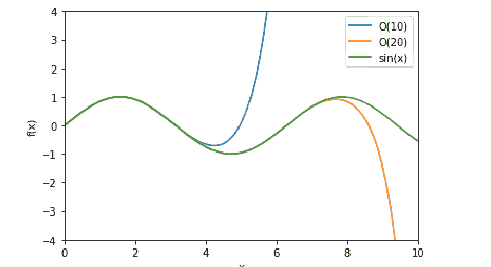

### 12.1.8 线性方程与矩阵求逆

SymPy 有一个 `Matrix` 类和相关函数，允许对线性方程组进行符号求解（当然，我们也可以使用 `subs()` 和 `evalf()` 获得数值答案）。我们将考虑以下简单线性方程组的例子：

$$3x + 7y = 12z$$
$$4x - 2y = 5z$$

我们可以将这个系统写成 $A\vec{x} = \vec{b}$ 的形式（如果你想验证我们恢复了原始方程，可以将 $A$ 乘以 $\vec{x}$），其中

$$A = \begin{pmatrix} 3 & 7 \\ 4 & -2 \end{pmatrix}, \quad \vec{x} = \begin{pmatrix} x \\ y \end{pmatrix}, \quad \vec{b} = \begin{pmatrix} 12z \\ 5z \end{pmatrix}.$$

这里我们在右边包含了一个符号 $z$，以演示符号将传播到解中。在许多情况下，我们会令 $z = 1$，但即使解不包含符号，使用 SymPy 而非数值求解器仍然可能有好处，因为它能够返回精确的分数而不是近似的 `float`。

求解 $\vec{x}$ 的一种策略是求矩阵 $A$ 的逆并左乘，即 $A^{-1}A\vec{x} = \vec{x} = A^{-1}\vec{b}$。SymPy 的 `Matrix` 类有一个 `inv()` 方法，允许我们找到逆矩阵，而 `*` 在适当的时候为我们执行矩阵乘法：

python
from sympy import symbols, Matrix
x, y, z = symbols('x,y,z')
A = Matrix(([3, 7], [4, -2]))
A

$$\begin{bmatrix} 3 & 7 \\ 4 & -2 \end{bmatrix}$$

python
A.inv()

$$\begin{bmatrix} \frac{1}{17} & \frac{7}{34} \\ \frac{2}{17} & -\frac{3}{34} \end{bmatrix}$$

python
b = Matrix(( 12*z, 5*z ))
b

$$\begin{bmatrix} 12z \\ 5z \end{bmatrix}$$

python
x = A.inv()*b
x

$$\begin{bmatrix} \frac{59z}{34} \\ \frac{33z}{34} \end{bmatrix}$$

### 12.1.9 非线性方程

让我们来解一个简单的方程，例如 $x = x^2$。显然有两个解：$x = 0$ 和 $x = 1$。我们如何让 Sympy 为我们计算这些解呢？

```python
import sympy
x, y, z = sympy.symbols('x, y, z')    # create some symbols
eq = x - x ** 2                        # define the equation
```

```python
sympy.solve(eq, x)                     # solve eq = 0
```

```
[0, 1]
```

`solve()` 函数期望接收一个表达式，该表达式被设计为求解其等于零的情况。对于我们的例子，我们将 $x = x^2$ 改写为 $x - x^2 = 0$，然后将其传递给 solve 函数。

让我们对以下方程重复同样的操作：$x = x^3$ 并求解

```python
eq = x - x ** 3                        # define the equation
sympy.solve(eq, x)                     # solve eq = 0
```

```
[-1, 0, 1]
```

### 12.1.10 输出：LaTeX 接口与美化打印

与许多计算机代数系统一样，SymPy 能够将其输出格式化为 LaTeX 代码，以便轻松地包含在文档中。

在本章开头，我们调用了：

```python
sympy.init_printing()
```

Sympy 检测到它在 Jupyter 环境中，并启用了 Latex 输出。Jupyter Notebook 支持（部分）Latex，因此这为我们提供了上面格式精美的输出。

我们也可以查看 Sympy 的纯文本输出及其创建的原始 Latex 代码：

```python
print(series(1/(x+y), y, 0, 3))
```

```
y**2/x**3 - y/x**2 + 1/x + O(y**3)
```

```python
print(latex(series(1/(x+y), y, 0, 3)))
```

```
\frac{y^{2}}{x^{3}} - \frac{y}{x^{2}} + \frac{1}{x} + O\left(y^{3}\right)
```

```python
print(latex(series(1/(x+y), y, 0, 3), mode='inline'))
```

```
$\frac{y^{2}}{x^{3}} - \frac{y}{x^{2}} + 1 / x + O\left(y^{3}\right)$
```

请注意，在其默认模式下，`latex()` 输出的代码需要在文档导言区通过 `\usepackage{amsmath}` 命令加载 `amsmath` 包。

SymPy 还支持“美化打印”（`pprint()`）输出例程，它产生的文本输出比默认打印例程格式更好，如下所示。请注意诸如名称为 `T_n` 形式的数组元素的下标、斜体常数 `e`、用于乘法的垂直居中点，以及格式良好的矩阵边框和分数等特征。

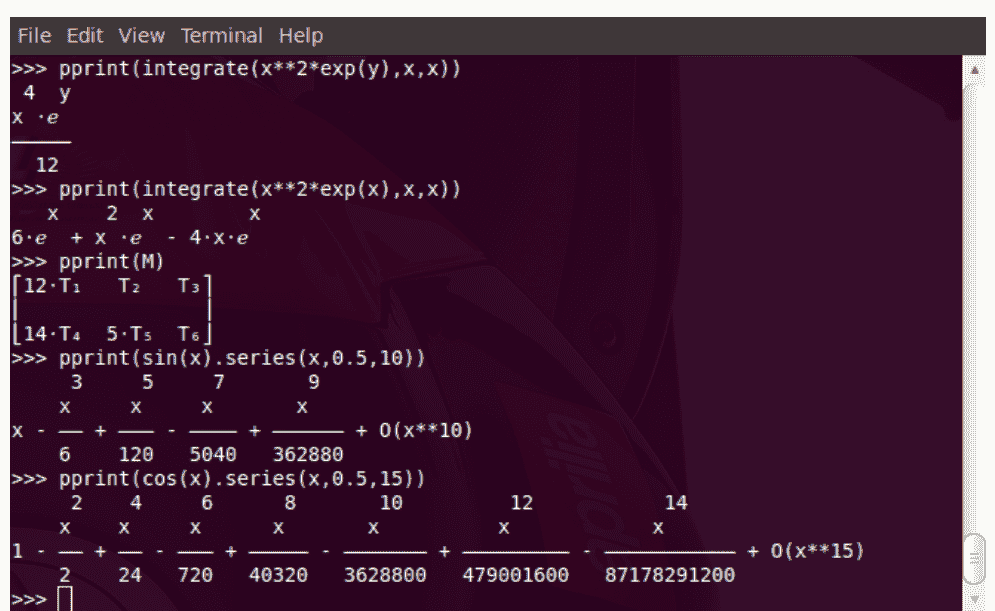

最后，SymPy 提供了 `preview()`，它可以在屏幕上显示渲染后的输出（详情请查看 `help(preview)`）。

### 12.1.11 自动生成 C 代码

许多符号库的一个强大之处在于，它们可以将符号表达式转换为 C 代码（或其他代码），随后可以编译这些代码以获得高执行速度。下面是一个演示此功能的示例：

```python
from sympy import *
from sympy.utilities.codegen import codegen
x = Symbol('x')
sin(x).series(x, 0, 6)
```

$$x - \frac{x^3}{6} + \frac{x^5}{120} + O(x^6)$$

```python
# NBVAL_IGNORE_OUTPUT
print(codegen(("taylor_sine", sin(x).series(x, 0, 6)), language='C')[0][1])
```

```c
/******************************************************
 *                  Code generated with sympy 1.9     *
 *                                                    *
 *  See http://www.sympy.org/ for more information.    *
 *                                                    *
 *  This file is part of 'project'                    *
 ******************************************************/
#include "taylor_sine.h"
#include <math.h>

double taylor_sine(double x) {

    double taylor_sine_result;
    taylor_sine_result = x - 1.0/6.0*pow(x, 3) + (1.0/120.0)*pow(x, 5) + O(x**6);
    return taylor_sine_result;

}
```

## 12.2 相关工具

值得注意的是，SAGE 项目 https://www.sagemath.org/ 试图“创建一个可行的、免费的开源替代方案，以替代 Magma、Maple、Mathematica 和 Matlab”，并在众多库中包含了 SymPy 库。其符号计算能力比 SymPy 更强大，但 SymPy 的功能已经能够满足科学和工程中出现的许多需求。SAGE 包含了计算机代数系统 Maxima，该系统也可以从 https://doc.sagemath.org/html/en/reference/interfaces/sage/interfaces/maxima_abstract.html 独立获取。

# 第十三章

# 数值计算

## 13.1 数与数字

我们已经看到（03 数据类型结构，数字），Python 知道不同*类型*的数字：

- 浮点数，例如 3.14
- 整数，例如 42
- 复数，例如 3.14 + 1j

### 13.1.1 数字类型的局限性

#### 整数的局限性

数学提供了无限的自然数集 ℕ = {1, 2, 3, ...}。由于计算机具有*有限*的大小，因此不可能在计算机中表示所有这些数字。相反，只表示数字的一个小子集。

`int` 类型（通常[3]）可以表示 -2147483648 到 +2147483647 之间的数字，对应于 4 个字节（即 4*8 位，2^32 = 4294967296，这是从 -2147483648 到 +2147483647 的范围）。

你可以想象硬件使用像这样的表格来使用位编码整数（为简单起见，假设我们只使用 8 位）：

| 自然数 | 位表示 |
|---|---|
| 0 | 00000000 |
| 1 | 00000001 |
| 2 | 00000010 |
| 3 | 00000011 |
| 4 | 00000100 |
| 5 | 00000101 |
| ... | ... |
| 254 | 11111110 |
| 255 | 11111111 |

使用 8 位，我们可以表示 256 个自然数（例如从 0 到 255），因为我们有 2^8 = 256 种不同的方式来组合八个 0 和 1。

我们也可以使用一个略有不同的表格来描述 256 个整数，例如从 -127 到 +128。

这就是整数在计算机中表示的*原理*。根据使用的字节数，只能表示介于最小值和最大值之间的整数。在当今的硬件上，通常使用 4 或 8 个字节来表示一个整数，这恰好导致了如上所示的 4 字节的最小值和最大值 -2147483648 和 +2147483647，以及 8 字节的最大整数 +9223372036854775807（约为 9.2 · 10^18）。

#### 浮点数的局限性

计算机中的浮点数与数学中的浮点数并不相同。（这与（数学）整数与计算机中的整数不同完全一样：只有无限整数集的一个子集可以由 int 数据类型表示，如“数与数字”中所示）。那么浮点数在计算机中是如何表示的呢？

- 任何实数 $x$ 都可以写成 $x = a \cdot 10^b$，其中 $a$ 是尾数，$b$ 是指数。
- 示例：

| x | a | b |
|---|---|---|
| 123.45 = 1.23456 · 10^2 | 1.23456 | 2 |
| 1000000 = 1.0 · 10^6 | 1.00000 | 6 |
| 0.0000024 = 2.4 · 10^-6 | 2.40000 | -6 |

- 因此，我们可以使用 2 个整数来编码一个浮点数！
  $x = a \cdot 10^b$
- 大致遵循 IEEE-754 标准，一个浮点数 $x$ 使用 8 个字节：这 64 位被划分为
  - 10 位用于指数 $b$，以及
  - 54 位用于尾数 $a$。

这导致

- 最大可能的浮点数 ≈10^308（$b$ 的质量度量）
- 最小可能的（正）浮点数 ≈10^–308（$b$ 的质量度量）
- 1.0 与下一个更大数字之间的距离 ≈10^–16（$a$ 的质量度量）

请注意，这实际上是浮点数的存储原理（实际上要稍微复杂一些）。

#### 复数的局限性

复数类型本质上与浮点数据类型具有相同的局限性（参见浮点数的局限性），因为一个复数由两个浮点数组成：一个表示实部，另一个表示虚部。

#### ...这些数字类型有实际价值吗？

在实践中，我们通常不会在日常生活中遇到超过 10^300 的数字（这是一个有 300 个零的数字！），因此浮点数覆盖了我们通常需要的数字范围。

但是，请注意，在科学计算中会使用可能（通常在中间结果中）超过浮点数范围的小数和大数。

- 例如，想象一下，我们必须取常数 $h = 1.0545716 \cdot 10^{-34}kgm^2/s$ 的四次方：
- $h^4 = 1.2368136958909421 \cdot 10^{-136}k^4g^4m^8/s^4$，这“大约”是我们可表示的最小正浮点数 $10^{-308}$ 的一半。

如果存在超出浮点数表示范围的风险，我们必须*重新调整*方程，使得（理想情况下）所有数值都接近于1。重新调整方程使所有相关数值近似为1，也有助于调试代码：如果出现远大于或远小于1的数值，这可能表明存在错误。

### 13.1.2 草率地使用浮点数

我们已经知道需要注意浮点数值不要超出计算机可表示的浮点数范围。

由于浮点数在内部的表示方式，还存在另一个复杂性：并非所有浮点数都能在计算机中精确表示。数字1.0可以精确表示，但数字0.1、0.2和0.3不能：

```
'%.20f' % 1.0
'1.00000000000000000000'

'%.20f' % 0.1
'0.10000000000000000555'

'%.20f' % 0.2
'0.20000000000000001110'

'%.20f' % 0.3
'0.29999999999999998890'
```

相反，计算机选择的是“最接近”实数的浮点数。

这可能导致问题。假设我们需要一个循环，其中x取值0.1, 0.2, 0.3, ..., 0.9, 1.0。我们可能会倾向于这样写：

```
x = 0.0
while not x == 1.0:
    x = x + 0.1
    print ( " x =%19.17f" % ( x ))
```

然而，这个循环永远不会终止。以下是该程序输出的前11行：

```
x=0.10000000000000001
x=0.20000000000000001
x=0.30000000000000004
x=0.40000000000000002
x=                 0.5
x=0.59999999999999998
x=0.69999999999999996
x=0.79999999999999993
x=0.8999999999999991
x=0.9999999999999989
x=1.0999999999999987
```

因为变量x从未精确取到值1.0，所以while循环将永远继续下去。
因此：*永远不要直接比较两个浮点数是否相等。*

### 13.1.3 谨慎地使用浮点数 1

有多种替代方法可以解决这个问题。例如，我们可以比较两个浮点数之间的距离：

```
x = 0.0
while abs(x - 1.0) > 1e-8:
    x = x + 0.1
    print ( " x =%19.17f" % ( x ))
```

```
x =0.10000000000000001
x =0.20000000000000001
x =0.30000000000000004
x =0.40000000000000002
x =0.50000000000000000
x =0.59999999999999998
x =0.69999999999999996
x =0.79999999999999993
x =0.89999999999999991
x =0.99999999999999989
```

### 13.1.4 谨慎地使用浮点数 2

或者，我们可以（对于这个例子）迭代一个整数序列，并从整数计算出浮点数：

```
for i in range (1 , 11):
    x = i * 0.1
    print(" x =%19.17f" % ( x ))
```

```
x =0.10000000000000001
x =0.20000000000000001
x =0.30000000000000004
x =0.40000000000000002
x =0.50000000000000000
x =0.60000000000000009
x =0.70000000000000007
x =0.80000000000000004
x =0.90000000000000002
x =1.00000000000000000
```

如果我们将其与*草率地使用浮点数*程序的输出进行比较，可以看到浮点数有所不同。这意味着——在数值计算中——0.1 + 0.1 + 0.1 + 0.1 + 0.1 + 0.1 + 0.1 + 0.1 + 0.1 + 0.1 + 0.1 + 0.1 = 1.0 并不成立。

### 13.1.5 符号计算

使用`sympy`包，我们可以实现任意精度。使用`sympy.Rational`，我们可以精确地符号化定义分数1/10。将其相加10次将精确得到值1，如以下脚本所示：

```
from sympy import Rational
dx = Rational(1, 10)
x = 0
while x != 1.0:
    x = x + dx
    print("Current x=%4s = %3.1f " % (x, x.evalf()))
    print(" Reached x=%s " % x)
```

```
Current x=1/10 = 0.1
 Reached x=1/10
Current x= 1/5 = 0.2
 Reached x=1/5
Current x=3/10 = 0.3
 Reached x=3/10
Current x= 2/5 = 0.4
 Reached x=2/5
Current x= 1/2 = 0.5
 Reached x=1/2
Current x= 3/5 = 0.6
 Reached x=3/5
Current x=7/10 = 0.7
 Reached x=7/10
Current x= 4/5 = 0.8
 Reached x=4/5
Current x=9/10 = 0.9
 Reached x=9/10
Current x= 1 = 1.0
 Reached x=1
```

然而，这种符号计算要慢得多，因为它是通过软件而非基于CPU的浮点运算完成的。下一个程序近似展示了相对性能：

```
# NBVAL_IGNORE_OUTPUT
from sympy import Rational
dx_symbolic = Rational (1 ,10)
dx = 0.1

def loop_sympy (n):
    x = 0
    for i in range(n):
        x = x + dx_symbolic
    return x

def loop_float(n):
    x =0
    for i in range(n):
        x = x + dx
    return x

def time_this (f, n):
    import time
    starttime = time.time()
    result = f(n)
    stoptime = time.time()
    print(" deviation is %16.15g" % ( n * dx_symbolic - result ))
    return stoptime - starttime

n = 100000
print("loop using float dx:")
time_float = time_this(loop_float, n)
print("float loop n=%d takes %6.5f seconds" % (n, time_float))
print("loop using sympy symbolic dx:")
time_sympy = time_this (loop_sympy, n)
print("sympy loop n =% d takes %6.5f seconds" % (n , time_sympy ))
print("Symbolic loop is a factor %.1f slower." % ( time_sympy / time_float ))
```

```
loop using float dx:
 deviation is -1.88483681995422e-08
float loop n=100000 takes 0.00472 seconds
loop using sympy symbolic dx:
 deviation is                    0
sympy loop n = 100000 takes 0.37192 seconds
Symbolic loop is a factor 78.8 slower.
```

这当然是一个人为的例子：我们添加符号代码是为了证明这些舍入误差源于硬件（以及编程语言）中浮点数的近似表示。原则上，我们可以通过使用符号表达式来避免这些复杂性，但这在实践中太慢了。[4]

### 13.1.6 总结

总之，我们了解到：

- 数值计算中使用的浮点数和整数通常与“数学数”有很大不同（符号计算是精确的，并使用“数学数”）：
    - 存在可表示的最大数和最小数（对于整数和浮点数都是如此）
    - 在此范围内，并非每个浮点数都能在计算机中表示。
- 我们通过以下方式处理这种限制：
    - 永远不要直接比较两个浮点数是否相等（而是计算差值的绝对值）
    - 使用*稳定*的算法（这意味着算法可以纠正与正确数值的小偏差。本文档中尚未展示此类示例。）
- 请注意，关于数值和算法技巧以及使数值计算尽可能精确的方法还有很多可以说，但这超出了本节的范围。

### 13.1.7 练习：无限循环还是有限循环

1. 以下代码计算什么？循环会结束吗？为什么？

```
eps = 1.0
while 1.0 + eps > 1.0:
    eps = eps / 2.0
print(eps)
```

# 第十四章

# 数值PYTHON（NUMPY）：数组

## 14.1 Numpy简介

NumPy包（读作NUMerical PYthon）提供了对以下内容的访问：

- 一种称为`arrays`的新数据结构，它允许
- 高效的向量和矩阵运算。它还提供了
- 一系列线性代数运算（例如求解线性方程组、计算特征向量和特征值）。

### 14.1.1 历史

一些背景信息：还有另外两个提供与NumPy几乎相同功能的实现。它们被称为“Numeric”和“numarray”：

- Numeric是为Python提供的一组数值方法（类似于Matlab）的首次实现。它源于一个博士项目。
- Numarray是Numeric的重新实现，具有某些改进（但就我们的目的而言，Numeric和Numarray的行为几乎相同）。
- 2006年初，决定将Numeric和numarray的最佳方面合并到科学Python（`scipy`）包中，并在模块名“NumPy”下提供（希望是“最终的”）`array`数据类型。

我们将在以下材料中使用（新的）SciPy提供的“NumPy”包。如果由于某种原因这对您不起作用，很可能是因为您的SciPy版本太旧。在这种情况下，您会发现要么安装了“Numeric”，要么安装了“numarray”，它们应该提供几乎相同的功能。[5]

### 14.1.2 数组

我们引入一种新的数据类型（由NumPy提供），称为“`array`”。数组*看起来*与列表非常相似，但数组只能保存相同类型的元素（而列表可以混合不同类型的对象）。这意味着数组存储效率更高（因为我们不需要为每个元素存储类型）。这也使得数组成为数值计算中首选的数据结构，因为我们经常处理向量和矩阵。

在NumPy中，向量和矩阵（以及具有两个以上索引的矩阵）都称为“数组”。

## 面向计算科学与工程的Python入门

## 向量（一维数组）

我们最常需要的数据结构是向量。以下是生成向量的几种示例方法：

- 使用 `numpy.array` 将列表（或元组）转换为数组：

```python
import numpy as np
x = np.array([0, 0.5, 1, 1.5])
print(x)
```

```
[0.  0.5 1.  1.5]
```

- 使用 "ArrayRANGE" 创建向量：

```python
x = np.arange(0, 2, 0.5)
print(x)
```

```
[0.  0.5 1.  1.5]
```

- 创建全零向量

```python
x = np.zeros(4)
print(x)
```

```
[0. 0. 0. 0.]
```

一旦数组建立，我们就可以设置和检索单个值。例如：

```python
x = np.zeros(4)
x[0] = 3.4
x[2] = 4
print(x)
print(x[0])
print(x[0:-1])
```

```
[3.4 0.  4.  0. ]
3.4
[3.4 0.  4. ]
```

请注意，一旦我们有了向量，就可以用单条语句对向量中的每个元素执行计算：

```python
x = np.arange(0, 2, 0.5)
print(x)
print(x + 10)
print(x ** 2)
print(np.sin(x))
```

```
[0.  0.5 1.  1.5]
[10.  10.5 11.  11.5]
[0.   0.25 1.   2.25]
[0.         0.47942554 0.84147098 0.99749499]
```

## 矩阵（二维数组）

以下是创建二维数组的两种方法：

- 将列表的列表（或元组）转换为数组：

```python
x = np.array([[1, 2, 3], [4, 5, 6]])
x
```

```
array([[1, 2, 3],
       [4, 5, 6]])
```

- 使用 zeros 方法创建一个具有5行4列的矩阵

```python
x = np.zeros((5, 4))
x
```

```
array([[0., 0., 0., 0.],
       [0., 0., 0., 0.],
       [0., 0., 0., 0.],
       [0., 0., 0., 0.],
       [0., 0., 0., 0.]])
```

矩阵的“形状”可以这样查询（这里我们有2行3列）：

```python
x = np.array([[1, 2, 3], [4, 5, 6]])
print(x)
x.shape
```

```
[[1 2 3]
 [4 5 6]]
```

```
(2, 3)
```

可以使用此语法访问和设置单个元素：

```python
x = np.array([[1, 2, 3], [4, 5, 6]])
x[0, 0]
```

```
1
```

```python
x[0, 1]
```

```
2
```

```python
x[0, 2]
```

```
3
```

```python
x[1, 0]
```

```
4
```

```python
x[:, 0]
```

```
array([1, 4])
```

```python
x[0, :]
```

```
array([1, 2, 3])
```

### 14.1.3 从数组转换为列表或元组

要将数组转换回列表或元组，我们可以使用标准的Python函数 `list(s)` 和 `tuple(s)`，它们分别接受一个序列 `s` 作为输入参数，并返回一个列表和一个元组：

```python
a = np.array([1, 4, 10])
a
```

```
array([ 1,  4, 10])
```

```python
list(a)
```

```
[1, 4, 10]
```

```python
tuple(a)
```

```
(1, 4, 10)
```

### 14.1.4 标准线性代数运算

#### 矩阵乘法

两个数组可以使用 `numpy.matrixmultiply` 以通常的线性代数方式进行乘法运算。以下是一个示例：

```python
import numpy as np
import numpy.random
A = numpy.random.rand(5, 5)    # 生成一个随机的5x5矩阵
x = numpy.random.rand(5)      # 生成一个5元素向量
b = np.dot(A, x)              # 将矩阵A与向量x相乘
```

#### 求解线性方程组

要求解以矩阵形式给出的方程组 $Ax = b$（即 $A$ 是一个矩阵，$x$ 和 $b$ 是向量，其中 $A$ 和 $b$ 已知，我们想要求出未知向量 $x$），我们可以使用 `numpy` 的线性代数包（`linalg`）：

```python
import numpy.linalg as LA
x = LA.solve(A, b)
```

#### 计算特征向量和特征值

这是一个计算单位矩阵（`eye`）的[平凡]特征向量和特征值（`eig`）的小例子：

```python
import numpy
import numpy.linalg as LA
A = numpy.eye(3)    #'eye'->I->1（对角线上为1）
print(A)
```

```
[[1. 0. 0.]
 [0. 1. 0.]
 [0. 0. 1.]]
```

```python
evalues, evectors = LA.eig(A)
print(evalues)
```

```
[1. 1. 1.]
```

```python
print(evectors)
```

```
[[1. 0. 0.]
 [0. 1. 0.]
 [0. 0. 1.]]
```

请注意，每个命令都提供自己的文档。例如，`help(LA.eig)` 会告诉你关于特征向量和特征值函数的所有信息（一旦你已经将 `numpy.linalg` 导入为 `LA`）。

#### 多项式曲线拟合

假设我们有x-y数据，我们希望为这些数据拟合一条曲线（以最小化拟合与数据之间的最小二乘偏差）。

Numpy提供了例程 `polyfit(x,y,n)`（类似于Matlab的 `polyfit` 函数），它接受一个数据点的x值列表 `x`、相同数据点的y值列表 `y` 以及所需多项式的阶数，该多项式将以最小二乘意义尽可能好地拟合数据。

```python
%matplotlib inline
import numpy as np

# 演示曲线拟合：xdata和ydata是输入数据
xdata = np.array([0.0 , 1.0 , 2.0 , 3.0 , 4.0 , 5.0])
ydata = np.array([0.0 , 0.8 , 0.9 , 0.1 , -0.8 , -1.0])
```

```python
# 现在进行三次（阶数=3）多项式拟合
z = np.polyfit(xdata, ydata, 3)

# z是一个系数数组，最高次项在前，即
# X^3           X^2           X            0
# z = array ([ 0.08703704 , -0.81349206 , 1.69312169 , -0.03968254])
# 使用'poly1d'对象处理多项式很方便：
p = np.poly1d(z)  # 从系数创建一个多项式函数p
                   # 然后p可以对所有x进行求值。

# 创建绘图
xs = [0.1 * i for i in range (50)]
ys = [p(x) for x in xs]   # 对列表xs中的所有x求值p(x)

import pylab
pylab.plot(xdata, ydata, 'o', label='data')
pylab.plot(xs, ys, label='fitted curve')
pylab.ylabel('y')
pylab.xlabel('x')
```

```
Text(0.5, 0, 'x')
```

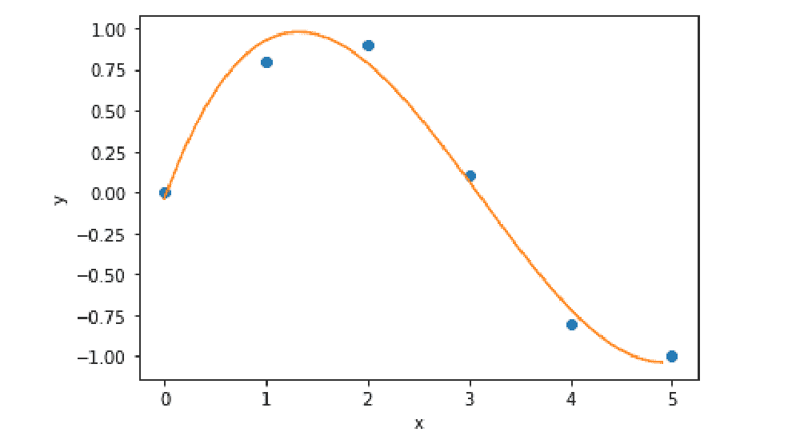

这显示了拟合曲线（实线）以及精确计算的数据点。

### 14.1.5 更多numpy示例...

...可以在这里找到：https://numpy.org/doc/stable/reference/routines.html

### 14.1.6 面向Matlab用户的Numpy

有一个专门的网页从（有经验的）Matlab用户的角度解释Numpy，地址为 https://numpy.org/doc/stable/user/numpy-for-matlab-users.html。

# 第十五章

## 数据可视化

科学计算的目的是洞察而非数字：为了理解我们计算出的（许多）数字的含义，我们经常需要对数据进行后处理、统计分析和图形可视化。以下各节描述

- Matplotlib/Pylab — 一种生成 $y = f(x)$ 类型（以及更多）高质量图形的工具
  - `pylab` 接口
  - `pyplot` 接口

我们还将涉及：

- Visual Python — 一种快速生成三维空间中随时间变化过程动画的工具。
- 存储和可视化vtk文件的工具

最后，我们简要展望一下

- 讨论其他工具和新兴数据可视化与分析方法的进一步工具和发展。

### 15.1 Matplotlib – 绘制 y=f(x)（以及更多）

Python库 *Matplotlib* 是一个Python 2D绘图库，它可以在多种硬拷贝格式和交互式环境中生成出版物质量的图形。Matplotlib试图让简单的事情变得简单，让困难的事情变得可能。只需几行代码，你就可以生成绘图、直方图、功率谱、条形图、误差图、散点图等。

有关更详细的信息，请查看以下链接

- 一个非常好的面向对象Matplotlib接口介绍，以及所有重要样式、图形大小、线宽等更改方式的总结。这是一个有用的参考：https://nbviewer.ipython.org/github/jrjohansson/scientific-python-lectures/blob/master/Lecture-4-Matplotlib.ipynb
- Matplotlib教程
- Matplotlib主页
- 扩展的示例缩略图画廊 https://matplotlib.org/stable/gallery/index.html

#### 15.1.1 Matplotlib 和 Pylab

Matplotlib包在命名空间 `matplotlib.pyplot` 下提供了一个*面向对象的绘图库*。
`pylab` 接口通过Matplotlib包提供。它在内部使用 `matplotlib.pyplot` 的功能，但模仿了（基于状态的）Matlab绘图接口。

对于简单的绘图，`pylab` 接口稍微方便一些，而 `matplotlib.pyplot` 则提供了对绘图创建方式的更详细控制。如果你经常需要生成图形，我们建议学习面向对象的 `matplotlib.pyplot` 接口（而不是 `pylab` 接口）。

本章重点介绍Pylab接口，但也提供了面向对象的 `matplotlib.pyplot` 接口的示例。

关于 `matplotlib.pyplot` 绘图接口的优秀介绍和概述可以在 https://nbviewer.ipython.org/github/jrjohansson/scientific-python-lectures/blob/master/Lecture-4-Matplotlib.ipynb 找到。

出于本书和 `Jupyterbook` 包的目的，我们使用一些设置来为书籍的html版本创建svg文件，为pdf版本创建高分辨率png文件：

```python
%matplotlib inline
# jupyter book的设置：html版本使用svg，pdf版本使用高分辨率png
import matplotlib_inline
matplotlib_inline.backend_inline.set_matplotlib_formats('svg', 'png')
import matplotlib as mpl
mpl.rcParams['figure.dpi'] = 400
```

#### 15.1.2 第一个示例

##### pyplot接口

在简单示例中使用Matplotlib的推荐方式如下所示：

```python
# 示例 1 a
import numpy as np                # 获取快速数组访问
import matplotlib.pyplot as plt   # 绘图函数

x = np.arange(-3.14, 3.14, 0.01)  # 创建x数据
y = np.sin(x)                     # 计算y数据
plt.plot(x, y)                    # 创建绘图
```

```
[<matplotlib.lines.Line2D at 0x7f11fe5fe130>]
```

### 15.1.3 如何导入 matplotlib、pylab、pyplot、numpy 等

子模块 `matplotlib.pyplot` 为绘图库提供了面向对象的接口。matplotlib 文档中的许多示例都遵循将 `matplotlib.pyplot` 导入为 `plt`、将 `numpy` 导入为 `np` 的惯例。用户可以自行决定是将 `numpy` 库导入为 `np`（如 matplotlib 示例中常用），还是导入为 `N`（本文中偶尔使用，且在 numpy 前身 "Numeric" 早期也常用），或是任何你喜欢的名称。同样，将绘图子模块（`matplotlib.pyplot`）导入为 `plt`（如 matplotlib 文档所示）还是 `plot`（可以说稍微清晰一些）等，也取决于个人喜好。

在选择这些名称时，需要在个人偏好与遵循常见实践之间取得平衡。如果代码可能被他人使用或发布，那么与常见用法保持一致就更为重要。

## Pylab 接口

我们通过将上面的示例 1a 转换为下面的示例 1b（其功能与示例 1a 完全相同，并将创建相同的绘图）来介绍 `pylab` 接口：

```
# 示例 1b
import pylab
import numpy as np

x = np.arange(-3.14, 3.14, 0.01)
y = np.sin(x)

pylab.plot(x, y)

[<matplotlib.lines.Line2D at 0x7f11fc56dbb0>]
```

## 面向计算科学与工程的 Python 入门

绘图几乎总是需要数值数据数组，因此 `numpy` 模块被大量使用：它为 Python 提供了快速且内存高效的数组处理（参见第 14 章）。`pylab` 接口更进一步，自动将 `numpy` 中的所有对象导入到 `pylab` 命名空间中：

由于 `numpy.arange` 和 `numpy.sin` 对象已经被导入到 `pylab` 命名空间，我们也可以将其写成示例 1c：

```
# 示例 1c
import pylab as p

x = p.arange(-3.14, 3.14, 0.01)
y = p.sin(x)

p.plot(x, y)
```

```
[<matplotlib.lines.Line2D at 0x7f11fc4e1370>]
```

如果我们真的想减少输入的字符数，也可以将 `pylab` 便捷模块中的所有对象 (*) 导入到当前命名空间，并将代码重写为示例 1d：

```
# 示例 1d
from pylab import *  # 通常不推荐
                    # 适用于交互式测试

x = arange(-3.14, 3.14, 0.01)
y = sin(x)
plot(x, y)
show()
```

## 面向计算科学与工程的 Python 入门

这可能极其方便，但需要特别注意：

- 虽然在命令提示符下使用 `from pylab import *` 来交互式地创建绘图和分析数据是可以接受的，但绝不应在任何绘图脚本中使用。
- pylab 顶层提供了超过 800 个不同的对象，当运行 `from pylab import *` 时，所有这些对象都会被导入到全局命名空间中。这不是好的做法，并且可能与已存在或稍后创建的其他对象发生冲突。
- 作为经验法则：在我们保存的程序中，永远不要使用 `from somewhere import *`。这在命令提示符下用于交互式数据探索可能是可以的。

### 15.1.4 IPython 的内联模式

在 Jupyter Notebook 或 Qtconsole（参见 *Python shells notebook*）中，我们可以使用 `%matplotlib inline` 魔术命令，使后续的绘图显示在我们的控制台或笔记本中。如果希望弹出窗口显示，请使用 `%matplotlib qt`。

如果你喜欢 `pylab` 接口，那么你可能对 `%pylab` 魔术命令感兴趣，它不仅会切换到内联绘图，还会自动执行 `from pylab import *`。

### 15.1.5 将图形保存到文件

一旦你创建了图形（使用 `plot` 命令）并添加了任何标签、图例等，你有两种保存绘图的选择。

1.  你可以显示图形（使用 `show`）并*交互式*地通过点击磁盘图标来保存它。（这不适用于内联绘图，因为图标不可用。）
2.  你可以（不显示图形）直接从 Python 代码中保存它。要使用的命令是 `savefig`。格式由你提供的文件名的扩展名决定。这里有一个示例（`pylabsavefig.py`），它将图形保存到不同的文件中。

```
# 使用 pylab 接口保存图形文件
import pylab
import numpy as np

x = np.arange(-3.14, 3.14, 0.01)
y = np.sin(x)

pylab.plot(x, y, label='sin(x)')
pylab.savefig('myplot.png')  # 保存 png 文件
pylab.savefig('myplot.svg')  # 保存 svg 文件
pylab.savefig('myplot.eps')  # 保存 eps 文件
pylab.savefig('myplot.pdf')  # 保存 pdf 文件
pylab.close()
```

关于文件格式的说明：

`pdf`、`eps` 和 `svg` 文件格式是矢量文件格式，这意味着可以放大图像而不会损失质量（线条仍然清晰）。像 `png`（以及 `jpg`、`gif`、`tif`、`bmp`）这样的文件格式以位图形式（即颜色值矩阵）保存图像，放大时（或以高分辨率打印时）会显得模糊或像素化。

因此，尽可能选择矢量文件格式，如果没有其他选择，则使用位图（例如 `png`）。如果你计划将图形包含在 Latex 文档中，请选择 `eps` 或 `pdf` 文件格式——这取决于你是想使用 `latex`（需要 `eps`）还是 pdflatex（可以使用 `pdf` [更好] 或 `png`）进行编译。如果你使用的 MS Word（或其他文字处理软件）版本可以处理 `pdf` 文件，那么使用 `pdf` 比 `png` 更好。

```
# 使用 pyplot 接口保存图形文件
from matplotlib import pyplot as plt
import numpy as np

x = np.arange(-3.14, 3.14, 0.01)
y = np.sin(x)

fig, ax = plt.subplots()
ax.plot(x, y, label='sin(x)')
fig.savefig('myplot.png')  # 保存 png 文件
fig.savefig('myplot.svg')  # 保存 svg 文件
fig.savefig('myplot.eps')  # 保存 eps 文件
fig.savefig('myplot.pdf')  # 保存 pdf 文件
plt.close(fig)
```

## 15.2 pylab 接口

### 15.2.1 微调你的绘图

Matplotlib 允许我们非常详细地微调我们的绘图。这里有一个示例：

```
import pylab
import numpy as N

x = N.arange(-3.14, 3.14, 0.01)
y1 = N.sin(x)
y2 = N.cos(x)
pylab.figure(figsize=(5, 5))
pylab.plot(x, y1, label='sin(x)')
pylab.plot(x, y2, label='cos(x)')
pylab.legend()
pylab.axis([-2, 2, -1, 1])
pylab.grid()
pylab.xlabel('x')
pylab.title('This is the title of the graph')
```

Text(0.5, 1.0, 'This is the title of the graph')

展示一些其他有用的命令：

- `figure(figsize=(5, 5))` 将图形大小设置为 5 英寸乘 5 英寸。
- `plot(x, y1, label='sin(x)')` “label”关键字定义了这条线的名称。如果稍后使用 `legend()` 命令，线标签将显示在图例中。
- 注意，重复调用 `plot` 命令允许你叠加多条曲线。
- `axis([-2, 2, -1, 1])` 这将显示区域固定为 x 方向从 xmin=-2 到 xmax=2，y 方向从 ymin=-1 到 ymax=1。
- `legend()` 此命令将显示一个图例，其中包含在 plot 命令中定义的标签。尝试 `help(pylab.legend)` 以了解更多关于图例放置的信息。
- `grid()` 此命令将在背景上显示网格。
- `xlabel('...')` 和 `ylabel('...')` 允许为坐标轴添加标签。

另外请注意，你可以为要绘制的数据选择不同的线型、线宽、符号和颜色。（语法与 MATLAB 非常相似。）例如：

- `plot(x, y, 'og')` 将绘制绿色 (g) 的圆圈 (o)。
- `plot(x, y, '-r')` 将绘制红色 (r) 的线 (-)。
- `plot(x, y, '-b', linewidth=2)` 将绘制蓝色 (b) 的线，宽度为两个像素 `linewidth=2`，是默认宽度的两倍。
- `plot(x, y, '-', alpha=0.5)` 将绘制半透明的线。

所有选项的完整列表可以在 Python 提示符下输入 `help(pylab.plot)` 查看。由于这份文档非常有用，我们在此重复部分内容：

```
plot(*args, **kwargs)
    将线条和/或标记绘制到
    :class:`~matplotlib.axes.Axes` 上。*args* 是一个可变长度参数，允许多个 *x*、*y* 对以及一个可选的格式字符串。例如，以下每种用法都是合法的::

        plot(x, y)         # 使用默认线条样式和颜色绘制 x 和 y
        plot(x, y, 'bo')   # 使用蓝色圆圈标记绘制 x 和 y
        plot(y)            # 使用 x 作为索引数组 0..N-1 来绘制 y
        plot(y, 'r+')      # 同上，但使用红色加号标记

    如果 *x* 和/或 *y* 是二维的，则将绘制相应的列。

    可以指定任意数量的 *x*、*y*、*fmt* 组，例如::

        a.plot(x1, y1, 'g^', x2, y2, 'g-')

    返回值是添加的线条列表。

    以下格式字符串字符可用于控制线条样式或标记：

    ==========================    ===============================
    字符                          描述
    ==========================    ===============================
    '-'                           实线样式
    '--'                          虚线样式
    '-.'                          点划线样式
    ':'                           点线样式
    '.'                           点标记
    ','                           像素标记
    'o'                           圆圈标记
    'v'                           向下三角标记
    '^'                           向上三角标记
    '<'                           向左三角标记
    '>'                           向右三角标记
    '1'                           向下三叉标记
    '2'                           向上三叉标记
    '3'                           向左三叉标记
    '4'                           向右三叉标记
    's'                           正方形标记
    'p'                           五边形标记
    '*'                           星形标记
    'h'                           六边形1标记
    'H'                           六边形2标记
    '+'                           加号标记
    'x'                           叉号标记
    'D'                           菱形标记
    'd'                           细菱形标记
    '|'                           竖线标记
    '_'                           横线标记
    ==========================    ===============================
```

## Python 计算科学与工程导论

支持以下颜色缩写：

```
============  =========
字符          颜色
============  =========
'b'           蓝色
'g'           绿色
'r'           红色
'c'           青色
'm'           品红色
'y'           黄色
'k'           黑色
'w'           白色
============  =========
```

此外，您还可以通过多种奇特而美妙的方式指定颜色，包括完整名称（``'green'``）、十六进制字符串（``'#008000'``）、RGB 或 RGBA 元组（``(0,1,0,1)``）或作为字符串的灰度强度值（``'0.8'``）。其中，字符串规范可以替代 ``fmt`` 组使用，但元组形式只能用作 ``kwargs``。

线条样式和颜色在单个格式字符串中组合，例如 ``'bo'`` 表示蓝色圆圈。

*kwargs* 可用于设置线条属性（任何具有 ``set_*`` 方法的属性）。您可以使用它来设置线条标签（用于自动图例）、线宽、抗锯齿、标记面颜色等。以下是一个示例::

```
plot([1,2,3], [1,2,3], 'go-', label='line 1', linewidth=2)
plot([1,2,3], [1,4,9], 'rs',  label='line 2')
axis([0, 4, 0, 10])
legend()
```

如果使用一个 `plot` 命令绘制多条线，kwargs 将应用于所有这些线条，例如::

```
plot(x1, y1, x2, y2, antialiased=False)
```

两条线都不会进行抗锯齿处理。

您不需要使用格式字符串，它们只是缩写。所有线条属性都可以通过关键字参数控制。例如，您可以使用以下方式设置颜色、标记、线条样式和标记颜色::

```
plot(x, y, color='green', linestyle='dashed', marker='o',
     markerfacecolor='blue', markersize=12)。详情请参见
     :class:`~matplotlib.lines.Line2D`。
```

当无法使用颜色来区分线条时（例如，当图表将用于仅黑白打印的文档时），使用不同的线条样式和粗细特别有用。

### 15.2.2 绘制多条曲线

有三种不同的方法来显示多条曲线。

#### 在一个图中绘制两条（或更多）曲线

通过重复调用 `plot` 命令，可以在同一个图中绘制多条曲线。示例：

```
import numpy as np
t = np.arange(0, 2*np.pi, 0.01)

import pylab
pylab.plot(t, np.sin(t), label='sin(t)')
pylab.plot(t, np.cos(t), label='cos(t)')
pylab.legend()
```

```
<matplotlib.legend.Legend at 0x7f11fc470a30>
```

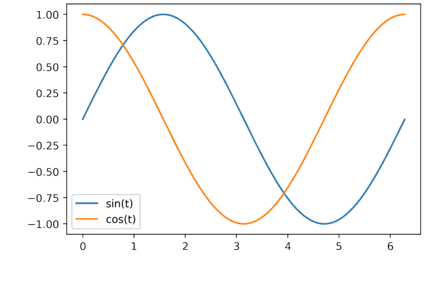

#### 在一个图形窗口中绘制两个（或更多）图形

`pylab.subplot` 命令允许在一个图形窗口内排列多个图形。通用语法是

```
subplot(numRows, numCols, plotNum)
```

例如，要将 4 个图形排列成 2x2 矩阵，并选择第一个图形用于下一个绘图命令，可以使用：

```
subplot(2, 2, 1)
```

以下是一个完整示例，在同一个窗口中绘制两条上下对齐的正弦和余弦曲线：

```
import numpy as np
t = np.arange(0, 2*np.pi, 0.01)

import pylab

pylab.subplot(2, 1, 1)
pylab.plot(t, np.sin(t))
pylab.xlabel('t')
pylab.ylabel('sin(t)')

pylab.subplot(2, 1, 2)
pylab.plot(t, np.cos(t))
pylab.xlabel('t')
pylab.ylabel('cos(t)');
```

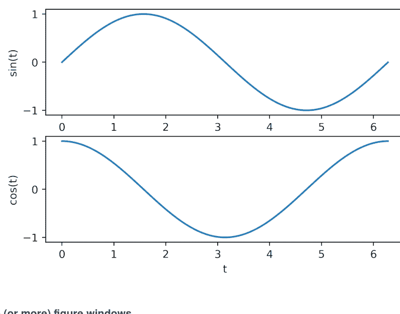

#### 两个（或更多）图形窗口

```
import pylab
pylab.figure(1)
pylab.plot(range(10), 'o')

pylab.figure(2)
pylab.plot(range(100), 'x')
```

```
[<matplotlib.lines.Line2D at 0x7f11fba563a0>]
```

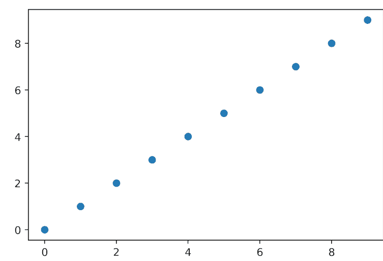

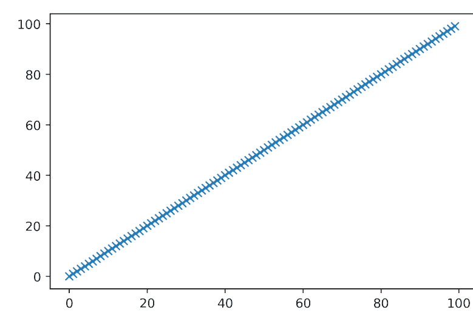

请注意，您可以使用 `pylab.close()` 来关闭一个、部分或所有图形窗口（使用 `help(pylab.close)` 了解更多信息）。图形的关闭与内联绘图无关，但对于出现在弹出窗口中的绘图，当图形关闭时，这些窗口也将被关闭。

### 15.2.3 交互模式

Pylab 可以在两种模式下运行：

- 非交互模式（这是默认模式）
- 交互模式。

在非交互模式下，直到发出 `show()` 命令后才会显示绘图。在此模式下，`show()` 命令应是程序的最后一条语句。

在交互模式下，绘图命令发出后会立即显示绘图。

可以使用 `pylab.ion()` 开启交互模式，使用 `pylab.ioff()` 关闭交互模式。IPython 的 `%matplotlib` 魔法命令也能启用交互模式。

如果您使用带有内联绘图的 Jupyter notebooks，那么此功能就不那么重要了。

## 15.3 matplotlib.pyplot 接口

这是使用 matplotlib 生成出版物质量图表或任何需要一些微调的图表的推荐方式：`pyplot` 接口的面向对象方法通常比状态驱动的 `pylab` 接口更容易定制图表。

创建 `pyplot` 图形的两个核心命令是：

1. 创建一个图形对象，并在该图形中创建一个（或多个）坐标轴对象。
2. 在坐标轴对象内创建一些绘图。

以下是一个示例：

```
import numpy as np
import matplotlib.pyplot as plt

xs = np.linspace(0, 10, 100)
ys = np.sin(xs)

fig, ax = plt.subplots()
ax.plot(xs, ys)
```

[<matplotlib.lines.Line2D at 0x7f11fc3d63d0>]

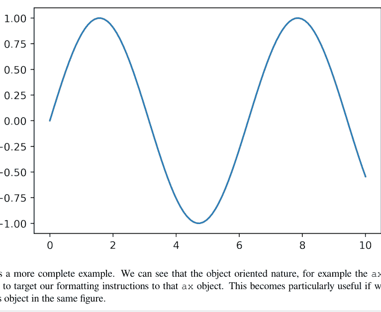

下面是一个更完整的示例。我们可以看到，面向对象的特性，例如 `ax` 对象，使得我们可以将格式化指令定向到该 `ax` 对象。当我们在同一个图形中有多个坐标轴对象时，这变得特别有用。

```
import numpy as np
import matplotlib.pyplot as plt

xs = np.linspace(0, 10, 100)
ys = np.sin(xs)

fig, ax = plt.subplots(figsize=(6, 4))
ax.plot(xs, ys, 'x-', linewidth=2, color='orange')

ax.grid('on')
ax.set_xlabel('x')
ax.set_ylabel('y=f(x)')
fig.savefig("pyplot-demo2.pdf")
```

### 15.3.1 直方图

以下程序演示了如何使用 matplotlib 从统计数据创建直方图。

```python
import matplotlib.pyplot as plt
import numpy as np
import scipy.stats

# create the data
mu, sigma = 100, 15
x = mu + sigma*np.random.randn(10000)

# create the figure and axes objects
fig, ax = plt.subplots()

# the histogram of the data
n, bins, patches = ax.hist(x, 50, density=1, facecolor='green', alpha=0.75)

# add a 'best fit' line
y = scipy.stats.norm.pdf(bins, mu, sigma)
l = ax.plot(bins, y, 'r--', linewidth=1)

# annotate the plot
ax.set_xlabel('Smarts')
ax.set_ylabel('Probability')
ax.set_title(r'$\mathrm{Histogram\ of\ IQ:}\ \mu=100,\ \sigma=15$')
ax.axis([40, 160, 0, 0.03])
ax.grid(True)
```

不要试图理解这个文件中的每一个命令：有些命令相当专业，本文并未涵盖。这里的意图是提供一些示例，以展示 Matplotlib 原则上能做什么。如果你需要这样的图表，预期你需要进行实验，并可能需要进一步学习 Matplotlib。

### 15.3.2 矩阵数据可视化

以下程序演示了如何创建矩阵条目的位图。

```python
import numpy as np
import matplotlib.pyplot as plt

# Helper function (from https://github.com/matplotlib/matplotlib/blob/master/lib/matplotlib/mlab.py
# as of August 2018)
def bivariate_normal(X, Y, sigmax=1.0, sigmay=1.0,
                     mux=0.0, muy=0.0, sigmaxy=0.0):
    """
    Bivariate Gaussian distribution for equal shape *X*, *Y*.
    See `bivariate normal
    <https://mathworld.wolfram.com/BivariateNormalDistribution.html>`_
    at mathworld.
    """
    Xmu = X - mux
    Ymu = Y - muy

    rho = sigmaxy / (sigmax*sigmay)
    z = Xmu**2 / sigmax**2 + Ymu**2 / sigmay**2 - 2*rho*Xmu*Ymu/(sigmax*sigmay)
    denom = 2*np.pi*sigmax*sigmay*np.sqrt(1-rho**2)
    return np.exp(-z/(2*(1-rho**2))) / denom
```

```python
# create matrix Z that contains some interesting data
delta = 0.1
x = y = np.arange(-3.0, 3.0, delta)
X, Y = np.meshgrid(x, y)
Z = bivariate_normal(X, Y, 3.0, 1.0, 0.0, 0.0)

# display the 'raw' matrix data of Z in one set of axis
fig, axes = plt.subplots(ncols=2)
ax0, ax1 = axes
ax0.imshow(Z, interpolation='nearest')
ax0.set_title("no interpolation")

# display the data interpolated in other set of axis
im = ax1.imshow(Z, interpolation='bilinear')
ax1.set_title("with bi-linear interpolation")

fig.suptitle("imshow example")
fig.savefig("pylabimshow.pdf")
```

要使用不同的颜色映射，我们利用 `matplotlib.cm` 模块（其中 cm 代表颜色映射）。下面的代码演示了如何从已提供的映射集合中选择颜色映射，以及如何修改它们（这里通过减少映射中的颜色数量）。最后一个示例模仿了 `matplotlib` 中更复杂的 `contour` 命令的行为。

```python
import numpy as np
import matplotlib.pyplot as plt
import matplotlib.cm as cm          # Colour map submodule

# create matrix Z that contains some data interesting data
delta = 0.025
x = y = np.arange(-3.0, 3.0, delta)
X, Y = np.meshgrid(x, y)
Z = bivariate_normal(X, Y, 3.0, 1.0, 0.0, 0.0)
```

```python
# Create a matrix of axes with 2 rows and 3 columns
fig, axes = plt.subplots(nrows=2, ncols=3)

ax = axes[0, 0]
ax.imshow(Z, cmap=cm.viridis)  # viridis colourmap
ax.set_title("colourmap jet")

ax = axes[0, 1]
ax.imshow(Z, cmap=cm.viridis_r)  # reverse viridis colourmap
ax.set_title("colourmap jet_r")

ax = axes[0, 2]
ax.imshow(Z, cmap=cm.gray)
ax.set_title("colourmap gray")

ax = axes[1, 0]
ax.imshow(Z, cmap=cm.hsv)
ax.set_title("colourmap hsv")  # this one is periodic

ax = axes[1, 1]
ax.imshow(Z, cmap=cm.plasma)
ax.set_title("colourmap plasma")

ax = axes[1, 2]
# make isolines by reducing number of colours to 10
mycmap = cm.get_cmap('viridis', 10)  # 10 discrete colors
ax.imshow(Z, cmap=mycmap)
ax.set_title("colourmap viridis\n(10 colours only)")
fig.tight_layout()  # avoid overlap of titles and axis labels
fig.savefig("pylabimshowcm.pdf")
```

### 15.3.3 选择哪种颜色映射？

选择哪种颜色映射是一个不简单的问题。matplotlib 文档中有一部分有用的讨论。

默认情况下，“感知均匀”的颜色映射是一个不错的选择：颜色的感知遵循我们试图表示的值。例如 “viridis”、“plasma”、“inferno”、“magma”、“cividis”。

这本身就是一个复杂的话题。

### 15.3.4 z = f(x, y) 图和其他 Matplotlib 功能

Matplotlib 具有大量功能，可以创建所有标准（1d 和 2d）图表，如直方图、饼图、散点图、2d 强度图（即 z = f(x, y)）和等高线等。下图显示了这样一个示例（[contour_demo.py](https://matplotlib.org/stable/gallery/images_contours_and_fields/contour_demo.html)）。

也提供了一些对 3d 图的支持：https://matplotlib.org/stable/gallery/index.html#d-plotting

### 15.3.5 如何学习使用 Matplotlib？

一个常见的策略是浏览 https://matplotlib.org/stable/gallery 上的示例，找到与所需图表相似的图表，然后修改给定的示例代码。在此过程中，通过阅读文档来学习示例中使用的命令可能是值得的。

## 15.4 Visual Python

Visual Python 是一个 Python 模块，它使得创建和动画化三维场景变得相当容易。
更多信息：

- Visual Python 主页
- Visual Python 文档（解释所有对象及其所有参数）

介绍 Visual Python 的短视频：

- Shawn Weatherford, Jeff Polak (Ruth Chabay 的学生): https://www.youtube.com/vpythonvideos

### 15.4.1 基础、旋转和缩放

这是一个示例，展示了如何在两个不同位置创建一个红色和一个蓝色球体，以及一个平面盒子（vpythondemo1.py）：

```python
import visual
sphere1 = visual.sphere(pos=[0, 0, 0], color=visual.color.blue)
sphere2 = visual.sphere(pos=[5, 0, 0], color=visual.color.red, radius=2)
base = visual.box(pos=(0, -2, 0), length=8, height=0.1, width=10)
```

一旦你创建了这样的 Visual Python 场景，你可以

- 通过按住鼠标右键并移动鼠标来旋转场景
- 通过按住鼠标中键（可能是滚轮）并上下移动鼠标来放大和缩小。（在某些（Windows？）安装中，需要同时按住鼠标左键和右键，然后上下移动鼠标来缩放。）

### 15.4.2 为动画设置帧率

Visual Python 的一个特别优势是其显示时间相关数据的能力：

- 一个非常有用的命令是 `rate()` 命令，它确保循环仅以特定的帧率执行。这是一个每秒恰好打印两次 "Hello World" 的示例（vpythondemo2.py）：

```python
import visual

for i in range(10):
    visual.rate(2)
    print("Hello World (0.5 seconds per line)")
```

- 所有 Visual Python 对象（如上面示例中的球体和盒子）都有一个 `.pos` 属性，该属性包含对象（[球体，盒子]的中心或[圆柱体，螺旋体]的一端）的位置。这是一个显示球体上下移动的示例（vpythondemo3.py）：

```python
import visual, math

ball = visual.sphere()
box = visual.box( pos=[0,-1,0], width=4, length=4, height=0.5 )

#tell visual not to automatically scale the image
visual.scene.autoscale = False

for i in range(1000):
    t = i*0.1
    y = math.sin(t)

    #update the ball's position
    ball.pos = [0, y, 0]

    #ensure we have only 24 frames per second
    visual.rate(24)
```

### 15.4.3 跟踪轨迹

你可以使用“曲线”来跟踪物体的轨迹。基本思路是将位置点追加到该曲线对象上，如本示例（vpythondemo4.py）所示：

```python
import visual, math

ball = visual.sphere()
box = visual.box( pos=[0,-1,0], width=4, length=4, height=0.5 )
trace=visual.curve( radius=0.2, color=visual.color.green)

for i in range(1000):
    t = i*0.1
    y = math.sin(t)

    #update the ball's position
    ball.pos = [t, y, 0]

    trace.append( ball.pos )

    #ensure we have only 24 frames per second
    visual.rate(24)
```

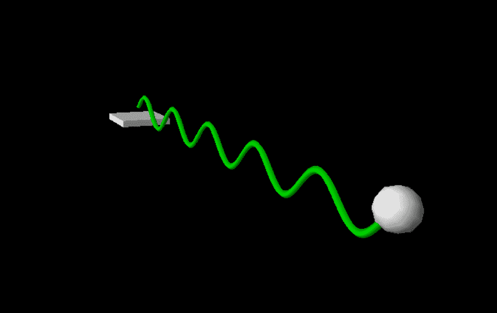

与大多数 Visual Python 对象一样，你可以指定曲线的颜色（也可以为每个追加的元素单独指定！）和半径。

### 15.4.4 连接对象（圆柱体、弹簧等）

圆柱体和螺旋线可用于“连接”两个对象。除了 `pos` 属性（存储对象一端的位置）外，还有一个 `axis` 属性，存储从 `pos` 指向对象另一端的向量。以下是一个圆柱体的示例（`vpythondemo5.py`）：

```python
import visual, math

ball1 = visual.sphere( pos = (0,0,0), radius=2 )
ball2 = visual.sphere( pos = (5,0,0), radius=2 )
connection = visual.cylinder(pos = ball1.pos,
                            axis = ball2.pos - ball1.pos)

for t in range(100):
    #move ball2
    ball2.pos = (-t,math.sin(t),math.cos(t))

    #keep cylinder connection between ball1 and ball2
    connection.axis = ball2.pos - ball1.pos

    visual.rate(24)
```

### 15.4.5 3D 视觉

如果你有“立体”（即彩色）眼镜（最好是红-青色，但红-绿色或红-蓝色也可以），那么你可以通过在程序开头添加以下两行代码，将 Visual Python 切换到这种立体模式：

```python
visual.scene.stereo='redcyan'
visual.scene.stereodepth=1
```

注意 `stereodepth` 参数的效果：

- `stereodepth=0`：3D 场景在屏幕“内部”（默认）
- `stereodepth=1`：3D 场景在屏幕表面（这通常看起来效果最好）
- `stereodepth=2`：3D 场景突出屏幕

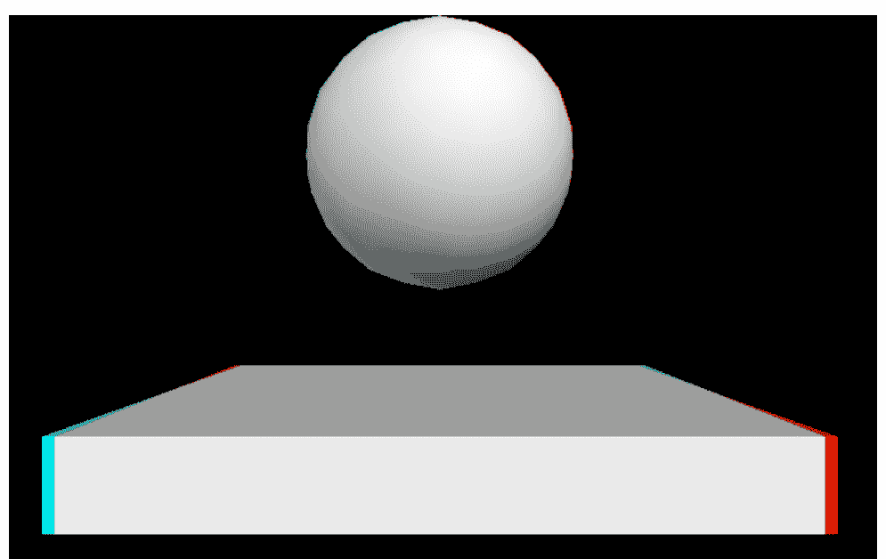

## 15.5 可视化高维数据（VTK）

通常，我们需要理解定义在三维空间位置上的数据。数据本身通常是标量场（如温度）或三维向量（如速度或磁场），偶尔是张量。例如，对于定义在三维空间中的三维向量场 $f$（$\vec{f}(\vec{x})$，其中 $\vec{x} \in \mathbb{R}^3$ 且 $\vec{f}(\vec{x}) \in \mathbb{R}^3$），我们可以在空间的每个（网格）点上绘制一个三维箭头。这些数据集通常是时间相关的。

科学和工程领域中最常用于可视化此类数据集的库可能是 VTK，即可视化工具包（https://vtk.org）。这是一个庞大的 C++ 库，提供了与高级语言（包括 Python）的接口。

你可以直接从 Python 代码调用这些例程，也可以将数据以 VTK 库可以读取的格式（所谓的 vtk 数据文件）写入磁盘，然后使用 Mayavi、ParaView 和 VisIt 等独立程序来读取这些数据文件并进行操作（通常通过 GUI）。这三者内部都使用 VTK 库，并且可以读取 vtk 数据文件。

这些软件包非常适合可视化静态和时间相关的二维和三维场（标量、向量和张量场）。下面展示了两个示例。

它们可以作为带有 GUI 的独立可执行文件来可视化 VTK 文件。也可以从 Python 程序中进行脚本化操作，或从 Python 会话中交互式使用。

### 15.5.1 Mayavi、Paraview、Visit

- Mayavi 主页 http://code.enthought.com/pages/mayavi-project.html
- Paraview 主页 https://www.paraview.org
- VisIt 主页 https://wci.llnl.gov/simulation/computer-codes/visit/

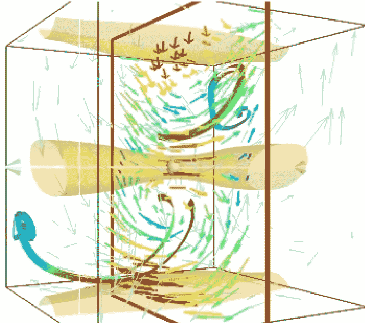


来自 MayaVi 可视化的两个示例。

### 15.5.2 从 Python 写入 vtk 文件（pyvtk）

一个小型但功能强大的 Python 库是 pyvtk，可在 https://github.com/pearu/pyvtk 获取。它允许非常轻松地从 Python 数据结构创建 vtk 文件。

给定 Python 中的有限元网格或有限差分数据集，可以使用 pyvtk 将此类数据写入文件，然后使用上述列出的可视化应用程序之一来加载 vtk 文件并进行显示和研究。

## 15.6 其他工具和发展

除了 `matplotlib`，还有许多其他具有类似或相关可视化功能的库。

[Plotly.py](https://plotly.com/python/) 和 [Bokeh](https://bokeh.org/) – 与基于 Python 的绘图老牌工具 `matplotlib` 一起 – 构成了许多提供可视化技能的工具的基础。

在 https://pyviz.org 可以找到对这些及其他库的精彩总结和[分类](https://pyviz.org/)。

### 15.6.1 利用自描述数据进行可视化

一些库，如 Pandas（另见 *Pandas 章节*）、Xarray 和 holoviews，利用自描述数据的概念来简化可视化：虽然 numpy 数组中的数据“只是”一个（多维）数据点矩阵，但这些库可以存储与这些数据点关联的元数据 – 例如标题和坐标。我们还讨论了带注释或带标签的数据来描述此类元数据的存在。

拥有这些元数据有什么好处？例如，一个 xarray 可能存储一个二维数组（类似 numpy 数组），但其元数据存储表明一个维度指的是 x 位置，另一个维度指的是时间。x-array 对象提供了便捷的方法来选择和绘制 xarray 中的数据。

### 15.6.2 数据可视化的未来

我推测我们将越来越多地使用高级绘图工具（如 pandas、xarray、holoviews）来交互式地探索数据。

我们可以看到数据分析库中的一个趋势，即数据对象可以转换为此类高级带注释的数据对象（例如 European XFEL 的 extra-data 工具可以返回一个带标签的 xarray 对象）。其他项目将元数据与数据组合在自定义对象中，然后提供便捷方法（例如 Ubermag 的 discretisedfield 对象）。

我们还需要学习基础知识吗，比如 `matplotlib.pyplot` 接口？可能需要：至少为了微调这些高级库提供的图表：

### 15.6.3 微调由高级框架生成的 matplotlib 图表

我们展示一个示例，其中 pandas – 作为可以创建图表的高级框架的代表 – 创建了图表，但我们使用 `pyplot` 命令来调整生成的图表。

首先定义 pandas 数据序列（现在理解其细节并不重要）：

```python
import pandas as pd
s = pd.Series(data=[10, 20, 1], index=['bananas', 'oranges', 'potatoes'])
s
```

```
bananas      10
oranges      20
potatoes      1
dtype: int64
```

我们可以使用 pandas 的便捷方法来创建数据序列的图表：

```python
s.plot.bar()
```

```
<AxesSubplot:>
```

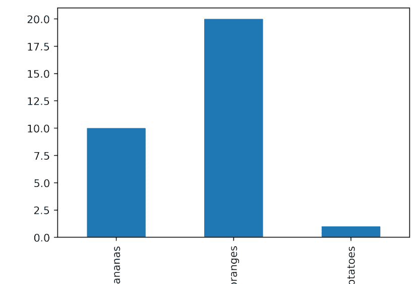

注意条形图是如何被适当标记的：元数据（这里是标签 'bananas'、'oranges' 和 'potatoes'）已被用于标记图表的 x 轴。

如果我们想更改此图表，以下策略有效，并且也受到其他高级框架的支持：

- 创建一个坐标轴（和图形）对象
- 将坐标轴对象传递给高级绘图框架
- 使用坐标轴对象（和图形）来微调图表

以下示例展示了如何添加标题、自定义 y 轴的标签、向图表添加网格，并将图形大小更改为 10 英寸乘 3 英寸：

```python
import matplotlib.pyplot as plt
fig, ax = plt.subplots(figsize=(10, 3))

s.plot.bar(ax=ax, color='orange')
ax.set_title("Current stock")
ax.set_yticks(range(0, 21, 4));
ax.grid('on')
```

## 15.7 Jupyter Notebooks

Jupyter Notebook 已成为交互式数据探索和数据分析的核心工具。我甚至可以说，大多数数据科学家会将 Jupyter Notebook 视为启动数据探索、分析和机器学习项目的默认起点。

为何如此？注释、代码片段、内联的计算或可视化结果，以及这些步骤在笔记本文件中的自动记录，这种组合对于研发活动非常有用。更详细的总结可在此处找到。

一些关于该主题的近期出版物：

- Brian Granger, Fernando Pérez. *Jupyter: Thinking and Storytelling With Code and Data*, Computing in Science & Engineering, vol. 23, no. 2, pp. 7-14, 1 March-April 2021, doi: 10.1109/MCSE.2021.3059263 Authorea preprint (2021)
- Hans Fangohr, Marijan Beg, et al, *Data exploration and analysis with Jupyter notebooks*, Proceedings of the 17th International Conference on Accelerator and Large Experimental Physics Control Systems ICAL EPCS2019, TUCPR02, doi: 10.18429/JACoW-ICALEPCS2019-TUCPR02 (pdf) (2020)
- Marijan Beg; Juliette Belin; Thomas Kluyver; Alexander Konovalov; Min Ragan-Kelley; Nicolas Thiery; Hans Fangohr. *Using Jupyter for Reproducible Scientific Workflows* in Computing in Science & Engineering, vol. 23, no. 2, pp. 36-46, 1 March-April 2021, doi: 10.1109/MCSE.2021.3052101 arXiv preprint (2021)

## 使用 Python 的数值方法 (SCIPY)

### 16.1 概述

核心 Python 语言（包括标准库）提供了足够的功能来执行计算研究任务。然而，也有专门的（第三方）Python 库提供了扩展功能，这些库

- 为常见任务提供数值工具
- 使用方便
- 并且在 CPU 时间和内存需求方面比仅使用 Python 原生功能更高效。

我们特别列出三个这样的模块：

- `numpy` 模块提供了一种专为向量和矩阵“数值计算”设计的数据类型（即 `14-numpy.ipynb` 中介绍的由“numpy”提供的 `array` 类型），以及线性代数工具。
- `matplotlib` 包（也称为 `pylab`）提供了绘图和可视化功能（参见 `15-visualising-data.ipynb`），以及
- `scipy` 包（SCientific PYthon），它提供了大量的数值算法，本章将对其进行介绍。

通过 `scipy` 和 `numpy` 提供的许多数值算法都来自成熟的编译库，这些库通常用 Fortran 或 C 编写。因此，它们的执行速度将比纯 Python 代码（解释型）快得多。根据经验，我们预计编译代码比纯 Python 代码快两个数量级。

你可以使用每个数值方法的帮助函数来了解有关实现来源的更多信息。

### 16.2 SciPy

`Scipy` 提供了许多科学计算功能，通常与 `numpy` 的功能互补。
首先我们需要导入 `scipy`：

```
import scipy
```

当我们使用 help 命令时，`scipy` 包会提供有关其自身结构的信息：

```
help(scipy)
```

输出非常长，因此我们这里只展示其中一部分：

## 计算科学与工程 Python 入门

```
cluster                       --- Vector Quantization / Kmeans
fft                           --- Discrete Fourier transforms
fftpack                       --- Legacy discrete Fourier transforms
integrate                     --- Integration routines
interpolate                   --- Interpolation Tools
io                            --- Data input and output
linalg                        --- Linear algebra routines
linalg.blas                   --- Wrappers to BLAS library
linalg.lapack                 --- Wrappers to LAPACK library
misc                          --- Various utilities that don't have
                                another home.
ndimage                       --- n-dimensional image package
odr                           --- Orthogonal Distance Regression
optimize                      --- Optimization Tools
signal                        --- Signal Processing Tools
signal.windows                --- Window functions
sparse                        --- Sparse Matrices
sparse.linalg                 --- Sparse Linear Algebra
sparse.linalg.dsolve          --- Linear Solvers
sparse.linalg.dsolve.umfpack  --- :Interface to the UMFPACK library:
                                Conjugate Gradient Method (LOBPCG)
sparse.linalg.eigen           --- Sparse Eigenvalue Solvers
sparse.linalg.eigen.lobpcg    --- Locally Optimal Block Preconditioned
                                Conjugate Gradient Method (LOBPCG)
spatial                       --- Spatial data structures and algorithms
special                       --- Special functions
stats                         --- Statistical Functions
```

如果我们正在寻找一个对函数进行积分的算法，我们可能会探索 `integrate` 包：

```
import scipy.integrate
```

```
scipy.integrate?
```

产生：

```
========================================
Integration and ODEs (:mod:`scipy.integrate`)
========================================

.. currentmodule:: scipy.integrate

Integrating functions, given function object
=============================================

.. autosummary::
   :toctree: generated/

   quad            -- General purpose integration
   quad_vec        -- General purpose integration of vector-valued functions
   dblquad         -- General purpose double integration
   tplquad        -- General purpose triple integration
   nquad           -- General purpose n-dimensional integration
   fixed_quad      -- Integrate func(x) using Gaussian quadrature of order n
   quadrature      -- Integrate with given tolerance using Gaussian quadrature
   romberg         -- Integrate func using Romberg integration
   quad_explain    -- Print information for use of quad
   newton_cotes    -- Weights and error coefficient for Newton-Cotes integration
   IntegrationWarning -- Warning on issues during integration

Integrating functions, given fixed samples
==========================================

.. autosummary::
   :toctree: generated/

   trapz           -- Use trapezoidal rule to compute integral.
   cumtrapz        -- Use trapezoidal rule to cumulatively compute integral.
   simps           -- Use Simpson's rule to compute integral from samples.
   romb            -- Use Romberg Integration to compute integral from
                     -- (2**k + 1) evenly-spaced samples.

.. seealso::

   :mod:`scipy.special` for orthogonal polynomials (special) for Gaussian
   quadrature roots and weights for other weighting factors and regions.

Solving initial value problems for ODE systems
==============================================

The solvers are implemented as individual classes which can be used directly
(low-level usage) or through a convenience function.

.. autosummary::
   :toctree: generated/

   solve_ivp       -- Convenient function for ODE integration.
   RK23            -- Explicit Runge-Kutta solver of order 3(2).
   RK45            -- Explicit Runge-Kutta solver of order 5(4).
   DOP853          -- Explicit Runge-Kutta solver of order 8.
   Radau           -- Implicit Runge-Kutta solver of order 5.
   BDF             -- Implicit multi-step variable order (1 to 5) solver.
   LSODA           -- LSODA solver from ODEPACK Fortran package.
   OdeSolver       -- Base class for ODE solvers.
   DenseOutput     -- Local interpolant for computing a dense output.
   OdeSolution     -- Class which represents a continuous ODE solution.
```

以下部分展示了如何使用 `scipy` 提供的算法的示例。

### 16.3 数值积分

Scientific Python 提供了许多积分例程。一个用于求解如下类型积分 $I$ 的通用工具

$$I = \int_{a}^{b} f(x)dx$$

由 `scipy.integrate` 模块的 `quad()` 函数提供。
它接受要积分的函数 $f(x)$（“被积函数”）以及下限 $a$ 和上限 $b$ 作为输入参数。它返回两个值（在一个元组中）：第一个是计算结果，第二个是该结果的数值误差估计。

## 面向计算科学与工程的Python入门

这是一个示例：它会产生如下输出：

```python
# NBVAL_IGNORE_OUTPUT
from math import cos, exp, pi
from scipy.integrate import quad

# 我们要积分的函数
def f(x):
    return exp(cos(-2 * x * pi)) + 3.2

# 调用quad对f从-2到2进行积分
res, err = quad(f, -2, 2)

print("The numerical result is {:f} (+-{:g})"
      .format(res, err))
```

数值结果为 17.864264 (+-1.55117e-11)

请注意，`quad()` 接受可选参数 `epsabs` 和 `epsrel`，用于增加或减少其计算的精度。（使用 `help(quad)` 了解更多信息。）默认值为 `epsabs=1.5e-8` 和 `epsrel=1.5e-8`。对于下一个练习，默认值就足够了。

### 16.3.1 练习：积分一个函数

1.  使用 scipy 的 `quad` 函数，编写一个程序来数值求解以下积分：$I = \int_0^1 \cos(2\pi x)dx$。
2.  求出解析积分，并将其与数值解进行比较。
3.  为什么对数值积分的精度（或误差）进行估计很重要？

### 16.3.2 练习：积分前先绘图

在尝试积分之前，绘制被积函数以检查其是否“行为良好”是一个好习惯。奇点（即 $f(x)$ 趋向于负无穷或正无穷的 $x$ 值）或其他不规则行为（例如 $f(x) = \sin(\frac{1}{x})$ 在 $x = 0$ 附近）在数值上很难处理。

1.  编写一个名为 `plotquad` 的函数，它接受与 `quad` 命令相同的参数（即 $f$、$a$ 和 $b$），并且
    * (i) 创建被积函数 $f(x)$ 的图像，并且
    * (ii) 使用 `quad` 函数数值计算积分。返回值应与 `quad` 函数相同。

```python
%matplotlib inline
# jupyter book 设置：html版本使用svg，pdf版本使用高分辨率png
import matplotlib_inline
matplotlib_inline.backend_inline.set_matplotlib_formats('svg', 'png')
# from IPython.display import set_matplotlib_formats
# set_matplotlib_formats('svg', 'png')
import matplotlib as mpl
mpl.rcParams['figure.dpi'] = 400
```

## 16.4 求解常微分方程（ODEs）

要求解形如 $\frac{dy}{dt}(t) = f(t, y)$ 且给定 $y(t_0) = y_0$ 的常微分方程，我们可以使用 scipy 的 `solve_ivp` 函数。下面是一个（不言自明的）示例程序（usesolve_ivp.py），用于求解

给定微分方程 $\frac{dy}{dt}(t) = -2yt$ 且 $y(0) = 1$ 时，$t \in [0, 2]$ 区间内的 $y(t)$。

```python
from scipy.integrate import solve_ivp
import numpy as np

def f(t, y):
    """这是要积分的ODE的右端项，即 dy/dt=f(y,t)"""
    return -2 * y * t

y0 = [1]           # 初始值 y0=y(t0)
t0 = 0             # t的积分限：从t0=0开始
tf = 2             # 到tf=2结束

sol = solve_ivp(fun=f, t_span=[t0, tf], y0=y0)  # 计算解（SOLution）

import pylab           # 绘制结果
pylab.plot(sol.t, sol.y[0], 'o-')
pylab.xlabel('t'); pylab.ylabel('y(t)')
```

Text(0, 0.5, 'y(t)')

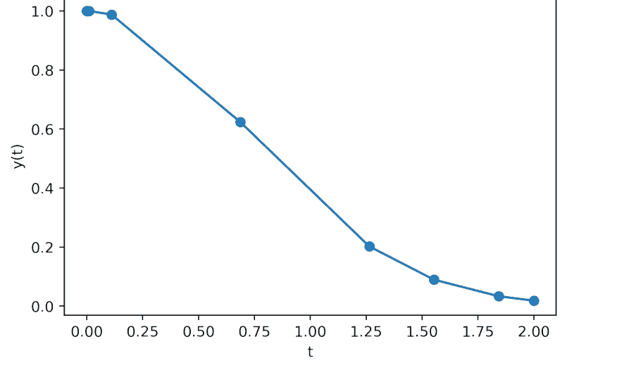

我们没有给 `solve_ivp` 命令任何关于希望知道解 $y(t)$ 在哪些 $t$ 值处的指导：我们只指定了 $t_0 = 0$，并且希望知道 $t_0 = 0$ 和 $t_y = 2$ 之间的解。求解器本身确定了所需的函数求值次数，并在 `sol.t` 和 `sol.y[0]` 中返回相应的值。

我们可以通过多种方式获得更多的数据点：

1.  增加默认的误差容限。相对容差（`rtol`）和绝对容差（`atol`）默认为 1e-3。如果我们增加它们，通常会强制使用更多的中间点：

```python
sol = solve_ivp(fun=f, t_span=[t0, tf], y0=y0, atol=1e-8, rtol=1e-8)

pylab.plot(sol.t, sol.y[0], '.')
pylab.xlabel('t'); pylab.ylabel('y(t)')
```

Text(0, 0.5, 'y(t)')

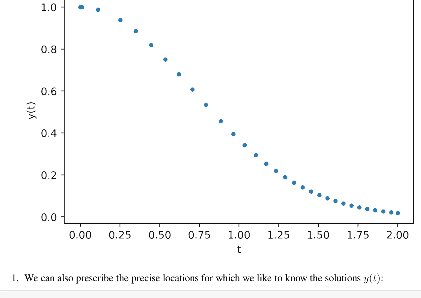

2.  我们也可以指定希望知道解 $y(t)$ 的精确位置：

```python
y0 = [1]            # 初始值
t0 = 0              # t的积分限
tf = 2
ts = np.linspace(t0, tf, 100)  # t0和tf之间的100个点

sol = solve_ivp(fun=f, t_span=[t0, tf], y0=y0, t_eval=ts)

pylab.plot(sol.t, sol.y[0], '.')
pylab.xlabel('t'); pylab.ylabel('y(t)')
```

Text(0, 0.5, 'y(t)')

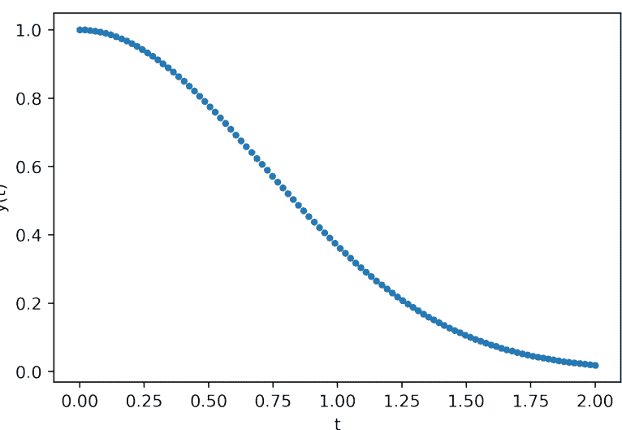

如果我们使用 `t_eval`——即请求在特定点处的解值——`solve_ivp` 通常不会改变其计算解的方式，而是使用插值将其内部计算的解映射到我们希望知道解的 t 值。因此，使用 `t_eval` 来获得更平滑的图像不会带来（显著的）计算代价。

`solve_ivp` 命令返回一个 `OdeResult` 对象，在上面的示例中我们称之为 `sol`。

```python
type(sol)
```

```
scipy.integrate._ivp.ivp.OdeResult
```

我们已经看到解可以在 `sol.y` 和 `sol.t` 中找到：

```python
type(sol.t)
```

```
numpy.ndarray
```

```python
sol.t.shape
```

```
(100,)
```

```python
type(sol.y)
```

```
numpy.ndarray
```

```python
sol.y.shape
```

```
(1, 100)
```

因为 `solve_ivp` 被设计用于积分常微分方程组，所以 `sol.y` 是一个矩阵，其中每一行包含一个自由度的值。在我们上面的简单示例中，我们只有一个自由度（y）。这就是为什么我们必须使用 `sol.y[0]` 来访问解值。

`OdeResult` 对象的其他有趣属性是所需的函数求值次数（其中函数是计算ODE右端项的函数 f）。

```python
sol.nfev
```

```
68
```

还有一个易于阅读的字符串，对于这个示例，它提供了一个令人安心的消息：

```python
sol.message
```

```
'The solver successfully reached the end of the integration interval.'
```

机器可读的状态在 `sol.status` 属性中可用（0 表示良好）：

```python
sol.status
```

```
0
```

`solve_ivp` 命令接受许多可选参数——我们已经看到 `atol` 和 `rtol` 用于改变积分的默认误差容限。我们可以使用 `help` 命令来探索这些。帮助字符串还更详细地解释了求解对象 `OdeResult` 的属性：

```python
help(scipy.integrate.solve_ivp)
```

将显示：

```
Help on function solve_ivp in module scipy.integrate._ivp.ivp:

solve_ivp(fun, t_span, y0, method='RK45', t_eval=None, dense_output=False,
          events=None, vectorized=False, args=None, **options)
    Solve an initial value problem for a system of ODEs.

    This function numerically integrates a system of ordinary differential
    equations given an initial value::

        dy / dt = f(t, y)
        y(t0) = y0

    Here t is a 1-D independent variable (time), y(t) is an
    N-D vector-valued function (state), and an N-D
    vector-valued function f(t, y) determines the differential equations.
    The goal is to find y(t) approximately satisfying the differential
    equations, given an initial value y(t0)=y0.

    Some of the solvers support integration in the complex domain, but note
    that for stiff ODE solvers, the right-hand side must be
    complex-differentiable (satisfy Cauchy-Riemann equations [11]_).
    To solve a problem in the complex domain, pass y0 with a complex data type.
    Another option always available is to rewrite your problem for real and
    imaginary parts separately.

Parameters
----------
fun : callable
    Right-hand side of the system. The calling signature is ``fun(t, y)``.
    Here `t` is a scalar, and there are two options for the ndarray `y`:
    It can either have shape (n,); then `fun` must return array_like with
    shape (n,). Alternatively, it can have shape (n, k); then `fun`
    must return an array_like with shape (n, k), i.e., each column
    corresponds to a single column in `y`. The choice between the two
    options is determined by `vectorized` argument (see below). The
    vectorized implementation allows a faster approximation of the Jacobian
    by finite differences (required for stiff solvers).

t_span : 2-tuple of floats
    Interval of integration (t0, tf). The solver starts with t=t0 and
    integrates until it reaches t=tf.

y0 : array_like, shape (n,)
    Initial state. For problems in the complex domain, pass `y0` with a
    complex data type (even if the initial value is purely real).

method : string or `OdeSolver`, optional
    Integration method to use:

    * 'RK45' (default): Explicit Runge-Kutta method of order 5(4) [1]_.
      The error is controlled assuming accuracy of the fourth-order
      method, but steps are taken using the fifth-order accurate
      formula (local extrapolation is done). A quartic interpolation
      polynomial is used for the dense output [2]_. Can be applied in
      the complex domain.
    * 'RK23': Explicit Runge-Kutta method of order 3(2) [3]_. The error
      is controlled assuming accuracy of the second-order method, but
      steps are taken using the third-order accurate formula (local
      extrapolation is done). A cubic Hermite polynomial is used for
      the dense output. Can be applied in the complex domain.
    * 'DOP853': Explicit Runge-Kutta method of order 8 [13]_.
      Python implementation of the "DOP853" algorithm originally
      written in Fortran [14]_. A 7-th order interpolation polynomial
      accurate to 7-th order is used for the dense output.
      Can be applied in the complex domain.
    * 'Radau': Implicit Runge-Kutta method of the Radau IIA family of
      order 5 [4]_. The error is controlled with a third-order accurate
      embedded formula. A cubic polynomial which satisfies the
      collocation conditions is used for the dense output.
    * 'BDF': Implicit multi-step variable-order (1 to 5) method based
      on a backward differentiation formula for the derivative
      approximation [5]_. The implementation follows the one described
      in [6]_. A quasi-constant step scheme is used and accuracy is
      enhanced using the NDF modification. Can be applied in the
      complex domain.
    * 'LSODA': Adams/BDF method with automatic stiffness detection and
      switching [7]_, [8]_. This is a wrapper of the Fortran solver
      from ODEPACK.
```

## 计算科学与工程中的Python导论

显式龙格-库塔方法（'RK23'、'RK45'、'DOP853'）应用于非刚性问题，而隐式方法（'Radau'、'BDF'）则用于刚性问题[9]_。在龙格-库塔方法中，推荐使用'DOP853'来求解高精度问题（即`rtol`和`atol`取值较小的情况）。

如果不确定，可以先尝试运行'RK45'。如果它迭代次数异常多、发散或失败，那么你的问题很可能是刚性的，你应该使用'Radau'或'BDF'。'LSODA'也可以是一个很好的通用选择，但由于它封装了旧的Fortran代码，使用起来可能稍显不便。

你也可以传递一个从`OdeSolver`派生的任意类，该类实现了求解器。

`t_eval` : array_like 或 None，可选
存储计算解的时间点，必须是排序过的且位于`t_span`内。如果为None（默认值），则使用求解器选择的点。

`dense_output` : bool，可选
是否计算连续解。默认为False。

`events` : callable，或callable列表，可选
要跟踪的事件。如果为None（默认值），则不跟踪任何事件。
每个事件发生在时间和状态的连续函数的零点处。每个函数必须具有签名``event(t, y)``并返回一个浮点数。求解器将使用求根算法找到使``event(t, y(t)) = 0``成立的精确`t`值。默认情况下，将找到所有零点。求解器在每个步长内寻找符号变化，因此如果在一个步长内发生多次零点穿越，可能会错过事件。此外，每个`event`函数可能具有以下属性：

`terminal`: bool，可选
如果发生此事件，是否终止积分。
如果未赋值，则隐式为False。

`direction`: float，可选
零点穿越的方向。如果`direction`为正，则仅在从负到正时触发`event`；如果`direction`为负，则反之。如果为0，则任一方向都会触发事件。如果未赋值，则隐式为0。

你可以在Python中为任何函数分配属性，如``event.terminal = True``。

`vectorized` : bool，可选
`fun`是否以向量化方式实现。默认为False。

`args` : tuple，可选
传递给用户定义函数的额外参数。如果提供，额外参数将传递给所有用户定义函数。因此，例如，如果`fun`的签名为``fun(t, y, a, b, c)``，那么`jac`（如果提供）和任何事件函数必须具有相同的签名，并且`args`必须是长度为3的元组。

`options`
传递给所选求解器的选项。已实现求解器的所有可用选项如下所列。

`first_step` : float 或 None，可选
初始步长。默认为`None`，这意味着算法应自行选择。

`max_step` : float，可选
允许的最大步长。默认为np.inf，即步长不受限制，完全由求解器决定。

`rtol`, `atol` : float 或 array_like，可选
相对和绝对容差。求解器保持局部误差估计值小于``atol + rtol * abs(y)``。这里`rtol`控制相对精度（正确数字的位数）。但如果`y`的某个分量近似低于`atol`，则误差只需落在相同的`atol`阈值内，不保证正确数字的位数。如果y的分量具有不同的尺度，通过为`atol`传递形状为(n,)的array_like来为不同分量设置不同的`atol`值可能是有益的。默认值为`rtol` 1e-3，`atol` 1e-6。

`jac` : array_like, sparse_matrix, callable 或 None，可选
系统右端关于y的雅可比矩阵，'Radau'、'BDF'和'LSODA'方法需要此矩阵。雅可比矩阵的形状为(n, n)，其元素(i, j)等于``d f_i / d y_j``。定义雅可比矩阵有三种方式：

- 如果是array_like或sparse_matrix，则假定雅可比矩阵为常数。'LSODA'不支持此方式。
- 如果是callable，则假定雅可比矩阵依赖于t和y；它将根据需要作为``jac(t, y)``被调用。对于'Radau'和'BDF'方法，返回值可以是稀疏矩阵。
- 如果为None（默认值），则雅可比矩阵将通过有限差分近似。

通常建议提供雅可比矩阵，而不是依赖有限差分近似。

`jac_sparsity` : array_like, sparse matrix 或 None，可选
定义用于有限差分近似的雅可比矩阵的稀疏结构。其形状必须为(n, n)。如果`jac`不为`None`，则忽略此参数。如果雅可比矩阵在*每*行中只有很少的非零元素，提供稀疏结构将大大加快计算速度[10]_。零条目意味着雅可比矩阵中对应的元素始终为零。如果为None（默认值），则假定雅可比矩阵为稠密矩阵。
'LSODA'不支持此方式，请改用`lband`和`uband`。

`lband`, `uband` : int 或 None，可选
定义'LSODA'方法雅可比矩阵带宽的参数，即``jac[i, j] != 0 仅当 i - lband <= j <= i + uband``。默认为None。设置这些参数要求你的jac例程以打包格式返回雅可比矩阵：返回的数组必须有``n``列和``uband + lband + 1``行，雅可比矩阵的对角线写入其中。具体来说，``jac_packed[uband + i - j , j] = jac[i, j]``。`scipy.linalg.solve_banded`中使用相同的格式（可查看示例）。这些参数也可以与``jac=None``一起使用，以减少通过有限差分估计的雅可比矩阵元素数量。

`min_step` : float，可选
'LSODA'方法允许的最小步长。
默认情况下`min_step`为零。

返回值
-------
具有以下定义字段的Bunch对象：
`t` : ndarray，形状 (n_points,)
时间点。

`y` : ndarray，形状 (n, n_points)
在`t`处的解的值。
`sol` : `OdeSolution` 或 None
找到的解作为`OdeSolution`实例；如果`dense_output`设置为False，则为None。
`t_events` : ndarray列表或 None
包含每种事件类型检测到该类型事件的时间点数组列表。如果`events`为None，则为None。
`y_events` : ndarray列表或 None
对于`t_events`中的每个值，对应的解的值。如果`events`为None，则为None。
`nfev` : int
右端求值次数。
`njev` : int
雅可比矩阵求值次数。
`nlu` : int
LU分解次数。
`status` : int
算法终止原因：

    * -1: 积分步失败。
    *  0: 求解器成功到达`tspan`的终点。
    *  1: 发生终止事件。

`message` : string
终止原因的人类可读描述。
`success` : bool
如果求解器到达区间终点或发生终止事件（``status >= 0``），则为True。

### 16.4.1 耦合常微分方程组

我们想展示一个两个一阶常微分方程耦合的例子。这有助于理解为什么上面例子中的初始值y0必须以列表形式（[y0]）提供，以及为什么解是sol.y[0]而不是sol.y。

我们使用捕食者与猎物的例子。设

- $p_1(t)$ 为兔子的数量，
- $p_2(t)$ 为给定时间$t$时狐狸的数量。

为了计算$p_1$和$p_2$的时间依赖性：

- 假设兔子以速率$a$繁殖。单位时间内出生$ap_1$只兔子。
- 假设兔子的数量因与狐狸的碰撞而减少：单位时间内有$cp_1p_2$只兔子被吃掉。
- 假设狐狸的出生率仅取决于以兔子形式摄入的食物。
- 假设狐狸以速率$b$自然死亡。

我们将这些组合成耦合的常微分方程组：\begin{eqnarray} \label{eq:predprey} \frac{d p_1}{dt} &=& a p_1 - c p_1 p_2 \nonumber \ \frac{d p_2}{dt} &=& c p_1 p_2 - b p_2 \nonumber \end{eqnarray}

我们使用以下参数：

- 兔子出生率 $a = 0.7$
- 兔子-狐狸碰撞率 $c = 0.007$

## 16.5 求根

如果你试图找到一个 $x$ 使得 $f(x) = 0$，那么这被称为*求根*。注意，像 $g(x)=h(x)$ 这样的问题也属于此类，因为你可以将它们重写为 $f(x)=g(x)-h(x)=0$。

`scipy` 的 `optimize` 模块提供了多种求根工具。

### 16.5.1 使用二分法求根

首先我们介绍 `bisect` 算法，它（i）稳健，（ii）虽然慢但概念上非常简单。

假设我们需要计算 $f(x)=x^3 - 2x^2$ 的根。这个函数在 $x = 0$ 处有一个（双重）根（这很容易看出），另一个根位于 $x = 1.5$（此时 $f(1.5)= - 1.125$）和 $x = 3$（此时 $f(3)=9$）之间。很容易看出另一个根位于 $x = 2$。下面是一个数值确定该根的程序：

```python
from scipy.optimize import bisect

def f(x):
    """returns f(x)=x^3-2x^2. Has roots at
    x=0 (double root) and x=2"""
    return x ** 3 - 2 * x ** 2

# main program starts here
x = bisect(f, 1.5, 3, xtol=1e-6)

print("The root x is approximately x=%14.12g,\n"
      "the error is less than 1e-6." % (x))
print("The exact error is %g." % (2 - x))
```

```
The root x is approximately x= 2.00000023842,
the error is less than 1e-6.
The exact error is -2.38419e-07.
```

`bisect()` 方法有三个必需参数：（i）函数 $f(x)$，（ii）下限 $a$（在我们的例子中选择了 1.5），以及（iii）上限 $b$（在我们的例子中选择了 3）。可选参数 `xtol` 决定了该方法的最大误差。

二分法的一个要求是区间 $[a, b]$ 必须选择使得函数在 $a$ 处为正且在 $b$ 处为负，或者函数在 $a$ 处为负且在 $b$ 处为正。换句话说：$a$ 和 $b$ 必须包含一个根。

### 16.5.2 练习：使用二分法求根

1. 编写一个名为 `sqrttwo.py` 的程序，通过使用二分算法找到函数 $f(x) = 2 - x^2$ 的根 $x$ 来确定 $\sqrt{2}$ 的近似值。选择根的近似容差为 $10^{-8}$。
2. 记录你为根选择的初始区间 $[a, b]$：你为 $a$ 和 $b$ 选择了哪些值，为什么？
3. 研究结果：
   - 二分算法返回的根 $x$ 的值是多少？
   - 使用 `math.sqrt(2)` 计算 `sqrt2` 的值，并将其与根的近似值进行比较。$x$ 的绝对误差有多大？这与 `xtol` 相比如何？

### 16.5.3 使用 fsolve 函数求根

一个（通常）比二分算法更好（在“更高效”的意义上）的算法实现在通用的 `fsolve()` 函数中，用于（多维）函数的求根。该算法只需要一个靠近疑似根位置的起始点（但不保证收敛）。

下面是一个例子：

```python
from scipy.optimize import fsolve

def f(x):
    return x ** 3 - 2 * x ** 2

x = fsolve(f, 3)           # one root is at x=2.0

print("The root x is approximately x=%21.19g" % x)
print("The exact error is %g." % (2 - x))
```

```
The root x is approximately x= 2.000000000000006661
The exact error is -6.66134e-15.
```

`fsolve` 的返回值[6]是一个长度为 $n$ 的 numpy 数组，用于具有 $n$ 个变量的求根问题。在上面的例子中，我们有 $n = 1$。

## 16.6 插值

给定一组 $N$ 个点 $(x_i, y_i)$，其中 $i = 1, 2, ...N$，我们有时需要一个函数 $\hat{f}(x)$，它在 $x == x_i$ 时返回 $y_i = f(x_i)$，并且此外还为所有 $x$ 提供数据 $(x_i, y_i)$ 的某种插值。

函数 `y0 = scipy.interpolate.interp1d(x,y,kind='nearest')` 基于不同阶的样条进行这种插值。注意，函数 `interp1d` 返回*一个函数* `y0`，当调用为 `y0(x)` 时，它将为任何给定的 $x$ 插值 x-y 数据。

下面的代码演示了这一点，并展示了不同的插值类型。

```python
import numpy as np
import scipy.interpolate
import pylab

def create_data(n):
    """Given an integer n, returns n data points
    x and values y as a numpy.array."""
    xmax = 5.
    x = np.linspace(0, xmax, n)
    y = - x**2
    #make x-data somewhat irregular
    y += 1.5 * np.random.normal(size=len(x))
    return x, y

#main program
n = 10
x, y = create_data(n)

#use finer and regular mesh for plot
xfine = np.linspace(0.1, 4.9, n * 100)
#interpolate with piecewise constant function (p=0)
y0 = scipy.interpolate.interp1d(x, y, kind='nearest')
#interpolate with piecewise linear func (p=1)
y1 = scipy.interpolate.interp1d(x, y, kind='linear')
#interpolate with piecewise constant func (p=2)
y2 = scipy.interpolate.interp1d(x, y, kind='quadratic')

pylab.plot(x, y, 'o', label='data point')
pylab.plot(xfine, y0(xfine), label='nearest')
pylab.plot(xfine, y1(xfine), label='linear')
pylab.plot(xfine, y2(xfine), label='cubic')
pylab.legend()
pylab.xlabel('x')
```

Text(0.5, 0, 'x')

## 16.7 曲线拟合

我们已经在 *numpy 章节* 中看到，我们可以使用 `numpy.polyfit` 函数将多项式函数拟合到数据集。这里，我们介绍一种更通用的曲线拟合算法。

Scipy 通过 `scipy.optimize.curve_fit` 提供了一个相当通用的函数（基于 Levenburg-Marquardt 算法），用于将给定的（Python）函数拟合到给定的数据集。假设我们被给定了一组数据，包含点 $x_1, x_2, ...x_N$ 和相应的函数值 $y_i$，并且 $y_i$ 对 $x_i$ 的依赖关系为 $y_i = f(x_i, \vec{p})$。我们希望确定参数向量 $\vec{p} = (p_1, p_2, ..., p_k)$，使得残差之和 $r$ 尽可能小：

$$r = \sum_{i=1}^{N} (y_i - f(x_i, \vec{p}))^2$$

当数据有噪声时，曲线拟合特别有用：对于给定的 $x_i$ 和 $y_i = f(x_i, \vec{p})$，我们有一个（未知的）误差项 $\epsilon_i$，使得 $y_i = f(x_i, \vec{p}) + \epsilon_i$。

我们使用以下例子来阐明这一点：$f(x, \vec{p}) = a \exp(-bx) + c$，即 $\vec{p} = a, b, c$

```python
# NBVAL_IGNORE_OUTPUT
import numpy as np
from scipy.optimize import curve_fit

def f(x, a, b, c):
    """Fit function y=f(x,p) with parameters p=(a,b,c). """
    return a * np.exp(- b * x) + c

#create fake data
x = np.linspace(0, 4, 50)
y = f(x, a=2.5, b=1.3, c=0.5)
#add noise
yi = y + 0.2 * np.random.normal(size=len(x))

#call curve fit function
popt, pcov = curve_fit(f, x, yi)
a, b, c = popt
print("Optimal parameters are a=%g, b=%g, and c=%g" % (a, b, c))

#plotting
import pylab
yfitted = f(x, *popt)   # equivalent to f(x, popt[0], popt[1], popt[2])
pylab.plot(x, yi, 'o', label='data $y_i$')
pylab.plot(x, yfitted, '-', label='fit $f(x_i)$')
pylab.xlabel('x')
pylab.legend()
```

```
Optimal parameters are a=2.61353, b=1.37987, and c=0.491754
```

注意，在上面的源代码中，我们通过 Python 代码定义了拟合函数 $y = f(x)$。因此，我们可以使用 `curve_fit` 方法拟合（几乎）任意函数。

`curve_fit` 函数返回一个元组 `popt`, `pcov`。第一个条目 `popt` 包含一个最优参数（OPTimal Parameters）的元组（在最小化方程 ([eq:1]) 的意义上）。第二个条目包含所有参数的协方差矩阵。对角线提供了参数估计的方差。

为了使曲线拟合过程正常工作，Levenburg-Marquardt 算法需要从最终参数的初始猜测开始拟合过程。如果未指定这些值（如上面的例子），则使用“1.0”作为初始猜测值。

如果算法无法将函数拟合到数据（即使该函数能合理地描述数据），我们需要为算法提供更好的初始参数估计值。对于上面展示的例子，我们可以通过修改以下代码行，将估计值传递给 `curve_fit` 函数：

```
popt, pcov = curve_fit(f, x, y)
```

改为：

```
popt, pcov = curve_fit(f, x, y, p0=(2, 1, 0.6))
```

假设我们的初始猜测值为 $a = 2, b = 1$ 和 $c = 0.6$。一旦我们将算法“大致引导到参数空间中的正确区域”，拟合通常就能很好地工作。

## 16.8 傅里叶变换

在下一个例子中，我们创建一个由 50 Hz 和 70 Hz 正弦波叠加而成的信号（两者之间有轻微的相位偏移）。然后我们对该信号进行傅里叶变换，并绘制（复数）离散傅里叶变换系数的绝对值随频率变化的图，期望在 50Hz 和 70Hz 处看到峰值。

```
import scipy.fft
import numpy as np
import matplotlib.pyplot as plt
pi = scipy.pi

signal_length = 0.5    # [seconds]
sample_rate = 500       # sampling rate [Hz]
dt = 1. / sample_rate   # time between two samples [s]

df = 1 / signal_length  # frequency between points in
                        # in frequency domain [Hz]
t = np.arange(0, signal_length, dt)  # the time vector
n_t = len(t)            # length of time vector

# create signal
y = np.sin(2*pi*50*t) + np.sin(2*pi*70*t+pi/4)

# compute Fourier transform
f = scipy.fft.fft(y)

# work out meaningful frequencies in Fourier transform
freqs = df * np.arange(0, (n_t-1)/2., dtype='d')  # 'd'=double precision float
n_freq = len(freqs)

# plot input data y against time
plt.subplot(2, 1, 1)
plt.plot(t, y, label='input data')
plt.xlabel('time [s]')
plt.ylabel('signal')

#plot frequency spectrum
plt.subplot(2, 1, 2)
plt.plot(freqs, abs(f[0:n_freq]),
         label='abs(fourier transform)')
plt.xlabel('frequency [Hz]')
plt.ylabel('abs(DFT(signal))');
```

下方的图显示了根据上方图中数据计算出的离散傅里叶变换。

## 16.9 优化

我们经常需要找到特定函数 $f(x)$ 的最大值或最小值，其中 $f$ 是一个标量函数，但 $x$ 可能是一个向量。典型的应用包括最小化成本、风险和误差等实体，或最大化生产力、效率和利润。优化程序通常提供一种最小化给定函数的方法：如果我们需要最大化 $f(x)$，我们可以创建一个新函数 $g(x)$，它反转 $f$ 的符号，即 $g(x) = -f(x)$，然后最小化 $g(x)$。

下面，我们提供一个示例，展示 (i) 测试函数的定义和 (ii) `scipy.optimize.fmin` 函数的调用。该函数接受一个待最小化的函数 $f$ 和一个用于开始搜索最小值的初始值 $x0$ 作为参数，并返回使 $f(x)$（局部）最小化的 $x$ 值。通常，寻找最小值是一个局部搜索过程，即算法遵循局部梯度。我们针对两个不同的值（分别为 $x0 = 1.0$ 和 $x0 = 2.0$）重复搜索最小值，以演示根据起始值的不同，我们可能会找到函数 $f$ 的不同最小值。

文件 `fmin1.py` 中的大部分命令（在两次调用 `fmin` 之后）用于创建函数图、搜索的起始点以及获得的最小值：

```
python
from numpy import arange, cos, exp
from scipy.optimize import import fmin
import pylab

def f(x):
    return cos(x) - 3 * exp( -(x - 0.2) ** 2)

# find minima of f(x),
# starting from 1.0 and 2.0 respectively
minimum1 = fmin(f, 1.0)
print("Start search at x=1., minimum is", minimum1)
```

```
minimum2 = fmin(f, 2.0)
print("Start search at x=2., minimum is", minimum2)

# plot function
x = arange(-10, 10, 0.1)
y = f(x)
pylab.plot(x, y, label='$\cos(x)-3e^{-(x-0.2)^2}$')
pylab.xlabel('x')
pylab.grid()
pylab.axis([-5, 5, -2.2, 0.5])

# add minimum1 to plot
pylab.plot(minimum1, f(minimum1), 'vr',
           label='minimum 1')
# add start1 to plot
pylab.plot(1.0, f(1.0), 'or', label='start 1')

# add minimum2 to plot
pylab.plot(minimum2,f(minimum2),'vg',
           label='minimum 2')
# add start2 to plot
pylab.plot(2.0,f(2.0),'og',label='start 2')

pylab.legend(loc='lower left')
```

```
Optimization terminated successfully.
        Current function value: -2.023866
        Iterations: 16
        Function evaluations: 32
Start search at x=1., minimum is [0.23964844]
Optimization terminated successfully.
        Current function value: -1.000529
        Iterations: 16
        Function evaluations: 32
Start search at x=2., minimum is [3.13847656]
```

```
<matplotlib.legend.Legend at 0x7f9aea7b5d00>
```

调用 `fmin` 函数会产生一些诊断输出，你也可以在上面看到。

**`fmin` 的返回值**

请注意，`fmin` 函数的返回值是一个 numpy `array`，对于上面的例子，它只包含一个数字，因为我们只有一个参数（这里是 $x$）需要变化。通常，如果存在多个参数，`fmin` 可以用于在更高维度的参数空间中寻找最小值。在这种情况下，numpy 数组将包含使目标函数最小化的那些参数。即使有更多参数，即即使 $x$ 是像 $f(\mathbf{x})$ 中的向量，目标函数 $f(x)$ 也必须返回一个标量。

## 16.10 其他数值方法

Scientific Python 和 Numpy 提供了对大量其他数值算法的访问，包括函数插值、傅里叶变换、优化、特殊函数（如贝塞尔函数）、信号处理和滤波器、随机数生成等等。开始使用 `help` 函数和网上提供的文档来探索 `scipy` 和 `numpy` 的功能。

## 16.11 scipy.io：Scipy 输入输出

Scipy 提供了读写 Matlab `mat` 文件的例程。这里有一个例子，我们创建一个存储 (1x11) 矩阵的 Matlab 兼容文件，然后使用 scipy 输入输出库将此数据读入 Python 中的 numpy 数组：

首先，我们在 Octave 中创建一个 mat 文件（Octave [大部分] 与 Matlab 兼容）：

```
octave
octave:1> a=-1:0.5:4
a =

Columns 1 through 6:

   -1.0000   -0.5000    0.0000    0.5000    1.0000    1.5000
```

```
Columns 7 through 11:
    2.0000    2.5000    3.0000    3.5000    4.0000
octave:2> save -6 octave_a.mat a    %save as version 6
```

然后我们在 python 中加载这个数组：

```
from scipy.io import loadmat
mat_contents = loadmat('static/data/octave_a.mat')
```

```
mat_contents
```

```
{'__header__': b'MATLAB 5.0 MAT-file Platform: posix, Created on: Mon Aug  8 12:21:36 2016',
 '__version__': '1.0',
 '__globals__': [],
 'a': array([[-1. , -0.5,  0. ,  0.5,  1. ,  1.5,  2. ,  2.5,  3. ,  3.5,  4. ]])}
```

```
mat_contents['a']
```

```
array([[-1. , -0.5,  0. ,  0.5,  1. ,  1.5,  2. ,  2.5,  3. ,  3.5,  4. ]])
```

函数 `loadmat` 返回一个字典：字典中每个条目的键是一个字符串，即该数组在 Matlab 中保存时的名称。键对应的值才是实际的数组。

一个 Matlab 矩阵文件可以包含多个数组。每个数组都由字典中的一个键值对表示。

让我们从 Python 保存两个数组来演示这一点：

```
import scipy.io
import numpy as np

# create two numpy arrays
a = np.linspace(0, 50, 11)
b = np.ones((4, 4))

# save as mat-file
# create dictionary for savemat
tmp_d = {'a': a,
         'b': b}
scipy.io.savemat('data.mat', tmp_d)
```

这个程序创建了文件 `data.mat`，我们可以随后使用 Matlab 或这里的 Octave 来读取它：

```
HAL47:code fangohr$ octave
GNU Octave, version 3.2.4
Copyright (C) 2009 John W. Eaton and others.
<snip>

octave:1> whos
Variables in the current scope:

   Attr Name        Size                 Bytes  Class
   ==== ====        ====                 =====  =====
```

## 面向计算科学与工程的Python入门

（接上一页）

```
ans     1x11            92  cell

Total is 11 elements using 92 bytes

octave:2> load data.mat
octave:3> whos
Variables in the current scope:

  Attr Name        Size            Bytes  Class
  ==== ====        ====            =====  =====
       a           11x1               88  double
       ans         1x11               92  cell
       b            4x4              128  double

Total is 38 elements using 308 bytes

octave:4> a
a =

     0
     5
    10
    15
    20
    25
    30
    35
    40
    45
    50

octave:5> b
b =

     1     1     1     1
     1     1     1     1
     1     1     1     1
     1     1     1     1
```

请注意，`scipy.io`中还有其他函数可用于读写IDL、Netcdf等格式的数据。

更多信息 → 参见Scipy教程。

# 第十七章

## PANDAS - 使用Python进行数据科学

对于类似向量、矩阵（以及更高维张量）的数值数据，Numpy和numpy数组是我们的首选工具。

当数据来自实验，特别是当我们希望从不同数据源的组合中提取意义，且数据常常不完整时，pandas库提供了许多有用的工具（并已成为数据科学家的标准工具）。

在本节中，我们将介绍Pandas的基础知识。

特别是，我们将介绍Pandas中的两个关键数据类型：`Series`和`DataFrame`对象。

按照惯例，`pandas`库通常以`pd`作为别名导入（就像`numpy`通常以`np`作为别名导入一样）：

```
import pandas as pd
```

### 17.1 动机示例（Series）

假设我们正在为一家蔬菜水果店或超市开发软件，需要跟踪超市中苹果（10个）、橙子（3个）和香蕉（22根）的数量。

我们可以使用一个python列表（或numpy数组）来跟踪这些数字：

```
stock = [10, 3, 22]
```

然而，我们需要单独记住这些条目是按苹果、橙子、香蕉的顺序排列的。这可以通过第二个列表来实现：

```
stocklabels = ['apple', 'orange', 'banana']
```

```
assert len(stocklabels) == len(stock)  # 检查标签和库存是否一致
for label, count in zip(stocklabels, stock):
    print(f'{label:10s} : {count:4d}')
```

```
apple      :   10
orange     :    3
banana     :   22
```

上述双列表解决方案在两个方面有些笨拙：首先，我们使用了两个列表来描述一组数据（因此需要小心同时更新它们），其次，给定标签访问数据不方便：我们需要在一个列表中找到标签的索引，然后用它作为另一个列表的索引，例如：

```
index = stocklabels.index('banana')
bananas = stock[index]
print(f"There are {bananas} bananas [index={index}].")
```

```
There are 22 bananas [index=2].
```

我们在关于字典的部分遇到过类似的例子，实际上字典是一个更方便的解决方案：

```
stock_dic = {'apple': 10,
            'orange': 3,
            'banana': 22}
```

在某种程度上，字典的键包含了库存标签，而值包含了实际的数值：

```
stock_dic.keys()
```

```
dict_keys(['apple', 'orange', 'banana'])
```

```
stock_dic.values()
```

```
dict_values([10, 3, 22])
```

要检索（或更改）`apple`的值，我们使用`apple`作为键，并通过字典的索引表示法检索值：

```
stock_dic['apple']
```

```
10
```

我们可以如下总结库存：

```
for label in stock_dic:
    print(f'{label:10s} : {stock_dic[label]:4d}')
```

```
apple      :   10
orange     :    3
banana     :   22
```

这比双列表解决方案有了巨大的改进：(i) 我们只维护一个结构，其中每个键都有一个值——因此我们不需要检查列表是否具有相同的长度。(ii) 我们可以通过标签访问单个元素（将其用作字典的键）。

Pandas Series对象满足了上述要求。它类似于字典，但针对给定问题进行了改进：

-   项目的顺序得以保持
-   值必须具有相同的类型（更高的执行性能）
-   提供了（大量）便捷功能，例如处理缺失数据、时间序列、排序、绘图等

### 17.2 Pandas Series

#### 17.2.1 库存示例 - Series

我们可以从字典创建一个`Series`对象——例如：

```
stock = pd.Series({'apple': 10,
                   'orange': 3,
                   'banana': 22})
```

默认显示方式每行显示一个条目，左侧是标签，右侧是值。

```
type(stock)
```

```
pandas.core.series.Series
```

```
stock
```

```
apple     10
orange     3
banana    22
dtype: int64
```

左侧的项目被称为Series的`index`，并作为`series`对象的`index`属性可用：

```
stock.index
```

```
Index(['apple', 'orange', 'banana'], dtype='object')
```

```
type(stock.index)
```

```
pandas.core.indexes.base.Index
```

我们也可以使用`values`属性访问每个项目的值列表：

```
stock.values
```

```
array([10,  3, 22])
```

关于数据访问，`Series`对象的行为类似于字典：

```
stock['apple']
```

```
10
```

```
stock['potato'] = 101    # 添加更多值
stock['cucumber'] = 1
```

```
print(stock)
```

```
apple        10
orange        3
banana       22
potato      101
cucumber      1
dtype: int64
```

```
stock
```

```
apple        10
orange        3
banana       22
potato      101
cucumber      1
dtype: int64
```

我们可以将数据绘制为条形图：

```
%matplotlib inline
# jupyter book的设置：html版本使用svg，pdf版本使用高分辨率png
from IPython.display import set_matplotlib_formats
set_matplotlib_formats('svg', 'png')
import matplotlib as mpl
mpl.rcParams['figure.dpi'] = 400
```

```
/tmp/ipykernel_276/922218149.py:4: DeprecationWarning: `set_matplotlib_formats` is deprecated since IPython 7.23, directly use `matplotlib_inline.backend_inline.set_matplotlib_formats()`
  set_matplotlib_formats('svg', 'png')
```

```
stock.plot(kind='bar')
```

```
<AxesSubplot:>
```

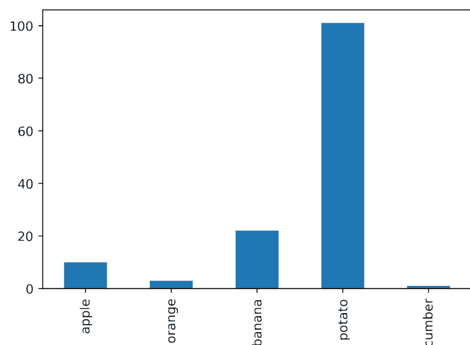

我们可以根据Series中的值对数据进行排序（然后绘图以可视化）：

```
stock.sort_values().plot(kind='bar')
```

```
<AxesSubplot:>
```

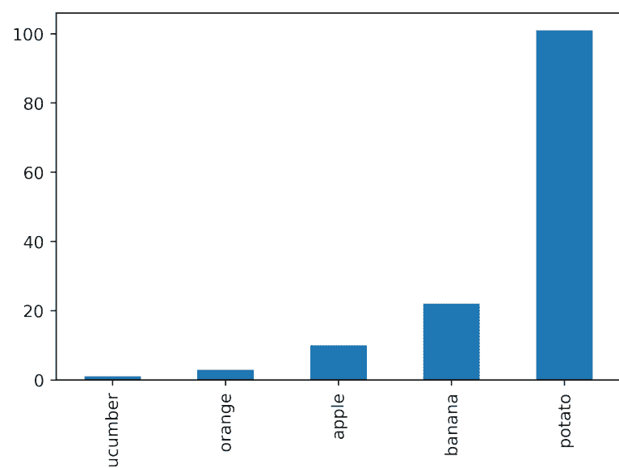

或者对索引进行排序，以获得水果和蔬菜的字母顺序：

```
stock.sort_index().plot(kind='bar')
```

```
<AxesSubplot:>
```

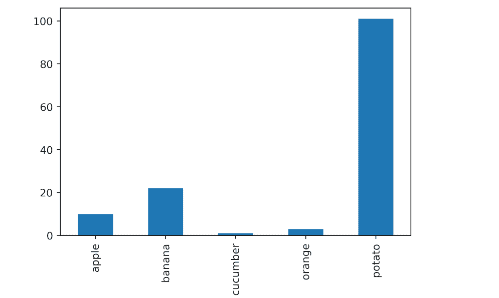

`Series`对象提供了许多数值方法，包括`mean`和`sum`：

```
stock.sum()
```

```
137
```

```
stock.mean()
```

```
27.4
```

它也像序列一样，`len`函数返回Series对象中的数据点数量：

```
len(stock)
```

```
5
```

#### 17.2.2 内存使用

对于较大的数据集，了解存储Series需要多少字节可能很重要。存储实际Series数据所需的字节数可通过以下方式获取：

```
stock.nbytes
```

```
40
```

或者直接从底层的numpy数组获取：

```
stock.values.nbytes
```

```
40
```

它是40字节，因为我们有5个元素存储为int64（每个需要8字节）：

```
stock.dtype
```

```
dtype('int64')
```

Series对象需要额外的内存。这可以使用以下方式查询：

```
stock.memory_usage()
```

```
252
```

#### 17.2.3 统计信息

使用`describe()`可以获取`stock` Series对象中数据的多个统计描述符：

```
stock.describe()
```

```
count      5.000000
mean      27.400000
std       41.955929
min        1.000000
25%        3.000000
50%       10.000000
75%       22.000000
max      101.000000
dtype: float64
```

通常，文档字符串提供了文档（`help(stock.describe)`），而pandas主页（https://pandas.pydata.org）提供了指向Pandas文档的链接。

### 17.3 从列表创建Series

在上面的示例中，我们展示了如何从字典创建Series，其中字典条目的键用作Series对象的索引。

我们也可以从列表创建Series，并提供一个额外的索引：

```
stock = pd.Series([10, 3, 22], index=['apple', 'orange', 'banana'])
```

```
stock
```

## 17.4 数据绘图

常用图表可通过 Series 对象的 `plot()` 方法轻松创建。我们之前已经见过柱状图。`Series.plot()` 方法接受一个 `kind` 参数，例如 `kind="bar"`，但也可以使用等效的 `Series.plot.bar()` 方法。

更多示例：

```python
stock.plot.pie()
```

```
<AxesSubplot:ylabel='None'>
```

要自定义图表，我们可以获取坐标轴对象并进行后续修改：

```python
ax = stock.plot.pie()
ax.set_aspect(1)
ax.set_ylabel(None);
ax.set_title(None);
```

```python
import matplotlib.pyplot as plt
fig, ax = plt.subplots(1, 1, figsize=(9, 3))
stock.plot.bar(ax=ax)
ax.set_title("Current stock");
```

我们也可以从 Series 中提取数据，然后“手动”驱动绘图：

```python
import matplotlib.pyplot as plt

names = list(stock.index)
values = list(stock.values)

fig, ax = plt.subplots(1, 1, figsize=(9, 3))
ax.bar(names, values)
ax.set_title('Stock');
```

## 17.5 缺失值

“真实”数据集往往是不完整的。处理缺失值是数据科学中的一个重要课题。在 Pandas 中，约定使用特殊的浮点数值 “NaN”（代表 Not a Number，非数字）来表示缺失的数据点。例如，如果我们有一个库存表，但不知道苹果的值，我们会用 NaN 替换它。

Python 中的特殊 NaN 值可以使用 `float('nan')` 创建，如果导入了 `numpy` 模块，也可以使用 `numpy.nan`。

```python
stock['apple'] = float('nan')
```

```python
stock
```

```
apple     NaN
orange    3.0
banana   22.0
dtype: float64
```

注意，当我们为 `apple` 赋值 NaN 时，`stock` Series 对象的 `dtype` 从 `int64` 变成了 `float64`：整个 Series 都被转换为浮点数，因为 NaN 只对浮点数有定义。

（有一个提案建议在 pandas 中创建一个 NaN 对象——这将克服上述限制。）

假设我们需要使用 `sum` 函数计算库存总数：

```python
stock.values
```

```
array([nan,  3., 22.])
```

常见的情况是，我们有一个不完整的 Series 或 DataFrame（即具有相同索引的多个 Series），我们希望继续进行分析，但以特殊方式处理缺失值。

```python
stock.sum()
```

```
25.0
```

上面的 `sum` 示例表明，NaN 值会被简单地忽略，这有时很方便。

我们也可以通过移除所有包含 NaN 值的条目来“整理”Series 对象：

```python
stock.dropna()
```

```
orange    3.0
banana   22.0
dtype: float64
```

## 17.6 Series 数据访问：显式与隐式（loc 和 iloc）

```python
stock = pd.Series({'apple': 10,
                  'orange': 3,
                  'banana': 22,
                  'cucumber' : 1,
                  'potato' : 110})
```

```python
stock
```

```
apple        10
orange        3
banana       22
cucumber      1
potato      110
dtype: int64
```

### 17.6.1 索引

我们可以通过索引访问单个值，就像 stock Series 对象是一个字典一样：

```python
stock['banana']
```

```
22
```

使用 `loc`（可能代表 LOCation？）属性进行检索是一种等效且推荐的方式：

```python
stock.loc['banana']
```

```
22
```

为了方便，pandas 也（！）允许我们使用整数索引访问 Series 对象。这被称为*隐式*索引，因为 Series 对象不使用整数作为索引，而是使用水果的名称。

例如，我们也可以通过其隐式索引 2 来检索 `banana` 的值，因为它位于 Series 对象的第 3 行（由于我们从 0 开始计数，所以需要索引 2）：

```python
stock[2]
```

```
22
```

在这个例子中，这运行良好且似乎很方便，但如果对象的实际索引由整数组成，可能会变得非常混乱。因此，使用间接索引的显式（且推荐的）方式是通过 `iloc`（ImplicitLOCation）属性：

```python
stock.iloc[2]
```

```
22
```

### 17.6.2 切片

```python
stock
```

```
apple        10
orange        3
banana       22
cucumber      1
potato      110
dtype: int64
```

我们也可以对 Series 进行切片：

```python
stock['orange':'potato']
```

```
orange        3
banana       22
cucumber      1
potato      110
dtype: int64
```

或者每隔一个条目跳过：

```python
stock['orange':'potato':2]
```

```
orange        3
cucumber      1
dtype: int64
```

### 17.6.3 数据操作

Series 对象上的数值运算可以同时应用于所有数据值，其方式与处理 numpy 数组相同：

```python
stock - stock.mean()
```

```
apple      -19.2
orange     -26.2
banana      -7.2
cucumber   -28.2
potato      80.8
dtype: float64
```

```python
import numpy as np
```

```python
np.sqrt(stock)
```

```
apple           3.162278
orange          1.732051
banana          4.690416
cucumber        1.000000
potato         10.488088
dtype: float64
```

如果需要，我们可以提取 numpy 数组并对其进行操作：

```python
data = stock.values
```

```python
type(data)
```

```
numpy.ndarray
```

```python
data - data.mean()
```

```
array([-19.2, -26.2,  -7.2, -28.2,  80.8])
```

### 17.6.4 导入与导出

Pandas（及其对象 `Series` 和 `DataFrame`）支持导出到和从多种有用的格式导入。
例如，我们可以将 `Series` 对象写入逗号分隔值文件：

```python
stock.to_csv('stock.csv', header=False)
```

```python
#NBVAL_IGNORE_OUTPUT
!cat stock.csv
```

```
apple,10
orange,3
banana,22
cucumber,1
potato,110
```

我们也可以创建表格的 LaTeX 表示：

```python
stock.to_latex()
```

```
'\begin{tabular}{lr}\n\toprule\n{} &       0 \n\midrule\napple     &      10 \norange    &       3 \nbanana    &      22 \ncucumber  &       1 \npotato    &     110 \n\bottomrule\n\end{tabular}\n'
```

我们将在 `DataFrame` 部分再讨论从文件读取。

## 17.7 数据框

### 17.7.1 库存示例 - DataFrame

在上面介绍了 `Series` 对象之后，我们将重点介绍 pandas 中第二个重要的类型：`DataFrame`。

作为初步描述，我们可以说 `DataFrame` 类似于一个（二维）电子表格：它包含行和列。

我们上面研究的 Series 对象是 `DataFrame` 的一个特例，其中 `DataFrame` 只有一列。

我们将继续使用我们的库存示例：

```python
stock
```

```
apple        10
orange        3
banana       22
cucumber      1
potato      110
dtype: int64
```

除了跟踪每种类型的库存数量外，我们还有第二个 Series 对象，提供每件商品的销售单价：

```python
price = pd.Series({'apple': 0.55, 'banana': 0.50, 'cucumber' : 0.99, 'potato' : 0.17,
                   'orange': 1.76})
price
```

```
apple        0.55
banana       0.50
cucumber     0.99
potato       0.17
orange       1.76
dtype: float64
```

`DataFrame` 对象允许我们将两个 Series 一起处理。实际上，创建 `DataFrame` 对象的一种便捷方式是将多个 Series 组合如下：

```python
shop = pd.DataFrame({'stock' : stock, 'price' : price})
shop
```

```
            stock  price
apple        10   0.55
banana       22   0.50
cucumber      1   0.99
orange        3   1.76
potato      110   0.17
```

因为两个 `Series` 对象具有相同的 `index` 元素，所以我们的数据在名为 `shop` 的 `DataFrame` 中整齐对齐，即使数据在 `price` 和 `stock` 中存储的顺序不同。

如果一个 Series 缺少一个数据点，pandas 会在该字段中插入一个 `NaN` 条目：

price2 = price.copy()

price2['grapefruit'] = 1.99
price2

apple          0.55
banana         0.50
cucumber       0.99
potato         0.17
orange         1.76
grapefruit     1.99
dtype: float64

pd.DataFrame({'stock' : stock, 'price' : price2})

          stock  price
apple      10.0   0.55
banana     22.0   0.50
cucumber    1.0   0.99
grapefruit  NaN   1.99
orange      3.0   1.76
potato    110.0   0.17

### 17.7.2 访问 DataFrame 中的数据

shop

          stock  price
apple      10   0.55
banana     22   0.50
cucumber    1   0.99
orange      3   1.76
potato    110   0.17

该数据框有一个*索引*，它对所有列都相同，并在最左侧列中以粗体显示。我们也可以请求获取它：

shop.index

Index(['apple', 'banana', 'cucumber', 'orange', 'potato'], dtype='object')

每一列都有一个名称（这里是 `stock` 和 `price`）：

shop.columns

Index(['stock', 'price'], dtype='object')

### 17.7.3 提取数据列

使用列名，我们可以使用索引运算符（`[]`）将一列提取为 Series 对象：

shop['stock']

apple        10
banana       22
cucumber      1
orange        3
potato      110
Name: stock, dtype: int64

shop['price']

apple        0.55
banana       0.50
cucumber     0.99
orange       1.76
potato       0.17
Name: price, dtype: float64

### 17.7.4 提取数据行

我们有两种提取数据行的选项。
第一种，使用该行索引标签进行显式索引：

shop.loc['apple']            # 单行作为 Series 返回

stock    10.00
price     0.55
Name: apple, dtype: float64

shop.loc['banana':'cucumber']  # 多行作为 DataFrame 返回

          stock  price
banana      22   0.50
cucumber     1   0.99

第二种，我们可以使用隐式索引（就像 Series 对象一样）：

shop.iloc[0]

stock    10.00
price     0.55
Name: apple, dtype: float64

shop.iloc[1:3]

| | stock | price |
|---|---|---|
| banana | 22 | 0.50 |
| cucumber | 1 | 0.99 |

**警告**

请注意，这里存在一些不一致之处：使用索引标签的显式切片（例如 `.loc['banana':'cucumber']`）包含 `cucumber`，而在隐式切片（例如 `.iloc[1:3]`）中，索引为 3 的行*不*包含在内。

如果使用字符串等标签（如我们的 `stock` 示例），`.loc` 的行为很方便，是一个很好的设计选择。`.iloc` 的行为则反映了正常的 Python 行为。

因此，我们理解这种情况是如何产生的。

### 17.7.5 使用 `shop` 进行数据操作

DataFrame 的真正优势在于我们可以方便地继续处理数据。

例如，我们可以计算库存物品的财务价值，并将其作为额外的一列添加：

shop['value'] = shop['price'] * shop['stock']
shop

| | stock | price | value |
|---|---|---|---|
| apple | 10 | 0.55 | 5.50 |
| banana | 22 | 0.50 | 11.00 |
| cucumber | 1 | 0.99 | 0.99 |
| orange | 3 | 1.76 | 5.28 |
| potato | 110 | 0.17 | 18.70 |

当然，我们可以计算总和，例如，估算总库存的价值：

shop['value'].sum()

41.47

如果出于任何原因，我们想交换行和列，我们可以像 numpy 数组一样对数据框进行 `转置`：

shop.transpose()

| | apple | banana | cucumber | orange | potato |
|---|---|---|---|---|---|
| stock | 10.00 | 22.0 | 1.00 | 3.00 | 110.00 |
| price | 0.55 | 0.5 | 0.99 | 1.76 | 0.17 |
| value | 5.50 | 11.0 | 0.99 | 5.28 | 18.70 |

## 17.8 示例：2017年欧洲人口

这是第二个示例，用于演示 pandas DataFrame 的一些用例。
首先，我们获取数据。它最初来自欧盟统计局（EUROSTAT）（参考文献 "demo_gind"）

#NBVAL_IGNORE_OUTPUT
!wget https://fangohr.github.io/data/eurostat/population2017/eu-pop-2017.csv

--2022-01-21 12:42:26--  https://fangohr.github.io/data/eurostat/population2017/eu-pop-2017.csv
Resolving fangohr.github.io (fangohr.github.io)...

185.199.110.153, 185.199.108.153, 185.199.109.153, ...
Connecting to fangohr.github.io (fangohr.github.io)|185.199.110.153|:443... connected.
HTTP request sent, awaiting response... 200 OK
Length: 1087 (1.1K) [text/csv]
Saving to: ‘eu-pop-2017.csv’

eu-pop-2017.csv      0%[                    ]       0  --.-KB/s               
eu-pop-2017.csv    100%[===================>]   1.06K  --.-KB/s    in 0s      

2022-01-21 12:42:26 (64.4 MB/s) - ‘eu-pop-2017.csv’ saved [1087/1087]

数据源是一个逗号分隔值文件（CSV），它看起来像这样：

#NBVAL_IGNORE_OUTPUT
!head eu-pop-2017.csv

geo,pop17,pop18,births,deaths
Belgium ,11351727,11413058,119690,109666
Bulgaria,7101859,7050034,63955,109791
Czechia,10578820,10610055,114405,111443
Denmark,5748769,5781190,61397,53261
Germany,82521653,82850000,785000,933000
Estonia ,1315634,1319133,13784,15543
Ireland,4784383,4838259,62084,30324
Greece,10768193,10738868,88523,124530
Spain,46527039,46659302,390024,421269

Pandas 对读取不同格式的文件有非常强大的支持，包括 MS Excel、CSV、HDF5 等。每个读取例程都有许多选项来定制过程。
许多数据科学项目将数据保留在其原始文件中，并使用几行 Python 代码来导入它。

df = pd.read_csv('eu-pop-2017.csv')

df

# 面向计算科学与工程的 Python 导论

| geo | pop17 | pop18 | births | deaths |
|---|---|---|---|---|
| Belgium | 11351727 | 11413058 | 119690 | 109666 |
| Bulgaria | 7101859 | 7050034 | 63955 | 109791 |
| Czechia | 10578820 | 10610055 | 114405 | 111443 |
| Denmark | 5748769 | 5781190 | 61397 | 53261 |
| Germany | 82521653 | 82850000 | 785000 | 933000 |
| Estonia | 1315634 | 1319133 | 13784 | 15543 |
| Ireland | 4784383 | 4838259 | 62084 | 30324 |
| Greece | 10768193 | 10738868 | 88523 | 124530 |
| Spain | 46527039 | 46659302 | 390024 | 421269 |
| France | 66989083 | 67221943 | 767691 | 603141 |
| Croatia | 4154212 | 4105493 | 36556 | 53477 |
| Italy | 60589445 | 60483973 | 458151 | 649061 |
| Cyprus | 854802 | 864236 | 9229 | 5997 |
| Latvia | 1950116 | 1934379 | 20828 | 28757 |
| Lithuania | 2847904 | 2808901 | 28696 | 40142 |
| Luxembourg | 590667 | 602005 | 6174 | 4263 |
| Hungary | 9797561 | 9778371 | 94646 | 131877 |
| Malta | 460297 | 475701 | 4319 | 3571 |
| Netherlands | 17081507 | 17181084 | 169200 | 150027 |
| Austria | 8772865 | 8822267 | 87633 | 83270 |
| Poland | 37972964 | 37976687 | 401982 | 402852 |
| Portugal | 10309573 | 10291027 | 86154 | 109586 |
| Romania | 19644350 | 19523621 | 189474 | 260599 |
| Slovenia | 2065895 | 2066880 | 20241 | 20509 |
| Slovakia | 5435343 | 5443120 | 57969 | 53914 |
| Finland | 5503297 | 5513130 | 50321 | 53722 |
| Sweden | 9995153 | 10120242 | 115416 | 91972 |
| United Kingdom | 65808573 | 66238007 | 755043 | 607172 |

我们查看数据框的原样，并使用 `head()` 命令，它只显示前 5 行数据：

df.head()

| geo | pop17 | pop18 | births | deaths |
|---|---|---|---|---|
| Belgium | 11351727 | 11413058 | 119690 | 109666 |
| Bulgaria | 7101859 | 7050034 | 63955 | 109791 |
| Czechia | 10578820 | 10610055 | 114405 | 111443 |
| Denmark | 5748769 | 5781190 | 61397 | 53261 |
| Germany | 82521653 | 82850000 | 785000 | 933000 |

列的含义，我们必须从元数据信息中获取。在这种情况下，我们有以下数据描述：

- **geo**：相关国家
- **pop17**：截至 2017 年 1 月 1 日该国的人口数量
- **pop18**：截至 2018 年 1 月 1 日该国的人口数量
- **births**：2017 年该国（活产）出生人数
- **deaths**：2017 年该国的死亡人数

数据涵盖了所有 28 个欧盟成员国（截至 2017 年）。

我们希望将国家名称用作索引。我们可以通过以下方式实现

## 面向计算科学与工程的Python入门

```python
df2 = df.set_index('geo')
```

```python
df2.head()
```

```
        pop17     pop18  births  deaths
geo
Belgium  11351727  11413058  119690  109666
Bulgaria   7101859   7050034   63955  109791
Czechia  10578820  10610055  114405  111443
Denmark   5748769   5781190   61397   53261
Germany  82521653  82850000  785000  933000
```

请注意，我们无法更改给定DataFrame中的索引，因此`set_index()`方法会返回一个新的DataFrame。（许多操作都是如此。）

作为替代方案，我们也可以修改导入语句，直接指定要用作索引的列：

```python
df = pd.read_csv('eu-pop-2017.csv', index_col="geo")
```

```python
df.head()
```

```
        pop17     pop18  births  deaths
geo
Belgium  11351727  11413058  119690  109666
Bulgaria   7101859   7050034   63955  109791
Czechia  10578820  10610055  114405  111443
Denmark   5748769   5781190   61397   53261
Germany  82521653  82850000  785000  933000
```

我们通过绘制部分数据来探索数据：

```python
df.plot(kind='bar', y='pop17')
```

```
<AxesSubplot:xlabel='geo'>
```

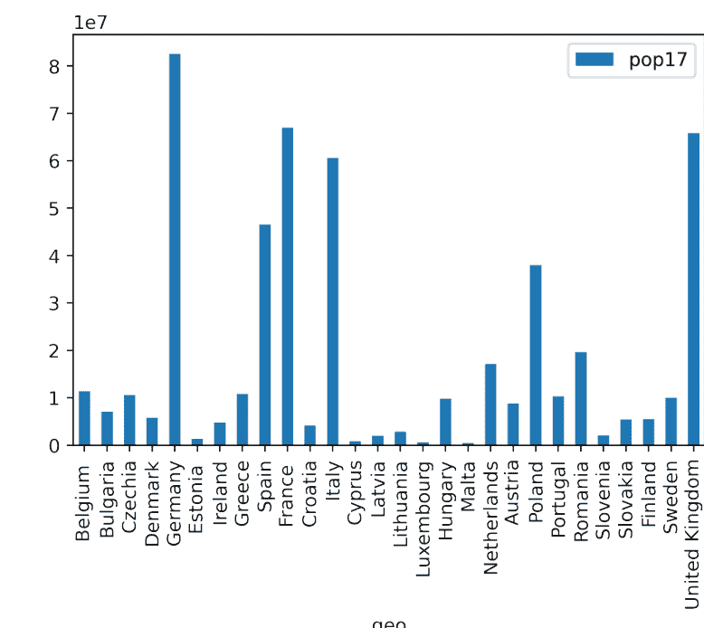

上图显示了截至2017年1月1日的人口数据。

我们将尝试从两个方面改进：

- 我们希望以百万为单位统计人口。这可以通过将所有数据除以10^6来实现。
- 对于此图，按规模大小对国家进行排序会很有趣。

```python
df_millions = df / 1e6
```

```python
df_millions['pop17'].sort_values(ascending=False).plot(kind='bar')
```

```
<AxesSubplot:xlabel='geo'>
```

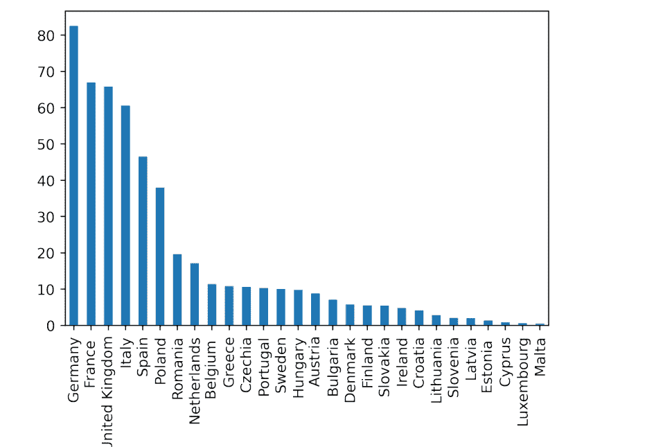

上面的例子从数据框中选择了一列（['pop17']），这返回了一个Series对象。然后我们使用`sort_values()`根据值（即每个国家的人口数量）对这个Series对象进行排序，然后绘制它。

或者，我们也可以为整个数据框创建一个图，但指定`pop17`为排序列，并且只绘制`pop17`这一列：

```python
df_millions.sort_values(by='pop17').plot(kind='bar', y='pop17')
```

```
<AxesSubplot:xlabel='geo'>
```

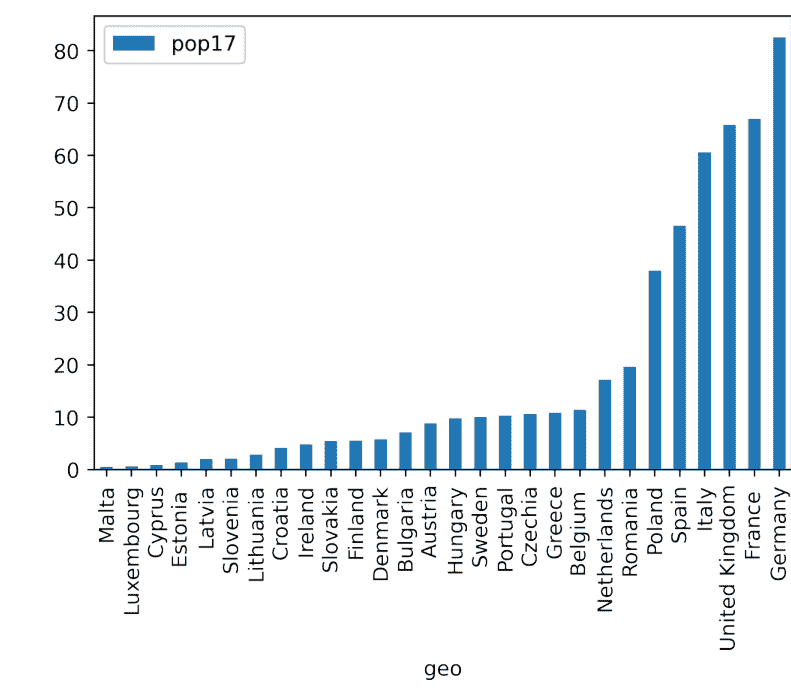

我们也可以同时绘制多列：

```python
ax = df_millions.sort_values(by='pop17').plot(kind='bar', y=['pop17', 'pop18'])
```

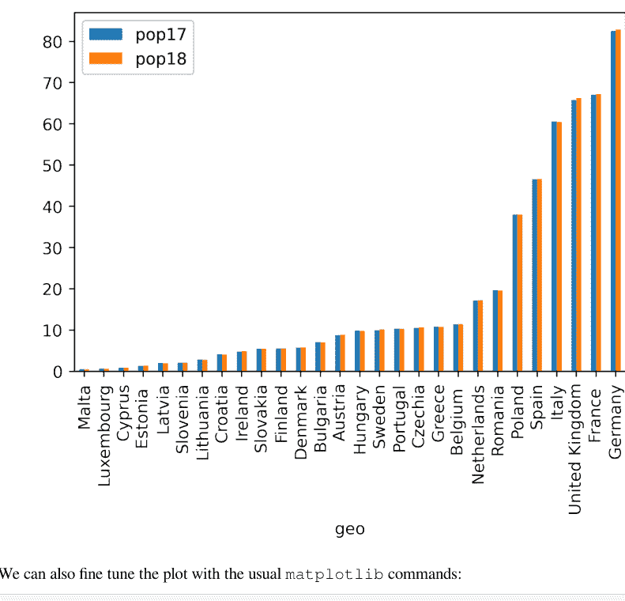

我们还可以使用常规的matplotlib命令来微调图表：

```python
ax = df_millions.sort_values(by='pop17').plot(kind='bar', y='pop17', figsize=(10, 4))
ax.set_ylabel("population 2017 [in millions]")
ax.grid()
ax.set_xlabel(None);  # 去掉x轴的默认标签（'geo'）
```

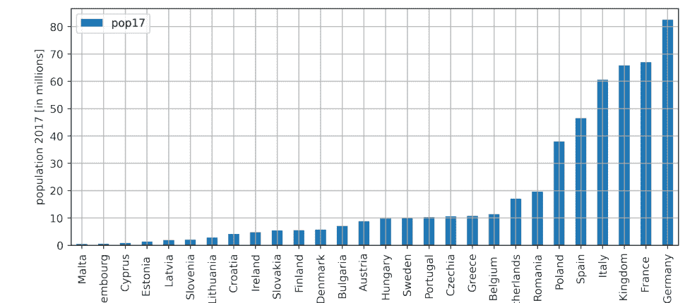

根据出生和死亡人数，我们可以计算每个国家2017年的人口变化。这有时被称为“自然变化”：

```python
df['natural-change'] = df['births'] - df['deaths']
```

```python
df['natural-change'].sort_values()
```

```
geo
Italy          -190910
Germany        -148000
Romania         -71125
Bulgaria        -45836
Hungary         -37231
Greece          -36007
Spain           -31245
Portugal        -23432
Croatia         -16921
Lithuania       -11446
Latvia           -7929
Finland          -3401
Estonia          -1759
Poland            -870
Slovenia          -268
Malta              748
Luxembourg        1911
Czechia           2962
Cyprus            3232
Slovakia          4055
Austria           4363
Denmark           8136
Belgium          10024
Netherlands      19173
Sweden           23444
Ireland          31760
United Kingdom    147871
France            164550
Name: natural-change, dtype: int64
```

由此我们可以看出，意大利和德国由于出生和死亡导致的人口变化在绝对值上减少最多。

为了将其与总人口规模联系起来，通常使用每年每千人的比率，例如每千名居民的出生率[1]（死亡率同理）：

[1] https://en.wikipedia.org/wiki/Birth_rate

```python
df['birth-rate'] = df['births'] / df['pop17'] * 1000
df['death-rate'] = df['deaths'] / df['pop17'] * 1000
df['natural-change-rate'] = df['natural-change'] / df['pop17'] * 1000
```

```python
df.head()
```

| geo | pop17 | pop18 | births | deaths | natural-change | birth-rate | death-rate | natural-change-rate |
|---|---|---|---|---|---|---|---|---|
| Belgium | 11351727 | 11413058 | 119690 | 109666 | 10024 | 10.543770 | 9.660733 | 0.883037 |
| Bulgaria | 7101859 | 7050034 | 63955 | 109791 | -45836 | 9.005389 | 15.459473 | -6.454085 |
| Czechia | 10578820 | 10610055 | 114405 | 111443 | 2962 | 10.814533 | 10.534540 | 0.279993 |
| Denmark | 5748769 | 5781190 | 61397 | 53261 | 8136 | 10.680026 | 9.264766 | 1.415260 |
| Germany | 82521653 | 82850000 | 785000 | 933000 | -148000 | 9.512655 | 11.306123 | -1.793469 |

我们现在可以查看每个国家的人口自然变化率，该比率已按该国人口进行了标准化。

```python
ax = df.sort_values(by='natural-change-rate').plot(kind='bar', y='natural-change-rate', figsize=(10, 4))
ax.set_title("Natural change due to births and deaths per 1000 in 2017");
```


我们可以将数据与底层的出生率和死亡率数据一起展示：

```python
tmp = df.sort_values(by='natural-change-rate')

fig, axes = plt.subplots(2, 1, figsize=(12, 6))

tmp.plot(kind='bar', y=['natural-change-rate'], sharex=True, ax=axes[0])
axes[0].set_title("Population change per 1000 in 2017")
tmp.plot(kind='bar', y=['death-rate', 'birth-rate'], sharex=True, ax=axes[1])
```

```
<AxesSubplot:xlabel='geo'>
```

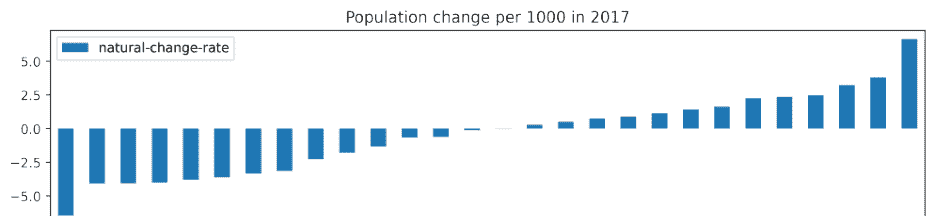

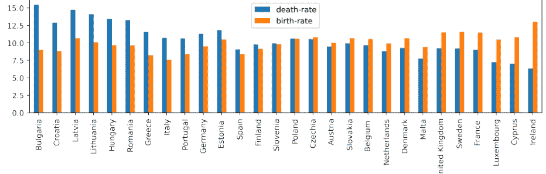

我们还没有使用我们关于2018年1月1日人口的信息。

让我们首先查看基于2017年1月1日和2018年1月1日（普查？）数据的人口绝对变化：

```python
df['change'] = df['pop18'] - df['pop17']
```

```python
ax = df.sort_values(by='change').plot(y='change', kind='bar')
ax.set_title("Total change in population per country in 2017");
```

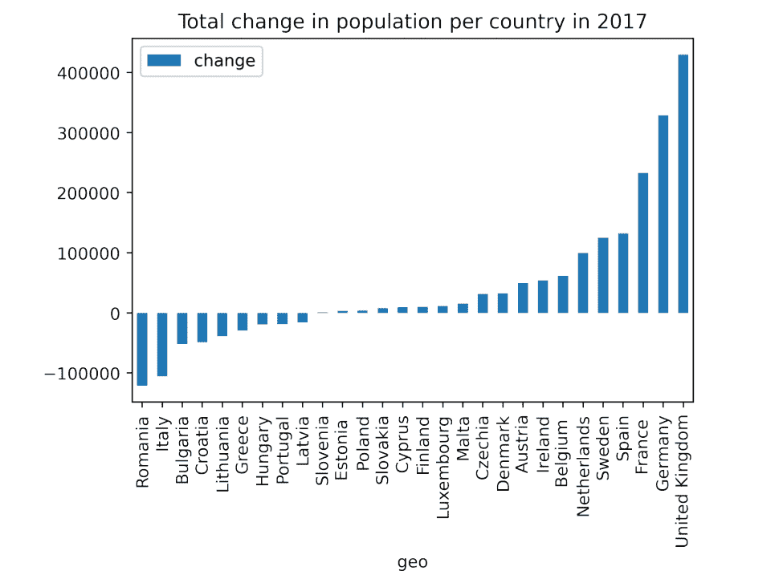

有了这些信息，我们可以估算迁移量。（需要注意的是，这个估算数字也会吸收原始数据中描述为“统计调整”的所有不准确性或数据收集方法的变化。）

```python
df['migration'] = df['change'] - df['natural-change']
```

```python
df.head()
```

| geo | pop17 | pop18 | births | deaths | natural-change | birth-rate | death-rate | natural-change-rate | change | migration |
|---|---|---|---|---|---|---|---|---|---|---|
| Belgium | 11351727 | 11413058 | 119690 | 109666 | 10024 | 10.543770 | 9.660733 | 0.883037 | 61331 | 51307 |
| Bulgaria | 7101859 | 7050034 | 63955 | 109791 | -45836 | 9.005389 | 15.459473 | -6.454085 | -51825 | -5989 |
| Czechia | 10578820 | 10610055 | 114405 | 111443 | 2962 | 10.814533 | 10.534540 | 0.279993 | 31235 | 28273 |
| Denmark | 5748769 | 5781190 | 61397 | 53261 | 8136 | 10.680026 | 9.264766 | 1.415260 | 32421 | 24285 |
| Germany | 82521653 | 82850000 | 785000 | 933000 | -148000 | 9.512655 | 11.306123 | -1.793469 | 328347 | 476347 |

让我们在顶部子图中绘制每个国家的人口总变化，在底部子图中绘制自然变化和迁移的贡献：

```python
tmp = df.sort_values(by='change')
fig, axes = plt.subplots(2, 1, figsize=(12, 6))

tmp.plot(kind='bar', y=['change'], sharex=True, ax=axes[0])
axes[0].set_title("Population changes in 2017")
axes[0].legend(['total change of population (migration + natural change due to deaths and births'])
tmp.plot(kind='bar', y=['migration', 'natural-change'], sharex=True, ax=axes[1])
axes[1].legend(['Migration', "natural change due to deaths and births"])
axes[1].set_xlabel(None);
```

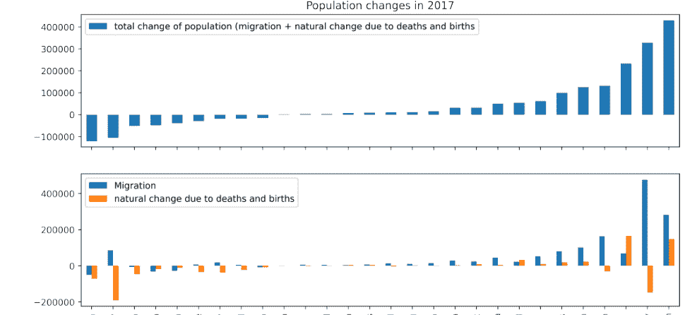

### 17.9 延伸阅读

关于Pandas还有很多内容可以探讨。以下资源可能有用，但还有无数其他资源可供参考：

- 关于`[]`、`.loc[]`和`.iloc[]`的延伸阅读，来自Ted Petrou的[Jupyter Notebook](https://jupyter.org/)和[博客文章](https://towardsdatascience.com/)。
- Jake VanderPlas：Python数据科学手册[在线版](https://jakevdp.github.io/PythonDataScienceHandbook/)

# 第十八章

## PYTHON 包与环境

### 18.1 引言

本章将介绍如何安装 Python 包以及使用 Python 环境。
在本章的第一部分，你将学习如何：

-   搜索 Python 包数据库
-   从 Python 包索引（PyPI）安装 Python 包
-   创建独立的 Python 虚拟环境，以隔离不同的项目

在第二部分，我们将为 Anaconda 发行版的用户提供更多信息，特别是：

-   在 conda 中使用环境
-   使用 conda 安装包
-   conda 与 pip 的交互

我们将在最后提及 `pyenv` 作为一款高级工具。
本章不讨论如何创建 Python 包。

#### 18.1.1 Jupyter Notebook 中的 Shell 命令

本章是在 Jupyter Notebook 中编写的。这对读者很有帮助，因为 Notebook 可以执行，因此命令可以轻松地重放和修改。
在本章中，我们需要与操作系统的 shell 进行大量交互，并且需要了解两件事：

1.  我们使用感叹号（!）来告诉 Jupyter 将后续命令发送到 shell（而不是在本 Notebook 的 Python 环境中解释）。例如：

```
!date
```

```
Tue Jan  4 16:03:43 CET 2022
```

2.  如果我们修改了 shell 变量（例如 PATH），这些变量仅在同一个单元格内设置。这将导致一些命令需要重复执行。这有点烦人（如果在 Jupyter Notebook 外部使用相同的命令则不会出现这种情况）。
下面是一个示例来说明这个问题：首先我们设置一个变量值，然后显示它：

```
!export NEW_VAR="test" && echo $NEW_VAR
```

```
test
```

`&&` 运算符指示 shell 在左侧命令成功后执行右侧的命令。再次执行 “echo” 命令，我们发现变量不再被定义：

```
!echo $NEW_VAR
```

因此，如果我们想利用这些变量值，就需要重复设置它们：

```
!export NEW_VAR="test" && echo "The value of NEW_VAR is $NEW_VAR."
```

```
The value of NEW_VAR is test.
```

我们在激活虚拟环境时（下文）需要利用这一点。

#### 18.1.2 前提条件

我们假设你的系统上已经安装了 Python。（并且我们假设你使用的是 Python 3。）如果你还没有安装 Python 3，那么请安装 Anaconda 发行版，按照《Python 漫游指南》的说明操作，或采取其他措施。
检查你是否已安装 Python：

```
!python --version
```

```
Python 3.9.7
```

我们还假设你使用的是较新版本的 Python（3.8 及以上）。
以下命令已在 Linux 和 OSX 操作系统上测试通过。如果你使用 Windows，请从这里查看相应的命令：https://packaging.python.org/en/latest/tutorials/installing-packages/

### 18.2 Python 虚拟环境

在我们安装包（无论是我们自己的还是别人的）之前，我们应该创建一个新的虚拟环境。这是一个好习惯，因为：

-   当我们不再需要时可以删除它
-   我们不会破坏可能正在使用的其他 Python 项目
-   我们对特定库的版本没有限制（可能一个应用程序需要库的 2.x 版本，而另一个应用程序需要 1.8 版本：如果两个应用程序安装在不同的环境中，那么这就不是问题）

#### 18.2.1 创建虚拟环境

我们可以使用以下命令创建一个虚拟环境

```
!python -m venv myvirtualenv
```

此命令在当前目录下创建一个名为 `myvirtualenv` 的子目录，其中包含新的虚拟环境：

```
!ls -dl myvirtualenv/
```

```
drwxr-xr-x  6 fangohr  staff  192 Jan  4 16:03 myvirtualenv/
```

虚拟环境将使用我们在创建它时使用的同一个 Python 解释器。在 Linux/OSX 系统上，我们可以使用 `which` 命令找出这是哪个解释器：

```
!which python
```

```
/Users/fangohr/anaconda3/bin/python
```

如果基础知识对你来说已经足够，你可以跳到下一节关于激活虚拟环境的内容。
我们也可以更具体一些，在使用 `-m venv` 命令时选择特定的 Python 解释器，以强制使用特定的 Python 版本。在 Mac（OSX）上，如果 python3 是通过 brew 安装的，那么在 `/usr/local/bin/python3` 有一个 python 可执行文件。要强制使用此解释器创建虚拟环境，我们可以使用

```
/usr/local/bin/python3 -m venv myvirtualenv
```

没有必要知道这个文件夹内部发生了什么，但出于好奇，我们还是会非常简要地看一下：

```
!ls myvirtualenv/
```

```
bin        include    lib        pyvenv.cfg
```

`pyvenv.cfg` 文件包含有关我们正在使用的 Python 解释器的信息

```
!cat myvirtualenv/pyvenv.cfg
```

```
home = /Users/fangohr/anaconda3/bin
include-system-site-packages = false
version = 3.9.7
```

出于兴趣，我们可以检查该子目录的总磁盘使用情况：

```
!du -hs myvirtualenv/
```

```
15M        myvirtualenv/
```

要使用这个虚拟环境，我们需要激活它：

#### 18.2.2 激活虚拟环境

要激活虚拟环境，我们需要知道它安装在哪个文件夹中（在我们的例子中是 `myvirtualenv`）。在 Linux 和 OSX 上，我们运行以下 shell 命令：

```
!source myvirtualenv/bin/activate
```

这会更改 `PATH` 变量，操作系统使用该变量来搜索 `python` 可执行文件：它将包含我们虚拟环境中 Python 解释器的目录放在 PATH 变量的开头。我们可以通过再次使用 `which` 命令来检查这是否有效：

```
!source myvirtualenv/bin/activate && which python
```

```
/Users/fangohr/git/introduction-to-python-for-computational-science-and-engineering/book/myvirtualenv/bin/python
```

（如引言所述，重复 `activate` 命令只是因为我们在这里使用 Notebook：如果你在 shell 中执行这些步骤，可以忽略这一点，直接写 `which python`。）

#### 18.2.3 使用虚拟环境

一旦我们激活了虚拟环境，我们就可以像使用系统提供的默认 Python 环境一样使用它。

例如，安装一些 Python 包。

#### 18.2.4 虚拟环境的名称

我们使用了 `myvirtualenv` 作为虚拟环境的名称。通常，名称可以自由选择。常用的名称包括 `env` 或 `venv`。有时，环境会安装在隐藏的子目录中（例如 `.env` 或 `.venv`）。

我们没有使用 `venv` 这个名称，是为了避免与 `venv` 模块混淆。

### 18.3 Python 包索引（PyPI）

Python 包索引提供了一个可搜索的 Web 界面（https://pypi.org），其中包含所有在 PyPI 注册的 Python 包。

PyPI 是分发（开源）Python 包的标准方式，在科学和工程领域也广泛使用。

#### 18.3.1 使用 pip 安装包

安装一个或多个这些包的命令是 `pip`。我们将激活我们的虚拟环境并安装一些示例包：

```
!source myvirtualenv/bin/activate && pip install cowsay
```

```
Collecting cowsay
  Using cached cowsay-4.0-py2.py3-none-any.whl (24 kB)
Installing collected packages: cowsay
Successfully installed cowsay-4.0
WARNING: You are using pip version 21.2.3; however, version 21.3.1 is available.
You should consider upgrading via the '/Users/fangohr/git/introduction-to-python-
-for-computational-science-and-engineering/book/myvirtualenv/bin/python -m pip
-install --upgrade pip' command.
```

由于我们收到一个建议升级 `pip` 包本身的警告，我们将按照说明运行推荐的命令：

```
!source myvirtualenv/bin/activate && pip install --upgrade pip
```

```
Requirement already satisfied: pip in ./myvirtualenv/lib/python3.9/site-packages
-(21.2.3)
Collecting pip
  Using cached pip-21.3.1-py3-none-any.whl (1.7 MB)
Installing collected packages: pip
  Attempting uninstall: pip
    Found existing installation: pip 21.2.3
    Uninstalling pip-21.2.3:
      Successfully uninstalled pip-21.2.3
Successfully installed pip-21.3.1
```

```
!source myvirtualenv/bin/activate && cowsay Hellooo World
```

```
 _______________
| Hellooo World |
 ================
        \   ^__^
         \  (oo)\_______
            (__)\       )\/\n                ||----w |
                ||     ||
```

我们可以使用 `pip list` 确认我们已安装的包列表（及其版本号）：

```
!source myvirtualenv/bin/activate && pip list
```

```
Package    Version
---------- -------
cowsay     4.0
```

### 18.3.2 使用 `pip show` 了解已安装的包

一旦安装了某个包，我们可以使用 `pip show` 来获取更多关于它的信息：

```
!source myvirtualenv/bin/activate && pip show cowsay
```

```
Name: cowsay
Version: 4.0
Summary: The famous cowsay for GNU/Linux is now available for python
Home-page: https://github.com/VaasuDevanS/cowsay-python
Author: Vaasudevan Srinivasan
Author-email: vaasuceg.96@gmail.com
License: GNU-GPL
Location: /Users/fangohr/git/introduction-to-python-for-computational-science-and-engineering/book/myvirtualenv/lib/python3.9/site-packages
Requires:
Required-by:
```

对于尚未安装的包，我们需要搜索 https://pypi.org 来了解更多信息。这包括可用包的列表（在“发布历史”下）。

（有一些命令行工具，如 `pip-search`，可以帮助查找包名，但它们提供的信息深度不如网页[在撰写本文时]）。

### 18.3.3 使用 `pip` 卸载包

（`-y` 是 `yes` 的缩写，它告诉 `pip uninstall` 在卸载 `cowsay` 时不要询问确认。）

```
!source myvirtualenv/bin/activate && pip uninstall -y cowsay
```

```
Found existing installation: cowsay 4.0
Uninstalling cowsay-4.0:
  Successfully uninstalled cowsay-4.0
```

```
!source myvirtualenv/bin/activate && pip list
```

```
Package    Version
---------- -------
pip        21.3.1
setuptools 57.4.0
```

### 18.3.4 安装带有额外依赖的包

作为第二个例子，我们将安装 wikipedia 包。我们将看到它需要额外的 Python 包作为依赖，这些依赖将被自动安装：

```
!source myvirtualenv/bin/activate && pip install wikipedia
```

```
Collecting wikipedia
  Using cached wikipedia-1.4.0.tar.gz (27 kB)
  Preparing metadata (setup.py) ... done
Collecting beautifulsoup4
  Using cached beautifulsoup4-4.10.0-py3-none-any.whl (97 kB)
Collecting requests<3.0.0,>=2.0.0
  Using cached requests-2.27.0-py2.py3-none-any.whl (63 kB)
Collecting certifi>=2017.4.17
  Using cached certifi-2021.10.8-py2.py3-none-any.whl (149 kB)
Collecting urllib3<1.27,>=1.21.1
  Using cached urllib3-1.26.7-py2.py3-none-any.whl (138 kB)
Collecting charset-normalizer~=2.0.0
  Using cached charset_normalizer-2.0.9-py3-none-any.whl (39 kB)
Collecting idna<4,>=2.5
  Using cached idna-3.3-py3-none-any.whl (61 kB)
Collecting soupsieve>1.2
  Using cached soupsieve-2.3.1-py3-none-any.whl (37 kB)
Using legacy 'setup.py install' for wikipedia, since package 'wheel' is not installed.
Installing collected packages: urllib3, soupsieve, idna, charset-normalizer, certifi, requests, beautifulsoup4, wikipedia
  Running setup.py install for wikipedia ... done
Successfully installed beautifulsoup4-4.10.0 certifi-2021.10.8 charset-normalizer-2.0.9 idna-3.3 requests-2.27.0 soupsieve-2.3.1 urllib3-1.26.7 wikipedia-1.4.0
```

```
!source myvirtualenv/bin/activate && python -c "import wikipedia; print(wikipedia.summary('cowsay'))"
```

```
cowsay is a program that generates ASCII art pictures of a cow with a message. It can also generate pictures using pre-made images of other animals, such as Tux the Penguin, the Linux mascot. It is written in Perl. There is also a related program called cowthink, with cows with thought bubbles rather than speech bubbles. .cow files for cowsay exist which are able to produce different variants of "cows", with different kinds of "eyes", and so forth. It is sometimes used on IRC, desktop screenshots, and in software documentation. It is more or less a joke within hacker culture, but has been around long enough that its use is rather widespread. In 2007, it was highlighted as a Debian package of the day.
```

值得注意的是，如果我们卸载 wikipedia，wikipedia 所需的依赖（如 beautifulsoup4）*不会*被卸载：

```
!source myvirtualenv/bin/activate && pip uninstall -y wikipedia
```

```
Found existing installation: wikipedia 1.4.0
Uninstalling wikipedia-1.4.0:
  Successfully uninstalled wikipedia-1.4.0
```

```
!source myvirtualenv/bin/activate && pip list
```

```
Package                    Version
-------------------------- ---------
beautifulsoup4             4.10.0
certifi                    2021.10.8
charset-normalizer         2.0.9
idna                       3.3
pip                        21.3.1
requests                   2.27.0
setuptools                 57.4.0
soupsieve                  2.3.1
urllib3                    1.26.7
```

这可能导致（部分不需要的）Python 包的累积。同样出于这个原因，开始一个新项目时，*从头开始*创建一个虚拟环境，并在之后将其丢弃，是一个好的实践。

### 18.3.5 使用 pip 安装特定版本

有时，我们需要安装一个包的特定版本。例如，假设我们需要 cowsay 的 2.0 版本。在这种情况下，我们可以使用 == 运算符来指定这个要求：

```
!source myvirtualenv/bin/activate && pip install cowsay==3.0
```

```
Collecting cowsay==3.0
  Using cached cowsay-3.0-py2.py3-none-any.whl (19 kB)
Installing collected packages: cowsay
Successfully installed cowsay-3.0
```

```
!source myvirtualenv/bin/activate && cowsay --version
```

```
3.0
```

### 18.3.6 升级 pip 安装的包

```
!source myvirtualenv/bin/activate && pip install -U cowsay
```

```
Requirement already satisfied: cowsay in ./myvirtualenv/lib/python3.9/site-packages (3.0)
Collecting cowsay
  Using cached cowsay-4.0-py2.py3-none-any.whl (24 kB)
Installing collected packages: cowsay
  Attempting uninstall: cowsay
    Found existing installation: cowsay 3.0
    Uninstalling cowsay-3.0:
      Successfully uninstalled cowsay-3.0
Successfully installed cowsay-4.0
```

```
!source myvirtualenv/bin/activate && cowsay --version
```

```
4.0
```

让我们再次移除 cowsay：

```
!source myvirtualenv/bin/activate && pip uninstall -y cowsay
```

```
Found existing installation: cowsay 4.0
Uninstalling cowsay-4.0:
  Successfully uninstalled cowsay-4.0
```

### 18.3.7 从 github 安装包

如果我们想安装（Python）cowsay 包的最新开发版本，我们有两个选择。
**第一个选择是直接从 github 进行 pip install**。github 仓库位于 https://github.com/VaasuDevanS/cowsay-python

```
!source myvirtualenv/bin/activate && pip install git+https://github.com/VaasuDevanS/cowsay-python.git
```

```
Collecting git+https://github.com/VaasuDevanS/cowsay-python.git
  Cloning https://github.com/VaasuDevanS/cowsay-python.git to /private/var/folders/wc/d11yft3x2jn29b6yffrzh4vw0000gq/T/pip-req-build-3iclfhwr
  Running command git clone --filter=blob:none -q https://github.com/VaasuDevanS/cowsay-python.git /private/var/folders/wc/d11yft3x2jn29b6yffrzh4vw0000gq/T/pip-req-build-3iclfhwr
  Resolved https://github.com/VaasuDevanS/cowsay-python.git to commit 767c09425d813b80d67cdebba02ce387ca2eb4e8
  Preparing metadata (setup.py) ... Using legacy 'setup.py install' for cowsay, since package 'wheel' is not installed.
Installing collected packages: cowsay
  Running setup.py install for cowsay ... Successfully installed cowsay-4.0
```

```
!source myvirtualenv/bin/activate && cowsay --version
```

```
4.0
```

```
!source myvirtualenv/bin/activate && pip uninstall -y cowsay
```

```
Found existing installation: cowsay 4.0
Uninstalling cowsay-4.0:
  Successfully uninstalled cowsay-4.0
```

第二个选择是将 git 仓库克隆到我们的本地机器，然后从该本地目录安装包：

```
!cd /tmp && git clone https://github.com/VaasuDevanS/cowsay-python.git
```

```
Cloning into 'cowsay-python'...
remote: Enumerating objects: 170, done.
remote: Counting objects: 100% (82/82), done.
remote: Compressing objects: 100% (40/40), done.
remote: Total 170 (delta 41), reused 77 (delta 40), pack-reused 88
Receiving objects: 100% (170/170), 79.19 KiB | 1.15 MiB/s, done.
Resolving deltas: 100% (72/72), done.
```

```
!source myvirtualenv/bin/activate && cd /tmp/cowsay-python && pip install .
```

```
Processing /private/tmp/cowsay-python
  Preparing metadata (setup.py) ... done
Using legacy 'setup.py install' for cowsay, since package 'wheel' is not installed.
Installing collected packages: cowsay
  Running setup.py install for cowsay ... done
Successfully installed cowsay-4.0
```

```
!source myvirtualenv/bin/activate && cowsay --version
```

```
4.0
```

### 18.3.8 从本地目录进行 Pip 安装用户可编辑的包

此示例延续自上面的 `git clone` 示例。

如果我们通过 pip 安装 Python 包，这些包通常安装在虚拟环境的目录树中。例如：

```
!ls myvirtualenv/lib/python3.9/site-packages/cowsay
```

```
__init__.py  __pycache__  main.py
__main__.py  characters.py test.py
```

如果我们打算编辑包中的 Python 文件（例如，因为我们想进一步开发它或探索它），并且我们希望这些编辑在“已安装”的包中可见，我们可以要求 `pip` 使用 `-e` 标志执行 `editable` 安装：

```
!source myvirtualenv/bin/activate && pip uninstall -y cowsay
```

```
Found existing installation: cowsay 4.0
Uninstalling cowsay-4.0:
  Successfully uninstalled cowsay-4.0
```

```
!source myvirtualenv/bin/activate && cd /tmp/cowsay-python && pip install -e .
```

### 18.3.9 进阶 pip 用法：freeze、-r requirements.txt 与创建可复现环境

如果你想记录（并后续复用）一组 Python 包*及其特定版本号*的组合，可以使用 `pip freeze` 命令来生成这样的列表。

```
!source myvirtualenv/bin/activate && pip freeze
```

```
beautifulsoup4==4.10.0
certifi==2021.10.8
charset-normalizer==2.0.9
-e git+https://github.com/VaasuDevanS/cowsay-python.git@767c09425d813b80d67cdebba02ce387ca2eb4e8#egg=cowsay
idna==3.3
requests==2.27.0
soupsieve==2.3.1
urllib3==1.26.7
```

我们可以将输出重定向到一个文件（按照惯例，该文件名为 `requirements.txt`）：

```
!source myvirtualenv/bin/activate && pip freeze > requirements.txt
```

```
!cat requirements.txt
```

```
beautifulsoup4==4.10.0
certifi==2021.10.8
charset-normalizer==2.0.9
-e git+https://github.com/VaasuDevanS/cowsay-python.git@767c09425d813b80d67cdebba02ce387ca2eb4e8#egg=cowsay
idna==3.3
requests==2.27.0
soupsieve==2.3.1
urllib3==1.26.7
```

现在我们可以创建一个新的虚拟环境，并将 `requirements.txt` 文件中列出的所有包安装到这个新虚拟环境中：

```
!python -m venv myvirtualenv-copy
```

```
!source myvirtualenv-copy/bin/activate && pip install -r requirements.txt
```

```
Obtaining cowsay from git+https://github.com/VaasuDevanS/cowsay-python.git@767c09425d813b80d67cdebba02ce387ca2eb4e8#egg=cowsay (from -r requirements.txt (line 4))
Skipping because already up-to-date.
Requirement already satisfied: beautifulsoup4==4.10.0 in ./myvirtualenv-copy/lib/python3.9/site-packages (from -r requirements.txt (line 1)) (4.10.0)
Requirement already satisfied: certifi==2021.10.8 in ./myvirtualenv-copy/lib/python3.9/site-packages (from -r requirements.txt (line 2)) (2021.10.8)
Requirement already satisfied: charset-normalizer==2.0.9 in ./myvirtualenv-copy/lib/python3.9/site-packages (from -r requirements.txt (line 3)) (2.0.9)
Requirement already satisfied: idna==3.3 in ./myvirtualenv-copy/lib/python3.9/site-packages (from -r requirements.txt (line 5)) (3.3)
Requirement already satisfied: requests==2.27.0 in ./myvirtualenv-copy/lib/python3.9/site-packages (from -r requirements.txt (line 6)) (2.27.0)
Requirement already satisfied: soupsieve==2.3.1 in ./myvirtualenv-copy/lib/python3.9/site-packages (from -r requirements.txt (line 7)) (2.3.1)
Requirement already satisfied: urllib3==1.26.7 in ./myvirtualenv-copy/lib/python3.9/site-packages (from -r requirements.txt (line 8)) (1.26.7)
Installing collected packages: cowsay
  Attempting uninstall: cowsay
    Found existing installation: cowsay 4.0
    Uninstalling cowsay-4.0:
      Successfully uninstalled cowsay-4.0
  Running setup.py develop for cowsay
Successfully installed cowsay-4.0
WARNING: You are using pip version 21.2.3; however, version 21.3.1 is available.
You should consider upgrading via the '/Users/fangohr/git/introduction-to-python-for-computational-science-and-engineering/book/myvirtualenv-copy/bin/python -m pip install --upgrade pip' command.
```

使用 `freeze` 命令来存储重要项目（包括科学出版物、报告、论文等）所需的包和版本列表是一个好习惯，`requirements.txt` 文件应与数据和软件一起归档。

更好的做法是，虚拟环境的*创建*也通过脚本化方式完成（基于一个应作为分析归档[并版本控制]文件一部分的 `requirements.txt` 文件），并且在所有所需的处理/模拟/分析在该环境中进行之前完成。

实际上，实现完全且有保证的可复现性是困难的。可能会出现各种问题，例如 `pypi.org` 服务消失。如何实现完全的可复现性是一个活跃的研究领域，值得单独成章或成书。

无论如何，记录所使用的 Python 包是一个非常好的第一步。

### 18.3.10 停用虚拟环境

要停用虚拟环境，请使用 `deactivate` 命令。

```
!source myvirtualenv/bin/activate && deactivate && which python
```

```
/Users/fangohr/anaconda3/bin/python
```

### 18.3.11 删除虚拟环境

要完全移除虚拟环境，我们可以删除其安装所在的子文件夹：

```
!rm -rf myvirtualenv
```

### 18.3.12 延伸阅读

- 安装 Python 包：https://packaging.python.org/en/latest/tutorials/installing-packages
- venv 模块文档：https://docs.python.org/3/library/venv.html

### 18.4 Anaconda

#### 18.4.1 简介

Anaconda 软件发行版自带其包管理系统，通过 `conda` 命令进行控制。

Anaconda 作为 Python 发行版广为人知，但它绝不仅限于 Python 包：它是一个通用的包管理器。与社区运营的 `conda-forge` 项目一起，提供了大量的可用包。conda 包的一个特别优势是，它们可以为当前使用的三大主要操作系统（Linux、OSX、Windows）提供。

Conda 为一些可从 Python 包索引（PyPI）获取的 Python 包提供了 **conda 包**。因此需要问：我应该使用 conda 命令（`conda install spyder`）还是通过 pip（`pip install spyder`）来安装包？答案见下文。

`conda` 提供了其自己的 **(conda) 环境**（参见 https://docs.conda.io/projects/conda/en/latest/user-guide/tasks/manage-environments.html）。它们与我们（基础）讨论的（Python）虚拟环境有许多相似之处。此处我们没有篇幅进一步讨论 conda 环境。

以下评论旨在为那些通过 anaconda 安装了 Python 解释器的用户提供帮助。如果你不使用 Anaconda，可以忽略本节。

#### 18.4.2 使用 anaconda 发行版时，我可以使用 Python 虚拟环境吗？

可以，这是创建虚拟环境的好方法。（本章中以上所有示例都使用了 OSX 系统上 anaconda 安装中的 Python3 解释器）。

#### 18.4.3 我应该通过 conda 还是 pip 安装 Python 包？

典型场景是安装 Anaconda，大多数所需的 Python 包都已可用：一些标准工具如 `numpy`、`scipy`、`matplotlib`、`pandas`、`jupyter`、`ipython` 和 `spyder` 已随 anaconda 发行版附带。然后可能缺少某个需要额外安装的包。

例如，`xarray` 包：这可以通过 conda 或 pip 安装。

如果在 anaconda 安装的 Python 环境中工作，基于经验的粗略指导如下：

- 避免混合使用 `pip` 安装和 `conda` 安装
- 如果 `conda` 能安装所需的包，就使用它
- 如果 `conda` 无法安装所需的包，我们必须使用 `pip`。在这种情况下：
    - 先安装需要从 `conda` 获取的依赖项（如果有的话）
    - 然后通过 `pip` 安装所需的包
    - 使用 `pip` 后，不要再使用 `conda` 安装更多包。

原因是 `conda` 和 `pip` 无法完美交互，因此一个包管理器所做的更改，可能会被另一个包管理器覆盖或意外地以略有不同的方式重复。

更详细的讨论可在 [Anaconda 博客](https://www.anaconda.com/blog)上找到。

#### 18.4.4 我可以创建一个 conda 环境，然后从中创建 Python 虚拟环境吗？

可以。

这也是安装不同 Python 版本的一个选项。

例如：创建一个提供 Python 3.8 的 conda (!) 环境：

```
conda create -y -n python38 python=3.8
```

然后

```
conda activate python38
```

接着使用以下命令创建一个虚拟环境：

```
python -m venv myvirtualenv38
```

## 18.5 管理多种不同环境 - pyenv

如果你使用多种不同的 Python 环境，可能涉及不同的解释器版本，你或许需要了解 pyenv（主页在 https://github.com/pyenv/pyenv）。

Pyenv 可以安装众多 Python 解释器，并为每个解释器创建虚拟环境。更进一步，它允许在*每个目录*的基础上定义该目录应使用的环境。当不同项目需要使用不同环境时，这非常方便，因为无需手动激活虚拟环境。

**清理：** 删除本节创建的文件

```
!rm -rf /tmp/cowsay-python
!rm -rf myvirtualenv-copy
!rm -f requirements.txt
```

# 第十九章

## 接下来该学什么？

学习编程语言是成为计算科学家的第一步，通过计算建模和模拟来推动科学与工程的发展。
我们列出一些对日常计算科学工作非常有益的额外技能，当然这并非详尽无遗。

### 19.1 高级编程

本文档强调在编程方面打下坚实基础，涵盖控制流、数据结构以及函数和过程式编程的要素。我们没有深入探讨面向对象编程，也没有讨论 Python 的一些更高级特性，例如迭代器和装饰器。

### 19.2 编译型编程语言

当性能成为最高优先级时，我们可能需要使用编译代码，并可能将其嵌入 Python 代码中以执行构成性能瓶颈的计算。
Fortran、C 和 C++ 是明智的选择；也许在不久的将来 Julia 也会是。
我们还需要学习如何使用 Cython、Boost、Ctypes 和 Swig 等工具将编译代码与 Python 集成。

### 19.3 测试

良好的编码需要一系列单元测试和系统测试的支持，这些测试可以例行运行以检查代码是否正常工作。doctest、nose 和 pytest 等工具非常宝贵，我们至少应该学习如何使用 pytest（或 nose）。

### 19.4 仿真模型

许多标准仿真工具，如蒙特卡洛、分子动力学、基于格子的模型、智能体、有限差分和有限元模型，通常用于解决特定的仿真挑战——对这些工具有一个大致的了解是有用的。

### 19.5 研究代码的软件工程

研究代码带来特定的挑战：需求可能在项目运行期间发生变化，我们需要极大的灵活性，同时又要保证可重复性。有许多技术可以有效地支持这一点。

### 19.6 数据与可视化

处理大量数据、处理和可视化数据可能是一个挑战。数据库设计、3D 可视化以及现代数据处理工具（如 Pandas Python 包）的基础知识对此有所帮助。

### 19.7 版本控制

使用版本控制工具（如 git 或 mercurial）应该是标准做法，它能显著提高代码编写效率，有助于团队协作，并且——也许最重要的是——支持计算结果的可重复性。

### 19.8 并行执行

代码的并行执行是使其运行速度提高数个数量级的一种方式。这可以使用 MPI 进行节点间通信，或使用 OpenMP 进行节点内并行化，或者采用将两者结合的混合模式。
近年来 GPU 计算的兴起提供了另一条并行化途径，Intel Phi 等多核芯片也是如此。

### 19.9 致谢

非常感谢

- Marc Molinari 在 2007 年左右仔细校对了本手稿。
- Neil O'Brien 为 SymPy 部分做出了贡献。
- Jacek Generowicz 在上个千年向我介绍了 Python，并慷慨分享了他优秀 Python 课程中的无数想法。
- EPSRC（GR/T09156/01 和 EP/G03690X/1）和欧盟（OpenDreamKit Horizon 2020 欧洲研究基础设施项目，#676541）的支持。
- 提供反馈并指出拼写错误和错误等的学生和其他读者。
- Thomas Kluyver 帮助将基于 Python 2 LaTeX 的文档翻译成 Python 3 Jupyter Notebooks，并提供了自动创建 html 和 pdf 版本的工具（通过他的 bookbook 包）。
- Robert Rosca 在 `jupyterbook` 发布后（2020 年）帮助创建了 html 和 pdf 文件。

[1] 竖线仅用于显示原始分量之间的划分；从数学上讲，增广矩阵的行为与任何其他 2 × 3 矩阵一样，我们在 SymPy 中像处理任何其他矩阵一样对其进行编码。

[2] 来自 `help(preview)` 文档：“目前这依赖于 pexpect，而 pexpect 在 Windows 上不可用。”

[3] 上限的确切值可在 `sys.maxint` 中找到。

[4] 为完整起见，我们补充说明，执行相同循环的 C 程序（或 C++ 或 Fortran）将比 Python 浮点循环快约 100 倍，因此比符号循环快约 100*200 = 20000 倍。

[5] 在本文中，我们通常以 N 为名导入 `numpy`，如下所示：`import numpy as N`。如果你的机器上没有 `numpy`，可以用 `import Numeric as N` 或 `import numarray as N` 替换此行。

[6] 历史说明：这在 scipy 版本 0.7 到 0.8 之间发生了变化。在 0.8 之前，如果要解决一维问题，返回值是浮点数。

## 第十九章 接下来该学什么？

# 第二十章

## 变更历史

自 2022 年以来

- 2022 年 1 月 3 日：审阅 *可视化章节*
- 2022 年 1 月 4 日：在 *scipy 章节* 中将 `odeint` 更改为 `solve_ivp`
- 2022 年 1 月 5 日：添加新章节 *虚拟环境和 pip*