Johnny Wei-Bing Lin, Hannah Aizenman, Erin Manette Cartas Espinel, Kim Gunnerson, and Joanne Liu

# 面向科学家和工程师的Python编程导论


# 面向科学家和工程师的Python编程导论

Python是最流行的编程语言之一，广泛用于数据分析和建模，并且正迅速成为科学家和工程师的首选。与通常按语言语法组织的其他Python入门教材不同，本书使用了来自生物学、化学、物理学、地球科学和工程学的众多实例来教授和激励科学与工程领域的学生。本书按照学生日常执行的任务和工作流程组织内容，帮助他们看到编程工具与其学科之间的联系。学习进度经过精心设计，适合完全初学者，并采用螺旋式教学法，使概念在多个章节中引入，让读者有机会多次接触主题。“试试看！”练习和在线Jupyter笔记本鼓励学生测试新知识，并进一步发展他们的编程技能。教师可在线获取解决方案，以及涵盖科学和工程各学科的特定作业问题。

**Johnny Wei-Bing Lin** 是华盛顿大学博塞尔分校计算与软件系统系的副教授兼本科计算教育主任，也是北园大学的物理学与工程学兼职教授。他曾是美国气象学会年度Python研讨会的创始主席。

**Hannah Aizenman** 是纽约市立大学研究生中心计算机科学的博士候选人。她研究可视化，是Python库Matplotlib的核心开发者。

**Erin Manette Cartas Espinel** 以物理学博士学位毕业于加州大学欧文分校。在华盛顿大学博塞尔分校工作十多年后，她现在是一名软件开发工程师。

**Kim Gunnerson** 最近从华盛顿大学博塞尔分校副教授职位上退休，她在该校教授化学和计算机编程入门课程。

**Joanne Liu** 在加州大学圣地亚哥分校获得生物信息学和系统生物学博士学位。

> “本书为Python语言提供了极好的入门介绍，特别针对那些有兴趣在物理科学领域进行计算的人。我尤其喜欢它对图形和良好编码实践的深入覆盖。”

**Raymond Pierrehumbert**，*牛津大学*

> “一本面向科学家和工程师的优秀Python入门书。它远不止教你如何用Python编程，更教你如何用Python做科学。”

**Eric Shaffer**，*伊利诺伊大学厄巴纳-香槟分校*

> “Python在科学、工程及更多领域的许多学科中都扮演着至关重要的角色。学生和专业人士被期望能够熟练掌握它，而（正如我在帮助高性能计算设施用户的日常工作中所见）他们常常难以达到这种熟练程度。作者们成功地完成了一项艰巨的任务：编写一本书帮助人们达到非常高级的熟练程度，从非常基础开始，无需任何背景知识。与其他同类书籍不同，《面向科学家和工程师的Python编程导论》专注于教授科学家和工程师的最终目标——研究他们的科学问题——而不是为了编程而编程。我期待着与将使用本书学习Python编程的这一代人合作！”

**Davide Del Vento**，*NCAR计算与信息服务实验室*

> “《面向科学家和工程师的Python编程导论》采用基于证据的主动学习方法介绍Python编程。练习帮助学生和教师识别编程中的误解，使学生能够建立坚实的Python编程基础。本书精简了内容，专注于掌握立即有用的概念、规范错误处理并演示恢复过程。”

**Kari L. Jordan**，*The Carpentries执行董事*

# 面向科学家和工程师的Python编程导论

**Johnny Wei-Bing Lin**
华盛顿大学博塞尔分校和北园大学

**Hannah Aizenman**
纽约市立学院

**Erin Manette Cartas Espinel**
Envestnet Tamarac

**Kim Gunnerson**
华盛顿大学博塞尔分校

**Joanne Liu**
诺维信公司


剑桥大学印刷厂，英国剑桥CB2 8BS
One Liberty Plaza，20层，纽约，NY 10006，美国
477 Williamstown Road，Port Melbourne，VIC 3207，澳大利亚
314-321，3层，Plot 3，Splendor Forum，Jasola District Centre，
新德里 – 110025，印度
103 Penang Road，#05–06/07，Visioncrest Commercial，新加坡 238467

剑桥大学出版社是剑桥大学的一部分。
它通过传播知识来推进大学的使命，追求最高国际水平的卓越教育、学习和研究。

www.cambridge.org
本书信息：www.cambridge.org/highereducation/isbn/9781108701129
DOI: 10.1017/9781108571531

© Johnny Wei-Bing Lin, Hannah Aizenman, Erin Manette Cartas Espinel,
Kim Gunnerson, and Joanne Liu 2022

本出版物受版权保护。除法定例外情况和相关集体许可协议的规定外，未经剑桥大学出版社书面许可，不得复制任何部分。

2022年首次出版

由TJ Books Limited在英国康沃尔郡帕德斯托印刷

*本出版物的目录记录可从大英图书馆获取。*

*美国国会图书馆编目出版数据*
名称：Lin, Johnny Wei-Bing, 1972– 作者。| Aizenman, Hannah, 1987– 作者。|
Espinel, Erin Manette Cartas, 1965– 作者。| Gunnerson, Kim Noreen, 1965– 作者。|
Liu, Joanne (Joanne K.), 作者。
标题：面向科学家和工程师的Python编程导论 /
Johnny Wei-Bing Lin, 华盛顿大学博塞尔分校, Hannah Aizenman,
纽约市立学院, Erin Manette Cartas Espinel, Envestnet Tamarac,
Kim Gunnerson, 华盛顿大学博塞尔分校, Joanne Liu, Biota Technology Inc.
描述：第一版。| 英国剑桥；纽约，NY：
剑桥大学出版社，2022。| 包含参考文献和索引。
标识符：LCCN 2022000136 | ISBN 9781108701129（平装）
主题：LCSH: Python (计算机程序语言) | 计算机编程。|
工程–数据处理。| BISAC: SCIENCE / 地球科学 / 概论
分类：LCC QA76.73.P98 L55 2022 | DDC 005.13/3–dc23/eng/20220304
LC记录可在 https://lccn.loc.gov/2022000136 获取

ISBN 978-1-108-70112-9 平装

剑桥大学出版社对本出版物中引用的外部或第三方互联网网站的URL的持续性或准确性不承担任何责任，也不保证此类网站上的任何内容是或将继续是准确或适当的。

## 目录

- 详细目录 ... 第vii页
- 前言 ... 第xvii页
- 致学生 ... 第xxiii页
- 声明与免责声明 ... 第xxvi页
- 致谢 ... 第xxix页

## 第一部分 完成基本任务

- 1. 序言：准备编程 ... 3
- 2. Python作为基本计算器 ... 8
- 3. Python作为科学计算器 ... 27
- 4. 基本折线图和散点图 ... 52
- 5. 自定义折线图和散点图 ... 88
- 6. 基本诊断数据分析 ... 124
- 7. 二维诊断数据分析 ... 176
- 8. 基本预测建模 ... 209
- 9. 读取和写入文本数据 ... 261
- 10. 管理文件、目录和程序 ... 327

## 第二部分 完成更复杂的任务

- 11. 过渡：如何编写程序 ... 355
- 12. n维诊断数据分析 ... 365
- 13. 基本图像处理 ... 394

## 目录

- 14 等高线图与动画 439
- 15 处理缺失数据 483

## 第三部分 高级编程概念 503

- 16 更多数据与执行结构 505
- 17 类与继承 536
- 18 在文件中存储信息的更多方法 570
- 19 基本搜索与排序 595
- 20 递归 633

## 第四部分 从程序能运行到运行良好 655

- 21 让他人可用：文档与 Sphinx 657
- 22 让它更快：性能 666
- 23 让它正确：代码检查与单元测试 683
- 24 让它可管理：版本控制与构建管理 693
- 25 让它与其他语言对话 702

- 附录 A 单位列表 706
- 附录 B 数据结构总结 708
- 附录 C 按编程主题分类的内容 709

- 术语表 719
- 缩略语与首字母缩写 726
- 参考文献 727
- 索引 729

# 详细目录

前言
致学生
声明与免责声明
致谢

第 xvii 页
xxiii
xxvi
xxix

## 第一部分 完成基本任务

1

# 1 序言：准备编程

3

- 1.1 什么是程序以及为什么要学习编程？ 3
- 1.2 什么是 Python 以及为什么要学习这门语言？ 5
- 1.3 我们将需要的软件 6

# 2 Python 作为基本计算器

8

- 2.1 Python 作为基本计算器的示例 8
- 2.2 Python 编程基础 10
- 2.3 试试看！ 18
- 2.4 更多学科特定实践 24
- 2.5 章节回顾 24

- 2.2.1 表达式与运算符 10
- 2.2.2 变量 13
- 2.2.3 Python 解释器 15

- 2.5.1 自测题 24
- 2.5.2 章节总结 25
- 2.5.3 自测题答案 26

# 3 Python 作为科学计算器

27

- 3.1 Python 作为科学计算器的示例 27
- 3.2 Python 编程基础 28
- 3.3 试试看！ 41

- 3.2.1 使用预写函数 29
- 3.2.2 导入模块与使用模块项 30
- 3.2.3 编写与使用我们自己的函数 32
- 3.2.4 可编程计算器 35
- 3.2.5 用于更复杂程序的 Python 解释器与代码编写环境 38

- 3.4 更多学科特定实践 47
- 3.5 章节回顾 47
- 3.5.1 自测题 47
- 3.5.2 章节总结 48
- 3.5.3 自测题答案 49

# 4 基本线图与散点图 52

- 4.1 制作基本线图与散点图的示例 52
- 4.2 Python 编程基础 54
- 4.2.1 用于必需输入的位置输入参数 55
- 4.2.2 列表与元组简介 58
- 4.2.3 字符串简介 62
- 4.2.4 注释与 Jupyter Markdown 简介 66
- 4.3 试试看！ 69
- 4.4 更多学科特定实践 81
- 4.5 章节回顾 81
- 4.5.1 自测题 81
- 4.5.2 章节总结 83
- 4.5.3 自测题答案 85

# 5 自定义线图与散点图 88

- 5.1 自定义线图的示例 88
- 5.2 Python 编程基础 91
- 5.2.1 使用关键字输入参数进行函数的可选输入 91
- 5.2.2 自定义图表外观 93
- 5.2.3 处理多个图形或曲线 96
- 5.2.4 调整图表大小 97
- 5.2.5 将图形保存到文件 98
- 5.2.6 数组计算简介 99
- 5.2.7 类型概念 103
- 5.3 试试看！ 106
- 5.4 更多学科特定实践 117
- 5.5 章节回顾 117
- 5.5.1 自测题 117
- 5.5.2 章节总结 119
- 5.5.3 自测题答案 121

# 6 基本诊断数据分析 124

- 6.1 基本诊断数据分析的示例 124
- 6.2 Python 编程基础 126
- 6.2.1 关于创建数组与查询数组的更多内容 128
- 6.2.2 关于数组函数的更多内容 132
- 6.2.3 遍历数组元素与循环简介 134
- 6.2.4 向数据提问与分支简介 139
- 6.2.5 一维循环与分支示例 148
- 6.2.6 文档字符串 153
- 6.2.7 编写代码的三个技巧 155
- 6.3 试试看！ 158
- 6.4 更多学科特定实践 170
- 6.5 章节回顾 170
- 6.5.1 自测题 170
- 6.5.2 章节总结 171
- 6.5.3 自测题答案 173

# 7 二维诊断数据分析 176

- 7.1 二维诊断数据分析的示例 176
- 7.2 Python 编程基础 182
- 7.2.1 二维数组的形状 183
- 7.2.2 创建二维数组 184
- 7.2.3 在二维数组中访问、设置与切片 186
- 7.2.4 二维数组中的数组语法与函数 190
- 7.2.5 嵌套 for 循环 191
- 7.3 试试看！ 194
- 7.4 更多学科特定实践 203
- 7.5 章节回顾 203
- 7.5.1 自测题 203
- 7.5.2 章节总结 205
- 7.5.3 自测题答案 207

# 8 基本预测建模 209

- 8.1 基本预测模型的示例 209
- 8.2 Python 编程基础 217
- 8.2.1 计算机中的随机数 217
- 8.2.2 标量布尔类型与表达式 221
- 8.2.3 嵌套分支 230
- 8.2.4 使用 while 进行不确定次数的循环 232
- 8.2.5 制作多个子图 236
- 8.2.6 关于嵌套循环的更多内容 237
- 8.2.7 使用浮点数的条件判断 239
- 8.3 试试看！ 241
- 8.4 更多学科特定实践 252
- 8.5 章节回顾 252
- 8.5.1 自测题 252
- 8.5.2 章节总结 254
- 8.5.3 自测题答案 257

# 9 读取与写入文本数据 261

- 9.1 读取与写入文本数据的示例 262
- 9.2 Python 编程基础 267
- 9.2.1 对象简介 268
- 9.2.2 数组作为对象 269
- 9.2.3 列表作为对象 277
- 9.2.4 字符串作为对象 280
- 9.2.5 复制变量、数据与对象 286
- 9.2.6 读取与写入文件 290
- 9.2.7 捕获文件打开与其他错误 298
- 9.3 试试看！ 300
- 9.4 更多学科特定实践 317
- 9.5 章节回顾 317
- 9.5.1 自测题 317
- 9.5.2 章节总结 319
- 9.5.3 自测题答案 321

# 10 管理文件、目录与程序 327

- 10.1 管理文件、目录与程序的示例 328
- 10.2 Python 编程基础 331
- 10.2.1 文件名、路径与工作目录 332
- 10.2.2 创建与删除空目录 335
- 10.2.3 移动与重命名文件和目录 337
- 10.2.4 复制与删除文件和目录 338
- 10.2.5 列出目录内容 340
- 10.2.6 测试以查看某物是何种“文件” 341
- 10.2.7 在 Python 中运行非 Python 程序 342
- 10.3 试试看！ 343
- 10.4 更多学科特定实践 347
- 10.5 章节回顾 347
- 10.5.1 自测题 347
- 10.5.2 章节总结 348
- 10.5.3 自测题答案 350

## 第二部分 完成更复杂的任务 353

- 11 过渡：如何编写程序 355
- 11.1 从空白屏幕到程序：一个遵循的过程 355
- 11.2 测试的重要性 360
- 11.3 风格约定的重要性 363

# 12 *n* 维诊断数据分析 365

- 12.1 *n* 维诊断数据分析的示例 365
- 12.2 Python 编程基础 367
- 12.2.1 *n* 维数组的形状与索引 368
- 12.2.2 从 *n* 维数组中选择子数组 370
- 12.2.3 *n* 维数组中的数组语法与函数 372
- 12.2.4 重塑 *n* 维数组与数组元素的内存位置 374
- 12.2.5 子数组与索引偏移操作 376
- 12.2.6 三重嵌套循环与混合数组语法/选择与循环 378
- 12.2.7 部分数组函数总结表 380
- 12.3 试试看！ 382
- 12.4 更多学科特定实践 386
- 12.5 章节回顾 387
- 12.5.1 自测题 387
- 12.5.2 章节总结 389
- 12.5.3 自测题答案 391

# 13 基本图像处理 394

- 13.1 图像处理的示例 394
- 13.2 Python 编程基础 400
- 13.2.1 在 Matplotlib 中读取、显示与写入图像 401
- 13.2.2 布尔数组 404
- 13.2.3 数组语法与函数以及向数组中的数据提问 408
- 13.2.4 循环与数组语法和函数的性能 414
- 13.2.5 NumPy `reduce` 方法 416
- 13.2.6 遍历对象列表 417
- 13.3 试试看！ 419
- 13.4 更多学科特定实践 430
- 13.5 章节回顾 431
- 13.5.1 自测题 431
- 13.5.2 章节总结 432
- 13.5.3 自测题答案 434

# 14 等高线图与动画 439

- 14.1 制作等高线图与动画的示例 440
- 14.2 Python 编程基础 445
- 14.2.1 Matplotlib 对象 API 简介 446
- 14.2.2 线条与填充等高线图 451
- 14.2.3 使用 cartopy 叠加地图 453
- 14.2.4 使用 Matplotlib 进行动画制作 456
- 14.2.5 灵活的函数与字典 459

# 详细目录

- 14.3 动手试试！ 465
- 14.4 更多学科专项练习 477
- 14.5 章节回顾 477
  - 14.5.1 自测题 477
  - 14.5.2 章节摘要 479
  - 14.5.3 自测题答案 481

# 15 处理缺失数据

- 15.1 处理缺失数据示例 483
- 15.2 Python编程基础 487
  - 15.2.1 方法一：将数据值定义为缺失，并使用布尔数组或表达式处理 488
  - 15.2.2 方法二：使用Series和IEEE NaN值 490
  - 15.2.3 方法三：使用掩码数组 492
  - 15.2.4 哪种方法更好？ 493
- 15.3 动手试试！ 494
- 15.4 更多学科专项练习 498
- 15.5 章节回顾 498
  - 15.5.1 自测题 498
  - 15.5.2 章节摘要 499
  - 15.5.3 自测题答案 501

## 第三部分 高级编程概念

# 16 更多数据与执行结构

- 16.1 使用更高级数据与执行结构的示例 505
  - 16.1.1 解决方案一：显式调用函数并将结果存储在变量中 506
  - 16.1.2 解决方案二：显式调用函数并将结果存储在数组中 507
  - 16.1.3 解决方案三：显式调用函数并将结果存储在字典中 508
  - 16.1.4 解决方案四：将结果和函数存储在字典中 509
- 16.2 Python编程基础 511
  - 16.2.1 更多数据结构 511
  - 16.2.2 更多执行结构 519
  - 16.2.3 何时使用不同的数据与执行结构 521
- 16.3 动手试试！ 523
- 16.4 更多学科专项练习 529
- 16.5 章节回顾 530
  - 16.5.1 自测题 530
  - 16.5.2 章节摘要 531
  - 16.5.3 自测题答案 533

# 17 类与继承

- 17.1 类与继承示例 536
  - 17.1.1 科学建模示例 537
  - 17.1.2 科学文献示例 544
- 17.2 Python编程基础 546
  - 17.2.1 定义和使用类 546
  - 17.2.2 继承 550
  - 17.2.3 使用`sorted`进行更复杂的排序 553
  - 17.2.4 为什么要创建自己的类？ 554
  - 17.2.5 自动化处理对象和模块 557
- 17.3 动手试试！ 560
- 17.4 更多学科专项练习 564
- 17.5 章节回顾 564
  - 17.5.1 自测题 564
  - 17.5.2 章节摘要 566
  - 17.5.3 自测题答案 568

## 18 更多文件存储信息的方式

- 18.1 使用其他文件格式的示例 570
- 18.2 Python编程基础 576
  - 18.2.1 Excel文件 576
  - 18.2.2 pickle文件 578
  - 18.2.3 netCDF文件 579
- 18.3 动手试试！ 583
- 18.4 更多学科专项练习 589
- 18.5 章节回顾 589
  - 18.5.1 自测题 589
  - 18.5.2 章节摘要 590
  - 18.5.3 自测题答案 592

# 19 基础搜索与排序

- 19.1 搜索与排序示例 595
- 19.2 Python编程基础 598
  - 19.2.1 一些搜索与排序方法总结 598
  - 19.2.2 搜索与排序算法 601
  - 19.2.3 使用pandas进行基础搜索与排序 611
- 19.3 动手试试！ 622
- 19.4 更多学科专项练习 628
- 19.5 章节回顾 628
  - 19.5.1 自测题 628
  - 19.5.2 章节摘要 629
  - 19.5.3 自测题答案 631

# 20 递归

- 20.1 递归示例 633
- 20.2 Python编程基础 635
  - 20.2.1 使用`walk`生成器 635
  - 20.2.2 递归与编写递归代码 637
  - 20.2.3 递归的更多应用 642
- 20.3 动手试试！ 645
- 20.4 更多学科专项练习 649
- 20.5 章节回顾 649
  - 20.5.1 自测题 649
  - 20.5.2 章节摘要 650
  - 20.5.3 自测题答案 651

## 第四部分 从程序能运行到运行良好

## 21 让他人可用：文档与Sphinx

- 21.1 引言 657
- 21.2 文档编写原则 657
- 21.3 Docstring通用约定：NumPy格式 659
- 21.4 Sphinx文档生成器 660

# 22 让它更快：性能

- 22.1 引言 666
- 22.2 预备知识 666
  - 22.2.1 描述代码复杂度 666
  - 22.2.2 可能导致低效代码的实践 668
- 22.3 使用分析器查找瓶颈 670
  - 22.3.1 timeit 671
  - 22.3.2 cProfile 672
  - 22.3.3 line-profiler 674
  - 22.3.4 memory-profiler 676
- 22.4 修复瓶颈 678
  - 22.4.1 生成器 678
  - 22.4.2 即时编译 680
- 22.5 尝试提升性能时的陷阱 682

## 23 让它正确：代码检查与单元测试

- 23.1 引言 683
- 23.2 代码检查 683
- 23.3 单元测试 686
  - 23.3.1 unittest 687
  - 23.3.2 pytest 688
- 23.4 “测试驱动开发”流程 690

## 24 让它易于管理：版本控制与构建管理

- 24.1 引言
- 24.2 版本控制
  - 24.2.1 作为单用户使用Git
  - 24.2.2 作为协作团队成员使用Git
  - 24.2.3 使用Git进行分支管理
- 24.3 打包
- 24.4 构建管理与持续集成

# 25 让它与其他语言对话

- 25.1 引言
- 25.2 与Fortran程序对话
- 25.3 与C/C++程序对话

## 附录A 单位列表

## 附录B 数据结构摘要

## 附录C 按编程主题分类的内容

- C.1 入门编程主题
  - C.1.1 什么是程序及Python的通用元素
  - C.1.2 变量与表达式
  - C.1.3 类型与一些基本类型
  - C.1.4 字符串
  - C.1.5 函数
  - C.1.6 分支、条件与布尔值
  - C.1.7 循环
  - C.1.8 控制台输入与输出
  - C.1.9 文本文件输入与输出
  - C.1.10 异常
  - C.1.11 数组
  - C.1.12 类
- C.2 中级编程主题
  - C.2.1 抽象数据类型与结构
  - C.2.2 算法分析
  - C.2.3 搜索与排序
  - C.2.4 递归
- C.3 其他主题
  - C.3.1 如何编程与编程风格
  - C.3.2 发行版与交互式开发环境（IDE）
  - C.3.3 包与模块 717
  - C.3.4 计算函数与模块 718
  - C.3.5 可视化 718

- 术语表 719
- 缩略语与首字母缩写 726
- 参考文献 727
- 索引 729

## 前言

大多数入门编程教材都基于一个假设来编写：学生像计算机科学家一样思考。也就是说，作者们假设学生通过专注于编程语言的结构和语法来学习编程效果最好。其结果是一本入门教材，它以对未来的程序员和开发者易于理解的方式教授编程，但对于主要想研究科学问题的科学家或工程师来说，却并非如此。

本教材旨在向科学家和工程师教授编程，而非向计算机科学家教授。我们假设读者没有计算机编程的背景，无论是正式的还是非正式的。因此，本教材与其他入门编程教材的区别在于：

- **它围绕科学家或工程师的工作流程来组织。** 科学家或工程师有哪些任务可以由计算机辅助完成？进行计算（例如，第2章和第6章）、绘制图表（例如，第4章和第5章）、处理缺失数据（例如，第15章）以及保存和存储数据（例如，第9章和第18章）只是我们涉及的少数任务。
- **它教授编程，而非数值方法、统计学、数据分析或图像处理。** 读者所需的数学水平适中，因此本书对大学一年级学生来说易于理解。
- **它提供了与自然科学和工程学相关的示例。** 与本教材相关的Jupyter笔记本提供了使用物理、化学和生物学示例的结构化练习，并计划为工程学提供额外的笔记本。例如，物理笔记本包含涉及电磁场、光学和重力加速度的问题。
- **语法是次要的。** 主要目标是教学生如何使用Python进行科学和工程工作。因此，我们只教授完成任务所需的语言语法和结构。之后，当我们处理更复杂的科学和工程任务时，我们再教授语言语法和结构的其他方面。因此，本教材并非旨在作为Python语言参考手册，其中同时涵盖某个语言特性的所有（或大部分）方面。
- **它为初学者量身定做节奏。** 本书提供了大量示例、解释和练习机会。我们循序渐进，因为学习是一个循序渐进的过程，而非直接扔进深水区的过程。因此，本书并不简洁，尤其是在开头部分。对于专业程序员来说，它可能显得冗长。这是有意为之。

## 教材结构

本教材分为四个部分。第一至第三部分共同涵盖了计算机科学导论（CS1）和计算机科学进阶（CS2）课程的大部分主题：

-   第一部分展示了如何完成基本的科学与工程工作流任务，包括可视化、建模、分析、输入/输出以及计算机管理。
-   第二部分在第一部分的基础上，向我们展示了如何完成更高级的任务。整个过程中，编程教学是通过学习如何完成科学与工程工作流任务来进行的，因此第一至第二部分的几乎每一章都涉及一个我们可以使用Python编程来解决的不同的科学或工程任务。
-   第三部分的章节，由于涵盖了更适合用计算机科学术语讨论的更高级的编程概念，因此组织得更为传统，包括关于更高级数据结构、类与继承、基本搜索与排序以及递归的章节。尽管如此，即使在第三部分，我们也将这些概念与科学和工程工作流任务联系起来。

本教材未涵盖的典型CS2主题包括链表、分治排序算法和树。

第四部分超越了入门编程或科学计算系列课程的主题，描述了如何将我们的程序转变为真正健壮的东西。

## 章节结构

本书对第一至第三部分的每一章都采用了非常统一的方法，如下所示：

-   第一节描述任务，并给出一些使用Python完成该任务的示例。这些示例和问题足够通用，能被大多数科学家和工程师理解。
-   第二节解释了第一节中的示例为何如此工作：本节描述并演示了编程概念和Python语法。
-   第三节提供练习/示例，通常与第一节的示例相似，供读者尝试，并附有解决方案以及对解决方案为何有效的讨论。这些解决方案中通常还会讨论额外的编程和Python概念。
-   第四节简要描述了针对特定学科（物理、化学和生物）的在线练习和问题，以供进一步阐释和练习。
-   最后一节是章节复习，包含自测题（答案在本节末尾）和章节摘要。

第一至第三部分中的第1章和第11章是例外，它们具有不同的组织结构，并且缺少上述的练习、问题和章节复习。

由于第四部分的章节涵盖的技术、包和工具（其中一些仍在发展中）既不适合简单的科学或工程工作流示例，也不适合在Jupyter笔记本中进行练习，因此第四部分的章节没有采用第一至第三部分大多数章节使用的五节模式。第四部分的目标是介绍软件工程工具和实践，帮助我们编写更好、更可靠的代码，以便读者在专门研究这些主题的著作中寻求更多信息。我们希望我们的介绍能激发您自行学习这些工具和实践的兴趣。

当我们刚开始学习某样东西时，我们需要更多的解释和练习来熟悉材料、学习词汇并以新的方式思考。因此，本教材的结构就像一个金字塔：

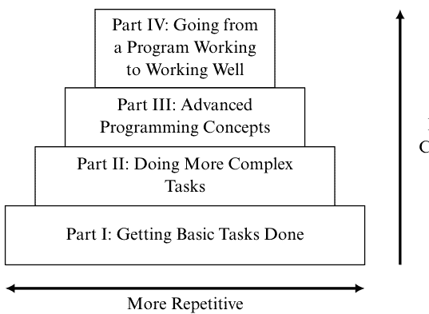

第一部分的章节最长，第四部分的章节最短。前面的部分更重复、不够简洁，而后面的部分重复较少、更简洁。上图中金字塔的块越宽，该部分就越重复。金字塔越高，该部分就越简洁。

## 关于主题覆盖和顺序的一些决策背后的逻辑

关于覆盖范围和顺序的一些决定可能令人惊讶，因此在此解释其原理：

-   通过将第一至第二部分大多数章节的结构建立在科学和工程工作流任务的基础上，语法是分块处理的。也就是说，没有单独一章讲变量，单独一章讲分支等。相反，这些主题在多个章节中以一种螺旋式的方法进行覆盖。从教学法上讲，这样更好，因为它允许我们一点一点地学习，并在后续对某个主题的处理中强化我们之前学到的东西。以这种方式学习被视为一个螺旋，而不是一条直线。但是，这种学习方法至少有两个代价。首先，当我们在某一章中第一次看到某个特定结构时，由于我们在该章中没有完全描述该结构，代码示例可能看起来笨拙且比需要的更复杂。其次，通过将单个结构的描述分散在多个章节中，本教材作为参考书的功能不佳。你能做些什么来减轻这些代价呢？对于第一点，我们请求您的耐心，让我们慢慢构建对该主题的描述。随着本书的进展，代码示例将变得更加简洁和Python化。对于第二点，我们编写本教材时提供了大量的章节间交叉引用，因此这些交叉引用可能足以引导您找到所需内容。浏览详细目录（**其中详细列出了每章包含的子主题**）或索引也可能帮助您找到感兴趣主题的出现位置。附录C也按编程主题列出了本书的内容。
-   “如何编写程序”这一章不像大多数编程教材那样出现在早期。我们在第6.2.7节简要提到了如何编写程序，并在第11章提供了更详细的介绍。为什么？如果本教材的目标是通过实践来教授编程，而不是阅读关于如何“做”的内容，那么它应该从使用Python完成科学和工程任务开始。一旦读者有了一些编写短程序的经验，他们将有更多的背景来理解关于如何编写较长程序的建议。
-   工作流重点影响了本教材中循环和分支的引入方式。在大多数教材中，这些主题在单独的章节中分别介绍。然而，结果是限制了运用这些知识所能完成的事情。一个`if`语句本身，如果没有被多次访问的可能性，完成不了多少事情。在本教材中，我们在第6章关于基本诊断数据分析中一起介绍了这两个概念。本章中没有详尽地处理任何一个主题，但通过在一个章节中同时介绍这两个主题，我们可以生动地展示这些结构对于使用计算机研究数据集是多么有用。
-   由于本教材面向的是初学者，而不是有编程经验的学生，因此我们在引入哪些概念以及何时引入方面不得不做出艰难的选择。这些选择的一个结果是，特别是在早期章节中，我们的代码示例不够Python化，以便在本书的该部分更清晰地向初学者学生阐述概念。我们还忽略了一些可以更简洁高效地完成我们所处理的一些任务的包和工具，以便专注于当前的学习目标。明智的人会对我们的选择有不同看法，但我们希望教师们知道我们认识到了这种矛盾，并且我们衷心支持任何最能满足您学生需求的定制化方案。

## 主题顺序和针对不同课程长度的灵活方法

-   第一部分是大约一个季度（10周）课程的材料。该材料非常适合学生没有编程经验的入门编程课程。
-   第一至第二部分是大约一个学期（15周）入门编程课程的材料。
-   第一至第三部分的编写使得后面的章节建立在前面章节内容的基础上。它们包含了一个两季度入门编程系列课程的材料。
-   第四部分的章节是补充性的，可以独立阅读并用于自学。
-   按顺序学习是使用本教材的一种方式。然而，其他顺序也是可能的。对于希望按编程主题覆盖材料的教师，附录C中的目录显示了编程主题的各个方面在何处被涵盖。

## 排版和着色约定

在整本教材中，我们使用不同形式的排版和着色来提供额外的清晰度和功能性。我们使用的一些特殊排版约定包括：

-   内联源代码。这些是穿插在教材段落中的指令，告诉Python该做什么。它们以深红色、等宽字体排版，如`a = 4`。
-   内联命令，用于在键盘上输入或打印到屏幕。以深红色、等宽字体排版，如`print('hello')`。
-   内联通用参数或值。这些标签是占位符，将被代码片段或具体值替换。它们以深红色、斜体、比例字体排版，位于小于号和大于号之间，如`<condition>`。
-   源代码、命令、通用参数或值的块或列表项。这些以缩进的块引用结构或列表结构排版，使用黑色字体。
-   文件内容（非源代码）。这些以缩进的块引用结构排版，使用黑色、等宽字体。
-   文件、目录和应用程序名称。以黑色、斜体、比例字体排版，如`/usr/bin`。
-   关键术语。首次使用时，以深蓝色、粗体、比例字体排版，如**program**，可在术语表中找到。

对应用程序、库、模块和包名称的一般引用与普通文本的排版相同。因此，对Matplotlib包的引用就像本句中这样排版。由于大多数包都有唯一的名称，这应该不会引起混淆。在少数情况下，包名是普通英语单词（例如，time模块），希望从上下文中可以清楚地看出对模块的引用。

## 学生的评估和练习

本教材和在线Jupyter笔记本为学生提供了大量练习所学内容的机会：

## 前言

- “试一试”练习旨在让学生通过循序渐进、逐步积累的方式，加深对材料的理解。在课堂环境中，它们适用于主动学习问题、小组活动以及编程实验的组成部分。由于答案是公开的，因此这些练习最适合用于练习和能力发展，而非总结性评估。
- “家庭作业问题”以 Jupyter 笔记本的形式在线提供，学生完成所需时间通常比“试一试”练习更长。因此，一般来说，它们更适合学生在课外完成。家庭作业笔记本的解答仅向经认证的讲师提供。

本前言之后的“致学生”部分进一步描述了可用的练习和问题类型。

## 支持资源与教材更新

教材网站 www.cambridge.org/core/resources/pythonforscientists 包含教材的更新和支持资源。其中包括：

- 更详细描述某些主题的网页。
- 包含练习和问题的 Jupyter 笔记本。
- 本教材中引用的大型数据集和图像的副本。
- 补充和勘误列表。
- 关键外部网站的链接。

以上所有资源（图像以及练习和问题的解答除外）均可供学生和讲师访问。

Python 教学资源领域广阔且不断变化。我们在 www.cambridge.org/core/resources/pythonforscientists/instructors/ 提供了一个列出部分此类资源的网页。

如发现任何错误，请通过电子邮件 ipyses@johnny-lin.com 告知我们。

## 致学生

*《面向科学家和工程师的 Python 编程导论》* 包含两个组成部分：

- 您正在阅读的纸质/数字书籍。
- 在线资源，包括包含额外内容的网页以及作为 Jupyter 笔记本的练习和问题。

后者并非“补充材料”，因为它们与教材的内容和流程紧密相连。这两部分共同构成一个整体。

## 应用与练习

教材在第一至第三部分提供了以下类型的问题和练习：

- **试一试**。这些是练习/示例讲解，见于纸质/数字书籍中。其复杂度与主要章节示例相似，并包含解答和讨论。“试一试”部分还扩展了章节前文的讨论，引入新概念。
- **章节复习自测题**。见于纸质/数字书籍中。这些是相对较短的问题，用于初步评估您对本章材料的理解。这些问题的答案位于章节末尾。
- **学科特定“试一试”**。见于在线资源中。它们与纸质/数字书籍中“试一试”部分讨论的练习类似。我们为您提供一个包含学科特定“试一试”的 Jupyter 笔记本，以及另一个包含“试一试”答案的 Jupyter 笔记本。
- **学科特定家庭作业问题**。见于在线资源中。它们旨在由讲师布置为家庭作业。我们为您提供一个包含问题的空白 Jupyter 笔记本。这些问题通常比学科特定“试一试”更复杂。

所有学科特定练习和问题均以 Jupyter 笔记本形式提供，可下载到您自己的计算机上并在本地运行。学科特定 Jupyter 笔记本位于 www.cambridge.org/core/resources/pythonforscientists/jupyter-notebooks/。目前提供生物学、化学和物理学的笔记本。我们希望将来能包含其他学科的笔记本。有关使用 Jupyter 笔记本的详细信息从第 2.2.3 节开始。

## 致学生

本教材中引用的大型数据集和 Jupyter 笔记本位于 www.cambridge.org/core/resources/pythonforscientists/datasets/。这些资源可免费下载。

## 使用教材

我们建议您按以下方式学习各章节。

首先，阅读主要章节示例。如果可能，**输入示例的代码**并查看运行结果。这在前面章节代码较短时更可行。在后面的章节中，输入代码的收益可能不值得花费全部时间。阅读主要章节示例时，您可能无法理解其中的所有内容。如果这样，也没关系。主要章节示例的目的并非教授本章的概念。那是本章其余部分的任务。主要章节示例旨在让您了解如何使用 Python 解决特定的科学或工程任务，并激发本章其余部分的讨论和练习。

其次，阅读“Python 编程基础”部分。在大多数章节中，该部分会有您可以输入的小示例。请这样做。这将有助于您的学习。

第三，完成“试一试”练习。在完成之前，不要阅读紧随其后的解答。如果您只是阅读“试一试”并立即跳到解答，您将绕过学习过程。动手实践和解决问题确实能帮助我们学习！此外，请记住对这些练习的讨论包含了关于本章主题的额外材料。不要将“试一试”视为可选的“仅仅是示例”而跳过。

第四，根据时间安排，尽可能多地完成学科特定“试一试”练习。完成后，查看其解答，并尝试解释您的解答与解答笔记本之间任何差异的*原因*。

第五，为了提高您对相关主题理解的深度，至少完成一些学科特定家庭作业问题。解答仅对讲师开放，但练习本身将有助于您的学习。

章节复习自测题可用于测试您对材料的理解。您可能想用它们来备考，但无需等到考试才去做。在阅读教材时，这些问题也可能帮助您了解自己的理解程度。但请注意，这些问题并非非常困难，因此不应得出结论认为，如果能轻松回答所有问题，就能在考试中表现良好。

章节总结为您提供了再次查看主题的额外机会。它不应替代您自己做笔记或为考试创建自己的学习资料。

最后一条建议。无论我们建议您阅读文本的何处，我们都隐含地假设您会*慢慢*阅读。真的，非常慢。阅读代码时，我们必须逐行逐词进行。我们必须询问该行之前变量的状态是什么，该行之后变量的状态是什么，以及该行做了什么导致（或未导致）任何变化。遇到代码时，我们应该询问如果改变代码的值和顺序，程序的行为会有何不同。并且我们应该做笔记（如果可能，用手写，因为这样我们学得更多），记录我们所读的内容，并记下我们想到的任何问题。如果我们不立即写下问题，我们会忘记它们，并错误地认为自己理解了材料。我们必须*主动参与*文本。

我们不能像读小说一样阅读编程教科书（或任何数学、科学或工程教科书）。读小说时，我们可以只阅读文字和句子本身，如果匆忙可以略读。散文本身会告诉我们人物、情节和背景。但在编程教科书中，这种阅读方式行不通。略读编程教科书是灾难的根源。我们必须解包和挖掘代码以及描述代码的文本的含义。如果不这样做，我们的理解将受到限制。所以，慢慢读！☺

## 声明与免责条款

## 商标与商标权声明

Anaconda、Anaconda Navigator、Conda 和 Numba 是 Anaconda, Inc. 的商标和/或注册商标。Apple、Mac、Mac OS 和 OS X 是 Apple Inc. 的注册商标。Azure、Excel、Microsoft、PowerShell、Windows 和 Word 是 Microsoft Corporation 在美国和/或其他国家的注册商标。Chrome™ 浏览器是 Google LLC 的商标。Debian 是 Software in the Public Interest, Inc. 的注册商标。Django 是 Django Software Foundation 的商标。Git 是 Software Freedom Conservancy, Inc.（Git 项目的公司所在地）在美国和/或其他国家的注册商标或商标。GITHUB® 是 GitHub, Inc. 在美国注册的独家商标。GitLab 是 GitLab, Inc. 的注册商标。GNOME® 是 GNOME Foundation 的商标。GNU 是由 Free Software Foundation 支持的操作系统。Jupyter®、JupyterHub 及其衍生词是 NumFOCUS 的商标或注册商标。Kubernetes® 是 The Linux Foundation 在美国和/或其他国家的注册商标。LibreOffice 是 The Document Foundation 的注册商标。Linux 是 Linus Torvalds 拥有的商标。Matlab 和 MathWorks 是 The MathWorks, Inc. 的注册商标。PyCharm¹ 是 JetBrains s.r.o. 的商标。Python 是 Python Software Foundation 的注册商标。Stack Overflow 是 Stack Exchange Inc. 的商标。Ubuntu 是 Canonical Ltd. 的注册商标。本书中提及的所有其他商标和标志均为其各自所有者的财产。商标和/或其他标志归属中的任何错误或遗漏，并非意在主张或否认商标和/或其他标志权利。

## 版权声明

Chrome 浏览器会话的屏幕截图（例如，图 2.3、3.7、3.8、3.9、4.6 和 4.7）包含来自 Google LLC 的元素，并经许可使用。

第 13 章中来自 Volkman 等人 (2004) 的图片版权归 © 2004 Volkman 等人所有，并根据知识共享署名许可条款经许可使用。Volkman 等人未指定许可版本，但知识共享署名 4.0 国际公共许可可在 https://creativecommons.org/licenses/by/4.0/legalcode 获取。本作品中的图片已根据 Volkman 等人原始形式进行了修改。

图 2.3、3.7、3.8、3.9、21.2、21.3 和 21.4 中的屏幕截图经 Apple Inc. 许可转载。

图 24.1 中的代码版权归 © 2010–2021, Holger Krekel 及其他人所有。该代码根据 MIT 许可条款经许可使用。许可协议可在 https://github.com/tox-dev/tox/blob/master/LICENSE 获取。²

全文中引用的代码片段和想法均以脚注或其他方式在文中引用。然而，第 14 章中的代码片段和想法是基于更长的代码块以及更多样化的代码来源构建的，其中最突出的是 cartopy 手册 (Met Office, 2010–2015)，该手册根据开放政府许可 (www.nationalarchives.gov.uk/doc/open-government-licence/version/2/) 授权，以及 Matplotlib 文档 (matplotlib.org/contents.html; 另见 Hunter (2007))。传统的脚注和引用方式对于这类综合性作品效果不佳。因此，我们在此处以及 www.cambridge.org/core/resources/pythonforscientists/refs/ 引用了这些参考文献。

本书中使用受版权保护来源的信息是经许可的（并在本致谢部分或相应图注中注明），或被认为是合理使用原则所涵盖的使用。

## 数据及其他使用声明

本作品包含来自 Mikulski 天文望远镜档案馆 (MAST) 的数据（例如，在第 1 章中）。STScI 由天文学研究大学协会根据美国国家航空航天局 (NASA) 合同 NAS5-26555 运营。这包括由开普勒任务收集的数据。开普勒任务的资金由 NASA 科学任务理事会提供。

本作品包含使用分子动力学模拟包 NAMD (Phillips et al., 2005) 进行模拟的输出结果。NAMD 由伊利诺伊大学厄巴纳-香槟分校贝克曼高级科学与技术研究所的理论与计算生物物理学组开发。NAMD 官方网页位于 www.ks.uiuc.edu/Research/namd/。

本作品包含来自美国国家环境预测中心 (NCEP) 再分析数据的地表/近地表气温数据（例如，在第 7.1 节中），该数据由位于美国科罗拉多州博尔德的 NOAA/OAR/ESRL PSD 从其网站 www.esrl.noaa.gov/psd 提供。

本作品包含来自 UCI 机器学习库 (Dua and Graff, 2019) 的数据。该库位于 https://archive.ics.uci.edu/ml。

第 13.3 节包含来自 Patel 和 Dauphin (2019) 的图片，由 NASA 地球观测站发布，这些图片使用了来自 NASA 戈达德太空飞行中心的 Ranjay Shrestha 的 Black Marble 数据以及来自美国地质调查局的 Landsat 数据创建。

World Time Buddy (www.worldtimebuddy.com) 在时区转换方面提供了帮助。（参见第 7.1 节和第 12.1 节。）

用于显示自然特征和政治边界（在第 14 章中）的数据由 OpenStreetMap (© OpenStreetMap contributors) 和 Natural Earth（公共领域）提供。OpenStreetMap 数据根据开放数据库许可 (www.openstreetmap.org/copyright) 提供。免费的矢量和栅格地图数据可在 naturalearthdata.com 获取。

本作品中的数据也在正文描述和脚注中予以说明。本作品中的所有数据和图片均经许可使用。其中许多材料属于公共领域，或可自由转载和重复使用。详情请参阅数据来源。

本作品中呈现的、未明确归属于来源的数据应视为虚构的，由作者为说明或教学目的而创建。它们不得被视为任何自然或人工现象或系统的真实或准确描述。大多数（尽管不是全部）此类数据出现时都伴有“虚构”或“模拟”一词。

## 免责条款

尽管我们已尽力确保文本、代码和相关在线资源（统称为“资源”）的准确性和正确性，但资源是“按原样”提供的，不附带任何明示或暗示的保证，包括但不限于适销性、特定用途适用性和不侵权的保证。在任何情况下，作者或版权持有者均不对因资源或使用或与资源相关的其他交易而引起的任何索赔、损害赔偿或其他责任负责，无论是在合同、侵权行为或其他诉讼中。³

所有者允许使用商标、商标、受版权保护的材料或任何其他材料，并不意味着对该使用或资源的认可。

## 致谢

我们感谢剑桥大学出版社的 Charles Howell、Matt Lloyd、Lisa Pinto 和 Melissa Shivers 的编辑帮助。我们感谢 Spencer Cotkin 的编辑建议，其中大部分我们已采纳，这使得本书更加完善。我们感谢 Beverley Lawrence 对文本的文字编辑。许多匿名审稿人提供了有益的反馈，这些反馈已纳入文本中。

我们感谢 Cynthia Gustafson-Brown 在本项目上的协助，特别是在查找和提供第 13.1 节示例中部分描述方面的帮助。

我们感谢与以下人士的交流和协助：Bill Erdly、Michael Grossberg、Charity Flener Lovitt、Laurence Molloy、Hansel Ong、Jim Phillips 和 Rob Nash。无论是通过出版物、研讨会、会议还是讨论，我们所在的社群——个人、工作场所、学科领域，当然还有 Python 社区——都贡献了想法、鼓励和支持。

本书的部分内容基于《*A Hands-On Introduction to Using Python in the Atmospheric and Oceanic Sciences*》⁴、2020 年美国气象学会《*Beginner’s Course to Using Python in Climate and Meteorology*》⁵ 的幻灯片，以及《*Lecture Notes on Programming Theory for Management Information Systems*》⁶ 笔记集。这些资源由 Johnny Lin 提供，这些资源中的致谢也适用于本文。我们感谢那些允许我们使用他们所创建材料的人。这些已在声明部分、包含或改编图的图注中，或在线资源中予以说明。

¹ www.jetbrains.com.

² 访问于 2021 年 1 月 11 日。

³ 复制并改编自 MIT 许可，列于 Opensource.org，https://opensource.org/licenses/MIT（访问于 2021 年 7 月 14 日）。

⁴ Lin (2012).

⁵ 未正式出版。

⁶ Lin (2019).

## 致谢

我感谢我的妻子凯伦，以及我的孩子们蒂莫西、詹姆斯和克里斯蒂安妮的鼓励与爱。*S.D.G.*

*Johnny Wei-Bing Lin*
*华盛顿州贝尔维尤*

我感谢我的导师迈克尔·格罗斯伯格教授的所有帮助，以及AMS Python社区和Matplotlib开发团队在代码相关话题上的影响和交流。

*Hannah Aizenman*
*纽约州纽约市*

我感谢我的丈夫维森特，我的家人达菲、谢丽尔和萨拉，以及我的朋友们瓦莱丽、凯特琳和阿兰娜给予我的所有爱与支持。

*Erin Manette Cartas Espinel*
*华盛顿州肯莫尔*

我感谢萨曼莎·冈纳森帮助我审阅笔记本并提供建议，感谢埃里克·冈纳森的支持以及技术技能，也感谢保拉·罗德里格斯·伊达尔戈博士倾听我讲述在此过程中进行的不同Python写作。

*Kim Gunnerson*
*华盛顿州贝尔维尤*

我感谢我的家人的支持，也感谢辛西娅·古斯塔夫森-布朗为第2章和第3章提供了多个更具学科针对性的练习题。

*Joanne Liu*
*加利福尼亚州圣地亚哥*

# 第一部分

# 完成基本任务

# 1 序言：准备编程

前言和致学生部分描述了我们为何以及如何构建本书和资源，以及如何充分利用它们。在本章中，我们将为学习编程这一事业以及Python这门语言奠定基础。我们还将描述需要安装哪些软件才能使用本书的其余部分。

## 1.1 什么是程序？为什么要学习编程？

**程序**是一组告诉计算机做什么的指令。计算机执行的每一个动作，从进行计算到显示图表，最终都由人类编写的程序控制。该程序由一个包含命令的文件组成。计算机读取该文件并逐一执行命令。

问题在于，计算机理解的语言与人类所知的语言不同。自然语言——人类的语言——极其丰富，能够描述远不止事实和数字的内容。相比之下，计算机语言极其简单，词汇和能力非常有限。这是因为计算机只能做几件事：

-   保存数值。
-   进行计算。
-   询问某事是真还是假。
-   接受输入（例如，来自键盘）和输出（例如，到屏幕）。
-   反复执行一项任务。

从某种意义上说，计算机所做的一切——无论是发送电子邮件、播放猫咪视频，还是模拟地球气候——都是许多程序员将他们希望计算机完成的任何复杂任务分解为上述某些能力组合的结果。因此，学习如何编程意味着学习如何将我们想要完成的任务分解为（非常）简单的部分，以及如何用计算机理解的语言——一种编程语言——来表达这些任务。顺便提一下，我们经常在指代编程任务时谈论**代码**或编码。这些术语分别是指计算机语言的语法和用这些语言编写程序的任务。

对于科学家或工程师来说，学习编程的目的是什么？很少有科学家或工程师对成为软件开发人员感兴趣，现代科学的基础是使用纸、笔和人类思维发展起来的。牛顿和达尔文在没有计算器的情况下进行了计算，更不用说计算机了。今天，伟大的科学和工程工作仍然可以在不需要编程计算机的情况下完成。对于涉及小型数据集或解析数学解的工作，纸和笔（以及计算器或电子表格）通常就足够了。

然而，今天我们拥有的数据比我们的前辈可能相信的要多得多：来自卫星、原位传感器或大规模实验的测量数据；流体流动、结构或生物系统的模型。电子表格通常不足以处理如此庞大的数据集。与此同时，科学和工程领域已经受益于各种计算工具的爆炸式增长，用于各种计算。无论我们是在寻找传统的统计分析**例程**，还是想实现最新的机器学习算法，其他人都已经编写了我们可以使用的工具。软件工程社区还开发了工具和法律框架，使计算工具能够轻松共享并集成到任何人的程序中。结果是，一个懂得如何编程的人可以做更多的科学和工程工作。

一图胜千言，因此请考虑图1.1：这是一张显示美国国家航空航天局（NASA）开普勒任务航天器（一台旨在寻找系外行星的空间望远镜）从恒星

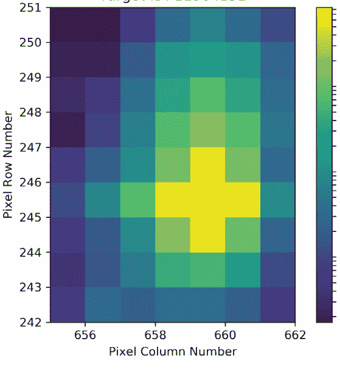

**图1.1** 开普勒-10在第4季度的光通量。

开普勒-10接收到的光的图像，该恒星周围运行着航天器发现的第一颗岩石系外行星（开普勒-10b）。¹ 通过互联网从存档数据所在的米库尔斯基空间望远镜档案馆（MAST）读取数据并创建绘图的Python代码如下：

```
from lightcurve import KeplerTargetPixelFile
data = KeplerTargetPixelFile.from_archive('Kepler-10', quarter=4)
data.plot(scale='log')
```

就是这样！三行代码就搞定了！这就是为什么科学家和工程师需要学习编程。我们现在不会详细解释这些代码行，但在通读本书之后，我们将拥有理解其含义和用法的工具。

## 1.2 什么是Python？为什么要学习这门语言？

有许多编程语言，每种语言都有其自身的优点和缺点。但抽象地学习编程是困难的。要学习编程，我们必须使用某种特定的语言。一旦我们学会了一种语言，其他语言就更容易学习，但我们总得从某个地方开始。本书中我们将使用的语言是Python。

虽然没有完美的编程语言，但Python语言极其强大且用途广泛，同时又易于理解和学习。用Python编写的代码非常清晰，清晰到几乎像自然口语英语一样易读。对于科学家和工程师来说，Python具有使其在分析数据和解决基于数学的问题方面非常有用的能力。有一个庞大的科学Python用户和开发者社区，他们不断为该语言的科学计算能力添砖加瓦。在我们学习本书的过程中，我们将看到Python的这些特性和特点。现在，请相信我们，Python是一个良好的起点。

然而，学习Python还有一个额外的原因：它是免费的。Python是一种开源编程语言，也就是说，其底层代码本身可供任何人检查和用于自身目的。Python在“自由”的意义上是免费的。Python在“无成本”的意义上也是免费的。因此，如果我们有互联网连接，我们就可以获得运行Python程序所需的一切。我们可以将Python语言用于我们自己的程序，而无需担心是否能购买（可能昂贵的）专用数据分析语言的许可证，或者我们今天编写的程序在明天分发给他人或我们自己转移到另一台计算机时是否还能运行。在学习Python之后，我们可以有信心

¹ 此示例稍作修改，源自lightcurve包文档（参见Vinicius等人（2018））中的示例，该Python包用于访问开普勒任务的数据。该示例位于http://lightcurve.keplerscience.org/tutorials/2.02-recover-a-planet.html（访问于2018年8月15日）。有关开普勒任务的信息位于www.nasa.gov/mission_pages/kepler/overview/index.html（访问于2018年8月20日）。

## 1 序言：为编程做准备

（尽可能人性化地）我们将在一生中使用这门语言，服务于我们希望的任何科学或工程目的——或商业、艺术、文学等目的。

### 1.3 我们需要的软件

在本书中，我们将学习编写 Python 程序，但为了让计算机**运行**（或执行）我们的程序，我们还需要比程序指令文件本身更多的东西。Python 最实用的形式是作为**发行版**的一部分，其中包含实用程序和工具。

我们编写本书时假设已通过最近安装的 Anaconda 发行版安装了 Python 3.x 版本（例如 3.6 等）。² 安装 Anaconda 发行版优于从 Python 软件基金会网站安装 Python，或依赖某些操作系统自带的 Python 版本，因为 Anaconda 发行版包含了对科学家和工程师至关重要的软件包和实用程序。

Anaconda 发行版下载页面包含有关如何下载和安装软件的详细说明。我们在 www.cambridge.org/core/resources/pythonforscientists/refs/ 的参考文献 1 中提供了指向该页面的最新链接。此版本对个人免费，并且可以在没有管理员权限的情况下安装。它可以与另一个 Python 安装同时安装在同一台计算机或账户上，并且适用于所有主要操作系统（Windows、Mac OS X 和 Linux）。

开箱即用时，Anaconda 发行版提供了我们需要的大部分内容。通过发行版的工具，我们还可以根据需要向发行版添加额外的实用程序和库（称为软件包）。使用 Anaconda Navigator 安装额外的软件包并管理软件包。Navigator 文档和入门指南的最新链接分别位于 www.cambridge.org/core/resources/pythonforscientists/refs/ 的参考文献 2 和 3。

以下是当前文本中使用的额外软件包列表，这些软件包可能不包含在 Anaconda 发行版的默认安装中。在括号中，我们注明了这些软件包的哪些章节或部分首次和/或主要使用：

- cartopy（第 14 章），
- line-profiler（第四部分），
- memory-profiler（第四部分），
- netCDF4（第 18 章），
- numba（第四部分），
- pytest（第 23.3.2 节）。

² 本书中的大部分代码，尤其是前面的章节，也适用于 Python 2.7.x。然而，尽管仍有一些科学和工程遗留代码是用 Python 2.7.x 编写的，但所有主要软件包都已迁移到 3.x 版本。

要运行上述部分中的代码，请添加这些软件包。请注意，line-profiler 和 memory-profiler 软包也称为 line_profiler 和 memory_profiler，使用下划线代替连字符。

如果上述任何软件包已安装，Anaconda Navigator 会在我们尝试安装时告知我们，因此我们不必担心覆盖任何内容。如果我们不知道是否拥有所有需要的软件包，也不用担心。如果在运行 Python 程序时收到如下消息：

```
ModuleNotFoundError: No module named 'netCDF4'
```

我们可以通过安装名为该名称的软件包或模块来修复此问题，然后重新运行我们的程序。

准备工作应该就这些了。我们现在准备好开始学习 Python 编程的旅程。我们从使用 Python 满足科学家或工程师的基本计算需求开始，即拥有一个好用的计算器。

# 2 Python 作为基本计算器

铅笔和纸是研究科学和工程问题有史以来最伟大的工具之一。但是，当数据量和计算复杂性达到一定程度时，我们需要使用更强大的方法。计算器是科学家或工程师进行这些计算的基本工具。虽然 Python 有广泛的应用，从绘图到建模再到数据分析，但最简单（有时也是最有用）的方法是将 Python 用作计算器。事实上，如果我们的笔记本电脑已经打开，使用 Python 进行简单（或不那么简单）的算术运算通常比使用计算器更容易。在本章中，我们将描述如何将 Python 用作基本计算器。本章的结构将与大多数章节的结构相同。详情请参阅“致学生”前言部分。我们将围绕本章任务的示例以及完成该任务的 Python 代码展开讨论。请不要期望示例在引入时就能完全理解。在下一节中，我们将提供 Python 代码功能的解释。在本章后面，我们将提供“试试看！”示例、章节自测题和章节摘要。

## 2.1 Python 作为基本计算器的示例

我们将在本节介绍该示例。有关示例如何工作以及为何如此工作的详细描述，请参见下一节（第 2.2 节）。当我们阅读大多数章节的开头示例时，不理解示例中的所有内容（或大部分内容）是可以的。这是我们首次接触相关概念！

基本计算器需要完成两项任务：

- 执行算术运算。
- 存储值以供调用和重用。

许多基本计算器还包括括号键，以便对**操作**进行分组。有些计算器还可以在计算器内存中存储多个值以供调用，或将当前值添加到内存中的现有值中。

考虑一个边长为 2 英寸的立方体。以下是计算该立方体体积的 Python 会话：

```
>>> 2*2*2
8
```

当 Python **解释器**的提示符出现时（解释器是输入 Python 指令并由计算机执行它们的地方，即**执行**它们），我们输入算术**表达式**，按 `Enter` 键（或某些键盘上的 `Return` 键），计算机将执行我们的表达式并在下方打印结果。启动 Python 解释器类似于打开计算器。一旦解释器或计算器打开，它就准备好让我们输入数字并进行计算。在上面的示例中，解释器的提示符是三个大于号（`>>>`），它向我们显示从哪里开始输入算术表达式。我们不需要输入 `>>>`；这些符号在解释器启动时会自动出现。

除了使用默认的 Python 解释器（如上所示），我们还可以在不同的**环境**中运行交互式 Python 会话。环境是我们与 Python 解释器交互的界面。以下是与上面相同的示例，但代码位于 Jupyter notebook 环境的单元格中：

```
In [1]: 2*2*2
Out [1]: 8
```

我们可以使用括号对操作进行分组。这是一个计算两个立方体总体积的表达式，一个边长为 2 英寸，另一个边长为 3 英寸：

```
>>> (2*2*2) + (3*3*3)
35
```

在 Jupyter notebook 中，这将是：

```
In [1]: (2*2*2) + (3*3*3)
Out [1]: 35
```

最后，我们可以通过将表达式的结果赋给一个名称来保存它。一旦保存，我们就可以通过引用该名称来使用保存的值。我们在图 2.1 中提供了一个示例，计算两个立方体的体积，将其值保存为**变量**，并在另一个表达式中使用这些变量。在该示例中，代码的前三行依次执行。结果是 Python 在最后一行提供的输出。图的上半部分显示了代码在默认 Python 解释器中的输入和执行方式。在上半部分的第 1 行（相当于下半部分 `In [1]` 单元格的第一行），我们将三个 2 相乘，然后将结果保存到变量 `volume_cube_1` 中。在第 2 行，我们对三个 3 执行相同的操作，并将结果保存到变量 `volume_cube_2` 中。最后，在第 3 行，我们将变量 `volume_cube_1` 和 `volume_cube_2` 的内容相加，Python 解释器打印结果 `35`。下半部分显示了代码在 Jupyter notebook 中的输入和执行方式。上下两部分是等效的，唯一的区别是界面的外观。

## 2 Python 作为基础计算器

```python
>>> volume_cube_1 = 2*2*2
>>> volume_cube_2 = 3*3*3
>>> volume_cube_1 + volume_cube_2
35
```

```python
In [1]: volume_cube_1 = 2*2*2
       volume_cube_2 = 3*3*3
       volume_cube_1 + volume_cube_2
Out [1]: 35
```

图 2.1 展示了使用默认 Python 解释器和 Jupyter notebook 进行表达式求值、将值保存为变量以及在其他表达式中使用变量的示例。

## 2.2 Python 编程基础

图 2.1 中的示例说明了本章将讨论的四个 Python 编程主题：表达式、运算符、变量和解释器本身。虽然代码可以使用默认 Python 解释器或在 Jupyter notebook 环境中执行，但几乎所有的交互式代码示例都将使用 Jupyter 给出。为了简洁起见，当我们展示默认 Python 解释器、Jupyter notebook 和第 3.2.5 节中描述的其他控制台环境的交互式环境时，我们通常将其统称为“解释器”。第 2.2.3 节将更详细地讨论默认解释器和 Jupyter notebook 环境。

### 2.2.1 表达式和运算符

代码片段 `3*3*3` 和 `volume_cube_1 + volume_cube_2` 是表达式的示例。表达式是由值和变量（以及我们稍后将看到的其他元素）组合在一起，并由**运算符**作用的集合。

值是我们预期的数字形式（例如，3，-7.2），尽管要表示科学计数法中的数字，我们以 xey 的形式输入，其中 x 代表乘以 10 的幂的数字，y 代表 10 的幂的指数。因此，以下两列数字是等价的：

| 科学计数法 | Python 形式 |
| :--- | :--- |
| 5.4 × 10⁶ | 5.4e6 |
| 7.54 × 10⁻⁴ | 7.54e-4 |
| -2.4 × 10⁻² | -2.4e-2 |

有些运算符作用于两个元素（例如加法（+）运算符，它将运算符左右两边的数字相加），而有些运算符只作用于一个元素。

前者称为**二元运算符**，后者称为**一元运算符**。有点令人困惑的是，当我们讨论数据在计算机中的存储方式时，我们也使用“**二进制**”这个术语。在那些上下文中，“二进制”意味着 0 或 1。这种二进制的含义在第 9.2.2 节和第 18 章中有更详细的描述。表 2.1 列出了 Python 使用的一些基本算术运算符（这些都是二元运算符）。在后面的文本中，我们将遇到更多运算符，包括一元和二元运算符。

表 2.1 算术运算符。

| 运算 | 符号 |
|---|---|
| 加 | + |
| 减 | - |
| 乘 | * |
| 除 | / |
| 整除 | // |
| 幂运算 | ** |

当 Python 计算算术表达式时，它遵循标准的数学顺序：先计算括号内的块，然后是幂运算，接着是乘法和除法，最后是加法和减法。相同优先级的运算从左到右执行。¹ 在这个例子中：

```python
In [1]: 4+3*2

Out[1]: 10

In [2]: (4+3)*2

Out[2]: 14
```

我们看到，由于乘法的优先级高于加法，在单元格 In [1] 中，3*2 先执行，然后才与 4 相加。在 In [2] 表达式中，括号强制 4+3 先执行，然后才将结果乘以 2。

表 2.1 中列出的常规算术运算符按预期工作。然而，除法稍微复杂一些。除法（/）运算符的作用类似于常规除法，返回商和余数的十进制形式。因此：

```python
In [1]: 1/2

Out[1]: 0.5
```

¹ 更多详情请参阅 Wikibooks 关于 Python 运算符的页面。我们在 www.cambridge.org/core/resources/pythonforscientists/refs/，参考文献 17 提供了该页面的最新链接。

```python
In [2]: 7/3
Out [2]: 2.3333333333333335
```

```python
In [3]: 5/5
Out [3]: 1.0
```

```python
In [4]: 5.0/5.0
Out [4]: 1.0
```

无论分子或分母是整数还是小数，结果都将是小数。此外，在 Out [2] 中，小数在 Python 中似乎没有被正确表示。我们将在第 8.2.7、9.2.2 和 9.2.3 节中更详细地讨论这一点。目前，只需注意小数在计算机中通常是不精确表示的。

然而，有时我们不希望除法给出小数结果，而只想要商（作为整数）并舍弃余数（向下取整）。² 在这些情况下，我们希望使用整除，它由 // 运算符给出：

```python
In [1]: 1//2
Out [1]: 0
```

```python
In [2]: 7//3
Out [2]: 2
```

```python
In [3]: 5//5
Out [3]: 1
```

```python
In [4]: 7//3.0
Out [4]: 2.0
```

```python
In [5]: -9/2
Out [5]: -4.5
```

```python
In [6]: -9//2
Out [6]: -5
```

² http://stackoverflow.com/a/5365702 (访问于 2020 年 10 月 19 日)。

如果**操作数**（`//` 运算符左右两边的值）中有一个是小数，整除仍然会进行，但结果是一个小数。

预告：在本节中，我们讨论整数和小数时，仿佛它们在 Python 中是不同的实体，而在数学中 2 和 2.0 是相同的。这暗示了一个称为**类型**的编程概念，我们定义不同*种类*的值具有不同的属性。我们将在第 5.2.7 节中讨论这个主题。

### 2.2.2 变量

在计算器上，我们经常将值保存在内存中以备后用。在 Python 中，我们通过将值设置给变量名来保存值。然后我们可以通过名称使用这些值。在图 2.1 上半部分的第 2 行中，我们获取表达式 `2*2*2` 的结果并为其命名。这样做之后，如果在我们的 Python 计算器会话中稍后引用该名称，就等同于引用该表达式的结果（在本例中为值 8）。我们在第 3 行对第二个立方体的体积做了类似的事情。将名称赋予值的行为称为**赋值**变量。

在 Python 中，我们使用等号进行赋值。变量名放在等号左边，我们将其结果赋给该变量的表达式放在等号右边。因此，在图 2.1 上半部分的第 2 行中，变量名是 `volume_cube_1`，我们赋给 `volume_cube_1` 的值是 8，这是表达式 `2*2*2` 的结果。第 2 行中的这些任务按此顺序发生：首先，计算表达式 `2*2*2` 得到 8；然后，将变量 `volume_cube_1` 附加到这个 8 上。

这些任务的顺序很重要。在大多数日常生活中，等号意味着数学上的相等或“可互换性”或“相同性”。赋值中发生的*不是*这种情况。这里有一个例子说明为什么这种差异很重要。考虑这行 Python 代码：

```python
volume_cube_1 = volume_cube_1 + 100
```

如果上面这行代码是一个数学方程，它将毫无意义。我们可以从两边减去变量 `volume_cube_1`，得到数学方程：

0 = 100

这是错误的。因此，前面代码行中发生的不是数学表达式。相反，发生的是首先使用 `volume_cube_1` 的*当前*值计算右侧表达式 `volume_cube_1 + 100`。所以，如果 `volume_cube_1` 等于 8，右侧表达式计算结果为 108。*然后*，变量 `volume_cube_1` 被设置为该值，覆盖了 `volume_cube_1` 的旧值。执行完上面这行代码后，`volume_cube_1` 将被设置为 108，这个值比执行该行代码前 `volume_cube_1` 持有的值大 100。

Python 中的变量与数学中的变量在另一个方面有所不同。当我们有一个数学方程，例如：

$$y = mx + b$$

无论我们是否为任何变量定义了值，这都无关紧要。方程按原样书写，我们可以使用代数规则操作各项，例如将方程重写为：

$$x = \frac{y - b}{m}$$

然而，Python 中的变量在我们通过赋值创建它们之前是不存在的。因此，这行代码将无法工作：

```python
y = (m * x) + b
```

除非 `m`、`x` 和 `b` 之前已被定义。相比之下，虽然上面的单行代码无法工作，但这一组代码可以：

```python
In [1]:
    m = 0.5
    x = 2.1
    b = -13.0
    y = (m * x) + b
```

`m`、`x` 和 `b` 变量不必在 `y` 被赋值*之前立即*赋值，但它们必须在 `y` 被赋值之前的某个地方被赋值。

我们称一个“增长”的变量，如这行代码所示：

```python
volume_cube_1 = volume_cube_1 + 100
```

为**累加器**，因为变量 `volume_cube_1` 累积值；更多的值被添加到现有值上。如果变量失去值，如这里所示：

```python
volume_cube_1 = volume_cube_1 - 100
```

我们称该变量为**减量器**。因为同一个变量可以在多行代码中获得或失去值，有时更容易直接称以这种方式改变其值的变量为累加器。请注意，累加器或减量器变量仍然是常规变量。但是，因为我们以获得或失去值的方式使用该变量，所以我们给它一个特殊的名称来突出这种用法。

再次考虑图 2.1。假设我们稍微更改了代码，如下所示：

```python
In [1]:
    volume_cube_1 = 2*2*2
    volume_cube_2 = 3*3*3
    sum_cubes = volume_cube_1 + volume_cube_2
    volume_cube_2 = 4*4*4
    sum_cubes
```

Out [1]: 35

我们不是计算 `volume_cube_1 + volume_cube_2` 并将结果输出到屏幕，而是将其保存到 `sum_cubes` 中。然后，我们更改 `volume_cube_2` 并将 `sum_cubes` 输出到屏幕。

为什么即使在 `In [1]` 的第四行中 `volume_cube_2` 被更改，`sum_cubes` 仍然保持不变？当 `volume_cube_2` 变化时，`sum_cubes` 的值不会改变，因为 Python 不会回溯并使用新的 `volume_cube_2` 值重新计算 `volume_cube_1 + volume_cube_2` 表达式。换句话说，赋值给 `sum_cubes` 的那一行不是一个随着 `volume_cube_2` 值变化而始终成立的代数表达式。相反，赋值给 `sum_cubes` 的那一行执行了计算并进行了赋值，从那时起，Python 只知道 `sum_cubes` 的值是 35。在 `sum_cubes` 被赋值后，Python 并不知道 `sum_cubes` 是如何计算出来的。

虽然我们之前的代码示例在等号右边最多只包含两个变量，但在一行代码中，等号右边可以有任意数量的变量。我们也不需要等号两边的空格。因此，`a = 2` 和 `a=2` 效果完全相同（双关语 ☺）。然而，在标记（如数字、运算符和等号）之间添加空格可以大大提高较长表达式的可读性，因此更推荐使用空格。

当使用 Python 作为计算器时，我们可能会使用有限数量的变量，因此使用单个字母作为变量名可能没问题。但是，为了更容易理解变量包含的内容，将变量命名为更具描述性的名称更有意义。在后面的章节中，我们的变量名将变得更具描述性。

Python 变量名必须以字母或下划线开头。字母和下划线也可以用于变量名的其他部分，数字也可以。³ Python 也是区分大小写的，因此变量名 `Volume` 和 `volume` 指的是两个不同的变量。当 Python 变量名包含多个单词时，我们通常用下划线分隔它们（如我们在上面的示例中看到的）。我们将在后面学习此规则的例外情况。

要查看变量的内容，只需输入变量名：

```
In [1]: a = 2
a

Out[1]: 2
```

此方法仅适用于单元格中的一个变量，即我们最后在单元格中输入的变量。如果我们想查看多个变量的内容，我们将需要使用 `print` 命令。该命令在“试试看！2-4”中介绍，并在第 3.2.4 节中进一步讨论。

### 2.2.3 Python 解释器

正如我们之前看到的，要将 Python 用作基本计算器，我们可以使用多种环境。我们这里讨论的两种是：

- 使用终端窗口。
- Jupyter notebook。

在第 3.2.5 节中，我们将研究一个更复杂的 Python 解释器环境。

谈到所有这些不同的环境，可能会让人觉得 Python 非常复杂，也许有多种不同版本的 Python。然而，事实并非如此。环境只是与 Python 交互的不同方式。Python 解释器是相同的。事实证明，某些环境比其他环境更有用。对于将 Python 用作基本计算器的任务，终端窗口或 Jupyter notebook 是与 Python 交互的好方法。当我们研究希望 Python 完成的其他科学和工程任务时，我们可能会发现其他解释器环境更有用。

#### 在终端窗口中使用解释器

当我们登录 Windows 或 Mac OS X 计算机时，我们看到什么？很可能是一堆图标。这些图标代表文件或程序，我们大多数人习惯于双击它们来打开文件或运行程序。

过去人们并不是这样使用计算机的。在过去，计算机会显示一个光标，用户可以在其中输入命令（例如，`mkdir NewDirectory`），告诉计算机应该做什么（在前面的示例中，创建一个名为 *NewDirectory* 的文件夹或目录）。这被称为**命令行界面**。

我们今天仍然可以这样做。为此，我们首先打开一个**终端窗口**，这会在桌面上放置一个带有光标的窗口，等待输入命令。为什么我们想用这种方式告诉计算机该做什么？这是一个更大的话题；目前，只需将终端视为快速访问 Python 解释器的一种方式。

有关启动终端窗口的操作系统特定建议，请参阅 www.cambridge.org/core/resources/pythonforscientists/term/。要使用终端窗口启动 Python 解释器，打开该窗口后，输入启动 Python 的命令（而不是通过双击图标单击菜单选项）。www.cambridge.org/core/resources/pythonforscientists/term/ 页面还提供了在终端窗口中启动 Python 的操作系统特定建议以及在终端窗口中使用 Python 的基础知识。详细信息在该页面上，但重点如下所述。

成功后，窗口将如图 2.2 所示。行左侧的三个大于号 (`>>>`) 表示我们现在处于 Python 解释器中。进入 Python 解释器后，我们可以输入任何想要计算的内容，按 `Enter`，Python 将处理我们输入的内容。

当我们完成所有想要进行的计算后，要退出 Python 解释器，请输入 `quit()`。在 Linux 和 Mac OS X 计算机上，我们也可以输入 `Ctrl` + `d` 来退出。在 Windows 上，我们也可以输入 `Ctrl` + `z` 和 `Return` 来退出。⁴

要退出终端窗口，请在 Python 解释器外部（在操作系统级别）输入 `exit`。在 Python 解释器中输入 `exit` 不会做任何事情，只会告诉我们如何离开 Python 解释器。

⁴ https://stackoverflow.com/a/41524896 (accessed December 24, 2020).

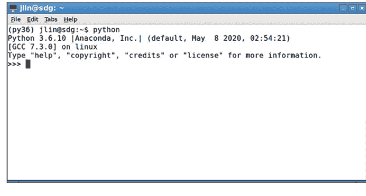

图 2.2 在终端窗口中启动 Python 解释器。

#### 在 Jupyter Notebook 中使用解释器

当我们安装 Anaconda 发行版时，我们会自动安装 Jupyter。但是，与在终端窗口中启动和使用 Python 的情况类似，启动和使用 Jupyter notebook 有多种方式。一般来说，我们可以通过使用 Anaconda Navigator、从终端窗口运行 Jupyter 应用程序，或通过应用程序的菜单项或图标运行 Jupyter 应用来打开 Jupyter notebook。有关启动 Jupyter 的操作系统特定建议以及使用 Jupyter 基础知识的详细信息，请参阅 www.cambridge.org/core/resources/pythonforscientists/jupyter/。本节包含重点内容。第 3.2.4 和 3.2.5 节也提供了有关使用 Jupyter notebook 的更多信息。

正如我们所看到的，从终端窗口运行的标准 Python 解释器一次执行一行 Python 代码。Jupyter notebook 允许我们一次处理代码块，任意编辑先前执行的代码并重新运行它，并包含格式良好的描述性文本块。

图 2.3 显示了一个 Jupyter notebook，其中图 2.1 的命令输入在一个标记为 In [1] 的单元格中。当 notebook 最初打开时，In [ ] 提示符旁边的单元格是空的。输入代码后，当单元格运行时，每条命令都会被执行，代码最后一行的输出显示在 Out [1] 单元格中。在多单元格 Jupyter notebook 中，每个新的 In [ ]/Out [ ] 单元格的编号都会增加。以下是执行单元格的一些选项：

- 输入 `Ctrl` + `Enter`：执行当前单元格的内容。
- 输入 `Shift` + `Enter`：执行当前单元格的内容，并在当前单元格下方打开一个空单元格以进行额外输入。
- 菜单命令 `Cell` > `Run All`：运行 notebook 中的所有单元格。

虽然基本计算器通常只能在内存中保存一个值，但 Jupyter 会自动保存打开的 notebook。我们也可以通过菜单命令 `File` > `Save and Checkpoint` 手动保存当前 notebook。

³ 此部分的参考文献，https://docs.python.org/3/reference/lexical_analysis.html#identifiers (accessed January 2, 2021)，也描述了这些规则的细微差别。

## 2 Python 作为基础计算器

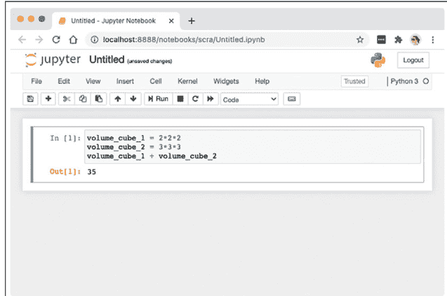

图 2.3 一个 Jupyter notebook，展示了图 2.1 示例中的代码。

要让 Jupyter notebook 停止执行，有几种选择。内核菜单包含停止执行笔记本（内核 > 中断）以及重启并重新运行笔记本（内核 > 重启并运行所有）的命令。要关闭窗口并停止内核，请选择文件 > 关闭并停止菜单选项。根据操作系统不同，笔记本上的注销和/或退出按钮可能会关闭笔记本。

## 2.3 试一试！

在本节中，我们将尝试与第 2.1 节中看到的示例类似的例子。我们先给出问题，然后提供并讨论解决方案。请在阅读解答和讨论之前先尝试练习 ☺。本节不仅仅是第 2.1 节示例的重复。通过这些示例（以及其他章节的“试一试！”部分），我们将讨论使用 Python 的更多功能。请完成“试一试！”并仔细阅读答案和讨论。

> 试一试！ 2-1 计算：圆的面积

半径为 5.2 厘米的圆的面积是多少？作为练习，请在终端窗口解释器和 Jupyter notebook 中尝试此操作。

**试一试！答案 2-1**

这个终端窗口解释器解决方案没有将半径或面积保存为变量：

```python
>>> 3.1415 * (5.2**2)
84.94616000000002
```

而这个解决方案则保存了：

```python
>>> radius = 5.2
>>> area = 3.1415 * (radius**2)
>>> area
84.94616000000002
```

以下是在 Jupyter notebook 中执行的上述解决方案：

```python
In [1]: 3.1415 * (5.2**2)
Out [1]: 84.94616000000002
In [2]: radius = 5.2
area = 3.1415 * (radius**2)
area
Out [2]: 84.94616000000002
```

通过将半径和面积保存为变量，我们可以在 Python 会话中稍后使用这些值（如果需要的话）。在这个例子中，我们输入了 π 值的粗略近似值。我们将在第 3.2.2 节中看到如何获取更精确的 π 值和其他常用常数。

### 试一试！ 2-2 计算：抛射体的动能

一个质量为 4.3 千克、速度为 1.2 米/秒的抛射体的动能是多少？回忆一下，动能公式为 ½mv²（其中 m 是以千克为单位的质量，v 是以米/秒为单位的速度）。

### 试一试！答案 2-2

以下 Jupyter notebook 解决方案没有将任何值保存为变量：

```python
In [1]: 1.0 / 2.0 * 4.3 * (1.2**2)
Out [1]: 3.0959999999999996
```

我们通过使用小数点和零来确保动能方程中的 ½ 进行常规除法。实际上，我们不需要包含零，只需要小数点，就能让 Python 知道这个数字是小数：

```python
In [1]: 1. / 2. * 4.3 * (1.2**2)
Out [1]: 3.0959999999999996
```

在 Python 3.x 中，由于除法默认进行小数除法，省略 ½ 的小数点不会有问题：

```python
In [1]: 1 / 2 * 4.3 * (1.2**2)
Out [1]: 3.0959999999999996
```

如果我们运行 Python 2.7.x 的 Jupyter notebook（或解释器），省略小数点可能会产生错误的结果：

```python
In [1]: 1 / 2 * 4.3 * (1.2**2)
Out [1]: 0.0
```

因为在 Python 2.7.x 中，使用“/”运算符对两个整数进行除法将默认为整数除法，通过向下取整丢弃余数。只有当我们发现自己必须使用这个旧版本的 Python 运行程序时，才需要担心这个问题。

### 试一试！ 2-3 计算：使用二次公式求根

考虑以下二次多项式：
$$3x^2 + 4x - 3 = 0$$
$x$ 的根是什么？使用二次公式求解 $x$：
$$x = \frac{-b \pm \sqrt{b^2 - 4ac}}{2a}$$
其中 $a$、$b$ 和 $c$ 是二次多项式的系数，对于上述多项式，它们分别等于 3、4 和 $-3$。
同时使用 Python 保存答案并检查它们是否正确。作为练习，请在终端窗口解释器和 Jupyter notebook 中尝试此操作。

### 试一试！答案 2-3

以下解释器会话将完成我们想要的操作：

```python
>>> a = 3
>>> b = 4
>>> c = -3
>>> x1 = (-b + (b**2 - 4*a*c)**0.5) / (2*a)
>>> x1
0.5351837584879964
>>> x2 = (-b - (b**2 - 4*a*c)**0.5) / (2*a)
>>> x2
-1.8685170918213299
>>> 3*x1**2 + 4*x1 - 3
-4.440892098500626e-16
>>> 3*x2**2 + 4*x2 - 3
0.0
```

我们在第 1-3 行设置了 $a$、$b$ 和 $c$ 的变量。这个二次多项式有两个实数根，我们分别在第 4 行和第 7 行计算并保存为 `x1` 和 `x2`。在第 10 行和第 12 行，我们将 `x1` 和 `x2` 代回多项式。如果根计算正确，两个表达式的结果都应为零，事实也确实如此。第 11 行输出的非常小的数字是计算机中使用小数进行算术运算的典型情况；结果通常会与解析结果略有偏差。

此外，在第 10 行和第 12 行的表达式中，没有使用括号，但我们得到了正确的结果，因为运算顺序将确保先进行幂运算，然后是乘法，最后是加法和减法。然而，使用括号会使代码更清晰。

以下是上述解决方案的 Jupyter notebook 版本：

```python
In [1]: a = 3
       b = 4
       c = -3
       x1 = (-b + (b**2 - 4*a*c)**0.5) / (2*a)
       x1

Out[1]: 0.5351837584879964

In [2]: x2 = (-b - (b**2 - 4*a*c)**0.5) / (2*a)
       x2

Out[2]: -1.8685170918213299

In [3]: 3*x1**2 + 4*x1 - 3

Out[3]: -4.440892098500626e-16

In [4]: 3*x2**2 + 4*x2 - 3

Out[4]: 0.0
```

### 试一试！ 2-4 累加：移动的微生物

假设我们有一个微生物，它每分钟移动以下距离：

| 分钟 | 距离（厘米） |
|--------|---------------|
| 1      | 0             |
| 2      | 2             |
| 3      | 2.5           |
| 4      | 4.1           |
| 5      | 3.6           |
| 6      | 5.1           |

给出的距离是微生物在相应分钟内移动的距离。计算并打印微生物在上述每个时间点所移动的总距离。

### 试一试！答案 2-4

我们可以通过输入一个表达式来解决这个问题，该表达式将每个时间点之前的所有距离相加：

```python
In [1]: print(0)

0

In [2]: print(0 + 2)

2

In [3]: print(0 + 2 + 2.5)

4.5

In [4]: print(0 + 2 + 2.5 + 4.1)

8.6

In [5]: print(0 + 2 + 2.5 + 4.1 + 3.6)

12.2

In [6]: print(0 + 2 + 2.5 + 4.1 + 3.6 + 5.1)

17.299999999999997
```

但这需要大量重复输入。一种更简单的方法是使用一个累加器变量，它存储当前的总距离并在此基础上累加。图 2.4 展示了这样一个解决方案，它看起来（并且确实是）输入更多，但我们不必重新输入任何先前的数据值。重新输入容易导致拼写错误，因此最好将新值累加到现有总数上。在第 6 章中，当我们讨论如何重复进行计算时，我们也会看到累加器的这个特性使得**递增**或增长一个变量变得轻而易举。

当我们在 Jupyter notebook 中执行 `print` 命令时，输出不会进入 `Out [ ]` 单元格，而是打印在 `In [ ]` 单元格下方的另一个单元格中。`Out [ ]` 单元格是在我们评估一个具有返回结果的表达式时生成的（例如，`1 + 2` 返回 3），或者当我们单独输入变量名时生成，如：

```python
In [1]: total_distance = 0
total_distance

Out[1]: 0
```

当我们单独输入变量名时，它本身就是一个表达式，其结果是它存储的值。这就是为什么单独输入变量名（不带 `print` 命令）会生成一个 `Out[ ]` 单元格。

```python
In [1]: total_distance = 0
print(total_distance)

0
```

```python
In [2]: total_distance = total_distance + 2
print(total_distance)

2
```

```python
In [3]: total_distance = total_distance + 2.5
print(total_distance)

4.5
```

```python
In [4]: total_distance = total_distance + 4.1
print(total_distance)

8.6
```

```python
In [5]: total_distance = total_distance + 3.6
print(total_distance)

12.2
```

```python
In [6]: total_distance = total_distance + 5.1
print(total_distance)

17.299999999999997
```

**图 2.4** 使用累加器变量解决试一试！ 2-4 的方案。

## 2.4 更多学科特定练习

正如前言“致学生”部分所述，本书的一个关键部分是每章中的“学科特定动手试试！”和课后习题。虽然这些学科特定的练习建立在教材涵盖的内容之上，但也可能涉及新材料。请完成“动手试试！”和课后习题，并仔细阅读答案和讨论。

获取这些 Jupyter 笔记本的详细信息请参阅“致学生”部分。本章的笔记本涵盖以下主题：

- 将值存储为变量。
- 使用变量进行基本计算。
- 从计算生成输出。
- 使用变量作为累加器或减累加器。

## 2.5 章节复习

### 2.5.1 自测题

第 2.3 和 2.4 节中的问题和答案旨在用于练习和进一步澄清内容。本节中的问题旨在测试我们对材料的理解。请尝试在不查阅书籍、不查看其他资源或不使用 Python 解释器的情况下完成这些问题。这些自测题的答案可在本章末尾找到。

**自测题 2-1**

Python 中用于表示幂运算的符号是什么？

**自测题 2-2**

考虑以下变量名：

1. x
2. 2nd_area
3. second_area
4. bottom_2nd_area
5. speed_of_light
6. speedOfLight

这些名称中是否有在 Python 中不合法的？如果有，为什么？

**自测题 2-3**

考虑以下输入行：

```
1. 3 * 5 - 7 ** 2
2. (3 * 5 - 7) ** 2
3. x = 4
4. force = mass times acceleration
5. force = mass * acceleration
6. pressure = pressure + g * h
```

如果在 Python 解释器中输入，这些输入行中是否有无效的？如果有，为什么？

**自测题 2-4**

表达式 `3 * 5 - 7 ** 2` 和 `(3 * 5 - 7) ** 2` 的结果是相同还是不同？为什么？假设我们使用的是 Python 3.x。

**自测题 2-5**

表达式 `6 // 4 * 2 - 9 * 4` 和 `6 / 4 * 2 - 9 * 4` 的结果是相同还是不同？为什么？假设我们使用的是 Python 3.x。

### 2.5.2 章节总结

我们现在知道如何将 Python 用作基本计算器了！尽管本章介绍的内容只是 Python 功能的一小部分，但它仍然非常有用。在描述如何将 Python 用作基本计算器时，我们涵盖了以下主题：

- 算术运算符和算术运算顺序
  - 看起来像代数并遵循其优先级规则，但乘法和幂运算使用不同的符号。
  - 除法可以是整数除法或常规小数除法，具体取决于所使用的 Python 版本和/或所使用的除法符号。
- 表达式
  - 由数字、变量和运算符组成。
  - 表达式会返回一个值。
- 命名、赋值和使用变量
  - 变量是由字母和数字组成的单词，本质上是数值的名称。
  - 变量必须在用于表达式或另一个赋值语句之前进行赋值。
  - 在代码行中获得或失去值的变量分别称为累加器和减累加器。（或者，为简洁起见，它们都称为累加器。）
  - 累加器的语法是变量名出现在等号的两侧。
- 从终端窗口运行 Python 解释器。
- 从 Jupyter 笔记本运行 Python 解释器。

### 2.5.3 自测答案

**自测答案 2-1**

幂运算符是“**”。

**自测答案 2-2**

除了第二个名称（`2nd_area`）外，所有名称都是合法的，因为它不合法，因为变量名不能以数字开头。

**自测答案 2-3**

除了第四行（`force = mass times acceleration`）外，所有这些输入行在 Python 解释器中都是有效的，因为单词“times”不是运算符，并且该表达式本身缺少任何运算符。在第五行和第六行（`force = mass * acceleration` 和 `pressure = pressure + g * h`）中，假设第五行的变量 `mass` 和 `acceleration` 以及第六行的变量 `pressure`、`g` 和 `h` 之前已经定义，那么它们将是有效的。

**自测答案 2-4**

表达式 `3 * 5 - 7 ** 2` 返回 `-34`，表达式 `(3 * 5 - 7) ** 2` 返回 `64`。差异在于第二个表达式中，由于括号的存在，我们先计算 3 乘以 5，然后减去 7，最后对整个结果求平方。在第一个表达式中，我们先计算 7 的平方，然后计算 3 乘以 5，最后从 3 乘以 5 的乘积中减去 7 的平方。

**自测答案 2-5**

表达式 `6 // 4 * 2 - 9 * 4` 返回 `-34`，表达式 `6 / 4 * 2 - 9 * 4` 返回 `-33.0`。差异在于第一个表达式中，我们使用整数除法将 6 除以 4。整数除法的结果是一个整数，在完成所有其他操作后，结果是一个整数。在第二个表达式中，我们使用常规除法将 6 除以 4。结果是一个小数，在完成所有其他操作后，结果是一个小数。

# 3 Python 作为科学计算器

在上一章中，我们了解了如何将 Python 用作基本计算器。在此过程中，我们介绍了表达式、变量以及用于输入和运行 Python 代码的环境。在本章中，我们将把 Python 作为基本计算器的使用扩展到与科学计算器相关的任务。

## 3.1 Python 作为科学计算器的示例

科学计算器与基本计算器主要有两个区别：

- 科学计算器可以使用预先编写和内置的数学函数，如正弦、对数等。
- 科学计算器可以存储操作和计算集，以便再次执行这些计算（通常使用新的输入值）。这类科学计算器也称为可编程计算器。

如今，许多科学计算器也是图形计算器。我们将在第 4 章讨论如何使用 Python 进行基本绘图。

在生物学和许多其他领域中，某些可测量或可观察量随时间（例如细菌种群）的指数增长是一个常见现象。这种增长源于任何增长速率与数量本身成正比的过程。对于细菌种群，这种增长遵循以下方程：

$$P = Ae^{rt}$$

其中 $P$ 是种群数量，$t$ 是时间，$r$ 是常数，$A$ 是等于 $t = 0$ 时种群数量的常数。^1 符号 $e$ 指的是欧拉数，约等于 2.718 2818。^2 如果 $A = 100$（因此在 $t = 0$ h 时 $P = 100$）且 $r = 0.1$ h$^{-1}$，那么在 $t = 10$ h 时种群数量是多少？以下 Python 会话将计算此数量：

> ^1 这个关于 $P$ 的方程是微分方程的解：
$$\frac{dP}{dt} = rP$$
量 $dP/dt$ 称为导数。导数和微分方程在第 17.1.1 节中有更详细的描述。
^2 https://en.wikipedia.org/wiki/E_(mathematical_constant)（访问于 2020 年 12 月 26 日）。

```python
from numpy import exp
A = 100.0
r = 0.1
t = 10.0
A * exp(r*t)
```

Out [1]: 271.82818284590451

在上面的代码中，指数函数（$e^x$）被称为 `exp`，$x$ 是 `exp` 后括号内的值。

在处理向量量的物理学和其他领域中，将向量投影到轴上是一项重要任务。考虑以下我们希望投影到 $x$ 轴上的速度向量 $\vec{v}$，如下图所示。

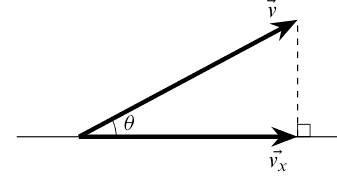

$\vec{v}_x$ 的长度是角度 $\theta$ 的余弦函数。具体来说：

$v_x = v \cos \theta$

上图中的 $\theta$ 值为 $28.07^\circ$ 或约 $0.48991$ 弧度。

图 3.1 显示了将计算 $v_x$ 值的 Python 代码。我们假设 $v = 2$ m/s。在图 3.1 中，我们利用余弦函数 `cos` 来计算角度 `theta` 的余弦值。该值由 `In [1]` 第四行中的 `cos(theta)` 表达式计算得出。与细菌种群示例不同，在 `In [1]` 单元格的第四行中计算表达式 `v * cos(theta)` 后，我们通过使用赋值运算符（`=` 符号）将结果保存到变量（`v_x`）中。`In [1]` 单元格的最后一行，在默认的 Python 解释器或 Jupyter 笔记本单元格中输入时，会显示 `v_x` 的内容。

## 3.2 Python 编程基础

在第 3.1 节的示例中，我们使用了 Python **函数**。这些函数是预先编写的，示例的第一行具有以下语法：

```
from <...> import <...>
```

### 3.2.1 使用预写函数

在详细讨论此主题之前，我们首先剖析图3.1中的示例。我们在`In [1]`的第四行中通过调用`cos`来使用余弦函数`cos`。"调用"是什么意思？当我们输入函数名（此处为`cos`）后跟括号时，Python解释器会执行我们命名的函数，并将括号内的内容（如果有）作为输入传递给该函数。函数处理该输入，然后返回一个结果。在单元格`In [1]`的第四行中，传递给`cos`函数的输入是变量`theta`的值。输出是`theta`值的余弦结果。该输出乘以`v`的值，该表达式的结果被保存为`v_x`。

我们可以将函数视为"黑盒子"，它接受输入，处理该输入，并返回一个值，该值随后可以赋给变量或在表达式中使用。图示上，`cos(theta)`可以理解为如下所示。

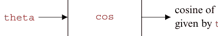

要使用一个函数，我们不必知道盒子内部发生了什么；当我们调用该函数时，我们自动使用盒子中的所有机制，并从盒子中获得输出，即返回值。

在本章中，我们只讨论具有单个输入项和单个返回值的函数。Python函数实际上可以接受多个输入项并返回多个项，但目前我们将限制自己处理单项的情况。我们将在第4.2.1节讨论多个输入项，在第19.1节讨论多个返回值（后者讨论图19.1的第8-15行和第46行）。

### 3.2.2 导入模块和使用模块项

Python中的一些函数是内置的，当Python解释器或Jupyter笔记本运行时，它们会自动提供给程序员。"试试看！2-4"中的`print`函数就是这样一个函数。`del`函数是另一个。`del`函数删除一个变量，使Python不再识别它，如下例所示：³

```
In [1]: a = 3
        a

Out[1]: 3

In [2]: del(a)
        a

NameError    Traceback (most recent call last)
<ipython-input-3-60b725f10c9c> in <module>()
----> 1 a

NameError: name 'a' is not defined
```

`In [2]`的结果是一个Python错误消息，告诉我们变量`a`未定义。我们在单元格`In [2]`中看到，当我们调用该函数时，我们在括号中输入我们的输入，函数对输入进行操作（在本例中是变量`a`）。`del`方法没有返回值，因为它所做的只是删除我们在括号中指定的变量。因此，将`del`的输出赋给一个变量（例如`b = del(a)`）将不起作用。

然而，绝大多数函数不是内置的。它们不会在我们启动Python解释器或Jupyter笔记本时自动可用。大多数数学函数都是这种情况。为了访问这些函数，我们必须首先**导入**该函数。这就是图3.1中单元格`In [1]`第一行的目的。

如果我们不先导入一个函数会发生什么？如果我们尝试在不先运行图3.1中单元格`In [1]`第一行的情况下执行以下代码块，我们会得到：⁴

```
In [1]: cos(3.1415/2)

NameError    Traceback (most recent call last)
<ipython-input-1-16e600e1e264> in <module>()
----> 1 cos(3.1415/2)

NameError: name 'cos' is not defined
```

³ 为清晰起见，错误消息输出已编辑。
⁴ 为清晰起见，错误消息输出已编辑。

`In [1]`的输出告诉我们Python无法识别`cos`函数。这是因为`cos`函数不是解释器或Jupyter笔记本内置的，而是名为NumPy的**模块**的一部分（在解释器或笔记本中使用的名称是"numpy"，无大写）。目前，我们可以将模块视为函数和预赋值变量（如数学常数）的集合。为了使用`cos`，我们首先需要导入它。如果我们在调用`cos`之前添加一行导入语句，一切正常：

```
In [1]: from numpy import cos
        cos(3.1415/2)

Out [1]: 4.632679487995776e-05
```

在上面的`cos`示例中，我们通过输入以下内容导入了函数：

`from <module> import <function>`

其中`<module>`是函数所在的模块名称，`<function>`是我们希望从`<module>`中使用的函数名称。

但如果我们想使用模块中的多个函数呢？我们是否必须每次想访问该函数时都使用`from ... import ...`？谢天谢地，不需要😊。以下导入命令：

`import <module>`

将使模块的所有函数都可通过输入`<module>.<function>`来使用。即：

```
In [1]: import numpy
        numpy.cos(3.1415/2)

Out [1]: 4.632679487995776e-05
```

等同于：

```
In [1]: from numpy import cos
        cos(3.1415/2)

Out [1]: 4.632679487995776e-05
```

如果我们想节省一些输入，可以使用：

`import <module> as <alias>`

来创建对模块的更短引用。`<alias>`可以是任何有效的Python变量名。即：

```
In [1]: import numpy as np
        np.cos(3.1415/2)

Out [1]: 4.632679487995776e-05
```

等同于：

```
In [1]: import numpy
        numpy.cos(3.1415/2)

Out [1]: 4.632679487995776e-05
```

模块不仅包含函数，还可能包含设置为特定值的变量。例如，NumPy模块有一个名为`pi`的变量，其值设置为π。当我们使用`import`导入模块时，我们可以使用点表示法以类似于引用函数的方式引用模块中定义的变量：

```
In [1]: import numpy
        numpy.pi

Out [1]: 3.141592653589793
```

注意，当我们使用`pi`时，我们不在变量名后加括号，而当我们使用函数（如`cos`）时，我们确实在函数名后加括号。这是因为对于函数，我们是在*调用*该函数。Python通过在函数名后附加一对括号来表示这一点。对于`pi`，因为它是一个变量，我们不调用它。请记住，调用函数意味着向函数提供输入，运行函数，并接收返回的任何内容。

最后，如果我们想了解更多关于函数的信息，除了阅读在线Python文档外，我们可以使用内置函数`help`获取一些基本信息，或使用NumPy函数`info`获取更详细的信息。在上面NumPy的`cos`函数示例中，假设NumPy已作为`np`导入，在Python解释器或Jupyter笔记本中输入`help(np.cos)`或`np.info(np.cos)`将提供有关`cos`函数及其使用方法的信息。有关在终端窗口中使用这些函数的更多信息，请访问www.cambridge.org/core/resources/pythonforscientists/term/。

### 3.2.3 编写和使用我们自己的函数

到目前为止，我们已经讨论了如何访问别人编写的函数。如果我们想使用自己编写的函数呢？这里我们描述两种方法。

首先，我们可以在解释器会话中定义函数。图3.2显示了一个示例。它定义并使用了一个函数`percent_to_decimal`，该函数将百分比转换为其小数或比例形式。正如我们在`In [1]`的第一行所看到的，定义函数的第一行以`def`开头，后跟函数名，然后是**参数列表**。`def`行以冒号结尾。

```
In [1]: def percent_to_decimal(input_percent):
            output = input_percent / 100.0
            return output

        percent_to_decimal(42)

Out [1]: 0.42
```

**图3.2** 在Python解释器中定义函数的示例。

参数列表是`def`行中括号内的内容。在图3.2中，有一个名为`input_percent`的参数。函数定义主体中所有对`input_percent`名称的引用都指向调用该函数时传递给它的任何值。也就是说，当执行如下行时：

```
percent_to_decimal(42)
```

值`42`在图3.2的函数定义中用于我们看到变量名`input_percent`的任何地方。因为我们可以用括号之间的任何值调用此函数，并且在实际调用该函数之前我们不知道该值是什么，所以我们必须在函数定义中给它一个变量名作为占位符，以便在调用该函数时填充。否则，在此函数定义内，我们将无法引用输入值。

名称`input_percent`有什么特别之处吗？没有。我们可以使用任何有效的Python变量名，只要函数主体中对该参数名的引用匹配即可。因此，我们可以将图3.2中的`percent_to_decimal`重写为：

```
In [1]: def percent_to_decimal(my_value):
            output = my_value / 100.0
            return output

        percent_to_decimal(42)

Out [1]: 0.42
```

该函数将完全相同地工作。

图3.2中的`def`语句（以及`def`语句下方缩进四个空格的代码行）仅*定义*了该函数。该代码块不会*运行*或使用该函数。也就是说，如果我们只输入这个：

# 3 Python 作为科学计算器

```python
In [1]: def percent_to_decimal(my_value):
            output = my_value / 100.0
            return output
```

如果在图 3.2 中省略了 `percent_to_decimal(42)` 这一行，函数 `percent_to_decimal` 就永远不会运行，计算 `my_value / 100.0` 也永远不会执行。定义函数的行为仅仅意味着我们创建了一个可以引用和运行的代码“盒子”。它只是定义了函数的名称，并说明这一系列命令（函数体中的代码行）都放在这个以函数名命名的盒子里。只有当函数被调用时，函数定义中的代码才会实际运行。调用时，函数体中的代码会从头到尾逐行执行（即，从 `def` 行的下一行开始，然后是再下一行，如图 3.2 所示），尽管从第 6.2.4 节开始，我们将看到如何改变代码行的执行顺序。

当函数被调用（运行）时，函数体内的变量被定义和使用。然而，这些变量在函数外部无法通过名称来引用。上面 `def` 语句中的 `my_value` 和 `output` 变量仅存在于函数定义的函数体内。如果我们试图从函数定义外部打印这些值中的任何一个，Python 将无法识别该变量。

如果我们想从函数外部访问函数体内定义的变量内容，就必须从函数中返回它。从函数返回的项称为函数的返回值。在图 3.2 的示例中，函数的返回值由 `return` 后跟要返回的内容给出。在上面的例子中，返回了变量 `output`，但返回值本身也可以是一个表达式。例如，下面的代码与图 3.2 中的代码完全等效：

```python
In [1]: def percent_to_decimal(input_percent):
            return input_percent / 100.0

        percent_to_decimal(42)

Out [1]: 0.42
```

并且节省了我们额外的一行输入。我们将 `100.0` 设为小数，以确保永远不会对 `input_percent` 进行整数除法运算。

在解释器中输入函数简单直接，但一旦我们退出解释器，函数定义就会丢失。因此，通常更合理的做法是在文件中定义函数，然后使用 `import` 来访问该函数。

例如，我们可以将图 3.2 中的函数定义部分放入一个名为 `myfuncs.py` 的文件中，如图 3.3 所示。然后，只要 `myfuncs.py` 与 Python 解释器的工作目录在同一目录下，⁵ 我们就可以导入 *myfuncs.py* 并使用其内容（即使用函数 `percent_to_decimal`）：

```python
In [1]: import myfuncs
        myfuncs.percent_to_decimal(42)

Out [1]: 0.42
```

然而，之前我们使用 `import` 是为了导入模块。为什么这里要对我们的 Python 代码文件使用它呢？这向我们展示了一个模块就是一个包含 Python 命令的文件。如果我们有一堆函数、变量等定义，我们可以将它们放入一个文件中，形成一个可以导入和使用的模块。这样我们就创建了自己的函数库！

### 3.2.4 可编程计算器

在第 3.2.3 节中，我们看到了如何在 Python 计算器中编写（和使用）我们自己的函数。我们还看到，我们所要做的就是将我们在解释器提示符下输入的内容复制粘贴到一个文件中，然后导入该文件以使用其中定义的函数（即模块）。我们现在将看到，我们可以使用这种复制粘贴的方法（稍作调整）来“记录”我们整个计算器会话，包括变量的设置以及函数的使用或调用，以便我们可以再次运行该计算器会话。这种对交互式计算器会话的记录通常被称为“**脚本**”，而编写这些代码行的行为被称为“**脚本编写**”。脚本编写的好处在于我们可以反复使用脚本，而无需再次输入。请注意，有时人们会互换使用“脚本”和“程序”，尽管程序通常比脚本更长、更复杂。

在第 2.2.3 节中，我们学习了如何使用终端窗口和 Jupyter notebook 访问 Python 解释器。在本节中，我们将探讨如何使用这两种相同的环境进行脚本编写。

⁵ 更完整的答案是 *myfuncs.py* 必须位于 *PYTHONPATH* 环境变量指定的路径上，但就我们目前的目的而言，只要 *myfuncs.py* 与我们启动 `python` 的目录在同一目录下，它就能工作。有关更多信息，请参阅 Python 文档中关于 *PYTHONPATH* 的描述。我们在 www.cambridge.org/core/resources/pythonforscientists/refs/ 的参考文献 4 中提供了指向该教程的最新链接。

#### 使用终端窗口的可编程计算器

假设我们有四个百分比，希望使用我们的 `percent_to_decimal` 函数将它们转换为小数。该函数定义在 *myfuncs.py* 中（图 3.3）。在终端窗口解释器会话中，我们会输入以下内容：

```python
>>> import myfuncs
>>> myfuncs.percent_to_decimal(42)
0.42
>>> myfuncs.percent_to_decimal(2)
0.02
>>> myfuncs.percent_to_decimal(83)
0.83
>>> myfuncs.percent_to_decimal(12)
0.12
```

但如果我们退出了解释器，后来又想重新进行这四次重新计算，我们就必须全部重新输入。因此，我们将这些行复制粘贴到一个文件中，如图 3.4 所示。我们将此文件命名为 *myscript1.py*。

当我们说“将这些行复制粘贴到文件中”时，我们指的不是像 Microsoft Word 这样的文字处理器。相反，我们指的是将这些行放入一个纯文本文件中。这些文件只包含字母、数字和一些其他符号（例如，标点符号、**换行符**等）。它们不包含任何格式（例如，斜体），如果我们把 Python 代码保存到像 *.doc* 这样的格式化文件类型中，代码将无法正常工作。我们使用文本编辑器而不是 Word。每个操作系统上都有许多种文本编辑器。我们在 www.cambridge.org/core/resources/pythonforscientists/text-editors/ 列出了几种。

文本文件通常以 *.txt* 为后缀，但并非必须如此。代码文件是后缀与程序编写语言相对应的文本文件。Python 代码文件的后缀是 *.py*。

要从终端窗口运行脚本，请输入 `python`，一个空格，然后是文件名。对于我们的文件 *myscript1.py*，命令是：

```bash
python myscript1.py
```

如果我们这样做，会发现似乎什么都没有发生。`percent_to_decimal` 调用的结果没有打印到屏幕上。这是在编写脚本而不是在解释器提示符下输入命令时必须做出的调整之一。在解释器中，当我们输入变量名或调用函数时，变量的值或函数的返回值会自动显示在屏幕上。在脚本中，这不会发生。

图 3.4 *myscript1.py 的内容*。

```python
import myfuncs
myfuncs.percent_to_decimal(42)
myfuncs.percent_to_decimal(2)
myfuncs.percent_to_decimal(83)
myfuncs.percent_to_decimal(12)
```

图 3.5 myscript2.py 的内容。

```python
import myfuncs
print(myfuncs.percent_to_decimal(42))
print(myfuncs.percent_to_decimal(2))
print(myfuncs.percent_to_decimal(83))
print(myfuncs.percent_to_decimal(12))
```

为了看到返回值的内容，我们必须将函数调用作为输入传递给内置的 print 函数，如图 3.5 中的 myscript2.py 文件所示。

当我们运行修改后的脚本时，会产生预期的输出（$ 是提示符，显示我们在计算机操作系统的命令行界面中输入命令的位置，如图 2.2 的第一行所示）：

```bash
$ python myscript2.py
0.42
0.02
0.83
0.12
```

当我们在终端中如上运行脚本时，脚本运行结束后会自动退出默认的 Python 解释器。要在脚本运行结束后留在默认解释器中，我们在 python 和脚本文件名之间添加一个“-i”，如下所示：

```bash
$ python -i myscript2.py
0.42
0.02
0.83
0.12
>>>
```

最后，如果我们不想将 percent_to_decimal 函数与脚本放在单独的文件中，那也没问题。我们可以在同一个脚本文件中定义函数并使用它们，以及设置变量等。通过将函数放在我们的脚本中，我们也不需要导入 myfuncs 模块。图 3.6 显示了这个修改后的脚本 myscript3.py。

#### 使用 Jupyter Notebooks 的可编程计算器

在 Jupyter notebook 中，将 Python 代码行保存到文件的任务和在 Python 解释器中运行这些代码行的任务都在一个文档（即 notebook）中完成。因此，我们不是创建一个与解释器分离的 .py 文件（如图 3.6），而是将这些代码行放入一个或多个 notebook 单元格中。图 3.7 在一个 Jupyter notebook 单元格中显示了图 3.6 的全部内容。当我们运行该单元格时，会生成如图所示的输出。

我们也可以将图 3.8 的内容拆分到多个单元格中，将 percent_to_decimal 的定义放在一个单元格中，将 percent_to_decimal 的使用放在第二个单元格中。

# 3 Python 作为科学计算器

```python
def percent_to_decimal(input_percent):
    return input_percent / 100.0

print(percent_to_decimal(42))
print(percent_to_decimal(2))
print(percent_to_decimal(83))
print(percent_to_decimal(12))
```

图 3.6 *myscript3.py* 的内容。

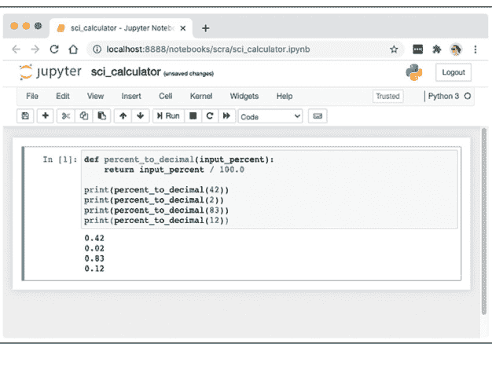

正如预期的那样，第一个单元格没有产生任何输出，因为它所做的只是定义函数（要获得输出，我们至少需要调用该函数）。
我们还可以导入其他模块，例如我们在图 3.3 中定义的 *myfuncs.py*，并利用这些模块中定义的函数和变量。图 3.9 展示了这种用法的一个例子，它是我们在图 3.5 中看到内容的副本。
最后，我们可以通过“文件 > 下载为”菜单命令将 Jupyter notebook 导出为其他格式。该命令最有用的三种格式是：作为常规 Python 代码纯文本 .py 文件、作为 HTML 文件（即网页）以及作为 PDF 文件。在第一种情况下，结果是一个我们可以在终端窗口或第 3.2.5 节描述的任何环境中运行的 Python 文件。

### 3.2.5 用于更复杂程序的 Python 解释器和代码编写环境

我们已经了解了如何在终端窗口或 Jupyter notebook 中编写和运行我们自己的可编程计算器脚本。当我们使用 Python 作为基础或科学计算器时，这两种环境都能很好地工作。然而，当我们的可编程计算器脚本变得如此冗长和复杂时，编写和运行它们可能在**交互式开发环境（IDE）**中更容易完成。IDE 是一个将编写和运行脚本的工作整合到单个应用程序中的程序。通常，IDE 会有一个我们可以编写脚本的窗口，以及另一个运行 Python 解释器的窗口。IDE 还提供图形工具来帮助我们查找脚本或程序中的错误，以及快捷按钮或菜单命令来执行常见操作（例如，运行或停止程序等）。

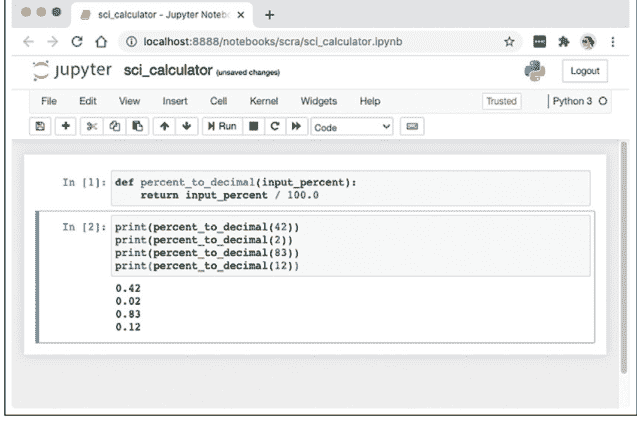

图 3.8 在两个 Jupyter notebook 单元格中的 myscript3.py 内容。

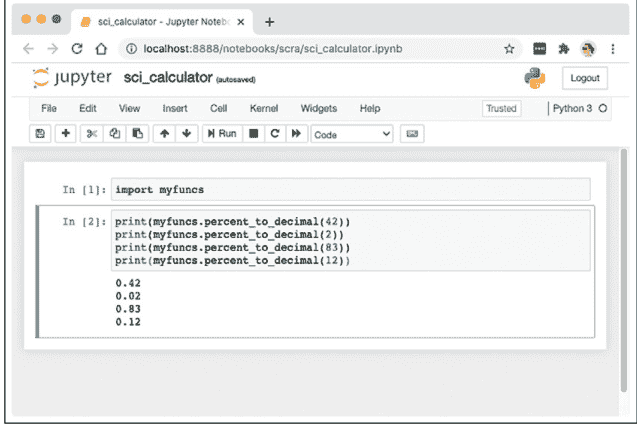

图 3.9 在两个 Jupyter notebook 单元格中的 myscript2.py（来自图 3.5）方法。

在本节中，我们将了解随 Anaconda 发行版附带并默认启用的 Spyder IDE。⁶ 请记住，尽管 IDE 很有用，但我们并非必须使用 IDE 来编写 Python 代码或运行 Python 脚本。终端窗口或 Jupyter notebook 也能很好地工作。最终，这取决于哪个环境（或哪些环境；我们可以为某些类型的任务使用一个环境，为其他任务使用另一个环境）能让我们更轻松地完成工作。所有这些选项都是免费的，因此很容易尝试。⁷

与 Jupyter notebook 类似，我们可以通过从终端窗口运行 Spyder 应用程序、通过应用程序的菜单项或图标运行 Spyder 应用程序，或使用 Anaconda Navigator 来打开 Spyder。我们在 www.cambridge.org/core/resources/pythonforscientists/spyder/ 提供了使用这些方法的特定操作系统说明以及使用 Spyder 的详细信息。在此，我们提供一些要点。

图 3.10 的左窗格显示了在 Spyder 中打开的 *myscript3.py* 文件（其内容如图 3.6 所示）。在右下窗格中，我们有一个 IPython 解释器界面。它的行为与“三个大于号”Python 解释器非常相似，只是它具有类似 Jupyter notebook 的 `In [ ]` 等提示符。

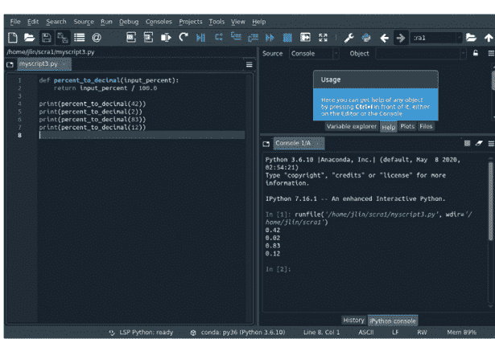

图 3.10 在 Spyder IDE 中的 *myscript3.py*，显示了运行后的 IPython 界面。

菜单命令“运行 > 运行”或工具栏上的绿色箭头按钮将运行 Python 代码文件，结果显示在解释器窗格中。图 3.10 中的右下窗格显示了运行打开的代码文件的结果。我们也可以在 IPython 解释器界面中输入代码来执行，这与从左窗格运行的代码是分开的。

如果脚本由于某种原因在运行时冻结，或者我们需要手动停止脚本运行，请在 IPython 控制台中输入 Ctrl + c。有关 Spyder IDE 的更多详细信息，请访问该 IDE 的网站。我们在 www.cambridge.org/core/resources/pythonforscientists/refs/ 提供了指向该网站的最新链接，参考文献 11。

⁶ https://docs.continuum.io/anaconda/user-guide/tasks/integration/spyder.html（访问于 2017 年 6 月 24 日）。
⁷ 另一个 IDE 是 PyCharm，如果我们不提及它将是我们的疏忽。我们在 www.cambridge.org/core/resources/pythonforscientists/refs/ 提供了指向该 IDE 网站的最新链接，参考文献 7。

## 3.3 试试看！

与第 2.3 节类似，本节提供了额外的示例，并附有解决方案和关于如何用 Python 编程以及将 Python 用作科学计算器的评论。这包括使用、编写和导入函数。请完成练习，并仔细阅读答案和讨论。

### 试试看！3-1 使用函数：将向量投影到 x 轴

考虑图 3.11，它显示了我们希望投影到 x 轴上的向量 $\vec{v}$（来自第 3.1 节）。同样，$\theta$ 的值为 $28.07^\circ$ 或大约 0.489 91 弧度。$\vec{v}_x$ 的值是多少？假设 $v = 4.5$ m/s。

### 试试看！答案 3-1

我们需要从第 3.1 节的解决方案中更改的唯一内容是变量 v 的值：

```python
In [1]: from numpy import cos
theta = 0.48991
v = 4.5
v_x = v * cos(theta)
v_x

Out [1]: 3.9706884511494822
```

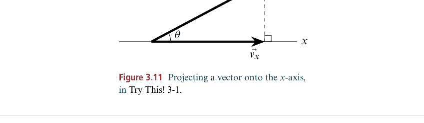

默认情况下，NumPy 中的 `sin`、`cos` 和 `tan` 函数假定传入的角度是以弧度为单位，而不是度。

### 试试看！3-2 使用函数：将向量投影到 y 轴

考虑图 3.12，它显示了向量 $\vec{v}$，其角度 $\theta$ 与试试看！3-1 中相同（即 $28.07^\circ$ 或大约 0.489 91 弧度）。$\vec{v}_y$ 的大小是多少？假设 $v = 7.6$ m/s。

### 试试看！答案 3-2

回想一下，图 3.12 中的 $v_y$ 由下式给出：

$$v_y = v \sin \theta$$

因此，我们需要 NumPy 中的正弦函数，所以我们需要导入并使用 `sin`。变量 `v` 也会改变。并且，由于我们正在计算分量 $v_y$，我们将把正在计算的变量名称从 `v_x` 改为 `v_y`：

```python
from numpy import sin
theta = 0.48991
v = 7.6
v_y = v * sin(theta)
v_y
```

Out [1]: 3.5761532199404615

### 试试看！3-3 使用函数：将向量投影到 x 轴和 y 轴

考虑图 3.13，显示了另一个向量 $\vec{v}$，其中 $\alpha = 53.52^\circ$。$\vec{v}_x$ 和 $\vec{v}_y$ 的大小是多少？假设 $v = 8.2$ m/s。请记住，$\pi$ 弧度等于 $180^\circ$，因此要从度转换为弧度，我们将度数乘以 $\frac{\pi}{180}$。

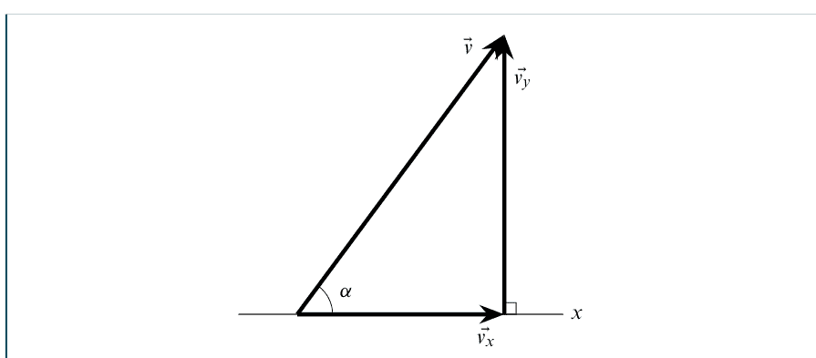

图 3.13 在试试看！3-3 中，将向量投影到 x 轴和 y 轴。

### 试试看！答案 3-3

我们需要 NumPy 中的正弦和余弦函数。我们还从第 3.2.2 节中回忆到，NumPy 包含 π 的值作为一个模块变量。这段代码解决了问题：

```python
In [1]: import numpy as np
alpha = 53.52 * np.pi / 180.
v = 8.2
v_x = v * np.cos(alpha)
v_y = v * np.sin(alpha)
v_x

Out [1]: 4.8752456426256483

In [2]: v_y

Out [2]: 6.5933284404813035
```

在这个解决方案中，我们没有使用 `from ... import ...` 语法按名称导入 `sin` 和 `cos` 函数，而是通过别名 `np` 导入 NumPy，然后使用该别名（即分别作为 `np.pi`、`np.sin` 和 `np.cos`）引用我们想要的模块元素。我们利用 `pi` 将 α 从度转换为弧度，因为 NumPy 的 `sin` 和 `cos` 函数假定 `alpha` 是以弧度为单位。

### 动手试试！3-4 使用函数：pH值

物质的pH值定义为：⁸

$$\text{pH} = -\log_{10} [\text{H}^+]$$

其中 $[\text{H}^+]$ 是氢离子浓度，单位为摩尔/升。计算一个氢离子浓度为 $2.1 \times 10^{-6}$ 摩尔/升的溶液的pH值。提示：用于计算以10为底的对数的NumPy函数是 `log10`。

### 动手试试！答案 3-4

以下代码解决了这个问题：

```
In [1]: import numpy as np
        pH = -np.log10(2.1e-6)
        pH
Out[1]: 5.6777807052660805
```

在上面 `In [1]` 的第二行中，传递给 `log10` 函数调用的值是以科学计数法表示的。这与输入十进制数字相同：

```
In [1]: pH = -np.log10(0.0000021)
        pH
Out[1]: 5.6777807052660805
```

请注意，对以10为底的对数取负，可以通过在 `log10` 函数调用前加上负号（键盘上的连字符）来实现。虽然 `(-1) * np.log10(2.1e-6)` 也可以，但没有必要进行这种乘法运算来对函数调用的结果取负。

### 动手试试！3-5 使用函数：抛体运动

考虑一门大炮向上瞄准，使其炮管与水平地面成 $45^\circ$ 角。如果以10米/秒的速度发射一个抛体，它将在距离大炮多远的地方落地？假设没有空气阻力，且地面始终水平。同时假设重力加速度 $g$ 为 $9.81 \text{ m/s}^2$。

提示：请记住以下运动学方程。首先，对于时间 $t$ 的速度，假设我们知道 $t = 0$ 时的速度为 $v_0$，且加速度为恒定的 $a$：

$$v_t = v_0 + at$$

⁸ Dickerson et al. (1984, p. 163).

其次，对于无加速度的情况，时间 $t$ 的位置 $x$ 为：

$$x_t = x_0 + v_0t$$

假设 $x_0$ 是 $t = 0$ 时的位置。

### 动手试试！答案 3-5

我们分两部分解决这个问题。首先，我们使用第一个运动学方程计算抛体在空中的时间。抛体以等于初始速度向量的 $y$ 分量（假设 $y$ 轴为上下方向）的初始速度向上运动。抛体达到零 $y$ 速度（其轨迹顶点）所需的时间是其在空中总时间的一半。因此，总时间为：

```python
import numpy as np
angle = np.pi / 4.0
g = -9.81
v_y = 10.0 * np.sin(angle)
total_time = 2.0 * ((0.0 - v_y) / g)
total_time
```

Out [1]: 1.4416040391163047

如果我们假设向上为正 $y$ 方向，那么 $g$ 为负值，因为重力加速度向下。抛体在空中的总时间为1.44秒。其次，我们使用第二个运动学方程计算行进距离，使用初始速度的 $x$ 分量。假设我们从 $x = 0$ 开始：

```python
v_x = 10.0 * np.cos(angle)
total_distance = v_x * total_time
total_distance
```

Out [2]: 10.19367991845056

抛体行进的总距离为10.19米。请注意，单次导入 `np` 在整个Python解释器会话中都有效，这里意味着上面两个 `In [ ]` 单元格在同一个Jupyter笔记本中。我们不必反复重新导入模块。

### 动手试试！3-6 编写函数：磅转换为千克

假设我们正在进行一个处理野生恒河猴体重测量值的实验。现场工作人员收集的值都是磅，但我们需要千克值。编写一个函数 `weight_to_kg`，它接受一个输入（以磅为单位的体重），并返回一个值（以千克为单位的体重）。提供一个示例来展示该函数有效。提示：1千克等于2.204 623磅。⁹

### 动手试试！答案 3-6

这个Jupyter笔记本单元格将定义该函数：

```
In [1]: def weight_to_kg(in_pounds):
            return in_pounds / 2.204623
```

这组单元格展示了该函数有效：

```
In [2]: weight_to_kg(1.0)

Out[2]: 0.4535922921968971
```

### 动手试试！3-7 编写并导入函数：磅转换为千克

将为“动手试试！3-6”编写的函数放入其自己的Python脚本中。然后，编写另一个脚本，导入该函数以在第二个脚本中使用。在第二个脚本中，使用第一个脚本中的函数将两个不同的磅值转换为千克，并打印出答案。

### 动手试试！答案 3-7

我们首先将以下代码放入文件 *conversions.py* 中：

```
1  def weight_to_kg(in_pounds):
2      return in_pounds / 2.204623
```

在一个单独的文件（我们称之为 *calculate.py*）中，我们放入导入和调用 `weight_to_kg` 函数的代码。该文件中的代码是：

```
1  from conversions import weight_to_kg
2  print(weight_to_kg(1.0))
3  print(weight_to_kg(1.5))
```

当运行 *calculate.py* 时，输出以下值：

```
0.4535922921968971
0.6803884382953457
```

⁹ 这里，“weight”一词在口语中用于表示质量，而非重力产生的力。因此，这里的“pounds”指的是“磅-质量”而非“磅-力”。

请注意，我们也可以导入conversions模块（回想一下，任何Python脚本都是一个模块），并在 *calculate.py* 中以以下方式使用其内容：

```
1 import conversions
2 print(conversions.weight_to_kg(1.0))
3 print(conversions.weight_to_kg(1.5))
```

我们还可以将调用 `weight_to_kg` 的返回值保存在变量中，并打印这些变量的值：

```
1 from conversions import weight_to_kg
2 first_weight = weight_to_kg(1.0)
3 second_weight = weight_to_kg(1.5)
4 print(first_weight)
5 print(second_weight)
```

如果我们使用文本编辑器编写脚本，我们直接创建 *conversions.py* 和 *calculate.py* 文件。如果我们在Jupyter笔记本中编写 *conversions.py* 代码，我们首先需要按照第3.2.4节Jupyter笔记本部分描述的过程，将内容导出到名为 *conversions.py* 的文件中。¹⁰ 无论我们如何创建 *conversions.py*，该文件都应与 *calculate.py* 位于同一目录中。否则，*calculate.py* 将很难找到 *conversions.py* 来导入它。

## 3.4 更多学科特定实践

本章的学科特定Jupyter笔记本涵盖以下主题：

- 导入模块并使用模块项（函数和变量）。
- 编写和使用我们自己的函数。
- `del` 函数的使用。
- `print` 函数的使用。

## 3.5 章节回顾

### 3.5.1 自测题

尝试在不看书本、任何其他资源或使用Python解释器的情况下完成这些题目。这些自测题的答案在本章末尾。

¹⁰ 有一种机制可以直接导入Jupyter笔记本，但这个过程有点高级。更多信息可在在线文档中找到。我们在 www.cambridge.org/core/resources/pythonforscientists/refs/ 的参考文献5中提供了相关网页的最新链接。

## 3 Python作为科学计算器

### 自测题 3-1

什么是函数？请提供定义并描述调用函数时的语法。我们如何指定函数的输入？我们可以对函数的输出做什么？

### 自测题 3-2

我们如何导入模块？模块中的函数？描述我们可以访问模块中函数的所有不同方式，并提供示例。

### 自测题 3-3

什么是代码文件？它包含什么？我们如何使用它在Python中运行程序？请提供一个示例。

### 自测题 3-4

考虑以下代码行。描述这些行的作用，以及如果将每个子部分的行（且仅这些行）输入Python解释器会发生什么？如果有错误，请说明原因。

```
1. from gene_functions import countCs
2. import numpy
   value = sin(2.56)
3. from numpy import np
4. def kinetic_energy():
       return 0.5 * m * (v**2)
5. def kinetic_energy():
       output = 0.5 * m * (v**2)
       return output
6. import numpy as np
7. def force_for_1kg_mass(acceleration):
       return 1.0 * acceleration
   weight = force_for_1kg_mass(9.81)
   print(weight)
```

### 自测题 3-5

描述终端窗口、Jupyter笔记本和交互式开发环境作为使用Python作为可编程计算器的环境有何不同。

### 3.5.2 章节总结

我们现在知道如何将Python用作一个非常高级的可编程科学计算器。在此过程中，我们涵盖了以下主题：

- `print` 函数将传入的内容显示在屏幕上。
- `del` 函数删除一个变量。
- 如何使用预写函数
  - 理解函数是一个接受输入值并返回值的“黑盒子”。
  - 在 Python 解释器会话或 Python 程序/脚本中调用函数。
- 导入和使用模块
  - 使用 `import`、`import ... as ...` 和 `from ... import ...` 来导入模块或模块的部分内容。
  - 引用模块中的函数、变量和其他项目。
- 编写我们自己的函数
  - 使用 `def` 命令。
  - 参数列表是函数的输入列表。
- 将 Python 用作可编程计算器的不同方式
  - 我们可以将 Python 代码保存在以 `.py` 结尾的文本文件中。
  - 使用终端窗口访问 Python 代码文件并在 Python 解释器中运行代码。
  - 使用 Jupyter notebooks 保存和运行 Python 代码。
  - 使用交互式开发环境（如 Spyder）保存和运行 Python 代码。

### 3.5.3 自测答案

### 自测答案 3-1

函数是一个接受输入并返回值的“黑盒子”。调用函数时，我们提供一个名称后跟一对括号。在括号内，我们列出输入到函数的项目。如果函数没有输入项目，我们保留括号，但分隔符之间没有任何内容。函数的输出通过调用返回：我们可以将该输出设置为一个变量，或者通过直接输入调用本身在表达式中使用它。本质上，调用本身代表返回值。

### 自测答案 3-2

我们使用 `import` 命令导入模块及其部分，但有多种 `import` 语句，每种都处理特定的用例。要导入模块，输入 `import` 然后是模块名。要导入模块但允许通过别名引用该模块，输入 `import`、模块名、`as`，然后是别名名。要仅导入模块中的单个函数，输入 `from`、模块名、`import`，然后是函数名。

# 3 Python 作为科学计算器

以下是一些使用 NumPy 模块导入的示例：

```
import numpy
import numpy as np
from numpy import exp
```

以及一些在 NumPy 中调用 `exp` 函数（对值 1.0）的示例：

```
import numpy
numpy.exp(1.0)

import numpy as np
np.exp(1.0)

from numpy import exp
exp(1.0)
```

### 自测答案 3-3

代码文件是包含 Python 代码的文本文件：变量、表达式、函数定义和调用等。代码文件就是一个 Python 程序。换句话说，大部分情况下，我们可以在 Python 解释器中作为命令执行的所有内容，都可以输入到代码文件中，并让 Python 解释器执行该文件的内容。以下是一个计算、保存并打印出 $e^1$ 的代码文件示例：

```
from numpy import exp
value = exp(1.0)
print(value)
```

### 自测答案 3-4

1. 这行代码查找模块 `gene_functions`，并找到名为 `countCs` 的函数（或另一个实体，如变量），然后导入它，使 `countCs` 在当前程序中可用。
2. 这段代码导入 NumPy 包，但会返回错误，因为它在未先导入函数的情况下使用了 `sin` 函数。`sin` 函数不是 Python 解释器内置的，因此必须导入。我们可以通过在 `sin` 前添加 `numpy` 和一个点来修复代码：
```python
import numpy
value = numpy.sin(2.56)
```
或者通过更改导入语句：
```python
from numpy import sin
value = sin(2.56)
```
3. NumPy 模块不包含名为 `np` 的函数、变量等，因此这行代码返回错误。
4. 此函数定义返回错误，因为变量 `m` 和 `v` 未定义。它们要么需要作为参数传入（此函数定义中的参数列表为空），要么变量需要在之前定义为模块变量，例如：
```python
m = 10.1
v = 1.2
def kinetic_energy():
    return 0.5 * m * (v**2)
```
5. 与上题相同。将 `0.5 * m * (v**2)` 的结果保存到变量并返回该变量的值，并不能解决 `m` 和 `v` 未定义的问题。
6. 正确地将 NumPy 模块导入为别名 `np`。
7. 正确定义了一个名为 `force_for_1kg_mass` 的函数。此函数接受一个输入参数（`acceleration`）。代码通过调用函数计算给定加速度下 1 kg 质量所需的力，将该结果保存到变量 `weight`，并将该值打印到屏幕。

### 自测答案 3-5

所有 Python 编程环境都做两件事：使我们能够编写和保存 Python 代码，并使我们能够运行编写的代码。当我们使用终端窗口作为环境时，我们在代码的视觉呈现和运行方式方面没有太多“花哨的功能”，但它运行速度快且简单。Jupyter notebook 环境为我们提供了许多工具来自定义代码的外观和描述，并且非常交互式，但它设置时间较长，并且不太适合编写将被其他模块或程序使用的模块。交互式开发环境提供工具来帮助程序员（例如，呈现代码的方式、帮助我们更快编写代码的工具、轻松逐步执行程序的能力），最适合开发较大的 Python 项目。

# 4 基本折线图和散点图

在进行计算之后，计算机可以帮助科学家和工程师完成的第二项主要任务是绘制数据和计算的图表。在本章中，我们将研究如何制作基本的折线图和散点图。在第 5 章中，我们将讨论如何自定义基本的折线图和散点图，使其更有用和易读。

## 4.1 制作基本折线图和散点图的示例

这里我们看看如何制作两个基本的 $x-y$ 图：折线图（点连接在一起）和散点图（点不连接在一起）。考虑以下虚构的测量值列表，记录了一天中不同时间点传感器记录的功率量：

| 一天中的十进制小时 | 功率 (mW) |
| :--- | :--- |
| 9.25 | 2.54 |
| 11 | 4.10 |
| 13.5 | 1.21 |
| 15 | 3.90 |
| 15.75 | 4.00 |

下午 1:30 的十进制小时表示为 13.5。
图 4.1 显示了创建功率与一天中十进制小时关系的折线图的代码。该图如图 4.2 所示。在本教材中，我们遵循将折线图或散点图称为绘制“$y$ 轴变量与 $x$ 轴变量”的惯例，而不是相反。我们可以直接在 Python 解释器中输入每一行代码，也可以在文件中输入并运行脚本文件（有关如何编写和运行脚本，请参见第 3.2.4 节和第 3.2.5 节）。如果我们从终端窗口作为脚本运行这些代码行，我们必须保持解释器会话打开才能看到图表。
创建功率与一天中十进制小时关系的散点图的代码如图 4.3 所示，与图 4.1 中的折线图代码非常相似。唯一的区别是我们使用 `scatter` 函数而不是 `plot` 函数。图 4.3 中代码创建的散点图如图 4.4 所示。
假设本节中的示例是在一个新的 Python 会话中输入的（或者在绘制下一个图表窗口之前关闭了当前图表窗口）。这确保每个图表都在自己的窗口中，并简化了我们在本章中的讨论。要了解如何制作多个独立的图表，每个图表都在自己的窗口中，而无需创建新的 Python 会话或关闭当前图表窗口，请参阅第 5.2.3 节。
我们逐行（粗略地）分解最后一个示例（图 4.3），看看 Python 如何创建图表。由于最后一个示例的代码与第一个几乎相同，因此我们关于最后一个示例的几乎所有内容都适用于两者：

## 4.1 制作基本折线图和散点图的示例

```
1  import matplotlib.pyplot as plt
2  plt.plot([9.25, 11, 13.5, 15, 15.75], [2.54, 4.1, 1.21, 3.9, 4])
3  plt.xlabel('Decimal Hour in Day')
4  plt.ylabel('Power (mW)')
5  plt.show()
```

图 4.1 创建图 4.2 中基本折线图的代码。

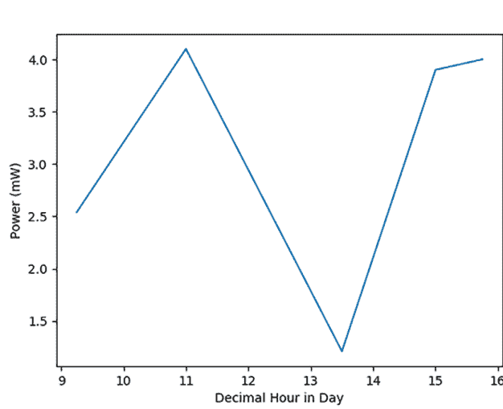

图 4.2 由图 4.1 中代码生成的基本折线图。

```
1  import matplotlib.pyplot as plt
2  plt.scatter([9.25, 11, 13.5, 15, 15.75], [2.54, 4.1, 1.21, 3.9, 4])
3  plt.xlabel('Decimal Hour in Day')
4  plt.ylabel('Power (mW)')
5  plt.show()
```

图 4.3 创建图 4.4 中基本散点图的代码。

## 4 基础折线图与散点图

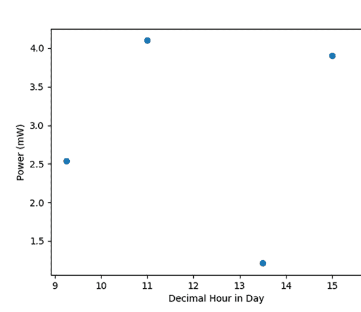

图 4.4 一个基础散点图，由图 4.3 中的代码生成。

- 第 1 行。导入 pyplot 模块。
- 第 2 行。创建散点图。第一个**参数**是 *x* 值列表（十进制时间），第二个参数是对应的 *y* 值列表（功率值）。因此，被绘制的 (*x*, *y*) 数据对为：(9.25, 2.54), (11, 4.1), (13.5, 1.21), (15, 3.9) 和 (15.75, 4)。
- 第 3 行。设置 *x* 轴标签。
- 第 4 行。设置 *y* 轴标签。
- 第 5 行。显示图表。

我们在此处的描述并未比 Python 代码本身传达更多信息。这种代码的清晰性是 Python 的一个优点。在下一节中，我们将详细阐述此描述，以更深入地理解代码的功能。

## 4.2 Python 编程基础

Python 的基础科学绘图**包**（一组模块的集合）称为 Matplotlib。它包含一个主模块（名为 matplotlib）以及一系列子模块或较小的函数集合。子模块 pyplot 定义了一组可用于绘制图形的命令（或函数）。如图 4.3 第 1 行所示，pyplot 通常通过以下方式导入：

```
import matplotlib.pyplot as plt
```

在第 3.2.2 节中，我们了解到要访问已导入模块中的函数，我们使用句点来分隔模块名称和要使用的函数。此约定也适用于子模块。要引用 matplotlib 包的 pyplot 子模块，我们引用 `matplotlib`，添加一个句点，然后引用 `pyplot`。除非另有说明，在本书的示例中，假设在运行任何 pyplot 命令之前已完成上述导入。

`scatter` 函数（第 2 行）是一个 pyplot 函数，可用于创建散点图。与我们之前查看的其他函数（例如 `sin`）不同，`scatter` 后的括号中包含不止一个项目。这些被称为“`参数`”（或“位置输入参数”）或实参，我们将在第 4.2.1 节中更详细地描述它们。在第 4.2.2 节中，我们还将描述这些行中 `scatter` 函数作为输入接受的值序列。

一旦在第 2 行创建了图表，Matplotlib 就会跟踪哪个图表是“当前”图表。后续命令，例如第 3 行和第 4 行中创建轴标签的命令，将应用于该当前图表。第 3 行和第 4 行还向我们展示了一个以前未见过的值。到目前为止，所有值都是十进制数或整数。在这里，我们发现了位于单引号 (') 之间的单词，`xlabel` 和 `ylabel` 函数将这些单词作为文本注释写入图表。这些单词是 `字符串` 的示例，我们将在第 4.2.3 节中介绍字符串。

最后，第 5 行表明，当我们把图表的每个元素放到 Matplotlib 的虚拟画布上时，Matplotlib 并不会渲染（即绘制到屏幕上）我们的添加内容，而是等待我们调用 `show` 命令。通常，我们只关心图表完成后的外观。通过等待调用 `show`，Matplotlib 避免了渲染中间步骤所涉及的额外计算。如果我们有多个图表，我们通常在定义完所有图表后调用 `show`，以便一次性可视化所有图表。

**关于 Spyder、Jupyter 和 `show` 的旁注** 大多数时候，Spyder 和 Jupyter 会自动内联渲染 Matplotlib 图表（即在控制台或 `Out [ ]` 单元格中）。因此，在这些环境中，通常不需要调用 `show`。但也有例外，添加 `show` 不会有坏处。在其他情况下，我们必须在绘图代码之前添加这一行：

```
%matplotlib inline
```

这是对 Matplotlib 图表在 Spyder 和 Jupyter 中如何渲染的额外控制。其工作原理的细节在本章的这一点上并不重要。如果我们的图表在 Spyder 或 Jupyter 中没有显示，我们可以尝试此方法。这是“行魔法”的一个例子，在第 22.3 节中有更多讨论。

在本节的其余部分，我们将更详细地探讨以下主题：位置输入参数、列表和元组、字符串、注释和 Jupyter markdown。与之前的章节一样，阅读本章后，请转到第 4.3 节尝试这些概念。

### 4.2.1 必需输入的位置输入参数

在第 3.2.1 节中，我们了解到可以将函数视为“黑盒子”，它接收输入，处理它，然后返回一些结果。我们通过在调用函数时将输入放在函数名称后的括号中来告诉函数输入是什么。

在我们之前使用和编写的函数中，函数只接受一个输入项，例如我们在图 3.1 中使用 `cos` 函数时所见。但是，我们并不限于传递一个输入项。原则上，我们可以传递任意多个输入项。pyplot 中的 `plot` 和 `scatter` 函数接受多个输入项，每个输入项在调用函数时按顺序列在函数名称后的括号中。

这是如何工作的？图 4.3 的第 2 行（为方便起见在此重现）：

```
plt.scatter([9.25, 11, 13.5, 15, 15.75], [2.54, 4.1, 1.21, 3.9, 4])
```

在 `scatter` 后的括号中，似乎有十个项目，由逗号分隔（并且在一堆方括号内）。这是否意味着有十个项目被输入到函数中？这种推理是合理的，但在此情况下并不完全正确。实际上，有两个输入项或实参（或参数）。第一个输入项是这个 `列表`：

```
[9.25, 11, 13.5, 15, 15.75]
```

第二个输入项是这个列表：

```
[2.54, 4.1, 1.21, 3.9, 4]
```

列表本身是项目的集合，我们将在第 4.2.2 节中进一步讨论，但现在重要的是，列表是一个单一实体。因此，在图 4.3 的第 2 行中，我们有左括号、第一个列表、逗号、第二个列表和右括号。这个输入项序列称为参数列表，对于这次对 `scatter` 的调用，参数列表由作为函数输入的上述两个列表组成。

但 `scatter` 也知道这些列表对应什么，即第一个列表是要绘制的点的 x 值列表，第二个列表是要绘制的点的 y 值列表。它是如何知道的？基于输入参数在参数列表中的位置：`scatter` 假定参数列表中的第一个项目是 x 值列表，第二个项目是 y 值列表。

考虑以下函数，它根据质量 ($m$) 和速度 ($v$) 使用 $E_k = \frac{1}{2}mv^2$ 计算动能 ($E_k$)：

```
def kinetic_energy(mass, velocity):
    return 0.5 * mass * (velocity**2)
```

如果我们想使用此函数计算质量为 4.5 kg、速度为 1.9 m/s 的物体的动能，以下代码将进行计算并显示结果：

```
In [1]: kinetic_energy(4.5, 1.9)
Out[1]: 8.1225
```

当我们定义一个函数时，我们按特定顺序列出输入参数。当我们调用函数并为这些参数放入实际值（或引用值的变量）时，这些值根据它们的相对位置一一映射到参数。因此，在上面的示例中，4.5 映射到参数 `mass`，而 1.9 映射到参数 `velocity`。然后，这些值在函数定义中所有出现 `mass` 和 `velocity` 的地方被使用。如果我们改变调用 `kinetic_energy` 时参数列表中值的位置：

```
In [1]: kinetic_energy(1.9, 4.5)

Out[1]: 19.2375
```

我们会得到一个完全不同的结果，因为 `mass` 的值和 `velocity` 的值与之前调用函数时相比被颠倒了。关键点是：当我们有多个**位置输入参数**时，确保调用函数时实参的顺序与函数定义中参数的顺序完全匹配非常重要。

关于参数列表的最后几点说明：首先，为什么函数名称后的括号中的输入项似乎有两个不同的名称，“参数”和“实参”？通常，我们使用这两个名称来指代同一事物：函数名称后括号中的项目。但从技术上讲，这两者并不相同。术语“参数”指的是在函数定义中列出的项目，而术语“实参”指的是在实际调用函数时替换参数的项目。因此，在上面的 `kinetic_energy` 示例中，`mass` 和 `velocity` 是参数，而 4.5 和 1.9 是实参。

其次，为什么我们要给输入参数命名？为什么不直接让参数列表为空，让函数利用在函数外部定义的变量？例如，为什么不这样做呢？

```
mass = 4.5
velocity = 1.9
def kinetic_energy_alt():
    return 0.5 * mass * (velocity**2)
```

这段代码运行良好，当调用此版本的 `kinetic_energy_alt`（使用空参数列表）时，我们得到 8.1225，与之前使用 `kinetic_energy` 的结果相同。

我们不这样做的原因回到了函数的目的。我们编写函数是为了让函数的使用者能够将函数视为一个“黑盒子”。使用者希望能够使用该函数而无需了解其内部工作原理。就使用者而言，只要使用者提供正确的输入，函数就会返回预期的返回值。在 `kinetic_energy_alt` 示例中，使用者需要知道函数中的变量名为 `mass` 和 `velocity`，并且需要在函数定义外部相应地设置这些名称的变量。在原始的 `kinetic_energy` 函数中，使用者只需要知道第一个参数是质量，第二个参数是速度；不需要了解函数的内部工作原理。

第三，参数列表中的变量名是否对应于实际变量，即由该名称定义的变量？简短的回答是不，参数列表中的变量仅

## 4 基础折线图与散点图

它们存在于函数定义的主体中，供我们引用。它们是占位符或“虚拟变量”，用于表示函数调用时传入的参数。没有变量名，函数主体在需要“使用第一个参数的值”时将无从引用。一旦函数被调用，参数就会被实际传入的值所替代。参数仅存在于函数主体内部，无法从函数外部访问。¹

最后请注意，由于参数是根据其在参数列表中的位置进行映射的，因此列表中的所有参数都是必需的。也就是说，如果一个函数的参数列表包含两个元素，而我们在调用该函数时只提供了一个参数，函数将无法确定该参数对应的是第一个参数还是第二个参数。因此，我们通常使用位置输入参数来表示函数必需的输入。在第 5.2.1 节中，我们将描述如何为函数指定可选输入。

### 4.2.2 列表与元组简介

我们之前看到，图 4.3 的第 2 行包含两个列表作为输入。看起来列表就是数字的集合。在第 9.2.3 节中，我们将发现列表可以容纳的不仅仅是数字（实际上几乎可以容纳任何东西），但现在，我们不必考虑那么多。我们可以通过只包含数字的示例来描述列表的基础知识。

列表是有序的序列。它们是项目或“元素”的集合，其中第一个项目位于第一个位置，第二个项目位于第二个位置，依此类推。每个位置都有一个“地址”或“索引”，我们可以通过它来引用存储在该位置的项目。我们可以将列表想象成一排小隔间或邮政信箱，项目存储在这些隔间内：

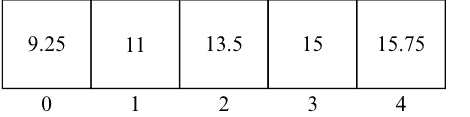

上图表示图 4.3 第 2 行中的第一个列表。每个方框保存列表中的一个值，每个方框下方的数字是该元素的索引。

如上例所示，列表元素的索引或地址总是从第一个元素的索引 0 开始，第二个元素的索引为 1，依此类推，直到列表的最后一个元素，其索引比列表中元素的总数少 1（即，列表中的最后一个元素的索引为 $n - 1$，其中 $n$ 是列表中元素的总数）。

方括号（ [ ] ）用于开始和结束一个列表，列表元素之间的逗号用于分隔元素。我们可以将列表作为独立实体输入，如上面的散点图函数调用，但也可以将列表保存为变量。因此，图 4.3 的第 2 行可以重写为图 4.5 所示。请注意，在图 4.5 中，`scatter` 函数调用中的位置输入参数周围没有方括号（例如，调用中是 `x_values` 而不是 `[x_values]`）。`x_values` 和 `y_values` 变量本身已经是列表，所以我们不需要在它们周围加上方括号。

```python
x_values = [9.25, 11, 13.5, 15, 15.75]
y_values = [2.54, 4.1, 1.21, 3.9, 4]
plt.scatter(x_values, y_values)
```

**图 4.5** 使用变量保存列表来重写图 4.3 的第 2 行，这些列表用作 `scatter` 调用的输入。

要引用设置为变量的列表中的元素，我们在变量名后使用方括号，并在方括号内放入索引。因此，列表 `x_values` 的第一个元素是 `x_values[0]`，第二个是 `x_values[1]`，依此类推。因为元素的**序数**值（即第一、第二、第三等）与元素的地址（即 0、1、2 等）不同，当我们通过地址引用元素时，我们会在地址末尾添加“th”。也就是说，地址上的“第零个”元素是列表中位置上的第一个元素，“第一个”地址元素是位置上的第二个元素，“第二个”地址元素是位置上的第三个元素，依此类推。

使用这种表示法，我们可以更改现有列表的值或使用现有列表的值。再次考虑图 4.5 中的代码。我们如何将 `x_values` 的第二个值从 11 更改为 11.05（也许我们意识到记录数据的时间有误）？我们可以使用以下代码完成此操作，它将 `x_values` 的第二个（即索引 1）元素替换为 11.05：

```python
x_values = [9.25, 11, 13.5, 15, 15.75]
x_values[1] = 11.05
```

或者使用此代码，它获取 `x_values[1]` 的现有值（即 11）并加上 0.05，然后将 `x_values[1]` 的现有值替换为所得的和：

```python
x_values = [9.25, 11, 13.5, 15, 15.75]
x_values[1] = x_values[1] + 0.05
```

最后，列表的长度（列表中元素的数量）可以使用内置的 `len` 函数获得。例如，`len(x_values)` 返回列表 `x_values` 的长度：

```python
In [1]: x_values = [9.25, 11, 13.5, 15, 15.75]
        len(x_values)

Out[1]: 5
```

在 Python 中，列表元素也可以使用负索引从列表末尾开始寻址。在这种表示法中，`x_values[-1]` 是列表 `x_values` 中的最后一个元素，`x_values[-2]` 是倒数第二个元素，依此类推。我们*不必*使用负索引，但这提供了一种方便的方式来引用列表的最后一个元素，而无需使用 `len` 函数：例如，对于列表 `x_values`，`x_values[-1]` 和 `x_values[len(x_values)-1]` 引用的是同一个元素。

我们将在第 9.2.3 节中更详细地讨论列表，因此我们通过描述如何从列表中提取部分（即“子列表”或“切片”）来结束对列表的介绍，而不仅仅是提取单个元素。当指定要从列表中切片出的元素范围时，我们遵循以下规则：

- 我们通过使用元素索引值来指定子列表范围，给出范围的下限和上限，并用冒号分隔。
- 范围的下限是*包含*的，范围的上限是*不包含*的。
- 如果省略下限和/或上限，切片将分别延伸到列表的开头和/或结尾。

切片是什么样子的？再次考虑我们图 4.5 中的代码。我们如何只绘制前四个点，而不是 `x_values` 和 `y_values` 中描述的所有五个点？也就是说，我们如何省略列表中的最后一个元素？我们可以只切片其他元素，并将结果保存为 `x_values` 和 `y_values`，使用以下代码：

```python
x_values = x_values[0:-1]
y_values = y_values[0:-1]
```

这是一个会话，它创建了图 4.5 版本的 `x_values` 和 `y_values`，执行了上述切片，并打印出 `x_values` 和 `y_values`，以便我们查看发生了什么：

```python
In [1]: x_values = [9.25, 11, 13.5, 15, 15.75]
       y_values = [2.54, 4.1, 1.21, 3.9, 4]
       x_values = x_values[0:-1]
       y_values = y_values[0:-1]
       x_values
Out[1]: [9.25, 11, 13.5, 15]
In [2]: y_values
Out[2]: [2.54, 4.1, 1.21, 3.9]
```

切片是如何工作的？在两个切片操作中，冒号左侧的索引都是 0。规则告诉我们，该索引指定了我们正在切片的子列表的第一个元素，并且是包含的，即子列表将包含该元素。然而，冒号右侧的索引是不包含的，即*不*包含在子列表中。在上面的切片操作中，该索引是 −1，它引用列表中的最后一个元素。规则告诉我们不要包含该元素，因此我们子列表中的元素范围以最后一个元素之前的元素结束。

正如切片规则所示，我们可以通过省略一个或另一个限制索引来指定“一直到末尾”或“一直到开头”。在下面的代码中，我们只切片两个列表的最后三个值：

```python
In [1]: x_values = [9.25, 11, 13.5, 15, 15.75]
       y_values = [2.54, 4.1, 1.21, 3.9, 4]
       x_values = x_values[-3:]
       y_values = y_values[-3:]
       x_values
Out[1]: [13.5, 15, 15.75]
In [2]: y_values
Out[2]: [1.21, 3.9, 4]
```

通过在 In [1] 的第三行和第四行中将上限留空，我们的切片一直延伸到列表的末尾。记住负索引表示“从末尾开始”，所以 −3 索引表示从末尾数第三个元素。在这两行中，我们从该索引的元素开始，因为它是切片的下限（且包含）。我们将在第 4.3 节中介绍更多的切片情况。

我们已经看到列表是一个有序的元素集合，我们可以更改其元素。如果我们想要一个不希望被更改的项目列表呢？也就是说，我们想要存储项目并使用它们的索引来读取它们，但不想用不同的值替换它们。为此，我们将元素集合存储为**元组**。定义元组就像定义列表一样，只是我们使用圆括号而不是方括号将元素括起来。因此，如果我们将图 4.5 的列表 `x_values` 和 `y_values` 定义为元组，代码将如下所示：

```python
x_values = (9.25, 11, 13.5, 15, 15.75)
y_values = (2.54, 4.1, 1.21, 3.9, 4)
```

我们可以使用元组中的元素，但不能更改它们：²

```python
In [1]: x_values = (9.25, 11, 13.5, 15, 15.75)
       x_values[1]
Out[1]: 11
```

¹ 现实情况要复杂一些，但目前，我们可以这样理解参数。

² 为了清晰起见，错误消息输出已编辑。

## 4 基础折线图与散点图

```
In [2]: x_values[1] = 11.05

TypeError Traceback (most recent call last)
<ipython-input-5-64fa1aacleef> in <module>()
----> 1 x_values[1] = 11.05

TypeError: 'tuple' object does not support item assignment
```

最后，我们可以使用 `tuple` 函数将列表转换为元组，使用 `list` 函数将元组转换为列表：

```
In [1]: x_values = (9.25, 11, 13.5, 15, 15.75)
       type(x_values)

Out[1]: tuple

In [2]: x_values = list(x_values)
       type(x_values)

Out[2]: list

In [3]: x_values = tuple(x_values)
       type(x_values)

Out[3]: tuple
```

如果我们创建了一个元组，但随后想要修改其中的元素，可以先将其转换为列表，修改列表，然后再将列表转换回元组。内置的 `type` 函数可以告诉我们给定变量的类型（更多信息请参见第 5.2.7 节）。
在第 9.2.3 节中，我们将进一步介绍列表是什么以及它们能做什么。

### 4.2.3 字符串简介

图 4.3 的第 3 行和第 4 行（为方便起见在此重现）：

```
plt.xlabel('Decimal Hour in Day')
plt.ylabel('Power (mW)')
```

调用了 `xlabel` 和 `ylabel` 函数，分别用于写出 x 轴和 y 轴的标签。这些函数中的每一个都接受一个参数，但这个参数不是数字（整数或小数），也不是数字的集合（列表或元组），而是一种称为字符串的新变量类型。字符串是字符的组合，这些字符被置于匹配的单引号、双引号或三引号之间。它们通常表示文本信息或单词、短语和句子。

字符串是通过将字符放在匹配的单引号、双引号或“三引号”之间来创建的。整个字符序列就变成了一个单一的值。以下每种方式都会给我们字符串 'Number of Plant Species'：

```
'Number of Plant Species'
"Number of Plant Species"
'''Number of Plant Species'''
"""Number of Plant Species"""
```

我们可以像设置数字、列表和元组一样，将变量设置为字符串：

```
In [1]: axis_title = 'Number of Plant Species'
       axis_title
Out[1]: 'Number of Plant Species'
In [2]: type(axis_title)
Out[2]: str
```

大小写很重要，因此在字符串中 'A' 与 'a' 不同。
为什么有多种指定字符串的方式？当字符串需要包含另一种标点符号时，同时拥有单引号和双引号就很有用：

```
In [1]: plot_title = "Jane Doe's Plant Experiment"
       plot_title
Out[1]: "Jane Doe's Plant Experiment"
In [2]: text = 'Calculate a "pseudo" probability distribution function.'
       text
Out[2]: 'Calculate a "pseudo" probability distribution function.'
```

三引号允许我们通过按 Enter 键和空格键来包含换行符和空格，并将这些作为字符串的一部分记住。这使得输入格式更复杂的字符串变得更加容易：

```
In [1]: description = '''The force, given by:
           F = ma
       "matches" expected values.'''
       description
Out[1]: 'The force, given by:\n       F = ma\n"matches" expected values.'
```

```
In [2]: print(description)

The force, given by:
    F = ma
"matches" expected values.
```

字符 '\n' 是换行符。在字符串中，它被视为一个字符，而不是两个。`print` 函数将字符串变量的内容打印到屏幕上，但将格式字符（如换行符）表示为它们在屏幕上应有的样子。另一个与字符串一起使用的常见格式字符是制表符（Tab，\t），即 '\t'。

如果我们想指定一个“空字符串”，即一个字符串值，它是一个字符串但其中没有任何字符（甚至没有空格）怎么办？虽然这样的值看起来没用——如果我们打印这样的字符串，什么也看不到——但有时它很有价值。例如，如果我们想将一个变量初始化为字符串，但不希望它包含任何特定字符，我们可以将其设置为空字符串。Python 中的空字符串由一对匹配的引号表示，中间没有任何内容，例如 '' 或 ""。

就像我们可以对数字进行操作一样，我们也可以对字符串进行操作。要将两个字符串连接在一起，即将两个字符串粘合在一起，我们使用 + 运算符：

```
In [1]: phrase1 = "Number of"
       phrase2 = "Carbon Atoms"
       phrase1 + " " + phrase2

Out[1]: 'Number of Carbon Atoms'
```

注意我们如何必须在 phrase1 和 phrase2 之间显式插入一个空格，因为它们分别没有尾随或前导空格。

除了将两个字符串连接在一起，我们还可以提取字符串的部分内容，包括单个字符。为此，我们使用与列表和元组切片相同的语法。实际上，我们可以将字符串视为一个小型元组，其中每个元素都是一个字符，第一个字符的索引为 0。

如果我们有以下字符串 plot_title：

```
plot_title = "Comparison Between Jane and Jill's Experiments"
```

我们可以在 Python 解释器中得到以下结果：

```
In [1]: plot_title[2]

Out[1]: 'm'

In [2]: plot_title[0:5]

Out[2]: 'Compa'

In [3]: plot_title[-5:]
Out[3]: 'ments'
In [4]: plot_title[28:34]
Out[4]: "Jill's"
In [5]: plot_title[32]
Out[5]: "'"
```

回想一下，在列表切片语法中，冒号左侧的索引是包含的，而冒号右侧的索引是不包含的。还要注意，标点符号（如撇号）也是字符串中的元素，可以通过索引引用。
如果我们想知道字符串中的字符数量，可以使用 `len` 函数：

```
In [1]: plot_title = "Comparison Between Jane and Jill's Experiments"
      print(len(plot_title))

46
```

我们可以将字符串切片和分割的结果（无论是一个字符还是多个字符）保存为一个变量：

```
In [1]: name = plot_title[28:34]
      print(name)

Jill's
```

当我们从字符串中提取一个或多个字符时，我们称这个子集为**子字符串**。子字符串本身就是字符串，可以像它们来源的字符串一样进行切片、分割（和连接）。
在科学或工程工作中，我们经常希望根据存储在变量中的数值，将字母和数字组合在一个字符串中。然而，数字 `1` 和字符串 `'1'` 不是同一回事，不能直接连接在一起。关于这种区别的更多信息，请参见第 5.2.7 节。为了获得数字的字符串版本，我们必须使用内置的 `str` 函数：³

³ 为清晰起见，错误消息输出已编辑。

```
In [1]: text1 = "Hydrogen"
        text2 = "Helium"
        i = 1
        text1 + " not " + text2 + " is number " + str(i)

Out[1]: 'Hydrogen not Helium is number 1'

In [2]: text1 + " not " + text2 + " is number " + i

Out[2]: TypeError    Traceback (most recent call last)
        <ipython-input-4-b4dd10772c95> in <module>()
        ----> 1 text1 + " not " + text2 + " is number " + i

        TypeError: must be str, not int
```

在单元格 In [2] 中，我们尝试将字符串与数字（整数）连接，而没有先将数字转换为字符串，结果被告知无法这样做。

最后，有时我们想要创建非常长的字符串，长到无法在一行中显示。在这些情况下，我们可以在行尾使用反斜杠（\）字符来告诉 Python 代码行在下一行继续。因此：

```
text = "Experiment 1 and " + \
       "Experiment 2 are " + \
       "both finished."
```

等同于：

```
text = "Experiment 1 and " + "Experiment 2 are " + "both finished."
```

以及

```
text = "Experiment 1 and Experiment 2 are both finished."
```

使用反斜杠字符告诉 Python 代码行在下一行继续，不仅适用于定义字符串，也适用于所有类型的 Python 代码。

这个简要介绍为我们提供了字符串设置、切片和分割的基础知识。我们将在第 9.2.4 节中进一步讨论字符串。

### 4.2.4 注释与 Jupyter Markdown 简介

我们开始编写越来越长的脚本。虽然 Python 是一种非常清晰的语言，但在某些时候，我们需要在代码中添加解释性注释，以帮助解释为什么代码以某种方式编写、代码的作用以及我们信息的来源。在程序中，这些注释被称为**注释**。Python 中的注释是以井号（#）开头并以行尾结束的任何文本。无论井号出现在

## 4 基础折线图与散点图

在行首或行中，Python解释器会将井号（#）及其之后的所有内容视为注释，不会执行其内容。
我们从第4.1节的代码中取例，并添加一些注释：

```
#- 导入包：
import matplotlib.pyplot as plt

#- 创建绘图：
plt.plot([9.25, 11, 13.5, 15, 15.75], [2.54, 4.1, 1.21, 3.9, 4])

#- 添加标签并显示：
plt.xlabel('Decimal Hour in Day')
plt.ylabel('Power (mW)')
plt.show()    #- 在屏幕上显示绘图
```

这些注释行本身并没有比代码本身传达更多信息，但它们展示了注释符号的工作方式。
在纯代码文件中，注释行是向查看代码的其他程序员（可能是几周或几个月后的原作者）提供程序附加信息的一种方式。如果我们将Python代码写入Jupyter notebook，我们还有另一种方式将描述和文本注释交织到代码中，即指定某些单元格为“Markdown”单元格，并在其中输入描述。图4.6展示了一个示例，显示了输入到notebook中的状态（即运行所有单元格之前）。请注意，要告诉notebook这个单元格是Markdown单元格而非Python代码单元格，我们必须在如图4.6红色圆圈部分所示的组合框中选择“Markdown”。

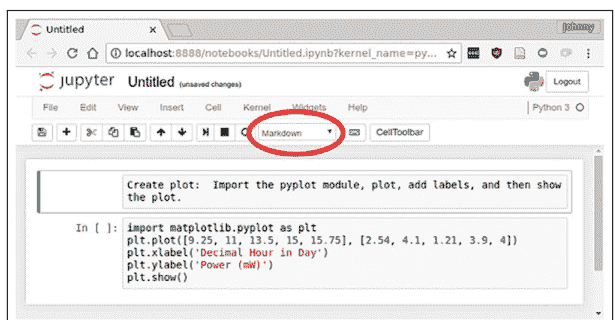

**图4.6** 一个Jupyter notebook，展示了带有提供描述的Markdown单元格的绘图代码（在运行所有单元格之前，组合框“Markdown”被红圈标出）。

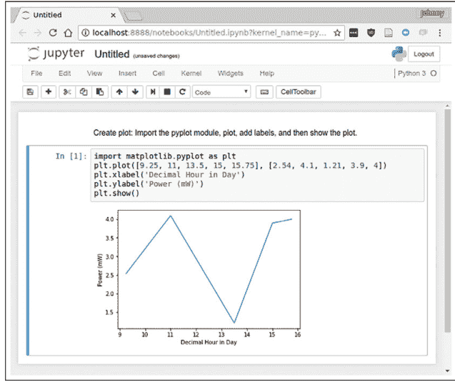

图4.7 运行所有单元格后的同一个Jupyter notebook，展示了带有提供描述的Markdown单元格的绘图代码。

图4.7展示了运行所有单元格后的同一个notebook。除了Markdown单元格现在像书本中的文本一样排版，即使用更美观的**比例字体**（而在运行前，文本以类似代码的、较粗糙的**非比例字体**显示）之外，没有太大区别。所有包含**可执行**或可运行Python代码的单元格都已运行，其结果显示在`Out [ ]`单元格中。

对于简短的注释，Jupyter notebook中Markdown单元格唯一重要的特性是其中的文本不会被执行。然而，Markdown的好处在于它允许我们在单元格中包含格式，例如创建标题、制作斜体文本、插入数学公式等。Jupyter和Markdown文档<sup>4</sup>描述了Markdown单元格中允许的格式类型。这种格式的示例见于第4.4节链接的特定学科Jupyter notebook以及本书的其他章节。点击标题和问题单元格可查看Markdown内容，运行notebook可查看该内容的排版效果。表4.1简要总结了一些基本语法。在第6.2.6节，我们将讨论Python中注释的更多用法。

<sup>4</sup> http://jupyter-notebook.readthedocs.io/en/latest/examples/Notebook/Working%20With%20Markdown%20Cells.html (访问于2017年8月9日) 和 https://daringfireball.net/projects/markdown/basics (访问于2018年8月23日)。

#### 表4.1 Jupyter notebook Markdown单元格中基本Markdown语法总结。

| Markdown示例 | 功能 |
| :--- | :--- |
| # Experiment 1 | 将“Experiment 1”排版为标题字体和样式，类似于**Experiment 1**。 |
| The data is *not* accurate. | 将句子排版，使“not”通过斜体强调，如“The data is *not* accurate.” |
| The data is **not** accurate. | 将句子排版，使“not”通过粗体强烈强调，如“The data is **not** accurate.” |
| At [NASA] (http://nasa.gov) , we | 将方括号中的内容排版为指向括号中网址的链接，如“At NASA, we”，其中灰色单词是到http://nasa.gov的链接。 |
| * Frogs<br>* Fireflies<br>* Carp | 创建项目符号列表：<br>• Frogs<br>• Fireflies<br>• Carp |
| 1. Frogs<br>2. Fireflies<br>3. Carp | 创建编号列表：<br>1. Frogs<br>2. Fireflies<br>3. Carp |
| $v_{y}$ | 内联排版数学符号 $v_y$。下划线表示“将花括号中的内容设为下标”。 |
| $e^{x}$ | 内联排版数学符号 $e^x$。脱字符表示“将花括号中的内容设为上标”。 |
| $\frac{1}{2}$ | 内联排版分数 $\frac{1}{2}$。 |
| $$F = ma$$ | 单独一行居中排版方程 $F = ma$。 |

## 4.3 动手试试！

我们从类似于第4.1节中见过的绘图示例开始。接着是针对第4.2节主要主题的示例：位置输入参数、列表和元组、字符串以及注释。这些示例可能涉及将Python用作计算器或科学计算器，而不仅限于绘图。对于第4.2节的一些主题，计算器问题为我们提供了运用这些想法的基本练习。

### 动手试试！4-1 基础散点图：动物数据

考虑以下关于一种虚构动物的数据：

| 长度 (m) | 重量 (kg) |
|---|---|
| 0.8 | 1.2 |
| 1.1 | 1.8 |
| 0.7 | 0.9 |
| 1.2 | 2.1 |
| 1.1 | 0.9 |
| 0.5 | 0.4 |
| 1.4 | 2.2 |

创建一个散点图，y轴为重量，x轴为高度。请为坐标轴添加适当的标签。

### 动手试试！答案 4-1

以下代码解决了这个问题：

```
import matplotlib.pyplot as plt
plt.scatter([0.8, 1.1, 0.7, 1.2, 1.1, 0.5, 1.4],
            [1.2, 1.8, 0.9, 2.1, 0.9, 0.4, 2.2])
plt.xlabel('Height (m)')
plt.ylabel('Weight (kg)')
plt.show()
```

上述代码生成的绘图如图4.8所示。

注意第2行末尾我们使用了行继续反斜杠字符，告诉Python第3行的内容是第2行的延续。第3行的前导空格会被忽略。这样，我们可以格式化代码使其更具可读性。

虽然在第2行使用行继续字符效果很好，但对于列表项和参数列表等情况，Python会自动知道第2行我们尚未输入完plot函数所需的所有项（例如，第2行没有右括号），并自动假定第3行是第2行的延续。因此，我们可以省略第2行的反斜杠，一切仍能正常工作。即：

```
plt.scatter([0.8, 1.1, 0.7, 1.2, 1.1, 0.5, 1.4],
            [1.2, 1.8, 0.9, 2.1, 0.9, 0.4, 2.2])
```

与以下代码效果相同：

```
plt.scatter([0.8, 1.1, 0.7, 1.2, 1.1, 0.5, 1.4],
            [1.2, 1.8, 0.9, 2.1, 0.9, 0.4, 2.2])
```

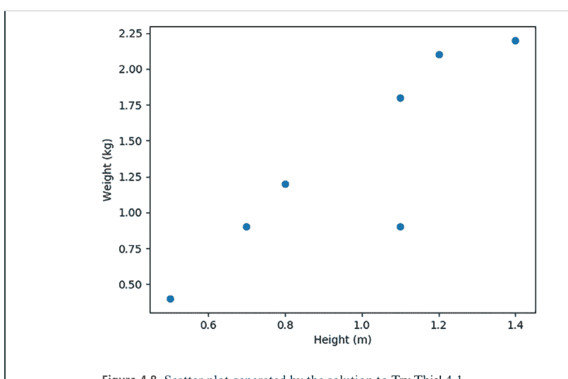

图4.8 由“动手试试！4-1”解决方案生成的散点图。

### 动手试试！4-2 基础折线图：指数函数

创建一个包含五个数据点的表格，x值从零到一，以及对应的y值（$y = e^x$）。创建一个y值对x值的折线图。

### 动手试试！答案 4-2

五个数据点中的每一个都可以使用NumPy中的`exp`函数计算。以下是显示计算代码的计算器会话：

```
In [1]: from numpy import exp
       exp(0.0)

Out[1]: 1.0

In [2]: exp(0.2)

Out[2]: 1.2214027581601699

In [3]: exp(0.4)

Out[3]: 1.4918246976412703
```

```
In [4]: exp(0.6)
Out [4]: 1.8221188003905089
In [5]: exp(0.8)
Out [5]: 2.2255409284924679
```

请记住在使用前先导入`exp`（上述代码中`In [1]`的第一行）。以下是数据表格：

| x值 | y = e^x值 |
|----------|----------------|
| 0.0      | 1.0            |
| 0.2      | 1.221          |
| 0.4      | 1.492          |
| 0.6      | 1.822          |
| 0.8      | 2.226          |

以下代码解决了这个问题：

```
import matplotlib.pyplot as plt
plt.plot([0.0, 0.2, 0.4, 0.6, 0.8],
         [1.0, 1.221, 1.492, 1.822, 2.226])
plt.xlabel('x')
plt.ylabel('y')
plt.show()
```

上述代码生成的绘图如图4.9所示。在后续章节中，我们将描述让Python进行重复计算的方法，这样我们就不必像上面那样显式输入多个函数调用。

### 动手试试！4-3 位置输入参数：速度向量的大小

编写一个函数`magnitude`，该函数在给定向量的x和y分量时，返回速度向量的大小。也就是说，用x分量3.0 m/s和y分量4.0 m/s调用该函数将产生以下结果：

```
In [1]: magnitude(3.0, 4.0)
Out [1]: 5.0
```

### 试一试！答案 4-3

这段代码解决了问题：

```python
def magnitude(x_component, y_component):
    return ((x_component**2) + (y_component**2))**0.5
```

我们在第2行使用了“取二分之一次幂”，而不是使用平方根函数。要使用后者，我们需要从 NumPy 模块导入 `sqrt` 函数：

```python
from numpy import sqrt
def magnitude(x_component, y_component):
    return sqrt((x_component**2) + (y_component**2))
```

当我们导入模块或从模块中导入项目时，通常会在 Python 代码文件（或 Jupyter notebook）的开头进行。这样，我们就可以在整个文件或 notebook 中使用该模块或模块项目。在上面的例子中，由于 `sqrt` 导入行位于文件顶部，该函数可在 `magnitude` 定义或该 Python 代码文件中的任何函数或变量定义中使用。

### 试一试！4-4 输入参数的顺序：速度向量的大小

考虑试一试！4-3 的解决方案。如果我们交换调用 `magnitude` 时输入参数的顺序会发生什么？也就是说，如果我们将：

```
magnitude(4.0, 3.0)
```

与

```
magnitude(3.0, 4.0)
```

进行比较，会有什么不同？这有关系吗？我们如何演示交换调用中输入参数顺序的效果？

### 试一试！答案 4-4

交换输入参数的顺序对最终结果没有影响，因为在计算向量大小的公式中，我们对 x 分量和 y 分量执行相同的操作（即平方）。因此，`magnitude(4.0, 3.0)` 和 `magnitude(3.0, 4.0)` 函数调用都将返回 5.0。然而，在函数内部，在第一种调用情况下，参数 `x_component` 被设置为 4.0，而在第二种调用情况下，参数 `x_component` 被设置为 3.0。参数 `y_component` 的情况则相反。

我们如何证明这就是发生的情况？一种方法是在函数体中放入 `print` 语句。例如，这个函数定义：

```python
def magnitude(x_component, y_component):
    print(x_component)
    print(y_component)
    return ((x_component**2) + (y_component**2))**0.5
```

将在调用函数时打印出传入的 `x_component` 和 `y_component` 的值。以下是此示例：

```
In [1]: magnitude(3.0, 4.0)

3.0
4.0

Out[1]: 5.0

In [2]: magnitude(4.0, 3.0)

4.0
3.0

Out[2]: 5.0
```

显示了每次函数调用的 `x_component` 和 `y_component` 的值。在 `Out [ ]` 单元格中打印出的 `5.0` 值并非来自 `print` 语句，而是来自 Python 解释器中对具有返回值的函数进行调用时的默认行为，即会将返回值打印到屏幕上。

### 试一试！4-5 交换输入参数的散点图：动物数据

考虑试一试！4-1 中的数据。绘制一个高度与体重的散点图，而不是体重与高度。也就是说，将高度值放在 y 轴上，体重值放在 x 轴上。

### 试一试！答案 4-5

回顾试一试！4-1 的解决方案：

```python
import matplotlib.pyplot as plt
plt.scatter([0.8, 1.1, 0.7, 1.2, 1.1, 0.5, 1.4],
            [1.2, 1.8, 0.9, 2.1, 0.9, 0.4, 2.2])
plt.xlabel('Height (m)')
plt.ylabel('Weight (kg)')
plt.show()
```

绘制此图最直接的方法是交换传入 `scatter` 的列表顺序：

```python
plt.scatter([1.2, 1.8, 0.9, 2.1, 0.9, 0.4, 2.2],
            [0.8, 1.1, 0.7, 1.2, 1.1, 0.5, 1.4])
```

然而，如果我们事先知道要绘制这两种图，更简单的方法是将高度和体重列表保存为变量，并使用交换后的输入列表对 `scatter` 进行两次调用。请记住，位置输入参数根据传入参数的顺序来确定其值。以下代码将实现我们的目标：

```python
import matplotlib.pyplot as plt
height = [0.8, 1.1, 0.7, 1.2, 1.1, 0.5, 1.4]
weight = [1.2, 1.8, 0.9, 2.1, 0.9, 0.4, 2.2]
plt.scatter(height, weight)
plt.xlabel('Height (m)')
plt.ylabel('Weight (kg)')
plt.show()
plt.scatter(weight, height)
plt.xlabel('Weight (kg)')
plt.ylabel('Height (m)')
plt.show()
```

输入参数顺序的交换在第8行。如果我们直接运行上面的代码，第一个 `show` 调用将显示第一个图表，然后 Python 会等待我们关闭该图表的窗口，再显示第二个图表。通常，我们更喜欢同时查看两个图表。我们将在第5.2.3节介绍如何制作多个独立的图表，每个图表都在自己的窗口中。

### 试一试！4-6 仅保留前几个数据点：动物数据

考虑试一试！4-1 中的数据。假设我们现在发现只有前五个数据点是有效的。仅使用有效的数据点绘制体重与高度的散点图。

### 试一试！答案 4-6

我们可以手动输入前五个数据点，但这样做并没有利用编程语言的任何能力。相反，我们使用列表切片（在第4.2.2节中介绍）来仅保留前五个数据点。如果我们像在试一试！4-5 的解决方案中那样，将高度和体重数据保存为列表，就可以看到这一点：

```python
import matplotlib.pyplot as plt
height = [0.8, 1.1, 0.7, 1.2, 1.1, 0.5, 1.4]
weight = [1.2, 1.8, 0.9, 2.1, 0.9, 0.4, 2.2]
height = height[0:5]
weight = weight[0:5]
plt.scatter(height, weight)
plt.xlabel('Height (m)')
plt.ylabel('Weight (kg)')
plt.show()
```

在第4行和第5行，我们切片出 `height` 和 `weight` 列表的前五个元素，并将该切片的返回值重新赋值给变量 `height` 和 `weight`。这样，我们就不必更改 `scatter` 方法的参数列表。

回想一下，列表前五个元素的切片语法是 `[0:5]` 而不是 `[1:5]`，因为第一个元素的索引为0。此外，切片语法不是 `[0:4]`，因为切片范围的上限索引值是*不包含*该索引的，而不是包含该索引。因此，`[0:5]` 提取索引值为0到4的列表元素。

通过上述切片，由于我们一直切到 `height` 和 `weight` 列表的开头，可以省略0。因此，`[:5]` 与 `[0:5]` 的作用相同。

### 试一试！4-7 仅保留几个中间数据点：动物数据

考虑试一试！4-1 中的数据。假设我们现在发现表格中只有第二个、第三个和第四个数据点是有效的。仅使用这些有效的数据点绘制体重与高度的散点图。

### 试一试！答案 4-7

与试一试！4-6 一样，我们使用列表切片来仅保留有效的数据点：

```python
import matplotlib.pyplot as plt
height = [0.8, 1.1, 0.7, 1.2, 1.1, 0.5, 1.4]
weight = [1.2, 1.8, 0.9, 2.1, 0.9, 0.4, 2.2]
height = height[1:4]
weight = weight[1:4]
plt.scatter(height, weight)
plt.xlabel('Height (m)')
plt.ylabel('Weight (kg)')
plt.show()
```

列表中的第二个元素索引为1，因此在第4行和第5行，我们从1开始切片语法。第四个元素索引为3，且上限是排他的，因此切片语法在冒号右侧为4。

### 试一试！4-8 仅保留最后几个数据点：动物数据

考虑试一试！4-1 中的数据。假设我们现在发现表格中只有最后四个数据点是有效的。仅使用这些有效的数据点绘制体重与高度的散点图。

### 试一试！答案 4-8

与试一试！4-6 一样，我们使用列表切片来仅保留有效的数据点：

```python
import matplotlib.pyplot as plt
height = [0.8, 1.1, 0.7, 1.2, 1.1, 0.5, 1.4]
weight = [1.2, 1.8, 0.9, 2.1, 0.9, 0.4, 2.2]
height = height[-4:]
weight = weight[-4:]
plt.scatter(height, weight)
plt.xlabel('Height (m)')
plt.ylabel('Weight (kg)')
plt.show()
```

列表中倒数第四个元素的索引为-4，因此在第4行和第5行，我们从-4开始切片语法。我们希望切到列表末尾，因此冒号右侧没有上限值。如果切片语法是 `[-4 : -1]`，则列表中的最后一个元素将被排除，因为切片范围不包含冒号右侧索引指定的元素。

请注意，由于 `height` 和 `weight` 列表中的元素总数，使用 `[3 :]` 进行切片与使用 `[-4 :]` 的效果相同。如果元素总数不同，`[3 :]` 将不会给出与 `[-4 :]` 相同的结果。

### 动手试试！4-9 用多行标签标注绘图坐标轴：指数函数

重新绘制“动手试试！4-2”中的图表，使用不同的 x 轴和 y 轴标签。确保至少一个坐标轴标签包含换行符。也就是说，至少一个标签应该是两行长的。

### 动手试试！答案 4-9

以下是完成此任务的代码：

```python
import matplotlib.pyplot as plt
plt.plot([0.0, 0.2, 0.4, 0.6, 0.8],
         [1.0, 1.221, 1.492, 1.822, 2.226])
plt.xlabel('Number of Months Since May 2001')
plt.ylabel('Mosquito Count\n(Over All Biomes)')
plt.show()
```

此解决方案为 y 轴创建了一个两行长的标签。生成的图表如图 4.10 所示。在第 5 行中，通过在坐标轴标签中需要换行的位置包含一个换行符（`\n`）来引入换行。

### 动手试试！4-10 包含数据值的绘图标签：指数函数

对于“动手试试！4-2”中的数据，修改 x 轴标签以包含数据的最小值和最大值。也就是说，如果最小值是 0.0，最大值是 0.8，标签可以写成类似“X 值范围从 0.0 到 0.8”的内容。在构建 x 轴标签时，首先将传递给绘图命令的数据保存为列表变量，然后从 x 值列表中提取最小值和最大值，用于标签中。

### 动手试试！答案 4-10

以下是完成此任务的代码：

```python
import matplotlib.pyplot as plt
x_values = [0.0, 0.2, 0.4, 0.6, 0.8]
y_values = [1.0, 1.221, 1.492, 1.822, 2.226]
plt.plot(x_values, y_values)
plt.xlabel('X-Values Range from ' + str(x_values[0]) +
           ' to ' + str(x_values[-1]))
plt.ylabel('Y-Values')
plt.show()
```

因为 `x_values` 列表是一个数字列表，所以我们必须在第 5 行和第 6 行使用 `str` 函数将值转换为字符串，然后才能将其附加到 x 轴标签字符串中。加法运算符用于字符串时，会将字符串连接在一起。图 4.11 显示了上述代码生成的图表。

### 动手试试！4-11 进一步编辑绘图标签：指数函数

使用“动手试试！4-10”的答案，将其修改为使 `xlabel` 接受字符串变量作为输入。在将该变量传递给 `xlabel` 之前，首先将其设置为：

`'X-Values Range from ' + str(x_values[0]) + ' to ' + str(x_values[-1])`

然后使用字符串切片将该字符串变量重新赋值为上述字符串，但不包含“X-Values”部分。

### 动手试试！答案 4-11

以下是完成此任务的代码：

```python
import matplotlib.pyplot as plt
x_values = [0.0, 0.2, 0.4, 0.6, 0.8]
y_values = [1.0, 1.221, 1.492, 1.822, 2.226]
xlabel_string = 'X-Values Range from ' + str(x_values[0]) +
                ' to ' + str(x_values[-1])
xlabel_string = xlabel_string[9:]
plt.plot(x_values, y_values)
plt.xlabel(xlabel_string)
plt.ylabel('Y-Values')
plt.show()
```

“Range”中的大写“R”位于索引位置 9（即 `xlabel_string` 中的第十个字符）。

### 动手试试！4-12 为绘图添加代码注释：动物数据

针对“动手试试！4-8”的解决方案，提供注释行，对代码进行额外描述。

### 动手试试！答案 4-12

以下是添加了一些注释的代码：

```python
#- 导入包：
import matplotlib.pyplot as plt

#- 数据列表：
height = [0.8, 1.1, 0.7, 1.2, 1.1, 0.5, 1.4]
weight = [1.2, 1.8, 0.9, 2.1, 0.9, 0.4, 2.2]

#- 仅从数据列表中选择最后四个元素：
height = height[-4:]
weight = weight[-4:]

#- 创建绘图并显示：
plt.scatter(height, weight)
plt.xlabel('Height (m)')
plt.ylabel('Weight (kg)')
plt.show()
```

## 4.4 更多学科特定练习

本章的学科特定 Jupyter 笔记本涵盖以下主题：

- 编写带有位置输入参数的函数。
- 切片列表和元组。
- 创建、切片和连接字符串。
- Jupyter Markdown。

## 4.5 章节回顾

### 4.5.1 自测题

尝试在不查看本书或任何其他资源，也不使用 Python 解释器的情况下完成这些题目。这些自测题的答案可在本章末尾找到。

**自测题 4-1**

哪个 pyplot 函数创建折线图？散点图？我们如何导入这些函数以便使用它们？

**自测题 4-2**

如果给定两个数字列表（列表长度相同），`xvalues` 和 `yvalues`，我们如何使用这些值创建折线图？请同时提供任何需要的导入行以及在屏幕上显示图表所需的任何代码。

**自测题 4-3**

我们如何为 *x* 轴创建标签？*y* 轴呢？

**自测题 4-4**

假设我们有一个函数 `calculate`，它接受三个输入参数。假设我们有变量 `x`、`y` 和 `z`（为简单起见，假设这些变量都是大小相同但值不同的列表），描述以下函数调用的区别：

`calculate(x, y, z)`

和这个调用：

`calculate(z, y, x)`

第一个调用有效但第二个无效吗？关于这两个调用我们还能说什么？

**自测题 4-5**

什么是列表？什么是元组？列表和元组之间有什么区别？

**自测题 4-6**

假设我们有一个名为 `data` 的列表。我们如何：

1.  确定列表的长度？
2.  访问该列表的第一个元素？
3.  访问该列表的第三个元素？
4.  访问该列表的最后一个元素？
5.  创建一个名为 `subdata` 的列表，该列表由列表的第四到第九个元素组成（其中第四和第九指的是这些元素的序数位置）？

**自测题 4-7**

以下代码行之间有什么区别？

```python
species_name = "Homo sapiens"
species_name = 'Homo sapiens'
species_name = """Homo sapiens"""
species_name = '''Homo sapiens'''
```

**自测题 4-8**

考虑以下细菌培养标签：“Culture 1”、“Culture 2”和“Culture 3”。每个标签分别存储在变量 `label1`、`label2` 和 `label3` 中。创建一个字符串（并赋值给变量 `all_labels`）列出所有标签，用逗号分隔（即“Culture 1, Culture 2, Culture 3”）的代码是什么？请使用已定义的变量编写，不要重写标签文本本身。

**自测题 4-9**

使用与自测题 4-8 相同的变量，打印所有标签，但只列出标签编号（即“Culture 1, 2, 3”）？请使用已定义的变量编写，不要重写标签文本本身。

**自测题 4-10**

假设变量 `sample_id` 被设置为整数 23119。创建一个字符串变量 `id_label`，将其设置为“Sample 23119”。

**自测题 4-11**

Python 如何知道它遇到了注释行？

**自测题 4-12**

在 Jupyter 笔记本中，以下无编号（即项目符号）列表的 Markdown 条目是什么？

- 3 个锥形瓶。
- 10 支试管。
- 1 个本生灯。

**自测题 4-13**

我们如何将一行代码延续到下一行？请提供一个示例。

### 4.5.2 章节总结

Matplotlib 使我们能够制作 x–y 图，并为我们要求它制作的图表提供智能默认值。在研究如何制作基本折线图和散点图时，我们涵盖了以下主题：

- 如何创建图表、标注坐标轴并在屏幕上显示图表
  - 导入 Matplotlib pyplot 模块。
  - `plot` 和 `scatter` 函数分别创建折线图和散点图。
  - `plot` 和 `scatter` 函数接受两个列表，一个是 x 值列表，另一个是 y 值列表。
  - `xlabel` 和 `ylabel` 函数将 x 轴和 y 轴标签写入图表。
  - 创建基本图表时，首先使用 `plot` 和 `scatter` 等函数创建图表，然后使用 `xlabel` 和 `ylabel` 等其他函数为该图表添加标签。
  - `show` 函数将图表显示到屏幕上。
- 位置输入参数
  - 函数通过映射到输入参数的输入参数接受输入。
  - 参数列表是函数名称后括号内由逗号分隔的项目列表。此列表在定义函数时定义。
  - 参数根据参数列表中的位置映射到参数。也就是说，第一个参数是第一个参数的值。
  - 在 `plot` 和 `scatter` 函数中，第一个参数是 x 值列表，第二个参数是 y 值列表。
- 列表和元组
  - 列表是有序序列。
  - 列表是放在方括号内的逗号分隔值。
  - 列表的每个元素通过其索引引用。
  - 列表的第一个元素的索引值为 0，第二个元素的索引值为 1，依此类推。

## 4 基础折线图与散点图

- 列表的最后一个元素索引值为−1，倒数第二个元素索引值为−2，依此类推。
- 我们通过指定列表变量名，然后将索引或索引范围放在方括号中来引用列表的元素，例如 `data[3]`。
- 我们可以通过指定一个用冒号分隔的范围来切片列表的子范围。冒号左侧的索引值包含该元素，而冒号右侧的索引值不包含该元素。因此，`data[2:4]` 将返回一个子列表，该子列表由列表 `data` 的第三个（索引2）和第四个（索引3）元素组成。
- 元组与列表类似，只是它们不能被更改。元组中的值是固定的，除非整个元组被删除。
- 元组是用逗号分隔的值，放置在一组圆括号内。

- 字符串由放置在匹配的单引号、双引号或三引号内的字符组成。
- 标签是字符串的一种常见用途。
- 特殊字符，如空格、制表符、换行符等，也是字符串中的字符。
- 换行符是 `\n`。
- 空字符串是没有字符的字符串。
- 三引号可用于轻松创建具有更复杂格式的字符串。
- 加法运算符将两个字符串连接（或拼接）在一起。
- 内置的 `str` 函数将非字符串值（如数字）转换为字符串。
- 我们可以使用列表的切片和索引语法来切片字符串的一部分。也就是说，我们可以将字符串视为字符列表。

- 注释行以“#”字符开头。
- Jupyter notebooks 可以在 Markdown 单元格中支持额外的文档。这些单元格可以为其内容提供更复杂的格式。

杂项。行续接符是一个反斜杠，放在需要由下一行续接的行的末尾。

尽管 Matplotlib 的默认设置很好，但我们经常希望自定义图表的外观。我们将在第5章讨论此类自定义。

顺便提一下，在线的 pyplot 教程非常好。我们提供了一个指向该教程的最新链接：www.cambridge.org/core/resources/pythonforscientists/refs/，参考文献37。在线示例画廊也非常有启发性；指向该画廊的最新链接是：www.cambridge.org/core/resources/pythonforscientists/refs/，参考文献26。

### 4.5.3 自测答案

### 自测答案 4-1

`plot` 函数创建折线图。`scatter` 函数创建散点图。导入 pyplot 函数有多种方式。一种是导入 pyplot 子模块（通常使用别名如 `plt`）：

```
import matplotlib.pyplot as plt
```

另一种是直接导入函数：

```
from matplotlib.pyplot import plot
from matplotlib.pyplot import scatter
```

这样，在调用函数时就不需要在函数名前加上 `plt`。我们可以直接引用 `plot` 和 `scatter`。有关导入函数的更多信息，请参见第3.2.2节。

### 自测答案 4-2

以下代码可以完成任务：

```
import matplotlib.pyplot as plt
plt.plot(xvalues, yvalues)
plt.show()
```

### 自测答案 4-3

使用 `xlabel` 和 `ylabel` 函数。每个函数都接受一个字符串作为输入参数，并将该字符串作为轴标签写出，例如 `xlabel("Time (sec)")`。这两个函数都是 pyplot 子模块的一部分。

### 自测答案 4-4

在第一次调用中，变量 `x` 将被代入函数定义中的第一个形参，`y` 将被代入第二个形参，`z` 将被代入第三个形参。在第二次调用中，变量 `z` 将被代入函数定义中的第一个形参，`y` 将被代入第二个形参，`x` 将被代入第三个形参。

两次函数调用之间没有其他区别。“x, y, z”和“z, y, x”在字母顺序上是反向排列的这一事实本身并不影响函数被调用时的功能。全部区别在于，在给定位置传入的变量如何映射到该位置的形参。通常，两次函数调用都可以工作。例外情况是，如果重新排列参数导致传入了函数不知道如何处理的参数类型。如果合适，可能会导致错误。

### 自测答案 4-5

列表是元素的有序序列。列表的元素可以被更改、重新排序等。元组也是元素的有序序列，但元组不能被更改、重新排序等。

### 自测答案 4-6

1. len(data)
2. data[0]
3. data[2]
4. data[-1] 或 data[len(data) -1]
5. subdata = data[3:9]

### 自测答案 4-7

这些代码行在功能上没有区别。每一行都是变量 `species_name` 的有效定义，并将该变量设置为字符串“Homo sapiens”。然而，如果定义中包含回车符，三引号版本的行为会有所不同。有关三引号的详细信息，请参见第4.2.3节。

### 自测答案 4-8

假设我们已经定义了以下内容：

```
label1 = "Culture 1"
label2 = "Culture 2"
label3 = "Culture 3"
```

以下是定义 `all_labels` 的代码：

```
all_labels = label1 + ", " + label2 + ", " + label3
```

“+”号用于连接字符串。变量 `label1`、`label2` 和 `label3` 内容中的“1”、“2”和“3”不是整数，而是字符串（即它们是数字符号，而不是数字符号所代表的数字）。

### 自测答案 4-9

以下是完成任务的代码：

```
print(label1 + ", " + label2[-1] + ", " + label3[-1])
```

我们使用索引 -1 来选择 `label2` 和 `label3` 的最后一个字符。我们也可以从每个字符串的前面开始索引。这与上面的 print 调用效果完全相同：

```
print(label1 + ", " + label2[8] + ", " + label3[8])
```

### 自测答案 4-10

要创建 `id_label`，我们必须使用 `str` 函数将整数转换为字符串，然后再将其与 'Sample ' 连接：

```
id_label = 'Sample ' + str(sample_id)
```

注意 'Sample ' 在 'e' 后面包含一个空格，这将 'Sample' 与 '23119' 分隔开。

### 自测答案 4-11

当 Python 遇到井号（#）时，井号之后直到行尾的所有字符都被视为注释，不会被执行。

### 自测答案 4-12

将此代码输入到已指定为 Markdown 单元格的 Jupyter notebook 单元格中：

```
* 3 Erlenmeyer flasks
* 10 test tubes
* 1 Bunsen burner
```

### 自测答案 4-13

我们在需要由下一行续接的行的末尾放置一个反斜杠，例如：

```
id_label = "Sample 23119" + \
            " from Stanford University"
```

存储的结果字符串是 'Sample 23119 from Stanford University'，在 '23119' 和 'from' 之间没有任何换行符。

# 5 自定义折线图与散点图

在上一章中，我们学习了如何制作基础的折线图和散点图。尽管 Matplotlib 的默认值很有用，但我们经常希望让我们的图表看起来与众不同。在本章中，我们描述了一些实现这一点的方法。我们还介绍了更多使我们能够进行这种自定义的 Python 特性。

## 5.1 自定义折线图示例

让我们重新审视图4.2。该图表本身没有问题，但如果我们想改变一些东西呢？我们讨论两种常见更改的方法：（1）图表的外观和图表上的内容，以及（2）对我们正在绘制的数据进行操作，以便我们可以快速以不同的方式查看数据。

在图5.1中，我们采用生成图4.2的代码，并对图表进行常见的格式和相关更改。第1行和第2行与图4.1相同。然而，在我们的新版本中，`plot` 函数调用并未在第2行结束，而是持续到第5行。第3-5行列出的**关键字输入参数**，如语法所示，控制着标记和连接线的外观。第6行缩放图表，使 *x* 轴范围从8到18，*y* 轴范围从0到5。第7行精确指定在 *x* 轴上绘制哪些刻度。在第10行，我们在图表顶部添加一个标题。第11行在图表的左下角添加一些额外的文本（文本的位置在**数据坐标**中指定）。最后，在代码片段的最后一行，我们将图表保存为**便携式网络图形（PNG）**格式的图像文件，而不是使用 `show` 在屏幕上显示。运行图5.1得到的图表如图5.2所示。

科学和工程计算可能非常复杂，通常涉及对大量数据（数百、数万亿甚至更多）的计算，而不是我们在第2章和第3章中看到的简单计算。在这里，我们在对图形数据进行操作的背景下，介绍进行此类计算的主题。

我们采用上面图5.1的代码，通过从每个 *y* 值中减去 *y* 值的平均值来更改输入数据的 *y* 值。图5.3显示了更改后的代码。运行该代码得到的图表如图5.4所示。

图5.3中的大部分代码与图5.1相同。最显著的区别在于图5.3的第2-6行。图5.3中的第10行和第13-15行也不同，但与图5.1中类似行相比，更改相对较小。在第2行，我们导入一个名为 NumPy 的模块（但在代码中指定为 `numpy`）。在第3行，我们存储 *x* 轴数据

## 5 自定义线条与散点图

```python
import matplotlib.pyplot as plt
plt.plot([9.25, 11, 13.5, 15, 15.75], [2.54, 4.1, 1.21, 3.9, 4],
         linestyle='--', linewidth=5.0,
         marker='*', markersize=20.0,
         markeredgewidth=2.0, markerfacecolor='w')
plt.axis([8, 18, 0, 5])
plt.xticks([8, 10, 12, 14, 16, 18])
plt.xlabel('Decimal Hour in Day')
plt.ylabel('Power (mW)')
plt.title('Power vs. Time')
plt.text(8.2, 0.2, 'From Experiment 1')
plt.savefig('testplot.png', dpi=300)
```

**图 5.1** 创建图 4.2 中图表的自定义格式版本的代码。

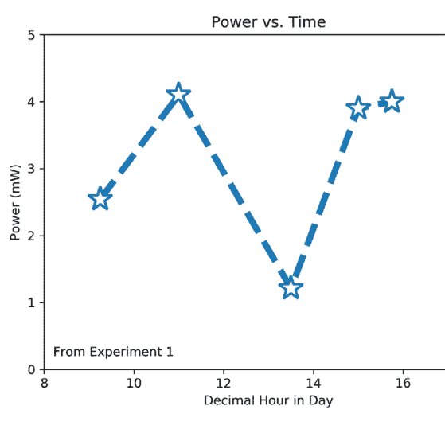

**图 5.2** 由图 5.1 中代码生成的自定义格式线条图。

在第 4 行中，我们将 y 轴数据值存储为一个看起来像列表但并非列表的东西。它被称为 `array`（数组）。第 5 行从每个 y 值中减去 y 值的平均值，并将结果保存为变量 `ydata_dev`，其本身也是一个值数组。

以上代码的简要总结省略了很多细节。与前面的章节一样，在下一节中，我们将详细探讨 Python 如何完成上述两个示例中的任务。

```python
import matplotlib.pyplot as plt
import numpy as np
xdata = [9.25, 11, 13.5, 15, 15.75]
ydata = np.array([2.54, 4.1, 1.21, 3.9, 4])
ydata_dev = ydata - np.mean(ydata)
plt.plot(xdata, ydata_dev,
         linestyle='--', linewidth=5.0,
         marker='*', markersize=20.0,
         markeredgewidth=2.0, markerfacecolor='w')
plt.axis([8, 18, -3, 3])
plt.xticks([8, 10, 12, 14, 16, 18])
plt.xlabel('Decimal Hour in Day')
plt.ylabel('Power Deviations from the Mean (mW)')
plt.title('Power Deviations vs. Time')
plt.text(8.2, -2.8, 'From Experiment 1')
plt.savefig('testplot.png', dpi=300)
```

**图 5.3** 创建图 4.2 中图表的自定义格式版本的代码，其中 y 轴值表示与原始 y 值平均值的差值。

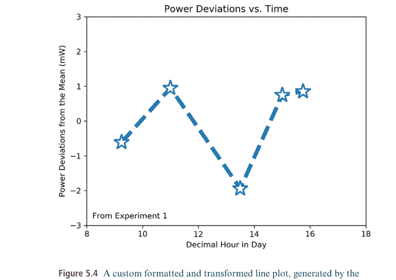

**图 5.4** 由图 5.3 中代码生成的自定义格式并经过转换的线条图。

## 5.2 Python 编程基础

在之前调用函数的示例中，无论是像 `scatter` 这样的绘图函数，还是像 `sin` 这样的数学函数，我们都使用位置输入参数将输入值传递给函数。在第 5.1 节的示例中，对 `plot` 函数的调用也使用了位置输入参数——即 x 值和 y 值的列表（或数组）——就像在第 4 章中一样。然而，在第 5.1 节中，这些函数调用还有额外的输入值，这些值与一个标签（例如 `markersize`）相关联。这些是**关键字输入参数**，是 Python 将可选输入值传递给函数的主要方式。正如我们在上面看到的，它们也是我们传递信息以自定义图表格式的手段。

我们将在第 5.2.1 节详细描述关键字输入参数。在第 5.2.2 节中，我们将探讨一些关键字输入参数以及其他可用于自定义图表外观的方法。在第 5.2.3 节中，我们将研究一些需要处理多个图形或曲线的常见情况；在第 5.2.4 节中，我们将讨论如何调整图表的大小；在第 5.2.5 节中，我们将描述如何将图表保存为图像文件。

在第 5.1 节的第二个示例中，我们引入了一种新的项目集合——数组，并了解了如何使用数组对一组值进行计算。我们将在第 5.2.6 节提供关于数组计算的更完整介绍。之后，在第 5.2.7 节中，我们将讨论**类型**的概念。到那时，我们将已经讨论过：整数、小数、字符串、列表和数组。事实证明，这些中的每一个都是值的“类型”。计算机中一种值与另一种值不同是编程的一个重要方面。列表和数组作为项目的集合，也被称为**数据结构**。随着学习的深入，我们将接触到更多种类的类型和数据结构。

最后，回顾我们在第 4.2 节中对 `show` 命令的讨论，以及在 Spyder 和 Jupyter 环境中我们通常不需要调用它来渲染图表。在本章的示例中，我们经常省略对 `show` 的调用。如果图表在我们的示例中没有渲染，请尝试调用 `show` 或使用第 4.2 节中描述的行魔法命令。

### 5.2.1 使用关键字输入参数向函数提供可选输入

关键字输入参数是我们向函数调用提供可选输入的主要手段。正如第 5.1 节中的示例所示，关键字输入参数的语法由关键字名称或标签、等号以及输入参数被设置的值组成。因此，如图 5.1 中的 `plot` 调用所示（为方便起见，此处重现）：

```python
plt.plot([9.25, 11, 13.5, 15, 15.75], [2.54, 4.1, 1.21, 3.9, 4],
         linestyle='--', linewidth=5.0,
         marker='*', markersize=20.0,
         markeredgewidth=2.0, markerfacecolor='w')
```

第一个关键字输入参数将 `linestyle` 输入参数设置为字符串 `'--'`，第二个关键字输入参数将 `linewidth` 输入参数设置为小数 5.0，依此类推。在 `plot` 函数内部，存在（本质上）名为 `linestyle`、`linewidth` 等的变量，这些变量随后被设置为函数调用行中分配给关键字的值。pyplot 文档列出了 `plot` 命令可用的所有关键字输入参数。此列表的最新链接位于 www.cambridge.org/core/resources/pythonforscientists/refs/，参考文献 34。

作为一般规则，关键字输入参数变量在其定义的函数中被赋予默认值。因此，如果在函数的调用行中没有给出关键字输入参数，该变量仍将具有一个值。因此，关键字输入参数是可选的：除非我们希望参数具有不同的值，否则在调用函数时不必将其设置为一个值。相比之下，回顾一下，位置输入参数用于必需的输入值。

让我们从在函数调用中使用关键字输入参数，转向在我们编写的函数中定义关键字输入参数。在这个例子中，我们创建一个名为 `force_gravity` 的函数，该函数根据物体的质量（以 kg 为单位）计算作用在物体上的重力（以 N 为单位）。假设物体位于地球表面，重力加速度为 9.81 m/s²，且力等于质量乘以加速度（$F = ma$），该函数将如下所示：

```python
def force_gravity(in_mass_kg):
    return in_mass_kg * 9.81
```

以下是使用该函数的示例：

```
In [1]: force_gravity(3)
Out[1]: 29.43
```

然而，假设我们希望使该函数更灵活。我们相信大多数时候它将用于位于地球表面的物体，但在某些情况下，物体将位于其他行星上。我们希望能够传入行星的重力加速度，但不*要求*用户这样做。默认情况下，我们希望该函数假设物体位于地球表面。以下 `force_gravity` 定义将提供此功能：

```python
def force_gravity(in_mass_kg, accel=9.81):
    return in_mass_kg * accel
```

在上面的定义中，`accel` 关键字（以及函数中的变量）默认设置为 9.81。只有在使用为 `accel` 设置的关键字输入参数调用 `force_gravity` 时，才会使用 `accel` 的不同值。因此，以下两个函数调用都按预期工作：

```
In [1]: force_gravity(3)
Out [1]: 29.43
In [2]: force_gravity(3, accel=3.711)
Out [2]: 11.133
```

顺便提一下，3.711 m/s² 是火星表面的重力加速度。¹

要点：关键字输入参数使我们能够向函数传递可选输入。

### 5.2.2 自定义图表外观

在本节中，我们将探讨自定义图表外观的方法。在 Matplotlib 中，关键字输入参数通常用于此目的，但也使用其他工具来完成任务。

#### 控制坐标轴范围和刻度

我们经常希望“重新定位”图表，使 x 轴和 y 轴的范围完全符合我们的要求，而不是使用默认为我们选择的范围。正如我们在图 5.1 代码中看到的，一种方法是使用 `axis` 函数，如图 5.1 的第 6 行（为方便起见，此处重现）：

```python
plt.axis([8, 18, 0, 5])
```

`axis` 函数的单个参数是一个列表，其中前两个元素是调整大小后的图表的 x 轴下限和上限，第三个和第四个元素是调整大小后的图表的 y 轴下限和上限。

要覆盖 Matplotlib 的默认值并精确指定在哪些 x 值和 y 值处绘制和标记刻度，请分别使用 `xticks` 和 `yticks` 函数。² 例如：

```python
plt.xticks([8, 10, 12, 14, 16, 18])
```

在 x 轴上值为 8、10、12、14、16 和 18 的位置放置刻度。可以通过向 `xticks` 和/或 `yticks` 函数传递一个空列表（即 []，一个不包含任何值的列表）来禁用某个坐标轴的刻度。

#### 控制线条和标记格式

要控制线条和标记特征，我们可以在 `plot` 函数中使用适当的关键字输入参数。例如，图 5.1 的第 2-5 行展示了关键字输入参数的这种用法。

¹ www.universetoday.com/14859/gravity-on-mars/（访问于 2017 年 8 月 25 日）。
² https://matplotlib.org/3.1.0/api/_as_gen/matplotlib.pyplot.xticks.html 和 https://matplotlib.org/3.1.0/api/_as_gen/matplotlib.pyplot.yticks.html（访问于 2019 年 6 月 6 日），https://stackoverflow.com/a/12608937（访问于 2018 年 2 月 17 日）。

## 5 自定义线条与散点图

表 5.1 pyplot 中的一些线型代码及展示这些线型代码生成线条的图示。

| 线型 | 字符串代码 |
|---|---|
| 实线 | '-' |
| 单虚线 | '--' |
| 单点划线 | '-.' |
| 点线 | ':' |

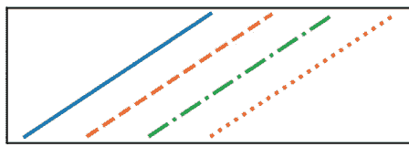

参数。`linestyle`、`marker` 和 `markerfacecolor` 关键字使用特殊的字符串代码来指定线条和标记的类型及格式。线宽、标记大小和标记边缘宽度以点为单位。因此，图 5.1 中第 2-5 行的 `plot` 调用使用了粗虚线和醒目的白色星形标记。虽然此 `plot` 调用未使用此功能，但 `color` 关键字可设置标记和连接线的颜色，除非被其他设置覆盖。

虽然关键字输入参数使代码易于阅读，但 Matplotlib 提供了一种无需使用关键字输入参数即可指定许多格式规范的简写方式。相反，我们将线条颜色和类型以及标记颜色和类型作为字符串形式的第三个位置输入参数来指定，例如：

```
plt.plot([1, 2, 3, 4], [1, 2.1, 1.8, 4.3], 'r*--')
```

请注意，这第三个参数包含了*所有*用于指定线条颜色、线条类型、标记颜色和标记类型的代码。也就是说，所有这些代码都可以在一个字符串中指定。在上面的示例中，标记和连接线的颜色被设置为红色，标记被设置为星形，线型被设置为虚线。然而，标记边缘颜色仍然是默认的黑色。请注意，我们只能以这种方式在 `plot` 中使用第三个位置输入参数，而不能在 `scatter` 中使用。总体而言，`scatter` 在自定义绘图方面的选项比 `plot` 少，因此由于我们可以通过省略标记之间的连接线来使用 `plot` 创建“散点”图，所以 `plot` 通常比 `scatter` 更有用。

表 5.1 和表 5.2 列出了一些基本的线型和标记代码。³ Matplotlib 文档提供了更多关于标记和列表的信息。我们在 www.cambridge.org/core/resources/pythonforscientists/refs/ 的参考文献 31 中提供了关于标记文档的最新链接，在参考文献 30 中提供了关于线型文档的最新链接。表 5.3 列出了一些预设的颜色代码。Matplotlib 文档包含完整的内置颜色代码列表，并描述了访问其他颜色的方法。我们在 www.cambridge.org/core/resources/pythonforscientists/refs/ 的参考文献 24 中提供了此文档的最新链接。

³ 页面 http://matplotlib.sourceforge.net/api/pyplot_api.html（访问于 2012 年 8 月 13 日）是这些表格的参考。有关列出所有线型和标记代码的方法，请参见 http://stackoverflow.com/a/13360032。

## 表 5.2 pyplot 中的一些标记代码及展示这些标记代码生成标记的图示。

| 标记 | 字符串代码 |
|---|---|
| 圆形 | 'o' |
| 菱形 | 'D' |
| 点 | '.' |
| 加号 | '+' |
| 正方形 | 's' |
| 星形 | '*' |
| 上三角形 | '^' |
| X 形 | 'x' |

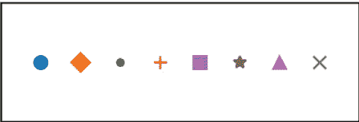

## 表 5.3 pyplot 中的一些颜色代码。

| 颜色 | 字符串代码 |
|---|---|
| 黑色 | 'k' |
| 蓝色 | 'b' |
| 绿色 | 'g' |
| 红色 | 'r' |
| 白色 | 'w' |

#### 标注与调整标签字体大小

我们在第 4.1 节介绍了 `xlabel` 和 `ylabel` 函数，分别用于标注 x 轴和 y 轴。要在绘图顶部放置标题，我们使用 `title` 函数，其基本语法与 `xlabel` 和 `ylabel` 相同。
绘图中的通用标注使用 `text` 函数，其语法为：⁴

```
plt.text(<x-location>, <y-location>, <string to write>)
```

⁴ 对于大多数用户来说，纯文本标注就足够了。然而，许多科学用户也想创建复杂的数学标注。Matplotlib 提供了使用 LaTeX 排版系统渲染文本（包括数学符号和方程式）的能力。使用 LaTeX 超出了本工作的范围。我们在 www.cambridge.org/core/resources/pythonforscientists/refs/ 的参考文献 35 中提供了关于使用 LaTeX 文档的最新链接。

$x$ 和 $y$ 位置默认以数据坐标表示。绘图上的数据坐标 $(x,y)$ 位置以绘图的 $x$ 和 $y$ 值为单位给出。因此，在图 5.1 的 `text` 调用中：

```
plt.text(8.2, 0.2, 'From Experiment 1')
```

文本“From Experiment 1”的位置使得文本框的左侧从一天中的十进制小时值 8.2 开始，文本框的底部位于功率值 0.2 mW 处。
对于这四个函数（`xlabel`、`ylabel`、`title` 和 `text`），字体大小由 `size` 关键字输入参数控制。当设置为浮点数（即带小数点的数字；有关浮点数的更多信息，请参见第 5.2.7 节）时，`size` 以点为单位指定文本的大小。

### 5.2.3 处理多个图形或曲线

Matplotlib 也能处理多个图形或曲线：在单独的窗口中创建多个绘图，或将多条曲线叠加在同一绘图上。在本节中，我们将探讨这两种情况以及如何为包含多条曲线的绘图创建图例。

#### 绘制多个图形

如果我们有多个独立的图形（而不是一个绘图上的多条曲线），我们在调用 `plot` 之前调用 `figure` 函数。前者会相应地创建并标记图形。随后调用该图形的编号会使该图形成为当前图形。例如，考虑以下代码：

```
1 plt.figure(3)
2 plt.plot([9.25, 11, 13.5, 15, 15.75], [2.54, 4.1, 1.21, 3.9, 4],
3          marker='o')
4 plt.figure(4)
5 plt.plot([0.1, 0.2, 0.3, 0.4], [8, -2, 5.3, 4.2], \n6          linestyle='-.')
7 plt.figure(3)
8 plt.title('Power vs. Time')
```

第 1 行创建一个图形并将其命名为“3”。第 2-3 行（我们在第 4.3 节看到，即使没有第 2 行末尾的反斜杠，对于解释器来说也是一条逻辑行）在名为“3”的图形上绘制了一个以圆形为标记的折线图。第 4 行创建一个名为“4”的图形，第 5-6 行在该图形上绘制了一个线型为点划线的折线图。第 7 行使图形“3”再次成为当前绘图，最后一行在图形“3”的绘图中添加了标题。
请注意，上述图形的名称“3”和“4”*不是*绘图的标题，而是窗口的名称。换句话说，它们是许多窗口系统（即计算机操作系统用于渲染其显示的窗口的系统）将用作显示在窗口菜单栏上方名称栏中的标签的名称。正如我们上面的例子所示，最后一个图形中的图形名称和绘图标题完全不同。

在上面的示例中，整数“3”和“4”作为图形的名称传入。字符串也可以作为名称传入，而不是整数。

#### 绘制多条曲线

要在单个绘图上绘制多条曲线，请在不调用 `figure` 的情况下重复调用 `plot`。每次调用的线条将被添加到同一图形中。或者，我们可以为每个绘图提供一组三个位置输入参数（x 位置、y 位置和线条/标记属性），一个接一个地放置。例如，考虑以下代码：

```
plt.plot([0, 1, 2, 3], [1, 2, 3, 4], '--o',
         [1, 3, 5, 9], [8, -2, 5.3, 4.2], '-D')
```

前三个参数指定了第一条曲线的 x 和 y 位置，该曲线将使用虚线和圆形标记进行绘制。接下来的三个参数指定了第二条曲线的 x 和 y 位置，该曲线将使用实线和菱形标记进行绘制。两条曲线将位于同一图形上。

#### 添加图例

要添加图例（使用默认设置），我们在绘图后调用 `legend` 函数（不带参数）。然而，当我们绘制每条曲线时，我们必须将 `label` 关键字输入参数设置为该曲线在图例中应显示的文本。例如：

```
plt.plot([0, 4, 7, 8], [1, 2, 3, 4], 'r--o', label="Sensor 1")
plt.plot([1, 3, 5, 9], [8, -2, 5.3, 4.2], 'b-D', label="Sensor 2")
plt.legend()
```

生成图 5.5 中的绘图。请注意，`plot` 调用中的 'r' 和 'b' 字符串分别生成红色和蓝色的线条/标记。有关图例的更多信息，请参见 Matplotlib 关于 `legend` 命令和图例指南教程的文档。我们在 www.cambridge.org/core/resources/pythonforscientists/refs/ 的参考文献 33 和 29 中分别提供了这些资源的最新链接。不过，这些文档并不简单，因此在积累更多 Python 经验后阅读它们可能会更有收获。

有关在单个图形上创建多个绘图或面板的相关但不同的情况，请参见第 8.2.5 节和第 14.2.1 节。

### 5.2.4 调整绘图大小

调整绘图大小的一种方法是在 `figure` 命令中设置 `figsize` 和 `dpi` 关键字输入参数。⁵ 例如，此 `figure` 调用：

```
plt.figure(1, figsize=(3,1), dpi=300)
```

⁵ http://stackoverflow.com/a/638443（访问于 2012 年 8 月 13 日）。

## 5 自定义线条与散点图

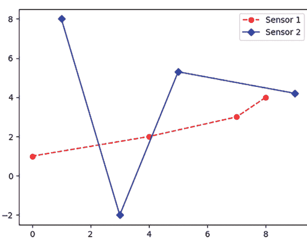

在调用 `plot` 命令之前设置此参数，将使名为“1”的图形宽度为3英寸，高度为1英寸，分辨率为300 **点每英寸 (dpi)**。以300 dpi打印时，字母和线条的边缘看起来相当平滑。截至本书撰写时，大多数激光打印机的默认分辨率为600 dpi。`figsize` 关键字参数被设置为一个包含两个元素的元组。

### 5.2.5 将图形保存到文件

要将绘图输出到文件，我们可以使用 `savefig` 函数。例如，要将当前图形以300 dpi的分辨率写入名为 `testplot.png` 的PNG文件，请输入：

```python
plt.savefig('testplot.png', dpi=300)
```

Python会根据文件名后缀（最右侧句点后的字母）知道将文件保存为PNG格式。

在上面的调用中，输出分辨率是通过可选的 `dpi` 关键字输入参数指定的。如果省略，将使用Matplotlib的默认分辨率。仅仅在 `figure` 命令中设置 `dpi` 并不足以获得特定分辨率的输出文件。`figure` 中的 `dpi` 设置将控制 `show` 显示时的分辨率，而 `savefig` 中的 `dpi` 设置将控制输出文件的分辨率。然而，`figure` 中的 `figsize` 参数同时控制 `show` 和 `savefig` 的图形大小。

我们也可以使用图形用户界面（GUI）的 `Save` 按钮将图形保存到文件，该按钮是执行 `show` 函数时屏幕上显示的绘图窗口的一部分。如果我们使用 `Save` 按钮保存绘图，它将以默认分辨率保存，即使我们在 `figure` 命令中指定了不同的分辨率。请使用 `savefig` 以特定分辨率写出文件。

### 5.2.6 数组计算简介

在图5.3的第2-4行中，我们提供了以下代码行（为方便起见，此处重新列出）：

```python
1 import numpy as np
2 ydata = np.array([2.54, 4.1, 1.21, 3.9, 4])
3 ydata_dev = ydata - np.mean(ydata)
```

上述代码片段中的变量 `ydata` 是一种新的项目集合——数组的示例。使用 `ydata` 来计算 `ydata_dev` 是**数组语法**的一个例子，它使我们能够对一组数字中的全部或部分元素进行计算。

与列表类似，数组是元素的集合。我们也可以将数组想象成一排小隔间或邮政信箱，其中数组的每个元素都是一个隔间或信箱，可以容纳某些东西（通常是一个值）。我们可以使用NumPy函数 `array` 从列表创建数组。因此，`ydata` 是一个数组，而 `array` 函数调用中的参数是一个列表。

与列表类似，我们使用数组索引来引用数组中的元素。数组的第一个元素索引为0，第二个元素索引为1，依此类推。我们也可以使用负索引从末尾开始索引数组，其中数组的最后一个元素索引为-1，倒数第二个元素索引为-2，依此类推。在上面的数组 `ydata` 中，以下代码：

```python
In [1]: print(ydata[0])

2.54

In [2]: print(ydata[1])

4.1

In [3]: print(ydata[-1])

4.0

In [4]: print(ydata[-2])

3.9
```

打印出数组 `ydata` 中的第一个、第二个、最后一个和倒数第二个元素。

数组也使用列表的切片表示法从现有数组中提取子数组。因此：

```python
In [1]: ydata_sub = ydata[0:3]
        print(ydata_sub)

[ 2.54  4.1   1.21]
```

打印出 `ydata` 的前三个元素。在数组切片中，冒号左侧的索引定义了范围的下限（*包含*），而冒号右侧的索引定义了范围的上限（*不包含*）。因此，在上面的 `ydata[0:3]` 示例中，切片从索引0的元素（即2.54）开始，但结束于索引2的元素（即1.21）。范围的上限是索引3，不包含，因此范围内的最后一个索引是索引2的元素，它比索引3的元素少一个。

数组切片遵循第4.2.2节中给出的所有其他列表切片规则，如以下示例所示：

```python
In [1]: import numpy as np
        ydata = np.array([2.54, 4.1, 1.21, 3.9, 4.0])
        print(ydata[0:-1])

[ 2.54  4.1   1.21  3.9 ]
```

```python
In [2]: print(ydata[-3:])

[ 1.21  3.9   4.   ]
```

```python
In [3]: print(ydata[:4])

[ 2.54  4.1   1.21  3.9 ]
```

在 `In [1]` 的第三行中，我们选择了除最后一个元素外的所有元素，因为 `-1` 上限是不包含的，因为它在冒号的右侧。在单元格 `In [2]` 中，我们从 `-3` 索引（即倒数第二个元素）开始，切片到数组的末尾，因为切片中冒号右侧没有索引。在单元格 `In [3]` 中，我们从数组的开头开始，结束于索引3的元素，因为 `4` 索引是不包含的。冒号左侧缺少索引告诉我们切片要一直进行到数组的开头。

我们还可以使用切片表示法一次为数组中的多个值赋值。考虑以下对数组 `zdata` 进行操作的代码：

```python
In [1]: import numpy as np
        zdata = np.array([0.43, 8.4, 2.1, 3.4, 5.9])
        zdata[0:3] = zdata[2:]
        print(zdata)

[2.1 3.4 5.9 3.4 5.9]
```

在 `In [1]` 的第三行中，我们首先处理右侧，提取 `zdata` 的最后三个元素。然后，我们执行左侧，将这三个元素分别赋值给 `zdata` 数组的前三个位置。在 `In [1]` 的第三行中，等号左右两侧表达式中对应的元素被赋值给左侧。

那么，如果数组与列表如此相似，使用数组的意义何在？这里有三个原因（本书后面还会描述更多原因）。首先，数组的操作通常比列表的操作执行得更快。这是因为对于数组，数组的每个元素必须是相同*类型*的值。在第5.2.7节中，我们将更精确地描述这一点，并看到在编程语言中，值的“类型”由其**类型**描述。对于列表，尽管我们目前看到的所有列表都包含数字，但我们将在第9.2.3节中发现，任何给定的列表都可以包含数字、单词甚至其他列表。列表中的元素可以容纳不同类型的值，而这种灵活性会带来性能上的代价。数组执行得更快还因为一旦我们创建了数组，其大小就不能改变。另一方面，列表可以在程序执行过程中增长和缩小。数组具有固定大小和单一元素类型的要求使得它们能够被更高效地操作。

使用数组而不是列表的第二个原因是，数组提供了大量操作数组中值的方法。一种方法是通过各种函数。例如，NumPy包中的 `sum` 函数将对传入函数的数组中的所有元素求和：

```python
In [1]: import numpy as np
       ydata = np.array([2.54, 4.1, 1.21, 3.9, 4])
       total = np.sum(ydata)
       print(total)

15.75
```

而NumPy函数 `size` 将告诉我们数组中有多少个元素：

```python
In [1]: import numpy as np
       ydata = np.array([2.54, 4.1, 1.21, 3.9, 4])
       num_elements = np.size(ydata)
       print(num_elements)

5
```

第6.2.2节描述了更多作用于NumPy数组的函数以及这些函数的不同行为方式。第12.2.7节提供了一个关于NumPy数组函数的简要总结表。

我们操作数组元素的第二种方法是通过数组语法。数组语法意味着对于某些操作（或函数，我们将在第6.2.2节中探讨），使用数组时，操作将逐元素执行（即，对每个元素单独执行）。例如，在以下代码中：

```python
import numpy as np
data1 = np.array([1.2, 3.4, -2.1, 0.8])
data2 = np.array([9.1, 0.2, 0.1, -1.0])
data3 = data1 + data2
```

`data1` 和 `data2` 的每个对应元素被相加并放入数组 `data3` 中。`data3` 数组与 `data1` 和 `data2` 具有相同的大小。因此，`data1` 中的1.2与 `data2` 中的9.1相加得到 `data3` 的第一个元素，其值为10.3。`data1` 和 `data2` 中索引为1的元素相加得到 `data3` 中索引为1的元素，依此类推。因此，打印 `data3` 得到：

```python
In [1]: print(data3)

[ 10.3  3.6 -2. -0.2]
```

为了使此操作有效，`data1` 和 `data2` 必须具有相同的大小。否则，Python将不知道如何匹配对应元素进行操作。当本书后面我们研究多维数组（如当前情况）的数组语法时，将会有额外的约束。

如果我们向数组添加一个**标量**值（即一个普通数字），例如：

```python
import numpy as np
data1 = np.array([1.2, 3.4, -2.1, 0.8])
data_value = 0.1
data4 = data1 + data_value
```

标量值将独立地添加到 `data1` 的每个元素中，结果是一个与 `data1` 大小相同的数组 `data4`，其值如下：

```python
In [1]: print(data4)

[ 1.3  3.5 -2.  0.9]
```

所有算术运算符（+、-、*、/ 和 **）都以我们刚才看到的加法方式对数组进行逐元素操作。因此，只需很少的代码行，我们就可以对大量值计算复杂的表达式。例如，如果我们有一个包含四个速度向量x分量的数组 `vx` 和一个包含这些向量y分量的数组 `vy`：

```python
import numpy as np
vx = np.array([ 0.2, 1.4, -1.9, 7.8])
vy = np.array([-0.3, 2.1, 3.2, 1.7])
```

我们可以只用一行代码计算所有四个向量的大小，并将结果存储在数组 `magnitudes` 中：

### 5.2.7 类型的概念

这里的“类型”并非指在键盘上敲击字母，而是指某种事物的“种类”或“类别”。在编程中，类型指的是一个值（或被赋值的变量）必须具备的特定特征。这些特征限制了该类型可以被赋予的值的种类、值在内存中的存储方式、值的操作方式等。

内置函数 `type` 会告诉我们变量或值的类型：

```
In [1]: import numpy as np
        a = 4
        type(a)

Out[1]: int

In [2]: type(2.3)

Out[2]: float

In [3]: b = np.array([1.2, 3.1, -4.5])
        type(b)

Out[3]: numpy.ndarray
```

单元格 In [1] 中的变量 `a` 是一个 `int` 或整数变量。相比之下，值 2.3（In [2]）是一个 `float` 或浮点值（大致上是一个小数值）。单元格 In [3] 中的变量 `b` 是一个 NumPy 数组，`type` 函数告诉我们 NumPy 数组的官方类型是 `numpy.ndarray`。

## 5 自定义线图和散点图

变量 `a` 和 `b` 由于类型不同，具有不同的限制和能力。因为变量 `a` 的类型是 `int`，我们知道它的值是正整数、负整数或零，并且可以在通常为整数值定义的表达式中使用该变量（例如算术运算）。因为变量 `b` 的类型是 `numpy.ndarray`，我们可以对 NumPy 数组执行的所有操作都适用于该变量。

Python 的一个特殊之处在于它是一种**动态类型**语言，这意味着变量的类型可以随时间改变。在 Python 中，变量的类型会自动设置为赋值号右侧给定值的类型。因此，如下所示：

```
In [1]: import numpy as np
        a = 4
        type(a)

Out[1]: int

In [2]: a = 2.3
        type(a)

Out[2]: float

In [3]: a = np.array([1.2, 3.1, -4.5])
        type(a)

Out[3]: numpy.ndarray
```

变量 `a` 被赋予的值发生了变化，当它变化时，变量 `a` 的类型也随之改变（正如我们在每次为 `a` 重新赋值后调用 `type` 函数所看到的）。

相比之下，在 Java、C++、Fortran 等语言中，变量是**静态类型**的。在这些语言中，当我们创建（或“声明”）一个变量时，我们会给它一个类型。该类型在变量的生命周期内不能改变。稍后，我们将描述动态类型在 Python 中赋予我们的一些能力。

有许多内置函数可以让我们将一种类型的值或变量转换为另一种类型。例如，`int` 函数将值转换为 `int` 类型的值（即整数），`float` 函数将值转换为 `float` 类型的值（即浮点数或小数），而 `str` 函数将值转换为字符串：

```
In [1]: a = 4
        type(a)

Out[1]: int

In [2]: b = float(a)
        print(b)
Out[2]: 4.0

In [3]: type(b)
Out[3]: float

In [4]: c = int(b)
        print(c)
Out[4]: 4

In [5]: type(c)
Out[5]: int

In [6]: d = str(c)
        print(d)
Out[6]: 4

In [7]: type(d)
Out[7]: str
```

虽然打印变量 c 和 d 似乎表明它们具有相同的值，但正如 type 函数的调用所示，这些值是完全不同的类型。对于变量 d，4 是数字的字符串表示，而不是整数值。如果我们尝试对变量 c 和 d 执行以下操作（在连续的 Jupyter notebook 单元格中），我们可以看到这一点的影响：⁶

```
In [8]: print(c + 10)
        14

In [9]: print(d + 10)
        TypeError    Traceback (most recent call last)
        <ipython-input-5-261d43c710bf> in <module>()
        ----> 1 print(d + 10)
        TypeError: must be str, not int
```

⁶ 输出的错误消息已为清晰起见进行了编辑。

```
In[10]: print(c + " organisms")

TypeError Traceback (most recent call last)
<ipython-input-3-1f551119eb43> in <module>()
----> 1 print(c + " organisms")

TypeError: unsupported operand type(s) for +: 'int' and 'str'

In[11]: print(d + " organisms")

4 organisms
```

在单元格 In [8] 中，加法运算符进行算术运算，结果是整数 4 加上整数 10。在单元格 In [9] 中对变量 d 执行相同的操作会导致错误。同样，在单元格 In [10] 中，我们不能将整数变量 c 与字符串 " organisms" 连接，但我们可以对变量 d 这样做（In [11]）。

我们不能使用这些内置函数将浮点值数组转换为整数数组，或将字符串数组转换为浮点值数组。第 9.2.2 节描述了如何使用 NumPy 数组进行此类转换。在该节中，我们还将更深入地探讨整数和浮点类型的含义。

## 5.3 试一试！

我们从类似于第 5.1 节中见过的绘图示例开始。随后是针对第 5.2 节主要主题的示例。我们练习创建更多自定义线图并使用关键字输入参数。我们还练习访问数组中的元素和元素范围，并使用数组语法对一组值进行计算。

### 试一试！5-1 自定义线图：小鼠迷宫

考虑一个虚构的实验，给小鼠服用一定剂量的药物，然后将它们放入一个必须完成的迷宫中。以下数据显示了给小鼠的药物剂量以及小鼠完成迷宫所需的时间。

| 剂量 (mg) | 完成迷宫的时间 (s) |
|---|---|
| 0.0 | 105 |
| 0.08 | 98 |
| 0.2 | 54 |
| 0.37 | 50 |
| 0.6 | 65 |
| 0.84 | 81 |
| 1.02 | 182 |
| 1.2 | 210 |

创建一个线图，y 轴为完成迷宫的时间，x 轴为剂量。使线条和标记显著增大，并使 x 轴和 y 轴的范围都从零开始，到各自轴的最大值结束。在图形框中添加文本，将图形标记为“临时”。将图形以 300 dpi 的分辨率写入文件 mazetimes.png。请为坐标轴添加适当的标签。

### 试一试！答案 5-1

以下代码将解决问题：

```
import matplotlib.pyplot as plt
import numpy as np

xdata = [0.0, 0.08, 0.2, 0.37, 0.6, 0.84, 1.02, 1.2]
ydata = [105, 98, 54, 50, 65, 81, 182, 210]
plt.plot(xdata, ydata, linewidth=5.0, marker='o', markersize=15.0)
plt.axis([0, np.max(xdata), 0, np.max(ydata)])
plt.xlabel('Dosage (mg)')
plt.ylabel('Time to Complete Maze (sec)')
plt.text(0.1, 10, 'Provisional')
plt.savefig('mazetimes.png', dpi=300)
```

上述代码生成的图形如图 5.6 所示。

在解决方案中，我们使用了默认颜色和线型。在第 7 行，我们使用 NumPy max 函数调用的返回值作为传递给 pyplot axis 命令的列表中的值。最后，在第 10 行，放置“临时”文本的坐标是数据坐标。在第 14.2.1 节中，我们将介绍 Matplotlib 的对象接口，并描述指定文本位置的其他方法。

### 试一试！5-2 带关键字的函数：小鼠迷宫

考虑试一试！5-1 中描述的虚构小鼠迷宫实验，其中小鼠被给予一定剂量的药物，并被放置在一个必须完成的迷宫中。

编写一个函数，创建一个类似于试一试！5-1 的图形，但在调用函数时允许传入关键字值以控制线宽、标记大小和文件名。也就是说，如果函数名为 `plot_maze_times`，并且使用以下输入值调用该函数：

```
plot_maze_times(xdata, ydata, linewidth=2.0, markersize=10.0,
                filename='temp1.png')
```

它将生成图 5.7 中的图形，并将其命名为 `temp1.png`。然而，这个调用：

```
plot_maze_times(xdata, ydata, linewidth=10.0, markersize=30.0,
                filename='temp2.png')
```

将生成图 5.8 中的图形，并将其命名为 `temp2.png`。在这两次调用中，`xdata` 和 `ydata` 分别是试一试！5-1 表格中定义的剂量和迷宫完成时间的列表。

### 试一试！答案 5-2

以下代码将解决问题：

```
import matplotlib.pyplot as plt
import numpy as np

def plot_maze_times(xdata, ydata, linewidth=1.0, markersize=3.0,
                    filename='default.png'):
    plt.figure()
    plt.plot(xdata, ydata, linewidth=linewidth, marker='o',
             markersize=markersize)
    plt.axis([0, np.max(xdata), 0, np.max(ydata)])
    plt.xlabel('Dosage (mg)')
    plt.ylabel('Time to Complete Maze (sec)')
    plt.text(0.1, 10, 'Provisional')
    plt.savefig(filename, dpi=300)
```

# 5 自定义折线图与散点图

需要注意以下几点：

-   如果我们尚未导入所需的包，则需要进行导入（第1行和第2行）。如果 `plt` 和 `np` 已经定义，则无需再次导入。
-   函数体必须缩进四个空格。
-   当我们有太长的代码行，但该行由一系列项目组成（用逗号分隔，如第4、5、7、8行所示）时，我们可以将该行延续到多行，而无需使用行延续符。请参阅“动手试试！4-1”解决方案中的讨论。
-   不带任何参数调用 pyplot 的 `figure` 命令将创建另一个独立的空白图形。这可以防止后续的绘图命令被应用到现有的 Matplotlib 图形上。
-   最后，`linewidth`、`markersize` 和 `filename` 关键字的默认值（如第4、5行所示）意味着，如果调用 `plot_maze_times` 时未指定任何关键字输入参数，将生成一个线宽为1点、标记大小为3点、文件名为 `default.png` 的图形。因此，这是对 `plot_maze_times` 的完全正确使用：

```
xdata = [0.0, 0.08, 0.2, 0.37, 0.6, 0.84, 1.02, 1.2]
ydata = [105, 98, 54, 50, 65, 81, 182, 210]
plot_maze_times(xdata, ydata)
```

### 动手试试！5-3 多条曲线：气体性质

假设我们正在进行一个实验，将4摩尔气体压缩到越来越小的体积中，并在改变体积时测量气体的压力。假设我们压缩气体的速度非常慢，以至于温度保持不变。我们在此实验中获得了以下测量数据：

| 体积 (m³) | 压力 (Pa) |
|---|---|
| 0.50 | 19 822 |
| 0.45 | 22 024 |
| 0.40 | 24 777 |
| 0.35 | 28 317 |
| 0.30 | 33 036 |
| 0.25 | 39 643 |

后来，我们重新运行相同的实验，但使用8摩尔相同的气体代替4摩尔。对于8摩尔的情况，我们获得了以下数据：

| 体积 (m³) | 压力 (Pa) |
|---|---|
| 0.50 | 39 643 |
| 0.45 | 44 048 |
| 0.40 | 49 554 |
| 0.35 | 56 633 |
| 0.30 | 66 072 |
| 0.25 | 79 286 |

创建一个压力（y轴）对体积（x轴）的图，将4摩尔和8摩尔情况的数据叠加显示。适当格式化图形，但确保连接点的线宽为3点，标记大小为6点。使x轴刻度标记每隔0.1 m³一个，并在左下角以9号字体包含一条文本消息，给出实验者的姓名。包含图例。将图形保存到文件 *gas-properties.png*。记住要使两条曲线彼此可区分。

### 动手试试！答案 5-3

此代码创建了所要求的图形：

```
import matplotlib.pyplot as plt
volume = [0.5, 0.45, 0.4, 0.35, 0.3, 0.25]
pressure_4mol = [19822, 22024, 24777, 28317, 33036, 39643]
pressure_8mol = [39643, 44048, 49554, 56633, 66072, 79286]
plt.plot(volume, pressure_4mol, 'D-r', label='4 mol',
         linewidth=3.0, markersize=6.0)
plt.plot(volume, pressure_8mol, 'o--b', label='8 mol',
         linewidth=3.0, markersize=6.0)
plt.xticks([0.5, 0.4, 0.3, 0.2])
plt.text(0.21, 20000, 'Jill Smith', size=9)
plt.xlabel('Volume (cubic meters)')
plt.ylabel('Pressure (Pa)')
plt.title('Pressure vs. Volume')
plt.legend()
plt.savefig('gas-properties.png', dpi=300)
```

此代码使用了两个连续的 `plot` 调用（第5-8行），将两条曲线放在同一个图形上。对于4摩尔的情况（第5行），线/标记格式化参数 `'D-r'` 选择菱形标记和实线红色线。对于8摩尔的情况（第7行），线/标记格式化参数 `'o--b'` 选择圆形标记和虚线蓝色线。我们可以将第三个位置输入参数（第5行的 `'D-r'` 和第7行的 `'o--b'`）用于指定标记样式、线型和颜色，与关键字输入参数（第6行和第8行）用于指定线宽和标记大小相结合使用。`xticks` 函数也适用于点值递减的情况。图5.9显示了由上述代码生成的图形。

### 动手试试！5-4 数组索引与切片：跳伞者

考虑以下虚构的跳伞者在时间 $t = 0$ s 时从飞机上跳下的速度值。记住，跳伞者会感受到空气阻力。所有速度值均为正，表示向下。注意时间值是不规则采样的。

| 时间 (s) | 速度 (m/s) |
|---|---|
| 0 | 0 |
| 0.1 | 0.98 |
| 0.5 | 4.89 |
| 1.3 | 12.49 |
| 1.8 | 16.95 |
| 1.9 | 17.81 |
| 2.1 | 19.49 |
| 2.3 | 21.11 |
| 2.5 | 22.68 |
| 2.8 | 24.91 |
| 2.9 | 25.63 |
| 3.3 | 28.33 |

根据这些值，使用Python完成以下子任务：

1.  创建两个数组，`time` 和 `velocity`。
2.  将 $t = 1.3$ s 和 $t = 2.5$ s 时的速度值打印到屏幕上。
3.  仅使用 $t = 0$、$t = 2.1$ 和 $t = 3.3$ s 时的速度，平均速度是多少？
4.  计算第一个和最后一个速度值之间经过的总秒数。我们通过观察知道答案是3.3秒，但请提供基于之前创建的两个数组进行计算的Python代码。
5.  创建一个仅包含前五个速度值的数组。
6.  创建一个仅包含最后五个时间值的数组。
7.  创建一个仅包含从 $t = 1.8$ 到 $t = 2.8$ s（包含两端）的速度值的数组。

### 动手试试！答案 5-4

1.  以下代码行将完成这些任务：

```
import numpy as np
time = np.array([0, 0.1, 0.5, 1.3, 1.8, 1.9,
                 2.1, 2.3, 2.5, 2.8, 2.9, 3.3])
velocity = np.array([0, 0.98, 4.89, 12.49, 16.95, 17.81,
                     19.49, 21.11, 22.68, 24.91, 25.63, 28.33])
```

2.  执行以下代码行：

```
print(velocity[3])
print(velocity[8])
```

数组的第一个元素索引为零，每个后续元素的索引值增加一。

3.  `(velocity[0] + velocity[6] + velocity[11]) / 3.0`
我们可以使用 `velocity[-1]` 代替 `velocity[11]`，因为我们可以使用负索引从数组末尾引用（其中索引值 -1 是数组的最后一个元素）。

4.  `time[-1] - time[0]`

5.  `subset_velocity = velocity[:5]`

6.  `subset_time = velocity[-5:]`

7.  `subset_velocity = velocity[4:10]`

### 动手试试！5-5 数组语法：跳伞者

考虑“动手试试！5-4”中的数据以及在该“动手试试！”中创建的数组 `time` 和 `velocity`。使用这些数组，使用数组语法进行以下计算。

1.  速度值以英尺每秒而不是米每秒表示是多少？1米大约等于3.28英尺。
2.  创建一个数组 `time_diff`，给出从每个时间到下一个时间的时间变化。也就是说，`time_diff` 的第一个值是 `time` 的第二个值减去第一个值，`time_diff` 的第二个值是 `time` 的第三个值减去第二个值，依此类推。
3.  `time_diff` 相对于 `time` 中的元素数量有多少个元素？为什么？
4.  创建一个数组 `velocity_diff`，给出从每个时间到下一个时间的速度变化。
5.  创建一个数组 `accel`，近似表示从一个时间到下一个时间的速度变化率，即在每个时间值处。也就是说，`accel` 的第一个值是 `velocity` 从第一个到第二个元素除以 `time` 从第一个到第二个元素的变化，依此类推。

### 动手试试！答案 5-5

1.  `velocity_fps = velocity * 3.28`
我们得到以下 `velocity_fps` 值：

```
array([ 0.    ,  3.2144, 16.0392, 40.9672, 55.596 , 58.4168,
       63.9272, 69.2408, 74.3904, 81.7048, 84.0664, 92.9224])
```

使用数组语法，当NumPy数组乘以单个值（即标量值）时，Python会遍历并对每个元素执行乘法。上述代码的结果是一个与 `velocity` 大小和形状相同的数组。

2.  `time_diff = time[1:] - time[:-1]`
数组 `time_diff` 是：

```
array([0.1, 0.4, 0.8, 0.5, 0.1, 0.2,
       0.2, 0.2, 0.3, 0.1, 0.4])
```

为了使整行适合页面，上述屏幕输出中添加了回车符和空格。在此“动手试试！”中，后续的输出显示也进行了类似的重新格式化。所有数组仍然是单个值序列的数组。
变量 `time_diff` 是一个数组减去另一个数组的结果。也就是说，`time[1:]` 是数组：

```
array([0.1, 0.5, 1.3, 1.8, 1.9, 2.1,
       2.3, 2.5, 2.8, 2.9, 3.3])
```

当 `time[:-1]` 是这个数组时：

```
array([ 0. ,  0.1,  0.5,  1.3,  1.8,  1.9,
       2.1,  2.3,  2.5,  2.8,  2.9])
```

当我们用前一个数组减去后一个数组时，减法是逐元素进行的，因此 `time_diff` 的第一个元素是 0.1 - 0，第二个元素是 0.5 - 0.1，依此类推。

切片 `time[:-1]` 不包含 `time` 的最后一个元素，因为当我们对 NumPy 数组进行切片时，上限（冒号右侧的索引）是排他的（即不包含在结果切片中）。由于 -1 元素指代 `time` 的最后一个元素，`time[:-1]` 将不会包含它。有关在索引偏移操作中使用数组切片的更多信息（包括上述切片类型的图示），请参见第 12.2.5 节。

3. 数组 `time_diff` 比数组 `time` 少一个元素。这是因为 `time` 中的最后一个元素没有更晚的时间点来计算差值。

4. `velocity_diff = velocity[1:] - velocity[:-1]`
   这与我们计算 `time_diff` 的方式相同，只是我们使用的是 `velocity` 数组而不是 `time` 数组。

```
array([ 0.98,  3.91,  7.6 ,  4.46,  0.86,  1.68,
       1.62,  1.57,  2.23,  0.72,  2.7 ])
```

5. `accel = velocity_diff / time_diff`
   以下是 `accel` 的内容：

```
array([ 9.8       ,  9.775     ,  9.5       ,
       8.92      ,  8.6       ,  8.4       ,
       8.1       ,  7.85      ,  7.43333333,
       7.2       ,  6.75      ])
```

同样，`velocity_diff` 和 `time_diff` 都是数组，因此除法是逐元素进行的，并将结果放入数组 `accel` 中。

### 动手试试！5-6 使用多种数据类型绘图：跳伞者

考虑来自“动手试试！5-4”的数据以及在该练习中从这些数据生成的数组 `time` 和 `velocity`。使用这些数组，绘制速度随时间变化的图。适当地标注坐标轴，并在标题中写入正在绘制的数据点数量。在创建标题时，不要手动输入 12 来表示有 12 个数据点。让 Python 使用数组来创建标题。提示：如果数字要与其他文本连接，需要将其转换为字符串。

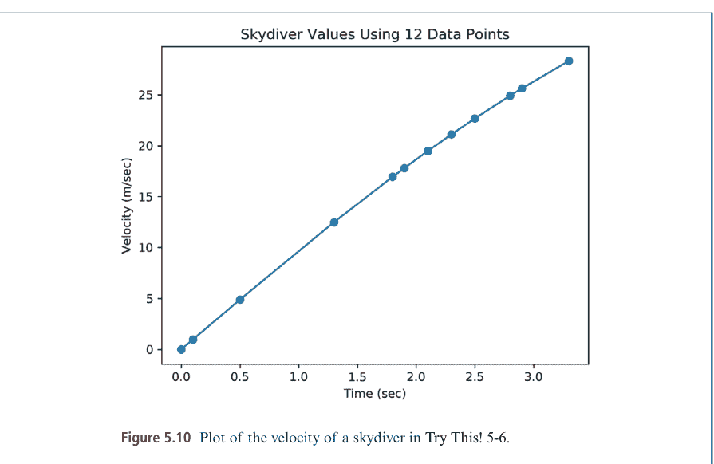

图 5.10 “动手试试！5-6”中跳伞者的速度图。

### 动手试试！答案 5-6

以下代码将完成所需任务，生成如图 5.10 所示的图表：

```python
import matplotlib.pyplot as plt
import numpy as np
time = np.array([0, 0.1, 0.5, 1.3, 1.8, 1.9,
                  2.1, 2.3, 2.5, 2.8, 2.9, 3.3])
velocity = np.array([0, 0.98, 4.89, 12.49, 16.95, 17.81,
                     19.49, 21.11, 22.68, 24.91, 25.63, 28.33])
plt.plot(time, velocity, marker='o')
plt.xlabel('Time (sec)')
plt.ylabel('Velocity (m/sec)')
title = 'Skydiver Values Using ' + str(np.size(time)) + ' Data Points'
plt.title(title)
```

之后，我们可以使用 pyplot 的 `show` 在屏幕上渲染图表，或使用 `savefig` 将图表保存为图像文件。

这个“动手试试！”中涉及类型转换的部分是第 10-11 行。在那里，我们创建了一个字符串变量 `title`，其中包含图表的标题，并在第 12 行将其传递给 pyplot 的 `title` 函数。在第 10 行，我们使用 NumPy 的 `size` 函数获取数据点的数量。然而，这给我们的是一个整数。我们需要使用 `str` 函数将其转换为字符串。

## 5.4 更多学科特定实践

本章的学科特定 Jupyter 笔记本涵盖以下主题：

-   函数的可选输入。
-   自定义图表。调整线条属性、标记属性、坐标轴属性、标签。
-   创建多个图形和曲线。
-   使用数组语法进行数组计算。
-   数组元素切片以及使用正负范围。
-   处理类型。

## 5.5 章节复习

### 5.5.1 自测题

尝试在不查看本书或任何其他资源，也不使用 Python 解释器的情况下完成这些题目。这些自测题的答案可在本章末尾找到。

### 自测题 5-1

定义一个关键字输入参数。它与位置输入参数有何不同？关键字输入参数用于什么？

### 自测题 5-2

假设我们有以下函数 `def` 行（函数体省略）：

```
def process_data(a, b, c, size=4, label=''):
    ...
```

如果函数按如下方式调用，函数体中变量 `a`、`b`、`c`、`size` 和 `label` 的值将是什么？假设每个代码片段在单独的 Python 会话中执行：

1.  `process_data(3, 6, -1)`
2.  以下代码序列：

```python
x = 4
y = 2
z = -3
process_data(x, y, z)
```

3.  以下代码序列：

```python
x = 4
y = 2
z = -3
process_data(z, x, 9, size=z)
```

4.  `process_data(3, 6, -1, label='Test 1')`

### 自测题 5-3

描述以下 pyplot 函数或参数的作用：

1.  axis
2.  marker
3.  xticks
4.  text
5.  linestyle

### 自测题 5-4

以下字符串标记/线条规范代码定义了什么？

1.  'o-b'
2.  'D'
3.  '*-.g'
4.  '-'

### 自测题 5-5

描述运行以下代码将产生的图表：

```python
import matplotlib.pyplot as plt
plt.figure('Chemical 1')
plt.plot(data1, data2)
plt.figure('Chemical 2')
plt.plot(data3, data4)
plt.figure('Chemical 1')
plt.xlabel('Time (sec)')
plt.show()
```

### 自测题 5-6

什么命令可以将图表保存到文件？我们如何指定保存图表时使用的文件格式？

### 自测题 5-7

假设我们有一个名为 `data` 的包含 1000 个数字的列表。我们如何：

1.  创建 `data` 的数组版本 `data_array`？
2.  计算数组中所有元素的总和？
3.  计算数组中所有元素的平均值？
4.  计算数组中每个元素与数组第一个元素之间的差值？

假设 `import numpy as np` 已经执行。

### 自测题 5-8

考虑自测题 5-7 中的 1000 元素数组 `data_array`：

1.  创建子数组 `first_ten`，其中包含 `data_array` 的前 10 个元素。
2.  创建子数组 `last_five`，其中包含 `data_array` 的最后五个元素。
3.  创建子数组 `from_interior`，其中包含 `data_array` 的第 301 个到第 412 个元素。

假设 `import numpy as np` 已经执行。

### 自测题 5-9

假设每一行依次执行，执行每一行后数据的类型是什么？

```python
import numpy as np
data = [2, 4, -1, 7]
data = np.array(data)
data = data[1]
```

### 5.5.2 章节总结

在 Matplotlib 中，我们可以做很多事情来让图表看起来符合我们的要求。在研究如何自定义线条图和散点图时，我们涵盖了以下主题：

-   函数的可选输入
    -   关键字输入参数用于在调用函数时向函数传递可选值。
    -   关键字输入参数在函数的调用行中通过指定关键字、等号和参数要设置的值来指定。然后，该值将在函数中每次出现具有该关键字名称的变量时使用（除非该变量在函数体中被重新定义）。
    -   关键字输入参数通常在函数的 `def` 定义中被赋予默认值。如果在调用函数时未包含该参数，则在执行函数中的行时将使用默认值。
    -   函数可以同时具有位置输入参数和关键字输入参数。

-   自定义图表外观
    -   `axis` 命令使我们能够调整图表的两个坐标轴范围。
    -   `xticks` 和 `yticks` 命令分别控制沿 x 轴和 y 轴绘制刻度线和标签的位置。
    -   线条和标记格式可以通过作为第三个位置输入参数传递给 `plot` 的字符串代码来控制。这不适用于 `scatter`。
    -   `plot` 中存在许多关键字输入参数，使我们能够自定义图表的各个特征。这些关键字包括：`linestyle`、`linewidth`、`marker`、`markeredgewidth`、`markerfacecolor`、`markersize` 等。
    -   `text` 命令可以在图表上任意位置放置文本。默认情况下，该命令将文本放置在数据坐标给出的位置。

-   多个图形和曲线
    -   多次调用 `figure` 命令（使用空参数列表或向调用传递唯一名称）使我们能够在单个 Python 会话中创建多个图表。
    -   所有 pyplot 命令都影响当前图形，即在最后一次 `figure` 调用中指定的图形。要在不同图形之间切换，请调用 `figure` 并将感兴趣的图形名称作为输入参数传递，以使该图形成为当前图形。
    -   要在单个图形上绘制多条曲线，请进行多次 `plot` 调用（或单次 `plot` 调用），并在调用行中依次给出各种 x 和 y 数据值集。
    -   图例使用 `legend` 命令添加。图例中使用的标签通过在 `plot` 调用中传递的关键字输入参数 `label` 设置。

-   整个图表操作
    -   整个图表的大小可以在 `figure` 调用中通过 `figsize` 关键字输入参数设置。
    -   要将图表保存到文件，请使用 `savefig` 命令。通常，`savefig` 会根据传递给 `savefig` 的文件名后缀推断输出文件应使用的文件格式。`dpi` 关键字输入参数设置通过调用 `savefig` 写出的图表的分辨率。

-   使用数组语法进行数组计算的介绍
    -   数组类似于列表，只是数组的每个元素都具有相同的类型。
    -   NumPy 的 `array` 函数从值列表创建数组。

- 数组的第一个元素的索引值为0。数组的最后一个元素的索引值等于元素总数减1。数组元素也可以从末尾开始索引（最后一个元素的索引为-1），就像列表一样。
- 与列表类似，数组可以切片为子数组。切片的范围通过指定下界索引、冒号和上界索引来给出。给出的下界是包含的，给出的上界是不包含的。
- `size`函数返回数组中元素的数量。其他NumPy函数也对数组进行操作。
- 当在计算（如加法、乘法等）中使用数组时，操作是逐元素进行的，在表达式中数组的对应元素之间进行。表达式中的数组必须大小相同，并返回一个与表达式中数组大小相同的数组。这被称为数组语法。当本书后面我们研究多维数组的数组语法时，将会有额外的约束。

- 数据类型
- Python中的变量和值具有类型。变量或值的类型是该变量或值所属实体的“种类”。
- 变量的类型被设置为该变量所赋值的值的类型。Python是动态类型的。如果我们重新给一个变量赋值，而该变量的新值类型与之前不同，那么变量的类型将更改为与其新值的类型匹配。

### 5.5.3 自测答案

### 自测答案 5-1

关键字输入参数是通过赋值语法设置的输入参数：关键字的名称，后跟等号，最后是参数被设置的值。函数中与关键字同名的变量被设置为关键字输入参数所赋的值。相比之下，对于位置输入参数，函数根据该参数在参数列表中的顺序（或位置）知道该参数对应哪个变量。参数列表中的第一个项目或参数映射到函数定义参数列表中的第一个变量或参数，依此类推。关键字输入参数对于指定函数的可选输入很有用。

### 自测答案 5-2

1. 变量`a`为3，`b`为6，`c`为-1，`size`为4，`label`为空字符串。
2. 变量`a`为4，`b`为2，`c`为-3，`size`为4，`label`为空字符串。
3. 变量`a`为-3，`b`为4，`c`为9，`size`为-3，`label`为空字符串。
4. 变量`a`为3，`b`为6，`c`为-1，`size`为4，`label`为字符串“Test 1”。

### 自测答案 5-3

1. 此函数设置x轴和y轴的范围。
2. 此关键字输入参数定义用于数据标记的形状。
3. 此函数指定在x轴上标记和注释哪些刻度。
4. 此函数在绘图上的某个位置放置文本。
5. 此关键字输入参数定义用于连接绘图上数据点的线的种类。

### 自测答案 5-4

1. 蓝色圆形标记和实线连接线。
2. 菱形标记，无连接线。颜色自动分配。
3. 绿色星形标记和点划线连接线。
4. 实线连接线，无标记。颜色自动分配。

### 自测答案 5-5

创建了两个图形，一个窗口名为“Chemical 1”，另一个窗口名为“Chemical 2”。“Chemical 1”绘图是一个图形，其点的x轴值由data1给出，y轴值由data2给出。“Chemical 2”绘图是一个图形，其点的x轴值由data3给出，y轴值由data4给出。“Chemical 2”绘图没有轴标签。“Chemical 1”绘图没有y轴标签，但有x轴标签“Time (sec)”。

### 自测答案 5-6

savefig命令。文件格式根据文件名后缀确定。

### 自测答案 5-7

1. `data_array = np.array(data)`
2. `np.sum(data_array)`
3. `np.average(data_array)`
我们也可以自己计算平均值：
`np.sum(data_array) / 1000.0`
或
`np.sum(data_array) / np.size(data_array)`
两者做同样的事情。
4. `data_array - data_array[0]`

### 自测答案 5-8

1. `first_ten = data_array[0:10]`
2. `last_five = data_array[995:]` 或 `last_five = data_array[-5:]`
3. `from_interior = data_array[300:412]`

### 自测答案 5-9

执行第2行后，`data`是一个列表。执行第3行后，`data`是一个NumPy数组。执行第4行后，`data`是一个标量整数。

因为Python是动态类型的，变量的类型可以随着程序的进行而改变。在这种情况下，因为我们在每一行都将`data`重新赋值为不同类型的值，所以`data`的类型发生了变化。此外，在第3行和第4行中，`data`出现在等号的左右两边并不是问题。在这两种情况下（以及所有给变量赋值的情况），等号右边的表达式首先使用`data`的当前值进行计算，然后才进行赋值。

# 6 基本诊断数据分析

在第5章中，我们学习了数组语法以及它如何使我们不仅能够使用数组来保存一组数字，还能对这些集合进行计算。在本章中，我们进一步探讨如何分析数据集合，例如数组。数组语法很强大，但有许多计算需要检查和分析数组中单个元素的能力。在本章中，我们将学习使我们能够做到这一点的两种编程结构：**循环**（第6.2.3节）和**分支**（第6.2.4节）。

在开始之前，我们首先考虑“基本诊断数据分析”中术语的含义。“基本”主要指“**一维**”。也就是说，我们将处理随单个独立变量（例如，随距离、随时间等）变化的数据，并存储在单个项目序列中，例如我们在第5章中看到的数组。例如，在本章的主要示例（第6.1节）中，平均降水量数据随月份变化。下一个术语“**诊断**”意味着我们进行的计算描述的是给定时间的数据，而不是计算或预测未来变量的值。后者被称为“**预测**”建模或分析，在第8章中描述。最后两个术语“**数据分析**”正如我们所料，是指数据的分析☺。

## 6.1 基本诊断数据分析示例

考虑表6.1中给出的华盛顿州西雅图地区平均月总降水量（2000-2017年期间）的列表。¹ 这些数据的绘图如图6.2所示，生成该绘图的Python代码如图6.1所示。

图6.1的第2-4行使用格式代码创建绘图，该代码生成黑色曲线，使用实心圆作为标记，并使用实线连接标记。第5行设置*x*轴和*y*轴范围，第6行手动设置*x*轴刻度线和标签的位置，第7-9行为每个轴和绘图添加标题。

在图6.3中，我们分析表6.1中给出的降水量数据。在第1行，我们导入NumPy包。一旦我们在代码文件中执行此导入，我们就可以在文件的其余部分使用别名`np`访问该包。我们不必再次键入`import`语句。第3行（以及代码中的其他地方）是注释行的示例。在第4-6行中，我们为每个降水量值的月份编号创建一个数组，并为降水量值本身创建一个数组（两项任务都使用第5.2.6节中介绍的array函数）。第9行计算2017日历年内降水量值的累积总和，并将12个值保存在一个名为precip_cumsum的数组中。此行利用一个函数进行计算，并将结果放入与precip数组大小相同的数组中。

在第12行，我们创建一个名为running_mean的全零数组。在第13-14行中，我们计算并用降水量的运行平均值填充running_mean，在此情况下定义为当前月份与前一个月之间的平均值。因此，有11个运行平均值，因为数据集中的第一个月份没有给出“前一个”月份。

¹ 数据来自美国国家海洋和大气管理局（NOAA）在线天气数据，http://w2.weather.gov/climate/xmacis.php?wfo=sew（访问于2018年2月17日）。

表6.1 华盛顿州西雅图地区平均月总降水量（2000-2017年平均值），单位：英寸。

| 月份 | 降水量（英寸） |
|---|---|
| 一月 | 5.58 |
| 二月 | 3.54 |
| 三月 | 4.54 |
| 四月 | 2.93 |
| 五月 | 2.10 |
| 六月 | 1.47 |
| 七月 | 0.49 |
| 八月 | 1.03 |
| 九月 | 1.72 |
| 十月 | 4.31 |
| 十一月 | 6.50 |
| 十二月 | 5.41 |

```
1  import matplotlib.pyplot as plt
2  plt.plot([1, 2, 3, 4, 5, 6, 7, 8, 9, 10, 11, 12],
3           [5.58, 3.54, 4.54, 2.93, 2.10, 1.47,
4            0.49, 1.03, 1.72, 4.31, 6.50, 5.41], 'ko-')
5  plt.axis([1, 12, 0, 7])
6  plt.xticks([1, 2, 3, 4, 5, 6, 7, 8, 9, 10, 11, 12])
7  plt.xlabel('Month (1 = Jan)')
8  plt.ylabel('Precipitation (in)')
9  plt.title('Seattle-area, WA Mean Monthly Total Precipitation')
```

图6.1 创建图6.2中华盛顿州西雅图地区平均月总降水量绘图的代码。

## 6 基础诊断数据分析

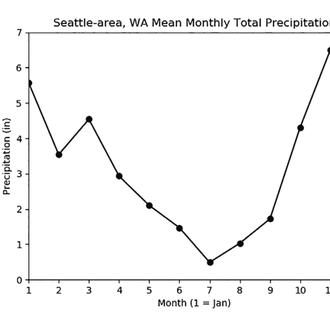

图 6.2 由图 6.1 中代码生成的华盛顿州西雅图地区月平均总降水量图。

此计算块使用了一个 `for` 循环，使我们能够遍历月份的一个子集并进行滚动平均计算。
此代码中的最后一个计算块涉及额外的复杂性，因为计算中包含了条件语句。我们进行的计算在一种上下文中是一种计算，在另一种上下文中则是另一种计算。第 17-24 行计算了 `precip` 数组的最大值和最小值。这是通过遍历 `precip` 中的每个值，并将该值与我们已经检查过的降水值的最大值或最小值（分别）进行比较来完成的。

## 6.2 Python 编程基础

在第 5 章中，我们介绍了数组的基础知识：创建数组、索引和切片数组、使用操作数组的函数，以及使用数组语法对数组元素进行计算。图 6.3 中代码的分析建立在这些数组基础知识之上，展示了两种新的编程结构——循环和条件语句（也称为分支）——如何使代码能够以依赖上下文的方式分析多条数据。也就是说，这些构造使我们能够对数据集合进行计算，一次处理一点，并且根据某个条件是否为真进行不同的计算。让我们更详细地解析图 6.3，以预览我们将在本节后续小节中展开讨论的原理和 Python 构造。

```python
import numpy as np

#- 创建数据数组：
months = np.array([1, 2, 3, 4, 5, 6, 7, 8, 9, 10, 11, 12])
precip = np.array([5.58, 3.54, 4.54, 2.93, 2.10, 1.47,
                    0.49, 1.03, 1.72, 4.31, 6.50, 5.41])

#- 计算平均降水量的累积和：
precip_cumsum = np.cumsum(precip)

#- 计算平均降水量的滚动平均值：
running_mean = np.zeros(11, dtype='d')
for i in [0, 1, 2, 3, 4, 5, 6, 7, 8, 9, 10]:
    running_mean[i] = (precip[i+1] + precip[i]) / 2.0

#- 计算平均降水量的最大值和最小值：
max_precip = precip[0]
min_precip = precip[0]
for iprecip in precip:
    if iprecip > max_precip:
        max_precip = iprecip

    if iprecip < min_precip:
        min_precip = iprecip
```

图 6.3 分析图 6.1 中华盛顿州西雅图地区月平均总降水量数据的代码。

在图 6.3 的第 4-6 行，我们使用 NumPy 的 `array` 函数从一些列表创建了数组 `month` 和 `precip`。然而，还有其他创建数组的方法。图 6.3 的第 12 行提供了另一个例子。在第 6.2.1 节中，我们将研究创建数组和获取数组信息的其他方法。

图 6.3 中的第一个计算行出现在第 9 行。在这一行中，我们使用了一个名为 `cumsum` 的函数，它操作一个数字数组并返回一个新数组，其中每个元素是其之前所有元素的总和。即：²

```python
In [1]: import numpy as np
        precip = np.array([5.58, 3.54, 4.54, 2.93, 2.10, 1.47,
                          0.49, 1.03, 1.72, 4.31, 6.50, 5.41])
        precip_cumsum = np.cumsum(precip)
        print(precip_cumsum)

[  5.58   9.12  13.66  16.59  18.69  20.16
  20.65  21.68  23.4   27.71  34.21  39.62]
```

² `print` 命令的结果被重新对齐，以便显示能适应本页。

`precip_cumsum` 的索引 0 值为 5.58，因为索引 0 值之前没有值。`precip_cumsum` 的索引 1 值为 9.12，这是 `precip` 中 5.58 和 3.54 的和。依此类推，直到 `precip_cumsum` 的索引 11 值，它是 `precip` 中所有值的总和。虽然 `cumsum` 与我们在第 5.2.6 节中看到的函数类似，因为它作用于数组，但不同之处在于该函数的返回值本身就是一个数组。我们将在第 6.2.2 节中讨论更多关于作用于数组的函数。

在图 6.3 的第 13-14 行，我们计算了 `precip` 的滚动平均值，遍历 `precip` 的每个值（最后一个除外），并取当前值与其在 `precip` 中的后一个值的平均值。我们使用了一个 `for` 循环（第 13 行），它将变量 `i` 设置为 `in` 之后列表中的数字，一次一个。`for` 循环的主体（第 14 行）为 `i` 的每个值执行。我们将在第 6.2.3 节中详细解释这一点。

最后，在图 6.3 的第 17-24 行，我们通过检查 `precip` 数组中的每个值，并查看它是否比之前的其他值更大（用于查找最大值）或更小（用于查找最小值），来计算月平均降水量的最大值和最小值。我们通过在 `for` 循环内使用 `if` 语句来实现这一点。我们将在第 6.2.4 节讨论 `if` 语句。

在本节其余的代码示例中，假设 NumPy 已作为 `np` 导入。

### 6.2.1 关于创建数组和查询数组的更多信息

在第 5.2.6 节中，我们看到了如何使用 `array` 函数从列表创建 NumPy 数组。我们在图 6.3 的第 4-6 行使用了这种方法。在第 5.2.6 节中，我们还看到数组语法将返回数组。两个具有相同元素数量的一维数组相加的结果是一个具有相同维度和元素数量的数组，其中的元素是原始两个数组中对应元素的和。在本节中，我们将研究创建数组和查询数组的其他方法。

虽然有时我们感兴趣的是从输入的值列表创建数组，但大多数时候我们希望计算机根据某些要求为我们创建和填充数组。如果我们想创建一个百万元素的数组，我们不想手动输入所有这些值！要创建一个给定元素数量、全部填充为零的一维数组，我们可以使用 NumPy 的 `zeros` 函数。例如，以下代码创建一个包含五个零的一维数组：

```python
import numpy as np
data = np.zeros(5)
print(data)

[ 0.  0.  0.  0.  0.]
```

要创建一个全为零的一维数组，我们只需要传入一个位置输入参数（在上面的示例中为 5），该参数指定数组中的元素数量。

第 7.2.2 节描述了我们如何也可以使用 `zeros` 创建二维数组，尽管语法稍微复杂一些。在第 12 章中，我们将讨论维度大于二的数组。

默认情况下，`zeros` 创建一个数组，其中每个元素都是一个占用 8 `bytes` 内存的浮点值。要创建一个每个元素都是整数的数组，我们可以在调用 `zeros` 函数时将关键字输入参数 `dtype` 设置为字符串 `'l'`：

```python
In [1]: data = np.zeros(5, dtype='l')
       print(data)

       [0 0 0 0 0]
```

字符串 `'l` 表示“长整数”。在第 9.2.2 节中，我们将更详细地讨论这意味着什么。现在，只需将其理解为“适合我们需要的整数”。

如果我们想要一个五元素、全为 1 而不是 0 的一维数组呢？`ones` 函数可以完成此任务：

```python
In [1]: data = np.ones(5)
       print(data)

       [ 1.  1.  1.  1.  1.]
```

但是，如果我们想要一个每个元素都是特定值（不是零或一）的数组呢？我们可以使用数组语法（如第 5.2.6 节所述）对全为 1 或 0 的数组进行算术运算。例如，如果我们想要一个五元素、每个元素都等于 100 的一维数组，我们可以创建一个全为 1 的数组，然后将每个元素乘以 100：

```python
In [1]: data = np.ones(5) * 100.0
       print(data)

       [ 100.  100.  100.  100.  100.]
```

使用数组语法，乘以 100 的操作会自动应用于调用 `ones` 创建的数组中的每个元素。该乘法的结果是一个与调用 `ones` 创建的数组大小相同的数组。

一种常见的计算涉及一组稳定递增（或递减）的值。是否有快速的方法来创建一个稳定递增值的一维数组？有：`arange` 函数。当使用一个数字作为位置输入参数调用时，`arange` 会生成一个具有该数量元素的数组，其中第一个元素设置为零，每个后续元素递增 1，直到最后一个元素，该元素等于数组中的元素数量减 1。因此，当位置输入参数设置为 5 时，我们得到一个五元素数组，其值如下：

## 6 基础诊断数据分析

```python
In [1]: data = np.arange(5)
        print(data)

        [0 1 2 3 4]
```

调用 `arange` 并传入整数 $n$，会生成一个从 0 到 $n - 1$ 的整数值数组。
默认情况下，如果输入参数是整数，`arange` 创建的数组元素也是整数。要获得一个递增的浮点数值数组，可以传入浮点数输入参数或使用 `dtype` 关键字输入参数：

```python
In [1]: data = np.arange(5.0)
        print(data)

        [ 0.  1.  2.  3.  4.]
```

```python
In [2]: data = np.arange(5, dtype='d')
        print(data)

        [ 0.  1.  2.  3.  4.]
```

如果我们想要一个增量不是 1 的值范围呢？例如，不是五个从 0 递增到 4 的元素，而是想要五个从 0 到 1、增量为 0.25 的元素？使用 `arange` 有两种方法可以实现。首先，我们可以使用数组语法并除以 4：

```python
In [1]: data = np.arange(5.0) / 4.0
        print(data)

        [ 0.    0.25  0.5   0.75  1.  ]
```

或者，我们可以使用三个位置输入参数而不是一个来调用 `arange`。当使用三个输入参数调用时，第一个参数给出起始值，第二个给出停止值，第三个给出增量（或“步长”）。请注意，起始值是包含的，停止值是不包含的，因此如果我们希望最后一个元素是 1，停止值必须大于 1 但小于 1.25（即，不超过停止值加增量）：

```python
In [1]: data = np.arange(0, 1.1, 0.25)
        print(data)

        [ 0.    0.25  0.5   0.75  1.  ]
```

有一个内置函数叫做 `range`，它在许多方面与 `arange` 相似，但在遍历大数组时是更好的选择。我们将在第 6.2.3 节讨论 `range`。

在探索了几种创建数组的新方法之后，让我们看看是否有函数和其他方法可以从一个已给定的数组中获取关于该数组的信息。在第 5.2.6 节中，我们学习了引用数组的元素或切片。但我们可以了解的不仅仅是数组的元素。

我们之前看到了如何创建一个特定大小的一维数组。我们可以反过来，使用 NumPy 的 `size` 函数（我们在第 5.2.6 节简要见过）来获取一个数组并计算它有多少个元素。因此，对于我们刚刚创建的五元素 `data` 数组：

```python
In [1]: data = np.arange(0, 1.1, 0.25)
        print(data)

        [ 0.    0.25  0.5   0.75  1.  ]

In [2]: print(np.size(data))

        5
```

调用 `size` 的结果是 `data` 中的元素数量，即五个。

我们还可以找出数组中每个元素的类型（也称为数组的**基本类型**）。我们已经看到如何将 `dtype` 关键字输入参数设置为一个字母，告诉我们数组元素是整数、浮点数等。一个现有的数组也可以告诉我们数组中每个元素的类型。例如，在：

```python
In [1]: data = np.arange(0, 1.1, 0.25)
        print(data)

        [ 0.    0.25  0.5   0.75  1.  ]

In [2]: print(data.dtype.char)

        d
```

单元格 In [2] 打印了变量 `data.dtype.char` 的值。要完全解释发生了什么，需要理解**面向对象编程（OOP）**的基础知识。我们将在第 9.2 节提供这些内容。目前，我们可以这样理解语法：有一个附加到数组变量 `data` 上的字段叫做 `dtype.char`。该字段存储了描述该数组中每个元素类型的单个字母字符，或**类型码**。当我们打印该字段时，我们得到字母“d”，这告诉我们数组的元素都是 8 字节浮点数（每个值在计算机中占用 8 字节内存）。请注意，我们*没有*打印 `np.dtype.char`。`dtype.char` 字段附加到数组变量上，在本例中是 `data`，而不是 NumPy 模块。在第 9.2.2 节中，我们将更详细地讨论字节、`dtype` 和类型码。许多常见类型码的表格见表 9.1。

数组查询功能的一个巧妙之处在于，我们可以将它们与数组创建函数一起使用，创建与现有数组具有相同大小和元素类型的自定义数组。考虑之前的数组 `data`，假设我们想创建一个数组 `newdata`，它与 `data` 大小相同且具有相同的元素数据类型，但用零填充。以下代码完成了这个任务：

```python
In [1]: data = np.arange(0, 1.1, 0.25)
        print(data)

        [ 0.    0.25  0.5   0.75  1.  ]

In [2]: newdata = np.zeros(np.size(data), dtype=data.dtype.char)
        print(newdata)

        [ 0.  0.  0.  0.  0.]
```

因为我们对 `data` 使用了数组查询函数，所以无论 `data` 的实际大小或元素类型如何，`In [2]` 第一行的代码都以相同的方式工作。如果 `data` 恰好是五百万个元素而不是五个元素，`In [2]` 第一行创建 `newdata` 的代码也不会改变。通过这种方式，使用数组查询函数和特性而不是手动输入数组大小，使我们能够编写更灵活的程序。

### 6.2.2 关于数组函数的更多内容

在第 5.2.6 节中，我们通过 `sum` 函数了解了函数作用于数组的概念。在第 3 章的前面部分，我们看到 NumPy 有各种可以操作普通数字（即标量）的函数，例如 `sin` 等。NumPy 中还有更多作用于数组的数学函数。NumPy 函数和例程的完整列表在在线文档中提供。我们在 www.cambridge.org/core/resources/pythonforscientists/refs/，参考文献 40 提供了该列表的最新链接。第 12.2.7 节提供了一个非常简短的重要 NumPy 函数摘要列表。

NumPy 包括数组创建和操作函数、三角函数、超越函数、统计函数、金融函数、排序函数和其他函数。图 6.3 的第 9 行显示了这样一个函数 `cumsum`，它接受一个数组并返回另一个数组，该数组包含数组中当前元素之前所有值的累积和：

```python
In [1]: data = np.array([3, 5, 7, -11, 2])
        print(np.cumsum(data))

        [  3   8  15   4   6]
```

在本节中，我们不是列出所有科学家或工程师感兴趣的函数（这本身就可以写成一本书），而是通过描述 NumPy 函数作用于数组的两种关键方式来扩展我们之前的讨论。

第 5.2.6 节中的 `sum` 函数是第一种方式的例子，其中函数接受一个数组作为输入，对数组的元素进行计算，并返回一个标量值。另一个例子是 `max` 和 `min` 函数，它们遍历整个输入数组并分别返回最大值和最小值：

```python
In [1]: data = np.array([3, 5, 7, -11, 2])
        print(np.max(data))

        7

In [2]: print(np.min(data))

        -11
```

第二种作用于 NumPy 数组的函数是接受一个数组作为输入，对数组进行逐元素计算（即在数组的每个元素上运行相同类型的计算），并返回一个结果数组的函数。`cumsum` 函数就是这样一个函数的例子。虽然每个后续元素累加了更多值的结果（因为当我们遍历数组时，有更多“之前的”值），但每个元素上的“操作”是相同的：累加到并包括此索引处的值的所有内容，并将结果放入输出数组的该索引处。

另一个接受数组并返回数组（该数组是输入数组逐元素计算的结果）的函数例子是 `sin` 函数。当输入是标量时，`sin` 返回一个标量，但当输入是一个数组时，`sin` 返回一个数组，该数组是计算输入数组每个元素的正弦值的结果：

```python
In [1]: print(np.sin(3))

        0.14112000806

In [2]: data = np.array([3, 5, 7, -11, 2])
        print(np.sin(data))

        [ 0.14112001 -0.95892427  0.6569866   0.99999021  0.90929743]
```

尽管在上面的例子中，标量 3 的正弦值与 3 作为数组元素时的正弦值看起来不同，但差异仅在于 NumPy 显示结果的方式，而不是计算值本身。如果我们执行 `print(np.sin(data)[0])`，它打印出对 `data` 取正弦生成的输出数组的第一个元素，我们得到与 `print(np.sin(3))` 相同的值。

## 6 基础诊断数据分析

```python
In [1]: import numpy as np
theta = np.array([0.48991, 0.3674, 0.11229])
v = 2.0
v_x = v * np.cos(theta)
print(v_x)

[ 1.76475042  1.86652879  1.9874042 ]
```

图 6.4 展示了如何使用数组语法和数组函数，将一组（具有相同大小的）向量投影到 x 轴上的示例。

关于如何阅读 `np.sin(data)[0]` 的旁注：解读这段代码的关键在于记住，如果 `data` 是一个数组，那么 `np.sin(data)` 会返回一个数组。`[0]` 操作正是作用于该数组。当 `[0]` 被输入在一个数组之后——该数组由变量名或返回数组的函数的返回值表示——它会返回该数组的第一个元素。

许多其他数学函数（如 `cumsum` 和 `sin`）在输入为数组时，会按元素进行操作，并生成一个与输入数组大小相同的输出数组。所有经典的数学函数（例如，`cos` 表示余弦函数，`tan` 表示正切函数，`exp` 表示指数函数）都以这种方式工作。

当与数组语法（如第 5.2.6 节所述）结合使用时，对数组进行按元素操作的函数功能非常强大。例如，考虑图 3.1 中的问题，我们使用 `cos` 函数将一个向量投影到 x 轴上。如果我们操作的不是一个单一的角度 `theta`，而是一组角度呢？图 6.4 展示了图 3.1 在这种情况下的一个改编。变量 `v_x` 现在是一个包含三个元素的数组，就像 `theta` 是一个包含三个元素的数组一样。在相同行数的代码中（实际上，图 6.4 中 `In [1]` 的第四行计算代码没有变化），我们可以将任意数量、具有不同角度（但大小相同）的向量投影到 x 轴上。

### 6.2.3 遍历数组元素与循环简介

数组切片和数组语法是提取数组中部分或全部元素并进行计算的强大方法。然而，有时我们需要对数组计算进行更细粒度的控制。例如，有时我们需要挑选特定的元素，并使用这些元素进行计算。

在查看图 6.3 中的代码示例之前，让我们考虑以下情况。假设我们有以下长度数组（单位：英寸）：

```python
lengths_in = np.array([2.3, 5.4, 12.9, 3.7, 8.8])
```

使用数组语法，以下代码将 `lengths_in` 的每个元素乘以 2.54，并将结果保存在数组 `lengths_cm` 中：

```python
lengths_cm = lengths_in * 2.54
```

`lengths_cm` 的元素是 `lengths_in` 的厘米值。两个数组都有五个元素。

我们也可以使用以下代码完成上述英寸到厘米的转换计算：

```python
1  lengths_cm = np.zeros(5, dtype='d')
2  for i in [0, 1, 2, 3, 4]:
3      lengths_cm[i] = lengths_in[i] * 2.54
```

上述代码的第 1 行创建了一个一维的、包含五个浮点数零的数组，并将其命名为 `lengths_cm`。接下来的两行是新的。

第 2 行以单词 `for` 开头，是一个循环的开始，具体来说是一个“for 循环”。循环的目的是反复运行一段代码块。`for` 循环的特定目的是反复运行一段代码块特定的次数。在 Python 中，我们通过将那些代码行放在以 `for` 开头的行之下，并将代码块缩进四个空格来表示要反复运行的代码块。这就像我们通过缩进 `def` 语句之后的代码行来定义函数体一样。因此，在上面的代码中，第 3 行是 `for` 循环的主体，它将根据 `for` 语句（第 2 行）中定义的 `for` 循环的特性被反复执行。

这个循环的特性是什么？我们如何解释以 `for` 开头的行？该行有两个主要部分。第一个部分在 `for` 和 `in` 之间：变量 `i`。第二个主要部分是 `in` 和冒号之间的所有内容：列表 `[0, 1, 2, 3, 4]`。当 Python 解释器到达这个 `for` 行时，它按照以下逻辑操作：创建一个循环，我将一遍又一遍地重复执行 `for` 行下方主体中的代码。第一次执行主体时，变量 `i` 的值被设置为列表 `[0, 1, 2, 3, 4]` 中的第一个值，即值 `0`。第二次执行主体时，变量 `i` 的值被设置为列表中的第二个值，即值 `1`。这个过程会一直重复，直到最后一次循环执行循环主体时，变量 `i` 被设置为 `4`。

循环的“主体”是第 3 行，即 `for` 语句下方缩进的那一行。因此，循环遍历 `[0, 1, 2, 3, 4]`，并将 `i` 依次赋值为这些值中的每一个，每次赋值时，第 3 行都会被执行。在第 3 行中，使用 `i` 的值从 `lengths_in` 中提取索引为 `i` 的值，将该值乘以 2.54，然后将结果保存在 `lengths_cm` 的索引 `i` 位置。变量 `i` 被称为**迭代器**，列表 `[0, 1, 2, 3, 4]` 被称为**可迭代对象**。

任何有效的变量名都可以作为迭代器。它不必叫 `i`。可迭代对象是任何类型的数据集合，其中“转到下一个项目”的概念对计算机来说是有意义的。这并不意味着集合必须有顺序，有第一、第二等项目。我们可以有无序但可迭代的集合。我们将在第 14.2.5 节中遇到这样的集合。列表、元组和数组都可以在 `for` 循环中充当可迭代对象。这就是图 6.3 中第 19 行的含义：

```python
for iprecip in precip:
```

该行中的迭代器是 `iprecip`，迭代器被依次赋值为其元素的可迭代对象是数组 `precip`。注意，迭代器也不必以字母“i”开头。在上面的例子中这样做只是方便。因此，这段代码（基于图 6.3 中的行）：

```python
precip = np.array([5.58, 3.54, 4.54, 2.93, 2.10, 1.47,
                   0.49, 1.03, 1.72, 4.31, 6.50, 5.41])
for iprecip in precip:
    print(iprecip)
```

生成以下输出：

```
5.58
3.54
4.54
2.93
2.1
1.47
0.49
1.03
1.72
4.31
6.5
5.41
```

字符串也是可迭代对象，也可以像上面显示的列表一样进行循环。这段代码：

```python
for character in "Trial 1":
    print(character)
```

生成以下输出：

```
T
r
i
a
l

1
```

图 6.5 总结了 `for` 循环的语法。
在图 6.3 分析我们西雅图地区降水数据的代码中，第 12-14 行给出了另一个更复杂的 `for` 循环示例（为方便起见，此处重现）：

**for 循环语法总结**

通常，`for` 循环具有以下语法：

```python
for <iterator> in <iterable>:
    <... body ...>
```

其中 `<iterator>` 是一个变量，在循环的每次迭代中，它将被依次设置为 `<iterable>` 中的每个值。`<... body ...>` 表示在循环的每次迭代中执行的一行或多行代码。`<... body ...>` 的行作为一个代码块，缩进四个空格，就像我们在第 3.2.3 节编写自己的函数时看到的那样。

图 6.5 `for` 循环语法总结。

```python
running_mean = np.zeros(11, dtype='d')
for i in [0, 1, 2, 3, 4, 5, 6, 7, 8, 9, 10]:
    running_mean[i] = (precip[i+1] + precip[i]) / 2.0
```

这个循环计算平均降水量的滚动平均值。第一行，类似于之前的 `lengths_cm` 示例，我们创建了一个数组 `running_mean`，用于保存滚动平均值计算的结果。在第二行，我们遍历从零到十的整数，这意味着迭代器 `i` 将被设置为 `0`，主体（第三行）将运行，然后迭代器将被设置为 `1`，主体将运行，依此类推，直到可迭代对象耗尽。

然而，这段代码的第三行，即 `for` 循环的主体，比我们之前的 `lengths_cm` 示例更复杂。它是如何工作的？我们说过循环的主体会被反复执行，每次执行主体时 `i` 的值都会改变。我们第一次进入循环时，`i` 被设置为 `0`，该值用于循环主体中每次出现的 `i`。因此，滚动平均值计算循环的主体第一次执行时，等同于我们执行：

```python
running_mean[0] = (precip[0+1] + precip[0]) / 2.0
```

因为 `0+1` 的结果是 `1`，所以这等同于：

```python
running_mean[0] = (precip[1] + precip[0]) / 2.0
```

因此，`running_mean` 的第一个元素被设置为 `precip` 中第一个和第二个元素的平均值。

下一次**迭代**（或我们重复循环的特定时间），`i` 被设置为 `1`，因此当循环主体执行时，等同于我们执行：

```python
running_mean[1] = (precip[2] + precip[1]) / 2.0
```

`running_mean` 的第二个元素被设置为 `precip` 中第二个（索引 1）和第三个（索引 2）元素的平均值。这个过程会持续进行，直到 `i` 被设置为 `10` 的每次迭代。

## 6 基础诊断数据分析

在上面的例子中，我们看到正在循环遍历的列表（[0, 1, 2, 3, 4, 5, 6, 7, 8, 9, 10]）恰好是11元素数组 `running_mean` 的索引。因此，迭代器 `i` 被设置为列表中每个元素的索引值。事实证明，这类任务相当常见。通常，我们想要遍历列表或数组的每个元素，因此会循环遍历这些元素的所有索引。如果我们能轻松构建一个数组的索引列表或数组，那将是很方便的。

在第6.2.1节中，我们发现了一种方法：NumPy函数 `arange`。因此，我们可以将图6.3中的第12-14行重写为：

```
running_mean = np.zeros(11, dtype='d')
for i in np.arange(11):
    running_mean[i] = (precip[i+1] + precip[i]) / 2.0
```

在上面的代码中，我们在两个地方输入了 `running_mean` 中的元素数量（即11）。我们可以用调用NumPy函数 `size` 的输出来替换第二个出现的11，该函数返回作为函数输入参数传入的数组中的元素数量。因此，我们可以将上面的代码重写为：

```
running_mean = np.zeros(11, dtype='d')
for i in np.arange(np.size(running_mean)):
    running_mean[i] = (precip[i+1] + precip[i]) / 2.0
```

即使我们更改 `running_mean` 中的元素数量（假设 `precip` 也具有所需数量的元素），此代码中的 `for` 循环仍然有效。通过使用 `size`，我们使 `for` 循环更灵活且更易于维护。重复性，即在多个地方写入相同的值，可能导致程序难以理解和更新。因此，当我们编写代码时，遵循DRY原则（“不要重复自己”）是一个好主意。

使用 `arange` 来遍历数组的索引对于小数组来说效果很好。然而，对于大数组，`arange` 效果不佳。当 `arange` 创建数组时，它会在内存中创建整个数组——每个元素。对于循环，在任何给定的迭代中，我们真正关心的是该迭代中迭代器的值。`arange` 生成的数组的其他元素对于该次循环迭代并不重要。因此，如果我们创建一个非常大的数组（比如数百万或数十亿个元素），我们就是在浪费大量内存来保存整个索引数组，而没有任何好处。

对于遍历较大数组索引的情况，使用 `range` 函数（这是内置的；它不是NumPy函数）更有意义。`range` 函数有效地提供了 `arange` 所提供的值，我们可以循环遍历它们，但无需一次性将它们全部创建在内存中。因此，我们可以将上面的代码重写为：

```
running_mean = np.zeros(11, dtype='d')
for i in range(np.size(running_mean)):
    running_mean[i] = (precip[i+1] + precip[i]) / 2.0
```

请注意，`range` 只能用于创建整数序列。它不能创建浮点值序列。

回顾一下：我们已经看到一维循环如何工作，以及我们如何使用它们来遍历数组的每个元素以检查、使用或更改该元素。我们通过循环遍历我们输入的数组索引列表、使用NumPy函数 `arange` 生成的索引数组以及使用内置函数 `range` 生成的索引来实现这一点。我们还通过直接循环遍历数组值列表来实现这一点。在第6.2.5节中，我们将考虑使用一维数组循环的更复杂示例，但在我们这样做之前，我们首先考虑如何向我们的数据提问。

### 6.2.4 向数据提问与分支简介

在图6.3分析西雅图降水数据的代码中，计算平均降水量最大值和最小值的部分，我们发现以下代码行（来自该图的第17-24行，为方便起见在此重现）：

```
1  max_precip = precip[0]
2  min_precip = precip[0]
3  for i in range(np.size(precip)):
4      if precip[i] > max_precip:
5          max_precip = precip[i]
6
7      if precip[i] < min_precip:
8          min_precip = precip[i]
```

我们之前说过，这段代码遍历 `precip` 中的每个值，并将该值与已经检查过的降水值的最大值或最小值（分别）进行比较。我们可以通过逐行查看代码，用更多细节来扩展那个一般性描述。下面的行号指的是上面重现的代码片段中的编号，而不是图6.3中的编号。

在第1行和第2行，我们将变量 `max_precip` 和 `min_precip` 初始化为 `precip` 数组中的第一个值。重要的是，我们将 `max_precip` 和 `min_precip` 的初始值设置为 `precip` 中的一个值。如果我们把 `min_value` 设置为其他值，比如零，并且 `precip` 中的所有值都是正数，那么即使 `precip` 中的最小值不是零，我们最终得到的最小值也会等于零。这是因为我们找到最小值的方式（即我们使用的**算法**）将“到目前为止的最小值”与数组中的每个后续值进行比较。因为数组中的每个值都大于零，所以“到目前为止的最小值”为零将成为返回的最小值。

第3行是 `for` 循环的开始。传递给 `range` 函数的参数是 `precip` 中的元素数量，因此迭代器 `i` 被依次设置为0, 1, 2, 3, ... 11，因为 `precip` 中的元素数量减1是11。也就是说，`i` 被设置为 `precip` 的索引，从第一个索引开始到最后一个索引结束。

第4-8行是 `for` 循环的主体。我们知道这些是循环的主体，因为所有这些行都缩进了四个空格。这意味着对于 `i` 的每个值，这些行中的每一行都会依次执行。第4行和第7行以单词 `if` 开头，虽然我们还没有讨论以 `if` 开头的行意味着什么，但我们可以猜测这一行是在进行某种比较，如果该比较为真，则执行 `if` 语句下方缩进的代码行。

这正是正在发生的事情。在第4行，我们检查 `precip` 的当前值是否大于 `max_precip` 的当前值。如果是，我们执行第5行，将 `max_precip` 设置为 `precip` 的当前值。在第7行，我们检查 `precip` 的当前值是否小于 `min_precip` 的当前值，如果是，我们将 `min_value` 设置为 `min_precip` 的当前值。

在 `for` 循环的所有迭代完成后，`min_value` 的值将等于 `precip` 中的最小值，`max_value` 的值将等于 `precip` 中的最大值。

这些代码行说明了 `if` 语句的作用：它提出一个问题，并根据问题的答案，Python执行一件事而不是另一件事。换句话说，`if` 语句评估一个测试，如果测试为真，计算机程序的控制权转到一行（或多行）代码；如果测试为假，计算机程序的控制权转到另一行（或多行）代码。我们将这些“先提问然后做某事”的语句称为“if语句”或“分支语句”。对于后一个名称，其图像是计算机程序像一棵树，我们沿着树干向上走，当我们到达一个分支时，我们可以选择沿着那个分支走，或者继续沿着树干走。无论我们怎么称呼它，目的都是一样的：根据某个条件是否为真来做不同的事情。

#### 基本的 `if` 语句

Python中有三种常见的分支语句。我们已经遇到了第一种，一个基本的 `if` 语句。它以单词 `if` 开头，后跟某种可以评估为真或假的测试，例如，两个值是否相同，或者一个是否大于另一个。一个检查元素的原子序数（即元素中的质子数，存储在变量 `atomic_number` 中）是否等于六（即该元素是碳）的基本 `if` 语句如下所示：

```
1  if atomic_number == 6:
2      ... body ...
```

`==` 符号是测试两个值是否相等的运算符。我们不能使用单个等号来达到这个目的，因为单个等号用于赋值。上面的第2行指的是如果 `if` 后面的测试为真，则执行的一行或多行代码。如果测试为假，则主体中的任何行都不会执行。所有主体行作为一个块，都缩进四个空格，就像我们在第3.2.3节中看到的那样。

3 这些代码行与使用NumPy的 `max` 和 `min` 函数具有相同的效果。因此，要找到最大值，我们可以使用 `max_precip = np.max(precip)` 代替。

## 6 基础诊断数据分析

如果我们想在变量 `atomic_number` 中存储的原子序数小于碳的原子序数（即该元素的质子数更少）时打印一条消息，该怎么办？以下基础的 `if` 语句可以完成此任务：

```
if atomic_number < 6:
    print("Element has fewer protons than carbon")
```

如果测试条件为真，程序将进入 `if` 语句下方缩进的代码块。如果测试条件为假，程序将跳过 `if` 语句下方缩进的所有代码行，直接执行 `if` 语句主体*之后*的代码行。

为了说明这一点，我们考虑一个使用上述 `if` 语句的简短程序，其中我们在 `if` 语句之前设置 `atomic_number` 的值，并在 `if` 语句主体之后放置另一行代码。用箭头说明程序的执行流程，以下代码将如下所示：

```
1 atomic_number = 2
2 if atomic_number < 6:
3     print("Element has fewer protons than carbon")
4 print("Test completed")
```

运行时，上述代码将产生：

```
Element has fewer protons than carbon
Test completed
```

程序从第 1 行开始，执行到第 2 行，由于第 2 行的测试条件为真，执行第 3 行，然后在第 3 行之后退出 `if` 语句主体（因为主体中没有更多行），并执行到第 4 行。第 4 行将始终被执行，因为它位于 `if` 语句主体之外。`if` 语句中的测试条件值对于控制程序是否执行到第 4 行没有影响。

如果 `atomic_number` 的值大于六会怎样？下面的代码展示了 `atomic_number` 为 17 的情况，箭头再次显示了代码的执行流程：

```
1 atomic_number = 17
2 if atomic_number < 6:
3     print("Element has fewer protons than carbon")
4 print("Test completed")
```

运行时，上述代码将产生：

```
Test completed
```

程序从第 1 行开始，执行到第 2 行，评估第 2 行的测试条件并发现其为假，然后直接跳到第 4 行，完全跳过第 3 行。当基础 `if` 语句中的条件为假时，程序将完全跳过 `if` 语句的主体；这些代码行都不会被执行。

如果我们想在元素的质子数少于碳时打印一条消息，或者在元素的质子数多于碳时打印另一条消息，我们可以使用两个基础的 `if` 语句，一个接一个：

```
if atomic_number < 6:
    print("Element has fewer protons than carbon")
if atomic_number > 6:
    print("Element has more protons than carbon")
```

在这种情况下，如果 `atomic_number` 大于六，第一个 `if` 语句的条件将测试为假，该 `if` 语句下的 `print` 语句将不会执行。然而，第二个 `if` 语句的条件将测试为真，其后的 `print` 语句将执行。在此示例中，如果 `atomic_number` 等于六，则两个 `if` 语句的条件都不为真，两个 `print` 语句都不会执行；屏幕上不会打印任何内容。要让程序在 `atomic_number` 等于六的情况下打印一条消息，我们必须添加第三个 `if` 语句来测试这种情况：

```
if atomic_number < 6:
    print("Element has fewer protons than carbon")
if atomic_number > 6:
    print("Element has more protons than carbon")
if atomic_number == 6:
    print("Element is carbon")
```

如果我们没有最后一个 `if` 语句，而是像这样将：

```
print("Element is carbon")
```

这行放在第二个 `if` 语句之后：

```
if atomic_number < 6:
    print("Element has fewer protons than carbon")
if atomic_number > 6:
    print("Element has more protons than carbon")
print("Element is carbon")
```

那么每次运行此代码时，无论 `atomic_number` 的值如何，都会打印出消息“Element is carbon”，因为最后的 `print` 语句不在任何 `if` 语句主体内。确保在编写一系列 `if` 语句时，我们正确覆盖了这些 `if` 语句所描述的全部逻辑选项，这一点非常重要。否则，程序可能会执行一些不期望的操作。

表 6.2 Python 中的基础比较运算符。

| 运算符 | 代码 |
|---|---|
| 等于 | == |
| 不等于 | != |
| 大于 | > |
| 大于或等于 | >= |
| 小于或等于 | <= |

在后面的章节中，我们将描述除了链接基础 `if` 语句之外测试多个条件的其他方法。目前，链接基础 `if` 语句是处理多个条件的一种方式。

表 6.2 列出了我们可以在 `if` 语句的测试条件中使用的基础比较运算符。每个运算符“连接”两个操作数，因此运算符的左侧和右侧都必须有内容（变量或值）。我们将在第 8.2.2 节中发现，我们可以要求计算机程序回答的问题类型超出了此表中列出的运算符。然而，此表是一个很好的起点。

#### if-else 语句

我们之前在这个简短程序中看到：

```
atomic_number = 2
if atomic_number < 6:
    print("Element has fewer protons than carbon")
print("Test completed")
```

最后的 `print` 语句不仅在 `atomic_number` 小于六时执行，在它不小于六时也会执行。对于 `atomic_number` 的所有可能值，都会打印出短语“Test completed”。那么，我们如何指定在 `if` 条件为假时执行 Python 命令，但*仅*在 `if` 条件为假时执行呢？这就是 `if-else` 语句的目的。

在 `if-else` 语句中，我们在 `if` 子句之后添加一个 `else` 子句，并放入一行或多行代码，以便在 `if` 条件为假时执行。以下是一个示例：

```
1  if atomic_number < 6:
2      print("Element has fewer protons than carbon")
3  else:
4      print("Element does not have fewer protons than carbon")
```

在此语句中，`if` 语句后缩进四空格的一行或多行代码在条件（`atomic_number < 6`）为真时执行。如果该条件为假，则执行 `else` 语句后缩进四空格的一行或多行代码。因此，`if-else` 语句中有两个主体或代码块：一个在 `if` 语句下，一个在 `else` 语句下。当程序执行到 `if-else` 语句时，其中一个且仅有一个代码块会执行。

正如我们为基本 `if` 语句所做的那样，我们编写两个简短的程序，一个用于 `atomic_number = 2` 的情况，另一个用于 `atomic_number = 17` 的情况，并查看程序在每种情况下如何执行。对于第一种情况，执行流程如下：

```
1  atomic_number = 2
2  if atomic_number < 6:
3      print("Element has fewer protons than carbon")
4  else:
5      print("Element does not have fewer protons than carbon")
6  print("Test completed")
```

运行时，上述代码产生：

```
Element has fewer protons than carbon
Test completed
```

程序从第 1 行执行到第 2 行，然后执行到第 3 行，因为条件 `atomic_number < 6` 为真。第 3 行执行后，`if` 语句下的代码块（即主体）中没有其他行，因此程序执行到第 6 行，即整个 `if-else` 语句之后的行。程序不会进入 `else` 语句下的代码块（即主体）。

让我们考虑 `atomic_number = 17` 的情况。在这种情况下，执行流程如下：

```
1  atomic_number = 17
2  if atomic_number < 6:
3      print("Element has fewer protons than carbon")
4  else:
5      print("Element does not have fewer protons than carbon")
6  print("Test completed")
```

运行时，上述代码产生：

```
Element does not have fewer protons than carbon
Test completed
```

程序从第 1 行执行到第 2 行，然后执行到第 4 行和第 5 行，跳过第 3 行，因为条件 `atomic_number < 6` 为假。第 5 行执行后，`else` 语句下的代码块（即主体）中没有其他行，因此程序执行到第 6 行，即整个 `if-else` 语句之后的行。程序不会进入 `if` 语句下的代码块（即主体）。

理解基本 `if` 语句的一种方式是将其视为一个 `else` 子句下没有代码行的 `if-else` 语句。也就是说，基本的 `if` 语句：

```
if atomic_number < 6:
    print("Element has fewer protons than carbon")
```

等同于这个 `if-else` 语句：

```
if atomic_number < 6:
    print("Element has fewer protons than carbon")
else:
    pass
```

命令 `pass` 是我们告诉 Python 解释器“什么都不做”的方式。当该命令执行时，什么都不会发生：屏幕上没有输出，没有计算，什么都没有。在 Python 中，任何时候我们需要一个代码块或主体（即，任何时候我们有一个缩进四个空格的代码块），我们都不允许将其留空。下面的代码是不正确的，会导致错误：

```
if atomic_number < 6:
    print("Element has fewer protons than carbon")
else:
```

一旦我们输入了 `else`，我们就必须在冒号后面有代码作为主体，即使我们不打算在 `else` 子句中执行任何操作。放入 `pass` 就满足了这个要求。
对于我们目前见过的其他具有缩进四个空格的代码块（主体）的结构也是如此：函数定义和 `for` 循环。在这两种情况下，我们都不能有一个空的主体。以下两者都是不正确的，会导致错误：

```
def calculate():
```

```
for i in [1, 2, 3, 4]:
```

如果我们希望函数 `calculate` 什么都不做，我们不能将函数的主体留空。同样，如果我们希望遍历列表 [1, 2, 3, 4] 的循环什么都不做，我们也不能将循环的主体留空。我们需要放入一些东西，而这个东西就是命令 `pass`：

```
def calculate():
    pass
```

```
for i in [1, 2, 3, 4]:
    pass
```

#### if-elif 语句

我们之前看到了如何将多个基本 `if` 语句链接在一起，从一组可能的选项中选择一个。通过使 `if` 语句的条件互斥（例如，大于 $x$，等于 $x$，和小于 $x$），我们保证只有一个基本 `if` 语句的条件为真，因此只有该语句的主体会被执行。然而，在这样一组基本 `if` 语句中，这些语句彼此相关并不完全清楚。Python 有另一个 `if` 构造来使这种相互关系更清晰：`if-elif` 语句。$^4$

再次考虑我们想要测试 `atomic_number` 的值是小于、大于还是等于六的情况。在 `if-elif` 语句中，代码将如下所示：

```
1  if atomic_number < 6:
2      print("Element has fewer protons than carbon")
3  elif atomic_number > 6:
4      print("Element has more protons than carbon")
5  elif atomic_number == 6:
6      print("Element is carbon")
7  else:
8      print("Improper atomic number")
```

包含此语句的 Python 程序会遍历每个 `if/elif` 测试，评估测试是否为真，如果为真，则执行测试该条件的 `if/elif` 行下面的代码块。在代码块执行完毕后，程序会跳转到整个 `if-elif` 语句结构之后的那一行。在上面的例子中，这就是第 8 行之后的任何代码。程序*不会*考虑任何其他 `if/elif` 测试。

让我们看看在 `if-elif` 语句之前将 `atomic_number` 设置为 17，并在 `if-elif` 语句之后添加一个最终的 `print` 行的情况。下面的代码将按照箭头所示的顺序执行：

```
1  atomic_number = 17
2  if atomic_number < 6:
3      print("Element has fewer protons than carbon")
4  elif atomic_number > 6:
5      print("Element has more protons than carbon")
6  elif atomic_number == 6:
7      print("Element is carbon")
8  else:
9      print("Improper atomic number")
10 print("Test completed")
```

$^4$ 它更应该被称为 `if-elif-else` 语句，但这有点拗口。

运行时，上述代码产生：

```
Element has more protons than carbon
Test completed
```

我们如何能确定一旦任何一个 `if/elif` 测试评估为真，所有其他 `if/elif` 测试都会被跳过？我们可以测试（哈哈，双关语 ©）一下！我们通过创建不是互斥但包含一些重叠的 `if/elif` 测试来做到这一点。例如，考虑以下 `if-elif` 语句：

```
1  if atomic_number > 2:
2      print("Element has more protons than helium")
3  elif atomic_number > 6:
4      print("Element has more protons than carbon")
5  elif atomic_number > 8:
6      print("Element has more protons than oxygen")
7  else:
8      print("Atomic number case not found")
```

如果 `atomic_number` 等于七（即氮），两个 `if/elif` 测试（第 1 行和第 3 行）可能评估为真，因为七既大于二也大于六。但是，当我们把上面的 `if-elif` 语句放入以下程序中：

```
1  atomic_number = 7
2  if atomic_number > 2:
3      print("Element has more protons than helium")
4  elif atomic_number > 6:
5      print("Element has more protons than carbon")
6  elif atomic_number > 8:
7      print("Element has more protons than oxygen")
8  else:
9      print("Atomic number case not found")
10 print("Test completed")
```

我们得到以下输出：

```
Element has more protons than helium
Test completed
```

第二个测试（第 4 行）、第三个测试（第 6 行）、`else` 语句都被跳过了，即使第二个测试如果被执行的话本应为真。一旦其中一个 `if/elif` 测试评估为真，所有其他测试都会被跳过，程序继续执行 `if-elif` 语句之后的那一行。

最后，在 `if-elif` 语句中，`else` 子句意味着什么？在 `if-elif` 语句中，每个 `if/elif` 测试都会被执行，直到发现其中一个测试为真，并执行该真子句的主体。如果 Python 遍历了每个 `if/elif` 测试，而*没有一个*为真呢？那么 Python 会做什么？如果缺少 `else` 子句，Python 什么都不做；执行 `if-elif` 语句之后的那一行。但是，通常在使用 `if-elif` 语句时，我们希望在没有任何 `if/elif` 测试为真时执行一些操作。这就是 `else` 子句的目的：如果没有任何 `if/elif` 测试为真，则执行 `else` 子句中的代码块。这里有一个例子，针对 `atomic_number` 的值为 1 的情况：

```
1  atomic_number = 1
2  if atomic_number > 2:
3      print("Element has more protons than helium")
4  elif atomic_number > 6:
5      print("Element has more protons than carbon")
6  elif atomic_number > 8:
7      print("Element has more protons than oxygen")
8  else:
9      print("Atomic number case not found")
10 print("Test completed")
```

运行时，产生以下输出：

```
Atomic number case not found
Test completed
```

这三种常见的分支语句是 Python 中分支的主力。图 6.6 总结了分支语句的语法。然而，这三种语句并没有穷尽 Python 中我们可以对数据或其他变量值提出问题的所有方式。在第 8.2.2、13.2.2 和 13.2.3 节中，我们将研究更高级的提问方式。

### 6.2.5 一维循环和分支示例

在第 6.1、6.2.3 和 6.2.4 节中，我们研究了使用循环和分支语句遍历数组元素并分析其内容的示例。使用一维循环和分支语句（独立或组合使用）还有更多方式。我们考虑其中一些应用于基本数据分析的方式。

#### 求和（或求差）值

在“动手试试 2-4”中，我们研究了一个使用累加器变量随时间累加微生物行进距离的例子。在该解决方案中使用累加器并没有为我们节省任何输入，但现在使用 `for` 循环，我们可以利用累加器自动求和的特性来简化计算：

```
python
distances = [0, 2, 2.5, 4.1, 3.6, 5.1]
total_distance = 0
for idistance in distances:
    total_distance = total_distance + idistance
    print(total_distance)
```

代码中发生了什么？在第 1 行，我们将“动手试试 2-4”数据表中的所有距离放入一个列表中。接下来，我们将累加器变量 `total_distance` 初始化为零。在第 3 行，我们遍历 `distances` 的所有值，并将每个值加到累加器上（`idistance` 是迭代器，在循环的每次迭代中取 `distances` 中每个项的值）。在每个 `idistance` 被加到累加器之后，`total_distance` 被打印出来。

#### 分支语法总结

三种基础的分支语句是：

- 基本的 **if** 语句：

  ```
  if <condition>:
      <... body ...>
  ```

- **if-else** 语句：

  ```
  if <condition>:
      <... body if the condition is true ...>
  else:
      <... body if the condition is false ...>
  ```

- **if-elif** 语句：

  ```
  if <first condition>:
      <... body if the first condition is true ...>
  elif <second condition>:
      <... body if the second condition is true ...>
  ...
  elif <nth condition>:
      <... body if the nth condition is true ...>
  else:
      <body if all above conditions are false>
  ```

在所有上述描述中，`<... condition ...>` 是一个评估为真或假的测试。如果适用的 `<... condition ...>` 为真，则执行 `<... body ...>` 中的行。`<... body ...>` 中的行作为一个块，缩进四个空格。提醒：在 `if`、`else` 和 `elif` 行的末尾有一个冒号。不要忘记它！

**图 6.6** 分支语法总结。

## 6 基础诊断数据分析

如果我们运行这段代码，会得到以下输出：

```
1 0
2 2
3 4.5
4 8.6
5 12.2
6 17.299999999999997
```

这与我们在“动手试试！2-4”中得到的结果相同，但代码现在可以处理`distances`中超过六个值的情况。

有两点需要指出：首先，在代码的第2行，我们必须将`total_distance`初始化为零。如果不这样做，要么没有累加器来累加`distances`的每个值，要么总和会不正确。其次，第4行和第5行都缩进了四个空格。这告诉Python这两行构成了`for`循环的主体。因此，`for`循环的每次迭代（即每次我们遍历`distances`列表并将该列表中的一个值赋给`idistance`时），第4行和第5行*都会*被执行（按此顺序）。

#### 使用if语句仅对值的子集进行计算

在图6.1的代码中，我们定义了以下数据数组（为方便起见，此处重新列出）：

```
months = np.array([1, 2, 3, 4, 5, 6, 7, 8, 9, 10, 11, 12])
precip = np.array([5.58, 3.54, 4.54, 2.93, 2.10, 1.47,
                  0.49, 1.03, 1.72, 4.31, 6.50, 5.41])
```

我们如何使用`for`循环和`if`语句来计算西雅图地区夏季（定义为六月、七月和八月）的平均月降水量？因为我们知道每个降水量值对应的月份编号，所以可以遍历`months`的索引（与`precip`的索引相同），检查月份值是否为六月、七月或八月，如果是，则将对应的`precip`值累加到用于求和的累加器变量中，作为平均值计算的一部分。进行这些计算的代码在图6.7中。

关于这段代码的一些说明：在`if-elif`块（第7-14行）中，由于`months`的值映射到`precip`的对应值，我们使用相同的索引`i`来引用`months`和`precip`中的相应值。在第14行的`else`子句中，如果我们查看的不是六月、七月或八月的数据，我们希望循环不执行任何操作，因此放入了一个`pass`语句。最后，在第5行和第15行，当我们初始化`summer_precip`或计算`summer_avg`时，这些行中的数字（分别是0.0和3.0）被输入为浮点数（十进制数），作为双重检查，确保使用这些变量进行的任何运算都不会使用像整数除法（参见第2.2.1节）这样的运算符。运行图6.7中代码的结果是：

```
0.996666666667
```

这是1.47、0.49和1.03的平均值。

在第8.2.2节中，我们将描述另一种检查月份是否为六月、七月或八月的方法，而不是图6.7中的if-elif语句，这消除了重复的第8、10和12行。在第13.2.2节中，我们将研究数组语法如何也能用于真/假“值”的数组。

我们之前说过，if语句可以在循环内部使用，也可以在循环外部使用。这本身是正确的。然而，从我们看过的例子中，我们看到在循环内部使用if语句通常比在循环外部更强大。这是因为将其放在循环内部，我们可以根据需要多次向数据提出问题。也就是说，我们一遍又一遍地进行if测试，而无需多次编写if测试。这就是循环的美妙之处：无论我们想进行什么计算、分析或预测，循环都能让我们一遍又一遍地执行这些任务，想执行多少次就执行多少次，而无需复制代码行。

#### 使用数组切片或函数仅对值的子集进行计算

在上面计算西雅图地区夏季平均月降水量的例子中，我们使用if语句提取了夏季月份的降水量值。然而，我们注意到这些月份是彼此相邻的。六月、七月和八月这三个月份是连续的。这表明我们可以通过数组切片只获取这些月份，然后使用`for`循环对这些值求和来计算平均值。

为了进行这种数组切片，我们需要六月、七月和八月对应的数组索引。查看`months`数组，我们看到月份编号（一月为一，二月为二，等等）等于该元素的索引加一。因此，六月的索引是五，八月的索引是七。

以下代码实现了我们的目标：

```
import numpy as np
months = np.array([1, 2, 3, 4, 5, 6, 7, 8, 9, 10, 11, 12])
precip = np.array([5.58, 3.54, 4.54, 2.93, 2.10, 1.47,
                   0.49, 1.03, 1.72, 4.31, 6.50, 5.41])
summer_precip = precip[5:8]
summer_precip_sum = 0.0
for iprecip in summer_precip:
    summer_precip_sum = summer_precip_sum + iprecip
summer_avg = summer_precip_sum / 3.0
print(summer_avg)
```

在这段代码中，我们没有遍历`precip`的所有元素，而只遍历了`summer_precip`的元素。在第5行，数组切片的上限使用了索引值八，而不是七，因为数组切片的上限是排他的。第5行选择了索引为5、6和7的元素子数组。

在上面的解决方案中，我们首先将数组切片的结果赋给一个变量，然后遍历该变量，但这并非必要。因为切片操作的返回值是一个数组，我们可以直接遍历它：

```
summer_precip_sum = 0.0
for iprecip in precip[5:8]:
    summer_precip_sum = summer_precip_sum + iprecip
summer_avg = summer_precip_sum / 3.0
print(summer_avg)
```

为清晰起见，省略了导入NumPy以及创建`months`和`precip`的行。

最后，我们注意到，通过对`precip`数组进行切片，`for`循环现在唯一要做的任务就是对该子数组中的所有元素求和。不需要使用`if`语句对数据进行复杂的提问。这提示我们，可以通过调用NumPy的`sum`函数（在第5.2.6节中介绍）来替换`for`循环，从而完成上述所有操作。如果是这样，解决方案将变成以下形式（同样，省略了导入和数据创建行）：

```
summer_precip_sum = np.sum(precip[5:8])
summer_avg = summer_precip_sum / 3.0
print(summer_avg)
```

因为数组操作和语法是逐元素地对数组进行操作，许多NumPy数组函数也是如此，所以我们经常谈论数组语法在进行计算时涉及“隐式循环”。例如，上面的NumPy `sum`函数隐式地遍历`precip[5:8]`的每个元素并将其全部相加，就像`for`循环会显式地做的那样。

在本章中，我们专注于使用`for`循环结构来遍历数组的元素（或其子集），一次一个元素。然而，循环是通用结构，任何时候我们想重复做某事时都可以使用。例如，我们可以让一个循环遍历一个迭代器，而从不实际使用该迭代器：

```
for i in range(3):
    print("Always wear safety goggles!")
```

这段代码生成：

```
Always wear safety goggles!
Always wear safety goggles!
Always wear safety goggles!
```

作为输出。迭代器`i`在`for`循环的主体中从未被使用。这个循环的唯一目的是告诉Python执行循环主体三次。

最后，在本章中我们只讨论了`for`循环。在第8.2.4节中，我们将讨论另一种循环，即`while`循环。

### 6.2.6 文档字符串

在第4.2.4节中，我们了解了如何在代码中编写注释。另一种“注释”方式是使用`docstrings`。文档字符串描述函数。它们的特殊之处在于，如果我们遵循文档字符串的标准化格式，Python的`help`函数会自动将文档字符串转换为格式正确的手册页面。图6.8是一个示例，展示了图3.3中的函数及其文档字符串。

文档字符串是紧跟在函数`def`行之后的三引号字符串（关于三引号字符串，请参见第4.2.3节）。文档字符串缩进了四个空格，因此Python知道它是函数定义块的一部分。三引号字符串结束后，函数体开始（图6.8中的第24行）。

文档字符串的第一行是一个总结函数功能的单句。该行之后是一个空行，然后是一个或多个段落，描述函数中使用的算法（或计算步骤）、依赖项的一般细节、返回值的细节等。我们通常不会说明小数等价物是如何计算的，因为这是一个简单的计算，但为了说明目的，我们在此处放置了这样的描述。最后，文档字符串包含描述输入参数的部分，提供函数

5 本节改编自林（2019）第3.9节。

## 6 基础诊断数据分析

```python
def percent_to_decimal(input_percent):
    """Convert a percent to its decimal equivalent.

    The decimal equivalent is computed by dividing input_percent by 100,
    and this value is returned by the function.  The result will be
    float, regardless of whether or not input_percent is float or int.
    Input_percent is assumed to be scalar; no testing is done to see
    whether this is true.

    Positional Input Parameter:
        input_percent : float or int
            Numerical value of a percent.  Scalar.

    Keyword Input Parameters:
        None.

    Returns:
        Decimal equivalent.  Float.

    Examples:
    >>> print(percent_to_decimal(42))
    0.42
    """
    return input_percent / 100.0
```

图 6.8 图 3.3 中的函数，附带了文档字符串。

函数返回值、使用函数的示例等信息。文档字符串提供了变量类型、这些变量对应的内容等信息（关于变量类型的更多信息，请参见第 5.2.7 节）。如果在编写函数时参考了文献，应提供对这些文献的引用。有时，还会提供与函数主题相关的其他资源的参考。

观察图 6.8，文档字符串所占的行数远多于计算行数（仅一行），这看起来可能有点奇怪。这实际上是一件好事。作为一般原则，我们希望代码简洁。编写相对简短的函数比编写冗长的函数更好，因为这更有可能使代码正确运行。在短代码块中查找错误比在长代码块中更容易。同时，当其他人使用我们编写的函数时，理想情况下他们应该只需要查看文档字符串就能知道如何正确使用该函数。因此，我们希望文档字符串清晰、简洁且完整。专业编写的函数，其文档行数远多于可执行代码行数，这是非常正常的。

关于文档字符串和软件文档的更多信息，请参见第 21 章。

### 6.2.7 编写代码的三个技巧

我们要求计算机帮助解决的问题正变得越来越复杂，因此我们需要更加关注编写代码的过程。⁶ 我们能做些什么来增加编写出能正常工作并给出正确结果的程序的可能性？在第 11 章中，我们提供了一种详细且结构化的编程方法。有些学生可能会觉得现在阅读那一章会有所帮助，所以完全可以提前阅读并使用该方法。但这里有三个技巧，可以帮我们完成 80% 的工作。

#### 用普通英语写提纲

传统观念认为编程 = 写代码。但编写代码行只是编程过程的一部分。分析并勾勒出我们希望计算机为解决问题而采取的步骤，在很多方面，既比代码语法更难，也更重要。在编写任何一行代码*之前*，用普通英语写下我们希望计算机做什么的提纲，可以*极大地*帮助我们最终编写出能正常工作的代码。

在第 11.1 节中，我们详细介绍了分析和勾勒步骤，并给出了一个提纲示例。现在可以阅读完整的解释。然而，我们可以用两句话概括那一节的主要信息：**不要从写代码开始。从写一个你希望代码做什么的提纲开始。**

#### 一次写一点

我们的意思是，我们应该一次编写一两行代码，运行代码（或代码片段），打印出变量的内容，并检查这些值是否符合预期。如果一切正常，我们再写两行代码。如果我们没有得到预期的结果，我们就找出问题所在并修复它。

这听起来工作量很大，但这种“小块”方法使我们的代码更有可能正常工作并正确运行。我们花在测试所写的一两行代码上的时间，将通过节省我们追踪和修复大量**错误**（代码中的错误）的时间而得到回报。这种“小块”方法在 Python 中特别有效：我们可以编写一个代码片段，将其剪切粘贴到 Python 解释器中，看看它是否按我们预期的方式工作。

熟练的程序员可以放宽这一两行规则。然而，即使是熟练的程序员，如果一次写几行代码而不是几十或几百行，也会发现他们犯的错误更少，并且对代码更有信心。

⁶ 本节部分内容改编自 Lin (2019) 的第 3.10 节。

## 6 基础诊断数据分析

#### 通过简化程序来查找错误

说到错误，我们如何找到它们？在第 11.2 节中，我们描述了使用一种称为**调试器**的特殊工具来帮助我们查找错误。并且，在第 23 章中，我们讨论了作为查找错误策略一部分的正式**单元测试**。现在，这里有一个查找错误的基本分步过程。

**步骤 1：运行程序并找到错误出现的行** 这一行可能在程序运行时由 Python 识别出来。例如，以下代码（在名为 *calc.py* 的文件中）：

```python
mass = 2.0
velociti = 0.1
kinetic_energy = 0.5 * mass * (velocity ** 2)
```

运行时会产生以下 Python 响应：

```
Traceback (most recent call last):
  File "calc.py", line 3, in <module>
    kinetic_energy = 0.5 * mass * (velocity ** 2)
NameError: name 'velocity' is not defined
```

错误出现在第 3 行。

**步骤 2：注释掉需要注释的代码行以使错误消失** 在上面的例子中，这意味着注释掉（即在行首放置注释符号，这样 Python 就不会执行该行的命令）第 3 行：

```python
mass = 2.0
velociti = 0.1
#kinetic_energy = 0.5 * mass * (velocity ** 2)
```

当我们再次运行时，没有错误。

**步骤 3：检查正常工作的代码是否真的正常工作** 这通常意味着检查变量的值，但也可能意味着其他检查。通过让代码重新运行，我们可以打印变量的值，看看代码是否真的在工作。在上面的例子中，我们看到虽然代码现在可以运行而 Python 不会报错，但当我们尝试打印变量时，会发现我们在第 2 行将 `velocity` 变量拼写成了 `velociti`。因此，即使代码能运行，它实际上并不正确，因为我们无意中拼错了这个变量。

当 Python 告诉我们错误在特定行时，我们很容易认为错误就在那里。通常错误确实就在那里，但我们不能这样假设。有时错误会在别处，就像上面的例子一样。

#### 步骤 4：修复错误并取消注释被注释掉的代码行

“取消注释”意味着移除我们放在行首的注释符号以“重新激活”它。现在一切应该都正常工作了。打印出变量的值，确保它确实正常工作，并且我们没有在修复过程中无意引入新的错误：

```python
mass = 2.0
velocity = 0.1
kinetic_energy = 0.5 * mass * (velocity ** 2)
print(mass, velocity, kinetic_energy)
```

从 `print` 的输出中，我们看到一切都检查无误了 😊。

一个重要的警告：在步骤 1 中，我们说要找到“错误出现的地方”。并非所有错误都是由于输入了错误的 Python 语法造成的。很多时候，Python 运行正常，我们会认为一切正常，但我们的代码仍然会产生错误的答案。例如，考虑这段代码：

```python
mass = 2.0
velocity = 0.11
kinetic_energy = 0.5 * mass * (velocity ** 2)
```

我们认出这是上面修复后的代码，只是 `velocity` 的值是 0.11 m/s 而不是 0.1 m/s。这段代码运行良好，Python 不会报错，但如果 `0.11` 是在尝试输入 `0.1` 时手指滑动的结果，那么结果绝对是完全错误的。

但是错误会出现在哪里呢？不幸的是，它不会自己出现。相反，我们必须通过打印变量的值来*让它出现*，以确保它们是我们认为应该的值。在上面的代码中，我们可以这样做：

```python
mass = 2.0
print("Mass is " + str(mass) + ": Should be 2.0")
velocity = 0.11
print("Velocity is " + str(velocity) + ": Should be 0.1")
kinetic_energy = 0.5 * mass * (velocity ** 2)
print("Kinetic energy is " + str(kinetic_energy) + ": Should be 0.01")
```

当我们运行这段代码时，得到：

```
Mass is 2.0: Should be 2.0
Velocity is 0.11: Should be 0.1
Kinetic energy is 0.0121: Should be 0.01
```

最后两行输出告诉我们，`velocity` 和 `kinetic_energy` 的值都存在错误。查看代码，我们发现后一个错误是由于

## 6.3 动手试试！

我们从与第6.1节中类似的绘图示例开始。随后是针对第6.2节主要主题的示例。我们练习使用逐元素操作的NumPy函数、数组切片、循环和分支。这些结构用于完成诸如计算偏差和测试最大值等分析任务。我们还练习编写文档字符串来记录函数。

### 动手试试！6-1 基础数组：质量-弹簧系统

考虑以下具有弹簧常数 $k$ 和质量 $m$ 的质量-弹簧系统：

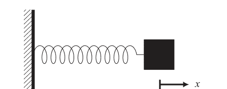

假设没有重力且质量只能在正或负 $x$ 方向移动，位移 $x$ 的解为：$^7$

$$x = A \cos(\omega t + \phi)$$

其中 $A$ 是振荡的振幅，$t$ 是时间，$\phi$ 是相位角，角频率 $\omega$ 由下式给出：

$$\omega = \sqrt{\frac{k}{m}}$$

如果 $A = 0.05$ m，$k = 2$ N/m，$m = 1$ kg，且 $\phi = 0$ rad（这意味着在 $t = 0$ s 时 $x = A$），创建一个数组并填充前8秒内每隔0.1秒的 $x$ 值。绘制这个位移 $x$ 值数组与相应时间 $t$ 值数组元素的关系图。

> $^7$ Resnick and Halliday (1977, pp. 304–305).

### 动手试试！答案 6-1

以下代码解决了这个问题：

```
import matplotlib.pyplot as plt
import numpy as np

A = 0.05
k = 2.0
m = 1.0
phi = 0.0
omega = np.sqrt(k/m)
t = np.arange(0, 8.1, 0.1)
x = A * np.cos(omega * t + phi)

plt.plot(t, x, '-')
plt.xlabel('Time (sec)')
plt.ylabel('Displacement (m)')
plt.title('Displacement for a Mass-Spring System')
```

第10行完成了所有繁重的工作。在该表达式中，t是一个数组，因此当t乘以omega（一个标量）时，t的每个元素都乘以omega。这是我们在第5.2.6节介绍的数组语法的一部分。因为omega乘以t也是一个数组，所以该乘积加上phi的结果也是一个数组。因此，当我们调用NumPy余弦函数cos时，我们是在对一个数组调用它，函数的操作会依次应用于数组的每个元素（参见第6.2.2节）。

在第12行，我们指定用实线连接点，不使用标记。该图有x轴和y轴标签以及一个标题。代码生成的图如图6.9所示。

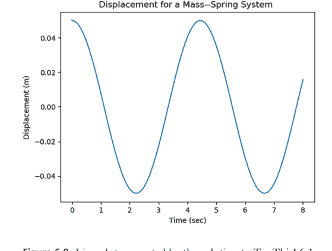

图6.9 由“动手试试！6-1”解决方案生成的线图。

### 动手试试！6-2 计算诊断量：理想气体

假设我们对一种可视为理想气体的气体进行了一系列测量，并在以下时间获得了以下压力值：

| 时间 (s) | 压力 (Pa) |
| :--- | :--- |
| 0.0 | 102 000 |
| 1.0 | 134 000 |
| 2.0 | 143 100 |
| 3.0 | 122 050 |
| 4.0 | 114 180 |
| 5.0 | 103 060 |

理想气体遵循以下关系：

$$PV = nRT$$

其中 $P$ 是气体的压力（单位Pa），$V$ 是其体积（单位m$^3$），$n$ 是气体的摩尔数，$R$ 是气体常数（= 8.31441 J K$^{-1}$ mol$^{-1}$），$T$ 是温度（单位K）。$^8$ 如果气体所占的体积为0.5 m$^3$，且有25 mol气体，那么气体的温度是多少？虽然这可以使用数组语法解决，但请尝试使用一维for循环来解决。同时绘制气体温度随时间变化的图。

### 动手试试！答案 6-2

以下代码解决了这个问题并绘制了图表：

```
import matplotlib.pyplot as plt
import numpy as np

time = np.array([0.0, 1.0, 2.0, 3.0, 4.0, 5.0])
pressure = np.array([102000., 134000., 143100.,
                     122050., 114180., 103060.])
V = 0.5
n = 25.0
R = 8.31441

temperature = np.zeros(np.size(pressure))
for i in range(np.size(pressure)):
    temperature[i] = pressure[i] * V / (n * R)

plt.plot(time, temperature, 'o-')
plt.xlabel('Time (sec)')
plt.ylabel('Temperature (K)')
plt.title('Temperature of Gas Calculated by Ideal Gas Law')
```

$^8$ Dickerson et al. (1984, endsheet).

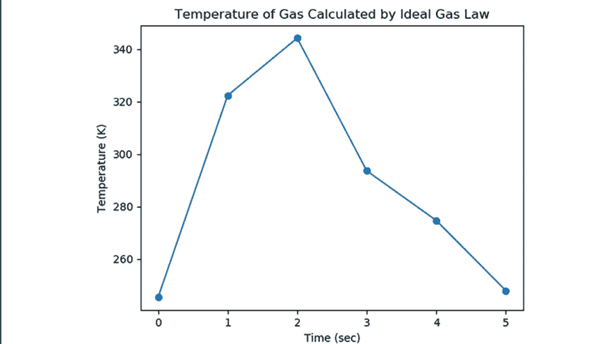

图6.10 由“动手试试！6-2”解决方案生成的自定义线图。

之后，我们可以使用pyplot的`show`在屏幕上渲染图表，或使用`savefig`将图表保存为图像文件。上述代码生成的图表在图6.10中。

在第5行和第6行，当我们输入压力值时，我们在数字后面加了一个小数点。这强制将数字存储为浮点值。写`102000.`与写`102000.0`相同。

在第11行，我们创建了一个数组来保存计算出的温度值。该数组预先用零填充。该数组与`pressure`数组具有相同数量的元素。在`for`循环中，我们遍历数组元素的索引值，将这些值设置为迭代器变量`i`。在循环体（第13行）中，我们使用理想气体定律和索引`i`处的压力计算温度，并将结果存储在`temperature`中对应的索引`i`元素中。

为什么我们遍历`pressure`数组的索引值而不是直接遍历数组元素？也就是说，为什么我们这样循环：

```
for i in range(np.size(pressure)):
```

而不是这样：

```
for ipress in pressure:
```

在第二种循环方式中，迭代器`ipress`被设置为`pressure`的每个值，一次一个。这对于访问每个压力测量值是有效的，但计算完成后，我们将结果存储在哪里？为了将结果存储在数组`temperature`中，我们需要知道`ipress`来自哪个索引（以及我们将计算结果存储在`temperature`中的哪个位置）。因此，我们遍历`pressure`和`temperature`的索引，因为我们需要从`pressure`读取每个元素，并将计算结果存储在`temperature`中的相应位置。

最后，在第15行，我们使用Matplotlib的字母代码绘制一条带有圆形标记的实线。

### 动手试试！6-3 测试子集：春季降水量

对于第6.1节中的月平均总降水量数据，计算西雅图地区春季（定义为三月、四月和五月）的平均月降水量，并将结果打印到屏幕上。使用`for`循环遍历数据点，并使用`if-elif`语句选择要平均的正确值。

### 动手试试！答案 6-3

以下代码完成了任务：

```
import numpy as np
months = np.array([1, 2, 3, 4, 5, 6, 7, 8, 9, 10, 11, 12])
precip = np.array([5.58, 3.54, 4.54, 2.93, 2.10, 1.47,
                   0.49, 1.03, 1.72, 4.31, 6.50, 5.41])
spring_precip_sum = 0.0
for i in range(np.size(months)):
    if months[i] == 3:
        spring_precip_sum = spring_precip_sum + precip[i]
    elif months[i] == 4:
        spring_precip_sum = spring_precip_sum + precip[i]
    elif months[i] == 5:
        spring_precip_sum = spring_precip_sum + precip[i]
    else:
        pass
spring_avg = spring_precip_sum / 3.0
print(spring_avg)
```

这个解决方案与第6.2.5节中的完全相同，只是`if-elif`语句中的测试寻找的是三月、四月和五月（`months`值为3、4和5），并且求和与平均变量名中包含“spring”而不是“summer”。

### 动手试试！6-4 灵活计算诊断量：理想气体

针对“动手试试！6-2”的场景，创建一个函数，该函数接受压力、体积和摩尔数作为输入，并返回使用理想气体定律计算出的温度作为输出。假设压力和温度是数组，但编写函数时使其无论体积和摩尔数是标量还是数组都能工作。如果体积或摩尔数

## 6 基础诊断数据分析

如果输入是数组，假设它们与压力数组大小相同。使用 `for` 循环遍历输入变量中的值，同时计算这些值对应的温度。提示：我们可以使用 NumPy 的 `size` 函数来检查函数的输入参数是否为多元素数组。

### 动手试试！答案 6-4

图 6.11 中的代码实现了我们的目标，并输出了以下温度数组到屏幕（为了更好的显示效果进行了重新格式化）：

```python
import numpy as np

def calculate_gas(p, V, n):
    R = 8.31441
    temperature = np.zeros(np.size(p))
    for i in range(np.size(p)):
        if np.size(V) > 1:
            V_scalar = V[i]
        else:
            V_scalar = V
        if np.size(n) > 1:
            n_scalar = n[i]
        else:
            n_scalar = n
        temperature[i] = p[i] * V_scalar / (n_scalar * R)
    return temperature

time = np.array([0.0, 1.0, 2.0, 3.0, 4.0, 5.0])
pressure = np.array([102000., 134000., 143100.,
                     122050., 114180., 103060.])
V = 0.5
n = 25.0
print(calculate_gas(pressure, V, n))

V = np.array([0.5, 0.55, 0.6, 0.8, 0.4, 0.75])
n = 25.0
print(calculate_gas(pressure, V, n))
```

图 6.11 解决“动手试试！6-4”的代码。

```
[245.35715703  322.3319514   344.22165854  293.58667663  274.65568814  247.9069471 ]
[245.35715703  354.56514653  413.06599025  469.7386826   219.72455051  371.86042064]
```

正如我们在提示中提到的，我们可以通过测试输入参数是否包含多个元素/值来支持使用标量和数组作为输入的灵活性。在前一种情况下，我们将输入参数视为数组，并提取该数组中索引 `i` 位置的值（第 10 行和第 15 行）。如果输入参数只有一个元素/值，我们可以直接使用该值本身（第 12 行和第 17 行）。

如果我们使用数组语法（如第 5.2.6 节所述）来解决这个问题，函数定义会简单得多：

```python
import numpy as np

def calculate_gas(p, V, n):
    R = 8.31441
    return p * V / (n * R)
```

当在 NumPy 数组上使用数组语法时，Python 会自动（且正确地）处理数组与数组、数组与标量或标量与标量之间的运算。例如，当我们用一个数组乘以另一个数组时，Python 会自动将一个数组中的元素乘以另一个数组中的对应元素，并将结果放入一个与两个原始数组大小相同的结果数组的相应位置。Python 还会检查两个数组是否具有正确的大小等，以便进行乘法运算。如果我们用一个数组乘以一个标量，Python 会自动将数组的每个元素乘以该标量，并将结果放入一个与原始数组大小相同的结果数组的相应位置。因此，我们不需要测试输入值是否为数组。

### 动手试试！6-5 测试最大值：春季降水量

对于第 6.1 节中的月平均总降水量数据，计算春季（春季定义为三月、四月和五月）的最大月平均值，并将结果打印到屏幕。根据需要，使用 `for` 循环和各种 `if` 语句。

### 动手试试！答案 6-5

图 6.12 给出了一个使用两个 `for` 循环的解决方案。在第一个 `for` 循环中，我们提取春季的值，并使用类似于“动手试试！6-3”中使用的算法将它们放入一个单独的数组中。在第二个 `for` 循环中，我们使用图 6.3 中的算法来获取最大值，即查看每个春季的值，并询问它是否大于之前检查过的最大值。我们之前在第 6-18 行使用 `if-elif` 语句选择春季值，以及在第 20-23 行找到春季值的最大值时，已经见过类似的代码。新的是在第 6-18 行中使用了索引变量 `j`。它是用来做什么的？

变量 `i` 被设置为 `precip` 数组中每个元素的索引（第 9 行），我们可以使用 `i` 来访问该数组中的每个元素。但是春季只有三个值，而 `precip` 中有 12 个值，所以当我们要填充数组 `spring_precip` 时，我们不能使用变量 `i` 来为 `spring_precip` 中的元素提供索引值。这就是变量 `j` 的用途。我们将 `j` 设置为零，因为数组的第一个元素索引是零，当我们在 `precip` 中遇到一个春季降水量值时，我们将该值复制到春季降水量数组中。然后，我们将 `j` 的值加一。这样，下次我们在 `precip` 中找到另一个春季值时，该值将被复制并存储在 `spring_precip` 的下一个元素中。

顺便说一句，对累加器或累减器变量进行递增或递减操作是如此常见，以至于开发了 `+=` 和 `-=` 运算符来减少重复输入。使用这些运算符，我们可以将：

```python
j = j + 1
```

转换为：

```python
j += 1
```

这两行代码的意思是相同的。类似地：

```python
k = k - 1
```

等同于：

```python
k -= 1
```

在这些情况下，使用 `+=` 和 `-=` 并不能为我们节省太多输入。如果变量名较长，它确实会产生明显的差异。

还有其他方法可以使用分支 `if` 语句来解决这个问题，但这些需要更复杂的 `if` 语句结构，直到第 8.2 节才会讨论。

```python
import numpy as np
months = np.array([1, 2, 3, 4, 5, 6, 7, 8, 9, 10, 11, 12])
precip = np.array([5.58, 3.54, 4.54, 2.93, 2.10, 1.47,
                   0.49, 1.03, 1.72, 4.31, 6.50, 5.41])
spring_precip = np.zeros(3, dtype='d')
j = 0
for i in range(np.size(months)):
    if months[i] == 3:
        spring_precip[j] = precip[i]
        j = j + 1
    elif months[i] == 4:
        spring_precip[j] = precip[i]
        j = j + 1
    elif months[i] == 5:
        spring_precip[j] = precip[i]
        j = j + 1
    else:
        pass

max_spring_precip = spring_precip[0]
for j in range(np.size(spring_precip)):
    if spring_precip[j] > max_spring_precip:
        max_spring_precip = spring_precip[j]

print(max_spring_precip)
```

图 6.12 解决“动手试试！6-5”的代码。

### 动手试试！6-6 切片子集：春季降水量

对于第 6.1 节中的月平均总降水量数据，计算西雅图地区春季（春季定义为三月、四月和五月）的平均月降水量，并将结果打印到屏幕。使用数组切片获取春季值，并使用 `for` 循环帮助计算平均值。

### 动手试试！答案 6-6

以下代码完成了任务：

```python
import numpy as np
months = np.array([1, 2, 3, 4, 5, 6, 7, 8, 9, 10, 11, 12])
precip = np.array([5.58, 3.54, 4.54, 2.93, 2.10, 1.47,
                   0.49, 1.03, 1.72, 4.31, 6.50, 5.41])
spring_precip = precip[2:5]
spring_precip_sum = 0.0
for iprecip in spring_precip:
    spring_precip_sum += iprecip
spring_avg = spring_precip_sum / 3.0
print(spring_avg)
```

这个解决方案与第 6.2.5 节中的基本相同，只是我们对 `precip` 进行切片以提取索引 2、3 和 4 的值（第 5 行的切片操作中，5 是排他的），这些值对应于三月、四月和五月的元素。此外，求和和平均变量中包含“spring”一词，而不是“summer”。最后，如“动手试试！6-5”的解决方案中所述，我们使用：

```python
spring_precip_sum += iprecip
```

而不是：

```python
spring_precip_sum = spring_precip_sum + iprecip
```

以节省输入（并减少打错字的机会）。这两条代码语句的意思是相同的。

### 动手试试！6-7 单位转换：春季降水量

对于第 6.1 节中的月平均总降水量数据，将降水量值从英寸转换为厘米。将结果放入一个名为 `precip_cm` 的新数组中。使用 `for` 循环进行转换。

### 动手试试！答案 6-7

以下代码解决了这个问题：

```python
import numpy as np
precip = np.array([5.58, 3.54, 4.54, 2.93, 2.10, 1.47,
                   0.49, 1.03, 1.72, 4.31, 6.50, 5.41])
precip_cm = np.zeros(np.size(precip), dtype='d')
for i in range(np.size(precip)):
    precip_cm[i] = precip[i] * 2.54
```

使用数组语法，这个问题的解决方案只需要一行代码：

```python
precip_cm = precip * 2.54
```

因为 `precip` 是一个 NumPy 数组，我们将每个元素乘以转换因子，并将其存储在结果数组 `precip_cm` 的相应位置。

### 动手试试！6-8 向后/向前平均：春季降水量

对于第 6.1 节中的月平均总降水量数据，计算从二月到十一月所有月份的降水量“向后/中心/向前”滑动平均值，并将结果存储在一个单独的数组中。对于二月份，这个平均值是一月、二月和三月降水量值的平均值。对于三月份，这个平均值是二月、三月和四月降水量值的平均值，依此类推。使用 `for` 循环进行计算。

### 动手试试！答案 6-8

以下代码解决了这个问题：

```python
import numpy as np
running_mean = np.zeros(10, dtype='d')
for i in range(np.size(running_mean)):
    running_mean[i] = (precip[i] + precip[i+1] + precip[i+2]) / 3.0
```

在第 4 行，我们使用了相对于变量 `i` 值的引用。`i` 的值从零运行到九，即输出数组 `running_mean` 的索引。当 `i` 为零时，这对应于计算二月份的“向后/中心/向前”滑动平均值。但是当应用于对于`precip`数组，`precip[i]`并非二月的降水量，而是一月的（在计算此滚动平均值时理应如此）。同样，当`i`等于零时，`precip[i+1]`是二月的降水量（索引值为1），而`precip[i+2]`是三月的降水量。当`i`等于一时，`precip[i]`、`precip[i+1]`和`precip[i+2]`分别是二月、三月和四月的降水量值。

### 动手试试！6-9 计算偏差：春季降水量

针对第6.1节中的月平均总降水量数据，计算每个月平均总降水量相对于该时段平均降水量的偏差。打印出月总降水量值高于该时段平均值的月份。提示：该时段平均值是所讨论时段（2000–2017年）内月平均总降水量值的平均值。使用`for`循环进行计算。

### 动手试试！答案 6-9

我们分两个阶段解决这个问题。首先，计算时段平均值。接下来，遍历每个月的值，计算其与时段平均值的偏差。最后，遍历每个月的值，检查其是高于还是低于时段平均值。根据此检查的结果，将打印相应的信息。我们可以将最后两个步骤放在同一个循环中。以下是解决方案：

```
import numpy as np
months = np.array([1, 2, 3, 4, 5, 6, 7, 8, 9, 10, 11, 12])
precip = np.array([5.58, 3.54, 4.54, 2.93, 2.10, 1.47,
                   0.49, 1.03, 1.72, 4.31, 6.50, 5.41])

precip_sum = 0.0
for iprecip in precip:
    precip_sum += iprecip
period_avg = precip_sum / 12.0

deviations = np.zeros(np.size(precip))
for i in range(np.size(precip)):
    deviations[i] = precip[i] - period_avg
    if precip[i] > period_avg:
        print(months[i])
```

在第11-15行，我们遍历`precip`的索引，因为我们需要访问`deviations`和`months`中对应的元素。然而，在第7-8行，我们只需要`precip`本身的值，因此无需遍历索引。我们可以直接遍历这些值本身。

### 动手试试！6-10 文档字符串：理想气体函数

为解决“动手试试！6-4”而编写的函数编写一个文档字符串。

### 动手试试！答案 6-10

在图6.13的解决方案中，函数体未给出，因为重点在于文档字符串。在此文档字符串中，我们特别提到该函数仅适用于一维数组，因为使用`for`循环解决“动手试试！6-4”的方案仅适用于此类数组。我们还让文档字符串的第25行示例传入一个包含单个元素的压力数组（第一个位置输入参数），因为函数假设该参数是一个数组（参见“动手试试！6-4”解决方案的第6行）。

```
import numpy as np

def calculate_gas(p, V, n):
    """Calculate the temperature for an Ideal Gas.

    The temperature in K is calculated using the Ideal Gas law
    and is returned by the function.  Input variables may be
    scalars or one-dimensional arrays, except p must be an
    array.  The output will be an array of the same size, etc.
    as the array p.

    Positional Input Parameters:
        p : one-dimensional array
            Pressure in Pa.

        V : scalar or one-dimensional array
            Volume in cubic meters.

        n : scalar or one-dimensional array
            Amount of gas in mol.

    Keyword Input Parameters:
        None

    Examples:
    >>> calculate_gas(np.array([102000.0]), 0.5, 25.0)
    [245.35715703]
    """
    ...
```

图6.13 解决“动手试试！6-10”的代码。

## 6.4 更多学科特定实践

本章的学科特定Jupyter笔记本涵盖以下主题：

- 创建数组并将数组用作函数的参数。
- 使用一维循环与数组元素交互。
- 编写测试以对数据提出问题。
- 使用一维循环执行其他重复性任务。
- 编写文档字符串。

## 6.5 章节回顾

### 6.5.1 自测题

尝试在不查看书籍、任何其他资源或使用Python解释器的情况下完成这些题目。本节所有题目的自测题答案可在本章末尾找到。对于本节所有问题，假设NumPy已作为`np`导入。

**自测题 6-1**

以下NumPy数组创建函数调用的结果是什么？

1. `np.arange(6)`
2. `np.zeros(3)`
3. `np.ones(4, dtype='d')`
4. `np.arange(4, 9, 2)`

**自测题 6-2**

NumPy的`size`函数是做什么的？它返回什么类型的值？

**自测题 6-3**

给定一个一维数组`data`，我们如何创建另一个具有相同元素数量、用零填充且元素类型与`data`相同的一维数组`data_temp`？

**自测题 6-4**

假设`data`是一个一维数组，以下代码的结果是什么？

```
data1 = np.sin(data / np.max(data))
```

描述`data1`是什么。

**自测题 6-5**

什么是`for`循环，它是如何工作的？循环的目的是什么？

**自测题 6-6**

使用`for`循环（且不使用函数调用），计算数组`data`所有元素的乘积，并将结果存储在值`data_product`中。假设`data`中的值是浮点类型。

**自测题 6-7**

如果我们有一个变量，并想根据该变量是否等于六个不同值中的一个来调用不同的函数，我们应该使用哪种分支语句，为什么？

**自测题 6-8**

给定一个一维数组`velocity`，编写代码计算`velocity`中所有超过标量值`threshold`的值的平均值。将结果存储在变量`over_threshold_avg`中。假设`velocity`中的值是浮点类型。

**自测题 6-9**

描述文档字符串的目的。文档字符串如何与代码的其余部分区分开来？

**自测题 6-10**

为什么不建议一次编写多行代码？

### 6.5.2 章节总结

计算机，嗯，进行计算，因此计算机在数据分析方面极其有用。循环和分支这两种结构是编程计算机以处理（大量）数据并计算统计数据和其他量的基础。在研究简单的诊断数据分析时，我们涵盖了以下主题：

- 关于创建数组的更多内容
  - NumPy的`zeros`函数创建一个给定大小（且元素为给定类型）的数组，全部填充为零。
  - NumPy的`ones`函数创建一个给定大小（且元素为给定类型）的数组，全部填充为一。
  - NumPy的`arange`函数创建一个按指定增量（或步长）升序或降序的值数组。
  - 使用数组语法进行算术运算使我们能够创建具有特定特征的数组。
- 查询数组
  - NumPy的`size`函数返回数组中元素的总数。
  - 对于数组`myarray`，变量`myarray.dtype.char`存储一个单字母字符，描述该数组每个元素的类型。
  - `dtype.char`类型码可以传递给数组创建函数，以创建元素类型与现有数组相同的数组。
- 使用函数与数组的两种方式
  - 第一种数组函数：接受数组作为输入，进行计算，并返回一个标量值。示例：NumPy的`min`函数。
  - 第二种数组函数：接受数组作为输入，对数组进行逐元素计算，并返回一个结果数组。示例：NumPy的`cumsum`函数。
- 循环和遍历数组元素
  - 循环是描述计算机如何重复执行任务的结构。
  - 每次执行任务称为循环的一次迭代。
  - 在`for`循环中，每次迭代时，一个变量（称为迭代器）被赋值给一个项集合中的一个值。该集合称为可迭代对象。循环一次遍历该集合中的一个项，每次对应循环的一次迭代。
  - `for`循环通常用于遍历数组的元素。这可以通过直接遍历数组的元素来完成。
  - `for`循环也可以通过遍历数组的索引（无论是手动输入、由NumPy函数`arange`生成，还是由内置函数`range`生成）来遍历数组的元素。
  - `pass`语句用于循环体为空时。
  - 循环不必使用存储在迭代器中的值。
  - 图6.5总结了`for`循环的语法。
- 分支和对数据提问
  - 分支是计算机程序对数据提出问题，并根据答案执行一组代码行而不是另一组代码行的方式。
  - 基本的`if`语句询问一个条件是否为真，如果为真，则执行`if`语句后缩进的代码块。
  - `if-else`语句询问一个条件是否为真，如果为真，则执行`if`语句后缩进的代码块。如果条件为假，Python执行`else`语句后缩进的代码块。
  - 对于选项列表，`if-elif`语句选择第一个条件为真的选项。如果是这样，则执行该条件下的代码块。
  - `pass`语句用于分支语句（例如`if`块、`else`块等）的代码块为空时。
  - 图6.6总结了分支语句的语法。

### 6.5.3 自测答案

### 自测答案 6-1

```
1. array([0, 1, 2, 3, 4, 5])
2. array([ 0., 0., 0.])
3. array([ 1., 1., 1., 1.])
4. array([4, 6, 8])
```

### 自测答案 6-2

`size` 函数返回作为输入传入的数组中元素的总数。调用该函数会返回一个标量整数。

### 自测答案 6-3

```
data_temp = np.zeros(np.size(data), dtype=data.dtype.char)
```

### 自测答案 6-4

`data1` 是一个与 `data` 大小相同的数组。使用数组语法，表达式 `data / np.max(data)` 会将数组 `data` 的每个元素除以 `data` 所有元素的最大值（标量）。该表达式的结果是一个与 `data` 大小相同的数组。该数组作为输入传递给 `sin` 函数，该函数计算输入数组每个元素的正弦值，并将结果返回到数组 `data1` 的相应元素中。

### 自测答案 6-5

`for` 循环遍历一个可迭代项目集合的每个元素，一次将一个元素的值设置为一个称为迭代器的变量。在设置迭代器值之后，Python 执行 `for` 循环体的内容。循环的目的是告诉计算机反复执行某些任务。

### 自测答案 6-6

此代码通过直接循环遍历数组的值来完成任务：

```
1 data_product = 1.0
2 for ivalue in data:
3     data_product = data_product * ivalue
```

而此代码通过循环遍历数组的索引来完成任务：

```
1 data_product = 1.0
2 for i in range(np.size(data)):
3     data_product = data_product * data[i]
```

### 自测答案 6-7

我们应该使用 `if-elif` 语句。虽然可以使用基本的 `if` 或 `if-else` 语句来完成任务，但 `if-elif` 语句将为此任务产生更清晰、更易于理解的代码。

### 自测答案 6-8

我们使用一个基本的 `if` 语句来确保只有大于 `threshold` 的值才被求和作为计算平均值的一部分。我们还创建了一个变量 `count`，用于计算 `velocity` 中满足此条件的元素数量。此代码将完成这种选择性平均：

```
1  sum_over_threshold = 0.0
2  count = 0
3  for ivalue in velocity:
4      if ivalue > threshold:
5          sum_over_threshold += ivalue
6          count += 1
7  over_threshold_avg = sum_over_threshold / float(count)
```

在计算平均值的除法运算之前，将 `count` 转换为浮点数并非必需，但为了清晰和完整性而包含在内。

### 自测答案 6-9

文档字符串向用户提供有关函数目的和用法的文档。它通过将函数 `def` 语句之后立即放置在一组匹配的三引号中，与函数定义的其余部分区分开来。

### 自测答案 6-10

一次编写的代码行越多，查找其中包含的任何错误就越困难。最好以小段代码行编写，并在编写过程中测试这些行是否正常工作。

# 7 二维诊断数据分析

在第 6 章中，我们研究了一维数据数组的分析。在此过程中，我们介绍了 `for` 循环和分支语句。循环使我们能够重复进行某些计算。分支使我们能够对数据提出问题。在本章中，我们将讨论扩展到二维数组。二维数据场景在科学和工程中经常存在：应力沿梁横截面的变化、植物调查样带的时间演变，以及望远镜指向一个位置然后指向另一个位置时天空中辐射率的变化。在本章中，我们介绍用于对此类数据集进行诊断分析的工具——二维数组的创建、操作和运算以及嵌套循环。本章展示了一些等高线图。然而，直到第 14 章我们才讨论如何创建等高线图。

本章中使用的较大数据集可供下载。详情请参见前言中的“支持资源和本书更新”部分。

## 7.1 二维诊断数据分析示例

图 7.1 显示了 2017 年 11 月 11 日 18:00Z 美国大陆地表/近地表气温的填充等高线图。¹ “Z” 表示“祖鲁时区”，与协调世界时（UTC）相同。两者都与格林威治标准时间（GMT）相同。2017 年 11 月 11 日 18:00Z 是美国中部标准时间 2017 年 11 月 11 日中午。

图 7.2 显示了图 7.1 的“放大图”，以伊利诺伊州南部为中心，仅使用表 7.1 中的数据。表 7.2 和表 7.3 分别给出了表 7.1 数据的列和行的经度（东经度数）和纬度（北纬度数）。

图 7.3 显示了使用最近邻（NN）平均算法分析表 7.1 中美国中西部地表/近地表气温的代码。对于表 7.1 中的每个数据点，我们根据该数据点以及所有与其直接相邻并共享一条边的值（即不包括角点）计算平均温度。因此，要计算表 7.1 中第三行、第三列数据点（值为 9.1）的最近邻平均值，我们将对下面方框中的五个值求平均：

| 7.9, | 7.1, | 5.7, | 3.6, | 2.3, | 1.7, | 1.0 |
| 9.9, | 8.5, | 7.4, | 5.7, | 4.9, | 4.5, | 2.1 |
| 12.8, | 10.6, | 9.1, | 8.1, | 8.8, | 8.3, | 4.0 |
| 15.4, | 13.5, | 11.1, | 10.5, | 11.3, | 10.1, | 6.8 |
| 17.6, | 17.0, | 14.7, | 15.3, | 16.3, | 15.1, | 14.4 |

在数据表的边界处，可用于平均的值较少。图 7.3 中的代码生成了一个数组，其值如表 7.4 所示。

在图 7.3 的第 4-9 行中，我们定义了数组 `air_temp`，其中包含表 7.1 数据网格中的值。在第 12-13 行，我们创建了一个充满零的数组 `air_temp_avg`。该数组与 `air_temp` 具有相同的行数和列数，用于保存 `air_temp` 每个（行，列）位置的最近邻平均值。

在第 15-37 行中，我们通过遍历 `air_temp` 的每个值来执行最近邻平均算法，累加 `air_temp` 中每个给定位置存在的所有最近邻点的值，并将该总和除以最近邻点的数量，以获得该位置的最近邻平均值。我们通过检查每个可能的相邻值（第 21-35 行）来进行求和以计算平均值，因为

¹ 这些不是实际测量的温度（例如来自温度计或卫星），而是来自国家环境预测中心（NCEP）/国家大气研究中心（NCAR）再分析 1 项目的瞬时温度。“再分析”使用天气预报模型与天气测量相结合，以获得空间和时间上规则位置的天气变量值。完整数据集在 Kalnay 等人（1996）中描述。

表 7.1 2017 年 11 月 11 日 18:00Z 美国中西部地表/近地表气温（单位：°C）。本表仅显示合理数量的小数位数。数据集中可用的数字比显示的更多。

| 7.9, | 7.1, | 5.7, | 3.6, | 2.3, | 1.7, | 1.0 |
| 9.9, | 8.5, | 7.4, | 5.7, | 4.9, | 4.5, | 2.1 |
| 12.8, | 10.6, | 9.1, | 8.1, | 8.8, | 8.3, | 4.0 |
| 15.4, | 13.5, | 11.1, | 10.5, | 11.3, | 10.1, | 6.8 |
| 17.6, | 17.0, | 14.7, | 15.3, | 16.3, | 15.1, | 14.4 |

表 7.2 表 7.1 中列的经度值（东经度数）。

| 262.5, | 265.0, | 267.5, | 270.0, | 272.5, | 275.0, | 277.5 |

表 7.3 表 7.1 中行的纬度值（北纬度数）。表 7.1 第一行（顶部）元素的纬度是当前表中列出的第一个纬度，依此类推，直到表 7.1 的各行。

| 42.5, | 40.0, | 37.5, | 35.0, | 32.5 |

## 表 7.4 2017年11月11日18:00Z美国中西部地表/近地表气温的最近邻平均值（单位：°C），使用图7.3中的代码计算（即数组 `air_temp_avg` 的内容）。

| 8.30 | 7.30 | 5.95 | 4.32 | 3.12 | 2.38 | 1.60 |
| 9.77 | 8.70 | 7.28 | 5.94 | 5.24 | 4.30 | 2.90 |
| 12.17 | 10.90 | 9.26 | 8.44 | 8.28 | 7.14 | 5.30 |
| 14.83 | 13.52 | 11.78 | 11.26 | 11.40 | 10.32 | 8.83 |
| 16.67 | 15.70 | 14.52 | 14.20 | 14.50 | 13.98 | 12.10 |

相邻单元格的集合会根据我们是在数组中间还是在边界而变化。因此，在域的角落，平均值的计算只有三个点贡献给 `sum_values`，而在内部，则有五个点贡献给 `sum_values`。在这两种示例情况下，`num_values` 的值也不同，分别设置为三和五。

第21-35行中的每个 `if` 语句块都会检查当前数组元素（由索引 `i` 和 `j` 给出）的上方、下方、右侧和左侧的值是否在网格域内（即行和列索引值大于或等于零，且小于或等于行数和列数减一）。例如，在第21-23行中，我们检查当前数组元素上方的点，其行索引等于 `i - 1`，列索引等于 `j`，以查看它是否在网格域内。由于我们知道 `j` 在网格域内，因此不必检查其值。因为我们查看的是当前数组元素上方的点，其行索引的值不能大于行数减一，所以我们只检查其值是否大于或等于零。

作为验证，我们看到表7.4中第三行、第三列的值（即9.26）等于表7.1中围绕并包括值9.1的方框值的平均值，这正是我们期望最近邻算法应该给我们的结果。我们还在图7.4中绘制了表7.4的数据。当我们将图7.4与图7.2进行比较时，我们看到温度的过渡——从西南向东北的下降——更加平滑，并且在空间上的变化不那么大。最近邻平均使得空间梯度——从一个位置到另一个位置变化的剧烈程度——不那么明显。

最后，在图7.3的第40-42行中，我们提取了刚刚计算的最近邻平均值的一个 `subarray`，并将值转换为开尔文（K）。然后，这些开尔文值被表示为开尔文最大值的分数。数组 `air_temp_avg_sub` 和 `fraction_sub` 的值分别在表7.5和表7.6中给出。

本节中的示例除了说明二维诊断数据分析外，还将用于：说明编写程序的四步过程（第11.1节），描述 *n* 维数据分析（第12.1节），以及描述如何制作等高线图和动画（第14.1节）。

# 7 二维诊断数据分析

```python
import numpy as np

#- 创建数据数组：
air_temp = np.array( \
    [[ 7.9,  7.1,  5.7,  3.6,  2.3,  1.7,  1.0],
     [ 9.9,  8.5,  7.4,  5.7,  4.9,  4.5,  2.1],
     [12.8, 10.6,  9.1,  8.1,  8.8,  8.3,  4.0],
     [15.4, 13.5, 11.1, 10.5, 11.3, 10.1,  6.8],
     [17.6, 17.0, 14.7, 15.3, 16.3, 15.1, 14.4]] )

#- 创建零数组以保存平均值：
air_temp_avg = np.zeros(np.shape(air_temp),
                        dtype=air_temp.dtype.char)
#- 使用最近邻算法计算平均值：
avg_shape = np.shape(air_temp_avg)
for i in range(avg_shape[0]):
    for j in range(avg_shape[1]):
        sum_values = air_temp[i,j]    #+ 中心点
        num_values = 1

        if (i - 1) >= 0:              #+ 上方点
            sum_values += air_temp[i-1,j]
            num_values += 1

        if (i + 1) < avg_shape[0]:    #+ 下方点
            sum_values += air_temp[i+1,j]
            num_values += 1

        if (j - 1) >= 0:              #+ 左侧点
            sum_values += air_temp[i,j-1]
            num_values += 1

        if (j + 1) < avg_shape[1]:    #+ 右侧点
            sum_values += air_temp[i,j+1]
            num_values += 1

        air_temp_avg[i,j] = sum_values / num_values

#- 获取子数组和开尔文值作为最大值的分数：
air_temp_avg_sub = air_temp_avg[1:4, 2:4]
air_temp_avg_sub_K = air_temp_avg_sub + 273.15
fraction_sub = air_temp_avg_sub_K / np.max(air_temp_avg_sub_K)
```

图7.3 分析表7.1中美国中西部地表/近地表气温的代码。

**表 7.5** 2017年11月11日18:00Z美国中西部地表/近地表气温最近邻平均值的子数组（单位：°C），使用图7.3中的代码计算（即数组 `air_temp_avg_sub` 的内容）。

```
7.28,  5.94
9.26,  8.44
11.78, 11.26
```

**表 7.6** 表7.5中的值表示为数组中最大温度的分数。在计算分数之前，分子和分母的值都从摄氏度转换为开尔文。这些值使用图7.3中的代码计算（即数组 `fraction_sub` 的内容）。

```
0.9842, 0.9795
0.9912, 0.9883
1.0000, 0.9982
```

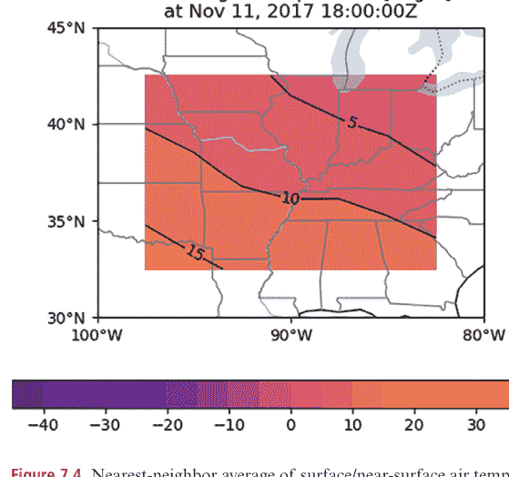

**图 7.4** 2017年11月11日18:00Z美国中西部地表/近地表气温的最近邻平均值（单位：°C）。

## 7.2 Python编程基础

在第5章和第6章中，我们学习了如何使用循环和分支在数组中存储和计算数据。在第7.1节的示例中，我们将对数组和循环的理解扩展到二维数组。二维数组是值的网格，而一维数组是值的列表或序列。一维数组看起来像图7.5。另一方面，二维数组看起来像图7.6。二维数组既有高度也有宽度，而不仅仅只有长度。换句话说，数组的特征是行数和列数，而不仅仅是元素的数量。在图7.3的第4-9行和第12-13行中，我们创建了两个不同的二维数组。

创建二维数组（在图7.3的第15-37行）之后，我们使用**嵌套循环**遍历输入数组 `air_temp` 的每个元素，并计算该点的最近邻平均值。在第40-42行中，我们获取最近邻平均值的一个子数组，将其转换为开尔文，并将这些值表示为子数组中开尔文最大值的分数。在本节中，我们将通过检查以下关于二维数组的内容来解析这些任务是如何完成的：描述这些数组的**形状**并创建它们、访问和设置元素以及切片子数组、使用这些数组的数组语法和函数调用，以及使用嵌套循环使用这些数组进行计算。

在本节其余的代码示例中，假设NumPy已经作为 `np` 导入。

| 7.9 | 7.1 | 5.7 | 3.6 | 2.3 | 1.7 | 1.0 |

**图 7.5** 一维数组的示意图。这些数组值是表7.4的第一行。

| 7.9 | 7.1 | 5.7 | 3.6 | 2.3 | 1.7 | 1.0 |
| 9.9 | 8.5 | 7.4 | 5.7 | 4.9 | 4.5 | 2.1 |
| 12.8 | 10.6 | 9.1 | 8.1 | 8.8 | 8.3 | 4.0 |

**图 7.6** 二维数组的示意图。这些数组值是表7.4的前三行。

### 7.2.1 二维数组的形状

因为二维数组既有行也有列，所以我们需要的不仅仅是数组中的元素总数来正确描述数组。在NumPy中，二维数组由它们的形状描述。数组的形状是一个元组，其元素数量等于数组的维度数。图7.3中第4-9行定义的 `air_temp` 数组的形状由元组 `(5, 7)` 给出。该元组有两个元素，因为数组是二维的。

形状元组的内容告诉我们数组中有多少行和列。形状元组中最右边的值告诉我们数组中有多少列。第12.2.1节展示了这如何推广到 *n* 维数组，其中 *n* 是整数0、1、2、3及更高。*N* 维数组（对于 *n* > 1）也称为多维数组。对于二维数组，形状元组的第一个值告诉我们数组中有多少行。因为 `air_temp` 数组的形状是 `(5, 7)`，我们知道该数组有五行七列。

如果我们已经定义了一个数组并且想知道数组的形状，NumPy函数 `shape` 将返回形状元组。因此，如果在运行图7.3中的代码后我们输入：

```
In [1]: print(np.shape(air_temp))

(5, 7)
```

我们将获得 `air_temp` 的形状。我们可以通过将形状元组的返回值保存到一个变量中，并通过索引访问每个元组元素来访问形状元组的每个元素。因为 `shape` 的返回值是一个元组，我们也可以通过将方括号直接放在 `shape` 调用之后，通过索引访问每个元组元素：

```
In [1]: air_temp_shape = np.shape(air_temp)
       print(air_temp_shape[0])

5
```

```
In [2]: print(air_temp_shape[1])

7
```

```
In [3]: print(np.shape(air_temp)[0])

5
```

```
In [4]: print(np.shape(air_temp)[1])

7
```

# 7 二维诊断数据分析

在单元格 `In [3]` 和 `In [4]` 中，首先执行 `shape` 调用，然后分别提取形状元组的索引 0 和索引 1 的值，并将该值传递给 `print` 函数进行显示。作为使用 `shape` 的另一个例子，图 7.3 中的第 15 行将数组 `air_temp_shape` 的形状保存到变量 `avg_shape` 中。

我们在第 5.2.6 节介绍的一维数组上下文中引入的 NumPy 函数 `size`，同样适用于二维数组。该函数返回数组中的元素总数。因此，如果在运行图 7.3 中的代码后，我们输入：

```
In [1]: print(np.size(air_temp))

35
```

我们将获得数组中的元素总数，该值等于形状元组中所有值的乘积。

`shape` 的返回值是一个元组，而 `size` 的返回值是一个标量（即一个普通的数字）。对于二维数组，这是直观的。但对于一维数组也是如此，而在后一种情况下，它可能看起来不那么直观：

```
In [1]: data = np.arange(0, 1.1, 0.25)
       print(data)

[ 0.    0.25  0.5   0.75  1.  ]
```

```
In [2]: print(np.size(data))

5
```

```
In [3]: print(np.shape(data))

(5,)
```

单元格 `In [2]` 中对 `size` 函数的调用返回 `data` 中的元素总数。单元格 `In [3]` 中对 `shape` 的调用似乎做了同样的事情，但结果在括号内。区别是什么？对于一维数组，调用 `size` 和 `shape` 会产生相同的数值，但在后一种情况下，该值被嵌入在一个元组中（这就是打印输出中括号所表示的含义）。

### 7.2.2 创建二维数组

我们用于创建一维数组的许多函数也可用于创建二维数组。与一维数组一样，我们可以从列表创建二维数组，前提是该列表由本身是相同长度列表的元素组成。这里有一个小例子：

```
data_list = [[ 2.3, 4.5, -1.1],
             [-0.9, 7.2,  5.0]]
```

上面的变量 `data_list` 是一个包含两个元素的列表。`data_list` 的每个元素都是一个包含三个元素的列表。当使用 NumPy 的 `array` 函数将此列表转换为数组时：

```
In [1]: data_array = np.array(data_list)
        print(data_array)

[[ 2.3  4.5 -1.1]
 [-0.9  7.2  5. ]]
```

结果是一个两行三列的数组。在这种 `print` 表示中，每一行由一组方括号分组，所有行（因此整个数组本身）由外层的方括号分组。在图 7.3 的代码中，我们在第 4-9 行就是这样创建数组 `air_temp` 的。

通常，我们希望创建一个具有给定形状、用零或一填充的数组。NumPy 函数 `zeros` 和 `ones` 为我们做到了这一点，其方式类似于第 6.2.1 节的一维情况，但在二维情况下，传递给函数调用的位置输入参数是一个形状元组，而不是数组中的元素数量。形状元组指定了零或一数组将具有的行数和列数。在图 7.3 的第 12-13 行，我们使用 NumPy 的 `zeros` 函数创建数组 `air_temp_avg`（为方便起见，此处重现）：

```
air_temp_avg = np.zeros(np.shape(air_temp),
                       dtype=air_temp.dtype.char)
```

参数 `np.shape(air_temp)` 是 `air_temp` 的形状元组，它与 `air_temp_avg` 的形状相同。换句话说，这段代码生成了一个用零填充的数组 `air_temp_avg`，其形状与 `air_temp` 相同。`air_temp_avg` 的元素也具有与 `air_temp` 相同的数据类型，如 `dtype` 关键字输入参数所指定。

在上面的代码行中，传递给 `zeros` 函数的形状元组是对数组 `air_temp` 调用 NumPy 函数 `shape` 的返回值。我们也可以手动输入一个形状元组。这段代码：

```
air_temp_avg = np.zeros((5, 7),
                       dtype=air_temp.dtype.char)
```

将产生完全相同的结果，因为 `air_temp` 是一个五行七列的数组。同样，形状是以元组 `((5, 7))` 的形式输入的，而不仅仅是两个数字 `(5, 7)`。我们是将一个单一的位置输入参数（元组）传递给 `zeros`，而不是两个位置输入参数。要创建一个用一填充的二维数组，我们可以以与 `zeros` 相同的方式使用 NumPy 函数 `ones`。

在第 6.2.1 节中，我们使用 NumPy 函数 `arange` 创建了具有规则递增值的一维数组。`arange` 没有二维版本，但我们可以通过使用 `arange` 创建一个一维数组，然后使用 NumPy 函数 `reshape` 将该数组重塑为二维数组来实现类似的功能。例如，在下面的代码中，我们首先创建一个包含从 0 到 11 的整数的一维数组 `data`，然后使用 `reshape` 将该数组转换为具有四行三列的二维数组：

```
data = np.arange(12)
data = np.reshape(data, (4, 3))
```

结果是：

```
In [1]: print(data)
[[ 0  1  2]
 [ 3  4  5]
 [ 6  7  8]
 [ 9 10 11]]
```

`reshape` 函数从一维数组创建二维数组，一次一行。也就是说，它遍历一维数组的元素，直到在输出数组中填满第一行，然后从一维数组中尚未传输的下一个值开始填充第二行，依此类推。

### 7.2.3 在二维数组中访问、设置和切片

访问和设置元素以及切片子数组的语法与列表和一维数组中的做法非常相似。维度中的第一个元素索引为 0，第二个元素索引为 1，依此类推。对于切片，通过给出下界索引、冒号，然后上界索引来描述一个值范围，其中下界包含在内，而上界不包含在内。所有这些情况的区别在于，我们不是为一维指定索引值，而是必须为二维指定索引值。每个维度的索引值在数组名称后的方括号中用逗号分隔。

**访问和设置元素** 考虑以下四行三列的（其他）温度数组 `temp`（单位：°C）：

```
temp = np.array([[ 5.1,  1.4, -2.1],
                 [-0.9,  7.2, -1.7],
                 [ 2.3, -9.1, -2.0],
                 [-0.7,  8.4,  6.9]])
```

要访问值 $-1.7$（第二行、第三列的值），我们输入 `temp[1,2]`：

```
In [1]: print(temp[1,2])

-1.7
```

数组名称后方括号中的第一个值给出元素的行索引。方括号中的第二个值给出列索引。第二行的索引为 1，而第三列的索引为 2。当在 Python 中显示数组时，无论是通过输入还是通过打印其内容，顶行是第一行，行索引为 0，最左边的列是第一列，列索引为 0。方括号中维度的顺序遵循二维数组形状元组中的顺序：第一个值指定行，第二个值指定列。

要设置二维数组的值，我们使用相同的语法，只是被更改的数组元素的引用位于赋值语句中等号的左侧。因此，要将 `temp` 数组的第二行、第三列的值设置为 4.9，我们输入：

```
temp[1,2] = 4.9
```

如果执行以下代码：

```
temp = np.array([[ 5.1,  1.4, -2.1],
                 [-0.9,  7.2, -1.7],
                 [ 2.3, -9.1, -2.0],
                 [-0.7,  8.4,  6.9]])
temp[1,2] = 4.9
```

结果是：

```
In [1]: print(temp)

[[ 5.1  1.4 -2.1]
 [-0.9  7.2  4.9]
 [ 2.3 -9.1 -2. ]
 [-0.7  8.4  6.9]]
```

`temp` 中第二行、第三列的元素已从 $-1.7$ 更改为 4.9。在图 7.3 的代码中，我们在哪里访问和设置元素？在该代码中，我们不是通过输入数字来指定我们正在访问或设置的元素，而是通过变量 `i` 和 `j` 的值以及使用这些变量的操作来指定。因此，在第 18 行，我们将数组 `sum_values` 初始化为 `air_temp` 在行索引 `i` 和列索引 `j` 给定的元素处的值（即平均邻域中心的点）。在其他行中，例如第 22 行，我们通过语法 `air_temp[i-1,j]` 引用 `air_temp` 中位于索引 `i` 行上方一行、索引 `j` 列处的元素。在第 37 行，我们将 `air_temp_avg` 在行索引 `i` 和列索引 `j` 处的值设置为表达式 `sum_values / num_values` 的返回值。

# 7 二维诊断数据分析

**切片子数组** 考虑原始、未更改的数组 `temp`：

```
temp = np.array([[ 5.1,  1.4, -2.1],
                [-0.9,  7.2, -1.7],
                [ 2.3, -9.1, -2.0],
                [-0.7,  8.4,  6.9]])
```

我们如何创建一个由第二行和第三行以及第一列和第二列的值组成的子数组？以下代码从 `temp` 中提取这样一个子数组并将其保存在 `temp_sub` 中：

```
temp_sub = temp[1:3, 0:2]
```

因此：

```
In [1]: print(temp_sub)

[[-0.9  7.2]
 [ 2.3 -9.1]]
```

`1:3` 指定了行的范围，从索引 1 行（包含）开始，到索引 3 行（不包含）结束。`0:2` 指定了列的范围，从索引 0 列（包含）开始，到索引 2 列（不包含）结束。

要切片到某个维度的开头或结尾，可以省略冒号前（对于“到开头”的情况）或冒号后（对于“到结尾”的情况）的索引值。因此，以下代码：

```
temp = np.array([[ 5.1,  1.4, -2.1],
                [-0.9,  7.2, -1.7],
                [ 2.3, -9.1, -2.0],
                [-0.7,  8.4,  6.9]])
temp_sub = temp[:3, 0:]
```

产生以下结果：

```
In [1]: print(temp_sub)

[[ 5.1  1.4 -2.1]
 [-0.9  7.2 -1.7]
 [ 2.3 -9.1 -2. ]]
```

`:3` 语法切片所有行，从第一行到索引 2 行（即索引 3 是上界，不包含）。`0:` 语法切片所有列，因为索引 0 是第一列，并且作为该维度切片的下界，是包含的。

如果我们想沿着某个维度切片所有值，可以使用不带指定索引的冒号。因此，切片语法 `0:` 与 `:` 相同。

我们还可以使用负索引来指定沿某个维度切片的下界（包含）或上界（不包含）。因此：

```
temp = np.array([[ 5.1,  1.4, -2.1],
                 [-0.9,  7.2, -1.7],
                 [ 2.3, -9.1, -2.0],
                 [-0.7,  8.4,  6.9]])
temp_sub = temp[:3, 0:-1]
```

产生：

```
In [1]: print(temp_sub)

[[ 5.1  1.4]
 [-0.9  7.2]
 [ 2.3 -9.1]]
```

`0:-1` 语法*不会*将切片扩展到所有列，包括最后一个元素。相反，因为 `-1` 索引指的是最后一列，并且该值在冒号的右侧，所以该索引被视为上界（不包含）。因此，`temp_sub` 中的最后一列是索引 1 列，而不是索引 2（或最后一列）列。

与一维数组一样，我们可以使用数组切片一次性为二维数组中的值赋值。因此：

```
temp = np.array([[ 5.1,  1.4, -2.1],
                 [-0.9,  7.2, -1.7],
                 [ 2.3, -9.1, -2.0],
                 [-0.7,  8.4,  6.9]])
temp[2:, :2] = temp[:2, 1:]
```

将前两行、后两列的子数组元素放入最后两行、前两列的子数组元素位置。结果是 `temp` 变为：

```
In [1]: print(temp)

[[ 5.1  1.4 -2.1]
 [-0.9  7.2 -1.7]
 [ 1.4 -2.1 -2. ]
 [ 7.2 -1.7  6.9]]
```

有了这个背景，我们看到图 7.3 中第 40 行的代码提取了 `air_temp_avg` 的一个子数组，该子数组从索引 1 行到索引 3 行，以及从索引 2 列到索引 3 列。结果是表 7.5 中的子数组。

### 7.2.4 二维数组中的数组语法和函数

正如我们在第 5.2.6、6.2.1 和 6.2.2 节中看到的，数组语法和许多 NumPy 数组函数允许我们：(1) 对一维数组进行逐元素操作，(2) 对一维数组逐元素应用函数，以及 (3) 使用函数进行考虑数组中所有元素的计算，而无需使用循环。同样的方法也适用于二维数组。因此，以下使用数组 `temp` 的代码：

```
temp = np.array([[ 5.1,  1.4, -2.1],
                 [-0.9,  7.2, -1.7],
                 [ 2.3, -9.1, -2.0],
                 [-0.7,  8.4,  6.9]])
double_temp = temp * 2.0
```

创建了一个与 `temp` 形状相同的数组 `double_temp`，其内容为：

```
In [1]: print(double_temp)

[[ 10.2   2.8  -4.2]
 [ -1.8  14.4  -3.4]
 [  4.6 -18.2  -4. ]
 [ -1.4  16.8  13.8]]
```

其中每个元素都是 `temp` 数组中对应值的两倍。乘以 2.0 是在 `temp` 上逐元素完成的。

同样，如果我们以某种方式组合两个二维数组，操作是在对应元素之间逐元素完成的。如果我们将上面的 `temp` 和 `double_temp` 相加，两个数组的每个对应元素相加，结果是一个形状相同的数组：

```
In [1]: combined_temp = temp + double_temp
        print(combined_temp)

[[ 15.3   4.2  -6.3]
 [ -2.7  21.6  -5.1]
 [  6.9 -27.3  -6. ]
 [ -2.1  25.2  20.7]]
```

如果我们将 `temp` 数组传递给一个接受数组并逐元素操作它们的 NumPy 函数——`sin` 函数就是这样一个函数——结果是另一个与输入 `temp` 形状相同的数组，其中每个元素是 `temp` 中对应元素的正弦值：

```
In [1]: sine_temp = np.sin(temp)
       print(sine_temp)
```

```
[[-0.92581468  0.98544973 -0.86320937]
 [-0.78332691  0.79366786 -0.99166481]
 [ 0.74570521 -0.31909836 -0.90929743]
 [-0.64421769  0.85459891  0.57843976]]
```

最后，一些 NumPy 函数接受数组作为输入参数，并在进行计算时考虑数组中的所有元素，而无需显式使用循环。这不仅适用于一维数组，也适用于二维数组。例如，NumPy 的 `min` 函数会遍历二维数组中的所有元素，并返回值最小的元素。如果应用于上面的 `sine_temp` 数组，我们得到：

```
In [1]: print(np.min(sine_temp))
```

```
-0.9916648104524686
```

图 7.3 中代码的第 41 行说明了在二维数组上使用数组语法。代码中的第 42 行说明了同时使用数组语法和一个考虑二维数组中所有元素进行计算的函数。在第 41 行中，加法 273.15 是在 `air_temp_avg_sub` 的每个元素上完成的，结果是一个形状相同的数组，其中包含这些值，称为 `air_temp_avg_sub_K`。`np.max(air_temp_avg_sub_K)` 表达式返回 `air_temp_avg_sub_K` 中所有元素的最大值。在第 42 行的右侧其余部分中，`air_temp_avg_sub_K` 中的每个元素除以该数组中的最大值，以将 `air_temp_avg_sub_K` 的“单位”转换为 `air_temp_avg_sub_K` 中所有元素最大值的分数。

顺便提一下，在第 12.2.3 节中，我们将发现对于更高维数组，数组语法和 NumPy 函数的语法在很大程度上与一维和二维情况完全相同。因此，本节中显示使用数组进行操作和函数调用的代码示例，即使数组是三维或更多维的，也不会改变。

### 7.2.5 嵌套 for 循环

第 6.2.3 节介绍了使用循环遍历数组中的每个元素以访问或设置元素。这可以通过循环遍历数组元素的值或数组元素的索引来完成。对于二维数组，单个 `for` 循环无法直接遍历数组的所有元素。但是，通过使用两个 `for` 循环，一个在另一个内部——通过嵌套循环——我们可以遍历所有行索引，并且对于每个行索引，遍历所有列索引，以访问数组中所有可能的行和列索引组合。

考虑以下代码片段，它定义了数组 `temp`，然后遍历每个元素，将值输出到屏幕：

```
temp = np.array([[ 5.1,  1.4, -2.1],
                [-0.9,  7.2, -1.7],
                [ 2.3, -9.1, -2.0],
                [-0.7,  8.4,  6.9]])

for i in range(4):
    for j in range(3):
        print("(i,j) = (" + str(i) + "," + str(j) + \n              ") value:  " + str(temp[i,j]))
```

运行时，以下内容打印到屏幕：

```
(i,j) = (0,0) value:  5.1
(i,j) = (0,1) value:  1.4
(i,j) = (0,2) value: -2.1
(i,j) = (1,0) value: -0.9
(i,j) = (1,1) value:  7.2
(i,j) = (1,2) value: -1.7
(i,j) = (2,0) value:  2.3
(i,j) = (2,1) value: -9.1
(i,j) = (2,2) value: -2.0
(i,j) = (3,0) value: -0.7
(i,j) = (3,1) value:  8.4
(i,j) = (3,2) value:  6.9
```

发生了什么？第一个 `for` 循环遍历值 0、1、2 和 3（`range(4)` 调用的结果），将它们依次设置为迭代器 `i`，每次迭代一次。因此，在第一个（或外部）`for` 循环的第一次迭代中，`i` 被设置为 0，并且循环体被执行。但外部循环体的第一行是第二个（或内部）`for` 循环的开始。内部循环遍历值 0、1 和 2（`range(3)` 调用的结果），将它们依次设置为迭代器 `j`，每次迭代一次。在内部循环的所有这些迭代中，`i` 的值保持不变——即 0。

换句话说，对于外部循环的第一次迭代，我们运行内部循环的所有迭代，因为该内部循环是外部循环的主体。对于内部循环的所有这些迭代，我们执行内部循环的主体（第 7-8 行的 `print` 语句）。在内部循环的所有这些迭代中，`i` 的值保持不变——即 0。

因此，代码首先将 `i` 设置为 0，然后将 `j` 设置为 0、1 和 2，并且对于 `j` 的每个值，我们打印出 `i` 和 `j` 的值以及 `temp` 在行索引 `i` 和列索引 `j` 处的值。这完成了外部循环的第一次迭代。

接下来，我们进行外部循环的第二次迭代：`i` 被设置为 1，`j` 被设置为 0、1 和 2，并且对于 `j` 的每个值，我们打印出 `i` 和 `j` 的值以及 `temp` 在行索引 `i` 和列索引 `j` 处的值。这完成了外部循环的第二次迭代。

第三次迭代从将 `i` 设置为二开始，然后其余过程与前两次迭代相同。第四次迭代从将 `i` 设置为三开始，然后其余过程与其他迭代相同。由于 `i` 等于三的迭代是外层循环的最后一次迭代，当该迭代结束时，不再进行更多循环。

外层和内层循环遍历的值分别是 `temp` 的行和列的索引。由于 `temp` 有四行，外层循环遍历 0、1、2 和 3。由于 `temp` 有三列，内层循环遍历 0、1 和 2。虽然可以先遍历列再遍历行，而不是像我们上面的例子那样先遍历行再遍历列，但通常在外层循环中遍历行、在内层循环中遍历列效率更高。第 12.2.6 节描述了为什么是这种情况。

在我们上面的例子中，行和列索引是通过调用 `range` 生成的，分别传入行数和列数。我们可以使用 `shape` 函数获取行数和列数，从而能够编写嵌套的 `for` 循环，使其适用于任何数组，而不仅仅是那些我们可以直观计数行和列的数组。此代码保存数组 `temp` 的形状元组，并在 `for` 循环的 `range` 调用中使用这些值：

```
temp_shape = np.shape(temp)
for i in range(temp_shape[0]):
    for j in range(temp_shape[1]):
        print("(i,j) = (" + str(i) + "," + str(j) + \n              ") value:  " + str(temp[i,j]))
```

此代码直接使用 `shape` 调用的返回值，并提取适当的元素用于 `for` 循环的 `range` 调用：

```
for i in range(np.shape(temp)[0]):
    for j in range(np.shape(temp)[1]):
        print("(i,j) = (" + str(i) + "," + str(j) + \n              ") value:  " + str(temp[i,j]))
```

本节中所有上述嵌套 `for` 循环都做同样的事情：它们遍历 `temp` 中的所有行，然后对于每一行，遍历该行中的所有列。

图 7.3 中的第 15–37 行说明了使用嵌套循环遍历 `air_temp` 的所有元素，计算每个元素的最近邻平均值，并将平均值保存在 `air_temp_avg` 的相应元素中。在该示例中，内层循环的主体不仅仅是单个 `print` 语句，还包括第 18–37 行。所有这些行都在内层循环的每次迭代中执行，并且内层循环的所有迭代都发生在外层循环的每次迭代中。

在第 6.2.3 节和当前章节中，我们将 `for` 循环的使用限制为遍历数字数组。在第 13.2.6 节中，我们将发现 `for` 循环可以遍历不仅仅是数字数组。并且，在第 8.2.6 节中，我们将研究更复杂的嵌套循环。

## 7.3 动手试试！

我们考虑与第 7.1 节中见过的类似示例，并解决第 7.2 节的主要主题。我们练习创建和操作二维数组。我们还练习编写嵌套循环来操作二维数组。
对于本节的所有练习，假设 NumPy 已作为 `np` 导入。

### 动手试试！7-1 创建数组：空气质量

表 7.7 列出了 2013 年 6 月 8 日中国北京四个相对靠近的地点的每小时 PM2.5 浓度（单位：µg/m³）测量值。PM2.5 指直径小于 2.5 µm 的空气颗粒物。这些颗粒物的高浓度表明空气质量差。² 使用 Python，创建一个名为 `pm25` 的二维数组，其中包含表 7.7 中的数据。然后，创建一个名为 `pm25_new` 的零数组，其形状与 `pm25` 相同。

### 动手试试！答案 7-1

图 7.7 中的代码完成了上述任务。
在定义数组 `pm25` 时，我们在图 7.7 的第 25 行指定了 'd' 类型码。在第 26 行定义 `pm25_new` 时也是如此。这确保数组的所有元素都存储为浮点数而不是整数。如果我们省略 `dtype='d'` 关键字输入参数设置，`pm25` 的元素可能会被定义为整数（在 NumPy 的早期版本中），因为输入列表中的值都是整数。通常，这不是问题，因为如果后来我们使用算术运算符与 `pm25` 一起使用，Python 会自动转换数组以尽可能保留信息。尽管如此，如果我们事先知道希望 `pm25` 的元素是浮点数，我们应该从一开始就将数组元素设为浮点数。
在图 7.7 的第 26 行，我们使用 NumPy 的 `shape` 函数获取 `pm25` 数组的形状，并将该形状用作 `pm25_new` 的形状。我们也可以手动输入新数组的形状：

```
pm25_new = np.zeros((24, 4), dtype='d')
```

这与第 26 行的结果相同，因为 `pm25` 有 24 行和 4 列。
请记住，“(24, 4)”以及 “np.shape(pm25)” 的返回值都是元组。然而，我们可以在 `zeros` 的输入参数列表中使用列表或数组代替元组；`zeros` 函数不关心输入是可变的还是不可变的，等等。因此：

```
pm25_new = np.zeros([24, 4], dtype='d')
```

² Liang et al. (2016)。

以及

```
pm25_new = np.zeros(np.array([24,4]), dtype='d')
```

也可以正常工作。

**表 7.7** 2013 年 6 月 8 日中国北京四个不同但靠近地点的每小时 PM$_{2.5}$ 浓度（单位：$\mu g/m^3$）。第一行是第 0 小时，最后一行是第 23 小时。第一列是东四站点的测量值，第二列是东四环站点的测量值，第三列是农展馆站点的测量值，最后一列是美国大使馆站点的测量值（Liang et al., 2016; Dua and Graff, 2019）。数据在动手试试！7-1 中描述。

| 小时 | 东四 | 东四环 | 农展馆 | 美国大使馆 |
|---|---|---|---|---|
| 0 | 118 | 132 | 128 | 139 |
| 1 | 114 | 129 | 125 | 138 |
| 2 | 128 | 119 | 130 | 139 |
| 3 | 122 | 118 | 119 | 135 |
| 4 | 124 | 114 | 121 | 134 |
| 5 | 108 | 119 | 125 | 139 |
| 6 | 112 | 138 | 130 | 140 |
| 7 | 148 | 141 | 140 | 147 |
| 8 | 163 | 162 | 124 | 161 |
| 9 | 195 | 169 | 154 | 191 |
| 10 | 216 | 198 | 199 | 212 |
| 11 | 226 | 220 | 213 | 220 |
| 12 | 234 | 218 | 218 | 221 |
| 13 | 219 | 197 | 187 | 206 |
| 14 | 204 | 193 | 172 | 189 |
| 15 | 191 | 190 | 181 | 187 |
| 16 | 185 | 194 | 186 | 187 |
| 17 | 193 | 193 | 185 | 191 |
| 18 | 195 | 193 | 194 | 191 |
| 19 | 188 | 191 | 174 | 196 |
| 20 | 200 | 176 | 154 | 194 |
| 21 | 186 | 166 | 128 | 184 |
| 22 | 177 | 162 | 134 | 182 |
| 23 | 184 | 153 | 104 | 172 |

# 7 二维诊断数据分析

```
pm25 = np.array( \n    [[118, 132, 128, 139],
     [114, 129, 125, 138],
     [128, 119, 130, 139],
     [122, 118, 119, 135],
     [124, 114, 121, 134],
     [108, 119, 125, 139],
     [112, 138, 130, 140],
     [148, 141, 140, 147],
     [163, 162, 124, 161],
     [195, 169, 154, 191],
     [216, 198, 199, 212],
     [226, 220, 213, 220],
     [234, 218, 218, 221],
     [219, 197, 187, 206],
     [204, 193, 172, 189],
     [191, 190, 181, 187],
     [185, 194, 186, 187],
     [193, 193, 185, 191],
     [195, 193, 194, 191],
     [188, 191, 174, 196],
     [200, 176, 154, 194],
     [186, 166, 128, 184],
     [177, 162, 134, 182],
     [184, 153, 104, 172]], dtype='d')
pm25_new = np.zeros(np.shape(pm25), dtype='d')
```

图 7.7 解决动手试试！7-1 的代码。

### 动手试试！7-2 访问和切片数组：地表温度

考虑表 7.1 中的数据，这些数据在表 7.2 和表 7.3 中分别给出了经度和纬度坐标。完成以下任务：

- 1. 保存所有经度小于（即西于）268° E 的地点的温度子数组。将此子数组称为 `air_temp_1`。
- 2. 将 275° E 和 35° N 处的温度值保存为 `point_1`。
- 3. 假设我们发现最后一列的值实际上都应该与左边一列的值相同。更改 `air_temp` 以反映这一发现。

通过显式输入索引来执行访问和切片。计算机不需要弄清楚哪些行和列对应于上述条件。

### 试一试！答案 7-2

以下解答假设数组 `air_temp` 已按图 7.3 的第 1–9 行定义：

1.  `air_temp_1 = air_temp[:, :3]`
2.  `point_1 = air_temp[3,5]`
3.  `air_temp[:, -1] = air_temp[:, -2]`

在上面第 1 项的切片操作中，第一个维度使用冒号切片，没有指定下界或上界，因为我们希望选取所有行。第二个维度使用 `:3` 切片，因为我们希望选取从第一列到第三列的列，即经度值小于 268° E 的最后一列。第三列的索引为 2，在切片语法中，上界值是排他的。因此，上界列索引为 3 将会运行并包含索引为 2 的列。

`air_temp` 的顶行（行索引 0）位置的纬度值为 42.5° N（如果表 7.3 中的值列表保存为数组，则为索引 0 的值），而不是 32.5° N（如果表 7.3 中的值列表保存为数组，则为索引 4 的值）。也就是说，`air_temp` 的顶行并非仅仅因为它最先被打印出来就是“最北”的行。

### 试一试！7-3 数组语法：地表温度

使用表 7.1 中的数据，将值从摄氏度转换为华氏度。回顾公式：

$$^\circ\text{F} = \frac{9}{5}^\circ\text{C} + 32$$

在解答中使用数组语法。

### 试一试！答案 7-3

这段代码解决了问题。它假设数组 `air_temp` 已按图 7.3 的第 1–9 行定义：

```
air_temp_F = ((9.0 / 5.0) * air_temp) + 32.0
```

因为 `air_temp` 是一个数组，算术运算会独立应用于每个元素，生成的数组 `air_temp_F` 与 `air_temp` 形状相同。

如果我们使用 9 而不是 9.0，5 而不是 5.0，32 而不是 32.0，上面的代码也能工作。然而，通过加入小数点，我们保证结果将是浮点数。³

³ 这仅在我们使用 Python 2.7.x 时才需要，但通过加入小数版本，我们保证我们的代码能在那个旧版本的 Python 上工作。

作为验证，以下是 `air_temp_F` 的值：

```
1   46.22, 44.78, 42.26, 38.48, 36.14, 35.06, 33.80
2   49.82, 47.30, 45.32, 42.26, 40.82, 40.10, 35.78
3   55.04, 51.08, 48.38, 46.58, 47.84, 46.94, 39.20
4   59.72, 56.30, 51.98, 50.90, 52.34, 50.18, 44.24
5   63.68, 62.60, 58.46, 59.54, 61.34, 59.18, 57.92
```

### 试一试！7-4 数组切片与语法：空气质量

给定数组 `pm25`，它在试一试！7-1 的图 7.7 解答中定义，计算每个监测站点在前 12 小时内，每个小时与 12 小时后的 PM2.5 浓度差。例如，对于东四站点的第一列测量值，我们将计算第 12 小时减去第 0 小时，第 13 小时减去第 1 小时，第 14 小时减去第 2 小时，依此类推，直到第 23 小时减去第 11 小时。对于其他三列给出的其他站点的测量值，将重复进行相同的计算。结果数组将有 12 行和 4 列。将该数组命名为 `diff`。使用数组切片和数组语法来完成此操作。

### 试一试！答案 7-4

假设 `pm25` 已经定义，使用数组切片和数组语法，我们可以写出这个解答：

```
1   last_half = pm25[12:, :]
2   first_half = pm25[:12, :]
3   diff = last_half - first_half
```

`diff` 的内容如下：

```
In [1]: diff
Out[1]: array([[ 116.,   86.,   90.,   82.],
       [ 105.,   68.,   62.,   68.],
       [  76.,   74.,   42.,   50.],
       [  69.,   72.,   62.,   52.],
       [  61.,   80.,   65.,   53.],
       [  85.,   74.,   60.,   52.],
       [  83.,   55.,   64.,   51.],
       [  40.,   50.,   34.,   49.],
       [  37.,   14.,   30.,   33.],
       [  -9.,   -3.,  -26.,   -7.],
       [ -39.,  -36.,  -65.,  -30.],
       [ -42.,  -67., -109.,  -48.]])
```

让我们解析这个解答。在第 1 行，第一个切片操作 `pm25[12:, :]` 提取了 `pm25` 数组的最后 12 行。它从行索引 12 开始，一直运行到行的末尾（行索引 23）。该切片选择了所有列，如列维度位置上的单个冒号所指定。这个切片被保存到数组 `last_half` 中，包含了当天后半部分的测量值。

在解答的第 2 行，第二个切片操作 `pm25[:12, :]` 提取了 `pm25` 数组的前 12 行。它从第一行（行索引 0）开始，一直运行到并包括行索引 11（行切片中的 12 是上界，因此是排他的，不包含在内）。该切片选择了所有列，如列维度位置上的单个冒号所指定。这个切片被保存到数组 `first_half` 中，包含了当天前半部分的测量值。

在第 3 行，我们从 `last_half` 中减去 `first_half`。因为这两个数组都有 12 行和 4 列，减法是在对应元素上进行的。也就是说，`first_half` 中第一行第一列的元素从 `last_half` 中第一行第一列的元素中减去，对于每个数组中相同位置的所有元素都如此。此操作的结果被放入一个输出数组（自动创建）`diff` 中，该数组也有 12 行和 4 列。`first_half` 和 `last_half` 的第一行第一列元素的减法结果被放入 `diff` 的第一行第一列位置，对于数组中的所有其他位置也是如此。

在上面的解答中，`first_half` 和 `last_half` 是仅用于保存切片操作测量值的数组。如果我们不打算再次使用这些数组，我们可以将解答缩短为一行代码：

```
diff = pm25[12:, :] - pm25[:12, :]
```

每个切片的结果都是一个数组，减法操作会自动对这些数组进行逐元素运算，并将差值放入 `diff` 中。

### 试一试！7-5 数组函数：地表温度

使用表 7.1 中的数据，计算数组中值的范围以及数组中所有温度的平均值（单位：°C）。值的范围是最大值与最小值之差。

### 试一试！答案 7-5

这段代码解决了问题。它假设数组 `air_temp` 已按图 7.3 的第 1–9 行定义：

```
1  range_air_temp = np.max(air_temp) - np.min(air_temp)
2  mean_air_temp = np.average(air_temp)
```

结果是：

```
In [1]: print(range_air_temp)

16.6

In [2]: print(mean_air_temp)

9.231427873883929
```

这是计算温度平均值的另一种方法。`sum` 函数将数组中的所有值相加，使用它与 `size` 函数，我们得到：

```
In [1]: print(np.sum(air_temp) / np.size(air_temp))

9.231427873883929
```

这给出了相同的答案。在上面的代码中，我们没有将表达式的结果存储在变量中，而是直接将该表达式的结果传递给 `print` 调用并打印到屏幕上。

### 试一试！7-6 嵌套循环：地表温度

使用表 7.1 中的数据，将值从摄氏度转换为华氏度。转换公式在试一试！7-3 中。使用嵌套循环而不是数组语法。

### 试一试！答案 7-6

这段代码解决了问题。它假设数组 `air_temp` 已按图 7.3 的第 1–9 行定义：

```
1  air_temp_shape = np.shape(air_temp)
2  air_temp_F = np.zeros(air_temp_shape, dtype=air_temp.dtype.char)
3  for i in range(air_temp_shape[0]):
4      for j in range(air_temp_shape[1]):
5          air_temp_F[i,j] = ((9.0) / 5.0 * air_temp[i,j]) + 32.0
```

与试一试！7-3 的数组语法解答不同，这个解答要求我们首先创建数组 `air_temp_F`，然后才能使用嵌套的 `for` 循环遍历 `air_temp` 的元素并进行华氏度转换计算。否则，将没有地方存储转换后的值。

`air_temp_F` 数组的元素将具有与 `air_temp` 相同的数据类型。我们也可以通过 `dtype` 关键字输入参数传入 'd' 来强制 `air_temp_F` 数组具有浮点数据类型，而不是传入 `air_temp.dtype.char`。

### 试一试！7-7 数组语法与嵌套循环：风速

假设我们有两个二维数组 `v_x` 和 `v_y`。`v_x` 数组包含在规则经纬度位置上的地表风速的东西分量（即风速的 *x* 分量，其中 *x* 方向定义为东西方向）。`v_y` 数组包含在与 `v_x` 相同的规则经纬度位置上的风速的南北分量（即风速的 *y* 分量，其中 *y* 方向定义为南北方向）。计算规则经纬度位置上的地表风速 *v*，给定公式：

$$v = |\vec{v}| = \sqrt{v_x^2 + v_y^2}$$

使用嵌套循环进行一次计算，再使用数组语法进行一次计算。

### 试一试！答案 7-7

这段代码使用嵌套循环解决了问题：

```
python
wind_shape = np.shape(v_x)
v = np.zeros(wind_shape, dtype=v_x.dtype.char)
for i in range(wind_shape[0]):
    for j in range(wind_shape[1]):
        v[i,j] = ((v_x[i,j] ** 2) + (v_y[i,j] ** 2)) ** 0.5
```

上面的代码假设 `v_x` 的形状与 `v_y` 的形状相同。在进行计算之前，最好明确检查情况是否如此，但上面的代码没有这样做。

数组语法解答只需要一行：

```
python
v = ((v_x ** 2) + (v_y ** 2)) ** 0.5
```

在使用数组进行操作时，`v_x` 和 `v_y` 的形状会自动检查以确保它们兼容，以便对相应位置的元素应用指数运算。如果形状不兼容，Python 会自动抛出错误并告诉我们无法执行该操作。

在比较计算 *v* 的数组语法和嵌套循环解答时，我们可能会想，“为什么不总是使用数组语法？”数组语法是一个很好的工具。代码更简洁，而且（如第 13.2.4 节所述），数组语法比显式循环更快。然而，数组语法并非总是最佳工具。它通常在所有计算都在内层循环体内进行，且相同的语法应用于数组中的所有点，且没有`if`语句时才有效。不过，在第13.2.3节中，我们讨论了即使在`if`语句和其他复杂情况下应用数组语法的方法。在第8.2.6节中，我们研究了嵌套循环可能是更好选择的更复杂情况。底线是：作为一般规则，数组语法在非复杂情况下效果更好。

### 动手试试！7-8 嵌套循环：空气质量

重复动手试试！7-4，但使用嵌套循环代替数组语法。

### 动手试试！答案 7-8

假设`pm25`已经定义，使用嵌套循环，我们可以编写如下解决方案：

```
1  diff = np.zeros((12,4), dtype='d')
2  for i in range(np.shape(diff)[0]):
3      for j in range(np.shape(diff)[1]):
4          diff[i,j] = pm25[i+12,j] - pm25[i,j]
```

上述解决方案与本节动手试试！中我们见过的其他嵌套循环示例的主要区别在于第4行`pm25[i+12,j]`项中行的偏移索引的使用。循环变量`i`遍历行索引值0, 1, 2, ..., 11。因此，`pm25[i+12,j]`项将遍历行索引值12, 13, 14, ..., 23。这些是距离行索引`i`处值12小时的值。这种对从`for`循环迭代器获得的索引值使用偏移量的方法，反映了图7.3第21-35行`if`语句中偏移量的使用。

在上述解决方案中，不需要切片来提取子数组。在动手试试！7-4的数组语法解决方案中，我们创建了子数组来对齐原始数组中彼此偏移12小时的部分，以便我们能够使用数组语法进行逐元素的减法计算。在我们上面的嵌套循环解决方案中，偏移是在嵌套循环中使用`i+12`语法显式地逐个元素完成的。

### 动手试试！7-9 嵌套循环：最近邻平均

在第7.1节的示例中，我们使用图7.3中的代码计算了二维地表温度数组的最近邻平均值。我们该如何修改该代码，使其仅包含与平均值中心位置处于相同纬度的相邻邻近点？

### 动手试试！答案 7-9

我们将要修改的代码部分是图7.3的第15-37行。为了仅使用与平均值中心处于相同纬度的相邻邻近点来计算平均值，我们可以

```
1  avg_shape = np.shape(air_temp_avg)
2  for i in range(avg_shape[0]):
3      for j in range(avg_shape[1]):
4          sum_values = air_temp[i,j]    # 中心点
5          num_values = 1
6
7          if (j - 1) >= 0:              # 左侧点
8              sum_values += air_temp[i,j-1]
9              num_values += 1
10
11         if (j + 1) < avg_shape[1]:    # 右侧点
12             sum_values += air_temp[i,j+1]
13             num_values += 1
14
15         air_temp_avg[i,j] = sum_values / num_values
```

图7.8 代码片段，用于计算仅使用与平均值中心处于相同纬度的相邻邻近点的最近邻平均值，见动手试试！7-9。

删除考虑平均值中心上方和下方邻居的代码。我们的解决方案用图7.8中的行替换了图7.3的第15-37行。

## 7.4 更多学科特定实践

本章的学科特定Jupyter笔记本涵盖以下主题：

- 创建二维数组。
- 访问和切片二维数组。
- 使用二维数组的数组语法。
- 将二维数组用作函数的参数。
- 使用嵌套循环分析存储在二维数组中的数据。

## 7.5 章节复习

### 7.5.1 自测题

尝试在不查看本书或任何其他资源，也不使用Python解释器的情况下完成这些题目。这些自测题的答案可在本章末尾找到。对于本节中的所有问题，假设NumPy已作为`np`导入。

**自测题 7-1**

二维数组的形状元组是什么？它描述了什么？它有多少个元素？

### 自测题 7-2

假设在多个规则的经纬度位置采集了气体样本。数组`ppm`保存了样本中某种化学物质的百万分之一浓度。

```
ppm = np.array([[ 20.80, 20.71, 21.72, 18.81],
               [ 19.91, 18.42, 20.73, 20.32],
               [ 17.32, 21.74, 23.19, 19.98]])
```

获取`ppm`形状的代码是什么？形状元组等于什么？

### 自测题 7-3

创建一个名为`values`的三行两列整数零数组。

### 自测题 7-4

创建一个名为`factors`的两行四列浮点数组，其中第一行的值为0, 1, 2和3，第二行的值为4, 5, 6和7。

### 自测题 7-5

创建一个名为`sevens`的三行五列整数数组，其中每个元素都是7。

### 自测题 7-6

给定自测题7-4中的数组`factors`：

1. 将`factors`的第二行第三列元素保存为变量`value`。
2. 创建一个子数组`first_row`，仅包含`factors`的第一行元素。
3. 创建一个子数组`subset`，包含`factors`的所有行以及第二列和第三列。
4. 使`factors`第一行的前三个元素等于最后一行的后三个元素。

### 自测题 7-7

对于自测题7-2中数组`ppm`的浓度，如果浓度要以十亿分之一表示，计算每个元素的值。将结果保存为数组`ppb`。

### 自测题 7-8

给定一个二维数组`data1`和另一个二维数组`data2`（两者形状相同），计算两个数组对应元素之间的平均值。将结果保存为`avg_between_both`。

### 自测题 7-9

考虑二维数组`data3`。首先使用NumPy的`max`函数，其次使用嵌套循环，找出数组中的最大值。将最大值保存为变量`max_data3`。

### 7.5.2 章节总结

在探讨二维数组以及如何分析存储在这些数组中的数据时，我们涵盖了以下主题：

- 数组的形状是什么？
  - 二维数组根据其具有的行数和列数来描述。这些值存储在一个称为形状元组的两元素元组中。该元组的第一个元素存储行数，第二个元素存储列数。
  - 一维数组也有一个包含一个元素的形状元组，即该数组中的元素数量。我们可以将其视为`size`函数给出的值，但存储为元组中的一个元素。
- 创建二维数组
  - NumPy的`array`函数接受一个元素为列表的列表，并将其转换为二维数组。
  - NumPy的`zeros`函数接受一个形状元组作为输入，并创建一个填充了零且具有该形状的数组。`ones`函数与`zeros`功能相同，但所有元素都是一。
  - NumPy的`reshape`函数可以接受一个一维数组并将其重塑为二维数组。
- 访问和设置二维数组中的元素
  - 访问和设置二维数组中的元素与一维数组中的工作方式相同，只是在数组名称后的方括号中提供了两个索引（例如，`data[2, 1]`）。第一个数字给出行索引，第二个数字给出感兴趣元素的列索引。两个索引用逗号分隔。
  - 行和列索引都是从零开始的：数组中的第一行的行索引为0，数组中的第一列的列索引为0。
  - 负索引值可用于访问和设置二维数组中的元素。维度的最后一个元素的索引为`-1`。
- 切片二维数组中的元素
  - 切片元素以提取子数组供使用或赋值，其工作方式与一维数组相同，只是在数组名称后的方括号中提供了两个索引范围（例如，`data[2:4, 1:6]`）。

# 7 二维诊断数据分析

- 方括号中的第一个范围定义了行索引的下界和上界，其中下界是冒号左侧的索引，上界是冒号右侧的索引。在该范围内，下界包含该索引，但上界不包含该索引。
- 方括号中的第二个范围定义了列索引的下界和上界。列索引范围的值与行索引范围的行为方式相同。
- 如果省略下界和/或上界的索引值，则该范围将延伸至该维度的起始和/或结束元素。起始和结束元素均包含在内。因此，对于行范围 `2:4`：
    * `data[2:4, :6]` 切片所有列，从索引 0 列（包含）到索引 5 列（包含），
    * `data[2:4, 6:]` 切片所有列，从索引 6 列（包含）到最后一列（包含），
    * `data[2:4, :]` 切片所有列。
- 负索引值可用于指定切片操作的下界和/或上界。

- 二维数组的数组语法和函数：
    - 当二维数组与标量值（例如，普通数字）进行算术运算时，运算在数组的每个元素与标量值之间进行。每次运算的结果存储在输出数组的相应行、列位置。该输出数组是运算的返回值，其形状与原始数组相同。
    - 当两个二维数组通过算术运算链接在一起时，运算在两个数组对应位置的值之间进行。返回值是一个与原始数组形状相同的数组。这两个数组必须具有相同的形状才能进行运算。
    - 许多 NumPy 函数（例如，`cos`）接受二维（及其他）数组作为输入，对输入数组的每个元素进行计算，并将结果放入与输入数组形状相同的输出数组的相应位置。
    - 其他 NumPy 函数（例如，`max`）对整个数组进行操作，并返回单个数字作为结果。

- 嵌套 `for` 循环
    - 双重嵌套 `for` 循环由两个 `for` 循环组成，一个在另一个的循环体内。
    - 对于外层 `for` 循环的每次迭代，内层 `for` 循环会遍历内层循环定义的所有迭代。
    - 使用形状元组的不同元素的值作为传递给嵌套循环结构中 `for` 循环的 `range` 调用的值。这样，即使我们正在循环的数组大小发生变化，循环也能正常工作。
    - 嵌套循环比数组语法更灵活，使我们能够更精细地控制访问数组中的哪些元素。数组语法更简洁，通常比嵌套循环运行得更快。

### 7.5.3 自测答案

### 自测答案 7-1

二维数组的形状元组是一个包含两个元素的元组。第一个元素描述数组中的行数，第二个元素描述数组中的列数。

### 自测答案 7-2

`shape` 函数将返回 `ppm` 的形状。如果数组如上定义，则：

```
In [1]: print(np.shape(ppm))

(3, 4)
```

形状元组表明 `ppm` 数组有三行四列。

### 自测答案 7-3

```
values = np.zeros((3,2), dtype='l')
```

### 自测答案 7-4

此代码解决了问题：

```
factors = np.reshape(np.arange(8.0), (2, 4))
```

向 `arange` 调用传入 8.0 使数组成为浮点数数组而非整数数组。第 6.2.1 节对此有进一步讨论。

### 自测答案 7-5

这可行：

```
sevens = np.zeros((3, 5)) + 7
```

这样也可以：

```
sevens = np.ones((3, 5)) * 7
```

### 自测答案 7-6

```
1. value = factors[1,2]
2. first_row = factors[0, :]
3. subset = factors[:, 1:3]
4. factors[0, 0:3] = factors[1, 1:]  或  factors[0, 0:3] = factors[1, -3:]
```

如上所示，我们可以在方括号内维度索引切片之间的逗号后加空格，也可以不加。本章中的示例包含空格，以使每个维度的切片描述在视觉上与其他维度的切片描述更清晰地分开。

### 自测答案 7-7

```
ppb = ppm * 1000.0
```

### 自测答案 7-8

```
avg_between_both = (data1 + data2) / 2.0
```

### 自测答案 7-9

使用函数查找最大值只需一行：

```
max_data3 = np.max(data3)
```

而使用嵌套循环则需要多几行：

```
max_data3 = data3[0,0]
for i in range(np.shape(data3)[0]):
    for j in range(np.shape(data3)[1]):
        if data3[i,j] > max_data3:
            max_data3 = data3[i,j]
```

# 8 基础预测建模

我们已经研究了涉及诊断分析的计算，即在给定时刻基于该时刻的其他值计算各种量。在本章中，我们考虑一个预测建模的案例，其中我们研究一个量如何随时间变化，给定一个将该量与时间相关联的方程（数学上，即 $y = f(t)$）。在预测模型中，我们在未来某个时间建模的量在某种程度上依赖于当前时间的值。

我们可以将预测模型分为**确定性**模型和**非确定性**模型。确定性模型是那些被建模变量的状态完全使用模型在较早时间的状态计算出来的模型。因此，给定相同的初始条件——被建模变量在时间零点的值——模型计算出的未来状态将始终相同。非确定性模型是那些被建模变量的较早（或初始）状态不能完全定义（或决定）这些变量较后状态的模型。模型中存在某种随机元素，因此每次运行模型时，即使初始条件可能相同，模型变量的计算值也会不同。

在本章中，我们研究一个非确定性预测模型——随机游走模型，它在从布朗运动到股票市场价格的各个领域都有应用。我们研究一个简化形式的随机游走模型，该模型可用作培养皿中细菌菌落运动模型的一部分。通过这个例子，我们引入了在预测建模和数据分析中都有用的额外计算结构：布尔值和表达式、**嵌套分支**、条件语句和浮点数，以及无限次数的循环。

尽管在科学和工程领域，确定性预测模型极其重要，并应用于从飞机空气动力学建模到捕食者与猎物生态动力学等众多领域，但我们将其讨论推迟到第 17 章。此类模型的数学比我们在本章研究的随机游走模型更复杂，因此后者是说明本章编程概念的更好应用。

## 8.1 基础预测模型示例

随机游走模型将实体或代理的运动建模为代理每一步的方向都是随机决定的。$^1$ 因此，如果代理位于二维表面上

$^1$ Shiflet and Shiflet (2014, pp. 405–414) 对随机游走模型有非常出色且易于理解的描述。

图 8.1 二维数组示意图，显示了较深灰色阴影元素的相邻元素（较浅灰色阴影）。

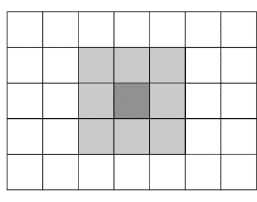

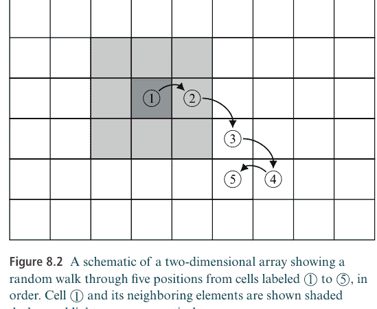

图 8.2 二维数组示意图，显示了从标记为 ① 到 ⑤ 的单元格依次经过五个位置的随机游走。单元格 ① 及其相邻元素分别以较深和较浅的灰色阴影显示。

（例如桌面或培养皿），表示为二维数组，在每个时刻，代理可以移动到与当前位置相邻的数组位置之一。如果代理的当前位置是图 8.1 中所示的较深灰色方块，则代理可能移动到的位置由较浅灰色方块表示。一旦代理移动到新位置，下一步将从该新位置的邻居中选择。通过这种方式，代理的路径逐步构建。至少，代理的位置是一个随时间演变的预测变量，其当前位置取决于过去的位置。图 8.2 显示了从标记为 ① 的单元格开始，到标记为 ⑤ 的单元格结束的五个位置的随机游走。游走的每一步都是移动到当前位置的邻居之一。游走者可以向这些单元格给出的任何方向移动。尽管图 8.2 未显示，但在基本的随机游走中，游走者也可以移动到先前访问过的位置。

## 8.1 基础预测模型示例

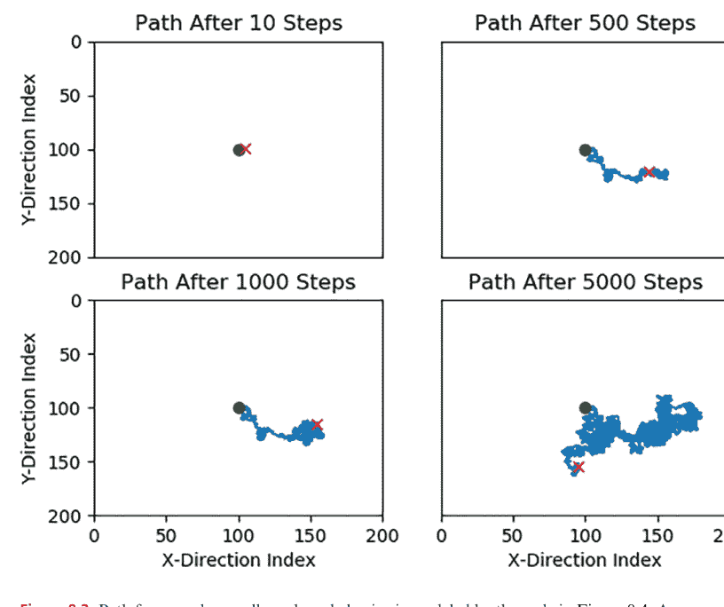

图 8.3 展示了由图 8.4 中代码建模的随机游走者的行为路径。绿色圆圈标记路径起点，红色“x”标记路径终点。在此模型中，$N_{\text{crit}} = 0$。

在任何步骤中，智能体选择哪个位置是随机决定的。对于经典的随机游走，每个可能的方向概率均等。其他随机游走模型可能有不同的规则来控制智能体的移动方向。例如，自回避随机游走不允许智能体返回其路径上任何先前访问过的位置。还有一些随机游走模型仅限于左右移动（一维随机游走模型），以及可以在所有空间维度自由移动的模型（三维随机游走模型）。

图 8.3 展示了由图 8.4 中代码建模的随机游走者的行为路径。该模型的结构基于 Ben-Jacob 等人（1994）的细菌菌落传播模型，但存在一些差异。² 在此模型中，每个随机游走者代表细菌菌落的一个“块”，而非单个细菌，而在 Ben-Jacob 等人的研究中，大约表示了 100,000 个游走者。在我们的图 8.4 模型中，我们仅展示单个游走者的行为。此外，在我们的模型中（与 Ben-Jacob 等人的不同），细菌不繁殖，因此我们在整个模拟过程中仅建模一个游走者。

² 在 www.cambridge.org/core/resources/pythonforscientists/refs/ 的参考文献 93 中，我们提供了一个关于浓度梯度以及如何将随机游走用于类似 Ben-Jacob 等人（1994）研究的在线描述的最新链接。

# 8 基础预测建模

```python
#- Module imports:

import numpy as np
import matplotlib.pyplot as plt


#- Set random seed, number of positions, and domain parameters:

np.random.seed(31493293)
n_positions = 5001
domain_shape = (200, 200)
food = np.zeros(domain_shape) + 5.0
N = np.zeros(domain_shape)
N_crit = 0


#- Set parameters and arrays for walker:

max_eat_rate = 0.1
use_energy = 0.05

energy = np.zeros(n_positions, dtype='d')
x = np.zeros(n_positions, dtype='l')
y = np.zeros(n_positions, dtype='l')

energy[0] = 0.3
x[0] = domain_shape[1] // 2
y[0] = domain_shape[0] // 2

step_x = np.array([ 0,  1, 1, 1, 0, -1, -1, -1])
step_y = np.array([-1, -1, 0, 1, 1,  1,  0, -1])
```

图 8.4 对随机游走者进行建模的代码，其行为在图 8.3 的图表中展示。在此模型中，$N_{\text{crit}} = 0$。生成图 8.3 中图表的代码见图 8.5。

在我们的模型中，游走者的活动区域是一个包含食物的 $200 \times 200$ 网格。网格的每个元素初始包含 5.0 单位的食物。食物和能量的单位是任意的，时间以游走者步数为单位，长度以网格单元为单位。此模型中的食物均匀分布，不扩散（即不从一个单元移动到另一个单元），并且一旦被细菌消耗就不会补充。$^3$ 在游走者的每一步中，游走者会吃掉一定量的食物（最多 0.1 单位），消耗一些能量（0.05 单位），并改变其能量储备。游走者初始拥有 0.3 单位的能量。

$^3$ 相比之下，Ben-Jacob 等人（1994）的模型包含了食物的扩散，因此食物会从高浓度区域移动到低浓度区域。我们将食物的初始值设置得足够高，以便在模型计算的步数内，游走者不太可能因缺乏食物而保持静止。这是为了使该模型的演示更有趣。

```python
#- Take steps:

i = 1
while i < n_positions:
    step_idx = np.random.randint(0, np.size(step_x))
    xtrial = x[i-1] + step_x[step_idx]
    ytrial = y[i-1] + step_y[step_idx]

    if (xtrial >= domain_shape[1]) or (xtrial < 0):
        continue
    if (ytrial >= domain_shape[0]) or (ytrial < 0):
        continue

    if N[ytrial,xtrial] < N_crit:
        N[ytrial,xtrial] += 1
        x[i] = x[i-1]
        y[i] = y[i-1]
    else:
        if energy[i-1] > 0.0:
            x[i] = xtrial
            y[i] = ytrial
        else:
            x[i] = x[i-1]
            y[i] = y[i-1]

    energy_from_eat = np.min([ max_eat_rate, food[y[i-1],x[i-1]] ])
    energy[i] = energy[i-1] + energy_from_eat - use_energy
    food[y[i-1],x[i-1]] -= energy_from_eat

    if energy[i] < 0.0:
        energy[i] = 0.0

    if food[y[i-1],x[i-1]] < 0.0:
        food[y[i-1],x[i-1]] = 0.0

    i += 1
```

图 8.4（续）

由于游走者是随机游走者，它从其当前位置的相邻单元中随机选择移动方向（如图 8.1 所示）。然而，遵循 Ben-Jacob 等人的方法，我们通过 $N_{crit}$ 值来模拟琼脂（游走者移动的培养皿介质）的阻力。尽管游走者移动方向的选择是随机的，但我们不允许游走者进入一个单元，除非该单元之前已被访问过 $N_{crit}$ 次。如果游走者试图进入一个未被访问过 $N_{crit}$ 次的单元，我们会增加该单元被访问次数的记忆，并且游走者保持静止（步长为零）。如果该单元已被访问至少 $N_{\text{crit}}$ 次，并且游走者拥有正的能量储备，游走者就会移动到该随机单元。无论游走者是移动还是静止，游走者每一步都会消耗一些食物。图 8.3 展示了 $N_{\text{crit}} = 0$ 的情况，而图 8.6 展示了 $N_{\text{crit}} = 1$ 的情况。图 8.7 展示了 $N_{\text{crit}} = 1$ 情况下的“放大”视图。当 $N_{\text{crit}}$ 大于零时，游走者的路径比琼脂对游走者无阻力（即 $N_{\text{crit}} = 0$）时更紧凑和局部化。

```python
plot_t_index = [11, 501, 1001, 5001]
plt.figure()

for j in range(4):
    plt.subplot(2, 2, j+1)
    plt.plot(x[:plot_t_index[j]], y[:plot_t_index[j]], '-')
    plt.plot(x[0], y[0], 'og')
    plt.plot(x[plot_t_index[j]-1], y[plot_t_index[j]-1], 'xr')
    plt.title("Path After " + str(plot_t_index[j]-1) + " Steps")
    plt.axis([0, domain_shape[1], domain_shape[0], 0])

    if j >= 2:
        plt.xlabel("X-Direction Index")
    else:
        plt.xticks([])

    if (j % 2) == 0:
        plt.ylabel("Y-Direction Index")
    else:
        plt.yticks([])

plt.savefig("random_walk_ncrit0.png")
```

**图 8.5** 创建图 8.3、8.6 和 8.7 中图表的代码。假设在运行此绘图代码之前，已运行图 8.4 中的代码（并根据图 8.6 和 8.7 的描述进行了相应更改）。本图中第 22 行的参数也会根据所创建图表的名称而变化。

图 8.4 中的第 3–4 行导入了所需的包。第 9 行设置随机数生成器的“种子”，这使得计算机生成的随机数序列可重复。第 10 行设置游走者在此模拟中将采取的步数或新“位置”（即移动到新位置或保持静止）的数量。第 11–14 行设置区域的形状、每个网格单元的初始食物值、一个用于存储游走者尝试进入每个单元次数的数组，以及 $N_{\text{crit}}$ 的值。第 19–20 行设置游走者在一步中尝试吃掉的最大食物量以及游走者在此期间消耗的能量量。第 22–24 行创建数组，用于保存游走者拥有的能量量以及游走者在每一步的 $x$ 和 $y$ 位置。区域左侧的 $x$ 位置为零，区域顶部的 $y$ 位置为零。

# 8 基础预测建模

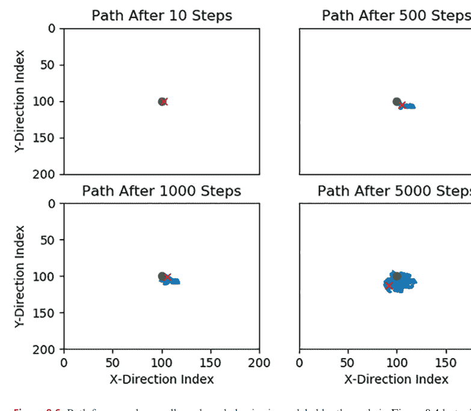

图 8.6 随机游走者的路径，其行为由图 8.4 中的代码建模，但 $N_{crit} = 1$。绿色圆圈标记路径的起点，红色“×”标记路径的终点。

第 26–28 行设置了游走者拥有的初始能量以及游走者的 $x$ 和 $y$ 位置。游走者的初始位置被设置为域的中心。回顾一下，`//` 符号表示整数除法（参见表 2.1）。

第 30–31 行定义了图 8.1 所示八个邻域点的相对 $x$ 和 $y$ 位置，从位于 12 点钟方向的点开始，然后顺时针移动。因此，`step_x` 和 `step_y` 的第一个元素分别指代所讨论网格点正上方邻域点的 $x$ 和 $y$ 位置（即，向左或向右 0 个单元格，垂直方向 $-1$ 个单元格，即向上 1 个单元格）。`step_x` 和 `step_y` 的第二个元素分别指代所讨论网格点西北方向邻域点的 $x$ 和 $y$ 位置（即，向右 1 个单元格，向上 1 个单元格），依此类推。

图 8.4 中的第 32–67 行循环计算游走者每一步的能量和位置。第 36–38 行在图 8.1 的邻居中随机选择一个方向。第 40–43 行的作用是，如果提议的随机步超出域范围，则重新选择随机方向（游走者不移动也不消耗食物）。

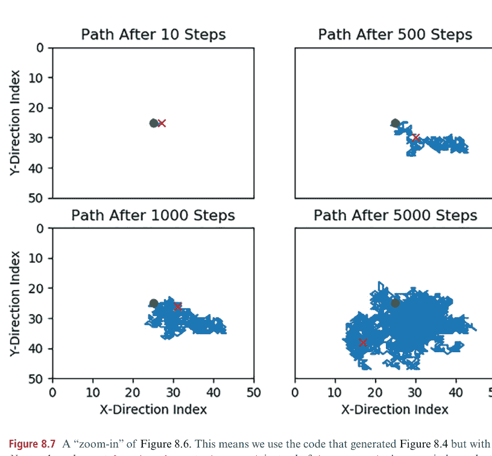

图 8.7 图 8.6 的“放大”视图。这意味着我们使用生成图 8.4 的代码，但 $N_{\text{crit}} = 1$，并且我们将 `domain_shape` 设置为 (50, 50) 而不是 (200, 200)。绿色圆圈标记路径的起点，红色“x”标记路径的终点。

第 45–48 行在游走者试图进入的单元格尚未被访问至少 $N_{\text{crit}}$ 次时，保持游走者静止，并增加访问该单元格的尝试次数。第 49–55 行允许游走者在单元格已被访问至少 $N_{\text{crit}}$ 次且游走者拥有非零能量时移动到新单元格。否则，游走者保持静止。

游走者在第 57–59 行吃食物。吃掉的食物量是游走者在一步中试图吃的最大量与当前位置食物量的最小值。NumPy 的 `min` 函数作用于数组和列表，因此我们在第 57 行中寻找最小值的两个项目以列表形式给出，该列表是 `min` 函数的输入参数。游走者吃掉的食物量被添加到游走者的能量水平中，并从当前位置的食物量中减去该量。第 61–65 行调整游走者的能量水平和当前位置的食物水平，以确保它们不小于零。

图 8.5 显示了绘制图 8.3 的代码，稍作修改后也可用于绘制图 8.6 和图 8.7。图 8.5 中的第 1 行指定了每个要绘制图形的四个面板的索引列表。第 2 行创建一个 Matplotlib 图形，第 4–20 行的循环创建四个面板（或子图）中的每一个。第 5 行创建一个面板。第 6–8 行绘制面板中的线条和符号元素：第 6 行绘制随机游走者路径，直到 `plot_t_index[j]` 给出的步数，第 7 行将路径的起始位置绘制为绿色点，第 8 行将路径的结束位置绘制为红色“×”。第 9 行为面板添加标题。第 10 行设置面板的轴限制。对 `axis` 函数的调用类似于第 5.2.2 节中描述的内容，只是我们翻转了 y 轴，使得 y 轴的“最大”值为 0，“最小”值为 200（或 50，取决于我们使用的域大小）。⁴ 第 12–20 行为图形左侧和底部的轴编写 x 轴和 y 轴标签及刻度线，但不在其他地方。% 是取模运算符。有关如何使用它来测试数字是否为偶数的详细信息，请参见第 8.2.4 节。最后，第 22 行将图形保存为便携式网络图形（PNG）文件。

## 8.2 Python 编程基础

从计算的角度来看，预测模型是一组计算，就像我们在第 6 章和第 7 章中看到的数据分析一样。预测模型的唯一区别在于某些变量随时间演变。因此，我们用于数据分析的许多计算构造和结构——函数调用、数组、分支、循环——也用于预测模型，无论是确定性的还是非确定性的。我们在第 8.1 节的示例中使用了所有这些构造。然而，在该示例中，我们还利用了以下内容：随机数、**布尔表达式**、嵌套分支、无限次循环以及制作多个子图。在本节中，我们将详细解释这些构造和任务，提供嵌套循环的进一步示例，并讨论如何使用浮点数处理条件语句。后两个主题在第 8.1 节的示例中没有说明，但我们讨论它们是因为它们与布尔表达式、语句的嵌套（无论是循环语句还是分支语句）以及无限循环结构的主题非常契合。

在本节其余的代码示例中，假设 NumPy 已作为 `np` 导入。

### 8.2.1 计算机中的随机数

我们之前说过，非确定性模型具有一定的随机性元素。为了在计算机中创建非确定性模型，我们需要一种生成随机数的方法。在自然界中，量子态等物理现象表现出随机行为。然而，计算机本质上是确定性的。每次执行计算机程序时，我们都应该得到相同的结果。每次执行 `value = 2 + 3` 时，变量 `value` 应始终等于 5。

⁴ https://stackoverflow.com/a/2052203（访问于 2019 年 6 月 10 日）。另请参阅 Matplotlib 的 `axis` 文档。该页面的最新链接位于 www.cambridge.org/core/resources/pythonforscientists/refs/，参考文献 32。

虽然计算机是确定性的，但某些数学算法可以创建一个看似随机的数字序列，尽管这些算法创建的是周期性数字序列（即最终会重复的序列）。利用这些算法的函数称为**随机数生成器**（或者更准确地说，“伪随机数生成器”，因为它们生成的序列不是真正的随机数，真正的随机数永不重复）。然而，现代计算机随机数生成器的重复周期非常长，以至于对于许多应用，我们可以将随机数生成器视为真正的随机数生成器。例如，Python 的 random 模块的 `random` 函数使用一种称为梅森旋转算法的算法，其重复周期为 $2^{19937}-1$，虽然对于密码学来说不够长，但对于许多科学和工程应用来说已经足够长了。$^5$

说一个随机数序列不重复，并不是说同一个随机数永远不会再次出现在序列中，而是说完整的随机数序列在序列中的元素数量达到重复周期之前不会作为序列再次出现。也就是说，如果我们有一个重复周期为 6 个元素的随机数生成器，我们并不是说“1, 3, −4, 2, 1, 7”（其中 1 重复）不能出现，而是说“1, 3, −4, 2, 1, 7, 1, 3, −4, 2, 1, 7”会出现，因为该序列的长度是重复周期的两倍。

随机数序列由生成器的**种子**值控制。通过更改种子值，我们可以创建不同的随机数序列。因此，通过在调用随机数生成器函数之前将种子设置为特定值，我们可以每次运行程序时获得相同的随机数序列。请注意，种子并不控制随机值的属性，例如值所选的概率分布函数、值的均值等。种子只控制计算机在序列中选择下一个随机值的规则，并通过这样做控制随机数生成器中依次出现的值。这似乎是随机数生成器具有的一个奇怪属性。毕竟，随机数生成器的重点不就是创建一个值似乎与先前值无关的随机数序列吗？然而，事实证明，即使对于非确定性模型，我们也希望能够每次运行程序时产生相同的随机值序列。然后我们可以分析模型的工作原理，而不用担心我们看到的行为是否是由于每次运行模型时生成的随机数不同造成的。我们还可以创建模型结果的测试，这些测试可以重复运行（并且每次都会产生相同的结果），以便我们开发模型。

要设置随机数生成器的种子，我们调用 NumPy 随机子模块函数 `seed`，如本例所示。$^6$

```
np.random.seed(194373)
```

该函数本质上没有返回值。传入的整数是随机数生成器的种子。在图8.4的示例随机游走模型代码中，种子在第9行设置。对于这个种子，每次调用随机数生成器函数产生的随机数序列将完全相同，正如本示例中使用随机数生成器函数`uniform`（本节稍后将更详细地解释）所展示的：

```
In [1]: np.random.seed(194373)
        np.random.uniform(size=10)

Out[1]: array([0.52288852, 0.44023728, 0.39897908, 0.39568769, 0.24734779,
               0.96315086, 0.8762412 , 0.29162933, 0.70948303, 0.12636644])

In [2]: np.random.uniform(size=10)

Out[2]: array([0.76319279, 0.31555945, 0.68727639, 0.15578094, 0.91665176,
               0.95272056, 0.36920565, 0.03566116, 0.74779538, 0.96306654])

In [3]: np.random.seed(194373)
        np.random.uniform(size=10)

Out[3]: array([0.52288852, 0.44023728, 0.39897908, 0.39568769, 0.24734779,
               0.96315086, 0.8762412 , 0.29162933, 0.70948303, 0.12636644])
```

上述每次对`uniform`的调用都从0（包含）到1（不包含）的范围内生成10个随机数。第一次调用（`In [1]`的第二行）生成10个值，然后在第二次调用（`In [2]`）中又生成了10个值。当我们在`In [3]`的第一行重置种子值时，下一次对`uniform`的调用（`In [3]`的第二行）给出了与`In [1]`调用`uniform`时完全相同的10个随机数。

不同的种子值将给出不同的随机数集，但使用相同的种子值将给出相同的随机数集。种子的实际值并不重要，但有一个注意事项：出于我们不会深入探讨的原因，如果我们打算更改种子，避免使用非常小的种子值以及避免使用彼此非常接近的种子值仍然是一个良好的经验法则。

NumPy的random子模块包含许多不同的函数，这些函数将产生遵循各种统计分布的随机值。⁷ 这里我们只提及该模块中的两个函数：`randint`和`uniform`。

⁷ 有关详细信息，请参阅NumPy文档中关于random子模块和`Generator`类的部分。这些页面的最新链接位于www.cambridge.org/core/resources/pythonforscientists/refs/，分别为参考文献96和95。Shiflet和Shiflet（2014，第382–383页，390–403页）也对随机数生成器的工作原理以及如何生成遵循任何任意概率分布的值进行了出色的入门描述。

# 8 基础预测建模

#### `randint` 函数

此函数返回一个由两个位置参数（或关键字参数`low`和`high`）指定的范围内的随机整数。⁸ 该范围在下界处包含，在上界处不包含。关键字输入参数`size`使我们能够创建该大小或形状的NumPy数组。以下是一些示例：

```
In [1]: np.random.randint(2, 5, size=10)
Out[1]: array([2, 4, 3, 2, 4, 3, 2, 2, 2, 2])
```

```
In [2]: np.random.randint(low=2, high=5, size=10)
Out[2]: array([4, 2, 3, 2, 3, 4, 3, 4, 4, 2])
```

```
In [3]: np.random.randint(-3, 2, size=(4,3))
Out[3]: array([[ 1, -3,  1],
       [-3,  1, -3],
       [-3, -2, -2],
       [ 0,  0,  1]])
```

```
In [4]: np.random.randint(-3, 2)
Out[4]: 0
```

请注意，尽管`In [1]`和`In [2]`对`randint`的调用指定了相同的范围来提取随机变量（即，包含2，不包含5），但获得的数字并不相同，因为在函数调用之前种子未设置为相同的值。如果省略`size`关键字输入参数，则对`randint`的调用将返回一个标量随机值，而不是一个随机值数组。

#### `uniform` 函数

正如我们已经看到的，此函数返回一个在零（包含）和一（不包含）之间的均匀分布随机数。⁹ 均匀分布意味着零到一之间任何子范围的概率与另一个相同宽度的子范围相同。因此，随机值在0.1和0.2之间的概率与在0.5和0.6之间、0.87和0.97之间等的概率相同。返回的值是浮点数。

如果我们想要一个不同于零到一范围的均匀随机数，我们可以将范围指定为位置参数（或关键字参数`low`和`high`）。与`randint`一样，关键字输入参数`size`使我们能够创建该大小或形状的NumPy数组。以下是一些示例：

⁸ https://docs.scipy.org/doc/numpy/reference/generated/numpy.random.randint.html#numpy.random.randint (accessed June 19, 2019).
⁹ https://docs.scipy.org/doc/numpy/reference/generated/numpy.random.uniform.html#numpy.random.uniform (accessed June 19, 2019).

```
In [1]: np.random.uniform(2, 5, size=10)

Out[1]: array([4.28957838, 2.94667836, 4.06182917, 2.46734282, 4.74995529,
       4.85816167, 3.10761694, 2.10698349, 4.24338615, 4.88919962])
```

```
In [2]: np.random.uniform(low=2, high=5, size=10)

Out[2]: array([4.96628997, 4.6234993 , 2.3004134 , 4.18769449, 3.65203165,
       3.25920672, 3.73427537, 4.33592053, 3.50078218, 2.95364009])
```

```
In [3]: np.random.uniform(-3, 2, size=(4,3))

Out[3]: array([[-2.84002099, -1.61651669,  0.22639601],
       [ 1.99281631,  0.56290567, -1.66896522],
       [-0.50796508, -1.75067486,  0.10367237],
       [-2.99249145, -1.76806082,  0.82341562]])
```

```
In [4]: np.random.uniform(-3, 2)

Out[4]: -0.19310014570797307
```

这些random子模块的函数只需要导入父模块NumPy。也就是说，要访问、设置种子、使用randint等，如上所示，我们只需要有这行导入语句：

```
import numpy as np
```

无需显式导入random子模块。

我们现在可以更详细地描述图8.4中的第36-38行。在第36行，选择一个在零（包含）和八（不包含）之间的随机整数并设置为step_idx。这对应于从step_x和step_y数组中随机选择的元素索引，即相对于当前位置随机选择的相邻点。变量xtrial和ytrial存储我们考虑随机游走者采取的下一步。这些值由当前的x和y位置（即x[i-1]和y[i-1]）以及从当前点到索引为step_idx的相邻点的相对距离决定。

### 8.2.2 标量布尔类型和表达式

在第6.2.4节中，我们介绍了使用分支来向数据提问的概念。我们发现我们的问题可以写成条件语句，并且这些条件语句在if语句中使用，根据条件语句的求值结果（为真或假）来执行不同的代码块。

到目前为止，我们看到的条件语句相对简单：测试变量是否大于、小于或等于某个值。事实证明，这些基本示例是存储和操作真/假值系统的一个子集。要么为真要么为假的实体是**布尔**实体。¹⁰ 我们可以使用各种运算符来操作布尔变量，并通过对布尔值和/或非布尔值使用运算符来创建布尔值。求值为真或假值的表达式称为布尔表达式，而控制布尔变量操作的数学规则被称为**布尔代数**。

在Python中，就像`int`类型表示整数，`float`类型表示浮点（十进制）值一样，`bool`类型表示布尔值。Python中的布尔值可以是两个值之一：`True`或`False`（注意大小写很重要）。这些是我们可以设置变量的特殊值，就像我们可以将整数变量设置为像`-2`和`183`这样的整数值一样。值`True`和`False`不是字符串：它们本身就是值。也就是说，`True`和`'True'`是两种完全不同的值，前者是布尔值，后者是字符串。另一种思考方式是，布尔变量是一个要么为`True`要么为`False`的变量，就像整数变量是一个被设置为整数值的变量一样。

以下是设置布尔变量`test`的示例：

```
In [1]: test = True
       type(test)

Out[1]: bool

In [2]: test = False
       type(test)

Out[2]: bool
```

在上面的例子中，变量`test`首先被赋值为`True`，然后被赋值为`False`。在这两种情况下，`test`都是一个布尔类型变量。注意`True`和`False`周围没有引号，因为这两个实体（或**标记**）都不是字符串。它们是布尔值。

除了直接将变量赋值为布尔值`True`或`False`之外，我们还可以通过布尔表达式创建布尔值（并赋值给布尔变量）。考虑以下来自第6.2.4节的`if`语句（为方便起见在此重现）：

```
1  atomic_number = 2
2  if atomic_number < 6:
3      print("Element has fewer protons than carbon")
4  print("Test completed")
```

因为`atomic_number`小于六，所以`if`语句的主体将执行，并打印出消息通知我们该元素的质子数少于碳。但是，如果我们打印出`if`语句的*条件*会怎样呢？

¹⁰ “布尔”一词以数学家乔治·布尔的名字命名。

# 8 基础预测建模

表 8.1 Python 中的基本布尔代数运算符。`<Expr>`、`<Expr1>` 和 `<Expr2>` 是布尔表达式。

| 运算符 | 代码 |
|---|---|
| And | `<Expr1> and <Expr2>` |
| Or | `<Expr1> or <Expr2>` |
| Not | `not <Expr>` |

运算符，在 Python 中由 `and`、`or` 和 `not` 指定。表 8.1 总结了这些运算符的语法，但让我们更详细地描述它们。

**and 运算符** 此运算符作用于两个布尔值（就像乘法运算符作用于两个数字一样）。它检查两个操作数值是否都为 `True`。如果是，表达式的结果为 `True`。对于 `and` 周围所有其他可能的值组合，表达式的结果为 `False`。考虑以下示例：

```
In [1]: test1 = True
        test2 = True
        test1 and test2

Out[1]: True

In [2]: True and True

Out[2]: True

In [3]: test1 = False
        test2 = True
        test1 and test2

Out[3]: False

In [4]: True and False

Out[4]: False

In [5]: False and False

Out[5]: False
```

在单元格 `In [1]` 中，我们创建了两个布尔变量 `test1` 和 `test2`，并将它们的值设置为 `True`。这两个布尔变量的 `and` 运算结果为 `True`，因为两个值都是 `True`。在单元格 `In [2]` 中，我们直接将 `True` 值放入 `and` 表达式中，发现结果相同（`True`）。在单元格 `In [3]` 中，我们将 `test1` 的值更改为 `False`，并发现 `test1` 和 `test2` 的 `and` 运算结果为 `False`。单元格 `In [4]` 和 `In [5]` 显示了两个操作数（`and` 两侧的值）的任何其他组合如何导致返回 `False`，因为至少有一个操作数为 `False`。

如表 8.1 所述，`and` 运算符两侧的值本身可以是表达式。`and` 语句要起作用，唯一需要为真的是 `and` 运算符两侧的操作数必须是布尔表达式，即产生布尔值的表达式。考虑对我们之前给出的质子数测试的修改。在这个例子中，我们想看看 `atomic_number` 是否在氦和碳的原子序数之间：

```
1  atomic_number = 2
2  is_between = (atomic_number > 2) and (atomic_number < 6)
3  if is_between:
4      print("Element has more protons than helium and fewer than carbon")
5  print("Test completed")
```

运行此代码的结果是：

```
Test completed
```

因为 `is_between` 的计算结果为 `False`，由于 `atomic_number > 2` 的计算结果为 `False`。因为 `is_between` 是 `False`，我们从未执行 `if` 语句的主体。如果我们将 `atomic_number` 设置为三（锂），`if` 语句的主体将执行，输出将是：

```
Element has more protons than helium and fewer than carbon
Test completed
```

**or 运算符** 与 `and` 运算符类似，`or` 运算符作用于两个布尔值。它检查至少有一个值是否为 `True`。如果是，表达式的结果为 `True`。对于 `or` 周围所有其他可能的值组合，表达式的结果为 `False`。考虑以下示例：

```
In [1]: test1 = True
        test2 = True
        test1 or test2

Out[1]: True

In [2]: False or True

Out[2]: True

In [3]: True or False

Out[3]: True

In [4]: False or False

Out[4]: False
```

`or` 运算符产生 `False` 的唯一情况是两个操作数都为 `False`（`In [4]`）。在所有其他情况下，因为至少有一个操作数为 `True`，所以 `or` 运算符的结果为 `True`。

让我们修改上面的质子数测试，以检查 `atomic_number` 是否大于或小于六（碳中的质子数）：

```
1  atomic_number = 2
2  is_more_or_less = (atomic_number > 6) or (atomic_number < 6)
3  if is_more_or_less:
4      print("Element has more or fewer protons than carbon")
5  print("Test completed")
```

运行上述代码将产生以下输出：

```
Element has more or fewer protons than carbon
Test completed
```

因为二小于六，所以第 2 行的 `atomic_number < 6` 计算结果为 `True`，`is_more_or_less` 为 `True`。

因为 `atomic_number` 是一个整数，布尔表达式：

```
(atomic_number > 6) or (atomic_number < 6)
```

给出的值与：

```
atomic_number != 6
```

相同，因为大于或小于六的整数就是不等于六的整数。

**`not` 运算符** 此运算符仅作用于单个布尔值，该值位于 `not` 之后。结果是一个布尔值，与 `not` 之后的操作数“相反”。也就是说，如果操作数为 `True`，则对该操作数应用 `not` 的结果为 `False`，反之亦然。考虑以下示例：

```
In [1]: test = True
        not test

Out[1]: False

In [2]: not True

Out[2]: False

In [3]: not False

Out[3]: True
```

让我们修改上面的质子数测试，以检查 `atomic_number` 是否不等于六（即不是碳）：

```
1  atomic_number = 2
2  is_carbon = atomic_number == 6
3  if not is_carbon:
4      print("Element is not carbon")
5  print("Test completed")
```

在第 2 行中，第一个等号将 `atomic_number == 6` 布尔表达式的结果赋值给布尔变量 `is_carbon`。与所有赋值语句一样，我们必须先读取等号右侧的表达式，对其进行计算，然后将该结果赋值给等号左侧给出的变量。如果我们不小心，我们可能会错过 `atomic_number` 和 6 之间的双等号运算符中的第二个等号。

运行上述代码将产生以下输出：

```
Element is not carbon
Test completed
```

因为 `atomic_number` 是 2，`atomic_number == 6` 的计算结果为 `False`。`is_carbon` 的值为 `False`，所以 `not is_carbon` 将为 `True`，`if` 语句的主体将执行。

简洁地描述布尔代数运算（或布尔代数运算的组合）所有可能结果的一种常见方法是创建一个**真值表**。真值表的每一列显示参与运算的其中一个输入布尔变量的值，除了最后一列显示布尔代数运算的输出布尔值。真值表的每一行（除了第一行是标题行）代表输入布尔变量的一个可能的值组合。所有行一起代表输入布尔变量的所有可能的值组合。表 8.2–8.4 是 `and`、`or` 和 `not` 运算符的真值表。试试看！8-3 给出了一个使用三个输入布尔变量的布尔代数运算组合的真值表示例。

最后，Python 中的布尔类型有一个有用的功能，即当布尔值用于算术表达式时，Python 会自动将 `True` 转换为一

# 8 基础预测建模

**表 8.2** `and` 运算符的真值表。前两列（Var1 和 Var2）是输入的布尔变量，最后一列是上述表达式的输出。第一行是表头行。

| Var1 | Var2 | Var1 and Var2 |
|---|---|---|
| True | True | True |
| False | True | False |
| True | False | False |
| False | False | False |

**表 8.3** `or` 运算符的真值表。前两列（Var1 和 Var2）是输入的布尔变量，最后一列是上述表达式的输出。第一行是表头行。

| Var1 | Var2 | Var1 or Var2 |
|---|---|---|
| True | True | True |
| False | True | True |
| True | False | True |
| False | False | False |

**表 8.4** `not` 运算符的真值表。第一列（Var）是输入的布尔变量，最后一列是上述表达式的输出。第一行是表头行。

| Var | not Var |
|---|---|
| True | False |
| False | True |

以及 `False` 对应于零。如果我们想根据布尔变量的值为变量分配不同的数值，这会很有用。例如，假设我们有一个秤，无法准确测量任何重量小于 0.01 克的物体。在我们的分析中，我们决定将任何小于 0.01 克的测量值视为 0 克。利用布尔表达式和算术运算，以下代码获取变量 `weight` 并使用该规则正确地为 `corrected_weight` 赋值：

`corrected_weight = (weight >= 0.01) * weight`

如果 `weight` 设置为 0.003，我们得到以下结果：

```
In [1]: weight = 0.003
       corrected_weight = (weight >= 0.01) * weight
       print(corrected_weight)

0.0
```

而如果 `weight` 设置为 0.7，我们得到以下结果：

```
In [1]: weight = 0.7
       corrected_weight = (weight >= 0.01) * weight
       print(corrected_weight)

0.7
```

在这两个执行的代码片段的第二行中，布尔表达式 `weight >= 0.01` 在重量大于或等于 0.01 克阈值时返回 `True`，否则返回 `False`。当该布尔值乘以 `weight` 时，如果重量小于 0.01 克，我们实际上是将 `weight` 乘以 0，这使得保存到 `corrected_weight` 的结果为 0。如果重量大于或等于 0.01 克，我们实际上是将 `weight` 乘以 1，这使得保存到 `corrected_weight` 的结果就是 `weight` 的值。通过利用布尔值的这一特性，我们将原本需要四行 `if` 语句才能完成的任务简化为一行：

```
1  if weight >= 0.01:
2      corrected_weight = weight
3  else:
4      corrected_weight = 0.0
```

在第 13.2.3 节中，我们将更详细地探讨这一特性及其在选择性处理数组中某些元素而非其他元素时的应用。在本节中，我们仅限于标量布尔值（即单个布尔值或返回单个布尔值的表达式）。在第 13.2.2 节中，我们将探讨布尔值数组以及如何对这种布尔值集合使用数组语法。

关于布尔代数运算符优先级的最后一点说明：比较运算符的优先级高于布尔代数运算符，因此前者在后者之前求值，而相同优先级的运算符从左到右求值。因此，以下两条语句的求值方式相同：

```
In [1]: 4 < 5 and 8 > 2
Out [1]: True
In [2]: (4 < 5) and (8 > 2)
Out [2]: True
```

同样，算术运算符的优先级高于比较运算符，因此所有这些语句的求值方式相同：

```
In [1]: 14 - 10 < 5 and 8 - 1 > 2
Out [1]: True
In [2]: (14 - 10) < 5 and (8 - 1) > 2
Out [2]: True
In [3]: ((14 - 10) < 5) and ((8 - 1) > 2)
Out [3]: True
```

然而，布尔运算符 `or`、`and` 和 `not` 的优先级*并不*相同。`or`、`and` 和 `not` 的列表按优先级递增的顺序排列。Python 运算符优先级表描述了这些及其他运算符的优先级顺序。我们在 www.cambridge.org/core/resources/pythonforscientists/refs/ 提供了该表的最新链接，参考文献 16。话虽如此，几乎总是应该使用括号来使运算顺序明确清晰。依赖运算符优先级顺序可能导致代码难以理解。

### 8.2.3 嵌套分支

在第 7.2.5 节中，我们描述了嵌套的 `for` 循环，即一个 `for` 循环是另一个 `for` 循环体的一部分。对于嵌套循环，内层 `for` 循环会为外层循环的每次迭代完整执行（即执行其所有迭代）。分支语句也可以嵌套。在嵌套分支语句中，第二个（或更多）分支语句被放置在外层分支语句的主体中。在这种情况下，只有当外层语句的求值结果为 `True` 时，才会执行内层语句。考虑以下代码：

```
1  atomic_number = 2
2  if atomic_number > 2:
3      if atomic_number < 6:
4          print("Element has more protons than helium " + \
5                 "and fewer than carbon")
6  print("Test completed")
```

在第 2 行，我们检查 `atomic_number` 是否大于 2。如果是，我们进入 `if` 语句的主体，其第一行是检查 `atomic_number` 是否小于 6。如果该条件为真，则执行 `print` 语句。如果第 2 行的条件求值为 `False`，我们将永远不会到达第 3 行。

运行上述代码的结果是：

```
Test completed
```

以这种方式嵌套 `if` 语句，其行为与使用单个 `if` 语句并将此布尔表达式作为条件相同：

```
(atomic_number > 2) and (atomic_number < 6)
```

因为 `and` 运算符要求两个操作数都为 `True` 才能使表达式求值为 `True`，所以第一个操作数 `(atomic_number > 2)` 求值为 `False` 这一事实就足以确保程序永远不会进入具有此条件的 `if` 语句主体。

图 8.4 的第 45-55 行展示了嵌套分支语句的另一个例子。在该示例中，第 50 行的 `if` 测试仅在第 45 行的 `if` 条件求值为 `False` 时才执行。因此，这种嵌套分支语句使我们能够描述以下三种选择场景（将执行以下三种选择之一）：

- 1. 如果 `N[ytrial,xtrial] < N_crit` 为 `True`，则执行第 46-48 行。
- 2. 如果 `N[ytrial,xtrial] < N_crit` 为 `False` 且 `energy[i-1] > 0.0` 为 `True`，则执行第 51-52 行。
- 3. 如果 `N[ytrial,xtrial] < N_crit` 为 `False` 且 `energy[i-1] > 0.0` 为 `False`，则执行第 54-55 行。

我们也可以使用 `if-elif` 语句来描述上述三种选择逻辑。然而，`if-elif` 语句会更混乱，因为我们必须在每个 `if-elif` 条件中重复 `N[ytrial,xtrial] < N_crit` 测试，并在其中两个 `if-elif` 条件中重复 `energy[i-1] > 0.0` 测试。正如我们在第 6.2.3 节中看到的，最好避免重复代码（“不要重复自己”或 DRY 原则）。重复自己很容易无意中引入错误，如果代码的某一处与另一处略有不同。但请注意，DRY 原则也必须与整体代码清晰度相平衡。在某些情况下，重复的编程方式在逻辑上更清晰。对于上述三种选择逻辑，嵌套分支方法避免了 `if-elif` 语句会导致的重复代码。而且，一般来说，嵌套分支使我们能够表达比单个 `if`、`if-else` 或 `if-elif` 语句所能提供的更复杂的分支逻辑。

最后，在我们上面看到的例子中，只有两级嵌套（一个外层分支语句和一个内层分支语句）。然而，可以有超过两级的嵌套。更深层次的嵌套是通过添加另一级缩进来创建的。并且在内层可以有多于一个分支语句。

### 8.2.4 使用 `while` 循环不确定次数

随着第 8.2.2 节中布尔变量的引入，我们可以讨论另一种循环方式，它使我们能够在事先不知道需要执行任务多少次的情况下执行任务。如果我们想遍历一个数字数组的元素，我们事先知道需要运行循环多少次。因此，`for` 循环是最佳选择。当我们事先不知道需要循环多少次时，`while` 循环是更好的方法。

虽然 `while` 循环最适合用于我们事先不知道需要迭代多少次的情况，但 `while` 最基本的用法是迭代预设的次数，就像 `for` 循环一样。因此，对于我们的第一个 `while` 循环简短示例，我们复制第 6.2.3 节中的一个 `for` 循环。回想一下该节开头附近的以下 `for` 循环（为方便起见在此重现）：

```
1  precip = np.array([5.58, 3.54, 4.54, 2.93, 2.10, 1.47,
2                  0.49, 1.03, 1.72, 4.31, 6.50, 5.41])
3  for iprecip in precip:
4      print(iprecip)
```

循环的每次迭代中，迭代器 `iprecip` 被依次设置为 `precip` 中的每个元素。循环体只有一行，打印出该次循环迭代中 `iprecip` 的当前值。

与 `for` 循环不同，`while` 循环不能自动遍历数组并将该数组的元素设置为迭代器。相反，我们必须创建一个变量，该变量在每次迭代中递增 1，并使用该变量的值来访问数组中的元素。以下代码可以完成这项工作：

```
1  precip = np.array([5.58, 3.54, 4.54, 2.93, 2.10, 1.47,
2                  0.49, 1.03, 1.72, 4.31, 6.50, 5.41])
3  i = 0
4  while i < np.size(precip):
5      print(precip[i])
6      i += 1
```

# 8 基础预测建模

第1行和第2行与`for`循环版本相同。在第3行，我们将变量`i`初始化为零。我们将使用`i`作为索引来引用`precip`中的元素。
在第4行，我们开始循环。`while`循环的工作方式如下：

1.  评估`while`之后的条件。这类似于程序遇到`if`语句时，会评估`if`之后的条件。
    (a) 如果`while`之后的条件评估为`False`，则不执行循环体（即`while`行下方缩进四个空格的行），而是继续执行`while`循环体之后的程序行。
    (b) 如果`while`之后的条件评估为`True`，则执行循环体中的代码。
2.  循环体执行完毕后，返回到上面的步骤1并重复。

根据对`while`循环的描述，我们可以推断出以下几点：

-   `while`循环中的循环体不必执行，甚至一次也不必。如果`while`之后条件的初始评估结果为`False`，程序将不会进入循环体。
-   `while`之后的条件仅在程序控制权返回到`while`所在行时才进行评估，即在循环体执行结束时。如果条件中使用的变量在循环体运行时发生变化，这不会影响循环是否重复，直到控制权返回到`while`行并重新评估条件。
-   如果`while`循环要停止，循环体（通常）必须更改`while`之后条件中的变量，使得条件在某个时刻评估为`False`。否则，循环将永远继续下去。

在第4行，条件是`i < np.size(precip)`。对于包含12个元素的数组`precip`，当`i`的初始值为0时，此条件评估为`True`。
循环体是第5行和第6行。在第5行，我们打印出`precip`在索引`i`处的值。在第一次迭代中，`i`为零，因此打印出`precip`的第一个元素。在第6行，我们将`i`增加一。因此，当`i`由于递增而变为12时，循环将停止，因为在递增之后，控制权将返回到`while`行，并且`i < np.size(precip)`将被评估并产生`False`。因此，此循环使`i`的值从0运行到11（包含两端）。请注意，如果省略第6行，如果`i`保持值0不变，此循环将永远不会终止。它将是一个**无限循环**——一个永不停止运行的循环。图8.8总结了`while`循环的语法。
`while`循环将在控制权返回到`while`行且条件被重新评估为`False`时终止。然而，还有其他方法可以改变`while`循环的运行方式：

-   `continue`语句。如果执行，将跳过`while`循环体的其余部分，并将程序控制权返回到`while`行以重新评估条件。
-   `break`语句。如果执行，将终止`while`循环，并将程序控制权移动到`while`循环体之后的行。

#### while 循环语法总结

`while`循环具有以下语法：

`while <condition> :`
`    <... body ...>`

其中`<condition>`是一个布尔表达式，如果该表达式评估为`True`，我们将进入循环并执行`<... body ...>`。执行完`<... body ...>`后，控制权返回到`while`行，并重新评估`<condition>`。如果`<condition>`评估为`True`，我们将再次进入循环进行另一次迭代并执行`<... body ...>`。`<... body ...>`的行作为一个块，缩进四个空格。

图8.8 `while`循环语法总结。

让我们修改之前的`while`循环示例，并包含`continue`和`break`：

```
1  precip = np.array([5.58, 3.54, 4.54, 2.93, 2.10, 1.47,
2                      0.49, 1.03, 1.72, 4.31, 6.50, 5.41])
3  i = 0
4  while i < np.size(precip):
5      if i == 6:
6          break
7      if (i % 2) == 0:
8          i += 1
9          continue
10     else:
11         print(precip[i])
12         i += 1
```

此代码将产生以下输出：

```
3.54
2.93
1.47
```

第6行的`break`语句在执行时会终止循环。因为该语句位于一个`if`语句内部，而该`if`语句仅在`i`等于六时执行，所以循环在前六次迭代中（`i`的值从零到五，包含两端）将忽略此语句。第6行的作用是防止打印`precip`的最后六个元素。

第9行的`continue`语句也位于一个`if`语句之后，该语句测试`i`是否为偶数。百分号是“取模”运算符，它返回除法运算的余数。因此，`3 % 2`将返回`1`（即3除以2的余数），而`4 % 2`将返回`0`（即4除以2的余数）。因为`continue`会跳过循环体的其余部分并将控制权移动到`while`所在行，所以第9行确保只有`i`的奇数值会被打印出来。我们也在图8.5的第17行使用了这种测试数字是否为偶数的方法。

在上面的例子中，我们必须在两个地方（第8行和第12行）包含`i += 1`递增语句。如果我们省略第8行会发生什么？在这种情况下，对于偶数的`i`，`i`将不会递增，并且循环体的其余部分将在不改变`i`值的情况下被跳过。因为`i`的初始值是0，而0是偶数，缺少第8行的递增语句将意味着`i`保持为0，并且控制权将返回到第4行。结果将是一个无限循环。

关于`continue`和`break`的一些随机事项：首先，`while`循环中的`continue`和`break`语句通常位于循环体内的`if`语句中。如果它们不在`if`语句之后，它们将在循环的每次迭代中执行，包括第一次。这将使循环的后续迭代和/或`continue`或`break`语句之后的循环体变得毫无意义，此时我们必须问为什么首先需要`while`循环。其次，`continue`和`break`语句也适用于Python中的其他构造，但也许它们在`while`循环中最有用。最后，一些程序员喜欢用这种语法编写`while`语句：

```
while True:
    <... body ...>
```

并依赖`continue`或`break`语句来退出循环。虽然在某些情况下，这样的循环会产生最清晰的代码，但通常最好避免使用这样的语句。当`continue`和`break`语句泛滥时，程序会变得难以阅读。

之前我们说过，当我们事先知道循环体要迭代多少次时使用`for`循环，而当我们事先不知道循环体要迭代多少次时使用`while`循环。除了这些用例之外，这两种循环之间还有另一个主要区别：`for`循环中的`iterator`变量*不应*在循环体中更改，而`while`循环中最接近的类似物，即测试条件，应该在该循环体中更改。在`for`循环的情况下，每次循环进入新的迭代时，迭代器都会被覆盖为可迭代对象（即`in`和冒号之间的列表、数组或其他项目集合）中的下一个值。因此：

```
for i in [1, 2, 3, 4]:
    print(i)
    i = i + 1
```

将产生以下输出：

```
1
2
3
4
```

`i = i + 1`语句对`print`调用没有影响。相比之下，在这个`while`循环中（产生与上面`for`循环相同的输出）：

```
i = 1
while i <= 4:
    print(i)
    i = i + 1
```

`i = i + 1`语句在循环的每次迭代中都会更改`i`，并影响`print`调用。`i = i + 1`语句是循环正常工作所必需的。如果缺失，循环将永远不会终止。底线是：只有在没有理由在循环体中更改迭代器（或者没有理由将迭代器的更改传播到下一次迭代）时才使用`for`循环。否则，使用`while`循环。

我们现在可以解析图8.4中的`while`循环（第34-67行）。尽管此循环中的循环体比本节中的示例长得多，但结构是相同的。变量`i`也用作数组索引来引用`x`、`y`、`energy`和`food`数组中的元素，这些数组为步行者的每一步提供这些量。变量`i`被初始化为一（在第34行），因为`x`、`y`、`energy`和`food`的初始值（即在索引0处）在第12行和第26-28行中设置。

如第8.1节前面所述，在第36-38行，我们随机选择一个相邻的单元格来考虑将步行者移入其中。为什么这是一个“试验性”移动？因为我们选择的点可能不是合法的移动目标。在第40-43行，我们检查`xtrial`和`ytrial`是否在域外。如果是，则跳过循环体的其余部分（通过调用`continue`），并将循环的控制权返回到第35行。换句话说，如果`xtrial`和`ytrial`不是合法的选择，我们将忽略关于步行者吃掉的食物和能量变化的所有其他计算，并从相邻点中进行另一次随机采样。

在第45-55行，如第8.1节前面所述，我们根据步行者尝试进入（`ytrial`, `xtrial`）空间的次数以及步行者当前拥有的能量来移动步行者。能量和食物水平在第57-65行进行调整。在第67行，我们将`i`增加一，并将循环的控制权返回到第35行的`while`。

### 8.2.5 创建多个子图

我们在第4章和第5章学习创建的绘图是“单例”：Matplotlib图形窗口中的单个绘图。很多时候，我们有兴趣在单个图形上放置多个绘图（或面板），以便比较不同时间或位置的快照。图8.3、8.6和8.7就是此类绘图的示例。图8.5显示了绘制这些图形的代码。我们在图8.5中已经见过许多命令：`plot`、`title`、`axis`等。然而，函数`subplot`（用于在Matplotlib图形窗口上创建子图）是新的。

函数`subplot`在图形窗口的子图网格中创建一个子图（或面板）。正如`figure`命令创建一个图形窗口，随后的绘图命令应用于由最后一次`figure`调用定义的图形（有关`figure`的更多信息，请参见第5.2.3节），`subplot`函数激活一个子图，供后续绘图命令在其上绘制。`subplot`函数接受三个位置输入参数（如图8.5中的第5行显示）。¹¹ 前两个参数分别指定子图网格中的行数和列数。第三个参数给出子图在网格中的索引号。这个索引号与列表和数组的索引不同，它从1（包含）开始，到 *n*（包含）结束，其中 *n* 是子图网格中的子图总数。

因此，图8.5中的第5行在当前图形窗口上创建了一个2×2的子图网格。对于第4行 `for` 循环的每次迭代，第5行的 `subplot` 调用会创建一个子图，索引从1（包含）递增到4（包含）。当循环绘制每个子图时，它会先从左到右绘制一行，然后从上到下，一次一行。

### 8.2.6 关于嵌套循环的更多内容

在8.2.3节讨论了嵌套分支之后，我们可以对7.2.5节中关于嵌套循环的描述进行补充。在7.2.5节中，我们使用了嵌套 `for` 循环来遍历二维数组中每个元素的索引对。在本节中，我们将展示更复杂的嵌套循环示例。

第一个示例是一个嵌套循环，它对比对每个元素应用相同计算更复杂的场景进行计算（或其他操作）。例如，在“动手试试7-7”中，我们使用嵌套循环和数组语法，根据网格上规则经纬度位置的二维风速 *x* 分量数组 `v_x` 和二维风速 *y* 分量数组 `v_y`，计算了地面风速。以下是嵌套循环的解决方案（为方便起见在此重现）：

```
1  wind_shape = np.shape(v_x)
2  v = np.zeros(wind_shape, dtype=v_x.dtype.char)
3  for i in range(wind_shape[0]):
4      for j in range(wind_shape[1]):
5          v[i,j] = ((v_x[i,j] ** 2) + (v_y[i,j] ** 2)) ** 0.5
```

这个计算是针对 `v`、`v_x` 和 `v_y` 中的所有点进行的，计算代码仅位于最内层循环中。

让我们将问题改为以下情况：对于网格顶部（最北行）和底部（最南行）的纬度点，我们将每个经度点的风速计算为该纬度所有经度点的平均值，并将该行中 `v` 的每个元素赋值为这个平均值。¹² 对于所有其他位置，我们像“动手试试7-7”中那样计算和赋值风速。以下是解决这个修改后问题的代码：

¹¹ https://matplotlib.org/3.1.0/api/_as_gen/matplotlib.pyplot.subplot.html（访问于2019年6月25日），贯穿本节。
¹² 这种情况何时可能发生？也许最北和最南行分别接近北极和南极，因此由于经线在接近两极时收敛，风速非常接近，用单个值表示更为合适。

# 8 基础预报建模

```
1  wind_shape = np.shape(v_x)
2  v = np.zeros(wind_shape, dtype=v_x.dtype.char)
3  for i in range(wind_shape[0]):
4      for j in range(wind_shape[1]):
5          v[i,j] = ((v_x[i,j] ** 2) + (v_y[i,j] ** 2)) ** 0.5
6      if (i == 0) or (i == wind_shape[0]-1):
7          avg = 0.0
8          for j in range(wind_shape[1]):
9              avg += v[i,j]
10         avg /= wind_shape[1]
11         for j in range(wind_shape[1]):
12             v[i,j] = avg
```

第1-5行是“动手试试7-7”的原始解决方案。为了解决修改后的问题，我们“添加”了第6-12行。但我们并没有在任何地方添加这些行。这里重要的是这些行的缩进，它们构成了一个单独的 `if` 块。因为该块缩进了四个空格（一个缩进级别），它与内部 `for` 循环处于相同的缩进级别。这意味着 `if` 块是在整个内部循环执行完毕后执行的，*对于每个索引 i 的行*。也就是说，`if` 块位于*外部*循环的循环体中，而不是内部循环中，因此它只执行 `wind_shape[0]` 次（即 `i` 值的数量）。相比之下，第5行位于内部循环中，因此它执行 `wind_shape[0]` × `wind_shape[1]` 次。

第6行测试 `i` 的值是否位于最北边界（`i = 0`）或最南边界（`i == wind_shape[0]-1`）。如果是，我们计算该纬度所有点的平均风速（第7-10行）。这需要将所有经度的值相加（第7-9行），然后除以经度值的数量（第10行）。在第11-12行，我们（再次）遍历该纬度的所有经度值，并将 `v` 赋值为平均值。因此，在 `if` 条件为真的情况下，这个解决方案包含三个 `for` 循环，都处于“内部”循环级别，以及在内部循环之外、处于外部循环体级别的计算（第6行的 `if` 测试）。

我们第二个更复杂的嵌套循环示例是将 `for` 和 `while` 循环混合在一起。在下面的代码中，我们通过将外部循环替换为 `while` 循环来重写“动手试试7-7”的解决方案：

```
1  wind_shape = np.shape(v_x)
2  v = np.zeros(wind_shape, dtype=v_x.dtype.char)
3  i = 0
4  while i < wind_shape[0]:
5      for j in range(wind_shape[1]):
6          v[i,j] = ((v_x[i,j] ** 2) + (v_y[i,j] ** 2)) ** 0.5
7      i += 1
```

请注意，最后一行（第7行）必须与第5行的 `for` 语句处于相同的缩进级别。如果 `i += 1` 语句再缩进四个空格，它将位于 `for` 语句的循环体中，并且执行次数将不是 `wind_shape[0]` 次，而是 `wind_shape[0]` × `wind_shape[1]` 次。`i` 的值随后可能会超过二维数组行的最大索引值。

从功能上讲，代码没有改变。`while` 循环使 `i` 遍历从0（包含）到 `wind_shape[0]`（不包含）的所有整数。因此，这个解决方案对于这个特定任务没有提供任何新东西。但是，如果我们为 `while` 语句选择不同的条件，我们可以引入不按预定次数发生的循环行为。我们的解决方案再次表明，嵌套循环是循环内的独立循环，可以相应地进行编辑。

这些示例的要点：记住将复杂的嵌套循环视为一个循环在另一个循环内部，而不是一个独立的实体。也就是说，在分析包含嵌套循环的代码时，要将每个循环分开，分析每个循环的作用。虽然看到嵌套循环都是 `for` 循环且内部循环从紧跟外部循环之后的行开始的模式很常见（正如我们在第7章示例中看到的），但这种模式并不是构建嵌套循环的唯一方式。要理解这些更复杂的循环，我们需要单独查看每个循环。

### 8.2.7 使用浮点数的条件判断

到目前为止，我们使用了数值条件（即涉及数字的比较），但没有询问它们在计算机上实现时（而不是在数学问题的纸上）是否存在任何问题。事实证明，确实存在。在5.2.7节中，我们介绍了类型的概念，并描述了小数如何由 `float` 类型表示，而整数由 `int` 类型表示。尽管我们也讨论了不同类型的值具有不同的能力，但关于小数和整数，我们除了说它们是不同类别的值之外，并没有深入探讨。然而，在计算机中，与数学不同，这种类型差异会产生实际影响。在数学中，因为小数和整数实际上是同一种东西——实数——所以这种区别不会出现。

计算机中的所有变量都由有限数量的内存表示。实际上，这意味着计算机无法为任何数字存储任意数量的数字。对于整数，虽然这意味着可以存储的整数大小存在限制（即使它是计算机上可用的总内存量），但每个整数仍然是唯一的。因此，整数 `3` 将始终不同于 `7`。

对于浮点数，大多数小数无法完全由浮点类型表示。实数集在任何有限子范围内最终都是无限的。我们总是可以通过添加另一个小数位来创建一个新的实数。即使在有限子范围内，也不可能用有限的内存量表示所有可能的小数。实际上，这（加上下面提到的其他考虑因素）意味着两个*不同*的浮点数可能是*相同*的。考虑以下情况：

```
In [1]: 3.1 == 3.1001
Out[1]: False
```

# 8 基础预测建模

```python
In [2]: 3.1 == 3.100000000000001
Out[2]: False
```

```python
In [3]: 3.1 == 3.100000000000000000001
Out[3]: True
```

从数学角度看，所有三个单元格中的三个相等性测试都应该评估为 `False`，因为在每种情况下，`==` 左侧的数字与 `==` 右侧的数字并不相同。但在最后一次测试（`In [3]`）中，测试返回了 `True`。对 Python 解释器而言，这两个值是相同的。

更糟糕的是，这种行为在不同计算机上不一定一致。两个不同的浮点数何时变得“相同”，取决于计算机用于表示浮点数的具体方案（有不止一种方式）、分配给浮点数的内存量等，而这些可能因操作系统、编程语言等而异。

即使是看起来像“整数”的浮点数，也不一定完全由浮点类型精确表示。考虑这个例子：

```python
In [1]: 123456789012345678901.0
Out[1]: 1.2345678901234568e+20
```

在单元格 `In [1]` 中输入的数字在没有小数部分的意义上是“整数”，但其类型是浮点数，因为有 `.0` 部分。当 Python 回显该值时，一些数字没有显示。事实上，如果我们给最初输入的数字加上 `1`，并将其与未加法的输入数字进行比较，我们会看到加法对改变值没有影响：

```python
In [1]: (123456789012345678901.0 + 1) == 123456789012345678901.0
Out[1]: True
```

如果我们去掉 `.0` 部分，使值为整数类型，加上 `1` 就会产生影响：

```python
In [1]: (123456789012345678901 + 1) == 123456789012345678901
Out[1]: False
```

第 9.2.2 节包含了关于内存和类型的额外讨论。

整数和浮点数行为差异的实际结果是什么？虽然用相等运算符比较两个整数没有问题，但当一个或两个被比较的值是浮点数时，这样做是危险的。相反，我们应该做布鲁斯·布什所说的“安全比较”，<sup>13</sup> 即我们比较的是两个浮点数相对于某个小容差是否“足够接近”。NumPy 函数 `isclose` 实现了这个算法，是检查两个浮点数是否“相同”的更好方法。<sup>14</sup>

```python
In [1]: 3.1 == 3.1000000000000001
Out[1]: False

In [2]: np.isclose(3.1, 3.1000000000000001)
Out[2]: True

In [3]: np.isclose(3.1, 3.1001)
Out[3]: False
```

该函数根据传入的两个参数是否“接近”彼此返回 `True` 或 `False`。该函数提供了一种在不同计算机上更一致的“相等”解释，并允许我们调整比较中有效数字的位数。在第 13.2.2 节中，我们将针对数字数组的情况重新讨论 `isclose`。

在图 8.4 的代码中，我们没有使用安全比较，因为没有比较是测试相等性的。唯一进行的浮点值比较（例如，第 50 行）是不等比较（例如，>）。然而，由于在第 61-65 行我们确保了 `energy` 和 `food` 的值永远不会为负，我们可以用以下代码替换第 50 行：

```python
if not np.isclose(energy[i-1], 0.0):
```

代码将基本相同地工作（尽管非常小的正 `energy` 值将不会通过 `if` 语句）。

## 8.3 试一试！

尽管本节包含一些与我们在第 8.1 节中见过的类似案例，但本章中的许多“试一试！”与预测建模无关。我们练习获取和使用随机数、嵌套分支、布尔代数运算符以及使用 `while` 循环。我们还练习如何比较浮点数。

对于本节的所有练习，假设 NumPy 已作为 `np` 导入，Matplotlib 的 pyplot 子模块已作为 `plt` 导入。

<sup>13</sup> Bush (1996).
<sup>14</sup> https://docs.scipy.org/doc/numpy/reference/generated/numpy.isclose.html (accessed June 26, 2019).

### 试一试！8-1 随机数：老鼠路径

假设我们正在模拟一只老鼠在迷宫中行走，在路径的每个分支（或交叉点），老鼠可以向左或向右走。假设老鼠只向前走，并在每个交叉点随机选择方向，编写一个程序打印出通过六个交叉点的模拟路径决策。以下是我们期望的输出示例：

```
Right
Left
Right
Right
Right
Left
```

### 试一试！答案 8-1

这是两种方法。在两种方法中，我们都使用 `for` 循环循环六次。在第一种解决方案中，我们使用 `randint` 函数随机返回零或一，并使用 `if` 测试，如果随机数为一则打印消息 `Left`，否则打印 `Right`：

```python
1  np.random.seed(973491)
2  for i in range(6):
3      if np.random.randint(0, 2) == 0:
4          print("Left")
5      else:
6          print("Right")
```

在第二种解决方案中，我们使用 `uniform` 函数返回一个介于零（包含）和一（不包含）之间的浮点数。然后我们检查该值是否大于或等于 0.5，并分别打印 `Left` 和 `Right`：

```python
1  np.random.seed(973491)
2  for i in range(6):
3      if np.random.uniform() >= 0.5:
4          print("Left")
5      else:
6          print("Right")
```

因为均匀概率分布在 0 到 1 之间是“平坦的”——即，值在 0 到 1 的任何相同宽度的子区间内的概率是相同的——所以值在 0（包含）和 0.5（不包含）之间的概率与值在 0.5（包含）和 1（不包含）之间的概率相同。因此，这段代码模拟了打印 `Left` 或 `Right` 的等概率。

### 试一试！8-2 嵌套分支与：原子序数

在第 8.2.2 节关于 `and` 运算符的讨论中，我们发现了以下布尔表达式结果的赋值：

```python
is_between = (atomic_number > 2) and (atomic_number < 6)
```

其中 `atomic_number` 在前面已定义。使用嵌套分支，编写一段代码，使用上述逻辑设置 `is_between` 的值，但*不*使用 `and` 运算符。也就是说，编写一个嵌套分支语句来复制 `and` 运算符的行为。

### 试一试！答案 8-2

假设 `atomic_number` 已定义，这段代码解决了问题：

```python
1  if atomic_number > 2:
2      if atomic_number < 6:
3          is_between = True
4      else:
5          is_between = False
6  else:
7      is_between = False
```

`and` 运算符两侧的两个布尔值都必须为 `True`，`and` 表达式的结果才会返回 `True`。在所有其他情况下，表达式的结果为 `False`。这就是为什么第 7 行的 `else` 子句（对外层 `if-else` 语句）不需要一个类似于第 2-5 行的内层 `if-else` 语句。如果 `atomic_number > 2` 为 `False`，那么 `atomic_number < 6` 的评估结果是什么并不重要；`is_between` 必须为 `False`。

这个“试一试！”还向我们展示了 `and` 运算符等同于询问：“第一个布尔操作数是 `True` 还是 `False`”，并且对于每种情况，再询问：“第二个布尔操作数是 `True` 还是 `False`？”这样，我们可以将嵌套分支语句视为对真值表中每个输入布尔变量的每个替代方案（根据需要）的依次考虑。

### 试一试！8-3 真值表：老鼠研究

假设我们正在设计一个老鼠行为的模拟，其行为受以下三个输入状态的影响：

- 老鼠刚吃过东西吗？
- 老鼠是否被给予了测试药物的剂量？
- 老鼠是独自一只还是与其他老鼠在一起？

由此产生的行为受以下规则支配：

-   未进食且被给予测试药物剂量的小鼠会变得嗜睡（或昏昏欲睡、不活跃），无论其他小鼠是否存在。
-   未进食且未被给予测试药物剂量的小鼠，如果独处则会变得嗜睡，但如果有其他小鼠在场则不会。
-   已进食的小鼠不会变得嗜睡，无论该小鼠是否独处或是否服用了测试药物剂量。

制作一个真值表，显示对于三个输入的每个可能值，小鼠是否会变得嗜睡（输出）。在创建真值表时，为输入和输出布尔变量选择描述性名称。

### 动手试试！答案 8-3

以下是描述此场景的真值表：

| has_eaten | has_dose | is_alone | is_lethargic |
| :--- | :--- | :--- | :--- |
| True | True | True | False |
| True | True | False | False |
| True | False | True | False |
| True | False | False | False |
| False | True | True | True |
| False | True | False | True |
| False | False | True | True |
| False | False | False | False |

由于有三个输入布尔变量，这些变量的值有八种可能的排列组合。通常，给定一个变量有两个可能的值（True 和 False），并且有三个这样的变量，就有 2^3 = 8 种可能的排列组合，因此真值表中有八行。

真值表的一个好处是，它可以被直接转换成一个 if-elif 语句，其中每一行对应一个 if 或 elif 子句，而每个子句的条件是通过将输入布尔变量用 `and` 语句连接起来形成的，并且如果该行中的输入变量为 False，则使用 `not` 对其进行否定。以下是将上述真值表转换为代码的示例：

```
if has_eaten and has_dose and is_alone:
    is_lethargic = False
elif has_eaten and has_dose and (not is_alone):
    is_lethargic = False
elif has_eaten and (not has_dose) and is_alone:
    is_lethargic = False
elif has_eaten and (not has_dose) and (not is_alone):
    is_lethargic = False
elif (not has_eaten) and has_dose and is_alone:
    is_lethargic = True
elif (not has_eaten) and has_dose and (not is_alone):
    is_lethargic = True
elif (not has_eaten) and (not has_dose) and is_alone:
    is_lethargic = True
elif (not has_eaten) and (not has_dose) and (not is_alone):
    is_lethargic = False
else:
    is_lethargic = "Something is wrong"
```

其中 `has_eaten`、`has_dose` 和 `is_alone` 是在上述 `if-elif` 代码块之前设置的布尔变量。在 `if-elif` 代码块末尾的 `else` 子句中，我们将输出变量 `is_lethargic` 设置为一个字符串值而不是布尔值，这样如果打印出该值，就会显示代码有问题。处理此类错误的更好方法在第 9.2.7 节中描述。上述代码也可以更简洁地表达，我们将在“动手试试！8-4”中看到。

当用普通英语句子表达时，真值表描述的可能性只占用三个要点，而不是八行。通常，对逻辑推理的叙述性描述读起来与总结所有可能状态的真值表不同。编程的部分挑战在于将某些复杂逻辑正确地转换为真值表（并最终转换为一系列分支语句和/或布尔表达式）。我们可以用于这种转换的技术和定理在布尔代数中研究，其应用超出了本文的范围。

### 动手试试！8-5 嵌套分支：小鼠研究

使用嵌套分支而不是 `if-elif` 语句重写“动手试试！8-3”的解决方案。

### 动手试试！答案 8-4

以下是解决方案：

```
if has_eaten:
    is_lethargic = False
else:
    if has_dose:
        is_lethargic = True
    else:
        if is_alone:
            is_lethargic = True
        else:
            is_lethargic = False
```

嵌套分支解决方案比 `if-elif` 解决方案占用的行数更少，因为我们可以消除不必要的测试。例如，如果 `has_eaten` 为 True，那么 `has_dose` 或 `is_alone` 的值是什么都无关紧要，`is_lethargic` 都将为 False。对于这种情况（在上面的第 2 行），我们可以完全忽略 `has_dose` 和 `is_alone` 的值。

### 动手试试！8-6 布尔运算符：夏季降水量

在图 6.7 中，我们描述了一个计算西雅图地区夏季平均月降水量的程序。用单个 `if-else` 语句替换第 7-14 行的 `if-elif` 语句，在条件中使用适当的布尔运算符，使程序计算出与之前相同的平均值。

### 动手试试！答案 8-5

以下是替换的 `if-else` 语句：

```
if (months[i] == 6) or (months[i] == 7) or (months[i] == 8):
    summer_precip_sum = summer_precip_sum + precip[i]
else:
    pass
```

我们使用 `or` 运算符，因为 `months` 的值为六、七和八都表示夏季月份。这些月份中任何一个的降水量都是平均计算的一部分。上面的“额外”缩进是为了匹配图 6.7 中原始 `if-elif` 语句的缩进。最后，使用带有 `or` 语句的布尔表达式使我们能够删除图 6.7 中重复的行（第 8、10 和 12 行）。

### 动手试试！8-7 布尔运算符：最近邻平均

在第 7.1 节的示例中，我们使用图 7.3 中的代码计算了地表温度二维数组的最近邻平均值。我们将如何更改该代码以使用“角邻居”而不是相邻邻居进行平均？

### 动手试试！答案 8-6

因为角邻居相对于平均值的中心元素在行和列上都有偏移，所以要使用角邻居计算最近邻平均值，我们必须同时使用行和索引偏移量来指定角邻居。我们还必须检查角的行和列值是否在网格域内。解决方案：将图 7.3 的第 17-37 行替换为图 8.9 中的行。提示：`and` 运算符是我们的朋友。

```
avg_shape = np.shape(air_temp_avg)
for i in range(avg_shape[0]):
    for j in range(avg_shape[1]):
        sum_values = air_temp[i,j]    #+ Center point
        num_values = 1

        #+ Upper-left point
        if ((i - 1) >= 0) and ((j - 1) >= 0):
            sum_values += air_temp[i-1,j-1]
            num_values += 1

        #+ Upper-right point
        if ((i - 1) >= 0) and ((j + 1) < avg_shape[1]):
            sum_values += air_temp[i-1,j+1]
            num_values += 1

        #+ Lower-left point
        if ((i + 1) < avg_shape[0]) and ((j - 1) >= 0):
            sum_values += air_temp[i+1,j-1]
            num_values += 1

        #+ Lower-right point
        if ((i + 1) < avg_shape[0]) and \
            ((j + 1) < avg_shape[1]):
            sum_values += air_temp[i+1,j+1]
            num_values += 1

        air_temp_avg[i,j] = sum_values / num_values
```

图 8.9 用于计算使用角相邻点的最近邻平均值的代码片段，见“动手试试！8-6”。

### 动手试试！8-7 使用 while：小鼠路径

在“动手试试！8-1”中，我们假装模拟一只小鼠在迷宫中行走，在路径的每个分支（或交叉点），小鼠随机选择向左或向右走。我们编写了一个程序，打印出通过六个交叉点的模拟路径决策。修改该程序，使小鼠只有在“绕圈”后才停止行走，其中“绕圈”是指连续四次右转或连续四次左转。再次假设小鼠只向前走。

### 动手试试！答案 8-7

以下是使用 uniform 进行随机数生成的解决方案：

### 动手试试！8-8 多子图：质量-弹簧系统

在动手试试！6-1中，我们绘制了质量-弹簧系统的位移。现在创建一个包含四个子图的网格，每个子图分别绘制质量为1、2、3和4千克时的位移曲线。*A*、*k*和*ϕ*的值与动手试试！6-1中相同。

### 动手试试！答案 8-8

解答代码见图8.11。计算和单独的绘图行（第2-5行、第12-14行）与动手试试！6-1中的几乎相同。本解答的主要调整是将这些行嵌入一个`for`循环中，并在每次循环迭代时调用`subplot`函数，同时将`m`的值更改为列表`mass`中给出的不同质量值。解答代码生成的图见图8.12。

```python
mass = [1, 2, 3, 4]
A = 0.05
k = 2.0
phi = 0.0
t = np.arange(0, 8.1, 0.1)

plt.figure()

for j in range(4):
    plt.subplot(2, 2, j+1)
    m = mass[j]
    omega = np.sqrt(k/m)
    x = A * np.cos(omega * t + phi)
    plt.plot(t, x, '-')
    plt.title('Displacement for a ' + str(m) + ' kg Mass')
    plt.axis([t[0], t[-1], -0.06, 0.06])
    
    if j >= 2:
        plt.xlabel('Time (sec)')
    else:
        plt.xticks([])
    if (j % 2) == 0:
        plt.ylabel('Displacement (m)')
    else:
        plt.yticks([])

plt.savefig("mass-spring_subplots.png")
```

**图8.11** 为质量-弹簧系统在四个不同质量值下的位移创建多面板图的代码片段，对应动手试试！8-8。此代码生成的图见图8.12。

**图8.12** 质量-弹簧系统在四个不同质量值下的位移多面板图，由图8.11中的代码生成，作为动手试试！8-8解答的一部分。

### 动手试试！8-9 更复杂的嵌套循环：空气质量

考虑表7.7中给出的中国北京空气质量数据。动手试试！7-1提供了关于这些数据的更多信息。计算一天中每个小时四个地点的平均值。也就是说，创建一个包含24个元素的数组，其中每个元素是四个空气质量监测地点数据的平均值。使用嵌套循环（`for`和/或`while`）而不是数组语法或数组函数。

### 动手试试！答案 8-9

假设数据数组名为`pm25`，如图7.7所示。以下是使用`for`循环的解答：

```python
avg_over_loc = np.zeros(24, dtype='d')
for i in range(np.shape(pm25)[0]):
    sum_over_loc = 0.0
    for j in range(np.shape(pm25)[1]):
        sum_over_loc += pm25[i,j]
    avg_over_loc[i] = sum_over_loc / np.shape(pm25)[1]
```

第1行创建了一个数组，用于存储一天中每个小时四个地点的平均值。在第2行，我们遍历行，因此`i`是数据中24行的索引。这个外层循环的主体计算一行数据的平均值。在第3行，我们初始化一个计数器，用于累加给定小时所有监测站的PM2.5浓度值。内层循环（第4-5行）执行此求和。第6行计算该小时的平均值，并将其作为元素存储在`avg_over_loc`中。注意，`np.shape(pm25)[0]`给出数据数组的行数，`np.shape(pm25)[1]`给出列数。

这个解答看起来像我们在第7章见过的其他嵌套循环，除了第3行和第6行。第3行的重要性是什么？例如，如果我们把第3行放在外层循环之外（即紧接在第1行之后）会怎样？结果将是，计算并存储在`avg_over_loc`中的平均值将基于当前小时*以及所有之前小时*所有站点的总和，而不仅仅是当前小时。为了仅获得给定小时的平均值，我们必须在*每个小时*（即数据的每一行）遍历站点之前重新初始化`sum_over_loc`。重新初始化的位置就是第3行所在的位置。

那么第6行呢？例如，如果我们把第6行再缩进一级，使其位于内层`for`循环内部会怎样？在这种情况下，计算不仅会在每次迭代`i`（即遍历每一行）时发生，还会在每次迭代`j`（即遍历每个列值）时发生，并且该计算会在每次迭代`j`时覆盖`avg_over_loc[i]`元素。有趣的是，在这个特定实例中，这不会影响程序生成的最终答案，因为第6行不影响`sum_over_loc`，但在内层循环的前3次迭代中，存储在`avg_over_loc[i]`中的值将是不正确的。在最后第四次迭代中存储在`avg_over_loc[i]`中的值将是正确的，这就是为什么程序仍然会给出正确答案。然而，这令人困惑，在另一个程序中，结果可能不会这么好。将第6行放在内层循环之外，可以清楚地表明平均值是使用对一行所有列值求和的`sum_over_loc`值计算的。

关键点：第3行和第6行被放置在它们所在的位置（包括它们的缩进级别），因为它们所从事的工作应该在遍历一行的所有列（内层循环）之前或之后发生。

### 动手试试！8-10 比较浮点数：温度

假设我们从冰水浴（一个装满冰和水的烧杯）内的高精度温度计获得以下测量值。所有值均以°C为单位，并在不同的连续时间点测量：

```python
bath_temp1 = 0.008490942
bath_temp2 = 0.000000005
bath_temp3 = 0.00000023
```

哪个测量值“接近”水的冰点0°C？

### 动手试试！答案 8-10

我们使用NumPy `isclose`函数对“接近”的默认定义。使用该函数测试`bath_temp`是否接近0.0，得到以下结果：

```python
In [1]: bath_temp1 = 0.008490942
        bath_temp2 = 0.000000005
        bath_temp3 = 0.00000023

        print(np.isclose(bath_temp1, 0.0))
        print(np.isclose(bath_temp2, 0.0))
        print(np.isclose(bath_temp3, 0.0))

False
True
False
```

`bath_temp2`的值“接近”水的冰点0°C。

## 8.4 更多学科特定练习

本章的学科特定Jupyter笔记本涵盖以下主题：

- 计算机中的随机数。
- 标量布尔类型和表达式。
- 嵌套分支。
- 使用`while`进行不确定次数的循环。
- 创建多个子图。
- 更多关于嵌套循环的内容。
- 使用浮点数的条件判断。

## 8.5 章节复习

### 8.5.1 自测题

尝试在不看书本、不使用任何其他资源或Python解释器的情况下完成这些题目。这些自测题的答案在本章末尾。对于所有

在本节的问题中，假设NumPy已作为`np`导入，Matplotlib的pyplot模块已作为`plt`导入。

### 自测题 8-1

描述随机数生成器种子的用途。如果在程序的不同部分将种子设置为相同的值，会发生什么？

### 自测题 8-2

描述NumPy随机函数`uniform`和`randint`之间的区别。

### 自测题 8-3

描述以下变量之间的区别：

```
is_large = True
is_small = true
is_short = "False"
is_tall = False
```

### 自测题 8-4

假设变量`data`等于-17，`count`等于3，以下表达式的结果是什么：

1. data < 10
2. (data < 10) and (data == -17)
3. ((data > 0) or (count > data)) and (count == 3)
4. (data > 0) or (count > data) and (count == 3)
5. data + count > 0

### 自测题 8-5

描述`if-elif`语句与两级嵌套分支语句（即一个`if`语句嵌套在另一个`if`语句内部）之间的区别。

### 自测题 8-6

考虑以下代码：

```
data = 42
if (data > -3) and (data < 50):
    factor = 2
else:
    factor = 34
```

编写一个与上述代码行为相同的嵌套分支语句。

### 自测题 8-7

以下代码的输出是什么？：

```
age = 19
while True or age < 21:
    print("Age: " + str(age))
    age += 1
```

请描述为什么输出是这样的。

### 自测题 8-8

在四行两列的绘图网格中，使第二行第一列的绘图成为当前子图（即所有后续绘图命令都影响该面板）的Matplotlib语法是什么？

### 自测题 8-9

以下代码的输出是什么？：

```
print("Decade Age")
print("------------")
for idecade in range(2):
    age = idecade * 10
    while age < (idecade + 1) * 10:
        print(str(idecade + 1) + " " + str(age))
        age += 1
```

如果我们将第7行的代码替换为：

```
age += 2
```

并保持与当前第7行相同的缩进级别，会发生什么？

### 自测题 8-10

描述如何安全地比较两个浮点数以查看它们是否相等。

### 8.5.2 章节总结

在第6章中，我们介绍了分支和循环。在第7章中，我们介绍了访问二维数组的嵌套`for`循环。在本章中，我们加深了可以执行的分支和循环操作的复杂性。我们通过研究基本的预测建模来涵盖这些主题，尽管这些相同的概念和结构也用于数据分析：

## 8.5 章节复习

- 计算机中的随机数
  - 随机数生成器创建伪随机数序列，即看起来随机但其序列最终在许多值之后重复的数字。
  - 随机数生成器的种子（由NumPy随机子模块函数`seed`设置）决定了生成的随机数序列。如果在计算随机数之前将种子的值设置为相同的值，我们将在给定的计算机上获得相同的随机数序列。
  - `randint`函数返回一个整数或一个整数数组，这些整数在值范围内随机选择，范围由包含的下限和排除的上限描述。范围内的每个整数被抽中的概率相同。
  - `uniform`函数返回一个或一个均匀分布的浮点随机数数组，范围在零（包含）和一（排除）之间。

- 标量布尔类型和表达式
  - `True`和`False`是Python中表示“真”和“假”情况的特殊保留值。这些是值，不是变量，必须大写并按所示方式书写，不带引号或其他字符。
  - 布尔类型变量的值为`True`或`False`。
  - 为布尔变量赋予一个能自动与真或假答案相关联的名称或标识符，例如`is_missing`。
  - 布尔表达式是任何产生布尔值的Python表达式。布尔表达式的元素可以是布尔值，也可以是其他类型的变量（例如整数、字符串等）和对这些值进行操作的运算符（例如大于运算符、逻辑相等测试运算符等）。
  - 布尔代数由布尔变量遵循的数学规则定义。布尔代数表达式由布尔变量（它们本身可以是布尔表达式的结果）和布尔代数运算符（例如`and`等）组成。
  - `and`运算符检查两个布尔操作数是否都为`True`，如果是则返回`True`。对于两个布尔操作数的所有其他组合，返回`False`。
  - `or`运算符检查两个布尔操作数是否都为`False`，如果是则返回`False`。对于两个布尔操作数的所有其他组合，返回`True`。
  - `not`运算符接受单个布尔操作数并返回该操作数值的相反值。
  - 真值表总结了布尔表达式中输入布尔变量与作为表达式结果的输出布尔变量之间的关系。每一行代表输入布尔变量的一组可能值。表中的所有行集合代表输入布尔变量值的所有可能组合。

- 嵌套分支
  - 嵌套分支语句是放置在另一个分支语句内部的分支语句。
  - 如果内部分支语句放置在外部`if`或`elif`条件的主体中，则该内部分支语句仅在外部条件为`True`时执行。如果内部分支语句放置在分支语句的`else`主体中，则该内部分支语句仅在外部条件为`False`时执行。
  - 我们可以有超过两级的嵌套。更深层次的嵌套通过添加另一级缩进来创建。

- 无限次循环
  - 当我们事先知道想要循环迭代多少次时，最好使用`for`循环。
  - 当我们事先不知道想要循环迭代多少次时，最好使用`while`循环。
  - 如果迭代器的值将在循环体中被更改，并且我们希望在循环的后续迭代中使用该更改后的迭代器，则不应使用`for`循环。
  - `while`行中的条件是一个计算结果为`True`或`False`的表达式。
  - 当`while`行中的条件计算结果为`True`时，`while`循环的主体将执行。主体执行后，程序返回到`while`行并重新评估条件。如果条件计算结果为`False`，程序将跳过循环体，并继续执行循环体之后的代码行。
  - 当执行`continue`语句时，Python跳过循环体的其余部分，返回到`while`行并重新评估条件。
  - 当执行`break`语句时，`while`循环终止，程序继续执行循环之后的代码行。

- 创建多个子图
  - Matplotlib允许我们在单个图形（或窗口）上放置多个绘图面板。
  - Matplotlib的pyplot模块有一个命令`subplot`，用于在面板网格中创建一个面板。后续的绘图和格式化命令在`subplot`定义的面板上进行，直到进行另一个`subplot`调用。

- 关于嵌套循环的更多信息
  - 嵌套循环是位于其他循环内部的循环。
  - 通常，对于外层循环的每次迭代，内层循环（可以）遍历其所有迭代。具体情况取决于循环中使用的条件以及是否存在像`continue`或`break`这样改变程序流程的命令。
  - 外层和内层循环的初始行，无论是`for`循环、`while`循环还是两者的混合，都不必是连续的。这些循环可以具有更复杂的结构。
  - 我们可以有超过两级的嵌套。更深层次的嵌套通过添加另一级缩进来创建。嵌套语句可以包含其他嵌套结构（如嵌套分支结构）的混合。

### 8.5.3 自测答案

### 自测答案 8-1

种子值控制生成的随机数的确切序列。更改种子值会改变生成的随机数的值。更改种子不会改变任何给定随机数生成函数用于获取随机数的概率分布。通过更改种子，我们可以在调用相同的随机数生成函数时生成不同的随机数序列。通过在程序的不同位置将种子设置为相同的值，我们可以确保在设置或重置种子的代码行之后，创建相同的随机数序列。

### 自测答案 8-2

`uniform` 函数返回一个介于零（包含）和一（不包含）之间的十进制浮点数。概率分布函数在该区间内是平坦的，因此从零（包含）到一（不包含）的每个同等大小范围内的值具有相同的出现概率。`randint` 函数返回给定范围内的一个整数（下限包含，上限不包含）。该范围内的所有整数被返回的概率相同。

### 自测答案 8-3

`is_large` 和 `is_tall` 都是布尔值。变量 `is_short` 是一个字符串。变量 `is_small` 被设置为变量 `true` 给出的任何值。除非变量 `true` 之前已定义，否则第 2 行将无法正确执行。注意第 1 行中的大写 "T"（`True`）与第 2 行中的小写 "t"（`true`）之间的区别。在前一种情况下，该标记是一个布尔值，而在后一种情况下，该标记是一个变量标识符（又名，变量名）。

### 自测答案 8-4

1.  正确
2.  正确
3.  正确
4.  正确
5.  错误

### 自测答案 8-5

在 `if-elif` 语句中，程序从一个条件移动到另一个条件（`if` 和 `elif` 标记之后的条件），测试条件是否为 `True`。如果其中一个条件为 `True`，则执行该条件下的主体，并且程序中的控制权将转移到整个 `if-elif` 语句结构结束后的行。

在两级嵌套分支语句中，只有当外部 `if` 语句的条件允许时，才会执行内部 `if` 语句。也就是说，如果内部 `if` 语句位于外部 `if` 语句条件行的主体中，则只有当外部条件为 `True` 时，内部语句才会执行。如果内部 `if` 语句位于外部 `if` 语句条件行的 `else` 主体中，则只有当外部条件为 `False` 时，内部语句才会执行。

### 自测答案 8-6

在我们的解决方案中，我们使用 `and` 运算符拆分了条件：

```
1  data = 42
2  if data > -3:
3      if data < 50:
4          factor = 2
5      else:
6          factor = 34
7  else:
8      factor = 34
```

我们需要在两个地方放置将 `factor` 设置为 34 的代码，因为如果 `data` 大于 -3 或 `data` 小于 50，则需要进行该赋值。

### 自测答案 8-7

程序将执行并永远将消息打印到屏幕上。输出的前几行将是：

```
Age: 19
Age: 20
Age: 21
Age: 22
Age: 23
Age: 24
Age: 25
Age: 26
Age: 27
```

程序将继续输出相同的消息，只是打印出的年龄每行增加一。这是一个无限循环的例子。

发生这种情况的原因是条件：

```
True or age < 21
```

总是求值为 True，因为如果任一操作数为 True，or 运算符就返回 True。

### 自测答案 8-8

此命令：

```
plt.subplot(4, 2, 3)
```

将使四行两列面板网格中的第二行第一列的绘图成为当前子图。

### 自测答案 8-9

图 8.13 显示了第一个代码的输出：一个列出前两个十年对应年龄的表格。如果按照本自测问题第二部分所述更改图 8.13 中的第 7 行，则表格将只列出偶数年龄：

| 十年 | 年龄 |
|--------|-----|
| 1      | 0   |
| 1      | 2   |
| 1      | 4   |
| 1      | 6   |
| 1      | 8   |
| 2      | 10  |
| 2      | 12  |
| 2      | 14  |
| 2      | 16  |
| 2      | 18  |

```
   Decade  Age
   ------------
1  1       0
2  1       1
3  1       2
4  1       3
5  1       4
6  1       5
7  1       6
8  1       7
9  1       8
10 1       9
11 2       10
12 2       11
13 2       12
14 2       13
15 2       14
16 2       15
17 2       16
18 2       17
19 2       18
20 2       19
```

图 8.13 自测问题 8-9 中第一个代码的输出。

### 自测答案 8-10

不应使用逻辑相等 (==) 运算符比较浮点数。相反，我们应该检查两个数之差的绝对值是否小于某个容差。NumPy 函数 `isclose` 使用绝对和相对容差的默认值来执行此操作。

# 9 读取和写入文本数据

在前面的章节中，我们查看的数据列表和数组都相当小。部分原因是较小的数据集更容易理解，这有助于我们学习新工具。然而，使用编程语言（而不是 Excel）作为分析数据的更好工具的关键在于，用编程语言编写的程序可以轻松扩展以处理大型数据集。在 Excel 中，从，比如说，500 行数据扩展到 5 亿行数据并不那么容易。

让计算机处理大量数据的关键是将数据存储在文件中，并将数据读入数组（或类似变量）。一旦我们将数据放入数组中，正如我们所看到的，我们可以对这些数据进行操作和计算。在本章中，我们查看一种称为 **文本文件** 的通用文件。我们习惯的所有文件——Word、Excel、图像、音频和视频文件——都保存信息，并且它们保存的信息与文件的类型相关。Word 文件保存书面文档，Excel 文件保存数据单元格以及对这些单元格进行计算的公式，而图像、音频和视频文件保存每种媒体类型的数据编码。科学和工程应用中使用的数据通常是数字，例如测量值，或者如果数据由描述组成，则是句子和短语。因此，要保存科学和工程数据，文件类型只需要能够保存数字、句子和短语。文本文件正是如此：它只保存数字、字母、标点字符和一些表示行尾等概念的特殊字符，并且具有可被计算机和人类读取的额外优点。

许多文本文件以 .txt 为后缀，但文件名并不是使其成为文本文件的原因。使文本文件成为文本文件的是它使用的特殊编码方案，该方案以计算机和人都能读取的形式存储字母、数字等。Python 源代码文件也是文本文件。另一种思考文本文件的方式是，它是 Word 文件的简化版本。Word 文件还保存有关文件中文本格式（例如，粗体、下划线、字体大小）和分页（以及文本如何与图片等混合）的信息，而文本文件只真正保存文档的文本。

在本章中，我们将了解如何读取存储在文本文件中的数据以及将数据写入同类型的文件。文本文件便于存储大约几十到几千行的文件。一旦我们开始处理几十万或几百万行，文本文件仍然可以工作，但它们开始变得笨重。然而，处理文本文件中数据背后的思想与用于其他为大型数据集设计的文件格式的思想相似。在第 18 章中，我们将查看其中一些特殊格式。此外，Python 处理文本文件的方式为我们提供了详细介绍编程中 **对象** 概念的机会。对象的概念是面向对象编程（OOP）是开发大型实用程序的极其有用的工具。许多科学家和工程师编写的程序并不需要使用对象或OOP，但随着越来越多的软件包可用于科学和工程工作，掌握OOP知识可以让我们获得原本无法使用的能力和工具。

本章中使用的较大文件可供下载。详情请参见前言中的“支持资源与本书更新”部分。

## 9.1 读取和写入文本数据的示例

分子动力学是研究构成分子的原子运动的学科。此类模拟可用于研究分子系统的物理性质。例如，该方法可用于研究蛋白质的折叠——蛋白质将如何移动和响应其环境的变化（例如，如果向系统添加热能或热能）？由Phillips等人（2005）开发的分子动力学模拟软件包NAMD，使用牛顿运动方程计算分子中原子的运动。这种运动取决于原子之间的相互作用，在化学中被描述为力场。这些力场代表了分子内结构（化学键、键角等）相互作用的总和、由电荷差异引起的静电相互作用以及非键合力。NAMD软件包可以在个人计算机或拥有超过50万个处理核心的并行超级计算机上运行。¹

作为输出，NAMD生成文本文件。这些文件包含有关模拟运行和计算结果的信息。图9.1显示了670行文本文件*smallproteinB_ws_eq.log*的开头几行。生成此文件的NAMD运行是对球形盒子中小蛋白质的能量最小化模拟。能量最小化的目的是找到使分子系统中原子间相互作用最小化的坐标（分子原子在三维空间中的位置），同时保持温度和压力恒定。这为科学家提供了一个基准，用于比较后续模型运行的结果，其中分子的环境发生了变化。通过这种方式，科学家可以看到分子如何响应其环境的扰动。如果不首先最小化分子的相互作用，科学家将无法确定在扰动下观察到的分子运动是原子间随机相互作用的结果，还是分子物理环境变化的结果。尽管图9.1中许多术语、短语和缩写的确切含义是该程序和计算化学领域特有的，但我们可以感觉到这些输出行描述了模型运行的参数，包括有关运行模型的计算机信息以及此次特定模拟运行的参数。

¹ www.ks.uiuc.edu/Research/namd/（访问于2019年8月27日）。

```
Charm++: standalone mode (not using charmrun)
Charm++> Running in Multicore mode: 1 threads
Charm++> Using recursive bisection (scheme 3) for topology aware partitions
Charm++ warning> fences and atomic operations not available in native assembly
Converse/Charm++ Commit ID:
v6.8.2-0-g26d4bd8-namd-charm-6.8.2-build-2018-Jan-11-30463
[0] isomalloc.c> Disabling isomalloc because mmap() does not work
CharmLB> Load balancer assumes all CPUs are same.
Charm++> Running on 1 unique compute nodes (4-way SMP).
Charm++> cpu topology info is gathered in 0.017 seconds.
Info: NAMD 2.13 for Win64-multicore
Info:
Info: Please visit http://www.ks.uiuc.edu/Research/namd/
Info: for updates, documentation, and support information.
Info:
Info: Please cite Phillips et al., J. Comp. Chem. 26:1781-1802 (2005)
Info: in all publications reporting results obtained with NAMD.
Info:
Info: Based on Charm++/Converse 60800 for multicore-win64
Info: Built Fri, Nov 09, 2018 2:32:31 PM by jim on europa
Info: Running on 1 processors, 1 nodes, 1 physical nodes.
Info: CPU topology information available.
Info: Charm++/Converse parallel runtime startup completed at 0.0219998 s
CkLoopLib is used in SMP with a simple dynamic scheduling (converse-level notification) but not using node-level queue
Info: 3.25781 MB of memory in use based on GetProcessMemoryInfo
Info: Configuration file is C:\common\smallproteinB_ws_eq.conf
Info: Changed directory to C:\common
TCL: Suspending until startup complete.
Info: SIMULATION PARAMETERS:
Info: TIMESTEP 2
Info: NUMBER OF STEPS 0
Info: STEPS PER CYCLE 10
Info: LOAD BALANCER Centralized
Info: LOAD BALANCING STRATEGY New Load Balancers -- DEFAULT
```

图9.1 NAMD输出文件*smallproteinB_ws_eq.log*开头的几行。为便于阅读，添加了一些换行符和空格。

在文件的后面部分，我们看到包含模拟输出数字的行。图9.2显示了模拟前五个时间步长编号的行。每个以“ENERGY”开头的行块包含15个数字。这些数字的含义在“ETITLE”行块的15个标签中给出。除了ENERGY和ETITLE行之外，还有几行关于运行的消息。

在图9.2中，每个以“ETITLE”或“ENERGY”开头的三行块实际上是文件中的单行；它们被显示为三行以适应页面。在现实世界中，文本行必须在到达纸张边缘时结束，我们必须从下一行开始。在文件中，一行会持续到遇到换行符为止。因此，文件中的单行可以或多或少地包含我们想要的任意多个字符。然而，单行过长很难在一张纸上显示。在“ETITLE”和“ENERGY”值块中，尽管它们各自是单行，但我们将其显示为三行。当我们使用图9.3中的代码读取该行时，16个字段中的所有字符会作为一个整体一次性读入，并表示为图9.3中列表inputstr的一个元素。

# 9 读取和写入文本数据

```
ETITLE: TS BOND ANGLE DIHED IMPRP
ELECT VDW BOUNDARY MISC KINETIC
TOTAL TEMP POTENTIAL TOTAL3 TEMPAVG

ENERGY: 0 116.4585 94.8698 64.8673 0.2787
-9743.7939 984.5003 0.0000 0.0000 0.0000
-8482.8193 0.0000 -8482.8193 -8482.8193 0.0000

MINIMIZER STARTING CONJUGATE GRADIENT ALGORITHM
LINE MINIMIZER REDUCING GRADIENT FROM 2.04101e+06 TO 2041.01
ENERGY: 1 51.4445 70.9667 64.3814 0.2151
-9782.4969 967.6876 0.0000 0.0000 0.0000
-8627.8016 0.0000 -8627.8016 -8627.8016 0.0000

ENERGY: 2 28.3905 65.0812 64.0858 0.5232
-9820.4551 952.1354 0.0000 0.0000 0.0000
-8710.2390 0.0000 -8710.2390 -8710.2390 0.0000

ENERGY: 3 54.0500 72.9659 63.9732 1.2054
-9857.6574 937.8279 0.0000 0.0000 0.0000
-8727.6349 0.0000 -8727.6349 -8727.6349 0.0000

ENERGY: 4 133.0166 92.2749 64.0363 2.2640
-9894.0898 924.7729 0.0000 0.0000 0.0000
-8677.7252 0.0000 -8677.7252 -8677.7252 0.0000
```

图9.2 NAMD输出文件smallproteinB_ws_eq.log的第210–222行。为便于阅读，添加了一些换行符和空格，这就是为什么上面显示的行数不等于13的原因。每个以“ETITLE”或“ENERGY”开头的三行块实际上是文件中的单行，如括号所示。也就是说，上面每个三行块中的所有16个项目都位于文件中的单行中。

第一个标签“TS”对应于模拟的时间步长编号。时间步长（通常缩写为Δt）是模型当前状态与下一个未来状态之间的时间量，我们根据模型的当前状态进行计算。时间步长编号是模型已运行的时间步长数。² 时间步长

> ² 不幸的是，“时间步长”一词被不同的人以不同的方式使用。有时，它被用来表示时间步长编号而不是Δt。我们通常可以从上下文中弄清楚“时间步长”的含义。如果有人谈论“时间步长”，他们通常指的是Δt。如果有人谈论“在时间步长x”，他们通常指的是时间步长编号x。

## 9.1 读写文本数据示例

```python
#- 模块导入：
import numpy as np
import matplotlib.pyplot as plt

#- 读取NAMD日志文件：
filein = open('smallproteinB_ws_eq.log', 'r')
inputstr = filein.readlines()
filein.close()

#- 提取并转换TS和POTENTIAL值：
ts_list = []
pot_list = []
for i in range(len(inputstr)):
    line = inputstr[i]
    if line[0:7] == 'ENERGY:':
        line_values = line.split()
        ts_list.append(float(line_values[1]))
        pot_list.append(float(line_values[13]))

#- 将列表转换为数组，计算时间并绘图：
deltat = 2
time = np.array(ts_list) * deltat
pot = np.array(pot_list)

plt.figure()
plt.plot(time, pot)
plt.xlabel("Time [sec]")
plt.ylabel("Potential Energy [kcal/mol]")
plt.title("Potential Energy for a Small Protein")
plt.tight_layout()
plt.savefig("namd_pe_vs_t.png")
```

图9.3 读取文件 *smallproteinB_ws_eq.log* 并创建图9.4中图表的代码。

编号从零开始，每次递增一。因此，在时间步编号为七时，模型处于时间 $7 \times \Delta t$。这与我们在第8.1节中看到的简单预测模型的随机游走示例类似，其中游走者一次一步地穿越域。游走者未来一步的位置取决于其当前位置，而游走者的一步花费一个时间步长的时间（尽管在该模型中，我们没有给出时间步长的实际时间量）。在这个NAMD模拟中，各种能量的计算在每个时间步长进行，每个时间步长持续2飞秒（即 $2 \times 10^{-15}$ 秒；“f”代表“飞”，对应 $10^{-15}$）。图9.2中的ENERGY行显示了TS值0、1、2、3和4，告诉我们这些行给出了分子在这些时间步编号下的能量，分别对应0、2、4、6和8飞秒的时间。

由于这次NAMD运行的目的是找到蛋白质的稳定最小能量，我们希望看到输出文件中对应于标签“POTENTIAL”（代表模拟基于提供的力场计算的所有能量的总和）的势能值如何随时间变化。³ 当POTENTIAL的值趋于平稳，并且在时间上大致保持恒定时，那将是蛋白质的稳定最小能量。POTENTIAL的值单位为kcal/mol。因此，我们的任务是读取ENERGY行中的TS和POTENTIAL值——即第一个和第十三个数值——对于每个时间步编号，并绘制势能随时间的变化图。基于此，我们可以评估我们的运行设置（例如，原子的位置）是否导致蛋白质的稳定最小能量，从而评估这种原子构型是否可以用作基准，以便与未来的实验运行（对环境有扰动）进行比较。

我们将如何进行？我们首先读取文件的每一行，只保留以“ENERGY:”开头的行。从这些行中，我们提取第一个和第十三个数值，并将它们存储在时间步编号数组和势能数组中。利用这些值，我们创建一个x-y图。

图9.3显示了执行上述任务的代码。第2-3行导入了所需的模块。在第6-7行，我们创建一个文件对象，以只读模式连接到文件smallproteinB_ws_eq.log，并读取文件的每一行，将每一行存储为一个字符串，每个字符串作为列表inputstr中的一个元素。读取文件后，我们在第8行关闭文件。

在第11-18行，我们提取ENERGY行中对应于TS和POTENTIAL标签的值。TS值存储在列表ts_list中，而POTENTIAL值存储在列表pot_list中。我们使用列表来存储这些值，因为我们事先不知道会有多少个这样的点。第15行测试文件行是否为ENERGY行。如果是，该行中的值在第16行被分解成一个列表，其中每个值是该列表中的一个元素。请记住，在图9.2中，每个以“ETITLE”或“ENERGY”开头的三行块实际上是文件中的一行（它显示为三行以适应纸张页面）。因此，列表inputstr中的单个元素——即line——是一个包含以“ETITLE”或“ENERGY”开头的三行块中所有字符的字符串。

当line被分解成其片段并将这些片段存储为line_values中的元素时，TS值是line_values中的第二个（索引1）元素，因为“ENERGY:”是line_values中的第一个元素。因此，第一个数值是line_values中的第二个元素。同样，POTENTIAL值是line_values中的第十四个（索引13）元素。在第17-18行，TS和POTENTIAL字符串值被转换为浮点值，并附加到ts_list和pot_list列表中。在第21-23行，使用`ts_list`和`pot_list`列表计算数组`time`和`pot`，它们分别给出以飞秒为单位的模拟时间和以kcal/mol为单位的总势能。

第25-31行绘制`pot`随`time`的变化图，并为图表添加适当的注释。我们在第30行调用pyplot的`tight_layout`函数，以确保y轴标签不会被截断。⁴ 如果y轴刻度标签很长，如图9.4中大的负势能值以及x轴刻度标签的类似情况，Matplotlib有时会这样做。在第31行，我们将图表写入图像文件namd_pe_vs_t.png。

## 9.2 Python编程基础

第9.1节中的示例说明了如何使用Python从文件读取数据和将数据写入文件。然而，该示例中的代码也是我们关于在Python编程中创建和使用对象的第一个详细示例。因此，在本节中，我们首先介绍什么是对象，以及数组、列表和字符串是对象意味着什么。接下来，我们讨论如何复制变量、数据和对象。以此为背景，我们讨论读写文件的语法以及如何在Python中捕获文件打开和其他错误。

在本节其余的代码示例中，假设NumPy已作为`np`导入。

### 9.2.1 对象简介

到目前为止，我们看到的几乎所有编程示例都是使用所谓的**过程式编程**编写的。过程式程序从两个实体的角度看待世界：“数据”和“函数”。数据由数字或其他信息组成。函数作用于数据。例如，在这段代码片段中：

```python
angle = 2.7
sine_of_angle = np.sin(angle)
```

变量`angle`保存数据或信息（值2.7），函数`sin`以`angle`作为输入，进行计算，并返回2.7弧度的正弦值。然后将该值保存在变量`sine_of_angle`中。

在过程式编程中，这两个实体——数据和函数——是相互独立的。函数以数据作为输入并返回数据作为输出，就像上面的`sin`函数一样。此外，函数在数据方面没有任何可定制性。函数作用于传入的任何内容。函数无法知道传入的数据是否“正确”。例如，假设我们想编写代码来计算直角三角形中角度的正弦值：

```python
angle1 = 2.7
angle2 = 0.5
sine_of_angle1 = np.sin(angle1)
sine_of_angle2 = np.sin(angle2)
```

这段代码片段将毫无问题地运行，正弦值将存储在变量`sine_of_angle1`和`sine_of_angle2`中。但程序没有意识到`angle1`实际上是不正确的；2.7弧度的角度在直角三角形中是不可能的，因为2.7弧度大于π/2弧度（= 90°）。`sin`函数无法知道在这种情况下`angle1`是不正确的。`sin`函数适用于传入的任何实数。

然而，在现实世界中，我们并不认为事物或对象具有这两个特征（数据和函数）作为独立的实体。也就是说，现实世界的对象（通常）不仅仅是数据，也不仅仅是函数。相反，现实世界的对象同时具有“状态”和“行为”。例如，人具有状态（例如，高、矮）和行为（例如，打篮球、跑步），在同一个人身上，并且通常同时具有两者。这些状态和行为也彼此密切相关。正是因为一个人具有某些状态（例如，他们的身高、特定的肌肉结构），他们才具有某些行为（例如，投篮），并且一个人的行为利用了他们的状态。而且，当一个人的行为利用他们的状态时，*恰好是正确的状态*被利用。例如，与`sin`函数相比

---
³ 静电相互作用能Uₑ由下式给出：
$$U_e = k \frac{q_1 q_2}{r}$$
其中k是常数，r是两个带电粒子之间的距离，q₁和q₂是粒子的电荷。因此，吸引的静电相互作用能将是负的，因为q₁和q₂的符号不同。因此，分子的总势能将是负的，因为主导的静电相互作用是吸引力，并且静电相互作用通常具有最大的影响。

⁴ https://matplotlib.org/users/tight_layout_guide.html 和 https://matplotlib.org/api/pyplot_api.html#matplotlib.pyplot.tight_layout（均于2019年9月5日访问）。

正如前面描述的例子，当一个人投篮时，这个人利用的是*自己的*身高和肌肉，而不是别人的。这在现实世界的物体中会自动发生，因为状态和行为被绑定在同一个对象中。

面向对象编程的目标是在软件中模仿这一点，使得软件中的“对象”也像现实世界的物体一样，附带有两个实体：状态和行为。这使得从现实世界到程序的概念飞跃（希望如此）不再那么巨大，而更像是一个自然的步骤。因此，我们可以更容易地将关于现实世界的构想和描述转化为计算机能够理解的指令。

编程中的对象是一个实体或“变量”，它附带有两个实体：数据和作用于数据的东西。在面向对象编程的术语中，这些数据不被称为状态和行为，而是被称为对象的**属性**（或**实例变量**），而附属于对象并能作用于对象数据的函数则被称为对象的**方法**。方法可以产生返回值（像函数一样），就地作用于对象的属性（即改变存储在对象中的属性值），或者两者兼有。方法可以通过输入参数从对象外部接收输入，或者直接从存储在对象的属性中接收输入。重要的是，我们*设计*这些方法来作用于属性。它们不是某人随意附加到对象上的函数。相比之下，在过程式编程中，变量只有变量的值，没有函数（或其他数据）附加到变量上。

在现实世界中，对象通常是某个类或类型的具体示例或特定实现。例如，个体的人是人类这个类的具体实现。这些具体实现或实例在细节上彼此不同，但具有相同的模式。对于人类，我们都具有相同的大致形状、器官结构等。在面向对象编程中，具体实现被称为对象或**实例**，而共同的模式被称为**类**。在第17.2.1节中，我们将更详细地介绍如何创建这个共同的模式——类。

所以，总结一下，对象由属性和方法组成，一组对象的共同模式的结构被称为其类，而该模式的具体实现被称为该类的“实例”或“对象”。

我们一直将持有数据的实体称为变量，将作用于数据的实体称为函数。这并没有错。但是，在更深层次上，Python中的所有东西，无论是变量还是函数，实际上都是对象。让我们看一些不同的Python对象，以了解对象是如何工作的。在接下来的三个小节中，我们将研究数组、列表和字符串作为对象。在第17章中，我们将讨论如何创建我们自己的类，并进一步探索这门语言的对象特性。

### 9.2.2 数组作为对象

到目前为止，我们将数组变量理解为引用一个给定维度的存储库。这仍然是正确的。然而，数组不仅仅是持有数据的变量，它们是对象。因此，数组变量（即对象）既包含属性（即信息或数据），也包含方法（作用于属性和传递到方法调用中的信息的函数或例程）。

# 9 读取和写入文本数据

**属性** 附属于数组对象的属性有哪些？一个属性叫做 `shape`，它存储数组的形状元组。因此，对于以下数组 `data`：

```
In [1]: data = np.reshape(np.arange(12), (4,3))
        print(data)

        [[ 0  1  2]
         [ 3  4  5]
         [ 6  7  8]
         [ 9 10 11]]
```

```
In [2]: print(data.shape)

        (4, 3)
```

`shape` 属性是元组 `(4, 3)`。引用 `shape` 属性的语法是指定数组对象（`data`），放一个句点，然后指定属性名（`shape`）。对象与其属性之间的关系通过它们相对于句点的位置来表示：对象在句点的左侧，属性在句点的右侧。

数组的 `shape` 属性是其自身独立的一种变量（即对象）。我们在上面说过，数组的 `shape` 属性是一个元组。这意味着任何对 `data.shape` 的引用都是对一个元组的引用。所以，如果我们想打印出数组 `data` 的 `shape` 属性的第一个元素，可以这样做：

```
In [1]: print(data.shape[0])

        4
```

我们也可以将属性赋值给一个单独的变量（即对象）：

```
In [1]: shape_tuple = data.shape
        print(shape_tuple[0])

        4
```

属性也可以被设置为自身具有属性的对象。当发生这种情况时，通过属性引用的“链”来引用最终的属性。在第6.2.1节中，我们介绍了类型码和 `dtype` 属性。该属性被设置为一个具有 `char` 属性的对象，`char` 是一个给出数组类型码的字符串。对于当前节中的数组 `data`：

```
In [1]: print(data.dtype.char)

        l
```

字母“l”表示 `data` 的元素是“长”整数（在本小节末尾，我们将解释为什么“长”字加引号）。但是 `data.dtype` 是什么？对象 `data` 的 `dtype` 属性本身就是一个对象。`char` 属性是 `dtype` 对象的一个属性。在本节末尾，我们将更详细地讨论数组元素类型和类型码。此外，在处理对象时，如果我们把一个属性或对象赋值给一个单独的变量，然后更改该单独变量，会发生一些细微差别。我们将在第9.2.5节中讨论这些细微差别。

**方法** 附属于数组对象的方法有哪些？这里有几个例子，应用于前面定义的数组对象 `data`：

```
In [1]: print(data.sum())

66
```

```
In [2]: print(data.max())

11
```

`sum` 方法将 `data` 的所有元素相加并返回该总和。`max` 方法返回 `data` 中最大元素的值。

正如我们在属性中看到的，我们通过给出对象名、一个句点，然后是方法名来引用对象的方法。因为方法是“函数”，所以要使用方法，我们必须调用它，就像调用函数一样。因此，在上面的两种情况下，方法名后面都有括号，括号中包含调用方法时所需的任何参数。在这两种情况下，参数列表都是空的，因为计算数组元素总和或最大值所需的所有信息都已在对象 `data` 中找到。这也表明，判断我们是在访问属性还是调用对象方法的标志是名称后面是否有括号。如果没有括号，那就是属性。如果有括号，我们就是在调用一个方法。

我们可以输入不带括号的方法名称，但解释器只会说我们指定了方法本身，而不是*调用*该方法。例如，在 Jupyter notebook 会话中，我们会得到：

```
In [1]: print(data.max)

<built-in method max of numpy.ndarray object at 0x7f7d7fcfc5d0>
```

上面的语法打印了方法本身在计算机内存中的标识和位置。它实际上并没有运行该方法并执行其内容。

许多附属于数组对象的方法复制了 NumPy 函数中找到的功能，`sum` 和 `max` 方法就是这种情况。对于 NumPy 的 `shape` 函数，返回值与输入数组对象的 `shape` 属性相同。使用数组方法（或属性）版本还是 NumPy 函数版本在某种程度上是个人偏好问题。

一个没有函数等效项的有用数组方法是 `astype` 方法。`astype` 调用产生一个数组对象的版本，其中该数组的值被转换为另一种基本类型（即数组中每个元素的类型）。`astype` 方法需要一个输入参数，该参数指定方法返回的新数组的基本类型。例如，使用类型码 'd' 作为输入调用 `astype` 将创建一个数组的副本，其中元素的值被转换为8字节浮点数（每个元素在计算机中占用8字节内存）：

```
In [1]: print(data)

[[ 0  1  2]
 [ 3  4  5]
 [ 6  7  8]
 [ 9 10 11]]
```

```
In [2]: print(data.astype('d'))

[[  0.   1.   2.]
 [  3.   4.   5.]
 [  6.   7.   8.]
 [  9.  10.  11.]]
```

通常，我们将 `astype` 的返回值保存为一个单独的数组：

```
In [1]: data_float = data.astype('d')
       print(data_float)

[[  0.   1.   2.]
 [  3.   4.   5.]
 [  6.   7.   8.]
 [  9.  10.  11.]]
```

**列出和命名对象的属性和方法** 有些对象有少量的属性和方法，而其他对象则有很多。我们如何列出对象的所有属性和方法？也许最有用的方法是查看对象类的文档，无论是在线还是在Python解释器中。在线文档可以通过网络搜索轻松访问。在Python解释器中，我们可以使用 `help` 命令，它不仅适用于函数（见第3.2.2节），也适用于对象。对于本节前面定义的 `data` 数组，命令：

```
help(data)
```

在Python解释器中输入将返回该对象类的文档。`help(data)` 给出的前几行如下所示：

关于 `ndarray` 对象的帮助信息：

class ndarray(builtins.object)
 |  ndarray(shape, dtype=float, buffer=None, offset=0,
 |          strides=None, order=None)
 |
 |  一个数组对象表示一个**多维**、**同质**的固定大小项目数组。一个关联的数据类型对象描述了

NumPy 数组属于 `ndarray` 类。在文档的后续部分，我们会看到一个列出 `data` 属性的章节（以下是该列表中的几行）：

|  属性
|  ----------
|  T : ndarray
|      数组的转置。
|  data : buffer
|      数组的元素，在内存中。
|  dtype : dtype 对象
|      描述数组中元素的格式。

以及方法（以下是该列表中的几行）：

|  此处定义的方法：
|
|  __abs__(self, /)
|      abs(self)
|
|  __add__(self, value, /)
|      返回 self+value。
|
|  __and__(self, value, /)
|      返回 self&value。

通常我们知道一个对象具有某个属性或方法，并且对其名称有印象，但无法准确记住。要获取仅包含属性和方法名称的列表，请使用 `dir` 命令。⁵ 对于本节前面定义的 `data` 数组，命令：

```
dir(data)
```

在 Python 解释器中输入会产生以下字符串列表（以下是该列表的前几行和最后几行，为可读性添加了空格和换行，省略号代表中间的行）：

['__abs__', '__add__', '__and__', '__array__',
'__array_finalize__', '__array_interface__', '__array_prepare__',
'__array_priority__', '__array_struct__',
...
'shape', 'size', 'sort', 'squeeze', 'std', 'strides', 'sum',
'swapaxes', 'take', 'tobytes', 'tofile', 'tolist', 'tostring',
'trace', 'transpose', 'var', 'view']

我们可以将 `dir` 的输出保存到一个列表中。例如，`contents = dir(data)` 会将上述内容保存到列表 `contents` 中。在下面的讨论中，我们将引用 `dir` 输出的一些未在上文显示的行。

上面一些属性和方法名称的前面和/或后面有下划线，而另一些则没有。名称前后的一些双下划线听起来像是某种信息。`__doc__` 变量就是这样一个属性，它指向对象的文档。大多数名称前后的双下划线表示对数组的操作或与数组相关的操作（例如 `__add__`、`__div__`），它们确实如此：这些名称是数组对象的方法，它们*定义*了当解释器看到 `+`、`/` 等运算符时 Python 将对我们的数据执行什么操作。在 Python 中，前面有两个下划线、后面有两个下划线的属性或方法是“特殊”的，用于实现运算符功能、命名、底层组件等。⁶ 那些前后没有双下划线的名称是“公共”属性和方法的名称，即普通用户预期访问或调用的属性和方法。

# 9 读取和写入文本数据

**类型码** 数组的每个元素都具有相同的类型。当我们构造一个 NumPy 数组时，Python 会尝试确定数组元素应该是什么类型，以便正确保存数据，或者我们可以使用 `dtype` 关键字输入参数（作为调用 `array`、`zeros` 或其他数组创建函数的一部分）来显式设置用于保存元素的类型。在科学和工程应用中，大多数时候数组用于保存数字或布尔值，因此整数、浮点数和布尔类型是最常用的。我们在表 9.1 中列出了这些类型的 NumPy 数组类型码。

在之前关于整数和浮点数类型差异的讨论中，我们重点讨论了前者如何以唯一的方式表示整数，而后者如何以本质上不精确的方式表示十进制数。让我们为该描述添加一些细节。

我们首先讨论数字在计算机内存中是如何表示的。通常有两种方式。第一种方式是在计算机中分配固定数量的内存字节来表示单个数字。第二种方式是设计一种算法来表示一个数字，该算法使用所需的全部内存来完全表示该数字。第一种表示数字的方式对于包含许多数字的数组效果很好，因为我们知道数组将使用的总内存字节数等于每个元素的字节数乘以元素数量。使用固定字节数表示数字的缺点是，我们限制了可以存储在该固定内存块中的位数——无论是整数还是小数。第二种表示数字的方式使我们能够存储我们感兴趣的数字的所有位数，直到计算机上可用的总内存量。然而，这种方法的缺点是，原则上我们可能会用完计算机上的所有内存来表示单个值，这在我们有很多数字集合的情况下效果不佳 ☺。

#### 表 9.1 常见的 NumPy 数组类型码。
参考：https://docs.scipy.org/doc/numpy/reference/arrays.dtypes.html（访问于 2019 年 8 月 22 日）。

| 基础类型 | 类型码 |
|---|---|
| 布尔型 | '?' |
| 浮点型（8字节） | 'd' |
| 浮点型（4字节） | 'f' |
| 整型（8字节） | 'l' |
| 整型（4字节） | 'i' |
| 字符串（Unicode） | 'U' |

在表 9.1 的 NumPy 数组数据类型列表中，所有列出的类型都是使用固定字节数表示数字的示例。在每种类型中，给出的字节数是用于存储整数或浮点元素（如适用）的内存字节数。因此，一个包含 100 个 4 字节浮点类型元素的数组将在计算机中占用 400 字节的内存。对于布尔数组——元素为布尔值的数组——每个元素的大小也是固定的，占用 1 字节的内存。历史上，4 字节浮点数也被称为“单精度”浮点数，而 8 字节浮点数被称为“双精度”数。

表 9.1 的数据类型列表不包括第二种表示数字方式的任何示例，即使用所需数量的内存字节来表示数字。Python 3.x 中的内置整数表示就是这样一个例子。当我们将一个整数值赋给一个标量变量时，我们就是在使用这种表示：

```
In [1]: big_number = 8973892759874398740932874398215
       big_number.bit_length()
Out[1]: 103
```

`big_number` 对象有一个 `bit_length` 方法，它返回以二进制（由零和一组成的代码）表示该数字所需的位数。在计算机中，二进制数的单个二进制数字是一个比特，其值可以是零或一。8 比特等于 1 字节内存。因此，`big_number` 需要超过 12 字节的内存才能以二进制表示。那么，`big_number` 的值无法使用 8 字节整数数据类型在 NumPy 数组中表示。

由于不同的数值数据类型使用不同数量的内存，我们根据希望保留的精度以及可用于创建数组的内存量来选择数组的数据类型。在内存相对有限的过去，选择 4 字节还是 8 字节数据类型更为重要。如今，对于大多数应用程序，通过为创建的数组选择 8 字节整数或 8 字节浮点数据类型来保存尽可能多的位数，比节省内存更有意义。节省内存通常只有在我们有非常大的数组时才变得重要。

我们如何找出给定数组基础类型可能的最大值和最小值？NumPy 提供了一个函数 `iinfo`，用于返回给定整数类型码的此（及其他）信息，以及 `finfo` 用于返回给定浮点类型码的信息。以下是用于编写本文的计算机上 8 字节整数和浮点类型的值（为使输出更易读添加了换行和空格）：⁷

```
In [1]: np.iinfo('l')
Out[1]: iinfo(min=-9223372036854775808, max=9223372036854775807,
         dtype=int64)

In [2]: np.finfo('d')
Out[2]: finfo(resolution=1e-15, min=-1.7976931348623157e+308,
         max=1.7976931348623157e+308, dtype=float64)
```

Python 的内置浮点数据类型（即当我们将标量值赋给变量时使用的类型，而不是表 9.1 中列出的浮点类型之一）在内存大小上也有限制。关于此数据类型可以保存的值的信息可以在 `sys` 模块的 `float_info` 属性中找到（为使输出更易读添加了换行和空格）：⁸

```
In [1]: import sys
        sys.float_info
Out[1]: sys.float_info(max=1.7976931348623157e+308, max_exp=1024,
         max_10_exp=308, min=2.2250738585072014e-308,
         min_exp=-1021, min_10_exp=-307, dig=15,
         mant_dig=53, epsilon=2.220446049250313e-16,
         radix=2, rounds=1)
```

⁵ https://docs.python.org/3/library/functions.html#dir（访问于 2021 年 1 月 6 日）。
⁶ https://docs.python.org/3/reference/datamodel.html（访问于 2020 年 7 月 3 日）。
⁷ https://docs.scipy.org/doc/numpy/reference/generated/numpy.iinfo.html 和 https://docs.scipy.org/doc/numpy/reference/generated/numpy.finfo.html（均访问于 2019 年 7 月 30 日）。从技术上讲，返回的是一个可调用对象，但就我们的目的而言，可以将其视为一个函数。
⁸ https://docs.python.org/3/library/sys.html（访问于 2019 年 7 月 30 日）。

最后，有时我们可能会发现修饰符“long”被用来描述NumPy的8字节整数类型或Python 2.7.x中的内置整数类型。为什么？在Python 2.7.x中，有两种内置整数类型。一种通常被称为“int”，分配4字节内存来存储整数值。正如我们所见，这限制了该类型变量可以存储的值的上限，Python 2.7.x中可以存储为“int”的最大整数值由sys模块的`maxint`属性给出。Python 2.7.x中的第二种整数类型称为“long”，可以存储任意大小的整数，受可用计算机内存限制。⁹ 在Python 3.x中，只有一种内置整数类型，通常简称为`int`。¹⁰ 令人困惑的是，这种类型与Python 2.7.x中的内置“long”类型相同，并且如上所述，可以存储任意大小的整数。更令人困惑的是，NumPy的8字节整数类型由C的`long`数据类型表示，因此在某些上下文中，Python的8字节整数类型可能被称为“long”。关键点：如果我们使用Python 3.x，并通过字节大小（或位数，即字节数的八倍）来引用数据类型，我们将避免大多数混淆。

更高级的信息，包括对其他元素数据类型的讨论，可在NumPy文档中找到。¹¹

### 9.2.3 列表作为对象

在我们迄今为止看到的大多数使用列表的示例中，我们像使用数组一样使用列表来存储数字。然而，列表比数组更灵活。特别是，我们可以使用列表来存储任何类型的对象集合，列表中的元素不必是相同类型。以下是一个这样的列表`record1`的示例：

```
record1 = ['Seattle', 67.1, 43.2]
```

它存储了给定地点一天的每日最高和最低温度（以华氏度为单位）以及进行测量的城市名称（以上值是虚构的）。第一个元素是字符串，而最后两个元素是十进制浮点数。当我们使用此列表中的元素时，元素将具有其各自类型的属性。因此，在以下使用`record1`的代码行中：

```
In [1]: print('City: ' + record1[0])

City: Seattle

In [2]: print('High minus low: ' + str(record1[1] - record1[2]))

High minus low: 23.899999999999999
```

⁹ https://docs.python.org/2.7/library/stdtypes.html (accessed July 27, 2019).
¹⁰ https://docs.python.org/3.7/library/stdtypes.html (accessed July 27, 2019). See also www.geeksforgeeks.org/what-is-maximum-possible-value-of-an-integer-in-python/ (accessed July 30, 2019).
¹¹ https://docs.scipy.org/doc/numpy/user/basics.types.html and https://docs.scipy.org/doc/numpy-1.13.0/reference/arrays.dtypes.html (both accessed July 30, 2019).

# 9 读取和写入文本数据

表 9.2 何时（通常）使用列表与数组。

| 情况 | 列表还是NumPy数组？ |
|---|---|
| 更改集合中的元素数量 | 列表 |
| 仅存储数字 | 数组 |
| 仅存储布尔值 | 数组 |
| 存储不同类型的对象 | 列表 |
| 存储字符串 | 列表 |
| 多维类数组结构 | 数组 |

在单元格`In [1]`中使用`record1[0]`是使用字符串。在单元格`In [2]`中使用`record1[1]`和`record1[2]`是使用浮点数，这就是为什么我们可以在两个值之间使用减法运算符进行算术运算。在上面的示例中，列表`record1`存储了诸如数字或字符串之类的值。但列表不限于我们看起来像“值”的东西。列表可以存储任何类型的对象，包括其他列表。

顺便说一下，我们上面看到的Python打印`67.1`减去`43.2`的结果不是拼写错误。正如我们在第8.2.7节和第9.2.2节的类型码讨论中所讨论的，浮点表示本质上是不准确的，因为使用有限的内存来存储值。即使一个实数“看起来很简单”，没有重复小数等，也不能假设浮点类型能精确表示该数字。因此，不能假设浮点数之间的差值是精确的。Python通过`int`类型表示整数是精确的，并且`int`类型变量之间的操作是精确的。

列表也与数组不同，因为列表中的元素数量可以增加或减少，而数组中的元素数量在创建数组时是固定的。我们稍后将看到如何增加或减少列表中的元素数量。

一般来说，如果我们有全部为同一类型（例如整数）的值集合，NumPy数组是存储这些值的更好方式。Python处理数组比列表更快。当我们有不同类型的值集合时，列表是更好的选择。如果我们想存储既不是数字也不是布尔值的对象，即使对象都具有相同类型，列表通常也更好。数组可以用于字符串和其他对象，但列表通常更直接。最后，如果我们想创建多维类数组结构，数组通常比列表更好使用。在数组中引用元素和子数组的语法比在列表中更清晰。表9.2总结了在一些常见情况下何时使用列表或数组。

列表，像数组一样，是对象。列表也有属性和方法，但列表属性对大多数用户来说并不十分有用。然而，有许多有用的列表方法。`append`方法可用于将元素添加到列表末尾。这是使列表“增长”的常用方式。因此，如果我们想将当天的平均相对湿度测量值（以百分比表示）添加到上面的`record1`列表中，我们会输入：

```
record1.append(55.4)
```

以下是定义`record1`并追加到它的Jupyter notebook会话：

```
In [1]: record1 = ['Seattle', 67.1, 43.2]
        record1.append(55.4)
        print(record1)

['Seattle', 67.1, 43.2, 55.4]
```

请注意，调用`append`不返回任何内容。55.4值的添加是“就地”完成的。也就是说，该值被添加到`record1`的末尾，而不需要使用赋值语句。
要删除并返回列表的最后一个元素，我们可以使用`pop`：

```
In [1]: record1 = ['Seattle', 67.1, 43.2]
        tmp = record1.pop()
        print(tmp)

43.2
```

```
In [2]: print(record1)

['Seattle', 67.1]
```

请注意，调用`pop`做两件事。首先，它返回列表末尾的任何值。其次，它就地更改列表以删除最后一个元素。
`insert`方法将值放在我们想要的位置，并将该位置右侧的元素向右移动一个位置，以为新值腾出空间。以下将相对湿度放在高温值之前：

```
In [1]: record1 = ['Seattle', 67.1, 43.2]
        record1.insert(1, 55.4)
        print(record1)

['Seattle', 55.4, 67.1, 43.2]
```

调用`insert`的第一个参数给出了将第二个参数中的值放置的位置的索引。请注意，使用`insert`与使用元素索引和赋值不同：

```
In [1]: record1 = ['Seattle', 67.1, 43.2]
        record1[1] = 55.4
        print(record1)

['Seattle', 55.4, 43.2]
```

在此示例中，索引1的元素被替换为55.4。`insert`方法不替换任何现有值，而是移动现有值以为新值腾出空间。

### 9.2.4 字符串作为对象

尽管字符串，像数字一样，看起来像“值”，但它们也是对象。字符串有属性和方法，但字符串属性对大多数用户来说并不那么有用。有许多有用的字符串方法。这里我们看几个，但由于对文本文件中字符的处理就是对字符串的处理，我们将在本章中看到许多这些方法。

**方法** 有许多方法作用于字符串对象中字符的大小写。`upper`方法返回字符串对象中字符的副本，其中所有字母都转换为大写：

```
In [1]: plot_title = "Austin's Plant Experiment 23"
title_upper = plot_title.upper()
print(title_upper)

AUSTIN'S PLANT EXPERIMENT 23
```

对非字母字符没有影响。`lower`方法返回字符串对象中字符的副本，其中所有字母都转换为小写。`title`方法返回一个副本，其中每个单词的第一个字母转换为大写。给定上面`plot_title`的值：

```
In [1]: title_lower = plot_title.lower()
print(title_lower)

austin's plant experiment 23
```

```
In [2]: renew_title = title_lower.title()
print(renew_title)

Austin'S Plant Experiment 23
```

`title`方法将撇号后的字符视为一个新的“单词”，因此它将's'大写。每个方法调用的参数列表都是空的。方法调用的括号之间没有任何内容。方法正常工作所需的所有信息——存储在字符串对象中的字符——已经在字符串对象中，因此不需要向方法调用传递任何内容。

`strip`方法删除字符串前后的空白。在这种情况下，空白包括换行符、制表符和类似字符：

```
In [1]: plot_title = "    Austin's Plant Experiment 23\n    "
print(plot_title)

Austin's Plant Experiment 23
```

# 9 读取和写入文本数据

In [2]: title_stripped = plot_title.strip()
       print(title_stripped)

Austin's Plant Experiment 23

In [1] 的打印输出中有一个额外的空行，而 In [2] 的打印输出中没有。`strip` 方法不会移除字符串中的所有空白字符，只移除开头和结尾的空白字符。通常，文本数据文件的字段会包含多余的空格、制表符和换行符。`strip` 方法是摆脱这些字符的便捷方式，无需事先知道有多少多余的开头和结尾空格等。

`split` 方法接受一个字符串并返回其副本，该副本是一个列表。该方法假设列表的元素是指定分隔符之间的子字符串。默认情况下，如果参数列表为空，则分隔符被视为任何空白字符：

In [1]: plot_title = "Austin's Plant Experiment 23"
       title_as_list = plot_title.split()
       print(title_as_list)

["Austin's", 'Plant', 'Experiment', '23']

空白字符包括空格，也包括制表符和换行符等字符（这些字符在第 4.2.3 节中讨论过）。

我们也可以通过传入非空白字符来使用 `split` 进行分割。给定上面定义的 `plot_title`，以下显示了按字母 't' 分割得到的列表：

In [1]: title_as_list = plot_title.split('t')
       print(title_as_list)

['Aus', "in's Plan", ' Experimen', ' 23']

我们用于分割的字符不会出现在成为列表元素的子字符串中，因为我们假设这些字符的唯一作用是分隔成为列表元素的子字符串。

`join` 方法可以看作是 `split` 的“逆操作”。此方法接受一个列表作为输入，并使用调用该方法的字符串对象的字符将列表的元素连接在一起。例如，给定列表 `title_as_list`：

In [1]: title_as_list = ["Austin's", 'Plant', 'Experiment', '23']
       renew_title = ' '.join(title_as_list)
       print(renew_title)

Austin's Plant Experiment 23

`In [1]` 第二行中调用的 `join` 方法*不是*列表 `title_as_list` 的方法。相反，它是字符串 `' '` 的方法，也就是说，是空格字符的方法（撇号之间有一个空格；这不是空字符串）。当我们指定一个字符串值时，我们自动创建一个字符串对象，该对象像任何其他对象一样具有属性和方法。为了更清楚地看到这一点，如果我们想使用上面定义的 `title_as_list` 创建一个标题，但希望单词之间用单词“GREAT”分隔，我们将执行以下操作：

In [1]: renew_title = 'GREAT'.join(title_as_list)
        print(renew_title)

Austin'sGREATPlantGREATExperimentGREAT23

无论调用的 `join` 方法附加到哪个字符串，该字符串都将连接传入 `join` 调用的列表中的子字符串。最后一个例子，要将上面定义的 `title_as_list` 列表中的每个子字符串放在单独的行上，我们可以使用换行符进行 `join` 调用：

In [1]: renew_title = '\n'.join(title_as_list)
        print(renew_title)

Austin's
Plant
Experiment
23

`print` 命令将换行符渲染为屏幕上的回车。

**在字符串中格式化值** 字符串对象还有 `format` 方法，使我们能够创建包含值替换的复杂字符串，并且格式美观。<sup>12</sup> 例如，再次考虑 `record1` 的这个定义：

record1 = ['Seattle', 67.1, 43.2]

列出了西雅图某一天的虚构每日最高和最低温度（华氏度）。假设我们想写出城市名称和最高减最低温度，正如我们在第 9.2.3 节中看到的那样，但不是使用默认的 `print` 设置（会打印出很多小数位）来写出最高和最低温度之间的差值，我们希望将数字显示到小数点后一位。也就是说，我们希望字符串编码字符，以便在 `printed` 时提供以下输出：

1 City: Seattle
2 High minus low: 23.9

<sup>12</sup> 本节信息基于 https://docs.python.org/3.7/library/string.html（访问于 2019 年 8 月 3 日）。

此代码将创建我们想要的字符串（保存为对象 `text`）：

1  text = "City: {0}\nHigh minus low: {1:4.1f}".format('Seattle',
2                                                  67.1 - 43.2)

这里发生的关键思想是，我们创建并保存在 `text` 中的字符串是由双引号中的字符指定的字符串，即 `format` 调用前句点左侧的字符串，*除了*这个“源字符串”中带有花括号的部分被 `format` 调用参数列表中的值替换。换句话说，当我们构造 `text` 时，双引号中的每个字符都被放入 `text`，除了 `{0}` 和 `{1:4.1f}` 部分。对于字符串的这些部分（称为“**替换字段**”），<sup>13</sup> 我们用 `format` 调用参数列表中的值进行替换。我们用字符串 `Seattle` 替换 `{0}`，用字符串 `23.9` 替换 `{1:4.1f}`。

当调用 `format` 时，花括号不被视为 `text` 的一部分。花括号的唯一目的是告诉 `format` 在源字符串中的哪个位置进行值替换。另外，请注意源字符串包含一个换行符。该字符原样成为 `text` 的一部分，并在我们执行 `print(text)` 时在显示中创建换行。

替换是如何发生的？花括号内的字符遵循一个代码，该代码告诉 `format` 如何进行替换：

- `{0}` 表示“用 `format` 调用列表中的第一个（索引 0）参数替换我，并使用默认规则进行格式化。”
- `{1:4.1f}` 表示“用 `format` 调用列表中的第二个（索引 1）参数替换我，并在执行此操作时，对从调用列表传入的数字进行格式化，使字段宽度为 4 个字符（包括小数点），并在小数点右侧显示 1 位小数。”

上述代码遵循以下规则：

- 左花括号后的第一个数字告诉我们使用 `format` 参数列表中的哪个值。参数列表中的第一个参数地址为 0，第二个为 1，依此类推。
- 如果花括号之间只给出一个数字，我们使用默认转换规则来格式化从 `format` 参数列表中使用的值。对于传入的字符串，默认行为是将该字符串原样包含在源字符串中。
- 如果我们想控制传入的数值的格式化，我们在左花括号后的第一个数字后放一个冒号，然后在冒号后放一个值格式化控制代码。
- 浮点数的值格式化控制代码由以下部分组成：指定字段宽度的数字、一个句点、指定小数点后显示位数的数字，以及一个字母，该字母告诉 `format` 将数字写为常规十进制数。一些格式代码字母包括：

- `d` 将数字格式化为整数。
- `e` 将数字格式化为科学记数法。
- `f` 将数字格式化为浮点数。

<sup>13</sup> https://docs.python.org/3.7/library/string.html#format-string-syntax（访问于 2019 年 8 月 23 日）。

根据上述格式代码规则，让我们看一些其他示例，看看以下代码片段中不同值会发生什么：

• 示例 1

In [1]: text = "Mass: {0:8.2f} kg".format(6.9)
       print(text)

       Mass:        6.90 kg

浮点数的宽度设置为八个字符。现在 `Mass:` 和 `6.90` 之间有五个空格。其中四个空格是由于浮点数的宽度设置为八个字符（`6.90` 是四个字符，因此总宽度八个字符需要四个空格）。第五个空格是“Mass”后的冒号和左花括号之间的空格。

• 示例 2

In [1]: text = "Mass: {0:.2e} kg".format(6.9)
       print(text)

       Mass: 6.90e+00 kg

没有为浮点数显式设置宽度（花括号内代码的冒号和句点之间没有数字）。花括号内句点后的 '.2' 导致科学记数法指数前的系数有两位小数。代码末尾（右花括号左侧）的字母 'e' 告诉 `format` 以科学记数法表示该值。

• 示例 3

In [1]: text = "Mass: {0:d} kg".format(7)
       print(text)

       Mass: 7 kg

代码末尾（右花括号左侧）的字母 'd' 告诉 `format` 将该值表示为整数。这要求传入 `format` 调用的输入参数是整数类型。

### 9.2.5 变量、数据与对象的复制

在物理世界中，命名的行为通常是唯一的，而复制的行为会产生一个唯一的副本。也就是说，如果我们有两个泰迪熊，一个叫 Fluffy，另一个叫 Furry，即使这两个熊是同一品牌和型号，每个名字也只适用于其中一个熊，而不能用于另一个。名字是特定熊的唯一标识符。同样，如果我们拿一本书并复制它，这个副本将是唯一且独立的。如果我们从第一本书中撕掉一页，第二本书不会自动失去相同的一页。

在计算机世界中，命名和复制的行为不一定是唯一的。在某些情况下是唯一的，而在其他情况下则不是。考虑这个例子：

```
In [1]: x = 24
       y = 24
       x = -17
       print(x)

-17

In [2]: print(y)

24
```

我们首先将变量 `x` 和 `y` 赋值为相同的值 24。就像泰迪熊的例子一样，这些名字对于它们被赋值的特定“24”是唯一的，尽管它们引用的是相同的值。因此，当我们重新赋值 `x` 为不同的值 -17 时，`x` 的值改变了，但 `y` 的值没有改变。

如果我们改变 `y` 的赋值为 `x`，同样的事情会发生：

```
In [1]: x = 24
       y = x
       x = -17
       print(x)

-17

In [2]: print(y)

24
```

在 `In [1]` 的第二行，当 `y` 被赋值为 `x` 时，`y` 被赋值为 `x` 的值，即 24。因此，当我们把 `x` 改为 -17 时，这不会影响 `y` 的值。

让我们用列表尝试类似的操作：

```
In [1]: x = [24, 25, 26]
       y = [24, 25, 26]
       x[0] = -17
       print(x)

[-17, 25, 26]
```

```
In [2]: print(y)

[24, 25, 26]
```

在 `In [1]` 的第三行，我们改变了 `x` 的第一个元素的值。结果是 `x` 改变了，但 `y` 没有。这符合我们对泰迪熊的直觉。

现在我们改变上面 `y` 的赋值方式：

```
In [1]: x = [24, 25, 26]
       y = x
       x[0] = -17
       print(x)

[-17, 25, 26]
```

```
In [2]: print(y)

[-17, 25, 26]
```

哇！发生了什么？通过将 `y` 赋值为 `x`（上面 `In [1]` 的第二行），我们创建了一种情况，即对 `x` 中元素的任何更改也会更改 `y` 中相同的元素。使用 `y = x` 赋值整数值与赋值列表有所不同。

这个不同之处在于**按值赋值**与**按引用赋值**的区别。当我们按值赋值一个变量时，我们是将该值的一个副本放入一个新的内存位置，并声明该变量引用该副本。如果另一个变量是该副本的来源，那么该变量的值将与引用该副本的变量的值分开。相反，当我们按引用赋值一个变量时，我们是在为被赋值的对象创建一个“别名”。该别名仅仅是原始实体的另一个名称，因此如果我们使用*别名或原始实体的名称*来更改实体，无论我们是通过原始名称还是别名引用它，实体都会被更改。

从功能上讲，正如我们在上面看到的，Python 通常通过以下方式决定是使用按值赋值还是按引用赋值：

- 当我们通过*输入数据*（例如，整数、小数、字符串、列表的实际值）赋值一个变量时，该变量是按值赋值的（即，赋值为该数据在内存中的唯一副本）。
- 当我们通过*简单地引用另一个变量*（即，等号右边只是另一个变量）赋值一个变量时。
    - *如果右边的变量是一个普通值*，如整数、浮点数或字符串，左边的变量是按值赋值的（即，是右边变量的一个独立副本）。
    - *如果右边的变量是一个比普通值更“复杂”的对象*，则按引用赋值（即，左边的变量是右边变量的别名）。上面我们将变量赋值给列表并更改原始列表影响新变量的例子就是这种赋值的一个例子。
- 当我们将变量赋值为等号右边*表达式的结果*时，该变量是按值赋值的，因为它被设置为该结果在内存中的唯一实例。因此，后来对构成右边表达式的变量的更改不会影响先前赋值的变量的值。

以下是上面最后一个要点的示例：当我们使用数组语法操作创建结果数组时，这些结果数组与用于创建结果的数组是分开的。因此，对输入数组的更改不会改变结果数组：

```
In [1]: x = np.array([-1, 4, 2])
        y = np.array([ 3, 6, 9])
        z = x + y
        print(z)

        [ 2 10 11]
```

```
In [2]: x[0] = -20
        print(x)

        [-20   4   2]
```

```
In [3]: print(y)

        [3 6 9]
```

```
In [4]: print(z)

        [ 2 10 11]
```

在上面的例子中，数组 `z` 是数组 `x` 和 `y` 的逐元素求和。在 `In [2]` 的第一行，我们更改了 `x` 数组的第一个元素，但由于该更改发生在 `z` 创建*之后*，对 `x` 的更改不会影响 `z`。

因为当我们赋值列表、NumPy 数组或其他更复杂的对象给变量时会发生按引用赋值，所以我们需要另一种方法来创建此类对象的内存独立副本。在科学和工程编程问题中，我们通常希望创建这种副本，以便操作数据的一个版本而不影响另一个版本。以下是两种方法。

第一种方法是使用 `copy` 方法，它是列表、数组和许多其他类型对象的一部分：

```
In [1]: x = np.array([-1, 4, 2])
       y = x.copy()
       x[0] = -20
       print(x)

[-20  4  2]

In [2]: print(y)

[-1  4  2]
```

对 `x` 的 `copy` 方法的调用产生了一个内存独立的 `x` 副本，我们将其保存为 `y`。对 `x` 的更改不会影响 `y`（反之亦然）。

第二种方法是使用内置 `copy` 模块中的 `copy` 或 `deepcopy` 函数：

```
In [1]: import copy
       x = np.array([-1, 4, 2])
       y = copy.copy(x)
       x[0] = -20
       print(x)

[-20  4  2]

In [2]: print(y)

[-1  4  2]
```

`deepcopy` 函数的工作方式与上面相同，但在复制非常复杂的对象时执行得更“彻底”。`deepcopy` 函数复制所需时间更长，因此 `copy` 函数对于“正常”复杂的对象（如列表和数组）效果更好。对于用户编写类的实例对象，`deepcopy` 函数是确保整个副本与原始对象内存独立的更可靠方法，即使复制时间更长，也更受青睐。有关用户编写类的更多信息，请参见第 17.2.1 节。

在我们第 9.1 节示例中的图 9.3 代码中，我们不必担心创建内存独立的副本，因为我们在一个阶段使用的所有变量都是在前一个阶段设置的，并且之后没有更改。例如，尽管在第 11 行我们创建了一个空列表 `ts_list` 并在第 17 行向其追加元素，但在 `ts_list` 完成后，我们

---

- 示例 4

```
In [1]: text = "Mass: {0:.0f} kg".format(6.9)
       print(text)

Mass: 7 kg
```

小数点后不保留任何数字，因此值 6.9 被四舍五入并显示为整数。请注意，对浮点类型的格式输入参数使用 'd' 会产生错误。因此，尽管此示例和上面的示例产生相似的结果，但它们操作的是不同类型的输入值。

在上面的示例中，我们提供了使用值作为格式参数的显式值或表达式。这并不意味着我们不能使用变量。这段代码：

```
In [1]: record1 = ['Seattle', 67.1, 43.2]
       diff = record1[1] - record1[2]
       text = "City: {0}\nHigh minus low: {1:4.1f}".format(record1[0], diff)
       print(text)

City: Seattle
High minus low: 23.9
```

工作方式与之前相同。

最后，如果格式参数列表索引为空，则替换字段和格式参数分别基于字符串和参数列表中的位置进行映射。如果格式代码也缺失，则使用默认格式。因此，我们有以下情况：

```
In [1]: record1 = ['Seattle', 67.1, 43.2]
       diff = record1[1] - record1[2]
       text = "City: {}\nHigh minus low: {}".format(record1[0], diff)
       print(text)

City: Seattle
High minus low: 23.899999999999999
```

当使用空替换字段 ({}) 时。如果我们想在字符串中的多个位置使用替换字段来使用格式参数，我们必须利用参数列表索引来指定要使用哪个参数。

format 方法有更多自定义字符串中替换值格式的方式，包括自动处理百分比以及在字段中左对齐、右对齐或居中对齐值。有关详细信息，请参阅 Python 关于字符串模块的文档。我们在 www.cambridge.org/core/resources/pythonforscientists/refs/ 提供了指向此文档的最新链接，参考文献 18。

# 9 读取和写入文本数据

# 9 读取和写入文本数据

仅使用该列表（例如，在第11行创建 `time` 数组）。我们不再对 `ts_list` 进行任何更改。从这个意义上说，一旦一个变量“完成”，它就充当“只读”实体。我们读取其值而不更改它们。顺便说一句，如果我们在第22行之后更改了 `ts_list`，当我们创建 `time` 时，`time` 的值也不会随之改变。使用 `array` 函数创建的数组与源列表在内存上是独立的。

最后，我们在本节中描述的变量赋值规则也适用于当对象作为调用参数列表的一部分传递给函数和方法时发生的“赋值”。在这些情况下，函数/方法内部的参数将按照变量赋值的规则，通过值或引用被赋值给实参。因此，如果我们有一个函数：

```
def calculate(data):
    data[0] = 34
```

并且我们为参数 `data` 传入一个列表，那么函数对 `data` 第一个元素所做的更改将反映在传入的*函数外部*的列表中：

```
In [1]: values = [1, 5, -4]
        calculate(values)
        print(values)

[34, 5, -4]
```

函数参数 `data` 是通过引用而非值被赋值给实参 `values` 的，因此对 `data` 的更改也会更改 `values`。

### 9.2.6 读取和写入文件

有了上述关于对象和字符串的背景知识，我们准备好描述如何使用文件对象从文本文件读取数据以及将数据写入文本文件。在本节中，我们探讨用于此目的的不同 Python 构造。使用文件对象，我们将文件中的数据作为文本字符串（字母、数字和其他字符）读入，并使用字符串方法将文本切片和分割成对科学和工程计算有用的形式。另一种构造，即 `with/as` 构造，也使用文件对象方法，但具有更简单的语法来访问和关闭文件。许多现实世界的计算场景将数据写入特定格式，因此对于这些格式，有预先编写的例程，可以使用单行代码将数据从文本文件读入数组。在本节的最后一小节中，我们将介绍两个对科学和工程数据文本文件有用的模块/例程。

#### 使用文件对象读写文件

文件对象是向 Python 表示文件的“变量”。文件对象的创建方式与 Python 中的任何其他对象相同，即通过赋值。对于文本文件，我们使用内置的 `open` 语句**实例化**（即创建一个实例）一个文件对象。例如，以下代码行创建了一个文件对象 `fileobj`，该对象连接到文件 `data.txt` 用于只读（即从文件获取数据，但不向文件写入数据）：

```
fileobj = open('data.txt', 'r')
```

`open` 语句中的第一个参数给出文件名。第二个参数设置文件的模式：

- 'r' 表示从文件只读，
- 'w' 表示写入文件，
- 'a' 表示追加到文件。

一旦我们创建了文件对象，我们就使用附加到文件对象的各种方法与文件交互（如下所述）。当我们完成从文件读取或向文件写入后，我们使用 `close` 方法关闭文件对象。因此，要关闭文件对象 `fileobj`，我们执行：

```
fileobj.close()
```

要从文件中读取一行，我们可以使用文件对象的 `readline` 方法。例如，对于 `fileobj` 文本文件对象，此代码将读取文件的一行，并将其内容保存为字符串 `aline`：

```
aline = fileobj.readline()
```

变量 `aline` 包含换行符，因为文件中的每一行都以换行符终止。正如我们在第9.1节的示例中看到的，文件中的一行由所有字符组成，直到并包括换行符。也就是说，文件中的行由换行符分隔。一行中有多少个字符并不重要。因此，纸上文件的视觉表示可能无法准确反映文件中行的断点位置。Python 关心的是文件中的内容，而不是它在页面上的显示方式。

要读取我们已经开始读取的文件的其余部分，或者读取我们尚未开始读取的整个文件，然后将读取的内容放入列表中，我们使用 `readlines` 方法：

```
contents = fileobj.readlines()
```

这里，`contents` 是一个字符串列表，`contents` 中的每个元素都是 `fileobj` 文件中的一行。每个元素还包含换行符，来自文件中每一行的末尾。

变量名 `aline` 和 `contents`，就像 Python 中大多数变量名一样，并不是特殊的。我们可以使用任何有效的变量名来保存我们从文本文件中读取的字符串。然而，最好选择一个能描述变量所指内容的变量名。

要将字符串写入由文件对象 `fileobj` 定义的文件，我们使用附加到文件对象的 `write` 方法：

```
fileobj.write(astr)
```

这里，`astr` 是我们想要写入文件的字符串。`write` 方法在写入字符串后*不会*自动向文件写入换行符。如果我们想添加换行符，我们必须在写入之前将其附加到字符串（例如，`astr + '\n'`）。此外，`write` 方法没有返回值。`write` 方法的作用是将数据写入 `fileobj` 引用的文本文件，而不是返回一个值给 Python 解释器进行计算。

要将字符串列表写入文件，我们使用 `writelines` 方法：

```
fileobj.writelines(contents)
```

这里，`contents` 是一个字符串列表，并且，同样，字符串之后*不会*自动写入换行符。因此，如果我们希望将换行符写入文件，我们必须显式地将其添加到字符串列表的每个元素中。`writelines` 方法也没有返回值，因为 `writelines` 的作用是作用于文件，而不是提供一个返回值在 Python 解释器中操作。

作为一个小例子，我们将下表的内容：

| 质量 |
|---|
| 5.4 |
| 9.2 |
| 3.7 |

写入文件 *masses.txt*，然后将值读回，并检查值是否相同。以下代码将实现我们的目标：

```
In [1]: data = ['Masses\n', '5.4\n', '9.2\n', '3.7\n']
        fout = open('masses.txt', 'w')
        fout.writelines(data)
        fout.close()

        fin = open('masses.txt', 'r')
        data_in = fin.readlines()
        fin.close()

        print(data)
        print(data_in)

        ['Masses\n', '5.4\n', '9.2\n', '3.7\n']
        ['Masses\n', '5.4\n', '9.2\n', '3.7\n']
```

`data` 的每个元素必须是一个字符串，并且必须以换行符结尾，如果我们希望每个元素在文件 *masses.txt* 中占单独一行。当我们读取文件内容时，换行符也会被读入，正如 `data_in` 的内容所示。

`data` 和 `data_in` 的每个“数值”元素都不是数字，而是由数字、小数点和换行符组成的字符串。如果我们想对这些元素进行数学计算，我们需要先使用 `float` 函数将它们转换为浮点数。如果它们表示整数，我们可以使用 `int` 进行转换。此外，使用 `float` 时，我们不必担心移除换行符；它在转换过程中会自动移除。同样，在将浮点数或整数写入文件之前，需要将其转换为字符串（例如，通过 `str`）。我们将在接下来的章节中讨论更多关于此转换的示例。

在第9.1节的示例中，我们在图9.3的第6-8行读取了文件的所有输入，这与我们上面的 masses.txt 示例几乎相同。

#### 使用字符串方法处理文件内容

假设我们已经从文件中读取了文件内容，现在将文件内容作为字符串列表。我们如何操作它们？特别是，我们如何将它们转换成可以分析的数字（或数字数组）？我们之前看到 Python 有大量内置在字符串变量（又名对象）中的字符串操作方法。以下是使用这些方法处理科学和工程文本数据文件内容的一些示例。

**从一行文本中拆分列** `readline` 和 `readlines` 方法将文件中的一行文本作为单个字符串读入。这意味着由多列数字组成的文件行将由对应列数的数字组成，这些数字由空格（或逗号、制表符或某些类似的字符或字符集）分隔。例如，假设我们有图9.5中给出的文件。三列由空格分隔，但由于负号的存在以及小数点左侧的位数不同，每列之间的空格数量在行与行之间有所不同。

如果我们使用 `readline` 读取文件的第一行，并将该行保存为变量 `aline`，我们可以使用 `split` 方法获取一个列表，其中每列的值作为列表中的单独元素，语法如下：

```
In [1]: aline_list = aline.split()
print(aline_list)

['-1.4', '4.2', '19.2']
```

# 9 读取和写入文本数据

当 `split` 不带参数调用时，该方法会移除字符串中所有非空白字符之间所有类型的空白字符。请注意，`aline` 是一个字符串，而 `aline_list` 是一个字符串列表。此时，这些值都没有被转换成可以在数学计算中使用的数字。

一旦我们有了这个字符串列表，就可以将这些值转换成数字数组，然后用于计算。以下是两种实现方式：

-   循环。如果我们遍历一个字符串列表，可以对每个字符串使用 `float` 或 `int` 函数，分别获取浮点数或整数。例如：

```
aline_list = ['-1.4', '4.2', '19.2']
aline_num = np.zeros(len(aline_list), 'd')
for i in range(len(aline_list)):
    aline_num[i] = float(aline_list[i])
```

这段代码接受一个字符串列表 `aline_list`，并将其转换为一个包含8字节浮点数的NumPy数组 `aline_num`。我们无需实际编写 `dtype` 关键字即可指定数组的数据类型；像 `zeros` 这样的NumPy数组构造函数会理解作为第二个位置输入参数给出的类型代码。

-   `astype` 方法。如果我们将字符串列表转换为字符串的NumPy数组，就可以使用 `astype` 方法进行类型转换，得到浮点数或整数。例如：

```
aline_list = ['-1.4', '4.2', '19.2']
aline_num = np.array(aline_list).astype('d')
```

这段代码接受一个字符串列表 `aline_list`，使用 `array` 函数将其从列表转换为字符串数组，然后使用该字符串数组的 `astype` 方法将其转换为一个包含8字节浮点数的数组 `aline_num`。

早些时候，在第9.2.3节中，我们曾说过，通常情况下，字符串存储在列表中比存储在数组中更好。上面第二点中第2行从 `aline_list` 临时创建数组是此规则的一个例外。

在第9.1节的示例中，图9.3的第13-18行，我们遍历了 `inputstr` 的所有元素，提取了以ENERGY开头的行中的TS和POTENTIAL部分，并通过调用 `float`（第17和18行）将这些字符串数字转换为浮点值。

**将列连接成一行文本** 当我们有多个值——比如三个数字——想要将它们连接成一个字符串，然后作为数据文件的一行写入时，就会遇到相反的情况。例如，假设我们通过以下方式将上述字符串值赋给了列表 `aline_list`：

```
aline_list = ['-1.4', '4.2', '19.2']
```

要创建一个字符串 `aline2`，其中包含 `aline_list` 中的值但用制表符分隔，我们可以使用 `join` 方法：

```
In [1]: aline_list = ['-1.4', '4.2', '19.2']
aline2 = '\t'.join(aline_list)
print(aline2)

-1.4    4.2     19.2
```

字符“\t”是制表符，它和其他字符串一样是一个字符串。因此，它也有 `join` 方法。在 In [1] 的第二行，我们调用制表符的 `join` 方法，该方法接受字符串列表 `aline_list` 的元素，并使用制表符将它们连接在一起。

在“动手试试！”9-9和9-11中，我们探讨了使用上述字符串方法读取和写入单列和多列数字文件的解决方案。在我们的图9.3章节示例中，我们在第16行使用了 `split` 方法来分割ENERGY值行中的字段。我们通过将调用放在第15行定义的 `if` 语句中，将 `split` 操作仅限制在ENERGY值上。我们的图9.3没有使用 `join` 为输出文件创建一行值的示例。

#### 使用 with/as 结构读写文件

在本章几乎所有示例中，我们都显式地创建了文件对象并显式地关闭了文件对象。`with/as` 结构提供了另一种更简洁的实现方式。在本节前面，我们看了一个读取文件 *masses.txt* 的简单示例（为方便起见，此处重现）：

```
fin = open('masses.txt', 'r')
data_in = fin.readlines()
fin.close()
```

使用 `with/as`，我们可以将这些行写成：

```
with open('masses.txt', 'r') as fin:
    data_in = fin.readlines()
```

`as` 后面的标记是文件对象名称，其使用方式与我们通过赋值创建文件对象时相同。在 `with/as` 代码块结束后，文件会自动关闭。因此，使用 `with/as` 结构，我们不必显式调用文件对象的 `close` 方法。我们也可以使用 `with/as` 结构将数据写入文件。

在这个例子中，节省的似乎只是一行代码，但在涉及潜在文件操作错误（在第9.2.7节介绍）的更复杂场景中，`with/as` 结构可以使代码显著更简洁。¹⁴ 然而，`with/as` 结构对于Python来说相对较新。由于科学代码的进展往往相对缓慢，学习如何显式地打开和关闭文件对象是有用的。在本书中，我们通常会以传统方式使用文件对象。

#### 更好的文件读取方式

第9.1节示例中的输出文件要求我们编写一个自定义程序来读取该文件。然而，通常我们可以使用预先编写的函数来读取文本文件，因为许多文件具有通用格式。在本节中，我们提到了NumPy函数 `genfromtxt` 和 csv 模块。前者适用于仅（主要）由数字组成的文本文件，后者适用于由逗号分隔值组成的文本文件。¹⁵

**仅（主要）包含数字的文件** `genfromtxt` 函数适用于主要由数字填充的文件。我们如何使用 `genfromtxt` 来读取图9.5中的数据文件？下面的代码将从该文件生成二维数组 `data`：

```
from numpy import genfromtxt
data = genfromtxt('three-cols.txt', dtype='d')
```

如果我们运行上面的代码行并打印出 `data` 的内容，会得到：

```
In [1]: print(data)

[[-1.4  4.2 19.2]
 [ 1.3 -2.1  9.4]
 [18.  11.3 -6.3]
 [11.1 -3.9  4.8]]
```

`dtype` 关键字输入参数告诉函数将文件的值转换为8字节浮点数。如果未定义，`genfromtxt` 函数默认仍会将数值转换为8字节浮点类型，因此设置此关键字输入参数并非必需。但如果我们希望结果数组 `data` 是特定类型，设置 `dtype` 就是实现的方法。“动手试试！”9-11和第12.1节讨论了 `genfromtxt` 调用的一些其他关键字输入参数设置。

**逗号分隔值文件** 逗号分隔值（CSV）文件是指列由逗号分隔的文本数据文件。CSV文件不仅存在于科学和工程领域，也存在于商业、金融和其他领域。我们可能会合理地认为，要读取CSV文件，我们只需要使用逗号（','）作为分隔符应用字符串方法 `split`。如果CSV文件只包含数字，这将工作得很好。实际上，CSV文件通常包含字段内有换行符或逗号的字段。例如，

¹⁵ 关于许多其他预编写的输入读取方式的讨论，请参阅SciPy Cookbook的“输入和输出”页面。我们在 www.cambridge.org/core/resources/pythonforscientists/refs/ 提供了该页面的最新链接，参考文献57。

9.2 Python编程基础

297

```
Date Bought,Item and Details,Purchase Price,Quantity
01/01/2015,"Test tubes: large, medium, and small",1.95,75
02/04/2016,"Mass spectrometer",8344.99,1
01/22/2013,"Beakers\n\n Very breakable!",3.99,43
```

图9.6 包含虚构实验室设备清单的CSV文件内容。

考虑图9.6，它显示了包含实验室设备清单的CSV文件可能的前四行。第一行是标题，给出了每列的名称。第2-4行是数据行。引号告诉我们，该列表中的第二个元素应被视为一个字符串（例如，'Test tubes: large, medium, and small'），而不是单独的项（例如，'Test tubes: large', ' medium', ' and small'）。不幸的是，`split(',')` 调用无法弄清楚这一点。请注意，在CSV文件中，逗号之间通常没有空白字符。如果有，空白字符将被视为逗号后列的值的一部分。

我们可以使用字符串变量和Python的编程结构编写一个解析器来正确处理这些及类似的特殊情况。然而，这将是一项繁重的工作。幸运的是，有一个名为 csv 的模块可以为我们处理这些特殊情况。下面是使用 csv 模块的代码，它将读取CSV文本文件 mydata.csv 的内容并将其放入列表 data 中：

```
import csv
fileobj = open('mydata.csv', 'r')
readerobj = csv.reader(fileobj)
data = []
for row in readerobj:
    data.append(row)
fileobj.close()
```

在第2行，我们创建了一个连接到 mydata.csv 的文件对象，准备读取。在第3行，我们创建了 readerobj，一个由 reader 函数创建的可迭代对象。可迭代对象是你可以使用 for 循环遍历的对象，如上面代码中的第5行。遍历可迭代对象的语法与遍历列表（列表本身也是可迭代对象）相同，并且 readerobj 中的每个“元素”（在第5行循环中设置为 row）代表CSV文件的一行，并被追加到 data 列表中。在第7行，我们关闭了文件对象。列表 data 不是字符串列表，而是列表的列表。data 中的每个元素都是 mydata.csv 中的一行，经过解析后，每列都是一个单独的元素。

如果CSV文本文件 mydata.csv 包含图9.6所示的行，使用以下代码打印这些行：

```
print(data[:4])
```

# 9 读取和写入文本数据

输出结果（为便于显示而重新格式化）如下：

```
1 [['Date Bought', 'Item and Details', 'Purchase Price', 'Quantity'],
2 ['01/01/2015', 'Test tubes: large, medium, and small', '1.95', '75'],
3 ['02/04/2016', 'Mass spectrometer', '8344.99', '1'],
4 ['01/22/2013', 'Beakers\n\n Very breakable!', '3.99', '43']]]
```

列表 `data[0]` 的元素是字符串，`data[1]`、`data[2]` 等的元素也是如此。如果我们想对价格或数量进行算术运算，就必须将价格转换为浮点数值。不过，该模块能很好地处理文件中包含逗号和换行符的字符串元素。详情请参阅 csv 模块的文档。16 该模块文档的最新链接位于 www.cambridge.org/core/resources/pythonforscientists/refs/，参考文献 53。

对于仅包含数字且列由逗号分隔的 CSV 文件，使用 csv 模块就显得大材小用了。如果我们设置 `delimiter` 关键字输入参数为字符串 `,`，`genfromtxt` 函数就能很好地处理这些文件。第 12.1 节提供了此类调用的示例。

### 9.2.7 捕获文件打开和其他错误

如果我们尝试打开一个文件，而该文件不存在，会发生什么？Python 会向我们发送一条消息，说明问题所在，并停止程序的正常执行。这就是一个“抛出异常”的例子。例如，如果我们尝试执行这行代码：

```
fileobj = open('not_a_file.txt', 'r')
```

而文件 `not_a_file.txt` 不存在，解释器将返回以下内容：

```
Traceback (most recent call last):
  File "<stdin>", line 1, in <module>
OSError: [Errno 2] No such file or directory: 'not_a_file.txt'
```

程序将停止。

在许多情况下，上述行为是可行的：这很可能意味着我们在输入文件名的那一行代码中出现了拼写错误，因此，如果我们运行程序并得到此消息，我们会进入代码，修正拼写错误，然后重新运行程序。但是，如果我们*预期*会发生此错误，并且有计划来处理该错误呢？例如，如果我们知道我们想要打开的数据文件名为 `data.txt` 或 `DATA.TXT`，但我们事先不知道具体是哪一个？这可能是因为生成数据的程序根据运行它的计算机不同而以不同方式命名文件（历史上，并非所有编程语言和操作系统都区分大小写字母）。在这种情况下，在 Python 中我们可以使用 `try/except` 结构来优雅地处理异常。以下代码：

16 本节的讨论也参考了 http://stackoverflow.com/a/13472940（访问于 2016 年 10 月 13 日）。

```
try:
    fileobj = open('data.txt', 'r')
except OSError:
    fileobj = open('DATA.TXT', 'r')
```

尝试打开 *data.txt*。如果因 `OSError` 而失败，则执行 `except` 块中的代码（该代码尝试打开文件 *DATA.TXT*）。`OSError` 被称为“异常类”（即用于生成异常的类）。`OSError` 异常类以及许多其他异常类都内置于 Python 中。我们也可以定义自己的异常类。详情请参见“动手试试！”17-5。

`try/except` 结构是优雅处理多种错误（不仅仅是文件错误）的有用方法。假设我们正在编写一个程序，并希望当某个条件发生时程序执行停止。在 Python 中，要手动停止程序，我们使用 `raise` 语句。考虑一个根据用户输入的半径计算圆面积的函数。我们可以通过编写一个 `if` 语句来测试半径是否为负数，如果为真，则执行 `raise` 语句，从而确保用户不会传入负半径：

```
def area(radius, pi=3.14):
    if radius < 0:
        raise ValueError('radius negative')
    area = pi * (radius**2)
    return area
```

`raise` 的语法是命令 `raise` 后跟一个异常类。在本例中，我们使用了内置异常类 `ValueError`，它通常用于表示与错误变量值相关的错误。在括号之间，我们提供一个字符串消息，当 `raise` 被抛出时，解释器将输出该消息。导致异常发生的行为通常称为“引发”或“抛出”异常。

到目前为止，我们一直笼统地说异常“停止”了程序的执行。实际上，引发异常与停止程序执行并不完全相同。在传统的“停止”中，程序执行终止，控制权返回给操作系统。程序无法再做任何事情。当 Python 中引发异常时，执行停止，并将解释器上移一级，以查看是否有代码能正确处理该错误。这意味着通过使用 `raise`，我们可以优雅地处理预期的错误，而无需终止整个程序。

之前，我们看到了如何使用 `try/except` 结构处理文件打开异常：我们执行 `try` 下的代码块，然后在引发异常时执行 `except`。同样的方法也适用于非文件打开情况下引发的异常。例如，假设我们有上面定义的 `area` 函数（即包含对负半径的测试）。下面的代码使用 `try/except` 结构调用 `area` 函数，该结构将优雅地识别负半径，并改为使用半径的绝对值作为输入再次调用 `area`：

```
rad = -2.5
try:
    a = area(rad)
except ValueError:
    a = area(abs(rad))
```

这是如何工作的？当解释器进入 `try` 块时，它会逐一执行块中的所有语句。如果其中一条语句返回异常（如第 3 行中的第一个 `area` 调用，因为 `rad = -2.5` 是负数），解释器会在调用级别寻找一个能识别该异常类（本例中为 `ValueError`）的 `except` 语句。如果解释器找到这样的 `except` 语句，它将执行该 `except` 下的代码块。在本例中，该代码块重复 `area` 调用，但使用 `rad` 的绝对值而不是 `rad` 本身。如果解释器没有找到这样的 `except` 语句，它会再向上一级寻找能处理该异常的语句。这种情况会一直持续到主级别，如果在那里也没有找到处理程序，则整个程序的执行停止，控制权返回给解释器。

我们看到的示例都指定了 `except` 语句将处理的异常类。如果我们提供一个不指定异常类的 `except` 语句：

```
try:
    <... try statement body ...>
except:
    <... except statement body ...>
```

那么 `except` 语句将处理任何异常类。在上面的示例中，我们使用了异常类 `OSError` 和 `ValueError`。这些以及其他内置异常类（例如 `TypeError`、`ZeroDivisionError` 等）都列在优秀的 Python 参考手册中。17 对于许多科学和工程应用，这套异常类足以让我们处理所要防范的特定类型错误。然而，更好且更高级的方法是定义特殊的异常类以进行自定义处理。“动手试试！”17-5 介绍了这个主题。

## 9.3 动手试试！

本节中的示例涵盖了第 9.2 节的主要主题。我们练习使用各种对象的方法，包括字符串的 `format` 方法。我们探索不同类型的“副本”如何表现。我们还读写文件，并编写代码来捕获错误。

对于本节的所有练习，假设 NumPy 已作为 `np` 导入。

17 有关内置异常类的列表，请参见 http://docs.python.org/library/exceptions.html（访问于 2012 年 8 月 17 日）。

### 动手试试！9-1 整数和浮点数对象：重量与计数

考虑以下变量：

```
weight = 22.4
count = 17
```

`weight` 或 `count` 是对象吗？这些变量是否有属性和/或方法？如果有，其中一个公共方法是什么，它有什么作用？我们如何找出这些属性和/或方法是什么？

### 动手试试！答案 9-1

整数和浮点数变量都是对象，并且都具有属性和方法。在 Python 解释器中对每个变量应用 `dir` 命令——即 `dir(weight)` 和 `dir(count)`——将为我们列出对象中的所有属性和方法。对于 `weight` 浮点数对象，其中一个方法是 `is_integer` 方法，它根据数字是否为整数返回 `True` 或 `False`：¹⁸

```
In [1]: weight = 22.4
        weight.is_integer()

Out[1]: False

In [2]: weight = 22.0
        weight.is_integer()

Out[2]: True
```

我们知道 `is_integer` 是一个公共方法（即普通用户应该能够使用的方法），因为它的名称不以单下划线或双下划线开头。`count` 整数对象也有方法。关键在于，Python 中几乎一切都是对象，即使是看起来“仅仅是”数字的东西。

### 动手试试！9-2 使用数组方法：质量

假设我们有以下质量（单位：千克）数组：

```
masses = np.array([3.5, 2.1, 9.4, 6.7])
```

使用这些值，我们如何生成以下单个字符串？：

```
3.5 -> 2.1 -> 9.4 -> 6.7
```

例如，上述字符串可用于说明导致质量值发生变化的某个过程。

### 动手试试！答案 9-2

假设 `masses` 已经定义，以下是解决方案：

```
concat_str = ''
masses_str = masses.astype('U')
for imass in masses_str:
    concat_str += imass + ' -> '
concat_str = concat_str[:-4]
```

回顾一下：

`concat_str += imass + ' -> '`

与以下操作相同：

`concat_str = concat_str + imass + ' -> '`

`+=` 运算符将运算符右侧表达式的结果“加到”（对于字符串是连接）运算符左侧变量的值上，然后将组合结果重新赋值给运算符左侧的变量。详细信息请参见“动手试试！6-5”的解决方案。

尽管，正如我们在第 9.2.3 节和表 9.2 中所说，在许多情况下，列表比数组更适合存储字符串，但将数值数组转换为字符串数组是一个例外。在这种情况下，数组的 `astype` 方法非常有用。如果我们想将 `masses_str` 转换为列表，可以使用 `list` 函数：

`masses_str = list(masses_str)`

另外，在上述“动手试试！”解决方案的第 2 行，我们创建了一个临时数组 `masses_str` 来保存 `masses` 的字符串版本。我们本可以省去临时数组，直接将 `astype` 调用放在第 3 行的 `for` 语句中：

`for imass in masses.astype('U'):`

此外，在第 5 行，我们从 `concat_str` 中切片掉最后四个字符，因为我们的 `for` 循环体的构造方式，在 `masses_str` 的最后一个值之后添加了一个额外的 `' -> '` 字符串。

### 动手试试！9-3 使用列表方法：质量

根据“动手试试！9-2”解决方案中的 `masses_str` 数组，将其转换为列表 `new_masses`，然后按以下顺序对 `new_masses` 进行以下更改：

- 1. 反转值的顺序
- 2. 将字符串 'NaN' 追加到列表末尾
- 3. 将字符串 'NaN' 插入到列表的第三个位置

字符串 'NaN' 是短语“not a number”（非数字）的缩写，是在一组良好数据值中指代一个坏数据值的方式。在第 15.2.2 节中，我们描述了在 pandas 包中，“非数字”的概念是如何被编码为一个特殊的浮点值的，但目前，我们让这个字符串代表一个坏数据值。

### 动手试试！答案 9-3

以下是解决方案：

```
new_masses = list(masses_str)
new_masses.reverse()
new_masses.append('NaN')
new_masses.insert(2, 'NaN')
```

`reverse` 方法反转列表的内容。方法调用中没有传递参数（括号是空的），因为成功反转 `new_masses` 元素顺序所需的所有信息已经存在于 `new_masses` 中。`append` 方法在 `new_masses` 的最后一个元素之后添加参数列表中传入的项目。而 `insert` 调用将调用中第二个参数指定的项目放置在由调用中第一个参数指定的索引位置。索引 2 是列表中的第三个位置。

结果是：

```
In [1]: print(new_masses)
['6.7', '9.4', 'NaN', '2.1', '3.5', 'NaN']
```

解决方案中的所有三个方法都就地作用于 `new_masses` 列表。也就是说，它们修改了它们所附加对象的内容，而方法调用的结果并不在返回值中。

### 动手试试！9-4 使用字符串方法：化学元素

考虑以下关于前两个化学元素的信息列表，其中每个化学元素本身是一个列表，给出了该化学元素的名称、质子数和中子数：

```
atoms = [['hydrogen', 1, 0], ['helium', 2, 2]]
```

创建一个字符串，以单列形式列出化学元素的名称（全部大写），每个化学元素占一行。以通用方式编写此解决方案，不要求 `atoms` 必须是两个元素长（即，即使 `atoms` 的大小增长或缩小，解决方案也能工作）。

### 动手试试！答案 9-4

因为 `atoms` 中只有两个项目，我们可以不使用循环来编写：

`output_str = atoms[0][0].upper() + '\n' + atoms[1][0].upper()`

由 `atoms[0]` 指定的列表元素是这个列表：

`['hydrogen', 1, 0]`

因此，`atoms[0][0]` 指的是该列表中的第一个元素，即字符串 'hydrogen'。该字符串是一个对象，它有 `upper` 方法，所以 `atoms[0][0].upper()` 调用字符串 'hydrogen' 的 `upper` 方法。返回该字符串全部大写的形式。类似的逻辑适用于 `atoms[1][0].upper()`。打印上述代码的结果是：

```
In [1]: print(output_str)

HYDROGEN
HELIUM
```

如果我们遍历 `atoms` 列表的索引，无论 `atoms` 中有多少个项目，我们都可以创建 `output_str`：

```
output_str = ''
for i in range(len(atoms)):
    output_str += atoms[i][0].upper() + '\n'
output_str = output_str[:-1]
```

我们在第 1 行将 `output_str` 初始化为空字符串，这样我们就可以将第 3 行的右侧连接到 `output_str`，从而增长 `output_str`。迭代器 `i` 遍历 `atoms` 的索引，而不是作为 `atoms` 元素的子列表的索引。在第 4 行，我们去掉了最后一个字符，即 `for` 循环最后一次迭代中第 3 行添加的额外换行符。

### 动手试试！9-5 使用字符串 `format` 方法：降水量

考虑图 6.3 中定义的西雅图地区降水数据相关数组，为方便起见在此处复制：

```
months = np.array([1, 2, 3, 4, 5, 6, 7, 8, 9, 10, 11, 12])
precip = np.array([5.58, 3.54, 4.54, 2.93, 2.10, 1.47,
                   0.49, 1.03, 1.72, 4.31, 6.50, 5.41])
```

`precip` 的值单位为英寸。利用字符串 `format` 方法，编写代码创建一个字符串，如果打印该字符串，将显示月份、降水量，然后（在花括号内）显示四舍五入到最接近十分之一英寸的降水量：

```
Month: 1, Precip: 5.58 {5.6}
Month: 2, Precip: 3.54 {3.5}
Month: 3, Precip: 4.54 {4.5}
Month: 4, Precip: 2.93 {2.9}
Month: 5, Precip: 2.10 {2.1}
Month: 6, Precip: 1.47 {1.5}
Month: 7, Precip: 0.49 {0.5}
Month: 8, Precip: 1.03 {1.0}
Month: 9, Precip: 1.72 {1.7}
Month: 10, Precip: 4.31 {4.3}
Month: 11, Precip: 6.50 {6.5}
Month: 12, Precip: 5.41 {5.4}
```

提示：`format` 方法将字符串对象中紧挨着的两个花括号解释为“在此处放置一个字面花括号”，因为花括号在字符串对象中用于分隔要格式化的字段。¹⁹

### 动手试试！答案 9-5

假设 `months` 和 `precip` 如上定义，此代码将创建所需的字符串（此处称为 `output_str`）：

```
output_str = ''
line = "Month: {0:d}, Precip: {1:.2f} {{{1:.1f}}}"
for i in range(np.size(months)):
    output_str += line.format(months[i], precip[i]) + '\n'
output_str = output_str[:-1]
```

我们将要使用其 `format` 方法的字符串保存为变量 `line`，以保持第 4 行代码的长度有限。`line` 字符串在 `for` 循环的每次迭代中不会改变。只有 `format` 调用中的参数值在每次迭代中改变。

在第 2 行，第一个替换字段 `{0:d}` 表示“将 `format` 的第一个参数（即 `months[i]`）的值放在此处，并使用默认规则将其格式化为整数。”第 2 行中 `{1:.2f}` 的部分表示“将 `format` 的第二个参数（即 `precip[i]`）的值放在此处，并使用默认的宽度规则将其格式化为浮点数，并显示小数点后两位。”第 2 行中 `{1:.1f}` 的部分表示“将 `format` 的第二个参数（即 `precip[i]`）的值放在此处，并使用默认的宽度规则将其格式化为浮点数，并显示小数点后一位。”我们并不限于只使用一次 `format` 的参数。这里我们在字符串 `line` 中使用了两次 `format` 的第二个参数（在替换字段中由冒号左侧的索引值 1 表示）。`{1:.1f}` 左侧的双左花括号表示“在此处放置一个字面左花括号”。`{1:.1f}` 右侧的双右花括号表示“在此处放置一个字面右花括号”。

¹⁹ https://docs.python.org/3.7/library/string.html#format-string-syntax (accessed August 23, 2019).

### 试一试！9-6 更改数组值对副本的影响：降水月份编号

再次考虑我们在上面的“试一试！9-5”中回顾过的图6.3中的`months`数组定义。描述如果我们执行以下代码，`months`、`months1`和`months2`会发生什么：

```
months1 = months
months2 = months.copy()
months[5] = -99
months2[3] = -999
```

请解释*为什么*会发生这些情况。

### 试一试！答案 9-6

执行上述代码后，打印这三个数组的结果如下：

```
In [1]: print(months)

[ 1  2  3  4  5 -99  7  8  9 10 11 12]

In [2]: print(months1)

[ 1  2  3  4  5 -99  7  8  9 10 11 12]

In [3]: print(months2)

[ 1  2  3 -999  5  6  7  8  9 10 11 12]
```

`months[5] = -99`这一行同时修改了`months`和`months1`。修改一个就改变了另一个。这是因为`months1`是`months`的一个引用，而不是一个独立于内存的`months`副本。`months2[3] = -999`这一行修改了`months2`，但由于`months2`是通过调用`months`的`copy`方法创建的，所以`months`没有被修改。此外，由于`months2`占据的内存区域与关联的`months`和`months1`数组完全独立，我们对`months`所做的更改对`months2`没有影响。

### 试一试！9-7 切片与原始数组的关系：降水月份编号

再次考虑我们在“试一试！9-5”中回顾过的图6.3中的`months`数组定义。描述如果我们执行以下代码，`months`、`sub_months1`和`one_month2`会发生什么：

```
1  sub_months1 = months[:7]
2  one_month2 = months[8]
3  months[5] = -9
4  sub_months1[3] = -99
5  months[8] = -999
```

请解释为什么会发生这些情况。

### 试一试！答案 9-7

执行上述代码后，打印这三个数组的结果如下：

```
In [1]: print(months)

[ 1  2  3 -99  5 -9  7  8 -999  10  11  12]
```

```
In [2]: print(sub_months1)

[ 1  2  3 -99  5 -9  7]
```

```
In [3]: print(one_month2)

9
```

对于数组，切片不是数组中那些元素的独立于内存的副本。因此，原始数组中的更改会传播到切片。然而，当“切片”只是一个单值时，分配给该元素的变量引用的是该元素的一个独立于内存的副本。通常，如果我们希望数组切片与原始数组独立于内存，我们需要使用切片的`copy`方法，如：

```
sub_months1 = months[:7].copy()
```

对于列表，切片*是*独立于内存的副本。这段代码：

```
1  months = [1, 2, 3, 4, 5, 6, 7, 8, 9, 10, 11, 12]
2  sub_months1 = months[:7]
3  sub_months1[3] = -99
```

产生以下值：

```
In [1]: print(months)

[1, 2, 3, 4, 5, 6, 7, 8, 9, 10, 11, 12]
```

```
In [2]: print(sub_months1)

[1, 2, 3, -99, 5, 6, 7]
```

对切片的更改不会影响原始列表。

### 试一试！9-8 数组语法表达式结果与原始数组的关系：降水月份编号

再次考虑我们在“试一试！9-5”中回顾过的图6.3中的`months`数组定义。描述如果我们执行以下代码，`months`和`add_yr_months`会发生什么：

```
1  add_yr_months = months + 12
2  months[5] = -99
3  add_yr_months[3] = -999
```

请解释*为什么*会发生这些情况。

### 试一试！答案 9-8

执行上述代码后，打印这两个数组的结果如下：

```
In [1]: print(months)

[ 1  2  3  4  5 -99  7  8  9 10 11 12]

In [2]: print(add_yr_months)

[ 13  14  15 -999  17  18  19  20  21  22  23  24]
```

数组`add_yr_months`与`months`独立于内存，因此修改一个不会影响另一个。当我们修改原始数组`months`或派生数组`add_yr_months`时，`add_yr_months = months + 12`这一行不会重新执行以适应这些更改。

### 试一试！9-9 写入和读取单列文件：体积

假设我们有以下体积测量数组`volumes`（单位：升）：

```
volumes = np.array([1.9, 24.5, 4.4, 17.8, 8.3])
```

将这些值写入文件`one-col_volumes.txt`，然后将文件读回一个新的数组`volumes_new`中。

### 试一试！答案 9-9

图9.7展示了完成此任务的代码。该代码中包含了注释行，以帮助指导读者，并展示了一种在代码块侧面使用行内注释的方法。图9.8展示了由该代码生成的输出文件*one-col_volumes.txt*的内容。

在上面的第1-4行中，我们创建了一个列表，它是`volumes`的一个版本，但其中的浮点值被转换为字符串，并且每个元素末尾都附加了一个换行符。这个附加操作是通过首先创建一个仅包含换行符的列表来实现的，该列表的长度与`volumes`相同（在第1行）。第1行中的语法（指定一个单值列表乘以一个数字）可用于创建任何单值的列表，该值被重复指定的次数。以下展示了我们如何使用该语法创建一个包含七个1的列表：

```
In [1]: ones = [1]*7
        print(ones)

[1, 1, 1, 1, 1, 1, 1]
```

```
1  outputstr = ['\n']*len(volumes)  #- 转换为字符串
2  for i in range(len(volumes)):     #  并添加换行符
3      outputstr[i] = str(volumes[i]) + outputstr[i]
4
5  fileout = open('one-col_volumes.txt', 'w')  #- 写入
6  fileout.writelines(outputstr)               #  到
7  fileout.close()                             #  文件
8
9  filein = open('one-col_volumes.txt', 'r')    #- 读取
10 inputstr = filein.readlines()                #  从
11 filein.close()                               #  文件
12
13 volumes_new = np.zeros(len(inputstr), 'f')   #- 转换
14 for i in range(len(inputstr)):               #  字符串为
15     volumes_new[i] = float(inputstr[i])      #  数字
```

**图9.7** 解决“试一试！9-9”的代码。

```
1.9
24.5
4.4
17.8
8.3
```

**图9.8** 由图9.7中的代码生成的单列体积文件*one-col_volumes.txt*的内容。

第6-8行写出了`volumes`的字符串版本列表。我们在第6行打开文件用于写入，在第7行写出列表`outputstr`，并在第8行关闭文件对象。我们在第10-12行重复相同的操作，只是我们打开文件并将值读入列表`inputstr`。

在第14-16行，我们将`inputstr`的值转换为浮点数，并用这些转换后的值填充数组`volumes_new`。在使用内置的`float`函数将数字转换为浮点数之前，我们不必去掉换行符。

我们也可以通过将`inputstr`转换为数组，然后使用`astype`方法将值转换为8字节浮点类型，从列表`inputstr`创建数组`volumes_new`：

```
volumes_new = np.array(inputstr).astype('d')
```

上面的这一行将替换第14-16行，并产生相同的结果。

最后，我们可以使用NumPy函数`allclose`来检查`volumes`和`volumes_new`是否相同。此函数测试两个数组中每个对应元素是否“接近”，其中接近度是使用第8.2.7节中`isclose`函数的算法定义的。如果所有对应元素都接近，则返回`True`。如果任何对应元素不接近，则返回`False`。对于`volumes`和`volumes_new`：

```
In [1]: np.allclose(volumes, volumes_new)
Out[1]: True
```

这告诉我们写入`one-col_volumes.txt`的值与从文件读入的值是“相同”的。

### 试一试！9-10 写入多列文件：NAMD输出

对于第9.1节中描述的NAMD输出文件`smallproteinB_ws_eq.log`，编写一个程序来读取文件内容，并将ENERGY行中的前四个数值作为单独的列写出，用制表符分隔。在文件中包含一个标题行，用相应的ETITLE标签标记每一列。输出文件（请将其命名为`namd_subset.txt`）的前几行应如图9.10所示。

### 试一试！答案 9-10

图9.9展示了一个解决方案。在第2-4行，我们将`smallproteinB_ws_eq.log`文件的内容读入字符串列表`inputstr`，就像我们在图9.3中所做的那样。在第7和第8行，我们创建了两个空列表`labels_list`和`four_cols_list`，它们将分别用于保存列标签和与ENERGY相关的值行。通过使用列表来保存列标签，我们可以通过测试`labels_list`的长度是否为零来检测是否已经提取了列标签。因为我们使用列表来保存行

# 9 读取和写入文本数据

```python
#- 读取NAMD日志文件并提取前四列：
filein = open('smallproteinB_ws_eq.log', 'r')
inputstr = filein.readlines()
filein.close()

#- 提取数值，创建制表符分隔的列列表：
labels_list = []
four_cols_list = []
for i in range(len(inputstr)):
    line = inputstr[i]

    if (len(labels_list) == 0) and (line[0:7] == 'ETITLE:'):
        labels_list = line.split()
        labels_str = '\t'.join(labels_list[1:5]) + '\n'
        four_cols_list.append(labels_str)

    if line[0:7] == 'ENERGY:':
        line_values = line.split()
        line_str = '\t'.join(line_values[1:5]) + '\n'
        four_cols_list.append(line_str)

#- 将制表符分隔的列列表输出到新文件：
fileout = open('namd_subset.txt', 'w')
fileout.writelines(four_cols_list)
fileout.close()
```

图 9.9 解决“动手试试！9-10”的代码。

对于与能量相关的值，我们无需预先知道将从 *smallproteinB_ws_eq.log* 文件中读取多少行 `ENERGY` 数据。

在第9行，我们遍历 `inputstr` 的每个元素。第一个 `if` 语句块（第12-15行）用于查找第一个标签行 `ETITLE`。如果标签尚未被读取（即 `len(labels_list) == 0`），并且 `line` 是一个 `ETITLE` 行，我们根据空白字符的存在来分割该行，构建一个字符串，其中每个标签由制表符分隔，并将该字符串添加到最终将写入 *namd_subset.txt* 文件的列表中。请记住，即使标签（和能量值）列之间由不同数量的空白字符分隔，这也不是问题，因为不带输入参数调用的 `split` 方法会智能地消除列之间的空白。当我们选择 `ETITLE` 和 `ENERGY` 的前四个值时，我们使用切片 `[1:5]`（第14行和第19行），而不是 `[0:4]`，因为分割 `ETITLE` 或 `ENERGY` 行时，第一个元素分别是字符串 `ETITLE:` 或 `ENERGY:`。

第二个 `if` 语句块（第17-20行）的工作方式与第12-15行类似，但处理的是 `ENERGY` 值。在第23-25行，我们将 `four_cols_list` 中的值写入 *namd_subset.txt* 文件。`four_cols_list` 的每个元素在其字符串末尾都存储了换行符，这是由于第14行和第19行的操作。

| TS | BOND | ANGLE | DIHED |
|---|---|---|---|
| 0 | 116.4585 | 94.8698 | 64.8673 |
| 1 | 51.4445 | 70.9667 | 64.3814 |
| 2 | 28.3905 | 65.0812 | 64.0858 |
| 3 | 54.0500 | 72.9659 | 63.9732 |
| 4 | 133.0166 | 92.2749 | 64.0363 |
| 5 | 43.2134 | 69.9780 | 63.9838 |
| 6 | 21.5603 | 60.1603 | 64.2993 |
| 7 | 34.2403 | 59.4258 | 64.7425 |
| 8 | 77.4038 | 70.0697 | 65.3177 |
| 9 | 146.3527 | 95.1719 | 66.0296 |
| 10 | 57.7400 | 64.5197 | 65.0837 |
| 11 | 23.1257 | 58.0980 | 64.8538 |
| 12 | 60.1606 | 70.6345 | 64.7660 |
| 13 | 175.2678 | 98.6394 | 64.8140 |
| 14 | 37.9562 | 64.1370 | 64.7819 |

图 9.10 *namd_subset.txt* 文件开头的几行，这是一个多列文件，包含了从 *smallproteinB_ws_eq.log* 中选取的能量值。该文件显示时，制表位设置为每12个字符一个。

### 动手试试！9-11 读取多列文件：NAMD输出

编写一个程序，读取由“动手试试！9-10”解决方案创建的文件 *namd_subset.txt*，并将其内容（忽略标签头）放入一个二维NumPy浮点数组中。首先使用文件对象和字符串方法完成此操作，然后第二次使用NumPy函数 `genfromtxt` 完成。提示：关于 `genfromtxt`，`skip_header` 关键字输入参数设置要忽略文件开头的行数。

### 动手试试！答案 9-11

以下是使用文件对象和字符串方法的解决方案：

```python
filein = open('namd_subset.txt', 'r')
inputstr = filein.readlines()
filein.close()

multi_col_list = []
for i in range(len(inputstr)):
    line = inputstr[i]
    line_values = line.split()
    multi_col_list.append(line_values)

str_array = np.array(multi_col_list[1:])
float_array = str_array.astype('d')
```

此代码的前10行与我们之前见过的代码类似。我们应该注意，第8行调用的 `split` 方法将制表符视为空白字符，字符串 `line` 被正确分割，使得每一列成为 `line_values` 中的一个独立元素。

在上述代码中创建二维数组的关键在于，`multi_col_list` 必须是一个列表的列表，其中 `multi_col_list` 的每个元素长度相同（在本例中，长度为4）。在第11行，我们通过使用 `[1:]` 对列表进行切片来省略列标签。`multi_col_list` 的剩余元素由 `array` 转换为一个字符串的二维数组。然后，当我们在第12行使用 `astype` 将这些字符串转换为浮点值时，结果将是一个浮点值的二维数组。

以下是使用 `genfromtxt` 的解决方案：

```python
float_array_gft = np.genfromtxt('namd_subset.txt', skip_header=1)
```

简单多了！通过指定关键字输入参数 `skip_header`，我们跳过了读取文件中的第一行。

在连续运行这两个解决方案代码片段后，我们可以比较数组 `float_array` 和 `float_array_gft`：

```python
In [1]: print(np.allclose(float_array, float_array_gft))
True
```

两个解决方案产生相同的结果，因此两种方法都可以很好地读取数字的多列文件。NumPy的 `genfromtxt` 函数还有其他关键字输入参数，允许我们根据文件的特性进一步自定义读取体验。²⁰

### 动手试试！9-12 读取多列CSV文件：NAMD输出

假设我们有一个文件 `namd_subset.csv`，它与“动手试试！9-11”中的文件 `namd_subset.txt` 相同，不同之处在于它不是制表符分隔的列，而是一个CSV文件，其中列由逗号分隔。通过编写一个程序来读取该文件并将其内容（忽略标签头）放入一个二维NumPy浮点数组中，重复“动手试试！9-11”的任务。使用 `csv` 模块完成此操作。

²⁰ 详细信息可在NumPy用户指南中关于使用 `genfromtxt` 的条目以及该函数的参考手册条目中找到。我们分别在 www.cambridge.org/core/resources/pythonforscientists/refs/ 提供了指向两者的最新链接，参考文献56和42。

### 动手试试！答案 9-12

此代码解决了问题：

```python
import csv
import numpy as np

fileobj = open('namd_subset.csv', 'r')
readerobj = csv.reader(fileobj)
multi_col_list = []
for row in readerobj:
    multi_col_list.append(row)
fileobj.close()

str_array = np.array(multi_col_list[1:])
float_array = str_array.astype('d')
```

在第11行，我们只选择 `[1:]` 行转换为二维字符串数组 `str_array`，因为 `multi_col_list` 的第一个元素是一个列表，给出了文件的标题行值。由于 `readerobj` 的工作方式，`multi_col_list` 是一个列表的列表，而不是字符串列表。

### 动手试试！9-13 使用 with/as 读取文件：NAMD输出

使用 `with/as` 结构重做“动手试试！9-12”。

### 动手试试！答案 9-13

此代码解决了问题：

```python
import csv
import numpy as np

with open('namd_subset.csv', 'r') as fileobj:
    readerobj = csv.reader(fileobj)
    multi_col_list = []
    for row in readerobj:
        multi_col_list.append(row)

str_array = np.array(multi_col_list[1:])
float_array = str_array.astype('d')
```

基本上，一切都相同，只是文件处理代码位于 `with/as` 块内。对 `readerobj` 的循环也必须在 `with/as` 块内，因为它最终引用回 `fileobj` 文件。

### 动手试试！9-14 捕获文件打开和其他错误：体积

考虑“动手试试！9-9”（图9.7）解决方案中的代码，该代码读取文件 *one-col_volumes.txt* 并将值的浮点版本放入 `volumes_new` 数组中。将该代码放入一个 `try/except` 代码结构中，以处理以下情况：

- 打开文件时出错，例如，文件未找到，这会产生一个 `OSError`。
- 文件中包含一个或多个字母（即该列不仅由数字组成），这将导致 `float` 函数返回一个 `ValueError`。

在这两种情况下，让程序打印一条相关信息，并将 `volumes_new` 的值设置为 `None`。

提示：在 `try` 块中处理多个异常是通过多个 `except` 子句完成的，一个接一个。值 `None` 是一个特别定义的量，就像 `True` 和 `False` 是特别定义的量一样。在这三种情况下，它们都不是字符串，因此不由撇号或引号分隔。我们将在本“动手试试！”的答案中更详细地讨论 `None`。

### 动手试试！答案 9-14

以下是解决方案：

```python
try:
    filein = open('one-col_volumes.txt', 'r')    #- 从文件中
    inputstr = filein.readlines()                #  读取
    filein.close()                               #

    volumes_new = np.zeros(len(inputstr), 'f')   #- 将字符串
    for i in range(len(inputstr)):               #  转换为
        volumes_new[i] = float(inputstr[i])      #  数字
except OSError:
    print("文件打开错误")
    volumes_new = None
except ValueError:
    print("无法转换为浮点数：文件中包含非数值")
    volumes_new = None
```

Python解释器会逐行执行 `try` 块中的代码并尝试执行。如果在执行过程中，该行代码产生异常，程序将停止执行该行，离开 `try` 块，并查看是否有任何 `except` 块处理了引发的异常类。我们可以通过添加额外的 `except` 块来处理尽可能多种不同的异常类。在 `except` 块执行后，控制权将转移到整个 `except` 块系列之后的那一行。控制权不会返回到 `try` 块，解释器也不会继续执行剩余的 `except` 块以寻找另一个匹配项。

要使用 `try/except` 块，我们只需要知道在 `try` 块中使用的函数和方法（这里是 `open` 和 `float` 函数）会引发哪些异常类。我们不需要知道这些函数中 `raise` 语句的位置，也不需要知道函数如何测试异常条件的任何细节。我们所要做的就是将对这些函数的调用放在 `try` 块中，然后编写相应的 `except` 块来处理可能引发的异常。

在`try`块中的函数，并告诉Python一旦抛出我们想要处理的特定异常时该怎么做。

`None`值是一个特殊值，Python解释器将其视为“无”的意思。这意味着任何我们尝试应用于设置为`None`的变量的操作或函数都将导致抛出异常：²¹

```
In [1]: volumes_new = None
volumes_triple = volumes_new * 3

TypeError Traceback (most recent call last)
<ipython-input-1-c90f03ec200e> in <module>()
      1 volumes_new = None
----> 2 volumes_triple = volumes_new * 3

TypeError: unsupported operand type(s) for *: 'NoneType' and 'int'

In [2]: volumes_sin = np.sin(volumes_new)

AttributeError Traceback (most recent call last)
<ipython-input-5-7b237d8cfeb2> in <module>()
----> 1 volumes_sin = np.sin(volumes_new)

AttributeError: 'NoneType' object has no attribute 'sin'
```

本质上，我们能应用于`None`的唯一操作是测试一个变量是否被设置为`None`。假设`volumes_new`如上所述被设置为`None`：

```
In [1]: print(volumes_new is None)

True

In [2]: print(volumes_new is not None)

False
```

测试一个变量是否为`None`的正确语法是使用运算符`is`，而不是逻辑相等运算符`==`。同样，要测试一个变量是否不为`None`，我们使用`is not`而不是`!=`。

由于`None`的这些特性，将一个变量设置为`None`或多或少地“保护”了它，使其在程序后续中不会被无意（因此也是不恰当地）使用。在我们上面的解决方案中，将`volumes_new`设置为`None`意味着我们后续使用`volumes_new`进行的任何计算（假设该变量被设置为NumPy数组）都将引发异常。这种“大声失败”的特性是一件好事，因为它有助于我们捕获错误。最糟糕的错误是那些悄无声息发生的错误。

²¹ 输出的错误信息已为清晰起见进行了编辑。

## 9.4 更多学科特定实践

本章的学科特定Jupyter笔记本涵盖了以下主题：

- 数组、列表和字符串作为对象。
- 复制变量、数据和对象。
- 读写文件。
- 捕获文件打开和其他错误。

## 9.5 章节回顾

### 9.5.1 自测题

尝试在不看书或任何其他资源，也不使用Python解释器的情况下完成这些题目。这些自测题的答案可在本章末尾找到。对于本节中的所有问题，假设NumPy已作为`np`导入。

**自测题 9-1**

描述构成对象的两种基本实体是什么。

**自测题 9-2**

自测题9-1中描述的两种实体“构成”一个对象意味着什么？

**自测题 9-3**

描述面向对象编程中的对象与过程式编程中的变量有何不同。

**自测题 9-4**

描述NumPy数组对象的一些属性和方法。提供一些展示这些属性和方法使用的代码片段。

**自测题 9-5**

描述列表对象的一些属性和方法。这些与NumPy数组对象有何不同？如果所有元素都是数字，使用哪个更好？提供一些展示这些属性和方法使用的代码片段。

**自测题 9-6**

描述字符串对象的一些属性和方法。提供一些展示这些属性和方法使用的代码片段。

# 9 读取和写入文本数据

**自测题 9-7**

假设我们有一个变量`length`等于23.7（单位：米）。使用字符串对象的`format`方法，打印字符串：

梁的长度为23.7米。

而不输入数字23.7。

**自测题 9-8**

执行以下代码片段后，`data1`、`data2`、`data3`和`data4`的值将是什么？

```
1  data1 = np.array([2, 7, -3, -9])
2  data2 = np.array([4, -5, 2, 16]) + data1
3  data3 = data2
4  data4 = data3
5  data1[1] = -37
6  data2[0] = -18
```

**自测题 9-9**

我们如何创建一个列表或数组的内存独立副本？

**自测题 9-10**

提供代码以读取一个由三列制表符分隔的数值组成的文件`values.txt`。该文件没有标题行。将这些值存储在一个名为`values`的NumPy浮点数组中，该数组有三列宽，行数等于`values.txt`中的行数。分别使用文件对象和NumPy函数`genfromtxt`解决此问题。

**自测题 9-11**

考虑以下代码：

```
1  fobj = open('velocities.txt', 'r')
2  velocities = fobj.readlines()
3  fobj.close()
```

使用`with/as`结构重写此代码。

**自测题 9-12**

假设自测题9-10中的`values.txt`文件不是制表符分隔的列，而是一个CSV文件。使用csv模块读取这些值，并按照自测题9-10的描述将它们保存到NumPy数组中。

**自测题 9-13**

假设我们有一个`try/except`块，其中`try`块的主体中有五行代码。如果在该主体的第2行抛出一个异常会发生什么？假设异常类是`except`语句中列出的类。如果抛出的异常类*不是*`except`语句中列出的类呢？

### 9.5.2 章节总结

在本章中，我们研究了使用Python读写文本文件的不同方法。在此过程中，我们还进一步了解了面向对象编程以及对象的本质和使用，因为Python将文件概念化为对象，并附有属性和方法。为了操作和访问文本文件，我们使用文件对象的方法，可以是显式打开/关闭的文件对象，也可以是在`with/as`结构内访问的文件对象。一旦读入了文本文件的内容，我们发现字符串方法对于操作内容非常有用。然而，对于大多数日常工作，我们希望使用专门设计用于读取数据的函数，例如NumPy和csv模块中的函数。我们研究的具体概念和结构包括：

- 对象和类型简介
    - 对象具有绑定在同一实体中的属性（数据）和方法（对数据的操作）。相比之下，过程式编程将数据和对数据的操作视为独立的实体。
    - 整数可以存储在固定字节数的内存中，也可以使用一种算法来表示，该算法使Python能够表示没有大小限制的整数，仅受计算机总内存的限制。浮点数存储在固定字节数的内存中。
- 数组、列表和字符串对象
    - 数组对象具有属性和方法。类型码是一个属性，它告诉我们数组的基本类型。
    - 列表方法使我们能够向列表添加元素（例如`append`）以及从列表中删除元素（例如`pop`）。列表是可变的，因此列表的大小可以改变。列表可以根据需要增长或缩小。
    - 由于列表和NumPy数组具有不同的特性，在某些情况下列表更好用，而在其他情况下数组更好用。通常，数组对于大型、可能是多维的数字集合效果更好，而列表对于字符串和不同类型对象的集合效果更好。
    - 字符串方法提供了许多操作字符串内容的方法，这些方法超越了简单的连接。`format`方法提供了一种自动格式化数值数据的方式，以便在将数值数据放入字符串时，它看起来符合我们的要求（例如，宽度的位数、小数点后的位数等）。
- 复制变量、数据和对象
    - 按值赋值是指将变量赋值为数量的实际值。
    - 按引用赋值是指通过创建另一个变量的别名来赋值变量。按引用赋值的变量与被赋值变量所引用的原始变量不是内存独立的，因此一个变量的更改会改变另一个变量。
    - 当我们将一个变量赋值给一个简单的值（如整数或浮点数）时，这是按值完成的。
    - 当我们将一个变量赋值给一个列表或其他更复杂的实体时，这是按引用完成的。
    - 要获得复杂实体的内存独立副本，我们可以使用附加到许多此类对象的`copy`方法，或者使用copy模块的`copy`和`deepcopy`函数。
    - 当对象作为调用参数列表的一部分传递给函数和方法时，函数/方法内部的参数将按照变量赋值的规则按值或按引用分配给参数。
- 读写文件
    - `open`语句创建一个文件对象并使其准备好进行读取或写入。
    - 文件对象的`readline`和`readlines`方法分别读取对象连接到的文件的一行或所有剩余行。`readlines`方法返回文件所有行内容的列表，其中文件的每一行都是一个字符串，作为元素存储在`readlines`生成的列表中。
    - 文件对象的`write`和`writelines`方法分别将一个字符串或字符串列表写入对象连接到的文件。如果需要，换行符必须是被写入字符串的一部分。这些方法不会自动向其输出到文件的内容添加换行符。
    - 字符串方法`split`对于分割从文件读取的输入很有用。字符串方法`join`对于准备写入文件的单行输出值很有用。
    - `with/as`结构提供了一种比显式创建文件对象并在完成后关闭它更简洁地访问文件对象的方法。
    - NumPy函数`genfromtxt`读取数字表格并将其放入NumPy数组中。csv模块处理CSV文件，包括具有复杂格式的文件。
- 捕获文件打开和其他错误
    - 当发生错误时，会抛出一个异常，导致Python寻找能够正确处理所引发异常类的代码。
    - `try/except`结构提供了一个运行代码行（`try`块）的环境，如果引发异常，程序的控制权将转移到可以处理所引发特定异常类的`except`块。

### 9.5.3 自测答案

### 自测答案 9-1

对象由属性和方法组成。属性是信息或数据片段。方法是作用于属性和/或从对象外部传入方法的信息的函数或操作。

### 自测答案 9-2

属性和方法“构成”一个对象，其含义是对象是一个容纳这两类实体的容器。因此，当我们通过将对象传递给函数或其他对象的方法来移动对象、将对象赋值给另一个变量，或将对象复制到另一个变量时，所有的属性和方法都会随对象一起移动。

### 自测答案 9-3

面向对象编程中的对象是由属性和方法组成的实体，即信息和可以作用于该信息的函数。过程式编程中的变量只保存信息。作用于这些变量的函数与变量及其信息是完全分离的。变量必须被传递给函数，函数才能访问变量中的信息。

### 自测答案 9-4

以下是一些属性：

- `dtype` 描述数组数据类型的对象。`dtype.char` 属性给出数组的类型码字符串。
- `shape` 数组的形状元组。
- `size` 数组中元素的总数。

以下是一些方法：

- `astype` 返回一个转换为另一种基本类型的数组副本。
- `reshape` 返回一个重塑为另一个形状元组指定形状的数组。
- `sum` 返回数组中所有元素的和。

以下是一些使用这些属性和方法的示例：

```
In [1]: data = np.array([[3, 5, -7], [1, 9, -2]])
        print(data.shape)

(2, 3)
```

```
In [2]: print(data.dtype)

int64
```

```
In [3]: print(data.dtype.char)

l
```

```
In [4]: print(data.reshape((3,2)))

[[ 3  5]
 [-7  1]
 [ 9 -2]]
```

```
In [5]: print(data.astype('d'))

[[ 3.  5. -7.]
 [ 1.  9. -2.]]
```

# 9 读取和写入文本数据

### 自测答案 9-5

列表实际上没有公共属性。以下是一些方法：

- `append` 将一个元素添加到列表末尾。
- `count` 返回作为参数传入的值在列表中出现的次数。
- `pop` 移除列表的最后一个元素并返回该元素。

列表在多个方面与 NumPy 数组不同。首先，列表的大小不是固定的——我们可以向列表添加或删除元素——而数组的大小在其存在期间是固定的。其次，列表的元素不必是相同的类型，而对于数组，列表的元素必须具有相同的基本类型。最后，NumPy 数组支持更简洁的索引语法来处理多维数组，支持数组语法操作，并且通常比列表运行得更快。对于所有项目都是数字的集合，数组通常比列表更好用。

以下是一些使用这些方法的示例：

```
In [1]: data = [3, 5, -7, 1, 9, -2]
        data.append(19)
        print(data)

[3, 5, -7, 1, 9, -2, 19]
```

```
In [2]: item = data.pop()
        print(data)

[3, 5, -7, 1, 9, -2]
```

```
In [3]: print(item)

19
```

### 自测答案 9-6

字符串对象实际上没有公共属性。以下是一些方法：

- **find** 返回作为参数传入的字符串在基础对象内容中找到的最低索引。如果未找到参数，则返回 -1。
- **isupper** 如果字符串对象全部大写，则返回 True。
- **join** 使用字符串对象的内容作为元素之间的“粘合剂”连接列表的元素并返回结果。
- **split** 将字符串分解为由分隔符字符分隔的子字符串列表。
- **strip** 返回一个删除了前导和尾随空白的字符串副本。

以下是一些使用这些方法的示例：

```
In [1]: label = "Sample of ash from Mt. St. Helens"
        print(label.isupper())

False
```

```
In [2]: print(label.split())

['Sample', 'of', 'ash', 'from', 'Mt.', 'St.', 'Helens']
```

```
In [3]: single_col = '\n'.join(label.split())
        print(single_col)

Sample
of
ash
from
Mt.
St.
Helens
```

### 自测答案 9-7

以下是解决方案：

```
In [1]: output = "The beam is {0:.1f} m long.".format(length)
        print(output)

The beam is 23.7 m long.
```

### 自测答案 9-8

以下是数组的值：

```
In [1]: print(data1)

[  2 -37  -3  -9]

In [2]: print(data2)

[-18   2  -1   7]

In [3]: print(data3)

[-18   2  -1   7]

In [4]: print(data4)

[-18   2  -1   7]
```

第 5 行对 data1 的更改仅影响 data1。第 5 行执行后，第 2 行不会重新求值。第 6 行对 data2 的更改也会影响 data3 和 data4，因为 data3 本质上是 data2 的别名，而 data4 本质上是 data3 的别名。

### 自测答案 9-9

使用附加到列表或数组对象的 copy 方法，例如下面的第 2 行：

```
In [1]: data1 = np.array([2, 7, -3, -9])
        data2 = data1.copy()
        data1[1] = -37
        print(data1)

[  2 -37  -3  -9]
```

```
In [2]: print(data2)

[ 2  7 -3 -9]
```

对 `data1` 的更改不会影响 `data2`，因为后者是前者的内存独立副本。

### 自测答案 9-10

以下是使用文件对象的答案：

```
1  filein = open('values.txt', 'r')
2  inputstr = filein.readlines()
3  filein.close()
4
5  multi_col_list = []
6  for i in range(len(inputstr)):
7      line = inputstr[i]
8      line_values = line.split()
9      multi_col_list.append(line_values)
10
11 str_array = np.array(multi_col_list)
12 values = str_array.astype('d')
```

该解决方案与“动手试试！9-11”几乎相同，只是第 1 行的 `open` 语句中的文件名不同，第 11 行将列表转换为数组时使用了 `multi_col_list` 的所有行，并且第 12 行中数组的名称更改为 `values`。此代码适用于任何列数的文件，因为调用 `split` 获取列值会自动“知道”将有多少列，这基于列分隔字符串。

以下是使用 NumPy 函数 `genfromtxt` 的答案：

```
values = np.genfromtxt('values.txt')
```

甚至更简单！

### 自测答案 9-11

```
1  with open('velocities.txt', 'r') as fobj:
2      velocities = fobj.readlines()
```

### 自测答案 9-12

此代码将解决问题：

```
1  import csv
2  import numpy as np
3
4  fileobj = open('values.txt', 'r')
5  readerobj = csv.reader(fileobj)
6  multi_col_list = []
7  for row in readerobj:
8      multi_col_list.append(row)
9  fileobj.close()
10
11 str_array = np.array(multi_col_list)
12 values = str_array.astype('d')
```

虽然用后缀 `.csv` 命名 CSV 文件很好，但 CSV 文件只是遵循某些约定的文本文件。请记住，由于 `readerobj` 的工作方式，`multi_col_list` 是一个列表的列表，而不是字符串列表。

### 自测答案 9-13

`try` 体中的第 2 行停止执行（它没有成功完成执行，因为它引发了一个异常），程序执行被转移到 `except` 块（假设异常类是 `except` 语句中列出的类）。`try` 体中第 2 行之后的任何其他行都不会被执行。

如果引发的异常类不是 `except` 语句中列出的类，则引发的异常没有被成功“捕获”，程序的控制权从 `try/except` 语句的级别向上一级。如果仍然没有可以处理此异常的 `except` 语句，程序的控制权再向上一级，依此类推。如果我们到达最顶层的解释器级别，并且仍然没有可以处理此异常的 `except` 语句，程序将结束。

# 10 管理文件、目录和程序

Python 的一个巧妙特性是它非常适合作为“胶合”语言。也就是说，它使我们能够在单一计算环境中管理科学或工程工作流的许多（如果不是全部）部分。在前面的章节中，我们看到了如何使用 Python 读取数据、对数据进行计算以及绘制结果图表。我们还看到 Python 可以用来生成“数据”，例如模型或模拟结果，这些数据也可以进行分析和绘图。过去，科学家和工程师使用单独的程序来处理工作流中的每个步骤，这些单独的程序除了通过文件外，彼此之间不进行通信。在 Python 中，所有这些工作流任务都可以在单个解释器会话中发生，并且数据或信息可以通过传递或访问变量（或对象）从一个任务传递到另一个任务。

然而，Python 也可以管理科学或工程工作流中由操作系统负责的部分，例如创建、删除和移动文件、目录和程序。对我们大多数人来说，我们通过操作计算机上的图标（代表文件、文件夹或程序）来完成这些任务。如果我们需要管理的文件数量很少，选择并拖动的方法既快速又有效。但是，如果文件数量很大，比如成百上千呢？选择并拖动的方法很快就会变成一场噩梦。

在科学或工程应用中，我们经常会遇到需要管理数百或数千个文件的情况。任何类型的遥感设备——例如卫星仪器、原位传感器——都会生成数据文件，在长期的测量过程中，这将导致大量的文件。在本章中，我们将发现，只需很少的代码行，Python 就可以处理五百万个文件的管理，并且可以以与操作系统无关的方式完成。我们为在 Windows 系统上管理文件而编写的 Python 代码也可以在 Mac OS X 系统上工作，无需更改代码。非常酷！

> **警告说明** 由于 Python 的文件和目录操作工具功能非常强大（如果不小心，我们可能会轻易删除计算机上的几乎所有文件），我们建议初学者在学习使用这些工具时创建一个临时目录或文件夹，并在其中完成所有工作，直到他们掌握这些函数和命令的使用方法。将**当前工作目录**更改为这个临时目录。这将降低无意中搞乱文件系统的可能性。有关如何更改当前工作目录的详细信息，请参见第 10.2.1 节。

# 10 管理文件、目录和程序

```python
#- 模块导入：

import numpy as np
import os
import shutil


#- 运行模型并写入输出文件的函数：

def model_run(N_crit=0, max_eat_rate=0.1, use_energy=0.05,
              filename=None):
    #+ 设置随机种子、位置数量等：
    np.random.seed(31493293)
    n_positions = 5001
    domain_shape = (200, 200)
    food = np.zeros(domain_shape) + 5.0
    N = np.zeros(domain_shape)

    #+ 设置游走者数组：
    energy = np.zeros(n_positions, dtype='d')
    x = np.zeros(n_positions, dtype='l')
    y = np.zeros(n_positions, dtype='l')

    energy[0] = 0.3
    x[0] = domain_shape[1] // 2
    y[0] = domain_shape[0] // 2

    step_x = np.array([ 0,  1, 1, 1, 0, -1, -1, -1])
    step_y = np.array([-1, -1, 0, 1, 1,  1,  0, -1])

    #+ 迈步：
    i = 1
    while i < n_positions:
        step_idx = np.random.randint(0, np.size(step_x))
        xtrial = x[i-1] + step_x[step_idx]
        ytrial = y[i-1] + step_y[step_idx]

        if (xtrial >= domain_shape[1]) or (xtrial < 0):
            continue
        if (ytrial >= domain_shape[0]) or (ytrial < 0):
            continue

        if N[ytrial,xtrial] < N_crit:
            N[ytrial,xtrial] += 1
            x[i] = x[i-1]
            y[i] = y[i-1]
        else:
            if energy[i-1] > 0.0:
                x[i] = xtrial
                y[i] = ytrial
            else:
                x[i] = x[i-1]
                y[i] = y[i-1]

        energy_from_eat = np.min([ max_eat_rate, food[y[i-1],x[i-1]] ])
        energy[i] = energy[i-1] + energy_from_eat - use_energy
        food[y[i-1],x[i-1]] -= energy_from_eat

        if energy[i] < 0.0:
            energy[i] = 0.0

        if food[y[i-1],x[i-1]] < 0.0:
            food[y[i-1],x[i-1]] = 0.0

        i += 1

    #+ 将位置文件写入当前工作目录：
    fileobj = open(filename, 'w')
    fileobj.write('x' + '\t' + 'y\n')
    for i in range(n_positions):
        fileobj.write(str(x[i]) + '\t' + str(y[i]) + '\n')
    fileobj.close()


    #- 为不同参数运行模型并分组文件：

    os.chdir('manage_files_progs_model')

    for iN_crit in [0, 1]:
        iN_crit_dir = 'N_crit' + str(iN_crit)
        if not os.path.exists(iN_crit_dir):
            os.mkdir(iN_crit_dir)

        for imax_eat_rate in [0.1, 0.2, 0.3]:
            for iuse_energy in [0.05, 0.1, 0.2]:
                ifilename = 'N_crit' + str(iN_crit) + '-' \
                            + 'max_eat_rate' + str(imax_eat_rate) + '-' \
                            + 'use_energy' + str(iuse_energy) \
                            + '.txt'
                print( 'Calculate output: ' + ifilename)
                model_run(N_crit = iN_crit,
                          max_eat_rate = imax_eat_rate,
                          use_energy = iuse_energy,
                          filename = ifilename)
                shutil.move(ifilename, iN_crit_dir)

    os.chdir('..')
```

图 10.1 代码用于在不同约束条件下创建随机游走者的多个模型运行，遵循图 8.4 的算法。模型运行的输出被写入单独的文件，并按 $N_{crit}$ 分组到目录中。

## 10.1 管理文件、目录和程序的示例

在第 8.1 节中，我们研究了一个随机游走模型，该模型模拟了细菌菌落在给定条件下的传播。在本节中，我们创建代码，为 $N_{crit}$ 的不同值、游走者消耗食物的最大速率以及游走者每一步使用的能量量运行该模型。这些模型运行通过上述参数的组合自动执行，将每次模型运行的结果保存到一个唯一的文件中，并将具有相同 $N_{crit}$ 值的输出文件放入一个单独的子目录中。执行这些任务的代码见图 10.1。

我们在第 3-5 行导入模块。在第 10-64 行，我们将运行模型的所有代码（即图 8.4 中的代码）放入一个函数中。这样，每次我们想进行另一次模型运行时，只需调用该函数，而无需重新输入所有进行模型计算的代码行。在此函数中，如第 10 行所示，`N_crit`、`max_eat_rate` 和 `use_energy` 的值作为关键字输入参数传入，而不是像图 8.4 那样在程序主体中设置。因此，图 8.4 中的第 14、19 和 20 行在图 10.1 中没有重现。函数 `model_run` 还将输出文件名作为关键字输入参数（第 11 行），因此我们可以自定义模型运行输出的位置。

由于 `model_run` 中的大部分模型代码是从图 8.4 复制而来的，我们不讨论图 10.1 中的第 10-64 行。然而，`model_run` 中的第 66-70 行是新的，它们将模型运行中每一步的 x 和 y 方向索引值作为两个制表符分隔的列（第一行为标题）写入由 `filename` 给出的输出文件。

第 75-95 行是主程序的主体，为三个模型参数的每种组合调用 `model_run` 函数。第 75 行将当前工作目录更改为目录 `manage_files_progs_model`，该目录假定已存在。第 77 行开始的循环遍历 $N_{crit}$ 的两个值，零和一。对于每个 $N_{crit}$ 值，创建一个以 $N_{crit}$ 开头并以 0 或 1 结尾的子目录（第 78-80 行）。在第 82-93 行中，我们遍历 `max_eat_rate` 和 `use_energy` 的所有可能组合，其中 `max_eat_rate` 的可能值为 0.1、0.2 和 0.3，`use_energy` 的可能值为 0.05、0.1 和 0.2。使用这些值，我们构造一个描述特定组合的文件名（第 84-87 行），向屏幕打印一条消息以让我们知道进度（第 88 行），调用 `model_run`（第 89-92 行），并将输出文件移动到相应的 $N_{crit}$ 子目录（第 93 行）。

程序运行时打印到屏幕的消息包括正在生成的文件名。打印出的前几行如下所示：

```
Calculate output: N_crit0-max_eat_rate0.1-use_energy0.05.txt
Calculate output: N_crit0-max_eat_rate0.1-use_energy0.1.txt
Calculate output: N_crit0-max_eat_rate0.1-use_energy0.2.txt
Calculate output: N_crit0-max_eat_rate0.2-use_energy0.05.txt
```

每个输出文件名都使用该特定运行的 $N_{\text{crit}}$、$max\_eat\_rate$ 和 $use\_energy$ 的值唯一命名。$N\_crit0\text{-}max\_eat\_rate0.1\text{-}use\_energy0.05.txt$ 的前几行如下：

```
x   y
100 100
101 100
102 99
102 98
103 99
102 100
102 99
```

所有其他输出文件具有类似的外观，每个文件包含 5002 行。

我们可以通过 Python 使用操作系统命令来获取文件的行数。在 Linux 或 Mac OS X 系统上，要获取文件 $N\_crit0\text{-}max\_eat\_rate0.1\text{-}use\_energy0.05.txt$ 的行数，以下代码将起作用：

```python
import os
filename = 'N_crit0-max_eat_rate0.1-use_energy0.05.txt'
os.system('wc -l ' + filename)
```

Linux 或 Mac OS X 的 `wc -l` 命令计算其后指定的任何文件的行数。Windows 有等效的命令。¹ `os` 模块的 `system` 命令执行由传递给 `system` 调用的字符串给出的操作系统命令。

## 10.2 Python 编程基础

正如第 10.1 节中的示例所示，Python 通过提供与计算机操作系统提供的文件和目录管理工具相接口的工具，使我们能够创建文件和目录并将文件移动到目录中。其中一些工具直接调用操作系统工具（例如 `system`）。其他是操作系统或 `shell` 命令的 Python “版本”（例如 `mkdir`）。Shell 是与操作系统交互的基于文本的界面。Windows 的一个常见 shell 是 PowerShell。对于 Linux，bash（或 Bourne Again SHell）被广泛使用。Mac OS X 作为基于 Unix 的操作系统，也可以访问常见的

¹ https://superuser.com/a/959037 (accessed September 3, 2019).

# 10 管理文件、目录和程序

Linux 系统提供了多种可用的 shell。当结合 Python 编程语言赋予我们的其他能力——使用循环反复执行任务、使用分支语句有条件地执行代码——我们能够自动化大部分科学和工程建模及数据分析工作流程，即使在管理大量文件或分析案例的情况下也是如此。

本节我们将探讨 Python 提供的用于管理文件、目录和程序的工具。在 10.2.1 至 10.2.4 节中，我们将重点介绍文件和目录的操作：什么是文件名、路径和工作目录，如何创建和删除目录，以及如何移动、重命名、复制和删除文件与目录。在 10.2.5 和 10.2.6 节中，我们将讨论如何列出目录内容以及测试单个文件以确定其“文件”类型。由于文件和目录由字符串描述，遍历字符串列表的任务实际上与遍历文件和目录相同。最后，在 10.2.7 节中，我们将讨论如何在 Python 中运行程序。

### 10.2.1 文件名、路径和工作目录

所有文件都有文件名：我们通过文件名来跟踪文件。但文件并非随机散布在计算机上，而是组织在称为文件夹或目录的文件集合中。目录还可以包含其他目录，称为子目录，子目录又可以包含其他文件和子目录，依此类推。**路径**是到达目录或文件所需经过的目录序列（如果适用，还包括文件名）。图 10.2 展示了一个**目录树**——从 *MyFiles* 目录开始的文件层次列表或“树”。要到达文件 *Wind.txt*，路径将从 *MyFiles* 开始，进入 *StationData* 目录，然后进入 *June* 目录，最后到达目标文件 *Wind.txt*。在 Linux 或 Mac OS X 系统上，此路径写作：

```
MyFiles/StationData/June/Wind.txt
```

而在 Windows 系统上，此路径写作：

```
MyFiles\StationData\June\Wind.txt
```

根据所使用的操作系统，路径中分隔不同目录的字符可能不同。在 Linux 和 Mac OS X 中，该字符是正斜杠（“/”）。在 Windows 中，该字符是反斜杠（“\”）。Python 字符串中的反斜杠字符通过在反斜杠后输入另一个反斜杠来输入，即 `'\\'`。当打印该字符串时，只会显示一个反斜杠。

Python 的 `os.path` 模块（`os` 模块的路径子模块）提供了帮助我们构建和操作路径的工具，并考虑了不同操作系统中使用的目录分隔符的差异。² `os.path` 的 `join` 函数接受一组字符串参数，并将它们连接成一个字符串，使用当前操作系统正确的目录分隔符。例如，对于上面的 *Wind.txt* 路径示例，`join` 将给出：

```python
import os.path
mypath = os.path.join("MyFiles", "StationData", "June", "Wind.txt")
print(mypath)
```

```
MyFiles/StationData/June/Wind.txt
```

上述代码在 Linux 系统上执行，因此使用的路径分隔符是正斜杠。结果是一个字符串，保存为 `mypath`，列出了到达最终 *Wind.txt* 文件需要遍历的目录。因此，它描述了该特定 *Wind.txt* 文件相对于当前位置的确切位置。这是一个**相对路径**的示例，即相对于当前位置的路径规范。当前位置称为当前工作目录。默认情况下，文件从当前工作目录读取并写入当前工作目录。默认情况下，当我们使用命令行界面启动 Python 或 Jupyter 时，当前工作目录是我们启动 Python 解释器时所在的位置。在其他环境中，可能会将不同的目录设置为默认的当前工作目录。

除了创建路径的函数外，`os.path` 模块还有操作路径的函数。`abspath` 函数给出给定路径的**绝对路径**（也称为“完整路径”）。绝对路径是锚定（即从）计算机最高级位置的路径。在 Windows 机器上，最高级位置是驱动器盘符。在 Linux 或 Mac OS X 机器上，最高级位置是根目录。因此，计算机上每个文件和目录的绝对路径都是唯一的。以下是 `abspath` 给出的示例：

```python
import os.path
mypath = os.path.join("MyFiles", "StationData", "June", "Wind.txt")
print(os.path.abspath(mypath))
```

```
/home/jlin/MyFiles/StationData/June/Wind.txt
```

在此示例中，我们在 `/home/jlin` 目录中启动了 Python，因此 `mypath` 的完整路径是 `/home/jlin/MyFiles/StationData/June/Wind.txt`。也就是说，它是当前工作目录的完整路径加上 `mypath` 描述的相对路径，整个规范就是 `abspath` 返回的字符串。

`basename` 函数返回路径末尾的文件或目录。对于上面的示例：

```python
import os.path
mypath = os.path.join("MyFiles", "StationData", "June", "Wind.txt")
print(os.path.basename(mypath))
```

```
Wind.txt
```

如果我们想通过文件扩展名直接了解路径指定的文件类型，可以使用 `splitext` 函数将文件扩展名与路径的其余部分分开。例如：

```python
import os.path
mypath = os.path.join("MyFiles", "StationData", "June", "Wind.txt")
print(os.path.splitext(mypath))
```

```
('MyFiles/StationData/June/Wind', '.txt')
```

`splitext` 函数返回一个两元素元组，扩展名在第二个元素中，路径的其余部分在第一个元素中。如果路径没有文件扩展名，则元组的第二个元素是空字符串。我们可以对返回的文件扩展名进行测试，并让程序相应地做出响应。

导入 os 模块会自动让我们访问 os.path 模块。如果我们已经导入了 os 模块，则不必单独导入 os.path 模块。因此，要访问 os 和 os.path 函数，单行 `import os` 就足够了。但是，如果我们使用标准的 `import` 语句，我们仍然必须在调用的函数前指定 os 或 os.path。

除了管理路径，Python 还允许我们管理当前工作目录。有多种方法可以获取和更改当前工作目录。许多交互式开发环境（IDE）使用图形用户界面（GUI）来管理当前工作目录。Spyder 的 GUI 方法在 www.cambridge.org/core/resources/pythonforscientists/spyder/ 中有描述。

我们也可以使用 Python 命令来管理当前工作目录，这种方法无论我们在终端、Jupyter、Spyder 或其他 IDE 中运行 Python 都适用。我们使用 os 模块的 `getcwd` 和 `chdir` 方法分别从解释器会话或 Python 代码文件中获取和更改当前工作目录。例如：

```python
import os
print(os.getcwd())
```

```
/home/jlin
```

```python
os.chdir('/home/jlin/Desktop')
print(os.getcwd())
```

```
/home/jlin/Desktop
```

在此代码片段中，我们在单元格 `In [1]` 中使用 `getcwd` 方法显示原始当前工作目录。该方法的返回值是一个字符串。在 `In [2]` 的第一行，我们使用 `chdir` 命令将当前工作目录设置为不同的目录（此示例在 Linux 系统上）。在 `In [2]` 的最后一行，我们再次显示当前工作目录，以表明当前工作目录已成功更改。使用 `getcwd` 和 `chdir` 操作当前工作目录不太直观，因为它使用键入的命令而不是 GUI，但这些命令使我们能够通过程序或脚本操作当前工作目录，这意味着我们可以自动化该任务。

在图 10.1 中，我们在第 75 行使用 `chdir` 将当前工作目录更改为 *manage_files_progs_model*。然后，调用 `model_run` 生成的所有输出文件都将写入该目录（之后我们可以根据需要移动文件）。在第 95 行，我们再次使用 `chdir` 将当前工作目录更改为 *manage_files_progs_model* 的父目录，即我们执行第 75 行之前所在的目录。对于 Linux、Mac OS X 和 Windows，表示“父目录”的字符串是两个连续的句点，中间没有空格。os 模块还将父目录字符串存储为属性 `pardir`，因此我们也可以将第 95 行重写为：

```python
os.chdir(os.pardir)
```

### 10.2.2 创建和删除空目录

要创建一个新的空目录，我们可以使用 os 模块的 `mkdir` 命令。在此示例中，我们在图 10.2 的目录树中的 *StationData* 目录中创建 *August* 目录（假设 *MyFiles* 相对于当前工作目录）：³

² 有关更多详细信息，请参阅 os.path 的 Python 文档。我们在 www.cambridge.org/core/resources/pythonforscientists/refs/ 中提供了文档的最新链接，参考文献 60。

³ 本段部分内容参考：https://docs.python.org/2/library/os.html（访问于 2016 年 11 月 9 日）。

# 10 管理文件、目录和程序

```python
import os
mypath = os.path.join("MyFiles", "StationData", "August")
os.mkdir(mypath)
```

然而，`mkdir` 命令假设我们要创建的目录的所有中间目录都已存在。在上面的例子中，如果 *MyFiles* 和 *StationData* 目录尚不存在，调用 `mkdir` 将会失败并返回错误。

如果我们想在创建最终目录（也称为**叶目录**）的同时创建所有中间目录，我们应该使用 `makedirs`。<sup>4</sup>

```python
import os
mypath = os.path.join("MyFiles", "SatelliteData", "Landsat")
os.makedirs(mypath)
```

在上面的例子中，`makedirs` 命令不仅创建了叶目录 *Landsat*，还创建了在图 10.2 目录树中不存在的中间目录 *SatelliteData*。`makedirs` 函数一举完成了所有这些工作。

对于上面的 `mkdir` 和 `makedirs` 调用，当它们在解释器中执行时，解释器不会打印任何消息。这些命令只是在计算机上创建目录，仅此而已。没有消息意味着命令“成功”执行。不过，我们应该检查是否输入正确。如果我们打错了字，“成功”就不等于“预期的结果” ☺。对于 `mkdir` 和 `makedirs`，我们创建的都是空目录，里面没有任何内容（除了作为路径一部分的父目录）。我们将在第 10.2.4 节讨论复制和删除包含文件的目录树的情况。

既然有了 `makedirs`，为什么我们还想使用 `mkdir`？诚然，`makedirs` 功能强大，但能力越大，搞砸事情的潜在风险也越大。除非我们确定要创建路径中的所有中间目录，否则使用 `mkdir` 来限制任何无意的错误会更明智。

`mkdir` 和 `makedirs` 函数只有在它们试图创建的目录尚不存在时才有效。如果目录已存在，会抛出 `FileExistsError` 异常。这就是为什么在图 10.1 的第 79 行，在我们使用 `mkdir` 创建由 `iN_crit_dir` 指定的目录之前，我们先测试该目录是否已存在。`os.path` 模块的 `exists` 函数在输入参数指定的路径已存在时返回 `True`，否则返回 `False`。

要删除一个空目录，我们可以使用 `os` 模块的 `rmdir` 函数。例如，要删除我们上面创建的 *Landsat* 目录，假设当前工作目录是 *MyFiles* 的父目录且 *Landsat* 为空：

<sup>4</sup> 本段部分内容参考：https://docs.python.org/2/library/os.html (访问于 2016 年 11 月 9 日)。

```python
import os
mypath = os.path.join("MyFiles", "SatelliteData", "Landsat")
os.rmdir(mypath)
```

上面的代码只删除了 *Landsat*。*MyFiles* 和 *SatelliteData* 目录不受影响。如果传入 `rmdir` 的目录不为空，会抛出 `OSError` 异常。

删除一个非空目录是另一类任务，因为它涉及遍历该目录下的每个子目录（以及每个子目录下的子目录，依此类推），并删除找到的所有文件和子目录。我们将在第 10.2.4 节讨论如何删除充满文件的目录树。

### 10.2.3 移动和重命名文件与目录

`shutil` 模块包含许多模拟 shell 命令的函数。`move` 函数可用于将文件移动到另一个目录或重命名文件。该函数接受两个参数：源和目标（都是字符串）。如果目标是一个目录，源文件将被移动到目标目录中。如果目标不是一个目录，文件将被重命名。<sup>5</sup> 图 10.1 第 93 行给出了一个使用 `move` 将文件移动到目录中的例子：`move` 将字符串变量 `ifilename` 指定的文件放入字符串变量 `iN_crit_dir` 指定的目录中。

`move` 函数也适用于重命名目录。此示例将图 10.2 中 *StationData* 里的 *June* 目录重命名为 *June2019*（假设我们的当前工作目录是 *MyFiles* 的父目录）：<sup>6</sup>

```python
import os.path
import shutil
june_path = os.path.join("MyFiles", "StationData", "June")
new_june_path = os.path.join("MyFiles", "StationData", "June2019")
shutil.move(june_path, new_june_path)
```

如果当前工作目录是 *StationData* 目录，重命名会更简单。去掉导入语句后，就是：
`shutil.move("June", "June2019")`
无需费心使用 `os.path.join`，因为我们只处理由单个目录名和级别组成的路径。

我们也可以使用 `shutil` 的 `move` 函数将目录（以及其中的所有内容）移动到另一个目录中。因此，如果我们想在 *MyFiles*（在图 10.2 的树中）内创建一个名为 *Media* 的目录，并将 *AudioClips* 和 *VideoClips* 移动到 *Media* 中，我们将执行以下代码（假设当前工作目录是 *MyFiles*）：

<sup>5</sup> 本段部分内容参考：https://docs.python.org/2/library/shutil.html (访问于 2016 年 11 月 7 日)。
<sup>6</sup> 本段部分内容参考：https://docs.python.org/2/library/shutil.html (访问于 2016 年 11 月 9 日)。

```python
import os
import shutil
os.mkdir("Media")
shutil.move("AudioClips", "Media")
shutil.move("VideoClips", "Media")
```

### 10.2.4 复制和删除文件与目录

要复制文件，我们可以使用 shutil 的 `copy2` 函数。与 `move` 函数类似，`copy2` 也接受两个参数：源的名称和目标的名称。例如，要复制图 10.2 中 *June* 目录下的所有文件，并在每个文件名前添加前缀 *copy-*，我们可以使用以下代码（假设当前工作目录是 *June*）：

```python
import shutil

filenames = ['Temp.txt', 'Humidity.txt', 'Wind.txt']

for ifile in filenames:
    shutil.copy2(ifile, 'copy-' + ifile)
```

对于上面的代码片段，副本将与原始文件位于同一目录中。然而，尽管 `copy2` 功能强大，但附加到文件的一些**元数据**——关于文件的信息——不会被转移。这可能包括，例如，附加到 Mac OS X 中文件的访问控制列表（ACL）。<sup>7</sup>

上面的例子是我们第一次看到使用 `for` 循环遍历非数字项目列表。在前面的章节和第 10.1 节的例子中，我们或多或少地将 `for` 循环的使用限制在遍历数字列表和数组上。然而，`for` 循环可以用于遍历任何可迭代结构，在这种情况下是字符串。在第 5 行的每次循环迭代中，`ifile` 被依次设置为 `filenames` 中的每个字符串。因此，在第一次迭代中，`ifile` 被设置为 'Temp.txt'，在第二次迭代中为 'Humidity.txt'，在第三次迭代中为 'Wind.txt'。

由于 `ifile` 在每次迭代中都是一个字符串，因此 `ifile` 拥有字符串的所有属性和方法。例如，让我们修改上面例子中的问题，假设我们想复制图 10.2 中 *June* 目录下的所有文件，在每个文件名前添加前缀 *copy-*，*但新文件名中的文件名部分全部大写*。以下代码可以解决这个问题：

<sup>7</sup> 本段部分内容参考：https://docs.python.org/2/library/shutil.html (访问于 2016 年 11 月 7 日)。

```python
import shutil

filenames = ['Temp.txt', 'Humidity.txt', 'Wind.txt']

for ifile in filenames:
    shutil.copy2(ifile, 'copy-' + ifile.upper())
```

新的副本将命名为：*copy-TEMP.TXT*、*copy-HUMIDITY.TXT* 和 *copy-WIND.TXT*。我们通过在第 6 行调用 `ifile.upper()` 来实现这一点。这会产生字符串 `ifile` 的大写版本。Python 中变量的对象特性，加上 `for` 循环中的迭代变量在该次循环迭代中*变成*它所赋值的对象这一事实，为我们提供了一个强大的工具，可以通过遍历具有这些方法的对象来自动化方法调用。

`os` 模块包含一个 `remove` 函数，用于删除文件。在下面的例子中，我们获取图 10.2 中 *AudioClips* 目录中的文件并删除它们。同样，该脚本假设当前工作目录是 *AudioClips*：

```python
import os

filenames = ['Talk.mp3', 'Questions.mp3']

for ifile in filenames:
    os.remove(ifile)
```

复制和删除目录比复制和删除文件需要更多的工作，因为复制和删除必须扩展到构成我们要复制或删除的目录的所有文件和子目录。例如，要复制图 10.2 中的 `MyFiles` 目录，我们需要复制 *Article.pdf*、*Report.pdf* 以及 *AudioClips*、*VideoClips* 和 *StationData* 子目录，以及这些子目录的所有文件和子目录，依此类推。

要复制一个目录，我们使用 `shutil` 函数 `copytree`。与 `move` 函数类似，它接受两个参数，即指定副本源和目标的字符串。以下代码创建一个名为 *StationDataCopy* 的 *StationData* 副本。原始文件和副本都在同一个目录（当前工作目录）中：<sup>8</sup>

```python
import shutil
shutil.copytree("StationData", "StationDataCopy")
```

`copy2` 函数不会复制所有元数据。如果我们关心复制*所有*元数据，我们可能必须编写一个 shell 脚本，并使用操作系统原生提供的工具。

<sup>8</sup> 本段部分内容参考：https://docs.python.org/2/library/shutil.html (访问于 2016 年 11 月 9 日)。

# 10 管理文件、目录和程序

要删除一个目录及其所有子目录和文件，我们可以使用 `shutil` 函数 `rmtree`。以下代码将从当前工作目录中删除 *StationData* 目录及其所有内容：⁹

```python
import shutil
shutil.rmtree("StationData")
```

如果传递给 `rmtree` 的文件路径不存在，Python 将引发 `FileNotFoundError` 异常。

在我们看过的 `copytree`、`rmtree` 和 `move` 操作目录的示例中，这些函数已经为我们完成了所有繁重的工作。我们尚未讨论这些函数如何知道在目录树的每一层操作每个文件和子目录。这个“如何操作”我们将在第 20 章讨论如何搜索目录树时介绍。那里讨论的方法，主要是**递归**（即沿着层级一遍又一遍地遵循某种模式）的概念，也适用于复制、删除和移动目录树。因此，我们在本节讨论的复制、删除和移动操作也被称为**递归**操作。

### 10.2.5 列出目录内容

在我们之前复制、删除和移动文件的示例中，我们创建了一个要循环处理的文件列表。但通常，我们感兴趣的操作对象列表就是某个目录的内容。如果有一种方法可以获取这个列表，就能省去我们手动输入文件名列表的麻烦。`os` 模块的 `listdir` 函数可以满足我们的需求。考虑以下示例，假设我们位于图 10.2 目录树中的 *MyFiles* 目录：¹⁰

```python
In [1]: import os
        print(os.listdir('.'))

['AudioClips', 'StationData', 'Report.pdf', 'Article.pdf', 'VideoClips']

In [2]: print(os.listdir(os.getcwd()))

['AudioClips', 'StationData', 'Report.pdf', 'Article.pdf', 'VideoClips']
```

在 `In [1]` 示例中，我们将当前目录符号（在 Linux、Mac OS X 和 Windows 中是一个点）传递给 `listdir` 调用，该函数返回当前工作目录（即 *MyFiles*）的内容列表。在 `In [2]` 示例中，我们传递了 `getcwd` 函数调用的返回值，该函数返回当前工作目录的完整路径。当前目录符号也存储为 `os` 模块的 `curdir` 属性。如果调用 `listdir` 时不带参数，则会生成当前工作目录内容的列表。请注意，“当前目录符号”是当前工作目录的操作系统特定缩写，而不是该目录的路径。

有时，我们只对列出目录内容的子集感兴趣。`glob` 模块有一个名为 `glob` 的函数，可以在进行目录列表时执行基本的模式匹配。如果我们位于图 10.2 目录树中的 *MyFiles* 目录，使用 `glob` 可以得到以下结果：¹¹

```python
In [1]: import glob
        print(glob.glob('*'))

['AudioClips', 'StationData', 'Report.pdf', 'Article.pdf', 'VideoClips']

In [2]: print(glob.glob('*.pdf'))

['Report.pdf', 'Article.pdf']
```

在两次 `glob` 调用中，星号都是一个通配符，表示“任何字符或字符集”。因此，在 `In [1]` 的 `glob` 调用中，函数查找 *MyFiles* 的所有内容，即任何名称的项目。在 `In [2]` 的调用中，函数查找所有名称以 `.pdf` 结尾的内容。更复杂的模式匹配也是可能的。详情请参阅 glob 模块文档。我们在 www.cambridge.org/core/resources/pythonforscientists/refs/ 提供了指向文档的最新链接，参考文献 55。

### 10.2.6 测试“文件”类型

在 10.2.2 节中，我们了解了 `os.path` 模块的 `exists` 函数，它用于测试文件或目录当前是否存在。有时，我们不仅想知道文件或目录是否存在，还想在尝试对该项目进行操作之前，知道该项目是文件还是目录。如果该项目是目录，我们不能打开它并使用 `readlines`，但可以列出其内容。我们下面讨论的函数位于 `os.path` 子模块中。所有这些函数都以字符串形式的文件名作为输入：¹²

- `isdir` 如果文件是目录，则返回 `True`。
- `isfile` 如果文件是常规文件，则返回 `True`。
- `islink` 如果文件是符号链接（即别名），则返回 `True`。

对于 `isfile` 和 `isdir`，如果文件是链接，将跟踪链接直到其终点。例如，我们可以创建一个别名的别名的别名，依此类推。跟踪链接意味着沿着该链直到我们到达原始文件或目录。如果链的末端有文件或目录，函数将根据情况返回 `True` 或 `False`。

¹¹ 本段部分内容参考：https://docs.python.org/2/library/glob.html（访问于 2016 年 11 月 10 日）。
¹² 本段部分内容参考：https://docs.python.org/2/library/os.path.html（访问于 2016 年 11 月 7 日）。

以下是在 Jupyter notebook 中对图 10.2 中文件使用这些函数的结果，假设当前工作目录是 *MyFiles*：

```python
In [1]: import os.path
        print(os.path.isfile('Article.pdf'))

True
```

```python
In [2]: print(os.path.isfile('AudioClips'))

False
```

```python
In [3]: print(os.path.isdir('AudioClips'))

True
```

```python
In [4]: print(os.path.islink('AudioClips'))

False
```

```python
In [5]: print(os.path.islink('Article.pdf'))

False
```

上面的文件和目录都是常规项目，不是链接（即不是别名），因此 `islink` 调用返回 `False`。

### 10.2.7 在 Python 中运行非 Python 程序

在 10.1 节中，我们创建了一个函数 `model_run` 来运行我们的随机游走模型。这是运行 Python 程序的常见方式，因为将模型代码放入函数中允许我们通过调用该函数来重复运行模型。然而，在 Python 中，我们不仅限于运行其他 Python 程序。我们可以从 Python `脚本`或程序中运行操作系统可用的几乎任何程序。我们还将在第 25 章中看到如何将 Python 与其他编程语言编写的程序中的函数和变量连接起来。

在 10.1 节中，我们看了一个使用 `os` 模块的 `system` 函数的例子。该函数接受一个字符串作为输入，并将该字符串作为命令在操作系统中执行。因此，从该示例中调用 `system`（此处部分复制）：

```python
filename = 'N_crit0-max_eat_rate0.1-use_energy0.05.txt'
os.system('wc -l ' + filename)
```

等同于我们在 Linux/Mac OS X 计算机上打开一个终端窗口，并在操作系统的命令行界面提示符下输入：

```
wc -l N_crit0-max_eat_rate0.1-use_energy0.05.txt
```

换句话说，`system` 调用运行了 Linux/Mac OS X 的 `wc` 程序，该程序计算 *N_crit0-max_eat_rate0.1-use_energy0.05.txt* 中的行数。

为什么要使用 `system`？为什么不直接在计算机的终端窗口中输入命令（或使用操作系统的 GUI）？为什么要费心在 Python 中编写这个？因为 `system` 处理一个字符串，我们可以使用 Python 提供的所有方法、编程结构和运算符来操作字符串，以构造我们希望 `system` 执行的命令。这包括为 Python 编写的无数包，这些包可用于分析数据，而不仅仅是操作字符串。这意味着我们可以编写一个脚本来自动化我们希望操作系统程序执行的任何任务，并且这个脚本可以比直接在终端中输入命令、使用 GUI 或通过 shell 脚本复杂得多。

## 10.3 动手试试！

本节中的示例涵盖了 10.2 节的主要主题。我们练习操作路径、执行各种文件和目录管理操作，以及从 Python 内部运行非 Python 程序。

### 动手试试！ 10-1 路径和当前工作目录

考虑图 10.2 的目录树。如果我们的当前工作目录是 *MyFiles*，我们如何将当前工作目录更改为 *July*？

### 动手试试！ 答案 10-1

以下代码解决了这个问题：

```python
import os.path
july_path = os.path.join("StationData", "July")
os.chdir(july_path)
```

### 动手试试！ 10-2 创建一个空目录

考虑图 10.2 的目录树。如果我们的当前工作目录是 *MyFiles*，我们如何在 *MyFiles* 下创建一个名为 *Papers* 的新目录？

### 试一试！答案 10-2

以下代码解决了这个问题：

```python
import os
os.mkdir("Papers")
```

我们不需要使用 `join` 来创建路径，因为 *Papers* 目录将位于当前工作目录中。

### 试一试！10-3 删除空目录

考虑在“试一试！10-2”中创建的目录 *Papers*。如果我们的当前工作目录是 *MyFiles*，当 *Papers* 为空时，我们该如何删除它？如果 *Papers* 不为空，又该如何打印出一条消息说“Papers not deleted”？

### 试一试！答案 10-3

以下代码解决了这个问题：

```python
import os
try:
    os.rmdir("Papers")
except OSError:
    print("Papers not deleted")
```

如果 *Papers* 不为空，`OSError` 就会被抛出。通过将 `rmdir` 调用放在一个 `try/except` 块中，我们就能在 *Papers* 不为空的情况下进行适当的处理。

### 试一试！10-4 移动和测试文件：随机游走模型运行

考虑图 10.1 中为不同的 *N_crit*、*max_eat_rate* 和 *use_energy* 值创建多个随机游走运行，并将输出文件放入相应的 *N_crit0* 或 *N_crit1* 目录的情况。在 *N_crit0* 和 *N_crit1* 目录中，分别创建名为 *max_eat_rate0.1*、*max_eat_rate0.2* 和 *max_eat_rate0.3* 的子目录，并将 .txt 文件相应地移动到这些子目录中。

### 试一试！答案 10-4

图 10.3 中的代码解决了这个问题。它假设当前工作目录是包含子目录 *N_crit0* 和 *N_crit1* 的目录。需要注意几个要点：

- 在第 18 行，我们通过在消息中包含意外文件的名称来自定义在遇到意外文件时打印的错误信息。这使我们更容易诊断问题所在。

```python
import os
import shutil

for idir in ['N_crit0', 'N_crit1']:
    os.chdir(idir)
    os.mkdir('max_eat_rate0.1')
    os.mkdir('max_eat_rate0.2')
    os.mkdir('max_eat_rate0.3')
    for item in os.listdir('.'):
        if os.path.isfile(item):
            if item[8:23] == 'max_eat_rate0.1':
                shutil.move(item, 'max_eat_rate0.1')
            elif item[8:23] == 'max_eat_rate0.2':
                shutil.move(item, 'max_eat_rate0.2')
            elif item[8:23] == 'max_eat_rate0.3':
                shutil.move(item, 'max_eat_rate0.3')
            else:
                raise ValueError("incorrect file: " + item)
    os.chdir('..')
```

图 10.3 解决“试一试！10-4”的代码。

- 尽管第 11、13 和 15 行可以按原样工作，但我们更倾向于搜索字符串 'max_eat_rate0.1'、'max_eat_rate0.2' 等是否出现在 `item` 的*任何位置*，而不是在特定的字符范围内。在第 19.2.1 节中，我们将学习 `in` 运算符，它正是做这个的。
- 如果我们的程序更改了当前工作目录，一个好习惯是在程序结束时将当前工作目录恢复到程序开始时的位置。这不是一个硬性规定，但这是一个可以防止我们发现自己处于一个意想不到的目录中的实践。

### 试一试！10-5 复制目录：随机游走模型运行

考虑图 10.1 中为不同的 $N_{crit}$、`max_eat_rate` 和 `use_energy` 值创建多个随机游走运行，并将输出文件放入相应的 $N_{crit0}$ 或 $N_{crit1}$ 目录的情况。制作 $N_{crit0}$ 和 $N_{crit1}$ 的副本，并将它们命名为 $N_{crit0\_copy}$ 和 $N_{crit1\_copy}$。所有四个目录都可以位于同一个目录中。

### 试一试！答案 10-5

假设当前工作目录是包含 $N_{crit0}$ 和 $N_{crit1}$ 的目录，以下代码解决了这个问题：

```python
import shutil
shutil.copytree("N_crit0", "N_crit0_copy")
shutil.copytree("N_crit1", "N_crit1_copy")
```

即使我们按照“试一试！10-4”的规定更改了 *N_crit0* 和 *N_crit1*，这个解决方案也能工作，因为 `copytree` 会复制 *N_crit0* 和 *N_crit1* 中的所有文件和子目录，无论有多少层子目录。

### 试一试！10-6 删除目录：随机游走模型运行

假设我们已经成功创建了“试一试！10-5”中的 *N_crit0_copy* 和 *N_crit1_copy* 目录。同时假设当前工作目录*不是*包含 *N_crit0*、*N_crit1*、*N_crit0_copy* 和 *N_crit1_copy* 的目录，而是 *N_crit0*。我们该如何删除 *N_crit1_copy*？

### 试一试！答案 10-6

解决这个问题有两种主要策略。首先，我们可以更改当前工作目录，然后删除 *N_crit1_copy*：

```python
import os
import shutil
os.chdir('..')
shutil.rmtree('N_crit1_copy')
```

第二种方法是从当前工作目录创建一个引用 *N_crit1_copy* 的路径：

```python
import os
import shutil
file_path = os.path.join(os.pardir, 'N_crit1_copy')
shutil.rmtree(file_path)
```

回想一下，在 Linux、Mac OS X 和 Windows 系统中，`os.pardir` 是字符串 `'..'`。
两种方法都很好。选择哪种方法可能归结于我们觉得哪种思考方式更容易：“将当前工作目录更改为我们要操作的文件所在的任何地方”还是“待在原地，从当前位置对文件进行操作”。

### 试一试！10-7 在 Python 中运行非 Python 程序：随机游走模型运行

考虑图 10.1 中为不同的 *N_crit*、`max_eat_rate` 和 `use_energy` 值创建多个随机游走运行，并将输出文件放入相应的 *N_crit0* 或 *N_crit1* 目录的情况。将当前工作目录更改为 *N_crit1* 并打印该目录中的文件列表。使用 `listdir` 做一次，使用操作系统列出目录内容的命令做一次。假设当前工作目录是包含 $N\_crit1$ 的目录。

### 试一试！答案 10-7

以下代码适用于 Linux 或 Mac OS X 计算机：

```python
import os
os.chdir('N_crit1')
print(os.listdir())
print(os.system('ls'))
```

回想一下，不带参数调用 `listdir` 会给出当前工作目录内容的列表。
在 Windows 计算机上，不是将 'ls' 传递给 `system` 调用，而是传递字符串 'dir'。如果我们从一台计算机换到另一台计算机，其他行不必更改。通过使用操作系统命令的 Python “版本”来更改当前工作目录（`chdir`）和列出当前目录的内容（`listdir`），我们自动编写了可以在 Python 运行的任何操作系统上使用的代码。

## 10.4 更多学科特定实践

本章的学科特定 Jupyter 笔记本涵盖以下主题：

- 文件名、路径和工作目录。
- 创建和删除空目录。
- 移动和重命名文件和目录。
- 复制和删除文件和目录。
- 列出目录的内容。
- 测试以查看某物是什么类型的“文件”。
- 在 Python 中运行非 Python 程序。

## 10.5 章节复习

### 10.5.1 自测题

尝试在不看书或任何其他资源或使用 Python 解释器的情况下完成这些题目。这些自测题的答案在本章末尾。

### 自测题 10-1

描述什么是当前工作目录。

### 自测题 10-2

描述 os.path 模块的 `join` 函数做什么？创建一个路径，描述位于当前工作目录的父目录中的 *data* 目录。

### 自测题 10-3

绝对路径和相对路径有什么区别？

### 自测题 10-4

os 模块的 `getcwd` 和 `chdir` 函数做什么？

### 自测题 10-5

编写代码在父目录 *experiment* 中创建一个目录 *data*。假设 *experiment* 在当前工作目录中。在创建 *data* 之前，确保该目录尚不存在。

### 自测题 10-6

编写代码删除目录 *calculations*，它位于目录 *results* 中。假设当前工作目录是 *results* 所在的目录，并且 *calculations* 为空。

### 自测题 10-7

编写代码将当前工作目录中所有以 *.txt* 结尾的文件重命名为以 *.dat* 结尾。*不要*假设当前工作目录只包含文件。

### 自测题 10-8

shutil 模块的 `copy2` 和 `copytree` 函数有什么区别？

### 自测题 10-9

os 模块的 `remove` 和 `rmdir` 函数与 shutil 模块的 `rmtree` 函数有什么区别？

### 自测题 10-10

描述 os 模块的 `system` 函数做什么。该函数接受什么作为输入？

### 10.5.2 章节总结

Python 不仅使我们能够创建文件，还使我们能够管理计算机上的文件和目录。我们还可以从 Python 解释器内部执行操作系统命令。因此，我们能够编写可以操作任意数量文件。无论我们管理的是几个文件还是几百万个文件，完成任务所需的代码行数都是相同的。而且，通过利用Python版本的文件系统工具，我们可以编写程序，使其在多种类型的计算机上运行。太棒了！本章涵盖的具体主题包括：

- 文件名、路径和工作目录
    - 路径描述了我们需要遍历的目录序列（以及文件名，如果适用），以到达感兴趣的子目录或文件。
    - 相对路径是假设我们从当前工作目录开始，到达所需文件或子目录的路径。
    - 绝对路径是假设我们从最顶层目录开始，到达所需文件或子目录的路径。在Linux或Mac OS X中，最顶层目录是根目录。在Windows中，最顶层目录是驱动器盘符。
    - `os.path`模块的`join`函数根据传入函数的目录序列（以及文件名，如果适用）作为字符串，为计算机的特定操作系统创建路径。
    - 当前工作目录是Python解释器默认读取、写入和操作文件的地方。就解释器而言，它是当前的“位置”。
    - 各种交互式开发环境（IDE）都有显示和更改当前工作目录的机制。在Python程序或解释器会话中，`os`模块的`getcwd`返回当前工作目录的绝对路径，而`os`模块的`chdir`函数将当前工作目录更改为另一个我们选择的目录。
    - 因为路径存储为字符串，所以我们可以使用字符串方法以任何我们想要的方式对路径进行切片和处理！

- 创建和删除空目录，以及移动和重命名文件和目录
    - `os`模块的`mkdir`命令创建一个空目录。要使该命令成功运行，由正在创建的目录路径指定的任何中间目录必须已经存在。
    - `os`模块的`makedirs`命令创建一个由路径指定的空目录，以及创建该路径所需的所有中间目录（如果这些目录尚不存在）。
    - `os`模块的`rmdir`命令删除一个空目录。
    - `shutil`模块的`move`命令将文件或目录移动到新位置，或重命名文件或目录。

- 复制和删除文件和目录
    - `shutil`模块的`copy2`命令复制文件。
    - `os`模块的`remove`命令删除文件。
    - `shutil`模块的`copytree`命令复制目录树，即目录内的所有内容，包括任何和所有文件及子目录。
    - `shutil`模块的`rmtree`命令删除目录树，即目录内的所有内容，包括任何和所有文件及子目录。

- 列出目录内容并测试某物是何种类型的“文件”
    - `os`模块的`listdir`命令列出路径作为参数传入的目录的内容。
    - `glob`模块的`glob`命令按照模式列出目录的内容。该模式支持基本的通配符匹配。
    - `os.path`模块的函数`isdir`测试路径指定的项目是否为目录。
    - `os.path`模块的函数`isfile`测试路径指定的项目是否为文件。
    - `os.path`模块的函数`islink`测试路径指定的项目是否为指向另一个文件或目录的链接或别名。
    - 通过测试目录中的项目是何种类型的“文件”，我们可以选择适合该项目的操作。例如，我们不会尝试通过创建文件对象来打开一个目录。

- 在Python中运行非Python程序
    - `os`模块的`system`命令将以字符串形式传递给它的操作系统命令执行。
    - 因为`system`接受字符串作为输入，我们可以使用字符串方法和操作来构造我们希望执行的操作系统命令。这为我们提供了一种自动化执行这些命令的手段。计算机最终“编写”了自己的指令。

### 10.5.3 自测答案

### 自测答案 10-1

当前工作目录是默认进行文件读写的位置，也是定义到其他位置的相对路径规范所依据的位置。

### 自测答案 10-2

`join`方法通过获取描述路径元素的字符串，并在元素之间放置操作系统的目录分隔符，来创建指向目录或文件的路径。例如，该问题的解决方案是：

```python
import os
mypath = os.path.join('..', 'data')
```

变量`mypath`在Linux或Mac OS X系统上将是字符串`'../data'`，在Windows系统上将是字符串`'..\data'`。

### 自测答案 10-3

相对路径描述了假设我们从当前位置（或当前工作目录）开始，到达文件或目录所采取的路径。绝对路径描述了假设我们从计算机文件系统的最顶层位置开始，到达文件或目录的路径。在Windows机器上，最顶层位置是驱动器盘符，而在Linux或Mac OS X系统上，最顶层位置是根目录。

### 自测答案 10-4

`getcwd`函数返回当前工作目录的绝对路径。`chdir`函数将当前工作目录更改为指定的路径。

### 自测答案 10-5

我们可以通过使用`mkdir`来解决这个问题：

```python
import os
data_path = os.path.join('experiment', 'data')
if not os.path.exists(data_path):
    os.mkdir(data_path)
```

或者使用`makedirs`：

```python
import os
data_path = os.path.join('experiment', 'data')
if not os.path.exists(data_path):
    os.makedirs(data_path)
```

这两个函数都是`os`模块的一部分。`mkdir`函数假定路径中最终目录或文件的所有中间级目录已经存在。`makedirs`函数会创建路径中最终目录或文件所需的任何尚不存在的中间级目录。

### 自测答案 10-6

```python
import os
mypath = os.path.join("results", "calculations")
os.rmdir(mypath)
```

### 自测答案 10-7

我们可以通过使用`listdir`来获取目录所有内容的列表：

```python
import os
import shutil
list_files = os.listdir()
for ifile in list_files:
    if os.path.isfile(ifile):
        if os.path.splitext(ifile)[-1] == '.txt':
            shutil.move(ifile, ifile[:-4] + '.dat')
```

因为问题说我们不能假设当前工作目录只包含文件，所以我们在第5行添加了一个检查，以确保我们只移动文件。我们使用`splitext`将扩展名从`ifile`中分离出来，并在第6行检查仅以`.txt`结尾的文件。
我们也可以使用`glob`对文件名后缀`.txt`进行模式匹配来解决这个问题：

```python
import glob
import shutil
list_files = glob.glob('*.txt')
for ifile in list_files:
    shutil.move(ifile, ifile[:-4] + '.dat')
```

然而，第二种解决方案假设当前工作目录中没有以`.txt`结尾的目录。

### 自测答案 10-8

`shutil`模块的`copy2`函数复制文件。`shutil`模块的`copytree`函数复制目录树，包括树内所有级别的文件和子目录。

### 自测答案 10-9

`os`模块的`remove`函数删除文件。`os`模块的`rmdir`函数删除空目录。`shutil`模块的`rmtree`函数删除非空目录，该目录内部可以有多级文件和子目录，所有这些都会被删除。

### 自测答案 10-10

`os`模块的`system`函数接受一个字符串作为输入。该字符串是一个操作系统命令行接口命令，`system`函数会像操作系统本身一样执行它。

## 第二部分

## 执行更复杂的任务

# 11 过渡：如何编写程序

正如前言中所述，我们一直将关于如何编写程序的章节（除了在第6.2.7节中简要提及）保留到现在，因为我们希望将编程教学的重点放在“实践”而非“谈论实践”上。因此，我们之前的问题通常都比较简短。随着我们进入更长、更复杂的程序，我们已处于一个可以考虑关于如何编写程序的更详细建议的阶段。在本章中，我们将讨论关于如何编写程序的三个主题：编写程序的过程、测试的重要性以及风格约定的重要性。

## 11.1 从空白屏幕到程序：一个可遵循的过程

因为计算机使我们能够完成惊人的事情，许多人认为计算机很聪明。但计算机并不聪明：聪明的是计算机程序员。计算机只能存储信息、进行计算、做出选择和重复任务。计算机表现出的任何复杂行为都需要人类将其转化为这些简单的步骤。这并不容易，需要创造力、尝试、犯错和坚持不懈。

尽管编程是艰苦的工作，但我们可以将编写程序的任务分解成若干块，以帮助我们组织任务。方法有很多。最终，每个人都必须找到适合自己的系统。话虽如此，我们下面概述的四步流程是有效的。更重要的是，它有一个傻乎乎的首字母缩写，所以很容易记住☺。以下是四个步骤：

1.  目录
2.  分析
3.  大纲
4.  编写

这里有一种记住这些步骤的方法：“要编写一个复杂的程序，有一个CAOW会很有帮助。”

在解释这四个步骤时，我们将描述如何应用这些步骤来创建解决第7.1节示例的程序。在该示例中，我们计算了2017年11月11日18:00Z美国中西部地表/近地表空气温度（单位：°C）的最近邻（NN）平均值。我们还将这些平均值转换为开尔文，并将开尔文值表示为该区域最大值的分数。解决方案的代码见图7.3。

### 步骤1 目录

在第一步中，我们列出清单（不是Python列表，而是写在纸上的列表）。我们希望对我们手头有什么以及我们的目标是什么有一个全局性的认识。许多人试图绕过这一步。他们对自己说：“我已经知道我有什么数据以及我想要做什么。”对于简单的问题，这可能行得通，但对于复杂的程序，花时间明确列出这些东西确实对我们有益：

-   输入。我们有什么输入和信息可以处理？列出文件、数据、变量、参数等。
-   输出。程序的最终结果是什么？这可能是一个计算出的量、程序本身（例如，如果我们正在为计算工具设计用户界面），或者是一个数据文件。
-   中间或过渡值。为了根据输入创建输出，我们需要哪些中间值？

在这些列表中，我们希望尽可能具体。例如，在描述输入时，我们不想说“测量值”，而是说“一个包含两列制表符分隔的浮点数的文本文件，第一列是测量时间，第二列是以m/s为单位的速度测量值。”我们提供的细节越多，我们对所处理内容的理解就越好。

对于我们的图7.3地表/近地表空气温度NN平均程序，步骤1的目录可能如下所示：

-   输入
    -   浮点数空气温度值的数据数组（五行，七列），单位为°C。
    -   将温度从°C转换为K的偏移量。
-   输出
    -   以°C为单位的NN平均温度值数组。
    -   以K为单位的NN平均温度值数组。
    -   以该区域最大值的分数表示的NN平均温度值数组。
-   中间或过渡值。在计算美国中西部各地的NN平均值时，我们需要存储最近邻温度的总和以及最近邻点的数量，以计算该位置的NN平均值。

### 步骤2 分析

在第二步中，我们通过获取步骤1的目录并提出以下问题来分析问题：(a) 需要进行哪些计算才能获得中间或过渡值（并由此获得最终值），以及 (b) 可以使用哪些计算模式来进行所需的计算。关于所需的计算，以下是这些计算的一些常见方程和关系来源：

-   将变量联系在一起或描述量如何随时间演变的科学定律或理论（例如，牛顿第二定律，$F = ma$）。
-   统计和数学度量与量（例如，中位数、方差）。
-   从输入派生出的量。例如，如果输入值是物体的质量（$m$）和速度（$v$），那么从这些值派生出的量就是动能（$E_k = \frac{1}{2}mv^2$）。
-   几何关系。例如，假设我们正在编写一个程序，按照4:3的宽高比绘制图表。那么，4:3的比例就是一个几何关系，它使我们能够在给定宽度的情况下计算图表的高度。
-   与计算活动相关的关系。例如，一个管理文件的程序可能希望将显示文件日期的字符串添加到文件名中。该日期字符串和原始文件名的连接就是由我们的连接活动创建的关系。

并非所有的科学和工程编程任务都直接涉及数据分析或其他测量。科学家和工程师也编写程序，使用户能够进行可视化（例如，绘图）、创建对利益相关者有益的报告（例如，天气预报）以及管理数据的存储和分发（例如，来自卫星观测的数据）。几乎所有这些任务都涉及非科学数据或测量的值，以及非科学定律或数学定理的关系。这类性质的值包括与可视化窗口、报告或数据文件相关的量。

一旦我们检查了输入、输出和中间或过渡值的目录，并弄清楚了哪些关系将我们从输入值带到中间值，最终带到输出值，我们就需要问，这些关系的计算是否涉及任何计算“模式”。这些模式也称为计算算法，实现了我们希望计算机采取的步骤以获得我们想要的结果。以下是我们已经见过的一些模式：

-   循环。如果我们需要反复做某事，我们可能需要使用循环。
-   分支。如果解决方案要求我们做出选择，我们可能需要一个分支语句。
-   函数。如果有任何子任务，特别是如果子任务在程序中重复出现，我们可能希望将该子任务编写为一个函数，或者寻找一个预先编写的包中能完成我们想要功能的函数。
-   项目的集合。如果我们有一组相关的项目，我们可能希望将它们保存在列表或数组中。对于适用于数组中所有（或明确定义的子集）元素的数字计算，我们可以使用数组语法。在其他情况下，我们可能必须遍历列表或数组中的元素（或索引）。

当我们查看将输入转换为输出所需的计算，并发现这些计算遵循计算模式时，在解决方案的该步骤中，我们将需要使用该模式。

对于我们的图7.3地表/近地表空气温度最近邻（NN）平均程序，步骤2的分析可能如下所示：

-   计算
    -   NN平均。将某个位置的相邻值求和，然后除以这些相邻值的数量。
    -   从°C到K的转换。将摄氏度温度加上273.15。
    -   最大温度。对于一组温度，找到最大值。
    -   温度占最大值的比例。将温度除以一组温度的最大值。两个值都以K为单位。
-   模式
    -   嵌套循环。要遍历二维数组中的每个元素，我们构建一个嵌套循环，其中外层循环遍历行索引，内层循环遍历列索引。
    -   递增。要将变量增加一个量，我们将该量加到变量的当前值上，并将变量重新赋值为结果。语法是 `value = value + quantity`，可以更简洁地表示为 `value += quantity`。变量 `value` 是一个累加器变量。
    -   定义子数组。切片语法使我们能够从数组中提取子数组。
    -   数组语法。对数组变量进行的计算将对数组的每个元素进行计算。
    -   数组最大值函数。NumPy函数 `max` 将返回传入函数的输入数组中的最大值。

### 步骤3 大纲

在第三步中，我们获取目录和分析，并使用注释行以大纲形式勾勒出解决方案。不要编写可执行代码。

为什么要费这个劲？许多初级程序员希望直接编写可执行代码，直接进入步骤4。即使那些完成了步骤1和步骤2的人，也可能觉得通过注释勾勒代码是浪费精力和时间。但在目录/分析和编码之间设置这个中间步骤是有充分理由的。

首先，就像写文章和论文一样，勾勒大纲有助于我们组织思路，并看到文章或代码的不同部分如何相互作用。当任务以大纲形式列出时，我们可以更容易地看到计算依赖于什么，以及哪些子任务是更大任务的一部分。大纲形式及其缩进和简要描述，直观地展示了这些依赖关系和联系。

其次，我们编写注释而非代码，因为当我们编写代码时，我们常常专注于使语法正确。然而，这种专注，就像是在学会走路之前就想跑的编程版本。在这个阶段，我们需要理清计算和计算任务的顺序。对语法的专注会分散我们在这方面的努力。事实上，过早编写代码可能是在浪费时间。因为我们还没有理清程序的顺序，我们编写的代码很可能是错误的。在通过反复试验敲定正确的顺序后，我们将不得不重写它。

第三，尽管第三步确实更多是针对学习编程的人，而经验丰富的程序员通常可以跳过这一步，但即使是经验丰富的程序员，在处理特别困难的代码部分时，也会发现使用注释来勾勒大纲很有用。新程序员跳过这一步会很危险。

那么，我们在这些注释中写些什么呢？注释的风格不如以下两点重要：(a) 使用带有缩进的大纲结构（如果代码特别复杂，还可以加上编号），以及 (b) 具有描述性。只要我们达到这些目标，我们是使用纯英文描述还是**伪代码**（类似于编程语言但不遵循实际编程语言语法的类代码词汇和短语）并不那么重要。

虽然我们可以随心所欲地用完整句子、几个短语或伪代码来描述大纲中的每个活动块，但在许多情况下，我们希望描述：

- 什么值输入到活动块中。
- 什么值从活动块中输出。
- 在活动块中改变了什么或做了什么。

如果我们正在编写一个函数，创建描述这三点的注释特别有用，因为这三个问题正是函数用户为了正确使用函数而需要回答的问题。这三个问题的答案是为函数编写文档字符串的坚实基础。

对于我们图7.3的地表/近地表气温神经网络平均程序，图11.1给出了一个第三步大纲的示例。请注意这个大纲中的一些内容是如何以描述不同代码部分功能的注释形式出现在最终代码中的。这是使用注释编写大纲的另一个好处：我们自动创建了一些代码内文档！

### 第四步 编写

在第四步也是最后一步，我们将大纲中的描述转化为可执行代码。这最后一步是容易还是困难，取决于我们的第三步大纲有多详细。如果大纲非常详细，大纲中描述的每个子点或任务将只产生几行代码。如果大纲不够详细，大纲中描述的每个子点或任务将需要许多行代码，这将更难编写。关键在于：当我们把问题分解成小的、离散的任务时，编程是最容易的。如果我们在第三步做得好，第四步将相对直接。

```
#- 创建数据数组：程序的输入值。
#
#- 创建零数组以保存平均值：使用NumPy的zeros函数。
#
#- 使用最近邻算法计算平均值。平均值在输入数组的每个位置计算：
#  * 创建一个空数组，用于保存此代码块计算出的平均值。
#  * 遍历所有行索引：
#    - 遍历所有列索引：
#      * 通过将累加器变量设置为当前位置的值来初始化温度总和的累加器变量。
#      * 将邻居数量的累加器变量初始化为1。
#      * 检查当前点上方、下方、左侧和右侧的每个点：如果点索引在输入数组的维度内：
#        - 将温度总和的累加器变量增加该点的温度值。
#        - 将邻居数量的累加器变量增加1。
#      * 通过将温度总和除以邻居数量来计算该位置的平均值。
#
#- 获取子数组和开尔文值作为最大值的分数：
#  * 使用切片语法提取值的子数组。
#  * 将摄氏度转换为开尔文。
#  * 通过将开尔文温度除以温度的最大值来计算最大值的分数。
```

图11.1 图7.3所示程序的第三步大纲。

## 11.2 测试的重要性

我们已经看到计算机程序功能强大：很少的代码行就能在短时间内处理海量数据并进行大量计算。但是，我们如何知道程序给出的答案是正确的呢？我们如何知道程序中的一个无意错误没有使我们的结果变成垃圾？除非我们测试程序，否则我们无法知道。

我们可以对程序进行多种测试，在第23章中，我们将更详细地研究各种有助于软件测试的工具。现在，我们提两种测试。

第一种测试将我们程序的最终结果与一个已知正确答案的案例进行比较。这样的答案可能是手工计算的，也可能是经过多次（可能由其他计算机程序）进行的先前分析得出的结果，以至于公认的观点是该结果是正确的。作为第一种正确答案的例子，考虑一个计算物体动能（$E_k = \frac{1}{2}mv^2$）的程序，给定物体的质量（$m$）和速度（$v$）。我们可以使用特定的质量和速度值，比如4公斤和5米/秒，手工计算$E_k$的值，并比较程序是否产生该值。作为第二种正确答案的例子，考虑地表温度季节平均值（即一个季节的平均值）的空间分布。在气候学领域，这样的分析已经进行了多年，其模式广为人知。即使没有看到实际数字，我们也知道在北半球夏季（6月至8月），北半球的温度将比南半球（此时是冬季）更暖，反之亦然，在北半球冬季（12月至2月）。检查气候模型是否“正确”的一种方法是将地表温度季节平均值的空间分布与观测结果进行比较。

在第二种测试中，我们查看程序内部，检查中间变量的值是否“正确”。理想情况下，“正确”是通过使用更简单的输入“案例”进行手工计算来定义的。例如，如果我们正在对一个包含数千个元素的数组进行计算，我们可能只检查其中几个元素，并检查其值是否与我们手工计算的结果匹配。有时，计算太复杂无法手工完成，“正确”意味着根据我们对问题的了解，这些值是否合理。以动能为例，如果$E_k$是一个中间值且太难手工计算（实际上不难，但让我们假设如此），我们可能会检查该变量，并确认其值接近一个粗略的估算值，或者至少它是正数（因为$E_k$不能为负）。无论我们用什么来比较中间变量的值，这第二种测试的关键是在程序执行时检查这些变量，并询问它们是否合理。

进行这第二种测试、了解中间变量值的最简单方法是在程序中插入`print`语句，打印出中间变量的值。通常，添加关于正确值的注释将帮助我们查看测试是否通过：

```
In [1]: m = 4.0
        v = 5.0
        E_k = 0.5 * m * (v**2)
        print("Kinetic energy should be 50: " + str(E_k))

        Kinetic energy should be 50: 50.0
```

除了打印变量之外，如果我们使用交互式开发环境（IDE）编写程序，我们可以在程序中设置**断点**，这将暂停程序并允许我们检查该点的变量。对于Jupyter笔记本，有多种方法可以模拟设置断点，但在撰写本文时，

# 11 过渡：如何编写程序

在 Spyder 等集成开发环境（IDE）中编写代码时，其流畅度可能不如在 IDE 中那样高。¹ 我们在 www.cambridge.org/core/resources/pythonforscientists/jupyterdb/ 描述了一种在 Jupyter notebook 中运行调试器的方法。该网页上描述的方法同样适用于在终端窗口中运行 Python。我们在 www.cambridge.org/core/resources/pythonforscientists/spyderdb/ 详细介绍了在 Spyder 中运行调试器的方法。下面，我们将重点介绍在 Spyder 中使用调试器，以说明断点的工作原理。

在 Spyder IDE 中，通过点击源代码（在编辑器窗格中）中希望设置断点的行，然后选择菜单命令 `Debug` > `Set/Clear breakpoint` 来设置断点。编辑器窗格中该行前面会出现一个红色实心小圆圈，表示此处已设置断点。我们可以在一个源代码文件中设置多个断点。当我们在断点之间执行程序时，可以通过变量资源管理器窗格观察定义了哪些变量及其值。通过选择菜单命令 `View` > `Panes` > `Variable explorer` 可启用此窗格。

我们通过图 11.2 中红色圆圈圈出的工具栏按钮块来控制执行。这些按钮控制着 Spyder 的调试器，该工具使我们能够缓慢运行程序，帮助我们查找程序中的错误。通过使用调试器（而非正常的 Python 解释器）执行程序，我们可以在断点之间运行程序，也可以逐行运行。圈出的工具栏部分中最左边的按钮开始使用调试器从代码文件开头运行程序。执行会持续进行，直到遇到断点或程序结束。从左数第五个按钮会继续执行，直到下一个断点。其他按钮提供了其他单步执行程序的方式，这些方式也可在 `Debug` 菜单中作为选项或子选项使用。

图 11.2 显示了编辑器窗格中的一个代码文件 *kinetic_energy.py*，其中设置了两个断点。该图显示了从开头运行代码直到第一个断点后调试器的状态。当调试器到达断点时，执行停止，断点定义所在的行不会被执行。如图中的变量资源管理器窗格所示，此时唯一存在的变量是 `m`，其值为 `4.0`。要继续执行直到下一个断点，我们可以选择 `Debug` > `Continue` 或调试器按钮面板上的相应按钮。明智地使用断点（以及其他调试器工具）使我们能够准确地看到程序关键点上所有变量的状态，从而判断程序是否正确计算了中间值。

到目前为止，我们已经了解了测试如何让我们知道程序是否在做它应该做的事情。但测试在我们编程的*方式*中也扮演着重要角色。大多数初级（以及过多的高级）程序员的诱惑是坐下来试图一次性写出整个程序。然而，这种策略是滋生错误的温床。当我们一次编写多行代码时，错误很容易悄悄溜入。更好的策略是只写出*几行*代码，然后打印出我们计算的变量值（或通过设置断点检查值），看看这几行代码是否给出了正确的结果。如果是这样，我们可以继续编写另一段代码。如果不是，我们只需检查这几行代码就能找到错误的根源。这比试图梳理数十或数百行代码来寻找错误根源要*容易*得多。

¹ 例如，详情请参见 www.blog.pythonlibrary.org/2018/10/17/jupyter-notebook-debugging/（访问于 2019 年 9 月 26 日）。

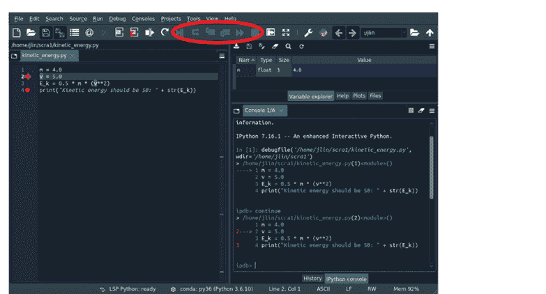

图 11.2 Spyder IDE 中的 *kinetic_energy.py*，显示了断点以及运行程序到第一个断点后变量资源管理器窗格的内容。红色椭圆显示了用于管理调试器中执行的工具栏按钮。

## 11.3 风格约定的重要性

尽管它不是伟大的美国小说，但就编程语言而言，Python 代码相当易于阅读。尽管如此，我们可以想象，如果任由程序员自由发挥，每个人都会使用不同的方式来选择变量名和程序中的其他实体。有些人可能追求无政府状态，在程序的一部分遵循一种命名约定，在另一部分遵循另一种约定。如果 Python 程序员遵循一种风格约定——关于代码外观的规则——这将大大有助于使一个程序员编写的代码对另一个程序员可读。

Python 有这样一种风格约定，在 Python 增强提案（PEP）8 文档中有所描述。² 我们已经见过其中一种约定。函数体、`if` 语句等缩进四个空格的约定就来自 PEP 8。PEP 8 相当详细，但只遵循几条规则就能使我们的代码更具可读性：

- 名称的大小写。几乎所有内容都遵循小写约定，除了遵循首字母大写（CapWords）约定的类名。在 Python 小写约定中，单词全部小写，并用下划线分隔。在首字母大写约定中，单词连在一起，每个单词的首字母大写。因此，类将被命名为，例如 `KeplerData`，而变量、函数和模块将被命名为，例如 `kepler_data`。
- 文件名。这些也是小写，单词用下划线分隔，例如 `kepler_data.py`。回想一下，Python 文件可以被导入并成为模块，因此名称应遵循模块的大小写约定，即小写约定。
- 变量名。这些应尽可能具有描述性，但也不能太长。
- 标记间距。表达式中的标记（变量、运算符等）应由空格分隔。例外是多维数组索引列表，按照约定，逗号后可以有空格，也可以没有（例如 `data[3,2]` 或 `data[3, 2]`）。

尽管这些规则很有用，但有时不遵循这些规则会使代码更具可读性。风格约定最终是为了使代码更具可读性。如果遵循某个特定约定会使某部分代码的可读性大大降低，那就为那部分代码另辟蹊径。

在第 21 章，我们将更详细地讨论如何使代码对他人更有用。编写程序并不容易。它需要练习和犯很多错误。关注我们在本章讨论的主题——编写程序的过程、测试的重要性以及风格约定的重要性——可以使编程任务更容易，结果质量更高。我们在本章描述的策略和工具需要付出努力，但它们确实能提供帮助！

² 我们在 www.cambridge.org/core/resources/pythonforscientists/refs/ 提供了该文档的最新链接，参考文献 64。

# 12 *n* 维诊断数据分析

在前面的章节中，我们研究了一维和二维数组，并将它们用于各种任务，包括数据分析、预测建模和管理多次模型运行的输出。然而，数组不限于一维或二维。如果我们有一个三维物理空间——由长度、宽度和高度组成——在该空间中每隔一米测量某个量（在同一时刻）的长度、宽度和高度，这些测量值可以很好地存储为三维数组的元素。如果所有这些测量值都是按固定时间间隔进行的——比如每小时一次——那么这些值可以存储为四维数组的元素。Python 中的 NumPy 模块具有使我们能够轻松创建和操作这种 *n* 维（或多维）数组的结构，其便捷程度类似于创建和操作一维和二维数组。在本章中，我们讨论用于此类工作的工具及其在 *n* 维数组分析中的应用。

本章使用的较大数据集可供下载。详情请参见前言中的“支持资源和本教材更新”部分。

## 12.1 *n* 维诊断数据分析示例

在第 7.1 节中，我们研究了 2017 年 11 月 11 日 18:00Z 美国中西部的地表/近地表气温。这些气温存储在一个二维数组中，其值在表 7.1 中给出。表 7.1 中列的经度值在表 7.2 中给出，表 7.1 中行的纬度值在表 7.3 中给出。

这些气温值是从一个更大的地表/近地表气温数据文件中提取的，该文件包含 2017 年每天四个时间点——0:00Z、6:00Z、12:00Z 和 18:00Z——的数据。¹ 因此，数据文件中的完整值集本质上是三维的：气温值在不同的纬度、经度和时间给出。

在本节的示例中，我们不再查看美国中西部在单一时间的地表/近地表气温，而是考虑这些地点在四个时间点的气温：2017 年 11 月 11 日 0:00Z、6:00Z、12:00Z 和 18:00Z。² 表 12.1 显示了这些地点和时间的数据。第一个二维数据块给出了

¹ 2017 年的数据文件本身是一组数据文件的一部分，该数据集可追溯到 1948 年 1 月 1 日，并持续至今。完整数据集在 Kalnay 等人 (1996) 中有描述。

² 2017 年 11 月 11 日 0:00Z、6:00Z、12:00Z 和 18:00Z 分别对应中部标准时间：2017 年 11 月 10 日下午 6:00、2017 年 11 月 10 日至 11 日午夜、2017 年 11 月 11 日上午 6:00 和 2017 年 11 月 11 日中午。

## 12 *n*维诊断数据分析

```python
#- 导入模块：
import numpy as np
from scipy import genfromtxt

#- 读取数据文件并重塑为三维数组：
air_temp_2d = genfromtxt('surf_temp_n-d_midwest.csv', delimiter=',')
air_temp = np.reshape(air_temp_2d, (4, 5, 7))

#- 创建零数组以存储24小时平均值：
air_temp_24h_avg = np.zeros(np.shape(air_temp)[-2:],
                            dtype=air_temp.dtype.char)

#- 计算每个位置的24小时平均值：
avg_shape = np.shape(air_temp_24h_avg)
for i in range(avg_shape[0]):
    for j in range(avg_shape[1]):
        air_temp_24h_avg[i,j] = np.mean(air_temp[:,i,j])

#- 将air_temp转换为开尔文并打印最大值：
air_temp_K = air_temp + 273.15
print( "Maximum temperature in K: " + str(np.max(air_temp_K)) )
```

**图 12.1** 读取文件 *surf_temp_n-d_midwest.csv*、计算表 12.2 所示的美国中西部 24 小时平均地表/近地表气温、将输入温度转换为开尔文，并打印以开尔文为单位的最大输入温度的代码。

2017年11月11日 0:00Z。第二个二维数据块给出了2017年11月11日 6:00Z的温度，依此类推。

图 12.1 展示了分析表 12.1 中美国中西部地表/近地表气温的代码。该程序计算了数据中给出的美国中西部每个位置的24小时平均温度，将原始数据中的温度转换为开尔文，并打印了原始数据中以开尔文为单位的最大温度。

表 12.1 中给出的数据值存储在文件 *surf_temp_n-d_midwest.csv* 中，该文件与表 12.1 完全相同，只是 *surf_temp_n-d_midwest.csv* 中没有分隔二维数据块的空行。这使我们能够使用图 12.1 第 6 行的 `genfromtxt` 读取整个数值网格。在第 7 行，我们将从 *surf_temp_n-d_midwest.csv* 读取的数据重塑为由四个“层”（一个“层”是一个由行和列组成的二维数组）³、五行和七列组成的三维数组形式。

在第 10-11 行，我们创建了一个五行七列的二维数组，用于存储每个位置的24小时平均温度。这些值在第 14-17 行计算，我们使用嵌套循环遍历美国中西部每个位置的行和列索引。在每个位置，我们提取四个时间点的温度并计算这些值的平均值。24小时平均温度值（存储在 `air_temp_24h_avg` 中）如表 12.2 所示。

在第 20 行，我们将 `air_temp` 的值从摄氏度转换为开尔文。在第 21 行，我们计算 `air_temp` 中所有位置和时间点的最大温度并打印该值。该值为 290.75 K。

³ 我们所称的“层”也被一些人称为“切片”。在前面的章节中，我们使用“切片”泛指子数组和子列表（及其创建）。然而，“层”是一种特定类型的子数组，是一种“切片”，它覆盖了在非行或列的另一个维度上固定值的所有行和列。为了避免通用切片与三维数组的切片（层）维度之间的混淆，我们将另一个维度称为层维度。

表 12.1 2017年11月11日 0:00Z、6:00Z、12:00Z 和 18:00Z 美国中西部地表/近地表气温（单位：°C）。第一个二维网格块的值在 0:00Z，第二个网格块的值在 6:00Z，依此类推。文件 *surf_temp_n-d_midwest.csv* 包含上述值，但没有分隔四个二维网格块的空行。本表仅显示了合理数量的小数位。数据集中可用的数字比显示的更多。

-2.4, -4.0, -4.9, -5.5, -4.8, -4.6, -5.2
2.5, 1.9, 0.0, -2.3, -2.3, -2.1, -3.1
9.9, 8.4, 5.3, 3.1, 3.6, 3.8, 2.7
13.7, 12.7, 10.0, 9.1, 9.4, 8.5, 8.1
13.4, 14.4, 13.0, 13.4, 14.4, 13.6, 13.9

0.2, -1.0, -2.4, -3.5, -3.6, -3.9, -5.0
5.8, 3.2, 0.2, -2.2, -2.6, -2.7, -4.4
9.9, 6.7, 3.0, 0.8, 1.2, 1.4, -1.1
10.2, 8.4, 6.0, 4.5, 4.0, 3.2, 2.9
9.3, 9.8, 8.0, 7.5, 7.7, 7.2, 10.3

1.4, -0.4, -2.4, -4.0, -4.4, -3.9, -3.9
5.9, 3.6, -1.1, -4.5, -4.5, -3.8, -6.0
8.4, 4.6, 0.4, -1.6, -1.0, -1.4, -6.4
9.5, 5.6, 3.1, 2.6, 1.6, -0.5, -2.9
9.0, 7.5, 6.1, 6.6, 6.1, 4.6, 6.6

7.9, 7.1, 5.7, 3.6, 2.3, 1.7, 1.0
9.9, 8.5, 7.4, 5.7, 4.9, 4.5, 2.1
12.8, 10.6, 9.1, 8.1, 8.8, 8.3, 4.0
15.4, 13.5, 11.1, 10.5, 11.3, 10.1, 6.8
17.6, 17.0, 14.7, 15.3, 16.3, 15.1, 14.4

## 12.2 Python 编程基础

在第 7 章中，我们研究了二维数组。在第 12.1 节的示例中，我们将对数组和循环的理解扩展到三维数组，作为理解 *n* 维数组的原型。三维数组可以看作是二维数组的堆叠或序列。类比来说，如果二维数组是一张纸，那么三维数组就是一叠或一堆纸。三维数组看起来有点像图 12.2，具有高度、宽度和深度。

在本节中，我们以三维数组为原型，探讨 n 维数组的特性。我们首先研究 n 维数组的形状、如何索引以及如何切片（或**选择**）子数组。然后我们考虑 n 维数组中的数组语法和函数。N 维数组可以重塑，我们研究了如何进行重塑以及这揭示了数组元素的内存位置。对于二维数组，我们发现可以使用双重嵌套循环来访问数组中的元素。对于三维数组，三重嵌套循环完成相同的任务，而更高维的嵌套循环用于 n 维数组。在本节中，我们还探讨了将循环与数组语法结合使用。最后，我们提供了一些数组函数的总结表。

在本节其余的代码示例中，假设 NumPy 已作为 `np` 导入。

### 12.2.1 n 维数组的形状和索引

对于一维 NumPy 数组，形状是一个单元素元组。对于二维数组，形状是一个双元素元组，按顺序列出列数和行数。对于三维数组，形状是一个三元素元组，按顺序列出层数、行数和列数。因此，对于图 12.2 所示的 `air_temp` 数组，其形状为 `(4, 5, 7)`。

与一维和二维数组的情况一样，数组的形状可以使用 NumPy 的 `shape` 函数（例如，图 12.1 的第 10 行）或通过访问数组对象的 `shape` 属性来获得。另外，请注意 NumPy 的 `size` 函数与以前一样，给出数组中元素的总数，即形状元组中所有元素的乘积。

更高维数组的形状是什么？形状元组根据以下两条规则构建：(1) 列数始终是形状元组中最右边的元素；(2) 在形状元组中，构建在前一维度之上（或前一维度实体的集合）的每个维度的描述位于前一维度描述的左侧。因此，对于上面的三维数组 `air_temp`，因为有七列，所以形状元组的最后一个元素是 `7`。行是列的集合，所以形状元组中 `7` 左边的数字是行数 `5`。层是行和列的网格，所以这些层的数量（四）被放置在形状元组中 `5` 的左边。四维数组的形状工作方式相同。如果我们有一个由元素组成的四维“超立方体”数组，即多个三维数组（又名“立方体”），那么这些三维数组的数量在形状元组中作为最左边的元素给出。

表 12.2 使用 2017年11月11日 0:00Z、6:00Z、12:00Z 和 18:00Z 的值计算的美国中西部地表/近地表气温的24小时平均值（单位：°C）。这些值使用图 12.1 中的代码计算（即，这些值是数组 `air_temp_24h_avg` 的内容）。

1.78,  0.42, -1.00, -2.35, -2.62, -2.68, -3.27
6.03,  4.30,  1.62, -0.82, -1.12, -1.03, -2.85
10.25, 7.58,  4.45,  2.60,  3.15,  3.02, -0.20
12.20, 10.05, 7.55,  6.67,  6.58,  5.32,  3.72
12.33, 12.18, 10.45, 10.70, 11.12, 10.12, 11.30

## 12 n维诊断数据分析

在n维数组的形状表示中，顺序是：工作表数量在最左侧，其次是行数，最后是列数。n维数组的形状遵循此规则。

在n维数组中索引一个元素，其规则与二维数组相同，只是我们需要在方括号（[]）内按顺序引用所有n个维度，并用逗号分隔。每个维度的第一个元素索引为0，第二个元素索引为1，依此类推。例如，如果我们想访问图12.2中`air_temp`数组的第一个工作表、第二行和第四列，我们会输入：

```
air_temp[0,1,3]
```

索引规范中的索引顺序遵循形状元组中的维度顺序：工作表、行，然后是列。每个维度的索引用逗号分隔。有时，为了清晰起见，我们会在每个逗号后加上空格，例如：

```
air_temp[0, 1, 3]
```

无论哪种方式，代码的工作方式都相同。

### 12.2.2 从n维数组中选择子数组

在n维NumPy数组中选择（或切片）⁴子数组的工作方式与二维数组相同，只是方括号（[]）内的元素数量多于两个。每个维度的索引范围仍然用冒号分隔，下限包含在内，而上限不包含在内。在方括号内，每个维度的选择范围按照数组形状元组中的相同顺序给出。

例如，要从图12.2中的三维`air_temp`数组中提取子数组，该子数组包含第一个和第二个工作表、第二到第三行以及最后三列，我们会输入以下内容：

```
air_temp[0:2,1:3,4:7]
```

图12.3展示了上述代码所选元素（阴影部分）的示意图。因为选择前两个工作表的操作延伸到了工作表维度的开头（其中每个二维网格被视为一个工作表），而选择最后三列的操作延伸到了列维度的末尾，我们可以省略相应的索引值，选择操作将延伸到该维度的末尾。也就是说，以下代码同样有效：

```
air_temp[:2,1:3,4:]
```

⁴ 在本小节及本章后续部分，我们使用“选择”和“选择”来描述从数组中提取子数组。在前面的章节中，我们称此操作为“切片”，这是更常见的术语。在本章及相关章节中，我们避免使用后一个术语，以防止将“选择”与三维数组的“工作表”维度混淆，后者在其他Python著作中有时被称为“切片”维度。“切片切片”听起来好像数组选择操作只适用于工作表/切片维度，但事实并非如此。

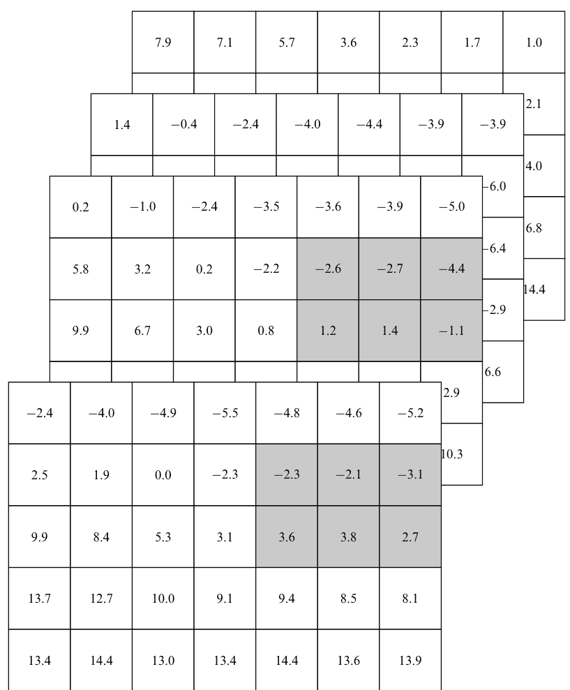

图12.3 图12.2中三维数组`air_temp`的示意图，显示了由`air_temp[0:2, 1:3, 4:7]`切片的子数组元素（阴影部分）。第一个工作表相对于其在图12.2中的位置向下移动，以显示第二个工作表的阴影区域。

要选择整个维度上的所有元素，可以使用不带下限或上限的冒号来指定该维度。例如，在图12.1的第17行中，代码`air_temp[:, i, j]`选择了一个一维数组，该数组由`air_temp`中所有时间点（形状元组中的第一个维度）在整数`i`和`j`值给定的行和列位置上的数据组成。

### 12.2.3 n维数组中的数组语法和函数

与一维和二维数组一样，数组语法在n维数组中也适用，用于对每个元素执行计算（如果计算涉及标量），或者在两个形状相同的数组之间对对应元素执行计算（如果计算涉及两个相同形状的数组）。因此，图12.1的第20行（为方便起见在此重现）：

```
air_temp_K = air_temp + 273.15
```

将273.15加到三维数组`air_temp`的每个元素上，并将结果放置在数组`air_temp_K`的相应位置（该数组也由此操作创建）。数组`air_temp_K`与`air_temp`形状相同。

当我们对两个形状相同的n维数组进行操作时，该操作应用于对应元素，结果被放置在输出数组的相同对应位置。因此，如果我们有两个三维数组`data1`和`data2`，此操作：

```
data_sum = data1 + data2
```

将`data1`和`data2`对应位置的值相加，并将该和放入`data_sum`的相同位置。所有三个数组——`data1`、`data2`和`data_sum`——都具有相同的形状。

以逐元素方式作用于数组的函数在n维数组中的行为方式相同。例如，NumPy的`sin`函数计算输入数组每个元素的正弦值，并将结果放置在输出数组的对应元素中。因此，对于三维数组`data1`：

```
data_sin = np.sin(data1)
```

生成的数组`data_sin`也是三维的，并且与`data1`大小和形状相同。无论`data1`有多少维度，数组`data1`和`data_sin`都将具有相同的形状。

并非所有作用于数组的函数都仅（或主要）逐元素地作用于数组。有些函数假设数组具有特定的结构——例如，数组具有特定数量的维度，或者每个维度代表空间或时间中的特定维度。由于这些函数是专门化的，我们将不再进一步讨论它们。然而，相当多的NumPy函数允许用户控制函数作用的轴。其中一个这样的函数是NumPy的`sum`函数。虽然其他函数可能不遵循`sum`函数的实现方式，但`sum`向我们展示了函数如何使用轴控制来创建额外的功能形式，而不偏离函数的核心思想（对于`sum`来说就是“求和”）。

```
counts = np.array([[[3, 1, 2],
                  [1, 0, 3],
                  [1, 1, 2]],
                 [[1, 2, 2],
                  [0, 1, 2],
                  [3, 1, 2]]])
```

**图12.4** 一个虚构的昆虫物种在乡村田野不同位置的计数。数组的两个工作表代表不同的时间，而工作表的三行三列元素代表田野中的不同位置。

假设我们有一个如图12.4所示的三维整数数组`counts`。该数组表示在乡村田野不同时间和位置对一种昆虫物种的计数。每个位置可能是一个样方⁵，或“采样方格”，在生态学中用于定义进行生物观测的标准区域。

调用`np.sum(counts)`将返回28，这是数组`counts`中所有元素的总和。但是，如果我们设置关键字输入参数`axis`为0、1或2，`sum`函数会产生截然不同的行为：

```
In [1]: np.sum(counts, axis=0)

Out[1]: array([[4, 3, 4],
               [1, 1, 5],
               [4, 2, 4]])
```

```
In [2]: np.sum(counts, axis=1)

Out[2]: array([[5, 2, 7],
               [4, 4, 6]])
```

```
In [3]: np.sum(counts, axis=2)

Out[3]: array([[6, 4, 4],
               [5, 3, 6]])
```

`axis`关键字设置求和发生的维度，其中维度索引与数组形状元组中指定维度的索引相同。如果`axis`设置为0，则求和是通过工作表进行的。也就是说，我们对每个固定的行和列索引，将不同工作表中的值相加。结果是一个三行三列的二维数组：对于`np.sum(counts, axis=0)`返回的数组，`[0,0]`元素（等于四）是`counts[0,0,0]`（等于三）加上`counts[1,0,0]`（等于一）。结果数组的`[0,1]`元素是`counts[0,0,1]`加上

⁵ 参见 https://en.wikipedia.org/w/index.php?title=Quadrat&oldid=919633941（访问于2019年10月25日），但所有数据均为虚构。

counts[1,0,1]，依此类推。在第12.2.6节中，我们将探讨一种使用`for`循环和数组语法混合的方式来模拟`sum`函数对`axis=0`所做的操作。

当`axis`设置为1时，求和操作会沿着行进行。也就是说，对于每个固定的“面”和列索引，我们将不同行中的值相加。结果是一个两行三列的二维数组：对于`np.sum(counts, axis=1)`返回的数组，其`[0,0]`元素（等于五）是`counts[0,0,0]`（等于三）加上`counts[0,1,0]`（等于一）再加上`counts[0,2,0]`（等于一）。结果数组的`[0,1]`元素是`counts[0,0,1]`加上`counts[0,1,1]`加上`counts[0,2,1]`，依此类推。通过`axis`参数，我们可以使求和操作仅沿着单一维度进行，而不是遍历数组中的所有元素。

### 12.2.4 重塑n维数组与数组元素的内存位置

乍一看，不同维度的数组可能看起来彼此非常不同，就像线、面、体之间的差异一样。但是，由于数组元素在计算机内存中的存储方式，不同维度的数组仅仅是同一对象的不同“视图”。

考虑这个包含12个元素的数组`xloc`，它可以描述一个以1 m/s恒定速度沿x方向直线运动的小车，每隔1秒记录一次的x方向位置（单位：米）：

```
xloc = np.array([0, 1, 2, 3, 4, 5, 6, 7, 8, 9, 10, 11])
```

小车从初始位置0米出发。在计算机内存中，相邻的元素是彼此相邻存储的。因此，值为零的元素紧挨着值为一的元素。值为二的元素存储在值为一的元素和值为三的元素旁边。每个元素的内存地址块是连续的。也就是说，这些元素在计算机内存中是按顺序一个接一个存储的。

NumPy的`reshape`函数可以将一个数组转换为另一个形状不同的数组，只要新数组具有相同数量的元素。`reshape`的第一个参数是源数组，第二个参数是新数组的形状元组。让我们将`xloc`转换为一个具有三行四列的二维数组`xloc_2d`：

```
In [1]: xloc_2d = np.reshape(xloc, (3, 4))
       print(xloc_2d)

[[ 0  1  2  3]
 [ 4  5  6  7]
 [ 8  9 10 11]]
```

在每一行内，`xloc_2d`的值的顺序与`xloc`的值的顺序相同（即0, 1, 2, 3等）。在行与行之间，一行的第一个元素的值，总是`xloc`中紧接在`xloc_2d`前一行最后一个元素值之后的那个值（即3, 4和7, 8）。

当我们重塑一个一维数组时，我们不会移动内存中的任何值。在内存中彼此相邻的值，在新的、重塑后的数组中仍然彼此相邻，即使重塑后的数组维度不同。如果我们把`xloc`转换成一个具有两个面、两行和三列的三维数组`xloc_3d`，就可以看到这一点：

```
In [1]: xloc_3d = np.reshape(xloc, (2, 2, 3))
       print(xloc_3d)

[[[ 0  1  2]
  [ 3  4  5]]

 [[ 6  7  8]
  [ 9 10 11]]]
```

在每一行内，值的顺序保持不变。一行的最后一个元素紧挨着下一行的第一个元素。一个面的最后一个元素紧挨着下一个面的第一个元素。如果我们有另一个维度，同样的原则也适用：该维度中的每个元素都是一个子数组，它被放置在该维度中下一个元素的子数组旁边。这个原则适用于越来越高的维度。

我们可以使用`reshape`来执行反向操作：将一个三维数组转换为一维数组。然而，有一个特殊函数可以将任何维度的数组转换为其一维等效形式，即`ravel`：

```
In [1]: print(np.ravel(xloc_3d))

[ 0  1  2  3  4  5  6  7  8  9 10 11]
```

`ravel`函数将多维数组“展开”为其一维版本。

重塑和展开有什么用处？一个用途是将数组转换成一种更易于我们选择子范围进行分析的形式。这就是图12.1第7行的目的。`surf_temp_n-d_midwest.csv`文件中的数字存储为不间断的规则列行，即一个二维网格。这些值作为二维数组`air_temp_2d`进入程序。通过在第7行将该数组转换为`air_temp`，我们就可以直接提取所有时间点上单个位置的值，正如图12.1第17行中`[:,i,j]`语法所做的那样。

展开的一个用途是简化遍历数组元素的过程。我们在第7.2.5节中看到，为了遍历一个二维数组，我们需要两个循环，一个嵌套在另一个内部。通过将二维或n维数组转换为其一维版本，我们总是可以使用单个循环来遍历数组的所有元素。我们失去了n维数组维度结构的信息，但现在我们可以遍历数组的元素，无论它最初有多少维度，也无需更改我们的代码（例如，通过添加另一个嵌套循环）。在我们想要手动遍历一个*n*维数组的情况下，我们将需要使用嵌套循环。在第12.2.6节中，我们将研究三重及更高重嵌套循环。

### 12.2.5 子数组与索引偏移操作

在前面的章节中，我们已经了解了数组切片或选择语法（使用由冒号分隔的边界指定的范围）如何使我们能够选择子数组。我们还看到了如何通过给数组元素的索引值加上或减去一个值（例如`i+1`）来选择距离当前元素一定距离的元素。一旦选定，我们就可以使用这些元素进行计算，例如图6.3第14行中的运行平均值操作。在本节中，我们将数组切片/选择与数组语法结合使用，进行索引偏移操作，使我们能够进行像运行平均值这样的计算而无需使用循环。我们在“动手试试！5-5”中简要看到了这种用法的一个例子。

再次考虑第12.2.4节中的一维`xloc`数组。假设我们感兴趣的是计算小车每个位置距离1秒前位置的距离。通过观察，我们可以看到小车每个位置与其前一个位置之间的差值是1米，但让我们编写代码来计算这个。如果我们想将差值存储在一个单独的数组中，使用`for`循环计算此值的代码如下：

```
diffs = np.zeros(np.size(xloc)-1)
for i in range(np.size(xloc)):
    diffs[i] = xloc[i+1] - xloc[i]
```

数组`diffs`的大小比`xloc`少一个元素，因为第一个位置之前没有位置可以计算差值。

然而，使用数组切片（即选择）和数组语法，我们可以用一行代码解决上述问题：

```
diffs = xloc[1:] - xloc[0:-1]
```

图12.5展示了上述代码行的工作原理。`xloc[1:]`切片操作提取了`xloc`中从第二个（索引1）元素开始到数组末尾的部分。在图12.5中，这由粗体的下花括号和箭头表示。`xloc[0:-1]`操作提取了`xloc`中从第一个（索引0）元素开始到数组倒数第二个元素的部分。在图12.5中，这由粗体的上花括号和箭头表示。回想一下，切片/选择范围在下界是包含的，在上界是不包含的。当我们使用数组语法进行计算时，两个子数组彼此对齐，操作（这里是减法）在子数组中对应的元素之间逐元素进行。在图12.5中，这由连接子数组的细箭头表示。减法操作的结果是图12.5底部的数组。因此，通过明智地使用数组切片和数组语法，我们能够用极少的代码进行索引偏移操作。避免循环通常也能使代码运行得更快。

### 12.2.6 三重嵌套循环与数组语法/选择及循环的混合使用

尽管数组语法在处理 *n* 维数组时表现良好，但有时我们希望对高维数组使用循环。在本节中，我们将探讨两种情况：一种是希望显式地遍历 *n* 维数组的每个元素，另一种是希望仅遍历 *n* 维数组的部分维度。

在第 7.2.5 节中，我们了解到要遍历二维数组中的所有元素，需要使用双层或双重嵌套循环。要对三维数组完成同样的任务，则需要使用三重嵌套循环。让我们再次考虑图 12.4 中的三维数组 `counts`。假设那位从野外观察员笔记本中输入数据的科学家，在实际观测值为 `7` 时意外输入了 `1`。因此，我们希望遍历数组的每个元素，并将每个出现的 `1` 改为 `7`。以下是遍历 `counts` 以完成此任务的三重嵌套循环：

```
for i in range(2):
    for j in range(3):
        for k in range(3):
            if counts[i,j,k] == 1:
                counts[i,j,k] = 7
```

第一个迭代器 `i` 遍历 `counts` 中每个工作表的索引，第二个迭代器 `j` 遍历每一行的索引，第三个迭代器 `k` 遍历每一列的索引。因此，如果我们事先不知道每个维度的大小，以下代码将对任何形状的 `counts` 完成与上述代码相同的任务：

```
for i in range(np.shape(counts)[0]):
    for j in range(np.shape(counts)[1]):
        for k in range(np.shape(counts)[2]):
            if counts[i,j,k] == 1:
                counts[i,j,k] = 7
```

通常，要遍历 *n* 维数组的每个元素，我们需要嵌套与数组维度数量相同的循环。

对于高维数组，我们常常发现自己只对遍历数组的一个或几个维度感兴趣，以便访问一个子数组进行计算。让我们再次考虑图 12.4 中的三维数组 `counts`。假设我们想计算该国野外每个地点在所有时间工作表上的昆虫总数。在下面的代码中，我们使用 `for` 循环遍历时间工作表的索引（数组的第一个维度），使用子数组选择符号获取单个工作表的所有行和列，并使用数组语法将相应的行和列元素与存储累计总数的数组 `total` 相加：

```
for i in range(np.shape(counts)[0]):
    if i == 0:
        total = counts[i,:,:]
    else:
        total += counts[i,:,:]
```

这与使用 `axis=0` 调用 `sum` 函数的结果相同，我们在第 12.2.3 节中见过。在上面的代码中，我们添加了 `if` 语句来检查循环是否处于第一次迭代。如果是，则从 `counts` 的第一个工作表创建 `total` 数组（第 3 行）。在循环的后续迭代中，我们将索引 `i` 对应的工作表的值添加到 `total` 中的相应值，并将结果存储在 `total` 的相应位置（第 5 行）。

`+=` 及类似运算符应用于数组时，也遵循数组语法的规则。也就是说，如果我们有两个形状相同的数组 `x` 和 `y`，那么：

```
x += y
```

等同于：

```
x = x + y
```

其中 `x` 和 `y` 的对应元素相加，结果存储在 `x` 的对应元素中。

我们的图 12.1 示例提供了另一个将循环与数组语法结合的例子。在第 15-17 行，我们使用双重嵌套的 `for` 循环遍历三维数组 `air_temp` 的每个行和列元素。在每个行和列位置，我们提取所有时间工作表。这个一维子数组被输入到 `mean` 函数（第 17 行），得到的平均值存储在 `air_temp_24h_avg` 中对应的行和列位置。

对于双重、三重及更高重的嵌套循环，我们可能会想，嵌套循环的顺序是否重要。在本节的三重嵌套循环示例中，我们首先遍历工作表的索引，然后是行，最后是列。我们能否改变这个顺序，比如先遍历工作表，然后是列，最后是行？事实证明，我们在三重嵌套循环示例中使用的顺序——工作表、行、然后列——是最高效的顺序。

要理解这一点，我们需要回顾：(1) 数组元素在内存中是如何存储的，以及 (2) 嵌套循环中的活动顺序。关于第一个主题，在第 12.2.4 节中，我们看到在 NumPy 数组中，同一行（且在同一工作表上）中相邻列的元素在计算机内存中是连续的（或相邻的）。之后，一行的最后一个元素与下一行的第一个元素相邻，而一个工作表最后一行的最后一个元素与下一个工作表第一行的第一个元素相邻。

关于第二个主题，在嵌套循环中，“变化最快”或“最活跃”的循环是嵌套循环中最内层的循环。我们的意思是，因为最内层循环在外层循环的每次迭代中都会完成其所有迭代，所以最内层循环比外层循环更活跃。例如，如果我们有一个六行四列的二维数组 `data`，以下代码：

```
for i in range(6):
    <... some outer calculations ...>
    for j in range(4):
        <... some inner calculations ...>
```

对于外层循环的每次迭代（并执行 `<... some outer calculations ...>`），内层循环的主体 `<... some inner calculations ...>` 将运行四次（内层循环的迭代次数）。最内层循环的主体是最活跃的。⁶ 对于三重嵌套循环，第三层嵌套或最内层循环是变化最快的循环，第二层嵌套是次快的循环，最外层循环是最慢的循环。

在我们上面的三重嵌套循环示例中，我们使用这些循环遍历每个数组维度的元素索引，以便访问 *n* 维数组中的元素。因此，由于同一行（在同一工作表上）中的列在内存中是连续的，如果变化最快的循环索引（最内层循环）是列的索引，那么这些变化最快的迭代中的每一次都只需移动很短的距离就能找到下一个数组值。从一个列索引移动到下一个列索引，就是从一个内存位置移动到相邻的内存位置。计算机不必“走很远”就能获取下一次迭代的值。然而，如果最内层循环遍历的是另一个维度，比如行的索引，那么对于该循环的每次迭代，计算机都必须“跳过”整整一行的值才能获取下一次迭代的值，并且在下一次列迭代时，计算机又回到第一行，为每次迭代重新进行行跳跃。这是额外的工作。对于非常大的数组，这些额外的工作会累积起来。关键点在于：如果我们嵌套循环，使得访问数组元素的顺序与元素在内存中的存储顺序相匹配——变化最快的循环遍历列索引，上一层是行索引，依此类推——我们的代码运行速度会更快。

### 12.2.7 部分数组函数汇总表

NumPy 数组函数的完整列表可在 NumPy 参考手册中找到。⁷ 在本节中，我们总结了一些数组函数。我们不描述自定义函数行为的各种方式，例如通过使用关键字输入参数。

> ⁶ 这并不完全准确。最内层循环是比它高一层的循环主体的一部分，因此从技术上讲，最内层循环的所有活动都被计为高一层循环的活动。话虽如此，如果我们不“重复计算”最内层循环的活动，即在计数时将 `<... some inner calculations ...>` 与 `<... some outer calculations ...>` 分开，那么最内层循环是最活跃的这一说法是正确的。

⁷ 本表引用了 NumPy 参考手册。我们在 www.cambridge.org/core/resources/pythonforscientists/refs/ 提供了指向 NumPy 参考手册的最新链接，参考文献 39。

自定义功能在本文的其他章节（例如第12.2.3节）以及NumPy参考手册中均有描述。

#### 创建数组

| 名称 | 描述 |
| :--- | :--- |
| `arange` | 创建一个数组，其值如同通过调用`range`生成。 |
| `array` | 将类似列表的对象转换为数组。 |
| `ones` | 创建一个给定形状的数组，其中每个元素等于一。 |
| `zeros` | 创建一个给定形状的数组，其中每个元素等于零。 |

#### 数组查询与操作

| 名称 | 描述 |
| :--- | :--- |
| `ravel` | 将数组转换为其一维等效形式。 |
| `reshape` | 将数组的形状重塑为由输入形状元组指定的新形状。新形状中的元素总数必须等于原始数组中的元素总数。 |
| `shape` | 返回数组的形状元组，其中列出了数组每个维度的元素数量。 |
| `size` | 返回数组中的元素总数。 |

#### 数学运算

| 名称 | 描述 |
| :--- | :--- |
| `arccos` | 返回输入的反余弦（或弧余弦）。 |
| `arcsin` | 返回输入的反正弦（或弧正弦）。 |
| `arctan` | 返回输入的反正切（或弧正切）。 |
| `cos` | 返回输入的余弦（假设输入以弧度为单位）。 |
| `cumsum` | 返回一个数组，其元素是所有先前值（包括当前元素）的累积和。 |
| `exp` | 计算 $e^x$，其中 $x$ 是输入。 |
| `log` | 返回输入的自然对数。 |
| `log10` | 返回输入的以10为底的对数。 |
| `sin` | 返回输入的正弦（假设输入以弧度为单位）。 |
| `sum` | 返回数组中所有元素的和。 |
| `tan` | 返回输入的正切（假设输入以弧度为单位）。 |

#### 统计运算

| 名称 | 描述 |
| :--- | :--- |
| `mean` | 计算输入数组中值的平均值（算术平均）。 |
| `median` | 计算输入数组中值的中位数。 |
| `std` | 计算输入数组中值的标准差。 |

## 12.3 动手试试！

本节中的示例涵盖了第12.2节的主要主题。我们练习操作和使用n维数组，用非常少的代码行进行复杂的数据分析。我们还练习超越双重嵌套循环的更高级嵌套循环。

### 动手试试！12-1 形状与索引：昆虫计数
考虑图12.4中的`counts`数组。该数组的形状是什么？我们如何引用数组中等于0的两个元素？

**动手试试！答案 12-1**
`counts`的形状是(2, 3, 3)。数组中等于0的两个元素是`counts[0,1,1]`和`counts[1,1,0]`。

### 动手试试！12-2 选择子数组：地表温度
考虑图12.1中的数组`air_temp_K`。选择以下子数组的语法是什么？每个子数组的维度数和形状是什么？

1.  第二个工作表中的所有元素。
2.  除最北和最南位置外，所有工作表中的所有元素。
3.  最后一个工作表中，不包括前两个纬度值和最后两个经度值的元素。
4.  具有第一个经度值的所有元素。

**动手试试！答案 12-2**
回想一下，`air_temp_K`与`air_temp`形状相同。因此，尽管表12.1显示的是`air_temp`的值，而不是`air_temp_K`的值，我们仍然可以获得所需子数组的选择边界和结果形状。我们不需要数组值来回答这个问题：

1.  `air_temp_K[1,:,:]`，它有两个维度，形状为(5, 7)。不带上限或下限的冒号选择该维度中的所有元素。
2.  `air_temp_K[:,1:-1,:]`，它有三个维度，形状为(4, 3, 7)。
3.  `air_temp_K[-1,2,:,-2]`，它有两个维度，形状为(3, 5)。冒号右侧或左侧缺少上限或下限的索引范围分别选择到该维度的末尾或开头（包括端点）。数组选择语法`air_temp_K[3,2,:,-2]`和`air_temp_K[3,2:,0:4]`也有效，因为我们可以从前面或后面索引一个维度。
4.  `air_temp_K[:,:,0]`，它有两个维度，形状为(4, 5)。

### 动手试试！12-3 数组语法与函数：昆虫计数

考虑图12.4中的`counts`数组。计算每个位置在所有时间工作表上的总计数，然后将该计数表示为该位置最大总计数的分数。因此，结果中的最大值应为1，位于最大总计数的位置。

### 动手试试！答案 12-3

以下代码解决了这个问题：

```
total = np.sum(counts, axis=0)
total = total / np.max(total)
```

在调用`sum`函数时，`axis=0`关键字沿工作表求和。调用`max`找到`total`中的最大值。在等号右侧的第2行，我们使用数组语法将`total`的每个值除以`total`中的最大值，结果替换了`total`的旧值。

### 动手试试！12-4 重塑数组：昆虫计数

考虑图12.4中的`counts`数组。如果将其转换为一维数组，该数组的前五个元素是什么？最后五个元素是什么？

### 动手试试！答案 12-4

`counts`的一维版本的前五个元素是：3、1、2、1和0。`counts`的一维版本的最后五个元素是：1、2、3、1和2。我们可以通过观察数组并记住以下几点来回答：(1) 当n维数组转换为一维数组时，所有元素在内存中保持顺序不变；(2) 列元素在内存中彼此相邻，一行中的最后一个元素与下一行中的第一个元素相邻。

我们也可以通过使用NumPy的`ravel`函数来解决：

```
In [1]: np.ravel(counts)
Out[1]: array([3, 1, 2, 1, 0, 3, 1, 1, 2, 1, 2, 2, 0, 1, 2, 3, 1, 2])
```

然后读取相应的值。

### 动手试试！12-5 索引偏移操作：昆虫计数

考虑图12.4中的`counts`数组。我们如何计算每个点与其右侧直接相邻点之间的计数差异（在每个时间工作表上）？

### 动手试试！答案 12-5

在下面的notebook解决方案中，我们将结果保存在数组`diff`中并打印该数组：

```
In [1]: diff = counts[:,:,0:-1] - counts[:,:,1:]
        print(diff)

        [[[ 2 -1]
          [ 1 -3]
          [ 0 -1]]]

        [[-1  0]
         [-1 -1]
         [ 2 -1]]]
```

结果`diff`是一个三维数组，有两个工作表、三行和两列。列数少于`counts`中的列数，因为最右边的列在其右侧没有田地中的位置。

### 动手试试！12-6 更复杂的偏移操作：昆虫计数

考虑图12.4中的`counts`数组，但假设它不是只有两个时间工作表，而是有100个时间工作表。我们如何计算每个点与其右侧直接相邻点（*来自前一个时间工作表*）之间的计数差异（在每个时间工作表上）？

### 动手试试！答案 12-6

此计算的选择和数组语法表示法（结果保存在`diff`中）是：

```
diff = counts[1:,:,0:-1] - counts[0:-1,:,1:]
```

`counts[1:,:,0:-1]`选择除第一个时间工作表外的所有时间工作表中除最后一列外的所有列。`counts[0:-1,:,1:]`选择除最后一个时间工作表外的所有时间工作表中除第一列外的所有列。在两个选择操作中，都选择了所有行。

通过使用正索引和负索引，我们实际上不需要知道`counts`中有100个时间工作表。上述选择代码适用于具有2个、100个或1亿个时间工作表的`counts`。在所有有效情况下，`diff`将是一个三维数组。然而，在有两个时间工作表的情况下（图12.4中的实际`counts`数组），`diff`的形状将是`(1, 3, 2)`。具有单个时间工作表的三维数组与二维数组相同，因此我们可以使用`reshape`将`diff`重塑为形状为`(3, 2)`的数组，而不会丢失任何重要信息。当数组有一个长度为1的维度可以这样移除时，该维度被称为**退化**维度。

### 动手试试！12-7 子数组与偏移操作：地表温度

考虑图12.1中的数组 `air_temp_K`。对于每个经度位置，计算时间表中三个最南纬度与前一个时间表中三个最北纬度之间的差值，其中纬度在时间表中从北到南一一对应。换句话说，在计算差值时，时间表中从南数第三个纬度与前一个时间表中从北数第一个纬度配对，从南数第二个纬度与前一个时间表中从北数第二个纬度配对，依此类推。

### 动手试试！答案 12-7

此计算的数组选择语法表示法（结果保存在 `diff` 中）为：

```
diff = air_temp_K[1:,-3:,:] - air_temp_K[0:-1,0:3,:]
```

偏移时间表的选择遵循与“动手试试！12-6”解决方案中相同的语法。`air_temp_K[1:,-3:,:]` 中的行维度选择 `-3:` 选择最后三行，而 `air_temp_K[0:-1,0:3,:]` 中的行维度选择 `0:3` 选择前三行。除了 `0:3`，我们也可以使用 `:3`。

### 动手试试！12-8 偏移操作与更高层嵌套循环：昆虫计数

在“动手试试！12-5”中，我们计算了图12.4中 `counts` 数组每个点与其右侧直接相邻点之间（在每个时间表）的计数差值。请使用嵌套循环进行相同的计算，不使用数组切片/选择语法或数组语法。将结果放入数组 `diff` 中。

### 动手试试！答案 12-8

以下是解决方案：

```
1  diff_shape = (counts.shape[0], counts.shape[1], counts.shape[2] - 1)
2  diff = np.zeros(diff_shape, dtype='l')
3  for i in range(diff.shape[0]):
4      for j in range(diff.shape[1]):
5          for k in range(diff.shape[2]):
6              diff[i,j,k] = counts[i,j,k] - counts[i,j,k+1]
```

在第1行，我们使用 `counts` 的形状属性形式（参见第9.2.2节）来构建结果数组 `diff` 的形状元组 `diff_shape`。`diff` 中的列数将比 `counts` 中的列数少一，因此 `diff_shape` 的最后一个元素是 `counts.shape[2] - 1`。

在第2行，我们创建将保存结果的数组 `diff`。与数组语法不同，结果数组不会自动创建，因此我们必须在遍历其元素索引之前显式创建它。在第3-5行，我们进行该循环。同样，我们使用形状的属性形式，这里是 `diff`。
在第6行，我们进行计算。由于 `diff` 中的列数比 `counts` 中的列数少1，因此 `counts` 的 `k+1` 索引不会超过 `counts` 的列数。

### 动手试试！12-9 偏移操作与更高层嵌套循环：地表温度

使用嵌套循环进行与“动手试试！12-7”相同的计算，不使用数组切片/选择语法或数组语法。将结果放入数组 `diff` 中。

### 动手试试！答案 12-9

以下是解决方案：

```
1  diff_shape = (air_temp_K.shape[0] - 1, 3, air_temp_K.shape[2])
2  diff = np.zeros(diff_shape, dtype='d')
3  for i in range(diff.shape[0]):
4      for j in range(diff.shape[1]):
5          for k in range(diff.shape[2]):
6              diff[i,j,k] = air_temp_K[i+1,-3+j,k] - air_temp_K[i,j,k]
```

第1行定义的 `diff` 形状是棘手的部分，它将决定我们在第6行计算中使用的索引方式。时间表的数量比 `air_temp_K` 中的少一个。有三个最南纬度和三个最北纬度，因此 `diff` 中的行数是三。计算在所有经度值上进行，因此 `diff` 中的列数与 `air_temp_K` 中的列数相同。
给定 `diff_shape`，以及我们在第3-5行中对 `diff_shape` 索引的循环，在第6行中，我们将索引 `i` 时间表之后的下一个时间表引用为 `i+1`，并将每个最南纬度索引相对于索引 `j`（该索引遍历每个最北纬度索引）引用为 `-3+j`。因为 `j` 循环遍历 0、1 和 2，所以 `-3+j` 分别循环遍历 -3、-2 和 -1。

## 12.4 更多学科特定实践

本章的学科特定 Jupyter 笔记本涵盖以下主题：

- $n$ 维数组的形状和索引。
- 从 $n$ 维数组中选择子数组。
- $n$ 维数组中的数组语法和函数。
- 重塑 $n$ 维数组。
- 子数组和索引偏移操作。
- 三重及更高层嵌套循环。

## 12.5 章节复习

### 12.5.1 自测题

尝试在不查看本书或任何其他资源或使用 Python 解释器的情况下完成这些题目。这些自测题的答案可在本章末尾找到。对于所有问题，假设 NumPy 已作为 `np` 导入。

**自测题 12-1**

一个三维数组的形状元组中有多少个元素？一个十维数组呢？

**自测题 12-2**

假设我们有一个四维数组 `humidity`，其中第一维是时间，第二维是海拔，第三维是纬度，第四维是经度。所有维度都随索引增加而增加。因此，例如，最低海拔的值在该维度的索引 0 处。访问第三个时间值、最高海拔、第十五个纬度和第一个经度处的元素的代码是什么？

**自测题 12-3**

对于自测题 12-2 中的 `humidity` 数组，选择由以下部分组成的子数组：第五到第十七个时间值（两者都包含）、所有海拔、前四个纬度和最后一个经度。将此子数组保存为数组 `subhumidity`。

**自测题 12-4**

对于自测题 12-2 中的 `humidity` 数组，如果数组中的值以比率形式给出，请将这些值转换为百分比，并将结果保存为数组 `humidity_percent`。使用数组语法。

**自测题 12-5**

对于自测题 12-2 中的 `humidity` 数组，我们如何使用 NumPy 的 `sum` 函数来计算所有时间、纬度和经度下所有海拔的总和？将结果保存在数组 `sum_elev` 中。`sum_elev` 有多少维？

**自测题 12-6**

假设我们想使用 NumPy 函数 `reshape` 将数组 `data` 重塑为数组 `new_data`。每个数组的形状必须满足什么条件？

## 12 n维诊断数据分析

**自测题 12-7**

对于自测题 12-2 中的 `humidity` 数组，创建一个数组 `new_humidity`，其中给定时间和海拔下的所有经纬度值由单个一维数组表示。不要更改经纬度值的内存顺序。

**自测题 12-8**

对于自测题 12-2 中的 `humidity` 数组，数组中第一个元素旁边的元素是什么？也就是说，数组的第二个元素在哪里？

**自测题 12-9**

NumPy 的 `ravel` 函数是做什么的？

**自测题 12-10**

给定数组 `xloc`：

```
xloc = np.array([0, 1, 2, 3, 4, 5, 6, 7, 8, 9, 10, 11])
```

计算数组 `prod_halves`，其元素是数组后半部分和前半部分对应元素的乘积。也就是说，`prod_halves` 的结果应该是：

```
In [1]: print(prod_halves)
[ 0  7 16 27 40 55]
```

使用数组语法和切片/选择，而不是循环。

**自测题 12-11**

对于自测题 12-2 中的 `humidity` 数组，计算数组 `diff`，该数组是当前时间值减去前一个时间值，在每个海拔、纬度和经度处。使用数组语法和选择，而不是循环。

**自测题 12-12**

使用循环而不是数组语法和选择重复自测题 12-11。

**自测题 12-13**

假设我们有一个函数 `process_humidity`，它接受一个按海拔、纬度和经纬度维度划分的三维数组作为输入，并返回一个标量浮点值。对于自测题 12-2 中的 `humidity` 数组，编写代码选择

### 12.5.2 章节总结

在本章中，我们将对数组的理解扩展到了超过两个维度的数组。我们发现，*n*维数组的许多行为和语法与一维和二维数组的行为和语法相似。在研究*n*维数组时，我们还扩展了对以下方面的理解：数组元素在内存中的存储方式、多维子数组切片/选择、如何使用切片/选择和数组语法进行复杂的索引偏移计算、更高阶的嵌套循环，以及混合使用数组语法/选择与循环。本章涵盖的具体主题包括：

- *n*维数组的形状和索引
    - 三维数组中的元素通过方括号内的工作表索引、行索引，然后是列索引来引用。
    - 在*n*维数组中指定一个元素时，列索引始终是最右边的索引，行索引在列索引的左边，工作表索引在行索引的左边，依此类推向左延伸。
    - 沿着某个维度，第一个元素的索引是0，第二个元素的索引是1，依此类推。
- 从*n*维数组中选择子数组
    - 通过提供上界和下界索引来选择子数组，这些索引指定了要从中选择子数组的数组在*每个维度*上的元素范围。
    - 某个维度的上界和下界索引用冒号分隔。上界是排他的，下界是包含的。
    - 缺少上界和/或下界意味着选择将分别包含地延伸到*该维度*的末尾和/或开头。
- *n*维数组中的数组语法和函数
    - 数组与标量之间的运算：运算发生在数组的每个元素与标量之间，结果放置在与原始数组形状相同的输出数组的相应位置。
    - 形状相同的数组与另一个数组之间的运算是逐元素进行的：运算发生在对应的元素上，结果放置在形状相同的输出数组的相应位置。
    - 许多NumPy函数以逐元素的方式操作数组。
    - 一些NumPy函数以不止逐元素的方式操作数组。`sum`函数就是这样一个函数。通过设置`axis`关键字输入参数，我们可以控制求和发生的数组维度。
- 重塑*n*维数组
    - NumPy的`reshape`函数将数组重塑为作为输入参数提供的新形状。
    - 使用`reshape`函数时，数组的元素总数不能改变。
    - `reshape`函数不会改变数组元素在内存中的存储顺序。重塑数组只会改变行、工作表等的结束和另一个的开始位置。
    - NumPy的`ravel`函数将任何数组转换为其扁平化或一维版本。`ravel`函数同样在不改变内存中元素存储顺序的情况下工作。
- 数组元素的内存位置
    - 行内连续的列元素在内存中彼此相邻存储。
    - 一行中的最后一个元素在内存中与下一行的第一个元素相邻。
    - 一个工作表中的最后一个元素在内存中与下一个工作表的第一个元素（即下一个工作表第一行的第一个元素）连续。
    - 对于更高维度，该维度中的每个元素都是一个子数组，该子数组与该维度中下一个元素的子数组相邻放置。
- 子数组和索引偏移操作
    - 通过仔细选择子数组的不同范围，并使用数组语法组合它们，我们可以模拟在之前的示例中需要循环才能进行的索引偏移操作。
    - 使用子数组和数组语法代替循环，使我们能够用更少的代码行来描述索引偏移操作。避免循环通常也会产生运行更快的代码。
- 三重嵌套循环和混合使用数组语法/选择与循环
    - 要通过嵌套循环访问*n*维数组中的所有元素，需要有*n*个相互嵌套的循环，每个循环遍历某个维度的所有或部分索引。
    - 嵌套循环结构中最内层的循环是“变化最快”或“最活跃”的循环。因此，遍历列索引（其中相邻元素在内存中彼此相邻）的迭代应发生在最内层循环中。遍历行索引的迭代应发生在比最内层循环高一级的嵌套循环中，依此类推。
    - 我们可以结合循环和数组选择/语法来对子数组进行多次和重复的操作。

### 12.5.3 自测答案

### 自测答案 12-1

形状元组中的元素数量等于数组的维度数。因此，三维数组的形状元组有三个元素。十维数组的形状元组有十个元素。

### 自测答案 12-2

```
humidity[2, -1, 14, 0]
```

### 自测答案 12-3

```
subhumidity = humidity[4:17, :, 0:4, -1]
```

### 自测答案 12-4

```
humidity_percent = humidity * 100.0
```

### 自测答案 12-5

这计算了 `sum_elev`：

```
sum_elev = np.sum(humidity, axis=1)
```

`sum_elev` 数组有三个维度。

### 自测答案 12-6

`data` 和 `new_data` 之间的元素总数不能不同。因此，每个数组形状元组中元素的乘积必须相同。

### 自测答案 12-7

```
new_shape = (humidity.shape[0], humidity.shape[1],
             humidity.shape[2] * humidity.shape[3])
new_humidity = np.reshape(humidity, new_shape)
```

`new_shape` 元组长度为三个元素。最后一个维度将纬度/经度值折叠成一个一维数组，因此该维度的元素数量是纬度点和经度点数量的乘积。

### 自测答案 12-8

数组的第一个元素位于第一个时间值、第一个高程、第一个纬度和第一个经度。第二个元素位于下一个经度。因此，该元素位于第一个时间值、第一个高程、第一个纬度和第二个经度。

### 自测答案 12-9

`ravel` 函数返回 *n* 维数组的扁平化或一维版本。这样做时，数组中元素的内存顺序得以保留。

### 自测答案 12-10

```
prod_halves = xloc[6:] * xloc[0:6]
```

### 自测答案 12-11

```
diff = humidity[1:,:,:,:] - humidity[0:-1,:,:,:]
```

### 自测答案 12-12

这是一个解决方案：

```
diff_shape = (np.shape(humidity)[0] - 1,
              np.shape(humidity)[1],
              np.shape(humidity)[2],
              np.shape(humidity)[3])
diff = np.zeros(diff_shape, dtype='d')
for i in range(diff_shape[0]):
    for j in range(diff_shape[1]):
        for k in range(diff_shape[2]):
            for l in range(diff_shape[3]):
                diff[i,j,k,l] = humidity[i+1,j,k,l] - humidity[i,j,k,l]
```

我们在第1-4行写出了 `diff_shape` 的元素，以明确什么内容放入 `diff_shape`。我们可以用更简洁的内容替换这些行，例如：

```
diff_shape = list(np.shape(humidity))
diff_shape[0] -= 1
```

`zeros` 函数接受 `diff_shape` 的列表（或数组）版本；`diff_shape` 不必是元组。

### 自测答案 12-13

```
processed = np.zeros(np.shape(humidity)[0], dtype='d')
for i in range(np.size(processed)):
    processed[i] = process_humidity(humidity[i,:,:,:])
```

# 13 基础图像处理

在前面的章节中，我们已经使用了循环和数组语法来分析多维数组中的数据。当我们使用循环结构来检查数组的元素时，我们也发现像 `if` 语句这样的分支语句使我们能够根据某些条件是否为真来进行不同的计算。然而，是否有可能将分支逻辑融入数组语法中，避免编写循环，同时仍然根据某些条件是否为真来进行不同的计算呢？在本章中，我们将研究能够实现这一点的数组函数和构造。

我们在图像处理的背景下介绍这些工具。在当今这个媒体驱动的世界里，图像无处不在。我们到处都能看到它们，无论是手机拍摄的快照、猫咪视频，还是点播电影。同样，科学和工程工作中也处处可见图像：卫星仪器、医疗扫描设备和数字望远镜都是图像的来源。然而，当图像被加载到计算机中时，所有图像都变成了一个数字数组。在本章我们研究的基本示例中，我们将发现我们在前面章节中学到的数组处理工具也能让我们分析编码在图像文件中的信息。我们本章的讨论也将为第14章讨论基础动画奠定基础。

在本章中，由于我们使用图像处理来激发对数组语法及相关概念的更详细考察，我们解决图像处理问题的方法使用了比实际应用中可能使用的更低级的工具。对于现实世界的图像处理问题，我们希望利用已经存在的各种工具来解决此类问题。这些工具包括 Pillow 库、scikit-image 包以及 Matplotlib 图像子模块中未在本章描述的其他函数。Pillow 和 scikit-image 主页的最新链接分别位于 www.cambridge.org/core/resources/pythonforscientists/refs/ 的参考文献 51 和 52。¹

本章中使用的图像可供下载。详情请参见前言中的“支持资源和本书更新”部分。

## 13.1 图像处理示例

Volkman 等人（2004）进行了一项研究，以观察斑马鱼在感染 *分枝杆菌*（导致结核病的细菌类型）后结核性肉芽肿（肉芽肿是巨噬细胞的聚集体；巨噬细胞是一种抵抗感染的白细胞）的形成。² 这些细菌经过改造以表达绿色荧光蛋白，导致受感染的巨噬细胞发出绿色荧光。随着时间的推移，受感染的（绿色）巨噬细胞在肉芽肿中的积累可以通过显微镜观察到，如他们论文中的图4所示。我们的图13.1–13.3展示了来自 Volkman 等人（2004）图4“聚集体的进展”中不同时间点的三个面板。

我们的第一个任务是读取这些图像中的第一张，即图13.1，并对其进行操作。我们希望找到图像中符合某种“绿色度”标准（这代表受感染巨噬细胞的积累）的所有点，以计算图像中符合该标准的像素百分比，并创建一个以某种方式突出显示这些“绿色”像素的图像版本，使它们更加显眼。图13.4中的代码完成了这项任务。

在前面的章节中，我们在示例部分对代码的功能进行了宽泛的描述，并在 Python 编程基础部分进行了更详细的说明。在本章中更是如此，因为数组语法与分支的结合产生了强大但简洁的代码，需要大量的上下文才能完全解释清楚。请让我们下面的快速描述激发你对第13.2节的兴趣。如果描述只部分有意义，请不要担心。

¹ 另请参阅 van der Walt 等人（2014）了解更多关于 scikit-image 的信息。

² 感谢 Cynthia Gustafson-Brown 提供本节的示例并为本节文本做出贡献。

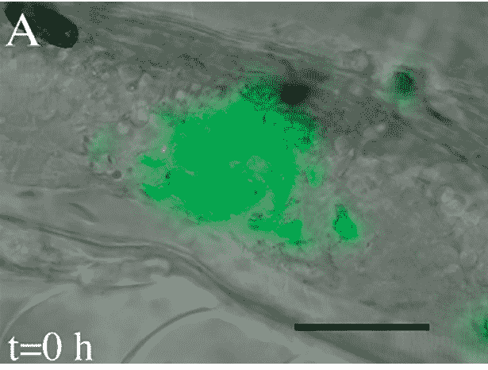

**图 13.1** 来自 Volkman 等人（2004）的图像，显示了肉芽肿形成第一天（时间 *t* = 0）巨噬细胞的聚集。右下角的水平黑线代表 50 µm 的长度。

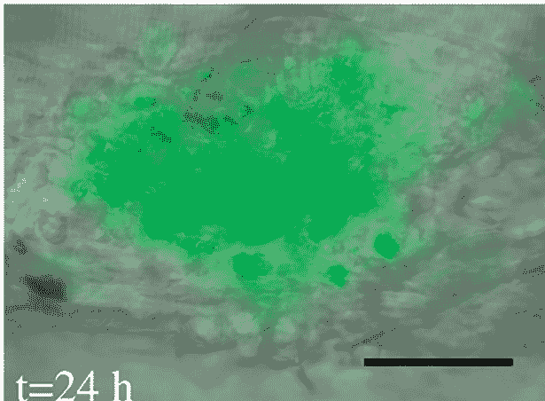

**图 13.2** 来自 Volkman 等人（2004）的图像，显示了形成后 24 小时的肉芽肿。右下角的水平黑线代表 50 µm 的长度。

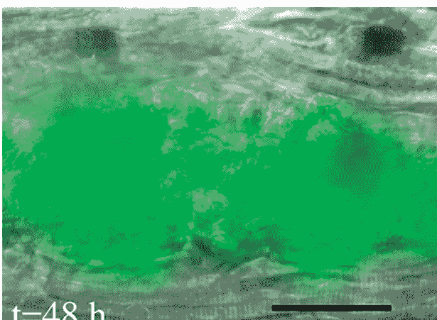

**图 13.3** 来自 Volkman 等人（2004）的图像，显示了形成后 48 小时的肉芽肿。右下角的水平黑线代表 50 µm 的长度。

```python
import numpy as np
import matplotlib.pyplot as plt
import matplotlib.image as mpimg

img = mpimg.imread("g004-A1.png")

thresh = 0.58
offset = 0.05
condition = np.logical_and(
    np.logical_and(img[:,:,1] > thresh,
                   img[:,:,0] < (thresh - offset)),
    img[:,:,2] < (thresh - offset) )

img_highlight = img.copy()
img_highlight[:,:,0] = np.where(condition, 1.0, img[:,:,0])
img_highlight[:,:,1] = np.where(condition, 0.0, img[:,:,1])
img_highlight[:,:,2] = np.where(condition, 1.0, img[:,:,2])

plt.imsave("g004-A1_highlight.png", img_highlight)

print( 'Percent "green": ' + \
       str(np.sum(condition) / np.size(condition) * 100.0) )
```

**图 13.4** 分析图13.1中图像的代码。该输入图像的文件名是 *g004-A1.png*。输出文件名是 *g004-A1_highlight.png*，该文件中的图像见图13.5。

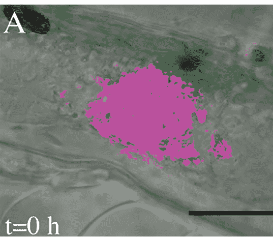

**图 13.5** 由图13.4中的代码（以及图13.6中循环的第一次迭代）生成的图像。生成的图像文件名是 *g004-A1_highlight.png*。生成的图像修改自 Volkman 等人（2004）。

```python
img1 = mpimg.imread('g004-A1.png')
img2 = mpimg.imread('g004-A2.png')
img3 = mpimg.imread('g004-A3.png')

images = [img1, img2, img3]

thresh = 0.58
offset = 0.05

for i in range(len(images)):
    img = images[i]
    condition = np.logical_and(
                np.logical_and(img[:,:,1] > thresh,
                               img[:,:,0] < (thresh - offset)),
                img[:,:,2] < (thresh - offset) )

    img_highlight = img.copy()
    img_highlight[:,:,0] = np.where(condition, 1.0, img[:,:,0])
    img_highlight[:,:,1] = np.where(condition, 0.0, img[:,:,1])
    img_highlight[:,:,2] = np.where(condition, 1.0, img[:,:,2])

    plt.imsave("g004-A" + str(i+1) + "_highlight.png", img_highlight)

    print( 'Percent "green" frame A' + str(i+1) + ': ' + \
           str(np.sum(condition) / np.size(condition) * 100.0) )
```

**图 13.6** 分析图13.1–13.3中图像的代码。这些输入图像的文件名是 g004-A1.png、g004-A2.png 和 g004-A3.png。输出文件名分别是 g004-A1_highlight.png、g004-A2_highlight.png 和 g004-A3_highlight.png，这些文件中的图像分别见图13.5、13.7 和 13.8。假设图13.4代码中的导入行已经运行。

图13.4的第1–3行导入了所需的包。除了导入 NumPy 和 Matplotlib 包的 pyplot 模块外，我们还导入了 Matplotlib 包的 image 模块。最后一个模块有一个函数 `imread`，我们在第5行用它来读取文件。事实证明，`imread` 的返回值是一个 NumPy 数组，我们将其保存为 `img`。在第13.2.1节中，我们将进一步了解将便携式网络图形（PNG）格式图像加载为 NumPy 数组意味着什么。目前，只需知道该数组存储了每个**像素**的红色、绿色和蓝色分量（或通道）的强度即可。

在第7–12行中，我们寻找所有符合我们“绿色度”标准的像素。具体来说，我们寻找图像中绿色通道强度大于 `thresh` 值，且红色和蓝色通道强度小于 `thresh - offset` 的所有位置。数组 `condition` 在我们刚才描述的标准为真的地方为 `True`，否则为 `False`。

在第14行，我们创建了 `img` 的一个副本。在这个副本 `img_highlight` 中，我们获取所有符合我们“绿色度”标准的像素，并将它们的颜色更改为品红色。这在第15–17行完成。

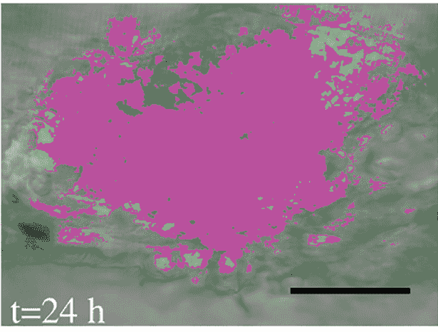

**图 13.7** 由图 13.6 中代码生成的第二张图片。生成的图片文件名为 *g004-A2_highlight.png*。生成的图片改编自 Volkman 等人 (2004)。

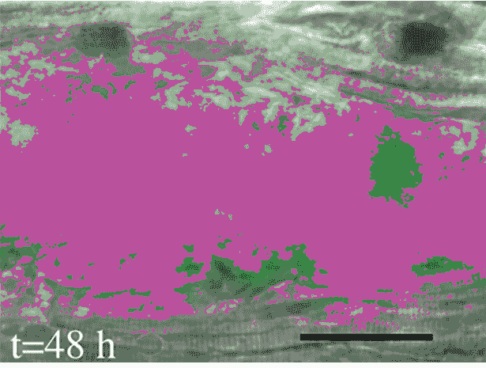

**图 13.8** 由图 13.6 中代码生成的第三张图片。生成的图片文件名为 *g004-A3_highlight.png*。生成的图片改编自 Volkman 等人 (2004)。

```
1 Percent "green" frame A1: 10.849044504296526
2 Percent "green" frame A2: 37.901115813774524
3 Percent "green" frame A3: 52.18737976144671
```

**图 13.9** 图 13.6 中代码的屏幕输出。

在第 19 行，我们将 `img_highlight` 写入一个 PNG 文件。该图片显示在图 13.5 中。最后，在第 21-22 行，我们输出了图像中符合这些“绿色”标准的像素百分比，即 10.85%。这为我们提供了肉芽肿（即这些白细胞的聚集体）大小的定量估计，我们可以用它来与其他图像进行定量比较。

对于我们的第二个任务，我们希望复制第一个任务所做的工作，并将其应用于图 13.1-13.3 中的所有三张图像。请注意，这三张图像在宽度和高度上具有相同的像素数。图 13.6 中的代码完成了此任务，并生成了图 13.5（与图 13.4 中的代码相同）、图 13.7 和图 13.8 中的品红色高亮版本，以及图 13.9 中的屏幕输出。该屏幕输出为我们提供了图 13.1-13.3 每帧中肉芽肿大小的定量估计：分别为 10.85%、37.9% 和 52.19%。

图 13.6 中的代码与图 13.4 中的代码几乎相同。主要区别在于：(1) 在图 13.6 的第 1-3 行读取了三张输入图像；(2) 在图 13.6 中，图 13.4 的第 9-22 行被放入一个 `for` 循环中，该循环遍历三个图像数组对象中的每一个。循环通过以下方式实现：(1) 将图像数组对象保存为 `img1`、`img2` 和 `img3`（图 13.6 中的第 1-3 行），(2) 将这些对象放入列表 `images` 中（第 5 行），以及 (3) 遍历 `images` 列表的索引（第 10 行）。我们使用每个迭代器 `i` 的值将 `images` 中的每个图像数组对象赋值给变量 `img`，并为每个输出文件名和打印到屏幕的值分配适当的 “A1”、“A2” 或 “A3” 标签（第 22-25 行）。

## 13.2 Python 编程基础

在前面的章节中，我们介绍了数组语法、循环、分支和布尔变量与表达式。在本章中，我们使用 Python 进行一些基本的图像处理，但由于 Python 将二维图像中的颜色表示为三维数组中的数据，图像处理用例提供了使用数组语法和数组函数探索更复杂数组操作的机会。例如，图 13.4 中的第 9-12 行利用数组语法创建了一个布尔值数组。图 13.4 中的第 15-17 行利用了数组函数 `where`，该函数能够根据数组元素是否满足条件来修改和操作数组。

在本节中，我们首先介绍如何使用 Matplotlib 包读取、显示和写入图像。接下来，我们描述布尔数组及其使用方法。这些布尔数组在使用数组语法和函数时非常有用。我们描述了使用数组语法和函数对数组中的数据进行查询的方法，并描述了这些方法与使用 `for` 循环和 `if` 语句检查数组中每个元素相比的效果如何。最后，我们描述了附加到许多 NumPy 函数的 `reduce` 方法，以及如何使用循环遍历对象列表。

在本节其余的代码示例中，假设 NumPy 已作为 `np` 导入，Matplotlib 的 pyplot 模块已作为 `plt` 导入。

### 13.2.1 在 Matplotlib 中读取、显示和写入图像

一般来说，图像是由排列在规则网格中的像素组成的。每个像素是一个具有给定亮度（在某些图像中，还具有给定透明度）的彩色点。表示颜色有多种不同的方式（Matplotlib 也支持其中一些），但在本节中，我们重点关注 **红-绿-蓝 (RGB)** 系统，该系统将像素的颜色分解为红色、绿色和蓝色分量（或“通道”）。每个通道强度的组合成为像素的颜色。

例如，一个红色通道强度为 100%，绿色和蓝色强度为 0% 的像素是红色像素。一个红色和绿色通道强度为 100%，蓝色通道强度为 0% 的像素是黄色像素。不同的颜色深浅是通过改变红色、绿色和蓝色的相对贡献以及每个分量的实际强度来创建的。例如，一个红色和绿色通道强度为 75%，蓝色通道强度为 0% 的像素是赭黄色像素。请注意，我们感知到的“亮度”并不一定意味着单个通道的强度较低。例如，浅蓝色是由红色强度 68%、绿色强度 85% 和蓝色强度 90% 产生的，而不仅仅是降低蓝色通道强度并将红色和绿色通道强度保持在 0%。³

如果所有三个红-绿-蓝通道的强度相同，则像素是灰色的阴影。当所有三个红-绿-蓝通道均为 100% 时，像素为白色。当所有三个红-绿-蓝通道均为 0% 时，像素为黑色。因此，较深的灰色阴影对应于三个红-绿-蓝通道相同且强度较低的情况。图 13.10 显示了由各种红-绿-蓝强度生成的一些颜色。这些强度以分数而非百分比给出，因此 100% 强度为 1，0% 强度为 0。介于两者之间的百分比是 1 和 0 之间的小数。⁴

当我们读取、显示或写入图像时，我们正在操作一个像素网格，每个像素都由上述 RGB 通道强度指定。在 Python 中，这是一个三维浮点数组，其中第一维的元素数量等于图像的高度（以像素为单位），第二维的元素数量等于图像的宽度（以像素为单位），第三维的元素数量为三，对应于三个 RGB 通道强度。元素的值是介于零和一之间的浮点数，如图 13.10 中的示例所示。

由于 RGB 强度数组的维度顺序（因此形状）是高度、宽度和通道，这与通常将三维数组的形状描述为层、行和列不同。在选择高度和宽度像素时，我们是在 RGB 强度数组的第一维和第二维中进行选择。

让我们通过打印图 13.4 中 `img` 数组的一些切片（或选择）来检查一个具体的 RGB 数组示例（我们还打印了 `img` 的形状作为参考）：

```
In [1]: print(np.shape(img))

(339, 460, 3)
```

```
In [2]: print(img[169,230,:])

[0.3647059  0.7176471  0.32941177]
```

```
In [3]: print(img[169,0,:])

[0.50980395 0.5137255  0.5019608 ]
```

In [1] 单元格显示 `img` 数组高 339 像素，宽 460 像素。In [2] 单元格显示了图像中心附近位置的 RGB 强度三元组：索引 169

# 13 基础图像处理

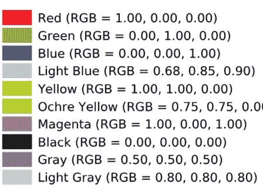

图 13.10 由各种 RGB（红-绿-蓝）设置产生的颜色示例。强度从 0 到 1 不等，其中 0 代表 0% 强度，1 代表 100% 强度。

³ 有关颜色及其 RGB 代码的列表，请参见 https://www.rapidtables.com/web/color/RGB_Color.html#color-table（访问于 2019 年 4 月 25 日）。在此表和许多其他关于颜色的讨论中，100% 强度表示为 255，强度范围从 0 到 255，而不是从 0% 到 100%。我们将在本节后面讨论原因。
⁴ 该图以这种方式显示强度，是因为 Matplotlib 在 PNG 图像文件中以这些术语表示它们，而不是百分比。

### 13.2.2 布尔数组

在第 8.2.2 节中，我们学习了布尔类型和用于计算布尔代数表达式的逻辑运算符。借助这些工具，我们可以创建更复杂的分支 `if` 语句，从而分析复杂情况。然而，这些工具作用于标量值，即单个值而非值的集合。当我们想使用分支 `if` 语句来检查数组值时，需要遍历数组元素，并对单个元素使用 `if` 语句和布尔表达式。

在第 5.2.6 节中，我们介绍了数组语法。在目前看到的示例中，大多数数组都存储数值，数组语法操作也都是算术运算（例如加法、乘法等）。然而，正如我们在字符串数组中看到的，只要所有元素类型相同，数组可以存储其他类型的值。布尔类型也不例外。

让我们重新审视第 6.2.4 节中的原子序数示例。我们创建两个数组。第一个数组名为 `atomic_numbers`，存储三个元素的原子序数。另一个数组名为 `has_more_protons_than_carbon`，根据 `atomic_numbers` 中对应元素（即具有相同索引的元素）的值是否大于 6，存储 `True` 或 `False`：

```python
atomic_numbers = np.array([17, 2, 6, 8])
has_more_protons_than_carbon = np.array([True, False, False, True])
```

数组 `has_more_protons_than_carbon` 的行为与其他任何数组一样。例如，我们可以使用 `for` 循环遍历数组的每个元素，无论是按值还是按索引。在下面的代码中，我们通过索引访问 `atomic_numbers` 和 `has_more_protons_than_carbon`（如上定义）的每个元素，并使用这些值打印一条消息：

```python
for i in range(np.size(atomic_numbers)):
    print( "The element with atomic number " \
           + str(atomic_numbers[i]) \
           + " has more protons than carbon?: " \
           + str(has_more_protons_than_carbon[i]) )
```

此循环产生以下输出：

```
The element with atomic number 17 has more protons than carbon?:  True
The element with atomic number 2 has more protons than carbon?:  False
The element with atomic number 6 has more protons than carbon?:  False
The element with atomic number 8 has more protons than carbon?:  True
```

在上面的示例中，布尔数组 `has_more_protons_than_carbon` 是手动创建的。然而，与任何其他数组一样，我们可以让计算机计算并将值分配给每个元素。我们可以通过使用循环来实现：

```python
atomic_numbers = np.array([17, 2, 6, 8])
has_more_protons_than_carbon = np.zeros(np.size(atomic_numbers),
                                        dtype='?')
for i in range(np.size(atomic_numbers)):
    if atomic_numbers[i] > 6:
        has_more_protons_than_carbon[i] = True
    else:
        has_more_protons_than_carbon[i] = False
```

在第 2-3 行，我们创建了一个布尔数组 `has_more_protons_than_carbon`，其大小与 `atomic_numbers` 相同，每个元素的值初始化为 `False`。类型码 `'?'` 告诉 NumPy 创建一个每个元素都是布尔值的数组。在第 3-8 行，我们遍历每个元素的索引，并将 `has_more_protons_than_carbon` 的每个元素的值设置为 `True`（如果 `atomic_numbers` 的对应元素大于 6），否则设置为 `False`。

然而，布尔数组也支持数组语法。因此，表 6.2 中的基本比较运算符将对数组进行逐元素操作，并返回一个包含比较逐元素结果的布尔数组。因此，这段代码：

```python
atomic_numbers = np.array([17, 2, 6, 8])
has_more_protons_than_carbon = atomic_numbers > 6
```

创建了一个布尔数组 `has_more_protons_than_carbon`，其中检查 `atomic_numbers` 的每个元素是否大于 6，并将输出数组中对应位置的元素相应地设置为 `True` 或 `False`。上述代码的结果产生 `has_more_protons_than_carbon`，其内容如下：

```
In [1]: print(has_more_protons_than_carbon)

[ True False False  True]
```

数组语法也适用于布尔代数运算符。但是，我们不能直接使用 `and`、`or` 和 `not`，因为这些运算符仅适用于标量布尔值。相反，我们可以

从顶部开始计数，索引 230 从左侧开始计数。此三元组中的红色和蓝色通道值远小于绿色通道值，我们怀疑这是一个偏绿色的像素。In [3] 显示了图像高度中间附近（从顶部索引 169）但位于左侧边界（从左侧索引 0）位置的 RGB 强度三元组。由于此位置的 RGB 值几乎相同，我们怀疑这是一个偏灰色的像素。与图 13.1 中图像的着色进行比较证实了我们的推理。

**读取图像** Matplotlib 图像模块的 `imread` 函数读取图像（其文件名作为参数传递给函数调用），并返回描述该图像的三维 NumPy 数组。图 13.4 中的第 5 行和图 13.6 中的第 1-3 行提供了使用 `imread` 的示例。

当 `imread` 读取 PNG 文件时，强度以 0 到 1（包含范围两端）之间的小数给出，表示强度百分比的小数值。当 `imread` 读取其他格式的文件时，返回数组中元素的值可能不同。⁵ 通常，由每个像素占用 8 位内存（这是大多数图像格式使用的）组成的非 PNG 图像由 0 到 255（包含范围两端）之间的整数表示。因此，值 255 表示强度为 1.0，值 254 表示强度约为 0.996，依此类推。使用 0 到 255 之间的整数是因为 8 位内存有 2⁸ = 256 个可能的值。有关表达 8 位图像强度的更多信息，请参见“试一试！”13-1 的答案。

**显示图像** Matplotlib 的 pyplot 模块中的 `imshow` 函数创建图像的绘图。给定图 13.4 中的 `img` 数组，以下代码将创建图像的绘图，然后在屏幕上渲染该绘图：

```python
plt.imshow(img)
plt.show()
```

当我们说 `imshow` 创建图像的绘图时，意味着默认情况下图像被放置在带有刻度、刻度标签和边框的 x 轴和 y 轴框架中。x 轴和 y 轴的编号从图像左上角的原点开始。因此，y 轴刻度标签计算从左上角向下的像素数，x 轴刻度标签计算从左上角向右的像素数。

**写入图像** 要写出由给出 RGB 强度的三维 NumPy 数组描述的图像，我们可以使用 Matplotlib 的 pyplot 模块的 `imsave` 函数。⁶ 图 13.4 中的第 19 行将 `img_highlight` 描述的图像写入由字符串 "g004-A1_highlight.png" 给出的 PNG 文件。

`imsave` 函数在技术上写入“红-绿-蓝-Alpha (RGBA)”图像，这是 RGB 图像加上一个用于透明度度量（称为“alpha”）的额外通道。<sup>7</sup> 当像素完全不透明时，其 alpha 值为 1。<sup>8</sup> 将 RGB 图像写入为 RGBA 不会丢失信息。但是，如果我们使用 `imsave` 写入 RGB 图像，然后将其读回，图像数组的形状将不同，具有四个通道而不是三个。Alpha 通道是最后一个通道，即通道维度中的索引 3。本节中的函数和例程适用于 RGBA 图像以及 RGB 图像。<sup>9</sup> 如果我们只考虑 RGBA 强度数组的前三个通道，这与普通的 RGB 编码相同。

在某些情况下，我们希望写出的图像嵌入带有 x 轴和 y 轴编号的绘图框架中。为此，我们使用 `imshow` 创建一个绘图对象（技术上是一个 `AxesImage` 类对象），然后使用 `savefig` 将该绘图对象保存到文件。例如，给定图 13.4 中的 `img` 数组，以下代码创建带有绘图框架和编号的图 13.1 版本：

```python
plt.imshow(img)
plt.savefig("g004-A1-as-plot.png")
```

结果如图 13.11 所示。轴编号以像素为单位。

最后，Matplotlib 图像教程<sup>10</sup> 提供了关于读取和操作图像的简要但很好的介绍，并启发了本章的一些想法。该教程的最新链接位于 www.cambridge.org/core/resources/pythonforscientists/refs/，参考文献 27。

**图 13.11** 与图 13.1 相同，但带有绘图框架和编号。生成的图像改编自 Volkman 等人 (2004)。

⁵ https://matplotlib.org/api/_as_gen/matplotlib.pyplot.imread.html（访问于 2019 年 5 月 18 日）。
⁶ https://matplotlib.org/api/_as_gen/matplotlib.pyplot.imsave.html 和 https://stackoverflow.com/questions/9295026/matplotlib-plots-removing-axis-legends-and-white-spaces（均访问于 2019 年 5 月 15 日）。
<sup>7</sup> https://stackoverflow.com/a/45594478。此行为未在 `imsave` 手册页面 (https://matplotlib.org/3.3.3/api/_as_gen/matplotlib.pyplot.imsave.html) 中明确提及。两个页面均访问于 2020 年 12 月 21 日。
<sup>8</sup> https://en.wikipedia.org/wiki/RGBA_color_model（访问于 2020 年 12 月 29 日）。
<sup>9</sup> 请参阅从 https://matplotlib.org/api/_as_gen/matplotlib.pyplot.html 链接的 `imread`、`imsave` 和 `imshow` 函数的文档（均访问于 2020 年 12 月 29 日）。
<sup>10</sup> https://matplotlib.org/tutorials/introductory/images.html#sphx-glr-tutorials-introductory-images-py（访问于 2019 年 4 月 27 日）。

分别使用 NumPy 函数 `logical_and`、`logical_or` 和 `logical_not`。因此，以下代码：

```
1  atomic_numbers = np.array([17, 2, 6, 8])
2  print( np.logical_and(atomic_numbers > 6, atomic_numbers < 10) )
3  print( np.logical_or(atomic_numbers < 6, atomic_numbers > 10) )
4  print( np.logical_not(atomic_numbers > 6) )
```

产生以下输出：

```
1  [False False False  True]
2  [ True  True False False]
3  [False  True  True False]
```

`logical_and` 返回一个布尔数组，其元素在 `atomic_numbers` 中对应元素大于 6 且小于 10 的位置为 `True`。`logical_or` 返回一个布尔数组，其元素在 `atomic_numbers` 中对应元素大于 10 或小于 6 的位置为 `True`。`logical_not` 返回一个布尔数组，其元素与 `atomic_numbers > 6` 返回的结果相反，即等同于询问 `atomic_numbers <= 6`。

`logical_and` 和 `logical_or` 接受两个位置输入参数。如果我们想在数组之间链接多个 `logical_and` 或 `logical_or` 比较，可以嵌套调用这些函数。因此，这段代码：

```
1  atomic_numbers = np.array([17, 2, 6, 8])
2  print( np.logical_or(
3          np.logical_or(atomic_numbers == 6, atomic_numbers == 10),
4          atomic_numbers == 8) )
```

输出：
[False False  True  True]
因为它仅对 `atomic_numbers` 中等于 6 **或** 10 **或** 8 的值返回 `True`。

在第 13.1 节的图像处理示例中，我们在图 13.4 的第 9-12 行（以及图 13.6 的第 12-15 行）看到了这种嵌套用法。在这两个代码块中，我们都创建了一个布尔掩码 `condition`，它是以下条件查询的结果：

- 图像中所有像素的绿色通道（`img[:,:,1]`）值大于 `thresh`，**并且**，
- 图像中所有像素的红色通道（`img[:,:,0]`）值小于 `thresh - offset`，**并且**，
- 图像中所有像素的蓝色通道（`img[:,:,2]`）值小于 `thresh - offset`。

如果上述三个要点都为 `True`，则 `condition` 的元素为 `True`。否则，元素为 `False`。

在第 8.2.7 节中，我们介绍了 `isclose` 函数，它检查两个数字是否“接近”，如果是则返回 `True`。在比较浮点数时，这种比较比严格相等（`==`）更安全。`isclose` 函数也适用于数字数组，生成一个布尔数组，其值是逐元素比较的结果。因此，给定以下数组 `data`：

```
In [1]: data = np.array([3.1, 3.1000000000001, 3.1001])
       print(np.isclose(data, 3.1))

       [ True  True False]
```

`data` 的前两个元素接近 `3.1`，因此 `isclose` 返回的数组的前两个元素为 `True`。`data` 的最后一个元素未通过 `isclose` 的接近性测试，因此 `isclose` 返回的数组的最后一个元素为 `False`。

### 13.2.3 数组语法与函数以及对数组中数据的查询

在之前对数组中数据进行查询的示例中，我们仅限于在循环中使用 `if` 语句。布尔数组使我们能够编写代码，以整体、集体的方式查询数组中的数据，而不是逐个元素地进行。结果是代码更简洁，并且运行速度更快（通常，使用数组语法的代码比使用循环的代码运行更快）。在本节中，我们探讨在处理数组数据时经常感兴趣的三种查询任务。对于这三种查询任务的讨论，我们考虑第 6.2.5 节图 6.7 代码中定义的西雅图地区月平均总降水量的 `months` 和 `precip` 数组。为方便起见，此处重复图 6.7 中定义 `months` 和 `precip` 的行：

```
months = np.array([1, 2, 3, 4, 5, 6, 7, 8, 9, 10, 11, 12])
precip = np.array([5.58, 3.54, 4.54, 2.93, 2.10, 1.47,
                   0.49, 1.03, 1.72, 4.31, 6.50, 5.41])
```

在 `months` 中，`1` 表示一月，`2` 表示二月，依此类推。`precip` 中的降水量值以英寸为单位。在本节中，我们为 `print` 语句的输出添加了手动换行，因为输出太长无法在页面上显示，以提高输出的清晰度。

#### 对数组元素的条件计算，输出相同形状的数组

在此查询任务中，我们感兴趣的是获得一个与“输入”数组形状相同的数组，但其值根据条件为真或假而不同。例如，假设对于前面定义的 `precip` 中的降水量值，发现雨量计存在错误，所有小于 1.1 英寸的月平均值需要乘以 0.82 进行调整（即实际降水量值是 `precip` 中给定值的 82%）。`precip` 中的所有其他值不需要调整。我们想要一个新的数组 `adjusted_precip`，其中包含调整后的降水量值（如果需要），否则为未更改的值。

创建 `adjusted_precip` 的一种方法是利用 Python 如何使用布尔值实现算术运算。正如我们在第 8.2.2 节中看到的标量布尔值的情况，对布尔值的算术运算等同于将该运算应用于 1（如果布尔值为 `True`）或 0（如果布尔值为 `False`）。对于布尔数组，算术运算是使用数组语法逐元素进行的。因此，在以下代码中：

```
In [1]: mask = np.array([True, False, False, True])
        print(mask * 0.82)

[0.82 0.    0.    0.82]
```

表达式 `mask * 0.82` 的结果是返回一个数组，其中 `mask` 中每个为 `True` 的对应元素将等于 0.82，而 `mask` 中每个为 `False` 的对应元素将等于 0，因为在 `mask` 为 `True` 的地方，我们将 0.82 乘以 1，而在 `mask` 为 `False` 的地方，我们将 0.82 乘以 0。

对于我们的降水量问题，上面 `mask` 的等价物是测试 `precip` 中哪些点小于 1.1 的结果：

```
In [1]: print(precip < 1.1)

[False False False False False False  True  True
 False False False False]
```

如果我们将该布尔数组保存到数组 `is_need_adjust`，并将该布尔值乘以 `precip * 0.82`：

```
In [1]: is_need_adjust = precip < 1.1
        print(is_need_adjust * precip * 0.82)

[0.         0.         0.         0.         0.         0.         0.4018 0.8446
 0.         0.         0.         0.        ]
```

我们得到一个数组，其中所有小于 1.1 的 `precip` 值等于 `precip` 的相应元素乘以 0.82，所有其他值为 0。换句话说，表达式：

```
is_need_adjust * precip * 0.82
```

返回一个数组，其中包含需要调整的月份的调整值，否则为 0。

我们已经完成了一半的任务。现在，我们需要获取所有未调整的月份，并用相应月份的未调整降水量值填充这些值。我们通过利用以下两点来实现：(1) `logical_not` 函数将传入的任何布尔数组中的所有 `True` 翻转为 `False`，反之亦然；(2) 任何数字加零的和就是该数字本身。下面的代码实现了我们想要的功能：

```
1 is_need_adjust = precip < 1.1
2 adjusted_precip = (is_need_adjust * precip * 0.82) \
3                   + (np.logical_not(is_need_adjust) * precip)
```

如果我们使用 `print(adjusted_precip)` 打印上述输出数组：

```
[5.58  3.54  4.54  2.93  2.1   1.47  0.4018 0.8446
 1.72  4.31  6.5   5.41  ]
```

我们看到我们得到了想要的结果。

我们已经描述了上面代码中的第 1-2 行。第 3 行发生了什么？第 3 行中对 `logical_not` 的调用返回一个数组，其中每个值都与 `is_need_adjust` 中的值“相反”。我们可以打印第 3 行的部分内容来查看这一点：

```
In [1]: print(is_need_adjust)

[False False False False False False  True  True
 False False False False]
```

```
In [2]: print(np.logical_not(is_need_adjust))

[ True  True  True  True  True  True False False
  True  True  True  True]
```

当 `np.logical_not(is_need_adjust)` 的返回值乘以 `precip` 时，所有 `is_need_adjust` 为 `False` 的位置将被 `precip` 的值填充（因为 `logical_not` 将 `False` 变成了 `True`）。因此，第 3 行中的括号项是一个数组，在 `is_need_adjust` 为 `False` 的地方填充了未调整的 `precip` 值，否则为零。当该数组与 `is_need_adjust * precip * 0.82` 生成的数组相加时，每个元素都是一个“期望”元素与零的和，等于该“期望”元素。

刚才描述的算术方法效果很好，但 NumPy 为我们提供了另一种完成相同任务的方法，语法更简洁：`where` 函数。`where` 函数有两种调用方式。与对数组元素进行条件计算、输出相同形状数组相关的方式是三参数格式。在这种形式中，三个位置参数被传入调用：一个布尔“条件”数组，一个标量或数组，用于定义在条件数组为 `True` 的位置返回数组中的输出值，以及一个标量或数组，用于定义在条件数组为 `False` 的位置返回数组中的输出值。在上述场景中，使用数组 `precip`，对 `where` 的此调用：如前所述，创建数组 `adjusted_precip`，其中：

-   每个对应 `is_need_adjust` 为 `True` 的元素被设置为 `precip` 对应元素乘以 0.82，且
-   每个对应 `is_need_adjust` 为 `False` 的元素被设置为 `precip` 的对应元素。

虽然将条件数组（上例中的布尔数组 `is_need_adjust`）作为单独的数组通常更清晰，但我们也可以将布尔测试直接作为第一个参数放入 `where` 调用中：

```
adjusted_precip = np.where(precip < 1.1, precip * 0.82, precip)
```

在上面的例子中，`where` 调用的三个参数都是数组。例如，如果第二个参数不是数组而是一个单独的数字（标量），那么在条件为 `True` 的所有位置，返回数组中的对应元素将具有该第二个参数的值。标量第三个参数在条件为 `False` 的位置表现类似。

`where` 语法的一个显著优点是其可读性。结果 `adjusted_precip` 字面意思是“当 `precip` 小于 1.1 时，它等于 `precip` 乘以 0.82，否则，它等于 `precip`。”

#### 数组元素的条件计算，仅保留数组的特定元素

如果像上一小节那样，我们想要调整所有小于 1.1 的 `precip` 值，将这些值乘以 0.82，但我们只想返回这些调整后的值呢？也就是说，我们想要一个包含以下值的两元素数组：

```
[0.4018 0.8446]
```

这些值是 `precip`（如上一节所定义）中小于 1.1 的元素乘以 0.82 的结果。

`where` 函数也可以帮助我们完成这项任务。在这种情况下，我们不是向函数传递三个参数，而是只传递一个参数，即条件数组。`where` 函数返回一个元组，其元素各包含一个数组。这些数组包含条件为 `True` 的元素的索引值（沿该维度）。因此：

```
In [1]:
precip = np.array([5.58, 3.54, 4.54, 2.93, 2.10, 1.47,
                   0.49, 1.03, 1.72, 4.31, 6.50, 5.41])
print(np.where(precip < 1.1))

(array([6, 7]),)
```

# 13 基础图像处理

`In [1]` 最后一行中 `where` 调用的结果是一个单元素元组。该元组中的元素是一个数组，列出了 `precip` 小于 1.1 的索引。如果数组是二维的：

```
In [1]: precip_2d = np.reshape(precip, (4,3))
print(precip_2d)

[[5.58 3.54 4.54]
 [2.93 2.1  1.47]
 [0.49 1.03 1.72]
 [4.31 6.5  5.41]]
```

```
In [2]: print(np.where(precip_2d < 1.1))

(array([2, 2]), array([0, 1]))
```

`In [2]` 中 `where` 调用的结果是一个两元素元组。第一个元素是二维条件数组为 `True` 的行维度索引。第二个元素是二维条件数组为 `True` 的列维度索引。因此，`precip_2d` 中第一个小于 1.1 的元素具有 (行, 列) 索引 (2, 0)。`precip_2d` 中第二个小于 1.1 的元素具有 (行, 列) 索引 (2, 1)。

一旦我们获得了条件为 `True` 的所有元素在每个维度的索引元组，我们就可以使用数组索引语法来提取仅具有这些索引的元素。对于上面的 `precip_2d`，这段代码：

```
In [1]: pts = np.where(precip_2d < 1.1)
print(precip_2d[pts])

[0.49 1.03]
```

提取了点 `precip_2d[2,0]` 和 `precip_2d[2,1]` 并将它们放入一个数组中。然后我们将这个数组乘以 0.82：

```
In [1]: print(precip_2d[pts] * 0.82)

[0.4018 0.8446]
```

虽然 `precip_2d` 是二维的，但 `precip_2d[pts]` 的结果是一维的。

因此，使用数组语法对数组元素进行条件计算，仅保留数组的特定元素，是一个两步过程：首先，使用 `where` 函数获取一个元组，该元组提供条件为 `True` 的所有点的索引。其次，使用数组索引表示法与 `where` 函数调用的结果来仅选择满足条件的点。只有这些点被放入输出数组中。

#### 数组元素的条件计算，归约为标量值

涉及数组和条件计算的第三种常见情况是选择数组的某些元素，并对这些元素进行一些计算，结果输出一个标量值。例如，我们可能对上面定义的 `precip` 中降水量小于 1.1 英寸的月份的总降雨量感兴趣。我们可以通过扩展本节前面描述的方法来完成此任务和类似任务。

进行此类计算的一种方法是使用布尔数组作为掩码，并利用零和一的算术特性。例如，以下代码将计算 `precip` 中降水量小于 1.1 英寸的月份的总降雨量：

```
In [1]: mask = precip < 1.1
        print(np.sum(mask * precip))

1.52
```

正如我们在本节前面看到的，`mask` 是一个包含 `True` 和 `False` 的布尔数组。当它乘以 `precip` 时，所有的 `True` 被视为 1，`False` 被视为 0。在 `mask * precip` 的结果中，只有 `mask` 为 `True` 的位置会有非零值。当 `sum` 函数应用于该表达式的结果时，所有元素都被加起来。零值对总和没有贡献，因此结果仅为降水量小于 1.1 英寸的月份的总降雨量。

当应用于布尔掩码转换后的数组的函数以不同于非零值的方式处理零值时，此方法有效。`sum` 函数就是此类函数的一个例子。NumPy 函数 `mean`（计算数组中所有元素的算术平均值）是一个不具备此特性的函数的例子。因此，这种使用布尔掩码进行条件计算并归约为标量的方法不适用于 `mean`。

另一种适用于 `mean` 和早期方法不适用的其他函数的条件计算归约为标量值的方法是使用单参数形式的 `where` 函数，仅提取满足条件的点，并仅对这些点进行操作。以下代码使用此方法计算降水量小于 1.1 英寸的月份的总降雨量：

```
In [1]: pts = np.where(precip < 1.1)
        print(np.sum(precip[pts]))

1.52
```

`sum` 调用作用于仅包含 `precip` 中满足传递给 `where` 函数调用的条件的点的数组。对该子数组调用 `mean` 也会返回正确的值。

第 13.1 节图像处理示例（图 13.4 和 13.6）中的代码使用了三参数形式的 `where` 函数，如果布尔数组 `condition`（在第 13.2.2 节末尾详细描述）的元素为 `True`，则将所有红色、绿色和蓝色通道值替换为不同的值。例如，图 13.4 第 15-17 行中每个 `where` 调用的返回值是二维数组，给出了每个像素的新红色、绿色和蓝色通道强度。在图 13.4 的第 15 行中，`img_highlight` 中的红色通道在 `condition` 为 `True` 时设置为 1.0（全强度），在 `condition` 为 `False` 时设置为现有的红色通道值。切片或选择语法 `img[:,:,0]` 选择原始二维图像中每个像素的红色通道值，`img_highlight[:,:,0]` 选择待高亮显示为洋红色的二维图像中每个像素的红色通道值。类似地，在第 16 行中，每个像素的绿色通道值（原始图像中的 `img[:,:,1]` 和待高亮显示图像中的 `img_highlight[:,:,1]`）在 `condition` 为 `True` 时设置为强度 0.0。在第 17 行中，每个像素的蓝色通道值（`img[:,:,2]` 和 `img_highlight[:,:,2]`）在 `condition` 为 `True` 时设置为强度 1.0。

### 13.2.4 循环与数组语法和函数的性能

数组语法和数组函数调用比使用循环显式遍历数组的每个元素并评估测试更简洁。在许多情况下（尽管不是所有情况），简洁的代码也更具可读性。然而，数组语法和函数调用还有另一个好处，即它们通常比使用带有 `if` 语句的循环运行得快得多。图 13.12 中的代码产生的计算说明了这种差异。

图 13.12 的第一行导入了 time 模块。该模块有一个函数 `time`，它返回自“纪元”（在 Unix 系统上是 1970 年 1 月 1 日 00:00:00 UTC）以来的秒数。¹¹ 通过计算代码块执行前后的秒数差，我们可以使用此函数粗略估计执行该计算所需的时间。在第 22 章中，我们讨论了性能分析，这是一种更正式和详细的方式来计时程序各部分的运行时间。

图 13.12 的第 2-15 行直接复制自图 13.4 的第 1-14 行。这些行读取原始图像，创建标识图像中哪些像素是“绿色”的 `condition` 数组，并创建图像数据的副本，该副本将用于用洋红色高亮显示“绿色”区域。

在图 13.12 的第 17-21 行中，我们计算使用数组语法和算术运算（第 19-20 行）将 `img_highlight` 中 `condition` 为 `True` 的像素的红色通道值替换为强度值 1.0 所需的时间。在第 23-26 行中，我们使用 `where` 函数（第 25 行）执行相同的计算。在第 28-36 行中，我们使用 `for` 循环和 `if` 语句（第 32-35 行）执行相同的计算。在所有三种情况下，我们都运行计算 100 次（第 18、24 和 29 行定义的 `for` 循环）。我们这样做是因为我们需要计算机花更长的时间来执行计算。如果我们不这样做，运行时间估计可能不准确。计算可能执行得如此之快，以至于由于正常后台程序的运行而导致的计算时间的自然变化

¹¹ https://docs.python.org/3/library/time.html (accessed May 15, 2019).

### 13.2.5 NumPy 的 reduce 方法

在第 13.1 节的图 13.4 图像处理代码中，第 9-12 行通过两次嵌套的 `logical_and` 函数调用，应用了一系列两个逻辑“与”操作。代码运行正常，但看起来过于复杂。如果我们需要应用 `logical_and` 超过两次，代码会显得更加混乱。如何对一系列数组重复应用 `logical_and`（或 `logical_or`）呢？

事实证明，对数组进行逐元素操作的 NumPy 函数都基于一个共同的“模板”，该模板定义了所有这些函数共有的方法。这些函数被称为“通用函数”或“ufuncs”。<sup>12</sup> 在第 17 章中，我们将进一步探讨为一组对象定义“模板”的含义。所有 ufunc 都有一个名为 `reduce` 的方法，该方法将传入的类数组对象维度减少一，并（默认）沿第一个维度应用相应的 ufunc。<sup>13</sup> 如果我们向 `reduce` 传入一个数组列表或元组，该 ufunc 将依次应用于这些数组中的每一个。

`logical_and` 函数是一个 ufunc。要将 `logical_and` 应用于三个数组的序列，我们可以对这些数组的列表或元组调用 `reduce`。<sup>14</sup> 因此，图 13.4 中第 9-12 行的代码（为方便起见在此重现）：

```python
condition = np.logical_and(
    np.logical_and(img[:,:,1] > thresh,
                  img[:,:,0] < (thresh - offset)),
    img[:,:,2] < (thresh - offset) )
```

可以替换为：

```python
condition = np.logical_and.reduce( (img[:,:,1] > thresh,
                                  img[:,:,0] < (thresh - offset),
                                  img[:,:,2] < (thresh - offset)) )
```

传递给 `reduce` 调用的参数是一个元组，其元素是子数组，这些子数组保存了使用图像中每个像素的绿色、红色和蓝色通道强度值进行比较得到的布尔结果。这段代码更清晰，更易于阅读。

<sup>12</sup> https://docs.scipy.org/doc/numpy/reference/ufuncs.html (访问于 2019 年 5 月 16 日)。
<sup>13</sup> https://docs.scipy.org/doc/numpy/reference/generated/numpy.ufunc.reduce.html (访问于 2019 年 5 月 16 日)。
<sup>14</sup> https://docs.scipy.org/doc/numpy/reference/generated/numpy.ufunc.reduce.html 和 https://stackoverflow.com/a/20528566 (访问于 2019 年 5 月 16 日)。

### 13.2.6 遍历对象列表

在前面的章节中，我们遍历了数字列表和数组以及字符串列表。在某些情况下，我们直接遍历项目集合，而在其他情况下，我们通过遍历索引值来遍历项目集合。

然而，列表（和元组）可以容纳的不仅仅是数字或字符串。实际上，它们可以容纳任何东西。我们在第 7 章中稍微看到了这一点，当时我们从列表的列表创建了二维数组：即从元素本身是列表的列表创建。在图 13.4 的代码第 4 行（为方便起见在此重现）：

```python
images = [img1, img2, img3]
```

变量 `images` 是一个列表，其中每个元素是 `imread` 返回的三维数组之一，这些数组保存了三张图像中每张图像的像素信息。请注意，`images` *不是*一个单独的四维数组。相反，它是一个包含三个不同对象的列表，每个对象都是一个独立的数组。

因此，在图 13.4 的第 10-11 行（为方便起见在此重现）：

```python
for i in range(len(images)):
    img = images[i]
```

当迭代器 `i` 遍历值 0、1 和 2 时，`img` 的值在每次循环迭代中都会改变。第一次迭代时，`img` 被设置为数组 `img1`，即 `images` 的第一个元素。第二次迭代时，`img` 被设置为数组 `img2`，即 `images` 的第二个元素。在最后一次迭代中，`img` 被设置为数组 `img3`，即 `images` 的最后一个元素。

在图 13.4 循环体的后面部分，我们需要将 `i` 的值用于其他目的（用于第 22 行的文件名和第 24 行打印到屏幕的消息）。然而，如果我们不需要索引 `i`，我们可以直接遍历 `images` 的值，并直接让 `img` 成为迭代器。也就是说，我们可以将图 13.4 中的第 10-11 行替换为：

```python
for img in images:
```

并且第 12-20 行的所有代码将完全相同地工作。迭代器不必是数字、字符串或具有单个值的东西。迭代器可以设置为任何类型的对象。无论 `for` 循环中 `in` 之后给出的集合（例如列表、元组等）中是什么对象，迭代器都会依次设置为每个对象。

作为此行为的一个示例，考虑以下循环：

```python
list_objs1 = [1.2, -4, "Experiment 1", np.array([4, 7, -1])]
for ielement in list_objs1:
    print(type(ielement))
```

产生以下输出：

```
<class 'float'>
<class 'int'>
<class 'str'>
<class 'numpy.ndarray'>
```

第一个元素是浮点数，第二个是整数，第三个是字符串，最后一个是 NumPy 数组。当循环遍历该列表时，变量 `ielement` 依次成为 `list_objs1` 的每个元素。

这种行为还意味着，能够作用于我们正在遍历的列表中所有类型对象的函数或方法，会依次作用于每个元素。例如，在以下示例中，我们遍历一个包含字符串、另一个列表和另一个字符串的列表：

```python
list_objs2 = ["Results", [3, -2, 11], "Experiment 2"]
for ielement in list_objs2:
    print(len(ielement))
```

`len` 函数可以正确地作用于字符串和列表，因此上述代码的结果是：

```
7
3
12
```

在这个最后的例子中，我们遍历一个字符串列表，所有字符串都有 `title` 方法（该方法返回每个单词首字母大写的字符串）：

```python
list_objs3 = ["robert boyle", "procedures", "petri dish"]
for ielement in list_objs3:
    print(ielement.title())
```

运行时，输出结果为：

```
Robert Boyle
Procedures
Petri Dish
```

迭代器 `ielement` 被设置为 `list_objs3` 中的每个字符串对象，并运行 `title` 方法。随着 `ielement` 在每次迭代中变化，调用 `title` 的结果也会变化。

```python
import time
import numpy as np
import matplotlib.pyplot as plt
import matplotlib.image as mpimg

img = mpimg.imread("g004-A1.png")

thresh = 0.58
offset = 0.05
condition = np.logical_and(
    np.logical_and(img[:,:,1] > thresh,
                   img[:,:,0] < (thresh - offset)),
    img[:,:,2] < (thresh - offset) )

img_highlight = img.copy()

begin_time = time.time()
for itrial in range(100):
    img_highlight[:,:,0] = (condition * 1.0) + \
                           (np.logical_not(condition) * img[:,:,0])
print("Array syntax time: " + str(time.time() - begin_time))

begin_time = time.time()
for itrial in range(100):
    img_highlight[:,:,0] = np.where(condition, 1.0, img[:,:,0])
print("Array function time: " + str(time.time() - begin_time))

begin_time = time.time()
for itrial in range(100):
    for i in range(np.shape(condition)[0]):
        for j in range(np.shape(condition)[1]):
            if condition[i,j]:
                img_highlight[i,j,0] = 1.0
            else:
                img_highlight[i,j,0] = img[i,j,0]
print("Loops plus branching time: " + str(time.time() - begin_time))
```

图 13.12 包含图 13.4 部分内容的代码，重新配置以比较数组函数与使用显式循环和 if 语句的运行时间。

在计算机上，编码方式不同导致的运行时间差异将是一个更大的影响因素。

图 13.13 显示了运行图 13.12 代码的输出。这些计时取决于运行代码的机器。但是，对于这台计算机，使用显式循环加上 if 语句进行分支大约比使用数组语法和算术运算慢 50 倍！与 where 语句相比，使用显式循环加上 if 语句进行分支大约慢 134 倍！数组语法和数组函数都比使用带有 if 语句的循环快得多。在这三种方法中，where 函数是最快的。

```
Array syntax time: 0.5006978511810303
Array function time: 0.186431884765625
Loops plus branching time: 25.15757703781128
```

图 13.13 运行图 13.12 中代码的输出。时间单位为秒。

因此，Python 中的循环不仅限于遍历单个数字或值，还可以遍历任何类型的对象。当迭代器被设置为某个对象时，该迭代器会继承该对象的所有属性和功能。迭代器可以调用该对象的任何方法，任何可以作用于该类型对象的函数也可以作用于该迭代器。

## 13.3 动手试试！

尽管本节包含与我们在 13.1 节中见过的类似图像处理示例，但由于 13.2 节的主要主题广泛适用于各种科学和工程分析，因此本节的“动手试试！”练习与图像处理无关。

本节中与图像处理相关的“动手试试！”练习都以某种方式与图 13.14–13.16 相关联，这些图展示了 2019 年 4 月 30 日和 5 月 5 日夜间印度奥里萨邦布巴内斯瓦尔市的卫星图像可视化。在这两个日期之间，热带气旋“法尼”袭击了该市，造成了重大破坏，包括对电力公用设施系统的破坏。¹⁵ 在这些图像中，红色和黄色表示光照强度，从 4 月 30 日到 5 月 5 日红色和黄色的减少显示了由于热带气旋造成的破坏，夜间用电量大幅下降。图 13.14 展示了卫星图像的注释可视化，以便进行并排比较。图 13.15 和 13.16 展示了图 13.14 的基础图像。也就是说，它们没有被裁剪，并显示了没有注释的原始图像。


**图 13.14** 2019 年 4 月 30 日和 5 月 5 日夜间，印度奥里萨邦布巴内斯瓦尔市。这些图像由 Lauren Dauphin 根据 Landsat 8 和 Suomi NPP–VIIRS 卫星数据创建（Patel and Dauphin, 2019）。

# 13 基础图像处理


**图 13.15** 图 13.14 中 2019 年 4 月 30 日图像的基础图像。该图像的文件名为 *bhubaneswar_blm_2019120_lrg.png*。详情请参阅 Patel and Dauphin (2019)。

> **动手试试！ 13-1 读取图像：卫星图像**

编写代码，读取图 13.15 中 2019 年 4 月 30 日的基础图像，并打印出像素数量、描述图像所需的 RGB 值数量、RGB 值数组的维度，以及最大和最小 RGB 强度。

¹⁵ Patel and Dauphin (2019).


**图 13.16** 图 13.14 中 2019 年 5 月 5 日图像的基础图像。该图像的文件名为 *bhubaneswar_blm_2019125_lrg.png*。详情请参阅 Patel and Dauphin (2019)。

### 动手试试！ 答案 13-1

以下代码将完成这些任务：

```python
import numpy as np
import matplotlib.image as mpimg

img = mpimg.imread("bhubaneswar_blm_2019120_lrg.jpg")

print( "Number of pixels: " + str(np.size(img[:,:,0])) )
print( "Number of RGB values: " + str(np.size(img)) )
print( "Dimensions of the array of RGB values: " + str(np.shape(img)) )
print( "Maximum RGB intensity: " + str(np.max(img)) )
print( "Minimum RGB intensity: " + str(np.min(img)) )
```

输出如下：

```
1 Number of pixels: 10715382
2 Number of RGB values: 32146146
3 Dimensions of the array of RGB values: (3294, 3253, 3)
4 Maximum RGB intensity: 255
5 Minimum RGB intensity: 0
```

如输出的第 3 行所示，该图像高 3294 像素，宽 3253 像素。然而，RGB 强度数组的值不是介于 0 和 1 之间（含）的十进制数，而是介于 0 和 255 之间（含）的整数。因为图像文件是联合图像专家小组（JPEG）格式文件，`imread` 以 8 位形式读取强度值。也就是说，每个像素的每个通道的可能强度值等于 256 个可能值之一。有 256 个值是因为在数字计算机中，值是用二进制数表示的。在计算机中，二进制数的单个二进制数字是一个比特，可以具有“开”或“关”（或“一”或“零”）的值。八个二进制数字总共有 $2^8 = 256$ 个可能值，因此 8 位图像是指其通道强度值可以从 0 到 255 的图像。

Matplotlib 的 `imread` 函数只能原生处理 PNG 文件。对于这些文件，返回的通道强度是介于 0 和 1 之间（含）的十进制值。如果我们想将 0 到 255 的强度值转换为 0 到 1 的值，我们可以将 `img` 中的每个元素除以 255：

```python
img = img / 255.0
```

然而，这样做之后，数组 `img` 将占用显著更多的内存。为什么？

原始强度值是 8 位值，每个只占用一个字节的内存（8 位等于 1 字节）。对于 NumPy 数组，我们可以通过打印 `nbytes` 属性来查看数组占用多少字节。¹⁶ 对于我们的 `img` 数组：

```
In [1]: print(img.nbytes)

32146146
```

这与 NumPy `size` 函数返回的值相同。每个元素占用 1 字节的内存，因此数组中的元素总数等于该数组占用的总内存字节数。当我们通过除以 255 将 `img` 转换为十进制值时，生成的数组是一个浮点数组。在该数组中（更准确地说是一个“双精度浮点数组”），每个元素占用 8 字节的内存，而不是 1 字节。十进制数的可能值比 256 种可能性更多。因此，对于我们转换后的 `img` 数组：

¹⁶ https://docs.scipy.org/doc/numpy/reference/generated/numpy.ndarray.nbytes.html#numpy.ndarray.nbytes 和 https://stackoverflow.com/a/15591157（均于 2019 年 5 月 21 日访问）。

```
In [1]: print(img.nbytes)

257169168
```

这是转换前占用内存的八倍。当一个对象占用更多内存时，计算机操作和对其进行计算所需的时间就更长。因此，对于较大的图像，我们可能会发现最好将通道强度保持在其 8 位形式并操作整数，而不是将它们转换为十进制值。

### 动手试试！ 13-2 布尔数组：卫星图像

对于图 13.15 中 2019 年 4 月 30 日的基础图像，编写代码创建一个布尔掩码，其中灰色像素为 `True`，非灰色像素为 `False`。

### 动手试试！ 答案 13-2

以下代码将创建布尔掩码 `condition`：

```python
import numpy as np
import matplotlib.image as mpimg

img = mpimg.imread("bhubaneswar_blm_2019120_lrg.png")

thresh = 20
diff1 = np.absolute(img[:,:,0] - img[:,:,1])
diff2 = np.absolute(img[:,:,1] - img[:,:,2])
diff3 = np.absolute(img[:,:,0] - img[:,:,2])

condition = np.logical_and(
            np.logical_and(diff1 < thresh, diff2 < thresh),
            diff3 < thresh )
```

为了找到灰色像素，我们利用了灰色像素的红、绿、蓝通道强度都几乎相同的思想。我们首先计算每个像素通道强度之间差值的绝对值，然后比较这些差值是否都在某个值 `thresh` 之内。`thresh` 的值将是一个整数，因为 `img` 的元素都是介于 0 和 255 之间（含）的整数值。

### 动手试试！ 13-3 布尔数组和浮点数比较：温度

假设我们有一个高精度温度计在冰水浴（一个装满冰和水的烧杯）内的以下测量值，保存在数组 `bath_temp` 中。这类似于“动手试试！ 8-10”，只是数组中有多个温度值。所有值均以 °C 为单位，并在不同的连续时间点测量：

```python
bath_temp = np.array(
    [0.011394329, 0.008490942, 0.000348343, 0.00003469,
     0.000033323, 0.000020031, 0.000009932, 0.000000033,
     0.000000453, 0.000000032, 0.000000095, 0.000000054,
     0.000000002, 0.000000005, 0.000000001, 0.000000023])
```

有多少个测量值“接近”水的冰点 0°C？

### 动手试试！ 答案 13-3

我们使用 NumPy `isclose` 函数对“接近”的默认定义。使用该函数测试 `bath_temp` 接近 0.0 的位置，得到以下布尔数组：

```
In [1]: np.isclose(bath_temp, 0.0)
Out[1]: array([False, False, False, False, False, False, False, False, False,
               False, False, False,  True,  True,  True, False], dtype=bool)
```

`bath_temp` 的索引 12–14 的值接近 0.0，而其余值则不接近。为了获得接近 0.0 的测量值数量，我们可以对 `isclose` 返回的布尔值求和，因为在求和操作期间，所有 `True` 值变为 1，`False` 值变为 0：

```
In [1]: np.sum(np.isclose(bath_temp, 0.0))
Out[1]: 3
```

我们可以将这个技巧背后的思想总结如下：`True` 产生一个出现次数的计数，因为它在与 `True` 进行算术运算时变成了 1。

### 动手试试！ 13-4 条件数组计算：卫星图像

对于图 13.15 中 2019 年 4 月 30 日的基础图像，编写代码，使用“动手试试！ 13-2”中的布尔掩码 `condition` 和像素通道强度数组 `img`，创建一个修改后的基础图像版本，其中所有*非*灰色区域被设为绿色，以突出显示在某种程度上代表电力照明区域的区域。将该版本写入图像文件。

### 动手试试！ 答案 13-4

以下代码将解决该问题。该代码假设“动手试试！ 13-2”中的导入语句已经完成，并且 `condition` 存在，如“动手试试！ 13-2”中计算的那样：

```python
import matplotlib.pyplot as plt

not_condition = np.logical_not(condition)
img_highlight = img.copy()
img_highlight[:,:,0] = np.where(not_condition, 0, img[:,:,0])
img_highlight[:,:,1] = np.where(not_condition, 255, img[:,:,1])
img_highlight[:,:,2] = np.where(not_condition, 0, img[:,:,2])

plt.imsave("bhubaneswar_blm_2019120_lrg_highlight.png", img_highlight)
```

来自“动手试试！13-2”的布尔掩码告诉我们哪些像素是灰色的。我们在第3行对该数组应用了`logical_not`函数，将所有`True`变为`False`，反之亦然，因为我们想要突出显示非灰色像素。在第4行，我们复制了原始图像数据`img`，这样就不会改变原始图像的值。

在第5-7行，我们使用`where`函数将所有非灰色点的红色和蓝色强度替换为0，绿色强度替换为255。回想一下，“动手试试！13-2”解决方案中的`img`数组是0到255之间（含）的整数。因此，为了在绿色通道中获得100%的强度，我们将非灰色像素的强度设置为255。

在最后一行，我们将`img_highlight`数组中描述的数据保存为PNG文件，但我们不必先将强度转换为0到1之间（含）的十进制值。我们可以保持其8位整数形式，`imsave`函数会正确地写出文件。

该代码生成了图13.17所示的图像。所有*非*灰色的区域都被涂成了绿色。

### 动手试试！13-5 从条件计算中提取子集元素：夏季降水量

在第6.2.5节，图6.7中，我们提供了计算西雅图地区夏季平均月降水量的代码。对于这些数据，不使用图6.7第6-14行中的循环，仅提取夏季平均月降水量值，然后计算这些值的平均值。

### 动手试试！答案 13-5

此代码执行计算（`months`和`precip`的定义复制自图6.7）：

```python
import numpy as np
months = np.array([1, 2, 3, 4, 5, 6, 7, 8, 9, 10, 11, 12])
precip = np.array([5.58, 3.54, 4.54, 2.93, 2.10, 1.47,
                   0.49, 1.03, 1.72, 4.31, 6.50, 5.41])
summer_pts = np.where(np.logical_and(months >= 6, months <= 8))
summer_avg = np.average(precip[summer_pts])
```


图13.17 由“动手试试！13-4”解决方案生成的图像。生成的图像文件名为*bhubaneswar_blm_2019120_lrg_highlight.png*。通过修改Patel和Dauphin (2019)的图像生成。

`summer_pts`和`summer_avg`的值为：

```
In [1]: print(summer_pts)

(array([5, 6, 7]),)

In [2]: print(summer_avg)

0.9966666666666667
```

六月、七月和八月分别对应`months`和`precip`中的索引5、6和7，正如`summer_pts`的内容所示。使用单个布尔数组作为输入调用`where`函数将返回一个元组，该元组列出输入数组为`True`的每个维度的索引。由于传递给上述代码第5行`where`调用的参数是一维的，输出元组是一个单元素元组。我们使用`summer_pts`仅提取`precip`中由`summer_pts`指定的元素，如下所示：

```
In [1]: print(precip[summer_pts])

[1.47 0.49 1.03]
```

### 动手试试！13-6 来自条件计算的标量结果：卫星图像

对于图13.15中的2019年4月30日基础图像，编写代码计算图像中灰色像素的百分比。假设“动手试试！13-2”的解决方案已经运行，因此我们可以访问该代码中定义的`condition`和`img`变量。

### 动手试试！答案 13-6

下面的代码添加到“动手试试！13-2”的答案之后，执行计算：

```python
percent_gray = float(np.sum(condition)) / np.size(img[:,:,0]) * 100
print( 'Percentage pixels are "gray":  ' + str(percent_gray) )
```

输出为：

```
Percentage pixels are "gray":  36.112982252989205
```

在上述解决方案的第1行中，灰色像素的总数（即`condition`为`True`的地方）等于布尔`condition`数组中所有元素的总和，因为在求和操作期间，所有`True`值被视为1，所有`False`值被视为0。此外，在上述解决方案的第1行中，我们将`np.sum(condition)`的结果显式转换为浮点数，以确保百分比计算使用常规除法而不是整数除法。这在Python 3.x中不是问题，即使分子和分母都是整数，它也使用常规除法，但在Python 2.7.x中，如果分子和分母都是整数，则使用整数除法。通过显式将分子转换为浮点值，我们确保上述代码在使用Python 2.7.x或3.x时都能以相同的方式工作。

### 动手试试！13-7 来自条件计算的标量结果：夏季降水量

在第6.2.5节，图6.7中，我们提供了计算西雅图地区夏季平均月降水量的代码。使用布尔数组，不使用图6.7第6-14行中的循环或“动手试试！13-5”中的`where`函数，计算夏季平均月降水量。

### 动手试试！答案 13-7

此代码执行计算（`months`和`precip`的定义复制自图6.7）：

```python
import numpy as np
months = np.array([1, 2, 3, 4, 5, 6, 7, 8, 9, 10, 11, 12])
precip = np.array([5.58, 3.54, 4.54, 2.93, 2.10, 1.47,
                   0.49, 1.03, 1.72, 4.31, 6.50, 5.41])
is_summer = np.logical_and(months >= 6, months <= 8)
summer_avg = np.sum(is_summer * precip) / np.sum(is_summer)
```

掩码`is_summer`和`summer_avg`的值为：17

```
In [1]: print(is_summer)

[False False False False False  True
  True  True False False False False]
```

```
In [2]: print(summer_avg)

0.9966666666666667
```

在上述屏幕输出中添加了回车符和空格，以便整行能放在一页上。数组仍然是单个值序列。

`is_summer`中为`True`的元素对应夏季月份。当在第6行我们将`precip`乘以`is_summer`时，`precip`中每个在`is_summer`中对应`False`值的值最终对`is_summer * precip`的总和没有贡献，因为`False`乘以一个数字时变为零。对应`True`的`precip`元素确实对总和有贡献，因为`True`乘以一个数字时变为一。在第6行表达式的分母中，夏季元素的总数等于`is_summer`中所有元素的总和，原因相同：当我们将布尔数组中的元素相加时，`True`变为一，`False`变为零。

### 动手试试！13-8 `reduce`方法：卫星图像

使用`reduce`方法重新创建“动手试试！13-2”中的布尔掩码。

### 动手试试！答案 13-8

在“动手试试！13-2”的解决方案中需要更改的行如下（为方便起见，此处重现）：

17 在`print`语句输出中添加了手动换行符以提高输出的清晰度。

```python
condition = np.logical_and(
    np.logical_and(diff1 < thresh, diff2 < thresh),
    diff3 < thresh )
```

这些行被替换为：

```python
condition = np.logical_and.reduce(
    (diff1 < thresh, diff2 < thresh, diff3 < thresh) )
```

对于此用法，我们依次使用`logical_and`的三个布尔数组被放入一个元组中，该元组被传递给`reduce`调用。还有其他使用`reduce`的方法，我们在此不作描述。有关详细信息，请参阅NumPy手册中`reduce`的条目。手册页面的最新链接位于www.cambridge.org/core/resources/pythonforscientists/refs/，参考文献43。

### 动手试试！13-9 循环遍历对象：卫星图像

对于图13.15和13.16的基础图像，编写代码计算每幅图像中灰色像素的百分比，并打印出每幅图像的非灰色像素百分比。编写程序，使图像的读取在循环中进行并生成一个数组对象列表，而这些数组对象的处理在另一个单独的循环中进行。

### 动手试试！答案 13-9

图13.18中的代码解决了这个问题。解决方案中的大部分代码已在本节的其他“动手试试！”练习中描述过。然而，这两个循环值得评论。在第4-5行，我们创建了一个图像文件名列表。在第6行，我们创建了一个空列表`images`，用于保存图像强度数据数组。在第7行，我们循环遍历文件名。在第8行，当我们使用`imread`读取每个图像文件时，我们立即使用`append`方法将返回值存储为`images`中的一个元素。正如我们在第9.2.3节中看到的，`append`列表方法将作为参数传递给方法调用的内容添加到列表的末尾。在第10行，我们循环遍历`images`列表的元素，每个元素都是一个图像强度数据数组。迭代器`img`在遍历列表时被设置为`images`的元素，一次一个。

因为我们使用循环编写了此代码，所以要处理更多图像，我们只需要将新文件名添加到`files`列表中。处理其他图像不需要更改其余任何代码。我们可以自动创建文件列表，要么使用循环和字符串转换与连接（如我们在图13.6第22行所做的那样），要么通过第10.2.5节中的技术。

此“动手试试！”解决方案的输出为：

```
Percentage pixels "non-gray":  63.887017747010795
Percentage pixels "non-gray":  39.6482551905289
```

import numpy as np
import matplotlib.image as mpimg

files = ["bhubaneswar_blm_2019120_lrg.jpg",
         "bhubaneswar_blm_2019125_lrg.jpg"]
images = []
for ifile in files:
    images.append(mpimg.imread(ifile))

for img in images:
    thresh = 20
    diff1 = np.absolute(img[:,:,0] - img[:,:,1])
    diff2 = np.absolute(img[:,:,1] - img[:,:,2])
    diff3 = np.absolute(img[:,:,0] - img[:,:,2])

    condition = np.logical_and(
        np.logical_and(diff1 < thresh, diff2 < thresh),
        diff3 < thresh )

    percent_gray = float(np.sum(condition)) / \
        np.size(img[:,:,0]) * 100
    print( 'Percentage pixels "non-gray":  ' + str(100-percent_gray) )

图 13.18 解决“动手试试！”13-9 的代码。

第一个百分比来自2019年4月30日的图像，第二个百分比来自2019年5月5日的图像。因此，热带风暴使城市有电力照明的区域减少了大约 (63.89 – 39.65)/63.89 ≈ 38%。

## 13.4 更多学科特定实践

本章的学科特定 Jupyter 笔记本涵盖以下主题：

- 在 Matplotlib 中读取、显示和写入图像。
- 布尔数组。
- 对数组元素进行条件计算，输出一个形状相同的数组。
- 对数组元素进行条件计算，仅保留数组中的某些元素。
- 对数组元素进行条件计算，结果归约为一个标量值。
- NumPy 的 reduce 方法。
- 遍历对象列表。

## 13.5 章节回顾

### 13.5.1 自测题

尝试在不看书、不使用任何其他资源或 Python 解释器的情况下完成这些题目。这些自测题的答案在本章末尾。除非另有说明，否则假设 NumPy 已提前导入为 `np`。

### 自测题 13-1

什么是像素？我们可以使用什么函数来读取图像，该函数返回什么？

### 自测题 13-2

Matplotlib 如何表示图像中的颜色？

### 自测题 13-3

在 Matplotlib 表示的图像中，指定颜色通道强度的常见方式有哪些？

### 自测题 13-4

哪些 Matplotlib 函数可用于读取、显示和写入图像？

### 自测题 13-5

什么是布尔数组？创建一个布尔数组，显示一个包含从一到五（两端都包含）的整数数组中哪些元素小于三。

### 自测题 13-6

给定以下定义的数组 `data`：

```python
data = np.sin(np.arange(8) / 4.0)
```

返回一个布尔数组 `mask`，其中包含所有大于 0.5 或小于 -0.5 的值。

### 自测题 13-7

考虑定义以下数组的代码：

```python
measurements = np.array([[2.3, 6.3, -1.2, 3.4],
                        [1.1, -0.9, 8.2, -9.3]])
```

展示两种创建数组 `modified` 的方法，该数组与 `measurements` 形状相同，其中所有负值被替换为值 -999.0，所有其他值是 `measurements` 对应值乘以 100。

### 自测题 13-8

给定自测题 13-7 中的 `measurements` 数组，提取所有正元素并放入数组 `positive`。描述 `positive` 的形状。

### 自测题 13-9

给定自测题 13-7 中的 `measurements` 数组，计算所有负元素的平均值，并将该值保存为变量 `avg_neg`。使用两种不同的方法完成此操作。

### 自测题 13-10

调用 time 模块中的 `time` 函数会做什么？

### 自测题 13-11

什么是 ufunc？

### 自测题 13-12

描述 NumPy 数组的 `reduce` 方法的作用。给定以下数组：

```python
expt1 = np.array([[7.4, 6.0, -8.7, 2.0],
                  [3.0, 4.9, -1.5, 10.9]])
```

使用 `reduce` 方法创建一个名为 `mask` 的布尔掩码，显示值大于 1.0、小于 4.0 且是“整数”值（即接近整数）的位置。提示：NumPy 函数 `floor` 接受一个数字并返回不带小数部分的值。¹⁸

### 自测题 13-13

给定三个数组 `data1`、`data2` 和 `data3`，我们如何在不超过一个 `print` 语句的情况下打印出每个数组的形状？

### 13.5.2 章节总结

在本章中，我们初步了解了图像处理。除了本章描述的方法外，还有其他编码颜色信息的方式。我们没有涉及任何与高级图形相关的内容，例如游戏和二维及三维计算机图形学中所见的。然而，我们描述的颜色模型允许对二维图像进行逐像素操作。

尽管本章侧重于图像处理，但本章描述的用于操作图像的函数和方法也可用于数据数组的一般操作。因此，它们是强大的工具，使我们能够简洁地执行涉及对数据提问的数组计算。

本章涵盖的具体主题包括：

- 二维图像的 RGB 颜色表示模型
  - 每个像素由红、绿、蓝通道的强度组成。
  - 每个通道和像素的强度由一个形状为 (*高度*, *宽度*, 3) 的三维数组给出，其中 *高度* 是图像中像素的行数，*宽度* 是图像中像素的列数。
  - 强度可以是 0 到 1 之间（含两端）的十进制数，也可以是 0 到 255 之间（含两端）的整数。在这两种情况下，范围表示 0% 到 100% 的强度。
  - 许多图像是 8 位图像，其中每个像素的每个通道由 8 位内存表示。对于这些图像，通道的强度是 0 到 255 之间（含两端）的值。
  - RGBA 模型包含一个表示透明度的通道。
- 读取、显示和写入图像
  - Matplotlib 图像模块的 `imread` 函数读取图像并返回描述该图像的三维 NumPy 数组。
  - Matplotlib pyplot 模块的 `imshow` 函数将接受通道强度数组并创建图像的绘图。
  - Matplotlib pyplot 模块的 `imsave` 函数将接受通道强度数组并写出相应的图像。
- 布尔数组
  - 布尔数组是布尔值的数组。
  - 当使用布尔数组进行算术运算时，`True` 元素被视为 1，`False` 元素被视为 0。
  - `logical_and`、`logical_or`、`logical_not` NumPy 函数分别实现逻辑运算符 `and`、`or` 和 `not`，使它们可以对数组进行逐元素操作。
  - NumPy ufunc 的 `reduce` 方法使我们能够对一系列数组逐一应用 NumPy 函数。
- 对数组元素的条件计算
  - 输出一个形状相同的数组：可以通过以下方式返回
    * 表达式：
      `(<mask> * <true>) + (logical_not(<mask>) * <false>)`
      其中 `<mask>` 是一个布尔掩码，`<true>` 是 `<mask>` 为 `True` 时返回数组的值，`<false>` 是 `mask` 为 `False` 时返回数组的值，或者
    * 使用三个参数调用的 NumPy `where` 函数。
  - 输出一个仅保留输入数组中某些元素的数组：使用 NumPy `where` 函数，调用一个参数以获取满足条件的索引元组，并使用数组索引仅选择与这些索引对应的元素。
  - 返回标量值：使用上述方法之一获取与输入数组形状相同的输出数组或仅包含输入数组中某些元素的数组，并将该数组作为输入提供给使用这些值并返回标量输出的 NumPy 函数。
- 代码片段运行速度的计时
  - time 模块的 `time` 函数返回自纪元以来的秒数。
  - 要计算代码片段运行所需的时间，请在片段之前调用 `time` 并保存其返回值，然后在片段之后调用 `time`。片段前后时间的差值是代码片段运行时间的粗略估计。
- 遍历对象列表：列表可以包含任何类型的对象作为元素。当我们遍历对象列表时，迭代器变量会依次设置为每个对象。

### 13.5.3 自测答案

### 自测答案 13-1

像素是图像中的单个“点”。Matplotlib 的 image 子模块有一个名为 `imread` 的函数，可以读取图像文件。`imread` 函数返回一个三维 NumPy 数组，其中第一维的大小是图像中的行数（图像高度），第二维的大小是图像中的列数（图像宽度），第三维的大小是三。

### 自测答案 13-2

有几种方式，但一种方式是将每个像素的颜色表示为红、绿、蓝强度的组合。

### 自测答案 13-3

颜色通道强度从 0% 到 100%（含两端）。一种方式是将此范围表示为 0 到 1 之间（含两端）的十进制数。这是读入 Matplotlib 的 PNG 图像的默认表示。通常，颜色在8位图像中，像素的通道强度表示为0到255之间（包含两端）的整数。

### 自测答案 13-4

- 读取。图像子模块的 `imread` 函数。
- 显示。pyplot子模块的 `imshow` 函数，配合pyplot的 `show` 方法。
- 写入。pyplot子模块的 `imsave` 函数。

### 自测答案 13-5

布尔数组是其元素为布尔值的数组，即等于 `True` 或 `False`。我们可以通过（在脑海中）检查从一到五的整数数组来创建所需的布尔数组（称为 `mask`）：

```
mask = np.array([True, True, False, False, False])
```

这是另一种方法，首先使用 `arange` 构建从一到五的整数数组，然后使用比较运算符和数组语法创建布尔数组：

```
mask = (np.arange(5) + 1) < 3
```

两种方法的结果都是：

```
In [1]: print(mask)

[ True  True False False False]
```

### 自测答案 13-6

这是一个显示 `data` 和 `mask` 内容的解决方案和输出：<sup>19</sup>

```
In [1]: mask = np.logical_or(data > 0.9, data < 0.3)
       print(data)

[0.         0.24740396 0.47942554 0.68163876 0.84147098 0.94898462
 0.99749499 0.98398595]
```

```
In [2]: print(mask)

[ True  True False False False  True  True  True]
```

<sup>19</sup> 在 `print` 语句的输出中添加了手动换行，以提高输出的清晰度。

### 自测答案 13-7

这是一种使用算术和布尔数组的方法：

```
1 is_negative = measurements < 0.0
2 modified = (is_negative * -999.0) \n3           + (np.logical_not(is_negative) * measurements * 100.0)
```

这是另一种更短的方法，使用 `where` 函数：

```
modified = np.where(measurements < 0.0, -999.0, measurements * 100.0)
```

`modified` 中的值（通过上述两种方法）是：

```
In [1]: print(modified)

[[ 230.  630. -999.  340.]
 [ 110. -999.  820. -999.]]
```

`measurements` 和 `modified` 都是二维数组。由于数组语法和NumPy函数的行为，在计算以获得返回数组的过程中，输入数组的形状信息会自动保留。

### 自测答案 13-8

这段代码解决了问题的第一部分：

```
1 pos_pts = np.where(measurements > 0.0)
2 positive = measurements[pos_pts]
```

`positive` 的内容和形状是：

```
In [1]: print(positive)

[2.3 6.3 3.4 1.1 8.2]
```

```
In [2]: print(np.shape(positive))

(5,)
```

`measurements` 是二维的，而 `positive` 是一维的。

### 自测答案 13-9

这是一种使用算术和布尔数组的方法：

```
1 is_negative = measurements < 0.0
2 avg_neg = np.sum(is_negative * measurements) / np.sum(is_negative)
```

这是另一种更短的方法，使用 `where` 函数：

```
1 neg_pts = np.where(measurements < 0.0)
2 neg_meas = measurements[neg_pts]
3 avg_neg = np.sum(neg_meas) / np.size(neg_meas)
```

`avg_neg` 的值是：

```
In [1]: print(avg_neg)

-3.8000000000000003
```

### 自测答案 13-10

它返回自纪元以来的秒数。纪元是一个特定的日期，作为计算机的时间“基准”。

### 自测答案 13-11

通用函数（ufunc）或通用函数是一个对数组进行逐元素操作的NumPy函数。

### 自测答案 13-12

`reduce` 方法沿一个轴应用NumPy通用函数。当用于元组（或列表）中给出的一系列数组时，`reduce` 将对元组的每个元素重复应用该通用函数。尽管 `reduce` 方法可以做比我们刚才描述的更多的事情，但在本章中，我们专注于使用 `reduce` 对一系列数组进行重复操作。

为了创建最终的掩码，我们首先为每个子条件创建三个不同的掩码，然后使用 `reduce` 作为 `logical_and` 的一部分：

```
1 is_gt1 = expt1 > 1.0
2 is_lt4 = expt1 < 4.0
3 is_int = np.isclose(expt1, np.floor(expt1))
4 mask = np.logical_and.reduce((is_gt1, is_lt4, is_int))
```

每个掩码的结果是：

```
In [1]: print(is_gt1)

[[ True  True False  True]
 [ True  True False  True]]
```

```
In [2]: print(is_lt4)

[[False False  True  True]
 [ True False  True False]]
```

```
In [3]: print(is_int)

[[False  True False  True]
 [ True False False False]]
```

```
In [4]: print(mask)

[[False False False  True]
 [ True False False False]]
```

### 自测答案 13-13

这段代码解决了问题：

```
1 for iarray in [data1, data2, data3]:
2     print(iarray.shape)
```

我们也可以在循环遍历第1行列表的每个元素时，对 `iarray` 使用NumPy的 `shape` 函数来获取每个数组的形状。

# 14 等高线图与动画

我们在第4章和第5章中描述的线图和散点图是科学可视化的基础。然而，还有许多其他类型的图表用于显示和分析科学和工程信息。在本章中，我们研究两种这样的可视化类型：二维绘图和图像的等高线图和动画。等高线图是呈现其值随二维空间位置变化的数据的常用方式。日常生活中最常见的等高线图可能是地形图——除了测量员、地质学家、水文学家和其他地球科学家外，徒步旅行者和背包客也经常使用——它在地图上以等高线显示地面海拔。在第7.1节中，我们看到了一些等高线图的例子，它们显示了等高线和彩色阴影，以表示不同位置的温度（图7.1、7.2和7.4）。然而，等高线图存在于自然科学和工程的所有分支中。动画是线图、散点图和等高线图以及图像处理的逻辑延伸。通过在同一帧中显示绘图或图像，但随时间改变显示的内容，我们可以创造出运动的印象。

我们可以使用Matplotlib包创建等高线图和动画。在我们之前使用Matplotlib绘制线图和散点图时，我们使用了作为pyplot子模块一部分提供的绘图函数。为了制作等高线图，我们使用pyplot函数以及Matplotlib对象（有关对象的介绍，请参见第9.2.1节）。这些概念在第14.1节中演示，并在第14.2节中解释。

本章中的代码和概念不像前几章那样适合逐行注释和引用。许多概念和代码片段来自或基于cartopy手册（Met Office, 2010–2015）、Matplotlib文档¹以及通过Python解释器中的 `help` 找到的文档。其他参考资源可在 www.cambridge.org/core/resources/pythonforscientists/refs14/ 找到。

本章中的动画代码在从终端窗口执行Python时可以按原样运行。对于Jupyter和Spyder，需要进行一些轻微的调整。这些调整也可能因不同的操作系统而异。详细信息请参见 www.cambridge.org/core/resources/pythonforscientists/anim-mpl/。

最后，本章中使用的较大数据集可供下载。详情请参见前言中的“支持资源和本教材更新”部分。

¹ 我们在 www.cambridge.org/core/resources/pythonforscientists/refs/ 提供了指向文档的最新链接，参考文献25。另见 Hunter (2007)。

## 14.1 制作等高线图和动画的示例

正如我们之前看到的，图7.1显示了2017年11月11日18:00Z美国大陆地表/近地表气温的阴影（即填充）等高线图，图7.2显示了该图在美国中西部的放大视图。这两个图具有相同的阴影和等高线值，这表明我们可以通过使生成温度等高线图的代码灵活化来节省一些工作，使其既可用于大区域，也可用于小区域。如果我们将该代码放入一个可以重复调用的函数中，我们就可以将其用于任何大小的区域，并避免重复创建等高线图、叠加地图等代码。图14.1显示了这样一个函数的代码，图14.2显示了调用该函数以生成图7.1和7.2的代码。²

图14.1以从NumPy、Matplotlib和cartopy包中导入所需模块、对象和例程的导入行开始（第1-7行）。在导入行之后，我们定义了函数 `plot_map`（从第10行开始），该函数为特定区域创建等高线图。该区域通过两种方式定义。首先，我们指定正在绘制的数据的经度和纬度值（参数分别为 `lon2d` 和 `lat2d`）。这些是二维形式，数组与绘制等高线的数据值数组形状相同。在 `lon2d` 和 `lat2d` 位置绘制的数据由参数 `air_temp` 给出。由于 `air_temp` 是经度和纬度上的规则网格，`lon2d` 每列的值是常数，`lat2d` 每行的值是常数。其次，我们使用参数 `plot_xticks` 和 `plot_yticks` 指定x轴和y轴标签的经度和纬度值。这些是一维数组。等高线级别的值由参数 `levels` 给出。`plot_map` 函数还接受两个可选输入，`output_file` 和 `objs`，它们分别定义绘图的图像文件版本的文件名和可以在其上绘制地图的Matplotlib对象。后者在我们将此函数用于创建动画时很有用。这些参数在第10-13行列出，并在第14-46行提供的文档字符串中描述。

```
#- 模块导入：

import numpy as np
import matplotlib.pyplot as plt
import cartopy.mpl.ticker as cmt
import cartopy.crs as ccrs
import cartopy.feature as cf
```

图14.1 函数 `plot_map` 的代码，可用于生成图7.1和7.2的等高线图，以及图14.3和14.3中描述的动画每个面板的等高线图。

> ² 实际用于创建图7.1和7.2的代码与图14.1中的代码略有不同。后者代码经过简化，以使我们在本节中的讨论更直接。然而，生成的图像（除了顶部的标题外）看起来完全相同。

# 14 等高线图与动画

## 14.1 制作等高线图和动画的示例

```python
#- 定义 plot_map 函数：

def plot_map(lon2d, lat2d, air_temp, levels,
             plot_xticks, plot_yticks,
             output_file = None,
             fig = None):
    """在美国大陆或其部分区域制作等高线图。

    位置输入参数：
        lon2d : 二维数组
            每个 air_temp 元素的经度值。

        lat2d : 二维数组
            每个 air_temp 元素的纬度值。

        air_temp : 二维数组
            单一时刻的温度。

        levels : 一维数组
            等高线级别列表。

        plot_xticks : 一维数组
            要绘制的 x 轴刻度数组，升序，单位为东经度。

        plot_yticks : 一维数组
            要绘制的 y 轴刻度数组，升序，单位为北纬度。

    关键字输入参数：
        output_file : 字符串
            绘图图像文件的输出文件名。

        fig : Figure
            如果为 None，则在新的 Figure 对象上创建绘图，
            该对象由函数返回。如果不为 None，则假定为
            要在其上叠加地图的 matplotlib Figure 对象。

    返回值：
        matplotlib Figure 对象。
    """
```

图 14.1（第 2 部分）

函数 `plot_map` 首先计算绘图的地图投影的经度和纬度范围（最小值和最大值）以及中心经度（第 48-50 行）。在第 53-61 行，我们检查是否通过 `fig` 关键字输入参数传入了现有的 Matplotlib `Figure` 对象。如果没有，我们创建一个新的图形（第 59 行）并绘制一个包含圆柱投影地图的 `Axes` 对象（第 60-61 行）。如果通过 `fig` 关键字输入参数传入了现有的 `Figure` 对象，我们

```python
#- 设置图形初始化相关参数：
lon_range_plot = [plot_xticks[0], plot_xticks[-1]]
lat_range_plot = [plot_yticks[0], plot_yticks[-1]]
central_lon = (lon_range_plot[1] - lon_range_plot[0]) / 2.0

#- 创建或准备图形并设置地图绘图：
if fig is not None:
    figure = plt.figure(fig.number)
    ax = plt.gca(projection=ccrs.PlateCarree(central_longitude=central_lon))
    plt.cla()
else:
    figure, temp = plt.subplots(1, 1)
    ax = plt.axes(projection=ccrs.PlateCarree(central_longitude=central_lon))

#- 自定义地图绘图：
ax.set_extent([lon_range_plot[0], lon_range_plot[1],
               lat_range_plot[0], lat_range_plot[1]],
              crs=ccrs.PlateCarree())
ax.add_feature(cf.BORDERS, linestyle=':')
ax.add_feature(cf.COASTLINE)
ax.add_feature(cf.LAKES, alpha=0.5)
ax.add_feature(cf.RIVERS)

states_50m = cf.NaturalEarthFeature('cultural',
                           'admin_1_states_provinces_lines',
                           '50m',
                           facecolor='none')
ax.add_feature(states_50m, edgecolor='gray')
ax.set_xticks(plot_xticks, crs=ccrs.PlateCarree())
ax.set_yticks(plot_yticks, crs=ccrs.PlateCarree())
lon_formatter = cmt.LongitudeFormatter(zero_direction_label=True)
lat_formatter = cmt.LatitudeFormatter()
ax.xaxis.set_major_formatter(lon_formatter)
ax.yaxis.set_major_formatter(lat_formatter)
```

图 14.1（第 3 部分）

“激活”该对象（第 54 行）并创建一个新的地图投影坐标轴（第 55-56 行）以供后续绘图，并清除图形上的当前坐标轴（第 57 行），以免叠加之前的绘图。在第 64-83 行，我们自定义等高线图及其叠加地图的特征。这包括设置绘图范围、添加国家和州边界、海岸线、湖泊和河流。x 轴和 y 轴的刻度标签在第 78-79 行设置（使用通过 `plot_xticks` 和 `plot_yticks` 传入函数的值），并在第 80-83 行将值格式化为看起来像纬度和经度值的格式（例如，“40° N”）。

```python
#- 制作温度的等高线图：
mymapf = ax.contourf(lon2d, lat2d, air_temp, levels=levels,
                      transform=ccrs.PlateCarree(),
                      cmap=plt.get_cmap('plasma'))
mymap = ax.contour(lon2d, lat2d, air_temp, levels=levels,
                   transform=ccrs.PlateCarree(),
                   linewidths=1.0,
                   colors='k')

#- 添加等高线标签和颜色条：
plt.clabel(mymap, fmt='%d', fontsize=10)
if fig is None:
    plt.colorbar(mymapf, orientation='horizontal')

#- 输出绘图并返回修改后的 matplotlib Figure 对象：
if output_file is not None:
    plt.savefig(output_file, dpi=300)

return figure
```

图 14.1（第 4 部分）

```python
#--> 创建美国大陆的温度地图：
plot_map(lon2d_cont, lat2d_cont, air_temp_cont, levels,
        np.array([230, 240, 250, 260, 270, 280, 290, 300]),
        np.array([25, 30, 35, 40, 45, 50, 55]),
        output_file = "surf_temp_2-d_continental_us.png")

#--> 创建美国中西部的温度地图：
plot_map(lon2d_mid, lat2d_mid, air_temp_mid, levels,
        np.array([260, 270, 280]),
        np.array([30, 35, 40, 45]),
        output_file = "surf_temp_2-d_midwest_us.png")
```

图 14.2 生成图 7.1 和 7.2 等高线图的调用。假设 `lon2d_cont`、`lat2d_cont`、`air_temp_cont`、`lon2d_mid`、`lat2d_mid`、`air_temp_mid` 和 `levels` 数组已定义。`lon2d_cont`、`lat2d_cont` 和 `air_temp_cont` 数组很大，因此未列出其内容。`lon2d_mid` 和 `lat2d_mid` 基于表 7.2 和 7.3 中的值，转换为二维。`air_temp_mid` 数据与表 7.1 中的相同，尽管使用了数据集中所有可用的数字位数。`levels` 数组从 -45 开始，到 45 结束，步长为 5，包含 19 个元素。

在第 85-91 行，我们首先为 `air_temp` 中的温度创建阴影或填充等高线图（使用 `contourf`），然后叠加该图对应的等高线（使用 `contour`）。使用的等高线级别由 `levels` 参数给出。填充等高线图使用“plasma”**颜色映射**（一个将值映射到填充颜色的表），而等高线为黑色。等高线标签在第 94 行添加。如果未通过 `fig` 关键字输入参数传入现有的 `Figure` 对象，则在第 96 行绘制颜色条图例。函数最后将绘图写入图像文件（如果定义了 `output_file`），并返回完成的 `Figure` 对象 `figure`，以便根据需要重复使用。

图 14.2 显示了对图 14.1 中定义的 `plot_map` 函数的调用，这些调用可以生成图 7.1 和 7.2。图 14.2 的第 2-5 行生成美国大陆地表/近地表空气温度的地图，而第 8-11 行生成美国中西部的相同地图。

```python
plt.ion()
fig = plot_map(lon2d_mid, lat2d_mid,
                air_temp_mid_1day[0,:,:], levels,
                np.array([260, 270, 280]),
                np.array([30, 35, 40, 45]))
plt.pause(1.0)
for i in [1, 2, 3]:
    fig = plot_map(lon2d_mid, lat2d_mid,
                    air_temp_mid_1day[i,:,:], levels,
                   np.array([260, 270, 280]),
                   np.array([30, 35, 40, 45]),
                   fig = fig)
    plt.draw()
    plt.pause(1.0)
```

图 14.3 生成图 14.4 所示面板的动画的代码。`lon2d_mid`、`lat2d_mid` 和 `levels` 数组与图 14.2 中的相同。`air_temp_mid_1day` 数组与图 12.1 中形状为 (4, 5, 7) 的 `air_temp` 数组相同。`air_temp_mid_1day` 的值与表 12.1 中给出的值相似，尽管使用了原始数据集中所有可用的数字位数。

图 14.3 显示了生成美国中西部地表/近地表空气温度在四个不同时间（2017 年 11 月 11 日 0:00Z、6:00Z、12:00Z 和 18:00Z）的四帧动画的代码。这些面板显示在图 14.4 中。运行时，动画会显示在屏幕上。使用其他工具，我们可以从这些面板生成 `.mp4` 视频，可在 www.cambridge.org/core/resources/pythonforscientists/anim-fig14-4/ 查看。请注意，使用本章的技术无法轻松将图像写入 `.mov` 或 `.mp4` 视频文件。Matplotlib 提供了其他框架，例如动画子模块，来创建此类动画。我们在本作品中不涵盖此子模块（请参阅在线文档；我们在 www.cambridge.org/core/resources/pythonforscientists/refs/ 提供了指向该文档的最新链接，参考文献 22）。

在图 14.3 的第 1 行，我们打开 Matplotlib 的交互模式，以便每一帧都会实时更新。在第 2-5 行，我们使用第一个时间点的值（`air_temp_mid_1day` 数组的第一个切片）创建等高线图。在第 6 行，我们暂停 0.1 秒，然后再绘制下一次的等高线图。否则，我们的肉眼将难以轻松察觉第一张和第二张等高线图之间的变化。

在第8–14行，我们绘制了剩余三个时间点的等高线图。我们遍历`air_temp_mid_1day`（第7行）中剩余工作表的索引，并在第9行提取每个时间点的数值，用于在现有的`Figure`对象上生成更新的等高线图。在第13行，我们绘制更新后的图形。在第14行，我们在循环的下一次迭代前暂停0.1秒。

## 14.2 Python编程基础

在本节中，我们将运用之前对对象本质和面向对象编程（OOP）的探讨，来创建等高线图和图形的基本动画。本节首先介绍Matplotlib对象应用程序编程接口（API）的基础知识。无论是添加等高线图、制作图像动画，还是进行超出第5章所见的图形自定义，对象API都能让我们完成比单独使用pyplot函数多得多的任务。接下来，我们将描述如何使用Matplotlib创建线型等高线图和填充等高线图。在与地球科学相关的应用中，我们常常希望将政治或地理边界地图叠加到等高线图上，因此我们将介绍如何使用cartopy包将地图叠加到我们的等高线图上。然后，我们将介绍使用Matplotlib进行基本动画制作。我们的最后一个主题——介绍一种新的数据结构：字典，以及它们如何帮助我们创建更灵活的函数——可能看起来有些突兀，但字典确实能帮助我们编写可调整图形的绘图函数。

在本节剩余的代码示例中，假设NumPy已作为`np`导入，Matplotlib的pyplot子模块已作为`plt`导入。

### 14.2.1 Matplotlib对象API简介

当我们观察一个图形时，我们看到的是哪些实体或组件？在最“宏观”的层面上，图形存在于一张纸或计算机屏幕的窗口中。在那张纸或窗口上，图形最外层的组件是图形的框架，通常包括水平（x）轴和垂直（y）轴。在由坐标轴定义的框架内部，图形包含各种线条、符号、色块和文本。在坐标轴框架之外，通常还有其他组件，虽然它们位于框架之外，但以某种方式与框架内绘制的内容相关联：刻度线和标签、坐标轴标题、颜色条等。

Matplotlib对象API背后的核心思想是，图形的每个组件在程序中都表示为一个对象。每个组件或对象都是某个类或对象类型的实例或具体实现。因此，在图7.1所示的美国大陆地表/近地表气温填充等高线图中，会有代表图形所在页面/窗口的对象、图形的框架和坐标轴、图形上的每条线条、图形上的每个色块等等。代表图形所在页面/窗口的对象是一个`Figure`类对象。图形本身（即框架、坐标轴和内容）是一个`Axes`类对象。等高线是`Line2D`类的实例，依此类推。正如我们在第9.2.1节所看到的，这些对象中的每一个都有属性和方法，这反映了它们在现实世界中的对应物所具有的状态和行为。因此，代表页面/窗口的Matplotlib `Figure`对象有一个`add_axes`方法，用于将图形放置到页面/窗口上。一个`Figure`对象可以进行一次或多次`add_axes`调用，就像在现实世界中，我们可以在一张纸上放置一个或多个图形框架和坐标轴一样。

关于Matplotlib所有类的详细信息，请参阅文档。³ 在本节剩余部分，我们将简要介绍几个关键类、它们的一些属性和/或方法，以及Matplotlib对象接口特别适用的一些任务类型（包括第14.1节示例中展示的任务）（以及何时应改用pyplot命令）。与图14.1中的等高线绘制和地图叠加任务具体相关的属性和方法将在第14.2.2节和第14.2.3节中更详细地描述。

³ 文档的最新链接可在 www.cambridge.org/core/resources/pythonforscientists/refs/ 的参考文献25中找到。

**Figure类** 此类的对象代表放置一个或多个图形的页面或窗口。创建此类对象的Pyplot命令包括：

- `figure` 这返回一个新的Figure对象，其名称（通常是整数或字符串）作为参数传递给`figure`调用。如果传入的名称已经定义，则`figure`命令返回的Figure对象是预先存在的Figure对象。这类似于我们在第5.2.3节描述的功能。图14.1第54行给出了使用此命令以及将其返回的对象保存到变量以供后续使用的示例。
- `subplots` 这会同时创建一个Figure对象和该页面/窗口上的一个Axes对象。该命令返回两个值：命令创建的Figure对象和Axes对象。图14.1第59行给出了在图形上放置单个Axes对象时使用此命令的示例。当使用两个输入参数调用时，指定多面板网格的行数和列数，`subplots`命令会在新图形中创建该网格中的Axes对象。

在图14.1的第59行，我们将Axes对象保存到临时变量`temp`，因为稍后（第60–61行）我们会重新初始化图形上的Axes对象并将其赋值给`ax`。我们将在第14.2.3节讨论第60–61行。

在第8.2.5节，我们描述了如何使用`subplot`命令在单个图形中生成多个图形或面板。此命令与`subplots`（注意后者末尾的“s”）不同：`subplot`用于在多面板网格中创建单个Axes对象，而`subplots`可用于在多面板网格中创建多个这样的Axes对象。虽然我们可以保存`subplot`和`subplots`生成的Axes对象，但在第8章中，我们调用`subplot`命令时并未保存其返回值，这与图14.1不同。

一旦创建了Figure对象，我们就可以利用附加到该对象的属性和方法。其中一些属性包括：

- `axes` 页面/窗口上的Axes对象列表。
- `number` 一个整数，表示页面/窗口的名称。图14.1第54行展示了引用此属性的示例。

Figure对象的一个方法是`add_axes`方法。此方法创建一个Axes对象，并将相应的图形框架/坐标轴放置在图形上的指定位置。位置由一个四元组指定：元组的第一个元素给出绘图框架左侧的位置，第二个元素给出绘图框架底部的位置，第三个元素给出绘图框架的宽度，最后一个元素给出绘图框架的高度。每个元素都以**归一化坐标**给出，其中位置和距离以页面/窗口（或感兴趣区域）宽度和高度的分数（即介于零和一之间）表示。因此，对于一个名为`figure`的`Figure`对象，调用`figure.add_axes((0.1, 0.2, 0.5, 0.3))`将使得：

- 绘图框架的左边缘位于页面/窗口水平方向上距离左侧10%宽度的位置。
- 绘图框架的底边缘位于页面/窗口垂直方向上距离底部20%高度的位置。
- 绘图框架的宽度为页面/窗口宽度的50%。
- 绘图框架的高度为页面/窗口高度的30%。

**Axes类** 此类的对象代表图形本身：图形的框架、坐标轴和内容。当我们单独调用pyplot的`plot`命令时，一个`Axes`对象会自动在`Figure`对象上创建，尽管这一切都在后台发生。要返回一个可以赋值给变量并稍后使用的`Axes`对象，我们可以调用：

- `Figure`对象的`add_axes`方法（如前所述）。
- pyplot的`gca`命令。获取当前图形上与`gca`调用中给定输入参数匹配的当前坐标轴。如果坐标轴尚不存在，则创建它们。图14.1第55–56行给出了一个示例。
- pyplot的`axes`命令。在当前图形上创建坐标轴并使其成为当前坐标轴。图14.1第60–61行给出了一个示例。

pyplot命令`cla`将清除当前图形中的当前坐标轴（例如，图14.1第57行）。

因为`Axes`对象代表图形及其内容，所以这些对象附带了相当多的属性和方法。许多属性最好通过`Axes`对象的方法来访问和操作。以下是我们在图14.1中看到使用的一些属性：

- `xaxis` 设置为一个代表x轴的`XAxis`对象。该对象本身也有属性和方法。图14.1第82行展示了我们如何使用附加到存储在`xaxis`属性中的对象的`set_major_formatter`方法来定义用于经度标签的格式化器（在第80行定义）。
- `yaxis`：设置为一个代表y轴的`YAxis`对象，类似于`xaxis`属性。图14.1第83行展示了一个引用`yaxis`的示例，与第82行引用`xaxis`的做法类似。

`Axes`对象的方法包括：

- `axis` 类似于pyplot的`axis`函数（见第5.2.2节），此方法控制绘图中x轴和y轴的属性。要设置x轴的最小值和最大值，以及y轴的最小值和最大值，请按顺序传入包含这四个值的列表。如果我们传入字符串'off'，则x轴和y轴的刻度线和标签都将关闭。
- `contour` 在给定的`Axes`对象中创建等高线图。我们将在第14.2.2节更详细地讨论此方法。图14.1第88–91行给出了一个示例。

# 14 等高线图与动画

- `contourf` 在给定的 `Axes` 对象中创建填充等高线图。我们将在第 14.2.2 节更详细地讨论此方法。图 14.1，第 85–87 行展示了一个示例。
- `imshow` 在给定的 `Axes` 对象中显示图像，并创建一个 `AxesImage` 对象。其工作方式类似于 pyplot 函数 `imshow`，该函数在第 13.2.1 节中描述。我们将在下文关于 `AxesImage` 类的部分更详细地讨论此方法及其返回值。
- `plot` 创建线图。此方法的工作方式与 pyplot 的 `plot` 命令相同，不同之处在于线图绘制在该方法所属的 `Axes` 对象中。调用此方法将返回一个 `Line2D` 对象列表，这些对象是线图的一部分。因此，假设一维 NumPy 数组 `x1`、`y1`、`x2` 和 `y2` 已经定义，给定一个 `Axes` 对象 `ax`，以下调用：

```
lines = ax.plot(x1, y1, 'o--',
                x2, y2, '*-')
```

将生成一个包含两个元素的列表 `lines`，其中第一个元素是使用 `x1` 和 `y1` 绘制的曲线的 `Line2D` 对象，第二个元素是使用 `x2` 和 `y2` 绘制的曲线的 `Line2D` 对象。

- `scatter` 创建散点图。此方法也类似于 pyplot 的 `scatter` 命令，不同之处在于散点图绘制在该方法所属的 `Axes` 对象中。
- `set_xticks` 设置将要标记的 x 轴刻度线。接受一个包含这些值的列表作为位置输入参数。图 14.1，第 78 行展示了一个示例。
- `set_yticks` 设置将要标记的 y 轴刻度线。接受一个包含这些值的列表作为位置输入参数。图 14.1，第 79 行展示了一个示例。

#### `Line2D` 类

此类的对象描述图上的一条线。与 `Axes` 类似，许多属性最好通过 `Line2D` 对象的方法来访问和操作。其中一些方法包括：

- `set_linestyle` 设置线条的线型。
- `set_marker` 设置线条的标记。
- `set_xdata` 设置线条的 x 轴数据值。这会覆盖任何当前存在的值。我们将在第 14.2.4 节描述如何将其用于动画。
- `set_ydata` 设置线条的 y 轴数据值。这会覆盖任何当前存在的值。我们将在第 14.2.4 节描述如何将其用于动画。

#### `AxesImage` 类

我们在第 14.1 节的章节示例中创建了线图和填充等高线图，并未直接操作图像。然而，Matplotlib 的对象 API 也提供了对象来使我们能够进行图像操作，我们在此简要描述。`AxesImage` 对象表示 Matplotlib 中的一个图像。如前所述，`Axes` 对象的 `imshow` 方法将创建一个 `AxesImage` 图像对象。

在第 13.2.1 节中，我们使用了 pyplot 命令 `imshow` 和一个编码了红-绿-蓝（RGB）值的三维数组。这使我们能够精细控制图像在 `show` 渲染时显示的颜色。然而，对于 pyplot 命令 `imshow` 和 `Axes` 对象方法 `imshow`，我们也可以传入一个二维数据数组，并根据将数据值范围映射到颜色图来分配颜色。因此，对于给定的二维 NumPy 数组 `data` 和一个 `Axes` 对象 `ax`，以下调用：

```
img = ax.imshow(data, cmap=plt.cm.rainbow, aspect='auto')
```

在 `ax` 图中创建一个 `AxesImage` 对象，遵循“彩虹”颜色图，并将其保存为对象 `img`。Matplotlib 模块 `cm` 定义了颜色图以及操作颜色图的实用工具。`plt.cm.rainbow` 对象是 `LinearSegmentedColormap` 类的一个实例。⁴ `data` 中的最小值将匹配颜色图中的最小颜色，`data` 中的最大值将匹配颜色图中的最大颜色。通过将 `aspect` 关键字输入参数设置为 `'auto'`，图像将被缩放以填充 `Axes` 对象 `ax` 的范围（即图像的纵横比——y 轴单位与 x 轴单位的比率——与绘图的匹配）。`data` 中的每个元素代表一个颜色“像素”，在绘图中被渲染为一个颜色“块”，经过缩放使得 `data` 中的所有元素都在 `ax` 中绘制。⁵

以下是一些用于操作图像的 `AxesImage` 方法：

- `set_cmap` 设置用于为数据着色的颜色图。传入一个颜色图对象（例如 `plt.cm.rainbow`）或预定义颜色图的名称作为输入。
- `set_data` 设置图像的数据值。这会覆盖任何当前存在的值。我们将在第 14.2.4 节描述如何将其用于动画。

尽管 Matplotlib 中还有更多类来描述我们可能想要放在图上的几乎所有类型的实体，但上述类涵盖了科学和工程工作中许多最常见的用例。详情请参阅 Matplotlib 文档。⁶

#### 何时使用 pyplot 与 Matplotlib 对象接口

在我们对 Matplotlib 对象 API 的讨论中，我们反复看到 Matplotlib 对象（尤其是 `Axes` 对象）的许多方法与 pyplot 模块中类似（即使不完全相同）的命令同名。这并非偶然。在某种程度上，我们可以认为 pyplot 命令是在操作“对象”，即当前图形和绘图轴。Matplotlib 对象 API 只是使这一点更加明确。因此，在 pyplot 和 Matplotlib 对象接口之间进行选择最终归结为我们想要完成的任务类型。我们可以在同一个绘图上使用这两种接口，并在它们之间来回切换。

通常，当我们希望用尽可能少的代码行创建一个图形时，pyplot 接口最有用；当我们需要管理或操作的图形或轴很少时，pyplot 命令也更容易使用。当我们对绘图的底层定制感兴趣时，Matplotlib 对象接口最有用。对象接口有用的一些任务类型包括：

- 任意放置。例如，`Figure` 对象的 `add_axes` 方法使我们能够将绘图放置在图形页面/窗口的任何位置。
- 多重放置。例如，`Figure` 对象的 `add_axes` 方法也使我们能够在单个图形上放置任意数量的绘图。
- 更改格式。绘图由许多实体（线条、文本、数据等）组成。通过使用适当的方法，我们可以更改其中许多（如果不是大多数）实体，并重新渲染绘图以反映这些更改。
- 提供比其他方式更容易实现的更灵活的定制。我们在前面讨论 `Axes` 对象的 `imshow` 方法时看到，我们可以传入 `cm` 模块的预定义颜色图对象（例如 `LinearSegmentedColormap` 类的 `rainbow` 实例），以便该方法知道使用哪个颜色图。我们可以通过向 `imshow` 的 `cmap` 关键字传入字符串 "rainbow" 来指定彩虹颜色图，因为它是预定义的颜色图。对于自定义颜色图，我们需要传入一个颜色图对象。

另一个例子，在第 5.2.2 节中，我们学习了如何使用 pyplot 的 `text` 命令在绘图中放置文本。在那个例子中，文本的位置是在数据坐标中指定的。然而，我们可以通过将 `text` 命令的 `transform` 关键字输入参数设置为 `Axes` 对象的 `transAxes` 属性对象，来在**轴坐标**中指定文本的位置。在轴坐标中，沿每个轴的位置是从零到一的值，其中零表示轴的起点，一表示轴的终点。因此：

```
plt.text(0.1, 0.2, 'Provisional', transform=ax.transAxes)
```

将在 x 轴 10% 和 y 轴 20% 的位置绘制单词 "Provisional"。对象 `ax` 是放置文本的 `Axes` 对象。

### 14.2.2 线图与阴影等高线图

正如我们在图 14.1，第 85–91 行所看到的，我们可以通过使用 `Axes` 对象的 `contour` 方法创建线等高线图，通过使用 `contourf` 方法创建阴影（或填充）等高线图。两者的使用方式都类似于 `plot` 方法：我们在调用方法时通过参数列表传入数据。对于 `contour` 和 `contourf`，如果我们有一个名为 `ax` 的 `Axes` 对象，方法调用的基本语法是：

```
ax.contour(X, Y, Z, levels=levels)
ax.contourf(X, Y, Z, levels=levels)
```

其中 `X` 是 `Z` 中每个数据点的 x 轴值数组，`Y` 是 `Z` 中每个数据点的 y 轴值数组，`Z` 是一个二维值数组，其

---
⁴ 有关颜色图的更多信息，请参阅 Matplotlib 在线文档。颜色图文档的最新链接位于 www.cambridge.org/core/resources/pythonforscientists/refs/，参考文献 23。
⁵ `imshow` 方法允许使用各种插值方案。描述 `imshow` 插值的页面的最新链接位于 www.cambridge.org/core/resources/pythonforscientists/refs/，参考文献 28。
⁶ 文档的最新链接位于 www.cambridge.org/core/resources/pythonforscientists/refs/，参考文献 25。

# 14 等高线图与动画

等高线图如下所示。`levels`关键字输入参数被设置为一个一维数组，用于指定等高线的数值（该数组必须按升序排列）。与`plot`类似，`contour`和`contourf`在pyplot中也作为命令存在。

如果`X`和`Y`是与`Z`形状相同的二维数组，那么`Z`中各元素的x轴和y轴值由`X`和`Y`中对应位置的值给出。因此，对于图14.4的左上角子图，传递给`X`的x轴（经度，以东经度数为单位）值为：

```
[[262.5 265.  267.5 270.  272.5 275.  277.5]
 [262.5 265.  267.5 270.  272.5 275.  277.5]
 [262.5 265.  267.5 270.  272.5 275.  277.5]
 [262.5 265.  267.5 270.  272.5 275.  277.5]
 [262.5 265.  267.5 270.  272.5 275.  277.5]]
```

在给定列中，每一行的x值都是相同的。每一行与表7.2中的值相同。传递给`Y`的y轴（纬度，以北纬度数为单位）值为：

```
[[42.5 42.5 42.5 42.5 42.5 42.5 42.5]
 [40.  40.  40.  40.  40.  40.  40. ]
 [37.5 37.5 37.5 37.5 37.5 37.5 37.5]
 [35.  35.  35.  35.  35.  35.  35. ]
 [32.5 32.5 32.5 32.5 32.5 32.5 32.5]]
```

在这个数组中，每一行的纬度值是恒定的。每一列与表7.3中的值相同。NumPy函数`meshgrid`可以根据沿每个维度的元素的x值和y值的一维数组来构建像`X`和`Y`这样的数组。动手试试！14-2的答案描述了如何使用`meshgrid`。

最后，传递给`Z`的温度值（单位：°C）为：

```
[[-2.4 -4.  -4.9 -5.5 -4.8 -4.6 -5.2]
 [ 2.5  1.9  0.  -2.3 -2.3 -2.1 -3.1]
 [ 9.9  8.4  5.3  3.1  3.6  3.8  2.7]
 [13.7 12.7 10.   9.1  9.4  8.5  8.1]
 [13.4 14.4 13.  13.4 14.4 13.6 13.9]]
```

在规则网格的情况下——也就是我们这里的情况——我们可以传递一个x轴值的一维数组作为`X`，以及一个y轴值的一维数组作为`Y`，该方法会将这些值视为我们传递了二维版本的值，类似于上面所示的值。

与其他绘图方法（如`plot`）一样，我们可以使用关键字输入参数来自定义由`contour`和`contourf`方法创建的等高线图。示例包括：

- `cmap` 设置颜色映射。在图14.1的示例中，第87行，我们使用pyplot的`get_cmap`函数返回预定义的“plasma”颜色映射，并将该颜色映射对象设置给关键字输入参数。`cmap`关键字也可以设置为预定义颜色映射的字符串名称。
- `colors` 设置等高线的颜色。当设置为'k'（黑色）时，默认情况下，负值等高线会渲染为虚线。⁷
- `linewidths` 设置等高线的粗细（以点为单位）。图14.1第90行展示了一个示例。

我们将在第14.2.3节讨论`transform`关键字输入参数（图14.1中的第86行和第89行）。

除了关键字输入参数，Matplotlib还提供了作用于`contour`和`contourf`返回的对象（技术上是一个`QuadContourSet`类对象）的函数，以进一步自定义等高线图。这就是为什么在图14.1的第85行和第88行，我们将调用`contourf`和`contour`的结果保存为对象`mymapf`和`mymap`。两个作用于这些`QuadContourSet`对象的pyplot函数包括：

- `clabel` 在传递给函数调用的线等高线图对象上添加等高线标签。图14.1第94行展示了一个示例。在该调用中，`fmt`将标签设置为整数值（格式代码d表示整数），`fontsize`将标签的字体大小设置为10点。有关`fmt`格式代码的更多信息，请参阅动手试试！14-2的解决方案讨论。
- `colorbar` 在传递给函数调用的填充等高线图对象上添加一个**颜色条**。此条显示了等高线图中颜色与数值的对应关系。图14.1第96行展示了一个示例。在该调用中，`orientation`设置了颜色条的方向。

### 14.2.3 使用cartopy叠加地图

由于地球表面的曲率，将规则的经纬度网格转换为地图上的坐标取决于所使用的地图投影类型和其他地图特征。此外，地图通常包含政治边界、海岸线、湖泊和河流等特征。cartopy包与Matplotlib的绘图例程协同工作，完成了将地图叠加到绘图上的相关任务。

以下是创建地图然后将等高线图叠加到地图上的步骤摘要：

1. 创建一个Matplotlib `Axes`类的实例，将`projection`关键字设置为一个cartopy投影类的实例，该实例描述*要显示的地图*。
2. 使用此Matplotlib `Axes`对象的方法绘制大陆、边界等，并设置格式。
3. 使用pyplot或`Axes`对象方法版本的`contour`或`contourf`创建等高线图，将`transform`关键字设置为描述*数据所在坐标系*的cartopy地图投影对象。

当使用Matplotlib等高线命令时，数据集值的二维经纬度坐标会自动转换为地图投影值。

⁷ 有关详细信息，请参阅`contour`和`contourf`的Matplotlib手册条目。

# 14 等高线图与动画

下面，我们将详细阐述这三个步骤中的每一步。假设除了标准的NumPy和pyplot导入外，还进行了以下导入语句：

```
import cartopy.mpl.ticker as cmt
import cartopy.crs as ccrs
import cartopy.feature as cf
```

`ticker`子模块包含用于启用经度和纬度格式化的类。`crs`子模块包含坐标投影类。`feature`子模块包含用于绘制地理和地缘政治特征的对象。

**步骤1：创建Matplotlib Axes类的实例** 正如我们在第14.2.1节中看到的，有多种创建Matplotlib Axes对象的方法。在图14.1的第55–56行和第60–61行，我们看到了其中两种方法的示例，分别使用了pyplot的`gca`和`axes`命令。⁸ 然而，这些行也说明了使用cartopy叠加地图的第一步：当我们为图形创建Axes对象时，我们需要传入一个描述将要显示的地图的cartopy投影对象，并将其设置给`projection`关键字输入参数。在图14.1的这两个示例中，传入的投影对象都是一个`PlateCarree`类对象，它编码了一种圆柱地图投影。⁹ 在这两个示例中，`PlateCarree`对象都被自定义，使其中央经度设置为`central_lon`的值。

顺便提一下，`gca`或`axes`调用的结果更准确地说是一个`GeoAxesSubplot`对象。`GeoAxesSubplot`对象是一个具有Axes对象所有功能并在此基础上添加了额外功能的对象。要正确理解这意味着什么，我们需要理解**继承**，这将在第17章中讨论。目前，我们只需知道，我们可以将传入cartopy投影对象的`gca`或`axes`调用的结果称为Axes对象，因为尽管`GeoAxesSubplot`对象具有更多的属性和方法，但其功能与Axes对象类似。在本章中，我们以两种方式指代此对象。

**步骤2：绘制大陆、边界等，并设置格式** 一旦我们有了`GeoAxesSubplot`（一种Axes对象），我们就可以利用附加在其上的方法来自定义绘图，添加大陆边界、边界和其他格式。我们可以使用的方法包括：

- `add_feature` 向地图添加特征，如边界、海岸线、湖泊、河流等。图14.1第67–70行和第77行展示了示例。在其中一些示例中，该特征作为属性存储在feature子模块中（例如，第67行的`BORDERS`）。在另一种情况下，我们需要创建一个描述该特征的对象，例如在第72–76行，我们创建了一个

⁸ pyplot的`gca`和`axes`命令也有Figure方法版本。在撰写本文时，这些版本在图14.1的`plot_map`函数中不起作用。需要使用pyplot版本。
⁹ 经典地，遵循此投影的地图可以被认为是由一张纸包裹在地球仪上，并从地球仪上的点向纸上画线而创建的。

`NaturalEarthFeature`类的实例`states_50m`，并将其传递给`add_feature`调用。

- `set_extent` 设置绘图的范围，由一个四元素列表作为位置输入参数传入，分别指定x轴最小值、x轴最大值、y轴最小值和y轴最大值。这些值以数据坐标给出。关键字输入参数`crs`应设置为cartopy地图投影对象，该对象对应于范围数据所在的坐标系。

在图14.1的第64-66行示例中，描述范围数据的投影对象是一个规则的经纬度笛卡尔网格（即圆柱投影网格）。因此，`crs`关键字输入参数被设置为`PlateCarree`对象，这（本质上）与本例中的地图显示投影相同。在“试一试”14-3中，我们将考虑数据（和范围）位于与地图显示投影不同的投影对象上的情况。

- `set_xticks` 设置要标记的x轴刻度线，并接受这些值的列表。如上文`set_extent`所述，关键字输入参数`crs`应设置为描述刻度数据坐标系的cartopy地图投影对象。图14.1第78行展示了一个示例。

- `set_yticks` 设置要标记的y轴刻度线，并接受这些值的列表。如上文`set_extent`所述，关键字输入参数`crs`应设置为描述刻度数据坐标系的cartopy地图投影对象。图14.1第79行展示了一个示例。

在图14.1调用`set_extent`、`set_xticks`和`set_yticks`的示例中，传入的地图投影对象是描述范围或刻度数据坐标系的那个，而不一定是用于创建地图`GeoAxesSubplot`对象的投影对象。因此，我们可以将一种投影下的数据转换为另一种投影的绘图。尽管在图14.1中数据投影和地图显示投影是相同的，但在“试一试”14-3中，我们将考虑数据和地图显示投影不同的情况。

除了上述方法的调用，图14.1还展示了更详细格式化的示例。例如，在第80-81行，我们创建了`LongitudeFormatter`和`LatitudeFormatter`对象，以便为纬度和经度的x轴和y轴刻度标签添加“°N”和“°W”标签。这些格式化器对象被传递给`xaxis`和`yaxis`属性（第82-83行，使用`set_major_formatter`方法），以便在写出标签时使用。

**步骤3：创建等高线图** 在这最后一步中，我们调用`contour`和/或`contourf`方法（或其pyplot命令版本）来创建等高线图，如第14.2.2节所述。在调用时，我们将`contour`或`contourf`调用中的`transform`关键字输入参数设置为*数据所在的*地图投影。因此，在图14.1第86行和第89行的示例中，`transform`关键字输入参数的`PlateCarree`对象告诉Python，`lon2d`、`lat2d`和`air_temp`值位于规则的经纬度坐标中。Python将`transform`坐标中的值转换为在`GeoAxesSubplot`绘图上显示它们所需的地图坐标。在图14.1第86行和第89行的示例中，唯一的区别是`GeoAxesSubplot`投影是一个显式设置了中央经线的`PlateCarree`对象，但在更复杂的场景中，我们可以利用这一点将数据从一种投影重新网格化到另一种投影进行显示。同样，在“试一试”14-3中，我们将考虑数据和地图显示投影不同的情况。

cartopy在线文档提供了该包中可用的地图投影列表。我们在www.cambridge.org/core/resources/pythonforscientists/refs/提供了指向此列表的最新链接，参考文献20。

### 14.2.4 使用Matplotlib进行基本动画

所有动画，无论是手绘还是计算机生成的，都基于相同的原理：绘制一个图形，将图形移动到新位置，重新绘制图形，移动图形，然后重复。通过向人们展示图形随时间变化的连续快照，创造出运动的错觉。

我们的图14.3示例展示了这些步骤。在使用`ion`命令（第1行）打开Matplotlib的交互模式后，我们绘制了动画中第一个时间点（2017年11月11日0:00Z）的温度等高线图。我们使用`plot_map`函数（第2-5行），就像在图14.2中制作单个绘图一样，只是我们现在将`Figure`对象保存为变量`fig`。这样，在后续调用`plot_map`时，我们可以传入同一个`Figure`对象，擦除该窗口中的旧地图（在`plot_map`内部，通过调用pyplot的`cla`命令），并在该窗口中叠加新地图。这正是我们在`for`循环（图14.3第7-12行）中所做的。对于循环的每次迭代，我们选择一个新的温度时间表（索引为`i`的表，第9行）。调用`draw`命令（第13行）渲染新图像，在每幅图像显示之间，我们使用pyplot的`pause`函数暂停一秒。如果我们不暂停，动画的运行速度将超过我们眼睛的处理速度。

要创建图像或线图的动画，我们遵循与等高线图动画基本相同的步骤。然而，对于图像的`AxesImage`对象或线图中线条的`Line2D`对象，存在一些方法使我们能够根据需要替换图像或线条数据，然后重新绘制图像或线条。对于`AxesImage`对象，`set_data`方法使我们能够替换动画每一帧的图像数据。对于`Line2D`对象，`set_xdata`和`set_ydata`方法使我们能够分别替换定义线条的x值和y值。以下是图像和线条动画的示例。

**图像动画示例** 图13.1-13.3显示了三个不同时间的结核性肉芽肿面板。我们可以使用图14.5中的代码，利用这三个面板创建动画。在图14.5的第1-2行导入pyplot和image子模块后，我们创建了一个`Figure`和`Axes`对象（第4行）。然后，我们使用`Axes`对象`ax`的`axis`方法关闭x轴和y轴的刻度线和标签（第5行）。在第7行，我们打开Matplotlib的交互模式（以便我们持续更新图形对象的渲染）。图14.5的第9-13行与图13.6的第1-5行相同：这些行从三个图像文件中读取数据，并将数据对象放入列表`images`中。

图14.5的第15-21行执行实际的动画。我们使用一个`for`循环遍历`images`每个元素的索引。对于循环的第一次迭代，我们必须基于第一张图像创建`AxesImage`对象。为此，我们调用附加到`Axes`对象`ax`的`imshow`方法（第17行）；此调用仅在迭代器`i`等于零时发生（第16行）。对于另外两张图像，我们使用`AxesImage`对象的`set_data`方法替换`AxesImage`对象中的数据（第19行）。我们使用pyplot的`draw`函数渲染绘图（第20行）。每次迭代后，我们等待一秒，以免动画播放过快（第21行）。

**线条动画示例** 对于线条动画，我们可以使用`Line2D`对象的`set_xdata`和`set_ydata`方法，独立设置构成单条线的$x$和$y$数据。图14.6展示了动画化图8.4中描述的随机游走模型前20步的代码。（另见图14.7。）我们在图14.6的第4行设置步数。在第5-7行，我们创建`Figure`和`Axes`对象，并设置绘图的$x$轴和$y$轴标签。第8-9行将$x$轴和$y$轴的范围设置为仅跟随前20个点的最大和最小位置（加减一个位置索引值，为随机游走者的路径提供良好的边距）。第11行调用`ion`

```python
import matplotlib.pyplot as plt
import matplotlib.image as mpimg

fig, ax = plt.subplots(1, 1)
ax.axis('off')

plt.ion()

img1 = mpimg.imread('g004-A1.png')
img2 = mpimg.imread('g004-A2.png')
img3 = mpimg.imread('g004-A3.png')

images = [img1, img2, img3]

for i in range(len(images)):
    if i == 0:
        img = ax.imshow(images[i])
    else:
        img.set_data(images[i])
    plt.draw()
    plt.pause(1.0)
```

**图14.5** 显示图13.1-13.3中结核性肉芽肿图像动画的代码。

# 14 等高线图与动画

```python
import numpy as np
import matplotlib.pyplot as plt

num_steps = 20
fig, ax = plt.subplots(1, 1)
plt.xlabel("X-Direction Index")
plt.ylabel("Y-Direction Index")
ax.axis([np.min(x[:num_steps])-1, np.max(x[:num_steps])+1,
         np.min(y[:num_steps])-1, np.max(y[:num_steps])+1])

plt.ion()

for i in range(num_steps):
    if i == 0:
        lines = ax.plot(x[0], y[0], '-o')
    else:
        lines[0].set_xdata(x[:i])
        lines[0].set_ydata(y[:i])
    plt.title("Path After " + str(i+1) + " Steps")
    plt.draw()
    plt.pause(1.0)
```

图 14.6 代码用于显示图 8.4 所描述的随机游走模型前 20 步的动画。x 和 y 数组的定义如图 8.4 所示。此动画生成的最终画面如图 14.7 所示。

`plt.ion()` 激活了 Matplotlib 的交互模式。虽然此处未使用，但 pyplot 函数 `ioff` 可以关闭交互模式。
动画是在第 13-21 行定义的循环中创建的。与我们在图 14.5 中所做的类似，我们在 `for` 循环的第一次迭代中创建了 `Line2D` 对象。对 `plot` 方法的调用创建了一个 `Line2D` 对象的元组（第 15 行）。由于第 15 行只定义了一条线，元组 `lines` 只有一个元素。该元素是一个 `Line2D` 对象，在第 17 和 18 行（即 `lines[0]`）中被访问，此时线的 x 和 y 值被替换。在第 17 和 18 行中，我们从 x 和 y 数组中选取从第一个值到索引 i 之前的所有元素（即 `[:i]` 数组切片）。这是因为我们希望动画显示随机游走路径随时间推移而增长。因此，每次迭代都需要绘制截至该迭代步骤的整个路径。最后，在第 19-21 行，我们绘制更新后的标题（显示动画每帧所采取的步数），重绘线条，并暂停一秒。
在 Python 中创建动画，有比我们在上述示例中使用的方法更好的方式。在 Matplotlib 中，使用 animation 模块就是其中一种方法。¹⁰ 在某种程度上，科学和工程动画与游戏或其他应用的动画并无不同。例如，Pygame 是一个用于创建游戏的基础包，也可用于可视化模拟。¹¹ Python 生态系统中丰富的包使我们能够选择合适的包来完成我们感兴趣的特定科学或工程动画。

¹⁰ 有关 animation 子模块文档和简单示例的最新链接，请参阅 www.cambridge.org/core/resources/pythonforscientists/refs/，参考文献 22 和 21。

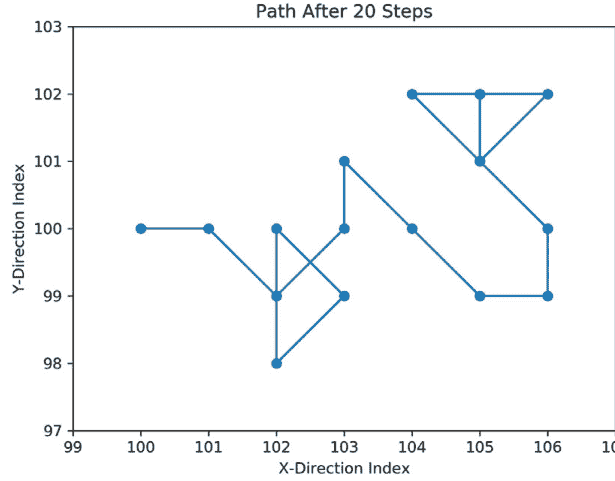

¹¹ 有关 Pygame 文档的最新链接，请参阅 www.cambridge.org/core/resources/pythonforscientists/refs/，参考文献 36。

### 14.2.5 灵活的函数与字典

正如我们在第 14.1 节示例中对 pyplot 命令的调用所见，图形可能需要大量的调整。字体、字号、线宽、颜色、符号、色条和地图投影只是我们可能想要控制的众多图形方面中的一小部分。在第 14.1 节的函数调用中，没有单个调用包含超过几个位置参数和关键字参数。尽管如此，我们可以设想这样一种情况：我们可能需要在函数调用中设置几十个参数。我们唯一的选择是每次调用函数时都在调用行中键入每个输入参数吗？谢天谢地，不是。Python 提供了使用计算机控制传递给函数（或方法）调用的参数的能力。如何做到这一点，以及如何创建我们自己的函数来利用这些特性，是本节的重点。但在我们研究这个激励性示例之前，我们需要介绍字典。

到目前为止，当我们需要存储多条信息时，我们将它们放入列表/元组或数组中。一旦进入这些类似列表的结构，我们通过指定索引或索引范围（通过切片）来选取一个或多个值。但是，索引并不能告诉我们元素包含什么。它只说明这是元素的位置。很多时候，我们通过**位置索引**来引用值，而不是通过更有意义的东西，这并不那么有用。例如，假设我们有一个图形设置的列表：

```python
settings = ['--', 5.0, '*', 20.0]
```

其中第一个元素描述线型，第二个元素描述线宽（以磅为单位），第三个元素描述使用的标记，最后一个元素描述标记大小（以磅为单位）。<sup>12</sup> 然而，在列表中，每个元素仅通过其位置来引用。因此，要引用标记大小，我们会键入 `settings[3]`。但是，该符号中没有任何内容表明我们正在引用标记大小。

字典提供了解决此问题的功能。与列表和元组一样，字典也是元素的集合。然而，字典不是有序的，而是*无序*的集合，其元素通过**键**而不是位置来引用。键可以是任何可以唯一命名和排序的东西。在实践中，键通常是整数或字符串。值可以是任何东西。当我们说“任何东西”时，我们指的是*任何东西*，就像列表和元组的元素一样。因此，键成为它们所附着的值的“标签”。请注意，字典是无序的，但可以对其键进行迭代。我们将在第 16.2.1 节中讨论这一点。

花括号（`{}`）界定一个字典。字典的元素是“键:值”对，由冒号分隔。字典的每个键:值对元素由逗号分隔。因此，如果我们把 `settings` 列表变成一个字典，将每个值的键设置为描述其关联值的字符串，我们将得到：

```python
settings = {'linestyle':'--', 'linewidth':5.0,
            'marker':'*', 'markersize':20.0}
```

字典元素的引用方式类似于列表，只是用键代替了元素地址。使用上面的字典，符号 `settings['markersize']` 将返回浮点值 20.0。要将与 'markersize' 键关联的值设置为 18.0，我们将赋值与字典引用机制结合起来：

```python
settings['markersize'] = 18.0
```

该语法也适用于向字典中添加新元素。因此，要添加 'markeredgewidth' 键并将其设置为浮点值 1.0，我们可以使用以下赋值行：

```python
settings['markeredgewidth'] = 1.0
```

即使 'markeredgewidth' 键在 `settings` 字典中尚不存在，该行也有效。要从字典中删除一个键:值对，我们使用 `del` 命令。因此，要从 `settings` 中删除 'linestyle' 键及其关联值，我们执行：

```python
del(settings['linestyle'])
```

<sup>12</sup> 这些是图 5.1 中的一些关键字输入参数设置。

标准字典是无序的。也就是说，我们不应该认为字典中的键:值对是按任何顺序排列的。如果我们使用字符串作为键，对我们来说可能看起来键:值对是按某种顺序（例如，按字母顺序）排列的，但它们实际上没有顺序。字典中没有“第一个”、“第二个”等元素。

我们可以用字典做更多的事情。字典可能看起来就像列表，只是元素是无序的，并且值可以通过字符串引用，但事实证明这些差异使得字典在许多不同的用途中非常有用。在第 16.2.1 节中，我们将讨论这些特性以及字典的其他方面，包括如何遍历字典中所有或部分的键:值对。在本节的其余部分，我们将重点介绍我们在本节开头建议的字典用法：帮助我们编写能够更好地处理许多位置参数和关键字参数的函数。

考虑我们为解决“动手试试！5-2”而编写的 `plot_maze_times` 函数（为方便起见，在图 14.8 中重现）。假设我们希望该解决方案能够处理比当前 `def` 语句中给出的更多的关键字参数。事实上，假设我们希望我们的解决方案能够处理 pyplot `plot` 命令可以处理的所有可能的关键字输入参数，也就是说，我们希望能够将*任何* `plot` 关键字输入参数作为 `plot_maze_times` 的关键字输入参数传入。最直接的解决方案——在 `plot_maze_times` 的 `def` 行中写出 `plot` 的所有关键字输入参数——将是一项繁重的工作。而且如果 `plot` 的程序员决定添加更多的关键字输入参数，我们也必须手动将它们输入到我们的 `plot_maze_times` 解决方案中。我们还能做什么？

我们的线索来自于仔细查看图 14.8 第 4-5 行中的参数列表。首先，我们看到两个位置输入参数由逗号分隔，并按顺序给出。也就是说，它们看起来像列表中的两个元素。其次，我们看到所有关键字输入

```python
import matplotlib.pyplot as plt
import numpy as np

def plot_maze_times(xdata, ydata, linewidth=1.0, markersize=3.0,
                    filename='default.png'):
    plt.figure()
    plt.plot(xdata, ydata, linewidth=linewidth, marker='o',
             markersize=markersize)
    plt.axis([0, np.max(xdata), 0, np.max(ydata)])
    plt.xlabel('Dosage (mg)')
    plt.ylabel('Time to Complete Maze (sec)')
    plt.text(0.1, 10, 'Provisional')
    plt.savefig(filename, dpi=300)
```

图 14.8 “动手试试！5-2”的解决方案。

# 14 等高线图与动画

参数以赋值的形式出现。有一个名称（例如 `linewidth`）被设置为一个值（例如 1.0）。然而，名称只不过是没有引号的字符串。因此，关键字输入参数实际上是一个与值相连的字符串标签（所有赋值也是如此：一个与值相连的字符串标签）。但是，如果关键字输入参数是一个与值相连的字符串，这恰恰就是字典元素的定义：一个键值对，其中键是字符串。因此，字典可以容纳一组关键字输入参数。

Python 提供了一种机制，使我们能够将函数中的一组位置输入参数表示为列表，将一组关键字输入参数表示为字典。在后一个字典中，关键字输入参数的名称以字符串形式给出，是每个字典元素中的键，而该参数设置的值是字典元素中对应的值。当将一组位置输入参数表示为列表时，在函数的 `def` 语句和调用函数时，列表名称前会附加一个星号。当将一组关键字输入参数表示为字典时，在函数的 `def` 语句和调用函数时，字典名称前会附加两个星号。因此，我们的图 14.8 的 `def` 语句可以重写为：

```
def plot_maze_times(*args, **kwds):
```

其中列表 `args` 表示位置输入参数的集合，字典 `kwds` 表示关键字输入参数及其默认值的集合。我们必须在 `args` 和 `kwds` 前加上星号，以区分它们与两个常规的位置输入参数。名称 "args" 和 "kwds" 并不重要。重要的是变量名前的星号。

如果我们使用 `*args/**kwds` 方法来指定输入参数，我们必须重写函数体中引用参数的方式，因为虚拟变量 `xdata`、`ydata` 等不再存在。具体来说，位置输入参数现在通过元组 `args` 中的位置来引用，而关键字输入参数现在通过 `kwds` 字典中的键来引用。在图 14.9 的第 5-6 行，我们通过引用 `args` 元组中的相应项来创建局部变量 `xdata` 和 `ydata`。局部变量是指其作用域（存在范围）有限的变量。在这种情况下，`xdata` 和 `ydata` 仅存在于定义它们的函数中。对于关键字输入参数，情况稍微复杂一些，因为我们需要将传递给这些参数的值（如果在调用行中设置了）或默认值（否则）赋给对应的局部变量。在第 8-21 行，我们检查 'linewidth'、'markersize' 和 'filename' 的键是否在 `kwds` 中（使用 `in` 语法）。如果是，则将对应于该关键字输入参数的局部变量设置为该关键字输入参数的值。如果不是，则将该局部变量设置为默认值。

当我们调用使用 `*args/**kwds` 机制的函数时，可以通过显式列出输入参数或传递输入参数的列表/元组和/或字典来调用它。因此，以下所有对图 14.9 中定义的 `plot_maze_times` 的调用都是合法的：

```
import matplotlib.pyplot as plt
import numpy as np

def plot_maze_times(*args, **kwds):
    xdata = args[0]
    ydata = args[1]

    if 'linewidth' in kwds:
        linewidth = kwds['linewidth']
    else:
        linewidth = 1.0

    if 'markersize' in kwds:
        markersize = kwds['markersize']
    else:
        markersize = 3.0

    if 'filename' in kwds:
        filename = kwds['filename']
    else:
        filename = 'default.png'

    plt.figure()
    plt.plot(xdata, ydata, linewidth=linewidth, marker='o',
             markersize=markersize)
    plt.axis([0, np.max(xdata), 0, np.max(ydata)])
    plt.xlabel('Dosage (mg)')
    plt.ylabel('Time to Complete Maze (sec)')
    plt.text(0.1, 10, 'Provisional')
    plt.savefig(filename, dpi=300)
```

图 14.9 修改后的图 14.8 解决方案，使用 *args/**kwds 机制传递输入参数。

```
xdata = [0.0, 0.08, 0.2, 0.37, 0.6, 0.84, 1.02, 1.2]
ydata = [105, 98, 54, 50, 65, 81, 182, 210]

plot_maze_times(xdata, ydata)
plot_maze_times(xdata, ydata, linewidth=5.0)
plot_maze_times(xdata, ydata, linewidth=5.0, filename='test.png')

myargs = [xdata, ydata]
mykwds = {'linewidth':5.0, 'filename':'test.png'}
plot_maze_times(*myargs, **mykwds)
```

第 6 行和第 10 行的调用执行的操作完全相同。

```
import matplotlib.pyplot as plt
import numpy as np

def plot_maze_times(*args, **kwds):
    xdata = args[0]
    ydata = args[1]

    modified_kwds = kwds.copy()

    if 'linewidth' not in kwds:
        modified_kwds['linewidth'] = 1.0

    if 'markersize' not in kwds:
        modified_kwds['markersize'] = 3.0

    if 'filename' not in kwds:
        modified_kwds['filename'] = 'default.png'

    plt.figure()
    modified_kwds['marker'] = 'o'
    plt.plot(*args, **modified_kwds)
    plt.axis([0, np.max(xdata), 0, np.max(ydata)])
    plt.xlabel('Dosage (mg)')
    plt.ylabel('Time to Complete Maze (sec)')
    plt.text(0.1, 10, 'Provisional')
    plt.savefig(modified_kwds['filename'], dpi=300)
```

图 14.10 修改后的图 14.8 解决方案，使用 *args/**kwds 机制传递输入参数，并将所有关键字输入参数传递给 plot 调用。

除了在调用时提供更大的灵活性外，使用字典传递关键字输入参数还允许我们利用那些我们事先不知道、但在函数体调用中可能用到的关键字输入参数。在图 14.10 中，我们将整个关键字输入参数字典 kwds 的一个副本（经过修改）传递给第 21 行的 plot 调用。那个被复制并修改的字典是 modified_kwds。该字典在第 8 行开始时是 kwds 的副本，在第 10-17 行和第 20 行被修改，并在第 21 行被传入。通过传入 modified_kwds，任何在调用 plot_maze_times 时指定的关键字输入参数——即使是我们编写 plot_maze_times 时不知道的参数——也将传递给 plot。因此，这个调用将正常工作：

```
xdata = [0.0, 0.08, 0.2, 0.37, 0.6, 0.84, 1.02, 1.2]
ydata = [105, 98, 54, 50, 65, 81, 182, 210]
plot_maze_times(xdata, ydata, linestyle='-')
```

尽管 plot_maze_times 根本不认识 linestyle 这个关键字输入参数！

关于编程术语的补充说明：*args/**kwds 机制是 Python 实现重载的方式，即创建方法的不同版本以处理不同数量和种类的输入参数。方法的接口由其名称、输入参数的数量和种类以及返回值的种类定义，被称为方法的签名。因此，重载是编写同一方法的不同版本以适应不同签名的实践。

## 14.3 动手试试！

本节中的示例涵盖了第 14.2 节的主要主题。我们练习使用 Matplotlib 对象 API 并制作不同类型的等高线图。我们还创建了一个基本动画，并练习使用字典作为编写更灵活函数的一部分。

对于本节的所有练习，假设 NumPy 已作为 np 导入，Matplotlib 的 pyplot 子模块已作为 plt 导入。

### 动手试试！14-1 Matplotlib 的对象 API：空气质量

表 7.7 列出了中国北京四个地点一天内每小时的颗粒物（PM2.5）浓度（单位：μg/m³）测量值。使用 Matplotlib 的对象 API，创建一个包含四个面板的单一图形，其中每个面板是一个折线图，显示该天内 PM2.5 与小时数的关系。使用 add_axes 方法（而不是 subplots）以不规则的方式（即不是规则网格）在图形上布局面板。假设数组 pm25 已存在，如图 7.7 所定义。

### 动手试试！答案 14-1

参见图 14.11 和图 14.12：图 14.12 显示了表 7.7 中数组 pm25 的四列数据的绘图。所有图形的 x 轴是一天中的小时（从 0 小时开始），y 轴是每小时的 PM2.5 浓度。为了简化代码阅读，省略了坐标轴标签和标题。图 14.11 显示了生成图 14.12 中绘图的代码。

在图 14.11 的第 1 行，我们创建了 Figure 对象 fig。该图形宽 5 英寸，高 3 英寸。第 2-5 行创建了 Axes 对象并将它们放置在 fig 上。传入的元组给出了左下角位置，然后是绘图的宽度和高度。所有值均以归一化坐标给出，表示为相应轴长度的分数。

在第 7 行，我们创建了数组 hours，用于保存每次测量发生时的一天中的小时。该数组从 0 开始，到 23 结束。共有 24 个值。在第 8-11 行，我们调用附加到每个 Axes 对象的 plot 方法。绘图在通过 add_axes 调用放置 Axes 对象的 fig 上的位置进行。ax1 对象指定一个带有红色圆圈的图形，ax2 对象指定一个带有蓝色星号的图形，ax3 对象指定一个带有绿色方块的图形，ax4 对象指定一个带有黑色菱形的图形。每个站点的颗粒物浓度是 pm25 数组中的一列。在第 13 行，我们将图形写入文件。

fig = plt.figure(figsize=(5, 3))
ax1 = fig.add_axes((0.1, 0.7, 0.2, 0.2))
ax2 = fig.add_axes((0.4, 0.7, 0.2, 0.2))
ax3 = fig.add_axes((0.1, 0.4, 0.2, 0.2))
ax4 = fig.add_axes((0.4, 0.1, 0.5, 0.5))

hours = np.arange(np.shape(pm25)[0])
ax1.plot(hours, pm25[:,0], 'ro')
ax2.plot(hours, pm25[:,1], 'b*')
ax3.plot(hours, pm25[:,2], 'gs')
ax4.plot(hours, pm25[:,3], 'kD')

plt.savefig('api_example.png', dpi=300)

图 14.11 解决“动手试试！14-1”的代码。其生成的图表如图 14.12 所示。

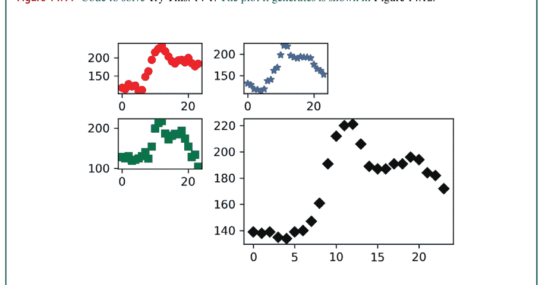

关于此解决方案的几点说明：首先，通过使用 `add_axes`，我们能够将每个图表放置在图形上我们想要的任何位置。在这种情况下，我们创建了一个图表，其中一个测量站的图表更为突出，而其他站点的图表则不那么突出。其次，在归一化坐标中，每个图表的宽度和高度是相同的：大图为 0.5（或 x 轴和 y 轴长度的 50%），小图为 0.2（或 x 轴和 y 轴长度的 20%）。那么，为什么图表是矩形而不是正方形呢？因为归一化坐标以 x 轴和 y 轴的分数形式指定位置和长度，图形的大小（由 `figure` 调用中的 `figsize` 关键字输入参数设置）也设置了该图形上每个图表的相对宽度和高度，从而形成了矩形的纵横比。

```
1  axes = [ax1, ax2, ax3, ax4]
2  color_marker = ['ro', 'b*', 'gs', 'kD']
3  for i in range(4):
4      axes[i].plot(hours, pm25[:,i], color_marker[i])
```

**图 14.13** 使用循环执行与图 14.11 第 8-11 行相同任务的替代代码。

最后，我们注意到图 14.11 的代码包含许多重复的任务，例如重复调用 `plot`。第 8-11 行中每个 `plot` 调用之间的唯一区别是不同的颜色-标记指定字符串、`pm25` 中不同的列索引以及不同的 `Axes` 对象。这表明我们可以将这些调用放入一个循环中，该循环遍历列索引，并将颜色-标记字符串和 `Axes` 对象放入也由相同列索引引用的列表中。列表的元素可以是任何类型或类型的混合。因此，列表容纳一组 `Axes` 对象没有问题。

图 14.13 展示了这种使用循环完成图 14.11 第 8-11 行任务的替代方法。尽管图 14.13 的解决方案也要求我们手动输入 `axes` 和 `color_marker`，但我们可以通过使用 `axes` 列表对象的 `append` 方法，在 `Axes` 对象由 `add_axes` 创建时将其添加进来（这本身也可以放入循环中），从而进一步自动化这些图表的创建。我们还可以创建一个函数，根据表 5.2 和 5.3 中的标记和颜色值，自动生成颜色-标记对，以自动填充 `color_marker` 列表。

### 动手试试！14-2 线条和阴影等高线图：山丘上的海拔

假设我们有一座小山丘上的海拔（以平均海平面以上的米为单位）。海拔数据存储在文件 `hill.txt` 中，如图 14.14 所示。每个位置相距 2 米（在南北和东西方向上）。图 14.14 中的海拔网格方向是，最北边的行是顶行，最西边的列是左列。编写一个程序，从 `hill.txt` 读取数据并将其存储在二维数组中，使用灰度颜色映射创建数据的线条和阴影等高线图，添加等高线标签和阴影的颜色条，并将图表保存到图像文件 `hill.png`。

### 动手试试！答案 14-2

图 14.15 中的代码创建了所需的图表。代码生成的图表如图 14.16 所示。

```
1.0, 1.8, 1.3, 1.4, 1.6, 1.5, 1.9, 1.9
1.2, 1.5, 1.5, 1.5, 1.4, 1.5, 1.7, 1.7
1.5, 1.7, 1.8, 1.8, 1.7, 1.6, 1.7, 1.5
1.2, 1.8, 2.0, 1.9, 1.9, 1.6, 1.7, 1.5
1.1, 2.0, 2.0, 2.1, 1.9, 2.0, 1.9, 1.6
1.4, 1.8, 2.0, 2.0, 1.8, 1.8, 1.6, 1.4
1.2, 1.6, 1.5, 1.4, 1.6, 1.7, 1.7, 1.3
1.2, 1.5, 1.5, 1.5, 1.6, 1.6, 1.5, 1.3
1.1, 1.4, 1.3, 1.4, 1.5, 1.6, 1.5, 1.1
```

**图 14.14** 存储在 `hill.txt` 中的小山丘上的虚构海拔（以平均海平面以上的米为单位）。每行的位置相距 2 米。每列的位置相距 2 米。顶行是最北边的行，最左边的列是最西边的列。更多信息请参见“动手试试！14-2”。

在导入相关的 NumPy 和 Matplotlib pyplot 模块（图 14.15，第 1-2 行）之后，我们使用 NumPy 函数 `genfromtxt` 将 `hill.txt` 的内容直接读入二维数组 `elev`（第 4 行）。在第 6 和 7 行，我们创建了一维数组，给出了从数组西北角开始的东西向（`x`）和南北向（`y`）距离。这遵循了图 14.14 中所示的数据方向。

在第 8 行，我们使用了一个名为 `meshgrid` 的 NumPy 函数，它生成 `x` 和 `y` 的“二维”版本。也就是说，数组 `x2d` 和 `y2d` 是与 `elev` 形状相同的二维数组，其元素分别是 `elev` 中每个对应位置的 `x` 和 `y` 值。因此，`x2d` 看起来如下：

```
[[ 0,  2,  4,  6,  8, 10, 12, 14]
 [ 0,  2,  4,  6,  8, 10, 12, 14]
 [ 0,  2,  4,  6,  8, 10, 12, 14]
 [ 0,  2,  4,  6,  8, 10, 12, 14]
 [ 0,  2,  4,  6,  8, 10, 12, 14]
 [ 0,  2,  4,  6,  8, 10, 12, 14]
 [ 0,  2,  4,  6,  8, 10, 12, 14]
 [ 0,  2,  4,  6,  8, 10, 12, 14]
 [ 0,  2,  4,  6,  8, 10, 12, 14]]
```

而 `y2d` 看起来如下：

```
[[ 0,  0,  0,  0,  0,  0,  0,  0]
 [ 2,  2,  2,  2,  2,  2,  2,  2]
 [ 4,  4,  4,  4,  4,  4,  4,  4]
 [ 6,  6,  6,  6,  6,  6,  6,  6]
 [ 8,  8,  8,  8,  8,  8,  8,  8]
 [10, 10, 10, 10, 10, 10, 10, 10]
 [12, 12, 12, 12, 12, 12, 12, 12]
 [14, 14, 14, 14, 14, 14, 14, 14]
 [16, 16, 16, 16, 16, 16, 16, 16]]
```

`x2d` 的列具有所有相同的值，因为在规则的笛卡尔网格上，一列中的所有元素具有相同的 *x* 轴值。`y2d` 的行具有所有相同的值，因为在规则的笛卡尔网格上，一行中的所有元素具有相同的 *y* 轴值。这与图 14.1 中 `lon2d` 和 `lat2d` 的结构相同。

当 `meshgrid` 与两个输入参数（指定一个二维网格）一起使用时，会产生两个返回值。类似于我们在图 14.1 第 59 行中使用 `subplots` 的方式，我们可以通过用逗号分隔被赋值的变量（即第 8 行中的语法 `x2d`, `y2d`, = ...）在一行中将它们设置为变量。

在第 10 行，我们使用 `subplots` 函数创建 `Figure` 和 `Axes` 对象，分别为 `fig` 和 `ax`。页面/窗口上放置了一个图表。稍后，我们使用附加到 `ax` 对象的方法。然而，我们没有显式使用 `fig` 对象。

我们在第 12 行创建了一个一维数组来指定等高线级别。结果是一个从 0 到 3（两端都包含）的值数组，增量为 0.25。在第 13-14 行，我们使用预定义的“Greys”颜色映射创建了一个填充等高线图对象。该颜色映射从其最小值到最大值从白色到黑色，过渡通过不同的灰色阴影。在第 15-17 行，我们创建了一个等高线线条图对象，将等高线线条放置在填充等高线图的顶部。

在第 18 行，我们将 *x* 轴的下限和上限设置为 `x` 中的最小值和最大值，但将 *y* 轴的限制设置为*相反*——下限和上限分别设置为 `y` 中的最大值和最小值。我们需要这样做，因为 Matplotlib 中制作图表的默认设置是将原点放在左下角。然而，对于数组 `elev`，原点在右上角（西北角）。通过翻转 *y* 轴，图表的方向将与 `hill.txt` 中数据的呈现方式相同。对于第 14.1 节中的示例，此调整不是必需的，因为纬度值随着我们向北移动而增加。

我们在第 19 行调用 `clabel` 命令，操作于线条等高线图对象 `hillmap`。我们将 `fmt` 关键字输入参数设置为格式代码 `'%.2f'`，以创建具有两位小数的浮点数等高线标签。这看起来像我们在第 9.2.4 节中讨论的字符串格式化代码，只是代码不在花括号中，也不在冒号之后，

# 14 等高线图与动画

```python
import numpy as np
import matplotlib.pyplot as plt

elev = np.genfromtxt('hill.txt', delimiter=', ')

x = np.arange(np.shape(elev)[1]) * 2
y = np.arange(np.shape(elev)[0]) * 2
x2d, y2d = np.meshgrid(x, y)

fig, ax = plt.subplots(1, 1)

levels = np.arange(13) / 4.0
hillmapf = ax.contourf(x2d, y2d, elev, levels=levels,
                       cmap=plt.get_cmap('Greys'))
hillmap = ax.contour(x2d, y2d, elev, levels=levels,
                     linewidths=1.0,
                     colors='k')
plt.axis([np.min(x), np.max(x), np.max(y), np.min(y)])
plt.clabel(hillmap, fmt='%.2f', fontsize=10)
plt.colorbar(hillmapf, orientation='horizontal')

plt.savefig('hill.png', dpi=300)
```

图 14.15 创建“试一试！14-2”中描述的高程等高线图的代码。该图如图 14.16 所示。

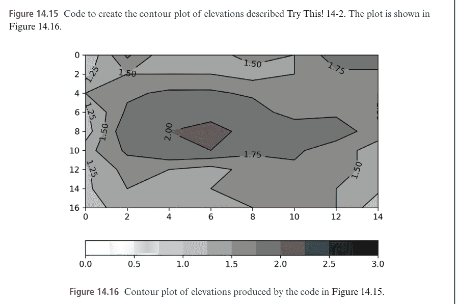

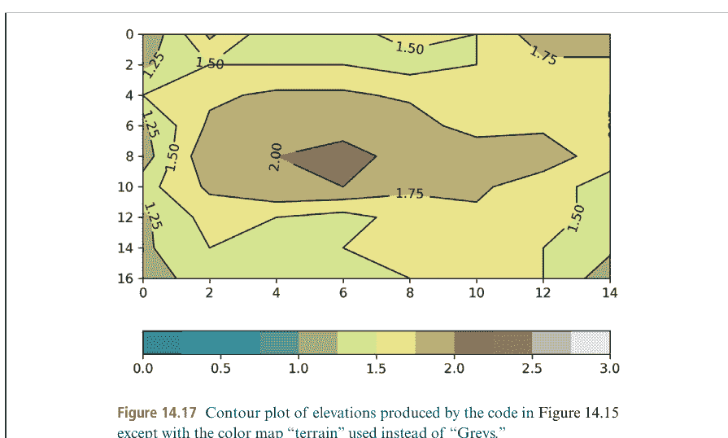

代码中百分号之后的部分。`clabel` 使用百分号源于 Python 过去进行值格式化的“旧”方式。就我们的目的而言，其原理并不重要。我们最后在底部添加了一个颜色条（第 20 行），并将绘图文件输出为 *hill.png*。

我们可以通过更改图 14.15 第 14 行传入 `get_cmap` 调用的字符串来更改用于填充等高线图的颜色映射。例如，由于我们绘制的是高程，使用“terrain”颜色映射可能更好。这种颜色映射专为显示地表地形特征而设计，范围从蓝色（海洋）到绿色（低海拔陆地）和棕色（高海拔陆地）。为此，我们在图 14.15 的第 14 行传入 `'terrain'` 而不是 `'Greys'`。图 14.17 显示了图 14.16，但使用了“terrain”颜色映射。

### 试一试！14-3 使用 cartopy 叠加地图：大气量

假设“试一试！14-2”中 *hill.txt* 里的虚构数据，不是每隔 2 米测量的高程，而是美国大陆上某种量的测量值（可能是某种大气化学物质的浓度）。这些测量值每隔 10 度经度（从 130° W 到 60° W）和每隔 5 度纬度（从 60° N 到 20° N）进行一次。

编写一个程序，从 *hill.txt* 读取数据，并使用灰度颜色映射创建数据的线和阴影等高线图，如“试一试！14-2”所示，但绘制在该区域的兰伯特等角圆锥投影地图上。将绘图保存为图像文件 *meas_lambert.png*。

# 14 等高线图与动画

```python
import numpy as np
import matplotlib.pyplot as plt
import cartopy.crs as ccrs
import cartopy.feature as cf

meas = np.genfromtxt('hill.txt', delimiter=', ')

x = np.array([-130, -120, -110, -100, -90, -80, -70, -60])
y = np.array([60, 55, 50, 45, 40, 35, 30, 25, 20])
x2d, y2d = np.meshgrid(x, y)

plt.figure()
ax = plt.axes(projection=ccrs.LambertConformal())
ax.set_extent([-140, -50, 15, 65], crs=ccrs.PlateCarree())
ax.add_feature(cf.BORDERS, linestyle=':')
ax.add_feature(cf.COASTLINE)

levels = np.arange(13) / 4.0
measmapf = ax.contourf(x2d, y2d, meas, levels=levels,
                       transform=ccrs.PlateCarree(),
                       cmap=plt.get_cmap('Greys'))
measmap = ax.contour(x2d, y2d, meas, levels=levels,
                     transform=ccrs.PlateCarree(),
                     linewidths=1.0,
                     colors='k')
plt.clabel(measmap, fmt='%.2f', fontsize=10)
plt.colorbar(measmapf, orientation='horizontal')

plt.savefig('meas_lambert.png', dpi=300)
```

图 14.18 在兰伯特等角圆锥投影地图上创建线和填充等高线图的代码，该图基于来自 *hill.txt* 的美国大陆虚构测量值（如“试一试！14-3”所述）。生成的图如图 14.19 所示。

### 试一试！答案 14-3

图 14.18 显示了解决该问题的代码，图 14.19 显示了生成的图。该代码与图 14.15 所示的“试一试！14-2”的解决方案非常相似。细微的更改包括将图 14.15 中的 `elev` 数组在图 14.18 中重命名为 `meas`。主要区别在于：

- 在图 14.18 的第 8-9 行，数组 `x` 和 `y` 被设置为 `meas` 中每个元素的经度和纬度值。纬度值从 60° N 开始递减到 20° N，因此我们不必像图 14.15 的第 18 行那样手动翻转 y 轴。

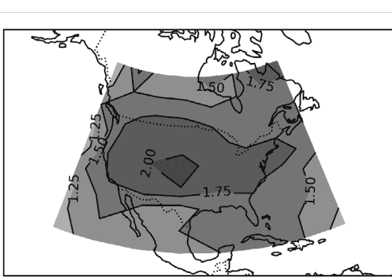

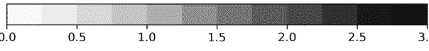

**图 14.19** 由图 14.18 中代码生成的测量值等高线图。

- 在图 14.18 的第 13 行，用于生成 `ax` 对象的投影是兰伯特等角圆锥投影，通过 `projection` 关键字输入参数传入。这是地图将显示的投影。
- 在图 14.18 的第 14 行，显示地图的范围以常规的、类似笛卡尔坐标的经纬度坐标提供。因此，`crs` 关键字输入参数被设置为 `PlateCarree` 对象，这是数据及其范围的投影。
- 在图 14.18 的第 15-16 行，我们绘制了国界和海岸线。
- 因为 `meas` 的值是以常规的、类似笛卡尔坐标的经纬度坐标给出的，所以 `contourf` 和 `contour` 调用的 `transform` 关键字输入参数被设置为 `PlateCarree` 对象，这是 `meas` 数据的投影（图 14.18 的第 20 行和第 23 行）。

因为我们是将数值绘制到兰伯特等角圆锥投影地图上，所以图 14.19 中的图与图 14.16 中的图相比看起来“扭曲”了。这是试图将弯曲表面（我们假设测量是在其上进行的）表示到平面地图上时引入的变形结果。

### 试一试！14-4 基本动画：抛体的轨迹

从原点以初速度 $\vec{v}_0$、与水平面成 $\theta_0$ 角发射的抛体（忽略空气阻力）的轨迹遵循一条曲线，其水平（$x$）和垂直（$y$）位置值按以下方式相互变化：¹³

$$y = x \tan \theta_0 - \frac{g x^2}{2 (v_0 \cos \theta_0)^2}$$

其中 $v_0$ 是初速度的大小，$g$ 是重力加速度。抛体的射程（$R$，抛体击中水平面的 $x$ 距离）由下式给出：¹⁴

$$R = \frac{v_0^2 \sin 2\theta_0}{g}$$

创建一个以 5 m/s 速度、30 度角发射的抛体轨迹动画。假设 $g = 9.81$ m/s²。

### 试一试！答案 14-4

图 14.20 显示了生成动画的代码。图 14.21 显示了动画的几帧叠加在一起的效果。因为我们知道抛体的射程 $R$，所以我们知道轨迹 $x$ 位置的最大值。因此，在图 14.20 的第 11 行，我们创建了一个数组 `x`，其中包含从 $x = 0$ 到 $x = R$（两端都包含）的 51 个点。使用该 `x` 数组，我们可以使用问题中给出的方程计算所有 `y` 值。

在图 14.20 的第 15-19 行，我们创建了图形和绘图框架以及 $x$ 轴和 $y$ 轴标签。我们将坐标轴范围设置为显示整个轨迹，并在 $y$ 轴范围的顶部增加 5% 的额外空间，以便我们能看到代表抛体的标记的整个轮廓。

在图 14.20 的第 23-30 行，我们遍历每个 `x` 和 `y` 位置，使用黑色圆圈绘制每个点。在第一次迭代中，我们通过绘制第一个点来创建 `Line2D` 对象的元组 `lines`。在后续迭代中，我们通过将 $x$ 和 $y$ 数据设置为新值来更新 `Line2D` 对象表示的点。在第 29 行，我们渲染绘图，在第 30 行，我们在动画的每帧之间暂停 0.1 秒。

### 试一试！14-5 灵活函数与字典：抛体的轨迹

编写一个函数 `plot_trajectory` 来绘制抛体的轨迹，并将绘图输出到文件 `trajectory.png`。该函数应接受沿轨迹的 $x$ 和 $y$ 位置作为位置输入参数。图形应有一个由关键字输入参数 `title` 设置的总标题。该函数应使用 `**args`/`**kwds` 来允许传递额外的关键字输入参数以控制绘图。使用计算出的轨迹

¹³ Resnick and Halliday (1977, p. 57).
¹⁴ Resnick and Halliday (1977, p. 58).

来自“动手试试！14-4”，调用 `plot_trajectory` 来绘制图形，演示了如何使用在 `plot_trajectory` 中未明确定义的关键字输入参数。

```python
import numpy as np
import matplotlib.pyplot as plt

v_0 = 5.0          #- 单位：m/s
theta_0 = 30.0     #- 单位：度
g = 9.81           #- 单位：m/s^2

theta_0_rad = theta_0 * np.pi / 180.0
R = (v_0**2) * np.sin(2.0 * theta_0_rad) / g

x = np.arange(51) / 50.0 * R
y = (x * np.tan(theta_0_rad)) - \
    (g * x**2 / (2.0 * (v_0 * np.cos(theta_0_rad))**2))

fig, ax = plt.subplots(1, 1)
ax.axis([np.min(x), np.max(x),
         np.min(y), np.max(y) + (0.05 * np.max(y))])
plt.xlabel("X-Position [m]")
plt.ylabel("Y-Position [m]")

plt.ion()

for i in range(np.size(x)):
    if i == 0:
        lines = ax.plot(x[i], y[i], 'ko', markersize=10.0)
    else:
        lines[0].set_xdata(x[i])
        lines[0].set_ydata(y[i])
    plt.draw()
    plt.pause(0.1)
```

**图 14.20** 创建抛体轨迹动画的代码，如“动手试试！14-4”所述。图 14.21 展示了动画的若干帧叠加在一起的图形，从而显示了部分轨迹。

### 动手试试！答案 14-5

假设数组 `x` 和 `y` 已经按照“动手试试！14-4”答案中的方式定义。在此基础上，图 14.22 展示了定义和调用 `plot_trajectory` 的代码，该调用生成的图形见图 14.23。注意，在图 14.22 的第 9-13 行，我们从传递给 `plot` 调用的关键字字典中移除了 `title` 关键字输入参数（如果已定义），因为 pyplot 的 `plot` 命令无法识别该关键字。如果在调用中未定义 `title` 关键字输入参数，则局部变量 `title` 将被设置为默认值 'Trajectory'。

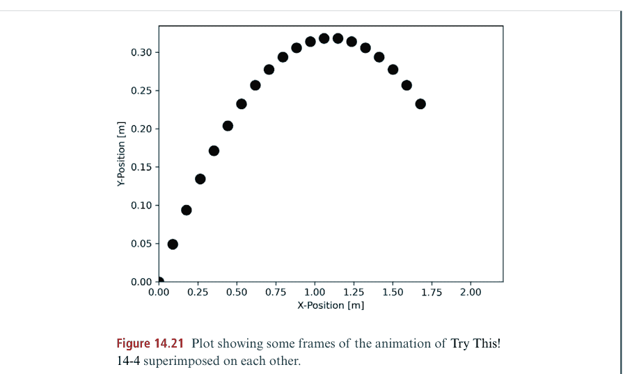

图 14.21 展示了“动手试试！14-4”动画的若干帧叠加在一起的图形。

```python
import matplotlib.pyplot as plt

def plot_trajectory(*args, **kwds):
    xdata = args[0]
    ydata = args[1]

    modified_kwds = kwds.copy()

    if 'title' in modified_kwds:
        title = modified_kwds['title']
        del(modified_kwds['title'])
    else:
        title = 'Trajectory'

    plt.figure()
    plt.plot(xdata, ydata, **modified_kwds)
    plt.xlabel('X-Position')
    plt.ylabel('Y-Position')
    plt.title(title)
    plt.savefig('trajectory.png', dpi=300)

plot_trajectory(x, y, linestyle='', markersize=10.0, marker='*', color='k')
```

图 14.22 定义和调用 `plot_trajectory` 的代码，如“动手试试！14-5”所述。生成的图形见图 14.23。

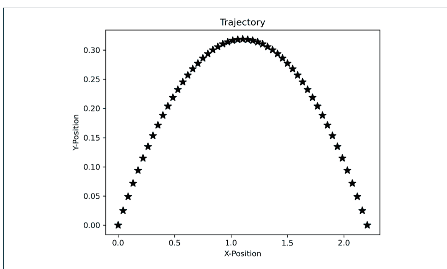

图 14.23 由图 14.22 中代码生成的图形。

在第 22 行对 `plot_trajectory` 的调用中，所使用的关键字均未在 `plot_trajectory` 中定义，但 `plot` 命令都能理解它们，从而创建出图 14.23 中的图形。

## 14.4 更多学科特定实践

本章的学科特定 Jupyter 笔记本涵盖以下主题：

- Matplotlib 对象 API 简介。
- 线条和填充等高线图。
- 使用 cartopy 叠加地图。
- 使用 Matplotlib 进行基本动画。
- 灵活的函数和字典。

## 14.5 章节回顾

### 14.5.1 自测题

尝试在不查看本书或任何其他资源，也不使用 Python 解释器的情况下完成这些题目。这些自测题的答案可在本章末尾找到。除非另有说明，否则假设 NumPy 已提前导入为 `np`，Matplotlib 的 pyplot 模块已提前导入为 `plt`。

### 自测题 14-1

描述 `Figure`、`Axes` 和 `Line2D` 对象之间的区别。

### 自测题 14-2

pyplot 函数 `subplot` 和 `subplots` 的作用是什么？它们之间有何不同？

### 自测题 14-3

归一化坐标和数据坐标有什么区别？

### 自测题 14-4

列出并描述一些 `Axes` 对象的方法。

### 自测题 14-5

在哪些情况下应该使用 Matplotlib 对象 API 而不是 pyplot 接口？

### 自测题 14-6

定义等高线图和填充等高线图。创建这类图形的 Matplotlib 命令或方法是什么？

### 自测题 14-7

设置填充等高线图颜色映射有哪些方法？

### 自测题 14-8

总结在地图上叠加等高线图或填充等高线图的步骤。

### 自测题 14-9

创建图像基本动画的步骤是什么？创建线条图动画的步骤是什么？

### 自测题 14-10

假设我们有以下字典，描述了在草地上对野生动物的观测数据和元数据：

```python
data = {'hour_in_day':  np.array([9, 11, 13, 15, 17]),
        'bird_count':   np.array([3,  5,  2,  2,  4]),
        'rabbit_count': np.array([2,  1,  0,  0,  3]),
        'location':     '123 Main St.',
        'date':         'May 1, 2020'}
```

小时 9 表示上午 9:00，小时 13 表示下午 1:00。使用此字典，创建一个图形，将鸟类和兔子的数量绘制在 y 轴上，一天中的小时绘制在 x 轴上。为图形添加标题，并利用字典中的元数据。

### 14.5.2 章节总结

在本章中，我们研究了如何使用 Matplotlib 创建等高线图和基本动画。在此过程中，我们探讨了使用 Matplotlib 的更高级方法，以及使用字典编写更灵活函数的方法。本章涵盖的具体主题包括：

- Matplotlib 对象 API 简介
    - `Figure` 对象描述了包含一个或多个图形的页面/窗口。pyplot 的 `figure` 和 `subplots` 命令是创建 `Figure` 对象的方式。
    - `Axes` 对象代表图形或绘图本身。
    - `Figure` 对象的 `add_axes` 方法使我们能够在页面/窗口的任意位置放置任意数量的 `Axes` 对象。
    - pyplot 命令 `gca` 在给定某些规范的情况下，获取现有的 `Axes` 对象或创建新的 `Axes` 对象。
    - pyplot 命令 `axes` 创建一个 `Axes` 对象。
    - `Axes` 对象包含创建图形曲线或阴影的方法。这些方法包括用于等高线图的 `contour`、用于填充等高线图的 `contourf` 以及用于 x-y 线图的 `plot`。
    - `Line2D` 对象描述绘图中的一条线或曲线。
    - `AxesImage` 对象描述一幅图像。
    - Matplotlib 的 pyplot 接口用于不需要大量自定义的“标准”类型绘图。Matplotlib 对象 API 提供了创建高度自定义绘图的工具。
- 线条和填充等高线图
    - pyplot 的 `contour` 和 `contourf` 命令分别创建等高线图和填充等高线图。它们既是 `Axes` 对象的方法，也是 pyplot 命令。
    - `levels` 关键字输入参数指定要绘制等高线的层级。
    - `cmap` 关键字输入参数指定用于填充等高线图的颜色映射。
    - `colors` 关键字输入参数设置等高线的颜色。
    - pyplot 的 `clabel` 命令在等高线上添加标签。
    - pyplot 的 `colorbar` 命令在绘图上放置颜色条图例。
    - NumPy 的 `meshgrid` 函数创建二维数组，这些数组在规则的、类似笛卡尔的二维网格中保存 x 和 y 值。
- 使用 cartopy 叠加地图
    - 我们可以通过在创建 `Axes` 对象时设置地图投影，根据需要自定义地图，然后调用 `Axes` 对象的绘图方法（例如 `contour` 和 `contourf`）将等高线图放置到地图上来叠加地图。
    - 当调用附加到具有显示地图投影的 `Axes` 对象的 `contour` 或 `contourf` 方法时，我们使用 `transform` 关键字输入参数来指定传入调用的数据所定义的投影。
    - 绘图自定义方法（如 `set_extent`、`set_xticks` 等）也需要使用 `crs` 关键字输入参数来指定自定义中使用的数据所定义的投影。
    - `LongitudeFormatter` 和 `LatitudeFormatter` 对象使我们能够自定义绘图上经度和纬度标签的格式。
- 使用 Matplotlib 进行基本动画
    - 我们可以通过遍历图形上的绘图来在 Matplotlib 中创建基本动画。
    - 对于图像和线条，我们可以通过更新图像或线条的数据来更新绘制的图像或线条。
    - 对于由 `AxesImage` 对象描述的图像，`set_data` 方法使用新数据更新显示的图像。
    - 对于由 `Line2D` 对象描述的线条，`set_xdata` 和 `set_ydata` 方法更新图形的 x 和 y 值。
    - pyplot 的 `draw` 和 `pause` 命令分别渲染更新后的图形和暂停执行指定的时间。
- 灵活的函数和字典
    - 字典是“值”的无序集合，通过“键”进行索引。
    - 键可以是任何唯一命名和排序的东西。字符串是很好的键。值可以是任何 Python 对象或值。
    - 字典用花括号分隔。键值对用逗号分隔，键和值用冒号分隔。
    - 对于字典 `data`，语法 `data['title']` 返回与键 `'title'` 关联的值。
    - 使用字典的赋值语句，例如：
        ```python
        data['title'] = 'Experiment 1'
        ```
        （其中 `data` 是一个字典）将与键 `'title'` 关联的键值对的值设置为字符串 `'Experiment 1'`。如果该键当前不在字典中，则会将该键添加到字典中，其值为 `'Experiment 1'`。
    - `del` 命令可用于从字典中删除键值对。
    - `*args`/`**kwds` 机制使用 Python 元组和字典来创建和调用函数，这些函数使用位置和关键字输入参数的集合，其组成可能随使用而变化。

### 14.5.3 自测答案

**自测答案 14-1**

`Figure` 对象代表图形或图表所在的页面或窗口。`Axes` 对象代表一个图形或绘图。`Line2D` 对象代表图形上的一条曲线。

**自测答案 14-2**

这两个函数都在单面板或多面板图形的上下文中创建 `Axes` 对象。使用 `subplot` 时，会创建并返回单个面板的 `Axes` 对象。使用 `subplots` 时，会创建并返回多个 `Axes` 对象。

**自测答案 14-3**

这两种坐标系都是描述绘图框架中位置的方法。归一化坐标在每个轴上的范围是从零到一。数据坐标的范围是从每个轴的最小数据值到最大数据值。

**自测答案 14-4**

许多 pyplot 绘图函数是 `Axes` 对象的方法。`contour` 方法创建等高线图。`contourf` 方法创建填充等高线图。`plot` 方法创建 x-y 线图。`imshow` 方法将图像放置在坐标轴上。

**自测答案 14-5**

对象接口为我们提供了更细粒度的控制。当我们希望使用这种控制来创建绘图时，例如任意放置绘图元素，对象框架可能是更好的使用接口。

**自测答案 14-6**

等高线图是仅包含等高线的等高线图。填充等高线图在等高线级别之间填充阴影。`contour` 命令创建等高线图，`contourf` 命令创建填充等高线图。

**自测答案 14-7**

以下方法都在调用 `contourf` 时设置 `cmap` 关键字输入参数。第一种方法是将 `cmap` 设置为颜色映射类的实例，例如 `LinearSegmentedColormap` 对象。预定义的颜色映射对象位于 cm 模块中。第二种方法是将 `cmap` 设置为 pyplot `get_cmap` 函数的返回值。最后，我们可以将 `cmap` 设置为与预定义颜色映射名称对应的字符串。

**自测答案 14-8**

首先，我们在设置 `projection` 关键字输入参数为显示地图投影的同时创建一个 `Axes` 对象。其次，我们使用要素、网格线等自定义地图。最后，我们使用适当的 Matplotlib 命令或方法创建等高线图。在创建绘图时，我们通过 `contour` 和 `contourf` 的 `transform` 关键字输入参数指定数据所在的地图投影。

**自测答案 14-9**

在这两种情况下，我们都设置一个循环并遍历图像或线图的 x 轴和 y 轴值。对于图像，我们使用 `Axes` 对象的 `imshow` 方法显示第一个 `AxesImage` 对象，然后使用附加到该对象的 `set_data` 方法在循环迭代时更新图像。对于线图，我们使用 `Axes` 对象的 `plot` 方法创建要显示的第一个线图。在后续迭代中，我们使用 `plot` 调用返回的 `Line2D` 对象的 `set_xdata` 和 `set_ydata` 方法来更新线图。在图像或线数据更新后，我们调用 pyplot 命令 `draw` 来渲染新的动画“帧”，并调用 `pause` 在下一个动画帧之前等待一小段时间。

**自测答案 14-10**

此代码解决了问题：

```python
plt.figure()
plt.plot(data['hour_in_day'], data['bird_count'],
         'ro-', label="Birds")
plt.plot(data['hour_in_day'], data['rabbit_count'],
         'bs--', label="Rabbits")
plt.title('Animal Counts at ' + data['location'] + '\n          on ' + data['date'])
plt.xlabel('Hour in Day')
plt.ylabel('Counts')
plt.legend()
```

# 15 处理缺失数据

尽管实验和数据对科学和工程领域至关重要，但科学家和工程师也知道实验和数据是杂乱的。数据收集可能失败的方式数不胜数——人们忘记在正确的时间打开正确的开关、昆虫飞入实验的关键部件、仪器损坏等。数据分析例程需要处理缺失或错误数据的情况。

在本章中，我们研究一些用于处理缺失或错误数据的 Python 工具（为简洁起见，从这里开始，我们将这两种数据统称为“缺失”数据）。我们研究的三种方法都使用相同的方法论：在值数组内，定义一个“标志”，让用户知道给定值是否缺失。这些方法的不同之处在于标志的定义方式以及我们如何使用该标志。在第一种方法中，我们预留一个潜在的数据值来表示缺失值，并使用布尔数组或表达式来处理数据。在第二种方法中，我们定义一个特殊的浮点数值——电气与电子工程师协会（IEEE）非数字（NaN）值——来表示缺失数据，并定义一个特殊的类数组对象（一维集合的 Series），该对象知道如何使用该约定处理数据。¹ 第三种方法使用一种特殊类型的数组，即**掩码数组**，它除了数据外还包含一个掩码，用于描述哪些元素包含缺失值。然后我们使用理解掩码数组的函数来处理内容。

## 15.1 处理缺失数据的示例

假设我们在一天中从上午 7:00 到下午 5:00，每小时观察一次池塘中鸭子的数量：

| 一天中的小时 | 鸭子数量 |
| :---: | :---: |
| 7 | 5 |
| 8 | 3 |
| 9 | 4 |
| 10 | — |
| 11 | 2 |
| 12 | 3 |
| 13 | 6 |
| 14 | — |
| 15 | 7 |
| 16 | 6 |
| 17 | 7 |

¹ IEEE 是一个电气工程专业协会，为电子和计算设备制定标准。

```python
import numpy as np
import matplotlib.pyplot as plt

#- Define data:
hour_in_day = np.arange(11) + 7
duck_count = np.array([5, 3, 4, -999, 2, 3, 6, -999, 7, 6, 7])

#- Calculate mean:
num_ok_values = np.sum(duck_count >= 0)
sum_ok_values = np.sum( np.where(duck_count >= 0, duck_count, 0) )
print("Mean: " + str(sum_ok_values / num_ok_values))

#- Select non-missing data for plotting:
ok_pts = np.where(duck_count >= 0)
x = hour_in_day[ok_pts]
y = duck_count[ok_pts]

#- Plot graph:
plt.figure()
plt.plot(x, y, 'ko-')
plt.title("Approach 1:  Boolean Arrays")
plt.xlabel("Hour in the Day")
plt.ylabel("Count")
plt.savefig("missing_data1.png")
```

图 15.1 用于计算鸭子每小时平均数量并绘制数量与一天中小时关系的代码，对应第 15.1 节中的方法 1。生成的绘图如图 15.4 所示。

如表所示，有两个小时，上午 10 点和下午 2 点，我们无法进行测量。我们想计算这一天中这段时间内鸭子的每小时平均数量，并绘制鸭子数量与一天中小时的关系图。问题在于如何处理我们没有数据的这两个小时。我们不能假设这些小时的鸭子数量为零或其他数字，因为我们没有进行这样的测量。在绘图中，我们需要以某种方式排除这些点——最好将这些值表示为空白——在计算平均值时，我们也需要忽略这些时间。下面，我们使用三种不同的方法来解决这个问题：

**方法 1** 定义一个数据值为缺失，并使用布尔数组或表达式处理数据（图 15.1）。
**方法 2** 使用 IEEE NaN 值表示缺失值，创建一个 `Series` 对象，并使用处理此类对象的函数来处理数据（图 15.2）。
**方法 3** 使用掩码数组表示缺失值，并使用处理此类对象的函数来处理数据（图 15.3）。

所有三种方法得出的平均值结果相同，为 4.7778（如果截断到四位小数）。方法 1 和方法 2 生成的图形如图 15.4 所示。

# 15 处理缺失数据

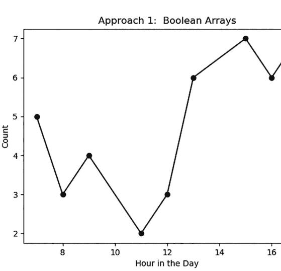

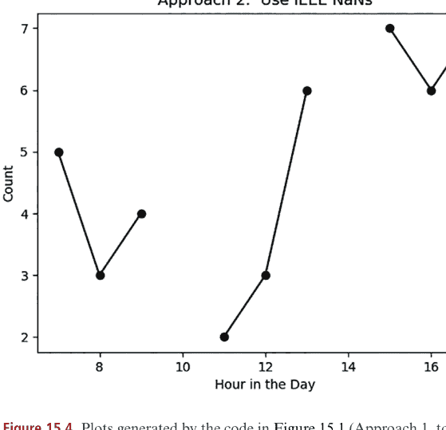

图 15.4 由图 15.1（方法 1，上图）和图 15.2（方法 2，下图）中的代码生成的图表。

```python
import numpy as np
import matplotlib.pyplot as plt
import pandas as pd

#- Define data:
hour_in_day = np.arange(11) + 7
duck_count = np.array([5, 3, 4, np.nan, 2, 3, 6, np.nan, 7, 6, 7])
duck_count = pd.Series(duck_count)

#- Calculate mean:
print("Mean: " + str(duck_count.mean()))

#- Plot graph:
plt.figure()
plt.plot(hour_in_day, duck_count, 'ko-')
plt.title("Approach 2:  Use IEEE NaNs")
plt.xlabel("Hour in the Day")
plt.ylabel("Count")
plt.savefig("missing_data2.png")
```

**图 15.2** 用于计算鸭子每小时平均数量并绘制数量与一天中时间关系图的代码，对应第 15.1 节中的方法 2。生成的图表如图 15.4 所示。

```python
import numpy as np
import matplotlib.pyplot as plt
import numpy.ma as ma

#- Define data:
hour_in_day = np.arange(11) + 7
duck_count = np.array([5, 3, 4, -999, 2, 3, 6, -999, 7, 6, 7])
duck_count = ma.masked_values(duck_count, -999)

#- Calculate mean:
print("Mean: " + str(ma.mean(duck_count)))

#- Plot graph:
plt.figure()
plt.plot(hour_in_day, duck_count, 'ko-')
plt.title("Approach 3:  Use Masked Arrays")
plt.xlabel("Hour in the Day")
plt.ylabel("Count")
plt.savefig("missing_data3.png")
```

**图 15.3** 用于计算鸭子每小时平均数量并绘制数量与一天中时间关系图的代码，对应第 15.1 节中的方法 3。生成的图表与图 15.4 中显示的方法 2 图表相同，只是图表标题不同。

方法 3 得到的图表与方法 2 相同，只是标题不同，因此不再展示。与前面的章节一样，我们将详细讨论代码为何如此工作的内容留到第 15.2 节。现在，我们简要描述每个代码块各部分的功能。

在图 15.1 中，我们首先导入 NumPy 和 Matplotlib 的 pyplot 模块（第 1-2 行）。在第 5-6 行，我们创建了保存一天中时间和鸭子数量的数组。对于缺失值，我们将数量设置为 -999，因为数量不可能是负数。在第 9-11 行，为了计算平均值，我们将非缺失值数量（`num_ok_values`）的计算与所有非缺失鸭子数量总和（`sum_ok_values`）的计算分开。我们利用布尔数组和作用于布尔数组的函数来进行这些计算。然后，平均值就是所有非缺失鸭子数量的总和除以非缺失鸭子数量的个数。为了绘图，我们只提取那些非缺失的点（第 14-16 行）。因此，在使用这些点生成的图表中（第 19-24 行），尽管在数量缺失的时间点（第 10 小时和第 14 小时）没有显示标记，但连接标记的线仍然穿过这些时间点，所以图表（图 15.4）并没有真正显示这些时间点的数据是缺失的。

在图 15.2 中，除了导入 NumPy 和 pyplot，我们还导入了 pandas 包（第 3 行）；pandas 是一个用于数据分析的 Python 包，尤其适用于表格数据。当我们创建保存鸭子数量的数组时（第 7 行），我们没有使用 -999 作为缺失值，而是使用了 NumPy 模块属性 `np.nan`。这是一个特殊的浮点数，用于表示 NaN。在第 8 行，我们将数组 `duck_count` 转换为 pandas 的 `Series` 对象。这样做之后，当我们在第 11 行使用 `Series` 对象附带的 `mean` 方法计算 `duck_count` 的平均值时，计算会自动忽略缺失值。同样，当我们绘制 `duck_count` 作为 `Series` 对象时，缺失值会被留空，并且没有连接线穿过这些时间点（图 15.4）。

在图 15.3 中，除了导入 NumPy 和 pyplot，我们还导入了 NumPy 的 ma 模块（第 3 行）。ma 模块包含用于创建和操作掩码数组的函数和类。与图 15.1 类似，我们在第 7 行使用 -999 来表示缺失值。在第 8 行，我们将 NumPy 数组 `duck_count` 转换为掩码数组。因此，在第 11 行，当我们使用 ma 函数 `mean` 计算 `duck_count` 的平均值时，计算会自动忽略缺失值。同样，当我们绘制 `duck_count` 作为掩码数组对象时，缺失值会被留空，并且没有连接线穿过这些时间点。

## 15.2 Python 编程基础

在本节中，我们将更详细地描述第 15.1 节中的三种方法是如何工作的。在本节其余的代码示例中，假设 NumPy 已作为 `np` 导入，Matplotlib 的 pyplot 子模块已作为 `plt` 导入，pandas 已作为 `pd` 导入，NumPy 的 ma 子模块已作为 `ma` 导入。

### 15.2.1 方法 1：将数据值定义为缺失值，并使用布尔数组或表达式进行处理

在第 13.2.2 节中，我们看到了布尔数组结合数组语法和 `where` 函数如何使我们能够根据是否满足某些条件来操作数组中的值。在图 15.1 中，我们使用这些技术仅处理非缺失值。在这里，我们逐行查看此图（不包括注释行）并检查不同变量的内容，以了解计算是如何进行的。我们还描述了如何使用循环而不是数组语法来复制此方法。

考虑图 15.1 的第 1-7 行（为方便起见在此重现）。如果我们打印第 9 行的条件内容而不是执行第 9 行：

```python
import numpy as np
import matplotlib.pyplot as plt

hour_in_day = np.arange(11) + 7
duck_count = np.array([5, 3, 4, -999, 2, 3, 6, -999, 7, 6, 7])

print(duck_count >= 0)

[ True  True  True False  True  True  True False  True  True  True]
```

我们发现该条件是一个布尔数组，其中对应于 `duck_count` 中缺失值（负值）的元素为 `False`，而所有其他元素为 `True`。作为一个布尔数组，当用于算术计算时，其行为就像 `True` 等于 1，`False` 等于 0，因此使用 NumPy 的 `sum` 函数对此布尔数组求和将返回 `True` 元素的数量，即非缺失值的数量。

如果我们执行图 15.1 的第 1-9 行并打印第 10 行 `sum` 调用的参数：

```python
print(np.where(duck_count >= 0, duck_count, 0))

[5 3 4 0 2 3 6 0 7 6 7]
```

结果是 `duck_count` 数组的值，其中所有缺失值都设置为零。当对此数组求和时，缺失值对总和没有贡献。因此，图 15.1 的第 10 行给出了 `duck_count` 中所有非缺失值的总和。第 11 行使用仅非缺失值计算每小时的平均数量。

如果我们继续执行程序，执行到图 15.1 的第 14 行，我们可以检查 `ok_pts` 的内容：

```python
In [1]: print(ok_pts)

(array([ 0,  1,  2,  4,  5,  6,  8,  9, 10]),)
```

这是一个包含一个元素的元组。该元素是一个数组，列出了 `duck_count` 中所有非负（即非缺失）元素的索引。在第 15 和 16 行，我们使用 `ok_pts` 选择 `hour_in_day` 和 `duck_count` 中的非缺失元素，并将这些值保存到数组 `x` 和 `y` 中。因此，当我们在第 20 行绘制这些值时，只绘制了非缺失值（尽管连接点的线穿过了缺失值的时间点）。

在图 15.1 的示例中，数据都是整数，所以如果我们必须进行相等性测试，它会完全有效。如果数组元素是浮点数，我们需要测试“接近性”而不是相等性。例如，如果我们想要一个布尔数组，其中 `True` 对应于缺失值（例如，`duck_count` 的浮点数版本接近 -999），NumPy 函数 `isclose` 可以满足我们的需求：

```python
In [1]: duck_count = np.array([5, 3, 4, -999, 2, 3, 6, -999, 7, 6, 7], dtype='d')
       print(np.isclose(duck_count, -999))

[False False False  True False False False  True False False False]
```

对此数组调用 NumPy 函数 `logical_not` 将把所有 `False` 变为 `True`，反之亦然，从而生成一个布尔数组，其中 `True` 对应于非缺失值。

在我们的图 15.1 中，我们没有考虑使用 `duck_count` 数组的操作，但布尔数组和数组语法的使用也可以处理这种情况。例如，假设我们想通过除以 60 将每小时数量转换为每分钟等效值。我们可以使用 `where` 函数仅对非缺失值进行此计算。对应于缺失值时间点（即 `duck_count >= 0` 为 `False` 的地方）的元素将被设置为 -999：

```python
In [1]: duck_count_per_min = np.where(duck_count >= 0,
                                     duck_count / 60.0, -999)
       print(duck_count_per_min)

[ 8.33333333e-02  5.00000000e-02  6.66666667e-02 -9.99000000e+02
  3.33333333e-02  5.00000000e-02  1.00000000e-01 -9.99000000e+02
  1.16666667e-01  1.00000000e-01  1.16666667e-01]
```

# 15 处理缺失数据

对于比数组语法能表达的更复杂的条件，我们需要使用`for`和/或`while`循环进行显式循环，并结合`if`和其他分支语句，来查找缺失值和非缺失值，并分别进行处理。例如，以下代码将复制我们图15.1示例中第9-16行的功能（尽管计算顺序略有不同），并计算`duck_count_per_min`：

```python
x = []
y = []
duck_count_per_min = np.zeros(np.size(duck_count)) - 999.0
for i in range(np.size(hour_in_day)):
    if duck_count[i] >= 0:
        x.append(hour_in_day[i])
        y.append(duck_count[i])
        duck_count_per_min[i] = duck_count[i] / 60.0
x = np.array(x)
y = np.array(y)

num_ok_values = np.size(y)
sum_ok_values = np.sum(y)
print("Mean: " + str(sum_ok_values / num_ok_values))
```

我们使用列表（第1-10行）来保存`x`和`y`的非缺失值，因为在进入循环之前，我们不知道会有多少个缺失值。在第3行，我们用-999值预先填充`duck_count_per_min`，这样只有非缺失元素会在`for`循环内被替换为正确的值。在第12-14行，我们复制了与图15.1相同的功能，但在我们的`for`循环解决方案中，我们本可以使用NumPy的`mean`函数，因为`x`和`y`没有缺失值来扭曲计算。在这个循环解决方案中，只有一个分支语句，但循环提供的细粒度控制比使用数组语法的布尔数组更容易适应高度复杂的情况。

### 15.2.2 方法二：使用 Series 和 IEEE NaN 值

pandas包有两个主要类：`Series`类和`DataFrame`类，它们分别是NumPy一维和二维数组的“增强”版本。`Series`对象的每一行，以及`DataFrame`对象的每一行和每一列，都可以被赋予超出NumPy数组整数索引的标签。该包提供了操作这两个类对象的工具，可以用很少的代码行完成非常复杂的分析。处理缺失值只是我们可以使用该包完成的任务之一。在第18章和第19章，我们将讨论pandas的更多功能。现在，我们专注于这些pandas对象如何处理缺失值。我们的讨论集中在`Series`对象上，但`DataFrame`对象在二维情况下处理缺失对象的方式与`Series`对象相同。

默认情况下，当将NumPy数组（或类似的值集合）转换为`Series`对象时，pandas假定IEEE NaN浮点值代表缺失值。² 为操作`Series`对象而编写的统计和绘图函数会自动适当地处理缺失数据。由于IEEE NaN值在NumPy中存储为属性`nan`，在图15.2的第7行，当我们创建包含鸭子计数的NumPy数组时，每个缺失数据元素都被设置为`np.nan`。在第8行将NumPy数组转换为pandas `Series`对象后，调用`Series`对象的方法`mean`（第11行）会计算对象中数据的平均值，排除所有NaN元素。

`np.nan`是一个浮点数，就像任何其他浮点数一样。那么，为什么仅仅创建一个缺失值设置为NaN的NumPy数组（如第7行）还不够呢？为什么我们必须将数组转换为`Series`对象？如果我们对包含NaN值的NumPy数组使用NumPy的`average`函数：

```python
In [1]: duck_count = np.array([5, 3, 4, np.nan, 2, 3, 6, np.nan, 7, 6, 7])
        print(np.average(duck_count))

nan
```

对于NumPy函数或运算符，NaN值字面上就是“非数字”。因此，任何作用于NaN的函数或运算符也会产生“非数字”。然而，`Series`对象将NaN值解释为“缺失”。因此，操作`Series`对象的函数会相应地进行补偿。这包括使用Matplotlib绘图：NaN元素不会被绘制出来，并且连接线不会与这些元素的x位置相交（如图15.4的第二面板所示）。请注意，NaN是一个浮点数。它与`None`的类型不同。

我们也可以在执行操作时看到这种行为，例如在第15.2.1节中我们计算每分钟鸭子计数时。假设`duck_count`是一个`Series`对象，我们可以用以下方式计算`duck_count_per_min`：

```python
In [1]: duck_count_per_min = duck_count / 60.0
        print(duck_count_per_min)

0     0.083333
1     0.050000
2     0.066667
3           NaN
4     0.033333
5     0.050000
6     0.100000
7           NaN
8     0.116667
9     0.100000
10    0.116667
dtype: float64
```

² https://pandas.pydata.org/pandas-docs/stable/user_guide/missing_data.html (访问于2020年6月20日)。

`duck_count`中的NaN值在`duck_count_per_min`中仍然是NaN。`Series`对象的打印格式与NumPy数组对象不同。

`Series`对象的数据存储为属性`values`。如果我们想将`Series`对象“转换”为NumPy数组，我们可以：(1) 使用`fillna`方法，该方法返回对象的一个副本，其中NaN值被另一个值替换，然后 (2) 直接访问该`Series`对象的`values`属性（输出已重新格式化以便更好显示）：

```python
In [1]: filled_duck_count = duck_count.fillna(-999)
        filled_duck_count.values

Out[1]: array([  5.,   3.,   4., -999.,   2.,   3.,   6.,
               -999.,   7.,   6.,   7.])
```

有关pandas包的更多信息，除了第18章和第19章，请参阅在线文档。我们在 www.cambridge.org/core/resources/pythonforscientists/refs/ 提供了指向文档的最新链接，参考文献46。

### 15.2.3 方法三：使用掩码数组

NumPy包的子模块`ma`定义了掩码数组，这是一种包含数组数据和掩码的对象，掩码告诉我们伴随数组的哪些元素是缺失的或不是。掩码与底层数组形状相同，并且是一个布尔数组。当掩码元素为`True`时，数据数组中对应的元素是缺失的（即，该元素应该被“屏蔽掉”）。如果掩码元素为`False`，则该元素不是缺失的（即，是有效的）。

如图15.3第3行所示，要使用掩码数组功能，我们必须首先导入`ma`子模块。要创建掩码数组，我们可以使用`ma`中的许多函数之一。在图15.3的第8行，我们使用`masked_values`函数，它接受两个位置输入参数：第一个是数据数组，第二个指定数据数组中哪个值对应于缺失（即，掩码中的`True`）。掩码数组对象的内容显示了数据和掩码（输出已重新格式化以便更好显示）：

```python
In [1]: duck_count = np.array([5, 3, 4, -999, 2, 3, 6, -999, 7, 6, 7])
        duck_count = ma.masked_values(duck_count, -999)
        duck_count

Out[1]: masked_array(data=[5, 3, 4, --, 2, 3, 6, --, 7, 6, 7],
                     mask=[False, False, False,  True, False, False, False,
                           True, False, False, False],
                     fill_value=-999)
```

就掩码数组而言，伴随数据中被屏蔽掉的元素确实是缺失的，正如上面输出中这些元素的`--`符号所示。请注意，如果数据数组是浮点数，`masked_values`将使用“值接近”来决定哪些元素要被屏蔽。³

³ https://numpy.org/doc/1.18/reference/maskedarray.generic.html (访问于2020年6月20日)。

类似于第15.2.2节讨论的`Series`对象，使用掩码数组的操作会处理被屏蔽的值并相应地进行补偿。使用掩码数组的函数在计算中会忽略缺失值（适当地）。当使用Matplotlib绘图时，被屏蔽的值不会被绘制出来，并且连接线不会与这些元素的x位置相交。与被屏蔽值进行的操作将产生一个被屏蔽的值，正如我们在类似于第15.2.1节的每分钟鸭子计数计算中所看到的。假设`duck_count`是一个掩码数组，我们可以用以下方式计算`duck_count_per_min`（输出已重新格式化以便更好显示）：

```python
In [1]: duck_count_per_min = duck_count / 60.0
       duck_count_per_min

Out[1]: masked_array(data=[0.08333333333333333, 0.05, 0.06666666666666667,
                          --, 0.03333333333333333, 0.05, 0.1, --,
                          0.11666666666666667, 0.1, 0.11666666666666667],
               mask=[False, False, False,  True, False, False, False,
                     True, False, False, False],
               fill_value=-999)
```

使用掩码数组进行操作的结果是另一个掩码数组。
掩码数组也有一个`fill_value`属性。如果将掩码数组转换为常规NumPy数组，被屏蔽的元素将被替换为`fill_value`。`filled`方法返回这样的NumPy数组：

```python
In [1]: print(duck_count.filled())

       [  5   3   4 -999   2   3   6 -999   7   6   7]
```

`get_fill_value`方法返回掩码数组当前的`fill_value`，而`set_fill_value`方法将设置掩码数组的`fill_value`。
有关掩码数组的更多信息，请参阅在线文档。我们在 www.cambridge.org/core/resources/pythonforscientists/refs/ 提供了指向文档的最新链接，参考文献38。

### 15.2.4 哪种方法更好？

通常，使用`Series`或掩码数组通常是更好的选择。对于许多计算和操作，它们能无缝地处理缺失值。在这两者之间，pandas类可能对大多数一维和二维情况更好，因为该包具有掩码数组不支持的额外功能。对于更高维的情况，pandas类是否具有优势就不那么明确了。如果问题需要通过循环逐个操作数组元素，尽管可以循环遍历`Series`和掩码数组对象中的元素，但不建议这样做。这些对象并非为此目的而设计，因此在这种模式下性能不佳。这并不意味着问题*必须*使用常规NumPy数组来解决，但这可能是更好的方法。最终，无论我们选择什么解决方案，都是在代码可读性和可扩展性、性能之间取得平衡。以及内存使用情况。对于最困难的情况，我们可能需要在一些有限的测试数据上尝试不同的方法，以查看哪种方法更有可能取得更好的效果。

我们在本节讨论的处理缺失值的方法并非唯一，但我们描述的策略是常见的。不同的科学和工程分支对数据有不同的需求，包括如何处理缺失数据，并且有各种努力来开发满足这些特定需求的软件包。尽管我们不会在本书中详细讨论这些努力，但拥有此类专业编程工具领域的研究人员可能会找到为他们的特定需求量身定制的处理缺失数据的函数和类。

## 15.3 动手试试！

本节的示例针对第 15.2 节的主要主题。我们练习使用三种不同的处理缺失值的方法，并研究使用 Matplotlib 绘制缺失值和非缺失值时的结果。

对于本节的所有练习，假设 NumPy 已作为 `np` 导入，Matplotlib 的 pyplot 子模块已作为 `plt` 导入，pandas 已作为 `pd` 导入，NumPy 的 ma 子模块已作为 `ma` 导入。

### 动手试试！15-1 方法 1 计算（数组语法）：融化的冰块

假设一名学生正在进行实验，以找出在室温下融化一个冰块需要多长时间。学生从冰箱里拿出一盘八个冰块，将每个冰块分别放在不同的盘子上，并等待它们融化。学生记录每个冰块融化的时间：

| 冰块编号 | 融化时间 |
| :--- | :--- |
| 1 | 130 min |
| 2 | 135 min |
| 3 | 141 min |
| 4 | 142 min |
| 5 | 142 min |
| 6 | 144 min |
| 7 | 150 min |
| 8 | 150 min |

几小时后，学生发现手表根本没有走动，而且手表卡住了。学生得出结论，最后两个数据点不可靠。然而，作为本次实验实验报告的一部分，学生想要计算这两个数据点对平均融化时间的影响有多大。

使用第 15.1 节中的方法 1，计算包含和不包含错误数据点的平均融化时间。使用数组语法完成此操作。这个问题可以使用数组切片来解决，因为错误数据点位于数组的末尾，但请尝试不使用数组切片来完成。

### 动手试试！答案 15-1

以下代码解决了这个问题：

```
1  melt_time = np.array([130, 135, 141, 142, 142, 144, 150, 150])
2  
3  good_data = np.logical_not(np.isclose(melt_time, 150))
4  avg_time_with_bad_data = np.average(melt_time)
5  avg_time_without_bad_data = np.sum(melt_time * good_data) / \
6                              np.sum(good_data)
7  print(avg_time_with_bad_data - avg_time_without_bad_data)
```

打印出的差值是 2.75。

因为 `melt_time` 数组的值都是整数，我们本可以在第 3 行使用严格相等来检查 `melt_time` 的值是否等于 150 min，但为了使代码更具通用性，无论时间是整数还是浮点数，我们使用了 NumPy 的 `isclose` 函数（详见第 8.2.7 节）。

`good_data` 数组对于所有好的数据点为 `True`，对于所有坏的数据点为 `False`。因此，在第 5 行，当我们用 `melt_time` 乘以 `good_data` 时，只有好的数据点值是非零的。坏的数据值将变为零，并且不会对总和做出贡献。`good_data` 的总和给出了好数据点的总数，因为该数组中的 `False` 值在数组求和时被转换为零（第 6 行）。

### 动手试试！15-2 方法 1 计算（循环）：融化的冰块

使用循环而不是数组语法重新完成动手试试！15-1。

### 动手试试！答案 15-2

以下代码解决了这个问题：

```
1   melt_time = np.array([130, 135, 141, 142, 142, 144, 150, 150])
2   
3   melt_time_good = []
4   for i in range(np.size(melt_time)):
5       if not np.isclose(melt_time[i], 150):
6           melt_time_good.append(melt_time[i])
7   
8   avg_time_with_bad_data = np.average(melt_time)
9   avg_time_without_bad_data = np.average(melt_time_good)
10  print(avg_time_with_bad_data - avg_time_without_bad_data)
```

我们对 `melt_time_good` 使用列表，因为（理论上）我们事先不知道会有多少个好数据点。NumPy 的 `average` 函数可以处理数字列表（第 9 行），而不仅仅是数字数组（第 8 行），因此我们不必在将其传递给 `average` 之前将 `melt_time_good` 转换为数组。

### 动手试试！15-3 方法 2 绘图：老鼠迷宫

考虑我们在动手试试！5-1 中收集的老鼠迷宫数据。我们现在意识到我们的计时器坏了，所有小于 60 秒的时间都值得怀疑。从图中移除错误数据，重复动手试试！5-1，并将图保存为 *mazetimes_missing2.png*。使用第 15.1 节中的方法 2 完成此操作。

### 动手试试！答案 15-3

以下代码将解决这个问题：

```
xdata = np.array([0.0, 0.08, 0.2, 0.37, 0.6, 0.84, 1.02, 1.2])
ydata = np.array([105, 98, 54, 50, 65, 81, 182, 210])
ydata = np.where(ydata < 60, np.nan, ydata)
ydata = pd.Series(ydata)

plt.plot(xdata, ydata, linewidth=5.0, marker='o', markersize=15.0)
plt.axis([0, np.max(xdata), 0, np.max(ydata)])
plt.xlabel('Dosage (mg)')
plt.ylabel('Time to Complete Maze (sec)')
plt.text(0.1, 10, 'Provisional')
plt.savefig('mazetimes_missing2.png', dpi=300)
```

我们假设 pandas 已经作为 `pd` 导入。与原始动手试试！5-1 的答案不同，我们将数据存储为 NumPy 数组，因为我们在上面解决方案的第 3 行使用了数组语法来测试哪些数据点小于 60 秒。这些点的值被设置为 NaN，而其他数据值保持不变。生成的图如图 15.5 所示。与图 5.6 相比，图 15.5 中缺少了缺失的数据点。

### 动手试试！15-4 方法 3 绘图：老鼠迷宫

使用第 15.1 节中的方法 3 重复动手试试！15-3。

### 动手试试！答案 15-4

以下代码创建了必要的掩码数组：

```
xdata = np.array([0.0, 0.08, 0.2, 0.37, 0.6, 0.84, 1.02, 1.2])
ydata = np.array([105, 98, 54, 50, 65, 81, 182, 210])
ydata = ma.masked_less(ydata, 60)
```

我们假设 NumPy 的 ma 子模块已经作为 `ma` 导入。ma 模块的 `masked_less` 函数创建一个掩码数组，其中第一个输入参数中所有小于第二个输入参数值的值都被视为缺失。`masked_greater` 函数执行相同的操作，只是缺失值是那些大于第二个输入参数值的值。

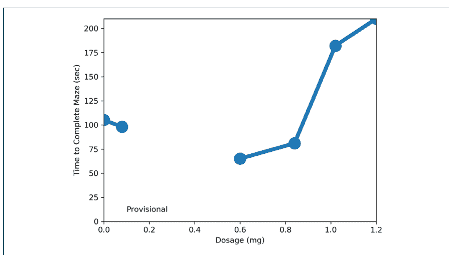

图 15.5 根据动手试试！15-3 答案中的代码生成的图。

绘制 `ydata` 对 `xdata` 的代码与动手试试！15-3 答案中的第 6-10 行相同。

### 动手试试！15-5 方法 3 等高线图：山丘上的海拔

在动手试试！14-2 中，我们制作了一个虚构的小山丘海拔的等高线图。数值见图 14.14。假设我们现在发现所有 2 米及以上的海拔都是不正确的。制作一个海拔等高线图，显示受缺失值影响的区域为空白区域。使用第 15.1 节中的方法 3。

### 动手试试！答案 15-5

这个问题的解决方案与图 14.15 几乎完全相同。这一行：

```
elev = ma.masked_greater_equal(elev, 2.0)
```

被添加到图 14.15 的第 4 行之后（并且 `savefig` 文件名被更改）。ma 模块的 `masked_greater_equal` 函数屏蔽掉值大于或等于第二个位置输入参数值的数据。⁴ `masked_less_equal` 对于小于或等于第二个位置输入参数值的值执行相同的操作。Matplotlib 的等高线程序能够使用掩码数组，并将受缺失值影响的区域变为空白区域。该图如图 15.6 所示。

⁴ https://numpy.org/doc/1.18/reference/generated/numpy.ma.masked_greater_equal.html (accessed June 23, 2020).

## 15.4 更多学科特定实践

本章的学科特定 Jupyter 笔记本涵盖以下主题：

- 将数据值定义为缺失值，并使用布尔数组和表达式。
- Series 和 IEEE NaN 值。
- 掩码数组。

## 15.5 章节回顾

### 15.5.1 自测题

请尝试在不查阅本书或任何其他资源，也不使用 Python 解释器的情况下完成这些题目。这些自测题的答案可在本章末尾找到。除非另有说明，否则假设 NumPy 已作为 `np` 导入，Matplotlib 的 pyplot 子模块已作为 `plt` 导入，pandas 已作为 `pd` 导入，NumPy 的 ma 子模块已作为 `ma` 导入。

**自测题 15-1**

什么是布尔数组？

**自测题 15-2**

假设我们有一个名为 `values` 的一维测量数组。表达式 `values >= 0` 的结果是什么？

**自测题 15-3**

假设我们有一个一维数组 `data`，其中缺失元素的值为 $1 \times 10^{10}$。请给出代码，使用第 15.1 节中的方法 1（同时使用布尔数组和数组语法，以及使用循环）来获取 `data` 中所有有效值的总和。

**自测题 15-4**

什么是 IEEE NaN 值？

**自测题 15-5**

使用第 15.1 节中的方法 2 来解决自测题 15-3。我们没有明确讨论如何对 `Series` 对象求和，但根据我们讨论过的内容，请进行推断。

**自测题 15-6**

什么是掩码数组？

**自测题 15-7**

使用第 15.1 节中的方法 3 来解决自测题 15-3。我们没有明确讨论如何对掩码数组对象求和，但根据我们讨论过的内容，请进行推断。

### 15.5.2 章节总结

在本章中，我们描述了处理缺失数据的三种方法。这三种方法都定义了一个“标志”，让用户以及相关的函数和运算符知道给定值是否缺失。本章涵盖的具体主题包括：

- 将数据值定义为缺失值，并使用布尔数组或表达式进行处理
  - 布尔数组可用于表示数组中哪些元素匹配缺失数据值，哪些不匹配。
  - 布尔数组可用于算术运算，以选择数据数组中的非缺失值，并将缺失值置零。
  - NumPy 的 `where` 函数（三参数形式）可用于将缺失值元素转换为另一个值。
  - NumPy 的 `where` 函数（单参数形式）可用于仅选择那些非缺失的点。
  - NumPy 的 `isclose` 函数检查一个浮点数是否“接近于”另一个浮点数，从而规避浮点数表示固有的不精确性。
  - 我们可以通过对布尔数组进行操作的数组语法，或者通过显式循环遍历数组元素并在循环内进行分支判断，来应用测试以查找缺失值元素。
  - 更复杂的缺失值相关条件可能通过显式循环比通过对布尔数组进行操作的数组语法更容易表达。

- 使用 `Series` 和 IEEE NaN 值处理缺失值
  - IEEE NaN 是一个特殊的浮点值，表示“非数字”。
  - pandas 的 `Series` 对象类似于一维数组，但具有额外的功能，包括正确处理缺失值。pandas 的 `DataFrame` 对象类似于二维数组。
  - 可以通过调用 `Series` 来创建 `Series` 对象。
  - 在 `Series` 对象中，默认情况下，缺失值由 NaN 值表示。
  - 在 `Series` 或类似对象之外，对 NaN 值进行算术运算会得到另一个 NaN。因此，例如，无法使用 NumPy 的 `average` 函数计算包含一些 NaN 的 NumPy 数组的平均值。
  - NumPy 的 `where` 函数可用于搜索定义为特定数据值的缺失值，并将其替换为 NaN 值。
  - 为正确利用 `Series` 对象而编写的函数会适当地处理缺失值。使用缺失值进行的算术运算结果为缺失值。可以忽略缺失值进行计算的函数（例如，数组的平均值）会相应地进行处理。
  - Matplotlib 绘图命令会正确地将 `Series` 对象的缺失值显示为空白区域，没有标记或连接线。
  - `Series` 对象的 `fillna` 方法返回 `Series` 对象的一个副本，其中的 NaN 值被另一个值替换。
  - `Series` 对象的 `values` 属性包含该对象的值，形式为 NumPy 数组。

- 使用掩码数组处理缺失值
  - 掩码数组对象同时保存数组的数据值和一个相同形状的布尔数组掩码。
  - 掩码数组中掩码的元素，如果对应的数据值被“屏蔽”（即缺失），则为 `True`，否则（即对应的数据值是有效数据值）为 `False`。
  - 一些创建掩码数组的函数：
    - `masked_values` 屏蔽输入数据数组（第一个位置输入参数）中接近给定值（在第二个位置输入参数中指定）的值。
    - `masked_greater` 屏蔽输入数据数组（第一个位置输入参数）中大于给定值（在第二个位置输入参数中指定）的值。
    - `masked_less` 屏蔽输入数据数组（第一个位置输入参数）中小于给定值（在第二个位置输入参数中指定）的值。
    - `masked_greater_equal` 屏蔽输入数据数组（第一个位置输入参数）中大于或等于给定值（在第二个位置输入参数中指定）的值。
    - `masked_less_equal` 屏蔽输入数据数组（第一个位置输入参数）中小于或等于给定值（在第二个位置输入参数中指定）的值。
  - 为正确利用掩码数组对象而编写的函数会适当地处理缺失值。使用被屏蔽的值进行的算术运算结果为被屏蔽的值。可以忽略被屏蔽的值进行计算的函数（例如，数组的平均值）会相应地进行处理。
  - Matplotlib 绘图命令会正确地将掩码数组对象的缺失值显示为空白区域，没有标记或连接线。对于等高线图，受缺失值影响的区域将留空。
  - 掩码数组的 `filled` 方法返回一个 NumPy 数组，其中所有被屏蔽的值都被替换为存储在掩码数组的 `fill_value` 属性中的值。`get_fill_value` 和 `set_fill_value` 方法用于获取或设置 `fill_value` 的值。

### 15.5.3 自测题答案

**自测题答案 15-1**

布尔数组是一个元素为 `True` 或 `False` 的数组。

**自测题答案 15-2**

结果是一个与 `values` 大小相同的一维布尔数组。如果 `values` 中的对应元素大于或等于零，则布尔数组中的每个元素都将为 `True`。否则，布尔数组中的元素将为 `False`。

**自测题答案 15-3**

以下代码使用数组语法获取总和：

```
is_good = np.logical_not(np.isclose(data, 1e10))
sum_data = np.sum(data * is_good)
```

以下代码使用循环获取总和：

```
sum_data = 0.0
for i in range(np.size(data)):
    if not np.isclose(data[i], 1e10):
        sum_data += data[i]
```

还有其他使用布尔数组、数组语法和/或循环来解决此问题的方法。

**自测题答案 15-4**

这是一个特殊的浮点值，被定义为表示“非数字”。

**自测题答案 15-5**

以下代码获取总和：

```
data = np.where(np.isclose(data, 1e10), np.nan, data)
sum_data = pd.Series(data).sum()
```

NumPy 的 `sum` 函数也能正确处理 `Series` 对象，因此：

```
sum_data = np.sum(pd.Series(data))
```

同样有效。第 15.2.2 节末尾的 pandas 文档参考列出了使用 `Series` 对象的函数和方法。

**自测题答案 15-6**

掩码数组是一个同时保存数据值和布尔掩码的数组，该掩码指明哪些数据值是有效值，哪些不是。如果布尔掩码元素为 `True`，则表示对应的数据值是缺失值（即被“屏蔽”）。

**自测题答案 15-7**

以下代码获取总和：

```
sum_data = ma.sum(ma.masked_values(data, 1e10))
```

第 15.2.3 节末尾的掩码数组文档参考列出了使用掩码数组对象的函数和方法。

## 第三部分

## 高级编程概念

# 16 更多数据与执行结构

理解编程语言功能的一种方式是，它提供了多种结构来存储数据和信息（例如，变量、列表、数组、对象属性），以及多种结构来执行任务（例如，赋值、分支、循环、函数、对象方法）。因此，程序就是这些结构的某种组合，用于完成用户感兴趣的计算、可视化或其他任务。

我们在第一部分和第二部分中学习和使用的数据与执行结构，使我们能够完成科学与工程领域的大部分计算任务。然而，额外的编程语言结构提供了额外的能力。它们使我们能够更轻松地完成基本任务，并编写出仅使用第一部分和第二部分中的结构难以实现的程序。

在本章中，我们将介绍额外的数据与执行结构。第三部分还涵盖了另外两种执行结构：第17章通过描述如何创建我们自己的类，扩展了之前关于类和对象的讨论；第20章则探讨了递归编程。作为本章的示例，我们将应用数据与执行结构的各种组合，以四种不同的方式解决一个统计数据分析问题。通过不同的解决方式，我们将展示不同结构所提供的能力。

## 16.1 使用更高级数据与执行结构的示例

假设我们有三个名为 *data0001.txt*、*data0002.txt* 和 *data0003.txt* 的数据文件。[^1] 每个数据文件包含一列数值数据（即每行一个值），长度各不相同。数据文件没有标题。因此，NumPy 函数 `genfromtxt` 将读取文件中的所有数据，并将数据返回为一个一维数组。我们希望编写一个程序，在将每个文件中的数据读入各自的 NumPy 数组后，计算每个数据文件中值的均值、中位数和标准差，并将这些值保存到变量中以备后续使用。计算均值的 NumPy 函数是 `average` 或 `mean`，中位数是 `median`，标准差是 `std`。

我们考虑上述任务的四种不同解决方案，以及这些不同解决方案的优缺点。在前面的章节中，我们在示例部分对代码功能进行了宽泛的描述，并在 Python 编程基础部分进行了更详细的说明。在本节中，示例扮演了略有不同的角色：

[^1] 本节改编自 Lin (2012) 的第6章。

```python
import numpy as np

data1 = np.genfromtxt('data0001.txt')
data2 = np.genfromtxt('data0002.txt')
data3 = np.genfromtxt('data0003.txt')

mean1 = np.mean(data1)
median1 = np.median(data1)
stddev1 = np.std(data1)

mean2 = np.mean(data2)
median2 = np.median(data2)
stddev2 = np.std(data2)

mean3 = np.mean(data3)
median3 = np.median(data3)
stddev3 = np.std(data3)
```

**图 16.1** 解决方案1的代码，使用显式函数调用并将结果存储在变量中。

它说明了我们使用各种编程结构的*方式*如何赋予程序非常不同的能力。因此，在本节中，我们比前面的章节更详细地解释这个示例。该示例也没有使用我们在16.2节中描述的大部分新数据与执行结构。但是，该示例展示了为什么我们在16.2节中引入的结构很重要，从而引出本章的Python内容。

### 16.1.1 解决方案1：显式调用函数并将结果存储在变量中

在此解决方案（图16.1）中，函数调用的数据和结果存储在一个变量中。每个变量都有不同的名称，我们显式地（即通过键入变量名、等号，然后是变量的值）为这些变量赋值。同样，函数调用也是显式完成的。每次我们想调用一个函数时，我们都会键入函数名并加上括号。

在图16.1的第3-5行，我们读取三个数据文件，并将结果保存为三个不同的数组。在第7-9行，我们使用 `data1` 数组计算 `data1` 中值的均值、中位数和标准差，并将这些值保存到名称能描述其内容的变量中（例如，`mean1`）。我们在第11-13行对 `data2` 的值重复此操作，在第15-17行对 `data3` 的值重复此操作。

这个程序运行良好并解决了我们的任务。但是，我们可以看到程序的编写方式使得任何时候我们指定一个变量，无论是文件名、数据变量还是分析函数，*我们都必须手动输入它*。当我们只有三个文件时，这没问题，但如果我们有一千个文件呢？很快，这种编程方式就变得不那么有趣了。

```python
import numpy as np

num_files = 3
means = np.zeros(num_files, dtype='d')
medians = np.zeros(num_files, dtype='d')
stddevs = np.zeros(num_files, dtype='d')

for i in range(num_files):
    filename = 'data' + ('000'+str(i+1))[-4:] + '.txt'
    data = np.genfromtxt(filename)
    means[i] = np.mean(data)
    medians[i] = np.median(data)
    stddevs[i] = np.std(data)
```

**图 16.2** 解决方案2的代码，使用显式函数调用并将结果存储在数组中。

### 16.1.2 解决方案2：显式调用函数并将结果存储在数组中

改进解决方案1代码的一种方法是将结果（均值、中位数和标准差）放入数组中，并使数组中元素的位置对应于生成该结果的文件。因此，存储均值的数组的第一个元素对应于 *data0001.txt* 中数据的均值，依此类推。然后，我们可以使用 `for` 循环来读取每个文件，使用每个文件的数据进行计算，并将结果存储到结果数组中。这样，我们就不必键入均值、中位数和标准差变量的名称来存储结果。图16.2展示了这种解决方案的代码。

在图16.2的第3-6行，我们设置文件数量，并创建用于保存每个文件数据的均值、中位数和标准差计算结果的数组。在第8行，我们遍历这些结果数组元素的索引。

在第9行，我们使用结果数组的索引（`i`）来构造我们将要计算均值、中位数和标准差的文件名。我们可以这样做是因为相关数据文件的文件名是编号的，从1开始。注意我们构造文件名数字部分的方式——在 `i+1` 前面添加三个零，然后切片结果字符串的最后四位数字——使我们能够处理从 *data0001.txt* 到 *data9999.txt* 的文件名。在第10行，我们从 `filename` 读取数据。在第11-13行，我们计算该数据的均值、中位数和标准差，并将结果保存到 `means`、`medians` 和 `stddevs` 结果数组的索引 `i` 元素中。

这段代码比我们的解决方案1代码稍微紧凑一些，这是一个优点。更重要的是，解决方案2可以扩展到任何 `num_files` 数量的文件。但是，如果文件名不是编号的呢？那么我们如何将 `means`、`medians` 和 `stddevs` 结果数组的元素位置与计算量所基于的文件关联起来呢？变量名（例如，`mean1`、`stddev3`）*确实*传达信息并将标签与值联系起来。通过将结果放入元素索引与文件名没有自然联系的数组中，我们失去了编码该信息的能力。

```python
import numpy as np

means = {}    #- 初始化为空字典
medians = {}
stddevs = {}

list_of_files = ['data0001.txt', 'data0002.txt', 'data0003.txt']

for ifile in list_of_files:
    data = np.genfromtxt(ifile)
    means[ifile] = np.mean(data)
    medians[ifile] = np.median(data)
    stddevs[ifile] = np.std(data)
```

**图 16.3** 解决方案3的代码，使用显式函数调用并将结果存储在字典中。

### 16.1.3 解决方案3：显式调用函数并将结果存储在字典中

在查看此解决方案之前，我们首先需要问一下字典如何对我们的问题有用。我们之前说过，变量名将标签与值联系起来，这意味着一个字符串（变量名）与一个值（标量、数组等）相关联。在Python中，有一种结构可以将字符串与值关联起来：字典。从这个角度来看，将值设置为一个键（该键是变量名或类似的东西）——就像我们用字典做的那样——实际上与用等号给变量赋值是一样的。然而，字典允许我们*动态地*（即，我们不必输入“变量等于值”）执行此操作，并且可以容纳*任何*字符串，而不仅仅是那些包含数字的字符串。

图16.3展示了一个使用字典来保存统计结果的解决方案。这些字典在第3-5行被初始化为空字典，以便我们稍后在程序中向字典添加键值对。字典条目的键是文件名，而不是索引（如将结果存储在列表或数组中）。因此，我们可以使用不一定与数字索引有任何关系的文件名。为了说明这种灵活性，我们遍历（第9行）一个文件名列表（第7行），而不是基于数组索引通过字符串操作构造每个文件名。我们在第7行输入这些文件的名称，但正如我们在10.2.5节中看到的，我们可以通过os模块的 `listdir` 函数获取目录中的文件列表，并使用glob模块的 `glob` 函数获取匹配模式的文件列表。然后，我们可以将图16.3中的第7行替换为：

```python
list_of_files = glob.glob("data*.txt")
```

假设glob模块已经导入。

如果像图16.2那样使用数组来存储结果，生成要遍历的文件列表就不会那么容易了。这是因为字典是基于键来存储值的，而不是基于顺序。将结果存储在数组中的方法仅在文件具有某种

[^2] 有关glob模块的详细信息，请参见 http://docs.python.org/library/glob.html（访问于2012年8月16日）。

### 16.1.4 解决方案4：将结果和函数存储在字典中

尽管解决方案3效果很好，但我们能否让程序足够灵活，以计算除均值、中位数和标准差之外的更多指标？如果我们想计算10个指标呢？30个？100个？在这里，Python字典再次拯救了我们。回想一下，键值对允许我们将*任何东西*作为值放入，甚至是函数和其他字典。因此，我们重构解决方案，将函数对象本身存储在一个函数字典中，并与字符串键`'mean'`、`'median'`和`'stddev'`相关联。我们还创建了一个`results`字典，用于保存均值、中位数和标准差结果的字典；`results`是一个字典的字典。图16.4展示了这个解决方案。

```python
import numpy as np
import glob

metrics = {'mean':np.mean, 'median':np.median, 'stddev':np.std}
list_of_files = glob.glob("data*.txt")

results = {}                  #- initialize results
for imetric in metrics.keys():  # dictionary for each
    results[imetric] = {}       # statistical metric

for ifile in list_of_files:
    data = np.genfromtxt(ifile)
    for imetric in metrics.keys():
        results[imetric][ifile] = metrics[imetric](data)
```

**图16.4** 解决方案4的代码，将结果和函数存储在字典中。

在图16.4的第4行，我们创建了一个字典，其值是NumPy的`mean`、`median`和`stddev`函数本身。因此，引用此字典中的键就是引用相关的函数，该函数可以像任何函数一样被调用：

```
In [1]: import numpy as np
        metrics = {'mean':np.mean, 'median':np.median, 'stddev':np.std}
        data = np.array([1, 2, 3])
        metrics['mean'](data)

Out[1]: 2.0
```

在上面的例子中，`metrics['mean']`提取了NumPy的`mean`函数，我们使用数组`data`的值来调用它。`metrics['mean']`的值是NumPy的`mean`函数本身，而不仅仅是函数的名称。

在第5行，我们使用glob模块的`glob`函数构建文件列表，如第16.1.3节所述。在第7行，我们初始化`results`字典。在第8-9行，我们创建空字典，用于保存每个统计指标的结果。也就是说，如果在第9行之后执行：

```
In [1]: print(results)
{'mean': {}, 'median': {}, 'stddev': {}}
```

我们看到`results`的内容是一组键值对，其中键是`metrics`中的键，与这些键关联的值是空字典。这些空字典随后准备好通过调用每个文件数据上的指标来填充。因此，如果我们运行图16.4的代码，然后检查`results`，我们将获得类似以下的内容（输出已重新格式化以便更好地显示）：

```
In [1]: print(results)
{'mean': {'data0001.txt': 2.0, 'data0003.txt': 7.5,
          'data0002.txt': 3.5},
 'median': {'data0001.txt': 2.0, 'data0003.txt': 7.5,
            'data0002.txt': 3.5},
 'stddev': {'data0001.txt': 0.816496580927726,
            'data0003.txt': 1.118033988749895,
            'data0002.txt': 0.816496580927726}}
```

在上面的例子中，每个文件的内容包含三个或四个值：`data0001.txt`有1.0、2.0和3.0，`data0002.txt`有2.5、3.5和4.5，`data0003.txt`有6.0、7.0、8.0和9.0。键值对列出的顺序不一定是自然顺序，无论是键还是值。正如我们所预期的，如果字典是无序集合的话。

在图16.4的第11-14行，我们遍历`list_of_files`中的所有文件。对于每个文件，我们遍历`metrics`字典中的每个统计指标。在第14行，我们调用由`imetric`键给出的指标函数，传入从`ifile`读取的`data`值，并将结果保存在`results[imetric]`字典中，附加到`ifile`键。记住，迭代器`ifile`和`imetric`都是字符串。

这个程序现在更加灵活：它计算工作目录中匹配"data*.txt"的*所有文件*的均值、中位数和标准差，并且可以扩展以计算*任意数量的统计指标*。如果我们想访问具有不同命名模式的文件，我们只需更改第5行的搜索模式。如果我们想添加另一个统计指标，我们只需在第4行的`metrics`字典中添加另一个条目。在第17.2.5节中，我们将看到如何自动添加指标。只需要更改两行：*程序中的其他内容不需要更改*。这种灵活的程序之所以可能，仅仅是因为字典数据结构的特性。因此，编程语言提供的结构决定了我们可以编写的程序类型，而具有额外功能的附加数据和执行结构的存在使我们能够编写原本难以编写的程序。

## 16.2 Python编程基础

在第16.1节中，我们看到了可用的数据和执行结构如何影响我们可以编写的程序类型。使用正确的结构集，我们可以编写更灵活、简洁和强大的程序。在本节中，我们介绍一些新的数据和执行结构，并描述它们可能如何以及为何被使用。我们还补充了对字典数据结构的描述，以帮助我们理解第16.1节示例中一些解决方案的语法。

### 16.2.1 更多数据结构

数据结构是存储项目集合的对象。根据结构的目的，该对象被设计为以特定方式存储和访问项目。到目前为止，我们见过的一些数据结构包括：列表、元组、NumPy数组、Series对象和掩码数组。在本节中，我们介绍以下数据结构：栈、队列和集合。尽管这些数据结构在科学和工程应用中并不常用，但它们说明了我们已经涵盖的数据结构中不存在的数据结构特性。例如，列表、元组、NumPy数组、Series对象和掩码数组在某种程度上都是随机访问数据结构。也就是说，如果我们知道元素的“地址”（例如，它的索引或键），我们可以在任何时候获取该元素的值。相比之下，在有限访问数据结构中，关于何时可以访问元素存在需要满足的条件。通常，我们不能在任何时候获取任何元素的值。

我们研究的前两个新数据结构——栈和队列——是有限访问数据结构。第三个新数据结构——集合——不是有限访问数据结构，但与我们已经涵盖的数据结构不同，因为它不允许重复值。本节最后，我们扩展了在第14.2.5节开始的对字典的描述。

#### 栈

栈是最基本的数据结构之一。它由一组有序但不能任意访问的项目组成。对栈的所有访问都发生在栈的“顶部”，即我们可以添加（即“压入”）项目或移除（即“弹出”）项目的地方。解释栈的最佳方法是想象一堆物理的东西，比如一叠书。当我们向栈中添加一本书时，它从栈的顶部进入。当我们移除一本书时

# 16 更多数据与执行结构

从栈中移除元素时，它总是从栈顶移除。如果我们想移除从栈顶数起的第四本书，我们不能只移除那一本书。我们必须先移除第一本，然后是第二本，再移除第三本，接着移除第四本，然后将第三本、第二本、第一本放回原位。移除和添加总是通过栈顶一次一个地进行。因此，栈是一种受限访问的数据结构。

栈被称为“**先进后出（FILO）**”的数据结构。我们放入栈中的第一个项目是最后一个从栈中移除的项目。换句话说，栈也是一种“**后进先出（LIFO）**”的数据结构。我们压入栈的最后一个项目是第一个弹出的，因为它位于栈顶。

就大小而言，栈是无限的。实际上，计算机的内存限制了栈可以容纳的项目数量。但是，与创建时元素数量就固定的数组不同，栈的抽象概念可以根据需要增长和缩小，没有限制。

由于栈是受限访问的，即使栈中的项目是有顺序的，我们也不能利用这个顺序来访问栈中的特定元素（就像我们使用数组中的元素索引那样）。基本的栈没有方法让我们查看，比如说，栈中第五个元素是什么。基本的栈只有压入项目、弹出项目以及告诉我们栈是否为空的方法。有些人也将“查看”方法——一个显示栈顶将被弹出的项目而不实际弹出它的方法——视为基本栈的一部分。

考虑到栈的局限性，为什么它还有用？因为现代计算机速度如此之快，内存如此之大，节省编程资源的重要性已不如过去。但支持其他数据结构提供的灵活性仍然需要资源。例如，如果我们想要解决的问题只需要与数据结构在一个位置进行交互，为什么我们需要使用计算资源来支持随机访问呢？

此外，某些问题的特性使得栈能够自动解决它们。例如，考虑文字处理器中的“撤销”功能。假设我们执行了一系列命令，例如按以下顺序列出的：

1. 输入字符“Experiment 1: Dissolving NaCl”。
2. 将“Experiment 1”加粗。
3. 在这些词下面输入一个空行。
4. 输入字符“Supplies:”。
5. 将“Supplies:”设为斜体。

如果我们将命令存储在栈中，那么撤销我们的最后一个命令就等同于从栈顶弹出该命令。撤销“当前”命令之前的每个命令也是一个弹出操作，而添加新命令是一个压入操作。栈的FILO/LIFO特性自动实现了撤销功能的作用：在向栈中添加和从栈中移除之间，元素的访问顺序是相反的。

虽然我们可以在Python中通过使用其他数据结构来模拟栈的行为——列表的`pop`和`append`方法可以模拟栈的弹出和压入方法（假设列表的末尾是栈顶）——但Python也提供了一个名为`LifoQueue`的栈类，作为队列内置模块的一部分。<sup>3</sup> 在这个类中，弹出方法称为`get`，压入方法称为`put`。以下是构建和使用一个小栈的示例：

```python
import queue

mystack = queue.LifoQueue()
mystack.put(1.2)
mystack.put(-4.5)
mystack.put(8.7)

print(mystack)

while not mystack.empty():
    print(mystack.get())

print(mystack.empty())
```

```
<queue.LifoQueue object at 0x7fd5f0265ba8>
8.7
-4.5
1.2
True
```

在向栈中添加三个项目后，我们尝试打印栈的内容。这个尝试并没有显示内容，只是告诉我们`mystack`是一个`LifoQueue`对象。我们无法随机访问栈中的项目。从输出中，我们可以看到，当我们使用`get`方法弹出每个项目时，我们得到的是最新的元素。我们以某种顺序放入元素，但它们以相反的顺序取出。随着它们被取出，栈的大小减小，直到为空。

#### 队列

与栈一样，队列也是一种受限访问的数据结构。然而，在栈中，项目的添加和移除都发生在一个地方，而在队列中，添加到队列发生在队列的一端（“**后端**”），而从队列中移除发生在队列的另一端（“**前端**”）。在这方面，队列就像排队见银行柜员或商店收银员的队伍。人们在队伍的后端排队，而队伍前端的人是下一个被服务的顾客。向队列后端添加项目的操作称为“入队”。从队列前端移除项目的操作称为“出队”。

队列是一种“先进先出（FIFO）”或“后进后出（LILO）”的数据结构。队伍中的第一个顾客是第一个被服务的顾客。与栈一样，队列的大小是无限的。也与栈一样，队列是受限访问的，因此即使队列中的项目是有顺序的，我们也不能利用这个顺序来访问栈中的特定元素。基本的队列有入队、出队以及判断队列是否为空的方法。

队列对于需要创建某种队列的应用程序很有用。例如，假设我们正在编写一个应用程序来控制老鼠迷宫中的一组闸门，这些闸门像赛马的起跑闸门一样一个接一个地排列。因此，当一组老鼠接近这些闸门时，每只老鼠被分配到自己的闸门。这个程序读取并存储老鼠到达闸门时的识别标签，等待一定时间，然后打开闸门让老鼠通过。闸门按照每只老鼠到达的顺序打开。队列将是保存描述每只老鼠的对象的自然数据结构，因为它自然地强制执行了闸门应遵循的FIFO/LILO行为。

Python内置的queue模块还有一个实现了队列数据结构的Queue类。⁴ 入队命令是`put`，出队命令是`get`。`empty`方法判断Queue对象是否为空。以下是创建和使用一个小Queue对象的示例：

```python
import queue

myqueue = queue.Queue()
myqueue.put(1.2)
myqueue.put(-4.5)
myqueue.put(8.7)

print(myqueue)

while not myqueue.empty():
    print(myqueue.get())

print(myqueue.empty())
```

```
<queue.Queue object at 0x7fd5f0265860>
1.2
-4.5
8.7
True
```

⁴ https://docs.python.org/3/library/queue.html (accessed June 29, 2020).

与栈一样，我们无法看到队列的内容。我们只能通过在后端添加和在前端移除来与队列交互。我们添加项目的顺序就是它们重新出现的顺序，正如`while`循环的输出向我们展示的那样。

#### 集合

集合是一种其所有项目都唯一的数据结构。对于我们目前见过的所有其他数据结构（例如，列表、数组、栈），多个项目可以具有相同的值。例如，在数组中，第一个元素可以是7，但第三个元素或第五十六个元素也可以是7。在不同元素之间拥有重复值没有问题。在集合中，任何给定的值在集合中只有一个。

因此，当我们向集合中添加一个项目时，如果该项目已经存在于集合中，则什么也不会发生。当我们从集合中移除一个项目时，我们是根据其值来移除它；我们不是从某个位置移除它。这样，集合是一种无序的数据结构。集合中的项目没有第一、第二等位置。然而，尽管集合是无序的，但它是可迭代的。

我们可以对集合执行的操作不像栈和队列那样有限。我们可以添加项目、移除项目、查看有多少个项目、检查项目是什么等等。但是，由于集合是无序的，并且不与任何类型的寻址系统（如数组的索引或字典的键）相关联，因此不存在使用此类寻址系统的操作。

由于集合不存储重复项，这是处理唯一值的自然数据结构。例如，如果我们有一个数据集列出了在草地上观察到的所有昆虫物种，我们想知道观察到了多少个物种，我们可以将所有物种名称的记录添加到一个集合中，只有唯一的物种会保留下来。因此，该集合的长度就是观察到的物种数量。

Python使用`set`命令实现集合。我们可以通过传入一个项目集合（使用列表语法）来创建一个集合：

```python
In [1]: myset = set([4, -8, 9])
        print(myset)

        {-8, 9, 4}

In [2]: myset = set([4, -8, 4, 9])
        print(myset)

        {-8, 9, 4}
```

如果有重复的项目被传入，`set`命令会忽略重复项。当我们打印集合时，使用花括号来分隔集合。这并不意味着项目在字典中。注意没有键。

我们也可以创建一个空集合，然后向其中添加元素。`add` 方法用于向集合添加元素，`remove` 方法用于从集合中移除元素。`len` 函数告诉我们集合中有多少个元素：

```
In [1]: myset = set()
myset.add(4)
myset.add(-8)
myset.add(9)
myset.add(-8)
print(myset)
print(len(myset))

myset.remove(9)
print(myset)
print(len(myset))

{-8, 9, 4}
3
{-8, 4}
2
```

如果我们尝试向一个已经包含某个元素的集合中添加该元素，则不会发生任何变化。

#### 关于字典的更多信息

我们在第 14.2.5 节介绍了字典。在那一节中，我们学习了如何创建字典、向字典添加和替换键值对，以及从字典中删除键值对。然而，字典具有额外的功能，这为我们与字典的交互提供了极大的灵活性。

字典有 `keys` 方法，它返回字典中的所有键；还有 `values` 方法，它返回字典中的所有值。使用第 14.2.5 节中的字典 `settings`，这些方法返回：

```
In [1]: settings = {'linestyle':'--', 'linewidth':5.0,
                   'marker':'*', 'markersize':20.0}
print(settings.keys())
print(settings.values())

dict_keys(['linestyle', 'linewidth', 'marker', 'markersize'])
dict_values(['--', 5.0, '*', 20.0])
```

尽管 `keys` 和 `values` 返回的对象类似于列表，但我们需要使用 `list` 函数将它们转换为列表。这些方法的结果是可迭代的，因此可以循环遍历。假设 `settings` 如上定义：

```
In [1]: for ikey in settings.keys():
            print(ikey + ' : ' + str(settings[ikey]))

linestyle : --
linewidth : 5.0
marker : *
markersize : 20.0
```

```
In [2]: for ivalue in settings.values():
            print(ivalue)

--
5.0
*
20.0
```

尽管 `settings` 的键值对似乎按键的字母顺序存储，但我们不应做这样的假设。标准字典应被视为无序的数据结构。请注意，`values` 方法返回的集合与这些值关联的键没有进一步的联系。因此，如果了解键很重要，我们希望遍历键而不是值。

对于列表和数组，我们可以遍历索引（使用 `range` 函数）或遍历列表或数组的值（通过直接遍历列表或数组）。对于字典，为了遍历字典的值，我们必须使用上述的 `values` 方法。要遍历键，我们可以遍历上述 `keys` 方法的结果，或者*直接遍历字典*。也就是说，如果我们直接使用 `for` 循环遍历字典，我们将遍历键，而不是值：

```
In [1]: for ikey in settings:
            print(ikey + ' : ' + str(settings[ikey]))

linestyle : --
linewidth : 5.0
marker : *
markersize : 20.0
```

这与列表和数组的行为不同。字典虽然是无序的，但可以对其键进行迭代。

## 16 更多数据和执行结构

当我们想要自动化地填充、替换或删除字典中的键值对时，循环特别有用。例如，下面的代码填充了一个字典，其中字母表的前五个字母作为键，连接到整数零到四：

```
In [1]: letters = 'abcde'
mydict = {}
for i in range(5):
    mydict[letters[i]] = i
print(mydict)

{'a': 0, 'b': 1, 'c': 2, 'd': 3, 'e': 4}
```

图 16.3 的第 11-13 行的工作方式类似，将 `ifile` 给定文件的均值、中位数和标准差值添加到字典 `means`、`medians` 和 `stddevs` 中。图 16.3 的第 9 行和第 14 行在字典 `results` 和 `results[imetric]` 中执行类似的赋值（回想一下 `results` 是一个字典的字典）。

顺便提一下，因为字典是无序的集合，如果我们向字典添加或删除键值对，我们不必担心是否会改变字典中项目的顺序。根本没有顺序！相反，如果我们从列表中间删除一个元素，列表必须将该元素右侧的所有内容移动（即压缩列表）以保持所有内容有序。当我们使用适当的对象方法（例如 `remove` 方法）时，列表会自动执行此操作，但对于字典来说，这从一开始就不需要考虑。

如果我们想查看某个特定的键是否在字典中，我们可以使用 `in` 运算符来测试给定的键（在 `in` 的左侧）是否在给定的字典中（在 `in` 的右侧）。返回一个布尔值。因此，对于上面的 `mydict`：

```
In [1]: print('a' in mydict)
print('z' in mydict)

True
False
```

因为字典 `mydict` 确实有一个键为 'a' 的键值元素，但它没有一个键为 'z' 的键值元素。要检查某个特定的键是否不在字典中，请使用 `not in` 运算符。这些是**成员测试**的例子。在第 19.2.1 节中，我们将更广泛地考虑成员测试，因为它是一种搜索形式。

字典是无序的集合，但这并不意味着我们不能按特定顺序访问或操作字典中的项目。最简单的方法是使用 `keys` 获取字典的键，并按所需顺序对键进行排序。例如，对于上面的字典 `mydict`，我们可以使用内置的 `sorted` 函数来确保键按字母顺序排序：

```
In [1]: sorted_keys = sorted(mydict.keys())
for ikey in sorted_keys:
    print(ikey + ' : ' + str(mydict[ikey]))

a : 0
b : 1
c : 2
d : 3
e : 4
```

在第 19 章中，我们将更详细地讨论排序。`sorted` 函数能够进行高度自定义的排序，包括基于多个标准的排序。

### 16.2.2 更多执行结构

到目前为止，我们已经看到了基本的编程结构，如赋值、分支和循环。函数使我们能够重用代码片段。对象使我们能够将属性和方法绑定到一个单一的实体中，然后我们可以分别访问和调用它们。对于 NumPy 数组，我们已经看到可以使用数组语法隐式地遍历数组中的所有元素。在本节中，我们将描述两种额外的执行结构：列表推导式和 lambda 函数。两者都与另一种称为函数式编程的编程风格相关，我们不在本书中讨论。有关函数式编程的更多信息，请参阅 Python 文档。我们提供了一个关于此主题的“如何做”的最新链接，网址为 www.cambridge.org/core/resources/pythonforscientists/refs/，参考文献 14。就我们的目的而言，列表推导式和 lambda 函数都提供了一种简洁地定义列表和函数的方式。

#### 列表推导式

列表推导式是一种使我们能够简洁地连接列表创建和循环的结构。使用我们之前学到的构造，要创建一个包含数字 0, 2, 4, 6, 8 的列表，我们会这样做：

```
In [1]: values = []
for i in range(5):
    values.append(i * 2)
print(values)

[0, 2, 4, 6, 8]
```

使用列表推导式，循环和创建列表合并为一行：

```
In [1]: values = [i*2 for i in range(5)]
       print(values)

[0, 2, 4, 6, 8]
```

发生了什么？列表 `values` 被构造为每个元素都是嵌入在 `for i in range(5)` 迭代中的表达式的结果。对于每次迭代，迭代部分前面的表达式（即 `i*2`）被求值，该值被保存为列表中的该元素。

我们还可以在列表推导式中为每次迭代添加一个 `if` 测试。⁵ 使用 `if` 语句，列表推导式仅在条件为 `True` 时才向列表添加元素。例如：

```
In [1]: values = [i*2 for i in range(5) if i > 2]
       print(values)

[6, 8]
```

只将元素 6 和 8 添加到列表中，因为之前的 0, 2 和 4 值是为 `i` 值 0, 1 和 2 创建的。

#### lambda 函数

类似于列表推导式使用循环在单行中创建列表，lambda 函数或表达式在单行中创建一个函数。⁶ 定义一个名为 `<function name>` 的函数的语法，该函数可选地接受由 `<args>` 给出的一系列逗号分隔的输入参数，形式如下：

`<function name> = lambda <args> : <return value expression>`

因此，我们可以通过以下方式创建一个名为 `double_it` 的函数，该函数将一个值乘以二：

```
In [1]: double_it = lambda x: x*2
       print(double_it(4))

8
```

我们调用 lambda 函数的方式与调用使用 `def` 语句定义的函数相同。通常，lambda 函数适用于短函数。对于较长的函数，使用 `def` 语句的常规多行语法更清晰。

⁵ https://docs.python.org/3/howto/functional.html (accessed June 29, 2020).
⁶ 本节全部参考了 https://docs.python.org/3/howto/functional.html (accessed June 29, 2020) 中的思想。

### 16.2.3 何时使用不同的数据与执行结构

回答“我们何时使用不同的数据与执行结构？”这个问题的一种方法，是指向本文的提纲。不同的科学与工程工作流任务需要不同类型和组合的数据与执行结构来完成。另一种回答方式是指向本文涵盖的数据结构（附录B）和编程主题（附录C）的总结。在本节中，我们将描述一些可用于帮助我们决定使用何种数据与执行结构的问题和原则。

我们的讨论围绕以下类别展开：存储结构、重复结构和代码清晰度。这些绝非唯一的考量因素。性能（此处简要提及）是一个需要更多关注的主要问题（关于性能的更多内容，请参见第22章）。但是，这个列表提供了一些我们在选择不同编程结构时可能考虑的主题。

#### 存储结构

根据定义，数据结构用于存储项目。我们的首要考量是需要存储什么。我们是只关心值，还是值的顺序也很重要？我们是只关心唯一值，还是重复值的存在也是我们感兴趣的？例如，如果我们有一组观察到的鸟类数量计数，并且想知道该计数等于特定值的次数，我们就不应该使用集合来存储这组数据，因为集合不存储重复值。

其次，我们需要考虑我们希望访问或操作数据的难易程度。我们是需要随机访问，还是有限访问也可以接受？添加新元素或删除元素需要多容易？虽然我们可能得出结论，通常应该使用最灵活的数据结构——例如列表，因为它是随机访问的、有序的、可变的，并且可以包含不同类型的项目——但这种灵活性是以增加内存使用和降低执行速度为代价的。由于许多科学和工程用例涉及大量数值数据，使用列表通常是浪费资源。在这种情况下，使用NumPy数组更有意义。相反，如果我们管理的是数量不确定的字符串集合，列表可能是更好的选择，因为列表是可变的，并且列表的元素在内存中不必都是相同大小。

第三，我们应该考虑数据结构中访问数据的方法——无论是通过键、值还是顺序（索引）——是帮助还是阻碍了我们。正如我们在第16.1节的示例中所看到的，字典可能很有用，因为将字符串文件名与使用该文件中的数据生成的值关联起来是有好处的。

最后，我们应该考虑是否需要将元数据与数据一起存储。例如，如果我们想跟踪某些项目是否缺失，我们就会希望使用一种数据结构，例如Series对象或掩码数组，来存储这些额外信息。

如果我们需要处理的元数据很少，就没有必要分配那些具有元数据处理能力的数据结构所需的额外内存和处理资源。

#### 重复结构

在这个类别中，我们希望考虑程序中重复的是什么以及重复的频率，以帮助我们理解应该如何编程实现这种重复。如果重复的是一个非常复杂的计算，包含不止几个分支条件，我们可能希望使用显式循环和对单个元素的操作。这个计算可能无法使用数组语法或列表推导式完成（尽管部分可以）。如果重复次数很高，那么使用在大规模下高效的数据和执行结构就变得更加重要。通常，对于大量重复计算，NumPy数组比列表效果更好。

#### 代码清晰度

有人说，我们阅读代码的时间比编写代码的时间还多。这可能涉及阅读别人编写的、我们想要利用的代码，或者阅读我们过去编写的代码（甚至是最近编写的）以改进或扩展它。因此，代码的清晰度是首要的。如果我们看不懂正在阅读的代码，它对我们来说就几乎毫无用处。

Python通常能生成清晰的代码。然而，通过我们对数据和执行结构的选择，我们可以编写出更清晰或不那么清晰的程序。清晰度在某种程度上是主观的，但这里有两个我们可以用来帮助评估的标准：

-   长度。我们使用多少行来完成一项任务？
-   密度。我们每行完成多少项任务？

通常，如果我们的代码行数过多（超过几百行），阅读起来就更困难。当我们阅读长程序或函数时，我们必须反复在文件的不同部分之间切换，这很费力。关于密度，如果我们每行代码完成的任务太多，阅读起来也可能很困难。如果我们每行代码完成的任务太少，代码可能更容易阅读，但代码可能会很长。

例如，数组语法可以增加我们的代码密度，这可以使我们的程序比原本更短。只要我们不试图在单行代码中完成太多任务，尽可能使用数组语法可以使我们的代码更清晰（也更快）。然而，在具有许多分支条件的问题中，数组语法最终可能创建出过于简洁以至于令人困惑的程序。

最终，决定在我们的程序中使用什么数据和执行结构需要平衡许多不同的成本和收益。存储结构、重复结构和代码清晰度是我们选择可能产生某些成本同时获得某些收益的一些主要领域。在后面的章节中，当我们研究更高级的编程概念时，我们会遇到更多考量因素。

## 16.3 动手试试！

本节中的示例涵盖了第16.2节的主要主题。我们练习使用栈、队列和集合。我们利用字典进行更复杂的数据分析任务。我们还练习编写列表推导式和lambda函数。

### 动手试试！16-1 使用栈：海狸追踪

假设我们给五只海狸装上了无线电发射器。当一只海狸行走一英里后，它的发射器会发回该海狸的识别码（一个四位数）。假设我们将识别码存储在一个栈中，当它们到达时就添加到栈中，那么什么代码可以按照它们到达的相反顺序打印出识别码（即，最后一只海狸的识别码最先打印）？

### 动手试试！答案 16-1

下面是一个解决方案，它还用五个虚构的识别码填充了栈：

```python
import queue

beaver_ids = queue.LifoQueue()
beaver_ids.put(1243)
beaver_ids.put(9384)
beaver_ids.put(2352)
beaver_ids.put(4722)
beaver_ids.put(1198)

while not beaver_ids.empty():
    print(beaver_ids.get())
```

```
1198
4722
2352
9384
1243
```

因为栈被定义为后进先出（LIFO），当我们使用`get`方法反复弹出顶部的值时，我们自动获得了相反顺序的识别码。

### 动手试试！16-2 使用队列：海狸追踪

假设我们拥有与动手试试！16-1相同的海狸追踪数据，但识别码不是存储在栈中，而是存储在队列中。编写一个程序，仅打印出第三只到达的海狸的识别码。

7 想法来自 www.beaversolutions.shington.edu/agree/?sign=idaacom/beaver-facts-education/beaver-behavior-and-biology/（访问于2020年7月16日），但所有数据均为虚构。

### 动手试试！答案 16-2

下面是一个解决方案，它还用五个虚构的识别码填充了队列：

```python
import queue

beaver_ids = queue.Queue()
beaver_ids.put(1243)
beaver_ids.put(9384)
beaver_ids.put(2352)
beaver_ids.put(4722)
beaver_ids.put(1198)

for i in range(3):
    id_number = beaver_ids.get()
print(id_number)
```

```
2352
```

因为队列被定义为先进先出（FIFO），我们通过出队三次获得了第三个接收到的识别码。回想一下，在队列模块的`Queue`类中，出队方法被称为`get`。

按照这种解决方案的写法，第一个和第二个识别码被丢弃了。如果我们想保存它们，就需要将它们放入另一个数据结构或放回`beaver_ids`中。在后一种情况下，如果我们希望`beaver_ids`恢复到我们最初发现的状态，我们需要确保入队足够多次，以便将第一个识别码放回队列的前端。

### 动手试试！16-3 使用集合：狼群追踪

假设我们有一个区域，我们给一群狼装上了无线电发射器。每当一只狼离开该区域时，它的识别码就被保存在列表`leaves`中。每当一只狼进入该区域时，它的识别码就被保存在列表`enters`中。在一段时间内，同一只狼可能多次离开和进入该区域。编写一个程序来计算并打印出有多少只不同的狼离开了该区域，以及有多少只进入了该区域。

### 动手试试！答案 16-3

为了解决这个问题，我们需要从`leaves`和`enters`列表中消除重复项。以下代码解决了这个问题：

```python
print("Number wolves left: " + str(len(set(leaves))))
print("Number wolves entered: " + str(len(set(enters))))
```

一旦将列表转换为集合，所有元素都会变得唯一。因此，这些集合的长度就是这些列表中唯一狼的数量。

### 动手试试！16-4 初始化字典的字典：海狸追踪

假设我们拥有如“动手试试！16-1”中所示的海狸追踪数据，但除了传输一个4位数的识别码外，还提供了以下字段（左列）的信息：

| 字段 | 默认值 |
|---|---|
| 昵称 | 空字符串 |
| 出生日期 | 空字符串 |
| 母亲的ID号 | -1 |
| 父亲的ID号 | -1 |

编写一个程序，创建并填充一个名为 `info` 的字典，其内容是键值对，其中每个键是海狸的识别码，值是一个包含该海狸信息的字典。该字典应具有表示上述字段的键，并设置为给定的默认值（右列）。对五个虚构的识别码执行此操作，并打印出生成的 `info` 字典。

### 动手试试！答案 16-4

以下是使用“动手试试！16-1”解决方案中五个虚构识别码的解决方案（输出已重新格式化以便更好地显示）：

```
In [1]: info = {}
    for iid in [1243, 9384, 2352, 4722, 1198]:
        info[iid] = {}
        for ifield in ['nickname', 'dob']:
            info[iid][ifield] = ''
        for ifield in ['mother id', 'father id']:
            info[iid][ifield] = -1

    print(info)

{1243: {'nickname': '', 'dob': '', 'mother id': -1, 'father id': -1},
 9384: {'nickname': '', 'dob': '', 'mother id': -1, 'father id': -1},
 2352: {'nickname': '', 'dob': '', 'mother id': -1, 'father id': -1},
 4722: {'nickname': '', 'dob': '', 'mother id': -1, 'father id': -1},
 1198: {'nickname': '', 'dob': '', 'mother id': -1, 'father id': -1}}
```

我们在填充字典之前先初始化空字典。请记住，键值对中的值基本上可以是任何Python构造。在 `info` 的例子中，值是字典。这些字典的值要么是字符串，要么是整数。

请注意，`info` 的键是整数（识别码），而 `info` 的值的键是字符串。我们也可以在同一个字典中混合使用字符串和整数（以及其他具有唯一值的类型）作为键。

我们可能会问，为什么我们想要使用整数键，因为列表也使用整数索引来引用列表中的值。对于整数键的情况，引用字典和列表中元素的语法是相同的。然而，对于列表，我们需要创建索引之间所有具有值的元素。在上面的 `info` 字典中，即使第一个识别码是1198，如果 `info` 是一个列表，那么该列表还需要包含索引从0到1197的元素。当我们需要存储的项目少于整数键完整范围所允许的数量时，字典可能是更好的选择。

由于 `info` 及其值中的项目很少，手动输入字典及其键值对的行数大致相同。但是，通过使用循环，上述解决方案更容易扩展，以便跟踪额外的海狸或存储额外的字段。

### 动手试试！16-5 用计算结果填充字典：数据分析

这个“动手试试！”改编自林（2012）的练习18。假设我们有以下文件列表：

```
list_of_files = ['data0001.txt', 'data0002.txt', 'data0003.txt']
```

创建一个名为 `filenum` 的字典，其中键是文件名，值是作为整数的文件编号（即，`data0001.txt` 的文件编号为1）。假设我们有一个列表 `list_of_files`，自动填充该字典。提示：要将字符串转换为整数，请对字符串使用 `int` 函数。列表和数组子范围切片语法也适用于字符串。

### 动手试试！答案 16-5

以下是填充 `filenum` 的程序：

```
filenum = {}
list_of_files = ['data0001.txt', 'data0002.txt', 'data0003.txt']
for ifile in list_of_files:
    filenum[ifile] = int(ifile[4:8])
```

我们在填充之前初始化一个空字典。为了获得文件编号的整数版本，我们对文件名使用切片语法，仅获取文件编号部分。

### 动手试试！16-6 字典的条件操作：狼群追踪

假设我们拥有如“动手试试！16-3”中所述的识别码列表 `leaves` 和 `enters`。创建一个名为 `leaves_counts` 的字典，用于存储每个狼识别码在 `leaves` 中出现的次数。将该数字作为值与识别码作为键相关联存储。使用列表 `enters` 以相同方式创建一个名为 `enters_counts` 的字典。使用这些字典，打印出所有离开该区域的次数多于进入该区域的次数的狼的识别码。

提示：列表对象有一个名为 `count` 的方法，它接受一个输入参数并计算该输入在列表中出现的次数。此外，由于我们所有带标签的狼最初都在该区域内，因此 `enters` 列表上的所有狼也都在 `leaves` 列表上（因为狼需要在进入该区域之前先离开该区域）。

### 动手试试！答案 16-6

以下代码解决了这个问题：

```
1  leaves_counts = {}
2  for ikey in set(leaves):
3      leaves_counts[ikey] = leaves.count(ikey)
4
5  enters_counts = {}
6  for ikey in set(enters):
7      enters_counts[ikey] = enters.count(ikey)
8
9  for ikey in leaves_counts:
10     if ikey in enters_counts:
11         if leaves_counts[ikey] > enters_counts[ikey]:
12             print(ikey)
13     else:
14         print(ikey)
```

在第1-3行和第5-7行，我们计算每个识别码出现的次数，并将这些计数保存在 `leaves_counts` 和 `enters_counts` 字典中，作为与识别码作为键相关联的值。在两个循环中，我们都使用 `set` 来获取识别码的集合，没有重复项。

在第9-14行，我们遍历 `leaves_counts` 中的所有键。在第10行，我们检查每个键是否也是 `enters_counts` 中的键。如果是，我们检查识别码（键）在 `leaves` 中的出现次数是否多于在 `enters` 中的出现次数（第11行）。如果是，我们打印出识别码（第12行）。如果该键不是 `enters_counts` 中的键（第13行），那么该识别码也是狼离开的次数多于进入的次数的情况（后者为0，因为该识别码不在 `enters` 中），因此也打印出该识别码（第14行）。

我们也可以在第9行使用 `keys` 方法进行循环：

```python
for ikey in leaves_counts.keys():
```

上述代码与第9行的工作方式相同。

### 动手试试！16-7 扩展例程以计算更多指标：数据分析

这个“动手试试！”改编自林（2012）的练习19。扩展第16.1节解决方案4（在第16.1.4节中），使其也计算每个文件数据的偏度和峰度（这些是统计量）。提示：SciPy包的stats模块（`scipy.stats`）具有执行计算的函数 `skew` 和 `kurtosis`。

### 动手试试！答案 16-7

以下代码解决了这个问题：

```python
import numpy as np
import glob
import scipy.stats

metrics = {'mean':np.mean, 'median':np.median, 'stddev':np.std,
           'skew':scipy.stats.skew, 'kurtosis':scipy.stats.kurtosis}
list_of_files = glob.glob("data*.txt")

results = {}                    #- 初始化结果
for imetric in metrics.keys():  # 为每个统计指标
    results[imetric] = {}       # 初始化字典

for ifile in list_of_files:
    data = np.genfromtxt(ifile)
    for imetric in metrics.keys():
        results[imetric][ifile] = metrics[imetric](data)
```

我们需要对图16.4中的解决方案进行的唯一更改（除了添加 `scipy.stats` 导入）是将 `skew` 和 `kurtosis` 函数的键值对添加到 `metrics` 字典中。图16.4中的其余代码保持不变！

### 动手试试！16-8 列表推导式和lambda函数：狼群追踪

假设我们拥有如“动手试试！16-3”中所述的识别码列表 `leaves` 和 `enters`。识别码的最后一位数字有时是一个“校验和”数字。校验和数字是一个不作为标识符一部分使用的值，但它是使用基于识别码中其他数字值的算法生成的。创建一个lambda函数

## 16.4 更多学科特定实践

本章的学科特定 Jupyter 笔记本涵盖以下主题：

- 栈。
- 队列。
- 集合。
- 关于字典的更多内容。
- 列表推导式。
- lambda 函数。

## 16.5 章节回顾

### 16.5.1 自测题

请尝试在不查看本书或任何其他资源，也不使用 Python 解释器的情况下完成这些题目。这些自测题的答案可在本章末尾找到。

**自测题 16-1**

描述什么是栈。

**自测题 16-2**

将一个项目“压入”栈或从栈中“弹出”一个项目意味着什么？

**自测题 16-3**

如果我们从栈中移除所有项目，它们出来的顺序是怎样的？

**自测题 16-4**

描述什么是队列。

**自测题 16-5**

“入队”和“出队”是什么意思？

**自测题 16-6**

队列是“LILO”意味着什么？

**自测题 16-7**

如果我们执行以下代码：

```python
import queue

myqueue = queue.Queue()
myqueue.put(7.0)
myqueue.put(8.4)
myqueue.put(3.9)
myqueue.get()
myqueue.put(-1.8)
myqueue.get()
```

在代码执行结束时，`myqueue` 队首项目的值是多少？

**自测题 16-8**

什么是集合？

**自测题 16-9**

如果 `values = set([3, 6, 2, 4, 3, 6, 1])`，`values` 中有多少个项目？

什么命令可以返回 `values` 中项目的数量？

**自测题 16-10**

哪个字典方法返回字典中的所有键？所有值？

**自测题 16-11**

假设我们有以下字段名列表（作为字符串），这些字段描述了从气球上掉落的球的特性：`['mass', 'velocity', 'acceleration', 'Cdrag', 'area']`。创建一个字典 `projectile`，其中包含键值对，这些字段名作为键，-1.0 作为初始值。使用循环来完成这个键值对的赋值。

**自测题 16-12**

对于自测题 16-11 中的 `projectile` 字典，查看 `projectile` 是否包含键 `'density'` 的表达式是什么？

**自测题 16-13**

字典是有序的还是无序的？如果是无序的，是否可以按某种顺序检查字典中的键值对？如果可以，如何操作？

**自测题 16-14**

以下代码行的作用是什么：

`sequence = [i+2 for i in range(5)]`

**自测题 16-15**

创建一个 lambda 函数 `exponent`，它接受两个输入参数 $x$ 和 $y$，并返回 $x^y$。

**自测题 16-16**

描述我们对数据和执行结构的选择如何影响代码的清晰度。

### 16.5.2 章节总结

在本章中，我们探讨了额外的数据和执行结构。这些结构很有趣，但对我们而言，这些结构赋予我们的新问题解决能力才是宝贵的。例如，正如我们所见，如果我们在程序中仅限于使用变量、赋值和函数调用，那么程序中的所有内容都必须通过键入来指定。然而，像 Python 字典这样的结构使我们能够动态地将名称与变量或函数（或其他任何东西）关联起来，这本质上就是变量赋值所做的。因此，字典使我们能够动态地添加、删除或更改“变量”，从而产生更简洁、更灵活的程序。其他数据和执行结构赋予我们其他能力。通过利用这些现代编程语言特性，我们可以创建能做更多科学工作、更快、更好的程序。我们在本章涵盖的具体主题包括：

- 栈和队列
  - 栈和队列都是受限访问的数据结构。我们无法一次性看到栈或队列的全部内容。
  - 在栈中，我们从栈顶添加和移除项目。在队列中，我们在队列尾部添加项目，从队列头部移除项目。
  - 向栈中添加元素称为压栈。从栈中移除元素称为弹栈。向队列中添加元素称为入队。从队列中移除元素称为出队。
  - 栈是 LIFO/FILO 结构。队列是 LILO/FIFO 结构。
  - 当我们从栈中移除时，顺序与添加到栈中的顺序相反。当我们从队列中移除时，顺序与添加到队列中的顺序相同。

- 集合
  - 集合是一个无序的、可迭代的数据结构，没有重复项。集合中的每个项目都是唯一的。
  - 我们通过值来访问集合中的项目。没有与值相关的索引或键。
  - `add` 方法将一个项目添加到集合中。如果该项目已存在于集合中，则不会发生任何事情。

- 关于字典的更多内容
  - 字典是键值对的无序集合。
  - `keys` 方法返回字典中的键。`values` 方法返回字典中的值。
  - 当我们直接遍历字典时，我们是在遍历键。从这个意义上说，字典是可迭代的。
  - 我们可以通过成员测试来检查一个键是否在字典中。因此，如果我们有一个字典 `data`，表达式 `'units' in data` 在 `'units'` 是字典中的键时返回 `True`，否则返回 `False`。
  - 要按指定顺序访问字典中的键值对，我们可以获取键，对它们进行排序，然后遍历这些排序后的键以按该顺序访问值。内置的 `sorted` 函数可以进行这种排序。

- 列表推导式和 lambda 函数
  - 列表推导式使我们能够在一行中自动创建一个列表，无论是否应用条件。
  - lambda 函数使我们能够在一行中定义一个函数。
  - 当计算的复杂度（无论是获取列表的值还是函数的返回值）适中时，列表推导式和 lambda 函数都是很好的选择。对于更复杂的情况，使用显式的 `for` 循环或 `def` 语句更好。

- 何时使用不同的数据和执行结构
  - 存储结构、重复结构和代码清晰度是我们在决定程序中使用什么结构时需要考虑的三个方面。
  - 存储结构：顺序重要吗？允许重复吗？访问值应该有多容易？访问值的方法会给我们带来额外的功能吗？我们需要在单个结构中存储元数据和数据吗？
  - 重复结构：计算是否复杂到使得显式循环和操作比数组语法中隐式循环更好的选择？
  - 代码清晰度：我们使用的结构会使代码过长而难以轻松阅读和理解吗？我们使用的结构会使代码过于简洁而难以轻松阅读和理解吗？

### 16.5.3 自测答案

**自测答案 16-1**

栈是一种受限访问的数据结构，只能从栈顶添加和移除项目。当项目被添加到栈中时，新项目被放置在现有项目的顶部。

**自测答案 16-2**

将一个项目压入栈意味着将一个项目添加到栈顶。从栈中弹出一个项目意味着移除栈顶的项目。

**自测答案 16-3**

因为栈是 LIFO，所以项目从栈中出来的顺序与它们进入栈的顺序相反。

**自测答案 16-4**

队列是一种受限访问的数据结构，在尾部添加，在头部移除。它模拟了银行出纳员或商店收银员的排队。

### 自测答案 16-5

入队（Enqueue）是指添加到队列中（在队列的尾部）。出队（Dequeue）是指从队列中移除（在队列的头部）。

### 自测答案 16-6

因为队列是后进先出（LILO）的（这等同于先进先出 FIFO），所以最先放入队列的项目也是最先从队列中移除的项目。这意味着队列在移除项目时，保持了项目被插入队列时的顺序。

### 自测答案 16-7

3.9

### 自测答案 16-8

集合（set）是一个无序但可迭代的唯一项目集合。集合中没有重复的项目。

### 自测答案 16-9

`values` 中有五个项目。`len` 函数返回 `values` 中项目的数量。

### 自测答案 16-10

`keys` 方法返回字典中的所有键。`values` 方法返回字典中的所有值。两者都不需要输入参数来调用。

### 自测答案 16-11

```
fields = ['mass', 'velocity', 'acceleration', 'Cdrag', 'area']
projectile = {}
for ikey in fields:
    projectile[ikey] = -1.0
```

### 自测答案 16-12

`'density' in projectile`

### 自测答案 16-13

字典是无序的。如果我们首先将键排序成我们感兴趣的顺序，我们就可以按该顺序检查字典中的键值对。

### 自测答案 16-14

该代码创建了变量 `sequence`，它是一个包含以下内容的列表：

```
[2, 3, 4, 5, 6]
```

### 自测答案 16-15

```
exponent = lambda x, y: x**y
```

### 自测答案 16-16

当我们的代码行数过多，和/或代码过于密集（在很少的行中做了很多事）以至于难以阅读时，代码的清晰度就会受损。我们需要选择既能完成足够功能（使代码不会变得太长）又仍然可读的数据和执行结构。

# 17 类与继承

在第9章中，我们介绍了对象和面向对象编程（OOP）。然而，在我们考虑的对象中，那些对象所属的类都是由他人编写的。我们只是利用了描述数组、列表、字符串以及该章讨论的其他对象的模板或通用模式来创建数组、列表、字符串等。

在本章中，我们将研究如何创建自己的类。也就是说，我们将研究如何编写定义类（或类型）的模板或通用模式，然后我们可以用它来创建该类的对象。虽然使用他人开发的类很有用，但只有当我们编写自己的类时，我们才能充分利用OOP的优势。我们不必为了解决大多数科学和工程问题而创建自己的类，但当问题特别复杂和复杂时，使用类来管理和构建我们的代码可以使代码更容易理解、使用和维护。

本章的独特之处在于，它在17.1节中没有提供一个激励性示例，而是提供了两个非常不同的示例。我们在该节中解释了这样做的原因。

## 17.1 类与继承的示例

在本节中，我们提供两个使用类和**继承**的示例。第一个示例是一个科学建模示例。第二个示例是一个科学文献示例。提供这两个示例有四个原因。首先，我们包含第一个示例是因为它说明了如何使用计算机运行一个基本的确定性、预测性模型，这是科学和工程计算的关键应用之一。湍流混合、气候建模和空间天气只是此类模型的一些应用。然而，由于此类模型涉及求解微分方程，因此最好在学习过微分学后才能理解。因此，本章提供两个示例的第二个原因是为那些认为非数学示例更具指导性的人提供一个非数学示例。第三，仅仅展示更多示例就有助于理解类和继承的工作原理。最后，科学文献示例比科学建模示例更能说明为什么创建自己的类可以如此强大。本节示例中说明的编程细节将在17.2节中讨论。特别是，我们在17.2.4节中详细阐述了科学文献示例如何展示OOP的强大功能。

### 17.1.1 科学建模示例

在第8章中，我们考虑了一个简单的预测性模型——一个预测性模型，我们计算一个变量如何随时间变化。这与诊断性计算形成对比，在诊断性计算中，被计算的量是基于当前时刻的其他变量（这些变量本身可能随时间演变）。我们在8.1节考虑的模型是一个非确定性、预测性、随机游走模型，我们使用随机性来驱动被建模的细菌菌落部分的运动。在本节中，我们考虑一个确定性、预测性模型，其中被建模变量的后续值完全取决于先前的值。具体来说，我们考虑的模型是一阶常微分方程的解。

让我们分解一下“一阶常微分方程”这个短语。但在这样做之前，我们需要知道什么是导数。从根本上说，导数是一个斜率。正如一条直线的斜率告诉我们该直线的上升与运行的比率一样，导数告诉我们当一个变量（因变量）变化时，另一个变量（自变量）变化的速度。如果 $y$ 是因变量，$t$ 是自变量，导数在数学上写为：

$$\frac{dy}{dt}$$

其中的“$d$”表达了“微分”的概念，即一个无穷小（或趋近于零）的变化。因此，$dy/dt$ 是“$y$ 的无穷小变化”除以“$t$ 的无穷小变化”的量。即：

$$\frac{dy}{dt} \approx \frac{\Delta y}{\Delta t}$$

其中 $\Delta$ 表示“一个离散的（或小但可测量的）变化”，而“$d$”微分与 $\Delta$ “离散变化”之间的近似在离散变化越小时越精确。就我们的目的而言，这就是我们需要知道的全部！导数还有更多微积分中涵盖的数学细节，但目前，关键思想是导数是一个比率，表示当一个变量变化时另一个变量变化了多少。

微分方程是至少包含一个导数项的方程。常微分方程是其导数项只有一个自变量和一个因变量，并且这些变量在方程的所有导数中都相同的方程。这个：

$$\frac{dy}{dt} = y + 7$$

是一个常微分方程，其中 $y$ 是因变量，$t$ 是自变量。但是：

$$\frac{\partial y}{\partial t} + \frac{\partial y}{\partial x} = y + 7$$

不是常微分方程，因为两个导数项涉及不同的自变量（即 $t$ 和 $x$）。事实上，由于 $y$ 现在同时随 $t$ 和 $x$ 变化，导数的“d”微分方面需要用“∂”而不是“d”来书写，我们将带有 ∂ 符号的导数称为“偏导数”。

最后，一阶微分方程是只有一阶导数的方程，即一个表示因变量如何随自变量变化的导数。二阶导数表示一个*一阶导数*如何随自变量变化。用微积分符号表示，我们之前看到的导数 *dy/dt* 是一阶导数，但：

$$\frac{d}{dt}\left(\frac{dy}{dt}\right) = \frac{d^2y}{dt^2}$$

是二阶导数。因此，当我们把所有这些放在一起时，像这样的方程：

$$\frac{dy}{dt} = y + 7$$

就是一阶常微分方程的一个例子。我们在本节研究的预测性模型看起来就像这个方程。

我们如何使用计算机来求解像这样的方程？“求解”的意思是：当自变量 *t* 变化时，给定 *dy/dt* 的方程，我们如何计算 *y* 的值？考虑一下我们之前说过，我们可以将导数视为：

$$\frac{dy}{dt} \approx \frac{\Delta y}{\Delta t}$$

如果是这样，并且如果我们用等号替换“≈”，我们可以将上述方程重新配置如下：

$$\frac{dy}{dt} = \frac{\Delta y}{\Delta t} = \frac{y(t) - y(t - \Delta t)}{\Delta t}$$

其中 *y(t)* 表示“在时间 *t* 时的 *y*”，*y(t − Δt)* 表示“在时间 *t − Δt* 时的 *y*”。注意 *y(t)* *不*表示“*y* 乘以 *t*”，*y(t − Δt)* 也不表示“*y* 乘以 *t − Δt*”。时间“*t − Δt*”表示在时间 *t* 之前“离散的时间间隔 *Δt*”的时间。

我们可以将两边乘以 *Δt* 并重新排列项以得到：

$$y(t) = y(t - \Delta t) + \frac{dy}{dt}\Delta t \quad (17.1)$$

这个方程表明，在当前时间 *t* 时的 *y* 值等于在当前时间 *t* 之前一小段时间（精确地说是 *Δt* 时间之前）的 *y* 值加上导数 *dy/dt* 乘以 *Δt*。导数 *dy/dt* 也是在时间 *t − Δt* 计算的。也就是说，如果 *dy/dt* 由这个方程给出：

$$\frac{dy}{dt} = y + 7$$

那么方程 (17.1) 中的 *dy/dt* 项（即在时间 *t − Δt* 时的 *dy/dt*）是通过取时间 *t − Δt* 时的 *y* 值加上 7 来计算的。

# 17 类与继承

#### 模块导入：

```python
import numpy as np
import matplotlib.pyplot as plt
```

#### 类定义：

```python
class Model(object):
    def __init__(self, dt=None, nsteps=None, yinit=None):
        self.dt = dt
        self.nsteps = nsteps
        self.t = np.zeros(nsteps+1, dtype='d')
        self.y = np.zeros(nsteps+1, dtype='d')
        self.t[0] = 0.0
        self.y[0] = yinit

    def run(self):
        for i in range(1, self.nsteps+1):
            self.t[i] = i * self.dt
            self.y[i] = self.y[i-1] + \
                        (self.tend(self.y[i-1]) * self.dt)
```

图 17.1 定义了一个父类 `Model`，两个子类 `LogisticEquation` 和 `FallingObject`，以及一个运行两个模型并生成图 17.2 中图表的主程序的代码。

```python
class LogisticEquation(Model):
    def __init__(self, dt=2.0, nsteps=400, Ninit=1.0):
        super().__init__(dt=dt, nsteps=nsteps, yinit=Ninit)
        self.a = 0.05      # 1/min
        self.K = 5e9        # CFU/ml

    def tend(self, N):
        return (self.a * N) * (1.0 - (N / self.K))


class FallingObject(Model):
    def __init__(self, dt=0.1, nsteps=30, vinit=0.0):
        super().__init__(dt=dt, nsteps=nsteps, yinit=vinit)
        self.g = 9.81       # m/s^2
        self.Cd = 2.0       # 无量纲
        self.rhoa = 1.275   # kg/m^3
        self.A = 0.5        # m^2
        self.m = 2.0        # kg

    def tend(self, v):
        return self.g - (self.Cd * self.rhoa * self.A / \
                        (2.0 * self.m) * (v**2))
```

图 17.1（第 2 部分）

#### 主程序：

```python
bacteria = LogisticEquation()
fall = FallingObject()

bacteria.run()
fall.run()

plt.figure(1)
plt.plot(bacteria.t, bacteria.y, 'k-o')
plt.xlabel('Time (min)')
plt.ylabel('Population (CFU/ml)')
plt.title('Bacteria Population')
plt.savefig('logistic_model.png')

plt.figure(2)
plt.plot(fall.t, fall.y, 'k-o')
plt.xlabel('Time (sec)')
plt.ylabel('Velocity (m/s)')
plt.title('Falling Object')
plt.savefig('falling_object.png')
```

图 17.1（第 3 部分）

为什么方程 (17.1) 能求解微分方程？因为当前时间的 $y$ 值完全由过去某个时刻的 $y$ 和 $dy/dt$ 值决定。因此，只要我们给定时间零点的初始值或起始值 $y$（并且 $dy/dt$ 依赖于 $y$），我们就可以通过计算以 $\Delta t$ 为增量的各个时刻的 $y$ 值，来计算出任何后续时间的 $y$。也就是说，我们使用 $t = 0$ 时的 $y$ 来计算 $t = \Delta t$ 时的 $y$，然后使用刚刚计算出的 $t = \Delta t$ 时的 $y$ 来计算 $t = 2\Delta t$ 时的 $y$，依此类推。

方程 (17.1) 只是使用计算机求解微分方程的一种方法。它被称为“欧拉法”，虽然它对教学很有用，但作为一种算法，它存在许多缺陷。对于实际的建模应用，更倾向于使用其他“数值方法”，但这个主题超出了本书的范围。有关数值方法的更多信息，请参阅 Press 等人 (1989) 的著作。

图 17.1 展示了定义 `Model`、`LogisticEquation` 和 `FallingObject` 类的代码。`Model` 类定义了适用于 `LogisticEquation` 和 `FallingObject` 类的属性和方法。通过在 `Model` 中定义它们，我们就不必在 `LogisticEquation` 和 `FallingObject` 中再次定义它们。

`LogisticEquation` 类定义了一个逻辑斯谛方程模型，可用于模拟种群增长，例如细菌种群。逻辑斯谛方程是微分方程：

$$\frac{dN}{dt} = aN \left(1 - \frac{N}{K}\right)$$

其中 $N$ 是以 CFU/ml 为单位的种群数量（CFU 意为“菌落形成单位”，例如一个细菌），是随时间变化的因变量。自变量是以分钟为单位的时间 ($t$)。其他变量是常数。使用此方程对细菌种群建模时，基于大肠杆菌 ($E. coli$) 的生长速率（约 20 分钟），$a$ 的一个合适值是 $0.05 \text{ min}^{-1}$。$K$ 的一个合适值是该细菌在液体培养基中可达到的大致密度（$5 \times 10^9$ CFU/ml）。

`FallingObject` 类定义了一个特定物体在重力影响下下落并遇到空气阻力时的速度模型。控制此下落的微分方程是：

$$\frac{dv}{dt} = g - \frac{C_d \rho_a A}{2m} v^2$$

其中 $v$ 是以 m/s 为单位的速度（正 $v$ 指向地面），是随时间变化的因变量。自变量是以秒为单位的时间 ($t$)。其他变量是常数。对于地球表面附近的重力场，重力加速度 $g$ 约为 $9.81 \text{ m/s}^2$。阻力系数 $C_d$ 表示物体在空气中穿行的平滑程度。对于我们特定的物体，我们取 $C_d = 2$（该系数无量纲）。空气密度 $\rho_a$ 约为 $1.275 \text{ kg/m}^3$。对于我们特定的物体，横截面积 ($A$) 为 $0.5 \text{ m}^2$，质量 ($m$) 为 $2 \text{ kg}$。

图 17.1 中的代码还提供了一个主程序，该程序创建两个建模对象，运行模型，并将结果绘制在图 17.2 中。此代码说明了我们如何创建不同类别的模型（`LogisticEquation` 和 `FallingObject`），通过引用一个单独的 `父` 类（`Model`）来共享通用属性和方法，创建并运行我们创建的模型对象，以及使用模型运行的结果。

图 17.1 以导入语句开头（第 3-4 行）。第 9-22 行定义了 `Model` 类。这个类是一个父类，即一个将为从 `Model` `继承` 的 `子` 类提供属性和方法的类。除了定义适用于 `LogisticEquation` 和 `FallingObject` 的属性（第 11-16 行），包括保存自变量值 (`self.t`) 和因变量值 (`self.y`) 的数组外，该类还定义了一个 `run` 方法，用于计算 `self.nsteps` 个因变量和自变量的值。`run` 方法没有输入参数（除了 `self`），因为它所需的所有信息都存储为对象的属性。第 21-22 行中对 `self.y` 每个元素的计算遵循方程 (17.1)。因此，第 22 行调用的 `tend` 方法必须返回使用 `self.y[i-1]`（即数组中索引为 $i-1$ 的时刻）计算出的 $dy/dt$ 值。`tend` 方法没有在 `Model` 中编写，而是在 `LogisticEquation` 和 `FallingObject` 中编写。这两个类中的 `self.tend` 版本是不同的，因为两个模型的导数方程（$dN/dt$ 和 $dv/dt$）是不同的。

关于 `Model` 的最后一点说明：在 `__init__` 方法的定义中，三个关键字输入参数都有一个默认值 `None`。为什么？我们必须记住，`Model` 的目的是定义适用于 `LogisticEquation` 和 `FallingObject` 的属性和方法。我们不应该创建 `Model` 类的实例。通过将 `Model` 的 `__init__` 方法的输入参数设置为 `None`，我们确保如果我们尝试创建 `Model` 的实例，它将无法工作。在我们对 `LogisticEquation` 和 `FallingObject` 的定义中，我们在调用 `super` 的行（第 25 行和第 35 行）中覆盖了这些默认值为 `None`。`super` 的工作原理在第 17.2.2 节中描述。

第 23-30 行定义了其中一个子类，即 `LogisticEquation` 类，第 33-44 行定义了另一个子类，即 `FallingObject` 类。在每个类定义中，我们使用赋值语句（即第 11-16、20-22、26-27 和 36-40 行）分配属性，并使用 `def` 语句（即第 10、18、24、29、34 和 42 行）定义方法。这两个类都定义了自己的 `tend` 方法版本（第 29-30 行和第 42-44 行），如前所述。

在主程序中，我们在图 17.1 的第 47 行创建了 `LogisticEquation` 的一个实例，在第 48 行创建了 `FallingObject` 的一个实例。我们在第 47-48 行执行每个对象的 `run` 方法。在第 53-58 行和第 60-65 行，在单独的图上，我们绘制了来自

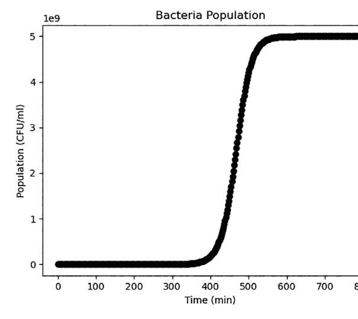

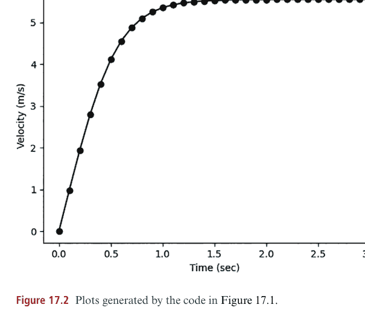

图 17.2 由图 17.1 中的代码生成的图表。

#### 模块导入：

```python
import operator
```

#### 类定义：

```python
class AuthoredResource(object):
    def __init__(self, authorlast, authorfirst, title):
        self.authorlast = authorlast
        self.authorfirst = authorfirst
        self.title = title

class Book(AuthoredResource):
    def __init__(self, authorlast, authorfirst,
                 title, place, publisher, year):
        super().__init__(authorlast, authorfirst, title)
        self.place = place
        self.publisher = publisher
        self.year = year

    def write_bib_entry(self):
        return self.authorlast \
               + ', ' + self.authorfirst \
               + ', ' + self.title \
               + ', ' + self.place \
               + ': ' + self.publisher + ', ' \
               + self.year + '.'
```

图 17.3 定义了一个父类 `AuthoredResources`，两个子类 `Book` 和 `Article`，一个 `Bibliography` 类，以及一个创建后三个类的实例并生成图 17.4 中输出的主程序的代码。

# 17 类与继承

```python
class Article(AuthoredResource):
    def __init__(self, authorlast, authorfirst,
                 articletitle, journaltitle,
                 volume, pages, year):
        super().__init__(authorlast, authorfirst, articletitle)
        self.journaltitle = journaltitle
        self.volume = volume
        self.pages = pages
        self.year = year

    def write_bib_entry(self):
        return self.authorlast \
               + ', ' + self.authorfirst \
               + ' (' + self.year + '): ' \
               + '"' + self.title + '", ' \
               + self.journaltitle + ', ' \
               + self.volume + ', ' \
               + self.pages + '.'
```

图 17.3（第 2 部分）

模型模拟：细菌种群（bacteria.y）随时间（bacteria.t）的变化，以及物体速度（fall.y）随时间（fall.t）的变化。

关于使用面向对象编程（OOP）分解科学模型的更复杂示例，请参阅 Lin (2009)。

### 17.1.2 科学文献示例

出版物在科学和工程领域中扮演着重要角色，用于提炼、记录和分享研究与项目的结果。¹ 这些论文和报告中的参考文献或参考书目记录了所查阅的资源。

图 17.3 展示了定义 `AuthoredResource`、`Book`、`Article` 和 `Bibliography` 类的代码。`AuthoredResource` 是一个父类，它定义了 `Book` 和 `Article`（以及任何其他具有单一作者和标题的资源）共享的属性。`Book` 和 `Article` 类对象分别代表一本书和一篇文章。两者都利用了 `AuthoredResource`，并添加和/或自定义了属性和方法，以使这些类的对象按照我们期望的方式运行。例如，对于 `Book` 对象，我们期望书目条目（由 `write_bib_entry` 生成）包含出版商信息，并将年份放在末尾。然而，对于 `Article` 对象，我们期望年份在作者姓名后的括号内，并且文章标题用引号括起来。`Bibliography` 类存储一个由 `Book` 和 `Article` 对象组成的列表，这些对象构成了参考文献。

¹ 本节部分内容改编自 Lin (2012) 的第 7 章。

```python
class Bibliography(object):
    def __init__(self, entrieslist):
        self.entrieslist = entrieslist

    def sort_entries_alpha(self):
        tmp = sorted(self.entrieslist,
                     key=operator.attrgetter('authorlast',
                                            'authorfirst'))
        self.entrieslist = tmp
        del(tmp)

    def write_bibliog_alpha(self):
        self.sort_entries_alpha()
        output = ''
        for ientry in self.entrieslist:
            output = output \
                     + ientry.write_bib_entry() + '\n\n'
        return output[:-2]

#- 主程序：

balewa = Book('Balewa', 'Jessica', 'Numerical Methods',
              'New York', 'NumComp Press', '2010')
jones = Book('Jones', 'Timothy', 'Art and Visualization',
             'Seattle', 'RenderAV', '2005')
wong = Article('Wong', 'Peilan', 'Protein Folding',
               'J. Bio. Adv. C', '19', '1-11', '2017')

bibliog = Bibliography([wong, jones, balewa])
print(bibliog.write_bibliog_alpha())
```

图 17.3（第 3 部分）

图 17.3 以一个导入语句（第 3 行）开始。第 8-12 行定义了 `AuthoredResource` 类。这个类是一个父类，即一个为继承自 `AuthoredResource` 的子类提供属性和方法的类。`AuthoredResource` 设置了存储作者姓氏、名字和资源标题的属性。第 15-29 行定义了 `Book` 类。除了设置属性外，这个类定义还定义了 `write_bib_entry` 方法，该方法为书籍生成格式正确的书目条目。第 30-47 行定义了 `Article` 类。除了设置属性外，这个类定义也定义了 `write_bib_entry` 方法，该方法为文章生成格式正确的书目条目。

图 17.3 的第 48-65 行定义了 `Bibliography` 类。该类的对象接受一个资源对象列表（即 `Book` 或 `Article` 类的对象），并将其保存为 `self.entrieslist` 属性。有两个方法可以操作这个列表：`sort_entries_alpha` 确保 `self.entrieslist` 列表按作者姓氏然后名字排序，而 `write_bibliog_alpha` 输出 `self.entrieslist` 中资源的参考文献，按作者字母顺序排列，并进行适当格式化。在主程序（第 70-78 行）中，我们创建了一个 `Article` 对象和两个 `Book` 对象（使用虚构数据）。我们将这些对象放入一个 `Bibliography` 对象中。最后，我们通过调用 `bibliog` 对象的 `write_bibliog_alpha` 方法（第 78 行）来显示使用这些对象生成的参考文献。图 17.3 中主程序的输出如图 17.4 所示。

Balewa, Jessica, Numerical Methods, New York: NumComp Press, 2010.

Jones, Timothy, Art and Visualization, Seattle: RenderAV, 2005.

Wong, Peilan (2017): "Protein Folding," J. Bio. Adv. C, 19, 1-11.

图 17.4 图 17.3 中主程序的输出。

在我们的图 17.3 类中，所有**构造函数**都使用位置输入参数。相比之下，在我们的图 17.1 类中，所有构造函数都使用关键字输入参数。两种机制（或两者的混合）都是可接受的。使用关键字输入参数使我们能够设置默认值，在图 17.1 中，我们用它来确保无法创建 `Model` 的实例。但是，使用位置输入参数也是可以的。

## 17.2 Python 编程基础

回顾我们对面向对象编程（OOP）的介绍，属性和方法被组合在一个实体中。² 这个实体是对象的一种模式或形式的实现，称为 `class`（类）。这个实现被称为该 `class` 的实例或对象。本节我们描述四个主题：如何在 Python 中定义类，什么是继承以及如何使用继承，使用 `sorted` 进行更复杂的排序，以及为什么我们应该创建自己的类。在讨论这些主题时，请随时参考图 17.1 和图 17.3 中的代码示例。

### 17.2.1 定义和使用类

类定义以 `class` 语句开始，其语法形式如下：

```python
class <class name>(<parent class>):
```

`<class name>` 遵循首字母大写约定，其中名称中的每个单词都大写。如果没有父类，则 `<parent class>` 设置为 `object`。如果有父类，则该类的名称位于这些括号内。父类的概念在第 17.2.2 节中讨论。例如，在图 17.1 中，`Model` 没有父类，因此类定义行是（第 9 行，为方便起见在此重现）：

```python
class Model(object):
```

然而，`LogisticEquation` 有一个父类（即 `Model`），因此它的类定义行是（第 23 行，为方便起见在此重现）：

```python
class LogisticEquation(Model):
```

`class` 行之后的块是类定义。在定义内部，我们将类的实例称为 `self`。我们需要在 `class` 语句中使用某个标记来表示作为类实例的对象，因为该语句是创建此类对象的模板。在 `class` 语句执行之前，不存在这样的对象。一旦创建了类的真实实例，我们就将该对象的名称“代入” `self`。我们可以根据需要创建任意数量的类实例，并且所有这些实例都将有不同的名称。例如，在图 17.3 的第 70-73 行，我们创建了两个 `Book` 类的实例，分别命名为 `balewa` 和 `jones`。

#### 属性和方法

对类实例属性的引用必须在属性名称前加上 `self`。例如，在 `FallingObject` 类中，空气密度 `rhoa` 属性（图 17.1 第 38 行）在类定义中被称为 `self.rhoa`。如果一个变量名前没有 `self`，那么该变量就不是属性。相反，它是一个局部变量，局部于定义它的方法。在类定义中，属性通过标准的赋值符号设置，属性名称在等号左侧，属性被赋予的值在等号右侧。

当调用类实例的方法时，我们遵循涉及 `self` 的类似约定。³ 在调用中，`self` 必须在方法名之前。例如，在 `Bibliography` 类定义中，当我们调用 `sort_entries_alpha` 方法（图 17.3 第 60 行）时，我们输入 `self.sort_entries_alpha()`。

方法使用 `def` 语句定义。当我们定义一个方法时，它看起来就像定义一个函数，但有两个区别：定义在 `class` 语句的主体内，并且任何方法的第一个参数都是 `self`。即使一个没有任何“实际”参数的方法，在 `def` 行中也会有 `self` 作为参数。例如，参见图 17.3 第 59 行。`self` 的使用是 Python 告诉方法“使用此实例中所有先前定义的属性和方法”的方式，因为 `self` 代表该实例。就好像 `self` 作为参数被传入一样。然而，当我们调用方法时，`self` 并不是一个真正的参数。我们从不输入 `self`，也不在调用方法时在其位置放置参数。

² 本节部分内容改编自 Lin (2012) 的第 7 章。

³ 存在不附加到类实例而是附加到类本身的类方法。这些超出了本工作的范围。

最后，我们可以编写返回值的方法（例如，图17.3中`Article`类的`write_bib_entry`方法）、将新值保存到属性的方法（例如，图17.3中第56行将新值赋给`entrieslist`属性）、两者兼有的方法，或者两者皆无的方法。方法也可以调用其他方法，包括在其他地方定义的方法和在类中定义的方法（例如，分别是图17.1的第13行和图17.3的第60行）。

#### 构造函数以及对象的创建和使用

通常，我们在类中定义的第一个方法是`__init__方法。这个方法被称为构造函数，当我们创建类的实例时会自动执行（注意其特定的、特殊的名称）。实际上，`__init__`的参数就是创建类实例的参数。在图17.3的第70-71行，我们创建了对象`balewa`。构建对象时传入了六个参数。这些参数与图17.3第16-17行中的参数（不包括`self`）相匹配。也就是说，这里的参数：

```
balewa = Book('Balewa', 'Jessica', 'Numerical Methods',
            'New York', 'NumComp Press', '2010')
```

与这里的非`self`参数匹配：

```
def __init__(self, authorlast, authorfirst,
            title, place, publisher, year):
```

`__init__`方法不是通过输入`__init__`来调用的，而是通过创建对象来调用的，即输入类名，然后在括号内输入参数列表（该列表也可以为空，如图17.1的第47和48行）。因为`__init__`方法在我们创建（或实例化）类的实例时被调用，所以我们通常会在其中放入代码，根据传入构造函数的参数来初始化对象中的属性。

当我们创建一个类的对象时，该对象的类型就是这个类。如果在图17.3的第70-71行创建了`balewa`对象后，我们打印该对象，将会看到：

```
In [1]: balewa = Book('Balewa', 'Jessica', 'Numerical Methods',
            'New York', 'NumComp Press', '2010')
    print(balewa)

<__main__.Book object at 0x7f4324960d68>
```

我们可以根据需要创建任意多个类的实例，就像我们可以创建任意多个整数变量、列表对象或数组对象一样。每个对象彼此独立，但一个类的所有对象都是按照相同的模板（即该类的`class`语句）构造的。

一旦我们创建了类的实例，就可以使用与第9章中相同的语法来访问该对象的属性和方法：我们输入对象名、一个句点，然后是属性名或方法名。调用方法时，我们还需要为参数列表添加括号。使用属性的例子包括图17.1第54行的`bacteria.t`和`bacteria.y`。调用对象方法的例子是图17.3第78行的`bibliog.write_bibliog_alpha()`调用。

#### 私有属性和方法

在第9.2.2节中，我们看到名称前没有下划线的属性和方法被认为是公共的，而名称前后都有双下划线的属性和方法是“特殊的”，用于实现运算符特性、命名、底层组件等。有时，在创建自己的类时，我们希望创建一些仅供类定义内部使用的属性和方法，而不希望类的用户访问它们。在Python中，我们通过在属性或方法名称前加上一个或两个下划线（并在名称后加上零个或一个下划线）来将它们界定为`私有`。名称前有一个下划线意味着该属性或方法具有“普通隐私性”，而两个下划线则意味着该属性或方法是“非常私有的”。

在单下划线（普通隐私性）的情况下，解释器不会采取任何措施来阻止某人访问或更改该属性或方法。例如，在这个`RightTriangle`类的示例中，我们提供两条直角边的长度（`self.a`和`self.b`）并计算斜边的长度，我们将斜边保存为`self._c`：

```
In [1]: import numpy as np

class RightTriangle(object):
    def __init__(self, a, b):
        self.a = a
        self.b = b
        self._c = np.sqrt(a**2 + b**2)

    def write_lengths(self):
        return str([self.a, self.b, self._c])

triangle = RightTriangle(3, 4)
print(triangle.write_lengths())
triangle._c = 17.0
print(triangle.write_lengths())

[3, 4, 5.0]
[3, 4, 17.0]
```

当我们在代码的倒数第二行将`triangle._c`设置为17.0时，`_c`属性的值被更改了，尽管`c`前面有一个单下划线。在普通隐私性的情况下，下划线的目的是让类的作者告诉用户：“如果我是你，我不会动这个。”是否听从这个警告取决于类的用户。

如果在属性或方法前有两个下划线，Python解释器会进行“名称修饰”（即在解释器会话中，临时“更改”属性或方法的名称），从而提供一定的保护。⁴ 例如，考虑与上面相同的代码，但存储斜边长度的属性前有两个下划线：

```
In [1]: import numpy as np

class RightTriangle(object):
    def __init__(self, a, b):
        self.a = a
        self.b = b
        self.__c = np.sqrt(a**2 + b**2)

    def write_lengths(self):
        return str([self.a, self.b, self.__c])

triangle = RightTriangle(3, 4)
print(triangle.write_lengths())
triangle.__c = 17.0
print(triangle.write_lengths())
```

```
[3, 4, 5.0]
[3, 4, 5.0]
```

在这种情况下，将`triangle.__c`设置为17.0的倒数第二行代码没有任何效果。

虽然在我们想要创建私有属性或方法时，双下划线方法似乎更可取，但事实证明，在许多或大多数情况下，单下划线机制效果更好。对于科学应用，有时我们希望更大的灵活性和可定制性，使用双下划线可能会使类的使用变得比预期更困难。通常，只需告诉用户不要动某些东西就足够了。他们通常会听从警告。

### 17.2.2 继承

在我们定义自己的类时，我们可能会注意到不同的类彼此之间有相似之处。例如，在图17.3中，`Book`和`Article`类共享一些属性（例如，`self.authorlast`）。在图17.1中，`LogisticEquation`和`FallingObject`类共享`run`方法。继承的思想是为了方便地重用类之间共享的属性和方法。

如果我们有一组类都共享一些属性和方法，继承的基本思想是定义一个单独的类，包含这些共享的属性和方法，然后使用该类作为“基础”，在其上构建具有共享属性和方法的每个类。因此，在图17.3中，我们定义了`AuthoredResource`类，它定义了三个属性并在构造函数中赋值。所有使用`AuthoredResource`作为基础模板来构建的类（即`Book`和`Article`）都自动从这三个属性和`AuthoredResource`定义的构造函数开始。

具有共享属性和方法的类被称为“基类”、“超类”或“父类”。使用具有共享属性和方法的类并对其进行添加或更改的类被称为“派生类”、“子类”或“子类”。以下表述都是可互换的：派生类继承自基类，子类继承自超类，子类继承自父类。正如我们在第17.2.1节中看到的，子类通过在子类名称后的括号中放入父类名称来指定要继承的父类。因此，在：

```
class LogisticEquation(Model):
```

`Model`是父类，`LogisticEquation`是子类。最顶层的父类是一个名为`object`的内置类，它定义了支持类的所有底层基础设施。如果我们定义的类没有其他父类，我们就在`class`语句的括号中放入`object`。

当我们定义的类具有“超集/子集”性质时，继承最为有用。也就是说，某些类在某种程度上是更广泛类别的子集。在我们的第17.1节示例中，更广泛的`Model`类别包含特定类型的模型，如`LogisticEquation`和`FallingObject`（以及其他尚未定义的模型）。更广泛的`AuthoredResource`类别包含特定类型的资源，如`Book`和`Article`（以及其他尚未定义的资源）。

继承可以涵盖多个“代”或“层级”。一个类可以是另一个类的父类，而该子类又可以是另一个子类（或“孙类”）的父类，依此类推。例如，在Matplotlib中，`Artist`类是（私有的）`_AxesBase`类的父类。反过来，`_AxesBase`是`Axes`类的父类，而`Axes`类又是`PolarAxes`和`GeoAxes`类的父类。⁵ 我们也将一个类的所有父类、祖父类等称为该类的“祖先”。因为每个子类都建立在其父类之上，因此从父类的属性和方法开始，如果我们更改或添加继承谱系中最顶层父类的属性或方法，该更改或添加会传播到该谱系中的所有子类、孙类等！通过这种方式，正确构建的继承结构是编写更易于维护代码的强大工具。

**使用继承时检查类型** Python为我们提供了函数/表达式，用于检查对象是否属于特定类，或者是否属于特定类或其任何祖先。

---
⁴ https://docs.python.org/3/tutorial/classes.html#private-variables (访问于2020年7月3日)。
⁵ https://matplotlib.org/3.1.0/api/artist_api.html (访问于2020年7月4日)。

# 17 类与继承

要判断一个对象是否属于某个类，我们可以使用 `type` 函数进行表达式判断；要判断一个对象是否是某个类的实例，我们可以使用 `isinstance` 函数。假设以下代码行是在图 17.3 的第 78 行之后执行的：

```
In [1]:
    print(type(balewa) == Book)
    print(type(balewa) == AuthoredResource)
    print(isinstance(balewa, Book))
    print(isinstance(balewa, AuthoredResource))
    print(isinstance(balewa, Article))
```

True
False
True
True
False

`In [1]` 的前两行分别检查对象 `balewa` 是否**特指**为 `Book` 对象或 `AuthoredResource` 对象。结果是前者为真，后者为假。`In [1]` 的后三行检查 `balewa` 是否是 `Book`、`AuthoredResource` 或 `Article` 的实例，这里的“实例”是指它属于该特定类**或其祖先类**。也就是说，内置函数 `isinstance` 对于作为第二个输入参数给定的类的所有**后代类**也会返回 `True`。因此，`In [1]` 中 `isinstance` 的第三和第四行调用返回 `True`，因为 `balewa` 的类型是 `Book`，并且是 `AuthoredResource` 的后代。然而，`balewa` 的类型不是 `Article` 或其任何后代（它没有后代），所以 `isinstance` 返回 `False`。

如果我们不知道一个对象可能的类名，我们可以将该对象的 `type` 调用输出与我们想要检查的可能类的对象的 `type` 调用结果进行比较。例如，如果我们有一个对象 `values`，并且想看看它是否是一个列表对象：

```
type(values) == type([])
```

就能实现我们的目的。我们向第二个 `type` 调用传入了一个空列表。

**重写** 使用继承的一种常见方式是在父类中定义一个方法，然后在子类中重写该定义。这样，子类中的版本就针对该类更具体的用例进行了定制。在我们图 17.1 和 17.3 的示例中，我们在这些类的子类中重写了 `Model` 和 `AuthoredResource` 构造函数。一旦一个方法被重写，它实际上就取代了该方法的父类版本。

然而，当我们重写一个方法时，我们通常希望在父类版本的基础上增加功能，而不是完全抛弃父类版本的功能。也就是说，我们通常希望我们的新方法执行父类版本的方法，并且执行额外的代码行。在图 17.3 中，我们希望 `Book` 构造函数不仅分配属性 `self.place`、`self.publisher` 和 `self.year`，还要分配在父类 `AuthoredResource` 中定义的通用属性（即 `self.authorlast`、`self.authorfirst` 和 `self.title`）。我们可以通过使用 `super` 函数来实现这一点。⁶ 调用 `super` 函数会引用该类的父类。如果我们在调用后加上一个点号，然后是方法名，我们就可以引用父类版本的方法。因此，图 17.3 中的第 18 行（为方便起见，此处不带缩进复制如下）：

```
super().__init__(authorlast, authorfirst, title)
```

调用了 `AuthoredResource` 版本的 `__init__`，并将 `authorlast`、`authorfirst` 和 `title` 的值作为参数传入。

Python 支持**多重继承**，即一个类有多个父类。在这种情况下，通常子类会继承父类中定义的所有属性和方法。我们可以通过在 `class` 语句的括号中列出多个父类来添加它们。每个父类在该列表中用逗号分隔。本书不进一步深入探讨多重继承。

### 17.2.3 使用 `sorted` 进行更复杂的排序

在第 16.2.1 节中，我们看到了如何使用内置的 `sorted` 函数对列表进行排序。当我们对字符串或整数等值进行排序时，有一个自然的顺序可以使用：分别是按字母顺序或按值升序。但是，我们如何对用户定义的对象进行排序，包括不同类型的对象呢？

图 17.3 的第 52-57 行定义了 `sort_entries_alpha` 方法，该方法对 `self.entrieslist` 属性进行排序，并用排序后的版本替换旧的 `self.entrieslist` 属性。该方法使用内置的 `sorted` 函数，该函数接受一个关键字参数 `key`，该参数给出了用于对 `sorted` 的参数进行排序的键。该键是使用 `operator` 模块的 `attrgetter` 函数生成的。此函数从被排序元素中提取作为 `attrgetter` 参数列出的名称的属性。传递给 `attrgetter` 的属性名是字符串，因此我们通过它们的字符串名称来引用感兴趣的属性，而不是直接输入它们的名称。这使得程序编写起来容易得多。在第 54-55 行，`attrgetter` 有两个参数：`sorted` 首先按 `attrgetter` 的第一个参数属性名对 `self.entrieslist` 进行索引，然后按第二个进行索引。因此，当我们对 `self.entrieslist` 中的 `Book` 和 `Article` 对象进行排序时，我们首先基于作者的姓氏进行排序，然后基于作者的名字进行排序。

通过键机制，`sorted` 可以用于根据任何标准对任何对象进行排序。毕竟，当我们创建自己的类时，是*我们*决定属性是什么！但是 `sort_entries_alpha` 方法也向我们展示了创建自己的类的一些好处，我们将在第 17.2.4 节中看到。

⁶ https://docs.python.org/3/library/functions.html#super (accessed July 4, 2020).

### 17.2.4 为什么要创建我们自己的类？

在详细描述了面向对象编程之后，我们可能会合理地问：“这有什么大不了的？”从一个层面来看，类似乎只是组织数据和函数的另一种方式。我们不是将它们放在库（或模块）中，而是将它们放在一个类中。即使是继承的行为，它使我们能够轻松地重用类中定义的属性和方法，似乎也可以使用函数来复制。定义一个类、创建对象并调用方法似乎带来了许多额外的麻烦。如果我们只需要一个类及其单个实例，那么面向对象编程就是费力不讨好。对于相对简单的程序，可能最好使用过程式编程。然而，对于更复杂的程序，通过合理地设计我们的类，使我们的对象能够相互配合使用，面向对象结构可以使我们的代码编写和理解起来简单得多，调试起来更容易，并且更不容易出错。

我们在第 17.1.2 节的例子说明了这是如何运作的。回想一下，在那个例子中，我们创建了 `Book` 和 `Article` 类来管理与书籍和文章资源相关的信息。这两个类也都是 `AuthoredResource` 的子类。我们还创建了一个 `Bibliography` 类，它管理一个参考文献列表，给定 `Book` 和 `Article` 对象的实例。在 `Bibliography` 类中，我们定义了一个方法 `sort_entries_alpha` 来对 `Book` 和 `Article` 对象进行排序，以及一个方法 `write_bibliog_alpha` 来使用这些对象生成参考文献。让我们考虑一下每个方法向我们展示了关于面向对象编程的什么。

**`sort_entries_alpha` 关于面向对象编程的说明** 这个方法完成两个主要任务。首先，它根据两种共享的数据类型（属性）对结构完全不同的项目列表进行排序。其次，它使用一个不关心被排序项目细节的排序函数来完成排序，只关心这些项目是否具有这两种共享的数据类型。换句话说，排序函数不关心项目类型，只关心所有项目类型是否都具有 `authorlast` 和 `authorfirst` 属性。

这似乎没什么大不了的，但想想如果我们使用过程式编程来做这样的排序会怎样。首先，每个实例将是一个列表，并带有一个标签说明它是什么类型的资源。例如，图 17.3 中第 74-75 行的 `wong` 对象将由这个列表表示：

```
wong_array = ['article', 'Wong', 'Peilan', 'Protein Folding',
             'J. Bio. Adv. C', '19', '1-11', '2017']
```

我们将编写的过程式编程排序函数需要知道我们想要对这个列表的哪些元素进行排序（这里是列表的第二个和第三个元素）。*但是，这些数据在每个列表中的位置很可能不同*，具体取决于资源类型（例如，书籍与文章）。因此，在我们的排序函数中，我们需要编写多个 `if` 测试（基于资源类型）来提取列表中正确的字段进行排序。但是，如果我们改变想要排序的键——比如，从作者姓名改为出版日期——我们就必须*更改用于排序的元素索引*。这意味着要*手动*更改排序函数中 `if` 测试的代码。

如果我们只有少数几种资源类型，手动进行代码修改并测试其有效性是很容易的。但如果我们有数十种甚至数百种资源类型呢？我们就必须修改排序函数中数十或数百个`if`语句。这简直是一场噩梦！想想看，仅仅因为按键错误就可能引入多少潜在的bug！然而，在面向对象编程中，我们可以随意切换排序键（只需更改图17.3中第54-55行的属性名），并支持任意数量的资源类型，*无需额外的代码修改*。无需更改任何`if`测试。这就是面向对象编程相对于过程式编程的优势。使用面向对象框架构建的代码自然能产生更灵活、更可扩展的程序，从而显著减少bug。

**`write_bibliog_alpha`所展示的OOP特性** 在这里，我们同样要问：在过程式编程中，我们会如何编写一个输出按字母顺序排列的参考文献的函数？我们可能会写出类似下面这样的草稿：

```
1  def write_bibliog_function(list_of_entries):
2      <... 打开输出字符串或文件 ...>
3
4      for i in range(len(list_of_entries)):
5          ientryarray = list_of_entries[i]
6
7          if ientryarray[0] == "book":
8              <... 调用处理书籍参考文献条目的函数，
9                  并保存到输出字符串或文件 ...>
10
11         elif ientryarray[0] == "article":
12             <... 调用处理文章参考文献条目的函数，
13                 并保存到输出字符串或文件 ...>
14
15         <... 处理其他资源类型 ...>
16
17     <... 关闭输出字符串或文件 ...>
```

同样，在这个解决方案草稿中，我们看到在过程式编程中，我们必须在函数中编写`if`测试，以确保根据资源类型（例如书籍或文章）通过调用特定的格式化函数来正确格式化每个资源的参考文献条目。事实上，对于*每一个*处理多种资源类型的函数，我们都需要这种`if`测试树。如果我们引入另一种资源类型（比如网页），我们就需要在*所有*包含此类`if`测试树的函数中添加另一个`if`测试。这无异于灾难的配方：极其容易在一个函数中无意添加了一个`if`测试，却忘记在另一个函数中添加；在一个函数的某个`if`测试中出现拼写错误，而在另一个函数中却没有，等等。

# 17 类与继承

相比之下，使用对象，*添加另一种资源类型无需对`sort_entries_alpha`进行任何代码修改或添加*。新的资源类型只需为其定义一个`write_bib_entry`方法即可。因此，如果我们希望能够在参考文献中列出网页，我们只需要定义类似以下的内容：

```
class WebPage(AuthoredResource):
    def __init__(self, authorlast, authorfirst, title, url):
        super().__init__(authorlast, authorfirst, title)
        self.url = url

    def write_bib_entry(self):
        return self.authorlast + ', ' + self.authorfirst + ', ' \
            + '"' + self.title + '", ' \
            + self.url + '.'
```

`WebPage`类的对象现在可以包含在`Bibliography`所描述的参考文献中，并且网页条目将按照网页条目应有的格式进行格式化。*无需对`Bibliography`进行任何修改*。而且，如果将来我们有更多资源类型（例如DVD、音频片段、个人通讯等），我们可以像添加`WebPage`一样添加它们。我们无需修改`Bibliography`来适应额外的资源类型。这简单多了！

最后，我们来探讨关于OOP灵活性的一个更微妙之处。在`Book`和`Article`类中，我们定义了一个`write_bib_entry`方法，该方法创建一个针对该类资源类型正确格式化的参考文献条目。在`write_bibliog_alpha`中，我们利用该方法通过遍历`self.entrieslist`列表并调用附加到列表中每个对象的`write_bib_entry`方法（图17.3中的第62-64行）来生成参考文献。

但请注意，我们这样做时，除了要求对象具有`write_bib_entry`方法外，对`self.entrieslist`中的对象没有任何其他约束。这些对象不必是相同的类或类型，也不必有共同的祖先（尽管在当前情况下`Book`和`Article`确实有一个共同的父类）。事实上，由于Python是动态类型的，*ientry*的类型在图17.3第62行的每次循环*迭代*中都会改变。在进入循环之前，对*ientry*的类型没有任何假设。

这种灵活性源于OOP中我们精心构建了对象使用者与对象交互或接口的方式。在这种情况下，通过为任务定义一个通用的方法名，并且*既*将完成该任务的细节放入方法中（这类似于过程式编程），*又*根据方法所在的类按需定制这些细节（这是过程式编程无法做到的），我们抽象掉了在调用方法层面思考这些细节的需要。因此，我们可以按照上述方式遍历这些对象，而无需以任何显式方式考虑对象的类型。

### 17.2.5 对象和模块的自动化处理

在图17.3的`write_bibliog_alpha`方法中，我们遍历了一个对象列表，并调用了附加到每个对象的`write_bib_entry`方法。在这个例子中，我们知道要执行哪个方法，但如果我们希望计算机来选择要执行的方法（或要访问的属性）呢？我们目前学到的语法无法做到这一点，因为我们必须输入对象的名称、一个点号，然后是属性或方法名来访问属性或方法。

Python提供了一些函数和方法，我们可以用来克服这个限制。这些例程使我们能够使用字符串引用来访问和操作属性和方法。因为字符串可以由计算机生成，也可以从文件中读取，这使我们能够编写代码来指示计算机访问和/或调用属性和函数。

以下内置函数对于这种属性和方法的“自动化”操作非常有用：⁷

- `callable(<obj>)` 如果对象`<obj>`是可调用的，则返回`True`，否则返回`False`。
- `delattr(<obj>, <name>)` 删除对象`<obj>`中由字符串`<name>`指定的属性或方法。
- `getattr(<obj>, <name>)` 返回对象`<obj>`中由字符串`<name>`指定的属性或方法的值。
- `hasattr(<obj>, <name>)` 如果对象`<obj>`中存在由字符串`<name>`指定的属性或方法，则返回`True`，否则返回`False`。
- `setattr(<obj>, <name>, <value>)` 将对象`<obj>`中由字符串`<name>`指定的属性或方法赋值为对象`<value>`。

尽管我们一直将属性和方法视为两种不同的实体，但在Python中，两者之间的唯一区别是方法是可调用的，而属性不是。事实上，我们可以将方法视为“可调用的属性”，即像任何其他属性一样的对象，只是这些对象是可调用的。因此，所有名称中包含“attr”的上述函数都适用于属性和方法。我们可以使用`callable`来判断我们处理的是属性还是方法（在Python中，属性和方法也是对象）。

下面是一个示例列表，展示了直接输入属性引用或方法调用与使用上述内置函数之一的等价性。示例使用了图17.3中第74-75行定义的`wong`对象：

| 直接输入 | 内置函数 |
| :--- | :--- |
| `del (wong.volume)` | `delattr(wong, 'volume')` |
| `wong.volume` | `getattr(wong, 'volume')` |
| `wong.volume = 5` | `setattr(wong, 'volume', 5)` |

⁷ https://docs.python.org/3/library/functions.html (访问于2020年7月6日)。

# 17 类与继承

因此，以下代码：

```python
callable(getattr(wong, 'volume'))
```

返回 `False`，因为 `wong` 对象中的 `volume` 属性不可调用。

假设我们有一个名为 `Counter` 的类，用于统计草地上观察到的物种数量。我们可以使用该类的对象，例如剧院引座员使用的手持计数器。该类有 `add1`、`add2` 和 `add3` 方法，分别将存储在 `total` 属性中的整数增加一、二或三。以下代码定义了该类，创建了一个 `Counter` 实例，并通过巧妙运用 Python 的循环和字符串处理例程自动调用了上述每个方法：

```python
In [1]: class Counter(object):
        def __init__(self, init):
            self.total = init

        def add1(self):
            self.total += 1

        def add2(self):
            self.total += 2

        def add3(self):
            self.total += 3

count = Counter(0)
for i in range(3):
    method_name = 'add' + str(i+1)
    getattr(count, method_name)()
    print(str(count.total))
```

```
1
3
6
```

在单元格 `In [1]` 代码的倒数第二行中，`getattr(count, method_name)` 获取了 `add1`、`add2` 和 `add3` 方法。随后的 `()` 调用了该方法。

在上面的例子中，我们在使用 `getattr` 之前没有先检查 `count` 是否有一个名为 `method_name` 的方法。这通常是一种不好的编程实践，因为如果方法 `method_name` 不存在，`getattr` 将会抛出一个异常，如果未处理，将导致程序停止。更好的做法是先使用 `hasattr` 检查属性 `method_name` 是否存在，使用 `callable` 检查它是否可调用（即，是一个方法而不是一个属性），然后再使用 `getattr` 获取该方法。

如果我们不知道以 'add' 开头的方法名称怎么办？我们只想执行对象中的所有公共方法。在第 9.2.2 节中，我们看到 `dir` 函数会生成对象中所有属性和方法的列表。因此，我们可以遍历所有属性和方法的列表，找到可调用的非私有方法，并调用这些方法。假设 `Counter` 如上所述定义，以下代码实现了这些步骤：

```python
In [1]: count = Counter(0)
for iattr in dir(count):
    if callable(getattr(count, iattr)) and (iattr[0] != '_'):
        getattr(count, iattr)()
        print(str(count.total))
```

```
1
3
6
```

`dir(count)` 调用返回一个字符串列表，因此 `iattr` 是 `count` 中每个属性和方法的字符串名称（包括公共和私有属性和方法）。

我们可以将这种对对象内属性的自动处理方式应用于模块内函数的处理。在下面的例子中，我们遍历 NumPy 模块中的所有属性和函数，查找以 'cos' 开头的函数，并使用 `angle` 作为输入调用它们（这些条件选择了余弦和双曲余弦函数）：

```python
In [1]: import numpy as np

angle = 0.7
for iattr in dir(np):
    if callable(getattr(np, iattr)) and \
       (iattr[0] != '_') and \
       ('cos' == iattr[:3]):
        temp = getattr(np, iattr)(angle)
        print(iattr + ': ' + str(temp))
```

```
cos: 0.7648421872844885
cosh: 1.255169005630943
```

在图 16.4 中，我们将统计函数存储在一个字典中，并遍历调用这些函数，而无需手动输入每个调用。但是，我们仍然需要手动将这些函数添加到 `metrics` 字典中。使用与上面类似的语法，我们现在可以自动将任何我们想要的函数添加到该字典中。

在上面的例子中，我们查看了对象和模块的属性和方法。如果我们想操作当前作用域中定义的变量或函数怎么办？内置的 `locals` 函数（不带输入参数调用）返回一个定义了局部变量的字典。定义的名称是字典的键，值是对象本身。因此，在字典中，函数的字符串名称连接到它所引用的函数对象。`globals` 函数对全局作用域（即整个模块）执行相同的操作。⁸

⁸ https://docs.python.org/3/library/functions.html (accessed August 19, 2020).

这些例子说明了一个更深层次的真理：在 Python 中，几乎所有东西都是（或者我们可以将其视为）对象。列表、数组、字典以及内置或用户编写的类的对象，正如我们所期望的那样，是对象。但是，大多数变量、函数、属性、方法、类、模块和包也是如此。我们越习惯于以面向对象的方式使用 Python，就越能利用其强大的工具。

## 17.3 动手试试！

本节中的示例针对第 17.2 节的主要主题。我们创建自己的类，练习使用继承扩展一个类，并重写一个方法。我们还练习使用用户定义的类来完成更复杂的排序和对象的自动处理。

### 动手试试！17-1 创建一个类：元素信息

创建一个 `Element` 类，将以下关于元素的信息作为属性保存：

- 元素符号。
- 质子数。
- 中子数（在其最常见的同位素中）。

使用构造函数设置属性。包含一个 `write_summary` 方法，该方法使用上面列出的三部分信息写出一条摘要消息。为某个元素创建该类的一个实例，并输出摘要消息。

### 动手试试！答案 17-1

此代码解决了问题：

```python
class Element(object):
    def __init__(self, symbol, num_protons, num_neutrons):
        self.symbol = symbol
        self.num_protons = num_protons
        self.num_neutrons = num_neutrons

    def write_summary(self):
        return self.symbol + ': ' + str(self.num_protons) \
                       + ' proton(s), ' + str(self.num_neutrons) \
                       + ' neutron(s).'

hydrogen = Element('H', 1, 0)
print(hydrogen.write_summary())
```

```
H: 1 proton(s), 0 neutron(s).
```

这个类不是除了最顶层父类 `object` 之外的另一个父类的子类，因此在 `class` 语句中，`object` 被放在括号内。请记住，`write_summary` 没有输入参数，因为它需要处理的所有信息都存储在对象属性中。`write_summary` 返回一个字符串变量。

### 动手试试！17-2 私有属性：元素信息

我们如何修改动手试试！17-1 中的 `Element` 类，使质子数和中子数成为私有属性？相应地修改类定义。

### 动手试试！答案 17-2

我们修改 `Element`，使 `self.num_protons` 和 `self.num_neutrons` 的名称前有一个（或两个）下划线（在 `self` 和点之后）。因此，类定义将变为：

```python
class Element(object):
    def __init__(self, symbol, num_protons, num_neutrons):
        self.symbol = symbol
        self._num_protons = num_protons
        self._num_neutrons = num_neutrons

    def write_summary(self):
        return self.symbol + ': ' + str(self._num_protons) \
               + ' proton(s), ' + str(self._num_neutrons) \
               + ' neutron(s).'
```

前导下划线是属性名称的一部分，因此在类定义中引用该属性时必须包含它。通过添加单个前导下划线，属性被设置为“普通私有”。为了更高的私有性，我们会添加两个前导下划线。

### 动手试试！17-3 扩展一个类：科学文献

对于图 17.3 中的 `Book` 和 `Article` 类，创建一个属性 `self.natural_name`，该属性存储名字和姓氏，就像按姓名称呼此人一样。因此，对于图 17.3 第 72-73 行中的 `jones` 对象，`jones.natural_name` 将被设置为 `'Timothy Jones'`。让这个属性由类的构造函数设置。

### 动手试试！答案 17-3

解决这个问题最简单的方法是在图 17.3 第 12 行之后的 `AuthoredResource` 构造函数中添加以下行：

```python
self.natural_name = self.authorfirst + ' ' + self.authorlast
```

我们也可以将这行代码分别放入 `Book` 和 `Article` 的每个构造函数中，但由于继承机制，将代码放在 `AuthoredResource` 中，该属性就会在 `Book` 和 `Article` 中自动创建。

### 动手试试！17-4 重写：元素信息

考虑来自动手试试！17-1 的 `Element` 类。创建一个 `AbbrevElement` 类，它是 `Element` 的子类，但重写 `write_summary` 方法，使其使用符号来编写摘要。如下所示：

```
In [1]: hydrogen = AbbrevElement('H', 1, 0)
        print(hydrogen.write_summary())

        H: 1 p, 0 n.
```

### 动手试试！答案 17-4

这个类定义解决了问题：

```
class AbbrevElement(Element):
    def write_summary(self):
        return self.symbol + ': ' + str(self.num_protons) \
                             + ' p, ' + str(self.num_neutrons) \
                             + ' n.'
```

### 动手试试！17-5 自定义异常类：文件输入/输出

在第 9.2.7 节中，我们学习了使用异常类来引发和处理错误情况。继承的一个用途是创建自定义异常类，用于特定的错误情况。假设我们想为处理一个名为 `climate_data.txt` 的特定气候数据文件不存在的情况，创建一个 `FileNotFoundError` 异常的自定义版本。在下面的代码示例中，我们调用一个函数 `access_climate_data`，如果 `climate_data.txt` 文件不存在，它会引发我们的自定义异常。在这种情况下，会生成一个默认版本并填充默认值，然后我们再次尝试访问该文件：

```
try:
    access_climate_data()
except ClimateDataNotFoundError:
    create_default_file()
    access_climate_data()
```

函数 `create_default_file` 创建文件的默认版本，这样第 5 行再次尝试访问文件对象时就能成功。异常类 `ClimateDataNotFoundError` 就是我们想要创建的自定义异常。

### 动手试试！答案 17-5

自定义异常类定义如下：

```
class ClimateDataNotFoundError(FileNotFoundError):
    pass
```

如果愿意，我们可以更改 `FileNotFoundError` 的一些属性或重写其一些方法，但我们不必这样做。尽管我们没有向类定义添加任何额外功能，但通过命名一个新类，我们确实获得了额外的功能：定制处理此类错误的能力。请参阅 Python 文档中关于错误和异常的讨论。我们提供了一个指向该页面的最新链接，位于 www.cambridge.org/core/resources/pythonforscientists/refs/，参考文献 13。Python 文档还包含一个内置异常列表；指向该页面的最新链接位于 www.cambridge.org/core/resources/pythonforscientists/refs/，参考文献 12。

### 动手试试！17-6 使用 sorted 排序：科学文献目录

修改图 17.3 中的 `Bibliography` 类，使 `sort_entries_alpha` 能够根据 `self.entrieslist` 中存储对象的 `title` 属性对 `self.entrieslist` 的内容进行排序。

### 动手试试！答案 17-6

我们只需将图 17.3 中的第 53-55 行更改为：

```
tmp = sorted(self.entrieslist,
            key=operator.attrgetter('title'))
```

### 动手试试！17-7 自动化函数调用：数据分析

假设我们有一个名为 `data` 的一维数值数据数组。我们有一个文件 `metrics.txt`，它包含一个由 NumPy 统计函数的文本名称组成的单列文件，例如：

```
mean
median
std
```

所有在该文件中列出的函数都使用单个参数调用。编写代码来计算并打印出 `metrics.txt` 中给出的所有统计函数的结果，无论有 3 个、30 个还是更多。假设该文件中的函数列表构造正确（例如，没有拼写错误），并且 NumPy 已作为 `np` 导入。

### 动手试试！答案 17-7

这段代码将解决问题（假设 `data` 已经定义）：

```
fobj = open('metrics.txt', 'r')
metrics = fobj.readlines()
fobj.close()

metrics = [ival[:-1] for ival in metrics]

for iattr in metrics:
    temp = getattr(np, iattr)(data)
    print(iattr + ': ' + str(temp))
```

我们在第 5 行使用列表推导式来去除从文件读入的每个元素中的换行符。在每个结果（`temp`）之前，代码将打印统计函数的名称（`iattr`）。

## 17.4 更多学科特定实践

本章的学科特定 Jupyter 笔记本涵盖以下主题：

- 定义和使用类。属性和方法，构造函数以及创建和使用对象，以及私有属性和方法。
- 继承。
- 使用 `sorted` 进行更复杂的排序。
- 自动化处理对象和模块。

## 17.5 章节复习

### 17.5.1 自测题

尝试在不看书或任何其他资源，也不使用 Python 解释器的情况下完成这些题目。这些自测题的答案在本章末尾。

**自测题 17-1**
描述 `class` 语句中包含的内容。

**自测题 17-2**
在类定义中，`self` 代表什么？它在类定义外部使用吗？

**自测题 17-3**
在面向对象编程中，什么是属性和方法？

**自测题 17-4**
如果我们有一个描述一维随机游走模型的类 `RandomWalk1D`，创建一个初始化为零的 100 个元素的 x 值数组的代码是什么？

**自测题 17-5**
假设我们正在定义一个名为 `Blueprint` 的类，它有一个方法 `normalize_units`。此方法接受一个输入参数，一个字符串，其值为 'si' 或 'us'，分别选择国际单位制（SI）单位或美国惯用单位（即英尺等）。该方法遍历蓝图的所有组件，并在需要时将所有测量值转换为通过位置输入参数指定的单位系统。它不返回任何值。如果我们正在另一个方法 `render_in_si`（后者以指定的单位系统将蓝图显示到屏幕上）中，调用此方法的代码是什么？如果我们有一个名为 `building` 的 `Blueprint` 对象，从类定义外部调用 `normalize_units` 方法会有什么不同？

**自测题 17-6**
在 Python 的类定义中，构造函数方法的名称是什么？

**自测题 17-7**
假设我们正在定义一个类 `Engine`。以下是创建此类实例的一个示例：

```
civic = Engine('gasoline', cyl=8)
```

此类构造函数的可能签名是什么？

**自测题 17-8**
Python 如何表示私有属性和方法？

**自测题 17-9**
子类与父类有什么关系？

**自测题 17-10**
如果我们创建一个类 `ClimateModel`，它是图 17.1 中 `Model` 的子类，并且我们决定重写 `run` 方法，那么在 `ClimateModel` 定义中调用 `Model` 版本的 `run` 的语法是什么？

**自测题 17-11**
假设我们有一个对象列表 `labels`，它由各种不同类别的对象组成，这些对象存储了包含各种实验设备的实验室的标签信息。假设已导入 operator 模块，描述以下代码行的作用：

```
post_sort = sorted(labels,
                  key=operator.attrgetter('style', 'weight'))
```

**自测题 17-12**
假设我们有一个名为 `model` 的 `GrowthModel` 类对象。编写代码来检查该对象是否有一个名为 `run` 的方法，如果有，则执行该方法。不要使用包含句点的语法。假设 `run` 不接受输入参数且没有返回值。

### 17.5.2 章节总结

在本章中，我们学习了如何创建和使用我们自己的类，以及如何使用继承从另一个类派生一个类。通过设计自己的类的能力，我们发现我们拥有了使用过程式编程更难获得的能力。从这个意义上说，本章在某种程度上是对面向对象编程的颂歌：这种编程风格使我们能够编写*既*更复杂*又*更可靠的程序。我们在本章涵盖的具体主题包括：

- 定义和使用类
  - 类通过 `class` 语句定义，该语句给出类名和任何父类。
  - `self` 标记在类语句中用于引用类定义正在定义的类的实例。通过这种方式，名称以 `self` 和句点开头的变量引用该实例的属性和方法。
  - 属性通过常规变量赋值设置。
  - 方法的定义就像类内部有函数一样（即，以 `def` 语句开头）。
  - 要调用一个方法，我们从 `self` 开始，添加一个句点，然后是方法名，并添加括号来容纳参数列表（根据方法的不同，参数列表可能为空）。
  - 用户编写的类的实例通过给出类名和一对括号来创建。在括号内，我们放入构造函数所需的任何参数。
  - 构造函数是类定义中名为 `__init__` 的方法。
  - 私有属性和方法通过名称表示：名称的字母部分前有一个或两个下划线，字母部分后有零个或一个下划线。如果名称在字母部分前后都有两个下划线，这些是特殊属性和方法，在第 9.2.2 节中讨论。

# 17 类与继承

-   以单下划线开头的私有属性和方法是约定俗成的私有。以双下划线开头的私有属性和方法是“非常私有”的，Python 解释器会进行“名称修饰”，以提供一些保护，防止意外访问这些属性和方法。

-   继承
    -   子类如果基于父类构建，则从父类定义的属性和方法开始。这被称为继承。
    -   当子类在某种程度上是父类的“子集”或“特定情况”时，继承是最佳使用方式。通常，子类会在从父类获得的内容基础上添加额外的属性或方法。
    -   父类也称为基类或超类。子类也称为派生类或子类。
    -   继承可以跨越多代。一个类的父类、祖父母等被称为祖先。一个类的子类、孙辈等被称为后代。
    -   我们可以通过将 `type` 函数的输出与特定类进行比较来检查对象的具体类型。如果我们想检查一个对象是否是特定类或具有特定类作为其祖先，可以使用 `isinstance` 函数。
    -   子类可以覆盖它从父类继承的方法。在这些情况下，子类仍然可以使用内置函数 `super` 来引用父类版本的方法。
    -   Python 支持多重继承，即一个子类有多个父类。

-   使用 `sorted` 进行更复杂的排序以及自动处理对象和模块
    -   `operator` 模块有一个函数 `attrgetter`，它使我们能够指定每个对象的哪些属性用于使用内置 `sorted` 函数对对象列表进行排序。
    -   面向对象编程使我们能够将定制决策推到尽可能低的层次。特别是，它使我们能够从函数的调用级别移除定制决策。
    -   面向对象编程使程序更灵活、更易于维护，因为在任何给定的函数调用级别，我们都不必在该级别使用 `if` 语句来处理所有可能的特殊情况。
    -   Python 具有内置函数，如 `callable`、`delattr`、`getattr`、`hasattr` 和 `setattr`，使我们能够通过引用属性和方法的字符串版本来访问和操作对象。这使我们能够使用循环、字符串操作和其他编程结构来告诉计算机如何自动处理属性和方法。
    -   `dir` 函数返回对象中所有属性和方法的字符串名称列表。我们可以遍历这个列表。
    -   我们用于自动管理对象属性和方法的相同特性也可用于自动管理模块和包的属性和方法。

-   Python 中几乎一切都是对象！

### 17.5.3 自测答案

### 自测答案 17-1

`class` 语句以 `class` 开头，后跟一个空格，然后给出类名、左括号、父类名称（如果没有父类则为 `object`）、右括号，最后是冒号。定义体位于此语句下方，缩进一级。

### 自测答案 17-2

`self` 标记代表由 `class` 语句定义的类的实例。因此，`self` 加上一个句点，然后是属性或方法名，指的是该实例的属性或方法。在类定义外部，通常不使用 `self`。而是使用实例的实际名称。当引用该对象的属性或方法时，使用对象名称，后跟一个句点，然后是属性或方法名。

### 自测答案 17-3

属性是绑定到对象的数据或信息。方法是绑定到对象的函数。

### 自测答案 17-4

在方法中，最好在构造函数中，包含以下行（假设 NumPy 已作为 `np` 导入）：

```
self.x = np.zeros(100, dtype='d')
```

代码需要适当缩进。

### 自测答案 17-5

此代码行在类定义中调用方法：

```
self.normalize_units('si')
```

在类定义外部，对于对象 `building`，我们将通过以下方式调用该方法：

```
building.normalize_units('si')
```

### 自测答案 17-6

构造函数是类定义中名为 `__init__` 的特殊方法。

### 自测答案 17-7

这是构造函数的一种可能签名：

```
def __init__(self, fuel_type, cyl=None):
```

可以选择不同的默认值作为关键字输入参数 `cyl`。

### 自测答案 17-8

在属性或方法名称的字母部分前有一个或两个下划线的属性或方法表示该属性或方法是私有的。属性或方法名称的字母部分后允许有零个或一个下划线。单个前导下划线表示该属性或方法仅按约定是私有的。两个前导下划线表示该属性或方法是非常私有的，Python 解释器会尝试通过进行一些幕后“名称修饰”来防止访问。

### 自测答案 17-9

子类具有父类的属性和方法。

### 自测答案 17-10

```
super().run()
```

### 自测答案 17-11

列表 `post_sort` 是一个由 `labels` 中的对象组成的列表，但根据 `labels` 中对象的 `style` 属性值，然后是 `weight` 属性值进行排序。

### 自测答案 17-12

```
method = 'run'
if hasattr(model, method):
    if callable(getattr(model, method)):
        getattr(model, method)()
```

# 18 在文件中存储信息的更多方式

到目前为止，我们已经了解了如何使用 Python 访问和/或存储两种不同文件格式的信息：文本文件（第 9 章）和图像文件（第 13 章）。前者保存数字、字母、标点字符和一些特殊字符。后者保存图像信息，并以可移植网络图形（PNG）和联合图像专家小组（JPEG）等格式编码。在本章中，我们考虑一些额外的文件格式、它们在科学和工程应用中的用途，以及使用 Python 与这些文件交互的方法。

与第 14 章类似，本章中的代码和想法不像其他章节那样适合逐行注释和引用。许多想法和代码部分来自或基于 pandas 用户指南（有关该网站的最新链接，请参阅 www.cambridge.org/core/resources/pythonforscientists/refs/，参考文献 47）和应用程序编程接口（API）参考（有关该网站的最新链接，请参阅 www.cambridge.org/core/resources/pythonforscientists/refs/，参考文献 44）、pickle 模块文档（有关该网站的最新链接，请参阅 www.cambridge.org/core/resources/pythonforscientists/refs/，参考文献 61）、netCDF4 模块文档（有关该网站的最新链接，请参阅 www.cambridge.org/core/resources/pythonforscientists/refs/，参考文献 58）¹ 以及 Python 解释器中的文档。其他参考文献可在 www.cambridge.org/core/resources/pythonforscientists/refs18/ 找到。

尽管在本章中我们显式地创建文件对象并显式地使用它们的 `close` 方法来关闭文件，但也可以使用第 9.2.6 节中描述的 `with/as` 表示法。

本章中未由本章代码生成的文件可供下载。详情请参阅前言中的“支持资源和本书更新”部分。

## 18.1 使用其他文件格式的示例

在“动手试试！14-2”中，我们考虑了一组在小山丘上测量的虚构海拔（以平均海平面以上的米为单位）²。海拔如图 14.14 所示。每个位置相距 2 米（在南北和东西方向）。图 14.14 中的海拔网格方向是最北端的行是顶行，最西端的列是左列。这些数据的等高线图如图 14.17 所示。假设数据

¹ 本章大部分内容的参考文献是 https://unidata.github.io/netcdf4-python/netCDF4/index.html，该链接此后已更改。
² 本节部分内容改编自 Lin (2012) 的第 5 章。

# 18 在文件中存储信息的更多方法

数据存储在图14.15定义的二维数组`elev`中。本节将提供代码，将数据（及元数据）写入Excel文件、pickle文件和netCDF文件。关于这些文件格式以及用于与这些文件交互的Python工具的详细信息，请参见第18.2节。

### Excel文件输入/输出

图18.1展示了将数据写入Excel文件单元格、读回数据，并比较读回的数据是否与原始数据匹配的代码。此操作执行了两次：一次使用完整的二维数组`elev`（第11-17行），另一次使用`elev`的第一列（第19-25行）。在这两种情况下，我们都使用了pandas包中的类和函数。将二维数组`elev`写入Excel文件`hill.xlsx`的结果如图18.2所示。将`elev`的第一列写入Excel文件`hill0.xlsx`的结果如图18.3所示。

在图18.1的第2-3行，我们导入了NumPy和pandas。在第6-9行，我们提取了`elev`的行数和列数，并创建了将要写入Excel文件的行标签和列标签。这些标签给出了相对于网格西北角的*x*和*y*距离值。第8-9行使用了列表推导式，其描述见第16.2.2节。

```python
#- 模块导入：
import numpy as np
import pandas as pd

#- 创建行和列的标签：
nrows = np.shape(elev)[0]
ncols = np.shape(elev)[1]
rows = ['y = ' + str(i * 2.0) + ' m' for i in range(nrows)]
cols = ['x = ' + str(i * 2.0) + ' m' for i in range(ncols)]

#- 将二维DataFrame写入Excel文件：
elev_df = pd.DataFrame(elev, index=rows, columns=cols)
elev_df.to_excel('hill.xlsx')

#- 从Excel文件读入二维DataFrame并比较：
elev_df_in = pd.read_excel('hill.xlsx', index_col=0, header=0)
print(np.allclose(elev_df.values, elev_df_in.values))

#- 将一维Series写入Excel文件：
elev0_ser = pd.Series(elev[:,0], index=rows, name=cols[0])
elev0_ser.to_excel('hill0.xlsx')

#- 从Excel文件读入一维Series并比较：
elev0_df_in = pd.read_excel('hill0.xlsx', index_col=0, header=0)
print(np.allclose(elev0_ser.values, np.ravel(elev0_df_in.values)))
```

图18.1 将图14.15中的`elev`写入Excel文件`hill.xlsx`（整个数组，图18.2）和`hill0.xlsx`（数组的第一列，图18.3）的代码。

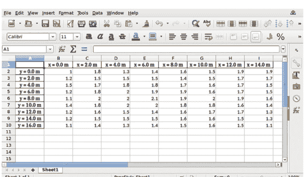

图18.2 由图18.1中的代码生成的*hill.xlsx*的截图（为提高可读性已手动重新格式化）。所示文件在电子表格应用程序LibreOffice中打开（图18.3、18.7和18.9中也展示了该程序）。

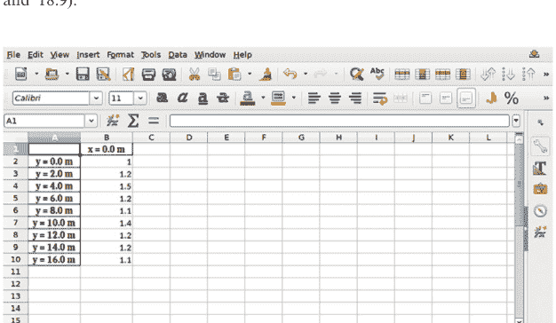

图18.3 由图18.1中的代码生成的*hill0.xlsx*的截图（为提高可读性已手动重新格式化）。

在第11行，我们从`elev`数组创建了一个`DataFrame`对象，其行标签由`rows`设置，列标签由`cols`设置。第13行将`DataFrame`对象`elev_df`写入Excel文件*hill.xlsx*。在第16行，我们将*hill.xlsx*的内容读入一个单独的`DataFrame`对象，并将这些值与原始的`elev_df`值进行比较。屏幕上输出值`True`，因为两个数组是相同的。

在第20行，我们从`elev`的第一列创建了一个`Series`对象。行标签由`rows`设置，列标签是`cols[0]`的第一个元素。我们在第21行将`Series`对象写入`hill0.xlsx`。在第24行，我们读入该Excel文件，并将结果保存在一个新的`Series`对象`elev0_df_in`中。第25行比较了`elev0_ser`和`elev0_df_in`的原始值。比较中使用了`elev0_df_in`值的展平（即，ravel）版本，因为Excel文件的值是以二维数组的一列形式传入的。第25行也向屏幕输出了值`True`。

### pickle文件输入/输出

图18.4展示了将数据写入pickle文件的代码，这是一种特殊的Python格式，使我们能够将整个Python对象存储在文件中。也就是说，我们从文件中读入的不仅仅是数据值，而是完整的对象本身。在图18.4中，我们假设图18.1中执行的导入也已执行，并且`elev`和`elev_df`已如图18.1中那样定义。我们省略了导入和定义这些对象的代码，以突出显示与pickle相关的代码。

我们从图18.4的第2行开始导入pickle模块。在第5-6行，我们创建了`elev`和`elev_df`的副本。我们这样做是为了在执行其余代码时保持原始对象不变。在第9-11行，我们将包含copy_elev和copy_elev_df对象的列表写入pickle文件hill.pkl。在第14-16行，我们删除了copy_elev、copy_elev_df和fileobj对象。我们这样做是为了确保在第19-23行重新创建这些对象之前它们不存在。我们希望我们对原始对象和读回对象的比较是诚实的。在第19-23行，我们读入在第10行写入pickle文件的列表，并将该列表中的对象保存到名称copy_elev和copy_elev_df。在第26-27行，我们比较了copy_elev和copy_elev_df的读入版本与这些对象的原始版本的值，并确认它们是相同的。

```python
#- 模块导入：
import pickle

#- 创建elev的副本：
copy_elev = elev.copy()
copy_elev_df = elev_df.copy()

#- 将对象写入pickle文件：
fileobj = open('hill.pkl', 'wb')
pickle.dump([copy_elev, copy_elev_df], fileobj, protocol=4)
fileobj.close()

#- 删除副本变量和文件对象：
del(copy_elev)
del(copy_elev_df)
del(fileobj)

#- 从pickle文件读入对象：
fileobj = open('hill.pkl', 'rb')
result = pickle.load(fileobj)
copy_elev = result[0]
copy_elev_df = result[1]
fileobj.close()

#- 检查读入的对象是否与原始对象相同：
print(np.allclose(elev, copy_elev))
print(np.allclose(elev_df.values, copy_elev_df.values))
```

图18.4 将图14.15中的`elev`写入pickle文件`hill.pkl`的代码。

### netCDF文件输入/输出

图18.5展示了将数据写入netCDF文件的代码，这是一种特殊的可移植二进制格式，可以在许多不同的操作系统和计算机硬件上打开。在图18.5中，我们假设图18.1中执行的导入也已执行，并且elev、nrows和ncols已如图18.1中那样定义。我们省略了导入和定义这些对象的代码，以突出显示与netCDF相关的代码。

在图18.5的第2行，我们导入了netCDF4模块。其大写形式如所示，这与大多数Python模块不同。在第5-7行，我们创建并打开了用于写入的*hill.nc* netCDF格式文件，并创建了描述*x*和*y*方向元素数量的netCDF维度实体。在第9行，我们使用维度实体创建了一个正确形状的netCDF变量实体，以容纳来自*elev*的数据（我们将此变量命名为'elev'）。在第10行，我们为*elev*数据的单位添加了元数据。我们在第11行用*elev*中的数据值填充了变量实体。第13-15行和第17-19行为*x*和*y*方向的值创建了类似的netCDF变量实体。netCDF文件在第21行关闭。

在第25-27行，我们删除了之前创建的netCDF变量实体对应的对象以及netCDF文件对象。在第29-39行，我们读入存储在*hill.nc*中的变量，将高程数据值以及*x*和*y*方向的位置保存到`elev_data`、`x_data`和`y_data`中，以及这些变量的元数据。在第44-50行，我们检查从*hill.nc*文件读入的数据和元数据值是否与写入的值相同。

```python
#- 模块导入：
import netCDF4 as nc

#- 将数据写入netCDF文件：
fileobj = nc.Dataset('hill.nc', mode='w')
fileobj.createDimension('x', ncols)
fileobj.createDimension('y', nrows)

elev_var = fileobj.createVariable('elev', 'd', ('y','x'))
elev_var.units = "m above mean sea level"
elev_var[:,:] = elev

x_var = fileobj.createVariable('x', 'd', ('x'))
x_var.units = 'm'
x_var[:] = np.arange(ncols) * 2.0

y_var = fileobj.createVariable('y', 'd', ('y'))
y_var.units = 'm'
y_var[:] = np.arange(nrows) * 2.0

fileobj.title = "Fictitious elevations on a small hill"

fileobj.close()

#- 删除netCDF变量对象和文件对象：
del(elev_var, x_var, y_var)
del(fileobj)

#- 从netCDF文件读入数据：
fileobj = nc.Dataset('hill.nc', mode='r')

elev_data = fileobj.variables['elev'][:]
elev_units = fileobj.variables['elev'].units
file_title = fileobj.title

x_data = fileobj.variables['x'][:]
x_units = fileobj.variables['x'].units

y_data = fileobj.variables['y'][:]
y_units = fileobj.variables['y'].units

fileobj.close()

#- 检查读入的对象是否与原始对象相同：
print(np.allclose(elev, elev_data))
print(elev_units == "m above mean sea level")
print(file_title == "Fictitious elevations on a small hill")
print(np.allclose(x_data, np.arange(ncols) * 2.0))
print(x_units == 'm')
print(np.allclose(y_data, np.arange(nrows) * 2.0))
print(y_units == 'm')
```

图18.5 将图14.15中的elev写入netCDF文件hill.nc的代码。

## 18.2 Python 编程基础

我们在第 18.1 节中使用的三种文件格式——Excel、pickle 和 netCDF——具有不同的用途和特性，Python 与它们的交互方式也各不相同。在本节中，我们将描述每种格式、与这些文件对应的 Python 接口以及该格式的用途。我们仅对这些文件格式进行简要介绍。详情请参阅每个小节末尾描述的相关包文档。

### 18.2.1 Excel 文件

电子表格是中小型数据分析的基石，这是有充分理由的。像 Excel 这样的图形用户界面（GUI）电子表格程序，为我们提供了对数据单元格、它们之间的关系以及如何操作它们的直观和空间感。然而，有时我们想要对电子表格中的数据进行的计算，比使用点击界面能轻松完成的更为复杂，或者我们想要自动化的任务比 Excel 的宏语言能轻松执行的更为高级。在这些情况下，将 Excel 文件读写到 Python 中并在 Python 中操作数据可能更有效率。

在本节中，我们使用 pandas 以及 pandas 的 Series 和 DataFrame 对象，将数组数据写入 Excel 电子表格以及从 Excel 电子表格读取数据。在第 15.2.2 节中，我们提到 Series 对象是“增强的”一维数组，DataFrame 对象是增强的二维数组。Series 对象的每一行，以及 DataFrame 对象的每一行和每一列，都可以被赋予超出 NumPy 数组整数索引的标签。通过这种方式，我们可以为每一行或每一行和每一列赋予有意义的字母数字标签。在第 19.2.3 节中，我们将进一步描述 DataFrame 对象，并讨论如何使用 DataFrame 标签从 Series 或 DataFrame 对象中选择列、行和/或子范围，然后对这些选择进行操作。

当我们创建 DataFrame 对象时，我们使用 `index` 关键字输入参数分配行标签，使用 `columns` 关键字输入参数分配列标签。在图 18.1 的第 12 行，我们使用在第 8-9 行创建的行和列字符串列表作为标签，从二维数组 `elev` 创建了一个 DataFrame。生成的对象 `elev_df` 如下所示（仅显示前四列）：

```
In [1]: print(elev_df)

          x = 0.0 m  x = 2.0 m  x = 4.0 m  x = 6.0 m ...
y = 0.0 m        1.0        1.8        1.3        1.4 ...
y = 2.0 m        1.2        1.5        1.5        1.5 ...
y = 4.0 m        1.5        1.7        1.8        1.8 ...
y = 6.0 m        1.2        1.8        2.0        1.9 ...
y = 8.0 m        1.1        2.0        2.0        2.1 ...
y = 10.0 m       1.4        1.8        2.0        2.0 ...
y = 12.0 m       1.2        1.6        1.5        1.4 ...
y = 14.0 m       1.2        1.5        1.5        1.5 ...
y = 16.0 m       1.1        1.4        1.3        1.4 ...
```

Series 对象在一维情况下的工作方式类似。当我们创建 Series 对象时，我们使用 `index` 关键字输入参数分配行标签，使用 `name` 关键字输入参数分配单个列标签。在图 18.1 的第 20 行，我们使用 `elev` 的第一列及其列标签创建了一个 Series 对象。生成的对象 `elev0_ser` 如下所示：

```
In [1]: print(elev0_ser)

y = 0.0 m    1.0
y = 2.0 m    1.2
y = 4.0 m    1.5
y = 6.0 m    1.2
y = 8.0 m    1.1
y = 10.0 m   1.4
y = 12.0 m   1.2
y = 14.0 m   1.2
y = 16.0 m   1.1
Name: x = 0.0 m, dtype: float64
```

Series 和 DataFrame 对象的 `to_excel` 方法将对象的内容写入 Excel 文件，该文件可以指定为单个输入参数（图 18.1 的第 13 行和第 21 行）。这包括行和列标签，如图 18.2 和 18.3 所示。

pandas 的 `read_excel` 函数用于读取 Excel 文件。图 18.1 的第 16 行和第 24 行调用了此函数，传入 Excel 文件的文件名，并指定文件中的哪一列（`index_col`）用作返回的 DataFrame 的索引标签，以及文件中的哪一行（`header`）用作返回的 DataFrame 的列标签。行和列标签分别存储为 DataFrame 对象的 `index` 和 `columns` 属性。

DataFrame 对象中的数据（作为 NumPy 数组）存储在 `values` 属性中。正如我们在第 18.1 节中看到的，对于存储在 `hill0.xlsx` 中的单列数组，`values` 以单列 DataFrame 对象的形式返回，而不是 Series 对象。因此，为了与 Series 对象的值（图 18.1 第 25 行）进行正确比较，我们必须使用 `elev0_df_in` 的 `values` 的扁平化版本，才能与 `elev0_ser` 的值进行正确比较。

有关调用 `to_excel` 方法时可以使用的更多选项，请参阅 pandas API 参考中关于 DataFrame `to_excel` 方法的说明。我们在 www.cambridge.org/core/resources/pythonforscientists/refs/ 提供了该参考的最新链接，参考文献 48。Series `to_excel` 方法的文档类似。pandas API 参考中关于 `read_excel` 函数的说明也描述了从 Excel 文件读取时可以使用的更多选项。我们在 www.cambridge.org/core/resources/pythonforscientists/refs/ 提供了该参考的最新链接，参考文献 50。pandas 也可以处理包含多个工作表的工作簿（示例请参见“动手试试！”18-2 和 18-3）。

如需与 Excel 文件进行更底层的交互，请参阅 `openpyxl` 包，它允许我们自定义 Excel 文件，包括格式设置。教程的最新链接位于 www.cambridge.org/core/resources/pythonforscientists/refs/，参考文献 59。此包可能未默认安装在 Anaconda 发行版中。如果未安装，请首先按照第 1.3 节中的说明进行安装。

### 18.2.2 pickle 文件

pickle 格式本质上是将一个或多个对象的“快照”保存到二进制文件中。因此，当我们从 pickle 文件（可以任意命名，但 `.pkl` 后缀效果很好）加载该快照时，该对象即可在 Python 中使用。它的属性和方法都完好无损。我们不必将对象转换成我们更感兴趣的其他东西。当我们**序列化**（pickle）一个对象时，我们将其转储到 pickle 文件中。当我们**反序列化**（unpickle）一个对象时，我们从 pickle 文件中加载它。“pickle”这个词可以是动词也可以是形容词。

要创建 pickle 文件，我们像处理文本文件一样使用 `open`（参见第 9.2.6 节）。但是，文件模式必须设置为同时表示“写入模式”和“二进制模式”。这是通过将 `open` 的第二个位置输入参数设置为 `'wb'` 来完成的（如图 18.4 第 9 行所示）。要从 pickle 文件读取，我们将模式设置为 `'rb'`，表示“读取模式”和“二进制模式”（如图 18.4 第 19 行所示）。我们通过调用文件对象的 `close` 方法来关闭 pickle 对象。

要序列化一个对象，我们使用 pickle 模块的 `dump` 函数。在图 18.4 的第 10 行，我们使用两个位置输入参数和一个关键字输入参数调用 `dump`（为方便起见，此处重现）：

```
pickle.dump([copy_elev, copy_elev_df], fileobj, protocol=4)
```

两个位置输入参数分别指定要序列化的对象和 pickle 文件的文件对象。关键字输入参数指定要使用的“协议”；如果省略，则使用默认值。由于 `dump` 函数一次只能序列化一个对象，当我们想要序列化多个对象时，最简单的方法可能是将所有要序列化的对象放入一个列表中，然后序列化该列表。³ 我们在第 10 行对 `dump` 的调用采用了这种方法：第一个位置输入参数是一个包含两个对象的列表。

要反序列化一个对象，我们使用 pickle 模块的 `load` 函数，将 pickle 文件的文件对象作为单个输入参数传入（如图 18.4 第 20 行所示）。调用 `load` 的返回值是被序列化的对象。因此，在第 20 行的示例中，被反序列化的是被序列化的包含两个对象的列表。为了获取作为该列表元素的对象，我们必须从这些元素中提取它们（如第 21-22 行所示）。

截至本文撰写时，Python 支持六种不同的 pickle 文件“协议”，它们都具有不同的特性，并且与特定版本的 Python 兼容。每个协议的详细信息可以在 pickle 模块的文档中找到。⁴ 协议编号 4 是从 Python 3.8 开始的默认协议，自 Python 3.4 起就已可用。协议编号仅在序列化时使用。反序列化时，`load` 函数会自动检测文件使用的协议。

对于哪些类型可以序列化、哪些类型不能序列化，存在一些限制。有关调用转储方法时可以使用的更多选项，请参阅 pickle 模块文档。

³ https://stackoverflow.com/a/20725705/8430411 (accessed July 9, 2020).
⁴ pickle 文档的最新链接位于 www.cambridge.org/core/resources/pythonforscientists/refs/，参考文献 61。

### 18.2.3 netCDF 文件

文本文件、Excel 文件和 pickle 文件都可以很好地存储信息。⁵ 但对于较大的数据集，如果我们还希望它能在几乎任何计算机上使用，并且能被几乎任何编程语言访问，这些选项就存在局限性。要解释原因，以及为什么 netCDF 格式和类似格式会存在，我们需要退一步，补充一些关于计算机中文件如何存储的背景知识。

正如我们在第 9.2.2 节中提到的，计算机中数据最根本的表示形式是二进制数字或比特（一个零或一个一）。无论是在计算机的内存中，还是作为硬盘驱动器或其他存储形式上的文件，数据都是这样存储的。因此，存储文件最基本的方式就是直接以这种二进制形式存储，由操作系统为计算机的硬件进行表达。这类文件被称为纯二进制文件或平面二进制文件。这类文件是计算机中存储数据最紧凑、访问最快的方式。但是，二进制文件是特定于创建它们的计算机的。在 Linux 计算机上创建的二进制文件无法在 Windows 计算机上直接读取，反之亦然。如果我们以二进制文件形式存储数据，就严重限制了其他人使用这些数据。

我们见过的其他文件格式没有这种限制。尽管这些其他格式从根本上也是以比特（即二进制形式）存储信息，但这些格式遵循的标准使其能够在许多不同的计算机上读取。文本文件遵循 Unicode（或类似）标准来表示字符，Excel 遵循 Microsoft 定义的电子表格格式，pickle 文件遵循 Python 定义的格式。然而，这些格式中没有一种能作为编码大型数据文件时二进制格式的可接受替代品。对于文本文件，与 Unicode 之间的转换需要大量的处理器时间，并且文本文件比其二进制对应文件大得多。虽然我们可以在 Python 中操作 Excel 文件，但 Excel 文件是为办公生产力程序设计的，因此当数据集超过几十万行时，它们就无法很好地工作。Python 直接将 pickle 文件加载到内存中，但用其他编程语言编写的程序通常无法读取 pickle 文件。

我们需要的是一种数据文件格式，它既具有二进制文件提供的紧凑性、快速访问能力以及对大数据集的可扩展性，又具有文本文件提供的可移植性（即文件几乎可以在任何计算机上使用）。这就是 netCDF 格式的目的。它定义了一种格式，虽然是二进制的，但通过使用可以在许多不同操作系统上运行、使用许多不同语言的实用程序，它仍然能够在许多不同的计算机上读取。该格式还提供了将元数据与数据一起包含的工具，因此两者都捆绑在同一个文件中。最后，该格式的结构很容易处理规则的 n 维数组，因此 netCDF 文件非常适合网格化数据集，其中数据位于规则网格上（例如，经度-纬度网格）。由于这些特性，该格式通常用于全球尺度的气候数据集。

⁵ 本节部分内容改编自 Lin (2012) 的第 5 章。

# 18 在文件中存储信息的更多方式

在描述 netCDF4 Python 接口之前，我们先简要回顾一下 netCDF 数据格式本身的结构。netCDF 文件中有四种通用类型的参数：全局属性、变量、变量属性和维度。不幸的是，netCDF 格式使用了“属性”这个术语，因为在面向对象语言中，“属性”一词有非常特定的含义。当我们在 netCDF 属性附近谈论对象属性时，我们会尝试添加修饰词“netCDF”来表示 netCDF 格式的属性。全局属性通常是描述整个文件的字符串，例如标题、创建者、遵循的标准等。变量是保存数据的实体。这些包括数据本身（例如，高程、温度等）、数据定义的域（由维度界定）以及关于数据的元数据（例如，单位）。变量属性存储与变量关联的元数据。维度定义数据集中数据数组中每个轴的范围（即每个维度中的元素数量）。维度用于定义 netCDF 文件中变量数据数组的形状，但它们通常也有自己的变量值（例如，纬度值、经度值等）。因此，我们通常为每个维度创建与维度同名的变量（以保存这些值），而维度本身保存该维度中域的元素数量。⁶

以 netCDF 文件的一组变量和维度为例，考虑我们第 18.1 节的例子。因为 `elev` 数组是一个二维网格，在空间中有两个维度（x 和 y 方向），所以我们想定义两个 netCDF 维度和两个对应的 netCDF 变量，每个维度一个。在图 18.5 的第 6 行和第 7 行，我们定义了一个 'x' netCDF 维度和一个 'y' netCDF 维度，分别等于 `elev` 的列数（`ncols`）和行数（`nrows`）。在第 13 行和第 17 行，我们定义了一个 'x' netCDF 变量和一个 'y' netCDF 变量。每个 netCDF 变量都是一个一维数组，其大小与对应的 netCDF 维度相同，这些 netCDF 变量保存每个 `elev` 网格点的 x 和 y 位置值。最后，我们定义了 'elev' netCDF 变量（第 9 行），用于保存高程数据，其形状由 'y' netCDF 维度给出的行数和 'x' netCDF 维度给出的列数决定。

**写入 netCDF 文件** 为了写出一个 netCDF 文件，我们首先使用 netCDF4 模块中的 `Dataset` 构造函数（图 18.5 中的第 5 行）创建一个用于写入的文件对象。`mode` 关键字参数设置为 'w'。一旦文件对象存在，我们就使用文件对象的方法来创建将存在于文件中的 netCDF 维度和 netCDF 变量对象。我们必须在创建 netCDF 变量对象之前创建 netCDF 维度（因为后者依赖于前者）。并且我们必须在用值和元数据填充它们之前先创建 netCDF 变量对象。

`Dataset` 对象的 `createDimension` 方法创建一个 netCDF 维度（图 18.5 中的第 6-7 行）。此方法创建维度的名称并设置维度的值（长度或元素数量）。维度的名称是一个字符串，作为第一个参数传递给该方法，维度中的元素数量是一个整数，作为第二个参数传递给该方法。

`createVariable` 方法（图 18.5 中的第 9、13 和 17 行）创建一个 netCDF 变量对象。它只创建 netCDF 变量的基础设施（例如，netCDF 变量的形状），而不填充变量的值、设置任何 netCDF 变量属性等。调用该方法有三个参数：第一个是 netCDF 变量的名称（作为字符串）；第二个是 netCDF 变量元素的类型（作为字符串，例如 'd' 表示双精度浮点数）；第三个是 netCDF 变量保存的数组的形状。形状是一个字符串元组，其中的元素是维度的名称。因此，在图 18.5 的第 9 行（为方便起见在此重现）：

```
elev_var = fileobj.createVariable('elev', 'd', ('y', 'x'))
```

存储在 `elev_var` 中的数组具有由 (nrows, ncols) 给出的形状，因为传递给 `createVariable` 调用的元组是 ('y', 'x')。如果存储在 netCDF 变量对象中的值不是数组而是标量，则将一个空元组（即 ()）作为第三个参数传递给 `createVariable` 调用。`createVariable` 调用的返回值是一个 Python 对象（例如，第 9 行的 `elev_var`），因此我们使用 Python 对象来表示 netCDF 变量对象。

我们填充 netCDF 变量对象数据的方式取决于变量是数组还是标量。如果是数组（如图 18.5 示例所示），我们使用切片语法（即冒号）与变量对象一起进行赋值操作（例如，图 18.5 中的第 11、15 和 19 行）。因此，第 11 行（为方便起见在此重现）：

```
elev_var[:,:] = elev
```

意味着“用 NumPy 数组 `elev` 中的相应元素填充 `elev_var` netCDF 变量对象存储的数组的元素。”标量变量的值通过 *netCDF 变量对象*（而不是文件对象）的 `assignValue` 方法赋值给变量对象。例如，以下代码将创建一个名为 'value' 的双精度浮点标量 netCDF 变量，并用数字 42.0 填充它：

```
scalar_var = fileobj.createVariable('value', 'd', ())
scalar_var.assignValue(42.0)
```

请注意，'value' 是 *netCDF 文件中* netCDF 变量的名称。*在 Python 解释器中* netCDF 变量对象的名称是 `scalar_var`。

最后，netCDF 变量属性使用 Python 的常规对象赋值语法设置，应用于 netCDF 变量对象。例如，第 10 行（为方便起见在此重现）：

```
elev_var.units = "m above mean sea level"
```

创建了一个附加到 netCDF 变量对象 `elev_var` 的 netCDF 变量属性 `units`。该 netCDF 变量属性是字符串 "m above mean sea level"。

⁶ 有关 netCDF 文件格式的更多信息，请参见 www.unidata.ucar.edu/software/netcdf/docs（访问于 2020 年 7 月 10 日）。

# 18 在文件中存储信息的更多方式

除了 netCDF 维度和变量，netCDF 文件还可以包含全局属性。这些通常是用于整体描述文件的字符串。它们可以包括标题、作者信息、对其他文档的引用、数据的使用示例、数据集描述等。在图 18.5 的第 21 行，我们创建了一个名为 `title` 的 netCDF 全局属性。这是使用对象属性赋值语法创建的，但与 netCDF 变量属性不同的是，我们使用赋值给 `file` 对象的 Python 对象属性来表示 netCDF 全局属性。在第 21 行，`title` 这个 netCDF 全局属性被赋值为字符串 "Fictitious elevations on a small hill"。在完成对 netCDF 文件的写入后，我们使用对象的 `close` 方法关闭文件对象。

**读取 netCDF 文件** 要读取 netCDF 文件，我们首先使用 netCDF4 模块的 `Dataset` 构造函数创建一个文件对象，但将 `mode` 关键字输入参数设置为 'r' 表示读取（图 18.5 的第 29 行）。当我们读取完文件对象后，使用 `close` 方法将其关闭（第 41 行）。

当我们在图 18.5 的第 21 行创建 netCDF 全局属性 `title` 时，我们将其作为对象属性保存到了表示 netCDF 文件的 Python 文件对象 `fileobj` 中。当我们读取 netCDF 文件时，netCDF 全局属性也以相同的方式表示。因此，在第 33 行，当我们读取 `title` 这个 netCDF 全局属性时，我们使用 Python 中引用对象属性的语法来引用 `fileobj` 的 `title` 属性。

netCDF 变量存储在名为 `variables` 的 netCDF 文件对象属性中。这个对象属性是一个类似字典的数据结构（技术上是一个 `OrderedDict` 类对象），其中字典的键是 netCDF 变量的名称（作为字符串），与这些名称关联的值是 netCDF 变量对象，这些对象包含变量所持有的数组值以及 netCDF 变量属性。因此，例如，在第 31 和 32 行，表达式：

```
fileobj.variables['elev']
```

引用了与名称 'elev' 关联的 netCDF 变量对象。当我们使用数组切片从该对象中选择元素时，我们正在访问数组值。在第 31 行（为方便起见在此重现）：

```
elev_data = fileobj.variables['elev'][:]
```

'elev' netCDF 变量中的所有二维数组数据都被读出并保存到 Python 变量 `elev_data` 中。尽管数据是二维的，但使用语法 `[:]` 就足够了。该语法无论数据数组的维度数量如何都适用。此外，当数据数组被读入时，它会以掩码数组的形式出现。如果没有缺失值，掩码数组没有掩码，但该对象仍然是掩码数组类型。

要获取 netCDF 变量属性，我们可以通过 Python 中引用对象属性的语法来引用 netCDF 变量属性名称。回想一下 `fileobj.variables['elev']` 是一个 Python 对象，第 32 行的右侧引用了该对象的 units 属性。该值是一个字符串，存储在 Python 变量 `elev_units` 中。

对于标量 netCDF 变量，要获取数据值，我们使用附加到 netCDF 变量对象上的一个名为 `getValue` 的方法。对于 netCDF 文件对象 `fileobj` 中名为 'value' 的标量 netCDF 变量，以下代码将返回该变量的值：

```
fileobj.variables['value'].getValue()
```

然后可以通过赋值将其保存到 Python 变量中。标量 netCDF 变量的 netCDF 变量属性的读取方式与数组数据 netCDF 变量相同。

netCDF 文件对象还有一个名为 `dimensions` 的类似字典的属性，用于保存 netCDF 维度。我们的图 18.5 没有使用维度的示例。`dimensions` 的键是表示 netCDF 维度名称的字符串。值是保存维度信息的对象，例如作为属性 `size` 的 netCDF 维度长度。因此，如果在图 18.5 的第 29 行打开 netCDF 文件后，我们执行此表达式：

```
fileobj.dimensions['x'].size
```

将返回值 8，这是 `elev` 的列数。

从这个对 netCDF4 接口的简要描述中，我们可以看到，就数据存储方式而言，该格式不如文本文件和 pickle 文件灵活。与 Excel 文件相比，netCDF 文件（目前）不支持像 Excel 格式那样灵活的图形界面。尽管如此，没有完美的文件格式，就像没有完美的编程语言一样。尽管有其局限性，netCDF 格式和 netCDF4 模块使我们能够相对容易地以紧凑且可移植的格式存储和访问大量数据。有关读写 netCDF 文件时可用的更多选项，请参阅 netCDF4 模块文档。我们在 www.cambridge.org/core/resources/pythonforscientists/refs/ 提供了指向文档的最新链接，参考文献 58。

## 18.3 动手试试！

本节中的示例涵盖了第 18.2 节的主要主题。我们练习读写 Excel、pickle 和 netCDF4 文件。

对于本节的所有练习，假设 NumPy 已作为 `np` 导入。

> 动手试试！ 18-1 写入 Excel 文件：空气质量
> 将 NumPy 数组 `pm25`（假设它已如图 7.7 所定义）中的空气质量数据写入 Excel 文件 `pm25.xlsx`。提供适当的行和列标签（在表 7.7 的标题中给出）。

### 动手试试！答案 18-1

```
1  import pandas as pd
2
3  rows = [str(i) for i in range(np.shape(pm25)[0])]
4  cols = ['Dongsi', 'Dongsihuan', 'Nongzhangguan', 'U.S. Embassy']
5
6  pm25_df = pd.DataFrame(pm25, index=rows, columns=cols)
7  pm25_df.to_excel('pm25.xlsx')
```

图 18.6 将图 7.7 中的 NumPy 数组 `pm25`（带有适当的行和列标签）写入 Excel 文件 `pm25.xlsx` 的代码（图 18.7）。

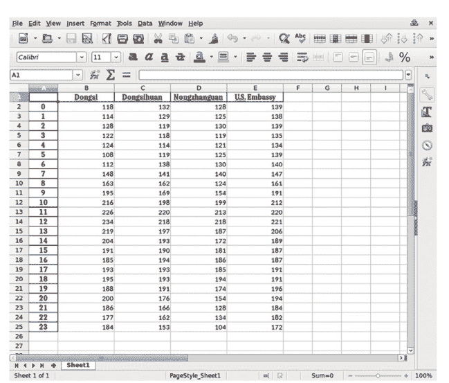

图 18.7 由图 18.6 中代码生成的 `pm25.xlsx` 的屏幕截图（为可读性手动重新格式化）。所示文件在电子表格应用程序 LibreOffice 中打开（图 18.8、18.9 和 18.9 中也显示了）。

图 18.6 显示了生成此文件的代码。图 18.7 显示了创建的 Excel 文件。为了在图 18.6 的第 3 行构建行标签，我们使用了列表推导式，这在第 16.2.2 节中有描述。

```
1  import pandas as pd
2
3  rows = [str(i) for i in range(np.shape(pm25)[0])]
4  cols = ['Dongsi', 'Dongsihuan', 'Nongzhangguan', 'U.S. Embassy']
5
6  fileobj = pd.ExcelWriter('pm25-1cols.xlsx', mode='w')
7  for i in range(len(cols)):
8      pm25_ser = pd.Series(pm25[:,i], index=rows, name=cols[i])
9      pm25_ser.to_excel(fileobj, sheet_name=cols[i])
10
11 fileobj.close()
```

图 18.8 将图 7.7 中 NumPy 数组 `pm25` 的每一列（带有适当的行和列标签）写入 Excel 文件 `pm25-1cols.xlsx` 的单独工作表中的代码。第二个工作表如图 18.9 所示。

### 动手试试！ 18-2 将多个工作表写入 Excel 文件：空气质量

再次执行动手试试！ 18-1，但将每一列写入 Excel 工作簿中的单独工作表。对于每个工作表的名称，使用列标签。在 pandas 中，写入多个工作表需要使用 `ExcelWriter` 类。提示：有关详细信息，请参阅 `ExcelWriter` 文档。我们在 www.cambridge.org/core/resources/pythonforscientists/refs/ 提供了指向文档的最新链接，参考文献 49。

### 动手试试！答案 18-2

图 18.8 显示了生成此文件的代码。图 18.9 显示了创建的 Excel 工作簿的第二个工作表。在图 18.8 中，第 1-4 行与图 18.6 的第 1-4 行相同。

在 pandas 中，为了将多个工作表写入同一文件，DataFrame 和 Series 的 `to_excel` 方法必须有一个 `ExcelWriter` 对象来操作。如果我们提供一个字符串文件名并在多个 `to_excel` 调用中使用该文件名（例如，试图将不同的工作表写入同一文件），那么每次 `to_excel` 方法求值时，该文件都会被重复覆盖。如果我们向 `to_excel` 调用提供一个 `ExcelWriter` 对象，不同的工作表将被添加，直到文件对象关闭。

在图 18.8 的第 6 行，我们创建了一个 `ExcelWriter` 对象并将其设置为写入模式。我们在第 7 行循环遍历 `pm25` 中每一列的索引，在第 8 行从每一列创建一个 Series 对象，并在第 9 行将该 Series 对象写入工作簿中的一个工作表。`to_excel` 方法有一个关键字输入参数 `sheet_name`，用于设置工作表的名称。我们在第 11 行关闭文件对象。

### 动手试试！ 18-3 从 Excel 文件读取多个工作表：空气质量

读取在动手试试！ 18-2 中生成的多工作表 Excel 工作簿，使得单独的 DataFrame 对象表示工作簿中的工作表，并且这些 DataFrame 对象的集合是

## 18.4 更多学科特定实践

本章的学科特定 Jupyter 笔记本涵盖以下主题：

- Excel 文件。
- pickle 文件。
- netCDF 文件。

## 18.5 章节回顾

### 18.5.1 自测题

请尝试在不查阅本书或任何其他资源，也不使用 Python 解释器的情况下完成这些题目。这些自测题的答案可在本章末尾找到。

**自测题 18-1**
描述 pandas `Series` 和 `DataFrame` 对象之间的区别。

**自测题 18-2**
描述使用 pandas 包读写 Excel 文件的基础知识。

**自测题 18-3**
我们如何使用 pandas 从一个 Excel 工作簿中读取多个工作表？

**自测题 18-4**
我们如何使用 pandas 将多个工作表写入一个 Excel 工作簿？

**自测题 18-5**
什么是 pickle 文件？

**自测题 18-6**
为 pickle 文件创建文件对象时，我们需要将对象设置为哪种访问模式？

**自测题 18-7**
我们如何将对象写入 pickle 文件？

**自测题 18-8**
我们如何从 pickle 文件中读取对象？

**自测题 18-9**
*不*使用 pickle 文件存储数据的一个原因是什么？

**自测题 18-10**
描述用户想要或不想要将数据保存为 netCDF 格式文件的一些原因。

**自测题 18-11**
描述 netCDF 全局属性与 netCDF 变量属性有何不同，以及 netCDF4 模块接口如何表示它们。

**自测题 18-12**
什么是 netCDF 维度？我们如何在 netCDF 文件中创建这样的维度？

**自测题 18-13**
netCDF4 文件对象的 `variables` 属性是什么？

**自测题 18-14**
如果我们有一个 `Dataset` 对象 `fobj`，其中存储了一个标量 netCDF 变量 `energy`，读取该值并将其存储为 Python 变量 `tot_energy` 的代码是什么？

### 18.5.2 章节总结

在使用计算机进行科学或工程工作时，我们经常需要平衡相互竞争的需求：内存使用、性能、可移植性、灵活性等。文件中数据和其他信息的存储也是如此。第 9 章的文本文件虽然非常灵活且可移植，但由于其格式生成的文件大小以及缓慢的读写访问速度，不适合大型数据集。在本章中，我们研究了另外三种文件格式，它们都克服了文本文件的某些局限性，但也有其自身的局限性。我们在使用文件时的任务是，找出对于我们试图解决的特定科学或工程用例真正重要的功能，然后在可用选项中选择最佳格式。本章我们涵盖的具体主题包括读写：

- Excel 文件
  - pandas `DataFrame` 和 `Series` 对象具有 `to_excel` 方法，可用于将这些对象中的数据写入 Excel 文件。
  - pandas 包的 `read_excel` 打开一个 Excel 文件，并将工作表的内容作为 `DataFrame` 对象或其集合返回。
  - `read_excel` 的选项使我们能够读取多个工作表或 Excel 工作簿中的所有工作表。
  - 与 pandas `ExcelWriter` 对象配合使用时，我们可以使用 `to_excel` 方法和循环（根据需要）将多个工作表写入单个 Excel 工作簿。
- pickle 文件

## 18 文件中存储信息的更多方式

-   pickle 文件将 Python 对象的“快照”保存到文件中。当从文件读取该对象时，整个对象会以其保存时的状态和形式被重新创建。
-   我们将对象保存到 pickle 文件的过程称为“序列化”（pickling）对象，而从 pickle 文件读取对象的过程称为“反序列化”（unpickling）对象。
-   我们通过首先创建一个文件对象来创建或访问 pickle 文件。如果要写入文件，我们将访问模式设置为 `wb`。如果要从文件读取，我们将访问模式设置为 `rb`。
-   pickle 模块的 `dump` 函数将对象写入 pickle 文件。
-   要将多个对象保存到 pickle 文件，我们可以将它们放入一个列表中，然后序列化该列表。
-   pickle 模块的 `load` 函数从 pickle 文件中读取一个对象并返回该对象。
-   并非所有 Python 对象都可以被序列化。

-   netCDF 文件非常适合存储大量网格化数据以及与数据相关的元数据。
-   netCDF 文件采用特殊的二进制格式，可以在许多不同的操作系统和计算机上访问。
-   netCDF 文件包含全局属性、维度、变量和变量属性。
-   netCDF 全局属性通常编码关于整个文件的信息。这可能包括标题、作者、描述等。
-   netCDF 维度定义了存储在 netCDF 变量中的数据数组的形状。
-   netCDF 变量保存变量的数据以及关于该变量的元数据。这些元数据称为 netCDF 变量属性，包括变量的单位、变量的长名称等字段。
-   我们使用 netCDF4 模块的 `Dataset` 构造函数创建 netCDF 文件对象。访问模式设置为 `r` 或 `w`，具体取决于我们是从文件读取还是写入文件。
-   netCDF 文件对象的 `createDimension` 方法用于创建 netCDF 维度。netCDF 文件对象的 `createVariable` 方法用于创建 netCDF 变量。
-   要填充对应于数组（即非标量）的 netCDF 变量的数据值，我们使用数组切片或选择符号（例如 `[:]`、`[:, :]` 等）。从 netCDF 变量对象读取数组数据时使用相同的符号。
-   要填充对应于标量的 netCDF 变量的值，我们使用 netCDF 变量对象的 `assignValue` 方法。要读取标量值，我们使用 netCDF 变量对象的 `getValue` 方法。
-   netCDF 全局属性通过在 netCDF 文件对象上使用 Python 对象属性赋值来设置。我们使用 netCDF 文件对象上的 Python 对象属性符号读取 netCDF 全局属性。
-   netCDF 变量属性通过在 netCDF 变量对象上使用 Python 对象属性赋值来设置。我们使用 netCDF 变量对象上的 Python 对象属性符号读取 netCDF 变量属性。
-   netCDF 文件对象的 `dimensions` “字典”保存文件中的 netCDF 维度。netCDF 维度的名称是键，对应的 netCDF 维度对象是值。
-   netCDF 文件对象的 `variables` “字典”保存文件中的 netCDF 变量。netCDF 变量的名称是键，对应的 netCDF 变量对象是值。

关于读写文件，还有很多可以说的。除了我们在第 9 章和本章中考虑的格式外，还有许多其他文件格式。两种重要的格式包括结构化查询语言（SQL）格式，^7 用于通用数据库，以及分层数据格式（HDF）格式，^8 可用于数据集合和不同格式的数据。HDF 格式也是 netCDF 格式的超集。还有许多其他 Python 包可用于与各种格式的文件交互。然而，我们在本著作中描述的许多原理也适用于其他格式以及这些格式的 Python 接口。

### 18.5.3 自测答案

### 自测答案 18-1

`Series` 对象表示单列数据，具有行标签和单列本身的标签。`DataFrame` 对象表示二维数据网格（即多列数据），具有行和列标签。

### 自测答案 18-2

函数 `read_excel` 可用于从 Excel 文件中读取一个或多个工作表。`Series` 和 `DataFrame` 对象的 `to_excel` 方法可以将对象（包括其行和列标签）写入 Excel 工作表。

### 自测答案 18-3

`read_excel` 函数具有关键字输入参数 `sheet_name`，允许我们指定要读取 Excel 工作簿中的哪个工作表。当参数设置为 `None` 时，所有工作表都被读入一个类似字典的结构，其中工作表名称是表示工作表信息的 `DataFrame` 对象的键。

### 自测答案 18-4

我们可以使用 `Series` 和 `DataFrame` 对象的 `to_excel` 方法来写入单个工作表，但我们必须将 `ExcelWriter` 对象传递给这些方法调用，以便每次调用该方法时都在同一文件（`ExcelWriter` 对象描述的文件）中生成一个工作表。当我们调用 `to_excel` 时，工作表的名称通过 `sheet_name` 关键字输入参数传入。

### 自测答案 18-5

pickle 文件是 Python 对象的“快照”，可以保存到文件中，并在以后恢复到内存中。

### 自测答案 18-6

在这两种情况下，文件对象都必须处于二进制模式，因此 `'b'` 必须是访问模式参数的一部分。要读取 pickle 文件，我们必须将访问模式设置为 `'rb'`。要写入 pickle 文件，我们必须将访问模式设置为 `'wb'`。

### 自测答案 18-7

我们使用 pickle 模块的 `dump` 函数。我们传入要写出的对象和 pickle 文件的文件对象。我们还可以（可选地）设置用于在 pickle 文件中编码对象的协议号。

### 自测答案 18-8

pickle 模块的 `load` 函数返回 pickle 文件中的对象。它接受一个输入参数，即 pickle 文件的文件对象。

### 自测答案 18-9

通常，pickle 文件只能由另一个 Python 程序读取。这严重限制了其可用性，因为用另一种编程语言编写的程序无法从文件中访问数据。

### 自测答案 18-10

netCDF 文件以接近原生二进制的格式存储数据，但可在许多不同的操作系统和计算机之间移植。这使得 netCDF 文件适用于大型数据集。该格式还允许我们随数据一起存储元数据，使我们能够在数据文件中包含完整的文档。同时，netCDF 格式在数据存储方式上不如文本文件和 pickle 文件格式灵活。

### 自测答案 18-11

netCDF 全局属性是一个字符串，通常记录关于整个数据文件的信息。在 netCDF4 接口中，这存储为文件对象的 Python 对象属性。

netCDF 变量属性是一个字符串，记录 netCDF 变量的特征，例如单位或更长、更具描述性的变量名称。在 netCDF4 接口中，netCDF 变量属性存储为 netCDF 变量对象的 Python 对象属性。

### 自测答案 18-12

netCDF 维度描述一个数字，可用于指定 netCDF 变量中数据数组沿某个轴的元素数量。`Dataset` 对象的 `createDimension` 方法用于创建 netCDF 维度。

### 自测答案 18-13

`variables` 属性是一个类似字典的结构，存储在 netCDF 文件中定义的 netCDF 变量对象。

### 自测答案 18-14

```python
tot_energy = fobj.variables['energy'].getValue()
```

^7 www.iso.org/standard/63555.html（访问于 2020 年 7 月 14 日）。
^8 www.hdfgroup.org/solutions/hdf5（访问于 2020 年 7 月 14 日）。

# 19 基础搜索与排序

**搜索**（在值集合中查找特定值）和**排序**（将值按顺序排列）这两个主题对我们来说并不陌生。在研究各种科学和工程计算用例时，我们已经接触过这两个主题。对于搜索，我们见过使用 `if` 语句、布尔表达式等。对于排序，我们见过使用 `sorted` 函数。

在本章中，我们将已经见过（或作为已见过结构的一部分）的不同搜索和排序方法汇总在一起。Python 中进行搜索和排序的不同方式范围之广，促使我们思考：所有方法是否都等同？如果不等同，它们的差异体现在哪里？我们会发现，搜索或排序方式的差异，本质上是所用算法的差异。最后，我们将介绍一个用于搜索和排序的“强力工具”：pandas 包。在第 15、16 和 18 章中，我们已经介绍了 `Series` 和 `DataFrame` 类。在本章中，我们将探讨这些类如何使搜索和排序带标签的数据数组变得非常方便。

顺便提一下：在本章中，我们打印了许多表达式的结果。请记住，`print` 函数只是格式化调用括号之间的内容，以便在屏幕上漂亮地显示输入表达式的结果。真正执行任务并创建我们感兴趣对象的是括号内的表达式。

## 19.1 搜索与排序示例

考虑来自“试一试 16-4”的虚构海狸追踪场景，我们给五只海狸佩戴了无线电发射器，当海狸移动一英里后，其发射器会传回关于海狸的信息。假设我们收到的数据如下：¹

| 海狸 ID | 昵称 | 出生日期 | 母亲 ID | 父亲 ID |
| :--- | :--- | :--- | :--- | :--- |
| 1243 | Max | 2018-04-17 | 2352 | 4722 |
| 9384 | Polly | 2018-04-17 | 2352 | 4722 |
| 2352 | Fong | 空字符串 | −1 | −1 |
| 4722 | Edward | 空字符串 | −1 | −1 |
| 1198 | Jessie | 空字符串 | −1 | −1 |

¹ 本表格及本章其余部分相关海狸数据的创意来源于 https://animals.mom.me/fun-baby-beavers-7869.html、www.livescience.com/52460-beavers.html 和 www.beaversolutions.com/beaver-facts-education/beaver-behavior-and-biology/（均于 2020 年 8 月 4 日访问），但所有数据均为虚构。

```python
#- 导入模块：

import pandas as pd


#- 定义返回最小值及其位置的函数：

def min_val_loc(values):
    current_min = values[0]
    current_min_loc = 0
    for i in range(len(values)):
        if values[i] < current_min:
            current_min = values[i]
            current_min_loc = i
    return current_min, current_min_loc


#- 将数据定义为字典，数据列表，以及行和列标签：

data = { 1243: ['Max', '2018-04-17', 2352, 4722],
         9384: ['Polly', '2018-04-17', 2352, 4722],
         2352: ['Fong', '', -1, -1],
         4722: ['Edward', '', -1, -1],
         1198: ['Jessie', '', -1, -1] }

rows = []
data_list = []
for ikey in data:
    rows.append(ikey)
    data_list.append(data[ikey])

cols = ["Nickname", "Date of Birth", "Mother's ID", "Father's ID"]
```

图 19.1 演示通过第 19.1 节虚构海狸追踪数据进行搜索和排序的代码。

其中所有标识号都是四位整数，昵称和出生日期是字符串。昵称和出生日期的默认值是空字符串，标识号的默认值是“-1”。

图 19.1 展示了使用上述数据进行搜索和排序的示例。第一段代码（第 1–33 行）设置了第二段代码（第 34–56 行）中搜索和排序示例将使用的模块、函数和数据。第 3 行导入 pandas 包。在第 8–15 行，我们定义了将在第 46 行使用的函数 `min_val_loc`。该函数接受一个列表，并返回该列表中的最小值以及该列表中第一个最小值的位置索引。² `min_val_loc` 函数及其调用说明了如何

² 关于本章为何使用“位置索引”一词来指代列表、元组或 NumPy 数组中元素的地址，请参见第 19.2.3 节。

```python
#- 查找海狸 ID 1243 的昵称：线性搜索：

for i in range(len(rows)):
    if rows[i] == 1243:
        nickname_linear = data_list[i][0]

#- 按海狸 ID 升序对昵称排序：选择排序：

keys_unsorted = list(data.keys())
nicknames_sorted = []
for i in range(len(keys_unsorted)):
    min_value, min_value_loc = min_val_loc(keys_unsorted)
    nicknames_sorted.append(data[min_value][0])
    temp = keys_unsorted.pop(min_value_loc)

#- 使用 pandas 查找海狸 ID 1243 的昵称并按海狸 ID 升序对昵称排序：

data_df = pd.DataFrame(data_list, index=rows, columns=cols)
nickname_pd_ref = data_df.loc[1243, 'Nickname']
nicknames_df = data_df.sort_index()['Nickname']
```

图 19.1（续）

从函数返回多个值以及如何存储这些调用值。列表对象本身已有可以完成 `min_val_loc` 中操作的方法，但作为本章的目标之一是探索算法的工作原理，我们编写了自己的函数，以便看到该函数的最小值查找算法所采取的步骤。

在第 21–25 行，我们将上述数据提供为一个字典。键是“海狸 ID”列中的值。与每个键关联的值是一个列表，其中包含表格中相应行的其余信息。

在图 19.1 的第 27–31 行，我们创建了数据的一个版本，使得 `data` 中的每个值都是列表 `data_list` 中的元素，而 `data` 中的每个键（即海狸标识号）都是列表 `rows` 中的元素。稍后，我们在**线性搜索**示例中使用这些列表，并用于创建 `DataFrame` 对象。我们这样做也是通过循环，因为 `data` 中的值类型不同，所以我们无法将数据保存在二维 NumPy 数组中并使用切片来获取所需的任何子数组。在第 33 行，我们列出了存储在 `data` 和 `data_list` 中的值的列标签（`cols`）。请注意，“Mother's ID”包含一个撇号，因此我们使用双引号来分隔列标签。对于“Father's ID”我们也这样做。

在图 19.1 的第 34–56 行，我们进行了一次搜索和一次排序。在第一段代码中，第 36–38 行，我们使用**线性搜索**——遍历所有项目并询问是否找到了我们要找的东西——来获取标识号为 1243 的海狸的昵称。在第 43–48 行，我们按海狸标识号升序对数据记录进行排序，并获取按该顺序给出的海狸昵称列表（`nicknames_sorted`）。我们使用一种称为**选择排序**的排序算法来完成按海狸标识号排序。最后，在第 54–58 行，我们执行与第 34–48 行相同的搜索和排序任务，但使用 pandas 包提供的选择语法和排序方法。

## 19.2 Python 编程基础

在本节中，我们将总结在前面章节中见过（或作为已见过结构的一部分）的搜索和排序方法，研究一些不同的搜索和排序算法，并描述 pandas 包中用于搜索和排序的工具的基本用法。

### 19.2.1 搜索与排序方法概述

到目前为止，我们已经见过在 Python 中查找项目集合中的内容以及对项目进行排序的多种不同方法。³ 此概述没有特定顺序。每种搜索或排序方法都通过一个简短（且非常相似）的示例进行说明。

**通过循环测试进行搜索** 我们可以遍历项目列表，并使用 `if` 语句来查找我们要找的内容。我们使用此策略的一个地方是在图 6.3 中。下面，我们取一些数字，并将数字 `6` 在列表中找到的位置索引存储在变量 `loc` 中：

```python
data = [3, 6, 1, -8, 9]
for i in range(len(data)):
    if data[i] == 6:
        loc = i
```

在上面的代码中，`loc` 被设置为数字 `6` 最后一次出现的位置索引。

**使用列表的 `index` 方法进行搜索** 在第 9.2.3 节中，我们介绍了使用对象列表。列表方法 `index` 返回搜索目标第一次出现的位置索引。下面，我们在 `data` 列表中搜索数字 `6` 第一次出现的位置索引，并将该位置索引存储在 `loc` 中：

```python
data = [3, 6, 1, -8, 9]
loc = data.index(6)
```

³ 本节改编自 Lin (2019) 的第 8.1 节。

#### 使用列表的 `count` 方法进行搜索

正如我们在自测题 9.5 的解答中所看到的，列表的 `count` 方法会统计搜索目标在列表中出现的次数。下面，我们在 `data` 列表中搜索数字 `6` 出现的次数，并将该次数存储在 `count_six` 中：

```python
data = [3, 6, 1, -8, 9]
count_six = data.count(6)
```

#### 使用数组语法并测试相等性

在第 13.2.2–13.2.3 节中，我们看到数组语法会自动对数组中的元素逐个应用逻辑运算符，如相等性测试。下面，我们在 `data` 中查找等于 `6` 的位置：

```python
import numpy as np
data = np.array([3, 6, 1, -8, 9])
mask = data == 6
```

变量 `mask` 是一个布尔数组，显示 `data` 中哪些元素等于 `6`，哪些不等于：

```python
In [1]: print(mask)

[False  True False False False]
```

此方法适用于 NumPy 数组，但不适用于列表。

#### 使用数组的 `where` 函数进行搜索

我们在第 13.2.3 节中见过这种搜索方法。下面，我们在 `data` 中搜索数字 `6`，并返回一个数组，其中等于 `6` 的元素被设置为其位置索引，其他元素则设置为 `-999`：

```python
import numpy as np
data = np.array([3, 6, 1, -8, 9])
mask = np.where(data == 6, np.arange(np.size(data)), -999)
```

`where` 调用的结果存储在 `mask` 中，其值为：

```python
In [1]: print(mask)

[-999     1 -999 -999 -999]
```

`where` 方法还有一种单输入参数的语法，它返回一个元组，其中包含条件数组中条件为 `True` 的索引。然后我们可以使用该元组来选择这些索引处的元素。

# 19 基本搜索与排序

#### 使用数组的 `isclose` 函数进行搜索

从第 8 章和第 9 章开始，我们学习了如何使用 NumPy 函数 `isclose` 和 `allclose` 对浮点数进行“相等性”测试。下面，我们在 `data` 中查找接近 `6.0` 的位置：

```python
import numpy as np
data = np.array([3., 6., 1., -8., 9.])
mask = np.isclose(data, 6.0)
```

与之前类似，变量 `mask` 是一个布尔数组，显示 `data` 中哪些元素接近 `6.0`，哪些不接近：

```python
In [1]: print(mask)

[False  True False False False]
```

#### 使用成员测试进行搜索

在第 16.2.1 节关于字典的讨论中，我们介绍了成员测试，即使用 `in` 运算符检查字典是否具有特定的键。下面，我们构造一个字典 `data`，并询问该字典是否有一个名为 `'six'` 的键：

```python
In [1]: data = {'three':3, 'six':6, 'one':1, 'neg_eight':-8, 'nine':9}
       print('six' in data)

True
```

成员测试也适用于列表和字符串。这并不能告诉我们搜索目标在列表或字符串中的位置，但可以告诉我们目标是否存在于列表或字符串中。下面，我们测试 `6` 是否在列表 `data` 中：

```python
In [1]: data = [3, 6, 1, -8, 9]
       print(6 in data)

True
```

要测试目标是否不在列表、字符串等中，我们使用 `not in`。

#### 使用 `glob` 函数进行搜索

在第 10.2.5 节中，我们介绍了 glob 模块的 `glob` 函数。此函数可以在目录中搜索与给定模式匹配的文件名。以下代码在当前工作目录中搜索所有文件名中包含数字“6”的文件，并将这些文件的列表作为 `files6` 返回：

```python
import glob
files6 = glob.glob("*6*")
```

#### 使用列表的 `sort` 方法进行排序

列表方法 `sort` 会就地对列表进行排序。下面，我们对列表 `data` 进行排序，并打印出排序后的版本：

```python
In [1]: data = [3, 6, 1, -8, 9]
data.sort()
print(data)

[-8, 1, 3, 6, 9]
```

#### 使用 `sorted` 函数进行排序

我们在第 16.2.1 节关于字典的讨论中介绍了 `sorted` 的用法。在第 17.2.3 节中，我们看到了 `sorted` 如何用于更复杂的排序。下面，我们对列表 `data` 进行排序，并打印出排序后的版本：

```python
In [1]: data = [3, 6, 1, -8, 9]
print(sorted(data))

[-8, 1, 3, 6, 9]
```

关于此方法和前一种排序方法的更多信息，请参阅 Python 关于排序的维基页面。此维基页面的最新链接位于 www.cambridge.org/core/resources/pythonforscientists/refs/，参考文献 97。

### 19.2.2 搜索与排序算法

在第 19.1 节和第 19.2.1 节中，我们看到了多种不同的搜索和排序方法。其中一些方法的不同之处在于它们涉及不同的 Python 操作、方法或数据结构，其中大部分的内部工作原理超出了本书的范围。然而，另一些方法的不同之处在于它们所包含的子任务的选择和顺序不同。也就是说，它们的不同之处在于使用了不同的算法。

为了说明这些差异，下面我们考虑两种不同的搜索算法（线性搜索和**二分搜索**）以及两种不同的排序算法（选择排序和**插入排序**）。主要目的是展示我们如何以不同的方式完成相同的任务，以及我们对算法的选择如何影响我们完成任务的难易程度。我们在本章中对算法相对性能的讨论只是触及了该主题的皮毛。有关性能的更多信息，请参阅第 22 章。

#### 线性搜索与二分搜索

图 19.1 的第 36–38 行提供了线性搜索算法的一个示例。在此示例中，我们正在查找识别号为 1243 的海狸的昵称。在这种搜索中，我们遍历集合中的所有项目，并询问我们正在检查的项目是否是我们正在寻找的项目。在第 37 行，我们通过使用一个 `if` 语句来实现这一点，该语句在 `rows` 的每个元素中查找识别号 1243。当我们找到它时，我们从 `data_list` 的相应元素中提取昵称，并将该昵称设置为 `nickname_linear`。保存的值是字符串 'Max'。

我们可能会问，为什么我们遍历 `rows` 和 `data_list`，而不是使用字典 `data`。原因是字典查找已经进行了一种搜索，因此引用字典中的键值对并不能说明线性搜索是如何工作的。也就是说，因为键引用会自动“搜索”键，所以这一行：

```python
nickname_linear = data[1243][0]
```

解决了问题。但这段代码并没有向我们展示线性搜索做了什么。通过在图 19.1 的第 36–38 行中强制自己使用列表，我们可以更清楚地展示线性搜索的步骤。

线性搜索工作正常，并且不要求项目集合处于任何特定顺序。但是，如果项目集合处于某种顺序，线性搜索会忽略该顺序提供的信息。因此，如果我们*知道*我们正在寻找的项目位于已排序列表的末尾附近，线性搜索不会利用该信息。它从列表的开头开始，逐个遍历项目。即使我们知道我们正在寻找的项目根本不在列表的开头附近，我们也必须费力地遍历所有前面的项目。这是对计算资源的浪费。

相比之下，二分搜索利用了排序为我们提供的额外信息。事实上，二分搜索仅适用于已排序的集合。该算法包含以下步骤：

1.  考虑已排序集合长度为一或二的特殊情况。在这些情况下，检查目标是否是已排序集合中的元素之一。如果是，则停止搜索，因为我们已经找到了要查找的值。否则，继续。
2.  在已排序集合中，找到集合中间的值。
3.  将搜索目标与中间值进行比较：
    (a) 如果值相等，则停止搜索：我们已经找到了要查找的值。
    (b) 如果目标大于中间值：转到步骤 2，使用集合的右半部分作为要搜索的已排序集合。⁴ 右半部分包括中间值作为下界。
    (c) 如果目标小于中间值：转到步骤 2，使用集合的左半部分作为要搜索的已排序集合。左半部分包括中间值作为上界。

该算法假设目标位于已排序集合中最大值和最小值（两者均包含）所界定的范围内。

图 19.2 展示了对图 19.1 第 27–30 行定义的 `rows` 列表的已排序版本进行二分搜索的过程，遵循上述算法。代码在 `rows_sorted` 中搜索 `target` 的值。如果找到目标，则将 `target_found` 设置为 `True`。

⁴ 在此处使用“半”时，我们指的是“近似一半”，因为中间值等于目标的情况会从半区的考虑中移除一个元素。在本章中提及二分搜索时，这种通常为近似值的“半”的用法将贯穿始终。

# 19 基础搜索与排序

```python
rows_sorted = sorted(rows)
target = 1243

end_search = False
while not end_search:
    if len(rows_sorted) == 1:
        end_search = True
        if target == rows_sorted[0]:
            target_found = True
        else:
            target_found = False

    elif len(rows_sorted) == 2:
        end_search = True
        if target == rows_sorted[0]:
            target_found = True
        elif target == rows_sorted[1]:
            target_found = True
        else:
            target_found = False

    else:
        middle_loc = int(len(rows_sorted)/2)

        if target == rows_sorted[middle_loc]:
            end_search = True
            target_found = True

        elif target > rows_sorted[middle_loc]:
            rows_sorted = rows_sorted[middle_loc:]

        else:
            rows_sorted = rows_sorted[:middle_loc+1]

print(target_found)
```

**图 19.2** 实现二分查找以在 `rows` 中查找海狸识别号 1243 的代码。

否则，`target_found` 被设置为 `False`。在图 19.2 的最后一行，`target_found` 被打印到屏幕上。这里的代码以及图 19.3 中的代码，并没有测试目标值是否在 `rows` 的最大值和最小值（包含边界）所限定的范围内，尽管它应该这样做。

图 19.2 中的二分查找算法通常比类似的线性查找算法快得多。这是因为随着算法的每次迭代，我们将搜索空间——我们需要考虑的元素总数——减少了一半。当搜索一个大型值集合时，这种差异最为显著。然而，对于非常小的项目集合，线性查找通常更快。

二分查找算法有哪些缺点？首先，虽然算法更快，但它只适用于已排序的集合。如果集合尚未排序，排序过程本身就会消耗计算资源。其次，代码实现比线性查找代码更复杂。需要跟踪的信息更多。第三，使用二分查找时，我们必须小心保持我们正在搜索的项目与这些项目相关数据之间的任何映射关系。以海狸追踪信息为例，在二分查找涉及的操作（例如，排序、将域减半）中，我们必须小心保持海狸识别号与该海狸信息列表之间的联系。我们可以通过按照识别号排序的顺序排列海狸追踪信息，并在二分查找中将域减半时包含该信息来实现这一点。我们在图 19.3 中采用了这种方法，该图修改了图 19.2 的代码，以获取识别号为 1243 的海狸的昵称。⁵ 在图 19.3 中，我们还对 `data_list` 进行了排序（第 2-4 行），并在每次将 `rows_sorted` 减半时（第 40 和 44 行）也对排序后的列表 `data_list_sorted` 进行减半。因此，我们能够提取与海狸识别号 1243 相关的信息，并打印出该海狸的昵称。

```python
rows_sorted = sorted(rows)
data_list_sorted = []
for ikey in rows_sorted:
    data_list_sorted.append(data[ikey])

target = 1243

end_search = False
while not end_search:
    if len(rows_sorted) == 1:
        end_search = True
        if target == rows_sorted[0]:
            target_found = True
            nickname_binary = data_list_sorted[0][0]
        else:
            target_found = False
            nickname_binary = ''

    elif len(rows_sorted) == 2:
        end_search = True
        if target == rows_sorted[0]:
            target_found = True
            nickname_binary = data_list_sorted[0][0]
        elif target == rows_sorted[1]:
            target_found = True
            nickname_binary = data_list_sorted[1][0]
        else:
            target_found = False
            nickname_binary = ''

    else:
        middle_loc = int(len(rows_sorted)/2)

        if target == rows_sorted[middle_loc]:
            end_search = True
            target_found = True
            nickname_binary = data_list_sorted[middle_loc][0]

        elif target > rows_sorted[middle_loc]:
            rows_sorted = rows_sorted[middle_loc:]
            data_list_sorted = data_list_sorted[middle_loc:]

        else:
            rows_sorted = rows_sorted[:middle_loc+1]
            data_list_sorted = data_list_sorted[:middle_loc+1]

print(target_found)
print(nickname_binary)
```

图 19.3 实现二分查找解决方案的代码，用于解决图 19.1 第 36-38 行使用线性查找解决的任务。

#### 选择排序与插入排序

我们可以将排序算法视为一系列步骤，我们将一个未排序的项目列表转换为一个已排序的项目列表。这种转换可以看作是将项目从第一个列表（或**分区**）“移动”到第二个列表。⁶ 图 19.1 的第 43-48 行提供了选择排序算法的一个示例。在这个例子中，我们按海狸识别号升序对海狸昵称进行排序。也就是说，我们对海狸识别号进行排序，并在此过程中提取与每个识别号对应的海狸昵称。

然而，这个例子并不是选择排序的纯粹演示，因为它包含了提取昵称的第二步。图 19.4 是我们图 19.1 示例的一个“精简”版本（它实际上具有相同数量的代码行，但执行的任务更少），它*仅*将海狸识别号按升序排序。假设 `data` 和 `min_val_loc` 的定义与图 19.1 相同。图 19.5 显示了图 19.4 中循环的前四次迭代的结果。

在选择排序中，我们循环迭代的次数等于要排序的元素数量。在每次迭代中，我们找到未分区中剩余元素的最小值，将其附加到已排序分区的末尾，然后将其从未排序分区中移除。当未排序分区耗尽时，已排序分区按升序保存原始元素。要按降序排序，我们不是找到未排序分区中剩余元素的最小值，而是找到未排序分区中剩余元素的最大值。

正如我们在图 19.5 中的第一次迭代（其中 i 为 0）所看到的，`ids_unsorted` 最初以未排序的顺序保存海狸识别号，而 `ids_sorted` 为空。回想一下，字典（如 `data`）的键应被视为无序的。在图 19.4 的第 4 行，我们对未排序分区调用 `min_val_loc` 函数，并获得该分区中的最小值（`min_value`）以及该元素在列表中的位置索引（`min_value_loc`）。在第 5 行，我们将该最小值添加到已排序分区，在第 6 行，我们从未排序分区中移除该最小值。我们在每次后续迭代中重复此过程（如图 19.5 所示）。在每次迭代中，`ids_sorted` 增加一个元素，`ids_unsorted` 减少一个元素。当 `ids_unsorted` 没有元素时，`ids_sorted` 按升序包含所有元素。

```python
ids_unsorted = list(data.keys())
ids_sorted = []
for i in range(len(ids_unsorted)):
    min_value, min_value_loc = min_val_loc(ids_unsorted)
    ids_sorted.append(min_value)
    temp = ids_unsorted.pop(min_value_loc)
```

图 19.4 使用选择排序对海狸识别号进行升序排序的代码。假设图 19.1 第 1-33 行定义的所有变量都已存在。

请注意，`min_val_loc` 函数提供两个返回值，如图 19.1 第 15 行所示。因此，在我们调用 `min_val_loc` 时（图 19.1 第 46 行和图 19.4 第 4 行），我们可以将两个不同的变量分配给函数的两个返回值。我们还看到列表方法 `pop` 有一种形式，我们可以传入一个特定的位置索引来从列表中移除该元素。图 19.1 第 48 行和图 19.4 第 6 行展示了 `pop` 的这种用法。`temp` 变量保存了 `pop` 调用的结果，没有其他用途。

在选择排序算法中，所有比较都是在未排序分区上进行的（即找到最小值）。在插入排序算法中，所有比较都是针对已排序分区中的元素进行的。在插入排序的每次迭代中，我们从未排序分区中提取第一个（即下一个）剩余元素，并将其与已排序分区的最后一个元素进行比较。如果提取的元素较大，我们将该元素放在已排序分区元素之后。如果提取的元素小于已排序分区的最后一个元素，我们将提取的元素与它前面的元素进行比较

⁵ 关于减半过程的另一种方法是对位置索引集合（或位置索引范围，如果集合已排序）进行减半。这样，我们可以在与感兴趣的位置索引交互时，保持要搜索的值列表不变。

⁶ 感谢 Rob Nash。

# 19 基础搜索与排序

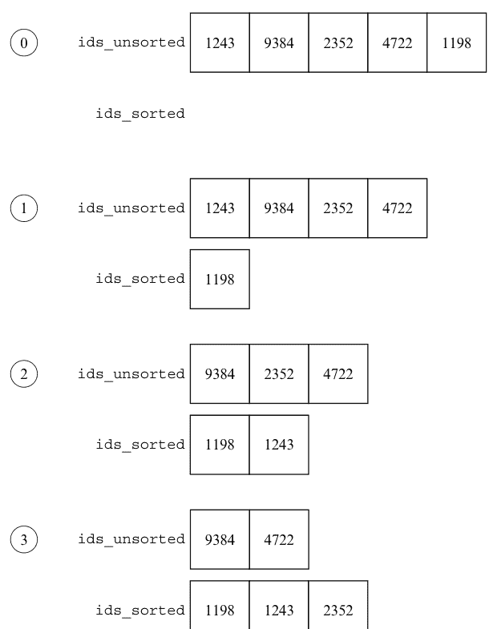

**图 19.5** 图 19.4 选择排序代码中循环前四次迭代的执行流程示意图。圆圈中的数字代表迭代开始时 `i` 的值，即在图 19.4 第 3 行之后、循环体第一行之前，`ids_unsorted` 和 `ids_sorted` 的状态。

已排序分区的最后一个元素，如此继续，直到找到提取的元素在已排序分区中的位置。

图 19.6 展示了实现插入排序以对海狸识别号进行排序的代码。外部 `for` 循环（第 3 行）的迭代次数等于待排序元素的数量。在第 4–6 行，我们处理 `ids_sorted` 中没有元素的情况。此时，我们从 `ids_unsorted` 中取出第一个元素，将其放入 `ids_sorted` 数组，并从 `ids_unsorted` 中删除该元素。

```
1  ids_unsorted = list(data.keys())
2  ids_sorted = []
3  for i in range(len(ids_unsorted)):
4      if len(ids_sorted) == 0:
5          ids_sorted.append(ids_unsorted[0])
6          temp = ids_unsorted.pop(0)
7  
8      else:
9          element_placed = False
10         sorted_loc_check = len(ids_sorted) - 1
11 
12         while not element_placed:
13             if ids_unsorted[0] >= ids_sorted[sorted_loc_check]:
14                 ids_sorted.insert(sorted_loc_check + 1, ids_unsorted[0])
15                 temp = ids_unsorted.pop(0)
16                 element_placed = True
17 
18             elif (sorted_loc_check == 0) and \
19                  (ids_unsorted[0] < ids_sorted[0]):
20                 ids_sorted.insert(0, ids_unsorted[0])
21                 temp = ids_unsorted.pop(0)
22                 element_placed = True
23 
24             else:
25                 sorted_loc_check -= 1
```

图 19.6 使用插入排序对海狸识别号进行升序排序的代码。假设图 19.1 第 1–33 行定义的所有变量已存在。

对于 `ids_sorted` 不为空的情况，我们从末尾开始，反向遍历 `ids_sorted` 中的每个元素，以确定将 `ids_unsorted` 剩余值中的第一个元素放置在何处（图 19.6 第 9–25 行）。我们使用 `while` 循环进行这些重复比较。第 13–16 行的比较逻辑是检查 `ids_unsorted` 的第一个元素是否大于或等于 `ids_sorted` 中正在比较的元素。如果是，我们将 `ids_unsorted` 的元素放置在 `ids_sorted` 中正在比较的元素*之后*（第 14 行）。列表方法 `insert`（第 14 行）接受两个位置输入参数（一个位置索引和一个对象），并将对象放置在给定位置索引*之前*。因此，在第 14 行，我们将 `ids_unsorted` 的元素放置在位置索引 `sorted_loc_check + 1` 之前。即使 `sorted_loc_check + 1` 超出了 `ids_sorted` 最后一个元素的位置索引，此方法也有效。

图 19.6 第 18–22 行的逻辑涵盖了我们已到达 `ids_sorted` 的第一个元素且 `ids_unsorted` 的元素小于 `ids_sorted` 的第一个元素的情况。此时，`ids_unsorted` 的元素被放置在 `ids_sorted` 的第一个元素之前。也就是说，调用 `insert` 时使用的位置索引是 0 而不是 0 + 1 = 1（第 20 行）。

一旦 `ids_unsorted` 的元素被放置到 `ids_sorted` 中的适当位置，`while` 循环结束（通过将 `element_placed` 设置为 `True`）。如果 `ids_unsorted` 的元素尚未放置，我们将 `sorted_loc_check` 减 1（第 25 行），以便在 `while` 循环的下一次迭代中，我们与 `ids_sorted` 中当前元素左侧的一个元素进行比较。

图 19.7 展示了图 19.6 中外部 `for` 循环前四次迭代的结果。图 19.8 展示了在图 19.7 中两个迭代之间移动所涉及的比较步骤，即从迭代 ② 到 ③。`ids_unsorted` 的第一个元素（2352）与 `ids_sorted` 的最后一个元素（9384）进行比较，以查看 `ids_unsorted` 的元素是否大于或等于 `ids_sorted` 的元素（该比较由最右边的箭头表示，并在图 19.6 第 13 行执行）。如果是，2352 将被放置在 9384 之后，但事实并非如此，因此我们递增 `sorted_loc_check`（图 19.6 第 25 行），以便与 `ids_sorted` 中的 1243 重复比较，以查看 2352 是否应位于 1243 和 9384 之间（该比较由图 19.8 中最左边的箭头表示）。情况确实如此，因此 2352 被移动到 `ids_sorted` 中 1243 和 9384 元素之间。

从图 19.4 和 19.6 来看，选择排序似乎比插入排序简单得多。然而，请记住，在选择排序代码中，我们将一些本应在图 19.4 中的代码放入了 `min_val_loc` 函数中。此外，在图 19.4 和 19.6 中，我们将未排序和已排序分区实现为内存中的独立区域（即独立的列表）。在该算法的实际实现中，已排序分区将是持有未排序分区的内存的一个子集。如果这些排序算法使用固定大小的数组实现，这将节省内存，因为我们将避免创建两个相同大小的数组。在我们使用列表的解决方案中，由于列表的大小会根据列表中元素的数量而增长和缩小，因此将未排序和已排序分区实现为内存中的独立区域基本上没有内存损失。

选择排序和插入排序的性能相似。两者都使用一层嵌套循环（我们选择排序解决方案中的内层循环位于 `min_val_loc` 函数中）。在最坏情况下，两种排序算法在两层循环中都会遍历所考虑分区的所有元素。因此，两种排序算法所需的操作次数相似。其他排序算法具有更好的性能特性，包括内置函数 `sorted` 所使用的算法（该算法称为 Timsort，源自插入排序和归并排序算法）。<sup>7</sup> 在第 22 章中，我们将更详细地讨论性能以及如何衡量性能。

我们对不同算法——选择排序和插入排序、线性搜索和二分搜索——考察的结论是：完成任何给定任务都有不同的方法，虽然有些算法性能相似，但有些则不然。

<sup>7</sup> https://en.wikipedia.org/w/index.php?title=Timsort&oldid=963161039 和 https://stackoverflow.com/a/10948946/8430411（均于 2020 年 7 月 23 日访问）。

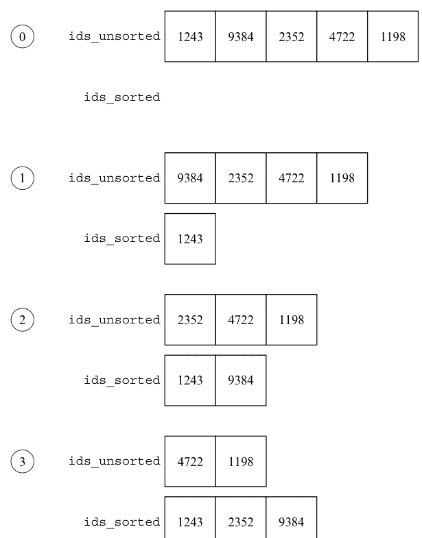

图 19.7 图 19.6 插入排序代码中外部 `for` 循环前四次迭代的执行流程示意图。圆圈中的数字代表迭代开始时 `i` 的值，即在图 19.6 第 3 行之后、循环体第一行之前，`ids_unsorted` 和 `ids_sorted` 的状态。

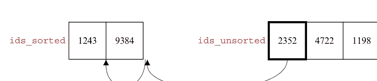

图 19.8 展示了在图 19.7 中从迭代 ② 移动到 ③ 所涉及的比较步骤的示意图（由图 19.6 第 12–25 行执行）。

### 19.2.3 使用 pandas 进行基础搜索和排序

pandas 数据对象类似于 NumPy 数组，因为它们表示网格化的数据，但具有额外的功能。首先，pandas `Series` 和 `DataFrame` 对象（本章后续称为“pandas 数据对象”）具有标签（类似于字典键），这些标签的名称（或整数等）除了表示元素在维度中的位置外，还具有其他含义。其次，pandas 利用这个引用系统定义了一个接口，使我们能够用很少的代码完成很多工作。第三，与 NumPy 数组中每个元素必须是相同类型不同，pandas 在存储不同类型的值方面具有更大的灵活性。因此，在图 19.1 的章节示例中，`DataFrame` 对象 `data_df`（第 54 行）同时包含字符串和整数。

因此，尽管我们在前面章节中使用 pandas 数据对象的方式——处理缺失值和与 Excel 文件交互——很有用，但上述额外功能赋予了 pandas 在一维和二维数据集中选择、操作、排序和分组值的能力，这些能力远远超出了 NumPy 数组所能做的。在本节中，我们将描述如何使用 pandas 进行基础选择和操作、布尔选择、排序和分组。关于使用 pandas 的精彩简要介绍，请参阅“10 Minutes to Pandas”指南。（我们提供了该指南的最新链接，位于 www.cambridge.org/core/resources/pythonforscientists/refs/，参考文献 45。）该指南以及 pandas 解释器帮助也为本节部分内容提供了思路。pandas 的经典参考文献是 McKinney (2017)。

在本节中，假设 pandas 已作为 `pd` 导入，并且图 19.1 第 21–33 行定义的所有变量已存在。

#### 关于 DataFrame 对象的更多信息

图 19.1 中的 `DataFrame` 对象 `data_df` 如下所示：

```
In [1]: print(data_df)

        Nickname Date of Birth  Mother's ID  Father's ID
1243        Max    2018-04-17         2352         4722
9384       Polly    2018-04-17         2352         4722
2352        Fong            -1           -1           -1
4722      Edward            -1           -1           -1
1198       Jessie           -1           -1           -1
```

此 `DataFrame` 对象是在图 19.1 第 54 行创建的。为了创建 `data_df`，我们使用了三部分输入。列表 `data_list` 是一个列表的列表，其中 `data_list` 的每个元素都是一个列表，包含 `data_df` 中一行的列数据。列标签由列表 `cols`（图 19.1 第 33 行）定义，行名由列表 `rows`（在图 19.1 第 27 行和第 30 行定义）定义。在图 19.1 第 54 行，行和列标签分别通过 `index` 和 `columns` 关键字输入参数传递给 `DataFrame` 调用。

# 19 基础搜索与排序

左侧的行名虽然是整数，但并非像二维 NumPy 数组中的位置索引。相反，它们是第 19.1 节数据表中河狸的识别编号。

在 `DataFrame` 对象中，行名和列名分别存储在 `index` 和 `columns` 属性中（为便于阅读，输出已手动重新格式化）：

```
In [1]: print(data_df.index)
       print(data_df.columns)

       Int64Index([1243, 9384, 2352, 4722, 1198], dtype='int64')
       Index(['Nickname', 'Date of Birth', 'Mother's ID', 'Father's ID'],
             dtype='object')
```

这两个属性都不是列表对象，但它们的行为类似于列表，并具有更多功能。可以使用内置的 `list` 函数或每个属性附带的 `tolist` 方法将它们转换为列表。`len` 函数应用于 `DataFrame` 对象时，返回该对象的行数。这与将 `len` 应用于 `DataFrame` 对象的 `index` 属性时得到的值相同，因为 `index` 列出了行名。

容易混淆的是，行名的集合通常被称为“索引”（例如，图 19.1 第 54 行的关键字输入参数），因此我们可能将行名称为“索引”。但是，我们也称列表、元组和 NumPy 数组中元素的位置地址为元素的“索引”。在本章中，我们使用“位置索引”来表示基于元素在数据结构中位置的地址。我们也将 pandas 数据对象的“索引”称为“行名”或“行标签”的集合，除非遵循 pandas 的惯例，将其称为索引更清晰。

#### 基础选择与操作

由于 `Series` 和 `DataFrame` 对象中的行（以及二维情况下的列）都有标签，我们可以使用这些标签来引用列和行，就像我们使用与值关联的键来引用字典中的值一样。要引用 `data_df` 的一列，我们使用类似于字典的语法：

```
In [1]: print(data_df['Nickname'])

       1243          Max
       9384         Polly
       2352          Fong
       4722        Edward
       1198        Jessie
       Name: Nickname, dtype: object
```

从 `DataFrame` 中选择一列的结果是一个 `Series` 对象：

```
In [1]: print(type(data_df['Nickname']))

<class 'pandas.core.series.Series'>
```

我们可以通过将多个列名放入方括号内的列表中来选择多列：

```
In [1]: print(data_df[["Nickname", "Mother's ID"]])

        Nickname  Mother's ID
1243        Max         2352
9384       Polly         2352
2352        Fong           -1
4722      Edward           -1
1198      Jessie           -1
```

选择多列的结果是一个 `DataFrame` 对象，而不是 `Series` 对象，因为结果是一个二维数据网格。

要选择行或选择行和列的范围，我们使用 `loc` 选择说明符。该说明符的语法看起来像方法调用，`loc` 位于 `DataFrame` 对象名称后的点之后，但 `loc` 后面是方括号而不是圆括号。例如，以下代码选择 `data_df` 中行名为 4722 的行：

```
In [1]: print(data_df.loc[4722, :])

Nickname                  Edward
Date of Birth
Mother's ID                 -1
Father's ID                 -1
Name: 4722, dtype: object
```

方括号中的第一个元素是行名（即河狸的识别编号），第二个元素是冒号，表示“使用所有列”。选择一行的结果是一个 `Series` 对象。

使用 `loc` 选择机制，我们还可以选择行和列的子范围。例如：

```
In [1]: print(data_df.loc[9384:4722, "Date of Birth":"Father's ID"])

        Date of Birth  Mother's ID  Father's ID
9384      2018-04-17         2352         4722
2352              -1           -1           -1
4722              -1           -1           -1
```

使用此选择机制，由下限和上限行名或列名指定的范围**两端都包含**。这与使用位置索引对列表、元组和 NumPy 数组进行切片或选择不同，后者的上限是排他的。此外，`9384:4722` 指定的行范围表示“从行名为 9384 的行开始，选择行直到并包括行名为 4722 的行”。与使用位置索引的切片不同，如果行名或列名是整数，切片的上限可以大于下限，因为整数行名或列名不必按升序排列。

除了为行指定列的子范围或为列指定行的子范围外，我们还可以为行或行的子范围指定要选择的特定列。例如：

```
In [1]: edward_row_partial = data_df.loc[4722, ["Nickname", "Mother's ID"]]
print(edward_row_partial)
print(edward_row_partial["Mother's ID"])
print(edward_row_partial.loc["Mother's ID"])

Nickname          Edward
Mother's ID          -1
Name: 4722, dtype: object
-1
-1
```

变量 `edward_row_partial` 是一个 Series 对象，其中包含识别编号为 4722 的河狸的“昵称”和“母亲 ID”值（这些列标签现在是 Series 对象中的“行”标签）。如上所示，要从 Series 对象中提取特定值，我们可以使用行标签，无论是否使用 `loc` 表示法；两者给出相同的结果。

在此示例中，我们使用 `loc` 表示法同时提取多个特定行*和*多个特定列：

```
In [1]: print(data_df.loc[[4722, 1198, 4722], ["Nickname", "Mother's ID"]])

        Nickname  Mother's ID
4722    Edward           -1
1198    Jessie           -1
4722    Edward           -1
```

我们选择了识别编号为 4722 的河狸两次，并将该行的列放在结果 DataFrame 的两个不同位置（作为第一行和最后一行）。

我们还可以使用行和列标签选择 DataFrame 的单个元素。例如，以下代码提供识别编号为 4722 的河狸的昵称：

```
In [1]: print(data_df.loc[4722, 'Nickname'])

Edward
```

这与图 19.1 第 55 行的语法相同。

因为行名和列名比位置索引更清晰并传达更多信息，所以我们通常使用这些名称来操作 pandas 数据对象。尽管如此，在某些情况下使用位置索引是有意义的。在这些情况下，我们可以使用 `iloc` 表示法。该表示法的工作方式与列表、元组和 NumPy 数组切片相同。我们也可以通过每个维度中的列表选择特定的行和列：

```
In [1]: print(data_df.iloc[0:2, 1:3])

          Date of Birth  Mother's ID
1243      2018-04-17          2352
9384      2018-04-17          2352
```

```
In [2]: print(data_df.iloc[[0, 2], [1, 3]])

          Date of Birth  Father's ID
1243      2018-04-17          4722
2352                     -1
```

```
In [3]: print(data_df.iloc[2, 3])

-1
```

使用 `iloc` 和位置索引切片范围时，上限是*排他的*，就像对列表、元组和 NumPy 数组进行切片一样。对于多个特定行和多个特定列，使用指定的行和列位置索引。

最后，我们可以像对列表和字典一样，向 pandas 数据对象添加和删除行和列（视情况而定）。添加列使用类似于字典的语法。在下面的示例中，我们使用 `DataFrame` 对象的 `copy` 方法，制作 `data_df` 对象前两列（按列名指定）的与内存无关的副本。我们这样做是为了使表格不那么宽，这样在添加新列后，它仍然适合本书的页面。然后，我们添加三列虚构数据，列出河狸的颜色、重量和长度：

```
In [1]: copy_df = data_df[['Nickname', 'Date of Birth']].copy()
        print(copy_df)

          Nickname Date of Birth
1243         Max      2018-04-17
9384        Polly      2018-04-17
2352         Fong
4722       Edward
1198        Jessie
```

```
In [2]: copy_df['Color'] = pd.Series(['brown', 'brown', 'dark brown',
                                       'dark brown', 'brown'], index=rows)
        copy_df['Weight'] = pd.Series([71, 65, 59, 60, 60], index=rows)
        copy_df['Length'] = pd.Series([26, 29, 32, 33, 30], index=rows)
        print(copy_df)
```

# 19 基础搜索与排序

|    | 昵称 | 出生日期 | 颜色      | 体重 | 体长 |
|----|----------|---------------|------------|--------|--------|
| 1243 | Max      | 2018-04-17    | 棕色      | 71     | 26     |
| 9384 | Polly    | 2018-04-17    | 棕色      | 65     | 29     |
| 2352 | Fong     |               | 深棕色 | 59     | 32     |
| 4722 | Edward   |               | 深棕色 | 60     | 33     |
| 1198 | Jessie   |               | 棕色      | 60     | 30     |

体重单位为磅，体长单位为英寸。我们指定 `index` 关键字输入参数等于列表 `rows`（在图 19.1 的第 27-30 行创建）。这样，pandas 就知道作为位置输入参数传递给 `Series` 构造函数的列表中的哪个元素对应哪个海狸识别号。如果赋值语句的右侧不是 `Series` 对象，而是数组或列表，则到行名（索引）的映射基于元素和行的顺序。替换 `DataFrame` 中的现有列使用相同的赋值语法，就像使用字典一样。

`drop` 方法删除指定的行和/或列，并返回修改后的数据对象。要添加一行，我们使用 `loc` 表示法。以下代码将把识别号为 7844 的海狸数据添加到上面的 `copy_df` 对象中：

```
In [1]: copy_df.loc[7844, :] = pd.Series(['Lily', '', 'dark brown', 62, 34],
                                        index=copy_df.columns)
        print(copy_df)
```

|    | 昵称 | 出生日期 | 颜色      | 体重 | 体长 |
|----|----------|---------------|------------|--------|--------|
| 1243 | Max      | 2018-04-17    | 棕色      | 71.0   | 26.0   |
| 9384 | Polly    | 2018-04-17    | 棕色      | 65.0   | 29.0   |
| 2352 | Fong     |               | 深棕色 | 59.0   | 32.0   |
| 4722 | Edward   |               | 深棕色 | 60.0   | 33.0   |
| 1198 | Jessie   |               | 棕色      | 60.0   | 30.0   |
| 7844 | Lily     |               | 深棕色 | 62.0   | 34.0   |

要向 `DataFrame` 对象添加多行，更合理的做法是将新行作为另一个 `DataFrame` 对象，并使用 pandas 的连接函数 `concat`。最后，在第 15.2.2 节中，我们看到 `Series` 对象的值存储在 `values` 属性中，作为一个 NumPy 数组。类似地，`DataFrame` 对象中的值存储在 `values` 属性中，作为一个二维 NumPy 数组。

#### 布尔选择

我们之前看到，对于 NumPy 数组，我们可以使用数组语法和 `where` 函数，结合布尔数组，来选择数组中的某些元素而排除其他元素。我们可以对 pandas 数据对象执行类似的操作。再次考虑图 19.1 中的 `DataFrame` 对象 `data_df`。如果我们从 `data_df` 中选择一列，比如“母亲 ID”，并检查哪些值大于 0，我们会得到以下结果：

```
In [1]: print(data_df["Mother's ID"] > 0)

1243     True
9384     True
2352    False
4722    False
1198    False
Name: Mother's ID, dtype: bool
```

该操作返回一个 Series 对象，其中大于比较是沿列元素逐元素进行的，布尔结果保存在返回的 Series 对象中。因为返回值是一个 Series 对象，所以行标签（和列名）被包含在内。

我们可以使用这种布尔“掩码”来选择 DataFrame 对象的特定行。例如，如果我们把这个掩码放入方括号中，从 data_df 中选择，我们就会得到一个由“母亲 ID”大于 0 的行组成的 DataFrame 对象：

```
In [1]: mask = data_df["Mother's ID"] > 0
        print(data_df[mask])

        Nickname Date of Birth Mother's ID Father's ID
1243     Max     2018-04-17         2352        4722
9384     Polly   2018-04-17         2352        4722
```

我们也可以在一行中完成上述操作：

```
print(data_df[data_df["Mother's ID"] > 0])
```

我们还可以进行更复杂的布尔表达式。以下代码返回“母亲 ID”大于 0 且海狸识别号大于 5000 的行：

```
In [1]: print(data_df[(data_df["Mother's ID"] > 0) & (data_df.index > 5000)])

        Nickname Date of Birth Mother's ID Father's ID
9384     Polly   2018-04-17         2352        4722
```

在这样的 pandas 表达式中，逻辑“与”运算符是与号（&），逻辑“或”运算符是竖线（|）。

同样，虽然我们可以使用 NumPy 数组、数组语法和布尔数组执行类似的操作，但 pandas 的选择机制以及行和列标签使得这种数据子集选择更加简洁。

#### 排序

Series 和 DataFrame 对象包含 `sort_index` 和 `sort_values` 方法。`sort_index` 方法根据索引（行名）的值对元素（对于 Series 对象）或行（对于 DataFrame 对象）进行排序。`sort_values` 方法根据元素的值（对于 Series 对象）或一列或多列的值（对于 DataFrame 对象）对元素/行进行排序。

再次考虑图 19.1 中的 DataFrame 对象 `data_df`。如果我们选择 'Nickname' 列以获得一个 Series 对象，`sort_index` 方法返回：

```
In [1]: print(data_df['Nickname'].sort_index())

1198    Jessie
1243        Max
2352       Fong
4722     Edward
9384      Polly
Name: Nickname, dtype: object
```

调用 `sort_index` 并将关键字输入参数 `ascending` 设置为 `False`，将按索引值（行名）降序返回 Series 对象中的项目：

```
In [1]: print(data_df['Nickname'].sort_index(ascending=False))

9384      Polly
4722     Edward
2352       Fong
1243        Max
1198    Jessie
Name: Nickname, dtype: object
```

Series 对象的值遵循由于排序而导致的行名（索引）的重新排序，因为值是通过这些名称引用的。

附加到 DataFrame 对象的 `sort_index` 方法的工作方式类似于 Series 对象版本。将该方法应用于图 19.1 中的 DataFrame 对象 `data_df`，我们得到：

```
In [1]: print(data_df.sort_index())

        Nickname Date of Birth  Mother's ID  Father's ID
1198    Jessie                           -1           -1
1243        Max    2018-04-17         2352         4722
2352       Fong                           -1           -1
4722     Edward                           -1           -1
9384      Polly    2018-04-17         2352         4722
```

当行名（索引）由于排序而重新排序时，整行的所有值都遵循该重新排序。

对于 Series 对象，`sort_values` 方法根据对象元素的值（而不是行名）进行排序。此方法还有一个布尔关键字输入参数 `ascending`，用于控制是按升序还是降序对值进行排序：

```
In [1]: print(data_df['Nickname'].sort_values(ascending=False))
```

```
9384     Polly
1243       Max
1198     Jessie
2352      Fong
4722    Edward
Name: Nickname, dtype: object
```

对于 DataFrame 对象，当我们使用 `sort_values` 时，我们需要指定按哪一列（或多列）的值进行排序。`by` 关键字输入参数实现了这一点。以下代码按 'Date of Birth' 排序：

```
In [1]: print(data_df.sort_values(by='Date of Birth'))
```

```
   Nickname Date of Birth  Mother's ID  Father's ID
2352      Fong                          -1           -1
4722    Edward                          -1           -1
1198     Jessie                          -1           -1
1243       Max    2018-04-17         2352         4722
9384     Polly    2018-04-17         2352         4722
```

要先按 'Date of Birth' 排序，然后按 'Nickname' 排序，我们可以将这些列名的列表按该顺序传递给 `by` 关键字输入参数：

```
In [1]: print(data_df.sort_values(by=['Date of Birth','Nickname']))
```

```
   Nickname Date of Birth  Mother's ID  Father's ID
4722    Edward                          -1           -1
2352      Fong                          -1           -1
1198     Jessie                          -1           -1
1243       Max    2018-04-17         2352         4722
9384     Polly    2018-04-17         2352         4722
```

在 'Date of Birth' 值相同的行之间，该方法基于 'Nickname' 的值进行排序。

`sort_index` 和 `sort_values` 方法（适用于 `Series` 和 `DataFrame` 对象）都有一个关键字输入参数 `kind`，它使我们能够选择希望使用的排序算法。默认算法是快速排序。⁸

#### 分组

使用一组列数据的典型操作是，根据一组列值对数据进行分组，然后对每个分组的另一列（或多列）的值执行操作。`groupby` 方法提供了一种便捷的方式来完成此任务。考虑第 19.2.3 节中 `DataFrame` 对象 `copy_df` 的最终版本（为方便起见，此处重新列出）：

```
In [1]: print(copy_df)

          Nickname Date of Birth        Color  Weight  Length
1243          Max   2018-04-17         brown    71.0    26.0
9384         Polly   2018-04-17         brown    65.0    29.0
2352          Fong            NaN   dark brown    59.0    32.0
4722        Edward            NaN   dark brown    60.0    33.0
1198        Jessie            NaN         brown    60.0    30.0
7844          Lily            NaN   dark brown    62.0    34.0
```

假设我们希望将所有具有相同 'Color' 值的行分组，并对每个分组中所有可以应用该操作的列（即具有数值的列）的值求平均值。对于上面的 `DataFrame`，只有 'Weight' 和 'Length' 列符合此条件。以下代码将完成此任务：

```
In [1]: print(copy_df.groupby('Color').mean())

              Weight    Length
Color                         
brown      65.333333  28.333333
dark brown 60.333333  33.000000
```

结果是一个 `DataFrame` 对象，其列是 `copy_df` 中可以应用 `mean` 方法的每一列，而行名（索引）是 `copy_df` 中 'Color' 列的所有可能值。`groupby('Color')` 调用根据 'Color' 列中的值（即 'brown' 和 'dark brown'）对 `copy_df` 的行进行分组。该调用返回一个 `DataFrameGroupBy` 类的对象。此对象将每个分组存储为一个 `DataFrame`，并提供方法来根据需要对每个分组的每一列进行计算。在上面的代码中，`mean` 方法应用于每个*分组*，结果是该分组每一列的值。因此，在对 `DataFrameGroupBy` 对象调用 `mean` 得到的 `DataFrame` 中，与行名 'brown' 对应的值是 `copy_df` 中所有 'Color' 为 'brown' 的行的 'Weight' 值的平均值，以及 `copy_df` 中所有 'Color' 为 'brown' 的行的 'Length' 值的平均值。

`DataFrameGroupBy` 还有许多其他方法可以应用于每组值中的列。其中许多是统计方法，因此仅适用于数值数据。还有一个 `apply` 方法，可用于对分组应用其他函数，包括用户编写的函数。

要返回给定分组中所有行的 `DataFrame`，我们可以使用 `DataFrameGroupBy` 对象的 `get_group` 方法。因此，可以通过以下方式获取所有 'Color' 为 'brown' 的行：

```
In [1]: print(copy_df.groupby('Color').get_group('brown'))
```

| Nickname | Date of Birth | Color | Weight | Length |
|---|---|---|---|---|
| 1243 | Max | 2018-04-17 | brown | 71.0 | 26.0 |
| 9384 | Polly | 2018-04-17 | brown | 65.0 | 29.0 |
| 1198 | Jessie | | brown | 60.0 | 30.0 |

也可以使用此选择命令获得相同的 `DataFrame` 对象：

```
copy_df[copy_df['Color'] == 'brown']
```

但在此示例中，`groupby` 所做的是为 'Color' 的*所有*可能值（而不仅仅是 'brown'）执行此类选择。所有这些分组的行名存储在 `groups` 字典中（为便于显示而重新格式化）：

```
In [1]: print(copy_df.groupby('Color').groups)
```

```
{'brown': Int64Index([1243, 9384, 1198], dtype='int64'),
 'dark brown': Int64Index([2352, 4722, 7844], dtype='int64')}
```

`groups` 字典的键是 'Color' 的所有可能值。然而，我们不必直接操作分组。应用 `mean` 方法、附加到 `DataFrameGroupBy` 对象的另一种计算方法，或 `apply` 方法，会减少每个分组以及所有分组中该方法可以处理的所有列的数据。关键点是：`groupby` 方法使我们能够用一个表达式对数据表执行分组和应用任务。

我们可以用 pandas 做很多事情！我们只是触及了皮毛。然而，我们已经看到，对于表格数据，pandas 可以在很少的代码行中搜索（选择和分组）和排序大量复杂的分类数据。有关 pandas 功能的详细信息，请参阅本节前面提到的这些资源。

## 19.3 试一试！

本节中的示例涵盖了第 19.2 节的主要主题。我们练习使用各种搜索和排序算法及例程。这包括使用 pandas 的强大功能以及非 pandas 的替代方案。
对于本节的所有练习，假设 NumPy 已作为 `np` 导入，pandas 已作为 `pd` 导入。

### 试一试！19-1 使用非 pandas 方式搜索：月降水量

对于表 6.1 中的西雅图地区降水数据，使用第 19.2.1 节中的两种方法列出大于四英寸的月降水量值。假设降水数据已经在一维 NumPy 数组 `precip` 中。

### 试一试！答案 19-1

以下展示了使用循环的解决方案和使用 `where` 函数的解决方案：

```
In [1]: for iprecip in precip:
            if iprecip > 4.0:
                print(iprecip)

5.58
4.54
4.31
6.5
5.41

In [2]: print(precip[np.where(precip > 4.0)])

[5.58 4.54 4.31 6.5 5.41]
```

### 试一试！19-2 二分查找：设备库存

假设我们有以下实验室设备库存：

| 零件号 | 设备 | 数量 |
|---|---|---|
| 3822 | 安全护目镜 | 16 |
| 2938 | 试管 | 34 |
| 1123 | 烧杯 | 22 |
| 8733 | 培养皿 | 54 |
| 4389 | 测试条 | 25 |
| 2311 | 显微镜载玻片 | 89 |
| 9320 | 加热板 | 11 |

所有零件号都是四位整数。编写使用二分查找的代码，打印出库存中是否列出了烧杯。

### 试一试！答案 19-2

该问题是在零件号列表中搜索零件号 1123 是否存在。我们的解决方案类似于图 19.2 中的代码，如图 19.9 所示。运行代码后，屏幕上会打印出 `True`。

```
1  part_num = np.array([3822, 2938, 1123, 8733, 4389, 2311, 9320])
2  part_num = sorted(part_num)
3  target = 1123
4  
5  end_search = False
6  while not end_search:
7      if len(part_num) == 1:
8          end_search = True
9          if target == part_num[0]:
10             target_found = True
11         else:
12             target_found = False
13 
14     elif len(part_num) == 2:
15         end_search = True
16         if target == part_num[0]:
17             target_found = True
18         elif target == part_num[1]:
19             target_found = True
20         else:
21             target_found = False
22 
23     else:
24         middle_loc = int(len(part_num)/2)
25 
26         if target == part_num[middle_loc]:
27             end_search = True
28             target_found = True
29 
30         elif target > part_num[middle_loc]:
31             part_num = part_num[middle_loc:]
32 
33         else:
34             part_num = part_num[:middle_loc+1]
35 
36 print(target_found)
```

图 19.9 用于执行试一试！19-2 二分查找的代码。

### 试一试！19-3 选择排序：设备库存

对于试一试！19-2 中的实验室库存数据，编写使用选择排序将零件号按升序排序的代码。假设函数 `min_val_loc`（如图 19.1 所定义）*不可用*。但是，我们可以在自己的代码中复制该函数的功能。

### 试一试！答案 19-3

此解决方案完成了任务：

```
In [1]: part_num = [3822, 2938, 1123, 8733, 4389, 2311, 9320]
part_num_sorted = []
for i in range(len(part_num)):
    unsorted_min = part_num[0]
    unsorted_min_loc = 0
    for j in range(len(part_num)):
        if part_num[j] < unsorted_min:
            unsorted_min = part_num[j]
            unsorted_min_loc = j
    part_num_sorted.append(part_num[unsorted_min_loc])
    temp = part_num.pop(unsorted_min_loc)
print(part_num_sorted)

[1123, 2311, 2938, 3822, 4389, 8733, 9320]
```

我们使用 `part_num` 的列表版本，因为我们要使用 `pop` 方法。

### 试一试！19-4 使用 pandas 进行基本选择和操作：设备库存

使用试一试！19-2 中的所有数据创建一个 pandas `DataFrame` 对象 `inventory`。将零件号设为行名（索引）。将“数量”列提取为单独的 `Series` 对象，并将其值显示在屏幕上。

### 试一试！答案 19-4

此解决方案完成了任务：

In [1]: inventory = \n        pd.DataFrame([['Safety goggles', 16],
                      ['Test tubes', 34],
                      ['Beakers', 22],
                      ['Petri dishes', 54],
                      ['Test strips', 25],
                      ['Microscope slides', 89],
                      ['Hot plates', 11]],
                     index=[3822, 2938, 1123, 8733, 4389, 2311, 9320],
                     columns=['Equipment', 'Quantity'])
print(inventory['Quantity'])

```
3822    16
2938    34
1123    22
8733    54
4389    25
2311    89
9320    11
Name: Quantity, dtype: int64
```

我们也可以使用 `loc` 表示法来选择一列。给定上面的 `inventory` 对象，以下代码同样会选择 'Quantity' 列并返回一个 `Series` 对象：

```
inventory.loc[:,'Quantity']
```

假设所有数量都差了一个数量级（也许是有人在盘点时忘了写“0”）。我们可以将所有当前值乘以 10，并使用以下方式替换 'Quantity' 列：

```
In [1]: inventory['Quantity'] = inventory['Quantity'] * 10
        print(inventory)
```

```
          Equipment  Quantity
3822  Safety goggles       160
2938       Test tubes       340
1123         Beakers       220
8733    Petri dishes       540
4389      Test strips       250
2311  Microscope slides       890
9320       Hot plates       110
```

Pandas 数据对象也支持用于计算的数组语法，只要该操作对对象中的值有定义即可。此类数组语法计算不会应用于行名（索引）或列名。

### 动手试试！19-5 使用 pandas 进行布尔选择和排序：设备清单

对于在动手试试！19-4 中创建的原始 `inventory` 对象（即数据如动手试试！19-2 表格所示的对象），仅选择那些物品数量大于 30 的行，按部件编号对这些行进行排序，并将生成的 `DataFrame` 对象打印到屏幕上。

### 动手试试！答案 19-5

以下代码解决了这个问题：

```
In [1]: print(inventory[inventory['Quantity'] > 30].sort_index())
```

```
Equipment  Quantity
2311  Microscope slides        89
2938          Test tubes        34
8733        Petri dishes        54
```

`inventory['Quantity'] > 30` 部分创建了一个布尔 `Series` 对象，显示哪些行的数量大于 30。当将其放入第一个 `inventory` 后的方括号中时，只会选择这些行。我们可以使用 `sort_index` 方法按行名对生成的 `DataFrame` 进行排序。

### 动手试试！19-6 使用 pandas 进行分组：设备清单

假设我们想为原始实验室清单（来自动手试试！19-2）中的设备打印标签。我们有两种尺寸的标签（长和短），我们想找出每种尺寸需要打印多少张。短标签最多只能容纳 10 个字符。也就是说，对于在动手试试！19-4 中创建的原始 `inventory` 对象，我们需要：

- 添加一列 'Name Length'，给出 'Equipment' 列下列出的名称的字符数。
- 添加一列 'Label Size'，其值为 'long' 或 'short'，取决于设备名称适合的标签尺寸。
- 按 'Label Size' 对行进行分组，并将每种标签尺寸的所有数量相加。

一些提示和帮助：

- Series 对象有一个属性 str，其中包含对字符串值进行操作的方法。其中一个方法是 len，它返回 Series 对象中每个值的字符串值的长度。返回值本身就是一个 Series 对象。
- DataFrameGroupBy 对象也有一个 sum 方法，它将 DataFrameGroupBy 对象中每一列的所有值相加。
- NumPy 的 where 函数也可以将布尔 Series 对象作为条件进行操作。生成的数组也可以保存为 DataFrame 对象中的一列。

### 动手试试！答案 19-6

以下代码解决了这个问题。在创建 'Name Length' 和 'Label Size' 列之后，我们打印出 inventory 以显示其外观。然后我们打印按 'Label Size' 分组后求和的结果（在打印一个空行之后）：

```
In [1]: inventory['Name Length'] = inventory['Equipment'].str.len()
        inventory['Label Size'] = np.where(inventory['Name Length'] > 10,
                                         'long', 'short')
        print(inventory)
        print('\n')
        print(inventory.groupby('Label Size').sum())
```

| | Equipment | Quantity | Name Length | Label Size |
|---|---|---|---|---|
| 3822 | Safety goggles | 16 | 14 | long |
| 2938 | Test tubes | 34 | 10 | short |
| 1123 | Beakers | 22 | 7 | short |
| 8733 | Petri dishes | 54 | 12 | long |
| 4389 | Test strips | 25 | 11 | long |
| 2311 | Microscope slides | 89 | 17 | long |
| 9320 | Hot plates | 11 | 10 | short |

| Label Size | Quantity | Name Length |
|---|---|---|
| long | 184 | 54 |
| short | 67 | 27 |

因此，我们需要 184 张长标签和 67 张短标签。sum 方法也应用于 'Name Length' 列，但这些值对我们没有帮助。
pandas Series 对象的 str 属性非常有用！它使我们能够对 Series 对象中的所有值执行多种不同的字符串操作。许多常规 Python 字符串方法的版本都存在，包括 upper、lower、split、strip 等。slice 方法为 Series 对象实现了 Python 的方括号字符串切片功能。

## 19.4 更多学科特定实践

本章的学科特定 Jupyter 笔记本涵盖以下主题：

- 不使用 pandas 在 Python 中搜索和排序的方法。
- 搜索和排序算法。
- 使用 pandas 进行基本搜索和排序。

## 19.5 章节复习

### 19.5.1 自测题

尝试在不看书或任何其他资源或使用 Python 解释器的情况下完成这些题目。这些自测题的答案可在本章末尾找到。除非另有说明，否则假设 NumPy 之前已作为 `np` 导入，pandas 之前已作为 `pd` 导入。

**自测题 19-1**

列表方法 `index` 和 `count` 的作用是什么？

**自测题 19-2**

什么是“成员测试”，Python 如何实现该操作？

**自测题 19-3**

描述线性搜索和二分搜索算法之间的区别。每种算法的使用存在哪些限制和约束？

**自测题 19-4**

描述选择排序和插入排序之间的一些区别。

**自测题 19-5**

假设我们有一个 `DataFrame` 对象 `data`。我们如何获取行名和列名？

**自测题 19-6**

假设我们有一个 `DataFrame` 对象 `data`。我们如何提取名为 `'Mass'` 的列？假设该列名在 `data` 中有效。

**自测题 19-7**

假设我们有一个 `DataFrame` 对象 `data`。我们如何提取名为 48324 的行？假设该行名在 `data` 中有效。

**自测题 19-8**

假设我们有一个 `DataFrame` 对象 `data`。我们如何提取由前三行和前四列组成的子 DataFrame 对象？假设这对 `data` 是一个有效操作。使用 `loc` 做一次，再使用 `iloc` 做一次。

**自测题 19-9**

假设我们有一个 `DataFrame` 对象 `data`。向 `data` 添加一列名为 'Row Number' 的整数列，该列给出从 1 开始的行号。

**自测题 19-10**

假设我们有一个 `DataFrame` 对象 `birds`，描述关于一组鸟类的数据。该对象包含一列 'Count' 和另一列 'Weight'（后者以磅为单位）。我们如何获取由那些体重超过 2 磅且数量超过 15 的鸟组成的 `DataFrame`？

**自测题 19-11**

假设我们有来自自测题 19-10 的 `DataFrame` 对象 `birds`。我们如何按 'Count' 列的值降序对行进行排序？

**自测题 19-12**

假设我们有一个 `DataFrame` 对象 `fish`，它有两列（除了行名）：'Species' 和 'Count'。'Count' 列给出了 'Species' 列中给出的物种的鱼的数量。每一行代表在不同时间进行的观察（时间编码在行名的 `DataFrame` 索引中）。我们如何计算每种鱼的总数？

### 19.5.2 章节总结

在本章中，我们描述了在 Python 中搜索和排序数据的不同方法。在此过程中，我们描述了用于搜索和排序的不同算法，注意到不同的算法有不同的要求以及不同的性能特征。最后，我们研究了一些使用附加到 pandas 数据对象的方法来选择、操作、搜索、排序和分组数据的方法。pandas 工具和接口使我们能够使用很少的代码行对数据进行大量操作。我们在本章中涵盖的具体主题包括：

- 不使用 pandas 在 Python 中搜索和排序的方法
  - 通过在循环中测试进行搜索。
  - 使用列表的 `index` 方法或 `count` 方法进行搜索。
  - 使用数组语法并测试相等性进行搜索。
  - 使用数组上的 `where` 函数进行搜索。

# 19 基础搜索与排序

- 使用 `isclose` 函数在数组上进行搜索。
- 使用成员测试进行搜索。
- 使用 `glob` 函数进行搜索。
- 使用列表的 `sort` 方法进行排序。
- 使用 `sorted` 函数进行排序。

- 搜索与排序算法
  - 我们可以使用不同的算法进行搜索和排序。不同的算法具有不同的依赖性和性能特征。
  - 线性搜索涉及逐一循环遍历集合中的项目，并检查该项目是否是我们要查找的目标。
  - 二分搜索涉及询问一个项目是大于、等于还是小于已排序项目集合的中点，并在项目所在的剩余集合的一半中重复此查询。
  - 线性搜索适用于任何项目集合。二分搜索仅适用于已排序的项目集合。
  - 排序涉及将元素从未排序分区“移动”到已排序分区，直到未排序分区为空，并且所有元素在已排序分区中处于正确的顺序。
  - 选择排序通过重复查找未排序分区中剩余项目的最小值，并将该项目“移动”到已排序分区的末尾来工作。
  - 插入排序通过获取未排序分区中的下一个项目，检查未排序分区中的项目是否大于已排序分区中的最后一个项目来工作。如果不是，我们使用已排序分区中的倒数第二个项目重复检查，并对已排序分区中的项目继续此操作，直到找到未排序分区中的项目应放置（或插入）的位置。然后对未排序分区的下一个项目重复此过程。
  - 选择排序和插入排序都具有相似的性能特征。

- 使用 pandas 进行基础搜索和排序
  - 我们可以通过行和列名引用 `Series` 和 `DataFrame` 对象中的行（以及列，如果存在）。
  - 行名称为 pandas 数据对象的索引，并保存在 `index` 属性中。`DataFrame` 列列在 `columns` 属性中。
  - pandas 使我们能够选择 pandas 数据对象的一列或多列以及一行或多行。行和列可以是连续范围，也可以不是。`loc` 语法使用行和列名进行选择。`iloc` 语法使用位置索引进行选择。
  - `DataFrame` 对象的单列是 `Series` 对象。从 `DataFrame` 对象中选择的多行和多列也是一个 `DataFrame` 对象。
  - 我们可以使用布尔选择来选择满足给定条件的特定行。在这些 pandas 布尔表达式中，与号（&）是“与”运算符，竖线（|）是“或”运算符。
  - `sort_index` 方法按行名（索引值）对元素或行进行排序。`sort_values` 方法按一列或多列中的值对元素或行进行排序。
  - `groupby` 方法使我们能够根据一列或多列中的值对 `DataFrame` 中的行进行分组，然后对每个组的其他列值进行操作。

### 19.5.3 自测答案

### 自测答案 19-1

`index` 方法返回我们正在查找的内容在列表中首次出现的位置索引。`count` 方法返回我们正在查找的内容在列表中出现的次数。

### 自测答案 19-2

在成员测试中，我们试图查看一个集合是否至少包含某个值的一次出现。在 Python 中，这是使用 `in` 运算符实现的。在使用 `in` 运算符的表达式中，`in` 左侧的值会与 `in` 右侧给出的集合的内容进行检查。返回一个布尔值。请注意，`for` 循环*不是*通过包含 `in` 标记来实现成员测试的。

### 自测答案 19-3

在线性搜索中，我们一次检查集合中的每个项目，看看这是否是我们正在查找的项目。如果是，我们停止检查并宣布搜索成功。在二分搜索中，我们找到我们正在搜索的集合的中点，并询问我们正在查找的项目是大于、小于还是等于中点。如果它大于或小于中点，我们对目标所在的集合的一半重复此问题，依此类推，直到我们找到目标或集合中没有更多项目可供比较。

线性搜索算法可用于任何项目集合。这使得该算法非常灵活，但如果目标始终位于集合的末尾附近，则速度较慢。二分搜索算法通常比线性搜索快，但二分搜索只能用于已排序的集合。如果集合未排序，我们必须在使用二分搜索之前对其进行排序，或者使用线性（或其他）搜索。

### 自测答案 19-4

在选择排序中，我们的比较主要发生在未排序分区中的项目上。在插入排序中，我们的比较主要发生在已排序分区中的项目上。两种算法具有相似的性能特征。

### 自测答案 19-5

`data.index` 属性保存行名（索引），而 `data.columns` 属性保存列名。

### 自测答案 19-6

以下任一方式：
`data['Mass']`
或：
`data.loc[:, 'Mass']`
均可行。

### 自测答案 19-7

```
data.loc[48324, :]
```

### 自测答案 19-8

使用 `loc` 解决此任务：

```
data.loc[data.index[0:3], data.columns[0:4]]
```

使用 `iloc` 解决此任务：

```
data.iloc[0:3, 0:4]
```

### 自测答案 19-9

此代码将添加该行：

```
data['Row Number'] = np.arange(len(data)) + 1
```

如第 19.2.3 节所述，右侧不必是 `Series` 对象，可以是数组或列表。

### 自测答案 19-10

```
birds[(birds['Count'] > 15) & (birds['Weight'] > 2)]
```

### 自测答案 19-11

```
birds.sort_values(by='Count', ascending=False)
```

### 自测答案 19-12

此代码解决问题：

```
fish.groupby('Species').sum()
```

我们不需要知道 `DataFrame` 行名索引中每行的时间是如何编码的来解决此问题。

# 20 递归

在第 10.2.4 节中，我们研究了复制和删除文件和目录。我们使用的工具——`copytree`、`rmtree` 和 `move`——自动处理了目录树。例如，使用 `copytree` 对目录进行复制操作不仅复制最顶层的目录，还复制最顶层目录下的所有文件和子目录，依此类推，直到每个文件和子目录。在本章中，我们探讨编程语言如何通过递归原则实现“在嵌套层级上执行此操作”的想法。¹

由于我们刚刚完成第 19 章，其中我们研究了搜索，因此在本章中，我们从在目录树中搜索项目的问题开始。这个问题本质上是一个递归问题，因为目录由文件和子目录组成，而这些子目录又由文件和子目录组成，依此类推。Python 为我们提供了使用常规迭代（即 `for` 循环）解决该问题的工具，我们将在第 20.1 节中首先研究该方法。在我们解决目录搜索问题的第二个方案中，我们明确使用了递归，这促使我们更深入地研究该结构。像大多数可以应用于多个问题的编程结构和概念一样，递归的思想和实用性超越了搜索目录树。任何具有“嵌套层级”特征的问题都是递归的候选问题，并且在某些情况下，使用递归编写程序比不使用递归要容易得多。

## 20.1 递归示例

在第 10 章中，我们描述了如何使用 Python 管理文件和目录。其中包括目录树，即文件和子目录的集合，嵌套多层，例如图 10.2 的目录树。然而，我们研究的 `copytree`、`rmtree` 和 `move` 命令是将这些树作为一个整体来操作的。在本章的主要示例中，我们研究的代码虽然也对目录树作为一个整体进行操作，但允许我们在树的不同层级和树上的不同项目（文件、子目录）上执行不同的任务。具体来说，我们研究的代码使我们能够在目录树中搜索特定文件，如果找到，则打印出该文件的位置（因为如果文件位于不同的目录中，我们可以拥有同名的文件）。在下面的解决方案中，我们专门搜索图 10.2 中以目录 *MyFiles* 开头的目录树中所有出现的文件 *Temp.txt*。

¹ 本章部分内容改编自 Lin (2019) 的第 8.2–8.3 节。

# 20 递归

```python
import os

file_occurrence_locations = []
for dirpath, dirnames, filenames in os.walk("MyFiles"):
    if 'Temp.txt' in filenames:
        file_occurrence_locations.append(dirpath)
```

**图 20.1** 使用 `os` 模块的 `walk` 生成器搜索文件 *Temp.txt* 位置的代码。

在我们的第一个解决方案（图 20.1）中，我们利用了 `os` 模块的 `walk` 生成器²，它使我们能够使用循环遍历目录树，提供树中每个目录和子目录的完整路径（作为变量 `dirpath`），以及每个目录和子目录中所有文件的名称。这个循环没有显式地实现递归，但其行为是递归的。也就是说，它的行为依赖于目录树是一个嵌套相似项目的结构，其中每个子目录都与其父目录相似（即，它由文件和子目录组成），只是嵌套在其父目录内。循环的每次迭代都会访问这些嵌套目录中的每一个。

运行图 20.1 中的代码后，列表 `file_occurrence_locations` 的内容如下：

```
In [1]: print(file_occurrence_locations)

['MyFiles/StationData/July', 'MyFiles/StationData/June']
```

在图 20.1 和上面的 `print` 调用中，我们假设目录 *MyFiles* 位于当前工作目录中，并且是图 10.2 中给出的目录树。

在我们的第二个解决方案中，我们显式地使用了递归，这是一种表达嵌套相似项目思想的编程结构。图 20.2 中定义的函数 `find_temp_txt` 搜索输入参数 `top_dir` 中指定的目录以及 `top_dir` 内的所有子目录和所有后续子目录。因此，对该函数的以下调用：

```
In [1]: print(find_temp_txt("MyFiles"))

['MyFiles/StationData/July', 'MyFiles/StationData/June']
```

返回包含文件 *Temp.txt* 的目录路径列表。在上面的 `find_temp_txt` 调用中，我们假设 *MyFiles* 位于当前工作目录中，并且是图 10.2 给出的目录树。

² 参见 https://docs.python.org/3/library/os.html 和 http://stackoverflow.com/a/1724723（均于 2020 年 8 月 21 日访问）。

```python
import os

def find_temp_txt(top_dir):
    list_items = os.listdir(top_dir)
    list_txt = []
    for item in list_items:
        item_path = os.path.join(top_dir, item)
        if os.path.isdir(item_path):
            list_txt = list_txt + find_temp_txt(item_path)
        else:
            if item == 'Temp.txt':
                list_txt = list_txt + [top_dir]
    return list_txt
```

**图 20.2** 定义函数 `find_temp_txt` 的代码，该函数使用递归搜索文件 *Temp.txt* 的位置。

## 20.2 Python 编程基础

本节首先描述 `os` 模块的 `walk` 生成器的行为，虽然它不是递归编程的示例，但它使我们能够通过 `for` 循环递归地搜索目录树。这使我们能够解释图 20.1 的工作原理。然后我们描述递归以及如何编写递归函数。这使我们能够解释图 20.2 的工作原理。最后，我们探讨递归在搜索目录树之外的更多应用。

### 20.2.1 使用 `walk` 生成器

正如我们在第 20.1 节中看到的，`os` 模块的 `walk` 生成器允许我们深入目录树并访问该树中的每个目录。然而，尽管 `walk` 生成器看起来像一个函数，但它并不完全是一个函数。大多数函数接受输入并产生返回值。返回值通常是我们可以保存到变量中的东西，例如数字、字符串、列表或数组。然而，`walk` 产生的是一种称为生成器的东西。就我们的目的而言，生成器到底是什么并不那么重要。³ 相反，我们专注于使用生成器。简而言之，生成器是一个对象，其目的是在我们迭代时给我们一些可以迭代的东西，并在我们迭代时返回一些东西。因此，生成器通常用于循环中。

³ 有关该主题的更多信息，请参阅 Python 关于生成器的 wiki 页面。此页面的最新链接位于 www.cambridge.org/core/resources/pythonforscientists/refs/，参考文献 15。

考虑以下示例（假设当前工作目录包含文件夹 *MyFiles*，它是图 10.2 目录树的最顶层目录）：

```
In [1]: import os

for dirpath, dirnames, filenames in os.walk("MyFiles"):
    print( str(dirpath) + ":\n    " + str(dirnames) + \
          "\n    " + str(filenames) )
```

```
MyFiles:
    ['AudioClips', 'StationData', 'VideoClips']
    ['Report.pdf', 'Article.pdf']
MyFiles/AudioClips:
    []
    ['Questions.mp3', 'Talk.mp3']
MyFiles/StationData:
    ['July', 'June']
    ['Info.txt']
MyFiles/StationData/July:
    []
    ['Temp.txt']
MyFiles/StationData/June:
    []
    ['Humidity.txt', 'Wind.txt', 'Temp.txt']
MyFiles/VideoClips:
    []
    ['Setup.mov', 'Poster.jpg']
```

发生了什么？在 `for` 循环的每次迭代中，变量 `dirpath`、`dirnames` 和 `filenames` 都会被填充。在循环的第一次迭代中，`dirpath` 被设置为 'MyFiles'，`dirnames` 被设置为列表 ['AudioClips', 'StationData', 'VideoClips']，`filenames` 被设置为列表 ['Report.pdf', 'Article.pdf']。也就是说，在第一次迭代中，`dirpath` 被设置为树中的最顶层目录（*MyFiles*），而 `dirnames` 和 `filenames` 被设置为 *MyFiles* 中子目录和文件的名称。

在第二次迭代中，`dirpath` 被设置为 *MyFiles/AudioClips*，即 *MyFiles* 中的 *AudioClips* 子目录。`dirnames` 变量被设置为空列表（因为 *AudioClips* 不包含子目录），而 `filenames` 变量被设置为列表 ['Questions.mp3', 'Talk.mp3']。

第三次迭代将 `dirpath` 设置为 *MyFiles/StationData*，`dirnames` 设置为列表 ['July', 'June']，`filenames` 设置为列表 ['Info.txt']，依此类推，直到访问 *MyFiles* 目录树中的所有子目录。附带说明一下，从代码打印的内容中我们看到，当我们到达叶目录（即只包含文件的目录）时，`dirnames` 列表将为空（因此长度为零）。如果我们只对查看叶目录感兴趣，我们可以使用 `len(dirnames)` 作为测试，以查看我们是否在叶目录中。

有了这个背景，我们可以解释图 20.1 中的代码。在该代码中，从第 4 行开始的循环访问 *MyFiles* 中的所有目录。在循环的每次迭代中，我们访问树中的另一个目录。在每次迭代中，被访问目录中的文件列表是 `filenames`，因此我们可以检查 *Temp.txt* 是否在 `filenames` 列表中（第 5 行）。如果该文件存在于该目录中，我们将包含 `filenames` 中文件的目录路径（即 `dirpath`）（以 `walk` 的参数开头）附加到列表 `file_occurrence_locations` 中。

关于查找文件的最后一点说明：一个不幸的事实是，不同的操作系统不仅有不同的目录分隔符，而且对大小写敏感性也有不同的规则。在某些操作系统（如 Linux）上，文件名可以由大写或小写字符组成。在其他操作系统（如 Mac OS X）上，名为 *Temp.txt* 和 *temp.txt* 的文件之间没有真正的区别。<sup>4</sup> 这种大小写问题使得如果我们跨操作系统工作，简单的字符串相等性或成员资格测试可能会失败。Python 提供了 `fnmatch` 模块，以启用考虑我们所工作操作系统的大小写处理特性的文件名模式匹配。有关详细信息，请参阅 `fnmatch` 文档。`fnmatch` 文档的最新链接位于 www.cambridge.org/core/resources/pythonforscientists/refs/，参考文献 54。

### 20.2.2 递归和编写递归代码

在循环中使用 `walk` 生成器是搜索目录树的好方法。它简洁、灵活且健壮。然而，尽管我们不需要讨论递归来使用 `walk`，但目录树搜索问题非常自然地适合通过递归来解决。使用 `walk`，我们不必使用递归来遍历目录树，但值得利用树遍历问题来学习递归的工作原理，因为递归是一个非常有用的概念，可以帮助我们更简洁地编写原本会非常复杂的函数或程序。我们很少*需要*递归，但当我们需要时，我们*真的*需要递归。

递归是一种重复结构，在这方面它类似于循环。但是，循环一遍又一遍地重复任何类型的任务（任务在循环体中定义），而递归函数则重复执行*自身*。也就是说，递归函数是其定义中包含一个或多个对自身调用的函数。例如，如果我们有一个函数 `calculate`，在 `calculate` 的定义中至少有一个对 `calculate` 的调用。

这似乎有点奇怪。我们怎么能在定义函数的同时使用它呢？这听起来像是无限回归：使用我们正在定义的函数，而这个函数又使用我们正在定义的函数，如此循环往复，永无止境。

<sup>4</sup> 实际情况稍微复杂一些。问题在于我们选择的文件系统格式，而不是 Mac 版本的 Unix 本身。此外，这里的不区分大小写并不意味着它不保留大小写。有关该问题的精彩讨论，请参见 http://apple.stackexchange.com/a/22304（于 2016 年 11 月 11 日访问）。

# 20 递归

一个数学例子可能有助于描述递归是什么，以及为什么它不一定导致无限回归。假设我们想编写一个函数，它接受一个数字列表并将这些数字相加。使用 for 循环，`add_up` 函数将是：

```python
def add_up(input_list):
    total = 0.0
    for i in input_list:
        total = total + i
    return total
```

当我们在脑海中梳理这段代码的逻辑时，我们可能会听到类似这样的话：“取一个数字，加到总数上，再取另一个数字，加到总数上，如此反复，直到没有数字为止。”

但是，我们可以用另一种方式来思考将这些数字相加的过程：“一个数字列表的和，等于不包括最后一个数字的列表的和，加上最后一个数字。”但是，我们如何得到“不包括最后一个数字的列表的和”呢？使用相同的逻辑，这个和也是“不包括最后一个数字的列表的和，加上最后一个数字”，其中“数字列表”不是原始的数字列表，而是原始列表去掉最后一个元素后的列表。这个逻辑会持续下去，直到“不包括最后一个数字的列表的和”为零，因为这样的列表中已经没有数字了。在 Python 中，这看起来像：

```python
def add_up_recursive(input_list):
    if len(input_list) == 0:
        return 0.0
    else:
        return add_up_recursive(input_list[:-1]) + input_list[-1]
```

这段代码中需要指出几点：首先，我们看到我们的递归调用，即在 `add_up_recursive` 定义内部对 `add_up_recursive` 函数的调用，发生在第 5 行。然而，需要注意的是，虽然我们在第 5 行调用了 `add_up_recursive`，但输入参数与原始的、完整的数字列表不同。如果是那样，我们就会得到无限回归。相反，我们在第 5 行传递给 `add_up_recursive` 调用的输入参数是当前的 `input_list` 去掉最后一个元素。这就是我们如何在上述逻辑的文字描述中实现“不包括最后一个数字”这个短语的。

其次，我们对无限回归的担忧由第 2-3 行解决了。if 语句检查输入的数字列表 `input_list` 是否确实包含任何数字，如果不包含，函数返回零。这是合理的，因为“无”的和是零。但从无限回归的角度来看，这意味着在某个时刻我们将不再调用 `add_up_recursive`。第 2-3 行测试和处理的情况被称为停止情况或基本情况。顾名思义，这个条件终止了对函数的递归调用，防止了无限回归。每个递归函数都必须至少有一个停止情况。缺少一个（或足够的）停止情况会导致递归函数最终失败并抛出 `RecursionError` 异常。⁵

在这个例子中，递归函数并不比使用循环的函数更简洁。对于更简单的问题，这是典型的：循环解决方案比递归版本更直接、更短。然而，对于更复杂的问题，情况并非如此。让我们再次考虑第 20.1 节中图 20.2 的文件搜索问题的递归解决方案。让我们首先考虑那段代码中每一行发生了什么，并将该递归解决方案与不使用 os 模块的 `walk` 生成器的迭代解决方案的各个部分进行比较。

在图 20.2 中，第 1 行，我们导入 os 模块。第 3 行定义了函数。该函数接受一个输入字符串 `top_dir`，这是我们查找所有 *Temp.txt* 文件的目录名称。第 4 行保存 `top_dir` 中所有项目（文件和目录）的列表。`listdir` 方法只给出项目的名称（即，不包括文件或子目录路径的名称）。它不提供项目的绝对路径。在第 5 行，我们初始化一个空列表，用于保存 `top_dir` 及其所有子目录（直到其下的所有叶子目录）中的所有 *Temp.txt* 文件。对于给定的 `top_dir`，这个列表最初将是空的，因为我们尚未处理 `top_dir` 中的项目（或子项目）的列表。

在第 6 行，我们遍历每个项目。对于每个名为 *Temp.txt* 的项目（第 11 行），我们将其添加到 `list_txt`（第 12 行）。我们假设我们的操作系统是区分大小写的。如果 `top_dir` 中的项目是一个目录，我们会调用 `find_temp_txt`（这是递归调用）以获取该目录中 *Temp.txt* 文件的路径列表。我们传递给递归 `find_temp_txt` 调用的路径（以及在第 8 行使用 `isdir` 检查的路径）必须以初始的 `top_dir` 开头。也就是说，它必须以我们在原始调用 `find_temp_txt` 时传入的 `top_dir` 开头。在上面的例子中，那是 `find_temp_txt("MyFiles")`。路径需要以 *MyFiles* 开头的原因是函数不会更改当前工作目录。因此，当前工作目录仍然是 *MyFiles* 的父目录，如果路径没有首先指定 *MyFiles*，目录树中的任何项目都将保持隐藏状态。

在函数的连续递归调用中，第 7 行自动将当前的 `item` 添加到以 *MyFiles* 开头的目录路径中，并将结果存储在 `item_path` 中。这是因为第 9 行 `find_temp_txt` 调用的参数在该递归 `find_temp_txt` 调用中成为新的 `top_dir`，而 `join` 在第 7 行向该 `top_dir` 添加新的子目录。

在第 9 行和第 12 行，我们使用连接运算符将项目添加到 `list_txt`，而不是使用 `append`，因为 `list_txt` 可能有零个、一个或多个元素。当连接运算符用于两个列表时，它将两个列表连接在一起。当其中一个列表是空列表时，没有东西可以连接，因此结果是另一个列表，未更改。如果列表有一个或多个元素，第二个列表会扩展第一个列表。然而，`append` 方法将作为参数传入的内容作为列表中的一个元素添加。如果该参数是一个空列表，则将一个空列表作为现有列表的元素添加。如果该参数是一个列表，则该列表成为原始列表的一个元素，而不是原始列表的扩展。这里有一个例子：

```python
In [1]: a = [1, 2, 5]
        b = [3, -5, 9]
        c = a + b
        print(c)
        a.append(b)
        print(a)

[1, 2, 5, 3, -5, 9]
[1, 2, 5, [3, -5, 9]]
```

最后，在图 20.2 的第 13 行，我们返回 `find_temp_txt` 的输出，即由 `top_dir` 给出的目录树中所有包含文件 `Temp.txt` 的目录的路径列表（以函数的参数开头）。

所以，我们看到递归用 13 行代码解决了我们的问题。如果我们采用迭代方法（即使用循环而不是递归）会怎样？现在，在提出这个问题时，我们必须增加一个约束条件：我们不能使用 os 模块的 `walk` 生成器。使用 `walk` 生成器，我们可以编写一个小循环来解决问题（如图 20.1 所示）。

当我们尝试仅使用循环（不使用 `walk`）编写此代码时，遇到的第一个问题是如何处理子目录。例如，我们可以编写以下代码：

```python
import os

def find_temp_txt(top_dir):
    list_items = os.listdir(top_dir)
    list_txt = []
    for item in list_items:
        item_path = os.path.join(top_dir, item)
        if os.path.isdir(item_path):
            list_items_2 = os.listdir(item_path)
            for item_2 in list_items_2:
                item_2_path = os.path.join(top_dir, item_2)
                <... more code ...>
```

在上面的第 8-11 行中，当我们遇到一个子目录时，我们创建另一个 `for` 循环来遍历这些项目。如果该项目列表包含另一个目录，我们将添加另一个嵌套的 `for` 循环来遍历该子目录，依此类推（第 12 行）。

这种方法的问题在于我们事先不知道目录有多少级。对于两级目录，我们需要两个嵌套循环。对于三级目录，我们需要三个嵌套循环，依此类推。但是，目录可能有一级、两级或二十级。我们是否要编写一个二十级嵌套的 `for` 循环结构，以防有那么多目录级别？而一个人又如何编写一个二十级嵌套的 `for` 循环结构呢？

⁵ 在其他编程语言中，会导致“堆栈溢出”，迫使程序终止。

这是否具有可读性？然而，使用递归，*我们无需事先知道*目录有多少层级。如果需要进入下一级目录，递归调用会自动完成，根据需要重复多次（在合理范围内）。⁶

只要我们能识别出待分析对象的某种“重复嵌套”结构，递归就适用。在`add_up_recursive`示例中，这种结构是“数字列表”的概念。在目录树搜索示例中，则是目录树的概念。识别该结构并描述与之相关的所有可能输入情况，是编写递归函数时通常遵循的关键步骤：

1.  在递归逻辑中识别“重复嵌套”结构。
2.  列出函数输入的所有可能“情况”（或从输入推导出的情况）。因此，在上面的`add_up_recursive`示例中，情况包括输入列表`input_list`为空（长度为0）和不为空两种。在列举这些可能情况时，我们考虑了已识别的嵌套结构。在`add_up_recursive`中，该结构是逐步处理原始输入列表“剩余”部分的概念。
3.  在刚识别的可能输入情况中，一个或多个将是停止情况或条件。识别所有可能的停止条件并编写相应代码。
4.  剩余的可能输入情况将是递归的。弄清楚递归调用是什么，并为这些情况编写代码。

递归函数难以跟踪，尤其是当递归层级很多时。因此，必须逐行分析函数在给定测试输入下的行为。进行此分析时，应考虑覆盖所有可能输入情况的测试用例，其中一些导致停止情况，其余导致递归调用。

由于两者都是实现重复思想的结构，通常我们可以将循环（即迭代结构）编写为递归函数，反之亦然。何时应使用递归，何时应使用循环？循环通常更易读和理解，且循环可执行的迭代次数基本不受限制。相比之下，递归解决方案可能令人困惑，且可用的递归层级数量通常远小于中等规模数据集（MB范围）的元素数量。因此，在绝大多数情况下，循环是首选。在本章的主要示例——目录树搜索中，Python甚至提供了`walk`生成器，确保我们无需使用递归来解决这个常见问题。但是，对于某些问题，特别是那些无法事先知道有多少“嵌套层级”的问题，递归是用合理代码行数解决问题的唯一方法。我们将在下一节讨论更多此类情况。

⁶ 允许的最大递归调用次数由sys模块的`getrecursionlimit`函数给出（https://docs.python.org/3/library/sys.html，访问于2020年8月13日）。典型值为3000。

### 20.2.3 递归的更多应用

在本节中，我们提及递归的更多应用。在讨论中，请记住递归是一种编程结构或逻辑，而非算法。因此，我们通常可以使用递归或不使用递归来编写实现给定算法的代码。在本节中，我们将探讨使用递归实现二分查找，以及使用递归遍历“嵌套”函数调用列表。虽然分治排序方法——如归并排序和快速排序算法——经典地使用递归实现，并在入门编程教材中常见讨论，但本书将不涉及这些算法。

#### 递归二分查找

在图19.2中，我们编写了使用`while`循环实现二分查找的代码。然而，二分查找也具有递归逻辑：将域一分为二，找出目标值所在的那一半，然后*在目标值所在的那一半上执行二分查找*，如此反复。图20.3展示了定义递归二分查找函数`is_found_by_recursive_binary`的代码，我们将在下面使用它来复制图19.2中迭代二分查找代码的行为。

```python
def is_found_by_recursive_binary(input_list, input_target):
    if len(input_list) == 1:
        if input_target == input_list[0]:
            return True
        else:
            return False

    if len(input_list) == 2:
        if input_target == input_list[0]:
            return True
        elif input_target == input_list[1]:
            return True
        else:
            return False

    middle_loc = int(len(input_list)/2)

    if input_target == input_list[middle_loc]:
        return True

    if input_target > input_list[middle_loc]:
        return is_found_by_recursive_binary(
            input_list[middle_loc:], input_target )
    else:
        return is_found_by_recursive_binary(
            input_list[:middle_loc+1], input_target )
```

**图20.3** 使用递归定义二分查找函数的代码。此函数复制了图19.2中迭代二分查找代码的一般逻辑。

回想一下，在此示例中，我们搜索海狸识别号1243是否在列表`rows`中（如图19.1所定义）：

```
In [1]: rows_sorted = sorted(rows)
        target = 1243
        print(rows_sorted)
        print(is_found_by_recursive_binary(rows_sorted, target))

[1198, 1243, 2352, 4722, 9384]
True
```

让我们逐步分析图20.3中递归二分查找函数的逻辑。该函数在以下情况下停止：

-   当输入列表有一个或两个元素时。
-   当输入列表的中间元素等于目标时。

根据我们编写代码的方式，如果输入列表有一个或两个元素，我们会手动检查（即通过显式`if`语句）目标是否等于输入列表中的任何元素。如果是，则根据情况返回`True`或`False`。在第2-6行，我们考虑了输入列表为一个元素的停止情况。在第8-14行，我们考虑了输入列表为两个元素的停止情况。在第18-19行，我们考虑了最终的停止情况，当输入列表的中间元素等于目标时返回`True`。

图20.3中的其余代码包含递归调用（即对正在定义的函数的调用）。第21-23行在目标位于输入列表上半部分时调用函数，第24-26行在目标位于输入列表下半部分时调用函数。⁷ 在前一种情况下，递归调用仅传入输入列表的上半部分（第22-23行），而在后一种情况下，递归调用仅传入输入列表的下半部分。这是对前面描述的“在目标值所在的那一半上执行二分查找”逻辑的代码表达。

#### “嵌套”函数调用列表的递归遍历

在第17.2.5节中，我们看到了使用Python通过循环遍历属性和方法来自动化处理对象和模块的示例。让我们更进一步，探讨希望按列表中指定的任意顺序执行函数的情况。此外，我们希望具备保存命名执行顺序列表（例如在字典中）的能力，然后在待执行函数列表中引用这些保存的列表。例如，Lin (2009) 的混合Python/Fortran中层热带大气环流模型就实现了这种功能，允许用户设置指定运行哪些方法的“套件”。

⁷ 在当前使用“一半”时，我们指“近似一半”，因为中间元素的停止情况从一半的考虑中移除了一个元素。在本章中涉及二分查找时，这种通常近似的“一半”用法将持续使用。

# 20 递归

```python
def run1():
    print('bacteria')

def run2():
    print('42')

def run3():
    print('planet')

def run_execs(input_list, exec_lists):
    for iname in input_list:
        if iname in globals().keys():
            globals()[iname]()

        elif iname in exec_lists:
            run_execs(exec_lists[iname], exec_lists)

        else:
            raise ValueError(iname + ' does not exist')

my_run = ['all', 'set3', 'run2']
my_exec_lists = {'all': ['run1', 'run2', 'run3'],
                'set1': ['run2', 'run2', 'run1', 'run1'],
                'set2': ['run3', 'run1'],
                'set3': ['run1', 'set2']}

run_execs(my_run, my_exec_lists)
```

图 20.4 递归遍历“嵌套”函数调用列表的代码。

其结果是一个模型，该模型可以轻松配置为以不同的功能运行，甚至可以在运行时调整和改变其使用的方法。

例如，考虑图 20.4。定义了三个函数 `run1`、`run2` 和 `run3`，每个函数打印一个单词（第 1-8 行），并定义了函数 `run_execs` 来实现上述任意执行（第 10-19 行）。在此代码中，我们希望执行 `my_run`（第 21 行）中给出的三个函数或保存的函数列表。在该列表中，最后一个元素是之前定义的某个函数的名称（'run2'），但该列表中的前两个元素是什么？

第一个元素 'all' 指的是 `my_exec_lists` 字典中以 'all' 为键存储的列表。该列表指定了代码开头定义的三个函数的名称：'run1'、'run2' 和 'run3'。`my_run` 的第二个元素 'set3' 指的是 `my_exec_lists` 字典中以 'set3' 为键存储的列表。该列表有两个元素。第一个是 'run1'，指的是 `run1` 函数，但第二个元素是 'set2'，它指的是 `my_exec_lists` 字典中以 'set2' 为键存储的列表。也就是说，'set3' 列表引用了另一个列表。要执行 `set3` 列表中描述的内容，我们需要运行 `run1` 函数，然后运行 `set2` 列表中列出的函数。这就是我们所说的这些函数调用列表是“嵌套的”。一个列表元素可以引用另一个保存的列表，而该列表又可以有元素引用另一个保存的列表，依此类推。就像目录树一样，我们事先不知道哪些列表使用了保存的列表，哪些没有，也不知道一个保存的列表是否有元素引用其他保存的列表（以及这种引用延伸到多少层）。

因此，当我们编写 `run_execs` 函数来执行 `my_run` 中给出的函数列表和保存的函数列表时，使用递归是合理的。如图 20.4 第 10 行所示，我们向函数传递两个参数：要执行的项目列表（`input_list`）和保存的执行列表字典（`exec_lists`）。该函数遍历项目列表中的所有项目（所有字符串）。如果该项目指的是模块中定义的 `run1`、`run2` 或 `run3` 函数之一（第 12 行），则从符号表中获取该函数并调用它（第 13 行）。回顾第 17.2.5 节的讨论，`globals` 返回模块中定义的所有内容的字典。第 13 行是主要的停止情况。至于递归调用，如果 `input_list` 项目是 `exec_lists` 中的保存列表之一（第 15 行），我们使用该保存列表作为输入调用 `run_execs`（第 16 行）。第 18 行也是一个停止情况，用于捕获 `input_list` 中的项目不存在的情况。

当我们运行图 20.4 中的代码时，以下内容会打印到控制台：

```
bacteria
42
planet
bacteria
planet
bacteria
42
```

控制台输出的前三行来自执行保存的列表 `all`。接下来的三行来自执行保存的列表 `set3`，该列表本身执行函数 `run1` 和保存的列表 `set2`，后者执行函数 `run3` 和 `run1`。最后一行输出来自执行函数 `run2`。

## 20.3 试一试！

本节中的示例涉及第 20.2 节的主要主题。我们练习以不同方式操作目录树。我们还练习编写递归函数。

> **试一试！ 20-1 使用 `walk` 在目录树中搜索文件**

考虑图 10.2 的目录树。编写一个程序，使用 os 模块的 `walk` 生成器，列出相对于当前工作目录的路径和每个以 `.txt` 结尾的文件的名称。假设当前工作目录是 `MyFiles` 的父目录。

```python
import os

file_occurrences = []
for dirpath, dirnames, filenames in os.walk("MyFiles"):
    for ifile in filenames:
        if os.path.splitext(ifile)[-1].lower() == '.txt':
            file_occurrences.append(os.path.join(dirpath, ifile))
```

图 20.5 用于列出每个以 .txt 结尾的文件的路径（以 walk 的参数开头）和名称的代码，用于试一试！ 20-1。

### 试一试！答案 20-1

图 20.5 显示了该问题的解决方案。运行代码后，列表 file_occurrences 的内容如下（为可读性手动重新格式化输出）：

```
In [1]: print(file_occurrences)
['MyFiles/StationData/Info.txt',
 'MyFiles/StationData/July/Temp.txt',
 'MyFiles/StationData/June/Humidity.txt',
 'MyFiles/StationData/June/Wind.txt',
 'MyFiles/StationData/June/Temp.txt']
```

os 模块的 path 子模块有两个我们在图 20.5 中使用的有用函数：splitext 和 join。⁸ 两者都在第 10.2.1 节中描述。在第 6 行，我们使用 splitext 返回文件 ifile 的扩展名。我们使用字符串方法 lower 将扩展名转换为小写，然后再将其与 .txt 进行比较。这样，我们确保程序在不同的操作系统上都能工作，这些操作系统可能对大小写敏感性有不同的规则（例如，某些操作系统不区分大小写）。在第 7 行，我们使用 join 将文件 ifile 所在目录的路径（以 walk 的参数开头）与文件名 ifile 连接起来。通过使用 join，这两个组件使用程序运行的操作系统的目录分隔符连接。

### 试一试！ 20-2 使用 walk 操作目录树

考虑图 10.2 的目录树。编写一个程序，使用 os 模块的 walk 生成器，复制 StationData 中 June 和 July 目录的内容，并将这些副本（分别称为 June_copy 和 July_copy）也放在 StationData 中。提示：回顾第 10.2.4 节中描述的 copytree 函数。

### 试一试！答案 20-2

图 20.6 显示了该问题的解决方案。关于此解决方案的一些说明：在第 5 行，我们使用 basename 仅返回 dirpath 的最后一部分，以查看 dirpath 引用的目录是否是 *StationData*。如果是，我们检查 *June* 和 *July* 是否在 *StationData* 中（第 6 行和第 9 行），使用列表 `dirnames`（该列表列出了 `dirpath` 指定目录中的所有子目录）进行成员测试。最后，在第 7-8 行和第 10-11 行，在调用 `copytree` 时，我们必须使用 `join` 来确保我们描述的是相对于当前工作目录（即 *MyFiles* 的父目录）的 *June*、*June_copy*、*July* 和 *July_copy* 的路径。`walk` 生成器在遍历目录树时*不会*更改当前工作目录。因为我们将 'MyFiles' 传递给 `walk` 调用（第 4 行），所以当前工作目录必须是 *MyFiles* 的父目录，否则 Python 将无法执行 `walk` 调用。

尽管这对当前问题的解决方案没有影响，但如果我们想修改 `dirnames`，我们是从上到下还是从下到上遍历目录可能很重要。这由 `walk` 的 `topdown` 关键字输入参数控制。详情请参阅 `walk` 文档：https://docs.python.org/3/library/os.html#os.walk。⁹

```python
import os
import shutil

for dirpath, dirnames, filenames in os.walk('MyFiles'):
    if os.path.basename(dirpath) == 'StationData':
        if 'June' in dirnames:
            shutil.copytree(os.path.join(dirpath, 'June'),
                            os.path.join(dirpath, 'June_copy'))
        if 'July' in dirnames:
            shutil.copytree(os.path.join(dirpath, 'July'),
                            os.path.join(dirpath, 'July_copy'))
```

图 20.6 用于复制 *June* 和 *July* 的代码，用于试一试！ 20-2。

### 试一试！ 20-3 递归函数：实验标题

创建一个递归函数 `concat_title`，它接受一个字符串列表，并生成一个由列表中每个元素连接而成的单个字符串，元素之间用空格分隔。因此，如果字符串列表是实验标题中的术语：

```
['Experiment', '3:', 'Determining', 'the', 'Melting', 'Point']
```

在该列表上运行 `concat_title` 将返回：

```
Experiment 3: Determining the Melting Point
```

此函数的行为类似于字符串方法 `join`。

⁸ https://docs.python.org/3/library/os.path.html（访问于 2020 年 8 月 19 日）。

⁹ 访问于 2020 年 12 月 19 日。

### 试一试！答案 20-3

这个函数解决了问题：

```python
def concat_title(input_list):
    if len(input_list) == 0:
        return ''
    else:
        return input_list[0] + ' ' + concat_title(input_list[1:])
```

该程序的逻辑是“取输入列表的第一个元素，连接一个空格，然后连接输入列表第二个元素直至列表末尾的连接标题”。有一个停止情况，即当输入列表为空时，函数返回一个空字符串。递归调用是函数最后一行返回的表达式的一部分。请注意，对于单元素列表，切片 `[1:]` 返回空列表。

### 试一试！20-4 使用递归在目录树中搜索文件

重做“试一试！20-1”，但不要使用 `walk` 生成器，而是编写一个递归函数 `find_all_txt`，当调用时：

```python
find_all_txt("MyFiles")
```

返回图 10.2 目录树中每个以 .txt 结尾的文件的路径（从函数的参数开始）和名称的列表。

### 试一试！答案 20-4

图 20.7 中的函数解决了问题。当我们连接两个列表时（图 20.7 的第 9 行和第 12 行），第二个列表在第一个列表之后继续。

```python
import os

def find_all_txt(top_dir):
    list_items = os.listdir(top_dir)
    list_txt = []
    for item in list_items:
        item_path = os.path.join(top_dir, item)
        if os.path.isdir(item_path):
            list_txt = list_txt + find_all_txt(item_path)
        else:
            if os.path.splitext(item)[-1].lower() == '.txt':
                list_txt = list_txt + [item_path]
    return list_txt
```

图 20.7 解决“试一试！20-4”的代码，定义了一个递归函数，可用于列出每个以 .txt 结尾的文件的路径（从函数的参数开始）和名称。

## 20.4 更多学科特定实践

本章的学科特定 Jupyter 笔记本涵盖以下主题：

- 使用 `walk` 生成器。
- 递归和编写递归代码。

## 20.5 章节复习

### 20.5.1 自测题

尝试在不看书或任何其他资源或使用 Python 解释器的情况下完成这些题目。这些自测题的答案在本章末尾。

**自测题 20-1**

如果我们有一个由以下代码定义的循环：

```python
for dirpath, dirnames, filenames in os.walk("Documents"):
```

关于这个循环以及变量 `dirpath`、`dirnames` 和 `filenames`，我们能说些什么？

**自测题 20-2**

如果我们有自测题 20-1 中定义的循环，在一次迭代中变量 `filenames` 是一个空列表意味着什么？

**自测题 20-3**

一个函数是递归的意味着什么？

**自测题 20-4**

递归函数中的停止情况或基本情况是什么？

**自测题 20-5**

如果递归函数中没有停止情况或基本情况会发生什么？提供一个没有停止情况的递归函数示例。

**自测题 20-6**

描述一种递归解决方案可能优于迭代解决方案的情况。

**自测题 20-7**

考虑图 20.2 中的递归函数。如果第 9 行被移除并替换为 `pass` 会发生什么？

**自测题 20-8**

解释为什么递归调用的输入参数如图 20.3 的第 23 行和第 26 行所指定。

**自测题 20-9**

如果我们把图 20.4 的第 21 行改为：

```python
my_run = ['set2', 'set3']
```

并执行程序，控制台会打印什么？

**自测题 20-10**

如果在图 20.4 的第 27 行之前我们添加这一行（以更改 `my_exec_lists` 中 'set3' 条目的值）：

```python
my_exec_lists['set3'] = ['run1', 'set3']
```

当代码文件执行时会发生什么？

### 20.5.2 章节总结

递归是一种可能有些令人困惑的编程构造。然而，存在某些类型的问题——那些在不确定数量的嵌套层级上重复的问题——适合使用递归。访问目录树中各个目录的任务就是这类问题之一（尽管在 Python 中，os 模块的 `walk` 生成器使我们能够通过单个 `for` 循环遍历树中的目录）。虽然大多数时候我们使用循环来完成重复性任务，但偶尔有些问题必须使用递归来解决。本章涵盖的具体主题包括：

- 使用 `walk` 生成器：
    - os 模块的 `walk` 生成器使我们能够使用 `for` 循环遍历目录树中的所有目录，并列出这些目录中的所有文件和子目录。
    - 使用 `walk` 生成器的循环的每次迭代访问生成器访问的目录树中的不同目录。
    - 生成器为循环的每次迭代提供三个返回值，给出该次迭代中正在访问的目录的以下信息：目录的路径（从 `walk` 的参数开始）、该目录中的子目录列表以及该目录中的文件列表。
- 递归和编写递归代码：
    - 当我们试图解决的问题存在某种“重复嵌套”逻辑时，递归就起作用了。
    - 如果函数定义中的某处调用了自身，则该函数是递归的。
    - 所有递归函数都必须至少有一个情况，函数在不调用自身的情况下终止并返回。这被称为停止情况或基本情况。
    - 没有任何基本情况的递归函数最终会抛出 `RecursionError` 异常。
    - 递归调用的最大次数由 sys 模块的 `getrecursionlimit` 函数给出。典型值是 3000。
    - 大多数涉及重复的问题最好使用循环来解决。但涉及适度但未知（或变化）数量的重复嵌套层级的问题可能难以或无法使用普通迭代（循环）来解决。在这些情况下，递归可能是简洁解决问题的唯一方法。
    - 二分查找可以使用递归来实现。
    - 我们也可以使用递归来实现“嵌套”函数调用列表的遍历。这可以在建模框架中使用，我们希望在模型运行时更改执行的方法。

### 20.5.3 自测答案

**自测答案 20-1**

该循环将访问 *Documents* 中的每个目录和子目录一次。每次迭代都是对不同目录的访问。在每次迭代中：

- 变量 `dirpath` 是该次迭代中正在访问的目录的路径，从 *Documents* 开始。
- 变量 `dirnames` 是 `dirpath` 目录中所有子目录的列表。
- 变量 `filenames` 是 `dirpath` 目录中所有文件的列表。

在 `dirnames` 和 `filenames` 列表中，名称都是相对于 `dirpath` 目录的。

**自测答案 20-2**

如果 `filenames` 是一个空列表，这意味着对于该次迭代中 `dirpath` 给出的目录，该目录中没有文件。

**自测答案 20-3**

递归函数是在函数定义中的某处调用自身的函数。

**自测答案 20-4**

停止情况或基本情况是导致函数在不调用自身的情况下结束或返回的情况。

**自测答案 20-5**

函数持续调用自身，直到抛出 `RecursionError`。这是一个递归函数的示例，基于第 20.2.2 节中的一个函数，调用时会导致此类错误：

```python
def add_up_error(input_list):
    return add_up_error(input_list[:-1]) + input_list[-1]
```

**自测答案 20-6**

如果问题逻辑具有重复访问“嵌套层级”的概念，并且嵌套层级的数量相对较小且未知或在程序运行时变化，那么这就是递归解决方案可能优于迭代解决方案的情况。

**自测答案 20-7**

图 20.2 的第 9 行是函数的递归调用。如果这一行被移除并替换为 `pass`，如果 `item` 是 `top_dir` 的子目录，则什么也不会发生。因此，函数返回的列表仅在函数初始调用时列出 `Temp.txt` 在 `top_dir` 中的出现（如果它存在于该目录中），而不会列出目录树中子目录中的（可能的）出现。函数将永远不会深入到树中的任何子目录，因为没有对这些目录的递归调用。

**自测答案 20-8**

在递归二分查找的逻辑中，在我们确定目标位于输入列表的哪一半之后，我们对该半部分输入列表进行另一次二分查找。由于递归二分查找函数名为 `is_found_by_recursive_binary`，在目标位于列表后半部分的情况下，传递给函数调用的第一个参数是该后半部分列表（第 23 行）。在目标位于列表前半部分的情况下，传递给 `is_found_by_recursive_binary` 调用的第一个参数是前半部分列表（第 26 行）。在这两行中，第二个参数都是目标，即我们正在列表中搜索的值。

### 自测答案 20-9

控制台输出如下：

```
planet
bacteria
bacteria
planet
bacteria
```

### 自测答案 20-10

会抛出 `RecursionError` 异常。保存的列表 `set3` 引用了自身，因此该列表会被反复执行，直到达到递归限制并抛出异常。

## 第四部分

## 从程序能运行到运行良好

在第一至第三部分中，我们涵盖了两学期入门编程课程的大部分内容。尽管编程和科学计算中还有许多我们未涉及的主题——例如树、数值方法、并行处理与云计算、数据与数据库管理、更多关于算法的内容等——但前三部分涵盖的主题已足以让我们编写大多数日常科学与工程编程应用的程序。

然而，使用计算机进行科学和工程工作，远不止编写程序本身。仅仅因为 Python 解释器运行了我们的程序并产生了一个答案，并不意味着这个答案是正确的。也不意味着其他人能够使用我们的程序。如果我们一个月后再回来看，可能连自己的程序都无法理解！而且，仅仅因为我们的程序能运行，并不意味着它运行高效、易于扩展或适配，或者能够与其他用相同或不同语言编写的程序交互。

让程序能运行与让它运行良好之间存在巨大差异。然而，软件工程师已经开发出一套工具和实践，使任何类型的程序员（科学、工程或其他）都能编写出灵活、可扩展、对他人有用且高效的代码。在本部分中，我们将简要介绍其中一些工具和实践。描述将是简洁的，并且不包含第一至第三部分中的许多特色内容，例如“试一试！”、“更多学科特定实践”和“章节回顾”部分。但这些章节将足以让这些工具和实践的新手迈出第一步，将其整合到他们的科学和工程编程工作流程中。关于这些主题的深入探讨，我们鼓励读者参考许多优秀的参考资料，其中一些将在后续章节中列出。

本部分描述的许多工具通常通过命令行界面操作。第 2.2.3 节介绍了终端窗口和使用命令行界面，但对该主题的全面讨论超出了本书的范围。

# 21 让他人可用：文档与 Sphinx

## 21.1 引言

在第 4.2.4 节中，我们介绍了代码注释和 Jupyter markdown，在第 6.2.6 节中，我们介绍了文档字符串。尽管这些构造和实践对我们编写的程序至关重要，但文档的内涵远不止于此。文档常常不被重视，但它在使我们的程序能被自己和他人理解和使用方面起着至关重要的作用。Python 有许多工具可以简化创建文档的过程。在本章中，我们将讨论文档编写原则、比第 6.2.6 节描述的更详细的文档字符串通用规范，以及 Sphinx 文档生成程序。

## 21.2 文档编写原则

编写任何文档时，理解我们的受众至关重要。不同的受众有不同的目标，因此需要不同类型的文档。软件文档也不例外。对于软件，至少有四种不同类型的文档：¹

-   教程。这些教程教用户如何编程或使用程序，通常以长篇散文形式编写。通常，教程假设用户对所讨论的程序或编程类型背景有限。
-   主题指南。这些指南针对特定任务或主题，例如创建绘图、数值积分或图像处理。通常，主题指南假设用户已经具备教程提供的背景知识。
-   操作指南。这些指南通常比主题指南更具体、更简洁。代码片段库、展示如何完成特定任务的“食谱”，以及讨论/博客文章（例如 Stack Overflow 问答网站提供的内容）都是此类指南的例子。
-   参考指南。这些指南通常描述特定的例程而非主题。应用程序编程接口（API）文档以及函数和类列表就是参考指南的例子。

¹ 这些分类来自 Django 文档：https://docs.djangoproject.com/en/2.2/（访问于 2020 年 8 月 24 日）。

# 21 让他人可用

尽管文档的受众（以及因此的目的）是最重要的考虑因素，但在创建和使用文档时还有其他主题需要考虑。首先，我们需要认识到官方文档和用户贡献文档之间的区别。因为官方文档（理论上）是关于程序或包的权威文档，我们期望其信息是最新的和准确的。不幸的是，情况并非总是如此，文档的修订可能滞后于代码的新版本。用户贡献的文档可能与官方文档一样准确或更准确，并且由于任何人都可以成为作者，它也可能更及时。然而，多位作者可能导致文档中的语气不一致以及质量参差不齐。

其次，我们需要考虑我们正在编写或阅读的文档将如何维护或已被如何维护。如果我们正在编写文档，我们应该考虑如何确保文档随代码的变化而变化。第 24 章描述的版本控制可以帮助保持两者同步。作为文档的读者，我们需要了解文档是否描述了已弃用的功能。Python 有内置的异常类，帮助开发者传达某些功能已弃用或计划在未来弃用，例如 `DeprecationWarning` 和 `PendingDeprecationWarning`。

第三，我们需要考虑正在被文档化的例程类型。如果我们正在文档化公共函数和类——即用户应该使用的那些——这些功能的文档有助于定义与程序用户的“契约”。因此，文档需要准确、可靠且不太可能改变。函数和类的接口需要尽可能保持静态，因为（可能）许多人会按照文档使用该接口。对于私有函数和类，我们在文档和接口方面有更大的自由度，因为不期望用户访问这些结构。此外，在所有可能被文档化的结构类型中，类和函数是优先考虑的。

最后，在制作文档时，我们需要考虑可用于文档化的不同工具的优缺点。内联注释与它们所文档化的代码紧密相连。然而，这些注释只有拥有源代码的人才能阅读，并且需要读者理解源代码才能理解注释。文字处理应用程序，如 Word，无处不在，易于修改，可用于教程、主题指南、操作指南和参考指南。然而，这些应用程序与它们所文档化的源代码无关，因此从代码到指南的转换（以及文档的编辑和更新）必须手动完成。讨论和博客文章非常适合简短的讨论，并且由于它们在互联网上是实时的，因此分布广泛。然而，此类文章也与它们所文档化的源代码无关。

与源代码（特别是具有标准文档结构如文档字符串的代码）接口的文档生成程序，可用于教程、主题

² https://docs.python.org/3/library/warnings.html（访问于 2020 年 8 月 24 日）。

## 21.3 文档字符串的通用约定：NumPy 格式

我们图 6.8 中的文档字符串示例展示了一个良好、基础的文档字符串，它充分描述了所附属的函数。对于更复杂的文档字符串——即包含额外部分和多种信息的文档字符串——遵循更详细的文档字符串约定将对我们有益，这种约定定义了如何包含这些额外的信息类型。其中一种约定就是“NumPy 或 numpydoc 格式”。我们提供了一个指向该格式文档的最新链接：www.cambridge.org/core/resources/pythonforscientists/refs/，参考文献 63。我们还提供了一个指向遵循 NumPy 格式的文档字符串示例的最新链接：www.cambridge.org/core/resources/pythonforscientists/refs/，参考文献 62。文档和示例都是本节的参考。

如果我们按照 NumPy 文档字符串格式重写图 6.8 的文档字符串示例，它将如图 21.1 所示。从这个例子中，我们可以识别出 NumPy 格式的几个核心要素（详情请参阅该格式的完整文档）：

-   章节标题（例如，“Parameters”）通过标题下方的一行连字符来分隔。该行的长度与其上方的标题相同。
-   列出参数时，我们列出名称、冒号，然后是参数的类型。
-   在文档字符串正文中（与参数或返回值列表相对）出现的变量和参数名称（例如 `input_percent`）放在单个反引号（`）之间。
-   在文档字符串正文中（与参数或返回值列表相对）出现的类型放在双反引号（``）之间。

正如我们在第 21.4 节中所述，遵循这些约定的文本会被 Sphinx 等文档生成器转换为具有适当格式（颜色、字体大小等）的文档（例如 HTML、PDF），以适应文本所属的元素类型。

这些符号的含义由 reStructuredText 标准规定。该标准的基本目的是使人能够编写一个纯文本文件，并以一种仅阅读该文件的读者既能看清写的内容，又能明白其应如何格式化的方式来指定文本的格式。例如，双反引号告诉遵循 reStructuredText 标准的文档生成器，此分隔符之间的文本应设置为“类代码”的等宽字体，同时又不会过度干扰文本文件本身的阅读者。其结果是一个既可读，又能在经过正确程序处理后生成美观文档的代码文件。

## 21 让他人可用

```python
def percent_to_decimal(input_percent):
    """Convert a percent to its decimal equivalent.

    The decimal equivalent is computed by dividing `input_percent` by
    100, and this value is returned by the function.  The result will be
    ``float``, regardless of whether or not `input_percent` is ``float``
    or ``int``.  `Input_percent` is assumed to be scalar; no testing is
    done to see whether this is true.

    Parameters
    ----------
    input_percent : float or int
        Numerical value of a percent.  Scalar.

    Returns
    -------
    float
        Decimal equivalent.

    Examples
    --------
    >>> print(percent_to_decimal(42))
    0.42
    """
    return input_percent / 100.0
```

图 21.1 图 6.8 转换后，其文档字符串遵循 NumPy 格式。

reStructuredText 标准还规定了许多其他格式代码。我们提供了一个指向该标准快速参考的最新链接（此参考也是本节的参考）：www.cambridge.org/core/resources/pythonforscientists/refs/，参考文献 66。Sphinx 文档也包含一个 reStructuredText 入门指南。该入门指南的最新链接是：www.cambridge.org/core/resources/pythonforscientists/refs/，参考文献 65。

除了 NumPy 格式外，还有其他文档字符串格式，它们各有优缺点。然而，比我们选择哪种格式更重要的是，坚持使用单一格式。一个文档字符串遵循不同格式的程序，其文档将更难阅读和维护。

## 21.4 Sphinx 文档生成器

Sphinx 文档生成器是一个实用工具，它极大地简化了第 21.2 节列出的所有四种文档的创建，并且是以可维护的方式进行的。Sphinx 主要利用两种文件来生成文档：包含教程、主题指南等内容的 reStructuredText 文件，以及 Python 源代码。Sphinx 能够解析这两种文件以生成各种文档，特别是从源代码文档字符串自动生成 API 文档。

要创建一个新的 Sphinx 文档项目，我们进入项目目录，并在操作系统的命令行界面中执行以下命令：

```
sphinx-quickstart
```

这将启动快速启动实用程序，它会设置配置文件和其他标准结构。对于我们在图 21.2–21.4 中展示的“My Utilities”示例，我们使用默认设置，但项目和作者名称除外，并且我们表明希望使用 autodoc，这是 Sphinx 的一个扩展，能够自动解析 Python 代码中的文档字符串并将其转换为 API 文档。

运行 quickstart 后，我们的文档项目目录包含以下文件和子目录：

-   _build
-   conf.py
-   index.rst
-   make.bat
-   Makefile
-   _static
-   _templates

*make.bat* 和 *Makefile* 文件与 make 实用程序一起使用，该工具管理文档的编译，即使文档涉及许多不同的文件和模块。*index.rst* 是文档主页的 reStructuredText 源代码。名称以下划线开头的子目录用于文档生成过程。

*conf.py* 文件包含 Sphinx 的设置。为了让 Sphinx 理解 NumPy 文档字符串格式（第 21.3 节），我们必须手动将字符串 'sphinx.ext.napoleon' 添加到 `extensions` 列表中。添加之后，*conf.py* 中的 `extensions` 行将如下所示：

```python
extensions = ['sphinx.ext.autodoc', 'sphinx.ext.napoleon']
```

我们可以根据需要更改 *index.rst*，也可以向当前文档项目目录添加 *.rst* 文件。我们还可以将 Python 模块添加到当前文档项目目录中。有方法可以指定文件的替代位置，但对于本节中的示例，我们将文档和代码放在同一个目录，即项目目录中。

一旦我们按照自己的意愿准备好了 reStructuredText 文件和 Python 模块，我们就可以通过执行以下操作系统命令行命令，基于这些文件创建 HTML 文档：

```
make html
```

## 21 让他人可用

```rst
Welcome to My Utilities's documentation!
========================================

This manual describes modules of utilities functions that I have written.
Currently, there is only a single module.

.. toctree::
   :maxdepth: 2
   :caption: Contents:

   api

Indices and tables
==================

* :ref:`genindex`
* :ref:`modindex`
* :ref:`search`
```

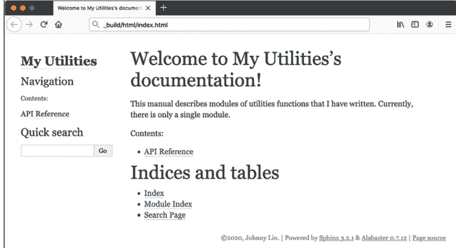

图 21.2 My Utilities 文档的 *index.rst* 文件（上，Sphinx 自动生成的注释行已手动移除）以及从该文件生成的网页（*index.html*）（下，URL 地址的前部已手动截断）。

如此创建的文档的 HTML 版本位于 `_build/html` 子目录中。

对于我们的“My Utilities”示例，我们创建了两个手工编辑的文档页面。主页由 *index.rst* 指定，我们添加了一个额外的 *.rst* 文件 *api.rst*。该包有一个模块 *util.py*，它包含图 21.1 中的代码。所有三个文件都放置在当前文档项目目录中。

## 21 让它对他人可用

图 21.3 由图 21.2 第 18 行的 Sphinx 命令自动生成的模块索引（*py-modindex.html*）。URL 地址的前部被手动截断。

图 21.2 展示了文档的主页面，包括 reStructuredText 源代码和 Sphinx 从该源代码生成的网页（*index.html*）。图顶部的 reStructuredText 代码包含以下元素：

-   **标题。** 标题通过下方等号标记，且等号长度与标题相同（第 1–2 行和第 14–15 行）。这类似于第 21.3 节示例中，docstring 里通过标题下方的破折号来标记章节的方式。标题在 HTML 中会以适合标题的字体等样式呈现。
-   **段落。** 文本段落位于后续行（第 4–5 行）。代码中的换行在 HTML 中不会排版，但文本会根据网页的样式定义进行流动。空行用于分隔文本段落。
-   **目录。** `.. toctree::` 指令（第 7 行）为指令下方列出的项目创建目录。第 8 行和第 9 行作为 `toctree` 指令的选项，指定了目录的特性，第 11 行列出了此目录中包含的一个 reStructuredText 代码文件（*api.rst*，定义了 API 参考网页）。无需提供 *.rst* 扩展名，目录指令会从 *api.rst* 中提取标题并放置在 *index.html* 页面的此位置。
-   **索引和表格。** Sphinx 的 `:ref:` 角色用于创建指向页面的交叉引用。在第 17–19 行，引用了 Sphinx 自动创建的通用索引、模块索引和搜索页面。第 17–19 行是项目符号列表项，遵循 reStructuredText 指定项目符号列表的惯例。此惯例与表 4.1 中总结的 Markdown 语法相同。

指令以两个句点（`..`）开始，以两个冒号（`::`）结束，分别位于指令名称之前和之后。指令的选项（例如 `:caption:`）放在两个冒号之间，文本角色（例如 `:ref:`）也是如此。

```
1 API Reference
2 =============
3
4 This describes the application programming interface (API) for the module
5 listed below.
6
7 .. automodule:: util
8     :members:
```

Sphinx 自动创建的通用索引、模块索引和搜索页面使用 Sphinx 被提供的源文件和模块，以响应指定模块的指令（在本例中是 api.rst 的第 7 行；参见图 21.4）。图 21.3 展示了由 Sphinx 命令 :ref:`modindex` 创建的模块索引网页（py-modindex.html）。如果一个模块存在，但 .rst 文件不包含访问该模块的指令，则该模块不会包含在自动生成的索引中。包括搜索栏在内的左侧导航栏也是自动生成的。

图 21.4 展示了描述包 API 的页面，包括 reStructuredText 源代码（api.rst）和 Sphinx 从该源代码生成的网页。api.rst 中的关键行是第 7–8 行，它们利用了 autodoc 的 automodule 指令，autodoc 是 Sphinx 的一个扩展，能够从 Python 模块的 docstring 自动生成 API 文档。第 7 行告诉 Sphinx 记录 util 模块，第 8 行告诉 Sphinx 记录该模块的所有成员。如果我们不想记录模块的所有成员，可以使用 `members` 选项指定要记录的成员。

`api.rst` 生成的网页如图 21.4 下半部分所示。`util.py` 中 `percent_to_decimal` 函数的 docstring 被格式化为软件文档网页应有的样子。标题用粗体书写，代码用固定宽度字体排版，示例则用字体、颜色和阴影排版以表明它是一个示例。

在我们的示例中，我们只展示了 Sphinx 功能的一小部分，但通过这小小的窥探，我们看到 Sphinx 使我们能够以相对较少的努力创建精美的文档。Sphinx 文档（也是本节的主要参考文献³）包含更多信息。我们在 www.cambridge.org/core/resources/pythonforscientists/refs/ 提供了指向文档的最新链接，参考文献 67。Sphinx 文档包含更多关于指令和 autodoc 的信息。指向这些页面的最新链接分别在 www.cambridge.org/core/resources/pythonforscientists/refs/，参考文献 69 和 68。

³ 其他参考文献包括 Notecards 文档的源代码（Johnny Lin 的一个未发布应用程序）、sphinx-apidoc 手册页，以及链接在 www.cambridge.org/core/resources/pythonforscientists/refs/ 的 reStructuredText 摘要，参考文献 66。

# 22 让它更快：性能

## 22.1 引言

与它们的前身相比，现代计算机速度很快。即使是今天的可穿戴计算设备，其处理能力也足以让几代人之前的人们将其视为地球上最快的计算机之一。然而，无论计算能力多么强大，如果我们编写的程序未能充分利用处理器周期和内存，它对我们都没有任何好处。在本书中，我们一直专注于“完成任务”，编写程序时注重完成手头的科学或工程任务，而不是程序完成任务的速度。大多数时候，这是正确的关注点。但有时，如果我们想及时完成手头的计算任务，就必须关注程序的性能。

我们在第 22.2 节开始讨论两个初步主题：描述代码**复杂度**或效率的方法，以及一些可能导致程序低效的编码实践。第 22.3 节讨论如何通过使用分析器（profiler）来发现程序中的瓶颈——程序运行特别缓慢或使用超出应有内存的地方。分析器是报告程序各部分花费多少时间和内存的工具。一旦我们知道程序中资源消耗最大的部分在哪里，我们就可以考虑修复这些瓶颈的方法（第 22.4 节）。最后，在第 22.5 节，我们考虑在尝试提高程序性能时可能遇到的陷阱。人们很容易认为“越快越好”，但与生活中的许多事情一样，性能的提升是有代价的。我们描述了何时不值得尝试让程序运行得更快。

## 22.2 初步知识

在讨论如何发现和修复瓶颈之前，我们需要讨论如何描述这些瓶颈。这就是代码或算法复杂度的主题。之后，为了激发我们后续关于分析、瓶颈和陷阱的讨论，我们描述一些可能导致我们编写低效代码的方式。

### 22.2.1 描述代码的复杂度

我们之前关于代码性能的讨论（例如，第 13.2.4 节）使用了代码运行所需的时间，基于运行代码的人的感知。这被称为**挂钟时间**。挂钟时间是一个实用的度量，因为它描述了人们获得所需结果所需的时间，但作为分析工具，挂钟时间有其局限性。例如，在描述代码复杂度时，我们通常希望比较一种实现与另一种实现。但挂钟时间包含了与运行程序相关的方面——操作系统性能、应用程序和内存管理等——这些与我们正在研究的代码实现无关。对于算法比较，另一种代码复杂度度量通常更有帮助。在本节中，我们简要描述一种称为“**渐近算法复杂度**”或“**大𝒪表示法**”的代码复杂度度量。

渐近算法复杂度是当输入代码的项目数量非常大时，代码执行操作数量的近似度量。因此，我们可以忽略除主导项之外的所有操作计数贡献。为了说明这一点，请考虑以下代码，它将一维数组 `data` 的每个元素加倍（假设该数组在其他地方定义，并且 NumPy 已作为 `np` 导入）：

```
for i in range(np.size(data)):
    data[i] = data[i] * 2
```

这段代码执行了多少操作？为了回答这个问题，我们可以尝试弄清楚这段代码的每个部分执行需要多少时间，并以时间为单位定义每种“操作”（乘法、赋值等）。但是，使用大𝒪表示法，我们关注的是近似计数，因此我们将“操作”定义为任何算术计算、变量的存储、函数的调用（如果输入项目数量增加，运行时间不会变长）、循环的设置以及 `if` 语句中的比较。基于此操作定义，上述代码中的操作数大约为 $3n + 3$，其中 $n$ 是 `data` 中的元素数量。我们为设置 `for` 循环计一次操作，为调用 `size` 计一次，为调用 `range` 计一次。对于循环的每次迭代，我们为赋值 `i` 计一次操作，为乘以 2 计一次，为赋值 `data[i]` 计一次。因为有 $n$ 次迭代，循环对操作计数的贡献是 $3n$。我们也可以计算第 2 行等号右侧 `data[i]` 值的读取，这将使贡献变为 $4n$，但下面我们将看到这对最终答案没有影响。

要将这个用输入项目数量（即 `data` 中的 $n$ 个元素）表示操作计数的多项式转换为大𝒪表示法，我们对操作计数表达式应用以下规则（这些规则源于我们对大 $n$ 的关注）：

-   忽略除 $n$ 的最高次幂项之外的所有项。
-   忽略操作计数中任何项的常数系数。

因此，$3n + 3$ 的操作计数简化为 $n$。用大𝒪表示法，我们说该代码具有“$n$ 阶大𝒪复杂度”或该代码是“$\mathcal{O}(n)$”。这意味着随着

## 22 让它快起来：性能

表 22.1 常见的大-$\mathcal{O}$ 值及其通用名称（如适用）。

| $\mathcal{O}(\dots)$ | 通用名称 |
| :--- | :--- |
| 1 | 常数 |
| $\log n$ | 对数 |
| $n$ | 线性 |
| $n \log n$ | |
| $n^2$ | 平方 |
| $n^3$ | 立方 |
| $n!$ | |

输入项增加，代码执行的操作数大致成比例增加。如果 $n$ 翻倍，操作数也大约翻倍。

这有什么用？通过代码的大-$\mathcal{O}$，我们可以看出代码是否能扩展到更大的数据集，并且可以比较该代码与另一段代码的性能。例如，在上面的 $\mathcal{O}(n)$ 情况中，我们看到，如果我们想处理一个大约是 $n$ 的 $m$ 倍大的数据集，运行时间将大约是 $m$ 倍。相反，对于 $\mathcal{O}(n^2)$ 的代码，要处理一个大约是 $n$ 的 $m$ 倍大的数据集，运行时间将大约是 $m^2$ 倍。

表 22.1 列出了一些值的典型大-$\mathcal{O}$ 值及其通用名称。该表按 $n$ 的幂次升序排列。具有常数大-$\mathcal{O}$（即 $\mathcal{O}(1)$）的代码计算效率最高，因为无论输入项数量多少，算法执行的操作数大致相同。另一方面，$\mathcal{O}(n!)$ 则是个坏消息。

### 22.2.2 可能导致低效代码的实践

以下是可能导致代码性能较低的编码实践的简要总结：

-   显式循环。有时我们必须编写显式循环，但有时循环中每次迭代的操作彼此独立。因此，可能存在更高效的方式来处理该操作。在第 13.2.4 节中，我们比较了使用数组语法和使用显式循环的代码，发现数组语法要快得多。
-   低效的内存访问。正如我们在第 12.2.6 节中看到的，我们遍历 $n$ 维数组维度的顺序会影响性能。
-   在内存中保留不必要的数据副本。特别是对于较大的数据集，就地操作（即修改原始数据）通常比处理副本更高效。
-   编写额外的操作（尤其是涉及循环的操作）。有时我们编写的代码可以被精简。例如，我们可能使用了两个循环来编写操作，而这些操作可以在一个循环中完成。因为包含循环通常会导致许多额外的操作（由于循环固有的重复性），额外的循环确实会拖慢程序。
-   大量的文件输入/输出。从文件读取和写入文件可能代价高昂，因为文件输入/输出需要访问硬盘驱动器或其他存储设备来获取内容。这与内存中的数据操作形成对比，后者要快得多。
-   在应该使用他人代码时没有使用。编写自己的函数具有很高的教育价值，但当性能很重要时，我们通常最好使用由他人编写的版本，他们已经花时间调整函数，使其运行得尽可能快。
-   语言选择。某些编程语言生成的代码更快。例如，编译型语言（如 Fortran、C++）与解释型语言（Python 是一个例子）相比，往往能产生高性能的代码。然而，这种情况越来越不成为问题，因为有许多库以各种方式弥补了效率低下的问题。

让我们看一个示例任务，以及我们如何使用（或不使用）上述一些导致低效代码的编码实践来完成该任务。我们感兴趣的是计算数组中每个元素的立方。我们编写了函数 `powb`，它返回 $x^b$ 的结果，其中 $x$ 由输入参数 `x` 给出，$b$ 由输入参数 `exponent` 给出。我们还定义了值数组 `arr`：

```python
import numpy as np

arr = np.arange(1, 10)

def powb(x, exponent):
    p = 1
    for _ in range(exponent):
        p *= x
    return p
```

函数 `powb` 将 `x` 重复乘以 `exponent` 次。第 7 行中使用 `_` 作为迭代器是 Python 的惯例，表示该迭代器实际上未在定义它的循环中使用。单独的下划线是一个有效的变量名，但以下划线开头的变量名被理解为私有，加上名称中没有字母数字字符，表明此迭代器变量不应在程序的后续部分使用。

我们完成计算 `arr` 中每个元素的立方并将结果保存在数组中的第一种方法是在列表推导式中使用显式循环调用我们的 `powb` 函数：

```python
cube_arr = np.array([powb(a, 3) for a in arr])
```

其中 `cube_arr` 是：

```
In [1]: cube_arr
Out[1]: array([  1,   8,  27,  64, 125, 216, 343, 512, 729])
```

但是，由于幂运算符是 Python 内置的，使用该运算符比使用我们的 `powb` 函数更快。因此，我们完成该任务的第二种方法是使用幂运算符而不是 `powb`：

```python
cube_arr = np.array([a**3 for a in arr])
```

完成该任务的第三种方法是使用数组语法，我们已经看到它优于显式循环。通过使用数组语法，我们可以完全消除列表推导式中的循环：

```python
cube_arr = arr**3
```

最后，完成该任务的第四种方法是使用 NumPy 的指数运算符的函数版本，该版本执行就地操作。这使我们能够避免制作数组的额外副本：

```python
cube_arr = arr.copy()
np.power(cube_arr, 3, out=cube_arr)
```

在上面的例子中，我们制作了 `arr` 的副本，以便指数运算的结果将命名为 `cube_arr`，并保持 `arr` 数组不变。通常，在执行就地操作时，我们不会制作这样的副本，因为避免额外的复制正是就地操作更快的原因。

关键点：所有上述代码示例都产生相同的结果，但有些会比其他代码消耗更多的处理器时间和内存。一旦我们的代码能够运行并且我们希望它运行得更快，我们的任务就是找出它运行缓慢的地方，并改变我们的计算方式以使其运行得更快。

## 22.3 使用分析器查找瓶颈

程序中那些使用了超出应有资源的区域就是瓶颈或堵塞，它们拖慢了程序的执行速度，是尝试第 22.4 节中描述的修复方法的首要候选对象。一种称为分析器的工具帮助我们找出程序的哪些部分是瓶颈。第 13.2.4 节的计时技术告诉我们一段代码需要多长时间，但它不会进一步分解和分析代码。分析器分析程序的单元（通常是函数或方法），并生成一份关于每个单元使用了多少处理时间和内存的报告。

在本节中，我们描述四种分析器：

-   timeit。迄今为止最简单，适用于对小段代码进行计时（而不是对代码进行完全分析）。
-   cProfile。推荐用于更彻底地分解代码操作的分析器。
-   line-profiler。提供更易于阅读的行执行信息。
-   memory-profiler。测量函数使用了多少内存。

前两个分析器是 Python 标准库的一部分，而后两个是需要安装到我们的 Python 发行版中的外部库。请注意，后两个也分别称为 line_profiler 和 memory_profiler，使用下划线而不是连字符。在某些情况下，它们会以一种形式列出，而在其他情况下，则以另一种形式列出。在 Python 代码中，连字符表示减法。在我们对每个分析器的讨论中，我们描述如何在它们的 Jupyter notebook 内联版本中使用它们，通过更传统的交互式开发环境（IDE）如 Spyder，以及从操作系统的命令行使用它们。

在我们下面的 Jupyter notebook 示例中，我们使用“行魔法”运行分析器，这可以被视为使我们能够在笔记本中执行常见开发和执行任务的快捷方式。¹ 魔法命令以百分比字符开头。上述每个分析器的魔法命令是：

-   timeit `%timeit`
-   cProfile `%prun`
-   line-profiler `%lprun`
-   memory-profiler `%memit`

在命令前带有单个百分比字符的魔法适用于单元格中的单行代码。当我们在魔法命令前放置两个百分比符号（%%）时，该命令适用于整个笔记本单元格。

一本包含关于计时和分析讨论的优秀文本（也是本节的参考）是 VanderPlas (2016)。

### 22.3.1 timeit

timeit 分析器迄今为止最容易使用，适用于对小段代码进行计时（而不是对代码进行完全分析）。timeit 分析器计算运行我们给它的代码多次所需的时间。除以次数后，timeit 给出该行代码运行所需时间的估计值。我们将 timeit 应用于单个语句。

下面的三个示例显示了第 22.2.2 节中情况的 timeit 计时。² 第一个显示使用列表推导式调用 `powb`，第二个显示使用列表

¹ https://ipython.readthedocs.io/en/stable/interactive/magics.html（访问于 2020 年 8 月 25 日）。
² 正如前言中提到的，这些计时不应被视为截图，而应被视为相似但不完全相同的模型场景。

通过使用内置的幂运算符来理解（同时也演示了在Jupyter笔记本单元格上使用`timeit`魔法命令），最后一个示例展示了数组语法的使用：

```
In [1]: %timeit cube_arr = np.array([powb(a, 3) for a in arr])

45.8 μs ± 2.01 ns per loop (mean ± std. dev. of 7 runs, 10000 loops each)

In [2]: %%timeit
cube_arr = np.array([a**3 for a in arr])

24.3 μs ± 580 ns per loop (mean ± std. dev. of 7 runs, 10000 loops each)

In [3]: %timeit arr**3

5.6 μs ± 203 ns per loop (mean ± std. dev. of 7 runs, 100000 loops each)
```

NumPy数组语法版本比使用内置幂运算符的列表推导式快约四倍，比使用`powb`函数的列表推导式快约八倍。请注意，`timeit`通过多次运行表达式来评估其性能（在此例中，如注所示，运行了10,000次或100,000次）。因此，除非我们正在使用非常小的样本输入来测试算法，否则我们不应使用`timeit`。

除了在Jupyter笔记本中运行`timeit`，我们还可以在Python程序内部（例如在Spyder中运行的程序）以及操作系统的命令行界面中运行它。以下是在Python程序内部使用`powb`函数对列表推导式情况运行`timeit`的代码：

```
import timeit
timeit.timeit('np.array([powb(a, 3) for a in arr])', number=10000)
```

以下是在操作系统命令行中执行相同操作的代码：

```
python -m timeit 'np.array([powb(a, 3) for a in arr])'
```

`timeit`的文档（也是本节的参考文献）包含更多信息。文档的最新链接位于 www.cambridge.org/core/resources/pythonforscientists/refs/，参考文献76。

### 22.3.2 cProfile

尽管`timeit`很有用，但它无法分解被执行代码内部发生的情况。`cProfile`分析器可以为我们做到这一点。让我们考虑我们的列表推导式/`powb`示例：

```
np.array([powb(a, 3) for a in arr])
```

这段代码中发生了什么？我们可以将程序或代码想象成像洋葱一样工作，程序或代码的每一部分都是一层，每一层都有其自身的复杂程度。在这种情况下，我们的层次从外到内依次是：

1.  `np.array`函数将最终输出转换为数组。
2.  列表推导式中的`[ ... for a in arr]`循环应用于`arr`中的每个元素。
3.  `powb(a, 3)`函数调用对`arr`中的每个元素执行。
4.  `powb`函数内部的代码。这以常数时间运行内置的乘法运算符，因为底数变量始终是预先确定的（因为它是一个字面量）。

`cProfile`分析器会为这些层次计时，并报告每个部分花费了多长时间。我们可以在Jupyter笔记本中使用以下代码行对上述代码运行`cProfile`：

```
%prun cube_arr = np.array([powb(a, 3) for a in arr])
```

在Jupyter笔记本中，结果会显示在一个单独的窗口中。上述代码会生成类似于以下的结果（为了可读性，已手动重新格式化）：

```
14 function calls in 0.000 seconds

Ordered by: internal time

ncalls  tottime  percall  cumtime  percall filename:lineno(function)
     1    0.000    0.000    0.000    0.000 {built-in method builtins.exec}
     9    0.000    0.000    0.000    0.000 <ipython-input-1-1e1f22924db5>:4 (powb)
     1    0.000    0.000    0.000    0.000 <string>:1(<listcomp>)
     1    0.000    0.000    0.000    0.000 <string>:1(<module>)
     1    0.000    0.000    0.000    0.000 {built-in method numpy.array}
     1    0.000    0.000    0.000    0.000 {method 'disable' of '_lsprof.Profiler' objects}
```

第7-8行指的是`powb(a, 3)`调用。第9行指的是`[ ... for a in arr]`调用。第11行指的是NumPy的`array`函数调用。第6、10和12-13行是分析器的产物。输出中的列指的是：³

| 列标题 | 含义 |
|---|---|
| ncalls | 调用次数 |
| tottime | 在给定函数中花费的总时间 |
| percall | `tottime`除以`ncalls` |
| cumtime | 在此函数及所有子函数中花费的时间 |
| percall | `cumtime`除以原始调用次数 |
| filename:lineno(function) | 每个函数的相应输入 |

³ 改编自 https://docs.python.org/3/library/profile.html#module-pstats（访问于2020年8月29日）。

`cProfile`的一个主要限制是它以**中央处理器（CPU）**秒为单位给出时间，这就是为什么所有这些报告都显示0。`cProfile`的输出是基于统计信息的排序（在此例中是内部时间）来排序的，而不是按执行顺序。

要从Python程序内部运行`cProfile`，我们可以将其用作短代码片段的上下文管理器：

```
import cProfile

with cProfile.Profile() as pr:
    arr = np.arange(1, 10)
    cube_arr = arr**3

pr.print_stats()
```

或者，可以将较大的代码块嵌入其中：

```
import cProfile

pr = cProfile.Profile()
pr.enable()
arr = np.arange(1, 10)
cube_arr = arr**2
pr.disable()

pr.print_stats()
```

要从操作系统的命令行运行`cProfile`，可以使用以下命令：

```
python -m cProfile myscript.py
```

其中`myscript.py`是我们想要分析的模块。
`cProfile`的文档（也是本节的参考文献）包含更多信息。文档的最新链接位于 www.cambridge.org/core/resources/pythonforscientists/refs/，参考文献75。

### 22.3.3 line-profiler

因为`cProfile`不够详细，并且不会深入到函数内部，我们可能会发现`line-profiler`很有用。要在Jupyter笔记本中运行`line-profiler`，我们必须首先使用`%load_ext`魔法命令加载它：

```
%load_ext line_profiler
```

之后，我们可以使用`%lprun`来运行`line-profiler`，例如：

```
%lprun -f powb np.array([powb(a, 3) for a in arr])
```

这会在Jupyter笔记本中在一个单独的窗口中产生类似于以下的结果：

```
Total time: 0.000405 s
File: <ipython-input-1-e14f05e3fa35>
Function: powb at line 4

Line #      Hits         Time  Per Hit   % Time  Line Contents
=============================================================
     4                                           def powb(x, exponent):
     5         9         38.0      4.2      9.4      p = 1
     6        36        160.0      4.4     39.5      for _ in range(exponent):
     7        27        171.0      6.3     42.2          p *= x
     8         9         36.0      4.0      8.9      return p
```

尽管`line-profiler`（以及后面的`memory-profiler`）只分析特定的函数，但它既分析了该函数在调用它的表达式中被调用的频率，也深入到了函数的每一行。在上面的例子中，`p = 1`被执行了9次（即Hits），因为列表推导式运行了`powb` 9次。`p *= x`这一行被执行了27次，因为`powb`内部的循环迭代了3次，而函数被调用了9次（3 × 9 = 27）。
有时，循环的命中次数比预期的多一次，因为循环在技术上通常会比其停止条件多迭代一次（以检查是否完成）。例如：

```
def loop():
    for _ in [1, 2, 3]:
        pass
%lprun -f loop loop()
```

产生以下输出：

```
Timer unit: 1e-06 s

Total time: 3.2e-05 s
File: <ipython-input-29-127f2d3e1b32>
Function: loop at line 1

Line #      Hits         Time  Per Hit   % Time  Line Contents
=============================================================
     1                                           def loop():
     2         4         20.0      5.0     62.5      for _ in [1, 2, 3]:
     3         3         12.0      4.0     37.5          pass
```

其中`for _ in [1, 2, 3]:`循环获得了四次命中。
为了从Python程序内部运行`line-profiler`，我们使用可以从命令行访问的操作系统可执行文件。在包含我们想要分析的函数的Python脚本中，我们为那些想要分析的函数添加**装饰器**。装饰器是一个以另一个函数作为输入的函数。考虑以下例如，我们想要分析程序 `myscript.py` 的性能，该程序包含以下代码行：

```
1 @profile
2 def powb(x, exponent):
3     p = 1
4     for _ in range(exponent):
5         p *= x
6     return p
```

`@profile` 这一行是装饰器。它指的是 `line-profiler` 库中一个名为 `profile` 的函数。`profile` 函数以被分析的函数作为输入，在本例中是 `powb` 函数。因为每次想使用 `powb` 函数进行分析时，都写类似 `profile(powb, x, exponent)` 的代码通常很麻烦，所以我们通过装饰器运算符 `@` 将 `profile` 函数“附加”到 `powb` 上。因此，`@profile` 这一行告诉 Python：“每次调用 `powb` 函数时，首先以 `powb` 作为输入调用 `profile` 函数。”

添加装饰器后，在操作系统的命令行中，我们运行以下命令来分析脚本 `myscript.py`：

```
kernprof -l myscript.py
```

可执行文件 `kernprof` 是 `line-profiler` 模块中的一个程序，负责执行分析。上述调用返回一个二进制文件，当执行以下命令时，`line_profiler` 可执行文件会将其转换为文本输出：

```
python -m line_profiler myscript.py.lprof
```

还有一个应用程序编程接口（API）可以将分析功能嵌入到工具中。`line_profiler` 的文档包含了更多关于该嵌入功能的信息。该文档的最新链接位于 www.cambridge.org/core/resources/pythonforscientists/refs/，参考文献 70。`line-profiler` 的文档（也是本节的参考文献）包含了更多关于该工具的通用信息。`line-profiler` 文档的最新链接位于 www.cambridge.org/core/resources/pythonforscientists/refs/，参考文献 71。

### 22.3.4 memory-profiler

`memory-profiler` 提供了两种接口：一种类似于 `timeit`，用于显示单条语句使用了多少内存；另一种类似于 `line-profiler`，用于显示函数中每一行使用了多少内存。这里，我们演示 `%memit`，它是 `%timeit` 的等效命令。我们不演示 `%lprun` 的等效命令 `%mprun`，因为它必须在文件上运行。

```
In [1]: %load_ext memory_profiler
```

```
In [2]: %memit np.array([powb(a, 3) for a in arr])
```

peak memory: 65.38 MiB, increment: 0.17 MiB

```
In [3]: %memit np.array([a**3 for a in arr])
```

peak memory: 65.40 MiB, increment: 0.00 MiB

```
In [4]: %memit arr**2
```

peak memory: 65.53 MiB, increment: 0.00 MiB

```
In [5]: %memit arr
```

peak memory: 65.55 MiB, increment: 0.01 MiB

这些表达式占用的内存量相同，因为在所有这些操作中，内存的主要决定因素是 `arr` 的大小，即 65.55 MiB。MiB 是“mebibyte”的缩写，等于 2^20 字节。4 请注意，这些值描述的是进程分配的内存。

与 `line-profiler` 类似，为了从 Python 程序内部运行 `memory-profiler`，我们使用从命令行访问的操作系统可执行文件。在 Python 脚本中，我们为希望分析的任何函数添加装饰器。例如，如果 `myscript.py` 中包含以下行：

```
1 from memory_profiler import profile
2
3 @profile
4 def powb(x, exponent):
5     p = 1
6     for _ in range(exponent):
7         p *= x
8     return p
```

那么在操作系统的命令行中，要分析该脚本，我们运行：

```
mprof run myscript.py
```

与其他分析器一样，`memory-profiler` 也提供了一个 API，使我们能够将其嵌入到更大的工具中。详情请参阅 `memory-profiler` API 文档。该文档的最新链接位于 www.cambridge.org/core/resources/pythonforscientists/refs/，参考文献 73。`memory-profiler` 的文档（也是本节的参考文献）包含了更多关于该工具的通用信息。`memory-profiler` 文档的最新链接位于 www.cambridge.org/core/resources/pythonforscientists/refs/，参考文献 72。

4 https://en.wikipedia.org/w/index.php?title=Mebibyte&oldid=973476147 (accessed September 5, 2020).

## 22.4 修复瓶颈

在使用分析器找到性能或内存瓶颈后，我们想要修复这些瓶颈。通常有两种方法：

- 1. 为当前情况使用最高效的算法。
- 2. 为当前情况使用最佳的编程实践。

正如我们在前面章节（例如第 19 章）中讨论的，每种算法都有其优缺点。算法的选择最终归结为使用最适合我们程序要处理的用例的算法（或其组合）。通常，更高效的算法需要更多内存，反之亦然。如果内存有限，我们可能需要使用较慢的算法。同样，如果内存不是问题，我们可能能够使用更快的算法。

本节我们重点讨论修复瓶颈的第二种通用方法：我们使用计算机做事的方式（与完成任务所采取的计算序列相对）。在第 22.2.2 节中，我们描述了一些应避免的实践。我们还描述了两种值得考虑的实践：原地操作和向量化。当我们使用原地运算符时，我们用运算符返回的新值替换存储旧值的现有内存位置。这样，新值就不会占用额外的内存。我们看到 NumPy 的指数运算符的函数版本执行的是原地操作。在 NumPy 中，`+=`、`-=` 和类似的运算符也以原地方式操作。向量化（或广播）是指我们使用基于数组的数学运算而不是基于循环的数学运算。NumPy 数组语法就是向量化的一个例子。除了 NumPy 中的算术运算符在作用于 NumPy 数组时是向量化的之外，NumPy 还有 `vectorize` 函数来实现广播（尽管此选项与内置运算符相比效率较低）。在本节的剩余部分，我们将描述另外两种实践：使用生成器和即时编译。

### 22.4.1 生成器

生成器是设计为仅为给定任务提供“下一个”值的对象。例如，`walk` 生成器（第 20.2.1 节）在循环的每次迭代作用于生成器时，只给出目录树中的下一个目录。因为它这样做，而不是一次性返回树中的所有目录（以及每个目录的文件列表和子目录列表），所以使用的内存更少。因此，生成器通常可以帮助我们节省内存。当每次循环迭代返回大量内容（例如一个大数组），而我们有许多这样的实体时，如果需要保存它们，将会占用大量内存，这时生成器特别有用。文件输入和输出是生成器可以为我们节省内存的一个用例。对于非常大的数据集，我们希望避免同时读入所有内容、进行处理并保存大量结果。当循环的每次迭代产生大量中间数据时，生成器也很有用，这些数据虽然需要，但一旦使用后我们就不需要保留。

我们可以通过使用 `yield` 命令来创建自己的生成器。考虑以下非生成器函数，它获取列表（或数组）`arr` 中的每个值，将其提升到 `exponent` 次幂，并返回结果列表：

```python
def pow_arr(arr, exponent):
    values = []
    for x in arr:
        p = 1
        for _ in range(exponent):
            p *= x
        values.append(p)
    return values
```

这个函数必须保留所有正在计算的值，以便将它们作为一块返回。这是因为当调用 `return` 语句时，函数的作用域就不存在了，即函数不再知道传入其中或存储在其中的数据。因此，要处理数组，非生成器函数必须处理整个数组并返回整个结果。

相反，如果我们编写一个生成器函数，使用 `yield` 语句“返回”其结果，即使在结果被“返回”之后，函数的当前状态也会被保留，这意味着函数知道定义了哪些变量、它们的值，以及如果函数包含循环，它在循环中的位置。下次调用函数时，`yield` 语句会更新函数的内部状态（通常是在循环中时进入下一次迭代）。这种仅在需要时动态生成要返回的值的方式是“惰性求值”的一个例子。一个行为类似于 `pow_arr` 的生成器如下：

```python
def pow_arr_g(arr, exponent):
    for x in arr:
        p = 1
        for _ in range(exponent):
            p *= x
        yield p
```

当 `pow_arr_g` 被求值时，它提供 `arr` 中一个元素的 `exponent` 次幂。但是，生成器会记住第 2 行循环在 `arr` 中的位置，因此下次调用 `pow_arr_g` 时，将作用于 `arr` 中的下一个元素。

我们可以比较非生成器函数 `pow_arr` 和生成器 `pow_arr_g` 的使用方式：

```
In [1]: print(pow_arr(arr, 3))

[1, 8, 27, 64, 125, 216, 343, 512, 729]

In [2]: pow_arr_g(arr, 3)

Out[2]: <generator object pow_arr_g at 0x7f8f247da9e8>

In [3]: [a for a in pow_arr_g(arr, 3)]

Out[3]: [1, 8, 27, 64, 125, 216, 343, 512, 729]
```

仅调用 `pow_arr_g(arr, 3)` 并不会提供一个值，因为生成器只在求值时才提供值（如 In [2]/Out[2] 所示）。因此，我们只有在生成器调用是创建列表的列表推导式的一部分时（单元格 In [3]），才能获取值。在这个特定的例子中，由于它非常小，`pow_arr` 和 `pow_arr_g` 的基准测试结果本质上是相同的（因此未显示）。然而，我们可以利用 `pow_arr_g` 背后的原理来编写有助于节省内存的生成器。

`yield` 文档（以及本节的参考文献）提供了更多信息。文档的最新链接位于 www.cambridge.org/core/resources/pythonforscientists/refs/，参考文献 19。

### 22.4.2 即时编译

原生 Python 可能较慢，因此有一些工具允许我们直接用另一种语言编写部分 Python 代码，或者智能地将我们的 Python 代码转换为另一种语言的优化版本。原生 Python `compiler` 并不尝试进行专门的优化，因为该语言旨在与领域无关。

进行即时自动编译有两个主要工具：cython 和 numba。cython 工具基本上允许我们直接在 Python 代码中编写 C 的一个子集，而用 C 编写的那部分代码比用 Python 编写的运行得更快。numba 包将 Python 编译为汇编代码，并针对 NumPy 进行了优化。numba 的优势在于它主要通过装饰现有函数来工作，因此我们不需要更改代码即可使用其功能。在本节中，我们只看一个使用 numba 的例子。

再次考虑一个类似于上面的例子，只是这次我们将 `arr**3` 放入一个函数中：

```
import numpy as np

arr = np.arange(1, 10)

def pow_numpy(arr):
    return arr**3
```

timeit 分析器为我们提供了对 `pow_numpy` 的一次调用结果：

```
In [1]: %timeit pow_numpy(arr)

5.78 μs ± 173 ns per loop (mean ± std. dev. of 7 runs, 100000 loops each)

In [2]: %timeit pow_numpy(arr)

5.87 μs ± 128 ns per loop (mean ± std. dev. of 7 runs, 100000 loops each)
```

我们必须至少运行 timeit 单元格两次并取第二次的时间，否则我们将包含函数的编译时间。这在下面使用 numba 时尤为明显。

如果我们从 numba 导入 `jit` 函数，我们可以将其用作 `pow_numpy` 的装饰器：

```
from numba import jit

@jit(nopython=True)
def pow_numpy(arr):
    return arr**3
```

将 `nopython` 关键字设置为 `True` 可以防止 Python 解释器运行该函数，从而获得更好的性能。⁵ timeit 分析器现在将为 `pow_numpy` 的调用提供以下结果（输出已重新格式化以便更好地显示）：

```
In [1]: %timeit pow_numpy(arr)

The slowest run took 4.29 times longer than the fastest. This
could mean that an intermediate result is being cached.
13.5 μs ± 10.3 μs per loop (mean ± std. dev. of 7 runs, 1 loop each)

In [2]: %timeit pow_numpy(arr)

2.54 μs ± 23 ns per loop (mean ± std. dev. of 7 runs, 100000 loops each)
```

我们获得的收益并不那么显著，因为指数运算在 NumPy 中已经得到了高度优化。但是，我们使用 numba 提高 `pow_numpy` 性能所需的额外工作微不足道！对于一个尚未优化的函数，就像我们的 `pow_numpy` 示例一样，numba 可以在我们付出很少额外努力的情况下产生真正的差异。

cython 和 numba 文档（以及本节的参考文献）提供了更多信息。每个文档的最新链接位于 www.cambridge.org/core/resources/pythonforscientists/refs/，参考文献分别为 90 和 74。

⁵ https://numba.pydata.org/numba-doc/0.41.0/user/5minguide.html (accessed September 19, 2020).

## 22.5 尝试提高性能时的陷阱

提高性能似乎是理所当然的：谁不希望自己的代码运行得更快呢？然而，提高性能的整个努力都是有代价的。重写算法和改变编程实践需要时间和精力，而优化往往以牺牲代码的可读性和可理解性为代价。在投入精力进行优化之前，我们必须问这是否值得。以下是几个需要考虑的问题：

- 性能对我们的程序有多关键？在某些情况下，例如短期天气预报，如果计算机模型不能在一天内产生结果，它就是无用的。但是，对于一些气候研究来说，计算机花一个月时间完成计算可能是可以接受的。
- 我们对优化性能的工具了解多少？学习这些工具所需的时间也需要计入优化的成本。
- 程序在其生命周期内会发生很大变化吗？优化通常对程序的特定配置有效。如果程序持续变化——或者我们认为将来会改变它——我们可能需要在这些更改后重新优化，现在花在优化上的时间就会被浪费。
- 我们有资源进行优化吗？例如，内存通常是有限的，所以如果一个更快的算法特别消耗内存，我们可能无法使用它。
- 优化工具是否涵盖了我们程序的所有重要用例？有些算法在某些情况下更高效，但在其他情况下则不然。仅仅因为一个算法具有良好的大O复杂度，并不意味着它是所有情况下的最佳选择。我们不想花费时间和精力为某些用例优化代码，却发现我们的代码现在对其他重要用例的性能表现不可接受。

关于优化陷阱的最后两条经验法则：首先，正如计算机科学家唐纳德·克努特所说，“……过早优化是编程中万恶之源（或至少是大部分恶的根源）。”⁶ 我们需要首先让我们的程序运行起来，然后让它运行得更快。其次，如果我们决定投入精力优化我们的程序，我们应该首先进行具有重大影响的小改动，然后考虑更大的改动。我们可能会发现，小改动可能足以获得所需的性能，并避免不必要的额外工作。

> ⁶ Knuth (1974, p. 671).

# 23 使其正确：代码检查与单元测试

## 23.1 引言

在第 11.2 节中，我们讨论了测试程序的重要性，以便我们确信它们按预期工作。我们讨论了基本测试和使用调试器帮助我们逐步执行程序以查找错误。然而，随着我们的程序变得越来越大，我们需要一个更正式化的框架和一套工具来帮助我们进行测试。在本章中，我们介绍两个这样的工具：代码检查（或静态检查）和正式的单元测试框架。最后，我们描述“测试驱动开发”思维模式，它使用了所有这些工具。这种思维模式可以帮助我们编写坚不可摧的程序。

## 23.2 代码检查

代码检查是“静态分析”，意味着这些测试是在源代码执行之前运行的。代码检查可以检查编程错误，有助于强制执行编码风格标准（参见第 11.3 节），并可以提供重构建议。

例如，假设我们没有像第 22.2.2 节那样定义 `powb` 函数，而是在文件 `mymath.py` 中定义了 `powb`，如图 23.1 所示。注意代码中的拼写错误和一些糟糕的格式。我们可以通过操作系统的命令行界面运行代码检查器 pylint 来检查该文件，输入：

```
pylint mymath.py
```

这将生成一份报告，内容大致如图 23.2 所示。根据我们使用的编辑器和编程环境，可能会有细微的差异。

默认的 pylint 消息格式，引用自文档：¹

```
{path}:{line}:{column}: {msg_id}: {msg} ({symbol})
```

因此，以上面示例输出的第二行为例，被分析模块的路径是 `mymath.py`，引用的行号是 2，引用的列是 0，消息 ID 或代码是 `W0311`，消息是 `Bad indentation. Found 2 spaces, expected 4`，符号消息名称是 `bad-indentation`。

> ¹ http://pylint.pycqa.org/en/latest/user_guide/output.html (accessed December 9, 2020).

## 23 确保正确性：代码检查与单元测试

```python
def powb(x, exponent):
    p = 1
    for i in range(expnt):
        p *= x
    return p
```

图 23.1 *mymath.py* 的内容，展示了包含拼写错误和格式不佳的代码。

```
************* Module mymath
mymath.py:2:0: W0311: Bad indentation. Found 2 spaces, expected 4 (bad-indentation)
mymath.py:3:0: W0311: Bad indentation. Found 2 spaces, expected 4 (bad-indentation)
mymath.py:4:0: W0311: Bad indentation. Found 4 spaces, expected 8 (bad-indentation)
mymath.py:5:0: W0311: Bad indentation. Found 2 spaces, expected 4 (bad-indentation)
mymath.py:1:0: C0114: Missing module docstring (missing-module-docstring)
mymath.py:1:0: C0103: Argument name "x" doesn't conform to snake_case naming style (invalid-name)
mymath.py:1:0: C0116: Missing function or method docstring (missing-function-docstring)
mymath.py:2:2: C0103: Variable name "p" doesn't conform to snake_case naming style (invalid-name)
mymath.py:3:17: E0602: Undefined variable 'expnt' (undefined-variable)
mymath.py:4:4: C0103: Variable name "p" doesn't conform to snake_case naming style (invalid-name)
mymath.py:1:12: W0613: Unused argument 'exponent' (unused-argument)
mymath.py:3:6: W0612: Unused variable 'i' (unused-variable)
-----------------------------------
Your code has been rated at -22.00/10
```

图 23.2 对 *mymath.py* 运行 pylint 后的报告示例。为增加可读性，添加了额外的换行和缩进空格。

消息代码的首字母描述了消息类型。以下是不同类型，引用自 pylint 文档：²

- [I]nformational messages that pylint emits (do not contribute to your analysis score).
- [R]efactor for a “good practice” metric violation.
- [C]onvention for coding standard violation.

² http://pylint.pycqa.org/en/latest/user_guide/output.html#source-code-analysis-section (accessed December 9, 2020).

```python
"""Module of math functions."""

def powb(x, exponent):
    """Calculate the x to the exponent.
    """
    p = 1
    for _ in range(exponent):
        p *= x
    return p
```

图 23.3 *mymath2.py* 的内容。函数的非文档字符串行与第 22.2.2 节中给出的相同。

- [W]arning for stylistic problems, or minor programming issues.
- [E]rror for important programming issues (i.e. most probably bug).
- [F]atal for errors which prevented further processing.

让我们更详细地查看一些警告和错误。这个错误：

```
mymath.py:3:17: E0602: Undefined variable 'expnt' (undefined-variable)
```

表示在 *mymath.py* 的第 3 行，即：

```
for i in range(expnt):
```

中，有一个名为 `expnt` 的变量在被赋值之前就被使用了（这就是“未定义”的含义）。我们从这个错误中得到提示，`expnt` 是一个拼写错误：

```
mymath.py:1:12: W0613: Unused argument 'exponent' (unused-argument)
```

它告诉我们，在第 1 行传入的参数：

```
def powb(x, exponent):
```

在代码的其他地方没有被使用。

我们可以用图 23.3 所示的修订版来修复大部分问题，我们将其保存在文件 *mymath2.py* 中。在循环中使用 `_` 作为迭代器在第 22.2.2 节中有描述。对这个模块运行 pylint 的结果是（为增加可读性，添加了额外的换行和缩进空格）：

```
************* Module mymath2
mymath2.py:3:0: C0103: Argument name "x" doesn't conform to snake_case naming style (invalid-name)
mymath2.py:6:4: C0103: Variable name "p" doesn't conform to snake_case naming style (invalid-name)
mymath2.py:8:8: C0103: Variable name "p" doesn't conform to snake_case naming style (invalid-name)
-----------------------------------
Your code has been rated at 4.00/10
```

我们忽略 `snake_case` 消息——它提醒我们多词变量名应使用下划线分隔单词——因为我们的 `x` 和 `p` 变量只有一个“单词”长。

因为代码检查是静态分析代码，根据定义，它无法评估代码执行的效果如何。程序的结果是什么？它们是我们想要的吗？要回答这些问题，我们需要使用调试器和单元测试。调试器在第 6.2.7 节和第 11.2 节中介绍。单元测试在第 23.3 节讨论。

## 23.3 单元测试

我们在第 6.2.7 节和第 11.2 节中简要讨论了测试的主题。在那次讨论中，我们专注于交互式测试，即我们在编写代码时执行和检查的测试。调试器使我们能够逐行执行代码并检查变量的状态，对于交互式测试非常有用。

随着程序复杂性的增加，交互式测试就不够了。例如，交互式测试无法检测我们对某些现有代码的更改是否无意中破坏了其他地方的代码，因为交互式测试专注于我们当前正在处理的代码。为了确信我们的代码正常工作，除了交互式测试，我们还需要创建一套测试，这些测试操作于有限的代码部分（大约一个方法或函数的大小），并且可以重复运行，使用各种输入测试方法或函数的结果，并与已知的基准进行比较。这个过程称为单元测试，编写并运行的测试称为**单元测试**。大型科学软件项目可能有许多单元测试，甚至数十万个。即使我们不需要为项目编写那么多单元测试，编写至少一些测试也会使我们的代码更可靠。

在本节中，我们使用两个不同的单元测试包——unittest 和 pytest——为我们的图 23.3 `mymath2.py` 模块创建测试。对于这两个包，我们都包含了 `powb` 函数的两个测试：一个测试通过调用 `powb(2, 3)` 来查看 `powb` 在计算 $2^3 = 8$ 时的行为，另一个测试通过调用 `powb(2, -3)` 来查看计算 $2^{-3} = \frac{1}{8} = 0.125$ 时会发生什么。在第一个测试中，函数应该返回预期的值，八。在第二个测试中，函数不会返回预期的值 0.125。相反，它将返回 1，因为负数的 `range` 本质上使图 23.3 第 7 行的 `for` 循环得到一个空列表，因此循环体从未执行。

当单元测试包运行一个产生预期结果的测试时，测试通过。否则，测试失败。通常，我们更关心哪些测试失败了，因为它告诉我们程序的哪些部分需要修复。我们不需要关于通过测试的详细信息，除了它通过了。因此，单元测试包的报告对于失败的测试是详细的，对于通过的测试是简洁的。

```python
import unittest
from mymath2 import powb

class Testpowb(unittest.TestCase):
    def test_pos(self):
        self.assertEqual(powb(2, 3), 8)
    def test_neg(self):
        self.assertEqual(powb(2, -3), 0.125)

if __name__ == '__main__':
    unittest.main()
```

图 23.4 *test_mymath2_unittest.py* 的内容。

### 23.3.1 unittest

我们编写另一个 Python 程序 *test_mymath2_unittest.py* 来保存对 *mymath2.py* 中函数的测试。这个测试程序如图 23.4 所示。

unittest 框架中的测试是 unittest 模块中 `TestCase` 类的子类的方法。这些方法的名称以 `test` 开头。³ 当 unittest 的 `main` 函数运行时（图 23.4 第 11 行），默认情况下它会查找并运行所有遵循此命名约定（并在调用 `main` 的模块中定义）的方法。

`test_pos` 方法（图 23.4 第 5-6 行）调用 `assertEqual` 方法，该方法继承自 `TestCase`。`assertEqual` 方法检查传入的两个参数是否相等。如果相等，测试通过。否则，测试失败。unittest 中的实用程序（如 `main`）随后相应地处理通过或失败的测试。在 `test_pos` 中，`powb(2, 3)` 返回 8，因此测试将通过。在 `test_neg` 中，`powb(2, -3)` 返回 1，因此测试将失败。

注意，我们将对 `main` 的调用放在一个 `if` 语句中（图 23.4 第 10 行），该语句检查特殊变量 `__name__` 是否等于字符串 `'__main__'`。当模块中的代码作为主程序执行时，例如从操作系统命令行运行、在 Spyder 控制台中运行或在 Jupyter notebook 的单元格中运行时，满足该条件。这与模块作为 `import` 语句的一部分执行时不同。当模块被导入时，`__name__` 被设置为模块的字符串名称。因此，通过放入第 10 行，我们确保我们的测试程序仅在从命令行执行时运行，而不是在被另一个模块导入时运行。

我们在操作系统命令行通过输入以下命令运行测试模块：

```
python test_mymath2_unittest.py
```

³ https://docs.python.org/3/library/unittest.html#basic-example (accessed December 22, 2020).

## 23 确保正确性：代码检查与单元测试

在终端窗口的操作系统提示符下执行此命令。这将产生类似以下的屏幕输出：

```
F.
======================================================================
FAIL: test_neg (__main__.Testpowb)
----------------------------------------------------------------------
Traceback (most recent call last):
  File "test_mymath2_unittest.py", line 8, in test_neg
    self.assertEqual(powb(2, -3), 0.125)
AssertionError: 1 != 0.125

----------------------------------------------------------------------
Ran 2 tests in 0.003s

FAILED (failures=1)
```

在等号分隔线上方的行中，`unittest` 包会在测试通过时向屏幕输出一个句点，在测试失败时输出一个 **F**。在等号分隔线下方，`unittest` 包提供了关于失败测试的详细信息，并在最后总结出运行了两个测试，其中一个失败。

我们的单元测试套件成功检测到 `powb` 中的指数运算实现对负指数无效。有了这些信息，我们可以回头修改 `powb` 以处理这种输入情况。

除了 `assertEqual`，`TestCase` 类还有其他基于不同条件通过或失败的“断言方法”。⁴ 还有一些断言方法可以检测是否引发了异常，从而使我们能够检查错误处理代码是否正常工作。关于 `unittest` 的更多信息，请参阅该模块的文档（也是本节的参考文献）。文档的最新链接位于 www.cambridge.org/core/resources/pythonforscientists/refs/，参考文献 79。

### 23.3.2 pytest

`unittest` 模块是 Python 内置的，因此很方便。然而，它有点冗长，并且需要定义一个类。`pytest` 包虽然不是内置的，但是一种流行的替代方案。测试代码变得更短，因为我们不需要类，并且可以参数化不同的输入情况。图 23.5 展示了与图 23.4 中相同的 `powb` 测试。

`@pytest.mark.parametrize` 装饰器使我们能够定义一个输入参数和预期值的列表，而不是为 `powb` 的不同输入值和不同预期值编写单独的方法。这些项中的每一项都会被传递到对 `test_eval` 的单独调用中，而 `assert` 命令则使用这些参数对条件 `powb(x, exp) == expected` 进行操作。Python 中的 `assert` 命令在程序以“调试”模式运行且条件为 False 时会引发 `AssertionError` 异常。⁵

```python
import pytest
from mymath2 import powb

@pytest.mark.parametrize(
    "x, exp ,expected",
    [(2, 3, 8), (2, -3, 0.125) ],)
def test_eval(x, exp, expected):
    assert powb(x, exp) == expected
```

图 23.5 *test_mymath2_pytest.py* 的内容。

```
============================= test session starts ==============================
platform linux -- Python 3.6.10, pytest-6.2.1, py-1.10.0, pluggy-0.13.1
rootdir: /home/jlin/scral
collected 2 items

test_mymath2_pytest.py .F                                                [100%]

============================== FAILURES ===============================
______________________________ test_eval[2--3-0.125] _______________________________

x = 2, exp = -3, expected = 0.125

    @pytest.mark.parametrize(
        "x, exp ,expected",
        [(2, 3, 8), (2, -3, 0.125) ],)
    def test_eval(x, exp, expected):
>       assert powb(x, exp) == expected
E       assert 1 == 0.125
E        +  where 1 = powb(2, -3)

test_mymath2_pytest.py:8: AssertionError
============================= short test summary info ==============================
FAILED test_mymath2_pytest.py::test_eval[2--3-0.125] - assert 1 == 0.125
============================= 1 failed, 1 passed in 0.32s ==============================
```

图 23.6 在 *test_mymath2_pytest.py* 上运行 pytest 的报告示例。

`pytest` 模块处理这种行为并相应地报告测试结果。
我们在操作系统的命令行通过输入以下命令来运行测试模块：

```
python -m pytest test_mymath2_pytest.py
```

在终端窗口的操作系统提示符下执行。图 23.6 显示了输出到屏幕的报告。该报告与 `unittest` 生成的报告类似。同样，我们收到了关于失败测试的详细报告和关于通过测试的简洁报告。

⁵ https://docs.python.org/3/reference/simple_stmts.html#the-assert-statement (accessed December 22, 2020).

关于 `pytest` 的更多信息，请参阅该模块的文档（也是本节的参考文献）。文档的最新链接位于 www.cambridge.org/core/resources/pythonfcientists/refs/，参考文献 77。

单元测试是测试的一种。测试有多个层次，一个常见的划分是单元测试、集成测试、系统测试和验收测试：

1.  单元测试。测试一个只做一件事的函数。
2.  集成测试。测试一个使用程序中其他函数的函数。
3.  系统测试。测试多个相互协作以完成一项任务的函数的组合。
4.  验收测试。测试用户如何与系统交互。

我们不需要为创建的每个程序编写所有这些类型的测试。大多数小型项目将混合使用单元测试和集成测试。对于以开发为导向的项目，可能没有任何验收测试。编写测试的目标主要是以可重复和自动化的方式验证我们的代码是否按照预期工作。在第 23.4 节中，我们将描述作为科学家和工程师如何将软件测试融入我们的工作流程。

## 23.4 “测试驱动开发”流程

在描述了测试的样子及其重要性之后，本节我们将讨论如何将测试融入科学或工程工作流程。对于许多科学家和工程师来说，代码检查和测试是可选的附加项：它们很好，但最终不值得花太多时间。

然而，软件工程师意识到情况并非如此。所有类型的测试对于编写有用且准确的程序的任务都至关重要。软件工程认为测试如此重要，以至于存在一种将测试置于核心位置的完整编程方法论。**测试驱动开发（TDD）** 是一种软件工程设计方法，我们*首先*编写测试，*然后*编写使这些测试通过的代码。TDD 的好处在于，在编写测试时，我们是在定义接口应该如何工作——输入和输出应该是什么，以及两者的预期值——这是在编写实现之前单独完成的。这样做，我们大大减少了 bug 可能隐藏的地方，并大大增加了检测任何确实存在的 bug 的可能性。

严格的 TDD 可能是一种对大多数科学家和工程师来说过于结构化（除非他们正在开发一个错误可能导致死亡、受伤或财产损失的程序）以至于无法在大多数项目中实施的开发方法论。然而，科学家和工程师仍然可以从在其工作流程中采用“测试驱动开发”的*思维模式*中受益。

大多数初学者（以及许多非初学者）程序员在工作流程中遵循以下顺序：

```
编写和调试 → 代码检查和测试
```

当我们有一个想通过编写程序来解决的问题时，我们通常会坐下来，打开电脑，立即开始编写代码。我们可能会定期运行代码并遇到一些语法或其他错误。当我们遇到错误时，我们会调试程序并修复错误。程序完成后，我们再通过代码检查器运行程序，并为其编写一些测试。

这种策略对于相对较短的程序（几百行）可能有效，但对于较长的程序，它无异于自找麻烦。等到程序完成后再编写测试，我们的测试可能会更弱，因为：

-   缺乏动力。一旦我们的程序完成并给出结果，我们最不想做的事情就是编写一个证明我们的程序无法工作的测试。确认偏差“我们的程序能运行，所以它一定是正确的！”很难克服。
-   缺乏对程序构建方式的了解。程序完成后，我们不太可能记得每个方法和函数中使用的算法，更不用说每个方法和函数的输入和输出边界情况了。程序完成后编写的测试可能只会在少数情况下测试最终结果。这些情况不太可能覆盖所有可能的输入值，而且我们无法知道通过的测试是正确代码的结果，还是代码中多个错误偶然相互抵消的结果。

结果，我们最终只编写了少数几个测试，可能只捕获了一些最明显的错误，仅此而已。不幸的是，由于程序中错误的可能性随着每一行额外代码的增加呈指数级而非线性增长（因为每一行额外代码都会导致与其他代码行之间更大的互联网络），半心半意的测试工作不太可能捕获代码中超过少数几个错误。

测试驱动开发的思维模式将顺序改为：

```
代码检查和测试 → 编写和调试
```

在严格的 TDD 中，测试实际上是在方法或函数体编写之前编写的。但即使我们不使用严格的 TDD，通过采用将测试置于首位的测试驱动开发思维模式，我们也会被提醒测试不能等到程序完成。相反，我们必须在编写每一行代码时就进行测试（正如我们在第 6.2.7 节和第 11.2 节中提到的）。这可以通过使用调试器检查变量，或者在解释器或控制台中执行一行代码并打印结果来完成。许多交互式开发环境（IDE）也在我们输入时提供静态检查。Spyder 使用 PyFlakes 提供这种实时代码检查。并且，在编写一个方法或函数之后，我们需要为该方法或函数编写多个单元测试，以充分探索所有可能的输入和输出类型。

最终，我们将组装一个足够大的测试套件，以至于运行所有测试将花费大量时间（可能是几个小时）。然后我们以如下方式使用测试：在一天的编码之后，在工作日结束时，我们启动测试套件让它运行一整夜。第二天早上回来时，我们就会得到一份关于所有

## 23 确保正确性：代码检查与单元测试

我们会先处理测试失败的那些问题，并以此开始一天的工作。一旦这些问题被修复，我们就可以添加新代码并为这些新代码编写测试。当我们结束一天的工作时，会在夜间再次运行测试套件。这样，随着我们为程序开发新功能，我们既能确信新功能正常工作，也能确信新功能没有破坏旧功能。而且，通过在夜间运行测试套件，在工作日开始之前，“测试先行”的理念在某种意义上就真正实现了：我们先测试，然后编写代码。

# 24 使其可管理：版本控制与构建管理

## 24.1 引言

当我们初次学习编程时，我们的程序通常非常简短，功能有限，很少超过单个文件。对于这种由单人编写的简短程序，我们可以通过编写几份文档文件（也许是一个 *README.txt* 文件或一份用 Word 编写的简短用户手册）来跟踪程序的不同版本，并向新用户描述如何安装程序。

然而，一旦我们的程序变得更加复杂，跟踪程序不同版本的代码和其他文件（例如，配置、设置、数据等文件）就变得困难得多。当我们对代码进行更改时，很容易忘记哪个版本的哪个文件具有什么功能。当多人协作开发一个程序时，跟踪这些信息就变得更加困难。而且，由于用户需要理解众多的文件和依赖项，复杂程序对用户来说也更难安装和使用。

软件工程师拥有工具来帮助管理程序——其不同版本、开发、分发和安装。版本控制软件跟踪软件项目文件随时间的变化，使多个开发者能够就项目状态进行沟通并合并多项更改。构建管理器提供工具来连接代码编写、测试和程序部署。最后，打包工具使开发者能够将程序的各个组件（包括描述所需的依赖项）打包在一起，并简化程序的安装过程。在本章中，我们将简要介绍这些工具。同样，我们的目标不是详尽无遗，而是提供足够的背景知识，鼓励读者深入探索任何对他们需求最有帮助的技术（而且新技术一直在不断涌现）。

## 24.2 版本控制

版本控制系统跟踪软件项目文件随时间的变化。这使我们能够描述每个文件不同版本的功能，创建程序开发状态的快照，并将来自不同快照的更改集成在一起。存在不同类型的版本控制系统，以及这些系统类型的不同实现。在撰写本文时，分布式版本控制系统最为流行。此类版本控制系统使每个下载软件项目版本控制文件副本（称为**仓库**）的人都能完全访问项目的历史记录，并与其他版本的项目进行通信（例如，添加新文件、合并文件更改）。这些功能使开发者能够轻松地为项目创建侧分支，进行添加和更改，并将这些侧分支重新集成到项目的主要开发分支中。Mercurial 和 Git 是分布式版本控制系统的两个例子。

在本节中，我们将描述使用 Git 的基本工作流程。有用于使用 Git 的图形用户界面（GUI）。我们在 www.cambridge.org/core/resources/pythonforscientists/refs/ 的参考文献 84 中提供了指向 Git GUI 客户端列表的最新链接。然而，许多程序员从操作系统的命令行使用 Git，我们在本节中的描述也采用这种方法。除非另有说明，我们在本节中输入的命令都是在命令行界面中完成的。

### 24.2.1 作为单个用户使用 Git

假设我们有一个文件夹 *project*，其中包含一个文件 *README.txt*。以下是为该文件夹及其内容设置版本控制的步骤：

1.  在命令行中，导航到文件夹 *project*。
2.  在文件夹内，输入 `git init` 以创建隐藏文件夹，告诉计算机这是一个 Git 跟踪的文件夹。这个 Git 跟踪的文件夹现在就是一个仓库。

既然我们有了一个仓库，我们就想使用 Git 来管理文件夹（或仓库）的内容。在我们仓库的初始快照中，我们希望 Git 识别 *README.txt* 文件并跟踪它。在 Git 中跟踪一个文件（以及后续的更改）的过程涉及两个阶段：

1.  暂存。在一个或多个新建、删除或更改的文件上放置一个“书签”，表示我们计划在下一个快照中跟踪此文件。
2.  提交。获取包含文件更改的仓库“快照”。

一旦我们有了一个快照，我们总是可以回到仓库中该版本的文件。因此，如果我们正在开发代码并发现所做的更改需要撤销，我们不必去每个进行更改的文件中查找更改并删除它们。相反，我们可以将工作副本仓库的状态回滚到进行更改之前拍摄的快照。我们可以对单个文件或整个仓库执行此操作。

之所以有两个阶段，是因为它允许更精细地控制每个快照（提交）中包含的内容。假设我们正在处理并更改两个文件，*File A* 和 *File B*。如果我们暂存 *File A* 和 *File B*，下次进行提交时，该快照或仓库版本将包含两个文件中的更改。或者，我们可以暂存 *File A*，提交该更改，然后暂存 *File B* 并提交该更改。前一个快照将只包含对 *File A* 的更改，而不包含对 *File B* 的更改。这使我们能够（如果需要）回滚到包含 *File A* 更改但不包含 *File B* 更改的快照。如果没有暂存阶段，每当我们更改多个文件时，我们能拍摄的唯一类型的快照就是包含所有这些文件更改的快照。

让我们回到我们的示例仓库 *project*，其中包含我们想要拍摄初始快照的文件 *README.txt*。要暂存该文件，在操作系统的命令行中，我们输入：

```
git add README.txt
```

然后，我们通过输入以下命令提交更改：

```
git commit -m "<a descriptive message>"
```

其中 *<a descriptive message>* 是描述刚刚拍摄的快照的消息。我们可以在日志中查看该消息和其他提交消息，以获取从快照到快照所做更改的摘要。

我们 *project* 仓库的初始提交现在完成了！我们可以通过输入以下命令来确认：

```
git status
```

此命令会打印一份报告，显示哪些文件已更改，哪些文件未更改。在我们 *project* 仓库的初始提交之后，如果我们没有对仓库进行任何更改，报告看起来会像这样：

```
On branch master
Your branch is up to date with 'origin/master'.

Changes not staged for commit:
  (use "git add <file>..." to update what will be committed)
  (use "git restore <file>..." to discard changes in working directory)

Untracked files:
  (use "git add <file>..." to include in what will be committed)

no changes added to commit (use "git add" and/or "git commit -a")
```

通常，Git 与 GitHub 或 GitLab 等服务结合使用，这些是托管仓库的网站。（我们在 www.cambridge.org/core/resources/pythonforscientists/refs/ 的参考文献 85 和 86 中分别提供了指向 GitHub 和 GitLab 网站的最新链接。）在线仓库通常称为 *origin*。*origin* 上是主要开发主干 *master*（在第 24.2.3 节中，我们将描述从主干创建分支）。`git status` 命令在仓库的整个生命周期中使用，以向我们显示哪些文件需要跟踪等。

随着我们开发程序，我们会创建新文件，删除一些旧文件，并更改其他文件。当我们想要创建仓库的新快照时，我们重复初始提交的步骤。要暂存我们希望包含在新快照中的文件，我们输入：

```
git add <file 1> <file 2> ... <file n>
```

其中 `add` 后的参数以空格分隔，是要暂存的文件。然后，我们通过输入以下命令提交更改：

```
git commit -m "<another descriptive message>"
```

其中 `<another descriptive message>` 是描述此快照的消息。

### 24.2.2 作为协作成员使用 Git

在我们目前的讨论中，我们一直在使用自己在本地计算机上创建的仓库。如果我们是与一个程序员团队一起在别人的仓库上工作呢？我们可能会下载仓库的副本，而不是使用 `git init` 来创建一个。此外，除了对自己工作进行快照外，我们希望能够将我们的更改添加到远程仓库，并将其他人对远程仓库所做的更改合并到我们的本地仓库中。

如果我们是协作的一部分，我们可能会下载仓库的副本，而不是使用 `git init` 来创建一个。在线仓库会有一个**统一资源定位符（URL）**，而以下命令：

```
git clone <repository URL>
```

会将感兴趣的仓库副本放到我们的本地计算机上。然后，我们可以如上所述在该副本上工作，在本地计算机上暂存和提交快照。

然而，在克隆别人的仓库之前，我们可能想先 fork 它，然后克隆这个 fork。Fork 意味着创建一个仓库的副本，但这是一个远程副本（相对于本地副本），并且是我们拥有管理权限或权限的副本（相对于别人的仓库，我们通常没有管理员权限）。当我们对作为仓库克隆的副本进行更改时，我们无法将任何更改集成回原始仓库，因为我们在原始仓库上没有这样做的权限。通过创建一个 fork，我们可以将我们对克隆所做的更改集成到 fork 中，因为这是我们的 fork。在进行了足够的更改之后，我们可以向原始仓库提交一个拉取请求，请求该仓库考虑合并来自我们 fork 的更改。在在线仓库托管服务上，如果我们 fork 了一个仓库，通常它被称为 `origin`，并且是我们的本地副本（克隆）将同步到的默认仓库。原始仓库被称为 `upstream`。

一旦我们有了一个克隆，进行了更改，并将更改提交到我们的本地仓库，在某个时候我们想要将这些更改上传到远程仓库。执行此操作的命令是：

```
git push
```

当我们想将其他人对远程仓库所做的更改合并到我们的本地仓库时，我们输入以下命令：

```
git pull
```

`origin`（远程仓库）中的更改可能与我们的本地更改冲突。如果是这样，我们必须通过选择保留本地更改还是远程更改来解决冲突。大多数现代编辑器都有工具来做到这一点，而完整的讨论超出了本书的范围。

记住，是**推送（push）**更改**到（to）**远程，**拉取（pull）**更改**从（from）**远程。总之，使用 Git 的典型基本工作流程是：

1.  在我们的本地仓库中添加、删除和/或更改文件。
2.  暂存和提交我们本地仓库的快照，使用 `git status` 来查看哪些文件需要被跟踪等。
3.  从远程仓库 `origin` 拉取更改，将协作者对远程仓库所做的更改合并到我们的本地仓库中。
4.  将更改从我们的本地仓库推送到远程仓库，供我们的协作者集成。
5.  如果我们的远程仓库是另一个远程原始仓库的 fork，则向原始仓库提交拉取请求，请求将我们的 fork 集成到原始仓库中。

如果我们所有的开发工作都在自己的本地仓库上进行，我们的工作流程只包括前两个步骤。如果我们与他人远程协作，管理一个远程仓库，我们的工作流程包括前四个步骤。如果我们的远程仓库是从另一个仓库 fork 而来的，我们的工作流程包括所有五个步骤。

### 24.2.3 使用 Git 进行分支管理

更复杂的 Git 仓库使用分支。顾名思义，分支是代码库的一个侧面或分支开发。分支可以用作新实验的“沙盒”，并且删除分支比恢复提交更容易，尤其是当远程更改在提交日志中混合时。一个常见的工作流程是在集成远程更改之前，在分支上完成一个功能。

代码的主干或稳定工作副本称为 `master`。在某个时间点从 `master` 分支出来，会将 `master` 中的代码复制到这个新分支。然后，程序员可以继续在这个新分支上进行更改。当沿着该分支的开发完成后，该分支上的更改可以合并回主干或 `master` 分支。如果分支出了问题——例如，代码变得一团糟——我们可以直接删除该分支，并从 `master` 创建一个新分支。

使用分支的典型命令行工作流程涉及以下步骤（下面，`<name>` 是分支或主干的名称）：

1.  导航到仓库目录内。
2.  通过输入 `git branch` 检查我们当前所在的分支。
3.  通过输入 `git checkout <name>` 切换到我们想要的分支。
4.  如果我们想从当前所在的主干/分支创建一个新分支，输入：

```
git checkout -B <name>
```

5.  在分支上工作，并如前所述暂存和提交文件。
6.  一旦我们完成了分支上的代码，我们可以执行以下任一操作。
    (a) 通过输入以下命令合并（即组合代码）到 `master`：
        
        git checkout master
        git merge <name>
        
    (b) 或者，如果我们正在处理一个 fork，我们将分支推送到 `origin` 并打开一个拉取请求。

我们通常希望从远程仓库拉取更改到匹配的本地分支——例如，将远程 `master` 拉取到本地 `master`——然后使用称为变基（rebasing）的过程同步其他分支。然后，当拉取请求被接受时，它包括该分支上的整个提交历史记录（但也有技术可以将这些提交合并为一个，如果这是期望的话）。

我们可以用 Git 做更多的事情。上述许多步骤在开发环境中也是自动化的。有关 Git 的更多信息，请参阅 Git 文档。文档的最新链接位于 www.cambridge.org/core/resources/pythonforscientists/refs/，参考文献 83。¹

## 24.3 打包

编程库的名称源于其物理对应物。就像物理图书馆是提供知识以推进研究项目的书籍集合一样，编程库提供封装为函数和对象的代码，以执行与编程库领域相关的任务。

库需要安装到编程环境中才能使用。软件包是捆绑在一起的代码、文档、脚本和实用程序，以便使库可以在计算机系统上安装。虽然软件包可以手动安装——这称为“从源代码安装”——但只要可能，我们应该使用包管理器来安装包或库。我们在第 1.3 节中描述的 Anaconda Navigator 就是这样一个管理器。

然而，默认的 Python 安装程序称为 pip，默认的包索引称为 Python 包索引（PyPI）。两者都由 Python 打包管理局（PyPA）维护。Python 社区中的任何人都可以在 PyPI 上列出一个包。我们在 www.cambridge.org/core/resources/pythonforscientists/refs/ 提供了 pip、PyPI 和 PyPA 网站的最新链接，分别对应参考文献 6、9 和 8。

要从操作系统的命令行从 PyPI 安装一个包，输入：

```
pip install <package name>
```

其中 `<package name>` 是包的名称，此处及本节后续均如此。

¹ 另请参阅 https://blog.red-badger.com/2016/11/29/gitgithub-in-plain-english 和 https://githowto.com/staging_and_committing 以获取更多关于使用 Git 的信息。这些网站以及 Git 文档也是本节的参考文献（均于 2021 年 1 月 8 日访问）。

conda 管理器是科学 Python 社区中非常流行的包管理系统。Anaconda, Inc. 维护着主要的 conda 包频道，社区成员可以创建自己的包频道进行上传。一个非常受欢迎的社区维护频道是 conda-forge。要使用 conda 从命令行安装包，请输入：

```
conda install <package name>
```

要使用外部频道 conda-forge，请输入：

```
conda install <package name> -c conda-forge
```

有关更多信息，请参阅 conda 文档。文档的最新链接位于 www.cambridge.org/core/resources/pythonforscientists/refs/，参考文献 81。

在 Jupyter notebook 中，我们可以通过在单元格中输入以下行魔法命令来使用 pip 安装包：

```
%pip install <package name>
```

或者，我们可以通过在单元格中输入此行魔法来使用 conda：

```
%conda install <package name>
```

请注意命令前的百分号。第 22.3 节更详细地讨论了行魔法。

Python 打包用户指南提供了 Python 打包的教程和指南。还有一些我们可以使用的模板库来提供帮助。一个流行的库是 Cookiecutter 及其衍生品。有关 Python 打包用户指南和 Cookiecutter 信息的最新链接分别位于 www.cambridge.org/core/resources/pythonforscientists/refs/，参考文献 10 和 82。

## 24.4 构建管理与持续集成

在编写大型或复杂系统时，手动检查项目是否安装、文档是否构建，或者测试是否在代码可能运行的各种环境中通过每一次更改，可能会非常繁琐。构建管理和持续集成（CI）系统允许开发人员自动化这些过程，通常是在每次提交到代码库时。构建管理和 CI 也常用于测试项目是否打包正确，以便它可以在各种操作系统和不同版本的核心依赖项上安装和运行。每个构建管理或 CI 工具的配置方式不同，如相关工具的文档中所述。

基于 Make 的构建自动化工具（如 make、cmake 和 autotools）在科学项目中常用于构建项目的非 Python（通常是 C/C++ 和 Fortran）部分。这类工具相对稳定，已经存在了几十年。在撰写本文时，特定 CI 工具的流行度变化很快。有专注于单一任务（如文档或 Apple 构建）的窄范围工具，也有与版本控制系统（如 Git）集成良好的非常广泛的工具。例如，有许多基于云的 CI 系统（如 AppVeyor 和 Azure）可以创建沙盒化（隔离的）虚拟环境。这些工具的配置文件通常指定：

1.  在这些环境中安装什么。通常是哪些操作系统和哪些版本的依赖项。
2.  执行构建和部署系统的哪些部分。构建可选的命令行工具、构建文档以及推送到生产环境都是可以在 CI 工具中指定的任务。

这些持续集成工具如何被触发本身就是一个配置。通常，当针对主分支打开拉取请求时，它们会被触发。在此触发下，CI 工具会启动一个虚拟环境，并在其中克隆拉取请求分支。然后构建该分支并针对其运行测试。接着，再次根据配置，如果测试通过，代码将被合并，或者生成一份报告，以便管理合并的人员可以选择手动合并该分支。

一个不依赖于云提供商的 CI 工具示例是 tox，它自动化了针对多个环境的测试。图 24.1 显示了 tox 文档中的一个示例文件，该文件指定了要测试库的 Python 版本。Tox 将会：

-   为 envlist 中的每个 Python 版本创建虚拟环境。在图 24.1 的第 3 行中，这被指定为运行 Python 2.7 和 3.6 的环境。
-   在环境中安装列出的依赖项（deps）。在图 24.1 的第 7 行中，这是 pytest。pytest 在第 23.3 节中讨论。
-   在每个环境中运行列出的命令，由指定的测试运行器执行。在图 24.1 的第 10 行中，使用了 pytest 测试库。

```
# content of: tox.ini , put in same dir as setup.py
[tox]
envlist = py27,py36

[testenv]
# install pytest in the virtualenv where commands will be executed
deps = pytest
commands =
    # NOTE: you can run any command line tool here - not just tests
    pytest
```

图 24.1 可以作为使用 tox 的持续集成工作流一部分的示例配置文件。复制自 https://tox.readthedocs.io/en/latest/（访问于 2021 年 1 月 11 日）。

有关 tox 的详细信息，请参阅网络文档（以及本节的参考文献）。已经做出了努力来帮助科学家和工程师利用构建管理和 CI。Scientific Python Cookiecutter 是一个资源。有关 autotools、tox 和 Scientific Python Cookiecutter 信息的最新链接分别位于 www.cambridge.org/core/resources/pythonforscientists/refs.，参考文献 80、78 和 87。

# 25 让它与其他语言对话

## 25.1 引言

在第 22.4.2 节中，我们提到了即时编译工具，如 cython 和 numba，它们使我们能够用另一种语言编写部分 Python 代码，或者将我们的 Python 代码转换为优化的非 Python 版本。使用 cython 和 numba 的目标是使我们的 Python 代码运行得更快。然而，有时我们有一系列遗留的 Fortran 或 C++ 例程——经过实战检验且可靠——我们希望在 Python 内部“原样”使用它们。代码文件已经存在于 Python 外部，因此我们希望编译并包装它们，将它们暴露给 Python 使用。在本章中，我们描述了两个包——f2py 和 ctypes——它们使我们能够从 Python 中分别调用 Fortran 和 C++ 程序中的例程和访问变量。

## 25.2 与 Fortran 程序对话

尽管 Fortran 是一种相当古老的编程语言，但它不仅拥有辉煌的过去，而且现在仍然活跃。数十年的遗留科学计算代码是用 Fortran 编写的，从线性代数例程和求解器库到全面的气候模型。其中许多程序经过充分测试且运行速度快。在可预见的未来，这些例程不太可能被重写成更现代的编程语言，如 Python。值得庆幸的是，NumPy 包附带了一个模块 f2py，它可以“神奇地”将 Fortran 77/90/95 函数转换为可以从 Python 内部调用的版本。在本节中，我们介绍一种使用 f2py 进行此转换的方法。

图 25.1 显示了一个 Fortran 90 函数 `powb`，它接受一个数字 `x` 并通过重复乘以 `x` `expon` 次将其提升到 `expon` 次幂。这是我们第 22.2.2 节中介绍的 Python 代码的 Fortran 版本。¹ 当安装了 f2py 包时，也会安装一个命令行工具 `f2py`。在操作系统的命令行界面中输入以下命令，可以从 *mathf.F90* 中的 Fortran 90 代码创建一个名为 mathf 的模块：

```
f2py -c -m mathf mathf.F90
```

¹ 在第 22.2.2 节中，第二个位置输入参数被称为 `exponent`。在图 25.1 中，我们称其为 `expon`，因为 `exponent` 是 Fortran 中的内置过程。

```
Integer Function powb(x, expon)
    Implicit None
    Integer x, expon, p, i

    p = 1
    Do i = 1, expon
        p = p * x
    Enddo
    powb = p
    Return
End Function powb
```

图 25.1 定义了 Fortran 90 函数 powb 的文件 mathf.F90 的内容。此函数接受一个数字 x 并将其提升到 expon 次幂。

该命令假设 Fortran 编译器已经安装在我们的计算机上。结果是一个 .so 对象文件，可以导入到 Python 中。.so 文件的文件名以模块名（在本例中为 mathf）开头，但包含与构建模块的系统相关的其他术语。一个示例文件名是 mathf.cpython-36m-x86_64-linux-gnu.so。

f2py 生成的 .so 对象文件可以在 Python 中作为模块导入。当我们导入模块时，我们省略了对象文件文件名中模块名之后的部分（在本例中，是 mathf 之后的部分）。模块中定义的函数和其他实体使用标准的 Python “点”表示法引用，如：

```
In [1]: import mathf
        mathf.powb(2, 3)

Out[1]: 8
```

使用 timeit 分析器（在第 22.3 节中描述），我们可以比较我们包装的 Fortran powb 函数与第 22.2.2 节中的纯 Python powb 函数的速度：

```
In [1]: %timeit mathf.powb(2, 3)

        531 ns ± 2.69 ns per loop (mean ± std. dev. of 7 runs, 1000000 loops each)

In [2]: def powb(x, exponent):
            p = 1
            for _ in range(exponent):
                p *= x
            return p
```

# 25 让它与其他语言对话

```
In [3]: %timeit powb(2, 3)

1.3 μs ± 2.58 ns per loop (mean ± std. dev. of 7 runs, 1000000 loops each)
```

封装后的 Fortran 版本比纯 Python 版本快两倍多。这个例子比较简短，因此性能提升没有我们期望的那么显著。对于更复杂的 Fortran 例程，我们预计效果会更大。尽管如此，这个简短的例子说明了如何将我们已经编写的 Fortran 例程包含到 Python 程序中。

f2py 文档（也是本节的主要参考文献²）提供了关于该工具的更多信息。文档的最新链接位于 www.cambridge.org/core/resources/pythonforscientists/refs/，参考文献 91。

## 25.3 与 C/C++ 程序对话

C/C++ 编程语言是计算机科学的基础。目前用 C/C++ 编写的程序和例程数量之多，怎么强调都不为过。我们可以使用内置的 ctypes 模块在 Python 程序中利用 C/C++ 例程。

与第 25.2 节的 Fortran 示例类似，图 25.2 展示了一个 C 函数 `powb`，它接受一个数字 `x` 并通过将 `x` 重复乘以自身 `expon` 次来计算其 `expon` 次幂。我们首先需要编译源代码并创建目标文件 `mathc.o`：³

```
gcc -c -Wall -Werror -fpic mathc.c
```

有了目标文件，我们可以创建一个共享对象库（.so 文件）：

```
gcc -shared -o libmathc.so mathc.o
```

gcc 工具有许多选项。详情请参阅文档。我们提供了文档的最新链接，位于 www.cambridge.org/core/resources/pythonforscientists/refs/，参考文献 92。

一旦创建了共享对象库，我们就可以导入 ctypes 并创建一个 `CDLL` 类对象，该对象使我们能够访问共享对象库中的函数。与 f2py 不同，我们不直接导入 .so 文件：

```
In [1]: import ctypes
       mathc = ctypes.CDLL("./libmathc.so")

In [2]: mathc.powb(2, 3)

Out[2]: 8
```

² 其他参考文献包括 Lin (2008)、Neelin-Zeng 准平衡热带环流模型 (QTCM1) 2.0 版本的源代码 (http://research.atmos.ucla.edu/csi/QTCM/qtcm.html) 以及 GNU Fortran 编译器文档 (https://gcc.gnu.org/onlinedocs/gfortran/)。两个网站均于 2021 年 6 月 19 日访问。
³ www.cprogramming.com/tutorial/shared-libraries-linux-gcc.html, https://gcc.gnu.org/onlinedocs/gcc/Warning-Options.html, 和 https://stackoverflow.com/questions/5311515/gcc-fpic-option (于 2020 年 10 月 26 日访问)。

```
1  extern int powb(int, int);
2
3  int powb(int x, int expon){
4      int p = 1;
5      while(expon-->0){
6          p *= x;
7      }
8      return p;
9  }
```

**图 25.2** 定义了 C 函数 `powb` 的文件 *mathc.c* 的内容。该函数接受一个数字 `x` 并计算其 `expon` 次幂。

在上面的 `ctypes.CDLL` 调用中，我们明确指定了共享对象文件位于当前工作目录中（通过在文件路径中添加 "." 字符串，此处是在 Linux 系统上）。并非每台计算机都需要明确说明这一点，但有时确实需要。

下面，我们使用 timeit 分析器来比较我们封装的 C `powb` 函数与第 22.2.2 节的纯 Python `powb` 函数的速度：

```
In [1]: %timeit mathc.powb(2, 3)

1.14 µs ± 1.1 ns per loop (mean ± std. dev. of 7 runs, 1000000 loops each)
```

```
In [2]: def powb(x, exponent):
           p = 1
           for _ in range(exponent):
               p *= x
           return p
```

```
In [3]: %timeit powb(2, 3)

1.33 µs ± 6.4 ns per loop (mean ± std. dev. of 7 runs, 1000000 loops each)
```

封装后的 C 版本比纯 Python 版本稍快一些。在这种情况下，甚至比之前的 Fortran 示例更明显地看到，由于示例的简短性，限制了用 C 编写代码所获得的性能提升。对于更长的 C 程序和例程，我们可以预期更大的效果。在这些情况下，ctypes 提供了一种直接的方法，将先前编写的 C/C++ 代码整合到我们的 Python 程序中。

本节的主要参考文献是新西兰 eScience Infrastructure 的 ctypes 教程。有关更多信息，请参阅该教程和 Python 官方的 ctypes 文档。教程和文档的最新链接分别位于 www.cambridge.org/core/resources/pythonforscientists/refs/，参考文献 88 和 89。

## 附录 A

## 单位列表

此单位列表描述了自然科学中常见且在本教材中使用的单位。国际单位制（SI）单位是许多自然科学学科的标准，基于千克（kg）、米（m）和秒（s）。按字母顺序列出（前缀视为重要部分），希腊字母以其英文名称表示。参考文献：Dickerson 等人 (1984, pp. 15–16, 83, A-2, A-3, inside endcover), Resnick 和 Halliday (1977, pp. 81–82, inside endcover), 以及 Wallace 和 Hobbs (1977, p. xv)。

| 缩写 | 名称 | 描述 |
|---|---|---|
| cal | 卡路里 | 能量单位；1 cal = 4.184 J。 |
| cm | 厘米 | 长度单位；1/100 米。 |
| fs | 飞秒 | 时间单位；1 fs = 10⁻¹⁵ s。 |
| g | 克 | 质量单位；1/1000 千克。 |
| in | 英寸 | 长度单位；1 in = 2.54 cm。 |
| J | 焦耳 | 能量的 SI 单位；1 J = 1 N m = 1 kg m² s⁻²。 |
| K | 开尔文 | 温度的 SI 单位；每个 K 等于一摄氏度。 |
| kcal | 千卡 | 能量单位；1 kcal = 1000 cal。 |
| kg | 千克 | 质量的 SI 单位；1 kg = 2.204623 lbₘ。 |
| kJ | 千焦 | 能量单位；1 kJ = 1000 J。 |
| l | 升 | 体积单位；1 l = 1/1000 m³。 |
| lb | 磅 | 英制/美制常用系统中的质量单位。更精确且不那么口语化的说法是，该单位被称为“磅-质量”（缩写为“lbₘ”），以区别于“磅-力”（缩写为“lbf”）；2.204623 lbₘ = 1 kg。磅-力是将磅-质量加速到地球表面“标准”重力加速度所需的力（Resnick 和 Halliday, 1977, pp. 81–82），在地球上，质量为 1 磅-质量的物体所受的重力为 1 磅-力。 |
| m | 米 | 长度的 SI 单位。 |
| ml | 毫升 | 体积单位；1000 ml = 1 l。 |
| mol | 摩尔 | 物质的量；1 mol 某种物质包含 6.022 × 10²³ 个该物质的粒子。 |
| μg | 微克 | 质量单位；1 μg = 10⁻⁶ g。 |
| μm | 微米 | 长度单位；1 μm = 10⁻⁶ m。 |
| N | 牛顿 | 力的 SI 单位；1 N = 1 kg m s⁻²。 |
| nm | 纳米 | 长度单位；1 nm = 10⁻⁹ m。 |
| Pa | 帕斯卡 | 压力的 SI 单位；1 Pa = 1 N m⁻²。一个标准大气压为 101 325 Pa。 |
| s | 秒 | 时间的 SI 单位。 |

关于存储单位的讨论，请参阅索引条目：bit、byte、MB 和 MiB。

## 附录 B

## 数据结构摘要

下表总结了不同数据结构的一些特征。此表未包含对该数据结构最有意义的一些特征，例如使用掩码数组来屏蔽缺失数据：

| 类型 | 有序？ | 可变？ | 允许重复？ | 类型？ | 引用方式？ |
| :--- | :--- | :--- | :--- | :--- | :--- |
| 数组 (NumPy) | 是 | 否 | 是 | 固定 | 索引 |
| DataFrame | 是 | 否 | 是 | 任意 | 多种 |
| 字典 | 否 | 是 | 是 | 任意 | 键 |
| 列表 | 是 | 是 | 是 | 任意 | 索引 |
| 队列 | 是 | 是 | 是 | 任意 | 前/后 |
| Series | 是 | 否 | 是 | 任意 | 多种 |
| 集合 | 否 | 是 | 否 | 任意 | 值 |
| 栈 | 是 | 是 | 是 | 任意 | 顶 |
| 掩码数组 | 是 | 否 | 是 | 固定 | 索引 |

表格列条目的含义如下：

- 有序。有序数据结构是指存在第一个元素、第二个元素等。
- 可变。可变数据结构是指在程序执行过程中可以增长或缩小。
- 重复。是否允许重复值？如果不允许，则每个元素都是唯一的。
- 类型。“单一”表示数据结构要求所有元素必须是相同类型。“固定”表示所有元素必须是相同类型并占用相同内存量。“任意”表示元素可以是相同类型或不同类型。
- 引用方式。“索引”表示每个元素可以通过索引引用。“值”表示每个元素通过其值引用。“键”表示每个值通过其键引用。“顶”表示我们只能操作数据结构顶部的元素。“前/后”表示我们只能与数据结构前端和/或后端的元素交互。“多种”表示元素可以通过多种方式引用。

## 附录 C

## 按编程主题分类的内容

此主题列表侧重于语法。它基于 Python 编程语言的语法进行划分，而非科学家或工程师的工作流程。该列表分为三个部分。前两部分列出了传统第一学年编程课程第一（入门）和第二（中级）季度可能涵盖的语法主题。主题顺序遵循许多此类课程的传统编程教材的顺序。在第三部分中，我们列出了传统第一学年入门编程课程中较少涵盖的语法主题。一些主题，特别是科学或工程应用主题，不符合此主题列表的类别。这尤其适用于第二至第四部分中的某些主题。

“位置”列列出了章节或节号（均以“§”符号为前缀）、“动手试试！”编号（以“TT!”为前缀）或图表、表格或附录编号/字母（以其标题为前缀），这些位置描述了该主题。该主题可能只是所列章节、“动手试试！”等的一部分。章节复习部分中的项目不包含在此列表中。

### C.1 入门编程主题

#### C.1.1 什么是程序以及 Python 的通用元素

| 主题 | 位置 |
|---|---|
| 程序的描述 | §1.1 |
| 计算机的功能 | §1.1 |
| 过程式编程与面向对象编程 | §9.2.1 |
| 代码文件 | §3.2.4 |
| 注释行 | §4.2.4; TT! 4-12 |
| 文档字符串 | §6.2.6, 21.3, 21.4; TT! 6-10 |
| 行续接 | §4.2.3; TT! 4-1 |
| 块缩进和 `pass` | §3.2.3, 6.2.4; TT! 5-2 |
| 使用 `with/as` 结构 | §9.2.6 |
| 当前工作目录 | §10.2.1, 20.2.1, 20.2.2; TT! 10-1, 10-4, 10-6 |

#### C.1.2 变量和表达式

| 主题 | 位置 |
|---|---|
| 什么是变量 | §2.1, 2.2.2 |
| 变量赋值和名称 | §2.2.2 |
| 累加器和减量器变量 | §2.2.2; TT! 2-4 |
| 表达式 | §2.2.1 |
| 求值顺序和运算符优先级 | §2.2.1, 8.2.2; TT! 2-3 |
| 运算符 | §2.2.1 |
| 算术运算符 | 表 2.1 |
| 整数除法 | §2.2.1, 3.2.3 |
| 取模运算符 | §8.2.4 |
| 自增和自减运算符 | TT! 6-5 |
| 删除变量 | §3.2.2 |
| 复制变量、数据和对象以及按值和按引用赋值 | §9.2.5; TT! 9-6 |
| 局部和全局变量作用域 | §14.2.5, 17.2.5 |

#### C.1.3 类型和一些基本类型

| 主题 | 位置 |
|---|---|
| 什么是类型 | §5.2.7, 9.2.2 |
| 动态类型与静态类型 | §5.2.7 |
| 基本类型之间的转换 | §5.2.7; TT! 7-3 |
| 数值类型和内存 | 9.2.2 |
| 浮点数不精确性 | §2.2.1, 8.2.7, 9.2.2, 9.2.3; TT! 2-3 |
| None | TT! 9-14 |

#### C.1.4 字符串

| 主题 | 位置 |
|---|---|
| 定义字符串 | §4.2.3 |
| 转换为字符串 | §4.2.3, 5.2.7; TT! 4-10, 5-6 |
| 连接字符串 | §4.2.3; TT! 4-10 |
| 空字符串 | §4.2.3 |
| 换行符 | §4.2.3 |
| 制表符 | §4.2.3 |
| 反斜杠字符 | §10.2.1 |
| 切片子字符串 | §4.2.3 |
| 字符串属性和方法 | §9.2.4 |
| 在字符串中格式化值 | §9.2.4; TT! 9-5 |

#### C.1.5 函数

| 主题 | 位置 |
|---|---|
| 什么是函数 | §3.2.1 |
| 编写函数 | §3.2.3; TT! 3-6 |
| 调用函数 | §3.2.2, 3.2.3; TT! 3-1, 3-2 |
| 参数列表 | §3.2.3; TT! 4-4, 4-5 |
| 位置输入参数 | §4.2.1 |
| 关键字输入参数 | §5.1, 5.2.1 |
| 参数与实参 | §4.2.1 |
| 参数列表中的哑变量 | §4.2.1 |
| 灵活的参数列表 | §14.2.5; TT! 14-5 |
| del 函数 | §3.2.2 |
| 作用于数组的函数 | §6.2.2 |
| 返回值 | §3.2.1 |
| 多个返回值 | §19.1; TT! 14-2 |
| lambda 函数 | §16.2.2; TT! 16-8, 16-9 |

#### C.1.6 分支、条件和布尔值

| 主题 | 位置 |
|---|---|
| 什么是分支以及分支语句概述 | §6.1, 6.2.4; 图 6.6 |
| 基本 `if` 语句 | §6.2.4 |
| `if-else` 语句 | §6.2.4 |
| `if-elif` 语句 | §6.2.4 |
| 基本比较运算符 | 表 6.2 |
| 基本布尔运算符 | 表 8.1 |
| 嵌套分支 | §8.2.3 |
| 非嵌套和嵌套分支示例 | §6.2.5, 8.2.3; TT! 6-4, 6-5, 8-2, 8-3, 8-4 |
| 标量布尔值、运算符和表达式 | §8.2.2; TT! 8-5, 8-6 |
| 真值表 | §8.2.2; TT! 8-3 |
| 浮点数比较 | §8.2.7, 13.2.2; TT! 8-10, 13-3 |
| 比较两个数组中所有对应值是否接近 | TT! 9-9 |
| 布尔数组和使用布尔数组的操作 | §13.2.2, 13.1, 13.2.3, 15.2.1; TT! 13-3–13-7, 15-1 |
| 使用 pandas 进行布尔选择 | §19.2.3 |

#### C.1.7 循环

| 主题 | 位置 |
|---|---|
| 什么是循环 | §6.2.3, 13.2.6 |
| `for` 循环 | §6.2.3; 图 6.5 |
| `while` 循环 | §8.2.4; 图 8.8 |
| 嵌套循环 | §7.2.5, 8.2.6, 12.2.6; TT! 7-6, 12-8, 12-9 |
| 在循环中引用偏移索引 | §6.2.3; TT! 6-8 |
| 迭代器和可迭代对象 | §6.2.3 |
| 遍历字符串 | §6.2.3, 10.2.4 |
| 一维循环示例 | §6.2.5; TT! 6-4, 6-5, 8-7 |
| 二维和 n 维循环示例 | §7.1, 7.2.5, 12.1, 12.2.6; TT! 7-6–7-9, 8-9, 12-8, 12-9 |
| `continue` 和 `break` 语句 | §8.2.4 |
| 列表推导式 | §16.2.2; TT! 16-8 |

#### C.1.8 控制台输入和输出

| 主题 | 位置 |
|---|---|
| `print` 命令 | TT! 2-4 |
| `format` 方法和替换字段格式化 | §9.2.4; TT! 9-5 |

#### C.1.9 文本文件输入和输出

| 主题 | 位置 |
|---|---|
| 什么是文本文件 | §9 |
| 目录路径 | §10.2.1; TT! 10-1, 10-6 |
| 当前工作目录 | §10.2.1; TT! 10-1, 10-4, 10-6 |
| 读写文件 | §9.2.6 |
| 使用字符串方法处理文件内容 | §9.2.6 |
| 使用 `genfromtxt` 和 csv 读取文件 | §9.2.6 |
| 捕获文件打开错误 | §9.2.7 |

#### C.1.10 异常

| 主题 | 位置 |
|---|---|
| 什么是异常 | §9.2.7 |
| 抛出异常和 `raise` | §9.2.7 |
| `try/except` 结构 | §9.2.7; TT! 9-14 |
| 自定义异常类 | TT! 17-5 |

#### C.1.11 数组

| 主题 | 位置 |
|---|---|
| 什么是数组 | §5.2.6, 7.2, 12.2 |
| 创建数组 | §5.2.6, 6.2.1, 7.2.2 |
| 创建索引数组 | §6.2.1 |
| 基本类型和类型码 | §6.2.1, 9.2.2; 表 9.1 |
| 数组的形状 | §7.2.1, 12.2.1, 12.2.4 |
| 数组元素的索引 | §5.2.6, 7.2.3, 12.2.1; TT! 5-4, 7-8 |
| 切片（或选择）子数组 | §5.2.6, 7.2.3, 12.1, 12.2.1, 12.2.2; TT! 5-4, 6-6, 7-2, 7-4, 12-2 |
| 切片与原始数组的关系 | TT! 9-7 |
| 数组查询 | §6.2.1 |
| 数组语法计算 | §5.2.6, 7.2.4, 12.2.3, 12.2.6; TT! 5-5, 6-4 |
| 数组语法与循环 | §8.2.6, 13.2.4; TT! 7-7 |
| 数组语法表达式结果与原始数组的关系 | TT! 9-8 |
| 数组与列表 | §5.2.6, 9.2.3; 表 9.2 |
| 子数组偏移 | §12.2.5; TT! 5-5, 7-4, 12-5, 12-6 |
| 作用于数组的函数 | §6.2.2, 7.2.4, 12.2.3, 12.2.7; TT! 7-5 |
| 通过元素索引与元素值遍历数组 | TT! 6-2 |
| 数组属性和方法 | §9.2.2 |
| 元素的内存位置 | §12.2.4 |
| 重塑数组 | §12.2.4; TT! 12-4 |
| 布尔数组和使用布尔数组的操作 | §13.2.2, 13.1, 13.2.3, 15.2.1; TT! 13-3–13-7, 15-1 |
| 比较两个数组中所有对应值是否接近 | TT! 13-1, 9-9 |

#### C.1.12 类

| 主题 | 位置 |
|---|---|
| 什么是对象 | §9.2.1 |
| 定义和使用类 | §17.2.1, 17.2.4, 17.2.5; TT! 17-1, 17-7 |
| 列出和命名属性与方法 | §9.2.2 |
| 公共和私有属性与方法 | §9.2.2, 17.2.1; TT! 17-2 |
| 构造函数 | §17.2.1 |
| 数组作为对象 | §9.2.2; TT! 9-2 |
| 列表作为对象 | §9.2.3; TT! 9-3 |
| 字符串作为对象 | §9.2.4; TT! 9-4 |
| Matplotlib 对象应用程序编程接口 (API) | §14.2.1; TT! 14-1 |
| 整数和浮点数对象 | TT! 9-1 |
| 遍历对象 | §10.2.4, 13.2.6; TT! 13-9, 14-1 |
| 复制变量、数据和对象 | §9.2.5 |
| 在列表和字典中存储对象 | §9.2.3, 16.1.4 |
| 重载 | §14.2.5 |
| 继承 | §17.1.1, 17.1.2, 17.2.2; TT! 17-3 |
| 覆盖 | §17.2.2; TT! 17-4 |

### C.2 中级编程主题

#### C.2.1 抽象数据类型和结构

##### 列表和元组

| 主题 | 位置 |
|---|---|
| 什么是列表以及定义列表 | §4.2.1, 4.2.2, 9.2.3 |
| 定义元组 | §4.2.2 |
| 列表和元组中元素的索引 | §4.2.2 |
| 切片子列表 | §4.2.2; TT! 4-6–4-8 |
| 切片与原始列表的关系 | TT! 9-7 |
| 列表和元组之间的转换 | §4.2.2 |
| 列表属性和方法 | §9.2.3 |

## 按编程主题分类的内容

##### 字典与集合

| 主题 | 位置 |
|---|---|
| 什么是字典 | §14.2.5 |
| 在字典中添加、删除和访问项目 | §14.2.5, 16.2.1; TT! 16-4–16-6 |
| 使用字典的示例 | §16.1.3, 16.1.4, 16.2.1; TT! 16-4–16-7 |
| 什么是集合 | §16.2.1 |
| 使用集合的示例 | §16.2.1; TT! 16-3 |

##### 其他

| 主题 | 位置 |
|---|---|
| 栈和队列 | §16.2.1; TT! 16-1, 16-2 |
| Series 和 DataFrame 对象 | §15.2.2, 18.2.1, 19.2.3 |
| 掩码数组对象 | §15.2.3 |
| 数据结构总结 | 附录 B |
| 何时使用不同的数据结构 | §16.2.3 |

#### C.2.2 算法分析

| 主题 | 位置 |
|---|---|
| 描述代码的复杂度 | §22.2.1 |
| 大-𝒪 表示法 | §22.2.1; 表 22.1 |
| 可能导致低效代码的做法 | §22.2.2 |

#### C.2.3 搜索与排序

| 主题 | 位置 |
|---|---|
| 一些搜索和排序方法的总结 | §19.2.1 |
| 使用 sorted | §16.2.1, 17.2.3, 19.2.1; TT! 17-6 |
| 线性搜索和二分搜索 | §19.2.2, TT! 19-2 |
| 选择排序和插入排序 | §19.2.2; TT! 19-3 |
| 使用 pandas 进行基本搜索和排序 | §19.2.3; TT! 19-4–19-6 |

#### C.2.4 递归

| 主题 | 位置 |
|---|---|
| 什么是递归 | §20.2.2 |
| 递归与循环的比较 | §20.2.2 |
| 递归示例 | §20.1, 20.2.3; TT! 20-3, 20-4 |

### C.3 其他主题

#### C.3.1 如何编程与编程风格

| 主题 | 位置 |
|---|---|
| 编写代码的建议 | §6.2.7, 11.1 |
| 调试与测试 | §6.2.7, 11.2, 23.3, 23.4 |
| DRY 原则 | §6.2.3, 8.2.3 |
| 代码风格约定 | §11.3 |
| 何时使用不同的数据和执行结构 | §16.2.3 |

#### C.3.2 发行版与交互式开发环境 (IDE)

| 主题 | 位置 |
|---|---|
| Anaconda 发行版 | §1.3 |
| 安装包 | §1.3 |
| 终端窗口中的默认 Python 解释器 | §2.1, 2.2.3, 3.2.4 |
| Jupyter notebooks | §2.2.3, 3.2.4 |
| Jupyter Markdown | §4.2.4; 表 4.1 |
| Spyder | §3.2.5, 11.2 |
| 获取帮助 | §3.2.2 |

#### C.3.3 包与模块

| 主题 | 位置 |
|---|---|
| 导入模块和使用模块项 | §3.2.2; TT! 3-3, 3-4 |
| 编写和导入我们自己的模块 | §3.2.3, 3.2.4, 24.3; TT! 3-7 |

#### C.3.4 计算函数与模块

| 主题 | 位置 |
|---|---|
| 指数和三角函数 | §3.1, 3.2.2; TT! 3-1, 3-2 |
| 随机数生成器函数 | §8.2.1; TT! 8-1 |

#### C.3.5 可视化

| 主题 | 位置 |
|---|---|
| 折线图 | §4.1, 4.2; TT! 15-3, 15-4 |
| 散点图 | §4.1, 4.2 |
| 折线和阴影等高线图 | §14.2.2, 14.2.3; TT! 14-2, 14-3, 15-5 |
| 基本动画 | §14.2.4; TT! 14-4 |
| 数据坐标 | §5.1, 5.2.2; TT! 5-1 |
| 自定义图表外观 | §5.2.2; 表 5.1, 5.2, 5.3 |
| 图例 | §5.2.3 |
| 多个图形 | §5.2.3; TT! 5-2 |
| 多条曲线 | §5.2.3; TT! 5-3 |
| 多个子图 | §8.2.5; TT! 8-8 |
| 图表尺寸 | §5.2.4 |
| 将图形保存到文件和图像格式 | §5.1, 5.2.5 |
| 读取、显示和写入图像 | §13.2.1 |
| 图像中的颜色编码 | §13.2.1; TT! 13-1, 13-1 |
| Matplotlib 对象 API | §14.2.1; TT! 14-1 |

## 术语表

**绝对路径** 从根目录（在 Linux 或 Mac OS X 上）或驱动器盘符（在 Windows 上）开始的目录或文件的路径。

**累加器** 一个变量，其先前的值被加到当前值上；有时也指一个既可以累加又可以累减的变量。

**算法** 计算机用于进行计算或运算的方式或步骤集合。

**祖先** 类的父类、祖父类等中的任何一个。

**参数** 作为输入传递给函数的项目；与形参有细微区别，但两者含义相似。

**数组** 一个值的集合，其中集合的每个元素都是相同类型的。

**数组语法** 使用数组的表达式，其中运算符自动对数组的相应元素进行操作。

**赋值** 将变量名与值或设置连接起来。

**赋值行为** 赋值的行为。

**引用赋值** 创建一个变量作为另一个变量的别名。

**值赋值** 创建一个变量作为被赋值的值的副本的引用。

**渐近算法复杂度** 一种仅考虑大量输入的代码复杂度度量，因此仅考虑代码执行操作数的主要贡献项。

**属性** 绑定到对象的数据，设计为由也绑定到该对象的方法操作；有时属性被称为“实例变量”。

**轴坐标** 图表的一种坐标系，其中位置由 x 轴和 y 轴数据范围的比例指定，每个比例范围从 0 到 1。

**队尾** 队列中添加项目的一端。

**基类** 派生类继承属性和方法的类。

**基本情况** 递归函数中结束递归调用序列并防止无限递归的场景。

**基本类型** NumPy 数组中元素的类型。

**大-O 表示法** 表达渐近算法复杂度的典型方式。

**二进制** 形式或与“2”相关的；以 0 或 1 为特征；每个位置为 0 或 1 的编号系统；或数据表示为位的内存或存储格式。

**二元运算符** 作用于两个元素的运算符，一个在运算符左侧，一个在右侧。

**二分搜索** 一种搜索算法，每次比较时我们将搜索范围缩小一半；该算法要求集合是已排序的。

**位** 数字计算机内存中的一个二进制数字。

**布尔值** 其值为真或假的实体。

**布尔代数** 控制布尔值操作的数学系统。

**布尔表达式** 求值为布尔值的表达式。

**分支** 控制（通常使用条件语句）程序是执行一组命令还是另一组命令。

**断点** 在交互式开发环境中，这是一个标记，告诉解释器在断点位置停止，以便程序员可以检查该行程序中变量的状态。

**错误** 程序中的错误。

**字节** 等于 8 位的内存量。

**调用** 执行或运行一个函数。

**调用行为** 执行或运行一个函数。

**子类** 父类为其提供属性和方法的类。

**类** 所有该类实例遵循的模板或“模式”。

**代码** 程序中的命令；供计算机运行的指令文件。

**色标** 一个矩形图形，显示阴影等高线图（或类似图）中的颜色与哪些值相关联。

**颜色映射** 将一组值与一组颜色关联起来的方案。

**命令行界面** 与计算机交互的一种方式，你输入命令让计算机执行，通常在终端窗口中输入。

**注释** 代码文件中的解释性文本，不被 Python 解释器执行。

**编译器** 将人类可读的源代码转换为机器可读表示（有时称为目标代码或字节码）的程序或实用程序。

**复杂度** 对代码效率或性能的描述，通常与代码实现的算法有关。

**连接** 连接在一起。

**条件** 一件事取决于另一件事；通常出现在 `if` 语句和布尔表达式中，用于控制程序是执行一组命令还是另一组命令，取决于条件是否为真。

**构造函数** 特殊的 `__init__` 方法，是创建类实例时调用的第一个方法。

**计数器** 跟踪给定事件发生次数的变量。

**当前工作目录** 你当前所在的目录，Python 将基于此目录进行所有相对文件和目录引用。

**数据坐标** 图表的一种坐标系，其中位置由 *x* 轴和 *y* 轴数据范围的值指定。

**数据结构** 用于存储、组织和访问数据集合中项目的抽象。

**累减器** 一个变量，其先前的值被减去。

**调试器** 帮助我们查找程序中错误的工具。

**装饰器** 一个以另一个函数作为输入的函数。

**退化** 当一个 *n* 维数组有一个长度为 1 的维度，并且数组可以移除该维度而不丢失信息时，该维度称为退化维度。

**定界** 显示序列或集合的开始和结束位置。

**出队** 从队列前端移除一个项目。

**派生类** 基类为其提供属性和方法的类。

**后代** 类的子类、孙类等中的任何一个。

**确定性** 一种系统，其中每个后续时间的状态仅由系统在较早时间的状态计算得出。

**诊断** 描述给定数据的计算，针对给定的时间（或过去的时间），而不是计算或预测未来变量的值。

**字典** 一个无序的 Python 对象集合，其大小可以在程序运行时增长和缩小，其值通过键而不是像列表中那样通过位置来引用。

**目录树** 目录的层次结构内容，显示顶级目录下所有级别的所有文件和子目录。

**发行版** 运行 Python 程序所需的包和程序的集合。

## 术语表

**文档字符串** 紧跟在 `def` 语句（或类似结构）之后、由三引号界定的字符串，用于提供函数的“帮助”式描述。

**双精度** 通常指占用 8 字节内存的数值。

**动态类型** 变量在被赋值时，会采用所赋值的类型。

**元素** 集合中的一个项目。

**空字符串** 不含任何内容（甚至没有空格）的字符串。

**入队** 将项目添加到队列的末尾。

**环境** 我们用于与 Python 解释器交互的接口。

**纪元** 作为计算机“基准”的特定日期；这取决于操作系统。

**异常** 程序中无法由当前作用域处理的错误状态。

**可执行文件** 计算机可以运行或执行的代码行或命令文件。

**执行** 运行或实施。

**表达式** 由值、变量、运算符和/或函数或方法调用组合而成，经求值后产生返回值。

**队首** 队列中移除项目的一端。

**完整路径** “绝对路径”的另一种说法。

**函数** 一个接收输入、处理输入并返回值的“黑盒子”。

**生成器** 一种创建值的函数，例如随机数生成器；一种只提供“下一个”值的特殊对象。

**不可变** 无法被更改的变量/对象。

**导入** 编译模块或包，并使模块或包中的内容对执行导入操作的 Python 程序可访问。

**递增** 增加变量的值，通常增加一；或指变量将增加的量。

**递增** 进行递增操作。

**索引** 与位置索引含义相同，即基于元素在列表、元组或 NumPy 数组中的位置来确定其地址（第一个元素的位置索引通常为 0）；也指 pandas `Series` 或 `DataFrame` 对象中的行名或标签集合。

**无限循环** 永不停止运行的循环。

**继承** 将另一个类的属性和方法定义纳入新类对象的定义中。

**继承** 处理将另一个类的属性和方法定义纳入新类对象定义的过程。

**插入排序** 一种排序算法，其过程是反复将未排序分区中的下一个元素与已排序分区中的元素（从后向前）进行比较，然后将该元素移动到已排序分区中的适当位置。

**实例** 作为某个类对象具体实现的对象。

**实例化** 创建一个类的实例。

**解释器** Python 命令的执行环境。

**可迭代对象** 一种可以逐个遍历元素的数据结构；在这种结构中，查看完一个元素后，它会将你带到“下一个”元素，但可迭代集合不一定是有序的。

**迭代** 我们重复循环的特定次数。

**迭代器** 与“可迭代对象”的名词形式几乎可以互换使用；也指被设置为依次取可迭代数据结构中每个值的变量。

**键** 在字典中，指代存储在字典中的值的标签。

**关键字输入参数** 通过名称或关键字（而非在列表中的位置）来设置的参数。

**Lambda 函数** 通常用单行编写的小型函数。

**叶目录** 目录路径中的最后一个目录。

**受限访问** 数据结构的一种特性；只有满足特定条件才能访问结构中的项目。

**线性搜索** 一种搜索算法，我们逐个检查集合中的每个项目，并询问该项目是否是我们要找的那个。

**列表** 一种有序的 Python 对象集合，其大小可以在程序运行时增长或收缩。

**列表推导式** 一种结合了循环和列表创建的执行结构。

**局部** 作用域有限。

**循环** 一种允许重复执行一组计算的编程结构。

**循环** 使用或遍历循环的行为。

**宏语言** 作为 GUI 应用程序一部分的编程语言，它使用户能够自动完成在该应用程序中原本需要手动执行的任务。

**掩码数组** 一种包含数组的对象，该数组带有一个掩码，用于描述伴随数组中哪些元素缺失或未缺失。

**成员测试** 检查某个项目是否在集合中。

**元数据** 关于实体的信息，与实体本身相区别。

**方法** 绑定到对象的函数，旨在作用于也绑定到该对象的数据。

**模块** 一个可导入的 Python 源代码文件，通常包含函数、类和变量对象定义。

**多重继承** 处理具有多个父类的继承结构。

**可变** 可以被更改的变量/对象。

**n 维** 具有 *n* 个维度，其中 *n* 通常大于一；当用于描述循环时，表示有 *n* 个嵌套循环；当用于描述数据数组时，表示该数组的元素是 *n* 级的（例如，如果 *n* = 3，元素排列成立方体状结构）。

**嵌套分支** 一种在一个分支语句内部包含另一个分支语句的结构；结果是，只有当外部分支语句的条件为真时，内部的分支语句测试才会执行。

**嵌套循环** 一种在一个循环内部包含另一个循环的结构；结果是，对于外部循环的每一次迭代，内部循环都会完整执行其所有迭代。

**换行符** 指定新行的特殊文本代码；具体代码取决于操作系统。

**非确定性** 一种系统，其后续每个时间点的状态仅由更早时间点的系统状态计算得出。

**等宽字体** 每个字符宽度相同的字体；例如，“i”和“m”的宽度完全相同）。

**归一化坐标** 一种坐标系统，其中位置由从起始位置到结束位置的距离分数指定，每个分数范围从 0 到 1；在绘图或图形框架/坐标轴中，这也称为轴坐标。

**对象** 一个附带了数据（属性）和旨在作用于该数据的函数（方法）的“变量”。

**一维** 只有一个维度；当用于描述循环时，表示只有一个循环，该循环内部没有嵌套循环；当用于描述数据数组时，表示该数组的元素是线性序列，而不是值网格。

**开源** 根据允许访问和使用底层源代码的条件进行许可的程序或包。

**操作数** 运算符操作的值。

**操作** 应用于某个值或实体的数学或逻辑运算符。

**运算符** 附加在表达式中一个或多个值上的符号，用于对该值应用函数或操作。

**序数** 处理顺序或位置，即“第一”、“第二”等概念；在 Python 列表中，第一个元素的序数位置为一，但索引为零。

**重载** 编写方法的多个版本，这些版本根据方法所接受的输入参数的数量和类型而有所不同。

**预测** 预测随时间演变的变量未来值的计算。

**程序** 一组给计算机的指令。

**比例字体** 每个字符的宽度根据字母形状而变化的字体；例如，“i”的宽度不如“m”宽）。

**包** 一个包含可导入 Python 源代码文件（以及可能的子包）的目录，通常包含函数、类和变量对象定义。

**伪代码** 类似代码的词语和短语，用于传达程序要做什么，但不完全遵循实际编程语言的语法。

**参数** 作为输入传递给函数的项目。

**公共** 旨在被对象用户访问、更改和/或使用的属性或方法。

**参数列表** 作为输入传递给函数的项目列表。

**入栈** 将项目添加到栈的顶部。

**父类** 子类继承属性和方法的类。

**队列** 一种受限访问的数据结构，元素在末尾添加，在队首移除。

**分区** 用于集合（如列表）的理论内存部分；此术语在排序讨论中用于描述具有特定目的的假设内存区域，实际上可能并未作为独立的内存部分实现。

**随机访问** 数据结构的一种特性；结构中的任何项目都可以在任何时间被访问（使用正确的地址）。

**路径** 列出到达路径末端的文件或目录所需经过的目录列表。

**展平** 将数组转换为其一维版本。

**序列化** 将对象转储到序列化文件中。

**递归** 递归概念的实现。

**像素** 图像中的单个元素；构成图像的最小点。

**递归** 与我们可以用自身来定义某些任务的概念相关；这通过函数部分由对自身的调用来定义来表达。

**出栈** 从栈的顶部移除一个项目。

**相对路径** 从当前目录开始到目录或文件的路径。

**位置索引** 基于元素在列表、元组或 NumPy 数组中的位置来确定其地址（第一个元素的位置索引通常为 0）。

**替换字段** 使用字符串的 `format` 方法时，替换字段是字符串中放置传递给 `format` 调用的参数的格式化值的部分。

**位置输入参数** 通过其在参数列表中的位置来设置的参数。

**仓库** 软件项目的版本控制文件的副本。

**私有** 旨在仅由开发者（而非对象用户）访问、更改和/或使用的属性或方法。

**返回值** 函数被调用时返回的内容。

**过程式编程** 一种编程范式，程序被分解为离散的过程或子程序，每个过程或子程序执行特定任务，并且（理想情况下）仅通过参数列表中传递的输入/输出变量和/或返回值与程序的其余部分通信。

**例程** 函数、方法、过程或其他在计算机中执行某些操作的结构的通用名称。

**运行** 执行程序中的命令。

## 术语表

**标量** 仅有大小的量；一个普通的数字；很少见，但有时我们也称单元素数组为标量。

**栈** 一种有限访问的数据结构，元素只能在顶部添加和移除。

**脚本** 包含 Python 命令或指令的文件。

**静态类型** 变量被声明为具有某种类型，并且在其生命周期内由该类型定义。

**脚本编写** 编写脚本。

**搜索** 查找满足特定条件的项目的任务。

**终止情形** 递归函数中结束递归调用序列并防止无限递归的场景。

**种子** 一个整数，用于确定随机数生成器生成的一系列值。

**字符串** 一种数据类型，用于保存字符，如字母、数字和特殊字符（如换行符）。

**选择** 当用于提取数组的部分时，与“切片”含义相同。

**子类** 超类为其提供属性和方法的类。

**选择排序** 一种排序算法，通过重复在剩余未排序分区中搜索最小值（或降序排序时的最大值），并将该元素附加到已排序分区来实现。

**子数组** 数组的一部分。

**子列表** 列表的一部分。

**集合** 一种所有元素都唯一的数据结构。

**子字符串** 作为另一个字符串子集的字符串。

**形状** 一个元组，其元素是数组每个维度的元素数量；在 Python 中，元素排列方式使得变化最快的维度是元组中的最后一个元素，变化最慢的维度是第一个元素。

**后缀** 文件名中，最右侧句点之后的字母。

**超类** 子类继承属性和方法的类。

**工作表** 在三维数组中，当第一维固定且第二维（行）和第三维（列）包含所有行和列时，所选中的二维数组。

**终端窗口** 一个文本窗口，您可以在其中直接输入操作系统和其他命令。

**Shell** 一个基于文本的操作系统接口，用于管理您的文件、目录等的软件。

**文本文件** 仅包含字母、数字、标点符号和特殊字符（如行结束符）的文件，其格式计算机可读，同时也易于人类阅读。

**签名** 方法的接口，由方法名称、输入参数的数量和类型以及方法返回的值类型描述。

**时间步长** 在预测模型中，当前模型状态与下一个计算出的未来模型状态之间的时间量。

**单精度** 通常指占用 4 字节内存的数字。

**标记** 表达式中的离散实体——通常是变量、对象、运算符或函数调用。

**切片** 列表、元组或数组的一部分；仅提取列表、元组或数组一部分的操作。

**栈顶** 栈中添加或移除项目的位置。

**排序** 将一组项目按特定顺序排列的任务。

**真值表** 显示布尔表达式在所有可能输入组合下的输入和结果的表格。

**元组** Python 对象的有序集合，其大小和内容在集合的生命周期内是固定且不可变的。

**二维** 具有两个维度；当用于描述循环时，表示有两个嵌套循环，一个在另一个内部；当用于描述数据数组时，表示该数组的元素呈网格状排列。

**类型** 值的“种类”；所有相同类型的值共享某些特征。

**类型码** 指定 NumPy 数组元素类型的单个字符字符串。

**类型定义** 定义类型，即所有共享某些特征的不同种类的值。

**通用函数** NumPy 通用函数。

**一元运算符** 作用于单个元素的运算符。

**单元测试** 检查一小段代码（通常是函数或方法）是否产生正确结果的测试。

**单元测试** 检查一小段代码（通常是函数或方法）在给定一系列可能输入的情况下是否产生正确结果的过程。

**通用函数** 逐元素作用于数组的 NumPy 函数。

**反序列化** 从 pickle 文件中加载对象。

**变量** 保存（或指向）值或对象的名称或标签，可用作该值或对象的引用。

**挂钟时间** 程序运行所需的时间，基于用户的感知。

**空白字符** 通常用作单词和其他文本之间分隔符的字符；空格字符是空白字符，但在许多上下文中，制表符和换行符也是空白字符。

## 缩写和首字母缩略词

- **API** 应用程序编程接口。
- **CI** 持续集成。
- **CPU** 中央处理器。
- **CSV** 逗号分隔值。
- **dpi** 每英寸点数。
- **DRY** 不要重复自己。
- **FIFO** 先进先出。
- **FILO** 先进后出。
- **GMT** 格林威治标准时间。
- **GUI** 图形用户界面。
- **HDF** 分层数据格式。
- **IDE** 交互式开发环境。
- **IEEE** 电气和电子工程师协会。
- **JPEG** 联合图像专家组。
- **LIFO** 后进先出。
- **LILO** 后进后出。
- **MAST** Mikulski 空间望远镜档案馆。
- **NaN** 非数字。
- **NASA** 美国国家航空航天局。
- **NCAR** 美国国家大气研究中心。
- **NCEP** 美国国家环境预测中心。
- **NN** 最近邻。
- **NOAA** 美国国家海洋和大气管理局。
- **OOP** 面向对象编程。
- **PEP** Python 增强提案。
- **PNG** 可移植网络图形。
- **RGB** 红-绿-蓝。
- **RGBA** 红-绿-蓝-Alpha。
- **SI** 国际单位制。
- **SQL** 结构化查询语言。
- **TDD** 测试驱动开发。
- **URL** 统一资源定位符。
- **UTC** 协调世界时。
- **Z** Zulu 时区。

## 参考文献

E. Ben-Jacob, O. Schochet, A. Tenenbaum, et al. 细菌菌落中合作生长模式的通用建模。*Nature*, **368**: 46–49, 1994年3月3日。

B. M. Bush. 浮点数的危险，1996年。URL www.lahey.com/float.htm。

R. E. Dickerson, H. B. Gray, M. Y. Darenbourg, and D. J. Darenbourg. *化学原理*。The Benjamin/Cummings Publishing Company, Inc., Menlo Park, CA, 第4版, 1984年。ISBN 0-8053-2422-4。

D. Dua and C. Graff. UCI机器学习库，2019年。URL http://archive.ics.uci.edu/ml。

J. D. Hunter. Matplotlib：一个二维图形环境。*Comput. Sci. Eng.*, **9**(3): 90–95, 2007年。doi: 10.1109/MCSE.2007.55。

E. Kalnay, M. Kanamitsu, R. Kistler, et al. NCEP/NCAR 40年再分析项目。*Bull. Amer. Meteor. Soc.*, **77**:437–472, 1996年。doi: 10.1175/1520-0477(1996)077<0437:TNYRP>2.0.CO;2。

D. E. Knuth. 计算机编程作为一门艺术。*Comm. ACM*, **17**(12): 667–673, 1974年12月。

X. Liang, S. Li, S. Zhang, H. Huang, and S. X. Chen. 中国五个城市的PM2.5数据可靠性、一致性和空气质量评估。*J. Geophys. Res.*, **121**: 10 220–10 236, 2016年。doi: 10.1002/2016JD024877。

J. W.-B. Lin. *qtcm 用户指南*。2008年7月30日。URL www.johnny-lin.com/py_pkgs/qtcm/doc/manual.pdf。

J. W.-B. Lin. qtcm 0.1.2：Neelin–Zeng 准平衡热带环流模型的Python实现。*Geosci. Model Dev.*, **2**: 1–11, doi:10.5194/gmd-2-1-2009, 2009年。

J. W.-B. Lin. *在大气和海洋科学中使用Python的实践入门*。芝加哥，伊利诺伊州，2012年。

J. W.-B. Lin. *管理信息系统编程理论讲义*。贝尔维尤，华盛顿州，2019年。

W. McKinney. *Python数据分析*。O'Reilly Media, Inc., Sebastopol, CA, 第2版, 2017年。

Met Office. *Cartopy：一个带有Matplotlib接口的制图Python库*。埃克塞特，德文郡，2010–2015年。URL http://scitools.org.uk/cartopy。

K. Patel and L. Dauphin. 气旋法尼过后的停电，2019年5月。URL https://earthobservatory.nasa.gov/images/145017/lights-out-after-cyclone-fani。

J. C. Phillips, R. Braun, W. Wang, et al. 使用NAMD进行可扩展的分子动力学。*J. Comput. Chem.*, **26**: 1781–1802, 2005年。

W. H. Press, B. P. Flannery, S. A. Teukolsky, and W. T. Vetterling. *Pascal数值食谱*。剑桥大学出版社，剑桥，1989年。ISBN 0-521-37516-9。

R. Resnick and D. Halliday. *物理学，第一部分*。John Wiley & Sons, 纽约，第3版, 1977年。ISBN 0-471-71716-9。

A. B. Shiflet and G. W. Shiflet. *计算科学导论*。普林斯顿大学出版社，新泽西州普林斯顿，第2版, 2014年。ISBN 978-0-691-16071-9。

S. van der Walt, J. L. Schönberger, J. Nunez-Iglesias, et al., and the scikit-image contributors. scikit-image：Python中的图像处理。*PeerJ*, **2**: e453, 6, 2014年。ISSN 2167-8359。doi: 10.7717/peerj.453。URL https://doi.org/10.7717/peerj.453。

J. VanderPlas. *Python数据科学手册*。O'Reilly Media, Inc., 2016年。URL

## 参考文献

https://jakevdp.github.io/PythonDataScienceHandbook/.

Z. Vinícius, G. Barentsen, C. Hedges, M. Gully-Santiago, and A. M. Cody. Keplergo/lightcurve, Feb. 2018. URL http://doi.org/10.5281/zenodo.1181928.

H. E. Volkman, H. Clay, D. Beery, J. C. W. Chang, D. R. Sherman, and L. Ramakrishnan. 结核分枝杆菌毒力因子增强结核肉芽肿的形成。*PLoS Biol*, 2(11): e367, 2004. URL https://doi.org/10.1371/journal.pbio.0020367.

J. M. Wallace and P. V. Hobbs. *大气科学：导论*. Academic Press, San Diego, CA, 1977. ISBN 0-12-732950-1.

## 索引

*args/**kwds*, 461–465
__init__, *参见* 对象, 构造函数
2.7.x, Python, 6, 20, 197, 277, 427

算法, 139, 153, 597, 601, *另见* 性能, 算法
Anaconda
    发行版, 6–7, 40
    Navigator, 6, 17, 40
动画, *参见* Matplotlib, 动画
AppVeyor, 700
参数, *参见* 参数
数组, 99–103, 522, *另见* NumPy
    数组语法, 101–103, 129, 153, 164,
        190–191, 376, 379, 670, 678
    布尔值, 406–407
    兼容性, 输入数组, 201
    *n*维, 372–374
    性能, *参见* 数组,
        性能; 性能
    可读性, 202, 522
    结果, 赋值, 288, 308
    属性, 269–271
    布尔值, 404–408, 413, 428,
        488–490, *另见* 类型,
        布尔值
    创建, 99, 128–132, 184–186
    数据类型, 129, 131, 271–272,
        274–277, 296, 406
    维度, 退化, 384
    元素
        地址, 99
        赋值, 多个, 100, 189
        索引, 99, 137, 186, 246, 370, 384
        索引, 负数, 99, 189,
            205, 384
        数量, *参见* 长度; NumPy,
            大小
    作用于数组的函数, 132–134,
        190–191, 372–374
    带轴控制的函数, 372–374
    函数, 与方法对比, 271
    索引偏移, *参见* 切片, 数组
    长度, 101, 131
    列表, 与数组对比, 101, 277–278
    循环, *参见* 循环
    掩码, 492–493, *另见* ma
    内存, 129, 374, 379, *另见*
        内存
    方法, 271–272
    方法, 与函数对比, 271
    缺失值, *参见* 数组, 掩码;
        数据分析, 缺失值; ma
    *n*维, 365–380, 579
        列, 368
        重塑, 374–376
        行, 369
        形状, 368–370
        工作表, 369
    一维, 124–126, *另见*
        数组
    形状, 184, 368
    性能, 414–415, 672
    重塑, *参见* 数组, *n*维,
        重塑
    工作表, 366, *另见* 数组,
        *n*维, 工作表
    切片, *参见* 切片
    二维, 176–182, 186–187
        列, 183, 187
        行, 183, 187
        形状, 183–184, 368
    类型, 103
    类型码, *参见* 数组, 数据类型
断言, 688
赋值, 13–15, 49, 286–288
渐近算法复杂度, *参见*
    性能, 渐近
    算法复杂度
属性, *参见* 对象; 对象, 属性
autotools, 699
Azure, 700

大O表示法, *参见* 性能,
    渐近算法
    复杂度
二进制文件, 578, 579
二进制数, 422
二分查找, *参见* 查找, 二分
布尔值, *参见* 类型, 布尔值
分支, 139–153, 490, *另见*
    表达式, 布尔值; if;
    if-elif; if-else; 运算符,
    比较; 真值表; 类型,
    布尔值; 变量, 布尔值
    条件, 140, 143, 223, 239–241
    嵌套, 230–232
break, 233–235

C/C++, 704–705
计算, *参见* 表达式; 运算符;
    变量
可调用对象, 557
cartopy, 440–445, 453–456, *另见*
    Matplotlib
    边界, 454
    central_lon, 454
    要素, 454
    格式化, 454
    GeoAxesSubplot, 454
    LambertConformal, 473
    LatitudeFormatter, 455
    LongitudeFormatter, 455
    PlateCarree, 454
类, 546
类, *参见* 对象
cmake, 699
颜色系统, *参见* 图像处理
注释, 66–69

编译型语言, *参见* C/C++; cython; gcc; Fortran; numba; 性能
conda, *参见* 打包, conda
续行符, *参见* 行续接
*continue*, 233–235
等高线图, *参见* Matplotlib, 等高线图
坐标, *参见* Matplotlib, 坐标
复制
    *copy*, 289
    *deepcopy*, 289
复制, 286–290
cProfile, *参见* 测试, cProfile
csv, 297
ctypes, *参见* C/C++
cython, 680, 702
数据分析, 124–128, 148–153, 176–182, 408–414, *另见* 数组; NumPy; pandas
    自动化, 332, 335
    平均值, 最近邻, 176–179, 246
    缺失值, 303, 483–494
    使用布尔值处理, 488–490
数据结构, 511, 521–522, *另见* 数组; 字典; 列表; pandas; 队列; 集合; 栈; 类型
调试, 74, 156–158, 344, *另见* 测试
    Jupyter, *参见* Jupyter, 调试
    Spyder, *参见* Spyder, 调试
装饰器, 675, 680, 688
*def*, 33, 120, 520
*del*, 30, 460
*delattr*, 557
导数, 537
字典, 459–465, 509, 516–519, 602, 611
    分隔符, 460
    元素
        删除, 460
        删除, 518
        键, 460, 526
        引用, 460, 518
        类型, 460
        值, 460
    可迭代, 517
    *keys*, 516, 518
    顺序, 460, 517, 518
    *values*, 516
微分方程, 537–540
*dir*, 273
目录, 328–332, *另见* glob; os; 递归; shutil
    复制, 338–340
    叶子, 336, 636
    列出内容, 340–341, 347
    创建, 335–336
    移动, 337
    路径, 332, 634
        绝对, 334
        相对, 333
    移除, 336
    重命名, 337
    分隔符, 332
    树, 332, 339, 340, 633
    工作目录, 当前, 327, 333, 334, 341, 345, 346
目录
    树, 633
文档字符串, *参见* 文档编写, 文档字符串; NumPy, 文档字符串格式
文档编写, *另见* 注释
    文档字符串, 153–154, 659–660
    操作指南, 657
    维护, 658
    参考指南, 657
    Sphinx, *参见* Sphinx
    工具, 优缺点, 658
    主题指南, 657
    教程, 657
动态类型, *参见* 类型, 动态
*elif*, *参见* if-elif
*else*, 143, 148, 245
*else*, *另见* if-elif; if-else
环境, *参见* 解释器; Jupyter; Spyder
纪元, 414
Excel文件, 571, 576–577, 579, *另见* ExcelWriter; openpyxl; pandas
    多个工作表, 585
    读取, 577
    写入, 577
*ExcelWriter*, 585
异常, 298–300
    类, 299, 300
    自定义, 562
    处理, 300, *另见* try/except
    多个, 315
    *raise*, *参见* raise
    *try/except*, *参见* try/except
表达式, 9–13, *另见* 运算符; 类型; 变量
    布尔值, 222–230
    负号, 44
    求值顺序, 11
    括号, 9, 21
    科学计数法, 10
f2py, *参见* Fortran
文件输入/输出, 261–267, 290–300, 669, 679
    二进制, 578
    *close*, 291
    逗号分隔值, 296–298, *另见* csv
    Excel文件, *参见* Excel文件
    文件模式, 291
    文件打开错误, *参见* 异常
    主要包含数字的文件, 读取, 296
    *genfromtxt*, *参见* NumPy, genfromtxt
    netCDF文件, *参见* netCDF文件
    换行符, 264
    *open*, *参见* open
    pickle文件, *参见* pickle文件
    *readline*, 291
    *readlines*, 291
    文本文件, 261–262, 290–300
    *with/as*, *参见* with/as
    *write*, 291
    *writelines*, 292
文件, 328–331, 578, 592, *另见* 二进制文件; 目录; 文件输入/输出; glob; os; 文本文件
    复制, 338–340
    类型, 测试, 341–342
    元数据, 338, 571, 579
    名称, 637
    移除, 339

浮点数, 104, 293, 294
fnmatch, 637
文件夹, *参见* 目录
for, *参见* 循环
Fortran, 702–704
函数, 27–29, 268, 560
    调用, 29, 32, 34, 49, 643–644
    定义, 32–35
    命名, 33
    参数, *参见* 参数
    返回值, 29, 34, 75, 153, 679
gcc, 704
生成器, 634–637, 678–680
getattr, 557
Git, *参见* 版本控制, Git
GitHub, 695
GitLab, 695
glob
    glob, 341, 508, 600
globals, 559
分组, *参见* pandas, 分组
hasattr, 557
帮助, 32, 153, 272
if, 140–143, 145, 232, *另见* 分支
if-elif, 146–148, 231, 244, *另见* 分支
if-else, 143–145, 232, *另见* 分支
图像处理, 394–398, 401–404, 422–423, *另见* Matplotlib
    alpha, 404
    通道强度, 422–423
    显示图像, 403
    灰度, 423
    imshow, 404
    像素, 401
    读取图像, 403
    RGB, 401–402
    RGBA, 404
    透明度, 404
    写入图像, 403–404
import, *参见* 导入
导入, 30–32, 35, 45, 54, 124
缩进, 33, 135, 143, 145, 150, 232, 238, 246
继承, *参见* 对象, 继承
实例, *参见* 对象

整数, 104, 294
交互式开发环境,
    *参见* Spyder
解释器, 9, 15–18, *另见* Jupyter; Spyder; 终端
isinstance, 552
Jupyter, 9, 17–18, 22, 37–38
    调试, 362
    行魔法, 55, 671, 699
    Markdown, 66–69
即时编译, 680–681
lambda函数, 520, 529
惰性求值, 679
len, 59, 65, 612
行续接, 66, 70
线图, *参见* Matplotlib, 线图
行分析器, *参见* 测试, 行分析器
代码检查, *参见* 测试, 代码检查
列表, 62, 612
列表推导式, 519–520, 584, 669
列表, 56, 58–62, 309, 522
    append, 278, 513, 639
    数组, 与列表对比, 101, 277–278
    属性, 278
    concatenate, 639
    count, 599
    分隔符, 58
    元素, 58, 59
        地址, 58
        索引, 58, 526
        索引, 负数, 60
        引用, 59
        类型, 277, 467
    index, 598
    insert, 279
    长度, 59, 101
    列表推导式, *参见* 列表推导式
    循环, *参见* 循环
    成员测试, *参见* 查找, 成员测试
    方法, 278
    顺序, 58
    pop, 279, 513
    remove, 518
    reverse, 303
    切片, *参见* 切片
    sort, 601
    类型, 417, 418
locals, 559
循环, 134–139, 153, 378–380, 490, 522, 637, 640, 675
    数组, 大型, 138
    数组, 展平与循环, 375
    数组, 遍历, 134–139, 148–153, 161
    break, *参见* break
    continue, *参见* continue
    for, 135–139, 191, 232, 235, 631
        无限, 233, 235
        可迭代对象, 135–139, 235, 338, 515, 517
        迭代器, 135–139, 235
        列表推导式, *参见* 列表推导式
        嵌套, 191–193, 237–239, 251, 378–380
        对象, *参见* 对象, 遍历
        性能, 379–380, 414–415, 668
        字符串, 136
    while, 232–236, 642
ma, 487, *另见* 数组, 掩码
    filled, 493
    fill_value, 493
    get_fill_value, 493
    masked_greater, 496
    masked_greater_equal, 497
    masked_less, 496
    masked_less_equal, 497
    masked_values, 492
    set_fill_value, 493
make, 661, 699
地图投影, *参见* cartopy
掩码数组, *参见* 数组, 掩码
Matplotlib
    add_axes, 447, 466
    add_feature, 454
    动画, 440–445, 456–459
    注释, 95
    API, 对象, 446–451
    参数, 第三个位置参数, 97
    宽高比, 450, 467
    Axes, 448
    坐标轴, 447, 448
    AxesImage, 449, 456

## 索引

Matplotlib（续）
- *axis*，93，448，456
- cartopy，*参见* cartopy
- *cla*，448，456
- *clabel*，453，469
- *cmap*，452
- *color*，94
- 颜色代码，95
- *colorbar*，453
- 颜色映射，443，450，452，469，471
- *colors*，453
- *contour*，448，451
- 等高线颜色，453
- 等高线图，440–445，451–453
- *contourf*，449，451
- 约定，轴命名，52
- 坐标
    - 轴，451
    - 数据，96，451，455
    - 归一化，447，466
- 曲线，多条，97
- *dpi*，97，98
- *draw*，456，457
- 示例画廊，84
- *figsize*，97，467
- *Figure*，447
- *figure*，96，97，236，447，467
- 图形，当前，55，96
- 图形，尺寸，97
- 图形，多个，96
- 字体，尺寸，95
- 格式化
    - 参数，第三个位置参数，94
    - 线条，93–94
    - 标记，93–94
- *gca*，448
- *GeoAxesSubplot*，454
- *get_cmap*，452
- 导入，54，*另见* 导入
- *imread*，398，403，422
- *imsave*，403
- *imshow*，403，449，450
- *ioff*，458
- *ion*，456，457
- *label*，97
- *legend*，97
- 图例，添加，97
- 线图，52–54，88–89
- *Line2D*，449，456，457
- *LinearSegmentedColormap*，450
- *linestyle*，94
- 线条样式代码，94
- *linewidths*，453
- 地图投影，*参见* cartopy
- *marker*，94
- 标记代码，95
- *markerfacecolor*，94
- 缺失值，491，*另见* 数组，掩码：数据分析，缺失值：pandas
- *number*，447
- *orientation*，453
- *pause*，456
- *plot*，52，92，96，97，448，449
- *projection*，454
- *pyplot*，55，84，92，450
- *QuadContourSet*，453
- 范围，93
- 渲染，内联，55
- 分辨率，98
- *savefig*，98，404
- 保存到文件，98
- *scatter*，52，55，94，449
- 散点图，52–54，94
- *set_cmap*，450
- *set_data*，450，456
- *set_extent*，455
- *set_linestyle*，449
- *set_major_formatter*，455
- *set_marker*，449
- *set_xdata*，449，456
- *set_xticks*，449，455
- *set_ydata*，449，456
- *set_yticks*，449
- *show*，55，98
- *size*，96
- *subplot*，236
- *subplots*，447
- 子图，多个，236–237
- *text*，95
- 刻度，93
- *title*，95
- *transform*，451，455
- *XAxis*，448
- *xaxis*，448，455
- *xlabel*，62
- *xticks*，93
- *YAxis*，448
- *yaxis*，448，455
- *ylabel*，62
- *yticks*，93

成员测试，*参见* 搜索，成员测试
内存，239，272，274–277，422–423，668，670，676–678
memory-profiler，*参见* 测试，memory-profiler
方法，*参见* 对象；对象，方法
缺失值，*参见* 数据分析，缺失值
建模，209，217，537–544
- 逻辑斯谛方程，540
- 分子动力学，262
- 随机游走，209–217，328–331
- 时间步长，264
模块，6，30–32，34–35，559，560

NaN，483，490–492
netCDF文件，573，574–583
- 维度，580
- 填充变量对象，581
- 全局属性，580，582
- 读取，582–583
- 变量属性，580，581
换行符，*参见* 字符串，换行
*None*，316，541
numba，680–681，702
NumPy，*另见* 数组
- *allclose*，310，600
- *arange*，129–130，186，207
- *array*，99
- *astype*，272，294
- *average*，491，505
- *copy*，289
- *cos*，29，42
- *cumsum*，127，132，271
- 文档字符串格式，659–660
- *dtype*，129，131，296
- *exp*，28
- 函数，汇总表，380–382
- *genfromtxt*，296，312，366
- *iinfo*，276
- 导入，*参见* 导入
- *info*，32
- *isclose*，241，408，489，600
- *kurtosis*，528
- *log10*，44
- *logical_and*，407，416
- *logical_not*，407，410，489
- *logical_or*，407
- ma，*参见* ma
- *max*，133，271
- mean，413，505
- median，505
- meshgrid，452，468
- min，133，191
- 缺失值，*参见* 数据分析，缺失值
- ones，129，185
- randint，220，257
- ravel，375
- reduce，416
- reshape，186，374
- seed，218
- shape，183，193，270，368
- sin，42，133，190，372
- size，101，131，138，184，368，422
- skew，528
- std，505
- sum，101，271，372–374，413
- tan，42
- ufunc，416
- uniform，220，242，257
- 通用函数，416
- vectorize，678
- where，410–414，488，489，499，599
- zeros，128，185
- numpydoc，*参见* NumPy，文档字符串格式

对象，546
对象，131，268–290，536–546，554–556，560
- 赋值，*参见* 赋值
- 属性，269，547，549–550，557
- 属性，命名，274
- 自动处理，557–560
- 类，269
- 类，定义，546–550
- 构造函数，548
- 内容，272–274
- 复制，*参见* 复制
- 创建，548
- 删除，30
- 继承，536–546，550–553，562
- 循环遍历，338，417–419
- 方法，269，418，547，549–550，557
- 方法，命名，274
- 重载，461–465
- 覆盖，552
- 私有性，274，549–550
- 保存到文件，*参见* pickle文件

作用域，*参见* 变量，作用域
self，547
类型，269，548，551
open，291，378
openpyxl，577
操作系统，331，337，342，347，579，637
运算符，10–13，105–106，*另见* 表达式；变量
- +=，165，379，678
- -=，165，678
- =，*参见* 赋值
- ==，140，240
- and，224，231，243，406
- 算术，11，*另见* 运算符，除法
- 赋值，*参见* 赋值
- 二元，11
- 比较，143，241，*另见* NumPy，allclose；NumPy，isclose；运算符，==
- 连接，64，639
- 递减，*参见* 运算符，-=
- 除法，11，12，427，*另见* 运算符，算术
- in，518，600，631
- 递增，*参见* 运算符，+=
- is，316
- 取模，217，234
- not，226，244，406
- or，225，406
- 优先级，25，229–230
- 一元，11
os，332–337，*另见* 目录：文件；操作系统；程序；shutil
- chdir，335，347
- curdir，340
- getcwd，335，340
- listdir，340，347，508
- makedirs，336
- mkdir，335
- pardir，335
- path，332–334
    - abspath，333
    - basename，334
    - exists，336，341
    - 导入，334
    - isdir，341
    - isfile，341
    - islink，341
    - join，332
    - splitext，334
- remove，339
- rmdir，336
- system，331，342
- topdown，647
- walk，634–637，641，647，678
包，*参见* 模块
打包，698–699
- 构建管理，699
- conda，699
- 持续集成，699–700
- Cookiecutter，699
- pip，698
- PyPA，698
- PyPI，698
- Python打包用户指南，699
pandas，490，571，611–621
- |，617
- &，617
- 数组语法，626，*另见* 数组，数组语法
- 布尔选择，616–617
- concat，616
- 数据对象，611
- DataFrame，490，572，576–577，611–612，617
    - 添加列，615
    - 添加行，616
    - 列，576，611
    - groupby，620
    - iloc，615
    - 索引，576，611
    - loc，613，616
    - 位置索引，612
    - 行，数量，612
    - 选择，行和/或列，612–616
    - sort_index，618
    - sort_values，619
    - to_excel，577
    - values，577，616
- DataFrameGroupBy，620
    - get_group，621
    - groups，621
- 分组，620–621
- 缺失值，*参见* 数据分析，缺失值
- NaN，*参见* NaN
- read_excel，577
- Series，490–492，573，576–577，617
    - fillna，492
    - index，577
    - mean，487
    - name，577
    - sort_index，618
    - sort_values，619
    - str，627
    - to_excel，577
    - values，492
参数，33，459
- *args/**kwds*，461–465
- 参数，与之对比，57
- 虚拟变量，57
- 输入，29
- 检查，164，299
- 关键字，91–93，462
- 可选，92
- 位置，55–58，74，75，86，462
- 必需，58
- 列表，33
- 模块变量，与之对比，57
- 数量，不确定，461–465
- 传递，290
- pass，145
模式匹配，341，600，*另见* glob，glob
PEP 8，363，*另见* 编程，可读性；风格
性能，414–415，422–423，682，704，705
- 算法，603，609
- 渐近算法复杂度，666–668，682
- 瓶颈，修复，678–681
- 就地操作，670
- 低效代码，668–670
- 即时编译，*参见* 即时编译
- 循环，*参见* 循环，性能
- 挂钟时间，667
pickle文件，573，578–579
Pillow，394
pip，*参见* 打包，pip
绘图，*参见* Matplotlib；cartopy
print，15，22，30，37，64，74，185，361，595
私有性，*另见* 对象，私有性
- 文档，影响，658
编程，3–5，35–41，138，155–158，355–359，505
- 复合语句，134
- 灵活，505–511
- 缩进，*参见* 缩进
- 使用更高级的结构，505–511，521–522
- 面向对象，*参见* 对象
- 模式，357，505–511
- 过程式，268，554
- 可读性，15，202，231，235，522，641，682，*另见* 风格
- 测试，*参见* 测试
程序，35–41，50，328–331，505，*另见* C/C++；cython；Fortran；numba；os；性能
- 自动运行，342
- 交互式运行，9，*另见* 解释器
- 非Python，运行，342–343
pylint，*参见* 测试，linting
PyPA，*参见* 打包，PyPA
PyPI，*参见* 打包，PyPI
pyplot，*参见* Matplotlib，pyplot
pytest，*参见* 测试，pytest
队列
- LifoQueue，513，*另见* 栈
- Queue，514，*另见* 队列
队列，513–515，524
raise，299
随机数
- 种子，219
随机数，217–221，*另见* NumPy
- 分布，219–221
- NumPy随机，导入，221
- 重复周期，218
- 种子，218
range，130，138，193
递归，340，633–634，637–644
- 基本情况，638
- 停止情况，638
reStructuredText，659，661
return，34，*另见* 函数，返回值
散点图，*参见* Matplotlib，散点图
Scientific Python Cookiecutter，701
scikit-image，394
作用域，*参见* 变量，作用域

脚本，35–41，*另见* 数据分析，自动化：目录文件；程序
搜索，595–598，*另见* glob，glob；pandas；模式匹配
- 数组，599，600
- 二分，602–604，642–643
- 线性，597，601–603
- 列表，598，599
- 成员测试，518，600，631，*另见* 运算符，in
- 在循环中测试，598
选择，*参见* 切片
set，*参见* 集合
setattr，557
集合，515–516，525
形状，*参见* 数组，n维，形状；数组，二维，形状；NumPy，shape
shell，*参见* 操作系统
shutil，337–340，*另见* 操作系统；os
- copy2，338–339
- copytree，339
- move，337–338
- rmtree，340
切片，60–61，99–101，615，648，*另见* pandas
- 数组，99–101，114，115，151–153，307，376
    - n维，370–372，377
    - 二维，179，187–189
- 列表，60–61，307
- 字符串，64，507
sorted，518，553，601，609，*另见* 排序
排序，595–598，618–620，*另见* pandas；sorted
- 插入，606–609
- 列表，601
- 选择，598，604–606，609
Sphinx，660–665
- autodoc，661，664，665
- automodule，664
- 指令，663，665
- HTML，生成，661
- 快速入门，661
- 参考指南，自动生成，664
- 目录，663

## 索引

toctree, 663

Spyder, 38–41

当前工作目录, 335

调试, 362

行魔法命令, 55

栈, 511–513, 523

str, 65, 104

字符串, 62–66, 343, 另见 pandas, Series, str

- 属性, 280, 338
- 连接, 64
- 转换为, 65
- 创建, 62–64
- 空字符串, 64
- 查找, 323
- 格式化, 见字符串, 格式化代码
- 格式化代码, 282–285, 305, 471
- 格式化, 见字符串, 格式化代码
- isupper, 323
- 连接, 281–282, 294, 646
- 长度, 65
- 循环, 见循环
- lower, 280
- 成员测试, 见搜索, 成员测试
- 方法, 280–285, 293–295, 338
- 换行符, 64, 264
- 切片, 64
- 分割, 281, 293
- 去除空白, 280
- 子字符串, 65
- 制表符, 64, 295
- title, 280
- upper, 280

样式, 15, 208, 223, 363–364, 522, 669, 682, 另见 PEP 8; 编程, 可读性

子数组, 见数组, 工作表; 切片

子列表, 见切片

super, 543, 553

sys

- float_info, 276
- getrecursionlimit, 641
- maxint, 277

制表符, 见字符串, 制表符

终端, 16, 36–37

测试, 155–158, 360–363, 690–692, 另见调试

- 验收测试, 690
- 断点, 361–363
- cProfile, 672–674
- 集成测试, 690
- line-profiler, 674–676
- 代码检查, 683–686
- memory-profiler, 676–678
- 性能分析, 670–678
- pytest, 688–690
- 系统测试, 690
- 测试驱动开发, 690–692
- timeit, 671–672
- 单元测试, 686–690
- unittest, 687–688

文本编辑器, 36

文本文件, 36, 578, 579, 另见文件输入/输出

时间, 414

timeit, 见测试, timeit

时间步长, 见建模, 时间步长

tox, 700

真值表, 227, 244–245, 另见类型, 布尔值

try/except, 298–300, 315–316

元组, 62

元组, 61, 184, 368, 另见列表

类型, 103, 552

类型码, 见数组, 数据类型

类型, 101, 103–106, 560, 另见变量

- 数组, 见数组
- 赋值, 见赋值
- 布尔值, 221–230, 428, 488–490
- DataFrame, 见 pandas
- 字典, 见字典
- 动态类型, 104, 556
- 浮点数, 12, 103, 222, 239–241, 274–278
- 整数, 103, 222, 239, 240, 274–278
- 列表, 见列表
- 对象, 见对象
- 队列, 见队列; 队列
- Series, 见 pandas
- 集合, 见集合
- 栈, 见队列; 栈
- 字符串, 见字符串
- 元组, 见元组
- unittest, 见测试, unittest

变量, 9, 13–15, 560, 另见类型

- 累加器, 14, 149
- 赋值, 见赋值
- 布尔值, 222–224
- 复制, 见复制
- 减累加器, 14
- 删除, 30
- 全局变量, 559
- 局部变量, 559
- 内存, 见内存
- 模块, 32
- 命名, 见 PEP 8; 编程, 可读性; 样式
- 作用域, 34, 559
- 向量化, 见数组, 数组语法

版本控制, 693–698

- 分支, 697–698
- 克隆, 696
- 提交, 694, 696, 697
- 复刻, 696
- Git, 694–698, 700
- 合并, 698
- 拉取请求, 696, 698
- 拉取更改, 696
- 推送更改, 696, 698
- 远程仓库, 696–697
- 仓库, 694
- 暂存, 694, 695
- 状态, 695
- 跟踪文件, 694
- 工作流, 697

while, 见循环

通配符, 341

with/as, 295

yield, 679