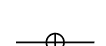
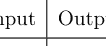
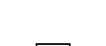
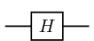
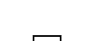
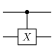
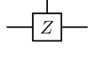
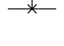
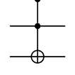

# 量子信息理论与量子计算的面向对象Python实战指南

M. S. Ramkarthik
Pranay Barkataki

# 量子信息理论与量子计算的面向对象Python实战指南

这本开创性的教科书提供了基于前沿面向对象Python的计算工具，这些工具是量子信息、量子计算、线性代数以及一维自旋1/2凝聚态物理系统的基础。书中包含了超过104个子程序，代码辅以数学注释以增强清晰度。本书适合初学者和进阶读者，学生和研究人员会发现这本教科书是一个有用的指南和便捷的参考手册。

**特点**

-   包含超过104个面向对象Python代码，所有代码均可作为独立程序使用，或毫无问题地集成到任何其他主程序中。
-   在输入、输出和执行的每个参数中都提供了详细说明，同时兼顾了初学者和进阶用户的需求。
-   每个程序的输出都通过详细的示例进行了透彻的解释。
-   代码旁附有详细的数学注释，增强了对代码流程和工作原理的清晰理解。

**M. S. Ramkarthik 博士**在那格浦尔的维斯韦斯瓦拉亚国立技术学院担任助理教授。他的研究兴趣在于理论物理领域，特别是量子计算、量子信息以及物理学中的数学和数值方法。他喜欢教授各个层次的学生。他还对设计和实施新颖且概念性的物理教学方法感兴趣，以使物理对学生更具吸引力和趣味性。他还著有《量子信息理论与量子计算中的数值方法：FORTRAN 90冒险之旅》一书，该书于2021年9月由CRC出版社出版。他是一位计算机爱好者，热衷于使用各种编程语言解决数学和物理问题。

**Pranay Barkataki 博士**目前是索尼研发中心（位于班加罗尔）的研究分析师，担任数据分析师。他在M. S. Ramkarthik博士的指导下完成了量子纠缠和量子多体物理领域的博士学位。他的研究兴趣在于理论物理以及机器学习和人工智能。

# Taylor & Francis

Taylor & Francis Group

http://taylorandfrancis.com

# 量子信息理论与量子计算的面向对象Python实战指南

M. S. Ramkarthik
Pranay Barkataki

CRC Press
Taylor & Francis Group
Boca Raton London New York

CRC Press是
Taylor & Francis Group, an informa business的印记

第一版于2023年出版
由CRC Press出版
地址：6000 Broken Sound Parkway NW, Suite 300, Boca Raton, FL 33487-2742

以及由CRC Press出版
地址：4 Park Square, Milton Park, Abingdon, Oxon, OX14 4RN

*CRC Press是Taylor & Francis Group, LLC的印记*

© 2023 M.S. Ramkarthik and Pranay Barkataki

我们已尽合理努力发布可靠的数据和信息，但作者和出版商无法对所有材料的有效性或其使用后果承担责任。作者和出版商已尝试追溯本出版物中所有复制材料的版权持有者，如果未获得以这种形式出版的许可，我们向版权持有者致歉。如果任何版权材料未被确认，请写信告知我们，以便我们在任何未来的重印中予以更正。

除非美国版权法允许，否则本书的任何部分不得以任何形式（无论是电子、机械或其他方式，无论是现在已知的或今后发明的，包括影印、缩微拍摄和录音）或任何信息存储或检索系统进行重印、复制、传输或利用，除非获得出版商的书面许可。

要获得影印或以电子方式使用本作品材料的许可，请访问 www.copyright.com 或联系版权结算中心（CCC），地址：222 Rosewood Drive, Danvers, MA 01923, 978-750-8400。对于CCC上不可用的作品，请联系 mpkbookspermissions@tandf.co.uk

*商标声明*：产品或公司名称可能是商标或注册商标，仅用于识别和解释，无意侵权。

**美国国会图书馆编目出版数据**

名称：Ramkarthik, M. S., 作者。 | Barkataki, Pranay, 作者。
题名：量子信息理论与量子计算的面向对象Python实战指南 / M.S. Ramkarthik and Pranay Barkataki.
描述：第一版。 | Boca Raton : CRC Press, 2023。 | 包含参考文献和索引。
标识符：LCCN 2022006256 | ISBN 9781032256078 (精装) | ISBN 9781032258898 (平装) | ISBN 9781003285489 (电子书)
主题：LCSH: 量子理论--数学--数据处理。 | 量子计算。 | Python (计算机程序语言) | 面向对象编程 (计算机科学)
分类：LCC QC174.17.M35 R36 2023 | DDC 530.120285/53--dc23/eng20220712
LC记录可在 https://lccn.loc.gov/2022006256 获取

ISBN: 978-1-032-25607-8 (精装)
ISBN: 978-1-032-25889-8 (平装)
ISBN: 978-1-003-28548-9 (电子书)

DOI: 10.1201/9781003285489

由KnowledgeWorks Global Ltd.使用Latin Modern字体排版

*出版商注*：本书由作者提供的照相原稿编制而成。

> 献给我亲爱的妻子，感谢她的激励、信任、建议、关怀和支持。

M. S. Ramkarthik

> 献给我的父母Prabin Kumar Barkataki和已故的Runumi Barkataki，他们不仅教导和培养了我，还让我做好了以坚定的决心和谦逊的态度面对生活挑战的准备。

Pranay Barkataki

# Taylor & Francis

Taylor & Francis Group

http://taylorandfrancis.com

## 目录

-   前言

### 前言

[前言内容应在此处，但未包含在提供的OCR文本中。]

## 2 量子力学的基本工具

### 2.1 两个向量之间的内积

## 目录

ix

## 4 量子信息与量子计算工具

83

### 4.1 常用量子门

84

- 4.1.1 Pauli-X 门
  85
- 4.1.2 Pauli-Y 门
  86
- 4.1.3 Pauli-Z 门
  88
- 4.1.4 Hadamard 门
  89
- 4.1.5 相位门
  91
- 4.1.6 旋转门
  92
- 4.1.7 受控非门（CX 门）
  94
- 4.1.8 受控 Z 门（CZ 门）
  96
- 4.1.9 SWAP 门
  97
- 4.1.10 Toffoli 门（CCX, CCNOT, TOFF）
  98
- 4.1.11 Fredkin 门（CSWAP）
  100

### 4.2 Bell 态

101

- 4.2.1 $|b_1\rangle$ Bell 态的 $N/2$ 张量积
  102
- 4.2.2 $|b_2\rangle$ Bell 态的 $N/2$ 张量积
  103
- 4.2.3 $|b_3\rangle$ Bell 态的 $N/2$ 张量积
  105
- 4.2.4 $|b_4\rangle$ Bell 态的 $N/2$ 张量积
  107

### 4.3 $N$ 量子比特 Greenberger-Horne-Zeilinger (GHZ) 态

109

### 4.4 $N$ 量子比特 W 态

110

### 4.5 广义 $N$ 量子比特 Werner 态

111

### 4.6 香农熵

113

### 4.7 线性熵

114

- 4.7.1 对于实数或复数密度矩阵
  114

### 4.8 相对熵

116

- 4.8.1 两个密度矩阵之间的相对熵
  116

### 4.9 迹距离

118

- 4.9.1 两个实数或复数密度矩阵之间的迹距离
  118

### 4.10 保真度

119

- 4.10.1 两个实数或复数态之间的保真度
  119

x

目录

- 5.3.2 对于实数或复数密度矩阵

## 7 生成随机矩阵和随机向量

- 7.1 高斯分布的随机数生成器

## 泰勒与弗朗西斯

泰勒与弗朗西斯集团

http://taylorandfrancis.com

### 前言

为任何作者而言，撰写前言都是一项具有仪式感的活动。当我撰写《量子信息理论与量子计算中的数值方法：FORTRAN 90冒险之旅》一书时，该书于2021年由CRC出版社出版，CRC出版社的委员会认为，本书的Python版本也将是一本有趣的读物，并鼓励我承担这一项目。在CRC出版社的这一激励下，同时也出于我自身的“计算”冲动，我着手撰写一本将大量量子信息、量子纠缠和自旋链系统中的操作与任务融入最新版Python编程语言的书籍。本书被命名为《量子信息理论与量子计算的面向对象Python食谱》；之所以称为“食谱”，是因为它包含了上述领域中的大量“配方”。当我着手撰写本书并开发高效的Python代码时，我思考，为何不将Python中最新的数据结构，如OOPs（面向对象编程系统），融入其中呢？这为开发既简洁又高效的代码铺平了道路。

Python是众多领域人士使用的主要工具之一，从软件专业人士和经济学家到物理学家、化学家和分子生物学家。其语法的简洁性以及丰富的内置函数和库，使其在速度上与其他语言相比的劣势显得微不足道。凭借这些优越特性和最先进的数据结构，OOPs Python成为我们开发此库的选择。我们开发的这些软件包可以使用`pip install`命令轻松安装到任何计算机上。安装后，所有库都将位于其正确的路径中，用户只需按照本书给出的说明即可毫无问题地使用这些库。在整本书中，我们使用SciPy和NumPy库来调用Python中的某些内置函数。本书的另一个特点是，对于每一行代码，我们都使用复杂的包开发了一种数学式的注释编写方式，使用户在代码的每一步都能感到得心应手。这种将注释与代码一起开发的方式还有一个优势，即可以在操作的数学本质和代码的算法流程之间建立一一对应的关系，因为这两者在解决任何问题时都是相辅相成的。在每一章的末尾，都展示了一个包含该章代码混合使用的完整示例，这有助于增强读者对如何使用这些代码的理解。

本书包含超过100个Python数值例程，对于从事量子信息理论、量子计算、量子纠缠以及凝聚态量子多体自旋半链领域工作的实践物理学家（无论是理论还是实验方向）都将极其有用。我们在此还要说明，本书有一章专门介绍数值线性代数程序，最后一章则涉及随机态和矩阵。我们可以自信而谦逊地说，这些计算库涵盖了广泛的主题。

从鸟瞰视角来看，我们概览各章内容。第1章是关于Python编程语言和OOPs编程细节的独立介绍。本章的编写方式使得即使没有编程知识的人也能学习OOPs Python。语言的每一个语法和结构都通过精心挑选的示例进行了解释，以获得更好的清晰度。第2章包含量子数学的基本工具，即构成理论核心的数学运算。第3章涉及数值线性代数和其他基于线性代数的量子力学操作。第4章包含那些可以用来构建量子门、态以及涉及态的各种重要量（如保真度、熵、迹距离等）的代码。第5章处理纠缠的量化或纠缠度量。在本章中，我们开发了从给定的量子比特超集中计算任意量子比特子集的部分迹和部分转置的高速方法。随后，利用这些操作，我们为纯态和混合态几乎所有常用的纠缠度量开发了代码。第5章以一些纠缠检测的示例结束，例如用于可分性的Peres PPT（正部分转置）判据和Horodecki的约化判据。第6章涉及构建多个一维自旋半链哈密顿量，包括有无随机键相互作用、有无均匀磁场的情况，涵盖了海森堡模型和伊辛模型及其变体，以及具有非对称相互作用（如DM相互作用）的自旋模型。这里需要注意的是，本章开发的代码适用于任何$r$近邻交换相互作用；这使我们能够非常轻松地构建任何一维哈密顿量。最后但同样重要的是，为了完整性和优雅性，本书包含了一章关于构建随机态、密度矩阵和其他伪随机分布的内容。

没有CRC出版社泰勒与弗朗西斯集团的Carolina Antunes女士、CRC出版社的Elizabeth (Betsy) Byers女士以及Sumati Agarwal女士的帮助，本书是不可能完成的。从提案提交之日起直到结束，她们都给予了极大的支持。我要感谢CRC出版社、泰勒与弗朗西斯集团给予我们撰写本书的机会，并使代码能够提供给该领域所有有志于研究的人员。最后但同样重要的是，本书中给出的代码已经使用不同的物理系统进行了多次验证，据我们所知，能够给出准确的输出。尽管经过了多轮仔细的编辑和测试，但错误可能始终存在，如果读者能指出这些错误，作者将不胜感激。

M. S. Ramkarthik
Pranay Barkataki

## 图表列表

- 5.1 两次公平抛硬币的离散概率分布。. . . . . . . . . . 133
- 5.2 两次特殊抛硬币的离散概率分布。. . . . . . . . . . . 133
- 5.3 $N$量子比特量子系统，量子态用$\rho_N$表示。. . . . 150
- 5.4 $L$和$N - L$自旋块之间的纠缠。. . . . . . . . . . . . 158

## 泰勒与弗朗西斯

泰勒与弗朗西斯集团

http://taylorandfrancis.com

## 致谢

首先，我感谢我的妻子Chanchal，她总是为我提供一个有益健康的环境。我感谢我的父母，他们从我童年至今一直给予我支持。我向所有老师致敬，他们从我“有意识”地进入学习和学术领域之日起就培养了我。我感谢我的朋友们，感谢我在学术和非学术讨论中与他们共度的美好时光。在此，我感谢我所在研究所的所长，为我提供了良好的工作氛围。我衷心感谢我所有的学生，他们像磨刀石一样，不断打磨我的想法。感谢全能的主作为我内在的力量，这是我的精神责任。如果我不感谢“冠状病毒”及其“变种”，让我不离不弃地待在一个地方，并将我与外部世界隔绝，从而使我能够以创纪录的时间完成这本书，那么这份致谢将是不完整的。

M. S. Ramkarthik

我永远感激我的父母，他们给予我的机会和经历塑造了今天的我。我要特别感谢我的博士论文导师M. S. Ramkarthik博士，感谢他给予我成为本书合著者的机会。特别感谢我的实验室后辈Payal Dineshbhai Solanki，感谢他帮助我测试部分代码。最后，感谢所有在我成长道路上给予帮助的人：Pranjal Barkataki、Manas Barkataki、Shweta Barkataki、Swagota Barkataki和Devvrat Tiwari。

Pranay Barkataki

## 泰勒与弗朗西斯出版社

泰勒与弗朗西斯集团

http://taylorandfrancis.com

## 1 Python与面向对象编程简介

本章我们将对面向对象的Python编程语言进行独立介绍。Python的名字由荷兰程序员吉多·范罗苏姆在1980年代末构思[1]。自1991年2月20日Python首次发布以来，Python编程社区发展迅速，如今许多人谈论Python编程语言的卓越地位。因此，问题出现了：是什么让Python如此强大？这个问题的答案不仅在于Python是一种通用、动态、高级语言，具有简洁的编码风格，还在于它像一种胶水语言，能够与其他编程语言及其库[2]进行交互，例如C[3]、C++[4]和FORTRAN[5, 6]。这些原因使得Python成为科学[7]、工程[8]、数据分析[9]、机器学习[10]等领域最受欢迎的编程语言。

然而，每种优势都伴随着其弱点，在这种情况下，就是执行速度。Python是一种解释型语言，其源代码不会直接编译成机器指令，而是每个语句在运行时通过顺序输入到解释器循环中执行。简而言之，Python中源代码实现的框架如下：

1.  将源代码翻译成一种称为*字节码*[11]的中间格式。字节码提供了可移植性的优势，这意味着它是一种平台无关的格式。
2.  在下一步中，解释器解释*字节码*。

以上所有要点都表明，Python代码不像C++或FORTRAN那样直接编译成二进制代码。因此，与编译语言（如C，它将源代码转换为二进制代码然后执行）相比，用Python编写的代码相对较慢。然而，针对Python速度慢的反驳论点如下：使用更好的数据结构和算法重写代码，或者用任何编译语言编写代码中性能密集的部分，然后在Python中暴露其功能。在本书中涵盖Python的每个方面是不可能的，因此，在本章中，我们将介绍Python的基本语法。本书中编写的所有代码在Python 3.7.9及更高版本上都能顺利运行。有多种方法可以运行Python程序，但最简单的方法是通过终端（或Windows中的命令提示符）。在终端中，如果在命令提示符下输入Python，它将显示有关计算机上安装的Python版本的一些信息，例如：

```
$ python
Python 3.7.9 (default, Aug 31 2020, 12:42:55)
[GCC 7.3.0] :: Anaconda, Inc. on linux
Type "help", "copyright", "credits" or "license" for more information.
>>>
```

你可以在>>>之后编写你的Python代码。现在我们将看到如何在屏幕上打印一些字符或数字，即在我们正在使用的终端上。例如，在终端上打印‘Hello world’的语法如下所示：

```
>>> print("Hello world")
Hello world
```

如果你想随时获取帮助，请使用help()函数。现在要退出返回到命令行，你可以使用exit()函数。Python代码也可以写在Python脚本文件中，该文件具有.py文件扩展名。运行Python脚本文件最常见的方式如下：从终端或集成开发环境（IDE）如Spyder。要从终端运行Python脚本，你必须在包含要运行的Python脚本的同一文件夹中打开终端，然后在终端中编写以下语法，如下所示：

```
$ python <filename>.py
```

例如，如果你想在终端中运行Python脚本*myfile.py*，则可以这样做：

```
$ python myfile.py
```

通常，大多数Python库，包括本书中开发的量子信息库，都是用.py文件编写的函数集合。现在是时候介绍任何Python代码的结构方面了。

### 1.1 变量

变量是用于存储值的保留内存位置[11]。分配给这些变量的值可以来自不同的数据类型。例如，它可以是数字、字符串、列表、元组、字典等。在本章后面，我们将讨论其中一些数据类型。变量名可以包括以下内容：大写字母（A-Z）和小写字母（a-z）、数字（0-9）和下划线（_）。但是，变量名永远不能以数字开头，并且我们不能在变量名中包含任何特殊字符。下面我们展示了一些正确变量名的示例：

```
>>> joules = 2   # 整数数据类型
>>> energy_transform = "Convert joules to electron volt"   # 字符串数据类型
>>> Energy_ev = joules*(6.242e+18)   # 浮点数数据类型
>>> probabilities3 = [0.3, 0.6, 0.1]   # 列表数据类型
```

在#之后编写的任何语句都被Python解释器视为注释，该语句永远不会被执行。编写注释是为了给试图解码程序的人增加更多清晰度，并更好地理解代码。现在我们准备好深入探讨Python中最常用数据类型的世界了。

### 1.2 数据类型

#### 1.2.1 整数

*int*类表示整数值。整数值包含正或负的整数。在Python中，整数值的长度没有限制。内置的**type()**函数用于查找任何变量的数据类型，如下所示：

```
>>> a=30
>>> print(type(a))
```

上述代码的输出将打印*int*类，如下所示：

```
<class 'int'>
```

#### 1.2.2 实数

*float*类表示实数。实数以浮点表示法书写。可选地，字符**e**或**E**后跟一个正或负整数可以附加以指定科学计数法。

```
>>> b=30.5
>>> print(type(b))
>>> h=6.626E-34 # 普朗克常数
>>> print("Multiplying Planck constant by 10 =",h*10)
```

上述代码的输出将打印*float*类，如下所示。

```
<class 'float'>
Multiplying Planck constant by 10 = 6.626e-33
```

#### 1.2.3 复数

任何复数都有两个部分：实部和虚部，它由*complex*类表示。例如，Python中的复数$3 + 2i$可以写成：

```
>>> c = complex(3, 2)
>>> print(type(c))
```

上述代码的输出将打印*complex*类，如下所示：

```
<class 'complex'>
```

然而，当字符串包含特殊字符（如引号）时，我们需要转义它们，否则会导致语法错误。转义是通过在字符前放置反斜杠（\）来完成的，如下所示：

```
>>> str3="She said, "Whats up" "  # 无效的字符串类型
SyntaxError: invalid syntax
>>> str3 ="She said, "Whats up" ""  # 有效的字符串类型
>>> print(str3)
She said, "Whats up"
>>> str4= 'Space like \t separated'  # \t 引入制表符空格
>>> print(str4)
Space like     separated
>>> str5= "Hello \n world"  # \n 引入换行符
>>> print(str5)
Hello
 world
```

人们可能会想知道为什么在Python中遵循在三引号内编写字符串的概念。答案在于，三引号可以包含同时包含单引号和双引号的字符串，这样就不需要转义，并且它还允许多行字符串。三引号字符串的一些示例如下所示：

```
>>> print('''Einstein said, "Quantum mechanics is not correct."''')
Einstein said, "Quantum mechanics is not correct."
>>> print("""Hello
... World""")
Hello
World
```

#### 1.2.5 逻辑值

只有两个逻辑值**True**和**False**，分别对应于标准布尔元素1和0。*bool*类表示布尔类型。示例如下所示：

```
>>> print(type(True))
<class 'bool'>
```

#### 1.2.6 列表

列表是各种类型数据的有序集合，没有固定大小。列表不必总是同质的，这使其成为Python最强大的特性之一。与字符串不同，列表是可变的，可以通过多种列表方法调用进行修改，在本节中，我们将讨论一些重要的方法。列表是通过在方括号内编写逗号分隔的值（项）来创建的，例如：

```
>>> lst1 = [1, 'electron', 2, 'proton', 3, 'neutron']
>>> print(type(lst1))
<class 'list'>
```

在列表中，第一个元素的索引从零开始。如果你想访问列表中的特定元素或多个元素，可以执行以下操作：

```
>>> print(lst1[0]) # 按位置索引
1
>>> print(lst1[1:3]) # 切片列表
['electron', 2]
>>> length = len(lst1) # 计算列表的长度
>>> print(length)
6
```

要添加、删除或在列表的特定位置插入元素，可以通过以下列表方法调用来完成：

```
>>> lst1.append(6) # 将元素6追加到列表中
>>> print(lst1)
[1, 'electron', 2, 'proton', 3, 'neutron', 6]
>>> lst1.remove(3) # 移除元素3
>>> print(lst1)
[1, 'electron', 2, 'proton', 'neutron', 6]
>>> lst1.insert(1,'atom') #.insert(i,x)，在索引i处插入元素x
>>> print(lst1)
[1, 'atom', 'electron', 2, 'proton', 'neutron', 6]
>>> lst1.pop(5) # .pop(i)，移除索引i处的元素
'neutron'
>>> print(lst1)
[1, 'atom', 'electron', 2, 'proton', 6]
```

#### 1.2.7 元组

元组是一个有序且不可变的对象集合。元组是序列，就像列表一样。元组和列表的区别在于：元组不能像列表那样被修改，并且元组使用圆括号，而列表使用方括号。

```
>>> tup1 = ('quantum', 'state', 0.75, 0.25) # 有效的元组
>>> print(type(tup1))
<class 'tuple'>
>>> tup2 = (1, 2, 3 ) # 有效的元组
>>> print(tup2[0])
1
>>> print(tup2[1])
2
```

#### 1.2.8 NumPy 数组

任何数学物理[2]计算的核心都是数组，更重要的是在量子力学中。例如，数组表示量子态或密度矩阵、量子多体系统的哈密顿量、量子测量算符等。Python中的数组数据语言可以借助NumPy [12]（代表Numerical Python）来编写。它是一个由多维数组对象和处理这些数组的例程集合组成的库。NumPy的大部分是用C或C++编写的，以实现更快的计算目的。NumPy还能理解来自C和FORTRAN等语言的数组数据格式，这是一个额外的优势。为了创建NumPy数组，我们首先必须导入该库，然后对数字序列调用**array()**方法，如下所示：

```
>>> import numpy as np
>>> array1 = np.array([1, 2, 3]) # 一维数组
>>> print(array1.shape) # .shape，返回数组的形状
(3,)
>>> array2 = np.array([[1,0],[0,-1]]) # 二维数组
>>> print(array2.shape)
(2, 2)
>>> array3 = np.array([[[1,3,2.5],[4,8,-11]],[[3,22,-0.9],[2,3,4]]]) # 三维数组
>>> print(array3.shape)
(2, 2, 3)
```

创建NumPy数组还有其他方法，我们将在本节讨论其中几种。我们将主要讨论**empty()**、**zeros()**、**identity()**和**ones()**函数。**empty()**函数接受一个整数或整数元组来定义数组的形状，然后分配内存而不为数组赋任何值。这意味着数组中初始化了接近零的随机噪声。**ones()**和**zeros()**函数接受一个整数或整数元组来定义数组的形状，并返回一个n维数组，其元素分别为一或零。**identity()**函数接受一个整数值来定义方阵的维度，其对角线元素等于一，非对角线元素等于零。以下是上述函数的一些示例：

```
>>> array3 = np.empty((2,3))
>>> print(type(array3))
<class 'numpy.ndarray'>
>>> array4 = np.zeros((2,3))
>>> print(array4)
[[0. 0. 0.]
 [0. 0. 0.]]
>>> array5 = np.ones((2,3))
>>> print(array5)
[[1. 1. 1.]
 [1. 1. 1.]]
>>> array6 = np.identity(3)
>>> print(array6)
[[1. 0. 0.]
 [0. 1. 0.]
 [0. 0. 1.]]
```

函数**empty()**、**zeros()**和**ones()**输出的默认数据类型是*float64*。**identity()**的默认数据类型输出是*float*。如果你想将上述输出的数据类型从*float*或*float64*更改为*int*，可以执行以下操作：

```
>>> array7 = np.zeros((2,3), dtype = 'int_') # dtype代表数据类型
>>> print(array7)
[[0 0 0]
 [0 0 0]]
>>> array8 = np.ones((2,3), dtype = 'int_')
>>> print(array8)
[[1 1 1]
 [1 1 1]]
>>> array9 = np.identity(3, dtype = 'int_')
>>> print(array9)
[[1 0 0]
 [0 1 0]
 [0 0 1]]
```

NumPy中有许多种dtypes或数据类型可用。dtypes都有字符串字符代码，可用于创建更复杂的类型。一些dtypes是灵活的（f），在这些dtypes中，数组必须具有固定大小，但dtypes的长度对于不同的数组可能不同。通常字符串数据类型是灵活的，因为一个数组可能有长度为20的字符串，而另一个数组可能有长度为40的字符串。

| dtype | 字节 | 描述 |
|---|---|---|
| bool_ | 1 | 布尔数据类型 |
| bool8 | 1 | bool_的别名 |
| int_ | | 默认整数类型。通常是int64或int32 |
| int0 | | 与int_相同。 |
| int8 | 1 | 单字节（8位）整数，范围从-128到127 |
| byte | 1 | int8的别名 |
| int16 | 2 | 16位整数，范围从-32768到32767 |
| int32 | 4 | 32位整数，范围从-2147483648到2147483647 |
| int64 | 8 | 64位整数，范围从-9223372036854775808到9223372036854775807 |
| uint_ | | 默认无符号整数类型；是uint32或uint64的别名 |
| uint0 | | 与uint_相同 |
| uint8 | 1 | 单字节（8位）无符号整数，范围从0到255 |
| ubyte | 1 | uint8的别名 |
| uint16 | 2 | 16位无符号整数，范围从0到65535 |
| uint32 | 4 | 32位无符号整数，范围从0到4294967295 |
| uint64 | 8 | 64位无符号整数，范围从0到18446744073709551615 |
| float_ | 8 | float64的别名 |
| float16 | 2 | 16位浮点数 |
| float32 | 4 | 32位浮点数 |
| float64 | 8 | 64位浮点数 |
| float96 | 12 | 96位浮点数 |
| float128 | 16 | 128位浮点数 |
| complex_ | 16 | complex128的别名 |
| complex64 | 8 | 64位复数浮点数 |
| complex128 | 16 | 128位复数浮点数 |
| complex256 | 32 | 256位复数浮点数 |
| string_ | f | 字节（或Python 2中的str）数据类型。这是一个灵活的dtype |
| string0 | f | string_的别名 |
| str_ | f | string_的别名 |
| unicode_ | f | 字符串（或Python 2中的Unicode）数据类型。这是一个灵活的dtype |
| unicode0 | f | unicode_的别名 |

### 1.3 运算符

运算符是执行某些数学运算以产生另一个输出的对象。这里$A$和$B$称为操作数。在Python中可以定义三种类型的运算符，即算术、关系和逻辑运算符，我们将在下文中看到。

#### 1.3.1 算术运算符

| 运算符 | 描述 |
| :--- | :--- |
| + | 将两个操作数相加，即 $A + B$ |
| - | 将两个操作数相减，即 $A - B$ |
| * | 将两个操作数相乘，即 $A * B$ |
| / | 执行除法，即 $A/B$ |
| ** | 将一个操作数提升到另一个操作数的幂，即 $A ** B = A^B$ |
| % | 执行取模运算 $A\%B$ |

#### 1.3.2 关系运算符

| 运算符 | 描述 |
| :--- | :--- |
| == | 检查两个操作数是否具有相同的值 |
| != | 检查两个操作数是否不相等 |
| > | 检查左操作数是否大于右操作数 |
| < | 检查左操作数是否小于右操作数 |
| >= | 检查左操作数是否大于或等于右操作数 |
| <= | 检查左操作数是否小于或等于右操作数 |

#### 1.3.3 逻辑运算符

| 运算符 | 描述 |
| :--- | :--- |
| and | 称为逻辑与运算符。如果两个操作数都非零，则条件为真。 |
| or | 称为逻辑或运算符。如果两个操作数中任何一个非零，则条件为真。 |
| not | 称为逻辑非运算符。用于反转其操作数的逻辑状态。如果条件为真，则逻辑非运算符将使其为假，反之亦然。 |

### 1.4 决策

决策是任何编程语言中非常重要的元素。条件语句帮助我们做出这些决策。条件语句的基本语法如下所示。

#### 1.4.1 if 语句

if 语句的主体以缩进开始，第一个未缩进的行标志着结束。通用的 if 语句写法如下：

```
if <test_expression>:
    <body of if>
```

如果条件 `<test_expression>` 为真，则执行 if 语句的主体（`<body of if>`）。上述语法的一个示例如下：

```
# Coefficients of quadratic equation, $ax^2 + bx + c = 0$
a=5
b=6
c=1
# The discriminant is defined as, $b^2 - 4ac$
d=(b**2)-(4*a*c)
if d > 0:
    print("Roots are real and distinct")
```

这将输出：

```
Roots are real and distinct
```

#### 1.4.2 if else 语句

通用的 if else 语句写法如下：

```
if <test_expression>:
    <body of if>
else:
    <body of else>
end if
```

如果条件 `<test_expression>` 为真，则执行 if 语句的主体（`<body of if>`），否则执行 else 语句的主体（`<body of else>`）。上述语法的一个示例如下：

```
# Coefficients of quadratic equation, $ax^2 + bx + c = 0$
a=5
b=2
c=1
# The discriminant is defined as, $b^2 - 4ac$
d=(b**2)-(4*a*c)
if d > 0:
    print("Roots are real and distinct")
else:       # here the condition is d <=0.
    print("Roots are real and equal or both roots are complex")
```

这将输出：

Roots are real and equal or both roots are complex

#### 1.4.3 if elif else 语句

关键字 **elif** 是 *else if* 的缩写。通用的 **if elif else** 语句如下所示：

```
if <test_expression0>:
    <Body of if>
elif <test_expression1>:
    <Body of elif 1>
elif <test_expression2>:
    <Body of elif 2>
.
.
.
else:
    <Body of else>
```

**elif** 语句位于 **if** 语句之后、**else** 语句之前。上述语法的一个示例如下：

```
# Coefficients of quadratic equation, $ax^2 + bx + c = 0$
a=5
b=2
c=1
# The discriminant is defined as, $b^2 - 4ac$
d=(b**2)-(4*a*c)
if d > 0:
    print("Roots are real and distinct")
elif d == 0:
    print("Roots are real and equal")
else:
    print("Roots are complex")
```

这将输出：

Roots are complex

### 1.5 循环

循环对于重复执行类似操作非常有用。循环的重要性如此之大，以至于没有循环元素，任何编程语言都将完成99%。循环有两种类型，它们的语法如下所示。

#### 1.5.1 while 循环

**while** 循环的通用语法写法如下：

```
while <test_expression>:
    <Body of while>
```

**while** 循环的主体（`<Body of **while**>`）会一直执行，直到条件 `<test_expression>` 成立。上述语法的一个示例如下：

```
# Calculating the n! factorial
n = 3
fact=1
while n > 0:
    fact=fact*n
    n=n-1
print("Factorial =",fact)
```

这将输出：

```
Factorial = 6
```

正如我们上面已经讨论过的，**while** 循环会一直执行直到测试表达式成立，然而，当你需要遍历列表的项目或必须将循环体运行 *n* 次时，**while** 循环就变得效率低下。for 循环完美地适合这个角色，正如下一节所讨论的。

#### 1.5.2 for 循环

**for** 循环的通用语法写法如下：

```
for <variable> in <iterable>:
    <Body of for loop>
```

变量 `<variable>` 在每次循环中被赋值为可迭代对象 `<iterable>` 中新项目的值。上述语法的几个示例如下所示：

```
mylist=['quantum', 'mechanics', 1, complex(2,3), 3.8]
for i in mylist:
    print(i)
```

这将输出：

```
quantum
mechanics
1
(2+3j)
3.8
```

现在，如果你想让变量 `<variable>` 从整数 *n* 运行到整数 *m*，步长为 *l*（整数），那么你必须使用 **range()** 函数。对于所考虑的情况，函数的参数输入如下：**range(n, m + 1, l)**。**range()** 函数中步长的默认值是 1。上述情况的一个示例如下所示：

```
# Geometric progression, $a, ar, ar^2, ar^3, ar^4, ..., ar^{n-1}$
a=2
r=3
n=5
sum1=0.0
# Loops run from $a$ to $ar^{n-1}$
for i in range(0,n,1):
    print(a*(r**i))
    sum1=sum1+(a*(r**i))
print("Total sum of geometric progression =",sum1)
```

这将输出：

```
2
6
18
54
162
Total sum of geometric progression = 242.0
```

我们在下面提供另一个示例，展示一种将循环与数组结合使用的方法。

```
# Arithmetic progression, $a_1, a_1+d, a_1+2d, ..., a_1+(n-1)d$
import numpy as np
a1=3
d=0.3
n=5
arr=np.zeros(n,dtype='float64')
for i in range(0,n,1):
    arr[i]=a1+i*d
print("Printing the array holding the arithmetic progression")
print(arr)
```

上述代码执行后给出以下输出。

```
Printing the array holding the arithmetic progression
[3. 3.3 3.6 3.9 4.2]
```

### 1.6 Python 文件处理

本节主要讨论 Python 用于创建、写入和读取文件的内置函数。还有其他 Python 包，如 NumPy [12]、PyTables [13]、Pandas [14] 和 Blaze [15]，它们不仅用于创建、写入和读取文件，还执行一些高级操作，如清理、整理、分析和可视化。然而，在本节中，我们将讨论范围限制在 Python 的内置函数。在 Python 中，处理两种类型的文件：文本文件和二进制文件。处理文件时，按以下顺序进行三个文件操作：

1.  打开文件。
2.  读取或写入（执行操作）。
3.  关闭文件。

Python 有一个内置的 **open()** 函数来打开文件。此函数返回一个文件对象，也称为句柄。**open()** 函数的通用语句如下所示：

```
file_object = open(r"file_name", "access_mode")
```

文件应存在于保存 Python 程序文件的同一目录中。否则，必须在文件名之前写出完整地址或路径。Python 中可用的不同类型的访问模式如下所列：

| 访问模式 | 代码 | 描述 |
| :--- | :--- | :--- |
| 只读 | "r" | 打开文本文件进行读取。句柄位于文件开头。如果文件不存在，则引发 I/O 错误。这也是文件打开的默认模式 |
| 读写 | "r+" | 打开文件进行读写。句柄位于文件开头。如果文件不存在，则引发 I/O 错误 |
| 只写 | "w" | 打开文件进行写入。对于现有文件，数据被截断并覆盖。句柄位于文件开头。如果文件不存在，则创建文件 |
| 写读 | "w+" | 打开文件进行读写。对于现有文件，数据被截断并覆盖。句柄位于文件开头 |
| 追加 | "a" | 打开文件进行写入。如果文件不存在，则创建文件。句柄位于文件末尾。写入的数据将插入到末尾，在现有数据之后，即它将被追加 |
| 追加读 | "a+" | 打开文件进行读写。如果文件不存在，则创建文件。句柄位于文件末尾。写入的数据将插入到末尾，在现有数据之后 |

上述讨论的一个示例如下所示：

```
import numpy as np
# To read file MyFile1.txt" in D:\Text in file2
file1 = open(r"D:\Text\MyFile1.txt", "r")
```

```
# Writing file 'myfile.txt' in the same directory of the python program
file2 = open('myfile.txt', 'w')
L = ["Quantum Information", "\n", "and", "\t", "Computation"]
s = "Numerical recipes\n"
arr=np.array([[0,1],[1,0]])

# Writing a string to file
file2.write(s)

# Writing multiple strings at a time
file2.writelines(L)

# writing matrix elements in the file
file2.write("\nThe matrix is written as\n")
for i in range(0,arr.shape[0]):
    for j in range(0,arr.shape[1]):
        file2.write(str(arr[i,j]))
        # to add tab space length between row elements of matrix
        file2.write('\t')
    # each row is to be printed in the next line
    file2.write('\n')

# Closing file
file2.close()

# Checking if the data is written to file or not
file2 = open('myfile.txt', 'r')
print(file2.read())
file2.close()
```

文件 **myfile.txt** 存储以下数据。

```
Numerical recipes
Quantum Information
and     Computation
The matrix is written as
0       1
1       0
```

写入和加载 numpy 数组的最佳方法如下所示。

```
import numpy as np

arr=np.array([[1,2],[3,4],[5,6]])

# Saving the array in a text file
np.savetxt("np_array.txt", arr)

# Displaying the contents of the text file
content = np.loadtxt('np_array.txt')
print("\nContent in np_array.txt:\n", content)
```

# 以不同形状加载数组
arr2 = np.loadtxt('np_array.txt').reshape(2, 3)
print("打印重塑后的矩阵")
print(arr2)

# arr 和 arr2 的矩阵乘法
result = np.matmul(arr, arr2)
print("两个数组的乘法结果")
print(result)

上述代码打印以下输出。

```
np_array.txt 中的内容：
[[1. 2.]
 [3. 4.]
 [5. 6.]]
打印重塑后的矩阵
[[1. 2. 3.]
 [4. 5. 6.]]
两个数组的乘法结果
[[ 9. 12. 15.]
 [19. 26. 33.]
 [29. 40. 51.]]
```

### 1.7 Python 中的 math 模块

**math** 模块是 Python 中的一个标准模块，始终可用。要使用此模块下的数学函数，你必须使用以下方式导入该模块：

```python
import math
```

此模块不支持复数数据类型。**cmath** 模块是其复数对应模块。下表列出了 **math** 模块中定义的所有函数及其描述。

| 运算符 | 描述 |
| :--- | :--- |
| **math.ceil(x)** | 返回大于或等于 x 的最小整数 |
| **math.copysign(x, y)** | 返回带有 y 符号的 x |
| **math.fabs(x)** | 返回 x 的绝对值 |
| **math.factorial(x)** | 返回 x 的阶乘 |
| **math.floor(x)** | 返回小于或等于 x 的最大整数 |
| **math.fmod(x, y)** | 返回 x 除以 y 的余数 |
| **math.frexp(x)** | 返回 x 的尾数和指数，以 (m, e) 对的形式 |
| **math.fsum(iterable)** | 返回可迭代对象中值的精确浮点数总和 |
| **math.isfinite(x)** | 如果 x 既不是无穷大也不是 NaN（非数字），则返回 True |
| **math.isinf(x)** | 如果 x 是正无穷或负无穷，则返回 True |
| **math.isnan(x)** | 如果 x 是 NaN，则返回 True |
| **math.ldexp(x, i)** | 返回 x * (2**i) |
| **math.modf(x)** | 返回 x 的小数部分和整数部分 |
| **math.trunc(x)** | 返回 x 的截断整数值 |
| **math.exp(x)** | 返回 e**x |
| **math.expm1(x)** | 返回 e**x – 1 |
| **math.log(x[, b])** | 返回以 b 为底的 x 的对数（默认为 e） |
| **math.log1p(x)** | 返回 1+x 的自然对数 |
| **math.log2(x)** | 返回以 2 为底的 x 的对数 |
| **math.log10(x)** | 返回以 10 为底的 x 的对数 |
| **math.pow(x, y)** | 返回 x 的 y 次幂 |
| **math.sqrt(x)** | 返回 x 的平方根 |
| **math.cos(x)** | 返回 x 的余弦值 |
| **math.sin(x)** | 返回 x 的正弦值 |
| **math.tan(x)** | 返回 x 的正切值 |
| **math.acos(x)** | 返回 x 的反余弦值或 x 的余弦逆值 |
| **math.asin(x)** | 返回 x 的反正弦值或 x 的正弦逆值 |
| **math.atan(x)** | 返回 x 的反正切值或 x 的正切逆值 |
| **math.cosh(x)** | 返回 x 的双曲余弦值 |
| **math.sinh(x)** | 返回 x 的双曲正弦值 |
| **math.tanh(x)** | 返回 x 的双曲正切值 |
| **math.acosh(x)** | 返回 x 的反双曲余弦值 |
| **math.asinh(x)** | 返回 x 的反双曲正弦值 |
| **math.atanh(x)** | 返回 x 的反双曲正切值 |
| **math.atan2(y, x)** | 返回 atan(y/x) |
| **math.hypot(x, y)** | 返回欧几里得范数，sqrt(x*x + y*y) |
| **math.degrees(x)** | 将角度 x 从弧度转换为度 |
| **math.radians(x)** | 将角度 x 从度转换为弧度 |
| **math.erf(x)** | 返回 x 的误差函数 |
| **math.erfc(x)** | 返回 x 的互补误差函数 |
| **math.gamma(x)** | 返回 x 的 Gamma 函数 |
| **math.lgamma(x)** | 返回 x 的 Gamma 函数绝对值的自然对数 |
| **math.pi** | 数学常数，圆的周长与其直径的比值 (3.14159...) |
| **math.e** | 数学常数 e (2.71828...) |

### 1.8 Python 中的函数

如果任何代码很大且跨越多行，调试将非常困难。在这些情况下，如果我们把程序分成几个部分，程序员的生活会相对轻松一些，因为程序看起来会更整洁。这项工作是通过在程序中定义函数来完成的。很多时候，程序中涉及特定操作的部分会重复多次，那么这些操作对整个程序来说是通用的，可以将其定义为一个函数，并在主程序中需要的地方调用它。在 Python 中，函数以 **def** 关键字开头，后跟函数名，然后在括号内传递参数列表（如果有），最后是一个冒号 (:)。第一个缩进行标记函数的开始，然后第一个未缩进行标记函数的结束。函数的语法如下所示。

```python
def <function_name>(<argument1>, <argument2>, ....):
    <body of the function>
<main body of the program>
```

请注意，函数可以是无参数的，这意味着函数不接受任何输入参数。下面展示了一些函数的示例。

面向对象编程 (OOPs) 19

```python
# 此函数查找 n!
def factorial(n):
    if n < 0:
        return "Cannot find factorial"
    else:
        fact = 1
        while n > 0:
            fact = fact * n
            n = n - 1
        return fact

# 无参数函数，它只打印一条语句
def heading():
    print("Finding factorial of a number")

n = 4
# 调用函数 'heading'
heading()

# 现在我们调用函数 factorial
print('Factorial of the number', n, ' = ', factorial(n))

# 如果数字 n 是负数
n = -1
print('Factorial of the number', n, ' = ', factorial(n))
```

上述代码的输出如下所示：

```
Finding factorial of a number
Factorial of the number 4  = 24
Factorial of the number -1  = Cannot find factorial
```

### 1.9 面向对象编程 (OOPs)

面向对象编程 (OOPs) [16] 的概念可以单独写一章，然而，在本书中，该主题被浓缩为一节。许多现实世界的问题可以使用 OOPs 进行建模。第 2 章到第 7 章开发的代码都是用 OOPs 编写的，并具有 Python 语言中最先进的数据结构特性。OOPs 的基本组成部分如下：

- 对象
- 类
- 方法

OOP 的每个基本组成部分都进行了详细解释，并与现实世界的例子进行了比较。OOP 创建一个对象，它具有以下两个属性：属性和行为。前面的陈述可以通过以下例子来理解：Ram、Matthew、Eric 等可以是对象，这些对象的属性是体重、身高等，这些对象的行为如下：吃饭、说话、走路等。类是对象的蓝图，例如，Ram、Matthew 和 Eric 是 Human 类的对象。类定义了对象的共同属性和行为。方法是定义类中对象行为的函数。让我们尝试通过创建 Human 类来理解上述讨论。

#### 1.9.1 创建 Human 类

Human 类的对象属性是 **name**、**weight** 和 **height**。对象行为是 **walking** 和 **fitness**。

```python
class Human:
    # 对象属性
    def __init__(self, name, weight, height):
        self.name = name
        self.weight = weight
        self.height = height

    # 对象行为
    def walking(self, hours_walking):
        print(self.name, "walks for", hours_walking, "km")

    # 对象行为
    def fitness(self):
        """
        此方法计算你是否健康。
        返回：
            fit_level: 字符串类型，告诉你是否
                       体重过轻、健康或超重。
        """
        self.BMI = self.weight / (self.height ** 2)
        if self.BMI < 18.5:
            fit_level = 'under-weight'
        elif self.BMI >= 18.5 and self.BMI <= 24.9:
            fit_level = 'fit'
        else:
            fit_level = 'over-weight'
        return fit_level
```

`__init__` 是一个特殊方法，每当创建一个新对象时它就会自动运行。写在方法 `fitness` 下面的字符串称为文档字符串，它描述了该方法的功能。使用任何对象的属性 `__doc__`，我们可以访问方法 fitness 的文档字符串。

#### 1.9.2 创建 Human 类的对象

在程序主体中创建和访问对象属性的方法如下所示：

```python
# 创建对象
person1_obj = Human('Ram', 90, 2.5)
```

person2_obj = Human('Matthew', 60, 3)

```
#Accessing the attributes of the objects
print("Weight of", person1_obj.name, 'is =', person1_obj.weight)
print("Height of", person2_obj.name, 'is =', person1_obj.height)
```

上述代码的输出为，

```
Weight of Ram is = 90
Height of Matthew is = 2.5
```

创建对象后，你可以按照以下方式访问类中的方法，

```
person1_obj.walking(30)
person2_obj.walking(20)
```

执行上述代码后，你将获得以下输出，

```
Ram walks for 30 km
Matthew walks for 20 km
```

要访问方法 **fitness** 的文档字符串，你需要编写以下代码，

```
# Accessing the docstring
print(person1_obj.fitness.__doc__)
```

上述代码的输出如下：

```
This method calculates whether you are healthy or not.
No inputs needed.
Returns:
    fit_level: string type telling whether you are
               under-weight, fit or over-weight.
```

一个好的文档字符串不仅描述了方法的功能，还描述了预期的输入类型以及方法返回的输出。第2章到第7章编写的所有方法都包含文档字符串，以便更好地理解。

```
print(person1_obj.fitness())
print(person2_obj.fitness())
```

上述代码的输出如下，

```
fit
under-weight
```

#### 1.9.3 球体类

在上一节中，我们用面向对象编程设计了一个现实世界的问题。然而，在本节中，一个更偏向数学的问题被转化为面向对象编程。为此，我们创建了 **Sphere** 类，其对象属性为 **radius**、**center_x**、**center_y** 和 **center_z**。有两个对象行为：**volume** 和 **location**。这些属性和行为的详细信息如下：

```
import math

class Sphere:
    def __init__(self, radius, center_x=0.0, center_y=0.0, center_z=0.0):
        """
        Attributes:
            radius: stores the radius of the sphere
            center_x: x-coordinate of center of sphere, by default = 0.0
            center_y: y-coordinate of center of sphere, by default = 0.0
            center_z: z-coordinate of center of sphere, by default = 0.0
        """
        self.radius=radius
        self.center_x=center_x
        self.center_y=center_y
        self.center_z=center_z

    def volume(self):
        """
        This method calculates the volume of the sphere
        """
        return (4/3)*math.pi*(self.radius**3)

    def location(self,x,y,z):
        """
        This method calculates whether a given point in 3D space
        lies within the sphere or outside.
        Attributes:
            x: the x-coordinate of the point in a 3D space
            y: the y-coordinate of the point in a 3D space
            z: the z-coordinate of the point in a 3D space
        Return: Tells the point lies inside or outside the sphere
        """
        dist = sqrt(((x-self.center_x)**2)+((y-self.center_y)**2)
            +((z-self.center_z)**2))
        if dist < self.radius:
            return "lies inside the sphere"
        elif dist == self.radius:
            return "lies on the sphere"
        else:
            return "lies outside the sphere"
```

访问类方法的方式如下所示，

```
# creating the object, where radius of sphere is 1 and centered at (0,0,0)
sphere_obj= Sphere(1)

# Using method volume to calculate the volume of the sphere
vol=sphere_obj.volume()
print("Volume of the sphere is =", vol)

# To find whether point (-2,-1,-3) lies inside sphere or not
stat= sphere_obj.location(-0.2,-0.1,-0.3)
print("Point (-0.2,-0.1,-0.3)",stat)

# Another object where radius of sphere is 2 and centered at (1,1,1)
sphere_obj2= Sphere(2,1,1,1)

# Using method volume to calculate the volume of the sphere
vol2=sphere_obj2.volume()
print("Volume of the sphere is =", vol2)

# To find whether point (-3,1,2) lies inside sphere or not
stat2= sphere_obj2.location(-3,1,2)
print("Point (-3,1,2)",stat2)
```

代码的输出如下所示：

```
Volume of the sphere is = 4.1887902047863905
Point (-0.2,-0.1,-0.3) lies inside the sphere
Volume of the sphere is = 33.510321638291124
Point (-3,1,2) lies outside the sphere
```

面向对象编程主要有四个概念，我们下面简要介绍这些概念。

1.  **继承**：一个类（子类）继承另一个类（父类）的属性和方法。
2.  **封装**：它涉及安全性，意味着它对外部隐藏了数据访问。
3.  **多态**：Poly 意为多，morph 意为形式。它指的是具有相同名称但功能不同的函数或方法。
4.  **数据抽象**：它隐藏了方法或函数的内部细节。

从上面的讨论来看，面向对象编程似乎是一种强大的编码风格，然而，它也有其优缺点。使用面向对象编程风格的优点如下。

-   **提高软件开发生产力**：由于面向对象编程的模块化、可扩展性和可重用性，它比传统的基于过程的编程技术更适合提高软件开发生产力。
-   **更快的开发速度**：由于可重用性和大量已有的面向对象编程库可供广泛使用，使得代码开发更容易。
-   **提高软件可维护性**：由于编码的模块化结构，维护更容易。需要更新或修改的系统部分可以在不修改整个系统的情况下实现。

使用面向对象编程风格也有一些缺点，列举如下。

-   **程序规模大**：与过程式编程相比，面向对象编程有额外的代码行。
-   **程序运行较慢**：与过程式编程代码相比，面向对象编程代码需要更多的计算时间来执行。
-   **编程复杂性：** 由于理解面向对象编程概念的固有复杂性，因此许多初级程序员不喜欢使用面向对象编程风格进行编码。

### 1.10 模块和库

模块是一个包含不同类或函数的 Python 文件。让我们创建一个包含上一节中 **Sphere** 类的模块。模块的名称是 **sphere_calc.py**，并将文件保存在当前目录中。在同一文件夹中，保存并打开你的 Python 文件，然后输入以下内容以从模块 **sphere_calc.py** 中导入 **Sphere** 类。

```
# Importing the class Sphere
from sphere_calc import Sphere

# Another object where radius of sphere is 1 and centered at (1,0,1)
sphere_obj= Sphere(1,1,0,1)

# Using method volume to calculate the volume of the sphere
vol=sphere_obj.volume()
print("Volume of the sphere is =", vol)
```

上述代码打印出以下输出，

```
Volume of the sphere is = 4.1887902047863905
```

许多模块的集合构成一个库或包。模块和子包的集合也可以构成一个库。在本书中，我们构建了 **QuantumInformation** 库，它是6个模块的集合，每个模块在第2章到第7章中分别讨论。

### 1.11 SciPy

SciPy 是一个开源的科学计算库。SciPy 库中的许多函数被用于科学和工程的不同领域。它包含用于线性代数、常微分方程（ODE）、积分、傅里叶变换等的函数。我们主要在 **QuantumInformation** 库中使用 SciPy 库进行线性代数应用，为此，我们将更深入地研究名为 LAPACK 的模块，该模块主要包含用于线性代数应用的函数。

#### 1.11.1 LAPACK

涉及矩阵运算的计算由名为 LAPACK（线性代数包）的模块完成 [17, 18]。该库包含许多函数，用于求解联立线性方程组、线性方程组的最小二乘解、矩阵特征值问题、奇异值问题等。相关的矩阵诸如（LU、Cholesky、QR、SVD、Schur、广义Schur）等分解方法也已提供。LAPACK模块可以直接从SciPy库中导入，如下所示：

```python
import scipy.linalg.lapack as la
```

每个函数都有一个与之关联的特征名称。在下表中，我们提供了LAPACK中最常用函数的描述。

| 函数 | 描述 |
| :--- | :--- |
| **DSYEV** | 计算实对称矩阵的所有特征值，并可选择计算特征向量 |
| **ZHEEV** | 计算复Hermitian矩阵的所有特征值，并可选择计算特征向量 |
| **DGEEV** | 计算实非对称矩阵的所有特征值，并可选择计算左特征向量和/或右特征向量 |
| **ZGEEV** | 计算复非对称矩阵的所有特征值，并可选择计算左特征向量和/或右特征向量 |
| **DGEQRF** | 计算 $M \times N$ 实矩阵的QR分解 |
| **DORGQR** | 生成一个具有正交列的 $M \times N$ 实矩阵 $Q$。**DORGQR** 和 **DGEQRF** 共同用于QR分解，**DGEQRF** 的输出将被输入到 **DORGQR**，最终得到正交矩阵 $Q$ |
| **ZGEQRF** | 计算 $M \times N$ 复矩阵 $A$ 的QR分解 |
| **ZUNGQR** | 生成一个具有正交列的 $M \times N$ 复矩阵 $Q$。**ZUNGQR** 和 **ZGEQRF** 共同用于QR分解，**ZGEQRF** 的输出将被输入到 **ZUNGQR**，最终得到酉矩阵 $Q$ |
| **DSYTRD** | 通过正交相似变换将实对称矩阵 $A$ 化为三对角矩阵 $T$ |
| **DORGTR** | 生成一个实正交矩阵，该矩阵将给定矩阵变换为三对角形式。**DSYTRD** 和 **DORGTR** 共同用于三对角化。**DSYTRD** 的输出将被输入到 **DORGTR**，最终得到正交矩阵 |
| **ZHETRD** | 通过酉变换将复Hermitian矩阵 $A$ 化为实对称三对角矩阵 $T$ |
| **ZUNGTR** | 生成一个复酉矩阵，该矩阵将给定矩阵变换为三对角形式。**ZHETRD** 和 **ZUNGTR** 共同用于三对角化。**ZHETRD** 的输出将被输入到 **ZUNGTR**，最终得到酉矩阵 |
| **DGETRF** | 使用带行交换的部分主元法计算 $M \times N$ 实矩阵 $A$ 的LU分解 |
| **ZGETRF** | 使用带行交换的部分主元法计算 $M \times N$ 一般复矩阵 $A$ 的LU分解 |
| **ZGETRI** | 使用ZGETRF计算的LU分解来计算复矩阵的逆 |
| **DGESVD** | 计算实 $M \times N$ 矩阵 $A$ 的奇异值分解（SVD） |
| **ZGESVD** | 计算复 $M \times N$ 矩阵A的奇异值分解（SVD） |

关于这些函数输入和输出参数的更多详细信息，可以在SciPy库的文档中找到。为了保持连贯性，下面展示了几个如何使用上述函数的示例：

```python
# 导入LAPACK库
import scipy.linalg.lapack as la

# 导入numpy库
import numpy as np

# 实对称矩阵
A=np.array([[1, 2, 3],[2,4,5],[3,5,6]])

# 对于对角化对称矩阵，使用DSYEV
eigenvalues, eigenvectors, info= la.dsyev(A)
print("对称矩阵的特征值")
print(eigenvalues)
print("对称矩阵的特征向量")
print(eigenvectors)

# 实矩阵的奇异值分解
U, sigma, VT, info = la.dgesvd(A)

print("奇异值")
print(sigma)
```

上述代码输出如下：

对称矩阵的特征值

[-0.51572947 0.17091519 11.34481428]
对称矩阵的特征向量
[[ 0.73697623 0.59100905 0.32798528]
 [ 0.32798528 -0.73697623 0.59100905]
 [-0.59100905 0.32798528 0.73697623]]
奇异值
[11.34481428 0.51572947 0.17091519]

### 1.12 计算时间

在许多情况下，用户需要计算某段代码或整个代码的计算时间。Python中的time模块用于计算一段代码的计算时间。

```python
import time
# 开始计时
start=time.time()
# 计算n!的计算时间
n=50
fact=1
while n >0:
    fact=fact*n
    n=n-1
# 记录代码块结束时的时间
end=time.time()
print("总计算时间 =",end-start)
```

计算时间取决于系统参数的数量，因此计算时间因系统而异。

### 1.13 安装与后端

要在本地计算机上安装并成功运行**QuantumInformation**库，您必须预先安装以下Python包：

- NumPy。要在基于Linux的本地系统中安装NumPy，请在终端（Windows中的命令提示符）中输入以下命令。

```bash
pip install numpy
```

- SciPy。要在基于Linux的本地系统中安装SciPy，请在终端中输入以下命令

```bash
pip install scipy
```

我们在**QuantumInformation**库中使用的内置Python包如下所列：

- math模块。
- cmath模块。
- re（正则表达式）模块。

在本地计算机上安装**QuantumInformation**库主要有两种选择。第一种方法是通过pip安装库，在终端（Windows中的命令提示符）中输入以下命令以在Linux（Windows）上安装该库。

```bash
pip install QuantumInformation
```

第二种方法是直接从合著者的以下GitHub仓库克隆库文件夹，[https://github.com/pranay1990/QuantumInformation.git](https://github.com/pranay1990/QuantumInformation.git)。在此方法中，库文件夹必须复制到与要编译的代码相同的文件夹中。

要编译和运行Python程序，只需在代码所在的文件夹中打开终端，并在终端中输入以下命令。

```bash
$ python3 <file_name>.py
```

用户也可以使用开源集成开发环境（如Spyder、Jupyter Notebook等）来编译代码。用户还可以通过从([https://www.anaconda.com/products/individual](https://www.anaconda.com/products/individual))安装Anaconda来安装完整的开源Python包和库。

## 2 量子力学的基本工具

在上一章中，我们已经了解了Python编程语言及其特性，如面向对象编程（OOPs）。在本章中，我们将继续开发量子力学一些基本操作的数值方法，这将有助于开发其他更复杂的方法（函数）。本章将讨论的所有方法都写在类**QuantumMechanics**中，而整个类都写在Python模块**chap2__nutsboltsquantum.py**中。类**QuantumMechanics**中的方法也使用了NumPy和Math库中的一些函数。我们假设读者对研究生水平的基本量子力学[19–23]有良好的掌握，以便能够毫不费力地理解本章以及整本书中的术语和函数。随着我们深入各章，函数的难度将会增加。这里我们对所有操作使用了标准的量子力学约定，例如，任何纯量子态由一个ket向量 | ⟩ 描述，其对应的对偶由bra向量 ⟨ | 描述。在本章中，我们将任何向量 |v⟩ 视为一个 n × 1 列矩阵，也称为“ket v”，它可以显式地写为：

$$|v\rangle = \begin{pmatrix} v_1 \\ v_2 \\ \vdots \\ v_i \\ \vdots \\ v_n \end{pmatrix}.$$

(2.1)

在本书中，我们约定用形状为 (n, ) 的列矩阵来表示 n × 1 的纯量子态或向量。同时注意，|v⟩ 的厄米共轭是一个 1 × n 行矩阵，称为“bra v”，记为 ⟨v|，其显式形式为

$$\left( v_1^* \quad v_2^* \quad \dots \quad v_i^* \quad \dots \quad v_n^* \right).$$

(2.2)

在公式 [2.1] 和公式 [2.2] 中，矩阵的条目 v_i 可以是实数或复数，分别对应于实向量和复向量。任何单量子比特态 |ψ⟩ 被写为两个比特（即 |0⟩ 和 |1⟩，Pauli σ_z 矩阵的本征态）的线性组合，即 |ψ⟩ = α|0⟩ + β|1⟩，其中 α, β ∈ ℂ 且 |α|^2 + |β|^2 = 1。|ψ⟩ 的对应对偶态 ⟨ψ| 由 α^*⟨0| + β^*⟨1| 给出。众所周知，单量子比特态在量子信息[24]中非常基础，因为多量子比特态可以使用它们构建。任何物理可观测或可测量的量在量子力学中的物理量被表示为厄米算符，因此在给定基下具有矩阵表示。基于此，我们开发了涉及向量-向量和矩阵-矩阵运算的方法[25, 26]。不仅如此，由于这些多量子比特量子态可以表示为二进制字符串，通过巧妙地转换二进制和十进制实体，可以在编程中实现大量简化。更具体地说，任何涉及 $2^N \times 2^N$ 矩阵与 $2^N \times 1$ 列向量乘积的运算，最终都归结为给定算符作用于比特，而非整个 $2^N$ 量子比特态。当我们构建哈密顿量矩阵时，就能体会到这种简化方法的强大之处。

要在你的Python代码中从**QuantumInformation**库导入**QuantumMechanics**类并创建该类的对象，可以按照以下方式进行：

```python
# 从QuantumInformation库导入QuantumMechanics类
from QuantumInformation import QuantumMechanics as QM

# 创建类的对象
quantum_obj=QM()
```

关于方法功能的讨论，这里采用的惯例是：[in] 表示用户需要输入到方法中的属性，[out] 表示方法返回给用户的结果。本书通篇遵循此惯例。

### 2.1 两个向量的内积

设在定义物理系统的 $n$ 维希尔伯特空间 $\mathcal{H}$ 中有两个 $n$ 维向量 $|v\rangle$ 和 $|w\rangle$，其中 $|v\rangle$ 和 $|w\rangle$ 由 $n \times 1$ 列矩阵表示。这两个向量之间的内积可以用矩阵元素表示为

$$c = \langle v|w\rangle = \sum_{i=1}^{n} v_i^* w_i, \quad (2.3)$$

其中，$v_i$ 和 $w_i$ 分别是向量 $|v\rangle$ 和 $|w\rangle$ 的第 $i$ 个分量或矩阵元素。内积是空间 $\mathcal{H}$ 中一个非常重要的运算，因为它被广泛用于理解向量的正交性和归一化等性质，这些性质在量子力学中无处不在。

#### 2.1.1 实向量和复向量

```python
inner_product(v1,v2)
```

# 参数

| 输入/输出 | 参数 | 描述 |
| :--- | :--- | :--- |
| [in] | v1 | v1 是维度为 (0:n−1) 的 NumPy 数组 |
| [in] | v2 | v2 是维度为 (0:n−1) 的 NumPy 数组 |
| [out] | inn | inn 是一个复数，存储向量 v1 和 v2 之间的内积 |

# 实现

```python
def inner_product(self,vec1,vec2):
    """
    此处计算内积
    属性:
        vec1: 列向量。
        vec2: 第二个列向量。
    返回:
        inn: vec1 和 vec2 之间的内积。
    """
    inn=complex(0.0,0.0)
    # 检查 |v⟩ 和 |w⟩ 的维度是否相等
    assert len(vec1) == len(vec2), "两个向量的维度不相等"

    # 接下来的 for 循环计算 ⟨v|w⟩
    for i in range(0,len(vec1)):
        inn=inn+(np.conjugate(vec1[i])*vec2[i])

    return inn
```

# 示例

在此示例中，我们计算向量 $v_1 = (1, 2, 3, 4)^T$ 和 $v_2 = (2, 3, 1, -1)^T$ 之间的内积。

```python
import numpy as np
v1=np.array([1.0,2.0,3.0,4.0])
v2=np.array([2.0,3.0,1.0,-1.0])
inn=quantum_obj.inner_product(v1,v2)
print(inn)
```

输出到标准输出，即两个实向量之间的内积。

(7+0j)

在此示例中，我们计算向量 $v_1 = (1, 1-i, 2+3i)^T$ 和 $v_2 = (2, 3-i, 2-3i)^T$ 之间的内积。

```python
import numpy as np
v1=np.array([1, complex(1,-1), complex(2,3)])
v2=np.array([2, complex(3,-1), complex(2,-3)])
inn=quantum_obj.inner_product(v1,v2)
print(inn)
```

输出到标准输出，即两个复向量之间的内积。

(1-10j)

### 2.2 向量的范数

对于希尔伯特空间中给定的 $n$ 维向量 $|v\rangle$，利用公式 [2.3] 给出的向量内积，向量 $|v\rangle$ 的欧几里得范数可以定义为

$||v|| = \sqrt{\langle v|v\rangle} = \sqrt{\sum_{i=1}^{n} v_i^* v_i} = \sqrt{\sum_{i=1}^{n} |v_i|^2}$, (2.4)

范数是希尔伯特空间中一个非常重要的数值，它被用作度量抽象向量 $|v\rangle$ 长度的标准。

#### 2.2.1 实向量或复向量

```python
norm_vec(vec)
```

# 参数

| 输入/输出 | 参数 | 描述 |
|---|---|---|
| [in] | vec | vec 是维度为 (0:n-1) 的 NumPy 数组 |
| [out] | norm | norm 是名为 vec 的向量的范数 |

# 实现

```python
def norm_vec(self,vec):
    """
    此处计算向量的范数
    属性:
        vec: 列向量
    返回:
        norm: 包含列向量 vec 的范数
    """
    norm=0.0
    # 接下来的 for 循环计算 $||v|| = \sqrt{\langle v|v\rangle}$
    for i in range(0,len(vec)):
        norm=norm+abs(np.conjugate(vec[i])*vec[i])
    return np.sqrt(norm)
```

# 示例

在此示例中，我们计算复向量 $v = (1, 2, 3, 4)^T$ 的范数。

```python
import numpy as np
v=np.array([1.0,2.0,3.0,4.0])
norm=quantum_obj.norm_vec(v)
print(norm)
```

输出到标准输出，即向量的范数。

5.477225575051661

在此示例中，我们计算向量 $v = (1, 1 - i, 2 + 3i)^T$ 的范数。

```python
import numpy as np
v=np.array([1,complex(1,-1),complex(2,3)])
norm=quantum_obj.norm_vec(v)
print(norm)
```

输出到标准输出，即向量的范数。

4.0

### 2.3 向量的归一化

一旦使用公式 [2.4] 求得范数，我们就可以继续将 $n$ 维向量 $|v\rangle$ 归一化，得到归一化后的向量 $|v'\rangle$，如下所示：

$|v'\rangle = \frac{|v\rangle}{||v||}$. (2.5)

归一化是对量子态进行的一项重要操作，目的是使表示该态的向量长度为单位长度，也就是说，尽管 $\langle v|v\rangle$ 通常可能不为1，但可以保证 $\langle v'|v'\rangle$ 等于1。

#### 2.3.1 实向量或复向量

```python
def normalization_vec(self,vec)
```

# 参数

| 输入/输出 | 参数 | 描述 |
|---|---|---|
| [in] | vec | vec 是维度为 (0:n-1) 的 NumPy 数组 |
| [out] | vec | vec 是归一化后的维度为 (0:n-1) 的 NumPy 数组 |

# 实现

```python
def normalization_vec(self,vec):
    """
    此处归一化给定向量
    属性:
        vec: 未归一化的列向量
    返回:
        vec: 归一化后的列向量
    """
    norm=0.0
    # 接下来的 for 循环计算 ||v||
    for i in range(0,len(vec)):
        norm=norm+abs(np.conjugate(vec[i])*vec[i])
    # 接下来计算 |v>/||v||
    vec=vec/np.sqrt(norm)
    return vec
```

# 示例

在此示例中，我们归一化实向量 $v = (1, 2, 3, 4)^T$。

```python
vec=np.array([1,2,3,4])
vec=quantum_obj.normalization_vec(vec)
print(vec)
```

输出到标准输出，即归一化后的向量。

```
[0.18257419 0.36514837 0.54772256 0.73029674]
```

在此示例中，我们归一化复向量 $v = (1, 1 - i, 2 + 3i)^T$。

```python
vec = np.array([1,complex(1,-1),complex(2,3)])
vec=quantum_obj.normalization_vec(vec)
print(vec)
```

输出到标准输出，即归一化后的向量。

```
[0.25+0.j 0.25-0.25j 0.5 +0.75j]
```

### 2.4 向量的外积

如果我们有两个维度分别为 $n_1$ 和 $n_2$ 的向量 $|v\rangle$ 和 $|w\rangle$，它们之间的外积是一个算符，其矩阵表示 $A$ 的维度为 $n_1 \times n_2$，由下式给出：
$$A = |v\rangle\langle w|, \tag{2.6}$$
而 $A$ 的第 $ij$ 个矩阵元素由下式给出：
$$A_{ij} = \langle i|A|j\rangle = v_i w_j^*. \tag{2.7}$$

外积是量子力学中的一个重要实体，具有多种用途，特别是在投影算符、密度矩阵等的表示中。当 $|v\rangle = |w\rangle$ 时，它表示投影算符。

#### 2.4.1 实向量

```python
outer_product_rvec(vec1,vec2)
```

# 参数

| 输入/输出 | 参数 | 描述 |
| :--- | :--- | :--- |
| [in] | vec1 | vec1 是维度为 (0:n1−1) 的实 NumPy 数组 |
| [in] | vec2 | vec2 是维度为 (0:n2−1) 的实 NumPy 数组 |
| [out] | matrix | matrix 是维度为 (0:n1−1,0:n2−1) 的实 NumPy 数组，存储外积结果 |

# 实现

```python
def outer_product_rvec(self,vec1,vec2):
    """
    此处计算外积
    属性:
        vec1: 实列向量
        vec2: 另一个实向量
    返回:
        matrix: vec1 和 vec2 的外积
    """
    matrix = np.zeros([len(vec1),len(vec2)],dtype='float64')
    # 在接下来的 for 循环中计算 |v⟩⟨w|
    for i in range(0,len(vec1)):
        for j in range(0,len(vec2)):
            matrix[i,j]=vec1[i]*vec2[j]
    return matrix
```

# 示例

在此示例中，我们计算实向量 $v_1 = (1, 2)^T$ 和 $v_2 = (2, 3, 1)^T$ 之间的外积。

```python
import numpy as np
vec1=np.array([1,2])
vec2=np.array([2,3,1])
matrix=quantum_obj.outer_product_rvec(vec1,vec2)
print(matrix)
```

输出到标准输出，即向量 vec1 和 vec2 的外积。

#### 2.4.2 针对复向量

`outer_product_cvec(vec1,vec2)`

### 参数

| 输入/输出 | 参数 | 描述 |
|---|---|---|
| [in] | vec1 | vec1 是一个维度为 (0:n1−1) 的复数 NumPy 数组 |
| [in] | vec2 | vec2 是一个维度为 (0:n2−1) 的复数 NumPy 数组 |
| [out] | matrix | matrix 是一个维度为 (0:n1−1,0:n2−1) 的复数 NumPy 数组，用于存储外积结果 |

### 实现

```python
def outer_product_cvec(self,vec1,vec2):
    """
    Here we calculate the outer product
    Attributes:
        vec1: it is a column complex vector
        vec2: it is another complex vector
    Returns:
        matrix: outer product of vec1 and vec2
    """
    matrix = np.zeros([len(vec1),len(vec2)],dtype=np.complex_)
    # Next for loop we calculate |v⟩⟨w|
    for i in range(0,len(vec1)):
        for j in range(0,len(vec2)):
            matrix[i,j]=vec1[i]*np.conjugate(vec2[j])
    return matrix
```

### 示例

在此示例中，我们计算向量 $v_1 = (1, 1 - i)^T$ 和 $v_2 = (2, 3 - i)^T$ 之间的外积。

```python
import numpy as np
vec1=np.array([1,complex(1,-1)])
vec2=np.array([2,complex(3,-1)])
matrix=quantum_obj.outer_product_cvec(vec1,vec2)
print(matrix)
```

上述代码打印出以下外积的标准输出：

```
[[2.+0.j 3.+1.j]
 [2.-2.j 4.-2.j]]
```

### 2.5 两个矩阵之间的张量积

张量积也称为直积或克罗内克积。张量积不仅限于方阵，对于矩形矩阵同样有效。设有两个矩阵 $A$ 和 $B$，维度分别为 $m \times n$ 和 $p \times q$。这两个矩阵之间的克罗内克积将是一个维度为 $mp \times nq$ 的矩阵，可以表示如下：

$$A \otimes B = \begin{pmatrix} A_{11}B & A_{12}B & \cdots & A_{1n}B \\ A_{21}B & A_{22}B & \cdots & A_{2n}B \\ \vdots & \vdots & \ddots & \vdots \\ A_{m1}B & A_{m2}B & \cdots & A_{mn}B \end{pmatrix}_{mp \times nq}.$$

请注意，矩阵 $A$ 的每个元素都与整个矩阵 $B$ 进行代数乘法。当我们处理多个相同或不同的物理系统，并寻找表示这些系统的量子态时，克罗内克积非常有用。例如，任何通用的单量子比特系统都可以由状态 $|\phi\rangle = \alpha|0\rangle + \beta|1\rangle$ 表示，现在，如果我们需要找到对应于两个单量子比特状态的双量子比特状态 $|\xi\rangle$，那么我们可以得到：

$$|\xi\rangle = (\alpha_1|0\rangle + \beta_1|1\rangle)_1 \otimes (\alpha_1|0\rangle + \beta_1|1\rangle)_2.$$

上述公式中的下标分别指代系统 1 和系统 2。请注意，公式 [2.9] 可以直接扩展到 $N$ 量子比特状态。不仅如此，张量积的概念也可以扩展到表示量子力学中物理可观测量的算符。

#### 2.5.1 针对实数或复数矩阵

`tensor_product_matrix(A,B)`

### 参数

| 输入/输出 | 参数 | 描述 |
|---|---|---|
| [in] | A | A 是一个 NumPy 一维或二维数组 |
| [in] | B | B 是一个 NumPy 一维或二维数组 |
| [out] | C | C 是一个 NumPy 数组，是矩阵 A 和 B 的张量积 |

### 实现

```python
def tensor_product_matrix(self,A,B):
    """
    Here we calculate the tensor product of two matrix A and B
    Attributes:
        A: it is either a 1D or 2D array
        B: it is either a 1D or 2D array
    Returns: tensor product of A and B
    """
    # Reshaping if input vector is of shape $(n,)$ to $(n,1)$.
    if len(A.shape)==1:
        A=A.reshape(A.shape[0],1)
    if len(B.shape)==1:
        B=B.reshape(B.shape[0],1)
    return np.kron(A,B)
```

### 示例

在此示例中，我们计算以下两个实数矩阵之间的张量积：

$$A = \begin{pmatrix} 1 \\ 2 \end{pmatrix}, \quad B = \begin{pmatrix} 1 & 2 \\ 3 & 1 \end{pmatrix}$$

```python
import numpy as np
A=np.array([1,2])
B=np.array([[1,2],[3,1]])
C=quantum_obj.tensor_product_matrix(A,B)
print(C)
```

上述代码打印出矩阵 A 和 B 之间张量积的输出。

```
[[1 2]
 [3 1]
 [2 4]
 [6 2]]
```

在此示例中，我们计算以下两个复数矩阵之间的张量积：

$$A = \begin{pmatrix} 1 \\ 1-i \end{pmatrix}, \quad B = \begin{pmatrix} 1+i \\ 3-3i \end{pmatrix}$$

```python
import numpy as np
A=np.array([1,complex(1,-1)])
B=np.array([complex(1,1),complex(3,-3)])
C=quantum_obj.tensor_product_matrix(A,B)
print(C)
```

上述代码打印出矩阵 A 和 B 之间张量积的输出。

```
[[1.+1.j]
 [3.-3.j]
 [2.+0.j]
 [0.-6.j]]
```

### 2.6 两个矩阵之间的对易子

通常已知矩阵在乘法下不满足交换律，因此定义两个矩阵之间的对易子 $[A, B]$ 是有用的，其定义如下：

$$C = [A, B] = AB - BA, \tag{2.12}$$

如果 $[A, B] = 0 \Rightarrow AB = BA$，则称矩阵 $A$ 和 $B$ 彼此对易。对易子是量子力学中的一个基本原理，我们从位置和动量的第 $i$ 个和第 $j$ 个分量之间的正则对易关系 [27] 开始，即 $[x_i, p_j] = i\hbar\delta_{ij}$，整个量子力学大厦由此建立。同样值得一提的是，如果两个物理可观测量不对易，那么它们不能被一组共同的特征向量对角化，这对海森堡不确定性原理等有深远影响。

#### 2.6.1 针对实数或复数矩阵

`commutation(A,B)`

### 参数

| 输入/输出 | 参数 | 描述 |
|---|---|---|
| [in] | A | A 是一个维度为 (0:n-1,0:n-1) 的 NumPy 数组 |
| [in] | B | B 是一个维度为 (0:n-1,0:n-1) 的 NumPy 数组 |
| [out] | C | C 是一个维度为 (0:n-1,0:n-1) 的 NumPy 数组，是 A 和 B 之间的对易子 |

### 实现

```python
def commutation(self,A,B):
    """
    Here we calculate commutation between matrices A and B
    Attributes:
        A: it is a matrix
        B: it is another matrix
    Returns: AB-BA matrix
    """
    # We directly return the commutation relation, $AB - BA$
    return np.matmul(A,B)-np.matmul(B,A)
```

### 示例

在此示例中，我们计算以下两个实数矩阵之间的对易子：

$$A = \begin{pmatrix} 1 & 2 \\ 2 & -1 \end{pmatrix}, \quad B = \begin{pmatrix} 1 & 2 \\ 3 & 1 \end{pmatrix} \tag{2.13}$$

```python
import numpy as np
A=np.array([[1,2],[2,-1]])
B=np.array([[1,2],[3,1]])
C=quantum_obj.commutation(A,B)
print(C)
```

上述代码打印出矩阵 A 和 B 之间对易子的输出。

```
[[ 2  4]
 [-6 -2]]
```

在此示例中，我们计算以下两个复数矩阵之间的对易子：

$$A = \begin{pmatrix} 1 & 1-i \\ 2+3i & 4 \end{pmatrix}, \quad B = \begin{pmatrix} 1+i & 1+i \\ 3-3i & 4-i \end{pmatrix} \tag{2.14}$$

```python
import numpy as np
A=np.array([[1,complex(1,-1)],[complex(2,3),4]])
B=np.array([[complex(1,1),complex(1,1)],[complex(3,-3),complex(4,-1)]])
C=quantum_obj.commutation(A,B)
print(C)
```

上述代码打印出矩阵 A 和 B 之间对易子的输出。

```
[[ 1.-11.j -2. -8.j]
 [-3.-14.j -1.+11.j]]
```

### 2.7 两个矩阵之间的反对易子

两个矩阵 $A$ 和 $B$ 之间的反对易子 $\{A, B\}$ 定义如下：

$$C = \{A, B\} = AB + BA, \tag{2.15}$$

如果 $\{A, B\} = 0 \Rightarrow AB = -BA$，则称矩阵 $A$ 和 $B$ 彼此反对易。反对易子出现在涉及费米子和玻色子算符 [28] 的二次量子化领域。

#### 2.7.1 针对实数或复数矩阵

`anti_commutation(A,B)`

### 参数

| 输入/输出 | 参数 | 描述 |
|---|---|---|
| [in] | A | A 是一个维度为 (0:n-1,0:n-1) 的 NumPy 数组 |
| [in] | B | B 是一个维度为 (0:n-1,0:n-1) 的 NumPy 数组 |
| [out] | C | C 是一个维度为 (0:n-1,0:n-1) 的 NumPy 数组，是 A 和 B 之间的反对易子 |

### 实现

```python
def anti_commutation(self,A,B):
    """
    Here we calculate anti commutation between matrices A and B
    Attributes:
        A: input a square matrix
        B: input another square matrix
    Returns: AB+BA matrix
    """
    # The following return statement calculates, {A,B} = AB + BA
    return np.matmul(A,B)+np.matmul(B,A)
```

### 示例

在此示例中，我们计算以下两个实数矩阵之间的反对易子：

$$A = \begin{pmatrix} 1 & 2 \\ 2 & -1 \end{pmatrix}, \quad B = \begin{pmatrix} 1 & 2 \\ 3 & 1 \end{pmatrix}$$

```python
import numpy as np
A=np.array([[1,2],[2,-1]])
B=np.array([[1,2],[3,1]])
C=quantum_obj.anti_commutation(A,B)
print(C)
```

上述代码打印出矩阵 A 和 B 之间反对易子的输出。

```
[[12  4]
 [ 4  8]]
```

在此示例中，我们计算以下两个复数矩阵之间的反对易子：

$$A = \begin{pmatrix} 1 & 1-i \\ 2+3i & 4 \end{pmatrix}, \quad B = \begin{pmatrix} 1+i & 1+i \\ 3-3i & 4-i \end{pmatrix}$$

import numpy as np
A=np.array([[1,complex(1,-1)],[complex(2,3),4]])
B=np.array([[complex(1,1),complex(1,1)],[complex(3,-3),complex(4,-1)]])
C=quantum_obj.anti_commutation(A,B)
print(C)

上述代码打印矩阵A和B的反对易子的输出结果。

```
[[ 1.+1.j 10.+0.j]
 [25.+0.j 31.-9.j]]
```

### 2.8 二进制转十进制

在数学中，二进制数使用*二进制*（*base-2*）数系表示，该数系仅使用‘0’和‘1’来表示数字，这些数字被称为比特。任何二进制数都可以使用比特值轻松转换为十进制，方法如下。假设我们有一个二进制字符串 $[a_1a_2a_3 \cdots a_n]_2$，其中每个 $a_i$ 的值只能是0或1。要将二进制字符串转换为等效的十进制数，我们有：

$$[a_1a_2a_3 \cdots a_n]_2 = a_1 2^{n-1} + a_2 2^{n-2} + \cdots + a_{n-1} 2^1 + a_n 2^0, \tag{2.18}$$

这里遵循从右到左的约定。二进制到十进制的转换在量子力学和量子信息理论中是一个非常重要的操作，因为量子系统的状态（指纯态）是由一串零和一来表示的。例如，两个电子的状态可以表示为 $|00\rangle = |\uparrow\uparrow\rangle$，$|01\rangle = |\uparrow\downarrow\rangle$，$|10\rangle = |\downarrow\uparrow\rangle$ 和 $|11\rangle = |\downarrow\downarrow\rangle$。当我们需要操作这些状态时，这种状态的比特表示及其对应的十进制等效值就变得非常方便。例如，上述状态的十进制等效值可以写为 $|00\rangle = |0\rangle$，$|01\rangle = |1\rangle$，$|10\rangle = |2\rangle$ 和 $|11\rangle = |3\rangle$。这种表示可以轻松扩展到多量子比特状态，例如，一个具有四个电子的状态可以是 $|1010\rangle = |\downarrow\uparrow\downarrow\uparrow\rangle = |10\rangle$ 所给状态之一。这种十进制表示的主要优点在于，我们不再处理可能令人疲惫的一串数字，而只处理一个数字。

```
binary_decimal(vec)
```

### 参数

| 输入/输出 | 参数 | 描述 |
| :--- | :--- | :--- |
| [in] | vec | vec 是一个包含二进制矩阵元素（即0或1）的NumPy数组 |
| [out] | dec | dec 是NumPy数组vec的十进制等效值 |

### 实现

```
def binary_decimal(self,vec):
    """
    Binary to decimal conversion
    Input:
        vec: array containing binary matrix elements i.e. 0 or 1
    Returns:
        dec: decimal equivalent number of binary array vec
    """
    dec=0
    for i in range(0,vec.shape[0]):
        dec=dec+int((2**(vec.shape[0]-1-i))*vec[i])
    dec = int(dec)
    return dec
```

### 示例

在此示例中，我们将二进制字符串1010转换为十进制数。

```
A=np.array([1,0,1,0])
B=quantum_obj.binary_decimal(A)
print(B)
```

上述代码打印1010的十进制等效值的输出。

10

### 2.9 十进制转二进制

要将整数 $n$ 转换为二进制字符串，我们采用以下算法：

1.  将整数 $n$ 除以2。
2.  将步骤1的余数存储为二进制字符串的最低有效位。
3.  将上一步得到的商除以2，将余数赋值为次低有效位。
4.  重复此过程，直到商为零。

最后的余数将是二进制字符串的最高有效位。

```
decimal_binary(i,N)
```

### 参数

| 输入/输出 | 参数 | 描述 |
| :--- | :--- | :--- |
| [in] | i | 要计算其二进制等效值的十进制数 |
| [in] | N | 二进制字符串的长度 |
| [out] | vec | 十进制数i的二进制等效值 |

### 实现

```
def decimal_binary(self,i,N):
    """
    Decimal to binary conversion
    Inputs:
        i: decimal number for which binary equivalent to be calculated
        N: length of the binary string
    Returns:
        bnum: binary number equivalent to i, it is column matrix.
    """
    bnum=np.zeros([N],dtype=int)
    for j in range(0,N):
        bnum[bnum.shape[0]-1-j]=i%2
        i=int(i/2)
    return bnum
```

### 示例

在此示例中，我们将整数10转换为二进制字符串。

```
dec=10
# 4 string
vec=quantum_obj.decimal_binary(dec,4)
print("The four binary string of 10")
print(vec)
# 6 string
vec2=quantum_obj.decimal_binary(dec,6)
print("The six binary string of 10")
print(vec2)
```

上述代码打印10的二进制等效值的输出。

```
The four binary string of 10
[1 0 1 0]
The six binary string of 10
[0 0 1 0 1 0]
```

### 2.10 二进制数字移位

此算法用于将二进制数字字符串向左或向右移动 $k$ 个位置值。我们定义左移和右移算子分别为 $S_L$ 和 $S_R$。左移算子的操作如下所示：

$S_L[a_1a_2a_3\cdots a_n]_2 = [a_2a_3a_4\cdots a_na_1]_2$。 (2.19)

右移算子的操作如下所示：

$S_R[a_1a_2a_3\cdots a_n]_2 = [a_na_1a_2a_3a_4\cdots a_{n-1}]_2$。 (2.20)

在公式 [2.19] 和公式 [2.20] 中，$a_i$ 在二进制表示中取值为零或一。要向左或向右移动 $k$ 次，我们需要连续操作 $S_L$ 或 $S_R$ 共 $k$ 次。此例程对于研究具有移位对称性的量子状态很有用，并且可以根据所考虑的问题用于其他通用用途。

```
binary_shift(vec,shift=1,shift_direction='right')
```

### 参数

| 输入/输出 | 参数 | 描述 |
| :--- | :--- | :--- |
| [in] | vec | vec 是一个维度为 (0:n−1) 的整数数组，即给定的二进制字符串 |
| [in] | shift | 向左或向右移动的度数。默认值为1 |
| [in] | shift\_direction | 只能取以下值：<br>• shift\_direction = ‘right’ ⇒ 向右移动，这是默认值。<br>• shift\_direction = ‘left’ ⇒ 向左移动。 |
| [out] | shift\_vec | 它是一个维度为 (0:n−1) 的整数数组，是数组vec移位后的二进制字符串 |

### 实现

```
def binary_shift(self,vec,shift=1,shift_direction='right'):
    """
    Shifting of string of binary number
    Input:
        vec: array containing binary matrix elements i.e. 0 or 1
        shift: degree of the shift
        shift_direction: its value is either left or right
    Output:
        shift_vec: Shifted vec
    """
    # Following statement check whether direction entered is left or right.
    assert shift_direction == 'left' or shift_direction == 'right', \
        'Not proper shift direction'
    # Following statement check that degree of shift is with [1,n-1]
    assert shift >= 1 and shift < vec.shape[0], \
        "degree of shift is not proper"
    # Following array will store the shifted binary number
    shift_vec=np.zeros([vec.shape[0]],dtype='int_')
    if shift_direction =='right':
        # for loop calculates the right direction shift
        for i in range(0,vec.shape[0]):
            ishift=i+shift
            if ishift >= vec.shape[0]:
                ishift=ishift-vec.shape[0]
            shift_vec[ishift]=vec[i]
    if shift_direction == 'left':
        # for loop calculates the left direction shift
        for i in range(0,vec.shape[0]):
            ishift=i-shift
            if ishift < 0:
                ishift=ishift+vec.shape[0]
            shift_vec[ishift]=vec[i]
    return shift_vec
```

### 示例

在此示例中，我们将二进制字符串0110向左移动两位，并打印输出。接下来，我们将二进制字符串0110向右移动一位，并打印输出。

```
import numpy as np
A=np.array([0,1,1,0,0])
B=quantum_obj.binary_shift(A,2,'left')
C=quantum_obj.binary_shift(A,1,'right')
print("Left direction shift")
print(B)
print("Right direction shift")
print(C)
```

上述代码打印上述两种情况的以下输出。

```
Left direction shift
[1 0 0 0 1]
Right direction shift
[0 0 1 1 0]
```

### 2.11 量子态平移

本节我们将开发一个数值函数，用于评估由计算基矢张成的量子态的平移。量子态平移的概念将通过一个例子来解释：考虑一个三量子比特态，其形式如下，

$|\psi\rangle = c_1|001\rangle + c_2|010\rangle + c_3|100\rangle$, (2.21)

其中 $|c_1|^2 + |c_2|^2 + |c_3|^2 = 1$。上述量子态在计算基矢下的矩阵表示可以写成一个 $8 \times 1$ 的列向量，如下所示。

$|\psi\rangle = \begin{pmatrix} 0 \\ c_1 \\ c_2 \\ 0 \\ c_3 \\ 0 \\ 0 \\ 0 \end{pmatrix}$。 (2.22)

左移和右移算符分别定义为 $\hat{T}_L$ 和 $\hat{T}_R$。将 $\hat{T}_L$ 作用于式 [2.21] 所写的量子态，结果如下，

$\hat{T}_L|\psi\rangle = |\psi_L\rangle = c_1|010\rangle + c_2|100\rangle + c_3|001\rangle$。 (2.23)

类似地，将 $\hat{T}_R$ 作用于式 [2.21] 所写的量子态，我们得到，

$\hat{T}_R|\psi\rangle = |\psi_R\rangle = c_1|100\rangle + c_2|001\rangle + c_3|010\rangle$。 (2.24)

态 $|\psi_L\rangle$ 和 $|\psi_R\rangle$ 的矩阵表示如下，

$|\psi_L\rangle = \begin{pmatrix} 0 \\ c_3 \\ c_1 \\ 0 \\ c_2 \\ 0 \\ 0 \\ 0 \end{pmatrix}$, $|\psi_R\rangle = \begin{pmatrix} 0 \\ c_2 \\ c_3 \\ 0 \\ c_1 \\ 0 \\ 0 \\ 0 \end{pmatrix}$。 (2.25)

要将量子态左移或右移 $k$ 次，我们需要连续作用 $\hat{T}_L$ 或 $\hat{T}_R$ 共 $k$ 次。

#### 2.11.1 对于实态

```
rstate_shift(vec,shift=1,shift_direction='right')
```

### 参数

| 输入/输出 | 参数 | 描述 |
|---|---|---|
| [in] | vec | vec 是一个实量子态 |
| [in] | shift | 这是向左或向右平移的程度。默认值为 1 |
| [in] | shift_direction | 它只能取以下值，<br>• shift_direction = ‘right’ ⇒ 向右平移，这是默认值<br>• shift_direction = ‘left’ ⇒ 向左平移 |
| [out] | state2 | 这是态 vec 平移后的量子态 |

### 实现

```
def rstate_shift(self,vec,shift=1,shift_direction='right'):
    """
    Shifting of a real quantum state
    Inputs:
        vec: real quantum state.
        shift: degree of the state.
        shift_direction: It shows the direction of the shift,
                        by default it is right
    Return:
            state2: shifted state of vec
    """
    # Checks whether entered state is written in 2^N vector space
    assert vec.shape[0]%2==0,"Not a qubit quantum state"
    # N stores the number of qubits
    N=int(math.log(vec.shape[0],2))
    # basis vector stores binary strings of any computational basis
    basis=np.zeros([N],dtype=int)
    # state2 will store the shifted quantum state
    state2=np.zeros([2**N],dtype='float64')
    # Next for loop calculates, T_L|ψ⟩ or T_R|ψ⟩, as per choice
    for i in range(0,vec.shape[0]):
        if vec[i] != 0.0:
            basis=self.decimal_binary(i,N)
            basis=self.binary_shift(basis,shift=shift,
                                    shift_direction=shift_direction)
            j=int(self.binary_decimal(basis))
            state2[j]=vec[i]

    return state2
```

### 示例

在此示例中，我们将以下量子态向左平移 1 个位置

$|\psi\rangle = 0.218218|001\rangle + 0.436436|010\rangle + 0.872872|100\rangle$。 (2.26)

```
A = np.array([0, 0.218218, 0.436436, 0, 0.872872, 0, 0, 0])
A=quantum_obj.normalization_vec(A)
B=quantum_obj.rstate_shift(A,shift=1,shift_direction='left')
print(B)
```

上述代码打印出左移后的量子态，如下所示：

```
[0. 0.87287156 0.21821789 0. 0.43643578 0. 0. 0.]
```

#### 2.11.2 对于复态

```
cstate_shift(vec,shift=1,shift_direction='right')
```

### 参数

| 输入/输出 | 参数 | 描述 |
|---|---|---|
| [in] | vec | vec 是一个复量子态 |
| [in] | shift | 这是向左或向右平移的程度。默认值为 1 |
| [in] | shift_direction | 它只能取以下值，<br> • shift_direction = ‘right’ ⇒ 向右平移，这是默认值 <br> • shift_direction = ‘left’ ⇒ 向左平移 |
| [out] | state2 | 这是态 vec 平移后的量子态 |

### 实现

```
def cstate_shift(self,vec,shift=1,shift_direction='right'):
    """
    Shifting of a complex quantum state
    Inputs:
        vec: complex quantum state.
        shift: degree of the state.
        shift_direction: It shows the direction of the shift, by default it is right
    Return:
        state2: shifted state of vec
    """
    # Checks whether entered state is written in 2^N vector space
    assert vec.shape[0]%2==0,"Not a qubit quantum state"
    # N stores the number of qubits
    N=int(math.log(vec.shape[0],2))
    # basis vector stores binary strings of any computational basis
    basis=np.zeros([N],dtype=int)
    # state2 will store the shifted quantum state
    state2=np.zeros([2**N],dtype=np.complex_)
    # Next for loop calculates, T_L|ψ⟩ or T_R|ψ⟩, as per choice
    for i in range(0,vec.shape[0]):
        if vec[i] != complex(0.0,0.0):
            basis=self.decimal_binary(i,N)
            basis=self.binary_shift(basis,shift=shift,
                                    shift_direction=shift_direction)
            j=self.binary_decimal(basis)
            state2[j]=vec[i]

    return state2
```

### 示例

在此示例中，我们将以下量子态向右平移 1 个位置

$|\psi\rangle = (0.141776 + 0.212664i)|001\rangle + (0.283552 + 0.354441i)|010\rangle + (0.567104 + 0.637993i)|100\rangle$。

```
A = np.array([0, complex(0.141776 , 0.212664), complex(0.283552 ,
            0.354441),0, complex(0.567104 , 0.637993), 0, 0, 0])
B=quantum_obj.cstate_shift(A,shift=1,shift_direction='right')
f = open('shifted_state.txt','w')
for row in B:
    f.write(str(row))
    f.write('\n')
f.close()
```

文本文件 `shifted_state.txt` 中的内容如下所示：

```
0j
(0.283552+0.354441j)
(0.567104+0.637993j)
0j
(0.141776+0.212664j)
0j
0j
0j
```

### 2.12 完整示例

本节我们将提供一个量子力学问题的数学描述，然后展示完整的 Python 代码以供读者参考。我们首先创建一个如下的两量子比特非归一化量子态。

$|\psi_1\rangle = (1\ 2\ 3\ 4)^T$。 (2.27)

为了归一化式 [2.27] 中的态，我们将使用标准方法，

$|\widetilde{\psi_1}\rangle = \frac{|\psi_1\rangle}{\sqrt{\langle\psi_1|\psi_1\rangle}}$。 (2.28)

然后，我们对态 $|\widetilde{\psi_1}\rangle$ 取外积，以创建如下的纯态密度矩阵 $\rho_1$。

$\rho_1 = |\widetilde{\psi_1}\rangle\langle\widetilde{\psi_1}|$。 (2.29)

作为另一个例子，我们创建一个如下的单量子比特归一化量子态。

$|\psi_2\rangle = \left(\frac{1}{\sqrt{2}}\ \frac{1}{\sqrt{2}}\right)^T$。 (2.30)

现在，我们将态 $|\psi_2\rangle\langle\psi_2|$ 与式 [2.29] 中的密度矩阵进行张量积，得到另一个密度矩阵 $\rho$，

$\rho = \rho_1 \otimes \rho_2 = |\widetilde{\psi_1}\rangle\langle\widetilde{\psi_1}| \otimes |\psi_2\rangle\langle\psi_2|$。 (2.31)

上述量子任务的代码如下所示。

```
import numpy as np
from QuantumInformation import QuantumMechanics as QM

quantum_obj=QM()

# Constructing the state $|\psi_1\rangle$
v1=np.array([1.0,2.0,3.0,4.0])
# Normalizing the state $|\psi_1\rangle$
v1=quantum_obj.normalization_vec(v1)
# Creating the pure state density matrix $\rho_1$
rho_1=quantum_obj.outer_product_rvec(v1,v1)
# Constructing the state $|\psi_2\rangle$
v2=np.array([1.0/np.sqrt(2),1/np.sqrt(2)])
# Finally constructing the density matrix $\rho = \rho_1 \otimes \rho_2$
rho=quantum_obj.tensor_product_matrix(rho_1,
                                    quantum_obj.outer_product_rvec(v2,v2))

print("Trace of the final density matrix =",np.matrix.trace(rho))
```

上述代码生成并打印以下结果

Trace of the final density matrix = 0.9999999999999997

## 3 数值线性代数运算

在上一章完成了涉及向量和矩阵元素的基本操作后，本章我们将介绍一些主要线性代数运算的实现方法 [26, 29, 30]。从许多量子信息任务的角度来看，这些运算非常重要，并且在求解量子力学及其他领域的主要问题时也是必需的。更具体地说，本章广泛涉及矩阵分解、不同矩阵范数的计算、矩阵函数以及正交化过程 [25, 31]。然而，在本章中，我们特意没有包含一些在我们早期著作中已介绍的数值方法。做出这一决定的原因是，NumPy 库已经包含了这些方法，因此在我们的 **QuantumInformation** 库中再包含这些方法就显得多余了。NumPy 库中存在但未包含在我们库中的方法如下所列。

| 方法 | 描述 |
| :--- | :--- |
| **numpy.linalg.svd** | 计算矩阵的奇异值分解。 |
| **numpy.kron** | 执行两个数组的克罗内克积。 |
| **numpy.linalg.qr** | 计算矩阵的 QR 分解。 |

线性代数是数学的一个分支，研究向量、向量空间、线性映射以及线性方程组。然而，我们将研究那些与量子信息理论相关的主题。本章将讨论的所有方法都写在 **LinearAlgebra** 类中，而整个类都写在 Python 模块 **chap3_linearalgebra.py** 中。**LinearAlgebra** 类中的方法也使用了来自 NumPy、Math、Cmath 和 SciPy 库的一些函数。在接下来的章节中，我们将使用以下矩阵来说明这些方法的工作原理：

对于一个实对称矩阵，

$$A_1 = \begin{pmatrix} 1 & -2 & 3 \\ -2 & 3 & 4 \\ 3 & 4 & 5 \end{pmatrix}.$$
(3.1)

对于一个复厄米矩阵，

$$A_2 = \begin{pmatrix} 2 & 1-3i \\ 1+3i & 4 \end{pmatrix}.$$
(3.2)

对于一个实非对称矩阵，

$$A_3 = \begin{pmatrix} 1 & -2 & 3 \\ 2 & 3 & 5 \\ -4 & 4 & 5 \end{pmatrix}.$$

对于一个复非对称矩阵，

$$A_4 = \begin{pmatrix} 2 & 1-3i \\ 2+i & 4 \end{pmatrix}.$$

要从 **QuantumInformation** 库中导入 **LinearAlgebra** 类，然后我们需要创建该类的一个对象。上述语句的编码可以如下完成：

```python
# 从 QuantumInformation 库导入 LinearAlgebra 类
from QuantumInformation import LinearAlgebra as LA

# 创建类的对象
linear_obj=LA()
```

### 3.1 矩阵的逆

对于一个方阵 $A$，如果存在另一个矩阵 $B$ 使得 $AB = BA = I$，则矩阵 $B$ 称为 $A$ 的逆。$A$ 的逆定义为 $A^{-1}$。矩阵 $A$ 的逆存在必须满足以下条件：

- 矩阵 $A$ 的行列式必须非零，即 $\det(A) \neq 0$。
- 矩阵 $A$ 必须是方阵。

矩阵 $A$ 的逆可以通过以下数学表达式获得：

$$A^{-1} = \frac{adj(A)}{\det(A)},$$

其中 $adj(A)$ 是其代数余子式矩阵的转置。

#### 3.1.1 对于实矩阵或复矩阵

```python
linear_obj.inverse_matrix(A)
```

### 参数

| 输入/输出 | 参数 | 描述 |
| :--- | :--- | :--- |
| [in] | mat | 它是维度为 (0:n-1,0:n-1) 的实数或复数数组，即给定的矩阵 |
| [out] | B | B 是维度为 (0:n-1,0:n-1) 的数组，即矩阵 mat 的逆。 |

### 实现

```python
def inverse_matrix(self,mat):
    """ 计算矩阵的逆
        属性:
            mat : 要计算逆的数组或矩阵。
        返回: 矩阵 mat 的逆
    """
    # 这里我们检查矩阵的行列式 $det(A) \neq 0$
    assert np.linalg.det(mat) != 0, "矩阵的行列式为零"
    return np.linalg.inv(mat)
```

### 示例

在这个例子中，我们将找到下面给定实矩阵的逆：

$$A = \begin{pmatrix} 1 & 2 & 3 \\ 3 & -2 & -5 \\ 7 & -2 & -3 \end{pmatrix}$$

```python
import numpy as np
A=np.array([[1, 2, 3], [3, -2, -5], [7, -2, -3]])
A_inv=linear_obj.inverse_matrix(A)
print(A_inv)
```

上述代码打印以下输出：

```
[[ 0.125    0.       0.125 ]
 [ 0.8125   0.75    -0.4375]
 [-0.25    -0.5      0.25  ]]
```

类似地，我们可以找到下面给定复矩阵的逆：

$$A = \begin{pmatrix} 1+i & 1+i \\ 3-3i & 4-i \end{pmatrix}$$

```python
A=np.array([[complex(1,1), complex(1,1)], [complex(3,-3), complex(4,-1)]])
A_inv=linear_obj.inverse_matrix(A)
print(A_inv)
```

上述代码打印以下输出：

```
[[-0.7-1.1j -0.2+0.4j]
 [ 1.2+0.6j  0.2-0.4j]]
```

### 3.2 矩阵函数

给定任意 $n \times n$ 维的方阵 $M$，我们可以问：矩阵的正弦是什么？[32] 或者矩阵的幂是什么？已知任何实连续函数 $f(x)$（或复解析函数 $f(z)$）在点 $a$ 附近都有泰勒级数展开：

$$f(x) = \sum_{n=0}^{\infty} \frac{f^{(n)}(a)}{n!} (x - a)^n, \tag{3.8}$$

如果展开是在 $a = 0$ 附近进行的，则称为麦克劳林展开，其形式为：

$$f(x) = \sum_{n=0}^{\infty} \frac{f^{(n)}(0)}{n!} x^n. \tag{3.9}$$

就像上面的任何函数一样，矩阵 $M$ 的任何函数也可以使用麦克劳林展开如下：

$$f(M) = \mathbb{I}f(0) + \frac{f^1(0)}{1!} M + \frac{f^2(0)}{2!} M^2 + \frac{f^3(0)}{3!} M^3 + \cdots = \sum_{n=0}^{\infty} \frac{f^n(0)}{n!} M^n. \tag{3.10}$$

如果矩阵可对角化，上述方程简化为以下矩阵形式：

$$f(M) = P f(D) P^{-1}, \tag{3.11}$$

其中 $P$ 是一个矩阵，其列由 $M$ 的归一化特征向量组成，$D$ 是一个对角矩阵，其对角元素是 $M$ 的特征值。如果 $M$ 是正规矩阵，方程 [3.10] 简化为

$$f(M) = U f(D) U^{\dagger}, \tag{3.12}$$

其中 $U$ 是一个酉矩阵。众所周知，几乎所有物理学问题，特别是量子力学和量子信息理论中的问题，只涉及厄米矩阵，它们是“强制”可对角化的，因为每个厄米矩阵都是正规矩阵，可以通过酉变换对角化。因此，方程 [3.12] 可用于求矩阵函数。当我们研究量子系统的时间演化时，我们需要矩阵的指数。在计算量子熵时，我们需要矩阵的对数，并且在许多其他不同领域中使用矩阵的其他函数，如幂函数和三角函数。注意，对于不可对角化的矩阵，这些技术不能使用，在这种情况下，根据我们所需的结果精度，使用适当截断的幂级数。

#### 3.2.1 对于实对称矩阵

```python
function_smatrix(mat1,mode,log_base)
```

### 参数

| 输入/输出 | 参数 | 描述 |
| :--- | :--- | :--- |
| [in] | mat1 | 它是维度为 (0:n-1,0:n-1) 的对称矩阵，要计算其矩阵函数 |
| [in] | mode | 它定义矩阵函数的类型。允许的函数类型如下所示；如果 mode='exp'，它将计算 exp(A)。这是默认模式；如果 mode='sin'，它将计算 sin(A)；如果 mode='cos'，它将计算 cos(A)；如果 mode='tan'，它将计算 tan(A)；如果 mode='log'，它将计算 log(A) |
| [in] | log_base | 它存储对数函数的底数。默认值等于 2 |
| [out] | B | 它是维度为 (0:n-1,0:n-1) 的任意数组，存储矩阵 mat1 的函数 |

### 实现

```python
def function_smatrix(self, mat1, mode="exp",log_base=2):
    """
    计算实对称矩阵的函数。
    属性:
        mat1 : 要计算函数的对称矩阵。
        mode: 主要计算以下内容:
            mode='exp': 矩阵的指数。这是默认模式。
            mode='sin': 矩阵的正弦。
            mode='cos': 矩阵的余弦。
            mode='tan': 矩阵的正切。
            mode='log': 矩阵的对数，默认以 2 为底。
        log_base: 对数函数的底数
    返回: 对称矩阵 mat1 的函数
    """
    # 检查矩阵是否对称，$M^T = M$
    assert np.allclose(mat1, np.matrix.transpose(mat1))==True, \
        "输入的矩阵不是对称矩阵"

    # 检查矩阵是否为方阵，$M_{n \times n}$
    assert mat1.shape[0] == mat1.shape[1], \
        "输入的矩阵不是方阵"

    # 检查输入的模式是否有效
    if mode not in ["exp","sin","cos","tan","log"]:
        raise Exception(f"抱歉，输入的模式 {mode} 不可用")
```

#### 3.2.2 对于复数厄米矩阵

```
function_hmatrix(mat1, mode,log_base)
```

### 参数

| 输入/输出 | 参数 | 描述 |
| :--- | :--- | :--- |
| [in] | mat1 | 这是维度为 (0:n−1,0:n−1) 的厄米矩阵，需要计算其矩阵函数 |
| [in] | mode | 它定义了矩阵函数的类型。允许的函数类型如下所示<br>如果 mode='exp'，它将计算 exp(A)。这是默认模式<br>如果 mode='sin'，它将计算 sin(A)<br>如果 mode='cos'，它将计算 cos(A)<br>如果 mode='tan'，它将计算 tan(A)<br>如果 mode='log'，它将计算 log(A) |
| [in] | log_base | 它存储对数函数的底数。默认值等于 2 |
| [out] | B | 这是一个维度为 (0:n−1,0:n−1) 的数组，用于存储矩阵 mat1 的函数值 |

### 实现

```
def function_hmatrix(self, mat1, mode="exp",log_base=2):
    """
    It calculates the function of Hermitian matrix.
    Attributes:
        mat1 : The Hermitian matrix of which function is to be calculated.
        mode: Primarily calculates the following,
            mode='exp': Exponential of a matrix. It is the default mode.
            mode='sin': sine of a matrix.
            mode='cos': cosine of matrix.
            mode='tan': tan of matrix.
            mode='log': Logarithm of a matrix, by default log base 2.
        log_base: base of the log function
    Return: Function of Hermitian matrix mat1
    """

    # Checking Hermiticity of the matrix, $M = M^\dagger$
    assert np.allclose(mat1, np.transpose(np.conjugate(mat1)))==True \
                        ,"The matrix entered is not a hermitian matrix"

    # Checking whether the matrix is a square matrix, $M_{n \times n}$
    assert mat1.shape[0] == mat1.shape[1],\
    "Entered matrix is not a square matrix"

    # Checking the entered mode is valid or not
    if mode not in ["exp","sin","cos","tan","log"]:
        raise Exception(f"Sorry, the entered mode {mode} is not available")

    eigenvalues,eigenvectors,info=la.zheev(mat1)

    if mode == 'exp':
        diagonal=np.zeros((mat1.shape[0],mat1.shape[1]),dtype=float)
        # Constructing $e^D$
        for i in range(0,diagonal.shape[0]):
            diagonal[i,i] = math.exp(eigenvalues[i])

    if mode == 'sin':
        diagonal=np.zeros((mat1.shape[0],mat1.shape[1]),dtype=float)
        # Constructing $\sin(D)$
        for i in range(0,diagonal.shape[0]):
            diagonal[i,i] = math.sin(eigenvalues[i])

    if mode == 'cos':
        diagonal=np.zeros((mat1.shape[0],mat1.shape[1]),dtype=float)
        # Constructing $\cos(D)$
        for i in range(0,diagonal.shape[0]):
            diagonal[i,i] = math.cos(eigenvalues[i])

    if mode == 'tan':
        diagonal=np.zeros((mat1.shape[0],mat1.shape[1]),dtype=float)
        # Constructing $\tan(D)$
        for i in range(0,diagonal.shape[0]):
            diagonal[i,i] = math.tan(eigenvalues[i])

    if mode == 'log':
        diagonal=np.zeros((mat1.shape[0],mat1.shape[1]),dtype=float)
        # Constructing $\log(D)$
        for i in range(0,diagonal.shape[0]):
            assert eigenvalues[i] > 0.0, "eigenvalues of the matrix are negative"
            diagonal[i,i] = math.log(eigenvalues[i],log_base)

    # Finally return, $Uf(D)U^\dagger$
    return np.matmul(np.matmul(eigenvectors,diagonal),\
                np.transpose(np.conjugate(eigenvectors)))
```

### 示例

在此示例中，我们计算 tan(A₂)。

```
A= np.array([[2,complex(1,-3)],[complex(1,3),4]])
B=linear_obj.function_hmatrix(A,"tan")
print(B)
```

上述代码打印以下输出。

```
[[-0.2015357 +0.j          0.05443782-0.16331346j]
 [ 0.05443782+0.16331346j -0.09266005+0.j          ]]
```

#### 3.2.3 对于实数或复数非厄米矩阵

```
function_gmatrix(mat1, mode="exp",log_base=2)
```

### 参数

| 输入/输出 | 参数 | 描述 |
| :--- | :--- | :--- |
| [in] | mat1 | 这是一个维度为 (0:n-1,0:n-1) 的实数或复数数组 |
| [in] | mode | 它定义了矩阵函数的类型。允许的函数类型如下所示<br>如果 mode='exp'，它将计算 exp(A)。这是默认模式。<br>如果 mode='sin'，它将计算 sin(A)<br>如果 mode='cos'，它将计算 cos(A)<br>如果 mode='tan'，它将计算 tan(A)<br>如果 mode='log'，它将计算 log(A) |
| [in] | log_base | 它存储对数函数的底数。默认值等于 2 |
| [out] | B | 这是一个维度为 (0:n-1,0:n-1) 的数组，用于存储矩阵 mat1 的函数值 |

### 实现

```
def function_gmatrix(self, mat1, mode="exp",log_base=2):
    """
    It calculates the function of general diagonalizable matrix.
    Attributes:
        mat1: The general matrix of which function is to be calculated.
        mode: Primarily calculates the following,
            mode='exp': Exponential of a matrix.
            mode='sin': sine of a matrix.
            mode='cos': cosine of matrix.
            mode='tan': tan of matrix.
            mode='log': Logarithm of a matrix, by default log base 2.
    Return: Function of general matrix mat1
    """

    # Checking whether the matrix is a square matrix.
    assert mat1.shape[0] == mat1.shape[1],\
        "Entered matrix is not a square matrix"

    # Checking if entered mode is valid or not.
    if mode not in ["exp","sin","cos","tan","log"]:
        raise Exception(f"Sorry, the entered mode {mode} is not available")

    eigenvalues,eigenvectors=np.linalg.eig(mat1)

    if mode == 'exp':
        diagonal=np.zeros((mat1.shape[0],mat1.shape[1]),dtype=complex)
        # Constructing $e^D$
```

for i in range(0, diagonal.shape[0]):
    diagonal[i, i] = cmath.exp(eigenvalues[i])

if mode == 'sin':
    diagonal = np.zeros((mat1.shape[0], mat1.shape[1]), dtype=complex)
    # 构造 sin(D)
    for i in range(0, diagonal.shape[0]):
        diagonal[i, i] = cmath.sin(eigenvalues[i])

if mode == 'cos':
    diagonal = np.zeros((mat1.shape[0], mat1.shape[1]), dtype=complex)
    # 构造 cos(D)
    for i in range(0, diagonal.shape[0]):
        diagonal[i, i] = cmath.cos(eigenvalues[i])

if mode == 'tan':
    diagonal = np.zeros((mat1.shape[0], mat1.shape[1]), dtype=complex)
    # 构造 tan(D)
    for i in range(0, diagonal.shape[0]):
        diagonal[i, i] = cmath.tan(eigenvalues[i])

if mode == 'log':
    diagonal = np.zeros((mat1.shape[0], mat1.shape[1]), dtype=complex)
    # 构造 log(D)
    for i in range(0, diagonal.shape[0]):
        diagonal[i, i] = cmath.log(eigenvalues[i], log_base)

assert np.linalg.det(eigenvectors) != 0, "特征向量矩阵的行列式为零"
# 最终返回，$Pf(D)P^{-1}$
return np.matmul(np.matmul(eigenvectors, diagonal), np.linalg.inv(eigenvectors))

## 示例

在此示例中，我们计算矩阵 $A_3$ 的自然对数，即 $\ln(A_3)$。

```python
A = np.array([[1, -2, 3], [2, 3, 5], [-4, 4, 5]])
B = linear_obj.function_gmatrix(A, mode='log', log_base=math.exp(1))
print(B)
```

上述代码打印出矩阵 $A_3$ 的自然对数，如下所示：

```
[[ 1.64437167+2.72787460e-17j -0.96712394-2.35900820e-16j
   1.01814825-2.38386296e-17j]
 [ 1.21428832+6.75553539e-17j  1.25209154-1.82545025e-16j
   0.68765921-3.30220382e-17j]
 [-1.19275475-3.99432226e-17j  0.45126162+1.58309757e-16j
   1.84846891-4.37110136e-17j]]
```

另一个示例，我们计算 $\cos(A_4)$。

```python
A = np.array([[2, complex(1, -3)], [complex(2, 1), 4]])
B = linear_obj.function_gmatrix(A, mode='cos')
print(B)
```

上述代码打印出矩阵 $A_4$ 的余弦值。

```
[[ 1.3008916 -0.47788983j -0.19258167-0.00342889j]
 [ 0.02165839-0.13446428j  1.2644326 -0.59412461j]]
```

### 3.3 矩阵的幂

考虑一个方阵 $A$ 和一个正数 $k$，矩阵 $A$ 的 $k^{th}$ 次幂定义为 $A^k$。如果矩阵 $A$ 的逆存在，则可以计算 $A^{-k}$。方阵 $A$ 的幂可以使用谱定理如下求得。假设矩阵 $A$ 可对角化，矩阵 $D$ 的主对角线上包含 $A$ 的特征值，即 $D = P^{-1}AP$，这意味着 $A = PDP^{-1}$。将这些方程相乘 $k$ 次，并利用 $PP^{-1} = P^{-1}P = \mathbb{I}$ 的事实，我们可以看到，

$$A^k = PD^kP^{-1}. \tag{3.14}$$

注意，在上述方程中，如果 $A$ 是厄米矩阵，则 $A^k = UD^kU^\dagger$，其中 $U$ 是一个酉矩阵。使用公式 [3.14]，我们也可以计算矩阵 $A^{k'}$ 的幂，其中 $k'$ 是一个无理数。

#### 3.3.1 对于实对称矩阵

```python
power_smatrix(mat1, k, precision=10**(-10))
```

### 参数

| 输入/输出 | 参数 | 描述 |
|---|---|---|
| [输入/输出] | mat1 | mat1 是一个维度为 (0:n-1,0:n-1) 的实数数组 |
| [输入] | k | k 是矩阵 A 被提升到的幂次 |
| [输入] | precision | 如果 mat1 的任何特征值的绝对值低于精度值，则将这些特定特征值视为零。默认值为 $10^{-10}$ |
| [输出] | B | B 是一个维度为 (0:n-1,0:n-1) 的复数或实数数组，用于存储矩阵 mat1 的 $k^{th}$ 次幂 |

### 实现

```python
def power_smatrix(self, mat1, k, precision=10**(-10)):
    """
    计算实对称矩阵的幂。
    属性:
        mat1 : 要计算其幂的矩阵或数组。
        k : 幂的值
        precision: 如果特征值的绝对值低于精度值，则将其视为零
    返回: 对称矩阵 mat1 的 k 次幂
    """
    eigenvalues, eigenvectors, info = la.dsyev(mat1)
    flag = 0
    for i in eigenvalues:
        # 检查是否有特征值为负
        if i < 0.0:
            flag = 1
    # 如果所有特征值都为正，则 D 为实数类型
    if flag == 0:
        diag = np.zeros([eigenvectors.shape[0], eigenvectors.shape[1]], dtype='float64')
    # 如果有任何特征值为负，则 D 为复数类型
    else:
        diag = np.zeros([eigenvectors.shape[0], eigenvectors.shape[1]], dtype='complex_')
    # 构造 D^k
    for i in range(0, eigenvectors.shape[0]):
        if abs(eigenvalues[i]) <= precision:
            diag[i, i] = 0.0
            eigenvalues[i] = 0.0
        if eigenvalues[i] < 0.0:
            diag[i, i] = pow(abs(eigenvalues.item(i)), k) * pow(complex(0, 1), 2 * k)
        else:
            diag[i, i] = pow(eigenvalues.item(i), k)
    # 构造 OD^kO^T，其中 O 是正交矩阵
    diag = np.matmul(np.matmul(eigenvectors, diag), np.transpose(eigenvectors))
    return diag
```

### 示例

在此示例中，我们计算矩阵 $A_1^{2/3}$。

```python
A = np.array([[1, -2, 3], [-2, 3, 4], [3, 4, 5]])
B = linear_obj.power_smatrix(A, 2/3)
print(B)
```

上述代码打印出 $A_1^{2/3}$。

```
[[ 0.99390456+0.77939749j -1.08157018+0.66289919j  1.42855357-0.61766176j]
 [-1.08157018+0.66289919j  1.84533521+0.56381414j  1.75131174-0.52533846j]
 [ 1.42855357-0.61766176j  1.75131174-0.52533846j  2.62409023+0.48948842j]]
```

#### 3.3.2 对于复厄米矩阵

```python
power_hmatrix(mat1, k, precision=10**(-10))
```

### 参数

| 输入/输出 | 参数 | 描述 |
|---|---|---|
| [输入] | mat1 | mat1 是一个维度为 (0:n-1,0:n-1) 的复数数组 |
| [输入] | k | k 是矩阵 mat1 被提升到的幂次 |
| [输入] | precision | 如果 mat1 的任何特征值的绝对值低于精度值，则将这些特定特征值视为零。默认值为 $10^{-10}$ |
| [输出] | B | B 是一个维度为 (0:n-1,0:n-1) 的复数或实数数组，用于存储矩阵 mat1 的 $k^{th}$ 次幂 |

### 实现

```python
def power_hmatrix(self, mat1, k, precision=10**(-10)):
    """
    计算厄米矩阵的幂。
    属性:
        mat1 : 要计算其幂的矩阵或数组。
        k : 幂的值
        precision: 如果特征值的绝对值低于精度值，则将其视为零
    返回: 厄米矩阵 mat1 的 k 次幂
    """
    eigenvalues, eigenvectors, info = la.zheev(mat1)
    flag = 0
    for i in eigenvalues:
        # 检查是否有特征值为负
        if i < 0.0:
            flag = 1
    # 如果所有特征值都为正，则 D 为实数类型
    if flag == 0:
        diag = np.zeros([eigenvectors.shape[0], eigenvectors.shape[1]], dtype='float64')
    # 如果有任何特征值为负，则 D 为复数类型
    else:
        diag = np.zeros([eigenvectors.shape[0], eigenvectors.shape[1]], dtype='complex_')
    # 构造 D^k
    for i in range(0, eigenvectors.shape[0]):
        if abs(eigenvalues[i]) <= precision:
            diag[i, i] = 0.0
            eigenvalues[i] = 0.0
        if eigenvalues[i] < 0.0:
            diag[i, i] = pow(abs(eigenvalues.item(i)), k) * pow(complex(0, 1), 2 * k)
        else:
            diag[i, i] = pow(eigenvalues.item(i), k)
    # 最终计算，UD^kU^†，其中 U 是酉矩阵
    diag = np.matmul(np.matmul(eigenvectors, diag), np.conjugate(np.transpose(eigenvectors)))
    return diag
```

### 示例

在此示例中，我们计算矩阵 $A_2^{2/3}$。

```python
A = np.array([[2, complex(1, -3)], [complex(1, 3), 4]])
B = linear_obj.power_hmatrix(A, 2/3)
print(B)
```

上述代码打印出 $A_2^{2/3}$。

```
[[1.04224674+0.26180536j 0.36821119-1.71113837j]
 [0.73211407+1.58983741j 2.142572+0.1405044j ]]
```

#### 3.3.3 对于实或复非厄米矩阵

```python
power_gmatrix(mat1, k, precision=10**(-10))
```

### 参数

| 输入/输出 | 参数 | 描述 |
|---|---|---|
| [输入] | mat1 | mat1 是一个维度为 (0:n-1,0:n-1) 的复数或实数数组 |
| [输入] | k | k 是矩阵 mat1 被提升到的幂次 |
| [输入] | precision | 如果 mat1 的任何特征值的绝对值低于精度值，则将这些特定特征值视为零。默认值为 $10^{-10}$ |
| [输出] | B | B 是一个维度为 (0:n-1,0:n-1) 的复数数组，用于存储矩阵 mat1 的 $k^{th}$ 次幂 |

### 实现

```python
def power_gmatrix(self, mat1, k, precision=10**(-10)):
    """
    计算一般非厄米矩阵的幂
    属性:
        mat1 : 要计算其幂的矩阵或数组。
        k : 幂的值
```

精度：如果特征值的绝对值低于精度值，则将其视为零。
返回：非厄米矩阵 `mat1` 的 k 次幂。
"""
eigenvalues, eigenvectors = np.linalg.eig(mat1)
diag = np.zeros([eigenvectors.shape[0], eigenvectors.shape[1]], dtype=np.complex_)
for i in range(0, eigenvectors.shape[0]):
    if abs(eigenvalues[i]) <= precision:
        diag[i, i] = complex(0.0, 0.0)
    else:
        diag[i, i] = pow(eigenvalues.item(i), k)
diag = np.matmul(np.matmul(eigenvectors, diag), \
                np.linalg.inv(eigenvectors))
return diag
```

## 示例

在此示例中，我们计算矩阵 $A_3^2$。

```
A=np.array([[1, -2, 3], [2, 3, 5],[-4, 4, 5]])
B=linear_obj.power_gmatrix(A,2)
print(B)
```

上述代码输出 $A_3^2$。

```
[[-15.+7.01916036e-16j  4.+2.37837774e-15j  8.-1.50431364e-15j]
 [-12.-2.58040737e-15j 25.+4.92070678e-15j 46.-5.33922109e-15j]
 [-16.+1.56774552e-18j 40.+4.05915425e-15j 33.-1.61071324e-15j]]
```

另一个示例，我们计算矩阵 $A_4^2$。

```
A=np.array([[2, complex(1,-3)],[complex(2,1),4]])
B=linear_obj.power_gmatrix(A,2)
print(B)
```

上述代码输出 $A_4^2$。

```
[[ 9. -5.j  6.-18.j]
 [12. +6.j 21. -5.j]]
```

### 3.4 矩阵的迹范数

设 $A$ 为一个 $n \times n$ 矩阵，注意，即使矩阵 $A$ 不可对角化，$A^\dagger A$ 也是一个正正规矩阵，因此可以通过幺正变换对角化。我们定义矩阵 [25, 33] $A$ 的迹范数为

$\| A \| = Tr\left(\sqrt{A^\dagger A}\right)$。

在上述方程中，平方根由谱定理唯一确定，如方程 [3.12] 所示。迹范数在计算态的对数负性、计算两个密度矩阵之间的保真度等方面有应用。

#### 3.4.1 对于实矩阵

```
trace_norm_rmatrix(mat1, precision=10**(-13))
```

### 参数

| 输入/输出 | 参数 | 描述 |
|---|---|---|
| [in] | mat1 | 一个维度为 (0:n-1, 0:n-1) 的实数数组 |
| [in] | precision | 如果 `mat1` 的任何特征值的绝对值低于 `precision`，则将这些特定特征值视为零。默认值为 10^-13 |
| [out] | trace_norm | `trace_norm` 是矩阵 `mat1` 的迹范数 |

### 实现

```
def trace_norm_rmatrix(self, mat1, precision=10**(-13)):
    """
    计算实矩阵的迹范数
    属性:
        mat1 : 要计算迹范数的矩阵或数组。
        precision: 特征值的绝对值低于精度值时，将被视为零。
    返回:
        trace_norm: 矩阵 mat1 的迹范数
    """
    # 计算 A^T A 的特征值
    eigenvalues, eigenvectors, info = la.dsyev(np.matmul(np.transpose(mat1), \
                                                    mat1))
    trace_norm = 0.0
    # 这里我们计算 Tr(\sqrt{A^T A})
    for i in range(len(eigenvalues)):
        if abs(eigenvalues[i]) < precision:
            eigenvalues[i] = 0.0
        trace_norm = trace_norm + np.sqrt(eigenvalues[i])

    return trace_norm
```

## 示例

在此示例中，我们计算矩阵 $A_3$ 的迹范数。

```
A=np.array([[1, -2, 3], [2, 3, 5],[-4, 4, 5]])
trace_norm=linear_obj.trace_norm_rmatrix(A)
print(trace_norm)
```

上述代码输出矩阵 $A_3$ 的迹范数。

16.358044723373784

#### 3.4.2 对于复矩阵

```
trace_norm_cmatrix(mat1, precision=10**(-13))
```

### 参数

| 输入/输出 | 参数 | 描述 |
|---|---|---|
| [in] | mat1 | 一个维度为 (0:n-1, 0:n-1) 的复数数组 |
| [in] | precision | 如果 `mat1` 的任何特征值的绝对值低于 `precision`，则将这些特定特征值视为零。默认值为 $10^{-13}$ |
| [out] | trace_norm | `trace_norm` 是矩阵 `mat1` 的迹范数 |

### 实现

```
def trace_norm_cmatrix(self, mat1, precision=10**(-13)):
    """
    计算复矩阵的迹范数
    属性:
        mat1 : 要计算迹范数的矩阵或数组。
        precision: 特征值的绝对值低于精度值时，将被视为零。
    返回:
        trace_norm: 矩阵 mat1 的迹范数
    """
    # 计算 $A^\dagger A$ 的特征值
    eigenvalues, eigenvectors, info = \
    la.zheev(np.matmul(np.conjugate(np.transpose(mat1)), mat1))
    trace_norm = 0.0
    # 计算 $Tr(\sqrt{A^\dagger A})$
    for i in range(len(eigenvalues)):
        if abs(eigenvalues[i]) < precision:
            eigenvalues[i] = 0.0
        trace_norm = trace_norm + np.sqrt(eigenvalues[i])

    return trace_norm
```

## 示例

在此示例中，我们计算矩阵 $A_4$ 的迹范数。

```
A=np.array([[2, complex(1,-3)],[complex(2,1),4]])
trace_norm=linear_obj.trace_norm_cmatrix(A)
print(trace_norm)
```

上述代码输出矩阵 $A_4$ 的迹范数。

6.8309518948453007

### 3.5 矩阵的希尔伯特-施密特范数

设 $A$ 为一个 $n \times n$ 矩阵，矩阵 $A$ 的希尔伯特-施密特范数 [25, 33] 可以定义为，

$\| A \|_{HS} = \sqrt{Tr(A^\dagger A)}$。 (3.16)

#### 3.5.1 对于实矩阵

```
hilbert_schmidt_norm_rmatrix(mat1, precision=10**(-13))
```

### 参数

| 输入/输出 | 参数 | 描述 |
|---|---|---|
| [in] | mat1 | `mat1` 是一个维度为 (0:n-1, 0:n-1) 的实数数组 |
| [in] | precision | 如果 `mat1` 的任何特征值的绝对值低于 `precision`，则将这些特定特征值视为零。默认值为 $10^{-13}$ |
| [out] | htrace_norm | 它是矩阵 `mat1` 的希尔伯特-施密特范数 |

### 实现

```
def hilbert_schmidt_norm_rmatrix(self, mat1, precision=10**(-13)):
    """
    计算实矩阵的希尔伯特-施密特范数
    属性:
        mat1 : 要计算希尔伯特-施密特范数的矩阵或数组。
        precision: 容差值，特征值的幅度低于精度值时被视为零。
    返回:
        htrace_norm: 矩阵 mat1 的希尔伯特-施密特范数
    """
    # 计算 $A^T A$ 的特征值
    eigenvalues, eigenvectors, info = la.dsyev(np.matmul(np.transpose(mat1), \
    mat1))

    htrace_norm = 0.0
    # 计算 $Tr(A^T A)$
    for i in range(len(eigenvalues)):
        if abs(eigenvalues[i]) < precision:
            eigenvalues[i] = 0.0
        htrace_norm = htrace_norm + eigenvalues[i]
    # 计算 $\sqrt{Tr(A^T A)}$
    htrace_norm = np.sqrt(htrace_norm)
    return htrace_norm
```

## 示例

在此示例中，我们计算矩阵 $A_3$ 的希尔伯特-施密特范数。

```
A=np.array([[1, -2, 3], [2, 3, 5],[-4, 4, 5]])
htrace_norm=linear_obj.hilbert_schmidt_norm_rmatrix(A)
print(htrace_norm)
```

上述代码输出矩阵 $A_3$ 的希尔伯特-施密特范数。

10.44030650891055

#### 3.5.2 对于复矩阵

```
hilbert_schmidt_norm_cmatrix(mat1, precision=10**(-13))
```

### 参数

| 输入/输出 | 参数 | 描述 |
|---|---|---|
| [in] | mat1 | `mat1` 是一个维度为 (0:n-1, 0:n-1) 的复数数组 |
| [in] | precision | 如果 `mat1` 的任何特征值的绝对值低于 `precision`，则将这些特定特征值视为零。默认值为 $10^{-13}$ |
| [out] | htrace_norm | 它是矩阵 `mat1` 的希尔伯特-施密特范数 |

### 实现

```
def hilbert_schmidt_norm_cmatrix(self, mat1, precision=10**(-13)):
    """
    计算复矩阵的希尔伯特-施密特范数
    属性:
        mat1 : 要计算希尔伯特-施密特范数的矩阵或数组。
        precision: 容差值，特征值的幅度低于精度值时被视为零。
    返回:
        htrace_norm: 矩阵 mat1 的希尔伯特-施密特范数。
    """
    # 计算 $A^\dagger A$ 的特征值
    eigenvalues, eigenvectors, info = \
    la.zheev(np.matmul(mat1, np.conjugate(np.transpose(mat1))))
    htrace_norm = 0.0
    # 计算 $Tr(A^\dagger A)$
    for i in range(len(eigenvalues)):
        if abs(eigenvalues[i]) < precision:
            eigenvalues[i] = 0.0
        htrace_norm = htrace_norm + eigenvalues[i]
    # 计算 $\sqrt{Tr(A^\dagger A)}$
    htrace_norm = np.sqrt(htrace_norm)

    return htrace_norm
```

## 示例

在此示例中，我们计算矩阵 $A_4$ 的希尔伯特-施密特范数。

```
A=np.array([[2, complex(1,-3)],[complex(2,1),4]])
htrace_norm=linear_obj.hilbert_schmidt_norm_cmatrix(A)
print(htrace_norm)
```

上述代码输出矩阵 $A_4$ 的希尔伯特-施密特范数。

5.9160797830996161

### 3.6 矩阵的绝对值

设 $A$ 为一个 $n \times n$ 矩阵，矩阵 [34] $A$ 的绝对值可以定义为

$$absA = \sqrt{A^\dagger A},$$

这里的平方根是正平方根。

#### 3.6.1 对于实矩阵

```
absolute_value_rmatrix(mat1)
```

## 参数

| 输入/输出 | 参数 | 描述 |
|---|---|---|
| [in] | mat1 | 一个维度为 (0:n−1,0:n−1) 的实数数组 |
| [out] | res_mat | 一个维度为 (0:n−1,0:n−1) 的实数数组，即矩阵 mat1 的绝对值 |

## 实现

```python
def absolute_value_rmatrix(self,mat1):
    """
    Calculates the absolute value of a real matrix
    Attributes:
        mat1 : The matrix of which absolute form has to calculated.
    Return:
        res_mat: Absolute value of matrix mat1
    """
    # Calculating \sqrt{A^T A}
    res_mat=self.power_smatrix(np.matmul(np.transpose(mat1),
                                        mat1),0.50)

    return res_mat
```

## 示例

在此示例中，我们计算矩阵 $A_3$ 的绝对值。

```python
A=np.array([[1, -2, 3], [2, 3, 5],[-4, 4, 5]])
B=linear_obj.absolute_value_rmatrix(A)
print(B)
```

上述代码打印矩阵 $A_3$ 绝对值的元素。

```
[[ 4.40016286 -1.23216656 -0.34688963]
 [-1.23216656  4.6660871   2.38943439]
 [-0.34688963  2.38943439  7.29179476]]
```

#### 3.6.2 对于复数矩阵

```python
absolute_value_cmatrix(mat1)
```

## 参数

| 输入/输出 | 参数 | 描述 |
| :--- | :--- | :--- |
| [in] | mat1 | 一个维度为 (0:n-1,0:n-1) 的复数数组 |
| [out] | res_mat | 一个维度为 (0:n-1,0:n-1) 的复数数组，即矩阵 mat1 的绝对值 |

## 实现

```python
def absolute_value_cmatrix(self,mat1):
    """
    Calculates the absolute value of a complex matrix
    Attributes:
        mat1 : The matrix of which absolute form has to calculated.
    Return:
        res_mat: Absolute value of matrix mat1
    """
    # Calculating $\sqrt{A^\dagger A}$
    res_mat=self.power_hmatrix(np.matmul(np.conjugate(np.transpose(mat1)),
                                        mat1),0.50)
    return res_mat
```

## 示例

在此示例中，我们计算矩阵 $A_4$ 的绝对值。

```python
A=np.array([[2, complex(1,-3)],[complex(2,1),4]])
B=linear_obj.absolute_value_cmatrix(A)
print(B)
```

上述代码打印矩阵 $A_4$ 绝对值的元素。

```
[[2.17113985+0.j         1.46392482-1.46392482j]
 [1.46392482+1.46392482j 4.65981204+0.j         ]]
```

### 3.7 两个矩阵之间的希尔伯特-施密特内积

设 $A$ 和 $B$ 是两个 $n \times n$ 矩阵或算子，它们之间的希尔伯特-施密特内积 [35] 可以定义为，

$\langle A, B \rangle_{HS} = Tr(A^\dagger B)$

它也被称为弗罗贝尼乌斯内积。

#### 3.7.1 对于实数或复数矩阵

```python
hilbert_schmidt_inner_product(A,B)
```

## 参数

| 输入/输出 | 参数 | 描述 |
|---|---|---|
| [in] | A | 一个维度为 (0:n-1,0:n-1) 的实数或复数数组 |
| [in] | B | 一个维度为 (0:n-1,0:n-1) 的实数或复数数组 |
| [out] | hs_innp | 矩阵 A 和 B 之间的希尔伯特-施密特内积 |

## 实现

```python
def hilbert_schmidt_inner_product(self,A,B):
    """
    Calculates the Hilbert-Schmidt inner product between matrices.
    Attributes:
        A: It is a complex or real input matrix.
        B: It is a complex or real input matrix.
    Return: Hilbert-Schmidt inner product between A and B.
    """
    # Calculating A†B
    return np.trace(np.matmul(np.conjugate(np.transpose(A)),B))
```

## 示例

在此示例中，我们计算矩阵 $A_1$ 和 $A_3$ 之间的希尔伯特-施密特内积。

```python
A=np.array([[1, -2, 3], [-2, 3, 4], [3, 4, 5]])
B=np.array([[1, -2, 3], [2, 3, 5],[-4, 4, 5]])
hs_innp=linear_obj.hilbert_schmidt_inner_product(A,B)
print(hs_innp)
```

上述代码打印矩阵 $A_1$ 和 $A_3$ 之间的希尔伯特-施密特内积。
68

另一个示例，我们计算矩阵 $A_2$ 和 $A_4$ 之间的希尔伯特-施密特内积。

```python
A=np.array([[2,complex(1,-3)],[complex(1,3),4]])
B=np.array([[2, complex(1,-3)],[complex(2,1),4]])
hs_innp=linear_obj.hilbert_schmidt_inner_product(A,B)
print(hs_innp)
```

上述代码打印矩阵 $A_2$ 和 $A_4$ 之间的希尔伯特-施密特内积。
(35-5j)

### 3.8 格拉姆-施密特正交化

设在某个定义了内积的向量空间 $V$ 中，存在一个线性无关的非正交基集 $|w\rangle : \{|w_1\rangle, |w_2\rangle, \cdots, |w_m\rangle\}$（即 $\langle w_i|w_j\rangle \neq \delta_{ij}$）。有一种有用的方法称为“格拉姆-施密特”过程 [24, 36, 37]，可用于从非正交归一化集 $|w\rangle$ 生成一组正交归一化向量 $|v\rangle : \{|v_1\rangle, |v_2\rangle, \cdots, |v_m\rangle\}$。最初定义，

$$|v_1\rangle = \frac{|w_1\rangle}{||w_1\rangle||}. \tag{3.19}$$

对于 $1 \leq k \leq m - 1$，通过归纳法定义 $|v_{k+1}\rangle$，

$$|v_{k+1}\rangle \equiv \frac{|w_{k+1}\rangle - \sum_{i=1}^k \langle v_i|w_{k+1}\rangle|v_i\rangle}{|||w_{k+1}\rangle - \sum_{i=1}^k \langle v_i|w_{k+1}\rangle|v_i\rangle||}. \tag{3.20}$$

格拉姆-施密特正交化过程在量子力学可观测量（厄米算子）的背景下被证明非常有用，该算子包含简并特征值。简并特征值的特征向量不一定彼此正交。然而，非简并特征向量是彼此正交的。为了将完整的特征向量转换为正交归一化特征向量，我们执行格拉姆-施密特正交化。这种变换不是特征基的幺正变换。

#### 3.8.1 对于实向量

```python
gram_schmidt_ortho_rmatrix(vectors)
```

## 参数

| 输入/输出 | 参数 | 描述 |
| :--- | :--- | :--- |
| [in] | vectors | 一个维度为 (0:n-1,0:k-1) 的实数数组，其列是线性无关的非正交归一化向量集 |
| [out] | orthonormal_vec | 一个维度为 (0:n-1,0:k-1) 的实数数组，存储 k 个维度为 n 的向量作为列，这些是正交归一化后的向量集 |

## 实现

```python
def gram_schmidt_ortho_rmatrix(self,vectors):
    """
    Orthornormal set of real vectors are calculated
    Attributes:
        vectors: A matrix whose columns are non-orthogonal set real vectors
    Return:
        orthonormal_vec: A matrix whose columns are orthonormal to each other
    """
    orthonormal_vec=np.zeros((vectors.shape[0],vectors.shape[1]),
                           dtype='float64')
    for col in range(0,vectors.shape[1]):
        if col != 0:
            for col2 in range(0,col):
                tr=0.0
                # Here we calculate $\langle v_i|w_{k+1}\rangle$
                for row2 in range(0,vectors.shape[0]):
                    tr=tr+(orthonormal_vec[row2,col2]*vectors[row2,col])
                # Here we calculate $\sum_{i=1}^k \langle v_i|w_{k+1}\rangle |v_i\rangle$
                orthonormal_vec[:,col]=orthonormal_vec[:,col]+
                                      (tr*orthonormal_vec[:,col2])
            # Here we calculate $|w_{k+1}\rangle - \sum_{i=1}^k \langle v_i|w_{k+1}\rangle |v_i\rangle$
            orthonormal_vec[:,col]=vectors[:,col]-orthonormal_vec[:,col]
        if col == 0:
            # Here calculate $|v_1\rangle = |w_1\rangle$
            orthonormal_vec[:,col]=vectors[:,col]
        tr=0.0
        # Finally we calculate $\frac{|w_{k+1}\rangle - \sum_{i=1}^k \langle v_i|w_{k+1}\rangle |v_i\rangle}{|||w_{k+1}\rangle - \sum_{i=1}^k \langle v_i|w_{k+1}\rangle |v_i\rangle||}$
        for row in range(0,vectors.shape[0]):
            tr=tr+(orthonormal_vec[row,col]*orthonormal_vec[row,col])
        orthonormal_vec[:,col]=orthonormal_vec[:,col]/np.sqrt(tr)

    return orthonormal_vec
```

## 示例

在此示例中，我们对矩阵 $A$ 进行格拉姆-施密特正交化，其列是线性无关的非正交向量。

$$A = \begin{pmatrix} 1 & 2 & 3 & 4 \\ 2 & 33 & 4 & 5 \\ 3 & 4 & 53 & 6 \\ 4 & 5 & 6 & 73 \end{pmatrix}. \tag{3.21}$$

```python
A=np.array([[1,2,3,4],[2, 33, 4, 5],[3,4,53,6],[4,5,6,73]])
B=linear_obj.gram_schmidt_ortho_rmatrix(A)
print(B)
```

上述代码打印正交矩阵，其列是正交归一化向量。

```
[[ 0.18257419 -0.04712082 -0.10008963 -0.97694849]
 [ 0.36514837  0.93063624 -0.00416827  0.02377968]
 [ 0.54772256 -0.2120437   0.80879782  0.0297246 ]
 [ 0.73029674 -0.29450514 -0.57949183  0.21005383]]
```

#### 3.8.2 对于复向量

`gram_schmidt_ortho_cmatrix(vectors)`

### 参数

| 输入/输出 | 参数 | 描述 |
|---|---|---|
| [in] | vectors | 一个维度为 (0:n-1, 0:k-1) 的复数数组，其列是线性无关的非正交归一化向量集 |
| [out] | orthonormal_vec | 一个维度为 (0:n-1, 0:k-1) 的复数数组，以列的形式存储 k 个维度为 n 的向量，这些向量是正交归一化后的向量集 |

### 实现

```python
def gram_schmidt_ortho_cmatrix(self,vectors):
    """
    Orthonormal set of complex vectors are calculated
    Attributes:
        vectors: A matrix whose columns are non-orthogonal set
                 complex vectors
    Return:
        orthonormal_vec: A matrix whose columns are orthonormal to each other
    """
    orthonormal_vec=np.zeros((vectors.shape[0],vectors.shape[1]),
                             dtype=np.complex_)
    for col in range(0,vectors.shape[1]):
        if col != 0:
            # Here initialize, |v_{k+1}> = |w_{k+1}>
            orthonormal_vec[:,col]=vectors[:,col].copy()
            # Next for loop we calculate |v_{k+1}> = |w_{k+1}> - \sum_{i=1}^k <v_i|w_{k+1}>|v_i>
            for col2 in range(0,col):
                tr=complex(0.0,0.0)
                # Next we calculate <v_i|w_{k+1}>
                for row2 in range(0,vectors.shape[0]):
                    tr=tr+(np.conjugate(thonormal_vec[row2,col2])
                           *vectors[row2,col])
                orthonormal_vec[:,col]=thonormal_vec[:,col]-
                                      (tr*
                                       thonormal_vec[:,col2].copy())
        if col == 0:
            # Here initialize, |v_1> = |w_1>
            orthonormal_vec[:,col]=vectors[:,col].copy()
        tr=complex(0.0,0.0)
        # Finally we calculate \frac{|w_{k+1}> - \sum_{i=1}^k <v_i|w_{k+1}>|v_i>}{|||w_{k+1}> - \sum_{i=1}^k <v_i|w_{k+1}>|v_i>||}
        for row in range(0,vectors.shape[0]):
            tr=tr+(np.conjugate(orthonormal_vec[row,col])*
                orthonormal_vec[row,col])
        orthonormal_vec[:,col]=orthonormal_vec[:,col]/np.sqrt(tr.real)

    return orthonormal_vec
```

### 示例

在此示例中，我们对矩阵 $A$ 进行 Gram-Schmidt 正交化，其列是线性无关的非正交向量。

$$A = \begin{pmatrix} 1+i & 2+i \\ 2-i & 4 \end{pmatrix}.$$
(3.22)

```python
A=np.array([[complex(1,1),complex(2,1)],[complex(2,-1),4]])
B=linear_obj.gram_schmidt_ortho_cmatrix(A)
print(B)
```

上述代码打印出一个酉矩阵，其列是通过 Gram-Schmidt 正交化过程从公式 [3.22] 中的矩阵构造而来。

```
[[0.37796447+0.37796447j 0.5500191 -0.64168895j]
 [0.75592895-0.37796447j 0.27500955+0.45834925j]]
```

### 3.9 完整示例

在本节中，我们首先提供一个线性代数问题的数学描述，然后展示完成该任务的完整 Python 代码。为此，我们首先构造一个对称矩阵 $A$，如下所示。

$$A = \begin{pmatrix} 1 & 3 & 5 & 7 \\ 3 & 11 & 13 & 19 \\ 5 & 13 & 23 & 29 \\ 7 & 19 & 29 & 31 \end{pmatrix}.$$
(3.23)

我们计算公式 [3.23] 中矩阵的余弦值。

$$B = \cos(A) = \begin{pmatrix} -0.0281185 & -0.0105118 & 0.0230653 & -0.181293 \\ -0.0105118 & 0.249689 & -0.279703 & -0.383533 \\ 0.0230653 & -0.279703 & -0.0231371 & -0.581786 \\ -0.181293 & -0.383533 & -0.581786 & -0.15813 \end{pmatrix}.$$
(3.24)

最后，我们计算矩阵 $B^{3.5}$，如下所示。

$$B^{3.5} = \begin{pmatrix} 0.00714175 - i0.0123718 & 0.00934645 - i0.0345915 & 0.0174189 - i0.0534346 & -0.0211138 - i0.0635809 \\ 0.00934645 - i0.0345915 & 0.0543491 - i0.0968972 & 0.00358065 - i0.149686 & -0.0343968 - i0.178085 \\ 0.0174189 - i0.0534346 & 0.00358065 - i0.149686 & 0.0512519 - i0.231234 & -0.0484105 - i0.275104 \\ -0.0211138 - i0.0635809 & -0.0343968 - i0.178085 & -0.0484105 - i0.275104 & 0.0635073 - i0.3273 \end{pmatrix} \quad (3.25)$$

以下代码执行这些任务，

```python
import numpy as np
from QuantumInformation import LinearAlgebra as LA
linear_obj=LA()

# Construct the matrix A
A=np.array([[1, 3, 5, 7],[3, 11, 13, 19],
            [5, 13, 23, 29],[7, 19, 29, 31]])

# Calculating the matrix B
B=linear_obj.function_smatrix(A,"sin")
print("The matrix B obtained")
print(B)

# Calculating the matrix $B^{3.5}$
C=linear_obj.power_smatrix(B,3.5)
print("The matrix C obtained")
print(C)
```

上述代码生成以下输出。

```
The matrix B obtained
[[-0.0281185  -0.01051177  0.0230653  -0.18129262]
 [-0.01051177  0.24968853 -0.27970315 -0.3835334 ]
 [ 0.0230653  -0.27970315 -0.0231371  -0.58178568]
 [-0.18129262 -0.3835334  -0.58178568 -0.15812989]]
The matrix C obtained
[[ 0.00714175-0.01237181j  0.00934645-0.03459152j  0.01741888-0.0534346j
  -0.02111381-0.06358091j]
 [ 0.00934645-0.03459152j  0.05434908-0.09689725j  0.00358065-0.14968613j
  -0.03439682-0.17808505j]
 [ 0.01741888-0.0534346j   0.00358065-0.14968613j  0.05125187-0.23123419j
  -0.04841055-0.27510388j]
 [-0.02111381-0.06358091j -0.03439682-0.17808505j -0.04841055-0.27510388j
   0.06350731-0.32729968j]]
```


Taylor & Francis

Taylor & Francis Group

http://taylorandfrancis.com

## 4 量子信息与量子计算工具

在本章中，我们给出了构造最重要量子门 [24, 38–41] 的方法，这些门用于量子计算；然而，这些门的适当组合可用于完成手头的特定量子计算任务。给定这些门，它们必须作用于某些对象，即纯态。我们介绍了如何构造许多用于量子计算的有趣状态。这些是各自希尔伯特空间中的典型状态。最后，我们给出了一些量，如保真度、迹距离、熵，因为它们在研究两个纯态之间的接近程度以及它们所包含的纠缠量方面很重要。最后但同样重要的是，还有处理自旋基下单量子比特量子测量和可观测量期望值的方法，这有助于我们在数学家头脑中的希尔伯特空间与我们面前现实中的实验室之间建立直接映射。以下纯态和密度矩阵将主要用于演示本章中的方法。

用于演示的实态是，

$$|\psi_1\rangle = \frac{1}{\sqrt{2}}(|00\rangle + |11\rangle),$$

$$|\psi_2\rangle = \frac{1}{\sqrt{c_2}} \sum_{x=1}^{2^N} x|x\rangle = \frac{1}{\sqrt{c_2}} \begin{pmatrix} 1 \\ 2 \\ 3 \\ \vdots \\ 2^N \end{pmatrix},$$

其中 $c_2$ 是归一化常数，由下式给出，

$$c_2 = \sum_{x=1}^{2^N} x^2.$$

用于演示的复态是，

$$|\psi_3\rangle = \frac{1}{\sqrt{c_3}} \sum_{x=1}^{2^N} (x - 1 + ix)|x\rangle = \frac{1}{\sqrt{c_3}} \begin{pmatrix} i \\ 1 + 2i \\ 2 + 3i \\ \vdots \\ 2^N - 1 + 2^N i \end{pmatrix},$$

其中 $c_3$ 是归一化常数，由下式给出，

$$c_3 = \sum_{x=1}^{2^N} ((x-1)^2 + x^2), \quad (4.5)$$

$$|\psi_4\rangle = \frac{1}{\sqrt{c_4}} \sum_{x=1}^{2^N} (x-1+i(x+1))|j\rangle = \frac{1}{\sqrt{c_4}} \begin{pmatrix} 2i \\ 1+3i \\ 2+4i \\ \vdots \\ 2^N-1+(2^N+1)i \end{pmatrix}, \quad (4.6)$$

其中 $c_4$ 是归一化常数，由下式给出，

$$c_4 = \sum_{x=1}^{2^N} ((x-1)^2 + (x+1)^2). \quad (4.7)$$

用于演示的复密度矩阵是，

$$\rho_1 = \begin{pmatrix} 0.4 & -0.2-0.1i \\ -0.2+0.1i & 0.6 \end{pmatrix}, \quad (4.8)$$

$$\rho_2 = \begin{pmatrix} 0.4 & -0.1-0.4i \\ -0.1+0.4i & 0.6 \end{pmatrix}. \quad (4.9)$$

本章将讨论的所有方法都写在类 **GatesTools** 中，而整个类都写在 Python 模块 **chap4\_quantumtools.py** 中。要从 **QuantumInformation** 库中导入类 **GatesTools**，并在你的 Python 代码中创建该类的对象，可以按如下方式操作，

```python
# importing the class GatesTools from the QuantumInformation library
from QuantumInformation import GatesTools as GT

# creating the object of the class
gt_obj=GT()
```

### 4.1 常用量子门

量子门是量子计算算法中的重要元素。在量子电路中，量子逻辑门是量子电路的基本组成部分，它对有限数量的量子比特执行操作。与经典逻辑门不同，量子逻辑门是可逆的。量子逻辑门表现为酉矩阵，并且它们作用于量子态，根据所执行的操作产生所需的输出。门根据其作用的量子态被分类为单量子比特门、双量子比特门和多量子比特门。正如布尔代数中我们有操作的真值表一样，量子门也有类似的真值表。我们将提供构建这些门的数值方法；然而，可以使用这些门作为基本构建块来构建复杂的量子电路。

#### 4.1.1 泊利-X门

泊利-X门作用于单量子比特态。这是与非门等价的量子门。它有时也被称为比特翻转算子。它将 $|0\rangle$ 映射为 $|1\rangle$，将 $|1\rangle$ 映射为 $|0\rangle$。作用于量子比特的泊利-X门的广义写法为 $X|a\rangle = |1-a\rangle$，其中 $a$ 是1或0。泊利-X的矩阵表示如下：

$$X = \begin{pmatrix} 0 & 1 \\ 1 & 0 \end{pmatrix}.$$

要翻转一个 $N$ 量子比特的计算基，我们需要对泊利-X矩阵进行 $N$ 次张量积运算，数学运算如下所示，

$$X^{\otimes N}|a_1 a_2 \dots a_N\rangle = |1-a_1\rangle \otimes |1-a_2\rangle \dots |1-a_N\rangle \quad (4.10)$$

### 电路符号



或，



### 真值表

| 输入 | 输出 |
| :---: | :---: |
| $|0\rangle$ | $|1\rangle$ |
| $|1\rangle$ | $|0\rangle$ |

sx(N=1)

### 参数

| 输入/输出 | 参数 | 描述 |
| :--- | :--- | :--- |
| [in] | N | 表示量子比特的数量。其默认值等于1 |
| [out] | sigmax | sigmax是一个维度为 $(0:2^N-1, 0:2^N-1)$ 的实数数组，即 $N$ 量子比特的泊利-X矩阵 |

### 实现

```python
def sx(self,N=1):
    """
    Construct N-qubit Pauli spin matrix sigma_x
    Inputs:
        N: number of spins
    Output:
        sigmax: It stores the Pauli spin matrix sx
    """
    sigmax=np.zeros([2**N,2**N])
    j=(2**N)-1
    for i in range(0,2**N):
        sigmax[i,j]=1
        j=j-1
    return sigmax
```

### 示例

在以下示例中，我们构建 $X^{\otimes 2}$ 矩阵，

```python
B=gt_obj.sx(N=2)
print(B)
```

上述代码打印以下输出，

```
[[0. 0. 0. 1.]
 [0. 0. 1. 0.]
 [0. 1. 0. 0.]
 [1. 0. 0. 0.]]
```

#### 4.1.2 泊利-Y门

泊利-Y门作用于单量子比特态。它将 $|0\rangle$ 映射为 $i|1\rangle$，将 $|1\rangle$ 映射为 $-i|0\rangle$。很明显，泊利-Y门与泊利-X门类似，但额外增加了 $\pm i$ 的相位。作用于量子比特的泊利-Y门的广义写法为 $Y|a\rangle = (-1)^a i|1-a\rangle$，其中 $a$ 是0或1。泊利-Y的矩阵表示如下：

$$Y = \begin{pmatrix} 0 & -i \\ i & 0 \end{pmatrix}.$$

泊利-Y矩阵在 $N$ 量子比特计算基上的 $N$ 量子比特操作如下所示，

$$Y^{\otimes N}|a_1 a_2 \dots a_N\rangle = (-1)^{a_1+a_2+\dots+a_N}(i^N)|1-a_1\rangle \otimes |1-a_2\rangle \otimes \dots \otimes |1-a_N\rangle \quad (4.11)$$

### 电路符号



### 真值表

| 输入 | 输出 |
|---|---|
| $|0\rangle$ | $i|1\rangle$ |
| $|1\rangle$ | $-i|0\rangle$ |

sy(N=1)

### 参数

| 输入/输出 | 参数 | 描述 |
|---|---|---|
| [in] | N | 表示量子比特的数量。其默认值等于1 |
| [out] | sigmay | sigmay是一个维度为 (0:2^N-1,0:2^N-1) 的复数数组，即N量子比特的泊利-Y矩阵 |

### 实现

```python
def sy(self,N=1):
    """
    Construct N-qubit Pauli spin matrix sigma_y
    Inputs:
        N: Number of spins
    Outputs:
        sigmay: It stores the Pauli spin matrix sy
    """
    sigmay2=np.array([[0,complex(0,-1)],[complex(0,1),0]])
    if N >1:
        for i in range(2,N+1):
            if i==2:
                sigmay=np.kron(sigmay2, sigmay2)
            elif i > 2:
                sigmay=np.kron(sigmay, sigmay2)
    else:
        sigmay=sigmay2

    return sigmay
```

### 示例

在以下示例中，我们构建 $Y^{\otimes 2}$ 矩阵。

```python
B=gt_obj.sy(N=2)
print(B)
```

上述代码打印 $Y^{\otimes 2}$ 矩阵。

```
[[ 0.+0.j  0.+0.j  0.+0.j -1.-0.j]
 [ 0.+0.j  0.+0.j  1.+0.j  0.+0.j]
 [ 0.+0.j  1.+0.j  0.+0.j  0.+0.j]
 [-1.+0.j  0.+0.j  0.+0.j  0.+0.j]]
```

#### 4.1.3 泊利-Z门

泊利-Z门作用于单量子比特态。它保持 |0⟩ 不变，并将 |1⟩ 映射为 −|1⟩，原因是泊利-Z门已经处于对角基中。作用于量子比特的泊利-Z门的广义写法为 Z|a⟩ = (1 − 2a)|a⟩，其中 a 是0或1。泊利-Z的矩阵表示如下：

$$Z = \begin{pmatrix} 1 & 0 \\ 0 & -1 \end{pmatrix}.$$

泊利-Z矩阵在 N 量子比特计算基上的 N 量子比特操作如下所示，

$$Z^{\otimes N}|a_1 a_2 \dots a_N\rangle = (1 - 2a_1)(1 - 2a_2)\dots(1 - 2a_N)|a_1 a_2 \dots a_N\rangle \quad (4.12)$$

### 电路符号


### 真值表

| 输入 | 输出 |
|---|---|
| $|0\rangle$ | $|0\rangle$ |
| $|1\rangle$ | $-|1\rangle$ |

sz (N=1)

### 参数

| 输入/输出 | 参数 | 描述 |
|---|---|---|
| [in] | N | 表示量子比特的数量。其默认值等于1 |
| [out] | sigmaz | sigmaz是一个维度为 (0:2^N − 1, 0:2^N − 1) 的实数数组，即N量子比特的泊利-Z矩阵 |

### 实现

```python
def sz(self,N=1):
    """
    Construct N-qubit Pauli spin matrix sigma_z
    Inputs:
        N: Number of spins
    Outputs:
        sigmaz: It stores the Pauli spin matrix sz
    """
    sigmaz2=np.array([[1,0],[0,-1]])
    if N >1:
        for i in range(2,N+1):
            if i==2:
                sigmaz=np.kron(sigmaz2, sigmaz2)
            elif i > 2:
                sigmaz=np.kron(sigmaz, sigmaz2)
    else:
        sigmaz=sigmaz2

    return sigmaz
```

### 示例

在以下示例中，我们构建 $Z^{\otimes 2}$ 矩阵。

```python
B=gt_obj.sz(N=2)
print(B)
```

上述代码打印 $Z^{\otimes 2}$ 矩阵。

```
[[ 1  0  0  0]
 [ 0 -1  0  0]
 [ 0  0 -1  0]
 [ 0  0  0  1]]
```

#### 4.1.4 哈达玛门

哈达玛门作用于单量子比特态。它将 $|0\rangle$ 映射为 $\frac{|0\rangle+|1\rangle}{\sqrt{2}}$，将 $|1\rangle$ 映射为 $\frac{|0\rangle-|1\rangle}{\sqrt{2}}$。哈达玛门通常用于在泊利-X和泊利-Z本征态之间相互转换。需要注意的是，哈达玛矩阵的列是泊利-X在计算基中表示时的本征向量。作用于量子比特的哈达玛门的广义写法为 $H|a\rangle = \frac{|0\rangle + (-1)^a|1\rangle}{\sqrt{2}}$，其中 $a$ 是0或1。哈达玛门的矩阵表示如下：

$H = \frac{1}{\sqrt{2}} \begin{pmatrix} 1 & 1 \\ 1 & -1 \end{pmatrix}$.

哈达玛矩阵在 $N$ 量子比特计算基上的 $N$ 量子比特操作如下所示，

$$H^{\otimes N}|a_1 a_2 \dots a_N\rangle = \frac{|0\rangle + (-1)^{a_1}|1\rangle}{\sqrt{2}} \otimes \frac{|0\rangle + (-1)^{a_2}|1\rangle}{\sqrt{2}} \otimes \dots \otimes \frac{|0\rangle + (-1)^{a_N}|1\rangle}{\sqrt{2}} \quad (4.13)$$

$N$ 量子比特的哈达玛矩阵非常普遍，例如它被用于Deutsch-Jozsa算法中，用于变换查询寄存器中的量子比特。

### 电路符号



### 真值表

| 输入 | 输出 |
|---|---|
| $|0\rangle$ | $\frac{|0\rangle+|1\rangle}{\sqrt{2}}$ |
| $|1\rangle$ | $\frac{|0\rangle-|1\rangle}{\sqrt{2}}$ |

hadamard_mat(N=1)

### 参数

| 输入/输出 | 参数 | 描述 |
|---|---|---|
| [in] | N | 表示量子比特的数量。其默认值等于1 |
| [out] | hadamard | 它是一个维度为 $(0:2^N-1, 0:2^N-1)$ 的实数数组，即 $N$ 量子比特的哈达玛矩阵 |

### 实现

```python
def hadamard_mat(self, N=1):
    """
    Construct N-qubit Hadamard matrix
    Inputs:
        N: Number of spins
    Outputs:
        hadamard: It stores the Hadamard matrix
    """
    hadamard2=np.array([[1/np.sqrt(2),1/np.sqrt(2)],
                        [1/np.sqrt(2),-1/np.sqrt(2)]])
    if N >1:
        for i in range(2,N+1):
            if i==2:
                hadamard=np.kron(hadamard2, hadamard2)
            elif i > 2:
```

hadamard=np.kron(hadamard, hadamard2)
else:
    hadamard=hadamard2

return hadamard
```

## 示例

在以下示例中，我们构建 $H^{\otimes 2}$ 矩阵，

```
B=gt_obj.hadamard_mat(N=2)
print(B)
```

上述代码打印 $H^{\otimes 2}$ 矩阵。

```
[[ 0.5  0.5  0.5  0.5]
 [ 0.5 -0.5  0.5 -0.5]
 [ 0.5  0.5 -0.5 -0.5]
 [ 0.5 -0.5 -0.5  0.5]]
```

#### 4.1.5 相位门

相位门（$S$）作用于单量子比特态。它保持 $|0\rangle$ 不变，并将 $|1\rangle$ 映射为 $i|1\rangle$，其中 $i$ 是一个相位因子。作用于量子比特的相位门的广义写法为 $S|a\rangle = i^a|a\rangle$，其中 $a$ 为 0 或 1。相位门的矩阵表示如下：

$$S = \begin{pmatrix} 1 & 0 \\ 0 & i \end{pmatrix}.$$

相位门在 $N$ 量子比特计算基上的 $N$ 量子比特操作如下所示，

$$S^{\otimes N}|a_1 a_2 \dots a_N\rangle = i^{a_1+a_2+\dots+a_N}|a_1 a_2 \dots a_N\rangle \quad (4.14)$$

## 电路符号



## 真值表

| 输入 | 输出 |
|---|---|
| $|0\rangle$ | $|0\rangle$ |
| $|1\rangle$ | $i|1\rangle$ |

```
phase_gate(N=1)
```

## 参数

| 输入/输出 | 参数 | 描述 |
| :--- | :--- | :--- |
| [in] | N | 表示量子比特的数量。其默认值等于 1 |
| [out] | phaseg | 它是一个维度为 $(0:2^N-1, 0:2^N-1)$ 的复数数组，即 $N$ 量子比特相位门 |

## 实现

```
def phase_gate(self, N=1):
    """
    Construct N-qubit phase gate matrix
    Inputs:
        N: Number of spins
    Outputs:
        phaseg: It stores the phase gate matrix
    """
    phaseg2 = np.array([[1, 0], [0, complex(0, 1)]])
    if N > 1:
        for i in range(2, N+1):
            if i == 2:
                phaseg = np.kron(phaseg2, phaseg2)
            elif i > 2:
                phaseg = np.kron(phaseg, phaseg2)
    else:
        phaseg = phaseg2

    return phaseg
```

## 示例

在以下示例中，我们构建 $S^{\otimes 2}$ 矩阵，

```
B = gt_obj.phase_gate(N=2)
print(B)
```

上述代码打印 $S^{\otimes 2}$ 矩阵。

```
[[ 1.+0.j  0.+0.j  0.+0.j  0.+0.j]
 [ 0.+0.j  0.+1.j  0.+0.j  0.+0.j]
 [ 0.+0.j  0.+0.j  1.+0.j  0.+0.j]
 [ 0.+0.j  0.+0.j  0.+0.j -1.+0.j]]
```

#### 4.1.6 旋转门

旋转门 $R_k$ 作用于单量子比特态。它保持 $|0\rangle$ 不变，并将 $|1\rangle$ 映射为 $e^{\frac{2\pi i}{2^k}}|1\rangle$，其中 $k$ 是一个正数。作用于量子比特的旋转门的广义写法为 $R_k|a\rangle = e^{\frac{2\pi i}{2^k} \times a}|a\rangle$，其中 $a$ 为 0 或 1。旋转门的矩阵表示如下：

$$R_k = \begin{pmatrix} 1 & 0 \\ 0 & e^{\frac{2\pi i}{2^k}} \end{pmatrix}.$$

旋转矩阵在 $N$ 量子比特计算基上的 $N$ 量子比特操作如下所示，

$$R_k^{\otimes N}|a_1 a_2 \dots a_N\rangle = e^{\frac{2\pi i}{2^k} \times a_1} e^{\frac{2\pi i}{2^k} \times a_2} \dots e^{\frac{2\pi i}{2^k} \times a_N}|a_1 a_2 \dots a_N\rangle \quad (4.15)$$

## 电路符号


## 真值表

| 输入 | 输出 |
|---|---|
| $|0\rangle$ | $|0\rangle$ |
| $|1\rangle$ | $e^{\frac{2\pi i}{2^k}}|1\rangle$ |

注意，当 $k = 2$ 时，我们得到相位门 $S$，即 $S = R_2$。

rotation_gate(k,N=1)

## 参数

| 输入/输出 | 参数 | 描述 |
|---|---|---|
| [in] | k | k 是一个正整数 |
| [in] | N | 表示量子比特的数量。其默认值等于 1 |
| [out] | rotg | 它是一个维度为 ($0:2^N-1, 0:2^N-1$) 的复数数组，即 $N$ 量子比特旋转门 |

## 实现

```
def rotation_gate(self, k, N=1):
    """
    Construct N-qubit rotation gate matrix
    Input:
        k: is a positive number
        N: number of spins
    Returns:
        rotg: Rotation gate matrix
    """
    assert k > 0, "k is not positive number"
    z=complex(0,(2*math.pi)/(2**k))
    rotg2=np.array([[1,0],[0,cmath.exp(z)]])
    if N >1:
        for i in range(2,N+1):
            if i==2:
                rotg=np.kron(rotg2, rotg2)
            elif i > 2:
                rotg=np.kron(rotg, rotg2)
    else:
        rotg=rotg2

    return rotg
```

## 示例

在以下示例中，我们构建 $R_3^{\otimes 2}$ 矩阵，

```
B=gt_obj.rotation_gate(k=3, N=2)
print(B)
```

上述代码打印 $R_3^{\otimes 2}$ 矩阵。

```
[[1.00000000e+00+0.j    0.00000000e+00+0.j    0.00000000e+00+0.j
  0.00000000e+00+0.j]
 [0.00000000e+00+0.j    7.07106781e-01+0.70710678j 0.00000000e+00+0.j
  0.00000000e+00+0.j]
 [0.00000000e+00+0.j    0.00000000e+00+0.j    7.07106781e-01+0.70710678j
  0.00000000e+00+0.j]
 [0.00000000e+00+0.j    0.00000000e+00+0.j    0.00000000e+00+0.j
  2.22044605e-16+1.j]]
```

#### 4.1.7 受控非门（CX门）

受控非门作用于双量子比特态。受控非X门仅在第一个量子比特（称为控制比特）为 $|1\rangle$ 时，对第二个量子比特（称为目标比特）执行Pauli-X操作，否则保持其不变。相对于标准双量子比特正交归一基 $\{|00\rangle, |01\rangle, |10\rangle, |11\rangle\}$。受控非门的矩阵表示如下：

$$CX = \begin{pmatrix} 1 & 0 & 0 & 0 \\ 0 & 1 & 0 & 0 \\ 0 & 0 & 0 & 1 \\ 0 & 0 & 1 & 0 \end{pmatrix}.$$

## 电路符号


或，



## 真值表

| 输入 | 输出 |
|---|---|
| $|00\rangle$ | $|00\rangle$ |
| $|01\rangle$ | $|01\rangle$ |
| $|10\rangle$ | $|11\rangle$ |
| $|11\rangle$ | $|10\rangle$ |

cx_gate()

## 参数

| 输入/输出 | 参数 | 描述 |
|---|---|---|
| [out] | A | 它是一个维度为 (0:3,0:3) 的实数数组，即受控非门 |

## 实现

```
def cx_gate(self):
    """
    It returns controlled NOT gate
    """
    return np.array([[1,0,0,0],[0,1,0,0],[0,0,0,1],[0,0,1,0]])
```

## 示例

在此示例中，我们演示真值表的第四项操作，即 $CX|11\rangle = |10\rangle$。

```
A=gt_obj.cx_gate()
state=np.array([0,0,0,1])
res_state=np.matmul(A,state)
print(res_state)
```

上述代码打印真值表第四项操作的输出。

```
[0 0 1 0]
```

#### 4.1.8 受控Z门（CZ门）

受控Z门作用于双量子比特态。受控Z门仅在第一个量子比特（控制比特）为 $|1\rangle$ 时，对第二个量子比特（目标比特）执行Pauli-Z操作。受控Z门的矩阵表示如下：

$$CZ = \begin{pmatrix} 1 & 0 & 0 & 0 \\ 0 & 1 & 0 & 0 \\ 0 & 0 & 1 & 0 \\ 0 & 0 & 0 & -1 \end{pmatrix}.$$

## 电路符号



## 真值表

| 输入 | 输出 |
|---|---|
| $|00\rangle$ | $|00\rangle$ |
| $|01\rangle$ | $|01\rangle$ |
| $|10\rangle$ | $|10\rangle$ |
| $|11\rangle$ | $-|11\rangle$ |

cz_gate()

## 参数

| 输入/输出 | 参数 | 描述 |
|---|---|---|
| [out] | A | A 是一个维度为 (0:3,0:3) 的实数数组，即受控Z门 |

## 实现

```
def cz_gate(self):
    """
    It returns controlled Z gate
    """
    return np.array([[1,0,0,0],[0,1,0,0],[0,0,1,0],[0,0,0,-1]])
```

## 示例

在此示例中，我们演示真值表的第四项操作，即 $CZ|11\rangle = -|11\rangle$。

```
A=gt_obj.cz_gate()
state=np.array([0,0,0,1])
res_state=np.matmul(A,state)
print(res_state)
```

上述代码打印真值表第四项操作的输出。

```
[ 0  0  0 -1]
```

#### 4.1.9 SWAP门

SWAP门交换或置换双量子比特态的比特。例如，SWAP门作用于 $|10\rangle$ 将得到 $|01\rangle$。SWAP门的矩阵表示如下：

$$SWAP = \begin{pmatrix} 1 & 0 & 0 & 0 \\ 0 & 0 & 1 & 0 \\ 0 & 1 & 0 & 0 \\ 0 & 0 & 0 & 1 \end{pmatrix}.$$

## 电路符号



## 真值表

| 输入 | 输出 |
|---|---|
| $|00\rangle$ | $|00\rangle$ |
| $|01\rangle$ | $|10\rangle$ |
| $|10\rangle$ | $|01\rangle$ |
| $|11\rangle$ | $|11\rangle$ |

```
swap_gate()
```

## 参数

| 输入/输出 | 参数 | 描述 |
|---|---|---|
| [out] | A | A 是一个维度为 (0:3,0:3) 的实数数组，即SWAP门 |

## 实现

```python
def swap_gate(self):
    """
    It returns a swap gate
    """
    return np.array([[1,0,0,0],[0,0,1,0],[0,1,0,0],[0,0,0,1]])
```

## 示例

在此示例中，我们演示真值表的第三个操作，即 SWAP|10⟩ = |01⟩。

```python
A=gt_obj.swap_gate()
state=np.array([0,0,1,0])
res_state=np.matmul(A,state)
print(res_state)
```

上述代码打印真值表第三个操作的输出。

```
[0 1 0 0]
```

#### 4.1.10 托福利门 (CCX, CCNOT, TOFF)

托福利门 [42, 43]，以 Tommaso Toffoli 命名；也称为 CCNOT 门。托福利门作用于三量子比特态。当第一个量子比特为 |1⟩ 时，它仅对第三个量子比特执行 Pauli-X 操作。托福利门的矩阵表示如下：

$$CCX = \begin{pmatrix} 1 & 0 & 0 & 0 & 0 & 0 & 0 & 0 \\ 0 & 1 & 0 & 0 & 0 & 0 & 0 & 0 \\ 0 & 0 & 1 & 0 & 0 & 0 & 0 & 0 \\ 0 & 0 & 0 & 1 & 0 & 0 & 0 & 0 \\ 0 & 0 & 0 & 0 & 1 & 0 & 0 & 0 \\ 0 & 0 & 0 & 0 & 0 & 1 & 0 & 0 \\ 0 & 0 & 0 & 0 & 0 & 0 & 0 & 1 \\ 0 & 0 & 0 & 0 & 0 & 0 & 1 & 0 \end{pmatrix}.$$

## 电路符号



## 真值表

| 输入 | 输出 |
|---|---|
| \|000⟩ | \|000⟩ |
| \|001⟩ | \|001⟩ |
| \|010⟩ | \|010⟩ |
| \|011⟩ | \|011⟩ |
| \|100⟩ | \|100⟩ |
| \|101⟩ | \|101⟩ |
| \|110⟩ | \|111⟩ |
| \|111⟩ | \|110⟩ |

toffoli_gate()

## 参数

| 输入/输出 | 参数 | 描述 |
|---|---|---|
| [out] | A | A 是一个维度为 (0:7,0:7) 的实数数组，即托福利门 |

## 实现

```python
def toffoli_gate(self):
    """
    It returns a Toffoli gate
    """
    return np.array([[1,0,0,0,0,0,0,0],[0,1,0,0,0,0,0,0],
                     [0,0,1,0,0,0,0,0],[0,0,0,1,0,0,0,0],
                     [0,0,0,0,1,0,0,0],[0,0,0,0,0,1,0,0],
                     [0,0,0,0,0,0,0,1],[0,0,0,0,0,0,1,0]])
```

## 示例

在此示例中，我们演示真值表的第七个操作，即 CCX|110⟩ = |111⟩。

```python
A=gt_obj.toffoli_gate()
state=np.array([0,0,0,0,0,0,1,0])
res_state=np.matmul(A,state)
print(res_state)
```

上述代码打印真值表第七个操作的输出。

```
[0 0 0 0 0 0 0 1]
```

#### 4.1.11 弗雷德金门 (CSWAP)

弗雷德金门 [44]（也称为 CSWAP 或 cS 门），以 Edward Fredkin 命名，是一个三量子比特门，执行受控交换操作。这意味着，当控制位为 1 时，它交换第二个和第三个比特。弗雷德金门的一个有趣特性是，它可以用作通用门，也可用于可逆计算。弗雷德金门的矩阵表示如下：

$$F = \begin{pmatrix} 1 & 0 & 0 & 0 & 0 & 0 & 0 & 0 \\ 0 & 1 & 0 & 0 & 0 & 0 & 0 & 0 \\ 0 & 0 & 1 & 0 & 0 & 0 & 0 & 0 \\ 0 & 0 & 0 & 1 & 0 & 0 & 0 & 0 \\ 0 & 0 & 0 & 0 & 1 & 0 & 0 & 0 \\ 0 & 0 & 0 & 0 & 0 & 0 & 1 & 0 \\ 0 & 0 & 0 & 0 & 0 & 1 & 0 & 0 \\ 0 & 0 & 0 & 0 & 0 & 0 & 0 & 1 \end{pmatrix}.$$

## 真值表

| 输入 | 输出 |
|---|---|
| \|000⟩ | \|000⟩ |
| \|001⟩ | \|001⟩ |
| \|010⟩ | \|010⟩ |
| \|011⟩ | \|011⟩ |
| \|100⟩ | \|100⟩ |
| \|101⟩ | \|110⟩ |
| \|110⟩ | \|101⟩ |
| \|111⟩ | \|111⟩ |

```
fredkin_gate()
```

## 参数

| 输入/输出 | 参数 | 描述 |
|---|---|---|
| [out] | A | A 是一个维度为 (0:7,0:7) 的实数数组，即弗雷德金门 |

## 实现

```python
def fredkin_gate(self):
    """
    It returns a Fredkin gate
    """
    return np.array([[1,0,0,0,0,0,0,0],[0,1,0,0,0,0,0,0],
                     [0,0,1,0,0,0,0,0],[0,0,0,1,0,0,0,0],
                     [0,0,0,0,0,1,0,0],[0,0,0,0,0,0,1,0],
                     [0,0,0,0,1,0,0,0],[0,0,0,0,0,0,0,1]])
```

## 示例

在此示例中，我们演示真值表的第七个操作，即 $F|110\rangle = |101\rangle$。

```python
A=gt_obj.fredkin_gate()
state=np.array([0,0,0,0,0,0,1,0])
res_state=np.matmul(A,state)
print(res_state)
```

上述代码打印真值表第七个操作的输出。

```
[0 0 0 0 0 1 0 0]
```

### 4.2 贝尔态

贝尔态是四个特定的最大纠缠双量子比特态 [24, 45]，如下所示。值得一提的是，除了标准双量子比特基之外，它们还在双量子比特希尔伯特空间中贡献了另一组正交归一基。从隐形传态 [46]、超密编码 [47] 以及产生 EPR 悖论简化版本 [48] 等操作的角度来看，贝尔态非常重要。

$|b_1\rangle = \frac{1}{\sqrt{2}}(|01\rangle + |10\rangle)$, (4.16)

$|b_2\rangle = \frac{1}{\sqrt{2}}(|01\rangle - |10\rangle)$, (4.17)

$|b_3\rangle = \frac{1}{\sqrt{2}}(|00\rangle + |11\rangle)$, (4.18)

$|b_4\rangle = \frac{1}{\sqrt{2}}(|00\rangle - |11\rangle)$. (4.19)

态 $|b_1\rangle$, $|b_2\rangle$, $|b_3\rangle$ 和 $|b_4\rangle$ 共同构成了四维希尔伯特空间的最大纠缠双量子比特基，称为贝尔基。贝尔态在量子信息、量子计算领域以及主要在量子自旋链系统中具有许多应用。例如，在 Majumdar-Ghosh 模型中，模型在 MG 点的基态是双重简并的，它们是 $|b_2\rangle$ 态的张量积。

双重简并的基态可以简单地写为，

$$|R_N\rangle = [1\ 2] \otimes [3\ 4] \otimes \dots \otimes [N-1\ N], \quad |L_N\rangle = [2\ 3] \otimes [4\ 5] \otimes \dots \otimes [N\ 1], \quad (4.20)$$

其中每个双量子比特基本块为 $[i\ i+1] = \frac{1}{\sqrt{2}}(|01\rangle_{ii+1} - |10\rangle_{ii+1})$，$N$（偶数）表示系统大小。从方程 [4.20] 我们观察到，$|L_N\rangle$ 态可以通过将 $|R_N\rangle$ 态向右平移来构造。基于上述讨论，在我们接下来的方法中，我们提供了构造任意四个贝尔态的 $N$ 个张量积及其平移态的选项。

#### 4.2.1 $|b_1
angle$ 贝尔态的 $N/2$ 张量积

在此方法中，我们可以构造以下两个态中的任意一个，

$$|\phi_1\rangle = \frac{1}{2^{N/4}} (|01\rangle_{12} + |10\rangle_{12}) \otimes (|01\rangle_{34} + |10\rangle_{34}) \otimes \dots \otimes (|01\rangle_{N-1N} + |10\rangle_{N-1N}), \quad (4.21)$$

和

$$|\phi_2\rangle = \frac{1}{2^{N/4}} (|01\rangle_{23} + |10\rangle_{23}) \otimes (|01\rangle_{45} + |10\rangle_{45}) \otimes \dots \otimes (|01\rangle_{N1} + |10\rangle_{N1}), \quad (4.22)$$

以下方法使用模块 **RecurNum** 中的函数 **RecurChainRL1**，**RecurChainRL1** 的功能将在本节末尾解释。

```
bell1(tot_spins=2,shift=0)
```

## 参数

| 输入/输出 | 参数 | 描述 |
| :--- | :--- | :--- |
| [in] | tot_spins | 存储自旋总数 ($N$)，必须是偶数。默认值为 2 |
| [in] | shift | 只能取以下值，<br>- shift=0，生成态 $|\phi_1\rangle$。这是默认值<br>- shift=1，生成态 $|\phi_2\rangle$ |
| [out] | state | 一个实数数组，存储态 $|\phi_1\rangle$ 或 $|\phi_2\rangle$。 |

## 实现

```python
def bell1(self,tot_spins=2,shift=0):
    """
    Construct N tensor products of the |bell1> or T|bell1> Bell state
    Input:
        tot_spins: The total number of spins
        shift: for value 0 we get |bell1> and for value 1 T|bell1>.
    Output:
        state: the result will be |bell1> or T|bell1> state.
    """
    # Checking the number of qubits $N$ to be even
    assert tot_spins%2==0,"the total number of spins is not an even number"
    # Checking the entered shift value is correct or not
    assert shift==0 or shift==1, "Invalid entry of the shift value"
    terms=int(tot_spins/2)
    row=np.zeros([terms,1])
    mylist=[]
    icount=-1
    RecurNum.RecurChainRL1(row,tot_spins,icount,mylist,shift)
    mylist=np.array(mylist)
    state=np.zeros([2**tot_spins])
    factor=1/math.sqrt(2)
    len_mylist=len(mylist)
    # Constructing the state $|\phi_1\rangle$ or $|\phi_2\rangle$
    for x in range(0,len_mylist):
        state[mylist.item(x)]=factor**terms
    return(state)
```

## 示例

在此示例中，我们生成方程 [4.22] 的态 $|\phi_2\rangle$，其中总自旋数 $N = 4$。

$|\phi_2\rangle = \frac{1}{2}(|0101\rangle_{2341} + |0110\rangle_{2341} + |1001\rangle_{2341} + |1010\rangle_{2341})$ (4.23)

$|\phi_2\rangle = \frac{1}{2}(|1010\rangle_{1234} + |0011\rangle_{1234} + |1100\rangle_{1234} + |0101\rangle_{1234})$ (4.24)

方程 [4.24] 中态 $|\phi_2\rangle$ 的矩阵表示可以写为，

$|\phi_2\rangle = [0\ 0\ 0\ 0.5\ 0\ 0.5\ 0\ 0\ 0\ 0\ 0.5\ 0\ 0.5\ 0\ 0\ 0]^{1/T}$ (4.25)

```python
state=gt_obj.bell1(4,shift=1)
print(state)
```

上述代码打印以下数组，

$[0.\ 0.\ 0.\ 0.5\ 0.\ 0.5\ 0.\ 0.\ 0.\ 0.\ 0.5\ 0.\ 0.5\ 0.\ 0.\ 0.]$

如前所述，我们在当前方法中使用了递归函数 **RecurChainRL1**。为了理解这个递归函数，让我们考虑方程 [4.24] 中给出的示例。方程 [4.24] 的态 $|\phi_2\rangle$ 在以下位置具有非零项：$(10)_{10} \equiv (1010)_2$, $(3)_{10} \equiv (0011)_2$, $(12)_{10} \equiv (1100)_2$, 和 $(5)_{10} \equiv (0101)_2$。这些位置由递归函数 **RecurChainRL1** 计算，输出将存储在列表中，如 $[10, 3, 12, 5]$。

#### 4.2.2 $|b_2
angle$ 贝尔态的 $N/2$ 张量积

在此方法中，我们可以构造以下两个态中的任意一个，

$|\phi_3\rangle = \frac{1}{2^{N/2}} (|01\rangle_{12} - |10\rangle_{12}) \otimes (|01\rangle_{34} - |10\rangle_{34}) \otimes \dots \otimes (|01\rangle_{N-1N} - |10\rangle_{N-1N})$, (4.26)

#### 4.2.2 $|b_2
angle$ 贝尔态的 $N/2$ 张量积

$|\phi_4\rangle = \frac{1}{2^{N/2}} (|01\rangle_{23} - |10\rangle_{23}) \otimes (|01\rangle_{45} - |10\rangle_{45}) \otimes \dots \otimes (|01\rangle_{N1} - |10\rangle_{N1}), \quad (4.27)$

以下方法使用了模块 **RecurNum** 中的函数 **RecurChainRL2**，其功能将在本节末尾解释。

```
bell2(tot_spins=2,shift=0)
```

### 参数

| 输入/输出 | 参数 | 描述 |
| :--- | :--- | :--- |
| [in] | tot_spins | 存储自旋总数 ($N$)，必须为偶数。默认值为 2 |
| [in] | shift | 只能取以下值：<br>• shift=0，生成状态 $|\phi_3\rangle$。这是默认值<br>• shift=1，生成状态 $|\phi_4\rangle$ |
| [out] | state | 一个实数数组，存储状态 $|\phi_3\rangle$ 或 $|\phi_4\rangle$ |

### 实现

```
def bell2(self,tot_spins=2,shift=0):
    """
    Construct N tensor products of the |bell2> or T|bell2> Bell state
    Input:
        tot_spins: The total number of spins
        shift: for value 0 we get |bell2> and for value 1 T|bell2>.
    Output:
        state: the result will be |bell2> or T|bell2> state.
    """
    # Checking the number of qubits N to be even
    assert tot_spins%2==0,"the total number of spins is not an even number"
    # Checking the entered shift value is correct or not
    assert shift==0 or shift==1, "Invalid entry of the shift value"
    terms=int(tot_spins/2)
    row=np.zeros([terms,1])
    mylist=[]
    icount=-1
    RecurNum.RecurChainRL2(row,tot_spins,icount,mylist,shift)
    mylist=np.array(mylist)
    state=np.zeros([2**tot_spins])
    factor=1/math.sqrt(2)
    len_mylist=len(mylist)
    # Constructing the state |\phi_3> or |\phi_4>
    for x in range(0,len_mylist):
        if mylist.item(x)<0:
            state[-mylist.item(x)]=-factor**terms
        elif mylist.item(x)>=0:
            state[mylist.item(x)]=factor**terms
    return(state)
```

### 示例

在此示例中，我们为 $N = 4$ 个总自旋生成公式 [4.27] 中的状态 $|\phi_4\rangle$。

$|\phi_4\rangle = \frac{1}{2}(|0101\rangle_{2341} - |0110\rangle_{2341} - |1001\rangle_{2341} + |1010\rangle_{2341})$ (4.28)

$|\phi_4\rangle = \frac{1}{2}(|1010\rangle_{1234} - |0011\rangle_{1234} - |1100\rangle_{1234} + |0101\rangle_{1234})$ (4.29)

公式 [4.2.9] 中状态 $|\phi_4\rangle$ 的矩阵表示可以写为，

$|\phi_4\rangle = [0\ 0\ 0\ -0.5\ 0\ 0.5\ 0\ 0\ 0\ 0\ 0.5\ 0\ -0.5\ 0\ 0\ 0]^{1/T}$ (4.30)

```
state=gt_obj.bell2(4,shift=1)
print(state)
```

上述代码打印以下数组，

[0.  0.  0.  -0.5  0.  0.5  0.  0.  0.  0.  0.5  0.  -0.5  0.  0.  0.]

如前所述，我们在当前方法中使用了递归函数 **RecurChainRL2**。为了理解这个递归函数，让我们考虑公式 [4.2.9] 中给出的示例。公式 [4.2.9] 中的状态 $|\phi_4\rangle$ 在以下位置具有非零项：$(10)_{10} \equiv (1010)_2$，$(3)_{10} \equiv (0011)_2$，$(12)_{10} \equiv (1100)_2$ 和 $(5)_{10} \equiv (0101)_2$。这些位置由递归函数 **RecurChainRL2** 计算，并将存储在列表中。此外，根据相应系数的符号是正还是负，+1 或 -1 的因子将乘以这些位置值。对于所考虑的情况，生成的列表将是 $[10, -3, -12, 5]$。

#### 4.2.3 $|b_3
angle$ 贝尔态的 $N/2$ 张量积

在此方法中，我们可以构造以下两种状态中的任意一种，

$|\phi_5\rangle = \frac{1}{2^{N/2}} (|00\rangle_{12} + |11\rangle_{12}) \otimes (|00\rangle_{34} + |11\rangle_{34}) \otimes \dots \otimes (|00\rangle_{N-1N} + |11\rangle_{N-1N})$, (4.31)

和

$|\phi_6\rangle = \frac{1}{2^{N/2}} (|00\rangle_{23} + |11\rangle_{23}) \otimes (|00\rangle_{45} + |11\rangle_{45}) \otimes \dots \otimes (|00\rangle_{N1} + |11\rangle_{N1})$, (4.32)

以下方法使用了模块 **RecurNum** 中的函数 **RecurChainRL3**，其功能将在本节末尾解释。

```
bell3(tot_spins=2,shift=0)
```

### 参数

| 输入/输出 | 参数 | 描述 |
| :--- | :--- | :--- |
| [in] | tot_spins | 存储自旋总数 (N)，必须为偶数。默认值为 2 |
| [in] | shift | 只能取以下值：<br>• shift=0，生成状态 $|\phi_5\rangle$。这是默认值<br>• shift=1，生成状态 $|\phi_6\rangle$ |
| [out] | state | 一个实数数组，存储状态 $|\phi_5\rangle$ 或 $|\phi_6\rangle$ |

### 实现

```
def bell3(self,tot_spins=2,shift=0):
    """
    Construct N tensor products of the |bell3> or T|bell3> Bell state
    Input:
        tot_spins: The total number of spins
        shift: for value 0 we get |bell3> and for value 1 T|bell3>.
    Output:
        state: the result will be |bell3> or T|bell3> state.
    """
    # Checking the number of qubits N to be even
    assert tot_spins%2==0,"the total number of spins is not an even number"
    # Checking the entered shift value is correct or not
    assert shift==0 or shift==1, "Invalid entry of the shift value"
    terms=int(tot_spins/2)
    row=np.zeros([terms])
    mylist=[]
    icount=-1
    RecurNum.RecurChainRL3(row,tot_spins,icount,mylist,shift)
    mylist=np.array(mylist)
    state=np.zeros([2**tot_spins])
    factor=1/math.sqrt(2)
    len_mylist=len(mylist)
    # Constructing the state |ϕ₅⟩ or |ϕ₆⟩
    for x in range(0,len_mylist):
        state[mylist.item(x)]=factor**terms
    return(state)
```

### 示例

在此示例中，我们为 N = 4 个总自旋生成公式 [4.31] 中的状态 $|\phi_5\rangle$。

$|\phi_5\rangle = 1/2(|0000\rangle_{1234} + |0011\rangle_{1234} + |1100\rangle_{1234} + |1111\rangle_{1234})$ (4.33)

公式 [4.33] 中状态 $|\phi_5\rangle$ 的矩阵表示可以写为，

$|\phi_5\rangle = [0.5\ 0\ 0\ 0.5\ 0\ 0\ 0\ 0\ 0\ 0\ 0\ 0\ 0.5\ 0\ 0\ 0.5]^{1/T}$

```
state=gt_obj.bell3(4,shift=0)
print(state)
```

上述代码打印以下数组，

```
[0.5  0.  0.  0.5  0.  0.  0.  0.  0.  0.  0.  0.  0.5  0.  0.  0.5]
```

如前所述，我们在当前方法中使用了递归函数 **RecurChainRL3**。为了理解这个递归函数，让我们考虑公式 [4.33] 中给出的示例。公式 [4.33] 中的状态 $|\phi_5\rangle$ 在以下位置具有非零项：$(0)_{10} \equiv (0000)_2$，$(3)_{10} \equiv (0011)_2$，$(12)_{10} \equiv (1100)_2$ 和 $(15)_{10} \equiv (1111)_2$。这些位置由递归函数 **RecurChainRL3** 计算，输出将存储在列表中，如：[0, 3, 12, 15]。

#### 4.2.4 $|b_4
angle$ 贝尔态的 $N/2$ 张量积

在此方法中，我们可以构造以下两种状态中的任意一种，

$|\phi_7\rangle = \frac{1}{2^{N/2}} (|00\rangle_{12} - |11\rangle_{12}) \otimes (|00\rangle_{34} - |11\rangle_{34}) \otimes \dots \otimes (|00\rangle_{N-1N} - |11\rangle_{N-1N})$

和

$|\phi_8\rangle = \frac{1}{2^{N/2}} (|00\rangle_{23} - |11\rangle_{23}) \otimes (|00\rangle_{45} - |11\rangle_{45}) \otimes \dots \otimes (|00\rangle_{N1} - |11\rangle_{N1})$

以下方法使用了模块 **RecurNum** 中的函数 **RecurChainRL4**，其功能将在本节末尾解释。

```
bell4(tot_spins=2,shift=0)
```

### 参数

| 输入/输出 | 参数 | 描述 |
| :--- | :--- | :--- |
| [in] | tot_spins | 存储自旋总数 ($N$)，必须为偶数。默认值为 2 |
| [in] | shift | 只能取以下值：<br>• shift=0，生成状态 $|\phi_7\rangle$。这是默认值<br>• shift=1，生成状态 $|\phi_8\rangle$ |
| [out] | state | 一个实数数组，存储状态 $|\phi_7\rangle$ 或 $|\phi_8\rangle$ |

### 实现

```
def bell4(self,tot_spins=2,shift=0):
    """
    Construct N tensor products of the |bell4> or T|bell4> Bell state
    Input:
        tot_spins: The total number of spins
        shift: for value 0 we get |bell4> and for value 1 T|bell4>.
    Output:
        state: the result will be |bell4> or T|bell4> state.
    """
    # Checking the number of qubits N to be even
    assert tot_spins%2==0,"the total number of spins is not an even number"
    # Checking the entered shift value is correct or not
    assert shift==0 or shift==1, "Invalid entry of the shift value"
    terms=int(tot_spins/2)
    row=np.zeros([terms,1])
    mylist=[]
    icount=-1
    RecurNum.RecurChainRL4(row,tot_spins,icount,mylist,shift)
    mylist=np.array(mylist)
    state=np.zeros([2**tot_spins])
    factor=1/math.sqrt(2)
    len_mylist=len(mylist)
    # Constructing the state |phi_7> and |phi_8>
    for x in range(0,len_mylist):
        if mylist.item(x)<0:
            state[-mylist.item(x)]=-factor**terms
        elif mylist.item(x)>=0:
            state[mylist.item(x)]=factor**terms
    return(state)
```

### 示例

在此示例中，我们为 $N = 4$ 个总自旋生成公式 [4.35] 中的状态 $|\phi_7\rangle$。

$|\phi_7\rangle \quad = \quad \frac{1}{2}(|0000\rangle_{1234} - |0011\rangle_{1234} - |1100\rangle_{1234} + |1111\rangle_{1234})$

公式 [4.37] 中状态 $|\phi_7\rangle$ 的矩阵表示可以写为，

$|\phi_7\rangle = [0.5\ 0\ 0\ -0.5\ 0\ 0\ 0\ 0\ 0\ 0\ 0\ 0\ -0.5\ 0\ 0\ 0.5]^{1/T}$

```
state=gt_obj.bell4(4,shift=0)
print(state)
```

上述代码打印以下数组，

[0.5  0.  0.  -0.5  0.  0.  0.  0.  0.  0.  0.  0.  -0.5  0.  0.  0.5]

如前所述，我们在当前方法中使用了递归函数 **RecurChainRL4**。为了理解这个递归函数，让我们考虑示例如公式 [4.37] 所示。公式 [4.37] 中的状态 $|\phi_7\rangle$ 在以下位置具有非零项：$(10)_{10} \equiv (1010)_2$、$(3)_{10} \equiv (0011)_2$、$(12)_{10} \equiv (1100)_2$ 和 $(5)_{10} \equiv (0101)_2$。这些位置由递归函数 **RecurChainRL4** 计算得出，其值将存储在列表中。此外，根据对应系数的符号是正还是负，这些位置值将分别乘以 $+1$ 或 $-1$ 的因子。对于所考虑的情况，生成的列表为 $[0, -3, -12, 15]$。

### 4.3 $N$ 量子比特 Greenberger-Horne-Zeilinger (GHZ) 态

GHZ 态最初由 Daniel Greenberger、Michael Horne 和 Anton Zeilinger [49] 研究。GHZ 态是三个量子比特的正交归一纠缠态，即

$$|GHZ\rangle = \frac{|000\rangle + |111\rangle}{\sqrt{2}}. \tag{4.39}$$

将其推广到 $N$ 个量子比特（$N \geq 3$）即得到 $N$ 量子比特 GHZ 态，可定义为

$$|GHZ\rangle = \frac{|0\rangle^{\otimes N} + |1\rangle^{\otimes N}}{\sqrt{2}} = \frac{|00000\cdots 0\rangle_N + |11111\cdots 1\rangle_N}{\sqrt{2}}. \tag{4.40}$$

这些态被广泛应用于量子隐形传态 [50, 51]、量子密码协议 [52-54] 和量子博弈论 [55]。事实上，值得注意的是，$N$ 量子比特 GHZ 态是铁磁体的基态 [56]。三量子比特 GHZ 态（$N=3$ 的情况）的另一个有趣性质是，所有三个量子比特都是纠缠的，但没有任何两个量子比特是纠缠的。

```
nGHZ(tot_spins=3)
```

### 参数

| 输入/输出 | 参数 | 描述 |
| :--- | :--- | :--- |
| [in] | tot_spins | 量子比特的总数。其默认值等于 3 |
| [out] | state | 存储 GHZ 态的实数数组 |

### 实现

```
def nGHZ(self,tot_spins=3):
    """
    Construct N-qubit GHZ state
    Input:
        tot_spins: it is the total number of spins, it should be equal to
                   or greater than 3.
    Output:
        state: N-qubit GHZ state.
    """
    # Checking number of spins N >= 3
    assert tot_spins >= 3, "Total number of spins are less than 3"
    state=np.zeros([2**tot_spins])
    # Constructing the |GHZ> state
    state[0]=1/np.sqrt(2)
    state[(2**tot_spins)-1]=1/np.sqrt(2)
    return state
```

### 示例

```
state=gt_obj.nGHZ(tot_spins=3)
print(state)
```

上述代码打印三量子比特 GHZ 态。

```
[0.70710678 0.         0.         0.         0.         0.         0.        
 0.70710678]
```

### 4.4 N 量子比特 W 态

W 态 [57] 是三个量子比特的纠缠量子态，可写为

$$|W\rangle = \frac{1}{\sqrt{3}} (|100\rangle + |010\rangle + |001\rangle).$$

它在纠缠性质上与三量子比特 GHZ 态非常不同，即所有三个量子比特都是纠缠的，甚至两个量子比特的子系统也是纠缠的。同样有趣的是，构成 W 态的三个态中，量子比特 $|1\rangle$ 相对于第一个态向右或向左移动了一位。将 W 态自然推广到 $N$ 量子比特的情况如下，

$$|W\rangle = \frac{1}{\sqrt{N}} (|100\cdots 0\rangle + |010\cdots 0\rangle + \cdots + |000\cdots 1\rangle).$$

```
nW(tot_spins=3)
```

### 参数

| 输入/输出 | 参数 | 描述 |
|---|---|---|
| [in] | tot_spins | 量子比特的数量。其默认值等于 3 |
| [out] | state | 存储 W 态的实数数组 |

### 实现

```
def nW(self,tot_spins=3):
    """
    Construct N-qubit W state
    Input:
        tot_spins: it is the total number of spins, it should be equal to
                   or greater than 3.
    Output:
        state: N-qubit W state.
    """
    # Checking number of spins $N \geq 3$
    assert tot_spins >= 3, "Total number of spins are less than 3"
    # Constructing the $|W\rangle$ state
    state=np.zeros([2**tot_spins])
    for i in range(0,tot_spins):
        state[2**i]=1/np.sqrt(tot_spins)
    return state
```

### 示例

```
state=gt_obj.nW(tot_spins=3)
print(state)
```

上述代码打印三量子比特 W 态。

```
[0.    0.57735027  0.57735027  0.    0.57735027  0.    0.    0.]
```

### 4.5 广义 $N$ 量子比特 Werner 态

两量子比特 Werner 态是希尔伯特空间中的特殊态，它们是纠缠的，但仍允许局域隐变量模型 [58]，并且是局域幺正不变态。两量子比特 Werner 态的密度矩阵如下所示，

$$\rho' = p|b_3\rangle\langle b_3| + \frac{1-p}{4}\mathbb{I}_2, \quad (4.43)$$

其中 $|b_3\rangle = (|00\rangle + |11\rangle)/\sqrt{2}$，$\mathbb{I}_2$ 是维度为 $2^2 \times 2^2$ 的单位矩阵。广义 $N$ 量子比特（$N \geq 3$）Werner [49, 59] 态可以用 $N$ 量子比特 GHZ 态和 $N$ 量子比特最大混合态来表示，它们分别以概率 $p$ 和 $1-p$ 适当混合，

$$\rho(p) = p|GHZ\rangle\langle GHZ| + \frac{1-p}{2^N}\mathbb{I}_N, \quad (4.44)$$

其中 $\mathbb{I}_N$ 是维度为 $2^N \times 2^N$ 的单位矩阵。

```
nWerner(p,tot_spins=2)
```

### 参数

| 输入/输出 | 参数 | 描述 |
| :--- | :--- | :--- |
| [in] | p | 混合概率 |
| [in] | tot_spins | 存储量子比特的总数 |
| [out] | rho | 存储 Werner 态的密度矩阵 |

### 实现

```
def nWerner(self,p,tot_spins=2):
    """
    Construct N-qubit Werner state
    Input:
        tot_spins: it is the total number of spins, it should be equal to
                   or greater than 2.
        p: it is the mixing probability
    Output:
        rho: N-qubit Werner state.
    """
    # Checking total number of spins $N \geq 2$
    assert tot_spins >= 2, "Total number of spins are less than 2"
    qobj=QM()
    # If $N = 2$ then $|GHZ\rangle = |b_3\rangle$
    if tot_spins == 2:
        state=self.bell3()
    else:
        state=self.nGHZ(tot_spins=tot_spins)
    den=qobj.outer_product_rvec(state,state)
    # Constructing the identity matrix $\mathbb{I}_N$
    identity=np.identity(2**tot_spins, dtype = 'float64')
    identity=identity*(1/(2**tot_spins))
    # Finally constructing the N-qubit Werner state $\rho(p)$
    rho=(p*den)+((1-p)*identity)
    return rho
```

### 示例

```
state=gt_obj.nWerner(p=0.5,tot_spins=2)
print(state)
```

上述代码打印如公式 [4.43] 所示的两量子比特广义 Werner 态。

```
[[0.375 0.    0.    0.25 ]
 [0.    0.125 0.    0.   ]
 [0.    0.    0.125 0.   ]
 [0.25  0.    0.    0.375]]
```

### 4.6 香农熵

香农熵是用于衡量数据比特流信息熵的度量标准。香农熵的数学定义如下，它量化了平均需要多少信息才能从分布中识别随机样本。给定一个离散随机变量 $X$，其结果 $\{x_i; i = 1, \cdots N\}$ 分别以相应的概率 $\{p_i(x); i = 1, \cdots N\}$ 发生，则上述离散概率集的香农熵 [60] 为，

$$H(p) = -\sum_{i=1}^{N} p_i(x) \log_2 p_i(x). \tag{4.45}$$

香农熵是应用最广泛的信息论度量标准之一。注意，当 $N = 2$ 时，相应的熵称为二元熵，即

$$H_b(p) = -p \log_2 p - (1 - p) \log_2 (1 - p). \tag{4.46}$$

香农熵在计算互信息和条件熵 [61] 等量时很有用。

**shannon_entropy(pvec)**

### 参数

| 输入/输出 | 参数 | 描述 |
| :--- | :--- | :--- |
| [in] | pvec | 包含概率的实数数组 |
| [out] | se | 香农熵的值 |

### 实现

```
def shannon_entropy(self,pvec):
    """
    Calculates the Shannon entropy
    Input:
        pvec: column vector which contains probabilities
    Output:
        se: it returns the Shannon entropy value
    """
    size=pvec.shape[0]
    se=0.0 # It stores Shannon entropy value $H(p)$
    for i in range(0,size):
        # Checking probability $p$ is bounded between $0 \le p \le 1$
        assert pvec[i]<=1 and pvec[i] >=0, "probability values are incorrect"
        se=se-(pvec[i] *math.log2(pvec[i]))
    return se
```

## 示例

在此示例中，我们计算概率向量 $p = (0.3, 0.2, 0.5)$ 的香农熵。

```python
pvec=np.array([0.3, 0.2, 0.5])
se=gt_obj.shannon_entropy(pvec)
print(se)
```

上述代码打印出所需的香农熵。

1.4854752972273344

### 4.7 线性熵

在量子力学中，线性熵是衡量态的不纯度或混合度的量，其定义为

$S_L = 1 - Tr(\rho^2)$。 (4.47)

对于任意态 $\rho$，我们知道对于纯态 $Tr(\rho^2) = 1$，而对于混合态 $Tr(\rho^2) < 1$。因此，线性熵是衡量给定态偏离纯态程度的量。

#### 4.7.1 对于实或复密度矩阵

```python
linear_entropy(rho)
```

### 参数

| 输入/输出 | 参数 | 描述 |
|---|---|---|
| [in] | rho | 它是实或复密度矩阵 |
| [out] | le | le 是 rho 的线性熵 |

### 实现

```python
def linear_entropy(self, rho):
    """
    计算线性熵
    输入：
        rho：密度矩阵
    输出：
        le：线性熵值
    """
    tr=np.trace(rho)
    # 检查 $Tr(\rho) = 1$
    assert np.allclose(abs(tr),1), "density matrix is not correct"
    # 计算 $Tr(\rho^2)$
    tr2=np.trace(np.matmul(rho,rho))
    # 最终计算，$S_L = 1 - Tr(\rho^2)$
    le=1.0-abs(tr2)
    return le
```

## 示例

在此示例中，我们计算双量子比特广义 Werner 态 $\rho(0)$ 的线性熵。

```python
state=gt_obj.nWerner(0.0)
le=gt_obj.linear_entropy(state)
print(le)
```

上述代码打印出所需的线性熵。

0.75

在以下示例中，我们计算下面定义的复密度矩阵的线性熵。

$$\rho' = \begin{pmatrix} 0.4 & -0.2 - i0.1 \\ -0.2 + i0.1 & 0.6 \end{pmatrix}$$

```python
state=np.array([[complex(0.4,0),complex(-0.2,-0.1)],
                [complex(-0.2,0.1),complex(0.6,0.0)]])
le=gt_obj.linear_entropy(state)
print(le)
```

上述代码打印出所需的线性熵。

0.38

有一个术语叫做参与比，它也与态的纯度相关，其定义为，

$$PR = \frac{1}{Tr(\rho^2)}.$$

$PR$ 被解释为构成混合态的有效纯态数量。我们给出了一个计算 $\mathbb{I}/2$ 的参与比的示例。

```python
import numpy as np

# 构造矩阵，$\mathbb{I}/2$
identity_matrix = np.zeros([2,2],dtype='float64')
identity_matrix[0,0]=0.5
identity_matrix[1,1]=0.5

# 计算值 $PR = \frac{1}{Tr(\rho^2)}$
PR = 1/np.trace(np.matmul(identity_matrix,identity_matrix))

print(f"The participation ratio is = {PR}")
```

上述代码生成以下输出。

```
The participation ratio is = 2.0
```

### 4.8 相对熵

两个概率分布相对于量子态 $\rho$ 和 $\sigma$ 的接近程度被称为相对熵 [24, 62]，其定义为

$S(\rho \parallel \sigma) = Tr(\rho \log \rho) - Tr(\rho \log \sigma).$

注意，相对熵的值没有上限，且 $S(\rho \parallel \sigma) \geq 0$，当 $\rho = \sigma$ 时等式成立。这个相对熵的定义是基于 $e$ 为底的，但可以通过除以适当的转换因子更改为任何底数。相对熵用于计算量子互信息，这是信息论中的一个重要量。

#### 4.8.1 两个密度矩阵之间

```python
relative_entropy(rho,sigma)
```

### 参数

| 输入/输出 | 参数 | 描述 |
|---|---|---|
| [in] | rho | 它是实或复密度矩阵 |
| [in] | sigma | 它是实或复密度矩阵 |
| [out] | rtent | rtent 是态 rho 和 sigma 密度矩阵之间的相对熵 |

### 实现

```python
def relative_entropy(self,rho,sigma):
    """
    计算相对熵
    输入：
        rho：输入密度矩阵
        sigma：输入密度矩阵
    输出：
        rtent：相对熵的值
    """
    laobj=LA()
    typerho=str(rho.dtype)
    typesig=str(sigma.dtype)
    if re.findall('^float|^int',typerho):
        # 计算 log(ρ)，其中 ρ = ρ^T
        logrho=laobj.function_smatrix(rho, mode="log",
                                      log_base=math.exp(1))
    elif re.findall("^complex",typerho):
        # 计算 log(ρ)，其中 ρ = ρ^†
        logrho=laobj.function_hmatrix(rho, mode="log",
                                      log_base=math.exp(1))
    if re.findall('^float|^int',typesig):
        # 计算 log(σ)，其中 σ = σ^T
        logsig=laobj.function_smatrix(sigma, mode="log",
                                      log_base=math.exp(1))
    elif re.findall("^complex",typesig):
        # 计算 log(σ)，其中 σ = σ^†
        logsig=laobj.function_hmatrix(sigma, mode="log",
                                      log_base=math.exp(1))
    rtent=np.trace(np.matmul(rho,logrho))-np.trace(np.matmul(rho,logsig))
    rtent=abs(rtent)
    return rtent
```

## 示例

在此示例中，我们计算两个双量子比特广义 Werner 态 ρ(0.3) 和 ρ(0.5) 之间的相对熵。

```python
state1=gt_obj.nWerner(0.3)
state2=gt_obj.nWerner(0.5)
rtent=gt_obj.relative_entropy(state1,state2)
print(rtent)
```

上述代码打印出所需的相对熵。

0.04629042251780047

在此示例中，我们计算下面定义的两个复密度矩阵之间的相对熵，

$$\rho_1 = \begin{pmatrix} 0.4 & -0.2 - i0.1 \\ -0.2 + i0.1 & 0.6 \end{pmatrix}, \quad \rho_2 = \begin{pmatrix} 0.4 & -0.1 - i0.4 \\ -0.1 + i0.4 & 0.6 \end{pmatrix} \quad (4.51)$$

```python
state1=np.array([[complex(0.4,0.0),complex(-0.2,-0.1)],
                  [complex(-0.2,0.1),complex(0.6)]])
state2=np.array([[complex(0.4,0.0),complex(-0.1,-0.4)],
                  [complex(-0.1,0.4),complex(0.6,0.0)]])
rtent=gt_obj.relative_entropy(state1,state2)
print(rtent)
```

上述代码打印出所需的相对熵。

0.3490466018593652

### 4.9 迹距离

迹距离 [24, 63] 是密度矩阵空间上的一个度量，它给出了两个态之间可区分性的度量。两个密度矩阵 $\rho$ 和 $\sigma$ 之间的迹距离定义如下，

$$T(\rho, \sigma) = \frac{1}{2} \| \rho - \sigma \|.$$
(4.52)

从上式可以看出，迹距离与态之差的迹范数直接相关。

#### 4.9.1 两个实或复密度矩阵之间

```python
trace_distance(rho,sigma)
```

### 参数

| 输入/输出 | 参数 | 描述 |
|---|---|---|
| [in] | rho | 它是维度为 (0:n-1,0:n-1) 的实或复密度矩阵 |
| [in] | sigma | 它是维度为 (0:n-1,0:n-1) 的实或复密度矩阵 |
| [out] | trd | trd 是态 rho 和 sigma 之间的迹距离 |

### 实现

```python
def trace_distance(self,rho,sigma):
    """
    计算两个密度矩阵之间的迹距离
    输入：
        rho：输入密度矩阵
        sigma：输入密度矩阵
    输出：
        trd：存储迹距离
    """
    # 计算 $\rho - \sigma$
    res=rho-sigma
    laobj=LA()
    typeres=str(res.dtype)
    if re.findall('^float|^int',typeres):
        trd=laobj.trace_norm_rmatrix(res)
        trd=trd/2
    elif re.findall("^complex",typeres):
        trd=laobj.trace_norm_cmatrix(res)
        trd=trd/2
    return trd
```

## 示例

在此示例中，我们计算两个双量子比特广义 Werner 态 $\rho(p)$ 之间的迹距离。

```python
state1=gt_obj.nWerner(0.3)
state2=gt_obj.nWerner(0.5)
trd=gt_obj.trace_distance(state1,state2)
print(trd)
```

上述代码打印出所需的迹距离。

0.14999999999999997

在此示例中，我们计算两个复密度矩阵 $\rho_1$ 和 $\rho_2$ 之间的迹距离，其定义见公式 [4.51]。

```python
state1=np.array([[complex(0.4,0.0),complex(-0.2,-0.1)],
                  [complex(-0.2,0.1),complex(0.6)]])
state2=np.array([[complex(0.4,0.0),complex(-0.1,-0.4)],
                  [complex(-0.1,0.4),complex(0.6,0.0)]])
trd=gt_obj.trace_distance(state1,state2)
print(trd)
```

上述代码打印出所需的迹距离。

0.31622776601683800

### 4.10 保真度

保真度 [64, 65] 是衡量两个量子态接近程度的量。它在量子隐形传态 [66]、量子纠错 [67]、量子自旋链系统 [68] 等领域有多种应用。两个密度矩阵 $\rho$ 和 $\sigma$ 之间的保真度可以使用迹范数求得，

$F = \| \sqrt{\rho} \sqrt{\sigma} \|^2$。 (4.53)

在 $\rho$ 和 $\sigma$ 是纯态的特殊情况下，即 $\rho = |\psi_{\rho}\rangle\langle\psi_{\rho}|$ 且 $\sigma = |\psi_{\sigma}\rangle\langle\psi_{\sigma}|$。保真度可以求得为

$F = |\langle\psi_{\rho}|\psi_{\sigma}\rangle|^2$。 (4.54)

纯态 $|\psi\rangle$ 和密度矩阵 $\sigma$ 之间的保真度也可以求得为

$F = \langle\psi|\sigma|\psi\rangle$。 (4.55)

注意，保真度始终在 0 和 1 之间。实际上，纯态的保真度类似于态之间的重叠。

#### 4.10.1 两个实或复态之间

```python
fidelity_vec2(self,vecrho,vecsigma)
```

## 参数

| 输入/输出 | 参数 | 描述 |
| :--- | :--- | :--- |
| [in] | vecrho | vecrho 是一个维度为 (0:2^n-1) 的实数或复数状态向量，其中 n 是自旋或量子比特的数量 |
| [in] | vecsigma | vecsigma 是一个维度为 (0:2^n-1) 的实数或复数状态向量，其中 n 是自旋或量子比特的数量 |
| [out] | fidelity | 这是状态 vecrho 和 vecsigma 之间的保真度 |

## 实现

```python
def fidelity_vec2(self,vecrho,vecsigma):
    """
    Calculates fidelity between two quantum states
    Input:
        vecrho: input pure state vector.
        vecsigma: input pure state vector.
    Output:
        fidelity: it stores the value of fidelity
    """
    typerho=str(vecrho.dtype)
    if re.findall('^complex',typerho):
        # Calculating, <ψ_ρ|ψ_σ>
        fidelity=np.matmul(np.matrix.conjugate(np.matrix.transpose(vecrho)), vecsigma)
    else:
        # Calculating, <ψ_ρ|ψ_σ>
        fidelity=np.matmul(np.matrix.transpose(vecrho), vecsigma)
        # Calculating, |<ψ_ρ|ψ_σ>|^2
    fidelity=abs(fidelity)**2
    return fidelity
```

## 示例

在此示例中，我们计算两个量子比特状态 |ψ₁⟩ 和 |ψ₂⟩ 之间的保真度。

```python
from QuantumInformation import GatesTools as GT
gt_obj=GT()
state1=np.zeros([4],dtype='float64')
for i in range(0,state1.shape[0]):
    state1[i]=i+1
state1=qobj.normalization_vec(state1)
state2=np.zeros([4],dtype='float64')
state2[0]=1/np.sqrt(2)
state2[3]=1/np.sqrt(2)
F=gt_obj.fidelity_vec2(state1,state2)
print(F)
```

上述代码输出所需的保真度。

0.4166666666666665

在此示例中，我们计算两个量子比特状态 $|\psi_3\rangle$ 和 $|\psi_4\rangle$ 之间的保真度。

```python
from QuantumInformation import GatesTools as GT
gt_obj=GT()
state3=np.zeros([4],dtype=np.complex_)
for i in range(0,state3.shape[0]):
    state3[i]=complex(i,i+1)
state3=qobj.normalization_vec(state3)
state4=np.zeros([4],dtype=np.complex_)
for i in range(0,state4.shape[0]):
    state4[i]=complex(i,i+2)
state4=qobj.normalization_vec(state4)
F=gt_obj.fidelity_vec2(state3,state4)
print(F)
```

上述代码输出所需的保真度。

0.986631016042781

#### 4.10.2 两个实数或复数密度矩阵之间的保真度

fidelity_den2(rho,sigma)

## 参数

| 输入/输出 | 参数 | 描述 |
|---|---|---|
| [in] | rho | rho 是一个维度为 $(0:2^n-1,0:2^n-1)$ 的实数或复数密度矩阵，其中 $n$ 是自旋或量子比特的数量 |
| [in] | sigma | sigma 是一个维度为 $(0:2^n-1,0:2^n-1)$ 的实数或复数状态，其中 $n$ 是自旋或量子比特的数量 |
| [out] | fidelity | 这是密度矩阵 rho 和 sigma 之间的保真度 |

## 实现

```python
def fidelity_den2(self,rho,sigma):
    """
    Calculates fidelity between two density matrices
    Input:
        rho: input density matrix
        sigma: input density matrix
    Output:
        fidelity: it stores the value of fidelity
    """
    laobj=LA()
    typerho=str(rho.dtype)
    typesig=str(sigma.dtype)
    flag=0
    if re.findall('^float|^int',typerho):
        # Calculating $\sqrt{\rho}$, if $\rho = \rho^T$
        rhosq=laobj.power_smatrix(rho,0.5)
    elif re.findall("^complex",typerho):
        # Calculating $\sqrt{\rho}$, if $\rho = \rho^\dagger$
        rhosq=laobj.power_hmatrix(rho,0.5)
        flag=1
    if re.findall('^float|^int',typesig):
        # Calculating $\sqrt{\sigma}$, if $\sigma = \sigma^T$
        sigsq=laobj.power_smatrix(sigma,0.5)
    elif re.findall("^complex",typesig):
        # Calculating $\sqrt{\sigma}$, if $\sigma = \sigma^\dagger$
        sigsq=laobj.power_hmatrix(sigma,0.5)
        flag=1
    if flag==0:
        # If both matrices are real, calculate $||\sqrt{\rho}\sqrt{\sigma}||^2$
        fidelity=laobj.trace_norm_rmatrix(np.matmul(rhosq,sigsq))
        fidelity=fidelity**2
    else:
        # If any of the matrix is complex, calculate $||\sqrt{\rho}\sqrt{\sigma}||^2$
        fidelity=laobj.trace_norm_cmatrix(np.matmul(rhosq,sigsq))
        fidelity=fidelity**2
    return fidelity
```

## 示例

在此示例中，我们计算两个量子比特广义 Werner 状态 $\rho(0.3)$ 和 $\rho(0.5)$ 之间的保真度。

```python
state1=gt_obj.nWerner(0.3)
state2=gt_obj.nWerner(0.5)
F=gt_obj.fidelity_den2(state1,state2)
print(F)
```

上述代码输出所需的保真度。

0.9772673859335358

在此示例中，我们计算复数状态 $\rho_1$ 和 $\rho_2$ 之间的保真度。

```python
state1=np.array([[complex(0.4,0.0),complex(-0.2,-0.1)],
                [complex(-0.2,0.1),complex(0.6)]])

state2=np.array([[complex(0.4,0.0),complex(-0.1,-0.4)],
                [complex(-0.1,0.4),complex(0.6,0.0)]])
F=gt_obj.fidelity_den2(state1,state2)
print(F)
```

上述代码输出所需的保真度。

0.8706512518934156

#### 4.10.3 一个状态和一个密度矩阵之间的保真度

fidelity_vecden(vec,sigma)

## 参数

| 输入/输出 | 参数 | 描述 |
|---|---|---|
| [in] | vec | vec 是一个维度为 (0:2^n-1) 的实数或复数状态向量，其中 n 是自旋或量子比特的数量 |
| [in] | sigma | sigma 是一个维度为 (0:2^n-1,0:2^n-1) 的实数或复数状态，其中 n 是自旋或量子比特的数量 |
| [out] | fidelity | 这是状态 vec 和密度矩阵 sigma 之间的保真度 |

## 实现

```python
def fidelity_vecden(self,vec,sigma):
    """
    Calculates fidelity between a quantum state and a density matrix
    Input:
        vec: input pure state vector.
        sigma: input density matrix
    Output:
        fidelity: it stores the value of fidelity
    """
    typevec=str(vec.dtype)
    if re.findall('^complex',typevec):
        # Complex case: <ψ|σ|ψ>
        fidelity=np.matmul(np.matrix.conjugate(np.matrix.transpose(vec)), np.matmul(sigma,vec))
    else:
        # Real case: <ψ|σ|ψ>
        fidelity=np.matmul(np.matrix.transpose(vec), np.matmul(sigma,vec))
    fidelity=abs(fidelity)
    return fidelity
```

## 示例

在此示例中，我们计算两个量子比特状态 |ψ₂⟩ 和两个量子比特广义 Werner 状态 ρ(0.3) 之间的保真度。

```python
from QuantumInformation import GatesTools as GT
gt_obj=GT()
state1=np.zeros([4],dtype='float64')
for i in range(0,4):
    state1[i]=i+1
state1=qobj.normalization_vec(state1)
state2=gt_obj.nWerner(0.3)
F=gt_obj.fidelity_vecden(state1,state2)
print(F)
```

上述代码输出所需的保真度。

0.29999999999999993

在此示例中，我们计算一个量子比特复数状态 $|\psi_3\rangle$ 和复数密度矩阵 $\rho_1$ 之间的保真度。

```python
from QuantumInformation import GatesTools as GT
gt_obj=GT()
state1=np.zeros([2],dtype=np.complex_)
for i in range(0,2):
    state1[i]=complex(i,i+1)
state1=qobj.normalization_vec(state1)
state2=np.array([[complex(0.4,0.0),complex(-0.2,-0.1)],
                  [complex(-0.2,0.1),complex(0.6,0.0)]])
F=gt_obj.fidelity_vecden(state1,state2)
print(F)
```

上述代码输出所需的保真度。

0.4

### 4.11 超保真度

超保真度 [69] 是两个量子状态保真度的上界，其定义为

$G(\rho, \sigma) = Tr(\rho\sigma) + \sqrt{(1 - Tr(\rho^2))(1 - Tr(\sigma^2))}$

对于两个量子比特状态，超保真度与保真度相同。超保真度的取值范围在 0 和 1 之间，并且它是一个凹函数，如下所示，

$G(\rho_1, x\rho_2 + (1-x)\rho_3) \geq x G(\rho_1, \rho_2) + (1-x)G(\rho_1, \rho_3)$

就其本身而言，超保真度可用作纠缠度量。

#### 4.11.1 两个实数或复数密度矩阵之间的超保真度

```python
super_fidelity(rho,sigma)
```

## 参数

| 输入/输出 | 参数 | 描述 |
| :--- | :--- | :--- |
| [in] | rho | rho 是一个维度为 (0:2^n-1,0:2^n-1) 的实数或复数密度矩阵，其中 n 是自旋或量子比特的数量 |
| [in] | sigma | sigma 是一个维度为 (0:2^n-1,0:2^n-1) 的实数或复数密度矩阵，其中 n 是自旋或量子比特的数量 |
| [out] | sf | 这是密度矩阵 rho 和 sigma 之间的超保真度 |

## 实现

```python
def super_fidelity(self,rho,sigma):
    """
    Calculates super fidelity between two density matrices
    Input:
        rho: input density matrix.
        sigma: input density matrix.
    output:
        sf: the value of the super fidelity
    """
    # Calculating Tr(ρ²)
    tr_rho2=np.trace(np.matmul(rho,rho))
    # Calculating Tr(σ²)
    tr_sigma2=np.trace(np.matmul(sigma,sigma))
    # Calculating Tr(ρσ)
    tr_rhosigma=np.trace(np.matmul(rho,sigma))
    # Below we calculate, G(ρ, σ)
    sf=tr_rhosigma+np.sqrt((1-tr_rho2)*(1-tr_sigma2))
    sf=abs(sf)
    return sf
```

## 示例

在此示例中，我们计算两个量子比特广义 Werner 状态 ρ(0.3) 和 ρ(0.5) 之间的超保真度。

```python
state1=gt_obj.nWerner(0.3)
state2=gt_obj.nWerner(0.5)
SF=gt_obj.super_fidelity(state1,state2)
print(SF)
```

上述代码输出所需的超保真度。

0.9821016865696865

在此示例中，我们计算两个复数密度矩阵 ρ₁ 和 ρ₂ 之间的超保真度。

### 4.12 Bures距离

Bures距离 [70–72] 被定义为定义量子态的密度矩阵算子之间的无穷小距离。两个量子态 $\rho$ 和 $\sigma$ 之间的Bures距离可以定义为，

$$D = \sqrt{2(1 - \sqrt{F(\rho, \sigma)})},$$

其中 $F$ 是两个量子态 $\rho$ 和 $\sigma$ 之间的保真度。Bures距离本身也符合纠缠度量的条件。

#### 4.12.1 两个实数或复数态之间

```
bures_distance_vec(rho,sigma)
```

#### 参数

| 输入/输出 | 参数 | 描述 |
|---|---|---|
| [in] | rho | rho 是维度为 $(0:2^n-1)$ 的实数或复数态，其中 $n$ 是自旋或量子比特的数量 |
| [in] | sigma | sigma 是维度为 $(0:2^n-1)$ 的实数或复数态，其中 $n$ 是自旋或量子比特的数量 |
| [out] | bd | 这是态 rho 和 sigma 之间的Bures距离 |

#### 实现

```
def bures_distance_vec(self,rho,sigma):
    """
    Calculates Bures distance between two quantum state
    Input:
        rho: input state vector
        sigma: input state vector
    Output:
        bd: the value of the Bures distance
    """
    # Calculating F(ρ, σ)
    fid=self.fidelity_vec2(rho,sigma)
    # Finally we calculate Bures distance D
    bd=np.sqrt(2*(1-np.sqrt(fid)))

    return bd
```

#### 示例

在此示例中，我们计算两个量子比特态 |ψ₁⟩ 和 |ψ₂⟩ 之间的Bures距离。

```
from QuantumInformation import GatesTools as GT
gt_obj=GT()
state1=np.zeros([4],dtype='float64')
state2=np.zeros([4],dtype='float64')
for i in range(0,4):
    state1[i]=i+1
state1=qobj.normalization_vec(state1)
state2[0]=1/np.sqrt(2)
state2[3]=1/np.sqrt(2)
Bd=gt_obj.bures_distance_vec(state1,state2)
print(Bd)
```

上述代码打印出所需的Bures距离。

0.8420246737858663

在此示例中，我们计算两个量子比特复数态 |ψ₃⟩ 和 |ψ₄⟩ 之间的Bures距离。

```
state1=np.zeros([4],dtype=np.complex_)
state2=np.zeros([4],dtype=np.complex_)
for i in range(0,4):
    state1[i]=complex(i,i+1)
    state2[i]=complex(i,i+2)
state1=qobj.normalization_vec(state1)
state2=qobj.normalization_vec(state2)
Bd=gt_obj.bures_distance_vec(state1,state2)
print(Bd)
```

上述代码打印出所需的Bures距离。

0.11581868410941999

#### 4.12.2 两个实数或复数密度矩阵之间

```
bures_distance_den(rho,sigma)
```

#### 参数

| 输入/输出 | 参数 | 描述 |
| :--- | :--- | :--- |
| [in] | rho | rho 是维度为 (0:2^n-1,0:2^n-1) 的实数或复数密度矩阵，其中 n 是自旋或量子比特的数量 |
| [in] | sigma | sigma 是维度为 (0:2^n-1,0:2^n-1) 的实数或复数密度矩阵，其中 n 是自旋或量子比特的数量 |
| [out] | bd | 这是密度矩阵 rho 和 sigma 之间的Bures距离 |

#### 实现

```
def bures_distance_den(self,rho,sigma):
    """
    Calculates Bures distance between two density matrix
    Input:
        rho: input density matrix
        sigma: input density matrix
    Output:
        bd: the value of the Bures distance
    """
    # Calculating F(ρ,σ)
    fid=self.fidelity_den2(rho,sigma)
    # Finally we calculate Bures distance D
    bd=np.sqrt(2*(1-np.sqrt(fid)))

    return bd
```

#### 示例

在此示例中，我们计算两个量子比特广义Werner态 $\rho(0.3)$ 和 $\rho(0.5)$ 之间的Bures距离。

```
state1=gt_obj.nWerner(0.3)
state2=gt_obj.nWerner(0.5)
Bd=gt_obj.bures_distance_den(state1,state2)
print(Bd)
```

上述代码打印出所需的Bures距离。

0.15120613959059134

在此示例中，我们计算复数态 $\rho_1$ 和 $\rho_2$ 之间的Bures距离。

```
state1=np.array([[complex(0.4,0.0),complex(-0.2,-0.1)],\
                [complex(-0.2,0.1),complex(0.6)]])

state2=np.array([[complex(0.4,0.0),complex(-0.1,-0.4)],\
                [complex(-0.1,0.4),complex(0.6,0.0)]])
Bd=gt_obj.bures_distance_den(state1,state2)
print(Bd)
```

上述代码打印出所需的Bures距离。

0.3658225043378863

### 4.13 可观测量的期望值

在量子力学中，任何可观测量 $A$ 相对于纯态 $|\psi\rangle$ 的期望值 [24, 73, 74] 定义为

$\langle A \rangle = \langle \psi | A | \psi \rangle$。 (4.59)

上述方程也可以用密度矩阵表示 $\rho$ 来写，

$\langle A \rangle = Tr(\rho A)$。 (4.60)

当对 $N$ 个量子系统副本进行多次测量时，期望值是当此类系统数量趋于无穷大时获得的平均值，即 $N \to \infty$。任何可观测量的期望值都是一个实数。

#### 4.13.1 对于实数或复数态

```
expectation_vec(vec,obs)
```

#### 参数

| 输入/输出 | 参数 | 描述 |
|---|---|---|
| [in] | vec | 它是维度为 (0:n-1) 的实数或复数数组 |
| [in] | obs | 它是维度为 (0:n-1,0:n-1) 的可观测量矩阵 |
| [out] | expc | expc 是对应于态 vec 的 obs 的期望值 |

#### 实现

```
def expectation_vec(self,vec,obs):
    """
    Expectation values of observable for a quantum state
    Input:
        vec: input state vector
        obs: observable operator
    Output:
        expc: the expectation value of the measurement operator
    """
    typevec=str(vec.dtype)
    if re.findall('^complex',typevec):
        # Calculating $\langle\psi|A|\psi\rangle$, if $|\psi\rangle$ is complex
        expc=np.matmul(np.matmul(np.matrix.\
            conjugate(np.matrix.transpose(vec)),\
            obs),vec)
    else:
        # Calculating $\langle\psi|A|\psi\rangle$, if $|\psi\rangle$ is real
        expc=np.matmul(np.matmul(np.matrix.transpose(vec),obs),vec)
    return expc
```

#### 示例

在此示例中，我们计算 $\sigma^z$ 相对于 $|1\rangle$ 的期望值。

```
sz=gt_obj.sz()
state=np.array([0,1])
expec=gt_obj.expectation_vec(state,sz)
print(expec)
```

上述代码打印出所需的期望值。

-1

另一个示例，我们计算 $\sigma^y$ 相对于 $\frac{|0\rangle-i|1\rangle}{2}$ 的期望值。

```
sy=gt_obj.sy()
state=np.array([1/np.sqrt(2),complex(0,-1/np.sqrt(2))])
expec=gt_obj.expectation_vec(state,sy)
print(expec)
```

上述代码打印出所需的期望值。

-0.9999999999999998

#### 4.13.2 对于实数或复数密度矩阵

```
expectation_den(rho,obs)
```

#### 参数

| 输入/输出 | 参数 | 描述 |
| :--- | :--- | :--- |
| [in] | rho | 它是维度为 (0:n-1,0:n-1) 的实数或复数数组 |
| [in] | obs | 它是维度为 (0:n-1,0:n-1) 的可观测量矩阵 |
| [out] | expc | expc 是对应于态 rho 的 obs 的期望值 |

#### 实现

```
def expectation_den(self,rho,obs):
    """
    Expectation values of observable for a density matrix
    Input:
        rho: input density matrix
        obs: observable operator
    Output:
        expc: the expectation value of the observable operator
    """
    return np.trace(np.matmul(rho,obs))
```

#### 示例

在此示例中，我们计算 $\sigma^z$ 相对于 $|0\rangle\langle0|$ 的期望值。

```
sz=gt_obj.sz()
rho=np.array([[1,0],[0,0]])
expc=gt_obj.expectation_den(rho,sz)
print(expc)
```

上述代码打印出所需的期望值。

1

另一个示例，我们计算 $\sigma^y$ 相对于 $\left(\frac{|0\rangle+i|1\rangle}{\sqrt{2}}\right)\left(\frac{\langle0|-i\langle1|}{\sqrt{2}}\right)$ 的期望值。

```
sy=gt_obj.sy()
state=np.array([1/np.sqrt(2),complex(0,-1/np.sqrt(2))])
state=qobj.outer_product_cvec(state,state)
expc=gt_obj.expectation_den(state,sy)
print(expc)
```

上述代码打印出所需的期望值。

0.9999999999999998

### 4.14 完整示例

在本节中，我们提供一个使用Python代码构建一些量子对象的示例。为此，我们构建了 $N=4$ 个量子比特（4量子比特Bell态）的量子态 $|\phi_1\rangle$。

$|\phi_1\rangle_4 = \frac{1}{2}(|01\rangle_{12} + |10\rangle_{12}) \otimes (|01\rangle_{34} + |10\rangle_{34})$。 (4.61)

之后，我们构建4量子比特Werner态，混合概率设置为0.5。

$\rho'_4 = 0.5 \left(\frac{|0000\rangle + |1111\rangle}{\sqrt{2}}\right)\left(\frac{\langle0000| + \langle1111|}{\sqrt{2}}\right) + \frac{0.5}{16}\mathbb{I}_{16\times16}$， (4.62)

其中 $\mathbb{I}_{16\times16}$ 是一个 $16\times16$ 的单位矩阵。最后，我们计算纯态 $|\phi_1\rangle_4$ 与密度矩阵 $\rho'_4$ 之间的保真度，如下所示。

$$F = {}_4\langle\phi_1|\rho'_4|\phi_1\rangle_4. \tag{4.63}$$

以下代码完成了上述任务，

```python
from QuantumInformation import GatesTools as GT
gt_obj=GT()

# Constructing the state $|\phi_1\rangle_4$
state=gt_obj.bell1(4)

# Constructing the density matrix $\rho'_4$
den=gt_obj.nWerner(0.5,tot_spins=4)

# Finally calculating fidelity, $F = {}_4\langle\phi_1|\rho'_4|\phi_1\rangle_4$
fidelity=gt_obj.fidelity_vecden(state,den)

print(f"The fidelity is calculated out to be {fidelity}")
```

对于上述代码，我们得到以下结果。

计算出的保真度为 0.031249999999999986

## 5 量子纠缠的量化

量子纠缠 [75–79] 是量子态的一种独有特性，这种现象在经典力学中并不存在。然而，提出一个经典版本的纠缠概念将有助于我们理解量子纠缠的特征。纠缠源于两个系统之间缺乏独立性。例如，考虑一个随机变量 $X$，它有两个可能的结果：正面（$\mathbf{H}$）和反面（$\mathbf{T}$）。两次抛硬币的离散概率分布如下，其中每次抛掷的结果相互独立。

| | 硬币 2 正面 | 硬币 2 反面 |
|---|---|---|
| 硬币 1 正面 | 0.25 | 0.25 |
| 硬币 1 反面 | 0.25 | 0.25 |

图 5.1：两次公平抛硬币的离散概率分布。

从图 (5.1) 所示的概率分布可以清楚地看出，任何一枚硬币的结果都不会影响另一枚硬币的结果。如果第一枚硬币的结果是正面，那么第二枚硬币的结果是正面或反面的概率各为 50%。现在考虑一种情况，我们有两枚特殊的硬币，其离散概率分布如图 (5.2) 所示。图 (5.2) 中的表格显示了极端的纠缠情况。

| | 硬币 2 正面 | 硬币 2 反面 |
|---|---|---|
| 硬币 1 正面 | 0.5 | 0 |
| 硬币 1 反面 | 0 | 0.5 |

图 5.2：两次特殊抛硬币的离散概率分布。

如果第一枚特殊硬币的结果是正面，那么我们可以百分之百确定第二枚特殊硬币的结果也会是正面。通过这个例子的讨论，我们现在引入一个更正式的量子纠缠定义。

纠缠是存在于空间分离的系统之间的一种非局域关联。对其中一个子系统的任何测量都会影响另一个子系统的状态，这本质上意味着子系统不再独立 [58]。纠缠不仅在理解量子态的基本性质方面扮演着重要角色，而且在理解自旋链 [80–82] 和量子相变 [83, 84] 等凝聚态系统方面也是不可或缺的。它也是量子计算 [85–87] 等领域不可或缺的一部分。

纯态和混合态中纠缠的性质非常不同，随着我们的深入，我们将探讨检测和量化纠缠的方法。就纯态而言，如果我们有一个复合系统 $AB$，它处于由两个子系统 $A$ 和 $B$ 组成的态 $|\psi\rangle_{AB}$，如果复合系统的态可以写成各个子系统态的张量积，那么我们说 $|\psi\rangle_{AB}$ 是未纠缠的，否则它们是纠缠的。例如，考虑一个著名的双量子比特贝尔态：

$$|b_1\rangle = \frac{1}{\sqrt{2}}(|00\rangle_{AB} + |11\rangle_{AB}) \neq |\text{系统 A 的某个态}\rangle \otimes |\text{系统 B 的某个态}\rangle \quad (5.1)$$

在上面的方程中，我们看到 $|b_1\rangle$ 是一个纠缠态。然而，同样地，很容易看出态 $|\phi\rangle = \frac{1}{\sqrt{2}}(|00\rangle_{AB} + |01\rangle_{AB}) = \frac{1}{\sqrt{2}}(|0\rangle_A \otimes (|0\rangle_B + |1\rangle_B))$ 是一个未纠缠态。在定义为 $|b_1\rangle$ 的态中，我们看到它是用泡利 Z 矩阵的本征向量定义的，但是，如果我们旋转基底，使得该态用泡利 X 矩阵的本征向量来表示，即使如此，非局域关联或纠缠也不会消失，因为新态在任意全局相位下保留了这些关联。用测量理论的语言来说，我们看到在态 $|b_1\rangle$ 中，如果我们将第一个量子比特的自旋测量为处于态 $|0\rangle$，我们可以立即，甚至无需测量第二个量子比特，就以 100% 的概率断定它将处于态 $|0\rangle$；然而，对于态 $|\phi\rangle$，测量第一个量子比特处于态 $|0\rangle$，会使第二个量子比特的状态坍缩到一个叠加态，即 $\frac{1}{\sqrt{2}}(|0\rangle_B + |1\rangle_B)$，这是纠缠的一个标志。然而，进入密度矩阵的领域，一个密度矩阵 $\rho$ 被称为可分离的 [88]，如果它可以写成直积态 $\rho^A$ 和 $\rho^B$ 的凸组合，即

$$\rho = \sum_i p_i \rho_i^A \otimes \rho_i^B, \quad (5.2)$$

这个定义，加上给定密度矩阵在纯态分解方面没有唯一性 [89] 的事实，导致了大量纠缠度量和相关纠缠检测技术的涌现。其中一些，如 PPT 和约化判据，是常用的，并且随着研究的深入，这些度量和检测方法的数量与日俱增，这实际上使得它们彼此之间或强或弱 [90]。对于量子比特-量子比特和量子比特-量子三能级系统（分别为 $2\times2$ 和 $2\times3$），简单的 Peres-Horodecki 判据或著名的正部分转置 PPT 判据 [88] 为可分离性提供了必要且充分的判据。这不能直接推广到更高维度的量子态，这直接导致了检测的非唯一性。

为了研究纠缠含量 [91] 或检测量子系统两个子系统之间是否存在纠缠，我们对复合量子系统的量子态执行以下数学操作：偏迹和偏转置。关于偏迹和偏转置的更详细讨论分别在第 5.1 节和第 5.2 节中给出。

在本章中，我们将使用与第 4 章中相同的态和密度矩阵来演示我们的方法和输出。（在本章中）这里，名为“site”的数组存储了对应于量子比特位置的索引，这是通过从零开始的索引完成的，意味着 0 对应于第一个量子比特，依此类推。我们将主要讨论两个类：**PartialTr** 和 **Entanglement**。这两个类都写在 Python 模块 **chap5__partial__quantumentanglement.py** 中。**PartialTr** 类包含所有与偏迹和偏转置相关的方法。**Entanglement** 类也继承了 **PartialTr** 类的所有方法。导入类并创建其对象的步骤如下，你需要编写以下代码：

```python
# Importing both of the classes
from QuantumInformation import PartialTr as PT
from QuantumInformation import Entanglement as ENT

# Creating the objects
pobj=PT()
entobj=ENT()
```

### 5.1 偏迹

偏迹 [24, 92] 是一种数学操作，不仅用于研究复合量子系统子系统的状态，还用于计算大量的纠缠度量。考虑 $H$ 表示一个由两个子系统组成的复合量子系统的希尔伯特空间。子系统 $A$ 和 $B$ 的希尔伯特空间分别用 $H_A$ 和 $H_B$ 表示。复合量子系统的状态是已知的，用 $\rho_{AB}$ 表示。对状态 $\rho_{AB}$ 执行偏迹操作，我们可以计算出子系统 $A$ 和 $B$ 的约化密度矩阵，分别用 $\rho_A$ 和 $\rho_B$ 表示。计算约化密度矩阵 $\rho_A$ 和 $\rho_B$ 的数学表达式如下所示。

$$\rho_A = Tr_B(\rho_{AB}).$$

类似地，子系统 $B$ 的状态 $\rho_B$ 由下式给出：

$$\rho_B = Tr_A(\rho_{AB}).$$

这也可以推广到多量子比特系统，如果我们有一个 $N$ 量子比特态 $\rho_{123...N}$，并且我们想知道偶数量子比特子系统的状态，我们可以写成 $\rho_{246...} = Tr_{135...}(\rho_{123...N})$。这意味着偏迹可以对任意一组量子比特进行。偏迹操作是多元概率分布在量子域中的边缘分布的忠实反映。偏迹操作实际上用于计算大多数纠缠度量，我们将在后面看到。在我们给出的方法中，对于一个 $N$ 量子比特态，我们可以计算对任意一组量子比特的偏迹，得到 $\rho_{i_1i_2...i_N}$。

以下两种方法使用了模块 **RecurNum** 中的函数 **recur__comb__add** 以及 **PartialTr** 类中存在的两个私有方法 **__dectobin** 和 **__bintodec**。私有方法是那些不能在类外部访问的方法。开发私有方法的原因如下：私有方法 **__dectobin**（**__bintodec**）将一个十进制（二进制）数转换为等效的二进制（十进制）数。我们已经开发了将十进制转换为二进制以及反向转换的方法，但这些私有方法的输入和输出格式不同。以下两种方法中偏迹的算法采用了参考文献 [92] 中的算法，这是计算偏迹最快的算法。

据我们所知，这是迄今为止的首次报道。参考文献[92]使用了幂集的概念来构建约化密度矩阵，为此，我们使用了递归函数**recur_comb_add**来生成幂集。

#### 5.1.1 针对实数或复数态

```
partial_trace_vec(state,sub_tr)
```

### 参数

| 输入/输出 | 参数 | 描述 |
| :--- | :--- | :--- |
| [in] | state | 一个维度为 (0:2^N-1) 的实数或复数数组，即输入态 |
| [in] | sub_tr | 一个数字列表，指定了不被部分迹掉的特定子系统。该列表可以存储1到N之间的任何自然数 |
| [out] | red_den | 一个维度为 (0:2^L-1, 0:2^L-1) 的实数或复数数组，其中L是部分迹操作后剩余的量子比特总数。red_den存储所需的约化密度矩阵 |

### 实现

```
def partial_trace_vec(self,state,sub_tr):
    """
    对量子态进行部分迹操作
    输入:
        state: 实数态矢量
        sub_tr: 不被部分迹掉的子系统的详细信息
    输出:
        red_den: 约化密度矩阵
    """
    # 存储输入矢量的数据类型（实数或复数）
    typestate=str(state.dtype)
    # 存储自旋（量子比特）的数量
    N=int(math.log2(state.shape[0]))
    # 要被部分迹掉的子系统的数量
    length=len(sub_tr)
    # 检查输入的子系统是否有效
    assert set(sub_tr).issubset(set(np.arange(1,N+1))),\n    "要部分迹掉的子系统无效"
    # 如果输入态是复数，则以下条件为真
    if re.findall("^complex",typestate):
        # 构建约化密度矩阵 ρ'
        red_den=np.zeros([2**(length),2**(length)],dtype=np.complex_)
        vec=np.zeros([(N-length),1])
        im=0
        # 被部分迹掉的子系统的二进制位值
        for ii in range(1,N+1):
            if ii not in sub_tr:
                # 创建集合 S
                vec[im]=2**(N-ii)
                im=im+1
        mylist=[]
        icount=0
        sum2=0
        # 创建幂集 P(S)
        RecurNum.recur_comb_add(mylist,vec,icount,sum2)
        irow=np.zeros([N,1])
        icol=np.zeros([N,1])
        mylist=np.array(mylist)
        len_mylist=len(mylist)
        # ρ' 的行索引
        for i1 in range(0,2**length):
            col1=self.__dectobin(i1,length)
            # ρ' 的列索引
            for i2 in range(0,2**length):
                col2=self.__dectobin(i2,length)
                i3=0
                for k in range(0,N):
                    if k+1 not in sub_tr:
                        irow[k]=0
                    else:
                        irow[k]=col1[i3]
                        i3=i3+1
                ic=0
                for k2 in range(0,N):
                    if k2+1 not in sub_tr:
                        icol[k2]=0
                    else:
                        icol[k2]=col2[ic]
                        ic=ic+1
                icc=self.__bintodec(irow)
                jcc=self.__bintodec(icol)
                red_den[i1,i2]=red_den[i1,i2]+(state[icc]*\n            np.conjugate(state[jcc]))
                for jj in range(0,len_mylist):
                    icc2=icc+mylist[jj]
                    jcc2=jcc+mylist[jj]
                    red_den[i1,i2]=red_den[i1,i2]+(state[icc2]*\n                np.conjugate(state[jcc2]))
    # 如果输入态是实数，则以下条件为真
    else:
        # 构建约化密度矩阵 ρ'
        red_den=np.zeros([2**(length),2**(length)],dtype='float64')
        vec=np.zeros([(N-length),1])
        im=0
        # 被部分迹掉的子系统的二进制位值
        for ii in range(1,N+1):
            if ii not in sub_tr:
                # 创建集合 S
                vec[im]=2**(N-ii)
                im=im+1
        mylist=[]
        icount=0
        sum2=0
        # 创建幂集 P(S)
        RecurNum.recur_comb_add(mylist,vec,icount,sum2)
        irow=np.zeros([N,1])
        icol=np.zeros([N,1])
        mylist=np.array(mylist)
        len_mylist=len(mylist)
        # ρ' 的行索引
        for i1 in range(0,2**length):
            col1=self.__dectobin(i1,length)
            # ρ' 的列索引
            for i2 in range(0,2**length):
                col2=self.__dectobin(i2,length)
                i3=0
                for k in range(0,N):
                    if k+1 not in sub_tr:
                        irow[k]=0
                    else:
                        irow[k]=col1[i3]
                        i3=i3+1
                ic=0
                for k2 in range(0,N):
                    if k2+1 not in sub_tr:
                        icol[k2]=0
                    else:
                        icol[k2]=col2[ic]
                        ic=ic+1
                icc=self.__bintodec(irow)
                jcc=self.__bintodec(icol)
                red_den[i1,i2]=red_den[i1,i2]+(state[icc]*state[jcc])
                for jj in range(0,len_mylist):
                    icc2=icc+mylist[jj]
                    jcc2=jcc+mylist[jj]
                    red_den[i1,i2]=red_den[i1,i2]+(state[icc2]*state[jcc2])
    return(red_den)
```

### 示例

在此示例中，我们对实数四量子比特态 $|\psi_2\rangle$ 执行部分迹操作，通过对量子比特1和3求迹，我们将得到约化密度矩阵 $\rho_{24}$ 作为输出。

```
from QuantumInformation import QuantumMechanics as QM
qobj=QM()
# state1 将存储 |ψ₂⟩
state1=np.zeros([16],dtype='float64')
for i in range(0,16):
    state1[i]=i+1
# 最终构建态 |ψ₂⟩
state1=qobj.normalization_vec(state1)
# 要保留的子系统
sub_tr=[2,4]
# 最终获得 ρ₂₄
red_den=pobj.partial_trace_vec(state1,sub_tr)
print(red_den)
```

上述代码打印出所需的约化密度矩阵 ρ₂₄，如下所示。

| 0.141711235 | 0.157754004 | 0.205882356 | 0.221925139 |
| 0.157754004 | 0.176470593 | 0.232620314 | 0.251336902 |
| 0.205882356 | 0.232620314 | 0.312834233 | 0.339572191 |
| 0.221925139 | 0.251336902 | 0.339572191 | 0.368983954 |

类似地，我们对复数四量子比特态 |ψ₃⟩ 执行部分迹操作，通过对量子比特1、2和3求迹，我们将得到约化密度矩阵 ρ₄ 作为输出。

```
from QuantumInformation import QuantumMechanics as QM
qobj=QM()
# state2 将存储 |ψ₃⟩
state2=np.zeros([16],dtype=np.complex_)
for i in range(0,16):
    state2[i]=complex(i,i+1)
# 最终构建态 |ψ₃⟩
state2=qobj.normalization_vec(state2)
# 要保留的子系统
sub_tr=[4]
# 最终获得 ρ₄
red_den=pobj.partial_trace_vec(state2,sub_tr)
print(red_den)
```

上述代码打印出所需的约化密度矩阵 ρ₄，如下所示。

| [[0.45321637+0.j, 0.49707602+0.00292398j], [0.49707602-0.00292398j, 0.54678363+0.j]] |

#### 5.1.2 针对实数或复数密度矩阵

```
partial_trace_den(state,sub_tr)
```

### 参数

| 输入/输出 | 参数 | 描述 |
| :--- | :--- | :--- |
| [in] | state | 一个维度为 (0:2^N-1, 0:2^N-1) 的实数或复数数组，即输入密度矩阵 |
| [in] | sub_tr | 一个数字列表，指定了不被部分迹掉的特定子系统。该列表可以存储1到N之间的任何自然数 |
| [out] | red_den | 一个维度为 (0:2^L-1, 0:2^L-1) 的实数或复数数组，其中L是部分迹操作后剩余的量子比特总数。red_den存储所需的约化密度矩阵 |

### 实现

```
def partial_trace_den(self,state,sub_tr):
    """
    对密度矩阵进行部分迹操作
    输入:
        state: 输入的实数密度矩阵
        sub_tr: 不被部分迹掉的子系统的详细信息
    输出:
        red_den: 约化密度矩阵
    """
    # 输入密度矩阵的数据类型（实数或复数）
    typestate=str(state.dtype)
    N=int(math.log2(state.shape[0]))
    length=len(sub_tr)
    # count=length, 且 count0= N-length
    # 检查输入的子系统是否有效
    assert set(sub_tr).issubset(set(np.arange(1,N+1))),\n    "要部分迹掉的子系统无效"
    # 如果密度矩阵是复数，则以下条件为真
    if re.findall("^complex",typestate):
        # 构建约化密度矩阵 ρ'
        red_den=np.zeros([2**(length),2**(length)],dtype=np.complex_)
        vec=np.zeros([(N-length),1])
        im=0
        for ii in range(1,N+1):
            if ii not in sub_tr:
                # 构建集合 S
                vec[im]=2**(N-ii)
                im=im+1
        mylist=[]
        icount=0
        sum2=0
        # 构建幂集 P(S)
        RecurNum.recur_comb_add(mylist,vec,icount,sum2)
```

### 5.2 部分转置

部分转置 [88, 93] 是在检查给定密度矩阵可分性时一个非常重要的操作。有许多可分性测试使用部分转置来检查给定的量子态是可分的还是不可分的。最著名的可分性测试是佩雷斯-霍罗德斯基部分转置正性（PPT）判据 [88, 94]。根据该判据，如果一个态是可分的，那么部分转置后的密度矩阵是一个正矩阵。文献 [95] 中提出了另一个类似的判据，该判据指出，对于一个态是可分的，其部分转置密度矩阵的行列式应为正。上述讨论显示了部分转置在量子纠缠研究领域的重要性。让我们以希尔伯特空间 $H = H_A \otimes H_B$ 中的双体复合系统为例，复合系统对应的密度矩阵为 $\rho_{AB}$。我们可以将 $\rho_{AB}$ 的矩阵元写为

$$\rho_{AB} = \sum_{ijkl} r_{ik;jl} |i, j\rangle\langle k, l| \equiv \sum_{ijkl} r_{ik;jl} (|i\rangle\langle k|)_A \otimes (|j\rangle\langle l|)_B. \qquad (5.5)$$

在上述方程中，指标 $i,k$ 是子系统 $A$ 的希尔伯特空间 $H_A$ 中的基态，$j,l$ 是子系统 $B$ 的希尔伯特空间 $H_B$ 中的基态。这里 $r_{ik;jl}$ 是矩阵元。$\rho_{AB}$ 关于系统 $B$ 的部分转置由下式给出，

$$\rho_{AB}^{T_B} = \sum_{ijkl} r_{ik;jl} (|i\rangle\langle k|)_A \otimes (|l\rangle\langle j|)_B. \tag{5.6}$$

当然，$\rho_{AB}^{T_A}$ 也可以使用上述方法轻松求得。为了更深入地理解部分转置的数学运算，我们定义了一个双量子比特密度矩阵

$$\rho_{AB} = \begin{pmatrix} a_{11} & a_{12} & a_{13} & a_{14} \\ a_{21} & a_{22} & a_{23} & a_{24} \\ a_{31} & a_{32} & a_{33} & a_{34} \\ a_{41} & a_{42} & a_{43} & a_{44} \end{pmatrix}. \tag{5.7}$$

对式 [5.7] 中的密度矩阵的子系统 $B$ 进行部分转置后，我们最终得到以下结果，

$$\rho_{AB}^{T_B} = \begin{pmatrix} a_{11} & a_{21} & a_{13} & a_{23} \\ a_{12} & a_{22} & a_{14} & a_{24} \\ a_{13} & a_{41} & a_{33} & a_{43} \\ a_{32} & a_{42} & a_{34} & a_{44} \end{pmatrix}. \tag{5.8}$$

我们给出的方法可以对双体多量子比特系统的任何随机划分进行部分转置。

#### 5.2.1 对于实数或复数态

```python
ptranspose_vec(state, sub_tr)
```

### 参数

| 输入/输出 | 参数 | 描述 |
| :--- | :--- | :--- |
| [in] | state | 它是一个维度为 $(0:2^N-1)$ 的实数或复数数组，即输入密度矩阵 |
| [in] | sub_tr | 它是一个数字列表，指定要进行部分转置的特定子系统。该列表可以存储 1 到 $N$ 之间的任何自然数 |
| [out] | denc2 | denc2 是一个维度为 $(0:2^N-1,0:2^N-1)$ 的实数或复数数组，即所需的部分转置矩阵 |

### 实现

```python
def ptranspose_vec(self, state, sub_tr):
    """
    对量子态进行部分转置操作
    参数
        state : 它是一个实数或复数态。
        sub_tr : 指定要进行部分转置的子系统的数字列表。
    返回
        denc2: 它是部分转置后的密度矩阵

    """
    # 量子比特总数 N
    N = int(math.log2(state.shape[0]))
    # 检查输入的子系统值是否正确
    assert set(sub_tr).issubset(set(np.arange(1, N + 1))), \
        "要追踪掉的子系统无效"
    # 状态的数据类型，实数或复数
    typestate = str(state.dtype)
    # 检查状态是否为复数
    if re.findall("complex", typestate):
        # 它将存储转置后的密度矩阵 $\rho_{AB}^{T_B}$
        denc2 = np.zeros([2**N, 2**N], dtype=np.complex_)
        for i in range(state.shape[0]):
            vec_row = qobj.decimal_binary(i, N)
            for j in range(state.shape[0]):
                vec_col = qobj.decimal_binary(j, N)
                vec_row2 = vec_row.copy()
                for k in sub_tr:
                    temp = vec_row2[k - 1]
                    vec_row2[k - 1] = vec_col[k - 1]
                    vec_col[k - 1] = temp
                row = qobj.binary_decimal(vec_row2)
                col = qobj.binary_decimal(vec_col)
                denc2[row, col] = state[i] * np.conjugate(state[j])
    else:
        # 它将存储转置后的密度矩阵 $\rho_{AB}^{T_B}$
        denc2 = np.zeros([2**N, 2**N], dtype='float64')
        for i in range(state.shape[0]):
            vec_row = qobj.decimal_binary(i, N)
            for j in range(state.shape[0]):
                vec_col = qobj.decimal_binary(j, N)
                vec_row2 = vec_row.copy()
                for k in sub_tr:
                    temp = vec_row2[k - 1]
                    vec_row2[k - 1] = vec_col[k - 1]
                    vec_col[k - 1] = temp
                row = qobj.binary_decimal(vec_row2)
                col = qobj.binary_decimal(vec_col)
                denc2[row, col] = state[i] * state[j]
    return denc2
```

# 示例

在这个示例中，我们对实数四量子比特态 $|\psi_2\rangle\langle\psi_2|$ 执行部分迹运算，通过追踪掉量子比特 1 和 3，我们将得到约化密度矩阵 $\rho_{24}$ 作为输出。

```python
from QuantumInformation import QuantumMechanics as QM
qobj = QM()
# state2 将存储 $|\psi_2\rangle$
state2 = np.zeros([2**4], dtype='float64')
for i in range(0, state2.shape[0]):
    state2[i] = i + 1
# 最终构造态 $|\psi_2\rangle$
state2 = qobj.normalization_vec(state2)
# 构造密度矩阵，$|\psi_2\rangle\langle\psi_2|$
den = qobj.outer_product_rvec(state2, state2)
sub_tr = [2, 4]
# 最终计算约化密度矩阵，$\rho_{24}$
red_den = pobj.partial_trace_den(den, sub_tr)
print(red_den)
```

前面的代码打印出所需的约化密度矩阵 $\rho_{24}$，如下所示。

```
[[0.14171123 0.15775401 0.20588235 0.22192513]
 [0.15775401 0.17647059 0.23262032 0.2513369 ]
 [0.20588235 0.23262032 0.31283422 0.33957219]
 [0.22192513 0.2513369  0.33957219 0.36898396]]
```

类似地，我们对四量子比特态 $|\psi_3\rangle\langle\psi_3|$ 执行部分迹运算，通过追踪量子比特 1、2 和 3，我们将得到约化密度矩阵 $\rho_4$ 作为输出。

```python
from QuantumInformation import QuantumMechanics as QM
qobj = QM()
# state2 将存储 $|\psi_3\rangle$
state2 = np.zeros([2**4], dtype=np.complex_)
for i in range(0, state2.shape[0]):
    state2[i] = complex(i, i + 1)
# 最终构造态 $|\psi_3\rangle$
state2 = qobj.normalization_vec(state2)
# 构造密度矩阵，$|\psi_3\rangle\langle\psi_3|$
den = qobj.outer_product_cvec(state2, state2)
sub_tr = [4]
# 最终计算约化密度矩阵，$\rho_4$
red_den = pobj.partial_trace_den(den, sub_tr)
print(red_den)
```

前面的代码打印出所需的约化密度矩阵 $\rho_4$，如下所示。

```
[[0.45321637+0.j         0.49707602+0.00292398j]
 [0.49707602-0.00292398j 0.54678363+0.j         ]]
```

# 部分迹实现

```python
irow = np.zeros([N, 1])
icol = np.zeros([N, 1])
mylist = np.array(mylist)
len_mylist = len(mylist)
# $\rho'$ 的行索引
for i1 in range(0, 2**length):
    col1 = self.__dectobin(i1, length)
    # $\rho'$ 的列索引
    for i2 in range(0, 2**length):
        col2 = self.__dectobin(i2, length)
        i3 = 0
        for k in range(0, N):
            if k + 1 not in sub_tr:
                irow[k] = 0
            else:
                irow[k] = col1[i3]
                i3 = i3 + 1
        ic = 0
        for k2 in range(0, N):
            if k2 + 1 not in sub_tr:
                icol[k2] = 0
            else:
                icol[k2] = col2[ic]
                ic = ic + 1
        icc = self.__bintodec(irow)
        jcc = self.__bintodec(icol)
        red_den[i1, i2] = red_den[i1, i2] + (state[icc, jcc])
        for jj in range(0, len_mylist):
            icc2 = icc + mylist[jj]
            jcc2 = jcc + mylist[jj]
            red_den[i1, i2] = red_den[i1, i2] + (state[icc2, jcc2])
# 如果密度矩阵是实数，则以下条件成立
else:
    # 构造约化密度矩阵 $\rho'$
    red_den = np.zeros([2**(length), 2**(length)], dtype='float64')
    vec = np.zeros([(N - length), 1])
    im = 0
    for ii in range(1, N + 1):
        if ii not in sub_tr:
            # 构造集合 $S$
            vec[im] = 2**(N - ii)
            im = im + 1
    mylist = []
    icount = 0
    sum2 = 0
    # 构造幂集 $P(S)$
    RecurNum.recur_comb_add(mylist, vec, icount, sum2)
    irow = np.zeros([N, 1])
    icol = np.zeros([N, 1])
    mylist = np.array(mylist)
    len_mylist = len(mylist)
    # $\rho'$ 的行索引
    for i1 in range(0, 2**length):
        col1 = self.__dectobin(i1, length)
        # $\rho'$ 的列索引
        for i2 in range(0, 2**length):
            col2 = self.__dectobin(i2, length)
            i3 = 0
            for k in range(0, N):
                if k + 1 not in sub_tr:
                    irow[k] = 0
                else:
                    irow[k] = col1[i3]
                    i3 = i3 + 1
            ic = 0
            for k2 in range(0, N):
                if k2 + 1 not in sub_tr:
                    icol[k2] = 0
                else:
                    icol[k2] = col2[ic]
                    ic = ic + 1
            icc = self.__bintodec(irow)
            jcc = self.__bintodec(icol)
            red_den[i1, i2] = red_den[i1, i2] + (state[icc, jcc])
            for jj in range(0, len_mylist):
                icc2 = icc + mylist[jj]
                jcc2 = jcc + mylist[jj]
                red_den[i1, i2] = red_den[i1, i2] + (state[icc2, jcc2])
    return red_den
```

## 示例

在此示例中，我们对双量子比特纯实态 $|\psi_2\rangle$ 的第二个量子比特执行部分转置，输出结果为 $\rho^{T_2}$。

```python
from QuantumInformation import QuantumMechanics as QM
qobj=QM()
state2=np.zeros([2**2],dtype='float64')
for i in range(0,state2.shape[0]):
    state2[i]=i+1
state2=qobj.normalization_vec(state2)
sub_tr=[2]
denc2=qobj.ptranspose_vec(state2,sub_tr)
print(denc2)
```

上述代码将打印出所需的部分转置矩阵，如下所示。

```
[[0.03333333 0.06666667 0.1        0.2       ]
 [0.06666667 0.13333333 0.13333333 0.26666667]
 [0.1        0.13333333 0.3        0.4       ]
 [0.2        0.26666667 0.4        0.53333333]]
```

类似地，我们对双量子比特纯复态 $|\psi_3\rangle$ 的第二个量子比特执行部分转置，输出结果为 $\rho^{T_2}$。

```python
from QuantumInformation import QuantumMechanics as QM
qobj=QM()
state2=np.zeros([2**2],dtype=np.complex_)
for i in range(0,state2.shape[0]):
    state2[i]=complex(i,i+1)
state2=qobj.normalization_vec(state2)
sub_tr=[2]
denc2=qobj.ptranspose_vec(state2,sub_tr)
file2 = open('denc2_mat.txt', 'w')
# writing matrix elements in the file
for i in range(0,denc2.shape[0]):
    for j in range(0,denc2.shape[1]):
        file2.write(str(denc2[i,j]))
        # to break the line between row elements of matrix
        file2.write('\n')
# Closing file
file2.close()
```

文件 “denc2_mat.txt” 包含所需部分转置矩阵的条目。

```
(0.022727272727272728+0j)
(0.045454545454545456-0.022727272727272728j)
(0.06818181818181819+0.045454545454545456j)
(0.18181818181818182+0.02272727272727272j)
(0.045454545454545456+0.022727272727272728j)
(0.11363636363636365+0j)
(0.09090909090909091+0.06818181818181819j)
(0.25+0.04545454545454547j)
(0.06818181818181819-0.045454545454545456j)
(0.09090909090909091-0.06818181818181819j)
(0.29545454545454547+0j)
(0.40909090909090917-0.022727272727272735j)
(0.18181818181818182-0.02272727272727272j)
(0.25-0.04545454545454547j)
(0.40909090909090917+0.022727272727272735j)
(0.5681818181818182+0j)
```

#### 5.2.2 针对实数或复数密度矩阵

`ptranspose_den(denc,sub_tr)`

### 参数

| 输入/输出 | 参数 | 描述 |
|---|---|---|
| [in] | denc | 一个维度为 (0:2^N-1,0:2^N-1) 的实数或复数数组，即输入密度矩阵 |
| [in] | sub_tr | 一个数字列表，指定要进行部分转置的特定子系统。此列表可以存储 1 到 N 之间的任何自然数 |
| [out] | denc2 | 一个维度为 (0:2^N-1,0:2^N-1) 的实数或复数数组，即所需的部分转置矩阵 |

### 实现

```python
def ptranspose_den(self,denc,sub_tr):
    """
    Partial transpose operation on density matrix
    Parameters
        denc : It is a real or complex density matrix.
        sub_tr : List of number designating the subsystems
                 to be partially transposed.
    Returns
        denc2: It is partially transposed density matrix
    """
    # Total number of qubits N
    N=int(math.log2(denc.shape[0]))
    # Checking whether entered values of subsystems are correct or not
    assert set(sub_tr).issubset(set(np.arange(1,N+1))),\
    "Invalid subsystems to be traced out"
    # The type density matrix, real or complex
    typestate=str(denc.dtype)
    # Checking density is complex
    if re.findall("^complex",typestate):
        # It will store transposed density matrix $\rho_{AB}^{T_B}$
        denc2=np.zeros([2**N,2**N],dtype=np.complex_)
        for i in range(denc.shape[0]):
            vec_row=qobj.decimal_binary(i,N)
            for j in range(denc.shape[1]):
                vec_col=qobj.decimal_binary(j,N)
                vec_row2=vec_row.copy()
                for k in sub_tr:
                    temp=vec_row2[k-1]
                    vec_row2[k-1]=vec_col[k-1]
                    vec_col[k-1]=temp
                row=qobj.binary_decimal(vec_row2)
                col=qobj.binary_decimal(vec_col)
                denc2[row,col]=denc[i,j]
    else:
        # It will store transposed density matrix $\rho_{AB}^{T_B}$
        denc2=np.zeros([2**N,2**N],dtype='float64')
        for i in range(denc.shape[0]):
            vec_row=qobj.decimal_binary(i,N)
            for j in range(denc.shape[1]):
                vec_col=qobj.decimal_binary(j,N)
                vec_row2=vec_row.copy()
                for k in sub_tr:
                    temp=vec_row2[k-1]
                    vec_row2[k-1]=vec_col[k-1]
                    vec_col[k-1]=temp
                row=qobj.binary_decimal(vec_row2)
                col=qobj.binary_decimal(vec_col)
                denc2[row,col]=denc[i,j]
    return(denc2)
```

## 示例

在此示例中，我们对双量子比特实数密度矩阵 $|\psi_2\rangle\langle\psi_2|$ 的第二个量子比特执行部分转置，输出结果为 $\rho^{T_2}$。

```python
from QuantumInformation import QuantumMechanics as QM
qobj=QM()
state2=np.zeros([2**2],dtype='float64')
for i in range(0,state2.shape[0]):
    state2[i]=i+1
state2=qobj.normalization_vec(state2)
state2=qobj.outer_product_rvec(state2,state2)
sub_tr=[2]
denc2=pobj.ptranspose_den(state2,sub_tr)
print(denc2)
```

上述代码将打印出所需的部分转置矩阵，如下所示。

```
[[0.03333333 0.06666667 0.1        0.2       ]
 [0.06666667 0.13333333 0.13333333 0.26666667]
 [0.1        0.13333333 0.3        0.4       ]
 [0.2        0.26666667 0.4        0.53333333]]
```

类似地，我们对双量子比特复数密度矩阵 $|\psi_3\rangle\langle\psi_3|$ 的第二个量子比特执行部分转置，输出结果为 $\rho^{T_2}$。

```python
from QuantumInformation import QuantumMechanics as QM
qobj=QM()
state2=np.zeros([2**2],dtype=np.complex_)
for i in range(0,state2.shape[0]):
    state2[i]=complex(i,i+1)
state2=qobj.normalization_vec(state2)
state2=qobj.outer_product_cvec(state2,state2)
sub_tr=[2]
denc2=pobj.ptranspose_den(state2,sub_tr)
file2 = open('denc2_mat.txt', 'w')
# writing matrix elements in the file
for i in range(0,denc2.shape[0]):
    for j in range(0,denc2.shape[1]):
        file2.write(str(denc2[i,j]))
        # to break the line between row elements of matrix
        file2.write('\n')
# Closing file
file2.close()
```

文件 “denc2_mat.txt” 包含所需部分转置矩阵的行条目。

```
(0.022727272727272728+0j)
(0.045454545454545456-0.022727272727272728j)
(0.06818181818181819+0.045454545454545456j)
(0.18181818181818182+0.02272727272727272j)
(0.045454545454545456+0.022727272727272728j)
(0.11363636363636365+0j)
(0.09090909090909091+0.06818181818181819j)
(0.25+0.04545454545454547j)
(0.06818181818181819-0.045454545454545456j)
(0.09090909090909091-0.06818181818181819j)
(0.29545454545454547+0j)
(0.40909090909090917-0.022727272727272735j)
(0.18181818181818182-0.02272727272727272j)
(0.25-0.04545454545454547j)
(0.40909090909090917+0.022727272727272735j)
(0.5681818181818182+0j)
```

### 5.3 并发度

并发度 [96, 97] 是一种纠缠度量，定义用于双量子比特的纯态和混合态。考虑一个 $N$ 量子比特的量子系统，其量子态为 $\rho_N$。此类系统的图示如图 (5.3) 所示。为了计算量子态中第 $i$ 个和第 $j$ 个量子比特之间的纠缠含量，我们首先计算双量子比特约化密度矩阵 $\rho_{ij} = Tr_{ij^c}(\rho_N)$。然后，使用约化密度矩阵 $\rho_{ij}$，我们通过以下数学表达式计算并发度值（双量子比特纠缠含量）：

$$C_{ij} = \text{Max} \left(0, \sqrt{\lambda_1} - \sqrt{\lambda_2} - \sqrt{\lambda_3} - \sqrt{\lambda_4}\right).$$ (5.9)

这里 $\lambda_i$ 是矩阵 $\rho_{ij}\tilde{\rho}_{ij}$ 的特征值，按非递增顺序排列。矩阵 $\tilde{\rho}_{ij}$ 定义为：

$$\tilde{\rho}_{ij} = (\sigma_y \otimes \sigma_y)\rho_{ij}^*(\sigma_y \otimes \sigma_y).$$ (5.10)

请注意，如果我们有任何 $N$ 量子比特的纯态或混合态，并且一旦我们得到任意两个量子比特 $i$ 和 $j$ 之间的约化密度矩阵 $\rho_{ij}$，我们就可以直接使用上述方法计算并发度。值得一提的是，这是一种纠缠度量，对于双量子比特态具有闭式表达式，同时不容易推广到更高维度。请注意，在给出的方法中，我们可以计算 $N$ 量子比特态或密度矩阵的任意一对 $ij$ ($i < j$) 的并发度。

#### 5.3.1 针对实数或复数态

`concurrence_vec(state,i,j,eps=10**(-13))`

### 参数

| 输入/输出 | 参数 | 描述 |
| :--- | :--- | :--- |
| [in] | state | 一个维度为 ($0:2^N-1$) 的实数或复数数组，即输入态 |
| [in] | i, j | 存储量子比特的位置值。两者都可以存储 1 到 $N$ 之间的任何整数值 |
| [in] | eps | 如果 $\rho_{ij}\tilde{\rho}_{ij}$ 的任何特征值的幅度小于 eps，则该特定值将被视为等于零。默认值为 $10^{-13}$ |
| [out] | conc | 返回上述指定的量子比特 i 和 j 之间的并发度值 |

### 实现

```python
def concurrence_vec(self,state,i,j,eps=10**(-13)):
    """
    Calculation of concurrence for a quantum state
    Parameters
```

state : 实数或复数状态
i : 存储量子比特的位置值。
j : 存储量子比特的位置值。
eps : 低于eps值的特征值将被视为零。默认值为10**(-13)。

返回值
conc: 纠缠度值

```python
sigmay=np.zeros([4,4],dtype='float64')
# 存储输入状态的数据类型
typestate=str(state.dtype)
# 如果输入状态的数据类型是复数，则IF条件为真
if re.findall("^complex",typestate):
    # 构造 $\sigma^y \otimes \sigma^y$
    sigmay[0,3]=-1
    sigmay[1,2]=1
    sigmay[2,1]=1
    sigmay[3,0]=-1
    sub_tr=[i,j]
    # 构造双量子比特约化密度矩阵 $\rho_{ij}$
    rdm= self.partial_trace_vec(state,sub_tr)
    # 计算 $\rho_{ij}\tilde{\rho}_{ij}$
    rhot3=rdm@sigmay@np.conjugate(rdm)@sigmay
    # 对 $\rho_{ij}\tilde{\rho}_{ij}$ 进行对角化
    w,vl,vr,info =la.zgeev(rhot3)
    # wc 将存储 $\rho_{ij}\tilde{\rho}_{ij}$ 的特征值
    wc=[]
    for i in range(0,4):
        if abs(w.item(i))<eps:
            wc.append(0.000000000000000)
        else:
            wc.append(abs(w.item(i)))
    wc.sort(reverse=True)
    wc=np.array(wc,dtype='float64')
    # 计算 $\sqrt{\lambda_1} - \sqrt{\lambda_2} - \sqrt{\lambda_3} - \sqrt{\lambda_4}$
    conc=math.sqrt(wc.item(0))-math.sqrt(wc.item(1))-\n    math.sqrt(wc.item(2))-math.sqrt(wc.item(3))
    if conc<0:
        conc=0
# 如果输入状态的数据类型是实数，则ELSE条件为真
else:
    # 构造 $\sigma^y \otimes \sigma^y$
    sigmay[0,3]=-1
    sigmay[1,2]=1
    sigmay[2,1]=1
    sigmay[3,0]=-1
    sub_tr=[i,j]
    # 构造双量子比特约化密度矩阵 $\rho_{ij}$
    rdm= self.partial_trace_vec(state,sub_tr)
    # 计算 $\rho_{ij}\tilde{\rho}_{ij}$
    rhot3=rdm@sigmay@rdm@sigmay
    # 对 $\rho_{ij}\tilde{\rho}_{ij}$ 进行对角化
    wr,wi,vl,vr,info =la.dgeev(rhot3)
    # w 将存储 $\lambda_i$
    w=[]
    for i in range(0,4):
        if wr[i] < eps:
            w.append(0.000000000000000)
        else:
            w.append(np.float64(wr.item(i)))
    w.sort(reverse=True)
    w=np.array(w,dtype='float64')
    # 最终计算 $\sqrt{\lambda_1} - \sqrt{\lambda_2} - \sqrt{\lambda_3} - \sqrt{\lambda_4}$
    conc=math.sqrt(w.item(0))-math.sqrt(w.item(1))-\nmath.sqrt(w.item(2))-math.sqrt(w.item(3))
    if conc<0:
        conc=0.0
return(np.float64(conc))
```

## 示例

在此示例中，我们计算六量子比特实数状态 $|\psi_2\rangle$ 的纠缠度 $C_{35}$ 的值。

```python
from QuantumInformation import QuantumMechanics as QM
qobj=QM()
# state2 将存储 $|\psi_2\rangle$
state2=np.zeros([2**6],dtype='float64')
for i in range(0,state2.shape[0]):
    state2[i]=i+1
state2=qobj.normalization_vec(state2)
# 计算纠缠度 $C_{35}$
conc=entobj.concurrence_vec(state2,3,5)
print(conc)
```

上述代码打印出所需的纠缠度 $C_{35}$ 的值。

0.0057245080501143785

在此示例中，我们计算六量子比特复数状态 $|\psi_3\rangle$ 的纠缠度 $C_{36}$ 的值。

```python
from QuantumInformation import QuantumMechanics as QM
qobj=QM()
# state2 将存储 $|\psi_3\rangle$
state2=np.zeros([2**6],dtype=np.complex_)
for i in range(0,state2.shape[0]):
    state2[i]=complex(i,i+1)
state2=qobj.normalization_vec(state2)
# 计算纠缠度 $C_{36}$
conc=entobj.concurrence_vec(state2,3,6)
print(conc)
```

上述代码打印出所需的纠缠度 $C_{36}$ 的值。

0.002929329915577223

#### 5.3.2 对于实数或复数密度矩阵

```python
concurrence_den(state,i,j,eps=10**(-13))
```

## 参数

| 输入/输出 | 参数 | 描述 |
|---|---|---|
| [in] | state | 它是一个维度为 (0:2^N-1,0:2^N-1) 的实数或复数数组，即输入密度矩阵 |
| [in] | i, j | 存储量子比特的位置值。两者都可以存储1到N之间的任何整数值 |
| [in] | eps | 如果 $\rho_{ij} \tilde{\rho}_{ij}$ 的任何特征值的幅值小于eps，则该特定值将被视为等于零。默认值等于 10^-13 |
| [out] | conc | 返回上述指定的量子比特i和j之间的纠缠度值 |

## 实现

```python
def concurrence_den(self,state,i,j,eps=10**(-13)):
    """
    计算密度矩阵的纠缠度
    参数
        state : 实数或复数密度矩阵
        i : 存储量子比特的位置值。
        j : 存储量子比特的位置值。
        eps : 低于eps值的特征值将被视为零。
              默认值为10**(-13)。

    返回值
        conc: 纠缠度值
    """
    sigmay=np.zeros([4,4],dtype='float64')
    # 存储输入密度矩阵 ρ 的数据类型
    typestate=str(state.dtype)
    # 如果 ρ 是复数，则IF条件为真
    if re.findall("^complex",typestate):
        # 构造 σ^y ⊗ σ^y
        sigmay[0,3]=-1
        sigmay[1,2]=1
        sigmay[2,1]=1
        sigmay[3,0]=-1
        sub_tr=[i,j]
        # 构造双量子比特约化密度矩阵 $\rho_{ij}$
        rdm= self.partial_trace_den(state,sub_tr)
        # 构造 $\rho_{ij}\tilde{\rho}_{ij}$
        rhot3=rdm@sigmay@np.conjugate(rdm)@sigmay
        w,vl,vr,info =la.zgeev(rhot3)
        # wc 存储特征值 $\lambda_i$
        wc=[]
        for i in range(0,4):
            if abs(w.item(i))<eps:
                wc.append(0.000000000000000)
            else:
                wc.append(abs(w.item(i)))
        wc.sort(reverse=True)
        wc=np.array(wc,dtype='float64')
        # 最终，$\sqrt{\lambda_1} - \sqrt{\lambda_2} - \sqrt{\lambda_3} - \sqrt{\lambda_4}$
        conc=math.sqrt(wc.item(0))-math.sqrt(wc.item(1))-\nmath.sqrt(wc.item(2))-math.sqrt(wc.item(3))
        if conc<0:
            conc=0
    # 如果 $\rho$ 是实数，则ELSE条件为真
    else:
        # 构造 $\sigma^y \otimes \sigma^y$
        sigmay[0,3]=-1
        sigmay[1,2]=1
        sigmay[2,1]=1
        sigmay[3,0]=-1
        sub_tr=[i,j]
        # 构造双量子比特约化密度矩阵 $\rho_{ij}$
        rdm= self.partial_trace_den(state,sub_tr)
        # 构造矩阵 $\rho_{ij}\tilde{\rho}_{ij}$
        rhot3=rdm@sigmay@rdm@sigmay
        # 对 $\rho_{ij}\tilde{\rho}_{ij}$ 进行对角化
        wr,wi,vl,vr,info =la.dgeev(rhot3)
        # w 将存储 $\lambda_i$
        w=[]
        for i in range(0,4):
            if wr[i] < eps:
                w.append(0.000000000000000)
            else:
                w.append(np.float64(wr.item(i)))
        w.sort(reverse=True)
        w=np.array(w,dtype='float64')
        # 最终，构造 $\sqrt{\lambda_1} - \sqrt{\lambda_2} - \sqrt{\lambda_3} - \sqrt{\lambda_4}$
        conc=math.sqrt(w.item(0))-math.sqrt(w.item(1))-\n    math.sqrt(w.item(2))-math.sqrt(w.item(3))
        if conc<0:
            conc=0.0
    return(np.float64(conc))
```

纠缠度

155

## 示例

在此示例中，我们计算六量子比特密度矩阵 $|\psi_2\rangle\langle\psi_2|$ 的纠缠度 $C_{36}$ 的值。

```python
from QuantumInformation import QuantumMechanics as QM
qobj=QM()

# state2 将存储 $|\psi_2\rangle\langle\psi_2|$
state2=np.zeros([2**6],dtype='float64')
for i in range(0,state2.shape[0]):
    state2[i]=i+1
state2=qobj.normalization_vec(state2)
state2=qobj.outer_product_rvec(state2,state2)
# 最终计算纠缠度 $C_{36}$
conc=entobj.concurrence_den(state2,3,6)
print(conc)
```

上述代码打印出所需的纠缠度 $C_{36}$ 的值。

0.002862254025114736

类似地，我们也计算六量子比特密度矩阵 $|\psi_3\rangle\langle\psi_3|$ 的纠缠度 $C_{36}$ 的值。

```python
from QuantumInformation import QuantumMechanics as QM
qobj=QM()
# state2 将存储 $|\psi_3\rangle\langle\psi_3|$
state2=np.zeros([2**6],dtype=np.complex_)
for i in range(0,state2.shape[0]):
    state2[i]=complex(i,i+1)
state2=qobj.normalization_vec(state2)
state2=qobj.outer_product_cvec(state2,state2)
# 最终计算纠缠度 $C_{36}$
conc=entobj.concurrence_den(state2,3,6)
print(conc)
```

上述代码打印出所需的纠缠度 $C_{36}$ 的值。

0.002929329915577223

在此最后一个示例中，我们计算以下混合态的纠缠度 $C_{12}$ 的值，

$\rho = \frac{1}{2}|\psi_2\rangle\langle\psi_2| + \frac{1}{2}|\psi_3\rangle\langle\psi_3|$

(5.11)

```python
from QuantumInformation import QuantumMechanics as QM
qobj=QM()

# 构造 $|\psi_2\rangle\langle\psi_2|$
state2=np.zeros([2**6],dtype='float64')
for i in range(0,state2.shape[0]):
    state2[i]=i+1
state2=qobj.normalization_vec(state2)
```

#### 5.3.3 并发度的变体

在纠缠文献中，存在不同变体的并发度，如下所示。任意多量子比特纯态的$I$-并发度[98]定义为：

$$C_I = \sqrt{2(1 - Tr(\rho_A^2))}, \quad (5.12)$$

其中$\rho_A$是分区$A$的约化密度矩阵。下面给出了求解态$(|00\rangle + |11\rangle)/\sqrt{2}$的$I$-并发度的示例，

```python
import numpy as np
from QuantumInformation import PartialTr as PT
from QuantumInformation import GatesTools as GT

pobj=PT()
gtobj=GT()

# Created the state, $(|00\rangle + |11\rangle)/\sqrt{2}$
state=gtobj.bell3(2)

# Calculated the reduced density matrix, $\rho_A$
red_A=pobj.partial_trace_vec(state,[2])

I_conc=np.sqrt(2*(1-np.trace(np.matmul(red_A, red_A))))

# Finally, calculating $C_I = \sqrt{2(1 - Tr(\rho_A^2))}$
print(f"The I-Concurrence value is = {I_conc}")
```

上述代码生成以下输出。

The I-Concurrence value is = 1.0000000000000002

存在另一种称为$N$-并发度[99]的并发度类型，其定义为，

$$C_N = 2^{1-\frac{N}{2}} \sqrt{2^N - 2 - \sum_i Tr(\rho_i^2)}.$$

下面给出了求解态$(|00\rangle + |11\rangle) / \sqrt{2}$的$N$-并发度的示例，

```python
import numpy as np
from QuantumInformation import PartialTr as PT
from QuantumInformation import GatesTools as GT

pobj=PT()
gtobj=GT()

N=2
# Created the state, $(|00\rangle + |11\rangle) / \sqrt{2}$
state=gtobj.bell3(N)

sumtr=0.0
# Calculating the value, $\sum_i Tr(\rho_i^2)$
for i in range(1,N+1):
    red_i = pobj.partial_trace_vec(state,[i])
    sumtr = sumtr+np.trace(np.matmul(red_i,red_i))

# Finally, calculating the $C_N = 2^{1-\frac{N}{2}} \sqrt{2^N - 2 - \sum_i Tr(\rho_i^2)}$.
N_conc = 2**(1-(N/2))*np.sqrt(2**N-2-sumtr)

print(f"The N-Concurrence value is = {N_conc}")
```

上述代码生成以下输出。

The N-Concurrence value is = 1.0000000000000002

### 5.4 块熵

考虑一个双量子比特纯态密度矩阵$\rho^{AB}$，其中$A$和$B$是两个子系统。纯态$\rho^{AB}$的冯·诺依曼[24, 100]熵定义如下，

$$S\left(\rho^{AB}\right) = -Tr\left(\rho^A \log_2 \rho^A\right) = -Tr\left(\rho^B \log_2 \rho^B\right),$$

其中$\rho^A$和$\rho^B$分别是子系统$A$和$B$的约化密度矩阵。等式[5.14]成立是由于施密特分解[101]，该分解指出，如果二分系统的复合态是纯态，则约化密度矩阵$\rho^A$的非零特征值等于约化密度矩阵$\rho^B$的非零特征值。等式[5.14]也可以写成，

$$S\left(\rho^{AB}\right) = -\sum_{i=1}^2 \lambda_i \log_2 (\lambda_i),$$

其中$\lambda_i$是约化密度矩阵$\rho^B$（或$\rho^A$）的特征值，并且我们定义$0 \log_2 0 \equiv 0$。纯态的纠缠内容用子系统的约化密度矩阵来表示。即使整个系统可能完全已知，子系统状态的信息损失或无知程度也用熵来量化。

对于多量子比特纯态，两个自旋块之间的纠缠通过块熵[102]来计算。在图(5.4)中，我们有一个多量子比特纯态的$N$个自旋，并计算$L$（$L < N$）和$N - L$自旋块之间的纠缠。块熵给出这两个自旋块之间的纠缠如下，

$$S(\rho_L) = -\sum_{i=1}^{d_L} \lambda_i \log_2 \lambda_i. \tag{5.16}$$

其中$\lambda_i$是约化密度矩阵$\rho_L = tr_{L+1,\dots,N}(\rho)$的特征值，$d_L$是约化密度矩阵$\rho_L$的希尔伯特空间维度。注意等式[5.16]是一个凹函数。现在我们将求块熵的上界，为此，我们将负号吸收进去，将等式[5.16]重写如下，

$$S(\rho_L) = \sum_{i=1}^{d_L} \lambda_i \log_2 \frac{1}{\lambda_i}. \tag{5.17}$$

利用凹函数的定义，上述方程转化为以下不等式，

$$S(\rho_L) = \sum_{i=1}^{d_L} \lambda_i \log_2 \frac{1}{\lambda_i} \leq \log_2 \left( \sum_{i=1}^{d_L} \lambda_i \frac{1}{\lambda_i} \right), \tag{5.18}$$
$$S(\rho_L) \leq \log_2(d_L). \tag{5.19}$$

等式[5.19]中的等号仅在所有$\lambda_i$都等于$1/d_L$的情况下成立，而这只有在态是最大混合态$\mathbb{I}/d_L$时才可能。块熵的上下界可以简单地写为，

$$0 \leq S(\rho_L) \leq \log_2(d_L). \tag{5.20}$$

当$\rho_L$是纯态时（其中所有$\lambda_i$都为零，除了任何一个$\lambda_i$值等于1），$S(\rho_L)$等于零。

#### 5.4.1 对于实数或复数态

```python
block_entropy_vec(state, sub_tr, eps=10**(-13))
```

### 参数

| 输入/输出 | 参数 | 描述 |
| :--- | :--- | :--- |
| [in] | state | 它是一个维度为(0:2^N-1)的实数或复数数组，即输入态 |
| [in] | sub_tr | 它是一个数字列表，指定不被部分迹掉的特定子系统。该列表可以存储1到N之间的任何自然数 |
| [in] | eps | 如果$\rho_A$的任何特征值的大小小于eps，则该特定值将被视为等于零。默认值等于$10^{-13}$ |
| [out] | Bent | 它返回块熵的值 |

### 实现

```python
def block_entropy_vec(self,state,sub_tr,eps=10**(-13)):
    """
    Calculation of block entropy for a quantum state
    Parameters
        state : Real or complex state
        sub_tr: List of numbers designating the particular subsystems
                not to be traced out.
        eps : Below the eps value the eigenvalues will be considered zero.
              The default is 10**(-13).

    Returns
        Bent: Block entropy value
    """
    # Storing the data type of the state |ψ⟩
    typestate=str(state.dtype)
    # Calculating the reduced density matrix ρ_L
    rdm= self.partial_trace_vec(state,sub_tr)
    # If |ψ⟩ is complex then IF cond. is true
    if re.findall("^complex",typestate):
        # Diagonalizing ρ_L
        w,v,info=la.zheev(rdm)
    # If |ψ⟩ is real then ELSE cond. is true
    else:
        # Diagonalizing ρ_L
        w,v,info=la.dsyev(rdm)
    wlen=len(w)
    Bent=0.0
    # Finally calculating S(ρ_L) = -∑_{i=1}^{d_L} λ_i log_2 λ_i
    for x in range(0,wlen):
        if abs(w.item(x))<eps:
            w[x]=0.000000000000000
        else:
            assert w.item(x) > 0.0, "The density matrix entered is not correct as the eigenvalues are negative"
            Bent=Bent-(w.item(x)*math.log(w.item(x),2))
    return(Bent)
```

### 示例

在此示例中，我们求解六量子比特实数态$|\psi_2\rangle$的块135和246之间的块熵值。

```python
from QuantumInformation import QuantumMechanics as QM
qobj=QM()
# state2 will be storing $|\psi_2\rangle$
state2=np.zeros([2**6],dtype='float64')
for i in range(0,state2.shape[0]):
    state2[i]=i+1
state2=qobj.normalization_vec(state2)
sub_tr=[1,3,5]
# Calculating block entropy $S(\rho_{135})$
bent=entobj.block_entropy_vec(state2,sub_tr)
print(bent)
```

上述代码打印所需的块熵值。

0.07835081818130613

类似地，我们求解六量子比特复数态$|\psi_3\rangle$的块135和246之间的块熵值。

```python
from QuantumInformation import QuantumMechanics as QM
qobj=QM()
# state2 will be storing $|\psi_3\rangle$
state2=np.zeros([2**6],dtype=np.complex_)
for i in range(0,state2.shape[0]):
    state2[i]=complex(i,i+1)
state2=qobj.normalization_vec(state2)
sub_tr=[1,3,5]
# Calculating block entropy $S(\rho_{135})$
bent=entobj.block_entropy_vec(state2,sub_tr)
print(bent)
```

上述代码打印所需的块熵值。

0.08141948096557698

#### 5.4.2 对于实数或复数密度矩阵

```python
block_entropy_den(state,sub_tr,eps=10**(-13))
```

## 参数

| 输入/输出 | 参数 | 描述 |
| :--- | :--- | :--- |
| [in] | state | 这是一个维度为 $(0:2^N-1, 0:2^N-1)$ 的实数或复数数组，即输入的密度矩阵 |
| [in] | sub_tr | 这是一个数字列表，指定了**不**被部分求迹的特定子系统。该列表可以存储1到 $N$ 之间的任何自然数 |
| [in] | eps | 如果 $\rho_A$ 的任何特征值的幅度小于 eps，则该特定值将被视为等于零。默认值为 $10^{-13}$ |
| [out] | Bent | 返回块熵的值 |

## 实现

```python
def block_entropy_den(self, state, sub_tr, eps=10**(-13)):
    """
    计算密度矩阵的块熵
    参数
        state : 实数或复数密度矩阵
        sub_tr: 指定不被部分求迹的特定子系统的数字列表。
        eps : 低于 eps 值的特征值将被视为零。
              默认值为 10**(-13)。

    返回
        Bent: 块熵值
    """
    # 存储输入密度矩阵 $\rho$ 的数据类型
    typestate=str(state.dtype)
    # 计算约化密度矩阵 $\rho_L$
    rdm= self.partial_trace_den(state, sub_tr)
    # 如果 $\rho$ 是复数，则 IF 条件为真
    if re.findall("^complex", typestate):
        # 对 $\rho_L$ 进行对角化
        w,v,info=la.zheev(rdm)
    # 如果 $\rho$ 是实数，则 ELSE 条件为真
    else:
        # 对 $\rho_L$ 进行对角化
        w,v,info=la.dsyev(rdm)
    wlen=len(w)
    Bent=0.0
    # 最终计算 $S(\rho_L) = -\sum_{i=1}^{d_L} \lambda_i \log_2 \lambda_i$
    for x in range(0, wlen):
        if abs(w.item(x))<eps:
            w[x]=0.000000000000000
        else:
            assert w.item(x) > 0.0, \
                "输入的密度矩阵不正确，因为特征值为负数"
            Bent=Bent-(w.item(x)*math.log(w.item(x),2))
    return(Bent)
```

## 示例

在此示例中，我们计算六量子比特实数密度矩阵 $|\psi_2\rangle\langle\psi_2|$ 的块135和块246之间的块熵值。

```python
from QuantumInformation import QuantumMechanics as QM
qobj=QM()
# state2 将存储 $|\psi_2\rangle\langle\psi_2|$
state2=np.zeros([2**6],dtype='float64')
for i in range(0,state2.shape[0]):
    state2[i]=i+1
state2=qobj.normalization_vec(state2)
state2=qobj.outer_product_rvec(state2,state2)
sub_tr=[2,4,6]
# 计算块熵 $S(\rho_{246})$
bent=entobj.block_entropy_den(state2,sub_tr)
print(bent)
```

上述代码打印出所需的块熵值。

```
0.0783508181813065
```

类似地，我们也计算六量子比特密度矩阵 $|\psi_3\rangle\langle\psi_3|$ 的块135和块246之间的块熵值。

```python
from QuantumInformation import QuantumMechanics as QM
qobj=QM()
# state2 将存储 $|\psi_3\rangle\langle\psi_3|$
state2=np.zeros([2**6],dtype=np.complex_)
for i in range(0,state2.shape[0]):
    state2[i]=complex(i,i+1)
state2=qobj.normalization_vec(state2)
state2=qobj.outer_product_cvec(state2,state2)
sub_tr=[2,4,6]
# 计算块熵 $S(\rho_{246})$
bent=entobj.block_entropy_den(state2,sub_tr)
print(bent)
```

上述代码打印出所需的块熵值。

```
0.08141948096557718
```

### 5.5 Renyi 熵

在经典信息论中，Rényi 熵 [103, 104] 推广了以下熵：香农熵 [60]、碰撞熵 [105] 和最小熵 [106]。然而，Rényi 熵的量子版本 ($S_\alpha$) 量化了量子系统的量子纠缠含量。它使用两个量来定义：密度矩阵和 Rényi 指数 $\alpha \ge 0$。Rényi 熵定义如下，

$$S_\alpha = \frac{1}{1-\alpha} \log Tr(\rho^\alpha).$$

这里 $\alpha$ 从 0 变化到 $\infty$，且 $\alpha \neq 1$，$\rho$ 是描述系统状态的密度矩阵或约化密度矩阵。在极限 $\alpha \to 1$ 下，Rényi 熵趋近于冯·诺依曼纠缠熵。Rényi 熵在量子信息理论的许多领域都有应用。

#### 5.5.1 对于实数或复数密度矩阵

```python
renyi_entropy(rho,alpha)
```

## 参数

| 输入/输出 | 参数 | 描述 |
|---|---|---|
| [in] | rho | rho 是一个维度为 $(0:2^N-1, 0:2^N-1)$ 的实数或复数数组，即输入的密度矩阵 |
| [in] | alpha | 这是 Rényi 指数的值 |
| [out] | renyi | 返回 Rényi 熵的值 |

## 实现

```python
def renyi_entropy(self,rho,alpha):
    """
    计算 Rényi 熵
    参数
        rho : 实数或复数密度矩阵
        alpha : 这是 Rényi 指数的值

    返回
        renyi : Rényi 熵值
    """
    # 检查 $\alpha \neq 1$
    assert alpha != 1.0, "alpha 不应等于 1"
    # 存储输入密度矩阵 $\rho$ 的数据类型
    typerho=str(rho.dtype)
    # 创建 LinearAlgebra 类的对象
    laobj=LA()
    # 如果 $\rho$ 是复数，则 IF 条件为真
    if re.findall('^complex',typerho):
        # 最终计算，$S_{\alpha} = \frac{1}{1-\alpha} \log Tr(\rho^{\alpha})$
        renyi=math.log(abs(np.trace(laobj.power_hmatrix(rho, alpha))))/(1-alpha)
    # 如果 $\rho$ 是实数，则 ELSE 条件为真
    else:
        # 最终计算，$S_{\alpha} = \frac{1}{1-\alpha} \log Tr(\rho^{\alpha})$
        renyi=math.log(np.trace(laobj.power_smatrix(rho,alpha)))/(1-alpha)
    return renyi
```

## 示例

在此示例中，我们计算两量子比特广义 Werner 态 $\rho(0.5)$ 的 Rényi 熵值。

```python
from QuantumInformation import GatesTools as GT
gtobj=GT()
# 构造混合概率 $p = 0.5$ 的两量子比特 Werner 态
state=gtobj.nWerner(0.5)
# 最终计算 Rényi 熵
renyi=entobj.renyi_entropy(state,6.0)
print(renyi)
```

上述代码打印出所需的 Rényi 熵值。

```
0.5639659587808111
```

类似地，我们计算密度矩阵 $\rho_1 \otimes \rho_2$ 的 Rényi 熵值，其中密度矩阵 $\rho_1$ 和 $\rho_2$ 分别已在公式 [4.8] 和公式 [4.9] 中定义。

```python
# 构造密度矩阵 $\rho_1 \otimes \rho_2$
rho=np.zeros([4,4],dtype=np.complex_)
rho[0,0]=complex(0.16,0.0)
rho[0,1]=complex(-0.04,-0.16)
rho[0,2]=complex(-0.08,-0.04)
rho[0,3]=complex(-0.02,0.09)
rho[1,0]=complex(-0.04,0.16)
rho[1,1]=complex(0.24,0.0)
rho[1,2]=complex(0.06,-0.07)
rho[1,3]=complex(-0.12,-0.06)
rho[2,0]=complex(-0.08,0.04)
rho[2,1]=complex(0.06,0.07)
rho[2,2]=complex(0.24,0.0)
rho[2,3]=complex(-0.06,-0.24)
rho[3,0]=complex(-0.02,-0.09)
rho[3,1]=complex(-0.12,0.06)
rho[3,2]=complex(-0.06,0.24)
rho[3,3]=complex(0.36,0.0)
# 最终计算 Rényi 熵
renyi=entobj.renyi_entropy(rho,100.0)
print(renyi)
```

上述代码打印出所需的 Rényi 熵值。

```
0.37696668017247514
```

### 5.6 负性度和对数负性度

负性度 [107] 是一种基于部分转置操作的纠缠度量。负性度没有操作性解释。对于给定的二分纯态或混合态密度矩阵 $\rho$，负性度 $\mathcal{N}(\rho)$ 是相对于其一个子系统 $A$ 的部分转置来定义的，如下所示，

$$\mathcal{N}(\rho) = \frac{\| \rho^{T_A} \| - 1}{2}.$$
(5.22)

公式 [5.22] 的数学构造使得对于可分离态，负性度值趋近于零，而在最大纠缠态的情况下，其值等于纠缠熵。它衡量了 $\rho^{T_A}$ 未能保持正定性的程度，因此可以被视为 Peres 可分离性判据（PPT 判据）的定量版本。与负性度相关，我们还定义了所谓的对数负性度 [108]，即 $\mathcal{E}_N(\rho) = \log_2(\| \rho^{T_A} \|)$，正如对数函数所预期的那样，对数负性度具有可加性。尽管对数负性度不是凸函数，但在任何保持正部分转置的一般操作下，其值平均而言从不增加。

#### 5.6.1 对于实数或复数态

```python
negativity_log_vec(state, sub_tr, eps=10**(-13))
```

## 参数

| 输入/输出 | 参数 | 描述 |
| :--- | :--- | :--- |
| [in] | state | 这是一个维度为 $(0:2^N-1)$ 的实数或复数数组，即输入态 |
| [in] | sub_tr | 这是一个数字列表，指定了要被转置的特定子系统。该列表可以存储1到 $N$ 之间的任何自然数 |
| [in] | eps | 如果 $\rho^{T_A}$ 的任何特征值的幅度小于 eps，则该特定值将被视为等于零。默认值为 $10^{-13}$ |
| [out] | negv, lognegv | 返回负性度和对数负性度的值 |

## 实现

```python
def negativity_log_vec(self, state, sub_tr, eps=10**(-13)):
    """
    计算量子态的负性度和对数负性度
    参数
        state : 实数或复数态
        sub_tr: 指定要进行转置的特定子系统的数字列表。
        eps : 低于eps值的特征值将被视为零。
              默认值为 10**(-13)。

    返回值
        negv,lognegv : 分别为负性度和对数负性度的值
    """
    # 构造 LinearAlgebra 类的对象
    laobj=LA()
    # 存储输入态 |ψ⟩ 的数据类型
    typestate=str(state.dtype)
    # 计算部分转置矩阵 ρ^T_A
    rhoa=self.ptranspose_vec(state,sub_tr)
    # 如果 |ψ⟩ 是复数，则 IF 条件为真
    if re.findall("^complex",typestate):
        # 计算 N(ρ) = (||ρ^T_A|| - 1) / 2
        negv=laobj.trace_norm_cmatrix(rhoa,precision=eps)
    # 如果 |ψ⟩ 是实数，则 ELSE 条件为真
    else:
        # 计算 N(ρ) = (||ρ^T_A|| - 1) / 2
        negv=laobj.trace_norm_rmatrix(rhoa,precision=eps)
    # N(ρ) 的值应大于 0。
    assert negv > 0.0, "输入的密度矩阵不正确，因为负性度为负数"
    # 最后计算 E_N(ρ) = log_2(||ρ^T_A||)
    lognegv=math.log2(negv)
    negv=(negv-1)/2
    return(negv,lognegv)
```

## 示例

在此示例中，我们计算六量子比特实数态 |ψ₂⟩ 的块 135 和 246 之间的负性度和对数负性度的值。

```python
from QuantumInformation import QuantumMechanics as QM
qobj=QM()
# state2 将存储 |ψ₂⟩
state2=np.zeros([2**6],dtype='float64')
for i in range(0,state2.shape[0]):
    state2[i]=i+1
state2=qobj.normalization_vec(state2)
# 指定要进行转置的子系统
sub_tr=[1,3,5]
# 计算负性度和对数负性度
negv,logegv=entobj.negativity_log_vec(state2,sub_tr)
print(negv,logegv)
```

上述代码打印出所需的负性度和对数负性度的值。

0.0976744186046512 0.2574316996044179

类似地，我们计算六量子比特复数态 |ψ₃⟩ 的块 135 和 246 之间的负性度和对数负性度的值。

```python
from QuantumInformation import QuantumMechanics as QM
qobj=QM()
# state2 将存储 |ψ₃⟩
state2=np.zeros([2**6],dtype=np.complex_)
for i in range(0,state2.shape[0]):
    state2[i]=complex(i,i+1)
state2=qobj.normalization_vec(state2)
# 指定要进行转置的子系统
sub_tr=[1,3,5]
# 计算负性度和对数负性度
negv,lognegv=entobj.negativity_log_vec(state2,sub_tr)
print(negv,lognegv)
```

上述代码打印出所需的负性度和对数负性度的值。

0.09996338337605282 0.26294635877747374

#### 5.6.2 针对实数或复数密度矩阵

```python
negativity_log_den(den,sub_tr,eps=10**(-13))
```

## 参数

| 输入/输出 | 参数 | 描述 |
|---|---|---|
| [in] | den | 一个维度为 (0:2^N-1,0:2^N-1) 的实数或复数数组，即输入的密度矩阵 |
| [in] | sub_tr | 指定要进行转置的特定子系统的数字列表。该列表可以存储 1 到 N 之间的任何自然数 |
| [in] | eps | 如果 ρ^TA 的任何特征值的幅度小于 eps，则该特定值将被视为等于零。默认值为 10^-13 |
| [out] | negv, lognegv | 返回负性度和对数负性度的值 |

## 实现

```python
def negativity_log_den(self,den,sub_tr,eps=10**(-13)):
    """
    计算密度矩阵的负性度和对数负性度
    参数
        state : 实数或复数密度矩阵
        sub_tr: 指定要进行转置的特定子系统的数字列表。
        eps : 低于eps值的特征值将被视为零。
              默认值为 10**(-13)。

    返回值
        negv,lognegv : 分别为负性度和对数负性度的值
    """
    # 构造 LinearAlgebra 类的对象
    laobj=LA()
    # 存储输入态 $\rho$ 的数据类型
    typestate=str(den.dtype)
    # 计算部分转置矩阵 $\rho^{T_A}$
    rhoa=self.ptranspose_den(den,sub_tr)
    # 如果 $\rho$ 是复数，则 IF 条件为真
    if re.findall("~complex",typestate):
        # 计算 $\mathcal{N}(\rho) = \frac{\| \rho^{T_A} \| -1}{2}$
        negv=laobj.trace_norm_cmatrix(rhoa,precision=eps)
    # 如果 $\rho$ 是实数，则 ELSE 条件为真
    else:
        # 计算 $\mathcal{N}(\rho) = \frac{\| \rho^{T_A} \| -1}{2}$
        negv=laobj.trace_norm_rmatrix(rhoa,precision=eps)
    # $\mathcal{N}(\rho)$ 的值应大于 0。
    assert negv > 0.0, "输入的密度矩阵不正确，因为负性度为负数"
    # 最后计算 $\mathcal{E}_N(\rho) = \log_2(\| \rho^{T_A} \|)$
    lognegv=math.log2(negv)
    negv=(negv-1)/2
    return(negv,lognegv)
```

## 示例

在此示例中，我们计算六量子比特态 $|\psi_2\rangle\langle\psi_2|$ 的块 135 和 246 之间的负性度和对数负性度的值。

```python
from QuantumInformation import QuantumMechanics as QM
qobj=QM()
# state2 将存储 $|\psi_2\rangle$
state2=np.zeros([2**6],dtype='float64')
for i in range(0,state2.shape[0]):
    state2[i]=i+1
state2=qobj.normalization_vec(state2)
# 构造密度矩阵 |ψ₂⟩⟨ψ₂|
state2=qobj.outer_product_rvec(state2,state2)
# 指定要进行转置的子系统
sub_tr=[2,4,6]
# 计算负性度和对数负性度
negv, lognegv=entobj.negativity_log_den(state2,sub_tr)
print(negv, lognegv)
```

上述代码打印出所需的负性度和对数负性度的值。

0.0976744186046512 0.2574316996044179

类似地，我们计算六量子比特态 |ψ₃⟩⟨ψ₃| 的块 135 和 246 之间的负性度和对数负性度的值。

```python
from QuantumInformation import QuantumMechanics as QM
qobj=QM()
# state2 将存储 |ψ₃⟩
state2=np.zeros([2**6],dtype=np.complex_)
for i in range(0,state2.shape[0]):
    state2[i]=complex(i,i+1)
state2=qobj.normalization_vec(state2)
# 构造密度矩阵 |ψ₃⟩⟨ψ₃|
state2=qobj.outer_product_cvec(state2,state2)
# 指定要进行转置的子系统
sub_tr=[2,4,6]
# 计算负性度和对数负性度
negv, lognegv=entobj.negativity_log_den(state2,sub_tr)
print(negv, lognegv)
```

上述代码打印出所需的负性度和对数负性度的值。

0.09996338337605282 0.26294635877747374

在最后一个示例中，我们构造以下混合态密度矩阵，

ρ = ½|ψ₂⟩⟨ψ₂| + ½|ψ₃⟩⟨ψ₃|, (5.23)

并计算块 123 和 456 之间的负性度和对数负性度值。

```python
from QuantumInformation import QuantumMechanics as QM
qobj=QM()

# state2 将存储 |ψ₂⟩⟨ψ₂|
state2=np.zeros([2**6],dtype='float64')
for i in range(0,state2.shape[0]):
    state2[i]=i+1
state2=qobj.normalization_vec(state2)
state2=qobj.outer_product_rvec(state2,state2)

# state2 将存储 |ψ₃⟩⟨ψ₃|
state3=np.zeros([2**6],dtype=np.complex_)
for i in range(0,state3.shape[0]):
    state3[i]=complex(i,i+1)
state3=qobj.normalization_vec(state3)
state3=qobj.outer_product_cvec(state3,state3)

# 最后，构造混合态 $\rho$
mix_state=(0.5*state2)+(0.5*state3)

# 指定要进行转置的子系统
sub_tr=[4,5,6]

# 计算负性度和对数负性度
negv, log_negv = entobj.negativity_log_den(mix_state,sub_tr)

print(negv, log_negv)
```

上述代码打印出所需的负性度和对数负性度的值。
0.030392688074903806 0.08513279189272352

### 5.7 Q 度量或 Meyer-Wallach-Brennen 度量

$Q$ 度量 [109, 110] 是希尔伯特空间 $(\mathbb{C}^2)^{\otimes N}$ 中多量子比特纯态的纠缠度量；其定义为，
$$Q = 2 \left( 1 - \frac{1}{N} \sum_{i=1}^N Tr(\rho_i^2) \right) \quad (5.24)$$
其中 $\rho_i$ 是通过追踪除第 $i^{th}$ 个量子比特外的所有其他量子比特而得到的单量子比特密度矩阵，$N$ 是量子比特的总数。从上述表达式可以清楚地看出，$Q$ 度量是组成量子比特的平均子系统线性熵。$Q$ 的取值范围是 $0 \le Q \le 1$。

#### 5.7.1 针对实数或复数态

```python
QMeasure_vec(state)
```

参数

| 输入/输出 | 参数 | 描述 |
| :--- | :--- | :--- |
| [in] | state | 一个维度为 $(0:2^N - 1)$ 的实数或复数数组，即输入态 |
| [out] | Qmeas | 返回 Q 度量的值 |

## 实现

```python
def QMeasure_vec(self, state):
    """
    计算量子态的Q度量
    参数
        state : 实数或复数态

    返回
        Qmeas: Q度量值

    """
    # NN将存储量子比特的总数
    NN = math.log2(state.shape[0]) / math.log2(2)
    NN = int(NN)
    sub_tr = np.zeros([NN, 1])
    sum3 = 0.0
    # FOR循环将存储值，$\sum_{i=1}^N Tr(\rho_i^2)$
    for x in range(0, NN):
        sub_tr = []
        sub_tr.append(x + 1)
        rho = self.partial_trace_vec(state, sub_tr)
        rho = np.matmul(rho, rho)
        tr2 = np.trace(rho)
        sum3 = sum3 + tr2
    # 最终计算，$2\left(1 - \frac{1}{N}\sum_{i=1}^N Tr(\rho_i^2)\right)$
    Qmeas = 2 * (1 - (sum3 / NN))
    return abs(Qmeas)
```

## 示例

在此示例中，我们计算六量子比特实数态 $|\psi_2\rangle$ 的Q度量值。

```python
from QuantumInformation import QuantumMechanics as QM
qobj = QM()
# state2将存储 $|\psi_2\rangle$
state2 = np.zeros([2**6], dtype='float64')
for i in range(0, state2.shape[0]):
    state2[i] = i + 1
state2 = qobj.normalization_vec(state2)
# 计算Q度量
Qmeas = entobj.QMeasure_vec(state2)
print(Qmeas)
```

上述代码打印出所需的Q度量值。

0.015888838041352438

类似地，我们计算六量子比特复数态 $|\psi_3\rangle$ 的Q度量值。

```python
from QuantumInformation import QuantumMechanics as QM
qobj = QM()
# state2将存储 |ψ₃⟩
state2 = np.zeros([2**6], dtype=np.complex_)
for i in range(0, state2.shape[0]):
    state2[i] = complex(i, i + 1)
state2 = qobj.normalization_vec(state2)
# 计算Q度量
Qmeas = entobj.QMeasure_vec(state2)
print(Qmeas)
```

上述代码打印出所需的Q度量值。

0.01664226228792076

#### 5.7.2 对于实数或复数密度矩阵

`QMeasure_den(den)`

#### 参数

| 输入/输出 | 参数 | 描述 |
| :--- | :--- | :--- |
| [in] | den | 一个维度为 (0:2^N-1, 0:2^N-1) 的实数或复数数组，即输入密度矩阵 |
| [out] | Qmeas | 返回Q度量的值 |

## 实现

```python
def QMeasure_den(self, den):
    """
    计算密度矩阵的Q度量
    参数
        den : 实数或复数密度矩阵

    返回
        Qmeas: Q度量值
    """
    # NN存储量子比特的总数
    NN = math.log2(den.shape[0]) / math.log2(2)
    NN = int(NN)
    sub_tr = np.zeros([NN, 1])
    sum3 = 0.0
    # FOR循环将存储值，Σᵢ₌₁ᴺ Tr(ρᵢ²)
    for x in range(0, NN):
        sub_tr = []
        sub_tr.append(x + 1)
        rho = self.partial_trace_den(den, sub_tr)
        rho = np.matmul(rho, rho)
        tr2 = np.trace(rho)
        sum3 = sum3 + tr2
    # 最终计算，$2\left(1-\frac{1}{N}\sum_{i=1}^{N} Tr(\rho_i^2)\right)$
    Qmeas = 2 * (1 - (sum3 / NN))
    return abs(Qmeas)
```

## 示例

在此示例中，我们计算六量子比特实数密度矩阵 $|\psi_2\rangle\langle\psi_2|$ 的Q度量值。

```python
from QuantumInformation import QuantumMechanics as QM
qobj = QM()
# state2将存储 $|\psi_2\rangle\langle\psi_2|$
state2 = np.zeros([2**6], dtype='float64')
for i in range(0, state2.shape[0]):
    state2[i] = i + 1
state2 = qobj.normalization_vec(state2)
state2 = qobj.outer_product_rvec(state2, state2)
# 计算Q度量
Qmeas = entobj.QMeasure_den(state2)
print(Qmeas)
```

上述代码打印出所需的Q度量值。

0.015888838041352438

类似地，我们计算六量子比特复数密度矩阵 $|\psi_3\rangle\langle\psi_3|$ 的Q度量值。

```python
from QuantumInformation import QuantumMechanics as QM
qobj = QM()
# state2将存储 $|\psi_3\rangle\langle\psi_3|$
state2 = np.zeros([2**6], dtype=np.complex_)
for i in range(0, state2.shape[0]):
    state2[i] = complex(i, i + 1)
state2 = qobj.normalization_vec(state2)
state2 = qobj.outer_product_cvec(state2, state2)
# 计算Q度量
Qmeas = entobj.QMeasure_den(state2)
print(Qmeas)
```

上述代码打印出所需的Q度量值。

0.01664226228792076

### 5.8 纠缠谱

纠缠谱 [111, 112] 是约化密度矩阵特征值谱的负自然对数。Haldane在其开创性工作中指出，约化密度矩阵的谱包含了关于纠缠的更多信息，而不仅仅是用一个数（冯·诺依曼熵）来量化纠缠。当我们研究凝聚态系统，如拓扑材料、量子霍尔效应等时，这个量更为重要。如果复合系统 $AB$ 的约化密度矩阵为 $\rho_A$，则纠缠谱定义为 $-ln(\lambda_i)$，其中 $\lambda_i$（$i = 1, \cdots, \text{dim}(\rho_A)$）是 $\rho_A$ 的特征值。

#### 5.8.1 对于实数或复数密度矩阵

`entanglement_spectrum(rho)`

#### 参数

| 输入/输出 | 参数 | 描述 |
| :--- | :--- | :--- |
| [in] | rho | 一个维度为 $(0:2^N - 1, 0:2^N - 1)$ 的实数或复数数组，即输入密度矩阵 $\rho_A$ |
| [out] | eigenvalues | 包含rho特征值的列表 |
| [out] | logeigenvalues | 包含rho负对数特征值的列表，即 $-ln(\lambda_i)$ 值 |

## 实现

```python
def entanglement_spectrum(self, rho):
    """
    计算密度矩阵的纠缠谱
    参数
        rho :  实数或复数密度矩阵

    返回
        eigenvalues : 包含rho特征值的列表
        logeigenvalues : 包含rho负对数特征值的列表
    """
    # 存储输入态 $|\psi\rangle$ 的数据类型
    typerho = str(rho.dtype)
    # 如果 $|\psi\rangle$ 是复数，则IF条件为真
    if re.findall('^complex', typerho):
        # 计算 $|\psi\rangle$ 的特征值 $\lambda_i$
        eigenvalues, eigenvectors, info = la.zheev(rho)
    # 如果 $|\psi\rangle$ 是实数，则ELSE条件为真
    else:
        eigenvalues, eigenvectors, info = la.dsyev(rho)
    # 计算 $\ln(\lambda_i)$
    logeigenvalues = np.zeros([eigenvalues.shape[0]], dtype='float64')
    for i in range(0, eigenvalues.shape[0]):
        assert eigenvalues[i] > 0.0, "矩阵的特征值小于或等于零"
        # 计算 $-\ln(\lambda_i)$
        logeigenvalues[i] = (-1) * math.log(eigenvalues[i])
    return (eigenvalues, logeigenvalues)
```

## 示例

在此示例中，我们计算两量子比特广义Werner态 $\rho(0.5)$ 的纠缠谱。

```python
from QuantumInformation import GatesTools as GT
gtobj = GT()
# 构建混合概率 $p = 0.5$ 的Werner态
state = gtobj.nWerner(0.5)
eigenvalues, logeigenvalues = entobj.entanglement_spectrum(state)
print(eigenvalues, logeigenvalues)
```

上述代码打印出所需的特征值和纠缠谱，如下所示。

[0.125 0.125 0.125 0.625]  [2.07944154 2.07944154 2.07944154 0.47000363]

类似地，我们计算密度矩阵 $\rho_1 \otimes \rho_2$ 的纠缠谱，其中密度矩阵 $\rho_1$ 和 $\rho_2$ 分别已在公式 [4.8] 和 [4.9] 中定义。

```python
# 构建密度矩阵 $\rho_1 \otimes \rho_2$
rho = np.zeros([4, 4], dtype=np.complex_)
rho[0, 0] = complex(0.16, 0.0)
rho[0, 1] = complex(-0.04, -0.16)
rho[0, 2] = complex(-0.08, -0.04)
rho[0, 3] = complex(-0.02, 0.09)
rho[1, 0] = complex(-0.04, 0.16)
rho[1, 1] = complex(0.24, 0.0)
rho[1, 2] = complex(0.06, -0.07)
rho[1, 3] = complex(-0.12, -0.06)
rho[2, 0] = complex(-0.08, 0.04)
rho[2, 1] = complex(0.06, 0.07)
rho[2, 2] = complex(0.24, 0.0)
rho[2, 3] = complex(-0.06, -0.24)
rho[3, 0] = complex(-0.02, -0.09)
rho[3, 1] = complex(-0.12, 0.06)
rho[3, 2] = complex(-0.06, 0.24)
rho[3, 3] = complex(0.36, 0.0)
eigenvalues, logeigenvalues = entobj.entanglement_spectrum(rho)
print(eigenvalues, logeigenvalues)
```

上述代码打印出所需的特征值和纠缠谱，如下所示。

[0.01931653 0.0564194  0.2357345  0.68852957]  [3.94679423 2.87494213 1.44504911 0.37319701]

### 5.9 三量子比特的残余纠缠

三量子比特纯态的残余纠缠也被称为三重纠缠 [113]。我们将三重纠缠定义为，

$$\tau_3 = \tau_{1(23)} - \tau_{12} - \tau_{13}$$

其中 $\tau$ 可以定义为共生纠缠度的平方。如果总态是纯态，我们也可以定义一个量子比特（例如第 $i$ 个）与其余量子比特之间的纠缠。这是因为施密特分解。量子比特 $i$ 与其余部分之间的纠缠是单重纠缠，由 $\tau_{i,(\text{rest of the spins})} = 4 \det(\rho_k)$ 给出，其中 $\rho_k$ 是通过对除第 $k$ 个量子比特外的所有其他量子比特进行偏迹得到的单量子比特约化密度矩阵。这个概念可以用来测量三量子比特系统中的纠缠，例如著名的 GHZ 态或 W 态。我们可以将公式 [5.25] 重写如下，

$$\tau_3 = 4 \det(\rho) - C_{12}^2 - C_{13}^2.$$

从 GHZ 态和 W 态的结构中，我们看到它们双体纠缠行为的对比，这个三重纠缠将有助于区分此类三量子比特纯态的纠缠特性。

#### 5.9.1 对于实数或复数态

```
residual_entanglement_vec(state)
```

### 参数

| 输入/输出 | 参数 | 描述 |
|---|---|---|
| [in] | state | 一个维度为 (0:7) 的实数或复数数组，即输入的纯态 |
| [out] | res_tang | 返回残余纠缠的值 |

### 实现

```
def residual_entanglement_vec(self,state):
    """
    Calculation of residual entanglement for a three-qubit quantum state
    Parameters
        state : Real or complex 3-qubit state

    Returns
        res_tang : Residual entanglement value

    """
    # Checking whether entered state is a 3 qubit system
    assert state.shape[0]==8,"It is not a three qubit quantum system"
    # Calculating det(ρ)
    det=np.linalg.det(self.partial_trace_vec(state,[1]))
    # Calculating 4 det(ρ)
    det=4*det
    # Finally calculating, τ₃ = 4 det(ρ) - C²₁₂ - C²₁₃
    res_tang=det-(self.concurrence_vec(state,1,2)**2)-\
    (self.concurrence_vec(state,1,3)**2)
    res_tang=abs(res_tang)
    return res_tang
```

### 示例

在此示例中，我们计算三量子比特实数态 |ψ₂⟩ 的残余纠缠值。

```
from QuantumInformation import QuantumMechanics as QM
qobj=QM()
# state2 will store |ψ₂⟩
state2=np.zeros([2**3],dtype='float64')
for i in range(0,state2.shape[0]):
    state2[i]=i+1
state2=qobj.normalization_vec(state2)
# Calculating τ₃
res_tang=entobj.residual_entanglement_vec(state2)
print(res_tang)
```

上述代码打印出所需的残余纠缠值为，

1.8041124150158794e-16

类似地，我们计算三量子比特复数态 |ψ₃⟩ 的残余纠缠值。

```
from QuantumInformation import QuantumMechanics as QM
qobj=QM()
# state2 will store |ψ₃⟩
state2=np.zeros([2**3],dtype=np.complex_)
for i in range(0,state2.shape[0]):
    state2[i]=complex(i,i+1)
state2=qobj.normalization_vec(state2)
# Calculating τ₃
res_tang=entobj.residual_entanglement_vec(state2)
print(res_tang)
```

上述代码打印出所需的残余纠缠值为，

2.970954353025952e-17

#### 5.9.2 对于实数或复数密度矩阵

```
residual_entanglement_den(den)
```

### 参数

| 输入/输出 | 参数 | 描述 |
| :--- | :--- | :--- |
| [in] | den | 一个维度为 (0:7, 0:7) 的实数或复数数组，即输入的密度矩阵 |
| [out] | res_tang | 返回残余纠缠的值 |

### 实现

```
def residual_entanglement_den(self,den):
    """
    Calculation of residual entanglement for a three-qubit density matrix
    Parameters
        den : Real or complex 3-qubit density matrix

    Returns
        res_tang : Residual entanglement value
    """
    # Checking whether entered state is a 3-qubit system
    assert den.shape[0]==8,"It is not a three qubit quantum system"
    # Calculating det(ρ)
    det=np.linalg.det(self.partial_trace_den(den,[1]))
    # Calculating 4det(ρ)
    det=4*det
    # Finally calculating, τ₃ = 4 det(ρ) - C²₁₂ - C²₁₃
    res_tang=det-(self.concurrence_den(den,1,2)**2)-\
    (self.concurrence_den(den,1,3)**2)
    res_tang=abs(res_tang)
    return res_tang
```

### 示例

在此示例中，我们计算三量子比特实数密度矩阵 |ψ₂⟩⟨ψ₂| 的残余纠缠值。

```
from QuantumInformation import QuantumMechanics as QM
qobj=QM()
# state2 will store |ψ₂⟩⟨ψ₂|
state2=np.zeros([2**3],dtype='float64')
for i in range(0,state2.shape[0]):
    state2[i]=i+1
state2=qobj.normalization_vec(state2)
state2=qobj.outer_product_rvec(state2,state2)
# Calculating τ₃
res_tang=entobj.residual_entanglement_den(state2)
print(res_tang)
```

上述代码打印出所需的残余纠缠值为，

1.8041124150158794e-16

类似地，我们计算三量子比特复数密度矩阵 $|\psi_3\rangle\langle\psi_3|$ 的残余纠缠值。

```
from QuantumInformation import QuantumMechanics as QM
qobj=QM()
# state2 will store $|\psi_3\rangle\langle\psi_3|$
state2=np.zeros([2**3],dtype=np.complex_)
for i in range(0,state2.shape[0]):
    state2[i]=complex(i,i+1)
state2=qobj.normalization_vec(state2)
state2=qobj.outer_product_cvec(state2,state2)
# Calculating $\tau_3$
res_tang=entobj.residual_entanglement_den(state2)
print(res_tang)
```

上述代码打印出所需的残余纠缠值为，

2.970954353025952e-17

### 5.10 PPT 判据或 Peres 正部分转置判据

对于任何双体可分离态 $\rho_{AB}$，如果我们对其中一个子系统（例如 $B$）进行部分转置以得到 $\rho^{T_B}$，那么如果 $\rho^{T_B}$ 的所有特征值都是非负的，我们就说 $\rho$ 是可分离的。如果 $\rho^{T_B}$ 甚至有一个负特征值，那么 $\rho_{AB}$ 就是纠缠的。在 $2 \times 2$ 和 $2 \times 3$ 维度下，该条件既是必要的也是充分的 [88, 94]。这种纠缠检测方法非常重要，因为对于混合态，施密特分解的缺失以及混合态纯态分解的非唯一性使得 PPT 成为一个值得注意的判据。在下面的配方中，我们仅给出 $2 \times 2$ 系统的可分离性判据。我们给出了使用部分转置程序的 PPT 判据示例如下。接下来，我们将检测双量子比特广义 Werner 态 $\rho(0.5)$ 中的纠缠。我们已经知道，对于 $p > 1/3$，Werner 态是一个不可分离态。

```
import scipy.linalg.lapack as la
from QuantumInformation import PartialTr as PT
from QuantumInformation import GatesTools as GT
import numpy as np

pobj=PT()
gtobj=GT()

# Constructing the Werner state $\rho(0.5)$
state=gtobj.nWerner(0.5)
sub_tr=[2]

# Partial transpose the subsystem 2
ptrans_state=pobj.ptranspose_den(state,sub_tr)

# Calculating the eigenvalues and eigenvectors of partial transposed state
eigenvalues, eigenvectors,info=la.dsyev(ptrans_state)

# flag=0 state not separable, and flag=1 state separable
flag=0
for i in range(0,eigenvalues.shape[0]):
    if eigenvalues[i] < 0.0:
        flag=1
if flag==1:
    print("Not separable")
elif flag==0:
    print("Separable")
```

上述代码生成以下输出，

Not separable

### 5.11 约化判据

对于任何可分离的双体态 $\rho_{AB}$，其中 $\rho_{AB} \in \mathcal{H}_{N_A \times N_B}$，$N_A$ 和 $N_B$ 分别是子系统空间 $A$ 和 $B$ 的维度。那么我们说 $\rho_{AB}$ 是可分离的，当且仅当以下算子是正的，即它们的特征值是非负的。

$$\rho^A \otimes \mathbb{I} - \rho_{AB} > 0, \quad (5.27)$$
$$\mathbb{I} \otimes \rho^B - \rho_{AB} > 0. \quad (5.28)$$

这个判据 [114] 是如上所示的一组两个不等式，其中 $\rho_A$ 和 $\rho_B$ 分别是子系统 $A$ 和 $B$ 的约化密度矩阵。在下面的配方中，我们仅给出 $2 \times 2$ 系统的可分离性判据。在此示例中，我们将检测双量子比特广义 Werner 态 $\rho(0.5)$ 中的纠缠。

```
from QuantumInformation import PartialTr as PT
from QuantumInformation import QuantumMechanics as QM
from QuantumInformation import GatesTools as GT
import scipy.linalg.lapack as la
import numpy as np

pobj=PT()
qobj=QM()
gtobj=GT()

# Constructing the Werner state $\rho(0.5)$
werner_state=gtobj.nWerner(0.5,2)
# Calculating reduced density matrix $\rho^A$
rdm=pobj.partial_trace_den(werner_state,[2])
# Constructing identity matrix $\mathbb{I}$
identity=np.zeros([2,2],dtype='float64')
identity[0,0]=1.0
```

### 5.12 完整示例

为了突出本章的一些代码，我们首先使用公式 [4.2] 和 [4.4] 构建一个六量子比特混合态密度矩阵，如下所示：

$\rho_{123456} = \frac{3}{4} |\psi_2\rangle\langle\psi_2| + \frac{1}{4} |\psi_3\rangle\langle\psi_3|$， (5.29)

之后，我们计算块 145 和 236 之间的块熵值。

$S(\rho_{123456}) = -Tr(\rho_{145} \log_2(\rho_{145})) = -Tr(\rho_{236} \log_2(\rho_{236}))$。 (5.30)

接下来，我们使用并发值 $C_{16}$ 计算量子比特 1 和 6 之间的纠缠含量。最后，我们对包含量子比特 2、3 和 5 的子系统 B 执行部分转置操作，并确定子系统 $B$ 是否与子系统 $A$（$A$ 子系统包含量子比特 1、4 和 6）可分离。

```python
from QuantumInformation import PartialTr as PT
from QuantumInformation import GatesTools as GT
from QuantumInformation import Entanglement as ENT
from QuantumInformation import QuantumMechanics as QM
import scipy.linalg.lapack as la
import numpy as np

pobj=PT()
gtobj=GT()
entobj=ENT()
qobj=QM()
```

```python
# 构建态 |ψ₂⟩⟨ψ₂|
state2=np.zeros([2**6],dtype='float64')
for i in range(0,state2.shape[0]):
    state2[i]=i+1
state2=qobj.normalization_vec(state2)
state2=qobj.outer_product_rvec(state2,state2)

# 构建态 |ψ₃⟩⟨ψ₃|
state3=np.zeros([2**6],dtype=np.complex_)
for i in range(0,state3.shape[0]):
    state3[i]=complex(i,i+1)
state3=qobj.normalization_vec(state3)
state3=qobj.outer_product_cvec(state3,state3)

# 构建混合态, ρ₁₂₃₄₅₆ = ¾|ψ₂⟩⟨ψ₂| + ¼|ψ₃⟩⟨ψ₃|
mix_state=(0.75*state2)+(0.25*state3)

sub_tr=[2,3,6]

# 计算块熵, S(ρ₁₂₃₄₅₆)
bentropy=entobj.block_entropy_den(mix_state,sub_tr)

print(f"The block entropy calculated out to be = {bentropy}")

# 计算并发值 C₁₆
conc16=entobj.concurrence_den(state2,1,6)

print(f"The concurrence value calculated = {conc16}")

# 计算部分转置态, ρ₁₂₃₄₅₆ᵀᴮ
ptran_rho=pobj.ptranspose_den(mix_state,[2,3,5])

# 计算 ρ₁₂₃₄₅₆ᵀᴮ 的特征值和特征向量
eigenvalues, eigenvectors,info=la.zheev(ptran_rho)

# flag=0 态不可分离, flag=1 态可分离
flag=0
for i in range(0,eigenvalues.shape[0]):
    if eigenvalues[i] < 0.0:
        flag=1
if flag==1:
    print("Not separable")
elif flag==0:
    print("Separable")
```

上述代码生成以下输出。

```
The block entropy calculated out to be = 0.08718991803231457
The concurrence value calculated = 0.011449016100176374
Not separable
```

## 6 一维量子自旋-1/2 链模型

在本章中，我们将提供构建一维自旋半费米子哈密顿量的数值方法 [115–118]，这基本上是沿一条线排列的连续电子晶格。一维晶格上给定点的每个电子代表一个量子比特（此处量子比特与自旋同义）的信息。自旋哈密顿量或通常所说的自旋链模型是理解磁性和磁相起源的原型 [119–121]。不仅如此，这些在零开尔文温度下的自旋链可用于研究和理解量子相变 [80, 83]，这与热相变不同，不涉及任何热参数。这些哈密顿量也被证明是测试各种量子信息任务的肥沃土壤，不仅在理论上，而且在实验上 [122–124]。我们已经给出了所有可能的相互作用哈密顿量的数值方法，并且随着本章的进展，我们将给出一些示例，说明如何使用我们的数值方法构建一些著名的自旋链，以供说明。

为了进一步理解，我们考虑简单但著名的海森堡自旋链模型，这是磁学领域工作者的福音。使用海森堡模型，可以解释许多绝缘晶体的磁性 [125, 126]。海森堡模型的哈密顿量可以写为：

$$\hat{\mathcal{H}} = -J \sum_{i=1}^{N} \vec{\sigma}_i \cdot \vec{\sigma}_{i+1}, \quad (6.1)$$

其中 $J$ 是耦合常数，并且周期性边界条件有效，即 $\vec{\sigma}_{N+1} \equiv \vec{\sigma}_1$。每个自旋由一个作用于张量积 ($\mathbb{C}^2$)$^{\otimes N}$ 的量子算符表示，因为每个格点都与一个复二维希尔伯特空间相关联。为了更清楚地说明，让我们考虑一个 3 自旋海森堡模型，我们可以有两种不同类型的边界条件：一种是周期性边界条件（PBC），其中自旋首尾相连；另一种是开放边界条件（OBC），其中没有首尾相连，末端自旋是自由的。让我们考虑周期性边界条件，其中首尾相连的形式为 $\sigma_{N+1} \equiv \sigma_1$，将公式 [6.1] 中给出的模型的哈密顿量写为如下形式：

$$\mathcal{H} = -J \sum_{i=1}^{3} \vec{\sigma}_i \cdot \vec{\sigma}_{i+1} \quad (6.2)$$
$$= -J( \vec{\sigma}_1 \cdot \vec{\sigma}_2 + \vec{\sigma}_2 \cdot \vec{\sigma}_3 + \underbrace{\vec{\sigma}_3 \cdot \vec{\sigma}_1}_{\text{wrap up}} ), \quad (6.3)$$
$$= -J(\sigma_1^x \sigma_2^x + \sigma_1^y \sigma_2^y + \sigma_1^z \sigma_2^z + \sigma_2^x \sigma_3^x + \sigma_2^y \sigma_3^y + \sigma_2^z \sigma_3^z + \sigma_3^x \sigma_1^x + \sigma_3^y \sigma_1^y + \sigma_3^z \sigma_1^z) \quad (6.4)$$

现在，对于具有开放边界条件的模型，没有像 $\vec{\sigma}_{N+1} \equiv \vec{\sigma}_1$ 这样的首尾相连条件，我们可以写为：

$$\mathcal{H} = -J( \vec{\sigma}_1 \cdot \vec{\sigma}_2 + \vec{\sigma}_2 \cdot \vec{\sigma}_3) \quad (6.5)$$
$$= -J(\sigma_1^x \sigma_2^x + \sigma_1^y \sigma_2^y + \sigma_1^z \sigma_2^z + \sigma_2^x \sigma_3^x + \sigma_2^y \sigma_3^y + \sigma_2^z \sigma_3^z) \quad (6.6)$$

然而，这些是最近邻相互作用的 PBC 和 OBC。如果我们有 $r$ 个最近邻相互作用，将会有 $r$ 个这样的首尾相连项，形式为 $\sigma_{N+r} \equiv \sigma_r$，其中 $r = 1, 2, \ldots$。同样重要的是要注意 $\sigma_i^z = \mathbb{I}^{\otimes i-1} \otimes \sigma^z \otimes \mathbb{I}^{\otimes N-i}$，其中 $\mathbb{I}$ 是 $2 \times 2$ 单位矩阵。这是因为 $N$ 个自旋的总哈密顿量在 $(\mathbb{C}^2)^{\otimes N}$ 维希尔伯特空间中将是一个 $2^N \times 2^N$ 矩阵。所有这些意味着带有下标 $i$ 的泡利算符 $z$，即 $\sigma_i^z$，将只作用于第 $i$ 个格点的量子比特。在每个格点 $i$，有一个量子力学自旋半粒子，要么指向“上（$|\uparrow\rangle$）”要么指向“下（$|\downarrow\rangle$）”，分别用 $|0\rangle$ 和 $|1\rangle$ 表示。记住上述讨论的事实，我们可以继续前进。下面给出的所有方法都适用于 PBC 和 OBC，可以在执行时作为用户定义的变量进行选择。用户还可以选择需要构建自旋链的邻居数量。另请注意，在本章中，我们使用 $\sigma$ 矩阵而不是朴素的自旋矩阵 $S$，记住它们之间的关系为 $S_i = \frac{1}{2}\sigma_i$（其中 $\hbar = 1$），其中 $i = x, y, z$。

请注意，对于从第 (6.1) 节到第 (6.3) 节的所有哈密顿量，示例的输出仅包含矩阵元素的整数部分；这是为了在给定空间中容纳输出。然而，对于第 (6.4) 节，即 DM 相互作用，出于同样的原因，仅显示虚部元素的整数部分。在本章中，所有示例都是针对三个自旋给出的。在本章给出的代码中，我们使用一个维度等于系统中自旋数的数组来表示相互作用参数，如磁场、相互作用强度（直接和反对称）。

在给出的自旋与磁场相互作用的代码中，我们考虑 $B$ 是一个维度等于系统中自旋数的数组。这也给了我们选择不同格点处非均匀磁场的自由度，意味着，该数组的第 $i^{th}$ 个条目将是施加在第 $i^{th}$ 个格点处的磁场强度。如果磁场是均匀的，数组 $B$ 的所有条目将相同。类似地，对于自旋-自旋相互作用，我们选择相互作用参数为一个维度等于系统中自旋数的数组。该数组的第 $i^{th}$ 个条目将是第 $i^{th}$ 个和第 $(i+r)^{th}$ 个自旋之间的相互作用强度。如果相互作用是均匀的，相应相互作用参数的所有条目将相同。然而，如果自旋之间存在随机相互作用，该数组将填充不同的数字（从任何概率分布中抽取），对应于每一对自旋。随着我们浏览本章中给出的示例，你可以了解更多关于用法的信息。

要从 **QuantumInformation** 库中导入类 **QuantumMechanics**，并在你的 Python 代码中创建该类的对象，可以按如下方式进行：

```python
# 从 QuantumInformation 库导入类 Hamiltonian
from QuantumInformation import Hamiltonian as ham

# 创建类的对象
hamobj=ham()
```

### 6.1 与外部磁场相互作用的自旋的哈密顿量

与强度为 $B$ 的外部磁场相互作用的线性排列自旋半电子的相互作用哈密顿量通常由下式给出：

$$H = \sum_{i=1}^{N} B_i \sigma_i^j, \quad (6.7)$$其中 $N$ 是系统中量子比特的总数，$\sigma^j$ 是泡利自旋矩阵，根据磁场方向的不同，$j$ 可相应标记为 $x$、$y$、$z$，如下所示。注意 $B_i$ 在求和符号内，以适应一般的非均匀磁场。

#### 6.1.1 自旋与 $X$ 方向外磁场相互作用的哈密顿量

在这种情况下，我们在公式 [6.7] 中选择 $j = x$，因此，线性排列的自旋与 $X$ 方向外磁场相互作用的相互作用哈密顿量由下式给出：

$$H = \sum_{i=1}^{N} B_i \sigma_i^x, \quad (6.8)$$

```
field_xham(N,mode='homogeneous',B=1)
```

### 参数

| 输入/输出 | 参数 | 描述 |
| :--- | :--- | :--- |
| [in] | N | 自旋的总数 |
| [in] | mode | 指定外磁场是均匀的还是非均匀的<br>如果 mode = 'homogeneous'，则为均匀磁场（$B_i = B$）。这是默认值<br>如果 mode = 'inhomogeneous'，则为非均匀磁场 |
| [in] | B | 如果 mode = 'homogeneous'，B 接收一个常数值，默认值为 1<br>如果 mode = 'inhomogeneous'，我们向参数 B 传递一个包含 $B_i$ 值的列表。列表的第 $i^{th}$ 个条目是施加在第 $i^{th}$ 个自旋上沿 X 方向的磁场强度，因此，列表将包含 N 个这样的条目 |
| [out] | xham | 一个维度为 ($0:2^{**}N-1, 0:2^{**}N-1$) 的数组，即所需的哈密顿量 |

### 实现

```
def field_xham(self,N,mode='homogeneous',B=1):
    """
    Constructs Hamiltonian of external magnetic field in X direction
    Input
        N: number of spins
        mode: 'homogeneous' or 'inhomogeneous' magnetic field
        B: it list of value if mode='inhomogeneous', and constant if mode='homogeneous'
    Output
        xham: Hamiltonian
    """
    # Only two modes are allowed, homogeneous and inhomogeneous
    assert mode == 'homogeneous' or mode == 'inhomogeneous', \
        "Entered mode is invalid"
    # Number of spins N >= 1
    assert N >= 1, "number of spins entered is not correct"
    # Entering the homogeneous mode
    if mode == 'homogeneous':
        # It will store $\sum_{i=1}^N B\sigma_i^x$
        xham=np.zeros([2**N,2**N],dtype='float64')
        # Row index of $\sum_{i=1}^N B\sigma_i^x$
        for i in range(0,2**N,1):
            # Column index of $\sum_{i=1}^N B\sigma_i^x$
            for j in range(0,2**N,1):
                # Decimal to binary decision
                bvec=qobj.decimal_binary(j,N)
                sum1=0.0
                for k in range(0,N):
                    bb=np.copy(bvec)
                    # Matrix operation, $\sigma^z|a\rangle = |1-a\rangle$, where $a = \{0,1\}$
                    bb[k]=1-bb[k]
                    row=qobj.binary_decimal(bb)
                    if row == i:
                        sum1=sum1+B
                xham[i,j]=sum1
    else:
        # Checking whether there are N values of $B_i$
        assert len(B)==N, \
            "The entered values of magnetic strengths are not equal to number of spins"
        # It will store $\sum_{i=1}^N B_i\sigma_i^x$
        xham=np.zeros([2**N,2**N],dtype='float64')
        for i in range(0,2**N,1):
            # Row index of $\sum_{i=1}^N B_i\sigma_i^x$
            for j in range(0,2**N,1):
                # Column index of $\sum_{i=1}^N B_i\sigma_i^x$
                bvec=qobj.decimal_binary(j,N)
                sum1=0.0
                for k in range(0,N):
                    bb=np.copy(bvec)
                    # Matrix operation, $\sigma^z|a\rangle = |1-a\rangle$, where $a = \{0,1\}$
                    bb[k]=1-bb[k]
                    row=qobj.binary_decimal(bb)
                    if row == i:
                        sum1=sum1+B[k]
                xham[i,j]=sum1
    return xham
```

### 示例

这里，我们正在寻找自旋与 $X$ 方向均匀磁场相互作用的哈密顿量。

```
hamx=hamobj.field_xham(3)
print(hamx)
```

前面的代码打印所需哈密顿量的矩阵元素。

```
[[0. 1. 1. 0. 1. 0. 0. 0.]
 [1. 0. 0. 1. 0. 1. 0. 0.]
 [1. 0. 0. 1. 0. 0. 1. 0.]
 [0. 1. 1. 0. 0. 0. 0. 1.]
 [1. 0. 0. 0. 0. 1. 1. 0.]
 [0. 1. 0. 0. 1. 0. 0. 1.]
 [0. 0. 1. 0. 1. 0. 0. 1.]
 [0. 0. 0. 1. 0. 1. 1. 0.]]
```

#### 6.1.2 自旋与 $Y$ 方向外磁场相互作用的哈密顿量

在这种情况下，我们在公式 [6.7] 中选择 $j = y$，因此，线性排列的自旋与 $Y$ 方向外磁场相互作用的相互作用哈密顿量由下式给出：

$$H = \sum_{i=1}^{N} B_i \sigma_i^y. \tag{6.9}$$

```
field_yham(N,mode='homogeneous',B=1)
```

### 参数

| 输入/输出 | 参数 | 描述 |
| :--- | :--- | :--- |
| [in] | N | 自旋的总数 |
| [in] | mode | 指定外磁场是均匀的还是非均匀的<br>如果 mode = 'homogeneous'，则为均匀磁场（$B_i = B$）。这是默认值<br>如果 mode = 'inhomogeneous'，则为非均匀磁场 |
| [in] | B | 如果 mode = 'homogeneous'，B 接收一个常数值，默认值为 1<br>如果 mode = 'inhomogeneous'，我们向参数 B 传递一个包含 $B_i$ 值的列表。列表的第 $i^{th}$ 个条目是施加在第 $i^{th}$ 个自旋上沿 X 方向的磁场强度，因此，列表将包含 N 个这样的条目 |
| [out] | yham | 一个维度为 (0:2**N-1,0:2**N-1) 的数组，即所需的哈密顿量 |

### 实现

```
def field_yham(self,N,mode='homogeneous',B=1):
    """
    Constructs Hamiltonian of external magnetic field in Y direction
    Input
        N: number of spins
        mode: 'homogeneous' or 'inhomogeneous' magnetic field
        B: it list of value if mode='inhomogeneous', and constant if
            mode='homogeneous'
    Output
        yham: Hamiltonian
    """
    # Only two modes are allowed, homogeneous and inhomogeneous
    assert mode == 'homogeneous' or mode == 'inhomogeneous', \
        "Entered mode is invalid"
    # Number of spins $N \geq 1$
    assert N >= 1, "number of spins entered is not correct"
    if mode == 'homogeneous':
        # It will store, $\sum_{i=1}^N B\sigma_i^y$
        yham=np.zeros([2**N,2**N],dtype=np.complex_)
        # Row index of $\sum_{i=1}^N B\sigma_i^y$
        for i in range(0,2**N,1):
            # Column index of $\sum_{i=1}^N B\sigma_i^y$
            for j in range(0,2**N,1):
                # Decimal to binary conversions
                bvec=qobj.decimal_binary(j,N)
                sum1=0.0
                for k in range(0,N):
                    bb=np.copy(bvec)
                    # Matrix operation, $\sigma^y|a\rangle = (-i)^a|1-a\rangle$, where $a=\{0,1\}$
                    bb[k]=1-bb[k]
                    row=qobj.binary_decimal(bb)
                    if row == i:
                        sum1=sum1+(B*complex(0,1)*((-1)**bvec[k]))
                yham[i,j]=sum1
    else:
        # Checking whether there are $N$ values of $B_i$
        assert len(B)==N, \
            "The entered values of magnetic strengths are not equal to number of spins"
        # It will store, $\sum_{i=1}^N B_i\sigma_i^y$
        yham=np.zeros([2**N,2**N],dtype=np.complex_)
        for i in range(0,2**N,1):
            # Row index, $\sum_{i=1}^N B_i\sigma_i^y$
            for j in range(0,2**N,1):
                # Column index, $\sum_{i=1}^N B_i\sigma_i^y$
                bvec=qobj.decimal_binary(j,N)
                sum1=0.0
                for k in range(0,N):
                    bb=np.copy(bvec)
                    # Matrix operation, $\sigma^y|a\rangle = (-i)^a|1-a\rangle$, where $a=\{0,1\}$
                    bb[k]=1-bb[k]
                    row=qobj.binary_decimal(bb)
                    if row == i:
                        sum1=sum1+(B[k]*complex(0,1)*((-1)**bvec[k]))
                yham[i,j]=sum1
    return yham
```

### 示例

这里，我们正在寻找自旋与 $Y$ 方向均匀磁场相互作用的哈密顿量。

```
hamy=hamobj.field_yham(3)
print(hamy)
```

前面的代码打印所需哈密顿量的矩阵元素。

```
[[0.+0.j 0.-1.j 0.-1.j 0.+0.j 0.-1.j 0.+0.j 0.+0.j 0.+0.j]
 [0.+1.j 0.+0.j 0.+0.j 0.-1.j 0.+0.j 0.-1.j 0.+0.j 0.+0.j]
 [0.+1.j 0.+0.j 0.+0.j 0.-1.j 0.+0.j 0.+0.j 0.-1.j 0.+0.j]
 [0.+0.j 0.+1.j 0.+1.j 0.+0.j 0.+0.j 0.+0.j 0.+0.j 0.-1.j]
 [0.+1.j 0.+0.j 0.+0.j 0.+0.j 0.+0.j 0.-1.j 0.-1.j 0.+0.j]
 [0.+0.j 0.+1.j 0.+0.j 0.+0.j 0.+1.j 0.+0.j 0.+0.j 0.-1.j]
 [0.+0.j 0.+0.j 0.+1.j 0.+0.j 0.+1.j 0.+0.j 0.+0.j 0.-1.j]
 [0.+0.j 0.+0.j 0.+0.j 0.+1.j 0.+0.j 0.+1.j 0.+1.j 0.+0.j]]
```

#### 6.1.3 自旋与 $Z$ 方向外磁场相互作用的哈密顿量

在这种情况下，我们在公式 [6.7] 中选择 $j=z$，因此，线性排列的自旋与 $Z$ 方向外磁场相互作用的相互作用哈密顿量由下式给出：

$$H = \sum_{i=1}^{N} B_i \sigma_i^z. \tag{6.10}$$

```
field_zham(N,mode='homogeneous',B=1)
```

## 参数

| 输入/输出 | 参数 | 描述 |
|---|---|---|
| [in] | N | 自旋的总数 |
| [in] | mode | 指定外部磁场是均匀的还是非均匀的<br>如果 mode = 'homogeneous'，则为均匀磁场（$B_i = B$）。这是默认值<br>如果 mode = 'inhomogeneous'，则为非均匀磁场 |
| [in] | B | 如果 mode = 'homogeneous'，B 取一个常数值，默认值为 1<br>如果 mode = 'inhomogeneous'，我们向参数 B 传递一个包含 $B_i$ 值的列表。列表的第 $i$ 个条目是施加在第 $i$ 个自旋上沿 X 方向的磁场强度，因此，该列表将包含 N 个这样的条目 |
| [out] | zham | 这是一个维度为 (0:2**N-1, 0:2**N-1) 的数组，即所需的哈密顿量 |

## 实现

```
def field_zham(self,N,mode='homogeneous',B=1):
    """
    Constructs Hamiltonian of external magnetic field in Z direction
    Input
        N: number of spins
        mode: 'homogeneous' or 'inhomogeneous' magnetic field
        B: it list of value if mode='inhomogeneous', and constant if
            mode='homogeneous'
    Output
        zham: Hamiltonian
    """
    # Only two modes are allowed, homogeneous and inhomogeneous
    assert mode == 'homogeneous' or mode == 'inhomogeneous',\n    "Entered mode is invalid"
    # Number of spins $N \geq 1$
    assert N >= 1, "number of spins entered is not correct"
    zham=np.zeros([2**N,2**N],dtype='float64')
    if mode == 'homogeneous':
        # Constructing Hamiltonian, $\sum_{i=1}^{N} B\sigma_i^z$
        for i in range(0,2**N):
            sum1=0.0
            bvec=qobj.decimal_binary(i,N)
            for k in range(0,N):
                sum1=sum1+(((-1)**bvec[k])*B)
            zham[i,i]=sum1
    else:
        # Checking whether there are N values of B_i
        assert len(B)==N,\n"The entered values of magnetic strengths are not equal to number of spins"
        # Constructing Hamiltonian, $\sum_{i=1}^N B_i \sigma_i^z$
        for i in range(0,2**N):
            sum1=0.0
            bvec=qobj.decimal_binary(i,N)
            for k in range(0,N):
                sum1=sum1+(((-1)**bvec[k])*B[k])
            zham[i,i]=sum1
    return zham
```

## 示例

在此示例中，我们正在寻找与 Z 方向非均匀磁场相互作用的自旋的哈密顿量。

```
hamz=hamobj.field_zham(3)
print(hamz)
```

上述代码打印所需哈密顿量的矩阵元素。

```
[[ 3.  0.  0.  0.  0.  0.  0.  0.]
 [ 0.  1.  0.  0.  0.  0.  0.  0.]
 [ 0.  0.  1.  0.  0.  0.  0.  0.]
 [ 0.  0.  0. -1.  0.  0.  0.  0.]
 [ 0.  0.  0.  0.  1.  0.  0.  0.]
 [ 0.  0.  0.  0.  0. -1.  0.  0.]
 [ 0.  0.  0.  0.  0.  0. -1.  0.]
 [ 0.  0.  0.  0.  0.  0.  0. -3.]]
```

### 6.2 直接交换自旋-自旋相互作用的哈密顿量

量子力学自旋-自旋交换相互作用的哈密顿量由下式给出：

> $H = \sum_{i=1}^N J_r^i \sigma_i^j \sigma_{i+r}^j$

这里 $J_r^i$ 是相互作用强度（可以是正的也可以是负的），也称为第 $i$ 个和第 $(i+r)$ 个自旋之间的耦合常数，其中 $r$ 表示第 $r$ 个近邻相互作用。这里 $N$ 是系统中存在的自旋（量子比特）总数，$\sigma^j$ 是泡利自旋矩阵，其中 $j = x, y, z$。符号 $\sigma_{i+r}^j$ 表示与第 $i$ 个位置由 $\sigma_i^j$ 表示的自旋相互作用的第 $r$ 个近邻自旋对应的泡利自旋矩阵。注意，$J_r^i$ 可以是一个常数，也可以从任何概率分布中选择以引入键无序性。在下面的讨论中，我们将讨论三种情况。

#### 6.2.1 X 方向的自旋-自旋相互作用

通过在公式 [6.11] 中选择 $j = x$，得到 X 方向自旋-自旋相互作用的哈密顿量为：

$$H = \sum_{i=1}^{N} J_r^i \sigma_i^x \sigma_{i+r}^x. \quad (6.12)$$

```
ham_xx(N,nn=1,mode='homogeneous',jx=1,condition='periodic')
```

## 参数

| 输入/输出 | 参数 | 描述 |
|---|---|---|
| [in] | N | 自旋的总数 |
| [in] | nn | nn 存储 $r$ 的值，描述哈密顿量的第 $r$ 个近邻相互作用。默认值等于 1（最近邻相互作用） |
| [in] | mode | 指定相互作用强度是均匀的还是非均匀的<br>如果 mode = 'homogeneous'，则为均匀相互作用（$J_r^i = J$）。这是默认值<br>如果 mode = 'inhomogeneous'，则为非均匀相互作用 |
| [in] | jx | 如果 mode = 'homogeneous'，则 jx 取一个常数值，默认值为 1。<br>如果 mode = 'inhomogeneous'，则我们向参数 jx 传递一个包含 $J_r^i$ 值的列表。第 $i$ 个条目表示第 $i$ 个和第 $(i + r)$ 个自旋之间的相互作用强度 |
| [in] | condition | 定义边界条件的类型<br>如果 condition = 'periodic'，将考虑周期性边界条件。这是默认值<br>如果 condition = 'open'，将考虑开放边界条件 |
| [out] | ham | 这是一个维度为 $(0:2^{**}N-1, 0:2^{**}N-1)$ 的数组，即所需的哈密顿量 |

## 实现

```
def ham_xx(self,N,nn=1,mode='homogeneous',jx=1,condition='periodic'):
    """
    Constructs Hamiltonian of spin-spin interaction in X direction
    Input
        N: number of spins
        nn: specifying rth interaction
        mode: 'homogeneous' or 'inhomogeneous' magnetic field
        jx: it list of values if mode='inhomogeneous', and constant if
            mode='homogeneous'
        condition: defining boundary conditions of the Hamiltonian
    Output
        ham: Hamiltonian
    """
    # Checking entered boundary condition, PBC and OBC
    assert condition == 'periodic' or condition == 'open'
    # Number of interaction depending on the boundary condition
    if condition == 'periodic':
        kn=N
    else:
        kn=N-nn
    # Only two modes are allowed, homogeneous and inhomogeneous
    assert mode == 'homogeneous' or mode == 'inhomogeneous',\n"Entered mode is invalid"
    # Checking number of spins $N \geq 1$
    assert N >= 1, "number of spins entered is not correct"
    # Checking valid $r^{th}$ interaction
    assert nn<=N-1 and nn>=1,"Not valid interaction"
    if mode == 'homogeneous':
        ham=np.zeros([2**N,2**N],dtype='float64')
        col2=np.zeros([N,1])
        # Row index of matrix, $\sum_{i=1}^N J_r \sigma_i^x \sigma_{i+r}^x$
        for i in range(0,2**N):
            # Column index of matrix, $\sum_{i=1}^N J_r \sigma_i^x \sigma_{i+r}^x$
            for j in range(0,2**N):
                col=qobj.decimal_binary(j,N)
                for k in range(0,kn):
                    k1=k+nn
                    # For wrapping the Hamiltonian
                    if k1>=N:
                        k1=k1-N
                    col2=col.copy()
                    col2[k]=1-col2[k]
                    col2[k1]=1-col2[k1]
                    dec=qobj.binary_decimal(col2)
                    if dec==i:
                        inn=1
                    else:
                        inn=0
                    ham[i,j]=ham[i,j]+(inn*jx)
    else:
        # Checking number of $J_r^i$ interactions are valid according to BC
        if condition=='periodic':
            assert len(jx)==N,\n        "The entered values of magnetic strengths are not equal to number of spins"
        else:
            assert len(jx)==N-nn,\n            "The entered values of magnetic strengths are not equal to number of spins"
        ham=np.zeros([2**N,2**N],dtype='float64')
        col2=np.zeros([N,1])
        # Row index of matrix, $\sum_{i=1}^N J_r^i \sigma_i^x \sigma_{i+r}^x$
        for i in range(0,2**N):
            # Column index of matrix, $\sum_{i=1}^N J_r^i \sigma_i^x \sigma_{i+r}^x$
            for j in range(0,2**N):
                col=qobj.decimal_binary(j,N)
                for k in range(0,kn):
                    k1=k+nn
                    # For wrapping the Hamiltonian
                    if k1>=N:
                        k1=k1-N
                    col2=col.copy()
                    col2[k]=1-col2[k]
                    col2[k1]=1-col2[k1]
                    dec=qobj.binary_decimal(col2)
                    if dec==i:
                        inn=1
                    else:
                        inn=0
                    ham[i,j]=ham[i,j]+(inn*jx[k])
    return ham
```

## 示例

在此示例中，我们正在寻找在 $X$ 方向具有周期性边界条件的自旋-自旋均匀相互作用（$J_r=(1,1,1)$）的哈密顿量。

```
ham=hamobj.ham_xx(3)
print(ham)
```

上述代码打印所需哈密顿量的矩阵元素。

```
[[0. 0. 0. 1. 0. 1. 1. 0.]
 [0. 0. 1. 0. 1. 0. 0. 1.]
 [0. 1. 0. 0. 1. 0. 0. 1.]
 [1. 0. 0. 0. 0. 1. 1. 0.]
 [0. 1. 1. 0. 0. 0. 0. 1.]
 [1. 0. 0. 1. 0. 0. 1. 0.]
 [1. 0. 0. 1. 0. 1. 0. 0.]
 [0. 1. 1. 0. 1. 0. 0. 0.]]
```

在以下示例中，我们寻找在$X$方向具有开放边界条件的自旋-自旋非均匀相互作用（$J_r^1 = 0.1$，$J_r^2 = 0.3$）的哈密顿量。

```
ham=hamobj.ham_xx(3,mode='inhomogeneous',jx=[0.1,0.3],condition='open')
print(ham)
```

上述代码将打印出所需的哈密顿量，如下所示。

```
[[0.  0.  0.  0.3 0.  0.  0.1 0. ]
 [0.  0.  0.3 0.  0.  0.  0.  0.1]
 [0.  0.3 0.  0.  0.1 0.  0.  0. ]
 [0.3 0.  0.  0.  0.  0.1 0.  0. ]
 [0.  0.  0.1 0.  0.  0.  0.  0.3]
 [0.  0.  0.  0.1 0.  0.  0.3 0. ]
 [0.1 0.  0.  0.  0.  0.3 0.  0. ]
 [0.  0.1 0.  0.  0.3 0.  0.  0. ]]
```

#### 6.2.2 $Y$方向的自旋-自旋相互作用

$Y$方向自旋-自旋交换相互作用的哈密顿量通过在公式 [6.11] 中选择 $j = y$ 得到，即

$$H = \sum_{i=1}^{N} J_r^i \sigma_i^y \sigma_{i+r}^y.$$

```
ham_yy(N,nn=1,mode='homogeneous',jy=1,condition='periodic')
```

### 参数

| 输入/输出 | 参数 | 描述 |
| :--- | :--- | :--- |
| [in] | N | 自旋的总数 |
| [in] | nn | nn 存储 $r$ 的值，描述哈密顿量的 $r^{th}$ 近邻相互作用。默认值为 1（最近邻相互作用） |
| [in] | mode | 指定相互作用强度是均匀还是非均匀<br>如果 mode = 'homogeneous'，则我们有均匀相互作用（$J_r^i = J$）。这是默认值<br>如果 mode = 'inhomogeneous'，则我们有非均匀相互作用 |
| [in] | jy | 如果 mode = 'homogeneous'，jx 接收一个常数值，默认值为 1。<br>如果 mode = 'inhomogeneous'，则我们将一个包含 $J_r^i$ 值的列表传递给参数 jx。第 $i^{th}$ 个条目表示第 $i^{th}$ 个和第 $(i+r)^{th}$ 个自旋之间的相互作用强度 |
| [in] | condition | 定义边界条件的类型<br>如果 condition = 'periodic'，将考虑周期性边界条件。这是默认值<br>如果 condition = 'open'，将考虑开放边界条件 |
| [out] | ham | 一个维度为 ($0:2^{**}N-1, 0:2^{**}N-1$) 的数组，即所需的哈密顿量 |

### 实现

```
def ham_yy(self,N,nn=1,mode='homogeneous',jy=1,condition='periodic'):
    """
    构建Y方向自旋-自旋相互作用的哈密顿量
    输入
        N: 自旋数量
        nn: 指定第r个相互作用
        mode: 'homogeneous' 或 'inhomogeneous' 磁场
        jy: 如果 mode='inhomogeneous'，则为值列表；如果 mode='homogeneous'，则为常数
        condition: 定义哈密顿量的边界条件
    输出
        ham: 哈密顿量

    """
    # 检查输入的边界条件，PBC 和 OBC
    assert condition == 'periodic' or condition == 'open'
    # 根据边界条件确定相互作用数量
    if condition == 'periodic':
        kn=N
    else:
        kn=N-nn
    # 只允许两种模式，homogeneous 和 inhomogeneous
    assert mode == 'homogeneous' or mode == 'inhomogeneous',\n    "输入的模式无效"
    # 检查自旋数量 $N \geq 1$
    assert N >= 1, "输入的自旋数量不正确"
    # 检查有效的 $r^{th}$ 相互作用
    assert nn<=N-1 and nn>=1,"无效的相互作用"
    ham=np.zeros([2**N,2**N],dtype='float64')
    col2=np.zeros([N,1])
    if mode == 'homogeneous':
        # 矩阵的行索引，$\sum_{i=1}^N J_r \sigma_i^y \sigma_{i+r}^y$
        for i in range(0,2**N):
            # 矩阵的列索引，$\sum_{i=1}^N J_r \sigma_i^y \sigma_{i+r}^y$
            for j in range(0,2**N):
                col=qobj.decimal_binary(j,N)
                for k in range(0,kn):
                    k1=k+nn
                    # 用于包装哈密顿量
                    if k1>=N:
                        k1=k1-N
                    col2=col.copy()
                    col2[k]=1-col2[k]
                    col2[k1]=1-col2[k1]
                    if col2[k]==col2[k1]:
                        ind=-1
                    else:
                        ind=1
                    dec=qobj.binary_decimal(col2)
                    if dec==i:
                        inn=1
                    else:
                        inn=0
                    ham[i,j]=ham[i,j]+(inn*jy*ind)
    else:
        # 根据边界条件检查 $J_r^i$ 相互作用的数量是否有效
        if condition=='periodic':
            assert len(jy)==N,\n        "输入的磁强度值数量与自旋数量不相等"
        else:
            assert len(jy)==N-nn,\n        "输入的磁强度值数量与自旋数量不相等"
        # 矩阵的行索引，$\sum_{i=1}^N J_r^i \sigma_i^y \sigma_{i+r}^y$
        for i in range(0,2**N):
            # 矩阵的列索引，$\sum_{i=1}^N J_r^i \sigma_i^y \sigma_{i+r}^y$
            for j in range(0,2**N):
                col=qobj.decimal_binary(j,N)
                for k in range(0,kn):
                    k1=k+nn
                    # 用于包装哈密顿量
                    if k1>=N:
                        k1=k1-N
                    col2=col.copy()
                    col2[k]=1-col2[k]
                    col2[k1]=1-col2[k1]
                    if col2[k]==col2[k1]:
                        ind=-1
                    else:
                        ind=1
                    dec=qobj.binary_decimal(col2)
                    if dec==i:
                        inn=1
                    else:
                        inn=0
                    ham[i,j]=ham[i,j]+(inn*jy[k]*ind)
    return ham
```

### 示例

在此示例中，我们寻找在$Y$方向具有开放边界条件和随机相互作用的三量子比特自旋-自旋相互作用的哈密顿量。该哈密顿量具有最近邻相互作用，随机相互作用的强度为 $J_1^1 = 0.1$ 和 $J_1^2 = -0.3$。

```
ham_yy=hamobj.ham_yy(3,nn=1,mode='inhomogeneous',\n                    jy=[0.1,-0.3],condition='open')
print(ham_yy)
```

上述代码将打印出所需的哈密顿量矩阵。

```
[[ 0.   0.   0.   0.3  0.   0.  -0.1  0. ]
 [ 0.   0.  -0.3  0.   0.   0.   0.  -0.1]
 [ 0.  -0.3  0.   0.   0.1  0.   0.   0. ]
 [ 0.3  0.   0.   0.   0.   0.1  0.   0. ]
 [ 0.   0.   0.1  0.   0.   0.   0.   0.3]
 [ 0.   0.   0.   0.1  0.   0.  -0.3  0. ]
 [-0.1  0.   0.   0.   0.  -0.3  0.   0. ]
 [ 0.  -0.1  0.   0.   0.3  0.   0.   0. ]]
```

#### 6.2.3 $Z$方向的自旋-自旋相互作用

$Z$方向自旋-自旋交换相互作用的哈密顿量通过在公式 [6.11] 中选择 $j = z$ 得到，即

$$H = \sum_{i=1}^{N} J_r^1 \sigma_i^z \sigma_{i+r}^z.$$

```
ham_zz(N,nn=1,mode='homogeneous',jz=1,condition='periodic')
```

### 参数

| 输入/输出 | 参数 | 描述 |
| :--- | :--- | :--- |
| [in] | N | 自旋的总数 |
| [in] | nn | nn 存储 r 的值，描述哈密顿量的 r<sup>th</sup> 近邻相互作用。默认值为 1（最近邻相互作用） |
| [in] | mode | 指定相互作用强度是均匀还是非均匀<br>如果 mode = 'homogeneous'，我们有均匀相互作用（J<sub>r</sub><sup>i</sup> = J）。这是默认值<br>如果 mode = 'inhomogeneous'，我们有非均匀相互作用 |
| [in] | jz | 如果 mode = 'homogeneous'，jz 接收一个常数值，默认值为 1。<br>如果 mode = 'inhomogeneous'，则我们将一个包含 J<sub>r</sub><sup>i</sup> 值的列表传递给参数 jz。第 i<sup>th</sup> 个条目表示第 i<sup>th</sup> 个和第 (i + r)<sup>th</sup> 个自旋之间的相互作用强度 |
| [in] | condition | 定义边界条件的类型<br>如果 condition = 'periodic'，将考虑周期性边界条件。这是默认值。<br>如果 condition = 'open'，将考虑开放边界条件 |
| [out] | ham | 一个维度为 (0:2**N-1,0:2**N-1) 的数组，即所需的哈密顿量 |

### 实现

```
def ham_zz(self,N,nn=1,mode='homogeneous',jz=1,condition='periodic'):
    """
    构建Z方向自旋-自旋相互作用的哈密顿量
    输入
        N: 自旋数量
        nn: 指定第r个相互作用
        mode: 'homogeneous' 或 'inhomogeneous' 磁场
        jz: 如果 mode='inhomogeneous'，则为值列表；如果 mode='homogeneous'，则为常数
        condition: 定义哈密顿量的边界条件
    输出
        ham: 哈密顿量
    """
    # 检查输入的边界条件，PBC 和 OBC
    assert condition == 'periodic' or condition == 'open'
    # 根据边界条件确定相互作用数量
    if condition == 'periodic':
        kn=N
```

#### 6.2.4 伊辛模型的变体

现在，我们将看到凝聚态物理中使用的几种伊辛模型变体。

##### 6.2.4.1 非零均匀磁场中的均匀伊辛模型

非零均匀磁场中伊辛模型的哈密顿量由下式给出，

$$H = -J \sum_{i=1}^{N} \sigma_i^z \sigma_{i+1}^z - B \sum_{i=1}^{N} \sigma_i^z. \quad (6.15)$$

使用我们的方法，我们可以如下构建上述哈密顿量。我们以 $N = 3$，$J = 1$，$B = 1$ 和 $r = 1$ 在周期性边界条件下为例。

```
ham_zz=hamobj.ham_zz(3,jz=1)
ham_z=hamobj.field_zham(3,mode='homogeneous',B=1)
ham=-ham_zz-ham_z
```

在上面的程序中，变量“ham”包含了如公式 [6.15] 所示的所需哈密顿量矩阵。

##### 6.2.4.2 非零均匀磁场中的均匀横向伊辛模型

横向场伊辛模型 [127] 的哈密顿量由下式给出，

$$H = -J \sum_{i=1}^{N} \sigma_i^z \sigma_{i+1}^z - B \sum_{i=1}^{N} \sigma_i^x$$

使用我们的方法，我们可以如下构建上述哈密顿量。我们以 $N = 3$，$J = 1$，$B = 1$ 和 $r = 1$ 在周期性边界条件下为例。

```
ham_zz=hamobj.ham_zz(3,jz=1)
ham_x=hamobj.field_xham(3,mode='homogeneous',B=1)
ham=-ham_zz-ham_x
```

在上面的程序中，变量 ham 包含了如公式 [6.16] 所示的所需哈密顿量矩阵。倾斜场伊辛模型以及其他具有任意近邻相互作用的伊辛类型模型，可以简单地使用第 (6.2.4.1, 6.2.4.2) 节中给出的类似方法来适当构建。

### 6.3 海森堡相互作用

一维海森堡模型 [117, 128–130] 是物理学中的一个重要模型，对于 $N$ 个相互作用的自旋半量子比特情况，最近邻一维海森堡模型的哈密顿量如下

$$H = J \sum_{i=1}^{N} \vec{\sigma}_i.\vec{\sigma}_{i+1} = J \sum_{i=1}^{N} (\sigma_i^x \sigma_{i+1}^x + \sigma_i^y \sigma_{i+1}^y + \sigma_i^z \sigma_{i+1}^z)$$

注意上述哈密顿量中的点积。如果 $J < 0$，上述哈密顿量的基态是铁磁性的；如果 $J > 0$，基态是反铁磁性的。对于 $J < 0$ 的情况，可以通过 Bethe Ansatz [128] 解析求解其基态和激发态；对于 $J > 0$ 的情况，可以通过 Hulthen 方法 [117] 求解。我们使用公式 [6.17] 将海森堡哈密顿量推广到具有随机相互作用强度的第 $r^{th}$ 近邻，

$$H = \sum_{i=1}^{N} J_r^i \vec{\sigma}_i.\vec{\sigma}_{i+r} = \sum_{i=1}^{N} J_r^i (\sigma_i^x \sigma_{i+r}^x + \sigma_i^y \sigma_{i+r}^y + \sigma_i^z \sigma_{i+r}^z),$$

其中 $J_r^i$ 是相互作用强度，也称为第 $i^{th}$ 个和第 $(i + r)^{th}$ 个自旋之间的耦合常数。$\vec{\sigma} = (\sigma^x, \sigma^y, \sigma^z)$，其中 $\sigma^j$ 是泡利自旋矩阵，$j = x, y, z$。同时注意 $\sigma_{i+r}$ 表示与 $\sigma_i$ 相隔第 $r^{th}$ 个近邻自旋对应的泡利自旋矩阵。很容易验证

$$\vec{\sigma}_i.\vec{\sigma}_{i+r} = 2P_{i,i+r} - 1$$

其中 $P_{i,i+r}$ 是置换算符，用于交换第 $i^{th}$ 位和第 $(i+r)^{th}$ 位。我们使用置换算符来构建哈密顿量，而不是使用朴素形式 $\vec{\sigma}_i \cdot \vec{\sigma}_{i+r}$。

```
heisenberg_hamiltonian(N,nn=1,mode='homogeneous',j=1.0,condition='periodic')
```

### 参数

| 输入/输出 | 参数 | 描述 |
| :--- | :--- | :--- |
| [in] | N | 自旋总数 |
| [in] | nn | nn 存储 $r$ 的值，描述哈密顿量的第 $r^{th}$ 近邻相互作用。默认值等于 1（最近邻相互作用） |
| [in] | mode | 指定相互作用强度是均匀还是非均匀<br>如果 mode = 'homogeneous'，则我们有均匀相互作用（$J_r^i = J$）。这是默认值<br>如果 mode = 'inhomogeneous'，则我们有非均匀相互作用 |
| [in] | j | 如果 mode = 'homogeneous'，则 j 接收一个常数值，默认值为 1<br>如果 mode = 'inhomogeneous'，则我们将一个包含 $J_r^i$ 值的列表传递给参数 j。第 $i^{th}$ 个条目表示第 $i^{th}$ 个和第 $(i+r)^{th}$ 个自旋之间的相互作用强度 |
| [in] | condition | 定义边界条件的类型<br>如果 condition = 'periodic'，将考虑周期性边界条件。这是默认值<br>如果 condition = 'open'，将考虑开放边界条件 |
| [out] | ham | 一个维度为 $(0:2^{**}N-1, 0:2^{**}N-1)$ 的数组，即所需的哈密顿量 |

### 实现

```
def heisenberg_hamiltonian(self,N,nn=1,mode='homogeneous',j=1.0,condition='periodic'):
    """
    Construct Heisenberg interaction type Hamiltonian
    Input
        N: number of spins
        nn: specifying rth interaction
        mode: 'homogeneous' or 'inhomogeneous' magnetic field
        j: it list of values if mode='inhomogeneous', and constant if
            mode='homogeneous'
        condition: defining boundary conditions of the Hamiltonian
    Output
        ham: Hamiltonian
    """
    # Checking entered boundary condition, PBC and OBC
    assert condition == 'periodic' or condition == 'open'
    # Number of interaction depending on the boundary condition
    if condition == 'periodic':
        kn=N
    else:
        kn=N-nn
    # Only two modes are allowed, homogeneous and inhomogeneous
    assert mode == 'homogeneous' or mode == 'inhomogeneous', "Entered mode is invalid"
    # Checking number of spins N >= 1
    assert N >= 1, "number of spins entered is not correct"
    # Checking valid r^th interaction
    assert nn<=N-1 and nn>=1,"Not valid interaction"
    ham=np.zeros([2**N,2**N],dtype='float64')
    if mode == 'homogeneous':
        # Row index of matrix, sum_{i=1}^N J_r sigma_i . sigma_{i+r}
        for i in range(0,2**N):
            # Column index of matrix, sum_{i=1}^N J_r sigma_i . sigma_{i+r}
            for jj in range(0,2**N):
                col=qobj.decimal_binary(jj,N)
                for k in range(0,kn):
                    k1=k+nn
                    # For wrapping the Hamiltonian
                    if k1>=N:
                        k1=k1-N
                    col2=col.copy()
                    temp=col2[k]
                    col2[k]=col2[k1]
                    col2[k1]=temp
                    dec=qobj.binary_decimal(col2)
                    if dec==i:
                        inn=1
                    else:
                        inn=0
                    ham[i,jj]=ham[i,jj]+(inn*j*2.0)
                    if i==jj:
                        ham[i,jj]=ham[i,jj]-j
    else:
        # Checking number of J_r^i interactions are valid according to BC
        if condition=='periodic':
            assert len(j)==N, "Entered list of values j are not equal to number of interaction in PBC"
        else:
            assert len(j)==N-nn, "The entered values of magnetic strengths are not equal to number of spins"
        # Row index of matrix, sum_{i=1}^N J_r^i sigma_i . sigma_{i+r}
        for i in range(0,2**N):
            # Column index of matrix, sum_{i=1}^N J_r^i sigma_i . sigma_{i+r}
            for jj in range(0,2**N):
                col=qobj.decimal_binary(jj,N)
                for k in range(0,kn):
                    k1=k+nn
                    # For wrapping the Hamiltonian
                    if k1>=N:
                        k1=k1-N
                    col2=col.copy()
                    temp=col2[k]
                    col2[k]=col2[k1]
                    col2[k1]=temp
                    dec=qobj.binary_decimal(col2)
                    if dec==i:
                        inn=1
                    else:
                        inn=0
                    ham[i,jj]=ham[i,jj]+(inn*j[k]*2.0)
                    if i==jj:
                        ham[i,jj]=ham[i,jj]-j[k]
    return ham
```

“输入的值列表 j 与相互作用数量 OBC 不相等”
# 矩阵的行索引，$\sum_{i=1}^N J_r^i \vec{\sigma}_i \cdot \vec{\sigma}_{i+r}$
for i in range(0,2**N):
    # 矩阵的列索引，$\sum_{i=1}^N J_r^i \vec{\sigma}_i \cdot \vec{\sigma}_{i+r}$
    for jj in range(0,2**N):
        col=qobj.decimal_binary(jj,N)
        for k in range(0,kn):
            k1=k+nn
            # 对于周期性边界条件的哈密顿量
            if k1>=N:
                k1=k1-N
            col2=col.copy()
            temp=col2[k]
            col2[k]=col2[k1]
            col2[k1]=temp
            dec=qobj.binary_decimal(col2)
            if dec==i:
                inn=1
            else:
                inn=0
            ham[i,jj]=ham[i,jj]+(inn*j[k]*2.0)
            if i==jj:
                ham[i,jj]=ham[i,jj]-j[k]
return ham
```

# 示例

在此示例中，我们正在寻找具有周期性边界条件的海森堡随机相互作用（Jr=(1,2,3)）的哈密顿量。

```
ham_hie=hamobj.heisenberg_hamiltonian(3,mode='inhomogeneous',j=[1,2,3],
    condition='periodic')
print(ham_hie)
```

前面的代码打印出所需的哈密顿量矩阵。

```
[[ 6.  0.  0.  0.  0.  0.  0.  0.]
 [ 0. -4.  4.  0.  6.  0.  0.  0.]
 [ 0.  4.  0.  0.  2.  0.  0.  0.]
 [ 0.  0.  0. -2.  0.  2.  6.  0.]
 [ 0.  6.  2.  0. -2.  0.  0.  0.]
 [ 0.  0.  0.  2.  0.  0.  4.  0.]
 [ 0.  0.  0.  6.  0.  4. -4.  0.]
 [ 0.  0.  0.  0.  0.  0.  0.  6.]]
```

#### 6.3.1 海森堡模型的变体

由公式 [6.17] 和公式 [6.18] 描述的哈密顿量代表海森堡 $XXX$ 模型。当然，一个具有最近邻相互作用的通用海森堡模型的形式将是，

$$H = \sum_{i=1}^{N} (J_{rx}\sigma_i^x\sigma_{i+r}^x + J_{ry}\sigma_i^y\sigma_{i+r}^y + J_{rz}\sigma_i^z\sigma_{i+r}^z), \quad (6.20)$$

这里，如果 $J_{rx} = J_{ry} = J_{rz}$，我们称之为 $XXX$ 模型；如果 $J_{rx} \neq J_{ry} \neq J_{rz}$，则称为 $XYZ$ 模型；如果 $J = J_{rx} = J_{ry} \neq J_{rz}$，则称为 $XXZ$ 模型。这些可以很容易地推广到 $r^{th}$ 近邻模型。注意，这里的 $J_{rj}$ 不包含上标 $i$，因为原始的海森堡模型没有键无序性。

##### 6.3.1.1 XXX 模型

使用我们的方法，我们可以如下构建 XXX 哈密顿量。我们以 $N = 3$，$J_{rx} = J_{ry} = J_{rz} = 1$ 和 $r = 1$ 在周期性边界条件下为例。

```
hamxx=hamobj.ham_xx(3,nn=1,mode='homogeneous',jx=1,condition='periodic')
hamyy=hamobj.ham_yy(3,nn=1,mode='homogeneous',jy=1,condition='periodic')
hamzz=hamobj.ham_zz(3,nn=1,mode='homogeneous',jz=1,condition='periodic')
ham=hamxx+hamyy+hamzz
```

在上面的程序中，变量“ham”包含了 $XXX$ 模型所需的哈密顿量矩阵。

##### 6.3.1.2 XYZ 模型

使用我们的方法，我们可以如下构建 XYZ 哈密顿量。我们以 $N = 3$，$J_{rx} = 0.7$，$J_{ry} = 0.8$，$J_{rz} = 0.9$ 和 $r = 1$ 在周期性边界条件下为例。

```
hamxx=hamobj.ham_xx(3,nn=1,mode='homogeneous',jx=0.7,condition='periodic')
hamyy=hamobj.ham_yy(3,nn=1,mode='homogeneous',jy=0.8,condition='periodic')
hamzz=hamobj.ham_zz(3,nn=1,mode='homogeneous',jz=0.9,condition='periodic')
ham=hamxx+hamyy+hamzz
```

在上面的程序中，变量“ham”包含了 $XYZ$ 模型所需的哈密顿量矩阵。

##### 6.3.1.3 Majumdar-Ghosh 模型

Majumdar-Ghosh 模型 [131–133] 的哈密顿量由下式给出，

$$H = J_1 \sum_{i=1}^{N} \vec{\sigma}_i.\vec{\sigma}_{i+1} + J_2 \sum_{i=1}^{N} \vec{\sigma}_i.\vec{\sigma}_{i+2} \quad (6.21)$$

使用我们的方法，我们可以如下构建 Majumdar-Ghosh 哈密顿量。我们以 $N = 6$，$J_1 = 1$，$J_2 = 0.5$ 和 $r = 1,2$ 在周期性边界条件下为例。注意 $J_1$ 和 $J_2$ 是均匀的。

```
ham1=hamobj.heisenberg_hamiltonian(6,nn=1,mode='homogeneous',j=1.0,
    condition='periodic')
ham2=hamobj.heisenberg_hamiltonian(6,nn=2,mode='homogeneous',j=0.5,
    condition='periodic')
ham=ham1+ham2
```

在上面的程序中，变量“ham”包含了 Majumdar-Ghosh 模型所需的哈密顿量矩阵。

### 6.4 Dzyaloshinskii-Moriya 相互作用

固体中磁性离子之间的磁相互作用取决于许多因素，如邻近离子、温度、外部磁场等。在某些情况下，为了描述系统，人们也使用涉及多个自旋同时相互作用的哈密顿量。除了前面第 [6.3] 节讨论的哈密顿量中涉及最近邻自旋算符点积 $\vec{\sigma}_i.\vec{\sigma}_{i+1}$ 的弱直接交换耦合外，由于位点 $i$ 和 $i+1$ 处的自旋或离子之间的 $L-S$ 耦合，还存在一个小的反对称部分。这有利于自旋倾斜（在接近零温度时自旋之间的倾斜），我们称之为间接耦合。有趣的是，这存在于许多离子固体中，通过这种现象，两个非近邻磁性离子之间的短程交换相互作用由位于它们之间的非磁性离子介导，类似于安德森超交换 [134]。哈密顿量的这个间接耦合部分被称为 Dzyaloshinskii-Moriya (DM) 相互作用 [135, 136]。DM 相互作用的哈密顿量由下式给出，

$$H = \sum_{i=1}^{N} \vec{D}.\vec{\sigma}_i \times \vec{\sigma}_{i+1}, \quad (6.22)$$

其中 $\vec{D} = (D_x, D_y, D_z)$ 是 DM 矢量，其分量分别指定 DM 相互作用在 $X, Y, Z$ 方向上的耦合参数，$N$ 是自旋或量子比特的总数。注意，对于位点 $i$ 和 $i+1$ 处自旋之间的 DM 相互作用，矢量 $D$ 与两个自旋都正交。也就是说，如果两个相互作用的自旋位于本书的平面内，那么 DM 矢量沿着垂直于本书平面的方向。公式 [6.22] 中给出的这个叉积项也与所谓的海森堡自旋流 [137] 有关。由于相互作用是反对称的，上述哈密顿量涉及一个叉积。我们可以将公式 [6.22] 改写为，

$$H = \sum_{i=1}^{N} \begin{vmatrix} D_x & D_y & D_z \\ \sigma_i^x & \sigma_i^y & \sigma_i^z \\ \sigma_{i+1}^x & \sigma_{i+1}^y & \sigma_{i+1}^z \end{vmatrix}. \quad (6.23)$$

通过展开公式 [6.23] 中的行列式，我们得到，

$$H = \sum_{i=1}^{N} [D_x(\sigma_i^y \sigma_{i+1}^z - \sigma_i^z \sigma_{i+1}^y) + D_y(\sigma_i^z \sigma_{i+1}^x - \sigma_i^x \sigma_{i+1}^z) + D_z(\sigma_i^x \sigma_{i+1}^y - \sigma_i^y \sigma_{i+1}^x)]. \quad (6.24)$$

我们提供分别构建哈密顿量中这三个项的方法。上述反对称交换的形式可以忠实地推广到 $r$ 个最近邻，事实上我们给出的方法涉及位点 $i$ 处的自旋与位点 $i+r$ 处的自旋之间的 DM 相互作用，如下所示

$$H = \sum_{i=1}^{N} [D_{rx}^i(\sigma_i^y \sigma_{i+r}^z - \sigma_i^z \sigma_{i+r}^y) + D_{ry}^i(\sigma_i^z \sigma_{i+r}^x - \sigma_i^x \sigma_{i+r}^z) + D_{rz}^i(\sigma_i^x \sigma_{i+r}^y - \sigma_i^y \sigma_{i+r}^x)]. \quad (6.25)$$

还要注意，为了适应 $i^{th}$ 和 $(i+r)^{th}$ 自旋之间的随机耦合，我们通过引入上标 $i$ 使 $\vec{D}$ 的分量随机化。值得注意的是，通常在公式 [6.24] 中，矢量 $D$ 只有一个分量是非零的，这取决于矢量 $D$ 的取向方向。

#### 6.4.1 X 方向的 DM 矢量

这对应于公式 [6.25] 中的第一项，即

$$H = \sum_{i=1}^{N} D_{rx}^{i}(\sigma_{i}^{y}\sigma_{i+r}^{z} - \sigma_{i}^{z}\sigma_{i+r}^{y}).$$

```
dm_xham(N,nn=1,mode='homogeneous',dx=1.0, condition='periodic')
```

# 参数

| 输入/输出 | 参数 | 描述 |
|---|---|---|
| [in] | N | 自旋总数 |
| [in] | nn | nn 存储 $r$ 的值，描述哈密顿量的 $r^{th}$ 近邻相互作用。默认值等于 1（最近邻相互作用） |
| [in] | mode | 指定相互作用强度是均匀还是非均匀<br>如果 mode = 'homogeneous'，我们有均匀的相互作用（$D_{rx}^{i} = D$）。这是默认值<br>如果 mode = 'inhomogeneous'，我们有非均匀的相互作用 |
| [in] | dx | 如果 mode = 'homogeneous'，dx 接收一个常数值，默认值为 1<br>如果 mode = 'inhomogeneous'，我们传递一个包含 $D_{rx}^{i}$ 值的列表给参数 dx。第 $i^{th}$ 个条目表示第 $i^{th}$ 和 $(i + r)^{th}$ 个自旋之间的相互作用强度 |
| [in] | condition | 定义边界条件的类型<br>如果 condition = 'periodic'，将考虑周期性边界条件。这是默认值<br>如果 condition = 'open'，将考虑开放边界条件 |
| [out] | ham | 它是一个维度为 (0:2**N-1,0:2**N-1) 的数组，即所需的哈密顿量 |

# 实现

```
def dm_xham(self,N,nn=1,mode='homogeneous',dx=1.0, condition='periodic'):
    """
    构建 X 方向的 DM 哈密顿量
    输入
```

## Dzyaloshinskii-Moriya 相互作用

#### 6.4.1 X 方向的 DM 矢量

```python
def dm_xham(self, N, nn=1, mode='homogeneous', dx=1.0, condition='periodic'):
    """
    Construct DM Hamiltonian in X direction
    Input
        N: number of spins
        nn: specifying rth interaction
        mode: 'homogeneous' or 'inhomogeneous' magnetic field
        dx: it list of values if mode='inhomogeneous', and constant if
            mode='homogeneous'
        condition: defining boundary conditions of the Hamiltonian
    Output
        ham: Hamiltonian
    """
    # Checking entered boundary condition, PBC and OBC
    assert condition == 'periodic' or condition == 'open'
    # Number of interaction depending on the boundary condition
    if condition == 'periodic':
        kn = N
    else:
        kn = N - nn
    # Only two modes are allowed, homogeneous and inhomogeneous
    assert mode == 'homogeneous' or mode == 'inhomogeneous', \
        "Entered mode is invalid"
    # Checking number of spins N >= 1
    assert N >= 1, "number of spins entered is not correct"
    # Checking valid rth interaction
    assert nn <= N - 1 and nn >= 1, "Not valid interaction"
    ham = np.zeros([2**N, 2**N], dtype=np.complex_)
    if mode == 'homogeneous':
        # Row index of matrix, sum_{i=1}^N D_{rx}(sigma_i^y sigma_{i+r}^z - sigma_i^z sigma_{i+r}^y)
        for i in range(0, 2**N):
            # Column index of matrix, sum_{i=1}^N D_{rx}(sigma_i^y sigma_{i+r}^z - sigma_i^z sigma_{i+r}^y)
            for j in range(i, 2**N):
                col = qobj.decimal_binary(j, N)
                for k in range(0, kn):
                    k1 = k + nn
                    # For wrapping the Hamiltonian
                    if k1 >= N:
                        k1 = k1 - N
                    col2 = col.copy()
                    col2[k] = 1 - col2[k]
                    dec = qobj.binary_decimal(col2)
                    inn1 = complex(0.0, 0.0)
                    if dec == i:
                        phase = complex(0, 1) * (-1)**col[k]
                        szpart = (-1)**col[k1]
                        inn1 = phase * szpart
                    col2 = col.copy()
                    col2[k1] = 1 - col2[k1]
                    dec = qobj.binary_decimal(col2)
                    inn2 = complex(0.0, 0.0)
                    if dec == i:
                        phase = complex(0, 1) * (-1)**col[k1]
                        szpart = (-1)**col[k]
                        inn2 = phase * szpart
                    ham[i, j] = ham[i, j] + ((inn1 - inn2) * dx)
                    ham[j, i] = np.conjugate(ham[i, j])
    else:
        # Checking number of $D_{rx}^i$ interactions are valid according to BC
        if condition == 'periodic':
            assert len(dx) == N, \
                "The entered values of magnetic strengths are not equal to number of spins"
        else:
            assert len(dx) == N - nn, \
                "The entered values of magnetic strengths are not equal to number of spins"
        # Row index of matrix, $\sum_{i=1}^N D_{rx}^i (\sigma_i^y \sigma_{i+r}^z - \sigma_i^z \sigma_{i+r}^y)$
        for i in range(0, 2**N):
            # Column index of matrix, $\sum_{i=1}^N D_{rx}^i (\sigma_i^y \sigma_{i+r}^z - \sigma_i^z \sigma_{i+r}^y)$
            for j in range(i, 2**N):
                col = qobj.decimal_binary(j, N)
                for k in range(0, kn):
                    k1 = k + nn
                    # For wrapping the Hamiltonian
                    if k1 >= N:
                        k1 = k1 - N
                    col2 = col.copy()
                    col2[k] = 1 - col2[k]
                    dec = qobj.binary_decimal(col2)
                    inn1 = 0.0
                    if dec == i:
                        phase = complex(0, 1) * (-1)**col[k]
                        szpart = (-1)**col[k1]
                        inn1 = phase * szpart
                    col2 = col.copy()
                    col2[k1] = 1 - col2[k1]
                    dec = qobj.binary_decimal(col2)
                    inn2 = 0.0
                    if dec == i:
                        phase = complex(0, 1) * (-1)**col[k1]
                        szpart = (-1)**col[k]
                        inn2 = phase * szpart
                    ham[i, j] = ham[i, j] + ((inn1 - inn2) * dx[k])
                    ham[j, i] = np.conjugate(ham[i, j])
    return ham
```

### 示例

在此示例中，我们寻找在 $X$ 方向上具有随机相互作用耦合（Dr=(1,2,3)）且采用周期性边界条件的 DM 哈密顿量。

```python
ham = hamobj.dm_xham(3, mode='inhomogeneous', dx=[1, 2, 3], condition='periodic')
print(ham)
```

前面的代码打印出所需哈密顿量的矩阵元素，如下所示。

```
[[0.-0.j 0.-1.j 0.-1.j 0.+0.j 0.+2.j 0.+0.j 0.+0.j 0.+0.j]
 [0.+1.j 0.-0.j 0.+0.j 0.+3.j 0.+0.j 0.-4.j 0.+0.j 0.+0.j]
 [0.+1.j 0.-0.j 0.-0.j 0.-5.j 0.+0.j 0.+0.j 0.+4.j 0.+0.j]
 [0.-0.j 0.-3.j 0.+5.j 0.-0.j 0.+0.j 0.+0.j 0.+0.j 0.-2.j]
 [0.-2.j 0.-0.j 0.-0.j 0.-0.j 0.+0.j 0.+5.j 0.-3.j 0.+0.j]
 [0.-0.j 0.+4.j 0.-0.j 0.-0.j 0.-5.j 0.-0.j 0.+0.j 0.+1.j]
 [0.-0.j 0.-0.j 0.-4.j 0.-0.j 0.+3.j 0.-0.j 0.-0.j 0.+1.j]
 [0.-0.j 0.-0.j 0.-0.j 0.+2.j 0.-0.j 0.-1.j 0.-1.j 0.-0.j]]
```

#### 6.4.2 Y 方向的 DM 矢量

这对应于公式 [6.25] 中的第二项，即：

$$H = \sum_{i=1}^{N} D_{ry}^{i}(\sigma_{i}^{z}\sigma_{i+r}^{x} - \sigma_{i}^{x}\sigma_{i+r}^{z}).$$

```python
dm_yham(N, nn=1, mode='homogeneous', dy=1.0, condition='periodic')
```

### 参数

| 输入/输出 | 参数 | 描述 |
|---|---|---|
| [in] | N | 自旋的总数 |
| [in] | nn | nn 存储 r 的值，描述哈密顿量的第 r<sup>个</sup>近邻相互作用。默认值为 1（最近邻相互作用） |
| [in] | mode | 指定相互作用强度是均匀的还是非均匀的<br>如果 mode = 'homogeneous'，我们有均匀的相互作用（$D_{ry}^{i} = D$）。这是默认值<br>如果 mode = 'inhomogeneous'，我们有非均匀的相互作用 |
| [in] | dy | 如果 mode = 'homogeneous'，dy 接收一个常数值，默认值为 1<br>如果 mode = 'inhomogeneous'，我们传递一个包含 $D_{ry}^{i}$ 值的列表给参数 dy。第 $i^{th}$ 个条目表示第 $i^{th}$ 个和第 $(i + r)^{th}$ 个自旋之间的相互作用强度 |
| [in] | condition | 定义边界条件的类型<br>如果 condition = 'periodic'，将考虑周期性边界条件。这是默认值<br>如果 condition = 'open'，将考虑开放边界条件 |
| [out] | ham | 它是一个维度为 (0:2**N-1, 0:2**N-1) 的数组，即所需的哈密顿量 |

### 实现

```python
def dm_yham(self, N, nn=1, mode='homogeneous', dy=1.0, condition='periodic'):
    """
    Construct DM Hamiltonian in Y direction
    Input
        N: number of spins
        nn: specifying rth interaction
        mode: 'homogeneous' or 'inhomogeneous' magnetic field
        dy: it list of values if mode='inhomogeneous', and constant if
            mode='homogeneous'
        condition: defining boundary conditions of the Hamiltonian
    Output
        ham: Hamiltonian
    """
    # Checking entered boundary condition, PBC and OBC
    assert condition == 'periodic' or condition == 'open'
    # Number of interaction depending on the boundary condition
    if condition == 'periodic':
        kn = N
    else:
        kn = N - nn
    # Only two modes are allowed, homogeneous and inhomogeneous
    assert mode == 'homogeneous' or mode == 'inhomogeneous', \
        "Entered mode is invalid"
    # Checking number of spins N >= 1
    assert N >= 1, "number of spins entered is not correct"
    # Checking valid rth interaction
    assert nn <= N - 1 and nn >= 1, "Not valid interaction"
    ham = np.zeros([2**N, 2**N], dtype='float64')
    if mode == 'homogeneous':
        # Row index of matrix, $\sum_{i=1}^N D_{ry}(\sigma_i^z\sigma_{i+r}^x - \sigma_i^x\sigma_{i+r}^z)$
        for i in range(0, 2**N):
            # Column index of matrix, $\sum_{i=1}^N D_{ry}(\sigma_i^z\sigma_{i+r}^x - \sigma_i^x\sigma_{i+r}^z)$
            for j in range(i, 2**N):
                col = qobj.decimal_binary(j, N)
                for k in range(0, kn):
                    k1 = k + nn
                    # For wrapping the Hamiltonian
                    if k1 >= N:
                        k1 = k1 - N
                    col2 = col.copy()
                    col2[k1] = 1 - col2[k1]
                    dec = qobj.binary_decimal(col2)
                    inn1 = 0.0
                    if dec == i:
                        inn1 = (-1)**col[k]
                    col2 = col.copy()
                    col2[k] = 1 - col2[k]
                    dec = qobj.binary_decimal(col2)
                    inn2 = 0.0
                    if dec == i:
                        inn2 = (-1)**col[k1]
                    ham[i, j] = ham[i, j] + ((inn1 - inn2) * dy)
                    ham[j, i] = ham[i, j]
    else:
        # Checking number of $D_{ry}^i$ interactions are valid according to BC
        if condition == 'periodic':
            assert len(dy) == N, \
                "The entered values of magnetic strengths are not equal to number of spins"
        else:
            assert len(dy) == N - nn, \
                "The entered values of magnetic strengths are not equal to number of spins"
        # Row index of matrix, $\sum_{i=1}^N D_{ry}^i(\sigma_i^z\sigma_{i+r}^x - \sigma_i^x\sigma_{i+r}^z)$
        for i in range(0, 2**N):
            # Column index of matrix, $\sum_{i=1}^N D_{ry}^i(\sigma_i^z\sigma_{i+r}^x - \sigma_i^x\sigma_{i+r}^z)$
            for j in range(i, 2**N):
                col = qobj.decimal_binary(j, N)
                for k in range(0, kn):
                    k1 = k + nn
                    # For wrapping the Hamiltonian
                    if k1 >= N:
                        k1 = k1 - N
                    col2 = col.copy()
                    col2[k1] = 1 - col2[k1]
                    dec = qobj.binary_decimal(col2)
                    inn1 = 0.0
                    if dec == i:
                        inn1 = (-1)**col[k]
                    col2 = col.copy()
                    col2[k] = 1 - col2[k]
                    dec = qobj.binary_decimal(col2)
                    inn2 = 0.0
                    if dec == i:
                        inn2 = (-1)**col[k1]
                    ham[i, j] = ham[i, j] + ((inn1 - inn2) * dy[k])
                    ham[j, i] = ham[i, j]
    return ham
```

### 示例

在此示例中，我们寻找在 Y 方向上具有随机相互作用耦合（Dr=(1,1,1)）且采用周期性边界条件的 DM 哈密顿量。

```python
ham = hamobj.dm_yham(3)
print(ham)
```

前面的代码打印出所需哈密顿量的矩阵元素，如下所示。

```
[[ 0.  0.  0.  0.  0.  0.  0.  0.]
 [ 0.  0.  0.  2.  0. -2.  0.  0.]]
```

#### 6.4.3 Z方向的DM矢量

这对应于方程[6.25]中的第三项，即：

$$H = \sum_{i=1}^{N} D_{rz}^{i} (\sigma_{i}^{x} \sigma_{i+r}^{y} - \sigma_{i}^{y} \sigma_{i+r}^{x}).$$

```
dm_zham(N,nn=1,mode='homogeneous',dz=1.0, condition='periodic')
```

### 参数

| 输入/输出 | 参数 | 描述 |
| :--- | :--- | :--- |
| [in] | N | 自旋的总数 |
| [in] | nn | nn存储r值，描述哈密顿量的第r近邻相互作用。默认值为1（最近邻相互作用） |
| [in] | mode | 指定相互作用强度是均匀的还是非均匀的<br>如果 mode = 'homogeneous'，则为均匀相互作用（$D_{rz}^{i} = D$）。这是默认值<br>如果 mode = 'inhomogeneous'，则为非均匀相互作用 |
| [in] | dz | 如果 mode = 'homogeneous'，dz接收一个常数值，默认值为1<br>如果 mode = 'inhomogeneous'，我们向参数dz传递一个包含$D_{rz}^{i}$值的列表。第$i^{th}$个条目表示第$i^{th}$个和第$(i + r)^{th}$个自旋之间的相互作用强度 |
| [in] | condition | 定义边界条件的类型<br>如果 condition = 'periodic'，将考虑周期性边界条件。这是默认值<br>如果 condition = 'open'，将考虑开放边界条件 |
| [out] | ham | 一个维度为(0:2**N-1,0:2**N-1)的数组，即所需的哈密顿量 |

Dzyaloshinskii-Moriya相互作用

215

### 实现

```
def dm_zham(self,N,nn=1,mode='homogeneous',dz=1.0, condition='periodic'):
    """
    Construct DM Hamiltonian in Z direction
    Input
        N: number of spins
        nn: specifying rth interaction
        mode: 'homogeneous' or 'inhomogeneous' magnetic field
        dz: it list of values if mode='inhomogeneous', and constant if
            mode='homogeneous'
        condition: defining boundary conditions of the Hamiltonian
    Output
        ham: Hamiltonian

    """
    # Checking entered boundary condition, PBC and OBC
    assert condition == 'periodic' or condition == 'open'
    # Number of interaction depending on the boundary condition
    if condition == 'periodic':
        kn=N
    else:
        kn=N-nn
    # Only two modes are allowed, homogeneous and inhomogeneous
    assert mode == 'homogeneous' or mode == 'inhomogeneous',\n    "Entered mode is invalid"
    # Checking number of spins N >= 1
    assert N >= 1, "number of spins entered is not correct"
    # Checking valid rth interaction
    assert nn<=N-1 and nn>=1,"Not valid interaction"
    ham=np.zeros([2**N,2**N],dtype=np.complex_)
    if mode == 'homogeneous':
        # Row index of matrix, \sum_{i=1}^N D_{rz}(\sigma_i^x \sigma_{i+r}^y - \sigma_i^y \sigma_{i+r}^x)
        for i in range(0,2**N):
            # Column index of matrix, \sum_{i=1}^N D_{rz}(\sigma_i^x \sigma_{i+r}^y - \sigma_i^y \sigma_{i+r}^x)
            for j in range(i,2**N):
                col=qobj.decimal_binary(j,N)
                for k in range(0,kn):
                    k1=k+nn
                    # For wrapping the Hamiltonian
                    if k1>=N:
                        k1=k1-N
                    col2=col.copy()
                    col2[k]=1-col2[k]
                    col2[k1]=1-col2[k1]
                    dec=qobj.binary_decimal(col2)
                    inn1=complex(0.0,0.0)
                    inn2=complex(0.0,0.0)
                    if dec==i:
                        inn1=complex(0,1)*(-1)**col[k1]
                        inn2=complex(0,1)*(-1)**col[k]
                    ham[i,j]=ham[i,j]+((inn1-inn2)*dz)
                    ham[j,i]=np.conjugate(ham[i,j])
    else:
        # Checking number of $D_{rz}^i$ interactions are valid according to BC
        if condition=='periodic':
            assert len(dz)==N,\n        "The entered values of magnetic strengths are not equal to number of spins"
        else:
            assert len(dz)==N-nn,\n        "The entered values of magnetic strengths are not equal to number of spins"
        # Row index of matrix, $\sum_{i=1}^N D_{rz}^i (\sigma_i^x \sigma_{i+r}^y - \sigma_i^y \sigma_{i+r}^x)$
        for i in range(0,2**N):
            # Column index of matrix, $\sum_{i=1}^N D_{rz}^i (\sigma_i^x \sigma_{i+r}^y - \sigma_i^y \sigma_{i+r}^x)$
            for j in range(i,2**N):
                col=qobj.decimal_binary(j,N)
                for k in range(0,kn):
                    k1=k+nn
                    # For wrapping the Hamiltonian
                    if k1>=N:
                        k1=k1-N
                    col2=col.copy()
                    col2[k]=1-col2[k]
                    col2[k1]=1-col2[k1]
                    dec=qobj.binary_decimal(col2)
                    inn1=complex(0.0,0.0)
                    inn2=complex(0.0,0.0)
                    if dec==i:
                        inn1=complex(0,1)*(-1)**col[k1]
                        inn2=complex(0,1)*(-1)**col[k]
                    ham[i,j]=ham[i,j]+((inn1-inn2)*dz[k])
                    ham[j,i]=np.conjugate(ham[i,j])
    return ham
```

### 示例

在此示例中，我们正在寻找Z方向上具有随机相互作用耦合（Dr=(1,1,1)）和周期性边界条件的DM哈密顿量。

```
ham=hamobj.dm_zham(3)
print(ham)
```

前面的代码打印所需哈密顿量的矩阵元素，如下所示。

```
[[0.-0.j 0.+0.j 0.+0.j 0.+0.j 0.+0.j 0.+0.j 0.+0.j 0.+0.j]
 [0.-0.j 0.-0.j 0.+2.j 0.+0.j 0.-2.j 0.+0.j 0.+0.j 0.+0.j]
 [0.-0.j 0.-2.j 0.-0.j 0.+0.j 0.+2.j 0.+0.j 0.+0.j 0.+0.j]
 [0.-0.j 0.-0.j 0.-0.j 0.-0.j 0.+0.j 0.+2.j 0.-2.j 0.+0.j]
 [0.-0.j 0.+2.j 0.-2.j 0.-0.j 0.-0.j 0.+0.j 0.+0.j 0.+0.j]
 [0.-0.j 0.-0.j 0.-0.j 0.-2.j 0.-0.j 0.-0.j 0.+2.j 0.+0.j]
 [0.-0.j 0.-0.j 0.-0.j 0.+2.j 0.-0.j 0.-2.j 0.-0.j 0.+0.j]
 [0.-0.j 0.-0.j 0.-0.j 0.-0.j 0.-0.j 0.-0.j 0.-0.j 0.-0.j]]
```

#### 6.4.4 构建组合哈密顿量的示例

让我们看看如何构建一个组合哈密顿量，它涉及具有DM相互作用的海森堡模型的哈密顿量。在下面的示例中，我们选择DM矢量的方向沿$Z$轴。

$$H = J \sum_{i=1}^{N} \vec{\sigma}_i \cdot \vec{\sigma}_{i+1} + D_z \sum_{i=1}^{N} (\sigma_i^x \sigma_{i+1}^y - \sigma_i^y \sigma_{i+1}^x). \quad (6.29)$$

使用本章中的代码，我们可以如下构建上述哈密顿量。我们以$N = 3$，$J = 1$，$D_z = 1$和$r = 1$在PBC下的情况为例。

```
hamz=hamobj.dm_zham(3)
ham_hie=hamobj.heisenberg_hamiltonian(3)
ham=ham_hie+hamz
```

在上面的程序中，变量‘ham’包含所需的哈密顿量矩阵。


# Taylor & Francis

Taylor & Francis Group

http://taylorandfrancis.com

## 7 生成随机矩阵和随机矢量

在本章中，我们给出了构建遵循特定分布的随机数的数值方法，同时也构建随机态和密度矩阵。这里我们使用了高斯分布和均匀分布。随着本章的深入，这些是构建随机量子态[138]时使用的最重要的分布。此外，还有构建随机矩阵的方法，这些矩阵出现在随机矩阵理论[139–141]和量子信息的边缘领域。在本章末尾，还给出了构建随机密度矩阵的方法，这对于从事随机量子混合态[142, 143]研究的人员将非常有用。没有给出使用这些方法的输出示例，有一个特定的原因：每次用户打印输出时，由于它们来自随机过程，结果都会不同。在本章中，我们将主要讨论**QRandom**类。该类写在Python模块**chap7_randommatrix.py**中。**QRandom**类包含所有与从均匀分布和高斯分布生成随机矩阵相关的方法。要导入该类并创建其对象，您必须编写以下代码：

```
# Importing the QRandom class
from QuantumInformation import QRandom

# Instantiate the object of the QRandom class
qrobj=QRandom()
```

### 7.1 高斯分布的随机数生成器

高斯分布的概率密度函数由下式给出：

$$f(x) = \frac{1}{\sigma\sqrt{2\pi}} e^{-\frac{1}{2}\left(\frac{x-\mu}{\sigma}\right)^2} = \mathcal{N}(\mu, \sigma^2),$$

其中$\mu$，$\sigma^2$分别是概率分布的均值和方差。在Python中，我们使用Numpy的随机数例程来生成来自均匀分布或高斯分布的数字。

#### 7.1.1 元素选自高斯分布的实随机矩阵

```
random_gaussian_rvec(tup,mu=0,sigma=1)
```

## 参数

| 输入/输出 | 参数 | 描述 |
| :--- | :--- | :--- |
| [in] | tup | 它保存输出矩阵维度的信息 |
| [in] | mu | mu 是分布的均值。其默认值为零 |
| [in] | sigma | sigma 是分布的标准差。其默认值为 1 |
| [out] | gauss_state | 它是变量 tup 中指定维度的数组，是一个随机实矩阵 |

## 实现

```
def random_gaussian_rvec(self,tup,mu=0,sigma=1):
    """
    Construct a real random state from a Gaussian distribution
    Input:
        tup: tuple holds the dimension of the output matrix.
        mu: it is the average value of the gaussian distribution.
        sigma: it is the standard deviation of the gaussian distribution
    Output:
        gauss_state: it the gaussian distributed real state
    """
    gauss_state=np.random.normal(mu, sigma, tup)
    return gauss_state
```

## 示例

```
state_gauss=qrobj.random_gaussian_rvec((3,3))
```

在上面的示例中，**state_gauss** 是一个 $3 \times 3$ 的实矩阵，它存储了来自均值为零、标准差为 1 的高斯分布的随机数。

#### 7.1.2 对于实部和虚部分别从高斯分布中选取的复随机矩阵

```
random_gaussian_cvec(tup,mu=0,sigma=1)
```

## 参数

| 输入/输出 | 参数 | 描述 |
| :--- | :--- | :--- |
| [in] | tup | 它保存输出矩阵维度的信息 |
| [in] | mu | mu 是分布的均值 |
| [in] | sigma | sigma 是分布的标准差 |
| [out] | state_gauss | 它是变量 tup 中指定维度的数组，是一个随机复矩阵 |

## 实现

```
def random_gaussian_cvec(self,tup,mu=0,sigma=1):
    """
    Construct a complex random state from a Gaussian distribution
    Input:
        tup: tuple holds the dimension of the output matrix.
        mu: it is the average value of the gaussian distribution.
        sigma: it is the standard deviation of the gaussian distribution
    Output:
        gauss_state: it the gaussian distributed complex state
    """
    # Real part selected from Gaussian distribution
    rpart=np.random.normal(mu, sigma, tup)
    # Complex part selected from Gaussian distribution
    cpart=np.random.normal(mu, sigma, tup)
    state_gauss=np.zeros(tup,dtype=np.complex_)
    state_gauss=rpart+(complex(0,1)*cpart)
    return state_gauss
```

## 示例

```
state_gauss=qobj.random_gaussian_cvec((3,3))
```

在上面的示例中，state_gauss 是一个 $3 \times 3$ 的复矩阵，它存储了来自均值为零、标准差为 1 的高斯分布的随机数。

### 7.2 范围 (a,b) 内均匀分布的随机数生成器

均匀随机数生成器在任意范围 (a,b) 内生成一个随机数。以下方法生成一个矩阵，其矩阵元素从范围 (a,b) 内的均匀分布中采样。

#### 7.2.1 对于元素从均匀分布中选取的实随机矩阵

```
random_unifrom_rvec(tup,low=0.0,high=1.0)
```

## 参数

| 输入/输出 | 参数 | 描述 |
| :--- | :--- | :--- |
| [in] | tup | 它保存输出矩阵维度的信息 |
| [in] | low | 它是范围的最低值。其默认值为 0 |
| [in] | high | 它是范围的最高值。其默认值等于 1 |
| [out] | uniform_state | 它是变量 tup 中指定维度的数组，是一个随机实矩阵 |

## 实现

```
def random_unifrom_rvec(self,tup,low=0.0,high=1.0):
    """
    Construct a real random state from a uniform distribution
    Input:
        tup: tuple holds the dimension of the output matrix.
        low: it is the lower bound of the uniform distribution.
        high: it is the upper bound of the uniform distribution
    Output:
        uniform_state: it the uniform distributed real state
    """
    uniform_state=np.random.uniform(low=low, high=high, size=tup)
    return uniform_state
```

## 示例

```
state_uniform=qrobj.random_unifrom_rvec((3,3),low=1,high=2)
```

在上面的示例中，state_uniform 是一个 $3 \times 3$ 的实矩阵，它存储了从范围 (1,2) 内的均匀分布中选取的随机数。

#### 7.2.2 对于元素从均匀分布中选取的复随机矩阵

```
random_unifrom_cvec(tup,low=0.0,high=1.0)
```

## 参数

| 输入/输出 | 参数 | 描述 |
| :--- | :--- | :--- |
| [in] | tup | 它保存输出矩阵维度的信息 |
| [in] | low | 它是范围的最低值。其默认值为 0 |
| [in] | high | 它是范围的最高值。其默认值等于 1 |
| [out] | uniform_state | 它是变量 tup 中指定维度的数组，是一个随机复矩阵 |

## 实现

```
def random_unifrom_cvec(self,tup,low=0.0,high=1.0):
    """
    Construct a complex random state from a uniform distribution
    Input:
        tup: tuple holds the dimension of the output matrix.
        low: it is the lower bound of the uniform distribution.
        high: it is the upper bound of the uniform distribution
    Output:
        uniform_state: it the uniform distributed complex state
    """
    # Real part chosen from uniform distribution
    uniform_rpart=np.random.uniform(low=low, high=high, size=tup)
    # Complex part chosen from uniform distribution
    uniform_cpart=np.random.uniform(low=low, high=high, size=tup)
    uniform_state=uniform_rpart+(complex(0,1)*uniform_cpart)
    return uniform_state
```

## 示例

```
state_uniform=qrobj.random_unifrom_cvec((2,2),low=-1,high=1)
```

在上面的示例中，state_uniform 是一个 $2 \times 2$ 的复矩阵，它存储了从范围 $(-1, 1)$ 内的均匀分布中选取的随机数。

### 7.3 随机实对称矩阵

任何随机实对称矩阵 $B$ 都可以从任何元素来自高斯分布或均匀分布的一般矩阵 $A$ 生成，如下所示，

$$B = \frac{1}{2}(A + A^T)$$

```
random_symmetric_matrix(size,distribution="gaussian",mu=0,\nsigma=1,low=0.0,high=1.0)
```

## 参数

| 输入/输出 | 参数 | 描述 |
| :--- | :--- | :--- |
| [in] | size | 它保存输出矩阵维度的信息 |
| [in] | distribution | 它保存一个定义分布类型的字符串值。如果 distribution = 'gaussian'，则选择高斯分布。这是默认值；如果 distribution = 'uniform'，则选择均匀分布 |
| [in] | low | 如果 distribution = 'uniform'，low（整数）是范围的最低值。默认值为 0；如果 distribution = 'gaussian'，则不引用 low |
| [in] | high | 如果 distribution = 'uniform'，high（整数）是范围的最高值。默认值为 1；如果 distribution = 'gaussian'，则不引用 b |
| [in] | mu | 如果 dist = 'gaussian'，mu 是分布的均值；如果 distribution = 'uniform'，则不引用 mu |
| [in] | sigma | 如果 distribution = 'gaussian'，sigma 是分布的标准差；如果 distribution = 'uniform'，则不引用 sigma |
| [out] | smatrix | 它是变量 size 中指定维度的数组，是一个随机实对称矩阵 |

## 实现

```
def random_symmetric_matrix(self,size,distribution="gaussian",mu=0,\nsigma=1,low=0.0,high=1.0):
    """
    Construct a random symmetric matrix
    Input:
        size: it is a tuple (a,b), where a in number of rows and b is
              number of columns of the symmetric matrix
        distribution: it is the type of distribution
    Output:
        smatrix: symmetric matrix
    """
    # Checking whether entered mode for distribution is correct or not
    assert re.findall("^gaussian|^uniform",distribution),\
        "Invalid distribution type"
    if distribution == 'gaussian':
        smatrix=np.random.normal(mu, sigma, size=size)
    if distribution == 'uniform':
        smatrix=np.random.uniform(low=low, high=high, size=size)
    smatrix=smatrix+np.matrix.transpose(smatrix)
    smatrix=0.5*smatrix
    return smatrix
```

## 示例

```
random_smatrix=qobj.random_symmetric_matrix(size=(3,3),\
    distribution='gaussian',\
    mu=2,sigma=0.5)
```

在上面的示例中，random_smatrix 是一个 $3 \times 3$ 的实对称矩阵，它存储了从均值为 2、标准差为 0.5 的高斯分布中选择性选取的随机数。

### 7.4 随机复厄米矩阵

任何随机复厄米矩阵 $B$ 都可以从任何元素来自高斯分布或均匀分布的复一般矩阵 $A$ 生成，如下所示，

$$B = \frac{1}{2}(A + A^\dagger)$$

```
random_hermitian_matrix(self,size,distribution="gaussian",mu=0,\
    sigma=1,low=0.0,high=1.0)
```

## 参数

| 输入/输出 | 参数 | 描述 |
|---|---|---|
| [in] | size | 它保存输出矩阵维度的信息 |
| [in] | distribution | 它保存一个定义分布类型的字符串值。如果 distribution = 'gaussian'，则选择高斯分布。这是默认值；如果 distribution = 'uniform'，则选择均匀分布 |
| [in] | low | 如果 distribution = 'uniform'，low（整数）是范围的最低值。默认值为 0；如果 distribution = 'gaussian'，则不引用 low |
| [in] | high | 如果 distribution = 'uniform'，high（整数）是范围的最高值。默认值为 1；如果 distribution = 'gaussian'，则不引用 b |
| [in] | mu | 如果 dist = 'gaussian'，mu 是分布的均值；如果 distribution = 'uniform'，则不引用 mu |
| [in] | sigma | 如果 distribution = 'gaussian'，sigma 是分布的标准差；如果 distribution = 'uniform'，则不引用 sigma |
| [out] | hmatrix | 它是分配给变量 size 的维度的数组，是一个随机复数厄米矩阵 |

## 实现

```python
def random_hermitian_matrix(self,size,distribution="gaussian",mu=0,
                           sigma=1,low=0.0,high=1.0):
    """
    Construct a random Hermitian matrix
    Input:
        size: it is a tuple (a,b), where a in number of rows and b is
              number of columns of the hermitian matrix
        distribution: it is the type of distribution
    Output:
        hmatrix: hermitian matrix
    """
    # Checking whether entered mode for distribution is correct or not
    assert re.findall("^gaussian|^uniform",distribution),
    "Invalid distribution type"
    hmatrix=np.zeros([size[0],size[1]],dtype=np.complex_)
    if distribution=='gaussian':
        for i in range(0,hmatrix.shape[0]):
            for j in range(0,hmatrix.shape[1]):
                hmatrix[i,j]=complex(np.random.normal(mu, size= None ),
                                    np.random.normal(mu, size= None))
    else:
        for i in range(0,hmatrix.shape[0]):
            for j in range(0,hmatrix.shape[1]):
                hmatrix[i,j]=complex(np.random.uniform(low=low, high=high,
                                    size=None),np.random.uniform(low=low, high=high,
                                    size=None))
    hmatrix=hmatrix+np.matrix.conjugate(np.matrix.transpose(hmatrix))
    hmatrix=0.5*hmatrix
    return hmatrix
```

## 示例

```python
random_hmatrix=qobj.random_hermitian_matrix(size=(3,3),
                                distribution='uniform',
                                low=5,high=10)
```

在上面的示例中，random\_hmatrix 是一个 $3 \times 3$ 的复数厄米矩阵，它存储了从范围 (5,10) 内的均匀分布中选择性选取的随机数。

### 7.5 随机酉矩阵

要生成一个随机酉矩阵 $B$，首先生成一个任意的通用实随机矩阵 $A$，其元素从高斯分布或均匀分布中选取。然后，对矩阵 $A$ 进行 QR 分解，这将给我们一个随机酉矩阵 $B$，使得 $BB^\dagger = B^\dagger B = \mathbb{I}$。如果 $B$ 是一个实矩阵，那么我们将生成一个随机正交矩阵。

#### 7.5.1 随机实正交矩阵

```python
random_orthogonal_matrix(size,distribution="gaussian",mu=0,
                                sigma=1,low=0.0,high=1.0)
```

## 参数

| 输入/输出 | 参数 | 描述 |
|---|---|---|
| [in] | size | 它保存输出矩阵维度的信息 |
| [in] | distribution | 它保存一个定义分布类型的字符串值。如果 distribution = 'gaussian'，则选择高斯分布。这是默认值；如果 distribution = 'uniform'，则选择均匀分布 |
| [in] | low | 如果 distribution = 'uniform'，low（整数）是范围的最低值。默认值为 0；如果 distribution = 'gaussian'，则不引用 low |
| [in] | high | 如果 distribution = 'uniform'，high（整数）是范围的最高值。默认值为 1；如果 distribution = 'gaussian'，则不引用 b |
| [in] | mu | 如果 dist = 'gaussian'，mu 是分布的均值；如果 distribution = 'uniform'，则不引用 mu |
| [in] | sigma | 如果 distribution = 'gaussian'，sigma 是分布的标准差；如果 distribution = 'uniform'，则不引用 sigma |
| [out] | omatrix | 它是分配给变量 size 的维度的数组，是一个随机实正交矩阵 |

## 实现

```python
def random_orthogonal_matrix(self,size,distribution="gaussian",mu=0,
                            sigma=1,low=0.0,high=1.0):
    """
    Construct a random orthogonal matrix
    Input:
        size: it is a tuple (a,b), where a in number of rows and b is
              number of columns of the orthogonal matrix
        distribution: it is the type of distribution
    Output:
        omatrix: orthogonal matrix
    """
    # Checking whether entered mode for distribution is correct or not
    assert re.findall("^gaussian|^uniform",distribution),
    "Invalid distribution type"

    if distribution == 'gaussian':
        omatrix=np.random.normal(mu, sigma, size= size)
    else:
        omatrix=np.random.uniform(low=low, high=high, size=size)
    omatrix,r=np.linalg.qr(omatrix,mode='complete')
    return omatrix
```

## 示例

```python
random_omatrix=qrobj.random_orthogonal_matrix(size=(3,3),
                                        distribution='uniform',
                                        low=2,high=3)
```

在上面的示例中，random_omatrix 是一个 3 × 3 的实正交矩阵，它存储了从范围 (2,3) 内的均匀分布中选择性选取的随机数。

#### 7.5.2 随机复数酉矩阵

```python
random_unitary_matrix(size,distribution="gaussian",mu=0,
                      sigma=1,low=0.0,high=1.0)
```

## 参数

| 输入/输出 | 参数 | 描述 |
| :--- | :--- | :--- |
| [in] | size | 它保存输出矩阵维度的信息 |
| [in] | distribution | 它保存一个定义分布类型的字符串值。如果 distribution = 'gaussian'，则选择高斯分布。这是默认值；如果 distribution = 'uniform'，则选择均匀分布 |
| [in] | low | 如果 distribution = 'uniform'，low（整数）是范围的最低值。默认值为 0；如果 distribution = 'gaussian'，则不引用 low |
| [in] | high | 如果 distribution = 'uniform'，high（整数）是范围的最高值。默认值为 1；如果 distribution = 'gaussian'，则不引用 b |
| [in] | mu | 如果 dist = 'gaussian'，mu 是分布的均值；如果 distribution = 'uniform'，则不引用 mu |
| [in] | sigma | 如果 distribution = 'gaussian'，sigma 是分布的标准差；如果 distribution = 'uniform'，则不引用 sigma |
| [out] | umatrix | 它是分配给变量 size 的维度的数组，是一个随机复数酉矩阵 |

## 实现

```python
def random_unitary_matrix(self,size,distribution="gaussian",mu=0,
                          sigma=1,low=0.0,high=1.0):
    """
    Construct a unitary matrix
    Input:
        size: it is a tuple (a,b), where a in number of rows and b is
              number of columns of the unitary matrix
        distribution: it is the type of distribution
    Output:
        umatrix: unitary matrix
    """
    # Checking whether entered mode for distribution is correct or not
    assert re.findall("^gaussian|^uniform",distribution),
    "Invalid distribution type"
    umatrix=np.zeros([size[0],size[1]],dtype=np.complex_)

    if distribution == 'gaussian':
        for i in range(0,umatrix.shape[0]):
            for j in range(0,umatrix.shape[1]):
                umatrix[i,j]=complex(np.random.normal(mu,sigma,size=None),
                                    np.random.normal(mu,sigma,size=None))
    else:
        for i in range(0,umatrix.shape[0]):
            for j in range(0,umatrix.shape[1]):
                umatrix[i,j]=complex(
                        np.random.uniform(low=low,high=high,size=None),
                        np.random.uniform(low=low,high=high,size=None))
    umatrix,r=np.linalg.qr(umatrix,mode='complete')
    return umatrix
```

## 示例

```
random_umatrix=qobj.random_unitary_matrix(size=(3,3),distribution='gaussian')
```

在上面的示例中，`random_umatrix` 是一个 3 × 3 的复数幺正矩阵，它存储了从均值为零、方差为单位的高斯分布中选择性抽取的随机数。

### 7.6 实 Ginibre 矩阵

实 Ginibre 矩阵是一种随机矩阵，其元素从服从正态分布 $\mathcal{N}(0, 1)$ 的独立同分布随机变量中选取。

```
random_real_ginibre(N)
```

### 参数

| 输入/输出 | 参数 | 描述 |
| :--- | :--- | :--- |
| [in] | N | 输出矩阵的维度 (N×N) |
| [out] | state | 存储实 Ginibre 矩阵的数组 |

### 实现

```
def random_real_ginibre(self,N):
    """
    Construct a real Ginibre matrix
    Input:
        N: dimension of the NxN Ginibre matrix
    Output:
        real ginibre matrix
    """
    return np.random.normal(0.0, 1.0, size= (N,N))
```

### 示例

```
random_ginibre=qobj.random_real_ginibre(2)
```

在上面的示例中，`random_ginibre` 是所需的 2 × 2 实 Ginibre 矩阵。

### 7.7 复 Ginibre 矩阵

复 Ginibre 矩阵是一种随机矩阵，其每个实部和虚部元素分别从服从正态分布 $\mathcal{N}(0, \frac{1}{2})$ 的独立同分布随机变量中选取。

```
random_complex_ginibre(N)
```

### 参数

| 输入/输出 | 参数 | 描述 |
|---|---|---|
| [in] | N | 输出矩阵的维度 (N×N) |
| [out] | cginibre | 存储复 Ginibre 矩阵的数组 |

### 实现

```
def random_complex_ginibre(self,N):
    """
    Construct a complex Ginibre matrix
    Input:
        N: dimension of the NxN complex Ginibre
    Output:
        cginibre: complex ginibre matrix
    """
    cginibre=np.zeros([N,N],dtype=np.complex_)
    for i in range(0,cginibre.shape[0]):
        for j in range(0,cginibre.shape[1]):
            cginibre[i,j]=complex(np.random.normal(0.0, 1.0, size= None),
                                 np.random.normal(0.0, 1.0, size= None))
    return cginibre
```

### 示例

```
random_ginibre=qobj.random_complex_ginibre(2)
```

在上面的示例中，`random_ginibre` 是所需的 $2 \times 2$ 复 Ginibre 矩阵。

### 7.8 Wishart 矩阵

Wishart 矩阵是正定矩阵，可以使用 Ginibre 矩阵 $G$ 构造如下。

$W = GG^\dagger$

#### 7.8.1 实 Wishart 矩阵

```
random_real_wishart(N)
```

#### 参数

| 输入/输出 | 参数 | 描述 |
|---|---|---|
| [in] | N | 输出矩阵的维度 (N×N) |
| [out] | rwishart | 存储实 Wishart 矩阵的数组 |

#### 实现

```
def random_real_wishart(self,N):
    """
    Construct a real Wishart matrix
    Input:
        N: dimension of the NxN real Wishart matrix
    Output:
        rwishart: real Wishart matrix
    """
    g=self.random_real_ginibre(N)
    rwishart=np.matmul(g,np.matrix.transpose(g))
    return rwishart
```

#### 示例

```
random_wishart=qobj.random_real_wishart(2)
```

在上面的示例中，`random_wishart` 是所需的 2 × 2 实 Wishart 矩阵。

#### 7.8.2 复 Wishart 矩阵

```
random_complex_wishart(N)
```

#### 参数

| 输入/输出 | 参数 | 描述 |
|---|---|---|
| [in] | N | 输出矩阵的维度 (N×N) |
| [out] | cwishart | 存储复 Wishart 矩阵的数组 |

#### 实现

```
def random_complex_wishart(self,N):
    """
    Input:
        N: dimension of the NxN complex Wishart matrix
    Output:
        cwishart: complex Wishart matrix
    """
    g=self.random_complex_ginibre(N)
    cwishart=np.matmul(g,np.matrix.conjugate(np.matrix.transpose(g)))
    return cwishart
```

#### 示例

```
random_wishart=qobj.random_complex_wishart(3)
```

在上面的示例中，`random_wishart` 是所需的 $3 \times 3$ 复 Wishart 矩阵。

### 7.9 随机概率向量

一个随机概率向量，其元素为概率值，可以表示为，

$P = (p_1, p_2, \cdots, p_n)$

其中，$0 \le p_i \le 1$，并且 $p_i$ 是从 (0,1) 范围内的均匀分布中选取的。注意，我们必须对向量 $P$ 进行归一化，使得 $\sum_{i=1}^n p_i = 1$。

### 参数

```
subroutine RANDPVEC(d,state)
```

| 输入/输出 | 参数 | 描述 |
| :--- | :--- | :--- |
| [in] | N | 概率向量的维度 |
| [out] | prob\_vec | 维度为 (0:N-1) 的数组，是包含概率值的列向量 |

### 实现

```
def random_probability_vec(self,N):
    """
    Constructs a random probability vector
    Input:
        N: dimension of the probability vector.
    Output:
        prob_vec: The probability vector
    """
    prob_vec=np.random.uniform(low=0,high=1.0,size=N)
    norm=prob_vec.sum()
    prob_vec=prob_vec/norm
    return prob_vec
```

### 示例

```
pvec=qobj.random_probability_vec(5)
```

在上面的示例中，`pvec` 是所需的 $5 \times 1$ 概率向量，且已归一化。

### 7.10 随机纯量子态向量

维度为 $n$ 的随机量子态向量 [138, 144] 可以描述为，

$$|\psi\rangle = \sum_{j=1}^{n} c_j |j\rangle, \quad (7.6)$$

其中 $c_j$ 是随机数，可以是实数或复数，从任何随机分布中选取，这里我们使用均匀分布和高斯分布，使得 $\sum_{j=1}^{n} |c_j|^2 = 1$。注意，$|j\rangle$ 是计算基。随机量子态仅基于归一化条件进行解析定义，这与 $n$ 维单位球的方程相同。该概率分布与狄拉克δ函数成正比，即 $P(c_1, c_2, \dots, c_n) \propto \delta(\sum_{j=1}^{n} |c_j|^2 - 1)$。

#### 7.10.1 随机实态向量

```
random_qrstate(N,distribution='gaussian',
                mu=0,sigma=1,low=0.0,high=1.0)
```

#### 参数

| 输入/输出 | 参数 | 描述 |
| :--- | :--- | :--- |
| [in] | N | 量子比特的总数 |
| [in] | distribution | 定义分布类型的字符串值。如果 distribution = 'gaussian'，则选择高斯分布。这是默认值；如果 distribution = 'uniform'，则选择均匀分布 |
| [in] | low | 如果 distribution = 'uniform'，low（整数）是范围的最低值。默认值为 0；如果 distribution = 'gaussian'，则不引用 low |
| [in] | high | 如果 distribution = 'uniform'，high（整数）是范围的最高值。默认值为 1；如果 distribution = 'gaussian'，则不引用 b |
| [in] | mu | 如果 dist = 'gaussian'，mu 是分布的均值；如果 distribution = 'uniform'，则不引用 mu |
| [in] | sigma | 如果 distribution = 'gaussian'，sigma 是分布的标准差；如果 distribution = 'uniform'，则不引用 sigma |
| [out] | qrstate | 存储随机实量子态的数组 |

#### 实现

```
def random_qrstate(self,N,distribution='gaussian',
                    mu=0,sigma=1,low=0.0,high=1.0):
    """
    Constructs a random real pure quantum state
    Input:
        N: number of qubits
        distribution: it is the type of distribution
    Output:
        qrstate: real quantum state
    """
    assert re.findall("^gaussian|^uniform",distribution),
    "Invalid distribution type"
    if distribution=='gaussian':
        qrstate=self.random_gaussian_rvec(2**N,mu=0,sigma=1)
    else:
        qrstate=self.random_unifrom_rvec(2**N,low=0.0,high=1.0)
    norm=np.matmul(np.matrix.transpose(qrstate),qrstate)
    qrstate=qrstate/np.sqrt(norm)
    return qrstate
```

### 示例

```
rstate=qobj.random_qrstate(4,distribution='uniform',
                            low=0.0,high=10.0)
```

在上面的示例中，`rstate` 是所需的 $2^4 \times 1$ 实随机量子态向量，其元素从 (0,10) 范围内的均匀分布中选择性抽取。

#### 7.10.2 随机纯复态向量

```
random_qcstate(self,N,distribution='gaussian',
                mu=0,sigma=1,low=0.0,high=1.0)
```

#### 参数

| 输入/输出 | 参数 | 描述 |
| :--- | :--- | :--- |
| [in] | N | 量子比特的总数 |
| [in] | distribution | 定义分布类型的字符串值。如果 distribution = 'gaussian'，则选择高斯分布。这是默认值；如果 distribution = 'uniform'，则选择均匀分布 |
| [in] | low | 如果 distribution = 'uniform'，low（整数）是范围的最低值。默认值为 0；如果 distribution = 'gaussian'，则不引用 low |
| [in] | high | 如果 distribution = 'uniform'，high（整数）是范围的最高值。默认值为 1；如果 distribution = 'gaussian'，则不引用 b |
| [in] | mu | 如果 dist = 'gaussian'，mu 是分布的均值；如果 distribution = 'uniform'，则不引用 mu |
| [in] | sigma | 如果 distribution = 'gaussian'，sigma 是分布的标准差；如果 distribution = 'uniform'，则不引用 sigma |
| [out] | qcstate | 存储随机复量子态的数组 |

#### 实现

```
def random_qcstate(self,N,distribution='gaussian',
                   mu=0,sigma=1,low=0.0,high=1.0):
    """
    Constructs a random complex pure quantum state
```

### 7.11 随机密度矩阵

一个随机密度矩阵 [141, 142] $\rho$ 可以使用实数或复数 Ginibre 矩阵 $G$ 按如下方式生成，

$$\rho = \frac{GG^\dagger}{Tr(GG^\dagger)}$$

矩阵 $\rho$ 按构造是厄米的、正定的且归一化的。如此生成的系综称为希尔伯特-施密特系综。

#### 7.11.1 随机实密度矩阵

```
subroutine RANDDMR(d,state)
```

# 参数

| 输入/输出 | 参数 | 描述 |
| :--- | :--- | :--- |
| [in] | N | 量子比特数 |
| [out] | rden | 维度为 (0:2^N-1,0:2^N-1) 的数组，即随机实密度矩阵 |

# 实现

```
def random_rden(self,N):
    """
    构造一个随机实纯密度矩阵
    输入：
        N：量子比特数
    输出：
        rden：实随机密度矩阵
    """
    rden=self.random_real_wishart(2**N)
    rden=rden/np.trace(rden)
    return rden
```

# 示例

```
rden=qobj.random_rden(4)
```

在上面的示例中，变量 rden 保存一个 2^4 × 2^4 的实密度矩阵。

#### 7.11.2 随机复密度矩阵

```
subroutine RANDDMC(d,state)
```

# 参数

| 输入/输出 | 参数 | 描述 |
| :--- | :--- | :--- |
| [in] | N | 量子比特数 |
| [out] | cden | 维度为 (0:2^N-1,0:2^N-1) 的数组，即随机复密度矩阵 |

# 实现

```
def random_cden(self,N):
    """
    构造一个随机复纯密度矩阵
    输入：
        N：量子比特数
    输出：
        cden：复随机密度矩阵
    """
    cden=self.random_complex_wishart(2**N)
    cden=cden/np.trace(cden)
    return cden
```

# 示例

```
cden=qobj.random_cden(4)
```

在上面的示例中，变量 cden 保存一个 $2^4 \times 2^4$ 的复密度矩阵。

## 参考文献

[1] B. Venners, The making of Python: A conversation with guido van rossum, part i, Artima Developer (Jan. 2003). url: http://www. artima. com/intv/pythonP. html (2003).

[2] A. Scopatz and K. D. Huff, *Effective computation in physics: field guide to research with Python* ("O'Reilly Media, Inc." 2015).

[3] Y. Kanetkar, *Let us C* (BPB publications 2018).

[4] Y. P. Kanetkar, *Let us C++* (BPB Publications 1999).

[5] S. J. Chapman, *Fortran 90/95 for scientists and engineers* (McGraw-Hill Higher Education 2004).

[6] M. S. Ramkarthik and P. D. Solanki, *Numerical Recipes in Quantum Information Theory and Quantum Computing: An Adventure in Fortran 90* (CRC Press 2021).

[7] C. Hill, *Learning scientific programming with Python* (Cambridge University Press 2020).

[8] D. J. Pine, *Introduction to Python for science and engineering* (CRC Press 2019).

[9] W. McKinney, *Python for data analysis: data wrangling with Pandas, NumPy, and IPython* ("O'Reilly Media, Inc." 2012).

[10] A. Géron, *Hands-on machine learning with Scikit-Learn, Keras, and TensorFlow: concepts, tools, and techniques to build intelligent systems* (O'Reilly Media 2019).

[11] D. Ascher and M. Lutz, *Learning Python* (O'Reilly 1999).

[12] T. E. Oliphant, *A guide to NumPy*, volume 1 (Trelgol Publishing USA 2006).

[13] F. Alted, I. Vilata, S. Prater, V. Mas, T. Hedley, A. Valentino, and J. Whitaker, Pytables user's guide, Cárabos Coop 2007 (2002).

[14] D. Y. Chen, *Pandas for everyone: Python data analysis* (Addison-Wesley Professional 2017).

[15] M. Wiebe, M. Rocklin, T. Alumbaugh, and A. Terrel, Blaze: building a foundation for array-oriented computing in python, in *Proceedings of the 13th Python in science conference. Ed. by Stéfan van der Walt and James Bergstra* (2014), pp. 99–102.

[16] D. Phillips, *Python 3 object oriented programming* (Packt Publishing Ltd 2010).

[17] E. Anderson, Z. Bai, C. Bischof, L. S. Blackford, J. Demmel, J. Dongarra, J. Du Croz, A. Greenbaum, S. Hammarling, A. McKenney *et al.*, *LAPACK users' guide* (SIAM 1999).

[18] P. Virtanen, R. Gommers, T. E. Oliphant, M. Haberland, T. Reddy, D. Cournapeau, E. Burovski, P. Peterson, W. Weckesser, J. Bright et al., Scipy 1.0: Fundamental algorithms for scientific computing in Python, Nature methods 17, 261 (2020).

[19] R. Shankar, *Principles of quantum mechanics* (Springer 2012).

[20] L. I. Schiff, *Quantum mechanics* (McGraw Hill 1969).

[21] N. Zettili, *Quantum mechanics: concepts and applications* (Wiley 2009).

[22] T. F. Jordan, *Quantum mechanics in simple matrix form* (Dover Publications 2005).

[23] J. Baggott, *The quantum cookbook: mathematical recipes for the foundations of quantum mechanics* (Oxford University Press 2020).

[24] M. A. Nielsen and I. L. Chuang, *Quantum computation and quantum information* (Cambridge University Press 2010).

[25] R. A. Horn and C. R. Johnson, *Matrix analysis* (Cambridge University Press 2012).

[26] G. Strang, *Linear algebra and its applications.* (Cengage Learning 2005).

[27] P. A. M. Dirac, *Lectures on quantum mechanics* (Dover Publications 2003).

[28] J. M. Ziman, *Elements of advanced quantum theory* (Cambridge University Press 1975).

[29] H. Wendland, *Numerical linear algebra: an introduction* (Cambridge University Press 2017).

[30] S. H. Friedberg, A. J. Insel, and L. E. Spence, *Linear algebra* (Pearson 2002).

[31] X.-D. Zhang, *Matrix analysis and applications* (Cambridge University Press 2017).

[32] N. J. Higham, *Functions of matrices: theory and computation* (SIAM 2008).

[33] M. Malek-Shahmirzadi, A characterization of certain classes of matrix norms, Linear and Multilinear Algebra 13 (1983).

[34] J. H. M. Wedderburn, The absolute value of the product of two matrices, Bulletin of the AMS 31 (1925).

[35] J. B. Conway, *A course in functional analysis* (Springer 2007).

[36] W. Cheney and D. Kincaid, *Linear algebra: theory and applications* (Jones and Bartlett 2011).

[37] L. Pursell and S. Trimble, Gram-schmidt orthogonalization by Gauss elimination, The American Mathematical Monthly 98 (1991).

[38] N. S. Yanofsky and M. A. Mannucci, *Quantum computing for computer scientists* (Cambridge University Press 2008).

[39] D. P. DiVincenzo, Quantum gates and circuits, Proceedings of the Royal Society of London A 454 (1998).

[40] R. P. Feynman, Quantum mechanical computers, Foundations of Physics 16 (1986).

[41] R. P. Feynman, Simulating physics with computers, in *Feynman and computation* (CRC Press 2018), pp. 133–153.

[42] D. E. Deutsch, Quantum computational networks, *Proceedings of the Royal Society of London A* 425 (1989).

[43] T. Toffoli, Computation and construction universality of reversible cellular automata, *Journal of Computer and System Sciences* 15 (1977).

[44] E. Fredkin and T. Toffoli, Conservative logic, *International Journal of Theoretical Physics* 21 (1982).

[45] V. Vedral, *Introduction to quantum information science* (Oxford University Press 2007).

[46] C. H. Bennett, G. Brassard, C. Crépeau, R. Jozsa, A. Peres, and W. K. Wootters, Teleporting an unknown quantum state via dual classical and Einstein-Podolsky-Rosen channels, *Physical Review Letters* 70 (1993).

[47] C. H. Bennett and S. J. Wiesner, Communication via one and two particle operators on Einstein-Podolsky-Rosen states, *Physical Review Letters* 69 (1992).

[48] D. Bohm and Y. Aharonov, Discussion of experimental proof for the paradox of Einstein, Rosen, and Podolsky, *Physical Review* 108 (1957).

[49] D. M. Greenberger, M. A. Horne, and A. Zeilinger, *Bell's theorem, quantum theory, and conceptions of the universe* (Springer 1989).

[50] Z. Du, X. Li, and X. Liu, Bidirectional quantum teleportation with ghz states and epr pairs via entanglement swapping, *International Journal of Theoretical Physics* 59, 622 (2020).

[51] H. Prakash, A. K. Maurya, and M. K. Mishra, Quantum teleportation within a quantum network, arXiv preprint arXiv:1210.2201 (2012).

[52] K.-N. Zhu, N.-R. Zhou, Y.-Q. Wang, and X.-J. Wen, Semi-quantum key distribution protocols with ghz states, *International Journal of Theoretical Physics* 57, 3621 (2018).

[53] Q.-D. Xu, H.-Y. Chen, L.-H. Gong, and N.-R. Zhou, Quantum private comparison protocol based on four-particle ghz states., *International Journal of Theoretical Physics* 59 (2020).

[54] X. Li and D. Zhang, Multiparty quantum determined key distribution protocol using ghz states, in *2010 International Conference on Networking and Digital Society* (IEEE 2010), volume 1, pp. 203–206.

[55] A. Iqbal and D. Abbott, A game theoretical perspective on the quantum probabilities associated with a ghz state, *Quantum Information Processing* 17, 1 (2018).

[56] S. Oh, Generation of entanglement in finite spin systems via adiabatic quantum computation, *The European Physical Journal D* 58 (2010).

[57] W. Dür, G. Vidal, and J. I. Cirac, Three qubits can be entangled in two inequivalent ways, *Physical Review A* 62 (2000).

[58] A. Einstein, B. Podolsky, and N. Rosen, Can quantum-mechanical description of physical reality be considered complete?, *Physical Review* 47 (1935).

## 参考文献

[59] M. S. Ramkarthik, D. Tiwari, and P. Barkataki, 广义N量子比特Werner态中的量子失协与对数负性, International Journal of Theoretical Physics 59 (2020).

[60] C. E. Shannon, 通信的数学理论, The Bell System Technical Journal 27 (1948).

[61] C. Thomas and T. Joy, *信息论基础* (Wiley–Blackwell 2006).

[62] V. Vedral, 相对熵在量子信息理论中的作用, Reviews of Modern Physics 74 (2002).

[63] C. Fuchs and J. van de Graaf, 量子力学态的密码学可区分性度量, Information Theory, IEEE Transactions on 45 (1999).

[64] R. Jozsa, 混合量子态的保真度, Journal of Modern Optics 41 (1994).

[65] C. A. Fuchs and C. M. Caves, 量子力学中可获取信息的系综相关界限, Physical Review Letters 73 (1994).

[66] Q. Wang, Y. Tian, W. Li, L. Tian, Y. Wang, and Y. Zheng, 超越不可克隆极限的高保真度量子隐形传态与立方相位门, Phys. Rev. A 103, 062421 (2021).

[67] X. Xu, S. C. Benjamin, and X. Yuan, 用于量子纠错的变分线路编译器, Phys. Rev. Applied 15, 034068 (2021).

[68] S. Chen, L. Wang, S.-J. Gu, and Y. Wang, 具有次近邻相互作用的海森堡链的保真度与量子相变, Physical Review E 76, 061108 (2007).

[69] Z.-H. Chen, Z. Ma, F.-L. Zhang, and J.-L. Chen, 超保真度及相关度量, Central European Journal of Physics 9, 1036 (2011).

[70] W. K. Wootters, 统计距离与希尔伯特空间, Physical Review D 23 (1981).

[71] A. Uhlmann, C*-代数态空间中的“跃迁概率”, Reports on Mathematical Physics 9 (1976).

[72] D. Bures, 将Kakutani关于无穷乘积测度的定理推广到半有限W*代数的张量积, Transactions of the American Mathematical Society 135 (1969).

[73] C. J. Isham, *量子理论讲座：数学与结构基础* (Imperial College Press 1995).

[74] C. Cohen-Tannoudji, B. Diu, and F. Laloe, *量子力学，第一卷* (Wiley VCH 2006).

[75] R. Horodecki, P. Horodecki, M. Horodecki, and K. Horodecki, 量子纠缠, Reviews of Modern Physics 81 (2009).

[76] E. Schrödinger, 分离系统间概率关系的讨论, Mathematical Proceedings of the Cambridge Philosophical Society 31 (1935).

[77] E. Schrödinger, 量子力学的当前状况, Naturwissenschaften 23 (1935).

[78] J. A. Wheeler and W. H. Zurek, *量子理论与测量* (Princeton University Press 2014).

[79] B. M. Terhal, M. M. Wolf, and A. C. Doherty, 量子纠缠：现代视角, Physics Today 56 (2003).

[80] S. Sachdev, *量子相变* (Cambridge University Press 2011).

[81] J. Keating and F. Mezzadri, 随机矩阵理论与量子自旋链中的纠缠, Communications in mathematical physics 252, 543 (2004).

[82] T. Roscilde, P. Verrucchi, A. Fubini, S. Haas, and V. Tognetti, 通过纠缠估计器研究量子自旋系统, Physical review letters 93, 167203 (2004).

[83] A. Osterloh, L. Amico, G. Falci, and R. Fazio, 量子相变附近的纠缠标度, Nature 416 (2002).

[84] T. J. Osborne and M. A. Nielsen, 简单量子相变中的纠缠, Physical Review A 66, 032110 (2002).

[85] A. Datta and G. Vidal, 纠缠与关联在混合态量子计算中的作用, Physical Review A 75, 042310 (2007).

[86] M. Van den Nest, 具有少量纠缠的通用量子计算, Physical review letters 110, 060504 (2013).

[87] R. Jozsa, 纠缠与量子计算, arXiv preprint quant-ph/9707034 (1997).

[88] A. Peres, 密度矩阵的可分性判据, Physical Review Letters 77 (1996).

[89] L. P. Hughston, R. Jozsa, and W. K. Wootters, 具有给定密度矩阵的量子系综的完全分类, Physics Letters A 183 (1993).

[90] O. Gühne and G. Tóth, 纠缠检测, Physics Reports 474 (2009).

[91] M. B. Plenio and S. S. Virmani, 纠缠度量导论, Quantum Information & Computation 7 (2007).

[92] P. Barkataki and M. S. Ramkarthik, 量子力学中偏迹运算的集合论方法, International Journal of Quantum Information 16 (2018).

[93] D. Bruß and C. Macchiavello, 第一个偏转置是如何写出来的？, Foundations of Physics 35 (2005).

[94] M. Horodecki, P. Horodecki, and R. Horodecki, 混合态的可分性：充要条件, Physics Letters A 223 (1996).

[95] R. Augusiak, M. Demianowicz, and P. Horodecki, 检测所有两量子比特纠缠的普适可观测量及基于行列式的可分性测试, Phys. Rev. A 77, 030301 (2008).

[96] W. K. Wootters, 任意两量子比特态的形成纠缠, Physical Review Letters 80 (1998).

[97] W. K. Wootters, 形成纠缠与共生纠缠, Quantum Information & Computation 1 (2001).

[98] A. Buchleitner, A. Carvalho, and F. Mintert, 纠缠的度量与动力学, The European Physical Journal Special Topics 159 (2008).

[99] P. Rungta and C. M. Caves, 基于共生纠缠的各向同性态纠缠度量, Physical Review A 67 (2003).

[100] A. Wehrl, 熵的一般性质, Reviews of Modern Physics 50 (1978).

[101] A. Peres, *量子理论：概念与方法* (Springer Science & Business Media 2006).

[102] G. Vidal, J. I. Latorre, E. Rico, and A. Kitaev, 量子临界现象中的纠缠, Physical Review Letters 90, 227902 (2003).

[103] A. Rényi, 论熵与信息的度量, Proceedings of the Fourth Berkeley Symposium on Mathematical Statistics and Probability (1960).

[104] F. Franchini, A. Its, and V. Korepin, XY自旋链的Rényi熵, Journal of Physics A: Mathematical and Theoretical 41 (2007).

[105] G. M. Bosyk, M. Portesi, and A. Plastino, 碰撞熵与最优不确定性, Physical Review A 85, 012108 (2012).

[106] B. Espinoza and G. Smith, 最小熵作为资源, Information and Computation 226, 57 (2013).

[107] G. Vidal and R. F. Werner, 可计算的纠缠度量, Physical Review A 65 (2002).

[108] M. B. Plenio, 对数负性：一个非凸的完全纠缠单调量, Physical Review Letters 95 (2005).

[109] G. K. Brennen, 多量子比特系统纯态的可观测纠缠度量, Quantum Information & Computation 3 (2003).

[110] D. A. Meyer and N. R. Wallach, 多粒子系统中的全局纠缠, Journal of Mathematical Physics 43 (2002).

[111] H. Li and F. D. M. Haldane, 作为纠缠熵推广的纠缠谱：非阿贝尔分数量子霍尔效应态中拓扑序的识别, Physical Review Letters 101 (2008).

[112] M. S. Ramkarthik, V. R. Chandra, and A. Lakshminarayan, Majumdar-Ghosh模型中二聚化转变的纠缠特征, Physical Review A 87 (2013).

[113] V. Coffman, J. Kundu, and W. K. Wootters, 分布式纠缠, Physical Review A 61 (2000).

[114] M. Horodecki and P. Horodecki, 可分性的约化判据及一类蒸馏协议的极限, Physical Review A 59 (1999).

[115] D. C. Mattis, *多体问题：一维精确可解模型百科全书* (World Scientific 1993).

[116] K. Joel, D. Kollmar, and L. F. Santos, 自旋1/2海森堡链的谱、对称性与动力学导论, American Journal of Physics 81 (2013).

[117] J. B. Parkinson and D. J. Farnell, *量子自旋系统导论* (Springer 2010).

[118] R. I. Nepomechi, 自旋链入门, International Journal of Modern Physics B 13 (1999).

[119] A. Auerbach, *相互作用电子与量子磁性* (Springer 1998).

[120] P. Fazekas, *电子关联与磁性讲义* (World scientific 1999).

[121] D. C. Mattis, *磁性理论简明教程：物理概念与一些实用数学方法导论* (World Scientific 2006).

[122] T. J. G. Apollaro, G. M. A. Almeida, S. Lorenzo, A. Ferraro, and S. Paganelli, 用于两量子比特隐形传态的自旋链, Physical Review A 100 (2019).

[123] J. P. Barjaktarevic, R. H. McKenzie, J. Links, and G. J. Milburn, 沿量子自旋链的基于测量的隐形传态, Physical Review Letters (2005).

[124] A. Bayat and S. Bose, 通过反铁磁自旋链的纠缠转移, Advances in Mathematical Physics 2010 (2010).

[125] A. A. Belik, S. Uji, T. Terashima, and E. Takayama-Muromachi, 准一维s=1/2海森堡反铁磁体sr2cu(po4)2的长程磁有序, Journal of Solid State Chemistry 178, 3461 (2005).

[126] T. Chakraborty, H. Singh, D. Chaudhuri, H. S. Jeevan, P. Gegenwart, and C. Mitra, 海森堡自旋链化合物cu(nh3)4so4·h2o的热力学性质研究, Journal of Magnetism and Magnetic Materials 439, 101 (2017).

[127] P. Pfeuty, 具有横向场的一维伊辛模型, Annals of Physics 57 (1970).

[128] H. Bethe, 金属理论, Zeitschrift für Physik 71 (1931).

[129] S. Katsura, 各向异性线性海森堡模型的统计力学, Physical Review 127 (1962).

[130] W. Heisenberg, 铁磁性理论, Zeitschrift für Physik 49 (1928).

[131] C. K. Majumdar, 具有已知基态的反铁磁模型, Journal of Physics C: Solid State Physics 3 (1970).

[132] C. K. Majumdar and D. K. Ghosh, 论线性链中的次近邻相互作用-I, Journal of Mathematical Physics 10 (1969).

[133] C. K. Majumdar and D. K. Ghosh, 论线性链中的次近邻相互作用-II, Journal of Mathematical Physics 10 (1969).

[134] P. W. Anderson, 反铁磁性。超交换相互作用理论, Physical Review 79 (1950).

[135] T. Moriya, 各向异性超交换相互作用与弱铁磁性, Physical Review 120 (1960).

## 主题索引

矩阵的绝对值，73
安德森超交换，209
反对易子，40
算术运算符，9
平均值，129

贝尔态，101
贝特拟设，204
二元熵，113
二进制数，42
二进制移位，45
二进制转十进制，42
比特翻转，85
比特，42
块熵，157
布尔，4
布雷斯距离，126

正则对易关系，39
CCNOT门，98
CCX门，98
对易子，39
复数，3
复数Ginibre矩阵，234
计算时间，27
并发度，149
受控非门，94
受控Z门，95
CSWAP门，100
CX门，94
CZ门，95

数据类型，3
十进制转二进制，43
判断，10
密度矩阵，35
直积，37
DM向量，209
X方向的DM向量，210
Y方向的DM向量，213
Z方向的DM向量，216
do循环，12
do while循环，12

Dzyaloshinskii-Moriya相互作用，209
纠缠谱，173
欧几里得范数，32
可观测量的期望值，129

费米子哈密顿量，185
保真度，119
Fredkin门，100
矩阵的函数，55
函数，18

高斯分布，221
广义N量子比特Werner态，111
GHZ态，109
Gram-Schmidt正交化，76

Hadamard门，89
直接交换自旋-自旋相互作用的哈密顿量，193
自旋与外磁场相互作用的哈密顿量，186
自旋与X方向磁场相互作用的哈密顿量，187
自旋与Y方向磁场相互作用的哈密顿量，189
自旋与Z方向磁场相互作用的哈密顿量，191
海森堡相互作用，204
海森堡模型，185, 204
希尔伯特空间，30
希尔伯特-施密特内积，75
希尔伯特-施密特范数，70
希尔伯特-施密特系综，240
Hulthen方法，204

I-并发度，156
If... then... end if，10
If...elif...else，11
If...then...else，10
间接耦合，209

内积，30
安装，27
整数，3
矩阵的逆，54
Ising模型，203

Kronecker积，37

LAPACK，24
线性代数，53
线性熵，114
线性无关，76
列表，4
对数负性，165
逻辑，4
逻辑运算符，9
循环，11

麦克劳林展开，56
Majumdar-Ghosh模型，208
数学模块，16
Meyer-Wallach-Brennen度量，170
模块，24
多量子比特，42

N-并发度，156
N量子比特Greenberger-Horne-Zeilinger态，109
N量子比特W态，110
负性，165
非正交归一集，76
范数，32
归一化，33
归一化，30
NumPy数组，5

OBC，185
面向对象，1
面向对象编程，19
单量子比特，37
操作数，8
算符，8
算符，75
正交性，30
外积，34

偏迹，135
偏转置，143
参与比，115
Pauli-X，85
Pauli-Y，86
Pauli-Z，88

PBC，185
Peres正偏转置判据，179
相位门，91
物理可观测量，37
矩阵的幂，63
PPT判据，179
投影算符，35
Python，1
Python脚本文件，2

Q度量，170
量子纠缠，133
量子门，83
量子力学自旋-自旋交换相互作用，193

随机复厄米矩阵，227
随机密度矩阵，240
高斯分布随机数生成器，221
区间(a,b)均匀分布随机数生成器，223
随机正交矩阵，229
随机概率向量，236
随机纯量子态向量，237
随机实对称矩阵，225
随机幺正矩阵，229
读取文件，13
实数，3
实数Ginibre矩阵，233
矩形矩阵，37
约化密度矩阵，135
约化判据，180
关系运算符，9
相对熵，116
Renyi熵，163
Renyi指数，163
残余纠缠，176
旋转门，92

SciPy，24
可分离态，179
香农熵，113
谱定理，63
自旋倾斜，209
自旋链模型，185
自旋哈密顿量，185
X方向自旋-自旋相互作用，194
Y方向自旋-自旋相互作用，197
Z方向自旋-自旋相互作用，200
态移位，47
字符串，3
超保真度，124
SWAP门，97

横场Ising模型，204
元组，5
双量子比特，37

均匀分布，221

泰勒级数展开，55
张量积，37
三缠结，176
倾斜场Ising模型，204
Toffoli门，98
迹距离，118
迹范数，68
平移，47

变量，2

W态，110
Wishart矩阵，234
写入文件，13

XXX模型，208
XYZ模型，208

[136] I. Dzyaloshinsky, A thermodynamic theory of “weak” ferromagnetism of antiferromagnetics, Journal of Physics and Chemistry of Solids 4 (1958).
[137] F. Schütz, P. Kopietz, and M. Kollar, What are spin currents in Heisenberg magnets?, The European Physical Journal B-Condensed Matter and Complex Systems 41 (2004).
[138] W. K. Wootters, Random quantum states, Foundations of Physics 20 (1990).
[139] P. Forrester, *Log-gases and random matrices* (Princeton University Press 2005).
[140] M. L. Mehta, *Random matrices* (Academic Press 2004).
[141] J. Maziero, Fortran code for generating random probability vectors, unitaries, and quantum states, Frontiers in ICT 3 (2016).
[142] K. Życzkowski, K. A. Penson, I. Nechita, and B. Collins, Generating random density matrices, Journal of Mathematical Physics 52 (2011).
[143] B. Collins and I. Nechita, Random matrix techniques in quantum information theory, Journal of Mathematical Physics 57 (2016).
[144] T. A. Brody, J. Flores, J. B. French, P. A. Mello, A. Pandey, and S. S. M. Wong, Random-matrix physics: spectrum and strength fluctuations, Reviews of Modern Physics 53 (1981).