Mikael Sahrling

# 面向集成电路设计师的模拟电路仿真器

Python数值计算实例

Mikael Sahrling
IPG Photonics Inc.
San Jose, CA, USA

ISBN 978-3-030-64205-1 ISBN 978-3-030-64206-8 (电子书)
https://doi.org/10.1007/978-3-030-64206-8

© Springer Nature Switzerland AG 2021
本作品受版权保护。无论涉及材料的全部还是部分，所有权利均由出版商保留，特别是翻译权、转载权、插图重用权、朗诵权、广播权、以缩微胶片或任何其他物理方式复制的权利，以及信息存储和检索、电子改编、计算机软件的传输权，或以目前已知或未来开发的类似或不同方法进行的传输权。
在本出版物中使用通用描述性名称、注册名称、商标、服务标志等，即使没有具体声明，也并不意味着这些名称不受相关保护性法律法规的约束，因此可以自由使用。
出版商、作者和编辑有理由相信，本书中的建议和信息在出版之日是真实和准确的。无论是出版商还是作者或编辑，均不对本文所含材料或可能存在的任何错误或遗漏提供任何明示或暗示的担保。出版商对已出版地图中的管辖权主张和机构隶属关系保持中立。

本Springer印记由注册公司Springer Nature Switzerland AG出版
注册公司地址为：Gewerbestrasse 11, 6330 Cham, Switzerland

献给Nancy和Nicole

## 前言

本书旨在帮助读者使用在有源和无源电子电路设计中遇到的现代仿真器。这些仿真器经过多年发展，已变得相当复杂。因此，电路设计师可能难以掌握所有可用的复杂选项。描述这些创新的文献相当广泛，但它们通常面向专家、数学家和计算机科学家，其深度对于实际用户来说，区分不同仿真选项的优势可能过于耗时。本书从最基本的算法开始介绍仿真方法，并通过在已讨论内容的基础上增加更复杂的方法，逐步建立理解。基本思路是以这样的方式进行：让读者更好地理解仿真器的工作原理，而无需成为仿真器设计专家。这将通过查看相当简单的示例代码来实现，这些代码说明了方法，而没有深入探讨使算法和代码实现达到生产就绪状态的细节。在整本书中，我们将构建几个简单的仿真器来演示所学课程的基础知识。然后读者可以自行扩展代码并学习更复杂的技术。目标不是构建一个功能齐全的现代仿真器；然而，我们坚信，通过实际进行数值实验，将对现代实现背后的困难和潜在弱点有更深入的理解。随着对工具理解的加深，将能更高效地使用真实的仿真器。我们为有兴趣深入研究的读者提供了许多参考文献。像这样的书必然需要大量的示例和练习，以确保读者理解仿真器有时微妙的工作原理，每一章都有大量的示例和练习。

仿真器的使用与建模技术密切相关，特别是有源器件的建模。因此，我们包含了一章讨论建模技术以及可能影响仿真结果的各种限制。

最后一章描述了在快节奏的半导体行业多年积极设计工作中获得的使用仿真器的良好实践。在这里，我们讨论了如何处理代工厂模型（包括提供的工艺角情况），以及如何高效地仿真从简单电路到完整芯片等主题。

我们从第2章的基础知识概述开始，介绍如何将微分方程转换为差分方程以及常见的数值求解算法。重点介绍了简单一维情况下牛顿-拉夫逊算法求解非线性方程。还将描述矩阵方程和常见的求解技术，包括迭代算法。在第3章中，我们描述了有源器件的建模技术，主要讨论CMOS晶体管，特别是流行的BSIM模型以及表面电位模型的基础知识。我们进一步强调了现代代工厂在构建模型时做出的一些常见假设，以及电路设计师应注意的事项。我们简要介绍了双极型器件，并提到了其实现中的一些困难。第4章讨论线性电路仿真器，并在章节进行过程中将所学知识应用于具体电路示例。第5章将仿真器讨论扩展到非线性情况。本章还包括稳态仿真器。最后一章，第6章，提供了使用仿真器的实用建议。强调了限制并提出了应对措施。第7章包含仿真器运行的更详细数学背景，概述了各种积分方法的一些关键定理和性质。附录包含本书所有示例中使用的完整Python代码。Python代码也可供下载。

像这样的书离不开许多人的帮助和支持才能完成。首先是我的家人，Nancy和Nicole在我整理完整手稿这项有时孤独的任务中，始终如一地给予忠诚和理解。我的经理Pirooz Hojabri从一开始就对这个项目充满热情。此外，我的同事Dongwei Chen和Vincent Tso详细阅读了整份手稿，并提供了许多有用的改进建议。Shahrad Naraghi和Thomas Geers也是如此。我间接认识的加州大学伯克利分校的一些教职员工也为这个项目提供了极大的鼓励。代码片段特别经过了Bart Hickman等人的审查，感谢他们的评论，最终得到了可读性更强的代码。

San Jose, CA, USA

Mikael Sahrling

## 缩写列表

常用符号及其含义

| 符号 | 值 | 说明 |
| :--- | :--- | :--- |
| $C$ | | 电容 |
| $C_{gs}$ | | 栅源电容 |
| $C_{ds}$ | | 漏源电容 |
| $C_{gd}$ | | 栅漏电容 |
| $C_{ox}$ | | 单位面积氧化层电容 |
| $D$ | $=\epsilon E$ | 电通量密度场 |
| $E$ | | 电场 |
| $\epsilon$ | | 介电常数 |
| $g_m$ | [mho] | 晶体管跨导 |
| $g_o$ | | 晶体管输出电导 |
| $\gamma$ | | CMOS噪声密度校正因子 |
| $J_{ij}$ | | 雅可比矩阵 |
| $j$ | $j^2 = -1$ | 虚数单位 |
| $L$ | | 电感 |
| $N_a$ | | 受主杂质浓度 |
| $\omega$ | $=2\pi f$ | 角频率 |
| $q$ | $1.602 \cdot 10^{-19} C$ | 电子电荷 |
| $Q$ | | 电荷 |
| $R$ | [ohm] | 电阻 |
| $Y$ | [ohm] | 导纳 |

## 目录

- 1 引言
- 2 基础知识
- 3 建模技术
- 4 线性电路仿真器
- 5 非线性电路仿真器
- 6 实用建议
- 7 数学背景
- 附录：Python代码

## 目录

- 3.2 双极型晶体管

目录

xiii

4.9.4 代码 4.5

## 目录

- 5.7 练习

## 关于作者

**米卡埃尔·萨尔林** 是一名首席电子工程师，致力于为测试测量和通信行业开发高速电气接口。他在集成电路开发领域拥有约25年经验。米卡埃尔曾在多家领先的模拟芯片公司工作，如Semtech公司、Maxim Integrated、Tektronix Inc.和IPG Photonics，并在后者担任首席模拟设计工程师。他的特别兴趣在于带宽达数十吉赫兹的高速有源和无源设计。

他是《Fast Techniques for Integrated Circuit Design》一书的作者，该书由剑桥大学出版社于2019年8月出版。

# 第1章
引言

**摘要** 本章将向读者介绍一般主题内容，不假设读者的经验水平。它将重点介绍使用这些工具的工程环境，以及该主题本身在历史上和现代工程环境中的重要性。

## 1.1 背景

半导体行业是现代社会的奇迹之一。我们不断接触到利用该行业在约七十年密集发展中取得的非凡进步而制造的新颖机器。大约在1965年，英特尔创始人之一戈登·摩尔提出了后来被称为摩尔定律的理论，指出每2年，给定面积内的晶体管数量就会翻倍。这是一条指数级缩放定律，一直持续到最近（图1.1）。

这是由消费者对更高数据处理能力的需求所驱动的非凡发展。流媒体的出现，使得完整电影可以在下载到特定设备时观看，这需要巨大的数据传输速率。在这个行业时代的初期，一个商用集成电路最多只有几百个晶体管。与之相比，现代中央处理器（CPU）集成电路中最新的器件数量已达数百亿。

测量这些器件的基本单位之一是所谓的晶体管栅极长度。据作者目前所知，最新的所谓全环绕栅极技术已达到3纳米尺度。一个典型原子的尺寸可能约为0.1纳米，仅小30倍。我们已进入这些器件的量子物理领域。这并不新鲜。量子效应，如隧穿（电子以一定概率出现在势垒另一侧），十多年来一直是所谓漏电流的来源。

现在想象一下现代集成电路，或业界所称的芯片，上面有数十亿个器件。这些产品的关键开发步骤是掩模制造步骤。最新的技术可能需要约50个掩模，平均每个掩模成本为几十万美元。这笔成本占设计工程成本的很大一部分，因此设计此类芯片的总成本可能达到数千万美元。这还是在大规模生产开始之前。如果设计有问题，掩模就需要重新制作。如何合理地确保如此巨大的芯片在第一次制造后就能正常工作，从而避免昂贵的掩模生产步骤？答案在于使用模拟器，包括用于核心数据处理的数字模拟器，以及用于与外界接口的模拟模拟器等。

图1.1 摩尔定律的例证：多年来每个CPU中的晶体管数量。有许多类似的缩放关系，但此图显示CPU中的晶体管数量大约每2年翻一番。

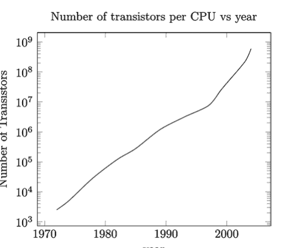

## 1.2 模拟器的出现

使用模拟器来验证电子电路是一个古老的想法。最早的尝试可以追溯到20世纪60年代，当时美国国防部支持了专有的电路模拟开发。现代将模拟器公开的尝试始于加州大学伯克利分校的研究人员，那里少数年轻教授和研究人员的非凡远见发展出了后来被称为“以集成电路为重点的模拟程序”或SPICE的工具。起初并非没有争议。许多同时代的人认为模拟器不可能很好地捕捉电路操作，这种努力是浪费时间。相反，他们的想法是使用面包板和分立器件制作设计原型，然后在芯片上小型化。伯克利团队坚持了下来，现在它被认为是原始的主代码，之后的大多数模拟器都使用了SPICE引入的许多相同特性来解决数值问题。事实上，“spice”这个词已经成为一个动词，人们常说模拟电路是“spicing”一个电路。当然，几十年的创新产生了一个比最初版本复杂得多的代码。

## 1.3 本书

人们经常问我为什么要写一本关于模拟器的书：“你是个设计工程师！”这个问题基本上有两个答案：首先，我认为至少对我们工作中使用的工具有基本的了解很重要。如果一个人理解了它们的优缺点，他就会成为一个更好的使用者。其次，这些工具的内部工作原理本身就非常迷人，了解更多也很有趣。

本书涉及模拟模拟器的内部工作原理，并描述了在其开发过程中出现的各种难题是如何解决的。本书使用Python作为首选代码环境来展示算法的基础。Python几乎适用于所有操作系统，因此代码示例几乎可以在任何地方运行和检查。代码本身也异常易于阅读和使用。这些代码并非旨在成为任何成熟专业模拟器的起点。它们是为感兴趣的读者准备的简单代码测试平台。所有精确代码实现背后的算法都可以在公开的期刊和书籍中找到。据作者所知，本书不会介绍任何秘密算法或商业秘密。相反，其目的是展示核心算法的基本工作原理。

此外，演示基于非常简单的例子，而不是详细的数学理论。这样可以更快地掌握基本思想，我们将更详细的数学理论及其发展留给第7章，该章采用更传统和严谨的方法来处理这些材料。

作者希望，所提供的温和数学和大量代码示例能够激励读者在模拟器及其注意事项方面进行更多自主探索，并学习如何优化其使用。除了提供的代码示例外，本书还展示了专业模拟器的结果，以确保读者我们建立在坚实的基础上。对于好奇的读者，模拟器算法背后的正式数学理论基础可以在后面的章节中找到。它们是为了完整性而存在的，对于经验丰富的读者来说，其中不包含任何新内容。

接近尾声时，其中一章涉及使用模拟模拟器设计集成电路模拟部分的更主观方法。它基于作者在半导体行业多年的经验，并从一个特定角度整合了经验教训。其他经验丰富的工程师对于如何设计和生产面向市场的芯片可能有不同的看法。无论如何，作者描述的方法几乎不具争议性，并已导致许多集成电路成功推向市场。

第2章回顾了模拟器中常用的一些基本数值方案。第3章接着概述了器件建模，特别是互补金属氧化物半导体（CMOS）晶体管。

核心观点在于指出建模对仿真结果可能产生巨大影响，而掌握基本建模知识对于成为高效的仿真器用户至关重要。第4章和第5章构成本书核心，详细阐述了从线性电路到模拟高度非线性现象的周期稳态算法等仿真器实现细节。第6章通过实例重点展示了在实际设计环境中有效利用仿真器的方法，以及从器件角模型到大规模仿真的最佳实践。最后，第7章深入探讨了前几章仅作概述的常用仿真器算法背后的数学理论细节。

我期望本书能激发读者进一步探索仿真器的兴趣。感兴趣的读者可在 http://www.fastictechniques.com 获取更多代码、最新勘误信息及其他资料。

# 第2章
数值方法概述

**摘要** 本章涉及的诸多主题本身已是成熟的研究领域，难以在有限篇幅内全面展开。作者旨在通过内容呈现激发读者的阅读兴趣。数值方法在解决各类问题中的重要性在现代产品研发与科学研究中举足轻重，工程界与科学界均深度参与相关方法的开发与应用。为涵盖这些广泛主题，本章将聚焦于电气工程领域常见的方法，重点介绍微分方程的特定近似解法。对于矩阵方程，我们仅通过简单示例阐释核心思想。近几十年来取得显著成效的高级迭代方法将结合Python代码示例进行简要说明。非线性方程及其高效求解同样是研究热点，多年来已发展出众多在科学/工程界广泛应用的方法。本章将介绍一种因实现相对简便而尤为重要的方法——该方法归功于艾萨克·牛顿，尽管约瑟夫·拉弗森等研究者也对此有所贡献。尽管讲解力求基础，但读者若具备数值方法入门课程的基础知识将更易理解，因本章内容较为精炼。本章将从微分方程及其数值实现方法开篇，重点讨论初始值问题的实现——即已知系统在某时刻的状态，后续演化遵循控制方程。我们将展示电路仿真器中常用的实现方案。随后章节将探讨非线性求解方法，最后以矩阵求解器的描述收尾。本章不深入数学理论，而是通过示例呈现核心思想，感兴趣的读者可在第7章及章末参考文献中找到更深入的讨论。本章所述主题的重要性毋庸置疑，作者期望读者能自主深入探索该领域。

## 2.1 微分方程：差分方程

使用数值技术求解系统时间演化时，若某时刻的解依赖于前序时刻（即系统存在某种记忆效应），就会面临困难。这种记忆效应通常以微分方程表达，其数值近似往往是误差的重要来源。本节将简要回顾此类近似方法，重点关注电路分析中的常见形式。除特例外，我们将讨论数值分析中的初始值问题。

首先介绍连续时间/空间微分方程近似的基本思想，并通过伪代码示例展示简单案例。随后讨论电路分析中由典型电路元件产生的常见微分方程。

### 2.1.1 初始值问题

从简单的一阶方程开始：

$$-\frac{u(t)}{R} = C \frac{du(t)}{dt}, \quad u(0) = 1, \qquad (2.1)$$

其中$C$、$R$为常数。该方程描述阻值为$R$的电阻与容值为$C$的电容并联结构（图2.1）。

其解析解为已知形式：

$$u(t) = e^{-t/(RC)} \qquad (2.2)$$

如何对该方程进行数值近似？回顾基础微积分中导数的定义：

$$\frac{df(t)}{dt} = \lim_{\varepsilon \to 0} \frac{f(t+\varepsilon) - f(t)}{\varepsilon}$$

自然可得数值近似表达式：

$$\frac{df}{dt} \approx \frac{\Delta f}{\Delta t} = \frac{f(t+\Delta t) - f(t)}{\Delta t}$$

将此导数近似代入微分方程得：

$$-\frac{u(t)}{R} = C \frac{u(t+\Delta t) - u(t)}{\Delta t}, \quad u(0)=1,$$

整理后得到：

$$u(t+\Delta t) = u(t) \left( 1 - \frac{\Delta t}{RC} \right), \quad u(0)=1, \qquad (2.3)$$

该公式称为欧拉前向法（或显式欧拉法）。虽然实现最为直接，但因存在数值误差导致解发散的稳定性问题，在实际应用中几乎从不使用。第4章将通过示例具体说明其稳定性问题。

微分方程可转化为多种形式的差分方程，因此存在多种选择。选择时必须谨慎，需充分理解并考虑稳定性、精度等因素。本节将概述差分方程的常见实现方式，并在适当时提及相关问题。完整分析请参阅第7章及丰富文献，鼓励感兴趣的读者深入探究。

前述问题属于初始值问题范畴：在某时刻（通常取$t=0$）解已知，问题转化为求解后续时刻的解。这是个广阔的研究领域，在科学与工程各学科中均有广泛应用。电路分析即为其中一例，本节将讨论电气工程中常见的几种流行算法，具体包括欧拉法、梯形法以及二阶吉尔公式。后两种方法与欧拉法的一种变体共同构成了当今电路仿真器数值实现的主体。如前所述，本章仅通过示例帮助读者理解其工作原理，详细分析请参阅文献[1-17]及第7章。

下一节将依次讨论两种欧拉公式、梯形法实现以及二阶吉尔公式。我们以简单方程的数值实现为例：

$$i(t) = C \frac{du(t)}{dt} \quad (2.4)$$

### 2.1.2 欧拉法

最简单的数值公式当属欧拉法（前向与后向欧拉）。从前一节讨论的最直观实现——前向欧拉法开始：

$$i(t_n) = C \frac{u(t_{n+1}) - u(t_n)}{\Delta t} \rightarrow u(t_{n+1}) = u(t_n) + \Delta t \frac{i(t_n)}{C} \quad (2.5)$$

该方法看似简单且确实可用，但如前所述，它极易失稳导致解快速发散，有时被迫采用极小时间步长以避免问题。其根本原因将在第7章详述，这也是实际应用中从不采用该方法的原因。而简单的公式调整即可解决此问题：

$$i(t_{n+1}) = C \frac{u(t_{n+1}) - u(t_n)}{\Delta t} \rightarrow u(t_{n+1}) = u(t_n) + \Delta t \frac{i(t_{n+1})}{C} \quad (2.6)$$

请注意电流在新时间步长处计算！这称为微分方程的隐式公式，未知数出现在等式两侧。关键在于该公式不会出现困扰前向欧拉法的失稳问题，此即后向（隐式）欧拉实现。大多数仿真器都提供该积分方法，后续将看到其实现相当直接。

### 2.1.3 梯形法（Trap）

梯形法基于用梯形近似函数，在短时间区间内积分微分方程，故得名。此处不展开细节，但该公式将导数近似为

### 2.1.4 二阶Gear法（Gear2）

C. William Gear [5] 于1971年出版了一本后来成为经典之一的著作。他构建了一组具有不同截断误差的差分方程，这些方程具有一些非常优良的特性。他展示了如何系统地建立高阶差分方程，并且在SPICE的早期版本中，可以在数值求解器中整合多个这样的方程。近几十年来，二阶版本已被证明是使用最广泛的，在现代仿真器中，Gear2选项是一种标准的积分方法。

在导数的二阶Gear实现中，我们有

$$\frac{df}{dt}(t+\Delta t) \approx \frac{1}{\Delta t}\left(\frac{3}{2}f(t+\Delta t) - 2f(t) + \frac{1}{2}f(t-\Delta t)\right)$$

与之前的实现相比，它看起来有很大不同。这种公式化方法比梯形法（trap method）的精度稍低（我们将在第4章看到原因），但不会受到其“振铃”弱点的影响。在数值上，这也易于实现；除了初始值和两个时间步长前的解的信息外，我们只需要一个初始导数。使用前面的例子，完整公式为

$$\frac{i(t+\Delta t)}{C} = \frac{3u(t+\Delta t)/2 - 2u(t) + u(t-\Delta t)/2}{\Delta t}, \quad u(0)=1,$$

或者经过重新整理后

$$u(t+\Delta t) = u(t)\frac{4}{3} - \frac{u(t-\Delta t)}{3} + \frac{2\Delta t}{3C}i(t+\Delta t), \quad u(0)=1, \qquad (2.9)$$

与之前一样，忽略电流更新例程，伪代码如下所示

```
subroutine SolveDiffGear2
u(0)=1
u(1)=1
deltaT=RC/100
for(i=2, i<N, i++) do
    u(i)=4u(i-1)/3-u(i-2)/(3C) deltaT -2I(i)/(3C)
end for
end subroutine
```

二阶Gear法是多步差分法的一个例子，我们需要知道两个时间步长前的解。

### 2.1.5 总结

最后这三种方法在实际的仿真器实现中被压倒性地使用，并且根据待研究的电路，通常会偏好其中一种，我们将在本书中通过实例展示这些情况。

### 2.1.6 求解方法：精度与稳定性

我们已经研究了用差分方程来建立微分方程的四种不同方法。现在让我们尝试从精度和稳定性两个方面对它们进行量化。

#### 2.1.6.1 精度

解的精度将取决于待求解的电路、时间步长以及所使用的积分方法。微分方程数值近似的精度可以通过其截断误差来估计。构建差分近似的一种方法是使用函数在某点附近的泰勒级数：

$$f(t+\Delta t) = f(t) + f'(t)\Delta t + \frac{1}{2}f''(t)\Delta t^2 + \dots + \frac{1}{n!}f^n(t)\Delta t^n$$

一阶精度的近似可以通过假设所有高阶导数可忽略不计来得到，于是我们得到

$$f(t+\Delta t) = f(t) + f'(t)\Delta t + \frac{1}{2}f''(t)\Delta t^2 + \dots$$

经过一些重写后得到

$$f'(t) = \frac{f(t+\Delta t) - f(t)}{\Delta t} + o(\Delta t) \quad (2.10)$$

其中 $o$ 符号表示小参数下的行为。

这是欧拉前向近似，具有一阶精度。这意味着截断误差为 $\sim \Delta t$。类似地可以证明，梯形近似和Gear2近似具有二阶精度，误差与 $\Delta t^2$ 成比例。实际上这意味着，如果解是一条直线，一阶导数不随时间变化，因此二阶导数为零，我们讨论的所有三种方法在计算导数时都不会有截断误差。如果解是一个二阶多项式，欧拉法将开始出现截断误差，必须减小时间步长以减少其影响。梯形法和Gear2法可以无截断误差地追踪二阶多项式，但在遇到高阶解时会出现误差。通常，阶数越高，精度越好。代价是计算时间较长，因此大多数仿真器在导数计算中最多使用三阶近似。

全局精度更难预测，因为它非常依赖于被仿真的电路。我们将在第4章再次讨论这些问题。

> 如果解是一个 $n$ 阶多项式，那么一个精确到该阶的差分近似将没有截断误差。

#### 2.1.6.2 稳定性

微分方程数值实现的稳定性显然是一个重要课题，并且多年来已被充分研究（例如，参见第7章和[2–17]）。这里我们仅展示在第2.1.2、2.1.3和2.1.4节中讨论的方法的稳定区域。

##### 一般稳定性理论

系统稳定的含义可能因应用而异。这里，与大多数电路理论书籍一样，我们将采用稳定性的有界定义，即如果信号在所有时间都保持在某个有限界限 $B$ 内，则认为解是稳定的。我们将遵循文献中的共同思路，使用简单的线性系统来研究数值稳定性。

为了分析稳定性，让我们考虑一个具有常系数的齐次线性微分系统

$$\frac{dx}{dt} = Ax$$

其中我们假设当 $t \rightarrow \infty$ 时，$|x(t)|_{\max} \rightarrow \leq B$。这个方程被称为测试方程。像测试方程这样的线性方程组具有精确的通解

$$x(t) = \sum_{i=1}^{n} c_i e^{\lambda_i t} v_i$$

其中 $\lambda_i$，$v_i$ 是通过求解

$$Av_i = \lambda_i v_i$$

得到的系统的特征值/特征向量。$\lambda_i$ 通常是复数。如果我们假设系统是稳定的，这意味着对所有 $i$，$Re(\lambda_i) \leq 0$。所有特征值都在左半平面或虚轴上。让我们在图2.2中说明这一点。它显示了具有正实特征值的解如何由于右半平面随时间线性增长的指数而爆炸超出界限，而具有负实特征值的解在左半平面随时间衰减（图2.2）。

事实证明，[5, 6, 9, 17]，为了研究数值近似的稳定性，只需将其应用于测试方程，并检查在哪些时间步长下数值解会衰减，或者随时间保持在某个界限内。

##### 稳定区域

稳定区域现在是复平面中由乘积 $\Delta t \lambda_i$ 定义的部分，其中数值实现随时间趋于零。我们将查看我们的四种积分方法，并直接引用结果；细节在例如[5, 6, 9, 17]和第7章中给出。这里的主要目的是了解稳定区域的概念。

##### 欧拉法

对于欧拉法的实现，后向欧拉比前向欧拉稳定得多。稳定区域可以在图2.3中找到。这意味着什么？如果系统本身是稳定的，换句话说所有特征值都具有负实部，前向欧拉实现仍然可能变得不稳定。事实上，只有在小的灰色圆圈内，乘积 $\Delta t \lambda_i$ 才会导致稳定行为。只需采用更小的时间步长即可实现稳定行为。我们将在第4章中更量化地说明这在实践中意味着什么。

接下来我们可以看看后向欧拉（图2.4）。这里的行为完全不同。即使系统本身不稳定，该方法也是稳定的；注意灰色区域延伸到了右半平面。我们将在第4章中研究一个使用欧拉法表现如此的系统。读者肯定会欣赏到欧拉后向法的一个特殊性质：一个系统可能模拟得很好，但实际上它会变得不稳定！

## 2.2 非线性方程

正如我们在前面章节所见，求解线性微分方程涉及稳定性和精度等问题。方法的选择需要在所需精度和避免不稳定区域之间做出权衡。一大类方程是非线性的，其带来的额外难度怎么强调都不为过。诸如系统进入奇异模式导致的混沌解等问题并不少见。非线性系统的研究至关重要，读者无疑也了解这方面已开展了大量工作。在本节中，我们将描述电路仿真器社区中求解非线性初值问题最常用的技术，即牛顿-拉夫逊方法。

### 2.2.1 牛顿-拉夫逊法

让我们来看下面的一维方程

$$f(x) = 0 \tag{2.11}$$

我们需要求解 $x$。让我们在方程的一个近似解 $x_0$（不精确满足方程但接近）附近进行泰勒展开。我们得到

$$f(x = x_0 + \Delta x) = f(x_0) + \frac{df}{dx}(x_0) \Delta x = 0 \tag{2.12}$$

可以写成

$$\Delta x = -\frac{f(x_0)}{df/dx(x_0)} \tag{2.13}$$

显然，如果高阶导数为零，我们得到的是一个线性方程，并且通过计算 $\Delta x$ 就得到了解。在实践中，高阶项仍然有贡献，我们需要迭代几次才能得到正确的解。该方法通常易于实现，是几乎所有非线性求解器数值实现中的标准主力方法。我们稍后在第5章也会使用其多维版本。如果起始点足够接近解且解函数是光滑的（函数本身或其导数没有不连续），牛顿法保证收敛，因为此时高阶导数很小。显然，对于不连续或导数不连续的函数，该方法很容易出错。历史上，这是晶体管模型出现收敛问题最臭名昭著的原因之一。在最新的晶体管模型实现中，导数的连续性已得到保证（图2.7）。

## 2.3 矩阵方程

到目前为止，我们只讨论了在求解方法方面非常简单的系统。事实上，感兴趣的值是一个电压和相关的电流。该方程是精确可解的，我们描述了使用差分方程进行重新表述的方法。实际上，我们处理的是一个一维矩阵方程。如果我们有更多相互依赖的节点，最终会得到一个更高阶的矩阵方程也就不足为奇了。在第4章中，我们将展示如何为电路网络建立这样的方程组。矩阵方程在电路领域自然出现，因为我们有有限数量的节点电压和电流需要求解。但矩阵方程在数值求解系统时几乎无处不在，[12–15]。从根本上说，所有这些矩阵表述情况的原因在于，大多数仿真器假设某种网格，其中感兴趣的实体要么是常数，要么是遵循某种低阶多项式缓慢变化的。这样的网格点数量是有限的，因此矩阵方程是相当自然的。另一种说法是，解空间以某种方式被量化了，因此我们最终得到有限数量的未知数。

现在，矩阵方程及其求解是最重要的、研究活跃的领域之一，这已不足为奇。今天的矩阵求解器远优于几十年前存在的求解器，并且通常可以公开获取用于公共和非商业实现。

不同的系统将具有不同的矩阵特性。对于电路分析系统，矩阵通常是稀疏的，即非零元素的数量与矩阵的行数和列数处于同一量级。在数学文献中，通常说矩阵的阶数（用 $\mathcal{O}$ 符号表示）与行/列数相同，即 $\mathcal{O}(N)$，而不是人们预期的 $\mathcal{O}(N^2)$。这极大地简化了矩阵的构建以及求解时间。我们将在接下来的几节中提到其中一些方法，并为感兴趣的读者提供充足的参考文献以供进一步研究。其他系统可能具有稠密矩阵，那么求解方法集合就会有所不同。

正如我们一开始打算做的，我们将仅提供各种方法的示例，让读者对它们的工作原理有一些实际的了解。在本书其余章节中，我们将使用Python环境中内置的矩阵求逆例程，对于感兴趣的读者，我们参考文献引用，以便可以自行探索矩阵求逆。证明和基本定理我们留给第7章和例如 [11, 18]。

### 2.3.1 基于N个未知数的基本矩阵表述

一个简单的矩阵方程如下所示

$$
\begin{cases}
a_{11}x + a_{12}y + a_{13}z = r_1 \\
a_{21}x + a_{22}y + a_{23}z = r_2 \\
a_{31}x + a_{32}y + a_{33}z = r_3
\end{cases} \tag{2.14}$$

写成矩阵形式为

$$
\begin{pmatrix}
a_{11} & a_{12} & a_{13} \\
a_{21} & a_{22} & a_{23} \\
a_{31} & a_{32} & a_{33}
\end{pmatrix}
\begin{pmatrix}
x \\
y \\
z
\end{pmatrix}
=
\begin{pmatrix}
r_1 \\
r_2 \\
r_3
\end{pmatrix} \tag{2.15}$$

其中通常赋值

$$
A = \begin{pmatrix}
a_{11} & a_{12} & a_{13} \\
a_{21} & a_{22} & a_{23} \\
a_{31} & a_{32} & a_{33}
\end{pmatrix} \tag{2.16}$$

$$
x = \begin{pmatrix}
x \\
y \\
z
\end{pmatrix} \tag{2.17}$$

$$
y = \begin{pmatrix}
r_1 \\
r_2 \\
r_3
\end{pmatrix} \tag{2.18}$$

我们有

$$
A x = y \tag{2.19}$$

$x$ 向量被称为*未知数*，而 $y$ 通常被称为*右端项*（简称 $rhs$）。右端项通常是已知的，矩阵元素也是已知的。在这种情况下，矩阵大小为 $3 \times 3$，如果行数等于列数，则它是一个方阵，并被称为潜在可解系统。如果行数大于列数，则是一个*超定*系统，不太可能有解；如果行数小于列数，则是一个*欠定*系统，没有足够的信息进行完整求解。这里我们将仅限于大小为 *nxn* 的方阵，其中 *n* 也指未知数的数量。未知数将通过我们将在接下来的几节中简要讨论的数值技术求解。

### 2.3.2 矩阵求解器

矩阵求解器是一个研究密集的领域，新的、极其高效的算法正以惊人的速度被发明出来。发明对于任意问题都稳定且精确的矩阵求逆器是一项艰巨的任务。通常会做出各种简化假设来限制问题并使其更易于处理。在本节中，我们将讨论传统算法，然后快速回顾一些更新的算法。

就本书的目的而言，我们使用的精确矩阵求逆器原则上并不那么重要。鼓励读者在线搜索可用于自学的免费实现。如果您有兴趣构建商业用途的仿真器，需要确保在决定使用外部矩阵求解器时获得适当的许可。

#### 2.3.2.1 高斯消元法

高斯消元法是求解矩阵方程的著名方法，通常是线性代数基础课程的一部分。它同时产生解和矩阵逆。逆矩阵容易受到舍入误差的影响，使用它来求解其他右端项（rhs）可能导致精度差。其主要弱点是需要右端项（rhs）已知并在运算过程中一起处理，并且在不需要逆矩阵的情况下，它完成所需时间可能比其他方法长三倍 [11]。

我们将花一些时间讨论这种方法，因为它例证了一些常见问题。让我们考虑一组三个方程：

$$
\begin{cases}
3x + 2y + z = 7 \\
x + 3y + 2z = 5 \\
2x + y + 3z = 12
\end{cases}
$$

写成矩阵形式，变为

$$
Ax = b
$$

其中

$$A = \begin{pmatrix} 3 & 2 & 1 \\ 1 & 3 & 2 \\ 2 & 1 & 3 \end{pmatrix} \quad x = \begin{pmatrix} x \\ y \\ z \end{pmatrix} \quad b = \begin{pmatrix} 7 \\ 5 \\ 12 \end{pmatrix}$$

可以很容易地看出以下性质成立：

-   矩阵方程中的行是可互换的。这只是方程排序的问题。例如，第二个方程可以与第一个方程交换位置，而解不会改变。
-   当然，我们可以随意地将行按权重相加，只要我们对等式右边（rhs）也进行相同的操作。例如，row1-3*(row2) 将产生一个不包含任何 $x$ 的新行 $-7y - 5z = -8$。当用这个新行替换原来的两行之一时，没有信息被添加或破坏。
-   也可以互换 $A$ 中的任意两列，但必须同时互换 $x$ 中对应的行：

$$A = \begin{pmatrix} 3 & 1 & 2 \\ 1 & 2 & 3 \\ 2 & 3 & 1 \end{pmatrix} \rightarrow x = \begin{pmatrix} x \\ z \\ y \end{pmatrix}, \quad b = \begin{pmatrix} 7 \\ 5 \\ 12 \end{pmatrix}$$

高斯消元法使用上述一个或多个步骤将矩阵 $A$ 化简为单位矩阵。完成此操作后，等式右边就变成了解。让我们具体求解上面的矩阵方程来说明：

$$\begin{cases} 3x+ & 2y+ & z=7 \\ x+ & 3y+ & 2z=5 \\ 2x+ & y+ & 3z=12 \end{cases} \rightarrow \left\{ R_2 \rightarrow R_2 - \frac{1}{3}R_1 \right\} \rightarrow \begin{cases} 3x+ & 2y+ & z=7 \\ & \frac{7}{3}y+ & \frac{5}{3}z=\frac{8}{3} \\ 2x+ & y+ & 3z=12 \end{cases} \rightarrow$$

$$\left\{ R_3 \rightarrow R_3 - \frac{2}{3}R_1 \right\} \rightarrow \begin{cases} 3x+ & 2y+ & z= & 7 \\ & \frac{7}{3}y+ & \frac{5}{3}z= & \frac{8}{3} \\ & -\frac{1}{3}y+ & \frac{7}{3}z= & \frac{22}{3} \end{cases} \rightarrow \left\{ R_3 \rightarrow R_3 + \frac{1}{7}R_2 \right\} \rightarrow$$

$$\left\{\begin{array}{l}3x+2y+z=7\\\frac{7}{3}y+\frac{5}{3}z=\frac{8}{3}\end{array}\right.\rightarrow\left\{R_{3}\rightarrow\frac{R_{3}}{54/21}\right\}\rightarrow$$

数字 18/7 在这里被称为**主元**。对于大于1的大数，这种除法没有问题，但想象一下如果它接近零！在这种情况下，误差会被放大，求逆会失败。这里我们得到

$$\left\{\begin{array}{l}3x+2y+z=7\\\frac{7}{3}y+\frac{5}{3}z=\frac{8}{3}\\z=3\end{array}\right.$$

这被称为矩阵的**阶梯形**，或**上三角形**形式（维基百科）。沿着这些思路继续，通过操作方程使未知数变得容易求解，我们得到

$$\left\{\begin{array}{l}x=2\\y=-1\\z=3\end{array}\right.$$

顺便说一下，这个整个方案被称为“**无主元高斯消元法**”[11]，只要我们用来得到单位矩阵的除数（主元）不为零或不太接近零，它就工作得很好。对于大型矩阵，它在实践中几乎从不奏效。通常主元非常小，需要采取一些措施。通常，行*和*列会被互换，以尝试将一个大数放在所需变量前面，以避免除以零的情况。在仿真器中，通常有与主元相关的选项，如 *pivrel*（设置主元的最大相对值）和 *pivabs*（主元元素的最小可接受大小），用于设置矩阵求逆器如何处理主元。在现代仿真器中，几乎不需要调整这些参数，但了解它们的存在是好的。

> 在现代仿真器中，几乎不需要调整与主元相关的参数。

#### 2.3.2.2 LU 分解

一种流行的矩阵求解器类型是 LU 分解法。这里通过将矩阵写成另外两个矩阵 $L,U$ 的乘积来消除等式右边的问题，使得 $A = LU$。$L$ 矩阵的左下三角（包括对角线）被填充，而 $U$ 的右上三角被填充，对角线上为零。这种书写方程的方式导致了另一种回代方法，就像之前一样，但它不再依赖于等式右边，并且只要矩阵不改变，它通常是一种更好的方法。更详细地说

$$A x = (LU) x = L(U x) = b$$

通过令 $y = U x$，我们得到一组新的方程

$$L y = b$$

和

$$U x = y$$

这里的优势在于求解三角形方程相当简单；这是逐行直接代入的问题。关于如何对一般情况进行分解的细节，我们请感兴趣的读者参阅 [11]。这里我们可以使用前面的例子，我们注意到高斯消元步骤产生了一个阶梯形或上三角形的矩阵。这就是 $U$。我们有

$$U = \begin{pmatrix} 3 & 2 & 1 \\ 0 & \frac{7}{3} & \frac{5}{3} \\ 0 & 0 & \frac{18}{7} \end{pmatrix}$$

在这种情况下，找到 $L$ 是很直接的，因为我们知道

$$A = LU = \begin{pmatrix} 1 & 0 & 0 \\ l_{21} & 1 & 0 \\ l_{31} & l_{32} & 1 \end{pmatrix} \begin{pmatrix} 3 & 2 & 1 \\ 0 & \frac{7}{3} & \frac{5}{3} \\ 0 & 0 & \frac{18}{7} \end{pmatrix} = \begin{pmatrix} 3 & 2 & 1 \\ 1 & 3 & 2 \\ 2 & 1 & 3 \end{pmatrix}$$

通过进行特定的矩阵乘法并与 $A$ 中的元素进行比对，我们发现

$$l_{21} = \frac{1}{3}, \quad l_{31} = \frac{2}{3} \quad 2l_{31} + \frac{7}{3}l_{32} = 1 \rightarrow l_{32} = -\frac{1}{7}$$

$$\boldsymbol{L} = \begin{pmatrix} 1 & 0 & 0 \\ 1/3 & 1 & 0 \\ 2/3 & -1/7 & 1 \end{pmatrix}$$

读者肯定会注意到，矩阵系数实际上就是我们为高斯消元方案所做的行操作，只是符号相反。我们从 $\boldsymbol{L}\boldsymbol{y} = \boldsymbol{b}$ 中发现

$$\boldsymbol{y} = \begin{pmatrix} 7 \\ 8/3 \\ 54/7 \end{pmatrix}$$

最后，从 $\boldsymbol{U}\boldsymbol{x} = \boldsymbol{y}$，我们得到解

$$\begin{pmatrix} 3 & 2 & 1 \\ 0 & 7/3 & 5/3 \\ 0 & 0 & 18/7 \end{pmatrix} \begin{pmatrix} x \\ y \\ z \end{pmatrix} = \begin{pmatrix} 7 \\ 8/3 \\ 54/7 \end{pmatrix}$$

通过回代，我们发现

$$\begin{pmatrix} x \\ y \\ z \end{pmatrix} = \begin{pmatrix} 2 \\ -1 \\ 3 \end{pmatrix}$$

我们可以说，$LU$ 分解使得 $\boldsymbol{L}$ 矩阵记录了行操作，因此等式右边需要用 $\boldsymbol{L}$ 相应地调整。在这些操作之后，只需使用 $\boldsymbol{U}$ 进行回代即可得到答案。与之前一样，在高斯消元法中，主元是分解/分解矩阵的关键步骤。在现代仿真器中，几乎不需要调整主元算法的参数。我们最初提到的优势在于，分解（或因式分解）独立于等式右边。在实际实现中，主元的选择比这个例子中显示的更为微妙（参见 [11]）。

#### 2.3.2.3 迭代法

真正影响矩阵求逆速度的是迭代法，这对于大型稀疏系统可能非常有利。基本思想是从解 $\boldsymbol{A}\boldsymbol{x} = \boldsymbol{b}$ 的一个猜测值 $\boldsymbol{x}_0$ 开始，并想出一种方法来最小化残差 $y = A (x - x_0)$，方法是通过某种方式从 $x_1 = x_0 + \beta z_0$ 计算出一个新的解，其中 $z_0$ 是某个巧妙选择的方向。这个过程一直持续到达到所需的精度（$|y|$ 的大小）。有许多不同的方法可以做到这一点，称为共轭梯度法、双共轭梯度法、广义最小残差法等（参见 [11, 18]）。这些方法属于一类更大的算法，统称为 Krylov 子空间方法。它们通常在数值上相当容易实现，并且对于电路系统中经常遇到的稀疏矩阵效果良好（关于这些技术的详细讨论，请参见 [18]）。它们的工作原理比前面讨论的技术更难理解，我们将在第 7 章提供一些细节。相反，我们将展示一个这样的迭代算法的例子，称为 GMRes（广义最小残差）法。基本上，该方法使用最小均方（lms）法来最小化残差 $|Ax_m - b|$。这种方法还有很多细节，强烈鼓励读者在 [11, 18] 和第 7 章中更详细地研究。Python 代码实现可以在第 2.6.1 节找到：

##### 具体示例

为了说明这些方法，让我们将它们应用于上一节的示例矩阵方程。

$$A x = b$$

其中

$$A = \begin{pmatrix} 3 & 2 & 1 \\ 1 & 3 & 2 \\ 2 & 1 & 3 \end{pmatrix} \quad x = \begin{pmatrix} x \\ y \\ z \end{pmatrix} \quad b = \begin{pmatrix} 7 \\ 5 \\ 12 \end{pmatrix}$$

让我们猜测第一个解

$$x_0 = \begin{pmatrix} 1 \\ 0 \\ 0 \end{pmatrix}$$

并将其输入我们的 python 代码。我们发现以下结果是迭代次数的函数（表 2.1）

这只是一个非常简单的例子，它几乎无法体现这些方法的全部优势。对于电路分析中常见的大型稀疏矩阵，与直接方法相比，加速可能是显著的。请注意算法的显著简单性；在这种情况下，它只有几行代码。

#### 2.3.2.4 总结

本节的主要收获是，其中一些迭代投影算法实现起来非常简单，我们鼓励读者在自己的项目中尝试实现。但请记住，成为一名专业的矩阵求逆算法开发者是一项艰巨的任务，需要对开发过程中涉及的显著困难有充分的认识。毫无疑问，读者很快就会学会欣赏矩阵求逆这门精妙的艺术。

矩阵方程的求解是一个主要的研究领域，每年都在取得大量进展。我们仅强调了一些重要的算法，留给读者自行探索更多内容。一些仿真器提供了诸如主元（pivots）之类的选项，本节作为对求解此类方程时遇到主要步骤的快速提醒。这些技术确实是现代仿真器的核心，值得花时间了解最新的发展动态。

在本书的其余部分，我们将使用Python等数值软件包中标准的内置矩阵求逆器，不会进一步深入探讨这个主题。

## 2.4 考虑的仿真器选项

本章讨论了以下与矩阵求逆例程特别相关的仿真器选项：

- Pivrel
- Pivabs

## 2.5 总结

本章回顾了微分方程数值实现的基础知识。我们介绍了电子电路分析中常见的积分方法。我们还简要回顾了求解非线性方程的重要牛顿-拉夫逊方法。我们是在一维背景下介绍这些方法的，因为这通常更容易建立对其工作原理的直观理解。在第3章和第4章中，它们将被应用于多维系统。

## 2.6 代码

### 2.6.1 代码 2.7.1

```python
"""
Created on Sun Aug  4 17:26:20 2019

@author: msahr
"""

import numpy as np

Niter=50
h = np.zeros((Niter, Niter))
A = [[3,2,1],[1,3,2],[2,1,3]]
b = [7, 5, 12]
x0 = [1, 0, 0]

r = b - np.asarray(np.matmul(A, x0)).reshape(-1)
x = []
v = [0 for i in range(Niter)]

x.append(r)
v[0] = r / np.linalg.norm(r)

for i in range(Niter):
    w = np.asarray(np.matmul(A, v[i])).reshape(-1)
    for j in range(i):
        h[j, i] = np.matmul(v[j], w)
        w = w - h[j, i] * v[j]
    if i < Niter-1 :
        h[i + 1, i] = np.linalg.norm(w)
        if (h[i + 1, i] != 0 and i != Niter - 1):
            v[i + 1] = w / h[i + 1, i]

b = np.zeros(Niter)
b[0] = np.linalg.norm(r)

ym = np.linalg.lstsq(h, b, rcond=None)[0]
x.append(np.dot(np.transpose(v), ym) + x0)

print(x)
```

## 2.7 练习

1.  使用不同的起始向量，检查第2.3.2.3节示例中的GMRes代码。
2.  检查前向欧拉方法，并讨论为什么对于如此大的输入空间它是不稳定的。

#### 参考文献

1.  Pedro, J., Root, D., Xu, J., & Nunes, L. (2018). *Nonlinear circuit simulation and modeling: fundamentals for microwave design* (The Cambridge RF and microwave engineering series). Cambridge: Cambridge University Press. https://doi.org/10.1017/9781316492963
2.  Lapidus, L., & Pinder, G. F. (1999). *Numerical solution of partial differential equations in science and engineering*. New York: John Wiley.
3.  Hinch, E. J. (2020). *Think before you compute*. Cambridge: Cambridge University Press.
4.  Crank, J., & Nicolson, P. (1947). A practical method for numerical evaluation of solutions of partial differential equations of the heat conduction type. *Proceedings. Cambridge Philological Society*, 43(1), 50–67.
5.  Gear, C. W. (1971). *Numerical initial value problems in ordinary differential equations*. Englewood Cliffs: Prentice-Hall.
6.  Butcher, J. C. (2008). *Numerical Methods for Ordinary Differential Equations* (2nd ed.). Hobroken: John Wiley & Sons.
7.  Kundert, K., White, J., & Sangiovanni-Vicentelli, A. (1990). *Steady-state methods for simulating analog and microwave circuits*. Norwell: Kluwer Academic Publications.
8.  Kundert, K. (1995). *The designers guide to spice and spectre*. Norwell: Kluwer Academic Press.
9.  Najm, F. N. (2010). *Circuit simulation*. Hobroken: John Wiley & Sons.
10. Bowers, R. L., & Wilson, J. R. (1991). *Numerical modeling in applied physics and astrophysics*. Boston: Jones and Bartlett Publishers.
11. Press, W. H., Teukolsky, S. A., Vetterling, W. T., & Flannery, B. P. (2007). *Numerical recipes*. Cambridge: Cambridge University Press.
12. Allen, M. P., & Tildesley, D. J. (1987). *Computer simulation of liquids*. Oxford: Oxford University Press.
13. Taflove, A., & Hagness, S. C. (2005). *Computational electrodynamics, the finite-difference time-domain method* (3rd ed.). Norwood: Artech House.
14. Gibson, W. C. (2014). *The method of moments in electromagnetics* (2nd ed.). New York: CRC Press.
15. Harrington, R. F. (1993). *Field computation by moment methods*. Piscataway: Wiley-IEEE.
16. Brayton, R. K., Gustavson, F. G., & Hachtel, G. D. (1972). A new efficient algorithm for solving differential-algebraic systems using implicit backward differentiation formulas. *Proceedings of the IEEE*, 60, 98–108.
17. Lambert, J. D. (1991). *Numerical methods for ordinary differential systems*. Chichester: Wiley & Sons.
18. Saad, Y. (2003). *Iterative method for sparse linear systems* (2nd ed.). Philadelphia: Society for Industrial and Applied Mathematics.

# 第3章 建模技术

**摘要** 为了充分利用仿真器，需要理解仿真器所建模的器件以及可能隐藏在底层的困难。本章将概述CMOS晶体管，并简要描述双极型器件的实现及其相关挑战。我们将详细讨论基本的物理描述，以便将这种模型与我们在第3.1.4节中遇到的第一个计算机模型联系起来。我们将强调困难以及设计师在仿真电路时需要牢记的事项。我们假设读者已经了解晶体管的基本物理特性，我们将其作为回顾呈现，细节方面读者应参考相关文献。

## 3.1 CMOS晶体管模型

CMOS晶体管是目前现代集成电路中使用最广泛的有源器件。从其结构上看，它可能显得出奇地简单，尤其是在查阅流行教科书时。然而，对其进行建模却相当困难[1-15]。BSIM（伯克利短沟道IGFET模型）存在多个不同的复杂度级别，在表征晶体管时可以利用数百个参数。在本节中，我们将解释为什么是这样，并从这些器件物理的基本回顾开始。随后是一节关于BSIM模型的内容，我们将追溯该模型多年来的发展。BSIM在1980年代末的起点与我们将在第3.1.2节讨论的物理模型非常相似，因此是从简单的解析建模向更复杂的数值建模的良好过渡。BSIM的发展也是一个有趣的研究案例，展示了如何随着需求的出现逐步进行改进，以及对晶体管器件及其结构的理解如何随时间而加深。

表 2.1 GMRes实现的残差误差随迭代次数的变化。16次迭代后误差小于1%

| 迭代次数 | x | Y | Z | 误差 = $\frac{|(x - x_{exact})|}{|x_{exact}|}$ |
|---|---|---|---|---|
| 1 | 1 | 0 | 0 | 0.886405 |
| 2 | 1.839753 | 1.007704 | 1.175655 | 0.726282 |
| 3 | 2.048373 | 1.266386 | 0.75507 | 0.852666 |
| 4 | 1.126685 | 0.953778 | 2.074173 | 0.623188 |
| 5 | 1.584919 | 0.547796 | 2.073904 | 0.494658 |
| 6 | 2.165718 | -1.17596 | 3.27605 | 0.098063 |
| 7 | 2.080217 | -0.97118 | 2.829113 | 0.051038 |
| 8 | 2.144762 | -1.02899 | 2.809989 | 0.06431 |
| 9 | 2.046818 | -0.93741 | 2.838481 | 0.047957 |
| 10 | 2.033982 | -0.88932 | 2.843 | 0.052136 |
| 11 | 2.043041 | -0.88589 | 2.836684 | 0.054476 |
| 12 | 1.980063 | -0.90503 | 2.891431 | 0.038918 |
| 13 | 1.970487 | -0.91966 | 2.923431 | 0.030693 |
| 14 | 1.974714 | -0.96654 | 2.969754 | 0.013819 |
| 15 | 1.966067 | -0.97667 | 2.983252 | 0.011881 |
| 16 | 1.979837 | -0.98308 | 2.985342 | 0.008052 |
| 17 | 2.001691 | -1.01337 | 3.011812 | 0.004789 |
| 18 | 1.994125 | -0.99197 | 3.003188 | 0.002792 |
| 19 | 1.996385 | -0.99334 | 3.001539 | 0.002067 |
| 20 | 2.004308 | -0.99362 | 2.99015 | 0.003341 |
| ... | | | | |
| 50 | 2.000001 | -1 | 3 | 3.69E-07 |

### 3.1.1 CMOS晶体管基础

广义上讲，CMOS晶体管的行为会随着端电压的变化而发生显著改变。该器件会经历几个不同的工作区域，每个区域的响应机制各不相同。这在传统上给器件建模带来了一些问题，我们将在第3.1.4节中描述。在此，我们首先概述一下栅极电容随栅极电压变化的情况（见图3.1）。

> 为提高仿真精度，应将晶体管偏置在某一特定工作区域内。

结构两端的电压由参数 $V_g$ 设定。对于负电压，底板（衬底）会吸引多数载流子，此时电容仅为

$$C_g = \frac{4\pi\epsilon}{t_{ox}} \quad (3.1)$$

其中 $\epsilon$ 是绝缘材料的介电常数。这种模式称为积累模式。当电压 $V_g$ 增加时，它会排斥正电荷并形成所谓的空间电荷区。其结果是电容器介质的有效厚度增加，导致电容减小。这称为耗尽区。随着电压 $V_g$ 进一步增加并超过所谓的阈值电压 $V_t$，最终会在半导体材料与绝缘体的界面处形成反型层。因此，有效电容再次增加，因为电容器极板（电荷积累处）之间的距离减小了。我们最终得到如图3.2所示的电容-电压关系。

这些都是众所周知的，我们在此用它作为MOSFET晶体管端电压变化时复杂行为的一个例子。请注意，图3.2中这个简单描述还包含一个频率分量，它会改变我们刚才概述的电容。

### 3.1.2 CMOS晶体管物理

为了更好地理解第4章和第5章建模实现中的讨论，我们将简要概述一个更详细的CMOS晶体管模型，其中我们进行了基本的二维近似。具体细节将留给参考文献。在此过程中，我们将重点考察重要的阈值电压推导等内容。这些计算将为我们讨论第3.1.4节中的一些模型假设提供依据。我们将采用所谓的表面势近似法。这是分析晶体管在不同工作区域行为的一个便捷起点。

表面势模型基于MOS晶体管泊松方程的表面势解。与早期模型（如BSIM的早期版本）的主要区别在于，它不是将晶体管工作划分为独立的工作区域，而是解在所有区域都是连续的，无需对各种过渡区域进行建模。其缺点在于控制方程本质上是隐式的，找到可接受的解可能需要时间。我们将在本节快速回顾基础知识。我们从基本的二维近似开始，并展示一种隐式求解方法。最后，我们将讨论这对设计工程师的意义。这些都是众所周知的计算，我们选择相当严格地遵循文献[1]。

让我们从图3.3开始建模。我们将遵循估计分析流程[4]，而不会在实际计算上花费太多时间，因为这些计算已在其他地方被详细完成。

我们用 $\psi(x,y)$ 表示 $(x,y)$ 处相对于体衬底本征电势的本征电势（见图3.3）。我们定义一个电压 $V$，它在沟道方向为正，并且在源端为零。$V$ 有一个更精确的技术定义，鼓励读者在例如文献[1]中查找。出于我们的回顾目的，这里按我们定义的方式就足够了。

**简化** 首先，我们简化问题，使其成为一个简单模型可以处理的形式。

我们将假设：

- 渐变沟道近似——电场在 $y$ 方向的变化远小于在 $x$ 方向的变化[5]。这样我们可以将二维泊松方程简化为一维切片。除了夹断点之后，这个近似对大多数沟道区域都是有效的。
- 空穴电流以及产生和复合电流可以忽略不计。这意味着电流在沟道方向（$y$ 方向）上是相同的。
- 我们假设电压 $V$ 与 $x$ 无关，因此 $V = V(y)$。其依据是电流主要在源-漏或 $y$ 方向流动。在源端 $V(0) = 0$，在漏端，我们有 $V(y = L) = V_{ds}$。
- 反型层非常薄，导致所谓的电荷片模型，其中电场在反型区域两侧发生突变。记 $V_{fb}$ 为平带电压，$\varepsilon_{si}$ 为硅的介电常数，$q$ 为电子电荷，$N_a$ 为掺杂浓度，$\psi_s = \psi(0,y)$。反型电荷的表达式变为

$$Q_i = -C_{ox} \left( V_{gs} - V_{fb} - \psi_s \right) - \sqrt{2 \varepsilon_{si} q N_a \psi_s}$$

这些假设导致 $(x,y)$ 处电子浓度的以下表达式。

## 3.1 CMOS晶体管模型

$$n(x,y) = \frac{n_i^2}{N_a} e^{q(\psi - V)/kT}$$

根据麦克斯韦方程，我们知道在静态近似下 $E = \nabla \psi$ 且 $\nabla \cdot \boldsymbol{D} = en(x,y)$，我们可以找到电场的表达式：

$$E^2 = \left(\frac{d\psi}{dx}\right)^2 = \frac{2kTN_a}{\varepsilon_{si}} \left( e^{-q\psi/kT} + \frac{q\psi}{kT} - 1 \right) + \frac{n_i^2}{N_a^2} \left( e^{-qV/kT} \left( e^{q\psi/kT} - 1 \right) - \frac{q\psi}{kT} \right)$$

表面反型发生在

$$\psi(0,y) = V(y) + 2\psi_B$$

其中 $2\psi_B = \psi_{s,s}$ 是源端的表面势。

我们现在可以断言 $(x,y)$ 点的电子电流密度为

$$J_n(x,y) = -q\mu_{eff} n(x,y) \frac{dV(y)}{dy}$$

其中忽略了产生和复合电流。$\mu_{eff}$ 是基于沟道电势平均的有效沟道电子迁移率。沿沟道 $y$ 点的总电流通过将上述方程乘以沟道宽度 $W$ 并对电流承载层的深度进行积分得到。积分从 $x = 0$ 到 $x_i$ 进行，其中 $x_i$ 是进入p型衬底的某个深度；精确值并不重要，因为被积函数在衬底主体中接近于零。我们有

$$I_{ds} = W\mu_{eff} \frac{dV(y)}{dy} \int_0^{x_i} qn(x,y) dx$$

**求解** 积分内的表达式就是一个电荷：

$$Q_i = -\int_0^{x_i} qn(x,y) dx$$

表达式为

$$I_{ds} = -W \mu_{eff} \frac{dV(y)}{dy} Q_i(V)$$

在最后一步，我们已经将变量从 $y$ 改为 $V$，并且可以直接将 $Q_i$ 表示为 $V$ 的函数。我们现在将这个想法更进一步，将 $V = V(\psi_s)$ 表示出来，使得 $Q_i = Q_i(\psi_s)$。

我们的一个简化导致沟道中的电流与 $y$ 无关。因此我们可以积分这个表达式并得到

$$I_{ds} L = -W \mu_{eff} \int_{\psi_{s,s}}^{\psi_{s,d}} \frac{dV(\psi_s)}{d\psi_s} Q_i(\psi_s) d\psi_s$$

边界值 $\psi_s$ 由两个耦合方程确定

$$V_{gs} - V_{fb} = \psi_s - \frac{Q_s}{C_{ox}}$$

或栅极偏置方程

$$Q_s = -\varepsilon_{si} E(\psi_s)$$

或高斯定律。经过一些代数运算并假设 $q\psi_s/kT \gg 1$，可以得到组合方程

$$V_{gs} = V_{fb} + \psi_s + \frac{\sqrt{2\varepsilon_{si}kTN_a}}{C_{ox}} \sqrt{\frac{q\psi}{kT} + \frac{n_i^2}{N_a^2} e^{q(\psi_s - V)/kT}}$$

这是一个关于 $\psi_s(V)$ 的隐式方程，给定电压 $V_g, V_s$。它们的复杂性通常需要数值求解策略。请注意，它们对任何 $V_{gs}, V_{ds}$ 的组合都有效，因此不需要突出特定区域。我们可以重写方程，将 $V(\psi_s)$ 表示出来，然后我们发现

$$V = \psi_s - \frac{kT}{q} \ln \left[ \frac{N_a^2}{n_i^2} \frac{C_{ox}^2 (V_{gs} - V_{fb} - \psi_s)^2}{2\varepsilon_{si}kTN_a} - \frac{q\psi_s}{kT} \right]$$

其导数为

$$\frac{dV}{d\psi_s} = 1 + 2 \frac{kT}{q} \frac{C_{ox}^2 (V_{gs} - V_{fb} - \psi_s) + \varepsilon_{si}qN_a}{C_{ox}^2 (V_{gs} - V_{fb} - \psi_s)^2 - 2\varepsilon_{si}kTN_a}$$

将此导数项和反型层电荷 $Q_i$ 的方程（式 (3.2)）代入 $I_{ds}$ 的表达式，并假设 $kT/q$ 项很小，可以对表达式进行解析积分，经过一些代数运算后得到：

$$I_{ds} = -\mu_{eff} \frac{W}{L} \left[ C_{ox} \left( V_{gs} - V_{fb} + \frac{kT}{q} \right) \psi_s - \frac{1}{2} C_{ox} \psi_s^2 - \frac{2}{3} \sqrt{2 \epsilon_{si} q N_a \psi_s} \psi_s^{3/2} + \frac{kT \sqrt{2 \epsilon_{si} q N_a \psi_s}}{q} \right]_{\psi_{s,s}}^{\psi_{s,d}} \quad (3.16)$$

**验证** 类似的表达式可以在例如 [1] 中找到。

**评估** 正如我们之前提到的，这个方程以一个单一的连续函数涵盖了 MOSFET 工作的所有区域。它已成为所有基于表面电势的紧凑模型用于电路仿真的基础。

这些表达式相当繁琐，需要简化才能得到各个工作区域的特定表达式。我们在这里这样做只是为了展示这个表面电势模型如何与更常见的、讨论各个工作区域的解析计算相关联。早期的 BSIM 模型对操作模式有类似的划分，这个讨论将直接展示这种关系。

我们将研究当我们将电荷片模型分解为分段部分时会发生什么。

**简化** 在反型开始之后但饱和之前，即线性区，我们从式 (3.5) 得到 $dV/d\psi = 1$。

**求解** 应用源端的本征电势值 $\psi_{s,s} = 2\psi_B$ 和漏端的 $\psi_{s,d} = 2\psi_B + V_{ds}$，我们得到漏极电流作为栅极和漏极电势的函数。

$$I_{ds} = \mu_{eff} C_{ox} \frac{W}{L} \left( V_{gs} - V_{fb} - 2\psi_B - \frac{V_{ds}}{2} \right) V_{ds} - \frac{2 \sqrt{2 \epsilon_{si} q N_A}}{3 C_{ox}} \left( (2\psi_B + V_{ds})^{3/2} - (2\psi_B)^{3/2} \right) \quad (3.17)$$

**验证** 这是漏极电流的一个著名表达式 [1]。

**评估** 这个表达式现在可以按 $V_{ds}$ 展开，我们发现三个不同的区域。

#### 线性区

线性区的特点是 $V_{ds}$ 很小，因此我们可以将 $I_{ds}$ 的表达式按 $V_{ds}$ 展开。我们发现一阶近似为

$$I_{ds} = \mu_{eff} C_{ox} \frac{W}{L} \left( V_{gs} - V_{fb} - 2\psi_B - \frac{\sqrt{4\psi_B \epsilon_{si} q N_A}}{C_{ox}} \right) V_{ds} \quad (3.18)$$

这可以用阈值电压来表示

$$V_T = V_{fb} + 2\psi_B + \frac{\sqrt{4\psi_B \epsilon_{si} q N_A}}{C_{ox}} \quad (3.19)$$

因此

$$I_{ds} = \mu_{eff} C_{ox} \frac{W}{L} (V_{gs} - V_T) V_{ds} \quad (3.20)$$

这是大多数电路教科书中都能找到的熟悉表达式。

#### 抛物线区

对于较大的 $V_{ds}$，我们还需要包含二阶项，然后我们发现

$$I_{ds} = \mu_{eff} C_{ox} \frac{W}{L} \left( (V_{gs} - V_T) V_{ds} - \frac{m}{2} V_{ds}^2 \right) \quad (3.21)$$

#### 饱和区

抛物线区中 $I_{ds}$ 的表达式表明电流随 $V_{ds}$ 增加，直到达到最大值，此时

$$I_{ds} = \mu_{eff} C_{ox} \frac{W}{L} \frac{(V_{gs} - V_T)^2}{2m} \quad (3.22)$$

这个表达式也很熟悉，它是饱和区 $I_{ds}$ 与 $V_{gs}$ 的平方律函数。这些表达式代表了从线性区到饱和区的理想化行为，它们是构建模型的良好起点。事实上，最早的模型使用了这些表达式的各种变体，我们将按照它们被构建的顺序介绍 BSIM 模型，在这些简单表达式的基础上，随着时间的推移，它们被扩展得更加复杂。

###### 噪声模型

对于手工计算，最方便的噪声模型是在晶体管的漏极和源极之间放置一个噪声电流源，如图 3.4 所示。

38

3 建模技术

图 3.4 MOS 噪声模型

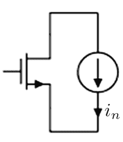

噪声电流建模为

$<i_{n,gm}>^2 = 4kT \gamma g_m \left[ \frac{A^2}{Hz} \right]$

其中 $\gamma$ 是一个校正因子，它取决于晶体管的工作区域和晶体管的沟道长度。

### 3.1.3 MOSFET 电容建模细节

历史上，FET 电容模型的发展始于 1970 年代初，当时提出了 Meyer 模型。该模型包括栅极 (G)、源极 (S)、漏极 (D) 和体极 (B) 端子之间的三个非线性电容。

在 1970 年代末，人们意识到该模型存在问题。它在所有情况下都不能保持电荷守恒。相反，[13] 提出的改进模型解决了这个问题。这里，模型中添加了更多的电容，并且假设电容是非互易的，换句话说 $C_{ij} \neq C_{ji}$。这导致总共有 12 个电容，其中 9 个是独立的。为了理解为什么电容不一定是互易的，我们可以使用一个简单的论证。让我们想象一个处于饱和区的 MOS 晶体管。我们忽略所有侧壁电容，只关注沟道的电容。现在，在饱和区，漏极的一个小测试电压不会影响栅极端子的电荷。然而，情况并非相反：栅极的测试电压肯定会通过晶体管作用影响漏极的电荷。然后我们可以说 $C_{gd} \neq C_{dg}$，晶体管电容的这种非互易性是解决电荷守恒问题的关键。

根据基础物理学，我们知道电荷 $Q$ 随时间的变化率等于电流。对于 FET，我们找到这四个电流

$i_g = \frac{dQ_g}{dt} \quad i_b = \frac{dQ_b}{dt} \quad i_d = \frac{dQ_d}{dt} \quad i_s = \frac{dQ_s}{dt} \quad (3.23)$

我们可以展开这些得到

$$i_g = \frac{\partial Q_g}{\partial v_{gb}} \frac{\partial v_{gb}}{\partial t} + \frac{\partial Q_g}{\partial v_{gd}} \frac{\partial v_{gd}}{\partial t} + \frac{\partial Q_g}{\partial v_{gs}} \frac{\partial v_{gs}}{\partial t}$$

$$i_b = \frac{\partial Q_b}{\partial v_{bg}} \frac{\partial v_{bg}}{\partial t} + \frac{\partial Q_b}{\partial v_{bd}} \frac{\partial v_{bd}}{\partial t} + \frac{\partial Q_b}{\partial v_{bs}} \frac{\partial v_{bs}}{\partial t}$$

$$i_d = \frac{\partial Q_d}{\partial v_{dg}} \frac{\partial v_{dg}}{\partial t} + \frac{\partial Q_d}{\partial v_{db}} \frac{\partial v_{db}}{\partial t} + \frac{\partial Q_d}{\partial v_{ds}} \frac{\partial v_{ds}}{\partial t}$$

$$i_s = \frac{\partial Q_s}{\partial v_{sg}} \frac{\partial v_{sg}}{\partial t} + \frac{\partial Q_s}{\partial v_{sb}} \frac{\partial v_{sb}}{\partial t} + \frac{\partial Q_s}{\partial v_{sd}} \frac{\partial v_{sd}}{\partial t}$$

这些方程定义了 12 个非线性非互易电容：

$$C_{ij} = \frac{\partial Q_i}{\partial v_{ij}} \quad \text{其中} \quad i, j \in \{v, g, s, d\}$$

我们要求电荷守恒，即

$$Q_g + Q_b + Q_d + Q_s = 0$$

这意味着，通过取时间导数，有

$$i_g + i_b + i_d + i_s = 0$$

这应该不足为奇。可以很容易地证明这意味着电容并非全部独立。事实上，可以证明 12 个电容中的 3 个可以从其他九个中找到。

我们总结说，现代仿真器实现有方程可以从模型方程计算以下九个电容

$$\begin{pmatrix} C_{gb} & C_{gd} & C_{gs} \\ C_{bg} & C_{bd} & C_{bs} \\ C_{dg} & C_{db} & C_{ds} \end{pmatrix}$$

并从这九个推导出其余三个。

### 3.1.4 BSIM 模型

我们在过去几节中介绍了 MOS 晶体管的基本物理。我们现在准备好回顾各种模型了。我们将花大量时间讨论伯克利短沟道 IGFET 模型 (BSIM)，因为它目前是工业界使用最广泛的模型。我们将从历史的角度来讨论它，因为这样更容易将其与我们刚刚描述的简单物理模型联系起来。早期的版本与简单物理非常相似，随着需求的增长，模型变得更加复杂。

BSIM 开发于 1980 年代末，用于解释当时所谓的短沟道场效应晶体管。它基于物理原理，并且在各个区域之间是连续的，也许是当今使用最广泛的模型系列。多年来，随着技术的进步，建模工作也在不断推进，目前我们已经发展到 BSIM6。截至撰写本文时，该模型已分裂成几个模型，即 BSIM-BULK、BSIM-CMG（通用多栅）、BSIM-IMG（独立多栅）和 BSIM-SOI（绝缘体上硅）。BSIM6 这个名称不再使用。我们将重点介绍模型的一些主要特点和难点，并提醒用户，有时代工厂的默认设置可能不适合手头的任务。最新版本包含数百个参数，本书无法公正地评价所有为使这些模型成功所付出的努力。读者应参考相关文献进行深入讨论。

本节将首先对模型进行基本介绍，并重点介绍一些基本特性。然后我们将展示在某些情况下，应更改默认设置。读者在模拟特别是不寻常尺寸和/或工作区域时，应质疑所有模型设置；这里我们只指出几个这样的例子。

#### 3.1.4.1 基本模型

BSIM 模型由加州大学伯克利分校的器件物理小组在 30 多年前开发。我们将在这里通过遵循历史发展来描述模型的特征，从描述模型的最早论文之一开始，然后我们将跟随多年来的发展和改进。关于这个模型已经写了许多书籍和论文，我们没有足够的空间来全面介绍模型的发展。相反，我们将从初始模型开始，并在介绍过程中通过强调一些新特性来跟进改进。我们相信这种方法将比从一开始就描述复杂的现代版本更容易让读者理解模型。目标是让读者足够熟悉模型，以便他/她可以自己探索细节。

##### BSIM1 1987

描述 BSIM 模型的第一篇论文发表于 1987 年。在此之前，对 CMOS 晶体管建模的困难在于驱动电流取决于晶体管的偏置。BSIM是首批尝试在单一实现中考虑所有因素的模型之一。我们将遵循文献[9]中的介绍。该公式基于小尺寸MOS晶体管的器件物理。包含的特殊效应有：

- (a) 载流子迁移率的垂直电场依赖性
- (b) 载流子速度饱和
- (c) 漏致势垒降低
- (d) 漏极和源极的耗尽电荷共享
- (e) 离子注入器件的非均匀掺杂
- (f) 沟道长度调制
- (g) 亚阈值导电
- (h) 几何依赖性

直接出现在阈值电压和漏极电流表达式中的八个漏极电流参数如下：

- $V_{FB}$ 平带电压
- $\varphi_s$ 表面反型电势
- $K_1$ 体效应系数
- $K_2$ 源极和漏极耗尽电荷共享系数
- $\eta$ 漏致势垒降低系数
- $U_0$ 垂直电场迁移率退化系数
- $U_1$ 速度饱和系数
- $\mu_0$ 载流子迁移率

利用这些参数，阈值电压建模为

$$V_{th} = V_{FB} + \varphi_s + K_1 \sqrt{\varphi_s - V_{BS}} - K_2 (\varphi_s - V_{BS}) - \eta V_{Ds} \quad (3.28)$$

注意参数 $\eta$ 除了建模漏致势垒降低效应外，还建模了沟道长度调制。现在应将此表达式与我们在第3.1.2节推导的公式进行比较。对于 $V_{BS} = 0$，当我们把参数 $\varphi_s$ 与公式3.19中的 $2\psi_B$ 等同起来时，可以看到它们非常接近。最后两项不属于我们简单模型计算的一部分。

现在让我们看看漏极电流模型。在BSIM1中，它根据端点偏置点被划分为不同的物理区域：

1. 截止区，$V_{gs} \le V_{th}$

$$I_{DS} = 0$$

2. 线性区，$V_{gs} > V_{th}$ 且 $0 < V_{ds} < V_{ds, sat}$

$$I_{ds} = \frac{\mu_0}{1 + U_0 (V_{gs} - V_{th})} \frac{C_{ox} W / L}{1 + \frac{U_1}{L} V_{ds}} \left( (V_{gs} - V_{th})V_{ds} - \frac{a}{2} V_{ds}^2 \right)$$

3. 饱和区 $V_{gs} > V_{th}$ 且 $V_{ds} \geq V_{ds, sat}$

$$I_{ds} = \frac{\mu_0}{1 + U_0 (V_{gs} - V_{th})} \frac{C_{ox} W / L}{2aK} (V_{gs} - V_{th})^2$$

弱反型区建模为

$$I_{ds,w} = \frac{I_{\exp} I_{\lim it}}{I_{\exp} + I_{\lim it}} \quad (3.29)$$

其中

$$I_{\exp} = \mu_0 C_{ox} \frac{W}{L} \left( \frac{kT}{q} \right)^2 e^{1.8} e^{\frac{q}{kT} (V_{gs} - V_{th}) / n} \left( 1 - e^{-V_{ds} q / kT} \right) \quad (3.30)$$

以及

$$I_{\lim it} = \frac{\mu_0 C_{ox}}{2} \frac{W}{L} \left( 3 \frac{kT}{q} \right)^2 \quad (3.31)$$

这种方法在不同区域之间的导数中没有引入任何不连续性，因此收敛性大大提高。第2章讨论的牛顿-拉夫逊方法需要导数，如果存在不连续性，收敛性必然会出现问题。

将这些表达式与我们刚刚在第3.1.2节学习的解析模型进行比较，我们看到一些真正的相似之处，因此这第一次BSIM尝试是一种基于真实物理参数对解析模型进行编码的方法。

注意饱和情况下的输出电阻模型。电流对 $V_{ds}$ 的依赖性仅通过阈值电压表达式体现。BSIM的后续版本将对此特性带来显著改进。

##### BSIM3 1993

晶体管模型的BSIM3版本在可预测性方面带来了多项改进，特别是在输出电阻方面。该版本有几个子版本，我们在此不深入讨论。相反，我们将列出与早期版本的主要区别。但让我们先看看新的阈值模型：

$$V_{th} = V_{T0} + K_1 \left( \sqrt{\varphi_s - V_{BS}} - \sqrt{\varphi_s} \right) - K_2 V_{BS} - \Delta V_{th} \quad (3.32)$$

其中 $V_{T0}$ 是长沟道阈值电压，其余参数与BSIM1相同。正如读者所见，参数化得到了改进，并且该模型基于准二维泊松方程的解析解。注意这里的 $\Delta V_{th}$ 参数。它旨在捕捉短沟道效应，并且对沟道长度和长度尺度参数 $l_t = \sqrt{3T_{ox}X_{dep}} / \eta$ 具有指数依赖性。这里，$T_{ox}$ 是薄氧化层区域的厚度，$X_{dep}$ 是晶体管源极附近的耗尽宽度。表达式为

$$\Delta V_{th} = D_{sv0} \left( e^{-L/2l_t} + 2e^{-L/l_t} \right) \left( 2(V_{bi} - \varphi_s) + V_{ds} \right) \quad (3.33)$$

注意这里对 $T_{ox}$ 的依赖性。我们制造的氧化层越薄，短沟道效应的影响就越小！这是一个重要的认识，推动了近年来SOI晶体管和finFET的许多发展。让我们也看看漏极电流模型。

###### 迁移率模型

与BSIM1中基于简单物理解析解对迁移率进行建模不同，BSIM3版本引入了一个更复杂的模型来捕捉与更小几何尺寸相关的效应。我们将在此将此迁移率称为 $\mu_{eff}$，不再进一步讨论细节。

###### 漏源电阻

通过金属接触和扩散区连接到漏极和源极的互连电阻在内部建模，并假设漏极和源极区域是对称的。

###### 漏源电流

与之前在强反型区一样，我们有两个子区域：线性区和饱和区。

1. 线性区，$V_{gs} > V_{th}$ 且 $0 < V_{ds} < V_{ds, sat}$

$$I_{ds} = \mu_{eff} \frac{C_{ox} W / L}{1 + \frac{1}{LE_{sat}} V_{ds}} \left( V_{gs} - V_{th} - V_{ds} / 2 \right) V_{ds}$$

2. 饱和区 $V_{gs} > V_{th}$ 且 $V_{ds} \ge V_{ds, sat}$

$$I_{ds} = \mu_{eff} \frac{C_{ox} W / L}{2aK} \left( V_{gs} - V_{th} \right)^2 \left( 1 + (V_{ds} - V_{ds, sat}) / V_A \right)$$

其中 $V_A$ 是厄尔利电压，用于建模输出电阻。弱反型区建模为

$$I_{ds} = \mu_{eff} C_{ox} \frac{W}{L} \left( \frac{kT}{q} \right)^2 e^{\frac{q}{kT}(V_{gs} - V_{eff})/n} \left( 1 - e^{-V_{ds}q/kT} \right) \quad (3.34)$$

这与BSIM1类似。然而，弱反型和强反型之间的过渡区域是通过引入弱反型区和强反型区的两个截止点来单独建模的，分别称为 $V_{gslow}$、$I_{dslow}$ 和 $V_{gshigh}$、$I_{dshigh}$。在这些限制内，漏源电流和栅源电压参数化为

$$I_E = (1-t)^2 I_{dslow} + 2(1-t)tI_p + t^2 I_{dshigh} \quad (3.35)$$

$$V_{gs} = (1-t)^2 V_{gslow} + 2(1-t)tV_p + t^2 V_{gshigh} \quad (3.36)$$

通过这种简单的参数化，过渡区域将是连续的，并且具有一阶连续导数。

正如我们刚才提到的，BSIM3中的输出电阻模型要复杂得多，它是通过引入厄尔利电压 $V_A$ 来建模的。该电压被建模为由三个独立且互不影响的效应主导：沟道长度调制（CLM）、漏致势垒降低（DIBL）和衬底电流引起的体效应（SCBE）。这些效应像它们的倒数一样相加

$$\frac{1}{V_A} = \frac{1}{V_{ACLM}} + \frac{1}{V_{ADIBL}} + \frac{1}{V_{ASCBE}} \quad (3.37)$$

其中

$$V_{ACLM} = I_{dsat} \left( \frac{\partial I_{ds}}{\partial V_{dsat}} \frac{\partial V_{dsat}}{\partial L} \frac{\partial L}{\partial V_{ds}} \right)^{-1} \quad (3.38)$$

$$V_{ADIBL} = I_{dsat} \left( \frac{\partial I_{ds}}{\partial V_{dsat}} \frac{\partial V_{dsat}}{\partial V_{th}} \frac{\partial V_{th}}{\partial V_{ds}} \right)^{-1} \quad (3.39)$$

$$V_{ASCBE} = I_{dsat} \left( \frac{\partial I_{ds}}{\partial V_{th}} \frac{\partial V_{th}}{\partial V_{bs}} \frac{\partial V_{bs}}{\partial I_{sub}} \frac{\partial I_{sub}}{\partial V_{ds}} \right)^{-1} \quad (3.40)$$

BSIM3模型版本在建模方面带来了显著改进。引入准二维泊松方程的解析解和大大改进的输出电阻模型，在大约10年内，随着一些子模型的改进，成为CMOS晶体管的标准模型。早期版本所需的基于物理的参数总数约为25个。我们很快会看到，随着BSIM4的发布，这将发生巨大变化，我们接下来将讨论BSIM4。

###### 噪声模型

BSIM3中的噪声模型可以由用户通过参数 $noiMod$ 选择三种之一。对于 $noimod = 1$，噪声建模方式与（手工计算模型）相同其中 $\gamma = 2/3$，跨导由 $g_m + g_{mbs} + g_{ds}$ 之和设定。选择 $noiMod = 2$ 则采用更复杂的噪声模型，该模型由反型沟道电荷 $Q_{inv}$ 控制。

$$\frac{4kT\mu_{eff}}{\mu_{eff}|Q_{inv}|R_{ds}(V) + L_{eff}^2}|Q_{inv}|$$

##### BSIM4 2000

BSIM4 是第四代模型，带来了数百个参数来描述 MOSFET 的工作原理。随着著名的摩尔定律驱动特征尺寸不断缩小，栅极长度和宽度持续减小以改善功耗并提高处理能力，对更精细的 BSIM 模型的需求变得显而易见。与上一代一样，这一代也有许多子版本，提供了各种改进。

###### 概述

我们不会深入探讨这些模型，只是浅尝辄止，重点介绍一些改进。与 BSIM3 相比，BSIM4 版本有许多改进，仅举几例：

- 改进了衬底电阻模型。
- 沟道热噪声建模更加精确，并改进了感应栅噪声模型。
- 更好的 $1/f$ 噪声模型。
- 改进了非准静态（NQS）模型，能够正确考虑 NQS 效应。
- 漏源电阻模型正确考虑了不对称和其他与偏置相关的效应。
- 更精确的栅极隧穿模型。
- 统一的电流饱和模型，包含所有电流饱和机制——速度饱和、速度过冲和源端速度限制。
- 阈值电压定义已更改，以改善亚阈值响应。
- 改进了漏致势垒降低（DIBL）效应和 ROUT 模型。
- 仅提及这一系列模型为该领域带来的众多改进中的一部分！

总体而言，有数百个新参数。我们现在将更详细地描述其中一些效应。

###### 阈值电压

首先让我们看看阈值电压：

$$V_{th} = V_{T0} + K_1\left(\sqrt{\varphi_s - V_{BS}} - \sqrt{\varphi_s}\right) - K_2V_{BS} - \Delta V_{th}$$

其建模方式与之前非常相似。最大的变化之一在于短沟道调整的表达式：

$$\Delta V_{th} = D_{vr0} \frac{0.5}{\cosh \frac{L}{l_t} - 1} \left( 2(V_{bi} - \phi_s) + V_{ds} \right)$$

之前的表达式在 $L$ 变得非常小时会导致虚假的第二次 $V_{th}$ 上升。为了适应更广泛的技术范围，参数被进一步细分为子参数，以增加模型的适用性。我们在此不深入这些细节。

在 BSIM3 中，栅极厚度使得薄氧化层附近感应电荷层的有效厚度远小于栅极厚度。在 BSIM4 中，栅极厚度与电荷层厚度更接近的事实导致表面电荷的基本近似失效。这引入了几个新的方程和相关参数。

各种偏置区域的物理原理现在要复杂得多，我们将简要介绍一些需要建模的新效应。

###### 弱反型区

该区域的漏极电流与之前类似：

$$I_{ds} = \mu_0 \sqrt{\frac{q \epsilon_{si} NDEP}{2 \phi_s}} \frac{W}{L} \left( \frac{kT}{q} \right)^2 e^{\frac{q}{kT}(V_{gs} - V_{th} - V_{off})/\eta} \left( 1 - e^{-V_{ds}q/kT} \right)$$

###### 栅极隧穿效应

随着栅极厚度持续缩小，一种称为隧穿的量子力学效应开始变得重要。如果读者回忆起现代物理课程，电子可以被视为粒子或波，根据具体情况，其中一种性质更为明显。在波动情况下，通过求解薛定谔方程可以证明电子波函数存在于氧化层区域，甚至在晶体管体内具有有限大小。因此，电子有一定概率能够存在于栅极之外；它“隧穿”通过薄氧化层区域。这是一种纯粹的量子力学效应，可能导致显著的漏电损失。BSIM4 中考虑了这一点。

###### 统一迁移率模型

迁移率显然是一个关键参数，因为它直接影响漏极电流。在 BSIM4 中，引入了新的统一迁移率模型，参数为 MOBMOD = 2。

###### 漏源电流

BSIM4 为线性区和饱和区引入了统一的电流模型

$$I_{ds} = \frac{I_{ds0}}{\left(1 + \frac{R_{ds}I_{ds0}}{V_{dseff}}\right)} NF \left(1 + \frac{1}{C_{clm}} \ln \frac{V_A}{V_{Asat}}\right) f(V_{ADIBL}, V_{ADITS}, V_{ASCBE}) \quad (3.44)$$

其中

$$I_{ds0} = \mu_{eff} W Q_{ch0} \frac{V_{ds}}{L} \frac{\left(1 - \frac{V_{ds}}{2V_b}\right)}{1 + \frac{V_{ds}}{E_{sat}L}} \quad (3.45)$$

###### 噪声模型

晶体管的噪声模型包括沟道的热噪声和闪烁（1/f）噪声。

####### 1/f 噪声

闪烁噪声使用两种近似方法建模：一种表达式简单，便于手工计算；另一种称为统一模型，更多地考虑了现象背后的详细物理原理，包括器件所处的工作区域。选择权在用户手中，通过 *fnoimod* 参数设置，查看代工厂提供的模型以了解使用了哪种模型通常很有启发性。

####### 热噪声

热噪声建模也由用户参数 *tnoimod* 控制，可在三组近似之间选择。第一种通过设置 *tnoimod* = 0 启用，类似于 BSIM3 中已有的模型。第二种称为*整体*模型，通过设置 *tnoimod* = 1 访问。它被建模为源漏之间的噪声电流，此外在晶体管源端串联一个噪声电压源。该模型被称为整体模型，因为所有短沟道效应和速度饱和效应都自动包含在内。最后，*tnoimod* = 2 选项使用两个噪声电流来建模噪声，其中在晶体管栅源端之间插入一个噪声电流，而不是在源端使用噪声电压源。已发表的与测量结果的相关性 [12, 15] 显示，当 *tnoimod* 设置为 2 时，相关性良好。

####### 其他噪声源

BSIM4 模型还包括其他噪声源，源于漏源电阻和栅极隧穿电流引起的散粒噪声。

###### 模型参数调整

了解模型及其局限性很重要，因为代工厂通常会提供带有标准参数集和参数标志的模型，这些在大多数情况下都适用。然而，如果需要不寻常的尺寸，例如，这个标准参数集可能就不够了。有经验的工程师会自行调整这些标志/参数。像本书这样的书无法涵盖最新模型代中的每个参数。那将是一大卷书，而且没有必要，因为这类信息已经存在。相反，我们将重点介绍作者及其团队遇到与测量结果存在差异的一些效应。希望这能鼓励读者大胆调查模型设置对其特定应用的适用性。

###### 非准静态效应

FET 沟道可以建模为传输线，由一串电阻连接而成，每个连接点都有一个电容接地。如果沟道很宽，这可能导致信号传播延迟。在短沟道区域，这通常可以简化为一个包含一个电阻和一个电容的集总模型。该效应由一个开关控制，一个用于瞬态仿真，一个用于交流仿真。通常，代工厂模型会将此 NQS 开关设置为零，这意味着忽略分布效应。这也有助于缩短仿真时间。然而，有时可能需要长沟道器件，例如作为电路中承载高速信号部分的电容，此时需要启用 NQS 开关以考虑分布效应。否则可能导致对此类电容延迟的过度乐观估计。

###### 栅极电阻模型

栅极可能具有显著的电阻，特别是小尺寸 CMOS 晶体管。BSIM4 包含一个开关来考虑这种电阻；它被称为 rgatemod。将此参数设置为 0 意味着不产生内部栅极电阻。在现代 PDK 中，晶体管通常实例化在包含栅极电阻的无源网络中，因此通常禁用此内部建模效应。有关其使用方法的更多信息，请参见 [15]。

###### 衬底电阻网络

衬底电阻可以在 BSIM4 中建模，这是高速应用的重要参数。模型开关称为 rbodmod。在研究新技术时，查看此模型开关是否启用通常很有价值。更多信息，请参见 [15]。

###### 电荷分配模型

电荷分配描述了反型层电荷如何分为源电荷和漏电荷。通常有三个选项：50%/50%、40%/60% 和 0%/100%。40%/60% 模型被认为是最符合物理实际的 [13]。实际分配将取决于节点电压，这很难通过解析解决 [13]。根据应用，使用的分配模型可能会给出错误的结果。

###### 总结

我们简要介绍了 BSIM4 的建模。我们触及了一些基本的建模假设，并与早期的 BSIM 版本进行了比较。我们看到复杂性显著增加，许多微妙的效应对于小尺寸CMOS而言，这些因素至关重要，现在可以以合理的精度进行捕获。我们还强调了一些模型开关，这些开关对于正确的行为以及与硅片的相关性可能非常重要。强烈建议读者研究工厂提供的模型文件，并自行判断对于所考虑的应用，合适的参数（开关）应该是什么。

#### 3.1.4.2 BSIM6

随着技术发展到更复杂的物理实现，如绝缘体上系统（SOI）和FinFET结构，BSIM模型团队一直非常忙碌地跟进。BSIM6框架下的最新一代模型包含了更多针对这些特定技术以及其他技术的实现。由于篇幅限制，我们在此仅简要提及它们的功能，将细节留给读者探索。强烈建议读者按照我们在前面章节中描述的思路，详细研究这些实现。

-   BSIM-BULK：这是新的体硅BSIM模型
-   BSIM-SOI：这是基于BSIM3v3的SOI结构紧凑模型
-   BSIM-IMG：BSIM-IMG（独立多栅）模型已开发用于模拟独立双栅结构的电学特性，如超薄体和埋氧层SOI晶体管（UTBB）。它允许不同的前栅和后栅电压、功函数、介电层厚度和介电常数。
-   BSIM-CMG：（共栅多栅）是针对共栅多栅FET类器件的紧凑模型。针对本征和外征模型，推导了基于物理表面势的公式，并考虑了有限的体掺杂。源端和漏端的表面势通过解析求解，并考虑了多晶硅耗尽和量子力学效应。有限体掺杂的影响通过微扰方法捕获。解析表面势解与二维器件模拟结果吻合良好。

## 3.2 双极晶体管

双极晶体管的工作原理与CMOS晶体管大不相同。传统上，SiGe双极晶体管的速度比CMOS晶体管快得多，但随着小尺寸CMOS的引入，这两种技术的速度现在更具可比性。也许CMOS最大的优势在于其互补性质；存在一个与NMOS一样快的PMOS晶体管。因此，有更多架构选择可用。

在模拟器中实现双极器件最困难的方面之一是电流对电压的强指数依赖性。这很容易导致解的发散，因为电压的大步长会导致更新电流时出现溢出。我们将在后面的第5章中看到这种行为的例子。有办法解决这个问题，例如，将电压偏移限制在某个数值，或者构建一个新的指数函数，使其在超过某个输入后不再是指数函数。

本节首先简要描述一般行为，然后在3.2.2、3.2.3、3.2.4和3.2.5节中讨论几个流行模型。

### 3.2.1 一般行为

双极晶体管的物理原理相当复杂。一个优势是，物理原理在输出电流的多个数量级上是相同的，这导致模型中的不连续性较少，有助于收敛。我们在此没有空间详细讨论，仅引用基本结果。读者可以在[2]中找到很好的讨论。

双极晶体管有一个通用符号，如图3.5所示。输出集电极电流与基极-发射极电压之间的基本关系是著名的公式

$$I_C = I_s \left(e^{qV_{BE}/kT} - 1\right)$$
$$I_B = I_C / \beta$$
$$I_E = I_C + I_B$$

因子$\beta$是电流放大系数。

### 3.2.2 Ebers-Moll模型

一个更复杂的模型，也是最早开发的模型之一，称为Ebers-Moll模型[14]。它最初只是一个静态非线性模型，但多年来经过改进，包含了电荷存储、随电流变化以及基区宽度调制（导致有限输出电导）等效应。一个描述电容和寄生电阻效应的大信号模型，如其在早期SPICE中实现的，可以在图3.6中找到。

集电极和发射极节点的基本电流关系比我们在3.2.1节中指出的要复杂得多，由下式给出

图3.5 双极晶体管符号。它由三个主要端子组成：基极、集电极和发射极

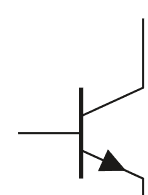

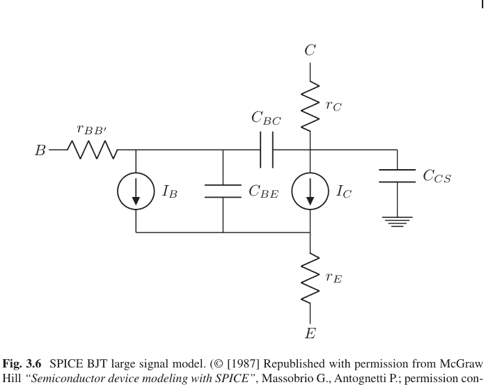

图3.6 SPICE BJT大信号模型。（© [1987] 经McGraw Hill许可转载，“Semiconductor device modeling with SPICE”，Massobrio G., Antognetti P.；许可通过Copyright Clearance Center传达）

$$I_C = I_S \left[ \left( e^{qV_{BE}/kT} - e^{qV_{BC}/kT} \right) \left( 1 - \frac{V_{BC}}{V_A} \right) - \frac{1}{\beta_R} \left( e^{qV_{BC}/kT} - 1 \right) \right] + \left[ V_{BE} - \left( 1 + \frac{1}{\beta_R} \right) V_{BC} \right] G_{\min}$$
$$I_E = I_S \left[ \frac{1}{\beta_F} \left( e^{qV_{BE}/kT} - 1 \right) + \frac{1}{\beta_R} \left( e^{qV_{BC}/kT} - 1 \right) \right] + \left[ \frac{V_{BE}}{\beta_F} + \frac{V_{BC}}{\beta_R} \right] G_{\min}$$

### 3.2.3 Gummel-Poon模型

Gummel-Poon模型多年来一直是主力模型，现在或多或少被认为已过时。它扩展了Ebers-Moll模型，还考虑了低电流和高注入水平下的效应（图3.7）显示了*Gummel-Poon*模型的等效电路。晶体管操作分为四个工作区域：正向有源区、反向区、饱和区和截止区。

*正向有源区*
此处，$V_{be} > -5n_jkT/q$ 且 $V_{bc} \le -5n_jkT/q$。我们有

$$I_c = \frac{I_s}{q_b} \left( e^{\frac{qV_{be}}{n_jkT}} + \frac{q_b}{\beta_r} \right) + C_4 I_s + \left( \frac{V_{be}}{q_b} - \left( \frac{1}{q_b} + \frac{1}{\beta_r} \right) V_{bc} \right) G_{\min}$$

$$I_c = I_s \left( \frac{e^{\frac{qV_{be}}{n_jkT}}}{\beta_f} - \frac{1}{\beta_f} - \frac{1}{\beta_r} \right) + C_2 I_s \left( e^{\frac{qV_{bc}}{n_jkT}} - 1 \right) - C_4 I_s + \left( \frac{V_{be}}{\beta_f} + \frac{V_{bc}}{\beta_r} \right) G_{\min} \quad (3.46)$$

*反向区*
此处，$V_{be} \le -5n_jkT/q$ 且 $V_{bc} > -5n_jkT/q$。我们有

$$I_c = -\frac{I_s}{q_b} \left( e^{\frac{qV_{bc}}{n_jkT}} + \frac{q_b}{\beta_r} \left( e^{\frac{qV_{bc}}{n_jkT}} - 1 \right) \right) + C_4 I_s \left( e^{\frac{qV_{bc}}{n_jkT}} - 1 \right) + \left( \frac{V_{be}}{q_b} - \left( \frac{1}{q_b} + \frac{1}{\beta_r} \right) V_{bc} \right) G_{\min}$$

$$I_c = I_s \left( \frac{1}{\beta_f} - \frac{1}{\beta_r} \left( e^{\frac{qV_{bc}}{n_jkT}} - 1 \right) \right) - C_2 I_s + C_4 I_s \left( e^{\frac{qV_{bc}}{n_jkT}} - 1 \right) + \left( \frac{V_{be}}{\beta_f} + \frac{V_{bc}}{\beta_r} \right) G_{\min}$$

*饱和区*
此处，$V_{be} > -5n_jkT/q$ 且 $V_{bc} > -5n_jkT/q$。我们有

$$I_c = \frac{I_s}{q_b} \left( e^{\frac{qV_{be}}{n_jkT}} - e^{\frac{qV_{bc}}{n_jkT}} - \frac{q_b}{\beta_r} \left( e^{\frac{qV_{bc}}{n_jkT}} - 1 \right) \right) - C_4 I_s \left( e^{\frac{qV_{bc}}{n_jkT}} - 1 \right) + \left( \frac{V_{be}}{q_b} - \left( \frac{1}{q_b} + \frac{1}{\beta_r} \right) V_{bc} \right) G_{\min}$$

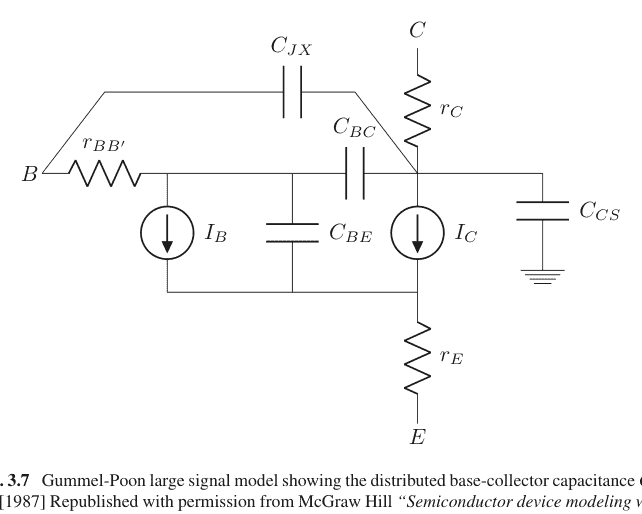

图3.7 Gummel-Poon大信号模型，显示了分布的基极-集电极电容$C_{JX}$。（© [1987] 经McGraw Hill许可转载，“Semiconductor device modeling with SPICE”，Massobrio G, Antognetti P；许可通过Copyright Clearance Center传达）

$$I_b = I_s \left( \frac{1}{\beta_f} \left( e^{\frac{qV_{be}}{n_f kT}} - 1 \right) + \frac{1}{\beta_r} \left( e^{\frac{qV_{bc}}{n_r kT}} - 1 \right) \right)$$

*截止区*
此处，$V_{be} \leq -5n_f kT/q$ 且 $V_{bc} \leq -5 n_r kT/q$。我们有

$$I_c = \frac{I_s}{\beta_r} + C_4 I_s + \left( \frac{V_{be}}{q_b} - \left( \frac{1}{q_b} + \frac{1}{\beta_r} \right) V_{bc} \right) G_{\min}$$

$$I_b = -I_s \frac{\beta_f + \beta_r}{\beta_f \beta_r} - I_s (C_2 + C_4) + \left( \frac{V_{be}}{\beta_f} + \frac{V_{bc}}{\beta_r} \right) G_{\min}$$

在所有这些方程中，$G_{min}$代表与每个pn结并联的最小电导。

### 3.2.4 大电流模型 (HiCUM)

大电流模型 (HiCUM) 是对刚刚讨论的基本 Gummel-Poon 模型的改进。相较于 Gummel-Poon 模型，其主要改进点包括：

-   Gummel-Poon 模型的问题之一是对发射极外围效应不敏感。这类效应在现代高速晶体管中可能扮演重要角色。
-   另一个问题是外部基极-集电极区域的分布特性。
-   此外，发射极中的高频小信号电流拥挤效应也需要解决。
-   其他便捷的改进涉及基极-发射极隔离电容和 BC 氧化层电容。
-   与其他模型相比，该模型在一定程度上通过模型方程考虑了内部串联电阻。这种方法避免了使用内部电阻的需要，同时节省了一个节点并降低了计算成本。
-   在极低的 CE 电压下，存在衬底寄生晶体管导通的可能性，这被称为饱和区甚至硬饱和区。这种寄生晶体管通过一个简单的传输模型加以考虑。

### 3.2.5 VBIC 模型

VBIC 是一种双极结型晶体管 (BJT) 模型，它被开发作为 SPICE Gummel-Poon (SGP) 模型的公共领域替代品。VBIC 旨在尽可能与 SGP 模型相似，同时克服其主要缺陷。VBIC 对 SGP 的改进包括：

-   改进的 Early 效应建模
-   准饱和建模
-   寄生衬底晶体管建模
-   寄生固定（氧化层）电容建模
-   包含雪崩倍增模型
-   改进的温度建模
-   基极电流与集电极电流解耦
-   电热建模
-   平滑、连续的模型

## 3.3 考虑的模型选项

在本章中，我们专门讨论了以下 BSIM 模型选项：

-   非准静态 (NQS) 模型
-   栅极电阻模型
-   衬底电阻模型

## 3.4 使用的晶体管模型

实现完整的 BSIM 模型超出了本书的范围。相反，我们将使用更简单的模型来说明模拟器的各个方面。我们将使用两种不同的 CMOS 晶体管模型，以及一个用于双极晶体管的简单指数模型。

### 3.4.1 CMOS 晶体管模型 1

新元件是一个压控电流源 (VCCS)，其传递函数为 $g_m = Kv_g^2$。这可能是人们能想到的最简单的非线性特性。读者无疑会认出这接近于阈值电压为零的 CMOS 晶体管传递函数。这并非巧合。为了继续，我们需要分别查看适用于 NMOS 和 PMOS 晶体管的电流方向定义。让我们看一下图 3.8，其中标出了源极和漏极电流的方向。惯例是流入器件（或子电路）的电流为正；流出的电流为负。对于 NMOS 晶体管，漏极电流为

$I_d = K(V_g - V_s)^2 = KV_{gs}^2$ (3.47)

对于 PMOS，$I_d$ 变为负值：

$$I_d = -K(V_s - V_g)^2 = KV_{sg}^2 \quad (3.48)$$

注意 PMOS 下标的细微变化。对于此模型，这没有意义，但在下一个模型 2 中将发挥作用。

### 3.4.2 CMOS 晶体管模型 2

到目前为止我们使用的晶体管模型只是一个非常基础的模型，以便说明如何实现非线性求解器。该模型具有无限的输出阻抗，没有线性区，更糟糕的是，当栅源电压低于零时它会反向导通。它不是很实用。现在让我们构建一个稍微更现实的模型，虽然离 BSIM 的质量还很远。让我们使用一个漏极电流随端口电压变化的模型，如下所示

$$I_d = \begin{cases} 0, & V_{gs} - V_T < 0 \\ 2K\left( (V_{gs} - V_T)V_{ds} - \frac{1}{2}V_{ds}^2 \right), & V_{ds} < V_{gs} - V_T \\ K(V_{gs} - V_T)^2(1 + \lambda V_{ds}) \end{cases} \quad (3.49)$$

其中 $V_T$ 是我们在此建模为常数的阈值电压，$K$ 是我们之前使用的相同常数，最后 $\lambda$ 是控制饱和区漏极输出阻抗的参数。PMOS 晶体管的方程将非常相似，只是符号根据我们在更简单的 CMOS 模型中看到的进行了更改：

$$I_d = \begin{cases} 0, & V_{sg} - V_T < 0 \\ -2K\left( (V_{sg} - V_T)V_{sd} - \frac{1}{2}V_{sd}^2 \right), & V_{sd} < V_{sg} - V_T \\ -K(V_{sg} - V_T)^2(1 + \lambda V_{sd}) \end{cases} \quad (3.50)$$

### 3.4.3 双极晶体管模型 3

我们将使用的双极模型由以下表达式给出

$$I_C = -I_E = \begin{cases} I_0 \exp\left( \frac{V_{BE}q}{kT} \right) \left( 1 + \frac{V_{CE}}{V_A} \right), & V_{BE} > 0 \\ 0, & V_{BE} \le 0 \end{cases} \quad (3.51)$$

其中我们使用 $V_A$ 表示 Early 电压。该模型在结构上与其 CMOS 对应模型相似，但区域较少。该方程的指数特性将在后面的实现部分引起一些有趣的问题。

## 3.5 总结

在本章中，我们探讨了现代工艺技术关键组件的基本器件物理。我们的前提是设计者需要了解建模方式，以便正确地仿真器件。在回顾了基本物理之后，我们概述了模型是如何建立的，并回顾了来自加州大学伯克利分校器件小组的 BSIM 的历史发展。在此过程中，我们强调了各种近似，并指出现代代工厂的标称模型文件有时可能存在局限性，并给出了一些需要注意的示例。我们还简要概述了 FinFET 物理学，并展示了如何减少 DIBL 等效应，从而显著降低晶体管的输出电导，获得更高的基本增益 $g_m r_o$。

最后，我们提供了一组标称仿真扫描，这在开始使用一组新模型之前非常有帮助。

## 3.6 练习

1.  使用图 3.9 中的模型推导 finFET 结构的准二维物理。
2.  讨论为什么 finFET 器件具有更优的跨导和输出电导。

#### 参考文献

1.  Taur, Y., & Ning, T. H. (2009). *Fundamentals of modern VLSI devices* (2nd ed.). Cambridge: Cambridge University Press.
2.  Antognetti, P., & Massobrio, G. (1998). *Semiconductor device modeling with spice* (2nd ed.). India: McGraw Hill Education.
3.  Hu, C. H. (2009). *Modern semiconductor devices for integrated circuits*. London: Pearson Publishing.
4.  Sahrling, M. (2019). *Fast techniques for integrated circuit design*. Cambridge: Cambridge University Press.
5.  Pao, H. C., & Sah, C. T. (1966). Effect of diffusion current on characteristics of metal-oxide (insulator)–semiconductor transistors. *Solid State Electronics*, 9(10), 927–937.
6.  Sze, S. M. (2006). *Physics of semiconductor devices*. Hobroken: John Wiley.
7.  Ashcroft, N. W., & Mermin, N. D. (1976). *Solid state physics*. New York: Brooks Cole.
8.  Neamen, D. A., & Biswas, D. (2017). *Semiconductor physics and devices* (4th ed.). India: McGraw Hill Education.
9.  Sheu, B. J., et al. (1987). BSIM: Berkeley short-channel IGFET model for MOS transistors. *IEEE Journal of Solid-State Circuits*, 22(4), 558–566.
10. Huang, J. H., et al. (1993). A robust physical and predictive model for deep-submicrometer MOS circuit simulation, Electronics Research Laboratory, UCB/ERL M93/57.
11. Chauhan, Y. S., et al. (2012). BSIM – Industry standard compact MOSFET models. *IEEE*, 30–33.
12. Xi, X., et al. (2004) The next generation BSIM for sub-100nm mixed-signal circuit simulation. *IEEE Custom Integrated Circuits Conference*, 13–16.
13. Ward, D. E., & Dutton, R. W. (1978). A charge-oriented model for MOS transistor capacitances. *IEEE Journal of Solid State Circuits*, 13, 703–708.
14. Ebers, J. J., & Moll, J. L. (1954). Large signal behavior of junction transistors. *Proceedings of IRE*, 42, 1761–1772.
15. Niknejad, A., et al. (2020). *BSIM4 manual*. http://bsim.berkeley.edu/models/bsim4/

# 第四章
电路仿真器：线性案例

**摘要** 本章讨论仿真器的基础知识，重点在于线性系统。我们从一个简单的电路网络开始，将其作为演示，说明如何将任意电路网络构建为矩阵方程。这是交流分析的自然环境，我们从这种仿真开始，并与专业仿真器进行比较。然后我们将分析扩展到包括线性瞬态仿真，其中我们引入电容器和电感器等元件，以便演示各种积分方法。

## 4.1 引言

电路仿真器的建立是为了求解基尔霍夫电流定律（KCL）和电压定律（KVL），以及控制电气元件对电流和/或电压激励响应的方程。本章将展示线性系统情况下仿真器的基本结构。我们将从简要的历史概述开始，然后以一个简单电路为例推导基本的矩阵方程，并利用它来说明如何在计算机程序中设置通用矩阵方程。我们只会提及这些通用方程背后的正式推导，因为这已经多次被彻底完成，我们将在第7章提供更多细节，并为感兴趣的用户提供大量参考文献以深入研究细节。我们将首先研究单频音调传输，由于我们研究的是线性系统，这意味着我们将首先查看交流分析，这是理解通用方法的良好起点。我们随后使用时间相关或瞬态分析。这自然地从交流讨论中得出。在第2章中，我们提到了借助差分方程实现微分方程的四种不同方式。这四种实现具有不同的特性，我们将通过文中提供的具体示例代码和网表来突出这些特性。

## 4.2 历史发展

20世纪60年代和70年代，人们进行了许多尝试，开发使用计算机辅助设计（CAD）技术构建电路的方法[1-8]。20世纪60年代的许多仿真器代码是在与美国国防部签订的合同下编写的，因此其公开使用受到限制。加州大学伯克利分校D.O. Pederson教授领导的设计团队迅速成为领先的团队之一，提出了“以集成电路为重点的仿真程序”或SPICE，作为在计算机中实现电路网络方程并使用数值技术求解这些方程的一种方式。当时，这通常被认为是浪费时间。人们认为计算机适配会太不准确，无法产生有意义的结果。真实的晶体管实现太困难是一些评论，但这并没有阻止Pederson和他的学生。我们都应该感谢Pederson和他的团队，他们坚定不移地相信使用SPICE进行计算机实现。

SPICE的第一个版本于1973年在加拿大滑铁卢的一次会议上提出[7]。它由Pederson教授的学生Laurence Nagel编写，是早期专有程序“非线性电路计算机分析，不包括辐射”（CANCER）的衍生版本。Pederson坚持重写该程序，以便移除专有限制，并将代码置于公共领域。该代码在可包含的器件方面有些有限，并且它还使用固定时间步长来推进方程。随着1975年SPICE2的发布[6]，该程序的受欢迎程度有所提高。现在时间步长是可变的，并且代码中包含了更多的电路元件。SPICE的早期版本是用FORTRAN编写的，最新的版本SPICE2g.6于1983年发布。下一代SPICE，SPICE3，于1989年发布，用C语言编写，并添加了使用X窗口系统的图形界面。代码处于公共领域，并且可以以名义费用购买（涵盖磁带成本）这一事实，极大地促进了该代码的普及。作者在20世纪90年代中期仍然利用了开发团队的这一优惠。模拟电路变得与“spice”电路同义。

SPICE的开发在2011年被IEEE命名为里程碑，L. Nagel因其初始代码的开发于2019年获得固态电路Donald O. Pederson奖。

## 4.3 矩阵方程

矩阵方程及其解在第1章中已经提到。它是许多现代仿真方法的关键，对于在职工程师来说，掌握如何建立和求解它们是一项必备知识。本节将讨论给定电子电路拓扑结构时此类方程的建立。大多数学生在电路分析的基础课程中学习如何分析相当简单的电路拓扑结构，本节将展示在构建仿真器矩阵时如何系统化这些方法。我们将从*无源元件*的基础开始，并从一个简单的无源网络构建完整的矩阵方程。这对大多数读者来说应该是熟悉的。然后，我们将利用这个练习来说明建立仿真矩阵的常用方法。我们将大部分数学细节和正式证明作为参考，并在第7章中概述，供感兴趣的读者进一步研究。一旦采用了这种方法，我们将用它来构建一个简单的Python代码，该代码可用于读取电路网表并建立矩阵方程。之后，我们将使用Python内置的矩阵求解器来求解方程组，并与其他SPICE实现进行比较。主要动机是展示该方法相当直接，并消除可能围绕电路仿真的任何神秘感。当然，一个完全专业的仿真器有更多的优化技巧，实现的细节很容易在不同产品之间产生差异。

在展示了使用无源器件的简单仿真设置之后，我们将继续定义*有源器件*，并展示如何以类似于无源器件的方式在构建完整矩阵中实现它们。

### 4.3.1 无源元件

无源电路元件是一种只能耗散、吸收或以电场或磁场形式存储能量的组件。它们不需要任何形式的电力来运行。最明显的例子是电阻器、电容器和电感器，我们将在本节中描述它们。

让我们首先回顾控制无源器件的基本方程。任何器件都可以通过其电流-电压关系来描述：

$$i(t) = f\left(v(t), \frac{dv(t)}{dt}\right) \text{ 或 } v(t) = f\left(i(t), \frac{di(t)}{dt}\right) \quad (4.1)$$

如果$f$是线性的，则该元件称为线性的。如果关系由下式设定，则该器件称为电阻器：

$$v(t) = i(t)R(t) \quad (4.2)$$

其中$R$是电阻，我们现在认为它是常数。非线性电阻器是重要的电路器件，但我们这里不讨论它们。我们还有电感器

$$v(t) = L(t)\frac{di(t)}{dt} \quad (4.3)$$

和电容器

$$i(t) = C(t) \frac{dv(t)}{dt}$$

后两者通常被称为动态元件，我们目前假设变量$L$、$C$与电流和电压无关。$L$称为电感，$C$称为电容。例如，在CMOS器件中存在非线性电容器的事实，会显著增加仿真器的求解、精度和收敛性的复杂性，我们将在第5章稍后讨论一些这方面的例子。仅由电阻器组成的网络称为*电阻网络*，包含电容器和电感器的网络通常称为*动态网络*。如果网络只有无源器件，则称为*线性网络*。

现在考虑如图4.1所示的简单网络。

我们可以在节点$v_1$处写出KCL：

$$i_1 = i_2 + i_3$$

在节点$v_{in}$处，KCL给出简单的

$$i_{in} = i_1$$

**图 4.1** 由电压$v_{in}$偏置的简单线性网络

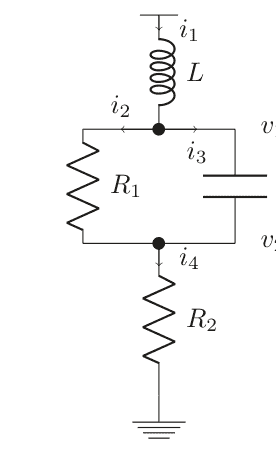

器件本身的电流我们可以很容易地从其元件方程4.2、4.3和4.4中得到，最终得到以下方程组：

$$
\begin{cases}
i_1 = i_2 + i_3 \\
i_4 = i_2 + i_3 \\
v_{in} - v_1 = L \frac{di_1}{dt} \\
i_2 = \frac{v_1 - v_2}{R_1} \\
i_3 = C \frac{d(v_1 - v_2)}{dt} \\
i_4 = \frac{v_2}{R_2}
\end{cases}
$$

我们有五个方程和五个未知数，应该能够求解。我们也可以很容易地看出存在某种矩阵关系。我们有四个未知电流和两个未知电压。我们假设$L$、$C$是常数，因此我们得到一组将这些未知数相互关联的线性方程。导数项可能会使事情有点混乱，但这将在第4.1和4.2节中阐明。通过稍作整理，我们可以将这些方程写成矩阵形式：

$$
\begin{bmatrix}
0 & 0 & 1 & -1 & -1 & 0 \\
0 & 0 & 0 & 1 & 1 & -1 \\
1 & 0 & L \frac{d}{dt} & 0 & 0 & 0 \\
-1 & 1 & 0 & R_1 & 0 & 0 \\
-C \frac{d}{dt} & C \frac{d}{dt} & 0 & 0 & 1 & 0 \\
0 & -1 & 0 & 0 & 0 & R_2
\end{bmatrix}
\begin{bmatrix}
v_1 \\
v_2 \\
i_1 \\
i_2 \\
i_3 \\
i_4
\end{bmatrix}
=
\begin{bmatrix}
0 \\
0 \\
v_{in} \\
0 \\
0 \\
0
\end{bmatrix}
$$

其中导数被用作算子。我们看到方程的形式有些不同。前两个方程来自节点$v_1$、$v_2$的基尔霍夫电流定律；它通常被称为*拓扑约束*，因为它涉及基于电路连接性的条件（用一个更花哨的词来说，就是拓扑）。其余方程来自元件本身以及它们如何将流过它们的电流与它们两端的电压联系起来；它们被称为*元件*或*支路*方程。我们将在下一节首先从单频角度研究这些方程，然后我们将进行时域求解，其中导数将被显式处理。

关于这个矩阵，有几点值得注意。首先，有很多零元素。这是电路矩阵方程的一个常见特征。该矩阵在大多数情况下可以被描述为稀疏矩阵，其中非零元素的数量为$\mathcal{O}(N)$（$N$是行/列数）。稀疏矩阵的求解本身就是一个研究领域，因为它是一个常见问题[9]。另一个有趣的点是接地节点没有出现在电路网络方程中。这是由于添加接地节点方程会使方程组过定；事实上，它不会为电路分析增加任何新信息，可以省略（参见第7章和[1–8, 10–15]）。

### 4.3.2 交流仿真

传统上，交流仿真是单频频率分析，其中改变某个激励频率并计算系统的响应。这些仿真的电路是线性的。如果底层电路包含非线性元件，这些元件只是在某个偏置点附近被线性化。本节将以使用上一节电路作为具体示例来研究此类仿真。我们还将描述如何从该电路的分析中得出如何根据任意电路拓扑建立矩阵的规则，这些规则出奇地简单。我们将描述这些规则适用于无源元件，以及它们如何适用于各种源（电压/电流）和多端口受控源。然后我们将在Python代码脚本中实现这些规则，并针对几个电路示例运行它。然后鼓励读者使用本章末尾的练习进行更多探索。

如果系统是线性的，并由单频$\sim e^{j\omega t}$驱动，我们可以将导数$\frac{de^{j\omega t}}{dt} = j\omega e^{j\omega t}$替换为乘积：$j\omega$（指数项在各处相同，可以消去）。然后我们得到三个基本无源元件：

$v(\omega) = i(\omega)R$

并且可以将支路方程写成阻抗矩阵或导纳矩阵的形式。为了进一步强调这一点，我们可以将式4.10中的矩阵写为

$$\begin{pmatrix} 1 & -1 & -1 & 0 \\ j\omega L & 0 & 0 & 1 \\ 0 & 1 & 0 & -\frac{1}{R} \\ 0 & 0 & 1 & -j\omega C \end{pmatrix} = \begin{pmatrix} A & 0 \\ Z & Y \end{pmatrix}$$

其中 Z 是一个阻抗矩阵

$$Z = \begin{pmatrix} j\omega L & 0 & 0 \\ 0 & 1 & 0 \\ 0 & 0 & 1 \end{pmatrix}$$

而

$$A = (1 \ -1 \ -1) \text{ 且 } Y = \begin{pmatrix} \frac{1}{j\omega L} \\ -\frac{1}{R} \\ -j\omega C \end{pmatrix}$$

在文献[1–8, 10]中，A 通常被称为*缩减关联*矩阵，Y 是一个*导纳*矩阵。简写形式为

$$\begin{pmatrix} A & 0 \\ Z & Y \end{pmatrix} \begin{pmatrix} i_1 \\ i_2 \\ i_3 \\ v_o \end{pmatrix} = \begin{pmatrix} 0 \\ v_{in} \\ 0 \\ 0 \end{pmatrix}$$

这有时被称为*稀疏表格分析*（STA）形式的*缩减形式*。在本书中，我们将始终使用这种表述，因为它将所有电流和支路电压都保留为显式未知量，从而更容易检查特定变量。可以通过将大部分器件电流重写为它们两端电压的函数来进一步简化方程组。这样就得到了*节点分析*形式。它很少有用，在仿真器中最常用的是所谓的*改进节点分析*（MNA）形式。这里，一些电流被重新添加回方程组中。关于这些不同表述的细节，我们留待第7章和[4, 5, 10–15]中讨论。这些表述很方便，因为只需遵循一些简单的规则，在读取电路网表时就可以在线性时间内构建矩阵方程。为了了解这是如何实现的，让我们再次查看式4.10：

$$
\begin{cases}
i_1 - i_2 - i_3 = 0 \\
-i_4 + i_2 + i_3 = 0 \\
i_1 j\omega L + v_1 = v_{in} \\
i_2 R_1 - v_1 + v_2 = 0 \\
i_3 - v_1 j\omega C = 0 \\
i_4 R_2 - v_2 = 0
\end{cases}
$$
(4.15)

前两个方程只是节点 $v_1$、$v_2$ 处的基尔霍夫电流定律（KCL）。接下来的四个方程描述了我们的四个未知电流 $i_{1 \rightarrow 4}$ 是如何确定的。通常，我们会有一定数量的节点 $v_i$（$0 \le i < N$）和电流 $i_j$（$0 \le j < M$），矩阵中的每一行对应于：如果它是电压，则是该节点的KCL；如果它是电流，则是支路方程：

$$
\begin{pmatrix}
v_0 \\
\vdots \\
v_{N-1} \\
i_0 \\
\vdots \\
i_{M-1}
\end{pmatrix}
$$
(4.16)

让我们具体看看电阻 $R_1$。它在第一个方程中通过从节点 $v_1$ 吸收电流而出现。在第二个方程中，它再次通过向节点 $v_2$ 注入电流而出现。它还在第四个方程中作为支路方程变量出现：

$$
\begin{pmatrix}
v_1 & & & \dots & -1 \\
v_2 & & & \dots & +1 \\
\vdots & \vdots & \vdots & \vdots & \vdots \\
i_2 & -1 & 1 & \dots & R_1
\end{pmatrix}
$$
(4.17)

可以证明，这种形式对于任何网表中的任何电阻都是有效的。我们在此将其称为电阻的矩阵*特征*。通常，对于一个连接节点 $a$、$b$ 且通过电流标注为 $i_R$ 的电阻，在STA系统中会产生以下特征：

$$\begin{pmatrix} v_a \\ v_b \\ \vdots \\ i_R \end{pmatrix} \begin{pmatrix} & & -1 \\ & & +1 \\ & & \vdots \\ -1 & +1 & \cdots & -R \end{pmatrix} \begin{pmatrix} v_a \\ v_b \\ \vdots \\ i_R \end{pmatrix}$$

在这个讨论中，我们将电流 $i_R$ 作为需要求解的未知量保留了下来。这并非总是必要的。有时我们可能不需要显式地知道这个电流。那么会发生什么？让我们再看一次式4.10，但现在我们使用第三个方程在所有地方替换电流 $i_2$：

$$\begin{cases} i_1 - \frac{v_1 - v_2}{R_1} - i_3 = 0 \\ -i_4 + \frac{v_1 - v_2}{R_1} + i_3 = 0 \\ i_1 j\omega L + v_1 = v_{in} \\ i_3 - v_1 j\omega C = 0 \\ i_4 R_2 - v_2 = 0 \end{cases}$$

电阻现在只出现在KCL方程中：

$$\begin{pmatrix} v_1 \\ v_2 \\ i_2 \\ i_3 \end{pmatrix} \begin{pmatrix} -1/R_1 & +1/R_1 \\ +1/R_1 & -1/R_1 \end{pmatrix}$$

这实际上是电阻在不关心其通过电流且无需显式保留时的通用特征。

我们已经遇到了两种在矩阵表述中看待电阻的方式：一种是保留其通过电流，另一种是忽略该电流。如果希望减小矩阵规模从而加快求解速度，后者会很有帮助。

> 限制需要保存的电流数量总是一个好主意，因为这样得到的方程组更小。

出于本书的目的，并且为了能够访问器件电流，我们将尽可能多地跟踪任何元件的电流，这更符合STA表述。我们这样做是为了说明目的，使得矩阵更大，但电路示例会很小，因此不会对我们的仿真时间产生太大影响。一个电阻的Python代码片段可能如下所示

```
if DeviceType = 'Resistor':
    Matrix[DeviceBranchIndex][DeviceNode1Index]=1
    Matrix[DeviceBranchIndex][DeviceNode2Index]=-1
// 这是支路方程行，由变量 DeviceBranchRow 指示，
// 列由 DeviceNode1Columns 和 DeviceNode2Column 变量设置
    Matrix[DeviceBranchIndex][DeviceBranchIndex]=-Resistance
    Matrix[DeviceNode1Index][DeviceBranchIndex]=1
    Matrix[DeviceNode2Index][DeviceBranchIndex]=-1
// 这两行是KCL方程
```

以同样的方式处理电感和电容很简单，我们发现电感由于其在直流下独特的零阻抗特性，只有在保留电流时才可能实现。
对于电感，

$$\begin{pmatrix} & v_a & v_b & i_L \\ v_a & & & -1 \\ v_b & & & +1 \\ i_L & +1 & -1 & -j\omega L \end{pmatrix}$$ (4.21)

而电容在忽略其电流时看起来像

$$\begin{pmatrix} & v_a & v_b \\ v_a & +j\omega C & -j\omega C \\ v_b & -j\omega C & +j\omega C \end{pmatrix}$$ (4.22)

当保留电流时，

$$\begin{pmatrix} & v_a & v_b & i_C \\ v_a & & & -1 \\ v_b & & & +1 \\ i_C & +j\omega C & -j\omega C & -1 \end{pmatrix}$$ (4.23)

敏锐的读者无疑会感觉到，实际上事情要复杂一些。是的，当遇到包含各种独立源、受控源和有源器件的真实网络时，难度会增加不少。我们现在将继续首先描述如何纳入各种源，这在文献中通常被称为有源元件。

### 4.3.3 有源元件

有源电路元件是向电路提供能量的电子元件。这包括各种类型的电压源和电流源，当然还有晶体管。在本书中，我们将使用电压源来建模晶体管，因此我们将有源元件的讨论限制在电压源和电流源。

如果满足以下条件之一，则该元件被称为有源的：

1.  电压或电流是常数或时间的函数，$v(t)$，$i(t) = f(t)$。此时称为*独立*电压源或电流源。
2.  电压或电流是流过另一个网络元件的电流的函数，或者是另一个网络元件两端电压的函数。此时称为*受控*电压源或电流源。

电压控制器件有两种类型，即压控电压源（VCVS）和压控电流源（VCCS）。同样，对于流控器件，我们有流控电压源（CCVS）和流控电流源（CCCS）。在本节中，我们将讨论独立源和受控源。

#### 4.3.3.1 独立源

独立源是电压源或电流源，它输出的电压或电流信号是时间或频率的函数，与其他器件或节点参数无关。电压源通常被视为0欧姆器件，仿真器的设置使得电压源可以在任何给定时间或频率点提供其余节点所需的任何电流。类似地，电流源是一个具有无限阻抗的器件，它在连接节点上其他器件吸收所需电流所需的任何电压下提供所需的电流。这在仿真器中如何工作很快就会变得清晰。我们首先讨论独立电压源，然后讨论独立电流源。

##### 独立电压源

首先，也是最简单的，是独立电压源。事实上，我们在上一节的示例中已经看过了。独立电压源只是出现在矩阵方程4.10的右侧。我们看到

## 4.3 矩阵方程

图 4.2 一个独立电压源

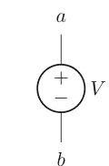

从该方程可知，电压源连接的两个节点将是接地节点和节点 $v_{in}$。让我们看看更一般的情况，即电压源位于两个节点 $a$ 和 $b$ 之间（见图 4.2）。我们可以用数学形式表示为

$$v_a - v_b = V$$

这是独立电压源的支路方程。特别要注意的是，电压源的电流并未出现在方程中。这是基于独立电压源可以提供任意大小/相位电流的假设；其阻抗为 0 欧姆。唯一的要求是节点 $a$ 和 $b$ 处所有其他电流的总和应大小相等、符号相反。换句话说，在节点 $a$，流入电压源的电流等于 $i_{v_s}$，而在节点 $b$，流出电压源的电流等于 $-i_{v_s}$。我们遵循的惯例是：流入器件的电流为正，流出器件的电流为负。

如果我们将此电流视为一个单独的矩阵项，则可以在节点 $a$ 处列出 KCL 方程：

$$\cdots + i_v + \cdots = 0 \qquad \text{节点 } a \text{ 处的 KCL}$$

对于节点 $b$：

$$\cdots - i_v + \cdots = 0 \qquad \text{节点 } b \text{ 处的 KCL}$$

顺便提一下，如果两个独立的电压源并联连接两个节点，如图 4.3 所示，会发生什么？由于电压源提供的电流仅由节点处的所有其他电流决定，因此很明显，这样的系统通常没有解。通常，仿真器会发出拓扑错误标志，并要求用户修正。

现在应该清楚，当读取网表时，电压源将具有以下特征：

图 4.3 两个并联的独立电压源

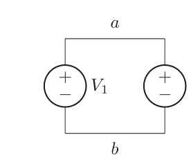

$$\begin{pmatrix} v_a & v_b & i_V \\ v_a & & -1 \\ v_b & & +1 \\ i_V & +1 & -1 \end{pmatrix} = \begin{pmatrix} V \end{pmatrix}$$ (4.24)

注意，电压源的值现在是方程右侧的一个项，电压 $V$ 被假定为已知。在我们的示例中，电压源连接在节点 $in$ 和接地节点（或零点）之间。因此，节点 $b$ 不存在，因为接地节点方程不会为系统增加任何新信息，故被忽略。

独立电压源的伪代码片段可以如下所示：

```
if DeviceType = 'Voltage Source':
    Matrix[DeviceBranchIndex][DeviceNode1Index] = 1
    Matrix[DeviceBranchIndex][DeviceNode2Index] = -1
    rhs[DeviceBranchIndex] = DeviceValue
// 这是支路方程行，由变量 DeviceBranchRow 指示，
// 列由 DeviceNode1Columns 和 DeviceNode2Column 变量设置
    Matrix[Nodes.index[DeviceNode1Index]][DeviceBranchIndex]=1
    Matrix[Nodes.index[DeviceNode2Index]][DeviceBranchIndex]=-1
// 这是两个 KCL 方程项
```

##### 独立电流源

独立电流源可以类似地处理。假设我们有一个电流源连接节点 $a$ 和 $b$，如图 4.4 所示。我们采用与独立电压源类似的推理，在节点 $a$ 得到：

$\cdots + i_A + \cdots = 0$ 节点 $a$ 处的 KCL

其中我们使用电流 $i_A = I$。同样对于节点 $b$：

图 4.4 一个独立电流源

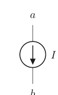

$\cdots - i_A + \cdots = 0$ 节点 $b$ 处的 KCL

对于电流方程本身：

$i_A = I$

矩阵特征将如下所示：

$$\begin{pmatrix} & v_a & v_b & i_A \\ v_a & & -1 & \\ v_b & & +1 & \\ i_A & & +1 & \end{pmatrix} \begin{pmatrix} \\ \\ \\ I \end{pmatrix} = \begin{pmatrix} \\ \\ \\ \end{pmatrix}$$ (4.25)

独立电流源的伪代码片段可以如下所示：

```
if DeviceType = 'Current Source':
    Matrix[DeviceBranchIndex][DeviceBranchIndex] = 1
    rhs[DeviceBranchIndex] = DeviceValue
// 这是支路方程行，由变量 DeviceBranchIndex 指示，
    Matrix[Nodes.index[DeviceNode1Index]][DeviceBranchIndex]=1
    Matrix[Nodes.index[DeviceNode2Index]][DeviceBranchIndex]=-1
// 这是两个 KCL 方程项
```

显然，我们可以直接消去电流行，然后得到：

$\text{LHS} = I$ 节点 $a$ 处的 KCL

对于节点 $b$：

$\text{LHS} = -I$ 节点 $b$ 处的 KCL

然后，当我们移除显式电流方程时，得到以下描述：

$$v_a \left( \quad \right) = \begin{pmatrix} -I \\ +I \end{pmatrix}$$

这些公式相当直观。从支路方程中，我们注意到输出节点之间的电压可以是任意值；它根本不进入方程。我们说电流源具有无限阻抗。输出节点之间的电压将完全由连接到节点的其他元件决定。类似于独立电压源的情况，我们这里不能将两个独立电流源堆叠在一起，因为要使这样的构造收敛，电流必须完全相同，因为输出阻抗是无限的。除非两个电流完全相同，否则仿真器通常会发出关于拓扑结构的抱怨。

#### 4.3.3.2 受控源

受控源稍微复杂一些，因为除了驱动端子外还有感测端子，我们将在此描述四种受控源中每一种的工作原理以及如何在矩阵公式中实现。我们将从压控源 VCVS 和 VCCS 开始，然后是流控源 CCVS 和 CCCS。

##### VCVS

电压控制电压源的简单示意图如图 4.5 所示。

VCVS 的感测端口 $s_1$、$s_2$ 不吸取电流。电流而是从器件的输出节点 $a$ 和 $b$ 流出。输出节点之间的电压与感测节点相比放大了 $k$ 倍。我们发现，对于新的方程组，节点 $a$ 和 $b$ 处的 KCL 与上一节中独立电压源的情况相同：

$$\cdots + i_v + \cdots = 0 \qquad \text{节点 } a \text{ 处的 KCL}$$

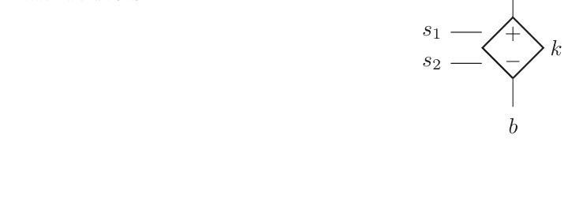

$\cdots - i_v + \cdots = 0$ 节点 $b$ 处的 KCL

VCVS 元件的支路方程现在为：

$v_a - v_b = k(v_{s1} - v_{s2})$

或等效地：

$v_a - v_b - k(v_{s1} - v_{s2}) = 0$

我们看到，与独立电压源一样，流经输出节点的电流可以取任意值。

现在清楚了，VCVS 具有如下矩阵所示的特征：

$$\begin{pmatrix} & v_a & v_b & v_{s1} & v_{s2} \\ v_a & & & & +1 \\ v_b & & & & -1 \\ \vdots & & & & \\ i_v & +1 & -1 & -k & +k \end{pmatrix}$$ (4.27)

与独立电压源相比，右侧没有项。行为由矩阵本身控制：

```
if DeviceType = 'VCVS':
    Matrix[DeviceBranchIndex][DeviceNode1Index]=1
    Matrix[DeviceBranchIndex][DeviceNode2Index]=-1
// 这是支路方程行，由变量 DeviceBranchRow 指示，
// 列由 DeviceNode1Columns 和 DeviceNode2Column 变量设置
    Matrix[DeviceBranchIndex][DeviceNode3Index]=DeviceValue
    Matrix[DeviceBranchIndex][DeviceNode4Index]=-DeviceValue
    Matrix[DeviceNode1Index][DeviceBranchIndex]=1
    Matrix[DeviceNode1Index][DeviceBranchIndex]=-1
// 这两行是 KCL 方程
```

##### VCCS

VCCS 是一种在给定输入电压下输出电流的器件。它可以被视为一个理想的跨导器。电子学中的大多数晶体管元件都可以被视为跨导器，因此该元件可用作理想晶体管。我们将在本章后面将其用作理想晶体管，并在第 5 章中将其用作非线性跨导器。在本节中，我们将研究假设输入感测端子和输出端子之间存在线性增益的方程：

图 4.6 一个包含 VCCS 的简单线性网络

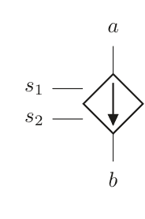

类似于 VCVS，我们在图 4.6 中找到了一个简单的实现。

这与我们刚刚看过的 VCVS 部分类似，但这里的结果是输出端子处的电流。为了捕捉这一点，我们需要添加两个方程：

$\cdots + i_G + \cdots = 0$ 节点 $a$ 处的 KCL

$\cdots - i_G + \cdots = 0$ 节点 $b$ 处的 KCL

该元件的支路方程现在为：

$i_G = G(v_{s1} - v_{s2})$ (4.28)

或等效地：

$i_G - G(v_{s1} - v_{s2}) = 0$ (4.29)

与之前一样，这可以直接纳入我们的矩阵描述。我们最终得到以下特征：

$\begin{pmatrix} & v_a & v_b & v_{s1} & v_{s2} & \cdots & i_G \\ v_a & & & & & & +1 \\ v_b & & & & & & -1 \\ \vdots & & & & & & \\ i_G & & & -G & +G & & -1 \end{pmatrix}$ (4.30)

我们看到，与 VCVS 一样，右侧矩阵中没有项。这反映了这些是受控源的事实。

由于与晶体管传递函数的相似性，我们将在本章的其余部分使用理想跨导器 VCCS 的几个版本。

VCCS 的代码片段可能如下所示：

## 4.3 矩阵方程

如果 DeviceType = 'VCCS'：
    Matrix[DeviceBranchIndex][DeviceNode3Index]=-DeviceValue
    Matrix[DeviceBranchIndex][DeviceNode4Index]=DeviceValue
    Matrix[DeviceBranchIndex][DeviceBranchIndex]=-1
// 这是支路方程行，由变量 DeviceBranchIndex 指示，
//
    Matrix[DeviceNode1Index][DeviceBranchIndex]=1
    Matrix[DeviceNode1Index][DeviceBranchIndex]=-1
// 这两行是节点1和节点2的KCL方程

##### CCVS

CCVS（电流控制电压源）的示例如图4.7所示。它感应通过某个元件（通常是电压源）的电流，并在输出端产生一个电压。就KCL而言，它看起来与我们已经研究过的电压源完全一样：

$\cdots + i_E + \cdots = 0$ &nbsp;&nbsp;&nbsp;&nbsp; 节点 $a$ 处的KCL

$\cdots - i_E + \cdots = 0$ &nbsp;&nbsp;&nbsp;&nbsp; 节点 $b$ 处的KCL

将电流与电压相关联的支路方程可以描述为

$v_a - v_b = E i_s$

我们再次看到这个方程不依赖于 $i_E$，因此电压源可以吸收任何电流。
这些方程我们可以轻松地纳入矩阵方程，得到以下特征：

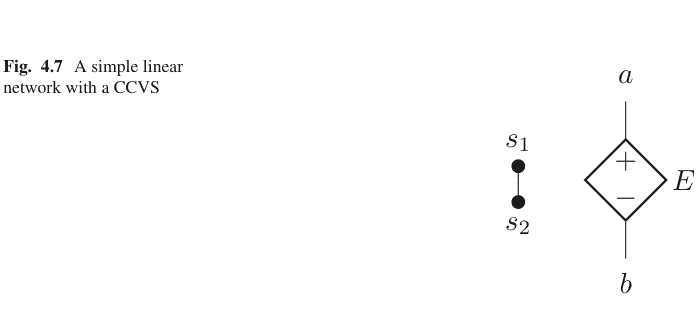

$$\begin{pmatrix} & v_a & v_b & & i_S & i_E \ v_a & & & & +1 & \ v_b & & & & -1 & \ i_S & & & & & \ i_E & +1 & -1 & & -E & \end{pmatrix}$$ (4.31)

它与我们之前介绍的受控源具有相似的结构。CCVS的代码片段可能如下所示

```
if DeviceType = 'CCVS':
    Matrix[DeviceBranchIndex][DeviceNode1Index]=1
    Matrix[DeviceBranchIndex][DeviceNode2Index]=-1
    Matrix[DeviceBranchIndex][DeviceSenseIndex]=-DeviceValue
// 这是支路方程行，由变量 DeviceBranchRow 指示，
// 列由两个器件节点和感应电流 iS 设置
//
    Matrix[DeviceNode1Index][DeviceBranchIndex]=1
    Matrix[DeviceNode2Index][DeviceBranchIndex]=-1
// 这两行是KCL方程
//
```

##### CCCS

最后一种受控源是CCCS（电流控制电流源）。它感应通过某个元件的电流，并在两个输出节点之间输出一个电流。我们将遵循与其他受控源相同的步骤，并得出一个简单的表达式来使用。让我们看看图4.8中CCCS的实现。与之前一样，我们可以将支路方程写为

$$A \cdot i_s = i_A$$

图4.8 一个包含CCCS的简单线性网络

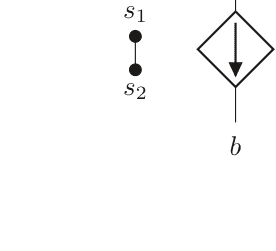

输出节点的电流遵循现在可识别的模式：

$\cdots + i_A + \cdots = 0$ &nbsp;&nbsp;&nbsp;&nbsp; 节点 $a$ 处的KCL

$\cdots - i_A + \cdots = 0$ &nbsp;&nbsp;&nbsp;&nbsp; 节点 $b$ 处的KCL

为了将其纳入我们的导纳描述，我们只需将矩阵特征写为

$$\begin{pmatrix} & v_a & v_b & i_S & i_A \ v_a & & & +1 & \ v_b & & & -1 & \ i_S & & & & \ i_A & & -A & 1 & \end{pmatrix} \quad (4.32)$$

我们在这里看到任何地方都没有出现电压。输出阻抗是无穷大的，该元件只是感应一个电流，这是一个0欧姆的输入。

CCCS的代码片段可能如下所示

```
if DeviceType = 'CCCS':
    Matrix[DeviceBranchIndex][DeviceSenseIndex]=-DeviceValue
    Matrix[DeviceBranchIndex][DeviceBranchIndex]=1
// 这是支路方程行，由变量 DeviceBranchIndex 指示，
// 列由两个器件节点和感应电流 iS 设置
//
    Matrix[DeviceNode1Index][DeviceBranchIndex]=1
    Matrix[DeviceNode2Index][DeviceBranchIndex]=-1
// 这两行是KCL方程
//
```

### 4.3.4 总结

无源和有源元件通过各种电压和电流之间非常简单的支路元件方程，以及KCL方程（其中器件产生的电流根据连接性进行加减）被纳入基本的导纳方程。独立电压源和电流源在矩阵方程的右侧也有条目。

## 4.4 矩阵构建：交流仿真

现在让我们看看如何将构建STA矩阵系统的此类代码组合起来。我们需要一个读取网表的代码，为简单起见，我们将使用SPICE3网表格式。让我们首先定义代码的环境。我们使用Python 3作为代码基础。Python是一个易于获取的代码库，由于其易用性和可用的代码，它可能是目前最流行的分析框架。我们用它来演示我们讨论的各种算法。关于基本的代码变量定义和网表语法，请参见附录A。

在下面的代码段中，我们有一个这样的Python实现：

```
Python code
#!/usr/bin/env python3
# -*- coding: utf-8 -*-
"""
Created on Thu Feb 28 22:33:04 2019

@author: mikael
"""
import numpy as np
import matplotlib.pyplot as plt
import analogdef as ana
#
# 初始化变量
#
MaxNumberOfDevices=100
DevType=[0*i for i in range(MaxNumberOfDevices)]
DevLabel=[0*i for i in range(MaxNumberOfDevices)]
DevNode1=[0*i for i in range(MaxNumberOfDevices)]
DevNode2=[0*i for i in range(MaxNumberOfDevices)]
DevNode3=[0*i for i in range(MaxNumberOfDevices)]
DevModel=[0*i for i in range(MaxNumberOfDevices)]
DevValue=[0*i for i in range(MaxNumberOfDevices)]
Nodes=[]
#
# 读取模型文件
#
modeldict=ana.readmodelfile('models.txt')
ICdict={}
Plotdict={}
Printdict={}
Optdict={}
#
# 读取网表
#
DeviceCount=ana.readnetlist('netlist_4p1.txt',modeldict,ICdict,
Plotdict,Printdict,Optdict,DevType,DevValue,DevLabel,DevNode1,Dev
Node2,DevNode3,DevModel,Nodes,MaxNumberOfDevices)
#
# 根据电路规模创建矩阵。我们没有实现严格的
改进节点分析法。我们保留所有电流
# 但继续将电压称为绝对电压。我们
相信这将使操作对用户更清晰。
#
MatrixSize=DeviceCount+len(Nodes)
#
# 支路方程的数量由器件数量给出
# KCL方程的数量由网表中的节点数量给出。
# 因此矩阵大小由DeviceCount和
len(Nodes)的和设定
#
STA_matrix=[[0 for i in range(MatrixSize)] for j in
range(MatrixSize)]
STA_rhs=[0 for i in range(MatrixSize)]
#
# 遍历所有器件，并根据特征创建矩阵/右端项
#
NumberOfNodes=len(Nodes)
for i in range(DeviceCount):
    if DevType[i]=='capacitor' or DevType[i]=='inductor':
        DevValue[i]*=(0+1j)
    STA_matrix[NumberOfNodes+i][NumberOfNodes+i]=-DevValue[i]
    if DevNode1[i] != '0' :
        STA_matrix[NumberOfNodes+i][Nodes.index(DevNode1[i])]=1
        STA_matrix[Nodes.index(DevNode1[i])][NumberOfNodes+i]=1
    if DevNode2[i] != '0' :
        STA_matrix[NumberOfNodes+i][Nodes.index(DevNode2[i])]=-1
        STA_matrix[Nodes.index(DevNode2[i])][NumberOfNodes+i]=-1
    if DevType[i]=='capacitor':
        STA_matrix[NumberOfNodes+i][NumberOfNodes+i]=1
        if DevNode1[i] != '0' : STA_matrix[NumberOfNodes+i][Nodes.
index(DevNode1[i])]=-DevValue[i]
        if DevNode2[i] != '0' : STA_matrix[NumberOfNodes+i][Nodes.
index(DevNode2[i])]=+DevValue[i]
    if DevType[i]=='VoltSource':
        STA_matrix[NumberOfNodes+i][NumberOfNodes+i]=0
        STA_rhs[NumberOfNodes+i]=DevValue[i]
#
# 遍历频率点
#
val=[0 for i in range(100)]
for iter in range(100):
    omega=iter*1e9*2*3.14159265
    for i in range(DeviceCount):
        if DevType[i]=='capacitor':
            if DevNode1[i] != '0' :
                STA_matrix[NumberOfNodes+i][Nodes.index(DevNode1[i])]=DevValue[i]*omega
            if DevNode2[i] != '0' :
                STA_matrix[NumberOfNodes+i][Nodes.index(DevNode2[i])]=-DevValue[i]*omega
        if DevType[i]=='inductor':
            STA_matrix[NumberOfNodes+i][NumberOfNodes+i]=DevValue[i]*omega
    STA_inv=np.linalg.inv(STA_matrix)
    sol=np.matmul(STA_inv,STA_rhs)
    val[iter]=abs(sol[2])
plt.plot(val)
End Python
```

### 代码 4-1

```
*
v1 in 0 1
vs vs 0 0
l1 in a 1e-9
r1 a b 100
c1 a b 1.2e-12
r2 b vs 230
netlist 4.1
```

代码中只有两个子电路调用（readnetlist和矩阵求逆器numpy.linalg.inv），其余部分由一个矩阵/右端项构建段和一个频率点循环组成。

验证
我们现在可以通过将仿真输出与使用网表4.1的相同电路（图4.9）的ngspice仿真进行比较来验证代码是否有效。我们发现一致性很好，最大误差小于0.001%。

简而言之，这就是仿真器的工作原理。这个特定的代码段处理交流分析，由于其定义上是线性的，并且在构建矩阵本身时工作点并不重要，因此它可能是最容易理解的实现。我们将在接下来的章节中扩展这一经验，展示如何设置线性瞬态仿真器，并在下一章中进而讨论更复杂的非线性元件情况。读者应该会欣赏到这个代码实现的简单性。毫无疑问，读者会怀疑实际实现会更复杂一些，事实也确实如此。例如，由于一切都是线性的，没有出现困难的导数算子，因此收敛性问题尚未出现。我们将在本章后面以及第5章中讨论如何处理此类情况。

这类求解器的核心是矩阵求逆器，这里我们使用的是Python内置的矩阵求逆器。这是一个通用的矩阵求逆器，旨在处理大多数实际情况。电路矩阵求逆器则更为专业，因此也快得多。此外，要构建一个“真实”的仿真器，还需要更高效的矩阵填充方法，而我们这里的示例只是为了展示此类仿真器的整体结构。目前有很多工作致力于提高这些数值系统的效率，感兴趣的读者可以参考文献[12-17]以获取更多细节。我们现在将继续讨论线性瞬态仿真。非线性讨论将在第5章中进行，届时我们还将讨论稳态实现。

**图4.10** 带有电阻/电容负载和源极跟随器输出级的简单跨导器

#### 具有线性晶体管的放大器

利用我们刚刚完成的分析，我们也可以研究包含线性“晶体管”的电路。此类器件可以使用我们在第3.3节中研究的压控电流源来描述。让我们看一下图4.10所示的简单放大器。

我们可以使用之前为压控电流源开发的代码片段，然后只需几行代码即可扩展交流仿真（参见第4.9.1节中的代码4.1）。让我们使用调整后的代码（第4.9.1节中的代码4.2）来仿真该电路。结果见图4.11。

```
netlist
vss vss 0 0
vdd vdd 0 0.9
vinp in1 0 1
vinn in2 0 1
r1 vdd inp 100
r2 inp vss 100
r3 vdd inn 100
r4 inn vss 100
r5 vdd outp 100
r6 vdd outn 100
c1 in1 inp 1e-12
c2 in2 inn 1e-12
i1 vs vss 1e-3
m1 outn inp vs nch1
m2 outp inn vs nch1
m3 vdd outp op nch
i2 op vss 1e-3
c3 op vss 1e-13
netlist 4.2
```

我们可以清楚地看到系统中的零点和极点响应。也可以与精确计算进行比较，以确信这是一个正确的结果。输入电压由输入端的高通滤波器设定：

$$v_i = v_{in} \frac{R/2}{R/2 + 1/(j\omega C)} = v_{in} \frac{j\omega CR}{j\omega CR + 2}$$

该电压在输出端被放大为

$$v_o = v_i g_m R$$

最终到输出的传递函数现在是一个简单的代数计算：

$$v_{out} = v_o \frac{g_{m,2}}{g_{m,2} + j\omega C}$$

最终我们得到

$$v_{out} = v_{in} \frac{j\omega CR^2 g_m}{j\omega CR + 2} \frac{g_{m,2}}{g_{m,2} + j\omega C}$$

其幅度为

$$|v_{out}| = v_{in} \frac{\omega CR^2}{\sqrt{(\omega CR)^2 + 4}} \frac{g_m}{\sqrt{(\omega C / g_{m,2})^2 + 1}}$$

该响应也包含在图4.11中。两种解法重合，最大相对误差为0.0004%。

我们将在第4.4节的剩余部分介绍一系列交流分析的应用。一旦知道了电路的线性响应，就可以了解其小信号行为的许多方面，这对电路设计者非常有用。所有这些额外的仿真技术都使用我们刚刚描述的交流公式。电路的线性响应非常重要，这就是为什么开发了所有这些额外的表征方法。

图4.11 具有线性晶体管的两级放大器的交流仿真

### 4.4.1 噪声分析

噪声分析传统上是一种类似交流的分析，因为噪声电压通常很小（例如在振荡器中存在一些例外）。用户需要定义输出节点，仿真器在器件所在位置添加噪声源，并仿真每个组件到输出的增益作为频率的函数。各种器件的噪声模型复杂程度不同，取决于器件的复杂性。例如，电阻的噪声通常建模为与电阻并联的电流源，其值为：

$$<i_{n,res}>^2 = \frac{4kT}{R} \left[ \frac{A^2}{Hz} \right] \quad (4.33)$$

其中<>表示时间上的均方根值。当然，也可以将其建模为与电阻串联的噪声电压。如今，有源器件（如场效应管、双极结型晶体管和二极管）的噪声模型与早期的工作相比要复杂得多，我们在第3章的建模部分简要提到了这些。可以用以下伪代码总结噪声仿真：

```
Subroutine noise_sim(Devices, OutputNode)
NoisePower=0
Foreach Device
Pwr=Integrate(Simulate_AC(Device, OutputNode) ^2,MinFreq,MaxFreq)
    NoisePower+= Pwr
End Subroutine noise_sim
```

让我们在Python中实现这个算法，首先在一个我们知道结果的简单测试案例上应用，然后在一个更大的电路上运行它，以了解其工作原理（参见第4.9.2节）。

我们将在图4.12所示的简单网络上运行此代码。
由于两个电阻的噪声不相关，它们的噪声功率将相加。计算方法有很多，但这里我们假设电阻两端存在噪声电流，并计算从该噪声电流到输出的噪声传递。我们得到$R_1$的噪声贡献为

$$v_{o1} = i_{n1} \frac{j\omega C R_2 R_1}{j\omega C(R_1 + R_2) - \omega^2 C^2 R_1 R_2}$$

同样对于$R_2$，

$$v_{o2} = i_{n2} \frac{j\omega C R_2 R_1}{j\omega C(R_1 + R_2) - \omega^2 C^2 R_1 R_2}$$

两个噪声电压平方的和为

$$v_o^2 = (i_{n1}^2 + i_{n2}^2) \frac{(\omega C R_2 R_1)^2}{[\omega C(R_1 + R_2)]^2 + [\omega^2 C^2 R_1 R_2]^2} \quad (4.34)$$

我们可以使用以下网表仿真相同的电路：

```
*
Vin in vss 1
R1 out in  50
R2 out vss 50
C1 out vss 50
vss vss 0 0
Netlist 4p3
```

我们在图4.13中看到结果。
仿真的最大误差为0.17%。
然后让我们将其应用于一个更大的网络，并与图4.14中的ngspice仿真进行比较。

4.4 矩阵构建：交流仿真

87

图4.12 一个简单的噪声传递电路

图4.13 图4.12中网络的Python解与精确解的比较。两种解重合

图4.14 用于噪声仿真的更大测试网络

网表是

```
*
vdd in 0 1
vss vss 0 0
r1 in a 100
r2 a vss 50
c1 a vss 1e-12
l1 a b 1e-9
r3 b c 10
r4 c out 100
c2 c out 1e-13
c3 out vss 1e-11
netlist 4p4
```

结果比较显示在图4.15中。

我们在这里看到与SPICE仿真器有类似的良好相关性。最大误差约为0.07%。

将噪声分析作为交流仿真的局限性在于，它是在直流工作点附近线性化的电路上执行的。混频器、开关电容、采样保持、ADC、DAC和振荡器的噪声性能无法使用此类噪声分析准确预测。它完全忽略了混频效应，其中噪声源可能由于非线性乘法而在频率上被倍增。考虑图4.16，我们将压控振荡器建模为具有LC负载的交叉耦合对。有源级的输出电流将

图4.15 噪声仿真的Python与SPICE比较

## 4.4 矩阵构建：交流仿真

图 4.16 带有噪声电流源的简单压控振荡器模型

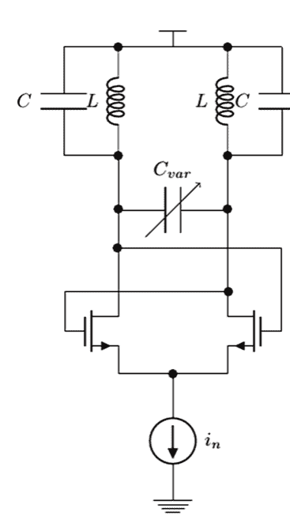

电流源的噪声与振荡频率有关。假设电流源在频率 $f_n$ 处有一个噪声源，而振荡器的振荡频率为 $f$。那么，来自电流源的噪声电流为：

$i_n = A \sin 2\pi f_n t$ (4.35)

振荡器可以建模为

$i_{osc} = B \sin 2\pi f t$ (4.36)

输出电流是两者的乘积：

$i_{out} = i_{osc} i_n = \frac{AB}{2} (\cos 2\pi (f - f_n)t - \cos 2\pi (f + f_n)t)$ (4.37)

噪声电流在振荡器频率周围产生了两个边带。现在想象噪声源有一个 1/f 噪声分量。这个直流噪声将出现在振荡器信号周围（由于振荡器谐振回路的响应，它通常看起来像 1/f^3）。这种现象称为相位噪声，传统的噪声分析无法捕捉到它。相反，需要周期性噪声分析，我们将在第 5.5.4 节讨论。

即使是像放大器这样更简单的系统，噪声分析背后的假设也不正确。想象一个由于非线性而产生谐波的系统。类似的计算将表明，振荡器中发生的那种混频现象在放大器中同样会发生。

### 4.4.2 稳定性分析

稳定性分析通常应用于需要回答相位裕度和增益裕度等问题的电路环路。稳定性理论在其他地方有深入讨论，这里我们只提供一个简短的总结，以提醒读者。

**稳定性理论简要回顾**

基本上，如果满足巴克豪森准则，环路将会振荡：

> **巴克豪森准则** 如果环路的增益大于一且相移为 360 度，系统将会振荡。

这个准则当然很有帮助，但它没有说明裕度或系统可能接近振荡的程度。从某种意义上说，需要“远离”振荡点，而这需要量化。最通用的稳定性理论是例如在 [18–20] 中讨论的，通常称为奈奎斯特稳定性判据。在大多数情况下，该理论可以简化为增益裕度和相位裕度的概念。讨论的关键是需要将系统环路断开，并在开环上进行分析，其中开环增益和相移被模拟（通常在交流仿真中）并绘制为频率的函数。

从数学上讲，相位裕度的概念可以用复数传递函数来研究（参见 [20, 23]）。

**稳定性仿真的数值算法**

我们尝试用现在可用的复杂模型构建的任何现代电路都有大量的极点和零点，试图进行完整的数学分析是不可能的，因此需要稳定性分析工具。加州理工学院的 Middlebrook 教授在 1975 年发表了一篇著名的论文 [21]，其中他描述了一种模拟稳定性的通用算法。它涉及对电路进行偏置、断开环路并执行两次交流仿真。在大多数情况下它效果非常好，我们将在下面首先讨论它。一个更通用的、现在更常用的方法可以在 [22] 中找到。我们将通过首先讨论 Middlebrook 的分析然后将其推广来简要回顾该理论。

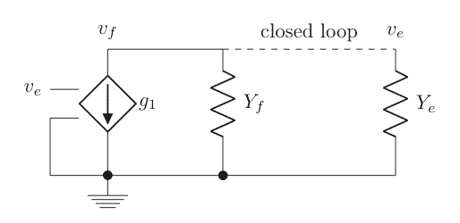

**图 4.17** 建模为单端口系统的环路

#### Middlebrook 稳定性分析

对于环路稳定性，让我们首先按照 [21] 中的描述进行讨论。这是关于线性环路增益的最早的理论讨论之一，并且多年来一直作为稳定性仿真的基础。基本思想是使用注入法，以便能够在任何点断开环路。

让我们看图 4.17。环路被断开，一端有一个具有特定导纳的驱动源，另一端有一个负载导纳。我们按照 [22] 中的符号，根据基尔霍夫电流定律得到：

$$g_1 v_e + v_f (Y_e + Y_f) = 0$$

或者，定义环路增益

$$T = -\frac{v_f}{v_e} = \frac{g_1}{(Y_e + Y_f)}$$

现在执行电压和电流注入，以使前向电流为零。然后我们得到

$$g_1 v_e + v_f Y_f = 0$$

零电流比为

$$T_n^i = -\frac{v_f}{v_e} = \frac{g_1}{Y_f}$$

在下一次仿真中，我们提供电压和电流注入，使得前向电压降为零：

$$-i_f Y_e = g_1 i_e$$

或

$$-\frac{i_f}{i_e} = \frac{g_1}{Y_e}$$

我们得到所谓的零电压增益：

$$T_n^v = -\frac{i_f}{i_e} = \frac{g_1}{Y_e}$$

由此我们现在得到

$$T = \frac{T_n^v T_n^i}{T_n^v + T_n^i}$$

这项技术已被广泛使用，Middlebrook 这个名字有时被用作动词“Middlebrook the loop”（对环路进行 Middlebrook 分析）。

#### 广义 Middlebrook 稳定性分析

上一节中的 Middlebrook 分析在信号流方向方面存在缺点。只有一个电流源，并且假设信号只沿一个方向流动。这种近似对于低频应用通常足够。然而，对于较高频率，可能存在反向环路流 [22]。然后我们可以将这个概念推广到图 4.18 中的模型。这里，使用与 [22] 相同的符号，我们发现环路增益由下式给出

$$T = \frac{g_1 + g_2}{Y_e + Y_f}$$

现在想象我们在环路断点处同时注入电流和电压。由此产生的参数 $v_f$、$i_e$ 可以使用网络 ABCD 方法推导：

$$\begin{pmatrix} i_f \\ v_e \end{pmatrix} = \begin{pmatrix} A & B \\ C & D \end{pmatrix} \begin{pmatrix} i_{inj} \\ v_{inj} \end{pmatrix}$$

其中显然

$$B = i_f \big|_{i_{inj}=0, v_{inj}=1} \quad D = v_e \big|_{i_{inj}=0, v_{inj}=1}$$

$$A = i_f \big|_{i_{inj}=1, v_{inj}=0} \quad C = v_e \big|_{i_{inj}=1, v_{inj}=0}$$

我们现在只需要将 ABCD 参数与 $g_1$、$g_2$、$Y_e$、$Y_f$ 联系起来，就可以计算环路增益。我们从环路方程得到

$$-Y_e v_e + i_{inj} + i_f - g_2 (v_e - v_{inj}) = 0$$

$$g_1 v_e + i_f + Y_f (v_e - v_{inj}) = 0$$

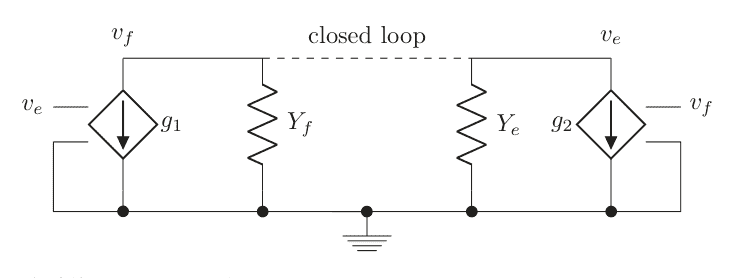

我们现在可以从这两个关系中识别出 ABCD 变量，我们得到

$$A = \frac{-g_1 - Y_f}{g_1 + g_2 + Y_f + Y_e}$$

$$B = \frac{-g_1 g_2 + Y_f Y_e}{g_1 + g_2 + Y_f + Y_e}$$

$$C = \frac{1}{g_1 + g_2 + Y_f + Y_e}$$

$$D = \frac{g_2 + Y_f}{g_1 + g_2 + Y_f + Y_e}$$

然后我们得到

$$g_1 = \frac{AD - BC - A}{C}$$

$$g_2 = \frac{AD - BC + D}{C}$$

$$Y_f = \frac{BC - AD}{C}$$

$$Y_e = \frac{1 - AD + BC + A - D}{C}$$

对于环路增益，

$$T = \frac{2(AD - BC) - A + D}{2(BC - AD) + A - D + 1}$$

我们可以通过设置 $g_2 = 0$ 来恢复原始的 Middlebrook 结果。然后我们得到

$$T_{forward} = \frac{AD - BC - A}{2(BC - AD) + A - D + 1}$$

现在的步骤是：

- 对电路进行直流偏置。
- 在某处断开环路。
- 插入一个串联电压源。
- 运行交流仿真。
- 记录 $v_f$、$i_e$。
- 插入一个并联电流源。
- 运行交流仿真。
- 记录 $v_f$、$i_e$。
- 计算开环增益。

为了更好地理解这是如何工作的，让我们使用图 4.19 中的简单示例，我们可以手动进行此计算，然后与 Python 实现进行比较。注入电流的方向如图所示，电压也类似。为简单起见，我们还假设输出电容为零，这样计算会更顺畅一些。晶体管增益对的输入阻抗是无穷大，因此没有电流从那个方向流入。我们得到

$$B = i_f|_{v=1, i=0} = 0$$

现在对于电压响应 $D = v_e|_{v=1, i=0}$，我们需要计算它。我们发现在晶体管栅极的输入处，$v_e = v_f + v$，并且由于跟随器由理想电流源偏置，我们得到以下环路方程：

$$\frac{(v_f + v)g_m}{2} Z_L = v_f \rightarrow v_f \left(1 - \frac{g_m Z_L}{2}\right) = v \frac{g_m Z_L}{2}$$

然后我们看到

$$D = v_e = v_f + v = v \left( \frac{g_m Z_L}{2 - g_m Z_L} + 1 \right) = v \left( \frac{2}{2 - g_m Z_L} \right)$$

其余参数现在为

$$A = i_f|_{v=0, i=1} = -1$$

$$C = v_e|_{v=0, i=1}$$

实际上，由于 $B = 0$，$C$ 不起作用。我们得到

$$T = \frac{2(AD - BC) - A + D}{2(BC - AD) + A - D + 1} = \frac{-D + 1}{D} = \frac{-\left( \frac{2}{2 - g_m Z_L} \right) + 1}{\left( \frac{2}{2 - g_m Z_L} \right)} = \frac{-2 + 2 - g_m Z_L}{2} = -\frac{g_m Z_L}{2}$$

## 4.4 矩阵构建：交流仿真

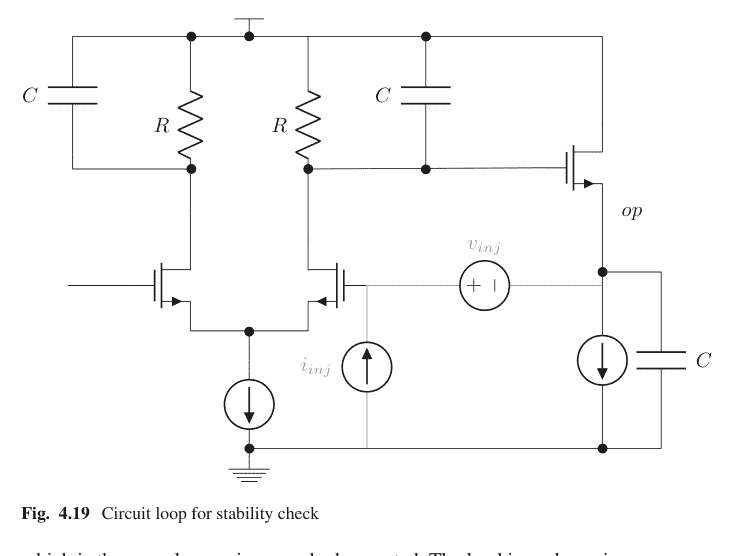

图 4.19 用于稳定性检查的电路环路

这正如我们所预期的开环增益。负载阻抗为

$$Z_L = \frac{R_L}{R_L j\omega C_L + 1}$$

接下来，展示增益和相位裕度就变得直接了当。
我们可以在 Python 代码中实现基本算法：
**代码 4p4**
我们可以将此代码应用于图 4.19 中的电路，以验证我们的估算分析是否正确。网表如下

```
*
  *
vdd vdd 0 0
vss vss 0 0
vinp inp 0 1
* stab
* probes
istab vss inn 0
vstab inn op 0
r5 vdd outp 1000
r6 vdd outn 1000
c1 vdd outp 1e-12
c2 vdd outn 1e-12
i1 vs vss 0
m1 outn inp vs nch
m2 outp inn vs nch
m3 vdd outp op nch
i2 op vss 0
c3 op vss 1.5e-12
*
```

**网表 4p5**

我们得到的增益和相位响应如图 4.20 所示。
此代码在原理上易于实现，但需注意电流和电压的符号。这些量的方向对于获得正确的响应至关重要。
请注意，这是一种线性响应分析，存在局限性。在实际应用中，通常还应在闭环时用阶跃函数激励电路，以观察是否存在任何振铃现象。由此可以研究导致不稳定的非线性效应。

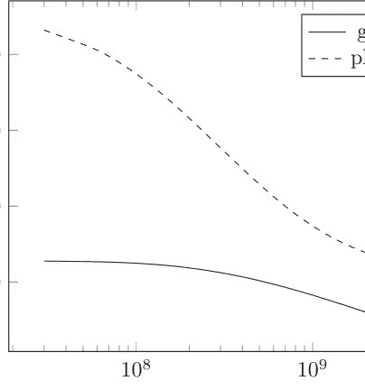

**图 4.20** 仿真结果与精确结果的增益和相位响应对比。第二个极点被特意设置在第一个极点的单位增益频率处。这使得在单位增益频率处大约有 45 度的相位裕度。

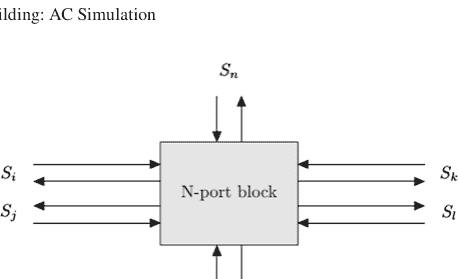

图 4.21 具有多个输入/输出端口的通用系统 © [2019] 剑桥大学出版社。经许可转载。

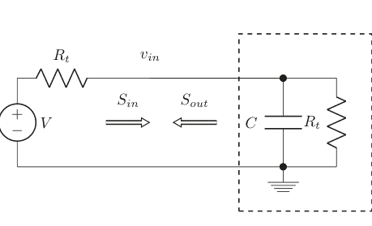

图 4.22 S11 的示意性测试设置

### 4.4.3 S 参数分析

交流分析的另一个现代应用是 S 参数仿真。S 参数是给定电路的线性响应，因此交流仿真非常适用。S 参数分析背后的基本思想是，所有源和汇都具有特定的端接阻抗（在许多情况下，这只是 50 欧姆的实阻抗）。S 参数响应即为端口之间的增益（图 4.21）。

端口 $i, j$ 之间的增益记为 $S_{ji}$，其中 $j$ 索引表示输出端口，$i$ 索引表示输入端口。$S_{21}$ 即为端口 $1 \rightarrow 2$ 之间的增益。这个增益与所有端口都端接的电路的交流增益相同。唯一可能引起混淆的是同端口增益，如 $S_{11}$（图 4.22）。可以证明（参见 [23, 24]），

$$S11 = \frac{S_{out}}{S_{in}} = \frac{Z - R_t}{Z + R_t}$$ (4.38)

其中 $Z$ 是向端口看进去的阻抗，$R_t$ 是端接电阻。输入阻抗定义为输入节点电压 $v_{in}$ 除以流入输入的电流 $i_{in}$。我们得到

$$v_{in} = \frac{Z}{R_t + Z}V \quad v_{R_t} = \frac{R_t}{R_t + Z}V$$ (4.39)

由此可得

$$S11 = \frac{v_{in} - v_{R_t}}{V} = \frac{v_{in} - (V - v_{in})}{V} = \frac{2v_{in} - V}{V} = \frac{v_{in} - V/2}{V/2}$$ (4.40)

按照惯例，通常使用 $V = 2 + j * 0$，即电压源上的实电压。

将 $S_{11}$ 作为交流仿真来模拟，只需在输入信号电压源串联一个电阻，例如 50 欧姆。在端接电阻*之后*测量交流响应，减去 1，然后取复数幅度，即可完成：

$$S_{11} = 20 \log(|v_{in} - 1|)$$ (4.41)

S21 更容易理解（见图 4.23）。它只是一个所有端口都端接 50 欧姆到地的交流仿真。仍然使用驱动电压源幅度为 $V = 2$ 的惯例，我们发现输入电压约为 1。输出端口的交流幅度直接给出前向增益：

$$S_{21} = 20 \log|v_{out}|$$ (4.42)

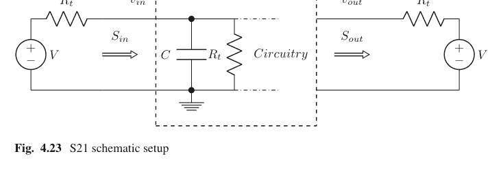

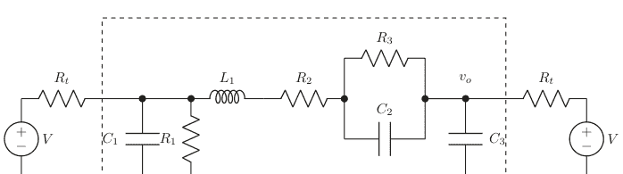

图 4.24 用于 S 参数分析的示意网络

这在 Python 中易于实现：
**代码 4p5**
让我们对图 4.24 中的电路进行 S 参数分析。我们有以下网表

```
*
vp1 p1 0 0
vss vss 0 0
r1 p1 in 50
r2 in vss 50
c1 in vss 1e-12
l1 in b 1e-9
r3 b c 10
r4 c out 100
c2 c out 1e-13
c3 out vss 1e-11
r5 out p2 50
vp2 p2 vss 0
**netlist 4p6**
```

结果如图 4.25 所示。

### 4.4.4 传递函数分析

传递函数分析类似于交流仿真，因为它模拟输入和输出之间的增益（或传递函数）。传递函数分析的优势在于，它计算从独立源等输入到单个输出的增益。通过这种方式，增益、PSRR 等特性可以通过一次仿真获得。在 SPICE 的早期，这种分析执行的是在指定输入源和输出节点之间的直流线性化传递。它也经常提供输入和输出电阻。在现代实现中，可以进行更广泛的研究。这与交流分析形成对比，交流分析中电路有一个（或几个）激励，你想找出它对电路各部分的影响；输出点的数量大于输入或激励点的数量。通过传递函数分析，你可以计算从多个起点到单个（或几个）输出的响应；输入的数量大于输出的数量。这在 Python 中易于实现，我们留给读者自行探索。

### 4.4.5 灵敏度分析

灵敏度分析是交流分析的另一个非常方便的分支。该分析列出了用户定义的输出对一组同样由用户定义的输入的灵敏度。现代实现也使用直流仿真，如工作点分析来模拟灵敏度，如图 4.26 所示。我们将在此跳过具体的 Python 实现，留给读者作为练习。

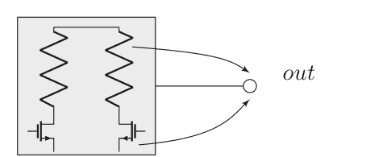

图 4.26 该图表明各种参数如何以不同方式影响“输出”。灵敏度分析选项可以通过交流分析仿真来量化这一点。

### 4.4.6 特殊情况：需要注意的问题

我们曾指出，不可能实现一个电感器并消除其电流方程，因为其阻抗为零，导致在有限、非零的电压下通过它的电流为无穷大。对于 0 欧姆的电阻也是如此。此类器件必须作为显式电流器件来处理。否则，很明显矩阵元素将变得无穷大且定义不良。复杂的仿真器会检测到此问题并采取预防措施，但读者需注意。另一个更微妙的问题出现在我们有一个具有理想 LC 的 LC 谐振器时。这样的串联组合将在谐振时产生 0 欧姆的阻抗。让我们研究一下会发生什么。

**理想 LC 谐振器**

应该相当明显的是，除非我们恰好命中谐振点（此时串联组合的阻抗为零），否则算法将正常工作。而在不太可能的情况下，如果我们恰好命中谐振点，矩阵将如预期那样变为奇异。防止这种情况的保证是在电感器上串联一个非零欧姆的电阻。

**浮空元件**

在实践中，通常所有元件并非都与其他元件连接；它们是浮空的。这种情况下的矩阵将是非奇异的，因为此类元件端子上的电压是完全不确定的；任何值都可以。仿真器应如何处理这个问题？传统的解决方案是从所有节点添加一个电阻和电容到地，电阻值为 $1/g_{min}$，其中 $g_{min}$ 是一个可以由用户更改的仿真器变量。此外，通常在每个节点定义一个最小电容 $c_{min}$，以降低节点的带宽。更详细的讨论见第 5.2 节。

## 4.5 直流线性仿真

线性系统的直流求解与交流求解一样直接。所有电感器短路，电容器移除。实际上，我们只剩下线性电阻和直流源。我们可以采用前面的例子，看看它如何

## 4.6 瞬态线性仿真

一旦我们获得了直流解，就可以开始瞬态或时域仿真。这种仿真在数学上被称为初值问题。在瞬态分析中，初始值在某个时刻是已知的（时间零点通常是一个方便的选择），仿真从该时刻向后推进。本节将描述如何实现这种仿真，并展示微分方程的不同实现方式如何导致解的不同特性。与之前一样，我们将使用Python环境来构建仿真，但鼓励读者同时使用自己熟悉的仿真器来验证各种概念。本节我们将坚持使用线性元件。作为示例，我们将再次使用图4.1，但这次我们将观察时域中的解。

瞬态仿真的关键在于实现一个方便的差分方程来近似微分方程。以下各节将以图4.1中的电路为基础，讨论最常见的差分方程近似方法。这些近似方法的主要困难之一是由此产生的所谓局部截断误差（LTE），我们将在第4.6.6节中研究这种影响以及电路仿真器通常如何处理它。最后，我们将通过观察理想LC谐振器来结束关于瞬态线性仿真的讨论，并看看不同的积分方法在这种情况下如何表现。

### 时间步长调整

如何实现可变时间步长是众所周知的，我们将在第5章中展示这样的实现，但在本章中，我们将坚持使用固定时间步长。我们将在第5章讨论的非线性电路将从可变时间步长中获益更多，我们将在那里进行演示。这里的流程是首先选择一个时间步长，运行仿真并观察行为。在讨论LTE估计之后，我们将直接运行仿真，如果在某个时间点不满足LTE误差条件，我们将调整时间步长并重新运行整个仿真。固定时间步长的好处是所有差分方程中的误差都得到更好的控制。在实际电路情况中采用这种策略并不少见，可以将最大时间步长变量设置为某个小值，以确保仿真器采用的时间步长是均匀的。这通常会提高精度，我们将在第5章中看到这一点。

### 4.6.1 前向欧拉法

前向欧拉法是最简单的实现，也是开始讨论最容易的方法。由于稳定性差，它在电路仿真器中几乎从不使用，但它作为讨论的起点非常合适。让我们从微分方程的角度来看一个电容器：

$$i(t) = C \frac{du(t)}{dt}$$

其中 $u(t)$ 是电容器两端的电压，$i(t)$ 是在时间 $t$ 流过它的电流。为了找到数值实现，我们假设在时间 $t = t_n$ 时已知解，并且我们想知道在 $t = t_{n+1}$ 时的解。使用前向欧拉实现，我们发现如第1章所述

$$i(t_n) = C \frac{u(t_{n+1}) - u(t_n)}{\Delta t} \rightarrow u(t_{n+1}) = u(t_n) + \Delta t \frac{i(t_n)}{C} \quad (4.46)$$

注意，右侧的所有量都是已知的。该方程表明，电容器上的新电压由其旧电压加上另一个已知项决定。它看起来像一个独立的电压源。我们已经从第3.3节知道了这种电压源的矩阵方程形式。我们得到的方程在电容器两端的电压 $u(t)$ 方面有点简化，我们需要将其展开。我们假设电容器位于两个节点 $a$ 和 $b$ 之间，并且我们得到 $u(t) = v_a(t) - v_b(t)$。

$$\begin{pmatrix} & v_a & v_b & i_V \\ v_a & & & -1 \\ v_b & & & +1 \\ i_V & +1 & -1 & \end{pmatrix} = \begin{pmatrix} \ \ \ v_a(t_n) - v_b(t_n) + \Delta t \frac{i_V(t_n)}{C} \end{pmatrix} \quad (4.47)$$

伪代码可能如下所示

```
if DeviceType = 'Capacitor':
    Matrix[DeviceBranchIndex][DeviceNode1Index] = 1
    Matrix[DeviceBranchIndex][DeviceNode2Index] = -1
    rhs[DeviceBranchIndex] = V[DeviceNode1Index]-V[DeviceNode2Index]+deltaT*I[DeviceBranchIndex]/DeviceValue
    // This is the branch equation row, indicated by the variable DeviceBranchRow,
    // The columns are set by the DeviceNode1Columns and DeviceNode2Column variables
    Matrix[Nodes.index[DeviceNode1Index]][DeviceBranchIndex] = 1
    Matrix[Nodes.index[DeviceNode2Index]][DeviceBranchIndex] = -1
    // These are the two KCL equation entries
```

同样地，观察一个电感器，我们得到

$$u(t) = L \frac{di(t)}{dt}$$

使用前向欧拉实现，我们发现

$$u(t_n) = L \frac{i(t_{n+1}) - i(t_n)}{\Delta t} \rightarrow i(t_{n+1}) = i(t_n) + \Delta t \frac{u(t_n)}{L}$$

这看起来像一个独立的电流源，电感器的实现将具有如下矩阵方程形式

$$\begin{pmatrix} & v_a & v_b & i_L \\ v_a & & -1 & \\ v_b & & +1 & \\ i_L & & & 1 \end{pmatrix} = \begin{pmatrix} \ \ \ i_L(t_n) + \Delta t \frac{v_a(t_n) - v_b(t_n)}{L} \end{pmatrix}$$

其中我们已经展开了电感器两端的电压 $u(t) = v_a(t) - v_b(t)$。

```
if DeviceType = 'Inductor':
    Matrix[DeviceBranchIndex][DeviceBranchIndex] = 1
    rhs[DeviceBranchIndex] = I[DeviceBranchIndex]+deltaT* (V[DeviceNode1]-V[DeviceNode2])/DeviceValue
    // This is the branch equation row, indicated by the variable DeviceBranchIndex,
    Matrix[Nodes.index[DeviceNode1Index]][DeviceBranchIndex]=1
    Matrix[Nodes.index[DeviceNode2Index]][DeviceBranchIndex]=-1
    // These are the two KCL equation entries
```

#### 仿真

我们已经构建了一种使用欧拉前向方法实现电容器和电感器的方法。电阻器的实现与我们在第3.1节中的一样。我们现在可以构建一个简单的仿真器代码，其中时间步长是常数，我们仿真到一个停止时间（参见第4.9.5节）。

```
*
v1 in 0 sin(1G)
vs vs 0 0
l1 in a 1e-9
r1 a b 100
c1 a b 1.2e-12
r2 b vs 230
netlist 4.7
```

让我们使用网表4.7运行这段代码，选择几个不同的时间步长。让我们尝试 deltaT = 1 ps, 10 ps, 100 ps。结果显示在图4.28中。

发生了什么？似乎为了得到任何合理的结果，我们需要取非常小的时间步长。正如读者可能已经猜到的，这就是臭名昭著的前向欧拉方法的不稳定性。所需的时间步长由最小的电容器决定，你可以想象在实际的电路实现中，存在大量非常小的电容器，这在实践中使用起来有多困难。从根本上说，这就是这种方法从未被使用的原因。仿真基本电路将花费永远的时间。我们需要想出更好的方法，下一节将会这样做。

**图4.28** 时间步长为 **(a)** 1 ps, **(b)** 10 ps, **(c)** 100 ps 的前向欧拉仿真

### 4.6.2 后向欧拉法

正如我们所看到的，前向欧拉实现相当简单。使用该方法的缺点是其稳定性差。我们在上一节中看到，为了取得任何进展，我们需要取小的时间步长。后向欧拉法稍微复杂一些，正如我们现在将要展示的，但它要稳定得多。

让我们从使用后向欧拉法的电容器差分方程实现开始：

$$i(t_{n+1}) = C \frac{u(t_{n+1}) - u(t_n)}{\Delta t} \rightarrow u(t_{n+1}) = u(t_n) + \Delta t \frac{i(t_{n+1})}{C} \quad (4.51)$$

该方程的右侧依赖于新的时间步长，因此矩阵形式会更复杂，但让我们将其表示为电流源的形式，以便我们可以像在电感器讨论中发现的那样最小化矩阵的大小：

$$i(t_{n+1}) = \frac{C}{\Delta t} (v_a(t_{n+1}) - v_b(t_{n+1})) - \frac{C}{\Delta t} (v_a(t_n) - v_b(t_n)) \quad (4.52)$$

矩阵方程现在变为

$$\begin{pmatrix} & v_a & v_b & i_C \\ v_a & & & 1 \\ v_b & & & -1 \\ i_C & -\frac{C}{\Delta t} & \frac{C}{\Delta t} & 1 \end{pmatrix} = \begin{pmatrix} \ \ \ -\frac{C}{\Delta t} (v_a(t_n) - v_b(t_n)) \end{pmatrix} \quad (4.53)$$

伪代码将如下所示

```
if DeviceType = 'Capacitor':
    Matrix[DeviceBranchIndex][DeviceNode1Index] = 1
    Matrix[DeviceBranchIndex][DeviceNode2Index] = -1
    rhs[DeviceBranchIndex] = V[DeviceNode1Index]-V[DeviceNode2Index]+deltaT*I[DeviceBranchIndex]/DeviceValue
    // This is the branch equation row, indicated by the variable DeviceBranchRow,
    // The columns are set by the DeviceNode1Columns and DeviceNode2Column variables
    Matrix[Nodes.index[DeviceNode1Index]][DeviceBranchIndex] = 1
    Matrix[Nodes.index[DeviceNode2Index]][DeviceBranchIndex] = -1
    // These are the two KCL equation entries
```

同样地，对于电感器，我们使用后向欧拉法得到

$$u(t_{n+1}) = L \frac{i(t_{n+1}) - i(t_n)}{\Delta t} \rightarrow i(t_{n+1}) = i(t_n) + \Delta t \frac{u(t_{n+1})}{L} \quad (4.54)$$

其矩阵实现形式为

$$\begin{pmatrix} & v_a & v_b \\ v_a & & 1 \\ v_b & & -1 \\ i_L & -\frac{\Delta t}{L} & \frac{\Delta t}{L} & 1 \end{pmatrix} = \begin{pmatrix} \ \ \ i_L(t_n) \end{pmatrix} \quad (4.55)$$

示例代码

```
if DeviceType = 'Inductor':
    Matrix[DeviceBranchIndex][DeviceBranchIndex] = 1
    rhs[DeviceBranchIndex] = I[DeviceBranchIndex]+deltaT* (V[DeviceNode1]-V[DeviceNode2])/DeviceValue
    // This is the branch equation row, indicated by the variable DeviceBranchIndex,
    Matrix[Nodes.index[DeviceNode1Index]][DeviceBranchIndex]=1
    Matrix[Nodes.index[DeviceNode2Index]][DeviceBranchIndex]=-1
    // These are the two KCL equation entries
```

#### 仿真

我们可以直接修改系统构建例程（第4.9.6节），并查看图4.29中对网表4.7进行仿真的结果。
与之前的主要区别在于算法的稳定性。我们可以采用更大的时间步长并获得准确的结果。后向欧拉法甚至在常规仿真设置中也经常被使用，特别是在所谓的断点附近，我们将在第5.4.5节更详细地讨论这一点。

### 4.6.3 梯形法

我们在上一节讨论的欧拉方法，如第2章所述，具有一阶精度。更常见的积分方法具有二阶精度，在本节中，我们将讨论如何实现梯形法。我们在第1章也讨论过这种方法，对于电容器，该方法的形式为

## 4.6 瞬态线性仿真

109

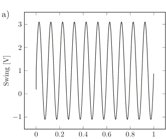

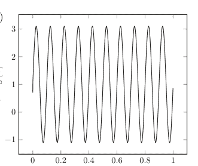

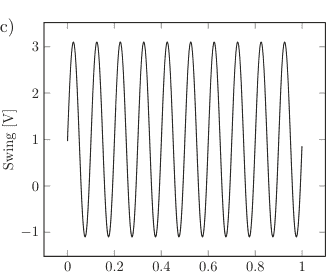

图 4.29 后向欧拉仿真，时间步长分别为 (a) 1 ps, (b) 10 ps, (c) 100 ps

$$i(t_{n+1}) = C \left( 2 \frac{u(t_{n+1}) - u(t_n)}{\Delta t} - u'(t_n) \right) \quad (4.56)$$

最后一项我们可以近似为

$$u'(t_n) \approx \frac{i(t_n)}{C} \quad (4.57)$$

最终得到

$$i(t_{n+1}) \approx C \left( 2 \frac{u(t_{n+1}) - u(t_n)}{\Delta t} - \frac{i(t_n)}{C} \right) = C \left( 2 \frac{u(t_{n+1}) - u(t_n)}{\Delta t} \right) - i(t_n) \quad (4.58)$$

类似于后向欧拉法，我们现在得到矩阵实现形式

$$\begin{pmatrix} & v_a & v_b \\ v_a & & 1 \\ v_b & & -1 \\ i_C & -\frac{2C}{\Delta t} & \frac{2C}{\Delta t} & 1 \end{pmatrix} = \begin{pmatrix} \ \ \ -2C \frac{v_a(t_n) - v_b(t_n)}{\Delta t} - i(t_n) \end{pmatrix} \quad (4.59)$$

其中所有在上一时间步长计算出的已知量都位于等式右侧。电容器两端的电压也已明确表示，$u(t) = v_a(t) - v_b(t)$。

伪代码可以如下所示

```
if DeviceType = 'Capacitor':
    Matrix[DeviceBranchIndex][DeviceNode1Index] = 2*DeviceValue
    Matrix[DeviceBranchIndex][DeviceNode2Index] = -2*DeviceValue
    Matrix[DeviceBranchIndex][DeviceBranchIndex] = 1
    rhs[DeviceBranchIndex] = 2*(V[DeviceNode1Index]-V[DeviceNode2Index]) + deltaT*I[DeviceBranchIndex]/DeviceValue
    // This is the branch equation row, indicated by the variable DeviceBranchRow,
    // The columns are set by the DeviceNode1Columns and DeviceNode2Column variables
    Matrix[Nodes.index[DeviceNode1Index]][DeviceBranchIndex] = 1
    Matrix[Nodes.index[DeviceNode2Index]][DeviceBranchIndex] = -1
    // These are the two KCL equation entries
```

对电感器方程进行类似计算，我们得到

$$u(t_{n+1}) = 2L \frac{i(t_{n+1}) - i(t_n)}{\Delta t} - L \dot{i}(t_n) \rightarrow i(t_{n+1}) = i(t_n) + \Delta t \frac{u(t_n)}{2L} + \Delta t \frac{u(t_{n+1})}{2L} \quad (4.60)$$

其中我们使用了 $\dot{i}(t_n) \approx u(t_n)/L$。矩阵实现形式则为

$$\begin{pmatrix} & v_a & v_b \\ v_a & & 1 \\ v_b & & -1 \\ i_L & -\frac{\Delta t}{2L} & \frac{\Delta t}{2L} & 1 \end{pmatrix} = \begin{pmatrix} \ \ \ i_L(t_n) + \frac{\Delta t}{2L} (v_a(t_n) - v_b(t_n)) \end{pmatrix} \quad (4.61)$$

伪代码可以如下所示

```
if DeviceType = 'Inductor':
    Matrix[DeviceBranchIndex][DeviceBranchIndex] = 1
    Matrix[DeviceBranchIndex][DeviceNode1Index] = -deltaT/(2*DeviceValue)
    Matrix[DeviceBranchIndex][DeviceNode2Index] = deltaT/(2*DeviceValue)
    rhs[DeviceBranchIndex] = I[DeviceBranchIndex]+deltaT*(V[DeviceNode1]-V[DeviceNode2])/(2*DeviceValue)
    // This is the branch equation row, indicated by the variable DeviceBranchIndex,
    Matrix[Nodes.index[DeviceNode1Index]][DeviceBranchIndex]=1
    Matrix[Nodes.index[DeviceNode2Index]][DeviceBranchIndex]=-1
    // These are the two KCL equation entries
    // These Matrix entries need not be updated any further as time moves along
    // Lastly the RHS depends on the solution at the previous time point so it needs to be updated continuously
    STA_rhs[NumberOfNodes+i] = sol[NumberOfNodes+i] + deltaT*(sol[Nodes.index(DevNode1[i])] - sol[Nodes.index(DevNode2[i])])/(2*DevValue[i])
```

#### 仿真

我们可以直接修改系统构建例程（第4.9.7节）。让我们看看图4.30中对与前两种积分方法使用的相同网表进行的仿真。

与之前的主要区别在于算法的精度，因为它是二阶的。

### 4.6.4 二阶吉尔法

最后，我们要讨论的方法是二阶吉尔法。它与梯形法一起是电路仿真器中最常用的方法。根据第1章，我们有基本近似：

$$\frac{df}{dt}(t+\Delta t) \approx \frac{1}{\Delta t} \left( \frac{3}{2} f(t+\Delta t) - 2f(t) + \frac{1}{2} f(t-\Delta t) \right) \quad (4.62)$$

如果我们要用我们的电容器模型来实现它，我们将得到

$$i(t_{n+1}) = \frac{C}{\Delta t} \left( \frac{3}{2} u(t_{n+1}) - 2u(t_n) + \frac{1}{2} u(t_{n-1}) \right) \quad (4.63)$$

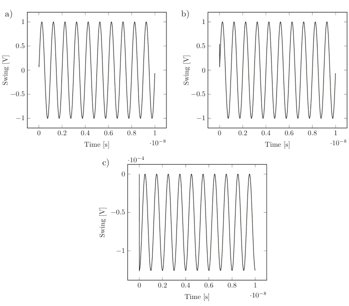

通过遵循与前几种积分类似的方法，我们发现矩阵实现形式现在看起来像

$$\begin{pmatrix} & v_a & v_b \\ v_a & & 1 \\ v_b & & -1 \\ i_C & -\frac{3C}{2\Delta t} & \frac{3C}{2\Delta t} & 1 \end{pmatrix} = \begin{pmatrix} \ \ \ \frac{C}{\Delta t} \left( -2u(t_n) + \frac{1}{2}u(t_{n-1}) \right) \end{pmatrix} \quad (4.64)$$

伪代码可以如下所示

```
if DeviceType = 'Capacitor':
    Matrix[DeviceBranchIndex][DeviceNode1Index] = 2*DeviceValue
    Matrix[DeviceBranchIndex][DeviceNode2Index] = -2*DeviceValue
    Matrix[DeviceBranchIndex][DeviceBranchIndex] = 1
    rhs[DeviceBranchIndex] = 2*(V[DeviceNode1Index]-V[DeviceNode2Index]) + deltaT*I[DeviceBranchIndex]/DeviceValue
    // This is the branch equation row, indicated by the variable DeviceBranchRow,
    // The columns are set by the DeviceNode1Columns and DeviceNode2Column variables
    Matrix[Nodes.index[DeviceNode1Index]][DeviceBranchIndex] = 1
    Matrix[Nodes.index[DeviceNode2Index]][DeviceBranchIndex] = -1
    // These are the two KCL equation entries
```

同样地，对于电感器，

$$u(t_{n+1}) = \frac{L}{\Delta t} \left( \frac{3}{2} i(t_{n+1}) - 2i(t_n) + \frac{1}{2} i(t_{n-1}) \right) \quad (4.65)$$

$$i(t_{n+1}) = u(t_{n+1}) \frac{2\Delta t}{3L} + \frac{4}{3} i(t_n) - \frac{1}{3} i(t_{n-1}) \quad (4.66)$$

矩阵实现形式将为

$$\begin{pmatrix} v_a & v_b & i_L \end{pmatrix} \begin{pmatrix} 1 & 0 & 0 \\ 0 & -1 & 0 \\ -\frac{2\Delta t}{3L} & \frac{2\Delta t}{3L} & 1 \end{pmatrix} = \begin{pmatrix} 0 \\ 0 \\ \frac{4}{3} i_L(t_n) - \frac{1}{3} i_L(t_{n-1}) \end{pmatrix} \quad (4.67)$$

请注意，在这些公式中，我们需要两个时间步长之前的信息！
伪代码可以如下所示

```
if DeviceType = 'Inductor':
    Matrix[DeviceBranchIndex][DeviceBranchIndex] = 1
    Matrix[DeviceBranchIndex][DeviceNode1Index] = -deltaT/(2*DeviceValue)
    Matrix[DeviceBranchIndex][DeviceNode2Index] = deltaT/(2*DeviceValue)
    rhs[DeviceBranchIndex] = I[DeviceBranchIndex]+deltaT*(V[DeviceNode1]-V[DeviceNode2])/(2*DeviceValue)
    // This is the branch equation row, indicated by the variable DeviceBranchIndex,
    Matrix[Nodes.index[DeviceNode1Index]][DeviceBranchIndex]=1
    Matrix[Nodes.index[DeviceNode2Index]][DeviceBranchIndex]=-1
    // These are the two KCL equation entries
```

#### 仿真

代码中的区别再次在于构建例程（第4.9.8节）。

## 4.6.5 刚性电路

那些时间常数（如 $RC$）远小于时间步长的电路被称为刚性电路。在电气系统中，由于小电容的存在，出现许多高频极点是非常常见的。通常，时间步长会远大于确定此类时间常数特性所需的时间，主要是因为它们远超出系统的带宽，并且在系统的动态演化中作用可忽略不计。我们在第 4.6.1 节中注意到，前向欧拉法存在一些实际问题，需要采用非常小的时间步长才能收敛。这是该方法的一个非常典型的特征。我们使用的另外三种积分方法在用于刚性系统时是稳定的。对于我们迄今为止使用的电路，我们注意到以下时间常数：

$$\tau_{c1} = \frac{L}{R_1} = 10^{-11} [s], \quad \tau_{c2} = R_1 C = 1.2 \cdot 10^{-10} [s], \quad \tau_{c3} = \sqrt{LC} = 3.5 \cdot 10^{-11} [s]$$

因此，最小的时间尺度由 $\tau_{c1}$ 决定。因此，我们需要一个 <10 ps 的时间步长来确保前向欧拉法收敛，这在我们第 4.6.1 节的实验中得到了证实。

## 4.6.6 局部截断误差

我们用截断差分格式近似微分方程的事实会导致局部截断误差（LTE），其中高阶导数被舍弃 [25]。这种误差需要以某种方式估计，并且有许多方法可以做到这一点，并对仿真器采用的时间步长进行某种控制。一种方法是使用固定步长运行仿真，并将其与使用更小步长的仿真进行比较，看看两者在多大程度上一致。这是一种处理问题的繁琐方法，实际中很少使用。更好的方法是估计 LTE。我们可以通过外推前几个时间步长来做到这一点，假设解遵循抛物线 [25]。让我们称这个外推电压为 $v_{n, pred}(t)$。求解值 $v_n(t)$ 和 $v_{n, pred}(t)$ 之间的差异可以被视为 LTE 的估计值。然后，我们可以通过强制此估计的 LTE 在每个时间点小于某个标准（参见 [25]）来实施时间步长控制：

$$v_n(t) - v_{npred}(t) < \alpha \left( \text{reltol } v_{nmax} + \text{vabstol} \right)$$

这里，$\alpha$ 是某个用户控制的因子。$v_{nmax}$ 可以选择不同的方式，例如：

$$v_{nmax} = \begin{cases} \max \forall t, \forall v_n \\ \max \forall t, v_n \\ |v_n(t)| \end{cases}$$

第一个标准通常称为全局误差标准，下一个称为局部误差，因为它涉及节点 $n$ 过去时间的最大值。最后一个通常称为点局部误差标准。如果 LTE 大于此标准，则需要采用更小的时间步长。让我们在仿真器中实现这些标准，并看看收敛速度。根据情况，这些 $v_{nmax}$ 设置中的任何一个都是相关的。有时点局部标准过于严格，没有任何好处，而有时又是必要的。我们将在第 5 章更详细地研究这些选择。$v_{n, pred}$ 可以如下计算：

让我们假设解遵循时间的二阶多项式：

$$v_{n,pred} = a + bt_n + ct_n^2$$

我们知道之前的时间值是 $t_{n-1}, t_{n-2}, t_{n-3}$。将时间平移使得 $\tau = t - t_{n-3}$ 是方便的。然后我们得到

$$\tau_0 = 0, \tau_1 = t_{n-2} - t_{n-3}, \tau_2 = t_{n-1} - t_{n-3}, \tau_3 = t_n - t_{n-3}$$

我们可以写成

$$v_{n-1} = a + b\tau_2 + c\tau_2^2$$
$$v_{n-2} = a + b\tau_1 + c\tau_1^2$$
$$v_{n-3} = a$$

$$\begin{cases} v_{n-1} = a + b\tau_2 + c\tau_2^2 \\ v_{n-2} = a + b\tau_1 + c\tau_1^2 \\ v_{n-3} = a \end{cases}$$

我们现在可以清楚地解出系数 $a, b, c$，并计算预测值：

$$v_{n,pred} = a + b\tau_3 + c\tau_3^2$$

验证此方法以及 Python 实现。

```python
LTEConverged=True
while LTEConverged:
    for i in range(NumberOfNodes):
        # Assume parabola v=a+b*t+c*t^2 v[t_solm1
(t=0)]=solm1[i] -> a=solm1[i], a+b*t_nm1+c*t_nm1^2=solold[i]
        # a+b*tn+c*t_n^2=sol[i]. A simple 2x2 matrix
        #
        # |t_nm1    t_nm1^2| |b| =solold[i]-solm1[i]
        # |t_n      t_n^2| |c| =sol[i]-solm1[i]
        #
        # This gives
        #
        # |b|=1/(t_nm1*t_n^2-t_nm1^2*t_n)| t_n^2    -t_nm1^2||solold[i]-solm1[i]|
        # |c|=      | -t_n      t_nm1^2||sol[i]-solm1[i]|
        # 
    PredMatrix[0][0]=(timeVector[iter-1]-timeVector[iter-2])
    PredMatrix[0, 1]=(timeVector[iter-1]-timeVector[iter-2])*(timeVector[iter-1]-timeVector[iter-2])
    PredMatrix[0, 1]=(SimTime-timeVector[iter-2])
    PredMatrix[1]=(SimTime-timeVector[iter-2])*(SimTime-timeVector[iter-2])
    Predrhs[0]=solold[i]-solm1[i]
    Predrhs[1]=sol[i]-solm1[i]
    Predsol=numpy.matmul(numpy.linalg.inv(PredMatrix),Predrhs)
    vpred=solm1[i]+Predsol[0]*SimTime+Predsol[1]*SimTime*SimTime
    if PointLocal:
        for node in range(NumberOfNodes):
            vkmax=max(abs(sol[node]),abs(sol[node]-SolutionCorrection[node]))
            if abs(vpred-sol[i])>vkmax*reltol+vabstol:
                LTEConverged=False
    elif GlobalTruncation:
        for node in range(NumberOfNodes):
            if abs(vpred-sol[i])>vkmax*reltol+vabstol:
                LTEConverged=False
    else:
        print('Error: Unknown truncation error')
        sys.exit()
```

通过这段代码，我们现在可以进行具有局部截断误差估计的仿真。让我们看看我们刚刚研究的简单电路，将此代码添加到我们在第 4.6.1 节讨论的前向欧拉实现中（参见第 4.9.9 节的代码 4.10）。结果如表 4.1 所示。

我们注意到，如果时间步长太大，LTE 算法会标记结果并停止仿真。在练习中，鼓励读者进一步研究这类算法。

有趣的是，有时电路收敛可能非常难以实现，仿真器可能被迫采用越来越小的时间步长。事实上，步长可能变得如此之小，以至于整个仿真进度几乎停滞不前。这些情况几乎总是由于电路中使用的某些器件的建模问题造成的。在某些仿真器中，有一个技巧，可以定义最小时间步长，以便暂时忽略 LTE 标准，仿真器可以绕过这个难点。它被称为 LTEminstep 或其他类似名称。

表 4.1 运行带有 LTE 算法的前向欧拉实现的结果

| 时间步长 | LTE 是否通过 |
| :--- | :--- |
| 1e-12 | 是 |
| 1e-11 | 否 |
| 1e-10 | 否 |

## 4.6.7 特殊情况：需要注意的事项

**梯形振铃**
“梯形振铃”是梯形法一个相当知名的弱点 [25]。它非常有特点，人们可以很容易地在仿真器输出中识别出来。它倾向于在阶跃附近出现，这就是为什么仿真器通常会在这种事件附近切换到后向欧拉法。

既然我们现在掌握了一系列积分方法，让我们用一个非常简单的测试案例来说明这种振铃。让我们使用一个接地的单个电容，其两端连接一个电压源，根据以下网表：

```
*
vdd vdd 0 0
c1 vdd 0 1e-12
netlist 4p8
```

我们通过利用我们开发的代码的初始条件特性，使电容的初始电压为 1V，从而引入一个阶跃。在网表中添加

```
.ic v(a)=1
```

将实现这一点，并且在下一个时间步长，我们用电压源将其强制为零。我们同时使用 trap 和 Gear2。我们在图 4.32 中找到了结果。
对于这些仿真，我们使用了 10 ps 的时间步长和 10 个时间步。

**数值损耗**
Gear2 实现不会受到 trap 方法特有的这种奇怪振铃的影响。这可能是一种解脱。然而，它这样做是因为人工耗散。该方法向电路添加人工电阻，任何振铃都会迅速衰减。我们可以用图 4.33 所示的经典示例 [25] 来说明这一点。

它显示了一个带有分流电阻的 LC 谐振回路。如果通过向网表添加

```
.ic v(in)=1
```

来扰动它

## 4.7 考虑的仿真器选项

- 前向欧拉法
- 后向欧拉法
- 梯形法
- Gear2法
- 相对容差
- 绝对电流容差
- 绝对电压容差
- 迭代次数
- LTE最小步长

**图 4.32** 梯形振铃现象。(a) 梯形法，(b) Gear2法。梯形法的振荡行为非常典型。

**图 4.33** 理想LC振荡器

作为初始条件，就像我们在上一个例子中刚刚做的那样；它将开始振荡，其振幅会由于分流电阻而随时间减小。解析解为

$$v(t) = \exp(-t/(RC)) \sin \sqrt{LC - \frac{1}{4R^2C^2}t} \quad (4.68)$$

其中 $R$ 代表谐振回路中的实际损耗。如果 $R$ 等于无穷大，振荡将永远持续下去，其振幅由初始条件设定。让我们使用刚刚开发的瞬态仿真器，通过网表（图 4.34、4.35 和 4.36）来模拟这个：

```
*ideal LC
l1 a vs 1e-9
c1 a vs 1e-12
vs vs 0 0
end
```

**网表 4p9**

正如我们刚才提到的 Gear2 方法，由于“人工”电阻的作用，振幅会随时间减小，在这种情况下，该电阻充当分流电阻。后向欧拉法甚至更糟！然而，梯形法只是持续振荡，没有随时间衰减。

> Gear2 和欧拉法会在电感和电容两端引入一个人工电阻。梯形法则不会。在使用特定的积分方法时，请记住这一点。梯形法的振铃效应是其作为实现副作用而产生的。

这不应让用户过于不敢使用后向欧拉法。有时，当收敛确实是个问题时，欧拉法的“电阻”效应确实可以帮助稳定因任何原因而表现异常的节点。所有这些方法都有其用途。

图 4.35 使用 Gear2 方法的理想 LC 仿真。输出已进行子采样以覆盖 Gear2 方法的衰减。

图 4.36 使用后向欧拉法的理想 LC 仿真。实现快速衰减，因此输出波形无需子采样。

## 4.8 总结

我们已经研究了针对交流、直流和瞬态仿真这三种基本情况的线性仿真器。电路仿真的概念与计算机的发明几乎同时诞生。它一直是技术革命中至关重要的开发工具，现代电路设计师必须深刻理解此类工具及其优缺点。在本章中，我们讨论了此类仿真器背后的基本原理，并相当详细地研究了从交流到瞬态仿真的线性仿真器，展示了各种积分方法的优缺点。我们相信，一个人对“底层”发生的事情了解得越多，就越有能力处理设计项目。从根本上说，仿真器只是一个非常简单的测试平台，用户可以在其中直接探索不同的效应。需要提醒的是，读者不要陷入这样的诱惑：认为建议的代码示例是一个功能齐全的仿真器的开端。现代仿真器完全是另一回事，其中诸如收敛辅助之类的东西通常是专有的，并且是多年密集研究的成果。

## 4.9 代码

### 4.9.1 代码 4.2

```python
#!/usr/bin/env python3
# -*- coding: utf-8 -*-
"""
Created on Thu Feb 28 22:33:04 2019

@author: mikael
"""
import sys
import numpy
import matplotlib.pyplot as plt
import analogdef as ana
#
# Initialize Variables
#
MaxNumberOfDevices=100
DevType=[0*i for i in range(MaxNumberOfDevices)]
DevLabel=[0*i for i in range(MaxNumberOfDevices)]
DevNode1=[0*i for i in range(MaxNumberOfDevices)]
DevNode2=[0*i for i in range(MaxNumberOfDevices)]
DevNode3=[0*i for i in range(MaxNumberOfDevices)]
DevModel=[0*i for i in range(MaxNumberOfDevices)]
DevValue=[0*i for i in range(MaxNumberOfDevices)]
Nodes=[]
#
# Read modelfile
#
modeldict=ana.readmodelfile('models.txt')
ICdict={}
Plotdict={}
Printdict={}
Optionsdict={}
SetupDict={}
SimDict={}
#
# Read the netlist
#
DeviceCount=ana.readnetlist('netlist_4p2.txt',modeldict,ICdict,
Plotdict,Printdict,Optionsdict,DevType,DevValue,DevLabel,DevNode1
,DevNode2,DevNode3,DevModel,Nodes,MaxNumberOfDevices)
#
# Create Matrix based on circuit size. We do not implement strict
Modified Nodal Analysis. We keep instead all currents
# but keep referring to the voltages as absolute voltages. We
believe this will make the operation clearer to the user.
#
MatrixSize=DeviceCount+len(Nodes)
#
# The number of branch equations are given by the number of
devices
# The number of KCL equations are given by the number of nodes
in the netlist.
# Hence the matrix size if set by the sum of DeviceCount and
len(Nodes)
#
STA_matrix=[[0 for i in range(MatrixSize)] for j in
range(MatrixSize)]
STA_rhs=[0 for i in range(MatrixSize)]
sol=[0 for i in range(MatrixSize)]
#
# Loop through all devices and create matrix/rhs entries according to signature
#
NumberOfNodes=len(Nodes)

for i in range(DeviceCount):
    if DevType[i]=='capacitor' or DevType[i]=='inductor':
        DevValue[i]*=(0+1j)
    if DevType[i] == 'resistor' or DevType[i] == 'inductor':
        STA_matrix[NumberOfNodes+i][NumberOfNodes+i]=-DevValue[i]
        STA_matrix[NumberOfNodes+i][Nodes.index(DevNode1[i])]=1
        STA_matrix[Nodes.index(DevNode1[i])][NumberOfNodes+i]=1
        STA_matrix[NumberOfNodes+i][Nodes.index(DevNode2[i])]=-1
        STA_matrix[Nodes.index(DevNode2[i])][NumberOfNodes+i]=-1
    if DevType[i]=='capacitor':
        STA_matrix[NumberOfNodes+i][NumberOfNodes+i]=1
        STA_matrix[Nodes.index(DevNode1[i])][NumberOfNodes+i]=1
        STA_matrix[Nodes.index(DevNode2[i])][NumberOfNodes+i]=-1
        STA_matrix[NumberOfNodes+i][Nodes.index(DevNode1[i])]=-DevValue[i]
        STA_matrix[NumberOfNodes+i][Nodes.index(DevNode2[i])]=+DevValue[i]
    if DevType[i]=='VoltSource':
        if DevNode1[i]!= '0':
            STA_matrix[NumberOfNodes+i][Nodes.index(DevNode1[i])]=1
            STA_matrix[Nodes.index(DevNode1[i])][NumberOfNodes+i]=1
        if DevNode2[i] != '0':
            STA_matrix[NumberOfNodes+i][Nodes.index(DevNode2[i])]=-1
            STA_matrix[Nodes.index(DevNode2[i])][NumberOfNodes+i]=-1
        STA_matrix[NumberOfNodes+i][NumberOfNodes+i]=0
        STA_rhs[NumberOfNodes+i]=DevValue[i]
    if DevType[i]=='CurrentSource':
        if DevNode1[i] != '0' :
            STA_matrix[Nodes.index(DevNode1[i])][NumberOfNodes+i]=1
        if DevNode2[i] != '0' :
            STA_matrix[Nodes.index(DevNode2[i])][NumberOfNodes+i]=-1
        STA_matrix[NumberOfNodes+i][NumberOfNodes+i]=1
        STA_rhs[NumberOfNodes+i]=0 # No AC source, so put to zero
    if DevType[i]=='transistor':
        STA_matrix[NumberOfNodes+i][NumberOfNodes+i]=1
        STA_matrix[NumberOfNodes+i][Nodes.index(DevNode2[i])]=1/DevValue[i]
        STA_matrix[NumberOfNodes+i][Nodes.index(DevNode3[i])]=-1/DevValue[i]
        STA_matrix[Nodes.index(DevNode1[i])][NumberOfNodes+i]=1
        STA_matrix[Nodes.index(DevNode3[i])][NumberOfNodes+i]=-1
#
#Loop through frequency points
#
val=[[0 for i in range(100)] for j in range(MatrixSize)]
freqpnts=[0 for i in range(100)]
for iter in range(100):
    omega=iter*1e8*2*3.14159265
    for i in range(DeviceCount):
        if DevType[i]=='capacitor':
            if DevNode1[i] != '0' :
                STA_matrix[NumberOfNodes+i][Nodes.index(DevNode1[i])]=DevValue[i]*omega
            if DevNode2[i] != '0' :
                STA_matrix[NumberOfNodes+i][Nodes.index(DevNode2[i])]=-DevValue[i]*omega
        if DevType[i]=='inductor':
            STA_matrix[NumberOfNodes+i][NumberOfNodes+i]=DevValue[i]*omega
    STA_inv=numpy.linalg.inv(STA_matrix)
    sol=numpy.matmul(STA_inv,STA_rhs)
    freqpnts[iter]=iter*1e8
    for j in range(MatrixSize):
        val[j][iter]=abs(sol[j])

ana.plotdata(Plotdict,NumberOfNodes,freqpnts,val,Nodes)
if len(Printdict)> 0:
    ana.printdata(Printdict,NumberOfNodes,freqpnts,val,Nodes)
```

### 4.9.2 代码 4.3

```python
#!/usr/bin/env python3
# -*- coding: utf-8 -*-
"""
Created on Thu Feb 28 22:33:04 2019

@author: mikael
"""
import sys
import numpy as np
import matplotlib.pyplot as plt
import analogdef as ana
import math
#
# Initialize Variables
#
MaxNumberOfDevices=100
DevType=[0*i for i in range(MaxNumberOfDevices)]
DevLabel=[0*i for i in range(MaxNumberOfDevices)]
DevNode1=[0*i for i in range(MaxNumberOfDevices)]
```

## 4.9 代码

```python
DevNode2=[0*i for i in range(MaxNumberOfDevices)]
DevNode3=[0*i for i in range(MaxNumberOfDevices)]
DevModel=[0*i for i in range(MaxNumberOfDevices)]
DevValue=[0*i for i in range(MaxNumberOfDevices)]
Nodes=[]
k=1.3823e-23 #Avogadro's constant
Temperature=300
#
# Read modelfile
#
modeldict=ana.readmodelfile('models.txt')
ICdict={}
Plotdict={}
Printdict={}
Optdict={}
#
# Read the netlist
#
DeviceCount=ana.readnetlist('netlist_noise2_4p4.txt',modeldict,ICdict,Plotdict,Printdict,Optdict,DevType,DevValue,DevLabel,DevNode1,DevNode2,DevNode3,DevModel,Nodes,MaxNumberOfDevices)
#
# Create Matrix based on circuit size. We do not implement strict Modified Nodal Analysis. We keep instead all currents
# but keep referring to the voltages as absolute voltages. We believe this will make the operation clearer to the user.
#
#
# We will add a new current souce
#
DeviceCount=DeviceCount+1
MatrixSize=DeviceCount+len(Nodes)
#
# The number of branch equations are given by the number of devices
# The number of KCL equations are given by the number of nodes in the netlist.
# Hence the matrix size if set by the sum of DeviceCount and len(Nodes)
#
STA_matrix=[[0 for i in range(MatrixSize)] for j in range(MatrixSize)]
STA_rhs=[0 for i in range(MatrixSize)]
#
# Loop through all devices and create matrix/rhs entries according to signature
#
NumberOfNodes=len(Nodes)
for i in range(DeviceCount-1):# We will not do the added current source yet
    if DevType[i]=='capacitor' or DevType[i]=='inductor':
        DevValue[i]*=(0+1j)
    if DevType[i] == 'resistor' or DevType[i] == 'inductor':
        STA_matrix[NumberOfNodes+i][NumberOfNodes+i]=-DevValue[i]
        STA_matrix[NumberOfNodes+i][Nodes.index(DevNode1[i])]=1
        STA_matrix[Nodes.index(DevNode1[i])][NumberOfNodes+i]=1
        STA_matrix[NumberOfNodes+i][Nodes.index(DevNode2[i])]=-1
        STA_matrix[Nodes.index(DevNode2[i])][NumberOfNodes+i]=-1
    if DevType[i]=='capacitor':
        STA_matrix[NumberOfNodes+i][NumberOfNodes+i]=1
        STA_matrix[Nodes.index(DevNode1[i])][NumberOfNodes+i]=1
        STA_matrix[Nodes.index(DevNode2[i])][NumberOfNodes+i]=-1
        STA_matrix[NumberOfNodes+i][Nodes.index(DevNode1[i])]=-DevValue[i]
        STA_matrix[NumberOfNodes+i][Nodes.index(DevNode2[i])]=+DevValue[i]
    if DevType[i]=='VoltSource':
        if DevNode1[i]!= '0':
            STA_matrix[NumberOfNodes+i][Nodes.index(DevNode1[i])]=1
            STA_matrix[Nodes.index(DevNode1[i])][NumberOfNodes+i]=1
        if DevNode2[i] != '0':
            STA_matrix[NumberOfNodes+i][Nodes.index(DevNode2[i])]=-1
            STA_matrix[Nodes.index(DevNode2[i])][NumberOfNodes+i]=-1
        STA_matrix[NumberOfNodes+i][NumberOfNodes+i]=0
        STA_rhs[NumberOfNodes+i]=0
    if DevType[i]=='CurrentSource':
        if DevNode1[i] != '0' :
            STA_matrix[Nodes.index(DevNode1[i])][NumberOfNodes+i]=1
        if DevNode2[i] != '0' :
            STA_matrix[Nodes.index(DevNode2[i])][NumberOfNodes+i]=-1
        STA_matrix[NumberOfNodes+i][NumberOfNodes+i]=1
        STA_rhs[NumberOfNodes+i]=0

val=[[0 for j in range(100)] for i in range(DeviceCount)]
freqpnts=[i*1e8 for i in range(100)]
for NoiseSource in range(DeviceCount):
    if DevType[NoiseSource]=='resistor':# Here we add the current noise source in parallel with the resistor
        if DevNode1[NoiseSource] != '0' :
            STA_matrix[Nodes.index(DevNode1[NoiseSource])][NumberOfNodes+DeviceCount-1]=1
        if DevNode2[NoiseSource] != '0' :
            STA_matrix[Nodes.index(DevNode2[NoiseSource])][NumberOfNodes+DeviceCount-1]=-1
            STA_matrix[NumberOfNodes+DeviceCount-1][NumberOfNodes+DeviceCount-1]=1
#
#Loop through frequency points
#
for iter in range(100):
    omega=iter*1e8*2*3.14159265
    for i in range(DeviceCount):
        if DevType[i]=='capacitor':
            if DevNode1[i] != '0' :
                STA_matrix[NumberOfNodes+i][Nodes.index(DevNode1[i])]=DevValue[i]*omega
            if DevNode2[i] != '0' :
                STA_matrix[NumberOfNodes+i][Nodes.index(DevNode2[i])]=-DevValue[i]*omega
        if DevType[i]=='inductor':
            STA_matrix[NumberOfNodes+i][NumberOfNodes+i]=DevValue[i]*omega
        if DevType[i]=='resistor' and i==NoiseSource:
            STA_rhs[NumberOfNodes+DeviceCount-1]=math.sqrt(4*k*Temperature/DevValue[i])
    sol=np.matmul(np.linalg.inv(STA_matrix),STA_rhs)
    val[NoiseSource][iter]=abs(sol[Nodes.index('out')])
if DevNode1[NoiseSource] != '0' :
    STA_matrix[Nodes.index(DevNode1[NoiseSource])][NumberOfNodes+DeviceCount-1]=0
if DevNode2[NoiseSource] != '0' :
    STA_matrix[Nodes.index(DevNode2[NoiseSource])][NumberOfNodes+DeviceCount-1]=0
TotalNoiseSpectrum=[0 for i in range(100)]
for NoiseSource in range(DeviceCount):
    if DevType[NoiseSource]=='resistor':
        for i in range(100):
            TotalNoiseSpectrum[i]+=abs(val[NoiseSource][i])*abs(val[NoiseSource][i])

plt.plot(freqpnts,TotalNoiseSpectrum)
plt.title('Noise Power vs frequency')
plt.xlabel('frequency [Hz]')
plt.ylabel('Noise Power [V^2/Hz]')
#fp=open('../pictures/Noisedata_4p4.csv',"w+")
#fp.write('frequency noise')
#for i in range(100):
#    fp.write("%g " % freqpnts[i])
#    fp.write("%g \n" % TotalNoiseSpectrum[i])
#fp.close()
```

### 4.9.3 代码 4.4

```python
#!/usr/bin/env python3
# -*- coding: utf-8 -*-
"""
Created on Thu Feb 28 22:33:04 2019

@author: mikael
"""
import numpy as np
import matplotlib.pyplot as plt
import analogdef as ana
#
# Initialize Variables
#
MaxNumberOfDevices=100
DevType=[0*i for i in range(MaxNumberOfDevices)]
DevLabel=[0*i for i in range(MaxNumberOfDevices)]
DevNode1=[0*i for i in range(MaxNumberOfDevices)]
DevNode2=[0*i for i in range(MaxNumberOfDevices)]
DevNode3=[0*i for i in range(MaxNumberOfDevices)]
DevModel=[0*i for i in range(MaxNumberOfDevices)]
DevValue=[0*i for i in range(MaxNumberOfDevices)]
Nodes=[]
FreqStep=3e7
#
# Read modelfile
#
modeldict=ana.readmodelfile('models.txt')
ICdict={}
Plotdict={}
Printdict={}
Optionsdict={}
#
# Read the netlist
#
DeviceCount=ana.readnetlist('netlist_ac_stab_4p5.txt',modeldict,ICdict,Plotdict,Printdict,Optionsdict,DevType,DevValue,DevLabel,DevNode1,DevNode2,DevNode3,DevModel,Nodes,MaxNumberOfDevices)
#
# Create Matrix based on circuit size. We do not implement strict Modified Nodal Analysis. We keep instead all currents
# but keep referring to the voltages as absolute voltages. We believe this will make the operation clearer to the user.
#
MatrixSize=DeviceCount+len(Nodes)
#
# The number of branch equations are given by the number of devices
# The number of KCL equations are given by the number of nodes in the netlist.
# Hence the matrix size if set by the sum of DeviceCount and len(Nodes)
#
STA_matrix=[[0 for i in range(MatrixSize)] for j in range(MatrixSize)]
STA_rhs=[0 for i in range(MatrixSize)]
#
# Loop through all devices and create matrix/rhs entries according to signature
#
NumberOfNodes=len(Nodes)
for i in range(DeviceCount):
    if DevType[i]=='capacitor' or DevType[i]=='inductor':
        DevValue[i]*=(0+1j)
    if DevType[i] == 'resistor' or DevType[i] == 'inductor':
        STA_matrix[NumberOfNodes+i][NumberOfNodes+i]=-DevValue[i]
        STA_matrix[NumberOfNodes+i][Nodes.index(DevNode1[i])]=1
        STA_matrix[Nodes.index(DevNode1[i])][NumberOfNodes+i]=1
        STA_matrix[NumberOfNodes+i][Nodes.index(DevNode2[i])]=-1
        STA_matrix[Nodes.index(DevNode2[i])][NumberOfNodes+i]=-1
    if DevType[i]=='capacitor':
        STA_matrix[NumberOfNodes+i][NumberOfNodes+i]=1
        STA_matrix[Nodes.index(DevNode1[i])][NumberOfNodes+i]=1
        STA_matrix[Nodes.index(DevNode2[i])][NumberOfNodes+i]=-1
        STA_matrix[NumberOfNodes+i][Nodes.index(DevNode1[i])]=-DevValue[i]
        STA_matrix[NumberOfNodes+i][Nodes.index(DevNode2[i])]=+DevValue[i]
    if DevType[i]=='VoltSource':
        if DevNode1[i]!= '0':
            STA_matrix[NumberOfNodes+i][Nodes.index(DevNode1[i])]=1
            STA_matrix[Nodes.index(DevNode1[i])][NumberOfNodes+i]=1
        if DevNode2[i] != '0':
            STA_matrix[NumberOfNodes+i][Nodes.index(DevNode2[i])]=-1
            STA_matrix[Nodes.index(DevNode2[i])][NumberOfNodes+i]=-1
            STA_matrix[NumberOfNodes+i][NumberOfNodes+i]=0
            STA_rhs[NumberOfNodes+i]=DevValue[i]
    if DevType[i]=='CurrentSource':
        if DevNode1[i] != '0' :
            STA_matrix[Nodes.index(DevNode1[i])][NumberOfNodes+i]=1
        if DevNode2[i] != '0' :
            STA_matrix[Nodes.index(DevNode2[i])][NumberOfNodes+i]=-1
            STA_matrix[NumberOfNodes+i][NumberOfNodes+i]=1
            STA_rhs[NumberOfNodes+i]=0 # No AC source, so put to zero
    if DevType[i]=='transistor':
        STA_matrix[NumberOfNodes+i][NumberOfNodes+i]=1
        STA_matrix[NumberOfNodes+i][Nodes.index(DevNode2[i])]=1/DevValue[i]
        STA_matrix[NumberOfNodes+i][Nodes.index(DevNode3[i])]=-1/DevValue[i]
        STA_matrix[Nodes.index(DevNode1[i])][NumberOfNodes+i]=1
        STA_matrix[Nodes.index(DevNode3[i])][NumberOfNodes+i]=-1
#
# Neutralize all voltage sources and turn on vstab
#
# For this to work properly the current, istab, needs to shoot into the positive end of vstab. Then the voltage
# ve is at the positive terminal of vstab and the current out of the positive terminal of vstab that counts in the
# second stage
#
print('Setting up stab run 1')
for i in range(DeviceCount):
    if DevType[i]=='VoltSource':
        if DevLabel[i]=='vstab':
            STA_rhs[NumberOfNodes+i]=1
            VElabel=DevNode1[i]
            StabProbeIndex=i
            print('Found stability probe')
        else:
            STA_rhs[NumberOfNodes+i]=0
#
#Loop through frequency points
```

val=[[0 for i in range(100)] for j in range(MatrixSize)]
freqpnts=[0 for i in range(100)]
D=[0+0j for i in range(100)]
B=[0+0j for i in range(100)]
for iter in range(100):
    omega=iter*FreqStep*2*3.14159265
    for i in range(DeviceCount):
        if DevType[i]=='capacitor':
            if DevNode1[i] != '0' :
                STA_matrix[NumberOfNodes+i][Nodes.index(DevNode1[i])]=DevValue[i]*omega
            if DevNode2[i] != '0' :
                STA_matrix[NumberOfNodes+i][Nodes.index(DevNode2[i])]=-DevValue[i]*omega
        if DevType[i]=='inductor':
            STA_matrix[NumberOfNodes+i][NumberOfNodes+i]=DevValue[i]*omega
    STA_inv=np.linalg.inv(STA_matrix)
    sol=np.matmul(STA_inv,STA_rhs)
    freqpnts[iter]=iter*FreqStep
    for j in range(MatrixSize):
        val[j][iter]=abs(sol[j])
        if j<NumberOfNodes:
            if Nodes[j]==VElabel:
                D[iter]=sol[j]
        if j==NumberOfNodes+StabProbeIndex:
            B[iter]=sol[j]

#plt.plot(freqpnts,20*numpy.log10(D))#20*numpy.log10(val[7]))

print('设置稳定性运行 2')
for i in range(DeviceCount):
    if DevType[i]=='VoltSource':
        STA_rhs[NumberOfNodes+i]=0
    if DevType[i]=='CurrentSource':
        if DevLabel[i]=='istab':
            STA_rhs[NumberOfNodes+i]=1
            print('找到稳定性电流探针')

#遍历频率点

val=[[0 for i in range(100)] for j in range(MatrixSize)]
freqpnts=[0 for i in range(100)]

## 4.9 代码

C=[0+0j for i in range(100)]
A=[0+0j for i in range(100)]
for iter in range(100):
    omega=iter*FreqStep*2*3.14159265
    for i in range(DeviceCount):
        if DevType[i]=='capacitor':
            if DevNode1[i] != '0' :
                STA_matrix[NumberOfNodes+i][Nodes.index(DevNode1[i])]=DevValue[i]*omega
            if DevNode2[i] != '0' :
                STA_matrix[NumberOfNodes+i][Nodes.index(DevNode2[i])]=-DevValue[i]*omega
        if DevType[i]=='inductor':
            STA_matrix[NumberOfNodes+i][NumberOfNodes+i]=DevValue[i]*omega
    STA_inv=np.linalg.inv(STA_matrix)
    sol=np.matmul(STA_inv,STA_rhs)
    freqpnts[iter]=iter*FreqStep
    for j in range(MatrixSize):
        val[j][iter]=abs(sol[j])
        if j<NumberOfNodes:
            if Nodes[j]==VELabel:
                C[iter]=sol[j]
        if j==NumberOfNodes+StabProbeIndex:
            A[iter]=-sol[j] # 计算的是从正端流出的电流

T=[0+0j for i in range(100)]
magdB=[0 for i in range(100)]
phasedegree=[0 for i in range(100)]
for iter in range(100):
    T[iter]=(2*(A[iter]*D[iter]-B[iter]*C[iter])-A[iter]+D[iter])/(2*(B[iter]*C[iter]-A[iter]*D[iter])+A[iter]-D[iter]+1)
    magdB[iter]=20*np.log10(np.abs(T[iter]))
    if (180/np.pi*np.arctan(np.imag(T[iter])/np.real(T[iter])))>=0:
        phasedegree[iter]=180-180/np.pi*np.arctan(np.imag(T[iter])/np.real(T[iter]))
    else:
        phasedegree[iter]=180-(180+180/np.pi*np.arctan(np.imag(T[iter])/np.real(T[iter])))

for i in range(100-1):
    if magdB[i]*magdB[i+1]<0:
        print('相位裕度: ',phasedegree[i])
        print('单位增益频率 ',freqpnts[i])

for i in range(100-1):
    if phasedegree[i]*phasedegree[i+1]<0:
        print('增益裕度: ',-magdB[i])

plt.xscale('log')
plt.title('增益/相位 vs 频率')
plt.xlabel('频率 [Hz]')
plt.ylabel('相位 [度], 增益 [dB]')
plt.plot(freqpnts,magdB,label='增益')
plt.plot(freqpnts,phasedegree,label='相位')
plt.subplot(111).legend(loc='upper center', bbox_to_anchor=(0.8, 0.97), shadow=True)
plt.show()

if len(Printdict)> 0:
    ana.printdata(Printdict,NumberOfNodes,freqpnts,val,Nodes)

### 4.9.4 代码 4.5

#!/usr/bin/env python3
# -*- coding: utf-8 -*-
"""
Created on Thu Feb 28 22:33:04 2019

@author: mikael
"""
import sys
import numpy as np
import matplotlib.pyplot as plt
import analogdef as ana
import math

# 初始化变量

MaxNumberOfDevices=100
DevType=[0*i for i in range(MaxNumberOfDevices)]
DevLabel=[0*i for i in range(MaxNumberOfDevices)]
DevNode1=[0*i for i in range(MaxNumberOfDevices)]
DevNode2=[0*i for i in range(MaxNumberOfDevices)]
DevNode3=[0*i for i in range(MaxNumberOfDevices)]
DevModel=[0*i for i in range(MaxNumberOfDevices)]

## 4.9 代码

DevValue=[0*i for i in range(MaxNumberOfDevices)]
Nodes=[]
Ports=['vp1','vp2']
PortNodes=['in','out']
NPorts=2

# 读取模型文件

modeldict=ana.readmodelfile('models.txt')
ICdict={}
Plotdict={}
Printdict={}
Optionsdict={}
#sys.exit()

# 读取网表

DeviceCount=ana.readnetlist('netlist_sp2_4p6.txt',modeldict,ICdict,Plotdict,Printdict,Optionsdict,DevType,DevValue,DevLabel,DevNode1,DevNode2,DevNode3,DevModel,Nodes,MaxNumberOfDevices)

# 根据电路规模创建矩阵。我们没有实现严格的改进节点分析法。相反，我们保留了所有电流，
# 但继续将电压称为绝对电压。我们认为这将使操作对用户更清晰。

MatrixSize=DeviceCount+len(Nodes)

# 支路方程的数量由器件数量给出
# KCL方程的数量由网表中的节点数量给出。
# 因此，矩阵大小由DeviceCount和len(Nodes)的总和设定

STA_matrix=[[0 for i in range(MatrixSize)] for j in range(MatrixSize)]
STA_rhs=[0 for i in range(MatrixSize)]

# 遍历所有器件，并根据其类型创建矩阵/右端向量条目

NumberOfNodes=len(Nodes)
for i in range(DeviceCount):
    if DevType[i]=='capacitor' or DevType[i]=='inductor':
        DevValue[i]*=(0+1j)
    if DevType[i] == 'resistor' or DevType[i] == 'inductor':
        STA_matrix[NumberOfNodes+i][NumberOfNodes+i]=-DevValue[i]
        STA_matrix[NumberOfNodes+i][Nodes.index(DevNode1[i])]=1
        STA_matrix[Nodes.index(DevNode1[i])][NumberOfNodes+i]=1
        STA_matrix[NumberOfNodes+i][Nodes.index(DevNode2[i])]=-1
        STA_matrix[Nodes.index(DevNode2[i])][NumberOfNodes+i]=-1
    if DevType[i]=='capacitor':
        STA_matrix[NumberOfNodes+i][NumberOfNodes+i]=1
        STA_matrix[Nodes.index(DevNode1[i])][NumberOfNodes+i]=1
        STA_matrix[Nodes.index(DevNode2[i])][NumberOfNodes+i]=-1
        STA_matrix[NumberOfNodes+i][Nodes.index(DevNode1[i])]=-DevValue[i]
        STA_matrix[NumberOfNodes+i][Nodes.index(DevNode2[i])]=+DevValue[i]
    if DevType[i]=='VoltSource':
        if DevNode1[i]!= '0':
            STA_matrix[NumberOfNodes+i][Nodes.index(DevNode1[i])]=1
            STA_matrix[Nodes.index(DevNode1[i])][NumberOfNodes+i]=1
        if DevNode2[i] != '0':
            STA_matrix[NumberOfNodes+i][Nodes.index(DevNode2[i])]=-1
            STA_matrix[Nodes.index(DevNode2[i])][NumberOfNodes+i]=-1
        STA_matrix[NumberOfNodes+i][NumberOfNodes+i]=0
        STA_rhs[NumberOfNodes+i]=DevValue[i]
    if DevType[i]=='CurrentSource':
        if DevNode1[i] != '0' :
            STA_matrix[Nodes.index(DevNode1[i])][NumberOfNodes+i]=1
        if DevNode2[i] != '0' :
            STA_matrix[Nodes.index(DevNode2[i])][NumberOfNodes+i]=-1
        STA_matrix[NumberOfNodes+i][NumberOfNodes+i]=1
        STA_rhs[NumberOfNodes+i]=0 # 没有交流源，所以设为零

#遍历频率点

val=[[[0 for i in range(1000)] for j in range(NPorts)] for k in range(NPorts)]
for port in range(NPorts):
    for iter in range(1000):
        omega=iter*1e8*2*3.14159265
        for i in range(DeviceCount):
            if DevType[i]=='capacitor':
                if DevNode1[i] != '0' :
                    STA_matrix[NumberOfNodes+i][Nodes.index(DevNode1[i])]=DevValue[i]*omega
                if DevNode2[i] != '0' :
                    STA_matrix[NumberOfNodes+i][Nodes.index(DevNode2[i])]=-DevValue[i]*omega
            if DevType[i]=='inductor':
                STA_matrix[NumberOfNodes+i][NumberOfNodes+i]=DevValue[i]*omega
            if DevLabel[i]==Ports[port]:
                print('激励端口:',DevLabel[i])
                STA_rhs[NumberOfNodes+i]=2
            else:
                STA_rhs[NumberOfNodes+i]=0
        STA_inv=np.linalg.inv(STA_matrix)
        sol=np.matmul(STA_inv,STA_rhs)
        for j in range(NPorts):
            print('探测端口: ',PortNodes[j])
            if port != j :
                val[port][j][iter]=20*math.log10(abs(sol[Nodes.index(PortNodes[j])]))
            else :
                val[port][j][iter]=20*math.log10(abs(sol[Nodes.index(PortNodes[j])]-1))
        plt.plot(val[0][0])
        plt.plot(val[0, 1])
        plt.plot(val[0, 1])
        plt.plot(val[1])

### 4.9.5 代码 4.6

#!/usr/bin/env python3
# -*- coding: utf-8 -*-
"""
Created on Thu Feb 28 22:33:04 2019

@author: mikael
"""
import numpy as np
import matplotlib.pyplot as plt
import math
import analogdef as ana

# 读取网表

## 4.9 代码

```python
MaxNumberOfDevices=100
DevType=[0*i for i in range(MaxNumberOfDevices)]
DevLabel=[0*i for i in range(MaxNumberOfDevices)]
DevNode1=[0*i for i in range(MaxNumberOfDevices)]
DevNode2=[0*i for i in range(MaxNumberOfDevices)]
DevNode3=[0*i for i in range(MaxNumberOfDevices)]
DevModel=[0*i for i in range(MaxNumberOfDevices)]
DevValue=[0*i for i in range(MaxNumberOfDevices)]
Nodes=[]
#
# 读取模型文件
#
modeldict=ana.readmodelfile('models.txt')
ICdict={}
Plotdict={}
Printdict={}
Optionsdict={}
Optionsdict['deltaT']=1e-12
Optionsdict['NIterations']=200
#
# 读取网表
#
DeviceCount=ana.readnetlist('netlist_4p7.txt',modeldict,ICdict,
Plotdict,Printdict,Optionsdict,DevType,DevValue,DevLabel,DevNode1
,DevNode2,DevNode3,DevModel,Nodes,MaxNumberOfDevices)
#
# 根据电路规模创建矩阵。我们没有实现严格的
# 改进节点分析法。我们保留了所有电流，
# 但继续将电压称为绝对电压。我们
# 相信这将使操作对用户更清晰。
#
MatrixSize=DeviceCount+len(Nodes)
STA_matrix=[[0 for i in range(MatrixSize)] for j in range(MatrixSize)]
STA_rhs=[0 for i in range(MatrixSize)]
sol=[0 for i in range(MatrixSize)]
#
# 创建仿真参数
#
deltaT=Optionsdict['deltaT']
NIterations=int(Optionsdict['NIterations'])
#
# 遍历所有器件，并根据其特性
# 创建矩阵/右端向量条目
#
NumberOfNodes=len(Nodes)
for i in range(DeviceCount):
    if DevType[i] != 'VoltSource' and DevType[i] != 'CurrentSource':
        STA_matrix[NumberOfNodes+i][NumberOfNodes+i]=-DevValue[i]
        if DevNode1[i] != '0' :
            STA_matrix[NumberOfNodes+i][Nodes.index(DevNode1[i])]=1
            STA_matrix[Nodes.index(DevNode1[i])][NumberOfNodes+i]=1
        if DevNode2[i] != '0' :
            STA_matrix[NumberOfNodes+i][Nodes.index(DevNode2[i])]=-1
            STA_matrix[Nodes.index(DevNode2[i])][NumberOfNodes+i]=-1
        if DevType[i]=='capacitor':
            STA_matrix[NumberOfNodes+i][NumberOfNodes+i]=0
            if DevNode1[i] != '0' : STA_matrix[NumberOfNodes+i][Nodes.index(DevNode1[i])]=+1
            if DevNode2[i] != '0' : STA_matrix[NumberOfNodes+i][Nodes.index(DevNode2[i])]=-1
            if DevNode1[i] != '0' : STA_matrix[Nodes.index(DevNode1[i])][NumberOfNodes+i]=+1
            if DevNode2[i] != '0' : STA_matrix[Nodes.index(DevNode2[i])][NumberOfNodes+i]=-1
            STA_rhs[NumberOfNodes+i]=sol[Nodes.index(DevNode1[i])]-sol[Nodes.index(DevNode2[i])]+deltaT*sol[NumberOfNodes+i]/DevValue[i]
        if DevType[i]=='inductor':
            STA_matrix[NumberOfNodes+i][NumberOfNodes+i]=1
            if DevNode1[i] != '0' : STA_matrix[NumberOfNodes+i][Nodes.index(DevNode1[i])]=0
            if DevNode2[i] != '0' : STA_matrix[NumberOfNodes+i][Nodes.index(DevNode2[i])]=0
            if DevNode1[i] != '0' : STA_matrix[Nodes.index(DevNode1[i])][NumberOfNodes+i]=1
            if DevNode2[i] != '0' : STA_matrix[Nodes.index(DevNode2[i])][NumberOfNodes+i]=-1
            STA_rhs[NumberOfNodes+i]=sol[NumberOfNodes+i]+(sol[Nodes.index(DevNode1[i])]-sol[Nodes.index(DevNode2[i])])*deltaT/DevValue[i]
        if DevType[i]=='VoltSource':
            STA_matrix[NumberOfNodes+i][NumberOfNodes+i]=0
            STA_rhs[NumberOfNodes+i]=ana.getSourceValue(DevValue[i],0)
#
# 遍历频率点
#
val=[[0 for i in range(NIterations)] for j in range(MatrixSize)]
timeVector=[0 for i in range(NIterations)]
for iter in range(NIterations):
    SimTime=iter*deltaT
    STA_inv=np.linalg.inv(STA_matrix)
    sol=np.matmul(STA_inv,STA_rhs)
    timeVector[iter]=SimTime
    for j in range(MatrixSize):
        val[j][iter]=sol[j]
    for i in range(DeviceCount):
        if DevType[i]=='capacitor':
            STA_rhs[NumberOfNodes+i]=sol[Nodes.index(DevNode1[i])]-sol[Nodes.index(DevNode2[i])]+deltaT*sol[NumberOfNodes+i]/DevValue[i]
        if DevType[i]=='inductor':
            STA_rhs[NumberOfNodes+i]=sol[NumberOfNodes+i]+(sol[Nodes.index(DevNode1[i])]-sol[Nodes.index(DevNode2[i])])*deltaT/DevValue[i]
        if DevType[i]=='VoltSource':
            STA_rhs[NumberOfNodes+i]=ana.getSourceValue(DevValue[i],SimTime)

ana.plotdata(Plotdict,NumberOfNodes,timeVector,val,Nodes)
```

### 4.9.6 代码 4.7

```python
#!/usr/bin/env python3
# -*- coding: utf-8 -*-
"""
Created on Thu Feb 28 22:33:04 2019

@author: mikael
"""
import numpy as np
import matplotlib.pyplot as plt
import math
import analogdef as ana

MaxNumberOfDevices=100
DevType=[0*i for i in range(MaxNumberOfDevices)]
DevLabel=[0*i for i in range(MaxNumberOfDevices)]
DevNode1=[0*i for i in range(MaxNumberOfDevices)]
DevNode2=[0*i for i in range(MaxNumberOfDevices)]
DevNode3=[0*i for i in range(MaxNumberOfDevices)]
DevModel=[0*i for i in range(MaxNumberOfDevices)]
DevValue=[0*i for i in range(MaxNumberOfDevices)]
Nodes=[]
#
# 读取模型文件
#
modeldict=ana.readmodelfile('models.txt')
ICdict={}
Plotdict={}
Printdict={}
Optionsdict={}
Optionsdict['deltaT']=1e-12
Optionsdict['NIterations']=200
#
# 读取网表
#
DeviceCount=ana.readnetlist('netlist_4p7.txt',modeldict,ICdict,
Plotdict,Printdict,Optionsdict,DevType,DevValue,DevLabel,DevNode1
,DevNode2,DevNode3,DevModel,Nodes,MaxNumberOfDevices)
#
# 根据电路规模创建矩阵。我们没有实现严格的
# 改进节点分析法。我们保留了所有电流，
# 但继续将电压称为绝对电压。我们
# 相信这将使操作对用户更清晰。
#
MatrixSize=DeviceCount+len(Nodes)
STA_matrix=[[0 for i in range(MatrixSize)] for j in
range(MatrixSize)]
STA_rhs=[0 for i in range(MatrixSize)]
sol=[0 for i in range(MatrixSize)]
#
# 如果存在初始条件，则更新它们
#
NumberOfNodes=len(Nodes)
if len(ICdict)>0:
    for i in range(len(ICdict)):
        for j in range(NumberOfNodes):
            if Nodes[j]==ICdict[i]['NodeName']:
                sol[j]=ICdict[i]['Value']
                print('设置 ',Nodes[j],' 为 ',sol[j])
#
# 创建仿真参数
#
deltaT=Optionsdict['deltaT']
NIterations=int(Optionsdict['NIterations'])
#
# 遍历所有器件，并根据其特性
# 创建矩阵/右端向量条目
#
for i in range(DeviceCount):
    if DevType[i] != 'VoltSource' and DevType[i] != 'CurrentSource':
        STA_matrix[NumberOfNodes+i][NumberOfNodes+i]=-DevValue[i]
    if DevNode1[i] != '0' :
        STA_matrix[NumberOfNodes+i][Nodes.index(DevNode1[i])]=1
        STA_matrix[Nodes.index(DevNode1[i])][NumberOfNodes+i]=1
    if DevNode2[i] != '0' :
        STA_matrix[NumberOfNodes+i][Nodes.index(DevNode2[i])]=-1
        STA_matrix[Nodes.index(DevNode2[i])][NumberOfNodes+i]=-1
    if DevType[i]=='capacitor':
        STA_matrix[NumberOfNodes+i][NumberOfNodes+i]=1
        if DevNode1[i] != '0' : STA_matrix[NumberOfNodes+i][Nodes.
index(DevNode1[i])]=-DevValue[i]/deltaT
        if DevNode2[i] != '0' : STA_matrix[NumberOfNodes+i][Nodes.
index(DevNode2[i])]=DevValue[i]/deltaT
        if DevNode1[i] != '0' : STA_matrix[Nodes.index(DevNode1[i])]
[NumberOfNodes+i]=1
        if DevNode2[i] != '0' : STA_matrix[Nodes.index(DevNode2[i])]
[NumberOfNodes+i]=-1
        if DevNode1[i] != '0' and DevNode2[i] != '0':
            STA_rhs[NumberOfNodes+i]=-DevValue[i]/deltaT*(sol[Nodes.
index(DevNode1[i])]-sol[Nodes.index(DevNode2[i])])
        if DevNode1[i] == '0':
            STA_rhs[NumberOfNodes+i]=-DevValue[i]/deltaT*(-
sol[Nodes.index(DevNode2[i])])
        if DevNode2[i] == '0':
            STA_rhs[NumberOfNodes+i]=-DevValue[i]/deltaT*(sol[Nodes.
index(DevNode1[i])])
    if DevType[i]=='inductor':
        STA_matrix[NumberOfNodes+i][NumberOfNodes+i]=1
        if DevNode1[i] != '0' : STA_matrix[NumberOfNodes+i][Nodes.
index(DevNode1[i])]=-deltaT/DevValue[i]
        if DevNode2[i] != '0' : STA_matrix[NumberOfNodes+i][Nodes.
index(DevNode2[i])]=deltaT/DevValue[i]
        if DevNode1[i] != '0' : STA_matrix[Nodes.index(DevNode1[i])]
[NumberOfNodes+i]=1
        if DevNode2[i] != '0' : STA_matrix[Nodes.index(DevNode2[i])]
[NumberOfNodes+i]=-1
        STA_rhs[NumberOfNodes+i]=sol[NumberOfNodes+i]
    if DevType[i]=='VoltSource':
```

STA_matrix[NumberOfNodes+i][NumberOfNodes+i]=0
STA_rhs[NumberOfNodes+i]=ana.getSourceValue(DevValue[i],0)
#
# 遍历频率点
#
val=[[0 for i in range(NIterations)] for j in range(MatrixSize)]
timeVector=[0 for i in range(NIterations)]
for iter in range(NIterations):
    SimTime=iter*deltaT
    STA_inv=np.linalg.inv(STA_matrix)
    sol=np.matmul(STA_inv,STA_rhs)
    timeVector[iter]=SimTime
    for j in range(MatrixSize):
        val[j][iter]=sol[j]
    for i in range(DeviceCount):
        if DevType[i]=='capacitor':
            if DevNode1[i] != '0' and DevNode2[i] != '0':
                STA_rhs[NumberOfNodes+i]=-DevValue[i]/deltaT*(sol[Nodes.index(DevNode1[i])]-sol[Nodes.index(DevNode2[i])])
            if DevNode1[i] == '0':
                STA_rhs[NumberOfNodes+i]=-DevValue[i]/deltaT*(-sol[Nodes.index(DevNode2[i])])
            if DevNode2[i] == '0':
                STA_rhs[NumberOfNodes+i]=-DevValue[i]/deltaT*(sol[Nodes.index(DevNode1[i])])
        if DevType[i]=='inductor':
            STA_rhs[NumberOfNodes+i]=sol[NumberOfNodes+i]
        if DevType[i]=='VoltSource':
            STA_rhs[NumberOfNodes+i]=ana.getSourceValue(DevValue[i],SimTime)
#
ana.plotdata(Plotdict,NumberOfNodes,timeVector,val,Nodes)

### 4.9.7 代码 4.8

```
#!/usr/bin/env python3
# -*- coding: utf-8 -*-
"""
Created on Thu Feb 28 22:33:04 2019

@author: mikael
"""
import numpy as np
import matplotlib.pyplot as plt
import math
import analogdef as ana
#
# 初始化变量
#
MaxNumberOfDevices=100
DevType=[0*i for i in range(MaxNumberOfDevices)]
DevLabel=[0*i for i in range(MaxNumberOfDevices)]
DevNode1=[0*i for i in range(MaxNumberOfDevices)]
DevNode2=[0*i for i in range(MaxNumberOfDevices)]
DevNode3=[0*i for i in range(MaxNumberOfDevices)]
DevModel=[0*i for i in range(MaxNumberOfDevices)]
DevValue=[0*i for i in range(MaxNumberOfDevices)]
Nodes=[]
#
# 读取模型文件
#
modeldict=ana.readmodelfile('models.txt')
ICdict={}
Plotdict={}
Printdict={}
Optionsdict={}
Optionsdict['deltaT']=1e-12
Optionsdict['NIterations']=200
#
# 读取网表
#
DeviceCount=ana.readnetlist('netlist_4p9.txt',modeldict,ICdict,
Plotdict,Printdict,Optionsdict,DevType,DevValue,DevLabel,DevNode1
,DevNode2,DevNode3,DevModel,Nodes,MaxNumberOfDevices)
#
# 根据电路规模创建矩阵。我们没有实现严格的
# 改进节点分析法。我们保留了所有电流，
# 但继续将电压称为绝对电压。我们
# 相信这将使操作对用户更清晰。
#
MatrixSize=DeviceCount+len(Nodes)
STA_matrix=[[0 for i in range(MatrixSize)] for j in range(MatrixSize)]
STA_rhs=[0 for i in range(MatrixSize)]
sol=[0 for i in range(MatrixSize)]
#
# 如果存在初始条件，则更新它们
#
NumberOfNodes=len(Nodes)
if len(ICdict)>0:
    for i in range(len(ICdict)):
        for j in range(NumberOfNodes):
            if Nodes[j]==ICdict[i]['NodeName']:
                sol[j]=ICdict[i]['Value']
                print('Setting ',Nodes[j],' to ',sol[j])
#
# 创建仿真参数
#
deltaT=Optionsdict['deltaT']
NIterations=int(Optionsdict['NIterations'])
#
# 遍历所有器件，并根据其特性创建矩阵/右端向量条目
#
for i in range(DeviceCount):
    if DevType[i] != 'VoltSource' and DevType[i] != 'CurrentSource':
        STA_matrix[NumberOfNodes+i][NumberOfNodes+i]=-DevValue[i]
    if DevNode1[i] != '0' :
        STA_matrix[NumberOfNodes+i][Nodes.index(DevNode1[i])]=1
        STA_matrix[Nodes.index(DevNode1[i])][NumberOfNodes+i]=1
    if DevNode2[i] != '0' :
        STA_matrix[NumberOfNodes+i][Nodes.index(DevNode2[i])]=-1
        STA_matrix[Nodes.index(DevNode2[i])][NumberOfNodes+i]=-1
    if DevType[i]=='capacitor':
        STA_matrix[NumberOfNodes+i][NumberOfNodes+i]=1
        if DevNode1[i] != '0' : STA_matrix[NumberOfNodes+i][Nodes.index(DevNode1[i])]=-2*DevValue[i]/deltaT
        if DevNode2[i] != '0' : STA_matrix[NumberOfNodes+i][Nodes.index(DevNode2[i])]=2*DevValue[i]/deltaT
        if DevNode1[i] != '0' : STA_matrix[Nodes.index(DevNode1[i])][NumberOfNodes+i]=1
        if DevNode2[i] != '0' : STA_matrix[Nodes.index(DevNode2[i])][NumberOfNodes+i]=-1
        if DevNode1[i] != '0' and DevNode2[i] != '0':
            STA_rhs[NumberOfNodes+i]=-2*DevValue[i]/deltaT*(sol[Nodes.index(DevNode1[i])]-sol[Nodes.index(DevNode2[i])])-sol[NumberOfNodes+i]
        if DevNode1[i] == '0':
            STA_rhs[NumberOfNodes+i]=-2*DevValue[i]/deltaT*(-sol[Nodes.index(DevNode2[i])])-sol[NumberOfNodes+i]
        if DevNode2[i] == '0':
            STA_rhs[NumberOfNodes+i]=-2*DevValue[i]/deltaT*(sol[Nodes.index(DevNode1[i])])-sol[NumberOfNodes+i]
    if DevType[i]=='inductor':
        STA_matrix[NumberOfNodes+i][NumberOfNodes+i]=1
        if DevNode1[i] != '0' : STA_matrix[NumberOfNodes+i][Nodes.index(DevNode1[i])]=-deltaT/(2*DevValue[i])
        if DevNode2[i] != '0' : STA_matrix[NumberOfNodes+i][Nodes.index(DevNode2[i])]=deltaT/(2*DevValue[i])
        if DevNode1[i] != '0' : STA_matrix[Nodes.index(DevNode1[i])][NumberOfNodes+i]=1
        if DevNode2[i] != '0' : STA_matrix[Nodes.index(DevNode2[i])][NumberOfNodes+i]=-1
        if DevNode1[i] != '0' and DevNode2[i] != '0':
            STA_rhs[NumberOfNodes+i]=sol[NumberOfNodes+i]+deltaT*(sol[Nodes.index(DevNode1[i])]-sol[Nodes.index(DevNode2[i])])/(2*DevValue[i])
        if DevNode1[i] == '0':
            STA_rhs[NumberOfNodes+i]=sol[NumberOfNodes+i]+deltaT*(-sol[Nodes.index(DevNode2[i])])/(2*DevValue[i])
        if DevNode2[i] == '0':
            STA_rhs[NumberOfNodes+i]=sol[NumberOfNodes+i]+deltaT*(sol[Nodes.index(DevNode1[i])])/(2*DevValue[i])
    if DevType[i]=='VoltSource':
        STA_matrix[NumberOfNodes+i][NumberOfNodes+i]=0
        STA_rhs[NumberOfNodes+i]=ana.getSourceValue(DevValue[i],0)
#
# 遍历频率点
#
val=[[0 for i in range(NIterations)] for j in range(MatrixSize)]
timeVector=[0 for i in range(NIterations)]
for iter in range(NIterations):
    SimTime=iter*deltaT
    STA_inv=np.linalg.inv(STA_matrix)
    sol=np.matmul(STA_inv,STA_rhs)
    timeVector[iter]=SimTime
    for j in range(MatrixSize):
        val[j][iter]=sol[j]
    for i in range(DeviceCount):
        if DevType[i]=='capacitor':
            if DevNode1[i] != '0' and DevNode2[i] != '0':
                STA_rhs[NumberOfNodes+i]=-2*DevValue[i]/deltaT*(sol[Nodes.index(DevNode1[i])]-sol[Nodes.index(DevNode2[i])])-sol[NumberOfNodes+i]
            if DevNode1[i] == '0':
                STA_rhs[NumberOfNodes+i]=-2*DevValue[i]/deltaT*(-sol[Nodes.index(DevNode2[i])])-sol[NumberOfNodes+i]
            if DevNode2[i] == '0':
                STA_rhs[NumberOfNodes+i]=-2*DevValue[i]/deltaT*(sol[Nodes.index(DevNode1[i])])-sol[NumberOfNodes+i]
        if DevType[i]=='inductor':
            if DevNode1[i] != '0' and DevNode2[i] != '0':
                STA_rhs[NumberOfNodes+i]=sol[NumberOfNodes+i]+deltaT*(sol[Nodes.index(DevNode1[i])]-sol[Nodes.index(DevNode2[i])])/(2*DevValue[i])
            if DevNode1[i] == '0':
                STA_rhs[NumberOfNodes+i]=sol[NumberOfNodes+i]+deltaT*(-sol[Nodes.index(DevNode2[i])])/(2*DevValue[i])
            if DevNode2[i] == '0':
                STA_rhs[NumberOfNodes+i]=sol[NumberOfNodes+i]+deltaT*(sol[Nodes.index(DevNode1[i])])/(2*DevValue[i])
        if DevType[i]=='VoltSource':
            STA_rhs[NumberOfNodes+i]=ana.getSourceValue(DevValue[i],SimTime)
#
ana.plotdata(Plotdict,NumberOfNodes,timeVector,val,Nodes)

### 4.9.8 代码 4.9

```
#!/usr/bin/env python3
# -*- coding: utf-8 -*-
"""
Created on Thu Feb 28 22:33:04 2019

@author: mikael
"""
import numpy as np
import matplotlib.pyplot as plt
import math
import analogdef as ana
#
# 初始化变量
#
MaxNumberOfDevices=100
DevType=[0*i for i in range(MaxNumberOfDevices)]
DevLabel=[0*i for i in range(MaxNumberOfDevices)]
DevNode1=[0*i for i in range(MaxNumberOfDevices)]
DevNode2=[0*i for i in range(MaxNumberOfDevices)]
DevNode3=[0*i for i in range(MaxNumberOfDevices)]
DevModel=[0*i for i in range(MaxNumberOfDevices)]
DevValue=[0*i for i in range(MaxNumberOfDevices)]
Nodes=[]
```

## 4 电路仿真器：线性情况

```python
#
# 读取模型文件
#
modeldict=ana.readmodelfile('models.txt')
ICdict={}
Plotdict={}
Printdict={}
Optionsdict={}
Optionsdict['deltaT']=1e-12
Optionsdict['NIterations']=200
#
# 读取网表
#
DeviceCount=ana.readnetlist('netlist_4p9.txt',modeldict,ICdict,
Plotdict,Printdict,Optionsdict,DevType,DevValue,DevLabel,DevNode1
,DevNode2,DevNode3,DevModel,Nodes,MaxNumberOfDevices)
#
# 根据电路规模创建矩阵。我们没有实现严格的
# 改进节点分析法。我们保留了所有电流变量，
# 但继续将电压称为绝对电压。我们相信这将使
# 操作对用户更加清晰。
MatrixSize=DeviceCount+len(Nodes)
STA_matrix=[[0 for i in range(MatrixSize)] for j in
range(MatrixSize)]
STA_rhs=[0 for i in range(MatrixSize)]
sol=[0 for i in range(MatrixSize)]
solm1=[0 for i in range(MatrixSize)]
#
# 创建仿真参数
#
deltaT=Optionsdict['deltaT']
NIterations=int(Optionsdict['NIterations'])
#
# 如果存在初始条件，则更新它们
#
NumberOfNodes=len(Nodes)
if len(ICdict)>0:
    for i in range(len(ICdict)):
        for j in range(NumberOfNodes):
            if Nodes[j]==ICdict[i]['NodeName']:
                sol[j]=ICdict[i]['Value']
                print('Setting ',Nodes[j],' to ',sol[j])
#
# 遍历所有器件，根据其类型创建矩阵/右端向量条目
#
for i in range(DeviceCount):
    if DevType[i] != 'VoltSource' and DevType[i] != 'CurrentSource':
        STA_matrix[NumberOfNodes+i][NumberOfNodes+i]=-DevValue[i]
    if DevNode1[i] != '0' :
        STA_matrix[NumberOfNodes+i][Nodes.index(DevNode1[i])]=1
        STA_matrix[Nodes.index(DevNode1[i])][NumberOfNodes+i]=1
    if DevNode2[i] != '0' :
        STA_matrix[NumberOfNodes+i][Nodes.index(DevNode2[i])]=-1
        STA_matrix[Nodes.index(DevNode2[i])][NumberOfNodes+i]=-1
    if DevType[i]=='capacitor':
        STA_matrix[NumberOfNodes+i][NumberOfNodes+i]=1
        if DevNode1[i] != '0' : STA_matrix[NumberOfNodes+i][Nodes.index(DevNode1[i])]=-3/2.0*DevValue[i]/deltaT
        if DevNode2[i] != '0' : STA_matrix[NumberOfNodes+i][Nodes.index(DevNode2[i])]=3/2.0*DevValue[i]/deltaT
        if DevNode1[i] != '0' : STA_matrix[Nodes.index(DevNode1[i])][NumberOfNodes+i]=1
        if DevNode2[i] != '0' : STA_matrix[Nodes.index(DevNode2[i])][NumberOfNodes+i]=-1
        if DevNode1[i] != '0' and DevNode2[i] != '0':
            STA_rhs[NumberOfNodes+i]=DevValue[i]/deltaT*(-2*(sol[Nodes.index(DevNode1[i])]-sol[Nodes.index(DevNode2[i])])+1/2*(solm1[Nodes.index(DevNode1[i])]-solm1[Nodes.index(DevNode2[i])]) )
        if DevNode1[i] == '0':
            STA_rhs[NumberOfNodes+i]=DevValue[i]/deltaT*(-2*(-sol[Nodes.index(DevNode2[i])])+1/2*(-solm1[Nodes.index(DevNode2[i])]) )
        if DevNode2[i] == '0':
            STA_rhs[NumberOfNodes+i]=DevValue[i]/deltaT*(-2*(sol[Nodes.index(DevNode1[i])])+1/2*(solm1[Nodes.index(DevNode1[i])]) )
    if DevType[i]=='inductor':
        STA_matrix[NumberOfNodes+i][NumberOfNodes+i]=1
        if DevNode1[i] != '0' : STA_matrix[NumberOfNodes+i][Nodes.index(DevNode1[i])]=-2/3*deltaT/DevValue[i]
        if DevNode2[i] != '0' : STA_matrix[NumberOfNodes+i][Nodes.index(DevNode2[i])]=2/3*deltaT/DevValue[i]
        if DevNode1[i] != '0' : STA_matrix[Nodes.index(DevNode1[i])][NumberOfNodes+i]=1
        if DevNode2[i] != '0' : STA_matrix[Nodes.index(DevNode2[i])][NumberOfNodes+i]=-1
        STA_rhs[NumberOfNodes+i]=4/3*sol[NumberOfNodes+i]-1/3*solm1[NumberOfNodes+i]
    if DevType[i]=='VoltSource':
        STA_matrix[NumberOfNodes+i][NumberOfNodes+i]=0
        STA_rhs[NumberOfNodes+i]=ana.getSourceValue(DevValue[i],0)
#
# 遍历频率点
#
val=[[0 for i in range(NIterations)] for j in range(MatrixSize)]
timeVector=[0 for i in range(NIterations)]
for iter in range(NIterations):
    SimTime=iter*deltaT
    STA_inv=np.linalg.inv(STA_matrix)
    solm1=sol[:]
    sol=np.matmul(STA_inv,STA_rhs)
    timeVector[iter]=SimTime
    for j in range(MatrixSize):
        val[j][iter]=sol[j]
    for i in range(DeviceCount):
        if DevType[i]=='capacitor':
            if DevNode1[i] != '0' and DevNode2[i] != '0':
                STA_rhs[NumberOfNodes+i]=DevValue[i]/deltaT*(-2*(sol[Nodes.index(DevNode1[i])]-sol[Nodes.index(DevNode2[i])])+1/2*(solm1[Nodes.index(DevNode1[i])]-solm1[Nodes.index(DevNode2[i])]) )
            if DevNode1[i] == '0':
                STA_rhs[NumberOfNodes+i]=DevValue[i]/deltaT*(-2*(-sol[Nodes.index(DevNode2[i])])+1/2*(-solm1[Nodes.index(DevNode2[i])]) )
            if DevNode2[i] == '0':
                STA_rhs[NumberOfNodes+i]=DevValue[i]/deltaT*(-2*(sol[Nodes.index(DevNode1[i])])+1/2*(solm1[Nodes.index(DevNode1[i])]) )
        if DevType[i]=='inductor':
            STA_rhs[NumberOfNodes+i]=4/3*sol[NumberOfNodes+i]-1/3*solm1[NumberOfNodes+i]
        if DevType[i]=='VoltSource':
            STA_rhs[NumberOfNodes+i]=ana.getSourceValue(DevValue[i],SimTime)
#
ana.plotdata(Plotdict,NumberOfNodes,timeVector,val,Nodes)
```

### 4.9.9 代码 4.10

```python
#!/usr/bin/env python3
# -*- coding: utf-8 -*-
"""
Created on Thu Feb 28 22:33:04 2019

@author: mikael
"""
import numpy
import matplotlib.pyplot as plt
import math
import sys
import analogdef as ana

#
# 读取网表
#
MaxNumberOfDevices=100
DevType=[0*i for i in range(MaxNumberOfDevices)]
DevLabel=[0*i for i in range(MaxNumberOfDevices)]
DevNode1=[0*i for i in range(MaxNumberOfDevices)]
DevNode2=[0*i for i in range(MaxNumberOfDevices)]
DevNode3=[0*i for i in range(MaxNumberOfDevices)]
DevModel=[0*i for i in range(MaxNumberOfDevices)]
DevValue=[0*i for i in range(MaxNumberOfDevices)]
Nodes=[]
vkmax=0
#
# 读取模型文件
#
modeldict=ana.readmodelfile('models.txt')
ICdict={}
Plotdict={}
Printdict={}
Optionsdict={}
Optionsdict['reltol']=1e-2
Optionsdict['iabstol']=1e-7
Optionsdict['vabstol']=1e-2
Optionsdict['lteratio']=2
Optionsdict['deltaT']=1e-12
Optionsdict['NIterations']=200
Optionsdict['GlobalTruncation']=True
#
# 读取网表
#
DeviceCount=ana.readnetlist('netlist_4p7.txt',modeldict,ICdict,
Plotdict,Printdict,Optionsdict,DevType,DevValue,DevLabel,DevNode1
,DevNode2,DevNode3,DevModel,Nodes,MaxNumberOfDevices)
#
# 根据电路规模创建矩阵。我们没有实现严格的
# 改进节点分析法。我们保留了所有电流变量，
# 但继续将电压称为绝对电压。我们相信这将使
# 操作对用户更加清晰。
#
MatrixSize=DeviceCount+len(Nodes)
STA_matrix=[[0 for i in range(MatrixSize)] for j in range(MatrixSize)]
STA_rhs=[0 for i in range(MatrixSize)]
sol=[0 for i in range(MatrixSize)]
solold=[0 for i in range(MatrixSize)]
solm1=[0 for i in range(MatrixSize)]
solm2=[0 for i in range(MatrixSize)]
#
# 创建仿真参数
#
deltaT=Optionsdict['deltaT']
NIterations=int(Optionsdict['NIterations'])
GlobalTruncation=Optionsdict['GlobalTruncation']
PointLocal=not GlobalTruncation
reltol=Optionsdict['reltol']
iabstol=Optionsdict['iabstol']
vabstol=Optionsdict['vabstol']
lteratio=Optionsdict['lteratio']
#
# 遍历所有器件，根据其类型创建矩阵/右端向量条目
#
NumberOfNodes=len(Nodes)
for i in range(DeviceCount):
    if DevType[i] != 'VoltSource' and DevType[i] != 'CurrentSource':
        STA_matrix[NumberOfNodes+i][NumberOfNodes+i]=-DevValue[i]
    if DevNode1[i] != '0' :
        STA_matrix[NumberOfNodes+i][Nodes.index(DevNode1[i])]=1
        STA_matrix[Nodes.index(DevNode1[i])][NumberOfNodes+i]=1
    if DevNode2[i] != '0' :
        STA_matrix[NumberOfNodes+i][Nodes.index(DevNode2[i])]=-1
        STA_matrix[Nodes.index(DevNode2[i])][NumberOfNodes+i]=-1
    if DevType[i]=='capacitor':
        STA_matrix[NumberOfNodes+i][NumberOfNodes+i]=0
        if DevNode1[i] != '0' : STA_matrix[NumberOfNodes+i][Nodes.index(DevNode1[i])]=+1
        if DevNode2[i] != '0' : STA_matrix[NumberOfNodes+i][Nodes.index(DevNode2[i])]=-1
        if DevNode1[i] != '0' : STA_matrix[Nodes.index(DevNode1[i])][NumberOfNodes+i]=+1
        if DevNode2[i] != '0' : STA_matrix[Nodes.index(DevNode2[i])][NumberOfNodes+i]=-1
```

## 4.9 代码

```python
[NumberOfNodes+i]=-1
    STA_rhs[NumberOfNodes+i]=sol[Nodes.index(DevNode1[i])]-sol[Nodes.index(DevNode2[i])]+deltaT*sol[NumberOfNodes+i]/DevValue[i]
    if DevType[i]=='inductor':
        STA_matrix[NumberOfNodes+i][NumberOfNodes+i]=1
        if DevNode1[i] != '0' : STA_matrix[NumberOfNodes+i][Nodes.index(DevNode1[i])]=0
        if DevNode2[i] != '0' : STA_matrix[NumberOfNodes+i][Nodes.index(DevNode2[i])]=0
        if DevNode1[i] != '0' : STA_matrix[Nodes.index(DevNode1[i])][NumberOfNodes+i]=1
        if DevNode2[i] != '0' : STA_matrix[Nodes.index(DevNode2[i])][NumberOfNodes+i]=-1
        STA_rhs[NumberOfNodes+i]=sol[NumberOfNodes+i]+(sol[Nodes.index(DevNode1[i])]-sol[Nodes.index(DevNode2[i])])*deltaT/DevValue[i]
    if DevType[i]=='VoltSource':
        STA_matrix[NumberOfNodes+i][NumberOfNodes+i]=0
        STA_rhs[NumberOfNodes+i]=ana.getSourceValue(DevValue[i],0)
#
#遍历频率点
#
val=[[0 for i in range(NIterations)] for j in range(MatrixSize)]
timeVector=[0 for i in range(NIterations)]
PredMatrix=[[0 for i in range(2)] for j in range(2)]
Predrhs=[0 for i in range(2)]
for iter in range(NIterations):
    SimTime=iter*deltaT
    STA_inv=numpy.linalg.inv(STA_matrix)
    solm2=[solm1[i] for i in range(MatrixSize)]
    solm1=[solold[i] for i in range(MatrixSize)]
    solold=[sol[i] for i in range(MatrixSize)]
    sol=numpy.matmul(STA_inv,STA_rhs)
    for node in range(NumberOfNodes):
        vkmax=max(vkmax,abs(sol[node]))
    timeVector[iter]=SimTime
    for j in range(MatrixSize):
        val[j][iter]=sol[j]
    for i in range(DeviceCount):
        if DevType[i]=='capacitor':
            STA_rhs[NumberOfNodes+i]=sol[Nodes.index(DevNode1[i])]-sol[Nodes.index(DevNode2[i])]+deltaT*sol[NumberOfNodes+i]/DevValue[i]
        if DevType[i]=='inductor':
            STA_rhs[NumberOfNodes+i]=sol[NumberOfNodes+i]+(sol[Nodes.index(DevNode1[i])]-sol[Nodes.index(DevNode2[i])])*deltaT/DevValue[i]
        if DevType[i]=='VoltSource':
            STA_rhs[NumberOfNodes+i]=ana.getSourceValue(DevValue[i],SimTime)
        if iter>2:
            LTEConverged=True
            for i in range(NumberOfNodes):
                tau1=(timeVector[iter-2]-timeVector[iter-3])
                tau2=(timeVector[iter-1]-timeVector[iter-3])
                PredMatrix[0][0]=tau2
                PredMatrix[0, 1]=tau2*tau2
                PredMatrix[0, 1]=tau1
                PredMatrix[1]=tau1*tau1
                Predrhs[0]=solold[i]-solm2[i]
                Predrhs[1]=solm1[i]-solm2[i]
                Predsol=numpy.matmul(numpy.linalg.inv(PredMatrix), Predrhs)
                vpred=solm2[i]+Predsol[0]*(SimTime-timeVector[iter-3])+Predsol[1]*(SimTime-timeVector[iter-3])*(SimTime-timeVector[iter-3])
                if PointLocal:
                    for node in range(NumberOfNodes):
                        vkmax=max(abs(sol[node]),abs(solm1[node]))
                        print('Is vkmax correct here?')
                        if abs(vpred-sol[i])> lteratio*(vkmax*reltol+vabstol):
                            LTEConverged=False
                elif GlobalTruncation:
                    for node in range(NumberOfNodes):
                        if abs(vpred-sol[i])> lteratio*(vkmax*reltol+vabstol):
                            LTEConverged=False
                else:
                    print('Error: Unknown truncation error')
                    sys.exit()
            if not LTEConverged:
                print('LTE NOT converging, change time step')
                sys.exit(0)

ana.plotdata(Plotdict,NumberOfNodes,timeVector,val,Nodes)
```

## 4.10 练习

1.  运行代码并修改提供的网表。你能在大型网络上运行代码吗？有什么限制？如有错误，请访问 www.fastictechniques.com 并报告！
2.  构建一个直流线性仿真器，其网表包含：
    (a) 仅包含电阻和电容。
    (b) 应被短路的电感。
3.  在仿真器中实现互感元件。
4.  构建一个传递函数分析例程，用于仿真从所有独立源到用户定义输出的交流响应。
5.  构建一个灵敏度分析例程，用于仿真用户定义输出对电阻尺寸等属性的响应。
6.  将LTE代码添加到其他差分近似中。研究LTE收敛性作为reltol、abstol、vntol等的函数。迭代次数的意义是什么？
7.  在你常用的仿真器中，设置并运行我们在第4.6.7节中展示的理想LC谐振回路。研究各种差分方案如何影响响应。它与我们在这里发现的结果相同，还是更好或更差？

#### 参考文献

1.  Berry, R. D. (1971). An optimal ordering of electronic circuit equations for a sparse matrix solution. *IEEE Transactions on Circuit Theory*, 18, 40–50.
2.  Calahan, D. A. (1972). *Computer-aided network design* (Rev ed.). McGraw-Hill, New York.
3.  Chua, L. O., & Lin, P.-M. (1975). *Computer-aided analysis of electronic circuits*. New York: McGraw-Hill.
4.  Ho, C.-W., Zein, A., Ruehli, A. E., & Brennan, P. A. (1975). The modified nodal approach to network analysis. *IEEE Transactions on Circuits and Systems*, 22, 504–509.
5.  Hachtel, G. D., Brayton, R. K., & Gustavson, F. G. (1971). The sparse tableau approach to network analysis and design. *IEEE Transactions on Circuit Theory*, 18, 101–113.
6.  Nagel, L. W. (1975). *SPICE2: A computer program to simulate semiconductor circuits*. PhD thesis, University of California Berkeley. Memorandum No ERL-M520.
7.  Nagel, L. W., & Pederson, D. O. (1973). *Simulation program with integrated circuit emphasis*. Waterloo: In Proceedings of the Sixteenth Midwest Symposium on Circuit Theory.
8.  Ho, C. W., Zein, D. A., Ruehli, A. E., & Brennan, P. A. (1977). An algorithm for DC solutions in an experimental general purpose interactive circuit design program. *IEEE Transactions on Circuits and Systems*, 24, 416–422.
9.  Saad, Y. (2003). *Iterative method for sparse linear systems* (2nd ed.). Philadelphia: Society for Industrial and Applied Mathematics.
10. Najm, F. N. (2010). *Circuit simulation*. Hobroken: Wiley.
11. Kundert, K., White, J., & Sangiovanni-Vicentelli, A. (1990). *Steady-state methods for simulating analog and microwave circuits*. Norwell: Kluwer Academic Publications.
12. Ogrodzki, J. (1994). *Circuit simulation methods and algorithms*. Boca Raton: CRC Press.
13. Vlach, J., & Singhai, K. (1994). *Computer methods for circuit analysis and design* (2nd ed.). New York: Van Nostrand Reinhold.
14. McCalla, W. J. (1988). *Fundamentals of computer-aided circuit simulation*. Norwell: Kluwer Academic Publishers.
15. Ruehli, A. E., editor (1986). *Circuit analysis, simulation and design – Part I*, North-Holland, Amsterdam published as Volume 3 of Advances in CAD for VLSI.
16. Ruehli, A. E., editor (1987). *Circuit analysis, simulation and design – Part 2*, North-Holland, Amsterdam published as Volume 3 of Advances in CAD for VLSI.
17. Vladimirescu, A. (1994). *The spice book*. New York: Wiley.
18. Nyquist, H. (1932). Regeneration theory. *Bell System Technical Journal*, 11(1), 126–147.
19. Franklin, F. F., Emami-Naeini, A., & Powell, J. D. (2005). *Feedback control of dynamic systems*. Englewood Cliffs: Prentice Hall.
20. Lee, T. (2003). *The design of CMOS radio-frequency integrated circuits* (2nd ed.). Cambridge: Cambridge University Press.
21. Middlebrook, R. D. (1975). Measurement of loop gain in feedback systems. *International Journal of Electronics*, 38(4), 485–512.
22. Visvanathan, V., Hantgan, J., & Kundert, K. (2001). Striving for small signal stability. *IEEE Circuits and Devices*, 17, 31–40.
23. Sahrling, M. (2019). *Fast techniques for integrated circuit design*. Cambridge: Cambridge University Press.
24. Posar, D. (2012). *Microwave engineering* (4th ed.). Wiley and Sons: Hoboken.
25. Kundert, K. (1995). *The designers guide to spice and spectre*. Norwell: Kluwer Academic Press.

# 第5章
## 电路仿真：非线性情况

**摘要** 在关于线性仿真器的章节之后，我们将深入探讨电路仿真器的非线性方面，首先研究非线性直流工作点仿真。从历史上看，这可能是最难解决的问题，因为通常没有一个实际的起始点，不像瞬态解，人们通常从直流点开始，然后在新的时间步长下观察微小变化。在直流讨论之后，我们将进行包含有源器件的完整非线性瞬态仿真。本章最后探讨电路仿真中的其他发展，例如周期稳态仿真器。它们在电路开发中非常有帮助，我们将通过实际代码示例来研究几种实现方式。

## 5.1 引言

正如我们在第2章关于非线性求解器的讨论中已经提到的，它们总是涉及一个迭代步骤，最常见的是实现为牛顿-拉夫逊方法的某个版本。在本章中，我们将结合电路仿真器更详细地讨论这一点[1-21]。也许最值得注意的是，人们遇到的第一个困难是直流收敛；这是包含非线性元件的电路仿真中最具挑战性的问题之一，我们将在第一节中讨论这个问题。下一节将介绍如何在瞬态仿真中处理非线性问题。随后我们将详细讨论周期稳态求解器（PSS），其中讨论最流行的实现方法：谐波平衡法和打靶法。一旦找到PSS解，我们就可以使用扰动技术来求解周期交流（PAC）和周期噪声（PNOISE）问题，这些将在后续章节中讨论。本章最后讨论一些常见的电路仿真示例，其中稳态方法很有帮助。

应该指出的是，本章的内容非常密集。许多复杂的问题仅通过简短而非常简单的例子来暗示。像收敛性这样的问题，在本章这样有限的篇幅内是极其难以彻底阐述的。因此，强烈鼓励读者在提供的示例之外进行探索。构建具有严重收敛困难的电路并不困难，读者应该考虑可以采取什么措施来解决它们。

## 5.2 直流非线性仿真

在第4章中，我们展示了几种线性仿真器的实现方式，并讨论了将电路元件表征为具有特定矩阵特性，对于构建包含已知右侧列向量的基本矩阵方程是多么容易。这里我们将讨论一个直流仿真器，以及在支路方程为非线性时实现此类仿真器的关键难点，以及针对这些问题的常见解决方法。

作为电路设计师，直流仿真有时看起来似乎微不足道，因为它只是求解电路的工作点；不涉及电容器、电感器或其他频率相关元件，因此可以忽略。我们可以使用前面开发的方案，简单地将所有电感短路、移除所有电容器，问题就解决了。然而，当我们遇到非线性元件时，问题就来了。此时可能存在多个解，如果直流迭代的初始点选择不佳，可能需要很长时间才能找到其中一个解，甚至在合理时间内根本无法找到[4, 18]。我们将在此概述其中一些难点，并在此过程中介绍一些常见术语及其技术含义。

### 5.2.1 求解技术

非线性方程的研究有着悠久而丰富的历史。我们在第2章中提到，主要的求解方法是牛顿-拉夫逊算法。在第2章中，我们讨论了该方法的一维推导。本节将介绍其多维版本，并展示如何进行数值实现。它是非线性数值代码中的主力工具之一，深入理解它及其收敛特性对于工具箱来说是一个非常有用的工具。此外，由于初始解“不够接近”正确解，还会出现一些有趣的病态情况，我们也会简要提及。

#### 5.2.1.1 非线性模型实现

我们将通过一个具体示例（见图5.1）来讨论直流问题。新元件是一个非线性晶体管，我们将按照第3.4节的分析大纲，用三种不同的方式进行建模。晶体管可以看作是一个压控电流源（VCCS），其中栅极和源极（或基极-发射极）之间的输入电压控制着漏极（或集电极）的电流。正如我们在第3章中已经讨论过的，对晶体管建模涉及更多内容，但为了我们的目的，我们将保持模型非常简单，以便展示模拟仿真器的各个方面。我们将从第3.4节最简单的CMOS模型开始。该模型显示漏极电流的变化类似于 $I_d \sim V_{gs}^2$。这可能是人们能想到的最简单的非线性。为了继续，我们需要看一下电流方向的定义，它们分别适用于NMOS和PMOS晶体管。让我们再看一下图3.8，其中标出了源极和漏极电流的方向。电流方向的惯例是：流入器件（或子电路）的电流为正；流出的电流为负。对于NMOS晶体管，漏极电流为

$$I_d = K(V_g - V_s)^2 = KV_{gs}^2 \quad (5.1)$$

对于PMOS，$I_d$ 变为负值：

$$I_d = -K(V_s - V_g)^2 = -KV_{sg}^2 \quad (5.2)$$

注意PMOS下标的微妙变化。对于这个模型，它没有意义，但在更复杂的实现中会起作用。

记住这些符号约定，我们现在来讨论此类非线性器件的求解技术。

让我们结合图5.1中的电路来看这个模型。读者会意识到解析解相当直接，但让我们通过牛顿-拉夫逊迭代来看看它是如何工作的。经过一些简单的代数运算，我们发现试图求解的方程是

$$\begin{cases} I_p + I_n = I_{sink} \\ I_p = K(V_a - V_s)^2 \\ I_n = K(V_b - V_s)^2 \end{cases} \rightarrow \begin{cases} f_0 : I_p + I_n - I_{sink} = 0 \\ f_1 : I_p - K(V_a - V_s)^2 = 0 \\ f_2 : I_n - K(V_b - V_s)^2 = 0 \end{cases} \rightarrow f(\boldsymbol{v}) = 0, \boldsymbol{v} = \begin{pmatrix} V_s \\ I_p \\ I_n \end{pmatrix} \quad (5.3)$$

其中我们显式地求解了电压 $V_A = V_{dd}R_1/(R_1 + R_2)$ 和 $V_B = V_{dd}R_3/(R_3 + R_4)$，以简化数学运算并使网络方程在解析计算中易于处理。漏极电压可以从电流 $I_p$、$I_n$ 中直接得出，我们不会将它们直接添加到网络方程中。$\boldsymbol{v}$ 是未知量的向量。函数 $f$ 是仿真文献[3, 4, 10, 11]中讨论网络方程时的常用符号。那里通常使用完整的MNA描述，不包含显式的电流支路；因此通常将 $f$ 简单地视为KCL方程。在本书中，我们显式地包含了所有支路方程，因此 $f$ 在这里也将包含这些方程。读者在阅读常见参考文献[1–21]时应记住这一点。当我们仅明确指代KCL方程时，我们将 $f$ 表示为 $f_{KCL}$。

这组方程包含线性项和非线性项。我们可以将它们分离出来，得到一组如下形式的方程

$$f(\boldsymbol{v}) = \begin{pmatrix} 0 & 1 & 1 \\ 0 & 1 & 0 \\ 0 & 0 & 1 \end{pmatrix} \begin{pmatrix} V_s \\ I_p \\ I_n \end{pmatrix} + \begin{pmatrix} 0 \\ -K(V_a - V_s)^2 \\ -K(V_b - V_s)^2 \end{pmatrix} - \begin{pmatrix} I_{sink} \\ 0 \\ 0 \end{pmatrix} = 0 \quad (5.4)$$

方程中的第二项被称为非线性项。它只是作为一个单独的列矩阵添加到矩阵方程中。最后一项是我们刚刚移至 $f$ 定义部分的矩阵方程的右侧。这种将网络方程的线性和非线性部分分离出来的做法是标准做法。

遵循我们在第2章讨论的牛顿-拉夫逊方法，我们现在可以将这个方程写成在某个点 $\boldsymbol{v}_0$ 附近的多维泰勒展开；详细推导请参见第7章：

$$f(\boldsymbol{v}) = f(\boldsymbol{v}_0) + \left. \frac{\partial f}{\partial \boldsymbol{v}} \right|_{\boldsymbol{v}_0} (\boldsymbol{v} - \boldsymbol{v}_0) \quad (5.5)$$

现在让我们计算第二项中的矩阵，称为*雅可比矩阵*：

$$J_{ij} = \frac{\partial f_i}{\partial v_j} \quad (5.6)$$

对于这种情况，计算相当直接，我们得到以下表达式：

$$J = \left( \frac{\partial f}{\partial V_s} \quad \frac{\partial f}{\partial I_p} \quad \frac{\partial f}{\partial I_n} \right) = \begin{pmatrix} 0 & 1 & 1 \\ 2K(V_a - V_s) & 1 & 0 \\ 2K(V_b - V_s) & 0 & 1 \end{pmatrix} \quad (5.7)$$

该矩阵在上一次迭代时计算，因此所有元素都是已知的。牛顿法现在告诉我们，可以按以下方式迭代求解（参见第7章和[1, 3, 15–20]）：

$$v_{k+1} = v_k - (J)^{-1} f(v_k) \quad (5.8)$$

这在结构上与我们在第2章中展示的一维情况非常相似，但现在全部用矩阵符号表示。读者应该清楚，这里的难点主要在于找到雅可比矩阵；幸运的是，大多数情况下，它已经通过器件模型知道了。我们找到以下Python代码示例：

```python
if DevType[i]=='transistor':
    STA_matrix[NumberOfNodes+i][NumberOfNodes+i]=DevValue[i]
    STA_matrix[NumberOfNodes+i][Nodes.index(DevNode1[i])]=0
    STA_matrix[Nodes.index(DevNode1[i])][NumberOfNodes+i]=1
    STA_matrix[NumberOfNodes+i][Nodes.index(DevNode3[i])]=0
    STA_matrix[Nodes.index(DevNode3[i])][NumberOfNodes+i]=-1
    STA_nonlinear[NumberOfNodes+i]=(sol[Nodes.index(DevNode2[i])]
    - sol[Nodes.index(DevNode3[i])])**2

#
# Now we need the Jacobian, the transistors look like VCCS with
# a specific gain = 2 K (Vg-Vs) in our case
#
    for i in range(MatrixSize):
        for j in range(MatrixSize):
            Jacobian[i][j]=STA_matrix[i][j]
    for i in range(DeviceCount):
        if DevType[i]=='transistor':
            Jacobian[NumberOfNodes+i][NumberOfNodes+i]=DevValue[i] # due to derivative leading to double gain
```

## 5.2 直流非线性仿真

```python
Jacobian[NumberOfNodes+i][Nodes.index(DevNode2[i])] = 2*(sol[Nodes.index(DevNode2[i])] - sol[Nodes.index(DevNode3[i])]) + 0.01
Jacobian[NumberOfNodes+i][Nodes.index(DevNode3[i])] = -2*(sol[Nodes.index(DevNode2[i])] - sol[Nodes.index(DevNode3[i])]) - 0.01
Jacobian[Nodes.index(DevNode1[i])][NumberOfNodes+i] = 1
Jacobian[Nodes.index(DevNode3[i])][NumberOfNodes+i] = -1
sol = sol - numpy.matmul(numpy.linalg.inv(Jacobian), f)
for i in range(MatrixSize):
    solm1[i] = solold[i]
f = numpy.matmul(STA_matrix, sol) - STA_rhs + STA_nonlinear
val[iter] = sol[5]  # 2*(sol[Nodes.index(DevNode2[12])] - sol[Nodes.index(DevNode3[12])])  # sol[3]  # sol[1]-sol[3]  # 0.9-K*(sol[3]-sol[7])**2*100
    # plt.plot(vin)
    plt.plot(val)
```

此处将展示牛顿法的 Python 实现。

**代码 5.1**

有了这个实现，我们就可以使用下面的网表来仿真图 5.1 中的电路：

```
*
vdd vdd 0 0.9
vss vss 0 0
r1 vdd inp 30
r2 inp vss 150
r3 vdd inn 30
r4 inn vss 150
i1 vs vss 1e-3
m1 vdd inp vs nch1
m2 vdd inn vs nch1
.options MaxNewtonIterations=10
.ic v(vdd)=1 v(vss)=0 v(inp)=0 v(vs)=-2
.plot v(vs)
```

**网表 5.1**

执行代码后，我们现在可以在表 5.1 中观察我们晶体管模型的节点“vs”随迭代的变化。

**表 5.1** 模型1的节点电压值与迭代次数

| 迭代次数 | 节点“vs”的值 | 误差 (%) |
|---|---|---|
| 0 | -2.0 | 4762.7 |
| 1 | -0.375 | 974.3 |
| 2 | -0.034722 | 180.9 |
| 3 | 0.039054 | 8.949 |
| 4 | 0.042883 | 0.024 |
| 5 | 0.042893 | 0 |

我们现在可以按照相同的步骤，为第 3.4 节中更真实的模型推导矩阵元素。这里，除了其他事项外，我们需要考虑有限的输出电导，并为晶体管的漏极添加方程。我们发现，当 $V_{gs} - V_T < 0$ 时：

$$f(\boldsymbol{v}_k) = \begin{pmatrix} 0 & 0 & 0 & 1 & 0 & -1 & 0 \\ 0 & 0 & 0 & 0 & 1 & 0 & -1 \\ 0 & 0 & 0 & 1 & 1 & 0 & 0 \\ 0 & 0 & 0 & 1 & 0 & 0 & 0 \\ 0 & 0 & 0 & 0 & 1 & 0 & 0 \\ 0 & 0 & 0 & 0 & 0 & 1 & 0 \\ 0 & 0 & 0 & 0 & 0 & 0 & 1 \end{pmatrix} \begin{pmatrix} V_{op} \\ V_{on} \\ V_s \\ I_p \\ I_n \\ I_{R,p} \\ I_{R,n} \end{pmatrix} + \begin{pmatrix} 0 \\ 0 \\ 0 \\ 0 \\ 0 \\ 0 \\ 0 \end{pmatrix} - \begin{pmatrix} 0 \\ 0 \\ I_{sink} \\ 0 \\ 0 \\ 0 \\ 0 \end{pmatrix} = 0 \quad (5.9)$$

雅可比矩阵就是该方程对未知数的导数，我们得到

$$J = \begin{pmatrix} 0 & 0 & 0 & 1 & 0 & -1 & 0 \\ 0 & 0 & 0 & 0 & 1 & 0 & -1 \\ 0 & 0 & 0 & 1 & 1 & 0 & 0 \\ 0 & 0 & 0 & 1 & 0 & 0 & 0 \\ 0 & 0 & 0 & 0 & 1 & 0 & 0 \\ 0 & 0 & 0 & 0 & 0 & 1 & 0 \\ 0 & 0 & 0 & 0 & 0 & 0 & 1 \end{pmatrix}, \quad (5.10)$$

$V_{ds} < V_{gs} - V_T$ 时：

$$f(v_k) = \begin{pmatrix} 0 & 0 & 0 & 1 & 0 & -1 & 0 \\ 0 & 0 & 0 & 0 & 1 & 0 & -1 \\ 0 & 0 & 0 & 1 & 1 & 0 & 0 \\ 0 & 0 & 0 & 1 & 0 & 0 & 0 \\ 0 & 0 & 0 & 0 & 1 & 0 & 0 \\ 0 & 0 & 0 & 0 & 0 & 1 & 0 \\ 0 & 0 & 0 & 0 & 0 & 0 & 1 \end{pmatrix} \begin{pmatrix} V_{op} \\ V_{on} \\ V_s \\ I_p \\ I_n \\ I_{R,p} \\ I_{R,n} \end{pmatrix} + \begin{pmatrix} 0 \\ 0 \\ 0 \\ -2K(V_a - V_s - V_T)^2(1 + \lambda(V_{op} - V_s)) \\ -2K(V_a - V_s - V_T)^2(1 + \lambda(V_{on} - V_s)) \\ 0 \\ 0 \end{pmatrix} - \begin{pmatrix} 0 \\ 0 \\ I_{sink} \\ 0 \\ 0 \\ 0 \\ 0 \end{pmatrix} = 0 \quad (5.11)$$

同样，对于雅可比矩阵（为清晰起见，未显示显式矩阵元素）

$$J = \left( \frac{\partial I_d}{\partial V_g}, \frac{\partial I_d}{\partial V_s}, \frac{\partial I_d}{\partial V_d} \right) = K(V_d - V_s), -2K(V_g - V_s - V_T),$$
$$K((V_g - V_s - V_T) - (V_d - V_s)) = K(V_g - V_d - V_T) \quad (5.12)$$

$V_{ds} > V_{gs} - V_T$ 时：

$$f(v_k) = \begin{pmatrix} 0 & 0 & 0 & 1 & 0 & -1 & 0 \\ 0 & 0 & 0 & 0 & 1 & 0 & -1 \\ 0 & 0 & 0 & 1 & 1 & 0 & 0 \\ 0 & 0 & 0 & 1 & 0 & 0 & 0 \\ 0 & 0 & 0 & 0 & 1 & 0 & 0 \\ 0 & 0 & 0 & 0 & 0 & 1 & 0 \\ 0 & 0 & 0 & 0 & 0 & 0 & 1 \end{pmatrix} \begin{pmatrix} V_{op} \\ V_{on} \\ V_s \\ I_p \\ I_n \\ I_{R,p} \\ I_{R,n} \end{pmatrix} +$$

$$\begin{pmatrix} 0 \\ 0 \\ 0 \\ -2K\left(\left(V_a-V_s-V_T\right)\left(V_{op}-V_s\right)-\frac{1}{2}\left(V_{op}-V_s\right)^2\right) \\ -2K\left(\left(V_a-V_s-V_T\right)\left(V_{on}-V_s\right)-\frac{1}{2}\left(V_{on}-V_s\right)^2\right) \\ 0 \\ 0 \end{pmatrix} + \begin{pmatrix} 0 \\ 0 \\ I_{sink} \\ 0 \\ 0 \\ 0 \\ 0 \end{pmatrix} = 0 \quad (5.13)$$

其雅可比矩阵为

$$J = \left(\frac{\partial I_d}{\partial V_g}, \frac{\partial I_d}{\partial V_s}, \frac{\partial I_d}{\partial V_d}\right) = 2K\left(V_g-V_s-V_T\right)\left(1+\lambda V_{ds}\right),$$
$$-2K\left(V_g-V_s-V_T\right)\left(1+\lambda V_{ds}\right) - \lambda K\left(V_g-V_s-V_T\right)^2,$$
$$K\lambda\left(V_g-V_s-V_T\right)^2 \quad (5.14)$$

重申我们之前的说法，该矩阵是在上一次迭代时计算的，因此所有元素都是已知的。
实现这个模型现在很直接，我们得到以下代码片段：

```python
if DevType[i] == 'transistor':
    STA_matrix[NumberOfNodes+i][NumberOfNodes+i] = DevValue[i]
    STA_matrix[NumberOfNodes+i][Nodes.index(DevNode1[i])] = 0
    STA_matrix[Nodes.index(DevNode1[i])][NumberOfNodes+i] = 1
    STA_matrix[NumberOfNodes+i][Nodes.index(DevNode3[i])] = 0
    STA_matrix[Nodes.index(DevNode3[i])][NumberOfNodes+i] = -1
    VD = sol[Nodes.index(DevNode1[i])]
    VG = sol[Nodes.index(DevNode2[i])]
    VS = sol[Nodes.index(DevNode3[i])]
    Vgs = VG - VS
    Vds = VD - VS
    if Vds < Vgs - VT:
        STA_nonlinear[NumberOfNodes+i] = 2*((Vgs-VT)*Vds - 0.5*Vds**2)
    else:
        STA_nonlinear[NumberOfNodes+i] = (Vgs-VT)**2*(1+lambda*T*Vds)
```

# 现在我们需要雅可比矩阵，晶体管看起来像压控电流源，在我们的例子中具有特定的增益 = 2 K (Vg-Vs)

```python
for i in range(MatrixSize):
    for j in range(MatrixSize):
        Jacobian[i][j] = STA_matrix[i][j]
for i in range(DeviceCount):
    if DevType[i] == 'transistor':
        Jacobian[NumberOfNodes+i][NumberOfNodes+i] = DevValue[i]
        # 由于求导导致增益加倍
        VD = sol[Nodes.index(DevNode1[i])]
        VG = sol[Nodes.index(DevNode2[i])]
        VS = sol[Nodes.index(DevNode3[i])]
        Vgs = VG - VS
        Vds = VD - VS
        Vgd = VG - VD
        if Vgs < VT:
            Jacobian[NumberOfNodes+i][Nodes.index(DevNode1[i])] = 1e-5
            Jacobian[NumberOfNodes+i][Nodes.index(DevNode2[i])] = 1e-5
            Jacobian[NumberOfNodes+i][Nodes.index(DevNode3[i])] = -2e-5
            Jacobian[Nodes.index(DevNode1[i])][NumberOfNodes+i] = 1
            Jacobian[Nodes.index(DevNode3[i])][NumberOfNodes+i] = -1
        elif Vds <= Vgs - VT:
            Jacobian[NumberOfNodes+i][Nodes.index(DevNode1[i])] = 2*(Vgd-VT)
            Jacobian[NumberOfNodes+i][Nodes.index(DevNode2[i])] = 2*Vds
            Jacobian[NumberOfNodes+i][Nodes.index(DevNode3[i])] = -2*(Vgs-VT)
            Jacobian[Nodes.index(DevNode1[i])][NumberOfNodes+i] = 1
            Jacobian[Nodes.index(DevNode3[i])][NumberOfNodes+i] = -1
        else:
            Jacobian[NumberOfNodes+i][Nodes.index(DevNode1[i])] = lambdaT*(Vgs-VT)**2
            Jacobian[NumberOfNodes+i][Nodes.index(DevNode2[i])] = 2*(Vgs-VT)*(1+lambdaT*Vds)
            Jacobian[NumberOfNodes+i][Nodes.index(DevNode3[i])] = -2*(Vgs-VT)*(1+lambdaT*Vds) - lambdaT*(Vgs-VT)**2
            Jacobian[Nodes.index(DevNode1[i])][NumberOfNodes+i] = 1
            Jacobian[Nodes.index(DevNode3[i])][NumberOfNodes+i] = -1
sol = sol - numpy.matmul(numpy.linalg.inv(Jacobian), f)
for i in range(MatrixSize):
    solm1[i] = solold[i]
f = numpy.matmul(STA_matrix, sol) - STA_rhs + STA_nonlinear
```

此处将展示牛顿法的 Python 实现。

**代码 5.2**

```
vss vss 0 0
vdd vdd 0 0.9
r1 vdd inp 30
r2 inp vss 150
r3 vdd inn 30
r4 inn vss 150
i1 vs vss 1e-3
m1 vdd inp vs nch
m2 vdd inn vs nch
.options MaxNewtonIterations=10
.ic v(vdd)=1 v(vss)=0 v(inp)=0 v(vs)=-2
.plot v(vs)
```

**网表 5.2** 与网表 5.1 的唯一区别在于使用的晶体管模型。

使用网表 5.2 执行代码后，我们现在可以在表 5.2 中观察节点“vs”随迭代的变化。

**表 5.2** 模型2的节点电压值与迭代次数。精确值为 −0.1736067 V

| 迭代次数 | 节点“vs”的值 | 误差 (%) |
|---|---|---|
| 0 | -2 | 1682 |
| 1 | −0.465637606 | 468 |
| 2 | −0.08847079 | 170 |
| 3 | 0.073748 | 41.6 |
| 4 | 0.12137 | 3.97 |
| 5 | 0.12634 | 0.0007 |

第3.4节中的最终双极型模型现在将呈现为以下矩阵方程组：
$V_{be} < 0$：

$$f(\boldsymbol{v}_k) = \begin{pmatrix} 0 & 0 & 0 & 1 & 0 & -1 & 0 \\ 0 & 0 & 0 & 0 & 1 & 0 & -1 \\ 0 & 0 & 0 & 1 & 1 & 0 & 0 \\ 0 & 0 & 0 & 1 & 0 & 0 & 0 \\ 0 & 0 & 0 & 0 & 1 & 0 & 0 \\ 0 & 0 & 0 & 0 & 0 & 1 & 0 \\ 0 & 0 & 0 & 0 & 0 & 0 & 1 \end{pmatrix} \begin{pmatrix} V_{op} \\ V_{on} \\ V_s \\ I_p \\ I_n \\ I_{R,p} \\ I_{R,n} \end{pmatrix} + \begin{pmatrix} 0 \\ 0 \\ 0 \\ 0 \\ 0 \\ 0 \\ 0 \end{pmatrix} - \begin{pmatrix} 0 \\ 0 \\ I_{sink} \\ 0 \\ 0 \\ 0 \\ 0 \end{pmatrix} = 0 \quad (5.15)$$

其雅可比矩阵为

$$\boldsymbol{J} = \begin{pmatrix} 0 & 0 & 0 & 1 & 0 & -1 & 0 \\ 0 & 0 & 0 & 0 & 1 & 0 & -1 \\ 0 & 0 & 0 & 1 & 1 & 0 & 0 \\ 0 & 0 & 0 & 1 & 0 & 0 & 0 \\ 0 & 0 & 0 & 0 & 1 & 0 & 0 \\ 0 & 0 & 0 & 0 & 0 & 1 & 0 \\ 0 & 0 & 0 & 0 & 0 & 0 & 1 \end{pmatrix}$$

$V_{be} > 0$ ：

$$f(\boldsymbol{v}_k) = \begin{pmatrix} 0 & 0 & 0 & 1 & 0 & -1 & 0 \\ 0 & 0 & 0 & 0 & 1 & 0 & -1 \\ 0 & 0 & 0 & 1 & 1 & 0 & 0 \\ 0 & 0 & 0 & 1 & 0 & 0 & 0 \\ 0 & 0 & 0 & 0 & 1 & 0 & 0 \\ 0 & 0 & 0 & 0 & 0 & 1 & 0 \\ 0 & 0 & 0 & 0 & 0 & 0 & 1 \end{pmatrix} \begin{pmatrix} V_{op} \\ V_{on} \\ V_s \\ I_p \\ I_n \\ I_{R,p} \\ I_{R,n} \end{pmatrix} + \begin{pmatrix} 0 \\ 0 \\ 0 \\ -I_0 \exp\left(\frac{V_{BE}q}{kT}\right)\left(1+\frac{V_{CE}}{V_A}\right) \\ -I_0 \exp\left(\frac{V_{BE}q}{kT}\right)\left(1+\frac{V_{CE}}{V_A}\right) \\ 0 \\ 0 \end{pmatrix} - \begin{pmatrix} 0 \\ 0 \\ I_{sink} \\ 0 \\ 0 \\ 0 \\ 0 \end{pmatrix} = 0 \quad (5.16)$$

其雅可比矩阵为

$$J = \left(\frac{\partial I_c}{\partial V_b}, \frac{\partial I_c}{\partial V_e}, \frac{\partial I_c}{\partial V_c}\right) = -I_0 \frac{q}{kT} \exp\left(\frac{V_{be}q}{kT}\right)\left(1+\frac{V_{ce}}{V_A}\right),$$
$$I_0 \frac{q}{kT} \exp\left(\frac{V_{be}q}{kT}\right)\left(\frac{q}{kT}\left(1+\frac{V_{ce}}{V_A}\right) + \frac{1}{V_A}\right),$$
$$-I_0 \exp\left(\frac{V_{be}q}{kT}\right)\frac{1}{V_A} \quad (5.17)$$

让我们在代码中实现这个模型，我们发现

```python
if DevType[i]=='bolar':
    STA_matrix[NumberOfNodes+i][NumberOfNodes+i]=DevValue[i]
    STA_matrix[NumberOfNodes+i][Nodes.index(DevNode1[i])]=0
    STA_matrix[Nodes.index(DevNode1[i])][NumberOfNodes+i]=1
    STA_matrix[NumberOfNodes+i][Nodes.index(DevNode3[i])]=0
    STA_matrix[Nodes.index(DevNode3[i])][NumberOfNodes+i]=-1
    VC=sol[Nodes.index(DevNode1[i])]
    VB=sol[Nodes.index(DevNode2[i])]
    VE=sol[Nodes.index(DevNode3[i])]
    Vbe=VB-VE
    Vce=VC-VE
    if Vbe < 0 :
        STA_nonlinear[NumberOfNodes+i]=0
    else :
        STA_nonlinear[NumberOfNodes+i]=math.exp(Vbe/Vthermal) * (1+Vce/VEarly)
```

现在我们需要雅可比矩阵，晶体管看起来像压控电流源，在我们的例子中具有特定的增益 = 2 K (Vg-Vs)

```python
for i in range(MatrixSize):
    for j in range(MatrixSize):
        Jacobian[i][j]=STA_matrix[i][j]
for i in range(DeviceCount):
    if DevType[i]=='bipolar':
        Jacobian[NumberOfNodes+i][NumberOfNodes+i]=DevValue[i]
# 由于求导导致增益加倍
        VC=sol[Nodes.index(DevNode1[i])]
        VB=sol[Nodes.index(DevNode2[i])]
        VE=sol[Nodes.index(DevNode3[i])]
        Vbe=VB-VE
        Vce=VC-VE
        Vbc=VB-VC
        if Vbe<=0 :
            Jacobian[NumberOfNodes+i][Nodes.index(DevNode1[i])]=1e-5
            Jacobian[NumberOfNodes+i][Nodes.index(DevNode2[i])]=1e-5
            Jacobian[NumberOfNodes+i][Nodes.index(DevNode3[i])]=-1e-5
            Jacobian[Nodes.index(DevNode1[i])][NumberOfNodes+i]=1
            Jacobian[Nodes.index(DevNode3[i])][NumberOfNodes+i]=-1
        else :
            Jacobian[NumberOfNodes+i][Nodes.index(DevNode1[i])]=math.exp(Vbe/Vthermal)/VEarly
            Jacobian[NumberOfNodes+i][Nodes.index(DevNode2[i])]=math.exp(Vbe/Vthermal)*(1+Vce/VEarly)/Vthermal
            Jacobian[NumberOfNodes+i][Nodes.index(DevNode3[i])]=(-math.exp(Vbe/Vthermal)/VEarly-math.exp(Vbe/Vthermal)*(1+Vce/VEarly)/Vthermal)
            Jacobian[Nodes.index(DevNode1[i])][NumberOfNodes+i]=1
            Jacobian[Nodes.index(DevNode3[i])][NumberOfNodes+i]=-1
        sol=sol-numpy.matmul(numpy.linalg.inv(Jacobian),f)

        Jac_inv=numpy.linalg.inv(Jacobian)
for i in range(MatrixSize):
    sol1[i]=solold[i]
f=numpy.matmul(STA_matrix,sol)-STA_rhs+STA_nonlinear
```

这里将展示牛顿法的Python实现。
Python代码结束

## 5.2 直流非线性仿真

表5.3 双极型晶体管模型的节点电压值与迭代次数

| 迭代次数 | 节点 "vs" 的值 | 误差 (%) |
| :--- | :--- | :--- |
| 0 | -0.3 | 6542 |
| 1 | 0.022582378 | 58.2 |
| 2 | 0.040781412 | 24.58 |
| 3 | 0.051170494 | 5.363 |
| 4 | 0.053913564 | 0.2900 |
| 5 | 0.054069913 | 0.00088 |

执行代码后，我们现在可以在表5.3中观察我们简单的双极型晶体管模型的节点 "vs" 随迭代的变化。
注意这里使用初始条件至关重要。由于指数依赖性，除非初始条件接近，否则该程序可能会并且会很快完全错过真实解并变得混乱。我们将在研究简单带隙电路时再次看到这一点。模型中的指数依赖性在没有大量初始条件帮助的情况下非常难以处理。通常，这类模型内置了某种指数限制以避免“爆炸性”解。

##### PMOS晶体管

PMOS晶体管的实现看起来与NMOS非常相似，但有一些符号差异。我们发现，与NMOS相比，如果我们做

$$K \rightarrow -K, \quad (V_g - V_s) \rightarrow -(V_g - V_s)$$

我们就可以使用与NMOS相同的编码实现。让我们用图5.2中的例子来说明。
当使用第3.4节概述的CMOS近似（模型1）时，网络矩阵将呈现为

$$\begin{cases} V_g = V_{in} \\ I_d = -K(V_s - V_g)^2 \\ I_{source} = -I_d \end{cases} \rightarrow f(\mathbf{v}_k) = \begin{cases} V_g - V_{in} = 0 \\ I_d + K(V_s - V_g)^2 = 0 \\ I_{source} + I_d = 0 \end{cases}$$

未知数为 $\mathbf{v}_k = (V_g, I_d, V_s)$。相应的雅可比矩阵变为

$$\mathbf{J} = \begin{pmatrix} 1 & 0 & 0 \\ -2K(V_s - V_g) & 1 & 2K(V_s - V_g) \\ 0 & 1 & 0 \end{pmatrix}$$

图5.2 简单的PMOS跟随器

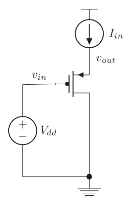

Python实现可以如下所示

```python
if DevModel[i][0]=='p':
    PFET=-1
    Vgs=-Vgs
    Vds=-Vds
    Vgd=-Vgd
else:
    PFET=1

# 其余细节请参见代码5.2
```

我们现在使用网表运行代码

```
*
vdd vdd 0 1
vss vss 0 0
m1 vss in out pch
vin in vss 0.2
i1 vdd out 1e-3

**网表 5.3**
```

并在图5.3中找到结果。

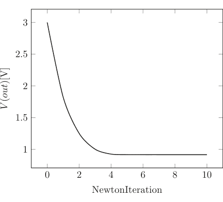

图5.3 PMOS跟随器的源极电压随迭代次数的变化

我们看到迭代收敛得非常快，正如我们现在对牛顿-拉夫森法所预期的那样。

##### 模型实现验证

让我们用一些直流扫描来验证我们的模型实现。

##### 栅极/基极扫描

作为对晶体管实现的最后检查，让我们模拟漏极和集电极电流作为栅极和漏极（基极和集电极）电压的函数，并与我们在第3.4节推导的精确解析公式进行比较。图5.4、5.5和6.6显示了结果。

产生的误差可以通过牛顿-拉夫森迭代次数来调整。

##### 漏极/集电极扫描

漏极和集电极电压也可以进行扫描，我们可以再次与解析结果进行比较。

我们再次发现，精度随着迭代次数的增加而提高，正如人们所预期的那样。

#### 5.2.1.2 带隙电路

带隙电路是一个经典的模拟电路。我们将以图5.7中的电路为例，看看收敛性如何受到影响。它还展示了一个双极型和CMOS晶体管共存并可能产生一些有趣后果的案例。在这个例子中，我们将模拟这样一个电路的启动过程，其中电源电压斜坡上升，模拟电路的开启。

## 5.2 直流非线性仿真

这个电路虽然看起来简单，但存在一些实际的收敛问题。首先，它至少存在两个稳定模式：一个是所有支路无电流流过且 v(out) ≈ 0 的状态，另一个是我们期望的工作状态。如果没有辅助，仿真器很容易找到其中一个状态，通常是关断状态。我们的网表如下：

```
*
vdd vdd 0 2
vss vss 0 0
m1 out a vdd pch
m2 a a vdd pch
q1 out out vss npn
q2 a out d npn
q3 a out d npn
q4 a out d npn
q5 a out d npn
q6 a out d npn
q7 a out d npn
q8 a out d npn
q9 a out d npn
q10 a out d npn
q11 a out d npn
r2 d vss 59.51
.options MaxNewtonIterations=40
.plot v(out) v(a) v(d) v(vdd)
netlist 5.4
```

让我们首先在没有任何特定初始条件的情况下运行这个电路（见图 5.8）。我们看到电路仿真器找到了关断模式。这不是我们期望的解，但我们可以通过为电路设置初始条件来找到它。实际上，会使用启动电路来确保达到期望的解。首先，让我们计算期望的偏置电压。我们发现当两条支路的电流相等时：

$I_s e^{V_{out}/V_{th}} = 10 I_s e^{(V_{out}-V_d)/V_{th}} \rightarrow V_d = V_{th} \ln 10 = 59.51mV$

对于 1 mA 的电流，我们看到 $R_1 = \frac{V_d}{1m} = 59.51ohm$ 且 $V_{out} = V_{th} \ln (10^{-3}/I_s) = 0.71406 V$。我们知道 $Vdd - V_a = \sqrt{10^{-3}/K} + V_T = \sqrt{0.1} + 0.4 \rightarrow V_a = 1.28377 V$

图 5.7 一个简单的带隙电路

图 5.8 没有任何特定初始条件的带隙电路。结果是一个没有电流流过器件的状态。这是一个有效的解，但不是期望的解。

图 5.9 使用初始条件语句设置期望输出电压后的带隙输出电压随时间变化图

我们通过在网表中添加以下行将这些数值输入仿真器：

```
.ic v(a)=1.5 v(out)=0.9 v(d)=0.06 v(vdd)=2 v(vss)=0
```

现在我们可以进行仿真并得到图 5.9 中的曲线。这现在是期望的结果，仿真器证实了我们的计算。这个电路可能非常难以正确收敛。尝试不同的初始条件组合，看看困难可能出在哪里。某些设置会导致解发散，这是由于双极型晶体管中强烈的指数特性；而其他设置则会找到前面提到的零解。这作为一个例子说明，如果起始点足够接近最终解，牛顿-拉夫森法将会起作用。更复杂的模型将防止发散解的出现。你能想到什么方法来限制这个问题吗？

带隙电路被偏置在某个任意点，因为目的只是为了说明仿真器的性能。通常，这样的电路需要在工作温度下具有平坦的温度依赖性。作为练习，鼓励读者正确设计电路尺寸。

对于这些晶体管模型的每个示例，尝试使用不同的初始条件进行实验。你能想到一种方法来破坏代码使其无法收敛吗？双极型晶体管模型由于指数特性很容易发散；尝试各种组合并探索！可以做些什么不同的事情？你能想到改进收敛性的方法吗？

### 5.2.2 收敛准则

正如我们从表 5.1 到表 5.3 的迭代中看到的，每次迭代的总误差下降得相当快，我们只需要定义“完成”意味着什么。换句话说，决定我们期望的精度。有人可能会认为对 KCL 的约束，$f_{KCL}(v_k) < \varepsilon$，是一个显而易见的选择，在某些仿真器中确实如此。这被称为残差约束。然而，它并不总是被实现，用户应该了解所使用的特定仿真器中实现了哪些收敛准则。最常用的准则依赖于连续迭代 $v_k$ 和 $v_{k+1}$ 之间的差异，称为更新准则，此外还有残差收敛准则，例如参见 [4]。

对于残差 $f_{KCL}(v_k)$，如果满足以下条件，我们说牛顿-拉夫森迭代残差已收敛：

$$|f_{KCL}(v_k)| < \text{reltol} \cdot i_{n,\text{max}} + \text{iabstol}$$ (5.21)

其中 $i_{n,\text{max}}$ 是进入节点 $n$ 的最大绝对电流。

牛顿-拉夫森迭代的更新收敛准则是：

$$|v_k - v_{k-1}| < \text{reltol} \cdot v_{k,\text{max}} + \text{vabstol}$$ (5.22)

其中 $v_{k,\text{max}}$ 通常是 $\max(|v_k|, |v_{k-1}|)$。

在大多数仿真器中，牛顿-拉夫森迭代被认为收敛需要同时满足这两个条件。我们可以在我们的 Python 环境中以以下方式实现这一点：

```
Python code
.
.
.
    ResidueConverged=True
    node=0
    while ResidueConverged and node<NumberOfNodes:
        # Let us find the maximum current going into node, Nodes[node]
        MaxCurrent=0
        for current in range(NumberOfCurrents):
            MaxCurrent= max(MaxCurrent,abs(STA_matrix[node][NumberOfNodes+current]*(sol[NumberOfNodes+current])))
        if f[node] > reltol*MaxCurrent+iabstol:
            ResidueConverged=False
        node=node+1
```

```
SolutionCorrection=numpy.matmul(numpy.linalg.inv(Jacobian),f)
UpdateConverged=True
if PointLocal:
    for node in range(NumberOfNodes):
        vkmax=max(abs(sol[node]),abs(sol[node]-SolutionCorrection[node]))
        if abs(SolutionCorrection[node])>vkmax*reltol+vabstol:
            UpdateConverged=False
elif GlobalTruncation:
    for node in range(NumberOfNodes):
        if abs(SolutionCorrection[node])>vkmax*reltol+vabstol:
            UpdateConverged=False
End Python code
```

我们现在可以使用这个收敛检查来运行前面的示例，并比较给定容差所需的迭代次数（代码 5.3.1），并在表 5.4 中找到结果。

正如人们所预期的，迭代次数随着 reltol 的设置而增加。更复杂的带隙电路在给定容差下需要多几次迭代。迭代次数也高度依赖于初始条件，这应该不足为奇。

#### 5.2.2.1 收敛问题

对于实际电路，可能存在数百万个非线性器件，找到正确的工作点（可能存在多个）可能是一项困难的任务。为此，开发了几种方法。首先，应该清楚的是，如果所有电压源和电流源都为零，那么解自然存在，即零解！然后可以简单地将各种电压源和电流源逐渐增加到其标称值，如果这样做得足够慢，电路应该能够跟随，我们将得到一个真实的直流解。通常，这个斜坡上升结束时的解可以用作另一种仿真（如瞬态仿真）的起点。我们将在本节讨论其他方法，选择其中一种通常被称为选择同伦（该术语来自数学学科拓扑学，其中同伦是两个函数之间的关系，其中一个函数通过某个参数连续地变为另一个函数，粗略地说）。对于我们刚刚讨论的斜坡上升情况，我们通常看到斜坡上升、源步进或仿真器中的类似选项。

##### 同伦方法

在本节中，我们将讨论最常见的同伦方法：源步进、$g_{min}$ 步进和（简要地）伪瞬态方法。我们将非常简要地介绍，并重点介绍实践中通常最有效的方法。

##### 源步进

大多数电路具有一个便利的特性：如果电压源为 0 V，电流源为 0 A，则电路的解为 = 0；所有其他电压和电流均为零。我们在本节的引言中简要提到了这种情况。在直流收敛存在问题的情况下，一种方法是从零开始，然后缓慢地将所有源增加到其最终值。这显然是电路从一个状态到另一个状态的连续变化，因此被归类为同伦。在大多数商业仿真器中，它被称为源步进。它通常是实现直流收敛的一种非常方便的方法。诀窍通常在于斜坡的速率，如果新步骤失败，需要调整源的下一个值。它并不总是保证收敛，并且已经进行了大量的理论工作来研究这些问题。通常，阿喀琉斯之踵在于开关型电路中的严重非线性，其中开关点周围的增益可能很大。

让我们看一个交叉耦合反相器电路，我们可以展示一种实现步进算法的方法（代码 5.4）。该电路见图 5.10，网表如下：

图 5.4 (a) CMOS 模型1，(b) CMOS 模型2 的漏极电流与栅极电压关系，与精确计算比较

图 5.5 CMOS 模型2 的漏极电流与漏极电压关系，与精确计算比较

表 5.4 图 5.2、5.3 和 5.4 中示例的牛顿-拉夫森迭代次数与 reltol 的关系

| reltol | 5p2 | 5p3 | 5p4 |
|---|---|---|---|
| 1e-1 | 5 | 5 | 3 |
| 1e-3 | 6 | 6 | 18 |
| 1e-7 | 7 | 7 | 19 |

## 5.2 直流非线性仿真

```
*
M1 out in vss nch
M2 out in vdd pch
M3 in out vss nch
M4 in out vss pch
R1 in vss 10000
R2 out vss 10000
Vdd vdd 0 1
Vss vss 0 0
```

网表 5.5

对于步进算法，我们只需取电源电压 Vdd，并将其值从 0 以一定的步数变化到满量程。请记住，这是直流仿真，因此所有电容器和电感器都已根据需要移除或短路。

Python 代码片段如下：

```
NumberOfSourceSteps=100
For step in range(NumberOfSteps):
    ... Do Newton-Raphson iteration
    ...
        If DevLabel[i]='Vdd':
            STA_rhs[NumberOfNodes+i]=DevValue[i]*steps/NumberOfSourceSteps
    ...
```

其中 rhs 行随着步进的进行而改变源值。这种仿真的结果可以在图 5.11 中找到。显然，该算法选择了中间点解。是否有办法让算法选择另一个解？如果将下拉电阻改为上拉电阻，以及上拉和下拉的混合，根据电阻值的不同，可以看到该算法实现的几种不同结果。

一个自然的困难是当电路出现分岔时，有几条路径通向几个解。算法可能会卡住，无法收敛到任何一个解。通常可以通过改变电路条件来影响这一点。我们可以将电阻改为上拉/下拉，并像以前一样步进电源电压。图 5.12 显示了电阻上拉/下拉的四种组合的结果。

我们在这里看到，给定不同的上拉/下拉电阻组合，响应随斜坡电压的变化而变化。我们还可以看到，在 vdd = 0.4（对应于器件的 VT）附近，收敛遇到了困难。这仅仅是为了说明该方法有时可能遇到的收敛问题。

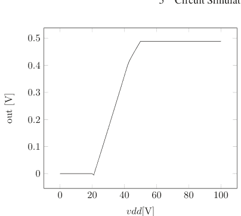

图 5.11 两个电阻均为 100kohm 且下拉到地时的源步进响应

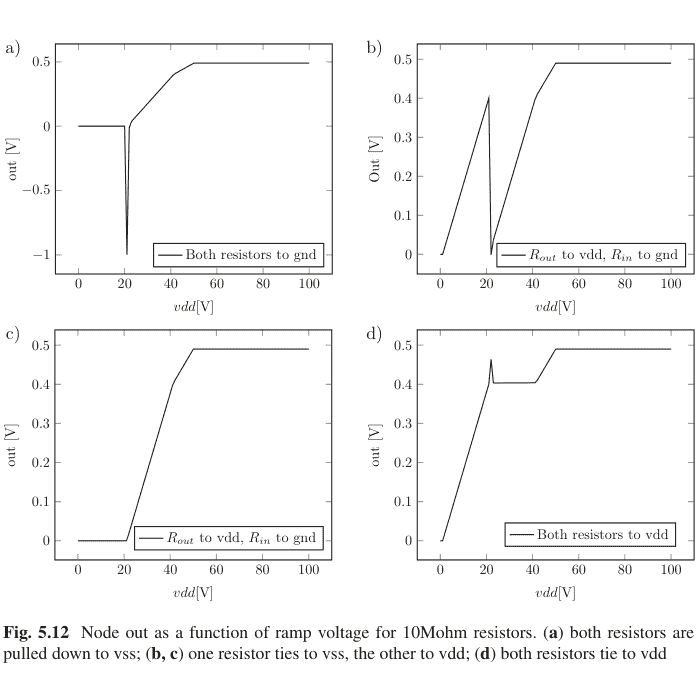

图 5.12 节点 out 作为 10Mohm 电阻斜坡电压的函数。(a) 两个电阻都下拉到 vss；(b, c) 一个电阻连接到 vss，另一个连接到 vdd；(d) 两个电阻都连接到 vdd

##### gmin 步进

另一种常用的方法是在每个节点和地之间添加一个大电阻 $1/g_{min}$，并使电阻值逐渐增大，$g_{min} \rightarrow 0$，并在每一步求解矩阵方程。当 $g_{min}$ 的值达到某个小数值，使得电压和电流的变化不超过某个容差时，就可以认为电路已经收敛。在实际的硅片情况下，由于泄漏和其他因素，每个节点和地之间总是存在一定的电阻，因此 $g_{min} \neq 0$ 不一定是一个不好的近似。这种方法显然也是一种同伦法，因为它将电路从一个状态连续地改变到另一个状态。我们可以用一个非常简单的例子来说明这一点，使用我们刚刚开发的 CMOS 晶体管模型之一，model1。让我们用它来研究图 5.13 中的反相器电路。

我们将使用的网表如下：

```
*
M1 Vo Vi vss nch
M2 Vo Vi vdd pch
Vdd vdd vss 0.9
Vss vss 0 0
Vin Vi 0 0.2
netlist 5.6
```

当尝试运行此网表时，结果是奇异错误。为了进一步研究，让我们写出矩阵方程（为清晰起见，跳过简单的电源和地电流方程）：

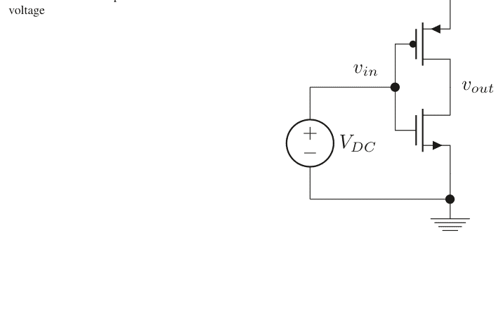

$$\begin{pmatrix} 0 & 1 & 1 \\ 0 & 1 & 0 \\ 0 & 0 & 1 \end{pmatrix} \begin{pmatrix} V_o \\ i_p \\ i_n \end{pmatrix} = \begin{pmatrix} 0 \\ -K(V_{in} - V_{dd})^2 \\ KV_{in}^2 \end{pmatrix}$$

该矩阵显然是奇异的，因为其行列式等于零。根本原因是输出 $V_o$ 没有出现在任何方程中，并且不受限制。显然，将其完全从方程组中移除意味着 KCL 在该节点将不被满足，因此这不是一个选项。此外，PMOS 的输出电流也存在问题，并且 CMOS 晶体管通常不匹配，仅在 $V_{in} = V_{dd}/2$ 时匹配。这些问题都是由于我们使用的非常简化的晶体管模型的输出电导为零。不久我们将讨论第 3 章中的晶体管 model2 的例子，但让我们再稍作停留，说明 gmin 步进方法。让我们在输出和 $v_{ss}$ 之间添加一个值为 $R = 1/g_{min}$ 的电阻，看看会发生什么（图 5.14）。这样的电阻将向我们的矩阵添加另一个方程，现在变为

$$\begin{pmatrix} 0 & 1 & 1 & 1 \\ 0 & 1 & 0 & 0 \\ 0 & 0 & 1 & 0 \\ -1/g_m & 0 & 0 & 1 \end{pmatrix} \begin{pmatrix} V_o \\ i_p \\ i_n \\ i_o \end{pmatrix} = \begin{pmatrix} 0 \\ -K(V_{in} - V_{dd})^2 \\ KV_{in}^2 \\ 0 \end{pmatrix}$$

如果现在没有其他问题，方程组是可解的。让我们看看输出节点作为 $g_m$ 的函数。结果在表 5.5 中。

我们注意到，随着 $g_m$ 的变化，输出电压也随之变化，因此没有收敛到特定的输出电压。原因是两个 MOS 晶体管输出之间的电流差流入该电阻，输出电压将与其成正比缩放。在专业的仿真器中，这种情况将导致

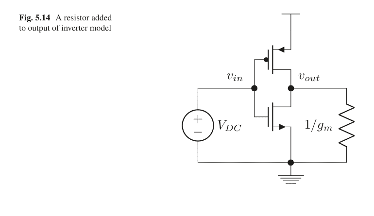

## 5.2 直流非线性仿真

表 5.5 当 $V_{in} = 0.2V$ 时，输出电压作为 $g_m$ 的函数

| $g_m$ | V(out) |
|---|---|
| 1e-5 | 45 |
| 1e-7 | 4500 |
| 1e-9 | 450,000 |

表 5.6 当 $V_{in} = \frac{V_{dd}}{2} = 0.45V$ 时，输出电压作为 $g_m$ 的函数

| $g_m$ | V(out) |
|---|---|
| 1e-5 | 0 |
| 1e-7 | 0 |
| 1e-9 | 0 |

出现错误，并设置收敛标志。如果我们设置输入电压 $V_{in} = V_{dd}/2$，情况就不同了。现在电流输出匹配，我们应该看到更好的收敛性（表 5.6）。我们使用了 **代码 5.5**。

这是 gmin 方法如何运作的一个简单例子。它试图通过简单地向各个节点添加电阻来找到一个稳定的解。

##### 伪瞬态

伪瞬态方法，简称 ptran，可能是实践中效果最好的方法。这里所有的动态元件，电感器和电容器，不是被禁用而是实际被使用。该方法的基本思想是使用*时间*作为连续变量，如果可以将电路视为“永远”仿真，那么原则上可以达到直流值，保持所有独立源在其直流值。该方法通过在所有电压源和一些受控源串联添加电感器，以及在所有独立电流源和一些受控电流源并联添加电容器来工作。自然，STA 系统现在随着这些额外的节点和电流而增加。此外，作为电路的初始条件，所有由串联电感器插入创建的新节点都设置为电压源的值。所有其他节点最初设置为 0 V，因此许多电容器两端有 0 V。最后，所有电流最初设置为 0 A。在此初始条件下，运行常规瞬态仿真。在实践中，这种方法效果非常好。显然，在此分析中，从初始状态到最终状态的过渡无关紧要。因此，只要电路收敛到正确的最终值，就可以忽略截断误差。这意味着伪时间中的步长可以比常规瞬态大得多，并且只需要确保牛顿-拉夫逊算法收敛。

这种方法的一个问题是所有这些动态元件（电感器和电容器）可能导致谐振和振荡。

我们将在本章的瞬态部分查看这种算法的一个例子。

##### dptran

阻尼伪瞬态方法是 ptran 方法的一种变体，它通过降低振荡的可能性来改善收敛性。

### 5.2.3 特殊情况：需要注意的问题

**浮置器件示例**
让我们看看按照我们在此概述的方法，一个浮置电阻会是什么样子。按照我们的大纲，矩阵方程现在将如下所示

$$\begin{pmatrix} 0 & 0 & -1 \\ 0 & 0 & 1 \\ -1 & 1 & -R \end{pmatrix} \begin{pmatrix} v_a \\ v_b \\ i \end{pmatrix} = \begin{pmatrix} 0 \\ 0 \\ 0 \end{pmatrix}$$

我们很快看到矩阵的行列式为零（为了有非平凡解，它必须为零）。上面两行导致电流 $i = 0$ 的相同方程，我们剩下最后一行：

$$(-1 \quad 1) \begin{pmatrix} v_a \\ v_b \end{pmatrix} = 0$$

这是一个欠定方程组，一个方程两个未知数，导致有无穷多个解。仿真器会发出一些关于奇异矩阵或类似警告的抱怨。在Python设置中尝试网表

```
Netlist
*
R1 a b 10
```

脚本将因奇异矩阵警告而退出。
在几乎所有仿真器中，解决这个问题的方法是在电路的所有节点上放置一个接地电阻，类似于我们在上一节讨论的gmin阻尼方法。该电阻的阻值为 $1/g_{min}$，其中 $g_{min}$ 是用户控制的电导变量。在刚才讨论的情况下，我们有

$$\begin{pmatrix} 0 & 0 & -1 & -1 & 0 \\ 0 & 0 & 1 & 0 & 1 \\ -1 & 1 & -R & 0 & 0 \\ -1 & 0 & 0 & -1/g_{min} & 0 \\ 0 & 1 & 0 & 0 & -1/g_{min} \end{pmatrix} \begin{pmatrix} v_a \\ v_b \\ i \\ i_a \\ i_b \end{pmatrix} = \begin{pmatrix} 0 \\ 0 \\ 0 \\ 0 \\ 0 \end{pmatrix}$$

我们现在看到电流 $i_a, i_b = -i$ 并且

$$-v_a + v_b = iR$$
$$v_a = i / g_{min}$$
$$v_b = -i / g_{min}$$

由于 $g_{min}, R > 0$，其唯一可能的解是 $i = 0$。

我们也可以使用我们的Python设置和网表来模拟这个

```
Netlist
*
R1 a b 10
Rgmin1 a 0 10000
Rgmin2 b 0 10000
```

我们发现它现在收敛了，并且收敛到我们刚刚推导出的相同解。

## 5.3 线性化技术

非线性电路的一个方面是，我们可以在特定工作点附近对响应进行线性化，并在该点附近的小区域内应用我们的线性分析工具（交流分析），因为该区域内的响应都接近线性。本节将简要讨论仿真器如何实现这一点。我们将使用我们的晶体管模型作为例子。让我们从最简单的模型1开始。

**模型1**
该模型具有由公式3.47给出的简单传递函数。为了线性化，我们在工作点附近进行简单的泰勒展开：

$g_m = \frac{\partial I_d}{\partial V_{gs}} \bigg|_o = 2KV_{gs} \bigg|_o = 2K(V_{g,o} - V_{s,o})$

其中下标 $o$ 表示工作点处的直流值。

输入阻抗是无穷大的，输出阻抗同样如此。然后我们发现晶体管的线性化版本是一个增益为 $g_m$ 的压控电流源。这可以很容易地纳入我们在第4.3.3节的矩阵设置中。

**模型2**
这里的传递函数由于各种工作区域而稍微复杂一些，所以我们有

$g_m = \begin{cases} 0, & V_{gs} - V_T < 0 \\ 2KV_{ds}, & V_{ds} < V_{gs} - V_T \\ 2K(V_{gs} - V_T)(1 + \lambda V_{ds}) \end{cases}$

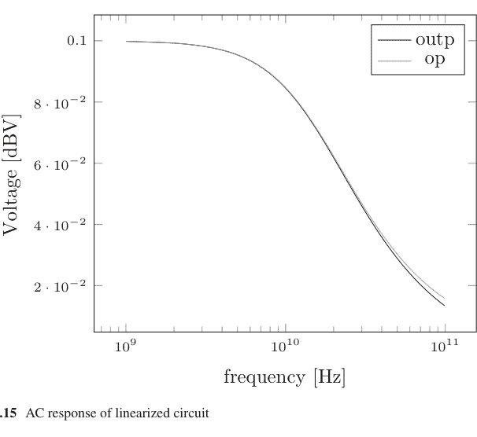

图5.15 线性化电路的交流响应

$$g_o = \begin{cases} 0, & V_{gs} - V_T < 0 \\ 2K((V_{gs} - V_T) - V_{ds}), & V_{ds} < V_{gs} - V_T \\ K(V_{gs} - V_T)^2 \lambda \end{cases}$$

这又是一个压控电流源，其增益取决于工作区域，并且还有一个输出电导*连接*漏极和源极端子，该电导取决于直流偏置。这个电导可以用一个输出电阻来建模：$r_o = 1/g_o$。

流程将是首先运行非线性直流仿真以建立工作点。接下来，运行交流仿真，将所有非线性器件替换为其线性化版本，并建立一个新的矩阵系统。

鼓励读者修改交流仿真代码，并在我们刚刚在图4.10中构建的电路上实现这种线性化方案。最终应该得到如图5.15所示的交流响应。

## 5.4 瞬态非线性仿真

在本节中，我们将研究如何设置瞬态非线性仿真器。这将涉及时间步长算法和积分方法的非常重要的选择。我们在第1章和第2章讨论了积分方法的基础知识，这里我们将进一步讨论它们。它们对精度有显著影响，我们将在我们的仿真器的帮助下深入探讨细节。此外，我们将刚刚在直流部分讨论的非线性求解器与时间步长算法相结合，其中局部截断误差将使用第4.6.6节概述的方法进行评估。首先，非线性求解器需要在给定时间步长下找到解，然后我们评估截断误差以查看是否满足容差。如果不满足，则需要调整时间步长。在本章中，我们将首先使用均匀时间步长，并记录在给定一组仿真参数下，我们的三种晶体管模型各自所需的迭代次数。接下来，我们讨论可变时间步长的概念以及如何实现它。然后我们将使用可变时间步长算法重新检查我们的电路，并注意所需迭代次数方面的差异，并比较精度。我们还将描述全局截断误差的概念，以及它如何取决于给定电路和其他因素。下一节将描述非线性电容在CMOS晶体管模型中的实现，然后描述*断点*的概念。本节最后详细描述了稳态仿真器，包括扰动技术。

大多数示例将使用梯形积分方法。代码中也提供了Gear2和后向欧拉法。

### 更新的主瞬态代码

此时，我们的瞬态仿真器已经具备了所有正确的部分。我们在第4章定义了局部截断误差及其代码，其中我们还讨论了各种差分方程的实现。本章讨论了求解非线性方程的牛顿-拉夫逊实现。我们现在可以将所有这些代码合并到一个更大的代码段中，包含所有这些不同的部分。正如读者无疑已经注意到的，仿真器代码变得相当庞大且难以阅读。因此，我们将把各个部分合并到附录A中文件analogdef.py定义的子程序中。因此，我们在第5.6.6节有**代码5.6**。该代码现在将用于我们后续所有使用瞬态技术的仿真。

### 5.4.1 固定时间步长

让我们再次查看图5.1的情况，其中没有动态元件。为了实现非线性瞬态仿真，我们将简单地遵循我们在上一节概述的步骤，在每个时间步长计算雅可比矩阵并进行牛顿-拉夫逊迭代，当满足容差要求时，我们将接受该时间步长。这称为均匀时间步长仿真。更复杂的可调时间步长情况我们将在第5.4.2节讨论。

很明显，处理非线性情况的一种方法是采用小时间步长，此时器件近似线性，然后使用牛顿-拉夫逊来确定误差。

流程现在如下：

- 猜测一个时间步长，$\Delta t_{step}$。
- 使用牛顿-拉夫逊迭代求解在时间 $N \cdot \Delta t_{step}$ 的新变量。我们使用第5.2.1节开发的收敛标准。
- 如果牛顿-拉夫逊方法或第4.6.6节开发的LTE标准在给定时间步长下未收敛，则从头开始，使用更小的时间步长，我们在本节中手动进行。

本节将展示几个非线性瞬态仿真的例子，我们将研究有和没有动态元件的电路。前两个电路将是带有电阻负载的简单放大器和缓冲器，其余将是具有各种动态元件的电路，其中电路的记忆起作用。

#### 5.4.1.1 均匀时间步长的示例电路：纯电阻情况

当没有电容和电感等动态元件时，没有需要求解的时间微分方程，因此电路中没有记忆。电路在时间 $t$ 的状态是同一时间驱动源的结果。看待这种瞬态仿真的一种方式是将其视为一系列直流仿真，我们可以将前一个时间步长作为下一个时间步长的起点。这里我们将展示两个此类直流仿真示例，然后引入动态元件。

*使用CMOS模型2的简单缓冲器*
让我们使用第3.4节的晶体管模型2来仿真图5.1中的缓冲器。我们将使用的网表是

```
*
vdd vdd 0 0.9
vss vss 0 0
vinp inp 0 sin(0 1.95 1e9 0 0)
vinn inn 0 sin(0 1.95 1e9 0.5e-9 0)
r1 vdd inp 100
r2 inp vss 100
r3 vdd inn 100
r4 inn vss 100
r5 vdd outp 100
r6 vdd outn 100
i1 vs vss 1e-3
m1 outn inp vs nch1
m2 outp inn vs nch1
.options MaxSimTime=2e-9 reltol=1e-7 FixedTimeStep=True
deltaT=1e-12 iabstol=1e-12 vabstol=1e-8 lteratio=200000
.plot v(outp) v(outn)
netlist 5.7
```

## 5.4 瞬态非线性仿真

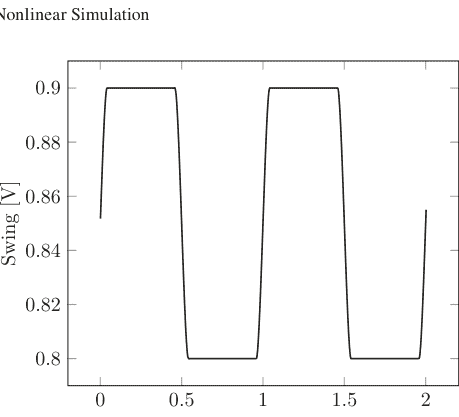

图 5.16 使用晶体管模型2的缓冲器输出

表 5.7 基本仿真参数：reltol = 1e-7, iabstol = 1e-12, vabstol = 1e-8, FixedTimeStep = True

| 参数 | 值 | 单位 |
|---|---|---|
| deltaT | 1e-12 | s |
| 迭代次数 | 5719 | |

我们在图 5.16 和表 5.7 中找到了输出结果。当然，该模型仍然很不真实，但其行为相当合理。

牛顿-拉夫森法的误差计算与直流情况相同。对于时间步长本身，由于不存在动态元件，因此没有误差估计。这里的主要目的是说明每个时间点的计算流程。读者很快会意识到，如果解不收敛，必须更改时间步长并重新开始，那么完成仿真可能需要一段时间。因此，某种可调节时间步长的方法至关重要，我们将在第 5.4.2 节讨论实现方法。许多仿真器从一开始就使用类似的算法，其中初始时间步长被设置为总仿真时间的一个分数。如果满足误差条件，它就继续步进。这有时可能会产生意想不到的后果，因为仿真器追踪出的解在原则上可能是可行的（想象一个没有摆幅的压控振荡器），但在实践中，噪声等因素会使电路启动，如果时间步长太大，数值噪声可能不足以触发启动。换句话说，初始时间步长可能太大，以至于电路的时间尺度无法被注意到。

> 确保默认的初始时间步长足够小，以便电路能够正常启动。否则，电路可能无法正确响应，从而引起混淆。

##### CMOS 反相器

更真实的模型2的优势在于，我们还可以实现一个 PMOS 晶体管，并将其与 NMOS 以数字门电路的方式连接。例如，我们可以仿真一个 CMOS 反相器。

```
Netlist
*
vdd vdd 0 0.9
vin in 0 sin(0.45 0.45 1e9 0 0)
vss vss 0 0
mn1 out in vss nch2
mp2 out in vdd pch2
    .options MaxSimTime=2e-9 reltol=1e-2 FixedTimeStep=True
deltaT=1e-12 iabstol=1e-3 vabstol=1e-3 literatio=1000000
MaxNewtonIter=15
.ic v(in)=0.45 v(out)=0.45
.plot v(out) v(in)
Netlist 5.8
```

现在让我们运行一个瞬态仿真。输入是一个振幅为 450 mV、直流偏置为 450 mV 的正弦波，因此信号围绕中点摆动；我们在图 5.17 和表 5.8 中找到了结果。

请注意，电容没有被建模，我们可以以任何速度驱动这个实体，它仍然会工作。

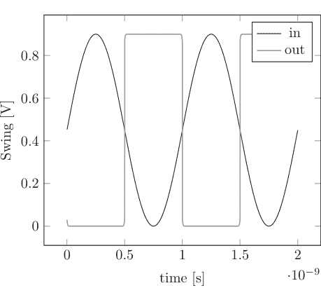

表 5.8 给定固定时间步长下的迭代次数

| 参数 | 值 | 单位 |
|---|---|---|
| deltaT | 1e-12 | s |
| 迭代次数 | 2052 | |

#### 5.4.1.2 使用均匀时间步长的示例电路：动态情况

最后两个示例使用了带有电阻的有源器件来说明非线性技术。截断误差不存在，LTE 误差检查算法也没有必要。接下来的几个电路示例将同时包含电容和电感，因此从一般情况来看会更有趣。我们将从带有电容的交叉耦合反相器开始，然后是振荡器设计和一个射频混频器电路。

##### 交叉耦合反相器

使用改进的晶体管模型（模型2），我们现在来看一对交叉耦合的反相器，类似于我们在直流部分之前看到的。我们注意到那里有三个可能的解，特别是中点解是稳定的。现在让我们在系统中添加一些电容，对网表 5.5 进行如下补充：

```
C1 in vss 1e-13
C2 out vss 1e-13
.ic v(in)=0.0 v(out)=0.0
```

我们现在可以将其作为时间的函数来运行，结果在表 5.9 中。正如我们已经习惯的那样，中点解会驱动到电源轨，其时间尺度直接取决于电容负载。这与收敛到电源中点的直流解形成对比。

这个例子的主要教训是，直流电路可能具有一些令人惊讶的特性，从而增加了求解的难度。

##### 振荡器

作为另一个例子，让我们研究一个振荡器。它是许多现代芯片中的关键电路实现之一，人们已经付出了大量努力来理清它们的行为 [22]。在电路开发环境中，一个自由运行的振荡器本身用处不大，也许除了用于工艺监控方案。通常需要一种方法来控制振荡频率，这通常通过一个电压控制的电容，由输入电压来控制频率。这种器件称为压控振荡器（VCO）。这里我们将研究一个没有此类电容的振荡器。这样的振荡器是仿真器实现的绝佳测试平台，因为特别是其幅度高度依赖于所使用的具体算法，我们在第 5.4 节中看到了一个例子。我们将在第 5.4.2 节讨论可变时间步长实现时，以及在第 5.5.7 节从稳态仿真器和相位噪声仿真的角度再次讨论它。现在，我们只进行瞬态仿真，目标是使用我们开发的简化 MOS 模型2来启动振荡。

振荡器是一个表现出受控不稳定性的系统。存在一种正反馈机制，导致扰动增长，直到晶体管中的非线性限制了增长。实际上，摆幅变得如此之大，以至于晶体管对失去了增益。这一点可以从估计分析的角度进行分析，并已在其他地方完成 [22, 23]。实现这种反馈效应的方法有很多，这里我们将重点讨论一个 LC 振荡器，它由一个电感和一个电容组成，作为一对交叉耦合 NMOS 晶体管的负载。这种谐振回路（通常指并联的电容和电感）总是存在一些电阻损耗，建模为并联电阻。这样的电阻也可以代表进入谐振回路的串联损耗。晶体管对的作用是为系统提供负电阻（或增益），从而维持振荡。振荡器的研究是一个内容丰富的领域，涉及许多复杂问题。如果读者想深入研究细节，强烈推荐阅读 [22]。现在让我们看看我们的振荡器模型（见图 5.18）。网表很直接。

```
Netlist
*
vdd vdd 0 0.9
vss vss 0 0
l1 vdd outp 1e-9
l2 vdd outn 1e-9
c1 vdd outp 1e-12
c2 vdd outn 1e-12
r1 vdd outp 1e3
r2 vdd outn 1e3
m1 outp outn vss nch1
m2 outn outp vss nch1
i1 outp vss pwl(0 0 1e-8 0 1.1e-8 1e-3 1.2e-8 0)
    .options MaxSimTime=6e-8  reltol=1e-3  FixedTimeStep=True
deltaT=1e-12      iabstol=1e-6   vabstol=1e-6   MaxNewtonIter=15
ThreeLevelStep=True
.plot v(outp) v(outn)
netlist 5.9
```

请注意，为了使仿真在合理的时间内启动，通常使用一个理想的分段线性电流源来“刺激”它，该电流源会短暂开启。如果没有这个，仿真器可能只会找到另一个稳定点，即直流点，特别是如果跨导增益较弱的话。在我们的仿真器中使用三种积分方法运行此网表，结果如图 5.19 所示。

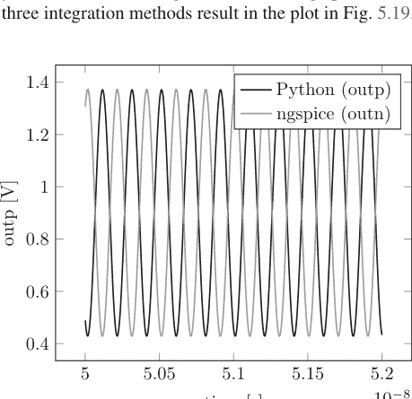

图 5.19 使用 TRAP 方法的振荡器输出与使用 ngspice 的相同方法的比较。注意 ngspice 中的输出节点是 outn，而 Python 中是 outp，不仅幅度和频率相同，相位也相同

## 5.4.1 固定时间步长仿真

表 5.10 固定时间步长下 60 ns 仿真的迭代次数

| 参数 | 值 | 单位 |
|---|---|---|
| deltaT | 5e-12 | S |
| 迭代次数 | 19,402 | N/A |

初始启动阶段之后是如图 5.25 所示的稳态振荡。使用 ngspice 可以构建一个行为与我们模型完全相同的晶体管模型；然后我们可以用它来比较我们的仿真器实现与 ngspice 版本。如图 5.25 所示，两者几乎完全相同。我们可以使用文献 [23] 中推导的公式来估算振幅。我们发现

$$A = \sqrt{\left(g_m - \frac{1}{R}\right)\frac{4}{g_m^3}}$$

与仿真结果相比，我们发现两者合理吻合，误差约为 5%。我们可以将设置总结在表 5.10 中。

##### 射频混频器电路

混频器电路是窄带无线电类电路中的主力（图 5.20）。它用于将调频信号转换到基带（或低频）。它也可以用于将基带频率上变频到射频，用于发射机。网表如下

```
*
vdd vdd 0 0.9
vss vss 0 0
vinp in1 0 sin(0 0.3 1e9 0 0)
vinn in2 0 sin(0 0.3 1e9 5e-10 0)
r1 vdd inp 100
r2 inp vss 100
r3 vdd inn 100
r4 inn vss 100
r5 vdd outp 100
r6 vdd outn 100
c1 in1 inp 1e-12
c2 in2 inn 1e-12
i1 vs vss sin(1e-3 100e-6 1.001e9 0 0)
m1 outn inp vs nch
m2 outp inn vs nch
i2 vs2 vss sin(1e-3 100e-6 1.001e9 4.995e-10 0)
m3 outp inp vs2 nch
m4 outn inn vs2 nch
.options MaxSimTime=2e-6 reltol=1e-3 FixedTimeStep=True
deltaT=2e-11 iabstol=1e-6 vabstol=1e-6 MaxNewtonIter=15
ThreeLevelStep=True
```

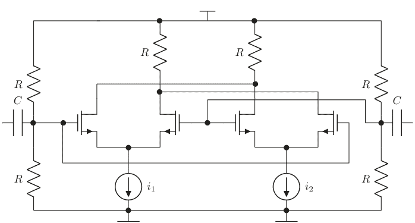

图 5.20 吉尔伯特单元混频器电路

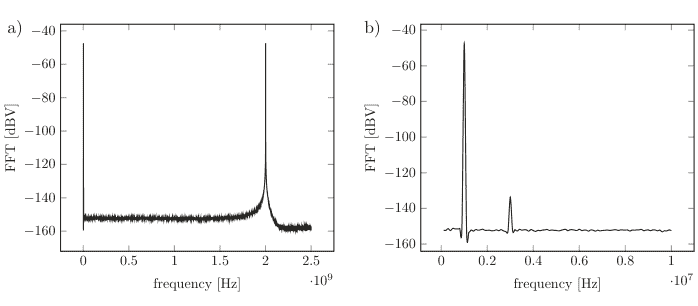

图 5.21 该图显示了输出差分电压的频谱：(a) 直到 2.5GHz 的全频谱，以及 (b) 围绕 1 MHz 下变频信号的放大图

```
spice
.plot v(outp) v(outn)
netlist 5.10
```

我们可以对此进行仿真并查看生成的基带信号。我们选择的输入射频信号是 1GHz + 1 MHz。本振频率为 1GHz。因此我们可以预期在 1 MHz 处出现基带信号。这意味着仿真时间必须大于 1μs。这相当漫长。在本章后面的第 5.5.4 节，我们将探讨一种类似的情况，但使用一种好得多的仿真算法（PAC），届时我们将展示其在获得结果方面的速度提升。仿真结果见图 5.21。

### 5.4.2 可调时间步长

我们在第 5.4.1 节中看到，使用固定时间步长会相当麻烦，因为在某个时间点可能无法满足精度要求，可能需要重新进行仿真。这里我们将演示时间步长调整的威力。在本节末尾我们将讨论精度方面的一些损失，但相对于仿真时间的加速是显著的。

#### 5.4.2.1 时间步长调整

可变时间步长的改变相对容易实现，但问题更多在于选择哪种算法。很明显，如果牛顿迭代在某个合理的迭代次数内（通常为五次）没有收敛，我们就需要采用更小的时间步长。这个步长应该多小，以及之后时间步长如何变化，是本节将要讨论的问题。人们可能认为，如果未满足收敛标准，尝试将时间步长除以 2；如果满足，则将时间步长加倍，是个好主意。让我们用一个振荡器来实验一下。这种电路是一个很好的测试平台，因为如果时间步长算法错误，它就会停止振荡（在理想化的无噪声世界中，振荡器可以有一个直流解）。让我们研究第 5.4.1.2 节中的振荡器。我们可以尝试实现将时间步长增加和除以二的想法，看看会发生什么（见图 5.22）。

```python
if NewtonConverged:
    .
    .
    .
    if not FixedTimeStep:
        deltaT=2*deltaT
    .
    .
    .
else:
    .
    .
    .
    SimTime=SimTime-deltaT
    deltaT=deltaT/2
```

我们在图 5.22 中看到结果。

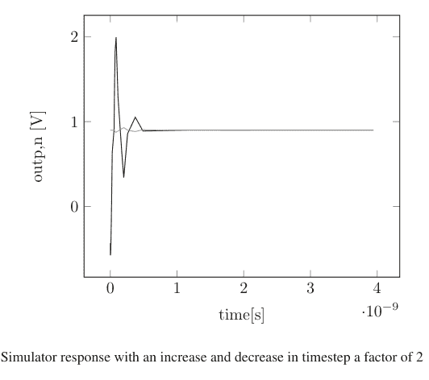

这里发生了什么？问题是时间步长很快变得太大，仿真器“错过”了振荡，反而找到了直流解。我们可以尝试用 MaxTimeStep 构造来补救这种情况。

```python
if NewtonConverged:
    .
    .
    .
    if not FixedTimeStep:
        deltaT=min(MaxTimeStep,2*deltaT)
    .
    .
    .
else:
    .
    .
    .
    SimTime=SimTime-deltaT
    deltaT=deltaT/2
```

结果如图 5.23 所示。

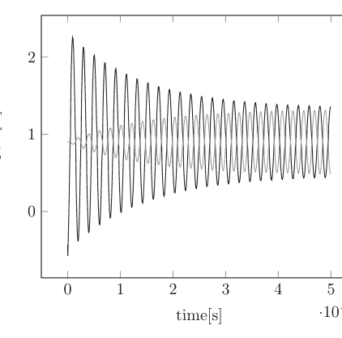

**图 5.23** 采用最大时间步长实现的仿真器响应

现在求解器运行得好多了。或者，我们可以使时间步长的增加和减少量不相等，如下面的代码片段所示：

```python
if NewtonConverged:
    .
    .
    .
    if not FixedTimeStep:
        deltaT=1.01*deltaT
    .
    .
    .
else:
    .
    .
    .
    SimTime=SimTime-deltaT
    deltaT=deltaT/1.1
```

结果如图 5.24 所示。

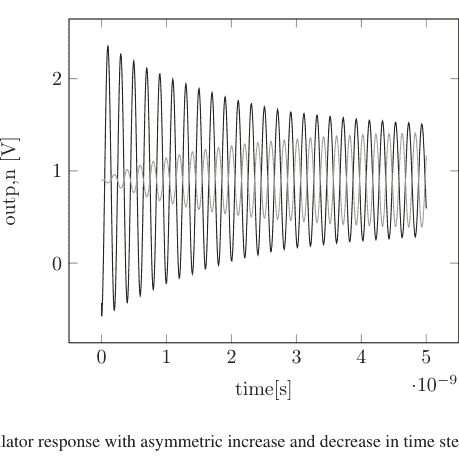

**图 5.24** 时间步长非对称增减的仿真器响应

这似乎也足够有效。让我们也看看通过改变 reltol 来实现的增/减算法。我们在表 5.11 中找到结果。

**表 5.11** 两级时间步长调整算法随 reltol 的变化

| reltol | 振幅 |
|---|---|
| 1e-1 | 0.47 |
| 1e-2 | 0.47 |
| 1e-3 | 0.47 |
| 1e-4 | 0.47 |

仿真器总会改变时间步长，这导致数值噪声增加，即使在高 reltol 下也会使振荡开始。

这种特定实现的根本困难在于它每次更新时都会改变时间步长。这将增加累积误差。让我们改为通过添加第三个中间级别来调整它。我们所做的只是跟踪电压差与误差限值的最大比值，如

$$v_{\max} = \frac{|v_k - v_{pred}|}{reltol \cdot v_{k,\max} + vabstol}$$

对于所有电压节点。如果这个最大值 >0.9，我们减少一个百分比；如果 <0.1，我们增加另一个百分比；如果介于这些限制之间，我们保持时间步长不变。这将在仿真的大部分时间内保持时间步长相同，并应提高精度。让我们按照以下代码片段实现这一点：

表 5.12 三级时间步长调整算法随 reltol 的变化

| reltol | 振幅 |
|---|---|
| 1e-1 | 0 |
| 1e-2 | 0 |
| 1e-3 | 0.47 |
| 1e-4 | 0.47 |

注意，对于高 reltol，中间时间步长如此之长，以至于仿真器错过了振荡！在这些情况下产生的数值噪声较少，仿真器找到了直流解。

表 5.13 两种时间步长调整版本的精度

| 属性 | 固定时间步长 | MaxTime, % 差异 | 小幅增加, % 误差 |
|---|---|---|---|
| 频率 | 5.032e9 | 0.1 | 0.1 |
| 振幅 | 0.47 | 2 | 1 |

让我们像刚才对两级算法所做的那样，对不同的 reltol 运行振荡器。我们在表 5.12 中找到结果。

我们可以使用这些方法，并与固定时间步长解进行比较，并以固定时间步长作为绝对参考来测量频率和振幅。然后我们在表 5.13 中找到结果。

#### 5.4.2.2 总结

时间步长控制是商业仿真器严格保密的秘诀，因为它直接影响仿真器性能。在本节中，我们展示了几种可以采用的策略，并展示了每种策略与更精确的固定时间步长仿真相比可能存在的优缺点。

强烈鼓励读者自行进一步探索。关于时间步长调整的文献非常丰富，读者可以，例如，参考文献 [4, 15–17, 24] 来了解人们尝试过的方法。

我们使用可变时间步长这一事实，在使用 Gear2 实现时可能会引起问题。如果我们回顾前面的章节和第 1 章，Gear 方法依赖于两个时间步长之前的信息。如果这两个时间步长不同，我们就无法得到正确的值，然后需要进行插值（外推）以获得适当的数值。除非加以补救，否则这通常会导致收敛问题。你能找到一个好方法来规避这个潜在问题吗？

#### 5.4.2.3 带时间步长控制的示例电路：纯电阻情况

在探讨了调整时间步长大小的常见方法后，让我们重新审视第5.4.1节中的测试电路。

##### 采用真实CMOS模型的简单缓冲器
我们现在可以使用可调时间步长重新模拟之前的缓冲器。所得的迭代次数以及与固定时间步长情况的比较可在表5.14中找到。

##### CMOS反相器
CMOS反相器可以使用可调时间步长进行模拟，并与固定时间步长的情况进行比较。

```
Netlist
*
vdd vdd 0 0.9
vin in 0 sin(0.45 0.45 1e9 0 0)
vss vss 0 0
mn1 out in vss nch2
mp2 out in vdd pch2
.options MaxSimTime=2e-9 reltol=1e-2 FixedTimeStep=False
deltaT=1e-12 iabstol=1e-3 vabstol=1e-3 Iteratio=1000000
MaxNewtonIter=15
.ic v(in)=0.45 v(out)=0.45
.plot v(out) v(in)
```

现在让我们运行一个瞬态仿真。输入是一个振幅为450 mV、直流偏置为450 mV的正弦波，因此信号围绕中点摆动；我们通过图5.25中对时间求导来找到所得的边沿速率。

我们在此看到，我们使用的时间步长调整算法在沿电压边沿步进时会导致误差。这从根本上解释了为什么有时使用均匀时间步长来模拟电路非常有用。

**表5.14** 10 ns仿真的迭代次数与reltol以及固定时间步长与三级非对称时间步长调整的比较

| reltol | 固定时间步长 | 1e-3 | 1e-4 | 1e-5 | 1e-6 | 1e-7 |
|---|---|---|---|---|---|---|
| # 迭代次数 | 5719 | 827 | 827 | 912 | 969 | 1078 |

然而，趋势值得关注：reltol设置得越严格，需要的迭代次数就越多，并且与固定时间步长相比，速度（迭代次数）有显著提升。

**图5.25** CMOS反相器输出的导数，我们比较了可调时间步长与固定时间步长的边沿速率

#### 5.4.2.4 带时间步长控制的示例电路：动态情况

##### 交叉耦合反相器
让我们再次使用可调时间步长控制来运行交叉耦合反相器。我们可以使用各种初始条件重新运行收敛仿真，并与固定时间步长的情况进行比较。

另一个有趣的点可以通过观察电压边沿附近的响应来得出。我们在图5.26中找到了以下结果，其中模拟了再生时间尺度。另见表5.15，其中我们也比较了与固定时间步长情况的迭代次数。

我们还可以使用练习5（稳定交叉耦合对）的结果来计算精确的时间常数

$$\tau = \frac{C}{g_m}$$

其中，对于$g_m$，我们使用两个晶体管跨导的总和以及完整的网表电容值。我们得到

$$\tau = \frac{10^{-13}}{2 \cdot 2 \cdot 10^{-3}} = 2.5 \cdot 10^{-11}$$

比较结果如表5.16所示。正如我们所预期的，达到最终结果所需的迭代次数显著减少。另请注意，两种方法之间的差异被斜率估计的不确定性（sigma > 斜率差）所覆盖。两种模拟都在精确值的误差范围内。

**图5.26** 使用固定时间步长和可调时间步长模拟并比较了再生时间尺度。可以看出，两种方法的斜率非常相似

**表5.15** 使用固定和可调时间步长，交叉耦合反相器稳定所需的迭代次数

| 时间步长方法 | 迭代次数 |
|---|---|
| 三级 | 未触发 |
| 两级 | ~2000 |
| 固定 (1e-12) | ~10,000 |

可调时间步长算法很容易开始采取过大的步长，导致其错过产生足够的数值噪声来触发电路决策。

**表5.16** 固定和可调两级时间步长与精确计算的比较表

| 方法 | 固定时间步长 | 可调时间步长 | 精确值 | 单位 |
|---|---|---|---|---|
| 时间常数 | 2.60 | 2.68 | 2.5 | 10^-11 ln [V]/s |
| Sigma | 0.28 | 0.40 | N/A | 10^-11 ln [V]/s |
| 迭代次数 | 50,062 | 6221 | N/A | |

##### 振荡器
振荡器在第5.4.2.1节关于可调时间步长算法的讨论中已经研究过。迭代次数与时间步长方法的关系可在表5.17中找到。

**表5.17** 网表5.9中振荡器在不同时间步长实现下的迭代次数

| 时间步长方法 | 固定 | 两级 | 三级 |
|---|---|---|---|
| 迭代次数 | 19,402 | 14,776 | 14,035 |

**表5.18** 在固定和可变时间步长控制下，达到一定精度所需的每时间步长数比较

| 方法 | 固定时间步长 | Trap可调时间步长 |
|---|---|---|
| 增益误差[%] | 0 | 1 |
| 迭代次数 | 100,000 | 68,200 |

##### RF混频器电路
作为比较固定时间步长与可调时间步长的电路拓扑的最后一个例子，让我们看看图5.20中的混频器。我们使用与之前相同的容差和仿真停止时间。为了比较精度，我们使用RF-基带转换的增益。我们在表5.18中找到了结果。

迭代次数的改进约为32%，而误差仅有适度增加。

我们需要强调的是，由于电路规模较小，所有这些方法的误差都非常小，而对于更大、更现实的电路，误差的恶化程度可能会更高。

#### 5.4.2.5 时间步长控制的好处

在前几节中，我们探讨了时间步长以及如何在电路活动需要时调整时间步长使其变小，以及在活动强度较低时采取更长的步长。所付出的代价是精度，因为当时间步长变化时，特别是快速变化时，差分方程的精度会降低。巨大的好处是整体仿真速度的提升。我们在此查看的简单例子中，仿真速度最高提升了四倍。这是显著的。我们还注意到，误差方面的代价是适度的。确实，对于现代仿真器，时间步长算法通常是一个严格保密的秘诀。实际上，如果一个人对高精度感兴趣，通常会通过将MaxTimeStep变量设置为某个小数值来人为地限制时间步长。这通常会迫使仿真器在整个仿真过程中采取近似相等的时间步长。正如读者无疑意识到的，这可能会极大地增加仿真所花费的物理时间，这是设计者通常会有所保留地做出的决定。

### 5.4.3 收敛问题

收敛问题是电路设计者的噩梦。好消息是，现代仿真器在自行解决这些问题方面要好得多，需要设计者的协助也少得多。过去的情况则大不相同。设计者很大一部分时间都花在调试收敛问题上，并且被迫比预期更多地了解仿真器。在本节中，我们将使用我们的仿真器查看几个它会遇到困难的例子，并研究各种尝试解决它的方法。

在所选的积分方法将时间离散化之后，是时候逐时间步长地求解一个大型非线性方程组了。我们在第5.2节中关于无电容反相器的案例中注意到，非线性问题与直流分析类似。事实上，可以将瞬态分析视为以时间为延续参数的延续方法。通常，如果所有模型都是连续的并且具有连续的一阶导数，只要时间步长足够小，就可以实现收敛。这就是为什么瞬态分析比直流分析更不容易出现收敛问题的原因。在直流分析中，没有之前良好的时间点！

#### 示例：波形中的跳变
一个收敛困难的候选情况是波形中存在跳变，此时仅仅缩小时间步长是无效的。这可能发生在特定节点没有接地电容的地方。这使得该节点具有无限带宽，从而导致收敛困难。这主要是建模不良的问题，因为在实践中，不存在这样的节点，并且仿真器通常会向所有节点添加一个cmin电容以确保有限带宽。在早期的CMOS建模版本中，存在栅极电容仅被建模为沟道电容的情况。这可能导致当沟道消失时电容突然消失，但添加侧壁和重叠电容可确保始终存在一些电容。

#### 5.4.3.1 LTE准则指南

LTE收敛标准取决于用户控制的设置，称为全局、局部或点局部（参见第4.6.6节）。我们将在本节讨论全局和局部类型的有用性，并给出一些简单的论据说明每种类型可能适用的情况。

##### 全局准则的有用性
全局准则在电路中同时存在大电压和小电压的情况下很有用。让我们看看图5.27中的例子。

## 5.4.3.1 点局部有效性

局部判据在电路中同时存在小敏感电压和大敏感电压的情况下非常有用。让我们看一下图5.29中的例子，其中有两个环形振荡器分别连接到两个电源轨上。

网表如下所示

```
*
vdd vdd 0 1
vin in 0 sin(0.45 0.45 1e9 0 0)
vss vss 0 0
mn1 o1 in vss nch
mp1 o1 in vdd pch
mn2 o2 o1 vss nch
mp2 o2 o1 vdd pch
mn3 o3 o2 vss nch
mp3 o3 o2 vdd pch
mn4 out o3 vss nch
mp4 out o3 vdd pch
c1 o1 vss 1e-15
c2 o2 vss 1e-15
c3 o3 vss 1e-15
c4 out vss 1e-15
.options reltol=1e-3 vabstol=1e-6 iabstol=1e-12 MaxSimTime=5e-9 GlobalTruncation=True
.ic v(in)=0 v(o1)=1 v(o2)=0 v(o3)=1 v(out)=0
.plot v(in) v(o1) v(out)
netlist 5.11
```

让我们分别使用全局和点局部设置来运行此仿真。结果可以在图5.28中找到。

请注意，使用局部设置时，接地节点vss需要比其他节点收敛得更严格。这是进展缓慢的主要原因。

**图5.28** 数字电路的全局和局部设置

局部判据在电路中同时存在小敏感电压和大敏感电压的情况下非常有用。让我们看一下图5.29中的例子，其中有两个环形振荡器分别连接到两个电源轨上。

网表如下所示

```
*
vdd vdd 0 0.9
vdd10 vdd10 0 10
vss vss 0 0
m1 int1 inp vdd10 pchp1
m2 int1 inp vss nchp1
m3 int2 int1 vdd10 pchp1
m4 int2 int1 vss nchp1
m5 inp int2 vdd10 pchp1
m6 inp int2 vss nchp1
c1 inp vss 1e-11
c2 int1 vss 1e-11
c3 int2 vss 1e-11
m1 int21 inp2 vdd pch
m2 int21 inp2 vss nch
m3 int22 int21 vdd pch
m4 int22 int21 vss nch
m5 inp2 int22 vdd pch
m6 inp2 int22 vss nch
c1 inp2 vss 1e-14
c2 int21 vss 1e-14
c3 int22 vss 1e-14
.plot v(inp) v(inp2)
.ic v(inp2)=0.45 v(int21)=0.45 v(int22)=0.45
.options reltol=1e-3 vabstol=1e-3 iabstol=1e-3 deltaT=1e-10 MaxSimTime=1e-7 GlobalTruncation=True MaxTimeStep=1e-1
netlist 5.12
```

让我们分别使用全局和点局部设置来运行此仿真。结果可以在图5.30中找到。

从图中可以看出，点局部设置使低压振荡器的振荡启动速度远快于GlobalTruncation情况，后者仍处于其直流工作点。

此示例仅用于说明目的，人们可以很容易地通过其他方式使低压电路的振荡启动。这两种设置之间的真正区别在远超出我们仿真器容量的更大电路中变得显而易见。

这些局部和全局判据也存在于一些仿真器中，用于牛顿-拉夫逊迭代中的残差判据，后者对跳变的容忍度较低。对于这些迭代，使用全局判据时应谨慎。

#### 5.4.3.2 全局截断误差

我们在上一节花了一些时间讨论跨区域MOS模型，并研究了一些常见的电路拓扑结构，得出了一些关于精确模型必要性的结论。与通过截断差分格式近似微分方程相关的误差可分为两大类：我们在第4.6.6节讨论过的局部截断误差（LTE），以及全局截断误差（GTE）。现在我们将退一步，更详细地讨论GTE的影响。

例如，考虑一个数字系统，其中反相器的输出存在误差。它将根据时间迅速返回到地或电源。这类电路对误差非常不敏感。另一方面，考虑一个LC振荡器，我们在过零点注入一个误差。我们在图5.31中看到与未扰动仿真相比的差异。

误差发生在过零点，并导致相位随时间偏移。这个误差将永远持续下去。在实际电路中，过零点的噪声注入将导致相位噪声（参见[23]）。

现在考虑一个受驱动电路（如放大器）中的误差，我们使用以下Python代码在过零点扰动输出。由于驱动信号的作用，误差现在将随时间消散，如图5.32所示。

我们已经研究了两个具有不同程度误差消散的例子。根据情况和涉及的时间常数，GTE可能随时间消散，也可能不消散。因此，全局误差通常难以预测。在第6章中，我们将提到一种实用的方法，通过改变精度要求或时间步长来了解全局截断误差的大小。

**图5.31** 振荡器相位误差，误差将无限期持续 © [2019] Cambridge University Press. 经许可转载。

**图5.32** 放大器阶跃误差，某个时间点的误差由于驱动信号将随时间消散 © [2019] Cambridge University Press. 经许可转载。

#### 5.4.3.3 用于辅助收敛的伪瞬态方法

使用我们最终的瞬态代码，让我们研究用于实现收敛的伪瞬态（ptran）方法。让我们看一下图5.10中的电路。我们注意到，根据下拉电阻及其连接输出的位置，源步进响应会发生变化。我们发现直流源步进有三种不同的可能结果。在本节中，我们将研究相同的电路，但这次我们将通过在电源电压源串联一个电感器，并在反相器的输出端并联两个电容器到地（图5.33）来模拟伪瞬态解。我们将对此进行长时间的“伪”时间仿真，看看解会变成什么样子。重要的是，我们将保留上拉/下拉电阻。正如读者无疑意识到的那样，L和C将形成一个谐振模块，并且可能会发生一定的振荡。电阻提供的损耗将随着时间的推移使振荡停止。显然，在实践中有很多方法可以做到这一点，这种类型的振荡对于算法来说很困难，并且已经开发了其阻尼版本，通常称为dptran方法。我们不会进一步讨论，只是注意到在我们的简单示例中，我们添加的电阻将提供所需的阻尼。

图5.33 用于示例ptran的电路，添加了电感器和电容器；注意电感器上的初始条件需要使其两端的电压为零；换句话说，PMOS源极侧的电压最初等于vdd

```
*
vdd vdd1 0 1
vss vss 0 0
mn1 out in vss nch
mp1 out in vdd pch
mn2 in out vss nch
mp2 in out vdd pch
r1 in vdd 1000000
r2 out vdd 1000000
l1 vdd1 vdd 1e-12
c1 in vss 1e-13
c2 out vss 1e-13
netlist 5.13
```

结果如图5.34所示。这里值得注意的是收敛的相对容易性。对于我们在第5.2.2.1节中研究的源步进情况，我们发现对于某些初始条件存在严重的收敛问题，在该情况下使用电阻松散地连接节点。使用ptran，我们看到相同的工作点，但收敛问题少得多。在实践中，对于更大的电路通常也是如此；ptran方法及其表亲阻尼ptran或dptran具有更好的收敛特性。人们不应从这里相对简单的例子中得出过于深远的结论，但我们讨论的结果确实类似于日常工程开发情况中可能发生的情况。

### 5.4.4 非线性电容器

我们在上一节中描述了如何处理非线性有源器件。本节将深入探讨非线性电容器。正如我们在第2章所见，这类器件自然存在，例如MOSFET栅极电容随栅极电压呈强非线性变化，因此有必要展示如何处理此类器件。正如我们在第2章和第4章所见，电容器的行为受微分方程支配，出于数值计算目的，这些方程需要用差分方程近似，从而带来精度问题。如果现在再加上电容本身作为其两端电压函数的非线性响应，问题自然会变得更糟。我们将简要说明为何这会成为问题，并展示仿真器常用的多种处理方法。

#### 非线性电容器与电荷守恒

有一个简单的论点可以解释为何这会导致问题，更详细的描述可参见文献[4]。其论证如下：

将一个线性1 pF电容器连接到电压源。假设电压源在一个时间步长内从0变为1 mV，然后在下一个时间步长内恢复为零。设两个时间步长均为1 ps。第一步计算的电流为 $i = CdV/dt = 10^{-12}10^{-3}/10^{-12} = 1mA$，电荷为 $Q = CU = 1fC$。在下一个时间步长，电荷相反，因此对于线性电容器，不存在电荷守恒问题。

考虑一个非线性电容器，其在0 V时电容为1 pF，在1 mV时为1.1 pF。那么如前所述，初始时间步长的电荷为1fC，但下一个时间步长的电荷为1.1fC。因此，对于该时间步长序列，存在 $-0.1fC$ 的净电荷。这里的解决方案可能是采用更小的时间步长以减少累积误差。有趣的是，除非所有导数都精确已知，否则无法完全消除误差，但其证明超出了本书范围[4]。

如何处理此类复杂情况？让我们通过使用基于电荷的模型来考察该示例，例如电荷 $q(v) = Cv + Dv^2$。对于电容器电流，我们现在有 $i(t) = (q(t1) - q(t0))/\Delta t$。我们发现

$i(t1) = 1.05mA$

$\Delta q(t1) = 1.05fC$

$i(t2) = -1.05mA$

$\Delta q(t2) = -1.05fC$

很明显它将守恒电荷，因为电荷的代数表达式没有改变。这里的关键在于，由于电荷是直接计算的，它将守恒电荷。

> 验证您喜爱的仿真器如何守恒实体。对于非线性电容器情况，它是电荷守恒仿真器还是电压守恒仿真器。

更正式地说，我们需要在牛顿-拉夫逊公式中采用这种电荷公式。我们知道

$i(v) = \frac{\partial q}{\partial t} \rightarrow i_{n+1} \approx \frac{q(u_{n+1}) - q(u_n)}{\Delta t} = g(u_{n+1})$

首先，我们需要知道电容器上的电荷如何依赖于电压，$q(u) \approx C(u)u$。我们将其输入到STA_nonlinear函数中，就像子程序调用一样：

```
def charge(V1, V2, deltaT)
    V=V1-V2
    C=some function of V
    return C*V
```

接下来，我们需要线性化响应并添加到雅可比矩阵中，类似于非线性晶体管。根据定义，我们有

$$\frac{\partial q}{\partial u} = C(u) \rightarrow \frac{\partial g}{\partial u} = \frac{C(u)}{\Delta t}$$ (5.27)

然后我们发现，对于下一个牛顿步 $k+1$，电流 $i$ 和电压 $v$ 为

$$i = g(u_{n+1}) \approx g(u_{n+1}^k) + \frac{\partial g}{\partial u}(u - u_n) = \frac{q(u_{n+1}^k) - q(u_n)}{\Delta t} + \frac{C(u_{n+1}^k)}{\Delta t}(u - u_n)$$

在向后欧拉公式中。我们看到，前一个时间步长已知的电压应保留在STA系统的右侧，而矩阵本身则包含其余项。

Python实现将如下所示

```
i=(q(sol[])-q(solold[]))/deltaT
```

用于STA_nonlinear项，以及

```
STA_rhs=(q[sol]-q[solold])/deltaT-C(u[sol])solold[]/deltaT
Jacobian[][]=C(u[sol])/deltaT
```

用于雅可比矩阵计算。

我们将此算法的Python版本实现以及电荷守恒验证留给读者在练习中完成。

### 5.4.5 断点

想象你有一个电路，其激励是某种阶跃函数或分段线性时间函数。这里的激励可以是电压或电流。在特定时间点，此激励会发生变化，这些点需要包含在仿真中（图5.35）。例如，

Vpwl nodea nodeb {0ps, 0V} {100ps,1V} {120ps,1V} {150ps,0}

时间-电压坐标点对应于电压具有特定值的特定时间。如果两个连续点具有不同的电压，中间电压将是线性斜坡。时间点0 ps、100 ps、120 ps和150 ps被称为断点。它仅仅意味着仿真器在求解电路时被迫包含这些时间点。网表被搜索以查找此类激励，并将断点包含在时间点集合中。在实际情况下，仿真器会检查特定时间步长是否超过断点。如果是，则调整时间步长以恰好出现在断点处。在我们的简单仿真器中，代码可能如下所示

```
If time+deltaT > NextBreakPoint
    deltaT=NextBreakPoint-time
    BreakPointUsed
If timestepAccepted and BreakPointUsed
    NextBreakPoint=FindNextBreakPoint[NextBreakPoint]
```

我们将此函数在代码示例中的实现留给读者完成。由于仿真器在此情况下知道“事情”何时发生，它可以采取预防措施。通常仿真器在这些时间步长附近使用向后欧拉法以避免梯形振荡。我们在第4.6节中注意到，欧拉法具有某种人为的“电阻”，它耗散能量并阻尼振荡。因此，当采用此类方案时，可能会出现某些初始边沿速率退化。

**图5.35** 图片显示了分段线性函数（pwl）的断点

### 5.4.6 瞬态精度：总结

瞬态仿真的精度由多个不同标准设定：

- 电路本身会放大误差，或者误差会随时间消散。
- Reltol，相对容差参数。
- $v_{nmax}$ 如何确定，全局还是局部。

实际使用的仿真器应提供大量关于精度如何决定的信息，用户应花时间确保理解仿真器的操作。

最后，传统的可靠测试是使用收紧的适当容差再次运行仿真，并比较最终结果。变化应小于容许误差。

## 5.5 周期稳态求解器

我们目前所研究的情况涉及在SPICE开发早期就已开发的描述和算法，这些算法可能是当今工程团队中最常用的。在1970年代初，人们开始考虑电路处于稳态的情况，其中所有初始瞬态都已消失。如何仿真这种情况？如果考虑一个受驱动的电路，我们有一些非线性元件，这些元件将产生基波的谐波，在稳态下，所有电流和电压将仅包含此基波的谐波。然后可以将未知数表述为所有此类谐波的未知相位和幅度。实际上，方程可以在谐波基础上陈述。这就是谐波平衡法的工作原理概要。我们将在第5.5.2节中查看一个实际示例。该方法由[3]等人研究过。事实证明，对于某些情况，需要包含数量惊人的谐波，特别是如果使用具有快速上升-下降时间的理想电压源。已知的吉布斯现象会出现，解的逆傅里叶变换（换句话说，时域）看起来会很奇怪。相反，可以使用所谓的打靶法。这里尝试对每个节点的变化率进行初始猜测，跟踪一个周期的时间演化，然后算法检查结束条件是否与初始条件的猜测相同。如果是这样，我们就找到了周期解；如果不是，再试一次。我们将在第5.5.1节中研究此方法。正如谨慎的读者无疑认识到的，打靶法看起来更简洁，但在收敛方面困难得多，特别是对于大型电路。我们将探讨一些有趣的细节。

正如我们之前所做的，我们将用Python代码讨论一个基本实现。

### 5.5.1 打靶法

目前实现稳态求解器有两种流行的方法。本节我们将讨论所谓的打靶法。其基本思想是，如果电路是周期性的，那么响应在一个基本周期后应该重复自身。我们在第5.4节中讨论过的其他时间仿真器被称为初值求解器，它们通常从一个直流工作点开始，然后在时间上进行仿真。打靶法有不同的假设。这里我们假设信号在时间上是周期性的，周期为用户定义的T。在周期的开始和结束时刻，所有信号不仅具有相同的值 $v_n(0) = v_n(T)$，而且具有相同的曲率，使得 $v_n(t) = v_n(t + T)$。这被称为时间上的边值问题。打靶法以一种特殊的方式利用了这一点，我们将在下文描述。我们不会在此深入数学推导，而是将这方面内容留给第7章和文献[1, 3]。相反，我们将提供该理论的基本动机。

我们之前得到的控制方程为

$$f(v(t)) = i(v(t)) + \dot{q}(v(t)) + u = 0 \qquad (5.28)$$

打靶法背后的基本思想是注意到，对于一个周期性系统 $f$，系统在时间 $T$ 后应该返回到相同的状态。从某种意义上说，打靶法就是关于找到一个正确的初始条件，这样的条件可能有很多。让我们通过一个不含电容的电路来更好地理解这一点。我们可以用固定时间步长运行图5.1中的放大器，用网表将电阻输入偏置替换为电压源。

```
...
vinp inp 0 sin(0.5 0.45 1e9 0 0)
vinn inn 0 sin(0.5 0.45 1e9 0.5e-9 0)
...
```

让我们比较一下初始状态和最终状态，如表5.19所示。显然，我们没有正确的初始状态。但让我们简单地使用以下初始状态，它反映了表5.19中的最终状态。让我们再次仿真，现在我们在表5.20中看到结果。

表5.19 零初始状态下，一个谐波周期内的初始和最终电压状态

| 节点电压 | 初始状态 | 最终状态 |
| :--- | :--- | :--- |
| Inp | 0 | 0.5 |
| Inn | 0 | 0.5 |
| Outp | 0 | 0.85 |
| Outn | 0 | 0.85 |
| Vs | 0 | -0.2075 |

表5.20 特定初始条件下，一个谐波周期内的初始和最终电压状态

| 节点电压 | 初始状态 | 最终状态 |
| :--- | :--- | :--- |
| Inp | 0.5 | 0.5 |
| Inn | 0.5 | 0.5 |
| Outp | 0.85 | 0.85 |
| Outn | 0.85 | 0.85 |
| Vs | -0.2075 | -0.2075 |

表5.21 负载中包含电容时的初始和最终电压状态（所有初始状态设置未在表中显示）

| 节点电压 | 初始状态 | 最终状态 |
| :--- | :--- | :--- |
| Inp | 0.5 | 0.5 |
| Inn | 0.5 | 0.5 |
| Outp | 0.83008 | 0.82756 |
| Outn | 0.87354 | 0.87257 |
| Vs | -0.207503 | 0.207503 |

我们现在看到完全一致。这并不奇怪，因为网表中没有电容或电感。因此，没有记忆效应，每个时间点只取决于其自身。

现在让我们通过向输出端添加电容来使情况复杂化。

```
...
c1 vdd outp 3e-12
c2 vdd outn 3e-12
...
```

经过相同的迭代过程，我们现在在表5.21中看到结果。我们现在看到最终状态与初始状态并不完全相同。可以说初始瞬态过程尚未消失，可以仿真更长时间，或者简单地迭代我们概述的几次过程，找到正确的初始条件和周期解。这种类型的迭代可以系统化，我们接下来将讨论这一点。

想象我们正试图弄清楚系统响应应该是什么样子，并且我们接近找到了它。那么我们有 $f(\vec{v}(t)) \approx f(\vec{v}(t+T))$。显然，最终状态取决于初始状态，正如我们刚刚在前面的例子中看到的。如果我们现在扰动近似解 $\vec{v}(t) = \vec{v}(t) + \delta \vec{v}$，只要我们能弄清楚从初始状态到最终状态的传递函数，我们就可以再次应用熟悉的牛顿-拉夫森方法。我们将在此专门讨论电容的情况，而将电感的情况留给读者在练习中完成。

初始状态的变化由下式给出（详见第7章）

$$\Delta \boldsymbol{v}_i(t) = (\boldsymbol{I} - \boldsymbol{J}_{\varphi, ij}(T))^{-1} (-\boldsymbol{v}_i(t) + \boldsymbol{v}_i(t+T))$$

其中

$$\boldsymbol{J}_{\varphi, ij}(T) = \frac{\partial \boldsymbol{v}_N}{\partial \boldsymbol{v}_0} = \frac{\partial \boldsymbol{v}_N}{\partial \boldsymbol{v}_{N-1}} \frac{\partial \boldsymbol{v}_{N-1}}{\partial \boldsymbol{v}_{N-2}} \cdots \frac{\partial \boldsymbol{v}_1}{\partial \boldsymbol{v}_0}$$

就是我们正在寻找的传递函数。这里，索引表示时间步长，因此要到达时间步长 $N$，我们需要看时间步长1如何依赖于时间步长0，时间步长2如何依赖于时间步长1，依此类推。我们在第7章中针对网表中包含电容的情况证明，这个雅可比矩阵可以在时间步长 $n$ 计算为

$$\frac{\partial \boldsymbol{v}(t_n)}{\partial \boldsymbol{v}_0} = \frac{1}{\Delta t} \boldsymbol{J}_f^{-1} \frac{\partial \boldsymbol{q}(\boldsymbol{v}(t_{n-1}))}{\partial \boldsymbol{v}(t_{n-1})} \frac{\partial \boldsymbol{v}(t_{n-1})}{\partial \boldsymbol{v}_0}$$

其中

$$\boldsymbol{J}^f = \left[ \frac{\partial \boldsymbol{i}(\boldsymbol{v}(t_n))}{\partial \boldsymbol{v}(t_n)} + \frac{1}{\Delta t} \frac{\partial \boldsymbol{q}(\boldsymbol{v}(t_n))}{\partial \boldsymbol{v}(t_n)} \right]$$

是我们在第5.2和5.4节中遇到的常规网络雅可比矩阵。换句话说，当我们随时间步进时，我们可以沿途计算雅可比矩阵 $\boldsymbol{J}_{\varphi}$。

这可能看起来很复杂，但让我们再次考虑一个没有记忆（即没有电容或电感）的电路示例。现在，由于在给定时间点 $t$ 处所有信号仅取决于同一时间点驱动源的值，显然 $\boldsymbol{J}_{\varphi, ij} \equiv \boldsymbol{0}$，并且如果我们在此时间点用直流求解器求解电路，显然会有 $\boldsymbol{v}_i(t) = \boldsymbol{v}_i(t+T)$；那么我们发现 $\Delta \boldsymbol{v}_i(t) = \boldsymbol{0}$。这与我们之前对示例电路得出的结论相同。

现在一般思路很直接。我们从 $t=0$ 时的某个初始状态开始，这个状态来自之前的瞬态仿真或者可能是一个大胆的猜测；我们步进所有时间步长直到 $t=T$，沿途计算雅可比矩阵。当我们到达最终状态时，我们使用牛顿-拉夫森法和公式5.29来计算一个新的初始状态，然后重新开始。

让我们将这个想法具体化。在第5.6.7节中，代码5.7是打靶法概念的一个实现，其中电容作为动态元件。

我们可以将代码应用于之前在图5.1中使用的例子，其中我们向输入添加了电容 $c_1$ 和 $c_2$，得到的网表如下

```
*
vdd vdd 0 0.9
vss vss 0 0
vinp in1 0 sin(0 1.95 1e9 0 0)
vinn in2 0 sin(0 1.95 1e9 0.5e-9 0)
r1 vdd inp 100
r2 inp vss 100
r3 vdd inn 100
r4 inn vss 100
r5 vdd outp 100
r6 vdd outn 100
c1 in1 inp 1e-11
c2 in2 inn 1e-11
c3 vdd outp 1e-12
c4 vdd outn 1e-12
i1 vs vss 1e-3
m1 outn inp vs nch1
m2 outp inn vs nch1
.plot v(outp) v(outn)
netlist 5.14
```

结果如图5.36所示。我们可以看到算法在几次迭代后就收敛了。

#### 多音仿真

我们刚刚检查的示例代码只包含一个信号频率。很明显，原则上可以实现任意数量的信号。只需跟踪它们之间的拍频并将其用作基波谐波即可。例如，假设我们有一个2GHz的信号和另一个频率为

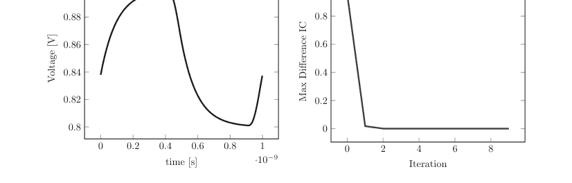

图5.36 稳态仿真器打靶法实现的输出；(a)显示了网表的输出波形，(b)显示了初始状态的最大差异随迭代次数的变化。对于这个非常简单的例子，代码收敛得非常快。

3GHz。以2GHz作为基频的实现将无法捕获3GHz的音调及其谐波，同样，使用3GHz音调也会遇到类似问题。如果改用拍频（本例中为1GHz），那么显然可以利用所有谐波以及谐波间的交叉耦合。我们将此代码的实现留给读者在练习中完成。

### 5.5.2 谐波平衡法

谐波平衡是一种通过在频域而非时域中工作来寻找电路稳态的方法。想象我们有一个由特定频率信号驱动的电路。如果电路是线性的，那么所有节点都将包含该频率和直流分量。这仅仅是一个关于相位和幅值的问题。通常的拓扑约束，如基尔霍夫电流定律，也可以应用于频域。如果电路是非线性的，根据基本理论，我们知道基频音调的谐波也会出现。这就是谐波平衡法的基础，各种算法背后的思想是找到一组谐波（包括幅值和相位），它们定义了所有器件电流和节点电压。我们将在此不涉及太多形式化内容，仅简要介绍其基本原理，然后像之前一样，继续进行Python代码的实际实现。

在频域中工作时，我们将傅里叶变换定义为

$$H(f) = \frac{1}{T} \int_{-\infty}^{\infty} h(t) e^{-j\omega t} dt \quad (5.30)$$

其中 $\omega = 2\pi f$，$T$ 是我们定义积分的周期。此外，我们将同时处理正频率和负频率。对于实值函数 $h(t)$，以下性质很容易证明

$$H(f) = H^*(-f) \quad (5.31)$$

其中 $*$ 表示复共轭。这样处理计算要容易得多。对于仿真器，使用离散傅里叶变换（DFT）

$$H(f) = \int_{0}^{T} h(t) e^{\frac{-i2\pi n t}{T}} dt \delta\left(f - \frac{n}{T}\right), \quad 0 < n < \frac{T}{2T_s}$$

其中 $T$ 是信号周期，$T_s$ 是采样周期。一些仿真器可以通过一个称为采样比或类似名称的参数来操纵采样时间步长。可以利用这一点对信号进行时域过采样，以可能提高精度。

我们将在第7章展示谐波平衡方程的更正式推导。这里我们仅陈述网络方程 $f(v_k) = 0$ 可以进行傅里叶变换为

$$F(V) = I(V) + \Omega Q(V) + U$$

这里的大写 $V$ 现在代表每个节点电压的傅里叶系数。

我们定义雅可比矩阵：

$$J_{ij} = \frac{\partial F_i}{\partial V_j}$$

我们得到

$$J(V) = \frac{\partial I(V)}{\partial V} + \Omega \frac{\partial Q(V)}{\partial V}$$

应用牛顿-拉夫逊算法，我们得到迭代公式：

$$V^{j+1} = V^{(j)} - J^{-1}\left(V^{(j)}\right)F\left(V^{(j)}\right)$$

矩阵 $J$ 被称为谐波雅可比矩阵或转换矩阵。它告诉你节点 $j$ 处的某个傅里叶分量如何与节点 $i$ 处的另一个傅里叶分量耦合。注意，这个矩阵实际上是一个矩阵中的矩阵。每个电路节点包含一组傅里叶向量分量，这些分量与其他节点的傅里叶分量耦合。因此，现在这个过程与我们在时域中遵循的过程非常相似。我们建立矩阵 $F$ 和 $J$ 并进行迭代。由 $U$ 设定的边界条件具有固定的分量，我们可以轻松地迭代得到正确的解。我们确实有更多的变量；每个节点有k个傅里叶分量，但一旦迭代收敛，我们就完成了。在时域中，我们只需继续，因此我们在谐波平衡中付出的代价是矩阵大得多，但我们只需求解一次。

现在让我们看一些来自我们器件模型的例子。我们将从晶体管模型1开始，因为它相当简单，并说明建立基本矩阵 $F,J$ 时的过程。我们发现

$$i(t) = K\left(v_g(t) - v_s(t)\right)^2$$

为了在频域中计算雅可比矩阵，我们需要先进行傅里叶变换：

$$i(t) = \sum_{k=1-K}^{K-1} I_k e^{j2\pi k \frac{t}{T}}$$

$$I_k = \frac{1}{T} \sum_{n=0}^{N-1} i(n\tau) e^{-j2\pi k \frac{n\tau}{T}}$$

我们现在看到

$$\frac{\partial I_k}{\partial V_l^g} = \frac{1}{T} \sum_{n=0}^{N} \frac{\partial i(t)}{\partial V_l^g} e^{-j2\pi k \frac{n\tau}{T}} = \frac{1}{T} \sum_{n=0}^{N} \frac{\partial i(t)}{\partial v_g} \frac{\partial v_g}{\partial V_l^g} e^{-j2\pi k \frac{n\tau}{T}} \quad (5.39)$$

我们有

$$v_g(t) = \sum_{k=1-K}^{K-1} V_k^g e^{j2\pi k \frac{t}{T}} \rightarrow \frac{\partial v_g}{\partial V_l^g} = e^{j2\pi l \frac{t}{T}} \quad (5.40)$$

同样对于 $v_s$

$$v_s(t) = \sum_{k=1-K}^{K-1} V_k^s e^{j2\pi k \frac{t}{T}} \rightarrow \frac{\partial v_s}{\partial V_l^s} = e^{j2\pi l \frac{t}{T}} \quad (5.41)$$

导数项很直接

$$\frac{\partial i(t)}{\partial v_g} = 2K(v_g(t) - v_s(t))$$
$$\frac{\partial i(t)}{\partial v_s} = -2K(v_g(t) - v_s(t)) \quad (5.42)$$

将所有这些放在一起，我们得到

$$\frac{\partial I_k}{\partial V_l^g} = \frac{1}{T} \sum_{n=0}^{N} \frac{\partial i(n\tau)}{\partial v_g} \frac{\partial v_g}{\partial V_l^g} e^{-j2\pi k \frac{n\tau}{T}} = \frac{1}{T} \sum_{n=0}^{N} \frac{\partial i(n\tau)}{\partial v_g} e^{j2\pi l \frac{n\tau}{T}} e^{-j2\pi k \frac{n\tau}{T}} =$$
$$= \frac{1}{T} \sum_{n=0}^{N} \frac{\partial i(n\tau)}{\partial v_g} e^{j2\pi(l-k)\frac{n\tau}{T}}$$
$$= \sum_{n=0}^{N} 2K(v_g(n\tau) - v_s(n\tau)) e^{j2\pi(l-k)\frac{n\tau}{T}} \quad (5.43)$$

类似地对于另一个电压，

$$\frac{\partial I_k}{\partial V_l^s} = J_{l-k} = \frac{1}{T} \sum_{n=0}^{N} \frac{\partial i(n\tau)}{\partial v_s} e^{j2\pi(l-k)\frac{n\tau}{T}} \quad (5.44)$$

我们现在看到，在这两种情况下，并且不难一般性地证明，雅可比矩阵看起来像是某个函数时间导数的傅里叶变换。还要注意，重要的是索引之间的差值 $l - k$。以矩阵形式，我们有

$$J = \begin{pmatrix} \frac{\partial I_{1-K}}{\partial V_{1-K}^s} & \cdots & \frac{\partial I_{1-K}}{\partial V_{K-1}^s} \\ \vdots & \ddots & \vdots \\ \frac{\partial I_{K-1}}{\partial V_{1-K}^s} & \cdots & \frac{\partial I_{K-1}}{\partial V_{K-1}^s} \end{pmatrix} \quad (5.45)$$

对于 $K = 3$ 的情况，我们有

$$\begin{pmatrix} \frac{\partial I_{-2}}{\partial V_{-2}^s} & \frac{\partial I_{-2}}{\partial V_{-1}^s} & \frac{\partial I_{-2}}{\partial V_{0}^s} & \frac{\partial I_{-2}}{\partial V_{1}^s} & \frac{\partial I_{-2}}{\partial V_{2}^s} \\ \frac{\partial I_{-1}}{\partial V_{-2}^s} & \frac{\partial I_{-1}}{\partial V_{-1}^s} & \frac{\partial I_{-1}}{\partial V_{0}^s} & \frac{\partial I_{-1}}{\partial V_{1}^s} & \frac{\partial I_{-1}}{\partial V_{2}^s} \\ \frac{\partial I_{0}}{\partial V_{-2}^s} & \frac{\partial I_{0}}{\partial V_{-1}^s} & \frac{\partial I_{0}}{\partial V_{0}^s} & \frac{\partial I_{0}}{\partial V_{1}^s} & \frac{\partial I_{0}}{\partial V_{2}^s} \\ \frac{\partial I_{1}}{\partial V_{-2}^s} & \frac{\partial I_{1}}{\partial V_{-1}^s} & \frac{\partial I_{1}}{\partial V_{0}^s} & \frac{\partial I_{1}}{\partial V_{1}^s} & \frac{\partial I_{1}}{\partial V_{2}^s} \\ \frac{\partial I_{2}}{\partial V_{-2}^s} & \frac{\partial I_{2}}{\partial V_{-1}^s} & \frac{\partial I_{2}}{\partial V_{0}^s} & \frac{\partial I_{2}}{\partial V_{1}^s} & \frac{\partial I_{2}}{\partial V_{2}^s} \end{pmatrix}$$

这些项仅仅是傅里叶变换的分量，一旦我们有了它，我们就有了雅可比矩阵。让我们快速再看一下积分（或者在我们离散傅里叶变换的情况下是离散求和）：

$$\frac{1}{T} \sum_{n=0}^{N} \frac{\partial i(n\tau)}{\partial v_s} e^{j2\pi(l-k)\frac{n\tau}{T}} \quad (5.46)$$

这个求和是两个函数 $\frac{\partial i(n\tau)}{\partial v_s}, e^{j2\pi(l-k)\frac{n\tau}{T}}$ 乘积的求和。除非两个函数的频率相同，否则这个求和总是为零，因为这些函数只能由基频的谐波组成，而我们是在基频谐波周期上积分。特别是在 $\frac{\partial i(n\tau)}{\partial v_s} = C$（一个常数）的情况下，唯一非零的分量是 $l = k$ 的那个，矩阵简化为

$$J = \begin{pmatrix} J_0 & \cdots & 0 \\ \vdots & \ddots & \vdots \\ 0 & \cdots & J_0 \end{pmatrix} \quad (5.47)$$

我们可以看到，傅里叶分量之间没有耦合，因为所有非对角元素都为零。对于导数 $\frac{\partial i(n\tau)}{\partial v_s} \neq C$ 的情况，将会出现非对角项，从而导致谐波之间产生耦合。让我们假设

$$\frac{\partial i(n\tau)}{\partial v_s} = e^{-j\frac{2\pi m}{T}t} = e^{-j\omega_m t} \quad (5.48)$$

$$J_{l-k} = \frac{1}{T} \sum_{n=0}^{N} e^{-j\omega_m n\tau} e^{j2\pi(l-k)\frac{n\tau}{T}} \quad (5.49)$$

那么，只有当 $l - k = \pm m$ 时，我们才会得到非零的矩阵分量。

$$J = \begin{pmatrix} 0 \cdots & J_m & \cdots & 0 \\ J_{-m} & 0 & J_m & \\ 0 \cdots & J_{-m} & \cdots & 0 \end{pmatrix} \quad (5.50)$$

我们看到，分量 $l - K$ 会从分量 $l - K + m$ 获得贡献，这从三角恒等式中也很明显：

$$\sin(l-k+m)\frac{2\pi}{T} \sin m\frac{2\pi}{T} = \frac{1}{2}\left(\cos(l-k+2m)\frac{2\pi}{T} + \cos(l-k)\frac{2\pi}{T}\right) \quad (5.51)$$

现在，当我们把谐波限制在 $l - K$ 到 $K - 1$ 之间时，我们所做的基本近似就显而易见了：超出此范围的乘积所产生的谐波被忽略了。这一事实将导致收敛问题，因为我们只试图求解所有谐波的一个子集。这就是为什么包含足够多的谐波以至少覆盖系统最大带宽数倍很重要的原因。

> 包含足够多的谐波以至少覆盖系统最大带宽数倍，对于最小化收敛问题至关重要。

线性电阻的情况现在应该很明显了：

$$\frac{\partial i}{\partial v} = \frac{1}{R} \rightarrow J_0 = \frac{1}{T} \sum_{n=0}^{N} \frac{\partial i(n\tau)}{\partial v_s} e^{j2\pi(l-k)\frac{n\tau}{T}} = \frac{1}{T} \sum_{n=0}^{N} \frac{1}{R} = \frac{1}{R} \quad (5.52)$$

对于线性电容，我们看到

$$i = C \frac{\partial v}{\partial t} = C \sum_{k=1-K}^{K-1} j\omega_k V_k^C e^{j\omega_k t} = \sum_{k=1-K}^{K-1} I_k^C e^{j\omega_k t}$$

其中

$$I_k^C = Cj\omega_k V_k^C$$

因此

$$\frac{\partial I_k}{\partial V_l} = Cj\omega_k \delta(k-l)$$

最后，对于线性电感，我们知道

$$v = L \frac{\partial i}{\partial t} = L \sum_{k=1-K}^{K-1} j\omega_k I_k^L e^{j\omega_k t} = \sum_{k=1-K}^{K-1} V_k^L e^{j\omega_k t}$$

与电容类似，我们现在得到

$$V_k^L = Lj\omega_k I_k^L$$

以及

$$\frac{\partial I_k}{\partial V_l} = \frac{1}{Lj\omega_k} \delta(k-l)$$

我们在这里看到在直流处存在发散，因为任何电压都会导致无限大的电流流过电感。这需要特别注意；电感两端的任何直流电压都为零。

在 STA 矩阵描述中，我们从前面回忆起电阻的特征看起来像

$$\begin{pmatrix} v_a & & & -1 \\ v_b & & & +1 \\ \vdots & & & \vdots \\ i_R & -1 & +1 & \cdots & -R \end{pmatrix}$$

在谐波平衡公式中，我们只需将数字替换为与所涉及谐波相对应的对角矩阵，例如，三个谐波的情况会导致。

由于电阻在这里是一个线性元件，每个谐波只与自身相互作用，这一点从矩阵特征中应该很清楚。
对于电感，我们看到

线性电容看起来像

$$\begin{pmatrix} & v_a & v_b & i_C \\ v_a & & & -1 \\ v_b & & & +1 \\ i_C & +C & -C & -1 \end{pmatrix}$$

(5.63)

$$\begin{pmatrix} v_a \\ v_b \\ \vdots \\ i_R \end{pmatrix} \begin{pmatrix} -1 & 0 & 0 \\ 0 & -1 & 0 \\ 0 & 0 & -1 \end{pmatrix} \begin{pmatrix} +1 & 0 & 0 \\ 0 & +1 & 0 \\ 0 & 0 & +1 \end{pmatrix} \vdots \begin{pmatrix} j\omega_{-1}C & 0 & 0 \\ 0 & j\omega_0C & 0 \\ 0 & 0 & j\omega_1C \end{pmatrix} \begin{pmatrix} -j\omega_{-1}C & 0 & 0 \\ 0 & -j\omega_0C & 0 \\ 0 & 0 & -j\omega_1C \end{pmatrix} \cdots \begin{pmatrix} -1 & 0 & 0 \\ 0 & -1 & 0 \\ 0 & 0 & -1 \end{pmatrix}$$

(5.64)

最后，对于建模为非线性 VCCS 的晶体管，我们需要像在瞬态仿真部分那样添加一个非线性项。由于我们是在频域中工作，我们需要对晶体管跨导进行傅里叶变换，对于我们的简单模型，这意味着使用

$$I = K\left(v_g - v_s\right)^2$$

(5.65)

我们发现

$$I_k = \frac{1}{T} \sum_{n=0}^{N} K\left(v_g(n\tau) - v_s(n\tau)\right)^2 e^{-i\omega_k n\tau}$$

(5.66)

对于这个简单的情况，我们当然可以展开并识别各项，但让我们做一个适当的傅里叶变换，并将得到的谐波添加到函数 $F(V)$ 中。对于雅可比矩阵（导数），我们已经推导出了公式

对于独立电压源，我们同样得到

我们现在准备好编写代码了，首先假设非线性晶体管行为遵循第 3.4 节中的 model1。由于晶体管模型过于简化，它不会产生非常有用的输出，正如我们现在通过重新检查网表 5.6 中的电路所示。我们在图 5.37 中看到了谐波平衡结果经过逆傅里叶变换后的样子。

响应中的毛刺是由于糟糕的晶体管模型造成的；当栅极电压低于源极电压时，晶体管再次导通。

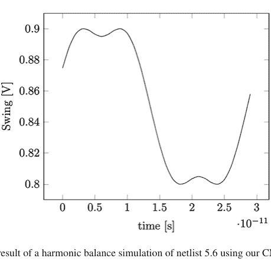

**图 5.37** 使用我们的 CMOS model1 对网表 5.6 进行谐波平衡仿真的结果

我们可以更进一步，实现我们在第 3.4.2 节和第 5.2.1.1 节中讨论的更现实的晶体管模型。我们对电流电压关系进行傅里叶变换，就像我们对更简单的模型所做的那样，并注意到我们需要将漏极电压的导数添加到雅可比矩阵中。我们不会在这里详细介绍细节，但它们是直接的，我们将数学推导留给读者，并在第 5.6.8 节中以代码 5p8 的形式呈现代码实现。我们可以使用这个改进的晶体管模型再次模拟相同的电路，**网表 5.6**，我们在图 5.38 中找到了结果。

从 4 个谐波增加到 8 个谐波的改进与从 16 个增加到 32 个的情况大不相同。系统显然已经收敛。

我们需要再次强调一个事实，即稳态解是如果等待很长时间后瞬态会达到的状态。一个设计良好的稳态仿真器总是会比瞬态仿真器具有更准确的响应。还要注意，时间步长是*一个*周期。瞬态仿真在结束时结束。

*多音实现*
就像我们在打靶法情况下讨论的那样，当使用所有信号源的拍频时，多音实现是相当直接的。

### 5.5.3 包络分析

在基于时域的仿真器中，我们已经讨论过，当电路中由于 LTE 和 GTE 效应出现较高频率时，需要采取更小的时间步长。谐波平衡仿真器没有这个弱点，但它们需要大量的谐波，特别是当低频调制分量叠加在高频载波上时。

## 5.5 周期稳态求解器

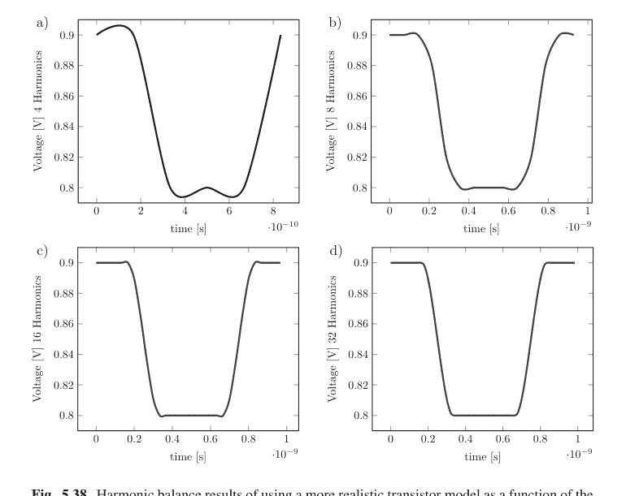

图 5.38 使用更现实的晶体管模型进行谐波平衡仿真的结果，作为谐波数量的函数。随着该数量的增加，结果显著改善。注意：渲染中已启用平滑处理，以使差异更加清晰

包络仿真是稳态仿真器和时域仿真器的结合。如果你曾经在电子实验室工作过，你可能有机会使用过频谱分析仪。在典型的设置中，这种仪器显示输入端口信号的频谱分量。观察这些频谱视图时，通常会看到它们随时间变化，见图 5.39。这些随时间变化的分量正是我们使用包络仿真器所追求的。

从数学上讲，在谐波平衡中，我们可以将某个节点的波形写为

$$v(t) = \sum_{k=0}^{\infty} V_k e^{-i\omega_k t}$$ (5.70)

在包络仿真中，傅里叶系数随时间变化，所以我们有

$$v(t) = \sum_{k=0}^{\infty} V_k(t) e^{-i\omega_k t}$$ (5.71)

就像我们在频谱分析仪中看到的那样。

### 5.5.4 扰动技术

在建立了周期性稳态解之后，现在可以进行大量分析。上一节的部分分析表明，存在一个称为转换矩阵的矩阵，它本质上是谐波雅可比矩阵，用于计算从一个频率谐波到任何其他谐波的增益，前提是信号足够小，不会扰动我们已建立的稳态条件。我们可以将其视为一种谐波交流分析。叠加在较大信号上的小信号将通过转换矩阵与该信号混合，并在其他谐波频率附近产生音调。这种情况并不少见。想想上变频射频混频器的情况，其中本振信号很大，而与之相乘的射频信号很小且为基带频率（例如100 kHz）。为了求解此类系统的增益，需要进行大约10 μs的仿真，如果本振频率在GHz范围内，这确实非常痛苦。想象我们的周期性稳态系统，我们可以通过类似交流的计算，将增益从直流直接转换到本振基波；我们可以更高效地仿真这种增益。对于其他转换型系统，如振荡器中的相位噪声转换等，情况也是如此。我们将在本章最后一节讨论此类仿真的细节。

本节将首先讨论通常称为周期性交流仿真的内容，然后是周期性噪声分析。我们将在我们的Python环境中演示该技术，并在第5.5.7节中使用它。

#### 周期性交流分析

假设我们有一个电路的解，满足

$$f(v(t)) = i(v(t)) + \dot{q}(v(t)) + u = 0 \quad (5.72)$$

如果我们向 $u(t)$ 添加一个小信号扰动，即 $u(t) \rightarrow u(t) + \tilde{u}(t)$，使得整体解仍然近似有效，会怎样？解同样会进行一个小的修正调整，$v(t) \rightarrow v(t) + \tilde{v}(t)$，我们看到我们寻求的解满足

$$f(v(t) + \tilde{v}(t)) = i(v(t) + \tilde{v}(t)) + \dot{q}(v(t) + \tilde{v}(t)) + u + \tilde{u}(t) = 0 \quad (5.73)$$

我们可以用通常的方式用泰勒级数展开，得到

$$i(v(t) + \tilde{v}(t)) + \dot{q}(v(t) + \tilde{v}(t)) \approx i(v(t)) + \frac{\partial i(v)}{\partial v}\tilde{v} + \frac{d}{dt}\left(q(v(t)) + \frac{\partial q(v)}{\partial v}\tilde{v}\right) \quad (5.74)$$

我们注意到零阶项就是原始解，它们相互抵消，剩下

$$\frac{\partial i(\boldsymbol{v})}{\partial \boldsymbol{v}} \tilde{\boldsymbol{v}} + \frac{d}{dt} \left( \frac{\partial \boldsymbol{q}(\boldsymbol{v})}{\partial \boldsymbol{v}} \tilde{\boldsymbol{v}} \right) + \tilde{\boldsymbol{u}} = 0 \quad (5.75)$$

我们现在可以进行与之前类似的步骤，对变量进行傅里叶变换，并假设扰动 $u(t) = u_k e^{-i(\omega_k + \omega_p)t}$ 是一个谐波 $k$ 的单音扰动，具有偏移频率 $\omega_p$。傅里叶变换为 $\tilde{U} = U_k \delta(\omega - (\omega_k + \omega_p)) + U_{-k} (\delta\omega - (-\omega_k + \omega_p))$。

$$\frac{\partial \boldsymbol{I}(\boldsymbol{V})}{\partial \boldsymbol{V}} \tilde{\boldsymbol{v}} + \tilde{\boldsymbol{\Omega}} \frac{\partial \boldsymbol{Q}(\boldsymbol{V})}{\partial \boldsymbol{V}} \tilde{\boldsymbol{v}} + \tilde{\boldsymbol{u}} = 0 \quad (5.76)$$

导数项就是我们在第5.5.2节讨论的雅可比矩阵，该方程很容易求解。注意矩阵 $\boldsymbol{\Omega} = \boldsymbol{\Omega}$，其中频率分量是谐波偏移了偏移频率 $\omega_k \rightarrow \omega_k + \omega_p$。这个简单的练习表明，我们可以使用系统的雅可比矩阵来求解已知解附近的小扰动。这与一维方程等其他系统的扰动计算思想相同，但在这里我们将其应用于已知大尺度解的谐波系统。为了进一步理解，我们可以写出激励向量：

$$\boldsymbol{u}(\omega) = \sum_n \sum_{k=-N}^N U_k^n \delta(\omega_k + \omega_p) \quad (5.77)$$

响应向量 $\boldsymbol{v}$ 类似地写为

$$\boldsymbol{v}(\omega) = \sum_n \sum_{k=-N}^N V_k^n \delta(\omega_k + \omega_p) \quad (5.78)$$

这里 $n$ 表示节点分析中定义的所有节点和电流；$k$ 是谐波索引。系数 $U_k$ 由用户定义，取决于我们想在哪个节点和哪个谐波上添加激励。注意这里的偏移频率必须相同，因为我们现在观察的是线性化电路。我们现在可以看到电路对具有特定幅度和偏移频率的给定激励在给定谐波处的响应 $V_k$。例如，我们可以扫描偏移频率 $\omega_p$ 在某个谐波 $\omega_k$ 周围，观察系统在其他节点和谐波分量上的响应。这种类型的分析通常称为周期性交流分析。在代码中实现这相当简单，它只涉及各个谐波周围的增益。

```python
# We need to recalculate the Matrix due to the frequency terms
# from the inductors+capacitors
STA_rhs=[0 for i in range(MatrixSize)]
val=[[0 for i in range(100)] for j in range(4)]
for iter in range(100):
    omega=iter*1e6*2*3.14159265
    for i in range(DeviceCount):
        for row in range(TotalHarmonics):
            if DevType[i]=='capacitor':
                if DevNode1[i] != '0' :
                    Jacobian[(NumberOfNodes+i)*TotalHarmonics+row][Nodes.index(DevNode1[i])*TotalHarmonics+row]=1j*(omegak[row]+(numpy.sign(omegak[row])+(omegak[row]==0))*omega)*DevValue[i]
                if DevNode2[i] != '0' :
                    Jacobian[(NumberOfNodes+i)*TotalHarmonics+row][Nodes.index(DevNode2[i])*TotalHarmonics+row]=-1j*(omegak[row]+(numpy.sign(omegak[row])+(omegak[row]==0))*omega)*DevValue[i]
            if DevType[i]=='inductor':
                Jacobian[(NumberOfNodes+i)*TotalHarmonics+row][(NumberOfNodes+i)*TotalHarmonics+row]=-1j*(omegak[row]+(numpy.sign(omegak[row])+(omegak[row]==0))*omega)*DevValue[i]
            if DevType[i]=='CurrentSource':
                if DevLabel[i]=='i1':
                    STA_rhs[(NumberOfNodes+i)*TotalHarmonics+row]=1*(row==Jacobian_Offset)
                else:
                    STA_rhs[(NumberOfNodes+i)*TotalHarmonics+row]=-(row==Jacobian_Offset)
    sol=numpy.matmul(numpy.linalg.inv(Jacobian),STA_rhs)
    val[0][iter]=abs(sol[6*TotalHarmonics+Jacobian_Offset])
    val[1][iter]=abs(sol[6*TotalHarmonics+Jacobian_Offset+1])
    val[2][iter]=abs(sol[6*TotalHarmonics+Jacobian_Offset+2])
    val[3][iter]=abs(sol[6*TotalHarmonics+Jacobian_Offset+3])
plt.plot(val[1])
```

我们将在第5.5.7节中看几个例子，将此代码应用于一些简单的电路。

我们现在有了一个小信号分析代码片段，可以观察叠加在大信号上的小信号增益。一个自然的例子是模拟混频器，其中使用大时钟信号来混频（下变频或上变频）一个小射频信号。在现代仿真器中，它被称为周期性交流分析，*PAC*。另一个非常有用的实现是噪声传输，通常称为周期性噪声或 *PNOISE*。我们接下来将讨论该应用。

**图 5.39** 典型频谱分析仪输出（a, b）显示了不同时间的频谱

在纯粹主义者阅读此内容之前（这种公式对于任意波形并非自洽），基本假设是系数 $V_k(t)$ 随时间的变化比载波频率慢得多。换句话说，随着包络函数的变化，其余的高频分量有机会完全稳定下来。从这个意义上说，我们在包络仿真中所做的是在一系列时间点上进行稳态分析。我们从 $t = 0$ 开始，将调制发生器设置为它们在该时间的值。电路的其余部分现在用于求解稳态，假设调制控制值是恒定的。这将产生一组特定的谐波。在求解了 $t = 0$ 的情况后，我们现在可以继续到 $t = t_1$，将所有调制源设置为它们在该时间的值，并再次考虑这个新输入求解稳态。我们继续这样做，直到所有所需的时间点都被求解。通常时间步长是固定的，在这种情况下，调制带宽为 $\pm \frac{1}{2T_{step}}$。包络函数中的任何音调都会显示为载波谐波周围的两个调制音调。

包络仿真的优点是每个载波的幅度和相位可以立即获得。然后可以使用这些来建立各种调制方案的模型。不需要额外的计算将时域信息转换为包络信息。我们直接从稳态解开始，无需等待时域稳定。当然，反之亦然，如果初始瞬态是感兴趣的，谐波平衡法无法提供检查它的方法。简而言之，包络仿真器通过谐波平衡考虑了载波稳态，无需等待稳态；然后在时域中使用低频调制信号来计算电路响应，无需包含所有可能的谐波。包络仿真器利用了谐波平衡和时域仿真器在某些特定应用中的最佳优势。

## 5.5 周期性稳态求解器

#### 周期性噪声分析

周期性噪声分析利用我们在上一节讨论的周期性交流响应，来计算包含谐波混频效应的系统噪声传递。通过这种方式，可以精确模拟诸如相位噪声非线性传递等现象。其基本思想与我们在第4.4.1节中的噪声讨论相同。将元件的噪声建模为电流噪声（或在方便时使用电压噪声），并模拟其传递到用户定义输出的过程。由于转换矩阵已知，这相当容易实现。一个代码示例如下：

```python
# We need to recalculate the Matrix due to the frequency terms
# from the inductors+capacitors
STA_rhs=[0 for i in range(MatrixSize)]
val=[[0 for i in range(100)] for j in range(4)]
for iter in range(100):
    omega=(iter)*1e6*2*math.pi
    for i in range(DeviceCount):
        for row in range(TotalHarmonics):
            if DevType[i]=='capacitor':
                if DevNode1[i] != '0' :
                    Jacobian[(NumberOfNodes+i)*TotalHarmonics+
row][Nodes.index(DevNode1[i])*TotalHarmonics+row]=1j*(omegak[row]
+(numpy.sign(omegak[row])+(omegak[row]==0))*omega)*DevValue[i]
                    # print("C1 adm",row,Jacobian[(NumberOfNodes
+i)*TotalHarmonics+row][Nodes.index(DevNode1[i])*TotalHarmonics+
row])
                if DevNode2[i] != '0' :
                    Jacobian[(NumberOfNodes+i)*TotalHarmonics+
row][Nodes.index(DevNode2[i])*TotalHarmonics+row]=-
1j*(omegak[row]+(numpy.sign(omegak[row])+(omegak[row]==0))*omega)
*DevValue[i]
                    # print("C2 adm",row,Jacobian[(NumberOfNodes
+i)*TotalHarmonics+row][Nodes.index(DevNode1[i])*TotalHarmonics+
row])
            if DevType[i]=='inductor':
                Jacobian[(NumberOfNodes+i)*TotalHarmonics+row]
[(NumberOfNodes+i)*TotalHarmonics+row]=-1j*(omegak[row]+(numpy.
sign(omegak[row])+(omegak[row]==0))*omega)*DevValue[i]
                # print("L imp ",row,Jacobian[(NumberOfNodes+i)*
TotalHarmonics+row][(NumberOfNodes+i)*TotalHarmonics+row])
            # if DevType[i]=='VoltSource':
            #     STA_rhs[(NumberOfNodes+i)*TotalHarmonics+row]=
1*((row==Jacobian_Offset+1)+(row==Jacobian_Offset-1))
            if DevType[i]=='CurrentSource': # Adding current source between transistor drain-source
                STA_rhs[(NumberOfNodes+i)*TotalHarmonics+row]=1*(row==Jacobian_Offset+1)+1*(row==Jacobian_Offset-1)
    sol=numpy.matmul(numpy.linalg.inv(Jacobian),STA_rhs)
    val[0][iter]=abs(sol[2*TotalHarmonics+Jacobian_Offset])
    val[1][iter]=20*math.log10(abs(sol[2*TotalHarmonics+Jacobian_Offset+1]))
    val[2][iter]=abs(sol[2*TotalHarmonics+Jacobian_Offset+2])
    val[3][iter]=math.log10(omega+1)#abs(sol[2*TotalHarmonics+Jacobian_Offset+3])**2
plt.plot(val[1])
```

这里我们展示了一个进行周期性噪声模拟的Python代码。

我们将在第5.5.7节中将此代码应用于一个振荡器示例。

### 5.5.5 周期性S参数、传递函数、稳定性分析

我们在第4章讨论的整个分析工具集现在可以应用于稳态系统。特别是，各种谐波之间可能存在耦合，这会产生有趣的现象。代码实现很直接，涉及对我们第4章讨论的技术的简单推广。我们将细节留给读者作为练习。

### 5.5.6 准周期稳态分析

我们在讨论打靶法和谐波平衡法时已经提到，当使用定义信号之间的拍频时，多音实现是直接的。我们注意到，使用2GHz和3GHz信号，可以用1GHz基波捕捉所需的频谱。如果涉及的音调频率量级相同，这是可以的。但如果涉及的音调频率差异很大，情况就相当难以处理了。让我们考虑一个包含2GHz、3GHz和1MHz音调的情况！这里的拍频将是1MHz，需要数千个谐波来建立稳态。这对大多数计算机系统来说负担过重，因此设计了一种准周期方法，其中只考虑每个音调的一定数量的谐波。通常用户需要定义哪些信号是*大*信号，哪些信号是*中等*信号。大音调获得大量谐波（仍由用户控制），而中等音调只考虑少量谐波。在我们的例子中，假设2GHz和3GHz音调是大信号，1MHz音调是中等信号；那么将只考虑2GHz和3GHz音调之间的拍频，并使用围绕这个1GHz基波音调的一小组1MHz音调进行分析（图5.40）。这样可以在不使用所有可能谐波的情况下获得电路的精确图像。因此，该方法被称为准周期，因为并非所有可能的谐波组合都被使用。

这样的代码很容易实现，特别是在谐波平衡法中。我们将其作为练习留给读者去构建这样的代码。

### 5.5.7 特定电路示例

有了这些周期性稳态代码，让我们看几个它们特别有用的常见例子。我们首先将讨论使用我们非常简单的非线性FET模型进行相位噪声模拟。这是一个很好的例子，说明这种技术如何有所帮助。接着我们讨论一个低噪声放大器（LNA）示例，其中谐波方面的线性度直接由稳态解给出。最后我们考虑一个上变频射频混频器，其中基带的小信号被上变频到更高频率。我们将使用之前讨论的PAC和PNOISE补充建立的代码。很明显，使用我们这样简单的非线性，转换是直接的。在实际系统中，可能存在其他更强的非线性元件，例如，BJT工艺中混频到更高谐波要复杂得多。

### 5.5 周期性稳态求解器

241

图5.41 简单的单级放大器

#### 放大器线性度

放大器的线性度是许多应用中的关键指标。使用稳态模拟器，我们可以非常快速地分析谐波失真。为了说明，我们将使用如图5.41所示的一个非常简单的放大级。

该电路的网表如下：

```
*
vdd vdd 0 0.9
vss vss 0 0
vcasc casc 0 0.7
vin in 0 0.5
r1 vdd out 100
m1 out casc n1 nch1
m2 n1 in vss nch1
netlist 5.15
```

并且使用我们的稳态模拟器（代码5.13，谐波数=16）非常容易模拟。得到的谐波可以在表5.22中找到。

我们看到模拟器的谐波大小依次递减，正如预期的那样。由于这些元件的功率项增加，高阶项将会减小。作为附加练习，鼓励读者使用大得多的输入摆幅运行模拟（参见练习）。这将导致典型的削波功能，其中时域输出函数本质上是一个方波函数。这种函数的谐波结构是众所周知的。

表5.22 模拟图5.41中简单放大器得到的谐波音调

| 谐波 | 模拟大小 |
|---|---|
| 0 | -1.483 |
| 1 | -45.66 |
| 2 | -67.24 |
| 3 | -85.92 |
| 4 | -102.6 |

#### 混频器增益（pac）

最后，我们可以借助我们在第5.5.4节开发的PAC代码来研究混频器的转换增益。射频混频器是一种电路，它接收本振（LO）信号并与基带（低频<可能1MHz）音调相乘。这种乘法将基带音调上变频到出现在LO谐波附近。LO摆幅通常很大，而基带音调可以很小。稳态模拟器非常适合研究此类电路的增益等特性。这里我们将介绍一个非常简单的拓扑来引入这个概念。在图5.42中，我们有一个简单的拓扑，其网表如下：

```
*
vdd vdd 0 0.9
vinp in1 0 1
vinn in2 0 1
r1 vdd inp 100
r2 inp 0 100
r3 vdd inn 100
r4 inn 0 100
r5 vdd outp 100
r6 vdd outn 100
c1 in1 inp 1e-12
c2 in2 inn 1e-12
i1 vs 0 1e-3
m1 outn inp vs nch1
m2 outp inn vs nch2
i2 vs2 0 1e-3
m3 outp inp vs2 nch1
m4 outn inn vs2 nch2
l1 vdd outp 1e-9
ct1 vdd outp 25.33029e-12
l2 vdd outn 1e-9
ct2 vdd outn 25.33029e-12
netlist 5.16
```

### 5.5.8 特殊情况：需要注意的问题

对于稳态系统，人们遇到的最明显的问题可能是在谐波平衡法中使用了过少的谐波分量。通常，需要使用的谐波数量远高于最初的估计值。这通常是由于电路中存在尖锐的边沿，如果不加以考虑，就会导致熟悉的吉布斯现象或在高频分量较高的边沿处出现振铃。

### 5.5.9 精度：如何确定

一个困难的任务是估计仿真结果的精度。大多数方法都经过逐步的精度分析，并被表征为二阶、三阶或有时是一阶精度。这指的是在精确的时间步长或频率步长等处的局部估计。经过许多步之后的全局精度可能更难估计，有时误差会消散，有时误差会无限期地持续存在。在我们研究各种系统时，我们将在适当的时候讨论精度问题。一种常见且极其耗时的验证精度的方法是收紧容差重新运行仿真。由于完成任务所需的时间会大大增加，因此不能每次都这样做。在实践中，人们会不时地通过收紧所需的容差来抽查精度。

> 在实践中，通过抽查和使用更严格的容差重新仿真来验证系统的精度是很好的做法。

### 5.5.10 仿真器选项考量

本章我们考虑了以下选项及其含义：

- reltol
- abstol
- vntol
- chgtol
- 梯形积分法
- 欧拉（前向/后向）积分法
- Gear二阶积分法
- GearOnly
- TrapOnly
- 截断误差：点局部、局部、全局
- 源步进
- $g_{min}$ 步进
- PTran 步进
- DPtran 步进
- 牛顿最大迭代次数
- 打靶法
- 谐波平衡
- NHarmonics
- 过采样

### 5.5.11 总结

本章我们讨论了非线性仿真器背后的基本原理，并从晶体管的简单非线性模型过渡到更复杂的模型。我们距离任何现实的BSIM实现还很远。使用非线性电容器等固有的许多陷阱已经被多次举例说明。最后，我们构建了一个简单的代码来实现稳态解，这是现代电路设计者最重要的工具之一。

在整个章节中，我们构建了一种带有简单晶体管建模的玩具仿真器，只是为了说明实现这些技术的一种可能方式。通过直接使用这个玩具仿真器，突出了非线性电容器或积分方法中许多或多或少众所周知的陷阱。

## 5.6 代码

### 5.6.1 代码 5.1

```python
#!/usr/bin/env python3
# -*- coding: utf-8 -*-
"""
Created on Thu Feb 28 22:33:04 2019

@author: mikael
"""
import numpy
import matplotlib.pyplot as plt
import math
import analogdef as ana

#
# Function definitions
#
def f_NL(STA_matrix, STA_rhs, STA_nonlinear, solution):
    return numpy.matmul(STA_matrix,solution)-STA_rhs+STA_nonlinear

#
# Read netlist
#
DeviceCount=0
MaxNumberOfDevices=100
DevType=[0*i for i in range(MaxNumberOfDevices)]
DevLabel=[0*i for i in range(MaxNumberOfDevices)]
DevNode1=[0*i for i in range(MaxNumberOfDevices)]
DevNode2=[0*i for i in range(MaxNumberOfDevices)]
DevNode3=[0*i for i in range(MaxNumberOfDevices)]
DevValue=[0*i for i in range(MaxNumberOfDevices)]
DevModel=[0*i for i in range(MaxNumberOfDevices)]
Nodes=[]

modeldict=ana.readmodelfile('models.txt')
ICdict={}
Plotdict={}
Printdict={}
Optdict={}
Optdict['MaxNewtonIterations']=int(5)

#
# Read the netlist
#
DeviceCount=ana.readnetlist('netlist_dc_5p1.txt',modeldict,ICdict,Plotdict,Printdict,Optdict,DevType,DevValue,DevLabel,DevNode1,DevNode2,DevNode3,DevModel,Nodes,MaxNumberOfDevices)

#
# Create Matrix based on circuit size. We do not implement strict Modified Nodal Analysis. We keep instead all currents
# but keep referring to the voltages as absolute voltages. We believe this will make the operation clearer to the user.
#
NumberOfNodes=len(Nodes)
MatrixSize=DeviceCount+len(Nodes)
Jacobian=[[0 for i in range(MatrixSize)] for j in range(MatrixSize)]
Jac_inv=[[0 for i in range(MatrixSize)] for j in range(MatrixSize)]
Spare=[[0 for i in range(MatrixSize)] for j in range(MatrixSize)]
STA_matrix=[[0 for i in range(MatrixSize)] for j in range(MatrixSize)]
STA_rhs=[0 for i in range(MatrixSize)]
STA_nonlinear=[0 for i in range(MatrixSize)]
f=[0 for i in range(MatrixSize)]

#
# Create sim parameters
#
sol=[0 for i in range(MatrixSize)]
solm1=[0 for i in range(MatrixSize)]

#
# Initial conditions
#
if len(ICdict)>0:
    for i in range(len(ICdict)):
        for j in range(NumberOfNodes):
            if Nodes[j]==ICdict[i]['NodeName']:
                sol[j]=ICdict[i]['Value']
                print('Setting ',Nodes[j],' to ',sol[j])

#
# Loop through all devices and create jacobian and initial f(v) entries according to signature
#
for i in range(DeviceCount):
    if DevType[i] != 'transistor':
        STA_matrix[NumberOfNodes+i][NumberOfNodes+i]=-DevValue[i]
        if DevNode1[i] != '0' :
            STA_matrix[NumberOfNodes+i][Nodes.index(DevNode1[i])]=1
            STA_matrix[Nodes.index(DevNode1[i])][NumberOfNodes+i]=1
        if DevNode2[i] != '0' :
            STA_matrix[NumberOfNodes+i][Nodes.index(DevNode2[i])]=-1
            STA_matrix[Nodes.index(DevNode2[i])][NumberOfNodes+i]=-1
        if DevType[i]=='capacitor':
            # Do nothing since DC sim
            STA_rhs[NumberOfNodes]=STA_rhs[NumberOfNodes]
        if DevType[i]=='inductor':
            STA_matrix[NumberOfNodes+i][NumberOfNodes+i]=0
            STA_rhs[NumberOfNodes+i]=0
        if DevType[i]=='VoltSource':
            STA_matrix[NumberOfNodes+i][NumberOfNodes+i]=0
            STA_rhs[NumberOfNodes+i]=ana.getSourceValue(DevValue[i],0)
        if DevType[i]=='CurrentSource':
            if DevNode1[i] != '0' :
                STA_matrix[NumberOfNodes+i][Nodes.index(DevNode1[i])]=0
                STA_matrix[Nodes.index(DevNode1[i])][NumberOfNodes+i]=0
            if DevNode2[i] != '0' :
                STA_matrix[NumberOfNodes+i][Nodes.index(DevNode2[i])]=0
                STA_matrix[Nodes.index(DevNode2[i])][NumberOfNodes+i]=0
            STA_matrix[NumberOfNodes+i][NumberOfNodes+i]=1
            STA_rhs[NumberOfNodes+i]=ana.getSourceValue(DevValue[i],0)
            if DevNode1[i] != '0' and DevNode2[i]!='0':
                STA_matrix[Nodes.index(DevNode1[i])][NumberOfNodes+i]=1
                STA_matrix[Nodes.index(DevNode2[i])][NumberOfNodes+i]=-1
            elif DevNode2[i] != '0' :
                STA_matrix[Nodes.index(DevNode2[i])][NumberOfNodes+i]=-1
            elif DevNode1[i] != '0' :
                STA_matrix[Nodes.index(DevNode1[i])][NumberOfNodes+i]=1
    if DevType[i]=='transistor':
        lambdaT=ana.findParameter(modeldict,DevModel[i],'lambdaT')
        VT=ana.findParameter(modeldict,DevModel[i],'VT')
        STA_matrix[NumberOfNodes+i][NumberOfNodes+i]=DevValue[i]
        STA_matrix[NumberOfNodes+i][Nodes.index(DevNode1[i])]=0
        STA_matrix[Nodes.index(DevNode1[i])][NumberOfNodes+i]=1
        STA_matrix[NumberOfNodes+i][Nodes.index(DevNode3[i])]=0
        STA_matrix[Nodes.index(DevNode3[i])][NumberOfNodes+i]=-1
        VG=sol[Nodes.index(DevNode2[i])]
        VS=sol[Nodes.index(DevNode3[i])]
        Vgs=VG-VS
        if DevModel[i][0]=='p':
            Vgs=-Vgs
        STA_nonlinear[NumberOfNodes+i]=Vgs**2

#
f=numpy.matmul(STA_matrix,sol)-STA_rhs+STA_nonlinear

#
#Loop through iteration points
#
NewIter=int(Optdict['MaxNewtonIterations'])
val=[[0 for i in range(NewIter+1)] for j in range(MatrixSize)]
for j in range(MatrixSize):
    val[j][0]=sol[j]
Iteration=[i for i in range(NewIter+1)]
for Newtoniter in range(NewIter):
    for i in range(MatrixSize):
        STA_nonlinear[i]=0
    for i in range(DeviceCount):
        if DevType[i]!='transistor':
            if DevType[i]=='capacitor':
                STA_rhs[NumberOfNodes+i]=STA_rhs[NumberOfNodes+i]
            if DevType[i]=='inductor':
                STA_rhs[NumberOfNodes+i]=0
            if DevType[i]=='VoltSource':
                STA_rhs[NumberOfNodes+i]=ana.getSourceValue(DevValue[i],0)
            if DevType[i]=='CurrentSource':
                STA_rhs[NumberOfNodes+i]=ana.getSourceValue(DevValue[i],0)
        if DevType[i]=='transistor':
            VG=sol[Nodes.index(DevNode2[i])]
            VS=sol[Nodes.index(DevNode3[i])]
            Vgs=VG-VS
            if DevModel[i][0]=='p':
                Vgs=-Vgs
            STA_nonlinear[NumberOfNodes+i]=Vgs**2
    f=numpy.matmul(STA_matrix,sol)-STA_rhs+STA_nonlinear

#
# Now we need the Jacobian, the transistors look like VCCS with
# a specific gain = 2 K (Vg-Vs) in our case
#
    for i in range(MatrixSize):
        for j in range(MatrixSize):
            Jacobian[i][j]=STA_matrix[i][j]
    for i in range(DeviceCount):
        if DevType[i]=='transistor':
            Jacobian[NumberOfNodes+i][NumberOfNodes+i]=DevValue[i]
            # due to derivative leading to double gain
            VG=sol[Nodes.index(DevNode2[i])]
            VS=sol[Nodes.index(DevNode3[i])]
            Vgs=VG-VS
            if DevModel[i][0]=='p':
                PFET=-1
                Vgs=-Vgs
            else:
                PFET=1
            Jacobian[NumberOfNodes+i][Nodes.index(DevNode2[i])]=2*PFET*Vgs
            Jacobian[NumberOfNodes+i][Nodes.index(DevNode3[i])]=-2*PFET*Vgs
    sol=sol-numpy.matmul(numpy.linalg.inv(Jacobian),f)
    Jac_inv=numpy.linalg.inv(Jacobian)
    for j in range(MatrixSize):
        val[j][Newtoniter+1]=sol[j]

ana.plotdata(Plotdict,NumberOfNodes,Iteration,val,Nodes)
ana.printdata(Printdict,NumberOfNodes,Iteration,val,Nodes)
```

### 5.6.2 代码 5.2

```python
#!/usr/bin/env python3
# -*- coding: utf-8 -*-
"""
Created on Thu Feb 28 22:33:04 2019

@author: mikael
"""
import numpy as np
import analogdef as ana

#
# Function definitions
#
DeviceCount=0
MaxNumberOfDevices=100
DevType=[0*i for i in range(MaxNumberOfDevices)]
DevLabel=[0*i for i in range(MaxNumberOfDevices)]
DevNode1=[0*i for i in range(MaxNumberOfDevices)]
DevNode2=[0*i for i in range(MaxNumberOfDevices)]
DevNode3=[0*i for i in range(MaxNumberOfDevices)]
DevValue=[0*i for i in range(MaxNumberOfDevices)]
DevModel=[0*i for i in range(MaxNumberOfDevices)]
Nodes=[]

modeldict=ana.readmodelfile('models.txt')
ICdict={}
Plotdict={}
Printdict={}
Optdict={}
Optdict['MaxNewtonIterations']=int(5)

#
# Read the netlist
#
DeviceCount=ana.readnetlist('netlist_5p4.txt',modeldict,ICdict,
Plotdict,Printdict,Optdict,DevType,DevValue,DevLabel,DevNode1,DevNode2,DevNode3,DevModel,Nodes,MaxNumberOfDevices)

#
# Create Matrix based on circuit size. We do not implement strict Modified Nodal Analysis. We keep instead all currents
# but keep referring to the voltages as absolute voltages. We believe this will make the operation clearer to the user.
#
NumberOfNodes=len(Nodes)
MatrixSize=DeviceCount+len(Nodes)
Jacobian=[[0 for i in range(MatrixSize)] for j in range(MatrixSize)]
Jac_inv=[[0 for i in range(MatrixSize)] for j in range(MatrixSize)]
Spare=[[0 for i in range(MatrixSize)] for j in range(MatrixSize)]
STA_matrix=[[0 for i in range(MatrixSize)] for j in range(MatrixSize)]
STA_rhs=[0 for i in range(MatrixSize)]
STA_nonlinear=[0 for i in range(MatrixSize)]
f=[0 for i in range(MatrixSize)]

#
# Create sim parameters
#
sol=[0 for i in range(MatrixSize)]
solm1=[0 for i in range(MatrixSize)]

#
# Initial conditions
#
if len(ICdict)>0:
    for i in range(len(ICdict)):
        for j in range(NumberOfNodes):
            if Nodes[j]==ICdict[i]['NodeName']:
                sol[j]=ICdict[i]['Value']
                print('Setting ',Nodes[j],' to ',sol[j])
```

## 5.6 代码

```python
#
# 遍历所有器件，根据其类型创建雅可比矩阵和初始f(v)向量
#
for i in range(DeviceCount):
    if DevType[i] != 'transistor':
        STA_matrix[NumberOfNodes+i][NumberOfNodes+i]=-DevValue[i]
        if DevNode1[i] != '0' :
            STA_matrix[NumberOfNodes+i][Nodes.index(DevNode1[i])]=1
            STA_matrix[Nodes.index(DevNode1[i])][NumberOfNodes+i]=1
        if DevNode2[i] != '0' :
            STA_matrix[NumberOfNodes+i][Nodes.index(DevNode2[i])]=-1
            STA_matrix[Nodes.index(DevNode2[i])][NumberOfNodes+i]=-1
        if DevType[i]=='capacitor':
            # 直流仿真中无需操作
            STA_rhs[NumberOfNodes]=STA_rhs[NumberOfNodes]
        if DevType[i]=='inductor':
            STA_matrix[NumberOfNodes+i][NumberOfNodes+i]=0
            STA_rhs[NumberOfNodes+i]=0
        if DevType[i]=='VoltSource':
            STA_matrix[NumberOfNodes+i][NumberOfNodes+i]=0
            STA_rhs[NumberOfNodes+i]=ana.getSourceValue(DevValue[i],0)
        if DevType[i]=='CurrentSource':
            if DevNode1[i] != '0' :
                STA_matrix[NumberOfNodes+i][Nodes.index(DevNode1[i])]=0
                STA_matrix[Nodes.index(DevNode1[i])][NumberOfNodes+i]=0
            if DevNode2[i] != '0' :
                STA_matrix[NumberOfNodes+i][Nodes.index(DevNode2[i])]=0
                STA_matrix[Nodes.index(DevNode2[i])][NumberOfNodes+i]=0
            STA_matrix[NumberOfNodes+i][NumberOfNodes+i]=1
            STA_rhs[NumberOfNodes+i]=ana.getSourceValue(DevValue[i],0)
            if DevNode1[i] != '0' and DevNode2[i]!='0':
                STA_matrix[Nodes.index(DevNode1[i])][NumberOfNodes+i]=1
                STA_matrix[Nodes.index(DevNode2[i])][NumberOfNodes+i]=-1
            elif DevNode2[i] != '0' :
                STA_matrix[Nodes.index(DevNode2[i])][NumberOfNodes+i]=-1
            elif DevNode1[i] != '0' :
                STA_matrix[Nodes.index(DevNode1[i])][NumberOfNodes+i]=1
    if DevType[i]=='transistor':
        lambdaT=ana.findParameter(modeldict,DevModel[i],'lambdaT')
        VT=ana.findParameter(modeldict,DevModel[i],'VT')
        STA_matrix[NumberOfNodes+i][NumberOfNodes+i]=DevValue[i]
        STA_matrix[NumberOfNodes+i][Nodes.index(DevNode1[i])]=0
        STA_matrix[Nodes.index(DevNode1[i])][NumberOfNodes+i]=1
        STA_matrix[NumberOfNodes+i][Nodes.index(DevNode3[i])]=0
        STA_matrix[Nodes.index(DevNode3[i])][NumberOfNodes+i]=-1
        VD=sol[Nodes.index(DevNode1[i])]
        VG=sol[Nodes.index(DevNode2[i])]
        VS=sol[Nodes.index(DevNode3[i])]
        Vgs=VG-VS
        Vds=VD-VS
        if DevModel[i][0]=='p':
            Vds=-Vds
            Vgs=-Vgs
        if Vds < Vgs-VT :
            STA_nonlinear[NumberOfNodes+i]=2*((Vgs-VT)*Vds-0.5*Vds**2)
        else :
            STA_nonlinear[NumberOfNodes+i]=(Vgs-VT)**2*(1+lambdaT*Vds)

#
f=np.matmul(STA_matrix,sol)-STA_rhs+STA_nonlinear
#
# 遍历迭代点
#
NewIter=int(Optdict['MaxNewtonIterations'])
val=[[0 for i in range(NewIter+1)] for j in range(MatrixSize)]
for j in range(MatrixSize):
    val[j][0]=sol[j]
Iteration=[i for i in range(NewIter+1)]
for Newtoniter in range(NewIter):
    for i in range(MatrixSize):
        STA_nonlinear[i]=0
    for i in range(DeviceCount):
        if DevType[i]!='transistor':
            if DevType[i]=='capacitor':
                STA_rhs[NumberOfNodes+i]=STA_rhs[NumberOfNodes+i]
            if DevType[i]=='inductor':
                STA_rhs[NumberOfNodes+i]=0
            if DevType[i]=='VoltSource':
                STA_rhs[NumberOfNodes+i]=ana.getSourceValue(DevValue[i],0)
            if DevType[i]=='CurrentSource':
                STA_rhs[NumberOfNodes+i]=ana.getSourceValue(DevValue[i],0)
        if DevType[i]=='transistor':
            lambdaT=ana.findParameter(modeldict,DevModel[i],'lambdaT')
            VT=ana.findParameter(modeldict,DevModel[i],'VT')
            VD=sol[Nodes.index(DevNode1[i])]
            VG=sol[Nodes.index(DevNode2[i])]
            VS=sol[Nodes.index(DevNode3[i])]
            Vgs=VG-VS
            Vds=VD-VS
            if DevModel[i][0]=='p':
                Vds=-Vds
                Vgs=-Vgs
            if Vgs<VT:
                STA_nonlinear[NumberOfNodes+i]=1e-5
            elif Vds < Vgs-VT:
                STA_nonlinear[NumberOfNodes+i]=2*((Vgs-VT)*Vds-0.5*Vds**2)
            else :
                STA_nonlinear[NumberOfNodes+i]=(Vgs-VT)**2*(1+lambdaT*Vds)
    f=np.matmul(STA_matrix,sol)-STA_rhs+STA_nonlinear
    #
    # 现在我们需要雅可比矩阵，晶体管在此处表现为压控电流源，
    # 其特定增益为 2 K (Vg-Vs)
    #
    for i in range(MatrixSize):
        for j in range(MatrixSize):
            Jacobian[i][j]=STA_matrix[i][j]
    for i in range(DeviceCount):
        if DevType[i]=='transistor':
            lambdaT=ana.findParameter(modeldict,DevModel[i],'lambdaT')
            VT=ana.findParameter(modeldict,DevModel[i],'VT')
            Jacobian[NumberOfNodes+i][NumberOfNodes+i]=DevValue[i] # 由于求导导致增益加倍
            VD=sol[Nodes.index(DevNode1[i])]
            VG=sol[Nodes.index(DevNode2[i])]
            VS=sol[Nodes.index(DevNode3[i])]
            Vgs=VG-VS
            Vds=VD-VS
            Vgd=VG-VD
            if DevModel[i][0]=='p':
                PFET=-1
                Vgs=-Vgs
                Vds=-Vds
                Vgd=-Vgd
            else:
                PFET=1
            if Vgs<VT :
                Jacobian[NumberOfNodes+i][Nodes.index(DevNode1[i])]=PFET*1e-1
                Jacobian[NumberOfNodes+i][Nodes.index(DevNode2[i])]=PFET*1e-1
                Jacobian[NumberOfNodes+i][Nodes.index(DevNode3[i])]=-PFET*1e-1
                Jacobian[Nodes.index(DevNode1[i])][NumberOfNodes+i]=1
                Jacobian[Nodes.index(DevNode3[i])][NumberOfNodes+i]=-1
            elif Vds <= Vgs-VT:
                Jacobian[NumberOfNodes+i][Nodes.index(DevNode1[i])]=PFET*2*(Vgd-VT)
                Jacobian[NumberOfNodes+i][Nodes.index(DevNode2[i])]=PFET*2*Vds
                Jacobian[NumberOfNodes+i][Nodes.index(DevNode3[i])]=-PFET*2*(Vgs-VT)
                Jacobian[Nodes.index(DevNode1[i])][NumberOfNodes+i]=1
                Jacobian[Nodes.index(DevNode3[i])][NumberOfNodes+i]=-1
            else :
                Jacobian[NumberOfNodes+i][Nodes.index(DevNode1[i])]=PFET*lambdaT*(Vgs-VT)**2
                Jacobian[NumberOfNodes+i][Nodes.index(DevNode2[i])]=PFET*2*(Vgs-VT)*(1+lambdaT*Vds)
                Jacobian[NumberOfNodes+i][Nodes.index(DevNode3[i])]=PFET*(-2*(Vgs-VT)*(1+lambdaT*Vds)-lambdaT*(Vgs-VT)**2)
                Jacobian[Nodes.index(DevNode1[i])][NumberOfNodes+i]=1
                Jacobian[Nodes.index(DevNode3[i])][NumberOfNodes+i]=-1
    sol=sol-np.matmul(np.linalg.inv(Jacobian),f)
    Jac_inv=np.linalg.inv(Jacobian)
    for j in range(MatrixSize):
        val[j][Newtoniter+1]=sol[j]

ana.plotdata(Plotdict,NumberOfNodes,Iteration,val,Nodes)
ana.printdata(Printdict,NumberOfNodes,Iteration,val,Nodes)
```

### 5.6.3 代码 5.3

```python
#!/usr/bin/env python3
# -*- coding: utf-8 -*-
"""
Created on Thu Feb 28 22:33:04 2019

@author: mikael
"""
import numpy as np
import math
import analogdef as ana

#
# 函数定义
#
DeviceCount=0
MaxNumberOfDevices=100
DevType=[0*i for i in range(MaxNumberOfDevices)]
DevLabel=[0*i for i in range(MaxNumberOfDevices)]
DevNode1=[0*i for i in range(MaxNumberOfDevices)]
DevNode2=[0*i for i in range(MaxNumberOfDevices)]
DevNode3=[0*i for i in range(MaxNumberOfDevices)]
DevValue=[0*i for i in range(MaxNumberOfDevices)]
DevModel=[0*i for i in range(MaxNumberOfDevices)]
Nodes=[]

modeldict=ana.readmodelfile('models.txt')
ICdict={}
Plotdict={}
Printdict={}
Optdict={}
Optdict['MaxNewtonIterations']=int(5)
#
# 读取网表
#
DeviceCount=ana.readnetlist('netlist_bandgap.txt',modeldict,ICdict,Plotdict,Printdict,Optdict,DevType,DevValue,DevLabel,DevNode1,DevNode2,DevNode3,DevModel,Nodes,MaxNumberOfDevices)
#
# 根据电路规模创建矩阵。我们并未实现严格的改进节点分析法，而是保留所有电流，
# 但将电压仍称为绝对电压。我们认为这将使操作对用户更清晰。
#
NumberOfNodes=len(Nodes)
MatrixSize=DeviceCount+len(Nodes)
Jacobian=[[0 for i in range(MatrixSize)] for j in range(MatrixSize)]
Jac_inv=[[0 for i in range(MatrixSize)] for j in range(MatrixSize)]
Spare=[[0 for i in range(MatrixSize)] for j in range(MatrixSize)]
STA_matrix=[[0 for i in range(MatrixSize)] for j in range(MatrixSize)]
STA_rhs=[0 for i in range(MatrixSize)]
```

## 5 电路仿真：非线性情况

```python
STA_nonlinear=[0 for i in range(MatrixSize)]
f=[0 for i in range(MatrixSize)]
#
# 创建仿真参数
#
Vthermal=1.38e-23*300/1.602e-19
deltaT=1e-12
sol=[0 for i in range(MatrixSize)]
solm1=[0 for i in range(MatrixSize)]
#sol[3]=sol[4]=0.45
if len(ICdict)>0:
    for i in range(len(ICdict)):
        for j in range(NumberOfNodes):
            if Nodes[j]==ICdict[i]['NodeName']:
                sol[j]=ICdict[i]['Value']
                print('Setting ',Nodes[j],' to ',sol[j])
#sol[0]=1
#sol[1]=0.5
#sol[2]=0.5
#sol[3]=-0.3
##sol[4]=1
#
# 遍历所有器件，根据其类型创建雅可比矩阵和初始f(v)项
#
for i in range(DeviceCount):
    if DevType[i] != 'transistor' and DevType[i] != 'bipolar':
      STA_matrix[NumberOfNodes+i][NumberOfNodes+i]=-DevValue[i]
      if DevNode1[i] != '0' :
        STA_matrix[NumberOfNodes+i][Nodes.index(DevNode1[i])]=1
        STA_matrix[Nodes.index(DevNode1[i])][NumberOfNodes+i]=1
      if DevNode2[i] != '0' :
        STA_matrix[NumberOfNodes+i][Nodes.index(DevNode2[i])]=-1
        STA_matrix[Nodes.index(DevNode2[i])][NumberOfNodes+i]=-1
      if DevType[i]=='capacitor':
          # 无操作
          STA_rhs[NumberOfNodes]=STA_rhs[NumberOfNodes]
      if DevType[i]=='inductor':
          # 对于直流分析，我们将其视为电压为0的电压源
          STA_matrix[NumberOfNodes+i][NumberOfNodes+i]=0
          STA_rhs[NumberOfNodes+i]=0
      if DevType[i]=='VoltSource':
          STA_matrix[NumberOfNodes+i][NumberOfNodes+i]=0
          STA_rhs[NumberOfNodes+i]=DevValue[i]
      if DevType[i]=='CurrentSource':
          if DevNode1[i] != '0' :
              STA_matrix[NumberOfNodes+i][Nodes.index(DevNode1[i])]=0
              STA_matrix[Nodes.index(DevNode1[i])][NumberOfNodes+i]=0
          if DevNode2[i] != '0' :
              STA_matrix[NumberOfNodes+i][Nodes.index(DevNode2[i])]=0
              STA_matrix[Nodes.index(DevNode2[i])][NumberOfNodes+i]=0
          STA_matrix[NumberOfNodes+i][NumberOfNodes+i]=1
          STA_rhs[NumberOfNodes+i]=DevValue[i]
          if DevNode1[i] != '0' and DevNode2[i]!='0':
              STA_matrix[Nodes.index(DevNode1[i])][NumberOfNodes+i]=1
              STA_matrix[Nodes.index(DevNode2[i])][NumberOfNodes+i]=-1
          elif DevNode2[i] != '0' :
              STA_matrix[Nodes.index(DevNode2[i])][NumberOfNodes+i]=-1
          elif DevNode1[i] != '0' :
              STA_matrix[Nodes.index(DevNode1[i])][NumberOfNodes+i]=1
    if DevType[i]=='transistor':
        lambdaT=ana.findParameter(modeldict,DevModel[i],'lambdaT')
        VT=ana.findParameter(modeldict,DevModel[i],'VT')
        STA_matrix[NumberOfNodes+i][NumberOfNodes+i]=DevValue[i]
        STA_matrix[NumberOfNodes+i][Nodes.index(DevNode1[i])]=0
        STA_matrix[Nodes.index(DevNode1[i])][NumberOfNodes+i]=1
        STA_matrix[NumberOfNodes+i][Nodes.index(DevNode3[i])]=0
        STA_matrix[Nodes.index(DevNode3[i])][NumberOfNodes+i]=-1
        VD=sol[Nodes.index(DevNode1[i])]
        VG=sol[Nodes.index(DevNode2[i])]
        VS=sol[Nodes.index(DevNode3[i])]
        Vgs=VG-VS
        Vds=VD-VS
        if DevModel[i][0]=='p':
            Vds=-Vds
            Vgs=-Vgs
        if Vds < Vgs-VT :
            STA_nonlinear[NumberOfNodes+i]=2*((Vgs-VT)*Vds-0.5*Vds**2)
        else :
            STA_nonlinear[NumberOfNodes+i]=(Vgs-VT)**2*(1+lambdaT*Vds)
    if DevType[i]=='bipolar':
        VEarly=ana.findParameter(modeldict,DevModel[i],'Early')
        STA_matrix[NumberOfNodes+i][NumberOfNodes+i]=DevValue[i]
        STA_matrix[NumberOfNodes+i][Nodes.index(DevNode1[i])]=0
        STA_matrix[Nodes.index(DevNode1[i])][NumberOfNodes+i]=1
        STA_matrix[NumberOfNodes+i][Nodes.index(DevNode3[i])]=0
        STA_matrix[Nodes.index(DevNode3[i])][NumberOfNodes+i]=-1
        VC=sol[Nodes.index(DevNode1[i])]
        VB=sol[Nodes.index(DevNode2[i])]
        VE=sol[Nodes.index(DevNode3[i])]
        Vbe=VB-VE
        Vce=VC-VE
        if Vbe < 0 :
            STA_nonlinear[NumberOfNodes+i]=0
        else :
            STA_nonlinear[NumberOfNodes+i]=math.exp(Vbe/Vthermal)*(1+Vce/VEarly)

#
f=np.matmul(STA_matrix,sol)-STA_rhs+STA_nonlinear
#
# 遍历迭代点
#
NewIter=int(Optdict['MaxNewtonIterations'])
val=[[0 for i in range(NewIter+1)] for j in range(MatrixSize)]
for j in range(MatrixSize):
    val[j][0]=sol[j]
Iteration=[i for i in range(NewIter+1)]
for Newtoniter in range(NewIter):
    for i in range(MatrixSize):
        STA_nonlinear[i]=0
    for i in range(DeviceCount):
        if DevType[i]=='capacitor':
            STA_rhs[NumberOfNodes+i]=STA_rhs[NumberOfNodes+i]
        elif DevType[i]=='inductor':
            STA_rhs[NumberOfNodes+i]=0
        elif DevType[i]=='VoltSource':
            STA_rhs[NumberOfNodes+i]=ana.getSourceValue(DevValue[i],0)
        elif DevType[i]=='CurrentSource':
            STA_rhs[NumberOfNodes+i]=ana.getSourceValue(DevValue[i],0)
        elif DevType[i]=='transistor':
            lambdaT=ana.findParameter(modeldict,DevModel[i],'lambdaT')
            VT=ana.findParameter(modeldict,DevModel[i],'VT')
            STA_matrix[NumberOfNodes+i][NumberOfNodes+i]=DevValue[i]
            STA_matrix[NumberOfNodes+i][Nodes.index(DevNode1[i])]=0
            STA_matrix[Nodes.index(DevNode1[i])][NumberOfNodes+i]=1
            STA_matrix[NumberOfNodes+i][Nodes.index(DevNode3[i])]=0
            STA_matrix[Nodes.index(DevNode3[i])][NumberOfNodes+i]=-1
            VD=sol[Nodes.index(DevNode1[i])]
            VG=sol[Nodes.index(DevNode2[i])]
            VS=sol[Nodes.index(DevNode3[i])]
            Vgs=VG-VS
            Vds=VD-VS
            if DevModel[i][0]=='p':
                Vds=-Vds
                Vgs=-Vgs
            if Vds < Vgs-VT :
                STA_nonlinear[NumberOfNodes+i]=2*((Vgs-VT)*Vds-0.5*Vds**2)
            else :
                STA_nonlinear[NumberOfNodes+i]=(Vgs-VT)**2*(1+lambdaT*Vds)
        elif DevType[i]=='bipolar':
            VEarly=ana.findParameter(modeldict,DevModel[i],'Early')
            STA_matrix[NumberOfNodes+i][NumberOfNodes+i]=DevValue[i]
            STA_matrix[NumberOfNodes+i][Nodes.index(DevNode1[i])]=0
            STA_matrix[Nodes.index(DevNode1[i])][NumberOfNodes+i]=1
            STA_matrix[NumberOfNodes+i][Nodes.index(DevNode3[i])]=0
            STA_matrix[Nodes.index(DevNode3[i])][NumberOfNodes+i]=-1
            VC=sol[Nodes.index(DevNode1[i])]
            VB=sol[Nodes.index(DevNode2[i])]
            VE=sol[Nodes.index(DevNode3[i])]
            Vbe=VB-VE
            Vce=VC-VE
            if Vbe<0:
                STA_nonlinear[NumberOfNodes+i]=0
            else :
                STA_nonlinear[NumberOfNodes+i]=math.exp(Vbe/Vthermal)*(1+Vce/VEarly)
    f=np.matmul(STA_matrix,sol)-STA_rhs+STA_nonlinear
    #
    # 现在我们需要雅可比矩阵，晶体管在我们这里看起来像具有特定增益的压控电流源，增益为 2 K (Vg-Vs)
    #
    for i in range(MatrixSize):
        for j in range(MatrixSize):
            Jacobian[i][j]=STA_matrix[i][j]
    for i in range(DeviceCount):
        if DevType[i]=='transistor':
            lambdaT=ana.findParameter(modeldict,DevModel[i],'lambdaT')
            VT=ana.findParameter(modeldict,DevModel[i],'VT')
            Jacobian[NumberOfNodes+i][NumberOfNodes+i]=DevValue[i] # 由于求导导致增益加倍
            VD=sol[Nodes.index(DevNode1[i])]
            VG=sol[Nodes.index(DevNode2[i])]
            VS=sol[Nodes.index(DevNode3[i])]
            Vgs=VG-VS
            Vds=VD-VS
            Vgd=VG-VD
            if DevModel[i][0]=='p':
                PFET=-1
                Vgs=-Vgs
                Vds=-Vds
                Vgd=-Vgd
            else:
                PFET=1
            if Vgs<VT :
                Jacobian[NumberOfNodes+i][Nodes.index(DevNode1[i])]=PFET*1e-1
                Jacobian[NumberOfNodes+i][Nodes.index(DevNode2[i])]=PFET*1e-1
                Jacobian[NumberOfNodes+i][Nodes.index(DevNode3[i])]=-PFET*1e-1
                Jacobian[Nodes.index(DevNode1[i])][NumberOfNodes+i]=1
                Jacobian[Nodes.index(DevNode3[i])][NumberOfNodes+i]=-1
            elif Vds <= Vgs-VT:
                Jacobian[NumberOfNodes+i][Nodes.index(DevNode1[i])]=PFET*2*(Vgd-VT)
                Jacobian[NumberOfNodes+i][Nodes.index(DevNode2[i])]=PFET*2*Vds
                Jacobian[NumberOfNodes+i][Nodes.index(DevNode3[i])]=-PFET*2*(Vgs-VT)
                Jacobian[Nodes.index(DevNode1[i])][NumberOfNodes+i]=1
                Jacobian[Nodes.index(DevNode3[i])][NumberOfNodes+i]=-1
            else :
                Jacobian[NumberOfNodes+i][Nodes.index(DevNode1[i])]=PFET*lambdaT*(Vgs-VT)**2
                Jacobian[NumberOfNodes+i][Nodes.index(DevNode2[i])]=PFET*2*(Vgs-VT)*(1+lambdaT*Vds)
                Jacobian[NumberOfNodes+i][Nodes.index(DevNode3[i])]=PFET*(-2*(Vgs-VT)*(1+lambdaT*Vds)-lambdaT*(Vgs-VT)**2)
                Jacobian[Nodes.index(DevNode1[i])][NumberOfNodes+i]=1
                Jacobian[Nodes.index(DevNode3[i])][NumberOfNodes+i]=-1
        elif DevType[i]=='bipolar':
            VEarly=ana.findParameter(modeldict,DevModel[i],'Early')
            Jacobian[NumberOfNodes+i][NumberOfNodes+i]=DevValue[i] # 由于求导导致增益加倍
            VC=sol[Nodes.index(DevNode1[i])]
            VB=sol[Nodes.index(DevNode2[i])]
```

## 5.6 代码

```python
VE=sol[Nodes.index(DevNode3[i])]
Vbe=VB-VE
Vce=VC-VE
Vbc=VB-VC
if Vbe<=0 :
    Jacobian[NumberOfNodes+i][Nodes.index(DevNode1[i])]=1e-5
    Jacobian[NumberOfNodes+i][Nodes.index(DevNode2[i])]=1e-5
    Jacobian[NumberOfNodes+i][Nodes.index(DevNode3[i])]=-1e-5
    Jacobian[Nodes.index(DevNode1[i])][NumberOfNodes+i]=1
    Jacobian[Nodes.index(DevNode3[i])][NumberOfNodes+i]=-1
else :
    Jacobian[NumberOfNodes+i][Nodes.index(DevNode1[i])]=math.exp(Vbe/Vthermal)/VEarly
    Jacobian[NumberOfNodes+i][Nodes.index(DevNode2[i])]=math.exp(Vbe/Vthermal)*(1+Vce/VEarly)/Vthermal
    Jacobian[NumberOfNodes+i][Nodes.index(DevNode3[i])]=(-math.exp(Vbe/Vthermal)/VEarly-math.exp(Vbe/Vthermal)*(1+Vce/VEarly)/Vthermal)
    Jacobian[Nodes.index(DevNode1[i])][NumberOfNodes+i]=1
    Jacobian[Nodes.index(DevNode3[i])][NumberOfNodes+i]=-1
sol=sol-np.matmul(np.linalg.inv(Jacobian),f)
Jac_inv=np.linalg.inv(Jacobian)
for j in range(MatrixSize):
    val[j][Newtoniter+1]=sol[j]
ana.plotdata(Plotdict,NumberOfNodes,Iteration,val,Nodes)
ana.printdata(Printdict,NumberOfNodes,Iteration,val,Nodes)
```

```python
代码 5.3.1
#!/usr/bin/env python3
# -*- coding: utf-8 -*-
"""
Created on Thu Feb 28 22:33:04 2019

@author: mikael
"""
import numpy
import matplotlib.pyplot as plt
import math
import analogdef as ana

#
# 函数定义
#
def f_NL(STA_matrix, STA_rhs, STA_nonlinear, solution):
    return numpy.matmul(STA_matrix,solution)-STA_rhs+STA_nonlinear

#
# 读取网表
#
DeviceCount=0
MaxNumberOfDevices=100
DevType=[0*i for i in range(MaxNumberOfDevices)]
DevLabel=[0*i for i in range(MaxNumberOfDevices)]
DevNode1=[0*i for i in range(MaxNumberOfDevices)]
DevNode2=[0*i for i in range(MaxNumberOfDevices)]
DevNode3=[0*i for i in range(MaxNumberOfDevices)]
DevValue=[0*i for i in range(MaxNumberOfDevices)]
DevModel=[0*i for i in range(MaxNumberOfDevices)]
Nodes=[]

modeldict=ana.readmodelfile('models.txt')
ICdict={}
Plotdict={}
Printdict={}
Optdict={}
Optdict['MaxNewtonIterations']=int(5)
Optdict['reltol']=1e-3
Optdict['iabstol']=1e-6
Optdict['vabstol']=1e-6
Optdict['deltaT']=1e-12
#
# 读取网表
#
print('This version has convergence checks')
DeviceCount=ana.readnetlist('netlist_bandgap.txt',modeldict,ICdict,Plotdict,Printdict,Optdict,DevType,DevValue,DevLabel,DevNode1,DevNode2,DevNode3,DevModel,Nodes,MaxNumberOfDevices)
#
# 根据电路规模创建矩阵。我们没有实现严格的
# 改进节点分析法。我们保留了所有电流，
# 但继续将电压称为绝对电压。我们
# 相信这将使操作对用户更清晰。
#
NumberOfNodes=len(Nodes)
NumberOfCurrents=DeviceCount
MatrixSize=DeviceCount+len(Nodes)
Jacobian=[[0 for i in range(MatrixSize)] for j in range(MatrixSize)]
Jac_inv=[[0 for i in range(MatrixSize)] for j in range(MatrixSize)]
Spare=[[0 for i in range(MatrixSize)] for j in range(MatrixSize)]
STA_matrix=[[0 for i in range(MatrixSize)] for j in range(MatrixSize)]
STA_rhs=[0 for i in range(MatrixSize)]
STA_nonlinear=[0 for i in range(MatrixSize)]
f=[0 for i in range(MatrixSize)]
#
# 创建仿真参数
#
reltol=Optdict['reltol']
iabstol=Optdict['iabstol']
vabstol=Optdict['vabstol']
Vthermal=1.38e-23*300/1.602e-19
deltaT=Optdict['deltaT']
sol=[0 for i in range(MatrixSize)]
solm1=[0 for i in range(MatrixSize)]
#
if len(ICdict)>0:
    for i in range(len(ICdict)):
        for j in range(NumberOfNodes):
            if Nodes[j]==ICdict[i]['NodeName']:
                sol[j]=ICdict[i]['Value']
                print('Setting ',Nodes[j],' to ',sol[j])
#
# 遍历所有器件，并根据其特性创建雅可比矩阵和初始 f(v) 项
#
for i in range(DeviceCount):
    if DevType[i] != 'transistor' and DevType[i] != 'bipolar':
        STA_matrix[NumberOfNodes+i][NumberOfNodes+i]=-DevValue[i]
        if DevNode1[i] != '0' :
            STA_matrix[NumberOfNodes+i][Nodes.index(DevNode1[i])]=1
            STA_matrix[Nodes.index(DevNode1[i])][NumberOfNodes+i]=1
        if DevNode2[i] != '0' :
            STA_matrix[NumberOfNodes+i][Nodes.index(DevNode2[i])]=-1
            STA_matrix[Nodes.index(DevNode2[i])][NumberOfNodes+i]=-1
        if DevType[i]=='capacitor':
            # 无操作
            STA_rhs[NumberOfNodes]=STA_rhs[NumberOfNodes]
        if DevType[i]=='inductor':
            # 对于直流分析，我们将其视为电压为0的电压源
            STA_matrix[NumberOfNodes+i][NumberOfNodes+i]=0
            STA_rhs[NumberOfNodes+i]=0
        if DevType[i]=='VoltSource':
            STA_matrix[NumberOfNodes+i][NumberOfNodes+i]=0
            STA_rhs[NumberOfNodes+i]=DevValue[i]
        if DevType[i]=='CurrentSource':
            if DevNode1[i] != '0' :
                STA_matrix[NumberOfNodes+i][Nodes.index(DevNode1[i])]=0
                STA_matrix[Nodes.index(DevNode1[i])][NumberOfNodes+i]=0
            if DevNode2[i] != '0' :
                STA_matrix[NumberOfNodes+i][Nodes.index(DevNode2[i])]=0
                STA_matrix[Nodes.index(DevNode2[i])][NumberOfNodes+i]=0
            STA_matrix[NumberOfNodes+i][NumberOfNodes+i]=1
            STA_rhs[NumberOfNodes+i]=DevValue[i]
            if DevNode1[i] != '0' and DevNode2[i]!='0':
                STA_matrix[Nodes.index(DevNode1[i])][NumberOfNodes+i]=1
                STA_matrix[Nodes.index(DevNode2[i])][NumberOfNodes+i]=-1
            elif DevNode2[i] != '0' :
                STA_matrix[Nodes.index(DevNode2[i])][NumberOfNodes+i]=-1
            elif DevNode1[i] != '0' :
                STA_matrix[Nodes.index(DevNode1[i])][NumberOfNodes+i]=1
    if DevType[i]=='transistor':
        lambdaT=ana.findParameter(modeldict,DevModel[i],'lambdaT')
        VT=ana.findParameter(modeldict,DevModel[i],'VT')
        STA_matrix[NumberOfNodes+i][NumberOfNodes+i]=DevValue[i]
        STA_matrix[NumberOfNodes+i][Nodes.index(DevNode1[i])]=0
        STA_matrix[Nodes.index(DevNode1[i])][NumberOfNodes+i]=1
        STA_matrix[NumberOfNodes+i][Nodes.index(DevNode3[i])]=0
        STA_matrix[Nodes.index(DevNode3[i])][NumberOfNodes+i]=-1
        VD=sol[Nodes.index(DevNode1[i])]
        VG=sol[Nodes.index(DevNode2[i])]
        VS=sol[Nodes.index(DevNode3[i])]
        Vgs=VG-VS
        Vds=VD-VS
        if DevModel[i][0]=='p':
            Vds=-Vds
            Vgs=-Vgs
        if Vds < Vgs-VT :
            STA_nonlinear[NumberOfNodes+i]=2*((Vgs-VT)*Vds-0.5*Vds**2)
        else :
            STA_nonlinear[NumberOfNodes+i]=(Vgs-VT)**2*(1+lambdaT*Vds)
    if DevType[i]=='bipolar':
        VEarly=ana.findParameter(modeldict,DevModel[i],'Early')
        STA_matrix[NumberOfNodes+i][NumberOfNodes+i]=DevValue[i]
        STA_matrix[NumberOfNodes+i][Nodes.index(DevNode1[i])]=0
        STA_matrix[Nodes.index(DevNode1[i])][NumberOfNodes+i]=1
        STA_matrix[NumberOfNodes+i][Nodes.index(DevNode3[i])]=0
        STA_matrix[Nodes.index(DevNode3[i])][NumberOfNodes+i]=-1
        VC=sol[Nodes.index(DevNode1[i])]
        VB=sol[Nodes.index(DevNode2[i])]
        VE=sol[Nodes.index(DevNode3[i])]
        Vbe=VB-VE
        Vce=VC-VE
        if Vbe < 0 :
            STA_nonlinear[NumberOfNodes+i]=0
        else :
            STA_nonlinear[NumberOfNodes+i]=math.exp(Vbe/Vthermal)*(1+Vce/VEarly)
#
f=numpy.matmul(STA_matrix,sol)-STA_rhs+STA_nonlinear
#
# 遍历迭代点
#
NewIter=int(Optdict['MaxNewtonIterations'])
val=[[0 for i in range(NewIter+1)] for j in range(MatrixSize)]
for j in range(MatrixSize):
    val[j][0]=sol[j]
Iteration=[i for i in range(NewIter+1)]
NewtonConverged=False
Newtoniter=0
while not NewtonConverged and Newtoniter<NewIter:
    for i in range(MatrixSize):
        STA_nonlinear[i]=0
    for i in range(DeviceCount):
        if DevType[i]=='capacitor':
            STA_rhs[NumberOfNodes+i]=STA_rhs[NumberOfNodes+i]
        elif DevType[i]=='inductor':
            STA_rhs[NumberOfNodes+i]=0
        elif DevType[i]=='VoltSource':
            STA_rhs[NumberOfNodes+i]=ana.getSourceValue(DevValue[i],0)
        elif DevType[i]=='CurrentSource':
            STA_rhs[NumberOfNodes+i]=ana.getSourceValue(DevValue[i],0)
        elif DevType[i]=='transistor':
            lambdaT=ana.findParameter(modeldict,DevModel[i],'lambdaT')
            VT=ana.findParameter(modeldict,DevModel[i],'VT')
            STA_matrix[NumberOfNodes+i][NumberOfNodes+i]=DevValue[i]
            STA_matrix[NumberOfNodes+i][Nodes.index(DevNode1[i])]=0
            STA_matrix[Nodes.index(DevNode1[i])][NumberOfNodes+i]=1
            STA_matrix[NumberOfNodes+i][Nodes.index(DevNode3[i])]=0
            STA_matrix[Nodes.index(DevNode3[i])][NumberOfNodes+i]=-1
            VD=sol[Nodes.index(DevNode1[i])]
```

## 5 电路仿真：非线性情况

```python
VG=sol[Nodes.index(DevNode2[i])]
VS=sol[Nodes.index(DevNode3[i])]
Vgs=VG-VS
Vds=VD-VS
if DevModel[i][0]=='p':
    Vds=-Vds
    Vgs=-Vgs
if Vds < Vgs-VT :
    STA_nonlinear[NumberOfNodes+i]=2*((Vgs-VT)*Vds-0.5*Vds**2)
else :
    STA_nonlinear[NumberOfNodes+i]=(Vgs-VT)**2*(1+lambdaT*Vds)
elif DevType[i]=='bipolar':
    VEarly=ana.findParameter(modeldict,DevModel[i],'Early')
    STA_matrix[NumberOfNodes+i][NumberOfNodes+i]=DevValue[i]
    STA_matrix[NumberOfNodes+i][Nodes.index(DevNode1[i])]=0
    STA_matrix[Nodes.index(DevNode1[i])][NumberOfNodes+i]=1
    STA_matrix[NumberOfNodes+i][Nodes.index(DevNode3[i])]=0
    STA_matrix[Nodes.index(DevNode3[i])][NumberOfNodes+i]=-1
    VC=sol[Nodes.index(DevNode1[i])]
    VB=sol[Nodes.index(DevNode2[i])]
    VE=sol[Nodes.index(DevNode3[i])]
    Vbe=VB-VE
    Vce=VC-VE
    if Vbe<0:
        STA_nonlinear[NumberOfNodes+i]=0
    else :
        STA_nonlinear[NumberOfNodes+i]=math.exp(Vbe/Vthermal)*(1+Vce/VEarly)
f=numpy.matmul(STA_matrix,sol)-STA_rhs+STA_nonlinear
ResidueConverged=True
node=0
while ResidueConverged and node<NumberOfNodes:
    # 让我们找出流入节点 Nodes[node] 的最大电流
    MaxCurrent=0
    for current in range(NumberOfCurrents):
        MaxCurrent=max(MaxCurrent,abs(STA_matrix[node][NumberOfNodes+current]*(sol[NumberOfNodes+current])))
    if f[node] > reltol*MaxCurrent+iabstol:
        print('f:',node,f[node],MaxCurrent)
        ResidueConverged=False
    node=node+1
#
```

## 5.6 代码

```python
# 现在我们需要雅可比矩阵，晶体管看起来像压控电流源，
# 在我们的情况下具有特定的增益 = 2 K (Vg-Vs)
#
    for i in range(MatrixSize):
        for j in range(MatrixSize):
            Jacobian[i][j]=STA_matrix[i][j]
    for i in range(DeviceCount):
        if DevType[i]=='transistor':
            lambdaT=ana.findParameter(modeldict,DevModel[i],'lambdaT')
            VT=ana.findParameter(modeldict,DevModel[i],'VT')
            Jacobian[NumberOfNodes+i][NumberOfNodes+i]=DevValue[i] # 由于导数导致增益加倍
            VD=sol[Nodes.index(DevNode1[i])]
            VG=sol[Nodes.index(DevNode2[i])]
            VS=sol[Nodes.index(DevNode3[i])]
            Vgs=VG-VS
            Vds=VD-VS
            Vgd=VG-VD
            if DevModel[i][0]=='p':
                PFET=-1
                Vgs=-Vgs
                Vds=-Vds
                Vgd=-Vgd
            else:
                PFET=1
            if Vgs<VT :
                Jacobian[NumberOfNodes+i][Nodes.index(DevNode1[i])]=PFET*1e-1
                Jacobian[NumberOfNodes+i][Nodes.index(DevNode2[i])]=PFET*1e-1
                Jacobian[NumberOfNodes+i][Nodes.index(DevNode3[i])]=-PFET*1e-1
                Jacobian[Nodes.index(DevNode1[i])][NumberOfNodes+i]=1
                Jacobian[Nodes.index(DevNode3[i])][NumberOfNodes+i]=-1
            elif Vds <= Vgs-VT:
                Jacobian[NumberOfNodes+i][Nodes.index(DevNode1[i])]=PFET*2*(Vgd-VT)
                Jacobian[NumberOfNodes+i][Nodes.index(DevNode2[i])]=PFET*2*Vds
                Jacobian[NumberOfNodes+i][Nodes.index(DevNode3[i])]=-PFET*2*(Vgs-VT)
                Jacobian[Nodes.index(DevNode1[i])][NumberOfNodes+i]=1
                Jacobian[Nodes.index(DevNode3[i])][NumberOfNodes+i]=-1
            else :
                Jacobian[NumberOfNodes+i][Nodes.index(DevNode1[i])]=PFET*lambdaT*(Vgs-VT)**2
                Jacobian[NumberOfNodes+i][Nodes.index(DevNode2[i])]=PFET*2*(Vgs-VT)*(1+lambdaT*Vds)
                Jacobian[NumberOfNodes+i][Nodes.index(DevNode3[i])]=PFET*(-2*(Vgs-VT)*(1+lambdaT*Vds)-lambdaT*(Vgs-VT)**2)
                Jacobian[Nodes.index(DevNode1[i])][NumberOfNodes+i]=1
                Jacobian[Nodes.index(DevNode3[i])][NumberOfNodes+i]=-1
        elif DevType[i]=='bipolar':
            VEarly=ana.findParameter(modeldict,DevModel[i],'Early')
            Jacobian[NumberOfNodes+i][NumberOfNodes+i]=DevValue[i] # 由于导数导致增益加倍
            VC=sol[Nodes.index(DevNode1[i])]
            VB=sol[Nodes.index(DevNode2[i])]
            VE=sol[Nodes.index(DevNode3[i])]
            Vbe=VB-VE
            Vce=VC-VE
            Vbc=VB-VC
            if Vbe<=0 :
                Jacobian[NumberOfNodes+i][Nodes.index(DevNode1[i])]=1e-5
                Jacobian[NumberOfNodes+i][Nodes.index(DevNode2[i])]=1e-5
                Jacobian[NumberOfNodes+i][Nodes.index(DevNode3[i])]=-1e-5
                Jacobian[Nodes.index(DevNode1[i])][NumberOfNodes+i]=1
                Jacobian[Nodes.index(DevNode3[i])][NumberOfNodes+i]=-1
            else :
                Jacobian[NumberOfNodes+i][Nodes.index(DevNode1[i])]=math.exp(Vbe/Vthermal)/VEarly
                Jacobian[NumberOfNodes+i][Nodes.index(DevNode2[i])]=math.exp(Vbe/Vthermal)*(1+Vce/VEarly)/Vthermal
                Jacobian[NumberOfNodes+i][Nodes.index(DevNode3[i])]=(-math.exp(Vbe/Vthermal)/VEarly-math.exp(Vbe/Vthermal)*(1+Vce/VEarly)/Vthermal)
                Jacobian[Nodes.index(DevNode1[i])][NumberOfNodes+i]=1
                Jacobian[Nodes.index(DevNode3[i])][NumberOfNodes+i]=-1
SolutionCorrection=numpy.matmul(numpy.linalg.inv(Jacobian),f)
UpdateConverged=True
for node in range(NumberOfNodes):
    vkmax=max(abs(sol[node]),abs(sol[node]-SolutionCorrection[node]))
    if abs(SolutionCorrection[node])>vkmax*reltol+vabstol:
        UpdateConverged=False
NewtonConverged=ResidueConverged and UpdateConverged
sol=sol-SolutionCorrection
```

```python
Jac_inv=numpy.linalg.inv(Jacobian)
for j in range(MatrixSize):
    val[j][Newtoniter+1]=sol[j]
Newtoniter=Newtoniter+1
print('当 vs 的初始条件过高时，这个似乎无法正常工作？？即使 vs=-0.03 也无法收敛 netlist_dc_5p3')
ana.plotdata(Plotdict,NumberOfNodes,Iteration,val,Nodes)
ana.printdata(Printdict,NumberOfNodes,Iteration,val,Nodes)
```

### 5.6.4 代码 5.4

```python
#!/usr/bin/env python3
# -*- coding: utf-8 -*-
"""
Created on Thu Feb 28 22:33:04 2019

@author: mikael
"""
import numpy as np
import analogdef as ana

#
# 函数定义
#
DeviceCount=0
MaxNumberOfDevices=100
DevType=[0*i for i in range(MaxNumberOfDevices)]
DevLabel=[0*i for i in range(MaxNumberOfDevices)]
DevNode1=[0*i for i in range(MaxNumberOfDevices)]
DevNode2=[0*i for i in range(MaxNumberOfDevices)]
DevNode3=[0*i for i in range(MaxNumberOfDevices)]
DevValue=[0*i for i in range(MaxNumberOfDevices)]
DevModel=[0*i for i in range(MaxNumberOfDevices)]
Nodes=[]

modeldict=ana.readmodelfile('models.txt')
ICdict={}
Plotdict={}
Printdict={}
Optdict={}
Optdict['MaxNewtonIterations']=int(5)
#
# 读取网表
#
    DeviceCount=ana.readnetlist('netlist_crossPandNinv_5p4.txt-',modeldict,ICdict,Plotdict,Printdict,Optdict,DevType,DevValue,DevLabel,DevNode1,DevNode2,DevNode3,DevModel,Nodes,MaxNumberOfDevices)
#
# 根据电路规模创建矩阵。我们没有实现严格的改进节点分析法。相反，我们保留所有电流，
# 但继续将电压称为绝对电压。我们认为这将使操作对用户更清晰。
#
NumberOfNodes=len(Nodes)
MatrixSize=DeviceCount+len(Nodes)
Jacobian=[[0 for i in range(MatrixSize)] for j in range(MatrixSize)]
Jac_inv=[[0 for i in range(MatrixSize)] for j in range(MatrixSize)]
Spare=[[0 for i in range(MatrixSize)] for j in range(MatrixSize)]
STA_matrix=[[0 for i in range(MatrixSize)] for j in range(MatrixSize)]
STA_rhs=[0 for i in range(MatrixSize)]
STA_nonlinear=[0 for i in range(MatrixSize)]
f=[0 for i in range(MatrixSize)]
#
# 创建仿真参数
#
deltaT=1e-12
sol=[0 for i in range(MatrixSize)]
solm1=[0 for i in range(MatrixSize)]
if len(ICdict)>0:
    for i in range(len(ICdict)):
        for j in range(NumberOfNodes):
            if Nodes[j]==ICdict[i]['NodeName']:
                sol[j]=ICdict[i]['Value']
                print('设置 ',Nodes[j],' 为 ',sol[j])
#
# 遍历所有器件，根据其特性创建雅可比矩阵和初始 f(v) 条目
#

for i in range(DeviceCount):
    if DevType[i] != 'transistor':
        STA_matrix[NumberOfNodes+i][NumberOfNodes+i]=-DevValue[i]
        if DevNode1[i] != '0' :
            STA_matrix[NumberOfNodes+i][Nodes.index(DevNode1[i])]=1
            STA_matrix[Nodes.index(DevNode1[i])][NumberOfNodes+i]=1
            if DevNode2[i] != '0' :
```

## 5.6 代码

```python
STA_matrix[NumberOfNodes+i][Nodes.index(DevNode2[i])]=-1
STA_matrix[Nodes.index(DevNode2[i])][NumberOfNodes+i]=-1
if DevType[i]=='capacitor':
    # Do nothing
    STA_rhs[NumberOfNodes]=STA_rhs[NumberOfNodes]
if DevType[i]=='inductor':
    # For DC we treat this as a voltage source with V=0
    STA_matrix[NumberOfNodes+i][NumberOfNodes+i]=0
    STA_rhs[NumberOfNodes+i]=0
if DevType[i]=='VoltSource':
    STA_matrix[NumberOfNodes+i][NumberOfNodes+i]=0
    STA_rhs[NumberOfNodes+i]=DevValue[i]
if DevType[i]=='CurrentSource':
    if DevNode1[i] != '0' :
        STA_matrix[NumberOfNodes+i][Nodes.index(DevNode1[i])]=0
        STA_matrix[Nodes.index(DevNode1[i])][NumberOfNodes+i]=0
    if DevNode2[i] != '0' :
        STA_matrix[NumberOfNodes+i][Nodes.index(DevNode2[i])]=0
        STA_matrix[Nodes.index(DevNode2[i])][NumberOfNodes+i]=0
    STA_matrix[NumberOfNodes+i][NumberOfNodes+i]=1
    STA_rhs[NumberOfNodes+i]=DevValue[i]
    if DevNode1[i] != '0' and DevNode2[i]!='0':
        STA_matrix[Nodes.index(DevNode1[i])][NumberOfNodes+i]=1
        STA_matrix[Nodes.index(DevNode2[i])][NumberOfNodes+i]=-1
    elif DevNode2[i] != '0' :
        STA_matrix[Nodes.index(DevNode2[i])][NumberOfNodes+i]=-1
    elif DevNode1[i] != '0' :
        STA_matrix[Nodes.index(DevNode1[i])][NumberOfNodes+i]=1
if DevType[i]=='transistor':
    lambdaT=ana.findParameter(modeldict,DevModel[i],'lambdaT')
    VT=ana.findParameter(modeldict,DevModel[i],'VT')
    STA_matrix[NumberOfNodes+i][NumberOfNodes+i]=DevValue[i]
    STA_matrix[NumberOfNodes+i][Nodes.index(DevNode1[i])]=0
    STA_matrix[Nodes.index(DevNode1[i])][NumberOfNodes+i]=1
    STA_matrix[NumberOfNodes+i][Nodes.index(DevNode3[i])]=0
    STA_matrix[Nodes.index(DevNode3[i])][NumberOfNodes+i]=-1
    VD=sol[Nodes.index(DevNode1[i])]
    VG=sol[Nodes.index(DevNode2[i])]
    VS=sol[Nodes.index(DevNode3[i])]
    Vgs=VG-VS
    Vds=VD-VS
    if DevModel[i][0]=='p':
        Vds=-Vds
        Vgs=-Vgs
    if Vds < Vgs-VT :
        STA_nonlinear[NumberOfNodes+i]=2*((Vgs-VT)*Vds-0.5*Vds**2)
    else :
        STA_nonlinear[NumberOfNodes+i]=(Vgs-VT)**2*(1+lambdaT*Vds)
#
f=np.matmul(STA_matrix,sol)-STA_rhs+STA_nonlinear
#
#Loop through iteration points
#
NSourceSteps=100
NewIter=int(Optdict['MaxNewtonIterations'])
val=[[0 for i in range(NSourceSteps+1)] for j in range(MatrixSize)]
for j in range(MatrixSize):
    val[j][0]=sol[j]
Iteration=[i for i in range(NSourceSteps+1)]
for step in range(NSourceSteps):
    for Newtoniter in range(NewIter):
        for i in range(MatrixSize):
            STA_nonlinear[i]=0
        for i in range(DeviceCount):
            if DevType[i]!='transistor':
                if DevType[i]=='capacitor':
                    STA_rhs[NumberOfNodes+i]=STA_rhs[NumberOfNodes+i]
                if DevType[i]=='inductor':
                    STA_rhs[NumberOfNodes+i]=0
                if DevType[i]=='VoltSource':
                    if DevLabel[i]=='vdd':
                        if step < NSourceSteps/2:
                            STA_rhs[NumberOfNodes+i]=DevValue[i]*step*2/NSourceSteps
            if DevType[i]=='transistor':
                lambdaT=ana.findParameter(modeldict,DevModel[i],'lambdaT')
                VT=ana.findParameter(modeldict,DevModel[i],'VT')
                VD=sol[Nodes.index(DevNode1[i])]
                VG=sol[Nodes.index(DevNode2[i])]
                VS=sol[Nodes.index(DevNode3[i])]
                Vgs=VG-VS
                Vds=VD-VS
                if DevModel[i][0]=='p':
                    Vds=-Vds
                    Vgs=-Vgs
                if Vgs<VT:
                    STA_nonlinear[NumberOfNodes+i]=1e-5
                elif Vds < Vgs-VT:
                    STA_nonlinear[NumberOfNodes+i]=2*((Vgs-VT)*Vds-0.5*Vds**2)
                else :
                    STA_nonlinear[NumberOfNodes+i]=(Vgs-VT)**2*(1+lambdaT*Vds)
        f=np.matmul(STA_matrix,sol)-STA_rhs+STA_nonlinear

        #
        # Now we need the Jacobian, the transistors look like VCCS with a specific gain = 2 K (Vg-Vs) in our case
        #
        for i in range(MatrixSize):
            for j in range(MatrixSize):
                Jacobian[i][j]=STA_matrix[i][j]
        for i in range(DeviceCount):
            if DevType[i]=='transistor':
                lambdaT=ana.findParameter(modeldict,DevModel[i],'lambdaT')
                VT=ana.findParameter(modeldict,DevModel[i],'VT')
                Jacobian[NumberOfNodes+i][NumberOfNodes+i]=DevValue[i] # due to derivative leading to double gain
                if DevNode1[i] != '0' :
                    VD=sol[Nodes.index(DevNode1[i])]
                else:
                    VD=0
                if DevNode2[i] != '0' :
                    VG=sol[Nodes.index(DevNode2[i])]
                else:
                    VG=0
                if DevNode3[i] != '0' :
                    VS=sol[Nodes.index(DevNode3[i])]
                else:
                    VS=0
                Vgs=VG-VS
                Vds=VD-VS
                Vgd=VG-VD
                if DevModel[i][0]=='p':
                    PFET=-1
                    Vgs=-Vgs
                    Vds=-Vds
                    Vgd=-Vgd
                else:
                    PFET=1
                if Vgs<VT :
                    Jacobian[NumberOfNodes+i][Nodes.index(DevNode1[i])]=PFET*1e-10
                    Jacobian[NumberOfNodes+i][Nodes.index(DevNode2[i])]=PFET*1e-10
                    Jacobian[NumberOfNodes+i][Nodes.index(DevNode3[i])]=-PFET*1e-10
                    Jacobian[Nodes.index(DevNode1[i])][NumberOfNodes+i]=1
                    Jacobian[Nodes.index(DevNode3[i])][NumberOfNodes+i]=-1
                elif Vds <= Vgs-VT:
                    Jacobian[NumberOfNodes+i][Nodes.index(DevNode1[i])]=PFET*2*(Vgd-VT)
                    Jacobian[NumberOfNodes+i][Nodes.index(DevNode2[i])]=PFET*2*Vds
                    Jacobian[NumberOfNodes+i][Nodes.index(DevNode3[i])]=-PFET*2*(Vgs-VT)
                    Jacobian[Nodes.index(DevNode1[i])][NumberOfNodes+i]=1
                    Jacobian[Nodes.index(DevNode3[i])][NumberOfNodes+i]=-1
                else :
                    Jacobian[NumberOfNodes+i][Nodes.index(DevNode1[i])]=PFET*lambdaT*(Vgs-VT)**2
                    Jacobian[NumberOfNodes+i][Nodes.index(DevNode2[i])]=PFET*2*(Vgs-VT)*(1+lambdaT*Vds)
                    Jacobian[NumberOfNodes+i][Nodes.index(DevNode3[i])]=PFET*(-2*(Vgs-VT)*(1+lambdaT*Vds)-lambdaT*(Vgs-VT)**2)
                    Jacobian[Nodes.index(DevNode1[i])][NumberOfNodes+i]=1
                    Jacobian[Nodes.index(DevNode3[i])][NumberOfNodes+i]=-1
        sol=sol-np.matmul(np.linalg.inv(Jacobian),f)
    for j in range(MatrixSize):
        val[j][step+1]=sol[j]

ana.plotdata(Plotdict,NumberOfNodes,Iteration,val,Nodes)
ana.printdata(Printdict,NumberOfNodes,Iteration,val,Nodes)
```

### 5.6.5 代码 5.5

```python
#!/usr/bin/env python3
# -*- coding: utf-8 -*-
"""
Created on Thu Feb 28 22:33:04 2019

@author: mikael
"""
import numpy
import matplotlib.pyplot as plt
import math
import analogdef as ana

#
# Function definitions
#
def f_NL(STA_matrix, STA_rhs, STA_nonlinear, solution):
    return numpy.matmul(STA_matrix,solution)-STA_rhs+STA_nonlinear

#
# Read netlist
#
DeviceCount=0
MaxNumberOfDevices=100
DevType=[0*i for i in range(MaxNumberOfDevices)]
DevLabel=[0*i for i in range(MaxNumberOfDevices)]
DevNode1=[0*i for i in range(MaxNumberOfDevices)]
DevNode2=[0*i for i in range(MaxNumberOfDevices)]
DevNode3=[0*i for i in range(MaxNumberOfDevices)]
DevValue=[0*i for i in range(MaxNumberOfDevices)]
DevModel=[0*i for i in range(MaxNumberOfDevices)]
Nodes=[]
#
modeldict=ana.readmodelfile('models.txt')
ICdict={}
Plotdict={}
Printdict={}
Optdict={}
#
# Read the netlist
#
DeviceCount=ana.readnetlist('netlist_gminsweep_5p5.txt',modeldict,ICdict,Plotdict,Printdict,Optdict,DevType,DevValue,DevLabel,DevNode1,DevNode2,DevNode3,DevModel,Nodes,MaxNumberOfDevices)
#
# Create Matrix based on circuit size. We do not implement strict
# Modified Nodal Analysis. We keep instead all currents
# but keep referring to the voltages as absolute voltages.
# We believe this will make the operation clearer to the user.
#
NumberOfNodes=len(Nodes)
MatrixSize=DeviceCount+len(Nodes)
Jacobian=[[0 for i in range(MatrixSize)] for j in range(MatrixSize)]
Jac_inv=[[0 for i in range(MatrixSize)] for j in range(MatrixSize)]
Spare=[[0 for i in range(MatrixSize)] for j in range(MatrixSize)]
STA_matrix=[[0 for i in range(MatrixSize)] for j in range(MatrixSize)]
STA_rhs=[0 for i in range(MatrixSize)]
STA_nonlinear=[0 for i in range(MatrixSize)]
f=[0 for i in range(MatrixSize)]
#
# Create sim parameters
#
deltaT=1e-12
sol=[0 for i in range(MatrixSize)]
solm1=[0 for i in range(MatrixSize)]
if len(ICdict)>0:
    for i in range(len(ICdict)):
        for j in range(NumberOfNodes):
            if Nodes[j]==ICdict[i]['NodeName']:
                sol[j]=ICdict[i]['Value']
                print('Setting ',Nodes[j],' to ',sol[j])
#
# Loop through all devices and create jacobian and initial f(v)
# entries according to signature
#
for i in range(DeviceCount):
    if DevType[i] != 'transistor':
        STA_matrix[NumberOfNodes+i][NumberOfNodes+i]=-DevValue[i]
        if DevNode1[i] != '0' :
            STA_matrix[NumberOfNodes+i][Nodes.index(DevNode1[i])]=1
            STA_matrix[Nodes.index(DevNode1[i])][NumberOfNodes+i]=1
        if DevNode2[i] != '0' :
            STA_matrix[NumberOfNodes+i][Nodes.index(DevNode2[i])]=-1
            STA_matrix[Nodes.index(DevNode2[i])][NumberOfNodes+i]=-1
        if DevType[i]=='capacitor':
            # Do nothing
            STA_rhs[NumberOfNodes]=STA_rhs[NumberOfNodes]
        if DevType[i]=='inductor':
            # For DC we treat this as a voltage source with V=0
            STA_matrix[NumberOfNodes+i][NumberOfNodes+i]=0
```

## 5.6 代码

```python
STA_rhs[NumberOfNodes+i]=0
if DevType[i]=='VoltSource':
    STA_matrix[NumberOfNodes+i][NumberOfNodes+i]=0
    STA_rhs[NumberOfNodes+i]=DevValue[i]
if DevType[i]=='CurrentSource':
    if DevNode1[i] != '0' :
        STA_matrix[NumberOfNodes+i][Nodes.index(DevNode1[i])]=0
        STA_matrix[Nodes.index(DevNode1[i])][NumberOfNodes+i]=0
    if DevNode2[i] != '0' :
        STA_matrix[NumberOfNodes+i][Nodes.index(DevNode2[i])]=0
        STA_matrix[Nodes.index(DevNode2[i])][NumberOfNodes+i]=0
        STA_matrix[NumberOfNodes+i][NumberOfNodes+i]=1
        STA_rhs[NumberOfNodes+i]=DevValue[i]
    if DevNode1[i] != '0' and DevNode2[i]!='0':
        STA_matrix[Nodes.index(DevNode1[i])][NumberOfNodes+i]=1
        STA_matrix[Nodes.index(DevNode2[i])][NumberOfNodes+i]=-1
    elif DevNode2[i] != '0' :
        STA_matrix[Nodes.index(DevNode2[i])][NumberOfNodes+i]=-1
    elif DevNode1[i] != '0' :
        STA_matrix[Nodes.index(DevNode1[i])][NumberOfNodes+i]=1
if DevType[i]=='transistor':
    if DevModel[i][0]=='p':
        PFET=1
    else:
        PFET=1
    STA_matrix[NumberOfNodes+i][NumberOfNodes+i]=DevValue[i]
    if DevNode1[i] != '0' :
        STA_matrix[NumberOfNodes+i][Nodes.index(DevNode1[i])]=0
        STA_matrix[Nodes.index(DevNode1[i])][NumberOfNodes+i]=1
    if DevNode3[i] != '0' :
        STA_matrix[NumberOfNodes+i][Nodes.index(DevNode3[i])]=0
        STA_matrix[Nodes.index(DevNode3[i])][NumberOfNodes+i]=-1
    if DevNode1[i] != '0' :
        if DevNode2[i] != '0' and DevNode3[i] != '0':
            STA_nonlinear[NumberOfNodes+i]=(sol[Nodes.index(DevNode2[i])]-sol[Nodes.index(DevNode3[i])])**2
        if DevNode2[i] == '0':
            STA_nonlinear[Nodes.index(DevNode1[i])]=sol[Nodes.index(DevNode3[i])]**2
            STA_nonlinear[NumberOfNodes+1]=(sol[Nodes.index(DevNode3[i])])**2
        if DevNode3[i] == '0':
            STA_nonlinear[Nodes.index(DevNode1[i])]=sol[Nodes.index(DevNode2[i])]**2
    if DevNode3[i] != '0' :
        if DevNode2[i] != '0':
            STA_nonlinear[NumberOfNodes+i]=(sol[Nodes.index(DevNode2[i])]-sol[Nodes.index(DevNode3[i])])**2
        else:
            STA_nonlinear[Nodes.index(DevNode3[i])]=-sol[Nodes.index(DevNode3[i])]**2
#
f=numpy.matmul(STA_matrix,sol)-STA_rhs+STA_nonlinear
#
#Loop through iteration points
#
SimTime=0
NewIter=15
val=[0 for i in range(NewIter)]
for Newtoniter in range(NewIter):
    for i in range(MatrixSize):
        STA_nonlinear[i]=0
    for i in range(DeviceCount):
        if DevType[i]!='transistor':
            if DevType[i]=='capacitor':
                STA_rhs[NumberOfNodes+i]=STA_rhs[NumberOfNodes+i]
            if DevType[i]=='inductor':
                STA_rhs[NumberOfNodes+i]=0
            if DevType[i]=='VoltSource':
                if DevLabel[i]=='vinp':
                    STA_rhs[NumberOfNodes+i]=2*math.sin(2*math.pi*1e9*SimTime)+1
                if DevLabel[i]=='vinn':
                    STA_rhs[NumberOfNodes+i]=-2*math.sin(2*math.pi*1e9*SimTime)+1
        if DevType[i]=='transistor':
            if DevNode1[i] != '0' :
                if DevNode2[i] != '0' and DevNode3[i] != '0':
                    STA_nonlinear[NumberOfNodes+i]=(sol[Nodes.index(DevNode2[i])]-sol[Nodes.index(DevNode3[i])])**2
                if DevNode2[i] == '0':
                    STA_nonlinear[NumberOfNodes+i]=sol[Nodes.index(DevNode3[i])]**2
                if DevNode3[i] == '0':
                    STA_nonlinear[NumberOfNodes+i]=sol[Nodes.index(DevNode2[i])]**2
    f=numpy.matmul(STA_matrix,sol)-STA_rhs+STA_nonlinear
#
# Now we need the Jacobian, the transistors look like VCCS with a specific gain = 2 K (Vg-Vs) in our case
#
    for i in range(MatrixSize):
        for j in range(MatrixSize):
            Jacobian[i][j]=STA_matrix[i][j]
    for i in range(DeviceCount):
        if DevType[i]=='transistor':
            Jacobian[NumberOfNodes+i][NumberOfNodes+i]=DevValue[i] # due to derivative leading to double gain
            if DevNode1[i] != '0' :
                if DevNode2[i] != '0' and DevNode3[i] != '0':
                    Jacobian[NumberOfNodes+i][Nodes.index(DevNode2[i])]=2*PFET*(sol[Nodes.index(DevNode2[i])]-sol[Nodes.index(DevNode3[i])])
                    Jacobian[NumberOfNodes+i][Nodes.index(DevNode3[i])]=-2*PFET*(sol[Nodes.index(DevNode2[i])]-sol[Nodes.index(DevNode3[i])])
                    Jacobian[Nodes.index(DevNode1[i])][NumberOfNodes+i]=1
                    Jacobian[Nodes.index(DevNode3[i])][NumberOfNodes+i]=-1
                elif DevNode2[i] == '0':
                    Jacobian[NumberOfNodes+i][Nodes.index(DevNode3[i])]=-1
                    Jacobian[Nodes.index(DevNode1[i])][NumberOfNodes+i]=1
                    Jacobian[Nodes.index(DevNode3[i])][NumberOfNodes+i]=-1
                elif DevNode3[i] == '0':
                    Jacobian[NumberOfNodes+i][Nodes.index(DevNode2[i])]=1
                    Jacobian[Nodes.index(DevNode1[i])][NumberOfNodes+i]=1
                    Jacobian[Nodes.index(DevNode3[i])][NumberOfNodes+i]=-1
    sol=sol-numpy.matmul(numpy.linalg.inv(Jacobian),f)
    Jac_inv=numpy.linalg.inv(Jacobian)
    val[Newtoniter]=sol[2]#max(f)#sol[3]

plt.plot(val)
#f=open("../pictures/DC_PMOS_NewtonIter.csv","w+")
#f.write("time val\n")
#for i in range(15):
#    f.write("%g %g\n" % (i,val[i]) )
#f.close()
```

### 5.6.6 代码 5.6

```python
#!/usr/bin/env python3
# -*- coding: utf-8 -*-
"""
Created on Thu Feb 28 22:33:04 2019

@author: mikael
"""
import numpy as np
import scipy.linalg as slin
import matplotlib.pyplot as plt
import math
import sys
import analogdef as ana

MaxNumberOfDevices=100
DevType=[0*i for i in range(MaxNumberOfDevices)]
DevLabel=[0*i for i in range(MaxNumberOfDevices)]
DevNode1=[0*i for i in range(MaxNumberOfDevices)]
DevNode2=[0*i for i in range(MaxNumberOfDevices)]
DevNode3=[0*i for i in range(MaxNumberOfDevices)]
DevModel=[0*i for i in range(MaxNumberOfDevices)]
DevValue=[0*i for i in range(MaxNumberOfDevices)]
Nodes=[]
vkmax=0 # This is for GlobalTruncation Criterion
#
#
# Foet netlist_osc.txt: If you take too large steps initially,
# the solver totally screws up and takes ridiculously small time
# steps and massive voltage solutions!! Totally unreal!
MaxSimTime=1.001e-7 and deltaT=MaxSimTime/10000, nch1 model
#
# Read modelfile
#
modeldict=ana.readmodelfile('models.txt')
ICdict={}
Plotdict={}
Printdict={}
Optdict={}
Optdict['reltol']=1e-2
Optdict['iabstol']=1e-7
Optdict['vabstol']=1e-2
Optdict['lteratio']=2
Optdict['MaxTimeStep']=1e-11
Optdict['FixedTimeStep']='False'
Optdict['GlobalTruncation']='True'
Optdict['deltaT']=3e-13
Optdict['MaxSimulationIterations']=200000
Optdict['MaxSimTime']=1e-8
Optdict['ThreeLevelStep']='True'
Optdict['method']='trap'
#
# Read the netlist
#
DeviceCount=ana.readnetlist('netlist_inv_string.txt',modeldict,ICdict,Plotdict,Printdict,Optdict,DevType,DevValue,DevLabel,DevNode1,DevNode2,DevNode3,DevModel,Nodes,MaxNumberOfDevices)
#
# Create Matrix based on circuit size. We do not implement strict Modified Nodal Analysis. We keep instead all currents
# but keep referring to the voltages as absolute voltages. We believe this will make the operation clearer to the user.
#
reltol=Optdict['reltol']
iabstol=Optdict['iabstol']
vabstol=Optdict['vabstol']
lteratio=Optdict['lteratio']
MaxTimeStep=Optdict['MaxTimeStep']
FixedTimeStep=(Optdict['FixedTimeStep']=='True')
GlobalTruncation=(Optdict['GlobalTruncation']=='True')
deltaT=Optdict['deltaT']
MaxSimulationIterations=int(Optdict['MaxSimulationIterations'])
ThreeLevelStep=(Optdict['ThreeLevelStep']=='True')
MaxSimTime=Optdict['MaxSimTime']
PointLocal=not GlobalTruncation
method=Optdict['method']
#
# Create Matrix based on circuit size
#
NumberOfNodes=len(Nodes)
NumberOfCurrents=DeviceCount
MatrixSize=DeviceCount+len(Nodes)
Jacobian=[[0 for i in range(MatrixSize)] for j in range(MatrixSize)]
Jac_inv=[[0 for i in range(MatrixSize)] for j in range(MatrixSize)]
Spare=[[0 for i in range(MatrixSize)] for j in range(MatrixSize)]
STA_matrix=[[0 for i in range(MatrixSize)] for j in range(MatrixSize)]
STA_rhs=[0 for i in range(MatrixSize)]
```

## 5.6 代码

```python
# Initial conditions
#
if len(ICdict)>0:
    for i in range(len(ICdict)):
        for j in range(NumberOfNodes):
            if Nodes[j]==ICdict[i]['NodeName']:
                sol[j]=ICdict[i]['Value']
                solm1[j]=ICdict[i]['Value']
                solm2[j]=ICdict[i]['Value']
                print('Setting ',Nodes[j],' to ',sol[j])
#
# Loop through all devices and create jacobian and initial f(v)
# entries according to signature
#
ana.build_SysEqns(SetupDict, SimDict, modeldict)
#
f=np.matmul(STA_matrix,sol)-STA_rhs+STA_nonlinear
#
# Initialize Variables
#
val=[[0 for i in range(MaxSimulationIterations)] for j in range(MatrixSize)]
vin=[0 for i in range(MaxSimulationIterations)]
timeVector=[0 for i in range(MaxSimulationIterations)]
TotalIterations=0
iteration=0
SimTime=0
NewtonIter=0
NewtonConverged=False
LTEIter=0
Converged=False
for i in range(MatrixSize):
    soltemp[i]=sol[i]
#
# Loop through time points
#
while SimTime<MaxSimTime and iteration<MaxSimulationIterations:
    if iteration%100==0:
        print("Iter=",iteration,NewtonIter,LTEIter,deltaT,vkmax,SimTime)
    SimTime=SimTime+deltaT
    NewtonIter=0
    LTEIter=0
    ResidueConverged=False
    UpdateConverged=False
    NewtonConverged=False
    Converged=False
    while (not NewtonConverged) and NewtonIter<50:
        NewtonIter=NewtonIter+1
        for i in range(MatrixSize):
            STA_nonlinear[i]=0
            ana.update_SysEqns(SimTime, SetupDict, SimDict, modeldict)
            SimDict['f']=f=np.matmul(STA_matrix,soltemp)-STA_rhs+STA_nonlinear
            ResidueConverged=ana.DidResidueConverge(SetupDict, SimDict)
        #
        # Now we need the Jacobian
        #
        for i in range(MatrixSize):
            for j in range(MatrixSize):
                Jacobian[i][j]=STA_matrix[i][j]
        ana.build_Jacobian(SetupDict, SimDict, modeldict)
        UpdateConverged=ana.DidUpdateConverge(SetupDict, SimDict)
        SolutionCorrection=np.matmul(np.linalg.inv(Jacobian),f)
        for i in range(MatrixSize):
            soltemp[i]=soltemp[i]-SolutionCorrection[i]
        #
        NewtonConverged=ResidueConverged and UpdateConverged
        #
        # Verify if LTE is within set accuracy
        #
        LTEConverged, MaxLTERatio=ana.DidLTEConverge(SetupDict, SimDict, iteration, LTEIter, NewtonConverged, timeVector, SimTime, SolutionCorrection)
        if not LTEConverged:
        #
        #       if LTE did not converge we need to reset the Newton counter and the temp solution back to the previously accepted time step
        #
            NewtonIter=0
            for i in range(MatrixSize):
                soltemp[i]=sol[i]
        #
        # Update Time Step
        #
        deltaT, iteration, SimTime, Converged=ana.UpdateTimeStep(SetupDict, SimDict, LTEConverged, NewtonConverged,
        val, iteration, NewtonIter, MaxLTERatio, timeVector, SimTime)
        TotalIterations=TotalIterations+NewtonIter

        SimDict['deltaT']=deltaT
        if Converged:
            for i in range(MatrixSize):
                sol[i]=soltemp[i]
            for node in range(NumberOfNodes):
                vkmax=max(vkmax,abs(sol[node]))
                SetupDict['vkmax']=vkmax
        if deltaT<1e-15:
            print('Warning: Timestep too short: ',deltaT)
            sys.exit(0)

reval=[[0 for i in range(iteration)] for j in range(MatrixSize)]
retime=[0 for i in range(iteration)]
logvalue=[0 for i in range(iteration)]
for i in range(iteration):
    for j in range(MatrixSize):
        reval[j][i]=val[j][i]
    retime[i]=timeVector[i]

ana.plotdata(Plotdict,NumberOfNodes,retime,reval,Nodes)
if len(Printdict)> 0:
    ana.printdata(Printdict,NumberOfNodes,retime,reval,Nodes)
print('TotalIterations ',TotalIterations)
```

### 5.6.7 代码 5.7

```python
#!/usr/bin/env python3
# -*- coding: utf-8 -*-
"""
Created on Thu Feb 28 22:33:04 2019

@author: mikael
"""
import numpy as np
import sys
import analogdef as ana

#
# Initial definitions
#
MaxNumberOfDevices=100
DevType=[0*i for i in range(MaxNumberOfDevices)]
DevLabel=[0*i for i in range(MaxNumberOfDevices)]
DevNode1=[0*i for i in range(MaxNumberOfDevices)]
DevNode2=[0*i for i in range(MaxNumberOfDevices)]
DevNode3=[0*i for i in range(MaxNumberOfDevices)]
DevModel=[0*i for i in range(MaxNumberOfDevices)]
DevValue=[0*i for i in range(MaxNumberOfDevices)]
Nodes=[]
vkmax=0

#
# Read modelfile
#
modeldict=ana.readmodelfile('models.txt')
ICdict={}
Plotdict={}
Printdict={}
Optionsdict={}
Optionsdict['reltol']=1e-2
Optionsdict['iabstol']=1e-7
Optionsdict['vabstol']=1e-2
Optionsdict['lteratio']=2
Optionsdict['deltaT']=1e-12
Optionsdict['NIterations']=200
Optionsdict['GlobalTruncation']=True
Optionsdict['method']='be'
#
# Read the netlist
#
DeviceCount=ana.readnetlist('netlist_tran_5p11.txt',modeldict,ICdict,Plotdict,Printdict,Optionsdict,DevType,DevValue,DevLabel,DevNode1,DevNode2,DevNode3,DevModel,Nodes,MaxNumberOfDevices)
#
# Create Matrix based on circuit size. We do not implement strict Modified Nodal Analysis. We keep instead all currents
# but keep referring to the voltages as absolute voltages. We believe this will make the operation clearer to the user.
#
#
# Create Matrix based on circuit size
#
MatrixSize=DeviceCount+len(Nodes)
NumberOfNodes=len(Nodes)
NumberOfCurrents=DeviceCount
Jacobian=[[0 for i in range(MatrixSize)] for j in range(MatrixSize)]
Jac_inv=[[0 for i in range(MatrixSize)] for j in range(MatrixSize)]
Spare=[[0 for i in range(MatrixSize)] for j in range(MatrixSize)]
STA_matrix=[[0 for i in range(MatrixSize)] for j in range(MatrixSize)]
STA_rhs=[0 for i in range(MatrixSize)]
STA_nonlinear=[0 for i in range(MatrixSize)]
CapMatrix=[[0 for i in range(MatrixSize)] for j in range(MatrixSize)]
FrachetMatrix=[[0 for i in range(MatrixSize)] for j in range(MatrixSize)]
for i in range(MatrixSize):
    FrachetMatrix[i][i]=1
IdentityMatrix=[[0 for i in range(MatrixSize)] for j in range(MatrixSize)]
for i in range(MatrixSize):
    IdentityMatrix[i][i]=1
f=[0 for i in range(MatrixSize)]
maxSol=[0 for i in range(10)]
#
deltaT=Optionsdict['deltaT']
NIterations=int(Optionsdict['NIterations'])
GlobalTruncation=Optionsdict['GlobalTruncation']
PointLocal=not GlobalTruncation
reltol=Optionsdict['reltol']
iabstol=Optionsdict['iabstol']
vabstol=Optionsdict['vabstol']
lteratio=Optionsdict['lteratio']
method=Optionsdict['method']
#
SetupDict={}
SetupDict['NumberOfNodes']=NumberOfNodes
SetupDict['NumberOfCurrents']=NumberOfCurrents
SetupDict['DeviceCount']=DeviceCount
SetupDict['Nodes']=Nodes
SetupDict['DevNode1']=DevNode1
SetupDict['DevNode2']=DevNode2
SetupDict['DevNode3']=DevNode3
SetupDict['DevValue']=DevValue
SetupDict['DevType']=DevType
SetupDict['DevModel']=DevModel
SetupDict['MatrixSize']=MatrixSize
SetupDict['Jacobian']=Jacobian
SetupDict['STA_matrix']=STA_matrix
SetupDict['STA_rhs']=STA_rhs
SetupDict['STA_nonlinear']=STA_nonlinear
```

## 5 电路仿真：非线性情况

```python
SetupDict['method']=method
SetupDict['reltol']=reltol
SetupDict['iabstol']=iabstol
SetupDict['vabstol']=vabstol
SetupDict['lteratio']=lteratio
SetupDict['GlobalTruncation']=GlobalTruncation
SetupDict['PointLocal']=PointLocal
SetupDict['vkmax']=vkmax
#
# 创建仿真参数
#
deltaT=Optionsdict['deltaT']
sol=np.zeros(MatrixSize)#[0.0 for i in range(MatrixSize)]
solm1=np.zeros(MatrixSize)#[0.0 for i in range(MatrixSize)]
soltemp=np.zeros(MatrixSize)#[0.0 for i in range(MatrixSize)]
solInit=np.zeros(MatrixSize)#[0.0 for i in range(MatrixSize)]
SimDict={}
SimDict['deltaT']=deltaT
SimDict['sol']=sol
SimDict['solm1']=solm1
SimDict['solInit']=solInit
SimDict['soltemp']=soltemp
SimDict['f']=f
#
# 遍历所有器件，根据签名创建雅可比矩阵和初始 f(v) 条目
#
ana.build_SysEqns(SetupDict, SimDict, modeldict)
f=np.matmul(STA_matrix,sol)-STA_rhs+STA_nonlinear
#
# 遍历频率点
#
# 我们首先计算 STA 矩阵 STA_rhs + STA_nonlinear
# 元素
Npnts=int(Period/deltaT)
val=[[0 for i in range(Npnts)] for j in range(MatrixSize)]
vin=[0 for i in range(20)]
for ShootingIter in range(10):
    for i in range(MatrixSize):
        sol[i]=solInit[i]
    timepnts=[i*deltaT for i in range(Npnts)]
    for iter in range(Npnts):
        if iter%100==0:
            print("Iter=",iter)
        SimTime=iter*deltaT
        for i in range(MatrixSize):
            soltemp[i]=sol[i]
        NewIter=500
        ResidueConverged=False
        UpdateConverged=False
        NewtonConverged=False
        NewtonIter=0
        #
        #    for Newtoniter in range(NewIter):
        #
        while not NewtonConverged and NewtonIter<50:
            NewtonIter=NewtonIter+1

            for i in range(MatrixSize):
                STA_nonlinear[i]=0
                ana.update_SysEqns(SimTime, SetupDict, SimDict, modeldict)
                SimDict['f']=f=np.matmul(STA_matrix,soltemp)-STA_rhs+STA_nonlinear

                ResidueConverged=ana.DidResidueConverge(SetupDict, SimDict)
                #
                # 现在我们需要雅可比矩阵
                #
                for i in range(MatrixSize):
                    for j in range(MatrixSize):
                        Jacobian[i][j]=STA_matrix[i][j]
                SetupDict['Jacobian']=Jacobian
                ana.build_Jacobian(SetupDict, SimDict, modeldict)
                UpdateConverged=ana.DidUpdateConverge(SetupDict, SimDict)

                Jacobian=SetupDict['Jacobian']
                SolutionCorrection=np.matmul(np.linalg.inv(Jacobian),f)
                for i in range(MatrixSize):
                    soltemp[i]=soltemp[i]-SolutionCorrection[i]

                NewtonConverged=ResidueConverged and UpdateConverged
                if NewtonConverged:
                    for i in range(MatrixSize):
                        solm1[i]=sol[i]
                    for node in range(NumberOfNodes):
                        vkmax=max(vkmax,abs(sol[node]))
                        SetupDict['vkmax']=vkmax
                    f=np.matmul(STA_matrix,soltemp)-STA_rhs+STA_nonlinear
                    for i in range(MatrixSize):
                        sol[i]=soltemp[i]
                        val[i][iter]=sol[i]
                    #
                    # 计算新的 Frachet 矩阵
                    #
                    for i in range(DeviceCount):
                        if DevType[i]=='capacitor':
                            CapMatrix[Nodes.index(DevNode1[i])][Nodes.index(DevNode2[i])]=DevValue[i]
                            CapMatrix[Nodes.index(DevNode2[i])][Nodes.index(DevNode1[i])]=DevValue[i]
                        elif DevType[i]=='inductor':
                            print('Error: this shooting code only implements capacitors as dynamic elements\n')
                            sys.exit(1)
                    FrachetMatrix=np.matmul(np.linalg.inv(Jacobian),np.matmul(CapMatrix,FrachetMatrix))/deltaT
                else:
                    print('Newton iteration did not converge.\nexiting ...\n')
                    sys.exit(0)
        #
        # 找出初始值的最大差异
        #
        maxSol[ShootingIter]=max(abs(sol-solInit))
        #
        # 根据上一步结果计算新的初始值
        #
        solInit=solInit+np.matmul(np.linalg.inv(IdentityMatrix-FrachetMatrix),(sol-solInit))
ana.plotdata(Plotdict,NumberOfNodes,timepnts,val,Nodes)
#
if len(Printdict)> 0:
    ana.printdata(Printdict,NumberOfNodes,timepnts,val,Nodes)
#
```

### 5.6.8 代码 5.8

```python
#!/usr/bin/env python3
# -*- coding: utf-8 -*-
"""
Created on Thu Feb 28 22:33:04 2019

@author: mikael
"""
import numpy as np
from scipy.fftpack import fft, ifft
import matplotlib.pyplot as plt
import math
import analogdef as ana

#
# 函数定义
#
MaxNumberOfDevices=100
DevType=[0*i for i in range(MaxNumberOfDevices)]
DevLabel=[0*i for i in range(MaxNumberOfDevices)]
DevNode1=[0*i for i in range(MaxNumberOfDevices)]
DevNode2=[0*i for i in range(MaxNumberOfDevices)]
DevNode3=[0*i for i in range(MaxNumberOfDevices)]
DevModel=[0*i for i in range(MaxNumberOfDevices)]
DevValue=[0*i for i in range(MaxNumberOfDevices)]
Nodes=[]
#
# 读取模型文件
#
modeldict=ana.readmodelfile('models.txt')
ICdict={}
Plotdict={}
Printdict={}
Optionsdict={}
SetupDict={}
Optionsdict['NHarmonics']=32
Optionsdict['Period']=1e-9
Optionsdict['PAC']='False'
Optionsdict['MaxNewtonIterations']=15
Optionsdict['iabstol']=1e-7
#
# 读取网表
#netlist_mixer_hb_5p14.txt
DeviceCount=ana.readnetlist('netlist_tran_5p6.txt',modeldict,ICdict,Plotdict,Printdict,Optionsdict,DevType,DevValue,DevLabel,DevNode1,DevNode2,DevNode3,DevModel,Nodes,MaxNumberOfDevices)
#
# 根据电路规模创建矩阵。我们没有实现严格的改进节点分析法。我们保留所有电流，
# 但继续将电压称为绝对电压。我们认为这将使操作对用户更清晰。
#
#
# 根据电路规模创建矩阵
#

NHarmonics=Optionsdict['NHarmonics']
Period=Optionsdict['Period']
run_PAC=(Optionsdict['PAC']=='True')
NSamples=2*(NHarmonics-1)
TotalHarmonics=2*NHarmonics-1
NumberOfNodes=len(Nodes)
MatrixSize=(DeviceCount+len(Nodes))*TotalHarmonics
Jacobian=[[0 for i in range(MatrixSize)] for j in range(MatrixSize)]
Jac_inv=[[0 for i in range(MatrixSize)] for j in range(MatrixSize)]
Spare=[[0 for i in range(MatrixSize)] for j in range(MatrixSize)]
STA_matrix=[[0 for i in range(MatrixSize)] for j in range(MatrixSize)]
STA_rhs=[0 for i in range(MatrixSize)]
STA_nonlinear=[0 for i in range(MatrixSize)]
f=[0 for i in range(MatrixSize)]
Template=[[0 for i in range(TotalHarmonics)] for j in range(TotalHarmonics)]

Jacobian_Offset=int(TotalHarmonics/2)
omegak=[0 for i in range(TotalHarmonics)]
HarmonicsList=[0 for i in range(TotalHarmonics)]
Samples=[i*Period/NSamples for i in range(NSamples)]
#
# 创建仿真参数
#
SetupDict['NumberOfNodes']=NumberOfNodes
SetupDict['DeviceCount']=DeviceCount
SetupDict['DevValue']=DevValue
SetupDict['TotalHarmonics']=TotalHarmonics
SetupDict['Jacobian_Offset']=Jacobian_Offset
SetupDict['NSamples']=NSamples
SetupDict['DevNode1']=DevNode1
SetupDict['DevNode2']=DevNode2
SetupDict['DevNode3']=DevNode3
SetupDict['DevType']=DevType
SetupDict['DevLabel']=DevLabel
SetupDict['DevModel']=DevModel
SetupDict['Nodes']=Nodes
SetupDict['STA_matrix']=STA_matrix
SetupDict['Jacobian']=Jacobian
SetupDict['STA_rhs']=STA_rhs
SetupDict['STA_nonlinear']=STA_nonlinear
SetupDict['omegak']=omegak
iabstol=Optionsdict['iabstol']

sol=np.zeros(MatrixSize)+1j*np.zeros(MatrixSize)
SolutionCorrection=np.zeros(MatrixSize)+1j*np.zeros(MatrixSize)
TransistorOutputTime=[0 for i in range(NSamples)]
TransistorOutputTimeDerivative=[0 for i in range(TotalHarmonics)]
TransistorOutputFreq=[0 for i in range(TotalHarmonics)]
Jlkm=[0 for i in range(TotalHarmonics)]
Jlko=[0 for i in range(TotalHarmonics)]
Vg=[0 for i in range(TotalHarmonics)]
Vs=[0 for i in range(TotalHarmonics)]
Vd=[0 for i in range(TotalHarmonics)]
VgTime=[0 for i in range(NSamples)]
VsTime=[0 for i in range(NSamples)]
VdTime=[0 for i in range(NSamples)]
gm=[0 for i in range(TotalHarmonics)]
Vp=[0 for i in range(TotalHarmonics)]
Vn=[0 for i in range(TotalHarmonics)]
VpTime=[0 for i in range(NSamples)]
VnTime=[0 for i in range(NSamples)]
IOscFilterSpec=[0 for i in range(TotalHarmonics)]
IOscFilter=[0 for i in range(NSamples)]
#
SimDict={}
SimDict['sol']=sol
#
# 遍历所有器件，根据签名创建雅可比矩阵和初始 f(v) 条目
#
for i in range(2*NHarmonics-1):
    HarmonicsList[i]=i
for i in range(TotalHarmonics):
    omegak[i]=(1-NHarmonics+i)*2*math.pi/Period

ana.build_SysEqns_HB(SetupDict, SimDict, modeldict)


f=np.matmul(STA_matrix,sol)-STA_rhs+STA_nonlinear
#
# 遍历频率点
#
```

## 5.6 代码

```python
#!/usr/bin/env python3
# -*- coding: utf-8 -*-
"""
Created on Thu Feb 28 22:33:04 2019

@author: mikael
"""
import numpy as np
from scipy.fftpack import fft, ifft
import matplotlib.pyplot as plt
import math
import analogdef as ana

#
# Function definitions
#
MaxNumberOfDevices=100
DevType=[0*i for i in range(MaxNumberOfDevices)]
DevLabel=[0*i for i in range(MaxNumberOfDevices)]
DevNode1=[0*i for i in range(MaxNumberOfDevices)]
DevNode2=[0*i for i in range(MaxNumberOfDevices)]
DevNode3=[0*i for i in range(MaxNumberOfDevices)]
DevModel=[0*i for i in range(MaxNumberOfDevices)]
DevValue=[0*i for i in range(MaxNumberOfDevices)]
Nodes=[]
#
# Read modelfile
#
modeldict=ana.readmodelfile('models.txt')
ICdict={}
Plotdict={}
Printdict={}
Optionsdict={}
SetupDict={}
Optionsdict['NHarmonics']=8
Optionsdict['Period']=1/5032661878.243104
Optionsdict['PNOISE']='False'
Optionsdict['iabstol']=1e-11
#
# Read the netlist
#
DeviceCount=ana.readnetlist('netlist_osc_hb_pn_5p16.txt',modeldict,ICdict,Plotdict,Printdict,Optionsdict,DevType,DevValue,DevLabel,DevNode1,DevNode2,DevNode3,DevModel,Nodes,MaxNumberOfDevices)
#
# Create Matrix based on circuit size. We do not implement strict
# Modified Nodal Analysis. We keep instead all currents
# but keep referring to the voltages as absolute voltages. We
# believe this will make the operation clearer to the user.
#
#
# Create Matrix based on circuit size
#
NHarmonics=int(Optionsdict['NHarmonics'])
Period=Optionsdict['Period']
run_PNOISE=(Optionsdict['PNOISE']=='True')
NSamples=2*(NHarmonics-1)
TotalHarmonics=2*NHarmonics-1
NumberOfNodes=len(Nodes)
MatrixSize=(DeviceCount+len(Nodes))*TotalHarmonics
Jacobian=[[0 for i in range(MatrixSize)] for j in range(MatrixSize)]
Jac_inv=[[0 for i in range(MatrixSize)] for j in range(MatrixSize)]
Spare=[[0 for i in range(MatrixSize)] for j in range(MatrixSize)]
STA_matrix=[[0 for i in range(MatrixSize)] for j in range(MatrixSize)]
STA_rhs=[0 for i in range(MatrixSize)]
STA_nonlinear=[0 for i in range(MatrixSize)]
f=np.zeros(MatrixSize)+1j*np.zeros(MatrixSize)
Template=[[0 for i in range(TotalHarmonics)] for j in range(TotalHarmonics)]

Jacobian_Offset=int(TotalHarmonics/2)
omegak=[0 for i in range(TotalHarmonics)]
HarmonicsList=[0 for i in range(TotalHarmonics)]
Samples=[i*Period/NSamples for i in range(NSamples)]
#
# Create sim parameters
#
SetupDict['NumberOfNodes']=NumberOfNodes
SetupDict['DeviceCount']=DeviceCount
SetupDict['DevValue']=DevValue
SetupDict['TotalHarmonics']=TotalHarmonics
SetupDict['Jacobian_Offset']=Jacobian_Offset
SetupDict['NSamples']=NSamples
SetupDict['DevNode1']=DevNode1
SetupDict['DevNode2']=DevNode2
SetupDict['DevNode3']=DevNode3
SetupDict['DevType']=DevType
SetupDict['DevLabel']=DevLabel
SetupDict['DevModel']=DevModel
SetupDict['Nodes']=Nodes
SetupDict['STA_matrix']=STA_matrix
SetupDict['Jacobian']=Jacobian
SetupDict['STA_rhs']=STA_rhs
SetupDict['STA_nonlinear']=STA_nonlinear
SetupDict['omegak']=omegak
iabstol=Optionsdict['iabstol']
#
sol=np.zeros(MatrixSize)+1j*np.zeros(MatrixSize)
SolutionCorrection=np.zeros(MatrixSize)+1j*np.zeros(MatrixSize)
TransistorOutputTime=[0 for i in range(NSamples)]
TransistorOutputTimeDerivative=[0 for i in range(TotalHarmonics)]
TransistorOutputFreq=[0 for i in range(TotalHarmonics)]
Jlkm=[0 for i in range(TotalHarmonics)]
Jlko=[0 for i in range(TotalHarmonics)]
Vg=[0 for i in range(TotalHarmonics)]
Vs=[0 for i in range(TotalHarmonics)]
Vd=[0 for i in range(TotalHarmonics)]
VgTime=[0 for i in range(NSamples)]
VsTime=[0 for i in range(NSamples)]
VdTime=[0 for i in range(NSamples)]
gm=[0 for i in range(TotalHarmonics)]
Vp=[0 for i in range(TotalHarmonics)]
Vn=[0 for i in range(TotalHarmonics)]
VpTime=[0 for i in range(NSamples)]
VnTime=[0 for i in range(NSamples)]
IOscFilterSpec=[0 for i in range(TotalHarmonics)]
IOscFilter=[0 for i in range(NSamples)]
#
SimDict={}
SimDict['sol']=sol
#
# Loop through all devices and create jacobian and initial f(v) entries according to signature
#
for i in range(2*NHarmonics-1):
    HarmonicsList[i]=i
for i in range(TotalHarmonics):
    omegak[i]=(1-NHarmonics+i)*2*math.pi/Period

for i in range(DeviceCount):
    if DevType[i] == 'oscfilter':
        OscFilterIndex=i
    if(DevLabel[i] == 'vinp'):
        StimulusIndex=i
ana.build_SysEqns_HB(SetupDict, SimDict, modeldict)

#f=np.matmul(STA_matrix,sol)-STA_rhs+STA_nonlinear
#
#Loop through frequency points
#
# We first calculated the STA matrix STA_rhs + STA_nonlinear element
for AmpIndex in range(1):
    STA_rhs[(NumberOfNodes+StimulusIndex)*TotalHarmonics+Jacobian_Offset+1]=.23577+float(AmpIndex)/100000
    STA_rhs[(NumberOfNodes+StimulusIndex)*TotalHarmonics+Jacobian_Offset-1]=.23577+float(AmpIndex)/100000
    NewIter=15
    Newtoniter=0
    f[0]=1j
    while Newtoniter < NewIter and max(abs(f)) > iabstol:
        print('NewtonIteration :',Newtoniter,max(abs(f)))
        #
        # Update the nonlinear term column matrix
        #
        for i in range(MatrixSize):
            STA_nonlinear[i]=0
        ana.update_SysEqns_HB(SetupDict, SimDict, modeldict)
        f=np.matmul(STA_matrix,sol)-STA_rhs+STA_nonlinear
    #
    # Now we need the Jacobian
    #
        for i in range(MatrixSize):
            for j in range(MatrixSize):
                Jacobian[i][j]=STA_matrix[i][j]
        ana.build_Jacobian_HB(SetupDict, SimDict, modeldict)
        SolutionCorrection=np.matmul(np.linalg.inv(Jacobian),f)
        for i in range(MatrixSize):
            sol[i]=sol[i]-SolutionCorrection[i]

        Newtoniter=Newtoniter+1

    f=np.matmul(STA_matrix,sol)-STA_rhs+STA_nonlinear
    for j in range(TotalHarmonics):
        Vp[j]=sol[3*TotalHarmonics+j]
        Vn[j]=sol[4*TotalHarmonics+j]
        IOscFilterSpec[j]=sol[(NumberOfNodes+OscFilterIndex)*TotalHarmonics+j]
    VnTime=ana.idft(Vn,TotalHarmonics)
    VpTime=ana.idft(Vp,TotalHarmonics)
    IOscFilter=ana.idft(IOscFilterSpec,TotalHarmonics)
    print('rms ',np.real(np.sqrt(np.mean(IOscFilter**2))),STA_rhs[(NumberOfNodes+StimulusIndex)*TotalHarmonics+Jacobian_Offset+1])
    #plt.plot(IOscFilter)

    if run_PNOISE:
        #
        # Decouple the driving circuit from the system
        #
        STA_rhs=[0 for i in range(MatrixSize)]
        val=[[0 for i in range(100)] for j in range(4)]
        for iter in range(100):
            omega=iter*1e6*2*3.14159265
            print('Frequency sweep:',iter*1e6)
            for i in range(DeviceCount):
                for row in range(TotalHarmonics):
                    if DevType[i]=='capacitor':
                        if DevNode1[i] != '0' :
                            Jacobian[(NumberOfNodes+i)*TotalHarmonics+row][Nodes.index(DevNode1[i])*TotalHarmonics+row]=1j*(omegak[row]+(np.sign(omegak[row])+(omegak[row]==0))*omega)*DevValue[i]
                        if DevNode2[i] != '0' :
                            Jacobian[(NumberOfNodes+i)*TotalHarmonics+row][Nodes.index(DevNode2[i])*TotalHarmonics+row]=-1j*(omegak[row]+(np.sign(omegak[row])+(omegak[row]==0))*omega)*DevValue[i]
                    if DevType[i]=='inductor':
                        Jacobian[(NumberOfNodes+i)*TotalHarmonics+row][(NumberOfNodes+i)*TotalHarmonics+row]=-1j*(omegak[row]+(np.sign(omegak[row])+(omegak[row]==0))*omega)*DevValue[i]
                    if DevType[i]=='CurrentSource':
                        if DevLabel[i]=='i1':
                            STA_rhs[(NumberOfNodes+i)*TotalHarmonics+row]=1*(row==Jacobian_Offset)
                        else:
                            STA_rhs[(NumberOfNodes+i)*TotalHarmonics+row]=-(row==Jacobian_Offset)
            sol=np.matmul(np.linalg.inv(Jacobian),STA_rhs)
            val[0][iter]=abs(sol[6*TotalHarmonics+Jacobian_Offset])
            val[1][iter]=20*math.log10(abs(sol[6*TotalHarmonics+Jacobian_Offset+1]))
            val[2][iter]=abs(sol[6*TotalHarmonics+Jacobian_Offset+2])
            val[3][iter]=abs(sol[6*TotalHarmonics+Jacobian_Offset+3])
        plt.plot(val[1])
```

### 5.6.9 代码 5.9

```python
#!/usr/bin/env python3
# -*- coding: utf-8 -*-
"""
Created on Thu Feb 28 22:33:04 2019

@author: mikael
"""
import numpy as np
from scipy.fftpack import fft, ifft
import matplotlib.pyplot as plt
import math
import analogdef as ana

#
# Function definitions
#
MaxNumberOfDevices=100
DevType=[0*i for i in range(MaxNumberOfDevices)]
DevLabel=[0*i for i in range(MaxNumberOfDevices)]
DevNode1=[0*i for i in range(MaxNumberOfDevices)]
DevNode2=[0*i for i in range(MaxNumberOfDevices)]
DevNode3=[0*i for i in range(MaxNumberOfDevices)]
DevModel=[0*i for i in range(MaxNumberOfDevices)]
DevValue=[0*i for i in range(MaxNumberOfDevices)]
Nodes=[]
#
# Read modelfile
#
modeldict=ana.readmodelfile('models.txt')
ICdict={}
Plotdict={}
Printdict={}
Optionsdict={}
SetupDict={}
Optionsdict['NHarmonics']=8
Optionsdict['Period']=1/5032661878.243104
Optionsdict['PNOISE']='False'
Optionsdict['iabstol']=1e-11
#
# Read the netlist
#
DeviceCount=ana.readnetlist('netlist_osc_hb_pn_5p16.txt',modeldict,ICdict,Plotdict,Printdict,Optionsdict,DevType,DevValue,DevLabel,DevNode1,DevNode2,DevNode3,DevModel,Nodes,MaxNumberOfDevices)
#
# Create Matrix based on circuit size. We do not implement strict
# Modified Nodal Analysis. We keep instead all currents
# but keep referring to the voltages as absolute voltages. We
# believe this will make the operation clearer to the user.
#
#
# Create Matrix based on circuit size
#
NHarmonics=int(Optionsdict['NHarmonics'])
Period=Optionsdict['Period']
run_PNOISE=(Optionsdict['PNOISE']=='True')
NSamples=2*(NHarmonics-1)
TotalHarmonics=2*NHarmonics-1
NumberOfNodes=len(Nodes)
MatrixSize=(DeviceCount+len(Nodes))*TotalHarmonics
Jacobian=[[0 for i in range(MatrixSize)] for j in range(MatrixSize)]
Jac_inv=[[0 for i in range(MatrixSize)] for j in range(MatrixSize)]
Spare=[[0 for i in range(MatrixSize)] for j in range(MatrixSize)]
STA_matrix=[[0 for i in range(MatrixSize)] for j in range(MatrixSize)]
STA_rhs=[0 for i in range(MatrixSize)]
STA_nonlinear=[0 for i in range(MatrixSize)]
f=np.zeros(MatrixSize)+1j*np.zeros(MatrixSize)
Template=[[0 for i in range(TotalHarmonics)] for j in range(TotalHarmonics)]

Jacobian_Offset=int(TotalHarmonics/2)
omegak=[0 for i in range(TotalHarmonics)]
HarmonicsList=[0 for i in range(TotalHarmonics)]
Samples=[i*Period/NSamples for i in range(NSamples)]
#
# Create sim parameters
#
SetupDict['NumberOfNodes']=NumberOfNodes
SetupDict['DeviceCount']=DeviceCount
SetupDict['DevValue']=DevValue
SetupDict['TotalHarmonics']=TotalHarmonics
SetupDict['Jacobian_Offset']=Jacobian_Offset
SetupDict['NSamples']=NSamples
SetupDict['DevNode1']=DevNode1
SetupDict['DevNode2']=DevNode2
SetupDict['DevNode3']=DevNode3
SetupDict['DevType']=DevType
SetupDict['DevLabel']=DevLabel
SetupDict['DevModel']=DevModel
SetupDict['Nodes']=Nodes
SetupDict['STA_matrix']=STA_matrix
SetupDict['Jacobian']=Jacobian
SetupDict['STA_rhs']=STA_rhs
SetupDict['STA_nonlinear']=STA_nonlinear
SetupDict['omegak']=omegak
iabstol=Optionsdict['iabstol']
#
sol=np.zeros(MatrixSize)+1j*np.zeros(MatrixSize)
SolutionCorrection=np.zeros(MatrixSize)+1j*np.zeros(MatrixSize)
TransistorOutputTime=[0 for i in range(NSamples)]
TransistorOutputTimeDerivative=[0 for i in range(TotalHarmonics)]
TransistorOutputFreq=[0 for i in range(TotalHarmonics)]
Jlkm=[0 for i in range(TotalHarmonics)]
Jlko=[0 for i in range(TotalHarmonics)]
Vg=[0 for i in range(TotalHarmonics)]
Vs=[0 for i in range(TotalHarmonics)]
Vd=[0 for i in range(TotalHarmonics)]
VgTime=[0 for i in range(NSamples)]
VsTime=[0 for i in range(NSamples)]
VdTime=[0 for i in range(NSamples)]
gm=[0 for i in range(TotalHarmonics)]
Vp=[0 for i in range(TotalHarmonics)]
Vn=[0 for i in range(TotalHarmonics)]
VpTime=[0 for i in range(NSamples)]
VnTime=[0 for i in range(NSamples)]
IOscFilterSpec=[0 for i in range(TotalHarmonics)]
IOscFilter=[0 for i in range(NSamples)]
#
SimDict={}
SimDict['sol']=sol
#
# Loop through all devices and create jacobian and initial f(v) entries according to signature
#
for i in range(2*NHarmonics-1):
    HarmonicsList[i]=i
for i in range(TotalHarmonics):
    omegak[i]=(1-NHarmonics+i)*2*math.pi/Period

for i in range(DeviceCount):
    if DevType[i] == 'oscfilter':
        OscFilterIndex=i
    if(DevLabel[i] == 'vinp'):
        StimulusIndex=i
ana.build_SysEqns_HB(SetupDict, SimDict, modeldict)

#f=np.matmul(STA_matrix,sol)-STA_rhs+STA_nonlinear
#
#Loop through frequency points
#
# We first calculated the STA matrix STA_rhs + STA_nonlinear element
for AmpIndex in range(1):
    STA_rhs[(NumberOfNodes+StimulusIndex)*TotalHarmonics+Jacobian_Offset+1]=.23577+float(AmpIndex)/100000
    STA_rhs[(NumberOfNodes+StimulusIndex)*TotalHarmonics+Jacobian_Offset-1]=.23577+float(AmpIndex)/100000
    NewIter=15
    Newtoniter=0
    f[0]=1j
    while Newtoniter < NewIter and max(abs(f)) > iabstol:
        print('NewtonIteration :',Newtoniter,max(abs(f)))
        #
        # Update the nonlinear term column matrix
        #
        for i in range(MatrixSize):
            STA_nonlinear[i]=0
        ana.update_SysEqns_HB(SetupDict, SimDict, modeldict)
        f=np.matmul(STA_matrix,sol)-STA_rhs+STA_nonlinear
    #
    # Now we need the Jacobian
    #
        for i in range(MatrixSize):
            for j in range(MatrixSize):
                Jacobian[i][j]=STA_matrix[i][j]
        ana.build_Jacobian_HB(SetupDict, SimDict, modeldict)
        SolutionCorrection=np.matmul(np.linalg.inv(Jacobian),f)
        for i in range(MatrixSize):
            sol[i]=sol[i]-SolutionCorrection[i]

        Newtoniter=Newtoniter+1

    f=np.matmul(STA_matrix,sol)-STA_rhs+STA_nonlinear
    for j in range(TotalHarmonics):
        Vp[j]=sol[3*TotalHarmonics+j]
        Vn[j]=sol[4*TotalHarmonics+j]
        IOscFilterSpec[j]=sol[(NumberOfNodes+OscFilterIndex)*TotalHarmonics+j]
    VnTime=ana.idft(Vn,TotalHarmonics)
    VpTime=ana.idft(Vp,TotalHarmonics)
    IOscFilter=ana.idft(IOscFilterSpec,TotalHarmonics)
    print('rms ',np.real(np.sqrt(np.mean(IOscFilter**2))),STA_rhs[(NumberOfNodes+StimulusIndex)*TotalHarmonics+Jacobian_Offset+1])
    #plt.plot(IOscFilter)

    if run_PNOISE:
        #
        # Decouple the driving circuit from the system
        #
        STA_rhs=[0 for i in range(MatrixSize)]
        val=[[0 for i in range(100)] for j in range(4)]
        for iter in range(100):
            omega=iter*1e6*2*3.14159265
            print('Frequency sweep:',iter*1e6)
            for i in range(DeviceCount):
                for row in range(TotalHarmonics):
                    if DevType[i]=='capacitor':
                        if DevNode1[i] != '0' :
                            Jacobian[(NumberOfNodes+i)*TotalHarmonics+row][Nodes.index(DevNode1[i])*TotalHarmonics+row]=1j*(omegak[row]+(np.sign(omegak[row])+(omegak[row]==0))*omega)*DevValue[i]
                        if DevNode2[i] != '0' :
                            Jacobian[(NumberOfNodes+i)*TotalHarmonics+row][Nodes.index(DevNode2[i])*TotalHarmonics+row]=-1j*(omegak[row]+(np.sign(omegak[row])+(omegak[row]==0))*omega)*DevValue[i]
                    if DevType[i]=='inductor':
                        Jacobian[(NumberOfNodes+i)*TotalHarmonics+row][(NumberOfNodes+i)*TotalHarmonics+row]=-1j*(omegak[row]+(np.sign(omegak[row])+(omegak[row]==0))*omega)*DevValue[i]
                    if DevType[i]=='CurrentSource':
                        if DevLabel[i]=='i1':
                            STA_rhs[(NumberOfNodes+i)*TotalHarmonics+row]=1*(row==Jacobian_Offset)
                        else:
                            STA_rhs[(NumberOfNodes+i)*TotalHarmonics+row]=-(row==Jacobian_Offset)
            sol=np.matmul(np.linalg.inv(Jacobian),STA_rhs)
            val[0][iter]=abs(sol[6*TotalHarmonics+Jacobian_Offset])
            val[1][iter]=20*math.log10(abs(sol[6*TotalHarmonics+Jacobian_Offset+1]))
            val[2][iter]=abs(sol[6*TotalHarmonics+Jacobian_Offset+2])
            val[3][iter]=abs(sol[6*TotalHarmonics+Jacobian_Offset+3])
        plt.plot(val[1])
```

# 5 电路仿真：非线性情况

```python
#!/usr/bin/env python3
# -*- coding: utf-8 -*-
"""
Created on Thu Feb 28 22:33:04 2019

@author: mikael
"""
import numpy as np
from scipy.fftpack import fft, ifft
import matplotlib.pyplot as plt
import math
import analogdef as ana

#
# Function definitions
#
MaxNumberOfDevices=100
DevType=[0*i for i in range(MaxNumberOfDevices)]
DevLabel=[0*i for i in range(MaxNumberOfDevices)]
DevNode1=[0*i for i in range(MaxNumberOfDevices)]
DevNode2=[0*i for i in range(MaxNumberOfDevices)]
DevNode3=[0*i for i in range(MaxNumberOfDevices)]
DevModel=[0*i for i in range(MaxNumberOfDevices)]
DevValue=[0*i for i in range(MaxNumberOfDevices)]
Nodes=[]
#
# Read modelfile
#
modeldict=ana.readmodelfile('models.txt')
ICdict={}
Plotdict={}
Printdict={}
Optionsdict={}
SetupDict={}
Optionsdict['NHarmonics']=8
Optionsdict['Period']=1/5032661878.243104
Optionsdict['PNOISE']='False'
Optionsdict['iabstol']=1e-11
#
# Read the netlist
#
DeviceCount=ana.readnetlist('netlist_osc_hb_pn_5p16.txt',modeldict,ICdict,Plotdict,Printdict,Optionsdict,DevType,DevValue,DevLabel,DevNode1,DevNode2,DevNode3,DevModel,Nodes,MaxNumberOfDevices)
#
# Create Matrix based on circuit size. We do not implement strict
# Modified Nodal Analysis. We keep instead all currents
# but keep referring to the voltages as absolute voltages. We
# believe this will make the operation clearer to the user.
#
#
# Create Matrix based on circuit size
#
NHarmonics=int(Optionsdict['NHarmonics'])
Period=Optionsdict['Period']
run_PNOISE=(Optionsdict['PNOISE']=='True')
NSamples=2*(NHarmonics-1)
TotalHarmonics=2*NHarmonics-1
NumberOfNodes=len(Nodes)
MatrixSize=(DeviceCount+len(Nodes))*TotalHarmonics
Jacobian=[[0 for i in range(MatrixSize)] for j in range(MatrixSize)]
Jac_inv=[[0 for i in range(MatrixSize)] for j in range(MatrixSize)]
Spare=[[0 for i in range(MatrixSize)] for j in range(MatrixSize)]
STA_matrix=[[0 for i in range(MatrixSize)] for j in range(MatrixSize)]
STA_rhs=[0 for i in range(MatrixSize)]
STA_nonlinear=[0 for i in range(MatrixSize)]
f=np.zeros(MatrixSize)+1j*np.zeros(MatrixSize)
Template=[[0 for i in range(TotalHarmonics)] for j in range(TotalHarmonics)]

Jacobian_Offset=int(TotalHarmonics/2)
omegak=[0 for i in range(TotalHarmonics)]
HarmonicsList=[0 for i in range(TotalHarmonics)]
Samples=[i*Period/NSamples for i in range(NSamples)]
#
# Create sim parameters
#
SetupDict['NumberOfNodes']=NumberOfNodes
SetupDict['DeviceCount']=DeviceCount
SetupDict['DevValue']=DevValue
SetupDict['TotalHarmonics']=TotalHarmonics
SetupDict['Jacobian_Offset']=Jacobian_Offset
SetupDict['NSamples']=NSamples
SetupDict['DevNode1']=DevNode1
SetupDict['DevNode2']=DevNode2
SetupDict['DevNode3']=DevNode3
SetupDict['DevType']=DevType
SetupDict['DevLabel']=DevLabel
SetupDict['DevModel']=DevModel
SetupDict['Nodes']=Nodes
SetupDict['STA_matrix']=STA_matrix
SetupDict['Jacobian']=Jacobian
SetupDict['STA_rhs']=STA_rhs
SetupDict['STA_nonlinear']=STA_nonlinear
SetupDict['omegak']=omegak
iabstol=Optionsdict['iabstol']
#
sol=np.zeros(MatrixSize)+1j*np.zeros(MatrixSize)
SolutionCorrection=np.zeros(MatrixSize)+1j*np.zeros(MatrixSize)
TransistorOutputTime=[0 for i in range(NSamples)]
TransistorOutputTimeDerivative=[0 for i in range(TotalHarmonics)]
TransistorOutputFreq=[0 for i in range(TotalHarmonics)]
Jlkm=[0 for i in range(TotalHarmonics)]
Jlko=[0 for i in range(TotalHarmonics)]
Vg=[0 for i in range(TotalHarmonics)]
Vs=[0 for i in range(TotalHarmonics)]
Vd=[0 for i in range(TotalHarmonics)]
VgTime=[0 for i in range(NSamples)]
VsTime=[0 for i in range(NSamples)]
VdTime=[0 for i in range(NSamples)]
gm=[0 for i in range(TotalHarmonics)]
Vp=[0 for i in range(TotalHarmonics)]
Vn=[0 for i in range(TotalHarmonics)]
VpTime=[0 for i in range(NSamples)]
VnTime=[0 for i in range(NSamples)]
IOscFilterSpec=[0 for i in range(TotalHarmonics)]
IOscFilter=[0 for i in range(NSamples)]
#
SimDict={}
SimDict['sol']=sol
#
# Loop through all devices and create jacobian and initial f(v) entries according to signature
#
for i in range(2*NHarmonics-1):
    HarmonicsList[i]=i
for i in range(TotalHarmonics):
    omegak[i]=(1-NHarmonics+i)*2*math.pi/Period

for i in range(DeviceCount):
    if DevType[i] == 'oscfilter':
        OscFilterIndex=i
    if(DevLabel[i] == 'vinp'):
        StimulusIndex=i
ana.build_SysEqns_HB(SetupDict, SimDict, modeldict)

#f=np.matmul(STA_matrix,sol)-STA_rhs+STA_nonlinear
#
#Loop through frequency points
#
# We first calculated the STA matrix STA_rhs + STA_nonlinear element
for AmpIndex in range(1):
    STA_rhs[(NumberOfNodes+StimulusIndex)*TotalHarmonics+Jacobian_Offset+1]=.23577+float(AmpIndex)/100000
    STA_rhs[(NumberOfNodes+StimulusIndex)*TotalHarmonics+Jacobian_Offset-1]=.23577+float(AmpIndex)/100000
    NewIter=15
    Newtoniter=0
    f[0]=1j
    while Newtoniter < NewIter and max(abs(f)) > iabstol:
        print('NewtonIteration :',Newtoniter,max(abs(f)))
        #
        # Update the nonlinear term column matrix
        #
        for i in range(MatrixSize):
            STA_nonlinear[i]=0
        ana.update_SysEqns_HB(SetupDict, SimDict, modeldict)
        f=np.matmul(STA_matrix,sol)-STA_rhs+STA_nonlinear
    #
    # Now we need the Jacobian
    #
        for i in range(MatrixSize):
            for j in range(MatrixSize):
                Jacobian[i][j]=STA_matrix[i][j]
        ana.build_Jacobian_HB(SetupDict, SimDict, modeldict)
        SolutionCorrection=np.matmul(np.linalg.inv(Jacobian),f)
        for i in range(MatrixSize):
            sol[i]=sol[i]-SolutionCorrection[i]

        Newtoniter=Newtoniter+1

    f=np.matmul(STA_matrix,sol)-STA_rhs+STA_nonlinear
    for j in range(TotalHarmonics):
        Vp[j]=sol[3*TotalHarmonics+j]
        Vn[j]=sol[4*TotalHarmonics+j]
        IOscFilterSpec[j]=sol[(NumberOfNodes+OscFilterIndex)*TotalHarmonics+j]
    VnTime=ana.idft(Vn,TotalHarmonics)
    VpTime=ana.idft(Vp,TotalHarmonics)
    IOscFilter=ana.idft(IOscFilterSpec,TotalHarmonics)
    print('rms ',np.real(np.sqrt(np.mean(IOscFilter**2))),STA_rhs[(NumberOfNodes+StimulusIndex)*TotalHarmonics+Jacobian_Offset+1])
    #plt.plot(IOscFilter)

    if run_PNOISE:
        #
        # Decouple the driving circuit from the system
        #
        STA_rhs=[0 for i in range(MatrixSize)]
        val=[[0 for i in range(100)] for j in range(4)]
        for iter in range(100):
            omega=iter*1e6*2*3.14159265
            print('Frequency sweep:',iter*1e6)
            for i in range(DeviceCount):
                for row in range(TotalHarmonics):
                    if DevType[i]=='capacitor':
                        if DevNode1[i] != '0' :
                            Jacobian[(NumberOfNodes+i)*TotalHarmonics+row][Nodes.index(DevNode1[i])*TotalHarmonics+row]=1j*(omegak[row]+(np.sign(omegak[row])+(omegak[row]==0))*omega)*DevValue[i]
                        if DevNode2[i] != '0' :
                            Jacobian[(NumberOfNodes+i)*TotalHarmonics+row][Nodes.index(DevNode2[i])*TotalHarmonics+row]=-1j*(omegak[row]+(np.sign(omegak[row])+(omegak[row]==0))*omega)*DevValue[i]
                    if DevType[i]=='inductor':
                        Jacobian[(NumberOfNodes+i)*TotalHarmonics+row][(NumberOfNodes+i)*TotalHarmonics+row]=-1j*(omegak[row]+(np.sign(omegak[row])+(omegak[row]==0))*omega)*DevValue[i]
                    if DevType[i]=='CurrentSource':
                        if DevLabel[i]=='i1':
                            STA_rhs[(NumberOfNodes+i)*TotalHarmonics+row]=1*(row==Jacobian_Offset)
                        else:
                            STA_rhs[(NumberOfNodes+i)*TotalHarmonics+row]=-(row==Jacobian_Offset)
            sol=np.matmul(np.linalg.inv(Jacobian),STA_rhs)
            val[0][iter]=abs(sol[6*TotalHarmonics+Jacobian_Offset])
            val[1][iter]=20*math.log10(abs(sol[6*TotalHarmonics+Jacobian_Offset+1]))
            val[2][iter]=abs(sol[6*TotalHarmonics+Jacobian_Offset+2])
            val[3][iter]=abs(sol[6*TotalHarmonics+Jacobian_Offset+3])
        plt.plot(val[1])
```

## 5 电路仿真：非线性情况

```python
Jacobian=SetupDict['Jacobian']
Jacobian[(NumberOfNodes+OscFilterIndex)*TotalHarmonics+Jacobian_Offset-1][(NumberOfNodes+OscFilterIndex)*TotalHarmonics+Jacobian_Offset-1]=-1e18
Jacobian[(NumberOfNodes+OscFilterIndex)*TotalHarmonics+Jacobian_Offset+1][(NumberOfNodes+OscFilterIndex)*TotalHarmonics+Jacobian_Offset+1]=-1e18
#
# 由于电感器+电容器的频率项，我们需要重新计算矩阵
#
STA_rhs=[0 for i in range(MatrixSize)]
val=[[0 for i in range(100)] for j in range(4)]
for iter in range(100):
    omega=(iter)*1e6*2*math.pi
    for i in range(DeviceCount):
        for row in range(TotalHarmonics):
            if DevType[i]=='capacitor':
                if DevNode1[i] != '0' :
                    Jacobian[(NumberOfNodes+i)*TotalHarmonics+row][Nodes.index(DevNode1[i])*TotalHarmonics+row]=1j*(omegak[row]+(np.sign(omegak[row])+(omegak[row]==0))*omega)*DevValue[i]
                if DevNode2[i] != '0' :
                    Jacobian[(NumberOfNodes+i)*TotalHarmonics+row][Nodes.index(DevNode2[i])*TotalHarmonics+row]=-1j*(omegak[row]+(np.sign(omegak[row])+(omegak[row]==0))*omega)*DevValue[i]
            if DevType[i]=='inductor':
                Jacobian[(NumberOfNodes+i)*TotalHarmonics+row][(NumberOfNodes+i)*TotalHarmonics+row]=-1j*(omegak[row]+(np.sign(omegak[row])+(omegak[row]==0))*omega)*DevValue[i]
            if DevType[i]=='CurrentSource': # 在晶体管漏极-源极之间添加电流源
                STA_rhs[(NumberOfNodes+i)*TotalHarmonics+row]=.5*(row==Jacobian_Offset+1)+.5*(row==Jacobian_Offset-1)
    sol=np.matmul(np.linalg.inv(Jacobian),STA_rhs)
    val[0][iter]=abs(sol[3*TotalHarmonics+Jacobian_Offset])
    val[1][iter]=abs(sol[3*TotalHarmonics+Jacobian_Offset+1])
    val[2][iter]=abs(sol[3*TotalHarmonics+Jacobian_Offset+2])
    val[3][iter]=20*math.log10(val[1][iter])#abs(sol[2*TotalHarmonics+Jacobian_Offset+3])**2
plt.plot(val[3])
```

## 5.7 练习

1.  尝试修改代码和网表。它在什么情况下会出错？为什么？如果发现任何问题，请访问 www.fastictechniques.com 获取更新的代码版本和有趣的讨论。
2.  详细推导PMOS的数学实现，并与附录A中的代码实现进行比较。代码实现是否正确？请改进它！
3.  按照第5.4.4节的概述，实现一个电荷守恒的非线性电容器。通过施加一个上升和下降的电压斜坡进行验证，并计算在峰值和结束时的电荷量。使用一个电容值按如下方式变化的电容器
4.  电容器电流是通过时间导数的数值近似计算得出的，其后果是此类波形的精度较低。电容器两端电压的任何快速上升都可能导致电流产生错误的大误差。假设我们有一个具有电压斜坡的非线性电容器。使用后向欧拉法、梯形法和Gear2法进行仿真，并解释响应上的差异。
5.  仿真一个CMOS反相器级，该级包含到地的电容和栅极-漏极之间的电容，并基于延迟的手工计算，展示仿真器给出了适当的响应。
6.  仿真图5.48中的五晶体管电路。响应看起来合理吗？有什么可以改进的地方？
7.  重新设计图5.8中的带隙基准，使其在27°C时温度特性平坦。
8.  构建一个仿真器，将初始瞬态仿真与后续的稳态仿真结合起来。
9.  仿真第5.5.7节中的放大器，幅度A = 1V，并检查输出谐波。与方波的谐波进行比较。
10. 使用打靶法和谐波平衡法，实现一个多音Python代码。
11. 通过将第5.5.2节中开发的谐波平衡例程封装在一个时间步循环中（其中控制调制的电路变化缓慢），实现一个包络分析仿真算法。在一个简单的网表上尝试它。
12. 实现一个包含电感器的周期性稳态求解器。
13. 周期性S参数、传递函数和稳定性分析是我们第4章讨论的算法的简单推广。在Python中实现它们，并与简单情况进行比较以确保它们正常工作。
14. 实现一个准周期Python代码，能够围绕某些主要谐波频率生成谐波。

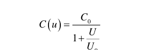

图 5.48 简单的五晶体管增益级，包含

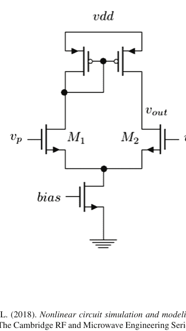

#### 参考文献

1.  Pedro, J., Root, D., Xu, J., & Nunes, L. (2018). *非线性电路仿真与建模：微波设计基础*（剑桥射频与微波工程系列）。剑桥：剑桥大学出版社。 https://doi.org/10.1017/9781316492963
2.  Antognetti, P., & Massobrio, G. (2010). *使用SPICE进行半导体器件建模*（第2版）。印度：麦格劳-希尔教育。
3.  Kundert, K., White, J., & Sangiovanni-Vicentelli, A. (1990). *模拟和微波电路的稳态仿真方法*。马萨诸塞州诺韦尔：Kluwer学术出版社。
4.  Kundert, K. (1995). *SPICE和Spectre设计指南*。马萨诸塞州诺韦尔：Kluwer学术出版社。
5.  Najm, F. N. (2010). *电路仿真*。新泽西州霍博肯：Wiley。
6.  Berry, R. D. (1971). 用于稀疏矩阵求解的电子电路方程的最优排序。 *IEEE电路理论汇刊*, 18, 40–50.
7.  Calahan, D. A. (1972). *计算机辅助网络设计*（修订版）。纽约州纽约市：麦格劳-希尔。
8.  Chua, L. O., & Lin, P.-M. (1975). *电子电路的计算机辅助分析*。纽约州纽约市：麦格劳-希尔。
9.  Gear, C. W. (1971). *常微分方程的数值初值问题*。新泽西州恩格尔伍德克利夫斯：Prentice-Hall。
10. Hachtel, G. D., Brayton, R. K., & Gustavson, F. G. (1971). 网络分析与设计的稀疏表格法。 *IEEE电路理论汇刊*, 18, 101–113.
11. Ho, C.-W., Zein, A., Ruehli, A. E., & Brennan, P. A. (1975). 网络分析的改进节点法。 *IEEE电路与系统汇刊*, 22, 504–509.
12. Milne, W. E. (1949). 关于微分方程数值积分的注记。 *美国国家标准局研究杂志*, 43, 537–542.
13. Nagel L. W. (1975). *SPICE2：一个仿真半导体电路的计算机程序。* 博士论文，加州大学伯克利分校。备忘录号 ERL-M520。
14. Nagel, L. W., & Pederson, D. O. (1973). 集成电路重点仿真程序。见 *第十六届中西部电路理论研讨会论文集。* 加拿大：滑铁卢。
15. Ogrodzki, J. (1994). *电路仿真方法与算法。* 佛罗里达州博卡拉顿：CRC出版社。
16. Vlach, J., & Singhai, K. (1994). *电路分析与设计的计算机方法*（纽约州纽约市，第2版）。Van Nostrand Reinhold公司。
17. McCalla, W. J. (1988). *计算机辅助电路仿真基础。* 马萨诸塞州诺韦尔：Kluwer学术出版社。
18. Ho, C. W., Zein, D. A., Ruehli, A. E., & Brennan, P. A. (1977). 一个用于实验性通用交互式电路设计程序中直流解的算法。 *IEEE电路与系统汇刊, 24*, 416–422.
19. Ruehli A. E., (编). (1986). *电路分析、仿真与设计 – 第一部分*，北荷兰，阿姆斯特丹，作为 *VLSI的CAD进展* 第3卷出版。
20. Ruehli A. E., (编). (1987). *电路分析、仿真与设计 – 第二部分*，北荷兰，阿姆斯特丹，作为 *VLSI的CAD进展* 第3卷出版。
21. Vladimirescu, A. (1994). *SPICE手册。* 纽约州纽约市：Wiley。
22. Suarez, A. (2009). *自主微波电路的分析与设计。* 新泽西州霍博肯：Wiley-IEEE出版社。
23. Sahrling, M. (2019). *集成电路设计的快速技术。* 剑桥：剑桥大学出版社。
24. Gustafsson, K. (1988). *常微分方程求解器中的步长控制：分析与综合*，论文，隆德：隆德大学出版社。

# 第六章
结语：实践中的仿真器

**摘要** 本书至此已探讨了电路仿真器背后的基本原理。借助所提供的代码，读者或许已更好地理解了仿真器的优势与不足。基于这些知识，本章将讨论使用仿真器进行设计项目时的最佳实践。这必然是主观的观点，但希望读者能从中有所收获。不同开发者经验各异，对设计工作的方法也会略有不同。总而言之，我们将避免争议性和过于主观的方法，忠实于设计者在行业中可能遇到的实际情况。

从根本上说，行业专业人士的任务是构建具有合理良率的电路，使其在经济上可行生产。这一重要方面将是本章的基调。因此，行业专业人士的工作与学术专业人士有所不同。在学术界，发明使用器件的新方法或在技术未探索的应用领域开辟新天地至关重要。行业专业人士同样热衷于发明器件的新用途，但目标是制造可大规模生产的最终产品。这两种略有不同的方法使得工作在两种环境中有所差异，本章将更多展示行业专业人士的方法。

我们将在第6.1节首先讨论接触新工艺技术时的良好实践。这可能是代工厂刚发布的全新高端技术，也可能对用户而言是新的。最糟糕的做法是直接开始仿真，而不了解代工厂建模团队如何构建其模型。模型开关可能未针对特定应用调优，如果未首先发现这一点，在实验室评估电路时可能会遇到意外。第6.2节讨论小模块仿真策略，并以设计大型模块时的典型仿真流程展示结束本章。

## 6.1 新工艺技术的模型验证策略

假设我们正使用新工艺技术启动设计项目。这对用户可能是新的，也可能是实际新上线的工艺。在当今环境中，新工艺上线速度相当快，如果从事涉及最新技术的项目，这是常见的经历。半导体行业的经济规律决定了功耗和成本都需不断降低，由于两者都与晶体管尺寸相关，因此有强烈动机缩小晶体管规模。首先要查看器件模型，接下来我们将讨论这一点。

通常接触新技术时，会获得一组模型文件，根据工艺成熟度，这些模型文件或多或少能反映器件特性。成熟的工艺如经典的TSMC 180 nm已活跃设计数十年，比刚上线的最新超小几何CMOS工艺更可靠。然而，即使是TSMC 180 nm，理解模型的优势与不足也很重要。对于新工艺，设计者的难点在于评估模型质量。现代代工厂有专业人员仔细表征有源器件，但如果工艺是新的，各种时间压力可能导致模型偏差，尤其是工艺可能仍在变化！设计者需判断模型文件的成熟度，如果发现异常，通常代工厂会很感激提醒。

应进行何种表征？答案往往因应用细节而异，但我们将提供一组通用仿真，这些仿真在大多数情况下对设计任务非常有用：

- 使用$I_d$与$V_{gs}$、$V_{ds}$（CMOS工艺）或$I_c$与$V_{bes}$、$V_{ce}$（双极工艺）仿真晶体管。改变沟道长度和宽度。
- 使用这些图提取阈值电压$V_{th}$。
- 仿真过渡频率$f_t$与沟道长度和宽度的关系。
- 仿真栅源、栅漏电容与长度和宽度的关系。

在本节中，我们将在第6.1.1、6.1.2和6.1.3节讨论这三组仿真的细节及其应得的结论。当然，还有其他可能有用的仿真，如噪声和1/f拐角，这三组只是良好的起点，并非旨在详尽无遗。

本章将简要讨论这些特性的意义。例如，提取晶体管时发现与原理图仿真存在巨大差异可能相当令人沮丧。超短沟道晶体管的接触和漏源电阻可能对性能非常不利，如果必须通过提取来了解其严重程度，最好提前知道，以便找到加速设计时间的方法。

在本节中，我们将介绍一些在多年设计工作中证明有用的模型验证策略。好处是如果发现差异，可以采取预防措施，从而提高特定设计首次成功的可能性。我们首先讨论基本表征，然后介绍其他抽查，如漏源电阻建模、$g_m$与沟道长度、NQS开关$g_{m,max}$方法提取$V_t$，以及变容二极管电容与电压的关系（有些模型仅在某些平均电压下表征电容，因此可能偏差）。我们不打算使此列表详尽，而是反映作者在多年积极设计工作中遇到的、对理解工艺器件工作有用的提示。

### 6.1.1 直流响应曲线

评估新工艺时，首先要仿真基本的漏电流与栅源电压和漏源电压的关系。结果将类似于图6.1和6.2。
特别注意高$V_{ds}$水平时的情况。存在如DIBL和ISCE等效应，会在较高漏电压下显著增加漏电流，验证结果是否合理是明智的。当然，也要查看这些函数的一阶导数以确保连续性（图6.3和6.4）及其一阶导数（图6.5）。

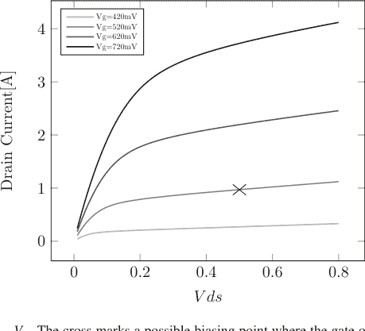

图6.1 $I_d$与$V_{ds}$、$V_{gs}$。叉号标记了一个可能的偏置点，其中栅过驱动电压约为150 mV，漏电流为1 mA，$V_{ds}$ = 500 mV

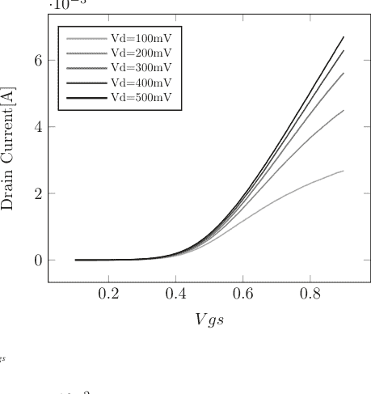

图6.2 $I_d$与$V_{gs}$


图6.3 $g_m$与$V_{gs}$

有时进一步深入可能也有用。我们将在此坚持这些图，如果需要更多数据，将在文中提及。

- 响应曲线看起来是否符合物理规律？
- 模型如何随沟道长度缩放？器件宽度？
- 寄生电阻如何处理？对超短沟道工艺非常重要。

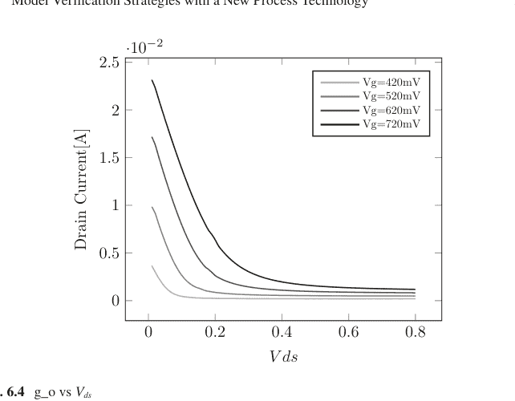

图6.4 $g_o$与$V_{ds}$


图6.5 $g_m'$与$V_{gs}$

### 6.1.2 $V_{th}$提取

阈值电压$V_{th}$不是像热电压$V_t = kT/q$那样的物理量；而是参数化从非反转沟道到反转沟道（少数载流子出现）过渡的常用方法。

栅极电介质正下方的区域（参见第3章）。因此，$V_{th}$ 电压的确切值可能存在争议。一种常用的方法称为 gm-max 法，其中晶体管偏置在线性区，固定 $V_{ds} < V_{gs} - V_{th}$，扫描栅极电压，并定位 $g_m$ 的峰值。在 gm-max 点处，$I_d$ 对 $V_{gs}$ 曲线的切线与 $I_d = 0$ 轴的交点即为阈值电压。我们关注 $g_m$ 最大点的原因是，我们需要确保已脱离亚阈值区，但又未深入到迁移率受影响的饱和区。因此，最大 $g_m$ 点是以下公式近似成立的地方（第3章中的线性区）：

$$I_{ds} = \mu_{eff} C_{ox} \frac{W}{L} \left( (V_{gs} - V_T) V_{ds} - \frac{m}{2} V_{ds}^2 \right)$$

当

$$(V_{gs} - V_T) V_{ds} - \frac{1}{2} V_{ds}^2 = 0 \rightarrow V_{gs} = V_T + \frac{1}{2} V_{ds}$$

时，$I_d = 0$ 的表达式成立。

我们只需从截距点的 $V_{gs}$ 中减去 $1/2V_{ds}$，即可得到 $V_T$ 的估计值。模拟 $V_T$ 随栅极长度和栅极宽度的变化。此类模拟的示例可在图 6.1 和 6.3 中找到。最大 $g_m$ 出现在 $V_{gs} = 750$ mV 左右，从图 6.1 中该点引出的切线得到图 6.6。交点位于 $V_{int} = V_{gs} = 0.45$ V，因此 $V_{th} = V_{int} - V_{ds}/2 = 400$ mV。在模拟完所有这些特性后，我们会提出如下问题：


- 响应在以下方面是否合理：
  (a) 缩放比例？
  (b) 物理特性，例如共源级的输出电导和 $V_T$ 随栅极长度的变化？
- 是否包含了寄生参数，如栅源/栅漏电阻和侧壁电容？它们是否合理？即使存在侧壁电容，栅源电容也应大于栅漏电容。如果模型文件开关设置正确但未正确包含寄生参数，那么我们就遇到了另一种问题。

当直流特性曲线和阈值电压模拟完成后，请在你的设计流程中考虑一个“单位”晶体管。如果你进行低功耗设计，它可能是一个漏极电流为 10 uA 的晶体管；如果你进行高速设计，它可能是一个 1 mA 甚至更高电流的晶体管。这里我们将假设一个“单位”晶体管偏置在 1 mA 漏极电流、150 mV 过驱动电压（$V_{gs} - V_{th}$）和 $V_{ds} = 500$ mV 下，并具有最小沟道长度。这些因素将决定晶体管的宽度。利用我们刚刚完成的特性图，我们现在可以找出这样一个“单位”晶体管的跨导 $g_m$ 以及当然还有 $g_{ds}$。如果我们再次查看图 6.1、6.2、6.3 和 6.4，我们发现阈值电压为 370 mV，并且在 $V_{gs} = 520$ mV 时，从图 6.1 中找到漏极电流为 1 mA。从图 6.3 和 6.4 中，我们得到 $g_m = 0.012$ 和 $g_{ds} = 0.75 \cdot 10^{-3}$ mmhos。这些数字是否与模型提取值对应？通常，现代原理图工具会为给定的晶体管反向标注这些数字，但令人惊讶的是，这些数字与模拟值不一致的情况经常发生。用户需注意！我们在表 6.1 中总结了该晶体管的直流特性。

在接下来的几节中，我们将继续为这个“单位”晶体管添加各种特性。

### 6.1.3 $f_t$ 特性

特征频率 $f_t$ 是用于估计晶体管速度的经典参数。先进的 CMOS 工艺节点在某些偏置设置下可以达到 $f_t > 400$ GHz，这相当令人印象深刻。特征频率定义为漏极电流等于栅极电流时的频率（见图 6.7）。如果模拟共栅配置的晶体管，可以看到特征频率就是

表 6.1 “单位”晶体管的直流特性

| 参数 | 值 | 单位 |
| :--- | :--- | :--- |
| 宽度 | 10 | $\mu$m |
| $g_m$ | 11 | mmho |
| $g_{ds}$ | 0.5 | mmho |
| $V_{th}$ | 370 | mV |


图 6.7 饱和区“单位”晶体管的偏置。晶体管偏置使得漏极电流为 1 mA。根据应用，其他晶体管偏置点可能更合适

图 6.8 共栅级


源极输入电流在漏极和栅极端口之间均分的点。从某种意义上说，栅极电流通过栅极电容损失了，因此它是晶体管所能处理速度的一种度量。

设置晶体管进行 $f_t$ 验证的最简单方法见图 6.8。漏源电压通常保持在低于最大允许值的某个电压，同时扫描直流栅极电压。比较漏极和栅极中的交流电流，特征频率就是这两个电流幅度相等的点。

此时，有几个合适的问题需要提出：

- 特征频率 $f_t$ 是多少？它是否与宣传的数字匹配？
- 这个点如何依赖于偏置？（对栅极电压的依赖性可能具有教育意义。）
- 它是否符合物理意义？一阶近似下，特征频率应与 $g_m$ 成线性比例，然后在更高偏置点处出现滚降。

通常，代工厂联系人和偶尔的建模团队之间会有一些来回沟通，以澄清这类问题（表 6.2）。

表 6.2 我们“单位”晶体管的特征频率

| 参数 | 值 | 单位 |
| :--- | :--- | :--- |
| $f_t$ | 280 | GHz |

### 6.1.4 栅源和栅漏电容特性

表征晶体管的一个便利特性是其栅极到源极和漏极的电容，尤其是在饱和区。一个好的方法是取一个偏置在饱和区、过驱动电压 >100 mV、漏极电流约为 1 mA 的“单位”晶体管。或者选择一个对于你正在工作的特定应用来说典型的晶体管。然后运行交流模拟，观察分别流过漏极和源极节点的*虚部*电流大小（见图 6.9）。这将快速为你提供典型（或单位）晶体管的电容，因为虚部电流斜率等于 $\omega C$。对于图 6.9 的情况，我们得到（表 6.3）。

记住这些数字，可以在查看原理图时估算晶体管对电路的负载 [1]。这在电路设计中可以非常高效。此外，漏源电容是否按比例缩放？如果源极和漏极没有寄生电阻，人们会想象栅源电容更大，因为侧壁电容应与漏极侧相似，但饱和区的沟道电荷应仅对源极电容有贡献。有时需要通过特定的模型系列选择来显式关闭寄生电阻。这些寄生电阻可能会混淆人们对电容相对大小的初步直觉。漏极电阻可以通过米勒效应增加有效的栅漏电容，而源极电阻可以通过源极的负反馈（内部源极电压与栅极电压同相）减小有效的栅源电容。

我们可以从这些电容计算出相应的 $f_t$

$$f_t = \frac{g_m}{2\pi(C_{gs} + C_{gd})} \approx \frac{10^{-2}}{36 \cdot 10^{-15}} \approx 280 \text{ GHz}$$

这证实了我们对特征频率的直接模拟。


图 6.9 “单位”晶体管电容的模拟结果

表 6.3 根据图 6.9 中的模拟计算出的栅源/栅漏电容

| 电容 | 值 | 单位 | 备注 |
|---|---|---|---|
| 栅源 | 2.6e-3/6.28e11 = 4.3 | fF | 饱和区 |
| 栅漏 | 1.1e-3/6.28e11 = 1.6 | fF | 饱和区 |

### 6.1.5 总结

我们研究了我们虚构工艺中的一个“单位”晶体管。我们发现它具有表 6.4 所示的以下特性。

有了这个小表格，我们现在可以通过简单地乘以一个比例因子，来了解任何尺寸晶体管的这些参数值。我们离这个“单位”晶体管尺寸越远，误差就越大，但它仍然能很好地提供，例如，特定晶体管的电容负载感。此外，像跨导和输出电导这样的东西可以非常快速地估算，而无需模拟。这是一个在整个设计过程中都可以使用的便捷小表格。

在其他应用中，其他参数，如导通电阻 $r_{on}$，可能值得添加到这个简短的特性参数列表中。这个想法本身并不新鲜（例如，参见 [1–3] 了解更多详细信息）。

## 6.1 采用新工艺技术的模型验证策略

表 6.4 “单元”晶体管通用参数最终表

| 参数 | 值 | 单位 |
| :--- | :--- | :--- |
| 宽度 | 10 | μm |
| $g_m$ | 11 | mmho |
| $g_{ds}$ | 0.5 | mmho |
| $V_{th}$ | 370 | mV |
| $f_t$ | 280 | GHz |
| $C_{gs}$ | 4.3 | fF |
| $C_{ds}$ | 1.6 | fF |

### 6.1.6 错误模型行为示例

为了强调仔细检查模型行为的重要性，让我们看看第 5.2 节中的缓冲器，但使用不切实际的晶体管模型 1，并观察输出节点。我们已经在第 5 章（图 5.37）中做过这个。在上下平台中间出现的非物理性尖峰，源于该模型是一个简单的平方函数，并且如果 $V_{gs} < 0$，晶体管会再次导通，这是非物理的。读者遇到如此偏差的模型的可能性很小，但希望读者能体会到仔细研究晶体管行为的好处。

### 6.1.7 工艺角仿真策略

代工厂不会只发布一组模型。通常他们会包含许多不同的模型组，通常称为工艺角模型。作为新工程师，很容易相信“角”这个词指的是某种“永远不会发生”的极端情况。事实并非如此。单个晶圆或芯片本身就包含一定的工艺变化。晶圆上的平均值很可能与某个工艺偏差角对齐，但在这个平均值周围，会存在一定的变化，这取决于所使用的代工厂和技术。偶尔会发现从工厂返回的硅片表现比任何模型仿真所能达到的都要差得多。这通常是由于设计本身的某些弱点在某个“永远不会发生”的仿真角中显现出来。与其将角视为某种极端情况，不如将其视为对你电路的压力测试。如果任何仿真结果在一个角中发生显著变化（并且“读者须知”——注意“显著”一词的含义），你的电路将根本无法正常工作。这种异常行为，无论程度轻重，都将成为你所有芯片的一部分，无论它们来自哪个所谓的工艺偏差角晶圆。

有时，偏差工艺文件会将所有元素都归入角文件中。这很少有意义，因为不同的器件类型具有不同的工艺依赖性。如果代工厂没有为电容器、NMOS、PMOS、电阻器、二极管等提供单独的角文件，那么创建自己的偏差模型文件通常是有意义的。根据你所从事的项目类型及其应用，最好添加比代工厂直接提供的标准 CMOS 晶体管更多的角。

传统上，还需要另外两个角仿真参数：电源电压角和温度角情况。我们有可怕的三要素，即工艺、电压和温度（PVT），它们通常按重要性降序列出。

一旦确定了所需的角，就可以开始大规模仿真了。在现代仿真器环境中，设置大型仿真扫描并使用简单的脚本语言验证合规性并不困难。在周末或通宵运行这些仿真，并仔细注意结果中的小异常（图 6.10）。是否存在跨角的趋势？有时这是必然的，但例如对于带隙基准，你会期望在目标温度附近看到平坦的响应。在这个评估阶段，有点“偏执”是件好事，并且常常需要与自己想要继续前进的倾向作斗争。


**图 6.10** 工艺角仿真警告示例。不要被慢角似乎行为异常所迷惑，认为它只是在一个“永远不会发生”的角中，电路就没问题。这种情况表明电路或仿真设置存在问题，在硅片上该电路将无法正常工作。

### 6.1.8 蒙特卡洛仿真

蒙特卡洛仿真是电路的另一种经典压力测试。其思想是，在制造过程中，部署各种掺杂和注入步骤时存在变异性，器件特性会因器件而异。这通常由代工厂以某种方式表征。这种表征通常是使用彼此相邻的器件完成的，与相距较远的器件相比，这可能是一种过于理想的情况。需要考虑一些关键步骤：

- 代工厂如何表征失配？是否假设器件彼此相邻？
- 运行 ≫ 100 次仿真，使用仅电容提取模型和仅 RC 提取模型。
- 研究所得的标准差。我们距离规格要求有多少个西格玛？

## 6.2 小模块仿真

在本节中，我们将讨论关于小模块仿真的一般策略。我们从简单的模型估算计算开始，并继续使用适当的仿真策略来表征原理图。

在进行任何电路仿真之前，请从简单建模的角度思考电路（关于如何为广泛的应用进行此操作，请参见 [1] 中的许多示例）。关键思想是仿真器应该只确认你已经知道会发生的事情。如果让仿真器告诉你发生了什么，而不问自己为什么，很容易被误导。可能是仿真器对某些刺激的响应不正确，就像我们在第 4 章和第 5 章中概述的那样，也可能是由于不正确的刺激。这两个问题都必须尽早发现，以避免后期冗长的调试。随着经验的积累，许多计算可以在脑海中完成。

> 首先用简单模型描述你要设计的电路。

### 6.2.1 模拟电路仿真策略

仿真策略将强烈取决于你正在设计的电路类型。我们在此概述的内容旨在用于连续时间应用，如放大器。始终通过为你的设计创建一个简单模型来开始你的设计工作 [1]。

一旦简单模型就位，最好首先通过直流仿真验证直流偏置。问自己：

- 一切偏置是否正确？
- 所有相关晶体管是否都处于饱和区（对于 CMOS）？
- 电流消耗是否符合预期？

一旦直流偏置条件令人满意，就应该进行交流仿真，并查看：

- 交流增益是否符合简单模型的预期。
- 交流带宽是否与简单模型匹配。

当小信号响应符合预期时，应该运行瞬态仿真和周期稳态仿真，并查看诸如：

- 失真是否符合预期（关于快速估算谐波的方法，请参见 [1]）？
- CMOS 晶体管是否退出饱和区？（这可能导致失真和负载变化。）

该流程如图 6.11 所示。

初学者最常犯的错误之一是在所有地方都使用理想源。在非常初始的阶段，最初的几天，这样做通常是可以的。理想源是真正的*理想*，电压源可以提供任何电流，没有限制。例如，想想我们有一个 50 欧姆的射频输入，并使用理想电压源来建模的情况。它将具有无限的带宽！在漫长的设计工作结束时，意识到带宽实际上已经丧失，并且由于某种理想化而没有被捕获，这真的很令人失望。但这不仅对信号源成立。电压源用理想源替代也同样糟糕。芯片周围的封装通常会在电源节点显示显著的电感，为了抵消这一点，需要在芯片上使用大量的去耦电容，以降低快速开关信号的阻抗（见图 6.12）。

同样对于电流源，有时设计需要在完整的偏置模块准备好之前进行。在这种情况下，正确镜像一个理想电流来设置偏置。不要在差分对的共源点直接使用理想电流。相反，使用镜像电路来设置偏置，如图 6.13 所示。理想电流源应使用在偏置电流最终将到达的点。

> 始终使用真实的电压源和电流源。

也许对于小模块来说最重要的是，使用真实的源阻抗和负载阻抗。

> 从一开始就使用真实的源和负载阻抗。

## 6.2 小模块仿真

**图 6.11** 典型的设计流程图


**图 6.12** 电压源的良好实践


**图 6.13** 使用理想电流源时的良好实践

### 6.2.2 小型数字电路仿真策略

对于大型数字电路，需要遵循寄存器传输逻辑（RTL）流程，其中电路使用高级硬件描述语言（RTL）如 Verilog 进行描述。这些电路使用基于事件的仿真器进行仿真，这与本书中描述的连续时间仿真器形成对比。然而，偶尔需要相对较小的数字模块和状态机来控制某些模拟电路。这些电路可以使用我们在此讨论的连续时间仿真器进行仿真。对于这些电路，与模拟连续时间情况相比，仿真策略可以简化。

对于小型数字电路，进行直流仿真。

- 查看偏置点，所有数字门输出应处于地或 vdd；否则，某些连接可能无意中处于浮空状态。
- 对于纯数字电路，运行交流仿真没有意义；相反，应进行瞬态仿真，并应关注时序：
    - 信号之间的时序是否正确？如果不正确，某些缓冲器的尺寸可能不合适，无法正确驱动负载。
    - 边沿速率是否健康？这是负载不合适的另一个指标。健康的含义直接取决于应用。

稳态仿真器通常难以处理具有大量快速切换边沿的电路。打靶法尤其因困难而臭名昭著，这是由于其固有的假设，即最终状态对初始状态的变化依赖性较弱（第 5.5 节），而对于快速变化的边沿，这并不成立，牛顿-拉夫森法可能无法找到合适的解。此外，可能没有简单的方法来观察电路中的周期性，或者周期可能非常长，因此稳态的基本假设没有帮助。大多数情况下，设计者只能局限于瞬态仿真。

## 6.3 大模块仿真

对于较大的模块，最难处理的问题是电路的规模。正如我们在第 2、4 和 5 章中讨论的，现代仿真器具有一些非常巧妙的功能，其中包括非常高效的矩阵求解器，但对于现代片上系统（SOC），模拟部分的器件数量很容易达到数千万，即使如此强大的工具也可能开始不堪重负。这自然不足为奇，因为更强大的计算机能够生成更强大的芯片，这些芯片可以被用来制造更强大的计算机，从而制造出更强大的芯片，如此循环。这是一个指数级的发展努力！

处理这些情况的一个好方法是使用混合模式仿真器，例如，你可以将 Verilog 事件型仿真器与 SPICE 等微分方程求解器混合使用。如果没有这样的工具可用，通常可以通过为模块构建简化的 Verilog-A 模型来帮助，这些模型可以在原理图视图和 Verilog-A 视图之间切换。这些模型在 SPICE 仿真器中效果良好，可以成为更快推进设计的一种方式。对于 Verilog-A 视图，请记住包含适当的驱动和负载阻抗。

大模块仿真的关键是确保信号路径在适当的负载和源阻抗下得到完全仿真。如果存在时钟分配路径，也应将其包含在内。

- 带隙基准、偏置电路在启用后是否正常启动？
- 正确的模块是否获得了正确的偏置电流？
- 寄存器是否可以正确编程？
- 所有模块是否都正确启用？

特别注意时钟。如果时钟没有正确启动，数字域中*任何*功能都无法测试，模拟功能也寥寥无几。这是一个如此重要的功能，以至于通常存在时钟覆盖机制，可以使用低频外部时钟直接启用数字核心，绕过所有模拟电路。

### 6.3.1 模拟-数字协同仿真策略

原则上，模拟模块与数字模块协同仿真至少有三种不同的方式：（1）两者都使用类 SPICE 工具，（2）模拟 → SPICE，数字 → Verilog，以及（3）两者都使用 Verilog 工具。第一种选择由于电路规模庞大很快变得不可行；后两种更常见，其中第二种最为常见。第三种选择偶尔在可能需要简单信号路径分析时使用。它显然无法处理模拟信号，除非使用某种数字化方法。

一个好的设计方法是确保在施加电源电压时所有模拟模块都关闭。这意味着带隙基准和相关电流的基本偏置已经建立。然后，在启动过程中，可以逐个打开模拟模块并建立功能。立即打开所有模块可能导致奇怪的行为，因为电路的状态可能未知，大的意外电流可能开始破坏互连金属。

对于现代模拟模块，通常需要许多数字位来详细控制偏置并调整温度、电压漂移和老化等因素。很容易有数千位来控制模拟电路。自然，数字寄存器无法在模拟仿真器中编程；寄存器编程序列的时间尺度可能为几微秒，而模拟电路的时间尺度可能为皮秒。寄存器的正确功能只能通过 Verilog 仿真器验证，并且由于它们控制模拟模块，在混合仿真模式环境中进行验证是理想的。

在数据转换器或射频混频器等电路中，通常某处有一个快速时钟来设置芯片功能的时间。为了在内部生成时钟，通常需要一个高达几 GHz 的精确输入时钟（频率越高，印刷电路板设计上的解决方案成本越高）。在仿真寄存器编程期间，由于涉及不同的时间尺度，需要关闭此时钟。这通常可以通过在时钟输入电路中使用延迟语句轻松实现。

芯片通常生成自己的偏置，其中内部带隙基准、固定电压和电流被生成。一种有用的方法是通过寄存器编程来启动此带隙基准和电流发生器。为了防止偏置模块产生过多噪声，模块中通常存在一个具有大时间常数的大电容。根据电路的不同，这样的模块可能需要几十微秒才能正常启动，在此期间，所有更快的时间常数（如我们刚才提到的时钟）都应关闭，以便可以观察带隙基准的行为。

当偏置已被证明可以正常工作并正确偏置所需的电路模块（需要 100 到 1000 个电流）时，就该打开时钟和输入信号，以便研究详细的模拟行为。

### 6.3.2 总结

在本章中，我们简要介绍了使用仿真器和现代代工厂模型设计模块时的良好实践。我们提到验证器件建模非常重要，特别是对于即将上线的工艺节点。现代代工厂的建模团队非常专业且知识渊博，但使用 BSIM 对现代晶体管进行表征是一项非常依赖测量且耗时的任务，很容易出现不足，尤其是在早期版本中。即使是更成熟的技术，也值得研究器件模型。这样，发现模型不足的可能性较小，而发现自身不足的可能性更大。无论如何，你都会感谢自己提前完成了这项艰苦的工作。它使得后续的设计工作顺利得多。

我们还讨论了设计小型模拟电路模块的策略，随后讨论了大型电路仿真验证的高效策略。

本章本质上是主观的，许多经验丰富的设计工程师可能持有不同的观点，但本人多年来一直遵循这些原则并取得了一些成功，认为在构建集成电路时值得考虑这些原则。

## 6.4 练习

- 1. 计算电阻退化差分对的三次谐波响应。

#### 参考文献

- 1. Sahrling, M. (2019). *Fast techniques for integrated circuit design*. Cambridge, UK: Cambridge University Press.
- 2. Jespers, P. G. A., & Murmann, B. (2017). *Systematic design of analog CMOS circuits*. Cambridge, UK: Cambridge University Press.
- 3. Jespers, P. G. A. (2010). *The gm/Id methodology, a sizing tool for low-voltage analog CMOS circuits*. New York: Springer.

# 第7章
## 仿真器背后的数学原理

**摘要** 本附录以比本书其他部分更正式的方式，描述了电路分析背后的一些数学细节。我们将首先从有向图的角度讨论电气网络，定义与电路理论相关的基本实体及其属性。这将引出节点分析，并最终引出改进节点分析。下一节将讨论微分方程在差分方程方面的求解。这是一个庞大的主题，我们只能重点介绍其中一些重要方面。对于感兴趣的读者，参考文献将为未来的学习提供许多指引。

## 7.1 网络理论

由各种有源和无源器件组成的电气网络可以被视为一个有向图，其中节点（有时称为顶点）代表电压，有向边代表节点之间的电流流动[1–3, 5, 6]。如图7.1所示，该电流流经网络中的各个元件。

遵循[2, 3]中的符号，让我们将节点电压定义为

$v_j, j \in \{1, \dots, n-1\}$

这些电压表示节点 $j$ 与参考节点（通常称为节点“0”）之间的电位差。电流由边表示，它们具有大小和方向。我们将电流表示为

$i_k, k \in \{0, 1, \dots, m-1\}$

边表示为

$e_k, k \in \{0, 1, \dots, m-1\}$

有了这些定义，我们现在可以定义关联矩阵 $M_{jk}$ 如下。让每个节点由 $M_{jk}$ 中的一行表示，每条边由 $M_{jk}$ 中的一列表示，使得如果电流*离开*节点，则条目为 +1，如果电流*进入*节点，则条目为 $-1$。所有其他条目为0。显然，每列有一个 +1 和一个 $-1$，因为每个电流只离开和进入一个节点。以图7.1为例，我们得到

$$M_{jk} = \begin{cases} 0 & 0 & 1 & 1 & 0 \ 1 & 0 & -1 & 0 & 1 \ -1 & -1 & 0 & -1 & 0 \ 0 & 1 & 0 & 0 & -1 \end{cases} \quad (7.4)$$

这里很明显，行是线性相关的，因为如果我们将它们视为向量 $s_j$ 并将它们相加，

$$\sum_{j=0}^n s_j \equiv 0 \rightarrow s_i = -\sum_{\substack{j=0 \ j \neq i}}^n s_j \quad (7.5)$$

换句话说，矩阵中存在冗余信息，我们可以移除一行。这个新矩阵 $A$ 通常被称为简化关联矩阵。在我们的例子中，通过移除 $M_{jk}$ 的第一行得到：

$$A = \begin{cases} 1 & 0 & -1 & 0 & 1 \ -1 & -1 & 0 & -1 & 0 \ 0 & 1 & 0 & 0 & -1 \end{cases} \quad (7.6)$$

这非常有用，因为我们现在可以将任何边两端的电压定义为

$u_k = v(e_{k,tail}) - v(e_{k,head})$ (7.7)

用矩阵形式，我们可以简洁地写成

$u = A^T v$ (7.8)

其中上标 $T$ 表示矩阵转置。我们认识到这个方程是基尔霍夫电压定律（KVL），并且我们找到了一种简洁的描述方式。基尔霍夫电流定律可以类似地描述为

$\sum_{e_j \in E_i} i_{kj} - \sum_{e_j \in E_o} i_{kj} = 0$ (7.9)

每个节点（或 $A$ 中的行）的所有流入和流出电流之和为零。在我们的矩阵表述中，这变为

$Ai = 0$ (7.10)

注意我们已经移除了一行，方便地选择了节点“0”，在电路理论中我们称之为地。我们不会跟踪进出这个参考节点的电流，因为它将由所有其他节点的所有电流之和给出。这是我们在正文中已经利用的一个便利。基尔霍夫的两个定律现在可以合并成一个矩阵方程：

$\begin{bmatrix} A & 0 & 0 \ 0 & I & -A^T \end{bmatrix} \begin{bmatrix} i \ u \ v \end{bmatrix} = \begin{bmatrix} 0 \ 0 \end{bmatrix}$ (7.11)

这个方程通常被称为拓扑约束，因为它只涉及网络拓扑，不考虑电路元件的细节及其对激励的响应。这个方程包含 $2m + n - 1$ 个未知数和 $m + n - 1$ 个方程。因此，我们缺少 $m$ 个方程才能有机会求解它。这 $m$ 个方程称为支路方程，来自电路元件。包含这些方程后，我们就有了一个可以尝试求解的完整系统。这组方程的另一个优点是左侧的矩阵是稀疏的，即大多数条目为零。这样的系统比更一般的矩阵系统更容易求解。

### 7.1.1 稀疏表格分析

让我们首先看看线性电路元件，看看支路方程是如何产生的。这样的电路元件可以表征为对电压激励的电流响应

$$i = yv$$

或反之

$$v = zi$$

正如读者无疑知道的，$y$ 是元件的导纳，$z$ 是阻抗。通常对于一组 $m$ 个支路方程，我们得到

$$Zi - Yu = s$$

其中 $Z, Y$ 是稀疏的 $m \times m$ 矩阵，$s$ 是已知的 $1 \times m$ 向量（通常为零）。我们现在可以将这组支路方程与拓扑约束结合起来，得到

$$\begin{bmatrix} A & 0 & 0 \ 0 & I & -A^T \ Z & Y & 0 \end{bmatrix} \begin{bmatrix} i \ u \ v \end{bmatrix} = \begin{bmatrix} 0 \ 0 \ s \end{bmatrix}$$

这被称为稀疏表格分析（STA）公式（参见[1]）。这个公式是通用的且稀疏的，因此求解速度快。然而，存在一些冗余，在现代电路仿真器中，由于通常研究的电路规模很大，内存空间往往是一个问题，因此存在其他更紧凑的公式。让我们首先将KVL（$u = A^T v$）代入支路方程。我们得到

$$Zi + Yu = Zi + YA^T v = s$$

网络矩阵方程现在变为

$$\begin{bmatrix} A & 0 \ Z & YA^T \end{bmatrix} \begin{bmatrix} i \ v \end{bmatrix} = \begin{bmatrix} 0 \ s \end{bmatrix}$$

这有时被称为简化表格形式。

### 7.1.2 节点分析

$i = Yu + s$ (7.18)

和KVL，我们得到一个大大简化的矩阵系统，完全不依赖于支路电流：

$AYA^T v = -As$ (7.19)

这个公式被称为网络方程的节点分析（NA）形式。它是一个更小的 $(n-1) \times (n-1)$ 矩阵，只有节点作为未知数。事实证明，对支路电流的要求排除了理想电压源，因为理想独立电压源的方程不包含其电流：

$v(a) - v(b) = V$ (7.20)

两个节点之间的节点电压是固定的，与电流无关（换句话说，理想独立电压源的输出电阻为0欧姆）。网络方程的这个优点——电流被消除——与不幸的要求（不存在独立电压源）相结合，是相当有吸引力的，我们接下来将讨论解决这个问题的常见方法。

### 7.1.3 改进节点分析

改进节点分析（MNA）最早由[2]提出。起点是我们刚刚讨论的节点分析，修改之处在于需要保留其电流的元件被简单地添加到支路方程组中。人们谈论元件属于两个*组*之一，参见例如[2, 3]：

> **元件组的定义**
电流要被消除的元件属于第1组，所有其他元件属于第2组。

支路电流和电压现在可以根据元件的组别进行分离。我们有

$i = \begin{bmatrix} i_1 \ i_2 \end{bmatrix}, u = \begin{bmatrix} u_1 \ u_2 \end{bmatrix}$ (7.21)

其中第1组元件的电流表示为 $i_1$，电压表示为 $u_2$，依此类推。支路方程现在对于第1组元件变为

$i_1 + Z_{12}i_2 = Y_{11}u_1 + Y_{12}u_2 + s_1$ (7.22)

对于第2组元件

$Z_{22}i_2 = Y_{21}u_1 + Y_{22}u_2 + s_2$

以矩阵形式表示

$\begin{bmatrix} I & Z_{12} \\ 0 & Z_{22} \end{bmatrix} \begin{bmatrix} i_1 \\ i_2 \end{bmatrix} - \begin{bmatrix} Y_{11} & Y_{12} \\ Y_{21} & Y_{22} \end{bmatrix} \begin{bmatrix} u_1 \\ u_2 \end{bmatrix} = \begin{bmatrix} s_1 \\ s_2 \end{bmatrix}$

基尔霍夫定律也可以写成关于组成员关系的函数：

$A_1 i_1 + A_2 i_2 = 0$

$u_1 = A_1^T v \quad u_2 = A_2^T v$

将支路电流 $i_1$ 直接代入 KCL，并利用 $u_1$ 和 $u_2$ 的 KVL 方程，我们得到

$A_1(-Z_{12}i_2 + Y_{11}A_1^T v + Y_{12}A_2^T v + s_1) + A_2 i_2 = 0$

在重新整理为关于未知量的形式，并将已知量移到等式右边后，我们最终得到

$A_1(Y_{11}A_1^T + Y_{12}A_2^T)v + (A_2 - A_1 Z_{12})i_2 = -A_1 s_1$

为了得到完整的改进节点分析方程组，我们现在只需加上第2组元件的支路方程，并再次利用 KVL 方程，我们发现

$\begin{bmatrix} A_2 - A_1 Z_{12} & A_1(Y_{11}A_1^T + Y_{12}A_2^T) \\ Z_{22} & -Y_{21}A_1^T - Y_{22}A_2^T \end{bmatrix} \begin{bmatrix} i_2 \\ v \end{bmatrix} = \begin{bmatrix} -A_1 s_1 \\ s_2 \end{bmatrix}$

这就是 MNA 方程组的一般形式。在某些情况下可以进行进一步简化。例如，假设没有受控源。这意味着矩阵 $Z_{12}$、$Y_{12}$、$Y_{21} = 0$ 且 $Y_{11}$ 是对角矩阵。我们有

$\begin{bmatrix} A_2 & A_1 Y_{11} A_1^T \\ Z_{22} & -Y_{22} A_2^T \end{bmatrix} \begin{bmatrix} i_2 \\ v \end{bmatrix} = \begin{bmatrix} -A_1 s_1 \\ s_2 \end{bmatrix}$

如果网络中也没有电流源，$Y_{22} = I$，我们得到文献中常见的 MNA 表达式：

$$\begin{bmatrix} A_2 & A_1 Y_{11} A_1^T \\ Z_{22} & -A_2^T \end{bmatrix} \begin{bmatrix} i_2 \\ v \end{bmatrix} = \begin{bmatrix} -A_1 s_1 \\ s_2 \end{bmatrix} \quad (7.31)$$

注意，这里第一组方程只是对所有节点应用 KCL 的结果，第二组方程则来自支路方程。我们现在可以遵循以下步骤来构建网络方程组：

1.  从电路网表中读取一个元件。
2.  如果该元件属于第1组，则利用其支路方程消去其电流，并使用 KVL 替换支路电压。
    如果该元件属于第2组，则写出包含其电流的支路方程，并使用 KVL 消去所有支路电压。

这个步骤自然地为电路网表中的每个元件引出了一个特定的签名，正如正文中所描述的那样。
在讨论电容器和电感器等动态元件时，情况略有不同，因为电流和支路电压的导数会参与进来。我们通常有支路方程

$$Zi + L \frac{di}{dt} - Yu - C \frac{du}{dt} = s \quad (7.32)$$

或以矩阵形式表示

$$\begin{bmatrix} I & Z_{12} \\ 0 & Z_{22} \end{bmatrix} \begin{bmatrix} i_1 \\ i_2 \end{bmatrix} + \begin{bmatrix} 0 & 0 \\ 0 & L_{22} \end{bmatrix} \begin{bmatrix} di_1 / dt \\ di_2 / dt \end{bmatrix} - \begin{bmatrix} Y_{11} & Y_{12} \\ Y_{21} & Y_{22} \end{bmatrix} \begin{bmatrix} u_1 \\ u_2 \end{bmatrix} - \begin{bmatrix} C_{11} & 0 \\ 0 & C_{22} \end{bmatrix} \begin{bmatrix} du_1 / dt \\ du_2 / dt \end{bmatrix} = \begin{bmatrix} s_1 \\ s_2 \end{bmatrix} \quad (7.33)$$

注意电感器属于第2组。这是由于其在直流下的阻抗为零；如果能保证分析中永远不会出现直流情况，可以将其移到第1组，但通常它应该是一个第2组元件。我们现在可以沿着与之前相同的思路进行，并得到包含动态元件的 MNA：

$$\begin{bmatrix} A_2 - A_1 Z_{12} & A_1 (Y_{11} A_1^T + Y_{12} A_2^T) \\ Z_{22} & -Y_{21} A_1^T - Y_{22} A_2^T \end{bmatrix} \begin{bmatrix} i_2 \\ v \end{bmatrix} + \begin{bmatrix} 0 & A_1 C_{11} A_1^T \\ L_{22} & -C_{22} A_2^T \end{bmatrix} \begin{bmatrix} di_2 / dt \\ dv / dt \end{bmatrix} = \begin{bmatrix} -A_1 s_1 \\ s_2 \end{bmatrix} \quad (7.34)$$

## 7.2 微分方程的数值求解技术

我们包含前面标准电路矩阵系统的推导是为了完整性。标准参考文献包含更多细节 [1–5]。在本节中，我们将简要讨论这些方程的可解性。我们从矩阵理论知道，为了使矩阵方程可解，通常需要矩阵的逆存在。显然，如果右边为零，平凡解（零）总是可能的（如果什么都没有，你得到的就是什么都没有）。因此，对 MNA 方程组可解性的研究就是对矩阵本身及其逆矩阵性质的研究。很明显，如果矩阵是对角矩阵，解将存在，所以在矩阵是强对角矩阵的较弱情况下，可以认为解很可能存在。我们将花几页篇幅讨论这些各种有趣的情况。

通常，MNA 方程的解并不存在。我们需要对元件和网络施加额外的约束，以增加解存在的可能性。例如，想象一下在同一个支路上有两个具有不同电压的独立电压源的情况。这将导致一个不可能的情况，产生无限大的电流。有时在原理图环境中设置仿真时，可能会犯错误导致恰好出现这种情况。现代仿真器总是会抱怨非法的支路拓扑并以错误退出。还有一个互补的问题，即两个具有不同电流值的独立电流源串联。这也常常导致不可能的情况。这类病态情况是不允许出现的。它们通常被称为*一致性要求*。

我们到目前为止讨论的方程最普遍地被称为微分-代数方程（DAE）。它们比我们通常考虑网络系统时想到的常微分方程（ODE）更难求解。ODE 有着悠久的研究历史，并且已知许多方法。网络方程的困难出现在动态元件矩阵 $\begin{bmatrix} 0 & A_1 C_{11} A_1^T \\ L_{22} & -C_{22} A_2^T \end{bmatrix}$ 是非线性或奇异的时候。非线性电容在电路中非常常见，例如，反向偏置的结二极管以及 MOSFET 中沟道电容随栅极电压变化等效应会使问题显著复杂化。在本书中，我们主要关注更简单的恒定 $L, C$ 问题，这使得传统的 ODE 方法能够很好地工作。鉴于围绕一般网络方程求解的这些困难警示，本节的剩余部分我们将专注于 ODE。

### 7.2.1 ODE 求解方法

本节将讨论围绕 ODE 的基本数学和定理。与上一节一样，我们将呈现材料以保证自包含性。我们的大部分内容依赖于参考文献 [3, 4]。

#### 7.2.1.1 初值问题

初值问题（IVP）是指在某个时间（我们称之为时间 $t = 0$）解是已知的，并且系统由一个微分方程控制，该方程将其从该时间驱动到某个最终时间 $t_f$。形式上，我们有

$$\frac{dx(t)}{dt} = f(x(t), t) \quad x(0) = x_0 \quad (7.35)$$

其中 $x$ 是一个 $m$ 维实向量，向量 $x_0$ 是在时间 $t = 0$ 时的已知状态。

显然，并非所有 IVP 都有解，有时可能存在多个解。我们称这些为特定方程的存在性和唯一性性质。在我们深入这些性质之前，我们需要更具体地说明我们讨论的是哪种解，以及它们在什么定义域（空间和时间区域）上定义。让我们首先定义域 $\mathcal{D}$。我们感兴趣的是定义在 $\mathbb{R}^m \times \mathbb{R}$ 上的解，使得

$$\mathcal{D} = \{(x, t) | x \in \mathbb{R}^m \text{ and } 0 \le t \le t_f\} \quad (7.36)$$

像方程 7.35 这样的问题需要在小扰动下（记住诸如数值舍入误差之类的事情）表现良好，而不会失控。这样的系统被定义为适定的。

> **定义 7.1**
> 设 $(\delta(t), \delta_0)$ 和 $(\tilde{\delta}(t), \tilde{\delta}_0)$ 是方程 $\dot{x}(t) = f(x, t), x(t_0) = x_0$ 的两个扰动，并设 $\hat{x}(t)$ 和 $\tilde{x}(t)$ 是由此产生的扰动解。如果存在一个 $S > 0$，使得对于所有 $t \in [0, t_f]$，$\epsilon > 0$，我们有
> $$||\hat{x}(t) - \tilde{x}(t)|| \le S\epsilon, \text{ whenever } ||\delta(t) - \tilde{\delta}(t)|| \le \epsilon \text{ and } ||\delta_0 - \tilde{\delta}_0|| \le \epsilon$$
> 则称该方程是完全稳定的，或适定的。

其思想是，如果解在小扰动下差异不大，则解是稳定的。现在，考虑一个数字 CMOS 门，当其输入在触发点附近轻微变化时。这样的系统是适定的吗？考虑到门的增益，输出将发生剧烈变化。然而，仍然可以找到一个 $S > 0$ 来满足定义中的条件，因此这样的系统在技术上仍然是适定的。这并不意味着它在寻找解时是有帮助的，而且确实有些分析方法在跳变点附近非常困难（例如，参见第 4 章中的打靶法）。

我们还需要定义函数 $f$ 在公式 7.35 中所满足的所谓 Lipschitz 条件。

##### 定义 7.2
Lipschitz 连续性。假设 $f$ 满足存在一个常数 $L$，使得
$$\|f(x,t) - f(x',t)\| \leq L\|x - x'\| \quad (7.37)$$
对所有 $(x,t), (x',t) \in \mathcal{D}$ 成立。则称 $f$ 是 Lipschitz 连续的。

它比连续性条件稍强，但又不如可微性那么强 [4]。
下面的标准定理保证了唯一解的存在性：

##### 定理 7.1
设 $f(x,t)$ 在 $\mathcal{D}$ 上关于 $t$ 连续，且关于 $x$ 在 $\mathcal{D}$ 上 Lipschitz 连续。那么，对于任意 $x_0 \in \mathbb{R}^m$，方程 $\dot{x}(t) = f(x,t), x(t_0) = x_0$ 存在唯一解 $x(t)$，其中 $x(t)$ 在 $\mathcal{D}$ 上连续且可微。此外，该方程是适定的。

最后，让我们通过以下线性系统的定义来结束数学定义部分。我们将假设本章研究的系统满足定理 7.1 的条件。

##### 定义 7.3 线性系统
如果 $f(x,t)$ 可以描述为
$$f(x,t) = A(t)x + b(t)$$
则方程 $\dot{x}(t) = f(x,t)$ 被认为是线性的，其中 $A(t)$ 通常是一个 $m \times m$ 矩阵，$b$ 是一个大小为 $m$ 的列向量。如果 $A(t) = A$，即与时间无关的常数，我们称该系统是常系数线性系统：
$$\dot{x}(t) = Ax + b(t)$$
如果 $b = 0$，我们得到一个齐次系统：
$$\dot{x}(t) = Ax$$

假设齐次系统的一个通解为 $\hat{x}(t)$，而 $\bar{x}(t)$ 是常系数方程的一个特解，可以证明 $x(t) = \hat{x}(t) + \bar{x}(t)$ 是常系数方程的通解 [3, 4]。由于 $A$ 是一个矩阵，可以通过求解
$$Aq_i = \lambda_i q_i, i \in \{1, 2, ..., m\} \quad (7.38)$$
来求得其特征值和特征向量。

现在可以证明
$$\hat{x}(t) = \sum_{i=1}^{m} c_i e^{\lambda_i t} q_i \quad (7.39)$$
是齐次系统的通解，其中常数 $c_i$ 是任意的 [3, 4]。因此，常系数方程的解为
$$x(t) = \bar{x}(t) + \sum_{i=1}^{m} c_i e^{\lambda_i t} q_i \quad (7.40)$$
在我们后续讨论常微分方程的稳定性时，将需要用到这些解和线性方程的性质。

#### 7.2.1.2 线性多步法的分类

最常见的求解方法称为线性多步法。它们依赖于时间上多个先前的解来计算新时间步的新解。形式上，我们有（最初源自 [4]，但也见 [3]）
$$\sum_{j=-1}^{k-1} \alpha_j x_{n-j} = h \sum_{j=-1}^{k-1} \beta_j f(x_{n-j}, t_{n-j}), k \ge 1, \alpha_{-1} \equiv 1 \quad (7.41)$$
其中 $h$ 是时间步长，目前假设是均匀的。如果 $\beta_{-1} \neq 0$，我们称该方法是隐式的；否则称为显式的。

对于任何求解方法，要使其有用，需要具备几个重要性质。首先，方法应该是收敛的，我们稍后会正式定义这一点。其次，方法应该是稳定的。这两个性质将在接下来的几节中讨论。

##### 收敛性

我们可以将收敛性理解为数值方法随着时间步长 $h \to 0$ 趋近精确解的方式（我们暂时忽略舍入误差）。下面的定义相当直观：

###### 定义 7.4

如果对于所有满足定理 7.1 假设的初值问题，我们有
$$\lim_{h \to 0} \left( \max_{t_n \in [t_0, t_f]} x(t_n) - x_n \right) = 0$$
则称该数值方法是收敛的。

注意，我们在离散时间点 $t_n$ 处评估精确解 $x$。基本上，这意味着当时间步长趋于零时，数值解趋近于精确解。显然，拥有一个在此极限下趋近精确解的方法是必要的。

###### 定义 7.5

如果对于所有满足定理 7.1 假设的初值问题，我们有
$$\lim_{h \to 0} \left( \max_{t_n \in [t_0, t_f]} \frac{1}{h} R_{n+1} \right) = 0$$
则称该数值方法是一致的。

这里 $R_{n+1}$ 是残差，定义为
$$R_{n+1} = \sum_{j=-1}^{k-1} \alpha_j x(t_{n-j}) - h \sum_{j=-1}^{k-1} \beta_j f\left(x(t_{n-j}), t_{n-j}\right) \quad (7.42)$$
它本质上等于我们在第 4 章讨论的局部截断误差（LTE）。如果 $R_{n+1}$ 为零，意味着数值解精确地遵循精确解。现在我们来定义第一特征多项式的重要概念。我们将在本节后续讨论稳定性时使用它。

###### 定义 7.6a

对于线性多步法，我们定义关于 $z \in \mathbb{C}$ 的第一特征多项式为
$$\rho(z) = \sum_{j=-1}^{k-1} \alpha_j z^{k-j-1} = \alpha_{-1} z^k + \alpha_0 z^{k-1} + \dots + \alpha_{k-1}$$

如读者所见，它仅使用 LMS 方法左侧的系数定义。这是由于当 $h \to 0$ 时，只有左侧的项决定了算法的动态特性。因此，它应该是一个重要的研究对象。我们还有第二特征多项式。

###### 定义 7.6b
对于线性多步法，我们定义关于 $z \in \mathbb{C}$ 的第二特征多项式为
$$\sigma(z) = \sum_{j=-1}^{k-1} \beta_j z^{k-j-1} = \beta_{-1} z^k + \beta_0 z^{k-1} + \dots + \beta_{k-1}$$

在本节中，我们关注的是实现数值方法来求解原始初值问题。为了有机会获得解，初值问题必须满足我们在上一节讨论的某些适定性条件。对于数值方法本身，也有类似的考虑，我们将首先讨论所谓的零稳定差分系统。

###### 定义 7.7
设 $\{\delta_n\}$ 和 $\{\hat{\delta}_n\}$ 是差分系统的任意两个扰动，$\{x_n\}$ 和 $\{\hat{x}_n\}$ 是由此产生的扰动解。如果存在常数 $S$ 和 $h_0$，使得对于所有 $0 < h \le h_0$，只要 $\delta_n - \hat{\delta}_n \le \epsilon, \forall n$，就有
$$x_n - \hat{x}_n \le S\epsilon, \forall n$$
我们称该差分系统是零稳定的。

注意这与微分方程连续时间适定性定义的相似性。
正如我们之前暗示的，第一特征多项式对于研究零稳定性很重要。事实上，我们有以下定理：

###### 定理 7.2
差分系统是零稳定的，当且仅当它满足所谓的根条件：特征多项式 $\rho(z)$ 的每个根要么在单位圆内（在复平面上），要么单独位于单位圆上。

有了这些定义和定理，我们现在可以陈述研究初值问题的基本定理：

###### 定理 7.3
差分系统是收敛的，当且仅当它既是一致的又是零稳定的。

我们将逐一检视本书中定义的各种方法，看看这些条件如何对应。

##### 差分方程的阶

差分方程的阶的概念将很快定义，但首先我们需要定义所谓的差分算子。

LMS 方法的线性差分算子，记为 $D$，是一个算子，它作用于一个光滑的时间函数 $s(t)$ 并产生另一个时间函数：
$$D[s(t);h] \equiv \sum_{j=1}^{k-1} \alpha_j s(t-jh) - h \sum_{j=1}^{k-1} \beta_j s'(t-jh) \quad (7.43)$$
注意，当 $D$ 作用于精确解时，它就变成了残差。有了这个定义，就可以很容易地定义 LMS 方法的阶。泰勒展开最常用于描述函数的阶，我们从 $s(\tau)$ 在 $\tau = t$ 附近的展开开始：
$$s(\tau) = s(t) + \sum_{q=1}^{\infty} \frac{1}{q!} \frac{d^q s(t)}{dt^q} (\tau - t)^q$$
$s(\tau)$ 对 $\tau$ 的导数给出
$$\frac{ds(\tau)}{d\tau} = \sum_{q=1}^{\infty} \frac{1}{(q-1)!} \frac{d^q s(t)}{dt^q} (\tau - t)^{q-1}$$
在 $\tau = t - jh$ 处评估这两个表达式后，我们得到
$$s(t-jh) = s(t) + \sum_{q=1}^{\infty} \frac{1}{q!} \frac{d^q s(t)}{dt^q} (-jh)^q$$
$$\frac{ds(t-jh)}{d\tau} = \sum_{q=1}^{\infty} \frac{1}{(q-1)!} \frac{d^q s(t)}{dt^q} (-jh)^{q-1}$$
我们现在可以将这两个表达式代入 $D$ 的定义中，并合并同类项
$$D[s(t);h] = C_0 s(t) + C_1 h \frac{ds(t)}{dt} + \dots + C_q h^q \frac{d^q s(t)}{dt^q} + \dots$$
其中常数$$C_0 = \sum_{j=-1}^{k-1} \alpha_j$$

$$C_1 = \sum_{j=-1}^{k-1} j\alpha_j - \sum_{j=-1}^{k-1} \beta_j$$

$$C_q = \frac{(-1)^q}{q!} \sum_{j=-1}^{k-1} j^q \alpha_j - \frac{(-1)^{q-1}}{(q-1)!} \sum_{j=-1}^{k-1} j^{q-1} \beta_j$$

> **定义 7.8**
> 如果 $C_0 = \dots = C_p = 0$，但 $C_{p+1} \neq 0$，则称一个线性多步法（LMS）的阶数为 $p$，其中 $C_{p+1}$ 被称为该 LMS 方法的误差常数。

可以证明，这个阶数是 LMS 方法一个定义良好的内在属性 [3, 4]。一个 $p$ 阶 LMS 方法的残差变为

$$R_{n+1} = C_{p+1} h^{p+1} \frac{d^{p+1}x(t_n)}{dt^{p+1}} + \dots h^{p+2}$$

这将在后面讨论局部截断误差时带来便利。有了这些定义和定理，我们现在可以进行一些有趣的观察：

$$C_0 = \rho(1) \quad \text{且} \quad C_1 = \frac{d\rho(1)}{dz} - \sigma(1) - (k-1)\rho(1)$$

我们现在知道，一个 LMS 方法是相容的，当且仅当

$$\lim_{h \to 0} \frac{1}{h} \left( C_0 x(t_n) + C_1 h x^{(t_n)} + C_2 h^2 x^{(t_n)} + \dots \right) = 0$$

显然，为了使方法相容，必须有 $C_0 = C_1 = 0$。换句话说，阶数必须 $\geq 1$。同样明显的是，相容性要求：

$$\rho(1) = 0 \quad \text{且} \quad \frac{d\rho(1)}{dz} = \sigma(1)$$

有趣的是，如果 $\sigma(1) = 0 \rightarrow \rho(1) = \rho'(1) = 0$，这意味着 $z = +1$ 是 $\rho(z)$ 的一个重根，那么该方法就不可能是零稳定的。基本上我们已经证明，相容且零稳定的方法必须满足

$$\sigma(1) \neq 0$$

在所有这些定义之后，局部截断误差（LTE）的定义如下应该不足为奇：

$$\text{LTE} = C_{p+1} h^{p+1} \frac{d^{p+1}x(t_n)}{dt^{p+1}} + \dots h^{p+2}$$

上述第一项通常被称为主局部截断误差（PLTE）。

有了这些准备工作，我们现在可以看看我们的积分方法并了解它们的特性。

###### 前向欧拉法

前向欧拉法具有以下序列：$x_{n+1} = x_n + hf_n$ 可以写成

$$x_{n+1} - x_n = hf_n$$

根据泰勒展开，我们有

$$x(t_{n+1}) = x(t_n) + hx'(t_n) + \frac{1}{2}h^2x''(t_n) + \dots h^3$$

因此，前向欧拉法（FE）的 LTE 阶数为 2。

###### 后向欧拉法

类似地，对于后向欧拉法（BE），我们有 $x_{n+1} - x_n = hf_{n+1}$，我们有 $\alpha_{-1} = 1, \alpha_0 = -1, \beta_{-1} = 1$，得到

$$C_0 = 0, \quad C_1 = 0, \quad C_2 = -\frac{1}{2}$$

这意味着 BE 是 1 阶的，而其 LTE 是二阶的，由下式给出

$$\tau_{n+1}(h) = -\frac{1}{2}h^2x''(t_n) + \dots h^3$$

###### 梯形法

梯形法具有

$$x_{n+1} - x_n = \frac{h}{2}(f_{n+1} + f_n)$$

我们可以确定系数为 $\alpha_{-1} = 1, \alpha_0 = -1, \beta_{-1} = \beta_0 = 1/2$，得到

$$C_0 = 0, \quad C_1 = 0, \quad C_2 = 0, \quad C_3 = -\frac{1}{12}$$

因此，梯形法是 2 阶的，LTE 是 3 阶的

$$\tau_{n+1}(h) = -\frac{1}{12} h^3 x'''(t_n) + \dots h^4$$

###### 二阶 Gear 法

我们将此留给读者进一步探索。

#### 7.2.1.3 线性多步法的稳定性

在上一节中，我们定义了所谓的零稳定性。本质上，我们考察一个 LMS 方法，看它是否在时间步长 $h \to 0$ 时趋近于精确解。我们注意到，这显然是数值解方案的一个理想特性。这种零稳定性与微分方程适定性概念之间的相似性，也是当 $h \to 0$ 时数值方法逼近连续时间公式的自然结果。现在，在实际实现中，我们不能令 $h = 0$，而是需要一个关于有限 $h$ 的稳定性概念。实际上，当我们沿着解推进时，误差会累积，这样的误差可能会完全破坏解。第 3 章展示了前向欧拉法的这种行为。由于其重要性，稳定性概念显然已被深入研究多年。甚至在电子计算机出现之前，就已经进行了此类研究。这是一个被广泛研究的主题，我们在此将仅限于介绍线性稳定性理论。非线性稳定性领域也有激烈的研究，但我们在此不涉及。线性稳定性涉及对一个测试系统的考察。在连续时间中，我们有

$$\frac{dx(t)}{dt} = Ax(t) \qquad (7.44)$$

通常假设此类系统的解随时间衰减，但严格来说，可以想象存在不成立的情况，例如振荡器。我们不会过度复杂化讨论，但在此假设系统解满足 $x(t) \to 0$，$t \to \infty$。那么，该系统的数值近似在长时间后也应衰减，即 $x_n \to 0$，$n \to \infty$。这就是我们谈论数值系统稳定性时的含义。我们如何确信我们的数值方法表现如此？正如我们之前所见，这样的线性系统具有解

$$x(t) = \sum_{i=1}^m c_i e^{\lambda_i t} q_i$$

其中 $\lambda$ 是复特征值，$q_i$ 是矩阵 $A$ 的特征向量。为简单起见，我们将假设所有特征值都是不同的。为了使这个解随时间衰减，我们只需要

$$\text{Re}(\lambda_i) < 0, \forall i$$

如果我们对系统应用 LMS 方法，最终会得到以下序列：

$$\sum_{j=-1}^{k-1} \alpha_j x_{n-j} - h \sum_{j=-1}^{k-1} \beta_j A x_{n-j} = \sum_{j=-1}^{k-1} (\alpha_j I - h \beta_j A) x_{n-j} = 0$$

我们现在需要理解在什么条件下解会随时间衰减：

$$x_n \rightarrow 0, n \rightarrow \infty$$

根据矩阵理论，我们知道可以找到一个非奇异矩阵 $Q$，将 $A$ 转换为对角矩阵 $\Lambda = Q^{-1}AQ$，其对角线元素等于 $A$ 的特征值 $\lambda_i$。让我们从左边用 $Q^{-1}$ 乘以序列，并在 $A$ 旁边插入 $I = QQ^{-1}$。

$$\sum_{j=-1}^{k-1} (\alpha_j Q^{-1} - h \beta_j Q^{-1} A Q Q^{-1}) x_{n-j} = \sum_{j=-1}^{k-1} (\alpha_j Q^{-1} - h \beta_j \Lambda Q^{-1}) x_{n-j} = 0$$

然后我们定义 $x_n = Q y_n$，得到

$$\sum_{j=-1}^{k-1} (\alpha_j Q^{-1} - h \beta_j \Lambda Q^{-1}) Q y_{n-j} = \sum_{j=-1}^{k-1} (\alpha_j I - h \beta_j \Lambda) y_{n-j} = 0$$

序列 $y_n$ 通常可以是复数。我们看到这定义了 $m$ 个单变量方程的序列（每个特征值一个），我们需要寻找 $y_n \rightarrow 0$，$n \rightarrow \infty$，这简单来说就是每个序列都满足

$$\lim_{n \rightarrow \infty} y_n = 0$$

然后我们可以简单地用单变量序列表示问题

$$\sum_{j=-1}^{k-1} (\alpha_j - h \beta_j \lambda_i) y_{n-j} = \sum_{j=-1}^{k-1} \gamma_j y_{n-j} = 0$$

并询问必须存在什么条件才能使解满足该极限。由于所有 $m$ 个方程都是相同的，我们只需要查看其中一个就能找到正确的条件。我们在此假设系数是常数，对于这样的序列，可以找到如下解。让我们用候选解表示 $y_n$，即 $y_n = r_i^n$，其中 $r_i \in \mathbb{C}$ & $r_i \neq 0$：

$$\sum_{j=-1}^{k-1} \gamma_j y_{n-j} = \sum_{j=-1}^{k-1} \gamma_j r_i^{n-j} = r_i^{n-k+1} \left( \gamma_{-1} r_i^k + \gamma_0 r_i^{k-1} + \dots + \gamma_{k-1} \right)$$

现在可以看出，如果 $r_i$ 是所谓的特征多项式的根，那么该序列就是一个解：

$$\sum_{j=-1}^{k-1} \gamma_j r_i^{k-j-1} = \gamma_{-1} r_i^k + \gamma_0 r_i^{k-1} + \dots + \gamma_{k-1}$$

事实上，可以证明，如果 $r_i$ 是特征多项式的解，那么以下序列也是解：

$$\{r_i^n\}, \{n r_i^n\}, \{n^2 r_i^n\}, \dots, \{n^{\mu_i-1} r_i^n\}$$

可以进一步证明，通解就是这些序列的线性组合。考虑到这一点，应该清楚，为了使解随时间衰减，我们必须对特征多项式的所有根都有 $|r_i| < 1$。我们可以用 LMS 方法的第一和第二多项式来表示特征多项式：

$$\pi(r, \hat{h}) = \sum_{j=-1}^{k-1} (\alpha_j - \hat{h} \beta_j) r^{k-j-1} = \rho(r) - \hat{h} \sigma(r), \hat{h} = h \lambda_i$$

这个多项式在文献中通常被称为稳定性多项式。我们现在可以定义

> **定义 7.9**
> 如果对于给定的 $\hat{h}$，$\pi(r, \hat{h})$ 的所有根都严格位于复平面的单位圆内，则称一个 LMS 方法对于该 $\hat{h}$ 是绝对稳定的。否则，它被称为绝对不稳定。

我们可以看到，如果 $\rho(r)$ 和 $\sigma(r)$ 有相同的根，那么该多项式也有相同的根。通常情况并非如此，因此对于给定的 $\hat{h}$，根 $r_0$ 可以通过下式找到

$$\hat{h}_0 = \frac{\rho(r_0)}{\sigma(r_0)}$$

##### 7.1.3 稳定性

假设 $\sigma(r_0) \neq 0$。实际上，我们可以将根视为由 $h$ 参数化。根会随着 $\hat{h}$ 的变化而变化，因此对于相同的 $\hat{h}$ 值，系统是稳定的。这引出了以下定义：

> **定义 7.10**
> 如果一个 LMS 方法对于所有 $\hat{h} \in \mathcal{R}_A$ 都是绝对稳定的，则称该方法具有绝对稳定区域 $\mathcal{R}_A$。

这意味着可以将时间步长作为稳定性的补救手段。这将是在使用时间步长作为精度控制之外的额外措施。它将限制可用的时间步长，并可能严重延长任何模拟时间。因此，更倾向于使用不依赖于时间步长来保证稳定性的方法。

我们现在可以研究我们的积分方法，以找出它们的稳定区域。我们将只仔细研究欧拉方法。

###### 前向欧拉法

前向欧拉法具有以下序列 $x_{n+1} = x_n + hf_n$，我们可以写成

$$x_{n+1} - x_n = hf_n$$

我们可以很容易地识别出系数 $\alpha_{-1} = 1, \alpha_0 = -1, \beta_0 = 1$。特征多项式为

$$\rho(z) = z - 1 \quad \text{和} \quad \sigma(z) = 1$$

稳定性多项式现在是

$$\pi(r, \hat{h}) = \rho(r) - \hat{h}\sigma(r) = r - \hat{h} - 1$$

导致单个根

$$r = \hat{h} + 1$$

为了使这个序列稳定，我们必须要求 $\hat{h}$ 位于以 $-1$ 为中心的单位圆内。我们在这里看到，通过选择足够小的 $h$，总能使该方法达到稳定。

###### 后向欧拉法

后向欧拉法为 $x_{n+1} - x_n = hf_{n+1}$。我们发现 $\alpha_{-1} = 1, \alpha_0 = -1, \beta_{-1} = 1$，因此这里

$$\rho(z) = z - 1 \quad \text{和} \quad \sigma(z) = z$$

稳定性多项式为

$$\pi\left(r, \hat{h}\right)=\rho(r)-\hat{h}\sigma(r)=r-1-\hat{h}r$$

其根为

$$r=\frac{1}{1-\hat{h}}$$

与前向欧拉法相反，这里我们需要将 $\hat{h}$ 保持在以 $1$ 为中心、半径为 $1$ 的圆外。$\mathcal{R}_A$ 包含整个左半平面，因此该方法对于所有时间步长 $h$ 都是绝对稳定的！该方法的一个奇特之处在于，对于真实解是常数且不随时间衰减的情况（如振荡器），该方法仍然会产生一个趋近于零的序列。在某种意义上，它过于稳定了。

###### 梯形法，二阶 Gear 法

这些梯形法和 Gear2 法可以类似地进行分析，但大多数时候根是通过数值方法找到的。我们在此不再深入讨论。

#### 7.2.1.4 时间步长控制算法

在使用可变时间步长时，用于控制时间步长的方法显然具有一定的重要性。基本上可以推测，如果一个时间步长是成功的，可以增加下一个时间步长。目的是在满足所需精度的前提下，尽可能在最短的物理时间内达到最终目标。应该增加多少步长？如果一个时间步长未能达到所需的精度，应该减少多少？专业电路模拟器中的实际选择并不广为人知，但关于微分方程数值解的文献中有相当多的建议 [3, 4]。基本思想是通过某种方式衡量给定时间步长距离失败误差要求有多近，如果接近失败，则采取稍小的时间步长。如果远离失败，则采取更长的时间步长。如果处于中间状态，则不改变时间步长。那么问题就变成了找出我们距离时间步长失败有多远。假设我们有这样一个范数，我们称之为 $\rho$。那么我们有

$$\text{如果 } \begin{cases} \rho \geq 0.9, \text{将时间步长减少 } x\% \\ 0.2 < \rho < 0.9, \text{保持时间步长不变} \\ \rho \leq 0.2 \text{ 将时间步长增加 } y\% \end{cases}$$

我们如何找到这样的范数，以及在需要时对时间步长进行适当的更改是什么？时间步长本身主要由 LTE 要求决定。然后我们可以定义一个范数为

$$\rho = \frac{\left|v_n(t) - v_{npred}(t)\right|}{\left|\alpha \left(\text{reltol } v_{nmax} + \text{vabstol}\right)\right|}$$

当然，如果需要，可以更精细地调整时间步长的变化，鼓励读者这样做。在我们的实现中，当需要时，我们将时间步长减少 10%，增加 0.1%。强烈鼓励读者进行更多探索。

## 7.3 牛顿-拉夫逊理论

在本节中，我们将详细介绍牛顿-拉夫逊算法的推导细节，并指出在部署该算法时可能遇到的一些潜在困难。正如我们在第 2 章中已经讨论过的，牛顿-拉夫逊法是求解非线性方程的真正主力。它几乎在所有需要此类求解器的地方都被采用，并且通常表现非常好，前提是它所跟踪的函数是相当平滑的。我们将在本节简要讨论这些缺点。

### 7.3.1 任意维度的基本推导

让我们看以下 n 维方程

$$f(x) = 0, f = f_n, n > 1 \quad (7.45)$$

其中 $f$ 是一个分量为 $f_n$ 的向量，我们需要求解 $x$，其分量为 $x_n$。让我们在不满足方程但接近解的点 $x_0$ 周围进行泰勒展开。我们发现

$$f_n(x = x_0 + \Delta x) = f_n(x_0) + \frac{\partial f_i}{\partial x_j}(x_0) \Delta x = 0$$

实体 $\partial f / \partial x_j$ 是一个通常称为雅可比矩阵的矩阵。通过求雅可比矩阵的逆，我们可以求解误差 $\Delta x$，可以写成

$$\Delta x = -\left[\frac{\partial f_i}{\partial x_j}\right]^{-1} f(x_0) \quad (7.46)$$

显然，如果雅可比矩阵是非奇异的，该过程与一维情况非常相似。

**收敛速度**
牛顿-拉夫逊法的收敛速度与 $\Delta x^2$ 成正比。这源于泰勒展开中的误差项。

### 7.3.2 常见困难和解决方法

牛顿-拉夫逊法的主要困难在于雅可比矩阵的行为。如果它是奇异的，该方法显然会失败；但如果它接近零，即使解在迭代开始时接近真实解，解也可能跳到远离真实解的地方。非奇异的雅可比矩阵通常表明电路存在问题，很可能出现在支路方程中，其中不良的器件模型导致雅可比矩阵定义不良。

此外，还存在函数 $f$ 有局部最小值的情况，如果在迭代过程中解接近这样的点，它可能会在这个局部最小值附近无限期地迭代 [5]。如果起点“足够”接近解，牛顿-拉夫逊算法保证收敛。幸运的是，在大多数电路情况下，起点是前一个时间步长，如果时间步长本身足够小，牛顿-拉夫逊法通常能找到出路。

## 7.4 打靶法理论

我们像以前一样有控制方程 [6]

$$f(\boldsymbol{v}(t)) = i(\boldsymbol{v}(t)) + \dot{q}(\boldsymbol{v}(t)) + \boldsymbol{u} = 0 \qquad (7.47)$$

让我们列出所有元件的完整项。对于电阻器

$$i(v) = \frac{1}{R}v$$

对于电感器

$$i(v) = \int \frac{1}{L} v(t) dt$$

电容器自然出现在方程 7.47 的第二项中

$$q(v) = Cv$$

或

$$i(v) = \dot{q}(v) = C \frac{dv}{dt}$$

晶体管最终是众所周知的线性情况

$$i(v) = g_m v$$

我们用 $v(t)$ 表示特定时间 $t$ 的电路电压状态，类似于 [5]。我们正在寻找具有以下性质的解：

$$v(t) = v(t+T)$$

让我们定义一个函数，它是这两个时间点状态之间的差异：

$$h_i(v_i(t), v_i(t+T)) = v_i(t) - v_i(t+T)$$

我们知道当我们找到正确的解时，这个函数应该为零。对于中间迭代，我们可以对 $h$ 进行泰勒展开：

$$h_{i+1} = h_i + \frac{\partial h_i}{\partial v_i} \Delta v_i = v_i(t) - v_i(t+T) + \frac{\partial (v_i(t) - v_i(t+T))}{\partial v_i} \Delta v_i(t)$$
$$\approx v_i(t) - v_i(t+T) + \left( I - \frac{\Delta v_i(t+T)}{\Delta v_i(t)} \right) \Delta v_i(t) = v_i(t) - v_i(t+T) + (I - J_{\phi, ij}(T)) \Delta v_i(t) = 0$$

这里雅可比矩阵 $J_{\phi, ij}(T)$ 表示最终状态对初始状态变化的敏感性。该方程现在可以重新排列以得到

$$\Delta v_i(t) = (I - J_{\phi, ij}(T))^{-1} (-v_i(t) + v_i(t+T))$$

遵循牛顿-拉夫逊的思想，我们看到初始状态的变化可以从上一次迭代的雅可比矩阵计算出来。我们可以使用链式法则将雅可比矩阵写为

$$J_{\phi, ij}(T) = \frac{\partial v_N}{\partial v_{N-1}} \frac{\partial v_{N-1}}{\partial v_{N-2}} \dots \frac{\partial v_1}{\partial v_0} \frac{\partial v_0}{\partial v_0}$$

换句话说，它是所有时间步长之间状态灵敏度的乘积，其中最右边的因子是单位矩阵 $I$。状态对前一状态的灵敏度可以通过对公式 7.47 关于 $s_0$ 求导得到：

$$\frac{\partial f(\boldsymbol{v}(t_n))}{\partial \boldsymbol{v}_0} = \frac{\partial (\boldsymbol{i}(\boldsymbol{v}(t_n)) + \boldsymbol{q}(\boldsymbol{v}(t_n)) + \boldsymbol{u})}{\partial \boldsymbol{v}_0} = \frac{\partial \boldsymbol{i}(\boldsymbol{v}(t_n))}{\partial \boldsymbol{v}_0} + \frac{\partial (\boldsymbol{q}(\boldsymbol{v}(t_n)) - \boldsymbol{q}(\boldsymbol{v}(t_{n-1})))}{\Delta t \partial \boldsymbol{v}_0} = 0$$

应用链式法则后，我们得到

$$\frac{\partial \boldsymbol{i}(\boldsymbol{v}(t_n))}{\partial \boldsymbol{v}(t_n)} \frac{\partial \boldsymbol{v}(t_n)}{\partial \boldsymbol{v}_0} + \frac{1}{\Delta t} \left[ \frac{\partial \boldsymbol{q}(\boldsymbol{v}(t_n))}{\partial \boldsymbol{v}(t_n)} \frac{\partial \boldsymbol{v}(t_n)}{\partial \boldsymbol{v}_0} - \frac{\partial \boldsymbol{q}(\boldsymbol{v}(t_{n-1}))}{\partial \boldsymbol{v}(t_{n-1})} \frac{\partial \boldsymbol{v}(t_{n-1})}{\partial \boldsymbol{v}_0} \right] = 0$$

我们可以相应地重写为：

$$\left[ \frac{\partial \boldsymbol{i}(\boldsymbol{v}(t_n))}{\partial \boldsymbol{v}(t_n)} + \frac{1}{\Delta t} \frac{\partial \boldsymbol{q}(\boldsymbol{v}(t_n))}{\partial \boldsymbol{v}(t_n)} \right] \frac{\partial \boldsymbol{v}(t_n)}{\partial \boldsymbol{v}_0} = \frac{1}{\Delta t} \frac{\partial \boldsymbol{q}(\boldsymbol{v}(t_{n-1}))}{\partial \boldsymbol{v}(t_{n-1})} \frac{\partial \boldsymbol{v}(t_{n-1})}{\partial \boldsymbol{v}_0}$$

左侧的表达式正是我们之前在时域迭代中使用的雅可比矩阵 $J_f$，因此

$$\frac{\partial \boldsymbol{v}(t_n)}{\partial \boldsymbol{v}_0} = \frac{1}{\Delta t} J_f^{-1} \frac{\partial \boldsymbol{q}(\boldsymbol{v}(t_{n-1}))}{\partial \boldsymbol{v}(t_{n-1})} \frac{\partial \boldsymbol{v}(t_{n-1})}{\partial \boldsymbol{v}_0}$$

对于电容器，我们知道极板上的电荷与电压的关系为

$$C(\boldsymbol{v}) = \frac{\partial \boldsymbol{q}}{\partial \boldsymbol{v}}$$

最终我们得到

$$\frac{\partial \boldsymbol{v}(t_n)}{\partial \boldsymbol{v}_0} = \frac{1}{\Delta t} J_f^{-1} C(\boldsymbol{v}(t_{n-1})) \frac{\partial \boldsymbol{v}(t_{n-1})}{\partial \boldsymbol{v}_0} \quad (7.48)$$

因此，时间步长 $t_n$ 处的状态对时间 $t = 0$ 处状态的依赖性，可以通过将前一个依赖矩阵乘以有效电容矩阵和新时间步长电路方程的雅可比矩阵来实现。

## 7.5 谐波平衡理论

让我们来看一下类似于 [6] 中讨论的电路方程，其形式为函数 $f(v_k)$：

$$f(v(t)) = i(v(t)) + \dot{q}(v(t)) + u \quad (7.49)$$

让我们对这个方程进行傅里叶变换。我们得到

$$F(V) = I(V) + \Omega Q(V) + U \quad (7.50)$$

这里的 $V$ 现在代表每个节点电压的傅里叶系数。我们使用了

$$F(\dot{q}(v(t))) = F(\dot{q}_k(v_i(t))) = F\left(\frac{dq_k(v_i)}{dv_i} \frac{dv_i(t)}{dt}\right) = F\left(\frac{dq_k(v_i)}{dv_i} \sum_m j\omega_m v_{lm} e^{j\omega_m t}\right)$$

对于线性系统，我们得到

$$F(\dot{q}(v(t))) = F(\dot{q}_k(v_i(t))) = F\left(C_{kl} \frac{dv_i(t)}{dt}\right) = C_{kl} \sum_m j\omega_m v_{lm} = \Omega Q(V)$$

$$\Omega = \begin{pmatrix} j\omega & \cdots & 0 \\ \vdots & \ddots & \vdots \\ 0 & \cdots & j\omega \end{pmatrix}, \omega = (\omega_1 \cdots \omega_k)$$

对于非线性函数 $i, q$，处理过程是首先将时域中的电压进行逆傅里叶变换，在那里求解时间演化问题（记住它是谐波的），然后再傅里叶变换回频域。求解公式 7.50 有许多方法，但我们将使用通常称为谐波牛顿法的方法，它与我们之前在时域中使用的牛顿-拉夫森法非常相似。我们定义雅可比矩阵

$$J_{ij} = \frac{\partial F_i}{\partial V_j}$$

我们得到

$$J(V) = \frac{\partial I(V)}{\partial V} + \Omega \frac{\partial Q(V)}{\partial V}$$

应用牛顿-拉夫森算法，我们得到迭代公式

$$V^{j+1} = V^{(j)} - J^{-1}(V^{(j)})F(V^{(j)})$$

矩阵 $J$ 被称为谐波雅可比矩阵或转换矩阵。它告诉你节点 $j$ 处的某个傅里叶分量如何与节点 $i$ 处的另一个傅里叶分量耦合。注意，这个矩阵实际上是一个矩阵中的矩阵。每个电路节点包含一组傅里叶向量分量，这些分量与其他节点的傅里叶分量耦合。因此，现在的过程与我们在时域情况下的过程非常相似。我们建立矩阵 $F$ 和 $J$ 并进行迭代。由 $U$ 设定的边界条件具有固定的分量，我们可以轻松地迭代得到正确的解。我们确实有更多的变量；每个节点有 k 个傅里叶分量，但一旦迭代收敛，我们就完成了。

## 7.6 矩阵求解器：简要理论

矩阵求解器是现代社会中使用的最重要的算法之一。它的应用远远超出了纯粹的工程领域。随着人工智能在硬件领域的出现，此类系统也被直接集成到硬件中，因此在日常生活中非常普遍。从工程/科学的角度来看，我们最终得到矩阵方程，仅仅是因为我们量化或离散化所研究问题的方式。对于电路应用，我们只有有限数量的未知电压和电流，因此矩阵方程是自然的。但在更连续的系统中，如电磁场求解器，矩阵方程的出现是因为我们研究的系统被放置在一个离散网格上，其中关键属性是恒定的或变化缓慢的。这是一个非常重要的研究领域，而且众所周知，构建能够始终适用于任何类型问题的求解器非常困难。对于电路系统，我们通常受益于矩阵是稀疏的这一事实，因此可以使用高效的迭代求解器，我们将在第 7.6.3 节讨论这些内容。有时矩阵是稠密的或很小，那么就会采用直接方法。这些将在第 7.6.1 和 7.6.2 节中讨论。我们相当紧密地遵循了 [7, 8] 中的表述。

### 7.6.1 高斯-约当消元法

高斯求解线性方程组的方法有着悠久的历史 [7]。我们将在此介绍数学推导的简要版本。高斯方法简单来说就是一系列行和列交换，目的是避免我们在第 2 章中描述的主元值过小的问题。该方法通常使矩阵在左侧产生一个单位矩阵，因此右侧的矩阵就是逆矩阵 [7]：

$$Ax = b$$

乘以 $A^{-1}$

$$A^{-1}Ax = Ix = A^{-1}b$$

其中 $x$, $b$ 可以是矩阵。现在选择合适的 $b$ 将在右侧显示逆矩阵。由于它需要已知右侧，因此很容易受到舍入误差的影响，并且在求逆矩阵时很少是首选方法。该方法的关键在于调整行和列以避免小主元的方式。最佳选择几乎总是选择可用的最大主元。有趣的是，主元的选择取决于问题的原始缩放。因此，通常将问题缩放，使最大元素为单位值；这通常称为隐式主元选择。让我们更深入地探讨行和列交换。可以相当容易地证明，行交换可以通过从左侧乘以一个矩阵 $R$ 来实现。那么行高斯消元就是简单地从左侧乘以一系列矩阵

$$Ax = b$$

$$R_1 R_2 \dots R_n Ax = Ix = R_1 R_2 \dots R_n b$$

其中我们使用左侧操作集来定义逆矩阵。列交换对应于从右侧乘以矩阵 $C$。我们得到

$$Ax = b$$

$$AC_1 C_1^{-1} x = b$$

$$AC_1 C_2 C_2^{-1} C_1^{-1} x = b$$

$$AC_1 C_2 \dots C_n C_n^{-1} \dots C_2^{-1} C_1^{-1} x = b$$

矩阵乘积 $AC_1 C_2 \dots C_n = I$，我们发现

$$x = C_1 C_2 \dots C_n b$$

我们从这个方程中注意到，我们首先需要将右侧乘以我们找到的*最后一个*矩阵，因此所有矩阵 $C$ 都需要存储在内存中。这使得列交换的代价非常高，因此这些操作通常被设计得非常简单。

### 7.6.2 LU 分解

我们在第2章中举例说明的、寻找矩阵逆的一种好得多的通用方法是 LU 分解法。要使此方法奏效，我们不需要方程的右侧，而是可以直接重写矩阵来继续[7]

$$Ax = LUx = b$$

其中 $U$ 是右上三角矩阵，$L$ 是左下三角矩阵。然后我们只需解一组方程 $Ux = y$ 和 $Ly = b$。由于 $LU$ 矩阵是三角矩阵，这只是一组直接的代入求解。这听起来不错，但敏锐的读者无疑会质疑以这种方式分解矩阵的复杂性。事实上，有一种非凡的程序称为 Crout 方法，可以相当容易地将矩阵分解为这两个矩阵。让我们写出

$$L = \begin{pmatrix} l_{11} & \cdots & 0 \\ \vdots & \ddots & \vdots \\ l_{n1} & \cdots & l_{nn} \end{pmatrix} \quad U = \begin{pmatrix} u_{11} & \cdots & u_{1n} \\ \vdots & \ddots & \vdots \\ 0 & \cdots & u_{nn} \end{pmatrix}$$

事实证明，$L$ 的对角线总可以选择为单位值 $l_{ii} = 1$。让我们明确写出矩阵方程 $LU = A$ 的一行：

$$l_{i1}u_{1j} + l_{i2}u_{2j} + \dots + l_{in}u_{nj} = a_{ij}$$

考虑到 $L$ 和 $U$ 的三角性质，我们看到左边求和中的项数强烈取决于 $i = j$ 还是 $i < j$：

$$i = j : l_{i1}u_{1i} + l_{i2}u_{2i} + \dots + l_{ii}u_{ii} = a_{ii}$$
$$i < j : l_{i1}u_{1j} + l_{i2}u_{2j} + \dots + l_{ii}u_{ij} = a_{ij}$$
$$i > j : l_{i1}u_{1j} + l_{i2}u_{2j} + \dots + l_{ij}u_{jj} = a_{ij}$$

Crout 算法现在给出以下步骤：

- 设置 $l_{ii} = 1$
- 对于每个 $j = 1, 2, \dots, N$，执行：
  1. 对于 $i = 1, 2, \dots, j$，使用 (1) 和 (2) 求解 $u_{ij} : u_{ij} = a_{ij} - \sum_{k=1}^{i-1} l_{ik}u_{kj}$
  2. 对于 $i = j + 1, j + 1, \dots, N$，使用 (3) 求解 $a_{ij}$：

$$l_{ij} = \frac{1}{u_{jj}} a_{ij} - \sum_{k=1}^{j-1} a_{ik}u_{kj}$$

执行这些步骤后，会发现该程序可用于将原始 $\boldsymbol{A}$ 替换为新的

$$\begin{pmatrix} u_{11} & u_{12} & u_{1n} \\ l_{21} & u_{22} & u_{2n} \\ l_{n1} & l_{n2} & u_{nn} \end{pmatrix}$$

这就是 $\boldsymbol{LU}$ 分量！读者自然会意识到，选主元在完成计算时再次成为关键步骤。实际上，我们 LU 分解的不是 $\boldsymbol{A}$，而是其行置换后的版本。

### 7.6.3 迭代矩阵求解器

迭代求解器的思想相当容易理解，[7]。假设我们有一个 $\boldsymbol{Ax} = \boldsymbol{b}$ 的近似解。我们称之为 $\boldsymbol{x}_0$。那么我们有 $\boldsymbol{x} = \boldsymbol{x}_0 + \delta\boldsymbol{x}$。我们最终得到

$$\boldsymbol{Ax} = \boldsymbol{A}(\boldsymbol{x}_0 + \delta\boldsymbol{x}) = \boldsymbol{b}$$

我们可以进一步写成 $\boldsymbol{b} = \boldsymbol{b}_0 + \delta\boldsymbol{b}$，其中 $\boldsymbol{A}\delta\boldsymbol{x} = \delta\boldsymbol{b}$ 且 $\boldsymbol{Ax}_0 = \boldsymbol{b}_0$。我们现在可以将这些关系代入矩阵方程，我们发现

$$\boldsymbol{Ax} = \boldsymbol{A}(\boldsymbol{x}_0 + \delta\boldsymbol{x}) = \boldsymbol{b}_0 + \delta\boldsymbol{b} \rightarrow \boldsymbol{A}\delta\boldsymbol{x} = \boldsymbol{b} - \boldsymbol{b}_0$$

其中右侧是已知的。我们现在只需解这个方程求出 $\delta\boldsymbol{x}$，然后将其从我们最初的猜测 $\boldsymbol{x}_0$ 中减去，从而得到对解的新猜测。关于收敛性等问题显然很重要，并且有很多相关的正式理论，我们现在将粗略地描述一下。

我们在第2章中看到，求解矩阵方程的迭代方法属于一类称为 Krylov 子空间方法的解法，在求解大型稀疏矩阵时可能非常高效。它涉及使用投影迭代以找到正确解的思想来求解[8]

$$\boldsymbol{Ax} = \boldsymbol{b}$$

让我们尝试对解进行第一次猜测 $\boldsymbol{x} \approx \boldsymbol{x}_0$。我们定义残差

$$\boldsymbol{r}_0 = \boldsymbol{Ax}_0 - \boldsymbol{b} \qquad (7.51)$$

很可能，这个残差不为零。现在可以定义一串向量为

$$r_0, Ar_0, A^2r_0, \dots, A^{m-1}r_0$$

这串向量构成一个子空间，即 Krylov 子空间 $\mathcal{K}_m$。我们不在这里证明这一点，但可以在 [8] 中找到许多示例和更多细节。

#### 通用过程

通用的迭代过程现在近似为：我们已经定义了 Krylov 子空间 $\mathcal{K}_m$。现在让我们用 $\mathcal{L}_m$ 标注另一个子空间：

1. 我们从由空间 $x_0 + \mathcal{K}_m$ 中的向量构成的子空间中取一个近似解 $x_m$。
2. 要求 $b - Ax_m \perp \mathcal{L}_m$。换句话说，结果残差不能是子空间 $\mathcal{L}_m$ 的一部分。检查误差。返回步骤 1。

所有这些技术都创建了矩阵逆的某种多项式近似；$\mathcal{L}_m$ 的选择将很重要。有时，$\mathcal{L}_m = \mathcal{K}_m$；其他时候 $\mathcal{L}_m = A\mathcal{K}_m$。这种方法有很多变体。我们将讨论 Krylov 子空间并指出它们的一些性质。

#### Krylov 子空间

我们在此假设有一个由以下构成的 Krylov 子空间

$$\mathcal{K}_m(A, v) = \text{span}\{r_0, Ar_0, A^2r_0, \dots, A^{m-1}r_0\}$$

随着我们进行迭代，索引 $m$ 增加，因此子空间的维度也在增加。向量 $v$ 与一个最小多项式相关联，该多项式是非零的且次数最低，使得 $p(A)v = 0$。这个次数通常称为 $v$ 相对于 $A$ 的阶。$v$ 的阶不能超过空间 $R^n$ 的维度 $n$。这个子空间有一些有趣的性质。我们有：

1. $\mathcal{K}_m$ 是所有可以写成 $p(A)v$ 的多项式的向量的子空间，其中 $p$ 是次数 $\le m - 1$ 的多项式。
2. 如果我们让 $\gamma$ 表示 $v$ 的阶，那么对于 $m \ge \gamma$，我们有 $\mathcal{K}_m = \mathcal{K}_\gamma$。
3. $\dim(\mathcal{K}_m) = m \iff \text{grade}(v) \ge m$

Krylov 子空间方法的步数受限于最大 Krylov 子空间维度 $d$。如果找不到 $x_m$ 或者它不唯一，投影过程在步骤 $m$ 处会崩溃。我们当然对确保在 $m \le d$ 的每一步中 $x_m$ 存在且唯一的方法感兴趣。如果一个方法在步骤 $d$ 以精确解终止，则称其为*良定义的*。这被称为*有限终止性质*。这取决于矩阵 $A$ 的性质。现在让我们假设矩阵 $A$ 是非奇异的。那么我们还注意到条件

$$x_m \in x_0 + K(A, r_0) \quad r_m \in r_0 + AK(A, r_0)$$

意味着误差 $x - x_m$ 和残差 $r_m$ 可以写成多项式形式

$x - x_m = p_m(A)(x - x_0), \quad r_m = p_m(A)r_0$

其中 $p_m$ 是一个次数至多为 $m$ 且在原点值为一的多项式。我们只讨论了这些强大方法的非常初步的内容，更多细节请参见例如 [7, 8] 中的讨论。

#### 收敛性质

由于这些方法具有有限步数，收敛的概念与例如牛顿-拉夫逊法有些不同，在后者中我们可以通过采取更多步骤越来越接近精确解。在这里，一旦你达到了最大子空间维度 $d$，你就完成了，并且应该得到精确解（如果该方法如我们刚才讨论的是良定义的）。我们不会在这里深入细节，但可以说收敛和收敛率的概念相当不同，并且没有它们通常的含义[8]。

#### 参考文献

1. Hachtel, G. D., Brayton, R. K., & Gustavson, F. G. (1971). The sparse tableau approach to network analysis and design. *IEEE Transactions on Circuit Theory*, 18(1), 101–113.
2. Ho, C.-W., Zein, A., Ruehli, A. E., & Brennan, P. A. (1975). The modified nodal approach to network analysis. *IEEE Transactions on Circuits and Systems*, 22, 504–509.
3. Najm, F. N. (2010). *Circuit simulation*. Hobroken: Wiley.
4. Lambert, J. D. (1991). *Numerical methods for ordinary differential systems*. Chichester: Wiley & Sons.
5. Pedro, J., Root, D., Xu, J., & Nunes, L. (2018). *Nonlinear circuit simulation and modeling: fundamentals for microwave design* (The Cambridge RF and microwave engineering series). Cambridge: Cambridge University Press. https://doi.org/10.1017/9781316492963.
6. Kundert, K., White, J., & Sangiovanni-Vicentelli. (1990). *Steady-state methods for simulating analog and microwave circuits*. Norwell, MA: Kluwer Academic Publications.
7. Press, W. H., Teukolsky, S. A., Vetterling, W. T., & Flannery, B. P. (2007). *Numerical recipes*. Cambridge: Cambridge University Press.
8. Saad, Y. (2003). *Iterative method for sparse linear systems* (2nd ed.). Philadelphia: Society for Industrial and Applied Mathematics.

# 附录A 所有示例的完整Python代码列表

本附录包含本书中研究的所有各种仿真示例的完整代码。首先，有一点需要提醒：

- 代码的主要目标是让没有代码专业知识背景的人也能读懂。因此，Python的许多巧妙之处可能并未被充分利用。
- 代码段除了显示的网表外，并未进行太多调试，因此如果尝试其他网表，很可能会出现错误。

## A.1 简介

这里我们将首先定义所使用的各种变量，并展示一个Python实现的示例，该示例对应我们在前面章节中刚刚讨论的内容。

### A.1.1 变量

Python代码将在此处讨论，包括变量定义等。

**DeviceCount** – 网表中器件数量的计数器
**NDevices** – 器件的最大数量
**DevType[]** – 长度为NDevices的数组，其中每个元素描述每个器件的类型
**DevLabel[]** – 长度为NDevices的数组，其中每个元素包含一个带有器件标签的字符串。
**DevNode1[]** – 长度为NDevices的数组，其中每个元素包含一个带有器件第一个节点名称的字符串
**DevNode2[]** – 长度为NDevices的数组，其中每个元素包含一个带有器件第二个节点名称的字符串
**DevNode3[]** – 长度为NDevices的数组，其中每个元素包含一个带有器件第三个节点名称的字符串
**DevNode4[]** – 长度为NDevices的数组，其中每个元素包含一个带有器件第四个节点名称的字符串
**DevValue[]** – 长度为NDevices的数组，其中每个元素包含一个表示器件值的数字，例如电阻值
**Nodes[]** – 字符串节点名称的列表。它在读取网表时动态分配。
**NumberOfNodes** – Nodes[]的长度
**STA_matrix[][]** – STA矩阵，大小为 [NumberOfNodes+DeviceCount] [NumberOfNodes+DeviceCount]
**STA_rhs[]** – 方程的右侧。其大小为 [NumberOfNodes+DeviceCount]。

### A.1.2 基本结构

STA_matrix的定义使得前NumberOfNodes行包含描述KCL的节点。接下来的DeviceCount行包含每个器件的支路方程。STA_rhs遵循此结构。

### A.1.3 网表语法

网表遵循基本的SPICE网表格式。
SPICE网表格式最初由加州大学伯克利分校SPICE仿真器背后的团队构思。任何版本的SPICE源文件都具有以下格式：

```
TITLE
ELEMENT DESCRIPTIONS
.MODEL STATEMENTS
OUTPUT COMMANDS
.END
```

要点：

- 第一行传统上是电路名称标签，前面带有*。这里我们只是延续这一传统，所有网表都以这样一行开始。它被视为注释。
- 以'*'开头的整行是注释。
- 只有独立源可以包含接地节点“0”。

#### 电路描述

SPICE中的电路描述，通常称为网表，由定义每个电路元件的语句组成。连接通过命名节点来描述。（通常的名称实际上是数字。）一个节点名称具有定义的含义。节点0是接地！此节点只能连接到独立源。

其他任何元件都不能在节点列表中显式包含接地。相反，定义一个节点（如vss），该节点通过独立源连接到接地。

元件描述的格式为

```
<letter><name><n1><n2>…[mname][parvals]
```

其中<...>必须存在，[...]是可选的。

- <letter>是表示元件类型的单个字母。
- <name>是描述该元件特定实例的唯一字母数字组合。
- <ni>是节点的名称。
- [mname]是（可选的）模型名称。
- [parvals]是（有时可选的）参数值。

#### 符号约定

电流被认为在流入器件端口时为正，否则为负。

#### 无源元件

开始元件实例的<letter>表示电路元件。无源元件为

R或r表示电阻，L或l表示电感，C或c表示电容。

此<letter>后跟唯一的实例名称，然后（按顺序）是与+和-电压相关的节点以及相关参数（R、L或C）的值。该值需要是实数。

示例：

- R 1 50 20000
- cloadn IN GND 250e-15
- L41 22 21 4e-9

#### 独立源

```
V<name><n+><n–>[type]<val>
```

定义一个独立电压源，其+端子连接在节点n+，-端子连接在节点n-。

```
I<name><n+><n–>[type]<val>
```

定义一个独立电流源，其电流通过源从节点n+流向节点n-。

> 只有独立源可以定义节点0。所有其他器件都不能。这是为了减少代码中的条件语句数量。

#### 示例：

- Vdd 4 0 5 定义一个5V电源，+端子连接在节点4，-端子连接在节点0（接地）。
- Ibias 18 4 15e-3
- Vin vin 0 sin(Offset Amplitude freq phase) 定义一个具有特定偏移、幅度、频率和相位的正弦波。
- Vpwl vin 0 pwl(t1 val1 t2 val2) 定义一个分段线性器件，其时间/值点由成对列表定义。

#### 双极结型晶体管

BJT也需要网表语句和.MODEL。BJT通过以下形式的语句包含在网表中

```
Q<name><nc><nb><ne><model – name>
```

其中集电极连接在节点nc，基极连接在节点nb，发射极连接在节点ne。

**示例：** Q3 6 3 0 my-nnp 对应于

模型名称定义为

```
.MODEL <model – name> Early =, K =
```

其中Early表示第3章讨论的Early电压，K是第3.4.3节定义的电流$I_0$。

#### MOSFET

BJT同样需要网表语句和.MODEL。MOSFET通过以下形式的语句包含在网表中

```
M<name><nd><ng><ns><model – name>
```

其中漏极、栅极、源极和体分别连接在节点nd、ng、ns和nb。长度L和宽度W是可选的。

模型名称定义为

```
.MODEL <model – name> K =, VT =, lambdaT =
```

对应于第3.4.2节中的基本参数。

### A.1.4 控制语句

有四种可能的控制行类型：.options、.ic、.write和.plot。语法很简单，但要注意尾随空格：

```
.options parameter1=val1 parameter2=val2
.ic v(out)=1 v(in)=0 * 此语句仅控制此处的电压初始条件。
.write filename v(out) v(in) * 这将电压节点out和in的解值写入文件‘filename’
.plot v(out) v(in) * 这将电压out和in绘制到Python输出窗口。
```

## A.2 AnalogDef.py

```python
#!/usr/bin/env python3
# -*- coding: utf-8 -*-
"""
Created on Tue Jan 28 12:04:22 2020

@author: mikael
"""
import sys
import re
import math
import matplotlib.pyplot as plt
import numpy
from scipy.fftpack import fft, ifft

Vthermal=1.38e-23*300/1.602e-19
TINY=1e-5

def readnetlist(netlist,modeldict,ICdict,Plotdict,Writedict,Optiondict,DevType,DevValue,DevLabel,DevNode1,DevNode2,DevNode3,DevModel,Nodes,MaxNDevices):
    try:
        myfile=open(netlist,'r')
    except:
        print('netlist file',netlist,' not found')
        sys.exit()
    DeviceCount=0
    if len(modeldict)==0:
        print('Warning: model dictionary is empty!')
    line=myfile.readline()
    while line !='' :
        DevType[DeviceCount]='empty'
        if line[0]=='*':
            print('comment')
        if line[0]=='v':
            print('VoltSource')
            DevType[DeviceCount]='VoltSource'
        if line[0]=='i':
            print('CurrSource')
            DevType[DeviceCount]='CurrentSource'
        if line[0]=='r':
            print('resistor')
            DevType[DeviceCount]='resistor'
        if line[0]=='f':
            print('Special Oscillator filter found')
            DevType[DeviceCount]='oscfilter'
        if line[0]=='l':
            print('inductor')
            DevType[DeviceCount]='inductor'
        if line[0]=='c':
            print('capacitor')
            DevType[DeviceCount]='capacitor'
        if line[0]=='m':
            print('transistor')
            DevType[DeviceCount]='transistor'
        if line[0]=='q':
            print('bipolar')
            DevType[DeviceCount]='bipolar'
        if re.split(' ',line)[0]=='.ic':
            print('Initial Condition Statement')
            lineSplit=re.split(' ',line)
            for i in range(len(lineSplit)-1):
                ConditionSplit=re.split('\(\)|=|\n',re.split(' ',line)[i+1])
                if len(ConditionSplit)>2:
                    try:
                        ICdict[i]={}
                        ICdict[i]['NodeName']=ConditionSplit[1]
                        ICdict[i]['Value']=float(ConditionSplit[3])
                    except:
                        print('Syntax Error in .ic statement')
                        sys.exit()
                else:
                    print('Warning: Odd characters in IC statement \'',ConditionSplit,'\'')
        if re.split(' ',line)[0]=='.plot':
            print('Plot Statement')
            lineSplit=re.split(' ',line)
```

# 附录A 所有示例的完整Python代码列表

```python
for i in range(len(lineSplit)-1):
    ConditionSplit=re.split('\(\)|=|\n',re.split(' ',line)[i+1])
    if len(ConditionSplit)>2:
        try:
            Plotdict[i]={}
            Plotdict[i]['NodeName']=ConditionSplit[1]
        except:
            print('Syntax Error in .plot statement')
            sys.exit()
    else:
        print('Warning: Odd characters in .plot statement \'',ConditionSplit,'\'')
if re.split(' ',line)[0]=='.write':
    print('Write Statement')
    lineSplit=re.split(' ',line)
    Writedict[0]={}
    Writedict[0]['filename']=lineSplit[1]
    for i in range(len(lineSplit)-2):
        ConditionSplit=re.split('\(\)|=|\n',re.split(' ',line)[i+2])
        if len(ConditionSplit)>2:
            try:
                Writedict[i+1]={}
                Writedict[i+1]['NodeName']=ConditionSplit[1]
            except:
                print('Syntax Error in .write statement')
                sys.exit()
        else:
            print('Warning: Odd characters in .write statement \'',ConditionSplit,'\'')
if re.split(' ',line)[0]=='.options':
    print('Option Statement')
    lineSplit=re.split(' ',line)
    for i in range(len(lineSplit)-1):
        ConditionSplit=re.split('=|\n',re.split(' ',line)[i+1])
        if len(ConditionSplit)>=2:
            try:
                Optiondict[ConditionSplit[0]]=float(ConditionSplit[1])
            except:
                try:
                    Optiondict[ConditionSplit[0]]=ConditionSplit[1]
                except:
                    print('Syntax Error in .options statement')
                    sys.exit()
        else:
            print('Warning: Odd characters in .options statement \'',ConditionSplit,'\'')
if DevType[DeviceCount]!='empty':
    if DevType[DeviceCount] != 'transistor' and DevType[DeviceCount] != 'bipolar':
        try:
            DevLabel[DeviceCount]=line.split(' ')[0]
        except:
            print('Syntax Error in line:',line)
            sys.exit()
        try:
            DevNode1[DeviceCount]=line.split(' ')[1]
        except:
            print('Syntax Error in line:',line)
            sys.exit()
        if DevType[DeviceCount] != 'VoltSource' and DevType[DeviceCount] != 'CurrentSource' and DevNode1[DeviceCount]=='0':
            print('Error: Node \'0\' only allowed for independent sources')
            print('line',line)
            sys.exit()
        try:
            DevNode2[DeviceCount]=line.split(' ')[2]
        except:
            print('Syntax Error in line:',line)
            sys.exit()
        if DevType[DeviceCount] != 'VoltSource' and DevType[DeviceCount] != 'CurrentSource' and DevNode2[DeviceCount]=='0':
            print('Error: Node \'0\' only allowed for independent sources')
            print('line',line)
            sys.exit()
        try:
            DevValue[DeviceCount]=float(line.split(' ')[3])
        except:
            print('Value is not a number')
            if DevType[DeviceCount] != 'VoltSource' and DevType[DeviceCount] != 'CurrentSource':
                sys.exit(0)
            srcdict={}
            try:
                DevValue[DeviceCount]=re.split((' |\('), line)[3]
            except:
                print('Syntax Error in line:',line)
                sys.exit()
            srcdict[0]={}
            srcdict[0]['type']=DevValue[DeviceCount]
            if DevValue[DeviceCount]=='pwl':
                DoneReadingPoints=False
                pnt=1
                while not DoneReadingPoints:
                    try:
                        TimePnt=float(re.split((' |\('), line)[2+pnt*2])
                    except:
                        DoneReadingPoints=True
                    if not DoneReadingPoints:
                        srcdict[pnt]={}
                        srcdict[pnt]['time']=TimePnt
                        try:
                            SrcPnt=float(re.split((' |\('),line)[3+pnt*2])
                        except:
                            print('Syntax Error in line:',line)
                            sys.exit()
                        srcdict[pnt]['value']=SrcPnt
                        pnt=pnt+1
            if DevValue[DeviceCount]=='sin':
                srcdict[1]={}
                try:
                    srcdict['Offset']=float(re.split((' |\('),line)[4])
                except:
                    print('Syntax Error in line:',line)
                    sys.exit()
                try:
                    srcdict['Amplitude']=float(re.split((' |\('),line)[5])
                except:
                    print('Syntax Error in line:',line)
                    sys.exit()
                try:
                    srcdict['Freq']=float(re.split((' |\('),line)[6])
                except:
                    print('Syntax Error in line:',line)
                    sys.exit()
                try:
                    srcdict['TDelay']=float(re.split((' |\('),line)[7])
                except:
                    print('Syntax Error in line:',line)
                    sys.exit()
                try:
                    srcdict['Theta']=float(re.split((' |\('),line)[8])
                except:
                    print('Syntax Error in line:',line)
                    sys.exit()
                DevValue[DeviceCount]=srcdict
        if DevNode1[DeviceCount] not in Nodes and DevNode1[DeviceCount]!='0':
            Nodes.append(DevNode1[DeviceCount])
        if DevNode2[DeviceCount] not in Nodes and DevNode2[DeviceCount]!='0':
            Nodes.append(DevNode2[DeviceCount])
    else:
        try:
            DevLabel[DeviceCount]=line.split(' ')[0]
        except:
            print('Syntax Error in line:',line)
            sys.exit()
        try:
            DevNode1[DeviceCount]=line.split(' ')[1]
        except:
            print('Syntax Error in line:',line)
            sys.exit()
        if DevNode1[DeviceCount]=='0':
            print('Error: Node \'0\' only allowed for independent sources')
            print('line',line)
            sys.exit()
        try:
            DevNode2[DeviceCount]=line.split(' ')[2]
        except:
            print('Syntax Error in line:',line)
            sys.exit()
        if DevNode2[DeviceCount]=='0':
            print('Error: Node \'0\' only allowed for independent sources')
            print('line',line)
            sys.exit()
        try:
            DevNode3[DeviceCount]=line.split(' ')[3]
        except:
            print('Syntax Error in line:',line)
            sys.exit()
        if DevNode3[DeviceCount]=='0':
            print('Error: Node \'0\' only allowed for independent sources')
            print('line',line)
            sys.exit()
        try:
            DevModel[DeviceCount]=line.split(' ')[4]
            DevModel[DeviceCount]=DevModel[DeviceCount].rstrip('\n')
            modelIndex=findmodelIndex(modeldict,DevModel[DeviceCount])
        except:
            print('Syntax Error in line4:',line)
            sys.exit()
        DevValue[DeviceCount]=-1/modeldict[modelIndex]['K']#-1/K
        if DevNode1[DeviceCount] not in Nodes and DevNode1[DeviceCount]!='0':
            Nodes.append(DevNode1[DeviceCount])
        if DevNode2[DeviceCount] not in Nodes and DevNode2[DeviceCount]!='0':
            Nodes.append(DevNode2[DeviceCount])
        if DevNode3[DeviceCount] not in Nodes and DevNode3[DeviceCount]!='0':
            Nodes.append(DevNode3[DeviceCount])
        DeviceCount+=1
        if DeviceCount>=MaxNDevices:
            print('Too many devices in the netlist: Max is set to ',MaxNDevices)
            sys.exit()
        line=myfile.readline()
return DeviceCount

def readmodelfile(filename):
    modeldict={}
    index=0
    modelfile=open(filename,'r')
    line=modelfile.readline()
    while line != '' :
        modeldict[index]={}
        name=line.split(' ')[0]
        print('Reading model ',name)
        modeldict[index]['modelName']=name
        for i in range(3):
            dum=line.split(' ')[i+1]
            try:
                dum.index('=')
            except:
                print('Syntax error in model file, line ',line)
                sys.exit()
            Parname=dum.split('=')[0]
            try:
                ParValue=float(dum.split('=')[1])
            except:
                print('Syntax error: Parameter',Parname,' value is not a number',dum)
            modeldict[index][Parname]=ParValue
        index=index+1
        line=modelfile.readline()
    return modeldict

def findmodelIndex(modeldict,name):
    for i in range(len(modeldict)):
        if modeldict[i]['modelName'] == name:
            return i
    print('model name ',name,' is not found in modelfile' )
    sys.exit()

def getSourceValue(DevValue,SimTime):
    if type(DevValue)==float:
        return DevValue
    if type(DevValue)==dict:
        if DevValue[0]['type']=='sin':
            A=DevValue['Amplitude']
            freq=DevValue['Freq']
            Offset=DevValue['Offset']
```

## 附录 A 所有示例的完整 Python 代码列表

```python
TDelay=DevValue['TDelay']
# Theta=DevValue['Theta']
return Offset+A*math.sin(freq*2*math.pi*(SimTime-TDelay))
if DevValue[0]['type']=='pwl':
    TimeIndex=1
    while SimTime >= DevValue[TimeIndex]['time'] and TimeIndex<len(DevValue)-1:
        TimeIndex=TimeIndex+1
    if SimTime>=DevValue[len(DevValue)-1]['time']:
        return DevValue[len(DevValue)-1]['value']
    else:
        PrevTime=DevValue[TimeIndex-1]['time']
        NextTime=DevValue[TimeIndex]['time']
        PrevValue=DevValue[TimeIndex-1]['value']
        NextValue=DevValue[TimeIndex]['value']
        return (NextValue-PrevValue)*(SimTime-PrevTime)/(NextTime-PrevTime)+PrevValue
```

```python
def findParameter(modeldict,modelname,parameterName):
    for i in range(len(modeldict)):
        if modeldict[i]['modelName']==modelname:
            try:
                return modeldict[i][parameterName]
            except:
                print('Error: Parameter ',parameterName,' not found in ',modeldict[i])
```

```python
def setupDicts(SimDict,SetupDict,Optdict,DevType,DevValue,DevLabel,DevNode1,DevNode2,DevNode3,DevModel,Nodes,MatrixSize,Jacobian,STA_matrix,STA_rhs,STA_nonlinear,sol,solm1,solm2,f):
    SetupDict['NumberOfNodes']=10
    SetupDict['NumberOfCurrents']=10
    SetupDict['DeviceCount']=10
    SetupDict['Nodes']=Nodes
    SetupDict['DevNode1']=DevNode1
    SetupDict['DevNode2']=DevNode2
    SetupDict['DevNode3']=DevNode3
    SetupDict['DevValue']=DevValue
    SetupDict['DevType']=DevType
    SetupDict['DevModel']=DevModel
    SetupDict['MatrixSize']=MatrixSize
    SetupDict['Jacobian']=Jacobian
    SetupDict['STA_matrix']=STA_matrix
    SetupDict['STA_rhs']=STA_rhs
    SetupDict['STA_nonlinear']=STA_nonlinear
    SetupDict['Vthermal']=1.38e-23*300/1.602e-19
    Optdict['reltol']=1e-3
    Optdict['iabstol']=1e-7
    Optdict['vabstol']=1e-6
    Optdict['lteratio']=2
    Optdict['MaxTimeStep']=1e-11
    Optdict['FixedTimeStep']='False'
    Optdict['GlobalTruncation']='True'
    Optdict['deltaT']=3e-13
    Optdict['MaxSimulationIterations']=200000
    Optdict['MaxSimTime']=1e-8
    Optdict['MaxNewtonIter']=5
    SimDict['deltaT']=1e-12
    SimDict['sol']=sol
    SimDict['solm1']=solm1
    SimDict['solm2']=solm2
    SimDict['f']=f
```

```python
def plotdata(Plotdict,NumberOfNodes,retime,reval,Nodes):
    if len(Plotdict)> 0:
        ax = plt.subplot(111)
        for j in range(NumberOfNodes):
            for i in range(len(Plotdict)):
                if Plotdict[i]['NodeName']==Nodes[j]:
                    ax.plot(retime, reval[j], label=Nodes[j])
        plt.title('Voltage vs time')
        ax.legend(loc='upper center', bbox_to_anchor=(1.2, 0.97),
shadow=True, ncol=2)
        plt.xlabel('time [s]')
        plt.ylabel('Voltage [V]')
        plt.show()
```

```python
def printdata(Printdict,NumberOfNodes,retime,reval,Nodes):
    if len(Printdict)> 0:
        fp=open(Printdict[0]['filename'],"w+")
        fp.write('time ')
        for i in range(len(Printdict)-1):
            fp.write('%s ' % Printdict[i+1]['NodeName'])
        fp.write('\n')
        for i in range(len(retime)):
            fp.write("%g " % retime[i])
            for j in range(NumberOfNodes):
                for k in range(len(Printdict)-1):
                    if Printdict[k+1]['NodeName']==Nodes[j]:
                        fp.write("%g " % reval[j][i])
        fp.write('\n')
        fp.close()
```

```python
def build_SysEqns(SetupDict, SimDict, modeldict):
    DeviceCount=SetupDict['DeviceCount']
    DevType=SetupDict['DevType']
    deltaT=SimDict['deltaT']
    for i in range(DeviceCount):
        if DevType[i]=='resistor':
            build_SysEqn_resistor(i, SetupDict)
        if DevType[i]=='capacitor':
            build_SysEqn_capacitor(deltaT, i, SetupDict, SimDict)
        if DevType[i]=='inductor':
            build_SysEqn_inductor(deltaT, i, SetupDict, SimDict)
        if DevType[i]=='VoltSource':
            build_SysEqn_VSource(i, SetupDict)
        if DevType[i]=='CurrentSource':
            build_SysEqn_ISource(i, SetupDict)
        if DevType[i]=='transistor':
            build_SysEqn_MOS(i, SetupDict, SimDict, modeldict)
        if DevType[i]=='bipolar':
            build_SysEqn_bipolar(i, SetupDict, SimDict, modeldict)
```

```python
def update_SysEqns(SimTime, SetupDict, SimDict, modeldict):
    DeviceCount=SetupDict['DeviceCount']
    DevType=SetupDict['DevType']
    deltaT=SimDict['deltaT']
    for i in range(DeviceCount):
        if DevType[i]=='capacitor':
            update_SysEqn_capacitor(deltaT, i, SetupDict, SimDict)
        if DevType[i]=='inductor':
            update_SysEqn_inductor(deltaT, i, SetupDict, SimDict)
        if DevType[i]=='VoltSource':
            update_SysEqn_VSource(i, SimTime, SetupDict)
        if DevType[i]=='CurrentSource':
            update_SysEqn_ISource(i, SimTime, SetupDict)
        if DevType[i]=='transistor':
            update_SysEqn_MOS(i, SetupDict, SimDict, modeldict)
        if DevType[i]=='bipolar':
            update_SysEqn_bipolar(i, SetupDict, SimDict, modeldict)
```

```python
def build_Jacobian(SetupDict, SimDict, modeldict):
    DeviceCount=SetupDict['DeviceCount']
    DevType=SetupDict['DevType']
    for i in range(DeviceCount):
        if DevType[i]=='transistor':
            build_Jacobian_MOS(i, SetupDict, SimDict, modeldict)
        if DevType[i]=='bipolar':
            build_Jacobian_bipolar(i, SetupDict, SimDict, modeldict)
```

```python
def build_Jacobian_HB(SetupDict, Simdict, modeldict):
    DeviceCount=SetupDict['DeviceCount']
    DevType=SetupDict['DevType']
    for i in range(DeviceCount):
        if DevType[i]=='transistor':
            build_Jacobian_MOS_HB(i, SetupDict, Simdict, modeldict)
```

```python
def update_SysEqns_HB(SetupDict, SimDict, modeldict):
    DeviceCount=SetupDict['DeviceCount']
    DevType=SetupDict['DevType']
    TotalHarmonics=SetupDict['TotalHarmonics']
    for i in range(DeviceCount):
        for row in range(TotalHarmonics):
            if DevType[i]=='transistor':
                update_SysEqn_MOS_HB(i, row, SetupDict, SimDict, modeldict)
            if DevType[i]=='bipolar':
                print('Error: Harmonic Balance for Bipolar Transistors not implemented')
                sys.exit(0)
```

```python
def build_SysEqns_HB(SetupDict, SimDict, modeldict):
    DeviceCount=SetupDict['DeviceCount']
    DevType=SetupDict['DevType']
    TotalHarmonics=SetupDict['TotalHarmonics']
    for i in range(DeviceCount):
        for row in range(TotalHarmonics):
            if DevType[i]=='resistor':
                build_SysEqn_resistor_HB(i, row, SetupDict)
            if DevType[i] == 'oscfilter':
                build_SysEqn_oscfilter_HB(i, row, SetupDict)
            if DevType[i]=='capacitor':
                build_SysEqn_capacitor_HB(i, row, SetupDict, SimDict)
            if DevType[i]=='inductor':
                build_SysEqn_inductor_HB(i, row, SetupDict, SimDict)
            if DevType[i]=='VoltSource':
                build_SysEqn_VSource_HB(i, row, SetupDict)
            if DevType[i]=='CurrentSource':
                build_SysEqn_ISource_HB(i, row, SetupDict)
            if DevType[i]=='transistor':
                build_SysEqn_MOS_HB(i, row, SetupDict, SimDict, modeldict)
            if DevType[i]=='bipolar':
                print('Error: Harmonic Balance for Bipolar Transistors not implemented')
                sys.exit(0)
```

```python
def build_SysEqn_oscfilter_HB(DeviceNr, row, SetupDict):
    NumberOfNodes=SetupDict['NumberOfNodes']
    TotalHarmonics=SetupDict['TotalHarmonics']
    DevValue=SetupDict['DevValue']
    DevNode1=SetupDict['DevNode1']
    DevNode2=SetupDict['DevNode2']
    Nodes=SetupDict['Nodes']
    STA_matrix=SetupDict['STA_matrix']
    Jacobian_Offset=SetupDict['Jacobian_Offset']
    if row==Jacobian_Offset+1 or row==Jacobian_Offset-1:
        OscFilterValue=DevValue[DeviceNr]
    else:
        OscFilterValue=1e18
    STA_matrix[(NumberOfNodes+DeviceNr)*TotalHarmonics+row][(NumberOfNodes+DeviceNr)*TotalHarmonics+row]=-OscFilterValue
    STA_matrix[(NumberOfNodes+DeviceNr)*TotalHarmonics+row][Nodes.index(DevNode1[DeviceNr])*TotalHarmonics+row]=1
    STA_matrix[Nodes.index(DevNode1[DeviceNr])*TotalHarmonics+row][(NumberOfNodes+DeviceNr)*TotalHarmonics+row]=1
    STA_matrix[(NumberOfNodes+DeviceNr)*TotalHarmonics+row][Nodes.index(DevNode2[DeviceNr])*TotalHarmonics+row]=-1
    STA_matrix[Nodes.index(DevNode2[DeviceNr])*TotalHarmonics+row][(NumberOfNodes+DeviceNr)*TotalHarmonics+row]=-1
```

```python
def build_SysEqn_resistor_HB(DeviceNr, row, SetupDict):
    NumberOfNodes=SetupDict['NumberOfNodes']
    DevValue=SetupDict['DevValue']
    TotalHarmonics=SetupDict['TotalHarmonics']
    DevNode1=SetupDict['DevNode1']
    DevNode2=SetupDict['DevNode2']
    Nodes=SetupDict['Nodes']
    STA_matrix=SetupDict['STA_matrix']
```

# 附录A 所有示例的完整Python代码列表

```python
STA_matrix[(NumberOfNodes+DeviceNr)*TotalHarmonics+row][(NumberOfNodes+DeviceNr)*TotalHarmonics+row]=-DevValue[DeviceNr]
STA_matrix[(NumberOfNodes+DeviceNr)*TotalHarmonics+row][Nodes.index(DevNode1[DeviceNr])*TotalHarmonics+row]=1
STA_matrix[Nodes.index(DevNode1[DeviceNr])*TotalHarmonics+row][(NumberOfNodes+DeviceNr)*TotalHarmonics+row]=1
STA_matrix[(NumberOfNodes+DeviceNr)*TotalHarmonics+row][Nodes.index(DevNode2[DeviceNr])*TotalHarmonics+row]=-1
STA_matrix[Nodes.index(DevNode2[DeviceNr])*TotalHarmonics+row][(NumberOfNodes+DeviceNr)*TotalHarmonics+row]=-1
```

```python
def build_SysEqn_capacitor_HB(DeviceNr, row, SetupDict, SimDict):
    NumberOfNodes=SetupDict['NumberOfNodes']
    DevValue=SetupDict['DevValue']
    TotalHarmonics=SetupDict['TotalHarmonics']
    DevNode1=SetupDict['DevNode1']
    DevNode2=SetupDict['DevNode2']
    Nodes=SetupDict['Nodes']
    STA_matrix=SetupDict['STA_matrix']
    omegak=SetupDict['omegak']
    STA_matrix[(NumberOfNodes+DeviceNr)*TotalHarmonics+row][(NumberOfNodes+DeviceNr)*TotalHarmonics+row]=-1
    STA_matrix[(NumberOfNodes+DeviceNr)*TotalHarmonics+row][Nodes.index(DevNode1[DeviceNr])*TotalHarmonics+row]=1j*omegak[row]*DevValue[DeviceNr]
    STA_matrix[Nodes.index(DevNode1[DeviceNr])*TotalHarmonics+row][(NumberOfNodes+DeviceNr)*TotalHarmonics+row]=1
    STA_matrix[(NumberOfNodes+DeviceNr)*TotalHarmonics+row][Nodes.index(DevNode2[DeviceNr])*TotalHarmonics+row]=-1j*omegak[row]*DevValue[DeviceNr]
    STA_matrix[Nodes.index(DevNode2[DeviceNr])*TotalHarmonics+row][(NumberOfNodes+DeviceNr)*TotalHarmonics+row]=-1
```

```python
def build_SysEqn_inductor_HB(DeviceNr, row, SetupDict, SimDict):
    NumberOfNodes=SetupDict['NumberOfNodes']
    DevValue=SetupDict['DevValue']
    TotalHarmonics=SetupDict['TotalHarmonics']
    DevNode1=SetupDict['DevNode1']
    DevNode2=SetupDict['DevNode2']
    Nodes=SetupDict['Nodes']
    STA_matrix=SetupDict['STA_matrix']
    omegak=SetupDict['omegak']
    STA_matrix[(NumberOfNodes+DeviceNr)*TotalHarmonics+row][(NumberOfNodes+DeviceNr)*TotalHarmonics+row]=-1j*omegak[row]*DevValue[DeviceNr]
    STA_matrix[(NumberOfNodes+DeviceNr)*TotalHarmonics+row][Nodes.index(DevNode1[DeviceNr])*TotalHarmonics+row]=1
    STA_matrix[Nodes.index(DevNode1[DeviceNr])*TotalHarmonics+row][(NumberOfNodes+DeviceNr)*TotalHarmonics+row]=1
    STA_matrix[(NumberOfNodes+DeviceNr)*TotalHarmonics+row][Nodes.index(DevNode2[DeviceNr])*TotalHarmonics+row]=-1
    STA_matrix[Nodes.index(DevNode2[DeviceNr])*TotalHarmonics+row][(NumberOfNodes+DeviceNr)*TotalHarmonics+row]=-1
```

```python
def build_SysEqn_VSource_HB(DeviceNr, row, SetupDict):
    NumberOfNodes=SetupDict['NumberOfNodes']
    DevValue=SetupDict['DevValue']
    TotalHarmonics=SetupDict['TotalHarmonics']
    DevNode1=SetupDict['DevNode1']
    DevNode2=SetupDict['DevNode2']
    DevLabel=SetupDict['DevLabel']
    Nodes=SetupDict['Nodes']
    STA_matrix=SetupDict['STA_matrix']
    STA_rhs=SetupDict['STA_rhs']
    Jacobian_Offset=SetupDict['Jacobian_Offset']
    STA_matrix[(NumberOfNodes+DeviceNr)*TotalHarmonics+row][(NumberOfNodes+DeviceNr)*TotalHarmonics+row]=0
    if DevNode1[DeviceNr] != '0' :
        STA_matrix[(NumberOfNodes+DeviceNr)*TotalHarmonics+row][Nodes.index(DevNode1[DeviceNr])*TotalHarmonics+row]=1
        STA_matrix[Nodes.index(DevNode1[DeviceNr])*TotalHarmonics+row][(NumberOfNodes+DeviceNr)*TotalHarmonics+row]=1
    if DevNode2[DeviceNr] != '0' :
        STA_matrix[(NumberOfNodes+DeviceNr)*TotalHarmonics+row][Nodes.index(DevNode2[DeviceNr])*TotalHarmonics+row]=-1
        STA_matrix[Nodes.index(DevNode2[DeviceNr])*TotalHarmonics+row][(NumberOfNodes+DeviceNr)*TotalHarmonics+row]=-1
    if  DevLabel[DeviceNr]  !=  'vinp'  and DevLabel[DeviceNr] != 'vinn':
        STA_rhs[(NumberOfNodes+DeviceNr)*TotalHarmonics+row]=getSourceValue(DevValue[DeviceNr],0)*(row==Jacobian_Offset)
    if(DevLabel[DeviceNr]  == 'vinp'):
        STA_rhs[(NumberOfNodes+DeviceNr)*TotalHarmonics+row]=.5*((row==Jacobian_Offset+1)+(row==Jacobian_Offset-1))
    if(DevLabel[DeviceNr]  == 'vinn'):
        STA_rhs[(NumberOfNodes+DeviceNr)*TotalHarmonics+row]=-.5*((row==Jacobian_Offset+1)+(row==Jacobian_Offset-1))
    if(DevLabel[DeviceNr]  == 'vin'):
        STA_rhs[(NumberOfNodes+DeviceNr)*TotalHarmonics+row]=-.02*((row==Jacobian_Offset+1)+(row==Jacobian_Offset-1))+0.2*(row==Jacobian_Offset)
```

```python
def build_SysEqn_ISource_HB(DeviceNr, row, SetupDict):
    NumberOfNodes=SetupDict['NumberOfNodes']
    DevValue=SetupDict['DevValue']
    TotalHarmonics=SetupDict['TotalHarmonics']
    DevNode1=SetupDict['DevNode1']
    DevNode2=SetupDict['DevNode2']
    Nodes=SetupDict['Nodes']
    STA_matrix=SetupDict['STA_matrix']
    STA_rhs=SetupDict['STA_rhs']
    Jacobian_Offset=SetupDict['Jacobian_Offset']
    STA_matrix[(NumberOfNodes+DeviceNr)*TotalHarmonics+row][(NumberOfNodes+DeviceNr)*TotalHarmonics+row]=1
    STA_rhs[(NumberOfNodes+DeviceNr)*TotalHarmonics+row]=getSourceValue(DevValue[DeviceNr],0)*(row==Jacobian_Offset)
    if DevNode1[DeviceNr] != '0' and DevNode2[DeviceNr]!='0':
        STA_matrix[Nodes.index(DevNode1[DeviceNr])*TotalHarmonics+row][(NumberOfNodes+DeviceNr)*TotalHarmonics+row]=1
        STA_matrix[Nodes.index(DevNode2[DeviceNr])*TotalHarmonics+row][(NumberOfNodes+DeviceNr)*TotalHarmonics+row]=-1
    elif DevNode2[DeviceNr]  != '0' :
        STA_matrix[Nodes.index(DevNode2[DeviceNr])*TotalHarmonics+row][(NumberOfNodes+DeviceNr)*TotalHarmonics+row]=-1
    elif DevNode1[DeviceNr]  != '0' :
        STA_matrix[Nodes.index(DevNode1[DeviceNr])*TotalHarmonics+row][(NumberOfNodes+DeviceNr)*TotalHarmonics+row]=1
```

```python
def build_SysEqn_MOS_HB(DeviceNr, row, SetupDict, SimDict, modeldict):
    NumberOfNodes=SetupDict['NumberOfNodes']
    TotalHarmonics=SetupDict['TotalHarmonics']
    NSamples=SetupDict['NSamples']
    DevNode1=SetupDict['DevNode1']
    DevNode2=SetupDict['DevNode2']
    DevNode3=SetupDict['DevNode3']
    DevModel=SetupDict['DevModel']
    Nodes=SetupDict['Nodes']
    sol=SimDict['sol']
    STA_matrix=SetupDict['STA_matrix']
    STA_nonlinear=SetupDict['STA_nonlinear']
    lambdaT=findParameter(modeldict,DevModel[DeviceNr],'lambdaT')
    VT=findParameter(modeldict,DevModel[DeviceNr],'VT')
    K=findParameter(modeldict,DevModel[DeviceNr],'K')
    Vg=[0 for i in range(TotalHarmonics)]
    Vs=[0 for i in range(TotalHarmonics)]
    Vd=[0 for i in range(TotalHarmonics)]
    TransistorOutputTime=[0 for i in range(NSamples)]
    TransistorOutputFreq=[0 for i in range(TotalHarmonics)]
    #    if row==0:
    for j in range(TotalHarmonics):
                Vg[j]=sol[Nodes.index(DevNode2[DeviceNr])*TotalHarmonics+j]
                Vs[j]=sol[Nodes.index(DevNode3[DeviceNr])*TotalHarmonics+j]
                Vd[j]=sol[Nodes.index(DevNode1[DeviceNr])*TotalHarmonics+j]
        TransistorOutputTime=TransistorModel(idft(Vg,TotalHarmonics),idft(Vs,TotalHarmonics),idft(Vd,TotalHarmonics),NSamples,    K, VT, lambdaT)
        TransistorOutputFreq=dft(TransistorOutputTime,NSamples)
        STA_matrix[(NumberOfNodes+DeviceNr)*TotalHarmonics+row][(NumberOfNodes+DeviceNr)*TotalHarmonics+row]=-1
            STA_matrix[Nodes.index(DevNode1[DeviceNr])*TotalHarmonics+row][(NumberOfNodes+DeviceNr)*TotalHarmonics+row]=1
            STA_matrix[Nodes.index(DevNode3[DeviceNr])*TotalHarmonics+row][(NumberOfNodes+DeviceNr)*TotalHarmonics+row]=-1
            STA_nonlinear[(NumberOfNodes+DeviceNr)*TotalHarmonics+row]=TransistorOutputFreq[row]
```

```python
def update_SysEqn_MOS_HB(DeviceNr, row, SetupDict, SimDict, modeldict):
    NumberOfNodes=SetupDict['NumberOfNodes']
    TotalHarmonics=SetupDict['TotalHarmonics']
    NSamples=SetupDict['NSamples']
    DevNode1=SetupDict['DevNode1']
    DevNode2=SetupDict['DevNode2']
    DevNode3=SetupDict['DevNode3']
    DevModel=SetupDict['DevModel']
    Nodes=SetupDict['Nodes']
    sol=SimDict['sol']
    STA_nonlinear=SetupDict['STA_nonlinear']
    lambdaT=findParameter(modeldict,DevModel[DeviceNr],'lambdaT')
    VT=findParameter(modeldict,DevModel[DeviceNr],'VT')
    K=findParameter(modeldict,DevModel[DeviceNr],'K')
    STA_nonlinear=SetupDict['STA_nonlinear']
    Vg=[0 for i in range(TotalHarmonics)]
    Vs=[0 for i in range(TotalHarmonics)]
    Vd=[0 for i in range(TotalHarmonics)]
    TransistorOutputTime=[0 for i in range(NSamples)]
```

# 附录A 所有示例的完整Python代码列表

```python
TransistorOutputFreq=[0 for i in range(TotalHarmonics)]
#    if row==0: This worked on the toplevel but not here ...
for j in range(TotalHarmonics):
    Vg[j]=sol[Nodes.index(DevNode2[DeviceNr])*TotalHarmonics+j]
    Vs[j]=sol[Nodes.index(DevNode3[DeviceNr])*TotalHarmonics+j]
    Vd[j]=sol[Nodes.index(DevNode1[DeviceNr])*TotalHarmonics+j]
TransistorOutputTime=TransistorModel(idft(Vg,TotalHarmonics),idft(Vs,TotalHarmonics),idft(Vd,TotalHarmonics),NSamples, K, VT, lambdaT)
TransistorOutputFreq=dft(TransistorOutputTime,NSamples)
STA_nonlinear[(NumberOfNodes+DeviceNr)*TotalHarmonics+row]=TransistorOutputFreq[row]
```

```python
def build_SysEqn_resistor(DeviceNr, SetupDict):
    NumberOfNodes=SetupDict['NumberOfNodes']
    DevValue=SetupDict['DevValue']
    DevNode1=SetupDict['DevNode1']
    DevNode2=SetupDict['DevNode2']
    Nodes=SetupDict['Nodes']
    STA_matrix=SetupDict['STA_matrix']
    STA_matrix[NumberOfNodes+DeviceNr][NumberOfNodes+DeviceNr]=-DevValue[DeviceNr]
    STA_matrix[NumberOfNodes+DeviceNr][Nodes.index(DevNode1[DeviceNr])]=1
    STA_matrix[Nodes.index(DevNode1[DeviceNr])][NumberOfNodes+DeviceNr]=1
    STA_matrix[NumberOfNodes+DeviceNr][Nodes.index(DevNode2[DeviceNr])]=-1
    STA_matrix[Nodes.index(DevNode2[DeviceNr])][NumberOfNodes+DeviceNr]=-1
```

```python
def build_SysEqn_capacitor(deltaT, DeviceNr, SetupDict, SimDict):
    NumberOfNodes=SetupDict['NumberOfNodes']
    DevValue=SetupDict['DevValue']
    DevNode1=SetupDict['DevNode1']
    DevNode2=SetupDict['DevNode2']
    Nodes=SetupDict['Nodes']
    STA_matrix=SetupDict['STA_matrix']
    STA_rhs=SetupDict['STA_rhs']
    method=SetupDict['method']
    sol=SimDict['sol']
    solm1=SimDict['solm1']
    deltaT=SimDict['deltaT']
    STA_matrix[NumberOfNodes+DeviceNr][NumberOfNodes+DeviceNr]=1
    STA_matrix[Nodes.index(DevNode1[DeviceNr])][NumberOfNodes+DeviceNr]=1
    STA_matrix[Nodes.index(DevNode2[DeviceNr])][NumberOfNodes+DeviceNr]=-1
    if method=='trap':
        STA_matrix[NumberOfNodes+DeviceNr][Nodes.index(DevNode1[DeviceNr])]=-2.0*DevValue[DeviceNr]/deltaT
        STA_matrix[NumberOfNodes+DeviceNr][Nodes.index(DevNode2[DeviceNr])]=2.0*DevValue[DeviceNr]/deltaT
        STA_rhs[NumberOfNodes+DeviceNr]=-2*DevValue[DeviceNr]/deltaT*(sol[Nodes.index(DevNode1[DeviceNr])]-sol[Nodes.index(DevNode2[DeviceNr])])-sol[NumberOfNodes+DeviceNr]
    elif method=='gear2':
        STA_matrix[NumberOfNodes+DeviceNr][Nodes.index(DevNode1[DeviceNr])]=-3.0/2.0*DevValue[DeviceNr]/deltaT
        STA_matrix[NumberOfNodes+DeviceNr][Nodes.index(DevNode2[DeviceNr])]=3.0/2.0*DevValue[DeviceNr]/deltaT
        STA_rhs[NumberOfNodes+DeviceNr]=DevValue[DeviceNr]/deltaT*(-2*(sol[Nodes.index(DevNode1[DeviceNr])]-sol[Nodes.index(DevNode2[DeviceNr])]) + 1/2 * (solm1[Nodes.index(DevNode1[DeviceNr])] - solm1[Nodes.index(DevNode2[DeviceNr])]))
    elif method=='be':
        STA_matrix[NumberOfNodes+DeviceNr][Nodes.index(DevNode1[DeviceNr])]=-1.0*DevValue[DeviceNr]/deltaT
        STA_matrix[NumberOfNodes+DeviceNr][Nodes.index(DevNode2[DeviceNr])]=1.0*DevValue[DeviceNr]/deltaT
        STA_rhs[NumberOfNodes+DeviceNr]=-DevValue[DeviceNr]/deltaT*(sol[Nodes.index(DevNode1[DeviceNr])]-sol[Nodes.index(DevNode2[DeviceNr])])
    else:
        print('Warning: unknown integration method',method)
```

```python
def update_SysEqn_capacitor(deltaT, DeviceNr, SetupDict, SimDict):
    NumberOfNodes=SetupDict['NumberOfNodes']
    DevValue=SetupDict['DevValue']
    DevNode1=SetupDict['DevNode1']
    DevNode2=SetupDict['DevNode2']
    Nodes=SetupDict['Nodes']
    STA_matrix=SetupDict['STA_matrix']
    STA_rhs=SetupDict['STA_rhs']
    method=SetupDict['method']
    sol=SimDict['sol']
    solm1=SimDict['solm1']
    if method=='trap':
        STA_matrix[NumberOfNodes+DeviceNr][Nodes.index(DevNode1[DeviceNr])]=-2.0*DevValue[DeviceNr]/deltaT
        STA_matrix[NumberOfNodes+DeviceNr][Nodes.index(DevNode2[DeviceNr])]=2.0*DevValue[DeviceNr]/deltaT
        STA_rhs[NumberOfNodes+DeviceNr]=-2*DevValue[DeviceNr]/deltaT*(sol[Nodes.index(DevNode1[DeviceNr])]-sol[Nodes.index(DevNode2[DeviceNr])])-sol[NumberOfNodes+DeviceNr]
    elif method=='gear2':
        STA_matrix[NumberOfNodes+DeviceNr][Nodes.index(DevNode1[DeviceNr])]=-3.0/2.0*DevValue[DeviceNr]/deltaT
        STA_matrix[NumberOfNodes+DeviceNr][Nodes.index(DevNode2[DeviceNr])]=3.0/2.0*DevValue[DeviceNr]/deltaT
        STA_rhs[NumberOfNodes+DeviceNr]=DevValue[DeviceNr]/deltaT*(-2*(sol[Nodes.index(DevNode1[DeviceNr])]-sol[Nodes.index(DevNode2[DeviceNr])])+1/2*(solm1[Nodes.index(DevNode1[DeviceNr])]-solm1[Nodes.index(DevNode2[DeviceNr])]))
    elif method=='be':
        STA_matrix[NumberOfNodes+DeviceNr][Nodes.index(DevNode1[DeviceNr])]=-1.0*DevValue[DeviceNr]/deltaT
        STA_matrix[NumberOfNodes+DeviceNr][Nodes.index(DevNode2[DeviceNr])]=1.0*DevValue[DeviceNr]/deltaT
        STA_rhs[NumberOfNodes+DeviceNr]=-DevValue[DeviceNr]/deltaT*(sol[Nodes.index(DevNode1[DeviceNr])]-sol[Nodes.index(DevNode2[DeviceNr])])
    else:
        print('Warning: unknown integration method',method)
```

```python
def build_SysEqn_inductor(deltaT, DeviceNr, SetupDict, SimDict):
    NumberOfNodes=SetupDict['NumberOfNodes']
    DevValue=SetupDict['DevValue']
    DevNode1=SetupDict['DevNode1']
    DevNode2=SetupDict['DevNode2']
    Nodes=SetupDict['Nodes']
    STA_matrix=SetupDict['STA_matrix']
    STA_rhs=SetupDict['STA_rhs']
    method=SetupDict['method']
    sol=SimDict['sol']
    solm1=SimDict['solm1']
    STA_matrix[NumberOfNodes+DeviceNr][NumberOfNodes+DeviceNr]=1
    STA_matrix[Nodes.index(DevNode1[DeviceNr])][NumberOfNodes+DeviceNr]=1
    STA_matrix[Nodes.index(DevNode2[DeviceNr])][NumberOfNodes+DeviceNr]=-1
    if method=='trap':
        STA_matrix[NumberOfNodes+DeviceNr][Nodes.index(DevNode1[DeviceNr])]=-deltaT/DevValue[DeviceNr]/2
        STA_matrix[NumberOfNodes+DeviceNr][Nodes.index(DevNode2[DeviceNr])]=deltaT/DevValue[DeviceNr]/2
        STA_rhs[NumberOfNodes+DeviceNr]=sol[NumberOfNodes+DeviceNr]+deltaT*(sol[Nodes.index(DevNode1[DeviceNr])]-sol[Nodes.index(DevNode2[DeviceNr])])/(2*DevValue[DeviceNr])
    elif method=='gear2':
        STA_matrix[NumberOfNodes+DeviceNr][Nodes.index(DevNode1[DeviceNr])]=-2/3*deltaT/DevValue[DeviceNr]
        STA_matrix[NumberOfNodes+DeviceNr][Nodes.index(DevNode2[DeviceNr])]=2/3*deltaT/DevValue[DeviceNr]
        STA_rhs[NumberOfNodes+DeviceNr]=4/3*sol[NumberOfNodes+DeviceNr]-1/3*solm1[NumberOfNodes+DeviceNr]
    elif method=='be':
        STA_matrix[NumberOfNodes+DeviceNr][Nodes.index(DevNode1[DeviceNr])]=-deltaT/DevValue[DeviceNr]
        STA_matrix[NumberOfNodes+DeviceNr][Nodes.index(DevNode2[DeviceNr])]=deltaT/DevValue[DeviceNr]
        STA_rhs[NumberOfNodes+DeviceNr]=sol[NumberOfNodes+DeviceNr]
    else:
        print('Warning: unknown integration method',method)
```

```python
def update_SysEqn_inductor(deltaT, DeviceNr, SetupDict, SimDict):
    NumberOfNodes=SetupDict['NumberOfNodes']
    DevValue=SetupDict['DevValue']
    DevNode1=SetupDict['DevNode1']
    DevNode2=SetupDict['DevNode2']
    Nodes=SetupDict['Nodes']
    STA_matrix=SetupDict['STA_matrix']
    STA_rhs=SetupDict['STA_rhs']
    method=SetupDict['method']
    sol=SimDict['sol']
    solm1=SimDict['solm1']
    deltaT=SimDict['deltaT']
    if method=='trap':
        STA_matrix[NumberOfNodes+DeviceNr][Nodes.index(DevNode1[DeviceNr])]=-deltaT/DevValue[DeviceNr]/2
        STA_matrix[NumberOfNodes+DeviceNr][Nodes.index(DevNode2[DeviceNr])]=deltaT/DevValue[DeviceNr]/2
        STA_rhs[NumberOfNodes+DeviceNr]=sol[NumberOfNodes+DeviceNr]+deltaT*(sol[Nodes.index(DevNode1[DeviceNr])]-sol[Nodes.index(DevNode2[DeviceNr])])/(2*DevValue[DeviceNr])
    elif method=='gear2':
        STA_matrix[NumberOfNodes+DeviceNr][Nodes.index(DevNode1[DeviceNr])]=-2/3*deltaT/DevValue[DeviceNr]
        STA_matrix[NumberOfNodes+DeviceNr][Nodes.index(DevNode2[DeviceNr])]=2/3*deltaT/DevValue[DeviceNr]
        STA_rhs[NumberOfNodes+DeviceNr]=4/3*sol[NumberOfNodes+DeviceNr]-1/3*solm1[NumberOfNodes+DeviceNr]
    elif method=='be':
        STA_matrix[NumberOfNodes+DeviceNr][Nodes.index(DevNode1[DeviceNr])]=-deltaT/DevValue[DeviceNr]
        STA_matrix[NumberOfNodes+DeviceNr][Nodes.index(DevNode2[DeviceNr])]=deltaT/DevValue[DeviceNr]
        STA_rhs[NumberOfNodes+DeviceNr]=sol[NumberOfNodes+DeviceNr]
    else:
        print('Warning: unknown integration method',method)
```

```python
def build_SysEqn_VSource(DeviceNr, SetupDict):
    NumberOfNodes=SetupDict['NumberOfNodes']
    DevValue=SetupDict['DevValue']
    DevNode1=SetupDict['DevNode1']
    DevNode2=SetupDict['DevNode2']
    Nodes=SetupDict['Nodes']
    STA_matrix=SetupDict['STA_matrix']
    STA_rhs=SetupDict['STA_rhs']
    if DevNode1[DeviceNr] != '0' :
        STA_matrix[NumberOfNodes+DeviceNr][Nodes.index(DevNode1[DeviceNr])]=1
        STA_matrix[Nodes.index(DevNode1[DeviceNr])][NumberOfNodes+DeviceNr]=1
    if DevNode2[DeviceNr] != '0' :
        STA_matrix[NumberOfNodes+DeviceNr][Nodes.index(DevNode2[DeviceNr])]=-1
        STA_matrix[Nodes.index(DevNode2[DeviceNr])][NumberOfNodes+DeviceNr]=-1
    STA_matrix[NumberOfNodes+DeviceNr][NumberOfNodes+DeviceNr]=0
    STA_rhs[NumberOfNodes+DeviceNr]=getSourceValue(DevValue[DeviceNr],0)
```

```python
def update_SysEqn_VSource(DeviceNr, SimTime, SetupDict):
    NumberOfNodes=SetupDict['NumberOfNodes']
    DevValue=SetupDict['DevValue']
    STA_rhs=SetupDict['STA_rhs']
```

## 附录 A 所有示例的完整 Python 代码列表

```python
STA_rhs[NumberOfNodes+DeviceNr]=getSourceValue(DevValue[DeviceNr],SimTime)

def build_SysEqn_ISource(DeviceNr, SetupDict):
    NumberOfNodes=SetupDict['NumberOfNodes']
    DevValue=SetupDict['DevValue']
    DevNode1=SetupDict['DevNode1']
    DevNode2=SetupDict['DevNode2']
    Nodes=SetupDict['Nodes']
    STA_matrix=SetupDict['STA_matrix']
    STA_rhs=SetupDict['STA_rhs']
    if DevNode1[DeviceNr] != '0' :
        STA_matrix[NumberOfNodes+DeviceNr][Nodes.index(DevNode1[DeviceNr])]=0
        STA_matrix[Nodes.index(DevNode1[DeviceNr])][NumberOfNodes+DeviceNr]=0
    if DevNode2[DeviceNr] != '0' :
        STA_matrix[NumberOfNodes+DeviceNr][Nodes.index(DevNode2[DeviceNr])]=0
        STA_matrix[Nodes.index(DevNode2[DeviceNr])][NumberOfNodes+DeviceNr]=0
    STA_matrix[NumberOfNodes+DeviceNr][NumberOfNodes+DeviceNr]=1
    STA_rhs[NumberOfNodes+DeviceNr]=getSourceValue(DevValue[DeviceNr],0)
    if DevNode1[DeviceNr] != '0' and DevNode2[DeviceNr]!='0':
        STA_matrix[Nodes.index(DevNode1[DeviceNr])][NumberOfNodes+DeviceNr]=1
        STA_matrix[Nodes.index(DevNode2[DeviceNr])][NumberOfNodes+DeviceNr]=-1
    elif DevNode2[DeviceNr] != '0' :
        STA_matrix[Nodes.index(DevNode2[DeviceNr])][NumberOfNodes+DeviceNr]=-1
    elif DevNode1[DeviceNr] != '0' :
        STA_matrix[Nodes.index(DevNode1[DeviceNr])][NumberOfNodes+DeviceNr]=1

def update_SysEqn_ISource(DeviceNr, SimTime, SetupDict):
    NumberOfNodes=SetupDict['NumberOfNodes']
    DevValue=SetupDict['DevValue']
    STA_rhs=SetupDict['STA_rhs']
    STA_rhs[NumberOfNodes+DeviceNr]=getSourceValue(DevValue[DeviceNr],SimTime)

def build_SysEqn_MOS(DeviceNr, SetupDict, SimDict, modeldict):
    NumberOfNodes=SetupDict['NumberOfNodes']
    DevValue=SetupDict['DevValue']
    DevNode1=SetupDict['DevNode1']
    DevNode2=SetupDict['DevNode2']
    DevNode3=SetupDict['DevNode3']
    DevModel=SetupDict['DevModel']
    Nodes=SetupDict['Nodes']
    STA_matrix=SetupDict['STA_matrix']
    STA_nonlinear=SetupDict['STA_nonlinear']
    sol=SimDict['sol']
    lambdaT=findParameter(modeldict,DevModel[DeviceNr],'lambdaT')
    VT=findParameter(modeldict,DevModel[DeviceNr],'VT')
    STA_matrix[NumberOfNodes+DeviceNr][NumberOfNodes+DeviceNr]=DevValue[DeviceNr]
    STA_matrix[NumberOfNodes+DeviceNr][Nodes.index(DevNode1[DeviceNr])]=0
    STA_matrix[Nodes.index(DevNode1[DeviceNr])][NumberOfNodes+DeviceNr]=1
    STA_matrix[NumberOfNodes+DeviceNr][Nodes.index(DevNode3[DeviceNr])]=0
    STA_matrix[Nodes.index(DevNode3[DeviceNr])][NumberOfNodes+DeviceNr]=-1
    VD=sol[Nodes.index(DevNode1[DeviceNr])]
    VG=sol[Nodes.index(DevNode2[DeviceNr])]
    VS=sol[Nodes.index(DevNode3[DeviceNr])]
    Vgs=VG-VS
    Vds=VD-VS
    if DevModel[DeviceNr][0]=='p':
        Vds=-Vds
        Vgs=-Vgs
    if Vds < Vgs-VT :
        STA_nonlinear[NumberOfNodes+DeviceNr]=2*((Vgs-VT)*Vds-0.5*Vds**2)
    else :
        STA_nonlinear[NumberOfNodes+DeviceNr]=(Vgs-VT)**2*(1+lambdaT*Vds)

def update_SysEqn_MOS(DeviceNr, SetupDict, SimDict, modeldict):
    NumberOfNodes=SetupDict['NumberOfNodes']
    DevNode1=SetupDict['DevNode1']
    DevNode2=SetupDict['DevNode2']
    DevNode3=SetupDict['DevNode3']
    DevModel=SetupDict['DevModel']
    Nodes=SetupDict['Nodes']
    STA_nonlinear=SetupDict['STA_nonlinear']
    soltemp=SimDict['soltemp']
    lambdaT=findParameter(modeldict,DevModel[DeviceNr],'lambdaT')
    VT=findParameter(modeldict,DevModel[DeviceNr],'VT')
    VD=soltemp[Nodes.index(DevNode1[DeviceNr])]
    VG=soltemp[Nodes.index(DevNode2[DeviceNr])]
    VS=soltemp[Nodes.index(DevNode3[DeviceNr])]
    Vgs=VG-VS
    Vds=VD-VS
    if DevModel[DeviceNr][0]=='p':
        Vds=-Vds
        Vgs=-Vgs
    if Vgs<VT:
        STA_nonlinear[NumberOfNodes+DeviceNr]=1e-5
    elif Vds < Vgs-VT:
        STA_nonlinear[NumberOfNodes+DeviceNr]=2*((Vgs-VT)*Vds-0.5*Vds**2)
    else :
        STA_nonlinear[NumberOfNodes+DeviceNr]=(Vgs-VT)**2*(1+lambdaT*Vds)

def build_Jacobian_MOS(DeviceNr, SetupDict, SimDict, modeldict):
    NumberOfNodes=SetupDict['NumberOfNodes']
    DevNode1=SetupDict['DevNode1']
    DevNode2=SetupDict['DevNode2']
    DevNode3=SetupDict['DevNode3']
    DevModel=SetupDict['DevModel']
    DevValue=SetupDict['DevValue']
    Nodes=SetupDict['Nodes']
    Jacobian=SetupDict['Jacobian']
    soltemp=SimDict['soltemp']
    lambdaT=findParameter(modeldict,DevModel[DeviceNr],'lambdaT')
    VT=findParameter(modeldict,DevModel[DeviceNr],'VT')
    Jacobian[NumberOfNodes+DeviceNr][NumberOfNodes+DeviceNr]=DevValue[DeviceNr] # due to derivative leading to double gain
    VD=soltemp[Nodes.index(DevNode1[DeviceNr])]
    VG=soltemp[Nodes.index(DevNode2[DeviceNr])]
    VS=soltemp[Nodes.index(DevNode3[DeviceNr])]
    Vgs=VG-VS
    Vds=VD-VS
    Vgd=VG-VD
    if DevModel[DeviceNr][0]=='p':
        PFET=-1
        Vgs=-Vgs
        Vds=-Vds
        Vgd=-Vgd
    else:
        PFET=1
    if Vgs<VT :
        Jacobian[NumberOfNodes+DeviceNr][Nodes.index(DevNode1[DeviceNr])]=TINY
        Jacobian[NumberOfNodes+DeviceNr][Nodes.index(DevNode2[DeviceNr])]=TINY
        Jacobian[NumberOfNodes+DeviceNr][Nodes.index(DevNode3[DeviceNr])]=-2*TINY
        Jacobian[Nodes.index(DevNode1[DeviceNr])][NumberOfNodes+DeviceNr]=1
        Jacobian[Nodes.index(DevNode3[DeviceNr])][NumberOfNodes+DeviceNr]=-1
    elif Vds <= Vgs-VT:
        Jacobian[NumberOfNodes+DeviceNr][Nodes.index(DevNode1[DeviceNr])]=PFET*2*(Vgd-VT)
        Jacobian[NumberOfNodes+DeviceNr][Nodes.index(DevNode2[DeviceNr])]=PFET*2*Vds
        Jacobian[NumberOfNodes+DeviceNr][Nodes.index(DevNode3[DeviceNr])]=-PFET*2*(Vgs-VT)
        Jacobian[Nodes.index(DevNode1[DeviceNr])][NumberOfNodes+DeviceNr]=1
        Jacobian[Nodes.index(DevNode3[DeviceNr])][NumberOfNodes+DeviceNr]=-1
    else :
        Jacobian[NumberOfNodes+DeviceNr][Nodes.index(DevNode1[DeviceNr])]=PFET*lambdaT*(Vgs-VT)**2
        Jacobian[NumberOfNodes+DeviceNr][Nodes.index(DevNode2[DeviceNr])]=PFET*2*(Vgs-VT)*(1+lambdaT*Vds)
        Jacobian[NumberOfNodes+DeviceNr][Nodes.index(DevNode3[DeviceNr])]=PFET*(-2*(Vgs-VT)*(1+lambdaT*Vds)-lambdaT*(Vgs-VT)**2)
        Jacobian[Nodes.index(DevNode1[DeviceNr])][NumberOfNodes+DeviceNr]=1
        Jacobian[Nodes.index(DevNode3[DeviceNr])][NumberOfNodes+DeviceNr]=-1

def build_SysEqn_bipolar(DeviceNr, SetupDict, SimDict, modeldict):
    NumberOfNodes=SetupDict['NumberOfNodes']
    DevValue=SetupDict['DevValue']
    DevNode1=SetupDict['DevNode1']
    DevNode2=SetupDict['DevNode2']
    DevNode3=SetupDict['DevNode3']
    DevModel=SetupDict['DevModel']
    Nodes=SetupDict['Nodes']
    STA_matrix=SetupDict['STA_matrix']
    STA_nonlinear=SetupDict['STA_nonlinear']
    soltemp=SimDict['soltemp']
    VEarly=findParameter(modeldict,DevModel[DeviceNr],'Early')
    STA_matrix[NumberOfNodes+DeviceNr][NumberOfNodes+DeviceNr]=DevValue[DeviceNr]
    STA_matrix[NumberOfNodes+DeviceNr][Nodes.index(DevNode1[DeviceNr])]=0
    STA_matrix[Nodes.index(DevNode1[DeviceNr])][NumberOfNodes+DeviceNr]=1
    STA_matrix[NumberOfNodes+DeviceNr][Nodes.index(DevNode3[DeviceNr])]=0
    STA_matrix[Nodes.index(DevNode3[DeviceNr])][NumberOfNodes+DeviceNr]=-1
    VC=soltemp[Nodes.index(DevNode1[DeviceNr])]
    VB=soltemp[Nodes.index(DevNode2[DeviceNr])]
    VE=soltemp[Nodes.index(DevNode3[DeviceNr])]
    Vbe=VB-VE
    Vce=VC-VE
    if Vbe < 0 :
        STA_nonlinear[NumberOfNodes+DeviceNr]=0
    else :
        STA_nonlinear[NumberOfNodes+DeviceNr]=math.exp(Vbe/Vthermal)*(1+Vce/VEarly)

def build_Jacobian_MOS_HB(DeviceNr, SetupDict, SimDict, modeldict):
    NumberOfNodes=SetupDict['NumberOfNodes']
    TotalHarmonics=SetupDict['TotalHarmonics']
    Jacobian_Offset=SetupDict['Jacobian_Offset']
    NSamples=SetupDict['NSamples']
    DevNode1=SetupDict['DevNode1']
    DevNode2=SetupDict['DevNode2']
    DevNode3=SetupDict['DevNode3']
    DevModel=SetupDict['DevModel']
    Nodes=SetupDict['Nodes']
    Jacobian=SetupDict['Jacobian']
    sol=SimDict['sol']
    lambdaT=findParameter(modeldict,DevModel[DeviceNr],'lambdaT')
    VT=findParameter(modeldict,DevModel[DeviceNr],'VT')
    K=findParameter(modeldict,DevModel[DeviceNr],'K')
    Vg=[0 for i in range(TotalHarmonics)]
    Vs=[0 for i in range(TotalHarmonics)]
    Vd=[0 for i in range(TotalHarmonics)]
    gm=[0 for i in range(TotalHarmonics)]
    for j in range(TotalHarmonics):
```

# 附录A 所有示例的完整Python代码列表

```python
Vg[j]=sol[Nodes.index(DevNode2[DeviceNr])*TotalHarmonics+j]
Vs[j]=sol[Nodes.index(DevNode3[DeviceNr])*TotalHarmonics+j]
Vd[j]=sol[Nodes.index(DevNode1[DeviceNr])*TotalHarmonics+j]
gm=TransistorModel_dIdVg(idft(Vg,TotalHarmonics),idft(Vs,TotalHarmonics),idft(Vd,TotalHarmonics),NSamples,K, VT, lambdaT)
go=TransistorModel_dIdVd(idft(Vg,TotalHarmonics),idft(Vs,TotalHarmonics),idft(Vd,TotalHarmonics),NSamples,K, VT, lambdaT)
Jlkm=dft(gm,NSamples)
Jlko=dft(go,NSamples)
for j in range(TotalHarmonics):
    # Jlk[j]=2*K*(j==Jacobian_Offset)+0j
    Jlkm[j]=Jlkm[j]+TINY*(j==Jacobian_Offset)
    Jlko[j]=Jlko[j]+TINY*(j==Jacobian_Offset)
for row in range(TotalHarmonics):
    Jacobian[(NumberOfNodes+DeviceNr)*TotalHarmonics+row][(NumberOfNodes+DeviceNr)*TotalHarmonics+row]=-1
    Jacobian[Nodes.index(DevNode1[DeviceNr])*TotalHarmonics+row][(NumberOfNodes+DeviceNr)*TotalHarmonics+row]=1
    Jacobian[Nodes.index(DevNode3[DeviceNr])*TotalHarmonics+row][(NumberOfNodes+DeviceNr)*TotalHarmonics+row]=-1
    for col in range(TotalHarmonics):
        if(col-row+Jacobian_Offset>=0 and col-row+Jacobian_Offset<TotalHarmonics):
            Jacobian[(NumberOfNodes+DeviceNr)*TotalHarmonics+row][Nodes.index(DevNode1[DeviceNr])*TotalHarmonics+col]=Jlko[col-row+Jacobian_Offset]
            Jacobian[(NumberOfNodes+DeviceNr)*TotalHarmonics+row][Nodes.index(DevNode2[DeviceNr])*TotalHarmonics+col]=Jlkm[col-row+Jacobian_Offset]
            Jacobian[(NumberOfNodes+DeviceNr)*TotalHarmonics+row][Nodes.index(DevNode3[DeviceNr])*TotalHarmonics+col]=-Jlkm[col-row+Jacobian_Offset]-Jlko[col-row+Jacobian_Offset]

def update_SysEqn_bipolar(DeviceNr, SetupDict, SimDict, modeldict):
    NumberOfNodes=SetupDict['NumberOfNodes']
    DevNode1=SetupDict['DevNode1']
    DevNode2=SetupDict['DevNode2']
    DevNode3=SetupDict['DevNode3']
    DevModel=SetupDict['DevModel']
    Nodes=SetupDict['Nodes']
    STA_nonlinear=SetupDict['STA_nonlinear']
    soltemp=SimDict['sol']
    VEarly=findParameter(modeldict,DevModel[DeviceNr],'Early')
    VC=soltemp[Nodes.index(DevNode1[DeviceNr])]
    VB=soltemp[Nodes.index(DevNode2[DeviceNr])]
    VE=soltemp[Nodes.index(DevNode3[DeviceNr])]
    Vbe=VB-VE
    Vce=VC-VE
    if Vbe<0:
        STA_nonlinear[NumberOfNodes+DeviceNr]=0
    else :
        STA_nonlinear[NumberOfNodes+DeviceNr]=math.exp(Vbe/Vthermal)*(1+Vce/VEarly)
```

```python
def build_Jacobian_bipolar(DeviceNr, SetupDict, SimDict, modeldict):
    NumberOfNodes=SetupDict['NumberOfNodes']
    DevValue=SetupDict['DevValue']
    DevNode1=SetupDict['DevNode1']
    DevNode2=SetupDict['DevNode2']
    DevNode3=SetupDict['DevNode3']
    DevModel=SetupDict['DevModel']
    Nodes=SetupDict['Nodes']
    Jacobian=SetupDict['Jacobian']
    soltemp=SimDict['soltemp']
    VEarly=findParameter(modeldict,DevModel[DeviceNr],'Early')
    Jacobian[NumberOfNodes+DeviceNr][NumberOfNodes+DeviceNr]=DevValue[DeviceNr] # due to derivative leading to double gain
    VC=soltemp[Nodes.index(DevNode1[DeviceNr])]
    VB=soltemp[Nodes.index(DevNode2[DeviceNr])]
    VE=soltemp[Nodes.index(DevNode3[DeviceNr])]
    Vbe=VB-VE
    Vce=VC-VE
    Vbc=VB-VC
    if Vbe<=0 :
        Jacobian[NumberOfNodes+DeviceNr][Nodes.index(DevNode1[DeviceNr])]=1e-5
        Jacobian[NumberOfNodes+DeviceNr][Nodes.index(DevNode2[DeviceNr])]=1e-5
        Jacobian[NumberOfNodes+DeviceNr][Nodes.index(DevNode3[DeviceNr])]=-1e-5
        Jacobian[Nodes.index(DevNode1[DeviceNr])][NumberOfNodes+DeviceNr]=1
        Jacobian[Nodes.index(DevNode3[DeviceNr])][NumberOfNodes+DeviceNr]=-1
    else :
        Jacobian[NumberOfNodes+DeviceNr][Nodes.index(DevNode1[DeviceNr])]=math.exp(Vbe/Vthermal)/VEarly
        Jacobian[NumberOfNodes+DeviceNr][Nodes.index(DevNode2[DeviceNr])]=math.exp(Vbe/Vthermal)*(1+Vce/VEarly)/Vthermal
        Jacobian[NumberOfNodes+DeviceNr][Nodes.index(DevNode3[DeviceNr])]=(-math.exp(Vbe/Vthermal)/VEarly-math.exp(Vbe/Vthermal)*(1+Vce/VEarly)/Vthermal)
        Jacobian[Nodes.index(DevNode1[DeviceNr])][NumberOfNodes+DeviceNr]=1
        Jacobian[Nodes.index(DevNode3[DeviceNr])][NumberOfNodes+DeviceNr]=-1
```

```python
def DidResidueConverge(SetupDict, SimDict):#NumberOfNodes, NumberOfCurrents, STA_matrix, sol, f, reltol, iabstol:
    NumberOfNodes=SetupDict['NumberOfNodes']
    NumberOfCurrents=SetupDict['NumberOfCurrents']
    STA_matrix=SetupDict['STA_matrix']
    soltemp=SimDict['soltemp']
    f=SimDict['f']
    reltol=SetupDict['reltol']
    iabstol=SetupDict['iabstol']
    ResidueConverged=True
    node=0
    while ResidueConverged and node<NumberOfNodes:
        # Let us find the maximum current going into node, Nodes[node]
        MaxCurrent=0
        for current in range(NumberOfCurrents):
            MaxCurrent=max(MaxCurrent,abs(STA_matrix[node][NumberOfNodes+current]*(soltemp[NumberOfNodes+current])))
        if f[node] > reltol*MaxCurrent+iabstol:
            ResidueConverged=False
        node=node+1
    return ResidueConverged
```

```python
def DidUpdateConverge(SetupDict, SimDict):#NumberOfNodes, NumberOfCurrents, Jacobian, sol, f, reltol, vabstol, PointLocal, GlobalTruncation):
    NumberOfNodes=SetupDict['NumberOfNodes']
    Jacobian=SetupDict['Jacobian']
    soltemp=SimDict['soltemp']
    f=SimDict['f']
    reltol=SetupDict['reltol']
    vabstol=SetupDict['vabstol']
    PointLocal=SetupDict['PointLocal']
    GlobalTruncation=SetupDict['GlobalTruncation']
    vkmax=SetupDict['vkmax']
    SolutionCorrection=numpy.matmul(numpy.linalg.inv(Jacobian),f)
    UpdateConverged=True
    if PointLocal:
        for node in range(NumberOfNodes):
            vkmax=max(abs(soltemp[node]),abs(soltemp[node]-SolutionCorrection[node]))
            if abs(SolutionCorrection[node])>vkmax*reltol+vabstol:
                UpdateConverged=False
    elif GlobalTruncation:
        for node in range(NumberOfNodes):
            if abs(SolutionCorrection[node])>vkmax*reltol+vabstol:
                UpdateConverged=False
    else:
        print('Error: Unknown truncation error')
        sys.exit()
    return UpdateConverged
```

```python
def DidLTEConverge(SetupDict, SimDict, iteration, LTEIter, NewtonConverged, timeVector, SimTime, SolutionCorrection):
    NumberOfNodes=SetupDict['NumberOfNodes']
    sol=SimDict['sol']
    soltemp=SimDict['soltemp']
    solm1=SimDict['solm1']
    solm2=SimDict['solm2']
    PointLocal=SetupDict['PointLocal']
    GlobalTruncation=SetupDict['GlobalTruncation']
    literatio=SetupDict['literatio']
    vkmax=SetupDict['vkmax']
    reltol=SetupDict['reltol']
    vabstol=SetupDict['vabstol']
    LTEConverged=True
    MaxLTERatio=0
    PredMatrix=[[0 for i in range(2)] for j in range(2)]
    Predrhs=[0 for i in range(2)]
    if iteration>200 and NewtonConverged:
        LTEIter=LTEIter+1
        for i in range(NumberOfNodes):
            tau1=(timeVector[iteration-2]-timeVector[iteration-3])
            tau2=(timeVector[iteration-1]-timeVector[iteration-3])
            PredMatrix[0][0]=tau2
            PredMatrix[0][1]=tau2*tau2
            PredMatrix[1][0]=tau1
            PredMatrix[1][1]=tau1*tau1
            Predrhs[0]=sol[i]-solm2[i]
            Predrhs[1]=solm1[i]-solm2[i]
            Predsol=numpy.matmul(numpy.linalg.inv(PredMatrix),
            Predrhs)
            vpred=solm2[i]+Predsol[0]*(SimTime-timeVector[iteration-3])+Predsol[1]*(SimTime-timeVector[iteration-3])*(SimTime-timeVector[iteration-3])
            if PointLocal:
                for node in range(NumberOfNodes):
                    vkmax=max(abs(soltemp[node]),abs(soltemp[node]-SolutionCorrection[node]))
                    if abs(vpred-soltemp[i])> lteratio*(vkmax*reltol+vabstol):
                        LTEConverged=False
                    else:
                        MaxLTERatio=max(abs(vpred-soltemp[i])/(vkmax*reltol+vabstol),MaxLTERatio)
            elif GlobalTruncation:
                for node in range(NumberOfNodes):
                    if abs(vpred-soltemp[i])> lteratio*(vkmax*reltol+vabstol):
                        LTEConverged=False
            else:
                print('Error: Unknown truncation error')
                sys.exit()
    return LTEConverged, MaxLTERatio
```

```python
def UpdateTimeStep(SetupDict, SimDict, LTEConverged,
NewtonConverged, val, iteration, NewtonIter, MaxLTERatio, timeVector, SimTime):
    MatrixSize=SetupDict['MatrixSize']
    FixedTimeStep=SetupDict['FixedTimeStep']
    MaxTimeStep=SetupDict['MaxTimeStep']
    soltemp=SimDict['soltemp']
    sol=SimDict['sol']
    solm1=SimDict['solm1']
    solm2=SimDict['solm2']
    deltaT=SimDict['deltaT']
    ThreeLevelStep=SimDict['ThreeLevelStep']
    Converged=NewtonConverged and LTEConverged
    if Converged:
```

# 附录A 所有示例的完整Python代码列表

```python
if not NewtonConverged:  # We can have a trap for just
    # skipping the time step reduction or if we do fixed time step just
    # skip the point
    print('Some trouble converging, skipping')
    NewtonConverged = True
for i in range(MatrixSize):
    solm2[i] = solm1[i]
    solm1[i] = sol[i]
if iteration > -1:
    for j in range(MatrixSize):
        val[j][iteration] = soltemp[j]
    timeVector[iteration] = SimTime
    iteration = iteration + 1
if not FixedTimeStep:
    if ThreeLevelStep:
        if 0.9 < MaxLTERatio < 1.0:
            deltaT = deltaT / 1.1
        else:
            if MaxLTERatio < 0.1:
                deltaT = 1.01 * deltaT
    else:
        deltaT = 1.001 * deltaT
    deltaT = min(deltaT, MaxTimeStep)
# else:
#     print('Unchanging')
else:
    if FixedTimeStep:
        if iteration > 100:
            if not NewtonConverged:
                print('Newton failed to converge', NewtonIter)
            if not LTEConverged:
                print('LTE failed to converge', NewtonIter)
            sys.exit()
    else:
        SimTime = max(SimTime - deltaT, 0)
        deltaT = deltaT / 1.1
return deltaT, iteration, SimTime, Converged

def dft(Samples, N):
    sol = [0 + 0j for i in range(N + 1)]
    y = fft(Samples)
    for i in range(int(N / 2)):
        sol[i] = y[int(N / 2) + i] / N
    for i in range(int(N / 2) + 1):
        sol[int(N / 2) + i] = y[i] / N
    # DC??
    return sol

def idft(Vk, N):
    y = [0 for i in range(N - 1)]
    for i in range(int(N / 2) + 1):
        y[i] = Vk[int(N / 2) + i] * (N - 1)
    for i in range(int(N / 2) - 1):
        y[int(N / 2) + i + 1] = Vk[i + 1] * (N - 1)
    return ifft(y, N - 1)

def TransistorModel(Vg, Vs, Vd, N, K, VT, lambdaT):
    Id = [0 for i in range(N)]
    for i in range(N):
        Vgs = Vg[i] - Vs[i]
        Vds = Vd[i] - Vs[i]
        if Vgs < VT:
            Id[i] = K * 0
        elif Vds < Vgs - VT:
            Id[i] = 2 * K * ((Vgs - VT) * Vds - 0.5 * Vds ** 2)
        else:
            Id[i] = K * (Vgs - VT) ** 2 * (1 + lambdaT * Vds)
    return Id

def TransistorModel_dIdVg(Vg, Vs, Vd, N, K, VT, lambdaT):
    gmm = [0 for i in range(N)]
    for i in range(N):
        Vgs = Vg[i] - Vs[i]
        Vds = Vd[i] - Vs[i]
        if Vgs < VT:
            gmm[i] = K * 0
        elif Vds < Vgs - VT:
            gmm[i] = K * 2 * Vds
        else:
            gmm[i] = 2 * K * (Vgs - VT) * (1 + lambdaT * Vds)
    return gmm

def TransistorModel_dIdVd(Vg, Vs, Vd, N, K, VT, lambdaT):
    goo = [0 for i in range(N)]
    for i in range(N):
        Vgs = Vg[i] - Vs[i]
        Vds = Vd[i] - Vs[i]
        Vgd = Vg[i] - Vd[i]
        if Vgs < VT:
            goo[i] = K * 0
        elif Vds < Vgs - VT:
            goo[i] = 2 * K * (Vgd - VT)
        else:
            goo[i] = K * lambdaT * (Vgs - VT) ** 2
    return goo

def TimeDerivative(inp, wk, N):
    deriv = [0 + 0j for i in range(N)]
    for i in range(N):
        deriv[i] = inp[i] * wk[i] * 1j
    return deriv
```

## A.3 Models.txt

正文中的晶体管模型由以下文件定义：

```
nch K=1e-2 VT=400e-3 lambdaT=1e-5
pch K=-1e-2 VT=400e-3 lambdaT=1e-5
nch1 K=1e-3 VT=400e-6 lambdaT=1e-5
pch1 K=-1e-3 VT=400e-6 lambdaT=1e-5
nch2 K=1e-3 VT=400e-3 lambdaT=1e-2
pch2 K=-1e-3 VT=400e-3 lambdaT=1e-2
nchp1 K=1e-3 VT=3 lambdaT=1e-2
pchp1 K=-1e-3 VT=3 lambdaT=1e-2
nch3 K=3e-3 VT=400e-6 lambdaT=1e-5
pch3 K=-3e-3 VT=400e-6 lambdaT=1e-5
npn K=1e-15 Early=100 dum=1e-5
```

models.txt

# 索引

### A

- 绝对稳定，347
- 积累，30
- 精度，11–15，247–248
- 交流仿真，64–69
- 有源元件，69–78
- 模数转换器，88
- 可调时间步长，198–206
- 放大器线性度，241
- 模拟电路仿真策略，321–324
- 模拟-数字协同仿真策略，325–326

### B

- 带隙电路，173–177
- 双极晶体管，49–54
    - Gummel-Poon模型，52–53
    - HiCUM模型，54
    - model3，56–57
    - VBIC模型，54
- 支路方程，63
- 断点，216–217
- 伯克利短沟道IGFET模型（BSIM），40
    - 基本模型，40–49
    - BSIM1，40
    - BSIM3，42，43
    - BSIM4，45
    - BSIM6，49
    - BULK，49
    - 通用多栅（CMG），49
    - 独立多栅（IMG），49
    - 绝缘体上系统（SOI），49

### C

- 加州理工学院，90
- 电容，62
- 电容器
    - 非线性，215，216
- 电荷守恒，215，216
- 电荷分配模型，48
- 电路分析，7
- 电路网络，17
- 电路仿真–非线性情况，157–306
- CMOS反相器，192
- CMOS晶体管
    - 基础，30–31
    - 模型，29–49
    - model1，55–56
    - model2，56
    - 物理，31–38
- 互补金属氧化物半导体（CMOS），3
- 计算机辅助设计（CAD），60
- 非线性电路计算机分析（CANCER），60
- 一致性要求，336
- 收敛准则，178–185
- 收敛问题，179–185
- 收敛速率，115
- 工角仿真策略，319–321
- 电流控制电流源（CCCS），76–78
- 电流方向约定，159
- 电流-电压关系，61

### D

- 数模转换器，88
- 微分代数方程（DAE），*见* 微分代数方程（DAE）
- 直流线性仿真，101–102
- 直流非线性仿真，158–187
- 直流响应曲线，311–312
- 耗尽区，30
- 差分方程，6–15
    - 阶数，342–344
- 微分代数方程（DAE），336
- 微分方程，6–15
    - 数值求解技术，336–350
- 有向图，329
- 离散傅里叶变换（DFT），223
- 漏源电流，43
- 漏源电阻，43
- 动态元件，62

### E

- Ebers-Moll模型，50
- 包络分析，232–234
- 欧拉方法，8

### F

- 故障模型行为，319
- 第一特征多项式，340
- 一阶方程，6
- 浮动元件，101
- 傅里叶变换，223
- *f_i* 特性，315–317

### G

- 栅极电阻模型，48
- 栅源/漏电容，317
- 栅极隧穿效应，46
- 高斯消元法，19–22
- 高斯-约旦消元法，355–356
- 高斯定律，35
- 吉布斯现象，218
- 全局截断误差，210–211
- 渐变沟道近似，32
- Gummel-Poon模型，52

### H

- 谐波平衡
    - 理论，354–355
- 谐波平衡方法，223–232
- 谐波，218
- 空穴电流，32
- 同伦方法，180
    - gmin步进，183–185
    - 伪瞬态，185
    - 源步进，180

### I

- 理想LC谐振器，101
- 独立电流源，71–73
- 独立源，69–73
- 独立电压源，69–71
- 电感，62
- 初始条件，171
- 初值问题，6–8
- 不稳定性，7
- 反型层，32
- 迭代方法，23–24

### J

- 雅可比矩阵
    - 定义，160

### K

- 基尔霍夫电流定律（KCL），59
- 基尔霍夫电压定律（KVL），59
- 克雷洛夫子空间，24

### L

- 大块仿真，325–327
- LC谐振器，103，*见* LC谐振回路
- 线性电路，4
- 线性化技术，187–188
- 线性多步法
    - 分类，339–345
    - 收敛性，339–342
    - 稳定性，345–349
- 线性区，37
- 局部截断误差（LTE），103，115–117
- LTE，*见* 局部截断误差（LTE）
- LTE准则指南，207–210
- LU分解，22–23，357–358

### M

- 掩模，1
- 大规模生产，1
- 矩阵构建，79–101
- 矩阵方程，16–25
- 矩阵求解器，19–25
    - 简要理论，355–360
- Meyer模型，38
- Middlebrook稳定性分析，91
    - 广义，92，94，96
- 混频器增益，242，243
- 混频器，88
- 迁移率，46
- 迁移率模型，43
- 模型验证策略，310–321
- 改进节点分析（MNA）形式，65
- 蒙特卡洛仿真，321
- MOSFET
    - 电容建模，38–39
- 多音仿真，222，223

### N

- 网络理论，329–336
- 牛顿-拉夫逊法，16，17
    - 理论，350–351
- 节点分析，65
- 噪声分析，85–90
- 噪声模型，37
- 噪声功率，86
- 非线性电容器，214–216
- 非线性方程，15–17
- 非线性模型实现，158–173
- 非准静态效应，48
- 数值损耗，118

### O

- 1/f噪声，47
- 工作点，179
- 振荡器，193，205
- 过采样，223

### P

- 周期交流（PAC），*见* 周期交流（PAC）
- 抛物线区，37
- 无源元件，61–64
- 周期交流（PAC），157
- 周期交流分析，235–237
- 周期噪声（PNOISE），157
- 周期噪声分析，238，239
- 周期S参数，239
- 周期稳态（PSS），157
- 周期稳态求解器，218–248
- 扰动技术，157，235–239
- 相位噪声，90
- PNOISE，*见* 周期噪声（PNOISE）
- 点局部，209，210
- 极点，84
- 伪代码，85
- 伪瞬态方法，211–214
- PSS，*见* 周期稳态（PSS）
- Python，3

### Q

- 准周期稳态分析，239–240

### R

- 参考节点，329
- 绝对稳定区域，348
- 稳定区域，12
- 相对容差，179
- 残差约束，178
- 射频混频器电路，196

### S

- 采样保持，88
- 饱和，36
- 饱和区，37
- 薛定谔方程，46
- 第二特征多项式，340
- 感测端子，73
- 灵敏度分析，100–101
- 打靶法，219–223
    - 理论，351–353
- 签名，66
- 使用真实CMOS模型的简单缓冲器，190
- 集成电路仿真程序（SPICE），2
- 奇异误差，183
- 小块仿真，321–324
- 小型数字电路仿真策略，324
- 空间电荷区，30
- S参数分析，97–99
- 稀疏矩阵，64
- 稀疏表格分析（STA），65，332
- STA，*见* 稀疏表格分析（STA）
- 稳定性，11–15
- 稳定性分析，90–96
- 稳定性多项式，347
- 稳定性理论，12
- 刚性电路，114–115
- 子电路，81
- 衬底电阻网络，48
- 开关电容，88

# 索引

**T**
热噪声，47
阈值电压，45，46
时间步长控制算法，349–350
拓扑约束，63
拓扑结构，60
传递函数分析，99–100
瞬态精度，218
瞬态线性仿真，102–120
- 后向欧拉法，107–108
- 前向欧拉法，103–106
- 二阶Gear法，111–114
- 梯形法，108–111
瞬态非线性仿真，188–218
梯形法，8–9
梯形振铃，118，120
隧穿，1
二维近似，31

**U**
均匀时间步长，189
- 动态情况，193–198
美国国防部，60
加州大学伯克利分校，60
更新准则，178

**V**
压控振荡器相位噪声，243，244，246
压控电流源，74，75
压控振荡器，88
压控电压源，73
V<sub>th</sub>提取，313–315

**Z**
零点，84