# 解析地下水建模

基于Python的理论与应用

马克·巴克
文森特·波斯特

# 解析地下水建模

本书详细介绍了如何利用Python，基于解析解来深入理解地下水流动。从阐释基本原理的简单问题入手，逐步增加复杂性，展示如何实现单含水层或双含水层的一维和二维模型。书中讨论了承压、半承压和非承压含水层中的稳定流和非稳定流问题，这些含水层可能包含水井、河流和面状补给。特别关注了沿海含水层，包括潮汐影响和界面流的模拟。

Python的应用使得代码紧凑、可读性强，并能快速可视化结果。本书提供了可复现所有结果的Python脚本。这些脚本也可在线获取，以便根据特定场地条件进行修改。本书既可作为高校学生的培训教材，也可作为从业人员的实用资源。书中还包含针对Python新手或现有用户复习的入门指南。

**马克·巴克** 是地下水工程师，代尔夫特理工大学土木工程与地球科学学院教授。他教授地下水和Python课程已有二十多年，是许多基于Python的开源建模工具的发起者和共同开发者，包括Timml、Ttim、Pastas和Flopy。

**文森特·波斯特** 是一位水文地质学家，研究兴趣集中在沿海水文地质和地下水质量领域。在学术和研究领域工作多年后，他于2021年创立了Edinsi Groundwater公司。Python已成为他日常专业工作中不可或缺的工具，他通过授课和开发基于Python的工具，积极推动其在水文地质领域的应用。

# 泰勒弗朗西斯集团

泰勒弗朗西斯集团

http://taylorandfrancis.com

# 解析地下水建模

基于Python的理论与应用

马克·巴克和文森特·波斯特

CRC出版社
泰勒弗朗西斯集团
博卡拉顿 伦敦 纽约

CRC出版社是
泰勒弗朗西斯集团旗下品牌，一家Informa业务

封面插图：伊娃·范·阿尔斯特。https://www.evavanaalst.com/

首次出版于2022年
由CRC出版社/Balkema出版
地址：Schipholweg 107C, 2316 XC Leiden, The Netherlands
电子邮件：enquiries@taylorandfrancis.com
网址：www.routledge.com – www.taylorandfrancis.com

CRC出版社/Balkema是泰勒弗朗西斯集团旗下品牌，一家Informa业务

© 2022 Taylor & Francis Group, London, UK

马克·巴克和文森特·波斯特作为本书作者的权利已根据1988年《版权、设计和专利法》第77条和第78条得到确认。

保留所有权利。未经出版商书面许可，不得以任何形式或任何电子、机械或其他方式（无论是目前已知的还是未来发明的，包括影印和录制）或任何信息存储或检索系统，对本书的任何部分进行转载、复制或利用。

尽管已尽一切努力确保本出版物及其所含信息的完整性和质量，但对于因操作或使用本出版物和/或其中所含信息而造成的任何财产或人身损害，出版商和作者均不承担任何责任。

美国国会图书馆编目出版数据
名称：巴克，马克，作者。| 波斯特，文森特，作者。
题名：解析地下水建模：基于Python的理论与应用 / 马克·巴克，荷兰代尔夫特理工大学土木工程与地球科学学院，文森特·波斯特，荷兰Nederhorst den Berg，Edinsi Groundwater。
描述：第一版。| 博卡拉顿：泰勒弗朗西斯，[2022] |
包括参考文献和索引。
标识符：LCCN 2021059473 (印刷版) | LCCN 2021059474 (电子书) | ISBN 9781138605633 (精装) | ISBN 9781138029392 (平装) | ISBN 9781315206134 (电子书)
主题：LCSH: 地下水流--计算机模拟。| Python (计算机程序语言)
分类：LCC GB1197 .B336 2022 (印刷版) | LCC GB1197 (电子书) | DDC 551.4901/13--dc23/eng20220406
LC记录可在 https://lccn.loc.gov/2021059473 获取
LC电子书记录可在 https://lccn.loc.gov/2021059474 获取

ISBN: 978-1-138-60563-3 (精装)
ISBN: 978-1-138-02939-2 (平装)
ISBN: 978-1-315-20613-4 (电子书)

DOI: 10.1201/9781315206134

使用Times New Roman字体排版
由codeMantra完成

## 目录

前言 ix
关于本书 xi
致谢 xiii
作者 xv

## 0 地下水流基础 1
- 0.1 水头 1
- 0.2 达西实验 2
- 0.3 代表性单元体积 2
- 0.4 水力传导系数与孔隙度 3
- 0.5 含水层与隔水层 4
- 0.6 储水与非稳定流 5
- 0.7 地下水建模的达西定律 6
- 0.8 杜布依与福希海默 7
- 0.9 地下水模型 7

## 1 导水系数恒定的一维稳定流 9
- 1.1 两条河流之间的流动 10
- 1.2 两条河流之间的面状补给 13
- 1.3 不透水边界与河流之间的面状补给 18
- 1.4 流经两个不同导水系数区域的流动 22

## 2 一维半承压稳定流 25
- 2.1 从运河到排水区的流动 26
- 2.2 湖泊与排水区之间的流动 29
- 2.3 流向有限宽度长河的流动 32
- 2.4 双含水层系统中流向河流的流动 35
- 2.5 双含水层系统中两条河流之间的面状补给 39

## 3 饱和厚度可变的一维非承压稳定流 43
- 3.1 不透水边界与河流之间的面状补给 44
- 3.2 流经含水层底部台阶的流动 48
- 3.3 带面状补给的承压/非承压组合流动 50

### 4 沿海含水层中的一维稳定流
- 4.1 承压界面流
- 4.2 非承压界面流
- 4.3 承压/半承压组合界面流

### 5 一维非稳定流
- 5.1 地表水位的阶跃变化
- 5.2 地表水位的周期性变化
- 5.3 两条河流之间的面状补给
- 5.4 拉普拉斯变换解
- 5.5 导水系数可变的非承压流

### 6 流向水井的二维稳定流
- 6.1 圆形岛屿上的径向对称流
- 6.2 河流和不透水边界附近的水井
- 6.3 非均质边界附近的水井
- 6.4 半承压含水层中的水井
- 6.5 双含水层系统中的水井

### 7 均匀背景流中流向水井的二维稳定流
- 7.1 均匀背景流中的单井
- 7.2 水井捕获区
- 7.3 河流附近均匀背景流中的水井
- 7.4 河流附近具有渗漏河床的均匀背景流中的水井
- 7.5 海岸附近均匀背景流中的水井

### 8 二维稳定流的解析单元建模
- 8.1 均匀流与水井
- 8.2 模拟河流与溪流的线汇
- 8.3 模拟面状补给的面汇

### 9 二维非稳定流
- 9.1 承压和非承压含水层中的水井
- 9.2 周期性流量的水井
- 9.3 半承压含水层中的水井
- 9.4 具有井筒储集和表皮效应的水井
- 9.5 双含水层系统中的水井

### 10 垂直平面上的二维稳定流
- 10.1 垂向各向异性
- 10.2 流向部分贯穿河流的流动
- 10.3 流经底部台阶的流动
- 10.4 含水层顶部空间变化的水头
- 10.5 流向海岸的界面流
- 10.6 条形岛屿下方的界面流

### A Python入门指南
- A.1 基础知识
- A.2 循环与if语句
- A.3 numpy包与数组
- A.4 用于可视化的matplotlib包
- A.5 函数
- A.6 用于科学计算的scipy包

部分习题数值答案

参考文献

索引

### 前言

地下水作为供水水源的重要性怎么强调都不为过。地下水广泛存在于地表之下。从含水层中取水支撑着全球范围内的生计、农业和各种经济活动。地下水是水文循环不可或缺的一部分，它维持着湿地和河口等生态系统，并为大小河流提供基流。水流经地下构成了溶解物质的主要传输途径，并在许多化学元素的全球循环中扮演着关键角色。

在世界许多地区，地下水资源承受着巨大的压力。对地下水数量和质量的担忧源于过去和持续的管理不善。过度开采导致水位显著下降。沿海地区不可持续的抽水导致了海水入侵。而在地表随意处置和处理化学品则造成了污染，威胁着宝贵的资源。只有充分理解地下水流，才有可能解决这些问题。

地下水系统的调查首先依赖于测量。由于获取这些数据的难度和成本，数据通常仅在少数点可用，这严重限制了对所研究三维系统的了解。有时可以根据测量的时间序列预测未来的发展，但当人为、环境或气候变化改变了系统的响应时，很少能根据测量的时间序列对系统的新干预措施进行预测。

地下水模型对于理解地下水系统的行为以及评估无法在现场进行全规模测试的管理方案至关重要。地下水模型，如同所有模型一样，是对复杂现实的简化版本。对于每个建模者来说，决定如何在不失去本质的情况下简化系统是一项重要技能。不幸的是，人们常常倾向于增加模型的复杂性，仅仅因为它存在，即使它对结果没有显著影响。

地下水流动问题的本质体现在一组称为数学模型的方程中。简单的模型通常可以通过解析方法求解。在基于网格的方法出现之前，地下水解决方案必须被简化直到可以求解，例如通过推导数学模型的解析解。解析解提供了对地下水流动的洞察，这比基于网格的解决方案更难获得。人们常常忘记，解析解也受益于计算机技术的发展，就像基于网格的方法一样。特别是高级编程语言的发展使得评估解析解和可视化其结果变得容易。

模型在解决我们星球严峻的水问题方面发挥着重要作用，因为它们被用作更好地理解、管理和保护我们水资源的工具。作者希望本书所包含的知识有助于建立更好的地下水模型，并最终在未来做出更明智的管理决策。

### 关于本书

本书对地下水流动的基础知识进行了全新的阐述，既可作为下一代大学生的培训材料，也可供希望重新熟悉基础知识同时了解Python能力的从业人员使用。在个人计算机时代的早期，编程技能是地下水建模的一部分。例如，Bear和Verruijt（1987年）以及Strack（1989年）的经典著作已经包含了计算机代码（在纸上或软盘上），但那是在Python等高级计算机语言征服世界之前。本书中开发的示例程序可以作为模板，经过修改和扩展，可以模拟本书未涵盖的设置或过程。重点在于用于模拟、理解和解决地下水问题的定量方法的基础知识。

本书的前提是，任何地下水建模者都需要对地下水流动数学模型所依据的理论有基本的理解。即使建模者主要制作基于网格的模型，理解构成数学模型基础的主要近似值、其适用范围以及对流场的主要后果也很重要。对基本流动系统的洞察构成了任何优秀建模者的骨干。本书详细描述了许多基本地下水问题的解析解。对于较简单的问题，包含了数学推导。更复杂问题的解决方案在没有推导的情况下给出，但验证了其有效性。

本书的结构使得建模方法的理论阐述通过简短的Python计算机代码片段来示例说明，这些代码展示了理论的实现。Python是一种开源编程语言，在科学和工程领域迅速普及，并且很可能在未来几十年内继续成为最受欢迎的编程语言之一。其简单而强大的语法和交互式工作流程使得学习和使用Python变得轻而易举。强大的科学计算和可视化软件包的开发使得评估、探索和可视化简单和复杂的地下水解决方案比以往任何时候都更容易。Python是编写脚本以评估地下水模型的绝佳语言。脚本可以与输出和解释（包括数学方程）在Jupyter Notebooks中结合，形成可执行文档，这是模型或分析的完整、透明和可重现的记录。

本书中呈现的所有代码示例均可从www.github.com/pythongroundwaterbook获取为Jupyter Notebooks，这便于轻松探索本书中的示例。尽管笔记本让读者免于大量输入，但将印刷书籍中的代码示例输入到自己的笔记本或Python解释器中具有重要的好处。在输入时，人们会更好地注意到代码片段中包含的微妙细节。特别是当出现错误时，人们被迫分析其原因，这可能需要一些时间，但会带来更深入的理解和更持久的学习体验。因此，特别鼓励新手学生使用这种方法，不要立即相信自己理解了笔记本中的示例。本书提供了实践练习，通常需要编写简短的Python脚本来解决。部分练习的数值答案包含在本书末尾。

本书首先简要介绍了地下水流动的原理。本章编号为0，以提醒读者Python使用从零开始的编号系统。本书中的所有其他编号均从1开始。本书的其余部分由两部分组成，每部分包含五章。第一部分涉及一维流动，而第二部分涉及二维流动。讨论了各种流动系统，包括承压、无承压、半承压和多含水层流动。同时考虑了稳定流和非稳定流。大多数示例包括对水头和流量的评估，有时还包括运移时间。特别关注沿海含水层中的界面流。

对于每个解决方案，至少呈现三个代码块。第一个代码块包含示例中使用的参数值。第二个代码块包含解决方案。第三个代码块包含一些基本命令以产生视觉输出，类似于所呈现的图形。视觉输出显示在第三个代码块正下方，或者如果输出不适合该页面，则显示在下一页。本书中包含的最终图形的确切代码未提供，因为它包含一些详细（且重复）的命令，以使图形在书中看起来美观。对于那些不熟悉Python编程或需要复习某些编程概念的地下水工程师和水文地质学家，本书的附录中包含了一个简短的Python编程入门。

### 致谢

作者衷心感谢 Erik Anderson 和 Michael Teubner 对全书初稿的审阅与评论。本书所呈现的地下水理论，基于 Arnold Verruijt 教授在代尔夫特理工大学以及 Otto Strack 教授在明尼苏达大学所教授的地下水流动原理。最后，作者感谢 Python、numpy-scipy-matplotlib 技术栈（Harris 等人，2020；Virtanen 等人，2020；Hunter，2007）以及 Project Jupyter（Kluyver 等人，2016）的开发者们，他们开发了一种卓越、宝贵且令人愉悦的编程语言和探索性计算生态系统。

### 作者

**Mark Bakker** 是一名地下水工程师，也是代尔夫特理工大学土木工程与地球科学学院的教授。他教授地下水和 Python 课程已有二十多年，并且是许多基于 Python 的开源建模工具的发起者和共同开发者，包括 Timml、Ttim、Pastas 和 Flopy。

**Vincent Post** 是一名水文地质学家，研究兴趣集中在沿海水文地质和地下水质量领域。在学术界和研究领域工作多年后，他于 2021 年创立了 Edinsi Groundwater 公司。Python 已成为他日常专业工作中不可或缺的工具，他通过授课和开发基于 Python 的工具，积极推广其在水文地质学中的应用。

## 第 0 章

### 地下水流基础

地下水被定义为位于地下水位以下、孔隙完全被水饱和的水。地下水流动构成了水文循环的地下部分。地下水的主要来源是降水（雨或雪），它们在渗入土壤后到达地下水位。由此导致的地下水体积增加被称为补给，有时也称为大气降水补给，以强调其水源来自大气降水。

天然地下水排泄发生在地下水到达地表的地方，例如在泉水、沼泽和湿地中，或者直接排入河流、湖泊、海洋或大洋。浅层地下水也可以被植被吸收或通过土壤表面直接蒸发。在许多有人居住的地区，大量的水通过抽水井被抽取。

#### 0.1 水头

通过挖掘或钻孔可以到达地下水。水在钻孔中上升的水位被称为水头，或简称水头。测压管是一种专门设计用于测量水头的观测井，由一根底部带有开缝滤水管的管道组成。测压管中的水位会上升到一定高度，使得测压管内水柱的重量等于紧邻井筛处的地下水压力。在一个构造良好的测压管（即没有泄漏或内部流动）中，压力随深度的分布是静水压力分布

$$p = \rho g(h - z)$$

其中 $p$ [M/L/T$^2$] 是相对于大气压的地下水压力，位于井筛高程处；$\rho$ [M/L$^3$] 是测压管中水的（平均）密度；$g$ [L/T$^2$] 是重力加速度；$h$ [L] 是水头；$z$ [L] 是相对于参考基准面的井筛高程（向上为正）。公式 (0.1) 可以改写为（图 0.1）

$$h = z + \frac{p}{\rho g}$$

项 $z$ 也被称为位置水头，项 $p/(\rho g)$ 被称为压力水头。在地下水位处，压力 $p$ 等于零，因此水头等于位置水头，即 $h = z$。比较不同井的水位时，需要将所有水位表示为相对于共同参考基准面或基准面（例如平均海平面）的值。

**练习 0.1：** 考虑一个测压管，其顶部位于基准面以上 20 米处。井筛位于测压管顶部以下 30 米处。将一个压力传感器放入测压管中，深度为顶部以下 10 米，记录到的绝对压力为 $p_{\text{abs}} = 180$ kPa。测压管内充满淡水，密度 $\rho = 1000$ kg/m$^3$。测得大气压为 101 kPa。使用 $g = 9.8$ m/s$^2$。计算井中的水头。

#### 0.2 达西实验

1856 年，法国工程师亨利·达西发表了关于水流通过填充不同种类沙子的土柱的一系列实验结果（Darcy, 1856）。实验包括一个长度为 $L$、横截面积为 $A$ 的土柱（图 0.2）。达西测量了通过土柱的流量 $Q$ 以及两个测量端口之间水头的差值 $\Delta h$。

实验揭示，通过土柱的流量 $Q$ 与距离 $L$ 上的水头损失 $\Delta h$ 之间存在线性关系，可以表示为

$$Q = kA \frac{\Delta h}{L}$$

引入比例常数 $k$ 是因为流量与水头梯度之间的关系因沙子类型而异。如今，$k$ 被称为水力传导系数，其量纲为 L/T。达西定律不是物理定律，而是一个经验关系式。它之所以被称为定律，是因为它在广泛的流动条件下表现得非常出色。

#### 0.3 代表性单元体积

水粒子通过地下微小的孔隙移动，沿着由孔隙空间不规则形状引起的曲折路径。在微观尺度上模拟地下水流动需要了解整个孔隙空间的三维形状，这是不可行的。对于更大的空间尺度，即宏观尺度，需要采用不同的方法。在宏观尺度上，地下水通过地下的净运动使用代表微观尺度行为平均值的参数来近似。这正是达西通过经验建立的：阻碍水流的摩擦力和粘性力被水力传导系数 $k$ 所捕获。因此，该参数代表了微观尺度过程的有效作用，而无需详细了解该尺度的孔隙几何形状。

用于宏观描述地下水流动的变量与所考虑系统的代表性空间尺度相关联。宏观性质有效的体积被称为代表性单元体积（REV）。REV 不能太小，因为它无法形成代表性的平均值。极端情况下，小于孔隙或土壤颗粒尺寸的 REV 要么代表土壤颗粒之间的空隙，要么代表土壤颗粒本身，而不是许多此类组合的平均值。因此，REV 的尺寸必须超过代表性孔隙尺寸的倍数。反之，REV 也不能太大，因为它可能不再适合在宏观层面解析地下的空间变异性。如果地下的性质在几米范围内变化，REV 必须显著小于几米，以便在模型中捕捉这种变异性。与实际地下水问题相关的 REV 大小各不相同。对于孔隙和颗粒尺寸在十分之几毫米量级的松散沙子，几厘米的 REV 就能捕捉其平均行为。

#### 0.4 水力传导系数与孔隙率

水力传导系数 $k$ 是衡量流体通过地下流动难易程度的指标。水力传导系数不仅是地下的属性，也是流经地下的流体的属性，可以写为

$$k = \frac{\kappa \rho g}{\mu}$$

其中 $\kappa$ [L$^2$] 是取决于多孔介质的固有渗透率，而密度 $\rho$ 和动力粘度 $\mu$ [M/L/T] 是流经地下的流体的属性。这意味着，即使流经相同的地下，较暖的水也会比较冷的水具有更高的水力传导系数，因为较暖的水的粘度小于较冷的水的粘度。表 0.1 列出了水通过不同材料的水力传导系数的典型值。

表 0.1 不同材料的水力传导系数范围

| 材料 | $k$ (m/d) |
| :--- | :--- |
| 粘土 | < 0.0001 |
| 砂质粘土 | 0.0001 – 0.001 |
| 泥炭 | 0.0001 – 0.01 |
| 粉砂 | 0.001 – 0.01 |
| 极细砂 | 0.1 – 1 |
| 细砂 | 1 – 10 |
| 粗砂 | 10 – 100 |
| 含砾石的砂 | 100 – 1000 |
| 砾石 | > 1000 |

来源：改编自 Verruijt (1970)。

地下介质的孔隙度 $n$ 定义为孔隙体积 $V_p$ 与总体积 $V_t$ 的比值。

$$n = \frac{V_p}{V_t}$$

孔隙度并未出现在水力传导系数的方程（公式 0.4）中，但固有渗透率 $\kappa$ 取决于地下介质的特性，包括孔隙体积、孔隙尺寸分布、孔隙间的连通性、孔隙形状以及地下介质材料的粗糙度。因此，孔隙度部分决定了固有渗透率 $\kappa$，从而也间接影响 $k$。

**练习 0.2：** 计算淡水在冬季（入渗水温为 $5^\circ\text{C}$）和夏季（入渗水温为 $20^\circ\text{C}$）流经沙层时的水力传导系数（单位：m/d）。已知：$\kappa = 2 \cdot 10^{-11}\text{ m}^2$，$\mu = 1.5 \cdot 10^{-3}\text{ Ns/m}^2$（$5^\circ\text{C}$ 时），$\mu = 1 \cdot 10^{-3}\text{ Ns/m}^2$（$20^\circ\text{C}$ 时）。

#### 0.5 含水层与隔水层

地下介质由渗透性各异的层位组成。渗透性较好的层位称为含水层。沙或砾石等沉积物往往能形成良好的含水层，因为其孔隙相对较宽且连通性好，水流可以相对容易地通过。渗透性较低的层位称为弱透水层、漏水层或半承压层。自然界中不存在真正不透水的层位，但如果水力传导系数极低，以至于通过它们的水流可以忽略不计，有时也称之为隔水层或承压层。

当饱和区的上边界为潜水面（也称为自由水面，见图 0.3）时，该含水层为潜水含水层。承压含水层与其他含水层或地表之间被弱透水层隔开。当水头高于含水层顶板时（见图 0.3），水流称为承压流。承压含水层中的水头可能降至含水层顶板以下，从而形成无压流（见第 3.3 节）。当承压含水层中的水头高于地表高程时，即存在自流条件，这意味着如果钻一口井，地下水无需水泵即可自由流出地表。

在由多个含水层和隔水层组成的系统中，地下水可能通过隔水层从一个含水层流向另一个含水层。这称为多含水层流或含水层间流。隔水层中的水流通常可近似为垂向流动。隔水层越厚，水流穿越它就越困难。隔水层厚度与其垂向水力传导系数的比值称为水力阻力，是衡量漏水层（不）透水性的指标。含水层中的水流通常以水平流动为主。含水层越厚，其能传输的水量就越多。含水层在水平方向上传输水的能力称为导水系数，它是水力传导系数与含水层厚度的乘积。

地下水建模者必须始终确定地下水流系统的底部边界，该边界通常由一个低渗透性层构成，其渗漏量极小，以至于在所研究的问题中可以忽略不计。虽然通常将系统底部称为不透水基底，但必须认识到，在所考虑的系统底部边界处始终存在一定的水交换。理想情况下，可以定义一个隔水单元作为模型的基底，此时，模型基底更合适的术语是底部隔水层。对于非常厚的含水层系统（如沉积盆地和三角洲，深度可达数公里），这并不总是可行的，必须做出务实的选择。

#### 0.6 储水与非稳定流

当水头（以及因此产生的水流）随时间没有显著变化时，流动称为稳定流。当关注长期平均条件时（例如划定供水井的井口保护区），或当关注最终状态时（例如为建筑项目疏干含水层），稳定流分析是适用的。当水头不随时间变化时，储水体积在时间上保持恒定，这意味着在所考虑的系统中，水的流入量与流出量相等。

实际上，地下水流动总是非稳定的。非稳定流的发生是因为边界条件和系统应力随时间变化，例如含水层补给量变化、河流水位变化或井的抽水速率变化。非稳定流分析的一个具体应用是通过诱导应力（如抽水试验）来评估含水层参数。

当潜水含水层的水位上升时，其储水量增加。例如，考虑一个具有恒定水平横截面积 $A$ 的潜水含水层柱体。当水位上升 $\Delta h$ 时，柱体中的水体积增加量为

$$\Delta V = SA\Delta h$$

其中 $S$ [-] 是潜水含水层的储水率或储水系数。如果水位上升前，水位以上的多孔介质完全干燥，则潜水含水层的储水率等于孔隙度。实际上，储水率总是小于孔隙度，因为水位以上总存在土壤水。潜水含水层的储水率称为潜水储水系数或更晦涩的给水度，用变量 $S_p$ 表示。不同材料的典型潜水储水系数值见表 0.2。

承压含水层的储水在物理上更为复杂。在承压含水层中，所有孔隙完全充满水。然而，通过孔隙空间的膨胀以及（尽管程度很小）水的压缩，仍然可以储存额外的水。当水头上升 $\Delta h$ 时，根据公式 (0.6)，水体积增加 $\Delta V$，但其储水系数远小于潜水含水层。对于大多数松散含水层，含水层的膨胀能力显著大于水的压缩能力。承压含水层的储水系数是含水层厚度的函数：含水层越厚，单位表面积 $A$ 上能储存的水就越多，因此储水系数越大。承压含水层的储水系数为

$$S = S_s H$$

表 0.2 不同材料的潜水储水系数

| 材料 | $S_p$ (-) |
| :--- | :--- |
| 黏土 | 0.01 – 0.05 |
| 粉土 | 0.03 – 0.19 |
| 沙 | 0.1 – 0.35 |
| 砾石 | 0.14 – 0.35 |

来源：改编自 Fitts (2013)。

地下水只能通过孔隙流动。平均速度向量 $\vec{v}$ 可通过比流量向量除以孔隙率 $n$ 得到：

$$\vec{v} = \frac{\vec{q}}{n} \qquad (0.11)$$

向量 $\vec{v}$ 是地下水的平均速度，因为它描述的是宏观层面的流动，而非孔隙微观层面单个水分子的流动。

**练习 0.3：** 计算砂土的平均地下水流速，已知渗透系数 $k = 20$ m/d，孔隙率 $n = 0.3$，水头每 1000 m 下降 2 m。分别以米/天和米/月为单位计算 $v$。

#### 0.8 杜布依与福希海默

所有地下水流动都是三维的，但出于建模目的，流动可近似为一维或二维。在区域尺度上，大多数含水层与其分布面积相比相对较薄，因此被称为浅层含水层。此类含水层中的流动以水平为主，可近似为水平面上的二维流动。水平流动量由流量向量 $\vec{Q} = (Q_x, Q_y)$ 描述。流量向量是含水层饱和厚度 $H$ 上的总流量积分。换句话说，它是单位宽度含水层的流量。流量向量的分量可计算为：

$$Q_x = Hq_x = -kH \frac{\partial h}{\partial x} \qquad Q_y = Hq_y = -kH \frac{\partial h}{\partial y} \qquad (0.12)$$

其中水力传导系数在水平方向上是各向同性的（$k_x = k_y = k$）。流量向量的量纲为 $L^2/T$。该近似最初由杜布依（1863）和福希海默（1886）提出，因此被称为杜布依流或杜布依-福希海默流。

杜布依-福希海默近似本质上意味着含水层中的压力分布是静水压力的。这非常方便，因为这意味着含水层中的水头 $h$ 不依赖于垂直坐标。然而，杜布依-福希海默近似并不意味着流动是水平的。水仍然可以垂直流动，但含水层内垂直流动的阻力被忽略了；详细分析见第 1 章。杜布依-福希海默近似的精度将在第 10 章进一步探讨。

#### 0.9 地下水模型

地下水模型是理解地下水流动方式并尝试进行预测所必需的，因为大多数现象或拟议的干预措施无法在现场进行全尺度测试。地下水模型是描述含水层系统中流动的微分方程的数学解。该微分方程通过质量平衡方程和达西定律的组合获得，得出以水头为变量的微分方程。地下水问题的数学模型由一个微分方程和一组数学边界条件组成，这些边界条件源自物理地下水系统的边界和条件。在本书中，数学问题通过解析方法求解。

在接下来的每一章中，都将针对广泛的流动问题给出解析解。第 1-5 章处理可近似为水平方向一维流动的系统。随后是第 6-9 章中水平面上二维流动系统的解，包括径向对称的流动系统（例如，抽水井附近的流动）。最后，第 10 章处理垂直平面上的二维流动，包括与一维杜布依-福希海默解的比较。

## 第 1 章

### 导水系数恒定的稳定一维流动

一维地下水流动问题的研究提供了基本见解，这些见解在分析二维或三维流场时会迅速丢失。如果一个方向上的流动主导了其他方向的流动，地下水流动场可以近似为一维，例如在海岸线、湖岸、河流或排水沟附近。特别是在区域尺度上，流动往往基本上是水平的，因为水平方向上的流动路径长度（量级为公里）远大于垂直方向上的水运动（量级为几十米或更小）。

稳定质量平衡指出：

流入质量 – 流出质量 = 0 (1.1)

当流体密度近似为常数时，流体的质量平衡简化为体积平衡。稳定体积平衡为：

流入体积 – 流出体积 = 0 (1.2)

含水层中稳定一维地下水流动的体积平衡是通过考虑含水层的一个小段来推导的，该段长度为 Δx，垂直于流动平面的方向宽度为 Δy = 1。流入包括来自左侧的水平流动 Qx(x) 和顶部的补给 N [L/T]。流出包括右侧的水平流动 Qx(x + Δx)（见图 1.1）。流量向量 Qx 是单位宽度含水层的流量，因此量纲为 L²/T，而补给是单位面积的流量，量纲为 L/T。

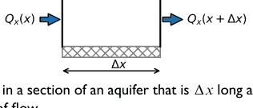

体积平衡是针对时间段 Δt 写出的。将相应的体积代入体积平衡方程 (1.2) 得到：

Qx(x)Δt + NΔxΔt – Qx(x + Δx)Δt = 0 (1.3)

除以 Δx 和 Δt 并重新排列各项得到：

Qx(x + Δx) – Qx(x) / Δx = N (1.4)

在 $\Delta x \to 0$ 的极限下，这给出了稳定一维水平流动的连续性方程的微分形式：

$$\frac{dQ_x}{dx} = N \tag{1.5}$$

项 $dQ_x/dx$ 在数学中也被称为流量向量的一维散度。散度是流出量减去流入量的数学等价物。

除本章最后一个解外，含水层的导水系数在所有情况下都近似为常数。具有恒定导水系数的含水层可能是具有水平顶底和恒定水力传导系数 $k$ 的承压含水层。或者，它也可以是饱和厚度近似为常数的潜水含水层。无论哪种情况，都采用了杜布依-福希海默近似，使得水头在垂直方向上近似为常数。水平流动均匀分布在含水层厚度 $H$ 上，因此流量向量 $Q_x$（含水层厚度上的比流量积分）可以写为：

$$Q_x = Hq_x = -T\frac{dh}{dx} \tag{1.6}$$

其中 $T = kH$ 是含水层的导水系数，$q_x$ 由达西定律（公式 0.9）给出。该问题的连续性方程是 (1.5)。将公式 (1.6) 中的 $Q_x$ 代入公式 (1.5) 得到：

$$\frac{d}{dx}\left(T\frac{dh}{dx}\right) = -N \tag{1.7}$$

由于导水系数 $T$ 被假定为常数，微分方程简化为：

$$\frac{d^2h}{dx^2} = -\frac{N}{T} \tag{1.8}$$

这是一个二阶线性常微分方程，称为泊松方程。通过对公式 (1.8) 进行两次积分获得通解，对于 $N$ 为常数的情况，得到：

$$h = -\frac{N}{2T}x^2 + Ax + B \tag{1.9}$$

其中 $A$ 和 $B$ 是需要根据边界条件确定的积分常数。

#### 1.1 两条河流之间的流动

第一个解决的问题是两条完全贯穿含水层的长平行河流之间的承压流动（图 1.2）。河流相距 $L$，没有面状补给（$N = 0$）。河流与含水层直接接触，因此河流处含水层中的水头等于河流中的水头。$x = 0$ 处的水头为 $h_0$，$x = L$ 处的水头为 $h_L$。

$$h|_{x=0} = h_0 \tag{1.10}$$
$$h|_{x=L} = h_L \tag{1.11}$$

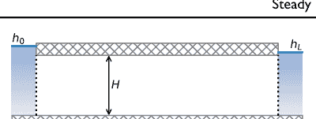

将边界条件应用于通解 (1.9) 得到：

$$A = \frac{h_L - h_0}{L}$$ (1.12)
$$B = h_0$$ (1.13)

因此水头的解成为一条直线：

$$h = \frac{(h_L - h_0)x}{L} + h_0$$ (1.14)

流量向量 $Q_x$ 通过对公式 (1.14) 关于 $x$ 求导并将结果代入公式 (1.6) 得到：

$$Q_x = -T \frac{dh}{dx} = -T \frac{h_L - h_0}{L}$$ (1.15)

注意 $Q_x$ 在整个流场中是常数。

下面计算解并绘制在图 1.3 中。注意孔隙率 $n$ 和含水层底部高程 $z_b$ 已定义但此处未使用。它们将在后续可视化流场和计算运移时间时使用。

```
# parameters
L = 1000 # aquifer length, m
H = 10 # aquifer thickness, m
zb = -6 # aquifer bottom, m
k = 10 # hydraulic conductivity, m/d
n = 0.3 # porosity, -
T = k * H # transmissivity, m^2/d
h0 = 6 # specified head at the left boundary, m
hL = 4 # specified head at the right boundary, m
```

```
# solution
x = np.linspace(0, L, 100)
h = (hL - h0) * x / L + h0
Qx = - T * (hL - h0) / L * np.ones_like(x)
```

```
# basic plot
plt.subplot(121)
plt.plot(x, h)
plt.subplot(122)
plt.plot(x, Qx);
```

垂直剖面中的流场可以使用 matplotlib 的 streamplot 函数进行可视化，该函数接受一个二维点网格作为输入，并为每个网格点，即比流量矢量的水平和垂直分量。比流量矢量的水平分量 $q_x$ 由流量矢量 $Q_x$ 计算得出：

$$q_x = \frac{Q_x}{H} = -k \frac{h_L - h_0}{L}$$

且在垂直方向上不发生变化。比流量矢量的垂直分量 $q_z$ 等于零。流线图函数沿流动方向绘制线条，并添加箭头以指示流动方向。对于这种恒定流动的情况，一个 2x2 的小网格就足够了。垂直夸大比例通过子图函数的 `aspect` 关键字设置。垂直夸大比例在垂直轴的标签中记为“VE”（图 1.4）。

```python
# solution
xg, zg = np.meshgrid(np.linspace(0, L, 2), np.linspace(zb, zb + H, 2))
qx = -k * (hL - h0) / L * np.ones_like(xg)
qz = np.zeros_like(xg)
```

```python
# basic streamplot
plt.subplot(111, aspect=25)
plt.streamplot(xg, zg, qx, qz, color='C1', density=0.2);
```

水平方向的（平均）流速 $v_x$ 通过将 $q_x$ 除以孔隙度 $n$ 获得（显然，垂直方向的流速 $v_z$ 为零）。对于这个简单问题，从左侧河流到右侧河流的（平均）行程时间可以计算为 $L/v_x$。更正式地说，行程时间可以从水平速度矢量的定义获得：

$$v_x = \frac{q_x}{n} = \frac{dx}{dt}$$

积分得到行程时间 $t_{\text{tr}}$：

$$\int_{0}^{t_{\text{tr}}} dt = \int_{0}^{L} \frac{dx}{v_x} = \int_{0}^{L} -\frac{Ln}{k(h_L - h_0)} dx \quad (1.18)$$

得出：

$$t_{\text{tr}} = \frac{L^2 n}{k(h_0 - h_L)} = \frac{L}{v_x} \quad (1.19)$$

```python
# travel time
vx = -k * (hL - h0) / (n * L)
print(f'mean velocity: {vx:.4f} m/d')
print(f'travel time from left river to right river: {L / vx:.0f} days')
```

mean velocity: 0.0667 m/d
travel time from left river to right river: 15000 days

#### 1.2 两条河流之间的区域补给

如果由水位变化引起的饱和厚度变化与总饱和厚度相比很小，则非承压含水层的导水系数可以近似为常数，等于 $kH$。在下面的例子中，一个非承压含水层左右两侧由两条完全贯穿含水层的长平行河流所界定（图 1.5）。河流相距 $L$，并与含水层直接接触，因此：

$$h|_{x=0} = h_0 \quad (1.20)$$
$$h|_{x=L} = h_L \quad (1.21)$$

由于 $T$ 被近似为常数，通用方程 (1.8) 仍然适用，对于 $N > 0$，积分常数为：

$$A = \frac{h_L - h_0}{L} + \frac{N}{2T}L \quad (1.22)$$
$$B = h_0 \quad (1.23)$$

因此解变为：

$$h = -\frac{N}{2T}(x^2 - Lx) + \frac{(h_L - h_0)x}{L} + h_0 \quad (1.24)$$

流量矢量 $Q_x$ 通过对公式 (1.24) 求导并结合公式 (1.6) 获得：

$$Q_x = -T\frac{dh}{dx} = N\left(x - \frac{L}{2}\right) - T\frac{h_L - h_0}{L} \quad (1.25)$$

下面计算该解。

```python
# parameters
L = 1000 # aquifer length, m
H = 10 # saturated thickness, m
zb = -5 # aquifer bottom, m
k = 10 # hydraulic conductivity, m/d
n = 0.3 # porosity, -
T = k * H # transmissivity, m^2/d
h0 = 6 # specified head at the left boundary, m
hL = 4 # specified head at the right boundary, m
N = 0.001 # areal recharge, m/d
```

```python
# solution
x = np.linspace(0, L, 100)
h = -N / (2 * T) * (x ** 2 - L * x) + (hL - h0) * x / L + h0
Qx = N * (x - L / 2) - T * (hL - h0) / L
```

```python
# basic plot
plt.subplot(121)
plt.plot(x, h)
plt.subplot(122)
plt.plot(x, Qx);
```

注意两条河流之间存在一个地下水分水岭（图 1.6）。部分补给水流向左侧河流，部分补给水流向右侧河流。下面计算流入左侧河流（$x = 0$）和右侧河流（$x = L$）的流量。流入左侧河流的流量加上流入右侧河流的流量正好等于总补给量：$NL = 1$ m$^2$/d。在分水岭处，水头梯度等于零，因此 $Q_x = 0$。

```python
print(f'discharge into left river: {-Qx[0]:.3f} m^2/d')
print(f'discharge into right river: {Qx[-1]:.3f} m^2/d')
```

discharge into left river: 0.300 m^2/d
discharge into right river: 0.700 m^2/d

**练习 1.1：** 使用上述提供的参数，计算地下水分水岭的位置。验证分水岭的位置是否与上述计算的流量数据一致。

**练习 1.2：** 确定左侧河流的水位必须是多少，才能使所有入渗的水都流向右侧河流，同时左侧河流的水不会流向右侧河流；使用上述示例的参数。绘制 $h$ 和 $Q_x$ 随 $x$ 变化的曲线图。

**练习 1.3：** 考虑 $h_0 = h_1 = 10$ m 的情况。测得两条河流中间的水头为 9 m。使用上述示例的参数，计算这种情况下的区域补给量。绘制 $h$ 随 $x$ 变化的曲线图。

在此解中，流动被近似为一维流动，$h$ 和 $Q_x$ 都只是 $x$ 的函数。然而，在垂直剖面中，流动必须是二维的。毕竟，水从顶部入渗含水层，并向左右两侧的河流排泄（见图 1.5）。这导致了一个明显的矛盾：在一维解中，水如何能垂直流动？

为了解决这个矛盾，考虑比流量垂直分量的达西定律：

$$q_z = -k_z \frac{\partial h}{\partial z} \qquad (1.26)$$

其中 $k_z$ 是垂直方向的水力传导系数。由于采用了杜普伊-福希海默近似，水头 $h$ 仅是 $x$ 的函数，因此 $\partial h/\partial z = 0$。这意味着 $q_z$ 也等于零，除非垂直水力传导系数 $k_z$ 为无穷大；一个趋于零的项与一个趋于无穷大的项的乘积在特定数学条件下可以得到一个有限值。尽管这起初可能看起来很奇怪（垂直水力传导系数当然是一个有限值），但这个结果可以解释为垂直流动的阻力被忽略了（例如，Strack, 1984）。换句话说，在含水层内垂直流动所需的能量相对于水平流动所需的能量可以忽略不计。这通常是一个很好的近似，因为地下水通常水平流动距离很大（公里量级），但垂直流动距离很小（米量级）。

流动的垂直分量不能从达西定律计算（因为 $k_z = \infty$ 会导致各种问题），但可以从流动的连续性获得。通过考虑一个长度为 $\Delta x$、高度为 $\Delta z$ 的垂直含水层剖面，可以推导出垂直 $x, z$ 平面内流动连续性的微分方程。四个侧面的通量如图 1.7 所示。应用稳态流动的体积平衡（流入 - 流出 = 0）得到：

$$[q_x(x + \Delta x, z) - q_x(x, z)]\Delta z \Delta t + [q_z(x, z + \Delta z) - q_z(x, z)]\Delta x \Delta t = 0 \qquad (1.27)$$

除以 $\Delta x \Delta z \Delta t$ 并取 $\Delta x$ 和 $\Delta z$ 趋于零的极限，得到：

$$\frac{\partial q_x}{\partial x} + \frac{\partial q_z}{\partial z} = 0 \qquad (1.28)$$

用数学术语来说，对于垂直平面内的稳态流动，比流量矢量的散度等于零。

水平分量 $q_x$ 由流量矢量（公式 1.25）获得：

$$q_x = \frac{Q_x}{H} = -k \frac{dh}{dx} = \frac{N}{H} \left( x - \frac{L}{2} - \frac{T}{N} \frac{h_L - h_0}{L} \right) \qquad (1.29)$$

对 $q_x$ 求导并将结果代入式 (1.28) 得到

$$\frac{\partial q_z}{\partial z} = -\frac{N}{H}$$

对其进行积分可得

$$q_z = -\frac{Nz}{H} + C$$

积分常数由含水层不透水基底（$z = z_b$）处的条件确定，该处垂直方向的水流分量为零，因此 $C = Nz_b/H$，且

$$q_z = -\frac{N(z - z_b)}{H}$$

注意，含水层顶部的边界条件 $q_z|_{z=z_b+H} = -N$ 也得到满足，并且 $q_z$ 随深度按简单的线性函数递减。下文将使用表达式 (1.29) 和 (1.32) 来创建垂直平面上近似二维流动的流线图（图 1.8）。

```python
# solution
xg, zg = np.meshgrid(np.linspace(0, L, 10), np.linspace(zb, zb + H, 5))
qx = (N * (xg - L / 2) - T * (hL - h0) / L) / H
qz = - N * (zg - zb) / H
```

```python
# basic streamplot
plt.subplot(111, aspect=25)
plt.streamplot(xg, zg, qx, qz, color='C1');
```

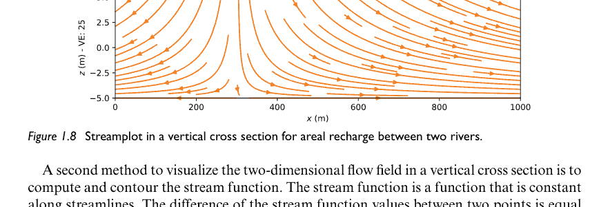

可视化垂直剖面中二维流场的第二种方法是计算并绘制流函数的等值线。流函数是沿流线保持不变的函数。两点之间流函数值的差等于这两点之间流动的水量，并且当沿流动方向观察时，流函数值向右增加。

垂直剖面中的流函数用小写希腊字母 psi，$\psi$ [$L^2/T$] 表示。这里，$\psi$ 被任意设定为沿含水层不透水基底为零，因为不透水基底是一条流线。因此，沿含水层顶部的流函数值等于 $\psi = -Q_x$，这样含水层底部和顶部之间的流函数值之差始终等于含水层中的流量 $Q_x$。沿含水层顶部的流函数值是 $-Q_x$ 而不是 $Q_x$，这是由于约定：当沿流动方向观察时，流函数向右增加。

流函数的等值线图如图 1.9 所示。它是通过定义一个流函数数组 psi 来创建的。流函数在含水层底部和顶部的多个点上进行计算。等值线绘制程序在沿含水层顶部和底部计算的流函数之间进行线性插值。对于这个问题，这完全正确，因为这意味着流量在垂直方向上被均匀分配。当使用恒定的等值线间隔时，两条相邻流线之间的流量总是相同的（这与之前使用的 streamplot 函数得到的线条不同），因此当两条流线靠得更近时，水流速度更快。在这种情况下，两条相邻流线之间的流量是 $NL/20$，因为绘制了 20 个等值线间隔。流线在含水层顶部每隔 50 米均匀分布，因为那里的入流等于 $q_z = -N$，且 $L = 1000$ 米。穿过分水岭的垂直流线是分界流线，对应于流函数值 $\psi = 0$（因为这条流线沿着含水层底部延伸）。向右河流的出流是向左河流出流的两倍多。注意，确实，当沿流动方向观察时，流函数向右增加。沿含水层顶部的入流是均匀的，等于 $N$。向河流的出流在垂直方向上也是均匀的。这意味着，例如，在分水岭和河流中间进入含水层的水，会在恰好等于含水层中部的高度流入河流。

```python
# solution
x = np.linspace(0, L, 100)
Qx = N * (x - L / 2) - T * (hL - h0) / L
psi = np.zeros((2, len(x)))
psi[1, :] = -Qx # at the top of the aquifer, the stream function is -Qx
xg = x
zg = [zb, zb + H]
```

```python
# basic streamline plot
plt.subplot(111, aspect=25)
cs = plt.contour(xg, zg, psi, 20, colors='C1', linestyles='-')
plt.clabel(cs, fmt='%1.2f');
```

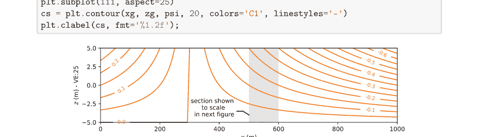

在流线图中，水平和垂直方向的比例尺不同：水平距离实际上比垂直距离大 25 倍。当两个轴的比例尺设置相同时，就无法看到整个剖面的流线了。为了说明目的，下图按比例（即没有垂直夸大）绘制了从 $x = 500$ 到 $x = 600$（在图 1.9 中显示为灰色）部分的流线，表明流线确实主要是水平的（图 1.10）。

```python
# basic streamline plot of part of flow field without vertical exaggeration
plt.subplot(111, aspect=1, xlim=(500, 600))
cs = plt.contour(xg, zg, psi, 20, colors='C1', linestyles='-');
```

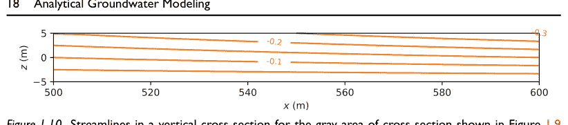

练习 1.4：为左河水位高到所有水都恰好流向右河（即分水岭位于左河）的情况，绘制流函数的等值线图。

通常的做法是在同一张图上绘制水头等值线和流线，因为它们构成了所谓的流网，其中流线与水头等值线成直角相交，这将在后续章节中针对二维解进行演示。这仅在水力传导系数各向同性时成立。这里，垂直平面中流动的解基于 Dupuit–Forchheimer 近似，这相当于垂直水力传导系数远大于水平水力传导系数的情况，因此水头等值线和流线不构成流网。

练习 1.5：在同一张图上绘制该示例的水头等值线和流线，显示流网。

从含水层顶部进入并在左河或右河离开含水层的水的运移时间，可以再次从速度矢量的水平分量 $v_x = q_x/n$（因为 $v_x$ 不是垂直坐标的函数）计算，就像上一节所做的那样。这给出了从位置 $x = x_0$ 到位置 $x = x_1$ 的运移时间 $t_{tr}(x_0, x_1)$

$$t_{tr}(x_0, x_1) = \int_{x_0}^{x_1} \frac{dx}{v_x} = \frac{nH}{N} \ln \left[ \frac{v_x|_{x=x_1}}{v_x|_{x=x_0}} \right] \quad (1.33)$$

类似地，从含水层顶部 $z_b + H$ 到高程 $z$ 的运移时间由速度矢量的垂直分量 $v_z = q_z/n$ 得到，即

$$t_{tr}(z) = \int_{z_b+H}^{z} \frac{dz}{v_z} = \frac{nH}{N} \ln \left( \frac{H}{z - z_b} \right) \quad (1.34)$$

从含水层顶部到高程 $z$ 的运移时间仅是 $z$ 的函数。这是一个有趣的结果，由 Vogel (1967) 著名地得出，因为它意味着在均匀补给的情况下，某一深度的所有水具有相同的年龄。

练习 1.6：计算从分水岭和右河中间进入含水层顶部的水流到右河需要多长时间。使用示例的参数和孔隙度 $n = 0.3$。用两种方法计算运移时间：使用从 $x_0$ 到 $x_1$ 的运移时间方程，以及从含水层顶部到含水层一半厚度的运移时间方程。它们当然应该给出相同的答案。

#### 1.3 不透水边界与河流之间的区域补给

上一节的问题通过将左侧的河流替换为不透水边界（见图 1.11）进行了修改。两个边界条件变为

$$\left. \frac{dh}{dx} \right|_{x=0} = 0 \quad (1.35)$$
$$h|_{x=L} = h_L \quad (1.36)$$

在 $x = L$ 处的边界条件称为固定水头或狄利克雷边界条件。在 $x = 0$ 处的边界条件称为指定通量或诺伊曼边界条件。狄利克雷和诺伊曼边界条件也分别称为第一类和第二类边界条件。从物理意义上讲，不透水边界可以代表分水岭或渗透性非常低的岩体。

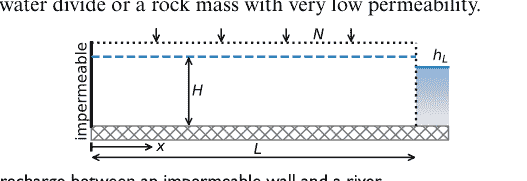

微分方程的通解仍然是式 (1.9)，其对 $x$ 的导数为

$$\frac{dh}{dx} = -\frac{N}{T}x + A \quad (1.37)$$

在 $x = 0$ 处应用边界条件式 (1.35) 得到

$$A = 0 \quad (1.38)$$

因此，应用边界条件 (1.36) 得到以下解

$$h = -\frac{N}{2T}(x^2 - L^2) + h_L \quad (1.39)$$

以及

$$Q_x = -T\frac{dh}{dx} = Nx \quad (1.40)$$

所有补给都流向右侧的河流，因此向右河的出流量为 $NL$。下面提供了一个示例（图 1.12）。注意，水头函数线在左边界是水平的，表示无流条件。在下面的示例中，饱和厚度近似为常数 $H = 10$ 米，但水头与含水层底部（$z_b = -5$ 米）之间的距离从左侧的 14 米变化到右侧的 9 米。可以提出这样的问题：如果饱和厚度变化这么大，将其近似为常数是否合理？这个问题将在第 3 章中讨论。

```python
# parameters
L = 1000 # aquifer length, m
H = 10 # approximate saturated aquifer thickness, m
zb = -5 # aquifer bottom, m
k = 10 # hydraulic conductivity, m/d
T = k * H # transmissivity, m^2/d
hL = 4 # specified head at the right boundary, m
N = 0.001 # areal recharge, m/d
```

```python
# solution
x = np.linspace(0, L, 100)
h = -N / (2 * T) * (x ** 2 - L ** 2) + hL
Qx = N * x
```

#### 1.4 流经两个不同导水系数区域的水流

在之前的解中，水力传导系数和饱和厚度被近似为常数。此处，含水层由两个导水系数不同但各自为常数的区域组成（图1.15）。一维承压水流位于两条具有指定水头的平行河流之间。两河相距 $L$。左侧区域长度为 $L_0$，水力传导系数为 $k_0$，厚度为 $H_0$。右侧区域长度为 $L_1$，水力传导系数为 $k_1$，厚度为 $H_1$。因此，左侧区域的导水系数为 $T_0 = k_0 H_0$，右侧区域的导水系数为 $T_1 = k_1 H_1$。回顾一下，承压含水层中水头的一般解（公式1.9）是在导水系数为常数的条件下推导的。该解在区域0和区域1中均有效，但积分常数不同。对于 $N = 0$，区域0中的解为

$h = A_0 x + B_0$ 区域0 (1.46)

区域1中的解为

$h = A_1 x + B_1$ 区域1 (1.47)

其中 $A_0$、$A_1$、$B_0$ 和 $B_1$ 是待由边界条件确定的常数。

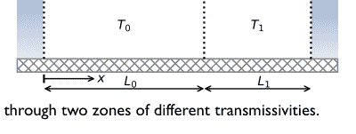

存在两个边界条件和两个连续性条件，因为水头和流量在区域0和区域1的边界处是连续的

$h|_{x=0} = h_0$ (1.48)
$h|_{x=L} = h_L$ (1.49)
$h|_{x=L_0^-} = h|_{x=L_0^+}$ (1.50)
$Q_x|_{x=L_0^-} = Q_x|_{x=L_0^+}$ (1.51)

其中上标 $+$ 和 $-$ 分别表示在 $x = L_0$ 左侧和右侧的取值。应用这四个条件并稍加代数运算，可得水头解

$h = \frac{T_1 L}{T_0 L_1 + T_1 L_0} \frac{(h_L - h_0)}{L} x + h_0$ 区域0 (1.52)
$h = \frac{T_0 L}{T_0 L_1 + T_1 L_0} \frac{(h_L - h_0)}{L} (x - L) + h_L$ 区域1 (1.53)

以及流量解

$Q_x = -\frac{T_0 T_1 L}{T_0 L_1 + T_1 L_0} \frac{(h_L - h_0)}{L}$ 区域0和1 (1.54)

对于此解，流量向量再次为常数（因为 $N = 0$），因此从左侧流入含水层的水量必须全部排入右侧的河流。

水头函数由两段直线组成（图1.16）。在导水系数较大的区域，水头梯度较小；在导水系数较小的区域，水头梯度较大，使得两个区域的导水系数与水头梯度的乘积相等。在下面的例子中，含水层被分为两半（$L_0 = L_1$），且左半部分的导水系数是右半部分的10倍。结果，左侧区域的水头梯度比右侧区域小10倍。

```
# parameters
h0 = 6 # specified head at the left boundary, m
hL = 4 # specified head at the right boundary, m
L0 = 500 # length of zone 0, m
L1 = 500 # length of zone 1, m
T0 = 200 # transmissivity of zone 0, m^2/d
T1 = 20 # transmissivity of zone 1, m^2/d
L = L0 + L1 # total length, m
```

```
# solution
x = np.linspace(0, L, 101)
h = np.empty_like(x)
h[x < L0] = T1 * L / (T0 * L1 + T1 * L0) * (hL - h0) * x[x < L0] / L + h0
h[x >= L0] = T0 * L / (T0 * L1 + T1 * L0) * (hL - h0) * (x[x >= L0] - L) / L + hL
Qx = -T0 * T1 * L / (T0 * L1 + T1 * L0) * (hL - h0) / L
hhalfway = h[50]
print(f'head halfway: {hhalfway:.2f} m')
print(f'head gradient zone 0: {(hhalfway - h0) / L0: .6f}')
print(f'head gradient zone 1: {(hL - hhalfway) / L1: .6f}')
```

head halfway: 5.82 m
head gradient zone 0: -0.000364
head gradient zone 1: -0.003636

```
# basic plot
plt.subplot(121)
plt.plot(x, h)
plt.subplot(122)
plt.plot([0, L], [Qx, Qx]);
```

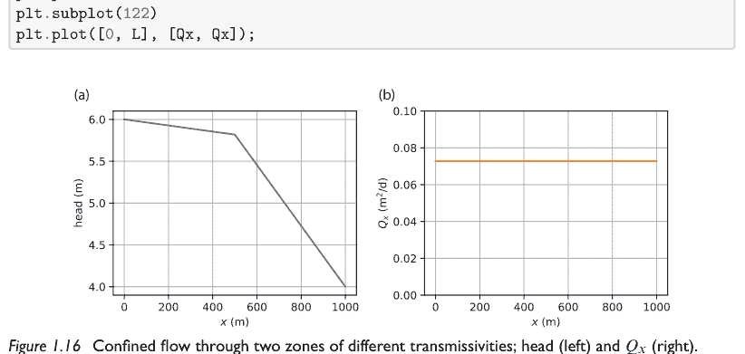

$Q_x$ 的解（公式1.54）与导水系数为 $T$ 的均质含水层的解（公式1.15）进行了比较，这表明两个区域的导水系数可以用整个含水层的单一有效导水系数 $T_{\text{eff}}$ 来替代，从而得到正确的流量

$$T_{\text{eff}} = \frac{T_0 T_1 L}{T_0 L_1 + T_1 L_0} = \frac{L}{L_1/T_1 + L_0/T_0}$$

有效导水系数等于各区域导水系数的加权调和平均值，权重为各区域的长度。调和平均值通常（远）小于算术平均值。

```
python
print(f'arithmetic mean transmissivity: {(T0 + T1) / 2: .1f} m^2/d')
print(f'effective transmissivity: {L / (L1 / T1 + L0 / T0): .1f} m^2/d')
```

arithmetic mean transmissivity: 110.0 m^2/d
effective transmissivity: 36.4 m^2/d

**练习 1.10：** 计算从左河到 $x = L_0$ 以及从 $x = L_0$ 到 $x = L$ 的运移时间，已知两个区域的厚度均为10 m，孔隙度均为0.3。对于 $H_0 = 10$ m 且 $H_1 = 5$ m 的情况重复计算，同时仍使用相同的 $T_1$ 值。

**练习 1.11：** 考虑与示例相同的情况，但现在左边界是不透水的，并且在整个含水层上存在均匀的面状补给 $N = 0.001$ m/d。$T_1 = 100$ m$^2$/d，所有其他值与示例相同。首先，推导 $x = L_0$ 和 $x = L$ 之间水头的方程，并计算 $x = L_0$ 处的水头。然后推导 $x = 0$ 和 $x = L_0$ 之间水头的方程。绘制水头与 $x$ 的关系图。

#### 第2章

### 稳定的一维半承压流

在半承压含水层中，含水层顶部覆盖着一层由低渗透性材料（如泥炭、页岩或粘土）构成的弱透水层。这与前一章讨论的承压含水层形成对比，后者的顶部覆盖层可近似为不透水层。该低渗透性层被称为半承压层或弱透水层。在下文中，弱透水层上方的水头被固定为常数 $h^*$（图2.1）。这可以对应于半承压层上方含水层中的水头，或地表水体的水位。固定的水头 $h^*$ 也可以代表排水区域的平均地下水位，该水位通过沟渠或暗管排水系统固定；此类排水区域有时被称为圩田。排水区域中固定的水头 $h^*$ 可以位于低渗透性的顶层中（图2.1），也可以位于与含水层被弱透水层隔开的透水层中（图2.2）。

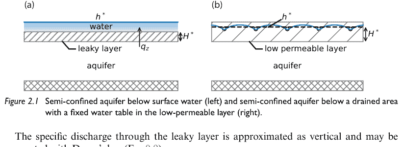

通过弱透水层的比流量近似为垂直方向，可使用达西定律（公式0.9）计算：

$$q_z = -k^* \frac{\partial h}{\partial z} \approx -k^* \frac{h^* - h}{H^*}$$ (2.1)

其中 $h$ 是含水层中的水头，$h^*$ 是弱透水层顶部指定的水头，$k^*$ 是弱透水层的垂直渗透系数，$H^*$ 是弱透水层的厚度（图2.1左侧情况）或排水水位与低渗透层底部之间的距离（图2.1右侧情况）。

通过弱透水层的比流量对于向上流动（沿正 $z$ 方向）为正，可写为：

$$q_z = \frac{h - h^*}{c}$$ (2.2)

其中 $c$ [T] 是弱透水层对垂直流动的阻力，定义为：

$$c = H^* / k^*$$ (2.3)

半承压含水层中的流动由泊松方程（1.8）控制，其中入渗率 $N$ 是半承压层两侧水头差的函数。将 $N = -q_z$ 代入公式（1.8）得到：

$$\frac{d^2h}{dx^2} = \frac{h - h^*}{cT}$$

对于 $h^*$ 为常数的情况，该方程可改写为：

$$\frac{d^2(h - h^*)}{dx^2} = \frac{h - h^*}{\lambda^2}$$

其中

$$\lambda = \sqrt{cT}$$

被称为越流系数 [L]，是系统的特征长度，后文将予以解释。

微分方程（2.5）是一个二阶线性常微分方程，称为修正的亥姆霍兹方程。其通解为：

$$h - h^* = Ae^{-x/\lambda} + Be^{x/\lambda}$$

其中 $A$ 和 $B$ 是待由边界条件确定的常数。流量向量的通解为：

$$Q_x = \frac{AT}{\lambda}e^{-x/\lambda} - \frac{BT}{\lambda}e^{x/\lambda}$$

或者，通解也可写为：

$$h - h^* = A \sinh(x/\lambda) + B \cosh(x/\lambda)$$

对应的流量向量为：

$$Q_x = -\frac{AT}{\lambda} \cosh(x/\lambda) - \frac{BT}{\lambda} \sinh(x/\lambda)$$

采用指数函数形式还是双曲函数形式更方便，取决于具体问题。

#### 2.1 从运河到排水区域的流动

考虑从运河到圩田的一维流动。含水层是半承压且半无限的，左侧边界为一条完全贯穿的运河，水位为 $h_0$，如图2.2所示；圩田中的水头固定为 $h^*$。控制微分方程是上文推导出的修正亥姆霍兹方程。边界条件为：

$$h|_{x=0} = h_0$$
$$h|_{x \to \infty} = h^*$$

应用第二个边界条件得到 $B = 0$，然后应用第一个边界条件得到 $A = h_0 - h^*$，因此 $h$ 的解为：

$$h = h^* + (h_0 - h^*)e^{-x/\lambda}$$

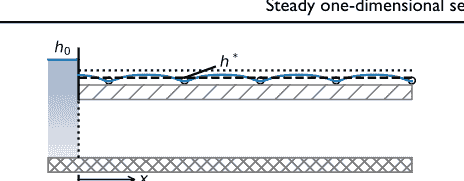

图2.2 从运河到圩田的半承压流。

水从运河流入半承压含水层，然后通过弱透水层流入上覆的圩田（前提是运河中的水头大于圩田中的水头）。含水层中的流量向量为：

$$Q_x = -T \frac{dh}{dx} = \frac{T(h_0 - h^*)}{\lambda} e^{-x/\lambda}$$

一个示例解如下所示（图2.3）。$h$ 和 $Q_x$ 的公式（2.12）和（2.13）已在Python函数中实现，以便在本节后续部分轻松重用。

```python
# parameters
hstar = 0 # head above leaky layer, m
h0 = 1 # specified head at the left boundary, m
k = 10 # hydraulic conductivity, m/d
H = 40 # aquifer thickness, m
c = 100 # resistance of leaky layer, d
T = k * H # transmissivity, m^2/d
lab = np.sqrt(c * T) # leakage factor, m
print(f'the leakage factor is: {lab:.0f} m')
```

the leakage factor is: 200 m

```python
# solution
def head(x):
    return (h0 - hstar) * np.exp(-x / lab) + hstar

def disvec(x):
    return k * H * (h0 - hstar) / lab * np.exp(-x / lab)

x = np.linspace(0, 5 * lab, 100)
h = head(x)
Qx = disvec(x)
```

```python
# basic plot
plt.subplot(121)
plt.plot(x, h, 'C0')
plt.subplot(122)
plt.plot(x, Qx, 'C1');
```

垂直于流动平面的每米运河长度的总流量称为 $Q_0$，通过在 $x = 0$ 处计算 $Q_x$ 得到，即 $Q_0 = T(h_0 - h^*)/\lambda$。含水层中的流量向量 $Q_x$ 随着与运河距离的增加而减小，因为地下水通过弱透水层排入圩田的排水系统。在距离 $x = \lambda$ 处，$Q_x$ 减小到 $e^{-1}Q_0 = 0.37Q_0$；在距离 $x = 3\lambda$ 处，$Q_x$ 仅减小到 $e^{-3}Q_0 = 0.05Q_0$。因此，从运河流入含水层的水中有95%在距离运河 $3\lambda$ 的范围内排入了圩田。这就是为什么越流系数 $\lambda$ 是系统的特征

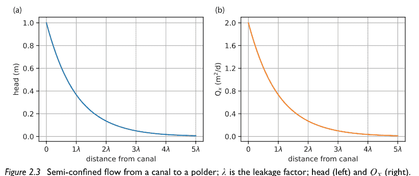

长度。类似地，含水层中的水头与圩田中的水头之差从运河处（$x = 0$）的 $h_0 - h^*$ 减小到 $x = 3\lambda$ 处的仅 $0.05(h_0 - h^*)$。粗略地说，在距离运河三倍越流系数的地方，含水层中的水头近似等于半承压含水层上方的水头 $h^*$。

可以进行几项检查来验证解及其Python实现（函数 head 和 disvec）是否正确。首先，验证解满足公式（2.11）中的边界条件。

```python
# Verify boundary conditions
print(f'head at x=0: {head(0):.0f} m')
print(f'head at x=infinity: {head(np.inf):.0f} m')
```

head at x=0: 1 m
head at x=infinity: 0 m

其次，使用二阶导数的精确数值近似来验证解满足控制微分方程（2.5）：

$$\frac{d^2h}{dx^2} \approx \frac{h(x - \Delta x) - 2h(x) + h(x + \Delta x)}{(\Delta x)^2}$$ (2.14)

其中 $\Delta x$ 是一个适当小的增量。

```python
# Verify differential equation
x = 200 # example point where deq is checked
delx = 0.001
left_side = (head(x - delx) - 2 * head(x) + head(x + delx)) / delx ** 2
right_side = (head(x) - hstar) / lab ** 2
print(f'left_side of deq : {left_side}')
print(f'right_side of deq: {right_side}')
```

left_side of deq : 9.196976513692334e-06
right_side of deq: 9.196986029286058e-06

第三也是最后，使用数值导数检查比流量是否确实为 $Q_x = -Tdh/dx$：

$$\frac{dh}{dx} \approx \frac{h(x + \Delta x) - h(x - \Delta x)}{2\Delta x}$$ (2.15)

```python
# Verify Qx
Qx = disvec(x)
Qxnum = -T * (head(x + delx) - head(x - delx)) / (2 * delx)
print(f'Qx exact            : {Qx} m^2/d')
print(f'Qx numerical derivative: {Qxnum} m^2/d')
```

Qx exact            : 0.7357588823428847 m^2/d
Qx numerical derivative: 0.7357588823531103 m^2/d

执行上述三项检查以验证解非常重要。如果解是正确的（并且编程正确），那么解与使用数值导数的近似值必须近似相等。匹配的有效位数取决于增量 $\Delta x$ 的大小和机器精度。

**练习 2.1：** 考虑示例中的情况，但这次阻力 $c$ 未知。在观测井中测量 $x = 100$ m 处的含水层水头，该处水头为0.5 m。计算弱透水层的阻力和越流系数。

**练习 2.2：** 通过对 $q_z$ 进行解析积分，验证从运河流入含水层的总通量（$Q_0$）等于通过弱透水层的积分越流量。

#### 2.2 湖泊与排水区域之间的流动

如图2.4所示，模拟了湖泊与排水区域之间的一维流动。湖泊和排水区域都通过半承压层与含水层隔开，该层在湖泊下方的阻力为 $c_0$，在排水区域下方的阻力为 $c_1$。湖泊和排水区域被一条宽度可忽略不计的堤坝（图中 $x = 0$ 处的垂直黑线）隔开。湖泊中的水位为 $h_0^*$，而排水区域中的水位为 $h_1^*$。半承压含水层向两侧无限延伸。含水层的导水系数为常数，等于 $T$。

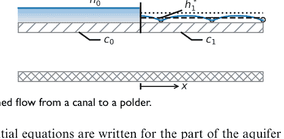

为湖泊下方的含水层部分和排水区域下方的含水层部分分别写出微分方程：

$$\frac{d^2(h - h_0^*)}{dx^2} = \frac{h - h_0^*}{\lambda_0^2} \quad x \leq 0$$

$$\frac{d^2(h - h_1^*)}{dx^2} = \frac{h - h_1^*}{\lambda_1^2} \quad x \geq 0$$

(2.16)

其中 $\lambda_0 = \sqrt{c_0 T}$ 和 $\lambda_1 = \sqrt{c_1 T}$。

边界条件是水头在左侧远处趋近于 $h_0^*$，在右侧远处趋近于 $h_1^*$：

$$h|_{x \to -\infty} = h_0^* \quad h|_{x \to +\infty} = h_1^*$$

(2.17)

并且连续性要求水头和流量在 $x = 0$ 处连续（另见第 1.4 节中 $x = L_0$ 处的条件）

$$h_{x=0^-} = h_{x=0^+} \quad Q_x|_{x=0^-} = Q_x|_{x=0^+} \tag{2.18}$$

其中上标 $-$ 和 $+$ 分别表示在 $x = 0$ 左侧和右侧的取值。

湖泊和排水区域下方的水头解写为

$$h = h_0^* + A_0 e^{-x/\lambda_0} + B_0 e^{x/\lambda_0} \quad x \le 0$$
$$h = h_1^* + A_1 e^{-x/\lambda_1} + B_1 e^{x/\lambda_1} \quad x \ge 0 \tag{2.19}$$

应用前两个边界条件得到 $A_0 = 0$ 和 $B_1 = 0$，之后应用两个连续性条件得到以下两个方程

$$h_0^* + B_0 = h_1^* + A_1$$
$$-T \frac{B_0}{\lambda_0} = T \frac{A_1}{\lambda_1} \tag{2.20}$$

求解剩余的两个未知数 $A_1$ 和 $B_0$ 得到

$$A_1 = \lambda_1 \gamma \quad B_0 = -\lambda_0 \gamma \tag{2.21}$$

其中无量纲水头差 $\gamma$ 为

$$\gamma = \frac{h_0^* - h_1^*}{\lambda_0 + \lambda_1} \tag{2.22}$$

水头的解现在变为

$$h = h_0^* - \lambda_0 \gamma e^{x/\lambda_0} \quad x \le 0$$
$$h = h_1^* + \lambda_1 \gamma e^{-x/\lambda_1} \quad x \ge 0 \tag{2.23}$$

注意，对于阻力值相等的情况（即 $\lambda_0 = \lambda_1$），$x = 0$ 处含水层中的水头为 $(h_0^* + h_1^*)/2$，这与堤坝两侧含水层性质相同时的对称性预期一致。

流量向量由下式获得

$$Q_x = -T \frac{dh}{dx} \tag{2.24}$$

得到

$$Q_x = T \gamma e^{x/\lambda_0} \quad x \le 0$$
$$Q_x = T \gamma e^{-x/\lambda_1} \quad x \ge 0 \tag{2.25}$$

从湖泊到排水区域的总流量 $Q_0$ 为

$$Q_0 = Q_x|_{x=0} = T \gamma = T \frac{h_0^* - h_1^*}{\lambda_0 + \lambda_1} \tag{2.26}$$

```python
# parameters
h0star = 1 # head above left side leaky layer, m
h1star = -1 # head above right side leaky layer, m
k = 10 # hydraulic conductivity, m/d
H = 10 # aquifer thickness, m
c0 = 100 # resistance of left side leaky layer, d
c1 = 400 # resistance of right side leaky layer, d
T = k * H # transmissivity, m2/d
lab0 = np.sqrt(c0 * T) # leakage factor left side, m
lab1 = np.sqrt(c1 * T) # leakage factor right side, m
gamma = (h0star - h1star) / (lab0 + lab1) # dimensionless head difference, -
```

```python
# solution
x = np.hstack((np.linspace(-5 * lab0, 0, 51), np.linspace(0, 5 * lab1, 51)))
h = np.zeros_like(x)
h[x < 0]  = h0star - lab0 * gamma * np.exp(x[x < 0] / lab0)
h[x >= 0] = h1star + lab1 * gamma * np.exp(-x[x >= 0] / lab1)
Qx = np.zeros_like(x)
Qx[x<0] = T * gamma * np.exp(x[x<0] / lab0)
Qx[x>=0] = T * gamma * np.exp(-x[x>=0] / lab1)
Q0 = T * gamma
```

```python
# basic plot
plt.subplot(121)
plt.plot(x, h, 'C0')
plt.subplot(122)
plt.plot(x, Qx, 'C1');
```

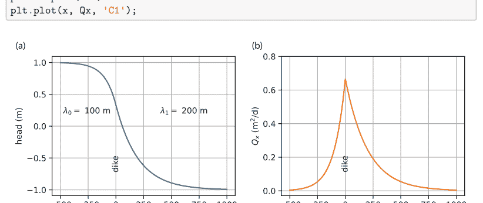

流函数等值线如下所示。共有 20 个等值线间隔，因此相邻两条流线之间的流量为总流量的 5%（图 2.6）。第一条绘制的流线在 x = -3λ₀ 处进入含水层，并在 x = 3λ₁ 处从含水层顶部流出。

```python
# solution
psi = np.zeros((2, len(x)))
psi[1] = -Qx
xg = x
zg = [0, H]
```

```python
# basic streamline plot
plt.contour(xg, zg, psi, np.linspace(-Q0, 0, 21), colors='C1', linestyles='-');
```

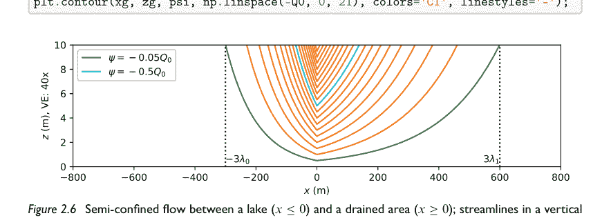

**练习 2.3：** 考虑一维稳定流流入一个底部有弱透水层的狭长湖泊（见图 2.7）。选择坐标系使得 $x = 0$ 位于湖岸。对于 $x \le 0$，流动为无压流动；对于 $x \ge 0$，流动为半承压流动。近似认为含水层的导水系数处处相等且为常数 $T$。弱透水半承压层的阻力为 $c$，湖泊水位为 $h_L$。无压含水层部分的流量向量是恒定的，根据水量平衡已知为 $Q_x = U$。使用 $h_L = 0$ m，$H = 10$ m，$T = 20$ m$^2$/d，$U = 0.02$ m$^2$/d 和 $c = 100$ d。推导并绘制水头随 $x$ 变化的方程。在另一张图中，绘制垂直剖面中的流线。

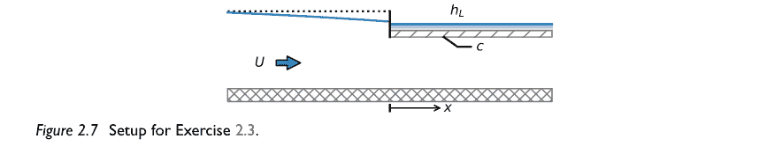

#### 2.3 流向有限宽度长河的流动

下一个例子考虑流向一条宽度为 $2L$ 的长直河的一维稳定流。垂直于河流的剖面如图 2.8 所示。坐标系原点选在河流中央。河流左右两侧的流动为承压流动，河流下方为半承压流动。透水河床的阻力为 $c$，河流水位为 $h^*$。含水层的导水系数为 $T$。河流左侧含水层中的流动是均匀的，且等于 $Q_x = U_L$；河流右侧含水层中的流动也是均匀的，且等于 $Q_x = U_R$。

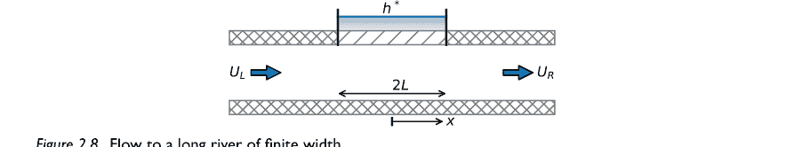

首先求解河流下方的水头和流量。边界条件为

$$Q_x|_{x=-L} = U_L \quad Q_x|_{x=L} = U_R$$

河流下方的水头解采用双曲形式（公式 2.9）

$$h - h^* = A \sinh(x/\lambda) + B \cosh(x/\lambda)$$

对应的流量向量解（公式 2.10）为

$$Q_x = -\frac{AT}{\lambda} \cosh(x/\lambda) - \frac{BT}{\lambda} \sinh(x/\lambda)$$

将边界条件（公式 2.27）代入公式 (2.29) 得到

$$A = \frac{-\lambda(U_L + U_R)}{2T \cosh(L/\lambda)} \quad B = \frac{\lambda(U_L - U_R)}{2T \sinh(L/\lambda)}$$

河流左右两侧的水头解是简单的线性函数，因为含水层是承压的。利用河流下方的解计算左岸含水层处的水头 $h_0 = h|_{x=-L}$ 和右岸含水层处的水头 $h_1 = h|_{x=L}$。一旦 $h_0$ 和 $h_1$ 已知，河流左右两侧承压含水层中的解可以写为

$$h = -\frac{U_L}{T}(x + L) + h_0 \quad x \le -L$$
$$h = -\frac{U_R}{T}(x - L) + h_1 \quad x \ge L$$

图 2.9 显示了一个示例，其中河流宽度是泄漏因子的两倍，且左岸的入流量是右岸入流量的两倍。

```python
# parameters
k = 5 # hydraulic conductivity, m/d
H = 10 # aquifer thickness, m
hstar = 10 # head in river
L = 100 # half width of river
c = 200 # resistance of leaky river bed, d
UL = 0.1 # Qx in left aquifer
UR = -0.05 # Qx in right aquifer
T = k * H # transmissivity, m^2/d
lab = np.sqrt(T * c) # leakage factor of aquifer below river
print(f'leakage factor: {lab:.0f} m')
```

leakage factor: 100 m

```python
x = np.linspace(-300, 300, 100)
A = -lab * (UL + UR) / (2 * T) / np.cosh(L / lab)
B = lab * (UL - UR) / (2 * T) / np.sinh(L / lab)
h0 = A * np.sinh(-L / lab) + B * np.cosh(-L / lab) + hstar
h1 = A * np.sinh(L / lab) + B * np.cosh(L / lab) + hstar
h = np.zeros(len(x))
h[x <= -L] = -UL / T * (x[x <= -L] + L) + h0
h[x >= L] = -UR / T * (x[x >= L] - L) + h1
h[np.abs(x) < L] = A * np.sinh(x[np.abs(x) < L] / lab) + \
                   B * np.cosh(x[np.abs(x) < L] / lab) + hstar
```

```python
Qx = np.zeros(len(x))
Qx[x <= 0] = UL
Qx[x >= L] = UR
Qx[np.abs(x) < L] = -A * T / lab * np.cosh(x[np.abs(x) < L] / lab) - \
                   B * T / lab * np.sinh(x[np.abs(x) < L] / lab)
```

```python
# basic plot
plt.subplot(121)
plt.plot(x, h, 'C0')
plt.subplot(122)
plt.plot(x, Qx, 'C1');
```

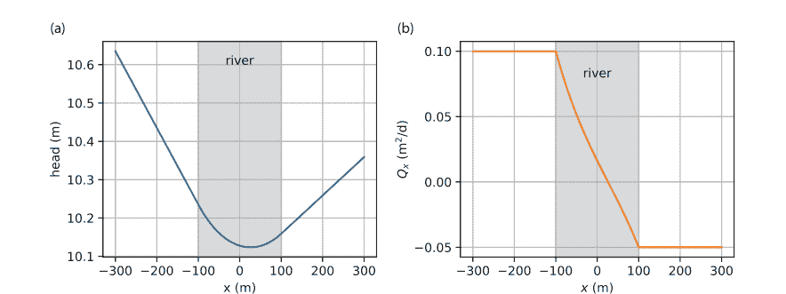

流函数的等值线如下所示（图 2.10）。

```python
# solution
psi = np.zeros((2, len(x)))
psi[1] = -Qx
xg = x
zg = [0, H]
```

```python
# basic streamline plot
plt.contour(xg, zg, psi, np.arange(-0.1, 0.05, 0.01));
```

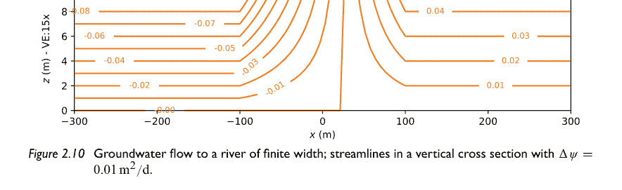

**练习 2.4：** 考虑 $U_L$ 和 $U_R$ 未知的情况，但测得 $x = -300$ m 处的水头为 10.4 m，$x = 300$ m 处的水头为 10.6 m。使用求根程序（如 `scipy.optimize.fsolve`）求解 $U_L$ 和 $U_R$。绘制水头随 $x$ 变化的曲线。

#### 2.4 双含水层系统中流向河流的水流

许多含水层的底部被一个弱透水层所限制，其下方是另一个含水层。这种双含水层系统中一维稳定流的解，可以表示为承压流（第1章）的解与半承压流的解之和，如下文所示。

下文中，上层含水层（含水层0）的导水系数为 $T_0$，下层含水层（含水层1）的导水系数为 $T_1$。两个含水层之间弱透水层的阻力为 $c$。降雨对上层含水层的补给量为 $N$。通过弱透水层从含水层1（下层含水层）流向含水层0（上层含水层）的垂向流量 $q_z$ 为

$$q_z = \frac{h_1 - h_0}{c} \qquad (2.33)$$

双含水层系统中的水头由两个微分方程组成的方程组控制

$$\frac{d^2 h_0}{dx^2} = \frac{h_0 - h_1}{c T_0} - \frac{N}{T_0}$$
$$\frac{d^2 h_1}{dx^2} = \frac{h_1 - h_0}{c T_1} \qquad (2.34)$$

其中 $h_0$ 和 $h_1$ 分别是上层和下层含水层中的水头。

方程组 (2.34) 的解法如下。将第一个微分方程乘以 $T_0$，第二个微分方程乘以 $T_1$，然后相加得到

$$\frac{d^2 (T_0 h_0 + T_1 h_1)}{dx^2} = -N \qquad (2.35)$$

这是泊松微分方程 (1.8)，其通解为

$$T_0 h_0 + T_1 h_1 = -Nx^2 + A'x + B' \qquad (2.36)$$

其中 $A'$ 和 $B'$ 是任意常数。将第一个微分方程减去第二个微分方程，经过一些代数运算后得到

$$\frac{d^2 (h_0 - h_1)}{dx^2} = \frac{h_0 - h_1}{\lambda^2} - \frac{N}{T_0} \qquad (2.37)$$

其中

$$\lambda = \sqrt{\frac{c T_0 T_1}{T_0 + T_1}} \qquad (2.38)$$

这是修正的亥姆霍兹方程 (2.5)，其右侧增加了一个常数项 $(-N/T_0)$。其通解为

$$h_0 - h_1 = C' e^{-x/\lambda} + D' e^{x/\lambda} + \frac{N \lambda^2}{T_0} \qquad (2.39)$$

其中 $C'$ 和 $D'$ 是任意常数。通过联立方程 (2.36) 和 (2.39) 可以得到 $h_0$ 和 $h_1$ 的表达式，即

$$h_0 = -\frac{N}{2T} x^2 + Ax + B + C T_1 e^{-x/\lambda} + D T_1 e^{x/\lambda} + \frac{T_1 N \lambda^2}{T_0 T}$$
$$h_1 = -\frac{N}{2T} x^2 + Ax + B - C T_0 e^{-x/\lambda} - D T_0 e^{x/\lambda} - \frac{N \lambda^2}{T} \qquad (2.40)$$

其中 $A$, $B$, $C$, 和 $D$ 是必须根据边界条件确定的参数。

作为第一个应用，考虑双含水层系统中流向河流的水流；忽略面状补给。河流狭窄且与上层含水层直接接触，但不与下层含水层接触，如图 2.11 所示。河流处的边界条件为

$$h_0|_{x=0} = h_r$$

其中 $h_r$ 是河流水位。在河流左侧远处，两个含水层中的水头相等，且水头梯度为 $dh_0/dx = dh_1/dx = G_L$，因此上层含水层中的流量向量 $Q_{x_0}$ 为

$$Q_{x_0}|_{x=-\infty} = U_{L_0} = -T_0 G_L$$

下层含水层中的流量向量 $Q_{x_1}$ 为

$$Q_{x_1}|_{x=-\infty} = U_{L_1} = -T_1 G_L$$

右侧远处的水头梯度为 $G_R$，因此流量向量为

$$Q_{x_0}|_{x=\infty} = U_{R_0} = -T_0 G_R$$

下层含水层中的流量向量 $Q_{x_1}$ 为

$$Q_{x_1}|_{x=\infty} = U_{R_1} = -T_1 G_R$$

每米垂直于流动平面的河流，有 $\sigma$ $[L^2/T]$ 的水量从含水层流入河流。流量 $\sigma$ 由水流连续性方程得到

$$\sigma = U_{L_0} + U_{L_1} - (U_{R_0} + U_{R_1})$$

将给定的边界条件应用于通解 (2.40) 得到

$$h_0 = -\frac{U_{L_0}}{T_0}x - \frac{T_1 \lambda}{T_0 T} \frac{\sigma}{2} (e^{x/\lambda} - 1) + h_r$$
$$h_1 = -\frac{U_{L_1}}{T_1}x + \frac{\lambda}{T} \frac{\sigma}{2} \left(e^{x/\lambda} + \frac{T_1}{T_0}\right) + h_r$$
$$x \leq 0$$

$$h_0 = -\frac{U_{R_0}}{T_0}x - \frac{T_1 \lambda}{T_0 T} \frac{\sigma}{2} \left( e^{-x/\lambda} - 1 \right) + h_r$$
$$h_1 = -\frac{U_{R_1}}{T_1}x + \frac{\lambda}{T} \frac{\sigma}{2} \left( e^{-x/\lambda} + \frac{T_1}{T_0} \right) + h_r$$
$$x \ge 0$$
$$(2.48)$$

相应的流量向量表达式为

$$Q_{x0} = U_{L_0} + \frac{T_1}{T} \frac{\sigma}{2} e^{x/\lambda}$$
$$Q_{x1} = U_{L_1} - \frac{T_1}{T} \frac{\sigma}{2} e^{x/\lambda}$$
$$x \le 0$$
$$(2.49)$$

$$Q_{x0} = U_{R_0} - \frac{T_1}{T} \frac{\sigma}{2} e^{-x/\lambda}$$
$$Q_{x1} = U_{R_1} + \frac{T_1}{T} \frac{\sigma}{2} e^{-x/\lambda}$$
$$x \ge 0$$
$$(2.50)$$

双含水层系统的越流系数 $\lambda$（公式 2.38）与半承压流中的作用相同：在距离河流 $3\lambda$ 处，含水层中的水头和梯度近似相等。

在下面的例子中，下层含水层的导水系数（因此流量）是上层含水层的两倍。水流从两侧流向河流，但左侧的流量是右侧的四倍（图 2.12）。

```
# parameters
k0 = 10 # hydraulic conductivity aquifer 0, m/d
k1 = 20 # hydraulic conductivity aquifer 1, m/d
H0 = 10 # thickness aquifer 0, m
H1 = 10 # thickness aquifer 1, m
Hstar = 2 # thickness leaky layer
kstar = 0.01 # hydraulic conductivity leaky layer, m/d
hr = 5 # head in river, m
GL = -0.002 # head gradient far away to the left, -
GR = 0.0005 # head gradient far away to the right, -
```

```
# solution
T0 = k0 * H0
T1 = k1 * H1
c = Hstar / kstar
T = T0 + T1
UL0 = -T0 * GL
UL1 = -T1 * GL
UR0 = -T0 * GR
UR1 = -T1 * GR
σ = UL0 + UL1 - (UR0 + UR1)
λ = np.sqrt(c * T0 * T1 / T)
print(f'leakage factor: {λ:.2f} m')
#
x = np.linspace(-4 * λ, 4 * λ, 401)
def hmaq(x):
    if x <= 0:
        h0 = -UL0 / T0 * x - T1 / T0 * λ / T * σ / 2 * (np.exp(x / λ) - 1) + hr
        h1 = -UL1 / T1 * x + λ / T * σ / 2 * (np.exp(x / λ) + T1 / T0) + hr
    else:
        h0 = -UR0 / T0 * x - T1 / T0 * λ / T * σ / 2 * (np.exp(-x / λ) - 1) + hr
        h1 = -UR1 / T1 * x + λ / T * σ / 2 * (np.exp(-x / λ) + T1 / T0) + hr
    return h0, h1

hmaqvec = np.vectorize(hmaq) # vectorized version of hmaq function
h0, h1 = hmaqvec(x)

def disxmaq(x):
    if x <= 0:
        Qx0 = UL0 + T1 / T * σ / 2 * np.exp(x / λ)
        Qx1 = UL1 - T1 / T * σ / 2 * np.exp(x / λ)
    else:
        Qx0 = UR0 - T1 / T * σ / 2 * np.exp(-x / λ)
        Qx1 = UR1 + T1 / T * σ / 2 * np.exp(-x / λ)
    return Qx0, Qx1

disxmaqvec = np.vectorize(disxmaq) # vectorized version of disxmaq function
Qx0, Qx1 = disxmaqvec(x)
```

leakage factor: 115.47 m

```
# basic plot
plt.subplot(121)
plt.plot(x, h0, 'C0', label='$h_0$')
plt.plot(x, h1, 'C0--', label='$h_1$')
plt.legend()
plt.subplot(122)
plt.plot(x, Qx0, 'C1', label='$Q_{x_0}$')
plt.plot(x, Qx1, 'C1--', label='$Q_{x_1}$')
plt.legend();
```

流函数的等值线图如图 2.13 所示。注意，来自左侧下层含水层的部分水流在渗流到上层含水层并流向河流之前，会流经河流下方。在河流右侧的下层含水层中存在一个滞点（$Q_{x_1} = 0$），这也可以从图 2.12 的右图中看出。

```
# solution
z = [0, H1, H1 + Hstar, H1 + Hstar + H0]
psi = np.zeros((len(z), len(x)))
psi[1] = Qx1
psi[2] = Qx1
psi[3] = Qx1 + Qx0
```

```
# basic streamline plot
plt.subplot(111, aspect=10)
plt.contour(x, z, psi, np.arange(-1, 1, 0.05))
plt.axhspan(H1, H1 + Hstar, color=[.8, .8, .8]);
```

所述问题仅由三个值完全定义：河流左侧和右侧远处的梯度 $G_L$ 和 $G_R$，以及河流中的水头 $h_r$。$G_L$ 可以从河流左侧某个含水层中的水头获得，$G_R$ 可以从河流右侧某个含水层中的水头获得。例如，如果在 $x = -d$ 处上层含水层中的水头为 $h_d$，代入公式 (2.47) 得到

$$G_L = \frac{h_r - h_d}{d} - \frac{T_1 \lambda \sigma}{T_0 T 2} \frac{(e^{-d/\lambda} - 1)}{d}$$

#### 2.5 双含水层系统中两条河流之间的面状补给

单含水层中两条河流之间具有面状补给 $N$ 的水流解（第 1.2 节）被扩展到两个含水层，其中河流切穿上层含水层，但不切穿下层含水层（见图 2.14）。双含水层解用于研究弱透水层及其下方的含水层何时对上层含水层中的水头有显著影响，或者上层含水层底部何时可以近似为不透水。原点选在两条河流的中间，两条河流之间的距离为 $2L$。两条河流中的水头等于 $h_L$，因此上层含水层中的边界条件为

$$h_0|_{x=-L} = h_0|_{x=L} = h_L$$

下层含水层中河流下方的水平流动近似为零，当从河流两侧流入河流的流量相同时，情况就是如此

$$\frac{dh_1}{dx}\bigg|_{x=-L} = \frac{dh_1}{dx}\bigg|_{x=L} = 0$$

将边界条件 (2.52) 和 (2.53) 应用于双含水层系统水流的通解 (2.40)，但使用双曲正弦和余弦函数而不是指数函数，得到以下水头解：

$$h_0 = -\frac{N}{2T}(x^2 - L^2) - \frac{NL\lambda T_1}{TT_0} \frac{[\cosh(x/\lambda) - \cosh(L/\lambda)]}{\sinh(L/\lambda)} + h_L$$

$$h_1 = -\frac{N}{2T}(x^2 - L^2) + \frac{NL\lambda}{TT_0} \frac{[T_0 \cosh(x/\lambda) - T_1 \cosh(L/\lambda)]}{\sinh(L/\lambda)} - \frac{N\lambda^2}{T_0} + h_L$$

两个含水层中对应的流量向量为：

$$Q_{x_0} = -T_0 \frac{dh_0}{dx} = \frac{T_0 Nx}{T} + \frac{NLT_1 \sinh(x/\lambda)}{T \sinh(L/\lambda)}$$

$$Q_{x_1} = -T_1 \frac{dh_1}{dx} = \frac{T_1 Nx}{T} - \frac{NLT_1 \sinh(x/\lambda)}{T \sinh(L/\lambda)}$$

例如，模拟了当越流因子 $\lambda$ 等于两条河流之间距离的 20%（$2L = 5\lambda$）时，双层含水层系统中的水头和流量。同时，使用第 1.2 节的解，用单层含水层模型模拟了水头。双层模型中上层含水层的水头小于单层模型的水头（图 2.15）。对于下面使用的值，相对差异最大为 27%。在系统中部入渗的水，部分通过底部含水层流向河流。

```python
# parameters
hL = 0 # head in river, m
N = 0.001 # recharge, m/d
L = 500 # half distance between two rivers, m
k0 = 10 # hydraulic conductivity aquifer 0, m/d
H0 = 10 # thickness aquifer 0, m
k1 = 20 # hydraulic conductivity aquifer 1, m/d
H1 = 10 # thickness aquifer 1, m
kv = 0.005 # hydraulic conductivity leaky layer, m/d
Hv = 3 # thickness leaky layer, m
T0 = k0 * H0 # transmissivity aquifer 0, m^2/d
T1 = k1 * H1 # transmissivity aquifer 1, m^2/d
T = T0 + T1
c = Hv / kv # resistance leaky layer, d
lab = np.sqrt(c * T0 * T1 / (T0 + T1)) # leakage factor
print(f'leakage factor: {lab:.0f} m')
```

leakage factor: 200 m

```python
# solution head
x = np.linspace(-L, L, 401)
h0 = -N / (2 * T) * (x ** 2 - L ** 2) - N * L * lab * T1 / (T * T0) * (
    np.cosh(x / lab) - np.cosh(L / lab)) / np.sinh(L / lab) + hL
h1 = -N / (2 * T) * (x ** 2 - L ** 2) + N * L * lab / (T * T0) * (
    T0 * np.cosh(x / lab) + T1 * np.cosh(L / lab)) / np.sinh(L / lab) - \
    N * lab ** 2 / T0 + hL
h = -N / (2 * T0) * (x ** 2 - L ** 2) + hL # single-layer solution, Section 1.2
print('relative diff in head at center between single-layer and two-layer sol:',
      f'{(h[200] - h0[200]) / h0[200]:.2f}')

# solution Qx
xg = np.linspace(-L, L, 400)
Qx0 = T0 * N * xg / T + N * L * T1 * np.sinh(xg / lab) / (T * np.sinh(L / lab))
Qx1 = T1 * N * xg / T - N * L * T1 * np.sinh(xg / lab) / (T * np.sinh(L / lab))
Qx = N * xg

# solution stream function
zg = [-H0 - Hv - H1, -H0 - Hv, -H0, 0]
psi = np.zeros((4, len(xg)))
psi[1] = Qx1
psi[2] = Qx1
psi[3] = Qx1 + Qx0
```

relative diff in head at center between single-layer and two-layer sol: 0.27

```python
# basic plot
plt.subplot(121)
plt.plot(x, h0, label='aquifer 0')
plt.plot(x, h1, label='aquifer 1')
plt.plot(x, h, 'k--', label='single aquifer')
plt.legend()
plt.subplot(122)
plt.plot(xg, Qx0, label='aquifer 0')
plt.plot(xg, Qx1, label='aquifer 1')
plt.plot(xg, Qx, 'k--', label='single aquifer');
```

垂直剖面中的流线如图 2.16 所示。

```python
# basic streamline plot
plt.contour(xg, zg, psi, 40);
```

当越流因子 $\lambda$ 相对于两条河流之间的距离 $L$ 减小时，具有不透水基底的单层模型与双层含水层模型之间的差异会增大。例如，当越流层的阻力 $c$ 较大或底部含水层的导水系数较大时，越流因子会增大，这可以从公式 2.38 中看出。图 2.17 绘制了不同越流因子值下，上层含水层在两条河流中间（x = 0）的水头。虚线表示当上层含水层底部近似为不透水时，含水层中心的水头。

```python
lablist = np.linspace(100, 1000, 100)
hcenter = np.zeros(len(lablist))
for i, lab in enumerate(lablist):
    hcenter[i] = N / (2 * T) * L ** 2 - N * L * lab * T1 / (T * T0) * (
        1 - np.cosh(L / lab)) / np.sinh(L / lab) + hL

# basic plot
plt.plot(lablist, hcenter)
plt.axhline(N * L ** 2 / (2 * T0), color='k', ls='--');
```

**练习 2.5：** 计算单层含水层解的有效导水系数，使得 x = 0 处的水头与双层含水层解在 x = 0 处的水头相同。在一张图中绘制使用有效导水系数的单层含水层水头与 x 的关系，以及双层含水层解中上层含水层水头与 x 的关系。

## 第 3 章

### 饱和厚度变化的稳定一维无压流

在前面的章节中，含水层的饱和厚度被近似为常数。当饱和厚度的变化不太大时，常饱和厚度的近似会给出合理的结果。本章推导了饱和厚度随水头变化的无压流的解。采用杜普伊-福希海默近似，即水头等于地下水位的高程，且水平流在饱和厚度上均匀分布（图 3.1）。

含水层基底的高程记为 $z_b$，因此饱和厚度等于 $h - z_b$（图 3.1），流量向量可以写为：

$$Q_x = -k(h - z_b)\frac{dh}{dx} = -\frac{d}{dx}\left(\frac{1}{2}k(h - z_b)^2\right) \quad (3.1)$$

其中使用了含水层基底高程和渗透系数为常数的条件。

虽然可以用水头 $h$ 来获得无压流的解，但使用流量势来解决无压流问题更为方便。无压流的流量势 $\Phi$ 定义为：

$$\Phi = \frac{1}{2}k(h - z_b)^2 \quad (3.2)$$

因此流量向量可以写为：

$$Q_x = -\frac{d\Phi}{dx} \quad (3.3)$$

流量向量 $Q_x$ 可以写为流量势的负导数的流场称为势流。势流解存在于许多领域，包括流体力学和热传输。

流量势是一个抽象量，无法在野外测量。当然，地下水问题不是用流量势来表述的，而是用水头来表述的。为了能够使用势解，必须将用水头表示的边界条件转换为用流量势表示的边界条件。在求解出势解之后，计算出的势必须转换回水头。使用流量势可以解决相当复杂的问题，包括无压流和沿海含水层中的界面流（第 4 章）。

一维流的连续性方程仍然是公式 (1.5)

$$\frac{dQ_x}{dx} = N$$

将公式 (3.3) 中的 $Q_x$ 代入连续性方程得到：

$$\frac{d^2\Phi}{dx^2} = -N$$

这个二阶常微分方程的通解可以写为：

$$\Phi = -\frac{N}{2}x^2 + Ax + B$$

其中常数 $A$ 和 $B$ 需要根据边界条件确定。一旦找到流量势的解，就可以通过公式 (3.2) 的逆运算得到水头的解：

$$h = z_b + \sqrt{2\Phi/k}$$

#### 3.1 不透水边界与河流之间的面状补给

考虑一个无压含水层，其左侧以不透水边界为界，右侧以一条河流为界（见图 3.2），存在均匀的补给率 $N$。该问题与第 1.3 节相同，但现在导水系数是含水层中水头 $h$ 的函数，而不是近似为常数。含水层的长度为 $L$，含水层底部的高程为 $z_b$。边界条件为：

$$\left.\frac{dh}{dx}\right|_{x=0} = 0$$
$$h|_{x=L} = h_L$$

其中 $h_L$ 是 $x = L$ 处河流中的水头。

用水头表示的边界条件（公式 3.8 和 3.9）被转换为用无压流流量势表示的边界条件：

$$\left.\frac{d\Phi}{dx}\right|_{x=0} = 0$$
$$\Phi|_{x=L} = \Phi_L = \frac{1}{2}k(h_L - z_b)^2$$

#### 3.1 含水层基底上的阶梯流

考虑的是两条平行河流之间无面状补给的无压流问题，但这次含水层基底存在一个阶梯，如图3.6所示。含水层左侧部分（长度 $L_0$）的基底高程为 $z_0$，右侧部分（长度 $L_1$）的基底高程为 $z_1$。在 $x = 0$ 处，水头为 $h_0$；在 $x = L$ 处，水头为 $h_L$。这些条件被转换为以流量势表示的条件：

$$\Phi|_{x=0} = \Phi_0 = \frac{1}{2}k(h_0 - z_0)^2 \qquad (3.20)$$
$$\Phi|_{x=L} = \Phi_L = \frac{1}{2}k(h_L - z_1)^2 \qquad (3.21)$$

与例如第1.4节的解法类似，在 $x = L_0$ 处，水头和通量是连续的。

$$h^- = h^+ \qquad (3.22)$$
$$Q_x^- = Q_x^+ \qquad (3.23)$$

其中上标 $-$ 和 $+$ 分别用作 $x = L_0$ 左侧和右侧紧邻位置的简写。

从左侧河流流向右侧河流的流量等于 $U$，其值事先未知。应用边界条件 (3.20) 和 (3.21) 可以得到左右两部分流量势的方程，其中仍包含未知通量 $U$：

$$\Phi = -Ux + \Phi_0 \qquad 0 \le x \le L_0 \qquad (3.24)$$
$$\Phi = -U(x - L) + \Phi_L \qquad L_0 \le x \le L \qquad (3.25)$$

其中 $L = L_0 + L_1$。流量 $U$ 可通过条件 (3.22) 求得，如下所示。在 $x = L_0$ 处的流量势 $\Phi^-$ 和 $\Phi^+$ 为：

$$\Phi^- = -UL_0 + \Phi_0 = \frac{1}{2}k(h^- - z_0)^2 \qquad (3.26)$$
$$\Phi^+ = -U(L_0 - L) + \Phi_L = \frac{1}{2}k(h^+ - z_1)^2 \qquad (3.27)$$

它们可转换为以下关于 $h^-$ 和 $h^+$ 的表达式。

$$h^- = \sqrt{\frac{2(-UL_0 + \Phi_0)}{k}} + z_0 \quad (3.28)$$
$$h^+ = \sqrt{\frac{2(UL_1 + \Phi_L)}{k}} + z_1 \quad (3.29)$$

令 $h^- = h^+$ 可得到一个方程，从中可以确定 $U$，但无法写出 $U$ 的显式方程。满足 $h^- = h^+$ 的 $U$ 值需通过数值方法确定。首先，在图3.7中绘制 $h^-$ 和 $h^+$ 随 $U$ 变化的曲线。

```python
# parameters
k = 10 # hydraulic conductivity, m/d
z0 = 0 # base elevation left section, m
z1 = -4 # base elevation right section, m
L0 = 500 # length of left section, m
L1 = 500 # length of right section, m
L = L0 + L1 # total distance between rivers, m
h0 = 10 # specified head at the left boundary, m
hL = 0 # specified head at the right boundary, m
```

```python
# solution
phi0 = 0.5 * k * (h0 - z0)**2
phiL = 0.5 * k * (hL - z1)**2

def hmin(U, L0=L0, z0=z0, phi0=phi0):
    return np.sqrt(2 * (-U * L0 + phi0) / k) + z0

def hplus(U, L1=L1, z1=z1, phiL=phiL):
    return np.sqrt(2 * (U * L1 + phiL) / k) + z1
```

```python
# basic plot two conditions
U = np.linspace(0, 1, 100)
plt.plot(U, hmin(U), label='$h^-$')
plt.plot(U, hplus(U), label='$h^+$')
plt.legend();
```

**图 3.7** $x = L_0$ 处的水头随 $U$ 的变化。

从图3.7的曲线可以看出，$h^-$ 和 $h^+$ 的曲线在 $U = 0.6 \text{ m}^2/\text{d}$ 和 $U = 0.8 \text{ m}^2/\text{d}$ 之间的某处相交。为了确定交点，编写了一个Python函数来计算给定 $U$ 值下 $h^-$ 和 $h^+$ 之间的差值。使该函数为零（即 $h^- = h^+$）的 $U$ 值可通过 `scipy.optimize` 包的 `fsolve` 方法求得。

```python
from scipy.optimize import fsolve

def hdiff(U):
    return hmin(U) - hplus(U)

U = fsolve(hdiff, 0.7)[0]  # fsolve 返回数组的第一个值
print(f'U: {U:0.4f} m^2/d')
```

U: 0.7139 m^2/d

既然 $U$ 已知，就可以用公式 (3.28) 和 (3.29) 计算水头。图 3.8 绘制了垂直剖面中的地下水位和流线。注意，地下水位是连续的，但其坡度（即水头梯度）不连续。这是合理的，因为在底板高程突变处，饱和厚度突然增加，而流量矢量是连续的。这只有在同一点处水头梯度突然减小的情况下才可能。图 3.8 中流线的高程在底板高程突变处发生跳跃。水头梯度的跳跃和流线的跳跃都是 Dupuit–Forchheimer 近似的结果，这意味着流线可以上下移动而不会损失能量。实际上，如第 10.3 节所示，水头和流线在底板台阶处的过渡是平滑的。

```python
# 求解
x = np.hstack((np.linspace(0, L0 - 1e-6, 100), np.linspace(L0 + 1e-6, L, 100)))
phi = np.empty_like(x)
phi[x < L0] = -U * x[x < L0] + phi0
phi[x >= L0] = -U * (x[x >= L0] - L) + phiL
h = np.zeros_like(phi)
h[x < L0] = np.sqrt(2 * phi[x < L0] / k) + z0
h[x >= L0] = np.sqrt(2 * phi[x >= L0] / k) + z1
#
psi = np.zeros((2, len(x)))
psi[1] = -U
xg = np.zeros_like(psi)
xg[:] = x
zg = np.zeros_like(xg)
zg[0, :100] = z0
zg[0, 100:] = z1
zg[1] = h
```

```python
# 基本流线图
plt.subplot(111, aspect=25)
plt.contour(xg, zg, psi, np.linspace(-U, 0, 4), colors='C1', linestyles='-')
plt.plot(x, h, 'C0')
plt.plot(x, zg[0], 'k');
```

#### 3.3 承压/无压混合流与面状补给

到目前为止，本章已分别推导了承压流（或导水系数恒定的水流）和无压流的解。本节考虑一种情况，即水流在含水层某处从承压流转变为无压流。考虑两条平行河流之间的承压含水层中的水流，含水层厚度为 $H$（图 3.9）；河流与含水层直接接触。两河相距 $L$，面状补给均匀且等于 $N$。左河水位 $h_0$ 高于含水层顶板，右河水位 $h_L$ 低于含水层顶板。因此，地下水在左河附近为承压流，在右河附近为无压流，并在含水层某处由承压流转变为无压流。

解决此问题的一种方法是，为含水层承压部分的水头写一个解，为无压部分的水头写另一个解，然后尝试找到水流由承压转变为无压的点。这是可行的，但使用流量势提供了一种更简便的方法。流量势已在无压流中定义，但尚未在承压流中定义。对于承压流，流量矢量可写为

$$Q_x = -kH \frac{dh}{dx} = -\frac{d}{dx}(kHh) = -\frac{d\Phi}{dx} \quad (3.30)$$

其中 $k$ 和 $H$ 均为常数。承压流的流量势定义为

$$\Phi = kHh + C \quad (3.31)$$

其中 $C$ 是任意常数。当水流完全承压时，常数 $C$ 可设为零；但当水流在含水层部分区域承压、部分区域无压时，常数 $C$ 必须选择不同的值，如下所述。

既然承压流和无压流都已表述为势流，流量矢量可写为公式 (3.3)，控制微分方程为泊松方程 (3.5)，一维稳态势流的通解为公式 (3.6)。这意味着流量势是 $x$ 的连续函数，无论水流是承压还是无压。流量势必须转换为也是 $x$ 的连续函数的水头（因为水头在没有物理屏障的情况下不能突然跳跃）。这通过适当选择公式 (3.31) 中的常数 $C$ 来实现。在水流由承压转变为无压的点，含水层中的水头等于 $z_b + H$。该点的势称为过渡势 $\Phi_t$，可由无压流的势（公式 (3.2)）计算得出

$$\Phi_t = \frac{1}{2}kH^2$$

选择常数 $C$ 使得承压流的流量势给出相同的过渡势

$$\Phi_t = kH(z_b + H) + C = \frac{1}{2}kH^2$$

因此

$$C = -\frac{1}{2}kH^2 - kHz_b$$

一旦计算出流量势作为 $x$ 的函数，就使用适当的公式将其转换为水头。如果水流是承压的，

$$h = \frac{\Phi - C}{kH} \quad \Phi \geq \Phi_t$$

如果水流是无压的，

$$h = z_b + \sqrt{2\Phi/k} \quad \Phi \leq \Phi_t$$

作为示例，求解第 1.2 节的问题，但现在含水层厚度固定为 $H$，而含水层的饱和厚度可能随水头变化。边界条件为

$$\Phi|_{x=0} = \Phi_0 = kHh_0 + C$$
$$\Phi|_{x=L} = \Phi_L = \frac{1}{2}k(h_L - z_b)^2$$

将边界条件应用于通解 (3.6) 得到

$$\Phi = -\frac{N}{2}(x^2 - Lx) + \frac{(\Phi_L - \Phi_0)x}{L} + \Phi_0$$

水头解由公式 (3.35) 或 (3.36) 从势得到。与第 1.2 节相同参数的结果如图 3.10 所示。注意，水流仅在右河附近的一小段含水层内为无压流。

```python
# 参数
L = 1000 # 含水层长度，m
H = 10 # 含水层厚度，m
zb = -5 # 含水层底板，m
k = 10 # 渗透系数，m/d
h0 = 6 # 左边界指定水头，m
hL = 4 # 右边界指定水头，m
N = 0.001 # 面状补给，m/d
```

```python
# 求解
C = -0.5 * k * H**2 - k * H * zb
phi0 = k * H * h0 + C
phi1 = 0.5 * k * (hL - zb)**2
phit = 0.5 * k * H**2 # 过渡势
x = np.linspace(0, L, 400)
phi = -N / 2 * (x ** 2 - L * x) + (phi1 - phi0) * x / L + phi0
h = np.zeros_like(phi)
h[phi >= phit] = (phi[phi > phit] - C) / (k * H)
h[phi <= phit] = zb + np.sqrt(2 * phi[phi <= phit] / k)
Qx = N * (x - L / 2) - (phi1 - phi0) / L
happrx = -N / (2 * k * H) * (x ** 2 - L * x) + (hL - h0) * x / L + h0
Qxapprx = N * (x - L / 2) - k * H * (hL - h0) / L
```

```python
# 基本绘图
plt.subplot(121)
plt.plot(x, h, 'C0')
plt.plot(x, happrx, 'C0--')
plt.subplot(122)
plt.plot(x, Qx, 'C1')
plt.plot(x, Qxapprx, 'C1--')
```

流入左河的通量现在略高于第 1.2 节，而流入右河的通量略低，因此两条河流的总出流量仍等于 NL。

下面创建了流函数的等值线图（图 3.11）。饱和区的顶部在承压区由含水层顶板形成，在无压区由地下水位形成。

```python
print(f'流入左河的通量: {-Qx[0]:.3f} m^2/d')
print(f'流入右河的通量: {Qx[-1]:.3f} m^2/d')
```

流入左河的通量: 0.305 m^2/d
流入右河的通量: 0.695 m^2/d

```python
# 求解
psi = np.zeros((2, len(x)))
psi[1] = -Qx
xg = np.zeros_like(psi)
xg[:] = x
zg = np.zeros_like(psi)
zg[0] = zb
zg[1] = H + zb
zg[1, h < H + zb] = h[h < H + zb]
```

```python
# 基本流线图
plt.subplot(111, aspect=25)
plt.contour(xg, zg, psi, 20, colors='C1', linestyles='-')
plt.plot(xg[0], zg[1], 'C0');
```

练习 3.5：考虑 $h_0 = h_L = 4$ m 且 $N = 0.002$ m/d 的情况。除含水层厚度外，所有其他参数与上述示例相同。计算当 $H = 10$ m 和 $H = 20$ m 时，两河中点处的水头。在同一图中绘制两种情况下水头随 $x$ 的变化曲线。

## 第四章

### 沿海含水层中的一维稳定流

沿海含水层中地下水的盐度（$C_s$）范围从淡水的几乎为零到入侵海水的 $C_s = 36$ g/L。由于淡水的密度（$\rho_f = 1000$ kg/m$^3$）低于海水（$\rho_s = 1025$ kg/m$^3$），淡水倾向于浮在咸水之上。20$^\circ$C时的水密度 $\rho$ 可根据盐度使用经验公式计算

$$\rho = \rho_f + 0.7C_s \qquad (4.1)$$

其中 $C_s$ 的单位为 g/L，$\rho$ 的单位为 kg/m$^3$。该近似对于盐浓度不超过海水盐度的情况是合理的。

在沿海含水层中，淡水与咸水之间由一个咸淡水过渡带分隔。当过渡带相对较薄，即远小于淡水透镜体的厚度时，可以将其近似为一个界面。界面是不混合流体之间的边界。用界面（不存在混合）替代过渡带（存在混合）极大地简化了变密度流问题的数学处理，并为沿海含水层流动提供了解析解的开发途径。界面位于含水层顶部的位置称为界面尖端，而界面位于含水层底部的位置称为界面趾部（图4.1）。

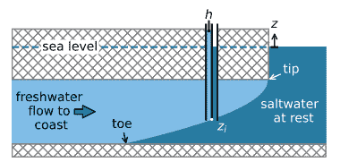

*图4.1* 沿海含水层中的稳定界面，其中 $h$ 是海平面以上淡水区的水头，$z_i$ 是相对于海平面的界面高程。

稳定界面流意味着界面已达到稳定状态位置，咸水静止不动，只有淡水在流动。当咸水静止且观测井的滤水管位于咸水中时，咸水水位恰好上升到海平面；这被称为咸水水头。由于咸水不流动，咸水区各处的咸水水头相同。毕竟，达西定律指出水从高水头流向低水头。当对淡水区的流动采用Dupuit近似时，界面的深度可以根据淡水水头计算，如下所述。

考虑如图4.1所示的稳定界面流。界面高程 $z_i$ 是相对于海平面测量的（即 $z_i$ 为负值）。一个观测井的开口位于界面处，并充满淡水。淡水上升到海平面以上的高程 $h$，因此观测井底部的压力 $p_f$ 为

$$p_f = \rho_f g(h - z_i)$$

其中 $\rho_f$ 是淡水的密度。紧邻淡水观测井右侧是第二个观测井，其开口也位于界面处，但充满咸水。第二个观测井中的咸水上升到海平面（$z = 0$）（图4.1）。第二个观测井底部的压力 $p_s$ 为

$$p_s = \rho_s g(0 - z_i)$$

两个观测井底部的压力必须相等（$p_f = p_s$，因为它们处于相同高程且界面不移动）。令公式 (4.2) 和 (4.3) 相等并重新整理各项，可得到界面高程 $z_i$ 作为海平面以上淡水水头 $h$ 函数的表达式

$$z_i = -\alpha h$$

其中

$$\alpha = \frac{\rho_f}{\rho_s - \rho_f}$$

关系式 (4.4) 被称为Ghyben-Herzberg方程（例如，Post et al., 2018）。使用上述提供的淡水和海水密度值，可得 $\alpha = 40$。换句话说：如果某位置淡水水头高于海平面1米，则该位置的稳定界面位于海平面以下40米。

请注意，Ghyben-Herzberg关系适用于淡水流动稳定且咸水静止的情况。公式 (4.4) 中的水头 $h$ 是界面处的淡水水头。当采用Dupuit近似时（即忽略垂直方向的流动阻力，并将垂直水头分布近似为静水压力分布），界面高程可以根据淡水区任意高程处的水头，使用Ghyben-Herzberg方程 (4.4) 计算。

#### 4.1 承压界面流

考虑如图4.2所示的承压沿海含水层中的稳定界面流。含水层顶部和底部的高程分别为 $z_t$ 和 $z_b$。含水层的厚度为 $H = z_t - z_b$。沿海含水层中的流动问题通常分为两部分：靠近海岸存在界面的部分，以及界面趾部上游不存在界面的部分。通过定义适当的流量势，可以同时求解两部分的流动，使得含水层两部分的流量均可计算为

$$Q_x = -\frac{d\Phi}{dx}$$

这最初由Strack (1976) 完成，这些流量势也被称为Strack势。流动系统的两部分必须分别定义流量势。请注意，这种方法类似于处理承压/无压组合流动的方法（第3.3节），其中流动系统的承压部分和无压部分分别定义了流量势。

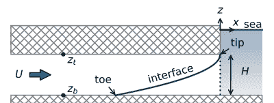

*图4.2* 承压含水层中向海岸流动的界面流。

首先，考虑界面流部分。界面尖端的高程位于含水层顶部 $z_{\text{tip}} = z_t$，对应的水头为 $h_{\text{tip}} = -z_t/\alpha$。界面趾部的高程为 $z_{\text{toe}} = z_b$，对应的水头为 $h_{\text{toe}} = -z_b/\alpha$。在尖端和趾部之间，淡水区的厚度等于 $z_t - z_i = z_t + \alpha h$。流量向量可写为

$$Q_x = -k(z_t + \alpha h)\frac{dh}{dx} = -k\alpha(h + z_t/\alpha)\frac{dh}{dx} = -\frac{d\Phi}{dx} \qquad (4.7)$$

因此流量势为

$$\Phi = \frac{1}{2}k\alpha(h + z_t/\alpha)^2 \qquad -z_t/\alpha \le h \le -z_b/\alpha \qquad (4.8)$$

趾部的势 $\Phi_{\text{toe}}$ 通过将水头 $h_{\text{toe}}$ 代入公式 (4.8) 中的 $h$ 得到

$$\Phi_{\text{toe}} = \frac{kH^2}{2\alpha} \qquad (4.9)$$

在趾部上游，流动是常规的承压流，因此饱和厚度等于 $H$，流量向量可写为

$$Q_x = -kH\frac{dh}{dx} = -\frac{d\Phi}{dx} \qquad (4.10)$$

其中流量势为

$$\Phi = kHh + C_c \qquad h \ge -z_b/\alpha \qquad (4.11)$$

常数 $C_c$ 的选择应使得趾部（其中 $h_{\text{toe}} = -z_b/\alpha$）的流量势等于 $\Phi_{\text{toe}}$（公式 4.9）

$$\Phi_{\text{toe}} = -kHz_b/\alpha + C_c = \frac{kH^2}{2\alpha} \qquad (4.12)$$

由此得到

$$C_c = \frac{\frac{1}{2}kH^2 + kHz_b}{\alpha} \qquad (4.13)$$

通过选择此 $C_c$ 值，当流动在趾部从常规承压流过渡到承压界面流时，势是连续的。

既然稳定承压界面流已写成势流形式，任何满足一维稳定势流微分方程（公式 3.5）的势流解均可使用

$$\frac{d^2\Phi}{dx^2} = -N \qquad (4.14)$$

指定水头的边界条件需要根据水头值，使用公式 (4.8) 或 (4.11) 转换为流量势。一旦获得以流量势表示的解，即可通过公式 (4.8) 或 (4.11) 的反函数计算水头

$$h = \sqrt{\frac{2\Phi}{k\alpha}} - \frac{z_t}{\alpha} \quad \Phi \le \Phi_{\text{toe}}$$

$$h = \frac{\Phi - C_c}{kH} \quad \Phi \ge \Phi_{\text{toe}}$$

最后，界面高程 $z_i$ 可根据水头计算为

$$z_i = -\alpha h \quad h_{\text{tip}} \le h \le h_{\text{toe}}$$

例如，考虑如图4.2所示的以速率 $Q_x = U$ 向海岸的均匀流动（$Q_x$ 为常数，因为补给 $N = 0$）。坐标系原点选在海岸线，含水层向负无穷延伸。承压含水层顶部的高程 $z_t$ 是相对于海平面的。海岸线处的水头为 $-z_t/\alpha$，相当于界面高程 $z_i = z_t$。海岸线处对应的流量势通过将 $h = -z_t/\alpha$ 代入流量势公式（公式 4.8）得到，即 $\Phi = 0$。因此，边界条件为

$$\Phi|_{x=0} = 0$$

$$Q_x = -\frac{d\Phi}{dx} = U$$

满足微分方程 (4.14)（其中 $N = 0$）和边界条件的势解为

$$\Phi = -Ux$$

趾部的位置在 $\Phi = \Phi_{\text{toe}}$ 处找到，即

$$x_{\text{toe}} = -\frac{\Phi_{\text{toe}}}{U} = -\frac{kH^2}{2\alpha U}$$

请注意，对于给定的 $U$ 值，趾部的位置仅取决于含水层参数 $k$ 和 $H$，以及因子 $\alpha$（它是淡水和咸水密度的函数）。趾部位置不是海平面的函数。因此，只要向海岸的流量保持为 $U$，当海平面上升时，趾部的位置保持不变。当然，含水层中的水头会随海平面上升而增加。

在接下来的示例中，将计算并绘制界面位置和流函数（图4.3）。

```
# parameters
k = 10 # hydraulic conductivity, m/d
zt = -10 # top of aquifer, m
zb = -30 # bottom of aquifer, m
rhof = 1000 # density of freshwater, kg/m^3
rhos = 1025 # density of saltwater, kg/m^3
U = 0.4 # flow toward the coast, m^2/d
H = zt - zb # aquifer thickness, m
```

#### 4.1 承压界面流

```python
# solution
alpha = rhof / (rhos - rhof)
phitoe = 0.5 * k * H ** 2 / alpha
Cc = (0.5 * k * H ** 2 + k * H * zb) / alpha
x = np.linspace(-200, 0, 150)
phi = -U * x
h = np.zeros_like(phi)
h[phi <= phitoe] = np.sqrt(2 * phi[phi <= phitoe] / (k * alpha)) - zt / alpha
h[phi > phitoe] = (phi[phi > phitoe] - Cc) / (k * H)
zi = np.maximum(-alpha * h, zb)
#
xtoe = -k * H**2 / (2 * alpha * U)
print(f'x-location of the toe: {xtoe:.0f} m')
# stream function
xg = [x, x]
zg = [zi, zt * np.ones(len(x))]
psi = [np.zeros(len(x)), -U * np.ones(len(x))]
```

界面趾部的x坐标位置：-125 m

```python
# basic streamline plot
plt.subplot(111, aspect=2)
plt.contour(xg, zg, psi)
plt.plot(x, zi, 'C1');
```

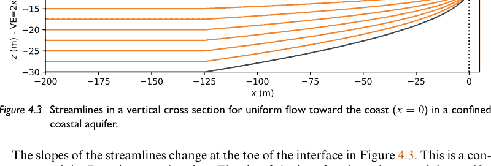

图4.3 承压沿海含水层中，向海岸（x = 0）均匀流动的垂直剖面流线图。

图4.3中流线的斜率在界面趾部发生变化。这是杜布依近似的结果。界面的尖端在海岸线处位于含水层顶部。这意味着没有间隙让淡水排入海洋。这相当不现实，是采用杜布依近似的结果。对于具有垂直海滩面的海岸线（如图中虚线所示），总是存在一个垂直的渗出带。淡水水头沿垂直渗出带变化，因为咸水中的压力分布是静水压力，所以咸水中的淡水水头随深度增加而增加。第10.5节给出了一个沿水平海底有渗出带的垂直平面二维界面流的例子。与垂直平面二维流动的界面解进行比较表明，即使海岸线附近界面的深度被低估（第10.5和10.6节），界面趾部的位置通常也能用杜布依解合理地近似。

**练习4.1：** 重新计算示例，假设流动速度U未知，但在距海岸线200米处测得水头为1米。计算U和趾部位置。绘制水头和界面随x的变化图。

**练习4.2：** 重新计算示例，假设流动速度$U$未知，但在距海岸线200米处测得水头为0.5米。计算$U$和趾部位置。绘制水头和界面随$x$的变化图。

**练习4.3：** 重新考虑示例的情况。计算当海平面上升0.5米而所有其他参数保持不变时，趾部的位置。计算含水层中水头的变化。

**练习4.4：** 重新考虑练习4.1的情况。计算当海平面上升0.5米而距海岸线200米处的水头保持不变时，趾部的位置。注意，距海岸线200米处的水头是相对于原始海平面测量的。当内陆边界为指定水头时，海平面上升对承压含水层有何影响？

#### 4.2 无压界面流

考虑沿海含水层中的稳定无压界面流，如图4.4所示。水头和高程再次相对于海平面测量。含水层底部位于$z = z_b$。与承压流类似，沿海含水层中的无压流可能由靠近海岸的界面存在部分和更靠内陆的无界面部分组成。该问题再次通过在含水层的两个部分中使用流量势来求解。

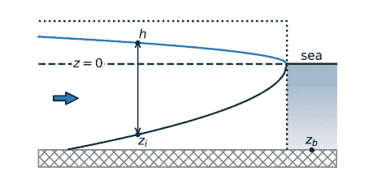

首先，考虑界面上方的淡水区。地下水位位于海平面以上$h$处，界面的高程通过Ghyben-Herzberg方程(4.4)获得，为$z_i = -\alpha h$，因此淡水区的总厚度等于$h - z_i = (1+\alpha)h$。流量矢量可以写为

$$Q_x = -k(\alpha + 1)h \frac{dh}{dx} = -\frac{d\Phi}{dx} \qquad (4.22)$$

其中无压界面流的流量势为

$$\Phi = \frac{1}{2}k(\alpha + 1)h^2 \qquad 0 \le h \le -z_b/\alpha \qquad (4.23)$$

其次，考虑趾部上游的流动部分，该部分为无界面的无压流。饱和厚度等于$h - z_b$（回想一下水头是相对于海平面测量的），因此流量矢量可以写为

$$Q_x = -k(h - z_b)\frac{dh}{dx} = -\frac{d\Phi}{dx} \qquad (4.24)$$

其中流量势为

$$\Phi = \frac{1}{2}k(h - z_b)^2 + C_u \qquad h \ge -z_b/\alpha \qquad (4.25)$$

常数$C_u$的选择使得在流动从无压界面流转变为常规无压流的点（即界面趾部）处势是连续的。趾部的水头等于$h_{toe} = -z_b/\alpha$，界面趾部的势可以用公式(4.23)计算为

$$\Phi_{toe} = \frac{1}{2}k \frac{\alpha + 1}{\alpha^2} z_b^2 \qquad (4.26)$$

常数$C_u$通过将流量势（公式4.25）在趾部$h = -z_b/\alpha$处设为等于$\Phi_{toe}$来获得

$$\Phi_{toe} = \frac{1}{2}k \left(-\frac{z_b}{\alpha} - z_b\right)^2 + C_u = \frac{1}{2}k \frac{\alpha + 1}{\alpha^2} z_b^2 \qquad (4.27)$$

因此

$$C_u = -\frac{1}{2}k \frac{\alpha + 1}{\alpha} z_b^2 \qquad (4.28)$$

与承压界面流类似，指定水头的边界条件需要根据水头值使用公式(4.23)或(4.25)转换为流量势。一旦获得以流量势表示的解，就可以使用公式(4.23)或(4.25)的反函数计算水头

$$h = \sqrt{\frac{2\Phi}{k(\alpha + 1)}} \quad \Phi \leq \Phi_{toe} \qquad (4.29)$$
$$h = \sqrt{\frac{2(\Phi - C_u)}{k}} + z_b \quad \Phi \geq \Phi_{toe} \qquad (4.30)$$

作为一个例子，考虑一个长条形岛屿横截面中的无压界面流。两个海岸之间的距离（即岛屿的宽度）为$L$，入渗率等于$N$。坐标系的原点选在左海岸（图4.5）。在两个海岸处，水头都等于海平面

$$h|_{x=0} = h|_{x=L} = 0 \qquad (4.31)$$


相应的势边界条件为

$$\Phi|_{x=0} = \Phi|_{x=L} = 0 \qquad (4.32)$$

该情况下势随$x$的函数在第3.3节中已推导。将边界条件(4.32)代入公式(3.39)得到

$$\Phi = -\frac{N}{2}(x^2 - Lx) \qquad (4.33)$$

当岛屿中心的势大于趾部势$\Phi_{toe}$（公式4.26）时，界面到达含水层底部。在下面的示例中，绘制了两个补给率$N$值的解：一个值使界面未到达含水层底部，另一个值使界面到达含水层底部（图4.6）。

62 地下水解析建模

```python
# parameters
k = 40 # hydraulic conductivity, m/d
zb = -20 # bottom of aquifer, m
rhof = 1000 # density of freshwater, kg/m^3
rhos = 1025 # density of saltwater, kg/m^3
L = 1000 # width of island, m
N1 = 0.001 # recharge rate 1, m/d
N2 = 0.002 # recharge rate 2, m/d
alpha = rhof / (rhos - rhof) # alpha factor
```

```python
# solution
def pot(x, N, L):
    phi = -0.5 * N * (x**2 - L * x)
    return phi

def pot2h(pot, k, alpha, zb):
    phitoe = 0.5 * k * (alpha + 1) / alpha**2 * zb**2
    Cu = -0.5 * k * (alpha + 1) * zb**2 / alpha
    h = np.zeros(len(pot))
    h[pot < phitoe] = np.sqrt(2 * pot[pot < phitoe] / (k * (alpha + 1)))
    h[pot >= phitoe] = np.sqrt(2 * (pot[pot >= phitoe] - Cu) / k) + zb
    return h

def zinterface(h, alpha, zb):
    return np.maximum(-alpha * h, zb)

x = np.linspace(0, L, 201)
phi1 = pot(x, N1, L)
phi2 = pot(x, N2, L)
h1 = pot2h(phi1, k, alpha, zb)
h2 = pot2h(phi2, k, alpha, zb)
zi1 = zinterface(h1, alpha, zb)
zi2 = zinterface(h2, alpha, zb)

phitoe = 0.5 * k * (alpha + 1) / alpha**2 * zb**2
print(f'Phi_toe: {phitoe:.2f}')
print(f'N={N1} results in maximum phi {np.max(phi1)}')
print(f'N={N2} results in maximum phi {np.max(phi2)}')
```

Phi_toe: 205.00
N=0.001 results in maximum phi 125.0
N=0.002 results in maximum phi 250.0

```python
# basic plot
plt.subplot(111, aspect=10)
plt.plot(x, zi1, label=f'N={N1} m/d')
plt.plot(x, zi2, label=f'N={N2} m/d')
plt.legend();
```

当补给率足够大时，界面趾部的位置可以通过设置$\Phi = \Phi_{\text{toe}}$并求解$x$来获得，结果为

$$x_{\text{toe}} = \frac{L}{2} \pm \frac{1}{2} \sqrt{L^2 - \frac{8\Phi_{\text{toe}}}{N}}$$

#### 4.3 组合受限/半受限界面流

第4.1节和第4.2节讨论了海岸线近似为垂直的界面流。此处，海底被近似为水平面，并通过一个阻力为c的弱透水层与含水层隔开（图4.9）。这意味着位于海底下方的含水层部分中的水流是半受限的；弱透水层的厚度被忽略。与第4.1节类似，流向海岸的水流是均匀的，流速为Q_x = U，坐标系原点选在海岸线上，含水层向负无穷方向延伸。含水层的顶部和底部分别为z_t和z_b。在陆地下方，含水层是受限的。海底下方渗出区的长度事先未知。海底向正无穷方向延伸（或至少延伸到地下水流终止点之外）。

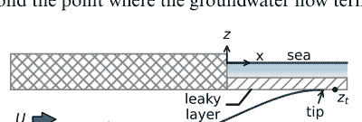

图4.9 通过弱透水层与含水层隔开的海域的界面流。

流动问题现在由三部分组成：界面趾上游的受限流、趾与海岸线之间的受限界面流，以及海底下方的半受限界面流。陆地下方的水流可以使用第4.1节推导的受限界面流的流量势来求解。流量势不能用于海底下方的半受限流段。

下面推导半受限部分水流的表达式。假设界面趾位于陆地下方（稍后将推导一个条件）。与受限界面流一样，海底下方的流量矢量可以写为（见公式4.7）

$$Q_x = -k(ah + z_t)\frac{dh}{dx}$$

在海水中，高程z_t处的淡水水头h*为

$$h^* = -z_t/\alpha$$

因此Q_x可以写为

$$Q_x = -k\alpha(h - h^*)\frac{dh}{dx}$$

海底下方的水流受半受限流的微分方程控制

$$\frac{\mathrm{d}Q_x}{\mathrm{d}x} = \frac{h - h^*}{c}$$

将公式(4.37)中的$Q_x$代入公式(4.38)并重新整理各项，得到

$$\frac{\mathrm{d}^2(h - h^*)^2}{\mathrm{d}x^2} = \frac{2(h - h^*)}{k\alpha c}$$

边界条件是：在海岸线处，流量矢量等于$U$

$$Q_x|_{x=0} = U$$

并且在界面尖端处，水头等于$h^*$，该尖端位于事先未知的位置$x = x_{\text{tip}}$

$$h|_{x=x_{\text{tip}}} = h^*$$

公式(4.39)在边界条件(4.41)下的解为

$$h = h^* + \frac{(x - x_{\text{tip}})^2}{6k\alpha c} \quad 0 \le x \le x_{\text{tip}}$$

通过将函数及其二阶导数代入微分方程(4.39)并验证边界条件，可以很容易地检验这个解。通过对公式(4.37)进行微分和代入，可以得到流量矢量的表达式

$$Q_x = -\frac{(x - x_{\text{tip}})^3}{18k\alpha c^2} \quad 0 \le x \le x_{\text{tip}}$$

最后，应用边界条件(4.40)得到

$$x_{\text{tip}} = (18k\alpha c^2 U)^{1/3}$$

注意，这意味着渗出区具有有限的长度，并且取决于含水层和弱透水层的参数、密度差以及流入海洋的总流量。这与常规的半受限流（无界面）相反，在后者中，渗出区理论上是无限长的，并且95%的水在距离泄漏因子（$\lambda = \sqrt{kHc}$）三倍的距离内通过半隔水层泄漏，与总流量无关（第2章）。

$x = 0$处的水头$h_0$由公式(4.42)得到

$$h_0 = h^* + \frac{x_{\text{tip}}^2}{6k\alpha c}$$

解(4.42)仅在界面趾不在海底下方时有效，这意味着

$$h_0 < -z_b/\alpha$$

利用$z_b = z_t - H = -\alpha h^* - H$，经过一些代数运算，这给出了$U$的以下条件

$$U \le \frac{kH^2\sqrt{2/3}}{\alpha\lambda}$$

界面趾位于海底下方的情况的解可以在Bakker (2006)中找到。

最后，获得了陆地下方含水层部分的解。$x = 0$处的流量势由$h_0$（公式4.45）和受限界面流的势（公式4.8）得到

$$\Phi_0 = \frac{1}{2} k \alpha (h_0 - h^*)^2 \quad (4.48)$$

陆地下方流量势的解为

$$\Phi = -Ux + \Phi_0 \quad (4.49)$$

界面趾位于$\Phi = \Phi_{\text{toe}}$（公式4.9）的点，由此得到

$$x_{\text{toe}} = -\frac{\Phi_{\text{toe}} - \Phi_0}{U} \quad (4.50)$$

在第4.1节中，海岸被近似为垂直的，这等价于当前问题，如果在公式(4.45)中将海底弱透水层的阻力设为$c = 0$，则得到$h_0 = h^*$（注意当$c \to 0$时，$x_{\text{tip}}$趋近于零）。在下面的示例中，使用了与第4.1节示例相同的参数，并计算了弱透水层阻力为两个值时的界面（图4.10）。

```
# parameters
k = 10 # hydraulic conductivity, m/d
zt = -10 # top of aquifer, m
zb = -30 # bottom of aquifer, m
alpha = 40 # alpha factor, -
clist = [1e-12, 5, 50] # three values of resistance of leaky layer, d
U = 0.4 # flow toward the coast, m^2/d
H = zt - zb # aquifer thickness, m
```

```
# solution
def interface(k, zt, zb, c, alpha, U):
    H = zt - zb
    # below sea
    hstar = -zt / alpha
    xtip = (18 * U * k * alpha * c**2) ** (1 / 3)
    xsea = np.linspace(0, xtip, 100)
    hsea = hstar + (xsea - xtip)**2 / (6 * k * alpha * c)
    h0 = hstar + xtip ** 2 / (6 * k * alpha * c)
    # below land
    phi0 = 0.5 * k * alpha * (h0 - hstar)**2
    phitoe = 0.5 * k * H ** 2 / alpha
    xtoe = -(phitoe - phi0) / U
    Cc = (0.5 * k * H ** 2 + k * H * zb) / alpha
    xland = np.linspace(xtoe, 0, 100)
    phi = -U * xland + phi0
    hland = np.sqrt(2 * phi/ (k * alpha)) + hstar
    # combine solution
    x = np.hstack((xland, xsea))
    zi = -alpha * np.hstack((hland, hsea))
    return x, zi
```

```
# basic plot
plt.subplot(111, aspect=4, ylim=(-30, -10))
for c in clist:
    x, zi = interface(k=k, zt=zt, zb=zb, c=c, alpha=alpha, U=U)
```

plt.plot(x, zi, label=f'c={c:.0f} d')
plt.legend();

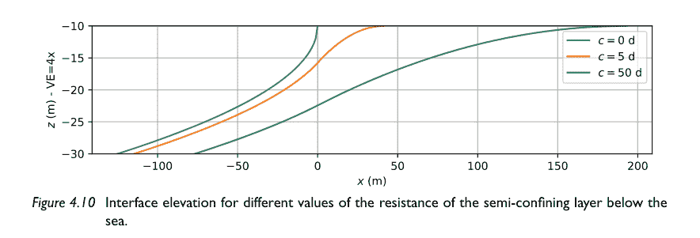

下面计算了 $c = 5$ d 情况下的流线，并在图 4.11 中展示。

```
c = 5
x, zi = interface(k=k, zt=zt, zb=zb, c=5, alpha=alpha, U=U)
x = np.hstack((-200, x))
zi = np.hstack((zb, zi))
Qx = U * np.ones_like(x)
lab = np.sqrt(c * k * H)
xtip = (18 * U * k * alpha * c**2) ** (1 / 3)
Qx[x>0] = -(x[x>0] - xtip) ** 3 / (18 * k * alpha * c**2)
xg = [x, x]
zg = [zi, zt * np.ones_like(x)]
psi = [np.zeros_like(x), Qx]
```

```
# basic streamline plot
plt.subplot(111, aspect=2)
plt.contour(xg, zg, psi);
```

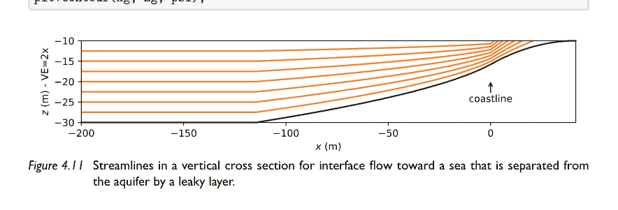

**练习 4.9：** 重新进行第 4.2 节示例中的界面流部分，但此时海岸线不是垂直的，而是岛屿两侧的海底在 $z_t = 0$ 处是水平的，并通过一个阻力为 $c = 5$ d 的薄阻力层与含水层隔开；使用 $N = 0.001$ m/d。计算海岸线（$x = 0$ 或 $x = L$）和岛屿中心处的水头和界面高程。


# Taylor & Francis

Taylor & Francis Group

http://taylorandfrancis.com

## 第 5 章

### 瞬态一维流动

本书迄今为止介绍的所有解都是针对稳定流的：水头和流量是 $x$ 的函数，但不是时间的函数。在自然界中，所有流动都是瞬态的，它们会响应降雨、蒸发、蒸腾、大气压变化、潮汐波动和地质过程（例如，负载、构造应力和加热）等驱动力而变化。除了这些自然过程外，还有地下水开采和回灌，这些是人为驱动力。稳态近似的合理性取决于所考虑的系统和研究目标。例如，地下水波动可能很小，或者当目标是研究长期平均情况时，波动可能不被关注。模型构建者需要评估时间波动是否重要。瞬态解析解对此非常有用，因为它们可用于快速确定达到稳态所需的时间。

本章讨论一维瞬态流动，这意味着水头和流量是 $x$ 和时间 $t$ 的函数。涉及开采的瞬态解将在第 9 章中考虑。这里的重点是水头因地表水位或地下水补给变化而变化的问题。

作为起点，推导了一维瞬态流动的微分方程。瞬态地下水质量平衡指出

流入质量 $-$ 流出质量 $=$ 质量增加

当地下水密度近似为常数时，地下水质量平衡简化为体积平衡。体积平衡为

流入体积 $-$ 流出体积 $=$ 体积增加

通过考虑含水层中一个长度为 $\Delta x$、垂直于流动平面方向宽度为 $\Delta y = 1$ 的小段，推导了含水层中一维流动的体积平衡。流入包括来自左侧的水平流量 $Q_x(x, t)$ [L$^2$/T] 和顶部的补给量 $N$ [L/T]。流出包括右侧的水平流量 $Q_x(x + \Delta x, t)$（图 5.1）。体积增加等于水头增加乘以储水系数 $S$ 和 $\Delta x \Delta y$（其中 $\Delta y = 1$）。回顾第 0.6 节，储水系数对于无压流等于潜水储水系数 $S = S_p$，对于承压流等于比储水系数 $S_s$ 与含水层厚度 $H$ 的乘积（$S = S_s H$）。此外，回顾流量向量 $Q_x$ 是单位含水层宽度的流量。

体积平衡是针对时间段 $\Delta t$ 写出的。将相应的体积代入公式 (5.2) 得到

$Q_x(x, t)\Delta t + N\Delta x\Delta t - Q_x(x + \Delta x, t)\Delta t = S\Delta x[h(x, t + \Delta t) - h(x, t)]$

除以 $\Delta x\Delta t$ 并重新排列各项得到

$\frac{Q_x(x + \Delta x, t) - Q_x(x, t)}{\Delta x} = N - S\frac{h(x, t + \Delta t) - h(x, t)}{\Delta t}$

DOI: 10.1201/9781315206134-5

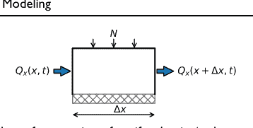

在 $\Delta x \rightarrow 0$ 和 $\Delta t \rightarrow 0$ 的极限下，体积平衡变为瞬态一维水平流动的微分方程

$$\frac{\partial Q_x}{\partial x} = -S \frac{\partial h}{\partial t} + N \quad (5.5)$$

瞬态流动的流量向量与稳定流的相同（公式 1.6）

$$Q_x = -T \frac{\partial h}{\partial x} \quad (5.6)$$

回顾对于承压流，$T$ 是含水层的恒定导水系数。对于无压流，与水头相关的导水系数近似为恒定的有效导水系数 $T = kH$，其中饱和厚度 $H$ 近似为常数。

将公式 (5.6) 中的 $Q_x$ 代入公式 (5.5) 得到

$$\frac{\partial^2 h}{\partial x^2} = \frac{S}{T} \frac{\partial h}{\partial t} - \frac{N}{T} \quad (5.7)$$

当面状补给等于零时，控制微分方程简化为

$$\frac{\partial^2 h}{\partial x^2} = \frac{S}{T} \frac{\partial h}{\partial t} \quad (5.8)$$

该方程被称为扩散方程；项 $T/S$ 也被称为含水层扩散系数。扩散方程控制着许多其他物理过程的瞬态行为。

毫不奇怪，瞬态地下水流动的解比稳定流的解更难获得。常见的数学方法包括相似解、分离变量、傅里叶级数和拉普拉斯变换。许多这些数学求解技术在水文应用中的介绍可以在例如 Bruggeman (1999) 中找到。本章中，解在不推导的情况下给出。解的验证在部分练习中讨论。给出了三个问题的解：半无限含水层中对地表水位变化的响应（第 5.1 节）、半无限含水层中的潮汐响应（第 5.2 节）以及两条平行河流之间对瞬态补给的响应（第 5.3 节）。第 5.1 节的问题在第 5.4 节中使用拉普拉斯变换方法解决，并简要介绍了拉普拉斯变换解的（数值）求值。本章最后一节给出了瞬态无流布西涅斯克方程的一个解。

#### 5.1 地表水位的阶跃变化

河流水位的变化会以水头变化的形式在与河流接触的含水层中传播，这对于理解地表水-地下水相互作用非常重要。以下示例考虑了如图 5.2 所示的半无限含水层中的一维瞬态流动。含水层左侧以一条完全贯穿的河流为界，该河流与含水层直接接触。最初，含水层中的水头处处等于河流水位 $h_0$。在时间 $t = t_0$ 时，河流水位升高了 $\Delta h$。

解被分为一个仅是 $x$ 函数的稳态部分 $h_s$ 和一个 $x$ 和 $t$ 函数的瞬态部分 $h_t$

$$h = h_s + h_t \tag{5.9}$$

稳态部分的边界条件为

$$h_s|_{x=0} = h_s|_{x \to \infty} = h_0 \tag{5.10}$$

稳态解很简单：$h_s = h_0$。

瞬态解的边界条件为

$$h_t|_{x=0, t>0} = \Delta h \tag{5.11}$$
$$h_t|_{x \to \infty, t} = 0 \tag{5.12}$$

初始条件为

$$h_t|_{x, t=0} = 0 \tag{5.13}$$

注意，稳态解和瞬态解的边界条件之和给出了所述问题的边界条件；初始条件也是如此。本质上，瞬态解表示由河流水位变化引起的含水层中的水头变化。本节的其余部分关注解的瞬态部分，并省略下标 $t$。

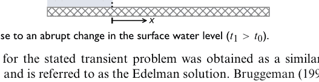

所述瞬态问题的解由 Edelman (1947) 作为相似解获得，被称为 Edelman 解。Bruggeman (1999) 使用拉普拉斯变换方法得到了相同的结果。Edelman 解为

$$h(x, t) = \Delta h \, \text{erfc}(u) \tag{5.14}$$

其中

$$u = \sqrt{\frac{S x^2}{4 T (t - t_0)}} \tag{5.15}$$

erfc 是互补误差函数，定义为

$$\text{erfc}(u) = \int_u^\infty \frac{2}{\sqrt{\pi}} e^{-\tau^2} \, d\tau \tag{5.16}$$

互补误差函数在 `scipy.special` 包中可用。使用达西定律可以得到含水层中通量的方程

$$Q_x = -T \frac{\partial h}{\partial x} = -T \Delta h \frac{\partial \text{erfc}(u)}{\partial x} \tag{5.17}$$

互补误差函数的导数首先通过写出下式获得

$$\text{erfc}(u) = \int_{u}^{\infty} \frac{\mathrm{d}F}{\mathrm{d}\tau} \mathrm{d}\tau = F(\infty) - F(u) \quad (5.18)$$

其中 $F$ 是一个（未知的）函数，其导数为

$$\frac{\mathrm{d}F}{\mathrm{d}\tau} = \frac{2}{\sqrt{\pi}} \mathrm{e}^{-\tau^2} \quad (5.19)$$

互补误差函数的导数现在可以写成（注意 $F(\infty)$ 不依赖于 $u$）

$$\frac{\partial \text{erfc}(u)}{\partial x} = -\frac{\mathrm{d}F}{\mathrm{d}u} \frac{\partial u}{\partial x} \quad (5.20)$$

导数 $\partial u / \partial x$ 通过应用链式法则获得

$$\frac{\partial u}{\partial x} = \frac{1}{2} \left( \frac{Sx^2}{4T(t - t_0)} \right)^{-1/2} \frac{2Sx}{4T(t - t_0)} = \frac{1}{u} \frac{u^2}{x} = \frac{u}{x} \quad (5.21)$$

因此最终得到

$$Q_x = T \Delta h \frac{2u}{x\sqrt{\pi}} \mathrm{e}^{-u^2} \quad (5.22)$$

在下面的示例中，水头和流量向量被绘制为 $x$ 的函数，对应三个不同的时间（图 5.3）。水头随 $x$ 的变化显示了含水层中额外储存水的位置。从河流流入含水层的水量迅速减少，这也可以从 $Q_x$ 的图中看出。在 $t = 1$ d 时，$x = 0$ 处的流入量超过 $5 \text{ m}^2/\text{d}$，并在 $x = 100$ m 处降至几乎为零。在 $t = 100$ d 时，$x = 0$ 处的流入量已降至约 $0.5 \text{ m}^2/\text{d}$，并且在 $x = 200$ m 处仍约为 $0.5 \text{ m}^2/\text{d}$，这意味着大部分水被输送到该点之外以增加含水层的储存量。

```python
# parameters
T = 100 # transmissivity, m^2/d
S = 0.2 # storage coefficient, -
delh = 2 # change in river level, m
t0 = 0 # time of change in river level, d
```

```python
# solution
from scipy.special import erfc

def h_edelman(x, t, T, S, delh=1, t0=0):
    u = np.sqrt(S * x ** 2 / (4 * T * (t - t0)))
    return delh * erfc(u)

def Qx_edelman(x, t, T, S, delh, t0=0):
    u = np.sqrt(S * x ** 2 / (4 * T * (t - t0)))
    return T * delh * 2 * u / (x * np.sqrt(np.pi)) * np.exp(-u ** 2)
```

```python
# basic plot head and Qx vs x
x = np.linspace(1e-12, 200, 100)
plt.subplot(121)
for t in [1, 10, 100]:
    h = h_edelman(x, t, T, S, delh, t0)
    plt.plot(x, h, label=f'time={t} d')
plt.legend()
plt.subplot(122)
for t in [1, 10, 100]:
    Qx = Qx_edelman(x, t, T, S, delh, t0)
    plt.plot(x, Qx, label=f'time={t} d')
plt.legend();
```

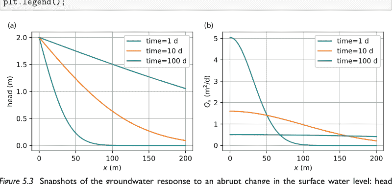

在下面的图中，水头和 $Q_x$ 被绘制为 $t$ 的函数，对应三个不同的距河距离（图 5.4）。水头作为 $t$ 的函数代表观测井中的水头。请注意，观测井离河流越远，在河流水位变化后，水头开始上升所需的时间就越长。流量向量 $Q_x$ 在河流附近显示出明显的最大值，但随着与河流距离的增加，峰值变得不那么明显。

```python
# basic plot head and Qx vs t
t = np.linspace(1e-12, 100, 100)
plt.subplot(121)
for x in [50, 100, 200]:
    h = h_edelman(x, t, T, S, delh, t0)
    plt.plot(t, h, label=f'distance {x} m')
plt.legend()
plt.subplot(122)
for x in [50, 100, 200]:
    Qx = Qx_edelman(x, t, T, S, delh, t0)
    plt.plot(t, Qx, label=f'distance {x} m')
plt.legend();
```

根据该解，含水层中各处水头升高 $\Delta h$ 需要无限长的时间。只有当水从河流流入含水层时，远处的水头才能升高，这意味着含水层中各处的水头必须低于河流中的水头。这意味着从河流到水头仍接近初始水头的点的梯度变得越来越小，因此水头升高会越来越慢。这是含水层延伸至无穷远这一近似的人为产物，而实际上会存在某种边界。

水头的解（公式 5.14）仅是无量纲参数 $u$ 的函数，$u$ 也被称为相似变量（它组合了自变量）。这意味着对于一个特定的 $u$ 值，水头只有一个值。例如，x = 100 m 和 t = 10 d 处的水头变化可以计算为

```python
x = 100 # m
t = 10 # d
T = 100 # m^2/d
S = 0.2 # -
print(f'head at x = {x} m, t = {t} d for T = {T} and S = {S}:')
print(f'u = {np.sqrt(S * x ** 2 / (4 * T * t)):.3f}')
print(f'h = {h_edelman(x, t, T, S, delh):.6f} m')
```

head at x = 100 m, t = 10 d for T = 100 and S = 0.2:
u = 0.707
h = 0.634621 m

如果储水系数不是 S = 0.2 而是 S = 0.002，那么在 x = 100 m 处达到相同的水头变化需要 0.1 d，因为 S = 0.002 和 t = 0.1 d 给出相同的 $u$ 值。

```python
t = 0.1 # d
S = 0.002 # -
print(f'head at x = {x} m, t = {t} d for T = {T} and S = {S}:')
print(f'u = {np.sqrt(S * x ** 2 / (4 * T * t)):.3f}')
print(f'h = {h_edelman(x, t, T, S, delh):.6f} m')
```

head at x = 100 m, t = 0.1 d for T = 100 and S = 0.002:
u = 0.707
h = 0.634621 m

**练习 5.1：** 考虑 T = 100 m²/d、S = 0.2 和 Δh = 2 m 的情况。在 x = 100 m 和 t = 10 d 处的水头为 h = 0.635 m。当 S = 0.002 而不是 S = 0.2 时，导水系数 T 为何值时，在 x = 100 m 和 t = 10 d 处的水头相同？

**练习 5.2：** 考虑 T = 100 m²/d、S = 0.2 和 Δh = 2 m 的情况。在 x = 100 m 和 t = 10 d 处的水头为 h = 0.635 m。当 S = 0.002 时，在 t = 10 d 处，距河流多远的距离水头变化相同？

解的准确性和正确实现可以通过三种方式验证。首先，可以通过检查解是否满足边界和初始条件公式 (5.11)–(5.13)，并对解求导并将其代入控制微分方程 (5.8) 以检查解是否满足微分方程，从而验证数学解 (5.14) 确实是所述数学问题的解。其次，可以通过使用精确的数值导数检查解是否满足微分方程以及边界和初始条件来验证解的 Python 实现（此方法在第 2.1 节中已应用）。

**练习 5.3：** 验证解 (5.14) 满足微分方程以及边界和初始条件，并验证 $Q_x = -Tdh/dx$。使用精确的数值导数（例如，参见第 2.1 节）。

验证解的第三种方法是检查水量平衡。可以计算一段时间 $\Delta t$ 内流入含水层的总水量，并与含水层中水储存量的增加进行比较。总流入量可以通过在 $x = 0$ 处对 $Q_x$ 进行积分来计算。$x = 0$ 处的 $Q_x$ 可以从 (5.22) 和 (5.15) 得到

$$Q_x|_{x=0,t} = \Delta h \sqrt{\frac{ST}{\pi(t-t_0)}} \quad (5.23)$$

一段时间 $\Delta t$ 内的总流入量为

$$Q_{\text{in}} = \int_{t_0}^{t_0+\Delta t} Q_x|_{x=0,t} = 2\Delta h \sqrt{\frac{ST\Delta t}{\pi}} \quad (5.24)$$

总储存量的增加可以通过在 $t = \Delta t$ 时沿 $x$ 对含水层中的水头进行数值积分，然后乘以储水系数来计算。积分可以例如使用 scipy.integrate 的 quad 方法进行。总储存量的增加必须等于总流入量，如下所示。

```python
delt = 10 # time period for which water balance is checked
Qin = 2 * delh * np.sqrt(S * T * delt / (np.pi))
from scipy.integrate import quad
stored = S * quad(h_edelman, 1e-12, np.infty, args=(delt, T, S, delh, 0))[0]
print(f'total inflow from river  : {Qin:.6f} m^3')
print(f'total increase in storage: {stored:.6f} m^3')
```

total inflow from river  : 3.191538 m^3
total increase in storage: 3.191538 m^3

由于控制微分方程 (5.8) 是线性的，解可以通过时间进行叠加。例如，如果河流水位在时间 $t_0$ 时升高 $\Delta h_0$，然后在时间 $t_1$（其中 $t_1 > t_0$）时再次升高 $\Delta h_1$，则瞬态解为

$h(x,t) = \Delta h_0 \text{erfc}(u_0) \quad t_0 \le t \le t_1$ (5.25)
$h(x,t) = \Delta h_0 \text{erfc}(u_0) + \Delta h_1 \text{erfc}(u_1) \quad t \ge t_1$ (5.26)

其中

$u_0 = \sqrt{\frac{Sx^2}{4T(t-t_0)}} \quad u_1 = \sqrt{\frac{Sx^2}{4T(t-t_1)}}$ (5.27)

考虑以下从四个不同时间 t0 开始的四个步骤 delh 的河流水位序列。

```python
delh = np.array([1, 1, -2, 1]) # sequence of river stage changes, m
t0 = np.array([0, 10, 20, 30]) # sequence of times of changes, d
```

瞬态解通过叠加四个河流水位变化获得。使用循环计算并绘制距河流 10 m 和 100 m 处的水头随时间的变化（图 5.5）。

#### 5.2 地表水位的周期性变化

含水层中的周期性水头变化可能由潮汐、季节性波动或水坝的周期性运行等原因引起。此处将地表水位变化近似为具有特定振幅和特定周期的正弦波动。地表水位变化通常可以表示为多个具有各自振幅和周期的正弦波动的组合；对这种组合变化的响应可以通过叠加原理计算。

考虑一个半无限含水层中的一维流动（见图5.6）。没有面状补给，且在无穷远处没有流动：

$$\frac{\partial h}{\partial x}\bigg|_{x \to \infty, t} = 0 \quad (5.32)$$

含水层的导水系数 $T$ 近似为常数。含水层在 $x = 0$ 处以开放水体为界，其波动为：

$$h|_{x=0, t} = A \cos\left(\frac{2\pi(t - t_p)}{\tau}\right) \quad (5.33)$$

其中 $A$ 是波动的振幅，$t_p$ 是峰值时间，$\tau$ 是波动的周期。没有初始条件；也就是说，$x = 0$ 处的水头自古以来（实际上是很长时间以来）一直按照式(5.33)波动。


所述问题的解可以通过分离变量法获得，并由Forchheimer首次发表（1919, p. 1229）。结果表明，含水层中的水头响应可以写成与地表水水头变化相同的形式，但变化的振幅 $B$ 小于 $A$，且峰值到达时间延迟了 $t_s$（Jacob, 1950, p. 365）：

$$h(x, t) = B \cos[2\pi(t - t_p - t_s)/\tau]$$

水头变化的振幅 $B$ 随距离衰减，其关系为：

$$B = A \exp\left(-x\sqrt{\frac{S\pi}{T\tau}}\right)$$

峰值的时间偏移 $t_s$ 为：

$$t_s = x\sqrt{\frac{S\tau}{4\pi T}}$$

注意，振幅 $B$ 和相位偏移 $t_s$ 都是导压系数 $T/S$ 的函数。这意味着，当测量潮汐响应的振幅和峰值时间来估算含水层参数时，只能估算出含水层的导压系数，而无法单独得到 $S$ 或 $T$ 的值。根据潮汐响应估算含水层参数（的组合）也被称为潮汐法（例如，Ferris, 1952; Carr and Van Der Kamp, 1969）。

式(5.35)表明，对于较短的潮汐周期，振幅 $B$ 比较长的潮汐周期衰减得更快。引入特征长度 $\mu$：

$$\mu = \sqrt{\frac{T\tau}{S\pi}}$$

这样振幅可以写成：

$$B = A e^{-x/\mu}$$

在距离 $x = 3\mu$ 处，振幅已衰减至 $x = 0$ 处振幅的5%。这个结果可以作为一个经验法则，用于评估在考虑含水层中的水头和流动时，是否需要考虑地表水位的周期性波动。如果研究区域距离地表水体的距离大于 $3\mu$，则可以忽略周期为 $\tau$ 的地表水位周期性波动。

例如，考虑一个以潮汐河流为界的含水层。在一个潮汐周期内的四个不同时间点绘制了含水层中的水头（图5.7）。河流中的振幅设为1米。水头变化被振幅 $B$ 所限定，图中用虚线表示。

```python
# parameters
T = 1000 # transmissivity, m^2/d
S = 0.1 # storage coefficient, -
tau = 0.5 # tidal period, d
tp = 0 # time of peak at canal, d
mu = np.sqrt(T * tau / (S * np.pi)) # characteristic length, m
print(f'characteristic length: {mu:.2f} m')
```

characteristic length: 39.89 m

```python
# solution for unit amplitude
def head(x, t, tau, S, T, tp=0, t0=0):
    B = np.exp(-x * np.sqrt(S * np.pi / (T * tau)))
    ts = x * np.sqrt(S * tau / (4 * np.pi * T))
    return B * np.cos(2 * np.pi * (t - tp - ts) / tau)
```

```python
# basic plot
x = np.linspace(0, 200, 100)
for t in np.arange(0, tau, tau / 4):
    h = head(x, t, tau, S, T, tp)
    plt.plot(x, h)
plt.plot(x, np.exp(-x / mu), 'k--')
plt.plot(x, -np.exp(-x / mu), 'k--');
```

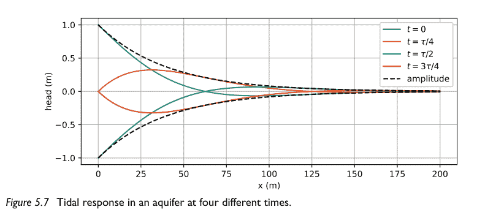

天然的潮汐波动由多个潮汐分量组成，每个分量都有自己的周期和相位滞后。例如，这里展示了对一个由两个分量组成的潮汐波动的响应。第一个分量是半日分量，周期为745分钟（在潮汐系统中称为M2分量）；M2的振幅为1米。第二个分量是全日分量，周期为1549分钟（称为O1分量）。O1的振幅为0.4米，与M2相比的相位滞后为100分钟。解是通过叠加两个解(5.34)得到的。计算了在海岸线以及距离海岸线三个不同距离的三个观测井中的水头波动（图5.8）。

仅仅两个分量的存在就使得水头波动变得相当复杂。注意图5.8中四个图的纵轴范围各不相同。在海岸处，水头波动超过2米，而在 $x = 300$ 米处的变化仅为5毫米。由于M2的周期小于O1的周期，M2分量比O1分量衰减得更快。潮汐波动在靠近海岸处有两个明显的峰值，而在远离海岸处只有一个明显的峰值。

```python
# parameters
tau1 = 745 / (24 * 60) # M2 period, d
tau2 = 1549 / (24 * 60) # O1 period, d
tp1 = 0 # time of peak M2, d
tp2 = 100 / (24 * 60) # time of peak of O1, d
mu1 = np.sqrt(T * tau1 / (S * np.pi)) # characteristic length M2, m
mu2 = np.sqrt(T * tau2 / (S * np.pi)) # characteristic length O1, m
print(f'characteristic length M2: {mu1:.2f} m')
print(f'characteristic length O1: {mu2:.2f} m')
```

characteristic length M2: 40.58 m
characteristic length O1: 58.52 m

一个有趣的实际应用是分析河流中洪水波的传播。河流水位在 $\Delta t$ 时间内升高了 $\Delta h$，之后水位恢复到初始水平。含水层中的水头上升通过叠加得到：

$$h(x, t) = \Delta h[\text{erfc}(u_0) - \text{erfc}(u_1)] \quad t \ge \Delta t \tag{5.28}$$

其中

$$u_0 = \sqrt{\frac{Sx^2}{4Tt}} \quad u_1 = \sqrt{\frac{Sx^2}{4T(t - \Delta t)}} \tag{5.29}$$

分析地下水对洪水波的响应以估算含水层性质的方法有时被称为洪水波法。在这种情况下，可以拟合解(5.28)来估算含水层的导压系数。

地下水对洪水波的响应随着与河流距离的增加而减弱。响应可以忽略不计（例如，为 $\Delta h$ 的一小部分）的距离可以从解(5.28)计算，但这需要数值求根过程。在实践中，最大水头响应为洪水波高度 $\alpha$ 倍的距离可以用下式估算：

$$x \approx \sqrt{\frac{T \Delta t}{S \alpha}} \tag{5.30}$$

例如，最大响应为 $0.01 \Delta h$（$\alpha = 0.01$）的位置大约在 $x \approx 10\sqrt{T\Delta t/S}$ 处。最大值出现的时间为：

$$t_{\text{peak}} = \frac{Sx^2}{6T} \quad (5.31)$$

评估近似公式(5.30)的准确性是下面练习的一部分。

**练习5.4：** 考虑一个通过河流的洪水波，$\Delta h = 2$ 米，$\Delta t = 10$ 天。其他参数与示例相同。使用近似公式(5.30)估算水头响应为 $0.01 \Delta h$ 的位置。在该位置，绘制水头随时间的变化图。确保时间从0变化到 $5t_{\text{peak}}$。通过计算近似公式所确定位置的实际最大水头，评估近似公式是否合理有效。

**练习5.5：** 对于上一个练习中的洪水波，计算并绘制含水层（河流一侧）中储存的总水量随时间的变化，时间从0到 $10\Delta t$。在 $t = \Delta t = 10$ 天时，河岸储存了多少水？在 $t = 4\Delta t = 40$ 天时呢？

```python
# solution
t = np.linspace(1e-3, 40, 400) # start just after t=0
h10 = np.zeros(len(t))
h100 = np.zeros(len(t))
for i in range(len(t0)):
    h10[t > t0[i]] += h_edelman(10, t[t > t0[i]], T, S, delh[i], t0[i])
    h100[t > t0[i]] += h_edelman(100, t[t > t0[i]], T, S, delh[i], t0[i])
```

```python
# basic plot head (bottom graph)
plt.plot(t, h10, label='x=10 m')
plt.plot(t, h100, label='x=100 m')
plt.legend();
```

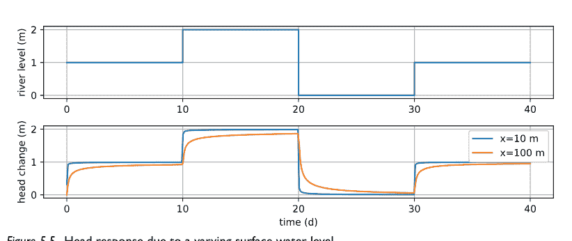

#### 5.3 两条河流之间的区域补给

第1.2节中介绍的在导水系数 $T$ 恒定的含水层中，两条平行河流之间稳定补给的解，被扩展以包括瞬态补给。两条河流相距 $L$；坐标系原点选在两条河流的中点（图5.9）。初始时，含水层中的水头处于稳定状态，因此初始瞬态水头等于零。河流与含水层直接接触，且河流水位固定，因此瞬态水头的边界条件和初始条件为：

$h|_{x=-L/2,t} = h|_{x=L/2,t} = h|_{x,t=0} = 0$ (5.39)

在时间 $t = 0$ 时，区域补给以恒定且均匀的速率 $N$ 开始。含水层中水头随时间变化的解可以通过分离变量法得到，并得到以下无穷级数（Bruggeman, 1999, solution 133.16）：

$h = \frac{-N}{2T} \left(x^2 - \frac{1}{4}L^2\right) - \frac{4NL^2}{\pi^3 T} \sum_{n=0}^{\infty} \frac{(-1)^n}{(2n+1)^3} \cos\left[\frac{(2n+1)\pi x}{L}\right] \exp\left[-\frac{(2n+1)^2 \pi^2 T t}{S L^2}\right]$ (5.40)

注意，对于长时间，解中的指数项趋近于零，水头趋近于稳态解 $\frac{-N}{2T} \left(x^2 - \frac{1}{4}L^2\right)$，这与方程 (1.24) 在河流水头设为零且坐标系原点位于两条河流中点时的情况相同。

在下面的示例中，绘制了水头在三个早期时间和三个晚期时间随 $x$ 的变化（图5.10）。对于早期时间，解使用级数中的三项绘制（虚线），这并不足够，因为可以看到明显的波动，尤其是在 $t = 1$ 天时。对于较晚的时间，虚线解仅代表级数解中的一项，这与十项或更多项的解无法区分。

```python
# parameters
L = 1000 # aquifer length, m
S = 0.1 # storage coefficient, -
T = 200 # transmissivity, m^2/d
N = 0.001 # recharge rate, m/d
```

```python
# solution
def head(x, t, T=T, S=S, L=L, N=N, nterms=10):
    h = 0
    for n in range(nterms):
        h += (-1)**n / (2 * n + 1)**3 * \
             np.cos(((2 * n + 1) * np.pi * x) / L) * \
             np.exp(-((2 * n + 1)**2 * np.pi**2 * T * t) / (S * L**2))
    h = -N / (2 * T) * (x**2 - L**2/4) - 4 * N * L**2 / (np.pi**3 * T) * h
    return h
```

```python
# basic head plot
plt.subplot(121) # early time
x = np.linspace(-L / 2, L / 2, 100)
for t in [1, 2, 3]:
    plt.plot(x, head(x, t, nterms=3), '--')
    plt.plot(x, head(x, t, nterms=10))
plt.subplot(122) # late time
for t in [40, 80, 160]:
    plt.plot(x, head(x, t, nterms=1) , '--') # just 1 term is enough
    plt.plot(x, head(x, t, nterms=10))
plt.plot(x, head(x, 0, nterms=0), 'k'); # 0 terms gives steady solution
```

在早期时间，左侧图表显示含水层中部的水头以 $N/S = 0.01$ m/d 的速率上升，因为向河流的排泄对中部区域尚未产生任何排水效应。当时间从1天进展到2天再到3天时，越来越多的含水层区域向河流排水。$t = 160$ 天时的水头趋近于稳态解，如右图所示。

系统的特征时间 $t_{95}$ 在此定义为水头达到稳态水平95%所需的时间。$t_{95}$ 的近似方程首先通过级数解的第一项来近似解 (5.40) 得到：

$$h \approx \frac{-N}{2T} \left(x^2 - \frac{1}{4}L^2\right) - \frac{4NL^2}{\pi^3 T} \cos \left[\frac{\pi x}{L}\right] e^{-t/\tau}$$

其中

$$\tau = \frac{SL^2}{\pi^2 T}$$

余弦项可以进一步用其泰勒级数的前两项（$\cos(x) \approx 1 - x^2/2$）简化：

$$-\frac{4NL^2}{\pi^3 T} \cos\left[\frac{\pi x}{L}\right] \approx -\frac{4NL^2}{\pi^3 T} \left(1 - \frac{\pi^2 x^2}{2L^2}\right) \approx \frac{N}{2T} \left(x^2 - \frac{1}{4}L^2\right) \quad (5.43)$$

其中使用了 $\frac{4}{2\pi} \approx \frac{1}{2}$ 和 $\frac{8}{\pi^3} \approx \frac{1}{8}$。现在水头可以近似为：

$$h \approx \frac{-N}{2T} \left(x^2 - \frac{1}{4}L^2\right) (1 - e^{-t/\tau}) \quad (5.44)$$

由此可知，在时间 $t = \tau$ 时，水头已达到其最终值的 $1 - e^{-1} = 63\%$，在时间 $t = 3\tau$ 时，水头已达到其最终值的95%。因此，特征时间 $t_{95}$ 可以近似为：

$$t_{95} \approx \frac{3SL^2}{\pi^2 T} \quad (5.45)$$

方程 (5.45) 是整个含水层 $t_{95}$ 的一个合理近似，如下文练习所探讨。特征时间 $t_{95}$ 也被称为系统的记忆，因为在补给事件结束后，水头在 $t_{95}$ 后恢复到其原始值。对于此处使用的参数，$t_{95}$ 的值可以计算为：

```python
t95 = 3 * S * L**2 / (np.pi**2 * T)
print(f'The memory of the system is: {t95:0.0f} d')
```

The memory of the system is: 152 d

**练习 5.6：** 使用解中的10项，计算两条河流之间20个等间距点的系统记忆 $t_{95}$，并绘制系统记忆随 $x$ 的变化；使用 `scipy.optimize` 中的 `fsolve` 方法来找到 $t_{95}$，类似于第3.2节中 `fsolve` 的用法。在同一图中，绘制根据方程 (5.45) 得到的 $t_{95}$。

解 (5.40) 被称为阶跃响应：它是对补给从零阶跃到 $N$ 的响应。单位阶跃响应是对补给从零阶跃到一的响应。除了单位阶跃响应，还有单位块响应，它是在时间段 $\Delta t$ 内每天一个单位补给，之后为零的响应；$\Delta t$ 被称为块的长度。块响应 $b$ 通过两个阶跃响应的叠加得到：

$b(x, t) = s(x, t) \quad 0 \le t \le \Delta t$
$b(x, t) = s(x, t) - s(x, t - \Delta t) \quad t \ge \Delta t$

其中 $s(x, t)$ 是从 $t = 0$ 开始的单位阶跃响应，$s(x, t - \Delta t)$ 是从 $t = \Delta t$ 开始的单位阶跃响应。单位阶跃响应 $s(x, t)$ 通过将补给 $N$ 设为1，使用方程 (5.40) 计算。

阶跃响应和块响应在图5.11中的两个位置绘制。这代表了在指定 $x$ 值处观测井中的水头响应。块响应在块长度 $\Delta t$ 期间与阶跃响应相同。相应颜色的虚线代表阶跃响应的最终稳定水平。黑色虚线表示在没有河流的情况下的水头上升（即水头上升速率为 $N/S = 0.01$ m/d）。离河流最远的观测井（本例中在 $x = 0$ 处）的水头在最长的时间段内（约20天）遵循虚线。

系统的记忆由表示阶跃响应和块响应的 $t_{95}$ 时间的垂直线表示；后者是在块补给结束后作为 $t_{95}$ 获得的。注意，对于这种情况，系统的记忆是152天，含水层中的水头在补给事件结束后约152天恢复到其原始值。

```python
# plot step recharge and response and block recharge and response at x=0
x = 0
delt = 365 / 12
t = np.linspace(0, 210, 211)
plt.subplot(221)
plt.plot([0, 210], [1, 1])
plt.subplot(222)
plt.plot([0, 30, 30, 210], [1, 1, 0, 0])
plt.subplot(223)
h = N * head(x, t, N=1)
plt.plot(t, h)
plt.subplot(224)
h[t > delt] -= N * head(x, t[t > delt] - delt, N=1)
plt.plot(t, h);
```

一系列等长 $\Delta t$ 的补给事件的响应使用叠加法计算。例如，如果前三个时期的补给分别为 $N_0$、$N_1$ 和 $N_2$，那么在 $t = 0$、$\Delta t$、$2\Delta t$ 和 $3\Delta t$ 时的水头可以计算为：

$h|_{x,0} = 0$
$h|_{x,\Delta t} = N_0 b|_{x,\Delta t}$
$h|_{x,2\Delta t} = N_0 b|_{x,2\Delta t} + N_1 b|_{x,\Delta t}$
$h|_{x,3\Delta t} = N_0 b|_{x,3\Delta t} + N_1 b|_{x,2\Delta t} + N_2 b|_{x,\Delta t}$

时期 $n$ 开始时水头 $h_n$ 的一般方程为：

$h_n = \sum_{j=0}^{n-1} N_j b_{n-1-j}$

其中 $h_n = h|_{x,n\Delta t}$，$b_{n-1-j} = b|_{x,(n-1-j)\Delta t}$。在Python中实现求和需要特别注意，因为在数学符号中，求和的上限是包含的，而在Python中，上限是不包含的。

例如，考虑以下四年（每月为一个时段）的补给值（单位：mm/d）（补给量在每个月内保持不变）。这些补给值来自一个具有温带气候和浅层地下水位的地区。补给量在秋季和冬季最高，在春季和夏季月份，当植被从地下水位吸取水分时，补给量可能变为负值。

```python
# 四年的月度补给数据
delt = 365 / 12 # 1个月的近似长度，单位：天
recharge = 0.001 * np.array( # 将补给量从 mm/d 转换为 m/d
[ 1.2, 1.5, 0.8, -1.2, 0.2, -2.9, -0.6, 2.8, 1.2, 0.9, 3.8,
1.8, 1.9, 1.8, -0.6, -1.3, -2.5, 0.6, 0.9, 1.8, -0.3, 0.8,
-0.2, 3.8, 2.8, 0.3, -0.5, 0.3, -1.1, 1.5, 1. , -1.5, 0.1,
1.5, 1. , 4. , 1.3, 1.3, 0.3, -1.1, 0.6, -0.8, -1.2, -1.6,
1.3, 1.4, 2.4, 2.6])
ntime = len(recharge) # 月份数
```

编写了一个函数用于计算离散块响应 `b(x, n, Δt)`，它表示在长度为 `Δt` 的时段内单位补给量引起的水头响应。离散块响应返回在 `ntime` 个等间隔 `Δt` 时刻的水头值。

```python
# 离散块响应
def bresponse(x, ntime, delt, T=T, S=S, L=L, nterms=10):
    t = np.linspace(delt, ntime * delt, ntime)
    return head(x, t, T, S, L, 1, nterms) - \
           head(x, t - delt, T, S, L, 1, nterms)
```

通过应用公式 (5.48)，计算并绘制了含水层中两个点的水头（图 5.12）。请注意，单位块响应在每个位置只计算一次。两条河流中间位置（`x = 0`）的年水头变化接近 2 米，而靠近河流的位置水头变化则小得多。最高水头出现在一月左右，最低水头出现在七月左右。最初几个月计算出的水头（由虚线表示）不太现实，因为它仅基于第一年开始以来的补给量，而水头也取决于前一年的补给量。在 `t95 = 152` 天（该系统的记忆时间）之后，前一年的影响可以忽略不计。

```python
# 求解
h0 = np.zeros(ntime + 1) # x=0 处的水头
h400 = np.zeros(ntime + 1) # x=400 处的水头
b0 = bresponse(0, ntime, delt, T, S, L)
b400 = bresponse(400, ntime, delt, T, S, L)
for n in range(1, len(recharge) + 1):
    h0[n] = np.sum(recharge[0:n] * b0[n - 1::-1])
    h400[n] = np.sum(recharge[0:n] * b400[n - 1::-1])
```

```python
# 基本绘图：补给数据和水头响应
plt.subplot(211)
time = np.linspace(0, ntime * delt, ntime + 1)
plt.step(time[:-1], 1000 * recharge, where='post'); # plt.stairs in mpl>=3.4
plt.grid()
plt.subplot(212)
plt.plot(time, h0, label='$x=0$ m')
plt.plot(time, h400, label='$x=400$ m')
plt.legend();
```

图 5.12 四年月度变化的补给量（上图）以及两条河流之间补给引起的瞬态水头变化；在 $t = t_{95}$ 之前的部分序列表示为虚线。

图 5.12 中显示的水头是使用公式 (5.48) 计算的，该公式基于精确解 (5.40)。作为最后一个例子，我们研究图 5.12 中显示的 $x = 0$ 处的水头变化是否可以用简化的阶跃响应函数准确模拟：

$s(t) = A (1 - e^{-t/a})$ (5.49)

简化阶跃响应的函数形式与公式 (5.44) 相同，但参数 $A$ 和 $a$ 现在只是拟合参数。换句话说，图 5.12 中显示的 $x = 0$ 处的水头被视为观测井中的观测水头，参数 $A$ 和 $a$ 通过执行最小二乘拟合获得。首先，编写一个函数用于计算与简化阶跃响应 (5.49) 对应的离散块响应。

```python
def simplebresponse(A, a, delt, nstep):
    t = np.linspace(0, nstep * delt, nstep + 1)
    hstep = A * (1 - np.exp(-t / a))
    return hstep[1:] - hstep[:-1]
```

观测水头 $h_o$ 与模拟水头 $h_m$ 之间的差值 $\varepsilon$（也称为残差或误差）计算如下：

$$\varepsilon = h_o - h_m \qquad (5.50)$$

最优参数 $A$ 和 $a$ 通过最小化误差平方和来找到，这被称为目标函数：

$$F_{\text{obj}} = \sum \varepsilon^2 \qquad (5.51)$$

目标函数的 Python 函数的第一个参数必须是包含参数的数组。最后一个关键字参数是 `return_heads`。当此关键字参数设置为 `True` 时，该方法返回模拟的水头而不是误差平方和，这在参数估计后计算模拟水头时很有用。

```python
def fobj(p, delt=delt, recharge=recharge, hobs=h0, return_heads=False):
    A, a = p
    ntime = len(recharge)
    b = simpleresponse(A, a, delt, ntime + 1)
    hm = np.zeros(ntime + 1)
    for n in range(1, ntime + 1):
        hm[n] = np.sum(recharge[0:n] * b[n - 1::-1])
    if return_heads:
        return hm
    rv = np.sum((hobs - hm) ** 2)
    return rv
```

最小化目标函数的参数可以通过多种方法找到。这里使用 `scipy.optimize` 包的 `fmin` 函数，它应用单纯形算法（参见 `fmin` 文档）。

```python
from scipy.optimize import fmin
A, a = fmin(fobj, [300, 50], disp=0)
print(f'Estimated parameters A: {A:.2f} d, a: {a:.2f} d')
hm = fobj([A, a], return_heads=True) # 计算模拟水头
```

估计参数 A: 629.89 d, a: 53.03 d

模拟水头 $h_m$ 与观测水头 $h_o$ 拟合得非常好（图 5.13）。

```python
# 基本绘图：模拟水头
plt.plot(h0, 'C1.', label='observed')
plt.plot(hm, 'C0', label='modeled')
plt.legend();
```

上述过程，即使用近似响应函数创建观测井水头模型，被称为时间序列分析。时间序列分析是一种强大且日益流行的方法，用于分析观测井中测量的水头。例如，参见 Bakker and Schaars (2019) 和 Collenteur et al. (2019)。

**练习 5.7：** 使用精确解和提供的四年月度补给数据，计算 $x = 250$ m 处四年的月度水头，创建一个合成数据集。对合成数据集应用时间序列分析，使用指数响应函数 (5.49)。报告拟合的 $A$ 和 $a$ 值。将模拟水头和观测（合成）水头绘制在同一张图中。

图 5.13 使用近似响应函数拟合模型与通过精确解获得的四年月度变化补给响应观测值的拟合。

#### 5.4 使用拉普拉斯变换的解

如前所述，有多种数学方法可以获得瞬态地下水流问题的解。其中一种方法是拉普拉斯变换，最初用于推导，例如第 5.1 节中的解。在拉普拉斯变换方法中，控制偏微分方程被转换为所谓的拉普拉斯域中的常微分方程。拉普拉斯域中常微分方程的解比原始偏微分方程的解容易得多。困难在于从拉普拉斯域到时间域的逆变换，这需要求解一个复杂的积分。幸运的是，当解析积分繁琐或不可能时，有几种算法可以进行数值积分。有整本书专门介绍拉普拉斯变换，包括包含数学函数变换的有用表格。Bruggeman (1999) 为具有数学倾向的地下水工程师或水文地质学家提供了一个很好的介绍。这里通过演示如何求解第 5.1 节中初始水头等于零的情况下的问题，给出一个非常简要的介绍。

拉普拉斯变换是一种积分变换，用符号 $\mathcal{L}$ 表示，定义为：

$$\mathcal{L}\{h\} = \bar{h}(x, p) = \int_0^\infty h(x, t) e^{-pt} dt \qquad (5.52)$$

其中 $\bar{h}$ 是拉普拉斯变换后的水头，它是 $x$ 和拉普拉斯变换参数 $p$ 的函数，但不是时间的函数。关于 $x$ 的导数的变换很简单：

$$\mathcal{L}\left\{\frac{\partial h}{\partial x}\right\} = \frac{\partial \bar{h}}{\partial x} \qquad \mathcal{L}\left\{\frac{\partial^2 h}{\partial x^2}\right\} = \frac{\partial^2 \bar{h}}{\partial x^2} \qquad (5.53)$$

而关于时间的导数的变换是：

$$\mathcal{L}\left\{\frac{\partial h}{\partial t}\right\} = p\bar{h} \qquad (5.54)$$

将拉普拉斯变换规则应用于无补给的一维瞬态流的控制微分方程 (5.8)，得到：

$$\frac{d^2 \bar{h}}{dx^2} = \frac{pS}{T} \bar{h} \qquad (5.55)$$

这确实是一个常微分方程。公式 (5.55) 是修正的亥姆霍兹方程 (2.5)，该方程在第 2 章中用于稳定半承压流。

边界条件也需要进行变换。各类函数的变换可在拉普拉斯变换表中找到。常数 $\Delta h$ 的拉普拉斯变换为

$$\mathcal{L}\{\Delta h\} = \int_0^\infty \Delta h e^{-pt} \mathrm{d}t = \frac{\Delta h}{p} \qquad (5.56)$$

对微分方程 (5.55) 进行变换后的边界条件求解，可得到 $\bar{h}(x, p)$ 的方程；该解被称为拉普拉斯域解。最终目标当然是得到函数 $h(x, t)$，这需要通过所谓的反变换或拉普拉斯逆变换来获得。求逆变换的方法有多种（例如，Bruggeman, 1999），但它们通常难以甚至无法进行解析求解。这促使了多种近似算法的发展以执行反变换。Stehfest 算法是最流行的方法之一，本文采用此方法（Stehfest, 1970）。

Stehfest 逆变换近似是拉普拉斯域解在多个拉普拉斯参数 $p_k$ ($k = 1, \dots, M$) 值下的加权平均。因此，应用 Stehfest 近似需要计算多个拉普拉斯参数 $p$ 值下的 $\bar{h}(x, p)$，以计算位置 $x$ 和时间 $t$ 处的水头值。近似中的项数为 $M$，且 $M$ 必须为偶数。Stehfest 公式为

$$h(x, t) = \frac{\ln 2}{t} \sum_{k=1}^M V_k \bar{h}(x, p_k) \qquad (5.57)$$

其中 $M$ 是项数，$V_k$ 是第 $k$ 项的权重，$p_k$ 是第 $k$ 个拉普拉斯参数，计算公式为

$$p_k = \frac{k \ln 2}{t} \qquad (5.58)$$

理论上，使用更多项时近似更精确，但机器精度很快会成为问题。公式 (5.57) 中的求和涉及越来越大的正数和负数的累加。对于求和中较大的索引 $k$，这些数字如此之大，以至于它们仅在第 16 位之后才有差异。Python 通常只跟踪 16 位数字，这意味着一个正数和一个仅在第 16 位之后才有差异的负数相加，本质上会产生无意义的结果。幸运的是，当使用过多项时，结果明显错误，这一点相当容易判断。

参数 $V_k$ 的公式相当冗长

$$V_k = (-1)^{k+M/2} \sum_{j=\mathrm{int}[(k+1)/2]}^{\min(k, M/2)} \frac{j^{M/2}(2j)!}{\left(\frac{M}{2}-j\right)! j! (j-1)! (k-j)! (2j-k)!} \qquad (5.59)$$

$V_k$ 的公式在下面的程序中实现（改编自 Johansson 等人 2013 年的 mpmath 包）。

```python
# coefficients V_k
from scipy.special import factorial as fac
def stehfest_coef(M):
    assert M % 2 == 0, 'M must be even' # make sure M is even
    M2 = int(M / 2)
    V = np.zeros(M)
    for k in range(1, M + 1):
        z = np.zeros(min(k, M2) + 1)
        for j in range(int((k + 1) / 2), min(k, M2) + 1):
            z[j] = j ** M2 * fac(2 * j) / \
                   (fac(M2 - j) * fac(j) * fac(j - 1) * fac(k - j) * fac(2 * j - k))
        V[k - 1] = (-1) ** (k + M2) * np.sum(z)
    return V
```

Stehfest 算法 (5.57) 在下面的程序中实现。前两个输入参数是计算函数值的 $x$ 位置和时间 $t$。输入参数 $x$ 和 $t$ 都可以是数组。下一个输入参数是拉普拉斯变换函数的 Python 实现，可调用为 `func(p, x, keyword_arguments)`，其中 `keyword_arguments` 可以是任意数量的关键字参数。下一个输入参数是关键字参数 $M = 12$，这是 Stehfest 算法中使用的默认项数。最后，可以提供任意数量的关键字参数。这些关键字参数被传递给拉普拉斯变换解的函数 `func`（即上面提到的 `keyword_arguments`）。`stehfest` 函数返回一个形状为 (`len(x)`, `len(t)`) 的二维数组。注意，参数 $V_k$ 仅是 $M$ 的函数，因此只计算一次。拉普拉斯参数 $p_k$ 必须根据公式 (5.58) 为每个时间单独计算。

```python
# Stehfest algorithm
def stehfest(x, t, func, M=12, **kwargs):
    t = np.atleast_1d(t)
    x = np.atleast_1d(x)
    f = np.zeros((len(x), len(t)))
    V = stehfest_coef(M)
    for i in range(len(t)):
        p = np.arange(1, M + 1) * np.log(2) / t[i]
        for j in range(len(x)):
            fbar = func(p, x[j], **kwargs)
            f[j, i] = np.log(2) / t[i] * np.sum(V * fbar)
    return f
```

在接下来的代码块中，使用拉普拉斯变换解决了第 5.1 节的瞬态问题（半无限承压含水层中地下水对河流水位变化 $\Delta h$ 的响应）。拉普拉斯域中的微分方程是 (5.55)，边界条件为

$$\bar{h}|_{x=0} = \frac{\Delta h}{p}$$

$$\bar{h}|_{x\to\infty} = 0$$

从数学上讲，这与第 2.1 节解决的问题相同。解为

$$\bar{h} = \frac{\Delta h}{p} \exp(-x\sqrt{pS/T})$$

时域解通过 Stehfest 算法获得，并将 Stehfest 解与精确解进行比较。

```python
# parameters
T = 100 # transmissivity, m^2/d
S = 0.2 # storage coefficient, -
delh = 2 # increase in river level, m
```

```python
# Laplace-transformed solution
def hbar(p, x, T=100, S=1e-3, delh=2):
    return delh / p * np.exp(-x * np.sqrt(p * S / T))
```

```python
# comparison
x = 50 # location, m
t = 10 # time, d
M = 12 # number of terms
V = stehfest_coef(M)
hx = h_edelman(x, t, T, S, delh=2) # from Section 5.1
hs = stehfest(x, t, hbar, M=M, T=T, S=S)
print(f'Exact head at x={x} m and t={t} d: {hx}')
print(f'Stehfest head with M={M} terms  : {hs}')
print(f'Relative error: {(hs - hx) / hx}')
```

Exact head at x=50 m and t=10 d: 1.2341501549039475
Stehfest head with M=12 terms  : [[1.23415675]]
Relative error: [[5.34721333e-06]]

Stehfest 解中使用 $M = 12$ 项时，相对误差在 $10^{-6}$ 量级。相对误差与 Stehfest 项数的关系绘制在图 5.14 中。注意，当使用超过 20 项时，相对误差开始再次增加；应避免使用如此多的项。

```python
Mlist = np.arange(2, 33, 2)
error = np.zeros(len(Mlist))
for i, M in enumerate(Mlist):
    hs = stehfest(x, t, hbar, M=M, T=T, S=S)
    error[i] = np.abs((hs - hx) / hx)
```

```python
# simple plot
plt.semilogy(Mlist, error, '-', marker='.')
plt.xticks(np.arange(2, 33, 2));
```

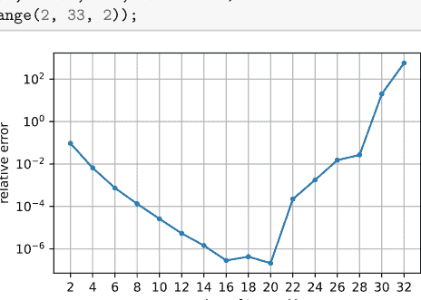

图 5.14 Stehfest 解的相对误差与 Stehfest 算法中使用的项数 $M$ 的关系。

最低相对误差在 $10^{-6}$ 量级。这意味着 Stehfest 算法可预期精确到大约六位有效数字。计算了水头并绘制了其在三个不同时间随 $x$ 的变化（图 5.15）。误差显示在图 5.15 的右图中。

```python
# solution
x = np.linspace(1e-12, 200, 100)
t = [1, 10, 100]
hx = np.empty((len(x), 3))
for itime in range(3):
    hx[:, itime] = h_edelman(x, t[itime], T, S, delh) # h_edelman from Sec. 2.1
hs = stehfest(x, t, hbar, M=12, T=T, S=S)
```

```python
# basic plot head and error
plt.subplot(121)
plt.plot(x, hs)
plt.subplot(122)
plt.plot(x, hs - hx);
```

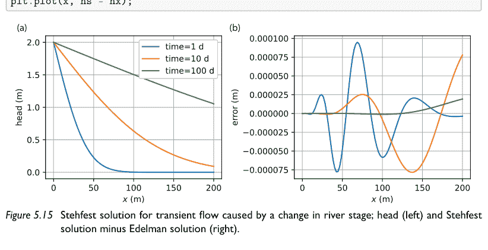

**练习 5.8：** 使用拉普拉斯变换方法求解第 5.1 节的瞬态流问题，但针对含水层为半承压的情况。使用 $T = 100 \text{ m}^2/\text{d}$，$S = 2 \cdot 10^{-4}$，以及弱透水层的阻力 $c = 1000 \text{ d}$。重现图 5.14 的左图，其中 $x$ 从 0 变化到 500，$t = 0.01$，$0.1$ 和 $1$ 天；在同一图中绘制承压和半承压两种情况的解。报告 $x = 100 \text{ m}$ 处在 $t = 0.01$，$0.1$ 和 $1$ 天时的水头。

#### 5.5 变渗透系数的无压流

到目前为止，本章中含水层的渗透系数一直被近似为常数，即使流动是无压的。当饱和厚度的变化不太大时，这是一个合理的近似，正如第 3 章对稳定无压流所示。本节提出了瞬态无压流的另一种表述，并评估了常渗透系数近似的准确性。

瞬态无压流的一维连续性方程由公式 (5.5) 给出

$$\frac{\partial Q_x}{\partial x} = -S_p \frac{\partial h}{\partial t} + N \qquad (5.62)$$

其中 $S_p$ 是潜水储水系数（或给水度）。$Q_x$ 可以用无压流的流量势表示，如公式 (3.3)

$$Q_x = -\frac{\mathrm{d}\Phi}{\mathrm{d}x} \qquad (5.63)$$

其中 $\Phi$ 由公式 (3.2) 给出

$$\Phi = \frac{1}{2}k(h - z_b)^2 \qquad (5.64)$$

其中 $z_b$ 是含水层底部的高程。将式 (5.63) 中的 $Q_x$ 代入式 (5.62) 得到

$$\frac{\partial^2 \Phi}{\partial x^2} = S \frac{\partial h}{\partial t} - N \quad (5.65)$$

这个微分方程被称为布西涅斯克方程，它是一个关于水头的非线性微分方程，因为 $\Phi$ 包含一个 $h^2$ 项。这个方程在解析上非常难以求解，即使它初看起来可能并不那么复杂。

为了进行解析求解，必须将微分方程线性化。首先，考虑 $\Phi$（式 5.64）对时间的导数

$$\frac{\partial \Phi}{\partial t} = k(h - z_b) \frac{\partial h}{\partial t} \quad (5.66)$$

微分方程 (5.65) 现在可以写成

$$\frac{\partial^2 \Phi}{\partial x^2} = \frac{S}{k(h - z_b)} \frac{\partial \Phi}{\partial t} - N \quad (5.67)$$

通过将时间导数前的饱和厚度近似为一个常数值 $\bar{H}$，该方程被线性化

$$\frac{\partial^2 \Phi}{\partial x^2} \approx \frac{S}{k\bar{H}} \frac{\partial \Phi}{\partial t} - N \quad (5.68)$$

微分方程 (5.68) 是一个关于 $\Phi$ 的线性微分方程。排泄势的解可以写成一个稳态解和一个瞬态解之和。

重复第 5.1 节的问题，但这次使用线性化的非承压瞬态流布西涅斯克方程（式 5.68）。一个半无限含水层在 $x = 0$ 处以一条运河为界。初始时，水头等于 $h_0$，因此初始稳态排泄势等于

$$\Phi|_{x,t=0} = \Phi_0 = \frac{1}{2}k(h_0 - z_b)^2 \quad (5.69)$$

在时间 $t = 0$ 时，运河中的水头升高了 $\Delta h$（图 5.2），因此排泄势增加了 $\Delta \Phi$

$$\Delta \Phi = \frac{1}{2}k(h_0 + \Delta h - z_b)^2 - \Phi_0 \quad (5.70)$$

瞬态解在 $x = 0$ 处的边界条件是

$$\Phi|_{x=0,t>0} = \Delta \Phi \quad (5.71)$$

而无穷远处的水头保持等于 $h_0$

$$\Phi|_{x \to \infty,t} = 0 \quad (5.72)$$

排泄势的瞬态解是（对比式 5.14）

$$\Phi(x, t) = \Delta \Phi \text{ erfc}(u) \quad (5.73)$$

其中 $u$ 是

$$u = \sqrt{\frac{S_p x^2}{4k\bar{H}t}} \quad (5.74)$$

水头的解通过使用式 (3.7) 从总排泄势（稳态解加瞬态解）以常规方式获得，即

$$h = z_b + \sqrt{\Delta \Phi \operatorname{erfc}(u) + \Phi_0}$$

下面重新求解第 5.1 节的例子。储水项中的线性化饱和厚度近似为 $\bar{H} = h_0 + \frac{1}{2} \Delta h$。将线性化布西涅斯克方程的解与第 5.1 节中使用 $T = k\bar{H}$ 的恒定导水系数解（5.14）进行比较（图 5.16）。对于示例中使用的数值，在 $x = 0$ 处的饱和厚度增加了 20%。比较显示，用两种方法计算的水头之间只有很小的差异，这意味着饱和厚度增加 20% 的影响很小。当饱和厚度的相对变化更剧烈时，两种方法计算的水头差异会增大，如下文练习所探讨的。

```python
# parameters
k = 10 # hydraulic conductivity, m
zb = 0 # aquifer base, m
Sp = 0.2 # phreatic storage coefficient, -
h0 = 10 # initial head and canal level, m
delh = 2 # change in canal level, m
Ht = h0 + 0.5 * delh # linearized saturated thickness, m
```

```python
from scipy.special import erfc
def h_unconfined(x, t, k, H, S, zb, h0, delh):
    pot0 = 0.5 * k * (h0 - zb) ** 2
    delpot = 0.5 * k * (h0 + delh - zb) ** 2 - pot0
    u = np.sqrt(S * x ** 2 / (4 * k * H * t))
    pot = delpot * erfc(u) + pot0
    return zb + np.sqrt(2 * pot / k)
```

```python
# basic plot head
x = np.linspace(1e-12, 400, 100)
for t in [1, 10, 100]:
    h = h_edelman(x, t, k * Ht, Sp, delh) + h0 # from Section 5.1
    plt.plot(x, h)
    hun = h_unconfined(x, t, k, Ht, Sp, zb, h0, delh)
    plt.plot(x, hun)
```

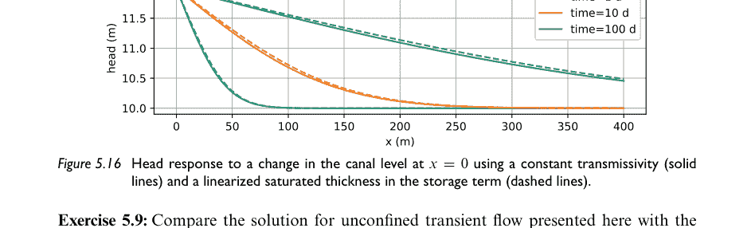

**练习 5.9：** 将此处介绍的非承压瞬态流解与第 5.1 节中运河水头突然下降 5 米情况下的解进行比较。比较 $t = 1, 10, 100$ 天后含水层中的水头。这种剧烈的（可能不现实的）饱和厚度变化是否导致两种解之间存在显著差异？


# Taylor & Francis

Taylor & Francis Group

http://taylorandfrancis.com

## 第 6 章

### 向井的稳态二维流

许多三维地下水流问题可以通过采用 Dupuit-Forchheimer 近似，近似为水平面内的二维流。特别令人感兴趣的是包含井的问题。本章介绍了抽水井、注水井以及靠近河流和不透水边界的井的解。根据问题类型，展示了不同的求解技术。对于均质承压和非承压含水层，解是用排泄势来表述的，因此同一个势解可以用于承压流、非承压流和界面流。对于没有面状入渗的问题，使用水平面内的流函数。半承压含水层和双层含水层系统中向井流动的解是用水头来表述的。


水平面内二维流的排泄矢量由两个分量组成：$x$ 方向的 $Q_x$ 和 $y$ 方向的 $Q_y$（图 6.1）。水平 $x, y$ 平面内稳态二维流的连续性方程可以写成

$$\frac{\partial Q_x}{\partial x} + \frac{\partial Q_y}{\partial y} = N$$

其中 $N$ 是面状补给。注意，这个方程与一维稳态流的连续性方程（式 1.5）仅相差一项 $\partial Q_y/\partial y$。

稳态承压流、非承压流和界面流可以表述为势流，其中排泄矢量是排泄势的负梯度

$$Q_x = -\frac{\partial \Phi}{\partial x} \quad Q_y = -\frac{\partial \Phi}{\partial y}$$

因此，稳态势流的微分方程变为二维泊松方程

$$\nabla^2 \Phi = \frac{\partial^2 \Phi}{\partial x^2} + \frac{\partial^2 \Phi}{\partial y^2} = -N$$

96 地下水解析建模

表 6.1 不同类型流动的排泄势定义

| 流动类型 | 排泄势 | 条件 | 章节 |
| :--- | :--- | :--- | :--- |
| 承压流 | $\Phi = kHh$ | $h \ge z_t$ | 3.3 |
| 非承压流 | $\Phi = \frac{1}{2}k(h - z_b)^2$ | $h \ge z_b$ | 3.1 |
| 承压/非承压流 | $\Phi = kHh - (\frac{1}{2}kH^2 + kHz_b)$ | $h \ge z_t$ | 3.3 |
| | $\Phi = \frac{1}{2}k(h - z_b)^2$ | $z_b \le h \le z_t$ | 3.3 |
| 承压界面流 | $\Phi = kHh + (\frac{1}{2}kH^2 + kHz_b)/\alpha$ | $h \ge -z_b/\alpha$ | 4.1 |
| | $\Phi = \frac{1}{2}k\alpha(h + z_t/\alpha)^2$ | $-z_t/\alpha \le h \le -z_b/\alpha$ | 4.1 |
| 非承压界面流 | $\Phi = \frac{1}{2}k(h - z_b)^2 - \frac{1}{2}k(\alpha + 1)z_b^2/\alpha$ | $h \ge -z_b/\alpha$ | 4.2 |
| | $\Phi = \frac{1}{2}k(\alpha + 1)h^2$ | $0 \le h \le -z_b/\alpha$ | 4.2 |

其中 $k$ 是含水层的渗透系数，$z_b$ 和 $z_t$ 是含水层底部和顶部的高程，$H$ 是含水层厚度，$\alpha = \rho_f/(\rho_s - \rho_f)$，其中 $\rho_f$ 和 $\rho_s$ 分别是淡水和咸水的密度。对于界面流，所有水头和高程都是相对于海平面测量的。

在没有面状补给（$N = 0$）的情况下，这个微分方程被称为二维拉普拉斯方程。不同流动类型的排泄势与水头之间的关系总结在表 6.1 中。

在均质、各向同性含水层中，向抽水井的流动在没有任何其他流动特征的情况下是径向对称的。因此，水头和流动仅是到井的径向距离的函数。通过考虑一个环形区域（图 6.2）的水量平衡，推导了径向坐标下的连续性方程。环形的内半径为 $r$，外半径为 $r + \Delta r$，$Q_r$ 是排泄矢量的径向分量（即，远离井为正）。对于稳态流，连续性方程为

流入 - 流出 = 0 (6.4)

流入等于环形区域上的面状补给和沿内半径的流入。流出等于沿外半径的流出，因此连续性方程变为

$(\pi(r + \Delta r)^2 - \pi r^2)N + 2\pi r Q_r|_r - 2\pi(r + \Delta r)Q_r|_{r+\Delta r} = 0$ (6.5)

除以 $2\pi \Delta r$ 并取 $\Delta r \to 0$ 的极限得到

$Nr - \frac{d(rQ_r)}{dr} = 0$ (6.6)

应用微分的乘积法则，并使用排泄矢量的径向分量为

$Q_r = -\frac{d\Phi}{dr}$ (6.7)

得到径向坐标下稳态势流的微分方程

$\frac{d^2\Phi}{dr^2} + \frac{1}{r}\frac{d\Phi}{dr} = -N$ (6.8)

注意，这个方程与式 (6.3) 一致，因为极坐标 $r, \theta$ 下的拉普拉斯算子是

$\nabla^2\Phi = \frac{d^2\Phi}{dr^2} + \frac{1}{r}\frac{d\Phi}{dr} + \frac{1}{r^2}\frac{d^2\Phi}{d\theta^2}$ (6.9)

#### 6.1 圆形岛屿上的径向对称流

径向流问题及其解在地下水工程中非常重要，因为它们代表了抽水井周围的局部流场。本节将介绍圆形岛屿上径向对称二维流的解。岛屿周边的水头固定，岛上的面状补给均匀，且在岛屿中心有一口抽水井。水头和流量仅是径向坐标 $r$ 的函数。该问题在图 6.4 中针对无压流进行了描述，但同样适用于表 6.1 中列出的任何流型。解的推导过程如下：首先，推导圆形岛屿中心无补给（$N = 0$）时流向一口井的解。其次，推导有均匀补给但无井（$Q = 0$）时圆形岛屿上的流解。第三，将前两个解组合起来，求解有均匀补给时流向圆形岛屿中心一口井的问题。这种解法的目的是演示叠加原理。

以 $r$ 表示的排泄势微分方程由公式 (6.8) 给出。该微分方程的通解为

$$\Phi = -\frac{1}{4}Nr^2 + A\ln r + B$$

其中 $A$ 和 $B$ 是待由边界条件确定的常数。相应的排泄矢量径向分量为

$$Q_r = -\frac{\mathrm{d}\Phi}{\mathrm{d}r} = \frac{1}{2}Nr - \frac{A}{r}$$

首先，考虑流向位于半径为 $R$ 的圆形岛屿中心的一口抽水井；井的半径为 $r_w$。该问题的解所对应的排泄势记为 $\Phi_1$。在岛屿周边（$r = R$）水头固定为 $h_R$。相应的排泄势由表 6.1 中的适当公式计算，并记为 $\Phi_R$

$$\Phi_1|_{r=R} = \Phi_R$$

井的流量为 $Q$ [L$^3$/T]，从含水层抽水时为正。流量等于流入井的总流量，即排泄矢量 $Q_r$（公式 6.21）在井周边的值与井周长的乘积，由此得到边界条件

$$Q = -2\pi r_w Q_{r_1}|_{r=r_w}$$

注意负号，因为 $Q_r$ 定义为沿正 $r$ 方向为正，而井的流量 $Q$ 在从含水层抽水时为正。一个稍微简单的边界条件是

$$Q = \lim_{r_w \to 0} -2\pi r_w Q_{r_1}|_{r=r_w}$$

这个条件通常能产生准确的结果，因为井的半径通常远小于所考虑的地下水问题的水平尺度。注意，对于圆形岛屿中心无面状补给的井这一特殊情况，公式 (6.23) 对任何 $r$ 都有效，而不仅限于 $r_w$。

将边界条件 (6.22) 和 (6.24) 应用于通解 (6.20)，并令 $N = 0$，得到排泄势的解

$$\Phi_1 = \frac{Q}{2\pi} \ln (r/R) + \Phi_R$$

这是著名的泰姆方程（Thiem, 1906）的势形式。相应的排泄矢量径向分量为

$$Q_{r_1} = -\frac{d\Phi_1}{dr} = -\frac{Q}{2\pi} \frac{1}{r}$$

注意 $Q$ 的量纲是流量（例如 $m^3/d$），而 $Q_r$ 是排泄矢量的径向分量，其量纲是单位长度的流量（例如 $m^2/d$）。

在井处（$r = 0$），既无法计算排泄势（因此也无法计算水头），也无法计算排泄矢量。在数学术语中，这样的点称为奇点。排泄势（公式 6.25）、相应的水头以及排泄矢量（公式 6.26）在井中心没有物理意义。这些公式是为含水层中的流动推导的，但含水层在井筛管处终止。在井内，只要井筛管的流动阻力可以忽略不计，水头就等于井筛管外紧邻处含水层的水头。井内的水头通过计算井半径处（$r = r_w$）的水头来确定。

接下来，考虑岛上有均匀补给但无抽水井的情况；这个解记为 $\Phi_2$。与前一个解类似，水头（因此势）在岛屿周边是固定的

$$\Phi_2|_{r=R} = \Phi_R$$

第二个边界条件由对称性得到：岛屿中心的水头梯度为零，因此流量为零

$$Q_{r_2}|_{r=0} = 0$$

将这些边界条件应用于通解 (6.20) 得到

$$\Phi_2 = -\frac{1}{4}N(r^2 - R^2) + \Phi_R$$

根据流量连续性，岛屿周边含水层中的地下水总流量等于岛上的总补给量，这是预期的结果

$$2\pi R Q_{r_2}|_{r=R} = N\pi R^2$$

周边的流量是流出，这与第一个解相反，在第一个解中周边的流量是流入。

最后，考虑岛屿中心有一口流量为 $Q$ 的抽水井，且岛上有均匀补给 $N$ 的情况。这个问题包含了前两个解的特征：补给和抽水井。这个解记为 $\Phi_3$。边界条件为

$$\Phi_3|_{r=R} = \Phi_R$$

以及

$$\lim_{r_w \to 0} -2\pi r_w Q_{r_3}|_{r=r_w} = Q$$

在径向坐标中，不依赖于 $\theta$，因此对 $\theta$ 的导数项消失。

在第 1-4 章中，流函数是在垂直平面内针对一维 Dupuit-Forchheimer 流计算的。补给通过边界进入垂直平面，垂直平面内的流动是无散的（公式 1.28）。小写符号 $\psi$ [L$^2$/T] 用于表示垂直平面内的流函数。

如果流动是无散的，流函数也存在于水平面内的稳态二维 Dupuit 流中。在水平面内，当面状补给 $N$ 等于零时，流动是无散的

$$\frac{\partial Q_x}{\partial x} + \frac{\partial Q_y}{\partial y} = 0 \qquad (6.10)$$

因此排泄势由拉普拉斯方程控制

$$\nabla^2 \Phi = 0 \qquad (6.11)$$

在水平面内，大写符号 $\Psi$ 用于表示流函数，其量纲为 L$^3$/T。

对于水平面内的二维流，排泄矢量的分量可以从流函数获得，如下所述。回顾流函数由三个特征定义：流函数是沿流线为常数的函数，两点之间流函数值的差等于两点之间流动的水量，并且沿流动方向看时，流函数值向右增加。考虑图 6.3 中的点 $A$、$B$ 和 $C$。水从左向右流过 $AB$。垂直于 $AB$ 的排泄矢量分量为 $Q_x$，$A$ 和 $B$ 之间的距离为 $\Delta y$，$A$ 和 $B$ 之间的流函数差为 $\Delta \Psi$，因此

$$Q_x \Delta y = \Delta \Psi = \Psi(x, y) - \Psi(x, y + \Delta y) \qquad (6.12)$$

因此

$$Q_x = -\frac{\Psi(x, y + \Delta y) - \Psi(x, y)}{\Delta y} \qquad (6.13)$$

当 $\Delta y$ 趋近于零时，取极限得到

$$Q_x = -\frac{\partial \Psi}{\partial y} \qquad (6.14)$$

类似地，水从下向上流过 $BC$。垂直于 $BC$ 的排泄矢量分量为 $Q_y$，$B$ 和 $C$ 之间的距离为 $\Delta x$，$B$ 和 $C$ 之间的流函数差为 $\Delta \Psi$，因此

$$Q_y \Delta x = \Delta \Psi = \Psi(x + \Delta x, y) - \Psi(x, y) \qquad (6.15)$$

因此

$$Q_y = \frac{\partial \Psi}{\partial x} \qquad (6.16)$$

将公式 (6.14) 和 (6.16) 与公式 (6.2) 比较得到

$$\frac{\partial \Phi}{\partial x} = \frac{\partial \Psi}{\partial y}$$
$$\frac{\partial \Phi}{\partial y} = -\frac{\partial \Psi}{\partial x}$$

这组两个方程被称为柯西-黎曼条件。由于排泄势和流函数满足柯西-黎曼条件，它们可以组合成复势，如第 7.3 节所述。

排泄势是单值函数，这意味着在一点处排泄势只有一个值。单值函数的数学定义是（例如，Strack, 1989）

$$\frac{\partial^2 \Phi}{\partial x \partial y} = \frac{\partial^2 \Phi}{\partial y \partial x}$$

将柯西-黎曼条件 (6.17) 应用于公式 (6.18)，用 $\Psi$ 替换 $\Phi$，得到

$$\frac{\partial^2 \Psi}{\partial x^2} + \frac{\partial^2 \Psi}{\partial y^2} = 0$$

这是一个很好的结果，因为它意味着流函数由拉普拉斯方程控制，就像排泄势（公式 6.11）一样。回顾水平面内的流函数仅在面状补给 $N$ 等于零时存在。

以及相应的流量向量

$$Q_{r_3} = \frac{Nr}{2} - \frac{Q}{2\pi} \frac{1}{r} \quad (6.34)$$

对三个解 $\Phi_1$、$\Phi_2$ 和 $\Phi_3$（方程 6.25、6.29 和 6.33）的比较表明，第三个解是前两个解之和，除了一个附加常数。将多个解相加得到另一个解是叠加原理的一个例子，该原理适用于所有线性微分方程，包括拉普拉斯方程和泊松方程。前两个问题的势能之和满足第三个问题的微分方程

$$\nabla^2 \Phi_3 = \nabla^2(\Phi_1 + \Phi_2) = \nabla^2 \Phi_1 + \nabla^2 \Phi_2 = 0 - N = -N \quad (6.35)$$

同样，井处的边界条件也由两个势能之和满足。最后，两个势能之和在 $r = R$ 处的值是一个常数

$$\Phi_1|_{r=R} = \Phi_2|_{r=R} = 2\Phi_R \quad (6.36)$$

这不是边界条件中指定的值（$\Phi_3|_{r=R} = \Phi_R$），但这可以通过修改附加常数来轻松修正。在这个叠加的例子中，两个径向对称的解被相加，使得得到的解也是二维径向对称流，因为径向对称是关于同一点（岛屿中心）的。

岛屿周边的流量和方向取决于井的排水量和岛屿总补给量的相对大小。例如，下面的代码计算了无压流情况下的水头。展示了两种解：一种是井抽水量为岛屿总面状补给量的一半的情况，另一种是井抽水量恰好等于岛屿全部面状补给量的情况（图 6.5）。

```
# parameters
k = 5 # hydraulic conductivity, m/d
zb = 0 # bottom elevation of aquifer, m
N = 0.001 # areal recharge, m/d
R = 200 # radius of the island, m
hR = 10 # head at edge of island, m
rw = 0.3 # well radius, m
Qhalf = 0.5 * N * np.pi * R ** 2 # discharge is half total recharge, m^3/d
Qtotal = N * np.pi * R ** 2 # discharge equals total recharge, m^3/d
```

```
# solution
r = np.linspace(rw, R, 400)
PhiR = 0.5 * k * (hR - zb) ** 2
Phi2 = -0.25 * N * (r ** 2 - R ** 2) + PhiR
Phi3 = Phi2 + Qhalf / (2 * np.pi) * np.log(r / R)
hhalf = zb + np.sqrt(2 * Phi3 / k)
Phi3 = Phi2 + Qtotal / (2 * np.pi) * np.log(r / R)
htotal = zb + np.sqrt(2 * Phi3 / k)
```

```
# basic plot head for half total discharge
plt.plot(-r, hhalf, 'C0', label='Q = half total recharge')
plt.plot(r, hhalf, 'C0')
plt.xticks(np.arange(-200, 201, 50), np.abs(np.arange(-200, 201, 50)))
plt.legend();
```

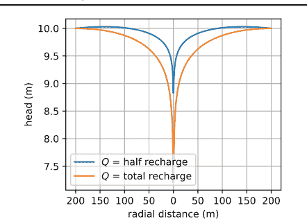

正如预期的那样，后一种情况的降深远大于前一种情况。注意，对于后一种情况，岛屿周边的流量为零，因此那里的地下水位坡度为零。在前一种情况下，仍有水流流出岛屿周边。一旦井的排水量超过岛屿的总补给量，水流就会沿周边流入。当井中水位（在 $r = r_w$ 处）降至含水层底部时，井达到最大排水量。

**练习 6.1：** 考虑一个位于有补给的圆形岛屿中心的井的情况，井的排水量等于岛屿总补给量的一半，使用上述示例值。通过设定 $Q_r|_{r=r_d} = 0$ 来计算从井中心到分水岭的距离 $r_d$。比较半径为 $r_d$ 的圆上的总补给量与井的排水量。

**练习 6.2：** 考虑一个位于有补给的圆形岛屿中心的井的情况，井的排水量等于岛屿总补给量的一半，使用上述示例值。通过沿井半径积分 $Q_r$ 来计算 $r = r_w$ 处流入井的总流量，并将你的答案与井的排水量进行比较。边界条件 (6.24) 是一个好的近似吗？

**练习 6.3：** 对于上述有补给的圆形无压岛屿中心井的例子，通过设定井处水头等于含水层底部来计算井的最大排水量。

#### 6.2 靠近河流和不透水边界的井

在上一节中，应用叠加原理得到了有补给的圆形岛屿中心抽水井的解。这里给出了靠近地表水边界（例如，河流、溪流、运河或湖泊）和不透水边界的抽水井的解。所有边界都近似为长而直的；不模拟面状补给。通过叠加和镜像法获得了流量势、流量向量和流函数的解。

井号 $n$ 的流量势的通解由蒂姆方程 (6.25) 得到，去掉了常数部分 $\Phi_R - \frac{Q}{2\pi} \ln(R)$（稍后根据边界条件添加一个适当的常数）

$$\Phi = \frac{Q_n}{2\pi} \ln(r_n) = \frac{Q_n}{4\pi} \ln(r_n^2)$$

其中 $r_n$ 是从点 $(x_n, y_n)$ 到井 $n$ 的径向距离

$$r_n = \sqrt{(x - x_n)^2 + (y - y_n)^2} \quad (6.38)$$

井 $n$ 的流量向量的 $x$ 和 $y$ 分量为

$$Q_x = -\frac{\partial \Phi}{\partial x} = -\frac{Q_n}{2\pi} \frac{x - x_n}{r_n^2} \quad (6.39)$$
$$Q_y = -\frac{\partial \Phi}{\partial y} = -\frac{Q_n}{2\pi} \frac{y - y_n}{r_n^2} \quad (6.40)$$

**练习 6.4：** 一口井在导水系数 $T = 1200 \text{ m}^2/\text{day}$ 的承压含水层中以未知的稳定速率抽水。抽水井附近有两口观测井。观测井 $A$ 距离抽水井 8 米，观测井 $B$ 距离抽水井 24 米。这些井中的水头分别为 $h_A = 134.2 \text{ m}$ 和 $h_B = 134.3 \text{ m}$。假设没有井抽水时含水层中没有水力梯度，那么井的抽水速率是多少？

接下来推导井的流函数。在无限延伸的均质、各向同性含水层中，单个井会产生圆形等势线。流线是通向井的直线。因此，流函数仅是 $\theta$ 的函数，其中 $\theta$ 是在以井为中心的局部坐标系中，相对于正水平轴逆时针方向测量的角度（见图 6.6 左图）。井 $n$ 的流函数为

$$\Psi = \frac{Q_n}{2\pi} \theta_n \quad (6.41)$$

其中

$$\theta_n = \arctan \left( \frac{y - y_n}{x - x_n} \right) \quad (6.42)$$

其中 $\theta$ 以弧度而非度为单位。

图 6.6 中绘制了八条流线。每两条相邻流线之间的总流量为 $Q/8$。角度 $\theta$ 是相对于正 $x$ 轴测量的，当沿逆时针（数学上的正方向）方向移动时，沿负 $x$ 轴从 $\pi$ 跳变到 $-\pi$。因此，流函数沿负 $x$ 轴发生跳变，从 $Q/2$ 跳变到 $-Q/2$。这种跳变是不可避免的。可以选择不同的方式；例如，$\theta$ 可以从 0 变化到 $2\pi$，但那样流函数将沿正 $x$ 轴跳变。流函数发生跳变的线称为分支切割。等值线绘制程序似乎沿分支切割绘制了一条较粗的线。这是因为所有被绘制等值线的流函数值都介于负 $x$ 轴上方网格点计算的值和负 $x$ 轴下方网格点计算的值之间。当使用更多网格点时，这条粗线就不那么明显了。

同时包含等势线和流线的图称为流网（图 6.6）。等势线和流线总是以直角相交，除非含水层是各向异性的。在构建流网时，通常使用相同的增量 $\Delta \Phi = \Delta \Psi$。注意，在下面的代码中，角度 $\theta$ 是用 `np.arctan2` 函数计算的，该函数根据给定的 $y$ 和 $x$ 值（按此顺序）计算反正切函数，并返回 $-\pi$ 到 $+\pi$ 范围内的相应角度。在创建等值线图之前，创建一个子图，使用 `aspect` 关键字将 $x$ 和 $y$ 方向的比例设置为相等，这样，例如，一个圆看起来确实像一个圆而不是椭圆。

## 参数
xw = 0 # 井的x坐标，单位：米
yw = 0 # 井的y坐标，单位：米
Q = 100 # 井的流量，单位：立方米/天

## 求解
xg, yg = np.meshgrid(np.linspace(-100, 100, 100), np.linspace(-100, 100, 100))
phi = Q / (4 * np.pi) * np.log(((xg - xw) ** 2 + (yg - yw) ** 2) / 100 ** 2)
psi = Q / (2 * np.pi) * np.arctan2(yg - yw, xg - xw)

## 基本流网（右图）
plt.subplot(111, aspect=1)
plt.contour(xg, yg, psi, np.arange(-Q / 2, Q / 2, Q / 8))
plt.contour(xg, yg, phi, np.arange(phi.min(), phi.max(), Q / 8));

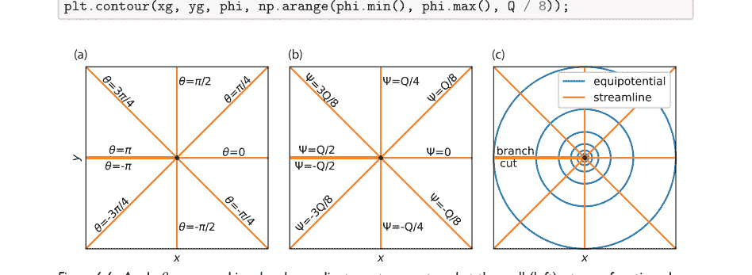

作为叠加原理的一个例子，考虑一口抽水井和一口注水井的情况，也称为井对。井0位于$(x_0, y_0) = (-d, 0)$，抽水流量为$Q_0 = Q$。井1位于$(x_1, y_1) = (d, 0)$，其注水速率在大小上等于井0的抽水流量，这意味着$Q_1 = -Q$。在$(x, y) = (0, 0)$处的水头等于$h_c$，这被转换为流量势$\Phi_c$。该解通过叠加两个解(6.37)得到（回想一下$\ln(r_0^2) - \ln(r_1^2) = \ln(r_0^2/r_1^2)$）

$$\Phi = \frac{Q}{4\pi} \ln(r_0^2/r_1^2) + \Phi_c$$

其中$r_0$和$r_1$分别是到井0和井1的距离。注意在$(x, y) = (0, 0)$处，$r_0 = r_1$，因此势确实等于$\Phi_c$。流量矢量和流函数的表达式可以通过类似的叠加方式获得。下面显示了流网和流线图。井对右侧井注入的所有水都会流向左侧井，尽管路径可能很长。流函数中的分支切割仅从注水井延伸到抽水井（图6.7左图）。在抽水井左侧（$x \le -d$），抽水井的分支切割与注水井的分支切割相互抵消。

## 参数
T = 100 # 导水系数，单位：平方米/天
hc = 0 # (0, 0)处的水头
d = 100 # 两井之间距离的一半，单位：米
Q = [100, -100] # 井的流量，单位：立方米/天
xw = [-d, d] # 井的x坐标，单位：米
yw = [0, 0] # 井的y坐标，单位：米
phic = T * hc # 原点处的流量势，单位：立方米/天

## 求解
xg, yg = np.meshgrid(np.linspace(-200, 200, 100), np.linspace(-150, 150, 100))
pot = phic
psi = 0.0
Qx = 0.0
Qy = 0.0
for n in range(2):
    rsq = (xg - xw[n]) ** 2 + (yg - yw[n]) ** 2
    pot += Q[n] / (4 * np.pi) * np.log(rsq)
    psi += Q[n] / (2 * np.pi) * np.arctan2(yg - yw[n], xg - xw[n])
    Qx += -Q[n] / (2 * np.pi) * (xg - xw[n]) / rsq
    Qy += -Q[n] / (2 * np.pi) * (yg - yw[n]) / rsq

## 基本绘图
plt.figure(figsize=(8, 4))
plt.subplot(121, aspect=1)
plt.contour(xg, yg, pot, np.arange(phic - 100, phic + 100, 10))
plt.contour(xg, yg, psi, np.arange(-Q[0], Q[0], 10))
plt.subplot(122, aspect=1)
plt.streamplot(xg, yg, Qx, Qy);

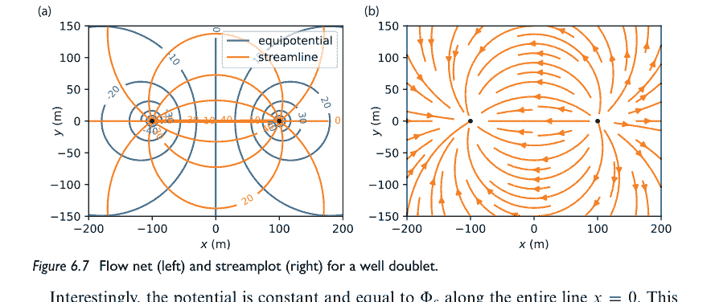

有趣的是，沿着整条直线$x = 0$，势是恒定的且等于$\Phi_c$。从方程(6.43)来看这是合理的。毕竟，在直线$x = 0$上的任何地方，到井0的距离等于到井1的距离，因此$\ln(r_0^2/r_1^2) = 0$。这意味着图6.7所示流场的左半部分（$x \leq 0$）代表了一口井在靠近一条长直河流（沿$x = 0$处$\Phi = \Phi_c$）抽水时的解。这种获得靠近恒定水头河流的井的解的方法被称为镜像法。

**练习6.5：** 一口井位于距离一条在井附近大致笔直的河流65米处。该井安装在一个直径0.8米的钻孔中。井筛和河流与同一含水层直接接触，该含水层的估计导水系数为$T = 150$ m$^2$/day。该井已以$Q = 600$ m$^3$/day的流量抽水很长时间。以河流水位为基准面，估算井中的水头。

**练习6.6：** 对于上述例子，通过确定适当的角度，计算$(x, y) = (0, 100)$、$(x, y) = (0, \varepsilon)$、$(x, y) = (0, -\varepsilon)$和$(x, y) = (0, -100)$处的流函数，其中$\varepsilon$是一个小增量，并将结果与使用arctan2函数得到的结果进行比较。

镜像法是叠加原理的一种应用。将井（或其他奇点）放置在问题域之外，并利用对称性来满足沿边界指定的条件。靠近恒定水头河流的井可以通过在河流另一侧添加一口镜像井来模拟。镜像井的流量必须与井的流量大小相等但符号相反，并且镜像井必须位于井的“镜像位置”，即与河流距离相同但在另一侧。靠近河流的多口井的解可以通过相同的方式获得，只要为每口井添加相应的镜像井。

靠近不透水岩层（不透水或无流边界）的井可以通过在不透水边界的另一侧添加一口具有相同流量的镜像井来模拟。图6.8显示了一个靠近沿$x = 0$的不透水边界的井的例子。求解和基本绘图的代码与上面的代码相同，不再重复。只有流量Q的值发生了变化。

## 变更的参数
Q = [100, 100] # 井和镜像井的流量，单位：立方米/天

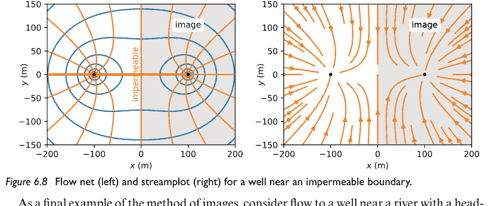

作为镜像法的最后一个例子，考虑流向一口靠近河流的井，该河流沿负x轴具有指定水头边界（恒定流量势$\Phi = \Phi_c$），沿负y轴具有不透水边界（图6.9）。该井的流量为$Q$，位于$(x_0, y_0)$，其中$x_0$和$y_0$均为负值。该问题的解需要三口镜像井。首先，在$(-x_0, y_0)$处放置一口流量为$Q$的镜像井，这确保了负y轴是不透水边界。接下来，在$(x_0, -y_0)$和$(-x_0, -y_0)$处放置流量为$-Q$的镜像井，使得负x轴成为指定水头边界，同时负y轴保持为不透水边界。井和三口镜像井的位置和流量如图6.9左侧所示。流量势可以写为

$$\Phi = \frac{Q}{2\pi} \ln \left( \frac{r_0 r_1}{r_2 r_3} \right) + \Phi_c$$

很容易验证，沿着河流（指定水头）的任何地方，$r_0 = r_2$且$r_1 = r_3$，因此势（从而水头）确实是恒定的。可以通过写出$Q_x$的方程来验证沿不透水边界的条件。下面创建了流动域的流网。下面的代码创建了一个流网，其中在直线$y = -50$上有一个相当难看的分支切割。图6.9中没有显示这个分支切割，方法是分别从$y = -150$到略低于$y = -50$对区域进行等值线绘制，然后在同一张图上从略高于$y = -50$到$y = 0$进行绘制（代码未显示）。

## 参数
xw = [-100, 100, -100, 100] # 井和镜像井的x坐标，单位：米
yw = [-50, -50, 50, 50] # 井和镜像井的y坐标，单位：米
Qw = [100, 100, -100, -100] # 井和镜像井的流量，单位：立方米/天

## 求解
xg, yg = np.meshgrid(np.linspace(-200, 0, 101), np.linspace(-150, 0, 101))
phi = 0
psi = 0
for n in range(4):
    phi += Qw[n] / (4 * np.pi) * np.log((xg - xw[n]) ** 2 + (yg - yw[n]) ** 2)
    psi += Qw[n] / (2 * np.pi) * np.arctan2(yg - yw[n], xg - xw[n])

## 右图中的流网
plt.subplot(111, aspect=1)
plt.contour(xg, yg, phi, np.arange(-100, 100, 5), colors='C0')
plt.contour(xg, yg, psi, np.arange(-200, 200, 5), colors='C1');

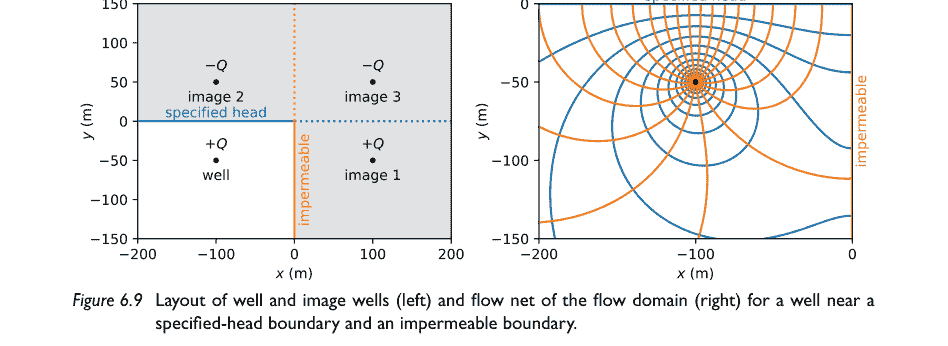

许多涉及井和等势边界和/或不透水边界的问题的解析解可以通过镜像法获得。镜像法适用于许多类型的流动，包括承压流、无压流、界面流、半承压流和瞬态流，也适用于一些具有Robin边界条件或非均质边界的问题。

**练习6.7：** 一口抽水井和一口注水井组成的井对位于沿$y$轴的不透水边界附近；两口井的半径均为0.3米。抽水井位于$(x, y) = (100, 0)$，流量为$Q = 100$ m$^3$/d，注水井位于$(x, y) = (50, 50)$，注水速率为100 m$^3$/d。含水层为承压含水层，导水系数$T = 80$ m$^2$/d。在远离井对的地方，含水层中的水头为零。绘制流网，并计算井中的水头。

**练习6.8：** 一口井位于距离一条长直河流$d = 50$米处，河流水位为$h_r = 20$米。河流与含水层直接接触，井的半径为0.3米。含水层的导水系数可近似为常数，等于$T = 200 \text{ m}^2/\text{d}$。计算井的流量，使得井中水头比河流水位低2米。

**练习 6.9：** 考虑一口抽水井，流量为 $Q$，位于半径为 $R$ 的圆形岛上；井的半径为 $r_w$。坐标系原点在岛的中心，井位于 $(x, y) = (d, 0)$。岛边缘的水头为 $h_0$。含水层的导水系数可近似为常数 $T$。利用圆的镜像法（Strack, 1989）可得到岛上水头的表达式：

$$h = \frac{Q}{4\pi T} \ln \left[ \frac{(x - d)^2 + y^2 \quad R^2}{(x - R^2/d)^2 + y^2 \quad d^2} \right] + h_0 \qquad (6.45)$$

计算并绘制等水头线，并计算井中水头。已知：$T = 200 \text{ m}^2/\text{d}$，$R = 500 \text{ m}$，$d = 200 \text{ m}$，$Q = 500 \text{ m}^3/\text{d}$，$r_w = 0.3 \text{ m}$，$h_0 = 10 \text{ m}$。

#### 6.3 靠近非均质边界的井

含水层的水力性质在整个含水层中总会有些变化。表示含水层性质变化的一种常见方法是将含水层划分为具有不同但均质性质的区域；每个区域称为一个非均质体。在非均质体内部，含水层的水力传导系数、底板高程和/或厚度可能与周围不同。因此，含水层的导水系数被称为分段常数。

非均质边界处的边界条件是，水头和流量的法向分量在边界两侧连续。因此，平行于非均质边界的流量分量会发生跳跃。这是水头连续条件的直接结果。例如，考虑一个沿 $y$ 轴的非均质边界，如图 6.10 所示。边界左侧的导水系数为 $T_L$，右侧的导水系数为 $T_R$。非均质边界两侧的水头相同，这意味着水头梯度 $\partial h/\partial y$ 在边界两侧也是连续的。因此，平行于边界的流量向量分量，在本例中为 $Q_y$，在边界左侧为 $Q_y^- = -T_L \partial h/\partial y$，在边界右侧为 $Q_y^+ = -T_R \partial h/\partial y$。平行于非均质边界的流量分量的跳跃被称为剪切流。

当流线穿过非均质边界时，其方向会发生突变。这是边界上剪切流的直接结果。例如，考虑图 6.10 中 $y$ 轴上非均质边界上的一个点。边界左侧的流量为 $(Q_x^-, Q_y^-)$，右侧的流量为 $(Q_x^+, Q_y^+)$。$\vec{Q}^-$ 与边界法线之间的夹角 $\theta^-$ 为

$$\tan(\theta^-) = Q_y^- / Q_x^- \qquad (6.46)$$

类似地，$\vec{Q}^+$ 与边界法线之间的夹角 $\theta^+$ 为

$$\tan(\theta^+) = Q_y^+ / Q_x^+ \qquad (6.47)$$

由于 $Q_x^- = Q_x^+$，可得

$$\frac{\tan(\theta^-)}{\tan(\theta^+)} = \frac{T_L}{T_R} \qquad (6.48)$$

这意味着当水流从高导水系数区域流向低导水系数区域（$T_R < T_L$，如图 6.10 所示）时，流量向量与边界法线之间的夹角减小。可以说流量向量向法线方向折射。

例如，考虑一口井在如上所述的沿 $y$ 轴的非均质边界附近抽水。井位于 $(x, y) = (-d, 0)$，编号为井 0。非均质边界的解通过镜像法获得，即在 $(x, y) = (d, 0)$ 处放置一口镜像井，并选择镜像井的流量以满足非均质边界处的边界条件。水头的解为（例如，Strack, 2017, 第 8.10 节）

$$h = \frac{Q}{2\pi T_L} \ln\left(\frac{r_0}{r_1}\right) + \frac{Q}{\pi(T_L + T_R)} \ln(r_1) \quad x \le 0 \quad (6.49)$$
$$h = \frac{Q}{\pi(T_L + T_R)} \ln(r_0) \quad x \ge 0 \quad (6.50)$$

其中 $r_0 = \sqrt{(x+d)^2 + y^2}$，$r_1 = \sqrt{(x-d)^2 + y^2}$。流函数的解为

$$\Psi = \frac{Q}{2\pi}(\theta_0 - \theta_1) + \frac{QT_L}{\pi(T_L + T_R)}\theta_1 \quad x \le 0 \quad (6.51)$$
$$\Psi = \frac{QT_R}{\pi(T_L + T_R)}\theta_0 \quad x \ge 0 \quad (6.52)$$

其中 $\theta_0 = \arctan(y/(x+d))$，$\theta_1 = \arctan(-y/(d-x))$。注意 $\theta_0$ 的变化范围是 $-\pi$ 到 $\pi$，而 $\theta_1$ 的变化范围是 0 到 $2\pi$。

图 6.11 展示了 $T_R = T_L/5$ 和 $T_R = 5T_L$ 两种情况的示例。井从右侧区域（$T = T_R$）抽取的总流量为 $T_RQ/(T_L + T_R)$。当 $T_R$ 相对于 $T_L$ 较小时，非均质边界开始表现为不透水边界。当 $T_R$ 相对于 $T_L$ 较大时，非均质边界开始表现为等势线。有趣的是，对于这种井在直线非均质边界附近抽水的情况，非均质边界右侧的流线是直线并指向井。

```
# parameters
d = 100 # distance of well from inhomogeneity boundary, m
Q = 100 # discharge of well, m^3/d
TL = 100 # transmissivity on left side, m^2/d
```

```
# solution
def head_and_psi(x, y, TL, TR, d=100, Q=100):
    r0 = np.sqrt((x + d) ** 2 + y ** 2)
    r1 = np.sqrt((x - d) ** 2 + y ** 2)
    theta0 = np.arctan2(y, x + d)
    theta1 = np.arctan2(-y, d - x)
    if x < 0:
        h = Q / (2 * np.pi * TL) * np.log(r0 / r1) + \
            Q / (np.pi * (TL + TR)) * np.log(r1)
        psi = Q / (2 * np.pi) * (theta0 - theta1) + \
            Q * TL / (np.pi * (TL + TR)) * theta1
    else:
        h = Q / (np.pi * (TL + TR)) * np.log(r0)
        psi = Q * TR / (np.pi * (TL + TR)) * theta0
    return h, psi

hpsifunc = np.vectorize(head_and_psi)

xg, yg = np.meshgrid(np.linspace(-200, 200, 100), np.linspace(-150, 150, 100))
ha, psia = hpsifunc(xg, yg, TL=TL, TR=TL / 5, d=d, Q=Q)
hb, psib = hpsifunc(xg, yg, TL=TL, TR=5 * TL, d=d, Q=Q)
```

```
# basic plot
plt.subplot(121, aspect=1, title='$T_L$=100 m$^2$/d, $T_R$=20 m$^2$/d')
plt.contour(xg, yg, ha, 40, colors='C0')
plt.contour(xg, yg, psia, np.arange(-50, 50, 2.5), colors='C1')
plt.fill([0, 200, 200, 0], [-150, -150, 150, 150], fc=[.9, .9, .9])
plt.subplot(122, aspect=1, title='$T_L$=100 m$^2$/d, $T_R$=500 m$^2$/d')
plt.contour(xg, yg, hb, 40, colors='C0')
plt.contour(xg, yg, psib, np.arange(-50, 50, 2.5), colors='C1')
plt.fill([0, 200, 200, 0], [-150, -150, 150, 150], fc=[.9, .9, .9]);
```

#### 6.4 半承压含水层中的井

接下来的两节将讨论双层含水层系统中下层含水层的稳定流向井的问题。两个含水层由一个弱透水层分隔。在本节中，上层含水层的水头是固定的，例如由沟渠和排水系统维持，因此下层含水层是一个半承压含水层（图 6.12）。双层含水层系统中水流同时流经两个含水层的情况将在下一节介绍。回顾一下，半承压流和双层含水层流的解在第 2 章中是用水头表示的，因为表 (6.1) 中定义的流量势不能使用。

半承压径向对称稳定流的微分方程为

$$\nabla^2 h = \frac{d^2 h}{dr^2} + \frac{1}{r} \frac{dh}{dr} = \frac{h - h^*}{cT}$$

其中 $T$ 是含水层的导水系数，$h^*$ 是半承压层上方的恒定水头，$c$ 是半承压层的垂向流动阻力（见第 2 章）。寻求一口完全贯穿、流量为 $Q$ 的井的径向流解。井处的边界条件与承压流中井的边界条件相同

$$\lim_{r \to 0} -2\pi r Q_r = Q$$

无穷远处的边界条件是水头等于上层含水层的恒定水头 $h^*$

$$h|_{r=\infty} = h^*$$

解为（De Glee, 1930）

$$h = h^* - \frac{Q}{2\pi T} K_0(r/\lambda)$$

其中越流系数 $\lambda = \sqrt{cT}$（见第 2 章），$K_0$ 是第二类零阶修正贝塞尔函数。贝塞尔函数 $K_0(r/\lambda)$ 在 $r$ 趋近于无穷大时趋近于零。实际上，当 $r > 4\lambda$ 时，$K_0$ 可近似为零，后文将展示这一点。

承压含水层抽水与半承压含水层抽水的解的主要区别在于，在承压含水层中，井抽取的所有水都来自无穷远处（因此水头在无穷远处持续增加），而在半承压含水层中，井抽取的所有水都来自上层含水层，通过半承压层的越流补给。

流量向量的径向分量通过微分得到

$$Q_r = -T \frac{dh}{dr} = \frac{-Q}{2\pi \lambda} K_1(r/\lambda)$$

含水层中流向井的总流量 $Q_{\text{tot}}$ 作为径向距离 $r$ 的函数，可计算为 $-Q_r$ 乘以半径为 $r$ 的圆周长

$$Q_{\text{tot}} = -2\pi r Q_r \tag{6.59}$$

将式 (6.57) 中的 $Q_r$ 代入式 (6.58)，表明边界条件（式 6.54）确实得到满足

$$Q_{\text{tot}} = -2\pi r \frac{-Q}{2\pi \lambda} \frac{\lambda}{r} = Q \quad r/\lambda \ll 0 \tag{6.60}$$

井附近的水头可近似为

$$h = h^* + \frac{Q}{2\pi T} \ln\left(\frac{r}{1.123\lambda}\right) \quad (r/\lambda \ll 1) \tag{6.61}$$

其中使用了（Abramowitz and Stegun, 1965）

$$\mathrm{K}_0(r/\lambda) \approx -\ln\left(\frac{r e^\gamma}{2\lambda}\right) \approx -\ln\left(\frac{r}{1.123\lambda}\right) \quad (r/\lambda \ll 1) \tag{6.62}$$

其中 $\gamma = 0.5772...$ 是欧拉常数。注意，式 (6.61) 是 Thiem 解 (6.25)，其中水头在距离 $R = 1.123\lambda$ 处等于 $h^*$；该近似公式在井附近给出精确结果。贝塞尔函数 $\mathrm{K}_0$ 和 $\mathrm{K}_1$ 在 scipy.special 包中以 k0 和 k1 的形式提供。

井的解（式 6.56）和井附近的近似公式（6.61）绘制在图 6.13 的左图中。在右图中，$Q_{\text{tot}}$ 作为 $r/\lambda$ 的函数绘制。注意 $Q_{\text{tot}}/Q$ 在井处确实等于 1，并在 $r = 4\lambda$ 时减小到 $Q_{\text{tot}}/Q = 0.05$。出于实际目的，在超过 $4\lambda$ 的距离处，井的影响可以忽略不计。

```python
# parameters
T = 200 # transmissivity of bottom aquifer, m^2/d
c = 1000 # resistance of leaky layer, d
hstar = 0 # fixed head in top aquifer, m
rw = 0.3 # radius of the well, m
lab = np.sqrt(T * c) # leakage factor, m
Q = 500 # discharge of well, m^3/d
```

```python
# solution
from scipy.special import k0, k1
r = np.linspace(rw, 4 * lab, 200)
h = -Q / (2 * np.pi * T) * k0(r / lab) + hstar
happrox = Q / (2 * np.pi * T) * np.log(r / (1.123 * lab)) + hstar
Qtot = 2 * np.pi * r * Q / (2 * np.pi * lab) * k1(r / lab)
```

```python
# basic plot
plt.subplot(121)
plt.plot(r / lab, h, label='head')
plt.plot(r / lab, haprox, label='approx')
plt.legend()
plt.subplot(122)
plt.plot(r / lab, Qtot / Q);
```

**练习 6.10：** 对于示例中的值，计算井处水头作为 $c$ 的函数，其中 $c$ 从 100 d 变化到 5000 d。绘制井处水头与 $c$ 的关系图。

**练习 6.11：** 考虑半承压含水层中的两口抽水井。含水层参数为 $T = 200 \text{ m}^2/\text{d}$，$c = 200 \text{ d}$，$h^* = -2 \text{ m}$。井 0 位于 $(x_0, y_0) = (0, 0)$，流量 $Q_0 = 500 \text{ m}^3/\text{d}$，井 1 位于 $(x_1, y_1) = (400, 200)$，流量 $Q_1 = 200 \text{ m}^3/\text{d}$；井的半径为 $0.2 \text{ m}$。绘制含水层水头的等值线图。计算当 $c = 200 \text{ d}$ 时，井 0 和井 1 处的水头。接着，计算当 $c = 1000 \text{ d}$ 时，井 0 和井 1 处的水头。

#### 6.5 双含水层系统中的井

在上一节中，解决了从双含水层系统底部含水层抽水的井的问题，其中顶部含水层的水头是恒定且固定的。这里，给出了双含水层系统中水流向井的解，其中水在两个含水层中流动。井在底部含水层中设滤水管。含水层从上到下编号为 0 和 1（见图 6.14）。顶部和底部含水层的导水系数分别为 $T_0$ 和 $T_1$，含水层之间弱透水层的阻力为 $c$。

双含水层系统中的流动由两个耦合的微分方程组控制（见第 2.4 节）

$$\nabla^2 h_0 = \frac{h_0 - h_1}{c T_0}$$
$$\nabla^2 h_1 = \frac{h_1 - h_0}{c T_1}$$

其中 $h_0$ 和 $h_1$ 分别是顶部和底部含水层中的水头。一口井在含水层 1 中以流量 $Q$ 抽水

$$\lim_{r \to 0} -2\pi r Q_{r,1} = Q$$

第二个边界条件是，在含水层 0 中，$r = R$ 处的水头固定为 $h_R$

$$h_0|_{r=R} = h_R \quad (6.65)$$

每个含水层中水头的解是承压含水层中井的解（式 6.37）和半承压含水层中井的解（式 6.56）的组合

$$h_0 = \frac{Q}{2\pi(T_0 + T_1)} [\ln(r/R) + K_0(r/\lambda) - K_0(R/\lambda)] + h_R$$
$$h_1 = \frac{Q}{2\pi(T_0 + T_1)} \left[ \ln(r/R) - \frac{T_0 K_0(r/\lambda)}{T_1} - K_0(R/\lambda) \right] + h_R \quad (6.66)$$

其中

$$\lambda = \sqrt{\frac{c T_0 T_1}{T_0 + T_1}} \quad (6.67)$$

相应的流量矢量的径向分量为

$$Q_{r,0} = -\frac{T_0 Q}{2\pi(T_0 + T_1)} \left[ \frac{1}{r} - \frac{K_1(r/\lambda)}{\lambda} \right]$$
$$Q_{r,1} = -\frac{T_1 Q}{2\pi(T_0 + T_1)} \left[ \frac{1}{r} + \frac{T_0 K_1(r/\lambda)}{T_1 \lambda} \right] \quad (6.68)$$

在井附近，所有流量都在含水层 1 中，这可以通过取极限并利用当 $r$ 较小时 $K_1(r/\lambda) \approx \lambda/r$ 看出

$$\lim_{r \to 0} 2\pi r Q_{r,0} = 0$$
$$\lim_{r \to 0} 2\pi r Q_{r,1} = Q \quad (6.69)$$

远离井的地方（实际上，在 $4\lambda$ 之外），流量根据两个含水层的导水系数进行分配

$$\lim_{r \to \infty} 2\pi r Q_{r,0} = -\frac{T_0}{T_0 + T_1} Q$$
$$\lim_{r \to \infty} 2\pi r Q_{r,1} = -\frac{T_1}{T_0 + T_1} Q \quad (6.70)$$

在下面的示例中，水头和总流量作为径向距离的函数绘制（图 6.15）。底部含水层的水头在井处（$r = 0$）显示出急剧的降深，而顶部含水层在井位置处的水头梯度等于零。流量图表示含水层中的总流量 $Q_{\text{tot}} = -2\pi r Q_r$ 作为径向距离的函数。两个含水层中的总流量之和始终等于 $Q$。在井处，所有流量都在底部含水层中，而远离井的地方，流量根据导水系数进行分配，如上所述。图 6.16 显示了通过井的垂直剖面的流线图。

```python
# parameters
T0 = 100 # transmissivity aquifer 0, m^2/d
T1 = 150 # transmissivity aquifer 1, m^2/d
c = 1000 # resistance of leaky layer, d
zaq = [0, -10, -15, -25] # elevation of top of layers and bottom, m
R = 200 # distance where head is fixed, m
hR = 5 # head at r=R, m
Q = 1000 # discharge of well, m^3/d
rw = 0.3 # radius of well, m
lab = np.sqrt(c * T0 * T1 / (T0 + T1)) # leakage factor, m
```

```python
# solution
from scipy.special import k0, k1
r = np.linspace(rw, 5 * lab, 200)
h0 = Q / (2 * np.pi * (T0 + T1)) * (np.log(r / R) + \
    k0(r / lab) - k0(R / lab)) + hR
h1 = Q / (2 * np.pi * (T0 + T1)) * (np.log(r / R) + \
    T0 * k0(r / lab) / T1 - k0(R / lab)) + hR
Q0tot = -Q * T0 / (2 * np.pi * (T0 + T1)) * (1 / r - \
    k1(r / lab) / lab) * 2 * np.pi * r
Q1tot = -Q * T1 / (2 * np.pi * (T0 + T1)) * (1 / r + \
    T0 * k1(r / lab) / (T1 * lab)) * 2 * np.pi * r
psi = np.zeros((len(zaq), len(r)))
psi[1] = Q0tot
psi[2] = Q0tot
psi[3] = Q1tot + Q0tot
```

```python
# basic plot head and flow
plt.subplot(121)
plt.plot(r / lab, h0, label='aquifer 0')
plt.plot(r / lab, h1, label='aquifer 1')
plt.legend()
plt.subplot(122)
plt.plot(r / lab, Q0tot / Q, label='aquifer 0')
plt.plot(r / lab, Q1tot / Q, label='aquifer 1')
plt.legend();
```

```python
# basic streamline plot for r >= 0
plt.contour(r, zaq, psi, 10);
```

图 6.16 通过双含水层系统底部含水层中设滤水管的井（黑色虚线）的垂直剖面中的流线。

**练习 6.12：** 考虑一口抽水井和一口注水井在底部含水层中抽水。所有参数与示例相同。抽水井位于 $(x, y) = (-100, 0)$，流量 $Q = 1000 \text{ m}^3/\text{d}$，注水井位于 $(x, y) = (100, 0)$，流量 $Q = -1000 \text{ m}^3/\text{d}$；两口井的半径均为 $0.3 \text{ m}$。远离偶极子的水头为 $5 \text{ m}$。绘制沿 $y = 0$ 线的水头，并计算两个含水层中抽水井处的水头。

#### 第7章

### 均匀背景流中井的稳定二维流动

在安装井之前，地下水在含水层内总是沿某个方向流动（尽管有时慢得难以察觉）。这被称为背景流。在前一章中，井是在没有背景流的含水层中抽水的。本章将介绍背景流为均匀流时的解。考虑了均匀流中井的多种情况，包括靠近河流和溪流的井，以及靠近海岸的井。后一类问题通过使用复势来解决，这是一种将排泄势和流函数合并为一个复函数的便捷高效方法。特别关注了流场中驻点（流速为零的点）的位置。

#### 7.1 均匀背景流中的单井

在$x$方向流速为$U$、$y$方向流速为$V$的均匀流中，排泄势为

$$\Phi = -Ux - Vy \tag{7.1}$$

因此确实有

$$Q_x = -\frac{\partial \Phi}{\partial x} = U \quad Q_y = -\frac{\partial \Phi}{\partial y} = V \tag{7.2}$$

相应的流函数为

$$\Psi = Vx - Uy \tag{7.3}$$

这也给出

$$Q_x = -\frac{\partial \Psi}{\partial y} = U \quad Q_y = \frac{\partial \Psi}{\partial x} = V \tag{7.4}$$

**练习 7.1：** 考虑一个承压含水层中的均匀流，导水系数 $T = 200 \text{ m}^2/\text{d}$。在三个位置测量水头：$h(0, 0) = 20 \text{ m}$，$h(100, 0) = 19.8 \text{ m}$，以及 $h(0, 100) = 19.9 \text{ m}$。计算均匀流的$x$和$y$分量，并绘制流网。

在$x$方向均匀流场$U$（即$Q_y = 0$）中，位于$(x_w, y_w)$处、抽水量为$Q$的井的势函数和流函数，可以通过叠加均匀流的解（公式7.1和7.3）与井的解（公式6.37和6.41）得到

$$\Phi = -Ux + \frac{Q}{2\pi} \ln(r) + C \tag{7.5}$$
$$\Psi = -Uy + \frac{Q}{2\pi} \theta \tag{7.6}$$

其中 $r = \sqrt{(x - x_w)^2 + (y - y_w)^2}$，$\theta = \arctan[(y - y_w)/(x - x_w)]$，$C$ 是一个需要根据附加边界条件确定的常数。相应的排泄矢量分量为（与$C$的值无关）

$$Q_x = -\frac{\partial \Phi}{\partial x} = U - \frac{Q}{2\pi} \frac{x - x_w}{r^2} \tag{7.7}$$
$$Q_y = -\frac{\partial \Phi}{\partial y} = -\frac{Q}{2\pi} \frac{y - y_w}{r^2} \tag{7.8}$$

井捕获了部分背景流。捕获区包络线是划分含水层中（最终）被捕获区域的分界流线。捕获区包络线经过井下游$Q_x = Q_y = 0$的点。该点被称为驻点。驻点$(x_s, y_s)$的位置通过在直线$y = y_w$上令$Q_x = 0$（在整个直线$y = y_w$上$Q_y = 0$）来求得

$$Q_x|_{x=x_s, y=y_w} = U - \frac{Q}{2\pi} \frac{1}{(x_s - x_w)} = 0 \tag{7.9}$$

其中利用了在直线$y = y_w$上$r^2 = (x_s - x_w)^2$。驻点的$x$坐标为

$$x_s = x_w + \frac{Q}{2\pi U} \tag{7.10}$$

均匀背景流中单井的流场如图7.1左图所示。驻点位于绿色十字处。对于这种情况，在驻点处$\Psi = -Uy_w$，其中$\theta = 0$且$y = y_w$。代表捕获区包络线的流线（黑色显示）经过驻点，因此在这种情况下，整个捕获区包络线上$\Psi = -Uy_w$。井上游远处捕获区的宽度$w$可以通过流量连续性求得，因为两条分界流线之间的流量必须等于井的抽水量，$Uw = Q$，因此

$$w = Q/U \tag{7.11}$$

图7.1右图显示了驻点附近流动的特写。代表捕获区包络线的流线有两部分指向驻点，而另外两部分则远离驻点。后两部分中的一部分流向井，另一部分则流离井。

```python
# parameters
xw = 0 # x-location of well, m
yw = 0 # y-location of well, m
Q = 80 # discharge of well, m^3/d
U = 0.5 # uniform flow in x-direction, m^2/d
```

```python
# solution
xs = xw + Q / (2 * np.pi * U)
xg, yg = np.meshgrid(np.linspace(-200, 100, 100), np.linspace(-100, 100, 100))
psi = Q / (2 * np.pi) * np.arctan2(yg, xg) - U * yg
```

```python
# basic streamline plot, left graph
plt.subplot(111, aspect=1)
plt.contour(xg, yg, psi, 10, colors='C1', linestyles='-')
plt.contour(xg, yg, psi, [-U * yw], colors='k', linestyles='-') # envelope
plt.plot(xs, 0, 'C2x'); # stagnation point
```

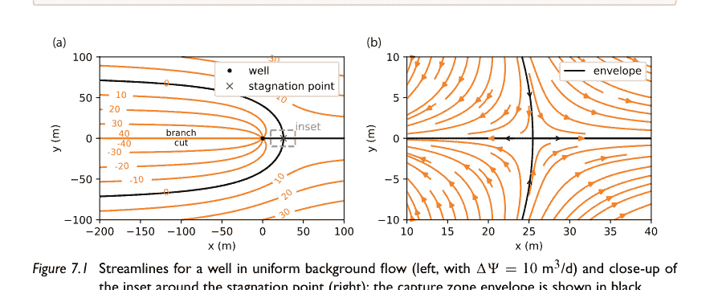

**练习 7.2：** 考虑一个位于均匀背景流场中的井。均匀流沿正x方向，水头每1000米下降1米。含水层的导水系数恒定，等于T = 200 m²/d。一个污染区域位于井附近，如图7.2所示。计算井的最大抽水量，使得井不会捕获任何流经污染区域的水。绘制捕获区包络线以验证你的答案。

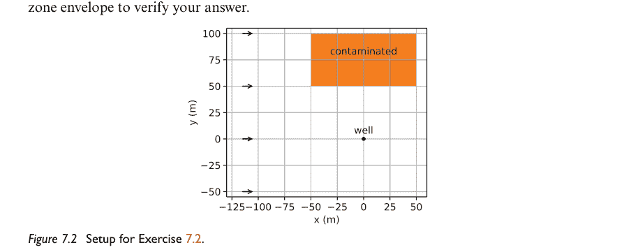

**练习 7.3：** 考虑一个抽水井和一个注水井，它们的抽水量和注水量相等但方向相反，Q = 200 m³/d。注水井位于(x, y) = (-50, 0)，抽水井位于(x, y) = (50, 0)。这两口井位于一个从西向东的均匀流场中；远处的梯度为∂h/∂x = -0.002。含水层的导水系数为T = 200 m²/d。计算两个驻点的位置，并绘制捕获区包络线。

**练习 7.4：** 考虑两个抽水量相等的抽水井，$Q = 100 \text{ m}^3/\text{d}$。一口井位于$(x, y) = (-50, 0)$，另一口井位于$(x, y) = (50, 0)$。这两口井位于一个从西向东的均匀流场中；远处的梯度为$\partial h/\partial x = -0.002$。含水层的导水系数为$T = 200 \text{ m}^2/\text{d}$。计算两个驻点的位置，并绘制捕获区包络线。

含水层中水粒子的平均路径被称为迹线。与流线不同，迹线可以计算有或没有区域入渗的稳定流，以及瞬态流。对于没有入渗的稳定二维流，迹线和流线重合。对于大多数二维流情况，迹线无法解析计算，但可以通过对水平速度矢量$\vec{v} = (v_x, v_y)$进行数值积分来计算

$$\frac{\mathrm{d}x}{\mathrm{d}t} = v_x$$
$$\frac{\mathrm{d}y}{\mathrm{d}t} = v_y$$
\tag{7.12}

这是一个一阶常微分方程组，可以用标准程序进行积分，例如`scipy.integrate`的`solve_ivp`。数值积分会生成一个包含旅行时间的迹线坐标数组。下面将详细讨论`solve_ivp`的应用。

`solve_ivp`函数需要三个输入参数：

- 1. `fun(t, y)`，要积分的函数，对于当前考虑的情况，`t`是时间，`y`是$x, y$坐标的数组（不要与问题的$y$坐标混淆）。
- 2. `t_span`，一个二元组，包含积分的开始和结束时间。
- 3. `y0`，一个包含起始位置$x, y$的数组。

此外，`slove_ivp`有许多关键字参数来控制，例如，数值积分的算法和精度。这里使用了两个关键字参数：

- 1. `t_eval`，这是一个数组，包含所有需要计算并返回积分结果的时间点。所有值必须在`t_span`定义的开始和结束时间之间。
- 2. `events`，这是一个函数列表，用于处理在积分结束时间之前终止的迹线，例如当迹线终止于一口井时。每个函数代表一个事件（例如，迹线已到达一口井）。每个事件函数接受`t`和`y`作为输入，就像速度函数一样，并返回一个连续函数，当事件发生时该函数等于零。对于一口井，该函数返回到井的距离减去井的半径，因此当迹线位于井的半径处时，它返回零。此外，该函数有一个属性`terminal`，设置为`True`，以便`solve_ivp`程序知道在此事件发生时终止积分（为函数指定属性有点不寻常，但这是正确的Python语法，并且在这里非常有用）。如果未设置`terminal`属性，积分将在事件发生后继续。这可能很有用，例如，当需要知道迹线何时穿过一条线时。

`solve_ivp`函数返回一个具有多个属性的对象，包括：

- 1. `t`，一个数组，包含返回$(x, y)$值的时间点。
- 2. `y`，一个二维数组，包含计算出的迹线$(x, y)$坐标。

3.  `t_events`，一个包含事件发生时间数组的列表。
4.  `y_events`，一个包含与 `t_events` 中时间值对应的 (x, y) 值数组的列表。
5.  `status`，一个整数：-1（失败），0（成功到达 `tspan` 末尾），或 1（发生终止事件）。
6.  `message`，一个可读的终止信息。

在下面的示例中，计算了均匀流场中一口井的流线。含水层是承压的，因此速度向量通过 $\vec{v} = Q/(nH)$ 获得。编写了速度函数，并编写了一个事件函数来判断流线是否到达井。启动了两条流线。每条流线被追踪10年，但其中一条流线在10年结束前就终止于井。请注意，如果发生事件，存储在属性 `t` 和 `y` 中的最后一个时间和坐标是事件发生前的最后一个时间和坐标。事件的时间和坐标则单独存储在 `t_events` 和 `y_events` 属性中。

```
# additional parameters
n = 0.3 # porosity, -
H = 20 # aquifer thickness, m
rw = 0.3 # radius of well, m
tmax = 10 * 365 # total travel time, d
t = np.arange(0, 10 * 365 + 1, 365 / 20) # times pathline is returned, d
```

```
# functions
def vxvy(t, xy, xw=0, yw=0):
    x, y = xy
    rsq = (x - xw)**2 + (y - yw)**2
    Qx = U - Q / (2 * np.pi) * (x - xw) / rsq
    Qy = -Q / (2 * np.pi) * (y - yw) / rsq
    return np.array([Qx, Qy]) / (n * H)

def reached_well(t, xy):
    return np.sqrt((xy[0] - xw) ** 2 + (xy[1] - yw) ** 2) - rw

reached_well.terminal = True # specify the terminal attribute
```

```
# pathline solution
from scipy.integrate import solve_ivp
path0 = solve_ivp(vxvy, (0, tmax), y0=[-200, 50], t_eval=t, events=reached_well)
print('path0 message:', path0.message)
print(f'path0 reached well after {path0.t_events[0][0] / 365: .2f} years')
print(f'path0 entered well screen at', path0.y_events)
path1 = solve_ivp(vxvy, (0, tmax), y0=[-200, 80], t_eval=t, events=reached_well)
print('path1 message:', path1.message)
```

path0 message: A termination event occurred.
path0 reached well after 5.57 years
path0 entered well screen at [array([[0.17610724, 0.24287083]])]
path1 message: The solver successfully reached the end of the integration interval.

```
# basic plot
plt.subplot(111, aspect=1)
plt.plot(path0.y[0], path0.y[1], label='pathline 0')
plt.plot(path1.y[0], path1.y[1], label='pathline 1')
plt.legend();
```

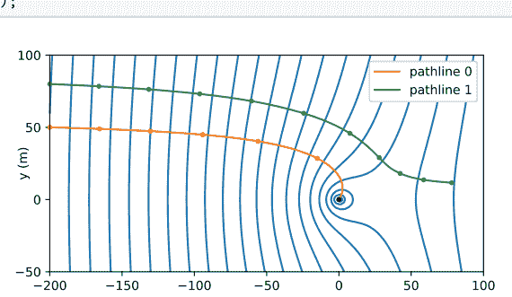

图 7.3 流线，从 $x = -200$ 处开始，带有表示一年运移时间的刻度标记。

#### 7.2 井的捕获区

井的捕获区包络线内的所有水最终都会被该井捕获，但这可能需要（非常）长的时间。在地下水管理中，划定在特定时间段内被井捕获的区域非常重要。例如，5年捕获区内的所有水在5年内到达该井。特定时间段的捕获区可以通过沿流线从井逆流积分时间来计算。对于均匀流场中的单口井，这可以通过解析方法完成，正如 Bear 和 Jacobs (1965) 所示。对于更复杂的设置，则需要进行数值积分。本节首先讨论解析解，然后是数值解。

考虑一口位于原点、流量为 $Q$ 的井，位于一个均匀流场中，其中 $Q_x = U$，$Q_y = 0$。该问题的流函数由公式 (7.6) 给出。流函数沿捕获区包络线（见上一节）等于零，因此捕获区包络线的方程可以写为

$$\Psi = -Uy + \frac{Q}{2\pi}\theta = 0 \quad (7.13)$$

利用 $y = r \sin\theta$，可以得到从井到捕获区包络线的径向距离表达式

$$r = \frac{Q}{2\pi} \frac{\theta}{U \sin(\theta)} \quad (7.14)$$

这意味着对于任意角度 $\theta$，都可以用上述公式计算到捕获区包络线的距离 $r$。捕获区包络线对应的 $x, y$ 坐标通过以下公式计算

$$x = r \cos(\theta) \quad y = r \sin(\theta) \quad (7.15)$$

从捕获区包络线内位置 $(x, y)$ 到井的运移时间 $t$ 可以用以下公式计算 (Bear and Jacobs, 1965)

$$t = -\frac{nHx}{U} - \frac{QnH}{2\pi U^2} \ln \left[ \frac{\sin(\theta - 2\pi Uy/Q)}{\sin(\theta)} \right] \quad (7.16)$$

其中 $H$ 是含水层厚度，$n$ 是孔隙度。在下面的示例中，计算了捕获区包络线内若干点到井的运移时间，然后通过对运移时间进行等值线绘制来获得捕获区（图 7.4）。

```
# parameters
n = 0.25 # porosity, -
k = 20 # hydraulic conductivity, m/d
H = 15 # aquifer thickness, m
dhdx = -0.002 # gradient, -
U = -k * H * dhdx # uniform flow, m^2/d
Q = 500 # discharge of the well, m^3/d
rw = 0.3 # radius of well, m
```

```
# solution
# coordinates of capture zone envelope
theta = np.linspace(-3, -1e-4, 100) # bottom half of envelope
r = Q / (2 * np.pi) * theta / (U * np.sin(theta))
xcap = r * np.cos(theta)
ycap = r * np.sin(theta)
# grid inside the capture zone envelope
xg = xcap * np.ones((50, len(xcap)))
yg = np.zeros_like(xg)
for i in range(len(xcap)):
    yg[:, i] = np.linspace(ycap[i] + 1e-3, -ycap[i] - 1e-3, 50)
# travel time for all grid points inside capture zone envelope
theta = np.arctan2(yg, xg)
tgrid = -n * H * xg / U - Q * n * H / (2 * np.pi * U ** 2) * np.log(
    np.sin(theta - 2 * np.pi * U * yg / Q) / np.sin(theta))
```

```
# basic capture zone plot
plt.subplot(111, aspect=1, xlim=(-1000, 150))
plt.plot(0, 0, 'k.')
plt.contourf(xg, yg, tgrid, [0, 5 * 362.25, 10 * 365.25]);
```

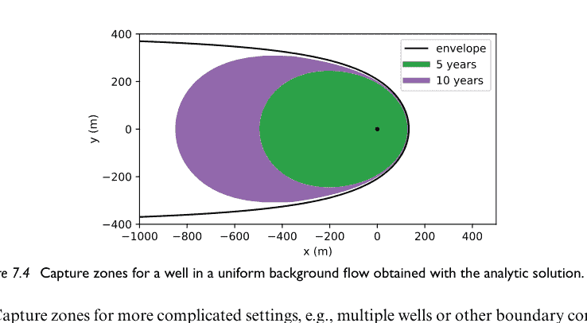

对于更复杂的设置，例如多口井或其他边界条件，必须通过数值方法计算捕获区，因为它们无法通过解析方法计算。如上一节所示，流线可以通过对水平速度向量（公式 7.12）进行数值积分来计算。流线也可以通过从井开始并积分负速度向量（即逆流积分）以相同的方式逆流追踪。

以下示例涉及均匀流场中（x方向）的两口井。两口井的流量均等于 Q。通过从每口井的圆周上均匀分布地启动20条流线来计算5年捕获区。这些流线逆流追踪5年（图 7.5）。

```
# additional parameters
xw0, yw0 = 0, 0 # x,y-location well 0, m
xw1, yw1 = 100, 100 # x,y-location well 1, m
```

```
# solution and plot
def minvxvy(t, xy): # function vxvy from Section 7.1
    return -vxvy(t, xy, xw=xw0, yw=yw0) - vxvy(t, xy, xw=xw1, yw=yw1)

from scipy.integrate import solve_ivp
xstart = rw * np.cos(np.arange(0, 2 * np.pi, np.pi / 10)) # spaced around well
ystart = rw * np.sin(np.arange(0, 2 * np.pi, np.pi / 10)) # spaced around well
plt.subplot(111, aspect=1)
for i in range(len(xstart)):
    path = solve_ivp(minvxvy, (0, 5 * 365), [xstart[i] + xw0, ystart[i] + yw0],
                     t_eval=np.linspace(0, 5 * 365, 100))
    plt.plot(path.y[0], path.y[1], 'C1')
    path = solve_ivp(minvxvy, (0, 5 * 365), [xstart[i] + xw1, ystart[i] + yw1],
                     t_eval=np.linspace(0, 5 * 365, 100))
    plt.plot(path.y[0], path.y[1], 'C2')
```


图 7.5 均匀背景流中两口等流量井的捕获区；流线通过数值积分获得。

**练习 7.5：** 将均匀流场中单口井的5年捕获区解析解与通过数值方法获得的捕获区进行比较。

#### 7.3 均匀背景流中靠近河流的井

由拉普拉斯方程控制的地下水流动问题（即稳态流且可忽略面状入渗）的流量势和流函数可以组合成一个复势，因为势函数和流函数满足柯西-黎曼条件（公式 6.17）。复势 Ω 的实部是流量势，而虚部即为流函数

$$\Omega = \Phi + i\Psi$$

用数学术语来说，这意味着流函数是排水势（Strack, 1989）的调和共轭。复势 $\Omega$ 是复坐标 $\zeta = x + iy$ 的函数，其中 $i$ 是虚数单位（$i^2 = -1$）。在 Python 中，虚数单位用字母 $j$ 表示，但本书的数学方程中使用 $i$。复势的负导数即为复流量

$$W(\zeta) = -\frac{d\Omega}{d\zeta} = Q_x - iQ_y$$

请注意，复流量的虚部是流量矢量在 $y$ 方向分量的相反数。

引入复变量使得同时计算排水势和流函数变得容易，并允许使用包括保角映射（见第 10 章）在内的复杂工具来解决地下水流动问题。关于复变量在解决地下水流动问题中应用的更多信息，可参见 Polubarinova-Kochina (1962)、Harr (1962)、Verruijt (1970) 和 Strack (1989)。

均匀流的复势为

$$\Omega = -W_u\zeta$$

其中 $W_u$ 是均匀复流量

$$W = W_u = U - iV$$

井的复势为

$$\Omega = \frac{Q}{2\pi} \ln(\zeta - \zeta_w)$$

其中 $Q$ 是井的流量，$\zeta_w = x_w + iy_w$ 是井位置的复坐标。方程 (7.21) 的有效性可以通过将 $\zeta - \zeta_w$ 写成极坐标形式来证明

$$\zeta - \zeta_w = re^{i\theta}$$

其中 $r$ 是 $\zeta$ 和 $\zeta_w$ 之间的距离，$\theta$ 是从 $\zeta_w$ 指向 $\zeta$ 的矢量与正 $x$ 方向所成的角度。将方程 (7.22) 代入方程 (7.21) 中的 $\zeta - \zeta_w$，得到

$$\Omega = \frac{Q}{2\pi} \ln(re^{i\theta}) = \frac{Q}{2\pi} \ln(r) + i\frac{Q}{2\pi}\theta$$

这意味着 $\Omega$ 的实部确实等于井的排水势（方程 6.37），虚部等于流函数（方程 6.41）。井对应的复流量为

$$W = -\frac{d\Omega}{d\zeta} = -\frac{Q}{2\pi} \frac{1}{\zeta - \zeta_w}$$

均匀背景流中井的复势通过叠加方程 (7.19) 和 (7.21) 得到

$$\Omega = -W_u\zeta + \frac{Q}{2\pi} \ln(\zeta - \zeta_w) + C$$

其中为完整起见添加了一个任意常数 $C$。$\Omega$ 的实部等价于排水势（方程 7.5），$\Omega$ 的虚部等价于流函数（方程 7.6）。

例如，使用复势为图 7.1 的问题创建了流网，并显示在图 7.6 中。在 Python 中使用方程 (7.21) 计算流函数会导致正则分支切割沿负实轴延伸，使得沿捕获区包络线的流函数等于 $\Psi = 0$。

尽管这是一个技术细节，但分支切割仍然是使用流函数的一个不美观的副作用。或者，方程 (7.21) 中的对数可以定义为 $\log(\zeta_w - \zeta)$，这将导致角度 $\theta$ 沿负 $x$ 轴为零，并且当沿逆时针方向移动时，分支切割沿正 $x$ 轴从 $\pi$ 跳跃到 $-\pi$。这在可视化某些流网时可能更可取。两种选择都在下面的示例中显示（图 7.6）。对于后一种分支切割的选择，流函数沿捕获区包络线上部等于 $\Psi = -Q/2$，沿捕获区包络线下部等于 $\Psi = Q/2$。

```python
# parameters
Q = 80 # discharge of well, m^3/d
Wu = 0.5 - 0j # complex uniform flow, m^2/d
zetaw = 0 + 0j # complex location of well, m
```

```python
# solution
xg, yg = np.meshgrid(np.linspace(-200, 100, 100), np.linspace(-100, 100, 100))
zetag = xg + yg * 1j # grid of complex coordinates
omega1 = -Wu * zetag + Q / (2 * np.pi) * np.log(zetag - zetaw)
omega2 = -Wu * zetag + Q / (2 * np.pi) * np.log(zetaw - zetag)
```

```python
# basic plot of flow net
plt.subplot(121, aspect=1)
plt.contour(xg, yg, omega1.real, colors='C0')
plt.contour(xg, yg, omega1.imag, colors='C1', linestyles='-')
plt.contour(xg, yg, omega1.imag, [0], colors='k')
plt.subplot(122, aspect=1)
plt.contour(xg, yg, omega2.real, colors='C0')
plt.contour(xg, yg, omega2.imag, colors='C1', linestyles='-')
plt.contour(xg, yg, omega2.imag, [-40, 40], colors='k');
```

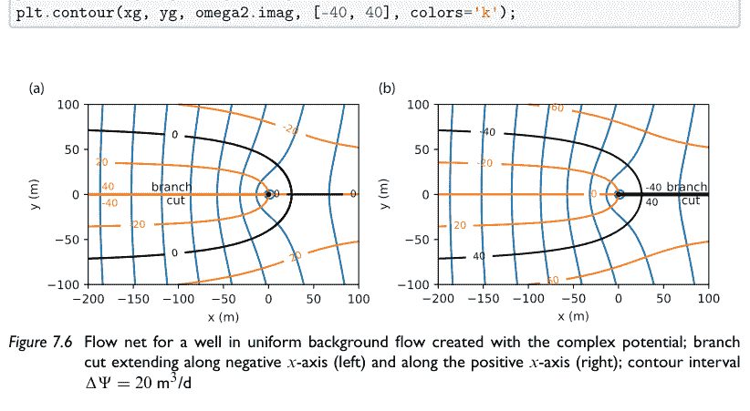

**练习 7.6：** 使用复变量重复练习 7.4。

**练习 7.7：** 考虑两个流量相等的抽水井 $Q$。一个井位于 $(x, y) = (0, -50)$，另一个井位于 $(x, y) = (0, 50)$。这两个井位于一个从西向东的均匀背景流中；远处的梯度为 $\partial h/\partial x = -0.002$。含水层的导水系数为 $T = 200 \text{ m}^2/\text{d}$。计算最小流量 $Q_{\text{min}}$，使得背景均匀流的任何部分都不会从两个井之间穿过。注意，当 $Q > Q_{\text{min}}$ 时，$x$ 轴上有两个滞点。绘制两种情况下的捕获区包络线：$Q = Q_{\text{min}}$ 和 $Q = 200 \text{ m}^3/\text{d}$。

位于河流附近的抽水井会拦截正在流向河流的地下水。当抽水井的流量足够大时，从井中抽出的部分水可能来自河流或河流的另一侧。无论哪种方式，河流中的流量都会减少。本节考虑的是在长而直的河段附近抽水的井，而背景流是均匀的，并且在河流两侧都流向河流。含水层是承压的，导水系数为 $T$。一个流量为 $Q$ 的井位于 $(x, y) = (-d, 0)$，河流沿 $y$ 轴流动。河流水位为 $h_0$，对应于势 $\Phi_0 = Th_0$。河流与含水层直接接触，因此沿 $y$ 轴的边界条件为

$$\Phi|_{x=0,y} = \Phi_0 \qquad (7.26)$$

背景流是均匀的且垂直于河流，但在河流两侧可能不同

$$Q_x = U_L \qquad x \le 0 \qquad (7.27)$$
$$Q_x = U_R \qquad x \ge 0 \qquad (7.28)$$

请注意，由于河流与含水层直接接触，即使左侧有井，河流右侧的流动仍然是均匀的（方程 7.28）。在下一节中，河床底部由渗漏河床构成。

复势的解通过镜像法和叠加法得到

$$\Omega = -U_L \zeta + \frac{Q}{2\pi} \ln \left( \frac{\zeta + d}{d - \zeta} \right) + \Phi_0 \qquad x \le 0 \qquad (7.29)$$

对应的复流量为

$$W = -\frac{d\Omega}{d\zeta} = U_L - \frac{Q}{2\pi} \left( \frac{1}{\zeta + d} - \frac{1}{\zeta - d} \right) \qquad x \le 0 \qquad (7.30)$$

井的临界流量定义为井不从河流中抽取任何水进入含水层的最大流量。当井以临界流量抽水时，河流上离井最近点的流量矢量等于零，因此点 $(x, y) = (0, 0)$ 是一个滞点。流场中滞点的方程可以通过令 $W = 0$（方程 7.30）并求解 $\zeta$ 得到，这给出了滞点的复位置 $\zeta_s$

$$\zeta_s = \pm \sqrt{d^2 - \frac{Qd}{\pi U_L}} \qquad (7.31)$$

根据这个方程，总是有两个滞点，除非平方根的参数等于零，这意味着滞点在原点。对应的临界流量 $Q_{\text{cr}}$ 为

$$Q_{\text{cr}} = \pi U_L d \qquad (7.32)$$

当 $Q < Q_{cr}$ 时，井不捕获任何河水，并且有两个滞点位于 $x$ 轴上，一个在井所在的河流一侧，另一个在另一侧（镜像侧）。当 $Q > Q_{cr}$ 时，有两个虚滞点位于河流（$y$ 轴）上。水在河流上的滞点之间渗入含水层，这些水流向井。

在下面的示例中，左侧流网的井流量为 $Q_{cr}/2$，右侧流网的井流量为 $2Q_{cr}$（图 7.7）。流网显示在河流两侧；河流右侧的流动是均匀的，并且不受井的影响（因为河流与含水层直接接触，并且采用了 Dupuit–Forchheimer 近似）。请注意，对于 $Q = Q_{cr}/2$ 的情况，流场中只有一个滞点；另一个滞点位于镜像位置。在下面的代码中，方程 (7.31) 中的平方根使用 numpy.lib.scimath 包的 sqrt 函数计算，当平方根的参数为负数时，该函数会自动返回一个复数。来自河流的井流量 $\Delta Q$ 通过减去河流上滞点处的流函数值获得。

```python
# parameters
dhdx = -0.001 # head gradient, -
h0 = 10 # water level in river, m
T = 100 # transmissivity, m^2/d
UL = -T * dhdx # uniform flow on left side of river, m^2/d
UR = -UL # uniform flow on right side of river, m^2/d
d = 50 # distance between well and river, m
phi0 = T * h0 # potential along the river, m^3/d
Qcr = np.pi * UL * d # critical discharge, m^3/d
print(f'{Qcr = :.2f} m^3/d')
```

Qcr = 15.71 m^3/d

```python
# solution
def omega(x, y, Q, d=d, phi0=phi0):
    zeta = x + y * 1j
    if x <= 0:
        om = -UL * zeta + Q / (2 * np.pi) * \
            np.log((zeta + d) / (d - zeta)) + phi0
    else:
        om = -UR * zeta + phi0
    return om

omegavec = np.vectorize(omega) # vectorized version of omega function

from numpy.lib.scimath import sqrt as csqrt
xg, yg = np.meshgrid(np.linspace(-200, 50, 200), np.linspace(-100, 100, 200))
om1 = omegavec(xg, yg, Q=Qcr / 2) # Q = half critical discharge
om2 = omegavec(xg, yg, Q=2 * Qcr) # Q = twice critical discharge
zetas = csqrt(d ** 2 - 2 * Qcr * d / (np.pi * UL)) # Q = 2Qcr
ys = zetas.imag # positive y-location of stagnation point
delQ = omega(0, ys, 2 * Qcr).imag - omega(0, -ys, 2 * Qcr).imag
print(f'fraction of water from river for Q = 2Q_cr: {delQ / (2 * Qcr):.2f}')
```

fraction of water from river for Q = 2Q_cr: 0.18

```python
# basic flow nets
plt.subplot(121, aspect=1)
```

plt.contour(xg, yg, om1.real, np.arange(phi0 - 30, phi0 + 30, Qcr / 8))
plt.contour(xg, yg, om1.imag, np.arange(-2 * Qcr, 3 * Qcr, Qcr / 8))
plt.subplot(122, aspect=1)
plt.contour(xg, yg, om2.real, np.arange(phi0 - 30, phi0 + 30, Qcr / 8))
plt.contour(xg, yg, om2.imag, np.arange(-2 * Qcr, 3 * Qcr, Qcr / 8));

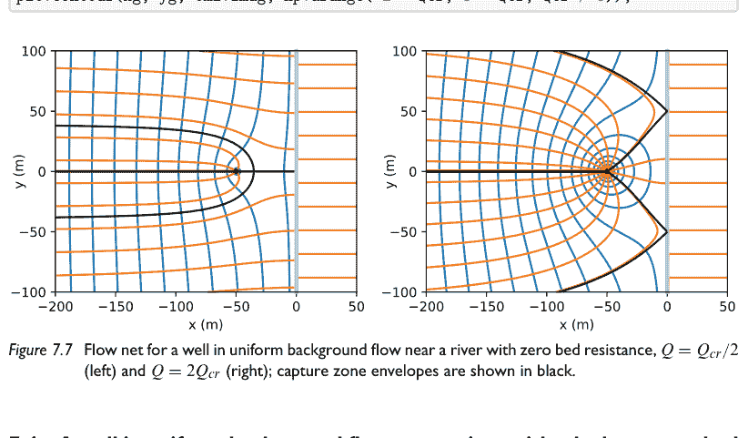

#### 7.4 河床有渗漏的河流附近均匀背景流中的井

对于位于与含水层直接接触的长直河段附近、处于均匀背景流中的井，其解被修正以包含河床下方的渗漏。除了沿河流的边界条件外，所有边界条件均与上一节的解相同。河流具有渗漏的河床，因此在河流与含水层之间存在水力阻力（图7.8）。因此，与上一节不同，河流一侧的抽水井会导致河流另一侧出现降深。抽水井可能会从河流另一侧取水，这对安全的地下水供应可能产生重大影响，例如，当河流另一侧存在污染时（例如，Harr, 1996）。

河流宽度为 $B$，河床对垂向流动的阻力为 $c$。向河流的渗漏或从河流的渗漏被近似为沿河道中心线发生，并且在解中忽略了河道的宽度。当河道相对于含水层厚度和泄漏因子（$\sqrt{kHc}$）较窄时，这种近似可能是合理的。通过渗漏河床的垂向比流量可以写为

$$q_z = \frac{h - h_0}{c} \qquad (7.33)$$

从含水层流入河流的单位长度河流的入流量 $\sigma$ $[L^2/T]$ 为

$$\sigma(y) = Bq_z = B\frac{h|_{x=0,y} - h_0}{c} = \frac{C}{T}(\Phi|_{x=0,y} - \Phi_0) \qquad (7.34)$$

其中河床的导水系数定义为 $C = B/c$。沿河流的边界条件由流量连续性得到

$$\sigma = Q_x|_{x=0^-,y} - Q_x|_{x=0^+,y} = \frac{C}{T}(\Phi|_{x=0,y} - \Phi_0) \qquad (7.35)$$

其中 $x = 0^-$ 和 $x = 0^+$ 分别是河流中心线左侧和右侧的 $x$ 位置。沿河流的第二个边界条件是河流左侧含水层中的水头等于河流右侧含水层中的水头，或者用流量势表示（回想一下，在解中忽略了河流的宽度 $B$）

$$\Phi|_{x=0^-, y} = \Phi|_{x=0^+, y} \qquad (7.36)$$

河流两侧的均匀背景流与方程 (7.27) 和 (7.28) 相同，如图7.8所示。

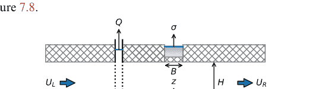

所述问题的复势解由 Bakker 和 Anderson (2003) 得到。复势为

$$\Omega = \frac{Q}{2\pi} \ln \frac{\zeta + d}{d - \zeta} - \frac{Q}{2\pi} \exp(Z_0)\mathrm{E}_1(Z_0) - U_L \zeta + A \qquad x \le 0 \qquad (7.37)$$
$$\Omega = -\frac{Q}{2\pi} \exp(Z_1)\mathrm{E}_1(Z_1) - U_R \zeta + A \qquad x \ge 0 \qquad (7.38)$$

其中

$$Z_0 = -\frac{C}{2T}(\zeta - d) \qquad (7.39)$$
$$Z_1 = \frac{C}{2T}(\zeta + d) \qquad (7.40)$$
$$A = \frac{T}{C}(U_L - U_R) + \Phi_0 \qquad (7.41)$$

$\mathrm{E}_1$ 是指数积分，在 scipy.special 包中作为 exp1 可用。相应的复流量矢量为

$$W = -\frac{Q}{2\pi} \left[ \frac{1}{\zeta + d} + \frac{C}{2T} \exp(Z_0)\mathrm{E}_1(Z_0) \right] + U_L \qquad x \le 0 \qquad (7.42)$$
$$W = -\frac{Q}{2\pi} \left[ \frac{1}{\zeta + d} - \frac{C}{2T} \exp(Z_1)\mathrm{E}_1(Z_1) \right] + U_R \qquad x \ge 0 \qquad (7.43)$$

复势在下面的代码中通过一个 Python 函数实现。

```python
# parameters
T = 100 # transmissivity, m^2/d
h0 = 10 # water level in river, m
UL = 0.1 # uniform flow on left side of river, m^2/d
UR = -0.1 # uniform flow on right side of river, m^2/d
d = 50 # distance between well and river, m
phi0 = T * h0 # potential along the river, m^3/d
rw = 0.3 # radius of well, m
kstreambed = 0.02 # hydraulic conductivity of stream bed, m/d
Hstreambed = 0.2 # thickness of stream bed, m
B = 5 # width of streambed, m
c = Hstreambed / kstreambed # resistance of stream bed, d
C = B / c # conductance of stream bed, m/d
print(f'leakage factor below stream: {np.sqrt(T * c):.0f} m')
```

leakage factor below stream: 32 m

```python
# solution
from scipy.special import exp1

def omegaresriv(x, y, Q):
    A = T / C * (UL - UR) + phi0
    z = x + y * 1j
    if x <= 0:
        Z0 = -C / (2 * T) * (z - d)
        om = Q / (2 * np.pi) * (np.log((z + d) / (d - z)) - 
            np.exp(Z0) * exp1(Z0)) - UL * z + A
    else:
        Z1 = C / (2 * T) * (z + d)
        om = -Q / (2 * np.pi) * np.exp(Z1) * exp1(Z1) - UR * z + A
    return om

omegaresrivvec = np.vectorize(omegaresriv)
```

井的临界流量被确定为仅从井所在侧的均匀背景流中取水。临界流量发生在原点为驻点时，这与无河床阻力的情况（第7.3节）相同。在这种情况下，临界流量无法解析确定，而是通过数值方法找到。编写了一个函数 func，对于给定的 Q 值，返回 (x, y) = (0^-, 0) 处流量矢量的 x 分量。使用 scipy.optimize 包的 brentq 方法找到使函数 func 等于零的流量值，这对应于临界流量；brentq 方法是在括号区间内寻找函数零点（根）的高效且稳健的方法。在下面的示例中，使用了相对较小的河床阻力，这已经使井的临界流量与零河床阻力的解（第7.3节）相比显著增加。

```python
# find critical discharge
def Qxriverleft(Q, y):
    z = -1e-6 + y * 1j
    Z0 = -C / (2 * T) * (z - d)
    W = -Q / (2 * np.pi) * (1 / (z + d) + 
                           C / (2 * T) * np.exp(Z0) * exp1(Z0)) + UL
    return W.real

def func(Q):
    return Qxriverleft(Q, 0)

from scipy.optimize import brentq
Qcr2 = brentq(func, 0, 50) # critical discharge with bed resistance
Qcr1 = np.pi * UL * d # critical discharge with no bed resistance

print(f'River bed conductance C = {C:.1f} m^2/d')
print(f'Qcr without bed resistance = {Qcr1:.2f} m^3/d')
print(f'Qcr with bed resistance = {Qcr2:.2f} m^3/d')
```

River bed conductance C = 0.5 m^2/d
Qcr without bed resistance = 15.71 m^3/d
Qcr with bed resistance = 25.54 m^3/d

为井以无河床阻力的临界流量抽水的情况（上一节的解）和有河床阻力的情况（图7.9）绘制了等值线图。两种情况的等值线间隔不同。注意，对于有河床阻力的情况，河流右侧的流动受到河流左侧井抽水的影响。在下面的示例中，当井的流量增加时，这种影响更为明显。

```python
xg, yg = np.meshgrid(np.linspace(-200, 50, 100), np.linspace(-100, 100, 100))
om1 = omegavec(xg, yg, Q=Qcr1) # omegavec from previous section
om2 = omegaresrivvec(xg, yg, Q=Qcr2)
```

```python
# basic flow nets
plt.subplot(121, aspect=1)
plt.contour(xg, yg, om1.real, np.arange(phi0 - 30, phi0 + 30, Qcr1 / 8))
plt.contour(xg, yg, om1.imag, np.arange(-2 * Qcr1, 3 * Qcr1, Qcr1 / 8))
plt.axvline(0, color='lightblue', lw=3)
plt.subplot(122, aspect=1)
plt.contour(xg,
yg, om2.real,
np.arange(phi0 - 60, phi0 + 60, Qcr2 / 8))
plt.contour(xg, yg, om2.imag, np.arange(-2 * Qcr2, 3 * Qcr2, Qcr2 / 8))
plt.axvline(0, color='lightblue', lw=3);
```

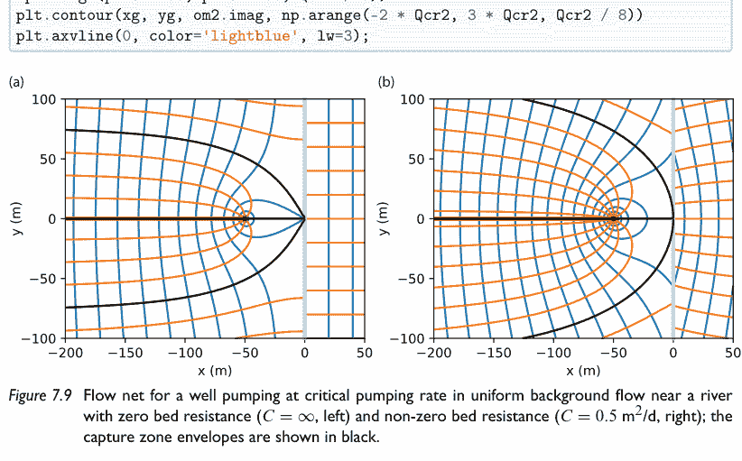

当井的流量大于 $Q_{cr}$ 时，井可能会从河流取水，或者从河流另一侧取水，或者两者兼有。这意味着在井附近的河流段，河流左侧的水流向井。

河流上含水层中水流方向由流向河流转变为远离河流的点是通过数值方法获得的。函数 `func2` 返回给定 $y$ 和 $Q$ 值时，紧邻河流左侧的流量向量的 $Q_x$ 分量。再次使用 `brentq` 函数来寻找 `func2` 等于零的转折点。请注意，对于存在河床阻力的情况，该转折点并非停滞点，因为 $Q_y$ 不等于零。对于 $Q = 2Q_{cr}$ 的情况，转折点计算如下。

```python
# changed parameters
Q = 2 * Qcr2

# solution
def func2(ys, Q):
    return Qxriverleft(Q, ys)

ys = brentq(func2, 0, 2 * d, args=(Q))
print(f'point on the river where Qx equals zero: {ys:.2f} m')
```

point on the river where Qx equals zero: 57.44 m

相应的流网如图 7.10 所示。生成流网的代码与图 7.9 的代码类似，此处不再重复。捕获区延伸至河流的右侧。水井是从河流还是从河流右侧取水，取决于河流处含水层的水头。如果河流处含水层的水头高于河流水位（$h_0 = 10$ m），则水流从含水层流入河流。如果河流处含水层的水头低于河流水位，则水流从河流流入含水层。对于本示例中使用的数值，原点处含水层的水头高于河流水位，因此水井从河流的另一侧取水，而非从河流本身取水。

```python
print(f'head at origin: {omegaaresriv(0, 0, Q).real / T:.2f} m')
print(f'head at well: {omegaaresriv(-d + rw, 0, Q).real / T:.2f} m')
```

head at origin: 10.25 m
head at well: 9.87 m

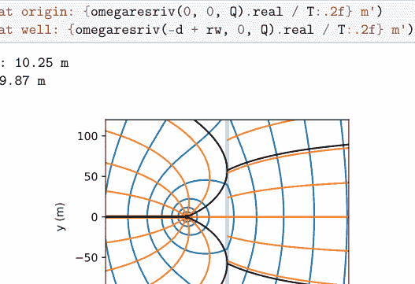

图 7.10 流网和捕获区包络线（黑色），对应于两倍临界抽水速率且 $C = 0.5$ m$^2$/d 的情况。注意，水井从河流右侧取水。

**练习 7.8：** 考虑上述存在河床阻力的示例。计算当水井流量为零时，沿河流的水头。

#### 7.5 海岸附近均匀背景流中的水井

前面几节的解涉及均匀背景流中靠近直线河流的水井的捕获区。推导了水井的临界流量，使得水井既不从河流也不从河流另一侧取水。本节中，直线河流被一条直线且垂直的海岸边界所取代，并确定了水井的最大流量，使得水井不抽取任何咸水。换句话说，确定最大流量使得咸淡水界面不会到达水井。事实证明，这个最大流量比靠近河流的水井的最大流量（第 7.3 节）要小得多。

考虑海岸含水层中的一个水井。海岸线位于 $x = 0$ 线。水井位于 $(x, y) = (-d, 0)$，流量为 $Q$，半径为 $r_w$。在没有水井的情况下，流向海岸的水流是均匀的，且等于 $Q_x = U$。含水层为无压含水层，水力传导系数为 $k$，含水层底部相对于海平面的高程为 $z_b$。海水密度为 $\rho_s$。海洋与含水层直接接触（无海床阻力），因此沿海岸线的水头等于海平面。复势的解与含水层直接接触的河流附近水井的解相同（公式 7.29）。对于这种无压界面流的情况，界面趾部的势为公式 (4.26)

$$\Phi_{\text{toe}} = \frac{1}{2} k \frac{\alpha + 1}{\alpha^2} z_b^2$$

在没有抽水的情况下，界面趾部位于（公式 4.21）

$$x_{\text{toe}} = -\frac{\Phi_{\text{toe}}}{U}$$

首先，考虑水井流量为河流附近水井临界流量一半的情况（公式 7.32）。构建了一个流网，表明对于这个 $Q$ 值，停滞点确实仍然远离海岸线（图 7.11）。没有抽水时的界面趾部用黑色虚线绘制，而抽水情况下代表 $\Phi_{\text{toe}}$ 的等势线用黑色实线绘制。结果发现有两条势等于 $\Phi_{\text{toe}}$ 的等势线。一条等势线从北向南延伸并向水井弯曲：这是抽水期间界面趾部的位置。第二条黑色等势线出现在水井周围。这是因为水井处的流量势低于 $\Phi_{\text{toe}}$，但这并不意味着水井抽取咸水。水井周围的黑色等势线与海岸线附近的黑色等势线不相连，这意味着咸水无法到达水井。这在图 7.11 的右图中进一步说明，其中势被绘制为沿 $y = 0$ 线的 $x$ 的函数。当将势转换为水头时，水井周围封闭黑色等势线内的势值必须使用无压流的公式而非无压界面流的公式转换为水头。

```python
# parameters
rw = 0.3 # radius of well, m
k = 40 # hydraulic conductivity, m/d
zb = -20 # elevation of bottom of aquifer, m
rhof = 1000 # density of freshwater, kg/m^3
rhos = 1025 # density of saltwater, kg/m^3
U = 1 # uniform flow in x-direction, m^2/d
d = 1000 # distance of well from coast line, m
Qcr = np.pi * U * d # critical discharge for well near river, m^3/d
```

```python
Q = Qcr / 2 # discharge of well, m^3/d
print(f'discharge of well: {Q:.2f} m^3/d')
```

discharge of well: 1570.80 m^3/d

```python
# solution
alpha = rhof / (rhos - rhof) # alpha factor
phitoe = 0.5 * k * (alpha + 1) / alpha ** 2 * zb ** 2
xtoe = -phitoe / U # toe in the absence of pumping

def omega(x, y, Q):
    zeta = x + y * 1j
    om = Q / (2 * np.pi) * np.log((zeta + d) / (d - zeta)) - U * zeta
    return om

xg, yg = np.meshgrid(np.linspace(-1200, 0, 120), np.linspace(-500, 500, 101))
om = omega(xg, yg, Q)
```

```python
# basic flow net and potential along y=0
plt.subplot(121, aspect=1)
plt.contour(xg, yg, om.real, np.arange(-2000, 2000, 100), colors='C0')
plt.contour(xg, yg, om.real, [phitoe], colors='k')
plt.contour(xg, yg, om.imag, np.arange(-2000, 2000, 100), colors='C1')
plt.axvline(xtoe, color='k', linestyle='--')
plt.subplot(122) # potential along y=0
plt.plot(xg[0], om.real[50], label=r'$\Phi(x,0)$')
plt.axhline(phitoe, ls='--', label=r'$\Phi_{toe}$')
plt.legend();
```

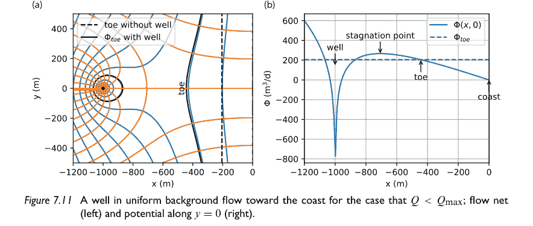

水井的最大流量 $Q_{\max}$ 在 $\Phi_{\text{toe}}$ 的两条黑色等势线相切时达到。这发生在停滞点的势等于 $\Phi_{\text{toe}}$ 时。当流量大于 $Q_{\max}$ 时，水井开始抽取咸水，所提出的解不再有效，因为该解仅对停滞的咸水有效。这与前两节提出的解形成对比，其中解对于低于和高于临界抽水速率 $Q_{\text{cr}}$ 的水井流量同样有效。

最大流量通过数值方法找到。编写了一个函数，以流量 $Q$ 作为输入，并返回停滞点处的流量势与 $\Phi_{\text{toe}}$ 之间的差值。该函数在最大流量时等于零。使用 brentq 方法寻找 $Q_{\max}$。请注意，最大流量仅略高于河流附近水井临界流量的一半（公式 7.32）。

```python
def func(Q):
    xs = -np.sqrt(d ** 2 - Q * d / (np.pi * U))
    return omega(xs, 0, Q).real - phitoe

from scipy.optimize import brentq
Qmax = brentq(func, 1, np.pi * U * d)
print(f'maximum discharge: {Qmax:.2f} m^3/d')
print(f'Qmax as fraction of Qcr of Section 7.3: {Qmax / Qcr:.2f}')
om1 = omega(xg, yg, Qmax)
```

maximum discharge: 1803.22 m^3/d
Qmax as fraction of Qcr of Section 7.3: 0.57

当抽水速率略低于最大流量时，界面趾部仍与水井保持相当距离。当流量增加到最大流量时，咸水趾部突然突破至水井，因为停滞点的势降至界面趾部的势以下；即，停滞点的水头降至 $-z_b/\alpha$ 以下。最大流量的流网如图 7.12 所示；代码与图 7.11 相同，此处不再重复。沿 $y = 0$ 线的势表明，水井与海岸之间的最大势确实是 $\Phi_{\text{toe}}$。

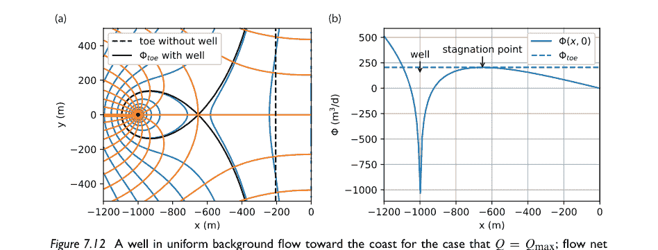

**练习 7.9：** 图 7.13 显示了 $Q = Q_{\max}$ 时沿 $y = 0$ 线的水头和界面位置。计算此情况下水井处的水头。

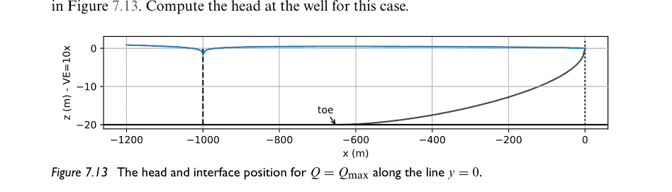

## 第八章

### 稳定二维流动的解析元素建模

抽水井是迄今为止讨论的二维解的重要组成部分。叠加原理允许求解任意数量的井的问题，而镜像法允许模拟直线定水头边界和不透水边界。当井的数量增加时，多井解的组织变得繁琐。解析元素法是一种建模技术，便于叠加许多解，包括井的解。

解析元素法基于解析解的叠加（例如，Strack, 2003）。每个解析解代表含水层中的一个特征，并且至少有一个自由参数。例如，抽水井的解就是一个解析元素，其自由参数是井的流量。解析元素的自由参数可以是指定的，也可以根据指定条件计算得出。例如，井的流量可以根据某一点（称为配置点）指定的水头计算得出。模型中所有未知的自由参数必须同时计算，因为例如，一口井的流量可能会影响另一口井的水头，反之亦然。

本章讨论了解析元素的原理。基于Bakker和Kelson (2009) 的面向对象设计，开发了用于解析元素法的Python代码。本章介绍的解析元素程序包括均匀流、井、用于模拟河段的线汇以及用于模拟面状补给的面汇。存在许多用于模拟稳定单层流的高级解析元素，例如，用于模拟不透水边界或非均质边界（例如，Haitjema, 1995; Strack, 2017）。此外，存在用于稳定和瞬态多层流的公式（Bakker and Strack, 2003; Fitts, 2010; Bakker, 2013a）。用于地下水流动解析元素建模的计算机程序包括用于稳定单层流的Gflow (Haitjema, 1995)，以及用于稳定和瞬态多含水层流的TimML (Bakker, 2021)、TTim (Bakker, 2013b) 和 AnAgSim (Fitts, 2021)。

#### 8.1 均匀流和井

在本节中，开发了一个解析元素代码来模拟井、均匀流和一个常数。复势写为

$$\Omega = -Q_u e^{-i\theta} \zeta + \sum_{m=1}^{M} \frac{Q_m}{2\pi} \ln(\zeta - \zeta_m) + \sum_{n=1}^{N} \frac{P_n}{2\pi} \ln(\zeta - \zeta_n) + C$$

其中 $Q_u$ 是均匀流的大小（参数），$\theta$ 是均匀流的方向，$M$ 是具有指定流量的井的数量，$N$ 是具有指定水头条件的井的数量，$P_n$ 是指定水头井 $n$ 的流量，其事先未知。实常数 $C$ 也是事先未知的，并根据指定水头条件计算得出。导水系数在整个模型中近似为常数。

解析元素代码使用面向对象编程开发；关于Python面向对象编程的介绍可以在例如Lutz (2013) 中找到。解析元素代码由一个 `Model` 类和多个 `Element` 类组成。`Model` 类存储含水层的导水系数和一个名为 `elements` 的Python列表，该列表包含模型中的所有元素；`elements` 列表最初为空。`Model` 类有一个 `omega` 函数，用于计算模型中所有解析元素在某一点引起的复势（公式8.1）。此外，`Model` 类有单独的 `potential`、`streamfunction` 和 `head` 函数。最后，`Model` 类有一个 `solve` 方法，用于计算模型中所有指定水头元素的参数。此函数在此处包含，但将在后面解释。

```python
class Model:

    def __init__(self, T):
        self.T = T
        self.elements = [] # list of all elements

    def omega(self, x, y):
        omega = 0 + 0j
        for e in self.elements:
            omega += e.omega(x, y)
        return omega

    def potential(self, x, y):
        return self.omega(x, y).real

    def streamfunction(self, x, y):
        return self.omega(x, y).imag

    def head(self, x, y):
        return self.potential(x, y) / self.T

    def solve(self):
        esolve = [e for e in self.elements if e.nunknowns == 1]
        nunknowns = len(esolve)
        matrix = np.zeros((nunknowns, nunknowns))
        rhs = np.zeros(nunknowns)
        for irow in range(nunknowns):
            matrix[irow], rhs[irow] = esolve[irow].equation()
        solution = np.linalg.solve(matrix, rhs)
        for irow in range(nunknowns):
            esolve[irow].parameter = solution[irow]
```

`Element` 类是所有解析元素的基类。它存储元素被添加到的模型、参数值（例如，井的流量）以及元素的未知参数数量（默认为零），并通过将其添加到模型的 `elements` 列表中将元素添加到指定的模型。`Element` 类有三个对所有元素都相同的函数：`omega`、`potential` 和 `potinf`。`omega` 函数通过返回元素的影响函数 `omegainf` 与元素的 `parameter` 的乘积来计算元素的复势。每个元素必须实现自己的 `omegainf`，即复势影响函数，这是元素参数等于一的情况下的复势。`potential` 函数返回元素的流量势，即omega的实部。`potinf` 函数返回流量势的影响函数，即 `omegainf` 函数的实部。影响函数的效用将在本节后面介绍具有事先未知参数的元素时变得明显，例如，流量未知并根据井处指定水头计算的井。

```python
class Element:

    def __init__(self, model, p):
        self.model = model
        self.parameter = p
        self.nunknowns = 0
        self.model.elements.append(self)

    def omega(self, x, y):
        return self.parameter * self.omegainf(x, y)

    def potential(self, x, y):
        return self.omega(x, y).real

    def potinf(self, x, y):
        return self.omegainf(x, y).real
```

每个元素都派生自 `Element` 基类，因此它自动获得 `Element` 类的所有属性和函数。用于指定流量井的 `Well` 类，其输入参数包括井被添加到的模型、井的位置、井的流量和井的半径。`Well` 类派生自 `Element` 类，后者存储参数（流量）。`Well` 类存储井的复数位置和半径。`Well` 类只需要实现一个函数：`omegainf` 函数，对于井来说是

$$\Omega = \frac{1}{2\pi} \ln(\zeta - \zeta_w)$$

对于井半径内的点，使用 `np.where` 函数将 $\zeta - \zeta_w$ 的值设置为井的半径。

```python
class Well(Element):

    def __init__(self, model, xw=0, yw=0, Q=1, rw=0.3):
        Element.__init__(self, model, p=Q)
        self.zetaw = xw + 1j * yw
        self.rw = rw

    def omegainf(self, x, y):
        zminzw = x + 1j * y - self.zetaw
        zminzw = np.where(np.abs(zminzw) < self.rw, self.rw, zminzw)
        return 1 / (2 * np.pi) * np.log(zminzw)
```

`UniformFlow` 类也派生自 `Element` 类，其输入参数包括它被添加到的模型、水头梯度的绝对值以及均匀流的方向 $\theta$（以度为单位，从正x方向逆时针测量）。`omegainf` 函数是

$$\Omega = -e^{-i\theta} \zeta$$

## 8.1 解析单元模型

```python
class UniformFlow(Element):

    def __init__(self, model, gradient, angle):
        Element.__init__(self, model, p=model.T * gradient)
        self.udir = np.exp(-1j * np.deg2rad(angle))

    def omegainf(self, x, y):
        return -self.udir * (x + y * 1j)
```

现在可以通过创建一个`Model`对象，并可选择性地添加一个均匀流对象和任意数量的井，来构建一个解析单元模型。可以在任意点计算水头、势函数和流函数。在下面的示例中，一个抽水井和一个注水井位于一个原本向东南方向（$\theta = -45^\circ$）的均匀流场中。图8.1显示了一个流网。注水井（其流量小于抽水井）的所有水都被抽水井捕获。

```python
# parameters and model
ml = Model(T=100) # transmissivity, m^2/d
Well(ml, xw=50, yw=0, Q=200) # extraction well, Q in m^3/d
Well(ml, xw=0, yw=0, Q=-100) # injection well, Q in m^3/d
UniformFlow(ml, gradient=0.002, angle=-45);
```

```python
# solution
xg, yg = np.meshgrid(np.linspace(-100, 100, 100), np.linspace(-75, 75, 100))
pot = ml.potential(xg, yg)
psi = ml.streamfunction(xg, yg)
```

```python
# basic flow net
plt.subplot(111, aspect=1)
plt.contour(xg, yg, pot, 20)
plt.contour(xg, yg, psi, 20);
```

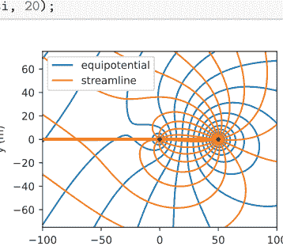

*图 8.1* 一个注水井（$Q = -100 \text{ m}^3/\text{d}$）和一个抽水井（$Q = 200 \text{ m}^3/\text{d}$）在向东南方向均匀流中的解析单元模型流网。

**练习 8.1：** 使用上面开发的解析单元代码，为图7.1所示的均匀流中的单井示例（但包含等势线和流线）创建一个流网。使用导水系数 $T = 250 \text{ m}^2/\text{d}$。

必须在含水层中至少定义一个点的水头；否则，沿等值线的水头值将没有意义（可以给所有值加上一个任意值，得到相同的流场）。这里实现了两种指定水头的单元类型：具有指定水头的井和一个加性常数，该常数也是从指定水头条件计算得出的。指定水头单元的自由参数是通过为所有指定水头条件建立一个方程组并同时求解所有自由参数来计算的。这个过程通过求解一个包含均匀流、两个井和一个常数的问题来说明。

考虑一个含水层，其中存在沿正$x$方向的均匀流 $U$，以及两个井和一个实常数 $C$（图8.2）。第一个井位于 $(x, y) = (0, 0)$，具有指定的流量 $Q$。第二个井位于 $(x, y) = (a, b)$，流量为 $P$。两个井的半径均为 $r_w$。该问题的复势由均匀流的复势（公式7.19）、两个井的复势（公式7.21）和一个实常数 $C$ 叠加得到：

$$\Omega = -U\zeta + \frac{Q}{2\pi} \ln(\zeta) + \frac{P}{2\pi} \ln(\zeta - (a + ib)) + C$$

第一个井的流量 $Q$ 是指定的，但第二个井的流量 $P$ 是未知的，必须计算使得第二个井处的水头等于 $h_w$。此外，已知 $(x, y) = (a, 0)$ 处的水头为 $h_0$。这给出了两个方程，用于求解两个未知参数 $C$ 和 $P$。

参数 $P$ 和 $C$ 从以下两个线性方程组中获得：

$$\Phi|_{\zeta=a} = \Phi_0$$
$$\Phi|_{\zeta=a+r_w+ib} = \Phi_w$$

其中 $\Phi_0$ 和 $\Phi_w$ 分别是 $h_0$ 和 $h_w$ 的势函数等价物。注意，井处的水头是在 $(x, y) = (a + r_w, b)$ 处指定的，该点被称为配置点；在井筛管上的另一点指定可能会导致略有不同的解，但差异通常可以忽略不计。将复势的实部（公式8.4）代入公式(8.5)中的 $\Phi$，并重新排列项，得到以下包含两个未知数的方程组：

$$\frac{P}{2\pi} \ln(b) + C = \Phi_0 + Ua - \frac{Q}{2\pi} \ln(a)$$
$$\frac{P}{2\pi} \ln(r_w) + C = \Phi_w + U(a + r_w) - \frac{Q}{2\pi} \ln(d)$$

其中 $d = \sqrt{(a + r_w)^2 + b^2}$ 是指定流量井与指定水头井筛管上配置点之间的距离。以矩阵形式表示，方程组为：

$$\begin{pmatrix} \frac{1}{2\pi} \ln(b) & 1 \\ \frac{1}{2\pi} \ln(r_w) & 1 \end{pmatrix} \begin{pmatrix} P \\ C \end{pmatrix} = \begin{pmatrix} \Phi_0 + Ua - \frac{Q}{2\pi} \ln(a) \\ \Phi_w + U(a + r_w) - \frac{Q}{2\pi} \ln(d) \end{pmatrix}$$

通过求解这个包含两个未知数的线性方程组，可以获得未知的自由参数 $P$ 和 $C$。

如上定义的`Model`类的`solve`方法，会统计具有未知参数的单元数量，并将它们存储在一个单独的列表`esolve`中，构建方程组的矩阵和右端项，求解该方程组，并将计算出的参数存储到相应的指定水头单元中（在本例中是 $P$ 和 $C$ 的值）。`solve`方法遍历`esolve`列表中的所有单元，并调用它们的`equation`函数，该函数为矩阵返回一行，为右端项返回一个值。`Constant`单元（尚未定义）的`equation`方法返回矩阵的第一行和右端项向量的第一个值，而第二个井的`equation`方法返回矩阵的第二行和右端项向量的第二个值。

方程函数存储在一个单独的混入类`HeadEquation`中，因为它对所有指定水头的单元都是相同的。每个使用此混入类的单元必须存储指定水头的配置点位置`xc`和`yc`，以及配置点处指定的流量势值`pc`。方程函数从矩阵的一行（一个空列表）和一个等于指定流量势`pc`的右端项值开始。然后，方程函数遍历模型中的所有单元。如果一个单元具有未知参数（`nunknowns==1`），则在配置点评估其势影响函数`potinf`，并将其存储为矩阵行中的下一个值。如果一个单元没有未知参数，则在配置点评估其势函数，并将返回的值从右端项值中减去。

```python
class HeadEquation:

    def equation(self):
        row = []
        rhs = self.pc
        for e in self.model.elements:
            if e.nunknowns == 1:
                row.append(e.potinf(self.xc, self.yc))
            else:
                rhs -= e.potential(self.xc, self.yc)
        return row, rhs
```

现在，用于指定水头井的`HeadWell`类可以从`Well`类和`HeadEquation`类派生。输入参数是添加该单元的模型、井的位置、半径和指定的水头。配置点的`xc`和`yc`位置被存储，配置点处的指定势`pc`也被存储。未知参数的数量`nunknowns`设置为1。所有其他属性和函数都继承自`Well`和`HeadEquation`类。

```python
class HeadWell(Well, HeadEquation):

    def __init__(self, model, xw, yw, rw, hw):
        Well.__init__(self, model, xw, yw, 0, rw)
        self.xc, self.yc = xw + rw, yw
        self.pc = self.model.T * hw
        self.nunknowns = 1
```

`Constant`类从`Element`类和`HeadEquation`类派生。输入参数是添加该单元的模型，以及指定水头的位置和值。`Constant`类的`omegainf`函数简单地等于1。`Constant`单元也被称为参考点。

```python
class Constant(Element, HeadEquation):

    def __init__(self, model, xc, yc, hc):
        Element.__init__(self, model, p=0)
        self.xc, self.yc = xc, yc
        self.pc = self.model.T * hc
        self.nunknowns = 1
```

def omegainf(self, x, y):
    return np.ones_like(x, dtype='complex')

图8.2的示例问题（如上所述）使用迄今开发的解析单元代码进行求解。解析单元模型通过以下五个命令创建：

```python
# parameters and model
ml = Model(T=100) # transmissivity in m^2/d
w1 = Well(ml, xw=0, yw=0, Q=100, rw=0.3) # Q in m^3/d
w2 = HeadWell(ml, xw=400, yw=300, rw=0.3, hw=20)
uf = UniformFlow(ml, gradient=0.002, angle=0)
rf = Constant(ml, xc=400, yc=0, hc=22)
```

在上面的代码单元中，模型被命名为`ml`。模型中的未知参数通过在下面的代码单元中调用模型的`solve`方法来计算。接下来，计算指定水头井和参考点处的水头，以验证解确实正确。此外，将指定流量井的水头和指定水头井的计算流量打印到屏幕上。计算水头和流函数的网格，并将网格上的最小值和最大值打印到屏幕上，这些值用于指定要绘制的等值线的值。最后，创建一个流网（图8.2中的右图）。注意流函数中（不幸的）分支切割，它们从每个井向左延伸。

```python
# solution
ml.solve() #compute the unknown parameters
print(f'computed head at discharge-specified well: {ml.head(0, 0):.2f} m')
print(f'computed head at head-specified well: {ml.head(400.3, 300):.2f} m')
print(f'computed discharge of head-specified well: {w2.parameter:.2f} m^3/d')
print(f'computed head at reference point: {ml.head(400, 0):.2f} m')
# grid
xg, yg = np.meshgrid(np.linspace(-200, 600, 100), np.linspace(-100, 500, 100))
head = ml.head(xg, yg)
psi = ml.streamfunction(xg, yg)
print(f'min and max head on grid: {head.min():.2f}, {head.max():.2f}')
print(f'min and max psi on grid: {psi.min():.2f}, {psi.max():.2f}')
```

指定流量井的计算水头：21.81 m
指定水头井的计算水头：20.00 m
指定水头井的计算流量：185.10 m^3/d
参考点的计算水头：22.00 m
网格上的最小和最大水头：20.57, 23.47
网格上的最小和最大流函数值：-137.29, 66.91

```python
# basic flow net (right graph)
plt.subplot(111, aspect=1)
plt.contour(xg, yg, head, np.arange(20, 24, 0.2))
Q = w2.parameter # used to set stream function contour interval
plt.contour(xg, yg, psi, np.arange(-200, 100, Q / 20));
```

**练习8.2：** 修改`HeadWell`类，以指定控制点的可选位置。为前面的示例绘制流网，但现在指定水头井的水头为21.5 m，并指定在`(x, y) = (400, 200)`处。计算指定水头井的水头和指定水头井的流量。

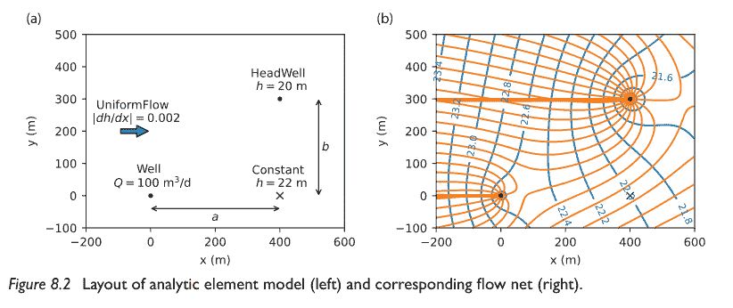

#### 8.2 用于模拟河流和溪流的线汇

抽水井有时被称为点汇，因为它们在一点取水（完全贯穿井在整个含水层厚度上取水，这在二维水平面上是一个点）。线汇沿一条线段取水，可用于模拟地下水流入或流出狭窄河流、溪流或运河的河段。上一节开发的解析单元代码被扩展以包含线汇。运行本节示例需要上一节定义的所有解析单元类`Model`、`Element`、`HeadEquation`、`Constant`、`UniformFlow`、`Well`和`HeadWell`。

具有均匀流入的线汇的复势可以通过沿一条线对点汇（井）的复势进行积分得到，这给出（例如，Strack, 2017）

$$\Omega = \frac{\sigma L}{4\pi}[(Z + 1) \ln(Z + 1) - (Z - 1) \ln(Z - 1)]$$ (8.8)

其中$\sigma$是线汇的流入量（线汇单位长度的流量，从含水层取水时为正），$L$是线汇的长度，$Z$定义为

$$Z = \frac{2\zeta - (\zeta_0 + \zeta_1)}{\zeta_1 - \zeta_0}$$ (8.9)

其中$\zeta$是复坐标，$\zeta_0$和$\zeta_1$是线汇端点的复坐标。注意在$\zeta = \zeta_0$处$Z = -1$，在$\zeta = \zeta_1$处$Z = +1$。线汇的总流量$Q$为$Q = \sigma L$。

线汇被添加到第8.1节开发的井和均匀流的解析单元代码中。输入参数是添加该单元的模型、端点的坐标和流入量$\sigma$。`LineSink`类有一个函数：`omegainf`函数，它实现了$\sigma = 1$时的公式(8.8)。线汇的复势在端点处是奇异的，其中变量$Z$等于$-1$或$+1$，但流量势是有限的

$$\lim_{Z \to -1} (Z + 1) \ln(Z + 1) = \lim_{Z \to 1} (Z - 1) \ln(Z - 1) = 0$$ (8.10)

当$(Z - 1)$或$(Z + 1)$的绝对值小于$10^{-12}$时，在下面的代码中使用`np.where`函数将其值设置为$10^{-12}$。

```python
class LineSink(Element):

    def __init__(self, model, x0=0, y0=0, x1=1, y1=1, sigma=1):
        Element.__init__(self, model, sigma)
        self.z0 = x0 + y0 * 1j
        self.z1 = x1 + y1 * 1j
        self.L = np.abs(self.z1 - self.z0)

    def omegainf(self, x, y):
        zeta = x + y * 1j
        Z = (2 * zeta - (self.z0 + self.z1)) / (self.z1 - self.z0)
        Zp1 = np.where(np.abs(Z + 1) < 1e-12, 1e-12, Z + 1)
        Zm1 = np.where(np.abs(Z - 1) < 1e-12, 1e-12, Z - 1)
        return self.L / (4 * np.pi) * (Zp1 * np.log(Zp1) - Zm1 * np.log(Zm1))
```

作为第一个示例，计算并绘制了单个线汇的流网，如图8.3的左图所示。分支切割从线汇的第一个点开始，并沿与线汇相同的方向延伸到无穷远。沿水头的变化绘制在图8.3的右图中。

```python
# parameters and model
ml = Model(T=100) # transmissivity, m^2/d
ls1 = LineSink(ml, x0=-200, y0=-150, x1=200, y1=150, sigma=0.1) # sigma, m^2/d
```

```python
# solution
xg, yg = np.meshgrid(np.linspace(-400, 400, 100), np.linspace(-300, 300, 100))
h = ml.head(xg, yg)
psi = ml.streamfunction(xg, yg)
xs, ys = np.linspace(-200, 200, 100), np.linspace(-150, 150, 100)
hs = ml.head(xs, ys) # head along line-sink
```

```python
# basic plot
plt.subplot(121, aspect=1)
plt.contour(xg, yg, h, 10)
plt.contour(xg, yg, psi, 20)
plt.plot([-200, 200], [-150, 150], 'k')
plt.subplot(122)
plt.plot(np.sqrt((xs + 200) **2 + (ys + 150) ** 2), hs);
```

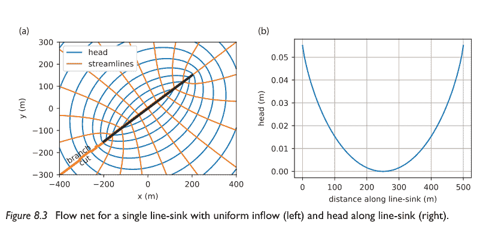

流入量沿一条线汇是均匀的，这导致水头沿线汇变化（图8.3的右图）。这意味着具有均匀水头的有限沟渠不能用单个均匀流入的线汇来模拟。这样的沟渠必须用一串多个线汇来模拟，因为沟渠两端附近的流入量大于沟渠中部的流入量。

线汇的自由参数是线汇单位长度的流入量$\sigma$。当线汇用于模拟地表水特征的河段时，流入量（流出时为负）可以从指定水头条件计算。这里，水头在线汇的中心（配置点）处指定。在下面的代码中，`HeadLineSink`类派生自`LineSink`和`HeadEquation`类。输入参数是添加该单元的模型、端点的坐标和线汇中心指定的水头。与所有指定水头的单元一样，配置点的位置存储为`xc`和`yc`，配置点的势存储为`pc`。未知数的数量设置为1。

```python
class HeadLineSink(LineSink, HeadEquation):

    def __init__(self, model, x0=0, y0=0, x1=1, y1=1, hc=1):
        LineSink.__init__(self, model, x0, y0, x1, y1, 0)
        self.xc = 0.5 * (x0 + x1)
        self.yc = 0.5 * (y0 + y1)
        self.pc = self.model.T * hc
        self.nunknowns = 1
```

一串线汇可用于模拟狭窄的河流或溪流。溪流需要根据三个标准细分为线汇：线汇串必须代表溪流的几何形状，并且线汇必须足够短以模拟河流水位的变化以及沿溪流的流入或流出变化。回想一下，每个线汇的流入量是均匀的。在当前指定水头线汇的实现中，含水层中的水头被设置为等于线汇中心指定的水头，这意味着含水层与溪流直接接触。或者，可以通过指定第7.4节的条件(7.34)来考虑透水河床的阻力，但这超出了本书的范围（例如，参见Haitjema, 1995）。

作为弯曲溪流的示例，考虑一口井在蜿蜒的溪流附近抽水。溪流用围绕x轴的正弦函数近似为$y = 50 \sin(\pi x/400)$。一个指定水头井位于$(x, y) = (0, 100)$，其水头比河流水头低2 m。在$(x, y) = (0, 1000)$处，水头固定为比河流水位高2 m。从$x = -1600$ m到$x = 1600$ m的一段溪流被模拟，这在井的左右两侧足够远，以至于进一步延伸不会显著影响井周围区域的水头。靠近井的溪流使用长度为50 m的较短线汇表示，而较远的地方使用长度为200 m的较长线汇。所有其他参数在下面的脚本中给出。整个模型的水头等值线图如图8.4的左图所示，而井周围区域的等值线图如图8.4的右图所示。

```python
# parameters and model
hriver = 10 # head in river, m
ml = Model(T=100) # transmissivity, m^2/d
rf = Constant(ml, xc=0, yc=1000, hc=hriver + 2)
w = HeadWell(ml, xw=0, yw=100, rw=0.3, hw=hriver - 2)
xls = np.linspace(-1600, 1600, 101) # x-locations of line-sinks, m
xls = np.hstack((np.arange(-1600, -400, 200),
```

np.arange(-400, 400, 50), np.arange(400, 1601, 200)))
yls = 50 * np.sin(np.pi * xls / 400) # 线汇的y坐标，单位：米
for i in range(len(xls) - 1):
    HeadLineSink(ml, x0=xls[i], y0=yls[i],
                 x1=xls[i + 1], y1=yls[i + 1], hc=hriver)

# 求解
ml.solve()
xg1, yg1 = np.meshgrid(np.linspace(-1800, 1800, 100),
                       np.linspace(-1200, 1200, 100))
h1 = ml.head(xg1, yg1) # 整个模型
xg2, yg2 = np.meshgrid(np.linspace(-400, 400, 100), np.linspace(-100, 400, 100))
h2 = ml.head(xg2, yg2) # 井周围的模型

# 基本等值线图
plt.subplot(121, aspect=1)
plt.contour(xg1, yg1, h1, 10)
plt.plot(xls, yls, 'k')
plt.subplot(122, aspect=1, xlim=(-400, 400))
plt.contour(xg2, yg2, h2, 10)
plt.plot(xls, yls, 'k');

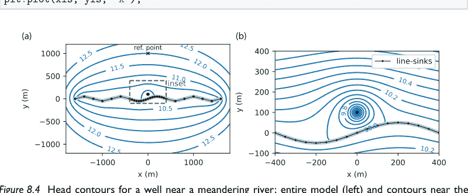

**练习 8.3：** 将一个线汇与10口等距分布的井进行比较。绘制一个长度为200米、$\sigma = 2 \text{ m}^2/\text{d}$ 的线汇的水头等值线。在同一张图上，绘制10口等距分布的井的水头等值线，这些井的总流量等于该线汇的总流量。含水层的导水系数为 $T = 100 \text{ m}^2/\text{d}$，线汇的端点位于 $(-100, 0)$ 和 $(100, 0)$。指定远处 $(0, 10000)$ 处的水头为20米。

**练习 8.4：** 模拟流向一条指定水头为10米的沟渠的水流。该沟渠从 $(-200, -100)$ 延伸至 $(200, 100)$。$(0, 400)$ 处的水头为12米。使用足够数量的线汇，使得沟渠沿线的水头近似均匀。导水系数为 $200 \text{ m}^2/\text{d}$。创建一个流网，并分别绘制沟渠沿线的水头变化图和入流变化图。计算流入沟渠的总入流量。

**练习 8.5：** 考虑一口井在沿 $x$ 轴的长直河流附近抽水。含水层的导水系数为 $200 \text{ m}^2/\text{d}$，河流中的水头为8米。井位于 $(0, 100)$，井半径为0.3米，井内水头为6米。使用指定水头的线汇来模拟河流。使用足够数量且长度合适的线汇，使得解析单元法的解与通过镜像法（练习6.8）得到的精确解合理一致。计算该井的流量。

#### 8.3 用于模拟面状补给的面积汇

具有指定补给量的有界区域称为面积汇。面积汇是本章开发的解析单元代码中添加的最后一种解析单元类型。运行本节示例需要前面各节定义的所有解析单元类：Model、Element、HeadEquation、Constant、UniformFlow、Well、HeadWell、LineSink 和 HeadLineSink。

本节讨论具有均匀补给的圆形面积汇。也存在矩形面积汇或由任意闭合多边形界定的面积汇（例如，Strack, 2017），但它们的方程要复杂得多，超出了本书的范围。圆形面积汇对于模拟降水产生的面状补给非常有用。只要面积汇覆盖整个模型区域，并且模型区域内的水头由例如指定水头的线汇固定（如本节末尾的示例所示），其圆形几何形状通常不是问题。

考虑一个以 $(x, y) = (x_a, y_a)$ 为中心、半径为 $R$ 的圆形面积汇。在面积汇内部，补给是均匀的，等于 $N$。注意，对于进入含水层的水，$N$ 为正值（这与井和线汇相反，对于离开含水层的水，流量 $Q$ 和单位长度流量 $\sigma$ 为正值）。面积汇内部的控制微分方程为

$$\nabla^2 \Phi = \frac{d^2 \Phi}{dr^2} + \frac{1}{r} \frac{d \Phi}{dr} = -N \quad r \leq R \qquad (8.11)$$

其中 $r = \sqrt{(x - x_a)^2 + (y - y_a)^2}$ 是局部径向坐标。在面积汇外部，面状补给等于零，控制微分方程为拉普拉斯方程（方程6.11）。面积汇内部的解已经推导出（方程6.29）为

$$\Phi = -\frac{1}{4} N (r^2 - R^2) \quad r \leq R \qquad (8.12)$$

在面积汇外部，解等于注入率为 $N \pi R^2$ 且在 $r = R$ 处势函数为零的注入井的解

$$\Phi = -\frac{N R^2}{2} \ln(r/R) \quad r \geq R \qquad (8.13)$$

注意，势函数（因此水头）和流量向量在面积汇的边界上是连续的。流函数在面积汇内部不存在，因为流函数仅在面状补给为零时存在，并且在面积汇外部不使用。

AreaSink 类定义如下。输入参数包括：添加面积汇的模型、面积汇中心的位置、面积汇内部的均匀补给量以及面积汇的半径。AreaSink 类存储所有输入参数，并包含 omegainf 函数，其中实部是上述定义的势函数（方程 (8.12) 和 (8.13)，其中 $N = 1$），虚部等于零。

```python
class AreaSink(Element):

    def __init__(self, model, xc=0, yc=0, N=0.001, R=100):
        Element.__init__(self, model, N)
        self.xc, self.yc = xc, yc
        self.R = R

    def omegainf(self, x, y):
        r = np.atleast_1d(np.sqrt((x - self.xc) ** 2 + (y - self.yc) ** 2))
        phi = np.zeros(r.shape)
        phi[r < self.R] = -0.25 * (r[r < self.R] ** 2 - self.R ** 2)
        phi[r >= self.R] = -self.R ** 2 / 2 * np.log(r[r >= self.R] / self.R)
        return phi + 0j
```

作为第一个示例，考虑两个相邻面积汇的合成案例。一个是补给区，另一个是排泄区。总补给量等于总排泄量，因此流场是对称的，该问题可用于验证解的实现。图8.5左侧显示了水头的等值线，右侧显示了穿过两个面积汇中心的剖面图。注意，最高和最低水头并不在面积汇的中心。

```python
# 参数和模型
ml = Model(T=100) # 导水系数，单位：m^2/d
rf = Constant(ml, xc=0, yc=0, hc=20)
as1 = AreaSink(ml, xc=-500, yc=0, N=0.001, R=500) # 补给，单位：m/d
as2 = AreaSink(ml, xc=500, yc=0, N=-0.001, R=500) # 排泄，单位：m/d

# 求解
ml.solve()
xg, yg = np.meshgrid(np.linspace(-1500, 1500, 100), np.linspace(-800, 800, 101))
h = ml.head(xg, yg)

# 基本绘图
plt.subplot(121, aspect=1)
plt.contour(xg, yg, h, 20)
plt.subplot(122)
plt.plot(xg[0], h[50]);
```

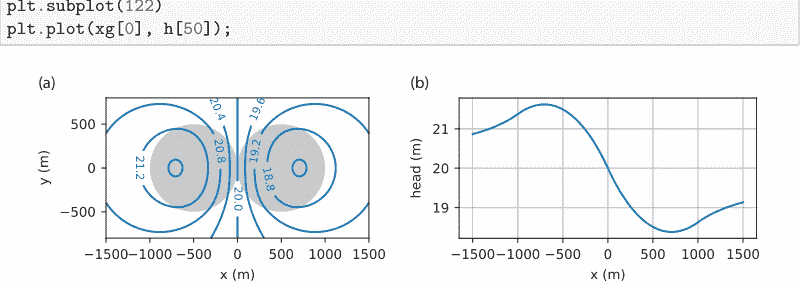

**练习 8.6：** 使用解析单元法复制第6.1节的最终示例，针对井抽水量为岛上一半补给量的情况。将导水系数近似为 $k(h_R - z_b)$。在同一张图上绘制恒定导水系数的解析单元解和第6.1节无压流的精确解。

作为最后一个示例，所有解析单元被组合在一个模型中，两口抽水井位于两条河流分支之间。每条河流分支用8个线汇模拟。井的位置和流量，以及河段中心的坐标和水头如下所示，并绘制在图8.6（左图）中。通过一个足够大的圆形面积汇添加面状补给，以覆盖河流之间的区域。

在模型区域外指定一个点的水头；这样的点在解析单元模型中称为参考点。参考点处指定的水头控制着从无穷远流向模型区域的水量。当参考点处的水头较高时，大量水流向模型区域；而当参考点处的水头较低时，水流从模型区域流向无穷远。因此，参考点是

#### 第9章

### 瞬态二维流动

迄今为止介绍的所有二维解都是针对稳定流的：水头和流量是 $x$ 和 $y$ 的函数，但不是时间 $t$ 的函数。在本章中，我们考虑流量随时间变化的井。水头和流量都是 $x$、$y$ 和 $t$ 的函数。我们将讨论在各种设置下，由瞬态井引起的水头和流量变化。

水平 $x$、$y$ 平面上二维瞬态流动的连续性方程可以写为

$$\frac{\partial Q_x}{\partial x} + \frac{\partial Q_y}{\partial y} = -S \frac{\partial h}{\partial t} + N \qquad (9.1)$$

其中 $N$ 是面状补给量，$S$ 是储水系数，对于无压流，它等于潜水储水系数 $S = S_p$；对于承压流，它等于比储水系数 $S_s$ 与含水层厚度 $H$ 的乘积（$S = S_s H$）（见第5章）。请注意，该方程与一维瞬态流动的连续性方程（公式5.5）相比，仅多了一项 $\partial Q_y / \partial y$。

流量矢量的分量用水头的导数表示为

$$Q_x = -T \frac{\partial h}{\partial x} \qquad Q_y = -T \frac{\partial h}{\partial y} \qquad (9.2)$$

其中导水系数近似为常数，对于无压流也是如此（见第5章）。将公式 (9.2) 中的 $Q_x$ 和 $Q_y$ 代入公式 (9.1)，得到二维瞬态流动的微分方程

$$\nabla^2 h = \frac{S}{T} \frac{\partial h}{\partial t} - \frac{N}{T} \qquad (9.3)$$

流量势对于瞬态流不太有用（除了第5.5节讨论的无压流的替代公式），流函数和复势仅适用于由拉普拉斯方程控制的流动，因此这里不使用它们。当面状补给可忽略不计（$N = 0$）时，公式 (9.3) 简化为二维扩散方程

$$\nabla^2 h = \frac{S}{T} \frac{\partial h}{\partial t} \qquad (9.4)$$

此外，如果流动是径向对称的，则微分方程变为（与公式 (6.8) 比较）

$$\frac{\partial^2 h}{\partial r^2} + \frac{1}{r} \frac{\partial h}{\partial r} = \frac{S}{T} \frac{\partial h}{\partial t} \qquad (9.5)$$

二维扩散方程的解在数学上很难推导，即使是许多径向对称流动的情况也是如此。获得精确解的数学解法包括相似解、分离变量法和各种变换技术（拉普拉斯变换、汉克尔变换和傅里叶变换）。下面将介绍几个瞬态井流的解，而不是推导它们。这些解将像其他章节一样进行讨论、编程和可视化。所给解的数学正确性可以通过对解进行微分并代入微分方程（解析或数值地）来验证，并通过验证满足边界条件和初始条件来确认。

本章介绍的所有解都是针对瞬态井引起的水头变化，这允许在时间上叠加瞬态解，以及叠加稳定解和瞬态解。介绍了承压、无压、半承压和双层含水层系统中井的瞬态流解，包括从抽水试验估算含水层参数。最后两节涉及井筒储水和表皮效应的影响，以及双层含水层系统中的瞬态抽水。这些问题在拉普拉斯域中求解，物理域中的解通过数值反变换获得。

#### 9.1 承压和无压含水层中的井

本节介绍了一个在具有恒定导水系数 $T$ 和储水系数 $S$ 的含水层中，井的瞬态流解。控制微分方程是 (9.5)。井在时间 $t = t_0$ 时开始以流量 $Q$ 抽水。井处的边界条件近似为（类似于边界条件 (6.24)）

$$\lim_{r \to 0} -2\pi r Q_r = Q \quad t \ge t_0$$

最初，由瞬态井引起的含水层中的水头变化当然等于零

$$h|_{r,t=t_0} = 0$$

第二个边界条件是，井在无穷远处引起的水头变化在所有时间都为零

$$h|_{r=\infty,t} = 0$$

水头的解是距井的径向距离 $r$ 和时间的函数，被称为泰斯解（Theis, 1935）

$$h = -\frac{Q}{4\pi T} \mathrm{E}_1(u) \quad t \ge t_0$$

其中

$$u = \frac{Sr^2}{4T(t - t_0)}$$

$\mathrm{E}_1$ 是指数积分，定义为

$$\mathrm{E}_1(u) = \int_u^\infty \frac{\exp(-s)}{s} ds$$

水头在井开始抽水后开始下降。水头的下降也称为降深。因此，例如，1米的降深意味着 $h = -1$ 米。水头仅是无量纲参数 $u$ 的函数。因此，如果在抽水时间 $\Delta t_1$ 后，在距离 $r_1$ 处达到某个降深，那么在抽水时间 $4\Delta t_1$ 后，在距离 $2r_1$ 处将达到相同的降深，因为时间和径向距离的这两种组合导致相同的 $u$ 值

$$u = \frac{Sr_1^2}{4T\Delta t_1} = \frac{S(2r_1)^2}{4T(4\Delta t_1)}$$

**练习 9.1：** 一口井在承压含水层中于时间 $t = 0$ 开始抽水。抽水1天后，在距井 $r_1 = 20$ 米处降深为1米。计算在抽水开始后多少时间（以天计），在距井 $r_2 = 60$ 米处降深为1米。

**练习 9.2：** 考虑一口流量为 $Q = 300$ m$^3$/d 的井，位于导水系数 $T = 500$ m$^2$/d、储水系数 $S = 0.2$ 的承压含水层中。抽水1天后，距井多远处降深为0.2米？提示：使用 `scipy.optimize` 的 `fsolve` 函数。

**练习 9.3：** 考虑一口流量为 $Q = 300$ m$^3$/d、半径为 $r_w = 0.3$ 米的井。该井在 $T = 500$ m$^2$/d、$S = 0.2$ 的含水层中已抽水1天。通过使用 `scipy.integrate` 的数值积分函数计算积分 $\int_{r_w}^{\infty} Sh 2\pi r dr$，计算从储水中移除的水量。将你的答案与井从含水层中移除的总水量进行比较。

函数 $E_1$ 可以从 `scipy.special` 包中作为 `exp1` 获得，但也存在一个级数表示，这对于评估极限情况（例如，大时间）很有用。级数表示为（例如，Abramowitz and Stegun, 1965）

$$E_1(u) = -\gamma - \ln u - \sum_{n=1}^{\infty} \frac{(-u)^n}{n \cdot n!}$$

其中 $\gamma = 0.5772...$ 是欧拉常数，可以从 `numpy` 中作为 `euler_gamma` 获得。当 $u < 1$ 时，$E_1$ 的级数收敛很快。当 $u$ 较小时，只需要前两项，此时水头的公式可以近似为

$$h \approx \frac{Q}{4\pi T} \left[ \gamma + \ln \left( \frac{Sr^2}{4T(t - t_0)} \right) \right] \quad u < 0.1$$

请注意，当 $r$ 较小或 $t$ 较大，或两者兼有时，$u$ 较小。

井内的水头通过在井半径 $r_w$ 处计算泰斯解得到。图9.1的图中显示了四条曲线：井内水头 $h_w$、$r = 20$ 米处的水头 $h_{20}$、差值 $h_w - h_{20}$，以及使用近似公式 (9.14) 计算的水头 $h_{20}$。时间轴在左图中是线性的，在右图中是对数刻度的。对于这种情况，在 $\sim 0.01$ 天后，差值 $h_w - h_{20}$ 变为常数。近似公式在具有对数刻度时间轴的图中产生一条直线，如公式 (9.14) 所示。近似公式在 $u < 0.1$ 时给出良好的结果，对于这种情况和该位置，这对应于 $t > 0.01$ 天。

```python
# parameters
T = 200 # transmissivity, m^2/d
S = 2E-3 # storage coefficient, -
rw = 0.3 # radius of well, m
```

一个模型特征，而非物理特征。如果模型区域被足够多的指定水头单元（例如，河流、溪流和运河）包围，参考点处的水头不会显著影响模型区域内的水头。建议在参考点指定一个水头，使得模型区域外的水头梯度与模型区域内的水头梯度相似。

```python
# river segments, all in m
xls0 = [0, 100, 200, 400, 600, 800, 1000, 1100, 1200]
yls0 = [200, 200, 100, 100, 0, 0, 100, 300, 450]
hls0 = np.linspace(39, 40.4, 8)
xls1 = [0, 0, 200, 400, 600, 800, 1000, 1100, 1200]
yls1 = [200, 400, 600, 600, 700, 700, 750, 800, 850]
hls1 = np.linspace(39, 40.4, 8)
```

```python
# parameters and model
ml = Model(T=100) # transmissivity, m^2/d
rf = Constant(ml, xc=0, yc=800, hc=39.5)
w0 = Well(ml, xw=500, yw=250, Q=100) # discharge, m^3/d
w1 = Well(ml, xw=800, yw=500, Q=100) # discharge, m^3/d
for i in range(len(hls0)):
    HeadLineSink(ml, xls0[i], yls0[i], xls0[i + 1], yls0[i + 1], hls0[i])
for i in range(len(hls1)):
    HeadLineSink(ml, xls1[i], yls1[i], xls1[i + 1], yls1[i + 1], hls1[i])
ar = AreaSink(ml, xc=600, yc=400, N=0.001, R=700) # recharge, m/d
```

```python
# solution
ml.solve()
xg, yg = np.meshgrid(np.linspace(-100, 1300, 100), np.linspace(-100, 900, 100))
h = ml.head(xg, yg)
```

```python
# basic contour plot (right side of figure)
plt.subplot(111, aspect=1)
cs = plt.contour(xg, yg, h, np.arange(38, 41, 0.2), colors='C0')
plt.clabel(cs, fmt='%1.1f', fontsize='smaller')
plt.contour(xg, yg, h, np.arange(38.1, 41, 0.2), colors='C0')
plt.plot(xls0, yls0, 'k')
plt.plot(xls1, yls1, 'k')
plt.plot([w0.zw.real, w1.zw.real], [w0.zw.imag, w1.zw.imag], 'k.');
```

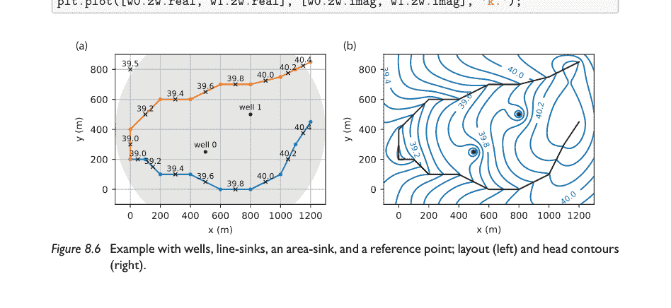

Q = 1000 # 井的流量，m^3/d
t0 = 0 # 抽水开始时间，d

# 求解
from scipy.special import exp1
def htheis(r, t, T, S, Q, t0=0):
    return -Q / (4 * np.pi * T) * exp1(S * r ** 2 / (4 * T * (t - t0)))

t = np.logspace(-3, 0, 100)
hw = htheis(rw, t, T, S, Q, t0)
h20 = htheis(20, t, T, S, Q, t0)
h20approx = Q / (4 * np.pi * T) * (np.euler_gamma +
                                    np.log(S * 20 ** 2 / (4 * T * (t - t0))))

# 基本绘图
plt.subplot(121)
plt.plot(t, hw, label='$h_w$')
plt.plot(t, h20, label='$h_{20}$')
plt.plot(t, h20approx, '--', label='$h_{20}$ 近似')
plt.plot(t, hw - h20, label='$h_w - h_{20}$')
plt.legend()
plt.subplot(122)
plt.semilogx(t, hw)
plt.semilogx(t, h20)
plt.semilogx(t, h20approx, '--')
plt.semilogx(t, hw - h20);

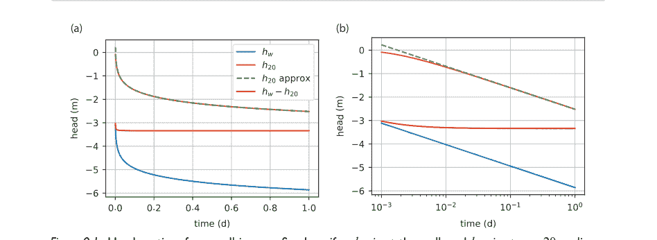

可以预期，当一口井抽水足够长时间后，水头会趋近于稳定状态。奇怪的是，情况并非如此：对于瞬态井（公式 9.9），当时间很大时，其水头并不会趋近于无限含水层中稳定井的水头（公式 6.37）。对于稳定井（公式 6.37），当 $r$ 趋近于无穷大时，水头趋近于无穷大，因为无限含水层中稳定井的水源位于无穷远处。对于瞬态井，当 $r$ 趋近于无穷大时，水头趋近于零。这意味着泰斯解中瞬态井抽出的所有水都来自储水。对于在无限含水层中抽水的单个瞬态井，无法确定降深等于零的位置距离，因为理论上降深仅在无穷远处才等于零。显然，在距离井远得多的地方，降深已经可以忽略不计。降深可忽略不计的距离可以通过将大时间近似公式（公式 9.14）改写为梯姆方程（公式 6.25）的形式来估算

$$h \approx \frac{Q}{2\pi T} \ln(r/R) \quad r \leq R$$

其中距离 $R$ 是时间的函数

$$R = \sqrt{4T(t-t_0)e^{-\gamma}/S}$$

距离 $R$ 可用作降深可忽略不计的距离的近似值。

**练习 9.4：** 使用示例中的参数，绘制时间 $t = 1$ d 时，$r$ 从 $r_w$ 变化到 600 m 的水头与 $r$ 的关系图。在同一图上，绘制近似公式 (9.15)。

尽管泰斯解本身的水头并不趋近于稳定井的稳定状态水头，但两个位置之间的水头差确实趋近于一个常数值。这在图 9.1 中已经显示，对于本例，在 $t > 0.01$ d ($u < 0.1$) 时，$r = r_w$ 和 $r = 20$ m 之间的水头差趋近于一个常数值。类似地，对于小 $u$，流量矢量趋近于稳定解。泰斯解的流量矢量径向分量 $Q_r$ 可由公式 (9.9) 得到

$$Q_r = -T \frac{\partial h}{\partial r} = -T \frac{dh}{du} \frac{\partial u}{\partial r} = -\frac{Q}{2\pi} \frac{1}{r} e^{-u}$$

当时间很大时，$u$ 趋近于零，$Q_r$ 趋近于稳定流量矢量

$$Q_r = -\frac{Q}{2\pi} \frac{1}{r}$$

**练习 9.5：** 计算 $r = r_w$ 和 $r = 20$ m 之间的稳定水头差，并将你的答案与时间从 $t = 0.01$ 到 $t = 1$ d 变化时瞬态解得到的水头差进行比较。

在实践中，水源总是比无穷远更近，如果在解中包含该水源，瞬态解在大时间时会趋近于稳定解。例如，考虑一口位于 $(x, y) = (-d, 0)$ 的井，靠近一条沿 $x = 0$ 具有恒定水头 $h_0$ 的大而直的河流。稳定解可以通过镜像法（第 6.2 节）获得。瞬态解也可以通过镜像法获得

$$h = -\frac{Q}{4\pi T} \left[ \text{E}_1 \left( \frac{S r_1^2}{4T(t-t_0)} \right) - \text{E}_1 \left( \frac{S r_2^2}{4T(t-t_0)} \right) \right] + h_0$$

其中 $r_1^2 = (x+d)^2 + y^2$ 且 $r_2^2 = (x+d)^2 + y^2$。对于大时间，$\text{E}_1$ 可以再次用级数表示的前两项（公式 9.13）来表示。将这些项代入公式 (9.19) 中的 $\text{E}_1$，经过一些代数运算可得稳定解

$$h = \frac{Q}{2\pi T} \ln \frac{r_1}{r_2} + h_0$$

瞬态解可以在时间和空间上叠加。例如，考虑一口井，其流量为 $Q$，从 $t = t_0$ 运行到 $t = t_1$，在 $t_1$ 之后流量为零。对于 $t > t_1$ 的时段，水头函数由两个泰斯井组成，一个是从 $t = t_0$ 开始、流量为 $Q$ 的井，另一个是从 $t = t_1$ 开始、流量为 $-Q$ 的井

$$h = -\frac{Q}{4\pi T} \left[ \text{E}_1 \left( \frac{S r^2}{4T(t-t_0)} \right) - \text{E}_1 \left( \frac{S r^2}{4T(t-t_1)} \right) \right] \quad t \geq t_1$$

井关闭后水头的变化称为恢复阶段，因为水头（缓慢地）恢复到其原始位置。对于大时间，$E_1$ 可以再次用 $E_1$ 级数表示的前两项（公式 9.13）来表示，这导致

$$h \approx -\frac{Q}{4\pi T} \ln\left(\frac{t - t_1}{t - t_0}\right) \quad t \gg t_1 \quad (9.22)$$

这是一个重要且有些令人惊讶的结果，因为井关闭一段时间后的恢复不依赖于储水系数 $S$。在下面的示例中，绘制了两口井的解，一口井抽水一天后关闭，但储水系数不同。抽水期间的水头响应相当不同，但在恢复阶段，两条曲线迅速趋近，即使储水系数不同。近似公式 (9.22) 也绘制在图 9.2 的恢复阶段。

# 参数
t0 = 0 # 泵启动时间，d
t1 = 1 # 泵关闭时间，d
S = [1E-3, 1E-4] # 储水系数，-
r = 100 # m

# 求解
t = np.linspace(1e-6, 2, 200)
h = np.zeros((2, len(t)))
for i in range(2):
    h[i] = -Q / (4 * np.pi * T) * exp1(S[i] * r ** 2 / (4 * T * (t - t0)))
    h[i, t > t1] -= -Q / (4 * np.pi * T) * exp1(
        S[i] * r ** 2 / (4 * T * (t[t > t1] - t1)))
tapprox = np.linspace(t1 + 0.01, 2, 100)
happrox = Q / (4 * np.pi * T) * np.log((tapprox - t1) / (tapprox - t0))

# 基本绘图
plt.plot(t, h[0])
plt.plot(t, h[1])
plt.plot(tapprox, happrox);

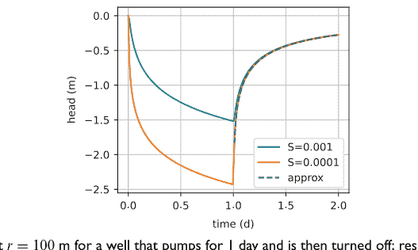

**图 9.2** 一口井抽水 1 天后关闭时，在 $r = 100$ m 处的水头；结果显示了两种不同的储水系数，以及恢复阶段的近似解（公式 9.22）。

泰斯解对于从抽水试验（也称为含水层试验）估算含水层参数非常有用。在抽水试验期间，一口井被打开，并在一个或多个附近的观测井和/或抽水井本身测量水头（降深）。将泰斯解拟合到观测水头，以估算含水层的导水系数 $T$ 和储水系数 $S$。

Kruseman 和 De Ridder (1990) 在他们关于抽水试验的著名著作中描述了在荷兰 *Oude Korendijk* 进行的一次抽水试验。抽水试验的目的是确定含水层的导水系数和储水系数。抽水试验期间井的流量为 788 m$^3$/天。下面给出了距离抽水井 30 m 的观测井的观测降深（以米为单位）和抽水开始后的观测时间（以分钟为单位）。Kruseman 和 De Ridder (1990) 还报告了另外两口井的降深，但这里仅使用一口观测井来演示该方法。时间转换为天，降深转换为水头。

# 取自 Kruseman 和 de Ridder (1990) 的 Oude Korendijk 数据
robs = 30 # 到观测井的距离，m
Q = 788 # 井的流量，m^3/d
time = np.array(
    [0.1 , 0.25, 0.5 , 0.7 , 1. , 1.4 , 1.9 , 2.33, 2.8 ,
     3.36, 4. , 5.35, 6.8 , 8.3 , 8.7 , 10. , 13.1, 18. ,
     27. , 33. , 41. , 48. , 59. , 80. , 95. , 139., 181. ,
     245., 300., 360., 480., 600., 728., 830.]) # 单位：分钟
drawdown = np.array(
    [0.04 , 0.08, 0.13, 0.18, 0.23 , 0.28 , 0.33 , 0.36 , 0.39 ,
     0.42 , 0.45, 0.5 , 0.54, 0.57 , 0.58 , 0.6 , 0.64 , 0.68 ,
     0.742, 0.753, 0.779, 0.793, 0.819, 0.855, 0.873, 0.915, 0.935,
     0.966, 0.99, 1.007, 1.05, 1.053, 1.072, 1.088]) # 单位：米
tobs = time / 24 / 60 # 将观测时间转换为天
hobs = -drawdown # 将降深转换为水头

导水系数和储水系数的值使用最小二乘法估算，通过最小化模拟水头与观测水头之间差值的平方和（类似于第 5.3 节的方法）。目标函数 `fobj` 返回平方误差和，接受五个输入参数：参数 $T$ 和 $S$ 的数组、观测水头、观测时间、到观测井的距离以及井的流量。当关键字参数 `return_heads` 设置为 True 时，函数 `fobj` 返回模拟水头而不是平方误差和。

def fobj(p, ho, to, ro, Q, return_heads=False):
    T, S = p
    hm = htheis(ro, to, T, S, Q)
    if return_heads:
        return hm
    rv = np.sum((ho - hm) ** 2)
    return rv

使用 `scipy.optimize` 包的 `fmin` 函数来找到使目标函数最小化的参数。`fobj` 的四个参数 `ho`、`to`、`ro` 和 `Q` 通过 `fmin` 的 `args` 关键字参数传递给目标函数 `fobj`。`fmin` 函数不估算估算参数的不确定性，但这在这里不是问题，因为估算不确定性的标准程序通常基于模拟水头和观测水头之间的某些统计要求，而这些要求在许多抽水试验分析中被违反（例如，观测水头和模拟水头之间的差异不是独立的）。观测水头和拟合曲线绘制在图 9.3 的同一图上。左图具有线性时间轴。右图具有半对数轴，这使得更容易看到早期的水头变化。

#### 9.1 具有周期性流量的井

井的流量可能随时间周期性变化。例如，在含水层储存与回采系统中，水在水资源充足时注入含水层，在水资源短缺时从含水层中抽出。对于一个ASR井，其流量围绕零值波动，例如呈正弦变化：

$$Q(t) = A \sin(2\pi t / \tau)$$

其中 $A$ 和 $\tau$ 分别是正弦流量的振幅和周期。井处的边界条件近似为：

$$\lim_{r \to 0} -2\pi r Q_r = A \sin(2\pi t / \tau)$$

而无穷远处的边界条件为 (9.8)。没有初始条件：该井已按正弦流量（公式 9.23）运行了很长时间。含水层中的流动受扩散方程 (9.5) 控制。

所述问题的解通过分离变量法获得：解被写成径向距离 $r$ 的函数乘以时间 $t$ 的函数。分析使用复变量进行最为简便。对应于边界条件 (9.23) 的水头解是复数解的虚部 (Bruggeman, 1999)：

$$h = -\frac{A}{2\pi T} \Im \left[ \mathrm{K}_0 \left( \frac{r}{\mu} \sqrt{i} \right) e^{2\pi i t / \tau} \right]$$

其中特征长度 $\mu$ 定义为：

$$\mu = \sqrt{\frac{T}{S} \frac{\tau}{2\pi}}$$

注意 $\mu$ 具有长度量纲。相应的流量矢量径向分量为：

$$Q_r = -\frac{A}{2\pi} \Im \left[ \frac{\sqrt{i}}{\mu} \mathrm{K}_1 \left( \frac{r}{\mu} \sqrt{i} \right) e^{2\pi i t / \tau} \right]$$

正弦水头变化在井处最大，并随与井距离的增加而减小。周期较短的流量变化比周期较长的变化在离井更短的距离内就衰减掉了。需要注意的是，取公式 (9.25) 中复函数的实部，得到的是将公式 (9.23) 中的正弦函数替换为余弦函数情况下的解。

在下面的示例中，绘制了在一个无压含水层中，周期为1年的正弦井流量的解，其中导水系数再次近似为常数。使用 `scipy.special` 包的 `kv` 函数来计算复数自变量的修正贝塞尔函数，因为 `k0` 和 `k1` 函数只接受实数参数。在图 9.4 的左图中，绘制了井处以及距离 $r = \mu$ 和 $r = 2\mu$ 处的水头变化。在 $r = 2\mu$ 处的水头变化振幅与井处的水头变化相比可以忽略不计。在图 9.4 的右图中，绘制了含水层中的总流量 $Q_{\text{tot}} = 2\pi r Q_r$。总流量的振幅在井处等于 $A$，并在 $r = 6\mu$ 处缓慢减小到小于 $0.05A$。

```python
# parameters
T = 100 # transmissivity, m^2/d
S = 1e-1 # storage coefficient, -
tau = 365 # period, d
A = 200 # amplitude of discharge function, m^3/d
rw = 0.3 # radius of well, m
```

```python
mu = np.sqrt(T * tau / (S * 2 * np.pi))
print(f'characteristic length mu: {mu:.2f} m')
```

characteristic length mu: 241.02 m

```python
# solution
from scipy.special import kv
def hsinwell(r, t):
    hcomplex = -A / (2 * np.pi * T) * kv(0, r * np.sqrt(1j) / mu) * \
              np.exp(2 * np.pi * 1j * t / tau)
    return hcomplex.imag

def Qrsinwell(r, t):
    Qrcomplex = -A / (2 * np.pi) * np.sqrt(1j) / mu * \
                kv(1, r * np.sqrt(1j) / mu) * np.exp(2 * np.pi * 1j * t / tau)
    return Qrcomplex.imag
```

```python
# basic plot
t = np.linspace(0, 2 * tau, 100)
plt.subplot(121)
plt.plot(t, hsinwell(rw, t), label='$r=r_w$')
plt.plot(t, hsinwell(mu, t), label='$r=\mu$')
plt.plot(t, hsinwell(2 * mu, t), label='$r=2\mu$')
plt.legend()
plt.subplot(122)
plt.plot(t, Qrsinwell(rw, t) * 2 * np.pi * rw, label='$r=r_w$')
plt.plot(t, Qrsinwell(3 * mu, t) * 2 * np.pi * 3 * mu, 'C3', label='$r=3\mu$')
plt.plot(t, Qrsinwell(6 * mu, t) * 2 * np.pi * 6 * mu, 'C4', label='$r=6\mu$')
plt.legend();
```

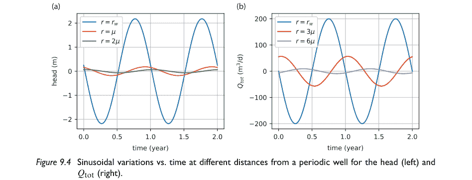

**图 9.4：** 抽水试验分析结果；线性时间轴（左）和对数时间轴（右）。

**练习 9.7：** 使用数值导数验证，对于多个 $r$ 和 $t$ 值，编程实现的 $Q_r$ 确实满足 $Q_r = -T\partial h/\partial r$。

#### 9.3 半承压含水层中的井

半承压含水层中井的稳定流解已在第 6.4 节中给出。本节将给出瞬态流的等效解。考虑一个导水系数为 $T$、储水系数为 $S$ 的半承压含水层。含水层顶部由一个阻力为 $c$ 的半隔水层构成（图 6.12）。忽略半隔水层中的储水。半隔水层上方的水头 $h^*$ 固定为零。通过半隔水层的垂向渗漏量 $q_z$ 按公式 (2.2) 计算：

$$q_z = \frac{h - 0}{c} \quad (9.28)$$

因此，径向流动的控制微分方程为：

$$\frac{\partial^2 h}{\partial r^2} + \frac{1}{r} \frac{\partial h}{\partial r} = \frac{S}{T} \frac{\partial h}{\partial t} + \frac{h}{cT} \quad (9.29)$$

一口井在时间 $t = t_0$ 开始以流量 $Q$ 抽水。初始时，井在含水层中引起的水头变化处处为零。初始和边界条件与 Theis 解 (9.6, 9.7, 和 9.8) 相同。

该问题的解最早由 Hantush 和 Jacob (1955) 获得，称为 Hantush 函数：

$$h = -\frac{Q}{4\pi T} \int_u^\infty \frac{1}{\tau} \exp\left(-\tau - \frac{r^2}{4\lambda^2 \tau}\right) d\tau \quad (9.30)$$

其中 $\lambda = \sqrt{Tc}$ 是越流系数，$u$ 的定义与 Theis 井相同：

$$u = \frac{Sr^2}{4T(t - t_0)} \quad (9.31)$$

对于半隔水层上方水头等于 $h^*$ 而非零的情况，只需在解上加上一个常数 $h^*$ 即可。注意这是允许的，因为 $h = h^*$ 是微分方程的一个特解：

$$\frac{\partial^2 h}{\partial r^2} + \frac{1}{r} \frac{\partial h}{\partial r} = \frac{S}{T} \frac{\partial h}{\partial t} + \frac{h - h^*}{cT} \quad (9.32)$$

水头公式 (9.30) 中看似简单的积分无法解析求解，也未包含在 `scipy.special` 包的特殊函数中；早期文献中包含了制表值。用 Python 计算该积分最简单的方法是使用数值积分，例如 `scipy.integrate` 包的 `quad` 函数。`quad` 函数返回多个项，其中第一项是计算出的积分值。在下面的示例代码中，首先将水头绘制为 $r$ 的函数，然后绘制为 $t$ 的函数（图 9.5）。将半承压含水层中井的解（Hantush）与承压含水层中井的解（Theis）进行了比较。在早期，当井抽出的大部分水来自储水时，Hantush 和 Theis 水头相似。当井抽出的大量水来自通过半隔水层的越流时，Hantush 和 Theis 水头出现偏差。对于下面示例中使用的参数，Hantush 解在大约一天内趋近于半承压含水层中井的稳态解。Theis 解则未达到稳态，如第 9.1 节所述。

```python
# parameters
T = 200 # transmissivity of aquifer, m^2/d
S = 0.0005 # storage coefficient of aquifer, -
c = 1000 # resistance of leaky layer, d
Q = 800 # discharge of well, m^3/d
```

#### 9.4 具有井筒储集和表皮效应的井

先前针对井的瞬态流动解基于两个近似：井的边界条件通过取井半径趋于零的极限来近似（公式 9.6），并且井中的水位近似等于含水层中井半径处的水头。第一个近似忽略了井内水的储存，这被称为井筒储集。第二个近似忽略了井筛管的阻力，这被称为表皮效应。本节将同时考虑这两者。

考虑一个导水系数为 $T$、储水系数为 $S$ 的承压含水层中向一口井的径向流动。该井在时间 $t = 0$ 时开始以流量 $Q$ 抽水。井筛管的半径为 $r_w$（见图 9.7）。流经井筛管的阻力等于 $c_w$，因此在井筛管处的径向流量分量可以写为

$$Q_r|_{r=r_w} = H \frac{h_w - h|_{r=r_w}}{c_w} \qquad (9.38)$$

其中 $h_w$ 是井内的水位。反之，井中的水位可以写为

$$h_w = h|_{r=r_w} + \frac{c_w}{H} Q_r|_{r=r_w} \qquad (9.39)$$

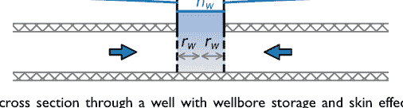

图 9.7 具有井筒储集和表皮效应的井的垂直剖面图。由于表皮效应，井筛管处含水层中的水头高于井内的水位 $h_w$。

井内水的水量平衡为

$$A_w \frac{dh_w}{dt} = Q_{\text{in}} - Q_{\text{out}} \qquad (9.40)$$

其中 $A_w$ 是井内水位处井筛管的横截面积（对于恒定井径的井，$A_w = \pi r_w^2$）。流入量 $Q_{\text{in}}$ 由沿井筛管积分的流入量组成

$$Q_{\text{in}} = -2\pi r_w Q_r|_{r=r_w}$$

而流出量等于井的抽水量

$$Q_{\text{out}} = Q \quad t \ge 0$$

将公式 (9.39) 中的 $h_w$、公式 (9.41) 中的 $Q_{\text{in}}$ 和公式 (9.42) 中的 $Q_{\text{out}}$ 代入井内水量平衡方程，得到

$$A_w \left[ \frac{\partial h}{\partial t}\bigg|_{r=r_w} + \frac{c_w}{H} \frac{\partial Q_r}{\partial t}\bigg|_{r=r_w} \right] = -2\pi r_w Q_r|_{r=r_w} - Q \quad t \ge 0$$

含水层中流动的控制微分方程是扩散方程 (9.5)。扩散方程的拉普拉斯变换是修正的亥姆霍兹方程

$$\frac{d^2 \bar{h}}{dr^2} + \frac{1}{r} \frac{d\bar{h}}{dr} = \frac{Sp}{T} \bar{h} = w\bar{h}$$

其中

$$w = Sp/T$$

井内水量平衡（公式 9.43）的拉普拉斯变换为

$$A_w p \bar{h}|_{r=r_w} + \left( \frac{A_w c_w p}{H} + 2\pi r_w \right) \bar{Q}_r|_{r=r_w} = -\frac{Q}{p}$$

对于 $\bar{h}$ 在远处为零的情况，径向坐标下拉普拉斯变换后的扩散方程（公式 9.44）的通解为

$$\bar{h} = B K_0(r\sqrt{w})$$

其中 $B$ 是一个待由边界条件确定的参数。拉普拉斯域中相应的流量向量为

$$\bar{Q}_r = -T \frac{d\bar{h}}{dr} = -BT\sqrt{w}K_1(r\sqrt{w})$$

将 $\bar{h}$ 和 $\bar{Q}_r$ 的表达式代入拉普拉斯变换后的水量平衡方程（公式 9.46），得到

$$B = -\frac{Q}{p} \frac{1}{A_w p K_0(r_w\sqrt{w}) + \left( \frac{A_w c_w p}{H} + 2\pi r_w \right) T\sqrt{w}K_1(r_w\sqrt{w})}$$

拉普拉斯变换后的解再次使用 Stehfest 算法（见第 5.4 节）反变换回时间域。注意，对于忽略井筒储集的情况，水量平衡方程 (9.40) 中的横截面积 $A_w$ 设为零，这意味着 ($\pi r_w^2 = 0$)，$B$ 简化为

$$B = -\frac{Q}{p} \frac{1}{2\pi r_w T\sqrt{w}K_1(r_w\sqrt{w})}$$

这是当井筛管处的边界条件为

$-2\pi r_w Q_r|_{r=r_w} = Q \quad t \geq 0$

时的解。

在下面的示例中，比较了无井筒储集的井（边界条件 9.51）、有井筒储集但无表皮效应的井，以及同时具有井筒储集和表皮效应的井（图 9.8）的水头变化。对于示例中的取值，井筒储集和表皮效应在抽水的最初几小时内（$t < 0.1$ 天）对水头有影响。对于有表皮效应的情况，抽水几分钟后（$t > 0.002$ 天），井内的水头开始与井外紧邻处的水头产生差异。

```python
# parameters
T = 200 # transmissivity, m^2/d
S = 0.005 # storage coefficient of aquifer, -
H = 10 # aquifer thickness, m
Q = 800 # discharge of well, m^3/d
rw = 0.3 # well radius, m
cw = 0.02 # resistance of well screen, d
```

```python
# solution
from scipy.special import k0, k1
def hbar_wbs_res(p, r, T, S, Q, rw, cw, H): # hbar
    sqrtw = np.sqrt(S * p / T)
    Aw = np.pi * rw ** 2
    B = -Q / p * 1 / (p * Aw * k0(rw * sqrtw) +
                      (2 * np.pi * rw + Aw * p * cw / H) *
                      T * sqrtw * k1(rw * sqrtw))
    hbar = B * k0(r * sqrtw)
    return hbar

def Qrbar_wbs_res(p, r, T, S, Q, rw, cw, H): # Qrbar
    sqrtw = np.sqrt(S * p / T)
    Aw = np.pi * rw ** 2
    B = -Q / p * 1 / (p * Aw * k0(rw * sqrtw) +
                      (2 * np.pi * rw + Aw * p * cw / H) *
                      T * sqrtw * k1(rw * sqrtw))
    Qrbar = T * sqrtw * B * k1(r * sqrtw)
    return Qrbar

def hwbar_wbs_res(p, r, T, S, Q, rw, cw, H): # hbar inside well
    # r is not used, but Stehfest routine requires it
    hrw = hbar_wbs_res(p, rw, T, S, Q, rw, cw, H)
    Qrw = Qrbar_wbs_res(p, rw, T, S, Q, rw, cw, H)
    return cw * Qrw / H + hrw

# import stehfest_coef and stehfest from Section 5.4
t = np.logspace(-3, 0, 100)
ht = htheis(rw, t, T, S, Q) # function from Section 9.1
hw = stehfest(0, t, hwbar_wbs_res, T=T, S=S, Q=Q, rw=rw, cw=cw, H=H)
hwbs = stehfest(rw, t, hbar_wbs_res, T=T, S=S, Q=Q, rw=rw, cw=0, H=H)
hwbsres = stehfest(rw, t, hbar_wbs_res, T=T, S=S, Q=Q, rw=rw, cw=cw, H=H)
```

```python
# plot of head at well
plt.semilogx(t, ht, label='x wbs, x skin')
plt.semilogx(t, hwbs[0], label=f'v wbs, x sin')
```

rw = 0.3 # radius of well, m
lab = np.sqrt(c * T) # leakage factor, m
print(f'leakage factor: {lab:.2f} m')

leakage factor: 447.21 m

```python
# solution
from scipy.integrate import quad

def integrand(tau, r, T, lab):
    return 1 / tau * np.exp(-tau - r ** 2 / (4 * lab ** 2 * tau))

def hantush(r, t, T, S, c, Q):
    lab = np.sqrt(T * c)
    u = S * r ** 2 / (4 * T * t)
    F = quad(integrand, u, np.inf, args=(r, T, lab))[0]
    return -Q / (4 * np.pi * T) * F

hantushvec = np.vectorize(hantush) # vectorized version of hantush function
```

```python
# basic plot for one value of r and one value of t
plt.subplot(121)
r = np.linspace(rw, 2 * lab, 100)
t = 6 / 24
plt.plot(r, hantushvec(r, t, T, S, c, Q), label='Hantush')
plt.plot(r, theis(r, t, T, S, Q), label='Theis') # theis func from Section 9.1
plt.legend()
plt.subplot(122)
t = np.linspace(0.01, 2, 100)
r = lab # evaluate head at r=lambda
plt.plot(t, hantushvec(r, t, T, S, c, Q), label='Hantush')
plt.plot(t, theis(r, t, T, S, Q), '--', label='Theis')
plt.legend();
```

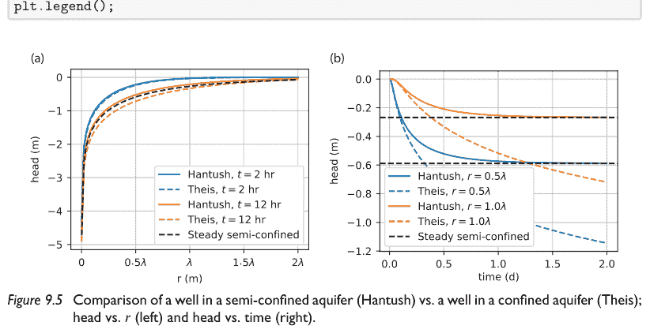

**练习 9.8：** 考虑一个在越流含水层中进行的 7 小时抽水试验，抽水量 $Q = 24466$ m$^3$/d（USBR, 1995, Texas Hill 项目, 表 9.5）。距离抽水井 24.38 m 的观测井中的数据如下。首先，将含水层近似为承压含水层，估算导水系数和储水系数。接下来，将含水层近似为半承压含水层，估算导水系数、储水系数和越流层的阻力。计算均方根误差，并绘制两种模型的拟合图。

```python
# data for Exercise 9.8
t = np.array([2, 4, 6, 8, 10, 15, 20, 25, 30, 40, 50, 60, 70, 80, 90, 100,
              110, 120, 150, 180, 210, 240, 270, 300, 360, 420]) # minutes
h = np.array([-0.94, -1.23, -1.54, -1.61, -1.82, -2.05, -2.18, -2.32, -2.43,
              -2.55, -2.63, -2.72, -2.8 , -2.84, -2.89, -2.91, -2.94, -2.97,
              -3.03, -3.07, -3.11, -3.13, -3.15, -3.17, -3.15, -3.18]) # m
```

作为示例，这里重复了使用拉普拉斯变换解法（遵循第 5.4 节解释的步骤）求解在半承压含水层中于 $t_0 = 0$ 时开始抽水的井的瞬态流动解。相同的步骤用于解决接下来两节中的瞬态流动问题。微分方程 (9.29) 的拉普拉斯变换为

$$\nabla^2 \bar{h} = \frac{Sp}{T} \bar{h} + \frac{\bar{h}}{cT} = w \bar{h}$$ (9.33)

其中 $\bar{h}$ 是拉普拉斯变换后的水头，$p$ 是拉普拉斯变换参数，且

$$w = \frac{Scp + 1}{cT}$$ (9.34)

边界条件 (9.6) 和 (9.8) 变换为

$$\lim_{r \to 0} -2\pi r \bar{Q}_r = \frac{Q}{p}$$ (9.35)
$$\bar{h}|_{r=\infty} = 0$$ (9.36)

拉普拉斯域中的径向流问题在数学上类似于半承压含水层中的稳定井（第 6.4 节），其解为

$$\bar{h} = -\frac{Q}{2\pi Tp} \mathbf{K}_0(r\sqrt{w})$$ (9.37)

使用 Stehfest 算法（见第 5.4 节）进行数值反变换回时间域。下面的示例表明，使用公式 (9.30) 数值积分的 Hantush 解与使用拉普拉斯变换技术和 Stehfest 算法得到的解几乎相同（图 9.6）。

```python
# Laplace transform solution
from scipy.special import k0
def hbar(p, r, T, S, c, Q):
    w = (S * c * p + 1) / (c * T)
    return -Q / (2 * np.pi * T * p) * k0(r * np.sqrt(w))

t = np.linspace(1e-3, 1, 100)
h = stehfest(250, t, hbar, T=T, S=S, c=c, Q=Q) # stehfest func from Section 5.4
h_hantush = hantushvec(250, t, T, S, c, Q)
```

```python
# basic plot
plt.plot(t, h[0], label='Stehfest')
plt.plot(t, h_hantush, '--', label='Hantush')
plt.legend();
```

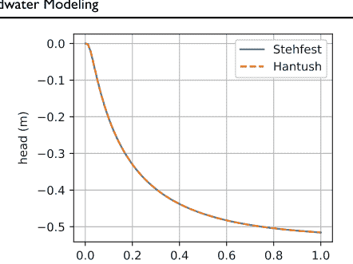

图 9.6 半承压含水层中井的拉普拉斯变换解与 Hantush 解中积分的数值积分结果的比较。

plt.semilogx(t, hwbsres[0], label=f'v wbs, v skin')
plt.semilogx(t, hw[0], '--', label=f'in well, v wbs, v skin')
plt.legend();

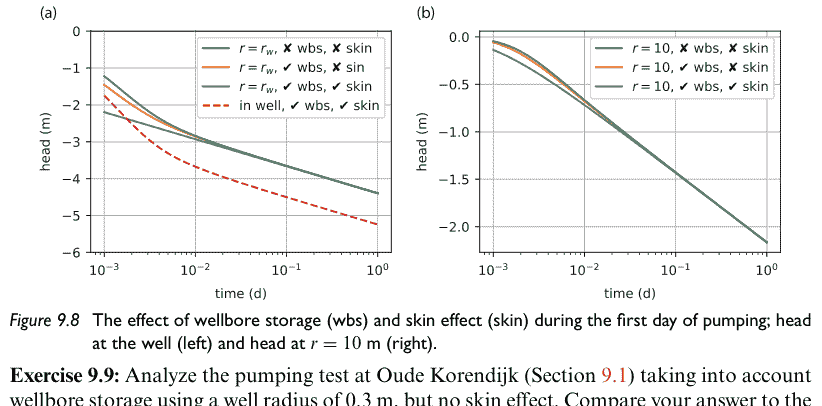

**练习 9.9：** 分析 Oude Korendijk 的抽水试验（第 9.1 节），考虑井筒储水效应，井半径为 0.3 米，但无表皮效应。将你的答案与第 9.1 节的结果进行比较。

#### 9.5 双含水层系统中的井

第 6.5 节介绍了双含水层系统中底部含水层稳态流向井的解。本节将介绍其瞬态等效解。该解用于研究双含水层系统中的瞬态水头响应。当顶部含水层为无压含水层时，其水头响应将显著慢于底部含水层的水头响应，这也被称为水位的延迟响应。该解相当复杂，因为它涉及使用拉普拉斯变换法求解两个耦合微分方程组。尽管方程稍长，但其 Python 脚本相对较短。

考虑双含水层系统中的瞬态流。顶部含水层索引为 0，底部含水层索引为 1。每个含水层的导水系数再次近似为空间和时间上的常数。顶部和底部含水层的储水系数分别为 $S_0$ 和 $S_1$。两个含水层由一个阻力为 $c$ 的弱透水层隔开（图 6.14）。忽略弱透水层中的储水。两个耦合微分方程组 (6.63) 的瞬态等效形式为

$$\nabla^2 h_0 = \frac{S_0}{T_0} \frac{\partial h_0}{\partial t} + \frac{h_0 - h_1}{c T_0}$$
$$\nabla^2 h_1 = \frac{S_1}{T_1} \frac{\partial h_1}{\partial t} + \frac{h_1 - h_0}{c T_1}$$
(9.52)

一口井在 $t = 0$ 时开始以流量 $Q$ 在含水层 1（底部含水层）中抽水。边界条件为

$$\lim_{r \to 0} -2\pi r Q_{r_0} = 0$$
$$\lim_{r \to 0} -2\pi r Q_{r_1} = Q \quad t \ge 0$$
(9.53)
$$h_0|_{r=\infty, t} = h_1|_{r=\infty, t} = 0$$
(9.54)

初始条件为

$$h_0|_{r,t=0} = h_1|_{r,t=0} = 0$$

使用拉普拉斯变换获得解，如第 5.4 节所述。然而，求解过程更为复杂，因为需要将两个耦合微分方程组分解为两个非耦合微分方程的解。这种解耦比稳态流（第 6.4 节）更困难，并且需要求解一个特征值问题。

拉普拉斯变换后的微分方程组为

$$\nabla^2 \overline{h}_0 = \frac{S_0 p}{T_0} \overline{h}_0 + \frac{\overline{h}_0 - \overline{h}_1}{c T_0}$$
$$\nabla^2 \overline{h}_1 = \frac{S_1 p}{T_1} \overline{h}_1 + \frac{\overline{h}_1 - \overline{h}_0}{c T_1}$$

可以写成矩阵形式

$$\nabla^2 \begin{pmatrix} \overline{h}_0 \\ \overline{h}_1 \end{pmatrix} = \begin{pmatrix} \frac{S_0 c p + 1}{c T_0} & \frac{-1}{c T_0} \\ \frac{-1}{c T_1} & \frac{S_1 c p + 1}{c T_1} \end{pmatrix} \begin{pmatrix} \overline{h}_0 \\ \overline{h}_1 \end{pmatrix}$$

矩阵方程右侧的矩阵称为系统矩阵 **A**，写作

$$\mathbf{A} = \begin{pmatrix} \frac{S_0 c p + 1}{c T_0} & \frac{-1}{c T_0} \\ \frac{-1}{c T_1} & \frac{S_1 c p + 1}{c T_1} \end{pmatrix} = \mathbf{V} \mathbf{W} \mathbf{V}^{-1}$$

其中 **W** 是一个对角矩阵，其对角线元素为矩阵 **A** 的特征值

$$\mathbf{W} = \begin{pmatrix} w_0 & 0 \\ 0 & w_1 \end{pmatrix}$$

**V** 是一个矩阵，其列向量为对应的特征向量 $\vec{u} = \begin{pmatrix} u_0 \\ u_1 \end{pmatrix}$ 和 $\vec{v} = \begin{pmatrix} v_0 \\ v_1 \end{pmatrix}$

$$\mathbf{V} = \begin{pmatrix} u_0 & v_0 \\ u_1 & v_1 \end{pmatrix}$$

拉普拉斯域中的边界条件为

$$\lim_{r \to 0} -2\pi r \overline{Q}_{r_0} = 0$$
$$\lim_{r \to 0} -2\pi r \overline{Q}_{r_1} = \frac{Q}{p}$$
$$\overline{h}_0|_{r=\infty} = \overline{h}_1|_{r=\infty} = 0$$

拉普拉斯域中的解为

$$\begin{pmatrix} \overline{h}_0 \\ \overline{h}_1 \end{pmatrix} = -\frac{Q}{2\pi T_1 p} \left[ b_0 \mathbf{K}_0 (r \sqrt{w_0}) \begin{pmatrix} u_0 \\ u_1 \end{pmatrix} + b_1 \mathbf{K}_0 (r \sqrt{w_1}) \begin{pmatrix} v_0 \\ v_1 \end{pmatrix} \right]$$

其中 $b_0$ 和 $b_1$ 是以下两个线性方程组的解

$$\begin{pmatrix} u_0 & v_0 \\ u_1 & v_1 \end{pmatrix} \begin{pmatrix} b_0 \\ b_1 \end{pmatrix} = \begin{pmatrix} 0 \\ 1 \end{pmatrix} \quad (9.64)$$

该解的 Python 实现使用了 `numpy` 的 `linalg` 子包中的 `eig` 函数。`eig` 函数返回特征值数组 $[w_0, w_1]$ 和包含特征向量的二维数组 $\mathbf{V}$。

在下面的示例中，顶部含水层是无压的，因此储水系数 $S_0$ 代表顶部含水层的潜水储水。计算并绘制了井附近观测井中的水头（图 9.9）。底部含水层的水头响应非常快，但无压顶部含水层的水头大约需要一天时间才开始响应。当顶部含水层的水头开始下降时，底部含水层的水头也开始再次下降。这种水位的延迟响应在半对数图中尤其明显。对于早期时间（在这种情况下，是第一天），水头响应类似于 Hantush 井，因为早期顶部含水层的水头变化很小。

```python
# parameters
T0 = 100 # transmissivity top aquifer, m^2/d
S0 = 0.1 # phreatic storage top aquifer, -
T1 = 200 # transmissivity bottom aquifer, m^2/d
S1 = 0.001 # storage coefficient bottom aquifer, -
c = 500 # resistance of leaky layer, d
Q = 800 # discharge of well, m^3/d
rw = 0.3 # radius of well, m
```

```python
# solution
from scipy.special import k0
def hmaqbar(plist, r, layer):
    hbar = np.zeros(len(plist))
    for i, p in enumerate(plist):
        A = np.array([[(p * c * S0 + 1) / (c * T0), -1 / (c * T0)],
                      [-1 / (c * T1), (p * c * S1 + 1) / (c * T1)]])
        w, v = np.linalg.eig(A)
        b = np.linalg.solve(v, [0, 1])
        hbar[i] = -Q / (2 * np.pi * T1 * p) * (
            b[0] * v[layer, 0] * k0(r * np.sqrt(w[0])) +
            b[1] * v[layer, 1] * k0(r * np.sqrt(w[1])))
    return hbar

r = 250
t = np.logspace(-3, 2, 100)
h0 = stehfest(r, t, hmaqbar, layer=0) # stehfest function from Section 5.4
h1 = stehfest(r, t, hmaqbar, layer=1)
h1_hantush = hantushvec(r, t, T1, S1, c, Q) # hantushvec from Section 9.3
```

```python
# basic plot semi-log
plt.semilogx(t, h0[0])
plt.semilogx(t, h1[0])
plt.semilogx(t, h1_hantush);
```

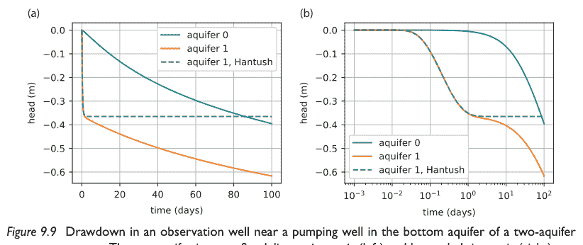

图 9.9 双含水层系统中底部含水层抽水井附近观测井的降深。顶部含水层为无压含水层；线性时间轴（左）和对数时间轴（右）。

## 第 10 章

### 垂直平面内的稳态二维流

到目前为止，本书中的解都是基于 Dupuit 近似推导的。这意味着忽略了含水层中垂直方向的流动阻力。因此，水头在垂直方向上没有变化。含水层内部的垂直流动分量是根据流动连续性计算的。对于许多以水平流动为主的地下水问题，这是一个非常好的近似。但是，当然存在一些流动情况，其中含水层中的垂直流动确实起着重要作用。此类问题可能包括流向部分贯穿的河流或井的流动、顶部或底部不规则的含水层中的流动，以及流向湖泊或海洋底部的流动。对于此类问题，就会出现 Dupuit 近似是否仍然是一个良好近似的问题，特别是当垂直渗透率（远）小于水平渗透率时。本章介绍了垂直剖面中二维流动的解，其中未采用 Dupuit 近似。通过将几个二维解与等效的 Dupuit 解进行比较，评估了 Dupuit 解的适用范围。

垂直平面内稳态二维流的解往往使用高级数学技术推导，如保角映射、速端曲线法或分离变量法。本章介绍的所有解都用复数比流量势表示，该势将在下文引入。所有解都直接给出，而非推导。

垂直平面内的二维流用比流量矢量表示，其水平分量为 $q_x$，垂直分量为 $q_z$。垂直 $x, z$ 平面内稳态流的连续性方程为（见方程 1.28）

$$\frac{\partial q_x}{\partial x} + \frac{\partial q_z}{\partial z} = 0$$

其中 $z$ 轴垂直向上。对于具有各向同性和均质渗透率 $k$ 的含水层，比流量矢量的分量可以写为

$$q_x = -k \frac{\partial h}{\partial x} = -\frac{\partial \phi}{\partial x} \qquad q_z = -k \frac{\partial h}{\partial z} = -\frac{\partial \phi}{\partial z}$$

其中

$$\phi = kh$$

是比流量势。比流量势 $\phi$ 的量纲为 $L^2/T$，这与前面章节中使用的流量势 $\Phi$（量纲为 $L^3/T$）形成对比。比流量势 $\phi$ 的负梯度产生比流量矢量 $\vec{q}$，而流量势 $\Phi$ 的负梯度产生在流量向量 $\dot{Q}$ 中。将比流量向量的分量（公式 10.2）代入连续性方程（公式 10.1），得到拉普拉斯方程

$$\frac{\partial^2 \phi}{\partial x^2} + \frac{\partial^2 \phi}{\partial z^2} = 0 \qquad (10.4)$$

对于由拉普拉斯方程控制的垂直平面内的二维稳定流，也存在一个流函数，记为 $\psi$ [L$^2$/T]，这与第 1–4 章中垂直剖面流动的处理方式相同。比流量势和流函数组合成一个复势

$$\omega = \phi + i\psi \qquad (10.5)$$

复比流量可由 $\omega$ 得到

$$q_x - iq_z = -\frac{d\omega}{d\zeta} \qquad (10.6)$$

其中 $\zeta = x + iz$ 是垂直剖面中的复坐标。

#### 10.1 垂向各向异性

水力传导系数通常是各向异性的，其垂直分量小于水平分量。垂向各向异性的主要原因之一是含水层通常由较粗和较细材料的交替层组成。水平方向水力传导系数的平均值由较粗层的水力传导系数决定，而垂直方向的平均值则由较细层的水力传导系数决定。在实践中，通常使用各向异性系数为 10（垂直水力传导系数比水平水力传导系数小 10 倍），但这个数字并没有充分的理由。对于水力传导系数各向异性的情况，设 $x$ 方向为 $k_x$，$z$ 方向为 $k_z$，达西定律变为

$$q_x = -k_x \frac{\partial h}{\partial x} \qquad q_z = -k_z \frac{\partial h}{\partial z} \qquad (10.7)$$

将这些 $q_x$ 和 $q_z$ 的方程代入连续性方程 (10.1)，得到

$$\frac{\partial}{\partial x} \left( k_x \frac{\partial h}{\partial x} \right) + \frac{\partial}{\partial z} \left( k_z \frac{\partial h}{\partial z} \right) = 0 \qquad (10.8)$$

通过变量替换，此方程可转换为拉普拉斯方程

$$\tilde{x} = x\sqrt{k_z/k_x} \qquad \tilde{z} = z \qquad (10.9)$$

从而得到

$$\frac{\partial^2 h}{\partial \tilde{x}^2} + \frac{\partial^2 h}{\partial \tilde{z}^2} = 0 \qquad (10.10)$$

使用 $\tilde{k}$ 确保了在各向同性变换域中的净流量与原始各向异性域中的净流量相同。例如，在各向异性域中，通过小截面 $\Delta z$ 的净通量 $Q_{\text{net}}$ 等于

$$Q_{\text{net}} = -k_x \frac{\partial h}{\partial x} \Delta z \quad (10.12)$$

并且等于变换后各向同性域中同一截面的净通量

$$\tilde{Q}_{\text{net}} = -\tilde{k} \frac{\partial h}{\partial \tilde{x}} \Delta \tilde{z} = -\sqrt{k_x k_z} \frac{\partial h}{\partial x} \frac{1}{\sqrt{k_z/k_x}} \Delta z = -k_x \frac{\partial h}{\partial x} \Delta z = Q_{\text{net}} \quad (10.13)$$

在 $z$ 方向同样成立。

总之，只要根据公式 (10.9) 压缩流场的 $x$ 方向，并在变换域中使用各向同性水力传导系数（公式 10.11），就可以用拉普拉斯方程的标准方法求解各向异性问题。变换势中的复比流量势可定义为 $\tilde{\omega} = \tilde{\phi} + i\tilde{\psi}$，其中 $\phi = \tilde{k}h$ 且 $\tilde{\psi} = \psi$。

作为一个简单的例子，考虑一个长度为 $L$、高度为 $B$ 的矩形区域（图 10.1）。左下角原点处的水头等于零。流动是均匀的，且 $x$ 和 $z$ 方向的水头梯度相等：$\partial h/\partial x = \partial h/\partial z = a$。因此，水头沿边界线性变化（图 10.1）。$x$ 和 $z$ 方向的水力传导系数分别为 $k_x$ 和 $k_z$。

流动在各向异性物理域和各向同性变换域中都是均匀的。在物理域中，$q_x = -k_x a$ 且 $q_z = -k_z a$。在变换域中，$\tilde{q}_x$ 和 $\tilde{q}_z$ 为

$$\tilde{q}_x = -\tilde{k} \frac{\partial h}{\partial \tilde{x}} = -\tilde{k} \frac{\partial h}{\partial x} \frac{\partial x}{\partial \tilde{x}} = -\frac{\tilde{k}a}{\sqrt{k_z/k_x}} \quad (10.14)$$
$$\tilde{q}_z = -\tilde{k}a \quad (10.15)$$

变换域中（均匀）复比流量势的解为公式 (7.19)

$$\tilde{\omega} = -(\tilde{q}_x - \tilde{q}_z i)\tilde{\zeta} \quad (10.16)$$

其中 $\tilde{\zeta} = \tilde{x} + i\tilde{z}$ 是变换域中的复坐标。

一个示例流场如图 10.1 所示。流场在变换域和问题域中均有显示。请注意，在水力传导系数 $\tilde{k}$ 为各向同性的变换域中，流线和水头等值线以直角相交，但在水力传导系数为各向异性的问题域中则不以直角相交。

```python
# parameters
L = 1000 # length of domain, m
B = 300 # width of domain, m
kx = 5 # hydraulic conductivity in x-direction, m/d
kz = 1 # hydraulic conductivity in z-direction, m/d
a = -0.002 # head gradient in x- and z-directions
```

```python
# solution
kt = np.sqrt(kx * kz)
qxt = -kt * a / np.sqrt(kz / kx)
qzt = -kt * a
xg, zg = np.meshgrid(np.linspace(0, L, 10), np.linspace(0, B, 10))
xt = xg * np.sqrt(kz / kx)
zt = zg
zetat = xt + 1j * zt
omt = -(qxt - 1j * qzt) * zetat
h = omt.real / kt
psi = omt.imag
```

```python
# basic flow net
plt.subplot(121, aspect=1) # problem domain
plt.contour(xg, zg, h, 10)
plt.contour(xg, zg, psi, 10);
plt.subplot(122, aspect=1) # transformed domain
plt.contour(xt, zt, h, 20)
plt.contour(xt, zt, psi, 20);
```

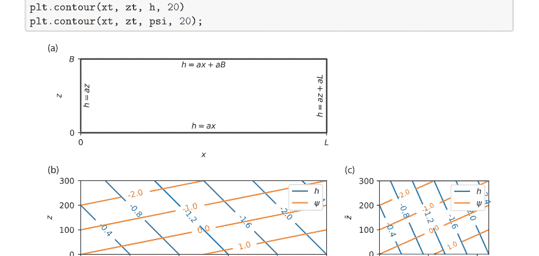

图 10.1 各向异性含水层中均匀流示例；边界条件（左上），压缩变换域中的流网（右下），以及问题域中的流网（左下）。

#### 10.2 流向部分贯穿河流的流动

解析解推导中的一个典型近似是河流完全贯穿含水层。然而，大多数河流只贯穿含水层的一部分。这样的河流被称为部分贯穿河流。本节研究狭窄部分贯穿河流周围的流场。给出了垂直平面内二维流动的解，并与杜比埃解进行了比较。

流动系统由一个水力传导系数为 $k$、厚度为 $H$ 的承压含水层组成，并被一条狭窄河流贯穿距离 $d$（图 10.2）。河流中的水位等于 $h_s$。河流的宽度近似为可忽略不计（尽管图中显示其有小宽度）。左侧远处的流动等于 $Q_x = U_L$，而右侧远处的流动等于 $Q_x = U_R$，因此边界条件为

$$\lim_{x \to -\infty} Q_x = U_L \quad (10.17)$$
$$\lim_{x \to \infty} Q_x = U_R \quad (10.18)$$
$$h|_{x=0, -d \le z \le 0} = h_s \quad (10.19)$$

所述问题的解通过保角映射获得。保角映射是一种坐标变换（变量替换），拉普拉斯方程在此变换下保持不变。一些边界条件，包括指定水头边界和不透水边界，在保角变换下也保持不变。保角映射的效用在于简化问题域而不改变微分方程或边界条件。然后在简化域中获得解析解。问题域也称为物理平面，而简化的变换域称为参考平面。

保角映射解通常以参数形式写为 $\omega(\tau)$ 和 $\zeta(\tau)$，其中 $\tau$ 是参考平面。这里，参考平面 $\tau = \xi + i\eta$ 选择为第一象限 $\xi \ge 0$ 且 $\eta \ge 0$，如图 10.2 所示（注意 $\xi$ (xi) 和 $\zeta$ (zeta) 看起来相似，但 $\xi$ 有双波浪线，而 $\zeta$ 只有单波浪线）。含水层的顶部和底部对应于 $\tau$ 的正实轴（注意 $\zeta$ 和 $\tau$ 平面中相应的绿色、红色和紫色部分），而部分贯穿河流对应于 $\tau$ 平面中的正虚轴（蓝色部分）。

保角映射的特征之一是有三个自由度可以使映射唯一；可以在参考平面中选择三个边界点的位置。这里，选择点 1 对应 $\tau = 1$，点 2 对应 $\tau = \infty$，点 4 对应 $\tau = 0$。点 3 位于 $\tau$ 平面的虚轴上，点 5 位于 $\tau$ 平面实轴上 $\tau = 0$ 和 $\tau = 1$ 之间，但它们的确切位置由映射确定。

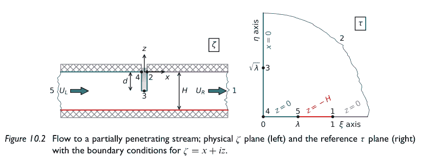

$\zeta$ 作为 $\tau$ 函数的解，在保角映射术语中称为 $\tau$ 到 $\zeta$ 的映射，为

$$\zeta = x + iz = -\frac{H}{\pi} \ln \left( \frac{\tau - 1}{\tau + 1} \right) + \frac{H}{\pi} \ln \left( \frac{\tau - \lambda}{\tau + \lambda} \right) \quad (10.20)$$

其中

$$\lambda = \left( -\mu + \sqrt{\mu^2 + 1} \right)^2 \quad (10.21)$$

且

$$\mu = \tan \left( \frac{\pi d}{2H} \right) \quad (10.22)$$

参数 $\mu$ 和 $\lambda$ 取决于问题的几何形状（即河流的相对贯穿深度 $d/H$），而与流动无关。对于这种情况，可以

反转 $\zeta(\tau)$ 以得到 $\tau(\zeta)$，如下所示：

$$\tau = -\frac{(Z+1)(\lambda-1)}{2(Z-1)} + \frac{1}{2}\sqrt{\left(\frac{(Z+1)(\lambda-1)}{Z-1}\right)^2 + 4\lambda} \quad (10.23)$$

其中

$$Z = e^{\pi\zeta/H} \quad (10.24)$$

可以通过解析验证，方程 (10.20) 满足所有边界条件。注意，$\zeta$ 的解由两个对数项组成。每个对数项在数学上等价于一个井及其在参考平面虚轴上的镜像（参见第 6.2 节）。因此，$\zeta$ 的实部（即 $x$）在 $\tau$ 平面的虚轴上是常数，而虚部（即 $z$）在 $\tau$ 平面的实轴上是分段常数。也可以通过数值验证，所有边界条件都得到满足，并且通过在 $\tau$ 平面边界上的点处计算 $\zeta$，可以验证该解在 Python 中已正确实现。下面展示了 $\tau$ 平面中点 1 和点 2 之间坐标的示例。点 1 和点 2 之间的部分对应于 $z=0$ 且 $x \ge 0$（见图 10.2）。

```python
# parameters
k = 10 # hydraulic conductivity, m/d
H = 10 # thickness of aquifer, m
d = 4 # depth of stream, m
UL = 0.2 # uniform flow far to the left, m^2/d
UR = -0.2 # uniform flow far to the right, m^2/d
hs = 0 # water level in stream
```

```python
# solution
def zetafunc(tau, H=H, d=d):
    mu = np.tan(np.pi * d / (2 * H))
    lab = (-mu + np.sqrt(mu**2 + 1))**2
    z = -H / np.pi * np.log((tau - 1) / (tau + 1)) + \
        H / np.pi * np.log((tau - lab) / (tau + lab))
    return z

def taufunc(zeta, H=H, d=d):
    mu = np.tan(np.pi * d / (2 * H))
    lab = (-mu + np.sqrt(mu**2 + 1))**2
    Z = np.exp(np.pi * zeta / H)
    tau = (1 - lab) * (Z + 1) / (2 * (Z - 1)) + 0.5 * np.sqrt(
        ((lab - 1) * (Z + 1) / (Z - 1)) ** 2 + 4 * lab)
    return tau
```

```python
# verification
tau = 1.5 + 0j
zeta = zetafunc(tau)
print(f'given tau between points 1 and 2: {tau:.2f}')
print(f'zeta between points 1 and 2: {zeta:.2f}')
print(f'tau as function of zeta: {taufunc(zeta):.2f}')
```

```
given tau between points 1 and 2: 1.50+0.00j
zeta between points 1 and 2: 4.01+0.00j
tau as function of zeta: 1.50+0.00j
```

接下来获得复势的解。选择流函数，使得在河流右侧含水层顶部（点 1 和点 2 之间的紫色部分）$\psi = 0$，这样在含水层底部（点 5 和点 1 之间的红色部分）$\psi = U_R$，在河流左侧含水层顶部（点 5 和点 4 之间的绿色部分）$\psi = U_R - U_L$。参考平面 $\tau$ 中 $\omega$ 的边界条件如图 10.3 左图所示。

对于这种情况，参考平面中的 $\omega(\tau)$ 解可以直接在参考平面中使用镜像法构建。在 $\zeta$ 平面中位于左侧无穷远处的点 5，对应于 $\tau$ 平面中的点 $\zeta = \lambda$。有 $U_L$ 的流量从无穷远处流向部分贯穿的河流。因此，$\omega$ 的解需要在点 5 处有一个注入率为 $2U_L$ 的注入井。需要乘以因子 2，因为只有一半注入的水流入上半平面（$\eta \ge 0$），而另一半流入下半平面（$\eta \le 0$）。类似地，在 $\zeta$ 平面中位于右侧无穷远处的点 1，对应于 $\tau$ 平面中的点 $\zeta = 1$。在点 1 处抽取 $U_R$ 的水量，这意味着在点 1 处放置一个流量为 $2U_R$ 的井。使用镜像井来确保势函数在虚轴（对应于河流）上等于 $\phi_s = kh_s$，因此 $\omega$ 的函数变为

$$\omega = \phi + i\psi = -\frac{U_L}{\pi} \ln \left( \frac{\tau - \lambda}{\tau + \lambda} \right) + \frac{U_R}{\pi} \ln \left( \frac{\tau - 1}{\tau + 1} \right) + \phi_s \qquad (10.25)$$

可以通过首先使用方程 (10.23) 为指定的 $\zeta$ 值计算 $\tau$，然后使用方程 (10.25) 计算 $\omega$，从而在点 ($\zeta$) 处计算势函数。

下面给出了河流两侧流量相同情况的示例。$\tau$ 平面中的流网如图 10.3 右图所示。问题域中的流网如图 10.4 所示。对于完全贯穿的河流，水头等值线 $h = 0.02$ 和 $h = 0.04$ m 分别距离河流 10 和 20 m（这些等值线在图 10.4 中以黑色显示）。注意，在距离部分贯穿河流大约一个含水层厚度处，垂直水头变化可以忽略不计。

```python
# solution
def omegafunc(tau, UL=UL, UR=UR, H=H, d=d, k=k, hs=0):
    mu = np.tan(np.pi * d / (2 * H))
    lab = (-mu + np.sqrt(mu**2 + 1))**2
    om = -UL / np.pi * np.log((tau - lab) / (tau + lab)) + \
         UR / np.pi * np.log((tau - 1) / (tau + 1)) + k * hs
    return om

# omega transformed domain
xi, eta = np.meshgrid(np.linspace(0, 2, 100), np.linspace(0, 1.5, 100))
om_ref_plane = omegafunc(xi + eta * 1j)
# omega physical domain
xg, zg = np.meshgrid(np.linspace(-4 * H, 4 * H, 400), np.linspace(-H, 0, 100))
taug = taufunc(xg + zg * 1j)
omega = omegafunc(taug)
h = omega.real / k
```

```python
# basic plot flow net in transformed domain (right graph)
plt.subplot(111, aspect=1)
plt.contour(xi, eta, om_ref_plane.real, 20, colors='C0')
plt.contour(xi, eta, om_ref_plane.imag, 20, colors='C1')
```

```python
# basic flow net
plt.subplot(111, aspect=1, xlim=(-40, 10))
plt.contour(xg, zg, h, np.arange(0, 0.1, 0.0025), colors='C0')
plt.contour(xg, zg, omega.imag, np.arange(-0.4, 0.4, 0.025), colors='C1');
```

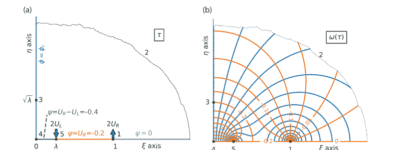

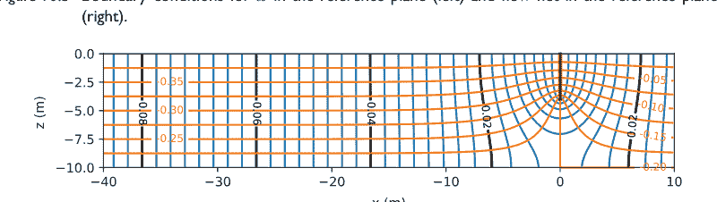

各向异性水力传导率的解是通过应用上一节概述的程序获得的。当垂直水力传导率比水平水力传导率小十倍时，流网有很大不同，如图 10.5 所示。在距离河流大约 $H\sqrt{k_x/k_z} \approx 3H$ 处，垂直水头变化可以忽略不计。

```python
# anisotropic parameters
kx = 10 # m/d
kz = 1 # m/d
```

```python
# anisotropic solution
ktilde = np.sqrt(kx * kz)
xgtilde = xg * np.sqrt(kz / kx)
zgtilde = zg
omega_aniso = omegafunc(taufunc(xgtilde + zgtilde * 1j))
h_aniso = omega_aniso.real / ktilde
psi_aniso = omega_aniso.imag
```

```python
# basic flow net
plt.subplot(111, aspect=1, xlim=(-40, 10))
plt.contour(xg, zg, h_aniso, np.arange(0, 0.2, 0.002), colors='C0')
plt.contour(xg, zg, psi_aniso, np.arange(-0.4, 0.4, 0.02), colors='C1');
```

将所提出的解与流向河流的一维流动的 Dupuit 解进行比较。首先，给出 Dupuit 解，适用于河流处含水层中的水头 $h_0$ 在整个含水层厚度上等于河流中的水头 $h_s$ 的情况

$$h_0 = h_s$$

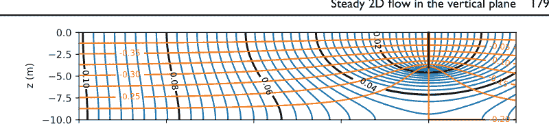

左侧和右侧的边界条件分别是方程 (10.17) 和 (10.18)。Dupuit 解为

$$h = -U_L x / T + h_0 \quad x \le 0$$
$$h = -U_R x / T + h_0 \quad x \ge 0$$
(10.27)

在图 10.6 中，将 Dupuit 解与各向异性水力传导率示例的二维解进行了比较。注意，在远离河流的地方，Dupuit 解与含水层顶部和底部水头之间的差异变为常数。

```python
# Dupuit solution
L = 40 # distance over which Dupuit solution is computed
h0 = 0
xdupuit = [-L, 0, L]
hdupuit1 = [UL * L / (k * H) + h0, h0, -UR * L / (k * H) + h0]
```

```python
# basic plot
plt.plot(xg[0], h_aniso[-1], 'C0', label='$z=0$')
plt.plot(xg[0], h_aniso[0], 'C0--', label='$z=-H$')
plt.plot(xdupuit, hdupuit1, 'C3', label='Dupuit w/o $C$')
plt.legend(loc='lower right');
```

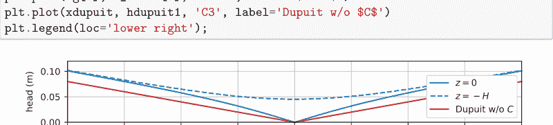

当水流接近部分贯穿的河流时，流线会汇聚，这导致了 Dupuit 解中未考虑的额外水头损失。可以通过将河流处的边界条件替换为以下形式，在 Dupuit 解中考虑额外的水头损失

$$U_L - U_R = C(h_0 - h_s)$$
(10.28)

其中 $U_L - U_R$ 是流入河流的流量，$C$ 是有效电导。有效电导 $C$ 计算为

$$C = (U_L - U_R) / (\bar{h}_0 - h_s)$$
(10.29)

其中 $\overline{h}_0$ 是 $x = 0$ 处含水层中的平均水头，通过对二维解进行数值积分获得。有效电导是问题几何形状（$H$ 和 $d$）以及水力传导系数（$k_x$ 和 $k_z$）的函数，但与流向河流的流量（$U_R - U_L$）无关。一旦 $C$ 已知，对于任意 $U_R$ 和 $U_L$ 的组合，Dupuit 解中 $x = 0$ 处的水头 $h_0$ 可计算如下：

$$h_0 = h_s + (U_L - U_R)/C \quad (10.30)$$

在下面的代码单元格中，有效电导 $C$ 是根据上述各向异性示例的平均水头 $\overline{h}_0$ 计算得出的。使用有效电导的 Dupuit 解如图 10.7 所示，确实与距离河流约 $\sim 3H$ 处含水层中的水头相匹配。

```python
# computation of C
def head0(z, UL=UL, UR=UR, H=H, d=d):
    zeta = 0 + z * 1j
    tau = taufunc(zeta, H=H, d=d)
    return omegafunc(tau, UL=UL, UR=UR, H=H, d=d).real / np.sqrt(kx * kz)

from scipy.integrate import quad
h0avg = quad(head0, a=-H, b=0, args=(UL, UR))[0] / H
C = (UL - UR) / (h0avg - 0)
print(f'Effective conductance: C={C:.2f} m^2/d')
print(f'Dupuit head h0={h0avg:.3f} m for UL={UL} m^2/d and UR={UR} m^2/d')
```

Effective conductance: C=18.70 m^2/d
Dupuit head h0=0.021 m for UL=0.2 m^2/d and UR=-0.2 m^2/d

```python
# Dupuit solution with effective conductance
h0 = hs + (UL - UR) / C
hdupuit2 = [UL * L / (k * H) + h0, h0, -UR * L / (k * H) + h0]
```

```python
# basic plot
plt.plot(xg[0], h_aniso[-1], 'C0', label='$z=0$')
plt.plot(xg[0], h_aniso[0], 'C0--', label='$z=-H$')
plt.plot(xdupuit, hdupuit2, 'C3', label='Dupuit w/ $C$')
plt.legend(loc='lower right');
```

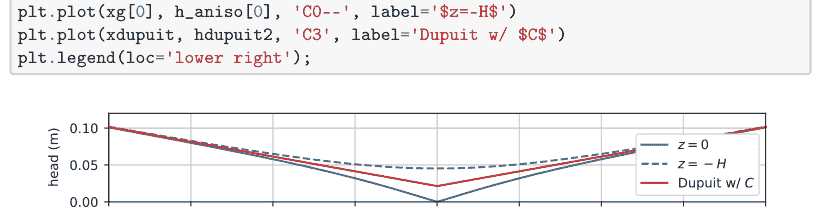

当左侧流入量不等于右侧流入量（$U_L \neq -U_R$）时，流场变得更加有趣。此处区分三种情况；对于所有三种情况，来自左侧的流量 $U_L$ 均为正。对于情况 1，水从两侧流向河流（$U_R < 0$），这导致在含水层底部出现一个滞点。对于情况 2，右侧的水流远离河流，但流量不大（$0 \leq U_R \leq \lambda U_L$）。结果，只有部分从左侧流向河流的水被河流捕获，其余部分则从河流下方流向右侧。在含水层顶部存在一个滞点，并且水在整个河流边界上流入河流。对于情况 3，右侧的水流远离河流且流量较大（$U_R \ge \lambda U_L$）。对于这种情况，水在部分河流边界上流入河流，而在另一部分边界上流出河流。所有三种流场的示例如图 10.8 所示。流网的代码与图 10.4 的相同，此处不再重复。

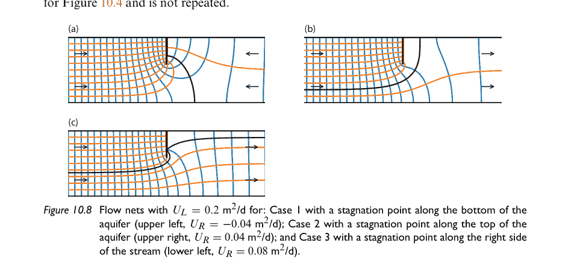

**练习 10.1：** 绘制图 10.8 中三种情况下含水层顶部和底部水头随 $x$ 的变化（类似于图 10.7），并添加使用有效电导 $C$ 的 Dupuit 解。

#### 10.3 底部台阶上的流动

第 3.2 节使用 Dupuit 解研究了底部突变对无压含水层中流动和水头分布的影响。此处，使用垂直平面内二维流动的解，研究了底部突变对承压流动中流动和水头分布的影响。将二维流动解与 Dupuit 解进行比较，并研究了垂直各向异性水力传导系数的影响。该解通过保角映射获得，并且此处函数 $\zeta(\tau)$ 无法解析反演以获得 $\tau(\zeta)$ 的表达式，这增加了函数求值的复杂性。

考虑一个具有不透水顶部和不透水底部的承压含水层中垂直平面内的二维流动。底部是分段水平的，并在 $x = 0$ 处发生突变（见图 10.9）。对于 $x \le 0$，含水层厚度等于 $H_L$；对于 $x \ge 0$，等于 $H_R$。水力传导系数是均质且各向同性的，等于 $k$。从左到右的流量等于 $Q_x = U$

$$\lim_{x \to -\infty} q_x H_L = \lim_{x \to \infty} q_x H_R = U \qquad (10.31)$$

流函数选择为沿含水层底部等于 $\psi = 0$，这意味着沿含水层顶部 $\psi = -U$。作为参考，原点处的水头等于零

$$h_{x=0, z=0} = 0 \qquad (10.32)$$

再次以参数形式 $\omega(\tau)$ 和 $\zeta(\tau)$ 寻求所述问题的解，其中参考平面 $\tau$ 选择为图 10.9 所示的四分之一平面。点 1 对应 $\tau = \infty$，点 2 对应 $\tau = 0$，点 4 对应 $\tau = 1$。点 3 对应 $\tau = \lambda$，其中 $\lambda$ 的值由映射确定。含水层顶部和底部的水平部分对应于 $\tau$ 的正实轴（注意 $\zeta$ 和 $\tau$ 平面中相应的红色、紫色和棕色部分），而底部的垂直部分对应于 $\tau$ 平面中的正虚轴（绿色）。

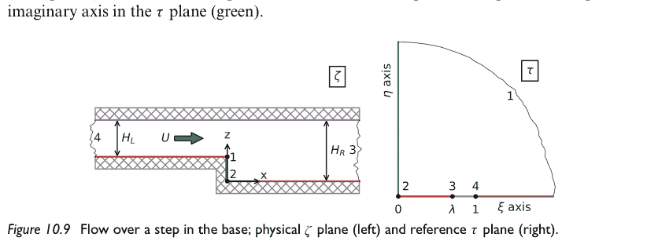

所述问题的解为

$$\zeta = \frac{-H_R}{\pi} \ln \frac{\tau - \lambda}{\tau + \lambda} + \frac{H_L}{\pi} \ln \frac{\tau - 1}{\tau + 1} + (H_R - H_L)i \quad (10.33)$$

$$\omega = \frac{-U}{\pi} \ln[(\tau - 1)(\tau + 1)] + \frac{U}{\pi} \ln[(\tau - \lambda)(\tau + \lambda)/\lambda^2] \quad (10.34)$$

其中 $\lambda = H_L/H_R$。注意方程 (10.33) 和 (10.20) 之间的相似性，但对于这种情况，正如保角映射中常见的，解 $\zeta(\tau)$ 无法反演以获得解 $\tau(\zeta)$。解 (10.33) 和 (10.34) 通过选择一个 $\tau$ 值并同时计算复势 $\omega$ 和相应的复坐标 $\zeta$ 来求值。

流网创建如下：在 $\tau$ 平面中定义一个网格，并为每个网格点计算复坐标 $\zeta = x + iz$ 和复势 $\omega$。使用 matplotlib 的常规等高线函数创建等高线图，将计算出的不规则 $x$ 和 $z$ 网格以及计算出的水头或流函数传递给它。

沿含水层顶部（点 3 和点 4 之间）的所有点对应于 $\tau$ 的实轴上介于 $\xi = \lambda$（点 3）和 $\xi = 1$（点 4）之间的部分。在 $\zeta$ 平面中沿含水层顶部相距很远的一些点在 $\tau$ 平面中非常接近。这种现象在保角映射中称为拥挤效应。因此，$\tau$ 平面中的规则间距网格会导致 $\zeta$ 平面中的不规则网格，其中一些点可能相距很远。通过在 $\tau$ 平面中定义一个不规则间距的网格来获得准确的等高线图，该网格在 $\xi$ 方向上包含三个段：从点 2 到 3，点 3 到 4，以及点 4 到一个较大的值；在 $\eta$ 方向上使用两个段。注意，在点 3 和点 4 处，$\zeta$ 和 $\omega$ 都无法轻松计算，因为解中的对数在这些点处无法求值。当然，解在极限情况下存在。作为实际解决方案，解被计算到距离点 3 和点 4 一个小距离处，而不是在数学上取极限并编程实现结果。

一个示例流网如图 10.10 所示。Dupuit 解的流线是水平线，在底部发生突变（与图 3.8 比较），并在图 10.10 中用虚线表示。注意，Dupuit 流线在距离底部突变超过一个含水层厚度的地方是二维流线的良好近似。类似地，垂直水头变化在距离底部突变约一个含水层厚度处变得可以忽略不计。

#### 10.4 含水层顶部空间变化的水头

非承压含水层中的地下水位有时被粗略地近似为地表形态的减弱复制品。这在直觉上是合理的，因为地下水通常在地形低点排泄。在地形高点下方补给的地下水必须经过相对较长的路径才能到达地形低点的排泄区，这需要一个水力水头梯度，从而形成地下水位的隆起。然而，事实证明，在许多非承压含水层中，地下水位与地表形态的相关性很差，甚至不相关（Haitjema and Mitchell-Bruker, 2005）。尽管如此，起伏的地下水位可能是一个有用的概念化近似，用于理解区域流模式。

在本节中，我们研究的是含水层顶部水头被指定为由一个或多个正弦函数组成的流动系统，以近似地形高低起伏的序列。之所以在此讨论这个问题，是因为它类似于著名的 Toth (1963) 解，该解常用于研究盆地尺度模型中的嵌套流动域。由于这是一个在含水层顶部指定水头的问题，因此必须验证由此产生的通过含水层顶部的水流在水文上是否现实。

考虑垂直平面内的稳态二维流动（图 10.13）。水力传导系数为 $k$，含水层底部在 $z = -H$ 处水平。含水层长度为 $L$，其厚度近似为常数且等于 $H$。流动由拉普拉斯方程（10.4）控制。侧边界和含水层底部是不透水的

$$q_x|_{x=0,z} = q_x|_{x=L,z} = q_z|_{x,z=-H} = 0 \quad (10.36)$$

含水层顶部的水头 $h$ 被指定为周期性变化，为振幅为 $a$、周期为 $p = 2L/n$ 的余弦函数，其中 $n$ 是任意整数

$$h|_{x,z=0} = a \cos(2\pi x/p) \quad (10.37)$$

就比流量势而言，边界条件为

$$\frac{\partial \phi}{\partial x}\bigg|_{x=0,z} = \frac{\partial \phi}{\partial x}\bigg|_{x=L,z} = \frac{\partial \phi}{\partial z}\bigg|_{x,z=-H} = 0 \quad (10.38)$$

以及

$$\phi|_{x,z=0} = A \cos(2\pi x/p) \quad (10.39)$$

其中 $A = ka$。

比流量势的解通过分离变量法获得（例如，Craig, 2008）

$$\phi = \frac{A \cos(2\pi x/p) \cosh[2\pi(z + H)/p]}{\cosh(2\pi H/p)} \quad (10.40)$$

相应的复势为

$$\omega = A \frac{\cos[2\pi(\zeta + Hi)/p]}{\cosh(2\pi H/p)} \quad (10.41)$$

其中 $\zeta = x + iz$。复比流量为

$$q_x - iq_z = -\frac{d\omega}{d\zeta} = \frac{2\pi A}{p} \frac{\sin[2\pi(\zeta + Hi)/p]}{\cosh(2\pi H/p)} \quad (10.42)$$

含水层顶部的垂直通量是一个余弦函数，与水头一样

$$q_z = \frac{-2\pi A}{p} \frac{\cos(2\pi x/p) \sinh[2\pi(z + H)/p]}{\cosh(2\pi H/p)} \quad (10.43)$$

# 参数
k = 10 # 水力传导系数，m/d
HL = 10 # 左侧含水层厚度，m
HR = 20 # 右侧含水层厚度，m
U = 0.1 # 从左到右的流量，m^2/d

# 解
def zetafunc(tau, HR=HR, HL=HL):
    lab = HL / HR
    zeta = -HR / np.pi * np.log((tau - lab) / (tau + lab)) + \
           HL / np.pi * np.log((tau - 1) / (tau + 1)) + \
           (HR - HL) * 1j
    return zeta

def omegafunc(tau, U=U, HR=HR, HL=HL):
    lab = HL / HR
    omega = -U / np.pi * np.log((tau - 1) * (tau + 1)) + \
           U / np.pi * np.log((tau - lab) * (tau + lab) / lab ** 2)
    return omega

# 网格
d = 1e-14 # 小偏移量
lab = HL / HR
xi1 = np.linspace(0, lab - d, 400)
xi2 = np.linspace(lab + d, 1 - d, 400)
xi3 = np.linspace(1 + d, 40, 400)
eta1 = np.linspace(0, 1, 400)
eta2 = np.linspace(1, 40, 400)
xi, eta = np.meshgrid(np.hstack((xi1, xi2, xi3)), np.hstack((eta1, eta2)))
zeta = zetafunc(xi + eta * 1j)
omega = omegafunc(xi + eta * 1j)

# 基本绘图
plt.subplot(111, aspect=1, xlim=(-20, 20))
plt.contour(zeta.real, zeta.imag, omega.real / k, np.arange(-0.1, 0.1, 0.002))
plt.contour(zeta.real, zeta.imag, omega.imag, np.arange(-0.1, 0, 0.02))
plt.plot([-40, 0, 0, 40], [10, 10, 0, 0], 'k');

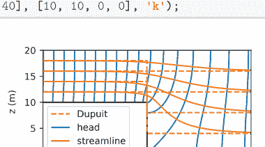

图 10.10 底部有突变的承压流的流网；水头等值线间距 $\Delta h = 2$ mm。

**练习 10.2：** 通过在所有角点（或非常接近角点）处评估解，验证 $\zeta$ 的保角映射解（公式 10.33）是正确的。

计算含水层中特定复坐标 $\zeta^* = x^* + iz^*$ 处的复势需要数值方法来找到对应的参数 $\tau$ 值。

例如，可以通过最小化函数来找到 $\tau$

$$f(\tau) = (x^* - x(\tau))^2 + (z^* - z(\tau))^2 \qquad (10.35)$$

最小化可以使用标准的非线性最小化程序进行，例如 scipy.optimize 的 fmin 函数。fmin 搜索使函数最小化的实变量数组，因此 $\xi$ 和 $\eta$ 必须作为长度为 2 的数组输入，而不是作为一个复变量。下面实现了这种方法来计算 $(x, z) = (-50, 20)$ 处的水头。

def findtau(tauvec, x, z):
    tau = tauvec[0] + tauvec[1] * 1j
    zetastar = zetafunc(tau)
    return ((zetastar.real - x) ** 2 + (zetastar.imag - z) ** 2)

from scipy.optimize import fmin
xi0, eta0 = fmin(findtau, (1, 1), args=(-50, 20), disp=0)
tau0 = xi0 + eta0 * 1j
print(f'tau: {tau0}')
print(f'zeta: {zetafunc(tau0)}')

tau: (0.9999999664789975+1.245910302309445e-11j)
zeta: (-49.99698501153817+19.99881690414834j)

接下来，给出两个垂直各向异性水力传导系数的例子。在第一个例子中，垂直各向异性是常用的值 $k_z = k_x/10$。相应的流网如图 10.11 所示。从流网可以看出，在底部突变下游大约三个（$\sim \sqrt{k_x/k_z}$）含水层厚度处，Dupuit 解的流线才成为二维解流线的合理近似。在底部突变处，含水层顶部的水头与突变底部的水头之差为 2 cm。

# 各向异性情况 1 的附加参数
kx = 10 # 水平水力传导系数，m/d
kz = 1 # 垂直水力传导系数，m/d

# 各向异性情况的解
ktilde = np.sqrt(kx * kz)
zetaaniso = zetafunc(xi + eta * 1j)
omeganiso = omegafunc(xi + eta * 1j)
xg = zetaaniso.real / np.sqrt(kz / kx)
zg = zetaaniso.imag
h = omeganiso.real / ktilde
psi = omeganiso.imag

# 各向异性情况的基本绘图
plt.subplot(111, aspect=1, xlim=(-20, 60))
plt.contour(xg, zg, h, np.arange(-0.1, 0.1, 0.002))
plt.contour(xg, zg, psi, np.arange(-0.1, 0, 0.02))
plt.plot([-40, 0, 0, 40], [10, 10, 0, 0], 'k');

第二个垂直各向异性的例子是垂直水力传导系数比水平水力传导系数大 100 倍的情况。垂直水力传导系数远大于水平水力传导系数，接近 Dupuit 近似（其中完全忽略了垂直流动阻力）。因此，这两个解应该非常相似。流网如图 10.12 所示；生成流网的代码与图 10.11 相同，此处不再重复。水头等值线确实是几乎垂直的，即使在底部突变附近也是如此，流线是水平的，并且在底部突变处几乎垂直地向下跳跃。

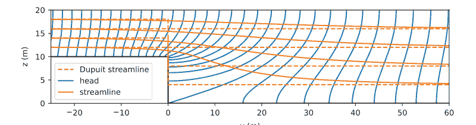

图 10.11 底部有突变且垂直各向异性 $k_x/k_z = 10$ 的承压流的流网；水头等值线间距 $\Delta h = 2$ mm。


图 10.12 底部有突变且垂直各向异性 $k_z = 100k_x$（接近 Dupuit 近似）的承压流的流网；水头等值线间距 $\Delta h = 2$ mm。

**练习 10.3：** 计算二维各向同性解在 $(x, z) = (-50, 20)$ 和 $(x, z) = (50, 20)$ 之间的水头降。

**练习 10.4：** 计算 Dupuit 解在 $x = -50$ 和 $x = 50$ 之间的水头降，并计算二维解（上一个练习）与各向同性情况下的 Dupuit 解相比，在突变处的额外水头降。

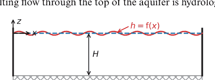

作为第一个例子，考虑含水层顶部水头呈两个高点和两个低点序列的情况，左侧起始高点为0.2米，右侧终止低点为-0.2米。图10.14绘制了含水层顶部指定的水头、由此产生的含水层顶部垂直通量以及由此形成的流网。所得流场包含三个局部流动单元：水从高点流向低点。这三个流动单元完全相同。由于水头在含水层顶部指定，必须检查含水层顶部的垂直通量（即补给量）在水文上是否可行。对于给定参数，含水层顶部的最高垂直通量约为1.5毫米/天，这在许多气候条件下通过降水补给是可能实现的。对于相同情况但水力传导系数提高十倍时，流网看起来完全相同，但含水层顶部的最高垂直通量也增加了十倍。这需要15毫米/天的补给量，这似乎不切实际，除非是在地球上最潮湿的地区。

```
# parameters
k = 1 # hydraulic conductivity, m/d
L = 1200 # length of aquifer, m
H = 200 # thickness of aquifer, m
a = 0.2 # amplitude of head variation, m
p = 2 * L / 3 # period of head variation, m
A = k * a # amplitude of potential variation, m^2/d
```

```
# solution
def omega(x, z, H, A, p):
    zeta = x + 1j * z
    return A * np.cos(2 * np.pi * (zeta + H * 1j) / p) / \
           np.cosh(2 * np.pi * H / p)

def discomplex(x, z, H, A, p):
    zeta = x + 1j * z
    return 2 * np.pi * A / p * np.sin(2 * np.pi * (zeta + H * 1j) / p) / \
           np.cosh(2 * np.pi * H / p)

xg, zg = np.meshgrid(np.linspace(0, L, 100), np.linspace(-H, 0, 100))
om = omega(xg, zg, H, A, p)
wdis = discomplex(xg, zg, H, A, p)
htop = om.real[-1] / k
qtop = -wdis.imag[-1]
```

```
# basic plot h, qz, flow net, sharing the x-axis
fig, ax = plt.subplots(3, 1, sharex=True, squeeze=True,
                      gridspec_kw={'height_ratios':[1, 1, 2]})
plt.sca(ax[0])
plt.plot(xg[0], htop)
plt.sca(ax[1])
plt.plot(xg[0], qtop)
plt.sca(ax[2])
plt.contour(xg, zg, om.real / k, np.arange(-0.2, 0.21, 0.02))
plt.contour(xg, zg, om.imag, np.arange(-0.2, 0.21, 0.02))
plt.axis('scaled');
```

将一个流动单元中的流动与相同情况下Dupuit模型得到的流动进行比较。Dupuit的水头解很简单，因为它等于含水层顶部的边界条件（公式10.37）

$h = a \cos(2\pi x/p)$

188 解析地下水建模

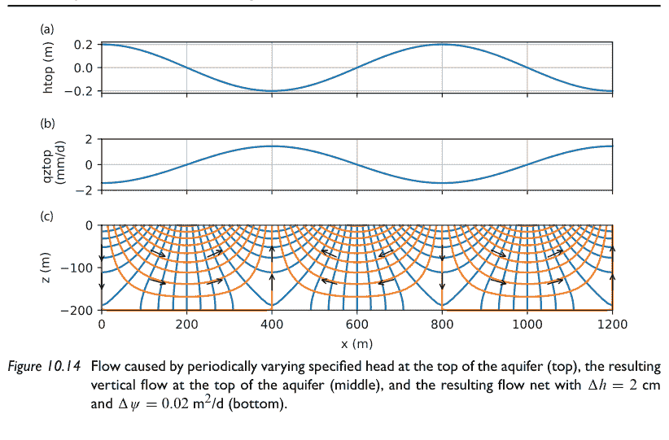

相应的Dupuit流量向量表达式为

$$Q_x = \frac{kHa2\pi}{p} \sin(2\pi x/p)$$

对于二维解，含水层中的垂向积分流量等于含水层顶部流函数的负值（因为沿底部ψ = 0）。将二维解与Dupuit解在1200米长区域内存在一个流动单元的情况进行比较；对于长1200米、深200米的流动单元，Dupuit解是一个合理的近似（图10.15）。对于区域内存在三个流动单元的情况（如图10.14），Dupuit解是一个较差的近似，因为一个流动单元长400米、深200米，远非以水平流动为主。

```
# solution for flow cell of 1200 m
L = 1200
p = 2 * L # one flow cell
x = np.linspace(0, L, 100)
Qx2D = -omega(x, 0, H, A, p).imag # Qx2D = -psi
QxDupuit = k * H * a * 2 * np.pi / p * np.sin(2 * np.pi * x / p)
# grid of stream function
xg, zg = np.meshgrid(np.linspace(0, L, 400), np.linspace(-H, 0, 100))
psi2D = omega(xg, zg, H, A, p).imag
xd = xg[0]
zd = [-H, 0]
psiDupuit = np.zeros((2, len(xd)))
psiDupuit[1] = -k * H * a * 2 * np.pi / p * np.sin(2 * np.pi * xd / p)
```

```
# basic plot
plt.subplot(211)
plt.plot(x, Qx2D, label='2D solution')
plt.plot(x, QxDupuit, label='Dupuit solution')
plt.legend()
```

```
plt.subplot(212, aspect=1)
plt.contour(xg, zg, psi2D, np.arange(-0.2, 0, 0.02), colors='C1')
plt.contour(xd, zd, psiDupuit, np.arange(-0.2, 0, 0.02), colors='C0');
```

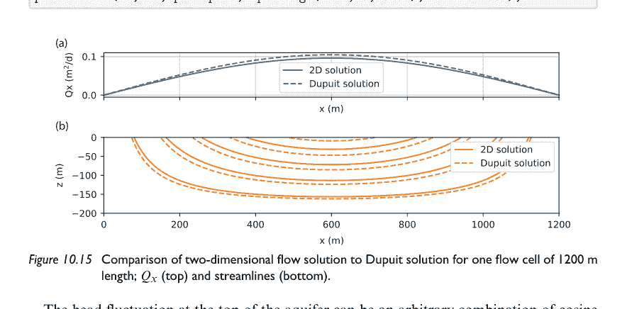

含水层顶部的水头波动可以是具有不同振幅和不同周期的余弦函数（公式10.37）的任意组合。例如，可以用傅里叶级数加一个常数来近似具有恒定斜率$-\Delta h/L$的含水层顶部水头

$$-\Delta h \frac{x}{L} \approx -\frac{\Delta h}{2} + \Delta h \sum_{n=1,3,5,...}^{\infty} \frac{4}{n^2 \pi^2} \cos\left(\frac{n \pi x}{L}\right)$$ (10.46)

作为一个例子，求解含水层顶部水头由恒定斜率加一个周期性变化组成的流动问题

$$h|_{x,z=0} = -\Delta h \frac{x}{L} + a \cos(2\pi x/p)$$ (10.47)

由此产生的流网（图10.16）包含三个局部流动单元和一个区域流动单元，其中在左侧入渗的水一直排泄到含水层的右侧，流经局部流动单元下方。区域流动单元仅在含水层足够深时才会出现。注意，对于这种情况，所得含水层顶部的垂直通量在水文上是否可行再次值得怀疑，这将在练习中探讨。

```
# additional parameters and changed parameters
delh = 2 # head drop over distance L, m
p = L / 3
# period of head variation, m
nterms = 100 # number of terms in Fourier series
```

```
# solution
xg, zg = np.meshgrid(np.linspace(0, L, 200), np.linspace(-H, 0, 200))
om = np.zeros(xg.shape, dtype='complex')
om -= 0.5 * delh
for n in range(1, nterms + 1, 2):
    A = 4 * k * delh / (n ** 2 * np.pi ** 2)
    om += omega(xg, zg, H, A, 2 * L / n)
```

```
om += omega(xg, zg, H, k * a, p)
htop = om.real[-1] / k
```

```
# basic flow net
plt.subplot(111, aspect=1)
plt.contour(xg, zg, om.real, 10, colors='C0')
plt.contour(xg, zg, om.imag, 10, colors='C1');
```

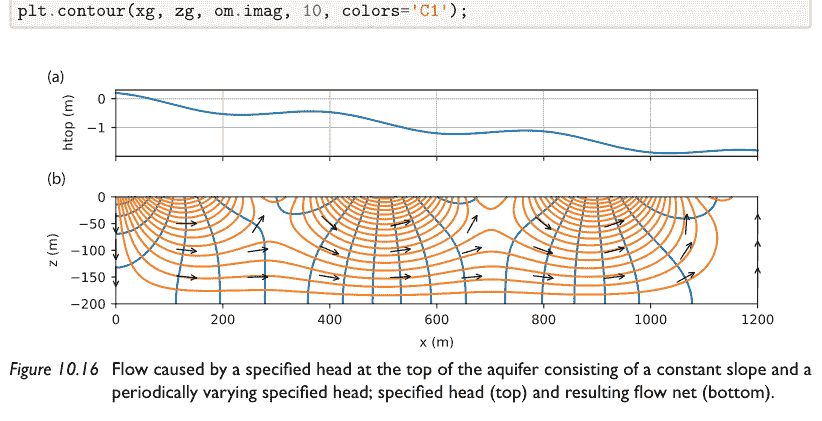

**练习10.5：** 计算并绘制图10.16示例中含水层顶部的$q_z$。
**练习10.6：** 为三种不同的含水层厚度创建流网：$H = 70$米、$H = 90$米和$H = 110$米，并确定对于哪种含水层厚度不存在区域流动单元。

#### 10.5 向海岸的界面流

本书迄今为止讨论了几种海岸含水层中界面流的解（第4章和第7.5节），均基于Dupuit近似。除沿海底有阻力层的解（第4.3节）外，所有提出的Dupuit解中海岸排泄区的宽度均为零。在第4章中，声称所得界面仍然是一个良好的近似，尽管海岸附近的流动具有显著的垂直分量。在本节和下一节中，将Dupuit界面解与垂直平面内二维流动的解进行比较，并研究海底下方排泄区的宽度。

考虑承压海岸含水层中垂直平面内的稳态二维界面流。含水层足够深，使得界面未达到含水层底部；咸水静止（图10.17）。淡水密度为$\rho_f$，咸水密度为$\rho_s$，含水层的水力传导率各向同性且等于$k$。海底是水平的，与承压含水层顶部处于相同高程。坐标系原点选在海岸线处的含水层顶部。向海岸的流动是恒定的，等于$Q_x = U$。沿含水层顶部的流函数选为$\psi = 0$，因此沿界面的流函数等于$\psi = U$。

这个问题被称为自由边界问题。界面的位置是一个自由边界，因为在求解问题之前它是未知的。沿界面指定了两个条件：界面是一个不透水边界，且其高程为

界面 $z_i$ 与界面处的水头 $h_i$ 之间的关系由 Ghyben-Herzberg 方程（第 4 章）给出：

$$z_i = -\alpha h_i$$

其中

$$\alpha = \frac{\rho_f}{\rho_s - \rho_f}$$

所述问题被称为 Glover 问题（Glover, 1959）。此处使用的复势解取自 Bruggeman (1999, Eq. 910.01)，形式为：

$$\omega = \sqrt{-2kU\zeta/\alpha}$$

其中 $\zeta = x + iz$ 是复坐标。复势解可以反演，得到：

$$\zeta = \frac{-\omega^2\alpha}{2kU}$$

沿界面的比流量势等于 $\phi_i = -kz_i/\alpha$，流函数等于 $U$。通过将 $\omega = -k\alpha z_i + Ui$ 代入 $\omega$，将 $x + iz_i$ 代入 $\zeta$ 代入方程 (10.50)，经过一些代数运算，可以得到界面高程作为 $x$ 函数的方程：

$$z_i = -\sqrt{\frac{U^2\alpha^2}{k^2} - \frac{2U\alpha x}{k}}$$

界面的尖端是界面与海底相交的点（图 10.17）。界面尖端的位置 $x_{\text{tip}}$ 通过在方程 (10.52) 中令 $z_i = 0$ 并求解 $x$ 得到：

$$x_{\text{tip}} = \frac{U\alpha}{2k}$$

这意味着，向海岸的流量 $U$ 越大，排泄区就越宽。

在下面的示例中，通过专门计算流线和等势线的位置来计算流网，因为 $\zeta$ 是 $\omega$ 的已知函数（方程 10.51）。对于所选参数，界面在距离海岸线向内陆 14 米处已深达 7 米（图 10.18）。排泄面的长度仅为 0.8 米。

```python
# parameters
k = 10 # hydraulic conductivity, m/d
rhof = 1000 # density freshwater, kg/m^3
rhos = 1025 # density of saltwater, kg/m^3
U = 0.4 # flow toward the coast, m^2/d
```

```python
# solution
alpha = rhof / (rhos - rhof)
n = 100
zeta_streamlines = []
zeta_equipotentials = []
for psi in np.linspace(0, U, 6):
    omega = np.linspace(0, 2, n) + 1j * psi
    zeta = -omega**2 * alpha / (2 * k * U)
    zeta_streamlines.append(zeta)
for phi in np.arange(0, 2, U / 6):
    omega = phi + 1j * np.linspace(0, U, n)
    zeta = -omega**2 * alpha / (2 * k * U)
    zeta_equipotentials.append(zeta)
zetatip = -(1j * U) ** 2 * alpha / (2 * k * U)
print(f'location of the tip: {zetatip.real: .2f} m')
```

location of the tip: 0.80 m

```python
# basic plot
plt.subplot(111, aspect=1, xlim=(-15, 1))
for zeta in zeta_equipotentials:
    plt.plot(zeta.real, zeta.imag, 'C0')
for zeta in zeta_streamlines:
    plt.plot(zeta.real, zeta.imag, 'C1')
```

图 10.18 淡水向海岸二维流动的流网（Glover 解）。

将 Glover 解得到的界面位置与 Dupuit 界面解进行比较。Dupuit 解的界面高程由第 4.1 节给出：

$$z_i = -\sqrt{\frac{-2U\alpha x}{k}}$$ (10.54)

注意，二维解 (10.52) 的 $z_i^2$ 与 Dupuit 解相差一个常数因子。对于示例中的参数，Glover 解和 Dupuit 解之间的差异很小（图 10.19）。

当含水层的垂向渗透系数 $k_z$ 显著小于水平渗透系数 $k_x$ 时，两种解之间的差异会变大一些。使用第 10.1 节的方法对各向异性渗透系数的 Glover 解进行了修正。复势解为：

$$\tilde{\omega} = \sqrt{-2\tilde{k}U\tilde{\zeta}/\alpha}$$

相应的界面高程为：

$$z_i = -\sqrt{\frac{U^2\alpha^2}{k_xk_z} - \frac{2U\alpha x}{k_x}}$$

界面尖端的位置为：

$$x_{\text{tip}} = \frac{U\alpha}{2k_z}$$

在下面的示例中，绘制了各向同性情况和 $k_z = k_x/10$ 情况下的界面，后者导致排泄区比各向同性情况宽 10 倍（图 10.19）。界面位置比各向同性情况稍深。当然，Dupuit 解不会改变，因为它忽略了垂向流动的阻力。

Dupuit 解是对各向同性 Glover 解的一个非常好的近似，也是对各向异性 Glover 解的一个合理近似。在评估海水入侵范围时，Dupuit 解总是保守的：淡水区的厚度总是小于 Glover 解中的厚度，海水入侵也更严重。淡水区厚度的最大差异出现在海岸线处。

```python
# additional parameters anisotropic case
kx = k
kz = k / 10
```

```python
# isotropic solution
xtip = U * alpha / (2 * k)
xglover = np.linspace(-150, xtip, 100)
zglover = -np.sqrt(U * alpha / k * (U * alpha / k - 2 * xglover))
# anisotropic solution
xtipaniso = U * alpha / (2 * kz)
xaniso = np.linspace(-150, xtipaniso, 200)
zaniso = -np.sqrt(U * alpha / kx * (U * alpha / kz - 2 * xaniso))
print(f'location of the tip for anisotropic case: {xtipaniso: 0.2f} m')
#
xdupuit = np.linspace(-150, 0, 100)
zdupuit = -np.sqrt(-2 * U * alpha * xdupuit / k)
```

location of the tip for anisotropic case: 8.00 m

```python
# basic plot
plt.plot(xglover, zglover, 'C1', label='Glover $k_z=k_x$')
plt.plot(xaniso, zaniso, 'C2', label='Glover $k_z=k_x/10$')
plt.plot(xdupuit, zdupuit, 'C1--', label='Dupuit $H=20$')
plt.legend();
```

**练习 10.7：** 计算各向异性情况下，在 $x = -50$ 和 $x = -100$ 处界面深度与界面处水头的比值。（提示：如果你做对了，答案当然是 $\alpha$。）接下来，计算各向异性情况下，在 $x = -50$ 和 $x = -100$ 处界面深度与含水层顶部水头的比值。

图 10.19 Glover 解（包括各向同性和各向异性）与 Dupuit 解的界面高程比较。

#### 10.6 条形岛下方的界面流

通过考虑条形岛横截面中的界面流，进一步探讨了垂直平面中的二维稳态界面流；盐水是静止的。两个海岸之间的距离（即岛屿的宽度）为 $2L$，入渗率等于 $N$（图 10.20）。流动是无压的，但忽略了潜水面的微小变化，并将含水层顶部近似为与海底处于同一高程的水平面。坐标系的原点选在岛屿中心含水层的顶部。海底是水平的，沿海底的水头设为零：

$h|_{x>L,z=0} = h|_{x<-L,z=0} = 0$

沿界面的流函数设为零。

图 10.20 条形岛垂直横截面中的二维界面流。

所述问题的复比流量势解取自 Bruggeman (1999, Eq. 910.03)，并针对此处选择的坐标系进行了修改。解具有以下形式：

$\omega^2 + 2iN\zeta\omega + kN\zeta^2/\alpha - N(N + k/\alpha)L^2 = 0$

注意，方程 (10.59) 是关于 $\omega$ 的二次多项式。对于给定的 $\zeta$ 值，使用抛物线求根的标准公式可以得到 $\omega$ 的解：

$\omega = -iN\zeta + \sqrt{N^2(L^2 - \zeta^2) + Nk(L^2 - \zeta^2)/\alpha}$

沿界面的比流量势等于 $\phi_i = -kz_i\alpha$，因此通过将 $\omega = -kz_i\alpha$ 代入 $\omega$，将 $x + iz_i$ 代入 $\zeta$ 代入方程 (10.59)，可以得到界面高程作为 $x$ 函数的方程（经过大量代数运算）：

$$z_i = -\sqrt{\frac{N\alpha}{k}L^2 - \frac{N\alpha}{N\alpha + k}x^2}$$

界面的形状是一个椭圆，海岸线的位置是椭圆的焦点。界面尖端的位置 $x_{\text{tip}}$ 通过在上式中令 $z_i = 0$ 得到：

$$x_{\text{tip}} = \pm L\sqrt{1 + \frac{N\alpha}{k}}$$

岛屿中心处的界面高程通过在方程 (10.61) 中令 $x = 0$ 得到：

$$z_i|_{x=0} = -L\sqrt{\frac{N\alpha}{k}}$$

流网构建如下：首先，用方程 (10.62) 计算尖端的位置。其次，创建一个从 $-x_{\text{tip}} + \varepsilon$ 到 $+x_{\text{tip}} - \varepsilon$ 的 $x$ 值数组，其中 $\varepsilon$ 是一个很小的数（$\varepsilon$ 用于确保第一个点在数值上不在 $-x_{\text{tip}}$ 的左侧，最后一个点在数值上不在 $+x_{\text{tip}}$ 的右侧）。第三，对于每个 $x$ 值，计算界面和含水层顶部之间的 $z$ 值网格。第四也是最后一步，在网格上计算 $\omega$ 并绘制流网等值线。

在下面的示例中，岛屿的宽度等于 2000 米；流网如图 10.21 所示。在岛屿中心，淡水区厚度略大于 63 米，而两侧的排泄区仅为 2 米。请注意，与本章中的其他流网相反，图 10.21 中的垂直比例尺被夸大了（否则，该图将无法阅读），这使得流网看起来像各向异性含水层中的流动，而实际上并非如此。

```python
# parameters
k = 10 # hydraulic conductivity, m/d
L = 1000 # half-width of island, m
N = 0.001 # areal recharge, m/d
rhof = 1000 # density of freshwater, kg/m^3
rhos = 1025 # density of saltwater, kg/m^3
alpha = rhof / (rhos - rhof)
```

```python
# solution
def omega(zeta, k=k, alpha=alpha, L=L, N=N):
    om = -1j * N * zeta + np.sqrt(N ** 2 * (L ** 2 - zeta ** 2) + 
                               N * k * (L ** 2 - zeta ** 2) / alpha)
    return om

# compute interface
ng = 201
xtip = L * np.sqrt(1 + N * alpha / k)
print(f'length outflow zone: {xtip - L:0.2f} m')
xi = np.linspace(-xtip + 1e-12, xtip - 1e-12, ng)
zi = -np.sqrt(N * alpha / k * L ** 2 - N * alpha / (N * alpha + k) * xi ** 2)
zcenter = -L * np.sqrt(N * alpha / k)
print(f'elevation of interface at center of island: {zcenter:0.2f} m')
# compute grid for contouring
```

#### 10.2.2 垂直平面内的二维流动

垂直平面内二维流动的解，是通过求解流函数的控制方程得到的。流函数定义为

$$\psi = \int_{z}^{0} u \, dz$$

其中 $u$ 是达西速度的水平分量。流函数满足拉普拉斯方程

$$\frac{\partial^2 \psi}{\partial x^2} + \frac{\partial^2 \psi}{\partial z^2} = 0$$

流函数的边界条件为

$$\psi = 0 \quad \text{在} \quad z = 0$$

$$\psi = N x \quad \text{在} \quad z = z_i$$

$$\frac{\partial \psi}{\partial x} = 0 \quad \text{在} \quad x = 0$$

$$\psi = N L \quad \text{在} \quad x = L$$

流函数的解为

$$\psi = N x + \sum_{n=1}^{\infty} A_n \sinh\left(\frac{n \pi x}{L}\right) \cos\left(\frac{n \pi z}{L}\right)$$

系数 $A_n$ 由界面处的边界条件确定。界面的高程由流线 $\psi = N L$ 得到。

界面高程的解为

$$z_i = -\sqrt{\frac{N\alpha}{k_x}L^2 - \frac{N\alpha}{N\alpha + k_z k_x}x^2}$$

岛屿中心处界面高程的解为

$$z_{i|x=0} = -\sqrt{\frac{N\alpha}{k_x}L^2}$$

这个结果可能令人惊讶，因为它意味着岛屿中心处界面的深度仅取决于水力传导系数的水平分量 $k_x$，而与垂直分量无关。相反，界面尖端的方程仅取决于 $k_z$，而与 $k_x$ 无关

$$x_{\text{tip}} = L\sqrt{1 + \frac{N\alpha}{k_z}}$$

这意味着当垂直水力传导系数较小时，流出区的长度更大。

将垂直平面内二维流动的解与杜布依解进行比较。界面的杜布依解由第 4.2 节得到

$$z_i = -\sqrt{\frac{N\alpha}{k_x}(L^2 - x^2)}$$

因此，岛屿中心处界面的杜布依高程为

$$z_i|_{x=0} = -\sqrt{\frac{N\alpha}{k_x}L^2}$$

这与二维解（公式 10.66）完全相同，无论垂直水力传导系数如何！在其他任何地方，杜布依解都是保守的：淡水带的厚度小于二维解中的厚度。

在下面的示例中，将杜布依解得到的界面与水力传导系数各向同性和各向异性情况下的二维解进行比较。杜布依解再次是一个非常好的保守近似（图 10.22）。

```python
# 各向异性情况的附加参数
kx = k
kz = kx / 20
```

```python
# 解
xtipaniso = L * np.sqrt(1 + N * alpha / kz)
xaniso = np.linspace(-xtipaniso + 1e-12, xtipaniso - 1e-12, 400)
zianiso = -np.sqrt(N * alpha / kx * L ** 2 - \
                   N * alpha / (N * alpha + kz) * kz / kx * xaniso ** 2)
xdupuit = np.linspace(-L, L, 200)
zidupuit = -np.sqrt(N * alpha / kx * (L ** 2 - xdupuit ** 2))
```

```python
# 基本绘图
plt.subplot(111, aspect=5)
plt.plot(xi, zi, label='2D, $k_z=k_x$')
plt.plot(xdupuit, zidupuit, '--', label='杜布依')
plt.plot(xaniso, zianiso, label='2D, $k_z=k_x/20$')
plt.legend();
```

**练习 10.8：** 计算各向异性情况下，在 $x = 0$ 处界面深度与界面处水头的比值。接下来，计算各向异性情况下，在 $x = 0$ 处界面深度与含水层顶部水头的比值。

## 附录 A

### Python 入门

本入门旨在介绍 Python 的计算能力。本入门并非计算机编程的通用入门，而是面向 Python 初学者，旨在帮助理解本书中的代码示例。已经熟练掌握 Python 编程的读者可能会选择跳过本附录，尽管部分内容可能有助于复习。

Python 是一种开源、面向对象的编程语言，可用于独立程序和脚本应用。它最初由 Guido van Rossum 开发，并以 Monty Python's Flying Circus 命名。在过去的几十年里，Python 作为科学和工程领域的编程语言已变得极其流行。这不仅因为它是最容易学习的编程语言之一，还因为它有许多扩展，使 Python 成为可用于广泛领域的编程语言。其他优势包括它是开源的，并且可以在所有主要操作系统上运行。

Python 由核心语言组成，并附带一个全面的标准库。此外，对于标准库未包含的任务，有许多第三方包（或库）。Python 和第三方包都在定期开发和更新。本书中的代码使用 Python 3.8 编写，但预计大多数（如果不是全部）示例都可以在更新版本上运行。

Python 是一种解释型语言，这意味着在运行程序之前无需将其编译为二进制机器代码。相反，命令是在解释器中键入（或从脚本读取）的，该解释器可以嵌入到 Web 浏览器中，例如使用 Jupyter Notebooks 时的情况。

希望在自己的计算机上运行本书中代码示例的用户必须首先安装 Python 以及所有必需的扩展和工具。原则上，可以从 python.org 下载核心编程语言和标准库，然后下载并安装所有其他必需的内容，但更好的方法是下载所谓的 Python 发行版之一，它将 Python 和一整套扩展预打包到一个安装程序中。推荐使用 Anaconda 发行版，因为它非常全面。本书代码示例中使用的所有包（以及更多）都包含在 Anaconda 发行版中。Anaconda 的另一个优点是易于更新包，并且通常安装起来没有大麻烦。要安装 Anaconda，请访问网站 www.anaconda.com/products/individual 并下载适用于您操作系统的安装程序。下载后，双击安装程序并多次选择“下一步”或“我同意”，直到 Anaconda 安装完成（除非您有非常严格的系统管理员）。

Jupyter Notebooks（或简称“notebooks”）提供了一种在 Web 浏览器中执行 Python 代码的方式。一个 notebook 由单元格组成，单元格可以是文本或代码。代码单元格很容易识别，因为它们前面有 In [ ] : 或 In [n] :，其中 n 是一个计数器。要查看代码片段的功能，请将光标定位到 notebook 的某个代码单元格中（通过单击鼠标左键或使用上下箭头键导航），按住 [shift] 键，然后按 [enter] 或单击“运行”按钮。输出（前面有 Out [n] :，其中 n 是一个数字）随后出现在代码单元格下方。

每次执行 notebook 中的一个代码单元格时，n 都会增加 1。这意味着如果从顶部开始逐个执行代码单元格，它们将从上到下依次编号。但如果单元格不是系统地执行（当用户尝试代码示例时可能发生这种情况），编号可能会有所不同。通常，用户不必担心编号，但如果代码有任何问题，记住最后执行的单元格具有最高的编号 n 可能会有所帮助。

可以更改代码单元格以尝试示例，但请注意，稍后在 notebook 中的某些示例可能无法按预期工作。如果代码单元格行为异常，可能是因为在其上方的某个单元格中错误地定义了某些内容。要帮助定位问题，请从菜单中选择 Kernel → Restart Kernel and Clear All Outputs 来清除 notebook 中的所有代码输出，然后从顶部重新开始执行。

#### A.1 基础知识

关于 Python，有几件事值得提前说明，因为它们构成了初学者的典型陷阱。首先，Python 区分大小写，因此名为 avariable 的变量与 Avariable 或 AVARIABLE 不同。其次，系统缩进不仅是良好的编码风格，而且是 Python 语言的一个特性。第三，Python 从零开始计数（对于那些难以习惯这一点的人，记住一天的第一个小时也是从零开始，或者您在出生后一年才满一岁可能会有所帮助）。所有这三个方面将在接下来的示例中变得清晰。

因为 Python 是一种解释型语言，它的用途之一是作为基本计算器。例如，要计算 6 * 12，请键入

```python
6 * 2
```

12

在乘法符号周围添加空格是为了使代码更易读。6*2 同样有效，但不易阅读，被认为是糟糕的风格。Python 的风格指南可以在 www.python.org/dev/peps/pep-0008/ 找到。上面的示例还展示了如何通过在 # 符号后键入文本来包含单行注释。Python 会忽略 # 符号之后一行上的任何代码。

幂运算通过使用 ** 执行

```python
2 ** 6
```

64

连字符（减号）会改变数字的符号。必须注意确保预期的数值运算按正确的顺序执行。在下面的示例中，数字 2 首先被提升到 4 次幂，然后才改变符号

```python
-2 ** 4
```

-16

相反，如果期望的结果是将 −2 提升到 4 次幂，则需要括号

(-2) ** 4

16

值可以通过输入以下方式存储在变量中

```
a = 6
b = 2
a * b
```

12

现在 a 和 b 都是变量。一旦在会话中创建了变量，它就会保留在内存中，因此可以在其他代码单元格中使用。可以像对数字进行运算一样对变量执行算术运算。由于可以对变量执行各种操作，因此它们的数值在程序运行过程中可能会发生变化。

变量名不能包含空格，也不能以数字开头。如前所述，变量名区分大小写，因此名为 v 的变量与 V 不同。某些单词是保留字，不能用作变量名，例如 and、True、False 和 lambda。必须注意不要选择与现有 Python 函数同名的变量名。许多代码编辑器（包括 Jupyter Notebooks）会识别保留字并对其进行颜色编码（称为语法高亮），这有助于避免错误。

每个变量都有一个类型。最常见的变量类型包括以下几种：

1. 整数
2. 浮点数（或‘float’）
3. 字符串（包含文本）
4. 布尔值（真或假）
5. 复数

与某些其他编程语言不同，在首次定义变量时无需显式指定其类型，因为 Python 会自动推断，如下例所示

```
a1 = 6 # integer
a2 = 6. # float
a3 = 'a string is enclosed by single or double quotes' # string
a4 = True # boolean
a5 = 2 + 3j # complex number
```

请注意，复数的虚部由 j 表示（而不是 i）。另请注意，在笔记本中执行此代码单元格不会产生任何输出，这与之前的代码单元格一样。只有代码单元格的最后一行会自动将输出打印到屏幕上，除非输出存储在变量中或在最后一行末尾添加了分号。

通常，对两个相同类型的变量进行操作会产生相同类型的变量。例如，两个整数相乘会得到一个整数

```
8 * 4 # results in an integer
```

32

唯一的例外是，两个整数相除会自动得到一个浮点数，即使没有余数。（历史注：这种行为在 Python 2 中曾经不同且相当令人困惑。）

```
8 / 4 # results in a float
```

2.0

在继续之前，讨论一下笔记本中的帮助选项可能很有用。可以通过多种方式获取函数的帮助。最简单的方法是在代码单元格中输入函数名称，然后输入一个左括号（如果启用了代码补全，可能会自动出现右括号）
float(
然后同时按 [shift]+[tab] 键弹出帮助框。帮助框的右上角有一个小 + 号。当您点击 + 号时，框会扩展，您可以滚动查看所有帮助内容。点击右上角的 x 关闭帮助框。或者，您可以在代码单元格中输入
float?
并按 [shift]+[enter]。屏幕底部会弹出一个帮助窗口。点击帮助窗口右上角的 x 使其消失。

在接下来的示例中，使用 print 函数在屏幕上显示变量 b 的值

```
b = 6
print(b)
```

6

在前面的代码单元格中，如前所述，只需在最后一行输入 b 也可以。使用 print 命令时，打印内容前不会出现 Out[n]:（n 是一个数字）。print 函数可以接受多个参数

```
print(a5.real, a5.imag)
```

2.0 3.0

字符串参数可以与变量混合使用

```
print('The value of a is', a)
```

The value of a is 2

最好（也更优雅）使用 f-strings 来组合文本和变量。字符串前必须加上字母 f，要打印的变量用花括号 {} 括起来

```
print(f'The value of a is {a}')
```

The value of a is 2

列表是一种 Python 数据结构，包含一个可以是任何类型的数据集合。它通过输入以逗号分隔并用方括号括起来的列表元素来定义。以下列表包含一个字符串、一个整数和一个浮点数。

```
alist = ['Darcy', 0, 2.3]
print(alist)
```

['Darcy', 0, 2.3]

可以通过在方括号中指定列表中的索引来访问列表中的单个项目。像这样选择元素称为索引或切片，这将在数组部分更详细地讨论。请记住，Python 使用从零开始的计数系统，因此列表中的第一个元素的索引号为 0。可以通过指定第一个索引和最后一个索引来选择一系列项目，中间用冒号分隔

```
print(alist[0])
print(alist[0:2]) # Returns items 0 and 1, but not item 2
```

Darcy
['Darcy', 0]

上面的第二个 print 语句只返回项目 0 和 1，但不返回项目 2。这是因为 Python 的计数方式：它从零开始，然后在达到最后一个数字之前停止。可以按照以下方式更改 alist 中的第一个项目

```
alist[0] = 'Dupuit'
print(alist)
```

['Dupuit', 0, 2.3]

也可以将项目附加到列表中。例如，可以将数字 12 添加到 alist

```
alist.append(12)
print(alist)
```

['Dupuit', 0, 2.3, 12]

可以使用 + 运算符组合两个列表

```
a = (1, 2, 3)
b = (5, 10, 15)
print(a + b)
```

(1, 2, 3, 5, 10, 15)

请注意，最后一个代码单元格中使用 + 号并不意味着算术运算。列表中的数字不会相加。如果意图是相加数字，则必须先将列表转换为数组，这将在后面讨论。

列表是 Python 中几种基本序列类型之一。另一种是元组，它与列表一样是项目的序列，但它是通过将元素用圆括号而不是方括号括起来来定义的。列表和元组之间的区别在于，元组中的元素在定义后无法更改。

#### A.2 循环和 if 语句

在 Python 中，for 循环是一组执行多次的编程命令。这里通过遍历列表中的所有项目来解释 for 循环。

定义 for 循环有两个语法规则。首先，以 for 开头的行必须以冒号 (:) 结尾，其次，循环每一步必须执行的代码行都必须缩进。以下示例说明了这一点，其中变量 item 在 for 循环期间取列表 alist 中每个元素的值。第二行缩进的代码告诉 Python 在循环的每一步打印 item 的值以及变量类型

```
for item in alist:
    print(item, 'has type', type(item))
```

Dupuit has type <class 'str'>
0 has type <class 'int'>
2.3 has type <class 'float'>
12 has type <class 'int'>

没有明确的命令来标记循环中必须执行的代码的结束。相反，Python 的解释器根据缩进来推断。因此，正确的缩进至关重要，因为它控制着代码的行为方式。这极大地有助于创建整洁、可读的脚本。缩进的长度是任意的，只要保持一致即可；默认是四个空格，所以请使用它。

遍历列表的元素是非常 Pythonic 的做法。使用其他语言的程序员可能习惯于执行特定次数的循环。这也是可能的，通常使用 range 命令完成。在以下示例中，range(4) 创建 4 个数字，从 0 到（但不包括）4

```
for i in range(4):
    print(f'Step {i}')
```

Step 0
Step 1
Step 2
Step 3

range(n) 命令创建一个包含 n 个数字的序列进行迭代，从 0 开始。range 可以选择通过指定起始值（默认为零）和步长（默认步长为 1）来定义。因此，一个从 -3 开始，在计数器达到 +3 之前停止，步长为 2 的 range 定义为

```
for k in range(-3, 3, 2):
    print(k)
```

-3
-1
1

Python 还提供了 enumerate 函数，它在遍历列表时生成一个索引计数器。例如，当需要在循环期间修改另一个列表中的相应项目时，这会很有用。在以下示例中，列表 names 中的字符串与列表 last_names 中的字符串组合成全名。通过在开始 for 循环的行中包含 enumerate()，创建了一个计数器 i，这样每次 for 循环步进到列表 last_names 中的下一个元素时，i 就会增加 1。注意语法：计数器 i 是一个用户定义的变量名，它位于 for 循环中用于列表中活动元素的名称之前（本例中为 last_name）。

```
names = ["Henry", "Willem", "Alexander"]
last_names = ["Darcy", "Badon Ghyben", "Herzberg"]
print("First names", names)
for i, last_name in enumerate(last_names):
    names[i] = names[i] + " " + last_name
print("Full names", names)
```

First names ['Henry', 'Willem', 'Alexander']
Full names ['Henry Darcy', 'Willem Badon Ghyben', 'Alexander Herzberg']

条件语句（也称为 if 语句）可用于根据是否满足某些条件来控制程序的流程。与 for 循环一样，以 if 开头的行末尾必须输入冒号，并且如果评估的条件为真，则必须执行的行必须缩进。没有特定的命令来结束 if 语句：与 for 循环一样，它是从缩进中推断出来的。

在下一个代码单元格中，通过调用 `len` 函数来检查列表 `alist` 是否实际包含元素，该函数返回元素的数量（空列表返回零）。

```python
alist = [] # 定义一个空列表
if (len(alist) == 0):
    print ("alist contains no elements")
```

alist contains no elements

请注意，比较时使用双等号（因为单等号保留用于赋值）。Python 中的其他比较运算符如下（注意，比较返回的是布尔变量类型，可以打印到屏幕上）。

```python
a = 4
print(a <= 4) # a 小于或等于 4
print(a == 4) # a 等于 4
print(a >= 4) # a 大于或等于 4
print(a != 4) # a 不等于 4
```

True
True
True
False

条件可以使用 `and` 或 `or` 语句进行复合，并使用括号以提高可读性。

```python
a = 7
if (a > 3) and (a < 8):
    print('The value of a is', a)
```

The value of a is 7

在下面的代码示例中，`if` 语句被放置在 `for` 循环内部，以确定打印到屏幕上的消息。消息根据循环变量 `i` 的值而变化。`if` 语句现在还包括 `elif` 和 `else` 命令（注意缩进的工作方式）。

```python
for i in range(-1, 3):
    if i < 0:
        print(i, 'is negative')
    elif i == 0:
        print(i, 'is zero')
    else:
        print(i, 'is positive')
```

-1 is negative
0 is zero
1 is positive
2 is positive

#### A.3 numpy 包和数组

Python 的核心包含了该语言的基本特性。所有其他特性都包含在单独的包中（在其他编程语言中称为库或工具箱）。用于创建和操作数组的包称为 numpy。numpy 包还包括一组基本的数学函数（cos、exp、log、sum 等）。关于 numpy 功能的广泛资源可以在互联网上找到，包括 numpy 网站。本节重点介绍如何使用 numpy 的数字数组。

在使用包之前，需要先导入它。以下代码行导入 numpy 包并将其重命名为 `np`（科学 Python 社区中使用的默认简称）。

```python
import numpy as np
```

现在可以使用 `np.function_name()` 调用 numpy 包的所有函数，例如

```python
np.sqrt(10)
```

3.1622776601683795

数学 numpy 函数适用于实数和复数变量。但请注意，负数的平方根返回 `nan`（非数字），并会抛出警告。

```python
np.sqrt(-1)
```

```
<ipython-input-48-597592b72a04>:1: RuntimeWarning: invalid value encountered in sqrt
  np.sqrt(-1)
nan
```

当向函数传递复数变量时，会返回一个复数变量（即使虚部等于零）。

```python
np.sqrt(-1 + 0j)
```

1j

创建数组有多种方法。例如，可以使用 `np.array()` 命令将列表转换为 numpy 数组。

```python
a = np.array([1, 2, 3, 4])
print(a, 'has type', type(a))
```

[1 2 3 4] has type <class 'numpy.ndarray'>

`type` 函数显示 `a` 是一个 `ndarray`，代表 n 维数组。此类数组中的所有元素都具有相同的变量类型（与可以包含不同类型项目的列表相反）。

适用于单个数字的函数也可以用于数组，例如

```python
print('sqrt(a) gives:', np.sqrt(a))
```

sqrt(a) gives: [1.         1.41421356 1.73205081 2.        ]

算术运算符也可以与数组一起使用。以下代码定义了一个数组 `b`，并逐个元素地乘以数组 `a` 和 `b` 的元素。

```python
b = np.array([2, 2, 3, 3])
print('a * b gives:', a * b)
```

a * b gives: [ 2  4  9 12]

处理矩阵的读者可能想要计算两个向量（数组）的点积，而不是逐项相乘两个向量。数组 `a` 和 `b` 的点积通过使用 `@` 运算符获得。

```python
a @ b # 或者，另一种方式：np.dot(a,b)
```

27

除了使用 `np.array()` 函数将列表转换为数组外，还可以使用 `np.arange` 函数生成数组（类似于之前使用的 `range` 函数，但现在生成一个数组）。`arange(start, end_before, step)` 函数创建一个数组，从 `start` 开始，以等于 `step` 的步长进行，并在达到指定的 `end_before` 值之前停止。如果只向函数传递一个值，则将其解释为 `end_before` 值（即，`start` 和 `step` 的默认值分别为 0 和 1）。只要 `start` 参数大于 `end_before` 参数，就可以使用负步长。请注意，除非其中一个参数是浮点数，否则 `np.arange` 的默认类型是整数。

```python
print(np.arange(3)) # 所以 start=0 且 step=1
print(np.arange(2, 6)) # 所以 step=1
print(np.arange(2, 10, 2))
print(np.arange(10, 0, -2)) # 步长可以是负数
print(np.arange(2, 10, 2.0)) # 现在返回浮点数数组
```

```
[0 1 2]
[2 3 4 5]
[2 4 6 8]
[10  8  6  4  2]
[2.  4.  6.  8.]
```

除了指定步长外，还可以使用 `np.linspace(begin, end, num)` 函数通过指定元素数量来创建数组。以下函数调用返回七个点，其值从 1 到 4 等增量。请注意，有些令人困惑的是，与 `range` 和 `np.arange` 不同，`linspace` 中的 `end` 值包含为数组的最后一个元素。`np.linspace` 的默认返回值是浮点数数组。

```python
np.linspace(1, 4, 7)
```

```
array([1. , 1.5, 2. , 2.5, 3. , 3.5, 4. ])
```

数组可以有多个维度。二维数组可以看作是一个具有行和列的矩阵。它可以通过输入行列表来创建，其中每一行又是一个包含该行值的列表。必须注意每个列表具有相同数量的元素（等于列数）。当数组打印到屏幕上时，每一行都在单独的行上，列之间用空格分隔。

```python
A = np.array([[0, 1, 2, 3], [4, 5, 6, 7], [8, 9, 10, 11]])
print(A)
```

```
[[ 0  1  2  3]
 [ 4  5  6  7]
 [ 8  9 10 11]]
```

可以用零或一填充的数组可以分别使用 `np.zeros` 和 `np.ones` 函数创建。这些函数中的每一个都需要指定形状（例如，数组的长度，或二维数组的行数和列数的元组）。默认返回类型是浮点数。

```python
print(np.zeros(7))
print(np.ones((2, 3))) # 2 行，3 列
```

```
[0. 0. 0. 0. 0. 0. 0.]
[[1. 1. 1.]
 [1. 1. 1.]]
```

就像列表一样，数组的各个元素可以通过使用方括号进行索引来访问（请记住，第一个索引编号为 0）。一维数组 `x` 的语法是 `x[start:end_before]` 或 `x[start:end_before:step]`。如果未指定 `start`，则使用 0。如果未指定 `step`，则使用 1。

在编程时，通常不知道结束索引，因为数组大小可能会变化。要找出数组的长度并访问数组 `x` 的最后一个值，可以输入 `x[len(x) - 1]`，但这有点不方便。幸运的是，有一个快捷方式：`x[-1]` 与 `x[len(x) - 1]` 相同，表示数组中的最后一个值。输入 `x[-2]` 返回数组中的倒数第二个值，依此类推。以下代码示例演示了各种切片操作。

```python
x = np.arange(20, 30)
print(x)
print(x[0])
print(x[0:5]) # 与 x[:5] 相同
print(x[-5:]) # 返回最后 5 个值
print(x[3:7])
print(x[2:9:2]) # 步长为 2
print(x[-1:4:-2]) # 从后面开始，以步长 -2 在达到索引 4 之前停止
print(x[[0, 3, 7]]) # 将索引作为列表传递
```

```
[20 21 22 23 24 25 26 27 28 29]
20
[20 21 22 23 24]
[25 26 27 28 29]
[23 24 25 26]
[22 24 26 28]
[29 27 25]
[20 23 27]
```

可以通过向数组切片赋值来修改数组的内容。在下面的示例中，数组 `x` 的前 5 个元素被替换为 40，然后在第二个命令中将最后一个值更改为 40。

```python
x = 20 * np.ones(10)
print(x)
x[0:5] = 40
print(x)
x[-1] = 40 # 更改最后一个值
print(x)
```

```
[20. 20. 20. 20. 20. 20. 20. 20. 20. 20.]
[40. 40. 40. 40. 40. 20. 20. 20. 20. 20.]
[40. 40. 40. 40. 40. 20. 20. 20. 20. 40.]
```

可以根据条件选择数组的部分或值。这称为高级切片。例如，

#### A.4 用于可视化的 matplotlib 包

Python 中用于绘图的主要包名为 matplotlib。它是一个功能全面、用途广泛的绘图包，可用于创建出色的图表和动画。matplotlib 网站上的画廊是探索其众多功能的绝佳资源。
matplotlib 的大部分绘图功能都包含在子包 pyplot 中，在 Python 社区中通常将其重命名为 plt。所有图形都可以通过 IPython 魔术命令 `%matplotlib inline` 内联包含在 notebook 中（而不是在单独的窗口中）。IPython 魔术命令以 `%` 开头。它们不是标准的 Python 命令，仅在 IPython 环境中有效。它们旨在提供使编程更轻松的功能。

```python
%matplotlib inline
import matplotlib.pyplot as plt
```

以下两行代码计算 0 到 π 之间 100 个 x 值的 sin(x)，然后绘制 sin(x) 对 x 的图。

```python
x = np.linspace(0, np.pi, 100)
plt.plot(x, np.sin(x));
```

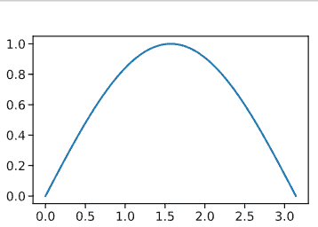

如文档所示，plot 函数有许多许多选项。下图展示了一个更复杂的图表，包含多条线、沿坐标轴的标签和图例。matplotlib 为绘制的每条线使用不同的颜色。默认颜色称为 C0、C1、C2 等。或者，可以指定不同的颜色。

```python
x = np.linspace(0, 2 * np.pi, 200)
y1 = np.sin(x)
y2 = np.cos(x)
plt.plot(x, y1, '--', label='sin(x)')  # 使用默认颜色 C0 绘制
plt.plot(x, y2, color='purple', lw=2, label='cos(x)')  # 线宽 (lw) 为 2
plt.xlabel('x-axis')
plt.ylabel('y-axis')
plt.legend(); # 除非指定 loc，否则选择最佳位置放置图例
```

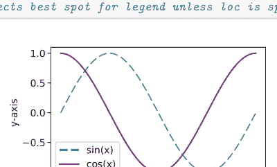

大多数 matplotlib 函数返回所创建绘图项目的句柄。例如，plt.plot 函数返回一个包含所绘制线条句柄的列表。

```python
a = plt.plot([1, 2, 3], label='hello')
print(a)
```

[<matplotlib.lines.Line2D object at 0x116b51c40>]

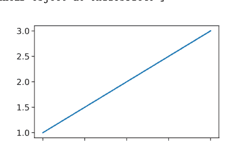

诸如 [<matplotlib.lines.Line2D at 0x10a9063d0>] 这样的晦涩语句是一个列表，其中包含指向所绘制线条内存位置的句柄。例如，命令 plt.xlabel 添加一个文本对象并返回该对象的句柄。句柄所引用项目的属性可以使用 plt.setp 命令进行修改（尽管本书中不常这样做）。在以下示例中，setp 函数用于增加所绘制线条的线宽和颜色。

```python
a = plt.plot([1, 2, 3])
plt.setp(a, color='hotpink', lw=4);
```

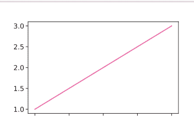

212 附录 A

可以使用 `plt.savefig('/mydirectory/myfigure1.png')` 将图形保存到文件，其中 `mydirectory` 是目录名。必须使用正斜杠分隔目录名。文件类型根据文件扩展名推断（png、eps 和 svg）。

二维数据可以通过等高线图进行可视化。例如，考虑以下函数，表示水头 $h$ 作为水平坐标 $x$ 和 $y$ 的函数：

$$h = \frac{2}{\pi} \ln(x^2 + y^2) - 0.01x - 5$$

在左下角为 $(x, y) = (-200, -200)$、右上角为 $(x, y) = (400, 200)$ 的窗口中创建水头的等高线图。首先使用 `np.meshgrid` 函数定义 $(x, y)$ 值的网格，该函数创建二维数组 `x` 和 `y`。在每个 $(x, y)$ 位置计算水头。在绘制等高线之前，使用 `plt.subplot` 创建一个图形，并使用关键字 `aspect=1` 确保水平轴和垂直轴具有相同的比例（这样圆形看起来像圆形而不是椭圆）。使用 `plt.contour` 函数绘制水头值的等高线；绘制了 20 个水头值的等高线。

```python
x, y = np.meshgrid(np.linspace(-200, 400, 100), np.linspace(-200, 200, 100))
h = 2 / np.pi * np.log(x ** 2 + y ** 2) - 0.01 * x - 5
plt.subplot(111, aspect=1)
plt.contour(x, y, h, 20);  # 绘制 20 条等高线
```

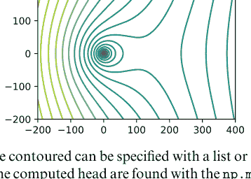

可以使用列表或数组指定绘制等高线的水头值。首先，使用 `np.min` 和 `np.max` 函数找到计算出的水头的最小值和最大值。

```python
print('min:', np.min(h))
print('max:', np.max(h))
```

min: -4.1046611143428455
max: 4.18729839195133

水头值从 -3 m 到 6 m，步长为 0.5 m 进行等高线绘制。`plt.contour` 函数返回的句柄被存储并传递给 `plt.clabel` 函数，以在等高线上绘制标签。标签的格式指定为 `fmt='%.1f'`，表示保留 1 位小数的浮点数。

```python
plt.subplot(111, aspect=1)
cs = plt.contour(x, y, h, np.arange(-3, 6, 0.5), colors='C0')
plt.clabel(cs, fmt='%.1f');
```

所有等高线的颜色指定为 `colors='C0'`，默认情况下，负值的等高线为虚线。可以通过指定 `plt.contour` 的关键字参数 `linestyles='-'` 或更改默认 matplotlib 参数 `contour.negative_linestyle` 的值来覆盖后一种行为（请参阅 matplotlib 文档）。

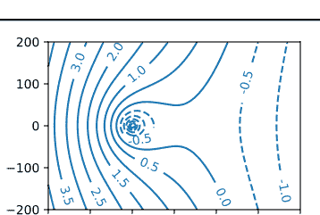

#### A.5 函数

函数在 Python 中使用 def 命令定义。函数可以存储在文件中，也可以在 notebook 的代码单元格中或控制台的 Python 提示符下输入。以下函数在下面的 Python 函数 func_one 中实现。

$f(x) = \cos(x) \quad x < 0$
$f(x) = \exp(-x) \quad x \geq 0$

```python
def func_one(x):
    if x < 0:
        rv = np.cos(x)
    else:
        rv = np.exp(-x)
    return rv
```

函数名为 func_one（使用小写字母作为函数名并用下划线分隔单词是合适的 Python 编码风格）。函数返回在函数内部计算的变量 rv 的值。在代码单元格中输入 func_one( 后跟 [Shift][Tab] 会显示函数的输入参数（以及任何提供的文档）。调用函数会返回所需的值。

```python
print(func_one(1))
print(func_one(-1))
```

0.36787944117144233
0.5403023058681398

由于 if-else 结构仅适用于单个数字，因此无法使用数组调用函数 func_one。有两种方法可以使 func_one 在输入数组上工作。第一种也是最简单的方法是创建一个新函数，该函数对 func_one 函数进行向量化。新函数接受一个数组作为其参数，并简单地为数组中的每个值调用 func_one 函数，然后返回一个数组。可以使用 np.vectorize 函数对函数进行向量化，该函数接受一个待向量化的函数作为输入参数并返回一个函数。

```python
func_two = np.vectorize(func_one)
func_two(np.arange(-2, 3)) # func_two 可以使用数组调用
```

array([-0.41614684, 0.54030231, 1. , 0.36787944, 0.13533528])

使用 np.vectorize 很容易，但速度不是很快。在幕后，func_two 函数只是创建一个循环并遍历数组中的所有值。或者，可以重写 func_one 函数以接受数组作为输入参数。

`np.atleast_1d` 函数可用于确保输入参数 `x` 至少是一个一维数组（因此标量会被转换为数组）。`np.empty(x.shape)` 函数用于创建一个与 `x` 形状相同的空数组。条件语句用于填充数组，该数组在函数末尾返回。

```python
def func_one_array(x):  # fancy function that works on arrays
    x = np.atleast_1d(x)
    f = np.empty(x.shape) # return value is now called f
    f[x < 0] = np.cos(x[x < 0])
    f[x >= 0] = np.exp(-x[x >= 0])
    return f
```

使用 `func_one_array` 函数，并在下方创建一个图形。请注意，坐标轴的范围已设置，并使用列表推导式和 LaTex 风格的命令添加了特殊的刻度标记，以绘制希腊字母 π。

```python
x = np.linspace(-2 * np.pi, 2 * np.pi, 201)  # x values
y = func_one_array(x) # call the function to compute the y values
plt.plot(x, y)
plt.xlim(-2 * np.pi, 2 * np.pi)  # set the limits along the x-axis
plt.xticks(np.arange(-2 * np.pi, 3 * np.pi, np.pi),
           ['$-2\pi$', '$-\pi$', '0', '$\pi$', '$2\pi$']);
```

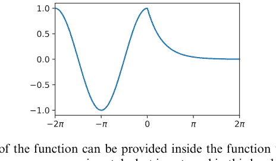

函数的文档可以在函数内部使用三引号提供。这当然是正确的编程风格，但本书中为节省空间未使用此方式。

```python
def func_one(x):
    '''Documentation of the function goes here
    Returns:
    cos(x) for x < 0
    exp(-x) for x >=0'''
    if x < 0:
        rv = np.cos(x)
    else:
        rv = np.exp(-x)
    return rv
```

现在输入 `func_one(` 后按 `[Shift][Tab]` 即可显示文档。传递给函数的值（如前面示例中的 `x`）称为参数。函数并不总是有参数。函数参数可以是常规参数和关键字参数（或 kwargs）。常规参数始终需要传递，并且必须按正确的顺序传递。关键字参数是用户可选择传递的参数，其传递顺序无关紧要。如果未传递关键字参数，则其值取函数定义中指定的默认值。当函数同时具有常规参数和关键字参数时，关键字参数必须始终位于常规参数之后。以下示例说明了这些规则，其中函数 `test` 有一个常规参数和两个关键字参数。

```python
def test(x, y=7, z=100):
    print(x, y, z)

test(3)
test(3, y=8) # or test(3, 8), but better to specify keyword
test(3, z=-1)
test(3, z=-1, y=8) # keyword arguments may be in any order
test(x=3) # regular arguments may also be called with their name
```

```
3 7 100
3 8 100
3 7 -1
3 8 -1
3 7 100
```

如果函数不接受任何参数，其定义仍必须包含括号。同样，调用函数也需要添加括号。

```python
def test():
    print('Hello')
test()
```

```
Hello
```

如果在函数内部使用了一个变量，但该变量未通过常规参数或关键字参数显式传递给函数，Python 将在函数外部的内存中搜索该变量。这通常被认为是粗心的编程，但有时在短脚本中会这样做，本书中也是如此。因此，以下函数可以工作，但并非最优。

```python
velo = 0.05 # defined outside the function

def printflow(x):
    print(f'the velocity at x={x} is {velo} m/d')

printflow(100)
```

```
the velocity at x=100 is 0.05 m/d
```

最好将所有变量传递给函数

```python
def printflow(x, velo):
    print(f'the velocity at x={x} is {velo} m/d')

printflow(x=100, velo=0.05)
```

```
the velocity at x=100 is 0.05 m/d
```

以允许传递任何关键字参数的方式定义函数可能很有用，即使这些参数事先未知或未显式定义。如果函数调用另一个函数，这将非常有用。下面的代码单元格通过定义一个函数 `kwargs_demo` 来演示其工作原理，该函数创建一个具有固定布局的图形，但允许用户自定义数据的绘制方式。通过在 `kwargs_demo` 的参数列表中包含 `**kwargs` 并将其传递给绘图函数，所有 matplotlib 的绘图关键字参数都可用于 `kwargs_demo` 函数。

```python
def kwargs_demo(x, y, **kwargs):
    plt.figure()
    plt.plot(x, y, **kwargs)
    plt.grid(True)
    plt.xlabel("x")
    plt.ylabel("y")

x = np.linspace(0, 4 * np.pi)
y = np.cos(x)
kwargs_demo(x, y, color='C2', ls='--', lw=4);
```

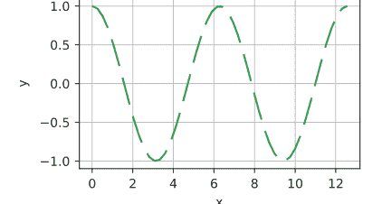

Python 代码或函数可以在扩展名为 `.py` 的单独文件中定义。这样的文件可以包含一个或多个函数定义。以这种方式存储函数避免了重复定义的需要，并允许函数轻松共享和分发。执行类似任务的一组函数称为 *包*。包可以由许多不同的文件组成，并且可以具有复杂的结构，此处不作讨论。

导入包有许多不同的方式。以 `numpy` 包为例，最基本的语法是 `import numpy`，之后 `numpy` 中的任何函数都可以通过 `numpy.function_name()` 调用。或者，可以使用 `from numpy import *` 导入 `numpy` 的所有功能。这允许在不为函数名添加 `numpy` 前缀的情况下调用 `numpy` 的函数。然而，通常不鼓励以这种方式导入库，因为函数与包之间的任何关系都会丢失。更好的方法是使用 `import numpy as np`（如前所述，并且是 Python 社区的标准做法）。这使得编写紧凑代码成为可能，同时保持包与其内部定义的所有内容之间的关系。这对于依赖多个包的程序很重要，因为包之间可能存在相似的名称。通过为函数名添加包名前缀，程序员可以确保调用的是预期的函数。

包也可以有子包。`matplotlib` 的 `pyplot` 子包之前已通过 `import matplotlib.pyplot as plt` 导入。另一个子包的例子是 `numpy` 的 `linalg` 包，它是一个处理线性代数的函数集合。如果使用 `import numpy as np` 导入 `numpy` 包，则 `linalg` 子包中的函数可以通过 `np.linalg.function_name()` 调用。

#### A.6 用于科学计算的 `scipy` 包

用于探索性计算的三个主要 Python 包是 `numpy`、`matplotlib` 和 `scipy`。`numpy` 和 `matplotlib` 包已在前面的示例中讨论过。这里演示了 scipy 的一些功能，包括求根、最小化、特殊函数和数值积分。

`scipy.optimize` 包中的 `fsolve` 函数可用于查找函数的根。在下面的代码单元格中，使用 `fsolve` 函数数值求解函数 $f(x) = e^{x/5} - 2$ 的根（当然，对于这种情况，也可以解析计算）。必须提供数值搜索的起始值。起始值越接近根，`fsolve` 找到根的可能性（和速度）就越大。

```python
def ffunc(x):
    return np.exp(x / 5) - 2

from scipy.optimize import fsolve
xroot = fsolve(ffunc, x0=0) # start searching at x0=0
print(f'root={xroot}, function value={ffunc(xroot)}')
```

```
root=[3.4657359], function value=[2.7533531e-14]
```

接下来，找到 $f(x)$ 与函数 $g(x) = \sin(x)$ 相交的三个点。函数 `fdiff` 计算 $f(x)$ 和 $g(x)$ 之间的差值，并使用 `fsolve` 从三个不同的起始位置查找 `fdiff` 的三个根；即，`fsolve` 找到两个函数相交的三个点。

```python
def gfunc(x):
    return 3 * np.sin(x)

def fdiff(x):
    return ffunc(x) - gfunc(x)

x_intersect = fsolve(fdiff, np.array([3, 6, 9])) # 3 starting points
x = np.linspace(0, 3 * np.pi)
plt.plot(x, ffunc(x), label="f(x)")
plt.plot(x, gfunc(x), label="g(x)")
plt.plot(x_intersect, ffunc(x_intersect), 'k.')
plt.legend();
```

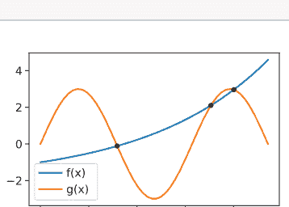

函数的最小值可以通过 `scipy.optimize` 的 `fmin` 函数找到。下面的代码单元格从 $x = 1.5$ 开始搜索，找到函数 $g(x)$ 和 $h(x) = e^{x/5} + 2$ 之间差值最小的 x 位置。

```python
def hfunc(x):
    return np.exp(x/5) + 2

def fdiff(x):
    return hfunc(x) - gfunc(x)
```

from scipy.optimize import fmin
xmin = fmin(fdiff, 1.5)

plt.plot(x, hfunc(x), label="h(x)")
plt.plot(x, gfunc(x), label="g(x)")
plt.plot(xmin, hfunc(xmin), 'C0.')
plt.plot(xmin, gfunc(xmin), 'C1.')
plt.legend();

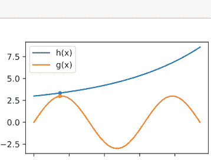

scipy包的另外两个子包是用于特殊函数的scipy.special和用于数值积分的scipy.integrate。作为一个例子，考虑定义为以下形式的指数积分

$$E_1(u) = \int_u^\infty \frac{e^{-s}}{s} ds \qquad (A.1)$$

E₁在scipy.special包中作为exp1可用，但也可以使用数值积分来计算。使用scipy.integrate包的quad函数，它接受要积分的函数以及积分的下限和上限作为输入；使用np.inf表示∞。请注意，quad返回两个值：数值积分的结果和误差估计。下面比较了E₁(1)的数值积分结果和特殊函数结果。

```
from scipy.integrate import quad
from scipy.special import exp1

def integrand(s):
    return np.exp(-s) / s

E1num = quad(integrand, 1, np.inf)[0] # numerical integration

print('E1(1) from numerical integration:', E1num)
print('E1(1) from special function      :', exp1(1))
```

E1(1) from numerical integration: 0.21938393439551238
E1(1) from special function      : 0.21938393439552062

### 选定问题的数值答案

#### 第0章
0.1 $h = 18.06$ m
0.2 $k = 11.29$ m/d, $k = 16.93$ m/d
0.3 $v = 0.13$ m/d $= 4.0$ m/month

#### 第1章
1.1 $x_d = 300$ m
1.2 $h_0 = 9$ m
1.3 $N = -0.0008$ m/d
1.6 $t_{tr} = 2079$ d
1.7 $t_{tr} = 2079$ d
1.9 $h_L = 4.64$ m
1.10 $t = 20625$ d at $x = L_0$, $t = 41250$ d at $x = L$ for $H_0 = H_1 = 10$ m
$t = 30937$ d at $x = L$ for $H_1 = 5$ m.
1.11 $h_0 = 7.75$ m

#### 第2章
2.1 $c = 52.0$ d
2.4 $U_L = 0.0574$ m$^2$/d,
$U_R = -0.0936$ m$^2$/d
2.5 $T_{eff} = 127.3$ m$^2$/d

#### 第3章
3.1 $H = 11.227$ m
3.5 $h = 6.550$ for $H = 10$ m
$h = 6.446$ m for $H = 20$ m

#### 第4章
4.1 $U = 0.5$ m$^2$/d, $x_{toe} = -100$ m
4.2 $U = 0.06$ m$^2$/d, $x_{toe} = -800$ m
4.3 $x_{toe} = -125$ m
4.4 $x_{toe} = -886$ m
4.5 $x_{toe} = 500 \pm 212.13$ m before sea level rise. $x_{toe} = 500 \pm 154.88$ m after sea level rise
4.6 $N = 0.00164$ m/d
4.7 $h_0 = 1.11$ m with interface
$h_0 = 0.62$ m without interface
4.8 Toe moves inland 25.05 m after sea level rise

4.9 $h = 0.11$ m, $z_i = -4.22$ m at shoreline
$h = 0.404$ m, $z_i = -16.18$ m at center of island

#### 第5章
5.1 $T = 1$ m$^2$/d
5.2 $x = 1000$ m
5.5 $V = 31.9$ m$^3$/m after 10 days
$V = 8.6$ m$^3$/m after 40 days
5.7 $A = 218.85$ d, $a = 42.56$ d
5.8 $h = 0.618$ m at $t = 0.01$ d, $h = 1.356$ m at $t = 0.1$ d, $h = 1.458$ m at $t = 1$ d

#### 第6章
6.1 $r_d = 141.4$ m
6.2 $Q = 62.83$ m$^3$/d
6.3 $Q = 251.2$ m$^3$/d
6.4 $Q = 686$ m$^3$/d
6.5 $h_w = -3.68$ m
6.6 $\Psi = [-25, -50, 50, 25]$ m$^3$/d
6.7 $h = -1.04$ m at extraction well
$h = 1.18$ m at injection well.
6.8 $Q = 432.6$ m$^3$/d
6.9 $h_w = 7.12$ m
6.11 $h_0 = -4.81$ m, $h_1 = -3.15$ m for $c = 200$ d; $h_0 = -5.18$ m, $h_1 = -3.41$ m for $c = 1000$ d
6.12 $h_0 = 4.93$ m, $h_1 = 1.60$ m

#### 第7章
7.1 $Q_x = 0.4$ m$^2$/d, $Q_y = 0.2$ m$^2$/d
7.2 $Q = 26.7$ m$^3$/d
7.3 $x_s = \pm 102.3$ m
7.4 $x_{s1} = -24.1$ m, $x_{s2} = 103.7$ m
7.7 $Q = 125.7$ m$^3$/d
7.8 $h = 10.4$ m
7.9 $h = -1.73$ m

#### 第8章
8.2 $h = 18.8$ m, $Q = 296$ m$^3$/d

8.4 $Q = -1898$ m$^3$/d

8.5 $Q = 387$ m$^3$/d

Hantush: $T = 3135$ m$^2$/d, $S = 0.0044$, $c = 25.2$ d, $RMSE = 0.02$ m

9.9 $T = 560$ m$^2$/d, $S = 4.16 \cdot 10^{-5}$

#### 第9章
9.1 $t = 9$ d

9.2 $r = 9.27$ m

9.6 $T = 256$ m$^2$/d, $S = 0.057$ without river; $T = 197$ m$^2$/d, $S = 0.107$ with river

9.8 Theis: $T = 4484$ m$^2$/d, $S = 0.0018$, $RMSE = 0.12$ m

#### 第10章
10.3 $\Delta h = 0.0775$ m

10.4 Dupuit: $\Delta h = 0.0750$ m, extra head drop: $\Delta h = 0.0025$ m

10.6 No regional flow cell for $H = 70$ m

10.7 Factor based on head at the top of aquifer at $x = -100$ m: 41.6. Factor based on head at the top of aquifer at $x = -50$ m: 43.1

10.8 Factor based on head at the top of aquifer at $x = 0$ m: 38.5

## 参考文献

Abramowitz, M. and Stegun, I. (1965), *Handbook of mathematical functions with formulas, graphs, and mathematical tables*, 9th edn, Dover.

Anderson, M. P., Woessner, W. W. and Hunt, R. J. (2015), *Applied groundwater modeling: simulation of flow and advective transport*, Academic press.

Bakker, M. (2006), ‘Analytic solutions for interface flow in combined confined and semi-confined, coastal aquifers’, *Advances in Water Resources* **29**(3), 417–425.

Bakker, M. (2013*a*), Analytic modeling of transient multilayer flow, *in* ‘Advances in hydrogeology’, Springer, pp. 95–114.

Bakker, M. (2013*b*), ‘Semi-analytic modeling of transient multi-layer flow with ttim’, *Hydrogeology Journal* **21**(4), 935–943.

Bakker, M. (2021), *TimML, A multi-layer, analytic element model*. https://github.com/mbakker7/timml.

Bakker, M. and Anderson, E. I. (2003), ‘Steady flow to a well near a stream with a leaky bed’, *Groundwater* **41**(6), 833–840.

Bakker, M. and Kelson, V. A. (2009), ‘Writing analytic element programs in Python’, *Groundwater* **47**(6), 828–834.

Bakker, M. and Schaars, F. (2019), ‘Solving groundwater flow problems with time series analysis: You may not even need another model’, *Groundwater* **57**(6), 826–833.

Bakker, M. and Strack, O. D. (2003), ‘Analytic elements for multiaquifer flow’, *Journal of Hydrology* **271**(1-4), 119–129.

Bear, J. and Jacobs, M. (1965), ‘On the movement of water bodies injected into aquifers’, *Journal of Hydrology* **3**(1), 37–57.

Bear, J. and Verruijt, A. (1987), *Modeling Groundwater Flow and Pollution*, D. Reidel Publishing Company.

Bruggeman, G. (1999), *Analytical Solutions of Geohydrological Problems*, Vol. 46 of *Developments in Water Science*, Elsevier.

Carr, P. A. and Van Der Kamp, G. S. (1969), ‘Determining aquifer characteristics by the tidal method’, *Water Resources Research* **5**(5), 1023–1031.

Collenteur, R. A., Bakker, M., Caljé, R., Klop, S. A. and Schaars, F. (2019), ‘Pastas: Open source software for the analysis of groundwater time series’, *Groundwater* **57**(6), 877–885.

Dupuit, J. (1863), *Études théoriques et pratiques sur le mouvement des eaux dans les canaux découverts et à travers les terrains perméables: avec des considérations relatives au régime des grandes eaux, au débouché à leur donner, et à la marche des alluvions dans les rivières à fond mobile*, Dunod, Paris.

Edelman, F. (1947), *Over de berekening van grond water stromingen*, Delft University. PhD thesis.

Ferris, J. G. (1952), *Cyclic fluctuations of water level as a basis for determining aquifer transmissibility*, US Department of the Interior, Geological Survey, Water Resources Division, Ground Water Branch.

Fitts, C. (2013), *Groundwater science*, second edn, Academic Press.

Fitts, C. R. (2010), ‘Modeling aquifer systems with analytic elements and subdomains’, *Water Resources Research* **46**(7).

Fitts, C. R. (2021), *AnAqSim (analytic aquifer simulator)*. https://www.fittsgeosolutions.com.

Forchheimer, P. (1886), ‘Über die ergiebigkeit von brunnen-anlagen und sickerschlitzten’, *Z. Architekt. Ing.-Ver. Hannover* **32**, 539–563.

Forchheimer, P. (1919), ‘Zur theorie der grundwasserstroemung’, *Sitzungsberichten der Akademie der Wissenschaften in Wien, Mathem.-natuw. Klasse, Abteilung IIa* **128**, 7–14.

Glover, R. E. (1959), ‘The pattern of fresh-water flow in a coastal aquifer’, *Journal of Geophysical Research* **64**(4), 457–459.

Haitjema, H. M. (1995), *Analytic element modeling of groundwater flow*, Academic Press.

Haitjema, H. M. and Mitchell-Bruker, S. (2005), ‘Are water tables a subdued replica of the topography?’, *Groundwater* **43**(6), 781–786.

Hantush, M. S. and Jacob, C. E. (1955), ‘Non-steady radial flow in an infinite leaky aquifer’, *Eos, Transactions American Geophysical Union* **36**(1), 95–100.

Harr, J. (1996), *A civil action*, Vintage.

Harr, M. E. (1962), *Groundwater and seepage*, McGraw-Hill New York.

Harris, C. R., Millman, K. J., van der Walt, S. J., Gommers, R., Virtanen, P., Cournapeau, D., Wieser, E., Taylor, J., Berg, S., Smith, N. J., Kern, R., Picus, M., Hoyer, S., van Kerkwijk, M. H., Brett, M., Haldane, A., del Rio, J. F., Wiebe, M., Peterson, P., Gérard-Marchant, P., Sheppard, K., Reddy, T., Weckesser, W., Abbasi, H., Gohlke, C. and Oliphant, T. E. (2020), ‘Array programming with NumPy’, *Nature* **585**(7825), 357–362. URL: https://doi.org/10.1038/s41586-020-2649-2

Hunter, J. D. (2007), ‘Matplotlib: A 2d graphics environment’, *Computing in Science & Engineering* **9**(3), 90–95.

Jacob, C. E. (1950), *Flow of groundwater*, John Wiley, New York, chapter V, pp. 321–386.

Johansson, F. et al. (2013), *mpmath: a Python library for arbitrary-precision floating-point arithmetic (version 0.18)*. http://mpmath.org/.

Kluyver, T., Ragan-Kelley, B., Pérez, F., Granger, B. E., Bussonnier, M., Frederic, J., Kelley, K., Hamrick, J. B., Grout, J., Corlay, S. et al. (2016), Jupyter notebooks—a publishing format for reproducible computational workflows., in F. Loizides and B. Schmidt, eds, ‘Positioning and Power in Academic Publishing: Players, Agents and Agendas’, IOS Press, pp. 87–90.

Kruseman, G. P. and De Ridder, N. A. (1990), *Analysis and evaluation of pumping test data*, ILRI publication 47, International Institute for Land Reclamation and Improvement, The Netherlands.

## 参考文献

Lutz, M. (2013), *Learning Python*, 第5版, O’Reilly.

Polubarinova-Kochina, P. (1962), *Theory of ground water movement*, 普林斯顿大学出版社.

Post, V. E., Houben, G. J. and van Engelen, J. (2018), ‘What is the Ghijben-Herzberg principle and who formulated it?’, *Hydrogeology Journal* **26**, 1801–1807.

Stehfest, H. (1970), ‘Algorithm 368: Numerical inversion of Laplace transforms [d5]’, *Commun. ACM* **13**(1), 4749.

Strack, O. D. L. (1976), ‘A single-potential solution for regional interface problems in coastal aquifers’, *Water Resources Research* **12**(6), 1165–1174.

Strack, O. D. L. (1984), ‘Three-dimensional streamlines in Dupuit-Forchheimer models’, *Water Resources Research* **20**(7), 812–822.

Strack, O. D. L. (1989), *Groundwater mechanics*, Prentice Hall.

Strack, O. D. L. (2003), ‘Theory and applications of the analytic element method’, *Reviews of Geophysics* **41**(2).

Strack, O. D. L. (2017), *Analytical groundwater mechanics*, 剑桥大学出版社.

Theis, C. V. (1935), ‘The relation between the lowering of the piezometric surface and the rate and duration of discharge of a well using ground-water storage’, *Eos, Transactions American Geophysical Union* **16**(2), 519–524.

Thiem, G. (1906), *Hydrologische methoden*, J. M. Gebhardt, Leipzig.

Toth, J. (1963), ‘A theoretical analysis of groundwater flow in small drainage basins’, *Journal of geophysical research* **68**(16), 4795–4812.

USBR (1995), *Ground water manual*, 美国内政部垦务局, 华盛顿特区.

Verruijt, A. (1970), *Theory of groundwater flow*, Macmillan civil engineering hydraulics, Macmillan.

Virtanen, P., Gommers, R., Oliphant, T. E., Haberland, M., Reddy, T., Cournapeau, D., Burovski, E., Peterson, P., Weckesser, W., Bright, J., van der Walt, S. J., Brett, M., Wilson, J., Millman, K. J., Mayorov, N., Nelson, A. R. J., Jones, E., Kern, R., Larson, E., Carey, C. J., Polat, , Feng, Y., Moore, E. W., VanderPlas, J., Laxalde, D., Perktold, J., Cimrman, R., Henriksen, I., Quintero, E. A., Harris, C. R., Archibald, A. M., Ribeiro, A. H., Pedregosa, F., van Mulbregt, P. and SciPy 1.0 Contributors (2020), ‘SciPy 1.0: Fundamental Algorithms for Scientific Computing in Python’, *Nature Methods* **17**, 261–272.

Vogel, J. (1967), Investigation of groundwater flow with radiocarbon, in ‘Isotopes in hydrology. Proceedings of a symposium’, 国际原子能机构 (IAEA), pp. 355–569.

# Taylor & Francis

Taylor & Francis Group

http://taylorandfrancis.com

## 索引

解析单元, 137
各向异性, 6, 172
含水层, 4
    承压含水层, 4
    半承压含水层, 25
    无压含水层, 4
含水层试验, 156
弱透水层, 4
面汇, 148
面状补给, 10

背景流, 117
块体响应, 82
Boussinesq方程, 92
支割线, 104, 126
brentq, 131

捕获区, 122
捕获区包络线, 118
复坐标, 125
复势, 125
复变量, 125, 201, 206
余误差函数, 71
保角映射, 175
流动连续性, 15
等值线, 212
等值线标签, 212
临界流量, 127, 131

达西定律, 2, 6
淡水密度, 55, 56
咸水密度, 55
水密度, 3, 55
井流量, 99
流量势, 43
    承压流, 51
    承压界面流, 57
    无压流, 43
    无压界面流, 60
流量矢量, 7
散度, 10, 15, 97
偶极子, 104
排水区, 25
降深, 153
Dupuit-Forchheimer近似, 7

有效导水系数, 24
特征值, 168
位置水头, 1
欧拉常数, 112
指数积分, 130, 152
抽水井, 104

流网, 104
fmin, 86, 157
傅里叶级数, 189
fsolve, 50, 217

Ghyben-Herzberg方程, 56
Glover解, 191

Hantush解, 161
水头梯度, 2, 6
指定水头线汇, 146
指定水头井, 137, 142
水力传导系数, 2, 3
水力水头, 1
静水压力, 1, 7
双曲函数, 26

镜像井, 106
不透水基底, 4
不透水边界, 18, 44, 106
非均质边界, 108
注水井, 104
界面, 55
界面流, 55
固有渗透率, 3

Kruseman and de Ridder, 157

拉普拉斯变换, 87, 163
拉普拉斯方程, 96, 97
越流系数, 26
双层含水层流越流系数, 35
越流层, 4
越流河床, 127
最小二乘法, 85, 157
linalg.solve, 138
线汇, 144
低渗透层, 25

质量平衡, 9, 69
镜像法, 105
修正贝塞尔函数, 111
修正亥姆霍兹方程, 87
多层含水层系统, 4

数值积分, 75, 218
流线数值积分, 120

面向对象编程, 138
观测井, 1, 157

部分贯穿河流, 174
流线, 120
周期性流动, 77, 158
潜水储量, 5, 69, 91
潜水面, 4
物理平面, 175
分段常数, 108
测压管, 1
点汇, 144
泊松方程, 10, 95
圩区, 25
孔隙度, 3
势流, 43
压力, 1
压力水头, 1
抽水试验, 156

quad, 75, 161, 218

径向坐标, 96
参考平面, 175
参考点, 142, 149
代表性基本体积, 3
越流层阻力, 25
垂向流动阻力, 15
洪水波响应, 76
河床传导率, 20

盐度, 55
饱和厚度, 43
海水入侵, 193
半承压层, 25
表皮效应, 164
solve_ivp, 120

比流量势, 171
比流量矢量, 6, 171
比储水系数, 6
给水度, 5
滞点, 38, 118
稳定流, 5
Stehfest算法, 88, 163
阶跃响应, 82
基底阶梯, 48, 181
储水系数, 5, 69
Strack势, 56
流函数, 16, 97
    水平面内, 97
    垂直面内, 16
流线, 16, 97
streamplot, 11
叠加原理, 75, 101, 106, 137, 152

Theis解, 152
Thiem解, 100, 112, 155
时间序列分析, 86
界面尖端, 55, 65, 191, 195
界面趾部, 55, 62, 66, 134
Toth问题, 185
非稳定流, 5, 69
导水系数, 4
运移时间, 12, 18, 46, 120
双层含水层系统, 35, 39, 113, 167

均匀背景流, 118
均匀流, 117

可变饱和厚度, 43
可变导水系数, 91
向量化, 213
速度, 6, 12, 18, 120
垂直夸大, 12
垂直面, 15, 171
粘度, 3
体积平衡, 9, 15, 69
体积平衡方程, 9

水量平衡, 9, 70, 75, 95, 96, 164
分水岭, 14
地下水位, 1, 4
井, 96
井筒储水效应, 164