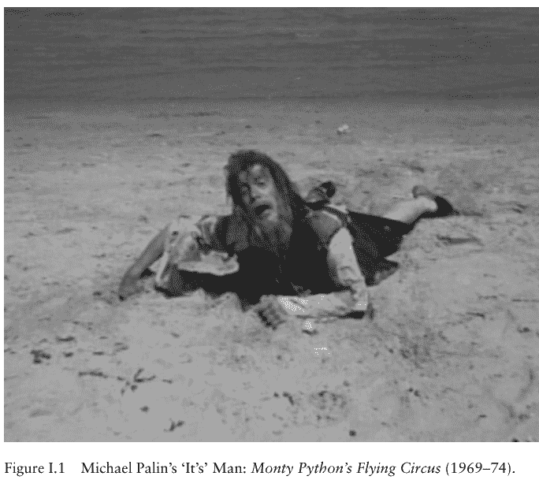
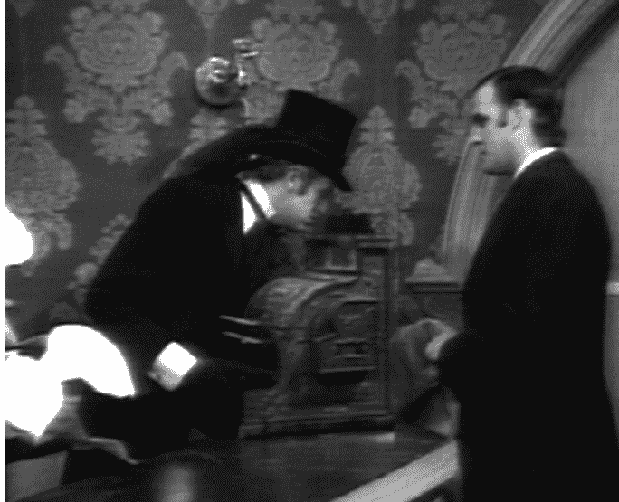
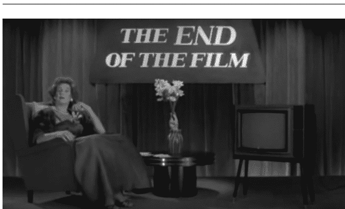
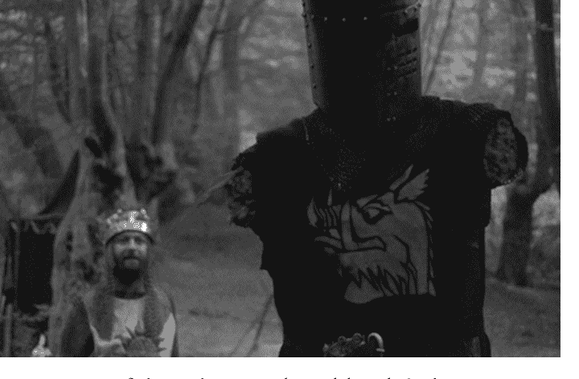
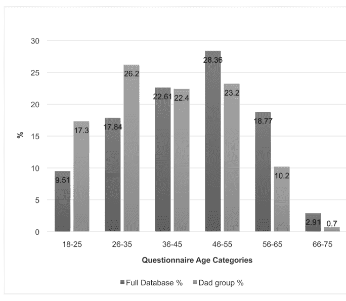
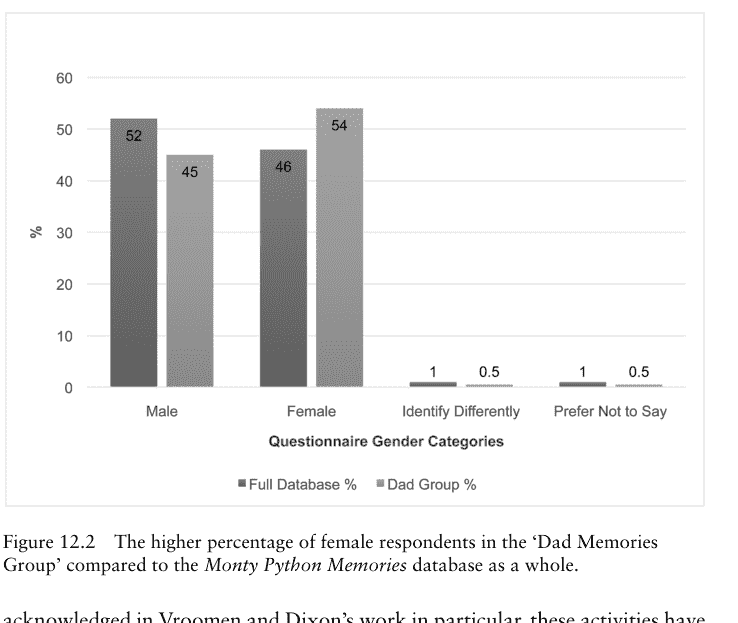

# 接下来是完全不同的内容

# 接下来是完全不同的内容

蒙提·派森的批判性研究方法

凯特·伊根与杰弗里·安德鲁·温斯托克 编

爱丁堡大学出版社

爱丁堡大学出版社是英国领先的大学出版社之一。我们在人文与社会科学的选定学科领域出版学术书籍和期刊，将前沿学术研究与高标准的编辑和制作价值相结合，出版具有持久重要性的学术著作。更多信息请访问我们的网站：edinburghuniversitypress.com

© 编辑内容与组织 凯特·伊根与杰弗里·安德鲁·温斯托克，2020
© 各章节作者，2020

爱丁堡大学出版社有限公司
The Tun – Holyrood Road
12(2f) Jackson’s Entry
Edinburgh EH8 8PJ

使用 Sabon 10/12.5 pt 字体排版
由 IDSUK (DataConnection) Ltd 排版
并在英国印刷装订

本书的 CIP 记录可从大英图书馆获取

ISBN 978 1 4744 7515 0 (精装本)
ISBN 978 1 4744 7517 4 (网络就绪 PDF)
ISBN 978 1 4744 7518 1 (epub)

凯特·伊根与杰弗里·安德鲁·温斯托克作为本书编辑的权利已根据 1988 年《版权、设计和专利法》以及 2003 年《版权及相关权利条例》（SI No. 2498）得到确认。

# 目录

- 图表列表 vii
- 致谢 viii
- 撰稿人说明 ix

‘这是……引言’
*凯特·伊根与杰弗里·安德鲁·温斯托克* 1

# 第一部分 定位派森

- 1. 六位喜剧演员寻找……：蒙提·派森与荒诞/超现实主义戏剧
*里克·哈德森* 23

- 2. ‘无人能过’与‘皮肤之下的骷髅’：蒙提·派森、英国阶级体系与死亡
*吉娜·威斯克* 39

- 3. Der Ver Zwei Peanuts：《蒙提·派森的飞行马戏团》中对遥远战争的描绘
*安娜·马顿菲* 57

# 第二部分 派森的实践、形式与媒介

- 4. 皇家爱乐乐团上厕所：蒙提·派森的音乐
*詹姆斯·莱戈特* 75

接下来是完全不同的内容

- 5. 淘气神的颠覆性蜕变：吉列姆的讽刺动画
*保罗·威尔斯*

- 6. 在粪便中勾勒的形象：抄写员、彩饰师与蒙提·派森的《圣杯》
*尤恩·威尔逊*

# 第三部分 语境与再现

- 7. 来自地狱的老奶奶、勇敢的自行车修理工、上流社会的傻瓜以及‘泡茶而非做爱’：《蒙提·派森的飞行马戏团》与1960年代英国（流行）文化
*卡罗琳·朗霍斯特*

- 8. 鹦鹉、信天翁与猫：蒙提·派森中的动物与喜剧
*布雷特·米尔斯*

- 9. ‘政治正确’、反转与不协调：《布莱恩的一生》中的幽默动力学
*凯瑟琳·J·卡西蒂*

# 第四部分 崇拜、粉丝与派森

- 10. 哲学、荒诞、浪费与《生命的意义》：一部某种意义上的邪典电影
*欧内斯特·马蒂斯*

- 11. 赞美愚蠢：派森的崇拜
*杰弗里·安德鲁·温斯托克*

- 12. 连接的记忆：父亲、女儿与跨代蒙提·派森粉丝
*凯特·伊根*

- 索引

# 图表

- I.1 迈克尔·帕林的‘这是’人：《蒙提·派森的飞行马戏团》(1969–74) 2
- I.2 克里塞向殡葬师查普曼展示他母亲在麻袋里：《蒙提·派森的飞行马戏团》，第26集 (1970) 6
- 10.1 《蒙提·派森的生命的意义》(1983) 与《洛基恐怖秀》(1975)：*joie de vivre éclatante* 179
- 10.2 《生命的意义》中的夸张与浪费 183
- 10.3 《生命的意义》的结尾：对当今娱乐的有力抨击 186
- 11.1 只是皮肉伤：《蒙提·派森与圣杯》(1975) 197
- 11.2 驯鹿控制：《蒙提·派森与圣杯》 201
- 11.3 亚瑟面对说‘Ni’的骑士：《蒙提·派森与圣杯》 202
- 12.1 ‘父亲记忆组’中18-35岁人群比例高于《蒙提·派森记忆》数据库整体比例 210
- 12.2 ‘父亲记忆组’中女性受访者比例高于《蒙提·派森记忆》数据库整体比例 211

### 致谢

我们要感谢爱丁堡大学出版社的每一位同仁，特别是吉莉安·莱斯利和理查德·斯特拉恩，感谢他们对本书项目的指导和投入，也感谢欧内斯特·马蒂斯建议我们作为编辑合作编写一本关于蒙提·派森的书！

凯特还要感谢西安·巴伯、马丁·巴克、贝克·爱德华兹、拉斯·亨特、斯蒂芬妮·琼斯、保罗·纽兰、蒂姆·诺布尔、丽莎·理查兹、杰米·塞克斯顿和贾斯汀·史密斯的反馈和鼓励。

# 撰稿人说明

**凯瑟琳·J·卡西蒂** 拥有美国夏威夷檀香山夏威夷大学马诺阿分校英语博士学位。她目前担任美国俄勒冈州蒙茅斯西俄勒冈大学文理学院院长兼英语教授。卡西蒂博士已发表并演讲过多篇与幽默相关的论文和书籍章节，包括最近发表在《宗教与电影杂志》上的一篇关于《布莱恩的一生》的文章。她还是一本英印写作选集《谢幕：英印反思》的联合编辑。她的学术兴趣包括文科倡导、写作教学法、生活写作/回忆录以及英印叙事。

**凯特·伊根** 是英国诺森比亚大学电影与媒体高级讲师，著有《垃圾还是宝藏？审查制度与“录像带恶心物”含义的变迁》(2007)、《邪典传记：鬼玩人》(2011) 以及（与马丁·巴克、汤姆·菲利普斯和莎拉·拉尔夫合著）《异形观众》(2015)。她还是（与莎拉·托马斯合编）《邪典电影明星》(2012) 的联合编辑。她目前正在研究1970年代末和1980年代初《蒙提·派森的布莱恩的一生》在英国各地的本地审查情况，并正在撰写一项关于观众对蒙提·派森记忆的国际观众项目的研究成果。

**里克·哈德森** 自离开学校后一直从事专业写作，他的小说不仅被BBC广播，还广泛发表在合集和专业杂志中。他创作过实验性文学小说、流行类型小说以及介于两者之间的作品。里克还从事游戏设计，为电脑游戏公司和桌面角色扮演游戏制作游戏材料。此外，里克还是一位英国文学学者，讲授奇幻/科幻和恐怖小说、电视和电影。他之前发表的学术作品包括：克里斯托弗·沙伯格（编）《解构布拉德·皮特》(2014) 和林恩·惠特菲尔德、保罗·N·赖纳赫和罗伯特·G·温纳（编）《超越派森的派森》(2016) 中的章节。

**卡罗琳·朗霍斯特** 拥有德国美因茨大学电影研究与英国研究学士学位以及电影研究硕士学位。她目前正在英国莱斯特德蒙福特大学电影与电视历史研究所（CATHI）攻读关于1960年代英国电影中男性反叛与反叛演员的博士论文。她的主要研究兴趣包括英美电影、电视、流行音乐与文化、性别研究、明星研究与表演研究，以及“漫长的”1960年代和反主流文化。

**詹姆斯·莱戈特** 是英国诺森比亚大学电影与电视高级讲师。他已就英国电影和电视文化的各个方面发表过文章。他是《当代英国电影：从遗产到恐怖》(2008) 的作者，也是《无药可救：克里斯·莫里斯的喜剧》(2013)、《英国科幻电影与电视：批判性论文集》(2011) 和《楼上楼下：从《福尔赛世家》到《唐顿庄园》的英国古装剧电视》(2019) 的联合编辑。他还是《流行电视杂志》的主编。

**安娜·马顿菲** 在英国东英吉利大学完成博士学位，研究两次世界大战期间英国和匈牙利电影中犹太幽默的跨国方面。她的研究兴趣包括英国广播、电视和电影喜剧、跨国幽默、两次世界大战期间的匈牙利喜剧以及犹太喜剧；她还发表了关于视听文本（包括动画）的翻译和跨文化改编如何影响解释的文化复杂性的文章。她目前在阿姆斯特丹自由大学担任讲师，并在莱顿大学担任客座讲师。

**欧内斯特·马蒂斯** 是加拿大不列颠哥伦比亚大学电影与媒体研究教授。他研究邪典电影、类型电影和欧洲电影。他曾撰文讨论数字电影和奇幻电影（《霍比特人》和《指环王》）的接受度、比利时电影、《房间》以及德尔菲娜·塞里格的行动主义和表演。他还出版了《100部邪典电影》、《邪典电影》和《科恩兄弟的电影》。

## ‘这是……开场白’

凯特·伊根 与 杰弗里·安德鲁·温斯托克

1969年10月5日，一档新的素描喜剧节目在BBC1频道首播。该集的标题“加拿大何去何从？”旨在迷惑评论家和剧评人，开场是一个衣衫褴褛、半身湿透的男人（迈克尔·帕林）从海中走出，精疲力竭地瘫倒在岸边，只说了一个词：“这是……”随后，一个沉稳的旁白声音接完了他的想法，揭示了节目那个不太可能的名字——“蒙提·派森的飞行马戏团”，伴随着约翰·菲利普·苏萨的《自由之钟》进行曲，背景是超现实、风格化的动画：爆炸的头颅、裸体女士和被巨脚踩扁的角色。片头字幕后，沃尔夫冈·阿马德乌斯·莫扎特（约翰·克里斯）在一个评委小组面前，对历史上那些荒谬不准确的名人死法进行点评；一位英国语言教师（特里·琼斯）试图向意大利母语者教授意大利语；一则广告推销一种被吹嘘得与死螃蟹无法区分的黄油；一位脱口秀主持人（约翰·克里斯）采访一位著名导演（格雷厄姆·查普曼），却始终无法确认导演的名字；另一位脱口秀主持人（埃里克·艾德尔）采访一位世界“顶尖现代作曲家”（特里·琼斯），但同样，焦点集中在作曲家的名字上；新闻报道了一场自行车赛，参赛者都是二十世纪的艺术家；并以纪录片的形式，追寻一个笑话的历史，这个笑话如此好笑，以至于听到它的人会立刻笑死。在各个片段之间，猪在尖叫，动画片段则展示了对照片进行荒谬且带有暗示性的处理。该集最后，以开场那个衣衫褴褛的男人艰难地返回大海而结束。

图 I.1 迈克尔·帕林的“这是”人：《蒙提·派森的飞行马戏团》（1969–74）。

《蒙提·派森的飞行马戏团》的首播集大胆、博学且不敬。部分在演播室观众前拍摄，部分在外景地拍摄，嘲讽了包括纪录片、新闻广播、脱口秀和游戏节目在内的不同媒体形式，该集将令人眼花缭乱的文字游戏（克里斯在“毕加索/自行车赛”片段中对当代艺术家的连珠炮式列举尤为突出）与荒诞动画、对艺术和历史的精妙引用与毫无歉意的愚蠢、原创素描喜剧与戏仿结合在一起。然而，它的反响也并非特别好。

首播集在周日晚上接近11点播出，《飞行马戏团》取代了一档收视率平淡的神职人员宗教节目（Hewison 1981: 7）。据罗伯特·韦尔凯克称，首播集仅获得了英国观众3%的份额——约150万人——是当周所有“轻娱乐节目”中收视率最低的（Verkaik 2009）。更令人担忧的是，BBC管理层对一些素描的内容表示了担忧。正如韦尔凯克所报道的：

BBC专题组负责人奥布里·辛格在会议上表示，他发现节目的某些部分“令人作呕”，而BBC1频道的总监[保罗·福克斯]则抱怨该节目“越过了可接受的界限”。（同上）

然而，观众的反应似乎更为积极。《BBC历史》的“蒙提·派森50周年”网站报道称，“在蒙提·派森首播集播出后一周内，BBC观众研究部进行了其定期的观众研究报告。总体结果是积极的——有趣、娱乐性强、像傻瓜一样，以及‘离谱’是一些评论中的关键词”（BBC n.d.a）。幸运的是，观众和评论家对这部剧集的热情在第一季为期十三周的播出过程中逐渐高涨，该剧最终播出了四季——总共四十五集，另外还有两集是专门为德国电视台录制的。

从该剧首播五十多年后的有利视角来看，很明显，BBC高管和观众都正确地直觉到了当派森们“撕毁喜剧语法、惯例和传统的规则手册”时正在发生什么（BBC n.d.a）。任何新奇和创新的东西，总会被现状的捍卫者和那些不愿惹麻烦的人视为威胁，而派森们的目标从来不是严格遵守既定的品味标准。衡量成功的标准反而很简单：它好笑吗？而且，正如休伊森指出的，“派森们迅速利用了脏话、性以及‘喜剧暴力’的幽默可能性”（Hewison 1981: 14）。但《蒙提·派森的飞行马戏团》当然不止于此。正如威尔穆特提出，并在兰迪关于该节目的书中详细阐述的那样，该系列“嘲讽了电视技术”（Wilmut 1980: 198）。难怪BBC高管们感到不安！然而，观众越来越欣赏派森们所做的事情，首先是在他们的电视节目中，后来是在他们的电影中，他们用《大英百科全书》所描述的“同时具有讽刺、粗俗和智慧”的幽默改写了电视喜剧的规则。该词条指出，“电视从未播出过像《蒙提·派森》这样超现实、大胆且非传统的节目，其对电视的重要性怎么强调都不为过”（*Encyclopaedia Britannica* n.d.）。

然而，尽管对派森们的大众欣赏已经膨胀到真正令人印象深刻的规模——正如2014年重聚演出的门票在四十三秒内售罄，促使剧团迅速宣布更多演出所证明的那样（Dex 2013）——并且派森们因其成就而获得了应有的荣誉和赞誉，但对他们艺术性和成就的学术评价（正如对流行文化的审视常常如此）却滞后了。因此，本合集的目的，恰逢《蒙提·派森的飞行马戏团》首播五十周年之际，旨在为令人惊讶的是，关于蒙提·皮森的学术研究虽然正在增长，但总体上仍相当稀少。考虑到这一点，我们将首先简要回顾该团体的历史和作品，然后探讨是什么让他们如此具有开创性。

## 如何从远处识别蒙提·皮森

蒙提·皮森的历史——包括团体的组建、《蒙提·皮森的飞行马戏团》电视系列剧的发展，以及随后的电影，包括《蒙提·皮森与圣杯》（1975年）、《蒙提·皮森的布莱恩的一生》（1979年）和《蒙提·皮森的生命的意义》（1983年）——已在多部书籍出版物中被详尽地记录，通常由团体成员亲自叙述，包括《蒙提·皮森发言！》（1999年）和《皮森们：皮森们的自传》（2003年）。因此，本引言将仅限于提供一个简洁的历史概述。特里·琼斯和迈克尔·帕林在牛津大学相识，他们在那里作为名为“牛津讽刺剧团”的喜剧团体的一部分一起表演。格雷厄姆·查普曼、约翰·克里斯和艾瑞克·爱 similarly 在剑桥大学作为剑桥大学脚灯戏剧俱乐部的成员相识，随后查普曼、克里斯和爱在随脚灯俱乐部巡演期间在纽约市遇到了美国人特里·吉列姆（Landy 2005: 6–13）。从1964年到1969年，这六位未来的皮森成员以各种身份和组合在各种不同的英国广播和电视节目中合作。所有五位英国皮森成员都参与了讽刺电视节目《弗罗斯特报告》，该节目从1966年播出到1967年，克里斯是演员和编剧，爱、帕林、查普曼和琼斯是编剧（BBC n.d.b）。爱、琼斯和帕林——以及被请来担任动画师的吉列姆——接着参与了古怪的英国电视系列剧《不要调整你的设置》，该剧从1967年播出到1969年（Wilmut 1980: 181），琼斯和帕林还在1969年创作并主演了六集《英国完整而彻底的历史》（见Eggers 2006）。克里斯和查普曼则在1968年担任节目《如何激怒人们》的演员和编剧（Cleese *et al.* 2003: 128），然后在1969年担任《屋子里的医生》的编剧（McCall 2014: 5）。

关于《蒙提·皮森的飞行马戏团》似乎有两个不同的起源故事。正如克里斯在《皮森们：皮森们的自传》中所讲述的，《飞行马戏团》的起源在于克里斯和查普曼对《不要调整你的设置》的欣赏。“格雷厄姆和我过去常看《不要调整你的设置》，”克里斯回忆道。“我们会早早结束工作然后看那个节目，因为它是电视上最有趣的东西。我对格雷厄姆说，‘我们为什么不打电话给那些家伙，看看他们是否想和我们一起做个节目？’”（Cleese *et al.* 2003: 126）。爱、琼斯、帕林和吉列姆实际上已经获得了泰晤士电视台的合同，可以创作他们自己的深夜喜剧系列，但制作公司直到1970年夏天——大约一年或十八个月后——才有演播室可用，因此，根据蒙提·皮森官方网站，蒙提·皮森诞生于1969年5月，当时六人一起坐在伦敦汉普斯特德的一家坦都里餐厅（‘Pythons’ n.d.）。电视制作人巴里·图克在《蒙提·皮森发言》中回忆有所不同。根据他的回忆，该节目的萌芽是他与英国演员兼喜剧演员马蒂·费尔德曼的对话。图克当时正与帕林和琼斯合作《不要调整你的设置》，而费尔德曼则与查普曼和克里斯合作《弗罗斯特报告》，以及后来的《最后是1948年秀》。据图克说，他对费尔德曼说，“我把我那两个牛津小伙子[帕林和琼斯]和你那两个剑桥小伙子[克里斯和查普曼]比一比”，这本是个玩笑，但后来他觉得这是个好主意。他把这个想法告诉了帕林，但帕林只有在能带上吉列姆和爱的情况下才同意。图克然后把这个想法告诉了克里斯和查普曼，他们也同意了，于是图克把这个想法带到了BBC（Morgan 1999: 22–3）。

正如威尔穆特所解释的，为节目选择一个标题一直很困难，因为团体不希望透露内容。他们考虑了各种愚蠢的名字，包括《猫头鹰伸展时间》和《一匹马、一个勺子和一个桶》，最终团体选定了《蒙提·皮森的飞行马戏团》作为足够荒谬的名字（Wilmut 1980: 195–6）。该节目无疑受到了其他重要喜剧系列的影响，包括《弗罗斯特报告》和斯派克·米利根具有开创性的系列剧《Q5》。米利根早先曾主演喜剧广播节目《呆瓜秀》，他在《Q5》中摒弃了典型的小品喜剧形式，更喜欢一种带有超现实元素的意识流方法。迈克尔·帕林回忆说，“特里·琼斯和我非常喜欢《Q》……节目……[米利根]是第一个玩弄电视惯例的作家”（Ventham 2002: 157）。琼斯对此进行了扩展，指出米利根“完全撕碎了所有的形式和结构——而我们当时一直在写有开头、中间和结尾的三分钟小品——米利根开始一个小品，然后它变成了另一个小品，接着又变成了别的东西”（引自Wilmut 1980: 197）。约翰·克里斯也指出了斯派克·米利根和《Q5》的影响，在《皮森们：皮森们的自传》中解释道：

> 我们[克里斯和特里·琼斯]碰巧都看了斯派克·米利根的《Q5》，我们中的一个或另一个打电话，半开玩笑但也相当焦虑地说，“我以为那是我们应该做的？”另一个说，“我也这么想。”我们觉得斯派克已经达到了我们试图达到的目标……[从]某种意义上说，斯派克已经去了那里，这可能使我们能够比原本走得更远一点。（Cleese *et al.* 2003: 131）

尽管存在这些关于影响的焦虑，《蒙提·皮森的飞行马戏团》的风格与其前辈截然不同，正如我们将要概述的那样，该团体通过其针对英国生活的平庸和怪癖的小品和剧集开辟了新天地，同时团体也尝试并戏仿了电视的惯例。如上所述，他们的幽默并不总是被认为适合当时的电视，导致在系列剧播出期间与BBC的冲突日益激烈（以及1979年《蒙提·皮森的布莱恩的一生》上映后更大的担忧），正如罗伯特·休伊森在《蒙提·皮森：反对的案例》中所记载的。在这方面值得注意的是臭名昭著的“殡仪馆”小品——第二季最后一集（第26集，“皇家第13集”）的最后一个小品——其中约翰·克里斯的角色将他死去的母亲带到殡仪馆办公室，她年轻的外表让殡仪馆员（查普曼）联想到食人的可能性。克里斯的角色最初很震惊，但随后承认“感觉有点饿”。关于这个小品的强烈抗议是可以预见的，1989年12月，约翰·克里斯在悼念查普曼时，赞扬了查普曼建议的小品最后一句台词，“好吧，我们吃了她，但如果你事后感觉不好，我们可以挖个坟墓，你可以吐在里面”，并评价道，“为了他，什么都可以，但不要无意识的品味”（Cleese 1989）。

尽管“殡仪馆”小品从该集的母带上被抹去，直到1987年才重新播出，但皮森们还是被请回来制作了第三季，该季从1972年10月播出到1973年1月——在BBC更严密的监视下（Wilmut 1980: 214）。正如休伊森指出的，到1972年春天，该团体已经不间断地创作了两年的素材，紧张关系已经产生。克里斯曾表示希望在第二季结束后离开，但被说服继续，“尽管在他看来，寻找新想法让他们疲于奔命，利用怪异和暴力的东西而不是有趣的东西”（Hewison 1981: 23）。到了第三季，克里斯觉得他们只是在重复早期的小品（Cleese et al. 2003: 225），并在该季结束后离开。然而，休伊森继续写道，“皮森风格”已经完善，喜剧系列应该是什么的概念完全改变了。在三年里，他们从少数人的狂热崇拜变成了公认的英国胡闹学派的大师。“皮森式”一词牢固地确立在语言中。（Hewison 1981: 23）

剩下的皮森成员制作了缩短的第四季，包含六集，最后一集于1974年12月5日播出。

即使在《蒙提·皮森的飞行马戏团》的原始播出期间，该团体也没有将自己局限于电视，而是扩展到其他媒体，包括唱片、书籍和电影。在1970年至1974年间，皮森们发行了四张唱片，包含小品和歌曲的录音：《蒙提·皮森的飞行马戏团》（1970年）、《另一张蒙提·皮森唱片》（1971年）、《蒙提·皮森的先前唱片》（1972年）和《蒙提·皮森的配套领带和手帕》（1974年）。该团体随后发行了他们电影的专辑版本（1975年的《蒙提·皮森与圣杯预告片电影原声带的专辑版本》、1979年的《蒙提·皮森的布莱恩的一生》和1983年的《蒙提·皮森的生命的意义》）、现场专辑（1974年的《蒙提·皮森在德鲁里巷现场》和1976年的《蒙提·皮森在城市中心现场》），以及多张单曲和精选专辑。

在印刷世界里，他们于1971年出版了《蒙提·皮森的大红书》（当然，封面是蓝色的）。由爱编辑，这本书主要包含扩展电视节目前两季小品的材料。1973年，他们又出版了《全新的蒙提·皮森书》（原文如此）。这本书的护封正面印有逼真的指纹，迈克尔·帕林回忆说，这骗了一些人以为他们的副本是用过的，但更让许多人惊讶的是护封下的假封面：“一本模仿的软色情杂志，标题下有很多光屁股的女士：‘乳头和屁股，每周看看教堂建筑’”（Palin 2006: 136）。正如罗伯特·休伊森（1981: 29）所指出的，这种对印刷媒介重塑了他们在电视媒介中所采用的颠覆形式。这种媒介特有的不敬态度也延伸到了他们的专辑中，例如，*《蒙提·皮森的领带与手帕搭配指南》*在“唱片店/一战噪音”小品中，就沉溺于对黑胶唱片噼啪声和划痕声的叙事性游戏。随后又出版了许多书籍，包括前两本书的扩展再版、电影剧本和电视节目文字记录、成员们的口述历史和自传。

然后是电影。第一部电影*《现在来看点完全不同的东西》*（1971年）由前两部电视剧中的小品重演组成，没有现场观众，旨在面向不熟悉该系列的美国观众。克里塞在小品间隙偶尔以不同身份出现（例如被烤在烤肉叉上或穿着粉色比基尼坐在桌子上），说出那句如今标志性的台词：“现在来看点完全不同的东西”。该片于1972年在美国首次上映，但当时反响平平——很可能是因为那时美国公众对蒙提·皮森还缺乏真正的了解。正如杰弗里·米勒所报告的，皮森的唱片和书籍开始“零星传入”，靠近加拿大边境的人可以通过加拿大广播公司收看该节目，该公司于1970年开始播出（Miller 2000: 128），但蒙提·皮森远非家喻户晓的名字。皮森在美国开始站稳脚跟是在1974年，当时达拉斯的公共广播电台KERA开始播出*《飞行马戏团》*。其他PBS电视台纷纷效仿，1974年重新发行的*《现在来看点完全不同的东西》*版本表现要好得多。注意到*《蒙提·皮森的飞行马戏团》*日益增长的人气，美国广播公司（ABC）于1975年年中开始在其深夜节目*《广阔娱乐世界》*中播出该系列的精选剧集。然而，ABC对剧集进行了重新编辑和审查，改变了其节奏和连贯性（Hewison 1981: 43）。皮森们将ABC告上法庭，最终获得了对后续美国广播的控制权（见同上：54–6）。

尽管*《飞行马戏团》*在英国和国外都取得了成功，但蒙提·皮森如今或许最为人所知的是剧团的三部原创长片：*《蒙提·皮森与圣杯》*（1975年）、*《蒙提·皮森的布莱恩的一生》*（1979年）和*《蒙提·皮森的生命的意义》*（1983年）。*《圣杯》*构思于*《飞行马戏团》*第三季和第四季之间的休整期，借鉴并戏仿了亚瑟王传说。该片大部分在苏格兰实景拍摄，由查普曼饰演亚瑟王，克里塞饰演兰斯洛特爵士，吉列姆饰演亚瑟的仆人帕西，艾德尔饰演“勇气不及兰斯洛特爵士”的罗宾爵士，佩林饰演加拉哈德爵士，琼斯饰演贝德维尔爵士。每位皮森成员还扮演了各种其他角色。虽然该片的评论褒贬不一，但如今被广泛认为是一部邪典经典。

*《蒙提·皮森与圣杯》*四年后推出了*《蒙提·皮森的布莱恩的一生》*。该片由琼斯执导，皮森们集体编剧，讲述了年轻的犹太人布莱恩·科恩（查普曼饰）被误认为弥赛亚的故事。该片从构思之初就充满争议，开拍前几天，EMI电影公司撤回了资金；随后，皮森粉丝乔治·哈里森通过成立自己的HandMade Films公司组织了财务支持（Rainey 2011）。影片包含宗教讽刺元素，被一些宗教团体定性为亵渎神明，并在英国部分地区和其他一些国家被禁映。然而，该片——或者很可能正是因为争议——在票房上取得了成功。它是1979年英国票房第四高的电影，也是上映时美国历史上票房最高的英国喜剧片（同上）。

1982年，皮森们发行了*《蒙提·皮森在好莱坞露天剧场现场》*，这是一场主要由*《飞行马戏团》*小品组成的演出，但也包含了早于*《飞行马戏团》*的素材——特别是1967年*《最后是1948年演出》*中的“四个约克郡人”小品，该小品讲述了四个男人试图用各自卑微出身的故事互相攀比。*《好莱坞露天剧场》*还包含了为德国电视特别制作的两集*《飞行马戏团》*中配音为英语的插入素材，这两集于1972年播出（IMDb n.d.）。

*《好莱坞露天剧场》*一年后推出了最后一部由全部六位原始成员出演的皮森电影：*《蒙提·皮森的生命的意义》*（1983年）。虽然*《圣杯》*和*《布莱恩的一生》*都围绕一个相对连贯的单一故事展开，但*《生命的意义》*让剧团回归了小品喜剧的根源，其结构松散地围绕一系列探讨人生不同阶段的场景展开。尽管不如*《圣杯》*和*《布莱恩的一生》*成功，但该片确实赢得了1983年戛纳电影节评审团大奖（Chilton 2014）。又过了三十一年，剩余的皮森成员才在2014年的*《蒙提·皮森现场（主要）》*活动中再次同台表演。

## 这就是生活

*《飞行马戏团》*结束后，各位皮森成员都追求不同的项目，其中许多与皮森相关，因为它们与该节目和/或涉及剧团其他成员有关。例如，艾瑞克·艾德尔出演了特里·吉列姆的电影*《吹牛大王历险记》*，并于2004年创作了*《火腿骑士》*，一部基于1975年*《蒙提·皮森与圣杯》*的音乐喜剧。2005年的百老汇制作由蒂姆·柯里饰演亚瑟王，获得了十四项托尼奖提名，并赢得了包括最佳音乐剧在内的三个奖项（*《纽约时报》* 2005）。艾德尔也是2014年7月1日至20日在伦敦O2体育馆举行的现场演出*《蒙提·皮森现场（主要）》*的创作者和导演，并于2015年和2016年与皮森成员约翰·克里塞一起，参加了在北美、澳大利亚和新西兰场馆举行的“约翰·克里塞与艾瑞克·艾德尔：再次相聚……首次同台”巡演。就克里塞而言，他在喜剧、电视和电影领域取得了非常成功的职业生涯，包括联合编剧并主演喜剧系列*《非常大酒店》*。1988年，他编剧并主演了*《一条名叫旺达的鱼》*——该片也由迈克尔·佩林出演。

*《飞行马戏团》*结束后，佩林与特里·琼斯合作了喜剧系列*《精彩故事》*（BBC 2014），并在吉列姆1977年的电影*《歪小子斯科特》*中饰演农民丹尼斯，他还与吉列姆共同编剧了1980年的电影*《时光大盗》*。1984年，佩林出演了吉列姆的电影*《巴西》*，两人再次合作。在*《一条名叫旺达的鱼》*之后，佩林再次与克里塞合作了1997年的*《狂野生物》*——这是*《旺达》*的续集（即使不是直接续集），由克里塞联合编剧并主演。在1996年出演了由特里·琼斯编剧和导演的电影*《柳林风声》*中的一个小角色后，佩林淡出电影界，转而专注于一系列旅行纪录片。2019年，他因“对旅行、文化和地理的贡献”被授予爵士爵位（BBC 2019）。

*《飞行马戏团》*结束后，正如上文概述所示，特里·吉列姆将他的精力和才华集中在编剧和导演上，经常让其他皮森成员参与他的项目。他的电影包括*《歪小子斯科特》*（1977年）、*《时光大盗》*（1981年）、*《巴西》*（1985年）、*《吹牛大王历险记》*（1988年）、*《渔王》*（1991年）、*《十二猴子》*（1995年）、*《恐惧拉斯维加斯》*（1998年）、*《帕纳索斯博士的奇幻秀》*（2009年）和*《谁杀死了堂吉诃德》*（2018年）。特里·琼斯曾与吉列姆联合执导*《圣杯》*，并单独执导了*《布莱恩的一生》*和*《生命的意义》*，之后于1989年执导了*《埃里克·维京》*（克里塞参演），并于1996年执导了*《柳林风声》*。2015年，他执导了喜剧*《绝对无敌》*，该片由五位在世的皮森成员配音。琼斯还创作了许多书籍和剧本，包括关于中世纪历史的作品。

格雷厄姆·查普曼未能独自活到二十一世纪，也未能充分领略当代皮森崇拜的盛况。*《飞行马戏团》*结束后，他搬到洛杉矶，编写并主演了一部名为*《黄胡子》*（1983年）的海盗电影，该片由克里塞、艾德尔、马蒂·费尔德曼和斯派克·米利根等人客串出演。查普曼为*《生命的意义》*与其他皮森成员重聚，然后在1989年11月最后一次与他们一起出现在一个电视特别节目中，该节目是BBC制作的*《飞行马戏团》*二十周年纪念特辑，名为*《鹦鹉小品未收录——蒙提·皮森20年》*，由史蒂夫·马丁主持。查普曼于1989年10月4日去世——在纪念特辑播出之前。

1988年，蒙提·皮森获得了英国电影和电视艺术学院（BAFTA）颁发的“对英国电影的杰出贡献奖”（BAFTA n.d.）；十年后，他们获得了美国电影学会颁发的明星奖（McCall 2014: 203）。五位在世的皮森成员于2005年齐聚一堂，出席了艾德尔的*《火腿骑士》*的首演，如前所述，该剧赢得了2004年托尼奖最佳音乐剧奖。2005年，美国PBS电视台播出了*《蒙提·皮森的飞行马戏团》*的全部剧集，并增加了新的一个小时特别节目。

聚焦于每位成员。每集节目由该集聚焦的成员独立编写和制作，其余五位成员则共同参与了查普曼那集的制作。2009年，为纪念《飞行马戏团》首播四十周年，推出了六集纪录片《蒙提·派森：几乎真相（律师剪辑版）》，其中包含节目访谈和片段。同年，他们还因其“对电影和电视的杰出贡献”获得了英国电影和电视艺术学院特别奖（BAFTA 2009）。

对派森成员成就的庆祝，在2014年备受期待的重聚演出《蒙提·派森现场秀（主要）：一人已逝，五人继续》中达到高潮，该演出在全球影院进行了直播。2018年，Netflix购买了派森成员大部分影视作品的版权，确保了这些作品的持续流通，据报道，他们还计划委托剩余的派森成员创作新内容（参见 Lynch 2018）。在我们完成本书工作之际，特里·琼斯不幸去世，享年七十七岁，留下了令人难以置信的作品和创意遗产。作为与琼斯的最后一次合作，派森成员在2019年11月《蒙提·派森的飞行马戏团》首播五十周年之际，发布了他们歌曲《我好担心》的乡村西部风格版本——更名为《我（依然）好担心》。这首歌最初由特里·琼斯为1980年的《蒙提·派森的合同义务专辑》创作，显然琼斯参与了录音演唱：正如吉列姆所说，“他已无法说话，但仍能歌唱”（Chortle 2019）。

## 今日考古学

在2017年编辑的合集《超越Python的Python》中，Reinsch、Whitfield和Weiner聚焦于“派森成员个人及小团体的创作努力”，他们认为——与“经典的蒙提·派森文本”相比——这些作品一直被“忽视或误读”（Reinsch *et al.* 2017: 2）。虽然研究派森成员在经典作品之外的个人工作显然很有价值，但这一论点假设了蒙提·派森的经典作品已在学术研究中得到充分涵盖和探讨。在某种程度上确实如此，关于派森的学术写作从Frank Krutnik和Steve Neale的《流行电影与电视喜剧》（1990）中关于《飞行马戏团》的章节，一直延伸到Adam Whybray 2016年关于派森作品中变装运用与意义的文章。然而，我们本书毫不避讳地回归对蒙提·派森经典作品的分析和研究，并承认这样一个事实：（正如我们将要概述的）存在一系列方法和问题，对于思考和反思蒙提·派森的初始影响和持续受欢迎程度至关重要，但这些方法和问题尚未被应用于将派森作为一套喜剧文本、一个由创意个体组成的喜剧团队以及一个多媒介喜剧现象来加以审视。

然而，本书得益于已发表的关于派森的——大体上非常出色的——学术研究，我们认为，这些研究在主题和时间上可以大致分为四个脉络。在1990年至2005年间，Krutnik和Neale、Stephen Wagg以及Marcia Landy的工作，通过梳理派森喜剧的关键影响、背景、特征和主题，特别是《蒙提·派森的飞行马戏团》的开创性，为在电视和媒体研究领域内对蒙提·派森进行学术研究奠定了基础。这些工作提供了若干关键的知识和见解。首先，它侧重于识别和概述“该节目的英国（实际上是英格兰）渊源、社会文化背景和制度基础”（Neale 2001: 64），将派森的风格和技巧置于“1960年代讽刺热潮”（Mills 2014: 126）以及牛津剑桥讽刺剧的背景下，并将其与一方面同时期的喜剧如《边缘之外》和《Q5》，另一方面与音乐厅和无声电影的肢体喜剧联系起来（参见 Landy 2005，以及更近期的 Brock 2016）。除了这组影响之外，Landy还识别并探讨了《飞行马戏团》如何融合高雅与通俗文化，认为派森喜剧的这一关键方面“尽管经常涉及对文学、哲学和历史的博学引用，但仍使节目能被广大观众接受”（Landy 2005: 3）。

其次，相反地，这一脉络的文献也提供了关键见解，说明了是什么将派森的喜剧与这张（主要是英国的）喜剧影响网络区分开来。这里尤其值得注意的是Landy的工作，她详细探讨了《飞行马戏团》的喜剧如何与米哈伊尔·巴赫金的狂欢节理论相关联，通过其对身体、暴力和死亡的关注，以及“将公认的世界……颠倒过来”，运用这些策略“来引起人们对制度角色的关注——医学、精神病学、家庭、国家对社会生活的管理、历史的运用与滥用，特别是通过现有社会形态对性身体的规训”（Landy 2005: 101）。当然，另一个关键的创新区别是在小品喜剧形式中运用动画，这一点在Paul Wells为本卷撰写的章节中得到了前所未有的深度和细节探讨。正如Landy的工作最初所承认的，吉列姆的动画不仅影响而且催生了派森喜剧许多独特的风格和结构。最后，或许也是最关键的是，这一脉络的学术研究还将《飞行马戏团》“对电视媒介的无情批判”（同上：3）作为其影响和独特性的关键，探讨了派森如何在《傻瓜秀》（广播媒介）和Spike Milligan（电视媒介）的创新基础上，玩弄、探索和戏仿电视惯例、无数的电视形式以及整个电视广播的结构和流程。这里特别重要的是Krutnik和Neale对《飞行马戏团》某一集案例研究中所采用策略的详细分析。他们基于Wilmut对派森使用“形式小品”的识别，这种小品涉及“采用类似电视问答节目的形式”，然后“清空其内容，代之以荒谬的东西”，以及“升级小品”——在Wilmut看来，这是指一个想法被允许“变得完全失控，以至于荒谬之上再添荒谬”（Wilmut 1980: 198）。通过考察这些策略在所选《飞行马戏团》集数中的运用，Neale和Krutnik能够说明这些方法，结合“叙事内和功能性重叠”、“中断与侵入”以及“重复与变化”的运用，使派森能够“产生一种显著的‘自我反思’风格”，创造出“不仅是一个独特而广阔的喜剧世界，而且是一个与电视相关的世界”的感觉。通过此，他们不仅揭露了“传统电视形式的局限性”，而且将其“荒谬的任意性与制度及其代表联系起来”（Krutnik and Neale 1990: 202）。

因此，关于蒙提·派森的这一初始学术脉络的主要论点和观察，旨在识别其电视喜剧的创新和独特性。事实上，回顾这一学术研究中的关键见解，在2020年这个时间点上，当蒙提·派森在O2场馆的售罄演出和Netflix购买其内容后达到新的可及性和受尊重程度时，有助于提醒我们是什么让蒙提·派森如此独特和创新。

除了这一初始的派森学术脉络之外，第二脉络的工作包括2006年至2017年间出版的四部关于派森的编辑合集。在我们看来，这些合集的目标和议程，无论是在焦点还是所采用的学科方法上，都与我们本书不同。Gary C. Hardcastle和George A. Reisch 2006年的合集《蒙提·派森与哲学》，包含了哲学和政治学学者对派森电视节目和电影中的小品或方面的分析，但重点在于所选小品和电影如何说明哲学问题或思想，而不是通过电影、电视和媒体研究框架，聚焦于蒙提·派森本身以及支撑派森喜剧及其文化地位的制作实践和对相关模式与媒介的玩弄。Joan E. Taylor 2015年的合集《耶稣与布莱恩》情况相同，它汇集了圣经学者，通过宗教和考古研究的学科视角，思考《布莱恩的一生》对历史上的耶稣及其时代的描绘。Tomasz Dobrogoszcz 2014年的合集《没人料到西班牙宗教裁判所》包含了从文化理论和历史视角对派森的一系列有价值且富有洞察力的评论文章——其中一些在我们本书的章节中被引用——但主要关注的是再现，而非本书更广泛的、在时间与背景下评估派森在制作、形式、媒介、粉丝群和消费方面的方法。最后，

## 凯特·伊根与杰弗里·安德鲁·温斯托克

前述的*《超越Python的Python》*一书致力于探索蒙提·派森成员在《蒙提·派森的飞行马戏团》之外的创作作品。这与我们的著作不同，后者仍专注于评估和审视蒙提·派森喜剧经典在时间和媒介上的影响与持续共鸣，包括评估派森成员（特别是特里·吉列姆和特里·琼斯）对派森的吸引力、影响和共鸣所做的贡献。

在这些编著出版的同时，2009年至2016年间也零星出版了一些关于蒙提·派森及其作品某些方面的书籍章节和文章。其中，可以识别出另外两个关键脉络，而我们的著作旨在在此基础上进行构建并大幅扩展。第一个脉络是针对派森故事片的具体创新所做的有价值的工作，这与派森的电视作品有所区别。最突出的是，贾斯汀·史密斯和尼尔·阿彻探讨了*《蒙提·派森与圣杯》*和*《蒙提·派森的布莱恩的一生》*如何“探索并处理他们所使用的媒介”，不仅体现在他们对电影惯例的戏仿上，还通过对“通过故事片构建的虚幻现实”的喜剧性质询（阿彻 2016: 56），特别是在忠实描绘过去历史时代与喜剧性地意识到“不可能性”之间的张力（史密斯 2010: 120）。

第二个关键的当代文献脉络是关于派森电影和电视作品中性与性别表征的日益增多的研究。这些研究挑战了先前那些推崇派森对神话、惯例、权威和制度进行进步性批判的著作，指出派森对性别和性别的描绘是“派森喜剧项目中的盲点”，在其电视和电影作品中存在大量例子表明，尽管派森“认识到所有其他身份都是建构的表演”，但“对传统性别角色的投入依然存在”（阿伦斯坦 2009: 115）。对苏珊·阿伦斯坦和亚当·怀布雷来说，这在主要充斥于派森喜剧世界的两类女性角色中最为明显——由卡罗尔·克利夫兰主要扮演的“性感化、高度女性化”的角色（怀布雷 2016: 172），以及由派森成员反串扮演的“各种邋遢且糊涂的家庭主妇”。对阿伦斯坦而言，这些角色“既讽刺了英国中产阶级的道德风尚和习俗，同时又固化了厌女陈规”（阿伦斯坦 2009: 118），特别是派森的“胡椒瓶”角色，她们尖叫着演绎了“怪诞的坏母亲”这一典型形象（怀布雷 2016: 172）。此外，阿伦斯坦还指出了在电视节目中，尤其是在诸如《娘娘腔方阵训练》（第22集，“如何识别身体不同部位”）和《伐木工之歌》（第9集，“蚂蚁，简介”）等小品中，“对男性性别越界的探索”，展示了派森作品中解决和质询男性身份表演性的开创性尝试。然而，对她来说，“表演中过度的做作”常常陷入“对‘娘娘腔’和‘仙女’的恐同刻板印象”，从而导致这些“激进的可能性”被扼杀（阿伦斯坦 2009: 118）。

但阿伦斯坦的研究也特别考虑并反思了这些表征中的张力与细微差别，尤其是在考虑它们在派森故事片中的用途和意义时。例如，关于*《圣杯》*，阿伦斯坦指出，作为一部故事片而非短电视小品，其“叙事对整个英国政治和社会体系的持续批判”使得所有“普遍”和“固有”的范畴都能更一致地受到质疑，包括与性别和性别的建构相关的内容（阿伦斯坦 2009: 115）。例如，影片中对兰斯洛特爵士过度阳刚的骑士风度（及其伴随的暴力和混乱特质）的戳穿和戏仿，为赫伯特王子看似“边缘”的另类男性气质表征在派森的喜剧世界中赢得了一席之地（并获得了一个胜利时刻，当他开始歌唱时，兰斯洛特正沮丧地悬挂在绳子上）。此外，艾米-吉尔·莱文（2015）强调了朱迪斯·伊斯卡里奥特在*《布莱恩的一生》*叙事中积极而清晰的角色，以及影片中投石场景潜在的性别颠覆地位。这些细致的解读使得学者们能够，用尼尔·阿彻的话说，“具体说明蒙提·派森作品中幽默的目标和意义”，以便在考虑这些目标的强度和局限性的同时，也重要的是，将这部作品“置于其特定的时空背景中”（阿彻 2016: 55）。

因此，我们这本书的核心目标是，在近期这些有价值的研究脉络和见解的基础上，通过重新审视、反思和质询那些（在流行文化和现有学术研究中）被认定为促成派森享有“与众不同”盛誉的各种因素和要素——探讨派森在创立五十年后，跨越世代和全球，作为与不敬、反权威、另类和非传统相关的喜剧试金石的持续地位。因此，本书各章避免对派森的喜剧采取不加批判的颂扬态度，而是评估其不断变化的文化意义和模糊性。

借鉴并大幅扩展现有的学术见解，本书的重点因此在于*将派森的喜剧及其影响历史化*，从一系列社会、文化、国家和跨国视角追溯其意义，并以前所未有的方式，不仅从形式、主题和表征的角度，而且从制作和创作实践以及长期接受和消费的角度，聚焦于这些问题。由于我们强调派森作为一个多媒体喜剧现象（不仅涵盖派森的视听作品，特别是其在多种媒介中对音乐和歌曲的运用），本书主要是在电影、电视和媒体研究的框架下，评估蒙提·派森对喜剧和流行文化的影响。然而，在相关之处，本书借鉴了包括文学研究、艺术史、中世纪研究、喜剧研究、动物研究、文化研究、记忆研究和粉丝研究在内的多个学科的概念和框架。

因此，本书分为四个部分，引导读者从重新审视派森的一些关键影响和开创性的喜剧手法，到探究其在流行文化中持续的受欢迎程度、持久性和存在感。第一部分“定位派森”，探讨了一系列通常与派森相关的影响和特质（涵盖文学、戏剧、电影、音乐和广播），但这些也常常被视为理所当然，很少被详细审视。在这里，里克·哈德森探讨了荒诞派和超现实主义艺术、戏剧和文学对他而言如何核心而独特地影响了*《蒙提·派森的飞行马戏团》*；吉娜·威斯克不仅从讽刺，还从哥特式恐怖中识别出派森喜剧的根源，通过考察其喜剧作品中对死亡和阶级制度的处理，探讨了这些影响的交织；安娜·马顿菲则重新审视了*《呆瓜秀》*与*《飞行马戏团》*之间的关系，强调了两部剧在表征第二次世界大战方面的相似之处，但更关键的是，也指出了显著的差异。如前所述，派森一直与荒诞主义、超现实主义、讽刺、狂欢化以及更广泛的1950年代和1960年代英国战后喜剧传统相联系。然而，正如这些章节所主张和展示的，这些影响的细微差别和复杂性——以及它们之间的关系和派森对其的创造性运用——需要被梳理和探讨，以便深化和修正我们对派森喜剧及其持续相关性和持久性的理解。

第二部分“派森的实践、形式与媒介”中的三章，都与蒙提·派森喜剧最受赞誉的方面相关——即其对所选媒介（无论是电视、电影还是其他媒介）的运用、巧妙戏弄和自觉评论。通过对蒙提·派森电视系列、电影、唱片和现场表演中视觉、听觉/声音、口语、表演和书面表达模式之间关系的详细关注，本部分为派森作为一种喜剧形式的地位提供了原创视角，这种喜剧形式的表现力和创造力超越了巧妙的文字游戏和令人难忘的对话，并且从根本上植根于并意识到媒介特异性，方式不胜枚举。在这里，詹姆斯·莱戈特反思并探讨了音乐在派森全部喜剧作品中不同的形式、概念、表征和互文性运用与引用；保罗·威尔斯详细概述了特里·吉列姆在“巨蟒剧团”全部作品中的动画创作，需结合其兼收并蓄的影响来源、工作方式以及他特有的主题关注与风格母题来考量；而尤恩·威尔逊则在现有对《巨蟒与圣杯》的研究基础上进行了重要拓展，他探讨了影片两位导演——吉列姆与琼斯——的创作实践如何被理解，并如何与中世纪文学及艺术传统相关联。因此，本部分的原创性在许多方面与这些章节对制作巨蟒喜剧所涉及工作方式的严谨而深刻的梳理有关，其范围从影响电视剧集库内音乐选择的因素，到特里·吉列姆独特的动画实践方法，再到特里·琼斯与特里·吉列姆在执导《圣杯》时的创作关系。

第三部分“语境与再现”的各章节，采用批判性且具有语境意识的方法，审视了巨蟒文本中的关键再现，涵盖反文化形式、人与动物的关系，以及可能具有冒犯性的种族、性别、性取向和宗教再现。本部分从卡罗琳·朗霍斯特对《飞行马戏团》关键小品中1960年代反文化再现的细致分析，过渡到布雷特·米尔斯借助动物研究框架对关键巨蟒小品的重新评估与深刻批判，再到凯瑟琳·J·卡西蒂结合“政治正确”的视角与框架——特别是考虑到约翰·克里斯和特里·吉列姆近期就此问题的争议性言论——对《布莱恩的一生》进行的及时重估。本部分的各章节也通过其分析，致力于将喜剧理论中的关键概念置于历史与当代语境中，最突出的是通过发展和审视巨蟒与喜剧不协调性之间的关联。

第四部分“邪典、粉丝与巨蟒”探讨了另一个常被提及但未被充分研究的元素——巨蟒经久不衰的魅力及其邪典地位与追随者。在此，欧内斯特·马蒂斯通过分析影片中与邪典电影历史评价相契合的方面（其互文性、与其他著名邪典文本的关系，以及其颠覆性特质），提出了对《巨蟒：生命的意义》的鉴赏案例；杰弗里·安德鲁·温斯托克则聚焦于《圣杯》的邪典特质，强调其可引用性、喜剧反转、愚蠢和自我指涉性，试图纠正学术界对巨蟒邪典地位的忽视；凯特·伊根则借鉴观众研究项目《巨蟒记忆》的发现，以探讨巨蟒女性粉丝回忆中所叙述的、存在于父女之间的跨代粉丝形式。通过识别一系列相关的邪典意识形态与主题（污染、浪费、夸张、颠覆、怪诞）、文本特质（愚蠢、不协调性、表演风格、可引用台词及其与关键小品/场景的关系）以及消费实践（代际与跨性别粉丝），本部分审视了这些明显理论化不足的问题，从而为巨蟒作为另类英国喜剧持久试金石的全球邪典地位提供了重要洞见。

因此，本书旨在从一系列新的角度和视角重新审视和评估其研究对象，挑战或修正关于巨蟒的意义、地位与吸引力的既有观念，并批判性地反思其持续的影响力和流行度。通过其广泛的批判性论文——这些论文借鉴了新的历史、分析、理论和实证研究——《现在来点完全不同的东西》从巨蟒存在五十年及其以无数形式和面貌日益广泛传播的视角，对其影响、实践、形式、再现和文化影响进行了多方面的评估。

### 参考文献

Archer, Neil (2016) *Beyond a Joke: Parody in English Film and Television Comedy*. London: I. B. Tauris.

Aronstein, Susan (2009) ‘“In My Own Idiom”: Social Critique, Campy Gender, and Queer Performance in *Monty Python and the Holy Grail*’, in Kathleen Kelly and Tison Pugh (eds), *Queer Movie Medievalisms*. London: Ashgate, pp. 115–28.

BAFTA (n.d.) ‘Outstanding British Contribution to Cinema in 1988’. <http://awards.bafta.org/award/1988/film/outstanding-british-contribution-to-cinema>

BAFTA (2009) ‘BAFTA Monty Python Special Award Press Release’, 19 August. <http://www.bafta.org/media-centre/press-releases/bafta-monty-python-special-award-press-release>

BBC (n.d.a) ‘Monty Python at 50’, *History of the BBC*. <https://www.bbc.com/history-ofthebbc/anniversaries/october/python50>

BBC (n.d.b) ‘The Frost Report’. <http://www.bbc.co.uk/comedy/thefrostreport/>

BBC (2014) ‘Ripping Yarns’, 28 October. <http://www.bbc.co.uk/comedy/rippingyarns/>

BBC (2019) ‘Sir Michael Palin “Will Probably Be Only Knighted Python”’, 12 June. <https://www.bbc.com/news/entertainment-arts-48613364>

Brock, Alexander (2016) ‘The Struggle of Class against Class Is a What Struggle? *Monty Python’s Flying Circus* and Its Politics’, in Juergen Kamm and Birgit Neumann (eds), *British TV Comedies: Cultural Concepts, Contexts and Controversies*. Basingstoke: Palgrave Macmillan, pp. 51–65.

Chilton, Martin (2014) Review of ‘Monty Python’s The Meaning of Life’, *The Telegraph*, 20 April. <https://www.telegraph.co.uk/culture/film/filmreviews/10765951/Monty-Pythons-The-Meaning-of-Life-review.html>

Chortle (2019) ‘Monty Python Release a New Single’, 27 November. <https://www.chortle.co.uk/news/2019/11/27/44885/monty_python_release_a_new_single>

Cleese, John (1989) ‘Graham Chapman’s Eulogy’, *FuneralWise*. <https://www.funeralwise.com/plan/eulogy/chapman/>

Cleese, John, *et al.* (2003) *The Pythons Autobiography by the Pythons*. New York: Thomas Dunne Books.

Dex, R. (2013) ‘Monty Python Reunion Tickets Sell out in 43 Seconds as Group Announce Four New Shows’, *Independent*, 25 November. <https://www.independent.co.uk/arts-entertainment/comedy/news/monty-python-announce-four-new-shows-as-reunion-tickets-sell-out-in-43-seconds-8962301.html>

Dobrogoszcz, Tomasz (ed.) (2014) *Nobody Expects the Spanish Inquisition: Cultural Contexts in Monty Python*. Lanham, MD: Rowman & Littlefield, pp. 125–36.

Eggers, Dave (2006) ‘And Now for Something Completely Difficult . . .’ *The Guardian*, 12 September. <https://www.theguardian.com/stage/2006/sep/13/theatre>

*Encyclopaedia Britannica* (n.d.) ‘Monty Python’s Flying Circus’. <https://www.britannica.com/topic/Monty-Pythons-Flying-Circus>

Hardcastle, Gary C. and George A. Reisch (eds) (2006) *Monty Python and Philosophy: Nudge Nudge, Think Think*. Chicago: Open Court.

Hewison, Robert (1981) *Monty Python: The Case Against*. London: Eyre Methuen.

IMDb (n.d.) ‘Monty Python Live at the Hollywood Bowl: Trivia’. <https://www.imdb.com/title/tt0084352/trivia?ref_=tt_trv_trv>

Krutnik, Frank and Steve Neale (1990) *Popular Film and Television Comedy*. London: Taylor & Francis.

Landy, Marcia (2005) *Monty Python’s Flying Circus*. Detroit, MI: Wayne State University Press.

Levine, Amy-Jill (2015) ‘Beards for Sale: The Uncut Version of Brian, Gender and Sexuality’, in Joan E. Taylor (ed.), *Jesus and Brian: Exploring the Historical Jesus and His Times via Monty Python’s Life of Brian*. London: Bloomsbury, pp. 167–84.

Lynch, John (2018) ‘Netflix Has Bought the Comedy Catalog of Monty Python Including All Your Favorite Classics and Potentially New Material’, *Business Insider*, 22 March. <https://www.businessinsider.com/netflix-picks-up-monty-python-comedy-catalog-2018-3?r=US&IR=T>

McCall, Douglas (2014) *Monty Python: A Chronology, 1969–2012*, 2nd edition. Jefferson, NC and London: McFarland.

Miller, Jeffrey S. (2000) *Something Completely Different: British Television and American Culture*. Minneapolis: University of Minnesota Press.

Mills, Richard (2014) ‘Eric Idle and the Counterculture’, in Tomasz Dobrogoszcz (ed.), *Nobody Expects the Spanish Inquisition: Cultural Contexts in Monty Python*. Lanham, MD: Rowman & Littlefield, pp. 125–36.

Morgan, David (1999) *Monty Python Speaks! The Complete Oral History of Monty Python, as Told by the Founding Members and a Few of Their Many Friends and Collaborators*. New York: Dey St.

Neale, Steve (2001) ‘Sketch Comedy (*Monty Python’s Flying Circus*)’, in Glen Creeber (ed.), *The Television Genre Book*. London: British Film Institute, pp. 62–5.

*New York Times* (2005) ‘“Spamalot” and “Doubt” Win Tony Awards’, 5 June. <https://www.nytimes.com/2005/06/05/theater/theaterspecial/spamalot-and-doubt-win-tony-awards.html>

Palin, Michael (2006) *Diaries 1969–1979: The Python Years*. New York: Thomas Dunne Books.

‘Pythons, The’ (n.d.) *MontyPython.com*. <http://www.monty.python.com/python_The_Pythons/14>

雷尼，莎拉（2011）《布莱恩的一生：事实与数据》，《每日电讯报》，10月11日。<https://www.telegraph.co.uk/culture/8818328/Life-of-Brian-facts-and-figures.html>

莱因施，保罗·N.，B. 林恩·惠特菲尔德和罗伯特·G. 维纳（编）（2017）*超越Python的Python：与文化的批判性对话*。伦敦：帕尔格雷夫·麦克米伦。

史密斯，贾斯汀（2010）*威瑟纳尔与我们：英国电影中的邪典电影与电影邪教*。伦敦：I. B. Tauris。

泰勒，琼·E.（编）（2015）*耶稣与布莱恩：通过蒙提·派森的《布莱恩的一生》探索历史上的耶稣及其时代*。伦敦：布鲁姆斯伯里。

文特哈恩，玛克辛（2002）*斯派克·米利根：他在我们生活中的角色*。伦敦：罗布森图书。

韦尔卡伊克，罗伯特（2009）《BBC高管几乎对“令人作呕的”蒙提·派森失去信心》，《独立报》，6月1日。<https://www.independent.co.uk/arts-entertainment/tv/news/bbc-bosses-almost-lost-faith-in-disgusting-monty-python-1693829.html>

瓦格，斯蒂芬（1992）《你从未如此愚蠢过：从*边缘之外*到*喷射图像*的英国讽刺喜剧政治》，载于多米尼克·斯特里纳蒂和斯蒂芬·瓦格（编），*下来吧？战后英国的流行媒体文化*。伦敦：劳特利奇出版社，第254–84页。

怀布雷，亚当（2016）《“我正在碾碎你的二元对立！”蒙提·派森与《大厅里的孩子们》中的变装》，*喜剧研究* 7(2)，169–81。

威尔穆特，罗杰（1980）*从边缘到飞行马戏团：庆祝1960–1980年一代独特的喜剧*。伦敦：梅休因。

## I. 寻找……的六位喜剧演员：蒙提·派森与荒诞派/超现实主义戏剧

里克·哈德森

观察到*蒙提·派森的飞行马戏团*受到了荒诞派和超现实主义艺术的影响，这似乎是不言自明的，甚至可能有些夸大其词。然而，这些术语常常被有些轻率和肤浅地应用于该电视剧，几乎没有或完全没有分析或论证。本章将探讨这一问题，并评估蒙提·派森在风格、颠覆性内容和幽默方面受到荒诞派和超现实主义艺术及文学影响的程度。其特别关注的是荒诞派和超现实主义戏剧的影响：具体来说是哈罗德·品特、塞缪尔·贝克特和路易吉·皮兰德娄的戏剧。

为此，本章不仅将探讨*蒙提·派森的飞行马戏团*的剧集和其他派森作品，以及品特、贝克特等人的作品本身，还将借鉴探索喜剧的理论家和批评家的工作，如亨利·柏格森、米哈伊尔·巴赫金和西格蒙德·弗洛伊德。这样做，本章将展示影响*蒙提·派森的飞行马戏团*的深度和广度，以及“严肃”戏剧和文学在创造“派森风格”中所扮演的角色。重要的是，本章不仅将确立派森与荒诞派戏剧之间的相似之处，还将强调两者之间的重要差异。

*蒙提·派森的飞行马戏团*——由格雷厄姆·查普曼、约翰·克里斯、特里·吉列姆、埃里克·艾德尔、特里·琼斯和迈克尔·帕林编写并主演——于1969年10月首次播出，当时和现在都被视为对传统电视喜剧的激进背离，既具有颠覆性又具有挑战性。事实上，它正是为此而有意创造的，正如詹姆斯·詹特在派森官方网站上的一篇短文中所述：

> 团队一致同意，他们想要颠覆传统小品喜剧的惯例——那些有开头、中间和结尾、有笑点、有落幕、有应景笑话的小品。他们对喜剧的处理方式将是不可预测的、具有攻击性的和不敬的，每一集都是三十分钟的意识流，反映了60年代末的革命时代。（詹特 2014）

派森们成功地实现了他们的目标，制作了一部超越了既定电视喜剧界限的喜剧系列，其程度超过了以往。正如詹特进一步指出的：

> 派森们愉快地解构了电视这一媒介本身；有对纪录片、游戏节目、广告和访谈节目的戏仿。但他们也经常颠覆电视本身的语法——例如，片头可能出现在剧集的中途，或者片尾字幕滚动可能在最开始就出现。标志性的BBC地球仪经常被劫持，背景中可以听到画外音播音员在吃东西或陷入痛苦的个人危机。在接下来的几年里，该节目获得了三项BAFTA奖，包括最佳轻松娱乐节目奖，以及两项特别奖，分别授予其编剧表演和吉列姆的图形设计。（同上）

然而，*飞行马戏团*并非在文化真空中凭空出现，而是文化影响和社会环境共同作用的最终结果。该节目可以被视为团队独立成员的才华、品味和写作风格的融合，他们早期的作品展示了初具雏形的“派森特质”。我们可以在查普曼和克里斯为*弗罗斯特报告*（1966–7）和*最后是1948年秀*（1967）编写和出演的节目中看到派森的讽刺元素；帕林、琼斯和艾德尔的*不要调整你的设备*（1967–9）中则明显体现了不敬的愚蠢和胡闹，该节目也包含了特里·吉列姆的动画。同样，*飞行马戏团*并非唯一向英国电视喜剧引入超现实和非常规内容及形式的节目；1969年也播出了斯派克·米利根和尼尔·尚德的*Q5*，其怪异程度有时可与派森相媲美。

派森常被视为1960年代的产物，那个时期英国文化正在转型，并通过对抗和批判帝国时代的文化和社会来定义自身。1960年代常被设想为对压抑、威权且——坦率地说——沉闷的战后时代及其紧缩政策的多彩攻击（哈德森 2017a: 171–82）。虽然将战后英国设想为一个相当保守和压抑的环境，人们哀叹帝国的丧失并忍受着紧缩的困苦，这无疑是正确的，但这个时期在很大程度上可能被误解了。虽然我们可能想象1950年代的英国过于拘谨和缺乏生气，但我们必须承认，许多在1960年代出现的文化运动和现象，其基础早在1950年代甚至更早之前就已奠定。在英国被1960年代反文化所颂扬的美国作家，如杰克·凯鲁亚克、威廉·巴勒斯和艾伦·金斯堡，以及波普艺术家理查德·汉密尔顿、爱德华多·保洛齐和安迪·沃霍尔，都是在1950年代首次崭露头角。随着波普艺术的出现，1950年代也预示了“高雅”与“通俗”艺术之间界限的崩溃，这在1960年代变得如此普遍，并在*蒙提·派森的飞行马戏团*中显而易见。与派森特别相关的是，广播喜剧节目*呆瓜秀*（1951–60）是1950年代的一个现象，它也反驳了普遍认为1950年代文化一律反动和贫瘠的观念。*呆瓜秀*被派森团队的所有成员特别提及，认为是*飞行马戏团*的开创性影响（兰迪 2005: 34）。派森的许多方面无疑与*呆瓜秀*的元素相似，尤其是那些荒诞和离奇的情境与角色。

1950年代的其他文化产品对派森产生了深远而重大的影响：具体来说是塞缪尔·贝克特和哈罗德·品特等剧作家的荒诞派和超现实主义戏剧。特里·琼斯本人主持了*纯粹荒诞*——2010年8月10日在第四广播电台播出的一部纪录片——他在其中讨论了荒诞派戏剧对英国喜剧的影响。本杰明·威尔逊在为*每日电讯报*评论该节目时，谈到了荒诞派戏剧对派森的影响：

> “荒诞派试图做一些会令人震惊的事情，以激发观众以不同的方式思考，”[特里·琼斯]说。从尤内斯库的《犀牛》（本身是对顺从的批判，其中贝朗热，尤内斯库多部戏剧中的核心人物，看着他的朋友们一个个变成犀牛）到塞缪尔·贝克特的《快乐的日子》中被埋到脖子的温妮，没有明显的原因，荒诞派戏剧重视不协调性胜过情节或角色。从一只动画脚踩踏屏幕到拍鱼舞，这之间的跳跃并不大。（威尔逊 2010）

要充分理解1950年代的英国先锋派戏剧，我们必须理解荒诞主义和超现实主义。虽然很难确定具体哪位作家或艺术家是发起一场运动或风格的始作俑者——人们发现自己只是在揭示一个永无止境的影响者和先驱链条——但为了简洁起见，我将从讨论## 荒诞派戏剧与路易吉·皮兰德娄（尽管阿尔弗雷德·雅里和其他许多人同样可以被视为荒诞派戏剧的开创者）。皮兰德娄的戏剧以具备许多我们现在可能描述为后现代的特质而著称：一种自我指涉的意识，并凸显了戏剧的不真实性以及我们身处剧院观看表演而非观看现实这一事实。这在他最著名的戏剧《六个寻找剧作家的角色》（1921）中尤为明显。该剧开场时，演员们正在扮演演员和一位导演，他们正在为路易吉·皮兰德娄的戏剧《混合》进行排练。排练被六个人的到来打断，他们坚称自己不是真人，而是寻找故事来出演的角色。当导演和正在排练的演员们开始构思并表演一出基于这六个角色的戏剧时，这六个角色感到不满并引发了争论；角色们想在自己的故事中扮演自己。随着戏剧的继续，事实与虚构之间的界限崩溃了：讽刺的是，这一切当然都是虚构的，因为它是一出戏。在某个时刻，两位演员就戏剧的真实性展开了争论。

尽管皮兰德娄的作品早于“荒诞派戏剧”这一术语的提出——该术语由马丁·埃斯林在其著作《荒诞派戏剧》（1961）中首创——但他的戏剧可以被认定为荒诞派戏剧。荒诞派戏剧深受存在主义，特别是阿尔贝·加缪和让-保罗·萨特作品的影响，旨在直面一个在上帝缺席下毫无意义的世界。为此，它摒弃了任何戏剧性地呈现有意义现实的尝试；它偏爱不合逻辑的场景和漫无目的的角色。荒诞派戏剧拥抱语言传达意义的失败，不仅强调艺术再现现实的失败，还质疑是否真的存在一个可以被再现的现实。在讨论皮兰德娄时，马尔科姆·布拉德伯里评论了这种对不真实性的凸显，并指出它对后来发展的戏剧产生的影响，包括贝克特和品特的作品（布拉德伯里 1989: 207）。

转向贝克特和品特，我们可以在他们的作品中看到相似的主题和用于表达这些主题的相似策略。此外，即使在这一点上不进行任何实际分析，我们也能看到皮兰德娄作品中预示了后来被称为“巨蟒式”风格的特征。关于贝克特，我们可能不认为他是一个特别有趣的作家，但一种作为对荒诞性的回应和承认的喜剧脉搏贯穿于他的作品。彼得·查尔兹在讨论他的小说《墨菲》（1938）时指出，幽默被用作一种机制，通过它来表达其深刻的哲学关切（查尔兹 2008: 7–8）。在这里，我们可以看到与皮兰德娄所采用的相似的思想和策略，但也看到了将成为巨蟒式风格标志的修辞手法。查尔兹还观察到，这部小说还运用了突兀的喜剧暴力和粗俗幽默，这在“高雅”文学中可能显得格格不入：

墨菲最终从他的欲望中解脱出来，当他坐在摇椅上时，煤气泄漏被点燃，墨菲最终在一声最终的“巨响”中获得了他一直寻求的湮灭。……《墨菲》是一部非常有趣但极其悲观的小说，墨菲[原文如此]要求将他烧焦的遗骨冲进都柏林阿比剧院的马桶，“他们最快乐的时光就是在那里度过的”，这是完全合适的。对于贝克特的讽刺感和徒劳感来说，它们实际上会在伦敦一家酒吧的斗殴中被撒在地板上，这是合适的。（同上：12）

这种运用直白、突然的暴力来制造喜剧效果，以及对厕所等的提及，在巨蟒剧团中变得司空见惯。在《飞行马戏团》中，那个象征性地踩扁喜剧片段的动画大脚就是这种喜剧暴力的典范例证，而该剧最喜欢兴高采烈地投入那些幽默完全源于其粗俗的常规表演。这在第39集（“Grandstand”）的一个短动画序列中得到了最好的说明，其中一位上流社会的女士礼貌地告退以便“补个妆”。这位女士进入洗手间，从关着的门后，我们听到她大声而剧烈地排便。重要的是，我们在贝克特和巨蟒剧团中看到的是“高雅”与“低俗”、粗俗喜剧与哲学、暴力与荒谬的融合与并置。然而，至少在贝克特那里，这并非无动机的不成熟，而是他试图产生效果的一种手段。W·D·豪沃思在贝克特戏剧中注意到的这种矛盾风格的混合，旨在扰乱和启发观众，以表达其关注点的目的：“人们可能将塞缪尔·贝克特的杰作《等待戈多》（1953）归入哪一类——这部戏剧，尽管充满了喜剧性的对白，却提供了对人类状况最深刻的反思？”（豪沃思 1978: 121）。

乔治·布兰特认为，这种忧郁与喜剧的融合在哈罗德·品特的戏剧中也很明显，他强调这些戏剧被描述为“威胁喜剧”（布兰特 1978: 172）。布兰特观察到品特与贝克特和其他荒诞派作家在运用幽默方面的相似之处：

> 品特经常让一句忧郁的台词听起来像个笑话。因此，在独幕剧《送菜升降机》（1959）中——其情节被比作一个缺少最后一卷的希区柯克故事——两个小杀手本和格斯正在一家前餐厅的地下室里等待执行一次合同杀人。情况已经足够黑暗了；但在戏剧上，两个杀手之间为争夺主导权而进行的斗争——结果是一场生死斗争——却显得很有趣。他们琐碎的闲聊与他们致命的任务形成了鲜明的对比；他们激烈地争吵应该说“点煤气”还是“点水壶”。（同上：172）

到目前为止，我相信我们已经确立了像贝克特和品特这样的荒诞派剧作家与《蒙提·派森的飞行马戏团》之间存在显著的相似之处；然而，我本质上所做的不过是描述它们“彼此有点像”。为了进一步推进这项研究，至关重要的是要强调布兰特上面的陈述不仅凸显了品特（巨蟒剧团也共享）的黑色喜剧和险恶幽默，也凸显了其平凡性。

尽管对巨蟒剧团的讨论经常提到该剧的荒诞性、怪异性和偶尔的暴力，但我们也必须认识到，其短剧和动画序列经常借鉴熟悉、琐碎和平凡的事物。巨蟒剧团的喜剧通过将荒谬与平庸并置而得到加强。“婚姻指导顾问”短剧（第2集，“性与暴力”）的幽默不仅来自于向我们展示一位婚姻指导顾问在她的丈夫面前引诱一位女性客户，也来自于她的丈夫（由帕林饰演）沉闷乏味且令人厌倦的平凡。“如何从相当远的地方辨认不同类型的树木”（第3集，“如何从相当远的地方辨认不同类型的树木”）是一个贯穿半小时节目的序列，其中一张树木的幻灯片照片反复呈现给观众，伴随着约翰·克里斯的声音毫无感情地吟诵“落叶松。落叶松”。很难解释如此沉闷且表面上毫无幽默感的东西怎么会有趣，然而这个序列在巨蟒剧团粉丝中已成为一个著名的经典。在这种将怪异与平凡并置，或者也许是在凸显平凡的怪异性中，巨蟒剧团展示了不仅受荒诞主义，也受超现实主义的影响。

超现实主义是一个已被接受为奇怪、怪异或古怪同义词的术语，因此在此时识别超现实主义在艺术中的实际含义或许是有用的。尽管超现实主义与荒诞主义一样凸显了怪异和奇异，并且在表面上“看起来”像荒诞主义，但超现实主义的精神却大不相同。荒诞主义源于存在主义，主要是虚无主义的，而超现实主义则发展自精神分析。对于超现实主义者来说，凸显怪异并非意在否认现实的存在，而是为了确认现实的存在——尽管它是主观构建的——并且它不仅可以被触及，还可以通过使用奇异的图像以及将熟悉与不熟悉并置，或将熟悉置于不熟悉的环境中而被揭示为非凡。本质上，超现实主义者的使命不是为了怪异本身而颂扬怪异，也不是为了贬低或否认现实，而是为了证明“真实”和平凡的——如果重新审视——是非凡的（查尔兹 2008: 125–7）。我认为，这一区别对于理解巨蟒剧团作为一个现象至关重要。

我们还必须承认，荒诞主义和超现实主义的影响并非仅影响了巨蟒剧团。在整个20世纪60年代，甚至一直到70年代，## 英国文化中，各种怪异与奇特的元素正日益渗透到广泛的文艺与媒体文本中。无需赘言，许多受欢迎的英国电视节目都受到了荒诞主义、超现实主义和波普艺术的影响，并积极从中汲取灵感。1960年代最受欢迎的节目中，或许最能体现这一点的，是那些我称之为“似是而非的科幻”类型的节目：《复仇者》（1961–1969）、《亚当·亚当南特活着！》（1966–1967）、《S部门》（1969），当然还有开创性的《囚徒》（1967–1968）。我们也能看到这些运动对这一时期通俗散文小说的影响：迈克尔·穆尔科克的奇幻小说，即使在其最传统的作品中，也玩味着波普艺术和超现实主义，而他的实验性杰瑞·科尼利厄斯系列小说——《最终程序》（1969）、《癌症疗法》（1971）、《英国刺客》（1972）和《穆扎克的状况》（1979）——则完全进入了荒诞与怪异的新境界。然而，这些元素和影响也可能出现在人们认为不太可能拥抱怪异与先锋派的文化领域。

诗人兼作家爱德华·阿普沃德，这位“奥登一代的最后一位成员”，其写作生涯从1938年延续至2003年。尽管他是布鲁姆斯伯里团体的朋友和同代人，但在1969年他的《铁路事故及其他故事》出版后，人们对他的作品兴趣日增。尽管阿普沃德是马克思主义者和共产党员，但他摒弃了同代马克思主义作家普遍采用的社会现实主义，转而采用一种梦幻、常常令人恐惧的奇幻散文形式，这深受刘易斯·卡罗尔和H.P.洛夫克拉夫特的影响。这种黑暗而异想天开的超现实主义，或许在他以虚构村庄蒙特米尔为背景的一系列短篇小说中得到了最佳体现，这些小说常与克里斯托弗·伊舍伍德合著。这些故事常常戛然而止，或在几页后便无疾而终，仅暗示或影射着一种潜伏深处、令人不安的恐怖与幽默的融合——这种融合后来成为，或者说或许一直是，英式幽默的基石。确实，在这种恐怖与喜剧的怪诞融合中，我们或许能在蒙特米尔中看到罗伊斯顿·瓦西的雏形，后者后来出现在电视剧《绅士联盟》（1999–2002）中。

苏格兰诗人/词曲作者/喜剧演员艾弗·卡特勒的作品也展现了荒诞主义和超现实主义；然而，卡特勒的写作是通过拥抱一种幼稚、无意义的愚蠢，而非恐怖，来达到其令人不安和动摇的效果。尽管卡特勒有些边缘化和先锋派色彩，但他仍被大众文化所接纳。从1950年代末开始，他的歌曲就在BBC广播中播出，并在整个1960年代定期出现在尼尔·英尼斯的各种电视节目中，此外还从1969年起出现在BBC广播1台的《约翰·皮尔秀》中。此外，他还出现在披头士1967年的电影《奇幻之旅》中，赢得了保罗·麦卡特尼的赞赏。

1960年代的英国文化也见证了超现实主义在看似不太可能的儿童电视领域崭露头角，这要归功于奥利弗·波斯特盖特的工作。他与动画师兼木偶制作人彼得·弗明合作，为儿童制作了短篇电视节目，这些节目不仅深受观众喜爱，而且充满了超现实主义和奇幻色彩：《诺金》（1959–1965）、《引擎伊弗》（1959/1975–1977）、《波格尔的森林》（1965–1967）、《叮叮当当》（1969–1972/1974）和《巴格普斯》（1974）。波斯特盖特和弗明的动画超越了人们在儿童文学中熟悉的那种奇幻，创造出既友善、温暖、好客，又阴森；既保守又古怪；既多愁善感又愚蠢，却又忧郁；既乡土又实验性；既开创性又怀旧的故事和世界。事实上，这种矛盾因这些儿童电视节目以波斯特盖特的社会主义和环保原则为基础而进一步凸显。

尽管如此，即使在异常事物被融入主流的这种氛围中，巨蟒剧团过去和现在都被认为与其他节目和叙事截然不同。这可能是因为六位成员各自及共同的才华与影响力融合在一起。也可能是因为这些特定的个体在特定的时间聚集在一起，而当时的传统媒体对具有挑战性、新颖和未经尝试的事物持开放态度。但无论原因如何，即使在1960年代末和1970年代初那个革命性和实验性的环境中，《蒙提·派森的飞行马戏团》也确实是完全不同的东西。

《蒙提·派森的飞行马戏团》确实与荒诞派戏剧有许多共同特征，荒诞主义的影响不仅通过观察《飞行马戏团》剧集与荒诞派剧作家作品之间的相似性得以体现，而且正如上文所述，特里·琼斯本人也公开承认了这一点。然而，巨蟒剧团远非虚无主义：它是深刻的人文主义的（我并非贬义地使用这个词）。与1960年代和1970年代初的许多文化产出一样，它本质上是讽刺性的：批判一个它认为不仅沉闷、刻板，而且不公、不义和反动的体制。讽刺攻击不公、虚伪、不诚实和腐败，因此——推而广之——讽刺作家相信存在一种正义，以及一种被谎言和腐败所掩盖的诚实与真相。巨蟒剧团——尽管其幽默常常尖刻暴力，并使用荒诞和超现实的意象、角色和情境——其世界观是深刻*人性*的。巨蟒剧团小品中的主角常常是（过于）“人性”和“正常”的，却被抛入一个怪异且难以理解的境地。我们可以在电影《蒙提·派森之布莱恩的一生》（1979）中看到这一点。主角布莱恩是一个非常有缺陷的“普通家伙”，却发现自己被抛入荒诞的情境中。这些荒诞的情境常常是由于掌权者的狭隘、短视和非理性，或是被自身内部荒诞理性所腐化的权力体系所造成的。

残酷常常是天真或无能的结果，而非恶意（Hudson 2017b: 93–108）。

同样，巨蟒剧团中有一种贝克特和品特作品中明显缺乏的欢乐。贝克特和品特都运用语言和文字游戏来传达无意义以及语言无法真正沟通的无力感。布兰·尼科尔这样评价贝克特：

> 他从一开始就关注小说的特殊悖论。他认为，文学的任务是反映存在的无意义。然而悖论在于，它必须通过语言来做到这一点，而语言在他看来是无穷尽地有意义的。因此，他的写作试图完成一项不可能的任务：通过意义传达无意义，或试图通过有来传达无，或用言语传达沉默。（Nicol 2009: 53）

他进一步阐述了这一点：

> 贝克特的写作是画家马克·罗斯科抽象视觉艺术的对应物，罗斯科体现了苏珊·桑塔格在艺术中的新后现代感性，他的画作让任何观者都难以令人信服地说出它们“关于”什么，除了标题告诉我们的内容。贝克特的散文做了类似的事情，尽管语言当然不能像颜色那样抽象，他的小说仍然包含可以被视为与外部世界相对应的人物、地点和情境。然而，他的散文致力于维护这样一个观念：小说不“关于”任何东西，不“指涉”自身之外的任何事物。（同上：53）

巨蟒剧团同样运用语言和文字游戏，但意图不同，并带有一种品特和贝克特作品中缺乏的欢乐精神。《半只蜜蜂埃里克》（由埃里克·艾德尔和约翰·克里斯创作，最初于1972年在Charisma唱片公司作为单曲发行）以其自身的愚蠢为乐。这首歌的幽默来自多个方面：生硬的押韵、对其荒诞性一本正经的演绎、相当浮夸的语言与愚蠢主题之间的对比。它完全是胡言乱语，却又自有其内在逻辑：

> 从哲学上讲，半只蜜蜂，*ipso facto*（根据事实本身）必然*不是*半只。但半只蜜蜂必须是蜜蜂，*vis-à-vis*（相对于）它的存在——你明白吗？但是，当半只蜜蜂由于某种古老的伤害而不再是蜜蜂时，我们能说一只蜜蜂是或不是一整只蜜蜂吗？

然而，尽管它关于虚无，却有意义：它是对流行歌曲的戏仿，并讽刺了那种歌曲形式。

同样，语言游戏和文字游戏在巨蟒剧团的短剧中也有所体现，例如在《辩论小品》（第29集，《金钱计划》）中；这段表演愉快地玩起了文字游戏，聚焦于学究气和字面意思，围绕着“辩论”的含义展开争论。尽管这个短剧的幽默源于语言的变幻莫测和脆弱性，但它绝没有表明或暗示语言或存在本身是无意义的。远非如此，这个短剧是对我们日常生活中遇到的挫折的一种喜剧式呈现：不仅是语言问题，还有对公务员和提供商业服务的个人的挫败感。它可能不是特别具有革命性的讽刺，但它仍然是一种讽刺：它“关于”并“指向”观众共同经历的现实，尽管它使用了荒诞的机制来实现这一点。

认为巨蟒剧团的基调比品特和贝克特更轻松，因此内容也更浅薄，这是一种错误的看法。如果我们回到本章前面将贝克特的《墨菲》中关于厕所的部分与《飞天大马戏团》动画中关于上流社会女士的片段——两者都涉及厕所——进行的比较，我们可能会认为贝克特对厕所的引用更具智识上的“分量”。墨菲甚至未能看到他的骨灰被冲下马桶，这象征着徒劳和无意义，而《飞天大马戏团》的动画则肯定——无疑——是极端粗俗幽默的练习。

然而，根据米哈伊尔·巴赫金探讨的“笑的真理”——梅尼普斯式讽刺，我们可能会对此有不同的解读。对巴赫金来说，粗俗和排泄物中蕴含着真理，甚至诗意（巴赫金 1984b: 112–19）。艺术，例如拉伯雷的作品，可以颂扬生活和文化的“低俗”元素，以此作为喜剧性地颠覆权威及其压迫性和专制规范的手段（斯坦姆 1989: 158）。如果我们带着巴赫金的思想来看待这段动画序列，我们可以重新评估它，而不仅仅是将其视为粗俗的厕所幽默，而是对英国社会规范的颠覆性批判。要做到这一点，我们必须承认这段动画之所以有趣，是因为对象不仅是一位女性，而且是一位上流社会的女士。我们的文化告诉我们，*女性不上厕所*，她们忙于压制花朵和在偶尔的日记中忧郁地书写，而上流社会的女性当然不上厕所，绝对不会有响亮而爆发性的排便。通过向我们展示一个女性，而且是一位上流社会的女性，上厕所并大声排便的场景，这段动画以两种方式颠覆了我们的文化价值观。首先，它打破了女性在身体和思想上比男性更纯洁的特定文化幻想的泡沫，并让我们面对女性事实上会上厕所的真相。其次，它承认我们知道并且一直知道女性——即使是上流社会的女性——会上厕所，我们也知道并且一直知道某种关于“女性气质”的反动观念是一种建构和谎言。如果我们接受这种巴赫金式的解读，那么我们可以看到，巨蟒剧团——即使在其最愚蠢和最粗俗的时候——也具有比我们迄今为止可能怀疑的更激进和更具挑战性的品质。

《蒙提·派森的飞天大马戏团》过去和现在都以讽刺电视节目和电视本身而闻名。它经常讽刺既定的电视形式和类型，例如在《勒索》（第18集，来自烤架-奥-马特的直播）中的游戏节目；然而，它也在许多场合质疑和解构了电视本身的现象，并且做得像品特和贝克特挑战戏剧结构一样有效。在《精神病医生送奶工》（第16集，似曾相识）中，短剧陷入了一个重复的循环并自我崩溃。《院子飞狐》（第29集，《金钱计划》）是一个非常简短的序列——然而——却成功地解构了自身、之前的短剧、电视喜剧、整体喜剧以及《蒙提·派森的飞天大马戏团》。

喜剧的文化和智识影响常常被低估；甚至威廉·莎士比亚的喜剧也被——普遍认为——不如他的悲剧和历史剧。然而，它一直是大量学术研究的主题，这些研究探讨了其社会目的和运作程序。在《笑话及其与无意识的关系》（1905 [1976]）中，西格蒙德·弗洛伊德对笑话和幽默进行了精神分析研究，并观察到“笑话被用作承载最重要思想的信封”（弗洛伊德 1905 [1976]: 135）。此后，许多学者探究了喜剧如何被用作批判和攻击社会、个人或社会群体的手段。艾莉森·罗斯特别关注喜剧如何根据幽默是被掌权者针对弱势群体，还是被普通民众或代表他们的人针对社会更高权力阶层，而被用于反动或颠覆性的用途（见罗斯 1998）。米哈伊尔·巴赫金关于弗朗索瓦·拉伯雷的著作认为，笑声本身是对暴政和压迫的颠覆性行为（见巴赫金 1984a）。然而，或许亨利·柏格森（1859–1941）的著作对于理解幽默在贝克特、品特以及蒙提·派森作品中的作用最为关键。但关键的是，或许也是柏格森能帮助我们理解巨蟒剧团与这些荒诞派作家之间的关键差异。

柏格森关于喜剧的立场——见于《笑》（1899）——是“当人性表现得像机器一样僵化时，我们就会发笑”（豪沃思 1978: 16）。这或许最好通过他对莫里哀的讨论来说明，W. D. 豪沃思概述如下：

> [人]物之所以滑稽，是因为他们对生活的看法僵化，行为反应机械地缺乏灵活性。若尔当先生，这位“想当贵族的人”，一旦他的裁缝说服他这是绅士中最新的时尚，就很乐意穿上一件图案做反了的新外套，这是……这种滑稽僵化的绝佳例子：他所说或所做的一切都取决于他认为贵族应有的行为方式。另一个例子是阿尔冈，《无病呻吟》中那位疑病症主角，他对疾病和药物的痴迷达到了如此程度，以至于他焦急地询问煮鸡蛋时应该放多少粒盐。诚然，这些是漫画式的肖像，并且投入了足够的想象力使它们成为我们笑声的现成目标；但它们所漫画化的现实从未如此遥远，以至于它们仅仅成为幻想的产物。（同上：106–7）

我们可以声称荒诞派和巨蟒剧团的幽默是按照这种机械类比运作的；然而，这种“机器般的僵化”如何表现并被利用以产生幽默效果，存在着深刻的差异。在品特和贝克特的作品中，生活本身是一台徒劳的机器，他们戏剧中的角色只是这台机器无意义运转中出现故障的、甚至是多余的部件。相比之下，在巨蟒剧团的作品中，幽默在于特定个人和组织的机械僵化，他们诱骗合理的公民陷入其荒谬的机制和程序中。就像弗朗茨·卡夫卡（并非特别有趣）的作品一样，普通甚至匿名的公民被困在非理性系统化的螺旋式下降轨道上，巨蟒剧团经常将一个不幸的个体与不合逻辑的权威人物和组织对立起来，例如在《新炉灶小品》（第14集，面对新闻界）中。卡夫卡和巨蟒剧团作品之间的相似之处非常显著；事实上，“卡夫卡式”和“巨蟒式”都已进入大众词汇，作为形容词自由使用，以表示奇怪、非理性和怪异。以《新炉灶小品》为例，这个短剧始于一个既荒谬又平凡的情境，然后随着进展，通过不断增加的怪异程度而加速。一位女士买了一个新的燃气灶并希望安装；然而，来安装设备的燃气公司员工给出了一个相对平凡的理由，说明他们无法完成任务。这些燃气安装工叫来了同事，他们也因为其他原因无法安装燃气灶。从这一点开始，越来越多的燃气公司员工被叫来，每个人都给出了越来越荒谬的官僚理由，说明他们为什么不能安装燃气灶，以及为什么需要叫另一位同事来安装燃气灶，最终建议这位女士应该用煤气自杀以加快进程。这个短剧以——或者更确切地说，演变成了另一个——一排望不到头的燃气公司员工延伸到街道上的景象结束。这个短剧与卡夫卡的作品有相似之处，不仅在于它突出了个体如何可能陷入荒谬的官僚程序，还在于在这个短剧和卡夫卡大部分小说的情境中，公民成为了无法逃脱的非理性陷阱的受害者。

这种情境的荒诞性和幽闭恐惧般的歇斯底里感，也以惊人的速度不断升级。这类小品/虚构作品通常以一个场景开场：一个浑然不觉的角色，自以为身处相当平凡的境地，却发现这平凡的境地呈现出一种怪异的倾斜。然而，尽管情况如此怪异，通常仍在看似合理（尽管不太可能）的范畴内。然而，在《蒙提·派森》和卡夫卡的作品中，主角的处境都以渐进的方式迅速变得愈发离奇。很快，角色就发现自己被迅速地从平凡，推向怪异，再推向荒诞。《蒙提·派森》和卡夫卡都运用了这一策略，既是为了凸显平凡本身有多么荒谬，也是为了展示一旦荒诞和非理性开始侵入我们的生活，我们是多么脆弱；一旦这种非理性掌控了我们，我们是多么无助；以及逃离这种荒诞是多么不可能。

尽管《蒙提·派森》中的一些角色因其与刻板印象的对立而显得滑稽，例如“地狱老奶奶”（第8集，《全裸正面》）和“主教”（第17集，《巴兹·奥尔德林秀》），但节目中充斥着与莫里哀笔下的愚人画廊相得益彰的漫画式人物。这些角色被困于一种机械般的荒谬过度逻辑中，既迷恋又囚禁于自身地位和所谓等级的妄想之中。《蒙提·派森》的常规角色通常由浮夸自大的公务员、法官、神职人员和军官、多管闲事的店主、低俗的游戏节目主持人以及迂腐的官僚组成。因此，派森成员是*与*他们的观众站在一起的，他们共享一个共同的敌人：《蒙提·派森》的小品——尽管荒诞——却非常“关乎”并“指向”观众的世界，而非宣称他们的世界是虚构的。

对于贝克特和品特而言，平凡不仅毫无意义，而且是被嘲弄的。它因其徒劳而被嘲弄和讥讽。对他们来说，安装煤气灶这种琐事，是对支撑存在的本质虚无主义的一种可怕而腐蚀灵魂的肯定，证明了人类和宇宙的无意义。然而，人们感觉，派森成员并不将自己置于此类事物之上。他们也使用并需要煤气灶。对派森成员来说，需要煤气灶不是问题所在，它当然也不被当作象征性装置来代表存在核心那巨大的虚无深渊。派森成员——像我们一样——需要一个能正常工作的煤气灶。派森成员——像我们一样——因这样一个看似简单平凡的事情（安装煤气灶）在需要政府部门（正如《飞行马戏团》播出时的情况）介入监督安装时，变得极其复杂和耗时而感到沮丧。《蒙提·派森》的核心与观众生活的现实有着非常真实的联系，而非疏离。

通过运用幽默来攻击英国社会中盛行的制度和做法，《蒙提·派森》被认为是20世纪60年代和70年代在英国电视上日益普遍的讽刺喜剧更广泛运动的一部分，因为其创作者和观众都认识到喜剧作为攻击权贵手段的价值——一种比更“严肃”的文化形式更具分量的攻击手段。正如弗里德里希·迪伦马特在1966年指出的：

> 人的自由体现在笑声中，其必然性体现在哭泣中；今天我们不得不展示自由。这个星球上的暴君不会被诗人的作品打动，他们对诗人的哀叹报以哈欠，他们认为英雄叙事诗是愚蠢的童话故事，他们在宗教诗歌前昏昏欲睡，他们只害怕一件事：对他们的嘲弄。因此，戏仿已悄然渗入所有体裁，渗入戏剧，渗入抒情诗。(Dürrenmatt 1966: 128)

然而，尽管这一时期产生了如此多的讽刺和戏仿作品，《蒙提·派森的飞行马戏团》仍保持着其作为颠覆性、开创性、无政府主义、挑战边界且（别忘了）有趣的文本的地位，该节目的吸引力远远超出了其1969-74年的首播期。“派森式”（Pythonesque）仍然是我们用来形容荒诞和无稽之谈的最佳可用形容词，无论我们谈论的是虚构还是现实。虽然派森成员个人在节目后的作品表面上可能显得更温和、更传统，但他们继续挑战观众和熟悉的媒体形式。约翰·克里斯的《旅馆怪客》（1975-9）复兴了情景喜剧陈腐的格式，并赋予其更强的锋芒；特里·琼斯的历史节目，如《十字军东征》（1995），将修正主义历史带入了大众电视；埃里克·艾德尔用《巨蟒与圣杯》（2005）颠覆了矫揉造作且平淡无奇的音乐剧世界；迈克尔·帕林亲切的旅行节目——例如《八十天环游地球》（1989）——通过公开节目的制作过程，悄然挑战了旅行节目的形式；而特里·吉列姆的电影作品——以《巴西》（1985）为例——将“派森式”与“卡夫卡式”和“奥威尔式”融合，公然讽刺当代社会。

派森成员已经证明——无论是在《蒙提·派森的飞行马戏团》中还是之外——他们受到荒诞派戏剧的影响和对其有所借鉴，然而他们的作品通过拥抱更人文主义的精神，并通过在流行领域内运用先锋派手法吸引广大观众，已经超越了荒诞派戏剧的范畴。我们中很少有人需要将死鹦鹉退回宠物店，害怕西班牙宗教裁判所，或用麻袋将母亲的尸体运往殡仪馆，但在其首播五十年后，《蒙提·派森的飞行马戏团》仍然是电视史上最具现实意义、最具颠覆性和最具挑战性的电视节目之一。

### 参考文献

巴赫金，米哈伊尔 (1984a) *《拉伯雷与他的世界》*。布卢明顿：印第安纳大学出版社。
巴赫金，米哈伊尔 (1984b) *《陀思妥耶夫斯基诗学问题》*。明尼阿波利斯：明尼苏达大学出版社。
布拉德伯里，马尔科姆 (1989) *《现代世界：十位伟大作家》*。伦敦：企鹅出版社。
布兰特，乔治 (1978) '二十世纪喜剧'，载于 W. D. Howarth (编), *《喜剧戏剧：欧洲遗产》*。伦敦：梅休因出版社，第 165–87 页。
柴尔兹，彼得 (2008) *《现代主义》*，第2版。伦敦和纽约：劳特利奇出版社。
迪伦马特，弗里德里希 (1966) *《戏剧文集与演讲》*。苏黎世：Arche出版社。
埃斯林，马丁 (1961) *《荒诞派戏剧》*。花园城，新泽西州：双日出版社。
弗洛伊德，西格蒙德 ([1905] 1976) *《笑话及其与无意识的关系》*。伦敦：企鹅出版社。
詹特，詹姆斯 (2014) '蒙提·派森'，<http://www.montypython.com/python_the_pythons/14> (最后访问于 2016年12月20日)。
豪沃思，W. D. (1978) *《喜剧戏剧：欧洲遗产》*。伦敦：梅休因公司。
哈德森，里克 (2017a) '后殖民文化中的惊险冒险：从《惊险传奇》看大英帝国到英联邦及英国大众文化'，载于 Paul N. Reinsch, B. Lynn Whitfield 和 Robert G. Weiner (编), *《超越派森：与文化的批判性对话》*。纽约：帕尔格雷夫·麦克米伦出版社，第 171–82 页。
哈德森，里克 (2017b) '怪诞的非现实主义：特里·吉列姆的《杰伯沃基》'，载于 Paul N. Reinsch, B. Lynn Whitfield 和 Robert G. Weiner (编), *《超越派森：与文化的批判性对话》*。纽约：帕尔格雷夫·麦克米伦出版社，第 93–108 页。
兰迪，玛西娅 (2005) *《蒙提·派森的飞行马戏团：电视里程碑系列》*。底特律，密歇根州：韦恩州立大学出版社。
尼科尔，布兰 (2009) *《剑桥后现代小说导论》*。剑桥：剑桥大学出版社。
罗斯，艾莉森 (1998) *《幽默的语言》*。伦敦：劳特利奇出版社。
斯塔姆，罗伯特 (1989) *《颠覆性的愉悦：巴赫金、文化批评与电影》*。巴尔的摩，马里兰州和伦敦：约翰霍普金斯大学出版社。
威尔逊，本吉 (2010) '蒙提·派森是如何形成的'，*《每日电讯报》*，8月4日。 <https://www.telegraph.co.uk/culture/tvandradio/7927128/How-Monty-Python-was-formed.html> (最后访问于 2016年12月20日)。

## 2. “无人能过”与“皮囊下的骷髅”：蒙提·派森、英国阶级制度与死亡

吉娜·威斯克

社会等级与死亡是横亘在我们所有人面前的两大顽疾。在英国，阶级制度渗透于对他人的每一次评判、每一次交流之中。在其他地方，或许可以替换或加入人们所信奉并受其控制的其他建构，例如金钱、政治、宗教，或是对永恒青春的执着追求。由暴君及其追随者所促成的人为治理与宗教建构、非法权力与酷刑，是日常现实；它们是主导着物质与想象世界的人类建构。同样，死亡也主宰着生命。蒙提·派森剧团的活力与动力，全在于揭露主导性的荒谬并把握当下——*及时行乐*被赋予喜剧色彩，以巧妙的清晰呈现。将阶级制度与死亡这两大顽疾联系起来的，似乎是“平等化”这一议题。它们似乎都不让任何人通过，像空地上的黑骑士（《蒙提·派森与圣杯》，1975年）一样，在身体上、心理上、精神上阻挡着前进的道路。死亡是伟大的平等化者。无人能逃脱死亡。阶级制度以及所有基于看似坚不可摧却转瞬即逝的原则而构建的复杂等级形式，都是对一套由某人某时在某地发明的规则所搭建的脚手架的荒谬投入。它是一种建构。它之所以具有实质，仅仅是因为我们投入其中并应用它。死亡同样被各种信仰体系所回避，但与阶级制度不同，它最终是不可避免的。

这两个永恒存在且禁忌的话题——死亡与阶级制度——以及我们对二者矛盾的回应，贯穿于源自广泛英国讽刺传统以及一系列尚未被充分认识到对该传统产生影响的国际与地方元素的英国幽默之中。与许多英国讽刺作品一样，蒙提·派森剧团的作品融合了闹剧、滑稽剧与政治锐度，通过嘲弄、不敬、对虚伪与表演的犀利剖析、对矫饰与傲慢的揭露，来运作。他们刺破了主导体系与社会日常中的浮夸与谎言。他们的出身是中产及中上阶层，政治立场偏左但不极端，反对一切形式与根源的狭隘主义，并乐于讽刺政党的愚蠢、过度与分裂。泰勒·帕克斯在评论他们2014年的近期现场演出时指出：

> 在政治上，该请求因被视为高风险而被拒绝

### 社会讽刺与存在主义：戳穿浮夸与矫饰；尤维纳利斯、蒲柏与萨特

蒙提·派森的根源与影响中，首要的是社会讽刺与存在主义。伟大的古典讽刺作家尤维纳利斯（公元55/60–127年）揭露了古罗马权贵与平民的虚荣（尤维纳利斯 [公元2世纪] 1998），而亚历山大·蒲柏（1688–1744）则借鉴尤维纳利斯，乐此不疲地戳穿贵族与社交圈中他人的浮夸与矫饰。他刻意刻薄，以精准的犀利揭示富人对琐碎与虚饰的荒谬推崇，例如在《夺发记》（1712）中，一小缕头发的丢失在社交名媛眼中被视作灾难性事件。讽刺作品中无处不在的“画皮下的狞笑骷髅”是揭露与机智的目标，旨在揭露傲慢、浮夸以及对自身成功、魅力和超越时间的行为方式的自欺信念。*及时行乐*（carpe diem）的呼喊总是充满反讽，因为死亡近在咫尺。参考欧内斯特·贝克尔关于人类追求无限但终究是“蠕虫的食物”（贝克尔 1974: 26）的论点，卡塔兹娜·马莱卡在派森的作品中看到了“人类的存在悖论”（2014: 4）。

凡人的脆弱性令人难忘地开启了第一场演出。一只巨脚踩在一个男人头上，头上长出花朵；一位身着歌舞表演服的女性头部爆炸；一位坠落的天使压扁了黎塞留枢机主教。身着灰色西装的播音员与死猪的混乱场面勾结，我们被邀请思考著名死亡的喜剧戏剧，包括成吉思汗的死亡。这是融合了闹剧、狂欢与卡通的黑色喜剧。

从滑稽到尖刻的讽刺喜剧，其搭档是哥特式恐怖，后者同样戳穿矫饰，刻意削弱基于维持伪装的自满与舒适，将可怕的结局挡在悬崖边缘。恐怖也将人表现为物体，如同喜剧一样。两者都有其禁忌：死亡、腐烂的躯体、宗教。两者都将自满视为不安全感的揭示。它们的共同点在于将人类活力简化为被操控的物化。非人化伴随着陌生化。事物与人不仅被渲染得怪异、陌生；它们被揭露为无意识的物体。

人类愿望的虚荣，画皮下的骷髅，是不可避免的。一切都只是建构，正在衰败，任何精心着装、宏伟的尝试都是一场表演。自欺欺人是危险的狭隘，在讽刺作家及其观众的敏锐眼光中显得无比愚蠢和可笑。这种社会讽刺在哑剧、狂欢、性别编码与服饰、社会角色的转换中达到爆炸性的滑稽高潮，揭露矫饰的同时展示盛装打扮、化妆、自我展示的过度。对蒙提·派森剧团而言，尤维纳利斯和蒲柏批判人类愿望虚荣的讽刺传统，融入了健康剂量的存在主义，如让·保罗·萨特的《恶心》（1938）（我们绝不能忘记让·保罗·萨特夫人是派森小品中的常客）。稍作简化，《恶心》的信条之一是我们同意标签与名称、价值与规则，它们并非事物固有的一部分。一切都贴有标签——这不是某物或某人“是”什么（如果存在这样可定义的本质），而是我们围绕同意并共享的标签构建意义与价值。只有直接性与表象：“现在我明白了：事物完全如其所呈现的那样——而在它们背后……空无一物”（萨特 1938）。海登·卡鲁斯在《恶心》的导言中指出萨特作为存在主义者的发展：

> [在]他哲学发展的后期，自由的理念成为萨特的主旨。人类从其存在的可憎空虚开始，通过自由做出的选择创造其本质——其自我、其存在。因此，他的存在从未固定。他总是在成为，若非死亡的偶然性，他将永无终结。他的哲学亦然。

对标签、词语中投入的意义、等级制度与政治承诺或行动存在自由选择，因此政治上拒绝与非法强制权力（如萨特所处的纳粹主义）共谋。基于肤浅与脆弱，社会等级制度同样被揭露为一种建构，只有当人们赋予其权力时才真正拥有权力。社会等级制度，以及在英国其具体嵌入阶级制度，导致了巨大滥用，尤其是上层阶级，他们相信自己仅次于神，并有权享有特定权力与生活质量。对派森因其公立或文法学校及牛津剑桥背景的批评，低估了他们对政治、权力、等级制度与阶级的绝妙喜剧式不敬。强调派森幽默的超现实怪异及其广泛吸引力，帕克斯指出：

> 派森很少涉及政治，但它确实是一种抗议——对胡言乱语与欺凌、草率思维与虚伪的抗议，对市侩主义与伪善的欢快攻击。更重要的是，它很怪异。不是“古怪”，不是“令人愉快的疯狂”——*真的，真的怪异*。在最佳状态下，派森可能是一种令人不安的体验，令人不安、混乱、颠覆性……接近达达主义。它不仅是荒谬的，而且是荒诞主义的：宇宙讽刺，对意义的嘲弄。（帕克斯 2014）

蒙提·派森的作品可能确实怪异，但也植根于平凡，植根于日常中常常怪异的细节以及生活与死亡的不可避免性。我们无法逃避死亡的必然性与偶然性，但可以拒绝其对生活的心理扼杀，而且与死亡不同，社会阶级制度并非不可避免。阶级制度与社会等级形式不过是嵌入的人类建构，如同所有形式的区分，包括性别、宗教与种族他者化，其中他者一旦被建构，就可能被排斥、迫害、摧毁（克里斯蒂娃 1988）。非人化在将生活视为由价值等级与人权（或其缺失）构成的观点中得以助长。因此，我认为，在这种颠覆与揭露中，存在一种贯穿蒙提·派森作品的自由选择、平等与社会正义的潜在价值，以及狂躁的幽默与大量老式的粗俗。

这些是蒙提·派森讽刺的（历史起源与存在主义）基础，但它也是英国对任何既定且无法看到自身暂时性、不稳定性与自我膨胀愚行的不敬的特殊形式。派森可以嘲笑穿着相同棕色外套、排队在工人阶级街道上、无法修理燃气灶的煤气工人的奇怪反应（“新炉灶”小品，1970），嘲笑穿着工装的工会工人，以及母亲们（派森反串）的茶话会——任何角色与阶层。然而，他们将最残酷、最荒诞的讽刺保留给上层阶级，普遍被视为（有时危险的）近亲繁殖的傻瓜。这些傲慢、自以为是的傻瓜被消解，显示为无权享有比他人更多的权利。人类建构的符号也被揭露为仅仅是符号、代理与不可发现的真实的复制品。颠覆与揭穿人为秩序是狂欢的任务，及其非常英国的姐妹——哑剧。

### 狂欢与巴赫金

蒙提·派森作品的根源在于多种不安的表达：讽刺、黑色喜剧直至闹剧，以及哥特式恐怖。对派森幽默的一些影响源于悠久的闹剧与闹剧传统，在流行文化中常见，以及一种狂欢化（巴赫金，1895–1975）的变体，巴赫金在《拉伯雷与他的世界》（1965）中发展了这一概念。狂欢化定义了暂时许可行为挑战资本与权力、嘲弄与颠覆权威的时刻。在狂欢空间中，如同《第十二夜》（莎士比亚，1623）与特立尼达传统狂欢时期（厄尔·洛夫莱斯的《龙不能跳舞》，1979），有可能揭露统治阶级、官僚机构、信仰体系与权力等级制度的浮夸与控制，因为它们影响一切与每个人。狂欢的主要靶子是社会等级制度、出生权、继承权、特权与社会地位。社会与本体论自由爆发，解放行为，戳穿关于出生、金钱、权力、性别、种族的神话与叙事；颠覆的是地位的象征，以及那些随之而来并限制世界观的信仰与结构。权贵阶层的虚伪被削弱，暴露出人类的傲慢与虚妄，揭示出那令人扫兴的真相——死亡，即皮肤之下的骷髅。无产阶级的狂欢、反叛与颠覆或许只是暂时的，之后玩具会被放回盒子，一切重归秩序，但这些充满激进能量的爆炸性批判时刻，动摇了精心维护的规则与信仰体系。它能够并且将会再次发生。蒙提·派森的超现实喜剧，常通过特里·吉列姆充满活力的艺术作品表达，具有颠覆性，不会让我们任何人安于现状、保守自满，愚蠢地确信行为、信仰、权利以及自我、家庭、宗教、公民社会、君权神授的完整结构是稳固的。它们被揭露为相当试探性、脆弱、愚蠢的人类建构，随时可能瓦解。蒙提·派森引发笑声与不安。越不安，观众越动荡；越欢笑，越释放。死亡，亦是最后的笑声。

### 哑剧与安吉拉·卡特

哑剧，一种古老的英国狂欢传统，涉及阶级与性别的颠倒，是蒙提·派森的另一个关键影响。安吉拉·卡特，其家庭在伦敦南部过着中产阶级生活，自幼受好莱坞电影和英国哑剧的狂欢过度与表演熏陶，这些都根植于阶级体系。她写道：“在哑剧王国，一切都是宏大的。好吧，别夸张——算是宏大吧。不像过去那样，但话说回来，什么不是呢？即便如此，它色彩鲜艳——事实上是俗艳的”（卡特 1991: 1）；“一切都是过度的、性化的、阳具崇拜的，否则就是恶魔般具有攻击性的女性化”（同上）。强调生育作为喜剧，以及“对海军英雄的怀旧，对穷人崛起的向往，例如迪克·惠廷顿和他的猫，与‘困难厅男爵’——灰姑娘的父亲、丑姐姐们的继父——形成对比”（同上: 2）。音乐、“幻觉与转变”（同上: 1）占主导，混合了真实（舞台上的马）与卡通幻象（舞台上的哑剧马）。哑剧的力量在于颠覆和质疑权力：“在哑剧王国，即未被承认者的狂欢节和被压抑者的嘉年华，一切都是过度的，性别是可变的”（同上: 4）。它基于，如同《第十二夜》一样，中冬愚人节的狂欢节，以及“至日的狂欢无时间性，曾几何时，这也是农神节的时间，颠倒的时间……主人与奴隶互换位置，任何事情都可能发生”（同上）。卡特对这一非常英国传统的深入研究，从历史和国际根源中探寻。她没有提及她的同代人蒙提·派森（特里·琼斯于1981年采访过她），但这些也是他们非常英国式社会讽刺的根源：反抗社会等级、传统、财富。富人的装扮和怪异仪式首先被渲染得愚蠢，然后被短暂的农神节狂欢时刻中喧闹的穷人挑战和颠覆，在《第十二夜》、在狂欢节、在哑剧中，以及在派森作为二十世纪伟大代表的英国讽刺传统中，戳穿了阶级体系的建构。

像卡特一样，派森广泛涉猎历史、神话和宗教体系，以颠覆阶级建构的表面稳固性，以及围绕死亡的众多仪式、精神和身体议题。像哑剧一样，他们反串，使用卡通式的夸张（不是迪克·惠廷顿的猫，而是杀手小猫），粗俗的音乐插曲和跌倒。他们的讽刺揭示了通过出身获得价值的不可触碰信仰体系的模糊性，以及死亡的终结性（或非终结性）。血统、继承、遗传——阶级体系所基于的“坚实”基础，以及围绕死亡的信仰体系——一种高度精心构建的仪式、医疗、美容、宗教和精神体系，试图反抗和否认死亡，与其恐怖、肉体腐烂和衰败相对立——同样被嘲弄。皮肤之下的溃烂、死亡与来世的禁忌和恐惧，被象征性地揭露、揭穿、藐视。从根本上说，阶级和信仰体系被出生的偶然性和死亡的必然性所削弱。

哑剧、狂欢、讽刺和蒙提·派森沉醉于其中每一点。并且他们以一种非常英国的方式做到这一点。

### “年度上流社会蠢货”

第一季通过“年度上流社会蠢货”小品，确立了对英国统治阶级令人愉悦的缺乏敬意和礼仪，该小品讽刺了这些国家未来统治者无尽的竞争驱动力以及身体和精神上的完全无能。开场于运动场，某种比赛即将开始。每个人和每件事都功能失调。戴着圆顶礼帽、下巴后缩的加维斯、维维安、奥利弗、西蒙、奈杰尔（他们的名字是上流社会的；他们毫无头绪）无法响应起跑指令，因为他们无法处理方向或方向感。跨栏微不足道，像火柴盒，但这些公学出身、戴圆顶礼帽、无能的蠢货不知道如何应对。暗示是上流社会的近亲繁殖如此彻底，以至于没有留下大脑，尽管每个人都可能是通过裙带关系获得有影响力的职位的股票经纪人或类似人物，因此这些明显身体和精神无能的人盲目地因其继承的财富和特权而成功。声望和影响力取代了智力和价值。他们的奔跑是“愚蠢行走部”的变体。他们完全无法连接大脑和身体，跑向本应钻过去的跳高木架。缺乏方向和任何技能，他们试图从假人身上取下胸罩，结果假人被弄坏了。奥利弗把自己撞倒了。最终他们根据谁开枪打中自己来决定谁赢，因此领奖台上只有棺材。他们如此彻底地愚蠢，如此运动般地摧毁自己。一系列“无下巴的奇迹”和拥有双姓的上流社会蠢货在蒙提·派森系列中蹒跚学语，嘲弄任何阶级优越的观念。

### 房间里的鹦鹉

死亡，死亡的威胁，其必然性；掌权宗教人士对生死的权力；巫术与肉体衰败；对生死之间阈限性的全面质疑：这些是涉及政治、宗教、法律、心理学、社会等级、正义和必然性的重大议题。死亡是“房间里的大象”，很少被提及，除非以崇敬和悲伤、绝望和忧虑的语气。它可能是一个伟大的平衡器，但也为黑色喜剧和不敬提供了许多机会。

在“死鹦鹉”小品中，一只宠物被送回宠物店。鹦鹉在出售时显然被冒充为活蹦乱跳，现在已经去世了。当时销售员和新主人之间发生了什么勾结不得而知，但送回的鹦鹉的存在状态似乎是无可争辩的，因为它显然没有动，看起来像是标本。我们在观看戏剧时暂停怀疑。一只标本鹦鹉在舞台上可以冒充活的，只要我们同意，但这个场景突出了喜剧小品作为戏剧的人为性和勾结性，同时它本身是粗俗与超现实的混合。这是日常的烦恼，退回劣质商品，而销售人员坚持认为你错了，而不是购买有缺陷或他们的营销政策有缺陷。“死鹦鹉”小品结合了死亡和社会等级的问题，宠物店老板（专家）与愤怒顾客（有钱有权利的人）之间的冲突。这是一场基于权力和知识的争论。这只鹦鹉确实是一次劣质购买；它实际上是死了。这个小品也体现了死亡的相对经验，与其终结性相对：有争议但也被证明。真相的掩饰、伪装、从粗俗和博学的曲目中挑选出的狡猾小嘲讽，以及在低级狡猾和对法国艺术、哲学和政治传统的智力引用之间游走的语言范围，使得这个以及许多其他派森场景在多个层面上都令人捧腹。派森团队能够将荒谬融入日常，诙谐地炫耀自己的知识，同时引入讽刺、讽刺的智慧来戳穿自负。街头人与人之间的日常交流产生了荒诞的共鸣，以至于在派森之后，不可能再将任何事情视为理所当然：阶级体系、神话和行为体系，甚至我们对待死亡的方式。

这些素描或电影中，死亡也毫无尊严可言。身着罐头般盔甲的黑骑士拒绝通行（让人想起斯宾塞的《仙后》，1590年），而他的躯干却无法停止战斗，并意识到自己实际上已是一具死躯；坠落的羊群、爆炸的人群、一只死鹦鹉和要求退款的顾客——这些场景同样荒诞可笑。

### *《蒙提·派森与圣杯》*（1975）

英国阶级制度，这一根深蒂固、历史上形成的僵局，植根于基于财富和出身的结构，并源于对君权神授的信仰（即统治权源于上帝，国王仅需对上帝负责其行为）。因此，社会等级结构在上帝和宇宙观中具有某种基础，某种被强制赋予的合法性。对等级制度和社会阶级的不敬，无论其是否具有神授权威，贯穿了《蒙提·派森与圣杯》全片。当湖中仙子身着纯白长袍，将神剑Excalibur从湖中升起并交给亚瑟，从而确认其君权神授（某种灵性和魔法的东西）时，承认亚瑟为不列颠之王背后的宏大愿景被戳破了，这也使整个事件沦为笑柄。对农民丹尼斯来说，君权神授不过是等级制度的神秘主义胡言，他以常识观点戳破并揭开了这一事件的神秘面纱，认为“池塘里躺着分发剑的陌生女人，这可不是治理国家的基础”，随后称湖中仙子为“水性杨花的娘们”。在《圣杯》中，国王到处告诉别人他是国王。丹尼斯的农民同伴回应道：“嗯，我可没投票选你”，这挑战了他的地位；当亚瑟解释国王不是投票选出来的时，更聪明、更具政治意识的农民丹尼斯指出，统治者应该通过人民的民主投票选出。

霍夫曼认为，中世纪的权力议题和实践——神圣王权与政府——都受到了讽刺，尤其是“国王很容易辨认，因为他是唯一一个身上没沾屎的人”（霍夫曼 2002: 138）这一观点。死亡，这一司空见惯之事，也受到了讽刺。“还没死”是持续不断的副歌，例如，黑骑士拒绝承认自己战败，即使他所有的四肢都被砍掉——这是对罗伯特·布列松电影《兰斯洛特·杜·拉克》（1974）的引用，该片中近乎闹剧般的过度砍肢和巨大伤口喷血。这“将骑士英雄主义的概念降低到了荒谬的最底线”（霍夫曼 2002: 138）。神话、死亡、等级制度以及宗教与王权的结合将它们联系在一起，也联系着我们对中世纪历史版本的敬畏，因此“骑士精神和无政府状态核心的荒谬性变得可见，从而变得可笑”（同上）。

《圣杯》中有许多卡通式的死亡和死亡威胁，突显了影视卡通场景再现的建构性，自我解构。亚瑟的严肃性受到骑士们愚蠢行为的考验，他们在圆桌旁跳康康舞，唱着大吃午餐肉。这是哑剧、闹剧，正如戴伊所言，是“1970年代后越南时代政治和社会犬儒主义的明确产物”（戴伊 2002: 133）。如果我们从世俗的阶级和死亡建构、葬礼成本，转向哲学、形而上学和精神层面，我们会发现这部电影，连同蒙提·派森的许多作品和许多优秀的讽刺作品，动摇了人们所投入的基础，无论是世俗的——出身、财富及其外在装饰的等级制度——还是精神的——出生的奇迹和消亡的恐惧。

死亡也因与源自派森的神话野兽的互动而变得愚蠢，霍夫曼虽然承认亚瑟王时代没有记录在案的与龙的战斗，但他讨论了基于各种神话生物（包括杀手小猫）的派森创作，据信亚瑟和骑士们曾在英国和欧洲与之交战。其中包括“卡班诺的杀手兔”，基于更早出现在电影中的“特洛伊兔”，但致命得多（且听起来很威尔士），它“将我们带回血腥和尸体的时代”（霍夫曼 2002: 144）。还有“传奇黑兽Aaaaarrrrrrgggghhhh!”，之所以如此命名，是因为卡通画家在画它时死去并潦草地写下“啊”，但它与古典神话中的刻耳柏洛斯和九头蛇等神话生物有很大关系。这里的死亡是滑稽而神秘的。它留下难以辨认的痕迹和错误，而整套信仰和行为都建立于此。

从农民丹尼斯精彩的社会分析开始，完全有可能同时非常愚蠢和非常马克思主义。确实，如果资本主义下人的状况本质上是异化和荒谬的，那么愚蠢就成为最恰当和准确的回应。因此，派森们是真正的布莱希特主义者和真正的马克思主义者：

> 不是因为他们的愚蠢，而是尽管如此，即使他们去神秘化的对象是琐碎的（比如电影中场休息），它也为质疑那些常被假定为永恒不变的系统和媒体提供了基础。（霍夫曼 2002: 145）

幽默与社会批评相结合，荒谬性颠覆了所有系统、信仰和交流。在一个后存在主义和马克思主义的时刻，派森们揭露了系统的愚蠢，运用讽刺、闹剧、滑稽剧和哑剧来强调其恐怖和威胁，并通过喜剧形式加以管理。或许像狂欢节一样，这只是系统重新强加自身、玩具放回盒子之前的短暂释放。然而，它们的力量受到了永久的质疑。

### 《蒙提·派森的布莱恩的一生》（1979）：社会等级与死亡

在《布莱恩的秘密生活》（2007年电视纪录片）中，回顾了早期与马尔科姆·马格里奇和南华克主教的电视辩论（1979年），当派森们讨论《布莱恩的一生》（1979年）中一系列宗教时刻的理论版本时，基于信仰的控制体系受到了审视。他们认为，将这部电影解读为亵渎神明，一些文化（包括英国和美国）的观众错过了重点。他们的愿望是展示一个普通人、一个凡人布莱恩的生活和死亡，与基督并列。他们在这部电影以及他们的作品中，关注社会建构的等级制度、约束性的信仰体系，以及必死性和死亡。这种喜剧处理是通过正常化来处理禁忌话题的一部分。它也是黑色幽默和不敬讽刺传统的一部分，在蒙提·派森剧团中，以一种独特、特异的方式与超现实主义、奇幻与现实交织在一起。蒙提·派森以同等程度地揭露宏大信仰、神话、压迫和历史宏大叙事而闻名，通常通过重演这些神话和叙事，聚焦于英国和国际背景及例子。

根据劳拉·巴苏（2014年）的说法，特里·琼斯在2011年的一次采访中表示，他现在不会制作像《布莱恩的一生》这样的电影，因为在宗教复兴的氛围下风险太大。然而，它确实产生了吉塞尔德·库珀斯（2011: 177）所称的“幽默丑闻”，这让派森们感到惊讶。特里·琼斯对《广播时报》评论说，当时宗教“似乎被搁置一旁，感觉就像踢一头死驴”（琼斯 2011）。然而，这部电影遭到了强烈反对（例如，见休伊森 1981年）。巴苏对《四头狮子》（莫里斯 2010年）——关于一群伦敦圣战者——引起的风波之小，以及《布莱恩的一生》引起的风波之大感到惊讶，考虑到言论自由问题。

《布莱恩的一生》讲述了布莱恩（格雷厄姆·查普曼饰）的故事，他是一个普通的犹太男孩，与耶稣出生在同一地点和时间，却被误认为是耶稣。布莱恩的母亲叫曼迪（特里·琼斯饰），他发现自己的父亲可能是一名罗马士兵，加入了一个犹太抵抗组织和一场抗议活动，最终被钉上十字架，在一位同难者的鼓励下唱起“永远看到生活光明的一面”。另一句歌词“永远看到死亡光明的一面/就在你咽下最后一口气之前”，则更加黑色幽默，因为十字架上的人们正面临钉死。

派森们对电影引发的极端宗教反弹有些困惑。当耶稣出现时，他总是被正经地扮演为带光环的婴儿耶稣，或成年耶稣，例如在登山宝训中，而喜剧并非针对基督教，而是“针对对领袖和教条的盲目追随及其灾难性后果”（巴苏 2014: 180）。当时，埃里克·艾德尔说“很快就清楚我们不能取笑“基督本人倒没什么，因为他说的话非常精妙（而且带有佛教色彩），但他周围的人却滑稽得很，现在依然如此！”（摩根 1999: 174）。菲利普·戴维斯的神学研究探索并揭示了此处所做的细致工作（戴维斯 1998: 400）。这部电影并非对《圣经》的攻击，而是一个经过充分研究的讽刺工具，尤其针对“人类荒谬的普遍图景”，正如巴苏（2014: 181）所指出的。在一个场景中，由约翰·克里斯扮演的罗马百夫长发现布莱恩在墙上写下“罗马人滚回家”，并以一种非常公学教师的方式，坚持让他抄写作为惩罚。于是，这反罗马的涂鸦在宫殿墙上被复制了数百次，因此“英国根深蒂固的阶级制度及其古板的权贵人物便成了取笑的对象”（同上）。

《布莱恩的一生》是奥克兰（2016年）学术讲座的主题，此前在伦敦举行了一次会议（并出版了一本书）（泰勒 2015），揭示了这部电影和布莱恩本人是如何精心基于关于历史上的犹太人耶稣的学术研究的。

> 那在1970年代是非常关键的内容。但重点是，布莱恩不是耶稣——他被误认为弥赛亚，而他只是个普通人。真正的弥赛亚存在，但人们误解他并抱怨他。（泰勒 2016）

本质上，布莱恩的平民化削弱了等级制度——无论是宗教的还是社会的。虽然强调了人们常常以有问题的方式共同行动，以延续对彼此的恶行，有些是社会性的，有些导致迫害和死亡，但布莱恩代表了一种理性的平等之声，而非基于宗教或神话的权力与权利观。

**布莱恩：** 听着，你们全搞错了。你们不需要追随我。你们不需要追随任何人！你们必须自己思考，你们都是个体！
**人群**（异口同声）：是的，我们都是个体。
**布莱恩：** 你们都不同！
**人群：** 是的，我们都不同，
**同质化的人：** 我不是。
**人群：** [多种嘘声]
**布莱恩：** 你们都必须自己想明白！
**人群：** 是的，我们必须自己想明白！
**布莱恩：** 正是！
**人群：** 再多告诉我们一些！

死亡、社会等级和阶级制度是这部电影的核心。虽然巨蟒剧团在地点、服饰和历史上都非常英国化（除了吉列姆），沉溺于对自我膨胀的自嘲（这本身也非常英国化），但他们的参照也是欧洲大陆的、中东的，他们的影响是国际性的。

### 死亡降临晚宴：巨蟒剧团的《人生的意义》（1983）

没人会预料到西班牙宗教裁判所，但或许如果他们读过（或者即使没读过）埃德加·爱伦·坡的《红死魔的假面舞会》（1842），他们会认出一位不请自来的晚餐客人，这位客人将摧毁他们富有的自满，并尖锐地提醒他们死亡的存在。社会阶级与死亡在《人生的意义》第七部分（1983）中交汇。死神本人，披着斗篷，手持镰刀，身处荒凉之地和枯树旁，走向一座孤零零的建筑，敲响了一扇门。一个穿着西装的男人应门，像对待任何其他访客一样处理这次到来，并向他介绍了这个矫揉造作的中产阶级烛光晚餐派对，说“死神先生是来收割的，我想我们不需要什么”。他们当然很礼貌，他们是中产阶级，所以邀请他进来喝一杯，进行一些餐后交谈，但死神不懂上流社会的行为规范（而且他相当重复和无聊）。他们试图让他加入他们刚刚谈论的关于死亡的对话，但他不断说“我是死神”，拒绝红酒，并坚持自己不属于这个世界。这些互动对双方都不太顺利。这对小聚会来说不够丰富的晚餐谈话，而他最终的力量和威严被他们平淡的期望所削弱。

### 结论

正如帕克斯对巨蟒剧团总体的评价：

> 像所有流行的先锋派艺术一样，它的吸引力非常基本。这是喜剧被剥离到其根源：两个不相容的想法碰撞，吵闹而痛苦。喜剧回归其首要目的：告知权势者、固执者和虚荣者，一切都是胡扯——生活是个笑话，你的华服毫无意义，蠕虫将比你想象的更快地以你为食。（帕克斯 2014）

然而，巨蟒剧团超越了“人类愿望的虚荣”和*及时行乐*。他们的是受哥特式恐怖启发的讽刺喜剧。洞见和对自满的戳穿伴随着歇斯底里的笑声，将恐怖注入基于社会阶级的喜剧中，在这种喜剧中，死亡和我们所知的世界末日被热切期待。

回到西班牙宗教裁判所：它是真实的，它被宗教和政府的权力合法化。也许巨蟒剧团选择它作为非英国致命胡闹的例子，但通过使其荒谬地英国化，他们彻底削弱了它对想象力的钳制。英国的阶级制度、势利和精英主义是巨蟒剧团的主要目标，同样目标的还有那种自满和舒适感，即认真对待此类实例和行为。日常生活中存在着持续的锋芒，因此超现实主义以及对矛盾和愚蠢的揭露使这一切或多或少变得可以忍受，赋予我们批判的力量，并去做些别的事情，而不是被困在平凡中。等级制度（在英国，是社会阶级）的力量以及这些等级制度所掌握的生杀大权是真实的。死亡是所有体系的终极现实和平衡器。巨蟒剧团，特别是电影《巨蟒与圣杯》和《布莱恩的一生》，揭露了对信仰体系的危险、潜在致命、有害的投入，以及等级制度、结构、约束和对违规的伴随惩罚。他们揭示了那些命令和仪式（左边，每人一个十字架；谁也不能通过）最坏的情况下是基于根深蒂固的异想天开。然而，一群穿着戏服的疯狂喜剧演员在郊区客厅里拥有其他力量：狂欢节的自由和不敬，对所有等级制度（身体的和心理的）进行激进的质疑、削弱和拒绝。《巨蟒剧团》的作品体现了一种健康的、存在主义式的不敬，反对所有约束我们的法规、规则和主流信念的强加和束缚。笑声帮助我们所有人面对最糟糕的、不可避免的、死亡，从而削弱它对生活的支配性恐怖。这就是成功的讽刺不敬的成就——它戳穿了权力，并让生命的想象力能量笑到最后。

然而，埃里克·爱德尔或许应该笑到最后。索潘·德布在2018年的一次采访中问爱德尔：“没有什么比歌曲《永远看到生活光明的一面》更能代表你了，这当然也是你回忆录的标题。你会在你的葬礼上播放它吗？”他回答说：“我不知道。我不会在那里。”

### 参考文献

巴赫金，米哈伊尔（[1965] 1968）《拉伯雷与他的世界》，海伦·伊斯沃尔斯基（译）。剑桥，马萨诸塞州：麻省理工学院出版社。
巴苏，劳拉（2014）“谁能开玩笑？：《布莱恩的一生》、《四头狮子》与宗教‘幽默丑闻’”，《宗教与接受研究》4(2)，177–206。
贝克尔，欧内斯特（1974）《否认死亡》。纽约：麦克米伦美国。
卡拉思，海登（1963）“导言”，载于《恶心》。剑桥，马萨诸塞州：新方向出版社。 <http://users.telenet.be/sterf/texts/phil/Sartre-Nausea.pdf>（最后访问于2019年8月26日）
卡特，安吉拉（[1991] 1993）“在潘托兰”，载于《美国幽灵与旧世界奇迹》。伦敦：查托与温达斯出版社。
戴维斯，菲利普·R.（1998）“《布莱恩的一生》研究”，载于斯蒂芬·D·摩尔和J·谢丽尔·埃克塞姆（编），《圣经研究/文化研究：第三届谢菲尔德研讨会》。谢菲尔德：谢菲尔德学术出版社，第400–14页。
戴，大卫·D.（2002）“巨蟒剧团与圣杯：有明确方法的疯狂”，载于凯文·J·哈蒂（编），《亚瑟王电影论集》。纽约：加兰出版社，第127–35页。
德布，索潘（2018）“埃里克·爱德尔采访：‘巨蟒剧团从后门进入BBC并拒绝离开’”，《独立报》，10月6日。 <https://www.independent.co.uk/arts-entertainment/tv/features/eric-idle-interview-monty-python-bbc-biography-always-look-on-the-bright-side-of-life-a8570116.html>（最后访问于2019年8月26日）
亨德森，迈克尔（2013）“别鞭打死鹦鹉：让巨蟒剧团留在过去”，《旁观者》，11月30日。 <http://www.spectator.co.uk/2013/11/flogging-a-dead-parrot/>（最后访问于2019年8月26日）
休伊森，罗伯特（1981）《巨蟒剧团，反对案：不敬、诽谤、亵渎、中伤和放荡滥用》。伦敦：梅休因出版社。
霍夫曼，唐纳德·L.（2002）“尚未死去：二十一世纪的巨蟒剧团与圣杯”，载于凯文·J·哈蒂（编），《亚瑟王电影论集》。纽约：加兰出版社，第136–48页。
琼斯，特里（2011）“特里·琼斯：巨蟒剧团不会拍关于穆斯林的电影”，采访，《广播时报》，10月11日。 <https://www.radiotimes.com/news/2011-10-10/terry-jones-monty-python-wouldnt-do-a-film-about-muslims/>（最后访问于2020年3月26日）
尤维纳利斯（[公元2世纪] 1998）《十六首讽刺诗》，彼得·格林（译）。伦敦：企鹅图书。
克里斯蒂娃，朱莉娅（1988）《陌生的我们自己》。纽约：哥伦比亚大学出版社。
库珀斯，吉塞琳德（2011）“公共领域中的幽默政治：第一次跨国幽默丑闻中的漫画、权力与现代性”，《欧洲文化研究杂志》14(1)，63–80。
洛夫莱斯，厄尔（1979）《龙不能跳舞》。伦敦：安德烈·多伊奇出版社。
麦凯布，鲍勃（1999）《黑暗骑士与神圣愚人：特里·吉列姆的艺术与电影》。纽约：宇宙出版社。
马拉穆德，兰迪（2010）巨蟒剧团会议，10月28–29日，波兰罗兹。 <https://sites.google.com/site/montypythonconference/programme>
马莱卡，卡塔兹娜（2014）“巨蟒剧团作品中的死亡与死亡否认”，载于托马什·德罗戈什奇（编），《没人预料到西班牙宗教裁判所：巨蟒剧团的文化背景》。伦敦：罗曼和利特菲尔德出版社，第3–22页。
摩根，大卫（1999）《巨蟒剧团如是说》。伦敦：泰德·斯马特出版社。
帕克斯，泰勒（2014）“头脑中的革命：巨蟒剧团的另一面”，《静默》，7月1日。 <http://thequietus.com/articles/15649-monty-python>（最后访问于2019年8月26日）
坡，埃德加·爱伦（1842）“红死魔的假面舞会”，《格雷厄姆杂志》。
蒲柏，亚历山大（[1712] 2007）《夺发记》。伦敦：复古经典出版社。
萨特，让·保罗（1938）《恶心》。巴黎：伽利玛出版社。
《布莱恩的秘密生活》（2007）第四频道。
莎士比亚，威廉（[1623] 2015）《第十二夜》，迈克尔·多布森（编）。伦敦：企鹅出版社。
斯宾塞，埃德蒙（[1590] 2003）《仙后》，小托马斯·P·罗奇和小C·帕特里克·奥唐奈（编）。伦敦：企鹅出版社。

## 3. 远方的战争：《蒙提·派森的飞行马戏团》中的二战描绘

安娜·马尔通菲

### 引言

在本章中，我将通过把《蒙提·派森的飞行马戏团》置于以荒诞或超现实幽默为特征的战后小品喜剧节目中进行考察，来审视该节目对第二次世界大战的描绘。本章的核心论点是：《蒙提·派森的飞行马戏团》将二战描绘为一个**过去的事件**，而非像派森之前的一些小品喜剧节目（尤其是广播节目《呆瓜秀》）那样，将其视为一个**永恒当下的范式**。可以说，这两个节目在喜剧风格上有相似之处：它们都运用了一系列离奇、非凡的角色；通过无视笑话结构并加入大量高度自指的元素，反复将自己置于传统喜剧节目的框架之外；并且在这两个节目中，喜剧的荒诞性都是通过将开场场景设置在一个普通情境中来实现的，而这个普通情境随后又被转变为意想不到且怪诞的事物（Brock 2015: 55; Landy 2005: 34）。然而，在对待二战的方式上，这两个喜剧节目可以说存在根本性的差异。《呆瓜秀》（1951年至1960年播出）由亲身经历过战争的喜剧演员创作，而《蒙提·派森的飞行马戏团》（1969年至1974年播出）则是六位婴儿潮一代合作的成果。除了个人经历的差异，另一个需要考虑的关键因素是两档节目及其创作者之间代际转变所蕴含的更广泛意义和影响——派森成员属于并在1960年代和1970年代初的“反文化时刻”中蓬勃发展（Landy 2005: 15–16）。或许因此，前者将二战主题作为其恒定的参照点，甚至在明确设定于不同时代的剧集中也使用其套路；而《蒙提·派森的飞行马戏团》则通过将其战争小品置于当代背景中，将战争重新定义为一个**过去的事件**，而非像《呆瓜秀》那样，将其视为一个**当下的事件**。

为了成功探究这两档节目对二战的认知，我主要依赖于审视两档节目本身的原始文本，而支持上述论点的最重要材料，正是《蒙提·派森的飞行马戏团》和《呆瓜秀》中与战争相关的小品和剧集本身。话虽如此，我在此暗示，两档节目以不同方式描绘战争的一个关键原因，源于创作者的个人经历——即“呆瓜”们在战争期间服役，而“派森”们则没有。因此，在某种程度上，本章采用了作者论的方法，在对战争小品进行文本分析的框架内运作，但重点在于将它们置于战后英国的社会、历史和经济背景中进行语境化，并反思负责这些节目的创作人员的一些相关方面。因此，本章所涉及并依赖的论述，部分来自关于世界历史、英国社会文化史、英国陆军特定历史以及二战历史的材料，部分来自关于两档节目创作者的自传和传记作品，以及——在可获得的情况下——关于节目本身的学术文献。

### 呆瓜秀

> 当然，呆瓜们是我最喜欢的。我喜欢的是那种超现实的意象和喜剧的节奏——他们打破广播常规、玩弄媒介本质的方式。（Chapman et al. 2003: 73）

或许对于本卷的读者来说，无需为《蒙提·派森的飞行马戏团》撰写冗长的介绍性段落；然而，在下文展开其某些特征之前，我想简要介绍一下《呆瓜秀》。《呆瓜秀》是一档广播喜剧节目，在1950年代的大部分时间里于BBC国内频道播出。其原始演员阵容包括斯派克·米利根、彼得·塞勒斯、哈里·塞科姆和迈克尔·本廷。在前两季（当时节目名为《疯人院》）之后，本廷离开了节目，剩下的三位演员逐渐创造了后来变得极为流行（尤其是在二战退伍军人中）的节目名称和形式。¹ 从1950年代中期开始，《呆瓜秀》确立了自己的风格，剧集围绕最不可能的情节和计划展开，有一系列不同军衔的常设角色，冒险故事发生在战场内或战场周围。

除了是一档设定在超现实幻想世界中、广受欢迎且具有“颠覆性”的节目外，《呆瓜秀》在其十季播出期间还实现了广播技术的革命性运用（Wagg 1992: 256）。到1950年代初，BBC戏剧部已经发展出逼真音效的使用，而这在当时的喜剧节目中或多或少是陌生的，那时的音效无非是“敲门声和踩在碎石路上的脚步声”（Wilmut 1978: 47）。正是制作人彼得·伊顿，带着丰富的戏剧经验来到这个节目，为“呆瓜”们激进地使用广播技术（尤其是爆炸、枪声、炮弹呼啸和轰炸的音效）开辟了道路。正如派森在1960年代末改变了电视喜剧一样，“呆瓜”们也在1950年代改变了广播喜剧——一个日渐式微的类型。

在下面的分析中，我将审视《呆瓜秀》中一些更具标志性的战争剧集，例如第五季的《可怕的面糊布丁投掷者（贝克斯希尔滨海）》和第九季的《男人衬衫的故事》。然而，正是通过考察一些其他设定在明确不同背景（无论是空间上还是时间上，或两者兼有）的剧集和小品，《呆瓜秀》对二战的典型处理方式才得以清晰呈现。这一论点的证据是双重的：模拟战斗声音的音效，以及节目角色之间复杂的关系，都指向《呆瓜秀》将战争作为其主导背景。

《可怕的面糊布丁投掷者（贝克斯希尔滨海）》设定于1941年，在贝克斯希尔滨海这个海滨小镇——顺便提一下，斯派克·米利根在二战期间曾作为士兵在此驻扎约十八个月（Milligan 1972: 33）。故事讲述了一个神秘的罪犯，利用贝克斯希尔的灯火管制黑暗，用新鲜出炉的面糊布丁袭击镇上的老年绅士。它展示了《呆瓜秀》剧集的典型结构，节目中的各类小丑和傻瓜成为主角。这些角色之间的关系远非一致：在某一集中帮助主角呆瓜内迪·西古恩（哈里·塞科姆饰）的人，可能在另一集中想要阻碍他的行动。

在《可怕的面糊布丁投掷者》中，内迪被召来调查此案，并得到了大多数小丑和傻瓜演员的帮助：亨利·克伦（彼得·塞勒斯饰）和明妮·班尼斯特（斯派克·米利根饰），他们是布丁投掷者的最初受害者；布拉德诺克少校（塞勒斯饰），一个军队类型的小丑；以及埃克尔斯（米利根饰）和布鲁特尔（塞勒斯饰），两个典型的呆瓜。尽管这些权力游戏和关系因剧集而异，但通常是格里泰普·辛（塞勒斯饰）和莫里亚蒂（米利根饰）被设定为……

### 《呆瓜秀》与第二次世界大战

作为反派角色。在《可怕的面糊布丁投掷者》一集中，他们被揭露为布丁袭击背后的犯罪策划者，情节设置将叙事置于一个高度自我指涉的框架中：在救生艇上漂流数周后，内迪和布拉德诺克少校在船的另一角发现莫里亚蒂藏在一个煤气炉里。然而，由于已经几天没有进食，他们面临着一个可怕的两难境地：是逮捕这个犯罪天才然后继续挨饿，还是吃掉诱人的面糊布丁，然后在没有任何证据的情况下返回，无法逮捕莫里亚蒂。该集的结局将叙事带出了其故事语境：

> **比尔：** 我们邀请听众提交他们认为应该是什么样的经典结局。是应该让西贡吃掉面糊布丁活下去，还是为了正义事业——不吃而死？同时，对于那些想要一个圆满结局的白痴们——结局如下。
> **配乐：** 甜蜜的背景音乐，非常、非常轻柔
> **哈里：** 亲爱的——亲爱的，你愿意嫁给我吗？
> **布拉德诺克：** 我当然愿意——亲爱的。
> **比尔：** 谢谢——晚安。（该请求被拒绝，因为被认为风险太高

这八年见证了另一代喜剧演员的崛起，他们引领了讽刺喜剧的热潮，例如《边缘之外》的彼得·库克、达德利·摩尔、乔纳森·米勒和艾伦·贝内特；以及大卫·弗罗斯特，所有英国巨蟒成员在加入巨蟒剧团前的职业生涯中都曾为他工作过（Chapman *et al.* 2003: 155–6）。这八年也见证了“摇摆伦敦”现象的流行（Landy 2005: 18），其代表是披头士乐队，他们的名声、口音以及对现有社会和文化结构的颠覆，还有他们电影中的一些风格和主题选择，都预示了后来巨蟒剧团的许多特点。披头士乐队也可以被视为连接“呆瓜”乐队和巨蟒剧团、连接一代喜剧演员与下一代的桥梁。不仅披头士成员和牛津剑桥帮成员都听过《呆瓜秀》（Wilmut 1982: xvii），而且通过喜剧界建立的友谊和职业关系，也存在着切实的联系。披头士乐队接受与他们的制作人乔治·马丁合作，以及与理查德·莱斯特合作（莱斯特执导了他们的两部故事片），关键在于这两人此前都曾与“呆瓜”乐队合作过：马丁制作了他们的喜剧唱片，莱斯特则执导了“呆瓜”乐队的短片《奔跑、跳跃和静止的电影》，以及《一个叫弗雷德的秀》的剧集，后者是《呆瓜秀》的电视化身（Rawlings 2017: 183）。接着，这个循环继续，1979年，在百代唱片撤资后，是乔治·哈里森为巨蟒剧团的《布莱恩的一生》提供了资金（Chapman *et al.* 2003: 366–7）。罗杰·威尔穆特在强调“呆瓜”乐队对下一代喜剧演员影响的同时，也提到了一个“真正的分水岭”，它出现在1960年《呆瓜秀》播出最后几集，以及《边缘之外》同年在爱丁堡艺术节首次亮相之时（Wilmut 1982: xvii–xviii）。这个分水岭的一个关键方面，可能就体现在两代喜剧作品对战争的描绘上。

### 巨蟒剧团与战争

当审视两个明确设定在第二次世界大战背景下的蒙提·巨蟒小品——《蒙提·巨蟒的飞行马戏团》第一集中的“致命笑话”小品和第十二集中的“希特勒先生”小品——时，从“呆瓜”乐队处理战争的方式到巨蟒剧团方式的范式转变变得显而易见。正如在两个节目中“布丁攻击”桥段的简短并置所见，巨蟒剧团运用当代的视听，特别是电视模式来构建其小品的语境——尤其是在重塑历史事件方面（Brock 2015: 54）。这正是迈克尔·佩林和特里·琼斯在巨蟒剧团成立前创作的节目《不列颠完整而彻底的历史》的前提；并且，如下文所示，在这两个巨蟒战争小品中，第二次世界大战都以这种方式在当代电视和/或社会模式中被重新语境化，为了喜剧效果而改变了时间设定。兰迪将这些称为“爆炸和身体残害，其意义扩展到包括文化形式的肢解”（Landy 2005: 44）；当想到第二次世界大战背景下爆炸的含义时，她的措辞获得了文本外的关联性。

《蒙提·巨蟒的飞行马戏团》的第一个案例研究出现在该系列的第一集。题为“加拿大何往？”的这一集使用并讽刺了多种电视形式，例如“著名死亡”小品中的智力竞赛节目、“爱德华·罗斯爵士”片段中的电视访谈、“亚瑟·‘两个棚子’·杰克逊”和“毕加索自行车之旅”小品中的艺术节目，以及“致命笑话”小品中的电视纪录片。这种语境已经预示了前述的转变，将小品置于一个当代的框架内。情节利用了“男人衬衫的故事”中的纳粹超级武器主题，但将其反转，变成了一种为我们赢得战争的英国超级武器：一个如此有趣以至于能杀死听者的笑话。在笑话的发明和测试过程中造成了一些伤亡后，它被严格逐字翻译成德语并投入实战，杀死了大批德国士兵。敌人试图发明自己的终极武器，但未能成功。战争结束后，这个笑话被永远埋葬，永不再讲。这个小品本身看似很容易成为《呆瓜秀》情节的一部分；但在叙事上，更重要的是在小品的形式上，有几个关键点表明了显著的差异。一方面，“致命笑话”小品明确地将英国定位为胜利者；另一方面，它将事件构建为纪录片戏仿，将其作为过去来提及，将战争定位为遥远的、值得铭记的事物。

通过解析这个小品，我们注意到几个表明其作为纪录片戏仿类型定位的形式和风格元素，以及小品中时间线的最初模糊性。有欢快的背景音乐，一个全知的画外音（埃里克·爱德）宣布“[过一会儿] [欧内斯特·斯克里布勒]将写出世界上最有趣的笑话”（Chapman *et al.* 1990: 10），以及一位当代新闻记者（特里·琼斯）在欧内斯特·斯克里布勒的前花园报道事件。然而，全知叙述者和记者的并存模糊了过去与现在的界限，因为记者的存在似乎表明我们看到的是正在发生的事情，而画外音则明确将其作为过去来提及。这种模糊性持续存在：当警察到达现场开始调查时，画外音停止了，似乎即使致命笑话的发明发生在过去，也一定是不久前的过去，因为场景布置中没有任何元素表明时间发生了变化。

直到画外音再次出现，小品的时间设定才被明确，并被指明为第二次世界大战。画外音和画面汇聚，描绘了军方高层如何对这个笑话产生兴趣，并开始利用它来提高英国在战争中对抗纳粹的机会。小品逐渐转变为BBC的戏剧化纪录片戏仿，包含诸如在索尔兹伯里平原测试笑话、笑话旅投入行动以及纳粹审讯室场景等片段。所有这些镜头都是彩色的，表明我们看到的是历史事件的戏剧化版本。例如，没有尝试以黑白方式呈现事件，因为那会迎合我们的现实感，制造出我们看到真实战争影像的印象。进一步强化纪录片形式的是上校（格雷厄姆·查普曼）这个角色，他在小品中作为军事专家，概述了笑话作为实战中高效武器的发展过程。

与《呆瓜秀》剧集一样，“致命笑话”小品也充满了爆炸；然而，在巨蟒小品中，没有人因炸弹和炮弹受伤，甚至象征性的伤害也没有。在“致命笑话”小品中，对人们产生毁灭性影响的不是物理武器，而是幽默和智慧。通过这种方式，巨蟒剧团颠覆了“呆瓜”乐队对战争语境化的核心本质：在《呆瓜秀》中，即使在设定于当下的小品中，角色们也会成为第二次世界大战武器的受害者。相反，在《蒙提·巨蟒的飞行马戏团》中，即使在第二次世界大战背景下，造成杀伤的也不是步枪和手榴弹，而是幽默。

此外，在《呆瓜秀》中，第二次世界大战剧集从内部视角描绘事件，格里泰普和莫里亚蒂甚至是纳粹德国可怕行径背后的犯罪头脑，而巨蟒剧团则转移焦点，从外部视角报道这个致命笑话。小品采用了戏剧化历史纪录片戏仿的形式，角色是二维的，仅用于说明事件；没有主要角色参与，营造出一种距离感，表明即使有人因听到笑话而死，也是无关紧要的。在这个小品中，就像在上面分析的《呆瓜秀》剧集一样，叙事唤起了大规模的战争：军事机器参与其中，纳粹德国、张伯伦首相，甚至希特勒也参与其中。然而，在“致命笑话”小品中，缺乏主要角色以及小品旨在概述事件的事实，使其定位显得疏远和外部化。

在小品中，其创作者不仅利用电视提供的技术来讽刺电视类型，还通过视觉效果创造喜剧，就像《呆瓜秀》利用广播技术一样。巨蟒剧团有效地讽刺了战前的绥靖政策，通过将一个众所周知的笑话与希特勒在纳粹集会上那众所周知且充满威胁的形象并置，他们也颠覆了他的威胁以达到喜剧目的。当画外音开始描述笑话的毁灭性效果时，他说它“比英国战前伟大的笑话威力大六十多倍”。此时画面切到内维尔·张伯伦挥舞着“我们时代的和平”那张纸的档案影像。旁白继续说道，“而希特勒根本无法与之匹敌”。画面切到档案影像，这次是希特勒，大概来自一部宣传片，我们看到他的特写镜头，叠加的字幕写着：“我的狗没有鼻子。”画面切到一个年轻士兵，他回应希特勒，字幕是：“它怎么闻东西？”回到希特勒说话，字幕写着：“糟糕透了”（Chapman *et al.* 1990: 12）。

将“致命笑话”小品与*《呆瓜秀》*联系起来的另一个元素是使用了德国口音，显然巨蟒剧团和呆瓜们一样乐在其中。这个笑话本身——在整个小品中只能听到德语版本——也许是为了不让观众过早丧命——实际上只是听起来像德语的胡言乱语。纳粹审讯室的场景也提供了一个绝佳的机会，用德国口音说英语。

> *切到纳粹审讯室。一个来自笑话旅的军官脸上被灯光照着。一个盖世太保军官正在审问他；另一个（明确标注为“一个盖世太保军官”）站在他身后。*

纳粹（约翰）  Vott 是那个大笑话？
军官（迈克尔） 我只能告诉你我的姓名、军衔，还有为什么鸡要过马路？
纳粹 那不好笑！（*打了他一巴掌*） 我想知道那个笑话。
军官 好吧。你怎么让一个纳粹画十字？
纳粹 （*一时被唬住*） 我不知道……你怎么让一个纳粹画十字？
军官 踩他的鸡眼。（*照做了；纳粹痛得单脚跳*）
纳粹 Gott in Himmel！那不好笑。(Chapman *et al.* 1990: 13)

在这些戏剧化的场景——盖世太保办公室、德国笑话实验室以及他们自己的V笑话“Der ver zwei peanuts, valking down der strasse, and von vas . . . assaulted! Peanut. Ho-ho-ho-ho”（同上：13）——之后，镜头切到现代BBC2的采访，旁白/记者（埃里克·爱德尔）出现在一片林间空地。他以一篇关于第二次世界大战和“在日内瓦公约特别会议上被禁止”的笑话战争的、恰如其分的庄严而宏大的演讲结束了这个小品（同上：13–14）。当他走开时，一行铭文变得清晰可见：“献给无名的笑话”。通过使用埃里克·爱德尔的角色作为全知的旁白/记者，这个小品有效地将笑话战争以及更广泛的战争背景框定为过去的事件，利用电视模式来强调过去与现在的距离，将战争定位为需要铭记之事。正如兰迪所暗示的，德国口音本身的使用，以及我认为英国笑话的成功与德国笑话的失败相对比，也触及了关于英国幽默优越性和文化延续性的陈词滥调和“神话”（Landy 2005: 81）。

本章分析的另一个第二次世界大战小品是第12集中的“希特勒先生/米恩黑德补选”小品，它由另一个电视类型戏仿所框定，即一个名为*Spectrum*的快节奏时事报道节目，该节目在“米恩黑德补选”序列结束后立即回到屏幕。小品本身以一对普通的英国夫妇，约翰逊先生和太太（埃里克·爱德尔，莫琳·弗拉纳根）抵达萨默塞特郡米恩黑德的一家寄宿公寓开始。约翰逊夫妇与女房东（特里·琼斯）详细讨论了他们的旅程，然后女房东转身向他们介绍了寄宿公寓的住客。其中包括阿道夫·希特勒（约翰·克里斯）、海因里希·希姆莱（迈克尔·佩林）和约阿希姆·冯·里宾特洛甫（格雷厄姆·查普曼），他们正埋头研究一张地图，据称是在计划一次前往比迪福德的徒步旅行。希特勒身着全套纳粹制服，被介绍给约翰逊夫妇为希特勒先生，希姆莱穿着晚礼服，佩戴着铁十字勋章，被介绍为宾姆勒先生，冯·里宾特洛甫也穿着制服，被女房东介绍为罗恩·维宾特洛甫。这些纳粹领导人甚至接到了一个“麦戈林先生”的电话，之后女房东告诉约翰逊夫妇，希特勒先生计划在北米恩黑德补选中作为国家社会主义候选人参选。

亚历山大·布罗克在联系*《蒙提·派森的飞行马戏团》*时提到了幽默的不协调理论，将该节目语境化为一系列“潜在的不协调攻击点”（Brock 2015: 55）。在审视“希特勒先生”小品时，这似乎特别贴切，尤其是将其置于第二次世界大战的背景下。小品的核心是巨蟒剧团完全按照希特勒的原样来呈现他：他的外貌（尽管更高大，克里斯对希特勒的模仿相当令人印象深刻）、他的配饰、制服、愤怒、从阳台上大喊大叫的场景、意大利伙伴、欢呼声和“胜利万岁”——尽管只是来自留声机——以及他的同伴冯·里宾特洛甫和希姆莱，并将他转移到了1960年代末的英国。他们似乎没有做任何改变：小品中希特勒的信仰、方法和目标与历史书中所知的一致。他仍然是一个向大众大声疾呼的国家社会主义者，承诺给他们“历史上属于他们”的东西（Chapman et al. 1990: 153），并且他仍然希望入侵波兰。

> **女房东：** 哦，是北米恩黑德补选。希特勒先生作为国家社会主义候选人参选。他对米恩黑德有绝妙的计划。
**约翰逊：** 比如什么？
**女房东：** 嗯，首先他想吞并波兰。
[ . . . ]
**希特勒：** 我不是种族主义者，但是，这是一个大“但是”，我们国家社会主义党相信 das Überleben muss gestammen sein mit der sneaky Armstrong-Jones. Historische Taunton ist Volkermeining von Minehead.
**希姆莱：** 希特勒先生，*希特勒*，他说历史上汤顿已经是米恩黑德的一部分了。(Ibid.: 152–3)

巨蟒剧团有效地利用了这些概念的冲突：希特勒及其世界未经改变地从1930年代-1940年代的纳粹德国搬来，混入1960年代末英国小镇的消费社会，这个环境以“富裕的预设”（Landy 2005: 16）为特征，以达到喜剧效果。这样，巨蟒剧团再次做了与*《呆瓜秀》*中呆瓜们相反的事情：他们没有将第二次世界大战的范式扩展到全世界和所有时间段，而是截取了第二次世界大战的一个片段，并将其尖锐性消融在战后、紧缩政策后英国温和的环境中。在英国政治中曾经相当流行、一度被危险接受的纳粹理想，在这个萨默塞特的小寄宿公寓里显得荒谬可笑。

这个小品也为巨蟒剧团提供了一个绝佳的机会，利用两个世界的不协调并置来达到喜剧效果，并玩转战犯们蹩脚的英语和德国口音。

> **女房东：** 哦，计划一次小小的远足吗，希特勒先生？
**希特勒：** Ja! Ja! 我们来一次小小的……（*对其他人*） Was ist rückweise bewegen?
**冯·里宾特洛甫**（*格雷厄姆*）：Hike。
[ . . . ]
**女房东：** 哦，对不起，我没介绍你，这是罗恩……罗恩·维宾特洛甫。
**约翰逊：** 哦，不是冯·里宾特洛甫，嗯？哈，哈，哈。
**冯·里宾特洛甫**（*吓得跳起两英尺高，然后意识到*）：Nein! Nein! Nein!!
哦！！哈，哈，哈。不，是另一个不同的家伙。不，我在萨默塞特出生，冯·里宾特洛甫出生在西杜塞尔多夫Gotterammstrasse 46号。他们是这么说的！(Chapman *et al.* 1990: 151)

在*《呆瓜秀》*中，即使在和平时期，爆炸、炮弹呼啸和暴力死亡也很常见，即使没有纳粹在场，角色们也用德国口音说话，并且使用榴弹炮；相比之下，巨蟒剧团关于第二次世界大战的小品似乎失去了其暴力本质，因为战争贩子们被迫进入了郊区。即使是希特勒本人和他最忠实的纳粹同志也无法伤害到郊区的英国人，更不用说格莱特派普或莫里亚蒂了。

话虽如此，纳粹领导人试图隐瞒身份的举动只是做做样子，因为他们的野心一如既往地具有侵略性；然而，他们要么遇到完全的无知，要么遇到英国人轻微的排斥。寄宿公寓的女房东对待希特勒和他同伴的方式，就像她对待其他每一位客人一样，对待他们的野心，就好像他们在从事一种古怪的爱好。当希特勒在阳台上发表演讲时，在场的唯一其他人——第一个乡巴佬和几个孩子——在长篇大论之后一脸茫然，只表现出轻微的怀疑。即使当小品变成街头采访式的系列访谈，旨在准确评估对希特勒和他的国家

### 结论

在剖析了《蒙提·派森的飞行马戏团》和《呆瓜秀》中的一些战争片段后，可以说，这两个节目对第二次世界大战以及普遍的军事权威有着不同的看法。不仅《呆瓜秀》中频繁的爆炸、海上航行、密谋和角色的怯懦行为表明，第二次世界大战是其运作的时间背景和总体框架，而且该节目对战争的评估也比《蒙提·派森》涉及更多个人维度。《呆瓜秀》通过反复出现的角色（他们常在每集中死去，但又在下一集中复活）、熟悉的场景（如贝克斯希尔）以及熟悉的武器，运用战争的典型手法来处理其创伤，并且可以说，这种范式贯穿了整个系列。与《呆瓜秀》和战争的亲密关系相反，《蒙提·派森》则运用各种手段将战争协商为一种外在的、属于记忆和另一代人的事物。通过强调当代背景、框架和自指的电视语境，并指定像上校这样的角色作为战争和军队的代表，《蒙提·派森》有效地将第二次世界大战重塑为一个遥远的、属于另一代人的事件。

### 注释

1.  《呆瓜秀》的年表可在此处查阅：<http://www.thegoonshow.net/history.asp>

### 引用文献

Brock, Alexander (2015) “The Struggle of Class against Class Is a What Struggle?” *Monty Python’s Flying Circus* and Its Politics’, in Juergen Kamm and Brigit Neumann (eds), *British TV Comedies: Cultural Concepts, Contexts and Controversies*. London: Palgrave Macmillan, pp. 51–65.

Chapman, Graham, *et al.* (1990) *Monty Python’s Flying Circus: Just the Words*, vols 1–2. London: Methuen/Mandarin.

Chapman, Graham, *et al.* (2003) *The Pythons Autobiography by the Pythons*. London: Orion.

Landy, Marcia (2005) *Monty Python’s Flying Circus*. Detroit, MI: Wayne State University Press.

Lenz, Bernard (2015) “‘Your Little Game’: Myth and War in *Dad’s Army*”, in Juergen Kamm and Brigit Neumann (eds), *British TV Comedies: Cultural Concepts, Contexts and Controversies*. London: Palgrave Macmillan, pp. 36–50.

Milligan, Spike (1972) *Adolf Hitler: My Part in His Downfall*. Harmondsworth: Penguin.

Milligan, Spike (1973) *The Goon Show Scripts*. London: Sphere Books [edition without page numbers].

Milligan, Spike (1976) *’Rommel?’ ‘Gunner Who?’*. Harmondsworth: Penguin.

Rawlings, Roger (2017) *Ripping England! Postwar British Satire from Ealing to the Goons*. Albany, NY: State University of New York.

Wagg, Stephen (1992) ‘You’ve Never Had It So Silly: The Politics of British Satirical Comedy from “Beyond the Fringe” to “Spitting Image”’, in Dominic Strinati and Stephen Wagg (eds), *Come on Down? Popular Media Culture in Post-War Britain*, London and New York: Routledge, pp. 254–84.

Wilmut, Roger and Jimmy Grafton (1978) *The Goon Show Companion*. London: Sphere Books.

Wilmut, Roger (1982) *From Fringe to Flying Circus: Celebrating a Unique Generation of Comedy 1960–1980*. London: Methuen.

# 4. 皇家爱乐乐团上厕所：蒙提·派森的音乐

詹姆斯·莱戈特

2005年，一张名为《De Wolfe Music Presents: Monty Python’s Flying Circus》的CD发行，其封面宣传了来自“1969–1974年那档臭名昭著的电视节目”的“30首音乐杰作”。随意或粗心的喜剧粉丝可能会失望地发现，这张专辑并未包含诸如《伐木工之歌》、《午餐肉》或《丹尼斯·摩尔》之类的歌曲和小调，而仅仅收录了电视剧中偶尔出现（尽管常常很有效果）的配乐完整版。尽管De Wolfe的这张合辑——其素材源自最早且最重要的影视制作曲库之一——的发行，只是历史资料库音乐日益受到收藏家和学者关注的一个例证，但它无疑也证实了在大众想象中，派森与音乐之间存在着强烈的关联。

派森的“音乐性”可以通过多种方式得到证明：诸如《永远看向生活光明面》这类歌曲的传播广度和受欢迎程度；歌曲集和音乐合辑专辑（《蒙提·派森歌唱集》，1989年首次发行，后经扩充）的制作；专辑和现场演出中大量穿插的歌曲；以及如今苏萨进行曲与荒诞意象和肠胃胀气（而非其实际标题“自由钟”）之间广泛存在的联想。但除此之外，作为一个以不敬和反文化著称的团体，派森也以类似于当代音乐和音乐家的方式被接受和解读。除了那个让人联想到《Sgt. Pepper》的名字之外，其作为邪典（cult）团体的接受度（尤其是在美国，继电台DJ的热情）以及流行音乐家的青睐（尤其是乔治·哈里森，以及延伸至披头士乐队），Python也提供了一种艺术张力、分裂与重组的叙事，这与许多摇滚乐队的经历如出一辙。此外，该团队的狂热崇拜地位，尤其是在美国，部分是通过其专辑在FM电台的推广而获得的，因此，对一些粉丝来说，Python音乐的音质特质——包括音乐作品——比其视觉标志更为重要。

因此，Python音乐成为（有时是激烈的）关于该团体创造力和遗产的辩论领域，这并不令人意外。例如，在另类音乐和流行文化网站*The Quietus*上对De Wolfe背景音乐合集的一篇评论，就指出了僵硬的英国性标志（如军事化或皇家风格的埃尔加式作品）与华丽的国际异域风情之间奇特的碰撞如何提醒听众注意“Python文化地标中固有的对比”（Ross 2009），同时也捕捉到了1970年代初英国的某种情绪：评论者总结道，“《飞行马戏团》原声带背后的人拥有高度发达的音乐思维”（同上）。换句话说，这个非官方策划的音乐作品集，虽然大多只在电视节目中短暂出现，且选择原因多样（很可能有些纯粹是因为现成可用），但它仍然为分析这一已被充分挖掘的文化现象提供了另一个合理的工具。*The Quietus*的另一篇文章，这次由Taylor Parkes撰写，借2014年“重聚”演出之机，批评了他认为大众对Python仅提供“愚蠢”娱乐的误解，以及音乐在此过程中扮演的角色。他认为，罪魁祸首是Eric Idle——他通常被认为是Python中“有音乐才华”的成员（Wright 2017: 20），被Terry Jones描述为团队的“音乐权威”（Morgan 1999: 72）——以及自他的音乐剧《Spamalot》（2005年首演）成功以来对Python的“无声接管”，这“定下了基调……在用音乐插曲和编舞稀释喜剧方面”（Parkes 2014）。与近年来其他“点唱机”音乐剧类似，它们重新利用并叙事化与特定艺术家或时期相关的流行素材，《Spamalot》将来自电视节目、电影和专辑的零散Python歌曲和小调（有些在原作中几乎只是草稿）编织成对《圣杯》（1975）的扩展改编。这一举动在1999年Eric Idle的现场录音《Eric Idle Sings Monty Python》中已有预示，该录音以“蒙提·皮森”是伟大的未被认可的作曲家之一这一构思开始，存在于一个替代宇宙中，其版本的《Anything Goes》比科尔·波特的更受欢迎；这让人想起第42集《轻娱乐战争》，其中波特对放荡行为的颂歌被一个字面意义上的、实体的替代品所取代：“Anything goes in/Anything goes out/ Mutton, beef and trout”等等。在2014年为粉丝服务的《蒙提·皮森现场演出（大部分）》重聚秀中也采用了类似的方法，这实际上是一场“精选集”演出，反映并强化了特定小品和歌曲的经典化。正如每幕开场的两首序曲所展示的关键音乐主题所示，演出中编排的音乐作品不仅仅是功能性的（即覆盖场景转换或弥补表演者的身体缺陷），而且常常提供各部分之间的衔接策略，有时以新的方式组合元素：例如，“Nudge Nudge”和“Blackmail”小品被一首融合了两者元素的“说唱”歌曲分隔开。

有人可能会认为，在《Spamalot》或《现场演出（大部分）》中使用音乐来实现结构连贯性和观众满足感/怀旧感，这与原版《飞行马戏团》（MPFC）的精神相悖，在原版中，音乐和歌曲是以颠覆性、轻率和刺耳的方式排列的，作为对电视形式和陈词滥调批判的一部分。按照这一思路，官方的Python“乐谱书”《相当不完整且插图相当糟糕的蒙提·皮森歌曲集》（1994）更接近“真正的”Python态度，有时甚至为音乐家/表演者实际使用设置了障碍：例如，《I'm So Worried》的旋律用了一种恰如其分的“颤抖”字体，《Never Be Rude to an Arab》以炸弹爆炸的视觉等效物结束，《Eric the Half a Bee》（奇怪地）以球形呈现，而《Summarising Proust》歌曲则大多难以辨认。

本章的目的并非裁决关于音乐在丰富或“稀释”Python喜剧享受方面作用的不同评价，而是思考Python传达对音乐态度的一些场合和方式——我指的是音乐家和表演者，以及现场和录制的音乐与歌曲。

## 接近Python音乐

然而，在此之前，有必要承认从Python音乐中挖掘意义和连贯性这一任务的规模和复杂性。此外，正如我即将给出的许多例子所表明的，Python对音乐的陌生化处理在许多方面等同于并展示了他们更广泛的喜剧策略，主要是“文化形式的肢解”（Landy 2005: 45）、“对传统社会形象的颠覆”（同上：37）以及类型代码的混淆。关于Python对音乐的态度，常见的观察是“高雅与低俗”的模糊化：即古典/精英/知识分子与流行/日常/大众的融合。正如Marcia Landy所总结的，“小品大量借鉴了戏剧、文学和电影的经典作品[我们或许可以加上音乐和作曲家]……但掏空了它们备受尊崇的呈现和解释模式，常常将其变成无稽之谈”（同上：83）。因此，古典作曲家和音乐在平凡的语境中被重新想象（例如，莫扎特主持一档低俗的电视节目），而政治家和哲学家则关心欧洲歌唱大赛，一种疾病也可以被改编成音乐剧。另一个相当不言自明的观察是，对于Python成员来说，音乐只是解构电视媒介和轻娱乐“规则”的工具之一。在日记中，Michael Palin提到在第三季第33集《沙拉时光》的“奶酪店”小品背景中加入“两位城市绅士随着巴拉莱卡音乐跳舞”的决定，作为团队幽默风格从他们之前作品（在《弗罗斯特报告》[1966-7]等中）的“时事讽刺剧”或讽刺起源，向“不合逻辑和令人困惑”（Palin 2006: 77）演变的证据。奶酪店“获准公众跳舞”（电视小品开始前，一张外部快照告诉我们）的前景确实存在不协调之处，而持续不断的现场布祖基琴伴奏很可能是一种手段，用以复杂化Palin自己描述的可能流于俗套的“鹦鹉店类型小品”的*场面调度*，John Cleese扮演一个日益沮丧的顾客。尽管小品在这里及其各种版本（录制的专辑和现场版本）中通过Cleese随意射杀店主而结束，但他的狂躁在大约一分钟前他指示音乐家“闭嘴”时达到顶峰；在《秘密警察的舞会》（1979）的演绎中，这一刻尤其戏剧性，Cleese——在小品中经常差点“笑场”——特别享受（观众也是）将（非Python的）舞者和音乐家赶下舞台。因此，在某种程度上，这个小品通过唤起店主、顾客和音乐来源之间的三方对抗，成为Python对音乐态度的一个松散隐喻；这也与Terry Gilliam被枪杀（在《现场演出[大部分]》版本中相当血腥）时唱着他那并不精致的《I've Got Two Legs》小调有相似之处。

正如预期的那样，除了让人物随机突然唱歌或小品被歌手打断之外，《MPFC》也经常玩弄非剧情音乐的惯例。在第7集《你不再有趣了》中，一个惊慌的角色被安慰说“这只是背景音乐”。在第9集《蚂蚁，介绍》中，这个笑话有了一个元文本的转折，一个不受欢迎的房客打断了一对情侣，并要求将唱片机上的浪漫音乐（观众可能以为是非剧情音乐）换成更刺耳的东西：他咄咄逼人地将一张被Larsen（2008: 124）识别为Dudley Moore乐队演奏的《I Love You Samantha》的唱片，换成苏萨的《华盛顿邮报进行曲》，这可以被解释为Python自身对当代喜剧格局发起攻击的“内部笑话”式表达。这个笑话的另一个变体推动了第13集《中场休息》的“精神病医生”小品，其中Notlob遭受着“民谣”歌曲和无害的流行歌曲（如Peter, Paul and Mary的《We're All Going to the Zoo Tomorrow》）的可怕“听觉幻觉”。外科医生

在操作诺特洛布的任务中，他通过播放《基尔代尔医生》（1961–66）主题曲的唱片来传达其演讲中的权威。正如在第35集《裸体风琴手》中对雪莉·贝西主持“殡仪馆节目”的随意提及一样，这里的笑话在某种程度上依赖于对表面“轻松”音乐的潜在力量和可能误用的认识。《圣杯》和《布莱恩的一生》（1979）中也有类似的正式戏谑。前者包含对音乐剧《卡米洛特》（1960年首次在百老汇上演，1967年改编为电影）的简短恶搞式打断，而后者则以一首对圣经式史诗而言“不合时宜”的歌曲开场和收尾：一首宏大、詹姆斯·邦德主题曲风格的歌曲（以雪莉·贝西的方式演唱），歌颂这位被误解的弥赛亚平凡的童年和青春期（“他的脸上长了雀斑”），然后是《永远看到生活光明的一面》，一首关于坚忍的欢快颂歌，其主唱（艾德尔）在最终演职员表出现时直接向观众发表评论。

有趣的是，《蒙提·派森的飞行马戏团》（MPFC）通过仅偶尔融入有界限、持续的“音乐段落”而区别于其直接的喜剧前辈（以及后辈），这种音乐段落常见于公认的派森前身作品，如《对不起，我再读一遍》（1964–73）和《不要调整你的设备》（1967–69），或后来的埃里克·艾德尔/尼尔·英尼斯合作作品《拉特兰周末电视台》（1975–76）。相反，且大概违背了当时的普遍预期，表演歌曲往往只短暂且不协调地出现；例如，想想唱歌的警察（第3集《如何从很远的地方辨认不同种类的树》），埃里克·艾德尔随意弹奏帕里《耶路撒冷》的片段（第4集《猫头鹰伸展时间》；这首歌也出现在其他地方），BDA旅鼠的“主题曲”（第4集《猫头鹰伸展时间》），“午餐肉之歌”（第25集《午餐肉》），唱着关于羊驼的西班牙人（第9集《蚂蚁，导论》），考古学家罗伯特·埃弗斯利爵士在“西部”风格的音乐剧中演唱“今天我听到知更鸟在歌唱”（第17集《巴兹·奥尔德林秀》），同时他挖出一个“第四王朝的苏美尔饮酒器”，达基中士的欧洲歌唱大赛歌曲（第22集《如何辨认身体的不同部位》），以及“金钱秀”主持人（第35集《裸体风琴手》）带领合唱团唱歌，等等。“伐木工之歌”（第9集《蚂蚁，导论》）尽管出名，却是一个罕见的例外，它是一首结构完整、有主歌/副歌结构和逻辑推进的歌曲，尽管结局出人意料地“未完成”。这首歌有其自成一体的逻辑，逐渐揭示了骑警的异装癖，以及“音乐声音的轻快特质”（兰迪 2005: 73，让人想起“山地音乐剧”（拉森 2008: 125））与歌词中对复杂男性气质的呼唤之间的脱节；其“独立”特质使其在后来的现场表演中被定位为一系列其他小品的结尾。

## 詹姆斯·莱戈特

在采访中，派森团队的成员往往强调他们的“音盲”，以及将音乐融入一个“已经发挥到极致”的小品的写作或表演中的实用主义（派森在纪录片《从午餐肉到精子》中引述，该片于1999年10月9日作为BBC1“派森之夜”的一部分播出）；一个典型的例子可以在第9集（《蚂蚁，导论》）中找到，其中“理发师”小品过渡到“伐木工之歌”，其演唱者在结尾的“访客”小品结束时再次出现，现在打扮成威尔士矿工，唱着《叮咚欢乐高唱》，作为对一个越来越令人不快的房屋入侵场景叙事的恰当混乱结局。确实，有人可能会认为，后来派森项目（特别是《生命的意义》[1983]和《合同义务专辑》[1980]）对音乐元素的日益依赖与一定程度的创作枯竭之间存在关联。

仅限于派森专辑和现场表演的歌曲（即它们未出现在电视节目或电影中）几乎构成了一个替代经典，有时与他们的其他作品相连，有时则显得脱节、随意，更能体现团队成员的个人特质；特别是《合同义务专辑》被视为他们的《白色专辑》，因为大部分材料——主要是音乐——是单独构思和录制的。大多数专辑歌曲都基于其概念、音乐伴奏和人声表演之间的脱节，而大多数派森成员明显“未经打磨”的歌唱才能（埃里克·艾德尔是个可敬的例外）常常增加了另一层不协调。因此，《我们爱长江》想象英国的“顶级守门员”以通俗的“足球歌曲”风格吟唱关于长江；《医疗情歌》为一系列可怕的疾病配上轻快的曲调，由格雷厄姆·查普曼以假装严肃的方式演唱；《半只蜜蜂埃里克》有着简单的旋律和编曲，掩盖了其存在主义难题；而《哲学家之歌》基于之前电视小品的前提，是一首关于知识分子饮酒习惯的喧闹歌曲。还有一些自觉有问题的歌曲：《永远不要对阿拉伯人无礼》将冒犯性的种族侮辱配上缓慢轻快的华尔兹；《坐在我脸上》通过将爱国的格雷西·菲尔兹歌曲《我们走时歌唱》配置为一系列性爱姿势而游走在危险边缘；被禁的《再见约翰·丹佛》（从某些版本中删除）似乎描述了这位艺术家的死亡；而《我打赌他们不会在电台播放这首歌》是一首听起来平淡无奇的当代流行歌曲，带有对其自身被删除的脏话的自我指涉。还有一些故意“糟糕”的曲目，挑战听众的耐心，比如《又来一个》和《我喜欢交通灯》，其中特里·琼斯单调地唱完一首天真直白的无伴奏歌曲，然后显然失去了继续的意愿。

与许多这些歌曲的“随意”——或确实是“填充”——氛围相比，《生命的意义》的音乐材料是整个派森作品中最刻意和细致的之一：开场短片《深红永恒保险》的海员号子预示了“银河之歌”的旋律，这是一首存在主义歌曲（在故事中）旨在说服一个女人交出她的肝脏。“每一个精子都是神圣的”——一首宏大（且相对昂贵）的莱昂内尔·巴特式歌舞曲目，从音乐厅宣叙调无缝过渡到赞美诗再到音乐剧合唱——之后是一首学校赞美诗的戏仿，并在结尾的“天堂里的圣诞节”曲目中找到关联，这是一次同样“过度”的表演（包括裸胸天使和摇摆的东方三博士），这次是关于来世，而非受孕。“阴茎之歌”想象诺埃尔·科沃德不协调地对校园俚语中的男性生殖器感到高兴，这是一首非常不寻常的派森曲目，因为它戏仿了特定的作曲家/表演者。

在更广泛的层面上，少数单集电视节目将音乐作为概念基石。例如，第31集（《全英普鲁斯特总结大赛》）可以作为对“不合时宜”音乐的对位设计考量来分析，其中——延续音乐类比——相互交织的主题涉及合唱团的意外努力（总结普鲁斯特或爬山）、通过古典音乐力量复活的动物、办公室环境中对桑迪·威尔逊《魔鬼》的表演（一个依赖观众既熟悉一位声誉相当无害的英国歌舞剧/音乐剧作曲家，又熟悉肯·拉塞尔1971年同名争议电影的双关笑话），以及角色元文本地抱怨其他角色突然唱歌。人们可能会推测，这个特定节目中大量使用弗雷德·汤姆林森（“内部”音乐编曲家）和他的歌手团队，是最初的意图，还是仅仅是一种利用他参与（以及成本，可以推测）的务实方式。类似地，后来的剧集《轻娱乐战争》（第42集），正如其标题所示，在其拼贴中特别密集，包含了与音乐剧以及爱国、战争相关的管弦乐/流行音乐相关的口语和歌唱典故及资料库音乐，所有这些都建立在尼尔·英尼斯歌曲《梦想何时开始》的变奏基础上。首次听到（其和弦进行只能事后识别）是通过一个对《斯蒂尔父子》（1962–74）主题音乐的精确质感戏仿，它在其他小品的背景中短暂出现，然后在剧集结局时由英尼斯直接表演其“完整”版本，风格类似1930年代的流行歌曲。这首歌的使用及其在剧集中的位置，无疑引发了一些关于派森及其相关经典交汇点的问题。到这一集时，英尼斯可以说是“秘密”的派森成员，在他们的现场表演中表演自己的曲目，并为他们的专辑贡献了最时髦的音乐戏仿（例如《领带与手帕》[1973]中用于说明学术讨论的华丽摇滚流行乐）。尽管符合派森技巧“以一首歌结束”的形式，以及与关于感伤重要性的脚本化讨论隐约呼应，“梦想何时开始”这一段落——在迄今为止的Python作品中——的颠覆性在于它本质上是以“正剧”方式呈现的；Innes在一段刻意做旧、模仿战时电影胶片的黑白影像中，对着镜头演唱。这种精心观察、高度复杂且刻意为之的模仿，后来成为Innes和Idle的*拉特兰周末电视台*的标志，但在此之前，在Python的作品中却显得格格不入，相比之下，Python的音乐风格更具随意性和“业余”色彩。

## 音乐选择与晦涩性

在某种程度上，很难确定*蒙提·派森的飞行马戏团*中的哪些音乐决定是出于偶然和随意——例如，由获取途径和成本决定的背景音乐——而非出于战略考量；Larsen（2008: 400）指出，BBC档案馆存档的许多请求音乐提示被拒绝，转而采用Trevor Duncan和Reg Wale等作曲家创作的廉价英国轻音乐，这为某种特定类型的“悦耳”中庸管弦乐的泛滥提供了一个实际的解释。但是，例如，如何理解Michael Palin在出版的日记中提到的一次与导演Ian MacNaughton、Terry Gilliam和Terry Jones在BBC会面时，涉及为节目主题曲选择铜管乐队演奏的Sousa进行曲的简短评论？Palin观察到，铜管乐队音乐既带有“贵族”色彩，也带有工人阶级联想，而这一特定选择并非“经过算计、讽刺或‘时髦’”（Palin 2006: 6）。这或许是一句随意的评论，但它支持了一个可能的论点，即Python在音乐运用上刻意保持晦涩，并避免追逐时髦和当代潮流。Palin的日记中包含了各种关于与摇滚明星粉丝和潜在合作者（从George Harrison到Pink Floyd和Led Zeppelin）相遇的轶事，但也传达了对追逐音乐潮流的反感；其中提到Pythons拒绝出现在流行音乐节目*Top of the Pops*（1964–2006）上，以支持Harrison制作的《伐木工之歌》版本的发行（Palin 2006: 286），以及对喜剧团体The Goodies在国际特赦组织筹款现场表演中，一场流畅的*Top of the Pops*风格流行表演的尖刻评价（同上：335）。尽管Python团队对其创作和制作决定的叙述，尤其是在讨论音乐时，倾向于聚焦于歌曲的使用，但仍有足够的讨论表明，某些选择并非轻率做出。例如，《蒙提·派森如是说》（Morgan 1999: 134–6）中有详细讨论，涉及《圣杯》最初音效设计的问题，这导致Neil Innes最初创作的、被认为是与电影视觉风格相匹配的、写实的“半宗教吟唱”配乐，被替换为“仿英雄主义”的资料库音乐，这种音乐常用于电视系列中作为基调速记或代码混淆。

Palin前述关于“时髦”或避免时髦的评论，在音乐选择的语境下，还有另一层含义。*蒙提·派森的飞行马戏团*中一个罕见的反文化唤起或许是“地狱老奶奶”小品（第8集，“全面裸体”），尽管其力量大多源于偶然；根据Larsen（2008: 114），该集在臭名昭著的阿尔塔蒙特音乐节事件次日播出，显然引起了一些BBC的焦虑。Larsen还指出，Terry Gilliam在几集（第9集，“蚂蚁，简介”和第33集，“沙拉岁月”）中短暂而明显地以华丽服装（其中一次是披风罩在粉色内衣外）出现，暗示了华丽摇滚表演者的性别颠覆性着装（同上：430）。但总的来说，Python全部作品的一个显著特点是，它对流行/摇滚音乐的“先锋”边缘参与非常有限。在大量对古典音乐、音乐剧和轻娱乐（如Petula Clark、Cliff Richard、Lulu、The Ronnettes、Frankie Laine等歌手）的视觉、脚本或听觉引用中，只有少数几处提及了可能与Python有亲缘关系的表演者或文化发展。Richard Mills认为，Python作品中出现的反文化唤起，最可能与Eric Idle作为表演者（以及可能的编剧）有关：例如，他扮演一个从男人胃里出来的嬉皮士（第13集，“中场休息”），并短暂扮演John Lennon（第24集，“如何不被看见”），谈论“为和平而发动战争”。Mills强调了Idle受到的诸如Bonzo Dog Doo-Dah乐队、披头士和Peter Cook等人的影响，他们都“在流行或低文化框架中体现了超现实主义或达达主义”（Mills 2014: 127），从而启发了Pythons向广大观众呈现超现实主义。除了前述在*领带与手帕相配*中包含Neil Innes对时髦音乐简短模仿的“历史背景”段落，Eric Idle的“摇滚笔记”新闻小品——收录在*合同义务专辑*中——广泛讽刺了摇滚乐队名称（“Toad the Wet Sprocket”等）及其分分合合的传奇故事的荒谬性。它承认了熟悉摇滚乐的观众群体，在精神上更接近Idle的*拉特兰周末电视台*，后者在1975年的一集（第4集，“拉特兰周末哨声测试”）中，包含了对BBC的*老灰哨声测试*（1971–88）及其推崇的“严肃”摇滚表演的冗长而细致的戏仿（并提到了Toad the Wet Sprocket）；*拉特兰周末电视台*还包括George Harrison的客串、对Ken Russell的《汤米》（1975）的戏仿，并且还催生了The Rutles，这个披头士戏仿团体从一个*拉特兰周末电视台*小品扩展成一部专门的伪纪录片（1978），最终成为一个由Innes领导的真实录音和巡演团体。

即使是那个时代流行音乐中更面向年轻人的发展，本应是戏仿的绝佳素材，也鲜有关注；例外包括对BBC Radio 1 DJ们空洞言论的戏仿（第35集，“裸体管风琴手”）和对演播室流行表演的*Top of the Pops*风格戏仿（第24集，如何不被看见），其中“Jackie Charlton and the Tonettes”——实际上是一堆连接着麦克风的静止包装箱——“表演”了Ohio Express 1968年的流行歌曲《Yummy, Yummy, Yummy》。作为讽刺，这相当明显地批判了公式化的泡泡糖流行音乐以及流行电视的陈词滥调——摄像机跟踪舞台并时髦地推近灯光。这种对现代流行音乐平淡无奇的反感（一个相当次要但具有象征意义的Python分支），可以说在《生命的意义》中的“天堂里的圣诞节”段落达到了顶峰，该段落以音乐剧风格开始，然后转向“迪斯科”修饰，其“无品味”程度与歌曲的情感、演绎和视觉呈现相当。除了这些时刻，Python普遍不愿在文本上涉及流行/摇滚文化或先锋或邪典音乐家，这相当令人好奇，尽管考虑到该团体并不羞于表达，例如，他们对先锋电影的熟悉（通过戏仿和脚本提及），可能只是因为他们对此没有特别的兴趣、知识，或者不想通过时髦的引用来讨好年轻观众。

## 典故密度与晦涩性

矛盾的是，鉴于一些关键的Python音乐实例已经超越了其观众和粉丝群体，产生了历史影响，Python学者似乎在某种程度上被其典故密度和晦涩性所压倒。即使是Liz Guiffre和Demetrius Romeo在一本关于音乐与喜剧电视的合集中，对音乐实例进行的罕见持续分析，也仅限于第一季，并且只得出关于原创音乐和资料库音乐如何被用来“玩弄观众期望，并最终颠覆这些期望以达到喜剧效果”的试探性结论（Guiffre and Romeo 2017: 39）。虽然Guiffre和Romeo密切关注了诸如选择Sousa的《自由钟》作为主题曲、对Parry的《耶路撒冷》的解构性运用，以及《伐木工之歌》作为自信地触及广泛观众基础的重要性等例子，但他们避开了对引用所蕴含的讽刺或自我指涉内涵的任何推测，特别是与节目对当代或近期电视景观的各种暗示相关（例如，通过电视主题曲）。

Python的粉丝或学者可能会认为，电视剧中各种音乐典故和内部笑话已经被充分挖掘。Darl Larsen那本庞大的、逐集分析的著作中，肯定有有用的奠基工作。

百科全书，包括在《仅歌词》转录本（由罗杰·威尔穆特根据“原始剧本和录像带”编辑[查普曼等人1990年：“致谢”]）中给出的非常模糊的音乐“提示”之间进行交叉引用，BBC书面档案馆保存的音乐元素“请求清单”，以及流通中的节目现存版本。仅举一例说明拉森如何解开一整套密集的结缔组织，我们或许可以注意到歌手厄莎·基特在“自行车之旅”世界（第34集，“自行车之旅”）中的突出作用，作为超现实主义情节的一部分，该情节难以简单概括，但似乎涉及其主角在轻娱乐歌手（克洛达格·罗杰斯和厄莎·基特）和各种政治人物（托洛斯基、爱德华·希思）的身份之间摇摆，而一张短暂出现的高潮剧集“莫斯科主席团之夜”的海报不仅提到了基特，还提到了间谍伯吉斯和麦克莱恩，以及讽刺作家达德利·摩尔和彼得·库克。这仅仅是该节目将“轻娱乐”与“严肃”政治/历史/学术典故进行众多融合的一个例子，我们还可以加上黎塞留枢机主教模仿佩图拉·克拉克（第13集，“中场休息”）、名字中包含《别睡在地铁里》等歌曲演绎的“选举之夜”候选人（第19集，“这就是生活”）、“罗内特斯”（非真正的乐队）演唱关于乔治三世国王的小调（第40集，“气球飞行的黄金时代”）等等。关于“自行车之旅”，拉森指出，厄莎·基特当时不仅以政治参与（通过公开的反战声明）而闻名，而且最近还出现在英国喜剧《贞操带向上》（1971年）中，该片由作家/制片人/讽刺作家内德·谢林执导，他非常属于巨蟒剧团电视和艺术名人的“轨道”。但问题仍然在于，这种语境化——即基特可能是一个经过策略性选择的人物，而不仅仅是一个异想天开的典故——对我们解读该节目有何影响。

换句话说，虽然对巨蟒剧团中音乐运用的分析可能带来启发，但它对粗心的粉丝/学者来说也是另一个兔子洞。此外，追寻一些联系网络会让人注意到缺乏权威的巨蟒剧团资源，以及电视节目作为可靠档案的不稳定性。《仅歌词》剧本集往往只提供模糊的背景音乐描述（“激昂的军乐”[查普曼等人1990年：8]等），但拉森和其他人已经注意到剧本集、BBC书面档案中心保存的剧本以及流通中的节目副本之间偶尔存在矛盾，而这些副本本身也经过编辑和审查，有时涉及音乐元素；粉丝/学者可以求助于网站上积累的智慧，例如（现已停办的）《有些尸体很有趣》，该网站包含关于被删减材料（例如因法律挑战而被移除的音乐片段）的信息和推测。

## 他是沃尔夫冈·阿马德乌斯·莫扎特

在介绍了音乐在巨蟒剧团中的一些一般功能，并注意到“轻娱乐”典故的重要性之后，我想转向一个关于巨蟒剧团音乐态度的具体案例研究：他们对古典音乐的处理，即音乐会传统中的“严肃”音乐。同样，正如巨蟒剧团不愿承认“前卫”摇滚音乐一样，据我所知，几乎没有提到二十世纪或“先锋派”古典作曲家，如布里顿、勋伯格或施托克豪森；我们没有得到任何关于亚瑟·“两个棚子”·杰克逊作品可能听起来如何的暗示，尽管亚瑟·尤因的“音乐老鼠”表演让人隐约想起约翰·凯奇等人的“预置钢琴”实验。值得注意的是，该节目的第一集（“加拿大何去何从？”）以这样一个引用开始，形式是“他是沃尔夫冈·阿马德乌斯·莫扎特”节目，其中作曲家（约翰·克里斯）不协调地介绍了一个演播室“著名死亡”竞赛。这仅仅是贯穿整个系列的一系列反复出现的短剧或附带引用中的第一个，涉及“高雅艺术”与大众化、耸人听闻、家庭化或平庸的碰撞。其他例子包括：当代作曲家亚瑟·“两个棚子”·杰克逊因反复提及他的爱好和他那运动员般的绰号而受辱的采访；赤身裸体的特里·琼斯演奏管风琴的反复出现的主题；不言自明且粗俗的“皇家爱乐乐团去洗手间”短剧；爆炸的蓝色多瑙河；路德维希·范·贝多芬因家庭干扰和捕鼠人科林·莫扎特（沃尔夫冈之子）的来访而难以完成他的第五交响曲；小太太和她的儿子默文试图通过给仓鼠播放莫扎特协奏曲来挽救它的生命但失败了（“我们无能为力，默文。即使我们把整个爱乐乐团请进来，它还是会死”）。“这是艺术”短剧（第6集，“这是艺术”）关于一位被遗忘的巴洛克作曲家，名字长得离谱，符合兰迪（2005年：83年）关于严肃艺术和艺术性退化为“胡言乱语”的观察。除了巴洛克音乐以其华丽且有时形式主义的特性为特征，以及可能要求听众耐心这一模糊概念外，该短剧并不特别要求熟悉欧洲古典音乐的分期；相反，它嘲笑“伟大名字”不过如此的想法，并以故意“学童式”的幽默为前奏，形式是主持人在列举重要作曲家时的口误：“贝多芬、莫扎特、肖邦、勃拉姆斯、内裤——对不起”。巨蟒剧团对“伟大名字”的破坏偶像立场最有力地体现在《另一张巨蟒剧团唱片》（1971年）的封套上，该封套声称是贝多芬第二交响曲合法录音的被涂鸦封面。然而，专辑本身有时声称是制作错误的结果，是一张挪威民歌合集。巨蟒剧团在其他地方也玩弄民间传统（例如“拍鱼舞”），但这里将传统本土音乐文化与“艺术”传统融合，似乎指向它们同样“缺乏幽默感”，至少在呈现和分类上是如此。

将这些短剧和构思放在一起，人们注意到持续强调表演者、作曲家或观众的脆弱或濒危的身体——而在尤因先生虐待性的“老鼠管风琴”表演（“口琴”的双关语）中，乐器本身也是如此：老鼠被他的槌子击打以重现“圣玛丽的钟声”（第2集，“性与暴力”）。这些暴力的唤起与巨蟒剧团普遍关注“死亡或垂死的身体”（兰迪2005年：67年）相称；这一过程在“腐烂的作曲家”歌曲（收录于《合同义务专辑》）中达到高潮，描述了各种作曲家的身体腐烂（当然在著名的片尾序列中视觉化为一只巨大的脚猛踩下来，伴随着意外的“噗声”而不是苏萨的“自由钟”旋律的最后一个音符）。这些以及其他实例，仅仅是巨蟒剧团反复将“高雅”——稀有的和智识的——与“低俗”——日常的和肉体的——并置的一个元素，在其他地方通过等效的对艺术、文学、哲学、艺术电影等的引用可见一斑。然而，“农业俱乐部”关于柴可夫斯基生平的特别节目（第28集，“布莱恩·莫里斯夫妇的福特流行车”）可能会让人停下来思考，这是一个典型的“类型混合”短剧，基于作曲家的同性恋身份，涉及“专家”使用波拉里风格的描述他的作品（“萨米超级交响曲”等），然后展示一位（假装的）斯维亚托斯拉夫·里赫特在从“麻袋”中逃脱时演奏钢琴协奏曲。在当代背景下或许有问题，但对该短剧的同情解读可能会将其目标视为肯·罗素在《音乐爱好者》（1971年）中对该材料的耸人听闻的处理，以及BBC自身在报道中的淫秽。那么，所有这些古典音乐引用是否构成对有文化修养观众的讨好诉求，是否从反智立场出发（如“飞行课”[第16集，“既视感”]中非理性反势利的教练所体现的，他认为“飞机”一词，荒谬地，与“我要去弹大钢琴”一样浮夸），是否提供对“为大众文化消费而挪用经典文化文本”（兰迪2005年：83年）的讽刺评论，或者只是难以理解的解构或异想天开，这是值得商榷的。

在这方面，“贝多芬的八哥鸟”短剧（第21集，“今日考古学”）提供了一个富有成效的案例研究，它将一个相当倒退的前提（唠叨家庭主妇的普遍性）与对作曲家生平和时代的一些知识假设（贝多芬日益严重的耳聋，以及他对费利克斯·门德尔松的影响）复杂地结合起来，同时也对熟悉之前英国喜剧的观众进行了元文本的对话。首先，无论是否有意，都有明显的达德利·摩尔的“路德维希”角色的回响

来自《不止于此》（1964–70）及其他作品。但其次，当约翰·克里斯扮演贝多芬角色，在钢琴上笨拙地尝试演奏第五交响曲的开篇主题时，他弹出的乐句却让人联想到苏萨的《华盛顿邮报进行曲》。这首进行曲正是约翰·克里斯1967年录制的单曲《大黄派之歌》的基础，该曲曾在电视节目《终于到了1948年秀》（1967）和广播节目《抱歉，我会再读一遍》中播出。考虑到这首曲子与《蒙提·派森》自身主题曲在创作上的亲缘关系，人们很容易将克里斯这种将贝多芬和苏萨主题天真地混为一谈的做法，视为该节目本身混淆音乐层次和符号的象征。这个小品还顺带提及了理查德（“迪基”）·瓦格纳和“P·安卡先生与夫人”（大概是指歌手保罗·安卡），他们在剧中被视觉化地呈现为与其他居民同住；第一个典故尚有几分合理性，因为其他地方提到了从莫扎特（此处由其儿子科林代表）到瓦格纳这一关键的德奥作曲家脉络，但其他人物的出现则令人费解。在派森的作品中，歌曲被用来将小品的各个线索汇聚成一个结局，这已不是第一次。在这里，贝多芬的创造性拯救是通过吉米·杜兰特喜剧性但又不协调地粗犷且低俗的《我是找到失落和弦的人》的简短片段来暗示的，这首歌首次出现在他1947年的电影《这次要留住》中，后来作为单曲发行。

### 结论

尼尔·阿彻在其关于英国电影和电视中戏仿的著作中，直接面对了试图“解释”幽默这种棘手且常常抽象的事物的问题，尤其是在派森荒诞主义风格的情况下（Archer 2016: 55）。在关于派森电影的章节开头，阿彻承认他担心“愚蠢”会被认为“某种程度上超出了分析范围”（同上），并主张对派森喜剧“常常复杂或引经据典的性质”进行“更深入的挖掘”（同上）。这正是我在本章中的目标，但我必须承认，任何试图通过派森作品进行单一路径分析的尝试，都注定会发现其中的复杂性和矛盾性，而非仅仅是启发性。一方面，我们有可能看到并听到派森的音乐和音乐引用，将其视为团队更广泛策略和关注点的体现。另一方面，派森的音乐提出了独特的解释挑战，因为其在节目、电影和专辑中最著名的例子，其后续影响远远超出了创作者的预期。根据《蒙提·派森如是说》中的记述，《永远看向生活光明面》很快就被军队采用——显然，在1983年福克兰群岛冲突中，当“谢菲尔德号”被飞鱼导弹击中时，船上的人员唱起了这首歌，海湾战争中的英国皇家空军飞行员也是如此（Morgan 1999: 195）——这究竟是限制还是增强了它对某种常在其他地方被贬低的、爱国而坚忍的英国音乐的颠覆性解读？这如何与《坐在我脸上》、对《耶路撒冷》的反复破坏，或是对国歌（如《马赛曲》）的嘲弄（见于一个男人用藏在鼻子里的录音机表演的场景，第9集“蚂蚁，一个介绍”）相协调？无论如何，派森音乐复杂而持续的再语境化——歌曲和主题从一种媒介转移到另一种媒介，置于不同的叙事位置，或编织成新的形状和形式——对经典曲目的稳定性和参数提出了问题：例如，派森之前和之后的音乐努力都被纳入了回顾和精选集，而尼尔·英尼斯（曾一度）在与乐队巡演时表演他自己的作品。最后一个矛盾源于对派森文本和作者反思的仔细审视所证明的事实：团队在选择音乐主题和引用时，同时是轻率的、挑剔的、刻意的和含糊其辞的。借用他们第一张音乐精选专辑的标题来意译，蒙提·派森*歌唱*，但它也仔细聆听，并要求其观众和学者们也这样做。

### 参考文献

- Archer, Neil (2016) *Beyond a Joke*. London: I. B. Tauris.
- Chapman, Graham, *et al.* (1990) *Monty Python’s Flying Circus: Just the Words*, vols 1–2. London: Methuen.
- Chapman, Graham, *et al.* (1994) *The Fairly Incomplete and Rather Badly Illustrated Monty Python Song Book*. London: Methuen.
- Guiffre, Liz and Demetrius Romeo (2017) ‘And Now for Something Completely Different (Sounding): Monty Python’s Musical Circus’, in Liz Guiffre and Philip Hayward (eds), *Music in Comedy Television: Note on Laughs*. Abingdon and New York: Routledge, pp. 31–42.
- Landy, Marcia (2005) *Monty Python’s Flying Circus*. Detroit, MI: Wayne State University Press.
- Larsen, Darl (2008) *Monty Python’s Flying Circus: An Utterly Complete, Thoroughly Unillustrated, Absolutely Unauthorized Guide to Possibly All the References*. Lanham, MD, Toronto and Plymouth: Scarecrow Press.
- Mills, Richard (2014) ‘Eric Idle and the Counterculture’, in Tomasz Dobrowoszez (ed.), *Nobody Expects the Spanish Inquisition: Cultural Contexts in Monty Python*. Lanham, MD: Rowman & Littlefield, pp. 125–36.
- Morgan, David (1999) *Monty Python Speaks!* New York: Avon Books.
- Palin, Michael (2006) *Diaries 1969–79: The Python Years*. London: Weidenfeld & Nicholson.
- Parkes, Taylor (2014) ‘A Revolution in the Head: The Other Side of Monty Python’, *The Quietus*, 1 July. <http://thequietus.com/articles/15649-monty-python> (last accessed 1 February 2018)
- Ross, Daniel (2009) ‘Monty Python’s Flying Circus: 30 Musical Masterpieces’, *The Quietus*, 23 June. <http://thequietus.com/articles/01925-various-artists-monty-python-s-flying-circus-30-musical-masterpieces-album-review> (last accessed 1 February 2018)
- Some of the Corpses Are Amusing [online]. <http://sotcaa.org/history/ukonline/python_frame.html?/history/ukonline/python/python_tv_01.html> (last accessed 1 February 2018)
- Wright, Rebecca (2017) ‘How Eric Idle Found His Grail: The Journey of *Monty Python’s Spamalot* from Film to Broadway’, in P. N. Reinsch *et al.* (eds), *Python beyond Python: Critical Engagements with Culture*. London: Palgrave Macmillan, pp. 17–36.

## 5. 恶作剧之神的颠覆性蜕变：吉列姆的讽刺动画

保罗·韦尔斯

> “我是写作中相当重要的一部分，尽管那意味着画面。”
– 特里·吉列姆（The Pythons 2003: 178）

在《蒙提·派森个人精选》合辑之一（Python (Monty) Pictures 2005）中，特里·吉列姆戏谑地声称，该团体的电视系列剧曾经不是一部讽刺性的集体小品剧，而是一部长篇动画，比《南方公园》早了很多年，只是因为急于雇佣牛津剑桥校友的BBC的操纵才得以改变。这当然是个玩笑，但它俏皮地断言了动画在定义、凝聚和挑战蒙提·派森作品集方面的重要性。吉列姆作为团体中“美国人”的角色，以及他作为“动画师”（同时也是编剧和演员）的特殊地位，使他能够保持必要的距离，为这个集体提供“完全不同的东西”，尤其是在小品的视觉和美学动态以及叙事的连续性方面。当然，其核心在于动画本身的地位，以及吉列姆在使用二维剪纸拼贴方面的独特之处，他借鉴了美术的构图策略和波普文化超现实主义的现代主义习语，重新定义了动画在电视上的地位和存在感，并使其成为讽刺的现成载体。

吉列姆通过玩弄商业习语，挑战了团体中牛津和剑桥大学的“阶级意识”，并拥抱了美国反文化价值观，从而扩展了蒙提·派森“文本”的智识框架。他将《疯狂》杂志的批判性和无政府主义视角（源于他在哈维·库尔茨曼的《救命！》出版物（1960–65）中的漫画工作）带入其中，帮助推动了后来与罗伯特·克鲁姆等人相关的现代地下*成人*审美。吉列姆通过使贺加斯的肢体喜剧更具攻击性，使吉尔雷的社会评论更为直接，但最重要的是，通过在他的动画中以荒谬和纯粹的愚蠢来表现所有高地位和受尊敬的机构，从而增强了同事们那种英国反建模模式。正如吉列姆后来所言，“[这]就是我喜欢派森的地方——它从极其聪明到极其幼稚”（McCabe 1999: 36）。因此，本文将在蒙提·派森的背景下探讨吉列姆的作品，涉及鲍勃·戈弗雷的影响、他的动画实践方法、他对美术（从波提切利到布龙齐诺）的参与、他特定的批判模式以及他作为社会评论家的特殊关注点。

吉列姆在《救命！》工作时创作了照片连环画（称为Fumetti），并在百老汇看到约翰·克里斯在《剑桥马戏团》的演出后，邀请他出演其中一部名为《克里斯托弗被戳破的浪漫》的作品，标题取自卓别林的短片《蒂莉被戳破的浪漫》（1914）。意识到英国战后新喜剧的兴起，温和的、具有阶级意识的伊林喜剧让位于《呆瓜秀》（1951–60）的无政府主义超现实主义，以及像《弗罗斯特报告》（1966–7）这样具有政治色彩的讽刺剧的崛起，吉列姆最终移居英国，克里斯将他介绍给了制片人汉弗莱·巴克利。受到美国超现实主义喜剧演员厄尼·科瓦克斯、日益高涨的反对美国在越南存在的反战热情、他自己不断发展的插画技巧（他与作家乔·西格尔出版了《鸡尾酒人群》）以及他新兴的“低成本”桌面动画实践的影响，吉列姆认为自己具备在1960年代末伦敦更具进步性的制作条件下抓住机遇的素质。在伦敦的英国独立电视特许经营商联合-雷迪富申公司，巴克利为邪典儿童系列剧《不要调整你的设备》（1967–9）购买了吉列姆的小品，并聘请他参与《我们有办法让你笑》（1968），最初是作为节目嘉宾的现场漫画家，后来则首次尝试了疯狂的二维剪纸动画，主角是受欢迎的第二广播电台DJ吉米·杨。

吉列姆曾看过鲍勃·戈弗雷具有影响力的短片动画《自己动手卡通工具包》（1961），该片由“呆瓜秀”成员迈克尔·本廷配音，此后他经常在戈弗雷的传记工作室工作。在这里，他开始完善自己的二维剪纸技术，使用杂志照片和美术印刷品，特别是运用水彩和喷枪来“充实”二维图像，赋予其深度、质感和体积感。《自己动手卡通工具包》是对二维定格动画技术的基本解构，使用简单的材料来说明逐帧制作的基本过程。

动画，并用以例证某些规则——例如“总得有人追着别人跑”，以此嘲讽美国追逐卡通的主导地位和可预测性。不过更重要的是，这部电影是英国式幽默的简明汇编，其特点是荒诞、影射和自觉的反讽。吉列姆拥抱了这些特点，但鉴于《边缘之外》（1960）及其后讽刺节目的成功，他进一步夸张了这些特点。这些节目讽刺了英国建制派的神圣不可侵犯之物，并回应了不断变化的时代精神，而蒙提·派森团队后来在其观点和方法中反映了这种精神。

### 讽刺语境

吉列姆建议片头使用约翰·菲利普·苏萨的《自由之钟》作为配乐，以便他能配合其进行曲节奏进行动画制作。剪纸动画不具备逐帧手绘动画的“流畅性”，它最适合快速突然的运动、极慢的运动，或者突出其自身“顿挫感”的运动。吉列姆在他的视觉噱头中主要运用了快/慢节奏，并刻意利用这种媒介的错位技巧来延伸图像的超现实主义。他的技术、流程和主题将在本章后面讨论，但这里需要强调的是，当时的动画主要被理解为一种儿童娱乐媒介，以及广告和片头字幕的特色，但很少在电视上以其他形式出现。因此，动画出现在黄金时段的讽刺节目中，其本身的存在就是颠覆性的，并且颇具讽刺意味的是，它有效地确立了节目的风格和节奏，无论在形式还是内容上都挑战了传统滑稽短剧的正统观念。至关重要的是，这迎合了积极寻求“新奇冲击”的年轻观众——他们还能在哪里看到一个有自己生命的癌变斑点、“对M4高速公路的恶毒五蛙诅咒”以及“关于便便的廉价笑话的复兴”？通过推动动画在表现死亡、暴力和身体禁忌方面的界限——动画本应是一种“纯真”的媒介——这仅仅鼓励并影响了团队其他成员去创作更具挑战性的材料。此外，动画的使用有助于扩展和发展讽刺作为一种方法，使得蒙提·派森团体后来称之为“意识流”的喜剧风格得以实现，这种风格摆脱了对传统笑点的依赖（The Pythons 2003: 134–6）。

达斯汀·格里芬主要研究文学讽刺，他总结了1960年代关于这种形式的理论共识：

> 讽刺是一种高度修辞性和道德性的艺术。讽刺作品旨在抨击恶行或愚蠢。为此，它运用机智或嘲弄。像论辩性修辞一样，它试图说服受众某人或某事是应受谴责或可笑的；与纯粹修辞不同的是，它涉及夸张和某种虚构。但讽刺并不完全抛弃“现实世界”。它的受害者来自那个世界，正是这一事实（加上更阴暗或更尖锐的基调）将讽刺与纯粹喜剧区分开来。最后，讽刺通常通过明确参照某些道德标准或目的来进行。（Griffin 1994: 1）

在我所有关于动画作为一种形式的研究中，我都提出，它本质上是修辞性的和表述性的。动画*总是*修辞性的，因为它既是对物质和感知现实的表现的一种解释，也是一种干预。它作为一种幻觉的、人为构建的和自我图示的形式（动画师总是被暗示和存在）的地位，也赋予了它一种表述性的特质，使其在字面上宣告了自己与其他表达形式的不同。在蒙提·派森的语境中，它为真人表演和表演短剧提供了“书挡”，或者作为叙事和主题上前后呼应的标志性路标。吉列姆高度自觉地在美学和概念上运用动画的修辞特质，使“恶行”和“愚蠢”变得高度相对，并使节目的“道德标准”处于流动状态。

格里芬认为，讽刺因其历史背景和目的而发生了显著变化，并且，除了其更具说教性的道德和社会议程外，它实际上是探究和探索的载体。1960年代出现的讽刺，由于性革命和政治动员瓦解了任何关于“人*是*什么以及他*应该*是什么”的确定性（Griffin 1994: 36），已无法清晰区分恶行与美德。事实上，“差异”的整个概念以及身份政治出现的早期迹象，正在促进“真理”更大的相对性，并挑战既有的观念和实践。因此，动画的修辞和表述地位，成为一种完全恰当的载体，通过新的表达方式来表达有争议的问题，以挑战和质疑传统正统观念。当一只伸出的长手试图从米开朗基罗的《大卫》（1501–4）身上扯下遮羞布，却被雕像形态优美的手拍打时——这是吉列姆最著名的动画片段之一——其中蕴含着关于保持体面和礼仪、尊重艺术、文化和社会规范的编码信息。然而，当遮羞布最终被移除时，它揭示的是电影审查官约翰·特雷维利安的脸，取代了大卫生殖器的位置，而这只手又被动画师吉列姆本人用橡皮图章“审查”了。吉列姆扭转了道德局面，禁止了禁令，含蓄地提倡了自由开放的新秩序。正如吉列姆坚持的那样：

> 你可以成为一个顽皮的上帝。你可以重塑世界。你可以取笑它。你把它里外翻转，上下颠倒。你让眼睛凸出来。你给蒙娜丽莎画上胡子。你改变世界，并在短暂的时刻控制它。（Sterritt and Rhodes 2004: 128）

这呼应了格里芬的观点，即

> 探究和挑衅的修辞概念假定讽刺作家——尽管他们可能没有所有问题的答案——对探索过程保持着总体控制，引导我们提出必须思考的问题。（Griffin 1994: 64）

那么，吉列姆成为蒙提·派森整体计划的一部分，他不那么关心任何道德或政治上的确定性。相反，他的作品更多是关于展现一种不同的“认知”，使用一种不同于约翰·哈特菲尔德、乔治·格罗斯和柏林达达俱乐部成员在一战期间使用的“照片蒙太奇”，来表达英国社会和文化生活中被压抑和压制的情感。吉列姆既在个人层面上自娱自乐，也在嘲讽日益定义和决定现实世界的媒体形式惯例，以及取笑建制派思想——这种思想似乎不再与英国的生活经验相协调。这一点在考虑到吉列姆的“美国性”时变得尤为重要，因为他可以同时借鉴美国地下文化对社会变革反应中更激进和政治化的敏感性，同时戏仿英国文化中更正式、基于阶级的批判。重要的是，这不仅体现了动画中可用的表达自由，也让人想起讽刺有时因聚焦于机智、才智和刻意风格化而被移除的更具颠覆性、淫秽或狂欢化的方面（见 Thompson 1982）。吉列姆的超现实主义和荒诞性使蒙提·派森远离了潜在居高临下的优越感或任何特定目标的危险，从而确保了一种更开放的视角，含蓄地拥护挑战权威和嘲弄既定模式与期望的更广泛理念。这远远预见了《南方公园》对冒犯机会均等的倾向——没有什么是不能以某种方式拿来嘲弄或颠覆的。吉列姆对此很清楚——没有什么重要到不能开玩笑，也没有什么重要到不能认识到它可能、而且确实应该被开玩笑，并且实际上可能从经受喜剧性质询中受益（见 Sterritt and Rhodes 2004: 126）。在这些方面，吉列姆的卡通片并非针对性的论辩式讽刺，而是成为一种俏皮的“制衡”，使从警察到哲学家、从广告商到老奶奶的每个人都在公共话语中得以维系。

这种“话语”感当然让人想起早期的讽刺作家约翰·德莱顿，他的理论工作本质上将讽刺——此前是公共交流和潜在法律干预的事项，即使在其新兴的文学形式中——置于创造“艺术”的语境中（Griffin 1994: 14–24）。尽管在现代，这似乎是讽刺得以繁荣的显而易见的语境，但德莱顿的介入是这一点至关重要，因为它避免了所有讽刺都沦为说教工具，从而为更具创造性和批判性的表达提供了更多自由，而非服务于特定的政治干预。因此，吉列姆作品中最有趣的意象之一——或许借鉴了贝克特的《非我》（1972）——是一个男人的嘴巴，它从演讲者口中那种平庸的言辞中脱离出来；脱离之后，它能够超越表演的修辞，进行有意识且智慧的表达。这是一个精妙的隐喻，蕴含了诸多相关理念——对更真诚声音的必要性，对意识恰当表达而非陈词滥调的追求，以及以不同方式表达、以新颖方式幽默、说出新意的需求。吉列姆对动画的运用在所有这些方面都取得了成功。现在，我希望能更正式地探讨他是如何实现这一点的。

### 动画喜剧

将吉列姆的作品置于更广泛的动画喜剧语境中来进一步定位是恰当的。当然，动画借鉴了所有喜剧形式——杂耍表演、无声电影喜剧、电视情景喜剧、类型戏仿等等——但同样，作为一种视觉媒介，它也提供了自身独特的可能性（参见 Wells 1998: 127–86, 2013: 497–520; Goldmark and Keil 2011; Buchan 2013: 521–44）。不可避免地，它也从更广泛的绘画传统中汲取养分——儿童插画、政治漫画、连环画、纯艺术——但通过动画形式的呈现，它形成了自身的条件。迪士尼的“九老”中的两位——弗兰克·托马斯和奥利·约翰斯顿，这两位最初的动画师本质上首次创造并理论化了经典手绘动画的十二原则——他们声称，“在动画中，视觉噱头是一系列描绘有趣动作的图画，其引发笑声的效果，既来自于情境的绘制方式，也来自于笑话本身的内容”（Thomas and Johnston 1987: 15）。当然，吉列姆并非从事手绘动画，但很明显，他对静态剪纸图像的*策展*，以及用剪刀和颜料对图像的操控，赋予了其情境叙事和可能性。这些图像之所以有趣，既源于其构图（通常是通过重新定位人物和物体，在语境和预期上产生*不协调*），也源于它们随后被赋予的运动方式。许多服务于视觉噱头的这种操控，也常常与象征或隐喻意义产生共鸣——例如，在《圣杯》（Terry Gilliam and Terry Jones, 1975）中，吉列姆使用了一张留着长胡子的板球运动员 W. G. Grace 的复古图像作为上帝的面孔，这既是对许多绘画中标志性上帝胡须形象的视觉双关，也是对这位运动员名字及其与上帝般品质相关性的戏谑。

这些*联想关系*（参见 Wells 1998: 93–6）是吉列姆创造视觉噱头的表征方法的核心，很少依赖迪士尼后来擅长的那种基于人物性格的幽默。相反，它们是视觉不协调感的累积但相关的即兴发挥，这种不协调感源于图像本身的暗示性——例如，一个男人脸的上半部分被定位得仿佛是一排房屋的一部分，他的眼镜让人联想到房屋的窗户。然后，他的眼镜在一次破坏行为中被砸碎，他的眼睛被挖出，仿佛是被窃贼偷走的物品。这里的联想特质在于，将男人的脸视为房屋正面，是因为他的眼镜像窗户，而眼镜和窗户都可以被打破，因此这随后被视为闯入的结果；如此一来，窗户后面的东西——可偷的物品——再次变成了眼镜后面实际存在的眼睛。在许多意义上，这里的叙事描述起来比实际感知要花更长时间。吉列姆依赖于观众的*视觉素养*，这种素养能识别图像中的表征相似性和可供性，从而允许视觉双关和隐喻。吉列姆喜爱早期迪士尼电影，并接受了该工作室动画师理论化和定义的笑话形式，即点状噱头、连续噱头、动作噱头、“有趣的图画”等，但他主要关注的是托马斯和约翰斯顿所说的“场景噱头”和“累积式噱头”的发展（Thomas and Johnston 1987: 25–32）。

托马斯和约翰斯顿指出：

> 场景噱头是动作结束时的一个定格画面，其中角色因某种外来物质或物体被放置在脸上、周围、上方或内部，而呈现出滑稽的外观。（Thomas and Johnston 1987: 30）

这里的幽默本质上源于所涉角色对羞辱的坚忍接受，尤其是当角色所经历的是卡通动画在角色身上可以展现的过度行为的结果时。关键的是，在这种情况下，角色的*形象*被卡通动画中表现身体的可塑性所侵犯，但*角色*本身是不可侵犯的。唐老鸭可以被压扁、拉伸到极限、被物体击打，但他仍然是“唐老鸭”。无论发生了什么，都发生在一个已知的人物身上，而发生的“闹剧”导致观众嘲笑角色*在*情境中的处境以及角色*对*情境的反应。吉列姆将场景*视为*一种情境，而不是以传统意义上创造角色作为视觉符号，这些符号主要以四种方式发挥作用：通过*破坏*、*进入*、*消耗*或*改变*身体或环境来侵犯它——这些是吉列姆在他的绘画中做过的事情，甚至在他还是个孩子的时候（The Pythons 2003: 58–9）。吉列姆后来暗示：

> 我能做的只是粗糙的东西，而粗糙的东西最终不知何故变得暴力。从一开始，那只脚踩下来，然后砰！——你创造了一些美丽的东西，然后你把它压碎了。很多作品都是关于这个的。我处于那个阶段，我在砸东西，这很有趣。那种暴力对我来说总是显得非常有趣。那也是世界非常反暴力的时候，因为战争正在进行。（McCabe 1999: 35）

然而，这种“暴力”表达与华纳的四种变形模式——变异、孵化、分裂和倍增（参见 Warner 2002）——有某种对应关系，这些模式都基于动画在表现身体、物体或环境时的可塑性条件，而吉列姆乐于利用这一点。对吉列姆来说，“角色”充其量要么是因其象征或社会身份而被刻意使用的人物（即上述提到的特里维廉或格雷斯），要么是来自媒介视觉来源的标志性图像（即维多利亚时代照片或艺术杰作中的人物）。因此，从根本上说，如果迪士尼2D动画中的场景噱头在某种程度上是一种*有机变形*——是角色在极端情境下可变性的结果（参见 Wells 1998: 69–75）——那么吉列姆的场景噱头则是*颠覆性变形*的结果，这种变形创造并扩展了极端情境。

吉列姆对场景的兴趣具体始于使用旧的爱德华时代和维多利亚时代照片即兴创作视觉笑话。人物明显的“摆拍”性质以及“静止”被强加于他们的感觉，使得他们的姿势更加笨拙和僵化。因此，吉列姆的干预针对的是人物缺乏“生命力”，并开始允许破坏、进入、消耗和改变，这些是他视觉干预的常用手段。一个站着的女人斥责一个坐着的男人“坐直”，对他又打又哄，直到他整个人从椅子上转出去（“破坏”）。在另一张图片中，人物似乎在一个女人裙子的衬裙下打斗（“破坏”），她的头缩进身体里去查看（“进入”）。当一个小女孩走近时，争吵的人坚持保持安静，然后一个男人的头出现，取代了女人的头（“进入”）。在另一张图片中，展示了一张士兵的肖像，人物出现在他的嘴里，并在他的勋章下形成，哭喊着他们被困住了，想要逃脱（“进入”）。然后，一个人物从内部切开了头骨顶部（“改变”），并出现获得自由，结果又被“困在”一个高地人的熊皮帽里（“消耗”）。在另一张照片中，一个站着的男性人物像揭开桌布或拿起食物罩展示食物一样，一次性脱掉了坐着女士的全部衣服（“改变”）。男人戴上了一个佐罗式的眼罩，仿佛这能伪装他，而女人则赤裸地坐着，当警察出现在图像前景时，这对夫妇重新穿上了衣服（“改变”）。在一幅坐着的肖像中，一个男人的头发变成了“翅膀”，他的头开始飞走（“改变”），结果被一只从他身体里伸出的手臂收回（“进入”）。在一个更大胆的视觉噱头中，一个毛皮袋似乎吃掉了士兵的下半身（“消耗”），然后变形为一个小女孩的头发，这头发又变成了一个让人想起就像《爱丽丝梦游仙境》中被一群坐着的士兵踢打（“打破”）并被一个宣称“实际上我觉得暴力极其令人反感”的巨大漂浮嘴巴吞噬（“吞噬”）一样。

吉列姆的静态画面笑料通常由单一图像构成，其中只有一部分被动画化，或者特定的声音成为笑话的内在组成部分。一个长着人头的青蛙只有当舌头从人的嘴里弹出吞下一块手表时才会移动。然后他的前额膨胀，显示出他脑袋里有一个布谷鸟钟，计时器响起，震得他的眼睛骨碌碌转。接着，一块馅饼从他张大的嘴里取出，仿佛它一直在烤箱里。嘴巴闭上后，一条“时间到”的横幅从他鼻子里伸出来，迈克尔·帕林的画外音——一个游戏节目主持人——粗声粗气地宣布：“抱歉，时间到了，斯普姆先生，恐怕您要输掉您的三件套西装和您最小的女儿了。”最后，滴答作响的时钟声变成了炸弹引信燃烧的声音，最终整个头爆炸了。这个关于“时间”的喜剧段子利用了悬念和意外，但这些典型的电影制作元素被重新塑造在吉列姆创造的、动画所促成的替代逻辑语境中。“时机”对此至关重要，显然吉列姆在运用时间时不仅仅是在玩弄典型的好莱坞惯例，而是在戏仿那些能轻松体现笑话中“时机”概念的卡通笑料。这在一个笑话中表现得最为明显：一辆救护车花了很长时间才从画面的背景移动到前景，然后*突然*撞倒一个商人，而车内的一个警察——在这里字面意思是“法律的长臂”——偷走了商人的手表。如前所述，这是二维定格动画技术的结果，其中突然性或慢动作带来了喜剧结果的可能性——*颠覆性的变形*——这些是形式上、技术上和概念上的笑话。

在迪士尼的“递进式笑料”中，托马斯和约翰斯顿认为这是“由一系列强度递增的笑料组成……直到一个高潮事件为整个套路加冕”（Thomas and Johnston 1987: 26）。这种方法总是利用预期事件未发生后的新情境逻辑，每一次新的干预都加剧了错误，直到最后的灾难终结笑话。吉列姆的“递进式笑料”没有变化情境的逻辑或结构，而是变化的关联，很少递进到高潮。事实上，通常笑料只是引回整体节目或电影中的小品或真人片段，或者没有结局或特定的“妙语”。例如，吉列姆版本的“递进式笑料”始于三个跳芭蕾舞的海军上将——上半身是海军上将的剪纸，下半身是芭蕾舞者的剪纸——惹恼了另一个角色，后者回应说：“天哪，如果他们不停下来，我就自杀。”这个人最终屈服并这样做了，朝自己耳朵开了一枪，子弹把一只眼球滚到另一只眼球上，然后从另一只耳朵滚出来。“三天三夜，移位的眼球一直向地面坠落，”画外音吟诵道。“最终”（一个字幕），眼球旋转并在落地时压扁成一个圆盘，变成了一个公交车站的底座，一位老妇人站在那里。一辆公交车在这里经过两次后，第三次老妇人伸出脚绊倒了公交车，将其掀翻，然后才上车。接着，一群游客超过了公交车，他们遭到了躲在树后和小巷里的“杀手汽车”的袭击。为了减少行人拥堵，“某些狂热的汽车已将法律掌握在自己手中”并吞噬了人们。“杀手汽车的日子屈指可数”，不过，“多亏了原子变异”。一只像哥斯拉一样用后腿站立的猫随后摇摇晃晃地穿过伦敦的特拉法加广场，向雷·哈里豪森1950年代的定格动画B级电影致敬，其中美国城市通常被外星人或变异生物摧毁。猫赶走了汽车，然后开始吃建筑物，接着一只手——参考美国情景喜剧《亚当斯一家》中的“东西”——先压扁了猫，然后压扁了一群聚集起来感谢它拯救了他们的市民。

身体、物体、动物和环境都呈现出任意和不协调的特质，仅仅是吉列姆用来上演他自己联想的“低成本”奇观的视觉素材，将类型化、夸张和可预测的东西转化为新鲜的讽刺笑料。一个笑料在这里字面上流入另一个，一个“微叙事”的片段序列通过被呈现为形式主义控制机构——动画师的“顽皮神灵”——的主题而找到喜剧支点。这种控制将一切置于同等地位，削弱了已知的等级制度、既定的权力基础、社会和文化期望，以及压迫性的习惯和常规。这些成为一系列*颠覆性的变形*，依赖于“变异”（猫作为哥斯拉）、“孵化”（产生坠落眼球的子弹）、“分裂”（跳舞的海军上将）和“加倍”（眼球作为底座，杀手汽车作为吞噬一切的怪物生物）。这反过来创造了世界，在这些世界中，自杀、事故和暴力冲突成为简化行为，通过动画形式的*过滤器*变得荒谬，在这种过滤器中，所有事物都被置于一种可能被重新考虑甚至重新欣赏的对比中。因此，每个视觉笑话同时作为对所暗示“现实”含义的*稀释*，以及对这种“现实”可能的象征性和隐喻性解释的*放大*。

因此，吉列姆的许多喜剧段子是（字面上的）预期或实践的逆转。例如，当康拉德·普（吉列姆本人的处理照片）认为他收到了一封电报时，一个介入的人物指出他实际上收到了*一封信*，于是后退的邮差拿走了信，将信寄回一个小岛上的邮筒。实际上，当信消失在邮筒中时，它现在被可视化为回到了一个通常对公众隐藏的过程——信件从一个人传递到另一个人的内部系统。在约翰·格里尔森的《夜邮》（巴兹尔·赖特，1936年）中，以W. H. 奥登的诗歌为特色，这被描绘为诗意的纪录片形式，而吉列姆则利用动画的*穿透*能力（见Wells 1998: 122–7）——描绘内部或不可见状态、机制和过程的能力。正如吉列姆指出的：

> 这是所有事物的内部，无论是人还是机器。事物的内部运作一直让我着迷。厕所一直让我着迷。我好奇事物如何运作，系统的内部如何运作，管道的声音总是很滑稽。（McCabe 1999: 36）

一旦信件进入邮筒，它就受到吉列姆可视化信件旅程的方式的影响。信件由一只机械手从景观中的洞口运送到一艘卡雷尔·泽曼风格的飞艇中，然后它落在一只足球鞋下，穿过一条蛇的嘴，回到传送系统，快速经过两个裸体女人，最后回到邮局柜台。这种对正常过程的逆转将信件放回了真人戴圆顶礼帽的发送者（特里·琼斯）手中，使平凡变得异国情调，但在其希斯·罗宾逊/鲁布·戈德堡风格中又具有喜剧般的复杂性。平凡的异国情调在吉列姆的作品中很常见，部分指涉一种特别英国式的平凡，但部分运用了对物体和习惯过程*内在性*的某种喜剧迷恋，通过将它们描绘得仿佛具有异国情调来指出它们缺乏异国情调，从而使其变得有趣。

### 中途体验

吉列姆对静态画面笑料和累积微叙事的运用，结合巨蟒剧团主要工作的讽刺语境，在一定程度上将他的动画序列置于政治漫画的氛围中。托普利斯认为

> [漫]画倾向于将我们的注意力引向那些对参与者和观察者来说，介于仅仅是偶然和个人的私人体验与特定群体中每个人都共享、因此具有普遍认可和充分理解的重要性甚至“普遍性”的公共体验之间的事件。我们可以称这些事件为“中途”体验。（Topliss 2005: 6）

吉列姆的动画在整体蒙提·派森项目中在这方面扮演着非常重要的角色，因为蒙提·派森在电视上对喜剧的处理方式如此“新颖”，以至于人们不清楚这样节目的观众可能是谁，因为讽刺大多是间接的

The request was rejected because it was considered high risk

## 6. 以白色描绘的图形：抄写员、彩饰师与《巨蟒与圣杯》

尤恩·威尔逊

大卫·D·戴在凯文·J·哈蒂的《亚瑟王电影文集：亚瑟王电影论文集》第一版中指出，《巨蟒与圣杯》中“最终的问题在于，我们是否能够真正了解中世纪，因为我们每一次尝试最终都暴露了其现代制造的痕迹”（戴 1991: 83）。确实，在考察一部声称以过去为背景的电影时，人们似乎不可避免地首先会提出历史准确性的问题；无论叙事本身具有怎样的虚构性，关于时代真实性的问题总会迅速浮现。就中世纪而言，它们很少被纯粹地描绘，而常常作为对过去的想象性呈现，服务于某种美学或政治议程，这种议程为了表现而忽视了真实性。正如罗伯特·A·罗森斯通在评论此类努力时指出的：

> 焦点往往在于创造和操纵过去的意义，在于一种除了其他话语的数据外别无数据的话语，在于似乎是能指自由嬉戏地指涉历史。（罗森斯通 1995: 10）

在《巨蟒与圣杯》（1975）中，巨蟒剧团以荒诞主义的方式重述了马洛里的《亚瑟王之死》，乍看之下，这似乎不过是十足的愚蠢。然而，戴、布莱恩·莱维与莱斯利·科特（2004）以及尼尔·阿彻（2016）等学者，都对这部电影的喜剧惯例、其政治性以及它呈现亚瑟王英格兰的方式进行了详细考察，剖析了《圣杯》特定中世纪主义的复杂性。对戴而言，《圣杯》凸显了在不受现代影响的情况下描绘遥远中世纪的困难，尤其是在电影这样现代的媒介中；莱维和科特的分析将其政治立场和喜剧惯例与乔叟和马洛里文学中的相应元素进行了比较，最终认为巨蟒剧团参与了一种本质上中世纪的文学传统；而阿彻在更广泛的戏仿讨论中，将“历史逼真性”（阿彻 2016: 60）的问题置于类型惯例和观众期待的审视之下。这些对电影的分析，以及确实存在的其他几项研究，共同之处在于对其现代与中世纪元素之间互动的兴趣。然而，现有围绕《圣杯》的大部分学术研究关注的是电影作为对中世纪素材的现代处理，本章则基于马丁·梅乌韦斯对“《巨蟒与圣杯》中边缘装饰的动画化”（2004）的考察，提出电影两位导演吉列姆和琼斯的创作实践，与其题材一样，也参与了中世纪传统。本章借鉴了大量关于电影制作的已出版记述、对巨蟒剧团成员的采访，以及J·J·G·亚历山大关于《中世纪彩饰师及其工作方法》（1992）的专著研究，旨在勾勒两位导演的导演风格，并将他们的合作与中世纪抄写员和彩饰师之间的合作联系起来，同时探讨电影从亚瑟王电影以及伯格曼、黑泽明和帕索里尼的中世纪史诗中汲取的影响。¹

自巨蟒剧团早期以来，吉列姆一直被视为与同事们同等重要的成员；然而，作为一群牛津剑桥毕业生中唯一的美国侨民，他始终有点像个局外人。正如克莱斯观察到的，“他更像一个画家意义上的艺术家。他在工作室工作，他不以团队方式工作，至少在巨蟒时期不是；我们则非常以团队方式工作”（摩根 1999: 79）。这种英国人与美国人、作家与艺术家之间的区别，使我们能够将巨蟒剧团的工作和吉列姆的工作视为属于两个不同的传统：文字的与视觉的。巨蟒剧团中的牛津剑桥成员深受英国文字文化的浸润：帕林读历史；琼斯和艾德尔读英国文学；克莱斯读法律。另一方面，吉列姆“只想继续画画、素描和雕塑”（巨蟒剧团与麦凯布 2003: 86）；他就读于西方学院，从物理学到艺术史再到政治学，期间还涉猎了东方哲学和戏剧。查普曼是学医的，是个例外。然而，他们的学业从来不是这些未来的巨蟒剧团成员的主要关注点；当英国人将他们那种“文学喜剧”（同上：85）带到剑桥脚灯社时，吉列姆则沉浸于复兴西方学院“之前相当严肃的艺术与诗歌期刊《尖牙》”中，该期刊“……迅速转变为展示粗俗笑话和无拘无束卡通画的舞台”（吉列姆与汤普森 2015: 46）。虽然对喜剧和创新的倾向是他们的共同因素，但在实践中，脚灯社/讽刺剧校友的文字创作与吉列姆的视觉荒诞主义之间存在着明显的鸿沟。

这种区别对于界定吉列姆和琼斯在《圣杯》制作过程中的职责尤为重要；正如其制片人约翰·戈德斯通观察到的：

> 特里·琼斯的态度（与特里·吉列姆相比）始终更关乎表演而非视觉效果……最终，巨蟒的本质是语言多于视觉，因此让它在表演层面奏效，并确保台词到位，似乎非常重要。（摩根 1999: 154）

确实，吉列姆回忆说，在拍摄亚瑟王与法国人的初次遭遇时，他与克莱斯发生争执后，“结果是特里在和演员们谈，而我在和剧组及摄影师们谈”（麦凯布 1999: 56）。在这种分工中，《圣杯》展现了一种超越其题材本身的中世纪影响程度。梅乌韦斯指出，莉莲·M·C·兰德尔的百科全书式著作《哥特式手稿边缘的插图》是吉列姆在电影动画片段中所用图像的主要来源。正如她观察到的：

> 吉列姆的动画序列包含许多中世纪视觉母题。在“兰斯洛特爵士的故事”中，这个动画序列仅限于凯尔特风格的文本；其余动画则以吉列姆自己的绘画风格展开。然而，“寻找圣杯”包含一个罗马式基督和一系列哥特式人物，而“加拉哈德爵士的故事”和“季节动画”也主要由看起来像是直接借自十四世纪早期手稿插图的人物构成。事实上，情况正是如此。（梅乌韦斯 2004: 47）

梅乌韦斯进一步将吉列姆为电影动画绘制的概念草图编号与兰德尔书中的编号插图联系起来，暗示兰德尔的文本与吉列姆对其的挪用之间的关系，或许可以类比于中世纪抄写员与其源书之间的关系；她写道，“吉列姆的草图和笔记可以比作微型画师在准备绘制插图的地方潦草写下的简短说明”（同上：54）。尽管她的观察富有洞见，但梅乌韦斯将研究范围局限于吉列姆在动画中对手稿材料的使用，而忽略了将电影作为一个整体来考虑，或者确实忽略了其他巨蟒剧团成员，特别是琼斯，在电影制作中的作用。如果吉列姆被视为一位现代微型画师，一个跨越数世纪的视觉传统的参与者，那么其他巨蟒剧团成员，由于更直接地参与了电影剧本的写作，可以被视为类似于中世纪抄写员，其中琼斯作为编剧兼导演是其代表。

尽管《圣杯》是由巨蟒剧团集体创作的，剧团所有六位成员都因此获得了署名，但本章的重点在于电影导演之间的关系，因此将考虑琼斯作为巨蟒剧团抄写员中的首要人物。他比其他任何同事都更深入地植根于英国的文学和历史传统，既是实践者也是学者。巨蟒剧团之后，克莱斯长期从事喜剧表演，艾德尔则在其歌曲创作中穿插了几部小说；帕林获得了少量编剧署名，包括与琼斯合作的《惊悚故事集》（1976–9）和与吉列姆合作的《时光大盗》（1981），之后于1989年投身于旅行作家和BBC主持人的职业生涯；而吉列姆，在培养了对导演角色的兴趣但渴望对其项目拥有完全的艺术控制后，继续打造了作为电影制作人明显独特的职业生涯。另一方面，琼斯只执导了少数几部后续长片，很快便回归到他对中世纪的热情，担任了诸如BBC纪录片《古代发明》（1998）、《特里·琼斯的中世纪生活》（2004）和《特里·琼斯的野蛮人》（2006）的主持人，后两部后来还配有相应的书籍。²

他的著作目录是所有巨蟒剧团成员中最大的，他的写作包括儿童文学、剧本以及他对乔叟作品的学术讨论，《乔叟的骑士：一个中世纪雇佣兵的肖像》（1980）和《谁谋杀了乔叟？：一个中世纪之谜》（2003）。虽然是一位有天赋的喜剧作家和演员，琼斯也是一位受人尊敬的学者，帕林回忆说他“从我第一次见到他起，就是杰弗里·乔叟的超级粉丝，他非常乐于用中古英语原文背诵”（帕林 2012: 56）。尽管琼斯写道，他在大学时代在博德利图书馆意识到“我不想一辈子当个英国学术界人士和评论家……我想创造事物，写原始素材”（巨蟒剧团与麦凯布 2003: 74），但他随后为书籍和银幕所写的作品始终受到并参与英国过去的历史和文学。例如，《英国完整而彻底的历史》（1969），由帕林和琼斯为伦敦周末电视台编写并出演，通过当代视角呈现了英国历史上的众多标志性时刻；该节目现存剧集的亮点包括一个黑斯廷斯战役之后的短剧，其中征服者威廉以赛后足球采访的方式向记者介绍情况，以及狮心王理查德从十字军东征归来，带着大量纪念品并渴望“一盘鸡蛋以及薯条”。³ 这个节目是《蒙提·派森的飞行马戏团》（1969–74）的直接前身，展现了后来成为派森标志的许多相同荒诞幽默，但由于缺少其他即将成为剧团成员的喜剧表演，相比之下略显逊色。

正是在拍摄《完整而彻底的历史》期间，琼斯再次受到激励，既要导演也要编剧。1966年在BBC工作时，他报名参加了内部导演课程，但在原定拍摄演示作品的前几天因患腹膜炎而病倒，因此未能完成该节目（Pythons and McCabe 2003: 98–9）。随后，他将注意力转向编剧工作，尽管帕林回忆起当时的情况：

> 特里对小电影特别热衷，他会带着他的8毫米摄影机，我们过去常在他位于克莱盖特家的后院拍摄小电影，然后四处奔跑，把椅子朝不同方向移动，这样当他把镜头剪辑在一起时，椅子就会看起来在飞速旋转。（同上：85）

《完整而彻底的历史》中也有类似的时刻，例如在“女巫教义问答”小品中，琼斯身着全套西方女巫行头，骑着扫帚“飞”过画面的一侧到另一侧，这个动作是通过定格动画特效摄影实现的。尽管琼斯没有执导该节目，而且由于这个插入片段没有剧本，很难确定场景的视觉风格有多少是由编剧决定的，但这个想法很可能源于他。在肢体滑稽幽默和最早期特效手段的结合中，明显可以看出琼斯对巴斯特·基顿的钦佩，他视基顿为偶像，“因为他让喜剧看起来很美；他认真对待喜剧”（Morgan 1999: 10）。

呈现方式的问题不仅对琼斯很重要，对蒙提·派森集体也同样重要。到《飞行马戏团》结束时，吉列姆和琼斯都已萌生了从电视转向电影的想法，因此敏锐地意识到两种媒介在形式上的差异，而当时其他英国喜剧电影未能注意到这些差异。正如《圣杯》的制片人马克·福斯塔特所观察到的：

> 1970年代的英国喜剧电影，与电视剧不同，相当糟糕。大多数是成功电视剧的衍生作品，预算很低……这些电影主要是为英国观众制作的，只能出口到电视剧有播出的国家……使用了平坦的整体照明，以给演员尽可能多的行动自由，同时也避免了不同布景之间的重大灯光变化。派森的第一部电影《现在来看点完全不同的东西》（1971）就属于这一类。（Forstater 2015: 15）

《现在来看点完全不同的东西》（ANFSCD）是《飞行马戏团》几个小品的合集，是一部长片小品秀，未能真正参与或利用电影形式。《圣杯》的初稿也表现出类似的缺乏凝聚力，由两个平行的圣杯追寻故事组成——一个过去，一个现在——最终在哈罗德百货公司碰撞。然而，福斯塔特指出，“中世纪故事在制造笑料和中世纪戏仿方面潜力更大”（同上：36），派森成员也发现，从亚瑟王宫廷挖掘原创幽默比从当代挖掘更多。通过这样做，派森成员不仅挖掘了丰富的文学和文化素材，还挖掘了属于戏仿和亚瑟王电影范畴的电影作品。

当英国看到像《继续》系列这样的作品一部接一部地推出戏仿作品时，像《皇家赌场》（约翰·休斯顿等，1967）和《制作人》（梅尔·布鲁克斯，1968）这样的戏仿作品在好莱坞获得了关注。然而与此同时，美国电影继续增加苏珊·阿伦斯坦称之为“好莱坞亚瑟王传奇”的电影作品，这是哈蒂“亚瑟王电影”的一个特定美国分支。在1960年代末，约书亚·洛根的音乐剧《卡米洛特》（1967）——改编自勒纳和洛伊1961年的同名舞台剧——在公众眼中最为突出，也是派森在《圣杯》中直接讽刺的主要对象。⁴ 尽管达尔·拉森引用《圣杯》的剧本断言，电影“卡米洛特”片段中的音乐数字是模仿1966年舞台剧《飞燕金枪》中的“如果他们现在能看到我就好了”（Larsen 2015: 244），但他也指出，“当派森开始创作他们自己的版本时，卡米洛特的前神话居民已经歌唱和舞蹈了大约十三年”（同上：251）。因此，国王将卡米洛特斥为“一个愚蠢的地方”，不仅可以理解为对好莱坞倾向于将亚瑟王神话视为社会理想化模型的嘲讽，也可以理解为对好莱坞之前描绘中世纪方式的嘲讽。通过《圣杯》，琼斯和吉列姆努力摆脱好莱坞呈现的浪漫化过去，在那个过去里，“皮肤上的毛孔神秘地消失了，每个人的牙齿都像多丽丝·戴和洛克·哈德森的牙齿一样闪闪发光”（Gilliam and Thompson 2015: 172），转而借鉴了伯格曼的《第七封印》（1957）、黑泽明的《蜘蛛巢城》（1957）和帕索里尼的《坎特伯雷故事集》（1972）等中世纪史诗的美学。

在塑造《圣杯》的众多影响中，这三部电影值得注意，因为它们对中世纪进行了独特而富有感染力的描绘。这些电影，尽管在构建过去方面可能并不比吉列姆所诟病的好莱坞电影更具历史准确性，但它们都从不仅从中世纪艺术，而且从悠久的视觉文化传统中汲取灵感。⁵ 死神下棋的形象只是伯格曼从他父亲过去布道的教堂墙壁上回忆起的一个形象（Bergman 1956），而《第七封印》的剧本最初标题为《骑士与死神》，让人联想到丢勒的《骑士、死神与魔鬼》（Törnqvist 2012）。对于《蜘蛛巢城》，黑泽明研究了“武者绘”，即“早期描绘战斗场景的画卷”，并“决定使用黑色和装甲墙，因为它们与他们计划的大量雾气和薄雾的水墨画效果相得益彰”（Richie 1996: 122）。而在《坎特伯雷故事集》中，帕索里尼抓住了“中世纪崇高与怪诞之间的强烈联系”（Blandeau 2006: 155），这在电影的博斯式结局中得到了体现。帕索里尼的电影充满了性、污秽和怪诞的意象，引起了吉列姆的共鸣，他后来将博斯和勃鲁盖尔的画作作为《巨蟒与圣杯》场景设计的灵感来源。事实上，帕林回忆起与琼斯一起观看《坎特伯雷故事集》，“特里·G推荐的。对中世纪英格兰的精彩再现——我们必须在我们的电影中达到的那种风格和拍摄质量，以避免它成为另一部《继续，亚瑟王》”（Palin 2006: 163–4）。帕林对帕索里尼电影的钦佩呼应了琼斯对基顿作品的热爱，以及证明喜剧与艺术性并非互斥的愿望。

然而，运用艺术电影美学不仅仅是为了将他们的作品呈现为一部严肃的电影作品；它也让派森有机会从媒介本身的正式元素中制造喜剧。电影的片头字幕，以阴郁的打击乐配乐和黑色背景上的伪北欧字幕为特色，利用了观众对伯格曼式艺术电影的认知，然后引入了一系列关于叛逆字幕员的笑话。同样，电影开场镜头中雾气笼罩的凯瑟琳轮向《蜘蛛巢城》致敬，而揭示马蹄声是由椰子壳发出的声音，因其荒谬性而更加有趣。《第七封印》中自我鞭笞的僧侣同样被戏仿，他们的鞭子被木板取代，他们反复用木板拍打自己的头。尽管《圣杯》中的笑话是由派森集体创作的，最终植根于文字，但它们以艺术电影的视觉语言呈现，很大程度上（即使不是完全）归功于吉列姆和琼斯作为导演。就本章而言，琼斯已被认定为编剧兼导演，而吉列姆的导演职责使他更像导演兼插画家——穆维斯的“现代微缩画家”。在他们合作拍摄《圣杯》（此处被视为一部彩饰文本）的过程中，琼斯和吉列姆是亚瑟王插画传统的参与者，他们“通过担任作者/插画家，探索文字与图像的关系品质和最终相互依存性……正如霍华德·派尔和哈德森·塔尔博特所做的那样”（Lupack and Lupack 2008: 10）。

在此值得注意的是，手稿彩饰的做法跨越了几个世纪，抄写员和彩饰师之间的关系和职责也随着时间的推移而演变。乔纳森·J·G·亚历山大对这一过程的演变进行了详尽的概述，从从“约公元650年至约1100年”的中世纪早期（Alexander 1992: 72）直至十四世纪末，我们可以从这段历史的不同时期中，辨识出与琼斯和吉列姆之间关系相对应的元素。例如，他观察到，“查阅标准细密画家词典中公元900年之前的细密画家名单，仔细审视后会发现，几乎所有人实际上都是抄写员”（同上：6），这种角色的融合与编剧兼导演或导演兼动画师的角色融合并无太大不同。然而，在以这种方式讨论吉列姆时，区分“细密画”（miniature）和“彩饰”（illumination）这两个术语，以及自然也包括“细密画家”（miniaturist）和“彩饰师”（illuminator），是很有用的。大卫·丁格林将“细密画”一词与拉丁词*minium*和*miniare*联系起来，这些词与使用赭石或铅制成的红色颜料有关，他解释说：“细密画可以在不使用金或银的情况下绘制，而彩饰则不行。虽然存在彩饰细密画——即用金粉点缀以表现光线的图画——但许多细密画并非彩饰”（Diringer 1980: 149）。通过基于这两种术语所含的炼金术金属来划分它们，可以简单而巧妙地将电影制作实践与手稿彩饰实践联系起来；页面上的银色颜料变成了胶片上的卤化银，而对光的表现则变成了光的投射。

将中世纪的实践模式应用于现代形式，不可避免地无法产生完全的对应，但以这种方式看待巨蟒剧团内部的分工，为理解吉列姆的美学及其作为电影制作人的演变提供了有趣的视角。当然，上文已指出，尽管吉列姆在视觉上更为专注，琼斯在塑造电影外观方面仍扮演了重要角色。在电影媒介中，书面文字变成了口头语言，因此，琼斯在捕捉其他巨蟒成员表演时的用心，与中世纪抄写员准备书页时的细致用心直接可比。正如亚历山大告诉我们的：

> 在抄写员开始工作之前，必须先画好书页的格线。在整个中世纪，这种抄写员画的格线决定细密画、边框和首字母的格式，是普遍的，或者至少是迄今为止最常见的做法；也就是说，它们至少在宽度上符合书写栏的宽度，在高度上符合书写行的高度。研究表明，在十五世纪早期的巴黎彩饰手稿中，书页格线不仅可能影响细密画的格式，还可能影响其内部空间组织和所描绘的物体，例如屋顶线或建筑物门柱的对齐方式。（Alexander 1992: 40）

正如穆维斯将吉列姆的初步草图与中世纪彩饰师的参考书联系起来一样，我们也可以在亚历山大概述的画格线实践与电影剧本的准备工作之间建立一个类比。如果我们把完成的电影看作一部彩饰手稿，其中包含的表演看作其文本，那么吉列姆的动画片段——穆维斯认为它们“（主要）作为喜剧插曲，防止电影变得无聊”（Meuwese 2004: 46）——就变成了每个故事段落开头的叙事性首字母。因此，电影的剧本就是作为基础结构的画好格线的书页，这一比较补充了穆维斯关于吉列姆构图草图的观察。同样，《圣杯》的书面和视觉部分以及吉列姆和琼斯各自的导演职责之间，也形成了相对清晰的划分。

在将抄写员和彩饰师的实践与编剧和导演的实践进行类比之后，我们现在可以以彩饰手稿的术语来审视《圣杯》的制作。将电影形式比作造型艺术并非新概念，正如安德烈·塔可夫斯基的《雕刻时光》（1987）和大卫·波德维尔的《光影中的形象》（2005）等研究的标题所表明的那样，而《fumetti》（意大利语，指漫画书）、漫画书和电影在形式上的相似性也引起了几位电影制作人的兴趣，包括费德里科·费里尼、彼得·格林纳威和吉列姆本人。尽管电影本身是一种序列艺术形式，但它常被用作口头叙事的载体；换句话说，作为一种插图形式。如果我们回到《圣杯》的剧本等同于抄写员精心画好格线的书页这一观点，我们可以将抄写员的准备工作与导演的准备工作进行比较。正如波德维尔所写，“从1900年代初到1970年代，电影行业的导演被期望将剧本转化为场景，这项任务涉及在空间中逐刻规划角色的戏剧性互动”（Bordwell 2005: 7–8）。中世纪的抄写员和当代导演都负责在其书面材料的视觉装饰中分配空间，抄写员通过将空白页划分为文本和图像的区域，导演则通过将文本信息转化为空间视觉信息。在这里，编剧-导演-抄写员和动画师-导演-彩饰师之间的界限似乎变得模糊，因为电影抄写员和电影彩饰师的职责有所重叠，但必须再次指出，本章用作比较模型的中世纪实践在十世纪和十一世纪以类似的方式融合；正如亚历山大指出的，“这两种实践现在已经融合在一起，相辅相成，在实践中通常由同一个人完成”（Alexander 1992: 10）。

然而，最有用的比较是与手稿彩饰过程在十一和十二世纪所经历的协作转向进行的。与电影制作涉及多个工艺专家的过程非常相似，彩饰实践者开始专攻不同的风格和技术，更多的设计师和助理彩饰师也被纳入这一过程。亚历山大写道：

> 我们开始听说有世俗彩饰师，他们是专业人士，直接领取现金或实物报酬……世俗艺术家流动性更强，可以从相当远的地方引入新的风格。一种典型的情况似乎是，一位能够用不同媒介创作作品的大师级工匠被召到修道院，并获得食宿，直到完成所需的一切工作。（Alexander 1992: 12）

将这一框架应用于吉列姆加入巨蟒剧团的历程，并不需要太多的想象力。尽管吉列姆离开美国前往英国时并非经验丰富的动画师，但他“曾在一家制作定格动画（跳舞的香烟盒之类）的工作室做过一段时间的志愿者”（Gilliam and Thompson 2015: 67），并记得曾尝试通过直接在赛璐珞片上绘画来制作动画（McCabe 1999: 18）。然而，到他开始参与《飞行马戏团》的工作时，吉列姆已经从《我们有办法让你笑》（1968）中近乎沉默的漫画家，一跃成为该节目的动画师，当时他主动提出为电台DJ吉米·扬那些“糟糕的小双关语连接”制作动画（Christie 1999: 39）。此外，正如这位电影制作人所指出的，“特里·琼斯一直声称，我的卡通片《小心大象》是《蒙提·派森》中那种持续意识流手法的灵感来源；换句话说，我们不是不断地停顿和开始”（同上：43）。尽管这一说法的真实性可能最多只是牵强，但它指出了吉列姆作为凝聚力力量的早期实例，即作为其他巨蟒成员所写小品之间的连接部分。他为《飞行马戏团》制作的动画，其功能与在《圣杯》中非常相似：作为从一个小品过渡到另一个小品的异想天开的方式，或作为每个新章节开头的叙事性字母。这样，无论被视为漫画家、动画师还是彩饰师，吉列姆都符合流动工匠的形象，在远离家乡的地方施展他的专长。

即使在作为叙事粘合剂的运用上，吉列姆在《圣杯》中的动画片段也具有一种超越其对中世纪手稿插图运用的中世纪感性。它们在叙事段落之间的定位与其视觉设计同样重要，诸如季节更替和边界跨越（如门口，乃至时间本身的省略）等元素的突出地位也是如此。正如迈克尔·卡米尔所解释的：

> 在民间传说中，“之间”和“之间地带”是重要的转化区域。水边是智慧显现的地方；精灵是被放逐到“泡沫与水之间”或“树皮与树干之间”这些无处可寻的所在。同样，冬季与夏季、黑夜与白昼之间的时间节点，也是与异世界交汇的危险时刻。在咒语和谜语中，那些非此非彼的事物，因其对分类的挑战，蕴含着强大的魔力。建筑物和人体的开口、入口和门道（在一部中古英语医学文献中，曾提及一种能腐蚀“皮肤边缘”的药物）都是需要特别保护的重要阈限区域。（Camille 2015: 16）

卡米尔所举的每一个“之间与之中”的例子，在《圣杯》中都多次出现；黑骑士、盲预言家、魔法师蒂姆、卡班诺克洞穴以及死亡之桥的守护者，都出现在亚瑟和他的骑士们追寻圣杯必须跨越的边界上。历史学家——他在整部电影中是唯一出现的骑马骑士的受害者——也因跨越时间边界、过去与现在碰撞而被杀。或许最重要的是，动画在两个重要节点侵入了真人叙事：一是上帝（以典型的吉列姆式视觉双关，由板球运动员W·G·格雷斯代表）现身，将圣杯任务交给亚瑟；二是“啊啊”黑兽从洞穴的黑暗中出现，打破了“真实”与阈限空间之间的界限，文本与旁注相互作用，使骑士们得以逃脱。这些“之间与之中”是转化的区域，在《圣杯》的形式构建背景下，吉列姆的动画充当了阈限区域，使一个叙事片段能够毫不费力地转化为另一个。尽管电影的五个动画段落中，只有“啊啊怪兽”和“季节动画”这两个段落包含了电影角色的二维版本，从而与叙事有直接关联，但所有五个段落都通过无视其微弱的逻辑而倾向于纯粹的荒诞主义，充当了真人片段之间的转化边界。帕林在1973年11月28日的日记中告诉我们：

> 为《圣杯》电影创作的许多荒诞内容都有健康的先例（例如，在围城时嘲弄对手，以及作为最后手段向他们投掷死动物——这两者都被蒙哥马利引用为中世纪战术）。（Palin 2006: 164）

然而，吉列姆的动画取材于真实手稿，遵循的是其原始材料的嬉戏和无意义逻辑，而非追寻叙事的逻辑，因此它们明确地将自己定位在中世纪旁注的传统之中。

穆韦斯观察到，剩下的三个动画片段——“寻找圣杯”、“兰斯洛特爵士的故事”和“加拉哈德爵士的故事”——独立于电影情节运作，而是服务于结构目的（Meuwese 2004: 55），既作为故事片段之间的简短插曲，也如前所述，作为电影文本新篇章的装饰首字母，通过屏幕上“电影之书”这一比喻得以具象化。除了在《白雪公主与七个小矮人》（1937）到《罗宾汉》（1973）之间，迪士尼动画长片频繁使用故事书作为开场装置外，英国电影如大卫·里恩的《远大前程》（1946）和鲍威尔与普雷斯伯格的《红菱艳》（1948）也运用了这一手法来致敬其文学来源。巨蟒剧团最初引入故事书装置，是为了以一种经济高效的方式快速介绍组成亚瑟追寻队伍的骑士，取代了拉森认为“可能也打算做成完全动画序列”的蒙太奇段落（Larsen 2015: 226），但就像他们的许多省钱决定一样，它反而增强了整部电影。不仅虚构特定来源文本为电影提供了松散的叙事结构感，而且通过呼应中世纪作家引用他们声称已翻译的权威外文文本的趋势，将巨蟒剧团的喜剧风格与其原始材料结合在一起。正如帕林指出的，“故事可以分解成一种旧大学讽刺剧的形式——十个短剧和三首歌曲……它朝着各种不同的方向发展，每个人都有自己的冒险，这非常像亚瑟王传说”（Palin 2006: 236）。

### 结论

通过将创作者之间的分工分解为以文字为主和以视觉为主，琼斯和吉列姆可以被置于中世纪手稿插图的传统中；通过借鉴一系列中世纪电影的元素，如《第七封印》中的自我鞭笞修士和《卡米洛特》中的音乐狂欢，巨蟒剧团参与了电影中对中世纪的现有再现和挪用；并且，通过将一个假定的来源文本融入电影主体，他们直接运用了与克雷蒂安·德·特鲁瓦和马洛礼等人相同的文学权威手法。此外，在吉列姆对中世纪手稿插图的挪用以及巨蟒剧团对追寻叙事的后现代干预中，都回响着插图画家与待插图文本之间的关系。卡米尔写道：

> 讽刺的是，中世纪插图画家几乎从不阅读他正式插图的作品文本——在《圣经》或传奇故事的情况下——他遵循的是早期的副本或范本；但在边缘处，他可以自由地阅读文字并随心所欲地诠释。在这方面，边缘图像是*有意识的*僭越，甚至可能是关于通过解构（“文本”一词源于*textus*，意为编织或交织）来消解文本权力的政治宣言，而非突然闪现回事物表面的被压抑的意义。（Camille 2015: 42）

尽管最初可能看起来只是披着亚瑟王传说外衣的纯粹愚蠢，但《巨蟒与圣杯》实际上是对丰富文学、艺术和历史传统的高度复杂的参与和延续。正如这些中世纪插图画家在其旁注中提供了对他们所插图材料的评论或解读一样，《圣杯》包含并展示了巨蟒剧团对涌入电影的众多影响的解读、理解和评论。它可能是荒诞的，但巨蟒剧团对亚瑟王传统的贡献是见多识广的，并且在其文字与图像、形式与内容的关系上，本质上是中世纪的。

### 致谢

本研究由艺术与人文研究委员会与苏格兰艺术与人文研究生院联合资助。

### 注释

- 1. 此术语由凯文·J·哈蒂于1987年创造，用以指代那些涉及亚瑟王及其相关文学作品，但不易归入任何单一类型的电影。更多信息，参见哈蒂（2010）。
- 2. 关于琼斯在《巨蟒》之外的职业生涯详细记述，参见科恩（2017）。
- 3. 在撰写的七集中，只有前两集仍完整存在，其余的在母带被广播公司擦除重用时丢失。这两集的原版和播出版于2013年由Network公司进行了重制，并附带了一个五十分钟的特辑，包含丢失剧集的剩余电影片段，以双格式蓝光碟/DVD发行。
- 4. 好莱坞挪用亚瑟王神话的政治含义，特别是在肯尼迪遇刺事件之后，超出了本章的范围。参见阿伦斯坦。
- 5. 尽管《圣杯》以及后来的《巨龙怪谭》大肆渲染糟糕的口腔卫生，但琼斯指出，“最近对那个时期保存下来的骨骼的发掘实际上显示出非常坚固、健康的牙齿”（Morgan 1999: 145n）。

### 参考文献

Alexander, Jonathan J. G. (1992) *Medieval Illuminators and Their Methods of Work*. London: Yale University Press.

Archer, Neil (2016) *Beyond a Joke: Parody in English Film and Television Comedy*. London: I. B. Taurus.

Aronstein, Susan (2005) *Hollywood Knights: Arthurian Cinema and the Politics of Nostalgia*. Basingstoke: Palgrave Macmillan.

Bergman, Ingmar (1956) ‘[关于《第七封印》] 英格玛·伯格曼向其外国观众介绍《第七封印》时的文本’，*ingmarbergman.se*。 <http://www.ingmarbergman.se/en/production/seventh-seal-0> (最后访问于 2017年8月14日)

Blandeau, Agnès (2006) *Pasolini, Chaucer and Boccaccio: Two Medieval Texts and Their Translation to Film*, Jefferson, NC: McFarland.

Bordwell, David (2005) *Figures Traced in Light*. London: University of California Press.

Camille, Michael (2015) *Image on the Edge: The Margins of Medieval Art*. London: Reaktion Books.

Christie, Ian (ed.) (1999) *Gilliam on Gilliam*. London: Faber & Faber.

Day, David D. (1991) ‘Monty Python and the Medieval Other’, in Kevin J. Harty (ed.), *Cinema Arthuriana: Essays on Arthurian Film*. New York: Garland Publishing, pp. 93–2.

Diringer, David (1980) ‘Introduction: The Illuminated Book’, in P. A. Winckler (ed.), *Reader in the History of Books and Printing*. Englewood, CO: Information Handling Services, pp. 148–53.

Forstater, Mark (2015) *The 7th Python: A Twat’s Tale*. London: Irregular Content.

Gilliam, Terry and Ben Thompson (2015) *Gilliamesque: A Pre-Posthumous Memoir*. Edinburgh: Canongate.

Harty, Kevin J. (2010) *Cinema Arthuriana: Twenty Essays*, revised edn. London: McFarland.

Kern, Kevin F. (2017) ‘From Silly to Scholarly: The Complete and Utter History of Terry Jones’, in P. N. Reinsch, B. L. Whitfield and R. G. Weiner (eds), *Python beyond Python: Critical Engagements with Culture*. London: Palgrave Macmillan, pp. 37–54.

Larsen, Darl (2015) *A Book about the Film Monty Python and the Holy Grail: All the References from African Swallows to Zoot*. London: Rowman & Littlefield.

Levy, Brian and Lesley Coote (2004) ‘The Subversion of Medievalism in *Lancelot du Lac* and *Monty Python and the Holy Grail*’, in Richard Utz and Jesse G. Swan (eds), *Postmodern Medievalisms*. Cambridge: D. S. Brewer, pp. 99–126.

Lupack, Barbara Tepa and Alan Lupack (2008) *Illustrating Camelot*. Cambridge: D. S. Brewer.

McCabe, Bob (1999) *Dark Knights and Holy Fools: The Art and Films of Terry Gilliam*. London: Orion.

Meuwese, Martine (2004) ‘The Animation of Marginal Decorations in “Monty Python and the Holy Grail”’, *Arthuriana* 14(4), 45–58.

Morgan, David (1999) *Monty Python Speaks!*. New York: Avon Books.

Palin, Michael (2006) *Diaries 1969–1979: The Python Years*. London: Weidenfeld & Nicolson.

Palin, Michael (2012) ‘Terry Jones: The Complete Medievalist’, in R. F. Yeager and Toshiyuki Takamiya (eds), *The Medieval Python: The Purposive and Provocative Work of Terry Jones*. New York: Palgrave Macmillan, pp. 55–8.

Pythons, The and Bob McCabe (2003) *The Pythons Autobiography*. London: Orion Books.

Richie, Donald (1996) *The Films of Akira Kurosawa*, 3rd edn. London: University of California Press.

Rosenstone, Robert A. (1995) *Visions of the Past: The Challenge of Film to Our Idea of History*. London: Harvard University Press.

Törnqvist, Egil (2012) ‘Bergman and Visual Art Egil Törnqvist Sheds Light on a Neglected Subject’, *ingmarbergman.se*。 <http://www.ingmarbergman.se/en/universe/bergman-and-visual-art> (最后访问于 2017年8月14日)

## 7. 来自地狱的老奶奶、大胆的自行车修理工、上流社会的傻瓜以及‘要泡茶，不要做爱’：《蒙提·派森的飞行马戏团》与1960年代英国（流行）文化

Caroline Langhorst

在《工人阶级剧作家》这个小品中，那位勤奋、衣着考究的年轻矿工（埃里克·艾德尔饰）对他那位饱受抽筋之苦、满口脏话、即将前往伦敦的北方剧作家父亲（格雷厄姆·查普曼饰）说，他总有一天会明白“生活不仅仅是文化……还有泥土、烟尘和诚实的汗水”。众所周知，蒙提·派森以一种独特的讽刺、超现实主义和颠覆性方式，同时探讨了上述两个方面：文化的多样层面以及生活高度荒诞和病态的本质。此外，这个精选的小品恰当地例证了他们反复实践的“颠覆所有涉及社会阶级、国家和代际身份角色的做法”（Landy 2005: 71）。他们在战后的英国长大，并因此在大学里遭遇了更为批判和激进的氛围，他们也是“全球文化转型的一部分，这些转型日益挑战现有的社会和政治制度，为……更批判性，或许更愤世嫉俗地审视权威、性别、代际、性取向以及国家和地区身份等问题打开了大门”（同上：19）。因此，整个《飞行马戏团》系列中反复引用了英国文化中各种众所周知的陈词滥调，以及战后时代以来特定的关键文化转型：这些包括阶级分化、南北差异以及相关的“厨房水槽”美学和叙事（愤怒的年轻一代和英国新浪潮电影）、代际冲突以及青年文化和反权威立场日益增长的重要性、随之出现的所谓“富裕”、“宽容社会”、与之相伴的另类、非异性恋规范生活方式的选择，以及美国流行文化的影响和对日益美国化的普遍恐惧。

此外，蒙提·派森持久的邪典地位及其对英国社会和文化的独特参与，他们明确聚焦于（后）青春期的心态，以及他们所谓的反文化锋芒（见 Mills 2014: 134），都使得将分析重点特别放在《飞行马戏团》时代变得合理。本章借鉴了先前关于蒙提·派森植根于1960年代英国（流行）文化（Landy 2005）和反文化（Mills 2014）的论述，旨在进一步审视他们在这一高度冲突的社会文化背景下的早期岁月。正如广泛指出的那样（见 Marwick 1998; Harris and O’Brien Castro 2014），无论是1960年代整体还是当时的英国文化，都表现出一种非常矛盾的倾向，其特点是进步与反动倾向（例如帝国怀旧）的共存。在本章中，将分析几个与该时代关键方面相关的小品，并将其与1960年代英国电影中对英国文化和社会的类似处理进行进一步的语境化。

### ‘让我们像达达主义那样做吧’：《蒙提·派森的飞行马戏团》（1969–73）中的超现实主义与迷幻倾向

《飞行马戏团》系列在不同层面上与1960年代的英国文化互动：它融合了多种重要的艺术影响，同时明确探讨了当时特定的社会文化问题（例如代际冲突或富裕、宽容的社会），并包含了广泛的（流行）文化参考。¹ 米尔斯恰当地观察到埃里克·艾德尔对反文化既亲近又批判性参与的共存关系。因此，“从《不要调整你的设置》到《派森》和《激怒者》，我们有一系列作品，为他的喜剧在1960年代的根源打开了一扇窗”（Mills 2014: 126）。他随后列举了几个对艾德尔的关键影响，这些影响同样可以延伸到《飞行马戏团》系列：1960年代初的讽刺热潮（《边缘之外》）、披头士乐队、超现实主义艺术以及“启发了派森剧团童真般超现实主义的达达主义艺术运动”（同上），以及邦佐狗杜达乐队。所有提到的影响还共同分享着一种巴赫金式的狂欢化程度，即对权力结构的嘲弄（同上）。因此，它们呼应了1960年代反权威和自由精神的反文化与迷幻心态。拉塞尔·邓肯进一步指出了“与迷幻相关的经典元素：视觉艺术、性、毒品、新音乐和嬉皮士时尚”（Duncan 2013: 155），而凯文·唐纳利则强调“英国的迷幻变体或许更多是出于美学而非政治动机”（Donnelly 2001: 21）。正如米尔斯所强调的，1960年代的迷幻倾向在一定程度上也运用了超现实主义元素。与此同时，它也展现了“语言的不确定性与随机性”以及“突兀的断裂感”（Mills 2014: 129），他随后也将此应用于《蒙提·派森的飞行马戏团》。对他而言，超现实主义或迷幻色彩甚至构成了该系列的基石（同上）。因此，《飞行马戏团》独特的美学风格主要表现为“一种混杂了不同潜意识意象（特里·吉列姆的动画）与荒诞元素（艾德尔的文字游戏）的混合体”（同上）。此外，派森成员以及邦佐狗杜达乐队和披头士乐队“都……在流行或低俗文化的框架内体现了超现实主义或达达主义”（同上：126）。

虽然《飞行马戏团》系列被归类为带有串联元素的短剧节目（例如吉列姆的动画或“现在插播完全不同的内容”的报幕），但它保持着独特的地位，因为短剧本身以及系列的整体结构反复倾向于颠覆观众的预期。正如亚历山大·布罗克所强调的，动画“常常以前一个短剧的某个元素为起点，将其发展成一个迷你叙事，然后引向下一个短剧。这些联系有时遵循着意想不到的逻辑”（Brock 2016: 53）。因此，该系列运用了一种联想式的“意识流手法”（同上）。这再次体现了1960年代迷幻心态的特征，同时也呼应了超现实主义自动写作的自发性。与他们之前为讽刺电视节目《弗罗斯特报告》（1966–7）所做的贡献以及最初相当严格的电视惯例不同，派森成员在《飞行马戏团》系列中被授予了一定的艺术自由度（同上）。结果，许多短剧不仅包含荒诞的文字游戏和带有弦外之音的双关语，而且没有笑点，甚至有不少短剧被突然中断（例如“夜行人”短剧，其中特里·琼斯扮演一个通奸、滥交的妻子，同时被她众多的情人拜访，第10集，“无题”）。

派森成员的荒诞-超现实主义倾向也体现在理查德·莱斯特1960年代的作品中，从两部披头士电影（《一夜狂欢》，1964年，和《救命！》，1965年）到后核灾难喜剧《坐卧两用室》（1969年）。尤其是后者显得非常具有派森风格，特别是莱斯特将荒诞喜剧元素与悲剧-虚无主义维度融合在一起，因为叙事主要围绕“社会毁灭所带来的人类异化主题”（Sinyard 2010: 74）。社会等级制度的崩溃及其荒诞、有时极其怪异的后果——一位名叫埃塞尔·施罗克的女士成为女王，“首相是根据其内腿长度来选拔的”（同上：75）——也出现在《蒙提·派森的飞行马戏团》中：例如，在“这是一棵树”短剧中，一片雨林和一桶锯末表达了它们对青少年暴力的看法（第10集，“无题”）；或者在“诗人”短剧中，每个家庭都可以安装自己选择的诗人（第17集，“巴兹·奥尔德林秀”）。

该系列也因其元幽默倾向而引人注目：经常直接指出短剧节目的虚假性质，“偶尔由角色抱怨为他们写的台词质量差……，为重复性道歉……或临时演员未被告知他们应参与演出的短剧内容而引发”（Brock 2016: 53）（例如反复出现的扮演主教的演员）。然而，这种手法最近也出现在荒诞派戏剧中，例如乔·奥顿的剧作就是一个重要例子。在他开创性的《娱乐斯洛恩先生》（1964年）中，奥顿明确提到了该剧的人工性质。此外，与派森短剧的叙事结构类似，奥顿的闹剧喜剧以特定程度的不协调为标志，不断颠覆观众的预期。由此产生的“语言与现实之间的错位，正是后来被称为‘奥顿式’风格的核心——一种高度闹剧化的风格，其特点是快节奏、机智的文字游戏，将高雅语言应用于低俗和卑劣的情境”（Lawson 2003: 16）。在《娱乐斯洛恩先生》中，奥顿甚至最终“旨在挫败观众的期望”（同上：19），通过颠覆佳构剧的特征，尤其是抛弃预期的幸福结局。由于派森的《飞行马戏团》系列也旨在——并且成功地——颠覆和揭露“通过文化及电视媒介广泛表达和传播的、制度化的性别与性取向表征”（Landy 2005: 79），奥顿明确的酷儿视角以及对资产阶级虚伪的坦率攻击和对“社会将性行为压抑地分类为‘正常’或‘偏离’的拒绝，以及对其试图将个体归入此类别的嘲弄”（Higgins 2006: 263–4）似乎尤为值得注意。

### ‘我们在做自己的事，伙计’：派森成员与1960年代的英国

如前所述，“该剧出现的特定文化时刻也是其成功的内在因素”（Landy 2005: 15）。因此，“《飞行马戏团》喜剧的特征和效果最好被描述为属于这个被广泛认可的过渡时刻”（同上）。在该节目播出时，英国乃至美国的普遍情绪日益被一种幻灭感和挫败感所标记，这源于严峻的经济现状以及普遍被视为1960年代和平、爱、自由、扩展感知维度以及克服社会界限与不平等的梦想的失败。在英国，对工党政府（1964–70）的不满日益增长，出现了各种反对越南战争的抗议活动，对于英国加入欧洲经济共同体没有共识，并且发生了多次罢工（同上）。然而，正如兰迪所强调的，实际的社会差距在一定程度上被个人收入的增加所掩盖（同上：16）。此外，那个时代“富裕社会”的观念“直接或间接地与媒体交织在一起”（同上）。因此，媒体——其日益增长的影响力也在马歇尔·麦克卢汉的各种著作中得到了智识上的承认——促成了公众对这个高度冲突的十年的认知。尽管其确切的分期同样存在问题且备受争议，但对1960年代的文化记忆往往以将该时代神话化为“颓废与衰落的十年”为特征（Burkett 2013: 11）。海克·延斯强调了战后“青年震动”在“更广泛且常常是神话化的时间建构”（Jenss 2015: 39）中的形成性作用，然后她提到了科林·麦克因尼斯在其开创性作品《绝对初学者》（1959年）中对英国青年文化的描绘。该小说“在现代性的二元叙事框架内，铭刻了一种与之对立的服饰-时间取向”（Jenss 2015: 39），从而同时强调了持续的社会文化变迁、社会的过渡状态以及精确定位1960年代文化起点的复杂困难。

正如邓肯恰当地观察到的，“既定结构的暴力现实主义与和平全球社区的乌托邦理想之间的开放性伤口”（Duncan 2013: 157）被凸显出来。因此，人们感觉这个体制出了严重的问题。此外，晚期工业社会的非人格化本质、代际冲突以及对核升级的恐惧，在婴儿潮一代中产生了一种“巨大的焦虑情绪”（同上：147）以及日益增长的异化感。这种冷战焦虑随后在“自行车修理工”短剧（第3集，“如何从很远的地方辨认不同种类的树”）中被讽刺性地处理，该短剧也通过喜剧超级英雄主题，俏皮地提及了美国流行文化日益增长的影响力以及英国对即将到来的美国化的恐惧。在整个短剧中，美国流行文化以及消费主义和政治意识形态被混为一谈。一开始，美国资本主义心态的无处不在（插入的漫画/波普艺术风格字幕）及其作为超级大国的相关霸权地位，立即通过每个人似乎都遵循的超人着装规范被引入。此外，超级英雄漫画中强调的英雄成分，进一步与明确的阳刚和主动行为相关联，通过男性角色试图展现过度肌肉发达的身材（然而，他们的超人制服下面明显且特别凌乱地塞着东西，使其看起来更健壮）而被讽刺。甚至更早，在“婚姻指导顾问”短剧（第2集，“性与暴力”）中，这种（白人）美国男子气概的观念就已被公开嘲弄，该短剧中出现了一个呼应约翰·韦恩的南方人/西部人，他观察到“[男]人必须做男人该做的事，逃跑毫无意义。现在你必须转身，你必须战斗，你必须高昂着头”。F. G. 超人（帕林）隐藏的“秘密身份”以及在超人中作为自行车修理工的双重生活，则影射了臭名昭著的卡罗琳·朗赫斯特

众议院非美活动委员会（HUAC）与麦卡锡参议员在1950年代美国掀起的红色恐慌、道德恐慌与猎巫行动

四名隐士，他们独居却又共处在一个与世隔绝的洞穴社区中，这个社区依然回响着异性恋规范、资产阶级的社会结构，同时表面上却追求着另类的生活方式。在《老鼠问题》（第2集，《性与暴力》）中，对另类生活方式和新感知维度的秘密追求——在此案例中，是对奶酪的实验——戏谑地模仿了1967年《性犯罪法》颁布前英国社会中相当艰难且隐秘的酷儿生存状态。其他几个小品也包含了对性别的另类建构：异装水手（《儿童故事》，第3集，《如何从很远的地方辨认不同种类的树》），洗衣店里的超人（《自行车修理工》），迈克尔·佩林饰演的、一直梦想成为伐木工的杀人狂理发师斯威尼·托德（第9集，《蚂蚁导论》），明确提及罗尼·克雷的同性恋身份（《食人鱼兄弟》，第15集，《西班牙宗教裁判所》），或是健谈的同性恋法官（《娘娘腔法官》，第21集，《今日考古学》）。

1960年代初的几桩政治丑闻也在一定程度上促进了更自由生活方式的倾向：瓦萨尔事件及其涉及的间谍、敲诈与同性恋，或是更具开创性的普罗富莫事件，不仅为媒体提供了足够素材进行密集甚至耸人听闻的新闻报道，更揭露了富裕精英阶层及其精心编织的权力游戏、性与腐败的虚伪道德。根据乔恩·汤森的说法，普罗富莫事件“标志着从避孕药和性放纵之前的时代、一个对政府权威顺从的时代，转向一个更宽容的时代——一个既定秩序受到挑战的时代”（汤森 2014: 81）。1960年代兴起的讽刺热潮及其对权威人物和英国机构直言不讳（尽管模棱两可）的嘲弄，常被视为“‘摇摆六十年代’的先声，紧随1960年《查泰莱夫人的情人》审判带来的审查制度放松之后到来”（沃德 2001: 92），同时也是“战后英国社会主流价值观深刻变革的象征”（同上：91），这种变革受到了英国在后帝国时代持续寻求其世界地位的影响。相关的艺术表达方式的解放（自由诗、音乐实验与即兴创作）也在《飞行马戏团》中得到了讽刺性的体现：在《诗人麦克蒂格尔》小品（第16集，《似曾相识》）中，那位同名的、永远身无分文的苏格兰诗人“借我们一镑”，以及随后接受采访的穿着高领毛衣的剧作家，都讽刺性地唤起了垮掉的一代以及情境主义将日常生活与艺术融合的理念。

### “首先，大卫·霍克尼要来设计炸弹”：《蒙提·派森的飞行马戏团》、1960年代末与反文化

如前所述，社会动荡在美国和欧洲都达到了新的程度（例如1968年巴黎学生抗议及其激进的“马克思、毛泽东、马尔库塞”口号 [邓肯 2013: 149]）。双方越来越多地诉诸暴力行为，也暴露了那个时代更具破坏性的一面，从而表明“和平与爱的文化也是一种对抗与冲突的文化”（米勒 2011: 87）。《飞行马戏团》系列同样凸显了1960年代和反文化的矛盾本质：它明确提及了如马龙·白兰度主演的、饰演看似反抗一切的矛盾摩托车帮领袖约翰尼的《飞车党》（拉兹洛·本尼迪克，1953）（第10集，《无题》），林赛·安德森充满1968年气息的《如果……》——特别强调其暴力的结局——或是约翰·施辛格忧郁的《午夜牛郎》（1969）（均为第19集，《这是生活》）。此外，它还隐晦地影射了“摇摆伦敦”那臭名昭著却又迷人、将犯罪与流行文化融为一体的黑帮二人组克雷兄弟（“食人鱼兄弟”），或是俏皮地将其第二集命名为《性与暴力》。《二十世纪田鼠》小品（第6集，《这是艺术》）不仅嘲讽了当时由法国新浪潮倡导者所推崇的、作为具有独特视野的个人主义作者的电影制作人观念，也明确揭露了好莱坞电影业阴暗、腐败的一面。在英国语境下，这也影射了1960年代苏活区与性和电影的关联（见哈利根 2003: 60）。制片人（查普曼）提出的电影构想也反映了不断变化的道德观念，他将典型的美国夫妇——温和浪漫喜剧中的多丽丝·戴和洛克·哈德森，他们仍植根于1950年代核心郊区家庭的理想——与更自由、更具实验性的“摇摆六十年代”心态并置：“这是一个爱情故事。性爱。意大利风格。大卫·海明斯饰演一个嬉皮士盖世太保军官。正面裸体。一部家庭电影。”对“摇摆六十年代”偶像大卫·海明斯和“意大利风格”做爱的提及，既玩味了“摇摆伦敦”所暗示的宽容，也玩味了欧洲电影中对性越来越不加掩饰的描绘。一方面，像《亲爱的》（约翰·施辛格，1965）、《快乐女孩》（格里·奥哈拉，1965）、《阿尔菲》（刘易斯·吉尔伯特，1966）、米开朗基罗·安东尼奥尼的《放大》（1966）（其中海明斯饰演了如今标志性的时尚摄影师角色）、《我们绕着桑树转》（克里夫·唐纳，1968）或《可触碰者》（罗伯特·弗里曼，1968）这样的英国电影，展现了这种奇特的心态；但另一方面，它们“并非简单地颂扬自由、肤浅、流行文化和富裕”（勒基特 2000: 233）。相反，它们有时也“唤起了对摇摆伦敦时代精神一种特别阴郁的想象”（同上）。

不足为奇的是，宽容和俏皮的淘气言论也在《飞行马戏团》系列中占据重要地位：无论是《婚姻指导顾问》小品（第2集，《性与暴力》），《推推搡搡》小品（第3集，《如何从很远的地方辨认不同种类的树》），埃里克·艾德尔饰演的茶点室主持人肯尼·勒斯特（第9集，《蚂蚁导论》），淘气的化学家们（第17集，《巴兹·奥尔德林秀》），那场几乎演变成“思想非常开放”的1960年代狄俄尼索斯式爱情集会的浪漫约会（甚至包括佩林抱着一只让人联想到萨堤尔的山羊）（第9集，《蚂蚁导论》），艾德尔饰演的、与他的公社一起生活在佩林角色体内的时髦、慵懒的嬉皮士（第13集，《中场休息》），多次婚姻和群居生活（“他们都结了婚，在达利奇附近的一个政府廉租屋里过得相当好”；第19集，《这是生活》），或是那位非常迷恋的影子部长和他的腊肠犬（第20集，《阿提拉·匈人秀》）。宽容社会也经常被直接提及和讨论，无论是通过访谈、脱口秀还是投诉信。

阶级斗争同样被反复提及：著名的“上流社会蠢货”小品（第12集，《裸体蚂蚁》）嘲弄了统治阶级的宏大妄想和特权，而“社会中的白痴”小品（第20集，《阿提拉·匈人秀》）则处理了城市居民对农村社区的偏见、关于落后的陈词滥调，以及乡下人对自己同类的各种刻板印象。代际冲突则通过老一辈、自学成才的乡村白痴对他们受过大学教育的子女的怀疑态度被推到前台——这些子女获得了东安格利亚大学颁发的“白痴学”文凭——而这种教育是战后社会变革所促成的。在《街头采访谈政客》小品（第21集，《今日考古学》）中，讽刺性地将与摇滚乐过度放纵的享乐主义领域相关的忠实追星族生活方式应用于据称体面却丑闻缠身的政治领域，受访的父母同样表达了对他们误入歧途、崇尚嬉皮士美学、离家出走并痴迷追随政客的孩子们的失望。与此同时，与伦敦精英阶层相关的特权教养（伊顿公学、桑赫斯特皇家军事学院、牛津剑桥、父母要么是银行家、贵族要么从政）也受到了嘲弄。例如，彼得·梅达克1972年的喜剧《统治阶级》就采用了类似的讽刺手法：它通过其患有精神分裂症的主角（彼得·奥图尔）来嘲弄贵族，该主角成为格尼伯爵十四世，相信自己是耶稣的转世，随后又经历了一次——尽管是电击诱发的——从热爱自然的和平嬉皮士“基督”到痴迷于折磨的开膛手杰克的蜕变。

在爱之夏、迷幻集会以及相关的“开启、融入、退出”心态（见证了海德公园的公众爱情集会）两年后，以及伍德斯托克音乐节几个月后，阿尔塔蒙特免费音乐会及其暴力结局同样凸显了反文化阴暗的一面。除此之外，披头士乐队的解散以及“27俱乐部”的扩大——布莱恩·琼斯、吉米·亨德里克斯、贾尼斯·乔普林和吉姆·莫里森在1969年至1971年间相继去世——标志着青年反文化中残存的任何“纯真”的终结。（盖尔 2007: 9）

**卡罗琳·朗格霍斯特**

这十年的紧张与冲突，随后在几部如今已成为标志性的1960年代英国电影中得到了电影化的呼应，例如迈克尔·里夫斯执导、文森特·普莱斯饰演冷酷无情的猎巫人马修·霍普金斯的《巫术猎人》（1968年），以及唐纳德·卡梅尔与尼古拉斯·罗格共同执导、米克·贾格尔饰演酒神般隐居的摇滚明星特纳的《迷幻演出》（1970年）²。《巫术猎人》通过明确将其时代背景与当时的冲突联系起来，评论了这十年的文化战争（Towson 2014: 88）。同时，它反映了反文化对神秘主义和异教的迷恋，以及由此产生的对比技术官僚、富裕但疏离的当下更简单时代的追寻，和对更真实民族文化的普遍渴望（参见 Hunt 2002: 84）。另一方面，《迷幻演出》描绘了“后阿尔塔蒙特、后曼森”（Hunt 1998: 143）的现状以及普遍存在的暴力与幻灭氛围。因此，它通过强调1960年代末文化和流行音乐的自我毁灭倾向（参见 Donnelly 2001: 22; Smith 2010: 55），以及反文化高度模糊和矛盾的倾向——这种倾向既表现为看似叛逆的反抗与消费主义的融合，也表现为对特定主流实践的复制——解构了所谓“摇摆六十年代”的神话。

后一种立场，例如，也在“工人阶级剧作家”和“飞羊”这两个小品（均为第2集“性与暴力”）中得到阐述，它们被描绘为要么是个人主义-艺术性（剧作家），要么是职业驱动和阶级相关（野心勃勃、聪明因而危险的头羊哈罗德以及同样野心勃勃、剥削成性的农夫）的力量，这些力量明确地与企业家精神和期望的商业成功联系在一起。当时的英国电影，如约瑟夫·洛西与哈罗德·品特合作的《仆人》（1963年）或黑色喜剧《非最佳不可》（1964年），也将这一方面带到了前台：《仆人》中描绘的阶级斗争采取了品特式权力游戏的形式，带有明确的性——即同性恋——张力，而后者则讲述了一个极具野心的年轻人（艾伦·贝茨）为了出人头地而跨越每一道道德界限——包括操纵、谋杀以及相关的性勒索以掩盖其黑暗行径。巨蟒剧团的“勒索”小品（第18集“来自烤肉机现场”）和“国务卿脱衣舞”小品（第20集“阿提拉·匈人秀”），其中重要政客进入了窥视孔俱乐部的滑稽歌舞表演世界，也遵循了这一脉络，从而也唤起了前面提到的瓦萨尔事件。

《蒙提·派森的飞行马戏团》系列反复融合超现实主义、嬉戏和讽刺的文字游戏，以及反复出现的明确怪诞幽默（例如“殡仪馆员小品”，第26集“皇家剧集13”；“从楼上掉下来”，第12集“裸体蚂蚁”；“著名死亡”和“世界上最有趣的笑话”，第1集“加拿大何去何从？”；或第13集“幕间休息”中运用警察的神秘仪式），呼应了1960年代的两大主流。这种戏谑幽默与哥特式恐怖的特定组合，随着美国电视剧如《亚当斯一家》（1964-66）、《明斯特一家》（1964-66）或《黑暗阴影》（1966-71）的出现而流行起来，这些剧集讽刺性地颠覆了美国核心郊区家庭的理想。例如，在第20集“阿提拉·匈人秀”的第一个小品中，通过将同名战士描绘成刚从“又一次无情横扫中欧”归来的丈夫和父亲，构建了这样一个另类的家庭形象。

### ‘[非]法使其更刺激’：青年文化、不良行为与巨蟒剧团

接下来，将考察巨蟒剧团及其与战后青年震荡的特定关系。战后青年文化的新角色及其对摇滚乐作为“文化与代际表达手段”（Caine 2004: 97）的热切拥抱，引起了父辈一代和文化精英的不同反应，他们担心道德价值观和文化标准会出现显著且可能不可逆转的下降。将青年描绘为社会问题，部分也源于媒体对所谓青少年不良行为和暴力爆发（如1958年诺丁山种族骚乱、1950年代泰迪男孩的暴力行为，或1964年夏天海滨摩斯族与摇滚族的冲突）的夸大报道。围绕青少年不良行为的道德恐慌，早在十年前就在美国达到顶峰，因为“好莱坞制作法典的逐渐放松和独立电影制作的增长，将一系列公开探索性、犯罪和毒品使用等禁忌主题的美国电影推到了前台”（Biltereyst 2007: 9）。特别是《飞车党》、《无因的反叛》（尼古拉斯·雷，1955年）和《黑板丛林》（理查德·布鲁克斯，1955年）“直接面对了战后年轻人的犯罪和帮派生活问题，开启了通常被称为青少年不良行为电影的青少年剥削电影周期（Gilbert, 178–195; Doherty, 1–18; Shary 2002, 82）”（Biltereyst 2007: 9）。例如，《飞车党》甚至“在战后的英国被认为风险太大，不适合普遍发行，并被英国电影审查委员会禁映，直到1967年”（Tebbutt 2016: 98）。

对“地狱老奶奶”小品（第8集“完全正面裸体”）的细读，旨在展示《飞行马戏团》系列如何涉及与青年文化、青少年不良行为以及反文化相关的不同方面。例如，围绕青少年不良行为的道德恐慌在该小品中被公开戏仿。它以一个唤起厨房水槽氛围的镜头开始，展现了博尔顿（大曼彻斯特）一个荒凉的地区，新闻播报员（艾瑞克·爱德）的画外音将这座北方城市介绍为一个“受惊的”地方，被“一种正在恐吓城市的新暴力的恐惧”所困扰。随后，两个年轻人（由查普曼和琼斯饰演）出现，他们穿着卷边牛仔裤——像《飞车党》中的马龙·白兰度——和短夹克，具有亚文化装扮。不久之后，观众的期望被一个突然引入的叙事转折所颠覆：一群发出尖锐刻薄咯咯笑声的咄咄逼人的老妇人从树后出现，开始攻击这两个男人，同时画外音宣布：“是的，一群老妇人正在攻击手无寸铁的年轻人。”随后，这些全身黑衣的老妇人继续在街上游荡，反复推开或攻击其他人。非常短暂地，播放了《霹雳弹》（特伦斯·杨，1965年）中著名的007主题曲，以嘲弄地强调她们“威胁性”的举止。更具讽刺意味的是，采访了两个显然受惊的皮衣摩托车手（琼斯和克莱斯）：他们声称在老妇人出现之前这里很安静，现在简直不敢出门了。这是对围绕摩托车帮派的陈词滥调式道德恐慌的讽刺性反转。摩托车手现象在1960年代的美国电影中尤为突出，包括罗杰·科曼的《野帮伙》（1966年）、理查德·拉什的《地狱天使在飞驰》、安东尼·M·兰扎的《荣耀踏步者》（均为1967年）以及丹尼斯·霍珀的《逍遥骑士》（1969年）。一个著名的英国例子是邪典恐怖/摩托车手电影《精神病》（唐·夏普，1973年），它讽刺性且戏谑地将美国剥削性摩托车手电影中描绘的对终极混乱和破坏的渴望，与英国的神秘主义和异教、一个恶魔般的管家形象以及乡村背景融合在一起。

该小品进一步概括了1950年代围绕青少年不良行为的道德恐慌氛围，以及其在1960年代的进一步发展。这些，在本例中是“衰老的”不良分子，被轻蔑地描述为“老流氓”和“蕾丝边的懒汉”，他们喜欢攻击电话亭，无耻地在墙上涂写命令式标语（“要喝茶，不要做爱”），并且——根据一位恼怒的警察（查普曼）的说法——通常只会制造恶作剧，尤其是在养老金发放日，他们立刻“把钱全花在牛奶、面包、茶上”。他们也倾向于在下午2点的日场放映期间表现得咄咄逼人，尤其是在放映《音乐之声》（罗伯特·怀斯，1965年）时。“地狱老奶奶”开始了一场讽刺性的游戏，玩弄关于当时青年文化和1960年代反文化的神话。“要喝茶，不要做爱”这句标语明确地戏仿了嬉皮士的口号“要做爱，不要作战”，同时也让人联想到爱之夏以及约翰·列侬和小野洋子著名的和平床上抗议，而这些又在第24集“如何不被看见”（爱德饰演的列侬：“我正在发动一场为和平的战争！”）和“激怒者”乐队的伪纪录片《你只需要现金》（艾瑞克·爱德和加里·韦斯，1978年）中被公开戏仿。“要喝茶，不要做爱”所传达的实际上是保守和压抑的信息，以及老奶奶们所谓的放纵（牛奶、面包、茶）或她们的电影偏好（《音乐之声》）所具有的相当清教徒式的本质，再次暴露了前面强调的反文化心态的矛盾倾向。对备受期待的养老金发放日的提及也暗示了战后青少年闲暇时光的新意义，以及就业机会的增加和随之而来的富裕程度的提升。

然而与此同时，权威人物（查普曼饰演的警察）对老奶奶们“享乐主义”挥霍行为所流露出的些许愤慨，却讽刺地影射了20世纪60年代中后期日益加剧的毒品滥用现象。正如大卫·西蒙内利所观察到的：“到1968年，英国已经发展出一种另类青年文化，其核心是摇滚乐、浪漫主义价值观、毒品体验以及探索人类体验极限的普遍渴望”（Simonelli 2013: 139）。特别是威廉·布莱克及其关于放纵的观念，以及19世纪诸如夏尔·波德莱尔（《恶之花》，1857–68）、阿蒂尔·兰波、若里斯-卡尔·于斯曼（其开创性的《逆天》，1884）或奥斯卡·王尔德（在“奥斯卡·王尔德素描”即第39集“看台”中，对世纪末伦敦和王尔德式机智进行了戏谑的探讨）等艺术家的作品，似乎吸引了1960年代那种好奇的心态——在奥尔德斯·赫胥黎的《知觉之门》（1954）之后，这种心态渴望在迷幻中发现新的感知和性维度。这些艺术家也对鲍勃·迪伦、吉姆·莫里森或莱昂纳德·科恩等创作型歌手产生了相当大的影响。在英国背景下，滚石乐队代表了反文化运动中更黑暗、更狄奥尼索斯的一面，因为“他们重新点燃了摇滚乐与不良行为之间的联系，而这种联系在60年代中期的乐观主义中曾被重塑”（James 2016: 255）。西蒙内利进而强调，滚石乐队成为了“公众和媒体恐惧的明确目标”以及“青年文化之恶的化身”（Simonelli 2013: 116）。虽然米尔斯描述了埃里克·艾德尔与乔治·哈里森的友谊（Mills 2014: 131），但也可以注意到基思·理查兹也“花了很多时间与彼得·库克以及“巨蟒剧团”的成员们在一起”（Sandford 2012: 291）。

对老奶奶们在电影院里不守规矩行为的讽刺性暗示，也影射了《黑板丛林》在美国、欧洲大陆和英国所引起的骚动反响。在英国，这类混乱当时往往主要归咎于泰迪男孩（见Tebbutt 2016: 98）。然而，更进一步的是，在这个案例中，采取这种行为的违法者是老年人，这导致了对那个时代迷恋青春及其“对童年和青春期的理想化和浪漫化观点”（Mills 2014: 133）的一种讽刺性颠覆。艾德尔饰演的新闻播音员刚刚开始对老奶奶们公然“拒绝当代社会的价值观：她们看着自己的孩子长大，成为会计师、股票经纪人”进行说教，就很快被这些淘气的老太太们无礼地打断了，因此无法对此事做出最终裁决。

### 结论

正如前面的分析所希望展示的那样，巨蟒剧团的《飞行马戏团》时代与战后的社会文化转型、20世纪的各种艺术流派（超现实主义、达达主义），以及更具体地说，1960年代（英国）文化紧密交织在一起。特别是1960年代的影响在不同层面上显现出来：美学风格层面（《飞行马戏团》的超现实主义和迷幻倾向）、社会文化背景的影响、“青年震荡”和反文化心态，以及与美国和英国流行文化的相遇。该剧集也普遍运用了大量对当时电影和音乐的引用。正如对“地狱老奶奶”的细读所要强调的，《蒙提·派森的飞行马戏团》以一种非常微妙的方式与1960年代的社会文化背景及其流行文化进行互动。尽管其风格上具有自发的荒诞-超现实主义倾向，但文化引用实际上完全融入了各个小品的结构构成中。

米尔斯进一步声称，“艾德尔和巨蟒剧团成员与1960年代的摇滚乐队是同一类人。他们打破传统、超现实、荒诞且年轻”（Mills 2014: 134）。因此，就像披头士和滚石乐队一样，巨蟒剧团也“深受嬉皮士文化的影响：他们是这个痴迷于青年的十年的象征”（同上）。艾德尔通过声明该团体“探讨的是后青春期状态。它反军队、反权威、反教师、反教会、反母亲、反父亲、反阿姨”（引自同上）证实了这一说法。然而与此同时，就像《边缘之外》的牛剑毕业生、英国新浪潮的创意驱动力或1960年代反文化运动的成员一样，巨蟒剧团成员也属于他们试图批判的那个资产阶级父权体系。因此，他们呼应了前面提到的、在一定程度上标志着1960年代英国社会的、进步与保守倾向的矛盾共存（例如，反文化运动中叛逆反抗与消费主义立场的融合，其对另类生活方式的偏好——如“隐士”小品中提到的——仍未完全摆脱异性恋规范，艺术与企业家精神的融合——如“诗人麦克蒂格尔”小品、“工人阶级剧作家”和“飞羊”小品中所体现的，或反复提及的代际冲突）。尽管如此，鉴于（流行）文化引用的极其丰富，对巨蟒剧团与1960年代文化或其特定方面之间独特关系的进一步研究将证明是非常有启发性的。

### 注释

- 1. 这些仅举几例，包括当代艺术家如大卫·霍克尼，歌手如佩图拉·克拉克，演员如马龙·白兰度或保罗·纽曼，电影导演如斯坦利·库布里克、林赛·安德森、约翰·施莱辛格、萨姆·佩金帕、皮埃尔·保罗·帕索里尼或阿尔弗雷德·希区柯克，或当时的性感偶像如女演员拉蔻儿·薇芝。
- 2. 该电影最初拍摄于1968年。

### 参考文献

Biltereyst, Daniel (2007) ‘American Juvenile Delinquency Movies and the European Censors: The Cross-Cultural Reception and Censorship of *The Wild One*, *Blackboard Jungle*, and *Rebel Without a Cause*’, in Timothy Shary and Alexandra Seibel (eds), *Youth Culture in Global Cinema*. Austin: University of Texas Press, pp. 9–26.

Brock, Alexander (2016) “‘The Struggle of Class against Class Is a What Struggle?’ *Monty Python’s Flying Circus* and Its Politics”, in Jürgen Kamm and Birgit Neumann (eds), *British TV Comedies: Cultural Concepts, Contexts and Controversies*. Basingstoke: Palgrave Macmillan, pp. 51–65.

Burkett, Jodi (2013) *Constructing Post-Imperial Britain: Britishness, ‘Race’ and the Radical Left in the 1960s*. Basingstoke: Palgrave Macmillan.

Caine, Andrew (2004) *Interpreting Rock Movies: The Pop Film and Its Critics in Britain*. Manchester: Manchester University Press.

Donnelly, Kevin J. (2001) *Pop Music in British Cinema: A Chronicle*. London: British Film Institute.

Duncan, Russell (2013) ‘The Summer of Love and Protest: Transatlantic Counterculture in the 1960s’, in Grzegorz Kosc, Clara Juncker, Sharon Monteith and Britta Waldschmidt-Nelson (eds), *The Transatlantic Sixties: Europe and the United States in the Counterculture Decade*. Bielefeld: Transcript Verlag, pp. 144–73.

Gair, Christopher (2007) *The American Counterculture*. Edinburgh: Edinburgh University Press.

Halligan, Benjamin (2003) *Michael Reeves*. Manchester: Manchester University Press.

Harris, Trevor and Monia O’Brien Castro (2014) *Preserving the Sixties: Britain and the ‘Decade of Protest’*. Basingstoke: Palgrave Macmillan.

Higgins, David (2006) ‘Joe Orton: Anger, Artifice and Absurdity’, in Mary Luckhurst (ed.), *A Companion to Modern British and Irish Drama 1880–2005*. Oxford: Blackwell Publishing, pp. 258–68.

Hunt, Leon (1998) *British Low Culture: From Safari Suits to Sexploitation*. London and New York: Routledge.

Hunt, Leon (2002) ‘Necromancy in the UK: Witchcraft and the Occult in British Horror’, in Steve Chibnall and Julian Petley (eds), *British Horror Cinema*. London and New York: Routledge, pp. 82–98.

James, David E. (2016) *Rock’N’Film: Cinema’s Dance with Popular Music*. Oxford: Oxford University Press.

Jenss, Heike (2015) *Fashioning Memory: Vintage Style and Youth Culture*. London and New York: Bloomsbury.

Landy, Marcia (2005) *Monty Python’s Flying Circus*. Detroit, MI: Wayne State University Press.

Lawson, D. S. (2003) ‘The Creation of Comedy in Joe Orton’s *Entertaining Mr. Sloane*’, in Francesca Coppa (ed.), *Joe Orton: A Casebook*. London and New York: Routledge, pp. 15–20.

Luckett, Moya (2000) ‘Travel and Mobility: Femininity and National Identity in Swinging London Films’, in Justine Ashby and Andrew Higson (eds), *British Cinema, Past and Present*. London and New York: Routledge, pp. 233–46.

## 8. 鹦鹉、信天翁与猫：蒙提·派森喜剧中的动物元素

布雷特·米尔斯

### 引言：那只鹦鹉

蒙提·派森历史上最著名的短剧，通常被称为“死鹦鹉短剧”（亦称“宠物店短剧”或“鹦鹉短剧”）。其前提设定简单得令人莞尔：一位顾客（约翰·克里斯饰）回到宠物店，投诉他新买的鹦鹉已经死了。喜剧效果源于店主（迈克尔·佩林饰）拒绝承认鹦鹉已死，双方展开了一场文字游戏的较量——顾客用越来越复杂的术语描述动物的死亡状态，而店主则为鸟儿不动弹提供了各种理由。短剧很快超越了这一设定，顾客被建议去宠物店的投诉部门，随后剧情转向一段他困惑于自己身处博尔顿还是伊普斯维奇的插曲，最终以蒙提·派森许多短剧的典型方式结束：格雷厄姆·查普曼饰演的陆军上尉登场，抱怨一切都变得太荒唐了，节目应该转向其他内容。这部短剧是整个剧团作品中英国人最喜爱的短剧（Jefferies 2014），在一次投票中被评为英国电视史上第二伟大的喜剧短剧（BBC News 2005），在另一次投票中则位列第一（BBC News 2004）。它作为蒙提·派森粉丝心中“老朋友”（Wilmut 1980: 205）的标志性地位，在2014年为宣传剧团在伦敦的复出演出而竖立起一座五十英尺长的玻璃纤维死鹦鹉模型时得到了确认（Rucki 2014）。

虽然这部短剧的喜剧效果依赖于两位参与者语言上的戏谑与荒诞回应，以及克里斯紧绷的恼怒与佩林狡黠的温和之间的反差，但短剧以鹦鹉为主角这一点同样重要。事实上，在概述短剧的创作过程时，克里斯曾表示，它最初是关于一个狡猾的汽车销售员，后来他和合作者（格雷厄姆·查普曼）认为这样的设定不够新颖。当决定改用宠物店会更有成效后，下一步就是决定被退回的动物：

> 那么，用什么动物？猫？不，死小猫不好笑。老鼠？行不通：太小，太脆弱。大一点的东西？狗？可能行，但人们喜欢狗。想象一下把一只死狗摔在柜台上想弄醒它——你可能会被私刑处死。鹦鹉……？对！没人会为一只卡通生物如鹦鹉的死而难过——也许它的主人除外……（引自 Lockett 2014）

克里斯的回忆不仅揭示了创作过程机械性的一面，也表明他对不同动物物种的社会文化意义有所认识。猫不好笑，老鼠“太脆弱”，关于死狗的短剧会引发被私刑处死的恐惧，这些都指向了当代西方电视观众赋予不同动物的不同意义。此外，这一过程也揭示了喜剧与动物之间存在的特定关系，即使用非人类动物达到幽默目的——尤其是当这些动物已死时——在社会层面会受到是否构成冒犯的规制。因此，这部短剧的趣味性取决于选择正确的动物，而正确的动物则取决于所选非人类动物在社会整体文化中，特别是在喜剧语境中的文化内涵。为了厘清喜剧可以赋予动物的功能，本章通过考察蒙提·派森团队作品中动物的使用，来界定在他们所创作的喜剧类型中，动物能够和不能够扮演的幽默功能。本章基于这样一个假设：人类使用动物的目的揭示了人与动物关系的重要方面；此外，当这些目的——如本章所讨论的——是喜剧性的时，它们有助于凸显并有时审视这些假设。事实上，蒙提·派森的一些喜剧正是通过拒绝遵循广播内容的得体标准而产生效果的，对于“死鹦鹉短剧”而言，这意味着对私刑处死的恐惧使得“死狗短剧”成为不可能。据此，喜剧是思考人类对动物复杂且矛盾理解的一种有用模式，尤其是因为正是这些复杂性，幽默可以如此有效地从中汲取素材。

玛西亚·兰迪认为，蒙提·派森将动物用于喜剧目的，源于“不可预测的转变”所带来的不安感，这种转变“嘲弄了施加于人体和所有语言形式的文化束缚”（Landy 2005: 63）。这些束缚同样适用于对动物的文化理解，因此幽默源于对这些社会规范的拒绝。据此，喜剧中的此类动物表征可以被视为以一种有力的方式运作，批判并动摇人与动物的关系。这样的解读可能与关于文化中动物表征的新兴辩论相一致，特别是考虑到文化依赖于语言，而“在许多哲学的历史中，语言一直否认动物的存在”（Lippit 2015: xiv）。这导致了将动物概念化为缺乏那种被认为定义人类的主体性；其后果是，文化表征中的动物永远是客体而非主体。因此，我们可以将“人们在视觉文化中对动物的框定”（Malamud 2012: 2）视为人类在现实世界中对待动物的重要影响因素。事实上，人类遇到动物作为表征的次数远多于作为活生生的生命；许多看过“死鹦鹉短剧”的人可能从未真正遇到过一只活生生的鹦鹉，这并非不可能。因此，人与动物的关系是由表征主导的关系，以至于这些关系本质上是*关于*表征的关系。

这些表征的特殊性在此通过所讨论节目的喜剧性质得以体现。事实上，动物与喜剧之间的关系是紧密的，因为

> 有一种普遍观点认为，几乎任何与动物有关的事情都多少有点好笑，或者至少可能好笑。动物表征中的这种趣味性——从通常的意义约束中释放出来——可能范围从令人喜爱的滑稽到超现实和怪诞。（Baker 2001: 23）

这表明，动物作为一个表征类别，可以在人类文化中用于特定目的，而这些目的依赖于将动物理解为“多少有点好笑”。这种趣味性取决于它们的非人类地位，而这种区别足以使动物变得好笑。这意味着，喜剧作为一个空间，在其中人类规范通过表征非人类的“他者”——动物——被反复重申。一种文化认为动物*本质上*好笑，这指向了人与动物区别的确定性，幽默被用来规训和自然化这些区别。

鉴于这种关于动物趣味性的“普遍观点”，动物在蒙提·派森的作品中反复出现，超越了“死鹦鹉短剧”，也就不足为奇了。在《蒙提·派森的飞行马戏团》中，这些包括：“老鼠风琴”，其中特里……琼斯敲打老鼠来制造音乐，‘信天翁’中约翰·克里斯试图以一种更像卖冰淇淋的方式出售那种鸟，相关的‘飞羊’和‘关于绵羊飞机的法语讲座’中绵羊突然飞上天空，‘迷惑猫’中一位兽医建议一对担心猫缺乏活动的夫妇更多地迷惑它，‘大猩猩图书管理员’以一只大猩猩参加工作面试为特色，以及‘脆皮青蛙’，其中那种动物被放入一盒巧克力中被认为有问题。在蒙提·派森的电影中，动物也经常出于喜剧目的出现，从*圣杯*中卡班诺格的杀手兔子到*生命的意义*中反复出现的鱼缸。有*飞行马戏团*的剧集名为‘蚂蚁：简介’（第1季，第9集），‘这是艺术（或：布达佩斯锌白鼬的BBC参赛作品）’（第1季，第6集），‘裸体蚂蚁’（第1季，第12集），以及‘猫头鹰伸展时间’（第1季，第4集）。后者曾是节目本身标题的建议，许多其他剧集也类似地指涉动物，包括‘一匹马、一个勺子和一个桶’和‘蟾蜍提升时刻’。最终标题本身包含一种动物——而且该团体常被称为‘派森们’——这展示了喜剧与对动物的文化理解之间反复的相互作用。

这种大量的动物表征也表明了人类使用动物的多种方式——无论是在表征中还是在现实世界中。在‘死鹦鹉小品’中，动物是家养宠物；在以绵羊为特色的小品中，那些动物是农场养殖的，在它们被制成肉之前；‘大猩猩图书管理员’小品中的幽默依赖于将该动物视为野生动物的典型理解；而卡班诺格的杀手兔子也是一种野生动物，但它的野性是人们不期望兔子具有的。所以，有些动物是宠物，有些是野生动物，有些是农场养殖的，有些是肉。‘动物’这个类别是一个宽泛而松散的范畴，包含了多种含义。这证明了人类文化对动物的矛盾理解，哈尔·赫尔佐格的书*我们爱一些，我们恨一些，我们吃一些*的标题旨在捕捉‘[我们]思考其他物种的方式常常违背逻辑’（赫尔佐格 2011: 1）。下面考察的案例研究利用了这些矛盾，审视了动物作为肉和作为宠物的表征。然而，这些矛盾仍然被框定在更广泛的‘动物’范畴内，因此这种多样性证明了该范畴的广度，而不是对其的动摇。动物表征可以用于多种目的，但它们从未从根本上扰乱人与动物的等级关系。

### 吃动物：信天翁

小品‘信天翁’设定在一个电影院里，与当时的戏剧规范一样，在放映的电影之间有中场休息。约翰·克里斯打扮成一个女性冰淇淋销售员，配有一个典型的盛放该产品的托盘。但销售员没有喊‘冰淇淋’来吸引顾客，而是大喊‘信天翁’，一只那种大鸟躺在托盘上，占据了所有空间，一只翅膀举在空中。特里·琼斯扮演一位电影院观众，他走向销售员询问是否有巧克力冰淇淋。销售员回答说他们只有信天翁，并继续在电影院里大喊鸟的名字以吸引更多顾客。琼斯问信天翁是什么口味的，是否配华夫饼。克里斯愤怒地回答说是海鸟口味，而且，‘当然你不会得到该死的华夫饼。’询问价格后，琼斯买了两个，然后克里斯转向其他出售的商品，这次喊道，‘棍子上的鲣鸟。’在该集的后面，琼斯再次出现，再次坐在电影院观众席上，这次信天翁放在他的腿上。这是一个简短的小品，持续不到四十秒，正是这种简洁性表明了它对于思考动物文化理解的有用性。毕竟，如此简洁的小品没有时间设置复杂的想法或展开复杂的叙事，因此必须依赖规范化的社会文化背景，以便其喜剧意义显而易见。

因此，该片段与幽默的不协调理论完美契合。该理论认为喜剧之所以产生是因为‘[我们]生活在一个有序的世界里，我们已经习惯于期待事物之间的某些模式……当我们体验到不符合这些模式的东西时，我们就会笑’（莫里尔 1983: 15–16）。这种幽默的概念化通常追溯到伊曼努尔·康德，他认为‘[笑]是一种情感，源于紧张的期待突然转变为无’（康德 [1790] 1931: 233）。这里重要的是两个观点。首先，喜剧需要其不协调性被突然呈现和理解；一个慢慢推导出或费力解释的笑点很少有趣。其次，喜剧将这种期待转变为‘无’；也就是说，这些不协调性不会导致恐惧、恐怖或厌恶。根据这种说法，喜剧是一种相对良性的现象，其愉悦感取决于其解决导致‘无’。不协调理论也被亚瑟·叔本华阐述过，他认为

> 笑的原因始终是概念与通过它在某种关系中思考的真实对象之间不协调性的突然感知，而笑本身只是这种不协调性的表达。（叔本华 [1819] 1970: 76）

对叔本华来说，喜剧的不协调性不会导致‘无’，而是‘[相反]我们得到了一些我们没有预料到的东西’（莫里尔 1983: 17）。这种表述认为喜剧的不协调性使其能够呈现超出我们预期的想法、概念或表征，因此它可以构成重新概念化世界思考方式的巨大力量。然而，为了做到这一点，它必须借鉴并建立那些将被推翻或重新表述的预期。所以，无论喜剧导致‘无’还是‘某种东西’，它都是一种交流形式，其不协调性只有在借鉴观众假定共享的预期时才有意义。正是因此，我们可以审视喜剧以明确这些预期，并由此延伸到广泛的社会文化规范。

但喜剧的结构比通过呈现不协调性所产生的结构更受限制。毕竟，并非所有不协调的东西都好笑。康德断言喜剧导致‘无’开始指向喜剧不协调性必须是无威胁的才能令人愉悦的必要性。但除此之外，还需要一种‘荒谬的逻辑’，其中‘描绘的事态同时高度不可信又有一点点可信’（帕尔默 1994: 96；另见帕尔默 1987）。帕尔默所指的‘逻辑’是一种既能使不协调性得以解决，又指向不协调性首先发生的可能性的逻辑。因此，笑话通常需要铺垫和笑点，其中铺垫提供了一个逻辑预期的世界，而笑点则传递了一种突然的、意想不到的、无威胁的不协调性，并且——重要的是——在某种程度上根据铺垫建立的规则是有某种道理的。正是铺垫和笑点之间的关系将一个事件构建为笑话；缺少其中一个就不构成喜剧。但这里重要的是，铺垫本身通常借鉴社会文化规范来建立笑点既不协调又‘有一点点可信’的世界的‘逻辑’。正是因此，喜剧可以被审视其对社会文化规范的指示，因为它们对过程的两个部分都至关重要；它们被借鉴以高效地建立铺垫，它们被笑点扰乱或推翻。正是因为喜剧时刻的两个部分都依赖于预期和规范来产生效果，即使一个笑话无疑质疑了这些规范，也有可能论证幽默从未真正激进。毕竟，喜剧永远无法进入那些规范被真正抛弃的领域，因为那样就没有什么可以建立‘荒谬的逻辑’了。

对于‘信天翁’小品，很明显这种逻辑所依赖的文化假设。事实上，这些假设如此具体，以至于当从所需背景之外观看时，小品可能变得难以理解。小品不需要向当时的观众解释电影院有中场休息，或者在这些中场休息期间销售员提供冰淇淋；仅仅将其作为事实呈现就会引起当时观众的共鸣。但这仅仅是一种文化规范，这一点从现在观看该小品的观众可能会对发生的事情感到困惑得到证明，因为中场休息和冰淇淋销售员在当代多厅影院中基本不存在。小品还依赖其他文化规范。提供信天翁的行为遵循了帕尔默提出的“荒诞逻辑”，即尽管卖家出售的并非通常预期之物，但冰淇淋的替代品“可能”是这样一只鸟。虽然它体型庞大且笨重，但可以想象它是可食用的，而这段喜剧小品正是基于这种逻辑，让琼斯那句询问“什么口味”的台词显得合理。这句台词之所以好笑，是因为询问信天翁的口味既显得格格不入，又合乎逻辑——毕竟这是消费者在考虑尝试新产品时可能会问的问题。

如前所述，“死鹦鹉”小品的构思需要思考选择哪种“合适”的动物才能达到喜剧效果。同样，这里也并非任何动物都适用。这是因为不同的人类文化通过“话语线索”（Johnson 2012: 56）对不同种类的动物进行分类，这种话语线索通过物种等分类法将鲜活的现实切割开来。因此，人类参与了一种“自然的社会建构”（Eder 1996 [1988]），在人类与其他生物之间划出清晰的界限，然后将这些生物进一步细分为可以被喜爱、憎恨或食用的子类别。正如赫尔佐格（Herzog 2011）所指出的那样。在这个小品中，使信天翁具有喜剧效果的“荒诞逻辑”，依赖于信天翁*可能*属于“可食用”类别的观念，尽管通常人们并不这么认为。因此，它显得格格不入，因为它不是电影院通常出售的东西；同时也显得格格不入，因为它根本不是人类食用的东西；但说它可能被食用又是合乎逻辑的，因为它是一种鸟，因此与鸡、鸭、鹅属于同一类别。诚然，它更大更笨重，但想象在电影院吃信天翁并非完全不可能，就像想象吃长颈鹿一样。而这两层不协调是必要的；毕竟，电影院卖家出售羊肉会显得格格不入，但远没有那么好笑，因为羊肉是公认可食用的动物。因此，正是信天翁“可食用的可能性”使得这种逻辑得以运作，而正是这种逻辑意味着克莱斯和琼斯之间关于这种动物味道的后续对话才（具有喜剧）意义。

但这里值得注意的是，所有这些都依赖于人类食用其他动物是正常且平凡的这一观念。毕竟，部分幽默感来自于克莱斯反复高喊“信天翁”以及他喊叫时漠不关心的表情，模仿了现实世界中此类卖家售卖冰淇淋的方式。通过将这种动物设定为信天翁，这种平凡性变得引人注目，喜剧的荒诞性建立在出乎意料的动物与克莱斯呈现它时的平常态度之间的不协调之上。但要达到这种效果，它必须是相当可食用的东西，因此必须是一种动物。毕竟，如果克莱斯的卖家提供的是坚决不可食用的东西，比如烤面包机、直升机或雨伞，那就会显得格格不入但不好笑。这意味着信天翁属于“潜在可食用”类别，因为它是一种鸟，而人类文化将鸟类归类为具有被食用潜力的东西，即使——像本例中这样——它是一种通常不被食用的动物。因此，这个小品暗示了动物如何作为人类的消费品而存在，它们作为生命体的地位通过“抹除和异化的机制”（Stibbe 2012: 3）被抹去，这种机制将动物正常化为食物。

### 宠物：猫

文化将动物归入的另一个类别是宠物。克莱斯角色在“死鹦鹉”小品中的愤怒，与其说是因为动物死了，不如说是因为它的死亡意味着它无法履行导致他拥有它的那笔交易所承诺的宠物功能。因此，小品发生在宠物店是重要的，因为一个关于野外死鹦鹉的小品必然会有不同的效果。正是店主未能提供实现其目的的产品，激发了克莱斯角色最初的愤怒，而店主随后无视处理投诉顾客的惯例，使得小品得以继续。因此，这个场景依赖于对宠物的文化理解，以及使动物能够被买卖的资本主义结构。小品最初的设定是一家汽车店，后来改为宠物店，这表明在这些术语中，动物被视为与车辆可以互换。因此，小品所依赖的“荒诞逻辑”，并不质疑动物可以被买卖并作为宠物饲养的观念；通过将这种交易的崩溃呈现为喜剧，它维护了动物作为物品的观念。

毕竟，“正是通过‘否认’动物，我们建构了自身[作为人类]”（Fudge 2008: 7）。也就是说，将动物归类为可以买卖的物品，有力地将它们与人类区分开来，而人类通常不被理解为这样的物品。正是通过将动物置于金融交易的体系中，“人[原文如此]一举灌输或宣称了*他的财产……以及他对所谓动物生命的优越性*”（Derrida 2008 [2006]: 20）。人类文化不得不努力工作以确立和正常化这种优越性，而人类与非人类之间的界限并非总是稳定的，奴隶制的历史就证明了这一点（Spiegel 1988）。虽然人类一直与其他生物互动，但将动物作为宠物饲养——而不是作为牲畜或狩猎伙伴——的观念在英国直到“十九世纪中叶才变得普遍，[当时]维多利亚社会兴起了一种积极的宠物饲养崇拜”（Fagan 2015: 259）。过去几个世纪里，动物作为宠物进入家庭，与人类作为野生动物或牲畜与其他生物的互动减少同时发生。这意味着“动物无处不在地消失”（Berger 2009: 36），取而代之的是艺术或野生动物纪录片等文化形式中对动物的再现。除此之外，动物继续在宠物饲养的互动中与人类共存，这是一种人与动物的关系，其规范是像“死鹦鹉”小品这样的喜剧可以依赖其幽默感的基础。

在这些人类与动物的关系中，重要的是“宠物的存在是为了人类的愉悦和便利。尽管主人喜爱他们的动物，但当它们变得不方便时，他们会毫不犹豫地抛弃它们”（Tuan 1984: 88）。宠物饲养活动的主要驱动力是人类的欲望，这不是动物自愿选择进入的关系。虽然宠物主人确实会关注宠物的需求，但这些需求必须在人类的主导需求范围内运作。因此，宠物饲养可以被视为一种“支配与情感的心理学”（同上：167）的证据，人类通过展示情感来证明他们对选择饲养在家中的动物的支配是合理的。而这种支配最明显地体现在“英国法律将动物仅仅视为人类主人的财产，与不太移动的商品只有微不足道的区别”（Ritvo 1987: 2）。将其他生命体转化为财产，建立了一种等级权力关系，这种关系通过宠物饲养被正常化和实施。

这种权力关系的失败可以作为喜剧利用的不协调性。因此，在小品“混淆猫”中，一对郊区夫妇忧心忡忡地透过客厅窗户看着一动不动地坐在草坪上的猫。一位兽医到来，原来这对夫妇寻求这位医学专家的帮助是因为这只猫，正如妻子解释的那样，“什么都不做。它就坐在外面的草坪上。”兽医接着诊断这只猫表现出“完全的身体惰性。对其环境缺乏兴趣……对常规外部刺激反应失败……直白地说，你的猫陷入了困境”。这对夫妇惊恐地反应，兽医继续说道：“这是老股票经纪人综合症。郊区的世纪末倦怠。”他的处方是致电“混淆猫有限公司”，该公司乘坐一辆大货车到来，几名身穿白大褂的表演者从车上下来。他们由一位陆军将军管理，将军命令他们在夫妇的花园里搭建一个舞台，正好在猫的视线范围内。舞台搭建好后，他们表演了一系列荒诞且非现实主义的场景，其中拳击手、警察、拿破仑和一只踩着弹簧单高跷的企鹅相互互动。剪辑使得角色瞬间消失，又在别处重新出现。表演以演员谢幕结束，这对夫妇和陆军将军将注意力转向猫。猫慢慢站起来，走过人类身边，进了房子。这对夫妇热情地感谢将军，将军谦虚地表示他们只是在履行职责。屏幕上的字幕随后说明“混淆猫有限公司”与其他惊吓动物的公司有关联，例如“惊吓田鼠”、“困惑美洲狮”和“迷惑角马”。伴随着激昂的军乐，将军坚定地望向远方。

这个小品的喜剧效果依赖于这样一个观念：为了解决一只猫不怎么动弹的问题而付出如此大的努力是荒谬的。这体现在贯穿始终的表演风格中，格雷厄姆·查普曼的兽医和约翰·克莱斯的将军以过分认真的方式念台词。这也体现在郊区夫妇的担忧中，特里·琼斯和迈克尔·佩林紧抓着他们面面相觑，仿佛听到了毁灭性的消息。这一点很重要，因为它意味着叙事之所以变得可理解，是因为人类对猫的行为进行了诠释。这对夫妇的担忧源于这只猫未能表现出养宠物家庭所要求的行为。虽然兽医的诊断指责这对夫妇未能按照负责任主人的要求去迷惑和刺激这只猫，但猫的行为对这些主人来说是个问题，而非猫本身的问题。小品中没有任何迹象表明猫自己觉得它的处境是个问题。事实上，正是人类的过度反应构成了部分喜剧素材。但这也意味着，该小品重演了这样一个观念：动物只有在符合人类对它们的期望时才有意义。正是因为这对夫妇无法解读他们猫的行为，他们才打电话给兽医；有问题的是他们。解决这只猫——通过一场荒诞的戏剧表演——实际上是为了解决这对夫妇在人与动物关系中的问题。在片段结束时，感激的是他们，因为猫不再困扰养宠物的规范。这里重要的是，猫被认为对人类刺激做出了恰当的回应，因此，猫（或任何其他宠物）应被人活动所客体化的观念，构成了该小品所戏剧化问题的解决方案。这证明了支配与情感之间的相互作用，这对夫妇相信他们通过为猫寻求帮助表达了他们的爱，但解决问题的结果却让人安心于人类对其他物种的支配地位。因此，“宠物可以支持一种等级制度，让我们（人类）安心于自己在世界上的地位”（Fudge 2008: 21），在这种地位中，宠物是可知且可控的。

与鹦鹉和信天翁一样，特定物种的文化概念化对于这个小品中的喜剧效果很重要。虽然在英国有许多动物通常被当作宠物饲养，但这个小品依赖于这只猫的猫性。猫是矛盾的动物，它们将非人类的“难以接近、不受约束、野性”（Lorenz 2002 [1949]: 162）属性带入家庭，以一种有助于重新确立受控的人类性的方式。因此，这种野性

> 也正是猫如此“居家”的原因，因为只有职业在外部的人或事物才能“在家”；壁炉上打呼噜的猫对我来说正是居家的象征，因为它不是我的囚徒，而是一个几乎平等地位的独立存在，碰巧和我住在同一所房子里。（同上）

猫是宠物，但不像狗那样被认为会热情地与人类同居者互动。“迷惑猫”小品利用了这一点，因为担心猫表现得疏远是不协调的，毕竟人们理解猫就是这样的。一个关于患有“郊区世纪末倦怠症”的狗的小品效果会大不相同，因为一只坐在花园里心不在焉地凝视远方的狗会被理解为真正有问题且令人担忧。此外，一只未能对呈现给它的戏剧表演做出反应的狗，与这只猫做同样的事情相比，也会有不同的意义。值得注意的是，虽然小品以一系列从事迷惑其他物种活动的公司名单结束，但这种行为并未在小品中上演。一个关于“惊吓田鼠”的小品不会以同样的方式发挥作用，部分原因是田鼠不是典型的家养动物，但主要是因为人类文化没有为这个物种定义期望，因此“荒诞逻辑”几乎无从借鉴。这里的笑话更多是关于文字游戏，它推导出“迷惑猫”的语言结构并将其应用于其他动物，以及荒谬的是有如此多的公司从事类似的冗余活动。这是动物“消失”（Berger 2009: 36）的方式之一，它们变成了仅仅能在喜剧名单中被使用的物种。

但无聊的猫却被描绘出来，在其行为中，它可以被解读为以喜剧的方式困扰着宠物所陷入的“情感与支配”结构。正是通过拒绝活跃，以及困扰主人对它的期望，它实际上参与了一种能动性。小品的喜剧效果源于它扰乱了人与动物的互动，证明了猫具有主体性，即使这种主体性导致它无所作为。事实上，这种主体性的力量在猫的不活跃中最为明显，因为宠物作为家养动物的持续地位取决于它们从事被认为对人类可接受和愉悦的行为。它拒绝成为宠物，而是一只猫：“迷惑猫”公司将其变回了宠物。或者，更准确地说，鉴于无法知道猫最终的移动是面前表演的结果还是仅仅是巧合，“迷惑猫”公司反而向猫的主人提供了他们重新掌控家中动物的可能性。这里构成叙事结局的是人类“地位”（Fudge 2008: 21）的重新确立，这表明这个喜剧小品如何依赖于人类-动物等级制度的规范化观念来获得其幽默感。因此，虽然这个片段可能嘲讽了焦虑的宠物主人，并将猫描绘成具有能动性，但其叙事结构——因此也是喜剧成功——依赖于对人类作为宠物支配动物的毋庸置疑的观念。正是这种矛盾的本质——叙事似乎提供了与喜剧时刻截然不同的解读——使得喜剧成为一种难以理解的模式。

### 结论：动物与喜剧

然而，这种困难并不否定幽默依赖于对人类和动物的文化理解来获得其效力。在“迷惑猫”中，动物作为宠物的概念并未受到困扰，即使该小品依赖于郊区对猫来说可能是个无聊地方的观念。幽默涉及用于重新激发猫兴趣的过度技巧；没有笑话困扰猫可以成为人类财产的观念，或者困扰“猫”这个概念本身。这在“死鹦鹉小品”中得到了明确体现，其中的幽默依赖于宠物店预期成功商业交易的失败；克莱斯的角色主张他拥有一只鹦鹉的权利，而这一主张并未受到小品的批判。同样，虽然“信天翁”小品在提供错误的动物供消费中找到了幽默，但这种“错误”依赖于在电影院提供“正确”的与动物相关的食品供消费的观念。

因此，这些小品中，人类角色主张他们与动物建立特定关系的权利，这种关系以所有权概念为中心，特别是通过商业交易。在所有小品中，喜剧源于成功的商业交易活动的失败，动物仅仅是使这种失败显而易见的物体。它们作为物种成员或个体的动物特异性缺失了，它们仅仅作为人类支配动物的预期规范的能指而发挥作用。然而，还有其他小品可能暗示对动物能动性的描绘。例如，凯尔班诺格的杀手兔和大猩猩图书管理员都描绘了具体的、个性化的动物，它们的能动性正是喜剧的素材。然而，喜剧在这里提供的仍然是预期动物行为与小品所描绘行为之间的不协调。更重要的是，这种不协调的描绘方式将观看观众置于与小品中人类角色一致的位置。正是人类角色对兔子和大猩猩行为的反应提供了“赋权的凝视”，其中“观看的实践是我们对动物的同情和压迫的核心”（Baker 2001: 15）。因此，虽然这样的小品可能被视为提供了动物倡导者认为对于建立更符合道德的人类-动物关系所必需的“关联之舞”（Haraway 2008: 25），但它们是在以人类为中心的背景下做到这一点的。毕竟，这种材料的喜剧性质是为人类消费而制作的，因此必须与该受众可理解的交流策略保持一致。虽然玛西亚·兰迪可能认为上述小品中看到的与动物相关的喜剧是“不可预测的转变”形式，表明了对“人类独特性和理性假设的困扰”（Landy 2005: 63），但为这种活动提供的唯一文化策略是以人类为中心的。喜剧对人与动物关系荒诞逻辑的呈现可能被视为批判了那种“独特性和理性”，但它只能通过将观众构建为明确理性的论述来实现，而这种理性是通过将这些小品解读为有趣的过程来实施的。

此外，这种文化材料作为*电视*的地位至关重要。电视的社会角色建立在一个相对连贯的公众概念之上，正是因此它才成为大众媒介。喜剧常常在其文本元素中铭刻这个集体公众，而背景笑声则作为信号，向家庭观众展示其他人对所描绘内容的反应。《蒙提·派森》有背景笑声，这不仅向观众表明这些小品应如何被理解，还证明了真实的人们确实如此理解了它们。但这种集体只能是人类中心主义的；背景笑声是人类文化用来标示其关于何为幽默、何为不幽默的集体确定性的工具。因此，是人类决定一只死鹦鹉是幽默的，一只待售的信天翁是幽默的，一只无聊的猫是幽默的。而人类通过背景笑声来标示他们对这种划分的认可。因此，即使其中一些小品的内容可能挑战了支撑人与动物关系的假设，它们也并未——也不可能——挑战人类赋予自身对他者进行表征的权威，以及就这些表征的意义和价值达成共识的权威。这意味着这里展示的动物只能是喜剧对象，其表征服务于非人类中心主义之外的任何目的。

### 参考文献

Baker, Steve (2001) *描绘野兽：动物、身份与表征*。厄巴纳与芝加哥：伊利诺伊大学出版社。
BBC新闻 (2004) ‘派森死鹦鹉当选最佳小品’，*BBC新闻*，11月29日。 <http://news.bbc.co.uk/1/hi/entertainment/tv_and_radio/4052641.stm> (最后访问于2017年8月1日)
BBC新闻 (2005) ‘小不列颠登顶小品票选’，*BBC新闻*，4月3日。 <http://news.bbc.co.uk/1/hi/entertainment/4406377.stm> (最后访问于2017年8月1日)
Berger, John (2009) *为何凝视动物？* 伦敦：企鹅出版社。
Derrida, Jacques (2008 [2006]) *因此我所是的动物*，David Wills (译)。纽约：福特汉姆大学出版社。
Eder, Klaus (1996 [1988]) *自然的社会建构：生态启蒙社会学*，Mark Ritter (译)。伦敦：塞奇出版社。
Fagan, Brian (2015) *亲密的纽带：动物如何塑造人类历史*。伦敦：布鲁姆斯伯里出版社。
Fudge, Erica (2008) *宠物*。斯托克斯菲尔德：Acumen出版社。
Haraway, Donna J. (2008) *当物种相遇*。明尼阿波利斯：明尼苏达大学出版社。
Herzog, Hal (2011) *我们爱一些，恨一些，吃一些：为何难以理性思考动物*。纽约：哈珀·佩里尼尔出版社。
Jefferies, Mark (2014) ‘蒙提·派森死鹦鹉小品当选史上最爱派森喜剧桥段’，*镜报*，7月11日。 <http://www.mirror.co.uk/tv-news/monty-pythons-dead-parrot-sketch-3844947> (最后访问于2017年8月1日)
Johnson, Lisa (2012) *权力、知识、动物*。贝辛斯托克：帕尔格雷夫·麦克米伦出版社。
Kant, Immanuel (1931 [1790]) *判断力批判*，J. H. Bernard (译)。伦敦：麦克米伦出版社。
Landy, Marcia (2005) *蒙提·派森的飞行马戏团*。底特律，密歇根州：韦恩州立大学出版社。
Lippit, Akira Mizuta (2015) '媒介前言'，载于 Michael Lawrence and Laura McMahon (编), *动物生命与动态影像*。伦敦：英国电影协会，第 xi–xvi 页。
Lockett, John (2014) '约翰·克里斯解释死鹦鹉小品的起源'，*名利场*，11月7日。 <https://www.vanityfair.com/hollywood/2014/11/monty-python-dead-parrot-sketch> (最后访问于2017年8月1日)
Lorenz, Konrad (2002 [1949]) *人与狗相遇*，Marjorie Kerr Wilson (译)。伦敦：劳特利奇出版社。
Malamud, Randy (2012) *视觉文化中的动物导论*。贝辛斯托克：帕尔格雷夫出版社。
Morreall, John (1983) *认真对待笑*。奥尔巴尼：纽约州立大学出版社。
Palmer, Jerry (1987) *荒诞的逻辑：论电影与电视喜剧*。伦敦：英国电影协会。
Palmer, Jerry (1994) *认真对待幽默*。伦敦：劳特利奇出版社。
Ritvo, Harriet (1987) *动物庄园：维多利亚时代的英国人与其他生物*。剑桥，马萨诸塞州：哈佛大学出版社。
Rucki, Alexandra (2014) '蒙提·派森小品中的巨型“死鹦鹉”在南岸揭幕'，*标准晚报*，7月14日。 <http://www.standard.co.uk/news/london/giant-dead-parrot-from-monty-python-sketch-unveiled-on-the-south-bank-9605453.html> (最后访问于2017年8月1日)
Schopenhauer, Arthur (1907 [1819]) *作为意志与表象的世界*，第1卷，R. B. Haldane and J. Kemp (译)。伦敦：基根·保罗、特伦奇、特吕布纳公司。
Spiegel, Marjorie (1988) *可怕的比较：人类与动物奴隶制*。伦敦：异端书籍出版社。
Stibbe, Arran (2012) *被抹去的动物：话语、生态与自然世界的重新连接*。米德尔敦，康涅狄格州：卫斯理大学出版社。
Tuan, Yi-Fu (1984) *支配与情感：宠物的塑造*。纽黑文，康涅狄格州与伦敦：耶鲁大学出版社。
Wilmut, Roger (1980) *从边缘到飞行马戏团：庆祝一代独特的喜剧，1960–1980*。伦敦：梅休因出版社。

## 9. ‘政治正确’、反转与不协调：《布莱恩的一生》中的幽默动力学

Kathleen J. Cassity

所谓的‘政治正确’是否导致当今人们过于容易感到被冒犯，以至于扼杀了集体的喜剧灵感？早期时代的喜剧，如蒙提·派森剧团的作品，是否也常常因此而经不起推敲？简而言之，2020年代两极分化的社会文化氛围是否已使幽默变得不可能，尤其是当它像蒙提·派森的作品那样刻意不敬时？

表面上看，对以上所有问题快速回答‘是’似乎很容易。人们无需深入社交媒体或在线出版物，就能遇到类似‘我们现在不能讲笑话了，因为现在的人太容易被冒犯’的观点，而最近许多幽默学术研究也聚焦于这个问题。乍一看，约翰·克里斯似乎同意‘政治正确扼杀了喜剧’这一普遍表达的观点，他曾假设当今的社会规范可能对喜剧创作产生审查效果。在他2015年的自传《总之……》中，克里斯推测，由于‘政治正确’的时代精神压抑了幽默，蒙提·派森剧团的许多作品在今天可能无法制作出来。

然而，对塑造喜剧文化生产的动力学和权力关系进行更细致的理解，揭示了一种既更复杂也更乐观的情况。在本章中，我将解读《布莱恩的一生》（1979）中的选定场景，以证明虽然蒙提·派森喜剧的某些方面最初可能与不断变化的社会规范相冲突，但情况并非普遍如此。事实上，该片的许多幽默在今天仍然引起共鸣，很大程度上是因为其幽默源于不协调和反转，而非优越感。虽然有些人可能将关注基于优越感的幽默中的权力差异视为仅仅是‘政治正确’，但我认为，忽视权力动态确实会带来伦理问题。幸运的是，针对权力和/或地位较低者的优越感幽默并非幽默的唯一潜在来源。即使早期时代的某些喜剧方面在事后看来存在问题，其他幽默来源，如不协调和反转，不仅使早期喜剧能够经受住时间的考验，而且其中至少某些方面可能因文化和历史发展而变得*更加*切题。

我在此聚焦于《布莱恩的一生》，是因为在几个方面，它特别适合从二十一世纪的视角进行分析。首先，虽然这部电影可以说是蒙提·派森作品中最具争议性的——即使在它备受瞩目和抗议的上映之前就已如此——但在随后的四十年里，引发广泛反对的方面已经发生了变化。最初的争议源于对亵渎神圣描绘的担忧，而当代文化更可能在电影对边缘化群体人类的描绘中发现问题。其次，《布莱恩的一生》常被视为蒙提·派森的标志性作品，它将剧团早期小品喜剧和《圣杯》电影中探讨的许多主题交织在一起。最后，《布莱恩的一生》特别适合说明不协调和反转作为幽默来源——这些策略使该片在今天尽管有些过时方面，但大体上仍然具有现实意义。正如Danielle Bobker所言，当喜剧源于不协调而非优越感，以及当确实依赖优越感的喜剧在权力方面‘向上攻击’而非‘向下攻击’时，就有可能转向一种‘积极幽默框架’（Bobker 2017）。《布莱恩的一生》在很大程度上运用了这两种动力学，使其对现状权力关系的讽刺批判在今天许多方面仍然具有现实意义。考虑这部电影中的权力动态，为我们提供了一个理解框架，说明为何并非所有喜剧——即使是早期时代的喜剧——都同样容易受到‘政治不正确’的指控，即使我们认识到*某些*早期喜剧从当代社会正义的角度看存在问题。（此处应注意，问题性和可接受的幽默来源可能存在于同一文化作品中。）幸运的是，就喜剧而言，嘲笑弱势群体的嘲讽笑话并非唯一选择。理解其中的动力学，即使在我们当前两极分化、有时过于缺乏幽默感的世界里，喜剧仍然是可思考的。

在转向我对这部电影的解读之前，简要概述喜剧理论的背景是有帮助的。尽管当代有诸多关于‘政治正确’使幽默过时的抱怨，但幽默从道德立场来看，幽默本身存在问题的观点显然并非新论。两千多年来，从亚里士多德、柏拉图到霍布斯和康拉德·洛伦兹的思想家们，都基于“笑声总是且必然源于‘优越感’”这一潜在假设，认为幽默本质上是不道德的。正如莫雷尔对这一长期存在的哲学假设所总结的：“关于笑声最古老、可能至今仍最普遍的理论是，笑声表达了一个人对他人优越感的感受”（Morreall 1983: 4）。柏拉图将笑声视为一种“我们的注意力集中在恶习上”的状态（同上），莫雷尔补充道：“亚里士多德同意柏拉图的观点，认为笑声基本上是一种嘲弄的形式”（同上：5）。这种认为笑声必然带有嘲弄性的理论在许多世纪里一直占据主导地位，霍布斯提出笑声源于“通过与他人的弱点比较，突然产生的一种对自己某种卓越之处的荣耀感”（引自同上）。伏尔泰打破了几个世纪的传统观念，提出了完全不同的观点，即“笑声总是源于一种愉悦的性情，与轻蔑和愤慨绝对不相容”（同上 8）。然而，正如莫雷尔指出的，伏尔泰的立场，就像幽默优越论本身一样，是不完整的：“这种对优越论的回应的问题在于，它否认了一个明显的事实——人们有时确实会嘲笑他人”（同上：8）。莫雷尔强调，嘲弄的笑声一直伴随着我们。然而，优越论的失败之处在于其试图全面化——声称*所有*笑声都必然是嘲弄性的。（这一假设也促成了几个世纪以来对严肃/悲剧高于喜剧的尊崇。）

虽然许多幽默确实源于优越感，但这些思想家未能考虑到权力动态在决定幽默伦理影响方面的重要性。当一个“笑话”源于拥有相对权力和地位的人对自身优越感的假设，并针对权力和地位较低的人时，幽默可能迅速变得残忍。在美国和全球范围内，我们集体文化思维的转变，使人们更加意识到这种潜在的残忍倾向——即使有些人抱怨关注权力动态构成了一种令人窒息的“政治正确”。尽管存在这种普遍的抱怨，我认为任何试图以落井下石为乐的幽默都不好笑。然而，脱离语境考虑优越感，而不关注所涉及的权力动态，并不能单独决定一种幽默尝试是否可能被视为冒犯。这里重要的是提出语境性问题：谁对谁拥有权力、地位和特权？这些权力动态是颠覆还是重申了现有的社会文化规范？幽默针对的是什么更广泛的社会目的？当“优越感”被用作质疑而非重申现状权力关系的手段时，其效果可能是使差异变得鲜明突出，在此过程中肯定了处于权力弱势地位的人的人性，并使先前被视为理所当然的权力不对称变得可见。（当然，这种颠覆是否会导致有意义且持久的社会变化，还是仅仅为围绕霸权社会角色的内在紧张提供了一个“释放阀”，是一个有待讨论的问题。）

颠覆可以被理解为一种不协调的形式，莫雷尔将其认定为喜剧最有力的来源之一。借鉴叔本华和康德的观点，莫雷尔将不协调解释为预期中意外的中断：“我们生活在一个有序的世界里，我们已经习惯于期待事物、其属性、事件等之间存在某些模式。当我们体验到不符合这些模式的事物时，我们就会发笑”（Morreall 1983: 16）。虽然康德和叔本华在如何概念化不协调的机制上有所不同，但莫雷尔简洁地总结了一个将两者联系起来的关键原则：“如果可以这么说的话，引起笑声的是概念理解与感知之间的不匹配”（同上：18）。正如博克所说：“当今的幽默哲学家最信服的是18世纪首次充分阐述的观点，即笑声是对不协调的反应：熟悉的事物突然显得陌生，由此产生的惊讶感让我们愉悦”（Bobker 2017）。同样，权力动态的颠覆通过提供“与所有人预期完全相反的东西”而令人惊讶。颠覆通常比其他形式的不协调更尖锐，因为它有可能揭示隐含的偏见和文化假设。由于权力动态对于处于特权位置的人来说往往是不可见的，幽默和讽刺经常使用颠覆作为一种策略，使这些动态变得可见——这种方法当然可以追溯到乔纳森·斯威夫特，并且在今天仍然很普遍。

虽然《布莱恩的一生》中的一些幽默可能被当代观众认为有问题（正如我即将展示的那样），但该片的大部分幽默都借鉴了不协调动态和颠覆文化霸权权力动态。因此，《布莱恩的一生》在今天仍然可以作为对人类愚蠢和伪善、权力的盲目性和普遍性以及暴民心态危险的鲜明批判。

例如，影片开头附近的“石刑”场景。在一个充满戏剧性讽刺的幽默场景中，任何感官健全的人都能明显看出人群中女性占多数。当祭司（由克莱斯饰演）提出显而易见的问题“今天这里有女人吗？”时，聚集的女性突然压低声音模仿男性音调回应，他似乎被愚弄了。这里的笑话与其说是针对女性，不如说是针对父权社会的任意性和盲目性，这种社会排除女性的理由仅仅是“这是写下来的，所以就是这样！”这个场景标志着人们认识到这种任意的规则经常被打破，同时嘲弄了那些维护现状的人（在这种情况下是祭司）的轻信。随后，权力动态发生了字面上的逆转，祭司召集来对付被指控亵渎神明者的暴民，将其狂热的心态转向祭司，反而向他投掷石块。“这是写下来的，所以就是这样”的任意性能够被颠覆，任意权力的执行者突然变得像之前的大众一样容易受到反复无常的法规的影响。（不幸的是，对于布莱恩和罗马帝国主义政权的其他受害者来说，影片结尾并没有发生这样的颠覆。）

类似的动态也出现在地牢中几乎无法清晰表达的“穴居人”狱卒实际上是装出来的场景中。笑话再次针对的是容易上当的统治阶级，它剥削工人阶级（错误地认为他们愚蠢且残疾）以执行其强制功能。狱卒的秘密智慧暗示了一个与霸权信念不符的更大图景的现实，即关于不同社会阶层能够实现什么的信念。裂痕、分歧、异议和不服从渗透到被接受的叙事中，再次揭示了社会角色（无论是由阶级、种族、民族还是性别决定的）是任意的、社会建构的，而非本质化的。在这个场景中，被统治阶级认为低于人类的两个狱卒，实际上表现出了远超其主人的机智和智慧，他们通过过度扮演那些——只有他们知道——是人为强加的角色，以嘲弄那些表面上“高于”他们的人为乐。

同样，在影片接近尾声时，当人群公开嘲笑彼拉多（由迈克尔·佩林饰演）的言语障碍时，彼拉多错误地认为自己受到了尊敬。在整个场景中，他始终没有意识到，他远非任何人钦佩的对象，实际上是一个巨大集体笑话的靶子。虽然可以将这个场景解释为嘲弄残障人士，因此属于有问题的优越论范畴，但我认为彼拉多的自我妄想和他无所不包的权力——一个人掌管数百万人，有权决定生死并消灭那些不服从他命令的人——会减轻这种解释。（考虑到全球范围内专制倾向的国家领导人的崛起，他们常常坚持认为自己广受欢迎，尽管攫取和维持权力需要大量的欺骗手段，这个场景在今天可能比影片上映时更具现实意义。）当彼拉多的“罗马的好朋友”比格斯·迪库斯（由格雷厄姆·查普曼饰演）出场并透露他说话口齿不清时，很明显，尽管统治阶级自诩为神，但他们实际上不仅是有缺陷的凡人，而且还是自我妄想的。当然，布莱恩（也由查普曼饰演）也明显不完美且终有一死，尤其是与他不断被误认的基督相比。然而，与统治阶级不同，布莱恩敏锐地意识到自己的必死性——即使他周围的人继续沉浸在集体妄想中，并坚持将他尊崇为他无力承担的地位。

影片中更早出现的一个清晰的反转例子是，军团士兵们试图却最终未能在代表帝国社会秩序的彼拉多面前，克制住他们对这种以男性为中心的秩序的嘲笑。在这里，士兵们告诉彼拉多，他们怀疑这位潜在的革命者布莱恩声称自己是罗马人后裔的说法，因为他那位缺席的父亲据称的名字“Naughtius Maximus”显然是个玩笑名字，“就像Biggus Dickus一样”。彼拉多反驳说，这个名字*不是*玩笑；掌权的罗马人显然非常认真地对待他们的男性中心主义。彼拉多明确表示，当他随后问集合的士兵们：“你们其他人中有谁觉得Biggus Dickus这个名字有什么好笑的吗？”时，他期望得到的回答是“没有”。在这里，彼拉多不受约束的权力和脆弱的男子气概的彻底荒谬性，在试图却未能抑制的笑声中爆发出来——借用克里斯蒂娃的分析来说，这是一次通过象征之墙的符号学喷发——这引出了影片中最搞笑的时刻之一，同时也展示了彼拉多的脆弱和自我欺骗。

无论是在这个场景还是后来的“释放罗杰”场景中，除了彼拉多和Biggus，似乎每个人都明白生活的荒谬以及他们在更大格局中相对次要的位置。那些独裁的权威人物，既看不到自己不受欢迎，也看不到他们所掌握的绝对权力的任意性和最终的残酷性，孤独地沉浸在自己的无知中。然而，社会秩序并未以持久或有意义的方式被颠覆，正如这个场景所强调的一个严峻而严肃的观点：尽管暴民甚至他自己的部队可能会嘲笑他，彼拉多将继续掌握绝对权力，甚至能够决定他下属的生死。暴民或许有能力嘲笑他们的领袖，并且，由于他自身的妄想性自恋，他们可以通过集体进行看似合理的否认来暂时保护自己免受他的愤怒，以达到喜剧效果。然而，暴民最终缺乏推翻彼拉多的力量，正如我们在影片片尾字幕滚动时看到的一排排十字架上钉着的无辜受难者所揭示的那样。这一严酷的现实，虽然一点也不好笑，却强调了一个事实：尽管《布莱恩的一生》是在四十年前上映的，但它仍然对当代观众有很多启示；而且，虽然它被呈现为一部喜剧片，但其中一些最引人入胜的信息却极其严肃。

然而，尽管对权力进行了批判，但《布莱恩的一生》并未将“大众”理想化，因为暴民统治的危险和盲目追随自己部落的愚蠢是影片中一些最常反复出现的主题。一个令人难忘的例子是，当布莱恩的追随者们在决定是“追随葫芦”还是“追随鞋子”时，他们分裂成对立派系的轻易和迅速。当已经分裂的暴民跟随布莱恩进入沙漠，以及当他们在布莱恩与朱迪丝（由苏·琼斯-戴维斯饰演）一夜风流后的第二天早上聚集在他窗下时，人群的轻信、暴民心态和易于分裂被讽刺了。在这里，不协调性体现在人群将不幸的、明显会死的布莱恩奉为神明的理想主义希望，与他们自身由于内斗倾向和轻信而无法实现任何超越性理想之间的紧张关系中。

不协调性也可以在那些在政治光谱的多个节点上聚集起来、自以为是的社会群体的内部虚伪中找到。有些例子转瞬即逝，比如只有一名成员的“犹太人民阵线”。另一个例子发生在相互竞争的反帝国主义团体最终似乎意识到，如果他们停止内部争斗足够长的时间去对抗“真正的敌人”，他们更有可能实现对抗罗马的目标——但当他们联合起来仅仅是为了将“真正的敌人”确定为“犹太人民阵线！”时，他们又重新确认了自己“分裂”的倾向。当朱迪丝在痛苦地纠结了几分钟关于需要采取行动而不是陷入讨论之后，闯入革命者总部宣布布莱恩被捕时，虚伪与官僚主义交织在一起，为讽刺提供了素材——革命者们的回应是：“对！这需要立即讨论！”就这样，正如迈克尔·佩林在大卫·摩根的《巨蟒剧团讲话！》中所说，《布莱恩的一生》的讽刺不仅指向宗教过度，而且同样尖锐地指向了影片制作时存在于英国的派系化左翼政治团体（摩根 2019: 196）。

在这一点上，许多学者认为《布莱恩的一生》根本不是在讽刺耶稣基督或该信仰的真诚追随者；讽刺的对象是那些轻信的、虚伪的和自我欺骗的人。在这里，不协调性存在于人类对神圣超越的渴望与阻碍我们接近这一理想的人类缺陷之间。正如比尔·吉布伦在《Pop Matters》中指出的：

> 影片中唯一一次描绘基督本人是在登山宝训期间，而那时观众才是笑话的对象，因为他们误解并误用了他诗意的话语。电影将上帝之子视为深不可测的善，而那些追随他的人则被描绘为本质上和设计上仅仅是凡人。（吉布伦 2004: 3）

当耶稣在影片早期（且仅此一次）说话时，不协调性在于他话语的深奥与他的听众无法理解（“奶酪制造者有福了”）。这里的笑话不是针对耶稣，而是针对其他所有人。

不协调性在影片中或许最具标志性的场景中比比皆是：赤身裸体（即明显会死的）布莱恩在与他的爱人朱迪丝一夜放纵后，懒洋洋地打着哈欠拉开窗帘——却发现一大群人聚集在他房子下面“崇拜”他为神。在惊讶的状态下被迫回应人群，布莱恩告诉他们：“你们不需要追随我——你们不需要追随任何人！”当布莱恩坚持对人群说：“你们都是个体！”人群齐声回应：“是的，我们都是个体！”这时一个孤独的声音反驳道：“我不是！”这个有趣的讽刺时刻只是这个充满不协调性的场景中的一句台词，最显著的是布莱恩和朱迪丝非常真实的肉体与完全精神化的弥赛亚这一神圣概念的并置。另一个不协调性在影片中或许最具标志性的台词中引发了幽默，这句台词由布莱恩同样会死的母亲（由特里·琼斯饰演）说出：“他不是弥赛亚！他是个非常淘气的男孩！”更多的不协调性存在于布莱恩和朱迪丝所感知的隐私与外面聚集的人群之间，以及人群期望听到深刻布道而非布莱恩粗俗的、口语化的存在主义哲学尝试之间。这个场景还包括一个显著的反转例子，格雷厄姆·查普曼的正面男性裸体颠覆了传统的电影男性凝视。

影片中充满了其他例子。有百夫长试图通过纠正布莱恩的拉丁语法（以英国公学男校校长的方式）而非威胁以破坏公共财产逮捕他来监管他的涂鸦。有布莱恩整体的平凡性，他始终作为一个传统的陪衬，衬托出围绕他的荒谬。最重要的是，十字架场景中对救援的期望落空，导致了一个尽管影片是喜剧，但在情节走向上却极其悲剧的结局。布莱恩的无助最终揭示了在更大格局中对自身局限性的认识，让人想起莫雷尔的观察：喜剧心态涉及某种距离感：“对某个问题持幽默态度，就是与其实际方面保持距离”（莫雷尔 1983: 122）。这种批判性的距离感为一个在其他语境下会是毁灭性的场景增添了喜剧效果：布莱恩尽管无辜却无法将自己从十字架上解救下来。作为一个个体，布莱恩无力改变自己的命运；解决他这个极其重要、生死攸关的问题需要社区的合作，而他最终无法得到。布莱恩既被帝国权力的无处不在所困，也被周围人缺乏团结所困。因此，影片的最终信息是极其严肃的，既严厉批判了现状的权力关系，也批判了个人主义的自我中心。尽管包裹在喜剧的外衣下，《布莱恩的一生》的情节走向是悲剧性的，信息是忧郁的。

事实上，古典悲剧轨迹是巨蟒剧团大部分作品的关键元素。在巨蟒式的世界里，情况很少得到解决，喜剧设定几乎总是演变成未解决的混乱。（一个例外是埃瑞克·艾德尔近期创作的舞台剧《肥皂剧》，它提供了预期的——尽管是有意识且元戏剧性地人为制造的——幸福结局。）

### 悲剧结局的普遍性

悲剧结局在蒙提·派森作品中的普遍性本身就是一种不协调的例子，因为“喜剧”的经典定义通常意味着以婚姻为高潮的圆满结局。即使是《巨蟒与圣杯》音乐剧的喜剧结局，也带有如此明显的、对观众期待的互文性指涉（“一场百老汇婚礼！”），以至于它仍然可以被解读为对观众期待喜剧结局的嘲弄。在蒙提·派森的大部分作品中，并没有幸福的结局，只有不断升级的混乱。或许正是这种动态，使得该剧团的作品在今天至少在某些方面仍然具有文化意义；因为喜剧结局意味着终结，而经典悲剧结局中未解决的混乱，虽然令人不快，却从未完全终结。生成（becoming）被置于存在（being）之上，过程被置于结果之上，这表明，尽管世界上困难重重，我们尚未结束——那些持续为我们提供幽默可能性的不协调也尚未结束。

本章对不协调和反转的强调，并非意在掩盖《布莱恩的一生》中幽默的明显问题方面，这些问题可能会被许多当代观众所反感。这一点与当前多场文化对话产生共鸣，即我们在多大程度上能够/应该接受早期时代的艺术形式作为其时代的产物，或者这种“当下主义”的解读方式是否不公平地将我们当前的价值体系强加于早期的社会秩序。（这里让人想起关于歌曲《宝贝，外面很冷》在后#MeToo时代应如何解读的讨论。）这场由来已久且范围广泛的辩论显然涉及的远不止蒙提·派森。例如，我们该如何看待莎士比亚笔下的夏洛克？《威尼斯商人》是反犹主义的，还是实际上揭露了反犹主义？《奥赛罗》呢？《哈克贝利·费恩历险记》？《杀死一只知更鸟》？像这样将广泛的社会不公塑造成艺术框架的创作作品，主要是为了质疑和挑战这些不公吗？还是说，通过赋予不公以艺术地位，这类作品有重新铭刻这种不公的风险？

从这个角度来看，有三个场景很容易让人觉得具有挑战性。首先是关于“罗马人究竟为我们做过什么？”的对话，这很容易被解读为对帝国的辩护——考虑到剧本是由来自帝国中心的人所写，这可能是一个伦理问题。（事实上，在他的自传中，克莱斯有时似乎对一位来自曾经的大英帝国中心的英国人，哀叹自己“无法”嘲笑那些来自前殖民地和贫困国家的人，以及来自前殖民地移民到英国的人所经历的融入困境，其含义显得迟钝。）然而，正如一些关于英国脱欧的喜剧小品所展示的，在一个英国可能不再占据殖民中心地位的世界里，这个场景的含义也可以被反转。（例如，可以看看《卫报》由帕特里克·斯图尔特爵士出演的视频，以及YouTube上几个为该场景重新配字幕的“英国脱欧”版本。）

另一个有问题的例子可以在电影开头附近的“大鼻子”场景中找到——这可以说是电影中最乏味、最无趣的段落。这段对话当然可以被解读为反犹主义，不过，另一种解读是，鉴于说出这种丑陋刻板印象的角色完全不讨喜，这也可以被解读为对反犹主义的批判。由于这里的反派自己也长着一个相当大的鼻子，这个场景也可以被解读为虚伪的又一个例证，是电影中众多不讨喜的角色轻易发现他人过错，却对自己的缺陷视而不见、听而不闻的时刻之一。

在斯坦/洛蕾塔（埃里克·艾德尔饰）不得不不断提醒革命者将女性纳入其解放计划的场景中，有些人可能会觉得斯坦/洛蕾塔声称自己想成为女人是因为“想要生孩子”的说法在今天看来一点也不好笑。随着围绕跨性别者斗争的问题日益突出，对于任何面临过这种挑战的人来说，这个场景可能感觉不到幽默。与此同时，这个场景确实指出了革命团体常被提及的一个局限性：男性主导，以及即使在声称有解放议程的团体中，也模仿霸权权力关系。在这里，反帝国主义者几乎完全由男性组成（朱迪思除外，她的存在主要是为了给布莱恩提供一个恋爱对象）。革命者们想象的是一场由男性发起、完全代表男性的“自由斗争”——只有斯坦/洛蕾塔有见识指出这一点。从这个角度来看，这个场景可以被解读为预示着一种日益增长的意识：即使在表面上被边缘化的群体中，父权制和异性恋规范等主导性权力结构也常常在起作用。

从当代视角来看，也许最有问题的场景是布莱恩的母亲对他关于自己是否被罗马生父诺克提乌斯·马克西姆斯强奸的问题的回答：“嗯，起初，是的……”由于强奸显然不是开玩笑的事，这句台词可能会让许多当代观众感到不适。那种过于常被接受的叙事，即女性即使说“不”也是“想要”，以及有权势的男性不把“不”当作“不”，才刚刚开始得到应有的关注。我们早就应该正面解决这个问题，停止接受性情境中的权力滥用和胁迫；可以理解的是，许多观众可能会发现，根本没有任何解读框架能够挽救一个强奸笑话。对于那些愿意这样解读的人，一种可能的替代性解读是，布莱恩母亲这个角色在各方面都是不择手段和荒谬的，因此完全不可信。（当然，布莱恩母亲这个角色甚至也不是由女性扮演的。）

虽然可以论证某些场景有更易被接受的解读，但许多观众很可能从当代视角发现《布莱恩的一生》的某些方面令人尴尬。然而，我认为，该片大部分幽默场景——以及如果将其视为一个整体时对电影的整体解读——其喜剧效果源于不协调和反转，在此过程中传递了一个在今天仍然具有现实意义的信息，特别是考虑到近期的政治和社会发展。

我们目前在大西洋两岸乃至全球所处的时代，无疑是充满挑战的。有些人可能会认为幽默在当今世界没有立足之地：面对迫在眉睫的灾难、日益加剧的不平等、非人化和肆无忌惮的偏执，我们怎么能笑得出来？然而，我认为，正是在这样的时代，我们比以往任何时候都更需要喜剧——不是那种强者宣扬自身优越性的施虐式喜剧，而是以不协调和反转形式呈现的喜剧。尽管克莱斯本人倾向于抱怨“政治正确”，但他自己也意识到了权力动态的作用，他指出：

> 并非说笑声不能是刻薄和破坏性的。像人类行为的大多数表现形式一样，它从充满爱意到充满仇恨不等。后者产生恶毒的种族笑话和野蛮的戏弄；前者则是温暖而亲切的玩笑，以及那种包容性的幽默，它说：“人类的处境难道不荒谬吗？但我们都在同一条船上。”（克莱斯 2014: 103）

克莱斯的后一句话可能与他之前的断言相矛盾，因为如果幽默要具有包容性并充满“温暖而亲切的玩笑”，那么针对那些权力和特权较少的人的贬低性幽默——他早先将其斥为单纯的“政治不正确”——恰恰是应该避免的那种“恶毒”或“野蛮”的喜剧。但是，像我们所有“在同一条船上”的凡人一样，克莱斯也难免有一些盲点。幽默和贬低之间的区别往往难以辨别；两者之间可能只有一线之隔，而且，随着社会的变化，这些界限不仅在模糊，而且在不断变化。因此，我们许多人体验到一种持续的张力，即渴望走向一个更公平的世界与对熟悉事物的舒适感之间的张力。对于那些在权力环境中没有成为贬低性幽默目标的人来说，尤其难以感知那种“幽默”可能会被具有不同身份和社会位置的人如何接受。对于一个说话者称之为“幽默”的言论是有趣还是残酷，其看法会因听众的主体位置不同而异。

与那种认为喜剧正被“过度敏感”的神经质、容易被冒犯的“雪花”等“毁掉”的叙事相反，越来越多的当代幽默研究探讨了诸如幽默中的文化、种族和性别权力动态等问题。学术界内外的许多人都认为，社会早就该睁开眼睛，正视各种偏见的各种形式，并停止以喜剧之名接受对边缘化群体的系统性嘲弄。正如威廉·程在《夺回笑声：喜剧的托词，有趣的失败》中所论证的：

> 在新自由主义逻辑下，那些忍受系统性压迫的人（黑人、酷儿、残障人士）——他们可能*最*没有理由随意放松——往往却是被*最*强烈地劝诫要培养幽默感、要开得起玩笑、要一笑置之的人。（程 2017: 530）

从一种认识到权力动态和社会不平等的伦理视角来看，很难将对偏见的敏感以及对贬低受压迫者的幽默的不赞同视为负面。同样，也很难对那些拥有像巨蟒剧团成员那样社会地位的人的抱怨产生同情：他们是受过牛津剑桥教育的盎格鲁-撒克逊男性（其中一些人已被封爵），位于一个直到相对晚近时期还在帝国化并控制着全球大部分地区的国家的文化中心。

声称巨蟒式喜剧在过去被认为更可接受，也可能显得是虚假的怀旧，因为任何记得《布莱恩的一生》首映时年纪够大的人，都会记得当时伴随而来的强烈抗议。正如巨蟒剧团的追随者所熟知的，最初的电影制作人因其主题的争议性而停止了制作，多亏了乔治·哈里森的介入和资金支持，这部电影才得以完成（Benko 2012: 3）。即便如此，该片的上映仍遭遇了抵制、审查、负面报道和广泛的反对。至于巨蟒剧团的短篇作品，剧团的幸存成员在接受《每日电讯报》采访时透露，BBC 在 1970 年代偶尔会审查他们的小品节目（Stadlen 2013）。正如弗洛伊德（尽管有其局限性）近 100 年前在《笑话及其与无意识的关系》中指出的那样，'有倾向性的笑话' 并非新鲜事。无论我们多么渴望回到喜剧的'黄金时代'，即使在巨蟒剧团的鼎盛时期，他们创作的许多素材用克莱斯的话来说，也是'不被允许的'。

然而，这里需要注意的是，《布莱恩的一生》在 1970 年代末引起冒犯的根源，与今天可能引起冒犯的原因大不相同。该片上映时引发最尖锐批评的方面，并非集中在性别角色、帝国主义或强奸笑话上，而几乎完全在于一部喜剧电影是否适合以讽刺手法来处理福音故事。有趣的是，最近关于该片的许多学术研究都是由宗教学者完成的，他们探讨了《布莱恩的一生》重新书写耶稣故事的各种方式（例如，参见 2015 年的编辑合集《耶稣与布莱恩：通过巨蟒剧团的〈布莱恩的一生〉探索历史上的耶稣及其时代》，以及 Benko 的文章和我本人发表在《电影与宗教杂志》上的文章）。尽管无疑仍有许多基督教信徒会将该片解读为亵渎，但今天更突出的批评似乎并非关于电影对耶稣的描绘（正如吉布伦指出的，耶稣在片中只出现一次，并被描绘为'绝对的善'），而是电影在哪些地方嘲弄了人类身份的某些方面。

### 结论

对某些形式幽默的反对，以及关于何为恰当与不恰当笑话的公共讨论，当然并非当今时代独有。语境在不同文化和不同时期之间转换，而高度语境化的幽默往往不易传播，尤其是随着社会规范的演变。正如劳伦·贝兰特所言：

> 尽管拥有良好的幽默感常被视为一种美德和一种解脱，但我们并不总是希望无幽默的状态被任何看似慷慨的幽默所取代……我们如何，我们能够如何，区分愚蠢的正义感与有原则的承诺？语境就是一切。视角各异。（贝兰特 2017: 314）

即使是克莱斯看似矛盾的陈述，也捕捉到了这个两极分化时刻的紧张关系：在一个文化价值观似乎不断变化的世界里，什么样的幽默被视为'可接受'，以及谁有权做出这种判断？作为一个社会，我们目前正努力应对日益增长的对不平等和压迫的认识，以及随之而来的强烈（且目前占主导地位的）反弹。对我们许多人来说，只有当我们安全地处于自己的'内群体'中时，笑声才感觉是安全的；在更多样化的社会空间中，两极分化常常导致幽默感的缺失，而缺乏幽默感既造成也源于固执己见，即坚持自己立场的'正确性'。正如贝兰特所说，'无幽默感涉及与自身或他人身上某种根本性的顽固不化的遭遇'（同上：308）。

这种顽固的'无幽默感'世界观，与莫里尔在《认真对待笑声》中描述的'深刻的喜剧世界观'相对立：

> 拥有幽默感……涉及一种灵活性和对经验的开放性，而一个根本上严肃的人所缺乏的。部分这种灵活性来自于认识到什么是重要的，相对于一个人所处的情境和他的观点而言……事实上，相对性本身赋予我们的生活一种整体的幽默色彩。（莫里尔 1983: 123–4）

莫里尔归因于对比的'严肃'世界观的僵化，解释了贝兰特指出的二分法：'无幽默感既与政治正确相关，也与那种将不平等再生产为一种随意、自然秩序的特权相关。无幽默感楔入一次遭遇以控制它，创造了一个静止和僵局的支撑'（贝兰特 2017: 308）。因此，正如贝兰特指出的，缺乏幽默感并非那些经常成为更有权势和特权者以他们为代价讲笑话的目标的、所谓的'过度敏感'的边缘化人群所独有。无幽默感也可能存在于那些*拥有*权力和特权的人身上，对他们来说，如果他们认为社会秩序受到威胁，无论是被幽默还是其他任何东西，都事关重大。

再次强调，这里的关键变量是*权力*：对于那些权力和地位较低的人来说，对嘲笑甚至可能非人化他们的幽默做出负面反应，是合乎情理的。此外，'我们只是在开玩笑——你难道没有幽默感吗？'这种辩护，常常被用来压制边缘化群体的合理反对。正如程所指出的，'毕竟，喜剧演员和笑者常常通过声称某事只是个笑话来要求免罪卡'（程 2017: 532）。

在这些挑战中，我认为，伦理幽默——那种不依赖于贬低弱势群体或复制当前权力关系的幽默——比以往任何时候都更加必要。如果喜剧世界观本质上是灵活的，而无幽默感源于顽固不化，那么有理由认为，如果我们想要超越当前的文化僵局，我们需要从那种顽固和僵化中得到喘息。简而言之，现在比以往任何时候，我们都需要幽默。然而，我们不需要的是更多践踏已经倒下的人的幽默。将这种立场仅仅视为'政治正确'，往好里说是迟钝，往坏里说是故意残忍。

幸运的是，其他形式的幽默一直存在。虽然从这些标准来看并非'完美'，但巨蟒剧团的许多作品在今天仍然引起共鸣。巨蟒剧团的作品影响深远，以重要的方式改变了喜剧的期望和惯例。虽然他们喜剧的某些方面可能揭示了文化盲点，但例子比比皆是——无论是在《布莱恩的一生》中还是在其他地方——那些不协调和反转不仅让我们发笑，而且即使在创作几十年后，仍有潜力质疑和挑战现状的多个方面。

### 参考文献

Benko, Steven (2012) ‘Ironic Faith in Monty Python’s *Life of Brian*’, *Journal of Religion and Film* 16(1), article 6. <http://digitalcommons.unomaha.edu/jrf/vol16/iss16/> (last accessed 26 August 2019)

Berlant, Lauren (2017) ‘Three Monologues and a Hairpiece’, *Critical Inquiry* (23)2, 233–49.

Bobker, Danielle (2017) ‘Toward a Humor-Positive Feminism: Lessons from the Sex Wars’, *Los Angeles Review of Books*, 17 December. <https://lareviewofbooks.org/article/toward-humor-positive-feminism-lessons-sex-wars/#!> (last accessed 26 August 2019)

## 10. 哲学、荒诞、浪费与*生命的意义*：一部cult电影，某种意义上的

欧内斯特·马蒂斯

> – 宝贝，生活由你创造
Talk Talk，《生活由你创造》（1985）
> – 噢，好吧，我们到了，这是主题音乐
蒙提·派森的《生命的意义》（1983）

*蒙提·派森的《生命的意义》*（1983）反映了生活，并且表现得像一部cult电影，某种意义上的。这部电影的结构就像收到糟糕的路线指引。它始于对（特定类型的）逻辑和进步的坚定信念，固执地、线性地从出生走向死亡。一个又一个路口，《生命的意义》将道德置于生活的中心——对与错、好与坏的区别，或者如道格拉斯·亚当斯在《银河系漫游指南》的导言中所说，“为善而错”（Adams 2002: vii）。在前进的路上，《生命的意义》直面并嘲弄二元对立（个体 vs 官僚机构，宗教 vs 唯物主义，朴素 vs 华丽）。然后，电影逐渐且不可避免地迷失了自己，它将文化主题切割成碎片和片段，最终将自己编织成一个无尽循环、令人挠头的结——带着一个感叹号。就像大多数路线指引一样，它戛然而止：时间到了，开关被关掉，一段关于当今娱乐现状的、结结实实的他妈的咆哮结束了这一切。

本章分析《生命的意义》从逻辑到迷失的转变，并非将其视为一种犬儒主义的承认或虚无主义的宣言，或者说“好吧，管他呢”，即认为一切都无关紧要。相反，本章认为，《生命的意义》将生命的荒诞与浪费呈现为一种哲学，这种哲学通过颂扬生命——不是将其视为抑郁，而是*灿烂的生命之乐*——渗透到我们理解尘世时光的方方面面。在这种哲学中，幸福与残酷是邻居，它们*都*需要以充沛的精力去面对，而且它们都导致浪费——但这种浪费是好的。结合哲学评论，并努力将其同时缩小到其文本时刻和复杂性，以及将其置于更广阔的电影、喜剧和文化背景中，本章旨在勾勒出一些实例和联系，以阐明《生命的意义》作为一部结构歪斜、对严肃性所假定的深刻性竖起手指的作品的特殊地位。在文学研究中，本章的方法接近于米哈伊尔·巴赫金在《对话的想象》（1982 [1975]）中提出的术语和方法，特别是关于“话语”（互文单元）的部分。最直接地说：《生命的意义》通过大量的话语爆发出来。

关于方法论还有一点说明：由于本章大部分内容结合了文本解读和文化背景分析，我忍不住应用了一种《生命的意义》也使用的技术，它的灵感来源和参考点也是如此，那就是引用来自流行文化各处的引文，以说明这部派森电影是如何深陷于文化循环之中的（有点像名为“死亡”片段的开头）。如果这让本章的阅读更像一场耐力测试，那么请想象一些主题音乐伴随它。

### 哲学

与它自己在一个关于中世纪的片段中的宣言相反，《生命的意义》并没有将哲学用作“构建一个可行的假设来解释生命意义的尝试”，至少不是直接的。如果将其归结为一个宽泛的主张，派森对生命意义的探讨与特里·伊格尔顿的探讨并无太大不同，后者在其简短的哲学小册子《生命的意义》（2007）中使用了电影中的图片作为插图。对伊格尔顿来说，生活由你创造，在其物质性、过程和实践中，存在着一种走向幸福的运动（不是个人的而是集体的幸福，不受意识形态或意识的污染，但有一个道德指南针——一套亚里士多德式的美德）。将幸福替换为享受（并忽略伊格尔顿关于快乐“短暂”性质的少数异议——他将其等同于在城里度过一个夜晚，顺便说一句，这也是派森如何结束他们电影的一个显著特征），并将他承认生活是“所有这一切的总和”替换为派森电影的最后一句话“我们到了”，那么生活*是*可以拥有的，在那里，在当下，*在它流逝之时*，似乎是唯一合理的答案。这类似于西格弗里德·克拉考尔得出的结论，他提出了一种“观望”态度作为开放性的形式，这最接近生活所能达到的意义（Kracauer 1995）。

《生命的意义》也声称，生活并非纯粹的个人追求。像克拉考尔和伊格尔顿的思考一样，它牢固地置于社会背景中。生活与人同在，有时以被称为家庭、邻里、社区、政党、选区、人口的群体形式存在，其动态有助于推动生活。而且因为它发生在群体中，生活会与他人碰撞。在此过程中，根据亨利·柏格森（1900）的说法，它可以产生各种反应，其中之一就是笑声。这种笑声大多是对怪事和意外、未计划的事件和话语的反应，人们希望通过结构来解决（或至少减弱）这些。从这个意义上说，喜剧是一种应对机制，有助于生活创造意义（参见诺尔·卡罗尔的《化身喜剧》[2009]）。《生命的意义》提供了许多这样的共处时刻。其中一些采用了大型编舞的形式，比如最终涉及约克郡整个工人阶级社区（甚至更多）的罗马天主教歌舞。另一些，比如鱼缸里的一小群鱼，则保持小巧。然而，这些场景共同编织成一个整体，不仅提供了慰藉（应对），还为生活提供了一个想象的方向。正如米歇尔·马费索利（1988）所观察到的，社交聚会本身成为了一种结构。

因此，尽管有开放性、等待和应对，《生命的意义》也坚定地强加了一种分组结构、一个严格的剧本，按时间和类别划分。生活被分阶段呈现。此外，由于这种结构化的生活伴随着压力（责任、义务、制度……），它也从一个反常的侧面展现自己——这个侧面似乎与上述通往幸福的道路背道而驰。其中一个侧面是残酷。根据安德烈·巴赞（2013 [1976]）在分析路易斯·布努埃尔、阿尔弗雷德·希区柯克和普雷斯顿·斯特奇斯（等人）电影中的残酷时所说，存在几种电影残酷。一种是偶然的残酷，意外。一个痛苦的摔倒就是一个例子，卡罗尔描述的那种滑稽戏和马戏团喜剧，属于身体幽默，其中身体伤害和疼痛是可能的——它们发生了，不是任何人的错。《生命的意义》中几乎没有这种。派森的《飞行马戏团》系列和《圣杯》偶尔会涉及，但在这里被推到了边缘。一个值得一提的例子是小詹金斯母亲的去世，只是顺便提及。我们甚至不知道她死于什么。

第二种残酷是故意的。它意在伤害，但可以独立于道德之外——它意在伤害，但不是惩罚。如果我们将巴赞的哲学和基督教灵感追溯到其源头，我们甚至可以区分非道德的残酷和不道德的残酷。前者只是为了伤害。后者是因为它基于一种信仰体系而实施伤害，它通常通过“矫正性处决”的结构出现（关于巴赞对电影中残酷的分析与道德哲学之间联系的详细讨论，参见Mathijs 1994）。我们在《生命的意义》中目睹了许多故意的伤害。在最初的几分钟里，一条鱼被

---

Cassity, Kathleen (2016) ‘Not Alone: “Ironic Faith”, the Comic Worldview, and Process Theology in *Monty Python’s Life of Brian*’, *Journal of Religion and Film* (16)3, article 11. <https://digitalcommons.unomaha.edu/jrf/vol20/iss3/11/> (last accessed 7 October 2019)

Cheng, William (2017) ‘Taking Back the Laugh: Comedic Alibis, Funny Fails’, *Critical Inquiry* 23(2), 528–49.

Cleese, John (2014) *So, Anyway.* New York: Crown Books.

Gibron, Bill (2004) ‘Monty Python’s Life of Brian’, *Pop Matters*, 29 April. <http://www.popmatters.com/review/monty-pythons-life-of-brian-2004/> (last accessed 26 August 2019)

Green, Michelle (1991) ‘The Mouth of Texas’, *People*, 9 December. <http://www.people.com/people/archive/article/0,,20111466,00.html>, pp. 1–4.

*The Guardian* (2016) ‘Patrick Stewart Sketch: What Has the ECHR Ever Done for Us?’, 26 April. <https://www.youtube.com/watch?v=ptfmAY6M6aA> (last accessed 30 September 2019)

*Life of Brian* script (1979) Available at <http://www.intriguing.com/mp/_scripts/briafilm.php>

Morgan, David (ed.) (2019) *Monty Python Speaks, Revised and Updated Edition: The Complete Oral History*. New York: Dey Street Books.

Morreall, John (1983) *Taking Laughter Seriously*. Albany, NY: SUNY Press.

Stadlen, Matthew (2013) ‘Monty Python Interview: “We Were Censored by the BBC”’, *The Telegraph*, 9 December. <https://www.telegraph.co.uk/culture/comedy/10500459/Monty-Python-interview-We-were-censored-by-the-BBC.html> (last accessed 26 August 2019)

Taylor, Joan E. (ed.) (2015) *Jesus and Brian: Exploring the Historical Jesus and His Times via Monty Python’s Life of Brian*. London: Bloomsbury Academic.

作为餐厅里的食物被端上桌。“嘿，看，”水箱里的其他鱼说，“霍华德被吃掉了。”“真让人深思，”它们沉思道。在电影的后续情节中，另一位餐厅客人被说服在吃完如此多道菜后吃下一颗薄荷糖，所有人都知道他快要撑爆了。而他确实爆了（我将在后文详细描述这一场景）。恶作剧被实施；人们被绊倒。这些例子展示了一种可能带有恶作剧性质、但存在于善恶区分之外的残忍。其他场景则展示了因试图强制推行某种信仰体系而导致的残忍。电影序幕中海盗对“体制”的反抗就是一个例子：既有工人们劳作的企业体系的残忍，也有他们一旦获得自由后进行掠夺、处决受害者和抢劫的残忍。还有电影后半段企业董事会关于“观点”的辩论，旨在对未佩戴足够帽子的人实施惩罚。他们的会议被海盗打断。但当这些海盗试图进入董事会时，海盗的建筑/船被一座摩天大楼猛烈地压扁了。原因？为了推动电影的进展（电影将其呈现为自身的道德准则）。

我们在同时期的其他英国喜剧中，以及在那些将科幻类型注入哲学抱负的文学作品中（《生命的意义》中就有不少科幻元素），都能发现这种不道德残忍的隐喻或套路。这里最接近的参照点是作家道格拉斯·亚当斯。《银河系漫游指南》（1979）作为一部带有哲学色彩的科幻故事，其成功且近乎邪典的接受度，围绕着一群（这次是外星人）使用残忍（炸毁一个星球）作为推行某种观点的手段来寻找生命的意义。地球必须消失，仅仅是因为一些以进步信仰之名制定的行政计划——无论谁会受到伤害。《银河系漫游指南》在很大程度上遵循了残忍和制度化暴力的哲学意涵，即使它是以戏谑的方式呈现的（人们可以轻易地将其视为一本哲学手册，就像罗伯特·M·波西格的《禅与摩托车维修艺术》[1974]或厄休拉·K·勒古恩和伊塔洛·卡尔维诺的故事所受到的接受那样——尽管那些作品的影响不如亚当斯的小说直接）。它欢快的关注点使这部小说成为一个紧迫的文化现象，可以说，巨蟒剧团从中汲取了灵感。特里·琼斯在回忆《生命的意义》的创作初期时，明确指出了这种亲近性：“道格拉斯·亚当斯打电话给我，说他刚写了一本书叫《利夫的意义》。我说：‘哦不！我们的电影要叫《生命的意义》’”（Michael 2013）。当然，电影对此进行了评论：在《生命的意义》的片头字幕中，一块墓碑（我们姑且这么说）提到了这个巧合，它将自己的片名错拼成了《利夫的意义》。这个错误被一道闪电抹去，但暗示已经给出。撇开引用不谈，《银河系漫游指南》和《生命的意义》都将注意力引向了不道德性，将其视为信仰体系及其所采用的压迫实践的逻辑后果。《生命的意义》相当愤怒地抵制接受这一后果，正如电影中大多数小品的展开所显示的那样，但它也不知道如何重新引导这种挫败感。

事实上，电影无法决定是批判残忍，还是像压扁海盗船/建筑所暗示的那样，将其用于自身目的。它绕了一个弯，然后又一个，再一个，仿佛它拖着，正如皮埃尔·保罗·帕索里尼（在评论卡尔维诺时）所说，“将一切带入一个完全不合逻辑的维度，在那里问题通过无限稀释来解决，摧毁它们直到腐烂，然后轮到它们变得超现实”（Pasolini 1973: 121）。这种犹豫不决动摇了《生命的意义》的哲学基础（生命发生，它走向幸福，而结构是我们赖以到达那里的东西，即使它带来一些“必要的暴力”）。那么，从哲学上讲，《生命的意义》是不稳定的。它对宏大结构或世界观（甚至是复数的世界观）的不信任，使其只能依赖道德。而这种道德被揭露为可疑的，从属于那些将其伪装成巧合的影响，但这些影响，就像《银河系漫游指南》中的毛巾和鱼一样，加起来构成了与其他任何事物一样多的结构——充其量是脆弱的。正如《生命的意义》开头所示，鱼的导航系统（或者在这种水箱鱼的情况下，是缺乏导航系统）是唯一剩下的指南针。它只提供流动，而非坚实的地面。但希望这种流动能漂向幸福。

### 荒诞与诗意

在从作为模型的哲学滑向作为流动的哲学，甚至超越哲学的过程中，《生命的意义》做出了约尔格·奥芬南格（1984: 159）通过罗兰·巴特所称的转变，从建模转向记录日常生活的神话——但其顺序是剥去神话的外衣，而不是确认它们作为理解生活的基石。生命本身并无意义，而是充满了仪式，正如格雷厄姆·查普曼的角色在名为“出生的奇迹”的片段中所说，它越来越多地充斥着“装置”，那些会发出“乒”声的设备，它们似乎在书写自己的神话。但这些仪式并不能解释任何事情。相反，它们显示出自己是偶然的、临时的和道德上空洞的。它们不好也不坏，只是毫无意义。随着《生命的意义》的推进，这一点变得极其明显。在医院场景中孩子出生之后，教堂和学校里的童年与青年场景、集会、体育活动都围绕着仪式和为仪式而设的程序来组织。在这些场景中，巨蟒剧团先是零星地，然后越来越多地戳破漏洞。中断的频率增加，几乎没有例外，片段要么再次以舞蹈和歌唱结束——芭芭拉·埃伦赖希将其视为围绕仪式的集体欢乐（Ehrenreich 2006），要么以混乱和骚动结束——陷入无政府状态。在几分钟的银幕时间内，电影从一个结构良好的教室跳到一场以疯狂推搡和同样疯狂的庆祝结束的橄榄球赛，再跳到一场所有方向感都丧失的战争冲突。当镜头从军队在轰炸下试图保持礼仪的荒谬情境中拉远时，只剩下废墟。在另一个例子中，一个关于性教育的场景充满了荒诞性，仪式（性行为、课堂纪律）相互争斗，争夺对一个早已失去意义的情境的主导权。自始至终，都存在着一种哲学，认为仪式，即使在其随机性中，也有其目的。

正如里克·赫德森在本卷中的章节所指出的，巨蟒剧团在这里的态度类似于路易吉·皮兰德娄。皮兰德娄在唤起角色的荒诞性时，无论是舞台上的表演性角色（如皮兰德娄最著名的戏剧《六个寻找剧作家的角色》[1921]），还是日常生活中更平凡的片段（《十一个短篇故事》[1994]），他的角色都坚持认为，我们所做之事有某种外在原因，即使它难以理解，即使它仅仅是工具性的（就像电影中一个片段所说的“在广场上来回行进”）。《生命的意义》中几乎每个片段都有一个皮兰德娄式态度占据中心的时刻，当那些可能分散叙事注意力的“日常琐事”成为该场景的焦点时，除了提供一个支点，让一个摇摇欲坠、完全随机或非理性的结构得以建立和维持之外，别无他因。电影通过能量物理学短暂（且被打断）地涉足信仰体系，其中佩戴帽子被提议作为董事会重要讨论的话题，就是这样一个结构化荒诞的时刻。另一个例子是，一个器官移植团队仅仅因为他们能做，而且捐赠卡上这么写了，就切除了一个人的肝脏。暴力随之而来，鲜血四溅，但因为这是看似不言自明的结构的一部分（卡片上这么写了），旁观者（家人）以及施暴者（他们闲聊着）都接受了它——荒诞但没事。

“电影中场”，一个类似幕间休息的片段，打断了故事从学校到军事和帝国建设各个阶段的某种流动，最好地例证了这一点。在风格上，它类似于《洛基恐怖秀》（Sharman, 1975）的摄影、场面调度、设计和化妆，这部电影当时处于邪典电影的中心（见Weinstock 2007）。它被宣布为一个寻找鱼的游戏（但没人找到），它只是展示了一个看似即兴的怪异和疏离行为，毫无结构可言，但却充满了活力、舞蹈（或许更准确地说是哑剧和魔术师般的动作）和暗示。在其荒诞性中，这个场景超越了皮兰德娄式的“抓住虚无”的态度，因为它甚至没有一个想象的组织中心。如果它是一个仪式或程序（作为一个“游戏”，它应该有一个），它并没有揭示它本身。因此，它是荒谬的、无政府主义的；它只是模糊地暗示其行为方式中蕴含着某种意义，却又似乎自信地被某种动力所驱动。帕索里尼（1976）在其对诗歌的描述（及实践）中，以及他对濒临丧失文化功能的纯粹语言和方言的探寻中；托马斯·品钦（1973）在其对爆炸性参照框架的探索中——其中万物相互指涉，以至于语言和存在毫无引力般地运作——都提供了这样的实例，如同“狂欢”，幸福如“灿烂的生命之乐”般耀眼地迸发。想想那个由网格构成、出现在银河系中央的电脑动画身体，其阴道的爆炸便是一个恰当的例子。这很像《洛基恐怖秀》，也与品钦和帕索里尼的作品相似，《生命的意义》的“电影中段”正是“生命的意义”创造自身诗意的时刻。

### 官僚主义、夸张与浪费

《生命的意义》由环球影业资助，是当时预算最高的“巨蟒”电影。尽管正如我们将看到的，这带来了一定的制作后勤问题，但也为实验那些可以精心准备和排练的固定场景提供了机会。炸毁这些场景让“巨蟒”得以展现其最具“巨蟒风格”的一面（在此语境下，应理解为对其自身风格的自觉）。这种实验的一些影响因素前文已提及，卡尔维诺、帕索里尼和品钦，尤其是《银河系漫游指南》，必须被视为深刻的参照点。与《洛基恐怖秀》一样，这不仅是对压制道德行为、意识形态、性别及性行为规范的压迫性体系的共同抵制，以及揭露这些教条虚伪性的愿望（紧随罗马天主教片段之后的新教对话便是一个很好的例子），而且在将叙事分割成小插曲的风格上也存在重叠，有些小插曲流畅地衔接，有些则更突兀地插入主线叙事。在《生命的意义》被视为邪典电影的诸多原因中，这些相似之处无疑举足轻重。《生命的意义》的许多风格特色当然源于“巨蟒”成员们早期的作品。正如本合集中其他章节所详述的，音乐固定场景的介入、扭曲时间逻辑进程的节奏与基调的突兀转变、与视觉流相矛盾或重新框定的画外音评论，以及疯狂荒诞的动画爆发（由特里·吉列姆呈现），都是“巨蟒”美学的关键要素，我们在此片中也能大量发现。一对英国中年夫妇光顾一家以哲学为菜单的事件餐厅，便是一个经典的“巨蟒”小品（带有克莱斯式的沉着以及对愚蠢对话的“哦，我明白了，那好吧”式反应）。

《生命的意义》运用的一种限制其自身的风格技巧是其内部的官僚主义。电影的结构，尽管被炸得粉碎，却在它所经历的狂热与混乱中幸存下来——毕竟，它仍然是一个关于人生轨迹的故事，而道路、路径的观念贯穿于电影的小插曲和旁白之中。迈克尔·帕林在一次采访中如此描述：“那让人想起‘巨蟒’对官僚主义[原文如此]的热爱：你知道，市政委员会的人过来，10个人，拿着不同的文件”（Michael 2013）。尽管帕林补充说，在他看来，《生命的意义》只有一个外壳结构（“最松散的结构，那将是生命的意义”），但他承认电影庞大的预算带来了自身的行政需求，而电影随后不得不从中挣脱出来。《生命的意义》在其序幕——正片前的短片《深红色永久保证》中对此进行了评论。片中，一家保险公司的员工，其中大多数人似乎已接近退休年龄（人们不禁想到，这是保险变得更为紧迫的年纪），在“压迫性公司管理的重压下”，反抗他们的劳动条件。他们占领了工作的大楼，并将大楼装扮成一艘海盗船，职员们从伦敦启航前往纽约，意图取代华尔街的银行家。银行家们反击，但海盗会计师们获胜了，他们将华尔街抛在身后，使其成为一片废墟……然后却坠下悬崖——短片结束。

细究之下，这种官僚主义是双重的。一方面，它类似于卡尔·曼海姆（1929）所指出的作为意识形态的官僚主义。它是一种组织生活以及关于生活及其灵感的信念的方式，超越了任何和所有其他世界观的考量。它体现在“做事方式”中，这些方式因其提供了实际的生活方式而成为自身的命令——以至于生活成了你制定其他计划时发生的事情（套用一句被滥用的引语）。例如，这意味着“巨蟒”成员们现在开始分配和安排他们的时间承诺。与之前每部电影团队成员总是随叫随到不同，在《生命的意义》中，成员们只在需要时按计划出现（Michael 2013）。对于像喜剧（尤其是其剧团形式）这样依赖团队动态的艺术形式而言，这意味着结构*成为*了电影的意义——自发性让位于制作效率。其一个影响是更严格的劳动分工（这在短片开头通过一个纸板夹着的时间表被戏谑地暗示）。如果有时，正如一些评论家所言，电影显得有些吃力，那么官僚主义无疑可以被指为一个原因（McNally 2012）。负责《深红色永久保证》的吉列姆解释了这种劳动分工——他称之为“他们不知道我怎么工作，所以我得以去做”（Christie 1999）——如何导致他严重超支，将其打造成对官僚主义的杰出而宏大的批判，却眼睁睁看着观众试映的流程削弱了该片段的意义（及其作为官僚主义批判的力量）：“它与‘巨蟒’的材料风格完全不同，”他观察道，“笑声不是即时的。”在吉列姆建议它成为正片的伴随短片后，“这给了我们机会让它回来‘攻击’正片”（同上：108）。

另一方面，这种官僚主义为批判结构提供了完美的背景，这在序幕中已有所暗示，并且随着电影从出生到死亡，沿着人生轨迹推进，这种批判进一步展开。电影的七个核心片段——出生的奇迹、成长与学习、相互争斗、中年、活体器官移植、暮年和死亡——被越来越狂野和荒谬的插入片段所评论（尽管它们确实呈现出一种在早期“巨蟒”作品中不常见的抒情性）。正如麦克纳利（2012）所言：“每个小品的基调和风格都在变化，但喜剧速度越来越快，诸如约翰·克莱斯的性教育课、过度赞赏的一战士兵以及‘鱼，鱼，鱼，鱼！’这样的经典桥段层出不穷。”《好莱坞报道者》（Osborne 1983）写道，电影瓦解成“小插曲的大杂烩”，这是对电影瓦解为狂野状态的准确观察。正如在讨论电影运用荒谬和诗意作为对结构束缚的偏离时所暗示的，它将流程、常规和仪式炸得粉碎。两种典型的邪典电影表现技巧，实际上已接近可表现的边界，证明了这一点：夸张与浪费。

**欧内斯特·马蒂斯**

如果说夸张手法在喜剧中早已是一种成熟的策略——尤其是在巨蟒剧团的前辈彼得·库克、达德利·摩尔和彼得·塞勒斯的幽默中——那么巨蟒剧团则将其提升了一两个档次，在某种程度上，将夸张的愚蠢变成了他们许多小品的修辞核心（参见本书中杰弗里·温斯托克的章节）。此外，巨蟒剧团还借助当时日益宽松的环境，增添了视觉上的夸张。裸露、暴力、富有暗示性的编舞以及迷幻的*场面调度*（得益于比巨蟒剧团电视作品中更大胆的摄影角度、运动和广角镜头运用），使得《人生的意义》更具挑衅性，并将其从任何表现体系中剥离出来。影片结尾（恰如其分地宣布为“电影的结尾”）对此进行了反身性的评论，并讽刺了当时乃至更久远的流行文化。在这段尾声中，一位有些类似于善意却爱说教的“BBC阿姨”原型的女主持人，哀叹这种夸张的过度：“家庭娱乐？胡扯。他们想要的是污秽。人们用电锯互相残杀……武装的戏剧评论家消灭变异山羊。电影里的乐趣何在？”这恰如其分地评论了夸张手法如何将美学规则炸得粉碎，同时也巧妙地反思了当时正经历某种夸张复兴的流行类型：恐怖片、科幻片和怪诞现实主义，从《世界残酷奇谈》到帕索里尼的《索多玛120天》（1975）。

在《人生的意义》中，夸张变成了浪费。塞进一个场景的疯狂丰富的元素，导致了言语、实例和提及的爆炸，构成了一个密集而杂乱的不必要细节堆，故事和电影需要从中解脱出来。其中很多是通过食物和体液来可视化的。受污染与纯洁理论的启发，马蒂斯和塞克斯顿（2011）认为，展示食物和体液从身体内部到外部的流动，呈现了邪典电影典型的越界实例。《人生的意义》大量喷洒了这些实例。血液、尿液、唾液、精液、口水和黏液都显著登场，因为它们与荒谬的礼仪、性教育、礼貌和好客观念联系在一起，并被用来阐释这样一个观点：无论什么从人们混乱的内部流向高度控制的外部自我呈现，都会挑战良好行为，直到它爆炸。

不可避免的典范，也是《人生的意义》中从未被遗漏的一个场景，就是“克里索特先生”场景。其中，一位在高档餐厅的肥胖顾客暴饮暴食，直到他被填满，看起来快要爆炸。在对克里索特先生的描绘中，巨蟒剧团已经跨越了品味的界限。他被表现为夸张的肥胖，洒落的食物残渣顺着他昂贵的西装滴落流淌。在一顿丰盛的晚餐之后，尽管他不情愿，餐厅领班还是说服他再吃一片“薄如蝉翼的薄荷糖”，之后他真的爆炸了。数升蔬菜通心粉汤喷洒在银幕上。电影史上几乎没有比这更好的言语实例了。罗伯特·奥斯本在《好莱坞报道》中说它“粗俗得令人难以置信”（奥斯本 1983），并警告说，它的出现要求观众“放松”。文森特·坎比（1983）在《纽约时报》称其“不成比例”，罗杰·伊伯特（1983）补充道：“我们得到了成加仑的呕吐物，一股股的，全是令人作呕的黄色，喷洒在正式餐厅里的每个人和每样东西上……这是对普遍遵守的社区标准的一次尖锐、毫不妥协的攻击。”大多数评论家评论了巨蟒剧团如何试图通过将呕吐物推入电影观众的视野来展示性地净化自己，这有助于它超越粗俗（它更像是超大号的粗俗），但它也炸毁了任何可能的理解。值得注意的是，大多数评论家仅仅描述了正在发生的事情，仿佛无话可说。而这正是关键所在。关于这个场景，无话可说。它只是浪费，仅仅是浪费。从这个意义上说，“克里索特先生”场景超越了巴赫金（1965）所描述的潜在怪诞或狂欢化——超越了为结构化和规范化的常态之外的无拘无束的生命庆典提供安全空间的尝试。相反，它没有为情节、或诗学（它超越了荒诞）、或结构、或官僚体系、或电影的哲学增添任何东西（它确实增加了它的*流动*，但只是视觉上的），它是纯粹的浪费。

### 结论

历史，就其本身而言，对《人生的意义》并不十分友好。原因在于巨蟒剧团自身的神话。在上映时，这部电影受到了赞扬，甚至在戛纳电影节上获奖。但它也被认为令人恼火；至少这是英语评论家的共识。对巨蟒剧团作品一直持批评态度的本国评论，尤其是对《布莱恩的一生》的评论，其评价却出人意料地温和。例如，《每日电讯报》称其为“一部时好时坏的奇特作品”（奇尔顿 2014）。似乎大多数评论家都避开了电影本身在他们面前晃悠的“争议”诱饵。在英语世界之外，反响绝对是积极的，尤其是在法国和拉丁美洲。如今，《人生的意义》的地位似乎过重了，至少作为巨蟒剧团遗产的承载者是这样。尽管这部电影经常出现在对电影经典和邪典的概述中（参见马蒂斯和塞克斯顿 2011），但它也令人不安地坐在那里。例如，弗伦奇和弗伦奇（1999）将他们的“邪典巨蟒”票投给了《布莱恩的一生》，索伦·麦卡锡（2003）以及马蒂斯和门迪克（2011）更喜欢《圣杯》。对尼尔·麦克纳利（2012）来说，这部电影也不如其他几部好。一些巨蟒剧团成员自己也评论过，电影的写作、后勤工作及其宏大的主题如何让他们力不从心（参见琼斯等人 2009）。几乎所有讨论巨蟒剧团这一时期作品的资料，都提到吉列姆的《时光大盗》（1981）和《巴西》（1984），或者正片前由他执导的《红》短片，或者特里·琼斯的《维京海盗艾瑞克》（1989），认为这些电影更合法地捕捉了巨蟒剧团遗产的美学——它的异想天开、活力充沛和愚蠢——也就是我上面所说的它*灿烂的生命之乐*。那么，《人生的意义》就是巨蟒剧团的终曲咏叹调，到此为止。

《人生的意义》对其自身的严肃性保留了一种戏谑的反讽。从这个意义上说，或许很容易将其与1980年代初常见的哲学终结或后现代理论（及反理论）的假设联系起来（参见奥芬南格 1984 最后一章的描述），无论以何种方式（也许是作为旁白，就像电影中的场景彼此过渡一样？）。正如帕特里克·韦斯特在评论法国哲学家让·鲍德里亚的著作时所观察到的，当时的许多哲学都集中在符号和符号价值（某物通过其外观所具有的价值）如何成为“礼物交换仪式”和“无用商品的炫耀性消费”的核心，这使得“浪费和过剩……成为商品的核心价值”（韦斯特 2011）。正如本章希望表明的那样，这一观察正位于《人生的意义》的核心（韦斯特也明确提到了巨蟒剧团，尽管是《布莱恩的一生》）。如果这样看，《人生的意义》愚弄了哲学，在哲学拼命寻找象征性胡萝卜的时候，为它提供了一根。这根胡萝卜暗示，电影的“一切都是浪费”的理念可以被纳入生活意义的图式和模型中，作为一种有时是官僚主义的浪费性礼物仪式——比如薄荷糖——“只是让整个事情继续下去”，但除此之外毫无意义。但是，在做出这种奉献的同时，《人生的意义》也迫使哲学陷入无关紧要的困境，因为它将那种近乎愚蠢和荒诞的反讽式戏谑置于核心（“看吧，没有什么是真实的。甚至那也不是真实的。明白我的意思了吗？”）。

超越后现代主义，《*生命的意义*》继续让评论家们困惑不已。伊格尔顿——他雄心勃勃地将自己的书名取自这部电影——是极少数能认清其本质的人之一（正如我上文所示）。但伊格尔顿的评论者们却未能看到这一点（例如参见邓普西 2010）。时至今日，巨蟒乐队*仍然*在愚弄那些急切地将他们奉为先知的评论界。《*哈珀斯*》杂志郑重其事地刊登约翰·克里斯的《布道文》（2019）便是一例（其中克里斯厚颜无耻地影射了《*生命的意义*》，却只字未提片名），围绕迈克尔·帕林的纪录片旅行系列，甚至他在《*斯大林之死*》（伊安努奇，2018）中的亮相所引发的严肃关注亦是如此——这是另一部关于笑声与谋杀的电影，却被那些严肃人士看得过于严肃。唯一的区别在于，正如埃里克·艾德尔所言，这已不再由他们掌控：“我想我已经尽了我的本分。我只关心我的生活，无论还剩下多少”（德布 2018）。

对许多人来说，《*生命的意义*》标志着“巨蟒的终结”，其松散的结构和夸张的风格并非实力的展现，而是精疲力竭的迹象，仿佛机器已耗尽燃料。因此，《*生命的意义*》与巨蟒其他作品之间的联系在于，它充当了一条尾巴，一个未了结的余绪。诚然，它与《*布莱恩的一生*》共享一种放肆不羁的感觉——仿佛带有一丝刻薄，而上述的精疲力竭也略带挫败感（或许是剧团内部的挫败）。但本质上，它独立存在，如同城郊的一个大型垃圾填埋场。这一观点得到了巨蟒成员参与的一些同时代电影命运的佐证。《*黄胡子*》（丹姆斯基，1981）、《*巴西*》和《*维京海盗埃里克*》似乎也表明蒙提·巨蟒的时代已然终结。尽管有巨蟒成员参与，这些电影的反响都不太好。最终，《*生命的意义*》，以及它与哲学、各类残酷、荒诞现实主义与诗歌、当代喜剧和其他受巨蟒影响的项目所作的比较，使其显得过于雄心勃勃——或许并非有意为之，但最终呈现的效果，以及其意义，确实如此。它是巨蟒的摇滚歌剧或概念专辑（平克·弗洛伊德或谁人乐队，有人想到吗？）走向了极致。话虽如此，该片从逻辑到失落的轨迹，以及其以越来越快的节奏插入的越来越荒诞的小插曲，赋予了中间段落一定程度的无政府主义自由，仿佛《*生命的意义*》以牺牲其自身计划和团队结构为代价，变得不受约束。正是在这片废墟中，其价值得以体现。

归根结底，《*生命的意义*》拒绝被严肃对待。它玩世不恭，因为其行为表明它不可能认真。作为对整体喜剧流动性的确认，作为一种夸张的姿态，同时也——紧扣《*生命的意义*》自身的结局——作为对当今娱乐现状的一次有力抨击，它仍然是巨蟒乐队完美的终曲。“现在，所有人——”

图 10.3 《*生命的意义*》的结尾：对当今娱乐的一次有力抨击。

### 参考文献

-   Adams, Douglas (1979) *The Hitchhiker's Guide to the Galaxy* (2002 omnibus edition). London: Pan Macmillan.
-   Aufenanger, Jörg (1984) *Filosofie*. Munich: Bertelsmann.
-   Bakhtin, Mikhail (1965) *Rabelais and His World*. Bloomington: Indiana University Press.
-   Bakhtin, Mikhail (1982 [1975]) *The Dialogical Imagination*. Austin: University of Texas Press.
-   Bazin, André (2013 [1976]) *The Cinema of Cruelty*. New York: Skyhorse Publishing.
-   Bergson, Henri (1900) *Laughter: An Essay on the Meaning of the Comic*. Paris: Alcan.
-   Canby, Vincent (1983) 'The Meaning of Life', *New York Times*, 31 March. <https://www.nytimes.com/1983/03/31/movies/monty-python-the-meaning-of-life.html> (last accessed 31 December 2018)
-   Carroll, Noel (2009) *Comedy Incarnate*. London: Wiley-Blackwell.
-   Chilton, Marti (2014) 'Monty Python's The Meaning of Life Review', *The Telegraph*, 20 April. <https://www.telegraph.co.uk/culture/film/filmreviews/10765951/Monty-Pythons-The-Meaning-of-Life-review.html> (last accessed 29 December 2018)
-   Christie, Ian (ed.) (1999) *Gilliam on Gilliam*. London: Faber & Faber.
-   Cleese, John (2019) 'A Divine Pat', *Harper's Magazine*, 4 February. <https://harpers.org/archive/2018/11/a-divine-pat-john-cleese/> (last accessed 4 February 2019)
-   Deb, Sopan (2018) 'For Eric Idle, Life's a Laugh and Death's a Joke, It's True', *New York Times*, 26 September. <https://www.nytimes.com/2018/09/26/books/eric-idle-always-look-bright-side-life-monty-python-spamalot.html> (last accessed 26 September 2018)
-   Dempsey, Ernest (2010) 'The Meaning of Life by Terry Eagleton', *Philosophy Now* 78, December. <https://philosophynow.org/issues/78/The_Meaning_of_Life_by_Terry_Eagleton> (last accessed 4 February 2019)
-   Eagleton, Terry (2007) *The Meaning of Life: A Very Short Introduction*. Oxford: Oxford University Press.
-   Ebert, Roger (1983) ‘Monty Python’s *Meaning of Life*’, *Chicago Sun-Times*, 1 April. <https://www.rogerebert.com/reviews/monty-pythons-meaning-of-life-1983> (last accessed 31 December 2018)
-   Ehrenreich, Barbara (2006) *Dancing in the Streets: A History of Collective Joy*. New York: Metropolitan Books.
-   French, Karl, and Philip French (1999) *Cult Movies*. London: Pavilion Books.
-   Hunter, I. Q. and Laraine Porter (eds) (2012) *British Comedy Cinema*. Abingdon: Routledge.
-   Jones, Bill, Alan Parker and Ben Timlett (2009) ‘Monty Python: Almost the Truth – The Lawyers’ Cut’ (Documentary, 6 episodes, 107 minutes).
-   Kracauer, Siegfried (1995) *The Mass Ornament*. Boston, MA: Harvard University Press.
-   McCarthy, Soren (2003) *Cult Movies in Sixty Seconds*. London: Fusion Press.
-   McNally, Neil (2012) ‘Looking back at Monty Python’s *The Meaning of Life*’, *Den of Geek*, 15 June. <https://www.denofgeek.com/movies/monty-python/21662/looking-back-at-monty-python%25E2%2580%2599s-the-meaning-of-life> (last accessed 24 November 2018)
-   Maffesoli, Michel (1988) *The Time of the Tribes: The Decline of Individualism in Mass Society*. London: Sage.
-   Mannheim, Karl (2013 [1929]) *Ideology and Utopia*. Abingdon: Routledge.
-   Mathijs, Ernest (1994) ‘André Bazin: Filmkritiek en kunst’, *MediaFilm* 208, 61–74.
-   Mathijs, Ernest and Xavier Mendik (2011) *100 Cult Films*. London: Palgrave Macmillan.
-   Mathijs, Ernest and Jamie Sexton (2011) *Cult Cinema*. Boston: Wiley-Blackwell.
-   Michael, Chris (2013) ‘How We Made *The Meaning Of Life*’, *The Guardian*, 30 September. <https://www.theguardian.com/film/2013/sep/30/monty-python-meaning-of-life> (last accessed 26 December 2018)
-   Osborne, Robert (1983) ‘Monty Python’s *The Meaning of Life*’, *The Hollywood Reporter*, 31 March. <https://www.hollywoodreporter.com/review/monty-pythons-meaning-life-review-1983-movie-1097286> (last accessed 13 October 2018)
-   Pasolini, Pier Paolo (1973) ‘Italo Calvino’s Invisible Cities’, in Jack Hirschman (ed.), *In Danger: A Pasolini Anthology*, San Francisco: City Lights Books, pp. 116–22.
-   Pasolini, Pier Paolo (1976) ‘The Cinema of Poetry’, in Bill Nichols (ed.), *Movies and Methods*, vol. 1. Berkeley: University of California Press.
-   Pirandello, Luigi (1994) *Eleven Short Stories*. New York: Dover Publications.
-   Pirandello, Luigi (1997 [1921]) *Six Characters in Search of an Author*. New York: Dover Publications.
-   Pynchon, Thomas (1973) *Gravity’s Rainbow*. New York: Viking Press.
-   Weinstock, Jeffrey (2007) *The Rocky Horror Picture Show*. London: Wallflower Press.
-   West, Patrick (2011) ‘I Am the Simulacrum of Myself’, *Culture Wars*, 16 December. <http://www.culturewars.org.uk/index.php/site/article/i_am_the_simulacrum_of_myself/> (last accessed 4 February 2019)

## II. 赞美愚蠢：Python的崇拜

杰弗里·安德鲁·温斯托克

### 喜剧的忽视

尽管关于邪典电影、电视和媒体的学术研究在二十一世纪蓬勃发展，但喜剧，尤其是蒙提·派森，却在很大程度上被邪典媒体学者所忽视。诚然，继苏珊·桑塔格关于该主题的著名文章之后，一些电影和电视评论家确实关注了坎普风格——包括经典好莱坞电影的回顾性坎普风格，以及像约翰·沃特斯电影中那种明显将低级趣味提升为艺术形式的意图（参见桑塔格 1964）。喜剧与邪典的关联在讨论伪纪录片对纪录片的戏仿时有所触及（重点是《摇滚万万岁》[罗伯·莱纳，1984]；例如，参见 de Seife 2007），当然，邪典研究也涉及具有喜剧元素的电影——通常是我们可能描述为黑色喜剧的类型，它们将荒谬可笑与恐怖可怕结合在一起（例如，参见 Egan 2011）。然而，正如我在其他地方所指出的，邪典媒体研究往往对那些毫不掩饰的愚蠢敬而远之（参见我的文章《Bubba Ho-tep》2015）。似乎存在研究喜剧的人，也存在研究邪典电影、电视和媒体的人，而这两者似乎很少交集。

我怀疑，那些研究各种形式邪典媒体的人之所以忽视喜剧，是因为像死鹦鹉、愚蠢行走、杀手笑话和意外审讯这类愚蠢，而非那些引起学者一些关注的尖锐政治喜剧或讽刺，缺乏那种越界的刺激感或纯粹的怪异感，而这些正是研究邪典媒体的人（包括我自己）往往喜欢的。当然，人们消费邪典电影有很多原因；然而，我敢冒昧地说，这种乐趣至少部分地集中在一种精明或优越感上，这种感觉伴随着有意识地采取与既定社会规范和习俗相对立的立场：邪典电影的消费者为能够欣赏那些超越或违反主流好莱坞电影惯例及其假定的观众狭隘性的东西而感到高兴。这种欣赏可能包括以“不同”的方式观看经典电影——例如，指出其酷儿潜文本，或嘲笑从当代视角看似乎荒谬地甜腻或原始的东西——或者拥抱奇怪、恶心、可怕或“糟糕”的东西。培养非规范性品味与一种对主流的攻击性姿态相关联，而将个人品味作为独立性和个性的标志（作为迪克·赫布迪奇在社会亚文化背景下提出的“拒绝”概念；参见 Hebdige 1979），就是提供一种对社会的批判或含蓄的谴责，将自己置于优越地位：一个人拥有智力能力、必要的敏感度、专业知识——以及通常的耐力——去欣赏并从那些让不那么精明的人感到困惑、厌恶或愤怒的事物中获得乐趣。因此，邪典粉丝的部分乐趣与嘲弄主流狭隘性所带来的优越感有关。

研究邪典电影、电视和媒体的乐趣，在某种程度上反映了参与邪典本身的乐趣（并且当学者们选择他们喜欢的关注对象时，两者常常重叠）。就像邪典电影粉丝一样，邪典电影学者——至少有时——似乎品味着他们被排斥的地位，因为他们将注意力集中在“有问题的”文本上，并论证其意义和重要性。学者与粉丝最常有的区别，或许仅仅在于他们在观看那些常被贬为轻浮、垃圾或幼稚的类型体验之上，叠加了更持久的智识化程度。而且，确实，那些研究邪典电影的人常常看起来像巫师，因为他们将可怕的恐怖、低级趣味和/或纯粹的荒谬重新诠释为精明的社会评论，并理解超现实的事物。恐怖电影的分析就是一个典型的例子，因为电影评论家反复且常常令人信服地将电影怪物分析为普遍文化焦虑的隐喻。例如，《巴巴杜》（詹妮弗·肯特，2014）是与抑郁症斗争的寓言。《逃出绝命镇》（乔丹·皮尔，2017）——诚然，它毫不掩饰其隐喻地位——是美国历史上白人篡夺黑人身体的寓言。僵尸反映了对病毒传播和全球大流行的焦虑。狼人是隐藏可耻秘密（如同性恋）的隐喻。诸如此类。使用一种弗洛伊德式的梦境逻辑，邪典媒体和类型小说的评论家经常提出令人信服的论点，即那些我们不喜欢、令人不快、吓到我们或让我们厌恶的东西，可以被解释为个人特有和广泛共享的焦虑以及禁忌欲望的凝缩与置换。因此，解读此类媒体及我们对它的反应，被认为既能揭示心理内部过程，也能揭示文化想象。

具有讽刺意味的是，考虑到喜剧的二等地位，它似乎非常适合那些以挖掘被忽视或被摒弃类型的深度为生的电影学者作为审视对象——向我们展示意义，以对抗那种将某些东西视为无端、轻浮、色情或单纯恶心的倾向。但这种巫术在涉及喜剧时似乎奇怪地达到了极限——找不到正确的咒语来驯服说“Ni”的骑士或一只会爆炸的食肉兔子——我再次怀疑，这是因为愚蠢与幼稚相关，常被视为邪典电影精明性的对立面。那些坚持《我唾弃你的坟墓》（梅尔·扎奇，1978）和《食人族大屠杀》（鲁杰罗·德奥达托，1985）具有社会意义的学者，却拒绝造访卡米洛特，因为它是个愚蠢的地方。

在某种程度上，这种轻蔑的态度反映了一种根深蒂固的批评和文化倾向，即认为喜剧不如戏剧真实或重要。标准的假设是，莎士比亚的悲剧才是真正的宏伟所在，并对演员提出了真正的考验。很难在任何地方的中学课程中找到太多喜剧被纳入（我对高中英语课作品的回忆是无情的阴郁——有人记得《愤怒的葡萄》吗？）。在奥斯卡金像奖的历史上，从1928年至今，只有七部“喜剧”赢得了最佳影片奖。获得普利策文学奖的喜剧则更少。戏剧通常被认为更有深度、更真实、更有分量、更有意义。相比之下，那些试图引发笑声，特别是那些以幸福结局圆满收场的电影和节目（当然并非所有喜剧都如此），被认为更表面化，并被定性为幻想。

事实上，这里存在多层次的讽刺，超越了专门研究被忽视类型的评论家忽视了一个被忽视类型这一观念。第一层讽刺是，尽管大众认知如此，喜剧从来不是直白或缺乏深度的。正如安德鲁·斯托特所解释的，并且我将在下文更充分地阐述，喜剧本质上是社会性的，并且像恐怖片一样，预设了对社会规范的共同理解，然后这些规范被悬置、颠倒或抛弃（Stott 2014: 8）。就像恐怖片和科幻片——以及戏剧、爱情片和所有其他类型一样——喜剧需要解读和语境化才能被理解。事实上，首先将某事识别为有趣，就预设了关于什么使某事有趣或不有趣的特定文化理解。而虽然愚蠢可能暗示一种幼稚的*天真*和缺乏心机，但作为有意识运用（而非意外或无能）产物的电影愚蠢，本身就是对文化嵌入期望的精妙操控。此外，愚蠢的表演和消费……成年人在某种程度上本身就具有颠覆性，这源于文化对“成熟”行为的规范。换言之：孩子犯傻意味着一件事，而成年人犯傻则意味着完全不同的事。

公平地说，我期望大多数学者和文化批评家——无论是研究邪典媒体还是其他领域——都会认可这些观点；因此问题依然存在：是什么导致了邪典电影学者普遍忽视喜剧，尤其是《蒙提·派森》？（这里最大的讽刺之一是，根据我的经验，邪典电影学者和学术界几乎普遍对《蒙提·派森》表示喜爱！）是因为喜剧被认为太主流了吗？应该指出的是，这并没有阻止对《哈利·波特》、《星战》和漫画角色系列的批评成为一个小产业。是因为喜剧不够怪异，无法施展学术魔法吗？是因为尽管学者们理解所有文本都需要解释才能有意义，但对喜剧的文化偏见依然盛行，喜剧仍然被认为比其他类型缺乏深度——意义较小吗？对喜剧的犹豫是否仅仅源于这样的认识：虽然幽默很复杂，但没有什么比解释笑话更无趣——或者比解释笑话的乏味之人更无聊？

邪典媒体学者对《蒙提·派森》的忽视尤其令人费解，因为人们普遍接受《蒙提·派森》是邪典崇拜的焦点。例如，罗伯特·休伊森在概述《蒙提·派森》和审查制度的历史时写道，在英国，“‘《蒙提·派森》’迅速成为一种邪典……它的活力和热情传递给了观众，观众为这一切的荒谬而欣喜”（Hewison 1981: 8）。玛西娅·兰迪在她关于《蒙提·派森的飞行马戏团》的精彩著作中，引用了评论家安德鲁·克利夫1989年对该节目的类似历史描述：“蒙提·派森已经20岁了……有一段时间，这个节目在BBC的第二频道上萎靡不振……很快它就有了邪典追随者”（Landy 2005: 100）。这种邪典随后传播到美国海岸：“许多美国年轻人看到了它[《飞行马戏团》]并相信它，以至于它成为了一种校园邪典”（Wilmut quoted in Landy 2005: 26）。兰迪随后对此评论道，

> 邪典这个词暗示了一种特定的、通常与粉丝文化相关的、投入的、集体的和强烈的情感反应。《飞行马戏团》因其对权威的不敬和对电视非常规的使用而吸引了年轻人和不满的群体——它揭示了在英国、美国和其他地方，人们内心深处渴望社会和文化一致性的替代品。（同上：26）

派森似乎几乎从一开始就具有邪典性，这一点得到了邪典电影批评家的承认，尽管他们随后迅速转向讨论其他邪典媒体。马蒂斯和塞克斯顿在其权威教科书《邪典电影：导论》（2011）中仅用了半段篇幅讨论《蒙提·派森》，主要涉及《蒙提·派森与圣杯》（特里·吉列姆和特里·琼斯，1975）和《布莱恩的一生》（特里·琼斯，1979），写道“对一些人来说，蒙提·派森是荒谬的，对另一些人来说是愚蠢的，对另一些人来说是超级聪明的，对许多人来说它兼具所有这些——之所以成为邪典，是因为它颠覆了幽默的概念”（Mathijs and Sexton 2011: 227）。里昂·亨特在其《邪典英国电视喜剧：从里夫斯和莫蒂默到惊魂小镇》中认为《蒙提·派森的飞行马戏团》是素描喜剧的“经典对象”（Hunt 2013: 100）——然后根本没有提供任何分析，只是简要提到了对某个素描（1970年的“殡仪员素描”；见同上：204–5）“品味低下”的担忧。在沃勒菲尔出版社关于邪典电影的“邪典传记”系列丛书中，没有收录《圣杯》或任何其他派森电影（这简直令人费解），霍伯曼和罗森鲍姆经常被引用的《午夜电影》（1991）在讨论100多部邪典电影时也完全没有提到《蒙提·派森》。格雷戈里·A·沃勒在讨论午夜电影时确实提到了《蒙提·派森与圣杯》，但只是为了将其与另一部邪典电影——《洛基恐怖秀》（吉姆·沙曼，1975）的独特地位进行对比！他解释道，

> 作为其特殊地位的进一步证明，《洛基恐怖秀》到20世纪80年代中期已被美国媒体单独挑出并赋予邪典和文化现象的地位，并被学术学者分析，而《蒙提·派森与圣杯》和[奇奇和冲的]《飞车党》则没有。（Waller 1991: 173）

而这种分析的缺失依然存在：除了兰迪（她的关注点较少在于思考《蒙提·派森》的邪典特质，而更多在于概述该电视剧的历史和重点）、杰弗里·S·米勒在《完全不同：英国电视与美国文化》中对《蒙提·派森的飞行马戏团》在美国接受情况的思考，以及贾斯汀·史密斯在《威纳斯与我们：英国电影中的邪典电影与电影邪典》中对《圣杯》的简要思考之外，似乎派森的命运就是经常被电影和媒体批评家提及为邪典崇拜的焦点，但很少被讨论——事实上，据我所知，迄今为止还没有对《蒙提·派森的飞行马戏团》或其电影的邪典特质进行持续分析，也没有对蒙提·派森邪典进行社会学思考。

一旦注意到派森在其全部作品中恰恰展示了邪典电影学者在分析中倾向于强调的那些特征，邪典电影学者对《蒙提·派森》的忽视就更难理解了。例如，兰迪在谈到《飞行马戏团》（但可推广到所有派森作品）时观察到，派森们有意识且巧妙地突出和操纵电视和电影惯例，并颠覆文化期望的各种方式。她指出，派森们在连续性和分段上进行了实验，导致对电视媒体的自我反思和批判性处理（Landy 2005: 2–3；另见Miller 2000: 130–3）。她提请人们注意他们“高雅与低俗文化”的混合，将文学、哲学和历史的典故与闹剧和无厘头结合起来（Landy 2005: 3）。她认为“派森的文化政治利用了语言、社会制度和媒体中的荒谬和滥用”（同上：30），等等。许多邪典电影学者寻找的颠覆性震颤、文化评论和彻头彻尾的怪异当然存在，但在派森这里，我们遇到了一个奇特的案例：典型的邪典媒体却几乎没有得到学术关注，这可能主要是由于与愚蠢的关联以及根深蒂固的对喜剧的偏见。因此本章：在我剩余的篇幅里，我将尝试通过聚焦《圣杯》来考虑《蒙提·派森》的一些邪典电影特质，以弥补这一疏漏；然后我将简要讨论另一个理论化不足的领域：文化差异在邪典崇拜中的作用。

### 来看看这个体制内在的暴力吧！

分析是什么让某物成为邪典电影，可以说常常遭受与某些情况下对幽默的思考相同的弊病：*寻求最终结论*。正如导致某人觉得某事好笑的因素可能因背景、情境和性情而有很大不同，导致一部电影形成邪典追随者的因素也可能不同。事实上，试图对一个可以涵盖《卡萨布兰卡》（迈克尔·柯蒂斯，1942）、《洛基恐怖秀》、《鬼玩人》（山姆·雷米，1981）和《摇滚万万岁》的类别得出具体结论，是一项棘手的任务。就整体概括而言，我们能做的最好的也许是泰洛特的结论：邪典迷在电影中享受的是一种“舒适的差异”，这暗示着“不仅关于电影本身，而且关于他们自身性格的某些不寻常、值得注意和有价值的东西”（Telotte 1991: 5）。然而，在转向1975年《蒙提·派森与圣杯》的具体邪典特质之前，我想提出一个邪典电影标准，虽然并非适用于所有情况，但在我看来适用于其中许多——当然也适用于派森的节目和电影：可引用性。

在某种程度上，我这里的提议与翁贝托·艾柯的断言有关，即邪典电影由其缺乏有机统一性来定义，艾柯将其描述为“光荣的不连贯”（Eco 1985: 4）。艾柯写道，

> 我认为，要将一部作品转化为邪典对象，必须能够将其拆解、打碎或分解，以便之后只记住其中的部分，而不管它们与整体的原始关系如何。（同上）

艾柯的论点是，一个物品要成为崇拜对象，其前提条件是组织结构上存在某种松散性，可以说，其接缝是外露的。在我看来，从一部电影中选择性地引用台词属于“可破碎性”的范畴；然而，我同样认为，这种引用行为起到了一种“脱钩”作用，它作为一种社群的速记方式，唤起艾柯所说的“一个完全布置好的世界”（Eco 1985: 3）。引用台词是为了社群性地重新确立那个特定的语境，而将某些内容从其原始语境中强行抽离出来。

显然，可引用性并非在所有情况下都是同等程度的邪典因素——它对默片的影响较小（尽管人们或许可以引用字幕卡），某些电影可能更直接地由其他因素来定义：引人注目的镜头和场景、音乐、特效等等。然而，粉丝文化的一个标志，既适用于《摇滚万万岁》（*Spinal Tap*）和《公主新娘》（*The Princess Bride*，罗伯·莱纳，1987），也同样适用于《闪灵》（*The Shining*，斯坦利·库布里克，1980）和《极度空间》（*They Live!*，约翰·卡朋特，1988），那就是能够引用关键台词，以此作为与其他志同道合粉丝建立联系的一种形式。对于这些电影的粉丝来说，“这个调到十一档”、“如你所愿”、“强尼在这里！”和“口香糖全用光了”是进入特定社群的密码。向另一个理解这个典故并分享说话者热情的人引用一句台词，就能建立起一种联系。而一句引用会催生更多引用：如果你是其中一部或多部电影的粉丝，你现在可能正在脑海中排练其他台词。通过这种方式，一个宇宙从充满意义的碎片中被重构出来，每一片碎片都携带着整体的DNA。电影可被分解为独立台词的特性，使得其社群性重构成为可能——同时也传递了一种共享的、充满喜爱或热情的情感。

在我看来，这在讨论蒙提·派森时至关重要，他们的节目和电影尤其以大量被频繁引用的台词而著称。以《圣杯》（*Holy Grail*）为例，被频繁引用的台词列表确实很长：“只是皮肉伤”、“再嘲讽你一次”（以及整个法国士兵的独白），“我还没死呢”、“Ni！”、“安提阿圣手榴弹”、“一丛灌木”、“某种滑稽的水上仪式”等等。该节目和电影的粉丝们能够用其他最爱的台词来补充这个简短的列表——然后更完整地背诵出场景。因此，我认为，在《蒙提·派森与圣杯》（*Monty Python and the Holy Grail*）、其他派森电影、《蒙提·派森的飞行马戏团》（*Monty Python's Flying Circus*）以及一般的影视作品中，一个促成邪典粉丝文化的重要因素，是存在那些引人注目的、可以被抽离出来并作为亲和力信号和重构邀请的台词。通过这种方式，可引用性有助于建立诺尔·卡罗尔所称的“笑声共同体”（Carroll 2014: 85）。正是考虑到这一点，贾斯汀·史密斯在他对《圣杯》的简短评论中指出，“派森们颠覆性的幽默为一代青少年提供了可以记忆、排练和吟诵的剧本，如同某个隐秘、地下教派的神秘礼拜仪式”（Smith 1984: 121）。

杰弗里·安德鲁·温斯托克

然而，鉴于大多数电影都有大量对话，这就引出了一个显而易见的问题：是什么让一句台词足够引人注目，从而可以被抽离出来？同样，这个问题没有单一的答案。一句台词可能因其表达方式、其庄重性或其雄辩性而令人难忘。然而，就《圣杯》而言，可抽离的台词通常因其在愚蠢场景中的荒谬性而令人难忘，在某些情况下，其荒谬的表达方式加剧了这种效果。因此，令人难忘的台词问题与电影的幽默和“辉煌的不连贯性”的考量是相辅相成的。

《蒙提·派森与圣杯》是一部仅靠最微弱的连续性线索将其二十三个迥异的场景串联起来的电影，所有这些场景本质上都可以作为独立的喜剧小品存在，因为亚瑟（格雷厄姆·查普曼）或加拉哈德（迈克尔·佩林）或兰斯洛特（约翰·克里斯）或罗宾爵士（埃里克·爱德勒）或他们的组合会遇到各种奇怪的情况。许多场景，例如亚瑟与黑骑士（克里斯）的对峙、罗宾爵士与三头巨人的遭遇、加拉哈德造访“炭疽城堡”或兰斯洛特“营救”赫伯特（特里·琼斯），都可以被重新排序甚至省略，而不会对电影的完整性——就其本身而言——造成任何重大损害。从这个意义上说，这部电影非常符合艾柯的提议，即成为邪典电影的前提条件是其辉煌的不连贯性：邪典电影是“一系列不连贯的图像、高潮、充满远见的冰山”（Eco 1985: 4）。就像《飞行马戏团》的一集一样，《圣杯》可以被分解成不同的独立场景，由某些总体构思连接起来，并偶尔被“现在来点完全不同的东西”打断。

在每个场景中，重点在于引发观众的笑声——为此目标，剧团使用了他们所能动用的每一种手法，从闹剧到讽刺漫画再到富有创意的文字游戏，但主要围绕着不协调或反讽倒置的手法。有些笑话是弗洛伊德所说的“倾向性”笑话——即带有敌意或淫秽的笑话；另一些则是弗洛伊德所说的“天真”笑话，其幽默源于“文字游戏或概念置换”（见 Stott 2014: 184）。让我们假设，一个成功的笑话是能从其观众那里唤起预期的愉悦或笑声的笑话；成功的笑话因此很可能被重复给或提及给其他对这部电影有类似喜爱之情的人。考虑到这一点——并且记住“解释过的笑话是最不好笑的东西”这句格言——让我们考虑两个经常被引用的场景：亚瑟与黑骑士的对峙，以及亚瑟与农民丹尼斯（佩林）和无名女子（琼斯）的遭遇。

黑骑士场景似乎属于弗洛伊德的“倾向性”类别，其幽默源于黑骑士伤势的怪诞、黑骑士与亚瑟之间战斗的闹剧性质、黑骑士对其状态的评价与其实际健康状况之间荒谬的不协调，以及他在失去四肢后继续战斗的超现实性。在拒绝让开并允许亚瑟通过后，黑骑士攻击了亚瑟，并相对迅速地被砍掉了一只手臂，导致一股怪诞的血流从伤口喷涌而出。这当然可能是一个悲剧场景，但黑骑士拒绝承认受伤。当再次被要求让开时，黑骑士回答说：“只是擦伤而已。”当亚瑟难以置信地回应时，黑骑士声称“我受过更重的伤”，两人再次交手，结果是另一只手臂被砍断，更多的血液喷涌而出。黑骑士再次拒绝承认对亚瑟和观众都显而易见的事实，坚称伤势“只是皮肉伤”。按照有条不紊的进程，黑骑士先失去一条腿，然后是另一条腿，但不可思议的是，他仍然拒绝承认失败。当亚瑟和他的同伴帕西“嗒嗒”地离开时，场景以黑骑士的嘲弄结束：“逃跑了，嗯？你们这些胆小鬼！回来接受你们应得的惩罚。我要把你们的腿咬下来！”

黑骑士的否认以轻描淡写来点缀荒谬的夸张，通过不协调性引发笑声。对于蒙提·派森的粉丝来说，“只是擦伤而已”和“只是皮肉伤”是整个场景荒谬性的速记，场景中一个战斗者，违背了我们所知的现实法则，在相继失去四肢后继续战斗，直到变成一个虽感不便但依然好斗的躯干、脖子和头部。事实上，如果没有对话，这场战斗本身就会是荒谬的——被砍断的肢体、喷涌的血液

杰弗里·安德鲁·温斯托克

那些令人难以信服的特效参与了巴赫金式的狂欢，强调怪诞的身体，而黑骑士坚持不懈的机械性则让我们想起亨利·柏格森的论点，即“幽默产生于生命力暂时被无意识的自动化表现或身体沦为无生命的机器所篡夺或掩盖的时刻”（参见斯托特 2014: 27）。但这段对话可以说是给这个愚蠢的蛋糕加了糖霜，明确表明我们应该将这个场景视为喜剧而非悲剧。

喜剧性的颠覆也是亚瑟与农民丹尼斯和“那个女人”在田地里收集“污物”相遇场景的核心。在这个场景中，亚瑟向他以为是“老妇人”的人打招呼，想打听附近城堡里住着谁。他很快被对方纠正，对方告诉他既不是女人也不老。然而，这个场景的幽默不仅源于农民们对国王出人意料的不恭顺，还源于他们竟然对政治理论出奇地熟悉，甚至到了质疑亚瑟作为他们统治者的合法性的程度。针对亚瑟声称丹尼斯因其国王身份而应对他表示尊敬，丹尼斯发表了一篇不合时宜的马克思主义长篇大论，这既不符合时代背景（如开篇所示是公元932年），也不符合一个农民田间劳工对贵族说话的方式：

> “哦，国王，是吗，很好。你是怎么得到那个的，嗯？通过剥削工人！通过死守过时的帝国主义教条，这种教条使我们社会的经济和社会差异永久化。如果要有任何进步……”

丹尼斯的演讲随后被另一个农民——乔装打扮的琼斯——打断，她召唤丹尼斯去弄些“可爱的污物”，注意到了亚瑟，但也没认出他，没认出他们同为“不列颠人”的国籍，也没承认他的贵族身份：“我不知道我们有国王，”她说。“我以为我们是一个自治集体。”当亚瑟愤慨地再次宣称“我是你们的国王！”时，她拒绝承认他的权威，回答说：“嗯，我没投票选你”——这引发了观众的会心一笑，因为他们明白她的错误：民主与贵族身份无关。

亚瑟不得不指出这一点，并且为了捍卫他作为君主的合法性，他解释说他的授权来自“神意”，因为湖中女士将神剑 Excalibur 赠予了他。这非但没有打动丹尼斯，反而只招致了嘲笑，丹尼斯由此概述了以这种荒谬前提建立权威是多么可笑：“听着。池塘里躺着分发剑的奇怪女人，这不是政府体系的基础。最高行政权力源于人民的授权，而不是来自某种滑稽的水中仪式。”尽管亚瑟试图让他住嘴，丹尼斯继续说道：“嗯，但你不能指望仅仅因为某个水性杨花的妞儿朝你扔了把剑，就掌握最高行政权力！”这是一个典型的突降法例子，丹尼斯对亚瑟崇高言辞的贬低之所以好笑，是因为其来源：一个显然在收集泥土或粪便的傲慢田间劳工——并非传统上被认为对治理问题有见识和口才的人。场景以亚瑟失去耐心抓住丹尼斯结束，这引发了丹尼斯的呼喊：“哦！来看看这个体系固有的暴力！救命！救命！我被压迫了！”

这个场景中“对时代错误的刻意利用”（戴 1991: 83）被阿伦斯坦理解为电影整体攻击“英国关于民族认同、君主制、阶级和政府在其所谓起源时刻的神话”的一部分（阿伦斯坦 2009: 116）——事实上，确实可以直观地感受到描绘肮脏农民收集污物与他们拒绝承认的国王辩论政治哲学背后尖锐的政治潜台词，这突显了阿尔都塞式的意识形态国家机器，包括民族神话，与更直接的镇压措施协同作用，以确保人民的顺从。丹尼斯和那个女人拒绝了亚瑟的召唤——拒绝被质询为国王的臣民。这个场景的政治潜台词——阿伦斯坦将其与电影整体的后现代精神联系起来，其中各种元叙事都受到挑战——很可能是电影邪典吸引力的一部分。然而，重要的是要注意电影编码这些信息，然后由观众解码和挪用的机制：喜剧性颠覆（精通政治哲学的农民将他们不善言辞的国王贬低到使用暴力）、坎普表演（乔装的琼斯）、时代错误（对后来政治理论的引用）、纯粹的荒谬（收集泥土），以及重要的、可分离的对话，这些对话成为整个场景的简写：“来看看这个体系固有的暴力！救命，救命，我被压迫了！”因此，单个对话台词在邪典享受中扮演着核心角色，因为它们可以被重新部署，以建立对相关电影的共同认同感。

### 一个愚蠢的地方

我上面的建议是，可引用性是媒体的一个重要特质，它常常参与邪典接受度的建立——对于蒙提·派森来说，情况显然如此。以*圣杯*为重点，我想考虑这部电影另外两个相互交织的类型特征，它们在我看来对于构建其邪典吸引力也很重要——愚蠢和自反性——然后简要考虑这部电影如何或为何可能超越其英国语境产生吸引力。

*圣杯*，与蒙提·派森的大部分作品一样，毫不掩饰地愚蠢——如上所述，它试图通过荒谬、文字游戏、闹剧、怪诞等引发笑声——这可能是学者们忽视它的部分原因，他们将愚蠢与肤浅、琐碎或愚蠢联系起来。然而，虽然这种特质可能使其对研究邪典电影的人来说吸引力较小，但我敢说，这是它对热爱这部电影的人产生吸引力的主要组成部分——我想提出，愚蠢从来不像它表面看起来那么简单或无辜，因为对成年人来说，它常常作为一种批判形式，突出并嘲弄我们的期望。笑声是由不协调的即时性引发的，但对这种不协调的认识需要基于先前经验的预期。换句话说，为了认识到某事是偏离，我们需要熟悉规则。为了探讨愚蠢在*圣杯*中如何发挥作用，让我们看看开场字幕和与“说‘Ni’的骑士”的两个场景。

用弗洛伊德的话来说，开场字幕与其说是倾向性的，不如说是更“无辜”的，它通过反复违反支配开场字幕的未言明的期望，迅速确立了贯穿电影的愚蠢精神。对于熟悉电影规范的人来说，字幕通常充当电影本身的框架。它们在电影之前和/或之后（或者现在有时在叙事开始几分钟后打断叙事），传统上与叙事内容保持距离，而是充当电影的“容器”。就像非剧情音乐一样，字幕是为观众准备的，而不是为角色。*圣杯*通过一系列字幕扰乱了这些期望，这些字幕通过嘲弄传统电影期望引发笑声，并将字幕作为电影的一部分，即使字幕坚持突出电影作为构建的产物，充当一种自反性的元评论形式。

字幕的“麻烦”几乎立即开始，因为一个显然是瑞典语或斯堪的纳维亚语的字幕“Röten nik Akten Di”被添加到介绍派森作为编剧和导演的画面底部。这个短语是无意义的，但特别是考虑到“ö”，它向英语观众暗示，对于说瑞典语或其他斯堪的纳维亚语的人来说，它可能是有意义的。然而，“瑞典语”字幕既不是瑞典语也不是字幕的翻译，这一点很快变得明显，因为它们揭示自己是一种“瑞典风味英语”，询问观众“Wi nøt trei a holiday in Sweden this yër?”并宣传瑞典的“loveli lakes”、“wøndërful telephøne system”和“måni interesting furry animals”，包括“the majestik møøse”。这些字幕，就其本身而言，随后完全退化，因为服装设计师的画面告知观众关于字幕作者的姐姐，那位挪威电影明星，被一只“Møøse”咬了。我们意识到，字幕根本不是翻译，而是一种喜剧独白，与传统字幕争夺观众的注意力。

接下来发生的是，一个未具名的“我们”介入，暂停字幕，并向观众保证字幕作者“已被解雇”。但伪瑞典语字幕继续肆无忌惮，于是“我们”再次道歉，告知我们“[t]hose responsible for sacking the people who have

### 迁徙的愚行？

遵循 Python 的逻辑，我想以一个或许不完全相关但至少是旁枝末节的话题来收尾——那就是民族归属在构建邪典吸引力中所扮演的角色。具体而言，我感兴趣的问题是，除了单纯欣赏一部在其他国家制作的电影之外，将一部来自不同民族传统的电影挪用为邪典对象意味着什么。更具体地说：如果《圣杯》是一部讽刺英国文化神话的电影，那么作为一个美国人（或其他国籍的人）热爱这部电影又意味着什么？

关于美国亲英主义的现有学术研究寥寥无几，且往往将美国人对英国性的联想置于广义的“高雅文化”背景下：如《杰作剧场》、 Merchant Ivory 制作的电影、根深蒂固的贵族阶层、下午茶时光，当然还有詹姆斯·邦德。例如，约瑟夫·爱泼斯坦声称，“在美国，我们关于荣誉、勇气、浪漫、体面的观念——都是舶来品，都来自英国”（Epstein 1997: 3）。英国文化为爱泼斯坦提供了一个“更英雄主义的世界”（同上：18）。琼斯指出，“英国性在美国文化中长期享有崇高地位”（Jones 2001: 77），并认为“英国人是典型的上层阶级 WASPs（白人盎格鲁-撒克逊新教徒），所有美国人都被认为渴望达到这种地位”（同上：78）。马克·德里对美国亲英主义进行了广泛推测，认为它可能源于对美国资本主义虚伪性的蔑视——这种资本主义一方面声称鄙视精英主义，另一方面却暗中推崇；也源于白人种族主义；以及“有抱负的蓝血贵族”对贵族身份的向往（Dery 2018）。

《圣杯》当然与《告别有情天》（詹姆斯·伊沃里，1993）或《印度之行》（大卫·里恩，1984）或刻板英国绅士的“坚忍克制”相去甚远。因此可以想象，美国亲英主义者接受 Python 可能仅仅是因为英国人接受它。但我认为，美国人对蒙提· Python 的邪典式崇拜不仅仅是一种对所有英国事物的普遍迷恋。恰恰因为 Python 的愚行深深植根于 1960 和 1970 年代英国文化的特定语境中，对 Python 幽默的欣赏放大了德里所说的美国粉丝的“借来的他者性”（Dery 2018）。正如《圣杯》片尾字幕的副标题既因其内在的荒谬性，又因其偏离了字幕应扮演的角色而显得滑稽一样，《圣杯》的滑稽之处既在于文字游戏和闹剧带来的即时乐趣，也在于它颠覆了关于英国神话和性格的预期。对于美国亲英主义者来说，这是一种隔了一层的愚行。因此，美国亲英主义者的知识通过识别这些差异而得到回报。美国 Python 粉丝所拥抱的“舒适的差异”正是证明规则的例外——要欣赏戏仿作为戏仿，人们必须熟悉原作。因此，愚行的邪典吸引力不可避免地通过民族性的透镜被折射。

我在此的论点是，可引用性、不敬的愚行以及对电影媒介的一种后现代探索，共同构建了《圣杯》的邪典吸引力。当然，电影中的其他场景也可以结合这些特质来考虑，毫无疑问，还存在其他邪典特质。

图 11.2 驯鹿控制：《蒙提· Python 与圣杯》。

“刚刚被解雇的人已被解雇”。直到人们注意到，与真实的制作职位越来越混杂的是那些与驼鹿（或“Møøse”）相关的职位，理智似乎才恢复到片尾字幕中。与伪瑞典语副标题一样，Møøse 职位不断升级，直到观众无法忽视它们，片尾字幕第三次暂停，告知观众“[t]he credits have been completed in an entirely different style at great expense and at the last minute”。然后，在令人眼花缭乱的红绿闪烁屏幕和 mariachi 音乐背景下，片尾字幕最终将一切归功于不是驼鹿，而是羊驼的恩惠——包括 142 只墨西哥呼噜羊驼。

愚蠢的副标题既因其自身的内在荒谬性（“一只 Møøse 曾咬过我姐姐”），又因其颠覆了观众基于先前对电影运作方式了解的预期而引发笑声。事实上，蒙提· Python 对片尾字幕的戏谑处理实施了一种德里达式的解构，颠倒了内/外等级制度，然后质疑支撑该等级制度的逻辑，因为区分电影内外部分的界限被抹去了。

虽然开场字幕中令人惊讶的副标题通过放弃对电影惯例的预期来引发笑声，但《圣杯》的大部分内容通常通过戏仿亚瑟王传奇来引发笑声。贯穿全片的愚蠢场景，例如上文讨论的丹尼斯场景，嘲笑了这些传说的严肃性，而荒谬性常常因台词（尤其是查普曼饰演的亚瑟）所带的庄重感与对话和动作的荒谬性之间的不协调而加剧。例如，考虑亚瑟首次出场时假装骑马，而他的仆人帕西（特里·吉列姆）敲击椰子来模拟马蹄声。再考虑“圆桌骑士”音乐插曲，它打断了亚瑟和他的骑士们考虑骑马前往卡梅洛特的行动。这两个场景都以意想不到和荒谬的事物让观众感到惊讶——用敲击椰子代替马匹，以及骑士们跳着康康舞，唱着关于吃午餐肉和模仿克拉克·盖博的荒谬时代错位歌词。

对亚瑟王传奇的戏谑戏仿在亚瑟遭遇可怕的“说‘Ni’的骑士”的场景中尤为明显。遵循一般的 quest 叙事，亚瑟和他的骑士们在寻找圣杯的过程中必须克服各种障碍。就像最终失去四肢的黑骑士一样，“说‘Ni’的骑士”阻挡了亚瑟的去路，最初显得令人生畏——尤其是由佩林饰演的首领骑士，他的体型看起来是亚瑟的两倍。当亚瑟等人穿过森林时，不祥的配乐也加剧了危险感。然而，由佩林刺耳的假声（与他夸张的体型完全不符）以及亚瑟一行人对被吐出无意义单词“Ni”所表现出的惊人担忧，迅速削弱了“说‘Ni’的骑士”从雾中现身所制造的任何紧张感。然后，“说‘Ni’的骑士”要求亚瑟以……一丛灌木的形式进行“献祭”。

图 11.3 亚瑟对抗“说‘Ni’的骑士”：《蒙提· Python 与圣杯》。

幸运地遇到了灌木丛罗杰（艾尔），亚瑟和他的随从回到了“说‘Ni’的骑士”那里，却发现允许他们通过森林的条件已经改变。尽管首领骑士宣布灌木丛很好，但他透露他们不再是“说‘Ni’的骑士”，而是现在变成了“说 Ekke Ekke Ekke Ekke Ptang Zoo Boing 的骑士”，他们必须给亚瑟一个新的考验：他不仅必须再弄一丛灌木，还必须“用……一条鲱鱼砍倒森林中最强大的树！”亚瑟难以置信的抗议“这不可能做到”导致骑士们明显痛苦地退缩，很快人们就明白骑士们无法忍受听到“它”这个词。由于亚瑟一行人和他们自己反复说出这个词，骑士们失去了行动能力，没有注意到亚瑟一行人的逃脱。

与电影整体一致，“说‘Ni’的骑士”的两个场景中的一切，都旨在通过纯粹的荒谬性引发笑声，因为反复出现的不协调性削弱了遭遇的严肃性。首领骑士夸张的体型和假声违背了我们对身体限制以及体型与声音之间对应关系的预期。无意义单词“Ni”像诅咒或严厉的辱骂一样起作用——甚至引起疼痛——这与我们对语言运作方式的理解相冲突——骑士们对“it”一词的厌恶也是如此。骑士们要求一丛灌木，自称是“说 Ekke Ekke Ekke Ekke Ptang Zoo Boing 的骑士”，或者试图通过要求亚瑟用一条鲱鱼砍倒一棵树来考验亚瑟，所有这些都颠覆了关于骑士故事中骑士与对手之间严肃相遇的习得预期。结果是这些场景——像电影的其他部分一样——欢快地愚蠢，因为它们颠覆并颠倒了观众的预期。

像这样的愚蠢场景之所以吸引人，至少部分原因是它们的*不敬*，这参与构建了它们的邪典吸引力。作为狂欢式的戏仿，它们持续嘲笑亚瑟王传奇的庄严，并如阿伦斯坦所断言的那样，攻击“关于民族认同、君主制、阶级和政府的英国神话”（Aronstein 2009: 116）。通过“喜剧百科全书——包括噱头、闹剧、怪诞、文字游戏和戏谑”（Landy 2005: 39），《圣杯》刺破了围绕神话和贵族的矫饰，戏谑地搅动了我们关于民族认同、历史和性格的假设。正如兰迪对《飞行马戏团》的评价，《圣杯》可以说因其“对权威的不敬”而吸引“年轻人和不满群体”（同上：36）。这不是作为天真游戏的愚行，而是作为轻松讽刺的愚行。

### 参考文献

Aronstein, Susan (2009) “In my own idiom”: Social Critique, Campy Gender, and Queer Performance in *Monty Python and the Holy Grail*, in Tison Pugh (ed.), *Queer Movie Medievalisms*. Abingdon: Routledge, pp. 115–28.
Carroll, Noël (2014) *Humor: A Very Short Introduction*. Oxford: Oxford University Press.
Day, David D. (1991) ‘Monty Python and the Medieval Other’, in Kevin J. Harty (ed.), *Cinema Arthurianna: Essays on Arthuriian Film*. New York: Garland Publishing, pp. 83–92.
Dery, Mark (2018) *England My England: Anglophilia Explained*. Amazon Digital Services, LLC [e-book].
de Seife, Ethan (2007) *This Is Spinal Tap*. New York: Wallflower Press.
Eco, Umberto (1985) ‘Casablanca: Cult Movies and Intertextual Collage’, *SubStance* 14(2), 3–12.
Egan, Kate (2011) *The Evil Dead*. New York: Wallflower Press.
Epstein, Joseph (1997) *Anglophilia, American Style*. London: The Institute of United States Studies, University of London.
Hebdige, Dick (1979) *Subculture: The Meaning of Style*. London: Routledge.
Hewison, Robert (1981) *Monty Python: The Case Against*. London: Eyre Methuen.
Hoberman, J. and Jonathan Rosenbaum (1991) *Midnight Movies*. Boston: Dacapo Press.
Hunt, Leon (2013) *Cult British TV Comedy: From Reeves and Mortimer to Psychoville*. Manchester: Manchester University Press.
Jones, Katherine W. (2001) *Accent on Privilege: English Identities and Anglophilia in the U.S.* Philadelphia: Temple University Press.
Landy, Marcia (2005) *Monty Python’s Flying Circus*. Detroit, MI: Wayne State University Press.
Mathijs, Ernest and Jamie Sexton (2011) *Cult Cinema: An Introduction*. Chichester: Wiley-Blackwell.
Miller, Jeffrey S. (2000) *Something Completely Different: British Television and American Culture*. Minneapolis: University of Minnesota Press.
Smith, Justin (1984). *Withnail and Us: Cult Films and Film Cults in British Cinema*. London: I. B. Tauris.
Sontag, Susan (1964) ‘Notes on Camp’, *Partisan Review* 31(4), 515–30.
Stott, Andrew (2014) *Comedy*, 2nd edn. Abingdon: Routledge.
Telotte, J. P. (1991) ‘Beyond All Reason: The Nature of the Cult’, in J. P. Telotte (ed.), *The Cult Film Experience: Beyond All Reason*. Austin: University of Texas Press, pp. 5–17.
Waller, Gregory (1991) ‘Midnight Movies, 1980–1985: A Market Study’, in J. P. Telotte (ed.), *The Cult Film Experience: Beyond All Reason*. Austin: University of Texas Press, pp. 167–86.
Weinstock, Jeffrey (2015) ‘*Bubba Ho-tep* and the Seriously Silly Cult Film’, in J. P. Telotte and Gerald Duchovnay (eds), *Science Fiction Double Feature: The Science Fiction Film as Cult Text*. Liverpool: Liverpool University Press, pp. 233–48.

## 12. 连接的记忆：父亲、女儿与跨代际的《蒙提·派森》粉丝

凯特·伊根

2017年，我开始着手观众研究项目《蒙提·派森的记忆》。该项目的核心研究工具是一份在线问卷——结合了定量/多项选择和定性/自由文本的问题与答案——要求受访者分享他们初次接触以及随后多年间接触《蒙提·派森》的记忆和经历。问卷旨在鼓励受访者概述他们对《蒙提·派森》萌生并持续存在的粉丝热情，第一个自由文本问题要求受访者回忆他们以任何形式（电视节目、电影、专辑或现场演出）首次接触《蒙提·派森》的情景。据我所知，该项目此后已积累了迄今为止关于喜剧形式/文本的最大规模观众反馈数据集——来自全球的6,120份回复，其中美国（2,848份）和英国（1,123份）的受访者尤为集中，但加拿大（409份）、澳大利亚（264份）、德国（144份）、瑞典（94份）、法国（82份）、丹麦（76份）和波兰（72份）也提供了大量回复。我收到了来自男性和女性的回复数量相对平衡：男性占52%，女性占46%，而在1,772名回答了（可选的）教育背景问题的参与者中，71%表示他们至少拥有大学学位。回复规模之大，得益于该项目在《蒙提·派森》官方网站 http://www.montypython.com/ 以及Facebook和Twitter上的官方社交媒体渠道上的推广，从而形成了一个具有全球范围的数据集，并且由于其招募方法，在很大程度上代表了投入其中、自我认同的《蒙提·派森》粉丝的记忆和经历。

该项目聚焦于《蒙提·派森》粉丝的记忆和经历历史，这与现有关于《蒙提·派森》的学术研究以及更广泛的、新兴的喜剧观众研究领域中的空白有关。2014年，《蒙提·派森》团队时隔三十余年首次在伦敦O2体育馆重聚舞台。演出门票售罄，BBC纪录片称他们为史上最成功的喜剧团体（《想象》，BBC1，2014年7月）。尽管已过去五十多年，《蒙提·派森》的受欢迎程度显然经久不衰。然而，尽管现有的《蒙提·派森》学术研究对核心观众做出了重要论断，认为他们大致是年轻、中产阶级且受过大学教育的群体（例如，参见 Wagg 1992; Miller 2000; Landy 2005; Brock 2016），但这些论断要么基于对《蒙提·派森》文本的分析，要么（就《蒙提·派森的飞行马戏团》而言）基于与该节目在1960年代末至1970年代中期的英国和美国最初接受背景相关的制度因素（节目的目标受众、播出频道的受众画像或BBC受众研究报告）。虽然我的问卷结果在一定程度上支持了这些学术研究的论断，即《蒙提·派森》主要吸引受过教育的观众，但《蒙提·派森的记忆》项目聚焦于粉丝热情的记忆和历史，使得我们能够更详细地思考这种吸引力如何在最初接受期之后的四十多年里得以维持，它是否发生了变化、发展或变得复杂化，以及如果发生了变化，是与哪些公共和私人环境相关。

相比之下，新兴的喜剧观众研究领域已经产生了关于“喜剧文本与观众实践”（Bore 2017: 8）以及“日常生活中的幽默风格”和品味（Kuipers 2015: 19; 另见 Claessens and Dhoest 2010）的优秀且扎实的研究与见解，但主要聚焦于当代喜剧文本和幽默形式的当代接受。在某种程度上，主要的例外是萨姆·弗里德曼的著作《喜剧与区隔》，这是一项关于2009年爱丁堡喜剧边缘艺术节参与者当代喜剧品味的开创性实证研究。在此，弗里德曼识别了对广泛过去和现在英国喜剧（从《最后的夏日之酒》和《是，大臣》到《小不列颠》和《斯图尔特·李的喜剧载体》）的喜剧偏好的关键模式。他的研究主要目的是考虑皮埃尔·布尔迪厄的惯习和具身资本概念在解释当代英国喜剧消费者“喜剧品味的主要断层线”时的效用（Friedman 2014: 43）。最突出的是，他的研究结果表明，对于他的901名受访者中的相当一部分人来说，对“高雅”或“通俗”喜剧的品味与受访者较高或较低的文化资本资源密切相关。然而，他也认为他的研究结果“表明了喜剧品味中重要的代际差异”，并指出年长一代，尤其是55岁以上的人群，对喜剧普遍持怀疑态度，他们拒绝接受绝大多数新晋喜剧演员，而更倾向于欣赏那些年代较早、风格“通俗”的喜剧演员。相比之下，“高雅”喜剧的品味在44岁及以下人群中似乎更为普遍……一个重要的促成因素可能是1979年后喜剧的审美化趋势，这恰好与年轻一代的文化社会化进程同步发生。（同上：60）

因此，弗里德曼在此揭示了1964年及之前出生者与1965年及之后出生者之间潜在的代际品味断层。1980年代英国“另类喜剧热潮”的兴起——以里克·梅奥尔、阿列克谢·塞尔和本·埃尔顿等喜剧演员为代表——被弗里德曼视为关键里程碑，它使年轻喜剧爱好者开始认识并接纳喜剧的“艺术潜力”（同上：87），从而将他们对喜剧的品味和态度与父母及祖父母辈区分开来。对弗里德曼而言，1980年代的这股热潮是英国喜剧地位转变的关键时刻，因为这些喜剧演员“都秉持一种实验性的喜剧理念，自觉地试图突破此前主导该领域的‘通俗’风格”，而早期的实验者如蒙提·派森和《边缘之外》“从统计角度看……在1960年代和1970年代仅占整体喜剧产出的一小部分”（同上：19）。与之前引用的派森研究类似，弗里德曼在评估英国喜剧的当代地位、文化等级和影响力时，似乎依据的是基于作品创作和传播即时时刻的喜剧与观众偏好历史图谱。此处未被考虑的是（在其他关于派森及更广泛喜剧观众的现有研究中也是如此）像派森这样经久不衰的喜剧“超越起源的意义历史性”（Klinger 1997: 112）——即它们在最初接受时刻之后数年乃至数十年间持续传播所产生的历时性影响，无论是在本国还是国际上，尤其是在家庭录像技术、互联网和流媒体兴起之后。

事实上，“蒙提·派森记忆”项目的其他结果似乎挑战并复杂化了弗里德曼关于英国喜剧品味代际差异的发现。例如，我对数据集中自由文本回复进行的首批搜索之一显示，受访者首次接触派森的记忆中，最普遍的趋势之一是提及“爸爸”或“父亲”，共有1,098条回复在其通常较长的答案中至少提及了其中一个词，相比之下，仅有576条回复提及“母亲”、“妈妈”或“Mom”。在单独分析这1,098条回复（以下简称“爸爸记忆组”）时，明显可以看出该组中年轻受访者（尤其是18-35岁年龄段）较为集中，这关键地指向了派森跨越代际的持久影响力。

凯特·伊根

此外，与整个数据集相比，该组中女性人数也发生了变化——具体而言，如图12.2所示，女性回复比例上升了8%，男性回复比例下降了7%。

这些派森记忆中对父亲的关注，在某种程度上与粉丝研究领域新兴的、聚焦家庭影响和代际粉丝现象的研究传统相呼应，例如关于音乐粉丝（Vroomen 2004）、肥皂剧粉丝（Harrington and Bielby 2010）、足球粉丝（Dixon 2013）、电影明星粉丝（Ralph 2015）、《异形》电影系列粉丝（Barker *et al.* 2015）和摔跤粉丝（Alcott 2019）的研究。所有这些研究都在不同程度上承认了“家庭角色”作为“反复出现的社会背景”在人们描述其粉丝历史时的作用（Barker *et al.* 2015: 43），并特别指出家庭成员如何充当守门人、策展人、品味塑造者或导师，引导年轻亲属接触电影、电视节目、明星、体育、小说或音乐艺术家。正如

弗鲁门和迪克森的研究尤其指出的，这些活动与布迪厄的文化资本和惯习概念有着明确的联系——即“文化知识”如何“通过家庭社会化获得”（Claessens and Dhoest 2010: 50）。然而，哈林顿、比尔比和莎拉·拉尔夫等学者也考虑了这些共同投入如何与儿童和青少年发展过程相关联，特别是在思考媒体形式如何在母女关系史中发挥作用。对哈林顿和比尔比而言，在这种背景下，母亲可以“作为核心人物”，在女儿“通过肥皂剧协商步入成年”的过程中，促进“青少年探索”，并通过参与肥皂剧的虚构叙事，为女儿不断变化的情感关系提供“道德指导”（Harrington and Bielby 2010）；而对拉尔夫而言，共同参与电影明星相关活动可以“为母女之间开启关于青春期潜在尴尬话题的对话”，特别是关于性身份和浪漫关系（Ralph 2015: 1）。

这些关于代际粉丝现象的现有见解，在思考*蒙提·派森记忆*项目“爸爸记忆组”中女性受访者比例较高时，引发了一系列问题。如果如先前

凯特·伊根

研究所指出的，母女可以利用共同的媒体参与来讨论青春期以及浪漫和性关系，那么父女之间共同参与蒙提·派森的动机、益处和后果可能是什么？这种对派森的共同投入是否基于不同的情感参与形式和看待世界的方式？这与派森作为素描喜剧（而非戏剧叙事）的地位有何关联？考虑到两个因素，这些问题尤其复杂。首先，派森作为一个全男性喜剧团体的地位，自1990年代以来因其作品中卡罗尔·克利夫兰在《飞行马戏团》中扮演的性客体化角色，以及派森成员反串扮演的“怪诞”和漫画化的女性角色（“胡椒瓶”）而受到批评（Whybray 2016: 172; 另见 Wagg 1992）。其次，受访者对派森喜剧中这些更具争议性方面的态度——以及他们与父亲的关系——不可避免地会因受访者是从当下回忆起派森和父亲的记忆而变得复杂，这些记忆在某些情况下可追溯到10-15年前（21世纪初），在另一些极端情况下则可追溯到40年前（1970年代中期甚至更早）。因此，正如杰基·斯泰西所指出的，这些围绕派森的跨性别关系回忆，不可避免地涉及不断变化的关于派森的“公共话语”与他们“个人历史”及“对过去、现在和未来自我的感受”的“私人叙事”之间的复杂协商（Stacey 1993: 63, 70）。此外，这些首次接触蒙提·派森的记忆中对父亲影响的强烈关注，似乎与派森作为受反建坛精神驱动的喜剧创作者的地位相悖，对埃里克·艾德尔而言，这种精神意味着“反权威、反学校、反教师、反教会、反母亲、反父亲”（引自 Mills 2014: 134），因此，正如罗伯特·休伊森所指出的，派森团队是在反抗他们“父母所介绍的”“顺从社会”（Hewison in Jones et al. 2009）。考虑到这一点，在分析这些回复时，另一个需要考虑的因素是，派森与父母影响之间的关联在多大程度上影响了派森保持（或未能保持）其“颠覆性锋芒”的能力（Weinstock 2007: 111）。

在接下来的分析中，将通过探讨*蒙提·派森记忆*项目“爸爸记忆组”中女性受访者关于父亲与蒙提·派森关联的话语库/谈论方式来审视这些问题。虽然应该指出，其中一些记忆描述了涉及父亲和不同性别子女（女性受访者及其兄弟姐妹）的活动，但重点将放在这些记忆中主要讨论的父女关系上，以揭示派森不仅跨越数十年的持久影响力，而且其作为跨性别代际媒体粉丝现象焦点的惊人地位。

### 父女间的蒙提·派森粉丝文化：动机与情境

“父亲回忆小组”中的女性受访者们以多种相互关联的方式，提及了父亲将她们引入蒙提·派森世界的那个时刻。首先，许多受访者回忆起父亲的这次引荐时，都暗示父亲希望为女儿重现他们年轻时初次接触派森时的环境。虽然一些受访者提到父亲让他们坐下看派森是为了“传递笑声”或“分享幽默”，但另一些人则表示父亲“想让我体验蒙提·派森在他青少年时期带给他的那种同样的幸福感”，或者“等我上中学，觉得我够大了，就决定给我看他看的第一集”，又或者“他说他在我这个年纪，大概12/13岁时，就去电影院看过，而且他知道我爱笑”（#2177 加拿大人，36–45岁；#2958 美国人，26–35岁；#962 葡萄牙人，18–25岁；#900 美国人，18–25岁；#2338 英国人，18–25岁）。¹ 与其他关于代际粉丝现象的研究类似，这里分享派森的行为在许多情况下涉及父亲将其“包装”成一种“成人礼”（Barker *et al.* 2015: 42），在孩子被认为“够大”或达到父亲初次接触派森的相同年龄或阶段时传递给他们。正如这些例子所示，重现的条件也延伸到先播放父亲看过的同一集，或者强烈暗示受访者应该“体验与父亲青少年时期经历过的同样的幸福感”。

进一步延伸这种传递家庭传统或家庭派森粉丝体验的观念，相当多的美国和加拿大受访者也指出，这种——几乎是仪式性的——对派森的引荐，源于他们父亲的英国根源。例如，受访者提到“我父亲是英国人”，并“让我意识到我的英国血统”，“我英国的父亲很兴奋能与我们分享”派森“因为他热爱它”，而且“这非常重要”，对于“我父亲，一个英国侨民……来说，他的加拿大孩子能欣赏英国喜剧”（#2885 加拿大人，56–65岁；#259 美国人，46–55岁；#3618 加拿大人，26–35岁）。此外，还有一种感觉——对于那些在1969年至1976年间蒙提·派森在英国或北美初次流通时接触它的第一代粉丝父亲们来说——传递“他年轻时的一些喜剧”（#2098 丹麦人，18–25岁）的重要性，也与“代际紧张”、“制度瓦解”以及“新形式全球主义的出现”等常与《蒙提·派森的飞行马戏团》初次亮相相关的“特定文化时刻”（Landy 2005: 15）有关。例如，一位受访者概述道：

> 许多重要的社会问题、刻板印象、套路、主题和杂项事物都反映在派森看似荒诞的幽默中。然而，正如我父亲解释了这些事物背后的意义——其中许多对他那一代人来说极其重要——它们对我来说变得更加相关和可理解了。（#3578 美国人，18–25岁）

在这些叙述中，有一种感觉——至少通过他们子女的回忆呈现出来——这种父亲对派森的引荐，常常与哈林顿和比尔比所描述的通过共同媒体参与实现家庭关系的超越有关。在这些例子中，向女儿介绍蒙提·派森似乎让父亲能够更多地展现自己作为社会和文化环境中的人（而不仅仅是这些受访者的父亲），从而提供对其“偏好、价值观和解读”的“诚实洞察”（Harrington and Bielby 2010），以加强父女纽带。

除了这些精心包装和有目的的引荐外，许多其他女性受访者回忆起父亲以更渐进和分散的方式将她们引入蒙提·派森，这支持了马特·希尔斯的观点，即成为粉丝常常“成为与流行文化互动的一种常规化、习惯化方式的一部分”，而非总是发生在某个“改变人生、关键性的时刻”（Hills 2014: 10）。对于许多这些女性受访者来说，派森是她们成长过程中生活中的一个常量。它“总是在我们家播放”，而对于一位瑞典受访者来说，“它就在那里，只要我懂了足够多的英语能欣赏它”；事实上，许多受访者提到“我不记得有不知道他们是谁的时候”，并且“从我记事起就知道”派森（#178 美国人，36–45岁；#801 瑞典人，36–45岁；#2127 美国人，36–45岁；#3444 美国人，18–25岁）。

促成这种派森作为他们童年无处不在且日常化一面的感觉的，是频繁提及派森如何渗透到他们生活中的其他方式，超越了电视播放或家庭录像版本的节目或电影放映。首先，派森作为多媒体喜剧现象的地位意味着，对一些人来说，派森最初出现在他们生活中是在他们翻阅父亲的派森书籍时，或者父亲在家播放派森唱片，或在家庭驾车旅行中播放磁带时。这意味着派森喜剧的电视起源最初对一些人来说并不清楚；例如，一位受访者回忆说，“过了好几年我才意识到那磁带是谁的，甚至不知道这个节目是作为电视剧存在的”，而另一位则提到“*Matching Tie and Handkerchief*是在我一岁生日后发行的，所以我从太小而无法理解所有词语的时候起就一直在听它，并听家庭成员背诵它”（#723 英国人，36–45岁；#1842 美国人，36–45岁）。其次，正如最后这个回忆所说明的，与派森的初次接触也常常由父亲持续地重新表演或引用派森小品或场景所引发，这再次意味着背诵喜剧的起源最初对受访者来说并不清楚。例如，受访者提到“当我还是个孩子的时候，我父亲代替睡前故事的方式是重新表演各种他记在脑子里的蒙提·派森小品”，“我想我可能从父亲的模仿中学到的MP引用比从节目本身学到的还多”，以及“我爸爸过去常常背诵它们（我特别记得他表演苏格兰玛丽女王之死）在长途公路旅行中娱乐我……我想我可能以为是我爸爸自己想出来的”（#3578 美国人，18–25岁；#2305 英国人，36–45岁；#742 美国人，26–35岁）。这里重要的是蒙提·派森作为一种高度可引用的喜剧形式的具体性，它通过多种媒体形式传播，从电视到唱片到书籍再到电影。这导致派森在许多这些记忆中，成为一种弥散但恒定的家庭文本，渗透到许多这些受访者的童年——在家里、在车里、在餐桌上——并且常常对父亲具有使用价值，作为重新利用的睡前故事，或作为专辑形式的公路旅行娱乐，或通过重新表演或引用。因此，这些记忆揭示了派森喜剧如何在其最初播出或发行之后保持其存在和持久性的关键方式，同时也支持了英格-丽丝·博尔的见解，即引用喜剧“提供了一种打破文本与我们自身日常生活之间界限的方式”（Bore 2017: 112）。

许多这些叙述中关注派森作为父女之间沟通和娱乐的载体，也是理解父亲与蒙提·派森的关联在受访者发展其派森粉丝身份的记忆中的重要性的关键框架。无论最初的派森接触是通过引荐还是通过成长过程中派森的持续存在发生的，对于许多受访者来说，作为儿童和青少年参与派森的意义始终与其作为一项仅与父亲共享或特别与父亲共享的投资的地位相关。对于“父亲回忆小组”中的许多女性受访者来说，派森是“我们共享的东西”，“我母亲和姐姐‘不懂’这种幽默，但我爸爸和我都很喜欢”，以及“花时间，与我爸爸分享一些家里其他人都不分享的东西，是特别的”（#2168 英国人，26–35岁；#1371 美国人，46–55岁；#1523 美国人，46–55岁）。这包括一些父母在受访者童年时离婚或分居的情况，例如，一位受访者提到，当她和弟弟去看望父亲时，蒙提·派森是“我们唯一能建立联系的东西”（#2243 加拿大人，36–45岁）。

可以说，这种在父女间建立的以派森为纽带的关系，可能构成了汉娜·哈马德所称的“源于1960年代末及以后第二波女权主义政治运动的、在育儿中重新构想的性别规范”对代际粉丝现象影响的证据（Hamad 2014: 2）。然而，这种解释需要是试探性和有条件的，不仅因为这些记忆代表了跨越四十余年的父女关系回忆（涵盖了女权主义与后女权主义辩论的重大变革时期），同时也因为父女双方对《蒙提·派森》的共同投入，以及受访者母亲在此投入中常被边缘化的现象，并不能告诉我们母亲或父亲在“育儿日常琐事”（同上：2）全貌中所扮演角色的程度——事实上，如前所述，许多受访者指出，对《蒙提·派森》的热爱是他们与父亲之间唯一的联系。尽管如此，这些回忆似乎确实与某些与1960年代后“新父亲”观念相关的过程相契合，特别是将《蒙提·派森》小品作为睡前故事（这可被视为育儿的“日常”实践），以及父亲“与女儿同样投入”的理念（Joseph Pleck 引自同上：10）。

事实上，在许多女性受访者关于她们与父亲共同投入《蒙提·派森》的回忆中，有证据表明，这种投入作为一种关键的发展活动，其功能等同于——但又有别于——通过母女共同观看肥皂剧或电影明星而实现的“协商步入成年”和促进“青少年探索”的形式。这一点最清晰地体现在受访者详细描述的、通过父亲学习喜剧和欢笑的过程中。关于这种与父亲一起学习欢笑过程的记忆，在受访者回忆中有详细阐述，她们讲述了童年时如何通过观察父亲的笑声或“密切关注正在发生的事情”来理解父亲为何在特定时刻发笑，从而学会欣赏《蒙提·派森》（#2639 加拿大人，46-55岁）。许多受访者将童年接触《蒙提·派森》的经历呈现为进入成人喜剧的入口——例如，一位受访者评论说他们“在成长过程中记住了一些对十岁孩子来说非常不合适的东西”，另一位则回忆起“和爸爸坐在一起，被允许看成人电视”的快乐（#388 美国人，26-35岁；#2626 英国人，46-55岁）——这进一步强化了这种感觉：与父亲分享对《蒙提·派森》的热爱，引领他们进入一个可以通过父亲的特定指导来培养幽默感的空间。但关键的是，这种指导并非针对任何形式的喜剧，而是对许多受访者而言，被记忆为愚蠢而有趣的喜剧——这为他们年幼时提供了接触喜剧的入口——但同时，如前所述，也因其“不合适”、令人困惑、“出乎意料”、“不寻常且与众不同”，或者因为他们“无法相信成年人可以如此愚蠢和有趣”（#1115 美国人，26-35岁；#3562 美国人，26-35岁；#3372 加拿大人，26-35岁；#2339 波兰人，36-45岁；#3564 美国人，36-45岁），而具有明显的成人吸引力。

《蒙提·派森》在女性受访者与父亲之间建立独特纽带的特殊且显然重要的方式，也可以与受访者童年时观察或听到父亲对《蒙提·派森》发笑的许多生动记忆联系起来。在许多回忆中，她们强调了看到或听到父亲发笑的喜爱程度，而这些记忆的影响和意义，往往通过承认她们的父亲很少笑，或者她们从未见过他在其他喜剧节目中如此开怀大笑来体现。例如，一位受访者回忆道，“它让我父亲笑了，而在我童年时期，他是一位经历过多次战役的坚毅老兵，这并不常见，因此任何能让他微笑的事物也给我带来了快乐”，而另一位则说，“我记得他笑得多么厉害。我爸爸平时很少笑，即使笑也只是轻声咯咯，所以这给我留下了深刻的印象。他笑得那么厉害，几乎要哭了”（#1610 美国人，26-35岁；#3283 美国人，36-45岁）。与 Harrington 和 Bielby 关于代际粉丝行为可以协助或促进儿童或青少年“发展和/或成熟过程”（Harrington and Bielby 2010）的论点一致，这些叙述再次凸显了这样一个观点：通过发现和分享父亲对《蒙提·派森》的热爱，受访者可以开始将父亲视为一个具有文化背景的人来了解，而不仅仅是作为父母和父亲来关联和理解。此外，受访者目睹父亲“放声大笑”（#405 英国人，26-35岁；#2639 加拿大人，46-55岁）或笑得“几乎要哭”的印象——这种笑声她们最终也参与并分享——表明了父亲和女儿如何通过共同的《蒙提·派森》粉丝行为在情感上建立联系。在这里，父亲被记忆为向女儿展示并分享极度愉悦（因此也是情感）的表达，而在 Sue Sharpe 对父女关系的研究中，这与更传统的父亲观念相冲突，即父亲需要避免与孩子进行情感投入，以符合“社会建构的男性气质要求”以及更广泛的父权制父亲观念（Sharpe 1994: 168）。

### 源源不断的礼物？蒙提·派森代际粉丝行为的后果

除了要求受访者回忆他们与《蒙提·派森》的初次接触外，项目问卷中的进一步问题还要求他们反思自初次接触以来观点是否发生了变化，并对《蒙提·派森》的影响和受欢迎程度给出总体评价。在回答这些问题时，受访者继续提及《蒙提·派森》与她们父亲之间的联系，一致性与恒常性的话语渗透在关于《蒙提·派森》在受访者成年后与父亲持续联系中所扮演角色的提及中。对于许多女性受访者来说，对《蒙提·派森》的投入“继续是我与爸爸之间的重要纽带”，“我和爸爸仍然互相引用它”，并且它“帮助我与爸爸建立联系”（#1839 美国人，18-25岁；#2338 英国人，18-25岁；#3527 美国人，18-25岁）。正如一位受访者简洁地指出，“这是我们的事”；而另一位在讨论《蒙提·派森与圣杯》时说，“我们之间几乎没有共同点，因此我们仍然能坐在一起为这部电影放声大笑的事实，在我看来是完美的”（#1026 美国人，26-35岁；#3318 美国人，26-35岁）。这些回应中显而易见的是，《蒙提·派森》在启动、加强和维持受访者与父亲在整个生命历程中的关系方面具有使用价值，通过引用《蒙提·派森》和持续的共同观看，为她们提供了一种关键的“沟通货币”（Ralph 2015: 14）。

除了维系这种父女纽带外，她们父亲与《蒙提·派森》之间不可磨灭的联系，也使得《蒙提·派森》的喜剧对这些受访者而言，成为与父亲共同观看和共同欢笑的过去记忆的提醒，特别是对于那些父亲已经去世的受访者。正如受访者所指出的，“我有那段与他在一起的美好记忆，任何与《蒙提·派森》相关的事物都会让我想起他以及他给予我的优质喜剧教育”，“它在我爸爸去世时帮助了我”，以及“当我的父亲在2005年突然去世时……[我们]对《蒙提·派森》的共同兴趣安慰了我——我可以提到死鹦鹉小品和殡仪馆小品，并感觉到我爸爸即使在悲伤的情况下也与我一起笑”（#61 美国人，36-45岁；#263 英国人，36-45岁；#1957 丹麦人，36-45岁）。在这里，任何与《蒙提·派森》相关的事物，包括那些直接探讨和嘲笑死亡本身的小品，帮助受访者保留了 Jackie Stacey 所说的关于她们父亲以及他个性中促成与女儿独特纽带的元素的“珍贵记忆”（Stacey 1993: 64）。《蒙提·派森》观看记忆不仅在此实现了对“逝去亲人的纪念”（Kuhn 2002: 44），而且在面临失去继续体验共同欢笑的机会时提供了慰藉，而这种共同欢笑对许多受访者而言，是她们独特父女关系的基础。

对于这些受访者来说，对《蒙提·派森》的热爱从根本上是她们父亲是谁或曾经是谁（作为一个个体，超越其作为父母的假定地位）的一部分，这一点通过提及以下事实得到进一步说明：在一个案例中，受访者父亲的葬礼上播放了《银河之歌》；在另一个案例中，受访者和她的父亲在她的婚礼和三十岁生日时随着《永远看到生活光明的一面》跳舞；在许多其他案例中，受访者和他们的父亲每年在他的生日或圣诞节或复活节观看《蒙提·派森》电影（特别是《布莱恩的一生》）。这些活动为 Barker 等人提出的观点赋予了新的内涵，即电影或其他媒体文本可以成为“仪式化观看”实践的一部分（Barker *et al.* 2015: 53），而《蒙提·派森》在一系列家庭仪式或家庭生活事件中的作用——包括以歌曲的形式——说明了其作为（多媒体）喜剧的来源，可以被汲取并渗透到一个人生活的方方面面。

反过来，如果蒙提·派森被许多受访者证明与他们的父亲以及他们之间的纽带有着不可磨灭的联系，那么它也被呈现为这些受访者身份认同的一个基本组成部分。受访者在此的回答再次回到了与自我发展相关的话语，许多人表示，他们早期接触派森的经历帮助塑造、形成，或作为他们幽默感的基础。正如一位受访者所说，“我青少年时期的性格发展和幽默感很大程度上要归功于他们”，而对另一位受访者来说，“它为我打开了一扇巨大的门，我无法想象如果我从未看过蒙提·派森，我的幽默感会是什么样子”（#932 美国人，46-55岁；#2709 加拿大人，18-25岁）。恒定性和一致性的论述也体现在这些回答中，体现在他们对多年来反复接触派森喜剧的反思中。“总是”和“仍然”这两个词在这些叙述中不断重复；例如，受访者指出，“无论我看多少次，我**总是**觉得”派森“非常搞笑”，“当我观看这些节目和电影时，我**仍然**感到巨大的快乐”，以及“派森**仍然**让我笑得肚子疼”（#131 美国人，18-25岁；#491 英国人，36-45岁；#708 英国人，36-45岁）。在这些例子中，受访者参与了哈林顿和比尔比借鉴发展心理学所称的“自传式推理”。在这里，受访者呈现了他们对派森粉丝身份的连续性，概述了派森持续取悦受访者的能力，以及产生与儿时相同的那种强烈、身体上能感受到的笑声，这说明了“自我随时间推移的连续性”和“从婴儿期到成年期的人格连贯性”（Harrington and Bielby 2010）。事实上，这种恒定性和一致性的感觉甚至在那些指出回顾时派森喜剧的某些方面可能被视为性别歧视或过时的女性受访者群体中也很普遍。正如一位受访者指出的，“有趣的是，即使我回顾那些现在看来带有性别歧视的内容，我仍然保留着如此美好的回忆”；对另一位受访者来说，“现在看一些节目感觉有点过时，部分内容有点性别歧视”，但“除此之外，那种愚蠢的幽默和更成熟的看待生活的方式在我们现代社会依然站得住脚”；而对另一位受访者来说，“我仍然爱它，我只是更意识到那个时代是多么的性别歧视”（#28 比利时人，46-55岁；#1615 英国人，36-45岁；#701 加拿大人，46-55岁）。因此，在这些例子中，显然存在一种拉扯和协商——当反思他们与派森的当代关系时——用杰基·斯泰西的话来说，是在他们持续的派森粉丝历史及其与过去记忆联系的“私人叙事”，与对派森过时方面的当代“批判性意识”之间（Stacey 1993: 63, 65），后者在这些回答中经常被搁置一旁，与派森令人愉悦的愚蠢或“更成熟的……看待生活的方式”区分开来，或者通过被视为反映了派森制作的时代背景而被置于语境中。

另一个关键例证说明了派森在这些受访者生活中持续存在的影响，即相当多的人指出，他们已经或将打算将他们对派森的热爱传递给他们的孩子，复制他们父亲所实施的过程，并以类似于迪克森关于足球迷和家庭影响的见解的方式传递家族传统。例如，受访者指出，“我很高兴我的孩子们现在大到可以*重新开始这个过程*了！”，以及“我的女儿和我当年一样*喜欢它*，因为幽默涉及大多数人都有的共同经历”（#3797 英国人，46-55岁；#263 英国人，36-45岁；#1553 美国人，36-45岁；我的斜体）。第二个例子指的是一个长期以来被视为派森喜剧核心组成部分的特点，正是这一点使得派森能够在英国以外的地方旅行并取得成功，而其他形式的英国喜剧未能做到。与这位受访者关于他们的喜剧“涉及共同经历”的评论一致，杰弗里·米勒解释了派森在美国的成功，例如，他指出派森“基本上避免了点名道姓和/或针对特定问题的时事讽刺；相反，它聚焦于两种国家文化都熟悉的权威机构——教会、军队/警察、法律体系、政府官僚机构”（Miller 2000: 131-2）。虽然这种广泛的适用性有其局限性——正如前面提到的，一些女性受访者承认，从现在回顾，派森可能被认为存在有问题的性别歧视元素——但在许多情况下，它似乎也推动了派森的传播和影响，不仅在国际上，而且跨越时间和世代。

许多受访者还生动地传达了他们随身携带派森的感觉，因为他们能够像他们的父亲一样，知道并背诵特定派森小品和电影的每一个字。正如一位受访者指出的，“从那以后我扩展了我的曲目，我可以自豪地正着背和倒着背几部蒙提·派森的作品”；对另一位受访者来说，“他们所有的喜剧小品都刻在我的脑海里，真是太棒了”；而对另一位受访者来说，“有些小品现在简直刻在我的骨头里了。我觉得他们就像老朋友一样”（#3873 美国人，26-35岁；#1497 美国人，46-55岁；#1842 美国人，36-45岁）。再次，这说明了芭芭拉·克林格的观点，即“对话”可以“定义”媒体文本“在文化中传播”的“方式”（Klinger 2008），派森喜剧作品显著的可引用性被证明是其持久性和在这些受访者生命周期中持续存在的关键，一位受访者生动地评论道，派森的小品经过多年从童年到成年的传播，现在已经“刻在我的骨头里了”。

与前面一位受访者关于他们“青少年时期的性格发展”很大程度上归功于蒙提·派森的评论一致，受访者也在他们的回答中展示了他们最初接触和参与派森如何在其“成人身份形成和自我定义”中起到“关键”作用（Barker *et al.* 2015: 62）。例如，对一位受访者来说，“它的意识流特质吸引了我。我有阿斯伯格综合征，我的思维很跳跃。当我观看任何派森风格的东西时，我觉得不那么孤单。那边有人懂我”；对另一位受访者来说，“我无法想象没有蒙提·派森的青少年岁月和成长历程。他们帮助我发现了我是谁，以及我‘适合’哪里”；而对另一位受访者来说，“我一直是个古怪的孩子，长大后成了一个古怪的成年人，以与大多数人不同的方式看待生活，我在成年后也爱上了蒙提·派森的幽默”（#2585 美国人，46-55岁；#1698 加拿大人，36-45岁；#1722 加拿大人，46-55岁）。因此，对这些受访者来说，通过父亲的指导拥抱蒙提·派森，就是拥抱差异或独特性，然后通过让这种参与帮助他们弄清楚“我‘适合’哪里”来接受这一点，包括在某些情况下认识到，通过父亲的指导，他们成为了通常与男性喜剧迷相关联的事物的粉丝。在这些案例中，一些受访者报告说，当他们年轻时，他们通常是同龄群体中唯一知道或投入于派森的女性，或者她们回忆起通过投入于派森的成人喜剧而与其他女孩区分开来的快乐。例如，正如一位受访者回忆的那样，“我记得我在女童子军当过女童军。他们让我们每个人分享自己最喜欢的电视节目。当其他女孩提到《布雷迪家庭》或《帕特里奇一家》时，我自豪地说：‘蒙提·派森’”（#1230 美国人，46-55岁）。

许多女性“爸爸记忆小组”的受访者也反思了她们对派森的持久参与如何影响了她们看待世界的方式。正如一位女性受访者所说，“就个人而言：他们的幽默刺激着我的大脑——我的幻想、我的想象力、我的好奇心。蒙提·派森给了我另一种看待世界的方式”（#1957 丹麦人，36-45岁）。对许多人来说，派森的喜剧被认为具有多层次性，这不仅鼓励了重复观看，并增强了其作为“成人”喜剧的吸引力，而且也使得受访者与派森的关系能够随着他们经历不同的人生阶段而成长和发展。正如一位受访者指出的，“我想我一直喜欢他们的幽默和胡闹，但成年后我更能理解他们的哲学和社会批判（‘我们都是个体！’，《圣杯》中的农民），并欣赏他们幽默的这一层面”（#1429 以色列人，26-35岁）。

事实上，对于这些持久的女性粉丝来说，与派森的关系可能会因为喜剧内容本身的深度和层次性而发展，但也可能随着受访者与父亲关系的变化而转变。例如，正如一位受访者指出的，“作为一个青少年，我与他们提供的叛逆感产生了共鸣，他们通过规避上流社会的体面规则（作为一个牧师的孩子，我可以理解那种微妙的界限）”（#3885 美国人，36-45岁）。这位受访者提到在青春期将派森作为反抗（或批评）其成长过程中宗教方面的工具，这一点也在许多其他一些受访者指出，他们与Python（尤其是*《布莱恩的一生》*）的接触影响了他们的世界观。对一位受访者而言，这部电影“让我重新思考自己的宗教信仰以及我们为何会相信”，而对另一位受访者来说，“我在美国南方的福音派浸信会家庭长大，从未接受过宗教。蒙提·派森是我遇到的第一个真正（且天真地）有趣地诠释耶稣故事的作品”（#3020 美国人，36–45岁；#3564 美国人，36–45岁）。

因此，在这些例子中，成为Python粉丝仍然是一种“锚定事件”，作为“一系列关于世界的持续信念的试金石”（Pillemer 1998: 65–83），这与许多受访者父亲所代表的第一代蒙提·派森粉丝一样，涉及对Python喜剧中反权威方面的投入。然而，与这些情况一样，这种投入可能导致受访者批评最初让他们接触Python的同一家庭和父亲背景。这些悖论和复杂性说明了详细关注人们对持久喜剧粉丝记忆的价值，特别是蒙提·派森所代表的那种持久、跨国、普遍、文化多元、多义和多媒体的喜剧。

### 结论

在某些方面，本章讨论的与Python初次相遇的回忆似乎指向了杰弗里·温斯托克所指出的过程，这些过程影响了*《洛基恐怖秀》*的长期传播——通过“作为继承的成人仪式”的新地位，观看一部最初大胆且具有反文化色彩的文本的“必要性”从“亚文化需求转变为普遍文化要求”，从“前卫”行为变为平凡且“正常”的行为（Weinstock 2007: 112–13）。在这方面，父亲鼓励女儿观看同样的剧集并体验他们年轻时初次遇到的相同乐趣，可能被视为阻碍和限制了这些女儿喜剧品味和幽默参与的形成。虽然本章分析的回忆在某种程度上支持这种解读，但有两个关键的话语趋势反复出现在回应中，说明了持久的喜剧消费如何能为“过去和现在的年轻人如何作为成长过程的一部分参与流行文化和媒体”（Kuhn 2002: 238）提供新的视角，进而如何建立和维持跨越性别和代际的有意义的家庭关系。

首先，对Python的投入作为许多女性受访者讨论和回忆的父女关系中（在许多情况下）唯一或主要元素的事实，为喜剧的社会用途和功能提供了一个新的代际视角，至关重要的是，吉塞琳·库珀斯的重要论点，即幽默主要是“一种嵌入社会关系中的交流形式”（Kuipers 2015: 7）。尽管从当前回忆的角度看，Python的一些喜剧可能已过时，但Python作品的多样性和多义性（愚蠢但成人化、荒谬但具有社会批判性、不敬但富有哲理）显然使得引用和特定小品得以持久，并为这些受访者充当了交流的载体，在维持父女关系的同时，悖论性地通过强调女儿父亲作为独立个体的地位而超越了这些关系。其次，与温斯托克关于年轻一代接受像*《洛基恐怖秀》*这样的文本与“越界个性”的主张关系不大（Weinstock 2007: 111）的论点相反，在本章讨论的例子中，对Python的参与使受访者能够拥抱自己作为不同、独特或在不同环境中区别于其性别或同龄群体的感觉，并在其他情况下，就Python的反权威或社会批判方面，批判性地评估和反思他们自身社会世界和家庭背景的方面。

在这些方面，这种跨性别的代际Python粉丝形式，可以说，与其说是将女儿纳入老一代喜剧品味的一种同化形式，不如说是以不同方式使这些受访者能够“扩展自我体验”和关于他们自身、家庭和社会关系以及他们看待世界方式的“知识”（Hills 2014: 11），既幽默又批判性的持续文本接触。

### 注释

1.  整个章节中，对项目问卷回应引文的文本内引用给出了回应的ID编号、受访者的国籍和受访者的年龄范围（例如 #46 英国人，26–35岁）。

### 参考文献

Alcott, Thomas (2019) ‘Not Putting Away Childish Things: The Importance of Childhood in the Audience Reception of Professional Wrestling Stars’, *Participations: Journal of Audience and Reception Studies* 16(1), 3–29.
Barker, Martin, Kate Egan, Tom Phillips and Sarah Ralph (2015) *Alien Audiences: Remembering and Evaluating a Classic Movie*. Basingstoke: Palgrave Macmillan.
Bore, Inger-Lise Kalviknes (2017) *Screen Comedy and Online Audiences*. Abingdon: Routledge.
Brock, Alexander (2016) ‘The Struggle of Class against Class Is a What Struggle? *Monty Python’s Flying Circus* and Its Politics’, in Juergen Kamm and Birgit Neumann (eds), *British TV Comedies: Cultural Concepts, Contexts and Controversies*. Basingstoke: Palgrave Macmillan, pp. 51–65.
Claessens, Nathalie and Alexander Dhoest (2010) ‘Comedy Taste: Highbrow/Lowbrow Comedy and Cultural Capital’, *Participations: Journal of Audience and Reception Studies* 7(1), 49–72.
Dixon, Kevin (2013) ‘Learning the Game: Football Fandom Culture and the Origins of Practice’, *International Review for the Sociology of Sport* 48(3), 334–48.
Friedman, Sam (2014) *Comedy and Distinction: The Cultural Currency of a ‘Good’ Sense of Humour*. Abingdon: Routledge.
Hamad, Hannah (2014) *Postfeminism and Paternity in Contemporary U.S. Film: Framing Fatherhood*. New York: Routledge.
Harrington, C. Lee and Denise D. Bielby (2010) ‘Autobiographical Reasoning in Long-Term Fandom’, *Transformative Works and Cultures* 5. <http://dx.doi.org/10.3983/twc.2010.0209> (last accessed 20 August 2018)
Hills, Matt (2014) ‘Returning to “Becoming-a-Fan” Stories: Theorising Transformational Objects and the Emergence/Extension of Fandom’, in Linda Duits, Koos Zwaan and Stijn Reijnders (eds), *The Ashgate Research Companion to Fan Cultures*. Farnham: Ashgate, pp. 9–22.
Jones, Bill, Alan G. Parker and Ben Timlett (dir.) (2009) *Monty Python: Almost the Truth – The Lawyer’s Cut*. London: Bill and Ben Productions.
Klinger, Barbara (1997) ‘Film History Terminable and Interminable: Recovering the Past in Reception Studies’, *Screen* 38(2), 107–28.
Klinger, Barbara (2008) ‘Say It Again, Sam: Movie Quotation, Performance and Masculinity’, *Participations: Journal of Audience and Reception Studies* 5(2). <http://www.participations.org/Volume%205/Issue%202/5_02_klinger.htm> (last accessed 7 November 2018)
Kuhn, Annette (2002) *An Everyday Magic: Cinema and Cultural Memory*. London: I. B. Tauris.
Kuipers, Giselinde (2015) *Good Humor, Bad Taste: A Sociology of the Joke*. Boston, MA: De Gruyter Mouton.
Landy, Marcia (2005) *Monty Python’s Flying Circus*. Detroit, MI: Wayne State University Press.
Miller, Jeffrey S. (2000) *Something Completely Different: British Television and American Culture*. Minneapolis: University of Minnesota Press.
Mills, Richard (2014) ‘Eric Idle and the Counterculture’, in Tomasz Dobrogoszcz (ed.), *Nobody Expects the Spanish Inquisition: Cultural Contexts in Monty Python*. Lanham, MD: Rowman & Littlefield, pp. 125–36.
Pillemer, David B. (1998) *Momentous Events, Vivid Memories*. Cambridge, MA: Harvard University Press.
Ralph, Sarah (2015) ‘Using Stars, Not Just “Reading” Them: The Roles and Functions of Film Stars in Mother–Daughter Relations’, *Celebrity Studies* 6(1), 23–38.
Sharpe, Sue (1994) *Fathers and Daughters*. London: Routledge.
Stacey, Jackie (1993) *Star Gazing: Hollywood Cinema and Female Spectatorship*. London: Routledge.
Vroomen, Laura (2004) ‘Kate Bush: Teen Pop and Older Female Fans’, in Andy Bennett and Richard A. Peterson (eds), *Music Scenes: Local, Translocal, and Virtual*. Nashville, TN: Vanderbilt University Press, pp. 238–53.

## 索引

ABC，*Wide World of Entertainment* 节目，8
荒诞主义，23–38
在动画中，95
吉列姆的视觉风格，109，117
*The Goon Show*（广播节目），42
其欢乐精神，31–2
身处奇异情境的普通人，30–1，34，41，51–2，67，162
与理查德·莱斯特，127
荒诞派戏剧，23–38，128
奥斯卡金像奖，191
*Adam Adamant Lives!*（电视剧），29
道格拉斯·亚当斯
*The Hitchhiker’s Guide to the Galaxy*，173，176–7，180
*The Meaning of Liff*，176
*The Addams Family*（电视剧），100，135
*The Adventures of Baron Munchausen*（吉列姆，1988），9–10
广告，102，104
‘Albatross’ 小品，144–8

*The Album Version of the Soundtrack of the Trailer of the Film of Monty Python and the Holy Grail*（1975），7
亚历山大，J. J. G.，*Medieval Illuminators and Their Methods of Work*，108
亚历山大，乔纳森·J. G.，113–16
阿尔塔蒙特免费音乐会，83，133
阿尔都塞，路易，199
‘Always Look on the Bright Side of Life’，79，88，218
美国
亲英倾向，204
观众，8，192
反主流文化，92
对 Python 的崇拜，75–6
粉丝，213，220
美国电影学会，星光奖，10
美国化，129–30
*And Now for Something Completely Different*（麦克诺顿，1971），8，111–12

AND NOW FOR SOMETHING COMPLETELY DIFFERENT

动物，141–54
对动物的文化理解，143
食用动物：信天翁，144–8
宠物：猫，148–51
为喜剧效果而选择，142，147
动画脚，1，25，27，41，43，87，97–8，103
动画，12，91–106
康拉德·普（其中角色），100–1
作为相互关联的元素，127
*Another Monty Python Record*（1971），7，86–7
‘Anything Goes’（第42集），76
阿彻，尼尔，14，15，88，107–8
‘Argument Skit’（第29集），32
亚里士多德，157，174
阿伦斯坦，苏珊，14–15，112，199，203
亚瑟·尤因的‘音乐老鼠’表演（第2集），86，87，143–4
亚瑟·‘两个棚子’·杰克逊（角色），86
联合-雷迪福申公司，92
联想关系，96–7
*At Last the 1948 Show*（电视剧），5，9，24，88
奥登，W. H.，101
观众预期被颠覆
‘Hell’s Grannies’（第8集），136
不协调，145–6，158
*Monty Python and the Holy Grail*（吉列姆和琼斯，1975），200–5
*Monty Python’s Flying Circus*（电视剧），127–8
音乐，84
电视和电影惯例，194
观众调查报告，3
观众反应，初始，3，208
奥芬安格，约尔格，177
‘自传式推理’，219
*The Avengers*（电视剧），29
艾弗里，特克斯，102

*The Babadook*（肯特，2014），190
‘Baby, It’s Cold Outside’ 歌曲，163
英国电影和电视艺术学院奖，10–11，24
*Bagpuss*（电视剧），30
巴赫金，米哈伊尔
狂欢，12，45–6，126，183，198，205
*The Dialogical Imagination*，174
‘笑的真理’，32
*Rabelais and His World*，33，45
巴克利，汉弗莱，92
巴克，马丁 等，218–19
巴特，罗兰，177
巴锡，雪莉，79
巴苏，劳拉，51–2
鲍德里亚，让，184
巴赞，安德烈，175–6
BBC 观众调查报告，208
BBC 管理层，2–3，6，7，166
BBC 广播，29
BBC 书面档案，85
BBC1，1
披头士乐队，63，83，126
电影，127
*Magical Mystery Tour*（1967），29
贝克尔，欧内斯特，43
贝克特，塞缪尔，26–8，31，33–4
*Happy Days*，25
*Murphy*，26–7，32
*Not I*，96
*Waiting for Godot*，27
*The Bed Sitting Room*（莱斯特，1969），127
‘Beethoven’s Mynah Bird’ 小品（第21集），87–8
本科，史蒂文，166
贝内特，艾伦，42
本廷，迈克尔，92
伯格曼，英格玛，108
*The Seventh Seal*（1956），112–13，118
柏格森，亨利，175，198
*Laughter*，33

贝兰特，劳伦，167–8
‘之间’，116–17
*Beyond the Fringe*（时事讽刺剧），42，63，93，126，209
‘Bicycle Repair Man’ 小品（第3集），129–30
比尔比，丹尼斯·D.，211，214，217，219
传记工作室，92–3
‘The Bishop’（第17集），35
南华克主教，51
黑骑士（角色），39，49，196–8，197
*Blackboard Jungle*（布鲁克斯，1955），135，137
‘Blackmail’（第18集），33，77，134
布莱克，威廉，137
亵渎，166–7
博克，丹妮尔，158
Bonzo Dog Doo-Dah 乐队，83，126
书籍封面，7–8
波德维尔，大卫，*Figures Traced in Light*，115
博尔，英格-丽丝，215
‘借用的他者性’，204
博斯，希罗尼穆斯，113
波提切利，*The Birth of Venus*，103
布尔迪厄，皮埃尔，208，211
布拉德伯里，马尔科姆，26
*The Brand New Monty Python Bok*，7–8
勃兰特，乔治，27–8
*Brazil*（吉列姆，1984），10，36，184，185
布列松，罗伯特，*Lancelot du Lac*（1974），49
勃鲁盖尔，彼得，113
英国脱欧，163–4
英国‘另类喜剧热潮’，209
英国电影审查委员会，135
英国阶级制度，39–56
美国亲英倾向，204
动画，32，103
铜管乐队音乐，82
女性角色，14
与吉列姆，92，95
*Monty Python and the Holy Grail*（1975），199，203
*Monty Python’s Life of Brian*（1979），159
‘Upper Class Twit of the Year’ 小品，133–4
‘Working-Class Playwright’ 小品，125
英国文化 – 1960年代，125–38
‘借用的他者性’，204
反主流文化，24–5，57–8
讽刺，93–4
第二波女权主义，215–16
超现实主义，28–30
布罗克，亚历山大，67，127
布龙齐诺，*Allegory of Love with Venus and Cupid*，103
伯吉斯和麦克莱恩，85
卡尔维诺，伊塔洛，176，177，179–80
*Cambridge Circus*（时事讽刺剧），92
剑桥大学脚灯社，4，41–2
*Camelot*（洛根，1967），112，118
卡米尔，迈克尔，116–17，118–19
坎普，14–15，83，189，199
‘Camp Square-Bashing’ 小品（第22集），14–15
加缪，阿尔贝，26
加拿大广播公司，8
加拿大粉丝，213
坎比，文森特，183
戛纳电影节
金棕榈奖 1983，9
*Meaning of Life*，184
食人，6
狂欢，12，45–6，126，143，198，205
卡罗尔，诺埃尔，175，195
卡拉汉，海登，44
*Carry On* 系列电影，42，112

AND NOW FOR SOMETHING COMPLETELY DIFFERENT

卡特，安吉拉，46–7
*Casino Royale*（休斯顿等，1967），112
卡西迪，凯瑟琳·J.，166
天主教会，41
审查制度，94，131，166，192
查普曼，格雷厄姆，Python 之后，10
‘Cheese Shop’ 小品（第33集），78
程，威廉，168
‘Taking Back the Laugh: Comedic Alibis, Funny Fails’，166
儿童电视，30
蔡尔兹，彼得，26–7
克莱佩特，鲍勃，102
*The Clangers*（电视剧），30
克拉克，佩图拉，85
古典音乐，86–8
克莱斯，约翰
Python 之后，9–10
离开的愿望，7
*Fawlty Towers*，36
与特里·吉列姆的初次会面，92
*Life of Brian*，167
Monty Python 的起源，4
Q5，5
‘Rhubarb Tart’ 歌曲，88
‘Sermon’，185
*So, Anyway. . .*，155
论特里·吉列姆作为局外人，108
克利夫兰，卡罗尔，14，212
克利夫，安德鲁，192
冷战焦虑，129–30
上校（角色），69–70
作为社会批判的喜剧，24–5，30，33，35–6，93–4，128，199，203
‘笑声共同体’，195
*The Complete and Utter History of Britain*，4，63–4，110–11，119n
‘Confuse-A-Cat’ 小品（第5集），144，149–52
消费主义，134
库克，彼得，42，83，85，137，182
库特，莱斯利，107–8

反主流文化，25，82–3
残忍，160，174，175–7，185
克鲁姆，罗伯特，92
‘Crunchy Frog’ 小品（第6集），144
邪典电影，173–86
Python 崇拜，189–206
在美国，75–6
卡特勒，艾弗，29
‘The Cycling Tour’（第34集），85

达·芬奇，列奥纳多
*The Last Supper*，103
*The Mona Lisa*，103
‘Dad Memories Group’，209–26，210，211
达达主义，83，126
*Dad’s Army*（电视剧），62
*Daily Telegraph*，25
*Dark Shadows*（电视剧），135
戴维斯，菲利普，52
戴，大卫·D.，50，107–8
*De Wolfe Music Presents: Monty Python’s Flying Circus*（CD），75–6
‘Dead Parrot’ 小品（第8集），48–9，69，141–2
死亡，39–56
*Death of Stalin*（伊安努奇，2018），185
下棋的死神（角色），112–13
德布，索潘，54
德波，居伊，*The Society of the Spectacle*，130
‘Decomposing Composers’ 歌曲，87
非人化，43，45
*Department S*（电视剧），29
德里达，雅克，201
德里，马克，204
迪林格，大卫，114
迪士尼电影，96–7，102，118
迪士尼的‘九老’，96
*颠覆性变形*，98–100
迪克森，凯文，211，220
*Do It Yourself Cartoon Kit*，92–3

瓦格，斯蒂芬（1992）‘You’ve Never Had It So Silly: The Politics of British Satirical Comedy from *Beyond the Fringe* to *Spitting Image*’，载于多米尼克·斯特里纳蒂和斯蒂芬·瓦格（编），*Come on Down? Popular Media Culture in Post-war Britain*。伦敦：劳特利奇出版社，第254–84页。

温斯托克，杰弗里（2007）*The Rocky Horror Picture Show*。伦敦：Wallflower出版社。

怀布雷，亚当（2016）‘“I’m Crushing Your Binaries!” Drag in Monty Python and Kids in the Hall’，*Comedy Studies* 7(2)，169–81。

## 索引

*《别调频道》*（电视剧），4, 5, 24, 92, 126
歌曲，79
多布罗戈什奇，托马什，*《没人料到西班牙宗教裁判所》*，13
*《屋子里的医生》*（电视剧），4
唐纳利，凯文，126
*《别睡在地铁里》*歌曲（第19集），85
德莱顿，约翰，95–6
邓肯，拉塞尔，126, 129
杜兰特，吉米，*《我是找到失落和弦的那个人》*，88
丢勒，阿尔布雷希特，*《骑士、死亡与魔鬼》*，113
迪伦马特，弗里德里希，36
伊格尔顿，特里，185
*《生命的意义》*，174–5
伊灵喜剧，42, 92
艾伯特，罗杰，183
艾柯，翁贝托，194–5, 196
爱丁堡艺术节，63
2009年爱丁堡艺术节喜剧边缘，208–9
爱德华时代与维多利亚时代照片，98–9
艾伦瑞克，芭芭拉，177–8
埃默里，迪克，42
百代电影公司，9, 63
*《大英百科全书》*，3
爱泼斯坦，约瑟夫，204
*《埃里克·艾德尔演唱蒙提·派森》*（现场录音），76
*《半只蜜蜂埃里克》*歌曲，31, 77, 80
*《维京人埃里克》*（琼斯，1989），10, 184, 185
升级，35
埃斯林，马丁，*《荒诞派戏剧》*，26
伊顿，彼得，59

存在主义，44
异化，130–1
爆炸，59–65, 68, 70
脸书，207–8
*《为画作公平而战》*罢工，103
*《相当不完整且插图相当糟糕的蒙提·派森歌曲集》*，77
粉丝文化
家庭性的，210–26
家庭仪式，218–19
作为家庭传统，220
父亲与女儿，213–17
女性，207–26
代际喜剧品味，208–10
代际间的，207–26
*《告别约翰·丹佛》*歌曲，80
*《非常大酒店》*（电视剧），10
克莱斯，约翰，36
*《恐惧拉斯维加斯》*（吉列姆，1998），10
费尔德曼，马蒂，5, 10
女性角色，212
*“胡椒罐”*角色，14
*《凶猛的生物》*（谢皮西和杨，1997），10
弗明，彼得，30
*《一条名叫旺达的鱼》*（克莱顿，1988），10
*《渔王》*（吉列姆，1991），10
*《院子里的飞狐》*（第29集），33
*《飞行课》*（第16集），87
*《飞羊》*（第2集），134, 138, 144
调频广播，76
民间传统，86–7
福斯塔特，马克，111–12
*《四头狮子》*（莫里斯，2010），51
*《四个约克郡人》*小品，9
福克斯，保罗，3

**现在来点完全不同的东西**

弗伦奇，卡尔，184
弗伦奇，菲利普，184
*《关于绵羊飞机的法语讲座》*小品（第2集），144
弗洛伊德，西格蒙德，190–1, 196–7, 200
*《笑话及其与无意识的关系》*，33, 166
弗里德曼，萨姆，*《喜剧与区隔》*，208–9
*《从垃圾邮件到精子》*（BBC1纪录片），80
*《弗罗斯特报告》*（电视剧），4, 5, 24, 92, 127

*“层层递进的笑料”*，97, 99–100
金特，詹姆斯，24
德国口音，62, 66, 68–9
德国电视，3, 9
*《逃出绝命镇》*（皮尔，2017），190
吉布隆，比尔，160, 167
吉尔伯特与沙利文，42
吉列姆，特里
活跃的艺术作品，46
派森之后，10
美国派森，91–2, 95
*《死亡动画》*，104–5
*《当心大象》*，116
*《克里斯托弗被刺破的浪漫》*，92
*《鸡尾酒人》*，92
*《红色永久保险》*短片，181, 184
电影，36
与约翰·克莱斯的初次会面，92
作为淘气的上帝，91–106
*《我有两条腿》*小调，78
论琼斯，11
手稿插图，109–10
作为派森的局外人，108–9
讽刺动画，91–106
主题曲，82
*另见* 动画
吉尔雷，詹姆斯，92

华丽摇滚服饰，83
上帝，49
戈弗雷，鲍勃，92, 92–3
戈德斯通，约翰，109
*《好家伙》*，在*《流行之巅》*上，82
*《呆瓜秀》*（广播节目）
荒诞与怪异，25
荒诞主义，42
*《孤独香蕉事件》*，60, 61–2
*《疯狂的人》*，58
*《可怕的面糊布丁投掷者（来自贝克斯希尔海滨）》*，59–60, 61, 62
爆炸，59–61
*《被弗雷德总统挫败》*，60–1, 62
创新，12
米利根，斯派克，5
*《拿破仑的钢琴》*，61, 62
纳粹终极武器，62
*《幽灵剃头匠》*，61
政客，61
海上旅行，61–2
与第二次世界大战，57–63, 65–6, 68, 70
超现实主义，92
*《男人衬衫的故事》*，61–2, 64
*《呆瓜秀》*（电视播出），62
*《大猩猩图书管理员》*小品（第10集），144, 152
哥特式恐怖，43–4, 53, 134–5
格里尔森，约翰，*《夜邮》*，100–1
格里芬，达斯汀，93–5, 104–5
*《卫报》*，164
吉弗雷，莉兹，84

哈马德，汉娜，215
手工电影公司，9
缺乏圆满结局，128, 162–3, 191
哈德卡斯尔，加里·C.，*《蒙提·派森与哲学》*，13
*《哈珀杂志》*，185

哈灵顿，C·李，211, 214, 217, 219
哈里森，乔治，9, 63, 166
与埃里克·艾德尔的友谊，137
*《拉特兰周末电视》*，83
*《哈里·恩菲尔德与伙伴们》*（电视剧），42
*《哈里·恩菲尔德电视秀》*（电视剧），42
哈利豪森，雷，100
哈蒂，凯文·J.，*《亚瑟王电影：亚瑟王电影论文集》*，107, 119n
希思，爱德华，85
赫布迪格，迪克，190
*《地狱老奶奶》*（第8集），35, 83, 135–7, 138
*《帮助！》*出版物，92
赫明斯，大卫，132
亨德森，迈克尔，41–2
*《又来一个》*歌曲，80
*《隐士》*小品（第8集），130–1, 138
赫佐格，哈尔，*《我们爱的，我们恨的，我们吃的》*，144, 147
休伊森，罗伯特，3, 192, 212
书籍封面，7–8
*《蒙提·派森：反对的理由》*，6–7
希尔斯，马特，214
*《BBC历史》*“50岁的蒙提·派森”网站，3
霍布斯，托马斯，157
霍伯曼，J.，*《午夜电影》*，193
霍夫曼，唐纳德，42, 49–50
贺加斯，威廉，92
*“好莱坞亚瑟王传奇”*，112, 119n
好莱坞制作法典，放宽，135
*《好莱坞报道》*，181, 183
恐怖电影，43–4, 53, 134–5
怪物作为隐喻，190–1

*《如何激怒人们》*（电视节目），4
*《如何从很远的地方辨认不同种类的树》*（第3集），28
豪沃思，W. D.，27, 33–4
人与动物的关系，143, 148–53
人文主义，30–1
缺乏幽默感，167–8
亨特，利昂，*《邪典英国电视喜剧：从里夫斯和莫蒂默到惊魂小镇》*，193
赫胥黎，阿道司，*《知觉之门》*，137
虚伪，160
*《我打赌他们不会在电台播放这首歌》*歌曲，80
*《我喜欢红绿灯》*歌曲，80
身份政治，94
*《社会中的白痴》*小品（第20集），133
艾德尔，埃里克
*《永远看到生活光明的一面》*，54
反建制精神，212
与反主流文化，83, 126, 138
与乔治·哈里森的友谊，137
论*《布莱恩的一生》*，51–2
*《生命的意义》*，185
作为“音乐”派森，76
“派森”相关项目，9–10
*《火腿骑士》*，36
*《如果……》*（安德森，1968），132
泥金装饰手稿插图，113–14
*《我（仍然）好担心》*歌曲，11
*《我好担心》*歌曲，11, 77
*《对不起，我再读一遍》*（广播节目），88
歌曲，79

*《帕纳索斯博士的奇幻秀》*（吉列姆，2009），10
*《想象》*（BBC纪录片），208
不协调，155–71
英尼斯，尼尔
作为家庭传统，89
作为秘密派森，81–2
*《圣杯》*的声音设计，82–3
电视节目，29
*《梦何时开始》*，81–2
代际粉丝文化，207–26
相互关联的元素，127
倒置，77, 136, 137, 196, 198–9, 205
尤内斯库，欧仁，*《犀牛》*，25
伊舍伍德，克里斯托弗，29
*《军队生活如此》*（第4集），70
*《这是一棵树》*小品（第10集），127
*“它是”*人（角色），2
*《这是艺术》*小品（第6集），86
*《我有两条腿》*小调，78
*《伊沃尔引擎》*（电视剧），30
*《巨蟒与圣杯》*（吉列姆，1977），10, 119n
延斯，海克，129
*《耶稣与布莱恩：通过蒙提·派森的〈布莱恩的一生〉探索历史上的耶稣及其时代》*，166
*《约翰·克莱斯与埃里克·艾德尔：再次同台。首次同台》*巡演，9–10
*《约翰·皮尔秀》*（广播节目），29
约翰斯顿，奥利，96, 97, 99
*《灿烂的生活乐趣》*，174, 179, 179, 184
琼斯，特里
*《绝对无稽》*，10
关于*《当心大象》*，116
派森之后，10
*《乔叟的骑士：一个中世纪雇佣兵的肖像》*，110
对*《布莱恩的一生》*的当代视角，51
论埃里克·艾德尔与音乐，76
历史节目，36, 110
最后的作品，11
*《利夫的意义》*，176
裸体弹奏管风琴，86
Q5，5
作为学者，110–11
*《纯粹荒诞》*（Radio 4纪录片），25
主题曲，82
*《谁谋杀了乔叟？：一个中世纪之谜》*，110
*《电影与宗教杂志》*，166
*《仅歌词》*转录书籍，85
尤维纳利斯，43–4
青少年犯罪，135–7
卡夫卡，弗兰茨，34–6
卡夫卡式的，34, 36
康德，伊曼努尔，145–6, 158
基顿，巴斯特，111, 113
KERA，8
基特，厄莎，85
科瓦奇，厄尼，92
克拉考尔，西格弗里德，174
克雷兄弟，132
克鲁特尼克，弗兰克，12, 12–13
库珀斯，吉斯琳德，51, 222–3
黑泽明，108, 112
*《蜘蛛巢城》*（1957），113
库兹曼，哈维，*《帮助！》* 92
查泰莱夫人审判，131
兰迪，玛西娅，12, 193–4
*“富裕社会”*与媒体，128–9
动物，143, 152
*《蒙提·派森的飞行马戏团》*，192
派森与战争，64
严肃艺术与胡闹，86
小品与经典作品，77
MPFC嘲弄的电视技巧，3

语言与文字游戏，31–2, 128, 179, 194, 203

拉森，达尔，78, 83, 84–5, 112, 118

‘笑中真理’，32

罐头笑声，153

勒古恩，厄休拉·K.，176

*绅士联盟*（电视剧），29

莱斯特，理查德，63, 127

‘致命笑话’小品（第1集），63, 64–6, 69

莱文，艾米-吉尔，15

利维，布莱恩，107–8

利维，唐，*赫罗斯特拉特*（1967），130

‘轻娱乐’，2, 24, 76, 78, 81, 83, 85

‘轻娱乐之战’（第42集），其中的音乐，81

‘文学足球讨论’小品（第11集），130

*小不列颠*（电视剧），42

‘荒诞逻辑’，146–8

伦敦周末电视台，110–11

洛夫莱斯，厄尔，*龙不能跳舞*，45

‘伐木工之歌’（第9集），14–15, 79, 84

麦卡锡，索伦，184

麦金尼斯，科林，*绝对初学者*，129

麦克卢汉，马歇尔，129

麦克纳利，尼尔，184

麦克诺顿，伊恩，82

*Mad*杂志，92

马费索利，米歇尔，175

‘泡茶而非做爱’标语，136–7

马莱卡，卡塔兹娜，43

*杀死堂吉诃德的人*（吉列姆，2018），10

曼海姆，卡尔，180–1

旁注，117

‘婚姻指导顾问’小品（第2集），28, 129, 132

马丁，乔治，63

马克思主义，50

‘玛丽征兵办公室小品’（第30集），70

马蒂斯，欧内斯特，182, 184

*邪典电影：导论*，192–3

机械化，130–1

‘医学情歌’，80

门迪克，泽维尔，184

梅尼普式讽刺，32

元幽默倾向，128

元戏剧，162–3

#MeToo，163

默韦斯，玛蒂娜，109–10, 113, 114–15, 117–18

‘《蒙提·派森与圣杯》中边缘装饰的动画化’，108

米开朗基罗

*创造亚当*，103

*大卫*，94, 102

*午夜牛仔*（施莱辛格，1969），132

‘中途’体验，101–4

米勒，杰弗里·S.，8, 220

*完全不同的东西：英国电视与美国文化*，193

米勒，乔纳森，42

米利根，斯派克，5, 10, 12, 24

战时服役，59, 61

米尔斯，理查德，83, 126, 126–7, 137, 138

傻瓜行走部，47

伪纪录片，189

现代主义异化，130–1

莫里哀，33–4, 35

*蒙提·派森：几乎就是真相（律师剪辑版）*，11

*蒙提·派森与圣杯*（吉列姆和琼斯，1975），8

黑骑士，197

与《洛基恐怖秀》对比，193

演职员表，200–2

琼斯与吉列姆之间的分工，108–10, 118–19

作为彩饰手抄本，115–16

代际粉丝群，218

琼斯作为导演，114–15

卡班诺的杀手兔，144, 152

说“尼”的骑士，202–3, 202

作为中世纪手抄本，107–23

迁移的愚蠢？203–5

对权威的嘲弄，194–9

‘啊啊怪兽’，117

驼鹿控制，201

其中的音乐，79

‘寻找圣杯’，117–18

可引用性，195–6

屏幕上的‘电影之书’，118

‘季节动画’，117

性与性别，15

愚蠢的字幕，200–2

社会等级与死亡，49–50

声音设计，82–3

‘加拉哈德爵士的故事’，117–18

‘兰斯洛特爵士的故事’，117–18

W. G. 格雷斯作为上帝，96, 117

*蒙提·派森在城市中心现场*（1976年专辑），7

*蒙提·派森在德鲁里巷现场*（1974年专辑），7

*蒙提·派森在好莱坞露天剧场现场*（1982），9

*蒙提·派森现场（大部分）：一个倒下，五个继续*，3, 9, 11, 13, 40, 76–7, 208

*蒙提·派森的领带与手帕配套*（1974年唱片），7, 8, 214

‘历史背景’，81, 83

*蒙提·派森回忆录*观众研究项目，207–26

*蒙提·派森如是说*

‘永远看到生活光明的一面’，88

*布莱恩的一生*，160

蒙提·派森的起源，5

*圣杯*的声音设计，82–3

蒙提·派森网站，4–5, 207–8

*蒙提·派森大红书*，7

*蒙提·派森的合同义务专辑*（1980），11, 80

‘分解作曲家’歌曲，87

‘摇滚笔记’新闻小品，83

*蒙提·派森的飞行马戏团*（1970年唱片），7

*蒙提·派森的飞行马戏团*（电视剧）

与1960年代英国（流行）文化，125–40

与反文化，131–5

与第二次世界大战，57–73

‘信天翁’小品，144–8

‘全英普鲁斯特总结大赛’集，81

‘蚂蚁导论’集，78, 80, 89, 132–3, 144

‘什么都行’，76

‘争论小品’，32

亚瑟·‘两个棚子’·杰克逊（角色），86

亚瑟·尤因的‘音乐老鼠’表演，86, 87, 143–4

‘阿提拉匈奴王秀’集，133, 135

‘贝多芬的八哥鸟’小品，87–8

‘自行车修理工’小品，129–30

‘主教’小品，35

‘敲诈’，33, 77, 134

‘巴兹·奥尔德林秀’集，132

‘营地广场痛击’小品，14–15

‘奶酪店’小品，78

‘迷惑猫’小品，144, 149–52

‘脆皮青蛙’小品，144

‘自行车之旅’小品，85

‘死鹦鹉’小品，48–9, 69, 141–2

‘别睡在地铁里’歌曲，85

‘院子飞狐’，33

‘飞行课’，87

‘飞羊’，134, 138, 144

‘法国人讲羊飞机’小品，144

‘气球飞行的黄金时代’集，85

‘大猩猩图书管理员’小品，144, 152

‘大看台’集，27, 32

‘地狱老奶奶’，35, 83, 135–7, 138

‘隐士’小品，130–1, 138

‘一匹马，一个勺子和一个桶’（建议标题），144

‘如何不被看见’集，84, 136

‘如何从很远的地方辨认不同种类的树’

*蒙提·派森的布莱恩的一生*（1979年专辑），7

*蒙提·派森的布莱恩的一生*（琼斯，1979），8–9, 155–71

反犹主义，164

‘大鼻子’，164

亵渎，166–7

‘穴居人’狱卒，159

家庭仪式，218

哈里森，乔治，63

暴民统治，159–60

其中的音乐，79

‘普通家伙’在奇异情境中，30

男性中心的罗马名字，159

彼拉多的言语障碍，159

强奸，164

性与性别，15, 164

社会等级与死亡，51–3

‘石刑’片段，158–9

跨性别，164

*蒙提·派森个人精华片段*合集，91

*蒙提·派森的上一张唱片*（1972），7

*蒙提·派森的生命的意义*（1983年专辑），7

*蒙提·派森的生命的意义*（琼斯和吉列姆，1983），9, 173–88

荒诞与诗意，177–9

体液与食物，182–3

官僚主义、夸张与浪费，179–83

戛纳电影节，184

‘天堂的圣诞节’，81, 84

*深红永恒的保证*短片，81, 180–1

死亡降临晚餐，53

刻意的残忍，175–6

结尾，186

‘每个精子都是神圣的’，81

‘日常琐事’，178–9

鱼缸，144, 175–6, 177

‘银河之歌’，81, 218

夸张与浪费，183

*灿烂的生活乐趣*，179

‘电影中部’，178–9

‘诞生的奇迹’，177

‘克里索特先生’，182–3

‘阴茎之歌’，81

哲学，174–7

仪式，177–8

罗马天主教歌舞，175

歌曲，80–1

穆尔科克，迈克尔，杰克·科尼利厄斯小说，29

摩尔，达德利，42, 78, 85, 87–8, 182

莫里尔，约翰，157–8, 162

*认真对待笑声*，167–8

‘老鼠问题’（第2集），131

‘希特勒先生/迈恩黑德补选’小品（第12集），63, 67–69

马杰里奇，马尔科姆，51

平凡性，28, 34–5, 44–5, 54, 79, 101, 147, 222

*芒斯特一家*（电视剧），135

音乐，75–90

典故与内部笑话，84–5

背景音乐，82, 85

铜管乐队音乐，82

古典音乐，86–8

时尚音乐，82–3

非剧情音乐，78–9, 200

歌曲简短且不协调，79

仅限专辑和现场演出的歌曲，80

主题曲，82

纳粹终极武器，64–6

尼尔，史蒂夫，12, 12–13

网飞，11, 13

‘永远不要对阿拉伯人无礼’歌曲，77, 80

‘新炉灶小品’（第14集），34–5, 45

*纽约时报*，183

尼科尔，布兰，31

*诺金与诺格*（电视剧），30

*不仅而且*（电视剧），88

*只有最好的*（1964），134

‘推推搡搡’小品（第3集），77, 132

西方学院，108–9

奥顿，乔，*娱乐斯洛恩先生*，128

奥斯本，罗伯特，183

他者化，41

牛剑，41–2, 44

牛津讽刺剧团，4, 41–2

帕林，迈克尔

派森之后，10

官僚主义，180

在奶酪店跳舞，78

*斯大林之死*（伊安努奇，2018），185

时尚音乐，82–3

*圣杯*，117, 118

‘就是那个人’（角色），2

谈琼斯与对电影的热爱，111

谈琼斯作为学者，110

*布莱恩的一生*，160

*生命的意义*，180

*Q5*，5

主题曲，82

旅行节目，36, 185

谈观看《坎特伯雷故事集》，113

帕尔默，杰里，146–7

童话剧，42, 45, 46–7

帕克斯，泰勒，40, 44, 53, 76

*鹦鹉小品未收录——蒙提·派森20年*，10

帕里，休伯特，‘耶路撒冷’，84, 89

帕索里尼，皮埃尔·保罗，108, 112, 177, 179–80

*坎特伯雷故事集*（1972），113

*索多玛120天*（1975），182

戏仿，81–2, 112

‘胡椒罐’角色，14

*迷幻演出*（卡梅尔和罗格，1970），134

放纵主义，125–6, 131–3, 182

‘哲学家之歌’，80

哲学，174–7, 184–5

‘照片蒙太奇’，95

品特，哈罗德，27–8, 31, 33–4

皮兰德娄，路易吉，26, 178–9

*十一个短篇小说*，178

*六个寻找剧作家的角色*，26, 178

皮尔西格，罗伯特，*禅与摩托车维修艺术*，176

柏拉图，157

爱伦·坡，埃德加，‘红死魔的面具’，53

‘诗人麦克蒂格尔’小品（第16集），131, 138

‘诗人’小品（第17集），127

*波格尔的森林*（电视剧），30

政治漫画，101

‘政治正确’，155–71

波普艺术，25, 29

*Pop Matters*杂志，161

蒲柏，亚历山大，‘夺发记’，43–4

波斯特盖特，奥利弗，30

权力动态，149–52, 155–71

‘现在主义’方法，163–5

*囚徒*（电视剧），29

*制片人*（布鲁克斯，1968），112

普罗富莫事件，131

迷幻文化，40, 126–8, 133, 137–8

‘精神病医生送奶工’（第16集），33

‘精神病医生’小品（第13集），78–9

*精神狂乱*（夏普，1973），136

公共广播电视台（PBS），8, 10–11

普利策文学奖，191

派尔，霍华德，113

## 索引

品钦，托马斯，179，179–80
‘Python之夜’（BBC1，1999年10月9日），80
Pythonesque，7，23，26，34，36，127，162，166，179，221
*《巨蟒自传：巨蟒剧团与飞行马戏团的自传》*，4，5

Q5（电视剧），5，24
*《The Quietus》*（网站），76
可引用性，194–6，214–15，220

拉伯雷，弗朗索瓦，32，33
广播音效，59
*《广播时报》*杂志，51
拉尔夫，莎拉，211
兰德尔，莉莲·M·C·，《哥特式手稿页边插图》，109–10
*《无因的反叛》*（雷，1955），135
‘唱片店/一战噪音’小品，8
莱因施，保罗·N·，《超越Python的Python》，11，14
赖施，乔治·A·，《蒙提·派森与哲学》，13
反转，100，101，155–71
‘大黄馅饼’之歌，88
理查兹，基思，137
*《扯淡故事》*（电视剧），10
仪式，177，184
*《洛基恐怖秀》*（沙曼，1975），178–9，179，180，193，222–3
罗丹，奥古斯特，《吻》，102–3
罗杰斯，克洛达赫，85
滚石乐队，137
罗密欧，德米特里，84
罗森鲍姆，乔纳森，《午夜电影》，193
罗森斯通，罗伯特·A·，107
罗斯，艾莉森，33
罗斯科，马克，31
*《环游霍恩》*（广播节目），42
‘皇家爱乐乐团去洗手间’小品（第11集），86
*《统治阶级》*（梅达克，1972），133
*《奔跑、跳跃与静止电影》*（呆瓜短片），63
拉塞尔，肯，《音乐爱好者》（1971），87
*《拉特兰周末电视》*（电视剧），82
- 第4集，‘拉特兰周末哨声测试’，83
- 歌曲，79
拉特尔斯，83，126
- *《你只需要现金》*伪纪录片，136
讽刺
- 美国粉丝，220
- 美国化，129
- 与动画，91–106
- 对权势者的抨击，36
- 英国阶级制度与死亡，39–54
- 查普曼与克莱斯，24
- 女性角色，14
- *《弗罗斯特报告》*（电视剧），4，127
- 人文主义，30
- 语言与文字游戏，31–2，134
- 梅尼普式，32
- *《蒙提·派森与圣杯》*（1975），203
- *《蒙提·派森的布莱恩的一生》*（1979），156，160–1，166
- 音乐，82–7
- 权力动态，158
- 宗教，9
- *《统治阶级》*（梅达克，1972），133
- 与第二次世界大战，62–3，65，69
- 电视形式与类型，33
- ‘工人阶级剧作家’小品（第2集），125
讽刺热潮，12，63，126，131
萨特，让·保罗，26
- *《恶心》*，44
粗俗幽默，3，26–7，32，86
叔本华，亚瑟，145–6，158
第二次世界大战，63–70；*另见《呆瓜秀》*
*《布莱恩的秘密生活》*（电视纪录片），51
*《秘密警察的舞会》*（1979），78
‘国务卿脱衣舞’小品（第20集），134
‘自我定义’，220–2，223
自我指涉性，199–203
塞勒斯，彼得，42，182
*《仆人》*（洛西与品特，1963），134
塞克斯顿，杰米，182
- *《邪典电影：导论》*，192–3
性与性别，14–15，87，131，164
莎士比亚，威廉，33
- 悲剧，191
- *《第十二夜》*，45，46–7
尚德，尼尔，24
夏普，苏，217
谢林，内德，85
‘新事物的冲击’，93
*《一个叫弗雷德的节目》*（呆瓜电视剧），63
西格尔，乔，《鸡尾酒人群》，92
愚蠢，189–206
- 卡特勒，艾弗，29
- *《别调你的设备》*（电视剧），24
- ‘半只蜜蜂埃里克’之歌，31
- 粉丝文化，219
- 吉列姆，特里，92
- 霍夫曼，唐纳德，42
- 夸张，182
- *闪耀的生活乐趣*，184–5
- *《蒙提·派森与圣杯》*（1975），50，107，119
- 音乐，76
- MPFC首播集，2
西蒙内利，大卫，137
*《纯粹荒诞》*（广播4台纪录片），25
辛格，奥布里，3
‘坐在我脸上’之歌，80，89
史密斯，贾斯汀，14，195
- *《威纳尔与我们：英国邪典电影与电影邪典》*，193
社会等级*见*英国阶级制度；权力动态
社会动荡，103，131–5
*《有些尸体很有趣》*网站，85
桑塔格，苏珊，31，189
苏萨，约翰·菲利普
- ‘自由钟’进行曲，1，84，87，93
- ‘华盛顿邮报’，78，88
*《南方公园》*（电视节目），91，95
*《巨蟒与圣杯音乐剧》*（音乐剧），9，10，76–7，162–3
西班牙宗教裁判所，41，53–4
斯泰西，杰基，212，218，219
*《斯蒂普托与儿子》*（电视剧），81
刻板印象，15，35，164，204，213–14
斯图尔特，帕特里克，164
故事书，118
斯托特，安德鲁，191
‘意识流方法’，127
‘总结普鲁斯特’之歌，77
爱之夏，136–7
超现实主义，23–38，83，85，92，126–8
- 动画的，95
- 自动主义，127
- 意象的，93
史云梅耶，杨，102
*《甜蜜的慈善》*（舞台剧），112
斯威夫特，乔纳森，104
‘摇摆伦敦’，63，132
摇摆六十年代，132，134

‘ tableau gag’，97–9
塔尔博特，哈德森，113
塔可夫斯基，奥黛丽，《雕刻时光》，115
泰勒，琼·E·，《耶稣与布莱恩》，13
泰迪男孩，135，137
*《每日电讯报》*，166，184
泰洛特，J·P·，194
‘倾向性笑话’，166，196–7
泰晤士电视台，4–5
荒诞派戏剧，23–38，128
*《摇滚万万岁》*（莱纳，1984），189
*《此情可待》*（索普，1947），88
托马斯，弗兰克，96，97，99
*《时光大盗》*（吉列姆，1980），10，184
汤姆林森，弗雷德，81
图克，巴里，5
*《流行音乐榜》*，82
托普利斯，伊恩，101
陶尔森，乔恩，131
跨性别，164 *另见*性与性别

特里维廉，约翰，94
托洛茨基，85
*《十二猴子》*（吉列姆，1995），10
‘二十世纪田鼠’小品（第6集），132
推特，207–8
2D剪纸动画，92
2D剪纸拼贴，91
2D定格动画，92–3，99，105

‘殡仪员’小品（第26集），6–7，6
环球，179
*《上贞操带》*（凯莱特，1971），85

‘年度上流社会蠢货’小品（第12集），47–8，133
厄普沃德，爱德华，29
- *《铁路事故与其他故事》*，29
‘话语’，174，175，182

瓦隆，杰里米，130
瓦萨尔事件，131，134
韦尔卡伊克，罗伯特，2–3
越南战争，92
暴力，喜剧性
- 荒诞主义，26–8
- 动画，93，98–9，103
- 狂欢节，12
- 反文化，132，134
- ‘地狱老奶奶’（第8集），135–6
- 休伊森，罗伯特，3
- *《蒙提·派森与圣杯》*（1975），15，194–9
- *《蒙提·派森的生命的意义》*（1983），176–8，182
- *视觉素养*，97
伏尔泰，157
‘街头采访政治家’小品（第21集），133
弗鲁门，劳拉，211

瓦格，斯蒂芬，12
沃勒，格雷戈里·A·，193
墙花出版社，‘邪典传记’系列丛书，193
华纳兄弟，102
华纳的四种变形模式，98
沃特斯，约翰，189
沃特金斯，彼得，《特权》（1967），130
*《我们有办法让你笑》*（电视剧），92，116
‘我们爱长江’之歌，80
韦纳，罗伯特·G·，《超越Python的Python》，11，14
温斯托克，杰弗里，212，222–3
韦斯特，帕特里克，184
惠特菲尔德，B·林恩，《超越Python的Python》，11，14
怀布雷，亚当，14
*《飞车党》*（贝内德克，1953），132，135，136
威尔穆特，罗杰，3，63
- ‘升级小品’，13
- ‘形式小品’，13
- *《只言片语》*转录书，85
- 节目名称，5
威尔逊，本吉，25

威尔逊，科林，《局外人》，130
*《柳林风声》*（琼斯，1996），10
*《猎巫者》*（里夫斯，1968），134
‘工人阶级剧作家’小品（第2集），125，134，138
*《黄胡子》*（达姆斯基，1983），10，185
杨，吉米，92，116
青年观众，93
青年文化，135–7
泽曼，卡雷尔，101，102