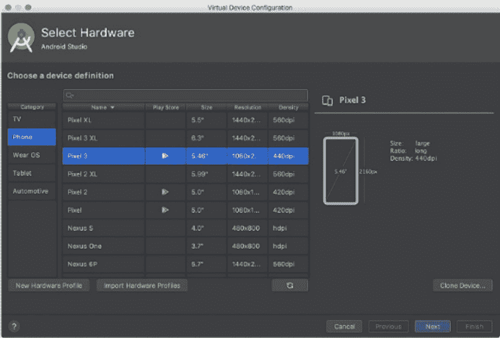
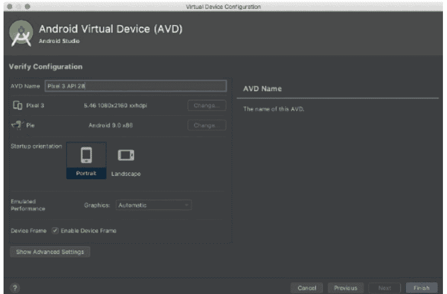
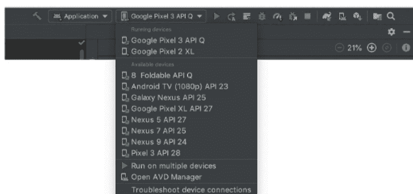
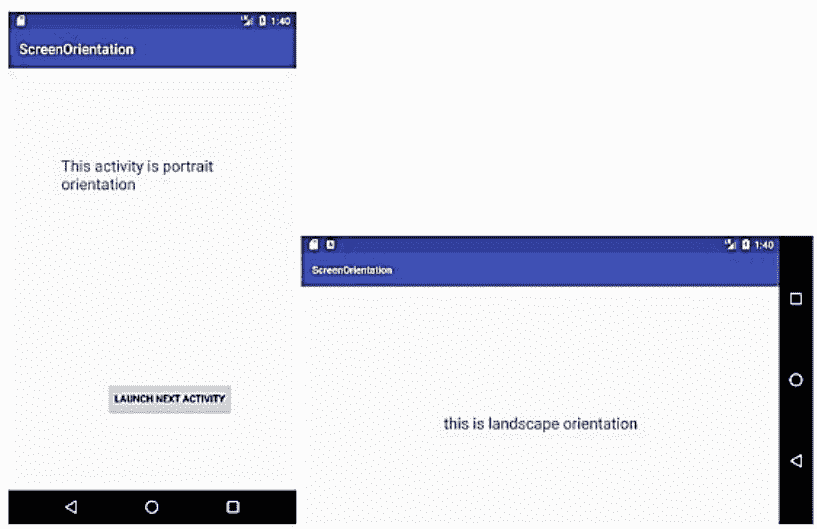
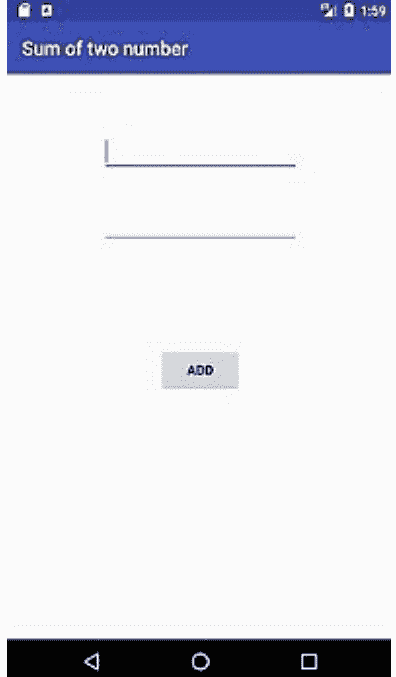

## PYTHON CODING EXAMPLES

初学者编程指南

J KING

# ANDROID BASICS

初学者编程指南

J KING

# ANDROID BASICS
与
PYTHON CODING EXAMPLES

初学者编程指南
J KING

## ANDROID INTRODUCTION
- [ANDROID INTRODUCTION](ANDROID INTRODUCTION)
- [WHAT IS ANDROID](WHAT IS ANDROID)
- [HISTORY OF ANDROID](HISTORY OF ANDROID)
- [ANDROID ARCHITECTURE](ANDROID ARCHITECTURE)
- [ANDROID CORE BUILDING BLOCKS](ANDROID CORE BUILDING BLOCKS)
- [ANDROID EMULATOR](ANDROID EMULATOR)
- [INSTALL ANDROID](INSTALL ANDROID)
- [SETUP ANDROID FOR ECLIPSE IDE](SETUP ANDROID FOR ECLIPSE IDE)
- [ANDROID APPS](ANDROID APPS)
- [INTERNAL DETAILS](INTERNAL DETAILS)
- [ANDROIDMANIFEST.XML FILE IN ANDROID](ANDROIDMANIFEST.XML FILE IN ANDROID)
- [ANDROID R.JAVA FILE](ANDROID R.JAVA FILE)
- [ANDROID SCREEN ORIENTATION EXAMPLE](ANDROID SCREEN ORIENTATION EXAMPLE)
- [ANDROID WIDGETS](ANDROID WIDGETS)
- [ANDROID BUTTON EXAMPLE](ANDROID BUTTON EXAMPLE)
- [ANDROID TOAST EXAMPLE](ANDROID TOAST EXAMPLE)

## PYTHON CODING EXAMPLES
- [ASCII VALUE OF CHARACTER IN PYTHON](ASCII VALUE OF CHARACTER IN PYTHON)
- [CALCULATE SIMPLE INTEREST](CALCULATE SIMPLE INTEREST)
- [CALCULATE COMPOUND INTEREST](CALCULATE COMPOUND INTEREST)
- [PYTHON PROGRAM TO CHECK THE GIVEN YEAR IS A LEAP YEAR OR NOT](PYTHON PROGRAM TO CHECK THE GIVEN YEAR IS A LEAP YEAR OR NOT)
- [PYTHON | SOME OF THE EXAMPLES OF SIMPLE IF ELSE](PYTHON | SOME OF THE EXAMPLES OF SIMPLE IF ELSE)
- [CALCULATE DISCOUNT BASED ON THE SALE AMOUNT IN PYTHON](CALCULATE DISCOUNT BASED ON THE SALE AMOUNT IN PYTHON)
- [DESIGN A SIMPLE CALCULATOR USING IF ELIF IN PYTHON](DESIGN A SIMPLE CALCULATOR USING IF ELIF IN PYTHON)
- [BMI (BODY MASS INDEX) CALCULATOR IN PYTHON](BMI (BODY MASS INDEX) CALCULATOR IN PYTHON)
- [WRITE FUNCTIONS TO FIND SQUARE AND CUBE OF A GIVEN NUMBER IN PYTHON](WRITE FUNCTIONS TO FIND SQUARE AND CUBE OF A GIVEN NUMBER IN PYTHON)
- [COMPUTE THE NET AMOUNT](COMPUTE THE NET AMOUNT)
- [CONVERT TEMPERATURE IN PYTHON PROGRAM](CONVERT TEMPERATURE IN PYTHON PROGRAM)
- [PYTHON PROGRAM TO CONVERT METERS INTO YARDS](PYTHON PROGRAM TO CONVERT METERS INTO YARDS)
- [FIND THE DAY IN PYTHON](FIND THE DAY IN PYTHON)
- [PYTHON ARRAY PROGRAMS](PYTHON ARRAY PROGRAMS)
- [CREATE MATRIX IN PYTHON](CREATE MATRIX IN PYTHON)
- [PYTHON PROGRAM TO CREATE MATRIX USING NUMPY](PYTHON PROGRAM TO CREATE MATRIX USING NUMPY)
- [PYTHON DATE & TIME PROGRAMS](PYTHON DATE & TIME PROGRAMS)
- [PYTHON CODE TO PRINT TODAY'S YEAR, MONTH AND DAY](PYTHON CODE TO PRINT TODAY'S YEAR, MONTH AND DAY)
- [PYTHON LISTS](PYTHON LISTS)
- [PROGRAM FOR ADDING, REMOVING ELEMENTS IN THE LIST](PROGRAM FOR ADDING, REMOVING ELEMENTS IN THE LIST)
- [PROGRAM TO FIND THE DIFFERENCES OF TWO LISTS](PROGRAM TO FIND THE DIFFERENCES OF TWO LISTS)
- [PROGRAM TO REMOVE DUPLICATE ELEMENTS FROM THE LIST](PROGRAM TO REMOVE DUPLICATE ELEMENTS FROM THE LIST)
- [CREATE THREE LISTS OF NUMBERS, THEIR SQUARES AND CUBES](CREATE THREE LISTS OF NUMBERS, THEIR SQUARES AND CUBES)
- [ITERATE A LIST IN REVERSE ORDER](ITERATE A LIST IN REVERSE ORDER)
- [PRINT LIST AFTER REMOVING EVEN NUMBERS](PRINT LIST AFTER REMOVING EVEN NUMBERS)
- [PYTHON STRING PROGRAMS](PYTHON STRING PROGRAMS)
- [DECLARE, ASSIGN AND PRINT THE STRING (DIFFERENT WAYS)](DECLARE, ASSIGN AND PRINT THE STRING (DIFFERENT WAYS))
- [ACCESS AND PRINT CHARACTERS FROM THE STRING](ACCESS AND PRINT CHARACTERS FROM THE STRING)
- [PROGRAM TO PRINT WORDS WITH THEIR LENGTH OF A STRING](PROGRAM TO PRINT WORDS WITH THEIR LENGTH OF A STRING)
- [COUNT VOWELS IN A STRING](COUNT VOWELS IN A STRING)
- [CREATE MULTIPLE COPIES OF A STRING BY USING MULTIPLICATION OPERATOR](CREATE MULTIPLE COPIES OF A STRING BY USING MULTIPLICATION OPERATOR)

# ANDROID BASICS

# 初学者编程指南

J KING

## ANDROID INTRODUCTION

Android 教程，也称为 Android Studio 教程，涵盖了 Android 技术的基础知识和高级概念。

我们的 Android 开发教程适合初学者和专家。

Android 是一套完整的移动设备应用程序套件，适用于平板电脑、笔记本电脑、智能手机、电子阅读器、机顶盒和其他类似设备。

它包括一个基于 Linux 的操作系统、中间件和主要移动应用程序。

它相当于一个智能手机操作系统。

然而，它并不局限于移动设备。它现在被用于一系列产品中，包括手机、平板电脑和电视。

### What is Android

在学习所有主题之前，有必要了解 Android 是什么。

Android 是一个基于 Linux 的软件套件和操作系统，适用于包括平板电脑和智能手机在内的移动设备。

它由 Google 创建，后来由 OHA（开放手机联盟）创建。虽然可以使用其他语言，但 Java 语言最广泛地用于编写 Android 代码。

Android 项目的使命是开发一个优秀的现实世界应用程序，以增强最终用户的移动体验。

棒棒糖、奇巧、果冻豆、冰淇淋三明治、冻酸奶、闪电泡芙、甜甜圈等 Android 代号将在下一页介绍。

### Open Handset Alliance

它是一个由 84 家公司组成的合作伙伴关系，包括 Google、Samsung、AKM、Synaptics、KDDI、Garmin、Teleca、Ebay、Intel 等。

它于 2007 年 11 月 5 日在 Google 的领导下成立。

它致力于推进开放标准、提供实用工具和部署基于 Android 的手机。

### Features of Android

既然我们已经了解了 Android 是什么，让我们来看看它的功能。

以下是 Android 的一些主要功能：

1. 它是免费且开源的软件。
2. 任何人都可以自定义 Android 平台。
3. 用户可以从各种各样的智能手机应用程序中进行选择。
4. 它有很多很酷的功能，例如天气信息、启动屏幕和实时 RSS（Really Simple Syndication）源。

它支持 SMS 和 MMS 消息传递，以及网络浏览器、存储（SQLite）、网络（GSM、CDMA、蓝牙、Wi-Fi 等）、媒体和手机样式。

### Categories of Android applications

- 娱乐
- 工具
- 通信
- 生产力
- 个性化
- 音乐和音频
- 社交
- 媒体和视频
- 旅行和本地等。

### History of Android

了解 Android 的历史和不同型号是很有趣的。Aestro、Blender、Cupcake、Donut、Eclair、Froyo、Gingerbread、Honeycomb、Ice Cream Sandwich、Jelly Bean、KitKat 和 Lollipop 是一些最新的 Android 代号。让我们按顺序看看 Android 的过去。

1. 2003 年 10 月，Andy Rubin 在美国加利福尼亚州帕洛阿尔托创立了 Android Incorporation。
2. Google 于 2005 年 8 月 17 日收购了 Android Incorporation。从那时起，它一直是 Google Integration 的附属公司。
3. Andy Rubin、Rich Miner、Chris White 和 Nick Sears 是 Android Incorporation 的主要员工。
4. 最初是为相机设计的，但由于对单独相机的需求较低，后来转向了智能手机。
5. Andy Rubin 的同事称他为“Android”，因为他对机器人着迷。
6. 2007 年，Google 宣布开发 Android 操作系统。
7. HTC 于 2008 年发布了第一款 Android 手机。

### Android versions, name, and API level

| 代号 | 版本号 | API 级别 | 发布日期 |
|---|---|---|---|
| 无代号 | 1.0 | 1 | 2008 年 9 月 23 日 |
| 无代号 | 1.1 | 2 | 2009 年 2 月 9 日 |
| Cupcake | 1.5 | 3 | 2009 年 4 月 27 日 |
| Donut | 1.6 | 4 | 2009 年 9 月 15 日 |
| Eclair | 2.0 - 2.1 | 5 - 7 | 2009 年 10 月 26 日 |
| Froyo | 2.2 - 2.2.3 | 8 | 2010 年 5 月 20 日 |
| Gingerbread | 2.3 - 2.3.7 | 9 - 10 | 2010 年 12 月 6 日 |
| Honeycomb | 3.0 - 3.2.6 | 11 - 13 | 2011 年 2 月 22 日 |
| Ice Cream Sandwich | 4.0 - 4.0.4 | 14 - 15 | 2011 年 10 月 18 日 |
| Jelly Bean | 4.1 - 4.3.1 | 16 - 18 | 2012 年 7 月 9 日 |
| KitKat | 4.4 - 4.4.4 | 19 - 20 | 2013 年 10 月 31 日 |
| Lollipop | 5.0 - 5.1.1 | 21 - 22 | 2014 年 11 月 12 日 |
| Marshmallow | 6.0 - 6.0.1 | 23 | 2015 年 10 月 5 日 |
| Nougat | 7.0 | 24 | 2016 年 8 月 22 日 |
| Nougat | 7.1.0 - 7.1.2 | 25 | 2016 年 10 月 4 日 |
| Oreo | 8.0 | 26 | 2017 年 8 月 21 日 |
| Oreo | 8.1 | 27 | 2017 年 12 月 5 日 |
| Pie | 9.0 | 28 | 2018 年 8 月 6 日 |
| Android 10 | 10.0 | 29 | 2019 年 9 月 3 日 |
| Android 11 | 11 | 30 | 2020 年 9 月 8 日 |

### Android Architecture

Android 架构，也称为 Android 软件堆栈，分为五个部分：

1. Linux 内核
2. 原生库（中间件），
3. Android 运行时
4. 应用程序框架
5. 应用程序

#### 1) Linux 内核

Android 架构的核心位于 Android 架构的根部。

Linux 内核负责处理设备驱动程序、电源管理、内存管理、设备管理和资源访问。

#### 2) 原生库

原生库（如 WebKit、OpenGL、FreeType、SQLite、Media、C 运行时库（libc）等）构建在 Linux 内核之上。

WebKit 库负责浏览器支持，SQLite 负责数据库，FreeType 负责字体支持，Media 负责播放和录制音频和视频格式。

#### 3) Android 运行时

Android 运行时包含主要库和 DVM（Dalvik 虚拟机），它们负责运行 Android 应用程序。

DVM 类似于 JVM，但它是专门为移动设备设计的。它使用更少的内存，并且具有快速的响应时间。

#### 4) Android 框架

Android 系统构建在原生库和 Android 运行时之上。

Android API，例如 UI（用户界面）、电话、服务、位置、内容提供程序（数据）和包管理器，都是 Android 系统的一部分。

它包含大量用于开发 Android 应用程序的类和接口。

#### 5) 应用程序

应用程序运行在 Android 平台之上。

Android 系统（包括 Android 运行时和库）用于所有应用程序，例如主屏幕、触摸、设置、游戏和浏览器。

Linux 内核被 Android 运行时和原生库使用。

### Android 核心构建块

Android 中的组件就是一段具有明确定义生命周期的代码，例如 Activity、Receiver、Service 等。
Activity、视图、Intent、工具类、内容提供程序、Fragment 和 AndroidManifest.xml 是 Android 的基本构建块或基础组件。

#### Activity

Activity 代表一个单独的屏幕，它是一个类。在 AWT 中，它类似于 Frame。

#### View

视图是用户界面元素，例如按钮、标记或文本区域。视图是你能看到的东西。

#### Intent

组件通过 Intent 被调用。它主要用于：

- 启动服务
- 启动一个 Activity
- 显示一个网页
- 显示联系人列表
- 广播消息
- 拨打电话等。

#### Service

Service 是一个可以在后台无限期运行的操作。

有两种可用的服务。本地服务只能从应用程序内部访问，而远程服务可以从同一设备上的其他应用程序访问。

#### Content Provider

数据通过内容提供程序在应用程序之间共享。

#### Fragment

Fragment 与 Activity 元素相同。一个 Activity 可以在屏幕上同时显示一个或多个 Fragment。

#### AndroidManifest.xml

它包含有关 Activity、服务提供程序和权限等信息。它类似于 Java EE 的 web.xml 格式。

### Android 虚拟设备 (AVD)

它用于测试 Android 应用程序，无需智能手机或平板电脑。它可以被设计成多种方式以模拟各种真实设备。

### Android 模拟器

Android 模拟器是一个模拟特定 Android 设备的 Android 虚拟设备 (AVD)。

在我们的 PC 上，我们可以使用 Android 模拟器作为目标平台来运行和测试我们的 Android 应用程序。

Android 模拟器模拟了真实计算机的几乎所有功能。我们可以看到来电和短信。

它还显示设备的位置并模拟各种网络速度。

Android 模拟器模拟旋转和其他硬件传感器。

它可以访问 Google Play 商店等。


在模拟器上测试 Android 应用程序可能比在真实计算机上测试更快、更简单。
例如，我们可以比通过 USB 连接的真实设备更快地向模拟器传递数据。
Android 模拟器为一系列 Android 手机、Wear OS、平板电脑和 Android TV 设备提供了预配置设置。

#### 要求和建议

除了 Android Studio 的基本设备规格外，Android 模拟器还有额外的要求。
以下是要求：

- SDK Tools 26.1.1 或更高版本
- 64 位处理器
- Windows：支持 UG（无限制客户机）的 CPU
- HAXM 6.2.1 或更高版本（建议 HAXM 7.2.0 或更高版本）

#### 安装模拟器

安装 Android Studio 时，Android 模拟器也会被安装。
但是，在安装 Android Studio 时，某些模拟器组件可以或可能会被安装。

在 SDK Manager 的 SDK Tools 选项卡中选择 Android Emulator 组件以安装模拟器组件。

#### 在模拟器上运行 Android 应用程序

我们可以像在智能手机上运行任何其他应用程序一样，运行在 Android Studio 中开发的 Android 应用程序或安装在 Android 模拟器上的应用程序。

要打开 Android 模拟器并在我们的项目中运行应用程序，请按照以下步骤操作：

1. 在 Android Studio 中构建一个 Android 虚拟设备 (AVD)，以便模拟器可以安装和运行你的应用程序。要创建新的 AVD，请按照以下步骤操作：

    1.1 转到 Tools > AVD Manager 以访问 AVD Manager。

    1.2 在 AVD Manager 对话框底部，单击 Create Virtual Device。然后出现 Pick Hardware 页面。

    

    1.3 选择硬件配置文件后单击 Next。如果我们需要的硬件配置文件不可用，我们可以构建或导入一个。出现 System Image 页面。

    

    1.4 选择你正在使用的 API 级别的系统映像，然后选择 Next。这将打开一个名为 Verify Configuration 的页面。

    

    1.5 对 AVD 属性进行任何必要的更改，然后按 Finish。

2. 从工具栏的下拉菜单中，选择我们要从中运行应用程序的目标设备 AVD。

    

3. 单击 **Run**。

#### 在不先运行应用程序的情况下启动模拟器

要启动模拟器：
现在应该打开 AVD Manager。
可以通过双击 AVD 或单击 Run 来运行 AVD。
我们可以在模拟器运行时运行 Android Studio 项目并选择模拟器作为目标设备。
我们还可以将 APK 文件拖放到模拟器上以加载和运行它们。

#### 从命令行启动模拟器

Android 计算机模拟器包含在 Android SDK 中。
你可以使用 Android 模拟器来构建和测试你的应用程序，而无需使用物理计算机。

#### 启动模拟器

我们将使用 emulator 命令启动模拟器。这是一个运行我们的项目或开始使用 AVD Manager 的选项。

启动虚拟系统的基本命令行语法如下：

```
$ emulator -avd avd_name [ {-option [value]} ... ]
or
$ emulator @avd_name [ {-option [value]} ... ]
```

#### 运行和停止模拟器，以及清除数据

要使用 AVD 运行 Android 模拟器，请双击 AVD 或单击 Launch。

要停止模拟器运行，请右键单击并选择 Stop，或者转到 Menu 并选择 Stop。

右键单击 AVD 并选择 Wipe Data 以清除模拟器中的数据并将其恢复到首次定义时的状态。

或者，从菜单中选择 Wipe Data。

### 安装 Android

Android 程序可以用 Java、C++、C# 和其他语言编写。Android 官方支持的语言是 Java。本站的 Android 示例是使用 Java 编程语言和 Eclipse IDE 创建的。

在这里，我们将介绍使用 Eclipse IDE 构建 Android 应用程序所需的工具。

Android 可以通过两种方式安装。

1. 通过 ADT Bundle
2. 通过手动设置 Eclipse

#### 通过 Android Studio

这是安装 Android 应用程序所需应用程序的最直接方法。它包含以下项目：

- Eclipse IDE
- Android SDK
- Eclipse Plugin

如果你从 Android 网站下载 Android Studio，则不需要 Eclipse IDE、Android SDK 或 Eclipse Plugin，因为它们已经包含在内。

如果你已经下载了 Android Studio，请解压缩它，打开 Eclipse IDE，然后单击 eclipse 图标启动它。在这种情况下，你不需要采取任何额外的步骤。

#### 为 Eclipse IDE 设置 Android

在此选项卡上，你将找到在 Eclipse IDE 上运行 Android 应用程序所需的程序。

你将在此处学习如何为 Eclipse IDE 安装 Android SDK 和 ADT 插件。

让我们看看手动为 Eclipse IDE 配置 Android 所需的应用程序列表。

1. 安装 JDK
2. 下载并安装用于开发 Android 应用程序的 Eclipse
3. 下载并安装 Android SDK
4. 为 Eclipse 安装 ADT 插件
5. 配置 ADT 插件
6. 创建 AVD
7. 创建 hello android 应用程序

##### 1) 安装 Java 开发工具包 (JDK)

如果你使用 Java 编程语言制作 Android 应用程序，则需要安装 JDK。JDK 可免费获取。

##### 2) 下载并安装 Eclipse IDE

你必须安装 Eclipse 才能使用 Eclipse IDE 创建 Android 应用程序。你可以从这里获取：Eclipse 下载。虽然推荐使用经典版 Eclipse，但我们使用的是面向 JavaEE 开发者的 Eclipse IDE。

##### 3) 下载并安装 Android SDK

首先，获取 Android SDK。在本例中，我们安装了 Windows 版的 Android SDK（.exe 版本）。
之后，双击 exe 文件进行安装。

##### 4) 下载 Eclipse 的 ADT 插件

为了在 Eclipse IDE 中构建 Android 应用程序，你需要 ADT（Android 开发工具）。它是一个旨在提供优化设置的 Eclipse IDE 插件。
你必须完成以下步骤才能获取 ADT：

- 1) 启动 Eclipse IDE 并转到帮助 > 安装新应用程序...
- 2) 在“工作于”组合框中输入 `https://dl-ssl.google.com/android/eclipse/`。
- 3) 选择开发者工具复选框，然后按下一步。
- 4) 单击下一步以查看可下载的资源列表。
- 5) 按完成按钮。
- 6) 安装完成后重启 Eclipse IDE。

##### 5) 配置 ADT 插件

安装 ADT 插件后，你需要告诉 Eclipse IDE 你的 Android SDK 位于何处。为此，请执行以下步骤：

- 1) 从窗口菜单中选择首选项。
- 2) 从左侧屏幕中，选择 Android。可能会出现一个对话框，询问你是否要将统计数据发送给 Google。请继续并单击下一步按钮。
- 3) 通过单击浏览按钮定位你的 SDK 目录，例如，我的 SDK 位于 `C:Program FilesAndroidandroid-sdk`。
- 4) 之后，单击提交按钮，然后单击确定。

##### 6) 创建 Android 虚拟设备 (AVD)

你必须构建一个 AVD 才能在 Android 模拟器中运行 Android 应用程序。创建 AVD 的步骤如下：

- 1) 从窗口菜单中选择 AVD 管理器。
- 2) 要构建 AVD，请单击新建按钮。
- 3) 现在，在出现的对话框中，输入 AVD 名称，例如 `myavd`。现在选择你要使用的 Android 版本，例如 `android2.2`。
- 4) 单击创建 AVD 按钮来构建 AVD。

##### 7) 创建并运行简单的 Android 示例

#### Android 应用程序

你可以在此页面上学习如何制作一个简单的 hello Android 应用程序。我们正在使用 Eclipse IDE 制作一个简单的 Android 示例。要制作这个简单的示例，请遵循以下步骤：

#### Hello Android 示例

要制作 Hello Android 应用程序，请遵循以下三个步骤。

##### 1) 开始创建一个新的 Android 项目。

要创建一个新的 Android Studio 项目，请遵循以下步骤：

- 1) 从下拉菜单中选择构建新的 Android Studio 项目。

2) 填写以下详细信息：应用程序名称、公司域名、项目位置和应用程序包名称，然后单击下一步。

3) 选择应用程序的 API 级别，然后按下一步。

4) 选择一个活动类型（空活动）。

5) 输入活动的名称并按完成。

完成活动配置后，Android Studio 会创建活动类和其他必要的配置文件。

现在已创建一个 Android 项目。你应该查看 Android 项目中的基本程序，它看起来像这样：

##### 2) 编写消息

文件：`activity_main.xml`

`activity_main.xml` 文件的代码由 Android Studio 自动生成。你可以自由修改此文件以满足你的需求。

```xml
<?xml version="1.0" encoding="utf-8" ?>
<android.support.constraint.ConstraintLayout xmlns:android=
"http://schemas.android.com/apk/res/android"
    xmlns:app="http://schemas.android.com/apk/res-auto"
    xmlns:tools="http://schemas.android.com/tools"
    android:layout_width="match_parent"
    android:layout_height="match_parent"
    tools:context="first.javatpoint.com.welcome.MainActivity" >

    <TextView
        android:layout_width="wrap_content"
        android:layout_height="wrap_content"
        android:text="Hello Android!"
        app:layout_constraintBottom_toBottomOf="parent"
        app:layout_constraintLeft_toLeftOf="parent"
        app:layout_constraintRight_toRightOf="parent"
        app:layout_constraintTop_toTopOf="parent" />
</android.support.constraint.ConstraintLayout>
```

文件：`MainActivity.java`

```java
package first.javalearn.com.welcome;

import android.support.v7.app.AppCompatActivity;
import android.os.Bundle;

public class MainActivity extends AppCompatActivity {
    @Override
    protected void onCreate(Bundle savedInstanceState) {
        super.onCreate(savedInstanceState);
        setContentView(R.layout.activity_main);
    }
}
```

##### 3) 运行 Android 应用程序

要启动 Android 应用，请按 `Shift + F10` 或单击工具栏上的运行图标。

Android 模拟器可能需要 2 或 3 分钟才能启动。
启动模拟器后，Android Studio 会下载程序并开始运行。你将看到类似这样的内容：

### Hello Android 示例的内部细节

在这里，我们将探讨 hello Android 示例的内部结构及其工作原理。
Android 应用程序的不同组件包括 Java 源代码、字符串工具、图像、清单文件和 apk 文件等。让我们看看 Android 应用程序项目的布局。

#### Java 源代码

让我们看看 Eclipse IDE 生成的 Java 源文件：
文件：`MainActivity.java`

```java
package com.example.helloandroid;
import android.os.Bundle;
import android.app.Activity;
import android.view.Menu;
import android.widget.TextView;
public class MainActivity extends Activity { //(1)
    @Override
    protected void onCreate(Bundle savedInstanceState) { //(2)
        super.onCreate(savedInstanceState);

        setContentView(R.layout.activity_main); //(3)
    }
}
```

```java
@Override
public boolean onCreateOptionsMenu(Menu menu) { //(4)

// Inflate the menu; this adds items to the action bar if it is present.
    getMenuInflater().inflate(R.menu.activity_main, menu);
    return true;
}
}
```

(1) Activity 是一个 Java 类，它在屏幕上创建一个默认窗口，我们可以在其中放置各种组件，包括 Button、EditText、TextView、Spinner 等。它与 Java AWT Frame 类似。

它包含活动的生命周期方法，如 `onCreate`、`onStop` 和 `OnResume` 等。

(2) 当 Activity 类首次生成时，`onCreate` 方法被调用。

(3) `setContentView(R.layout.activity_main)` 函数返回关于我们布局资源的数据。在 `activity_main.xml` 格式中，我们描述我们的布局资源。

文件：`activity_main.xml`

```xml
<RelativeLayout xmlns:androclass =
"http://schemas.android.com/apk/res/android"
    xmlns:tools = "http://schemas.android.com/tools"
    android:layout_width = "match_parent"
    android:layout_height = "match_parent"
    tools:context = ".MainActivity" >
    <TextView
        android:layout_width = "wrap_content"
        android:layout_height = "wrap_content"
        android:layout_centerHorizontal = "true"
        android:layout_centerVertical = "true"
        android:text = "@string/hello_world" />
</RelativeLayout>
```

如你所见，框架自动创建了一个 textview。然而，此字符串的消息是在 `strings.xml` 文件中定义的。`@string/hello_world` 是一个包含有关 textview 位置信息的字符串。在 `strings.xml` 格式中，指定了 `hello world` 属性的值。

文件：`strings.xml`

```xml
<?xml version = "1.0" encoding = "utf-8" ?>
<resources>
    <string name = "app_name"> helloandroid </string>
    <string name = "hello_world"> Hello world! </string>
    <string name = "menu_settings"> Settings </string>
</resources>
```

### 生成的 R.java 文件

这是一个自动生成的文件，列出了 `res` 目录中的所有资源及其 ID。

它由 aapt（Android 资源打包工具）生成。当你构建 activity main 的一部分时，R.java 文件中会提供一个 ID，你可以在 Java 源文件中使用它。

文件：R.java

```
/* AUTO-GENERATED FILE. DO NOT MODIFY.
 *
 * This class was automatically generated by the
 * aapt tool from the resource data it found.  It
 * should not be modified by hand.
 */
package com.example.helloandroid;
public final class R {
    public static final class attr {
    }
    public static final class drawable {
        public static final int ic_launcher= 0x7f020000 ;
    }
    public static final class id {
        public static final int menu_settings= 0x7f070000 ;
    }
    public static final class layout {
        public static final int activity_main= 0x7f030000 ;
    }
    public static final class menu {
        public static final int activity_main= 0x7f060000 ;
    }
    public static final class string {
        public static final int app_name= 0x7f040000 ;
        public static final int hello_world= 0x7f040001 ;
        public static final int menu_settings= 0x7f040002 ;
    }
    public static final class style {
        /**
         Base application theme, dependent on API level. This theme is replaced
         by AppBaseTheme from res/values-vXX/styles.xml on newer devices.
         Theme customizations available in newer API levels can go in
         res/values-vXX/styles.xml, while customizations related to
         backward-compatibility can go here.
         Base application theme for API 11+. This theme completely replaces
         AppBaseTheme from res/values/styles.xml on API 11+ devices.

         API 11 theme customizations can go here.

         Base application theme for API 14+. This theme completely replaces
         AppBaseTheme from BOTH res/values/styles.xml and
         res/values-v11/styles.xml on API 14+ devices.
         API 14 theme customizations can go here.
         */
        public static final int AppBaseTheme= 0x7f050000 ;
        /** Application theme.
        All customizations that are NOT specific to a particular API-
        level can go here.
        */
        public static final int AppTheme= 0x7f050001 ;
    }
}
```

### APK（Android 安装包）

系统会自动生成一个 apk 文件。如果你想在电脑上使用 Android 程序，请移动并安装它。

### 资源的可用性

它包括资源文件，例如 activity main、strings 和 styles 等。

### 清单文档

它包含有关套件的信息，包括事件、程序、内容提供者等。

### Android 中的 AndroidManifest.xml 文件

AndroidManifest.xml 文件包含有关你的包的信息，例如操作、程序、广播接收器、内容提供者和其他设备组件。

它还执行以下功能：

- 用户有责任通过授予访问任何受保护部分的权限来保护应用程序。
- 它还指定了应用程序可以使用哪个 Android API。
- 它包括一个检测组列表。检测组提供分析和其他详细信息。例如，这些详细信息会在应用程序发布前不久被删除。

这是所有 Android 应用程序的强制性 xml 文件，可以在根目录中找到。

以下是 AndroidManifest.xml 文件的示例：

```
<manifest xmlns:android = "http://schemas.android.com/apk/res/android"
    package = "com.javatpoint.hello"
    android:versionCode = "1"
    android:versionName = "1.0" >

    <uses-sdk
        android:minSdkVersion = "8"
        android:targetSdkVersion = "15" />

    <application
        android:icon = "@drawable/ic_launcher"
        android:label = "@string/app_name"
        android:theme = "@style/AppTheme" >
        <activity
            android:name = ".MainActivity"
            android:label = "@string/title_activity_main" >
            <intent-filter>
                <action android:name = "android.intent.action.MAIN" />

                <category android:name = "android.intent.category.LAUNCHER" />
            </intent-filter>
        </activity>
    </application>

</manifest>
```

### AndroidManifest.xml 文件的元素

上面提到的 xml 文件中的元素如下所列。

#### manifest

AndroidManifest.xml 文件的根部分是 manifest。它有一个 package 属性，定义了 activity 类的包名。

#### <application>

manifest 的子元素是 operation。它还包含一个命名空间的声明。此元素有许多子元素，用于声明应用程序组件，如 operation 等。

图标、标记和主题是此元素最常用的属性之一。

所有 Android 设备组件的图标由 `android:icon` 定义。

所有设备组件都使用 `android:label` 作为默认标签。

所有 Android activity 的通用主题由 `android:theme` 表示。

### Android R.java 文件

Android R.java 是一个由 aapt（Android 资源打包工具）生成的文件，包含 `res/` 目录中所有资源的资源 ID。

如果你在 activity main.xml 文件中创建一个组件，该文件中也会生成该组件的 id。此 id 可用于在 activity 源文件中对组件执行任何操作。

注意：如果你删除 R.jar 文件，Android 会为你创建它。

让我们看看 Android 的 R.java 文件。它有几个静态嵌套类，包括 menu、id、layout、attr、drawable、string 等。

```
/* AUTO-GENERATED FILE. DO NOT MODIFY.
 *
 * This class was automatically generated by the
 * aapt tool from the resource data it found.  It
 * should not be modified by hand.
 */

package com.example.helloandroid;

public final class R {
    public static final class attr {
    }
    public static final class drawable {
        public static final int ic_launcher= 0x7f020000 ;
    }
    public static final class id {
        public static final int menu_settings= 0x7f070000 ;
    }
    public static final class layout {
        public static final int activity_main= 0x7f030000 ;
    }
    public static final class menu {
        public static final int activity_main= 0x7f060000 ;
    }
    public static final class string {
        public static final int app_name= 0x7f040000 ;
        public static final int hello_world= 0x7f040001 ;
        public static final int menu_settings= 0x7f040002 ;
    }
    public static final class style {
        /**
        Base application theme, dependent on API level. This theme is replaced
        by AppBaseTheme from res/values-vXX/styles.xml on newer devices.

        Theme customizations available in newer API levels can go in
        res/values-vXX/styles.xml, while customizations related to
        backward-compatibility can go here.
        */
        public static final int AppBaseTheme= 0x7f050000 ;
        /** Application theme.
        All customizations that are NOT specific to a particular API-level can go here.
        */
        public static final int AppTheme= 0x7f050001 ;
    }
}
```

适用于 API 11+ 的基础应用程序主题。此主题完全替换了 API 11+ 设备上 `res/values/styles.xml` 中的 AppBaseTheme。

API 11 主题自定义可以放在这里。

适用于 API 14+ 的基础应用程序主题。此主题完全替换了 API 14+ 设备上 `res/values/styles.xml` 和 `res/values-v11/styles.xml` 中的 AppBaseTheme。

API 14 主题自定义可以放在这里。

### Android 屏幕方向示例

activity 特性有一个 `screenOrientation` 属性。
Android 操作可以是竖屏、横屏、传感器或未指定的方向。
它必须在 AndroidManifest.xml 格式中定义。

#### 语法：

```
<activity android:name = "package_name.Your_ActivityName"
    android:screenOrientation = "orientation_type" >
</activity>
```

### 示例：

```
<activity android:name =
" example.javatpoint.com.screenorientation.MainActivity"
    android:screenOrientation = "portrait" >
</activity>
```

```
<activity android:name = ".SecondActivity"
    android:screenOrientation = "landscape" >
</activity>
```

以下是一些最常见的 screenOrientation 值：

| 值 | 描述 |
|---|---|
| unspecified | 这是默认值。在这种情况下，系统会选择屏幕方向。 |
| portrait | 高大于宽 |
| landscape | 宽大于高 |
| sensor | 方向由设备的方向传感器决定。 |

### Android 竖屏和横屏模式屏幕方向示例

在这个示例中，我们将创建两个活动，每个活动具有不同的屏幕方向。

第一个活动（MainActivity）将设置为“portrait”（竖屏）方向，第二个活动（SecondActivity）将设置为“landscape”（横屏）方向。

#### activity_main.xml

文件：activity_main.xml

```xml
<?xml version = "1.0" encoding = "utf-8" ?>
<android.support.constraint.ConstraintLayout xmlns:android = "http://schemas.android.com/apk/res/android"
    xmlns:app = "http://schemas.android.com/apk/res-auto"
    xmlns:tools = "http://schemas.android.com/tools"
    android:layout_width = "match_parent"
    android:layout_height = "match_parent"
    tools:context = "example.javatpoint.com.screenorientation.MainActivity" >

    <Button
        android:id = "@+id/button1"
        android:layout_width = "wrap_content"
        android:layout_height = "wrap_content"
        android:layout_marginBottom = "8dp"
        android:layout_marginTop = "112dp"
        android:onClick = "onClick"
        android:text = "启动下一个活动"
        app:layout_constraintBottom_toBottomOf = "parent"
        app:layout_constraintEnd_toEndOf = "parent"
        app:layout_constraintHorizontal_bias = "0.612"
        app:layout_constraintStart_toStartOf = "parent"
        app:layout_constraintTop_toBottomOf = "@+id/editText1"
        app:layout_constraintVertical_bias = "0.613"  />

    <TextView
        android:id = "@+id/editText1"
        android:layout_width = "wrap_content"
        android:layout_height = "wrap_content"
        android:layout_centerHorizontal = "true"
        android:layout_marginEnd = "8dp"
        android:layout_marginStart = "8dp"
        android:layout_marginTop = "124dp"
        android:ems = "10"
        android:textSize = "22dp"
        android:text = "此活动为竖屏方向"
        app:layout_constraintEnd_toEndOf = "parent"
        app:layout_constraintHorizontal_bias = "0.502"
        app:layout_constraintStart_toStartOf = "parent"
        app:layout_constraintTop_toTopOf = "parent"  />
</android.support.constraint.ConstraintLayout>
```

### Activity 类

文件：MainActivity.java

```java
package example.javatpoint.com.screenorientation;

import android.content.Intent;
import android.support.v7.app.AppCompatActivity;
import android.os.Bundle;
import android.view.View;
import android.widget.Button;

public class MainActivity extends AppCompatActivity {

    Button button1;
    @Override
    protected void onCreate(Bundle savedInstanceState) {
        super.onCreate(savedInstanceState);
        setContentView(R.layout.activity_main);
        button1=(Button)findViewById(R.id.button1);
    }
    public void onClick(View v) {
        Intent intent = new Intent(MainActivity.this, SecondActivity.class);
        startActivity(intent);
    }
}
```

#### activity_second.xml

文件：activity_second.xml

```xml
<?xml version="1.0" encoding="utf-8"?>
<android.support.constraint.ConstraintLayout xmlns:android="http://schemas.android.com/apk/res/android"
    xmlns:app="http://schemas.android.com/apk/res-auto"
    xmlns:tools="http://schemas.android.com/tools"
    android:layout_width="match_parent"
    android:layout_height="match_parent"
    tools:context="example.javatpoint.com.screenorientation.SecondActivity">

    <TextView
        android:id="@+id/textView"
        android:layout_width="wrap_content"
        android:layout_height="wrap_content"
        android:layout_marginEnd = "8dp"
        android:layout_marginStart = "8dp"
        android:layout_marginTop = "180dp"
        android:text = "这是横屏方向"
        android:textSize = "22dp"
        app:layout_constraintEnd_toEndOf = "parent"
        app:layout_constraintHorizontal_bias = "0.502"
        app:layout_constraintStart_toStartOf = "parent"
        app:layout_constraintTop_toTopOf = "parent" />
</android.support.constraint.ConstraintLayout>
```

#### SecondActivity 类

文件：SecondActivity.java

```java
package example.javatpoint.com.screenorientation;

import android.support.v7.app.AppCompatActivity;
import android.os.Bundle;

public class SecondActivity extends AppCompatActivity {

    @Override
    protected void onCreate(Bundle savedInstanceState) {
        super.onCreate(savedInstanceState);
        setContentView(R.layout.activity_second);
    }
}
```

#### AndroidManifest.xml

文件：AndroidManifest.xml

在 AndroidManifest.xml 文件中为活动添加 screenOrientation 属性并指定其方向。在此示例中，我们为 MainActivity 提供“portrait”（竖屏）方向，为 SecondActivity 提供“landscape”（横屏）方向。

```xml
<?xml version = "1.0" encoding = "utf-8" ?>
<manifest xmlns:android = "http://schemas.android.com/apk/res/android"
    package = "example.javatpoint.com.screenorientation" >

    <application
        android:allowBackup = "true"
        android:icon = "@mipmap/ic_launcher"
        android:label = "@string/app_name"
        android:roundIcon = "@mipmap/ic_launcher_round"
        android:supportsRtl = "true"
        android:theme = "@style/AppTheme" >
        <activity
            android:name = "example.javatpoint.com.screenorientation.MainActivity"
            android:screenOrientation = "portrait" >
            <intent-filter>
                <action android:name = "android.intent.action.MAIN" />
                <category android:name = "android.intent.category.LAUNCHER" />
            </intent-filter>
        </activity>
        <activity android:name = ".SecondActivity"
            android:screenOrientation = "landscape" >
        </activity>
    </application>
</manifest>
```

### 输出



## Android 控件

### Android 按钮示例

Android Button 定义了一个按钮。app.widget 是 Android 的一个控件。

TextView 是 Button 的子类，而 Button 是 CompoundButton 的子类。

Android 中提供了 RadioButton、ToggleButton、CompoundButton 等其他类型的按钮。

### 带有监听器的 Android 按钮示例

为了计算两个数的和，我们将创建两个文本框和一个按钮。当用户点击按钮时，Toast 将显示两个输入值的和。

我们可以在按钮上使用各种类型的操作，例如为按钮设置监听器，或者在活动的 xml 文件中为按钮添加 onClick 属性。

```java
button.setOnClickListener(new View.OnClickListener() {
    @Override
    public void onClick(View view) {
        //代码
    }
});
```

```xml
<Button
    android:onClick = "methodName"
/>
```

### 在 activity_main.xml 中拖动组件或编写 UI 代码

首先，从 Text Fields 面板中拖动两个文本框，并从 Form Widgets 面板中拖动一个按钮，如图所示。



为 UI 组件生成的代码将如下所示：

文件：activity_main.xml

```xml
<?xml version = "1.0" encoding = "utf-8" ?>
<RelativeLayout xmlns:android = "http://schemas.android.com/apk/res/android"
    xmlns:app = "http://schemas.android.com/apk/res-auto"
    xmlns:tools = "http://schemas.android.com/tools"
    android:layout_width = "match_parent"
    android:layout_height = "match_parent"
    tools:context = "example.javatpoint.com.sumoftwonumber.MainActivity">

    <EditText
        android:id = "@+id/editText1"
        android:layout_width = "wrap_content"
        android:layout_height = "wrap_content"
        android:layout_alignParentTop = "true"
        android:layout_centerHorizontal = "true"
        android:layout_marginTop = "61dp"
        android:ems = "10"
        android:inputType = "number"
        tools:layout_editor_absoluteX = "84dp"
        tools:layout_editor_absoluteY = "53dp" />

    <EditText
        android:id = "@+id/editText2"
        android:layout_width = "wrap_content"
        android:layout_height = "wrap_content"
```

### Activity 类

现在编写代码来显示两个数字的和。

文件：MainActivity.java

```java
package example.javatlearn.com.sumoftwonumber;

import android.support.v7.app.AppCompatActivity;
import android.os.Bundle;
import android.view.View;
import android.widget.Button;
import android.widget.EditText;
import android.widget.Toast;

public class MainActivity extends AppCompatActivity {
    private EditText edittext1, edittext2;
    private Button buttonSum;

    @Override
    protected void onCreate(Bundle savedInstanceState) {
        super.onCreate(savedInstanceState);
        setContentView(R.layout.activity_main);

        addListenerOnButton();
    }

    public void addListenerOnButton() {
        edittext1 = (EditText) findViewById(R.id.editText1);
        edittext2 = (EditText) findViewById(R.id.editText2);
        buttonSum = (Button) findViewById(R.id.button);

        buttonSum.setOnClickListener(new View.OnClickListener() {
            @Override
            public void onClick(View view) {
                String value1=edittext1.getText().toString();
                String value2=edittext2.getText().toString();
                int a=Integer.parseInt(value1);
                int b=Integer.parseInt(value2);
                int sum=a+b;
                Toast.makeText(getApplicationContext(),String.valueOf(sum), Toast.LENGTH_LONG).show();
            }
        });
    }
}
```

### Android Toast 示例

Android 是一个术语，指的是 Toast 可用于在有限时间内查看数据。Toast 包含一条短暂显示然后消失的消息。

**android.widget.Toast 类是 java.lang.Object 类的子类。**

你也可以创建自己的 Toast，例如显示图片的 Toast。自定义 Toast 的代码可以在下一个标签页中找到。

#### Toast 类

Toast 类用于在特定时间段内显示通知。它片刻后就会消失。它不会阻止用户与设备进行交互。

Toast 类常量

Toast 类只有两个常量，如下所述。

| 常量 | 描述 |
| :--- | :--- |
| public static final int LENGTH_LONG | 在较长时间内显示视图。 |
| public static final int LENGTH_SHORT | 在较短时间内显示视图。 |

#### Toast 类的方法

Toast 类最常用的方法描述如下。

| 方法 | 描述 |
|---|---|
| public static Toast makeText(Context context, CharSequence text, int duration) | 创建包含文本和持续时间的 Toast。 |
| public void show() | 显示 Toast。 |
| public void setMargin (float horizontalMargin, float verticalMargin) | 更改水平和垂直边距差。 |

### Android Toast 示例

```java
Toast.makeText(getApplicationContext() , "Hello Javalearn " ,Toast.LENGTH_SHORT).show();
```

另一段代码：

```java
Toast toast=Toast.makeText(getApplicationContext() , "Hello Javalearn " ,Toast.LENGTH_SHORT);
toast.setMargin ( 5 0 , 5 0 );
toast.show();
```

在这种情况下，getApplicationContext() 方法返回一个 Context 实例。

### 显示 Toast 的 Activity 类完整代码

文件：MainActivity.java

```java
package example.javalearn.com.toast;

import android.support.v7.app.AppCompatActivity;
import android.os.Bundle;
import android.widget.Toast;

public class MainActivity extends AppCompatActivity {

    @Override
    protected void onCreate(Bundle savedInstanceState) {
        super.onCreate(savedInstanceState);
        setContentView(R.layout.activity_main);

        //显示带有 Hello Javalearn 消息的 Toast
        Toast.makeText(getApplicationContext(), "Hello Javalearn", Toast.LENGTH_SHORT).show();
    }
}
```

### Toast

Hello World!

Hello Java

### PYTHON 编码示例

## 初学者编程

J KING

### PYTHON 编码示例

### Python 中字符的 ASCII 值

在 Python 中，我们使用函数 `ord()` 来获取字符的 ASCII 码。`ord()` 接受一个字符，返回其 ASCII 值。

**语法：**
`ord(character);`

**示例：**
输入：
`char_var = 'A'`

函数调用：
`ord(char_var)`

输出：
`65`

### 查找字符 ASCII 值的代码

```python
# 打印给定字符 ASCII 值的 Python 程序

##### 将字符赋值给变量
char_var = 'A'

##### 打印 ASCII 码
print("ASCII value of " + char_var + " is = ", ord(char_var))

char_var = 'x'
##### 打印 ASCII 码
print("ASCII value of " + char_var + " is = ", ord(char_var))

char_var = '9'
##### 打印 ASCII 码
print("ASCII value of " + char_var + " is = ", ord(char_var))
```

### 输出

ASCII value of A is = 65
ASCII value of x is = 120
ASCII value of 9 is = 57

##### 计算单利

我们使用以下公式计算单利：
`(P * R * T) / 100`
其中，

- **P** – 本金
- **R** – 利率，以及
- **T** – 时间（年）

**示例：**
输入：
`p = 250000`
`r = 36`
`t = 1`

```python
#### 公式
si = (p*r*t)/100
print(si)
```

输出：
`90000`

#### 单利的 Python 程序

```python
##### 计算单利的 Python 程序

p = float(input("Enter the principle amount : "))
r = float(input("Enter the rate of interest : "))
t = float(input("Enter the time in the years: "))

##### 计算单利
si = (p*r*t)/100

##### 打印数值
print("Principle amount: ", p)
print("Interest rate   : ", r)
print("Time in years   : ", t)
print("Simple Interest : ", si)
```

### 输出

第一次运行：

Enter the principle amount : 10000
Enter the rate of interest : 3.5
Enter the time in the years: 1

Principle amount:  10000.0
Interest rate   :  3.5
Time in years   :  1.0
Simple Interest :  350.0

第二次运行：

Enter the principle amount : 250000
Enter the rate of interest : 36
Enter the time in the years: 1

Principle amount: 250000.0
Interest rate : 36.0
Time in years : 1.0
Simple Interest : 90000.0

##### 计算复利

我们使用下面的等式来计算复利：

**P(1 + R / 100) ^ T**

其中，

**P** – 本金

**R** – 利率，以及

**T** – 时间（年）

### 示例：

输入：

`p = 250000`

`r = 36`

`t = 1`

```python
#### 公式
ci = p * (pow((1 + r / 100), t))
print(ci)
```

输出：

`339999.99999999994`

#### Python 程序

```python
##### 计算复利的 Python 程序

p = float(input("Enter the principle amount : "))
r = float(input("Enter the rate of interest : "))
t = float(input("Enter the time in the years: "))

##### 计算复利
ci = p * (pow((1 + r / 100), t))

##### 打印数值
print("Principle amount : ", p)
print("Interest rate : ", r)
print("Time in years : ", t)
print("compound Interest : ", ci)
```

### 输出

第一次运行：

Enter the principle amount : 10000
Enter the rate of interest : 3.5
Enter the time in the years: 1

Principle amount : 10000.0
Interest rate : 3.5
Time in years : 1.0
compound Interest : 10350.0

第二次运行：

Enter the principle amount : 250000
Enter the rate of interest : 36
Enter the time in the years: 1

Principle amount : 250000.0
Interest rate : 36.0
Time in years : 1.0
compound Interest : 339999.99999999994

### 检查给定年份是否为闰年的 Python 程序

闰年是可以被 4 整除的年份，但世纪年（以 00 结尾的年份）除外。世纪年如果能被 400 整除，则是闰年。这里，用户提供一个年份，我们将测试该年份是否为闰年。我们可以通过两种方式解决这个问题：第一种是使用 calendar 模块，第二种是简单地检查闰年的状态。

#### 1) 使用 calendar 模块

在解决问题之前，我们先简单了解一下 calendar 模块。Calendar 模块是 Python 内置的，它为我们提供了各种函数来解决日期、月份和年份相关的问题。

### 程序

```python
##### 导入模块
import calendar

##### 输入年份
year=int(input('Enter the value of year: '))
leap_year=calendar.isleap(year)

##### 检查闰年
if leap_year: # 检查条件
```

### Python | 简单 if else 示例

#### 示例1：输入一个数字并检查它是否为10

```python
a=int(input("Enter A : "))

if a==10:
    print("Equal to 10")
else:
    print("Not Equal to 10")
```

**输出：**

Enter A : 10
Equal to 10

#### 示例2：找出两个数中较大的一个

```python
a=int(input("Enter A: "))
b=int(input("Enter B: "))

if a>b:
    g=a
else:
    g=b

print("Greater = ",g)
```

**输出：**

Enter A: 36
Enter B: 24
Greater = 36

#### 示例3：使用单条语句找出两个数中较大的一个

```python
a=int(input("Enter A: "))
b=int(input("Enter B: "))

c= a if a>b else b

print("Greater = ",c)
```

**输出：**

Enter A: 24
Enter B: 36
Greater = 36

### 在Python中根据销售金额计算折扣

折扣率如下：

| 金额 | 折扣 |
|---|---|
| 0-5000 | 5% |
| 5000-15000 | 12% |
| 15000-25000 | 20% |
| 25000以上 | 30% |

### 程序：

```python
##### input sale amount
amt = int(input("Enter Sale Amount: "))

##### checking conditions and calculating discount
if(amt>0):
    if amt<=5000:
        disc = amt*0.05
    elif amt<=15000:
        disc=amt*0.12
    elif amt<=25000:
        disc=0.2 * amt
    else:
        disc=0.3 * amt

    print("Discount : ",disc)
    print("Net Pay : ",amt-disc)
else:
    print("Invalid Amount")
```

**输出：**

Enter Sale Amount: 30000

Discount : 9000.0

Net Pay : 21000.0

### 在Python中使用 if elif 设计一个简单的计算器

给定两个数字，我们将构建一个计算器类型的程序，使用Python进行加、减、乘、除运算。

### 示例：

消息：
Calculator
1.Add
2.Subtract
3.Multiply
4.Divide

输入：
Enter Choice(1-4): 3
Enter A:10
Enter B:20

输出：
Product = 200

### 程序

```python
##### menus
print("Calculator")
print("1.Add")
print("2.Subtract")
print("3.Multiply")
print("4.Divide")

##### input choice
ch=int(input("Enter Choice(1-4): "))

if ch==1:
    a=int(input("Enter A:"))
    b=int(input("Enter B:"))
    c=a+b
    print("Sum = ",c)
elif ch==2:
    a=int(input("Enter A:"))
    b=int(input("Enter B:"))
    c=a-b
    print("Difference = ",c)
elif ch==3:
    a=int(input("Enter A:"))
    b=int(input("Enter B:"))
    c=a*b
    print("Product = ",c)
elif ch==4:
    a=int(input("Enter A:"))
    b=int(input("Enter B:"))
    c=a/b
    print("Quotient = ",c)
else:
    print("Invalid Choice")
```

**输出：**

Calculator

1. Add
2. Subtract
3. Multiply
4. Divide

Enter Choice(1-4): 3

Enter A:10

Enter B:20

Product = 200

### Python中的BMI（身体质量指数）计算器

### 示例：

输入：
Height = 1.75
Weight = 64

输出：
BMI is: 20.89 and you are: Healthy

### 程序

```python
##### getting input from the user and assigning it to user

height = float(input("Enter height in meters: "))
weight = float(input("Enter weight in kg: "))

##### the formula for calculating bmi

bmi = weight/(height**2)
##### ** is the power of operator i.e height*height in this case

print("Your BMI is: {0} and you are: ".format(bmi), end="")

#conditions
if ( bmi < 16):
    print("severely underweight")

elif ( bmi >= 16 and bmi < 18.5):
    print("underweight")

elif ( bmi >= 18.5 and bmi < 25):
    print("Healthy")

elif ( bmi >= 25 and bmi < 30):
    print("overweight")

elif ( bmi >=30):
    print("severely overweight")
```

**输出：**

Enter height in meters: 1.75
Enter weight in kg: 64
Your BMI is: 20.897959183673468 and you are: Healthy

### 在Python中编写函数来求给定数字的平方和立方

**示例：**

输入：
Enter an integer number: 6

输出：
Square of 6 is 36
Cube of 6 is 216

**求平方的函数：**

```python
def square ( num ):
    return ( num * num )
```

**求立方的函数：**

```python
def cube ( num ):
    return ( num * num * num )
```

### 程序

```python
##### python program to find square and cube
##### of a given number

##### User defined method to find square
def square (num):
    return (num*num)

##### User defined method to find cube
def cube (num) :
    return (num*num*num)

##### Main code
##### input a number
number = int (input("Enter an integer number: "))

##### square and cube
print("square of {0} is {1}".format(number, square(number)))
print("Cube of {0} is {1}".format(number, cube (number)))
```

**输出：**

Enter an integer number: 6

square of 6 is 36

Cube of 6 is 216

### 根据交易计算银行账户的净额

**示例：**

输入：

Enter transactions: D 10000
Want to continue (Y for yes): Y
Enter transaction: W 5000
Want to continue (Y for yes): Y
Enter transaction: D 2000
Want to continue (Y for yes): Y
Enter transaction: W 100
Want to continue (Y for yes): N

输出：

Net amount: 6900

### 程序

```python
##### computes net bank amount based on the input
##### "D" for deposit, "W" for withdrawal

##### define a variable for main amount
net_amount = 0

while True:
    # input the transaction
    str = input ("Enter transaction: ")

    # get the value type and amount to the list
    # separated by space
    transaction = str.split(" ")

    # get the value of transaction type and amount
    # in the separated variables
    type = transaction [0]
    amount = int (transaction [1])

    if type=="D" or type=="d":
        net_amount += amount
    elif type=="W" or type=="w":
        net_amount -= amount
    else:
        pass

    #input choice
    str = input ("want to continue (Y for yes) : ")
    if not (str[0] =="Y" or str[0] =="y") :
        # break the loop
        break

##### print the net amount
print("Net amount: ", net_amount)
```

**输出：**

Enter transaction: D 10000
want to continue (Y for yes) : Y
Enter transaction: W 5000
want to continue (Y for yes) : Y
Enter transaction: D 2000
want to continue (Y for yes) : Y
Enter transaction: W 100
want to continue (Y for yes) : N
Net amount: 6900

### 在Python程序中转换温度

#### 从摄氏度到华氏度，反之亦然

使用的公式：

- 摄氏度转华氏度：°F = (9/5)*(°C) + 32
- 华氏度转摄氏度：°C = (5/9)*(°F-32)

### 程序

```python
##### Define a function to convert
##### celsius temperature to Fahrenheit
def Celsius_to_Fahrenheit(c) :

    f = (9/5)*c + 32

    return f

##### Define a function to convert
##### Fahrenheit temperature to Celsius
def Fahrenheit_to_Celsius(f) :

    c = (5/9)*(f - 32)

    return c

##### Driver Code
if __name__ == "__main__" :

    c = 36
    print(c, "degree celsius is equal to:",Celsius_to_Fahrenheit(c),"Fahrenheit")

    f = 98
    print(f,"Fahrenheit is equal to:",Fahrenheit_to_Celsius(f),"degree celsius")
```

**输出：**

36 degree celsius is equal to: 96.8 Fahrenheit

98 Fahrenheit is equal to: 36.66666666666667 degree Celsius

### 将米转换为码的Python程序

**关键：** 1米 = 1.094码

### 示例：

输入：
Meters: 245

输出：
Yards: 268.03000000000003

#### 将米转换为码的Python代码

```python
##### Python program to convert Meters to Yards
##### taking input
num = float(input("Enter the distance measured in meters : "))

##### converting from meters to yards
""" 1 meter = 1.094 yards"""
yards = num * 1.094

##### printing the result
print("Distance in yards : ", yards)
```

**输出：**

Enter the distance measured in meters : 245
Distance in yards :  268.03

第一次运行：
请输入以米为单位的距离：245
距离（码）：268.03000000000003

第二次运行：
请输入以米为单位的距离：54
距离（码）：59.07600000000001

第三次运行：
请输入以米为单位的距离：100
距离（码）：109.4

### 在Python中查找星期几

在本题中，用户将提供一个特定的日期（可能是过去或未来的日期），我们需要找出它是星期几。
为此，我们将使用`calendar`模块，它提供了多种函数来解决与日期、月份和年份相关的问题。
在查找特定日期的星期几之前，我们必须先测试给定的日期是否正确。
如果给定的日期不正确，我们就会得到一些错误。
因此，我们将使用`try-except`语句来处理这类错误。

### try-except语句的语法：

```
try:
    #语句
except 错误类型:
    #语句
```

### 程序

```
##### 导入模块
import calendar

d,m,y=map(int,input('请输入日期、月份和年份的值： ').split())

a=
['Monday','Tuesday','Wednesday','Thursday','Friday','Saturday','Sunday']

try:
    s=calendar.weekday(y,m,d)
    print('星期：',a[s])
except ValueError:
    print('您输入的日期无效。')
```

### 输出

运行 1：

请输入日期、月份和年份的值： 28 10 2019

星期：Monday

运行 2：

请输入日期、月份和年份的值： 32 10 2019

您输入的日期无效。

### Python数组程序

#### 在Python中创建矩阵

考虑下面的例子，

```
mat = [
    [10, 20, 30],
    [40, 50, 60],
    [70, 80, 80]
]
```

它可以被视为一个3x3矩阵，

'mat'矩阵有3行和3列。

### 程序

```
##### Python矩阵创建
mat = [
    [10, 20, 30],
    [40, 50, 60],
    [70, 80, 80]
]

##### 打印矩阵
print("mat: ", mat)

##### 打印行
print("mat[0]: ", mat[0])
print("mat[1]: ", mat[1])
print("mat[2]: ", mat[2])

##### 打印特定元素
print("mat[0][0]: ", mat[0][0])
print("mat[0][1]: ", mat[0][1])
print("mat[0][2]: ", mat[0][2])
print("mat[1][0]: ", mat[1][0])
print("mat[1][1]: ", mat[1][1])
print("mat[1][2]: ", mat[1][2])
print("mat[2][0]: ", mat[2][0])
print("mat[2][1]: ", mat[2][1])
print("mat[2][2]: ", mat[2][2])

##### 使用循环打印矩阵（矩阵形式）
print("矩阵是： ")
for i in range(3):
    for j in range(3):
        print(mat[i][j], end = " ")
    print() # 打印新行
```

### 输出

mat: [[10, 20, 30], [40, 50, 60], [70, 80, 80]]

mat[0]: [10, 20, 30]

mat[1]: [40, 50, 60]

mat[2]: [70, 80, 80]

mat[0][0]: 10

mat[0][1]: 20

mat[0][2]: 30

mat[1][0]: 40

mat[1][1]: 50

mat[1][2]: 60

mat[2][0]: 70

mat[2][1]: 80

mat[2][2]: 80

矩阵是：

10 20 30

40 50 60

70 80 80

#### 使用numpy创建矩阵的Python程序

##### 使用numpy.array()

mat = numpy.array([[10, 20, 30],[40, 50, 60],[70, 70, 90]])

##### 使用numpy.matrix()

mat = numpy.matrix("10 20 30; 40 50 60; 70 80 90")

### 程序

```
##### 使用numpy创建Python矩阵

##### 导入numpy
import numpy as np

##### 使用numpy.array()创建矩阵
mat1 = np.array([[10,20,30],[40,50,60],[70,70,90]])
##### 打印矩阵
print("mat1...")
print(mat1)

##### 使用numpy.matrix()创建矩阵
mat2 = np.matrix("10 20 30; 40 50 60; 70 80 90")

##### 打印矩阵
print("mat2...")
print(mat2)
```

### 输出

```
mat1...
[[10 20 30]
 [40 50 60]
 [70 70 90]]
mat2...
[[10 20 30]
 [40 50 60]
 [70 80 90]]
```

### Python日期与时间程序

##### 打印当前小时、分钟、秒和微秒的Python程序

**步骤：**
从 "**datetime** 模块"中导入 **datetime** 类。
通过调用 **datetime** 类的 **now()** 函数创建一个对象。
使用 **datetime.now()** 的对象提取并打印当前的小时、分钟、秒和微秒。

### 程序

```
##### 打印当前小时、分钟、秒和微秒的Python程序

##### 从datetime模块导入datetime类
from datetime import datetime

##### 创建对象
obj_now = datetime.now()

##### 打印当前日期和时间
print("当前日期和时间： ", obj_now)

##### 提取并打印当前的小时、分钟、秒和微秒
print("当前小时 =", obj_now.hour)
print("当前分钟 =", obj_now.minute)
print("当前秒 =", obj_now.second)
print("当前微秒 =", obj_now.microsecond)
```

### 输出

当前日期和时间： 2020-07-30 14:43:52.294475

当前小时 = 14

当前分钟 = 43

当前秒 = 52

当前微秒 = 294475

#### 打印今天的年、月、日的Python代码

在下面的例子中，正在实现一个Python程序来打印当前/今天的年、月和日。

#### 代码

```
##### 打印今天的年、月、日的Python程序

##### 从datetime模块导入date类
from datetime import date

##### 创建今天的日期对象
current_date = date.today()

##### 打印当前日期
print("当前日期： ", current_date)

##### 提取当前的年、月、日
print("当前年份：", current_date.year)
print("当前月份：", current_date.month)
print("当前日期：", current_date.day)
```

### 输出

当前日期： 2020-07-30

当前年份： 2020

当前月份： 7

当前日期： 30

### Python列表

#### 列表中添加、删除元素的程序

##### Python列表append()方法

用于向列表中添加/追加一个项目（该项目将作为参数传递给方法）。

**语法：**
list.append(element)

这里，
List - 是一个列表名称。
Append() - 是用于向列表中添加元素/对象的方法名称。
Item - 是要添加到列表中的元素（也称为对象或项目）。

##### Python列表pop()方法

用于从列表中删除/弹出一个项目。

**语法：**
list.pop()

这里，
List - 是列表名称。

Pop() - 是用于从列表中删除最后一个项目的方法名称。

### 程序

```
##### 声明一个包含整数和字符串元素的列表
list = [10, 20, 30, "New Delhi", "Mumbai"]

##### 打印列表
print "列表元素是： ", list

##### 添加元素
list.append (40)
list.append (50)
list.append ("Chennai")

##### 添加元素后打印列表
print "列表元素： ", list

##### 删除元素
list.pop () ;
##### 打印列表
print "列表元素： ", list
##### 删除元素
list.pop () ;
##### 打印列表
print "列表元素： ", list
```

### 输出

列表元素是： [10, 20, 30, 'New Delhi', 'Mumbai']

列表元素： [10, 20, 30, 'New Delhi', 'Mumbai', 40, 50, 'Chennai']

列表元素： [10, 20, 30, 'New Delhi', 'Mumbai', 40, 50]

列表元素： [10, 20, 30, 'New Delhi', 'Mumbai', 40]

#### 查找两个列表差异的程序

给定两个整数列表，我们将找出它们的差异，即第二个列表中不存在的元素。

### 示例：

输入：
List1 = [10, 20, 30, 40, 50]
List2 = [10, 20, 30, 60, 70]

输出：
不同的元素：
[40, 50]

### 程序

```
##### list1 - 第一个整数列表
##### list2 - 第二个整数列表
list1 = [10, 20, 30, 40, 50]
list2 = [10, 20, 30, 60, 70]

##### 打印列表
print "list1:", list1
print "list2:", list2

##### 查找并打印列表的差异
print "不同的元素："
print (list (set(list1) - set (list2)))
```

### 输出

```
list1: [10, 20, 30, 40, 50]
list2: [10, 20, 30, 60, 70]
不同的元素：
[40, 50]
```

#### 程序 2

对于混合元素类型，打印 1) 列表2中不存在的元素，以及 2) 列表1中不存在的元素。

```
##### list1 - 包含混合类型元素的第一个列表
##### list2 - 包含混合类型元素的第二个列表
list1 = ["Amit", "Shukla", 21, "New Delhi"]
list2 = ["Aman", "Shukla", 21, "Mumbai"]

##### 打印列表
print "list1:", list1
print "list2:", list2

##### 查找并打印列表的差异
print "列表2中不存在的元素："
```

print(list(set(list1) - set(list2)))

print("list1中不存在的元素:")
print(list(set(list2) - set(list1)))

### 输出

list1: ['Amit', 'Shukla', 21, 'New Delhi']
list2: ['Aman', 'Shukla', 21, 'Mumbai']
list2中不存在的元素:
['Amit', 'New Delhi']
list1中不存在的元素:
['Aman', 'Mumbai']

### 从列表中移除重复元素的程序

#### 示例:

输入:
list1: [10, 20, 10, 20, 30, 40, 30, 50]

输出:
移除重复元素后的列表
list2: [10, 20, 30, 40, 50]

#### 逻辑

通过逐个检查元素是否存在于新列表中，然后将其添加到另一个列表来实现程序，这非常简单。

假设数字20在列表1中出现了三次，当我们第一次将20（首次出现）添加到列表2时，它会被添加；但当我们第二次将20（第二次出现）添加到列表2时，条件将为假，该元素将不会被添加到列表中。最终，我们将得到一个没有重复元素的列表。

### 程序

```python
##### 声明列表
list1 = [10, 20, 10, 20, 30, 40, 30, 50]

##### 创建另一个包含唯一元素的列表
##### 声明另一个列表
list2 = []

##### 添加元素
for n in list1:
    if n not in list2:
        list2.append(n)

##### 打印列表
print("原始列表")
print("list1: ", list1)
print("移除重复元素后的列表")
print("list2: ", list2)
```

### 输出

原始列表
list1: [10, 20, 10, 20, 30, 40, 30, 50]
移除重复元素后的列表
list2: [10, 20, 30, 40, 50]

#### 程序（通过用户定义函数）:

```python
##### 移除重复项的函数
def removeDuplicates(list1):
    # 声明另一个列表
    list2 = []

    # 添加元素
    for n in list1:
        if n not in list2:
            list2.append(n)
    return list2

##### 主代码
##### 声明一个列表
list1 = [10, 20, 10, 20, 30, 40, 30, 50]
##### 打印列表
print("原始列表: ", list1)
print("移除重复项后的列表: ", removeDuplicates(list1))
```

### 输出

原始列表: [10, 20, 10, 20, 30, 40, 30, 50]

移除重复项后的列表: [10, 20, 30, 40, 50]

### 创建三个数字列表：数字、平方和立方

#### 示例:

输入:
Start = 1
End = 10

输出:
numbers: [1, 2, 3, 4, 5, 6, 7, 8, 9, 10]
squares: [1, 4, 9, 16, 25, 36, 49, 64, 81, 100]
cubes : [1, 8, 27, 64, 125, 216, 343, 512, 729, 1000]

#### 逻辑

声明三个列表。
定义范围，这里我们定义起始值为1，结束值为10。
使用范围 `range(start, end + 1)` 运行一个循环，并将循环计数器作为计数。
将循环计数器的值连接到名为 `numbers` 的列表，将其平方连接到名为 `squares` 的列表，并将其立方添加到名为 `cubes` 的列表。
最后，打印出这些列表。

### 程序

```python
##### 声明列表
numbers = []
squares = []
cubes = []

##### 起始和结束数字
start = 1
end = 10

##### 从 start 到 end+1 运行循环
for count in range(start, end+1):
    numbers.append(count)
    squares.append(count**2)
    cubes.append(count**3)

##### 打印列表
print("numbers: ", numbers)
print("squares: ", squares)
print("cubes : ", cubes)
```

### 输出

numbers: [1, 2, 3, 4, 5, 6, 7, 8, 9, 10]
squares: [1, 4, 9, 16, 25, 36, 49, 64, 81, 100]
cubes : [1, 8, 27, 64, 125, 216, 343, 512, 729, 1000]

##### 反向迭代列表

给定一个列表，在Python中我们可以反向迭代它。

#### 示例:

输入:
List = [10, 20, 30, 40, 50]
输出:
list = [50, 40, 30, 20, 10]

输入:
list = ['Hello', 10, 'World', 20]
输出:
list = [20, 'World', 10, 'Hello']

### 程序

```python
##### 定义一个列表
list1 = [10, 20, 30, 40, 50]

##### 打印列表
print("原始列表: ", list1)

##### 反向迭代列表
list1 = list1[::-1]

##### 打印列表
print("反向列表: ", list1)

##### 另一个包含字符串和整数元素的列表
list2 = ['Hello', 10, 'world', 20]

##### 打印列表
print("原始列表: ", list2)

##### 反向迭代列表
list2 = list2[::-1]

##### 打印列表
print("反向列表: ", list2)
```

### 输出

原始列表: [10, 20, 30, 40, 50]
反向列表: [50, 40, 30, 20, 10]
原始列表: ['Hello', 10, 'world', 20]
反向列表: [20, 'world', 10, 'Hello']

### 移除偶数后打印列表

#### 示例:

输入:
list = [11, 22, 33, 44, 55]

输出:
移除偶数后的列表
list = [11, 33, 55]

#### 逻辑

使用 `for ... in` 循环遍历序列中的每个数字。
测试条件，即数字是否能被2整除——该数字必须能被2整除。
如果数字能被2整除，则从列表中移除该数字。
使用 `list.remove()` 方法从列表中移除该数字。

### 程序

```python
##### 包含偶数和奇数的列表
list = [11, 22, 33, 44, 55]

##### 打印原始列表
print("原始列表:")
print(list)

##### 遍历列表中的每个元素
##### 并移除偶数（能被2整除）的元素
for i in list:
    if(i%2 == 0):
        list.remove(i)

##### 打印移除偶数后的列表
print("移除偶数后的列表:")
print(list)
```

### 输出

原始列表:
[11, 22, 33, 44, 55]

移除偶数后的列表:
[11, 33, 55]

### Python字符串程序

#### 声明、赋值和打印字符串（不同方式）

| 方式 | 语法 | 描述 |
| :--- | :--- | :--- |
| **方式1** | 单引号<br>'Message' | 赋值单行字符串。 |
| **方式2** | 双引号<br>"Message" | 赋值单行字符串。 |
| **方式3** | 三重单引号<br>"""Message""" | 赋值单行以及多行字符串。 |
| **方式4** | 三重双引号<br>""""Message"""" | 赋值单行以及多行字符串。 |

### 程序

```python
##### 声明、赋值字符串 (1)
##### 使用单引号 'string'
str1 = 'Hello world, How are you?'

##### 声明、赋值字符串 (2)
##### 使用双引号 "string"
str2 = "Hello world, How are you?"

##### 声明、赋值字符串 (3)
##### 使用三重单引号 """string"""
str3 = """Hello world, How are you?"""

##### 声明、赋值字符串 (4)
##### 使用三重双引号 """"string""""
str4 = """"Hello world, How are you?""""

##### 声明、赋值多行字符串 (5)
##### 三重双引号允许赋值
##### 多行字符串
str5 = """Hello world,
How are you?"""

##### 打印字符串
print("str1: ", str1)
print("str2: ", str2)
print("str3: ", str3)
print("str4: ", str4)
print("str5: ", str5)
```

### 输出

str1: Hello world, How are you?
str2: Hello world, How are you?
str3: Hello world, How are you?
str4: Hello world, How are you?
str5: Hello world,
How are you?

#### 访问并打印字符串中的字符

#### 示例:

输入:
str: "Hello world"

输出:
第一个字符: H
第二个字符: e
最后一个字符: d
倒数第二个字符: l
从索引0到4的字符: Hello
以此类推...

### 程序

```python
##### 访问字符串中的字符

##### 声明、赋值字符串
str = "Hello world"

##### 打印完整字符串
print("str:", str)

##### 打印第一个字符
print("str[0]:", str[0])

##### 打印第二个字符
print("str[1]:", str[1])

##### 打印最后一个字符
print("str[-1]:", str[-1])

##### 打印倒数第二个字符
print("str[-2]:", str[-2])

##### 打印从索引0到4的字符，即
##### 前5个字符
print("str[0:5]:", str[0:5])

##### 打印从索引2到倒数第二个索引的字符
print("str[2,-2]:", str[2:-2])

##### 逐个打印字符串字符
print("str:")
for i in str:
    print(i, end=' ')  # 变量后的逗号
    # 它不会打印换行符
```

### 输出

str: Hello world
str[0]: H
str[1]: e
str[-1]: d
str[-2]: l
str[0:5]: Hello
str[2,-2]: llo wor
str:
Hello world

#### 打印字符串中单词及其长度的程序

#### 示例:

输入:
str = "Hello World How are you?"

输出:
Hello ( 5 )
World ( 5 )
How ( 3 )
are ( 3 )
you? ( 4 )

#### String.split() 方法

要将字符串分割成单词，我们使用 `split()` 方法，这是一个内置方法，它根据给定的分隔符将字符串分割成子字符串（单词）。

#### split() 方法语法:

```python
String.split(delimiter)
```

#### 解释

例如，有一个字符串 `str = "ABC PQR XYZ"`，我们想用空格作为分隔符将其拆分为单词，那么这里的空格就是分隔符。语句 `str.split(" ")` 会将字符串拆分为单词，然后输出结果为 `"ABC"` `"PQR"` `"XYZ"`。

### 程序

```python
##### Function to split into words
##### and print words with its length

def splitString(str):
    # split the string by spaces
    str = str.split(' ')
    # iterate words in string
    for words in str:
        print(words, "(", len(words), ")")

##### Main code
##### declare string and assign value
str = "Hello World How are you?"

##### call the function
splitString(str)
```

### 输出

```
Hello ( 5 )
World ( 5 )
How ( 3 )
are ( 3 )
you? ( 4 )
```

### 统计字符串中的元音字母数量

**示例：**

输入：
Str = "Hello world"

输出：
元音字母总数为：3

### 程序

```python
##### count vowels in a string

##### declare, assign string
str = "Hello world"

##### declare count
count = 0

##### iterate and check each character
for i in str:
    # check the conditions for vowels
    if (i == 'A' or i == 'a' or i == 'E' or i == 'e'
        or i == 'I' or i == 'i' or i == 'O' or i == 'o'
        or i == 'U' or i == 'u'):
        count += 1

##### print count
print("Total vowels are: ", count)
```

### 输出

```
Total vowels are: 3
```

### 使用乘法运算符创建字符串的多个副本

使用乘法运算符（`*`）来创建字符串的多个副本。

### 示例：

输入：
str1 = "Hello"
n = 3

逻辑：
str2 = str1 * 3

输出：
str2 = "HelloHelloHello"

### 程序：

```python
##### Python program to create N copies
##### of a given string

##### define inputs: string and N
str1 = "Hello"
n = 3

##### create copies
str2 = str1 * 3

##### print
print("str1: ", str1)
print("str2: ", str2)
```

### 输出

```
str1: Hello
str2: HelloHelloHello
```