第二版

# Python应用计算思维

复杂现实世界问题的算法设计

SOFÍA DE JESÚS | DAYRENE MARTINEZ


# Python应用计算思维

版权所有 © 2023 Packt Publishing

保留所有权利。未经出版商事先书面许可，不得以任何形式或任何方式复制、存储在检索系统中或传播本书的任何部分，除非在评论文章或评论中嵌入简短引用。

在准备本书时，已尽一切努力确保所呈现信息的准确性。然而，本书所含信息是按“原样”出售的，无论是明示还是暗示。作者、Packt Publishing及其经销商和分销商均不对本书直接或间接造成的任何损害承担责任。

Packt Publishing已尽力通过适当使用大写字母提供本书中提及的所有公司和产品的商标信息。然而，Packt Publishing无法保证此信息的准确性。

**集团产品经理：** Kunal Sawant

**高级编辑：** Nisha Cleetus

**技术编辑：** Rajdeep Chakraborty

**文字编辑：** Safis Editing

**项目经理：** Manisha Singh

**索引员：** Pratik Shirodkar

**制作设计师：** Nilesh Mohite

**业务发展执行官：** Debadrita Chatterjee

**开发者关系营销执行官：** Shrinidhi Manoharan

首次出版：2020年11月

第二版：2023年12月

生产参考：1221223

由Packt Publishing Ltd.出版。
Grosvenor House
11 St Paul’s Square
Birmingham
B3 1RB, UK
ISBN: 978-1-83763-230-5
[www.packtpub.com](http://www.packtpub.com)

献给我的父母Elia和Miguel，以及我的兄弟姐妹Rebeca、Graciela和Miguelito，没有你们，我不会成为现在的我，也无法拥有带我走到今天的经历。我爱你们所有人。献给Kristen、Tere和Joel，他们总是看到我并支持我。也献给我的侄女们Ana Cecilia、Mariana、Isabel、Daniela和Malena，她们以最奇妙的方式照亮了我的世界。我还要感谢Mark Stehlik、David Kosbie、Erin Bozzo、Evan Mallory、Austin Schick和Tim Barnes——无法用言语表达我有多么感激能与这样一个支持我的团队共事。——Sofía De Jesús

> 献给我的姐妹Noemi Reyes和Julie Reyes——你们的指导和支持是无价的。感谢你们成为我生命中的榜样，并始终推动我追求卓越。我还要向Elizabeth Leon Gonzalez、Samantha Tolentino Benitez、Iris Beatriz Canela、Deborah Mirabal Polite、Rosemary Vergara和Suajiry Cabassa表达我的感激之情。你们的鼓励和信任让我完成了这本书。献给所有一直支持我、为我加油、伸出援手的人——你们每个人在这段旅程中都扮演了至关重要的角色。这本书不仅是我的成就，也是你们对我坚定不移信念的见证。从心底感谢你们。——Dayrene Martinez

# 贡献者

# 关于作者

**Sofía De Jesús** 是一位计算机科学教育课程设计师和开发者，拥有计算思维教师经验。她毕业于波多黎各大学，主修数学。她拥有代顿大学的硕士学位。她还完成了教育学博士（EdD）的所有博士课程学分（64学分，ABD）。她在教育和开发领域的经验跨越二十年。作为教师，Sofía帮助学生将计算思维的理念融入游戏设计、电路、Python、网页设计和机器人学等课程中。她喜欢玩电子游戏，并使用CNC机床和激光切割机制作材料、小家具和珠宝。她喜欢在工作和生活允许的情况下，尽可能多地待在波多黎各。

> 没有我的合著者Dayrene Martinez，这本书是不可能完成的——谢谢你。我还要感谢我的CSTA Equity Fellowship同伴们，感谢他们坚定不移的支持，以及为解决影响我们最弱势学生的问题所做的努力。感谢所有在计算机科学和技术领域为公平和代表性而奋斗的人，感谢我在途中遇到的人，以及我尚未遇到的人——谢谢你们。

**Dayrene Martinez** 是一位数据工程师，专攻人工智能，在四大会计师事务所之一工作。她拥有电气工程学士学位。她的专业知识包括优化神经网络模型、ETL和AWS云计算。此前，她是国防工业的系统工程师，为航空航天器决策开发神经网络。Dayrene是一位专注且充满热情的工程师，她担任主旨演讲者和导师，通过分享她的经验和见解，激励高中生、大学生和职业转型者进入工程和技术领域，对该领域下一代人才产生积极影响。

我要感谢我的合著者Sofía，帮助我实现了人生目标之一——出版一本书。我还要感谢Josh Friedman和Brooke Desch，感谢他们持续的鼓励，以及总是激励我成为最好的自己，强调坚持和奉献的重要性。感谢Christine和Elbert Brown Clayton，他们是我第一章的灵感来源：我还要永远感谢那些将我引入Web3的人——Elizabeth Leon Gonzalez、Jeffery Garcia和Squeeze。

# 关于审稿人

**Gowrishankar S.博士** 目前在印度Bharat的Ambedkar技术学院计算机科学与工程系担任教授。他拥有英迪拉·甘地国立开放大学（IGNOU）的市场营销管理MBA学位，贾达普尔大学工程与技术学院的工程学博士学位，维斯韦斯瓦拉亚技术大学（VTU）的软件工程M.Tech.学位，以及维斯韦斯瓦拉亚技术大学（VTU）的计算机科学与工程B.E.学位。他目前的研究工作主要集中在机器学习、深度学习和数据分析的应用及其对社会提升的影响。

**Tushar Sadhwani** 是一位长期的开发者、作者和演讲者，使用Python已有约10年，并为各种开源Python项目做出贡献。他拥有使用Python构建开发者工具、代码检查器、代码格式化程序和其他类似软件的经验。

# 目录

[前言](Preface)

# 第一部分：计算思维导论

# 1 计算机科学基础

- 技术要求
- 计算机科学简介
- 了解计算机和二进制系统
- 理解理论计算机科学
- 算法
- 编码理论
- 计算生物学
- 数据结构
- 信息论
- 自动机理论
- 形式语言理论
- 符号计算
- 计算几何
- 计算数论
- 了解系统软件
- 操作系统
- 应用软件
- 理解计算
- 架构
- 编程语言
- 了解数据类型和结构
- 数据类型
- 数据结构

## 总结

# 2 计算思维的要素

- 技术要求
- 理解计算思维
- 问题1 – 条件
- 分解问题
- 识别模式
- 问题2 – 数学算法和泛化
- 泛化模式
- 设计算法
- 附加问题
- 问题3 – 儿童足球派对
- 问题4 – 储蓄和利息
- 总结

# 3 理解算法和算法思维

- 技术要求
- 深入定义算法
- 算法应清晰且无歧义
- 算法应有明确定义的输入和输出
- 算法应具有有限性
- 算法应具有可行性
- 算法应与语言无关
- 设计算法

## 4

## 理解逻辑推理

- 技术要求
- 理解逻辑推理的重要性
- 应用归纳推理
- 应用演绎推理
- 使用布尔逻辑和运算符
- 与运算符
- 或运算符
- 非运算符
- 总结

## 5

## 错误

- 技术要求
- 理解错误
- 语法错误
- 学习识别逻辑错误
- 错误与调试
- 总结

## 6

## 探索问题分析

- 技术要求
- 理解问题定义
- 问题 6A – 构建在线商店
- 学习如何分解问题
- 将流程图转换为算法
- 分析问题
- 问题 6B – 分析一个简单的游戏问题
- 总结

## 7

## 设计解决方案和解决过程

- 设计解决方案
- 技术要求
- 问题 1 – 一项市场调查
- 绘制解决方案图
- 创建解决方案
- 问题 2 – 披萨订单
- 问题 3 – 延迟与 Python
- 总结

## 8

## 识别解决方案中的挑战

- 技术要求
- 识别算法设计中的错误
- 语法错误
- 逻辑错误
- 调试算法
- 比较解决方案
- 问题 1 – 打印偶数
- 完善和重新定义解决方案
- 总结

# 第二部分：应用 Python 和计算思维

## 9

## Python 简介

- 技术要求
- 介绍 Python
- 数学内置函数
- 使用字典和列表
- 定义和使用字典
- 定义和使用列表
- 使用变量和函数
- Python 中的变量
- 使用函数
- 了解文件、数据和迭代
- 在 Python 中处理文件
- Python 中的数据
- 在算法中使用迭代
- 使用面向对象编程
- 问题 1 – 创建一个图书库
- 问题 2 – 组织信息
- 问题 3 – 循环与数学
- 使用继承
- 总结

## 10

## 理解输入和输出以设计解决方案算法

- 技术要求
- 定义输入和输出
- 理解计算思维中的输入和输出
- 问题 1 – 构建一个凯撒密码
- 问题 2 – 寻找最大值
- 问题 3 – 构建一个猜谜游戏
- 总结

## 11

## 控制流

- 技术要求
- 定义控制流及其工具
- 使用 if、for 和 range() 以及其他控制流语句
- 使用嵌套的 if 语句
- 使用 for 循环和 range()
- 使用其他循环和条件语句
- 重温函数
- 总结

## 12

## 在简单挑战中使用计算思维和 Python

- 技术要求
- 问题定义与 Python
- 分解问题并使用 Python 功能
- 概括问题并规划 Python 算法
- 设计和测试算法
- 总结

## 13

## 调试

- 技术要求
- 错误消息和识别缺陷
- 标点错误
- 缩进错误
- 不产生错误消息的缺陷
- 全局变量
- 局部变量
- 使用全局和局部变量时的错误
- 总结

# 第三部分：使用计算思维和 Python 进行数据处理、分析和应用

## 14

## 在实验和数据分析问题中使用 Python

- 技术要求
- 定义实验数据
- 在 Python 中使用数据库
- 安装库
- 使用 NumPy 和 pandas
- 使用 Matplotlib
- 理解使用 Python 进行数据分析
- 使用额外的库进行绘图和分析
- 使用 Seaborn 库
- 使用 SciPy 库
- 使用 Scikit-Learn 库
- 总结

## 15

## 机器学习简介

- 技术要求
- 定义机器学习
- 探索机器学习生命周期 – 一种实用方法
- 阶段 1 – 准备和问题定义
- 阶段 2 – 数据预处理和模型开发
- 阶段 3 – 优化和部署
- 巧克力蛋糕类比机器学习生命周期
- 机器学习算法类型
- 深度学习简介
- 数据分类
- 使用 scikit-learn 库
- 定义优化模型
- 实现数据聚类
- 使用 BIRCH 算法
- 使用 K-means 聚类算法
- 总结

## 16

## 在统计分析中使用计算思维和 Python

- 技术要求
- 定义问题和 Python 数据选择
- 定义 pandas
- 确定何时使用 pandas
- 数据预处理
- 数据清洗
- 数据转换
- 数据缩减
- 使用可视化处理、分析和总结数据
- 总结

## 17

## 应用计算思维问题

- 技术要求
- 问题 1 – 使用 Python 分析历史演讲
- 问题 2 – 使用 Python 编写故事
- 定义、分解和规划一个故事
- 问题 3 – 使用 Python 计算文本可读性
- 问题 4 – 使用 Python 寻找最有效路线
- 定义问题（TSP）
- 识别模式（TSP）
- 概括（TSP）
- 设计算法（TSP）
- 问题 5 – 使用 Python 进行密码学
- 定义问题（密码学）
- 识别模式（密码学）
- 概括（密码学）
- 设计算法（密码学）
- 问题 6 – 在网络安全中使用 Python
- 问题 7 – 使用 Python 创建聊天机器人
- 问题 8 – Python 中的网络爬虫
- 步骤 1 – 导入所需的库
- 步骤 2 – 定义要爬取的 URL
- 步骤 3 – 发出 HTTP 请求
- 步骤 4 – 解析 HTML 内容
- 步骤 5 – 定位引文容器
- 步骤 6 – 循环遍历容器并提取数据
- 问题 9 – 使用 Python 创建二维码
- 总结

## 18

## 高级应用计算思维问题

- 技术要求
- 问题 1 – 使用 Python 创建镶嵌图案
- 问题 2 – 在生物数据分析中使用 Python
- 问题 3 – 使用 Python 分析特定人群的数据
- 定义要分析和识别的特定人群问题
- 问题 4 – 使用 Python 创建住房数据模型
- 定义问题
- 算法和数据的可视化表示
- 问题 5 – 使用 Python 进行语言检测
- 多项式事件模型的基础
- 问题 6 – 使用 Python 分析基因数据
- 问题 7 – 使用 Python 分析股票
- 问题 8 – 使用 Python 创建 CNN
- 总结

## 19

## 将 Python 与 Amazon Web Services (AWS) 集成

- 技术要求
- 云计算中的 AWS 和 Python – 简要概述
- 设置 AWS
- 创建新的 AWS 账户
- 理解 AWS 中的 IAM
- 理解 AWS 定价和免费套餐
- AWS 计算服务概述
- Python 和 AWS 中的 Boto3
- 设置 Boto3
- 使用 Boto3 的基本 Python 示例
- 总结
- 延伸阅读
- 索引
- 您可能喜欢的其他书籍

## 前言

*《Python 应用计算思维》* 提供了一种实践性的实施和相关方法，让您能够快速上手并高效工作。使用 Python 的开发人员将能够通过这本实用指南，运用计算思维方法解决问题，从而将他们的知识付诸实践。

在第二版中，我们增加了更多关于调试问题的信息，更新并扩充了关于机器学习、数据和人工智能的章节，并为您创建了更多可供解决的问题。技术发展日新月异，随着人工智能的发展，事物将继续以更快的速度前进。我们希望这本书能让您即使在技术不断变化的情况下也能应对挑战。

本书将帮助您在解决跨广泛领域的现实世界问题时，培养逻辑处理和算法思维。这是您在这个现代信息技术时代保持领先所必备的一项重要技能。开发人员可以将他们的计算思维知识应用于实践，在多个领域解决问题，包括经济学、数学和人工智能。

本书首先帮助您掌握分解、模式识别、模式概括和抽象以及算法设计，并教您如何在为具有挑战性的问题设计解决方案时实际应用这些要素。

我们将了解如何通过可视化表示使用分解来解决问题。我们还将运用模式概括和抽象来设计解决方案，并构建评估算法解决方案所需的分析技能。我们还将使用计算思维与 Python 进行统计分析。

我们将理解设计算法解决方案方面的输入和输出要求，并使用计算思维来解决数据处理问题。我们将识别逻辑处理中的错误，以完善您的解决方案设计，并在各个领域（如密码学、经济学和机器学习）应用计算思维。

然后，您将了解问题分析、逻辑推理、算法设计、分类和聚类、数据分析和建模所涉及的各种技术，从而理解如何将计算思维元素与这些方面结合使用来设计解决方案。

我们还将培养逻辑推理和解决问题的能力，帮助您应对复杂问题。我们还将探索核心计算机科学概念和重要的计算思维元素，通过实际示例，并学习如何识别最适合您问题的算法解决方案。

最后，您将了解如何识别解决方案设计过程中的陷阱，以及如何选择正确的功能来创建最佳的算法解决方案。

读完这本算法书，您将获得将计算思维技术应用于软件开发的信心。

### 本书适合谁

本书适合希望培养问题解决能力、计算思维能力以及编写或调试软件程序和应用所需策略的学生、开发人员和专业人士。需要熟悉Python编程。

### 本书涵盖内容

*第1章，计算机科学基础*，帮助您了解计算机科学的基本元素，包括理论、设计、计算过程和系统以及计算机。本章的重点将是计算机科学的软件元素。

*第2章，计算思维要素*，解释计算思维的每个要素——分解、模式识别、模式概括与抽象以及算法设计——以及计算思维过程并非线性的。相反，开发人员可以在算法设计过程的所有阶段回顾其中一些要素，直到找到特定问题的解决方案。本章将包含一些简短的相关问题，以演示如何使用计算思维要素来得出算法。

*第3章，理解算法与算法思维*，向您介绍算法及其定义。您还将回顾一些算法，以帮助您培养评估算法时所需的分析技能。

*第4章，理解逻辑推理*，探讨逻辑推理过程，如条件语句、算法推理和布尔逻辑。在本章中，您将通过真实相关的问题分析，学习基础和中级逻辑处理技能。

*第5章，错误*，概述如何查找逻辑错误。本章使用各种示例来确定如何查找逻辑错误、如何查找处理错误以及如何调试它们。

*第6章，探索问题分析*，探讨问题分析的主题，重点关注问题定义、分解和分析。为了实践并进一步理解计算思维的第一个要素——分解，您将接触到真实相关的问题。然后，您将能够定义和分解问题，例如识别输入、输出以及开始规划所呈现问题解决方案所需的其他相关信息。

*第7章，设计解决方案与解决方案流程*，为您提供机会，使用计算思维过程中先前学到的内容，为多个问题设计解决方案，并开始结合逻辑处理，为解决方案的决策过程创建可视化表示。可视化表示包括图表、流程图和其他有用的流程。

*第8章，识别解决方案中的挑战*，提供机会练习识别现有问题的一些常见错误和/或更好的可能解决方案。虽然大多数问题都可以通过多种满足问题需求的算法来解决，但有些解决方案最适合特定问题。本章的目标是向您介绍解决方案设计过程中的一些陷阱。

*第9章，Python简介*，向您介绍基本的Python命令和功能，同时将其应用于问题。使用计算思维要素，您将能够通过结合先前学到的概念来设计解决方案。

*第10章，理解输入与输出以设计解决方案算法*，帮助您评估问题以识别所需的输入和输出，从而为问题设计和实现解决方案算法。

*第11章，控制流*，帮助您进一步了解条件语句，以及在使用计算思维和Python编程语言解决问题时如何使用`for`和`while`循环。您将应用先前学到的逻辑处理，在解决问题时创建Python算法。

*第12章，在简单挑战中使用计算思维和Python*，帮助您应用先前获得的知识，在解决多个学科的挑战时完成计算思维过程，使用真实相关的示例为每个场景设计最佳算法。

*第13章，调试*，解释如何利用Python功能解决涉及实验数据和数据处理的问题。将使用计算思维要素来解决真实相关的问题，使用高级功能。

*第14章，在实验和数据分析问题中使用Python*，解释如何使用全局变量和局部变量以避免错误，以及如何调试使用局部变量和全局变量的错误。本章还包含其他示例，以帮助识别错误和调试代码。

*第15章，机器学习简介*，使用Python编程语言介绍机器学习模型。本章涵盖机器学习定义、机器学习生命周期和机器学习算法类型等主题。

*第16章，在统计分析中使用计算思维和Python*，深入探讨与统计分析相关的更多主题，如导入数据、索引和预处理数据。然后，您将使用数据可视化来决定探索哪些变量以进行进一步分析。

*第17章，应用计算思维问题*，帮助您处理多个问题，结合前面各章的主题，以解决问题并在Python中设计算法。您将使用计算思维要素来确定设计模型和创建语言学、密码学等问题解决方案所需的功能。

*第18章，高级应用计算思维问题*，探讨多个领域的额外应用问题，包括几何镶嵌、创建住房数据模型、创建电场、分析遗传数据、分析股票、创建**卷积神经网络（CNN）**等。您将使用计算思维要素来解决问题，并为您的问题和数据集创建不同的图形和可视化表示。

*第19章，将Python与Amazon Web Services (AWS)集成*，概述AWS并指导您完成设置账户的过程。它包含有关可用服务的信息以及使用AWS与Python编程语言的示例。

### 充分利用本书

*您需要在计算机上安装**Python 3.12**才能运行代码。所有代码示例均已在使用Python 3.X的Windows操作系统上测试，并应在后续版本中运行。所有代码也已使用Anaconda虚拟环境进行了测试。*

| 本书涵盖的软件/硬件 | 操作系统要求 |
| :--- | :--- |
| Python 3.X | Windows、macOS X或Linux |

*本书中使用的其他库和包包括以下：*

- NumPy
- scikit-learn
- TensorFlow/Keras
- Matplotlib
- Seaborn
- Cairo
- NLTK
- pandas
- readability
- Requests
- Image
- qrcode
- from opencv – CV2
- routing_enums_pb2
- from ortools.constraint_solver – routing_enums_pb2, pywrapcp
- Scrapy
- Quandl
- Boto3

如果您想使用Spyder环境或Jupyter notebook运行代码，可以安装Anaconda，这是一个用于Python和R编程语言的环境管理器。

**如果您使用的是本书的数字版本，我们建议您自己输入代码或通过GitHub仓库访问代码（链接在下一节中提供）。这样做将帮助您避免与复制和粘贴代码相关的任何潜在错误。**

### 下载示例代码文件

您可以从GitHub下载本书的示例代码文件，地址为 https://github.com/PacktPublishing/Applied-Computational-Thinking-with-Python-Second-Edition。如果代码有更新，它将在现有的GitHub仓库中更新。

我们还有其他来自我们丰富的书籍和视频目录的代码包，可在 https://github.com/PacktPublishing/ 获取。请查看它们！

### 下载彩色图像

我们还提供了一个PDF文件，其中包含本书中使用的屏幕截图/图表的彩色图像。您可以在此处下载：https://static.packt-cdn.com/downloads/9781839219436_ColorImages.pdf。

### 使用的约定

本书中使用了许多文本约定。

`代码文本`：表示文本中的代码词、数据库表名、文件夹名、文件名、文件扩展名、路径名、虚拟URL、用户输入和Twitter句柄。例如：“最后，我们要求程序使用`Readability`函数分析文本。请注意，我们将其保存为`r`。”

代码块设置如下：

```
def encrypt(message, key):
    encryptedM = ''
    for letts in message:
        if letts in LETTERS:
            num = LETTERS.find(letts)
            num += key
            encryptedM += LETTERS[num]
    return encryptedM
```

任何命令行输入或输出均按以下方式编写：

从前，在纳尼亚镇上住着一位名叫玛琳娜的公民。玛琳娜喜欢和她忠实的狗金刚一起闲逛。
你总能看到他们清晨穿着最爱的蓝色衣服在市场里散步。

**粗体**：表示一个新术语、一个重要的词，或者你在屏幕上看到的词。例如，菜单或对话框中的词在文本中会这样显示。举个例子：“正如你从前面的截图中看到的，**死亡**列持续上升，病例数量也是如此，我们稍后将在本问题中探讨这一点。”

### 提示或重要说明

*以这种样式显示。*

### 联系我们

我们随时欢迎读者的反馈。

**一般反馈**：如果你对本书的任何方面有疑问，请在邮件主题中提及书名，并发送至 [customercare@packtpub.com](mailto:customercare@packtpub.com)。

**勘误**：尽管我们已尽一切努力确保内容的准确性，但错误仍有可能发生。如果你在本书中发现了错误，我们将非常感激你能向我们报告。请访问 [www.packtpub.com/support/errata](http://www.packtpub.com/support/errata)，选择你的书，点击勘误提交表单链接，并输入详细信息。

**盗版**：如果你在互联网上以任何形式发现我们作品的非法副本，我们将非常感激你能提供其位置地址或网站名称。请通过 [copyright@packt.com](mailto:copyright@packt.com) 与我们联系，并附上该材料的链接。

**如果你有兴趣成为作者**：如果你有专长的主题，并且有兴趣撰写或参与一本书的写作，请访问 [authors.packtpub.com](http://authors.packtpub.com)。

## 分享你的想法

阅读完*《Python应用计算思维——第二版》*后，我们很想听听你的想法！请[点击此处直接前往本书的亚马逊评论页面](http://click here to go straight to the Amazon review page)分享你的反馈。

你的评论对我们和技术社区都很重要，它将帮助我们确保提供高质量的内容。

### 下载本书的免费PDF副本

感谢你购买本书！

你喜欢在移动中阅读，但无法随身携带纸质书吗？

你购买的电子书与你选择的设备不兼容吗？

别担心，现在每本Packt图书都附赠一本无DRM的PDF版本。

随时随地，在任何设备上阅读。搜索、复制和粘贴你喜爱的技术书籍中的代码，直接放入你的应用程序。

好处不止于此，你还可以独家获取折扣、新闻通讯，以及每天发送到你收件箱的精彩免费内容。

按照以下简单步骤获取福利：

1.  扫描二维码或访问下面的链接


[https://packt.link/free-ebook/9781837632305](https://packt.link/free-ebook/9781837632305)

2.  提交你的购买凭证

3.  就这样！我们会将你的免费PDF和其他福利直接发送到你的邮箱

# 第一部分：计算思维简介

在我们生活的这个世界里，我们每天都在不知不觉中与代码进行着持续的互动。当我们在线搜索东西、使用智能手机、使用健身追踪器或智能手表等等，都涉及算法。甚至我们的汽车里也有计算机，我们中有些人每天都在与之交互。我们将从计算机科学的一些基本原理开始，探讨编程和设计算法背后的内容，并研究使用Python编程语言进行计算思维和算法设计的一些应用。

在本部分中，你将清晰地理解计算机科学、计算思维的要素——即分解、模式识别、模式概括和抽象——以及算法设计。

本部分包含以下章节：

- [第1章](Chapter 1)，计算机科学基础
- [第2章](Chapter 2)，计算思维的要素
- [第3章](Chapter 3)，理解算法与算法思维
- [第4章](Chapter 4)，理解逻辑推理
- [第5章](Chapter 5)，错误
- [第6章](Chapter 6)，探索问题分析
- [第7章](Chapter 7)，设计解决方案与解决过程
- [第8章](Chapter 8)，识别解决方案中的挑战

# 1

# 计算机科学基础

计算机科学的世界广阔而复杂。它不仅在不断变化和发展，而且我们认为属于计算机科学的组成部分也在不断适应和调整。计算思维过程使我们能够有目的、有重点地处理任何提出的问题。无论问题是什么，我们都可以将其分解，找到有助于我们找到解决方案的模式，概括我们的解决方案，并设计能够帮助我们提供该问题解决方案的算法。

在整本书中，我们将仔细研究计算思维过程，处理多个领域的问题，并使用Python编程语言及其相关的库和包来创建帮助我们解决这些问题的算法。然而，在我们研究各种问题之前，我们将探索一些重要的计算机科学概念，这些概念将帮助我们理解本书的其余部分。

在本章中，我们将探讨以下主题：

- 计算机科学简介
- 理论计算机科学
- 系统软件
- 计算
- 数据类型与结构

## 技术要求

以下是本章将使用的源代码：[https://github.com/PacktPublishing/Applied-Computational-Thinking-with-Python-Second-Edition/tree/main/Chapter01](https://github.com/PacktPublishing/Applied-Computational-Thinking-with-Python-Second-Edition/tree/main/Chapter01)。

## 计算机科学简介

在寻找计算机科学的定义时，你会遇到多种不同的表述，但它们都指出计算机科学涵盖了计算机和计算概念的所有方面，包括硬件和软件。在计算机科学中，硬件设计主要在工程或计算机工程课程中学习。计算机科学的软件方面包括**操作系统（OS）**和应用程序，以及其他编程领域。对于本书，我们将专注于计算机科学的软件方面。

在本章中，我们将探讨一些基本的定义、理论和系统，这些对于深入计算思维世界至关重要。一旦我们确定了关键领域并定义了必要的概念，我们就将准备好转向应用和我们在不断变化的技术世界中面临的现实挑战，同时探索计算思维的要素以及能够帮助我们应对这些挑战的Python编程能力。

计算机科学中广泛的主题既令人望而生畏又令人兴奋，并且它在不断发展。其中一些主题包括游戏设计、操作系统、移动或桌面设备的应用程序、机器人编程等等。计算机和计算领域的持续且一致的突破提供了新的、令人兴奋的机会，其中大部分对我们来说是未知的。对计算机科学背后系统的基本理解可以帮助我们更有效地与技术互动并解决问题。让我们从学习计算机如何使用二进制系统存储信息开始。

## 了解计算机与二进制系统

所有计算机都以**二进制**数据的形式存储信息。二进制系统将所有信息读取为一个开关，可以是开或关——即1或0。二进制系统是一个基数为2的系统。你需要对二进制数和二进制系统有基本的理解，才能在计算机科学中取得进展。

二进制系统将所有数据转换，以便仅使用两个数字：0和1，以字符串形式存储。数据在计算机中使用位存储。**位**（代表**二进制数字**）是你能在计算机中找到的最小数据单位——即0或1。

在二进制系统中计数时，前两个数字是0（或00）和1（或01），就像我们日常生活中使用的十进制数系统一样。如果我们继续用二进制计数，下一个数字将是10。在学习如何将一种进制转换为另一种之前，让我们比较一下十进制系统和二进制系统中的前三个数字：

| 十进制 | 二进制 |
| :---: | :---: |
| 0 | 0 |
| 1 | 1 |
| 2 | 10 |

### 图 1.1 – 十进制与二进制对比

十进制系统中的下一个数字是 3。在二进制系统中，下一个数字是 11，读作 *一一*。十进制和二进制系统的前 10 个数字如下：

| 十进制 | 二进制 |
| :--- | :--- |
| 0 | 00 |
| 1 | 01 |
| 2 | 10 |
| 3 | 11 |
| 4 | 100 |
| 5 | 101 |
| 6 | 110 |
| 7 | 111 |
| 8 | 1000 |
| 9 | 1001 |
| 10 | 1010 |

### 图 1.2 – 十进制与二进制对比（续）

如前所述，二进制系统是一个以 2 为基数的系统。这意味着十进制系统的每一位数字都与 2 的一个幂次相对应，因此我们使用这些幂次在数字之间进行转换。理解如何从二进制转换为十进制，反之亦然，可以帮助我们更好地理解不同系统中数字之间的关系。

### 从二进制转换为十进制

我们将从一个将二进制数转换为十进制数的例子开始。以数字 101101 为例。要转换这个数字，每一位数字必须乘以相应的 2 的幂次。这个二进制数由 6 位数字组成，因此我们将使用的 2 的幂次是 5、4、3、2、1 和 0。这意味着该数字的转换过程如下：

$1 \times 2^5 + 0 \times 2^4 + 1 \times 2^3 + 1 \times 2^2 + 0 \times 2^1 + 1 \times 2^0$
$= 32 + 0 + 8 + 4 + 0 + 1 = 45$

二进制数 101101 等同于十进制系统中的 45。在日常生活中，我们使用十进制书写数字，因此我们理解数字 45 的书写形式。然而，我们的计算机将这些信息转换为二进制以便处理，因此数字变成了二进制数 101101，以便计算机能够轻松读取。

### 从十进制转换为二进制

同样，让我们从一个例子开始，演示将十进制数转换为二进制数的过程。以数字 591 为例。要将十进制数转换为二进制，我们必须反复将该数字除以 2。如果结果没有余数，我们插入一个 0（如果是第一个数字）或在现有数字的左边插入一个 0。

如果结果有余数 1，我们插入一个 1（如果是第一个数字）或在现有数字的左边插入一个 1。

当我们用 591 除以 2 时，结果是 295，余数为 1。这意味着我们最右边的数字，也就是我们的第一个数字，是 1。

现在，将 295 除以 2。结果是 147，余数为 1。因此，我们在 1 的左边插入一个 1。我们的数字现在是 11。

现在，将 147 除以 2。结果是 73，余数为 1。我们的结果现在是 111。现在，我们将进行进一步的除法：

- $73 \div 2 = 36$，余数为 1。我们的数字现在是 1111。
- $36 \div 2 = 18$，没有余数。我们的数字现在是 01111。
- $18 \div 2 = 9$，没有余数。我们的数字现在是 001111。
- $9 \div 2 = 4$，余数为 1。我们的数字现在是 1001111。
- $4 \div 2 = 2$，没有余数。我们的数字现在是 01001111。
- $2 \div 2 = 1$，没有余数。我们的数字现在是 001001111。
- $1 \div 2 = 0$，余数为 1。我们的数字现在是 1001001111。

十进制数 591 等同于二进制系统中的数字 1001001111。

另一种转换这个数字的方法是使用除法表格：

| 起始十进制数 | 除以 2 | 余数 |
| :--- | :--- | :--- |
| 591 | 295 | 1 |
| 295 | 147 | 1 |
| 147 | 73 | 1 |
| 73 | 36 | 1 |
| 36 | 18 | 0 |
| 18 | 9 | 0 |
| 9 | 4 | 1 |
| 4 | 2 | 0 |
| 2 | 1 | 0 |
| 1 | 0 | 1 |

表 1.1 – 将十进制数 591 转换为二进制

使用此表格，从最右边的一列取出数字，并从最后一行开始从下往上书写。结果是 1001001111。

学习如何转换数字只是将数据转换为二进制的一小部分，但它是重要的一部分。所有信息，包括字母和符号，都必须转换为二进制才能被计算机读取。**美国信息交换标准代码 (ASCII)** 是一个被普遍采用的用于转换信息的协议。也就是说，该协议的某些部分已经过时，因此其他协议以 ASCII 为基础来扩展其功能。UTF-16 是一种广泛使用的 16 位字符集，它基于 Unicode，是 ASCII 的扩展。

正如本节所讨论的，我们了解到信息必须被编码或转换，计算机才能读取它。存在多种系统和协议，但目前，我们将继续讨论计算机科学理论。然而，在解决问题时回顾二进制、ASCII 和 Unicode 可能会有所帮助。

## 理解理论计算机科学

虽然你不需要成为数学大师才能热爱计算机科学，但这两个学科本质上是紧密相连的。计算机科学，特别是编程，使用代数算法。我们将在后面深入探讨算法，但同样，这里的重要一点是它们是数学的。逻辑过程源于数学的哲学本质和历史。现在，如果数学话题不合你意，不要绝望。成为程序员和开发者所需的逻辑过程可以在不学习高等数学的情况下使用。了解高等数学只是为那些有此背景的人简化了一些概念。

**理论计算机科学**包括多个理论和主题。其中一些主题和理论列举如下，但请记住，理论计算机科学还包括其他可能未在本书中讨论的主题。此处列出的每个理论或术语都附有简要描述和解释，供您复习：

- 算法
- 编码理论
- 计算生物学
- 数据结构
- 密码学
- 信息论
- 机器学习
- 自动机理论
- 形式语言理论
- 符号计算
- 计算几何
- 计算数论

我们将在以下部分中探讨上述理论。

### 算法

算法是一组计算机可以读取的指令。算法以计算机可以逻辑处理输入信息并产生输出的方式提供规则或指令。在大多数书籍中，你通过创建一个 *Hello World!* 程序来接触算法和编程。我不会让这本书例外。

在 Python 中，代码需要我们将消息打印到屏幕上。因为 Python 语言易于学习和阅读，许多（如果不是大多数）代码都力求逻辑清晰。因此，要将消息打印到屏幕上，我们可以使用 `print()` 命令。以下是我们将使用的代码：

```
print("Hello world!")
```

类似地，我们可以使用以下代码：

```
print('Hello world!')
```

Python 在处理字符串时，将 " 和 ' 视为相同。

当我们运行算法时，上述代码的结果如下所示：

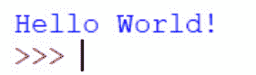

图 1.3 – Hello World! Python 程序

#### 注意

别担心——我们将在 [第 2 章](https://example.com) 计算思维要素中讨论 Python 编程语言，并在第 2 部分 应用 Python 和计算思维中更深入地讨论，从 [第 9 章](https://example.com) Python 入门开始。

虽然篇幅较长，但讨论算法对于本书以及你学习 Python 的进程至关重要。因此，我们将在 [第 2 章](https://example.com) 计算思维要素 和 [第 3 章](https://example.com) 理解算法与算法思维 中深入探讨算法，因为算法是计算思维过程的关键要素。

#### 重要提示

[第 2 章](https://example.com) 计算思维要素 将重点讨论计算思维过程本身，它包含四个要素：**分解**、**模式识别**、**模式概括与抽象**以及**算法设计**。如你所见，最后一个要素是算法设计，因此我们需要更熟悉什么是算法以及如何创建算法，以便你随后在使用 Python 解决问题时能够实现和设计算法。[第 3 章](https://example.com) 理解算法与算法思维 将重点深入理解算法，并向你介绍设计过程。

接下来，我们将探讨编码理论。

### 编码理论

编码理论有时也被称为**代数编码理论**。在处理代码和编码理论时，主要研究三个领域：**数据压缩**、**纠错**和**密码学**。我们将在以下部分更详细地介绍这些内容。

### 数据压缩

数据压缩的重要性不容小觑。数据压缩使我们能够在占用最少空间的同时，存储尽可能多的信息。换句话说，数据压缩是使用最少比特数来存储数据的过程。

**重要提示**

请记住，**比特**是计算机中能找到的最小数据单位——即一个0或一个1。8个比特组成一个**字节**。我们使用字节作为计算机或存储设备（如内存卡或外置硬盘等）内存大小的计量单位。

随着技术和存储容量的增长与提升，我们存储额外数据的能力也随之增强。历史上，计算机刚进入家庭时只有**千字节**或**兆字节**的存储空间，但在撰写本文时，它们现在拥有**吉字节**和**太字节**的存储容量。这些存储单位的换算如下所示：

8 bits = 1 byte

1024 bytes = 1 kilobyte

1000 kilobytes = 1 megabyte

1000 megabytes = 1 gigabyte

1000 gigabytes = 1 terabyte

图 1.4 – 字节换算

如果你在网上查找信息，可能会发现有些资料称1太字节等于1,024吉字节。那是二进制换算。在十进制系统或基数为10的系统中，1太字节等于1,000吉字节。为了更好地理解换算，理解适用于十进制系统的前缀和适用于二进制系统的前缀非常重要：

| 十进制前缀 | 值 | 二进制前缀 | 值 |
| :--- | :--- | :--- | :--- |
| kilo | 1,000 | kibi | 1,024 |
| mega | 1,000² | mebi | 1,024² |
| giga | 1,000³ | gibi | 1,024³ |
| tera | 1,000⁴ | tebi | 1,024⁴ |
| peta | 1,000⁵ | pebi | 1,024⁵ |
| exa | 1,000⁶ | exbi | 1,024⁶ |
| zetta | 1,000⁷ | zebi | 1,024⁷ |
| yotta | 1,000⁸ | yobi | 1,024⁸ |

表 1.2 – 十进制和二进制前缀及其值

如前所述，目标始终是使用尽可能少的比特来存储尽可能多的数据。因此，我们压缩或减小数据大小以使用更少的存储空间。

那么，*为什么数据压缩如此重要？* 让我们回到2000年。当时，一台售价约1,000美元的笔记本电脑大约有64 MB的**随机存取存储器（RAM）**和6 GB的硬盘内存。我们手机上的一张照片，使用其实际尺寸时，会占用2到5兆字节的内存。这意味着我们的计算机无法存储很多（在某些情况下，甚至无法存储任何）我们现在拍摄的现代照片。数据压缩的进步使我们能够存储更多内存，创建更好的游戏和应用程序等等，因为我们可以拥有更好的图形和额外的信息或代码，而无需过多担心它们占用的内存量。

### 纠错

在计算机科学中，错误是不可避免的。我们在流程、算法、设计以及所有环节中都可能犯错。纠错，也称为**错误处理**，是计算机在数字数据传输不正确时，自动纠正一个或多个错误的过程。

**纠错码（ECC）**可以帮助我们分析数据传输。ECC可以定位并纠正传输错误。在计算机中，ECC内置于存储空间中，可以识别常见的内部数据损坏问题。例如，ECC可以帮助读取损坏的代码，例如缺失一部分的**快速响应（QR）**码。ECC的一个例子是**汉明码**。汉明码是一种二进制线性码，可以检测多达两位的错误。这意味着在传输过程中最多可能丢失或损坏两位数据，接收方会知道发生了错误，或者能够重构出无错误的原始数据。

**重要提示**

汉明码以理查德·韦斯利·汉明的名字命名，他在1950年发现了它。汉明是一位数学家，从事与电信和计算机工程相关的编码工作。

另一种ECC是**奇偶校验位**。奇偶校验位检查数据状态，并确定是否有任何数据丢失或被覆盖。纠错对于所有开发的软件都很重要，因为任何更新、更改或升级都可能导致整个程序或程序/软件的部分内容损坏。

### 密码学

密码学在计算机科学中用于隐藏代码。在密码学中，信息或数据被编写成只有消息的预期接收者才能阅读的形式。简单来说，密码学将可读的文本或信息转换为不可读的文本或信息。

当我们现在想到密码学时，我们往往会想到数据的**加密**。编码者通过将数据转换为未授权用户无法看到的代码来加密数据。然而，密码学已经存在了几个世纪——也就是说，它早于计算机。历史上，密码学的首次使用可追溯到公元前1900年左右埃及的一座坟墓。在坟墓的不同部分，不典型或不寻常的象形文字与常见的象形文字混合在一起。

这些不寻常的象形文字的原因尚不清楚，但它们的使用将信息隐藏了起来，不为他人所知。后来，密码学被政府和间谍用于在战争与和平时期进行秘密通信。如今，密码学被用于加密数据，因为我们的信息以数字格式存在，因此保护敏感信息（如银行、人口统计或个人数据）非常重要。

我们将在本书中通过一些问题来探索围绕编码理论的各种主题。

### 计算生物学

计算生物学是理论计算机科学的一个领域，专注于研究生物数据和**生物信息学**。生物信息学是一门允许我们收集和分析生物数据的科学。生物信息学的一个例子是收集和分析遗传密码。在生物学研究中，会探索和记录大量数据。

研究的主题可以非常广泛且跨学科。例如，一项遗传研究可能包括来自整个州、整个种族或整个国家的数据。计算生物学内的一些领域包括分子、细胞、组织和生物体。计算生物学使我们能够研究这些事物的组成，从最基本的层面到更大的生物体。生物信息学和计算生物学为这些领域的实验研究提供了框架，创建预测和比较，并为我们提供开发和测试理论的方法。

计算思维和编码使我们能够处理和分析这些数据。在本书中，提出的问题将使我们探索如何将Python与计算思维结合使用，以找到复杂问题的解决方案，包括计算生物学中的问题。

### 数据结构

在编码理论中，我们使用数据结构来收集和组织数据。目标是准备好数据，以便我们能够高效有效地执行操作。数据结构可以是原始的或抽象的。软件有内置的数据结构，这些是原始的，或者我们可以使用编程语言来定义它们。原始数据结构是预定义的。一些原始数据结构包括整数、字符（**字符**）和布尔结构。抽象或用户定义的数据结构的例子包括数组和二维数组、栈、树和二叉树、链表、队列等。

用户定义的数据结构具有不同的特性。例如，它们可以是线性的或非线性的，同质的或非同质的，静态的或动态的。如果我们需要将数据排列成线性序列，我们可以使用**数组**，它是一种线性数据结构。如果我们的数据不是线性的，我们可以使用非线性数据结构，例如**图**。当我们拥有相似类型的数据时，我们使用同质数据结构。

请记住，例如，数组既是线性的也是同质的数据结构。非同质或异构数据结构具有不相似的数据。用户可以创建的非同质数据结构的一个例子是类。静态和动态数据结构之间的区别在于，静态结构的大小是固定的，而动态结构的大小是灵活的。为了更好地理解数据结构，我们将通过使用各种计算思维元素解决问题来探索它们。我们将在本章末尾非常简要地重新讨论数据结构，因为它们与数据类型有关，我们稍后将讨论数据类型。

### 信息理论

信息理论被定义为一种数学研究，它允许我们对信息进行编码，以便通过计算机电路或电信信道进行传输。信息通过可能包含符号、脉冲甚至无线电信号的序列进行传输。

在信息论中，计算机科学家研究信息的量化、数据存储和信息通信。在信息论中，信息可以是模拟的，也可以是数字的。

**模拟数据**是指由模拟信号表示的信息。反过来，模拟信号是在给定时间内变化的连续波。**数字信号**以二进制形式显示数据——即离散波。我们将模拟波表示为**正弦波**，将数字波表示为**方波**。下图显示了作为随时间变化的值的函数的正弦曲线：

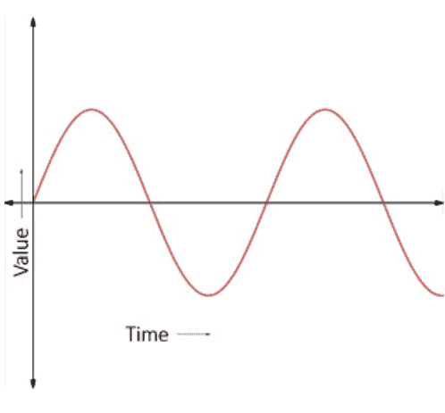

图 1.5 – 模拟信号

模拟信号由正弦波的关键要素描述：振幅、周期、频率和相位偏移：

- **振幅**是曲线从其中心的高度。正弦曲线无限重复。
- **周期**是指正弦曲线一个周期的长度——即曲线开始重复之前的长度。
- **频率**和正弦曲线的周期具有反比关系：

    频率 = 1 / 周期

关于反比关系，我们还可以这样说：

周期 = 1 / 频率

- 正弦曲线的**相位偏移**是曲线从0开始的偏移量。这在下图中显示：

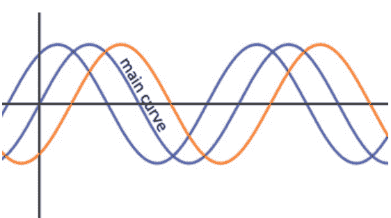

图 1.6 – 相位偏移示例

相比之下，数字信号图看起来像条形图或直方图。它们只有两个数据点，0或1，所以它们看起来像方方正正的山丘和山谷：

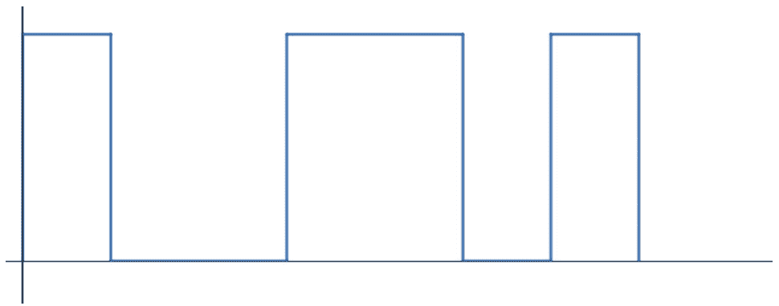

图 1.7 – 数字信号

**数字信号**具有有限的离散数据集。数据集是离散的，因为它包含单独且不同的数据点。对于模拟信号，数据是连续且无限的。在计算机科学中，这两种类型的信号都很重要且有用。我们将在本书的一些问题中探讨数字信号，特别是在*第17章，应用计算思维问题*中提出的问题。

### 自动机理论

自动机理论是理论计算机科学中最引人入胜的主题之一。它涉及对机器的研究，以及如何可靠高效地完成计算。自动机理论涉及简单机器的物理方面，以及逻辑处理。那么，*自动机到底是用来做什么的，它是如何工作的呢？*

自动机是使用预定条件来响应外部输入的设备。当你查看恒温器时，你就是在使用自动机。你设定你想要的温度，恒温器会对外部源做出反应以收集信息并相应地调整温度。自动机的另一个例子是手术机器人。这些机器人可以改善患者的手术结果，并且正在不断改进。由于自动机理论的目标是制造可靠且高效的机器，因此它是开发人工智能和智能机器人机器（如手术机器人）的关键部分。

### 形式语言理论

**形式语言理论**在计算机科学中通常与自动机理论相关联。形式语言理论涉及研究形式语言的语法、语法、词汇以及所有其他相关内容。在计算机科学中，形式语言是指计算机编程语言的逻辑处理和语法。关于自动机，机器处理形式语言以执行为其提供的任务或代码。

### 符号计算

**符号计算**是计算数学的一个分支，涉及计算机代数。术语*符号计算*和*计算机代数*有时可以互换使用。一些编程软件和语言侧重于数学公式的符号计算。使用符号计算的程序执行诸如多项式因式分解、简化代数函数或表达式、寻找多项式的最大公约数等操作。

在本书中，我们将在解决一些现实世界问题时使用计算机代数和符号计算。Python不仅允许我们执行问题可能需要的数学计算，还允许我们探索这些计算产生的图形表示或模型。在探索现实世界问题的解决方案时，我们将需要使用Python编程语言的各种库或扩展。本书的*第2部分，应用Python和计算思维*将提供更多相关信息，我们将在其中更详细地探讨Python编程语言。

### 计算几何

与符号计算一样，**计算几何**也属于计算机科学中处理计算数学的分支。我们在计算几何中研究的算法是那些可以用几何表达的算法。数据通过几何图形、几何分析、遵循几何模式的数据结构等进行分析。需要计算几何的问题的输入和输出都是几何的。

当想到几何时，我们通常会想到与该数学分支最相关的图形，如多边形、三角形和圆。也就是说，当我们观察计算几何时，其中一些算法是可以通过点、线、其他几何图形表达的，或者是遵循几何模式的。**三角剖分**属于计算机科学的这一分支。

数据三角剖分对于诸如光学3D测量系统等应用非常重要。例如，我们通过三角剖分GPS信号来定位手机，这在执法中被使用。

在现代，三角剖分有许多用途，其中一些我们将在本书中通过真实且相关的问题进行探讨。

### 计算数论

数论是研究整数及其性质的数学分支。因此，计算数论涉及研究用于解决数论问题的算法。数论研究的一部分是**素性测试**。

为确定输入或输出是否为素数而创建的算法用于许多目的。素性测试和数论最关键的应用和用途之一是用于加密目的。随着我们的生活转向将所有内容电子化保存，我们最私人的信息，如银行信息、家庭信息，甚至社会安全号码，都存在于某种代码或算法中。加密此类信息非常重要，这样其他人就无法使用或访问它。计算数论和密码学是内在联系的，正如你稍后将探索的那样。

提出的一些理论旨在帮助你理解计算机科学理论及其应用是如何交织在一起的，以及它们与我们每天所做事情的相关性。

在本节中，我们了解了理论计算机科学。我们还了解了它的各种理论。在本书中，我们将使用计算思维（在*第2章，计算思维要素*中进一步讨论）来帮助我们解决问题，从最基本的应用到一些复杂的分析，通过定义和设计使用这些理论的适当算法。理论计算机科学用于研究系统的软件，我们接下来将探讨这一点。

## 了解系统的软件

**系统软件**用于执行多种功能，并在计算机的操作系统、键盘和鼠标等外围设备以及固件（永久保存在设备上并需要其操作）之间进行通信，以及其他功能。这些是两种主要软件类型的一部分：**系统软件**和**应用软件**。

系统软件允许计算机在硬件和应用程序之间进行通信。想想智能手机。在其最基本的形式中，手机由硬件组成，包括电池、摄像头、内存、屏幕以及所有物理组件和外围设备。操作系统允许这些组件被应用程序使用。

以手机的相机应用程序为例。系统软件让应用程序与手机通信，以使用相机拍照、编辑、保存和分享。计算机的操作系统也允许硬件与程序通信。设计程序将使用鼠标或其他可用于绘图、创建、使用触摸屏（如果可用）等的外围设备。

如果我们不了解系统的软件，我们就无法创建能够与硬件有效通信的应用程序，从而产生从严重（使外围设备无用）到轻微（某些组件可能工作，例如拍照，但其他组件可能无法工作，例如保存或分享照片）的错误。系统软件的创建方式为我们提供了在硬件和应用程序之间进行通信的最简单、最有效的方式。为此，系统使用操作系统。让我们看看这些系统是什么以及它们做什么。

### 操作系统

操作系统执行多项任务。正如你可能记得的，错误处理是操作系统的一部分，它检查最常见的可能错误以修复它们，而不会产生更大的问题或使应用程序变得毫无价值。错误处理是操作系统最重要的任务之一。此外，操作系统负责计算机或设备的安全。如果你有智能手机，你会知道操作系统的许多更新都是为了修复安全问题或防止安全漏洞。操作系统负责只允许授权用户与存储在设备中的内容进行交互。

除了安全性和错误处理，操作系统还负责为文件分配内存并组织它们。当我们保存和删除文件或程序时，之前使用的内存会被释放。

然而，在操作前后可能会立即保存某些内容。操作系统通过分配和重新分配内存来维持设备的最佳性能。内存管理不仅指用户保存的文件，还包括随机存取存储器（RAM）。

设备的文件管理也由操作系统运行。操作系统将信息组织为文件系统，将信息分解为用户和设备可以轻松访问的目录。文件系统负责跟踪文件的位置，无论是从操作系统还是用户的角度，以及设备访问的设置（这些设置在不断演变），还有如何访问文件并理解这些文件的状态。近年来，设备访问方式发生了变化。

虽然计算机通常使用用户名和密码，但许多设备现在可以通过指纹、数字或字母数字密码、面部识别、图像、路径等方式访问。随着这些主题的演变，操作系统也在演变，需要更新或重新创建。操作系统还负责允许应用程序与设备之间的通信。

### 应用软件

应用软件是指执行特定任务的软件应用程序。想想你可以从移动设备访问的应用程序或应用。有数百种类型的应用程序，例如驻留在设备上的静态游戏、允许你远程与他人对战的游戏、新闻应用、电子书阅读器、健身训练应用、闹钟、时钟、音乐等等！应用程序总是执行某种形式的任务，无论是用于个人使用、商业使用还是教育使用。

应用软件具有多种功能。你可能会发现用于提高生产力的套件，例如 **Microsoft (Office)** 和 **Google** 产品。当我们需要在互联网上进行研究时，我们使用称为 **浏览器** 的应用程序，这些应用程序允许我们访问信息并对其进行索引，以便我们可以访问它。这些浏览器包括 **Google Chrome**、**Safari**、**Firefox**、**Edge**、**Opera** 等。浏览器被移动设备和计算机使用。请记住，应用程序的目的是为最终用户执行特定任务。

> *重要提示*

*顺便提一下，自从计算机成为家庭工具，以及手机开始用于通话以外的其他用途以来，应用程序呈指数级增长。早期的计算机仅用于计算，或进行数学分析和任务计算。这就是为什么理解计算机科学的发展和历史如此重要的原因之一。由于我们无法完全预测计算机科学和系统软件的未来用途，我们对它们了解得越多，我们就越能够在技术进步发生时进行创造和适应。*

在本节中，我们学习了系统软件。我们还学习了操作系统软件和应用软件。对于本书，当我们处理一些提出的问题时，某些应用程序将变得更加重要，例如数据库、生产力软件、企业资源规划和教育软件。

在下一节中，我们将开始更多地探索计算以及计算机如何具有允许软件和硬件交互的架构。

## 理解计算

在计算机科学中，**计算** 指的是计算机执行的用于通信、管理和处理信息的活动。计算通常分为四个主要领域：**算法**、**架构**、**编程语言** 和 **理论**。

由于我们在前面的章节中讨论了理论和算法，我们现在将专注于定义架构和编程语言。

### 架构

计算机架构是指与计算机系统交互的指令集。更基本地说，架构包括允许软件和硬件交互的指令。计算机架构有三个主要子类别：

- 指令集架构（ISA）
- 微架构
- 系统设计

### 指令集架构（ISA）

ISA 是硬件和软件之间存在的边界。它有多种分类方式，但两种常见的是 **复杂指令集计算机（CISC）** 和 **精简指令集计算机（RISC）**：

- **CISC** 是一种对许多任务具有显式指令的计算机，例如简单的数学运算和从内存加载内容。CISC 包括 RISC 中未包含的所有内容。
- **RISC** 是一种具有减少 **每条指令周期数（CIP）** 架构的计算机。

CISC 试图用更少的指令做更多的事情，而 RISC 只使用简单的指令。CISC 是多步骤的，而 RISC 是单步骤的，一次执行一个任务。CISC 过程包括指令、微码转换、微指令和执行。相比之下，RISC 包括指令和执行。

在 CISC 中，**微码** 转换是指在较低级别解释语言。它考虑硬件资源以创建微指令。**微指令** 是微码中的单个指令。在微码创建微指令之后，微指令就可以被执行。下图显示了 RISC 和 CISC 的过程：

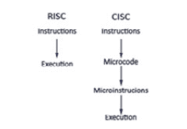

图 1.8 – RISC 和 CISC 之间的区别

RISC 和 CISC 对于计算机程序员来说都是必要的。单步过程（RISC）与多步过程（CISC）各有优缺点。RISC 减少了每条指令的周期数，一次做一件事。CISC 减少了程序中的指令数量，但代价是每条指令的周期数。根据我们的需求，我们可以选择最佳路径。

### 编程语言

编程语言是我们为计算机和其他设备编写指令的方式。根据需求、易用性等因素使用不同的语言。编程语言的示例包括以下内容：

- **Ruby** 和 **Python**：Ruby 是一种主要用于 Web 应用程序的编程语言。Ruby 稳定且易于使用；然而，许多开发者选择使用 Python 而不是 Ruby，因为在许多情况下 Python 更快，并且拥有更大的生态系统。尽管 Ruby 没有那么流行并且存在一些性能问题，但该语言在 2023 年仍然非常活跃并持续增长。另一方面，Python 被广泛用于多种目的，例如 Web 应用程序、用户界面应用程序和网站等。随着世界各地的学校开始要求中学毕业必须学习编程课程，它也是被采用的语言之一。我们将在本书后面更深入地探讨 Python。
- **C**：C 语言是计算机科学中至关重要的一部分，因为 C 是第一种被使用的语言，也是目前使用最广泛的语言。C 自 1972 年 Dennis Ritchie 发明以来就存在，但自 1978 年首次发布以来，其他人也一直在使用它。虽然其他语言自那时起越来越受欢迎，但 C 在 2023 年仍在使用。它的一些用途包括操作系统、硬件驱动程序和应用程序等。C 是一种基础级语言，这意味着它几乎不需要抽象。
- **C++**：C++ 由 Bjarne Stroustrup 于 1985 年作为 C 的扩展开发。该语言的目标是添加面向对象的能力。该语言仍然被广泛使用，既与 C 语言结合用于操作系统，也用于其他软件。C++ 是一种中级编程语言。
- **C#（C sharp）**：C# 是一种高级编程语言。与 C++ 类似，它具有面向对象的能力，是 C 编程语言的扩展。C++ 和 C# 之间的主要区别之一是 C++ 使用机器码，而 C# 使用字节码。机器码可以由计算机直接执行。用户的代码被编译成字节码，这是一种需要解释的低级代码。
- **Swift：** Swift 编程语言由 **Apple Inc.** 于 2014 年开发。就编程语言而言，Swift 是最新的语言之一。Apple 以 **2.2 版本** 将其作为开源编程语言发布，该版本于 2015 年发布。该语言被认为是一种通用和编译型编程语言，5.7 版本于 2022 年 9 月发布。这种语言对于 Apple 产品 iOS 生态系统中的应用程序开发非常重要。
- **Scratch：** Scratch 于 2002 年由 **MIT Media Lab** 开发为一种可视化编程、积木式编码语言。作为一种积木式编程语言，它被广泛用于学校，教授所有年龄段的学生如何编程。Scratch 现在已适应多种用途，包括一些机器人应用，例如 Vex Code，结合了机器学习和人工智能等等。它与流行的课堂外设兼容，例如 **Makey Makey**，这是一种与计算机交互的电路，可以完全由 Scratch 程序控制。虽然它在教育目的上很受欢迎，但该编程语言的能力不容小觑，语言本身及其功能也在不断发展。
- **JavaScript：** JavaScript 是一种仅在浏览器中使用的脚本语言。它用于创建网站和 Web 应用程序。另一方面，Java 是一种通用编程语言。JavaScript 帮助我们使网站动画化或为其添加交互功能。
- **Java：** Java 被编译成字节码，广泛用于开发 Android 设备和应用程序。它是一种面向对象的编程语言，允许程序在任何环境中运行。
- **PHP：** PHP 也称为 **超文本预处理器**。与 Java 类似，它是一种通用编程语言。它广泛可用，用于网站设计和应用程序。PHP 被认为易于学习，但具有许多高级功能。它也可以用于编写桌面应用程序。
- **SQL（结构化查询语言）**：SQL 是一种用于与数据交互的编程语言。SQL 是领域特定的。它几乎和 C 一样古老，首次出现于 1974 年。SQL 的主要重要性在于它可以与数据库交互，而其他语言则无法做到这一点。

在计算思维中，我们使用许多不同的编程语言，这取决于我们的目标、我们拥有或需要的信息，以及我们的应用程序或软件要求。选择语言不仅取决于我们对语言的了解，还取决于语言可能的功能。

在本书中，我们将更广泛地使用 Python，因为它具有开源性质、易于使用以及可用于大量应用程序。然而，Python 并不是唯一的选择。了解其他语言很重要，尤其是对于开发者。

至此，我们已经了解了计算及其几个领域，即架构和编程语言。我们还了解了 ISA 及其类型，以及各种编程语言。在下一节中，我们将探讨数据类型和结构。

## 了解数据类型和结构

在计算机科学中，数据类型和结构是两个不同的概念：

### 数据类型

**数据类型**是一种基本分类。一些数据类型包括整数、浮点数和字符串。
**数据结构**使用多种数据类型。它们可以在内存中组织信息，并决定我们如何访问这些信息。

我们将在后续章节中更详细地探讨这些内容。

如前所述，数据类型是基本分类。它们是在整个程序中使用的变量，并且只能以一种分类存在。数据类型有不同的类别。目前我们将重点关注**原始**和**抽象**数据类型，但随着我们考虑问题和设计解决方案，我们将重新审视这个主题。

原始数据类型包括**byte**、**short**、**int**、**long**、**float**、**double**、**Boolean**和**char**：

-   一个**byte**可以存储从-128到127的数字。虽然这些数字可以存储为整数或**int**，但byte使用更少的存储空间，所以如果我们知道数字在这些值之间，我们可以使用byte数据类型来代替。
-   一个**short**是介于-32,768和32,767之间的数字。
-   一个整数，**int**，用于存储介于-2,147,483,648和2,147,483,647之间的数字。
-   **Long**用于存储从-9,223,372,036,854,775,808到9,223,372,036,854,775,807的数字。
-   一个**float**允许我们保存一个十进制数。
-   十进制数也可以保存为**double**，它比float具有更高的精度。
-   **Boolean**值是数据类型，其值为**True**或**False**。因此，一个变量可以被保存，以便当其值被打印时，结果将被保存为true或false。
-   **Char**用于将变量保存为单个字符。

### 数据结构

正如前面*编码理论*部分所提到的，数据结构用于高效且有效地收集和组织数据。数据结构可以是原始的，例如软件中的内置数据结构，也可以是抽象的。原始数据结构也可以使用编程语言定义，但它们是预定义的。一些原始数据结构包括上一节列出的数据类型，例如**chars**和**Boolean**结构。

**抽象数据类型（ADTs）**包括可以帮助构建和设计数据类型的信息。抽象数据结构包括数组和二维数组、栈、树和二叉树、链表、队列等，正如本章前面*编码理论*部分所提到的。列表可以包含相同数据值的多个实例。这些列表是可计数的，所以我们可以找出列表中有多少个元素，重新排序它们，删除项目，添加项目等等。列表被广泛用作链表、数组或动态数组：

-   一个**链表**意味着列表中的每个数据元素都连接或指向下一个元素，无论它们在内存中的存储位置如何。
-   一个**数组**是有序的。元素被读取时是有意义的。把数组想象成阅读这个句子。你不会把句子读成*array and think reading as this of sentence*。我们按顺序从左到右阅读句子，而不是以混乱的顺序。
-   **动态数组**可以调整大小，这在选择数据类型时很重要。

一个**栈**ADT是一个元素的集合，有两个操作——push和pop。**push**用于向集合添加一个元素，而**pop**移除最近添加的元素。

一个**队列**ADT是一个线性数据结构。与栈一样，我们可以添加或删除元素。然而，在队列ADT中，删除点和插入点是在两个不同的端点完成的。

如前所述，数据结构是数据类型的具体实现。例如，我们如何从集合中添加或删除元素，就是数据结构。

这一切可能有点令人困惑，但我们将在这本书中了解更多关于它们的内容。目前，理解定义和简单的例子就足够了。

## 总结

在本章中，我们学习了计算机科学的一些基础知识。我们研究了如何从二进制转换为十进制，反之亦然。我们还探讨了理论计算机科学中的主题和理论。我们学习了计算以及数据类型和数据结构。这些部分让我们理解了计算思维过程，以及如何解决本书中将呈现的不同类型的问题，从[第2章，计算思维的要素](第2章，计算思维的要素)开始。

随着我们深入计算思维的世界和过程，当我们研究问题、寻找最佳解决方案以及决定如何编写算法时，我们将需要重新审视本章的一些内容。

问题可能有无数种使用算法解决的方法。理解过程如何工作以及哪些数据结构最适合我们的问题，对于创建最佳解决方案至关重要。识别这些算法所需的数据类型以及计算机如何读取数据，只会帮助我们编写最有效和最高效的算法。

在下一章中，我们将学习计算思维过程以及如何分解问题以设计我们的算法解决方案。

# 2 计算思维的要素

上一章提供了一些关于计算机科学基础知识的概述。在本章中，我们将更紧密地关注理解计算思维及其构成要素：分解、模式识别、模式泛化或抽象以及算法设计。

计算思维过程的重要性不容低估。通过这个过程，我们分析问题，根据一组条件设计最佳可能的解决方案。虽然可以编写许多算法来回答相同的问题，但使用计算思维过程有助于我们确定设计清晰、可泛化算法的最佳路径。我们并不总是使用计算思维过程的所有步骤，有时我们在迭代问题和算法时多次使用它们，但拥有这个框架可以让我们制定更好的解决方案，并在我们的过程中提供指导。

在本章中，我们将涵盖以下主题：

-   理解计算思维
-   分解问题
-   识别模式
-   泛化模式
-   设计算法
-   额外问题

为了更多地了解计算思维，我们将通过一个呈现的问题的视角来审视这些要素。请记住，我们将在*第9章，Python简介*中深入探讨Python编程语言，但你可以在深入研究本书本章及所有其他章节时，根据需要来回参考该章节。

## 技术要求

以下是本书中使用的完整源代码：[https://github.com/PacktPublishing/Applied-Computational-Thinking-with-Python-Second-Edition/tree/main/Chapter02](https://github.com/PacktPublishing/Applied-Computational-Thinking-with-Python-Second-Edition/tree/main/Chapter02)。

## 理解计算思维

在其最基本的定义中，计算思维是一个解决问题的过程。就像设计思维、科学方法和其他类似方法一样，我们需要经过许多步骤来找到解决方案。例如，科学方法有七个步骤。请记住，关于科学方法有多种解释，有些在步骤数量上有所不同。出于本次讨论的目的，我们将使用这七个步骤：

1.  问题
2.  假设
3.  材料
4.  实验
5.  结果
6.  结论
7.  研究结果的交流

科学方法的建立是一个备受争议的话题，但大多数研究人员认为它可以追溯到10世纪。

科学方法使得观察自然世界、创建假设来检验观察结果以及通过既定过程开发测试和结果成为可能。该方法本身在柏拉图和亚里士多德等哲学家那里有一些基础，他们提倡经验研究。然而，他们的方法论不如我们今天所称的科学方法那样发达。

当科学家有一个他们想要研究的问题或疑问时，他们会创建一个假设来检验。例如，如果我们想看看某种肥料是否能促进豆类植物的生长，那么我们可以使用科学方法来找到答案。

让我们看看研究这个问题的科学方法：

1.  **问题**是肥料是否对豆类植物的生长有影响。
2.  **假设**是肥料会提高植物的生长速度。
3.  所需的**材料**是花盆、土壤、豆子种子、水和肥料。
4.  **实验**将要求我们有一个花盆，我们在土壤中种植种子，并以与第二个花盆中的种子相同的速率浇水。然而，第二个花盆还将添加肥料。实验设计还将包括实验运行的时间、向两个花盆添加的水量以及任何其他必要的细节。
5.  **结果**和**结论**将取决于实验。我们将在固定时间范围内，在一天中的特定时间测量生长情况来收集数据。然后，将分析这些数据，以便记录结果和结论。
6.  一旦结果和结论准备就绪，就需要将它们**交流**给科学界。

科学方法的重要性在于它提供了一个框架，使科学家能够设计他们的研究，并以科学界能够理解、解释的方式交流他们的发现，并进行更多的后续研究，因为他们能够阅读这些信息，并继续研究其他问题和假设。

计算思维的要素与科学方法相似。计算思维使用更少的步骤来处理与编程相关的问题，而科学方法则用于实验。通过计算思维，我们对算法进行概括；而在科学方法中，我们能够重现结果，并将结论从样本推广到总体。

在现代，我们根据所研究的领域和已开发的技术，发展出了其他方法论。其中两个例子是设计思维过程和计算思维。

设计思维有五个步骤或阶段：

1.  **共情**
2.  **定义**
3.  **构思**
4.  **原型**
5.  **测试**

我们使用上述阶段来理解客户、班级、问题、情况或其他需要处理的环境的需求。与用户的需求共情有助于我们识别和定义问题。构思和原型阶段是我们创造可能解决方案的地方。测试可能的解决方案是找到最佳方案的下一个必要步骤。在所有阶段之后，如果需要，我们可以重新进行循环，因为设计思维过程的目标不是完美，因此总可以进行额外的工作。设计思维的目标是为已定义的问题提供一个有效且合理的解决方案。这不是唯一可行的解决方案，也不是完美的。

在计算思维中，我们使用一个包含四个要素的类似过程：

1.  **分解**
2.  **模式识别**
3.  **抽象**
4.  **算法设计**

与设计思维过程一样，计算思维中的问题没有明确定义。这些问题有时被称为*定义不明确*。我们面对一系列情况，在开始构思或基于我们能看到的模式创建可能的解决方案之前，我们定义或分解该问题。当我们思考计算思维过程时，我们真正做的是试图弄清楚如何让计算机遵循一系列步骤来解决我们面临的问题。

让我们来看一个简单的计算思维问题。

### 问题 1 – 条件

让我们想象一下，一个广播电台的抽奖活动让参赛者从两种可能的获奖结构中选择一种：要么是 250 美元现金，要么是与参赛者身高等高的 25 美分硬币。

一个计算思维问题可以像*问题 1* 一样模糊，甚至没有提出任何问题。你被给予一系列条件，你的任务是确定问题是什么，并为你定义的问题找到解决方案。仔细想想，这个问题没有完美的答案，但你可以创造一些条件来确定哪种选择确实最好，这取决于参赛者的身高。

为了**分解**这个问题，我们需要查看陈述的内容，并考虑未陈述的内容。我们需要规则。

简单来说，获胜者将选择一种货币支付方式：要么是 250 美元现金，要么是与其身高等值的 25 美分硬币。这些是陈述的内容。但未陈述的内容也很重要：

- *抽奖的时间线是什么？有多少获胜者？*
- *我们是否想在每位参赛者做出选择后跟踪我们的支出？*
- *我们是否想使用一个基准进行比较？*

可能还有其他想到的事情，但目前，让我们专注于这些问题。我们将假设抽奖没有固定的开始或结束日期，电台可能在某一天选择多名获胜者——或者根本不选。这些是我们在寻找模式、概括它们和设计算法时将考虑的一些因素。

考虑到所有关于支付的信息，我们仍然没有办法弄清楚何时支付更多。*是选择 250 美元最好吗？还是选择与身高等高的 25 美分硬币最好？我们能否创建一个算法来告诉我们哪种选择最好？* 是的，我们可以创建一个解决整个问题的算法。

这个问题的**模式**将始终相同：现金金额是固定的，25 美分硬币的厚度也是固定的，因此我们总是可以使用数学来计算根据某人的身高，与身高等高的 25 美分硬币换算成多少钱。

如果我们知道一些事情，我们可以清楚地说明每种选择的奖金。这包括*选择现金或选择与身高等高的 25 美分硬币*。如果选择身高，我们需要以下信息：

- 参赛者的身高
- 25 美分硬币的厚度

接下来发生的事情是**模式**和**抽象**的一部分。在每位参赛者决定之前，我们不知道他们的选择，但我们可以提前知道每枚 25 美分硬币的厚度。这将在我们的算法中用到。每枚 25 美分硬币的厚度约为 0.069 英寸，或 1.75 毫米。

#### 重要说明

> 为了本书的目的，我们将使用英制单位——例如，英尺和英寸。但是，也会提供公制单位的算法。

审视我们的问题，我们可以用两种方式说明奖金。以下包含的用于计算与身高等高的 25 美分硬币奖金的表达式是**数学算法**。它们显示了根据参赛者的身高确定总奖金所需的步骤。

请注意，要使用英制算法，身高需要以英制单位给出。要使用公制算法，身高需要以公制单位给出。如果参赛者选择现金，那么总奖金就是 250 美元。如果参赛者选择与身高等高的 25 美分硬币，那么英制和公制单位的算法如下：

- 总奖金（英制）：(h ÷ 0.069) × $0.25
- 总奖金（公制）：(h ÷ 1.75) × $0.25

我喜欢赌注不高的赌博。所以，我要说我想测试一下，用我自己的身高。因此，我没有拿 250 美元，而是选择看看我的身高能换多少 25 美分硬币。我身高 5 英尺 10 英寸。让我们算算这是多少英寸。因为 1 英尺有 12 英寸，总身高的算法如下：

5 × 12 = 60 英寸

但我说我身高 5 英尺 10 英寸，所以我们需要加上那额外的 10 英寸：

60 + 10 = 70 英寸

现在，让我们使用我们之前定义的数学算法 (h ÷ 0.069) × $0.25 来计算我能赢多少钱：

(70 ÷ 0.069) × $0.25 ≈ $253.62

我使用了 ≈ 符号而不是 =，因为 ≈ 表示这是一个近似值。由于我进行了四舍五入，我想确保表明这是最佳近似值，而不是精确数字。

也许你现在觉得这个问题已经解决了，但在计算思维中，我们必须经过抽象并设计一个适用于所有情况的算法。我们可以创建一个非常简单的程序，使用用户简单的输入，或者我们可以创建一个更复杂的程序，不仅提供基本的总额，还可能提供总和、图形，或任何我们认为与场景相关且适用于所有情况的内容。

一旦我们更深入地了解了计算思维过程的每个部分，我们将进一步设计这些算法。我们甚至会回到这个问题，展示如何为计算机创建那个运行的算法。我们可以创建一个算法，让我们使用某人的身高来决定使用哪种奖金。

或者，如前所述，我们可以写一个基准，将 250 美元作为每位参赛者的奖金，然后输入每位参赛者的选择，以查看我们是低于还是高于 250 美元的基准。我们可以汇总这些结果，这意味着持续添加它们，以查看在电台停止抽奖时我们最终的结果。我们甚至可以有一个图表，向我们展示随着时间的推移，如果参赛者在电台运行抽奖时间越长时选择不同，我们在哪里，等等。

在本节中，我们了解了计算思维的要素。我们还研究了一个计算思维问题。

然而，目前，让我们继续更深入地研究计算思维的要素——即分解、模式识别、模式概括和抽象，以及算法设计。

### 分解问题

**分解**是分解数据的过程。它可能包括解决问题所需的一系列过程或步骤。通过分解问题，我们可以在概括模式之前识别问题的组成部分或更小的部分。

通过分解，我们可以识别并解决一个案例，然后将这些步骤推广到问题的所有可能实例。为了真正理解分解，我们需要回到前面陈述的问题，简单来说，就是问这样一个问题：*如果我选择与身高等高的 25 美分硬币，我的身高会带来更多的钱，还是我应该拿 250 美元的支付？* 我们可以说我们想知道一个实例，并从数学上解决一次这个问题，例如只为我们自己的身高解决问题。然而，我们可能需要其他实例的信息。我们可以创建一个程序，只识别哪种选择，250 美元还是你的身高等高的 25 美分硬币，是最好的。或者我们可以考虑以下一些场景，这意味着不同的算法：

- 我们可以根据身高检查选项，但也将每个项目添加到一个数组中以跟踪所有决定
- 我们可以使用该数组及其元素的总和来跟踪整个比赛过程中的支出
- 我们可以将总和与基准进行比较，使用 250 美元作为每个人的基准

- 我们可以利用所有元素，例如数组、求和、比较以及可视化图形显示，来更好地理解和追踪结果。

正如你可能知道的，**数组**是一种排列方式。在编程中，我们使用数组来存储相似的元素，例如数字和数据项。

我们创建的算法将取决于我们具体想追踪或回答这个问题的什么内容。我们的算法可以是一个简单的“是”或“否”类型的问题，我们只需检查哪个选项最佳；或者它可以是一个更强大的算法，包含数据和数据追踪的可视化表示。现在，让我们看看如何着手在问题中寻找规律。

### 识别规律

**规律识别**是指在分解问题后，寻找相似性或规律的过程。在*问题1*中，我们看到一个参赛者可以选择赢得250美元，或者选择以25美分为单位计算其身高。这对每个参赛者都是一样的。唯一的区别是，总价值会根据个人的身高而变化。

在本节中，让我们看一个不同的问题，以便更好地理解规律识别。

### 问题2 – 数学算法与泛化

想象你正在为一个足球队准备派对。这是一个社区球队，所以总是有12到15个孩子会来。你想为所需的食物下订单。你知道，你将使用的餐饮公司每个孩子的费用是12美元。现在，让我们分解这个问题：

- **分解**：我知道我们有12到15个孩子。我们也知道每个孩子的费用是12美元。我们的问题可以看作是一个问题：*我们如何估算成本？*
- **规律识别**：你知道孩子的数量，*k*，在12到15之间。你知道每个孩子将花费12美元。例如，如果我有5个孩子，成本将是12美元 × 5 = 60美元。
- **规律泛化**：孩子的数量是未知的，所以我们将使用变量*k*来表示这个未知值。这样，无论我们有多少孩子，我们都可以找出总成本。我们正在从一个案例（五个孩子）泛化到所有案例（*k*个孩子）。
- **算法设计**：我们现在将编写数学算法。我们将在*第3章，理解算法与算法思维*中更多地处理可编程算法。我们也将在那里重新审视这些数学算法。总成本将由方程$12k = T$给出，其中*T*是总成本，*k*是孩子的数量。

从前面的问题可以看出，规律识别对于找到泛化模式并编写我们的算法非常重要。现在，让我们更仔细地看看规律泛化。

### 泛化规律

一旦我们识别出规律，我们就需要进行**规律泛化**和**抽象**。也就是说，我们希望确保我们得出的解决方案可以用于我们已识别问题的多个实例。规律泛化可以像编写基本的线性数学算法一样简单，就像我们为派对成本所做的那样，每个孩子的成本是12美元。所以，任何数量$k$个孩子的成本将由$12k$给出。但规律泛化远不止于此。

如果我们回到*问题1*，在那里你可以选择250美元，或者选择以25美分为单位计算你的身高，我们的规律**泛化**将允许我们将任何人的身高与250美元进行比较，以确定选择现金选项还是选择25美分选项能让你得到更多的钱。

**抽象**让我们专注于我们需要的东西，并丢弃我们不需要的东西，以便为我们的问题创建最佳算法。现在，根据我们决定需要什么，我们可以添加或删除一些条件。

例如，如果我是一个参赛者，我只想知道哪个选项能给我更多的钱。我不关心总获胜次数、谁选择了250美元、谁选择了以25美分为单位计算身高，等等。但如果我是广播电台，我可能想知道总和、与基线的比较等等。我必须选择那个基线，甚至可能以图形方式显示随时间发生的情况。这都是抽象过程的一部分。当你解决一个计算思维问题时，你也在确定什么对你的解决方案和算法重要，什么不重要。

在这个问题的最简单形式中，如果你是一个参赛者，你想知道你获胜的最佳可能情况是什么。如果你选择了250美元，但你的身高使得以25美分为单位计算的身高超过250美元，你会想知道。如果你在广播电台工作，你可能想追踪的不仅仅是每个单独的获胜。抽象使你能够适应所有情况，从解决一个数学问题到创建一个可以追踪所有参赛者所有选择的算法。现在让我们看看如何创建这些算法。

## 设计算法

正如本章前面提到的，*算法*是一组指令。当我们编写计算机程序时，算法是提供给计算机的一组指令，以便它能为提出的问题提供解决方案。到目前为止，我们一直坚持使用数学算法，只是因为我们还没有深入研究Python。然而，我们现在将把一些算法翻译成Python编程。

首先，让我们看看*问题1*。在这里，我们遇到一种情况，你可以赢得250美元或者你的身高以25美分为单位计算。假设是你在比赛，你会想知道哪个选项能给你最多的奖金。

让我们再次看看本章前面的数学算法：

- 总奖金（英制单位）：(h ÷ 0.069) × $0.25
- 总奖金（公制单位）：(h ÷ 1.75) × $0.25

记住，如果你使用英制单位的身高，你将使用第一个算法。如果你使用公制单位，你将需要相应地调整程序。

在编程时，我们需要定义变量。在这个例子中，`h`是我们用于身高的变量。但想想看；如果你是成年人，你的身高可能不会改变，但为了论证起见，我们将假设它不会总是相同的。所以，我们需要任何想知道最佳选项（250美元还是以25美分为单位计算的身高）的人*输入*他们的身高，以便程序为他们提供答案。

**输入**是用户可以输入的内容。所以，当我们定义变量时，我们将要求输入。在Python和任何其他语言中，一个好的做法是不要在没有指导的情况下要求输入。也就是说，我们想告诉用户他们正在回答的问题。例如，我可以编写以下代码来询问用户的身高输入：

```
h = input("Enter your height in inches: ")
```

前面的代码将要求用户输入一些输入。它还要求用户以英寸为单位输入信息。如果你使用公制单位，你会相应地说明。

我们还将信息保存为变量`h`。但我们还没有对那个变量做任何事情。

我们可以直接进行基本数学运算，并根据身高打印出我们得到的值：

```
h=input("Enter your height in inches: ")
total = (int(h)/0.069)*0.25
print(total)
```

注意在前面的代码片段中，我们在`total`变量的定义中使用了`int(h)`。我们将`h`值转换为整数，以便可以使用该变量执行数学运算。当我们要求输入时，变量被保存为字符串，这就是为什么我们需要转换它才能使用它。

用我的身高（70英寸）运行前面的代码，得到以下结果：

```
253.62318840579707
```

如果我们四舍五入那个答案，看起来会好得多，Python有一种简单的方法可以做到这一点。如果我们调整如下所示的打印代码，我们的答案将是253.62：

```
h=input("Enter your height in inches: ")
total = (int(h)/0.069)*0.25
print(round(total,2))
```

当我运行这个程序时，窗口看起来像这样：

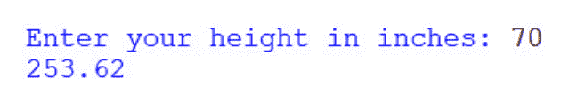

但有时我们希望代码做更多事情。让我们移除那个`print`命令，并创建一些条件。在接下来的几行中，我们将使用提供的值进行一些比较。例如，我们可以要求计算机为我们检查一些事情。有三种可能性：

- 我们的身高可能正好等于250美元
- 我们的身高可能少于250美元
- 我们的身高可能多于250美元

现在，我将要求计算机根据这些条件告诉我该怎么做。为此，我们需要一个`if-elif-else`语句。这些是我们将测试的条件，以获得更好的输出。我们将测试总和是否等于250美元。否则，如果总和小于250美元，我们将希望计算机做一些事情（那是我们的`elif`语句）。最后，在所有其他情况下，我们将使用`else`命令：

```
h=input("Enter your height in inches: ")
total = (int(h)/0.069)*0.25
total = round(total,2)
if total == 250:
    print("Your height in quarters is the same as $250.")
elif total > 250:
    total = str(total)
    print("Your height in quarters is more than $250. It is $" + total)
else:
    print("You're short, so choose the $250.")
```

让我们看看一些测试用例是什么样的。

首先，让我们使用69英寸的身高：

### 附加问题

在本节中，我们将探讨一些附加问题。对于*问题3*，我们将直接进入算法部分，因为本章前面已经讨论过该问题的其他步骤。接下来的两个问题也将包含完整的计算思维过程。

### 问题3 – 儿童足球派对

本章前面，我们曾为一个足球队策划派对，每个孩子的费用是12美元。我们当时指出，孩子的人数是未知的，因此我们使用变量*k*来表示这个未知量。我们还给出了一个数学算法，*T = 12k*，用于计算*k*个孩子的总费用*T*。现在，我们在这里增加一个条件。假设我们有200美元的预算，我们想知道总费用是超出、低于还是正好等于这个预算。

我们也可以用Python为这种情况编写一个算法：

```
k = int(input("How many children are coming to the party? "))
T = 12 * k
if T == 200:
    print("You are right on budget, at " + str(T))
elif T <= 200:
    print("You are under budget, at " + str(T))
else:
    print("You are over budget, at " + str(T))
```

让我们测试几个案例，以验证我们的代码是否正常工作：

```
How many children are coming to the party? 12
You are under budget, at 144
```

图2.5 – 案例1：12个孩子参加派对

很好！如果有12个孩子参加，我们的费用低于预算。那么，如果有20个孩子参加呢？让我们看看：

```
How many children are coming to the party? 20
You are over budget, at 240
```

图2.6 – 案例2：20个孩子参加派对

*我们的钱不够支付20个孩子的费用！*

如你所见，程序为我们提供了关于总费用以及是否超出或低于预算的信息。与任何算法一样，这并不是编写程序以获取此信息的唯一方式。尝试用不同的算法来解决这个简单的问题，或者自己添加一些条件并编写代码。练习添加条件将使你更熟练地设计和编写算法。

### 问题4 – 储蓄与利息

现在我们有一个新问题。一家银行按每月x%的利率支付复利。*如果你存入任意金额，几年后将获得多少支付？*

让我们**分解**这个问题。首先，我们知道利息是按月复利的。首先，我们来谈谈复利。投资的利息是在一定时期内支付的百分比。复利意味着每次支付的利息是基于初始金额加上累积的利息。复利是一种**模式**。事实上，存在一个计算它的公式。

我不知道的是银行支付的利率百分比、存款金额或存款年限。因此，我们需要编写一个程序来处理所有可能性。这就是**模式泛化**。我们所知道的是利息按月复利。实际上，有一个数学公式可以表示这一点：

A = P (1 + r / n) nt

让我们解释一下上述公式中的各项：

- *A* 是总金额
- *P* 是本金，即初始存款
- *r* 是利率（请注意，例如3%的利率应写为0.03）
- *n* 是每年复利计算的次数
- *t* 是存款未动用的年数

由于存在数学算法，我们现在可以使用这个公式为此创建一个程序。但是，我们需要确保运行程序的人知道我们要求的所有输入是什么。我们需要询问几件事：

- *存款金额是多少？*
- *银行支付的利率是多少？*
- *这笔钱将存多少年？*

我们知道公式中的*n*。这个*n*是12，因为这是按月复利。这意味着每年将复利计算12次。所以，*n* = 12。

现在是时候为此编写程序了：

```
P = float(input("How much are you planning on depositing? "))
r = float(input("At what monthly compound rate will it be paid out? "))
t = float(input("How many years will the money be deposited? "))
#Convert the rate to a decimal for the formula by dividing by 100
r = r/100
A = P * (1 + r/12)**(12*t)
A = round(A, 2)
print("Total after " + str(t) + " years: ")
print(A)
```

图2.7 – 复利计算示例程序

前面的截图展示了我们用于复利计算的Python程序。注意以#符号开头的注释。它说明我们需要转换利率以用于公式。否则，我们将得到错误的总金额。此外，我们在这里使用了`float`，因为我们需要使用小数。整数，即`int`，无法提供我们需要的信息。同时，我们将总金额四舍五入到两位小数。这是因为我们在谈论金钱时使用两位小数。*图2.7*所示算法的文本内容如下：

```
P = float(input("How much are you planning on depositing? "))
r = float(input("At what monthly compound rate will it be paid out? "))
t = float(input("How many years will the money be deposited? "))
#Convert the rate to a decimal for the formula by dividing by 100
r = r/100
A = P * (1 + r/12)**(12*t)
A = round(A, 2)
print("Total after " + str(t) + " years: ")
print(A)
```

使用复利算法中的代码，如果我们知道初始金额、利率和存款年限，我们就可以运行任何可能的复利计算实例。以下是在初始存款1,000美元、利率4.5%、存款10年的情况下，程序的输出：

```
How much are you planning on depositing? 1000
At what monthly compound rate will it be paid out? 4.5
How many years will the money be deposited? 10
Total after 10.0 years:
1566.99
```

图2.8 – 示例1：复利计算输出

如你所见，以4.5%的月复利利率存入1,000美元，10年后的总金额为1,566.99美元。

让我们再次测试这个程序。这次，我们将以3.5%的月复利利率存入5,000美元，为期20年：

```
How much are you planning on depositing? 5000
At what monthly compound rate will it be paid out? 3.5
How many years will the money be deposited? 20
Total after 20.0 years:
10058.51
```

图2.9 – 示例2：复利输出

20年后的总额将是10,058.51美元。*这意味着我们的钱翻倍了！*

拥有这个计算器程序，我们只能计算按月复利的利息。我们可以创建一个新程序来计算以任何利率复利的利息：按月、按年、按双月等等。你可以尝试修改代码来创建你自己的计算器。如果你想了解投资或储蓄存款的预期收益，这些程序会很有帮助。例如，你可以确定你的存款需要多长时间才能达到某个金额。假设你希望为孩子的大学教育准备50,000美元。在这种情况下，你可以计算出需要存入多少钱，才能在18年后（他们最可能上大学的时候）拥有这笔钱。

## 总结

在本章中，我们经历了计算思维的过程。我们学习了计算思维的四个主要要素：分解、模式识别、模式概括和算法设计。我们还了解到，计算思维中的问题并不总是明确定义的。我们需要自己解读和分解信息，以便找到模式。一旦我们找到模式并定义了我们想要概括的内容，我们就可以设计算法来解决问题。

我们还了解到，算法和解决方案并不是唯一的。对于我们遇到的每一个问题，都有多种编写算法的方法。计算思维过程使我们能够以多种方式探索问题，并创建符合我们自身解读和需求的解决方案。

在下一章中，我们将更深入地学习算法和算法思维，因为它们是所有计算思维问题的产物。为了更好地理解算法，我们将了解布尔运算符，并学习如何识别和处理逻辑处理中的错误。我们将为提出的问题编写算法，并分析给定算法中可能存在的处理错误。

# 3 理解算法和算法思维

在本章中，我们将更深入地关注理解算法和算法思维。虽然这是计算思维过程的最后一步，但理解算法思维如何帮助我们更好地规划和理解问题至关重要。也就是说，我们越多地练习算法设计和算法思维，当问题呈现给我们时，就越容易理解、分解和识别模式。

在本章中，我们将涵盖以下主题：

- 深入定义算法
- 设计算法
- 分析算法

阅读本章后，你将更好地理解算法。因此，我们将首先再次分析算法的定义，这在*第2章，计算思维的要素*中已经介绍过，以及如何设计数学和计算算法。

## 技术要求

本章使用的完整源代码可以从[https://github.com/PacktPublishing/Applied-Computational-Thinking-with-Python-Second-Edition/tree/main/Chapter03](https://github.com/PacktPublishing/Applied-Computational-Thinking-with-Python-Second-Edition/tree/main/Chapter03)下载。

## 深入定义算法

正如我们在*第2章，计算思维的要素*中提到的，**算法**只是一组指令。我们在日常生活中使用指令，有时是有意识的，有时是无意识的。想想你早上遵循的例行程序。闹钟响了。*接下来你做什么？你去准备咖啡吗？洗澡？还是先刷牙？*

我们大多数人每天早上都遵循相同的步骤。可以说我们已经*编程*自己去遵循这些步骤。现在想想你的日程安排改变、例行程序不同的时候。我知道我不得不多次停下来重新调整，因为我的*程序*不再适用。例如，我不能为了早上5点的航班在早上6点起床。但通过改变我的起床时间，我可能会打乱顺序，甚至可能忘记一些事情，因为我的程序不再按原来的方式工作。

计算机的算法与此类似，如果一组条件发生了变化，我们需要重新编程指令集。程序只能按照我们为它们设定的参数运行。大多数程序无法调整或适应任何未预先编码的新信息。话虽如此，**机器学习**和**人工智能**正在不断发展。虽然我们这里不讨论这类程序，但即使在那些情况下，我们仍然需要调整程序以完成我们需要它们做的事情。

为了设计算法，我们需要确保它们满足一些特定的特征。算法应该做到以下几点：

- 清晰且无歧义
- 具有明确定义的输入
- 具有明确定义的输出
- 具有有限性
- 是可行的
- 与语言无关

让我们看看前面列表中的每个特征并定义它们。

### 算法应该清晰且无歧义

当算法的每个步骤都能被轻松理解、易于定义，并且输入和输出也清晰且明确定义时，算法就是清晰且无歧义的。算法的每个组成部分也应该只有一个含义。请记住，虽然不是必需的，但为了使我们的算法清晰、易读且无歧义，我们可以添加注释，使其易于与之合作的人类阅读。请记住，注释将被编程语言本身忽略。

### 算法应该具有明确定义的输入和输出

算法的**输入**可以是用户提供的，这意味着程序的用户输入数据。输入也可以指在程序内部定义的内容。这意味着我可能包含一个已经提供了设定值的变量。

例如，如果我需要用户告诉我他们购买的票数，我可以编写算法来请求该输入。我也可以将该输入作为已经给定值的已定义变量提供。算法并不总是需要输入——零输入算法确实存在——但当算法需要输入时，定义该输入很重要。输入的一个例子是在程序中询问用户的姓名。想想现代电子游戏。许多游戏会提示用户输入姓名，例如：“你好，旅行者。你叫什么名字？”

作为用户，当收到这个提示时，我会输入**sofia**，这会给我以下内容：

```
"Hello Sofia. Welcome to the adventure!"
```

如你所见，游戏随后会产生一个使用我名字的输出。

这最后一行是程序的**输出**。我也可以用Python编写一个简单的程序来问这个问题：

```
name = input("Hello traveler. What is your name? ")
print(f"Hello, {name}. Welcome to the adventure!")
```

注意，我们定义了名字的变量，然后在`print`调用中的括号内使用了它。字符串前的`f`告诉程序我们想在该调用中使用一些值，括号中的值告诉它找到该变量的值。这里的语法就是我们所说的f-string。

运行时，程序如下所示：

```
Hello traveler. What is your name? Sofia
Hello Sofia. Welcome to the adventure!
```

这个简单的算法允许我们将名字保存为一个变量。该变量在这个简单代码的输出中只使用了一次。然而，在游戏中，该名字变量可能会在多个实例中使用，例如在与游戏内角色的对话中等等。

程序的**输出**是离开系统的信息，即你程序的产物。给定一些信息或代码，输出就是从程序中的指令产生的东西。但请注意，并非所有输出都是打印出来的。也就是说，程序输出可以是后台运行的东西。想想你电脑和游戏系统中所有在后台运行的程序。算法可以有数百个输出，有些可见，有些不可见。不可见输出的一个例子是当我们使用像`return True`这样的代码行时。这会将该输出保存为`True`，但不会向用户打印任何内容。可见的输出可以是图像、音乐、其他媒体等等。我们可以让程序做我们想做的几乎任何事情。这就是为什么编程如此有趣！

### 算法应该具有有限性

算法必须具有**有限性**。这意味着算法必须结束。让我们看一个算法不会结束的情况。*我不建议编写或运行这个！*尽管如此，让我们让我们看看创建这个算法需要采取的步骤：

1.  定义一个变量 i，并将其设置为等于 0：

```
i = 0
```

2.  将值增加 1。我们可以通过几种不同的方式来实现：

```
i = i + 1
i += 1
```

以上两行代码都会将 i 的值增加 1。

3.  引入一个错误！我们即将创建一个无限循环错误。再次说明，我这样做只是为了证明一个观点——这是你需要避免的错误：

```
i = 0
while i >= 0:
    i += 1
    print(i)
```

在这个算法中，我告诉程序只要 i 大于 0，就持续将其增加 1，计算机就应该打印该值。这将永远持续下去，永不停止，因为给定的条件将始终成立。因此，程序的输出将从 1 开始，但会继续打印序列中的下一个值：2、3、4、5，依此类推。程序根本无法结束。

现在，给定一些不同的条件，可以创建一个类似的程序。假设我们想打印所有加法的值，但仅当 i 小于 15 时：

```
i = 0
while i < 15:
    i += 1
    print(i)
```

上面的程序是一个可终止的程序。它现在仅在 i 小于 15（不包括 15）的所有值时有效。我们将得到如下所示的输出：

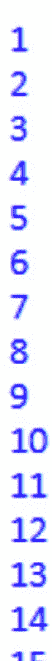

图 3.1 – 有限性代码的输出

我知道我说过这个程序不包括 15。它确实不包括。由于这发生在 i 小于 15 时，它将评估的最后一个值是 14。然而，它说的是当值小于 15 时，我们将其增加 1（i += 1）。所以，当 i 是 14 时，打印的值是 14 + 1，即 15。有限性允许程序终止。在编写包含多行代码和多个函数的程序时，记住这一点极其重要。记住要经常测试你的代码，否则，你可能会遇到有限性错误，而追踪它们有时可能很困难。经常检查你的代码将使你的调试过程容易得多，尤其是在处理有限性问题时。

### 算法应该是可行的

算法在其目标以及可用的内容和资源方面也必须是**可行的**。编写算法时，我们可能会在步骤中写入约束或条件。如果无法满足所有约束，那么该算法就不可行。考虑以下两个条件：

-   现在是下午 3:00。
-   现在是下午 5:00。

例如，如果我们对一个变量同时设置这两个约束，那是不可能的。它不可能同时是下午 3:00 和下午 5:00。这就是我们所说的**不可行**。虽然算法可以继续，但我们通过让这两件事同时成立制造了一个问题。有些约束永远无法满足，因此该算法被认为是不可行的。算法必须有一种满足所有约束的方法才能是可行的。此外，如果一个算法被编写为依赖于未来技术，例如，它也被认为是不可行的。

### 算法应该是语言无关的

最后，算法必须是**语言无关的**。算法中的指令集应尽可能简单地编写。一个好的算法应该能够轻松地用任何语言编写并产生相同的输出。

例如，我们以时间为例。我可以用英语说“It is 5:00 p.m.”。如果我用西班牙语写，那就是“Son las 5:00 pm.”。我们书写时间的方式可以轻松翻译，因为我们遵循全球通用的规范。别担心，我并不是忽视许多国家会使用 17:00 而不是下午 5:00。使用任一惯例都能让我们都知道现在是什么时间。算法也应该这样编写：它们应该能被任何人读懂。

在本节中，我们学习了算法及其设计所需的特性。牢记良好算法的特性将使我们能够避免错误，并为我们面临的任何问题创建可工作的算法。现在让我们看看如何设计一些算法。

## 设计算法

设计算法时，顺序很重要。在使用编程语言（包括 Python）时，我们必须考虑层次结构。可以将其视为数学中的运算顺序。如果你还记得，我们使用助记符 **PEMDAS** 来记住数学中的运算顺序。**PEMDAS** 代表 **Parentheses**（括号）、**Exponents**（指数）、**Multiplication/Division**（乘法/除法）和 **Addition/Subtraction**（加法/减法）。

我这样写 **Multiplication/Division** 是因为乘法和除法具有相同的权重。也就是说，乘法不一定需要在除法之前发生。如果我先进行除法，然后从左到右进行乘法，那么除法先发生。加法和减法也是如此。两者都没有比另一个更大的权重，所以我们按照从左到右的出现顺序执行它们。

请记住，这些只是我们在数学中使用的一些运算。它们通常被称为基本算术函数。我们将在 Python 和一般的编程中经常使用它们以及其他一些数学运算。

让我们为一个问题编写一个数学算法。我们将看一个食物场景中的算法。是的，我知道我经常写关于食物和食物算法的内容。我热爱食物几乎和我热爱代码一样多！

### 问题 1 – 办公室午餐

一家办公室正在为员工订购餐饮。员工有两个午餐选择：三明治或沙拉。每份三明治套餐花费 8.50 美元，而每份沙拉套餐花费 7.95 美元。

#### 办公室午餐数学算法

选择每个选项的员工人数未知。让我们使用一些变量来帮助我们设计数学算法。让我们用 *s* 表示三明治的数量，用 *b* 表示沙拉碗的数量。我知道你在想什么，如果你过一段时间再回到这个问题，这两个变量可能没什么帮助。但我们稍后会讨论这一点。现在，让我们写下我们的总成本 *c* 会是什么样子：

c = 8.5s + 7.95b

这是一个简单的数学问题，需要两个未知变量输入 *s* 和 *b* 来得到我们的总数 *c*。现在让我们看看同一午餐场景的不同版本。

#### 办公室午餐 Python 算法

现在让我们在编写程序时考虑更多因素。当我们为这个问题设计 Python 算法时，我们需要考虑两个视角：程序员和用户。

有时我们既是程序员/开发者，也是我们程序的最终用户，但很多时候，我们将为其他人编写或开发内容。我们必须牢记这些考虑因素，因为它可能会影响我们编写程序和定义变量的方式。此外，如果我们是作为公司的一部分编写程序，其他人可能需要在某个时候编辑我们的程序。

这意味着我们需要以其他人能够理解的方式编写程序。我们的变量应该易于理解，因此编写一个简单的单字母变量可能会让其他程序员或用户更难理解。让我们看看 *问题 1* 的一个程序。回想一下，在这个问题中，我们试图确定员工办公室午餐的最终成本，给定两个可能的选择：

-   三明治套餐 8.50 美元
-   沙拉套餐 7.95 美元

让我们使用 Python 为这个问题创建程序。首先让我们澄清一些变量。我们将希望使用完整的单词或一系列用 _ 分隔的单词来定义这些变量，而不是使用许多其他人可能无法理解的缩写。在开始之前，你可能想回顾一下，对于 **Python 变量**，需要遵循一些规则以避免引起错误：

-   变量必须以字母或下划线 (_) 开头
-   变量只能包含字母、数字和下划线
-   变量不能以数字开头
-   变量区分大小写（*alpha* 与 *Alpha* 或 *ALPHA* 不是同一个变量）

对于 *问题 1*，我们需要三个变量：

-   午餐的总成本
-   三明治套餐午餐的数量
-   沙拉套餐午餐的数量

现在我们需要为它们命名：

-   `total_cost` = 所有午餐的总成本
-   `number_of_sandwiches` = 订购的三明治套餐总数
-   `number_of_salads` = 订购的沙拉套餐总数

这里重要的是这些变量易于阅读和理解。我应该说明，我在编程时偏爱小写变量。我确实有一些例外情况，我喜欢使用大写字母，但你会看到许多例子只使用小写字母和下划线。我很早就发现，即使在我编写程序时大写字母对我来说有意义，我后来也会忘记哪些字母是大写的，这只是一个额外的麻烦，如果我只使用小写字母就可以避免。

这些约定有名称。例如，以 `books_are_awesome` 变量为例。该变量使用了我偏好的命名约定，称为 **snake_case**（蛇形命名法）。然而，你会看到另一个常用的命名约定，它将第一个单词之后的任何单词的首字母大写。所以 `books_are_awesome` 变成了 `booksAreAwesome`。这种命名约定称为 **camelCase**（驼峰命名法）。你会看到各种命名约定的例子，但我更喜欢 snake_case。

此外，一些程序员省略下划线，使用诸如 `numberofsandwiches` 或简单的 `sandwiches` 之类的变量。当然，这两种方式都是可以接受的，简单的 `sandwiches` 会使编写一些代码更容易。然而，这样做有优点也有缺点。如果其他人查看程序，可读性将很重要。就像我说的，我偏爱清晰的小写变量和使用下划线，但这取决于每个程序员自己做出选择。

既然我已经定义了变量，就可以开始编写程序了。*我需要向用户询问哪些信息呢？* 我需要用户输入三明治的数量和沙拉的数量。而我（以及用户）想要的输出是午餐的总费用。在Python中，要获取用户输入，我们需要使用`input`命令。然而，我们还需要记住，由于我们将在使用`float`数字（小数是浮点字符）的算法中使用这个数字，因此需要将提供的数字转换为`integer`或`float`。员工不能点半份沙拉，所以我们可以安全地将它们保存为整数，即`int`。提醒一下，Python中的注释以`#`符号开头。在IDLE中编写以下代码：

```
#Ask the user for the number of sandwich meals ordered and save as a variable.
number_of_sandwiches = int(input("How many sandwich lunches were ordered? "))
#Ask the user for the number of salad meals ordered and save as a variable.
number_of_salads = int(input("How many salad lunches were ordered? "))
#Create total_cost variable and save the algorithm for totaling the new variables.
total_cost = 8.50 * number_of_sandwiches + 7.95 * number_of_salads
#Print the total cost. Don't forget to convert the total_cost to string.
print("The total cost for the employee lunch is $" + str(total_cost) + ".")
```

运行代码时，用户可以输入办公室午餐各选项的数量。代码首先会询问用户三明治的数量，如下所示：

```
How many sandwich lunches were ordered?
```

然后代码会询问沙拉午餐的数量并提供总费用。以下示例输入了12份三明治午餐和23份沙拉午餐，总费用为284.85美元：

```
How many sandwich lunches were ordered? 12
How many salad lunches were ordered? 23
The total cost for the employee lunch is $284.85.
```

现在让我们从不同的角度来看一个类似的问题。

### 问题2 – 一家餐饮公司

假设你开了一家简单的餐饮公司。你最初只销售两种选择：一份8.50美元的三明治套餐和一份7.95美元的沙拉套餐。你可以创建一个程序，使用Python字典来存储这些选项。

你可以在*第9章，Python入门*中找到关于Python编程语言和字典的更多信息，但我们也在这里定义一下Python字典。当我们想要无序的项目、可以更改并且有索引时，就会使用字典。以下是我们餐饮公司的Python字典示例：

```
catering_menu = {
    "sandwiches": 8.50,
    "salads": 7.95
}
```

```
print(catering_menu)
```

字典很常见，并且由于多种原因非常有用：主要是它们易于阅读，并且提供了一种根据需要更改数据的方式。

打印时，字典代码如下所示：

```
{'salads': 7.95, 'sandwiches': 8.5}
```

既然你有了一个字典，让我们谈谈它对你的餐饮公司的用处。假设你的沙拉原料成本增加了，你想通过更改沙拉的价格来考虑这一点。你可以通过几种不同的方式来做到这一点。由于程序很短，你可以在原始程序中更改它，或者你可以根据键告诉程序你想要更改什么。这很重要，因为你现在可能只有两种商品在销售，*但当你的菜单选项选择范围变得更广时会发生什么？每次更改价格时，你都想搜索每个项目吗？* Python使得识别你想要更改的内容并进行更改变得容易。

为此，你可以使用以下代码：

```
catering_menu["salads"] = 9.50
```

你在Python中的新代码如下所示：

```
catering_menu = {
    "sandwiches": 8.50,
    "salads": 7.95
}
catering_menu["salads"] = 9.50
print(catering_menu)
```

打印时，沙拉的新值将显示：

```
{'salads': 9.5, 'sandwiches': 8.5}
```

*但是，如果你想添加一个菜单项会发生什么？* 假设你想添加一个3.75美元的汤选项。在这种情况下，你可以使用一行简单的代码将菜单选项添加到你的字典中，如下所示：

```
catering_menu["soup"] = 3.75
```

当你把所有内容放在一起时，初始代码和更改将如下代码块所示。请注意，你有初始字典，然后是下面的两个更改。当你打印字典时，它将包含所有更改以及添加的汤选项：

```
catering_menu = {
    "sandwiches": 8.50,
    "salads": 7.95
}
catering_menu["salads"] = 9.50
catering_menu["soup"] = 3.75
print(catering_menu)
```

现在你已经添加了**汤**项目，你可以打印你的字典来查看你的完整菜单：

```
{'soup': 3.75, 'salads': 9.5, 'sandwiches': 8.5}
```

我们可以使用字典中的信息来创建更强大的程序，例如在线菜单、点餐菜单选项等等。在本节中，我们学习了如何借助两个问题来设计算法。

我们将在本书的后续章节中，通过更多问题来研究使用Python进行更多开发，特别是在*第3部分，使用计算思维和Python进行数据处理、分析和应用*中。现在，我们将继续分析一些算法。

## 分析算法

正如本章前面提到的，当我们设计算法时，它们应该满足以下特征：

-   它们清晰且无歧义
-   它们有明确定义的输入
-   它们有明确定义的输出
-   它们具有有限性
-   它们是可行的
-   它们与语言无关

除了这些特征之外，当我们研究和分析算法时，我们希望确保问自己一些问题：

-   *这个算法是否做了我们想要的事情？*
-   *输出是否合理？*
-   *是否有另一种更清晰的方式来获取相同的信息？*

在分析算法时，我们可以问自己更多问题，但现在，让我们看一些算法解决方案，并根据上述特征和问题进行分析。

### 算法分析1 – 州和首府

一名学生创建了一个算法，其中包含美国各州及其首府的列表，但只包括她已经学习过的州。她的算法如下所示：

```
Ohio = "Columbus"
Alabama = "Montgomery"
Arkansas = "Little Rock"
print(Ohio)
```

这个程序很简单，但不容易使用，运行时也没有帮助。*它包含所需的信息吗？是的。我们能否以不同的方式组织它，以便以其他方式调用信息？是的。*

将州和首府视为键值对。我们可以使用字典来存储信息。你可能还记得本章前面的内容，字典可以通过添加一个新键和一行简单的代码轻松调整和修改。让我们首先将前面代码中的信息转换为字典：

```
state_capitals = {
    "Ohio" : "Columbus",
    "Alabama" : "Montgomery",
    "Arkansas" : "Little Rock"
    }
print(state_capitals["Ohio"])
```

请注意，我们现在只需给出州名就可以访问州首府的信息。此代码的输出就是**Columbus**。*但如果你只想运行程序并要求用户输入他们选择的州呢？* 我们也可以用一行代码和现有的字典来编写。看看下面的代码：

```
state_capitals = {
    "Ohio" : "Columbus",
    "Alabama" : "Montgomery",
    "Arkansas" : "Little Rock"
    }
state = input("What state's capital are you looking for today? ")
capital = state_capitals[state]
print("The capital of " + state + " is " + capital + ".")
```

在此代码中，用户输入他们想要查找首府的州。这很有帮助，因为你可以每次运行代码，而无需进入代码更改要打印的行，如*州首府算法2*所示。代码运行时如下所示：

```
What state's capital are you looking for today? Alabama
The capital of Alabama is Montgomery.
```

现在让我们看看算法最初的需求。学生希望继续向程序添加州。使用这个基于字典的程序，当她需要添加另一个州时，只需添加一行代码即可。例如，如果她想添加**Iowa**州，其首府是Des Moines，她需要使用以下代码：

```
state_capitals["Iowa"] = "Des Moines"
```

看看下面的代码块。注意代码在程序中的位置。重要的是我们将新代码放在新变量之前，否则，如果你尝试运行程序并输入**Iowa**，代码将返回错误，而不是提供Iowa的首府。

在算法中，逻辑至关重要。我们不能使用尚未定义的值，也不能使用已经用过的变量。也就是说，如果在确定爱荷华州的新值之前就使用了`state`和`capital`变量，那么当输入是爱荷华州时，代码会以错误结束。但是，如果我们在这两个变量运行之前添加键值对，代码就能按预期运行：

```
state_capitals = {
    "Ohio" : "Columbus",
    "Alabama" : "Montgomery",
    "Arkansas" : "Little Rock"
}
state_capitals["Iowa"] = "Des Moines"
state = input("What state's capital are you looking for today? ")
capital = state_capitals[state]
print("The capital of " + state + " is " + capital + ".")
```

如你所见，我们可以调整和修改代码以更好地满足我们的需求。现在让我们看几个算法，来判断它们是否有效；也就是说，它们是会产生错误还是能正常运行。

### 算法分析 2 – 终止还是不终止？

正如我们在本章前面讨论的，算法应该是可终止的。也就是说，它们必须有一种结束的方式，否则可能会导致许多错误。让我们看一个算法并分析它是否会终止：

```
x = 0
while x >= 3:
    x += 1
print(x)
```

首先，让我们看看`x`变量的值。`x`变量以值0开始程序。`while`循环（它规定了`x`值变化的条件）表明，当`x`值大于3时，它会增加1。

这个算法会终止，因为它会打印变量的原始值，0。然而，这个算法没有执行任何操作，因为条件永远不会满足。另外，请注意`print`命令没有缩进。如果它被缩进，这个算法将不会产生任何输出，因为`print`命令永远不会被调用，因为变量永远不会满足`while`循环的条件。

现在让我们看看下面的算法：

```
j = 0
while j >= 0:
    j -= 1
    print(j)
```

在这种情况下，变量条件被满足，因为j必须大于或等于0程序才能运行。一旦条件满足，变量的值就会减少1，所以`print`命令将输出-1。代码不会运行第二次，因为变量的值不再大于或等于0。这个算法是可终止的，产生输出，并且是可行的。

最后，让我们看看下面这个改变了条件的算法：

```
j = 0
while j <= 0:
    j -= 1
    print(j)
```

在这种情况下，算法不是可终止的。因为我们把`while`循环改成了小于或等于0，这个算法现在将永远运行下去。

分析算法可能非常复杂。我们才刚刚开始触及算法的一些组成部分。随着我们在本书中深入探讨其他计算思维问题，我们需要牢记优秀算法的特征，以便有效地分析我们的代码。同样重要的是，我们要继续考虑计算思维过程的要素：**分解**、**模式识别**、**模式概括**和**算法设计**。

当我们设计和测试算法时，利用优秀算法的特征将使我们能够观察错误、调整算法以方便使用、提供更好的输入和输出，并确保我们不会创建不可行且不终止的算法。

## 总结

在本章中，我们讨论了算法的定义，它是一组允许计算机完成某个过程并提供一些输出的步骤。我们介绍了算法的特征。

我们根据问题场景设计了算法，然后分析算法以确定它们是否满足正常运行所需的特征。理解算法的特征以及算法的工作原理，可以使我们创建的算法比不了解这些特征时产生的错误少得多。注意我说的是*更少*的错误。

在处理代码时，错误是不可避免的。我们难免会犯错，意外地引入错误或使某些代码无限循环。理解优秀算法的特征可以让我们减少这些错误，即使我们无法在日常工作中完全消除它们。

在下一章中，我们将学习更多关于逻辑推理的知识。在本章中，我们将讨论逻辑的定义，学习归纳推理和演绎推理，增加我们对运算符和布尔逻辑的了解，并了解更多关于逻辑错误的知识。我们将运用计算思维的要素和算法的特征来加深我们对逻辑推理的理解。

# 4 理解逻辑推理

在本章中，我们将探索逻辑推理过程，例如条件语句、算法推理和布尔逻辑。在深入探讨一些逻辑运算符之前，我们将先探索归纳推理和演绎推理。

此外，我们将研究如何使用逻辑来编写算法，以解决计算思维问题。

在本章中，我们将涵盖以下主题：

- 理解逻辑推理的重要性
- 使用布尔逻辑和运算符

在解决计算思维问题时，逻辑推理是必要的。我们都知道编程代码是按线性顺序执行的。想象一下我们有10行代码。如果我们不应用逻辑推理，代码会一行一行地读取——它读取第一行，然后是第二行，依此类推直到最后一行。使用逻辑推理允许我们在继续之前进行比较，返回到之前的代码行，等等。在本章中，我们将学习逻辑推理，以创建使用逻辑运算符高效解决问题的算法。

为了理解逻辑推理，我们将首先定义一般的逻辑，然后讨论在设计和编写算法时如何使用逻辑。

## 技术要求

你可以在 [https://github.com/PacktPublishing/Applied-Computational-Thinking-with-Python-Second-Edition/tree/main/Chapter04](https://github.com/PacktPublishing/Applied-Computational-Thinking-with-Python-Second-Edition/tree/main/Chapter04) 找到本书的代码文件。

## 理解逻辑推理的重要性

在我们学习*第3章，算法和算法思维*的过程中，我们学习了如何在解决计算思维问题时设计一些基本算法。

在本节中，我们将理解逻辑推理的重要性，以及如何借助例子应用不同类型的逻辑推理。

在编写算法时，我们需要使用逻辑推理来创建这些算法。

简单来说，**逻辑推理**是为得出结论而遵循的一系列步骤。在计算思维中，当我们设计算法时，我们遵循的系统性步骤是算法的一部分。计算机读取这些算法的方式取决于我们如何编写该算法。有两种类型的逻辑推理论证，如下所示：

- 归纳推理
- 演绎推理

在我们更深入地定义这些之前，让我们看看为什么逻辑推理如此重要，以及为什么在创建算法时顺序很重要。

为了分析问题并提供帮助我们解决问题的算法，我们首先需要理解什么是逻辑推理。逻辑对一些人来说可能令人生畏，但我们每天都在潜意识地使用它。

让我们看一个简单的例子。假设你每天早上洗澡然后去上班。那么，你会在洗澡前穿好上班的衣服吗？不会，因为那完全说不通。从逻辑上讲，你必须在穿上上班的衣服之前先洗澡。现在，我在这里跳过了很多步骤，但这些步骤是合乎逻辑的。逻辑的其他例子包括遵循食谱和在下雨时（或不下雨时）使用雨伞。

在本章中，我们将围绕逻辑推理和使用**逻辑运算符**设计算法展开讨论。逻辑运算符允许程序做出决策。我们在日常生活中也在使用它们，只是没有意识到。例如，如果天气晴朗温暖，我们可能想去骑自行车，但如果天气晴朗寒冷就不想去了。这里的“和”就是一个逻辑运算符。

在做决定时，我们会考虑很多事情。在计算思维中，特别是在算法设计中，我们需要考虑这些事情，并为程序提供一种测试条件的方法。我们将在本章后面更深入地探讨逻辑运算符。现在，让我们更仔细地看看逻辑推理的类型以及如何应用它们。

## 应用归纳推理

当我们谈论归纳推理时，我们实际上是在逆向工作。归纳推理从一个可能为真也可能不为真的结论开始，然后逆向工作，使用现有数据创建代码。让我们先看一个简单的问题。

### 解决一个归纳推理的示例问题

我们有150美元的预算用于购买用品：艺术铅笔和橡皮。艺术铅笔每支1.75美元，橡皮每个1.50美元。

请记住，在计算思维中，我们首先分解问题，然后识别模式，接着概括该模式，最后创建算法。那么，让我们来识别这个模式。

让我们看看目前已知的信息，并命名一些变量：

- 总预算是150美元
- 艺术铅笔的成本是每支1.75美元
- 橡皮擦的成本是每个1.50美元
- 让我们用变量 $p$ 表示铅笔的数量
- 让我们用变量 $n$ 表示橡皮擦的数量

请记住，当我们进入算法阶段时，我们可能想要重命名这些变量。但目前，由于我们将首先查看数学算法，我们将保留这些简单的变量。

我们可以用一个不等式来完成。为什么是不等式而不是等式？因为我们的总花费可能不完全是150美元，但它不能*超过*150美元，因为那是我们所有的钱。

因为这是一个简单的问题，我们一步就识别并概括了这个模式。

所以，铅笔的数量乘以单价加上橡皮擦的数量乘以单价小于或等于150美元：

$$1.75p + 1.50n \leq 150$$

现在让我们来谈谈算法设计。也许这是我经常购买的东西，因为我开设艺术课程。我将使用这个场景。也许我的雇主最多给我150美元，但根据我之前使用的情况，我可能需要更多的铅笔而不是橡皮擦，反之亦然。因此，我需要一个可以在每个学期初使用和重复使用的程序。这是我问题的一部分吗？不，这是一个定义不明确的问题。所以，我正在根据一组特定的需求调整问题。简而言之，我正在定义我想要解决的问题。

#### 重要提示

> 作为归纳和演绎推理困境的一个旁注，理解条件语句（例如我们在编程中经常使用的 *if/then* 语句）通常与演绎推理相关联，这一点很重要。我们可以深入探讨它们是否可以是归纳的，但事实是，归纳推理问题将使用演绎推理。我们将在本章的下一节深入探讨演绎推理陈述。

所以，我希望程序问我想要多少支铅笔，或者让它问我想要多少个橡皮擦。这完全取决于情况！让我们看看程序应该为我们做什么。以下步骤向我们展示了这一点：

1.  询问你的输入将是铅笔还是橡皮擦。
2.  根据提供的输入选择要使用的不等式。
3.  确定在给定输入的情况下，可能的铅笔或橡皮擦数量。
4.  给出铅笔和橡皮擦数量的总成本。

请注意，一如既往，在Python中有很多方法可以得到相同的答案。虽然其中一些程序比我通常展示的要长，但由于我们同时学习计算思维和Python编程，展示易于理解的步骤很重要。

对于这个特定的程序，我们需要导入数学函数以便向下取整。为什么我们需要这样做？嗯，我们不能购买部分橡皮擦和铅笔，只能购买整支铅笔和整个橡皮擦。所以，如果程序说我们可以购买19.5支铅笔，这实际上意味着我们只能购买19支铅笔。

`math.floor()` 函数允许我们使用这个简单的函数将数字向下舍入到19。我们将在本书中继续探讨更多的 `math` 函数。在结束这个快速话题之前，你应该知道Python中的 `math` 模块具有与C语言函数对齐的内置函数。

让我们回到问题上。看看下面编写的程序：

```python
#We need the math module, so don't forget to import it.
import math
#Ask the user if they will input pencils or erasers first.
item1 = input("Will you be entering pencils or erasers? ")
if item1 == "pencils":
    pencils = int(input("How many pencils will you purchase? "))
    if pencils * 1.75 < 150:
        pencilstotal = pencils * 1.75
        total = 150 - pencilstotal
        total = total / 1.50
        erasers = math.floor(total)
        total2 = pencilstotal + erasers * 1.50
        print("You will be able to purchase " + str(pencils) + " pencils and " + str(erasers) + " erasers for a total cost of $" + str(total2) + ".")
    else:
        print("That's too many pencils.")
elif item1 == "erasers":
    erasers = int(input("How many erasers will you purchase? "))
    if erasers * 1.50 < 150:
        eraserstotal = erasers * 1.50
        total = 150 - eraserstotal
        total = total / 1.75
        pencils = math.floor(total)
        total2 = pencils * 1.75 + eraserstotal
        print("You will be able to purchase " + str(pencils) + " pencils and " + str(erasers) + " erasers for a total cost of $" + str(total2) + ".")
    else:
        print("That's too many erasers.")
else:
    print("Please run the program again and enter erasers or pencils as your input.")
```

请记住，前面的程序将按顺序（顺序地）运行代码行。因此，如果用户首先输入 `erasers`，那么第一个 `if` 语句和嵌套的 `if` 语句将被忽略。如果用户首先输入 `pencils`，那么算法将从第一个 `if` 语句正常运行，并经过剩余的条件。以下是程序按顺序执行的操作：

1.  它询问用户输入他们是购买铅笔还是橡皮擦。
2.  如果用户输入铅笔，那么程序会询问他们将购买多少支铅笔。然后，它计算他们可以负担得起的橡皮擦数量。
3.  如果用户输入的铅笔数量过多，他们会收到一条消息，表明他们负担不起该数量。
4.  如果用户输入橡皮擦，那么程序会询问他们将购买多少个橡皮擦，然后计算用户可以负担得起的铅笔数量。
5.  如果用户输入的橡皮擦数量过多，他们会收到一条消息，表明他们负担不起该数量。
6.  如果用户既没有输入铅笔也没有输入橡皮擦，他们会收到一条消息，要求重新运行程序并输入这两个选项之一。

前面的内容是一个过度简化的归纳推理问题。一些归纳推理问题会要求你查看数据，做出一些可能的结论，然后编写一个程序来测试这些结论。在学习逻辑推理的过程中，我们本质上是在训练自己观察决策以及如何以一种程序可以返回我们所寻找的输出的方式来处理它们。

这里需要注意的是，看待问题和准备解决方案的方法有多种。虽然我更喜欢决策树和流程图，但其他程序员和开发者更倾向于数学化地工作。还有一些人喜欢用简单的句子和/或段落写下程序需要做什么。这个过程的重点是让我们创建一个能够产生必要输出，并且对程序员、开发者以及运行它的计算机来说都易于遵循逻辑的程序。

现在，让我们来看看演绎推理。

## 应用演绎推理

我们现在进入本章专注于演绎推理的部分。即使在我还是数学学生的时候，我也发现演绎推理引人入胜。我很快了解到，数学教会我们如何在几何中逻辑地遵循论证，我爱上了所有与逻辑和真值表相关的东西。

逻辑是通过证明以及归纳和演绎推理来教授的。真值表帮助我们分析条件。在真值表中，有些东西是假设的。例如，一个陈述要么为真，要么为假。另一个陈述为真或为假。这些陈述的组合取决于这些陈述是真还是假。

好吧，这有点复杂。在我继续解释演绎推理之前，让我们看一个快速的真值表及其包含的逻辑过程。

当我刚开始编码时，真值表至关重要。它们帮助我理解编码过程以及如何处理条件。并非每个程序员或编码员都使用这些表格，但我觉得它们很有帮助，即使没有在决策过程中明确使用。让我们现在看一个。

假设我们有一个陈述或条件 p，并且该条件为真。假设我们有另一个陈述或条件 q，并且它也为真。在真值表中，我们使用符号 ¬ 表示 NOT。所以，¬ p 为假，¬ q 也为假。这是因为如果 p 为真，那么 NOT p 就不是真，换句话说，就是假。符号 ∧ 用于 AND，所以 p AND q 写作 p ∧ q。符号 ∨ 用于 OR，所以 p OR q 写作 p ∨ q。以表格格式，我们的真值表如下所示：

| p | q | ¬p | ¬q | p ∧ q | p ∨ q | ¬p ∧ q |
|---|---|---|---|---|---|---|
| True | True | False | False | True | True | False |
| True | False | False | True | False | True | False |
| False | True | True | False | False | True | True |
| False | False | True | True | False | False | True |

图 4.1 – 真值表

分析真值表并理解所有可能的条件可能需要时间，但这个过程类似于我们在为问题编写算法时进行逻辑推理的过程。现在，让我们更仔细地看看演绎推理。

让我们首先定义什么是演绎推理。**演绎推理**是从一个陈述或假设推导出结论的过程。因为演绎推理是我们大部分在算法设计中使用的，我们需要定义一些与之相关的术语。

让我们从条件语句开始。

## 了解条件语句

**条件语句**是 if/then 语句。以下是使用条件语句的一些逻辑论证：

- 如果下雨，那么我会用伞
- 如果我喝水，那么我就不会渴
- 如果我的狗需要出去，那么它会站在门边

- 如果一个四边形有四个直角，那么它就是一个矩形。

以上所有陈述都是条件语句的例子。陈述的第一部分称为**假设**。陈述的第二部分是**结论**。在陈述*如果下雨，那么我会用伞*中，假设是*下雨*，结论是*用伞*。我们在假设和结论中不包含*如果*或*那么*。

在Python中，正如你在*应用归纳推理*部分的示例中看到的，我们在编写算法时经常使用`if/then`语句。以下是我们Python中使用的一些逻辑语句：

- `if`：使用`if`语句时，我们询问一个条件是否满足，然后根据该条件的真假执行某些操作。
- `if-else`：使用`if-else`语句时，我们测试一个条件并执行某些操作，但如果该条件不满足，那么我们执行其他操作。
- `if-elif-else`：使用`if-elif-else`语句时，我们有一个条件；如果不满足，我们测试另一个条件——即`else if`（`elif`）条件。否则，我们执行其他操作。

以上所有语句都可以嵌套。我可以测试一个条件，然后另一个，再然后另一个。我可以在`if`和`else`之间有多个`elif`语句，等等。让我们看一些例子。

### if语句

让我们看一个只使用一个`if`语句的程序：

```
number = int(input("What's your favorite number? "))
if number < 100:
    print("That's not a very large number.")
```

现在，上面的代码是一个简单的程序，只检查一个条件。我们可以添加条件来测试`number`是否等于100。如果`number`大于100，我们可以再添加一个，等等。在这种情况下，我们只关心`number`是否小于100。

如果我们输入数字53，我们将得到以下输出：

```
What's your favorite number? 53
That's not a very large number.
```

如果我们输入数字100，我们根本不会得到任何消息，程序将结束：

```
What's your favorite number? 100
```

如你所见，程序没有任何内容可添加。条件不满足，所以它结束了。这就是为什么`if-else`语句会派上用场。

让我们看看前面的算法，并添加一个`else`语句。前面的程序只检查提供的数字是否小于100。如果我们添加一个`else`语句，我们可以为所有大于或等于100的数字在屏幕上打印其他内容。看看下面的程序：

```
number = int(input("What's your favorite number? "))
if number < 100:
    print("That's not a very large number.")
else:
    print("I guess you like large numbers.")
```

前面的程序现在无论用户输入什么数字都会打印出一条消息。让我们再次测试100：

```
What's your favorite number? 100
I guess you like large numbers.
```

如你所见，100被包含在大数字类别中，因为我们的条件是数字小于100。这意味着100不包含在条件中。测试条件是我们在Python中得出结论的方式。我们编写从程序本身或用户输入收集信息的算法。然后，它测试条件以做出决策。

下面的图表显示了`if-else`决策的流程图。在查看`if-elif-else`语句和嵌套语句时，我们将查看额外的流程图：

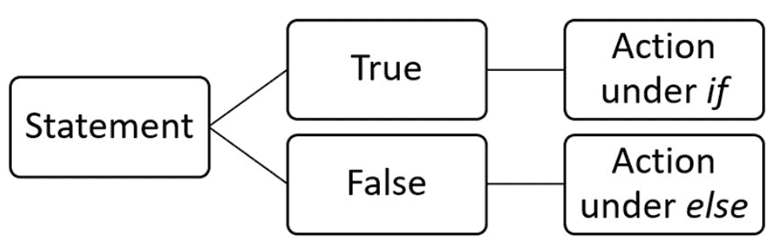

如上图所示，这是一个二元决策。该语句将被测试以检查它是**真**还是**假**。如果**真**，则发生一个动作；否则，发生另一个动作。对于我们的数字程序，如果数字小于100，则打印一条消息；否则，屏幕上打印另一条消息`I guess you like large numbers`。现在，让我们添加多个条件。

### if-elif-else语句

`if-elif-else`语句是多条件语句的简化——也就是说，你可以有多个`elif`语句。如前所述，`elif`代表else if。让我们稍微改变一下我们的程序。我们将允许用户输入一个1到20之间的数字。以下是我们将编程算法执行的操作：

1.  要求输入一个1到20之间的数字。
2.  测试数字是否在1到10之间并打印一条消息。
3.  测试数字是否在11到20之间并打印一条消息。
4.  打印一条错误消息。

让我们看看如何编程实现这一点。在编写此算法之前，我们需要记住几件事。为了轻松检查1到10之间的数字，我们需要检查数字是否小于10。这意味着10不包括在内。

我们的`elif`语句将检查小于21的数字，因为它只包含我们尚未测试的数字。也就是说，如果用户输入12，第一个条件不满足，所以它移动到第二个条件。是的，这将包括所有小于21的数字，但请记住，如果数字小于10，它已经满足了一个条件，程序会打印正确的消息。

最后，如果条件不满足，我们需要让用户知道他们输入的数字不在1到20之间。以下程序演示了这一点：

```
number = int(input("Pick a number between 1 and 20. "))
if number < 10:
    print("That's less than 10.")
elif number < 21:
    print("That's between 10 and 20.")
else:
    print("That number isn't between 0 and 20. Run the program and try again.")
```

让我们尝试用一个小于10的数字来测试这个。如果我们用数字8运行程序，我们看到以下输出：

```
Pick a number between 1 and 20. 8
That's less than 10.
```

如果我们用数字10运行程序，我们看到以下输出：

```
Pick a number between 1 and 20. 10
That's between 10 and 20.
```

最后，如果我们用数字21运行程序，我们看到的是：

```
Pick a number between 1 and 20. 21
That number isn't between 0 and 20. Run the program and try again.
```

如你所见，每个条件都为我们提供了该给定条件的答案。以下是`if-elif-else`语句的流程图：

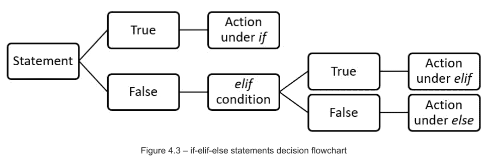

图4.3 – if-elif-else语句决策流程图

如上图所示，`elif`只是提出了一个新的测试。如果**真**，我们遵循算法中的操作。如果**假**，我们继续执行`else`语句。也就是说，我们可以有多个`elif`条件。这意味着我们可以继续一个接一个地测试条件，除非并且直到我们达到一个`else`语句。

## 理解嵌套语句

我们在Python中使用的另一种逻辑语句与嵌套语句有关。在嵌套条件中，只有当前一个`if`语句为**真**时，才会执行嵌套的`if`语句。通过一个例子更容易理解。让我们回到我们的`if-elif-else`语句，并添加一些嵌套条件。我们之前要求用户给出一个1到20之间的数字。现在，假设我们想使用以下代码进一步细分条件：

```python
number = int(input("Pick a number between 1 and 20. "))
if number < 10:
    if number < 6:
        print("Why such a small number?")
    else:
        print("Well, less than 10 but greater than 5. I'll take it.")
elif number < 21:
    if number < 16:
        print("You like values that are greater than 10, but not too much greater. I guess that's fine.")
    else:
        print("I like larger numbers myself too.")
else:
    #Sometimes we make mistakes when providing input in programs. If you choose a number that's not between 0 and 20, the program will print this message.
    print("That number isn't between 0 and 20. Run the program and try again.")
```

在上面的代码片段中，代码在每次我们输入不符合指南的数字时都有消息。例如，请求的输入在1到20之间。*但是，如果用户输入0或21，或者另一个不在该范围内的数字会怎样？* 那么，`print()`语句提供一条消息，要求用户再次运行程序。

在这种情况下，你可以看到我们有`if`语句、`elif`语句、嵌套的`if`和`else`语句等等。让我们看几个测试用例，测试一些条件，看看我们的程序说什么：

- 当我们输入4时，看到以下输出：

选择一个1到20之间的数字。4
为什么是这么小的数字？

- 当我们输入**6**时，会看到以下内容：

选择一个1到20之间的数字。6
嗯，小于10但大于5。我接受这个。

- 当我们输入**11**时，会得到：

选择一个1到20之间的数字。11
你喜欢大于10的值，但又不是大太多。我想这没问题。

- 当我们输入**18**时，会得到以下输出：

选择一个1到20之间的数字。18
我自己也喜欢较大的数字。

从前面的测试用例可以看出，根据程序中给出的条件，我们有更多的输出。虽然这是一个简单的数字程序，但在解决更复杂的问题时，我们可以使用类似的逻辑。

假设你经营一家在线商店。用户对商品的选择将用于类似的算法，尽管这些算法要复杂得多。算法会测试各种条件，例如所选商品、所选数量等，以应用总价、优惠券等等。这就是为什么逻辑和逻辑推理在编程中如此重要。

现在，如前所述，我们使用的逻辑处理可能因程序员而异。然而，无论偏好如何，在编写算法时，逻辑推理和逻辑处理都是绝对必要的。我们不是直接开始编写，而是处理问题，审视决策过程，考虑需要执行哪些步骤，然后设计算法。这个逻辑过程对于创建有效的算法至关重要。在本书中，我们将继续探讨逻辑推理，分析问题，即使我们没有明确说明。

在本节中，你学习了逻辑推理及其两种类型——归纳推理和演绎推理。我们还学习了在编码时会派上用场的条件语句。

我们编写的一些算法可以使用布尔逻辑和运算符来简化，这就是我们下一节要探讨的内容。

## 使用布尔逻辑和运算符

布尔逻辑指的是运算符，即Python中的`and`、`or`和`not`。你会记得在本章前面关于真值表的简要讨论中见过这些。正如我们接下来将看到的，在编写算法时，我们使用相同的逻辑处理，即使这些表格没有被明确陈述或使用。在解决计算思维问题时，我们有时需要同时满足多个条件。让我们先用语言来探讨一下。

让我们对一些水果进行分类。如果水果是圆形的，并且是橙色、绿色或黄色，它将被分到`第1组`。如果水果不是圆形的，但是橙色、绿色或黄色，它将被分到`第2组`。如果水果不符合任何这些要求，它将被分到`第3组`。让我们简化这些分组：

- `第1组`：圆形 且 （橙色 或 绿色 或 黄色）
- `第2组`：非圆形 且 （橙色 或 绿色 或 黄色）
- `第3组`：所有其他水果

我知道我首先陈述了圆形条件。但如果你看看`第1组`和`第2组`，水果都需要针对这些颜色进行测试——也就是说，如果颜色条件不满足，水果是否是圆形就不重要了：它会被分到`第3组`。所以，对于算法，我会这样写：

1. 测试水果是否是橙色、绿色或黄色。
2. 如果是，测试是否是圆形，并分到`第1组`或`第2组`。
3. 如果不是，分到`第3组`。

所以，如果我们有一个橘子，它将属于`第1组`。如果我们有一根香蕉，它将在`第2组`。如果我们有草莓，它将在`第3组`。

现在，如果我们要编写这个程序，我们需要确保已经添加了水果的特征，以便我们可以对它们进行测试。我们将在本书的后续章节中探讨类似的内容，但目前，为了简化一些学习，我们将创建一个类似的算法，但使用数字。

在我们继续深入之前，让我们快速看一下Python中的基本运算符：

| 运算符 | 描述 |
| --- | --- |
| + | 加法运算符 |
| - | 减法运算符 |
| * | 乘法运算符 |
| / | 除法运算符 |
| // | 整数除法运算符 |
| % | 取模运算符（可整除性；结果是余数） |
| == | 等于 |
| != | 不等于 |
| < | 小于 |
| > | 大于 |
| <= | 小于或等于 |
| >= | 大于或等于 |

图4.4 – Python基本运算符

当我们进入*第2部分，应用Python和计算思维*并更深入地探讨Python编程语言时，我们将更深入地研究这些运算符。然而，对于下一个算法，我们需要使用其中一些运算符。首先，让我们看看`and`运算符。

### and运算符

为了更好地理解`and`运算符，最好看一个数学算法。让我们请求一个数字，并测试该数字是否大于100且是2的倍数。要测试一个数字是否是2的倍数，我们使用**取模运算符（mod）**。在Python中，`mod`的符号是`%`。

所以，看代码，如果`number % 2 == 0`，那么这个数字能被2整除。如果`number % 2 == 1`，那么它不能被2整除。我们使用等于（`==`）运算符或不等于（`!=`）运算符来完成这些条件：

```
number = int(input("Give a number between 1 and 200. "))
if number > 99 and number % 2 == 0:
    print("That's a large, even number.")
elif number > 99 and number % 2 != 0:
    print("That's a large, odd number.")
elif number < 100 and number % 2 == 0:
    print("That's a small, even number.")
else:
    print("That's a small, odd number.")
```

现在，我知道我们已经讨论了编写算法的不同方法。*这个算法我需要使用AND运算符吗？*可能不需要。我本可以只用嵌套语句、`if-elif-else`语句等来编写。一些测试用例和算法结果如下所示：

- 当我们输入**104**时，会看到以下输出：

Give a number between 1 and 200. 104
That's a large, even number.

- 当我们输入**80**时，会看到以下输出：

Give a number between 1 and 200. 80
That's a small, even number.

- 当我们输入**31**时，会得到以下输出：

Give a number between 1 and 200. 31
That's a small, odd number.

从前面的测试用例可以看出，程序测试了我们的用例，并根据满足的条件提供打印消息。现在，让我们看看`or`运算符。

### or运算符

正如我们在本章前面的水果示例中看到的，我们检查了水果的颜色是否是橙色、绿色或黄色。这就是`or`运算符的工作方式。我们检查一个条件或另一个条件。这一次，我们将看一些`True`和`False`语句。假设变量`A`是`True`，变量`B`是`False`。在这个特定情况下，这些值既是关键字也是布尔值。如果我们使用`or`运算符来检查`A`或`B`的结果，那么我们的答案将是`True`。

*为什么是这样？*因为无论如何，结果要么是`True`，要么是`False`，这是一个`True`语句。困惑吗？逻辑可能会让人困惑。让我们在下面的程序中测试`A and B`以及`A or B`，以帮助你可视化这一点：

```python
A = True
B = False
C = A and B
D = A or B
if C == True:
    print("A and B is True.")
else:
    print("A and B is False.")
if D == True:
    print("A or B is True.")
else:
    print("A or B is False.")
```

现在，我添加了一些条件，这样我们就能得到打印输出，你可以看到我陈述的逻辑是正确的，但我们不需要做所有这些。我们本可以直接打印`C`和`D`。

当我们运行这个程序时，结果是：

```
A and B is False.
A or B is True.
```

如你所见，**A and B**是**False**，因为其中一个语句是**False**，这意味着整个表达式是**False**。**A or B**是**True**，因为其中一个是**True**，所以条件为**True**。现在，让我们看看最后一个运算符（目前）：**not**运算符。

### not运算符

**not**运算符让我们测试事物的相反情况。所以，如果**A**被设置为**True**，那么**not A**就是**False**。就这么简单。让我们通过以下代码看几个例子：

```python
A = True
B = False
print(not A)
print(not B)
print(not (A and B))
print(not (A or B))
```

从前面的代码中，我们已经讨论了这里的第一条打印语句。因为**A**是**True**，所以**not A**是**False**。对于第二条**print**语句，我们期望结果是**True**，因为**B**是**False**。现在，我们之前做了**A and B**和**A or B**语句。我们知道**A and B**是**False**，所以**not (A and B)**是**True**。我们也知道**A or B**是**True**，所以**not (A or B)**是**False**。

让我们看看程序打印的内容：

- 对于**not A**，它打印以下内容：

False

- 类似地，对于**not B**，它打印以下内容：

True

- 另外，对于**not (A and B)**，它打印以下内容：

True

- 最后，对于**not (A or B)**，它打印以下内容：

False

在本节中，你学习了一些布尔运算符。使用布尔运算符，我们可以编写算法来为我们测试用例，并根据这些用例提供输出。如前所述，程序将根据我们在算法中编写的指令运行。

通过使用这些运算符编写算法，我们可以确保条件仅在我们希望它们应用的情况下应用。我们不必让程序在错误的条件下运行，而是可以包含语句和提示来帮助产生正确的结果。例如，如果距离的输入意外地输入为负数，布尔语句本可以检查条件并在程序中为用户提供反馈，然后再次运行。使用布尔运算符可以提供清晰的逻辑过程，并允许更好、更清晰的算法。

既然我们已经了解了基本运算符，那么同样重要的是我们也要了解错误，这将是第5章“错误”第一节的重点。在创建算法时，我们会犯错，尤其是逻辑错误，因为我们可能忘记考虑所有可能的情况。因此，重要的是要关注如何在算法设计中识别和解决它们，以及将其作为审查算法的一个步骤。

## 总结

在本章中，我们讨论了归纳推理和演绎推理、逻辑推理、逻辑运算符和布尔逻辑。正如我们所讨论的，大多数算法设计都属于演绎推理。我们学习了如何使用语句，如 `if`、`if-else` 和 `if-elif-else`，以及嵌套语句来编写测试条件的程序。

通过本章的学习，你现在能够更好地使用逻辑推理编写算法。你也具备了在设计和规划算法时应用归纳和演绎推理的理解，并在算法中使用布尔逻辑和运算符。

在下一章中，我们将深入探讨在编写算法时可能遇到的逻辑错误和其他类型的错误。你将学习如何通过识别可能的错误（如缩进错误、条件错误和公式错误）来测试算法中的错误。你还将了解不同类型的错误、用于调试的控制台消息等。

# 5 错误

我们现在将更全面地了解错误，它们是什么，我们可能遇到的错误类型，在解决问题时可能收到的错误消息，以及如何调试我们的问题。错误分析是编程中持续进行的一部分，我们有时花在查找和修复错误上的时间比创建初始代码的时间还要多。熟悉错误和调试极其重要，因为完美的代码，尤其是第一次尝试时，是不存在的。

在本章中，我们将涵盖以下主题：

- 理解错误
- 学习识别逻辑错误
- 错误和调试

## 技术要求

以下是本书中使用的完整源代码：[https://github.com/PacktPublishing/Applied-Computational-Thinking-with-Python-Second-Edition/tree/main/Chapter05](https://github.com/PacktPublishing/Applied-Computational-Thinking-with-Python-Second-Edition/tree/main/Chapter05)。

## 理解错误

我们之前已经一般性地讨论过错误；在这里，随着本书中额外内容的推进，我们也将包含一些额外的讨论。但此时，回顾一些更多的错误示例将很有帮助，特别是与以下内容相关的错误：

- **语法错误**：这些错误是由拼写错误、缺少标点符号等造成的。
- **逻辑错误**：这些错误发生在代码“正确”运行但结果与我们的预期不符时。
- **类型错误**：这些错误发生在我们尝试使用一种类型的值（如字符串）时，但期望的值是整数或浮点数，反之亦然。

让我们先看看语法错误，但随后我们将用更大的篇幅来讨论逻辑错误。最后，我们将以调试的讨论作为结束。

### 语法错误

这些错误可能相当容易识别，Python 为我们提供了一些控制台消息来帮助我们。让我们看一个简单的数学程序：

```
import random
randomNumber = randomrandint(0, 10)
print(randomNumber)
```

在这种情况下，我想要打印一个 `randomNumber`。但当我尝试执行代码时，我收到以下消息：

```
NameError: name 'randomrandint' is not defined
```

这很不幸，因为我知道我正在寻找的是一个随机整数。但如果我仔细看，我在 `random` 和 `randint` 之间漏掉了一个句点。进一步剖析这段代码，让我们谈谈为什么我们一开始要导入 random。Python 本身非常基础。为了从中获得更多功能，我们使用库。在这种情况下，我想使用 random 库，以便我可以使用 `randint`，从而获得一个介于 0 和 10 之间的随机数。当我们导入一个库时，我们获得了更多选项的访问权限。我们将在本书中使用更多的库，但这个库允许我获得一个随机整数。

另一件我们应该注意的事情，即使你可能已经熟悉，那就是当我们导入一个库时，我们需要告诉 Python 我们何时使用它，添加一个句点，然后告诉 Python 我们想使用库中的什么。因此，要获得一个随机数，我们需要使用库 random，添加一个句点，然后告诉它获取一个随机整数。因此，代码 `random.randint(0, 10)` 需要在 random 之后有一个句点。“从库 `random` 中，使用 `randint` 获取一个介于 0 和 10 之间的随机数。”

修复那个错误后，我们得到以下代码：

```
import random
randomNumber = random.randint(0, 10)
print(randomNumber)
```

现在我们的输出应该是一个随机生成的数字。在我的例子中，我得到了数字 3。

现在，你可能注意到我为这么简单的事情写了很多代码。是的，我创建了一个变量。那是因为我可能稍后会在一个函数中使用这个数字。但假设我只需要一个随机数一次，那么我可以简化代码如下：

```
import random
print(randomrandint(0, 10))
```

这段代码将与上面那段代码做完全相同的事情。唯一的区别是我不能稍后将其用作另一个函数或表达式中的值，因为我没有将值保存为变量。

现在这是我们的原始代码，但这次我们将在另一个表达式中使用这个变量。

```
import random
randomNumber = random.randint(0, 10)
newNumber = randomNumber * 3
print(newNumber)
```

我尝试运行这段代码，得到了另一个错误。这是我收到的信息：

```
NameError: name 'randomnumber' is not defined. Did you mean: 'randomNumber'?
```

现在，这非常有帮助。它甚至给了我一个关于我应该使用什么的建议。Python 在提供这些细节方面已经变得好多了！在以前的版本中，我们会收到一个模糊的错误消息，我们必须解读可能出了什么问题。但现在我可以看到我在第3行的 randomNumber 中忘记了将 Number 大写。修复这个问题将使代码能够运行。

在*第4章，理解逻辑推理*中，我们也讨论了演绎推理和归纳推理。那些我们在编程中经常使用的 if-else 语句。有时，正是在那里，我们可能会因为忘记括号、冒号、句点和逗号而制造很多问题。

让我们看一个例子，再次基于前面的程序。

```
import random
randomNumber = random.randint(0, 10)
newNumber = randomNumber * 3
if newNumber > 10:
    print("Excellent, you're in the double digits.")
else
    print("You've fallen short of double digits.")
```

在这种情况下，我得到了另一个错误。Python 说：

```
expected ':'
```

有帮助，特别是如果你在 IDLE 环境中工作，Python 会高亮显示你期望有冒号的那一行，如*图 5.1*所示。

```
import random
randomNumber = random.randint(0, 10)
newNumber = randomNumber * 3
if newNumber > 10:
    print("Excellent , you're in the double digits.")
else:
    print("You've fallen short of double digits.")
```

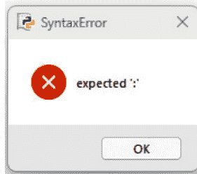

图 5.1 – 语法错误

但一旦我们修复了那个错误，我们的代码就会运行，显示的消息将取决于 **newNumber** 的值。由于我们生成一个随机数来执行该计算，我们无法知道最终结果是两位数还是个位数。

现在让我们看看**类型错误**。当程序期望一种类型但得到另一种类型时，就会发生这些错误，例如，你需要一个 `int` 但你有一个 `str`。让我们看一个包含错误的代码片段。

ch5_typeError

```
number = input("Write a number between 1 and 10. ")
print(10 / number)
```

在这种情况下，我们收到一个 TypeError，如下所示。

```
Traceback (most recent call last):
  File "C:/Users/.../Chapter 5/ch5_typeError.py", line 3, in <module>
    print(10 / number)
TypeError: unsupported operand type(s) for /: 'int' and 'str'
```

发生这种情况的原因是输入被假定为字符串。所以我试图用一个字符串去除一个数字。Python 不将该字符串识别为整数，因此我们必须在代码本身中进行更改，程序才能运行。

ch5_typeError2

```
number = input("Write a number between 1 and 10. ")
print(10 / int(number))
```

现在我们应该能够得到一个数字响应，因为类型匹配了。所以我们的程序可以无问题地运行。

现在让我们继续看一些额外的错误。

### 学习识别逻辑错误

在我们过多讨论逻辑错误之前，先谈谈为什么要注意它们很重要。在 Python 中，并非所有错误都会导致程序失败或崩溃。有些逻辑错误会让程序完全运行，既不会崩溃，也不会向用户发出错误提示。这些错误很难识别。

以下是一些可能给我们带来麻烦的逻辑错误，但请记住，有很多方法会让我们在程序中意外引入逻辑错误：

- 在方程或语句中使用了错误的变量
- 使用了错误的运算符来测试条件
- 在检查条件时使用了错误的缩进

我最常犯的错误是混淆变量，但我也经常在缩进上出错。通常，当我尝试运行程序时，这些错误更容易被发现，因为程序在某些情况下可能无法运行。

让我们看一个简单的算法，其中包含一个公式错误。在第一个算法中，目标是计算从餐厅购买多份薯条（每份1.50美元）后的总成本：

```
number = int(input("Type the number of fries you are ordering: "))
cost = 1.50
total = number * number
print("Your total cost is $" + str(total) + ".")
```

如果我们运行前面的程序，程序将毫无问题/错误地运行，并为12份薯条显示以下输出：

```
Type the number of fries you are ordering: 12
Your total cost is $144.
```

现在，如果我们仔细看，会意识到12份薯条的成本144美元太高了。这是因为我们的算法中有一个错误。算法应该包含 `total = cost * number` 公式，如下所示：

```
number = int(input("Type the number of fries you are ordering: "))
cost = 1.50
total = cost * number
print("Your total cost is $" + str(total) + ".")
```

现在我们已经修正了公式，输出是正确的：

```
Type the number of fries you are ordering: 12
Your total cost is $18.0.
```

如你所见，对于每份1.50美元的12份薯条，18.0美元看起来合理得多。

公式中的错误可能很难发现，特别是如果程序在没有错误提示的情况下运行。如果我们有一个包含多个公式的大型算法，找到这些错误可能会变得繁琐且耗时。对此最好的建议是，在你能测试的每一步都测试你的算法。这样，发现错误就变成了一个更简单的任务。

现在让我们看一个测试条件时的错误。与公式错误类似，条件测试中的错误可能很难发现，因为程序可能无论如何都会运行：

```
number = int(input("Give a number between 1 and 200. "))
if number > 99 and number % 2 == 0:
    print("That's a large, even number.")
elif number > 99 and number % 2 != 0:
    print("That's a large, odd number.")
elif number < 100 or number % 2 == 0:
    print("That's a small, even number.")
else:
    print("That's a small, odd number.")
```

在前面的代码中，算法中有一个错误，导致我们在输入某些奇数时得到错误的反馈。看看第二个 `elif` 语句。那个 `or` 会产生错误。

如果我们运行这个程序，会得到一个输出。让我们用数字99来运行它：

```
Give a number between 1 and 200. 99
That's a small, even number.
```

现在，这里的问题是99不是偶数。在算法的某个地方，我们在条件中引入了一个错误。在这种情况下，我们使用了 `or` 而不是 `and` 运算符：

```
elif number < 100 or number % 2 == 0:
    print("That's a small, even number.")
```

一旦我们将 `or` 替换为 `and`，我们就可以再次运行程序：

```
number = int(input("Give a number between 1 and 200. "))
if number > 99 and number % 2 == 0:
    print("That's a large, even number.")
elif number > 99 and number % 2 != 0:
    print("That's a large, odd number.")
elif number < 100 and number % 2 == 0:
    print("That's a small, even number.")
else:
    print("That's a small, odd number.")
```

使用99作为输入，我们得到以下输出：

```
Give a number between 1 and 200. 99
That's a small, odd number.
```

使用98作为输入运行程序，我们得到以下结果：

```
Give a number between 1 and 200. 98
That's a small, even number.
```

如你所见，除非我们仔细留意，否则我们可能会错过条件和逻辑运算符中的错误。因为程序能够在算法中存在这些错误的情况下运行，所以捕捉到我们究竟在哪里犯了错误，比处理那些导致程序停止运行的错误更难。

最后，让我们看一个使用相同条件测试代码的缩进错误。这次，添加了一个缩进错误，我们有以下代码：

```
number = int(input("Give a number between 1 and 200. "))
if number > 99 and number % 2 == 0:
    print("That's a large, even number.")
elif number > 99 and number % 2 != 0:
    print("That's a large, odd number.")
    elif number < 100 and number % 2 == 0:
        print("That's a small, even number.")
else:
    print("That's a small, odd number.")
```

在这种情况下，我们无法运行程序。第二个 `elif` 语句缩进不正确。当我们尝试运行程序时，会得到一个 `Invalid Syntax` 错误消息。点击消息上的 **OK** 会将我们带到代码处，缩进错误被高亮显示，如下图所示：

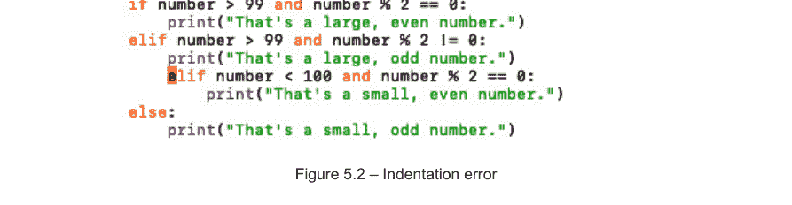

注意 `elif` 语句下方的 `print()` 代码缩进也不正确。一旦我们修正了这两个错误，我们就可以像本章前面那样运行代码了。

在我们的算法中引入错误是一个常见的错误。从前面的例子可以看出，识别某些错误可能很难，因为程序可能像没有问题一样运行，那是因为这些是逻辑错误，它们可能很难追踪。现在我们将看一些更多不同错误的例子以及如何调试它们。

### 错误和调试

我将从给你一些建议开始这一节：有时，一个 bug 的最佳解决方案很难找到。如果找不到，就休息一下。有时只需要暂时离开你的代码。如果你只是走开，有时你可以在5分钟内解决你盯着看了几个小时的问题。这并不总是有效，但它非常有帮助。

现在让我们看一些有 bug 的代码。

```
ch5_buggyCode1.py

import random
for i in range(0, 10):
    n = random.randint(0, 5)
    print(in)
```

让我们尝试执行这个程序。我得到了一个 SyntaxError！它只高亮了我的 i。为什么这是无效语法？我只是想得到 i 和 n 的乘积。但问题在于，在 Python 编程中，将字母放在一起并不意味着乘法。那是某些数学家的做法。由于我在转行之前当了十多年的数学老师，我经常犯这个错误。错误如图5.3所示。

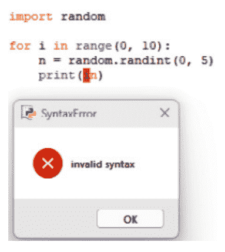

为了修复这段代码，我们需要让 Python 知道我们想要乘以这些值，所以我们在 i 和 n 之间使用符号 *。让我们看看修复后的代码。

```
ch5_buggyCode1_solution.py

import random
for i in range(0, 10):
    n = random.randint(0, 5)
    print(i*n)
```

现在我们已经修复了问题，可以看看我们的输出。

```
0
0
8
12
8
0
24
28
16
27
```

如你所见，使用随机数意味着结果也总是随机的。

现在让我们看一个逻辑错误的例子。

#### ch5_buggyCode2.py

```
firstNumber = int(input('Enter a number between 1 and 3: '))
secondNumber = int(input('Enter a number between 8 and 15: '))
sum1 = firstNumber + secondNumber
print("I predict your number is less than 19, in this case", sum1)
```

这是一个特别隐蔽的有 bug 的代码。逻辑有问题。是的，总和绝对应该小于19。但问题是，我们没有对用户输入不在提供范围内的数字的情况做出任何规定。我们也没有说明端点是否包含在内，但我们说了“之间”。也就是说，如果输入的最大数字是3和15，我们应该总是得到一个小于19的数字。然而，由于我们没有对超出该范围的输入做出任何规定，我们最终可能会得到如下结果。

```
Enter a number between 1 and 3: 5
Enter a number between 8 and 15: 19
I predict your number is less than 19, in this case 24
```

不，这不是我预测的。程序不配合。所以，让我们看看如何解决这个问题。

首先，我们需要检查接收到的输入是否在提供的范围内。

我们有变量 `firstNumber`，它应该在1和3之间。我们假设它是包含端点的，所以数字应该是1、2或3。

在这种情况下，我们可以使用条件语句来让我们得到正确的数字，或者至少让用户知道他们需要重新开始！

让我们看一个可能的解决方案。

#### ch5_buggyCode2_solution.py

```
firstNumber = int(input('Enter a number between 0 and 3: '))
if(firstNumber < 4):
    secondNumber = int(input('Enter a number between 8 and 15: '))
    if(secondNumber > 7 and secondNumber < 16):
        sum1 = firstNumber + secondNumber
        print("I predict your number is less than 19, in this case", sum1)
    else:
        print("Run this again and pay attention to the numbers!")
```

## 6

## 探索问题分析

在本章中，我们将深入探讨问题分析，同时运用我们之前学到的一些知识，例如逻辑推理、布尔逻辑和算法设计。本章我们将逐步讲解问题的定义、分解和分析。

本章将涵盖以下主题：

- 理解问题定义
- 学习如何分解问题
- 分析问题

为了更深入地理解问题，我们需要审视一个更复杂的问题并对其进行定义，以便开始算法设计过程。在本章中，你将学习如何定义问题并将其分解以设计算法。在此过程中，你还将了解 Python 中的字典。阅读本章后，你将能够运用计算思维过程来设计和创建解决复杂问题的算法。

## 技术要求

以下是本章将使用的完整源代码：
https://github.com/PacktPublishing/Applied-Computational-Thinking-with-Python-Second-Edition/tree/main/Chapter06。

## 理解问题定义

正如我们在第 2 章《计算思维的要素》中所讨论的，计算思维使用四个要素来解决问题：

- **问题分解**：这是分解数据的过程
- **模式识别**：这是寻找相似性或模式的过程
- **抽象**：这个要素涉及对模式进行概括
- **算法设计**：这是我们定义解决问题指令集的地方

在本节中，为了更深入地了解如何分析问题，我们将分析一个更大的问题，并逐步讲解创建算法所需的步骤。要能够创建算法，我们必须分析问题并确定我们试图解决的是什么——也就是说，*我们的算法是为了解决什么？* *为什么我们需要构建它？* 审视问题的分解，然后定义我们需要什么，最终将为我们提供一个更好的算法。

我们将在下一节中逐步解决一个问题。

### 问题 6A – 构建一个在线商店

让我们来看以下问题。你正在开设一家在线商店。它处于起步阶段，但你将提供三种不同类型的物品。它们是钥匙链、水瓶和 T 恤。对于这个特定问题，我们将经历一个三步流程：

1.  **做出假设。**
2.  **需要考虑的事项。**
3.  **构建字典**

我们将在接下来的章节中探讨上述步骤。

#### 做出假设

让我陈述一些关于这家商店的假设，我们将使用这些假设：

- 这是一家为客户提供物品以分享给其客户的公司。
- 每件物品都可以有标志和/或个性化信息，例如姓名、电子邮件和电话号码。

现在，我们将进入下一节，即关于需要考虑的事项。

#### 需要考虑的事项

现在，让我们来看一些在开始处理算法之前你需要考虑的事项：

- *这些物品是个性化的吗？*
- *个性化是按字符、行还是按物品收费？*
- *价格是固定的，还是当客户批量购买时会变化？*
- *如果客户订购多种类型的物品，会有折扣吗？*
- *每件物品的基础价格是多少？*

前面的要点并不是我们可以讨论的唯一问题，但它们是我们在分解问题时将开始审视的问题。

在我们这样做之前，让我们谈谈如何将每件物品的信息包含在程序中。你可能还记得第 3 章《理解算法和算法思维》，我们可以使用 **Python** 中的字典来保存我们的物品菜单。在这种情况下，我们有钥匙链、水瓶和 T 恤。

#### 构建字典

在我们审视这个问题带来的复杂性并分解这些信息之前，我们可以构建一个字典。我们可以让字典中每件物品的价格是基础价格（不包含任何定制或折扣的价格），如下所示：

- 每个钥匙链的成本：$0.75
- 每件 T 恤的成本：$8.50
- 每个水瓶的成本：$10.00

现在，让我们构建字典。请记住，你可以不用字典来完成此操作，但创建字典允许你在以后需要时更新定价。你也可以创建函数来解决这个问题。我们在这个问题中使用逻辑和字典。以下代码向你展示如何构建字典：

ch6_storeDictionary.py

```
online_store = {
    "keychain": 0.75,
    "tshirt": 8.50,
    "bottle": 10.00
}
print(online_store)
```

从前面的代码片段中，请记住 `print()` 函数在这里不是必需的，但我经常使用它来确保在继续构建算法时代码正常工作。另外，请注意变量名——`keychain`、`tshirt` 和 `bottle`——已被简化。

输出将如下所示：

```
{'keychain': 0.75, 'tshirt': 8.5, 'bottle': 10.0}
```

输出向我显示每个变量的价格都已正确保存。我使用那个 `print` 函数来测试我的字典，并确保在我开始处理从该字典中获取所需内容之前它能正确运行。

这在我们编写代码并在代码的多个区域重用变量时对我们有所帮助。拥有这些简单且易于识别的变量将使我们能够在不引入错误的情况下更改和添加算法。

在本节中，我们了解到问题分析和定义有助于我们确定如何最好地设计解决方案。请记住，当我们审视问题时，我们在编写算法之前和算法内部使用的定义对于我们的设计和最终产品至关重要。现在，让我们看看问题的分解。

else:
    print("Run this again and pay attention to the numbers!")
```

看看第一个条件语句。我们验证数字是否小于 4。（我不处理负数，但如果我们在现实世界中需要这段代码，我们绝对应该记住它们。）现在，如果提供的数字小于 4，并且仅当数字小于 4 时，程序才会询问下一个数字的输入。如果任何一个数字不符合要求，程序会告诉用户注意并结束。但现在，如果用户遵循提示，我们可以得到一个更好的“预测”。

```
Enter a number between 0 and 3: 2
Enter a number between 8 and 15: 9
I predict your number is less than 19, in this case 11
```

太棒了！我在这个程序中预测结果相当准确！

但如果用户不遵循指示，程序会告诉他们重新运行！

```
Enter a number between 0 and 3: 1
Enter a number between 8 and 15: 5
Run this again and pay attention to the numbers!
```

哎呀，猜他们得回去重新开始了。

#### 重要提示

此代码解决方案不允许重新输入信息。这是因为我们目前刚开始学习其中的一些内容。你稍后会看到类似的例子，它们也要求输入，但如果输入不在参数范围内，它会向用户显示一条消息，以便他们可以重新输入新的数字。程序可以是简单的或复杂的，几乎每件事都有不同的方法。这只是为了展示逻辑错误如何给我们带来意想不到的结果。

正如你所看到的，我们又看了两个例子，一个语法错误和一个逻辑错误。有时这些错误很容易找到，但有时则不然。修复可能是一行简单的代码，也可能是相当多行使用条件语句、循环或条件语句和循环组合来修复错误的代码。

你将有机会观察更多的错误，但请始终记住，即使是运行的代码也可能有错误。有时它们很容易找到，而其他时候，逻辑错误不仅难以发现，而且难以识别、找到和修复。

## 总结

在本章中，我们学习了逻辑错误以及如何识别它们。我们进行了错误调试，并学习了如何阅读控制台消息。我们还了解到，有些错误不会被 Python 注意到，控制台消息的帮助程度各不相同，错误和调试只是编程和计算思维过程中必要的一部分。我们学习了验证我们的程序并经常测试它们是多么重要。

通过本章的学习，你现在能够更好地使用逻辑推理编写算法。你现在也能够通过识别可能的错误（如缩进错误、条件错误和公式错误）来测试你的算法是否存在错误。

在下一章中，我们将更深入地探讨问题分析，使用计算思维要素来分解问题，以便我们可以创建有意义且有用的算法。

## 学习如何分解问题

当我们分解问题时，我们是在确定算法需要为我们提供什么。最终用户需要看到无缝的体验。请看*图6.1*中的流程图；这是一个基本的决策流程图，帮助我们设计算法。

让我们先做另一个假设——即，如果用户输入超过10件，价格会更低。在这种情况下，我们只处理小于10或大于等于10的情况。但是，如果你需要进一步细分，可以添加更多情况，例如：

- 小于等于10
- 大于10且小于等于50
- 大于等于50

你可以根据需要设置任意多的情况。对于这个算法，我们将保持两种情况，因为我们还需要包含个性化成本，并且不希望创建过于复杂的算法。

下图展示了该算法的流程图：

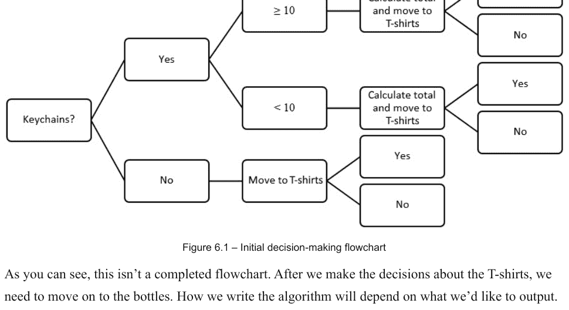

如你所见，这不是一个完整的流程图。在我们对T恤做出决策后，需要继续处理瓶子。我们如何编写算法将取决于我们希望输出什么。目前，我们向用户提供的是他们在你创建的在线商店结账时会看到的信息。

在下一节中，我们将使用前面的流程图来创建一个算法。

### 将流程图转换为算法

*图6.1*中的图表让我们能够审视编写算法时的决策过程。在编写算法时，我们需要关注以下关键点：

- **字典和输入**：输入可以在算法内部或由用户输入；字典在算法内部构建。这意味着要使用字典，我们必须在算法中先定义它，然后才能使用。
- **成本**：这是每件商品的基础成本。
- **个性化成本**：这是在基础成本上额外添加的。

现在，让我们详细看看前面的要点。

### 构建字典并提供输入

在添加任何复杂性之前，让我们看看如何获取每件商品的价格并将其用作基础价格。我们需要统计每种商品的数量。以下代码展示了如何实现：

```
ch6_storeQuantities.py

online_store = {
    "keychain": 0.75,
    "tshirt": 8.50,
    "bottle": 10.00
}
keychain = online_store['keychain']
tshirt = online_store['tshirt']
bottle = online_store['bottle']
choicekey = int(input("How many keychains will you be purchasing? If not purchasing keychains, enter 0. "))
choicetshirt = int(input("How many t-shirts will you be purchasing? If not purchasing t-shirts, enter 0. "))
choicebottle = int(input("How many water bottles will you be purchasing? If not purchasing water bottles, enter 0. "))
print("You are purchasing " + str(choicekey) + " keychains, " + str(choicetshirt) + " t-shirts, and " + str(choicebottle) + " water bottles.")
```

从前面的代码片段中，请注意我们将变量添加在字典下方。这将在后面派上用场。这些变量被命名为**choicekey**、**choicetshirt**和**choicebottle**。命名变量使我们能够随时返回并根据需要更改代码。在这种情况下，每个变量都请求运行程序的人员输入，以获取他们订购的钥匙链、T恤和瓶子的数量。同样，有多种方法可以解决这个问题，但我们使用目前所学的知识来创建一个算法解决方案。

当我们运行前面的代码，输入3个钥匙链、0件T恤和10个水瓶时，输出如下：

```
How many keychains will you be purchasing? If not purchasing keychains, enter 0. 3
How many t-shirts will you be purchasing? If not purchasing t-shirts, enter 0. 0
How many water bottles will you be purchasing? If not purchasing water bottles, enter 0. 10
You are purchasing 3 keychains, 0 t-shirts, and 10 water bottles.
```

如你所见，我们有一个程序，它接收用户输入，然后向用户确认他们为每件商品所做的选择。

现在，让我们考虑成本。

### 修改成本

现在，让我们添加成本的变化。假设一位顾客购买超过10件商品。更新后的成本如下：

- 钥匙链：0.65
- T恤：8.00
- 水瓶：8.75

为了实现前面的更改，我们可以让程序更新成本差异，如下所示：

```
ch6_storeCost.py

online_store = {
    "keychain": 0.75,
    "tshirt": 8.50,
    "bottle": 10.00
}
choicekey = int(input("How many keychains will you be purchasing? If not purchasing keychains, enter 0. "))
choicetshirt = int(input("How many t-shirts will you be purchasing? If not purchasing t-shirts, enter 0. "))
choicebottle = int(input("How many water bottles will you be purchasing? If not purchasing water bottles, enter 0. "))
print("You are purchasing " + str(choicekey) + " keychains, " + str(choicetshirt) + " t-shirts, and " + str(choicebottle) + " water bottles.")
if choicekey > 9:
    online_store['keychain'] = 0.65
if choicetshirt > 9:
    online_store['tshirt'] = 8.00
if choicebottle > 9:
    online_store['bottle'] = 8.75
keychain = online_store['keychain']
tshirt = online_store['tshirt']
bottle = online_store['bottle']
print(online_store)
```

现在我们已经更新了代码，我想打印出我的进度，以确保代码正常工作并且更改生效。在编写代码时，打印有助于确保我们正在实现目标，但当我们完成算法并确认它们正确工作时，我们可以并且应该删除那些不属于我们希望用户看到的输出部分的打印命令。在这种情况下，我想确保如果总数大于10，成本会更新。（当顾客订购超过10件某商品时，它会将每件商品的成本更新为较低的成本。）前面代码的输出如下：

```
How many keychains will you be purchasing? If not purchasing keychains, enter 0. 10
How many t-shirts will you be purchasing? If not purchasing t-shirts, enter 0. 14
How many water bottles will you be purchasing? If not purchasing water bottles, enter 0. 10
You are purchasing 10 keychains, 14 t-shirts, and 10 water bottles.
{'keychain': 0.65, 'tshirt': 8.0, 'bottle': 8.75}
```

如你所见，字典已根据用户提供的总数更新了值。

现在，我们需要继续提供成本。我们可以提供每件商品的总成本、整个购买的总成本，或者两者都提供（让我们两者都提供）。请看以下代码片段：

```
ch6_storeTotals.py

keychain = online_store['keychain']
tshirt = online_store['tshirt']
bottle = online_store['bottle']
print("You are purchasing " + str(choicekey) + " keychains, " + str(choicetshirt) + " t-shirts, and " + str(choicebottle) + " water bottles.")
```

我们添加了前面的代码片段，以便有一个`print`语句来确认用户的输入。通过在代码末尾打印该语句，我们正在检查程序是否能正确读取数字以及用户是否输入了正确的数字。

让我们继续编写代码并添加每件商品的成本：

```
ch6_storeTotals.py

totalkey = choicekey * keychain
totaltshirt = choicetshirt * tshirt
totalbottle = choicebottle * bottle
grandtotal = totalkey + totaltshirt + totalbottle
print("Keychain total: $" + str(totalkey))
print("T-shirt total: $" + str(totaltshirt))
print("Water bottle total: $" + str(totalbottle))
print("Your order total: $" + str(grandtotal))
```

前面代码片段末尾的`print`语句提供了每件商品小计以及整个订单总计的明细。在询问所有商品的输入后，代码随后打印每件商品成本的小计。前面代码的结果如下：

```
How many keychains will you be purchasing? If not purchasing keychains, enter 0. 10
How many t-shirts will you be purchasing? If not purchasing t-shirts, enter 0. 7
How many water bottles will you be purchasing? If not purchasing water bottles, enter 0. 14
You are purchasing 10 keychains, 7 t-shirts, and 14 water bottles.
Keychain total: $6.5
T-shirt total: $59.5
Water bottle total: $122.5
Your order total: $188.5
```

现在我们有了没有个性化的商品总计，我们需要能够考虑个性化成本（如果订购了的话）。

在下一节中，我们将了解什么是个性化成本，以及在继续之前我们需要做出的决策。

### 添加个性化功能

目前，我们将钥匙链、T恤和水瓶的个性化选项限制为二元问题——即用户是否需要个性化。我们暂不考虑您可能见过的分级成本。如果想添加分级选项，您需要做出更多决策，例如选择字体的成本、个性化内容的长度等。我们暂时跳过这些，但您可以自由修改代码以处理这类定制需求。让我们为个性化功能添加另一个假设：

- 钥匙链每件加收$1.00
- T恤每件加收$5.00
- 水瓶每个加收$7.50

我们需要创建上述条件，然后在变量中实现它们。让我们分部分查看代码。以下文件（`ch6_storePersonalize.py`）包含我们将要分解的各个部分。

回想一下，我们的算法首先询问用户购买的商品数量。以下代码片段考虑了用户输入的个性化选项：

```
ch6_storePersonalize.py

perskey = input("Will you personalize the keychains for an additional $1.00 each? Type yes or no. ")
perstshirt = input("Will you personalize the t-shirts for an additional $5.00 each? Type yes or no. ")
persbottle = input("Will you personalize the water bottles for an additional $7.50 each? Type yes or no. ")
if perskey == ("yes" or "Yes"):
    online_store['keychain'] = online_store['keychain'] + 1.00
if perstshirt == ("yes" or "Yes"):
    online_store['tshirt'] = online_store['tshirt'] + 5.00
if persbottle == ("yes" or "Yes"):
    online_store['bottle'] = online_store['bottle'] + 7.50
keychain = online_store['keychain']
tshirt = online_store['tshirt']
bottle = online_store['bottle']
totalkey = choicekey * keychain
totaltshirt = choicetshirt * tshirt
totalbottle = choicebottle * bottle
grandtotal = totalkey + totaltshirt + totalbottle
```

前面的代码片段询问用户关于个性化的二元问题。获取输入后，代码根据用户输入做出一些决策，并定义了`keychain`、`tshirt`和`bottle`变量以及选择的总价。接下来的代码片段使用这些总价来打印每个购买商品的信息以及最终总价：

```
print("Keychain total: $" + str(totalkey))
print("T-shirt total: $" + str(totaltshirt))
print("Water bottle total: $" + str(totalbottle))
print("Your order total: $" + str(grandtotal))
```

从前面的代码中，请注意`keychain`、`tshirt`和`bottle`变量是在所有基于总数和个性化的定制之后定义的。请记住，在算法设计中，顺序很重要。如果我们在程序中更早地定位这些变量，后续的条件（如个性化）将不会影响这些变量。

因此，为了能够获得变量所需的所有信息，我们需要在定义影响它们的某些条件（如定制）之后定义它们。查看前面的代码，注意变量的位置。您可以随意修改代码，更改变量的定义位置，看看结果是否会改变。

以下是钥匙链决策过程的流程图：

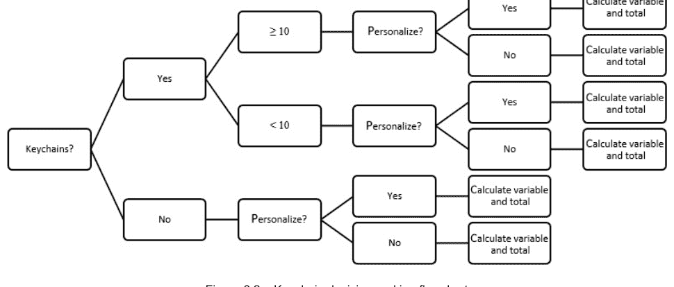

如您所见，这仅适用于**钥匙链**。我们需要对其他两个变量重复此过程。在前面的图中，您可以看到该物品的决策过程。首先，用户表明购买的商品数量，然后表明是否进行个性化。

根据每个答案，程序计算总价。例如，如果没有个性化，总价会在决策树中更早计算。我们可以使用函数（如前所述）重写此程序，以简化某些过程；然而，我们将在本书后面重新讨论并创建该程序。现在，我们专注于学习如何分解问题、分析条件以及设计考虑多个决策的算法。请记住完成其他物品的图表，以便在设计算法时更容易编码。

在本节中，我们学习了如何使用流程图创建算法。我们还学习了为算法构建字典。

在继续之前，让我们看看分析问题的过程。我们在创建此算法时进行了此操作——即分解问题时。然而，在进入下一章之前，我们应该考虑问题分析的一些关键组成部分。

## 分析问题

在分析问题时，我们可以记住一些步骤，以帮助我们确保创建最佳算法：

1.  清晰地阅读并理解问题。
2.  确定解决方案的主要目的。
3.  确定问题的约束条件。
4.  确定决策流程。
5.  建立可能解决该问题的算法。
6.  确定最适合该问题的算法工具。
7.  经常测试算法片段。
8.  验证算法是否为已识别的问题提供了解决方案。

如果我们回到我们的问题，我们在整个章节中都经历了这个过程：

-   我们有一个在线商店，有三件商品
-   商品成本取决于购买数量
-   商品价格也取决于个性化定制
-   我们创建了流程图来帮助我们识别决策过程以及如何编码
-   我们通过代码行验证了我们的代码，这些代码行允许我们多次检查算法是否产生正确的响应
-   我们根据需要重新审视并重新排列了代码片段
-   我们验证了算法的输出与我们已识别的问题一致

前面的过程值得重复——也就是说，这不是一个线性过程。有时，我们会编写一个算法，然后重新审视决策流程图，进行调整，然后再次处理算法。

当我们处理更大的问题时，在多个*停止点*分析问题的需求变得更加清晰。*我们应该在测试之前编写数百行代码吗？* 不！想象一下，有300行代码，却发现*第20行*有一个错误，这个错误贯穿了算法的其余部分。

在每个可能的进度点进行测试将使我们能够发现那些从长远来看可能让我们付出代价的小错误。请记住，第一次尝试就写出完美的算法几乎是不可能的。我们都会犯大大小小的错误，所以我们必须继续测试和分析我们的进度。

在离开本章之前，让我们再看一个问题，并再次经历这个过程。

### 问题6B – 分析一个简单的游戏问题

您想设计一个猜数字游戏。用户必须猜一个随机数。

让我们从定义问题开始，在这种情况下，这是一个游戏。让我们确定已知信息：

-   计算机需要随机选择一个数字
-   用户需要输入一个数字
-   计算机必须检查用户的输入是否与随机生成的数字匹配

现在，这还不够！如果我第一次尝试不匹配，我就输了吗？我有多少次机会？随机数是1到10之间的数字还是1到500之间的数字？在开始编码之前，我们需要做出一些决定。让我们添加一些参数：

-   数字在1到100之间
-   用户有五次猜测机会
-   计算机会告诉用户答案是太高还是太低

现在我们有了这些参数，我们可以创建一个决策流程图：

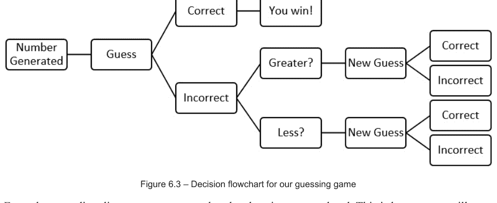

从前面的图中，您可以看到图表尚未完成。这是因为我们将使用一些逻辑使该过程重复五次。我们稍后会讨论这一点。现在，请注意决策。首先，程序生成一个数字（但不会显示）。然后用户输入一个猜测，这个猜测要么正确，要么不正确。如果正确，用户就赢得游戏。如果不正确，程序会告知用户答案是太低还是太高，并要求输入新的猜测。然后根据需要重复此过程。现在，让我们来编写算法。

首先，让我们生成随机数并让用户猜测它。为随机生成的数字和用户输入都添加一个`print()`函数，这样你就能看到信息是否正常工作。记住，我们稍后会把这些去掉，但作为问题分析过程的一部分，不断检查和复查我们的代码非常重要。以下代码将实现相同的功能：

ch6_guess1.py

```
import random as rand
compnumber = rand.randint(1, 100)
print(compnumber)
usernumber = int(input("Choose a number between 1 and 100. You'll get 5 guesses or you lose! "))
print(usernumber)
```

注意前面代码中导入的`random`模块。我们也将其导入为`rand`。这只是为了节省时间和空间。在Python中导入模块时，可以重命名它。`random`模块为我们提供了一种在选定范围内生成数字的方法。

`rand.randint(1, 100)`这行代码包括1和100。这些是随机数生成器的端点或限制。如前所述，`rand`函数指的是模块，而`randint(a, b)`指的是*a*和*b*之间（包括*a*和*b*）的一个随机整数。

运行几次代码，看看计算机生成的数字每次如何变化。以下几点展示了三个测试用例：

- 以下是前面代码的测试用例1结果：

    ```
    27
    Choose a number between 1 and 100. You'll get 5 guesses or you lose! 10
    10
    ```

    从前面的输出可以看出，27是计算机生成的随机数，10是用户输入的数字。

- 以下是测试用例2的结果：

    ```
    68
    Choose a number between 1 and 100. You'll get 5 guesses or you lose! 65
    65
    ```

    可以看到，68是`compnumber`变量的值，而用户（我）输入了数字65。如此接近，却又如此遥远！

- 以下是测试用例3的结果：

    ```
    50
    Choose a number between 1 and 100. You'll get 5 guesses or you lose! 23
    23
    ```

    可以看到，计算机选择了数字50，而用户输入了23。

对于这个游戏的最终版本，我们不会打印出计算机的数字。那将是作弊！现在，我们只是在测试。

让我们继续添加一个条件——第一次猜测是否正确。为此，我们需要验证`compnumber == usernumber`。在进入额外的重复和逻辑之前，我们将再次测试这个，所以我们只说如果为真，你就赢了；如果为假，你就输了：

#### ch6_guess2.py

```
import random as rand
compnumber = rand.randint(1, 100)
usernumber = int(input("Choose a number between 1 and 100. You'll get 5 guesses or you lose! "))
if compnumber == usernumber:
    print("You win!")
else:
    print("You lose!")
```

假设我运行时第一次尝试就输了。我不会一直运行直到我赢，因为那可能需要，嗯，100次或更多次尝试。运行程序时看起来像这样：

```
Choose a number between 1 and 100. You'll get 5 guesses or you lose! 35
You lose!
```

现在，让我们谈谈重复一行代码。我们给用户五次猜测机会。*在Python中我们如何做到这一点？*

在Python中，我们可以使用`for`循环来迭代代码。我们知道有五次猜测机会，所以我们需要使用类似`for number in range(5):`的东西来开始我们的逻辑，如下所示：

#### ch6_guess3.py

```
import random as rand
compnumber = rand.randint(1, 100)
i = 5
for number in range(5):
    usernumber = int(input("Choose a number between 1 and 100. You have " + str(i) + " guesses left. "))
    if compnumber == usernumber:
        print("You win!")
    else:
        i = i - 1
print("You're out of guesses! You lose! ")
```

你注意到前面代码中的i变量了吗？我们使用这个变量是为了让用户知道他们还剩多少次猜测机会。所以，如果我们有五次猜测机会，代码将从i = 5开始；然后，如果用户猜错了，它将使用i = i - 1，这会提醒用户现在还剩四次猜测机会，依此类推。看看运行该程序时会发生什么：

```
Choose a number between 1 and 100. You have 5 guesses left. 14
Choose a number between 1 and 100. You have 4 guesses left. 98
Choose a number between 1 and 100. You have 3 guesses left. 48
Choose a number between 1 and 100. You have 2 guesses left. 12
Choose a number between 1 and 100. You have 1 guesses left. 54
You're out of guesses! You lose!
```

现在，我们这样做不公平。如前所述，我们希望在用户每次尝试猜测时都给出提示。现在我们有了检查它们是否相等的条件，我们可以添加一个elif条件来检查它是更大还是更小。以下代码展示了这一点：

ch6_guess4.py

```
import random as rand
compnumber = rand.randint(1, 100)
i = 5
for number in range(5):
    usernumber = int(input("Choose a number between 1 and 100. You have " + str(i) + " guesses left. "))
    if compnumber == usernumber:
        print("You win!")
        exit()
    elif compnumber > usernumber:
        print("Your number is too small!")
        i = i - 1
    elif compnumber < usernumber:
        print("Your number is too large!")
        i = i - 1
print("You're out of guesses! You lose! ")
```

前面的代码现在为用户提供了一些反馈。如果数字大于计算机生成的数字，用户会收到反馈“Your number is too large!”；如果用户数字小于计算机生成的数字，则会收到反馈“Your number is too small!”。如果用户赢了，我们还使用了exit()代码。这是因为我们希望在赢的时候游戏停止。

这给了我们赢得这个游戏的机会。看看现在的输出是什么样子：

```
Choose a number between 1 and 100. You have 5 guesses left. 50
Your number is too small!
Choose a number between 1 and 100. You have 4 guesses left. 75
Your number is too large!
Choose a number between 1 and 100. You have 3 guesses left. 65
Your number is too small!
Choose a number between 1 and 100. You have 2 guesses left. 70
Your number is too large!
Choose a number between 1 and 100. You have 1 guesses left. 68
You win!
```

现在，看看我们输掉游戏时会发生什么：

```
Choose a number between 1 and 100. You have 5 guesses left. 10
Your number is too small!
Choose a number between 1 and 100. You have 4 guesses left. 40
Your number is too large!
Choose a number between 1 and 100. You have 3 guesses left. 20
Your number is too small!
Choose a number between 1 and 100. You have 2 guesses left. 30
Your number is too small!
Choose a number between 1 and 100. You have 1 guesses left. 35
Your number is too large!
You're out of guesses! You lose!
```

如你所见，你会得到不同的最终消息。我承认我尝试了很多次才赢得一局游戏，以便获得下面的输出，但你可以看到第二次猜测就正确的游戏：

```
Choose a number between 1 and 100. You have 5 guesses left. 10
Your number is too small!
Choose a number between 1 and 100. You have 4 guesses left. 90
You win!
```

我们将用最后一个算法停止这个游戏。如果我们愿意，我们可以让这个游戏变得更好，但它确实完成了我们需要它完成的工作。你可以考虑对你的游戏进行以下一些更改：

- 添加一个选项，提醒用户某个数字已经被猜过
- 添加一个选项，提醒用户他们忽略了之前的提示（所以，如果用户给出了一个太小的数字，然后又给出了一个更小的数字，计算机会提醒他们）

我相信还有更多你可以尝试的自定义选项。但目前，我们经历了那个问题，并遵循了我们在分析问题时应该考虑的要点：

1. 我们阅读并理解了问题。
2. 我们确定了目的——创建一个计算机玩家对用户玩家的猜数字游戏。
3. 我们确定了问题的约束条件——数字范围、猜测次数和提供提示。
4. 我们创建了一个决策流程图。
5. 我们为问题编写并建立了一个算法。
6. 我们研究了如何创建一个简单的迭代算法，而不是必须单独编写每个条件。
7. 我们在多个点测试了算法。
8. 我们验证了算法在赢和输的情况下都能准确运行。

你在这里看不到的是我在得到所示算法之前经历的错误数量。在写作过程中，我不得不使用前面的步骤来帮助我识别错误、检查最佳算法并迭代程序。这是一个我们将继续使用的过程。

## 总结

本章我们讨论了问题的定义、分解与分析。我们借助具体问题，学习了如何识别问题、将其分解为相关部分并确定约束条件，以及分析算法的过程。我们使用流程图来帮助理解算法设计中的决策过程以及如何组织思路。

我们还学习了经常测试算法的重要性。这使我们掌握了尽早发现错误的技能和理解力，而不是等到代码行数过多、难以定位错误时才处理。我们通过在线商店和猜数字游戏的实例，理解了Python的一些可用功能。在整个过程中，我们使用布尔代码验证输入，运用嵌套if语句，并学习了如何使用字典来解决所呈现的问题。

此外，我们有机会使用字典来构建一个涉及用户输入和变量的算法。使用该算法使我们能够灵活地定义变量，并在运行算法过程中或算法内部对变量进行编辑。

在下一章中，我们将探讨解决方案的流程与设计，深入研究更复杂的问题以及Python语言。

# 7 设计解决方案与解决流程

本章我们将为多个问题设计**解决方案**，运用先前所学的内容，如问题**分析**和**计算思维过程**。我们将结合**逻辑处理**，创建决策过程的可视化表示，以指导我们的算法设计。讨论的可视化表示包括**图表**、**流程图**和其他辅助流程。本章我们将学习解决方案设计的关键要素，以及如何在解决方案处理和设计中创建、使用和应用图表，并探讨将解决方案设计流程应用于各种问题。

本章将涵盖以下主题：

- 设计解决方案
- 绘制解决方案图表
- 创建解决方案

为了进一步深化我们对算法和解决方案设计的理解，我们需要更仔细地审视问题的前端。我们将首先深入探讨设计解决方案的过程。

## 设计解决方案

在设计解决方案时，我们通常使用**设计思维模型**，即使我们并非总能意识到这一点。设计思维有不同的模型描述，但我们将重点介绍使用设计思维时最常见的五步模型。

## 技术要求

以下是本章将使用的完整源代码：
https://github.com/PacktPublishing/Applied-Computational-Thinking-with-Python-Second-Edition/tree/main/Chapter07。

结合计算思维，设计思维过程可以帮助我们在开始绘制解决方案图表之前完善我们的想法。需要注意的是，我们并非线性地经历设计思维过程，这与计算思维类似。回顾计算思维的步骤，如下所示：

- 问题分解
- 模式识别
- 抽象化
- 算法设计

我们在前面的章节中已经定义了所有这些步骤，最近一次是在*第6章，探索问题分析*的引言中。再次审视它们，我们知道在编写和设计算法时，可以回到分解步骤。这就是我们所说的非线性过程。

设计思维模型的工作方式相同。它由斯坦福大学哈索·普拉特纳设计学院设计。该模型的主要步骤包括：

- **共情**：从受众或利益相关者的角度理解问题
- **定义**：确定目标、需要做出的决策、引入的任何偏见以及问题的任何细节
- **构思**：进行头脑风暴，这与本章下一节我们将进行的图表绘制相对应
- **原型**：设计算法解决方案并经常检查
- **测试**：在整个过程中经常检查你的算法，并根据需要返回到之前的步骤

如你所见，我已调整了设计思维模型，使其更符合计算思维过程。我们使用这些模型并将其结合的主要目标是将较难的问题分解为更简单的部分，以便我们能够解决并设计出最佳算法。这并不能取代计算思维，它只是提供了如何处理该过程的更好思路。下图有助于说明该过程可能如何运作：

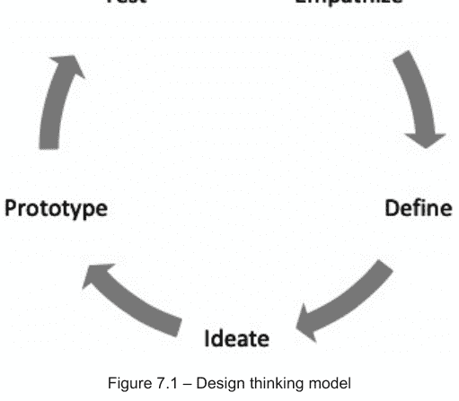

如你所见，与最常显示的线性模型不同，前面的模型将该过程展示为*循环的*。也就是说，从任何点都可以返回到*共情*步骤，因此在这些步骤之间来回切换是使用设计思维模型的最佳方式。需要注意的是，我可能处于**原型**阶段，并意识到需要返回到另一个步骤。因此，不要将这些步骤视为固定顺序的。在处理算法解决方案时，我们可以根据需要返回到任何点。

让我们看一个将设计思维与计算思维结合使用的场景。

### 问题1 – 一项市场调查

假设你正在与一家营销公司合作，他们要求你组织一项调查，以收集关于一个网站的反馈。以下是你可能经历的一些步骤：

1.  **识别利益相关者**：这包括你将调查的人以及调查后将使用信息的人，例如。
2.  **确定问题**：这是你定义希望通过调查了解哪些信息的地方。
3.  **设计调查**：这不仅包括你确定的问题，还包括调查外观的美学设计。
4.  **信息收集**：这是你决定如何与填写调查的人沟通的地方，例如通过电子邮件、网站链接或类似方式。
5.  **数据分析**：你可以编写一个Python算法来帮助你进行数据分析，包括根据收集的数据创建表格和图表。
6.  **数据共享**：这是你计划向原始利益相关者展示可视化、报告和数据呈现的地方。

需要明确的是：这是对过程的过度简化。但假设你意识到需要为调查增加另一组人群。比如你最初只从学校的学生那里获取反馈，但意识到想增加教师和家长。那么，你会回到*步骤1*，并确定你的其余信息会受到哪些影响。你可能想改变调查的外观，或者为成人和儿童设计不同的调查。你可能需要添加仅针对某一组的问题，这将影响你在调查算法中的决策制定。

现在，让我们看看*设计思维*过程中的这些步骤。

对于我们的问题，识别利益相关者和问题属于设计思维模型的*步骤1、2和3*：*共情、定义和构思*。构建算法既是**原型**的一部分，也是**测试**的一部分，对应*步骤4和5*。向调查中添加人员使我们回到*步骤1-3*，循环重复，直到我们为场景获得一个可工作的算法。在整个计算思维模型及其元素的使用中，你将运用嵌入其中的设计思维过程。这是决策过程的自然组成部分。

既然我们已经了解了设计思维模型，让我们看看如何使用图表绘制解决方案来可视化地表示决策。

### 绘制解决方案图表

在设计算法时，我们经常使用图表和流程图来帮助我们分析过程并直观地看到决策制定的位置。这些图表使我们能够创建更好的算法。你会记得我们在[第6章](Chapter 6)*探索问题分析*中构建商店时创建了一个流程图（*图6.1*和*图6.2*）。

创建这些图表的过程因开发者或编码者而异。例如，我通常先为问题创建一个头脑风暴图，然后根据该信息创建一个流程图。为了审视这个过程，让我们回到本章前面的调查问题。查看*图7.2*中的头脑风暴图。它并不完整，因为你可以添加许多子主题。这个头脑风暴图假设我们正在调查利益相关者，以评估和分享对学校网站的反馈：

## 创建解决方案

当我们面对问题时，我们希望创建能够解决已知信息的解决方案，该方案需提供所需的一切，并且易于用户理解。在本节中，我们将运用本章所学内容来设计问题的解决方案。

在利用头脑风暴和流程图创建这些解决方案时，我们应考虑以下几点：

- 我们规划的解决方案是否解决了问题？
- 解决方案设计是否为算法的成功执行展示了清晰的路径？

如果这些问题的答案都是肯定的，那么我们就可以开始编写解决方案的代码了。记住——我们需要尽可能频繁地测试算法。编写算法时，请记住以下几点：

- 添加注释，标识可能需要回顾的部分，并帮助识别和定义你的变量、字典、函数以及任何关键组件
- 检查是否存在任何错误，例如第6章“探索问题分析”中讨论的那些错误
- 尽可能频繁地运行程序以测试错误

对于解决方案过程，我们将使用一个与本章前面讨论的调查问题略有不同的问题。在本书后续内容中，我们将逐步介绍可用于该问题的各种组件，例如添加图像、显示图形等。但现在，让我们先使用一些更基础的Python知识来练习创建解决方案的过程。

### 问题2 – 披萨订单

我知道——又是食物。但这是演示逻辑和算法创建的最佳方式之一，所以请耐心听我说。假设我们有一家披萨店。我们只卖一种饼底，因为我们是一家特色店。我们出售两种不同尺寸的披萨：个人装和家庭装。有两种酱料选择：番茄酱和蒜香奶油酱。有三种奶酪选择：不加奶酪、普通奶酪和额外奶酪。

有五种配料可供选择（我限制了数量，因为我们只是在学习这个过程）：蘑菇、意大利辣香肠、意大利香肠、洋葱和甜椒。而且不行——我们不会在披萨上放任何橄榄。

让我们分解这个问题。我们希望有一个算法来捕获用户选择的披萨订单选项。目前我们暂不考虑成本以及订单中的额外项目，例如额外的披萨、饮料、甜点等。

以下是我们已知的信息：

- **尺寸**：个人装或家庭装
- **酱料**：番茄酱或蒜香奶油酱
- **奶酪**：不加奶酪、普通奶酪或额外奶酪
- **配料**：蘑菇、意大利辣香肠、意大利香肠、洋葱和甜椒

现在我们有了这些信息，让我们来看一个包含这些信息的流程图：

如你所见，流程图展示了针对这个特定问题的相当*线性的决策过程*。我们尚未考虑的一点是询问用户是否希望进行任何更改。这可能需要在每个步骤都进行。假设你在选择奶酪时改变了主意，想要番茄酱而不是蒜香奶油酱。你需要有一种方法可以返回，因此在创建算法时我们需要记住这一点。

请记住，我们目前仅使用文本代码，因此暂时将使用数字和字母作为用户输入。然而，有方法可以将Python整合到更强大的算法中，这些算法可以包含图像、按钮等更多元素。

请看以下算法代码片段：

```python
#首先获取尺寸和酱料变量的输入。
size_choice = input("这是个人装还是家庭装披萨？输入1表示个人装，2表示家庭装。 ")
if size_choice == "1":
    size_choice = "个人装"
else:
    size_choice = "家庭装"
sauce_choice = input("您想要哪种酱料？番茄酱还是蒜香奶油酱？输入m表示番茄酱，g表示蒜香奶油酱。 ")
if sauce_choice == "g":
    sauce = "蒜香奶油酱"
else:
    sauce = "番茄酱"
#奶酪选择将决定更多选项。首先定义变量。
cheese_choice = input("您的披萨要加奶酪吗？输入y表示要，n表示不要。 ")
```

请注意，在代码片段中，我们首先定义了尺寸和酱料。我在此重申，处理这个特定逻辑过程还有其他方法。例如，我们可以将部分变量保存到字典中，并使用数组进行操作。目前，我们使用迄今为止所学的知识来创建算法，但在本书后续内容中，我们将有机会了解其他方法。

前面的代码片段以奶酪的最终选择结束。无论此处选择如何，我们都需要对配料做出决定。这将需要进行两次，因为我们需要为“要”和“不要”两种情况都做处理。请看以下包含这些选项的代码片段，这是前面代码的延续：

```python
#无论是否要奶酪，都需要选择配料。
if cheese_choice == "y":
    cheese2_choice = input("您想要普通奶酪还是额外奶酪？输入r表示普通，e表示额外奶酪。 ")
    if cheese2_choice == "r":
        cheese = "普通奶酪"
    else:
        cheese = "额外奶酪"
    toppings1_input = input("您的披萨要加蘑菇吗？输入y表示要，n表示不要。 ")
    if toppings1_input == "y":
        toppings1 = "蘑菇"
    else:
        toppings1 = "不加蘑菇"
else:
    cheese = "不加奶酪"
if cheese_choice == "n":
    toppings1_input = input("您的披萨要加蘑菇吗？输入y表示要，n表示不要。 ")
    if toppings1_input == "y":
        toppings1 = "蘑菇"
    else:
        toppings1 = "不加蘑菇"
print(f"您想要一个{size_choice}披萨，配{sauce}酱，{cheese}和{toppings1}")
```

从代码片段可以看出，我们只处理了蘑菇。在选择了家庭装、蒜香奶油酱、普通奶酪和蘑菇后，此特定代码的输出如下：

```
这是个人装还是家庭装披萨？输入1表示个人装，2表示家庭装。 家庭装
您想要哪种酱料？番茄酱还是蒜香奶油酱？输入m表示番茄酱，g表示蒜香奶油酱。 g
您的披萨要加奶酪吗？输入y表示要，n表示不要。 y
您想要普通奶酪还是额外奶酪？输入r表示普通，e表示额外奶酪。 r
您的披萨要加蘑菇吗？输入y表示要，n表示不要。 y
您想要一个家庭装披萨，配蒜香奶油酱，普通奶酪和蘑菇。
```

使用提供的代码并查看输出，尝试为剩余的四种配料编写其余代码。我想如果你在制作自己的披萨，欢迎更改这里提供的选项。只是请把橄榄留给你自己。

正如前面提到的，我们可能需要返回并进行修改。让我们看一个为你实现此功能的代码片段：

ch7_Pizzeria2.py

```
ready_end = str(input("Do you need to make any changes? Type y for yes and n for no. "))
if ready_end == "y":
    size_choice = str(input("Is this a personal or family pizza? Type 1 for personal and 2 for family. "))
    sauce_choice = str(input("Which sauce would you like? Marinara or garlic cream? Type m for marinara and g for garlic cream. "))
    if sauce_choice == "g":
        sauce = "garlic cream"
    else:
        sauce = "marinara"
    cheese_choice = str(input("Would you like cheese on your pizza? Type y for yes and n for no. "))
```

从前面的代码片段可以看出，我们需要对是否进行修改做出决定。如果选择“是”，那么我们会再次提出问题。如果选择“否”，那么我们会为用户打印出选择结果。请看以下完整运行程序的输出：

```
Is this a personal or family pizza? Type 1 for personal and 2 for family. family
Which sauce would you like? Marinara or garlic cream? Type m for marinara and g for garlic cream. g
Would you like cheese on your pizza? Type y for yes and n for no. n
Would you like mushrooms on your pizza? Type y for yes and n for no. y
Do you need to make any changes? Type y for yes and n for no. y
Is this a personal or family pizza? Type 1 for personal and 2 for family. family
Which sauce would you like? Marinara or garlic cream? Type m for marinara and g for garlic cream. m
Would you like cheese on your pizza? Type y for yes and n for no. n
Would you like mushrooms on your pizza? Type y for yes and n for no. y
You want a family pizza with marinara sauce, no cheese, and mushrooms.
```

如代码所示，问题被问了两次，因为我们修改了选项。根据你希望询问该问题的频率，你需要继续重复部分代码。有方法可以简化这一点，因此我们将在我们的Python语言程序章节（[第9章，Python简介](https://example.com)）及后续章节中更深入地探讨这些选项。

在继续之前，让我们再看一个问题，以再次梳理设计过程。

### 问题3 – 延迟与Python

我最初遇到的一个Python问题是创建一个算法，该算法会根据所选颜色做出不同反应。这类似于创建交通信号灯时的情况。每个灯都有不同的延迟。因此，让我们创建一个解决此问题的算法。为了保持交通信号灯的主题，我们将让用户在绿色、黄色和红色之间选择颜色。所以，让我们将一些假设整合如下：

- 绿色将意味着5秒的延迟
- 黄色将意味着2秒的延迟
- 红色将意味着4秒的延迟

这些特定的延迟没有特别的理由；我只是想让它们都保持在5秒以下。现在，假设我们正在玩一个游戏，用户必须选择一种颜色。如果他们选择黄色或红色，他们将获得一个延迟，然后会被再次询问。目标是获得程序的*你赢了！你现在可以走了*消息。因此，让我们为此创建一个流程图，如下所示：

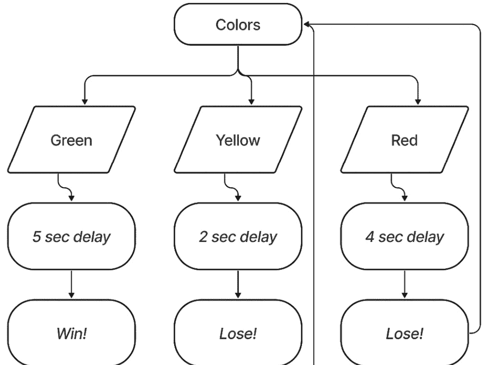

图7.7 – 交通信号灯游戏流程图

从流程图中可以看出，如果你选择黄色或红色，游戏将重新开始。现在我们已经了解了游戏的基本框架，我们必须对其进行编码。

#### 重要提示

为了能够使用延迟，我们需要导入`time`库。使用`import time`命令来完成此操作。要包含延迟，我们使用`time.sleep()`。

让我们看一段代码片段：

ch7_sleep.py

```
import time
print("Let's play a game. Choose a color to learn your destiny. Choose wisely or you'll have to start over. ")
while True:
    color = input("Choose a color: red, green, or yellow. ")
    if color == "green":
        print("You must wait 5 seconds to learn your fate.")
        time.sleep(5)
        print("You win! Excellent choice!")
        break
    elif color == "yellow":
        print("You must wait 2 seconds to learn your fate.")
        time.sleep(2)
        print("You lose! You must start over.")
    else:
        print("You must wait 4 seconds to learn your fate.")
        time.sleep(4)
        print("You lose! You must start over.")
```

如你所见，该算法包含我们在前面章节中讨论循环、布尔语句等内容时看过的部分代码。这段特定的代码在用户未赢得游戏的情况下会返回开头进行三轮。我们使用了`if-elif-else`语句来处理颜色场景。游戏进行三轮的输出如下所示：

```
Let's play a game. Choose a color to learn your destiny. Choose wisely or you'll have to start over.
Choose a color: red, green, or yellow. yellow
You must wait 2 seconds to learn your fate.
You lose! You must start over.
Choose a color: red, green, or yellow. red
You must wait 4 seconds to learn your fate.
You lose! You must start over.
Choose a color: red, green, or yellow. green
You must wait 5 seconds to learn your fate.
You win! Excellent choice!
```

从游戏输出中可以看出，三轮都进行了。每次延迟都根据语句发生，你必须自己测试，因为我无法用文本显示时间延迟。

有了流程图，创建这个算法比我在阅读问题后立即开始编码要简单得多。习惯在编写算法之前详细阐述所需的过程非常重要。设计解决方案可能是一个漫长而乏味的过程，但我们开始时越有条理，我们的算法就越好。

## 总结

在本章中，我们讨论了如何设计、绘制图表并创建问题的解决方案。我们探讨了设计思维的非线性过程，以了解如何最好地设计解决方案。设计思维模型是一个五步流程：**共情**、**定义**、**构思**、**原型**和**测试**。在计算思维过程中使用这五步流程可以帮助我们避免许多问题和陷阱。

我们还进行了头脑风暴并创建了流程图，以建立我们算法的决策过程来解决问题。

在下一章中，我们将运用我们的算法设计和解决方案设计知识，来识别解决方案中的挑战和调试程序。

# 8

## 识别解决方案中的挑战

在本章中，我们将评估算法和图表，学习如何处理一些常见错误，并确定是否可以对现有算法进行可能的调整以简化它。我们将根据问题描述评估解决方案，以验证解决方案是否与问题一致。我们将学习识别解决方案设计过程中的陷阱。请注意，随着我们更深入地探讨**Python**编程语言，我们将在本书的*第二部分，应用Python和计算思维*和*第三部分，使用计算思维和Python进行数据处理、分析和应用*中扩展本章的内容。

为了学习调试，让我们提醒自己，计算思维过程不是线性的。即使我们从原始问题出发，我们有时也会重新定义问题，或者由于算法适用的群体发生变化，或者我们想调整算法设计，而需要调整概括性。但有时，我们在算法设计和使用后才会遇到问题。根据我们的角色，我们将评估算法的错误、所需的更改等。了解如何查找和分析错误可以帮助我们，无论我们是Python绝对初学者还是职业生涯深入者。

在本章中，你将学习如何识别和修复程序中的错误，以及如何避免算法设计中的陷阱。

在本章中，我们将涵盖以下主题：

- 识别算法设计中的错误
- 调试算法
- 比较解决方案
- 完善和重新定义解决方案

## 技术要求

以下是本章将使用的完整源代码：
[https://github.com/PacktPublishing/Applied-Computational-Thinking-with-Python-Second-Edition/tree/main/Chapter08](https://github.com/PacktPublishing/Applied-Computational-Thinking-with-Python-Second-Edition/tree/main/Chapter08)。

## 识别算法设计中的错误

对于任何程序员来说，算法中的错误都是生活中不可避免的一部分。重要的是要习惯于犯错。正如*第6章，探索问题分析*和*第7章，设计解决方案和解决方案流程*中所提到的，测试你的算法并经常进行测试是一个良好的实践。等到你写完数百或数千行代码后再去测试，无异于自找麻烦。是的，我曾经在复制一个游戏时完全没有测试，直到复制完全部4,585行代码才开始。那时我还年轻。说实话，我从未找到我犯的错误。我重新开始，并在每个角落都进行测试。第二次成功了，但我浪费了几周时间复制所有内容（那是从一本书上抄的——当时还没有GitHub），然后试图找出错误。所以，请不要像我一样。请测试你的算法。

现在，在继续调试和处理代码之前，让我们看看在解决问题时可能遇到的错误。

在本节中，我们将重点关注两大类错误：语法错误和逻辑错误。

### 语法错误

语法错误有时也被称为解析错误。它们是我们在忘记缩进、添加冒号、为字符串添加引号等时产生的错误。我们将在接下来的章节中看看不同类型的语法错误。

#### 使用冒号

冒号在Python中用于分隔条件、创建循环等。冒号是一种告诉算法接下来的内容是这个特定代码块的一部分的方式。当我们在Python中引入冒号时，它们会自动缩进代码的下一行。但如果我们忘记在需要的地方包含冒号，程序将无法成功运行。让我们看一个语法错误：

```
for i in range(1, 10)
    print(i)
```

如果我们运行这段代码，我们将得到一条错误消息，显示*无效语法*。下面的截图显示了我们尝试运行此程序时出现的弹出窗口：

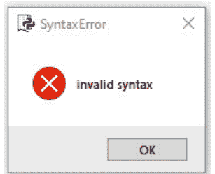

图8.1 – 错误弹出窗口

如果我们从Python shell运行它，错误会这样显示：

```
SyntaxError: expected ':'
```

如你所见，当我们的代码包含错误时，Python程序会提醒我们。

注意代码中`range`后面缺少一个冒号。现在，看看以下代码中修正后的语法：

```
ch8_syntaxerror1.py
```

```
for i in range(1, 10):
    print(i)
```

当我们运行修正后的代码时，程序会运行并打印数字1到9，如下所示：

```
1
2
3
4
5
6
7
8
9
```

你可能还记得`range`函数不包括上限。如果我们想打印数字10，我们的范围需要是`range(1, 11)`。

现在，让我们看看Python中使用的其他可能导致一些错误的标点符号，即括号、嵌套括号和方括号。

#### 使用嵌套括号和方括号

除了涉及冒号的语法错误（这是我最常见的错误）之外，当我们有嵌套括号时也会出现错误。我们必须始终检查每个开括号是否都有一个闭括号。方括号也是如此。让我们看看以下代码，其中包含一个与括号相关的错误：

```
name = input('What is your name? '
```

```
print(name)
```

如你所见，在`name`定义中有两个开括号，但只有一个闭括号。当我们运行该程序时，我们会从Python得到一个无效语法错误。当我们在Python shell或解释器中运行该程序时，会发生以下情况：

```
SyntaxError: '(' was never closed
```

你可能已经注意到，错误消息在3.11版本中比在3.8和3.9版本中更有帮助。新版本提供了更多关于错误可能是什么的细节，因此我们得到的不是通用的**SyntaxError**消息，而是得到一些信息，说明缺少闭括号。现在，这是没有错误的相同代码：

#### ch8_syntaxerror2.py

```
name = input('What is your name? ')
print(name)
```

现在，当我们运行代码时，程序会询问姓名，然后打印出来。输出如下所示：

```
What is your name? Monique
Monique
```

如你所见，程序现在可以无问题地运行。

在*第3章，理解算法和算法思维*中，我们使用字典为每个菜单项创建了一个带价格的菜单。字典包含括号来表示字典的开始和结束。让我们看几行代码：

```
cars = {
    "Hyundai": "Kona",
    "Honda": "CR-V",
    "Toyota": "Camry"
print(cars)
```

如果我们看这个程序，字典缺少闭括号`}`，所以我们得到一个语法错误。在这种情况下，Python告诉我们，在编译单个语句时发现了多个语句。如果我们不知道要找什么，这个错误有点难理解，但它仍然比普通的**SyntaxError**消息更有帮助。以下代码片段显示了修正后的程序：

#### ch8_syntaxerror3.py

```
cars = {
    "Hyundai": "Kona",
    "Honda": "CR-V",
    "Toyota": "Camry"
    }
print(cars)
```

如你所见，一旦添加了括号，程序将运行并打印以下输出：

```
{'Hyundai': 'Kona', 'Honda': 'CR-V', 'Toyota': 'Camry'}
```

字典中的每个条目都打印在一行中，用逗号分隔。在编写算法时添加`print`语句以确保我们没有任何错误是有帮助的。我通常在测试后删除不必要的打印函数，但当我们在编写长算法并需要测试它们以避免问题时，它们确实很方便。

在Python中编写算法时，我们可能会遇到许多其他错误。让我们再看几个语法错误。

#### 其他语法错误

可能会引入许多其他语法错误，尤其是在较长的程序中。如果你看看我们刚刚使用的字典，忘记逗号也会导致语法错误。通常，当我们尝试运行程序时，这些语法错误会很快被识别出来。Python会突出显示期望缩进的位置或缺少括号的位置。语法错误通常很容易识别，但还有许多其他类型的错误。

### 逻辑错误

在*第4章，理解逻辑推理*中，我们讨论了可能遇到的逻辑错误：

- 在方程或语句中使用错误的变量
- 使用错误的运算符来测试条件
- 在检查条件时使用错误的缩进

现在，我们将看看Python特别指出的其他逻辑错误以及每个错误代表什么。

逻辑错误也称为**运行时错误**。许多运行时错误允许我们识别代码中发生了什么。每个错误都有特定的用途，并为我们提供如何修复错误的提示。你可以在[https://www.tutorialsteacher.com/python/error-types-in-python](https://www.tutorialsteacher.com/python/error-types-in-python)找到运行时错误的综合列表。

Python中有很多不同类型的错误被标记为异常。你可以通过运行以下代码来获取Python异常列表：

#### ch8_errors.py

```
print(dir(locals()['__builtins__']))
```

当我们运行这段代码时，输出提供以下错误值：

```
['ArithmeticError', 'AssertionError', 'AttributeError', 'BaseException',
'BlockingIOError', 'BrokenPipeError', 'BufferError', 'BytesWarning', 'ChildProcessError',
'ConnectionAbortedError', 'ConnectionError', 'ConnectionRefusedError',
'ConnectionResetError', 'DeprecationWarning', 'EOFError', 'Ellipsis', 'EnvironmentError',
'Exception', 'False', 'FileExistsError', 'FileNotFoundError', 'FloatingPointError',
'FutureWarning', 'GeneratorExit', 'IOError', 'ImportError', 'ImportWarning',
'IndentationError', 'IndexError', 'InterruptedError', 'IsADirectoryError', 'KeyError',
'KeyboardInterrupt', 'LookupError', 'MemoryError', 'ModuleNotFoundError', 'NameError',
'None', 'NotADirectoryError', 'NotImplemented', 'NotImplementedError', 'OSError',
'OverflowError', 'PendingDeprecationWarning', 'PermissionError', 'ProcessLookupError',
'RecursionError', 'ReferenceError', 'ResourceWarning', 'RuntimeError', 'RuntimeWarning',
'StopAsyncIteration', 'StopIteration', 'SyntaxError', 'SyntaxWarning', 'SystemError',
'SystemExit', 'TabError', 'TimeoutError', 'True', 'TypeError', 'UnboundLocalError',
'UnicodeDecodeError', 'UnicodeEncodeError', 'UnicodeError', 'UnicodeTranslateError',
'UnicodeWarning', 'UserWarning', 'ValueError', 'Warning', 'ZeroDivisionError',
'__build_class__', '__debug__', '__doc__', '__import__', '__loader__', '__name__',
'__package__', '__spec__', 'abs', 'all', 'any', 'ascii', 'bin', 'bool', 'breakpoint',
'bytearray', 'bytes', 'callable', 'chr', 'classmethod', 'compile', 'complex',
'copyright', 'credits', 'delattr', 'dict', 'dir', 'divmod', 'enumerate', 'eval', 'exec',
'exit', 'filter', 'float', 'format', 'frozenset', 'getattr', 'globals', 'hasattr',
'hash', 'help', 'hex', 'id', 'input', 'int', 'isinstance', 'issubclass', 'iter', 'len',
'license', 'list', 'locals', 'map', 'max', 'memoryview', 'min', 'next', 'object', 'oct',
'open', 'ord', 'pow', 'print', 'property', 'quit', 'range', 'repr', 'reversed', 'round',
'set', 'setattr', 'slice', 'sorted', 'staticmethod', 'str', 'sum', 'super', 'tuple',
'type', 'vars', 'zip']
```

如前所述，这些是Python中的内置异常。有一种方法可以定义我们自己的异常，但我们不会在本书中深入探讨。

请注意，这些并不是我们在编程时会遇到的唯一错误。正如我们在*第4章，理解逻辑推理*中讨论的那样，我们可能会因为自己在计算中的错误而产生错误。我们可能会在*布尔*逻辑中引入错误。目标是尽可能避免这些错误，以便我们的程序能够无问题地运行。记住，测试你的算法并经常测试。

现在，让我们看几个有错误的算法，并尝试识别错误以便我们可以纠正它们。

## 调试算法

我们可以使用`breakpoint()`函数（内置函数）在Python中运行调试器。我们可以将此代码引入程序，并将其插入到我们不确定代码的地方。添加`breakpoint()`将检查错误和错误。当我们运行`breakpoint()`函数时，我们将得到一个pdb输出，它代表**Python Debugger**。请注意，此内置函数出现在**Python 3.7**及更高版本中。**Python 3.6**及更早版本的调试器是`pdb.set_trace()`。

当我们运行调试器时，我们可以使用四个命令：

- c：继续执行
- q：退出调试器/执行

## 比较解决方案

当遇到问题时，我曾提到在Python中，我们有多种方法来完成相同的事情。根据我们想要实现的目标，某些命令在我们的算法中可能比其他命令更有效。让我们首先来看一个针对同一问题的几种解决方案。

### 问题 1 – 打印偶数

你被要求编写一个算法，根据用户提供的范围打印偶数。也就是说，如果用户输入范围 2 到 20，那么程序将打印 2, 4, 6, 8, 10, 12, 14, 16, 18 和 20。我们假设如果端点是偶数，则将其包含在内。

让我们来看两种可能解决方案中的第一种。请记住，一种解决方案不一定比另一种更好。这很大程度上取决于你整个算法的目标是什么。*列表更合适吗？字典？函数？* 这些问题在我们设计解决方案时很重要。

#### 算法解决方案 1 – 打印偶数

回想一下，我们将获取用户输入，以在给定范围内创建一个偶数列表。看看下面的代码，它向用户请求输入，然后打印出数字：

```
ch8_evenalgorithm1.py

print("This program will print the even numbers for any range of numbers provided.")
endpoint1 = int(input("What is the lower endpoint of your range? "))
endpoint2 = int(input("What is the upper endpoint of your range? "))
endpoint2 = endpoint2 + 1
for i in range(endpoint1, endpoint2):
    if i % 2 == 0:
        print(i)
```

注意 `endpoint2` 被转换成了 `endpoint2 + 1`。这是因为如果我们不加 1，那么上端点将不会被包含。程序还以一条打印给用户的消息开始，说明程序的功能。

当我使用端点 2 和 6 运行此程序时，得到以下输出：

```
This program will print the even numbers for any range of numbers provided.
What is the lower endpoint of your range? 2
What is the upper endpoint of your range? 6
2
4
6
```

如你所见，两个端点都是偶数并且被包含在内。如果我们使用端点 3 和 9 运行程序，将得到以下输出：

```
This program will print the even numbers for any range of numbers provided.
What is the lower endpoint of your range? 3
What is the upper endpoint of your range? 9
4
6
8
```

尽管技术上端点现在是 10，但范围的上限不被包含，因此小于 10 的最大偶数是 8。现在，我可以为更大的范围运行此程序，但范围越大，滚动查看所有数字就越困难。所以，让我们看看另一种获取偶数的方法。

#### 算法解决方案 2 – 打印偶数

从前面的例子中我们看到，每个偶数都被打印到不同的行上。让我们看看是否可以改变这一点，转而创建一个列表。Python 中的列表可以是空的。我们为它们使用任何名称，然后将其赋值为花括号内的项目或仅空花括号。例如，我可以创建一个名为 `evenNumbers = []` 的空列表。让我们看看它在以下算法中的样子：

```
ch8_evenalgorithm2.py

print("This program will print the even numbers for any range of numbers provided.")
endpoint1 = int(input("What is the lower endpoint of your range? "))
endpoint2 = int(input("What is the upper endpoint of your range? "))
endpoint2 = endpoint2 + 1
evenNumbers = []
for i in range(endpoint1, endpoint2):
    if i % 2 == 0:
        evenNumbers.append(i)
print(evenNumbers)
```

如你所见，前几行代码是相同的。这段特定代码中唯一的区别在于数字的打印方式。列表在 `for` 循环之前创建。然后，使用 `evenNumbers.append(i)` 将每个数字追加到列表中。最后，我们打印列表以获得以下输出：

```
This program will print the even numbers for any range of numbers provided.
What is the lower endpoint of your range? 2
What is the upper endpoint of your range? 10
[2, 4, 6, 8, 10]
```

如你所见，所有偶数都包含在一个列表中，这比它们逐个打印、一行一行地打印更容易阅读。*想象一下，如果你必须打印 300 到*

---

- n: 在函数内移动到下一行
- s: 在此函数或被调用的**函数**中移动到下一行

让我们看一些代码并运行这里概述的每个命令：

```
ch8_debugger.py

number = 5
number2 = 'five'
print(number)
breakpoint()
print(number2)
```

查看此代码，你可以看到 `print(number)` 之后的 `breakpoint()` 命令。代码将正常运行，直到遇到 `breakpoint()` 命令。在此阶段，执行停止。如果我们按下 `c` 键，它将继续运行程序。看看输出是什么样子的。注意两个斜杠 `/.../` 之间有三个点。这样做是因为路径可能因你的计算机和我的计算机而异。你的路径将包含程序所在的完整路径：

```
5
> /Users/.../Python/ch8_debugger.py(8)<module>()
-> print(number2)
(Pdb) c
five
```

如你所见，它继续打印字符串 `five`，因为它只是继续运行程序。现在，让我们看看当我们运行 `q` 命令（退出程序）时的输出：

```
5
> /Users/smargarita99/Documents/Python/ch8_debugger.py(8)<module>()
-> print(number2)
(Pdb) q
Traceback (most recent call last):
  File "/Users/.../Python/ch8_debugger.py", line 8, in <module>
    print(number2)
  File "/Users/.../Python/ch8_debugger.py", line 8, in <module>
    print(number2)
bdb.BdbQuit
```

如你所见，一旦我们使用 `q` 命令，就会得到一个**回溯错误**，因为程序退出了。它打印了 `breakpoint()` 代码之前的行，但没有打印第二个 `print(number2)` 命令。现在，让我们看看当我们输入 `n`（应该带我们到下一行）时会发生什么：

```
5
> /Users/.../Python/ch8_debugger.py(8)<module>()
-> print(number2)
(Pdb) n
five
--Return--
> /Users/.../Python/ch8_debugger.py(8)<module>()->None
-> print(number2)
(Pdb)
```

如你所见，当我们输入 n 时，程序继续运行并打印了第二个命令行。当它这样做时，你会看到 -> None 输出和运行的代码：`print(number2)`。最后，让我们看看稍微修改后的代码，看看在调试器运行时使用 `s` 会发生什么：

```
ch8_debugger2.py

number = 5
number2 = 'five'
print(number)
breakpoint()
print(str(number) + number2)
```

当我们运行此程序和调试器时，如果使用 `s`，会得到以下输出：

```
5
> /Users/.../Python/ch8_debugger2.py(8)<module>()
-> print(number + " " + number2)
(Pdb) s
--Call--
> c:\users\...\python\python311\lib\idlelib\run.py(462)write()
-> def write(self, s): (Pdb)
```

在以前版本的 Python 中，程序会遇到 `TypeError` 错误。这在某种程度上已经被“修复”，为我们提供了一种使用 `s` 命令继续前进的方法。让我们看看当我尝试用 `c` 继续代码时会发生什么：

```
5
> /Users/.../Python/ch8_debugger2.py(8)<module>()
-> print(number + " " + number2)
(Pdb) c
Traceback (most recent call last):
  File "C:/Users/.../Python/Python311/ch8_debugger2.py", line 8, in <module>
    print(number + " " + number2)
TypeError: unsupported operand type(s) for +: 'int' and 'str'
```

如你所见，程序提供了一条错误消息，因为一个是 `int` 类型，另一个是 `str` 类型。

我将尝试其他方法——我将使用 `print` 语句来获得我想要的输出：

```
ch8_debugger3.py

number = 5
number2 = 'five'
print(number)
breakpoint()
print(str(number) + " " + number2)
```

现在我已经修复了代码，使 print 行中的项目都是字符串，当我使用 `c` 继续时，输出如下所示：

```
5
> /Users/.../Python/ch8_debugger3.py(8)<module>()
-> print(str(number) + " " + number2)
(Pdb) c
5 five
```

如你所见，程序已打印出正确的信息，将数字作为字符串与 **five** 字符串组合在一起。双引号在它们之间添加了一个空格，我们之前已经见过，但当我们查看 [第 9 章，Python 入门](第 9 章，Python 入门) 中的 Python 基础知识时，我们将再次讨论这一点。

现在，让我们看看针对同一问题的一些解决方案，以便我们进行分析。

1,000。使用列表会使程序运行时更易于阅读。第二个算法的输出将如下所示：

```
This program will print the even numbers for any range of numbers provided.
What is the lower endpoint of your range? 300
What is the upper endpoint of your range? 1000
[300, 302, 304, 306, 308, 310, 312, 314, 316, 318, 320, 322, 324, 326, 328, 330, 332,
334, 336, 338, 340, 342, 344, 346, 348, 350, 352, 354, 356, 358, 360, 362, 364, 366, 368,
370, 372, 374, 376, 378, 380, 382, 384, 386, 388, 390, 392, 394, 396, 398, 400, 402, 404,
406, 408, 410, 412, 414, 416, 418, 420, 422, 424, 426, 428, 430, 432, 434, 436, 438, 440,
442, 444, 446, 448, 450, 452, 454, 456, 458, 460, 462, 464, 466, 468, 470, 472, 474, 476,
478, 480, 482, 484, 486, 488, 490, 492, 494, 496, 498, 500, 502, 504, 506, 508, 510, 512,
514, 516, 518, 520, 522, 524, 526, 528, 530, 532, 534, 536, 538, 540, 542, 544, 546, 548,
550, 552, 554, 556, 558, 560, 562, 564, 566, 568, 570, 572, 574, 576, 578, 580, 582, 584,
586, 588, 590, 592, 594, 596, 598, 600, 602, 604, 606, 608, 610, 612, 614, 616, 618, 620,
622, 624, 626, 628, 630, 632, 634, 636, 638, 640, 642, 644, 646, 648, 650, 652, 654, 656,
658, 660, 662, 664, 666, 668, 670, 672, 674, 676, 678, 680, 682, 684, 686, 688, 690, 692,
694, 696, 698, 700, 702, 704, 706, 708, 710, 712, 714, 716, 718, 720, 722, 724, 726, 728,
730, 732, 734, 736, 738, 740, 742, 744, 746, 748, 750, 752, 754, 756, 758, 760, 762, 764,
766, 768, 770, 772, 774, 776, 778, 780, 782, 784, 786, 788, 790, 792, 794, 796, 798, 800,
802, 804, 806, 808, 810, 812, 814, 816, 818, 820, 822, 824, 826, 828, 830, 832, 834, 836,
838, 840, 842, 844, 846, 848, 850, 852, 854, 856, 858, 860, 862, 864, 866, 868, 870, 872,
874, 876, 878, 880, 882, 884, 886, 888, 890, 892, 894, 896, 898, 900, 902, 904, 906, 908,
910, 912, 914, 916, 918, 920, 922, 924, 926, 928, 930, 932, 934, 936, 938, 940, 942, 944,
946, 948, 950, 952, 954, 956, 958, 960, 962, 964, 966, 968, 970, 972, 974, 976, 978, 980,
982, 984, 986, 988, 990, 992, 994, 996, 998, 1000]
```

我之所以只打印这个算法的输出，而不是第一个算法的，是因为第一个算法的输出会占用很多页，而我们不想在本书中浪费打印页数。你可以看到，由于更容易阅读大量的数字，一个算法比另一个更易于使用且更合适。

这就是为什么我们需要审视我们所有的算法，并确定它们是否是表达我们需求的最佳方式。虽然有些算法可以工作，但它们可能不是最佳解决方案，有时，这没关系。但其他时候，进行一些修改，有时细微到只是添加几行代码，就像我们对*算法2*所做的那样，可以相当显著地改变我们的输出，并对我们更有帮助。

在我们比较这两个算法的同时，我们也在完善和重新定义我们的解决方案，这在下一节中我们将做得更多。

## 完善和重新定义解决方案

如果我们长时间研究算法，总能找到完善和重新定义它们的方法。想想我们手机上的应用程序会收到多少更新。总有人在摆弄这些应用程序，让它们更安全，为游戏添加关卡，更新美术文件等等。作为程序员/编码者，我们总是试图让我们的工作变得更好。

本节我们将从一个算法开始。以下程序打印出三个宠物的名字：

ch8_pets1.py

```
cat = "Whiskers"
dog = "King Kong"
bird = "Pirate"
print(f"The cat's name is {cat}, the dog's name is {dog}, and the bird's name is {bird}.")
```

这段简单的代码包含了所有内容，所以这次没有用户输入。你可以看到在`print()`命令中`dog`后面使用了`\`字符。这个反斜杠允许我们在下一行添加剩余的代码，以便我们更容易阅读。

代码的输出如下：

**猫的名字是Whiskers，狗的名字是King Kong，鸟的名字是Pirate。**

如你所见，这是一个包含宠物名字的简单句子。

现在，假设我们有一只猫、一只狗和一只鸟，但它们的名字不同。这里，我们可以使用一个接受三个参数的函数。请记住，我们将在[第9章，Python简介](https://example.com)中深入探讨函数的所有定义和信息。现在，让我们看看使用函数的算法可能是什么样子。我们将函数命名为`myPets()`。看看下面的算法：

ch8_pets2.py

```
def myPets(cat, dog, bird):
    print(f"The cat's name is {cat}, the dog's name is {dog}, and the bird's name is {bird}.")
myPets(cat = "Whiskers", dog = "King Kong", bird = "Pirate")
```

这个算法看起来与前一个非常相似，只是名字的定义在代码的最后一行。函数被调用，使用该行的信息来填充算法上方定义中的空白。输出与之前的代码相同：

**猫的名字是Whiskers，狗的名字是King Kong，鸟的名字是Pirate。**

如你所见，这里只打印了一个函数，因为我们只提供了一组信息，但我们可以根据需要多次调用该函数，并传入任意多的值。看看这个算法：

ch8_pets3.py

```
def myPets(cat, dog, bird):
    print(f"The cat's name is {cat}, the dog's name is {dog}, and the bird's name is {bird}.")
myPets(cat = "Whiskers", dog = "King Kong", bird = "Pirate")
myPets(cat = "Mimi", dog = "Jack", bird = "Peyo")
myPets(cat = "Softy", dog = "Leila", bird = "Oliver")
```

如你所见，该函数现在将被调用三次。我们只有一个`print()`命令，但函数定义意味着每次调用该函数时都会使用`print()`命令。让我们看看输出：

```
The cat's name is Whiskers, the dog's name is King Kong, and the bird's name is Pirate.
The cat's name is Mimi, the dog's name is Jack, and the bird's name is Peyo.
The cat's name is Softy, the dog's name is Leila, and the bird's name is Oliver.
```

请注意，使用调用函数时提供的三组宠物名字，打印出了三个不同的句子。

在编写算法时，我们需要考虑我们现在需要什么，以及我们将来可能需要什么。使用第一个算法对于单个实例来说没问题，但如果我们想为社区中的每个人或教室里的每个学生运行该算法，例如，第二个算法就更有帮助了。重新定义我们的需求和完善我们的算法有助于我们改进从程序中获得的结果。

请注意，如前所述，我们将在*第9章，Python简介*中更详细地讨论函数。我们将要讨论的内容之一是为未知数量的参数创建函数。*例如，如果我只有一只狗和一只鸟怎么办？*我们可以通过对算法进行一些修改来解决这个问题。我们很快就会研究这个问题。现在，我们对为什么有时需要比较算法并重新定义和重新设计它们以更好地适应我们的需求有了更多的了解。

## 总结

在本章中，我们讨论了算法设计中的错误以及如何调试解决方案。我们还学习了如何比较解决方案，以及在需要时完善和重新设计解决方案。阅读本章后，你应该对算法中的语法错误以及如何在**Python 3.11**及更高版本中使用`breakpoint()`命令使用调试器有了更多了解。内置调试器为你提供了四种操作：`c = continue`、`q = quit`、`n = next line`和`s = step`。

使用调试器使我们能够识别可能出错的代码片段。我们可以将这行代码添加到代码中的任何位置以确定问题。

我们还研究了提供相同输出但使用不同代码的算法。通过比较算法解决方案，我们可以识别哪些更有用，什么更适合我们的问题或情况，以及为什么我们应该使用一个而不是另一个。请记住，算法是指令列表。根据算法的更广泛用途，知道使用哪些指令至关重要。有些解决方案可能比其他解决方案更适合你的问题。考虑算法的目的、算法中的代码片段，以及它们如何在更大的算法中使用，并据此做出判断。每个问题和每个解决方案都是独特的。

随着我们完成本书的*第一部分：计算思维导论*，我们已经学习了计算思维过程，始终审视可能的情景以帮助我们理解该过程的实用性，如何进行头脑风暴并为决策创建流程图，以及如何设计我们的算法。在*第二部分：应用Python与计算思维*中，我们将开始更深入地研究Python语言，以便我们能够处理更复杂的问题，例如涉及数据和函数的问题。我们还将更深入地探讨Python编程语言，并将这些知识应用于后续章节中的多种类型问题。

# 第二部分：应用Python与计算思维

在编程语言方面有多种选择。Python编程语言是一种强大的、开源的、面向对象的编程语言。它是一种高级语言，拥有不断增长的库和包，持续扩展其功能。我们可以使用Python编程从简单的数学算法到复杂的数据科学算法，甚至机器学习。理解Python也意味着理解计算思维的多个领域。

在本部分中，你将学习如何在解决问题时使用计算思维过程，并使用Python编程语言。

本部分包含以下章节：

- [第9章](https://example.com)，Python简介
- [第10章](https://example.com)，理解输入与输出以设计解决方案算法
- [第11章](https://example.com)，控制流
- [第12章](https://example.com)，在简单挑战中使用计算思维与Python
- [第13章](https://example.com)，调试

# 9 Python简介

在本章中，我们将学习Python命令和功能，同时将它们应用于问题。随着我们深入*第二部分：应用Python与计算思维*的第一章，我们将使用更复杂的Python编程。在本章中，我们将更侧重于语言本身，而其余章节将侧重于应用。

在本章中，我们将涵盖以下主题：

- Python简介
- 使用字典和列表
- 使用变量和函数
- 了解文件、数据和迭代
- 使用**面向对象编程（OOP）**
- 问题1——创建图书库
- 问题2——组织信息
- 问题3——循环与数学

随着我们更深入地研究Python编程语言，请记住，其中一些内容在之前的章节中已经涉及，例如在之前章节中探讨计算思维过程时使用了字典。本章将使你在寻找满足计算思维问题需求的Python命令时，能够更轻松地找到关键信息。

## 技术要求

以下是本书中使用的完整源代码：[https://github.com/PacktPublishing/Applied-Computational-Thinking-with-Python-Second-Edition/tree/main/Chapter09](https://github.com/PacktPublishing/Applied-Computational-Thinking-with-Python-Second-Edition/tree/main/Chapter09)。

## Python简介

Python是增长最快的编程语言之一，这得益于其易用性。Python的吸引力之一在于，我们可以用它编写与C、C++和Java等语言相同的程序，但代码行数更少，语言和语法更简单。Python的另一个巨大吸引力在于它是**可扩展的**，这意味着我们可以为其添加功能和特性。

虽然并非所有功能都是内置的，但我们可以使用库来添加我们需要的功能。这些库可供下载和使用。例如，如果我们想处理数据和数据科学，有几个库可以下载，例如**Pandas**、**NumPy**、**Matplotlib**、**SciPy**、**Scikit Learn**等。但在我们深入这些库之前，让我们先看看Python语言是如何工作的，并学习其基础知识。

Python有一些内置的参考函数。下表按字母顺序列出了这些函数：

| abs() | all() | any() | ascii() |
|---|---|---|---|
| bin() | bool() | breakpoint() | bytearray() |
| bytes() | callable() | chr() | classmethod() |
| compile() | complex() | delattr() | dict() |
| dir() | divmod() | enumerate() | eval() |
| exec() | filter() | float() | format() |
| frozenset() | getattr() | globals() | hasattr() |
| hash() | help() | hex() | id() |
| input() | int() | isinstance() | issubclass() |
| iter() | len() | list() | locals() |
| map() | max() | memoryview() | min() |
| next() | object() | oct() | open() |
| ord() | pow() | print() | property() |
| range() | repr() | reversed() | round() |
| set() | setattr() | slice() | sorted() |
| staticmethod() | str() | sum() | super() |
| tuple() | type() | vars() | zip() |
| __import__() | | | |

表9.1 – Python内置函数

虽然我们不会在本书中介绍所有函数，但当我们研究Python及其算法时，我们将使用其中一些。让我们从这里列出的一些数学函数开始。

### 数学内置函数

在Python中，一些数学函数是内置的，例如`abs()`、`eval()`、`max()`、`min()`和`sum()`函数。这些并非唯一的内置数学函数，但我们将更仔细地研究这些特定函数，以了解Python如何处理它们。

`abs()`函数将帮助我们找到一个数字（整数或浮点数）的绝对值。请看以下代码片段：

ch9_absFunction.py

```
x = abs(-3.89)
print(x)
```

当我们运行这个程序时，我们将得到-3.89的绝对值。请记住，一个数字的绝对值是它到0的距离。请看我们运行此程序时的输出：

```
3.89
```

由于绝对值总是正数，当我们运行`abs(-3.89)`时，我们得到3.89。

另一个有用的函数是`eval()`函数。我们可以在这个函数中定义一个变量，然后调用Python使用该值计算代数表达式。在Python shell中，我们可以首先定义变量如下：

```
>>> p = 2
```

现在变量已定义，我们可以使用任何表达式调用`eval()`函数。请注意，使用`eval()`要求我们将表达式作为字符串输入。例如，请看以下输入和输出：

```
>>> eval('2 * p - 1')
```

如你所见，Python使用了先前定义的**p**值2，将其代入表达式，然后计算出此输出：

```
3
```

但需要注意的是，你也可以直接在Python中输入表达式，而不必使用`eval()`函数。

例如，`>>> p*2`将得到与`eval('p * 2')`相同的答案，给定**p** = 2的值，结果将是4。

Python程序也可以作为计算器使用，因此你可以像往常一样执行数学运算。这里有几个例子：

```
>>> 10-8
2
```

如你所见，Python知道将短横线读作减法，并产生数学表达式的结果：

```
2
```

在下一个例子中，Python将+解释为数学符号，并提供了**求和**表达式的结果：

```
>>> 4+5
```

输出如下所示：

```
9
```

注意最后一个表达式`10**5`。在Python中，我们可以使用两个星号（**）表示指数，如下所示：

```
>>> 10**5
```

给出的输出是：

```
100000
```

现在，让我们看看`max()`函数。此函数可用于可迭代列表，但我们可以仅用两个数字进行测试，如下所示：

```
>>> max(12, 30)
```

你可以清楚地看到输出是什么：

```
30
```

让我们再举一个例子：

```
>>> max(100, 10)
```

这是输出：

```
100
```

从输出中可以看出，该函数总是选择最大的项。你可以添加第三项，该函数仍然会选择最大值。这些内置函数在某种程度上是智能的，它们被编码为处理提供的内容——例如两个或三个项目——而无需明确告诉Python我们将引入多少个项目：

```
>>> max(230, 812, 109)
```

获得的输出是：

```
812
```

如你所见，我们无需向内置函数添加任何内容即可找到三个值中的最大值。

`min()`函数则相反；它选择最小值。请看以下最小函数：

```
>>> min(230, 812, 109)
```

这是输出：

```
109
```

如你所见，该函数使用了与最大函数相同的列表，但这次输出是109，这是该组数字中的最小值。

还有其他数学函数，例如`sum()`。如果你是Python初学者，建议你尝试这些函数以了解它们的工作原理。这些函数在你为计算思维问题设计解决方案时，将是算法的关键。当我们研究其他Python功能（如字典和数组）时，我们也将使用其中一些函数。

### 使用字典和列表

在我们深入研究字典和列表之前，重要的是要注意Python在内置函数中不包含数组。我们可以使用列表，并对列表执行许多我们通常用于数组的传统函数。然而，为了获得更强大的数组功能，需要使用库，例如NumPy。

Python 有四种集合数据类型或数组。Python 中的四种集合数据类型如下：

- **列表**：有序且可变；可以有重复项
- **元组**：有序且不可变；可以有重复项
- **集合**：无序且无索引；不能有重复项
- **字典**：无序、可变且有索引；不能有重复项

如前所述，我们暂时不会深入探讨 NumPy 库或其他数据处理库。目前，我们将专注于字典和列表。

#### 定义和使用字典

你可能还记得，我们在*第 3 章，理解算法和算法思维*中创建菜单项时使用过字典。Python 中的字典是具有以下三个特征的集合：

- 它们是无序的
- 它们是可变的
- 它们通过键进行索引

字典以键值对的形式组织。例如，我们可以创建一个包含州及其首府键值对的字典。看看下面的字典：

ch9_dictionary1.py

```
states = {
    'Ohio':'Columbus',
    'Delaware':'Dover',
    'Pennsylvania':'Harrisburg',
    'Vermont':'Montpelier'
    }
print(states)
```

如果我们不给 `print` 语句添加任何条件就打印这个字典，我们将得到以下输出：

```
{'Ohio': 'Columbus', 'Delaware': 'Dover', 'Pennsylvania': 'Harrisburg', 'Vermont': 'Montpelier'}
```

如你所见，每个键值对都被一次性打印出来。正如我们以这种方式构建字典一样，Python 也有一个内置的 `dict()` 函数。可以使用该函数构建相同的字典，如下所示：

ch9_dictionary2.py

```
states = dict([
    ('Ohio','Columbus'),
    ('Delaware','Dover'),
    ('Pennsylvania','Harrisburg'),
    ('Vermont','Montpelier')
])
print(states)
```

你可以看到，在两个示例中，字典的构建方式非常相似，只是语法上有一些变化，例如第一个示例中使用冒号，而第二个示例中使用括号和逗号。然而，`print` 语句产生相同的结果。

字典之所以被称为键值对，是因为第一个项目是键，第二个配对的项目是值。因此，对于 `Ohio` 和 `Columbus`，`Ohio` 是*键*，而 `Columbus` 是*值*。我们可以使用键来调用任何值。例如，我可以调用 `states['Ohio']`，它应该返回 'Columbus'。看看代码：

```
>>> states['Ohio']
```

这是输出：

```
'Columbus'
```

我们可以对字典中的任何键值对执行此操作。但如果我们尝试调用一个不在字典中的键，例如 `Alabama`，那么我们会得到以下错误：

```
>>> states['Alabama']
```

这将导致显示以下错误：

```
Traceback (most recent call last):
  File "<pyshell#23>", line 1, in <module>
    states['Alabama']
KeyError: 'Alabama'
```

请注意，这给出了 `KeyError`，在*第 8 章，识别解决方案中的挑战*的*逻辑错误*部分的错误列表中提到过。但假设我们确实想添加 `Alabama` 及其首府 `Montgomery`。我们可以使用以下代码来实现：

```
>>> states['Alabama'] = 'Montgomery'
```

输入以下代码后，我们再次调用字典：

```
>>> print(states)
```

这将给我们以下输出：

```
{'Ohio': 'Columbus', 'Delaware': 'Dover', 'Pennsylvania': 'Harrisburg', 'Vermont': 'Montpelier', 'Alabama': 'Montgomery'}
```

请注意，字典在末尾添加了 'Alabama': 'Montgomery' 键值对。

我们也可以使用 `del` 代码删除键值对，如下所示：

```
>>> del states['Delaware']
```

现在，如果我们继续打印 `states` 字典，`Delaware` 就不在列表中了：

```
>>> print(states)
```

这是删除该州后的输出：

```
{'Ohio': 'Columbus', 'Pennsylvania': 'Harrisburg', 'Vermont': 'Montpelier', 'Alabama': 'Montgomery'}
```

现在，你可以继续添加或删除项目，而无需进入主算法。

使用字典，你还可以为一个键添加多个值。假设我从事三项运动（实际上我没有）。我可以在字典中列出这些运动，并将它们与一个键值匹配。看看下面的算法：

ch9_dictionary3.py

```
miscellaneous = {
    'sports' : ['tennis', 'bowling', 'golf'],
    'age' : '40',
    'home' : 'lake'
}
```

我们可以使用 `print(miscellaneous)` 打印完整的字典，如下所示：

```
>>> print(miscellaneous)
```

这是我们得到输出的方式：

```
{'sports': ['tennis', 'bowling', 'golf'], 'age': '40', 'home': 'lake'}
```

如你所见，打印的字典包含了所有值。如果我只想打印运动项目，那么我可以使用 `miscellaneous['sports']` 代码：

```
>>> miscellaneous['sports']
```

这是输出：

```
['tennis', 'bowling', 'golf']
```

请注意，我们根本没有使用 `print()` 函数。我们使用了名为 `miscellaneous` 的字典，并调用了 'sports' 键。请注意，我们之所以能得到这个结果，是因为我们在 Python 的 `IDLE` 命令窗口中调用了字典。如果你想将其包含在你的算法中，你仍然需要使用 `print()` 函数。

虽然我们不会在这里深入探讨字典的所有功能，但你可以看到它们在创建包含键值对的算法时如何提供帮助。Python 允许我们使用简单的代码添加和修改字典、调用值等，而无需访问整个字典来执行这些操作。

接下来，我们将看看列表。

#### 定义和使用列表

Python 中的列表是有序且可变的。我们可以为任何东西创建列表，例如动物类型、颜色、水果、数字，或者任何我们想要的东西。由于我们可以有重复的值，我们可以有一个包含三个苹果的列表，只是简单地写着 `apple`、`apple`、`apple`。例如，看看这里显示的列表：

ch9_list1.py

```
fruits = ['apple','apple','apple']
print(fruits)
```

当我们打印这个列表时，所有项目都被包含在内。输出如下：

```
['apple', 'apple', 'apple']
```

如你所见，我们有三个相同的值。我们无法在字典中做到这一点，因为字典不允许重复的成员。

现在，让我们看看我们可以用列表做什么。让我们从以下动物列表开始：

ch9_list2.py

```
animals = ['dog', 'cat', 'bird', 'lion', 'tiger',
           'elephant']
```

列表中的第一个项目是 `dog`。列表有索引，从 0 开始。因此，如果我们打印 `animals[0]`，我们将得到 `dog`。我们可以在这里检查：

```
>>> print(animals[0])
```

这是索引 0 的输出：

```
dog
```

列表中有六个项目，但最后一个索引是 [5]。因此，要打印 `elephant`，我们需要使用该索引进行打印，如下所示：

```
>>> print(animals[5])
elephant
```

你也可以在列表中使用负数作为索引。[-1] 索引指的是最后一个索引，因此它代表 `elephant`，与索引 [5] 相同：

```
>>> print(animals[-1])
elephant
```

[-2] 索引指的是倒数第二个索引——即 `tiger`，依此类推。

我们还可以通过指定索引范围来打印列表中的多个项目。看看下面的代码：

```
>>> print(animals[1:4])
```

这是输出：

```
['cat', 'bird', 'lion']
```

如你所见，我们打印了列表中的第二个项目，对应于索引 [1]，以及接下来的两个项目。

使用列表，我们还可以添加项目、替换项目、删除项目、检查长度等等。要添加一个项目，我们需要使用 `append()` 方法。让我们将 `duck` 项目添加到我们的列表中：

```
>>> animals.append('duck')
>>> print(animals)
```

这是添加的项目：

```
['dog', 'cat', 'bird', 'lion', 'tiger', 'elephant', 'duck']
```

请注意，我们的列表现在在末尾有了 `duck`。但假设我们想删除 `bird` 并用 `butterfly` 替换它。

首先，我们必须确定 `bird` 的索引。该索引是 2，因为它是列表中的第三个项目：

```
>>> animals[2] = 'butterfly'
>>> print(animals)
```

这是输出，其中 `bird` 已被替换：

```
['dog', 'cat', 'butterfly', 'lion', 'tiger', 'elephant', 'duck']
```

列表现在包含 `butterfly`。

删除项目相当简单，我们只需使用 `remove()` 方法和要删除的项目：

```
>>> animals.remove('lion')
>>> print(animals)
```

如你所见，`lion` 已从列表中删除：

```
['dog', 'cat', 'butterfly', 'tiger', 'elephant', 'duck']
```

我们也可以使用 `pop()` 方法通过索引来移除列表项。使用索引 1 会移除列表中的第二项。请参考以下代码：

```
>>> animals.pop(1)
'cat'
```

然后，我们可以尝试以下操作：

```
>>> print(animals)
['dog', 'butterfly', 'tiger', 'elephant', 'duck']
```

请注意，Python 识别出了索引 1 处被*弹出*的项。当我们再次打印列表时，该项已不在其中。如果我们想移除最后一项，则无需指定索引。请参考以下代码：

```
>>> animals.pop()
'duck'
```

然后，我们可以尝试以下操作：

```
>>> print(animals)
['dog', 'butterfly', 'tiger', 'elephant']
```

如前所述，当未指定索引时，列表的最后一项会被*弹出*并从列表中移除。

还有另一种从列表中移除项的方法——使用 `del` 关键字：

```
>>> del animals[1]
>>> print(animals)
```

输出如下：

```
['dog', 'tiger', 'elephant']
```

我们的列表丢失了第二项。我们也可以使用 `del` 关键字完全删除列表，如下所示：

```
>>> del animals
>>> print(animals)
```

这会输出一个错误，如下所示：

```
Traceback (most recent call last):
  File "<pyshell#49>", line 1, in <module>
    print(animals)
NameError: name 'animals' is not defined
```

如你所见，我无法再打印该列表，因为它未被定义。请注意，我们收到了一个 `NameError` 错误描述：`name 'animals' is not defined`。这是[第 8 章，识别解决方案中的挑战]中提到的其他错误之一。

#### 重要提示

对于接下来的几个代码示例，我重新运行了 `ch9_list2.py` 文件中的原始代码，以获取原始列表。

我们可以使用 `clear()` 方法清空整个列表，而无需消除列表本身，如下所示：

```
>>> animals.clear()
>>> print(animals)
```

我们得到的输出是：

```
[]
```

在这种情况下，列表现在打印为空列表，而没有给出错误消息。这是因为列表仍然存在并已定义；它只是空的。

如果我们之前在某处使用了列表，并且不打算在每个先前的实例中都清空它，这有时会造成问题；我们可以改用以下方法：

```
animals = []
```

因此，如果我们有一个使用了该列表的字典，稍后将 `animals` 定义为空列表不会影响之前调用该列表的字典。只有当你打算从代码中的所有地方清除信息时，才应使用 `clear()`。

现在，假设我想要获取列表的长度。我们可以使用 `len()` 来查找列表的长度。同样，我回到原始列表来运行以下代码：

```
>>> print(len(animals))
```

我们得到以下输出：

```
6
```

我们的原始列表包含六个元素——即六种动物。

现在，让我们定义另一个包含颜色的列表：

ch9_list3.py

```
animals = ['dog', 'cat', 'bird', 'lion', 'tiger',
          'elephant']
colors = ['blue', 'red', 'yellow']
print(animals)
print(colors)
```

此算法的输出是两个列表。现在，如果我们想合并这两个列表，可以使用 `extend()` 方法。

让我们看看如何将 `colors` 追加到 `animals` 列表：

```
>>> animals.extend(colors)
```

```
>>> print(animals)
```

这是追加后的列表：

```
['dog', 'cat', 'bird', 'lion', 'tiger', 'elephant', 'blue', 'red', 'yellow']
```

我们的列表现在包含了所有的动物和所有的颜色。我们也可以使用此方法将 `animals` 扩展到 `colors`。区别在于颜色会出现在列表的前面：

```
>>> colors.extend(animals)
>>> print(colors)
```

列表现在看起来是这样的：

```
['blue', 'red', 'yellow', 'dog', 'cat', 'bird', 'lion', 'tiger', 'elephant']
```

我们还可以对列表进行排序，这在我们想要按字母顺序排列列表或对数字列表进行排序时非常有用。看看以下算法中的两个列表：

ch9_list4.py

```
animals = ['dog', 'cat', 'bird', 'lion', 'tiger',
          'elephant']
numbers = [4, 1, 5, 8, 2, 4]
print(animals)
print(numbers)
```

它们未排序时的样子是：

```
['dog', 'cat', 'bird', 'lion', 'tiger', 'elephant']
[4, 1, 5, 8, 2, 4]
```

让我们对两个列表进行排序，看看会发生什么：

```
>>> numbers.sort()
>>> print(numbers)
```

我们将得到这个输出：

```
[1, 2, 4, 4, 5, 8]
```

然后，我们可以尝试以下操作：

```
>>> animals.sort()
>>> print(animals)
```

我们得到的输出是：

```
['bird', 'cat', 'dog', 'elephant', 'lion', 'tiger']
```

如你所见，数字按从小到大的顺序排序，而动物则按字母顺序排序。

让我们花点时间谈谈为什么这如此有用。想象一下，你的网站上显示了一个来自 Python 列表的项目列表。它们都已排序并完美显示，但假设你现在想添加更多项目。使用我们讨论过的方法，可以更容易地以任何顺序将它们添加到列表中，然后我们可以对它们进行排序，使它们继续保持字母顺序。

当然，这些并不是我们能对列表做的所有事情。Python 允许我们以多种用户友好的方式处理列表，其功能类似于其他编程语言中的数组。当我们需要以其他方式使用它们时，可以搜索包含这些功能的库。

列表和字典在 Python 编程语言中都很重要。在本节中，你看到了字典使用键值对，而列表包含值。两者都可以使用 Python 编程语言内置的方法和函数进行编辑。当你在*本书第 3 部分，使用计算思维和 Python 进行数据处理、分析和应用*中将 Python 应用于更复杂的计算思维问题时，你会再次看到它们。

现在，我们将看看如何在 Python 中使用变量和函数。

### 使用变量和函数

在 Python 中，我们使用变量来存储一个值。然后我们可以使用该值来执行操作、计算表达式或在函数中使用它们。函数为算法在调用时提供了一组指令。许多函数内部包含变量。因此，让我们首先看看如何定义和使用变量，然后看看 Python 函数。

#### Python 中的变量

Python 没有用于声明变量的命令。我们可以通过命名变量并将其设置为任何我们想要的值来创建变量。请记住，命名变量有一些规则：

- 名称必须以字母或下划线开头。（有效名称的一些示例是 **animal** 和 **_animal**。）
- 名称不能以数字开头。（**1animal** 变量无效，但 **animal1** 有效。）
- 名称不能包含除下划线以外的任何符号——因此，只能包含字母数字字符 A 到 Z、数字 0 到 9（但请记住，不能作为变量名的第一个字符）和 _。
- 名称区分大小写。（因此，**Animal** 与 **animal** 不同。）

让我们看看一个包含多个变量的算法：

```
ch9_variables.py
```

```
name = 'Marcus'
b = 10
country_1 = 'Greece'
print(name)
print(b)
print(country_1)
```

如你所见，我们可以使用单个字母、更长的名称，甚至在变量名中包含下划线。但是，我们不能以数字开头命名变量。当我们运行此程序时，会得到以下输出：

```
Marcus
10
Greece
```

每个变量都毫无问题地打印出来。如果我们使用数字作为任何变量名的开头，就会得到错误。如果我尝试使用数字作为变量名的开头，会发生以下情况：

```
>>> 1country = 1

SyntaxError: invalid syntax
```

如你所见，控制台中打印了一条 `SyntaxError` 错误消息。

也就是说，如果我将 `country_1` 变量命名为 `_country`，那在 Python 中将是一个可接受的变量名。

现在，让我们看看我们可以用变量做什么。

#### 组合变量

变量允许我们做的一件事是在 `print` 语句中组合它们。例如，我可以创建一个 `print` 语句来打印 `Marcus Greece`。为此，我可以使用 `+` 字符，如下所示：

```
>>> print(name + ' ' + country_1)
```

请注意，在两个 `+` 字符之间有一个 `' '`。这样做是为了添加一个空格，这样我们的 `print` 语句就不会看起来像 `MarcusGreece`。现在，让我们在 `print` 语句中组合 `b` 和 `name`：

```
>>> print(b + name)
```

这将给我们一个错误消息，如下所示：

```
Traceback (most recent call last):
  File "<pyshell#70>", line 1, in <module>
    print(b + name)
TypeError: unsupported operand type(s) for +: 'int' and 'str'
```

请注意，错误指出 `TypeError: unsupported operand type for +`。它还指出我们有 `'int'` 和 `'str'`，这意味着我们正在组合两种不同的数据类型。

为了能够在`print`语句中组合这两种数据类型，我们只需将`int`类型（即我们的`b`变量）转换为`str`类型。具体操作如下：

```
>>> print(str(b) + ' ' + name)
```

这将轻松得到我们想要的结果：

**10 Marcus**

既然我们已经将两者都转换为字符串，就可以在`print`函数中将它们组合起来。

有时，我们希望一次性创建多个变量。Python允许我们用一行代码完成此操作，如下所示：

ch9_variables2.py

```
a, b, c, d = 'John', 'Mike', 'Jayden', 'George'
print(a)
print(b)
print(c)
print(d)
```

运行此算法后，我们将得到以下输出：

**John**
**Mike**
**Jayden**
**George**

如你所见，当我们打印变量`a`时，等号右侧的第一个值被打印出来。算法的第一行将四个不同的值赋给了四个不同的变量。

现在，让我们来看看函数，因为我们需要它们来进一步探讨变量的话题。

#### 使用函数

在[第8章，识别解决方案中的挑战](第8章，识别解决方案中的挑战)中，我们编写了一个算法，用于打印给定数字范围内的偶数。我们将通过定义一个函数来完成这项工作，从而重新审视这一点。在Python中，我们确实需要定义函数。让我们来看一个解决偶数问题的算法：

ch9_evenNumbers.py

```
def evenNumbers(i, j):
    a = i - 1
    b = j + 1
    for number in range(a, b):
        if number % 2 == 0:
            print(number)
            a = a + 1
```

注意：我们保留了原始算法以匹配第8章“识别解决方案中的挑战”中的示例。在这个特定示例中，由于我们查看的是(9, 10)的范围，我们可以简化算法，如下所示：

```
def evenNumbers(a, b):
    for number in range(a, b+1):
        if number % 2 == 0:
            print(number)
```

如果我们在Python中运行此程序，将没有输出；但是，我们现在可以为任何数字范围运行该函数。请注意，我们在此函数内添加了变量`a`和`b`。这是为了确保程序运行时包含端点。

让我们看看当程序运行范围(2, 10)和(12, 25)时会发生什么：

```
>>> evenNumbers(2, 10)
```

输出如下：

```
2
4
6
8
10
```

然后，我们可以尝试以下操作：

```
>>> evenNumbers(12, 25)
```

输出如下：

```
12
14
16
18
20
22
24
```

如你所见，一旦我们运行了函数，就不必进入算法内部来调用它，我们可以在Python shell中为任何范围调用它。与之前一样，如果我们的范围太大，shell将显示一个非常长的数字列表。因此，我们可以定义另一个变量，这次是一个列表，并在函数内将值附加到该列表中：

ch9_evenNumbers2.py

```
listEvens = []
def evenNumbers(i, j):
    a = i - 1
    b = j + 1
    for number in range(a, b):
        if number % 2 == 0:
            listEvens.append(number)
            a = a + 1
    print(listEvens)
```

请注意，我们在函数外部定义了列表。两种方式都可以。它可以在函数内部，也可以在外部。区别在于，即使函数未被调用，列表也存在；也就是说，一旦我运行算法，我可以调用列表（它将是空的），或者调用函数（它将使用列表）。如果在函数外部，它是一个全局变量。如果在内部，它只在函数被调用时存在。

现在让我们尝试为范围(10, 50)运行它：

```
>>> evenNumbers(10, 50)
```

输出如下：

```
[10, 12, 14, 16, 18, 20, 22, 24, 26, 28, 30, 32, 34, 36, 38, 40, 42, 44, 46, 48, 50]
```

如你所见，10到50之间（包括10和50）的偶数现在被包含在列表中并打印出来。

让我们看另一个函数示例，该函数接受一个（名称）字符串参数：

ch9_nameFunction.py

```
def nameFunction(name):
    print('Hello ' + name)
```

一旦我们运行此算法，就可以为任何名称调用该函数。看看：

```
>>> nameFunction('Sofia')
```

我们得到以下输出：

```
Hello Sofia
```

让我们输入另一个名称：

```
>>> nameFunction('Katya')
```

我们将看到以下输出：

```
Hello Katya
```

如你所见，一旦在算法中定义了函数并且算法运行，我们就可以根据需要调用该函数。

现在，我们在前面的偶数示例中确实使用了迭代，因此是时候开始更仔细地研究文件、数据和迭代了，让我们暂停一下，看看这些内容。当我们谈到迭代时，我们将遇到更多函数示例。

### 了解文件、数据和迭代

在本节中，我们将研究如何使用Python处理文件、数据和迭代。这将为我们提供关于如何使用算法打开、编辑和运行已存在的Python文件或新文件的信息。通过迭代，我们将学习如何根据某些条件重复代码行，限制算法某部分运行的次数或条件。我们将首先从文件开始。

#### 在Python中处理文件

在Python中，与文件相关的主要函数是`open()`函数。如果在同一个目录中打开文件，可以使用以下命令行：

```
fOpen = open('filename.txt')
```

如果文件在其他位置，需要找到文件的路径并将其包含在命令中，如下所示：

```
fOpen = open('C:\Documents\filename.txt')
```

除了打开文件之外，我们还可以告诉程序做更多事情。它们如下所列：

- **r**：用于以读取模式打开文件（这是默认值，因此不需要包含）；如果文件不存在，则创建一个新文件。
- **w**：用于以写入模式打开文件；如果文件不存在，则创建一个新文件。
- **a**：用于以追加模式打开文件；如果文件不存在，则创建一个新文件。
- **x**：用于创建指定文件；如果文件存在，则返回错误。

除了列出的方法之外，还可以使用另外两个。使用时，它们标识文件需要如何处理——即作为二进制或文本：

- **t**：文本（这是默认值，因此如果未指定，则默认为文本）
- **b**：二进制（用于二进制模式——例如，图像）

看看以下代码。由于此代码是单行且特定于每个路径，因此未包含在代码库中：

```
fOpen = open('filename.txt', 'rt')
```

前面的代码与之前的代码`fOpen = open('filename.txt')`相同。由于`r`和`t`是默认值，不包含它们会导致算法执行相同的操作。

如果我们想以写入模式打开文件，可以使用`fOpen = open('filename.txt', 'w')`代码。在Python中关闭文件，我们使用`close()`代码。

以下列表包含了一些用于文本文件的其他方法。这不是一个详尽的列表，但包含了一些最常用的方法。你将在本书的示例中看到其中一些方法的使用：

- **read()**：可用于读取文件的行；使用**read(3)**读取前三行数据。
- **tell()**：用于以字节数查找当前位置。
- **seek()**：将光标移动到原始/初始位置。它也可以用于将光标相对于当前位置或文件末尾放置。
- **readline()**：读取文件的每一行。
- **detach()**：用于将底层二进制缓冲区与**TextIOBase**分离并返回它。
- **readable()**：如果可以读取文件流，则返回**True**。
- **fileno()**：用于返回文件的整数编号。

如你所见，你可以使用Python操作文本文件并从中获取信息。例如，在向现有文本文件添加代码行时，这会派上用场。现在，让我们看看Python中的数据。

#### Python中的数据

在深入数据之前，让我们澄清一下，我们讨论的不是数据类型，我们在*第1章，计算机科学基础*中讨论过。在本章中，我们关注的是数据及其交互方式，主要是作为列表。

让我们看看我们可以对数据做些什么。

首先，从代码库中获取**ch9_survey.txt**文件。你将在下一个算法中需要它。

假设你让朋友们在蓝色、红色和黄色之间选择一个团队标志。**ch9_survey.txt**文件包含这些投票的结果。Python允许我们操作这些数据。例如，文件的第一行写着**Payton – Blue**。我们可以让这一行打印出**Payton voted for Blue**。让我们看看算法：

ch9_surveyData.py

```
with open("ch9_survey.txt") as file:
    for line in file:
        line = line.strip()
        divide = line.split(" - ")
        name = divide[0]
        color = divide[1]
        print(name + " voted for " + color)
```

让我们分解代码以了解发生了什么：

#### 在算法中使用迭代

在深入探讨迭代之前，我们先来定义这个术语。**迭代**意味着重复。当我们在算法中使用迭代时，我们就是在重复执行步骤。可以想象一个`for`循环。

让我们来看另一个例子（本章之前在`evenNumbers`程序中已经使用过）：

```
ch9_colorLoop.py

colors = ['blue', 'green', 'red']
for color in colors:
    print(color)
```

这个算法中的迭代在于，它将对原始`colors`列表中的每种颜色重复执行`print`过程。

输出如下：

```
blue
green
red
```

如你所见，每种颜色都被打印出来了。

我们也可以从用户那里获取输入，然后通过迭代来执行某些操作。例如，看看下面的算法：

```
ch9_whileAlgorithm.py

ask = int(input("Please type a number less than 20. "))
while ask > 0:
    print(ask * 2)
    ask = ask - 1
```

如你所见，我们将`ask`定义为输入变量。然后，只要`ask`大于0，我们就打印该数字的两倍，并将该数字减1。

输出如下所示：

```
Please type a number less than 20. 8
16
14
12
10
8
6
4
2
```

输出显示了通过将初始数字（即8 x 2 = 16）加倍而创建的列表，然后持续进行直到`ask`变量不再大于0。

接下来，让我们看看如何遍历多个列表。该算法使用两个列表，然后使用来自两个列表的信息打印一条语句：

```
ch9_Iterations.py

jewelry = ['ring', 'watch', 'necklace', 'earrings',
           'bracelets']
colors = ['gold', 'silver', 'blue', 'red', 'black']
for j, c in zip(jewelry, colors):
    print("Type of jewelry: %s in %s color. " %(j, c))
```

运行该算法时，我们得到以下输出：

```
Type of jewelry: ring in gold color.
Type of jewelry: watch in silver color.
Type of jewelry: necklace in blue color.
Type of jewelry: earrings in red color.
Type of jewelry: bracelets in black color.
```

看一下`print`语句：`print("Type of jewelry: %s in %s color." %(j, c))`。`%s`符号将分别被`(j, c)`的值替换。因此，第一个`%s`符号获取来自`j`的项目，第二个`%s`符号获取来自`c`的项目，其中`j`是来自`jewelry`列表的项目，`c`是来自`colors`列表的颜色。

如你所见，我们可以通过多种方式遍历列表。这些只是几个例子，旨在让你熟悉循环以及如何在算法中使用信息。随着我们深入探讨更复杂的问题，算法将变得更加复杂，因此我们将重新审视本章和前面章节的许多主题。

在进入下一章之前，我们需要了解面向对象编程。

### 使用面向对象编程

面向对象编程是一种将数据组织成对象的方式。Python程序是一个面向对象的程序，因为它将算法构建为对象，以便根据属性和行为将它们捆绑在一起。要学习面向对象编程，我们需要了解如何执行以下操作：

- 创建类
- 使用类创建对象
- 使用类继承来建模系统

在Python中，我们使用类来捆绑数据。为了理解类，让我们创建一个：

```
class Books:pass
```

在开始之前，我们先来讨论`pass`以及为什么使用它。如果我们有一个包含此代码但没有`pass`语句的Python文件，我们将收到以下错误：

```
unexpected EOF while parsing
```

这是因为我们创建了一个内部没有内容的类。有时，我们想先创建类，稍后再添加内容，但我们希望能够运行代码。添加`pass`允许我们在不导致错误和破坏程序的情况下做到这一点。本质上，它告诉程序应该忽略该类尚无代码的事实（我们也可以对函数这样做），以便它继续执行下一行代码而不会导致错误。

现在，我们可以调用`Books()`类并获取该类在我们计算机上保存的位置。请注意，我的输出将与你的不同，因为该类将保存在不同的位置：

```
>>> Books()
```

这是我的输出：

```
<__main__.Books object at 0x000001DD27E09DD8>
```

既然我们已经创建了该类，我们就可以向该类添加书籍对象，如下所示：

```
>>> a = Books()
>>> b = Books()
```

这些实例中的每一个都是`Books()`中一个不同的对象。如果我们比较它们，由于它们是不同的，`a == b`将返回`False`。

现在，让我们来看一个创建通讯录的类。通过创建该类，我们可以根据需要添加条目：

```
ch9_addressBook.py

class Entry:
    def __init__(self, firstName, lastName, phone):
        self.firstName = firstName
        self.lastName = lastName
        self.phone = phone
```

在这个算法中，我们创建了一个`Entry`类，代表通讯录中的条目。一旦我们运行该算法，我们就可以向通讯录添加条目并调用它们的信息。例如，看看以下代码：

```
>>> Johnny = Entry('John', 'Smith', '201-444-5555')
```

此代码将`Johnny`输入通讯录。现在，我们可以分别调用Johnny的名字、姓氏和电话号码，如下所示：

```
>>> Johnny.firstName
```

这是我的输出：

'John'

我们可以调用姓氏，如下所示：

```
>>> Johnny.lastName
```

这是获得的输出：

'Smith'

我们也可以调用电话号码，如下所示：

```
>>> Johnny.phone
```

我们可以看到此输出：

'201-444-5555'

我们可以根据需要添加任意数量的条目，然后根据需要调用它们：

```
>>> max = Entry('Max', 'Minnow', '555-555-5555')
>>> emma = Entry('Emma', 'Dixon', '211-999-9999')
>>> emma.phone
```

这是我们的输出：

'211-999-9999'

添加条目后，我们调用我们的姓氏：

```
>>> max.lastName
```

我们得到此输出：

'Minnow'

如你所见，我们添加了两个新条目，然后调用了Emma的电话号码和Max的姓氏。

一旦我们有了类，我们就可以让一个类继承其他类的方法和属性。因为这些类继承了属性和方法，所以原始类被称为**父类**，而新类被称为**子类**。

回到我们的通讯录，我们可以通过将类传递给新类来创建一个子类。我知道这听起来很困惑，但看看这个算法：

```
>>> class Job(Entry):
    pass
```

我们现在也可以使用该子类添加更多项目。参见以下示例：

```
>>> engineer = Job('Justin', 'Jackson', '444-444-4444')
```

#### 问题 1 – 创建书籍库

假设你有很多书，并想创建一个算法来存储书籍信息。你需要记录每本书的书名、作者、出版日期和页数。请为这个场景创建一个算法。

首先，让我们思考一下这个问题：

- 我拥有的书籍数量会不断变化，因此我想创建一个可以根据需要添加信息的东西。
- 我还想能够移除我不再拥有的书籍。

虽然我们可以使用库，但针对这个特定问题的最佳解决方案是使用一个类。让我们从创建一个名为 `Books` 的类开始：

ch9_BookLibrary.py

```python
class Books:
    def __init__(self, title, author, pubDate, pages):
        self.title = title
        self.author = author
        self.pubDate = pubDate
        self.pages = pages

book1 = Books('The Fundamentals of Fashion Design', 'Sorger & Udale', '2006', '176')
book2 = Books('Projekt 1065: A Novel of World War II', 'Gratz', '2016', '309')
```

如你所见，我们已经定义了我们的类。该类有四个参数：`title`、`author`、`pubDate` 和 `pages`。定义之后，添加了两本书。当我们运行这个程序时，实际上什么也不会发生，但我们可以调用任一本书的信息，如下所示：

```python
>>> book1.title
```

我们将得到以下输出：

'The Fundamentals of Fashion Design'

我们将调用 `book2` 的出版日期：

```python
>>> book2.pubDate
```

我们得到以下输出：

'2016'

你可以看到，在运行算法之后，我现在可以调用为每本书保存的任何元素。

现在，看看如何在 Python shell 中添加第三本书，如下所示：

```python
>>> book3 = Books('peanut butter dogs', 'Murray', '2017', '160')
```

既然书已经添加了，我们也可以调用关于这本书的信息，如下所示：

```python
>>> book3.title
```

我们得到以下输出：

```
'peanut butter dogs'
```

我们可以调用以获取 book3 的总页数，如下所示：

```python
>>> book3.pages
```

我们将得到以下输出：

```
'160'
```

如你所见，我们可以在算法内部或在 Python shell 中运行算法后向我们的类添加书籍。现在，让我们看看另一个问题。

#### 问题 2 – 组织信息

我们被要求创建一个算法，该算法接受三个数字作为输入并提供这些数字的总和。我们可以通过多种方式来实现这一点，但让我们看看使用 `eval()` 函数的方法：

ch9_Sums.py

```python
a = int(input("Provide the first number to be added. "))
b = int(input("Please provide the second number to be added. "))
c = int(input("Provide the last number to be added. "))
print(eval('a + b + c'))
```

注意，我们将每个输入变量定义为 `int` 类型。这样定义是为了确保求值正确进行。

这是我们算法的输出：

```
Provide the first number to be added. 1
Please provide the second number to be added. 2
Provide the last number to be added. 3
6
```

请注意，你也可以使用这一行来打印：

```python
print(a + b + c)
```

许多人更喜欢不使用 `eval()` 函数且无需将表达式放在引号中的简单打印语句，但在我们的示例中，两者都会产生相同的输出。

现在，如果我们忘记了为每个数字添加类型，该函数会将其求值为 123，因为它只是将每个字符串连接到下一个字符串。因此，如果我们的输入是 John、Mary 和 Jack，我们的输出将是 JohnMaryJack。

我们之前没有深入探讨 `sum()` 函数。让我们看看使用该函数的方法：

ch9_Sums2.py

```python
a = int(input("Provide the first number to be added. "))
b = int(input("Please provide the second number to be added. "))
c = int(input("Provide the last number to be added. "))
numbers = []
numbers.append(a)
numbers.append(b)
numbers.append(c)
print(sum(numbers))
```

在这种情况下使用 `sum` 需要我们将输入添加到一个列表中，因为 `sum()` 适用于可迭代对象，例如列表。尽管这个解决方案有更多的代码，但输出与我们的 `eval()` 函数完全相同，你可以在这里看到：

```
Provide the first number to be added. 1
Please provide the second number to be added. 2
Provide the last number to be added. 3
6
```

如你所见，我们使用不同的 Python 函数得到了与之前相同的答案。在进入下一章之前，让我们再看一个问题。

#### 问题 3 – 循环与数学

对于这个问题，我们需要创建一个算法，该算法打印给定两个数字范围内所有数字的平方。记住——我们可以逐个打印，但如果范围很大，最好使用一个列表。我们还需要在范围内迭代，并且如果我们想包含端点，必须将最大值加 1。

看看以下算法：

ch9_SquareLoops.py

```python
print("This program will print the squares of the numbers in a given range of numbers.")
a = int(input("What is the minimum of your range? "))
b = int(input("What is the maximum of your range? "))
Numbers = []
b = b + 1
for i in range(a, b):
    j = i**2
    Numbers.append(j)
print(Numbers)
```

注意，我们在算法中添加了一个 `j` 变量。我们没有使用 `i = i**2`，因为那会改变 `i` 的值，从而影响算法中的迭代。通过使用 `j`，我们可以继续使用 `i` 来遍历给定的范围。让我们看看我们的输出：

```
This program will print the squares of the numbers in a given range of numbers.
What is the minimum of your range? 4
What is the maximum of your range? 14
[16, 25, 36, 49, 64, 81, 100, 121, 144, 169, 196]
```

这个算法打印出所提供范围的平方数列表。它还有一个初始打印语句，解释代码将要做什么。

既然我们已经看了一些例子，让我们来看看父类和子类以及继承是如何工作的。

### 使用继承

在 Python 中，我们可以使用继承将方法和属性从一个类传递到另一个类。父类拥有将被继承的方法和属性。子类从父类继承。父类是一个对象，子类也是一个对象，所以我们是在定义类的属性。

让我们用一个科学的例子来看看这是如何工作的。我们将创建一个名为哺乳动物的类。并非所有哺乳动物都是胎生的。当哺乳动物产下活的幼崽时，它就是胎生的。非胎生的哺乳动物是鸭嘴兽。鸭嘴兽产卵而不是产下活的幼崽。如果我们为此编写算法，我们希望动物继承父类——在这种情况下是哺乳动物——的特征。让我们看看以下代码片段：

ch9_mammals.py

```python
class mammals:
    def description(self):
        print("Mammals are vertebrate animals.")
    def viviparous(self):
        print("Mammals are viviparous, but some are not.")
class monkey(mammals):
    def viviparous(self):
        print("Monkeys are viviparous.")
class platypus(mammals):
    def viviparous(self):
        print("The platypus is not viviparous. It's an egg-laying mammal.")
obj_mammals = mammals()
obj_monkey = monkey()
obj_platypus = platypus()
obj_mammals.description()
obj_mammals.viviparous()
obj_monkey.description()
obj_monkey.viviparous()
obj_platypus.description()
obj_platypus.viviparous()
```

从前面的代码中，注意 `mammals()` 类使用了一个描述，然后是关于哺乳动物和胎生的信息。`monkey` 使用与 `mammals` 类相同的描述进行定义，但随后包含了关于胎生的不同语句。`platypus` 也是如此。`monkey` 和 `platypus` 类是 `mammals` 类的子类。

然后，这三个类——父类和两个子类——被简化为一个变量，以便可以通过调用该变量来使用它们。最后，算法打印父类和两个子类的描述和胎生语句。让我们看看输出：

```
Mammals are vertebrate animals.
Mammals are viviparous, but some are not.
Mammals are vertebrate animals.
Monkeys are viviparous.
Mammals are vertebrate animals.
The platypus is not viviparous. It's an egg-laying mammal.
```

如你所见，所有三个类都使用了相同的描述。这是因为我们没有对子类的描述进行任何更改。当我们定义类时，我们只更改了我们希望与父类不同的部分。其他一切都从父类继承。

父类和子类在 Python 中被广泛用于多种目的。例如，在游戏中，你可能有一些敌人，它们都有一些相同的特征。我们不必单独定义每个敌人及其所有特征，而是可以创建一个包含所有共同特征的父类，然后将所有敌人的个别特征作为子类进行更改。这只是继承可以被使用的一种方式。还有许多其他用途，它通过仅使用父类定义它们来帮助我们节省时间并避免错误。

既然我们已经有了一些使用类的经验并了解了面向对象编程，让我们来总结一下本章内容。

## 总结

在本章中，我们讨论了 Python 编程的基础知识。我们研究了一些内置函数，使用了字典和列表，使用了变量和函数，了解了文件、数据和迭代，并学习了类和面向对象编程。

正如我们在本章和解决前面的问题时所提到的，Python 为我们提供了多种解决相同问题的方法。本章 *问题 2 – 组织信息* 部分提供了一个例子，我们在两个不同的算法中使用了 `eval()` 和 `sum()` 函数来产生相同的结果。随着我们继续学习 Python 以及如何编写算法，选择使用哪些函数、变量、参数等将开始成为第二天性。本章中一些更具挑战性的概念和内容与数据分析有关，例如我们在本章*Python中的数据*部分介绍Python数据时使用的调查，以及类。在这些领域进行一些实践非常重要，这样你才能更好地理解这些主题。

学完本章后，你现在可以使用内置函数，区分列表、字典和类，并解决结合多个不同概念的问题，例如变量、迭代和列表。在下一章中，我们将更深入地研究输入和输出，以帮助我们设计算法。

# 10 理解输入和输出以设计解决方案算法

在本章中，我们将更深入地研究问题，以便我们能够识别设计解决方案算法所需的输入和输出。我们将使用在*第9章，Python简介*中学到的概念，其中我们讨论了面向对象编程、字典、列表等。当你练习获取输入并在算法中使用它时，你将能够看到算法的输出取决于输入信息。

在本章中，我们将涵盖以下主题：

- 定义输入和输出
- 理解计算思维中的输入和输出

在本章中，我们将重点理解不同类型的输入以及如何在使用**Python**编程语言的编程中使用输出。为了更好地理解这些主题，我们必须查看它们的定义。

## 技术要求

对于本章，你需要安装最新版本的Python。

你可以在此处找到本章的源代码：[https://github.com/PacktPublishing/Applied-Computational-Thinking-with-Python-Second-Edition/tree/main/Chapter10](https://github.com/PacktPublishing/Applied-Computational-Thinking-with-Python-Second-Edition/tree/main/Chapter10)。

## 定义输入和输出

我们将从研究输入及其定义开始本节，这反过来用于提供结果或输出。

**输入**是放入系统或机器中的东西。在计算机中，我们有输入设备，计算机随后解释这些设备以提供结果或**输出**。当我们查看输入的类型以及我们如何在算法中使用输入时，你将看到我们从这些算法中获得的输出。让我们看一些输入设备的例子：

- **键盘**：当我们使用键盘时，计算机解释按键并在各种程序中使用它们，例如文档编写和搜索栏
- **鼠标**：鼠标用于导航我们的物理屏幕，帮助我们点击内容和滚动页面
- **操纵杆**：操纵杆可用于玩电脑游戏
- **麦克风**：在更现代的机器中，麦克风不仅用于通过电话和视频应用进行通信，还用于接收**人工智能（AI）**助手（如**Cortana**和**Siri**）的语音命令，以及语音转文本命令

所有这些输入都被编程到我们的计算机中，以便它们可以被使用。在Python中，我们编写使用此类输入的算法。**用户**输入是当程序向用户询问信息，然后将这些信息用于产生输出时。请记住，输入和输出可以在算法中的任何时候发生。我们还可以提供需要用户额外输入的输出反馈，依此类推。让我们看看如何从Python获取用户输入。

Python有一个主要的用户提示：`input()`函数。此函数用于获取用户输入，之后它会自动将输入转换为用户期望的输出。

我们之前在多个程序中使用过这些主要提示，例如*第6章，探索问题分析*中的商店示例。让我们看看算法中的一些输入命令是什么样子的。看看以下代码片段：

```
ch10_input1.py

name = input("What is your name? ")
print("Nice to meet you " + name + ".")
```

此片段询问用户的姓名，然后使用输入中的信息打印一条语句。此代码的结果如下：

```
What is your name? Mikayla
Nice to meet you Mikayla.
```

现在，我们可以只请求输入而不使用任何提示问题，但用户将不知道被问的是什么，或者他们提供的信息将如何被使用。看看没有提示的片段：

```
ch10_input2.py

name = input()
print("Nice to meet you " + name + ".")
```

当我们运行前面的程序时，shell中没有打印任何内容。然而，我知道我需要输入一些东西，所以看看当我只输入一个字母时发生了什么：

```
d
Nice to meet you d.
```

如你所见，用户不会知道该做什么，因为窗口没有询问任何问题；它只给出一个空白区域，用户必须假设那是输入的地方。但这可能会引起很多混淆，因为没有任何东西告诉用户是否需要输入或他们必须输入什么类型的东西。

我们可以通过使用`print`语句来减轻一些混淆——例如，我们可以向用户提供关于我们即将询问的输入的信息。我们也可以将语句作为`input()`函数的一部分。例如，我们可以使用一行代码，如`name = input('What is your name? ')`，这将首先显示引号中的语句，以便用户知道我们在问什么。无论哪种方式，在设计算法时，提供语句让用户知道需要什么都很重要。

正如你在前面的示例中看到的，`input()`函数接受一个字符串，然后在`print()`语句中使用该字符串。让我们看看使用`input`命令的列表是什么样子的：

```
ch10_input3.py

#Create the list
names = []
#Ask user how many names will be added
name = int(input("How many names will be in the list? "))
#Iterate to add each name to the list
for i in range(0, name):
    people = str(input())
    names.append(people)
print(names)
```

在前面的片段中，我们创建了列表，但不会向用户显示。然后询问用户将向列表中添加多少个名称。之后，我们遍历列表，以便用户可以分别输入每个名称。最后，名称被追加，列表被打印。看看此算法的输出：

```
How many names will be in the list? 4
Manny
Lisa
John
Katya
['Manny', 'Lisa', 'John', 'Katya']
```

请注意，名称没有提示，因此算法假设用户在输入值4后知道该做什么。这可以通过在算法中的迭代中添加提示来减轻。看看以下代码片段：

```
ch10_input4.py

#Create the list
names = []
#Ask user how many names will be added
name = int(input("How many names will be in the list? "))
#Iterate to add each name to the list
for i in range(0, name):
    people = input("Type the next name on the list. ")
    names.append(people)
print(names)
```

如你所见，现在每个名称都会有一个提示，要求用户输入下一个名称。当算法运行时，这看起来如下：

```
How many names will be in the list? 4
Type the next name on the list. Milo
Type the next name on the list. Sonya
Type the next name on the list. Gabriel
Type the next name on the list. Maxine
['Milo', 'Sonya', 'Gabriel', 'Maxine']
```

前面的输出显示了完成的列表以及添加到该列表中的每个名称的提示。在算法中为这些提示进行简单的添加可以减轻用户在输入时的混淆。

正如你所看到的，输入被读取为整数、字符串和列表。Python自动转换了信息，以便算法可以使用它。

在Python中，还有一种方法可以从一行代码中定义多个变量并分别输入。看看以下代码片段：

```
ch10_input5.py

name1, name2 = input("Enter First Name: "), input("Enter Last Name: ")
print(name1 + " " + name2)
```

如你所见，`print()`命令中间的引号（" "）用于分隔输入。看看此算法的输出：

```
Enter First Name: John
Enter Last Name: Doe
John Doe
```

在这里，程序要求输入名字和姓氏，这在算法的第一行中被调用。这绝不是我们可以使用用户输入的唯一方式，也不是我们将使用的唯一输入。

在本节中，我们研究了如何在算法中定义输入。我们还学习了如何从用户那里获取输入，以便我们可以在算法中稍后使用它。现在，让我们转到下一节，在那里我们将研究一些计算思维问题中的输入和输出。

### 理解计算思维中的输入和输出

在本节中，我们将研究计算思维问题，以更好地理解输入和输出。在我们进行算法设计过程时，我们将专注于识别输入

## 问题 1 – 构建凯撒密码

**凯撒密码**是一种用于加密信息的密码系统。这种密码是已知最古老的密码之一，大约在公元前100年发展起来。士兵们曾使用这种密码发送秘密信息。其目标是即使信息被截获，也能保持信息的机密性。它是最早的密码形式之一。

即使在现代，我们也使用密码学来保护信息，以便只有预期的用户才能读取消息。凯撒密码通过字母的移位来编码信息。例如，字母 *a* 向后移动三位会变成 *d*。要构建一个能为我们执行此操作的算法，我们需要几样东西：

- 一条将被编码的消息
- 一个指示每个字母将移位多少的指标
- 一条打印出的编码消息

让我们思考一下这意味着什么。消息将需要是用户的输入。移位也将是一个输入，因为我们不希望程序总是使用相同的代码。否则，一旦你知道了移位量，就很容易推断出原始消息。打印出的编码消息是我们的输出。以下是一些帮助创建算法的步骤：

1. 首先，我们需要输入消息。
2. 然后，我们需要定义输入的移位量。
3. 之后，我们需要遍历每个字母。
4. 遍历之后，我们必须根据定义的移位量调整每个字母。
5. 最后，我们必须打印出新的、编码后的消息。

我们可以借助以下密码算法片段来举例说明上述步骤：

ch10_problem1.py

```
#Print initial message for the user
print("This program will take your message and encode it.")
#Ask for the message
msg = input("What message would you like to code? ")
#Ask for shift
shift = int(input("How many places will you shift your message? "))
msgCipher = ""
#Iterate through the letters, adjusting for shift
for letter in msg:
    k = ord(letter)
    if 48 <= k <= 57:
        newk = (k - 48 + shift)%10 + 48
    elif 65 <= k <= 90:
        newk = (k - 65 + shift)%26 + 65
    elif 97 <= k <=122:
        newk = (k - 97 + shift)%26 + 97
    else:
        newk = k
    msgCipher += chr(newk)
print("Your coded message is below.")
print(msgCipher)
```

请注意，在遍历过程中，我们进行了一些数学运算来计算字母表中每个字母的值。我们使用一些条件语句来定义使用用户定义的移位值后每个字母的值。

看看运行此算法时产生的输出：

```
This program will take your message and encode it.
What message would you like to code? Code this message
How many places will you shift your message? 2
Your coded message is below.
Eqfg vjku oguucig
```

注意 *消息* 和 *编码消息* 中的第一个单词 – Code：

- 字母 C 移动了两个字母，现在变成了 E
- 字母 o 现在变成了 q，依此类推

对于消息中的每个字母，字母都向后移动了两个位置。输出是我们的 `print()` 语句加上编码后的消息，后者由 `print(msgCipher)` 给出。为了清晰起见，我们的输出包含了这两个语句。*第一条消息是必要的吗？* 不是。然而，在某些算法中，最好有一些行来让用户知道算法正在做什么。

让我们看看另一个问题。

## 问题 2 – 查找最大值

你被要求创建一个程序，从数字列表中找出最大值。数字列表由用户提供。你需要为此问题创建一个算法。

首先，我们需要确定这个特定问题的输入和输出。它们如下：

- 列表中的项目数量（输入）
- 列表中的数字（输入）
- 列表中的最大值（输出）

回顾本章前面的 *定义输入和输出* 部分，我们可以定义一个空列表，然后要求用户告知程序将有多少项目输入到列表中。以下程序举例说明了相同的内容：

ch10_problem2.py

```
#Define the list name
maxList = []
#Ask user how many numbers will be entered
quant = int(input("How many data points are you entering? "))
#Iterate, append points, and find maximum
for i in range(0, quant):
    dataPoint = int(input("Enter number: "))
    maxList.append(dataPoint)
#Print maximum value
print("The maximum value is " + str(max(maxList)) + ".")
```

请注意，我们使用了 `max()` 函数来查找列表中的最大值。此外，我们必须添加 `int()` 类型，以便算法能正确地将值识别为数字。代码遍历从 0 到我们从用户输入获得的数据点数量（我们将其定义为 `quant` 变量）的每个数字。当算法遍历这些数字时，它会进行比较并找出最大值。

让我们看看输出是什么样子：

```
How many data points are you entering? 6
Enter number: 1
Enter number: 2
Enter number: 8
Enter number: 4
Enter number: 5
Enter number: 7
The maximum value is 8.
```

如你所见，用户说明将输入 6 个数字。然后算法提示用户输入每个值。最后，确定了最大值。

现在，让我们看看如何构建一个猜数字游戏。

## 问题 3 – 构建猜数字游戏

你被要求构建一个游戏，用户可以有尽可能多的机会来按正确顺序识别一个四位数的数字。当用户输入一个猜测时，算法会说明是否有任何数字是正确的。

算法会识别数字是否在正确的位置，但不会识别哪些数字是正确的或哪些在正确的位置。如果玩家猜对了数字，游戏结束。你可能会发现这个游戏类似于一个名为 *Mastermind* 的流行游戏。Mastermind 创建于 1970 年代，基于麻省理工学院的一个计算机改编版本，该版本是作为 *Bulls and Cows* 游戏的计算机版本创建的。在 Mastermind 中，一名玩家在游戏板上设置四个彩色销钉，第二名玩家有固定次数的机会来猜测销钉的正确顺序和颜色。

在这种情况下，我们使用数字而不是颜色，计算机程序将帮助我们识别是否猜对了任何数字以及它们是否在正确的位置。

要构建这个游戏，让我们看看我们需要的输入和输出：

- 一个随机生成的四位数（输入）
- 用户的猜测（输入）
- 算法提供的关于数字和位置的反馈（输出）
- 在数字被猜出后结束游戏的消息（输出）

一旦我们生成了数字，我们就需要找到一种方法将该数字的位数与用户输入的位数进行比较。请注意，对于这个特定的算法，我们需要导入 random 库，以便我们可以生成随机的四位数。让我们看看代码：

ch10_problem3.py

```
import random as rand
number = rand.randint(1000,10000)
guess = int(input("What's your first guess? "))
#Algorithm checks if number is correct.
if (guess == number):
    print("That's right! You win!")
else:
    i = 0
```

如你所见，这是我们其中一个需要用户输入的情况。然而，这只是第一次猜测，所以我们需要从用户那里获取更多输入，并提供一些反馈输出。看看同一算法中的以下代码片段：

```
#Condition so that user keeps guessing until they win.
while (guess != number):
    i = i + 1
    #Remember you can also write as i += 1
    j = 0
    guess = str(guess)
    number = str(number)
    #Check which numbers are correct and mark incorrect with 'N'
    guessY = ['N']*4
    #Make sure you check each digit, so run loop 4 times
    for q in range(0, 4):
        if (guess[q] == number[q]):
            j += 1
            guessY[q] = guess[q]
        else:
            continue
    #If only some digits are correct, run next condition
    if (j < 4) and (j != 0):
        print("You have " + str(j) + " digit(s) right.")
        print("These numbers were correct.")
        for m in guessY:
```

print(m, end = " ")
#请求下一次输入
guess = int(input("你的下一次猜测是什么？ "))

请注意，我们需要在每次尝试失败后询问下一次猜测。算法需要知道下一次猜测是什么，以便在用户尚未猜出正确的四位数时继续运行。这就是为什么猜测输入值在算法中多次出现的原因。

一旦用户猜对了，程序需要打印一条最终陈述。在这种情况下，我们将让用户知道猜对用了多少次尝试：

```
#没有数字正确
elif (j == 0):
    print("这些数字都不正确。")
    guess = int(input("你的下一次猜测是什么？ "))
if guess == number:
    print("你用了 " + str(i)+ " 次尝试才赢！")
```

如你所见，这个算法根据已满足的条件在多个地方有输入，也有输出。输出包括打印语句以及关于数字正确或不正确的反馈。让我们看看程序执行时的输出是什么样子：

```
你的第一次猜测是什么？ 1111
这些数字都不正确。
你的下一次猜测是什么？ 2222
这些数字都不正确。
你的下一次猜测是什么？ 3333
你有 1 个数字是正确的。
这些数字是正确的。
3 N N N 你的下一次猜测是什么？ 3444
你有 3 个数字是正确的。
这些数字是正确的。
3 4 N 4 你的下一次猜测是什么？ 3454
你有 3 个数字是正确的。
这些数字是正确的。
3 4 N 4 你的下一次猜测是什么？ 3464
你在 6 次尝试中获胜了。
```

请注意，在第三次尝试后，我们有一个正确的数字，表示为 3 N N N。这意味着第一个数字是 3。之后，我们必须猜测其余的数字。在程序中提供反馈，即输出，允许用户继续这个游戏。

如你所见，理解输入和输出使我们能够创建可以提供反馈、根据条件迭代等等的程序。

在本节中，我们学习了如何在解决问题时使用输入和输出。我们被提供了一些场景，让我们探索一些输入类型，例如用户定义的输入和算法定义的输入。我们还学习了如何编写为用户提供清晰输出的算法。

## 总结

在本章中，我们讨论了 Python 算法中的输入和输出。输入是我们获取算法响应信息的方式。例如，用户可以向具有该信息提示的算法提供输入，正如我们在示例问题中看到的那样。Python 和其他编程语言也可以从鼠标、扫描仪、摄像头以及程序交互的其他设备获取输入。

为了编写我们的算法，我们必须确定我们需要什么输入，在设计中何时需要它们，以及我们需要程序提供什么输出。在*第 3 章，理解算法和算法思维*中，我们使用用户输入来查找午餐的成本。我们创建了一个字典来帮助我们查找该信息。同样，在阅读本章之后，你现在具备了构建算法来解决一些额外问题的技能，例如我们的数字猜测游戏和我们的最大值查找器。

在设计算法之前，识别输入和输出至关重要，因为我们在算法中做出的条件和决策取决于输入的内容以及我们需要程序提供的输出。

在下一章中，我们将讨论控制流，这对于理解算法如何被读取以及指令如何执行至关重要。我们还将更仔细地研究函数，同时探索算法中的控制流。

# 11

## 控制流

在本章中，我们将更深入地研究问题，并确定为问题设计算法所需的输入和输出。在整个本章中，你将学习算法如何被读取以及指令执行的顺序。你还将学习如何使用函数和循环来操纵算法中的控制流。

我们将在本章涵盖以下主题：

- 定义控制流及其工具
- 使用 `if`、`for` 和 `range()` 以及其他控制流工具
- 使用循环和条件语句
- 重新审视函数

在本章结束时，我们将了解控制流是如何定义的，如何在计算思维中设计算法时使用 `if`、`for` 和 `range()` 功能，以及如何将这些功能整合到算法的函数定义中。首先，让我们看看控制流。

## 技术要求

以下是本章将使用的完整源代码：
https://github.com/PacktPublishing/Applied-Computational-Thinking-with-Python-Second-Edition/tree/main/Chapter11。

## 定义控制流及其工具

简单定义，**控制流**是算法读取和执行指令、函数和语句的顺序。控制流意味着计算机会做出决定。这样想：当我走出大楼时，我要么用伞，要么不用。这取决于是否下雨（以及我是否记得带伞，我猜）。根据那个条件，我将做出决定。这个过程就是算法设计中的控制流过程。

让我们看看 Python 编程语言中可用的一些控制流语句：

- `while`
- `if`
- `for`
- `range()`
- `break`
- `continue`
- 列表推导式
- pass 语句
- try 语句

这些工具允许算法执行操作，例如只要满足某个条件或一组条件就运行，当条件发生时停止或中断，仅对一系列值继续等等。让我们更仔细地看看其中一些工具。

## 使用 if、for 和 range() 以及其他控制流语句

让我们从 if 语句开始，我们在第 4 章，理解逻辑推理中首次讨论过。这些可能是算法设计中最常用和最知名的语句。你可能记得在几何课上学习条件语句时研究推理和证明。在那些课程中，你会用 if-then 格式编写语句。例如，让我们看看以下语句：

*当下雨时，我穿雨衣。*

这不是一个条件语句，至少现在还不是。如果我们要将其写成条件句，那么我们必须使用 if-then 格式，就像这个句子一样。看看下面转换后的语句：

*如果下雨，那么我穿雨衣。*

如你所见，我们在日常生活中使用条件。我们只是没有指出来。

在编写算法时，我们必须明确说明我们需要算法做什么，所以我们必须明确说明这些语句。在编程中，我们必须陈述每个条件。此外，如果我们有一系列需要满足的条件，有时我们需要嵌套语句。这最好用一些例子来解释。让我们从如何使用嵌套语句开始。

### 使用嵌套 if 语句

即使在我们的日常生活中，一些条件也依赖于其他条件。例如，如果是星期一，我们必须去上班。如果我们必须去上班并且下雨，我们可能需要一把伞。但如果我们不去上班（并且假设我们待在家里），我们就不需要检查是否需要伞。嵌套语句也是如此。我们用它们来检查一个条件，然后是另一个嵌套的条件。

假设我们正在玩一个骰子游戏。你掷一个骰子，得分如下：

- 2、4 或 6 = 10 分
- 1 或 3 = 5 分
- 5 = 0 分并移除所有之前的分数

在每一轮中，玩家必须掷两次。让我们看看显示第一次掷骰的流程图：

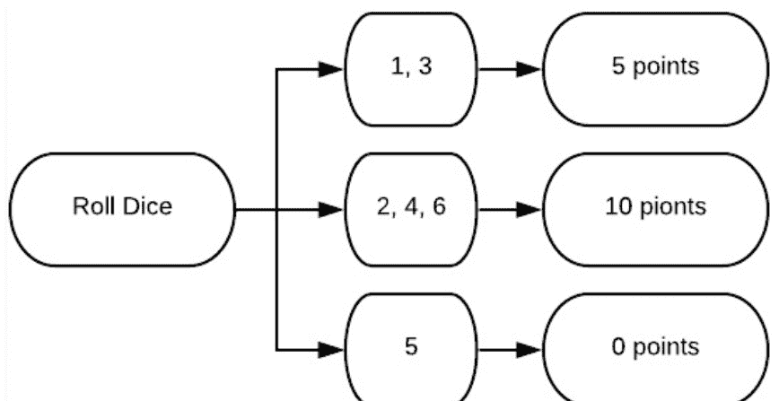

如你所见，得分取决于掷出的数字。现在，假设你掷出了一个 **1**。让我们看看你的第二次掷骰可能是什么样子：

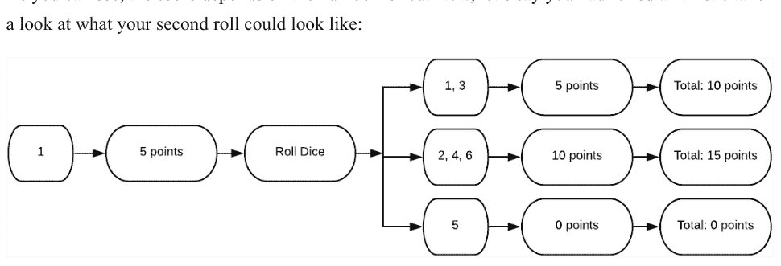

如你所见，我们可能得到三种总分。要将其转化为算法，我们需要做几件事：

1.  定义掷骰。
2.  根据掷出的点数确定得分。
3.  再次掷骰。
4.  根据第二次掷骰确定最终得分。

首先，让我们定义掷骰。我们需要虚拟地掷骰子。这意味着我们需要程序选择一个1到6之间的数字。让我们看看如何编写这段代码。请记住，这只是该文件中包含的更大代码的一个片段。我们将在后续片段中使用第二个 `ready`（`ready2`）：

```python
ch11_rollDice.py

import random as rand
print("Let's play a game. ")
print("You get 5 points for rolling 1 or 3. You get 5 points for rolling 2, 4, or 6.")
print("You lose all points if you roll a 5 in either round.")
ready = input("Are you ready to begin? Type r to roll. ")
score = 0
if ready == 'r':
    roll = rand.randint(1, 6)
    print(f'You rolled a {roll}')
    if (roll == 1) or (roll == 3):
        score = 5
    elif (roll == 5):
        score = 0
    else:
        score = 10
    ready2 = input(f'Your round 1 score is {score}. Type r to roll again. ')
```

请注意，在前面的代码片段中，我们必须为这个特定算法导入 `random` 库。将其导入为 `rand` 而不是 `random`，可以让我们缩短一些代码，从而少打一些字。因此，我们使用 `rand.randint()` 而不是 `random.randint()`。我们需要 `random` 库，因为我们希望访问*随机整数函数*，以便算法可以选择一个1到6之间的数字（包括两端）。让我们看看当前的输出：

```
Let's play a game.
You get 5 points for rolling 1 or 3. You get 5 points for rolling 2, 4, or 6.
You lose all points if you roll a 5 in either round.
Are you ready to begin? Type r to roll. r
You rolled a 3.
Your round 1 score is 5.
```

请注意，从前面的输出中，首先提供了说明。然后，一旦玩家通过按 `r` 键选择掷骰，游戏就选择了一个随机整数并显示出来。它还显示了第一轮后的当前得分。现在，让我们看看算法的下一部分，它执行第二次掷骰。请注意，缩进遵循前面的代码片段。此片段也包含在前面的更大文件中：

```python
ready2 = input(f'Your round 1 score is {score}. Type r to roll again. ')
roll2 = rand.randint(1, 6)
print(f'You rolled a {roll2}')
if (roll2 == 1) or (roll2 == 3):
    score += 5
elif (roll2 == 5):
    score = 0
else:
    score += 10
print(f'Your final score is {score}.')
```

当我们运行新代码时，它会显示*第一轮得分*、两次掷骰以及游戏的最终得分。记住，如果我们在第二轮掷出5，我们将失去所有分数：

```
Let's play a game.
You get 5 points for rolling 1 or 3. You get 5 points for rolling 2, 4, or 6.
You lose all points if you roll a 5 in either round.
Are you ready to begin? Type r to roll. r
You rolled a 2.
Your round 1 score is 10. Type r to roll again. r
You rolled a 6.
Your final score is 20.
```

如你所见，程序为我们打印了一些内容。首先，我们掷出了2和6，所以我们没有失去分数。其次，2和6各得10分，最终得分为20。但让我们回顾一下嵌套的 `if` 语句。

要开始游戏，我们必须验证玩家是否准备好掷骰。第一个 `if` 语句对于进行后续决策是必要的。*我们能否在没有许可的情况下掷骰？* 是的。但想想所有的游戏，包括传统棋盘游戏的应用程序版本。在这些应用程序中，玩家总是点击按钮或骰子来玩。这是一个类似的情况。

一旦我们说我们准备好掷骰，就必须对分数做出决策。我们需要再次使用 `if`、`elif` 和 `else` 语句来遍历各种选项。现在，让我们看看何时可以使用 `for` 循环和 `range()`。

### 使用 for 循环和 range()

关于 `for` 循环，我们需要讨论的第一件事是，有时变量和 `for` 循环条件可能会引起一些混淆。为了理解我的意思，让我们看一个例子：

```python
ch11_forLoop1.py

for letter in 'mountain':
    print(letter)
```

在前面的代码片段中，`letter` 不是一个变量。它只是告诉 Python 我们想要遍历单词 `mountain` 中的每个字符。然而，我可以给它起任何名字。如果我这样写，程序会做同样的事情：

```python
for pin in 'mountain':
    print(pin)
```

在任何一种情况下，使用 `letter`、`pin` 或任何当时让我开心的词，程序的输出如下所示：

```
m
o
u
n
t
a
i
n
```

如你所见，Python 遍历了单词 `mountain` 中的每个字母并将其打印到控制台。对于范围内的数字也可以做同样的事情。例如，如果我想打印数字1到10，我可以使用 `for` 循环，如下所示：

```python
ch11_forLoop2.py

for num in range(1, 11):
    print(num)
```

*等等——我说我想要数字1到10，为什么 range() 函数里有个11？* 这是因为 `range()` 函数总是包含范围内的最小值，但不包括上界。因此，我们需要在最大数字上加1。让我们看看这个程序的输出是什么样的：

```
1
2
3
4
5
6
7
8
9
10
```

如你所见，每个数字都打印在单独的行上。那么，让我们看看如果我们想将这些相同的数字添加到列表中而不是打印它们，我们可以怎么做。我们可以将它们附加到一个新列表中，然后打印出该列表，而不是一次打印一个。这对于某些类型的算法和游戏很有帮助。但在深入探讨之前，让我们看看如何用几行代码将数字附加到列表中：

```python
ch11_forLoop3.py

myNumbers = []
for num in range(1, 11):
    myNumbers.append(num)
print(myNumbers)
```

现在，请密切注意何时打印列表。如果你的缩进正确，每次附加新数字时它都会打印列表。但如果你的缩进正确，你只会打印最终列表，因此输出如下所示：

```
[1, 2, 3, 4, 5, 6, 7, 8, 9, 10]
```

如你所见，我们现在有了相同信息的表示。在这种情况下，我们打印出了数字列表。如果你试图将特定内容附加到列表中，即使它是通过用户输入，这也很有帮助。我们将在下一节讨论 while 循环时再看另一个列表问题，但在继续之前，让我们再看一个 for 循环问题和算法。

假设你想要一个算法来打印一系列数字的立方。有一个条件：范围将根据用户输入而变化。让我们看看一个执行此操作的算法：

```python
ch11_forLoop4.py

print('This program will provide a list of cubes for you. ')
minRange = int(input('What\'s the minimum for your range? '))
maxRange = int(input('What\'s the maximum for your range? '))
listOfCubes = []
for value in range(minRange, maxRange+1):
    number = value**3
    listOfCubes.append(number)
print(f'Your list of cubes in the range {minRange},{maxRange} is: ')
print(listOfCubes)
```

让我们注意一下前面程序的几个要点：

-   我们将输入转换为 int 类型。我们这样做是为了可以在 for 循环内的数学表达式中使用该数字。
-   我们有一个空列表，以便可以将立方值附加到其中。
-   我们在 maxRange 上加了1，因为如果不加，该数字将不会包含在我们的结果中。
-   我们有一个基于两个变量的范围，这两个变量是用户输入。
-   我们有一个打印出的值列表。

当我们输入 range(3, 6) 时，该程序如下所示：

```
This program will provide a list of cubes for you.
What's the minimum for your range? 3
What's the maximum for your range? 6
Your list of cubes in the range(3, 6) is:
[27, 64, 125, 216]
```

如你所见，程序接收了提供的输入（最小值为3，最大值为6），并创建了该范围内数字的立方列表。

#### 重要提示

请记住，在Python中，我们使用`**`符号来获取指数。因此，`2**2`等于4，`3**4`等于81，以此类推。

请记住，控制流是指事情执行的顺序。通过`for`循环和`range()`，我们让程序重复执行操作，而无需逐行输入，从而有效地操控控制流，使其以循环方式而非逐行顺序执行。

既然我们已经了解了`for`循环和`range()`，接下来让我们看看Python中其他迭代方式。

### 使用其他循环和条件语句

除了`for`循环，Python还提供了多种遍历信息的方式。最常用的循环之一是`while`循环。使用`while`循环时，我们会持续检查一个条件。同样，通过一个例子来理解会更容易。

假设我们正在玩一个游戏，要求用户尽可能多地提供动物名称。我们希望能够完成以下几件事：

1.  检查玩家是否有动物可以添加。
2.  如果有，将每个动物添加到列表中。
3.  如果没有，结束程序并提供最终列表。
4.  提供最终列表以及玩家能够输入的动物数量。

让我们来看一个实现此游戏基本功能的算法：

```python
ch11_whileLoop1.py

myAnimals = []
print('Let\'s see how many animals you can name. Get ready!')
readyPlayer = input('When you are ready to begin, type y. ')
while readyPlayer == 'y':
    animalAdd = input('Name an animal. ')
    myAnimals.append(animalAdd)
    readyPlayer = input('Ready for the next one? Type y for yes or n for no. ')
howMany = len(myAnimals)
print(f'You were able to name {howMany} animals. Here\'s your list: ')
print(myAnimals)
```

让我们稍微分解一下这段代码：

1.  我们创建了一个空列表`myAnimals`。
2.  然后，我们询问玩家是否准备好。
3.  如果答案是肯定的，我们就要求输入一个动物。
4.  接着，我们检查他们是否还有更多要添加。
5.  我们检查有多少项被添加到了列表中。
6.  我们打印出列表。

请注意，我们不得不使用`while`循环和`if`语句。这是因为我们希望持续询问玩家是否要添加动物，直到他们完成或想不出更多为止。因此，只要玩家还能添加项目，我们就希望程序继续提问。但如果玩家完成了，他们就可以对添加另一个动物说“不”，从而结束程序。

现在，我想明确一点：这个程序可以做得更好。我们可以添加一个计时器，看看在30秒内能输入多少个项目。我们还可以添加一个条件，当玩家试图在说“是”之前输入动物时，中断程序并解释原因。我们还可以添加一个条件，处理玩家试图输入列表中已有的动物的情况。*对你来说，一个挑战就是尝试将这些组件添加到现有程序中！*

但让我们看看运行这个程序时的样子：

```
Let's see how many animals you can name. Get ready!
When you are ready to begin, type y. y
Name an animal. bird
Ready for the next one? Type y for yes or n for no. y
Name an animal. dog
Ready for the next one? Type y for yes or n for no. y
Name an animal. cat
Ready for the next one? Type y for yes or n for no. y
Name an animal. mouse
Ready for the next one? Type y for yes or n for no. y
Name an animal. elephant
Ready for the next one? Type y for yes or n for no. n
You were able to name 5 animals. Here's your list:
['bird', 'dog', 'cat', 'mouse', 'elephant']
```

请注意，这个程序的编写方式要求我们每次都要回答是否要添加动物。这是因为只要我们回答`yes`，条件就会一直运行。但一旦我们回答`no`，程序就会结束，给出动物列表以及我们能够命名的数量。

现在，让我们看看另一个`while`循环。这次，我们将检查条件是否为`true`。看看下面的代码片段：

```python
ch11_whileLoop2.py

while True:
    num = int(input('Please enter an integer 0 through 9. '))
    if num in range(0, 10):
        print(num)
    else:
        print('That\'s not in range. ')
        break
```

在前面的算法中，控制流决定了我们会反复被要求输入一个0到9之间的数字。程序会持续询问，直到我们出错。这是因为如果我们给出一个0到9之间的数字，条件就会持续为真。让我们看看一个示例输出：

```
Please enter an integer 0 through 9. 0
0
Please enter an integer 0 through 9. 1
1
Please enter an integer 0 through 9. 2
2
Please enter an integer 0 through 9. 3
3
Please enter an integer 0 through 9. 4
4
Please enter an integer 0 through 9. 39
That's not in range.
```

请注意，程序一遍又一遍地问着同样的问题。如果用户不知道如何打破循环，这有时会很麻烦。我们可以在语句中添加一行，这样它在提问的同时提供一个提示。看看修改后的代码：

```python
ch11_whileLoop3.py

while True:
    num = int(input('Please enter an integer 0 through 9. Tired? Type a number out of range. '))
    if num in range(0, 10):
        print(num)
    else:
        print('That\'s not in range. ')
        break
```

如你所见，我们现在告诉用户，如果他们厌倦了提供范围内的数字，可以通过提供范围外的输入来选择退出。虽然这个例子看起来不太实用，但想想所有可能的应用场景。例如，这种算法可以用于纸牌游戏。你也可以用类似的东西来根据现有列表检查输入。

现在，让我们再次看看函数，但这次是结合我们的一些循环并添加一些功能。

## 重新审视函数

你可能还记得[第9章](https://example.com)《Python简介》中，我们介绍了内置函数，但也介绍了如何定义自己的函数。现在，随着我们深入探讨Python中*控制流*的工作原理，我们将讨论*函数*和*循环*中的参数。

让我们思考涉及范围的问题。范围接受两个参数：一个最小值和一个最大值。然而，在Python中，请注意你可以只给出一个参数，此时最小值默认为0。例如，如果我写`range(8)`，这等同于`range(0, 8)`。看看在Python shell中输入`range(2)`会发生什么：

```
>>> range(2)
range(0, 2)
```

图11.3 – Python对单参数range的解释

在*图11.3*中，你可以看到程序将代码解释为`range(0, 2)`。但假设你总是改变范围。想想我们之前写的范围算法。我们现在将使用一个函数重写它。这个函数内部现在也有一个`for`循环：

```python
ch11_functions1.py

minNum = int(input('What\'s your minimum number? '))
maxNum = int(input('What\'s your maximum number? '))
def myNumbers(minNum, maxNum):
    myList = []
    for num in range(minNum, maxNum + 1):
        myList.append(num)
    print(myList)
myNumbers(minNum, maxNum)
```

请注意，我们是根据用户输入来调用函数的。当这个程序运行时，它会根据该输入调用函数。我们稍后会重新审视这一点，并通过在算法中调用多个范围来运行程序，但先看看前面的代码片段输出了什么：

```
What's your minimum number? 3
What's your maximum number? 9
[3, 4, 5, 6, 7, 8, 9]
```

请注意，我们如何在`for`循环中调整了范围的最大值，使其包含提供的最大数字。这样我们才能得到完整的数字列表。

现在，让我们完全移除输入部分。我们将在算法中使用不同的范围多次调用该函数。看看更新后的代码片段：

```python
ch11_functions2.py

def myNumbers(minNum, maxNum):
    myList = []
    for num in range(minNum, maxNum + 1):
        myList.append(num)
    print(myList)
myNumbers(4, 9)
myNumbers(1, 3)
myNumbers(9, 17)
```

最后三条语句指定了我们调用函数的位置。由于我们定义的函数接受两个参数，它使用这两个参数来运行函数。因为我们调用了三次函数，我们应该会看到三个列表作为输出。让我们看看：

## 总结

本章中，我们通过探讨 **for** 循环、**range()**、**while** 循环和函数，讨论了控制流与顺序。**控制流**指的是程序读取算法的顺序。通常在 Python 中，程序会逐行执行。本章我们学习了如何控制这种顺序。具体来说，我们了解到可以通过遍历数据来实现这一点。以下是一些需要记住的要点：**while** 循环在满足条件时持续运行，**for** 循环遍历序列（字符串、数值、列表、字典、集合或元组），而 **range()** 用于创建数字序列。

我们还学习了在创建条件、定义函数和设计算法时，可以将这些元素组合使用。最重要的是要记住顺序很重要，因此我们需要谨慎处理必要变量的定义时机以及算法的编写方式，以确保算法不会无限运行或在预期之前中断。控制流至关重要，它能确保我们的算法无误运行。

在下一章中，我们将运用目前所学的知识，在解决多学科挑战时完成计算思维过程。

# 12

## 在简单挑战中运用计算思维与 Python

本章我们将再次审视计算思维过程，并将其应用于设计算法，以帮助我们解决各种场景和问题。随着本书 *第二部分：应用 Python 与计算思维* 的收尾，我们将结合关于 Python 功能的一些知识与计算思维过程来解决这些问题。

本章将涵盖以下主题：

- 问题定义与 Python
- 问题泛化与 Python 算法规划
- 算法设计与测试

学完本章后，你将能够设计出最适合所呈现场景的算法。你还将能够识别与所呈现问题最匹配的 Python 函数，并泛化你的解决方案。

## 技术要求

你需要安装最新版本的 Python 才能运行本章中的代码。

本章使用的源代码可在此 GitHub 仓库中找到：
https://github.com/PacktPublishing/Applied-Computational-Thinking-with-Python-Second-Edition/tree/main/Chapter12。

## 问题定义与 Python

我们将深入探讨第一个场景。你正在为一个你设计的产品发起一场活动。你正在寻找总额达到 100,000 美元的认捐投资。你希望创建一个能保存信息的算法。该算法需要保存所做的认捐以及作为认捐福利相关的任何产品。在编写算法之前，你需要明确一些事项：

- *你的活动中将提供多少种类型的认捐？*
- *是否会有仅捐款的认捐选项？捐款者是否会获得任何回报，例如贴纸、电子证书或其他产品赠品？*

## 分解问题并运用 Python 功能

我们可以创建一个算法来设计这些认捐方案。我们将设计一个算法，根据设定的认捐数量，告诉我们每种类型需要多少件物品。

例如，假设我们有三个等级的认捐方案和一个纯捐赠方案。对于最高等级（我们称之为 **等级 1**），你将获得以下内容：

- 以 20% 折扣购买双倍数量的销售物品
- 该物品的配件套装，包含四件物品
- 该物品和配件的便携包
- 网站 1 年会员资格

中间等级，即 **等级 2**，提供以下物品：

- 以 20% 折扣购买销售物品
- 该物品的便携包
- 网站 6 个月会员资格

最低等级，即 **等级 3**，提供以下内容：

- 以 20% 折扣购买销售物品
- 该物品的便携包

假设我们想要一个算法，根据每个等级允许的认捐数量，告诉我们需要多少件物品。**第四个等级**，即纯捐赠，不会影响我们的算法，因为该算法仅用于根据认捐数量确定我们需要多少件每种物品。

但事情并不像数字那么简单。假设如本章前面所述，你需要 100,000 美元的认捐。那么，你需要确定每个等级的收费价格，并为其设定价格点。你需要提供足够数量的认捐，以至少达到 100,000 美元的目标。

你已确定物品的零售价为 800 美元。以下是每件物品的成本：

- 物品本身 640 美元（给予 20% 折扣，仅适用于等级 1、2 和 3）
- 配件 100 美元（仅等级 1）
- 便携包 40 美元（适用于等级 1、2 和 3）
- 会员费用按每月 10 美元计算（假设原始成本为每月 35 美元）

对于等级 1，认捐金额至少需要 1,540 美元：

- $640 \times 2 = 1280$
- $12 \times 10 = 120$
- $1280 + 120 + 100 + 40 = 1540$

对于等级 2，认捐金额至少需要 740 美元：

- $640 + 40 = 680$
- $6 \times 10 = 60$
- $680 + 60 = 740$

对于等级 3，认捐金额至少需要 680 美元；即 $640 + 40 = 680$。

现在，我们需要确定每个等级可供购买的数量。但首先，让我们将这些数字取整：等级 1 为 1,600 美元，等级 2 为 800 美元，等级 3 为 700 美元。

我们可以编写一个算法来告诉我们每个等级需要多少认捐。但在开始之前，让我们先谈谈 Python 以及我们可以使用的功能。我们可以先创建一个等级 3 的认捐方案，将其作为父组。然后，我们可以创建两个子类，等级 1 和等级 2，它们具有略微不同的特性和成本。我们问自己的问题是，算法是否需要如此详细，或者我们是否可以直接添加每个等级的成本/价值。

这是个好问题。答案是，这取决于你需要这个算法的用途。如果你希望进行早期但简单的计算，并且需要一个可以根据当前销售/认捐情况定期运行的算法，那么你可以用字典或函数创建一些简单的东西。但如果你想将算法用于多种目的，或者需要在以后调整某些成本，那么你可能希望将所有细节编码到算法中。

*为什么需要那样？* 看看一些成功的众筹活动。通常，这些活动的原始认捐方案会售罄。然后会出现新的认捐等级，你可能需要调整这些等级的价格点。例如，认捐方案可能不是提供物品 20% 的折扣，而是 15% 的折扣。其他变化也可能发生，例如由于库存限制，销售周边商品而不是配件，等等。

从长远来看，你的算法越详细，你能用它做的事情就越多。但如果你不需要所有这些信息，那么你可能不想花那么多时间来创建算法。

让我们开始处理这个算法。看看下面的代码片段：

### ch12_pledgesA.py

```python
import math
tier1 = 1600
tier2 = 800
tier3 = 700
perc = int(input("What percentage of the 100,000 do you expect will be Tier 1? Type a number between 1 and 100. "))
percentage = perc/100
Tier1 = (100000*percentage)/1600
totalTier1 = math.ceil(Tier1)
print(f"You will need to sell {totalTier1} Tier 1 pledges if you want {perc} percent of your sales to be in Tier 1." )
```

让我们看看前面代码片段中使用的一些内容。我们必须导入 `math` 模块，以便使用 `math.ceil()` 数学函数。我们使用这个函数来向上取整所需的等级 1 认捐数量。这是因为如果我们向下取整，我们将无法覆盖所需的百分比。通过这样做，我们找到了覆盖该百分比所需的最小整数。

当我们运行该程序时，输出如下所示：

```
What percentage of the 100,000 do you expect will be Tier 1? Type a number between 1 and 100. 45
You will need to sell 29 Tier 1 pledges if you want 45 percent of your sales to be in Tier 1.
```

请注意，我们的 `print` 语句使用了用户输入的百分比，部分是为了确保信息与预期相符。要使 45% 的资金来自等级 1 认捐，我们需要至少销售 29 个等级 1 认捐。如果我们进行计算来验证这一点，我们会发现这个信息是正确的：

29 × 1,600 = 46,400
100,000 × 0.45 = 45,000

如你所见，如果我们销售 29 个等级 1 认捐，我们将获得略高于 100,000 美元 45% 的资金。

但假设你还希望算法根据等级 1 认捐的数量告诉你需要多少件物品。让我们看看调整后的算法：

### ch12_pledgesB

```python
import math
tier1 = 1600
tier2 = 800
tier3 = 700
perc = int(input("What percentage of the 100,000 do you expect will be Tier 1? Type a number between 1 and 100. "))
percentage = perc/100
Tier1 = (100000*percentage)/1600
totalTier1 = math.ceil(Tier1)
print(f"You will need to sell {totalTier1} Tier 1 pledges if you want {perc} percent of your sales to be in Tier 1." )
print(f"You will need {totalTier1*2} items, {totalTier1} accessories kits, {totalTier1} carrying cases, and {totalTier1} year-long memberships." )
```

请注意，我只添加了一个 `print` 语句。以这种方式使用此算法有利有弊。在这种情况下，我只输出每个等级的数字。我没有在算法中说明我需要多少件物品。如果我们希望将来参考，我们需要调整获取该信息的方式以及在算法中保存它的方式。

对于这个算法，输出如下：

```
What percentage of the 100,000 do you expect will be Tier 1? Type a number between 1 and 100. 45
You will need to sell 29 Tier 1 pledges if you want 45 percent of your sales to be in Tier 1.
You will need 58 items, 29 accessories kits, 29 carrying cases, and 29 year-long memberships.
```

请注意，我们得到了想要的信息。我们需要 **58 件物品**、**29 个配件套装**、**29 个便携包** 和 **29 个为期一年的会员资格**。同样，如果我们只做一次性的事情或者不期望任何变化，这将很有帮助。但让我们明确一点，这种情况很少发生。我们会想要做出改变。我们还需要根据等级 2 和等级 3 的选择来了解信息。*那么，我们能做什么呢？*

首先，我们需要保存我们的数字。因此，我们需要为物品、配件套装、便携包添加一些变量，以及两个会员变量，一个用于为期一年的会员，一个用于为期六个月的会员。我们还需要决定如何分配其余的认捐。*我们是否希望其他百分比在等级 2 和等级 3 之间平均分配？我们是否希望剩余部分的三分之一是等级 2，三分之二是等级 3？* 让我们采用这些数字。目前的情况如下：

- 等级 1 的百分比由用户在程序运行时选择
- 等级 2 的百分比将是剩余百分比的三分之一
- 等级 3 将是剩余百分比的三分之二

让我们将此教给算法。以下文件包含完整、未中断的代码。我们添加了一些文本来解释某些部分，如下所示：

### ch12_pledgesC.py

```python
tier1 = 1600
tier2 = 800
tier3 = 700
perc = int(input("What percentage of the 100,000 do you expect will be Tier 1? Type a number between 1 and 100."))
percTier1 = perc/100
percTier2 = (100-perc)/3/100
percTier3 = (100-perc-percTier2)/100
```

请注意，在下面的代码片段中，我们添加了一些变量，例如 `totalTier1`、`itemsTier1`、`accTier1` 和 `cases1`。这些变量将帮助我们保存每个等级的订购数量。我们将对等级 2 和等级 3 进行同样的操作：

```python
Tier1 = (100000*percTier1)/1600
totalTier1 = math.ceil(Tier1)
itemsTier1 = totalTier1*2
accTier1 = totalTier1
cases1 = totalTier1
yearMemb = totalTier1
Tier2 = (100000*percTier2)/800
totalTier2 = math.ceil(Tier2)
itemsTier2 = totalTier2
cases2 = totalTier2
sixMemb = totalTier2
Tier3 = (100000*percTier3)/700
totalTier3 = math.ceil(Tier3)
itemsTier3 = totalTier3
cases3 = totalTier3
totalItems = itemsTier1 + itemsTier2 + itemsTier3
totalAccessories = accTier1
totalCases = cases1 + cases2 + cases3
print(f"You will need to sell {totalTier1} Tier 1 pledges if you want {perc} percent of your sales to be in Tier 1.")
print(f"You will need {totalTier2} Tier 2 pledges and {totalTier3} Tier 3 pledges to meet or exceed your $100,000 funding goal.")
```

虽然我们还没有打印出总物品数或总箱数的详细信息，但我们现在已经将它们保存到了变量中。这是我们现在的输出样子：

```
What percentage of the 100,000 do you expect will be Tier 1? Type a number between 1 and 100. 50
You will need to sell 32 Tier 1 pledges if you want 50 percent of your sales to be in Tier 1.
You will need 21 Tier 2 pledges and 72 Tier 3 pledges to meet or exceed your $100,000 funding goal.
```

我们应该注意到，我们超出了资金目标，因为我们一直都在向上取整。也就是说，对于等级 1，我们没有使用 $1,540，而是使用了 $1,600。对于百分比，我们也一直向上取整。所有这些加起来将使我们的总额超过 $100,000。

让我们稍微扩展一下这个算法。以下只是我们已经见过的算法中的新片段，其中包含了我们需要的物品总数：

```python
print(f"These percentages are equivalent to {totalItems} total items, {totalCases} total cases, {totalAccessories} accessories kits, {yearMemb} year-long memberships, and {sixMemb} six-month memberships.")
```

请注意，我们现在可以在 `print` 函数中调用那些我们添加的变量，以获取我们库存所需的数量。如果我们没有在算法中定义这些物品，我们就无法获得这些详细信息。

另外，请注意，在我们之前的片段中，有些物品的值是相同的。然而，我们仍然用不同的变量来定义它们。例如，看看 `cases2 = totalTier2` 和 `sixMemb = totalTier2`。尽管两者具有相同的值，但我们希望分别标识它们。也许现在这并不重要，但以后，也许我们会用完箱子。那么，我们只想更改箱子的值，而不更改 6 个月会员资格的值。

由于它们已经分开，我们可以更改一个而不影响另一个。让我们看看新的 `print` 语句的输出是什么样子的：

**这些百分比相当于 157 件总物品、125 个总箱子、32 个配件包、32 个为期一年的会员资格和 21 个为期六个月的会员资格。**

看这个，你可能会意识到，在等级 1 中，你只得到一个手提箱，但有两件物品，这就是为什么它们的计数不同。配件和为期一年的会员资格只出现在等级 1 中，所以这两个数字相同是有道理的。为期六个月的会员资格只适用于等级 2，所以这个数字与等级 2 的认捐数量相匹配。

当我们进一步考虑这个问题时，我们可能会意识到我们可能希望以不同的方式保存信息。也许，与其询问用户他们想要的等级 1 认捐的百分比，我们可以询问他们拥有的总物品数量，然后根据此细分等级。所有这些都是可能的，因此我们如何定义问题至关重要。我们如何保存信息或从用户那里请求输入也同样重要。分解问题只是创建和设计我们需要的算法过程的一部分。

在本节中，我们学习了如何根据我们的目标来解决具有多种解决方案的问题。在定义问题时，我们通常也在识别我们需要的变量，并根据我们希望从算法中获得的结果来确定哪些类型的函数最有用。除非我们有一个非常简单直接的问题，否则问题的分解和定义对于成功定义算法至关重要。

现在，让我们在下一节中看看如何泛化这个问题。

## 泛化问题并规划 Python 算法

在上一节中，我们使用了一个为资金活动设计的算法。我们研究的算法是针对特定问题的。

现在，让我们尝试泛化这个问题，并理解我们如何可能设计一个不同的算法。*为什么我们需要那个？* 把它想象成一个模板。如果你为初创公司运行多个资金活动，你可能想要创建一个通用算法，然后根据每个活动的需求进行调整，而不必从头开始每个活动。

你需要设置一些明确的参数并做出一些决定。为了使这个场景在本书的目的下易于管理，我们将限制我们的选择：

-   每个活动将有三到五个认捐等级，不包括仅捐赠。
-   每个等级将询问每个等级所需的物品。
-   每个等级选项将内置一个固定的百分比。

如果有三个等级，等级 1 将占认捐的 50%，等级 2 占 30%，等级 3 占 20%。如果有四个等级，等级 1 占 40%，等级 2 占 30%，等级 3 占 20%，等级 4 占 10%。如果有五个等级，等级 1 占 40%，等级 2 占 30%，等级 3 占 15%，等级 4 占 10%，等级 5 占 5%。

请看下面的图表，它显示了等级的细分：

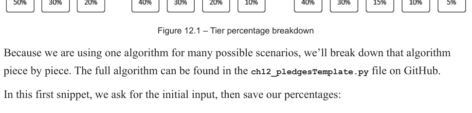

因为我们将使用一个算法来处理许多可能的场景，所以我们将逐部分分解该算法。完整的算法可以在 GitHub 上的 **ch12_pledgesTemplate.py** 文件中找到。

在第一个片段中，我们请求初始输入，然后保存我们的百分比：

```python
import math
numberTiers = int(input("How many tiers of pledges will you offer? Enter a number between 3 and 5 inclusive. "))
#Number of tiers percentages
if numberTiers == 3:
    tier1 = .50
    tier2 = .30
    tier3 = .20
elif numberTiers == 4:
    tier1 = .40
    tier2 = .30
    tier3 = .20
    tier4 = .10
elif numberTiers == 5:
    tier1 = .40
    tier2 = .30
    tier3 = .15
    tier4 = .10
    tier5 = .05
else:
    print("Please try again and enter the numbers 3, 4, or 5.")
```

如你所见，在请求输入后有三个条件。请注意，我们将输入转换为整数。这很重要，否则条件会运行，但 **else** 条件也会运行。

前面的片段除了请求该输入外不会给我们任何输出。因此，我们将在下一个片段之后显示更多输出。

#### 重要提示

*请注意此代码中注释的使用。由于代码较长，我们将使用注释来在需要编辑代码时找到代码中的位置。在所有代码中使用注释总是一个好主意，尤其是在冗长的代码中。否则，找到我们想要更改的特定行可能会非常棘手。*

一旦我们有了等级数量，我们就需要知道每个等级的物品数量。我们需要询问每个等级选择了多少物品。让我们看看前面代码的延续：

```python
#Number of items per tier
if numberTiers == 3:
    numTier1Items = int(input("How many items will be provided for a Tier 1 pledge? "))
    numTier2Items = int(input("How many items will be provided for a Tier 2 pledge? "))
    numTier3Items = int(input("How many items will be provided for a Tier 3 pledge? "))
elif numberTiers == 4:
    numTier1Items = int(input("How many items will be provided for a Tier 1 pledge? "))
    numTier2Items = int(input("How many items will be provided for a Tier 2 pledge? "))
    numTier3Items = int(input("How many items will be provided for a Tier 3 pledge? "))
    numTier4Items = int(input("How many items will be provided for a Tier 4 pledge? "))
```

请注意，我们只显示了等级为 3 或 4 的条件。代码文件还将包含五个等级的信息，但它遵循前面代码中显示的内容。请注意，该算法要求为每个等级输入。当我们需要处理数字和百分比时，这将很重要。

此外，我们可以包含一个 **else** 语句，以便在输入出现错误时再次询问问题。如果你愿意，可以将这些类型的条件添加到现有模板中。

现在，我们将继续处理接下来需要从用户那里获取的信息，例如每个层级的价格点。

现在，让我们回顾一下我们可能需要什么。我们需要每个层级的价格点，这也将是某种模板算法的输入请求。由于每个活动的这些价格点都会不同，我们需要让用户自己输入。输入行看起来与之前显示的代码片段非常相似。以下是三个层级的示例：

```
#Price points for each Tier
if numberTiers == 3:
    priceTier1 = int(input("What is the price point of Tier
        1? Enter dollar amount without dollar sign. "))
    priceTier2 = int(input("What is the price point of Tier
        2? Enter dollar amount without dollar sign. "))
    priceTier3 = int(input("What is the price point of Tier
        3? Enter dollar amount without dollar sign. "))
```

同样，请注意我们使用注释来分隔代码的每个部分。如你所见，我们正在添加关于每个承诺层级收费多少的信息。然后，代码会继续为层级数量（3、4或5）执行此操作。

正如之前讨论的，你可能还想测试错误或提供替代方案，以便在用户输入错误后继续运行代码。我们在此代码中没有处理这些错误，但当然可以添加它们以改善用户使用此算法的体验。如你所见，我们已经开始着手如何将此算法泛化以适用于多种场景。

在这种情况下，我们正在为多种用途进行泛化。但我们在本书中已经使用过很多算法并见过很多场景，其中模式的泛化要简单得多。泛化可以简单到用一个变量写一个方程，也可以是为多种情况和条件创建一个算法。这就是为什么识别我们的问题是什么以及我们到底想完成什么很重要的原因。

在本节中，我们了解了如何以及何时从用户那里获取输入。我们还通过定义变量来存储输入，并在算法的方程中使用它来输出必要信息。

为了完成算法，我们将进入下一节，该节专注于算法的设计和测试。

## 设计和测试算法

在上一节中，我们从用户那里获取了大量输入，因为我们正在创建一个用作许多活动模板的算法。现在，我们需要以多种方式使用这些输入。以下是我们目前拥有的信息：

- 承诺层级的数量
- 各层级的百分比分布
- 每个层级的物品数量
- 每个层级的成本

现在，我们可以利用所有这些信息做些事情。首先，让我们谈谈我们可能想要什么。我们可能想测试销售特定数量的层级能赚多少钱。我们也可以根据资金目标分解每个层级需要多少，就像我们在本章第一部分所做的那样。

*什么最有帮助？* 嗯，这取决于你的需求。我想说，我想要一个基于资金目标的分解。我想知道我需要提供多少个每种类型的承诺。所以，现在我必须弄清楚如何从我已经定义的变量中获取这些信息。

我们在这里也需要三个条件。并且由于变量以及每个变量的数量因层级类型而异，我们需要确保考虑到这些信息。让我们先考虑三个层级。给定资金目标，以下是一些有用的输出：

- 需要提供的每个层级的承诺数量
- 每个层级需要库存的物品数量

*那么，我们如何计算出来呢？*

假设我们的资金目标是50,000美元，并且假设第一层级的成本是500美元。那么，我们可以采取以下步骤来找出所需的第一层级承诺数量：

1. 将资金目标乘以百分比；即，$50,000 \times 0.50 = 25,000$。
2. 将结果除以承诺的成本；即，$25,000 \div 500 = 50$。

这意味着我们需要发布50个第一层级的承诺。现在，假设用户输入第一层级有三件物品。那么，这意味着 $50 \times 3 = 150$ 件物品。

现在，让我们在代码中看看这个。记住，这与之前的代码片段是同一个文件（**ch12_pledgesTemplate.py**）。我们继续使用代码片段进行讨论：

```
#Breakdown of the number of Tiers based on funding goal
fundGoal = int(input("What is the funding goal for this campaign? Enter dollar amount with no symbols. "))
if numberTiers == 3:
    Tier1Total = math.ceil(fundGoal*tier1/priceTier1)
    Tier2Total = math.ceil(fundGoal*tier2/priceTier2)
    Tier3Total = math.ceil(fundGoal*tier3/priceTier3)
    print(f"For a funding goal of {fundGoal} with {numberTiers} tiers, you'll need {Tier1Total} 1 pledges, {Tier2Total} Tier 2 pledges, and {Tier3Total} Tier 3 pledges. ")
```

在前面的代码片段中，我们有一个 `print` 函数，其中包含每个层级的承诺数量，但它们也作为函数保存在我们的条件语句中。注意我们现在会有一些输出。我们将从这个代码片段中获得所需的承诺数量，但不是每个层级的物品数量。我们稍后会添加。目前，当我们运行程序时，输出如下所示：

```
How many tiers of pledges will you offer? Enter a number between 3 and 5 inclusive. 3
How many items will be provided for a Tier 1 pledge? Enter a number between 1 and 3 inclusive. 3
How many items will be provided for a Tier 2 pledge? Enter a number between 1 and 3 inclusive. 2
How many items will be provided for a Tier 3 pledge? Enter a number between 1 and 3 inclusive. 1
What is the price point of Tier 1? Enter dollar amount without dollar sign. 500
What is the price point of Tier 2? Enter dollar amount without dollar sign. 400
What is the price point of Tier 3? Enter dollar amount without dollar sign. 350
What is the funding goal for this campaign? Enter dollar amount with no symbols. 50000
For a funding goal of 50000 with 3 tiers, you'll need 50 Tier 1 pledges, 38 Tier 2 pledges, and 29 Tier 3 pledges.
```

如你所见，我们现在知道需要列出50个500美元的第一层级承诺、38个400美元的第二层级承诺和29个350美元的第三层级承诺，以达到我们的资金目标。现在，我们必须根据提供的每个层级的物品数量，计算出每个层级需要多少件物品。代码如下所示：

```
if numberTiers == 3:
    Tier1Total = math.ceil(fundGoal*tier1/priceTier1)
    Tier2Total = math.ceil(fundGoal*tier2/priceTier2)
    Tier3Total = math.ceil(fundGoal*tier3/priceTier3)
    print(f"For a funding goal of {fundGoal} with {numberTiers} tiers, you'll need {Tier1Total} 1 pledges, {Tier2Total} Tier 2 pledges, and {Tier3Total} Tier 3 pledges. " )
    Tier1Items = numTier1Items*Tier1Total
    Tier2Items = numTier2Items*Tier2Total
    Tier3Items = numTier3Items*Tier3Total
    print(f"For {Tier1Total} Tier 1 pledges, you'll need {Tier1Items} items. For {Tier2Total} Tier 2 pledges, you'll need {Tier2Items} items. For {Tier3Total} Tier 3 pledges, you'll need {Tier3Items} items. " )
```

如你所见，我们现在又有三个数学方程和一个 `print` 语句，为我们分解了信息。我们将获得每个层级的承诺数量，以及每个层级所需的物品数量。如果你想从这个模板中获得更多信息，可以包含本章第一个示例中的部分，其中我们分解了每个承诺的物品类型。我们将这作为挑战留给你。

目前，对于三个层级和50,000美元的资金目标，我们的最终输出如下所示：

```
How many tiers of pledges will you offer? Enter a number between 3 and 5 inclusive. 3
How many items will be provided for a Tier 1 pledge? 3
How many items will be provided for a Tier 2 pledge? 2
How many items will be provided for a Tier 3 pledge? 1
What is the price point of Tier 1? Enter dollar amount without dollar sign. 500
What is the price point of Tier 2? Enter dollar amount without dollar sign. 400
What is the price point of Tier 3? Enter dollar amount without dollar sign. 350
```

## 总结

在本章中，我们通过处理一个更复杂的场景及其解释，再次回顾了计算思维过程。我们学习了如何分解给定的问题，然后识别模式、进行概括，并设计算法。我们运用了贯穿全书所学的部分知识，编写了一个能提供所需信息的算法。

计算思维过程帮助我们培养技能，使算法规划变得更加容易。通过实践这一过程，我们进一步了解了Python的功能和函数如何在特定场景中帮助我们。我们还学习了如何概括模式，有时是针对问题的简单方程式，有时则是创建能在多种场景中帮助我们、无需每次都重新创建的算法。随着我们对Python的深入了解，在*第二部分，应用Python与计算思维*的最后一章中，我们对计算思维过程也变得更加得心应手。

在*第三部分，使用计算思维与Python进行数据处理、分析与应用*中，我们将继续探讨Python的其他功能，以处理数据处理、分析和应用，并运用计算思维要素。在下一章中，我们将开始研究数据，以及如何使用Python分析数据、创建可视化表示，并编写处理实验数据的算法。

# 13 调试

现在是时候让我们花更多时间来调试算法了。在*第5章，错误*中，我们了解了编写代码时可能遇到的一些错误。在*第8章，识别挑战与解决方案*中，我们也看到了Python内置的一些调试工具，用于查找代码中的错误。现在，我们将深入探讨算法调试，研究一些问题场景和提出的算法，确定导致控制台中提示的错误的原因，以及那些我们已知存在但Python未给出错误消息的错误（因为结果不符合预期）。其中一些错误可能不会被Python以任何方式标记出来，这就是为什么我们现在将专注于一些特定的错误以及如何避免它们。调试是编程中的一项关键技能，不可能涵盖所有场景，但我们将展示在编写解决方案时可以关注的一些方面。

在本章中，我们将涵盖以下主题：

- 错误消息与识别错误
- 不产生错误消息的错误

## 技术要求

以下是本书中使用的完整源代码：[https://github.com/PacktPublishing/Applied-Computational-Thinking-with-Python-Second-Edition/tree/main/Chapter13](https://github.com/PacktPublishing/Applied-Computational-Thinking-with-Python-Second-Edition/tree/main/Chapter13)。

## 错误消息与识别错误

当我们谈论调试时，我们指的是在代码中查找错误或缺陷。请记住，在编写代码时，你几乎总会遇到错误。我从未在第一次尝试时就写出没有错误的复杂代码。这只是过程的一部分，所以不要感到沮丧。

### 标点符号错误

现在，错误可能非常简单，比如缺少一个标点符号。例如，让我们看看这里的代码：

```python
abs(3.5
```

如果运行这段代码，我们会得到一条错误消息，如下所示：

```
'(' was never closed
```

很容易修复，对吧？让我们看看：

```python
abs(3.5)
```

但现在当我运行代码时，什么也没有。没有答案，没有错误消息，什么都没有。这意味着如果我想看到那个值，我需要将其打印到控制台。或者如果我需要使用那个值，我需要将其保存为一个变量。如果我使用`print`语句，它看起来会是这样：

```python
print(abs(3.5))
```

当我运行该算法时，输出如下：

```
= RESTART: C:/Users/.../chapter 13/ch13_absError1.py
3.5
```

然而，我应该指出，这仅在我从文件运行代码时才必要。如果我在Python IDLE shell中，那么我可以简单地使用`abs(3.5)`，它会返回值而无需`print`语句，如*图13.1*所示。

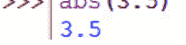

如你所见，我们总是在思考我们需要什么、如何在算法中使用值、下一步是什么等等。调试的一个极其重要的方面是经常运行我们的代码。每一段代码都应该运行，以便我们能尽早识别可能的错误。请记住，调试10行代码比调试100行或1000行代码要容易得多。

另一个我们经常遇到的错误是冒号。在下面的代码中，我们忘记了一个冒号。你能告诉我它在哪里吗？

```python
for i in range(50):
    if i < 30:
        print(i + 2)
    elif i < 40:
        print(i * 2)
    else
        print(i * 100)
```

如果你仔细看，`else`后面的冒号缺失了。幸运的是，当我们尝试运行此代码时，Python会提醒我们。你可以在*图13.2*中看到错误。

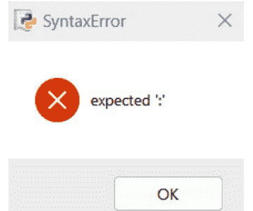

此外，Python非常有用，它会高亮显示此错误所指的代码行，如*图13.3*所示。

```python
for i in range(50):
    if i < 30:
        print(i + 2)
    elif i < 40:
        print(i * 2)
    else:
        print(i * 100)
```

Python中的错误消息已经得到了显著改进。在以前的版本中，我们有时不得不识别语法错误是什么，查找高亮行上方的行，等等。现在Python中的错误处理提供了更有针对性的消息，使我们能够更轻松地调试代码。

现在让我们看看Python编码中另一个非常常见的问题——缩进。

### 缩进错误

Python是一种相当简单的编写语言，特别是因为它使用缩进来标识代码级别，而不是使用大量符号（如方括号和圆括号）来确定代码顺序。这带来了一点陷阱。如果我们有缩进错误，那么代码将无法按我们希望的方式处理。让我们看一个简单的例子：

```python
for i in range(50):
    if i < 30:
        print(i + 2)
    elif i < 40:
        print(i * 2)
```

## 不产生错误信息的 Bug

正如我们在上一节所看到的，有些错误（例如由缩进错误引起的）可能不会总是被调试器捕获，也不会抛出通常的错误信息。在本节中，我想集中讨论一种最常见的错误，它可能对我们的算法造成严重破坏——即由错误使用局部变量和全局变量引起的错误。

### 全局变量

**全局变量**是在函数外部声明的变量。看起来很简单，对吧？确实如此。然而，请注意不要过度使用全局变量，因为它们可能会给你的代码带来很多问题，并使调试变得相当困难。

让我们来看一个全局变量及其在函数中的使用：

ch13_global.py

```
counter = 1
def counterF():
    print(f'Counter value is {counter}.')
counterF()
```

如你所见，我们创建了一个名为 `counter` 的变量，然后在一个名为 `counterF()` 的函数中使用了该变量。请注意，该变量在函数外部。这意味着 `counter` 是一个全局变量。

现在，让我们来看一个局部变量的例子。

### 局部变量

**局部变量**在函数内部声明，其值不能在该函数声明之外使用。让我们看看前面的例子，这次变量在函数内部声明：

ch13_local.py

```
def counterF():
    counter = 1
    print(f'Counter value is {counter}.')
counterF()
```

如你所见，这段代码应该并且确实与全局变量代码的执行方式相同。两者都会给我们以下输出：

`Counter value is 1.`

那么，区别是什么，为什么这很重要？为此，我们需要用一个实际场景来思考这个问题。

### 使用全局变量和局部变量时的错误

让我们思考一下全局变量以及当我们使用它们时会发生什么。为此，让我们想想一家餐厅。在 2023 年，餐厅可以为堂食选项和外卖应用程序提供相同的菜单，但每个菜单的价格可能不同。假设一家餐厅出售一种名为“阿尔弗雷多意面”的菜单项。如果该变量被全局定义，然后在多个函数中使用，那么每次调用使用该变量的函数时，后续对该变量的使用将不会受到影响：

ch13_sample1.py

```
pastaAlfredo = 15.75
menu = {
    pastaAlfredo
    }
def priceIncrease(percentage):
    for item in menu:
        item = item + item * (percentage/100)
        print(round(item,2))
priceIncrease(30)
```

请注意，我们保持了极其简单，只查看了一个菜单项。现在，让我们指出几个重要的注意事项：

- **pastaAlfredo** 变量是一个全局变量
- **menu** 列表也是一个全局变量
- **pastaAlfredo** 和 **menu** 都在 **priceIncrease** 函数中使用

还有一点——我们使用了 `round()` 来确保结果价格也四舍五入到两位小数。

现在，它似乎工作正常，但让我们看看如果我们有多个函数使用相同的全局变量会发生什么：

ch13_sample2.py

```
pastaAlfredo = 15.75
menu = {
    pastaAlfredo
    }
def priceIncrease(percentage):
    for item in menu:
        item = item + item * (percentage/100)
        print(round(item,2))
def deliveryPrice():
    for item in menu:
        print(f'Menu item price is {item}.')
priceIncrease(30)
deliveryPrice()
```

你可能预期这两个打印的值会是相同的。然而，让我们看看输出：

```
20.48
Menu item price is $15.75.
```

这里发生的情况是——我们在两个函数中使用了全局变量，但变量的值没有被更新。所以，当我们再次使用它时，它仍然是原始值。

如果我们想确保价格对两个函数都有效，我们需要在每个函数内部定义它。听起来使用全局变量可以省去一些麻烦，但实际上，使用全局变量可能只是破坏我们的代码或提供我们未预期的输出。此外，如果我们不小心，我们的代码可能会被发布到有错误的应用程序中，并显示我们不打算有的价格。

拥有全局变量使我们的代码更难调试。函数可以改变变量的值并影响其他函数。因为我们可以在函数内部返回值，所以这些值也可以全局改变。使用全局变量而不是在函数内部定义和使用变量，存在太多陷阱。然而，这并不是说你永远不应该使用全局变量，但你应该考虑这样做的影响，并确定你的代码应该有一个全局定义的变量还是在函数内部局部定义的变量。

这些是我们将遇到的唯一错误吗？不是。然而，我们已经在第 5 章《错误》、第 8 章《识别解决方案中的挑战》以及本章中涵盖了几种不同类型的错误和调试。随着我们学习更多关于计算思维和在多个应用程序中设计算法的知识，我们将继续探索算法中的错误，但现在，让我们继续下一章，*在实验和数据分析问题中使用 Python*。

## 总结

在本章中，我们学习了调试代码的一些挑战，包括 Python 可能无法识别的语法错误，以及与全局变量和局部变量相关的其他错误。

在处理语法、标点和缩进时，有些错误会被 Python 标记出来，而其他错误可能更难发现。请经常运行你的代码，识别可能的问题，确保你检查代码的数学方面，并验证输出值是否与你的预期值匹配。我们会在算法中犯错，因此我们需要确保我们不会因为调试不够频繁而无意中造成更大的问题。

在本书的下一部分，我们将研究数据。Python 是一种极其强大的编程语言，允许我们使用一些库来创建算法，这些库可以向我们展示数据的可视化表示、分析数据，甚至帮助我们为人工智能创建机器学习模型。我们将在接下来的章节中探讨许多这些主题。

# 第三部分：运用计算思维与Python进行数据分析、处理及应用

数据无处不在。我们利用数据为决策提供依据，例如为学区分配多少资源、县或州的医疗保险计划预算规模、特定地区的住房支出水平，以及房地产市场的趋势。数据也渗透在我们与广告互动的方式中。简而言之，深入了解数据并掌握如何使用Python进行分析，是一项至关重要的技能。

在本部分中，你将接触到Python编程语言在数据分析及其他应用（如密码学、实验数据、数据挖掘和机器学习）方面的高级功能。随着人工智能（AI）和生成式人工智能（GenAI）的兴起，无论你是作为程序员，还是为了理解AI工具如何融入我们周围的技术，掌握数据、机器学习和AI的基本概念都至关重要。我们将运用计算思维，为从语言和历史分析到某些机器学习应用等众多现实世界的应用问题设计解决方案和算法。

本部分包含以下章节：

- [第14章](https://example.com)，在实验与数据分析问题中使用Python
- [第15章](https://example.com)，机器学习导论
- [第16章](https://example.com)，在统计分析中运用计算思维与Python
- [第17章](https://example.com)，应用计算思维问题
- [第18章](https://example.com)，高级应用计算思维问题
- [第19章](https://example.com)，将Python与亚马逊云服务（AWS）集成

## 14

## 在实验与数据分析问题中使用Python

在本章中，我们将探讨Python如何借助专为数据分析和数据科学创建的算法和库，帮助我们理解和分析数据。首先，我们将介绍实验数据，然后深入探讨使用两个主要库的算法：**NumPy** 和 **pandas**。

在本章中，我们将涵盖以下主题：

- 定义实验数据
- 在Python中使用数据库
- 理解使用Python进行数据分析
- 使用额外的库进行绘图和分析

学完本章后，你将能够定义实验类型、数据收集方法，以及计算思维在设计模型和解决方案时如何发挥作用。你还将学习如何使用数据库，特别是 **NumPy**、**pandas** 和 **Matplotlib**，来帮助分析和展示数据。最后，你将能够设计有助于数据分析的算法，从而从现有数据中学习。

## 技术要求

你需要安装最新版本的Python才能运行本章中的代码。

你还需要安装一些库，即 **NumPy**、**pandas**、**Matplotlib** 和 **Seaborn**。

你可以选择使用集成环境来运行Python，例如 **Anaconda**，它可以简化库依赖关系，并帮助你将算法组织到笔记本中。

本章的源代码可以在本书的GitHub仓库中找到：[https://github.com/PacktPublishing/Applied-Computational-Thinking-with-Python-Second-Edition/tree/main/Chapter14](https://github.com/PacktPublishing/Applied-Computational-Thinking-with-Python-Second-Edition/tree/main/Chapter14)。

## 定义实验数据

*我们终于来到了本书的数据章节。我们都有自己的偏见和钟爱的领域。这就是我的其中之一。* 数据之所以如此重要有很多原因，但让我们从数据本身开始——我们如何收集它、如何分析它以及如何呈现它——对我们的日常生活有着巨大的影响。

在编写算法来展示信息时，我们有责任以尽可能无偏见的方式分享数据，确保我们的数据具有包容性，并能代表我们的社区和人民。在深入探讨本章允许的深度之前，我想确保先说明这一点。对我来说，这就是我爱上代码和Python的原因。

在本节中，我们将介绍实验数据，定义它是什么，以及处理实验数据时使用的关键术语。

现在，让我们开始吧。**实验数据**这个术语源于科学和工程领域。然而，我们也在其他领域使用实验数据，例如教育、公民事务等等。实验数据包括方法论、我们如何测量数据、我们正在进行的实验设计，以及我们如何呈现从这些设计中收集和分析的数据。在本章中，我们不会设计实验。相反，我们将专注于如何使用Python来分析现有数据。但需要注意的是，如果我们对实验有发言权，我们需要确保设计是公平的。

如果实验设计和数据收集方法是可靠的，那么我们使用和分析的数据将比从一个有偏见的实验开始要有用得多。虽然我们永远无法完全消除偏见，但作为研究人员和开发者，我们有责任以尽可能少的偏见来呈现数据。*为什么这很重要？* 想想所有基于数据、图表和实验呈现的信息而发生的政策变化。如果实验存在偏见，其结果可能导致无法充分涵盖社区需求的政策。

举几个你可能在看电视广告时见过的例子，你可能记得牙膏“*受到五分之四牙医的推荐*”，或者听过诸如“*使用此药物后，50%的研究参与者观察到改善*”之类的说法。这些说法看起来令人印象深刻，或者至少“不错”，对吧？但如果*只*询问了5位牙医呢？这能代表牙医群体吗？如果“研究参与者”只有两个人呢？我们收集的数据将不是非常有效（我们暂且不谈电视广告中有时存在的偏见甚至彻头彻尾的谎言，但本章是关于数据的，所以我离题了）。我想表达的观点是，如果你对实验设计有发言权，请尽可能设计好，以便为你的实验、结果以及可能对社会产生的后果做到尽可能公平。但现在，让我们回到数据上来。

在处理数据时，我们始终在使用计算思维的要素。在解决问题时，我们必须定义问题是什么、我们想研究什么、如何衡量它们、如何创建和概括模式，以及需要使用什么算法来产生数据的最佳表示。我们在数据分析中所做的一切都受益于使用计算思维的要素。

数据科学是**STEM**领域中一个不断发展的领域。2017年，它被命名为美国增长最快的领域。美国劳工统计局表示，预计到2026年，数据科学和统计领域将新增约1150万个就业岗位。目前，可用的岗位多于合格的候选人。

现在，让我们看看Python如何让我们处理数据。

在实验数据中，我们希望使用自变量、因变量和控制变量来收集信息：

- **自变量**是由研究者改变或控制的变量
- **因变量**是由研究者测量或测试的变量；因变量*依赖于*自变量
- **控制变量**是实验中必须保持不变的变量或因素

让我们看一个实验中这些变量的简单例子。一个常见的例子涉及植物生长的研究。自变量可以是一个或多个变量。在我们的例子中，自变量将是我们添加给植物的肥料量。植物生长将是一个因变量。**对照组**将不获得任何肥料，只浇水。因此，在我们的实验中，假设我们有五株植物需要测量。一株植物只浇水。那是我们的**对照组**。另外四株将添加不同水平的肥料。这些是我们的**实验组**植物。生长**依赖于**肥料的量。

在设计实验时，我们希望满足三个条件：它们是可靠的、有效的，并且可以推广。以下是每个条件的含义：

- **可靠**与测量的一致性有关。这意味着如果我们模拟相同的条件，我们的结果应该可靠地相似。
- **有效**与实验是否测量了其打算测量的内容有关。
- **可推广**与结果是否可以推广并应用于其他环境有关。

关于实验，我们可以深入探讨更多细节和深度，但在本章中，我们只关注一旦拥有数据后会发生什么。理解这些基本术语对于设计实验很重要。作为开发者，根据我们的角色，情况可能确实如此。例如，在初创公司中，每个人都可能参与产品开发的各个方面。因此，在这些情况下，我们可能既参与实验，也参与后续的分析算法。

目前，让我们继续探讨数据分析能为我们做些什么，以及Python库如何帮助我们在分析实验结果时实现所需目标。

## 在Python中使用数据库

在本节中，我们将探讨一些可以与Python编程语言一起使用的库和包。我们将交替使用*包*和*库*这两个术语，但为了清晰起见，一个包包含模块，而库是包的集合。

我们使用Python库的方式与使用内置模块类似，例如我们在*第4章，理解逻辑推理*中使用的`math`模块。在我们的源代码中，我们在创建算法之前通过使用`import math`导入了`math`模块。在*第4章，理解逻辑推理*的*应用归纳推理*部分的示例中，我们使用了该模块的`math.floor()`函数，该函数允许我们将数字向下取整，无论小数值是多少。当我们在Python中导入模块或库时，我们正在利用额外的功能和能力，使我们能够将编程语言发挥到更远。

*那么，什么是库？* 在Python中，**库**指的是可以重复使用的代码块。库包含模块的集合。Python有许多可用的库，与Python本身一样，这些库中有很多是**开源**的，这意味着任何人都可以下载和使用它们。因为本章我们将处理数据，所以目前我们将专注于**pandas**、NumPy和Matplotlib。然而，还有许多其他库和多种类型的库。例如，有**图形用户界面（GUI）**框架，如**Kivy**、**tkinter**、**PyQt**、**PySimpleGUI**等。对于游戏，还有其他库，如**Pygame**和**Pyglet**。在机器学习中，**TensorFlow**库是由**Google**与**Brain**团队合作开发的流行工具。另一个用于深度学习或端到端机器学习的库是**PyTorch**。但这些只是可用库及其应用领域的一些例子。

### 安装库

虽然`math`模块是Python语言内置的，但库需要安装。我们用来安装库的程序是**pip安装程序**。这是一个内置在Python中的命令，从**命令提示符**窗口运行。我在这里要提到的一个注意事项是，权限和我们安装Python的位置很重要，因此如果你的计算机属于你的雇主，请确保Python程序路径已根据需要进行调整，以便你可以访问所有模块并安装库。权限可能有所不同。

就我而言，虽然我的主计算机不属于我，但我拥有管理员访问权限，因此我可以以管理员身份运行命令提示符，并从那里运行`pip`。

以下屏幕截图显示了`sympy` Python库的安装。如你所见，使用`pip install sympy`命令将库安装到我们的系统上。需要记录的是，`sympy`是Python可用的符号数学库。由于我已经安装了我们将要使用的其他库，我不得不展示一个尚未在我的机器上安装的包的安装过程：

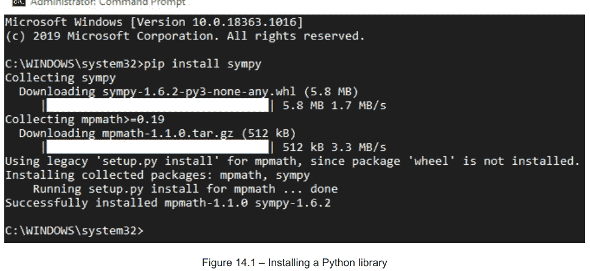

图14.1 – 安装Python库

如果你尝试安装已经安装过的库——例如，如果我尝试再次安装`pandas`——你会收到一条**Requirement already satisfied**消息，如以下屏幕截图所示。请注意，用户信息将填写你的用户，而不是像这里这样被涂黑。它还将显示库包在系统上的位置：

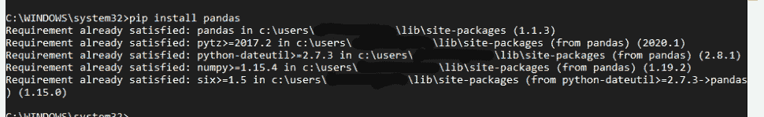

图14.2 – Requirement already satisfied消息

你可能还希望使用Anaconda，它是Python和R编程语言的开源发行版。安装Anaconda后，你可以使用`CMD.exe`提示符窗口，通过`conda install`或`pip install`安装库。Anaconda导航器中包含的Jupyter notebook可以运行和保存你的Python程序。Anaconda发行版程序中包含更多程序和包，它们可以简化我们与Python编程语言的交互方式。如果你进行大量编码，这是一个很好的资源。

如果你还没有这样做，现在是在我们开始使用它们来分析和显示数据以及创建模型之前安装`numpy`、`pandas`和`matplotlib`库的好时机。

### 使用NumPy和pandas

**NumPy**，就像Python和Python编程语言本身的许多库一样，是一个开源库。NumPy用于多维数组和矩阵数据结构。Python本身没有数组；它有列表。因此，库可以用来为我们的算法提供这种能力。当我们有多个相同类型的元素时，我们可以使用数据结构来保存它们——即**数组**。

`pandas`库用于分析数据，建立在`numpy`包之上。`pandas`和NumPy库经常一起使用。当我们需要图形模型时，我们添加第三个库Matplotlib或另一个类似的库。在本章中，我们将专注于Matplotlib。

当我们导入库时，我们可以导入整个名称——在这种情况下是`numpy`——或者我们可以缩短它们以便于使用。如果我们想导入库，我们可以使用`import numpy`。假设我们想创建一个从0到11的数字数组。我们可以使用`numpy`通过组合`arange`和`reshape`函数来组织它。让我们看看代码片段：

ch14_abbreviate.py

```
import numpy as np
myArray = np.arange(0, 12).reshape(2, 6)
print(myArray)
```

注意，我们将`numpy`导入为`np`，而不仅仅是`numpy`。这意味着我现在可以使用`np`调用NumPy函数，而不必每次都输入`numpy`。

> *提示*

*请注意，`np`是NumPy的标准缩写，因此你可能会经常看到它。你可以将NumPy导入为任何名称，但`np`是标准约定。*

在前面的片段中，我们要求算法将从0到11的数字列表分成2行，每行6个元素。然后，我们打印数组以查看结果。看看输出：

```
[[ 0  1  2  3  4  5]
 [ 6  7  8  9 10 11]]
```

如你所见，我们从0开始，这是0到12范围内的下限。我们现在有两行，每行有六个数字。*我们不包括12*。如果我们尝试从0到13，我们将无法重塑数组，因为我们无法均匀地分割13个数字。我们会得到以下回溯错误（最近的调用最后）：

```
File "C:/Users/... /ch14ch14_abbreviate.py", line 3, in <module>
    myArray = np.arange(0, 13).reshape(2, 6)
ValueError: cannot reshape array of size 13 into shape (2,6)
```

回想一下，你的信息在看到省略号（...）的地方会有所不同。它将包含你的文件位置或路径，具体取决于你的Python环境的设置方式。例如，你的文件位置可能类似于c:/Users/JohnSmith/Documents/ch14ch14_abbreviate.py。这应该替换前面代码中的文件位置。

从ValueError消息中可以看出，我们无法将数组重塑为(2, 6)形状，因为我们会剩下一个数字。

现在，让我们看看pandas DataFrame。我们使用DataFrame来操作数据并将其放入行和列中。让我们看一个例子：

ch14_pdDataFrame.py

```
import pandas as pd
myAddressBook = {'names': ['Susan', 'Malena', 'Isabel',
                          'Juan', 'Mike'],
                'phoneNumbers': ['333-333-3333',
                                 '444-444-4444',
                                 '555-555-5555',
                                 '777-777-7777',
                                 '888-888-8888']}
addressBook = pd.DataFrame(myAddressBook)
print(addressBook)
```

注意，我们创建了一个字典，其中包含联系人姓名和电话号码的值对。完成后，我们将地址簿保存为DataFrame，这将把我们的信息组织成表格形式。最后，我们打印了地址簿。看看输出：

```
  names  phoneNumbers
0  Susan  333-333-3333
1  Malena  444-444-4444
2  Isabel  555-555-5555
3    Juan  777-777-7777
4    Mike  888-888-8888
```

注意，pandas使用字典中的信息为我们的列创建了标签。我们没有提供行标签的信息，因此Python和pandas自动使用了数字0到4。该算法生成了一个表格，提供了我们地址簿中的姓名和电话号码。

如你所见，pandas和NumPy只是为Python添加了更多功能。在我们继续介绍Matplotlib之前，请注意我们还没有看到实际的数据分析。我们很快就会讲到。现在，我们

### 使用 Matplotlib

有些库不提供数据的可视化表示或视觉模型。为了从数据中创建图表，我们可以使用 Python 中的 Matplotlib 库。就像我们将 `pandas` 和 NumPy 库分别导入为 `pd` 和 `np` 一样，我们也可以缩写 Matplotlib。完整的库包含多个模块。我们将经常使用 `pyplot` 模块。`Matplotlib.pyplot` 最常用的缩写是 `plt`。如果我们调用 Matplotlib，通常将其缩写为 `mlt`。让我们看一个简单的例子：

ch14_matplotlib.py

```
import matplotlib.pyplot as plt
plt.plot([0, 3, 6], [4, 5, 6])
plt.show()
```

请注意，这个特定库的名称甚至比 `matplotlib` 还要长。要导入该库，我们必须使用 `matplotlib.pyplot` 来导入它。想象一下，每次在算法中需要它时都必须写那么长的名字。*不，谢谢！* 相反，我们将其导入为 `plt`。

现在，让我们看看代码片段中的第二行。我们正在创建一个图表，将第一个列表中的每个数字与第二个列表中的数字对应起来。因此，我们有三个坐标对：(0, 4)、(3, 5) 和 (6, 6)。使用此代码时，我们收到的输出不仅仅是一行输出——它是一个图表。现在，算法在前面代码片段的第二行创建了该图表。

但除非你告诉它你想要看到它，否则它不会显示给你。可以将 `show()` 函数视为 Python 中的 `print()` 函数。除非我们告诉算法我们想看到某些内容，否则算法将在后台执行任务，但不会向我们显示。下图显示了该算法的输出：

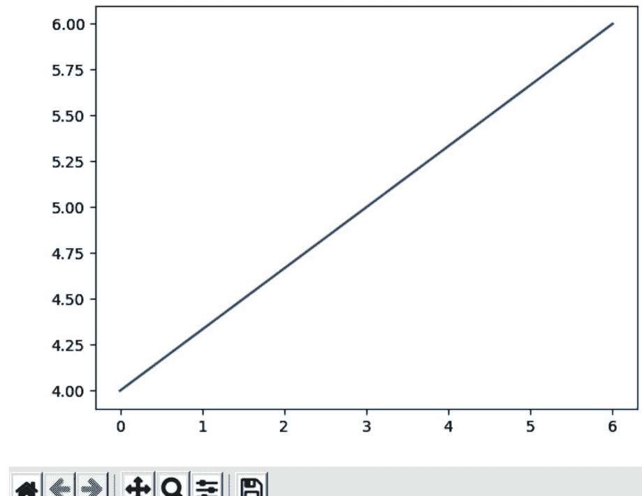

图 14.3 – Matplotlib 示例图

如您所见，图表本身已经很有帮助。我们可以看到这是由这些点定义的线性关系。但请注意，屏幕底部为您提供了一些选项。左下角的主页图标将随时将您的图表重置为其原始窗口。**缩放**功能（如下图所示）允许我们选择图表中想要更仔细查看的部分：

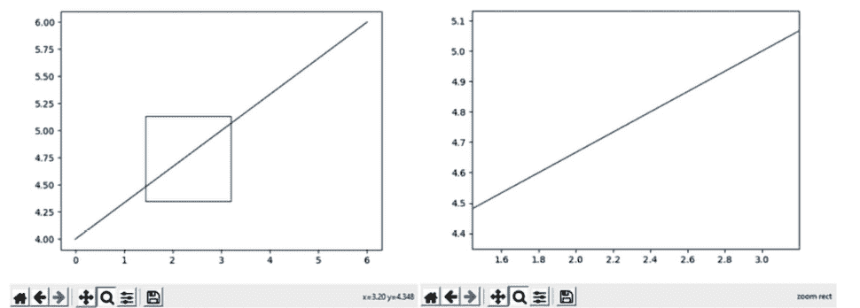

**选择图表区域（缩放前）** &nbsp;&nbsp;&nbsp;&nbsp; **选择图表区域（缩放后）**

图 14.4 – Matplotlib 的缩放功能

请注意，左侧图表显示了我们选择的想要仔细查看的图表部分。右侧图表仅显示我们选择的值。Matplotlib 还允许我们配置子图并在多个表示之间来回导航。例如，如果我在缩放后点击图表上的左箭头，它将带我回到之前的表示。点击 **主页** 按钮会将我带回原始图表。

当然，这不是 Matplotlib 允许的唯一类型的图表或表示。这只是对可视化表示的一个小小窥探。

*提示*

有关可用图表类型的其他资源，请参阅 [https://matplotlib.org/stable/tutorials/index](https://matplotlib.org/stable/tutorials/index)。

在本节中，我们学习了 Matplotlib 库。我们学习了如何创建简单的图表，以及在创建图形时如何从输出中缩放到图表的各个部分。

现在我们知道了如何访问库以及每个库能为我们做什么，让我们看看如何使用它们来分析数据。

## 使用 Python 理解数据分析

在上一节中，我们介绍了一些可用于在 Python 中分析数据的库。在本节中，我们将通过一个示例和多个代码片段，使用真实数据和 Matplotlib 来构建条形图。然而，在我们这样做之前，让我们回顾一下为什么 Python 在数据分析方面如此重要。

由于 Python 是面向对象的，它允许我们简化复杂和/或大型数据集。这使得数据具有极好的可读性，并且使用库可以生成数据表示，如表格和视觉模型，使我们能够预测数据的走向、创建回归分析等等。正如本章引言中提到的，数据分析对于决策也至关重要。一个精心设计的实验产生的数据是我们可以依赖的，并且具有普遍性。数据分析可以成为在我们的社会中获得更多平等和公平的工具。

话虽如此，我们将研究使用 Python 可以做什么的机械方面，而不是我们如何解释它，以便我们理解 Python 如何进行数据分析并使用我们的库呈现结果。我们将在 *第 17 章，应用计算思维问题* 和 *第 18 章，高级应用计算思维问题* 中涵盖更多示例，这些示例不仅会使用其中一些工具，还将为我们提供机会探索数据分析在这些示例背景下的含义。

现在是时候看一个可以帮助我们进一步理解这些工具的能力以及我们如何编写算法来解决一些提出的问题的例子了。

在我们开始之前，我们将使用一个数据文件 `ch14ch14_data.csv`，该文件可以在本书的 GitHub 仓库中找到。该文件包含 1996 年至 2012 年按种族/民族、完成时间、性别、机构控制和录取百分比划分的学位寻求学生的毕业率。数据下载自 **国家教育统计中心**，地址为：[https://nces.ed.gov/programs/digest/d19/tables/dt19_326.10.asp](https://nces.ed.gov/programs/digest/d19/tables/dt19_326.10.asp)。

我们仓库中的数据文件仅包含所有 4 年制机构的数据，而不是整个文件。一些标题也已简化。

当我们想要处理数据文件时，必须告诉 Python 在哪里可以找到它，以便它在运行算法时知道使用什么。为此，我们可以使用 `os` 模块，该模块允许我们的算法与 **操作系统 (OS)** 交互。请注意，我们的代码片段已经包含了其他库（我们稍后会使用它们）：

ch14_csvAnalysis.py

```
import pandas as pd
import matplotlib as mlp
import matplotlib.pyplot as plt
import os
#Let Python know correct directory for file.
os.chdir('C:\Users\...\Program Files\Chapter 12')
print('Current directory', os.getcwd())
```

与之前一样，请确保将用户信息中的省略号替换为您的位置。在本书仓库中提供的算法中，您还需要调整该位置才能运行此算法，因为该算法的位置将是我的路径。

现在我们已经告诉 Python 在哪里可以找到该文件，我们可以在算法中使用它。如果我们运行此算法，我们将看到输出应与我们在以 **os.chdir:** 开头的行中记录的路径匹配：

```
Current directory C:\Users\...\Program Files\Chapter 12
```

同样，请注意我们的路径不会匹配。这完全取决于您保存文件的位置。

下图显示了与我们的 .csv 文件相同的数据和文件，但采用 .xls 格式，因为这样更容易指出我们需要的内容。.csv 文件是未格式化的，因此数据比格式化表格更难阅读。请注意，我们将使用 .csv 文件进行分析：

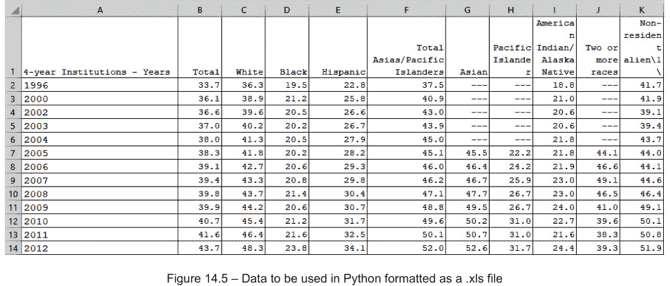

如果我们只想提取显示的行，可以使用以下代码片段从 .csv 文件中获取该信息：

**ch14_csvAnalysis_2.py**

```
import pandas as pd
graduates = pd.read_csv('ch14ch14_data.csv', index_col = 0)
print(graduates[0: 16])
```

请注意，我们的算法导入了 **pandas** 库。**read_csv()** 函数告诉 Python 我们将使用文件名和我们想要开始处理的列的索引。此索引为我们提供将用作行标题的值。如果索引不在第一列，我们可以将其更改为不同的值。然后，我们可以打印我们想要查看的行。因为我们的数据很宽，所以我们的输出将如下所示：

## 四年制院校 - 年份 | 总计 ... | 非居民外国人\1
--- | --- | ---
1996 | 33.7 ... | 41.7
2000 | 36.1 ... | 41.9
2002 | 36.6 ... | 39.1
2003 | 37.0 ... | 39.4
2004 | 38.0 ... | 43.7
2005 | 38.3 ... | 44.0
2006 | 39.1 ... | 44.1
2007 | 39.4 ... | 44.6
2008 | 39.8 ... | 46.4
2009 | 39.9 ... | 49.1
2010 | 40.7 ... | 50.1
2011 | 41.6 ... | 50.8
2012 | 43.7 ... | 51.9

[13 行 x 10 列]

图 14.6 – ch14ch14_csvAnalysis.py 算法的输出

请注意，我们只看到了前两列，然后是省略号。这表明在第二列和显示的第三列之间还有更多列。这并不意味着 Python 没有读取其余信息，只是对我们不可见。最后一行输出 `[13 行 x 10 列]` 告诉我们所提取的数据有多少行和列。

假设我想查看某个群体（例如西班牙裔）在 1996 年至 2012 年间的数据，并使用柱状图进行比较。在这种情况下，我可以使用 Matplotlib 库中的柱状图绘图功能。让我们看看对以下算法所做的调整：

ch14_csvAnalysis_3.py

```
import pandas as pd
import matplotlib as mlp
import matplotlib.pyplot as plt
import os
#Let Python know correct directory for file.
os.chdir('C:\Users\sofia.dejesus\OneDrive - Hawken School\03_book\Program Files\Chapter 12')
graduates = pd.read_csv('ch14ch14_data.csv', index_col = 0)
print(graduates[0:13])
fig, ax = plt.subplots()
ax.bar(graduates.index, graduates['Hispanic'])
ax.set_xticks(graduates.index)
ax.set_xticklabels(graduates.index, rotation = 60, horizontalalignment = 'right')
ax.set_title('Number of Hispanic graduates from 1996-2012', fontsize = 16)
ax.set_ylabel('Number of Graduates')
plt.show()
```

我们应该仔细研究一下前面代码中的一些内容。我们做的第一件事是添加了 `fig, ax = plt.subplots()` 这一行。这一行允许我们创建绘图，同时也允许我们在需要时在一个图形中创建多个绘图。如果我们想添加四个绘图，我们会使用 `fig, ax = plt.subplots(2, 2)`，这将告诉算法我们正在创建四个绘图，排列成两行两列。如果我们像前面代码中那样让括号为空，那么我们将只有一个子图。

接下来，我们确定要创建的图形，这是一个柱状图。我们想比较西班牙裔人口多年来的数字，因此我们在 `ax.bar(graduates.index, graduates['Hispanic'])` 这一行中进行了标识。

请注意，许多开发者使用 `dataframe` 作为变量名。我更喜欢用描述性的方式命名我的 `dataframe`，因此我没有将我的 `dataframe` 命名为 `df`，而是在算法中将其命名为 `graduates`。无论你的偏好如何，这是我们当前用于创建可读图表的 DataFrame。

请注意代码中的刻度和刻度标签。首先，我们确定刻度的数据来源以及标签是什么。然后，我们可以通过添加旋转（如果我们想倾斜标签）、对齐等方式为绘图添加更多格式。我们也可以在这里更改字体大小。最后，在显示绘图之前，我们设置了 Y 轴标题和柱状图标题。以下截图显示了该算法的绘图：

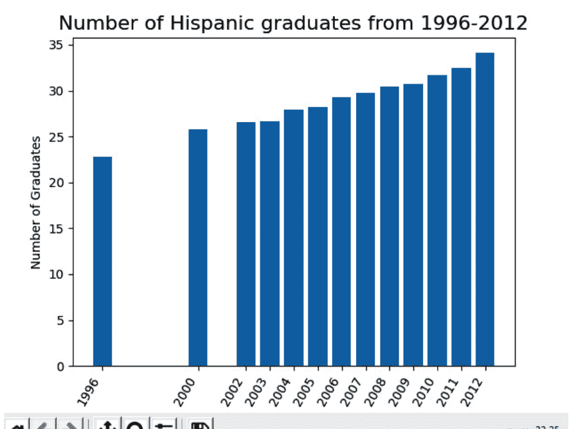

图 14.7 – ch14ch14_csvAnalysis_3.py 的西班牙裔毕业生绘图

请注意，我们的图表有标签并且清晰地显示了数据，我们能够修改格式使其清晰易读。在分析信息时，我们还可以看到第一年与 **2000** 年之间的差距，以及 **2000** 年与 **2002** 年之间的差距。这些年的数据未包含在数据文件中。

我们只是触及了使用 Python 中一些可用的数据和数据可视化库所能做事情的皮毛。我们将在 [第 17 章，应用计算思维问题](Chapter 17, Applied Computational Thinking Problems) 和 [第 18 章，高级应用计算思维问题](Chapter 18, Advanced Applied Computational Thinking Problems) 中有机会探索更多，这两章专门介绍使用本书前面章节讨论的所有内容在多个领域的示例。现在，让我们继续讨论数据和 Python 库的其他应用。

## 使用额外的库进行绘图和分析

在结束本章关于实验数据、库的使用以及数据绘图和分析的内容之前，让我们再看看三个在数据分析和绘图方面很有帮助的库。这些并不是仅有的用于分析和绘图的库，也不是我们将在本书其余部分探索的唯一库：

- **Seaborn** 是一个用于数据可视化的库，构建在 Matplotlib 之上。
- **SciPy** 是一个用于线性代数、优化、统计等的库。它构建在 NumPy 之上。
- **Scikit-Learn** 是一个用于机器学习的库。它是 SciPy 堆栈的一部分。

在接下来的章节中，我们将更深入地探讨其中一些库的使用，同时解决一些需要使用它们的应用问题。现在，让我们快速了解一下这些库在查看数据集时能帮助我们做什么。

### 使用 Seaborn 库

Seaborn 库在 Matplotlib 库的可视化功能之上为我们提供了更多特性。我们可以用 Seaborn 库做很多事情，我们通常将其导入为 `sns` 以简化代码。以下是该库的一些常见用途：

- 相关性
- 聚合统计（观察分类值）
- 因变量的线性回归图
- 创建包含多个绘图的抽象和网格

Seaborn 最棒的一点是它也能与 `pandas` 配合得很好。当 Seaborn 与 `pandas` DataFrame 结合使用时，创建数据的统计表示和可视化变得很容易。

Seaborn 有一些可以访问的示例数据集——也就是说，如果我们知道数据集的名称，它们是内置的。我们可以用一行简单的代码调用内置数据集。让我们看看以下代码片段和生成的图形：

ch14_seabornSample.py

```
#### Import seaborn
import seaborn as sns
#### Import matplotlib.pyplot
import matplotlib.pyplot as plt
sns.set_style('darkgrid')
#### Load an example dataset
exercise = sns.load_dataset("exercise")
#Create the plot
sns.relplot(
    data=exercise,
    x='id', y="pulse", col="time",
)
plt.show()
```

从前面的代码中，我们可以看到我们为绘图设置了样式。我们在导入库之后为绘图添加了 'darkgrid' 样式。Seaborn 有一些内置样式：white、whitegrid、dark、darkgrid 和 ticks。下图显示了 Seaborn 生成的绘图：

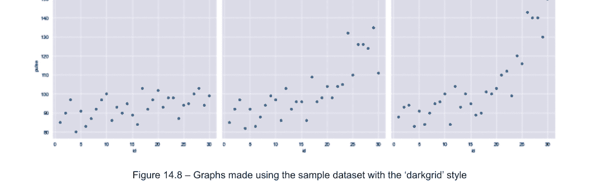

如你所见，我们将能够分析脉搏与时间或其他变量之间是否存在相关性。

我们还可以使用配对图来显示变量之间是否存在相关性。让我们使用另一个内置数据集 flights，看看配对图的作用：

ch14_pairplotSNS.py

```
#### Import seaborn
import seaborn as sns
#### Import matplotlib.pyplot
import matplotlib.pyplot as plt
sns.set_style('darkgrid')
#### Load an example dataset
flights = sns.load_dataset("flights")
#Create the plot
sns.pairplot(
    data=flights,
)
plt.show()
```

前面的代码片段与之前用于 exercise 数据的代码非常相似。不同之处在于我们在这里调用了 pairplot() 函数。下图显示了我们生成的绘图网格：

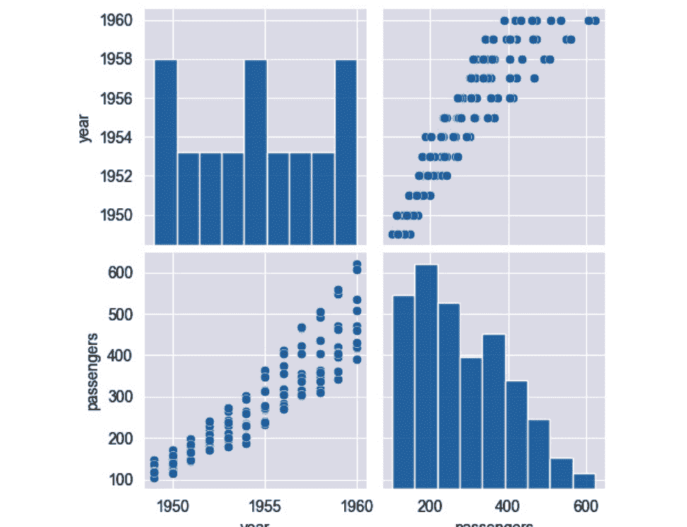

图 14.9 – 使用 Seaborn 进行配对绘图

请注意，乘客数量和年份似乎呈正相关——也就是说，后期的乘客数量比早期航班的乘客数量多。在分析这个数据集时，我们可能想要做出预测，例如说明在现代会有更多乘客乘坐飞机。

我们可以使用这些图表来帮助我们做出预测。话虽如此，这些数据相当陈旧，因此我们需要更新的数据才能做出准确的预测。我们拥有的数据越多越好。对于海量数据，我们还可以使用机器学习，我们将在 *第 15 章，机器学习简介* 和 *第 16 章，在统计分析中使用计算思维和 Python* 中简要探讨，以便我们学习如何处理和从数据中学习。

在我们转向另一个库之前，关于配对图还有一件事你应该知道——如果有 10 列数据，配对图会将每一列与自身进行比较，然后与所有其他可用列进行比较，从而创建一个包含所有比较变量的相当大的显示。我们将在 *第 16 章，在统计分析中使用计算思维和 Python* 中更详细地探讨配对绘图。

分析。部分问题也将在[第17章](Chapter 17) *应用计算思维问题* 和[第18章](Chapter 18) *高级应用计算思维问题* 中涉及，以便我们能通过更多图表及其信息进行实践。

Seaborn库与Matplotlib类似，有助于可视化统计数据。Seaborn中一些内置函数的易用性使其成为可视化和分析的绝佳工具。

现在，让我们来看看SciPy库。

### 使用SciPy库

SciPy库主要用于解决科学和数学问题。以下是一些实用的子包及其用途：

- **cluster** 用于聚类算法
- **constants** 包含物理和数学常数及单位，例如 **golden**（黄金比例）和 **mu_0**（磁常数）
- **fftpack** 利用快速傅里叶变换例程
- **integrate** 用于微分方程求解器
- **interpolate** 包含插值和平滑样条
- **io** 与输入输出相关
- **linalg** 与线性代数相关
- **ndimage** 用于处理 *N* 维图像
- **odr** 用于正交距离回归
- **optimize** 用于优化和求根例程
- **signal** 用于信号处理
- **sparse** 用于稀疏矩阵及相关例程
- **spatial** 用于空间数据结构和算法
- **special** 用于特殊函数（如椭圆函数和积分）
- **stats** 用于统计分布和函数

在这些子包中，SciPy提供了许多函数来辅助科学数据的可视化和优化。由于它是专门为该目的而创建的，因此是科学领域常用的工具。话虽如此，其统计包也很强大，因此该库即使在非科学统计分析中也很有用。

现在，让我们来看看Scikit-Learn库，我们将在本书后续章节中使用它。

### 使用Scikit-Learn库

Scikit-Learn可能是Python中最重要的机器学习库。我们将在后续章节的示例中探索这个库，同时探讨一些适合机器学习的问题，因此我们不会在此深入讨论其功能。话虽如此，以下是Scikit-Learn为我们提供的一些功能：

- **聚类** 有助于对未标记的数据进行分组。
- **回归** 衡量变量（变量的均值）与其他变量值之间的关系。
- **分类** 在Scikit-Learn中有多个分类器，类似于回归。其中一些分类器是 **线性判别分析**、**装袋分类器** 和 **K近邻分类器**。
- **模型选择** 提供了在机器学习中创建训练和测试模型的工具。
- **预处理** 包含标准化数据集的工具（更多关于数据预处理的细节可在 *第16章，使用计算思维和Python进行统计分析* 中找到）。

我们将在 *第16章，使用计算思维和Python进行统计分析*、*第17章，应用计算思维问题* 和 *第18章，高级应用计算思维问题* 的后续示例中相当熟悉Scikit-Learn库，因此我们将部分讨论留到那些章节。

Python中可用的库和包使我们能够对数据集进行详细分析，并创建各种有用的图表以辅助数据分析。

## 总结

在本章中，我们涵盖了实验数据的定义，以及实验背景下的效度、信度和可推广性。我们还讨论了如何安装和使用 `pandas`、`numpy` 和 `matplotlib` 库，以便我们可以使用它们来组织和显示数据。你学到的一些技能包括定义实验、数据收集，以及计算思维如何帮助我们定义问题并设计用于展示结果的工具。

此外，我们了解了数据分析和数据科学及其在当今世界的发展和重要性。我们能够使用这些库生成一个图表，该图表使用Matplotlib条形图表示了数据文件的一个子集。

在下一章中，我们将学习更多关于数据以及数据科学和数据分析的其他应用。

# 15

## 机器学习简介

在本章中，我们将使用Python编程语言介绍 **机器学习（ML）** 模型。我们将利用计算思维要素来定义在使用流行ML算法解决问题时所需的组件。

在本章中，我们将涵盖以下主题：

- 定义ML
- ML生命周期
- ML算法类型
- **深度学习（DL）** 简介

在本章结束时，你将能够设计最适合给定场景的算法。此外，你将学习如何识别与给定问题最有效匹配的Python函数，并概括你的解决方案。

## 技术要求

我们需要最新版本的Python和 **scikit-learn** 来执行本章中的代码。

你可以在此处找到本章的代码：[https://github.com/PacktPublishing/Applied-Computational-Thinking-with-Python-Second-Edition/tree/main/Chapter15](https://github.com/PacktPublishing/Applied-Computational-Thinking-with-Python-Second-Edition/tree/main/Chapter15)。

你可以在此处找到 **Kaggle** 上的 **Pima Indians Diabetes Database**：[https://www.kaggle.com/uciml/pima-indians-diabetes-database](https://www.kaggle.com/uciml/pima-indians-diabetes-database)。

## 定义ML

ML是 **人工智能（AI）** 的一个子领域，专注于构建可以从数据中学习的系统。ML模型不是被显式编程来执行任务，而是使用数据来学习模式并做出决策。其核心在于创建算法，这些算法通过随着时间的推移接触更多数据来提高其在任务上的性能。

DL是ML的一个子集，它使用具有多层的神经网络来建模大型数据集中的复杂模式和表示。在本节中，我们将探讨ML生命周期，详细阐述它以及构建ML模型的过程：

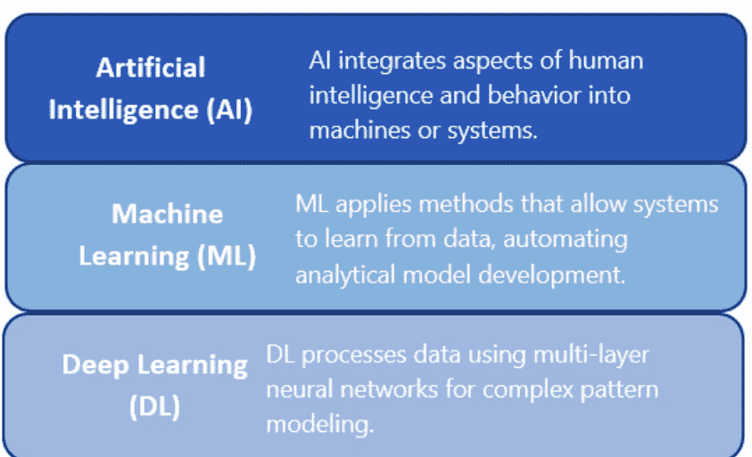

图15.1 – ML伞状图

## ML伞状图

Python凭借其简单性和多功能性，成为基于云的应用程序的热门选择。在AWS中，Python被广泛用于脚本编写、自动化和构建云原生应用程序。我们将探讨Python的特性如何使其成为与AWS服务交互的理想语言，从自动化重复任务到处理海量数据。

根据ML伞状图，以下是AI、ML和DL所代表内容的详细回顾：

- **AI**：这是最广泛的概念，涵盖了机器能够以我们视为“智能”的方式执行任务的理念。它关乎创建能够执行通常需要人类智能的任务的系统。这些任务包括规划、理解语言、识别物体和声音、学习以及解决问题。
- **ML**：ML是AI的一个子集。它是研究计算机算法通过经验和使用数据自动改进的学科。它侧重于开发能够访问数据并自行学习的程序。学习过程始于观察或数据，例如示例、直接经验或指令，以在数据中寻找模式并在未来做出更好的决策。
- **DL**：DL是机器学习的一个子集，它关注受大脑结构和功能启发的算法，称为 **人工神经网络（ANN）**。这是一种用于实现ML的特定方法，涉及使用复杂的多层神经网络。DL驱动着许多AI应用程序，这些应用程序提高了自动化程度，在没有人为干预的情况下执行分析和物理任务。

既然我们已经建立了对ML伞状图的基本理解，让我们深入探讨ML生命周期，它涉及构建ML模型所必需的一系列关键步骤。这个过程不仅塑造了模型的发展，还确保了其有效性和

## 导航机器学习生命周期——一种实用方法

机器学习生命周期，也称为机器学习工作流或流程，概述了开发和部署机器学习模型所涉及的步骤序列。这些步骤提供了一种使用机器学习技术解决问题的结构化方法。具体的细节和术语可能因来源而略有不同，但以下是典型机器学习生命周期的概述：

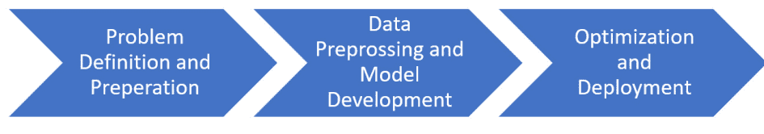

- 问题定义
- 数据收集
- 数据预处理
- 探索性数据分析（EDA）
- 特征工程
- 训练和测试模型
- 优化
- 模型部署

图 15.2 – 机器学习生命周期

在*图 15.2*中，机器学习过程被描绘为三个主要阶段，每个阶段包含特定的子步骤：

- 阶段 1. 准备和问题定义：
    - A. 定义问题
    - B. 收集数据
- 阶段 2. 数据处理和模型开发：
    - C. 探索性数据分析（EDA）
    - D. 特征工程
    - E. 模型训练和测试
- 阶段 3. 优化和部署：
    - F. 模型优化
    - G. 部署模型

每个步骤对于确保模型在实际应用中准确、高效、可靠和稳健都至关重要。忽略或跳过任何步骤都可能导致性能不足、结果有偏差或在实际场景中失败。在下一节中，我们将详细探讨机器学习生命周期的各个步骤。

### 阶段 1 – 准备和问题定义

机器学习生命周期中的问题定义意味着清晰地勾勒出模型必须解决的具体任务，明确其类型和目标。随后，数据收集涉及收集相关且足够的数据来训练和测试模型；这将在本章后面讨论。这两个子阶段是指导生命周期后续步骤的基础。

#### 问题定义

清晰地定义目标。首先精确地阐述你打算解决的问题。把握你正在应对的挑战。定义你的程序需要做出的预测或决策。

#### 数据收集

数据收集有多种形式。收集作为训练和测试模型基础的相关数据。数据是任何机器学习模型的关键因素。数据可以来自多种来源。以下是一些收集数据的方法：

- **CSV**：CSV 文件是一种逗号分隔值文件，允许以表格格式保存数据。
- **网页数据提取（网络爬虫）**：此技术用于从网站和网页中提取信息。它涉及以编程方式从网站检索数据。在 Python 中，你可以使用 Beautiful Soup 库进行网络爬虫。
- **应用程序编程接口（API）**：API 是一组规则和协议，允许不同的软件应用程序相互通信。在机器学习建模的数据收集背景下，API 提供了一种结构化且受控的方式来从远程服务器或服务访问和检索数据。与网络爬虫相比，API 是一种更可靠、更高效的数据收集方法，特别是当数据由服务提供者以结构化格式提供时。
- **数据库**：数据库是数据的结构化集合，其组织方式允许高效地存储、检索和操作信息。数据库通常用于机器学习建模中的数据收集，因为它们提供了一种可靠且有组织的数据存储方法。

### 阶段 2 – 数据预处理和模型开发

一旦我们定义了目标并收集了数据，我们就可以开始数据预处理阶段。这是清理和转换原始数据以使其适合建模的阶段。它包括探索性数据分析以理解数据模式，以及特征工程以增强或创建信息丰富的输入变量。模型开发涉及使用这些准备好的数据来训练和测试机器学习算法，确保其性能符合预期结果。这些阶段确保模型在其预测中既稳健又可靠。

#### 数据预处理

清理、格式化和转换数据，使其适合分析。处理缺失值、异常值和不一致性对于为模型训练准备数据至关重要。这一步对于机器学习模型至关重要，因为未能识别和缓解这些问题可能会对结果质量产生负面影响。

#### EDA

探索性数据分析是机器学习数据分析和模型开发过程中的关键一步。它涉及系统地检查和总结数据集中的主要特征、模式和关系，以获取见解并为后续建模决策提供信息。探索性数据分析帮助你理解数据、识别潜在问题，并就特征工程、数据预处理和模型选择做出明智的选择。在下一章中，我们将更详细地探讨这一步骤。

#### 特征工程

特征工程是指在使用机器学习构建预测模型时，选择和转换数据集中的变量/特征的过程。因此，在使用机器学习算法训练数据之前，有必要从收集的原始数据集中提取特征。否则，将很难从数据中获得正确的见解。

特征工程有两个目标：

- 准备合适的输入数据集，使其符合机器学习算法的要求
- 提高机器学习模型的性能

#### 训练和测试模型

在机器学习中，“训练”和“测试”这两个术语指的是使用数据集构建和评估预测模型的两个不同阶段。这些阶段对于评估模型对新的、未见过的数据的泛化能力至关重要。数据集通常被划分为子集：一个用于训练模型，另一个用于测试其性能。这种划分允许你衡量模型在从未遇到过的数据上做出准确预测的能力。让我们仔细看看：

- **训练：** 模型使用“训练数据集”学习模式，调整其参数以做出准确预测。
- **测试：** 在“测试数据集”上评估模型的性能，以衡量其对未见数据的泛化能力，确保它不仅仅是记住了训练数据（过拟合）。
- **验证（可选）：** 一个涉及“验证数据集”的中间步骤，有助于调整模型参数并选择最佳模型变体。

典型的训练、验证和测试数据集划分比例为 80-10-10、70-15-15 或 60-20-20。可以根据数据可用性和问题复杂性进行调整：

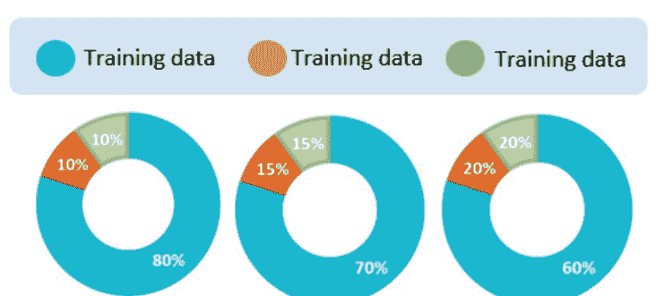

图 15.3 – 用于训练和测试模型的数据集划分

需要注意的是，测试数据集不应在模型开发过程中使用，包括超参数调整。其目的是在模型训练和最终确定后评估其泛化能力。

### 阶段 3 – 优化和部署

优化涉及使用 scikit-learn 等库来优化机器学习模型，而部署则涉及使用 Flask 或 Django 等框架将这些优化后的模型集成到实际应用中。这些阶段确保模型实用并能提供真正的价值。

#### 优化

微调模型的超参数和配置以实现最佳性能。尝试不同的设置以提高准确性和泛化能力。

#### 模型部署

将训练良好的模型集成到实际应用中。开发 API 或接口以根据新数据进行预测。确保部署环境已准备好处理模型的使用。

在这些阶段中，通过仔细的问题定义、数据收集、彻底的预处理、探索性分析、特征构建和严格的模型训练与测试。优化阶段提升模型的准确性，部署阶段则确保模型的价值在实际场景中得以实现。

现在，让我们进入下一节，我们将用巧克力蛋糕的类比来分解机器学习生命周期。

## 机器学习生命周期的巧克力蛋糕类比

由于涉及的技术术语和详细步骤，理解机器学习生命周期的各个阶段可能看起来有些挑战性。从数据收集和预处理到模型训练、测试和部署，每个阶段都需要仔细关注和理解。但别担心！我们精心设计了一个美味的类比，将这个过程比作烘焙巧克力蛋糕，旨在让这些复杂的概念更易消化和理解。

想象一下，你正在努力烘焙最美味的巧克力蛋糕。从挑选最优质的原料到品尝最后一口，每一步都对应着机器学习生命周期中的一个阶段。让我们来探索这个令人垂涎的类比！

| 机器学习步骤 | 烘焙巧克力蛋糕类比 | 解释 |
| :--- | :--- | :--- |
| 问题定义 | 选择蛋糕类型 | 在开始烘焙之前，你需要决定制作哪种类型的蛋糕。在机器学习中，这一步涉及定义问题、决定任务类型（分类、回归等）并设定明确的目标。 |
| 准备工作 | 收集原料 | 就像烘焙师收集蛋糕所需的所有原料一样，在机器学习中，数据科学家收集项目所需的所有数据和工具，确保为后续步骤做好一切准备。 |
| 数据预处理 | 准备原料 | 在烘焙中，原料需要清洗和分类。同样，在机器学习中，数据需要被清洗，过滤掉不必要的噪声或无关信息，以确保高质量的数据准备好进行分析。 |
| 探索性数据分析 | 品尝和闻原料 | 烘焙师通过品尝和闻原料来确保其质量。在探索性数据分析中，数据科学家通过可视化和分析数据来理解其结构、趋势、模式，并获取初步见解。 |
| 特征工程 | 混合原料 | 烘焙师混合原料以获得蛋糕所需的质地和风味。在机器学习中，特征被选择和转换，以创建用于有效训练模型的最终数据集。 |
| 训练和测试模型 | 烘焙和检查蛋糕 | 面糊被倒入两个独立的烤盘；一个用于即时品尝测试（验证），另一个用于最终产品（测试）。在机器学习中，数据集被分为训练集和测试集。模型在训练数据上进行训练，并在单独的未见数据集上进行验证，以评估和优化其性能。 |
| 优化 | 调整配方 | 如果品尝测试显示蛋糕需要更多风味，就需要调整配方。同样，机器学习模型可能通过调整超参数来优化性能，确保有效的学习和预测。 |
| 模型部署 | 上菜 | 一旦蛋糕完美无瑕，就会上菜给客人。同样，一个性能良好的优化机器学习模型会被部署到真实环境中，基于新的未见数据进行实际预测或决策。 |

表 15.1 – 巧克力蛋糕类比步骤

在我们总结时，巧克力蛋糕的类比优雅地阐释了机器学习生命周期。从最初的数据选择到模型的部署，每个阶段都与制作美味蛋糕的步骤相对应。构建机器学习模型的精心优化，就像调整蛋糕配方至完美一样具体而贴切。

模型训练和测试中的每一个过程都可以比作混合、烘焙和品尝测试，使得复杂的机器学习世界变得易于理解和引人入胜。最终，揭晓一个训练有素的模型，就像呈现一个烘焙精美的巧克力蛋糕一样令人满足和愉悦。在这个丰富的学习旅程中，每一步都承诺带来清晰的理解，或许还有一点甜蜜和喜悦。在下一节中，我们将探讨机器学习的类别。

## 机器学习算法的类型

根据学习风格，机器学习可以分为四种类型：

- 监督学习
- 无监督学习
- 半监督学习
- 强化学习

机器学习使计算机能够从数据中学习，从经验中改进，并以越来越高的准确性预测结果。这是机器学习的四个主要且不同的类别，每个类别都有其独特的特点和应用。这些类别是基于算法如何被训练以进行预测或决策来划分的。

> **重要说明**
>
> 机器学习算法有四个类别，但在本书中，我们只介绍监督学习和无监督学习。虽然这不是一本机器学习书籍，但 Python 在机器学习领域的应用持续增长，因此它与我们理解该编程语言的应用以及我们如何使用计算思维来解决问题的目标相关。

### 监督学习

监督学习是机器学习的一种类型，其中算法在标记的数据集上进行训练。在此上下文中，“标记”意味着训练集中的每个示例都与正确的输出配对。监督学习算法分析训练数据并产生一个推断函数，该函数可用于映射新的示例。

以下是监督学习的关键方面：

- **从标记数据中学习**：它涉及使用一组已知的、标记的示例来训练模型。例如，在一个电子邮件数据集中，每封电子邮件将被标记为“垃圾邮件”或“非垃圾邮件”，模型学习将电子邮件分类到这些类别中。
- **预测建模**：训练后，模型旨在预测新的、未见数据的正确标签。例如，它可以预测新电子邮件是否为垃圾邮件。
- **任务类型**：监督学习中有两种主要任务类型：
    - **回归**：*图 15.4* 中显示的左图，是一个带有线条的散点图，表示变量之间的趋势或关系。当输出变量是实数或连续值（如房屋价格或温度）时使用，旨在预测一个数量。
    - **分类**：*图 15.4* 中显示的右图，显示了由虚线分隔的两个不同数据点组，代表分类的决策边界。当输出变量是类别（如“通过”或“失败”或“垃圾邮件”或“非垃圾邮件”）时适用，目标是预测一个类别。

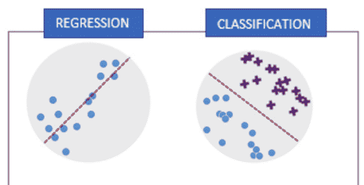

图 15.4 – 回归和分类图

- **反馈系统**：学习过程是“受监督的”，因为算法会得到关于其预测的反馈。在训练阶段，模型在训练数据上进行预测，当其预测错误时，会由老师（已知标签）进行纠正。
- **用例**：它被用于众多现实世界的应用中，包括图像和语音识别、医学诊断、垃圾邮件过滤和市场预测。

在监督学习中，模型的性能是基于其准确预测新的、未见数据（不属于训练集）标签的能力来评估的。它从训练数据到新数据的泛化能力越强，监督学习模型就被认为越好。现在，让我们继续讨论无监督学习。

### 无监督学习

无监督学习是机器学习的一种类型，处理未标记的数据。其目标是在没有任何预先存在的标签或监督的情况下，发现数据集中隐藏的模式和关系。算法必须通过识别数据的结构和提取特征来理解数据，而无需任何关于寻找什么的明确指示。

以下是关于无监督学习的一些要点：

- **处理未标记数据**：无监督学习算法旨在处理没有标记结果或响应的数据集。主要目标是在没有特定目标变量指导的情况下，探索数据结构以提取有意义的信息。
- **模式发现和特征提取**：这些算法专注于识别数据中的模式、相关性和特征。这可以包括揭示自然分组（聚类）、找到低维表示（降维）或识别变量之间的关联和关系。
- **无监督学习中的任务类型**：
    - **聚类**：这是最常见的无监督学习任务之一。聚类涉及将一组对象分组，使得同一组（一个簇）中的对象彼此之间比与其他组中的对象更相似。聚类算法的例子包括 K-means、层次聚类和 DBSCAN。

#### 降维

降维技术减少了需要考虑的随机变量数量，可分为特征选择和特征提取方法。主成分分析（PCA）、t-分布随机邻域嵌入（t-SNE）和自编码器等技术常用于此目的。这些方法有助于可视化高维数据、降低噪声，并提高其他学习任务的效率。

#### 异常检测

在异常检测中，任务是识别那些因与大多数数据显著不同而引起怀疑的罕见项目、事件或观测值。这常用于欺诈检测、网络安全、故障检测和系统健康监控。

#### 关联规则学习

此任务旨在发现大型数据库中变量之间有趣的关系。一个常见的例子是购物篮分析，其目标是发现顾客购买行为之间的关系。

## 深度学习简介

深度学习是机器学习的一个子集，机器学习是人工智能的一个领域，专注于教机器从数据中学习并做出决策。深度学习尤其擅长从大量数据中学习，并且是近年来许多人工智能进步的驱动力。以下是深度学习的关键方面：

- **受人脑启发**：深度学习模型，特别是神经网络，其灵感来源于人脑的结构和功能。它们模拟了生物神经元处理信息的方式，尽管形式上要简化得多。
- **神经网络**：深度学习的基本构建块是人工神经网络。这些网络由相互连接的节点或“神经元”层组成，每个节点执行简单的计算。深度学习的复杂性来自于这些层的深度，因此得名“深度”学习。
- **从数据中学习**：在深度学习中，模型直接从原始数据中学习。这种能力与传统机器学习算法有显著不同，后者通常需要手动特征提取。深度学习算法能够自动从原始数据中提取和学习特征，使其特别适合图像和语音识别等任务。
- **处理复杂模式**：深度学习在识别和处理数据中复杂的高级模式方面尤为强大。这一能力已在计算机视觉、自然语言处理和音频识别等领域取得了突破。
- **大数据集和计算能力**：深度学习通常需要大量的数据和强大的计算能力。大数据的出现和计算硬件的进步，特别是**图形处理单元（GPU）**，对深度学习的发展至关重要。
- **应用**：深度学习应用于各种场景，包括自动驾驶汽车、虚拟助手（如Siri和Alexa）、人脸识别系统、语言翻译服务和医疗诊断。
- **框架和库**：有多种深度学习框架和库可用，例如TensorFlow、Keras、PyTorch等，它们促进了深度学习模型的开发。

深度学习已经改变了人工智能的格局，使得解决那些曾被认为超出机器能力范围的复杂问题成为可能。现在，让我们深入探讨神经网络模型的架构，这是我们探索之旅中下一个激动人心的主题。

### 人工神经网络的架构

人工神经网络通过**层**相互连接的节点（每个节点类似于一个神经元）来模拟人脑的决策过程。网络从一个**输入层**（由x1, x2, … , xn表示）开始，数据在此被接收。然后，这些数据通过一个或多个**隐藏层**进行处理，其中每个连接都带有一个权重（由w1, w2, … , wn表示）。这些权重放大或衰减输入信号，反映了每个输入在网络决策过程中的重要性。此外，隐藏层中的每个神经元都有一个偏置项，通常表示为*b*。这个偏置允许神经元独立于其输入来调整其输出，提供了额外的自由度，使网络能够更好地拟合数据。因此，权重和偏置的组合对于塑造网络的预测和行为至关重要，如下图所示：

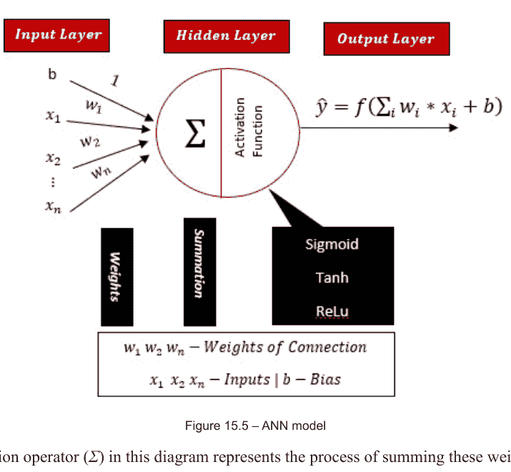

图15.5 – 人工神经网络模型

此图中的求和运算符（Σ）表示将隐藏层中每个神经元的这些加权输入和偏置求和的过程。然后，这个和被送入神经元内的一个激活函数，该函数决定向前传递多少信号。激活函数的输出可以看作是神经元对接收到的刺激的响应。

在输出层，最终的激活函数应用于最后一个隐藏层的输出，以产生网络的最终输出（ŷ）。这个输出是隐藏层组合激活信号的函数，通常用于分类、回归或其他预测等任务。输出层中使用的激活函数类型取决于具体任务——例如，用于多分类的softmax函数或用于二分类的sigmoid函数。

人工神经网络可以使用监督学习和无监督学习方法进行训练。训练过程包括将网络的输出（通常是某种形式的预测）与期望的目标输出进行比较以识别误差。然后，网络通过一个使用该误差大小的学习规则来微调其权重。这种迭代调整使网络能够提高其输出准确性。

神经网络被组织成包含大量相互连接节点的层，每个节点都有一个激活函数，该函数引入了非线性，这对于复杂决策至关重要。以下是一些最常见的激活函数：

- **Sigmoid**：表示为 $1 / (1 + e^{-x})$，它接受一个实数输入 $x$，并输出一个介于0和1之间的值。它常用于二分类中的概率输出。
- **双曲正切（tanh）**：定义为 $tanh(x)$，此函数接受一个实数输入 $x$，并输出一个介于-1和1之间的值，有效地缩放输入数据。
- **修正线性单元（ReLU）**：表示为 $max(0, x)$，这是一个分段函数，如果输入为正则输出输入值本身，否则输出零。

下图显示了与上述每个激活函数相关的图形：

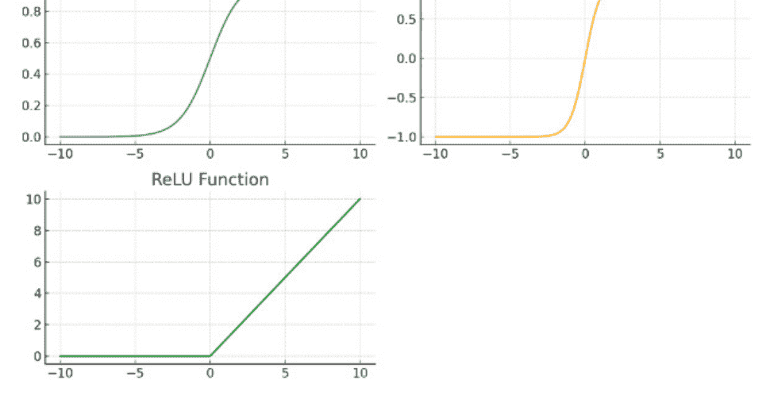

通过使用这些激活函数，神经网络能够识别数据中的复杂模式，从而构建更复杂和先进的模型。

接下来，我们将展示Python示例，演示在监督学习中用于分类的顺序神经网络的实现。我们还将探讨无监督学习技术，特别是使用BIRCH和K-means等算法进行聚类，以发现数据中的模式。这些示例将有效展示如何使用机器学习模型进行预测和数据探索，同时在Python中运用计算思维。

### 数据分类

让我们看一个数据分类的例子。下图展示了使用监督学习的一个示例。为了生成此处可见的输出，我们使用了来自[www.kaggle.com](http://www.kaggle.com)的现有数据集。该数据集名为**皮马印第安人糖尿病数据库**。它描述了一位皮马印第安患者是否被诊断出患有糖尿病：

| 怀孕次数 | 血浆葡萄糖 | 舒张压 | 肱三头肌皮褶厚度 | 血清胰岛素 | 体重指数 | 糖尿病家系函数 | 年龄 | 类别变量 |
|---|---|---|---|---|---|---|---|---|
| 6 | 148 | 72 | 35 | 0 | 33.6 | 0.627 | 50 | 1 |
| 1 | 85 | 66 | 29 | 0 | 26.6 | 0.351 | 31 | 0 |
| 8 | 183 | 64 | 0 | 0 | 23.3 | 0.672 | 32 | 1 |
| 1 | 89 | 66 | 23 | 94 | 28.1 | 0.167 | 21 | 0 |
| 0 | 137 | 40 | 35 | 168 | 43.1 | 2.288 | 33 | 1 |
| 5 | 116 | 74 | 0 | 0 | 25.6 | 0.201 | 30 | 0 |
| 3 | 78 | 50 | 32 | 88 | 31 | 0.248 | 266 | 1 |

图15.7 – 无监督学习示例

如您所见，表格中的属性，也称为输入变量（x），如下：

- 怀孕次数
- 口服葡萄糖耐量试验中2小时的血浆葡萄糖浓度
- 舒张压（mm Hg）
- 肱三头肌皮褶厚度（mm）
- 2小时血清胰岛素（mu U/ml）
- 体重指数（体重kg / 身高m²）
- 糖尿病家系函数
- 年龄（岁）

对于输出变量（y），我们有类别变量（0或1）。从数据集中，每一行代表一名患者，以及该患者在过去5年内是否被诊断出患有糖尿病。如你所见，有八个输入变量和一个输出变量（最后一列）。

我们将使用二元分类模型（1或0），该模型将输入变量（x）的行映射到输出变量（y）。这将总结为 $y = f(x)$。以下代码片段使用此信息来获取我们的输出。请注意，在整个示例中，我们将分片段讨论完整文件：

ch15_diabetesA.py

```python
import pandas as pd
import matplotlib.pyplot as plt
import numpy as np
dataset = pd.read_csv('diabetes.csv')
```

如你所见，我们正在上传 **diabetes.csv** 数据集（来自Kaggle）。如果你需要提醒如何保存文件并找到所需路径，请查看 *《理解Python数据分析》* 中的 *第14章，在实验和数据分析问题中使用Python* 部分。上传数据集的方法有很多。

正如我们在 *第14章，在实验和数据分析问题中使用Python* 中所做的那样，我们使用非常流行的 **pandas** 并将其导入为 **pd**。pandas用于数据操作和分析。它提供了用于操作数值表格和时间序列的数据结构和操作。pandas中的 **read_csv()** 函数用于从CSV文件导入数据。

#### 重要提示

> 我们需要找到正确的目录。当你调用.csv文件时，请确保你在正确的目录（.csv文件所在的位置）中，以避免错误代码。在使用 **import os** 后使用 **os.chdir()**，然后使用 **print('Current directory', os.getcwd())**。更多信息请参见 *第12章，在简单挑战中使用计算思维和Python*。

一旦你运行了前面的代码片段，你可以查看变量浏览器以查看以下截图中显示的项目。请注意，**变量浏览器** 是一个工具，允许你浏览和管理与代码关联和使用的对象。此工具是 **Spyder** 环境的一部分，该环境运行Python并提供额外的功能和编辑工具，例如变量浏览器。变量浏览器可以在Spyder环境的右上角找到。以下截图显示了我们在变量浏览器中的数据库视图：

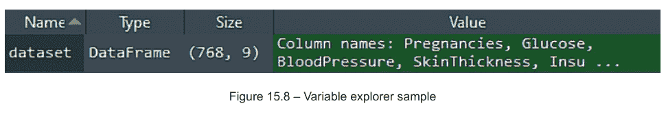

如你所见，**Size** 描述了数据集。它显示了患者数量，**786**，以及变量总数，**9**。现在，我们对数据集有了更好的理解。

但假设你不知道你需要什么类型的学习。你可以在控制台中输入以下函数以获取数据及其输出的完整概览：

```python
dataset.describe(include='all')
```

以下截图显示了在我们的算法中使用前面一行代码后将收到的信息：

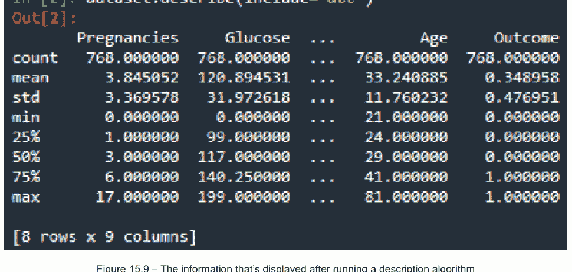

如你所见，我们可以获取所有数值特征，并知道没有分类数据。我们需要这些信息，因此可以使用以下代码行来查看变量之间的相关性：

```python
dataset.corr()
```

这简单的代码行帮助我们获取以下截图中显示的信息。请注意，你看到的输出可能因你使用的环境而异。此外，在使用 **Spyder** 或 **Jupyter** 等环境运行此代码时，根据你的主题设置和选择，表格可能看起来不同，具有不同的配色方案（或没有配色方案）：

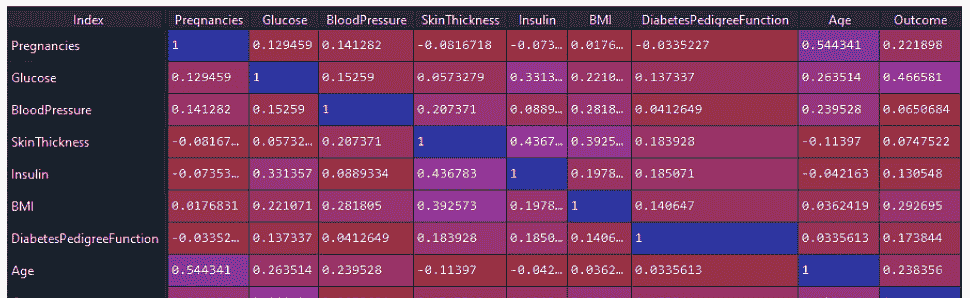

图15.10 – 数据集相关性图

我们可以看到所有变量与结果（输出（y））之间的相关性。前面的截图向我们显示，血浆葡萄糖与结果的相关性最强，而胰岛素的相关性最低。

现在我们对数据集有了更好的理解，让我们将输入变量和输出变量分开，以便放入模型中。让我们看看来自 **ch13_diabetesA.py** 文件的以下代码片段，它为我们举例说明了这一点：

```python
#Split dataset into input(x) and output(y) variables
x_variables = dataset.iloc[:,0:8]
y_variable = dataset.iloc[:,8]
```

我们可以使用 **print** 函数来检查我们的值：

```python
print(x_variables)
print(y_variable)
```

一旦你运行了前面的代码片段，输出数据将如下图所示。请注意，结果显示了我们定义为 **x_variables** 和 **y_variable** 的变量，这些变量又定义为数据集的一部分，如前面的代码所示：

```
Pregnancies  Glucose  BloodPressure  ...  BMI  DiabetesPedigreeFunction  Age
0            6        148             72  ...  33.6                     0.627   50
1            1         85             66  ...  26.6                     0.351   31
2            8        183             64  ...  23.3                     0.672   32
3            1         89             66  ...  28.1                     0.167   21
4            0        137             40  ...  43.1                     2.288   33
...        ...        ...            ...  ...   ...                       ...  ...
763         10        101             76  ...  32.9                     0.171   63
764          2        122             70  ...  36.8                     0.340   27
765          5        121             72  ...  26.2                     0.245   30
766          1        126             60  ...  30.1                     0.349   47
767          1         93             70  ...  30.4                     0.315   23

[768 rows x 8 columns]

0    1
1    0
2    1
3    0
4    1
..
763    0
764    0
765    0
766    1
767    0
Name: Outcome, Length: 768, dtype: int64
```

图15.11 – 训练算法的数据集输出并打印输入和输出值

现在，我们必须将数据分为训练数据集和测试数据集。这种分割技术的目的是评估机器学习算法的性能。它仅适用于任何类型的监督学习算法。第一组（训练数据集）用于拟合模型。

主要目标是在具有已知输入和输出的可用数据上拟合它，然后在未来没有预期输出或目标值的新示例上进行预测。

## 使用scikit-learn库

在处理数据和机器学习时，另一个重要的库是 `scikit-learn` (`sklearn`) 库。该库对于分类、回归、聚类、模型选择、降维等特别有用。你可能还记得 *第14章，在实验和数据分析问题中使用Python* 中的 *在Python中使用数据库* 部分，你可以使用 **命令提示符** 窗口中的 `pip install` 来安装所需的库。一旦你有了库，你就可以将其导入代码中，如下面的代码片段所示，该片段使用 `sklearn` 来分割数据。请注意，此代码片段是更大的 `ch13_diabetesA.py` 文件的一部分：

```python
from sklearn.model_selection import train_test_split
X_train,X_test, y_train,y_test = train_test_split(
    x_variables, y_variable, test_size = 0.20,
    random_state = 10)
```

以下是已知参数：

- `x_variable` 和 `y_variable`，如前所述。
- `test_size`：测试大小将是数据集的20%。
- `random_state`：这为随机生成器设置一个种子，以便你的训练和测试分割始终是确定性的。如果设置为 `none`，则返回一个随机初始化的 `RandomState` 对象。

现在，让我们看看以下代码片段。请注意，我们将在算法中使用顺序模型。此外，我们正在使用 **Keras** 库，该库与Python一起使用，以便我们可以在算法中运行深度学习模型。确保你有 `keras` 库可用于此算法。如果你安装了TensorFlow，你应该已经可以访问Keras库。

在处理机器学习问题和算法时，你将有各种库可供选择。我们为这个特定问题选择了Keras。Keras是开源的，对于创建人工神经网络很有用。TensorFlow是一个包含许多机器学习组件和任务的平台。

Keras在TensorFlow之上工作，使得在Python编程语言中与之交互更容易。Keras是一个更高级的API，我们将在后面进一步讨论。由于其能力，它有时可能比平时慢。**PyTorch** 是另一个用于人工神经网络的库。它是一个更低级的API，这意味着它运行得更快。Keras由 **Google** 支持，而PyTorch由 **Facebook** 支持。两者都很有帮助，因此决定使用哪个通常是开发者的偏好。我更喜欢Keras库。

顺序API允许你以逐步的方式逐层创建模型。还有另外两种模型可用——**函数式API** 和 **模型子类化**。我们将使用顺序API，因为它是最简单的架构；函数式API用于深度学习（复杂模型）和模型子类化。

关于使用Keras，有几点我们需要注意：

- 模型类是根类，用于定义模型的架构。
- 就像Python本身一样，Keras使用面向对象编程，这意味着我们可以添加子类。
- 模型中的子类是可定制的。

话虽如此，还应该注意，子类化比我们使用顺序或函数式API更具挑战性。现在，让我们看看使用Keras库的更新算法。

请记住包含文件的目录，或将.csv文件保存到必要的目录，以便正确运行算法：

ch15_diabetesB.py

```python
from sklearn.model_selection import train_test_split
from keras import Sequential
from keras.layers import Dense
### Defining the Model
model = Sequential()
model.add(Dense(12, input_dim=8, activation='relu'))
model.add(Dense(15, activation='relu'))
model.add(Dense(8, activation='relu'))
model.add(Dense(1, activation='sigmoid'))
```

从前面的代码片段中，我们可以看到我们添加了四个全连接层。

第一层的构建如下：

- 12个神经元
- **input_dim = 8**（即，输入到网络的输入值）
- 激活函数 'relu'

如你所见，我们已经添加并定义了多个模型。要编译模型，我们可以使用以下代码片段，该片段包含在同一个代码文件中。我们还可以设置model.fit，以便使用我们的库，以及以下代码，这是我们ch13_diabetesB.py文件的一部分：

```python
### Compile the model
model.compile(loss='binary_crossentropy', optimizer='adam',
    metrics=['accuracy'])
### Fit the model on the dataset
model.fit(x_variables, y_variable, epochs=95,
    batch_size=25)
### Evaluate the model
_, accuracy = model.evaluate(x_variables, y_variable)
print('Accuracy: %.2f' % (accuracy*100))
model.summary()
```

前面的代码编译了Adam优化器。Adam优化器用于随机梯度下降，并使用训练数据迭代地更新网络权重。一旦我们运行代码，我们的输出将如下所示：

```
Epoch 90/95
31/31 [==============================] - 0s 676us/step - loss: 0.4809 - accuracy: 0.7721
Epoch 91/95
31/31 [==============================] - 0s 611us/step - loss: 0.4812 - accuracy: 0.7799
Epoch 92/95
31/31 [==============================] - 0s 611us/step - loss: 0.4860 - accuracy: 0.7721
Epoch 93/95
31/31 [==============================] - 0s 611us/step - loss: 0.4812 - accuracy: 0.7669
Epoch 94/95
31/31 [==============================] - 0s 547us/step - loss: 0.4786 - accuracy: 0.7708
Epoch 95/95
31/31 [==============================] - 0s 579us/step - loss: 0.4782 - accuracy: 0.7786
24/24 [==============================] - 0s 499us/step - loss: 0.4698 - accuracy: 0.7839
Accuracy: 78.39
```

图15.12 – 使用Keras库时模型的输出

请注意，当你运行算法时，准确度可能会有所不同。多次测试算法以查看窗口中的变化。一旦我们运行了准确度模型，我们就可以使用`model.summary()`打印模型摘要，如下所示：

```
Model: "sequential_3"
_________________________________________________________________
Layer (type)                Output Shape              Param #   
=================================================================
dense_12 (Dense)            (None, 12)                108       
_________________________________________________________________
dense_13 (Dense)            (None, 15)                195       
_________________________________________________________________
dense_14 (Dense)            (None, 8)                 128       
_________________________________________________________________
dense_15 (Dense)            (None, 1)                 9         
=================================================================
Total params: 440
Trainable params: 440
Non-trainable params: 0
_________________________________________________________________
```

图15.13 – 算法的模型摘要

现在我们已经了解了如何使用糖尿病数据文件运行我们的算法，让我们来看一些可以帮助我们评估算法的优化模型。我们不会深入探讨这些算法，但我们确实想提一下我们可用的各种工具中的一些。当我们进行建模时，我们使用优化模型，例如**二元交叉熵**、**Adam优化算法**和**梯度下降**。

## 定义优化模型

让我们看看一些不同的模型。请注意，我们没有深入探讨这些模型的使用，但建议进一步探索它们如何应用于我们的算法。

### 二元交叉熵模型

在二元分类中，我们使用交叉熵作为默认的**损失函数**。损失函数是一种帮助我们评估算法如何对数据建模的方法。通过损失函数，我们可以使用优化来产生更准确的结果——也就是说，它有助于减少**预测误差**。当目标值在二元集合中时，我们使用损失函数。

交叉熵是一种损失函数，它计算两个概率分布之间的差异。当使用**逻辑回归**和**人工神经网络**优化分类模型时，我们可以使用交叉熵。

### Adam优化算法

Adam优化算法是一种**随机优化**方法。随机优化用于函数中存在随机性时，以最大化或最小化函数的值。Adam优化算法适用于一些*非凸*的简单优化问题。它效率高且内存占用少，但可以应用于大型数据集。

### 梯度下降模型

梯度下降算法是一种一阶优化算法。一阶指的是线性局部误差。我们对可微分的函数使用梯度下降来寻找局部最小值。

### 混淆矩阵模型

混淆矩阵也称为**误差矩阵**。混淆矩阵在视觉上很有帮助，因为它以表格形式呈现算法的性能，从而可以更好地可视化该性能。它通常用于监督学习。

如前所述，这只是你开始优化算法时的一些基础信息。关于机器学习的更多信息可以在其他Packt书籍中找到，例如*《Python机器学习》*和*《Python探索性数据分析》*。

在我们介绍聚类之前，让我们快速回顾一下本节中关于使用Keras包和模型的内容：

- 加载数据
- 在Keras中定义神经网络
- 使用高效的数值后端编译Keras模型
- 在数据上训练模型
- 在数据上评估模型
- 使用模型进行预测

现在，让我们继续讨论数据聚类。

## 实现数据聚类

在本节中，我们将探讨如何处理数据聚类。首先，让我们定义一下**数据聚类**的含义。数据聚类指的是我们如何将数据划分为组或簇。如果簇能提供对领域知识的扩展理解，那么它们就是有意义的。我们使用聚类进行许多应用，例如医学，聚类可以帮助识别一组患者对治疗的反应方式；或者市场研究，聚类用于根据特定群体的特征将消费者分组以吸引该群体。

在本次讨论中，我们将研究合成聚类，而不是应用聚类。在*第18章，高级应用计算思维问题*中，你将看到一些上下文中的聚类示例。**合成聚类**是由合成数据集生成的——也就是说，我们使用算法生成数据集。让我们看一下以下代码片段：

ch15_syntheticDataset.py

```python
from numpy import where
from sklearn.datasets import make_classification
from matplotlib import pyplot
### create a synthetic dataset
X, y = make_classification(n_samples = 1800,
    n_features = 2, n_informative = 2, n_redundant = 0,
    n_clusters_per_class = 1, random_state=4)
### Scatterplot
for class_value in range(2):
    row_ix = where(y == class_value)
    pyplot.scatter(X[row_ix, 0], X[row_ix, 1])
### Display plot
pyplot.xlabel('variable 1')
pyplot.ylabel('variable 2')
pyplot.title('Synthetic data graph')
pyplot.show()
```

请注意，我们设置了样本数量、特征数量和簇数量等。此外，我们创建了合成数据的散点图并绘制了结果。下图显示了我们合成数据集绘制为散点图的结果：

## 使用BIRCH算法

**平衡迭代式层次聚类与缩减算法（BIRCH）** 是一种使用聚类质心的聚类算法，前提是需要有足够的内存和时间。对于BIRCH和K-means聚类算法，我们将分享一个算法及其对应的图表，以便更好地理解它们。

以下代码片段展示了BIRCH算法：

ch15_BIRCH.py

```python
from numpy import unique
from numpy import where
from sklearn.datasets import make_classification
from sklearn.cluster import Birch
from matplotlib import pyplot
#Synthetic dataset definition
X, _ = make_classification(n_samples = 1800,
    n_features = 2, n_informative = 2, n_redundant = 0,
    n_clusters_per_class = 1, random_state = 4)
#Define the BIRCH model
model = Birch(threshold = 0.01, n_clusters = 2)
model.fit(X)
yhat = model.predict(X)
#Clusters
clusters = unique(yhat)
#Display
for cluster in clusters:
    row_ix = where(yhat == cluster)
    pyplot.scatter(X[row_ix, 0], X[row_ix, 1])
pyplot.show()
```

请注意，在这个示例中我们任意选择了两个聚类，如`model = Birch(threshold = 0.01, n_clusters = 2)`所示。我们坚持使用1800个样本，以便可以比较输出图形。以下截图展示了两个BIRCH模型示例。第一个（*左侧*）展示了按前述代码片段运行的算法。第二个（*右侧*）展示了相同的算法运行，但针对三个聚类。

要运行第二个图表，我们将模型行代码更改为`model = Birch(threshold = 0.01, n_clusters = 3)`。请查看下图，其中展示了两个图表——`n_clusters = 2`和`n_clusters = 3`：

请注意，在前面图表的*左侧*，清晰地显示了两个聚类。与*图15.14*相比，您可以看到一些数据点已被转换以适应每个已识别的聚类。前面截图*右侧*的散点图将数据分为三个不同的聚类。为了更熟悉聚类算法，可以更改参数，看看当您更改聚类数量、样本大小和其他参数时会发生什么。

现在，让我们看看K-means聚类算法。

## 使用K-means聚类算法

K-means聚类算法是使用最广泛的聚类算法之一。该算法分配样本，以使每个已识别聚类中的方差最小化。与BIRCH算法非常相似，我们在算法内设置聚类数量。让我们看看K-means代码片段：

ch15_KMeans.py

```python
from numpy import unique
from numpy import where
from sklearn.datasets import make_classification
from sklearn.cluster import KMeans
from matplotlib import pyplot
#Dataset definition
X, _ = make_classification(n_samples = 1800,
    n_features = 2, n_informative = 2, n_redundant = 0,
    n_clusters_per_class = 1, random_state = 4)
#Model identification and fit
model = KMeans(n_clusters = 2)
model.fit(X)
#Clusters
yhat = model.predict(X)
clusters = unique(yhat)
#Display
for cluster in clusters:
    row_ix = where(yhat == cluster)
    pyplot.scatter(X[row_ix, 0], X[row_ix, 1])
pyplot.show()
```

同样，请注意我们使用了相同的聚类数量（2）和样本数量（1800），以便可以比较我们的显示结果。以下截图展示了K-means散点图的输出：

请注意，数据仍然是相同的。然而，当我们比较从BIRCH算法和K-means算法得到的显示结果时，我们可以看到我们的算法为聚类产生了非常不同的结果。

我们还可以使用和测试许多其他聚类算法。了解它们并比较结果，对于根据真实数据集确定使用哪些算法至关重要。在这种情况下，K-means算法的结果与模型拟合得不好。当使用两个聚类时，BIRCH模型似乎更合适，因为K-means算法中的方差不相等。

在我们继续聚类示例时，请注意，对于数据科学和机器学习的大部分内容，我们越多地使用模型和算法，就越能理解它们的用途以及模型何时合适，并且我们可以学会直观地识别算法是否适合我们的数据。

## 总结

本章全面介绍了使用Python进行机器学习，涵盖了基础知识并逐步深入到实际应用。关键主题包括定义机器学习、探索其生命周期以及讨论不同的算法，包括深度学习。强调了实际技能，例如使用Keras等Python包进行数据建模、神经网络定义、模型训练和评估以及进行预测。本章还涉及了数据分类和聚类。我们将在下一章继续探讨这里讨论的一些主题。我们还将在[第18章](Chapter 18) *高级应用计算思维问题*中提供的示例中看到其中一些应用。

# 16

# 在统计分析中使用计算思维和Python

在本章中，我们将使用Python和计算思维的元素来解决需要统计分析算法的问题。我们将在Python环境中使用**pandas DataFrame**来创建统计分析算法。创建统计分析将需要Python中的其他包，例如`numpy`、`pytz`等。我们将在需要这些包来处理我们将要编写的代码时使用它们，并在学习这些库帮助我们做什么时使用它们，例如使用**pandas**组织数据。

在本章中，我们将涵盖以下主题：

- 定义问题和Python数据选择
- 数据预处理
- 使用可视化处理、分析和总结数据

在本章结束时，您将能够设计最适合您所面临场景的算法。您还将能够识别与所呈现问题最匹配的Python函数，并概括您的解决方案。

## 技术要求

您将需要最新版本的Python来运行本章中的代码。

您需要安装`pandas`、`numpy`和`scipy`包来解决本章中的问题。

您可以在以下位置找到本章中使用的完整源代码：
https://github.com/PacktPublishing/Applied-Computational-Thinking-with-Python-Second-Edition/tree/main/Chapter16。

## 定义问题和Python数据选择

在我们查看**pandas**库之前，让我们先定义什么是数据分析。当我们谈论数据分析时，我们指的是检查、清洗、转换和建模数据的过程，目的是发现有用的数据、通知结论并支持决策。

决策至关重要。我们不仅想看看数据说过去发生了什么。我们想利用数据来为未来做出明智的决策。

看看数据分析的一些用途：

- **商业**：它有助于根据客户趋势和行为预测做出决策，提高业务生产力，并推动有效决策
- **天气预报**：收集和分析有关大气的数据（温度、湿度、风等），以了解大气过程（气象学），从而确定大气在未来将如何演变
- **交通**：数据可用于确定趋势，包括交通、事故等，帮助我们做出关于交通模式、交通信号灯时长等方面的决策

当然，上述用途只是可能应用的一部分。数据分析被用于非常广泛的领域，企业和教育组织利用它来做出关键决策、为社区提供资源、资助我们的学校和大学等等。

那么，让我们看看我们有哪些可用的工具来分析这些数据。Python中用于数据分析的主要库之一是`pandas`包。`pandas`的伟大之处在于其易用性、简单的数据结构和高性能。使用`pandas`简化了我们在数据分析中的工作。

## 定义pandas

需要注意的一点是，`pandas`是建立在`numpy`之上的。`numpy`是一个帮助我们处理数组的包。Python本身没有数组，因此这些包允许我们创建数组、使用它们，然后在此基础上进行构建。

`pandas`提供了一个灵活且简单的数据结构，以简化您在数据分析中的工作。它是**大数据**的一个很好的工具。当我们谈论大数据时，我们指的是结构化和非结构化数据集，这些数据集经过分析，以便我们可以获得更好的洞察力，并帮助企业或组织的决策或策略。`pandas`可以处理导入不同格式，例如`.csv`文件、**SQL**和**JSON**，以及各种操作，例如选择数据、合并、重塑和清理数据。

在`pandas`中有两种不同的数据存储方式——Series和DataFrame：

- **Series**是一维数组，可以保存任何数据类型（整数、字符串或浮点数）；Series代表一列数据。
- **DataFrame**是二维对象，可以有多个列和数据类型。它们接受字典、Series、列表和其他DataFrame作为输入。

现在让我们学习何时使用`pandas`。

### 确定何时使用pandas

pandas 在一般情况下非常有用，但当我们处理大型数据和逗号分隔值（CSV）文件时，它确实是一个强大的工具。这些文件以表格形式存储，例如电子表格。另一点是，我们可以在 pandas 中建立分块。是的——pandas 中有一个 `chunksize` 参数，可以帮助我们分解数据。假设我们有 5,000,000 行数据。我们可以决定使用 `chunksize` 将其分解为每 1,000,000 行一块。

此外，我们有时拥有海量数据文件，但只想查看其中的部分组件。pandas 允许我们指定要包含的列和要忽略的列。

### 使用 pandas series

如前一节“定义 pandas”中所述，series 是一维的。我们可以使用一些简单的代码创建一个空的 pandas series。请注意，我们首先导入 pandas 库，这在使用包和库时是常规操作，如下所示：

```python
import pandas as pd
demo_series = pd.Series()
print(demo_series)
```

创建的默认 series 类型将是 float，因为我们在算法中没有指定任何其他类型。但是，控制台会打印一条警告，提示未来空 series 的 dtype 实例将被设置为 object 而不是 float。dtype 代表数据类型；在本例中，它是 float。请查看以下截图，它显示了我们运行算法时的输出：

```
Series([], dtype: float64)

<ipython-input-7-8cad40b6e73c>:2: DeprecationWarning: The default dtype for empty Series will be 'object' instead of 'float64' in a future version. Specify a dtype explicitly to silence this warning.
  demo_series = pd.Series()
```

图 16.1 – 在 pandas 中创建空 series 且未指定 dtype 时的输出

如你所见，实际上并没有错误，只是关于数据存储方式的警告。

现在，让我们创建一个包含已定义元素的 series。为此，我们需要同时导入 pandas 和 numpy，以便我们可以创建数组，然后创建 series。请查看以下代码片段：

ch16_seriesDemo.py

```python
import pandas as pd
import numpy as np
dataset = np.array(['yellow', 'green', 'blue', 'violet', 'red'])
data_series = pd.Series(dataset)
print(data_series)
```

从前面的代码中，你可以看到我们使用 numpy 存储了数组，然后使用该数组创建了一个 series。最后，我们打印了 series。输出是一个表格，如下所示：

```
0    yellow
1     green
2       blue
3     violet
4        red
dtype: object
```

如果我们先创建一个列表，也可以得到完全相同的结果。请查看此代码片段：

ch16_seriesDemo2.py

```python
import pandas as pd
import numpy as np
myList = ['yellow', 'green', 'blue', 'violet', 'red']
data_series = pd.Series(myList)
print(data_series)
```

请注意，我们直接从列表创建了 series。我们不会显示此特定代码片段的输出，因为它与前一个代码片段的输出完全相同。

我们也可以从字典创建 series。让我们在以下代码片段中查看：

ch16_seriesDemo3.py

```python
import pandas as pd
myDictionary = {
    'Name' : 'Miguel',
    'Number' : 42,
    'Age' : 'unknown'
}
mySeries = pd.Series(myDictionary)
print(mySeries)
```

前面的代码只是一个演示，但当我们运行算法时，确实会得到一个包含字典值的表格 series。让我们看看输出：

```
Name       Miguel
Number         42
Age       unknown
dtype: object
```

如你所见，我们有两列，基于键值对，以及类型 `object`。有一点将变得重要：series 没有列标题。为此，我们需要使用 DataFrame。

*如果我们想访问 series 中的特定元素怎么办？那么，要访问第一个元素，让我们使用以下代码片段：*

ch16_seriesDemo4.py

```python
import pandas as pd
myDictionary = {
    'Name' : 'Miguel',
    'Number' : 42,
    'Age' : 'unknown'
}
mySeries = pd.Series(myDictionary)
print(mySeries[0])
```

前面代码的输出就是 **Miguel**。这是因为我们使用索引 0 来标识我们想要从该字典中获取的内容，因此它会给我们第一个键值对的值。如果我们想要前两个键值对元素的值对，我们会将 **(mySeries[0])** 替换为 **(mySeries[:2])**。那么，输出将如下所示：

```
Name    Miguel
Number    42
dtype: object
```

使用 series 还可以做许多其他事情，因此请尝试使用索引，并使用列表、字典或 **numpy** 数组创建不同类型的 series。现在，让我们继续讨论 DataFrame。

### 使用 pandas DataFrame

现在，让我们看看如何使用 DataFrame。首先，让我们看看如何使用 **pandas** 处理 .csv 文件。我们将在接下来的代码片段中使用 **demo.csv** 文件。请将文件位置替换为你保存文件的位置，该文件可以在 **GitHub** 仓库中找到：

ch16_csvDemo.py

```python
import pandas as pd
data_set = pd.read_csv(r'C:\...\demo.csv')
data_set.head(5)
```

前面的代码做了三件事。它导入 **pandas** 包，以便我们可以使用所需的数据功能；它告诉程序打开我们将要处理的数据文件；然后它给我们文件中的前几行数据，以便我们可以查看我们正在处理的内容。以下截图显示了前面代码的结果或输出：

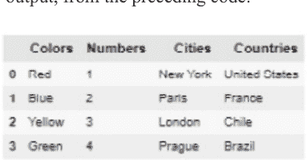

图 16.2 – 显示数据集前五行的输出

从前面的截图中，你可以看到表格并未显示我们文件中包含的所有值。虽然我们的文件并非充满大数据，但它确实包含更多行信息。这只是我们预览数据的一种方式。

但这是一个*干净*的数据集。*如果我们有一个包含缺失信息的行或列的数据集会怎样？* 好吧，`pandas` 允许我们处理文件以进行准备。DataFrame 也准备我们的数据，以便我们可以创建可视化表示。这些可视化或图表将使我们能够看到趋势、进行预测、确定哪些值可用于训练等等。DataFrame 实际上只是我们随后可以对数据集进行的所有其他操作的支柱。

在本节中，我们了解了问题、如何使用 `pandas`，以及 `pandas` series 和 DataFrame 的一些功能。

请注意，在本章的其余部分，我们将更多地关注 DataFrame 而不是 series。但在我们进入应用程序之前，让我们看看如何通过预处理 DataFrame 来避免错误和陷阱。

## 预处理数据

**预处理数据**是一种将原始数据转换为可用且高效格式的技术。事实上，它是数据挖掘和**机器学习**（ML）过程中最重要的一步。

当我们预处理数据时，我们实际上是在清理它、转换它或进行数据缩减。在本节中，我们将看看这些都意味着什么。

### 数据清理

**数据清理**是指使我们的数据集更高效的过程。如果我们在非常大的数据集上进行数据清理，我们可以加快算法速度、避免错误并获得更好的结果。在数据清理时，我们需要处理几件事：

- **缺失数据**：通过删除、插补或使用特定领域的方法来处理缺失值
- **重复数据**：检测并删除重复项，以确保每个观察值都是唯一的
- **数据类型**：根据需要使用适当的函数转换数据类型
- **噪声数据**：可以通过使用分箱、回归或聚类等过程来修复/改进

我们将更详细地了解这些内容。

#### 处理缺失数据

让我们看看如何处理缺失数据。首先，我们将学习如何忽略缺失数据。我们可以使用 `pandas` 查找包含缺失值的行。当我们这样做时，我们就是在清理数据集。现在，我们不会介绍我们可以使用的每种方法，只介绍一种删除包含缺失值的行的方法。一如既往，使用的数据集可在我们的 GitHub 仓库中找到，你需要更新文件位置。让我们看看以下代码片段：

##### ch16_cleaningDemo1.py

```python
import pandas as pd
myData = pd.read_csv('C:\...\demo_missing.csv')
print(myData)
cleanData = myData.dropna(axis = 0, how = 'any')
print(cleanData)
```

在前面的代码中，第一个 `print` 语句是为了我们自己，以便查看数据集的样子。*你绝不会想对大文件这样做！* 下面的截图显示了第一个 `print` 的输出：

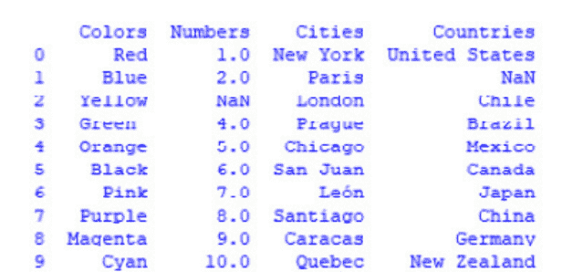

请注意，第1列，`Blue` 列在 `countries` 下有一个值为 **非数字 (NaN)**，而下一列（第2列，`Yellow`）在 `Numbers` 列下有一个缺失值。当我们使用 `dropna()` 时，该算法将删除包含缺失值的行。当我们设置 `axis = 0` 时，这意味着我们想要移除包含缺失值的行。当 `how ='any'` 与行（`axis=0`）一起使用时，意味着如果一行包含至少一个缺失值（`NaN`），该行将被移除。换句话说，如果一行中有任何 `NaN` 值，该整行将从 DataFrame 中删除。在另一种情况下，如果我们想删除任何列，我们将设置 `axis = 1`。当 `how='any'` 与 `axis=1`（列）一起使用时，意味着任何至少有一个缺失值（`NaN`）的列将从 DataFrame 中移除。下面的截图显示了使用修改后的数据集打印的语句：

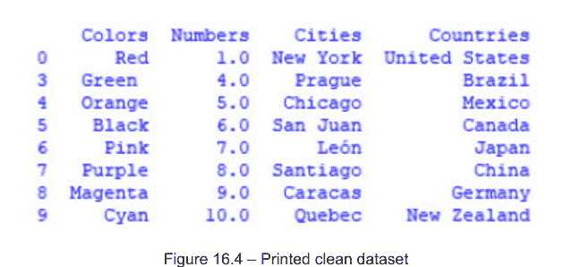

从前面的截图中可以看到，我们新数据集中缺失值的两行已被消除。现在，我们可以对这些数据运行任何我们想要的分析。

如果你想只检查一列以验证是否存在缺失值，可以使用以下代码片段：

```python
##### ch16_cleaningDemo2.py
import pandas as pd
myData = pd.read_csv('C:\...\demo_missing.csv')
print(pd.isna(myData['Countries']))
```

请注意，在前面的算法中，我们使用了 `Countries` 列标题来验证该特定列。当我们运行该算法时，我们的输出如下所示：

```
0    False
1     True
2    False
3    False
4    False
5    False
6    False
7    False
8    False
9    False
Name: Countries, dtype: bool
```

如你所见，我们数据集中的第二行在 `Countries` 列中有一个缺失值。

虽然我们不会深入探讨每种方法，但你也可以删除列。你可以选择删除具有特定数量缺失值的行和/或列。例如，你可以选择只删除缺失值超过两个的行或列。如果你这样做，你仍然需要担心那些未被删除的列或行中可能仍然缺失的值，因为它们只有一个缺失值。对于这些，你可以选择用某些值替换缺失值。

假设你想根据列替换一个值。为此，让我们看看以下代码片段：

```python
##### ch16_cleaningDemo3.py
import pandas as pd
myData = pd.read_csv('C:\...\demo_missing.csv')
print(myData.fillna(0))
```

从前面的代码中，请注意我们正在用值 0 填充每个空单元格。当我们运行该算法时，我们得到以下输出：

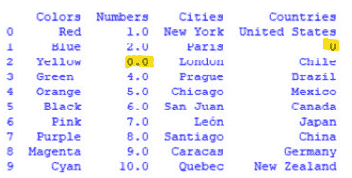

请注意前面截图中突出显示的值。这些是被我们的算法替换的值。现在，让我们看看如何处理重复数据。

#### 处理重复数据

处理**重复数据**是数据清理中的一个常见问题。让我们看看如何找到并处理这些重复项。首先，我们将学习如何使用 `pandas` 查找重复项。发现并修复这些重复项以使我们的数据更好是很重要的。我们不会学习所有方法，但我们将学习删除重复行的主要方法。请记住——我们使用的数据在我们的 GitHub 页面上。所以，请检查你是否使用了正确的文件。以下是代码的简短版本：

```python
##### ch16_cleaningDemo4.py
import pandas as pd
data = {
    'Title': ['The Midnight Library', 'The Forever War', 'The Power', 'The Midnight Library', 'The Forever War', 'To Kill a Mockingbird'],
    'Author': ['Matt Haig', 'Joe Haldeman', 'Naomi Alderman', 'Matt Haig', 'Joe Haldeman', 'Harper Lee']
}
df = pd.DataFrame(data)
print("Original Dataset:\n")
print(df)
```

从前面的代码中，我们正在创建一个名为 data 的字典，它包含两个键：`Title` 和 `Author`。每个键都有一个值列表。然后我们将这个字典转换为一个名为 `df` 的 `pandas` DataFrame。这个 DataFrame 有一些重复的行。当我们运行该算法时，我们得到以下输出：

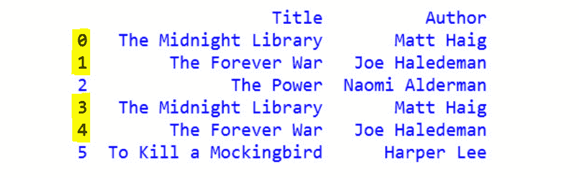

图 16.6 – 包含重复值的输出

请注意前面截图中突出显示的值。这是我们算法中的重复数据。

要查找重复行，请使用 `duplicated()` 函数：

```python
##### ch16_cleaningDemo5.py
##### 识别重复项
duplicates = df[df.duplicated()]
print("\nDuplicates:\n")
print(duplicates)
```

`df.duplicated()` 返回一个布尔序列（`True` 或 `False` 值）。`True` 值表示该行是 DataFrame 中前面某行的重复项，而 `False` 值表示它不是重复项。

`df[df.duplicated()]` 过滤 DataFrame，仅显示 `duplicated()` 方法返回 `True` 的行。然后将这些行存储在 `duplicates` DataFrame 中。接下来是重复行的代码片段：

```
Duplicates:
          Title       Author
3  The Midnight Library    Matt Haig
4      The Forever War  Joe Haldeman
```

要清理数据集，请删除检测到的重复项：

```python
##### 删除重复项
df_cleaned = df.drop_duplicates()
print("\nDataset after removing duplicates:\n")
print(df_cleaned)
```

这里，我们使用 `drop_duplicates()` 方法。

`drop_duplicates()` 扫描 DataFrame，查找与前面行重复的行。当它找到这样的行时，它会删除它们。默认情况下，保留重复项的第一次出现，后续出现的将被删除。

结果，一个没有重复项的 DataFrame，存储在 `df_cleaned` 中。

此代码打印出清理后的数据集，其中不再包含重复行：

```
Dataset after removing duplicates:

Title           Author
0  The Midnight Library    Matt Haig
1       The Forever War  Joe Haldeman
2           The Power  Naomi Alderman
5  To Kill a Mockingbird      Harper Lee
```

图 16.7 – 无重复项的干净数据集输出

通过遵循这些步骤，你的数据集现在没有重复项，可以进行进一步分析。手头有了干净的数据集，你可以更深入地进行数据分析任务。现在，让我们看看数据清理中的数据类型。

#### 处理数据类型

在数据清理中，最重要的方面之一是确保数据集中每列具有一致且适当的**数据类型**。具有混合数据类型的列可能对数据分析构成重大阻碍，并可能导致误导性结果甚至计算错误。

考虑一个捕获个人身高的数据集。由于数据输入方法各异，`Height` 列混合了整数、浮点数、字符串，甚至一些非数字值：

```python
##### ch16_cleaningDemo6.py
import pandas as pd
import numpy as np
##### 示例数据集
data = {
    'Name': ['Ed', 'Carina', 'Jeanie', 'Scott', 'John'],
    'Height': [160, '5.9ft', 170.5, 'Unknown', '6ft']
}
df = pd.DataFrame(data)
print("Original DataFrame with Mixed Data types:")
print(df)
```

经过检查，我们发现 `Height` 列（理想情况下应为数字类型）由于这些不一致性而属于 `object` 类型。

为确保一致性，我们将所有身高值转换为厘米。例如，假设 1 英尺 = 30.48 厘米，可以将英尺单位的身高值进行转换。非数字值可以设置为 `NaN` 以保持清晰：

```python
##### 使用函数转换为一致格式
def convert_height(height):
    if 'ft' in str(height):
        return float(height.replace('ft', '')) * 30.48
    elif isinstance(height, (int, float)):
        return height
    else:
        return np.nan
```

从前面的代码中：

- 我们定义了一个 `convert_height` 函数，将所有身高转换为厘米
- 如果身高是英尺（包含 'ft'），则将其转换为厘米
- 如果身高已经是数字，则保持不变
- 对于任何其他值（例如 'Unknown'），该函数返回 `np.nan`，表示缺失值

此代码打印出转换后的数据类型：

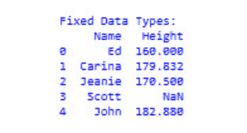

图 16.8 – 转换数据类型后的数据集输出

下一步是应用转换函数。以下是代码片段：

```python
##### 应用转换函数
df['Height'] = df['Height'].apply(convert_height)
print("\nFixed Data types:")
print(df)
```

从前面的代码中：

- 我们对数据集的 'Height' 列使用 `convert_height` 函数
- 在此步骤之后，所有身高值要么以厘米为单位，要么标记为缺失（`np.nan`）
- 然后我们打印数据集以显示标准化的数据类型。

在最后一步，我们想要填充缺失值：

```python
##### 处理缺失值
average_height = df['Height'].mean()
df['Height'].fillna(average_height, inplace=True)
print("\nFinalized Data types:")
print(df)
```

查看前面的代码：

- 我们从可用数据中计算平均身高
- 然后我们用这个平均值替换 'Height' 列中的任何缺失值
- `inplace=True` 部分意味着我们直接更新原始数据集（`df`）

最后，我们打印数据集以展示清洗后且数据类型一致的数据。

执行此代码后，'Height'列将具有一致的数据类型，所有值均以厘米为单位。任何不明确或缺失的值将被平均身高替换，确保数据集干净并准备好进行进一步分析。现在，让我们来看看如何处理噪声数据。

### 处理噪声数据

首先，让我们定义一下**噪声数据**的含义。当我们拥有大量数据，且其中部分数据对我们的分析没有用处时，我们称其为噪声数据。噪声数据也用于指代数据损坏。*实际上，它就是无用的数据。*

我们处理噪声数据有三种方法：分箱、回归和聚类：

- **分箱**使用相邻数据来平滑排序后的数据值。排序后的值被放入分箱中，这些分箱是在算法内创建的组。
- **聚类**方法识别并移除数据集中的异常值。
- **回归**方法通过将数据拟合到回归函数中来平滑数据。

分箱的目的是减少一些误差。在分箱中，数据被分成小的桶或箱。然后，数据被计算出的箱值替换。当我们进行分箱过程时，我们就是在平滑数据。

这里有一个使用算法中简单数值数据集的示例。以下代码片段将创建具有相等频率的分箱：

ch16_binning1.py

```
#Binning with equal frequency
def equal_frequency(array1, m):
    l = len(array1)
    n = int(l / m)
    for i in range(0, m):
        array = []
        for j in range(i * n, (i + 1) * n):
            if j >= l:
                break
            array = array + [array1[j]]
        print(array)
#Input dataset
dataset = [3, 6, 7, 9, 11, 14, 10, 15, 19, 35, 38, 45, 48, 49, 76]
#Input number of bins
m = 5
print("Equal Frequency Binning: ")
equal_frequency(dataset, m)
```

查看前面的代码，你可以看到分箱的数量被定义为5，因此数据将被分箱到五个列表中。分箱实际上是一种分组信息的方式。我们告诉算法我们想要这样做以及我们想要多少个分箱，它就会提供这些分箱或组中的数据。在这种情况下，我们得到了那五个列表。看看输出：

```
Equal Frequency Binning:
[3, 6, 7]
[9, 11, 14]
[10, 15, 19]
[35, 38, 45]
[48, 49, 76]
```

如你所见，算法创建了五个分箱，每个分箱中有三个值。

#### 重要提示

> 请注意，分箱过程并不会为我们组织数据。因此，如果我们重新排序这些值，它们仍然会按照数据输入的顺序被分箱。

现在，让我们来看一个使用等宽分箱的算法：

ch16_binning2.py

```
#Binning with equal width
def equal_width(array1, m):
    w = int((max(array1) - min(array1)) / m)
    min1 = min(array1)
    array = []
    for i in range(0, m + 1):
        array = array + [min1 + w * i]
    arrayi=[]
    for i in range(0, m):
        result = []
        for j in array1:
            if j >= array[i] and j <= array[i+1]:
                result += [j]
        arrayi += [result]
    print(arrayi)
#Input dataset
dataset = [3, 6, 7, 9, 11, 14, 10, 15, 19, 35, 38, 45, 48, 49, 76, 81, 208, 221]
#Input number of bins
m = 3
print("\nEqual Width Binning:")
equal_width(dataset, m)
```

前面的代码片段将我们的数据分解为三个分箱。等宽分箱的目标是将数据集分成大小相等的分箱，在等宽分箱的情况下，这意味着相等的范围。数据将被分割，但重要的是要注意，我们这里讨论的是范围，因此对于这个特定的数据集，每个分箱中的元素数量不会相同。前面代码片段的输出如下：

```
Equal Width Binning:
[[3, 6, 7, 9, 11, 14, 10, 15, 19, 35, 38, 45, 48, 49], [76, 81], [208]]
```

如你所见，分箱产生的输出看起来不如等频分箱的输出那么整洁，但实际上更受欢迎。

现在，让我们来谈谈数据转换。

### 数据转换

**pandas** 允许我们转换数据。以下是我们可以转换数据的一些方式：

- **归一化**将值转换到一个新的范围；最流行的是**最小-最大归一化**，如下所示：

x_scaled = (x – min(x)) / (max(x) – min(x))

- **属性选择**是通过用不同的属性或属性替换一个属性来转换数据的过程。

- **概念层次结构**实际上是通过减少数据来完成的转换。它是通过用更高层次的概念（如限定词：短、长、极长）替换数字（10、15、40）等概念来完成的。

在下一节中，我们将简要了解数据缩减。

### 数据缩减

**数据缩减**指的是一个过程，它允许我们从数据集中获得相似甚至相同的结果，但前提是减少了数据的表示量。

我们不会在这里深入探讨所有概念，因为通过示例来看会容易得多，但以下是进行数据缩减的一些方式：

- 从数据集中移除无效数据
- 为不同级别的数据创建摘要

将移除无效数据视为处理任何异常值。数据可能输入错误，条件可能不是最优的，或者类似情况。当我们有一个数据点不适合整个数据集，特别是当我们有大量数据点可以与之比较时，我们可以将该数据点作为无效或异常值移除。

在创建不同级别的摘要时，我们正在聚合数据集，并在每个级别进行测试和生成摘要。假设你有100个数据点（数据集通常有数千个，但用较小的数字更容易解释）。我们可以为前20个数据点创建一个摘要。然后，我们可以对前40个、前60个等等做同样的事情。通过比较，我们可以看到趋势，并使用数据集的这些较小子部分来进行预测，前提是趋势成立。这就是数据缩减的作用——简化我们的数据集，同时仍然获得准确的结果。

在本节中，我们学习了如何处理需要清洗的数据。我们探索了各种清洗数据的方法，包括通过消除或替换缺失点来处理缺失数据。此外，我们探讨了噪声数据的概念，并发现了处理数据集中数据噪声相关问题的策略。最后，我们探讨了数据缩减技术，了解我们如何通过移除无效数据和生成聚合数据摘要来提高结果准确性。

这作为处理数据时所涉及任务的入门概述。我们没有探讨其他转换，但这里有一些你可以研究的：映射、重命名、切割和创建虚拟数据。这些额外的转换可以成为你数据分析工具包中的强大工具，使你能够进一步操作和准备数据，以获得有意义的见解和分析。这只是我们在处理数据时所做事情的类型介绍。因此，让我们看一个例子，以便我们将其中一些内容放入上下文中。

## 使用可视化处理、分析和总结数据

我们现在从事房地产行业，既然我们想做得好，我们真的想构建一个算法来帮助我们分析数据和预测房价。但让我们思考一下。我们可以非常广泛或狭窄地定义这个问题。我们可以对一个州的所有房屋或一个社区中三间卧室以上的房屋进行定价分析。*执行分析重要吗？也许。但这不正是我们想研究这个问题的原因吗？*

让我们从收集一些数据开始。对于这个问题，我们使用 `kv_house_data.csv` 数据集，该数据集可在我们的 GitHub 仓库中找到。要查看这个数据集，我们需要相当多的库。我们一直在讨论 `pandas`，是的，但我们还想进行可视化并执行一些分析，因此我们需要 `seaborn`、`numpy` 和 `matplotlib`。完整的算法可以在 `ch16_housePrice_prediction.py` 文件中找到。我们将分段查看它，以讨论我们在过程中所做的事情：

ch16_housePrice_prediction.py

```
import pandas as pd
import numpy as np
import seaborn as sns
import matplotlib.pyplot as plt
```

*那么，所有这些库是什么？* `pandas` 我们知道。我们用它来组织我们的数据。`numpy` 帮助我们处理数组。我们的数据可视化依赖于 `seaborn` 和 `matplotlib`。`seaborn` 非常适合创建吸引人且直观的图表，值得一提的是，`seaborn` 建立在 `matplotlib` 提供的坚实基础之上，这使我们能够自定义和完善我们的可视化。如果我们进一步通过使用数据集训练来创建模型，我们还需要 Scikit-Learn。在本例中，我们将坚持使用训练前能获得的一些图表。

现在，让我们导入数据集。请记住*第14章，使用Python解决实验和数据分析问题*中的内容，你可以直接设置文件的目录。你也可以提供数据文件的完整路径，就像我们在本章之前所做的那样，例如在清理演示中。你可以使用 `os.chdir()` 来设置目录，在括号中添加文件的位置，然后使用以下代码片段读取 `.csv` 文件：

```
housing_data= pd.read_csv("kc_house_data.csv")
```

我们在这里使用了 **pandas** 函数。*看到 `pd.read_csv()` 了吗？* 那个 `pd` 就是 **pandas**，因为我们已经将 **pandas** 导入为 `pd`，而 `read_csv()` 是允许算法获取文件中信息的函数。

如果你忘记输入目录或提供了错误的位置，你会收到一个错误代码，如下图所示：


如你所见，Python 会确保你知道自己犯了错误。*这有时可能会让人恼火，但它确实很有帮助。*

现在我们有了数据，我们需要检查并清理它。这就是我们在本章之前分享的所有内容发挥作用的地方。让我们看看在实践中是什么样子。

现在，有一件事我们还没有真正多谈，那就是 Python 的变量资源管理器。更具体地说，是 **Spyder 的 Python 变量资源管理器**。Spyder 是一个集成环境，并且是免费的。它与 Python 一起工作，像往常一样运行 Python，但也为我们提供了更好的编辑工具。下图显示了当你从 Python 的变量资源管理器导入数据集时，它应该是什么样子。当我们在 Spyder 中运行 `ch16_housePrice_prediction.py` Python 算法时，我们可以在变量资源管理器中看到我们的变量。下图显示了我们运行此算法时从变量资源管理器获得的数据：

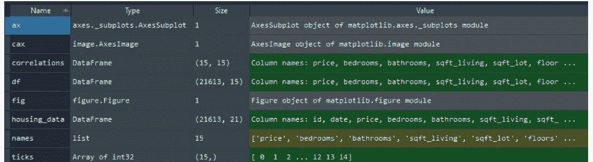

图 16.10 – Spyder 中的变量资源管理器视图

当我们处理大量数据和更大的算法时，这个工具变得非常关键。我们仅从这个工具就能获得大量信息。例如，让我们看看 **housing_data** 变量。在*图 16.10*中，你可以看到该变量在我们算法中的类型是 **DataFrame**，大小为 (21613, 21)。

如果你在变量资源管理器中双击该变量，你会得到下图所示的内容：（请注意，根据你使用的环境，截图可能看起来不同。当使用 Spyder 或 Jupyter 等环境运行此代码时，根据你的主题设置和选择，表格可能看起来不同，具有不同的配色方案或没有配色方案。）

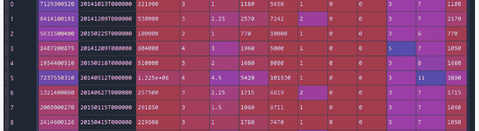

图 16.11 – Spyder 中的 DataFrame 变量视图

这只是获取我们 DataFrame 部分信息的一种方式。Spyder 还允许我们调整窗口大小，因此我们可以查看更多列，滚动浏览它们以查找值等。如果我们在 Python 控制台中，这就不那么容易了。你可以获取信息，只是没那么方便。

以下是一些可以给我们提供信息的代码：

```
housing_data.head()
```

前面的代码将向我们显示数据集的前五行。看看下面的截图；我们在 `price` 和 `long` 之间有省略号 (...)。这是因为 Python 想让我们知道这两个列之间还有其他列：

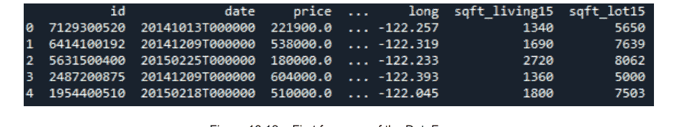

如你所见，行帮助我们了解数据集的样子，但仅此而已。因此，我们也可以使用以下代码查看 DataFrame 的大小：

```
housing_data.shape
```

当我们运行前面的代码时，我们得到以下输出：

```
(21613, 21)
```

如你所见，现在我们有了 DataFrame 的形状或大小。*这是什么意思？* 它意味着我们有 21,613 行数据，分布在 21 列中。无论你是在 Spyder、Python 控制台还是你选择的其他环境中，你都可以看到你的数据已成功导入。

现在我们已经导入了原始数据，让我们看看是否可以获取更多信息。我们可以使用以下代码获取摘要：

```
housing_data.describe()
```

`describe()` 函数生成一个摘要，包括均值、标准差和百分位数等详细信息。这个百分位数是数据集五数概括的一部分，用于创建**箱线图**。虽然我们不会在本问题中创建箱线图，但根据我们算法的目标，这种可视化表示可能很有帮助。查看下图以了解使用 `describe()` 函数的结果：

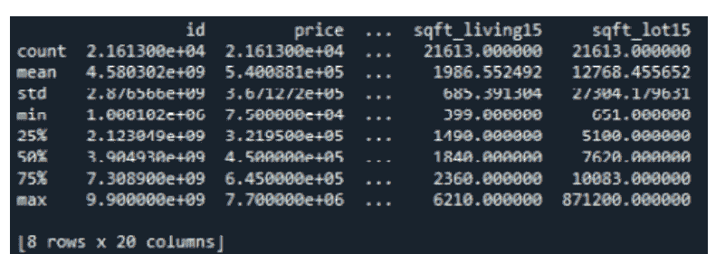

现在，我们应该注意，该函数分析 DataFrame 中的数值。它排除了 NaN 值。Python 中的 NaN 值代表了我们处理它们的一种方式。让我们现在在上下文中看看这个。我们想找到缺失值。为此，我们可以运行以下代码片段：

```
housing_data.isnull().sum()
```

前面的片段将让我们知道数据集中每一列是否存在缺失的数据点。然后，它会将值汇总为总和。因此，如果我们在日期列下有两个缺失值，我们期望在那里看到 2。我们的结果可以在下图中看到：

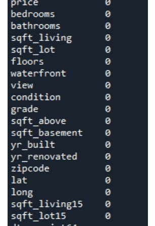

我们不需要清理这个数据集！这是一个干净的数据集。然而，学习如何识别我们是否需要这样做非常重要。现在我们知道我们有一个干净的数据集，我们可以开始构建一些可视化。

请记住，这仍然是我们初始算法文件 `ch15_housePrice_prediction.py` 的一部分。如果你打开该文件，接下来的代码从*第 25 行*开始。我们在代码行之间添加了描述性注释：

```
names=
['price', 'bedrooms', 'bathrooms', 'sqft_living', 'sqft_lot', 'floors', 'waterfront', 'view', 'con
dition', 'grade', 'sqft_above', 'sqft_basement', 'zipcode', 'lat', 'long']
df=housing_data[names]
```

我们做的第一件事是确定我们将用于绘图的列。完成此操作后，我们将创建一个 DataFrame 并将其保存为 `df`：

```
correlations= df.corr()
```

前面的代码片段为我们的 DataFrame 创建了相关性。在文件中的下一个代码片段中，我们将创建我们的图形；也就是说，我们将处理数据可视化：

```
fig=plt.figure()
ax=fig.add_subplot(111)
cax=ax.matshow(correlations,vmin=-1,vmax=1)
fig.colorbar(cax)
```

在前面的代码中，我们命名了图形，添加了一个子图，并确定了我们的颜色。接下来，我们需要设置一些属性，例如刻度线、刻度线之间的距离以及轴和刻度线的标签：

```
ticks=np.arange(0,15,1)
ax.set_xticks(ticks)
ax.set_yticks(ticks)
ax.set_xticklabels(names, rotation = ' 90')
ax.set_yticklabels(names)
```

设置好一些属性后，我们可以要求绘图使用 `tight_layout()`。这将帮助我们查看绘图和标签的所有细节。如果我们不使用 `tight_layout()`，有时我们的一些标签在图形中将不可见：

```
plt.tight_layout()
plt.savefig('Correlation_graph.png',dpi = 300)
plt.show()
```

在前面的片段中，我们还创建了一个保存文件并定义了图形的大小。最后，我们要求算法向我们展示相关性。下图显示了前面代码的结果：

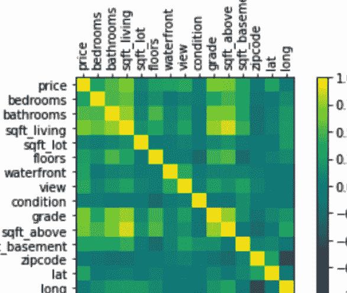

图 16.15 – 房屋数据的相关性图

如你所见，我们刚刚使用 Python 创建了一个**相关矩阵**。而且它是一个相当棒的矩阵。*但什么是相关矩阵？* 相关矩阵查看我们 DataFrame 中的所有值，然后计算它们的相关程度，给出一个介于 -1 和 1 之间的值。值越接近 1，值之间的相关性越强。每个值都与自身进行比较，这当然是完全相关的，并且在我们的矩阵中显示为对角线。

图形的其余部分，其中所有值都相互比较，需要更仔细地观察。越接近黄色，值之间的相关性就越强。因此，看看 y 轴上的 **sqft_above** 值和 x 轴上对应的 **sqft_living** 值。该值接近黄色值 1，但不完全是。我们在下图中突出了这些值：

### 16.16 – sqft_above 与 sqft_living 的相关性高亮

还有一些其他值显示出一定的相关性，但强度不够。这张图帮助我们决定是否要更仔细地研究这种相关性，寻找更多信息，等等。

现在，我们也可以看看一个相当密集的图矩阵，称为*配对图*。**配对图**展示了单个变量的分布以及两个变量之间的关系。如果我们为算法中包含的数据运行配对图，会得到一个巨大的图形，如下图所示（请注意，由于要分析和绘制的数据量很大，生成此图可能需要几分钟时间）：

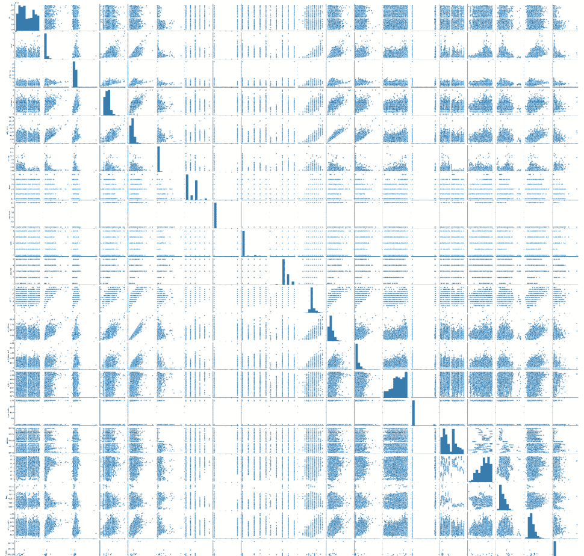

如你所见，这是一个相当密集、难以阅读、几乎无法分析的图表。你必须放大每个配对图形才能做出一些判断。还应该提到的是，算法运行并生成此图形需要时间。*从如此庞大的数据集创建如此复杂的东西需要一定的处理能力！*

*我们真的想看到像这样的大型图表吗？实际上，是的。如果我们有一个变量较少的数据集，绝对可以！* 我们也可以通过使用其他配色方案使其更友好。这可能使识别趋势更容易。但让我们明确一点；这并没有太大帮助。我们可以做的是为我们可能感兴趣的一些变量创建配对图。记得我们讨论过 **sqft_living** 和 **sqft_above** 可能具有很强的正相关性吗？我们也确实想将事物与价格进行比较，对吧？那么，让我们只使用 **sqft_living**、**pricing** 和 **sqft_above** 创建一个配对图。看看我们文件中的相关代码片段：

```
coln = ['price','sqft_living','sqft_lot']
sns.pairplot(housing_data[coln], height = 3);
plt.savefig('pairplotting.png',dpi =300)
plt.show()
```

现在，当我们运行算法的这一部分时，会得到下图所示的图形。该图提供了这三个值的相关性，我们肯定可以看到一些正相关性：

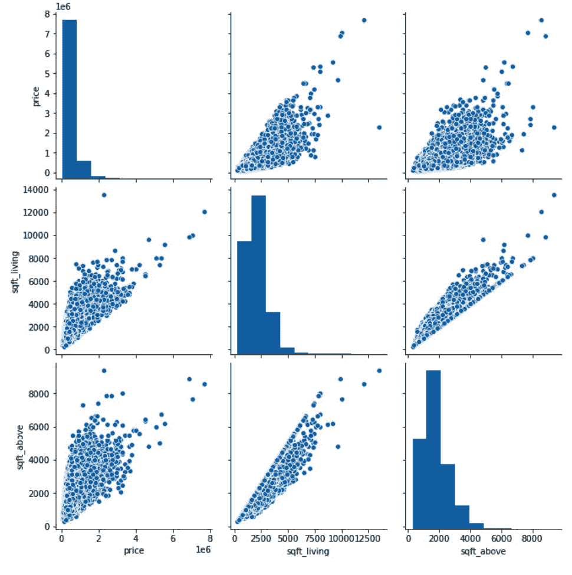

特别注意 `sqft_living` 和 `sqft_above` 配对的图形。它们之间的关系相当线性且为正相关。这证实了我们在 *图 16.13* 中观察到的情况，其中该相关性比其他变量更接近 1。

但分析另外三个变量也会有帮助，这样我们就能看到当相关性不强时会发生什么。我们将保留 `price` 和 `sqft_living`，这样我们只改变一个变量用于比较目的。查看 *图 16.12*，`sqft_living` 和 `zipcode` 似乎根本没有很强的正相关性。那么，让我们再次运行算法，用 `zipcode` 替换 `sqft_above`。看看下图所示的结果：

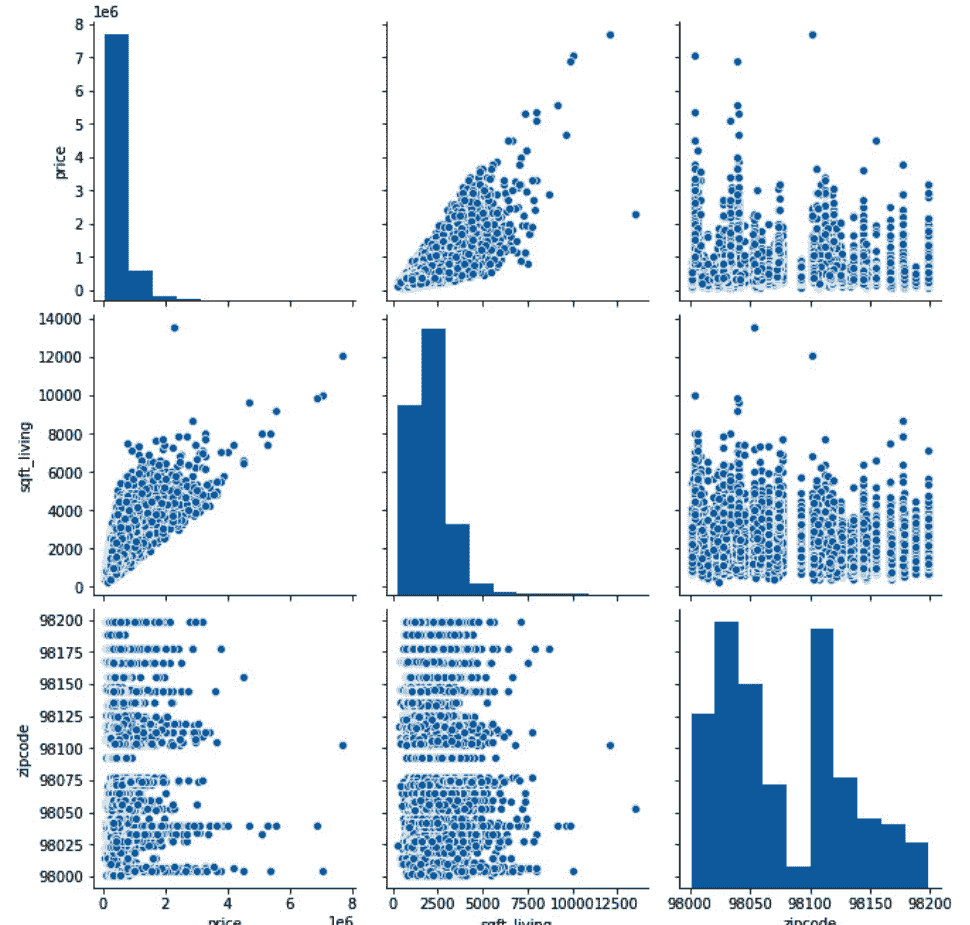

如你所见，`sqft_living` 和 `zipcode` 显示出完全没有相关性。它们看起来更像条形图，看不到对角线。在我们继续讨论这些图表之前，值得一提的是，这些配对图只提供比较变量的散点图和每个变量的直方图。如果我们想更深入，可以查看其他可视化工具，例如 `seaborn` 中的工具。

我们在此暂停分析。我们已经使用可视化来理解数据的相关性。如果我们想进一步推进这个问题，我们可以使用数据来创建训练模型并帮助我们进行预测。即使从图形中获得的数据，我们也能看到相关性并据此进行预测。例如，如果我们有 `sqft_living`，由于它们的强相关性，我们可以预测 `sqft_above`。

Python 允许我们以多种方式查看数据。这是此类工具的一大优势。

## 总结

在本章中，我们学习了如何在 Python 中处理数据，并使用本章学到的一些概念处理了一个住房数据集。我们学习了 `pandas` 包以及它如何帮助我们组织和准备数据。我们还学习了预处理数据集的必要性，尤其是在非常大的数据集中。我们处理了缺失和嘈杂的数据，以及数据转换和数据缩减。我们还学习了如何使用可视化，为我们的数据集创建图表，这些图表可以帮助我们识别相关性和趋势。

本章的主题相当广泛，有整本书都在讨论它们。然而，我们认为在进入本书的下一章也是最后一章之前，分享一些 Python 编程语言的能力很重要。

在下一章中，我们将完全专注于应用，使用问题场景和主题来分享 Python 和计算思维在设计算法方面的一些令人兴奋的应用。

## 17

## 应用计算思维问题

在本章中，我们将提供多个 Python 编程语言和计算思维应用的示例。我们将探索人文、语言学和密码学等领域的算法设计。我们将使用我们目前所学的关于**计算思维**和 **Python** 编程语言的知识来执行以下操作：

- 分析历史演讲
- 编写故事
- 计算文本可读性
- 找到最有效的路线
- 实现密码学
- 实现网络安全
- 创建聊天机器人
- 网页抓取
- 创建二维码

本章与其他章节不同，因为我们将在评估每个场景后，专注于呈现问题并提供算法解决方案。

## 技术要求

你需要安装最新版本的 Python 才能运行本章中的代码。

你需要为 Python 安装以下库和包：

- NLTK
- Cairos
- Pandas
- Matplotlib
- Seaborn
- Requests
- BeautifulSoup4
- Qrcode
- Image
- Cv2

你可以在此处找到本章使用的完整源代码：
https://github.com/PacktPublishing/Applied-Computational-Thinking-with-Python-Second-Edition/tree/main/Chapter17。

## 问题 1 – 使用 Python 分析历史演讲

历史非常迷人，我们有很多理由去编写算法来评估历史数据和背景。

对于这个问题，我们想要分析一些历史文本。特别是，我们将看看*亚伯拉罕·林肯的第二次就职演说*。我们的目标是找出一些词频。我们有很多理由想要执行一些直接的文本分析，尤其是对于历史文本。我们可能想要比较它们，理解潜在的主题，等等。

对于我们的算法，我们将使用一个相当简单的设计，使用 `nltk` 包。因为某些组件的安装与我们目前所做的有些不同，所以如果您的包尚未安装，我们将提供一些信息。

在 Python shell 中，如果您在活动控制台中，请创建一个新文件，并在安装主包后（使用 `pip install nltk`）导入 `nltk`。

请注意，您不应该在活动的 **Shell** 窗口中。如果行首看到 `>>>`，请单击 **File | New File** 选项，然后为您的空 shell 输入以下代码指令行：

```
import nltk
nltk.download()
```

请注意，从前面的代码中，您还将打开 `nltk` 中的下载器。前面的代码将弹出一个窗口，如下图所示（请注意，`nltk` 库占用大约 7 MB 内存，安装其他包也需要内存，每个包从几 KB 到 14-15 MB 不等）：

### 17.1 NLTK 下载器

如你所见，我的所有包都已安装。如果你的尚未安装，请选择**全部**，然后点击该窗口左下角的**下载**按钮。一旦包安装完毕，你就可以关闭窗口了。

由于我们的问题相当简单，本节将跳过大部分计算思维过程。我们只想获取演讲中使用的单词频率。因此，让我们直接深入算法，看看如何使用 `nltk` 包来获取所需内容，包括数据的可视化表示：

1.  首先，我们需要导入 `nltk` 和 `word_tokenize` 函数。`word_tokenize` 函数允许我们将演讲分割成单个的单词和/或标点符号。我们需要演讲文本。在本例中，演讲文本被复制到了算法中。你也可以将文件导入算法并以这种方式处理。

`sent_tokenize` 函数是**句子分词**的缩写。与单词分词按单词和标点符号分解文本的方式类似，句子分词函数允许你将文本分解成完整的句子。输出将是一个以逗号分隔的句子列表。

**重要提示**

必须知道，所有引号都已使用 \ ' 和 \ " 进行了转义，以保持原始文本不变，同时避免在我们的代码中产生错误。

以下算法包含了我们分析亚伯拉罕·林肯第二次就职演说所需的一切：

`ch17_historicalTextAnalysis.py`

```python
import nltk
from nltk.tokenize import sent_tokenize, word_tokenize
```

演讲的全部文本包含在 GitHub 仓库文件中。出于篇幅考虑，我们这里只包含了部分文本。请注意，算法和解释之后我们将分享的输出将对应于截断的演讲，但可视化图表将包含整个演讲的数据。[...]，在文本定义末尾的以下代码中看到，仅用于表示那里还有额外的文本：

```python
text = 'Fellow-Countrymen: At this second appearing to take the oath of the Presidential office there is less occasion for an extended address than there was at the first. Then a statement somewhat in detail of a course to be pursued seemed fitting and proper. Now, at the expiration of four years, during which public declarations have been constantly called forth on every point and phase of the great contest which still absorbs the attention and engrosses the energies of the nation, little that is new could be presented. The progress of our arms, upon which all else chiefly depends, is as well known to the public as to myself, and it is, I trust, reasonably satisfactory and encouraging to all. With high hope for the future, no prediction in regard to it is ventured. On the occasion corresponding to this four years ago all thoughts were anxiously directed to an impending civil war. All dreaded it, all sought to avert it. While the inaugural address was being delivered from this place, devoted altogether to saving the Union without war, urgent agents were in the city seeking to destroy it without war—seeking to dissolve the Union and divide effects by negotiation. Both parties deprecated war, but one of them would make war rather than let the nation survive, and the other would accept war rather than let it perish, and the war came. One-eighth of the whole population were colored slaves, not distributed generally over the Union, but localized in the southern part of it. These slaves constituted a peculiar and powerful interest. All knew that this interest was somehow the cause of the war. To strengthen, perpetuate, and extend this interest was the object for which the insurgents would rend the Union even by war, while the Government claimed no right to do more than to restrict the territorial enlargement of it. Neither party expected for the war the magnitude or the duration which it has already attained. [...]'
```

2.  现在我们已经定义了要分析的文本，如前面的代码片段所示，我们可以告诉算法我们想要对文本进行分词——也就是说，我们希望它被分割成单词。算法将打印出包含每个单独单词或标点符号的列表，各项以逗号分隔，如下所示：

```python
tokenized_word = word_tokenize(text)
print(tokenized_word)
```

3.  获得单词列表后，我们想要获取单词的频率分布。为此，我们将从 nltk.probability 导入包，如下面的代码片段所示：

```python
from nltk.probability import FreqDist
fdist = FreqDist(tokenized_word)
print(fdist)
fdist.most_common(2)
```

4.  一旦我们有了分布，我们就需要这个数据的可视化图表，因此我们将使用 **matplotlib** 来创建我们的分布图，如下面的代码片段所示：

```python
import matplotlib.pyplot as plt
fdist.plot(30, cumulative = False)
plt.show()
```

这就是我们需要的全部算法。当我们运行算法时，输出如下所示：

```
['Fellow-Countrymen', ':', 'At', 'this', 'second', 'appearing', 'to', 'take', 'the', 'oath', 'of', 'the', 'Presidential', 'office', 'there', 'is', 'less', 'occasion', 'for', 'an', 'extended', 'address', 'than', 'there', 'was', 'at', 'the', 'first', '.', 'Then', 'a', 'statement', 'somewhat', 'in', 'detail', 'of', 'a', 'course', 'to', 'be', 'pursued', 'seemed', 'fitting', 'and', 'proper', '.', 'Now', ',', 'at', 'the', 'expiration', 'of', 'four', 'years', ',', 'during', 'which', 'public', 'declarations', 'have', 'been', 'constantly', 'called', 'forth', 'on', 'every', 'point', 'and', 'phase', 'of', 'the', 'great', 'contest', 'which', 'still', 'absorbs', 'the', 'attention', 'and', 'engrosses', 'the', 'energies', 'of', 'the', 'nation', ',', 'little', 'that', 'is', 'new', 'could', 'be', 'presented', '.', 'The', 'progress', 'of', 'our', 'arms', ',', 'upon', 'which', 'all', 'else', 'chiefly', 'depends', ',', 'is', 'as', 'well', 'known', 'to', 'the', 'public', 'as', 'to', 'myself', ',', 'and', 'it', 'is', ',', 'I', 'trust', ',', 'reasonably', 'satisfactory', 'and', 'encouraging', 'to', 'all', '.', 'With', 'high', 'hope', 'for', 'the', 'future', ',', 'no', 'prediction', 'in', 'regard', 'to', 'it', 'is', 'ventured', '.', 'On', 'the', 'occasion', 'corresponding', 'to', 'this', 'four', 'years', 'ago', 'all', 'thoughts', 'were', 'anxiously', 'directed', 'to', 'an', 'impending', 'civil', 'war', '.', 'All', 'dreaded', 'it', ',', 'all', 'sought', 'to', 'avert', 'it', '.', 'While', 'the', 'inaugural', 'address', 'was', 'being', 'delivered', 'from', 'this', 'place', ',', 'devoted', 'altogether', 'to', 'saving', 'the', 'Union', 'without', 'war', ',', 'urgent', 'agents', 'were', 'in', 'the', 'city', 'seeking', 'to', 'destroy', 'it', 'without', 'war—seeking', 'to', 'dissolve', 'the', 'Union', 'and', 'divide', 'effects', 'by', 'negotiation', '.', 'Both', 'parties', 'deprecated', 'war', ',', 'but', 'one', 'of', 'them', 'would', 'make', 'war', 'rather', 'than', 'let', 'the', 'nation', 'survive', ',', 'and', 'the', 'other', 'would', 'accept', 'war', 'rather', 'than', 'let', 'it', 'perish', ',', 'and', 'the', 'war', 'came', '.', 'One-eighth', 'of', 'the', 'whole', 'population', 'were', 'colored', 'slaves', ',', 'not', 'distributed', 'generally', 'over', 'the', 'Union', ',', 'but', 'localized', 'in', 'the', 'southern', 'part', 'of', 'it', '.', 'These', 'slaves', 'constituted', 'a', 'peculiar', 'and', 'powerful', 'interest', '.', 'All', 'knew', 'that', 'this', 'interest', 'was', 'somehow', 'the', 'cause', 'of', 'the', 'war', '.', 'To', 'strengthen', ',', 'perpetuate', ',', 'and', 'extend', 'this', 'interest', 'was', 'the', 'object', 'for', 'which', 'the', 'insurgents', 'would', 'rend', 'the', 'Union', 'even', 'by', 'war', ',', 'while', 'the', 'Government', 'claimed', 'no', 'right', 'to', 'do', 'more', 'than', 'to', 'restrict', 'the', 'territorial', 'enlargement', 'of', 'it', '.', 'Neither', 'party', 'expected', 'for', 'the', 'war', 'the', 'magnitude', 'or', 'the', 'duration', 'which', 'it', 'has', 'already', 'attained', '.']
```

5.  回想一下，**单词分词**只包含了截断的文本。然而，随后的频率信息和图表是针对整个演讲的。**ch17_historicalTextAnalysis.py** GitHub 文件包含了完整的演讲：

> <FreqDist with 365 samples and 782 outcomes>

以下截图显示了该算法的频率分布可视化图表：

## 问题 2 – 使用 Python 编写故事

让我们来看一个相当简单的问题。在本节中，我们希望创建一个算法，根据用户的输入生成一个故事。我们可以让它尽可能简单，也可以添加一些选项。让我们深入探讨一下这是什么。

### 定义、分解和规划故事

首先，*我们试图创建的是什么？* 嗯，一个故事。由于这个问题的性质，我们将从反向开始，从我们想要实现的输出样本开始——也就是一个示例故事。在深入算法之前，让我们先看看我们的算法生成的一个简短故事：

```
There once was a citizen in the town of Narnia, whose name was Noemi. Noemi loved to hang with their trusty dog, King Kong.
You could always see them strolling through the market in the morning, wearing their favorite purple attire.
```

前面的输出是由一个算法创建的，该算法替换了姓名、地点、时间、宠物和宠物名字。这是一个短篇故事，但这种技术可以应用于更广泛的领域，例如使用输入来撰写社交媒体帖子，以及为邀请函和表格等事物填写信息。

所以，让我们稍微逆向思考一下来编写我们的算法。*为什么我这次从结尾开始呢？* 嗯，在这种情况下，我们知道我们想要从结果中得到什么。你可以编写你的故事。你可能有一个需要填写的婚礼邀请函模板或表格的例子。现在，我们必须弄清楚如何获取输入，然后输出我们想要的内容。

从所示的故事中，以下是我们可以获取原始输入的内容：

- 角色的名字
- 城镇的名字
- 宠物的类型
- 宠物的名字
- 访问的城镇区域
- 时间段
- 最喜欢的颜色

当我们编写算法时，我们需要获取所有上述输入。让我们看看 **ch17_storyTime.py** 文件中的算法：

1. 我们需要从用户那里获取输入，因此我们希望使用 **print** 语句和包含所需说明的输入请求：

```
print('Help me write a story by answering some questions. ')
name = input('What name would you like to be known by? ')
location = input('What is your favorite city, real or imaginary? ')
time = input('Is this happening in the morning or afternoon? ')
color = input('What is your favorite color? ')
town_spot = input('Are you going to the market, the library, or the park? ')
pet = input('What kind of pet would you like as your companion? ')
pet_name = input('What is your pet\'s name? ')
```

前面的代码片段从用户那里获取所有输入，以便我们可以编写我们的故事。

2. 一旦我们有了这些，我们就必须打印我们的故事。请注意，我们使用简单的术语编写它，使用 **%s**，以便我们可以用相应的输入替换它。我们还使用了反斜杠，以便我们可以在多行中查看我们的代码，而不是将其放在一行中：

```
print('There once was a citizen in the town of %s, whose name was %s. %s loved to hang \nwith their trusty %s, %s.' % (location, name, name, pet, pet_name))
print('You could always see them strolling through the %s \nin the %s, wearing their favorite %s attire.' % (town_spot, time, color))
```

让我们再次运行该代码，看看我们的故事现在说了什么：

```
Help me write a story by answering some questions.
What name would you like to be known by? Azabache
What is your favorite city, real or imaginary? Rincon
Is this happening in the morning or afternoon? afternoon
What is your favorite color? blue
Are you going to the market, the library, or the park? park
What kind of pet would you like as your companion? dog
What is your pet’s name? Sunny
There once was a citizen in the town of Rincon, whose name was Azabache. Azabache loved to hang with their trusty dog, Sunny.
You could always see them strolling through the library in the afternoon, wearing their favorite blue attire.
```

请注意，诸如角色和场景之类的细节已经改变。我们可以在教育环境中使用像这样简单的算法，向学生展示如何与故事互动并识别其中的关键信息。

虽然这是一个三句话的故事，但这些算法可以复杂得多，为用户提供输入来创作精彩的原创故事提供了机会。如果你想尝试一些，你甚至可以添加条件来根据某些输入选择使用哪些短语，例如，根据输入的名字长度更改使用的句子。*玩转代码，写一些故事吧！*

## 问题 3 – 使用 Python 计算文本可读性

在本节中，我们将研究一个与语言学相关的应用程序，特别是任何文本的可读性水平。我们将在接下来的代码片段中使用马丁·路德·金的 **我有一个梦想** 演讲。你可以将其替换为任何文本文件，只要你在代码中准确更改文件的位置和文件名即可。完整代码可以在 `ch17_readability.py` 文件中找到。

在深入代码之前，让我们先谈谈我们在寻找什么以及为什么它很重要。了解文本的可读性可以帮助我们决定是否将其包含在演示文稿、学校年级课程等中。**Flesch-Kincaid 分数** 用于确定可读性，开发于 1940 年代。

Rudolf Flesch 在担任美联社顾问以提高报纸可读性时创建了它。最初称为 **Flesch Reading Ease**，后来被美国海军现代化为当前使用的版本。Flesch-Kincaid 分数现在提供年级水平分数，而不是获得一个然后必须转换为年级水平的分数。

虽然我们不会使用该公式，但了解我们所使用内容的背景很重要。Flesch Reading Ease 公式如下所示：

206.835 – 1.015( total words / total sentences ) – 84.6( total syllables / total words )

Flesch-Kincaid 年级水平公式如下所示：

0.39( total words / total sentences ) + 11.8( total syllables / total words ) – 15.59

前面公式的问题在于它们存在于 Python 的 readability 包中。如果我们导入该包，我们可以用相当简单的代码执行可读性分析。

让我们看看我们需要对马丁·路德·金演讲执行可读性分析的代码：

1. 首先，记得在代码中更改文件的路径，然后导入代码所需的包：

`ch17_readability.py`

```
from readability import Readability
text = open('C:\...\ch17_MLK-IHaveADream.txt')
text_up = text.read()
r = Readability(text_up)
flesch_kincaidR = r.flesch_kincaid()
```

从前面的代码中，你会看到我们将 `readability` 包导入了我们的程序。如果你需要安装库/包，你可以使用 `pip install readability` 来完成。

一旦我们有了必要的库，我们就可以打开我们要分析的文件。我们还想告诉算法读取文本，我在这里将其称为 `text_up`，表示文本上传，这样我就不会忘记我正在读取一个打开的文件。这是我们在前面的代码中从文件位置打开的文本。最后，我们要求程序使用 `Readability` 函数分析文本。请注意，我们将其保存到了 `r`。

2. 完成所有这些操作后，我们可以使用以下代码片段打印我们的年级水平：

```
print('The text has a grade ' + flesch_kincaidR.grade_level + ' readability level.')
```

当我们运行算法时，我们的输出也相当简单。看看以下输出：

**The text has a grade 9 readability level.**

现在你知道如何验证任何文本的可读性了，尝试对其他类型的文本进行分析，包括诗歌、故事、演讲和歌曲。

## 问题 4 – 使用 Python 寻找最有效的路线

对于这个问题，在学习算法时，我们将使用一个常见的算法——**旅行商问题 (TSP)**。让我们设置问题本身。

一位销售员需要前往一定数量的城市或地点。假设这位销售员有10个地点要去。他可以以许多不同的顺序访问这10个地点。我们这个算法的目标是创建一条尽可能最佳、最高效的路线来访问这些地点。

请注意，对于这个特定场景，正如我们将在下一个问题中所做的那样，我们将通过使用计算思维过程的四个要素来进行直接分析。

### 定义问题（TSP）

这个问题比最初看起来要复杂一些。可以这样想——如果我们有10个目的地，并且我们计算往返排列以检查最快的路线，我们会得到超过300,000种可能的排列和组合。提醒一下，排列考虑顺序，而组合不考虑顺序。

例如，数字3,344和3,434是两个不同的排列。然而，它们只被计为一个组合，因为数字的顺序无关紧要。

回到我们的问题。我们只需要知道，我们想要创建一个算法，以最高效的方式带我们到达目的地。我们必须确定要访问的城市以及我们将如何旅行，如下所示：

- 总共有五个城市，分别是纽约市（NYC）、费城、巴尔的摩、芝加哥和克利夫兰。
- 我们将使用一辆车，因为我们使用的是TSP（旅行商问题）而不是车辆路径问题（VRP）。
- 第一个城市是0，即纽约市。纽约市到其自身的距离为0。

现在，让我们看看其中的规律。

### 识别规律（TSP）

对于每个城市，总共有五个距离，其中到其自身的距离为0。我们需要一个数组或列表来存储每个城市的所有距离。我们需要创建一个模型来在我们的算法中访问这些数据。我们将在设计算法时研究这一点。首先，让我们谈谈如何稍微概括一下这个规律。

### 概括（TSP）

对于这个特定问题，我们将手动将城市输入到算法本身中。你可能需要考虑的一件事是如何从用户那里获取输入，以创建包含距离的必要数组。

你也可以创建一个主要城市之间距离的数据库，从.csv文件中访问它，这样用户输入的城市数据就可以在那里找到，然后可以将其添加到我们的模型中。这个特定算法有许多可能的扩展，而且这不是一个只能用一种方式解决的问题。目前，我们将坚持使用一组定义好的城市，以便我们可以创建我们的算法。

请注意，对于这个问题，我们参考了[https://developers.google.com/optimization/routing/tsp](https://developers.google.com/optimization/routing/tsp)的源代码。

### 设计算法（TSP）

是时候看看我们一直在讨论的内容了。让我们从纽约市开始，首先构建那个数组。其他数组以相同的方式创建。所有距离均以英里为单位，并基于**谷歌地图**数据进行了近似和四舍五入，如下所示：

- 纽约市到纽约市的距离是0
- 纽约市到费城的距离是95
- 纽约市到巴尔的摩的距离是192
- 纽约市到芝加哥的距离是789
- 纽约市到克利夫兰的距离是462

下表显示了每个城市到另一个城市及其自身的距离：

| | 纽约市 | 费城 | 巴尔的摩 | 芝加哥 | 克利夫兰 |
|---|---|---|---|---|---|
| **纽约市** | 0 | 95 | 192 | 789 | 462 |
| **费城** | 95 | 0 | 105 | 759 | 431 |
| **巴尔的摩** | 192 | 105 | 0 | 701 | 374 |
| **芝加哥** | 789 | 759 | 701 | 0 | 344 |
| **克利夫兰** | 462 | 431 | 374 | 344 | 0 |

表17.1 – 从一个城市到另一个城市的距离

因此，正如你在上表中看到的，如果我们将这些距离写成一个数组，我们将使用以下代码：

```
[0, 95, 192, 789, 462]
```

对于费城，我们将有以下数组：

```
[95, 0, 105, 759, 431]
```

对于巴尔的摩，我们将有以下数组：

```
[192, 105, 0, 701, 374]
```

对于芝加哥，我们将有以下数组：

```
[789, 759, 701, 0, 344]
```

最后，对于克利夫兰，我们将有以下数组：

```
[462, 431, 374, 344, 0]
```

请注意，我们将为每个城市分配索引以标识它们。纽约市是0，费城是1，巴尔的摩是2，芝加哥是3，克利夫兰是4。让我们看看这个问题的算法是什么样子的（请注意，**OR-Tools库**用于优化车辆路径、线性规划、约束规划等）：

1.  首先，让我们从导入我们需要的包和库开始。这个算法的完整文件是**ch17_travel.py**，可在GitHub上找到：

```
from ortools.constraint_solver import routing_enums_pb2
from ortools.constraint_solver import pywrapcp
```

请记住，如果你计划访问更多城市和/或不同的城市，这个算法需要获取一个新的距离矩阵。这是你唯一需要修改的代码部分。每次都需要调整的代码片段是`create_data_model()`下的矩阵，如下代码片段所示：

```
#Create data model.
def create_data_model():
    data = {}
    data['distance_matrix'] = [
        [0, 95, 192, 789, 462],
        [95, 0, 105, 759, 431],
        [192, 105, 0, 701, 374],
        [789, 759, 701, 0, 344],
        [462, 431, 374, 344, 0],
    ]
    data['num_vehicles'] = 1
    data['depot'] = 0
    return data
```

2.  定义好数据模型后，我们需要打印一个解决方案。以下函数提供了该信息：

```
#Provide solution as output - print to console
def print_solution(manager, routing, solution):
    print('Objective: {} miles'.format(solution.ObjectiveValue()))
    index = routing.Start(0)
    plan_output = 'Route for vehicle 0:\n'
    route_distance = 0
    while not routing.IsEnd(index):
        plan_output += ' {} ->'.format(manager.IndexToNode(index))
        previous_index = index
        index = solution.Value(routing.NextVar(index))
        route_distance += routing.GetArcCostForVehicle(previous_index, index, 0)
    plan_output += ' {}\n'.format(manager.IndexToNode(index))
    print(plan_output)
    plan_output += 'Route distance: {}miles\n'.format(route_distance)
```

从前面的代码可以看出，我们正在创建一个函数，以便根据我们的数组和其中的距离打印解决方案。回想一下，你将确定出发点——即你离开的城市。然后，我们将运行算法来收集信息并创建我们的**打印**语句。

3.  最后，我们需要定义我们的**main()**函数来运行我们的算法。**main()**函数告诉算法继续创建我们已定义的数据模型，并将其存储为data。然后我们创建路由模型来找到我们的解决方案。看看下面的代码片段：

```
def main():
    data = create_data_model()
    manager = pywrapcp.RoutingIndexManager(len(data['distance_matrix']),
                                           data['num_vehicles'], data['depot'])
    # Create Routing Model.
    routing = pywrapcp.RoutingModel(manager)
    def distance_callback(from_index, to_index):
        """Returns the distance between the two nodes."""
        # Convert from routing variable Index to distance matrix NodeIndex.
        from_node = manager.IndexToNode(from_index)
        to_node = manager.IndexToNode(to_index)
        return data['distance_matrix'][from_node][to_node]
    transit_callback_index = routing.RegisterTransitCallback(distance_callback)
    routing.SetArcCostEvaluatorOfAllVehicles(transit_callback_index)
    search_parameters = pywrapcp.DefaultRoutingSearchParameters()
    search_parameters.first_solution_strategy = (
        routing_enums_pb2.FirstSolutionStrategy.PATH_CHEAPEST_ARC)
    solution = routing.SolveWithParameters(search_parameters)
    if solution:
        print_solution(manager, routing, solution)
if __name__ == '__main__':
    main()
```

前面的代码展示了我们如何定义**main()**函数。请注意，**main()**函数可以命名为我们想要的任何名称。当使用多个函数时，我们有时使用**main()**来标识将输出我们最初想要从算法中得到的内容的函数。对于这个问题，我们正在创建一个**main()**函数，它将确定我们旅行的最佳路线。

4.  现在，让我们看看运行此代码时得到的输出。代码为我们提供了**目标**总英里数和我们应该为这次旅行采取的路线。以下是输出：

```
Objective: 1707 miles
Route for vehicle 0:
 0 -> 1 -> 2 -> 4 -> 3 -> 0
```

如你所见，如果我们按照这个顺序的路线——**纽约市 | 费城 | 巴尔的摩 | 克利夫兰 | 芝加哥 | 纽约市**，我们从纽约市出发再返回的旅程将是最高效的。

这并非解决旅行问题的唯一方法。如果我们希望每天多次运行此程序，例如为不同的旅行者服务，它也未必是最用户友好的方法。为此，如前例所述，你需要实现更多自动化。以下是一些可能考虑的方面：

- 能够输入城市
- 拥有可获取信息以确定距离的计算器
- 使用自动化流程创建距离矩阵

*现在，你已经看到了TSP的实际应用！* 我们将在下一节探讨一个新问题。

## 问题5 – 使用Python进行密码学

**密码学**是我们用于编码和解码信息的技术。我们在[第10章，理解输入输出以设计解决方案算法](第10章，理解输入输出以设计解决方案算法)中使用了简单的**凯撒密码**。对于这个问题，我们将使用Python中可用的一些包来加密和解码信息。请注意，对于这个特定场景，我们将采用直接的分析方法，运用计算思维过程的四个要素。虽然我们并不总是严格遵循它们，但这个问题本身非常适合相当直接的应用。

### 定义问题（密码学）

你正在参与一个机密项目，需要加密信息以确保其安全。

### 识别模式（密码学）

Python有一个可以安装的密码学包，就像我们从Pandas和NumPy等其他库安装的包一样。在我们的问题中，我们需要知道的主要事情之一是可能需要持续加密信息。我们可能也想解码收到的信息，但我们将首先关注加密方面。

### 推广（密码学）

当我们设计算法时，我们希望它能在项目生命周期内轻松持续使用——也就是说，任何时候我们想加密新信息，都可以运行算法并输入信息，而不是每次都把信息本身添加到算法主体中。这是我们特定问题的推广模式。*现在，我们准备开始设计。*

### 设计算法（密码学）

要编写我们的算法，让我们首先看看需要做什么：

1. 定义字母。
2. 将所有字母转换为小写以运行我们的算法。
3. 定义所需的函数——**加密**、**解码**和**主函数**。
4. 调用密码学**主函数**。

**提示**

*此问题的完整算法可在**ch17_cryptographyA.py**文件中找到。*

我们将按照以下步骤开始设计算法：

1. 首先定义我们的字母。以下代码片段定义了我们的字母，然后将每个字母渲染为小写：

```
LETTERS = 'ABCDEFGHIJKLMNOPQRSTUVWXYZABCDEFGHIJKLMNOPQRSTUVWXYZ'
LETTERS = LETTERS.lower()
```

2. 接下来，我们定义加密函数。此函数将接受两个参数——**message**和**key**。**message**函数将由用户定义，这将在**main**函数中完成。目前，我们将使用空消息，通过添加空引号（''）作为**encryptedM**变量的定义，如以下代码片段所示：

```
def encrypt(message, key):
    encryptedM = ''
    for letts in message:
        if letts in LETTERS:
            num = LETTERS.find(letts)
            num += key
            encryptedM += LETTERS[num]
    return encryptedM
```

请注意，我们遍历要加密的消息中的字母，然后使用用户在**main**函数中定义的密钥来加密消息。此函数随后返回加密后的消息。

> *但为什么我们还没有定义**main**函数，如果那是我们获取输入的地方？*
因为**main**函数将需要另外两个函数来加密或解码消息。所以请耐心等待——我们很快就会讲到**main**函数。

3. 现在，让我们看看解码函数。当我们有加密消息并想知道原始消息是什么时，我们将使用此函数：

```
def decode(message, key):
    decodedM = ''
    for chars in message:
        if chars in LETTERS:
            num = LETTERS.find(chars)
            num -= key
            decodedM += LETTERS[num]
    return decodedM
```

前面的代码展示了我们将用于解码消息的函数。它使用消息中的字符，然后使用加密密钥来解码消息。请注意，如果没有原始密钥，你无法解码消息——除非你有时间坐下来尝试每一个密钥。

4. 最后，我们需要那个我们一直提到的**main**函数。这是获取算法运行所需所有输入的函数。以下是正确运行所需的三样东西——要加密或解码的消息、密钥（可以是1到26范围内的任何数字），以及我们是加密还是解码。

以下是**main**函数：

```
def main():
    message = input('What message do you need to encrypt or decrypt? ')
    key = int(input('Enter the key, numbered 1-26: '))
    choice = input('Do you want to encrypt or decode? Type E for encrypt or D for decode: ')
    if choice.lower().startswith('e'):
        print(encrypt(message, key))
    else:
        print(decode(message, key))
if __name__ == '__main__':
    main()
```

从前面的代码中请注意，我们定义了一个**main**函数。在代码的最后，我们调用了该函数。*不要忘记在算法中调用那个**main**函数！* 这就是让算法运行的方法。

以下是当我们尝试使用密钥9加密输入消息**the name of the dog is King Kong**时的示例输出：

```
What message do you need to encrypt or decrypt? the name of the dog is King Kong
Enter the key, numbered 1-26: 9
Do you want to encrypt or decode? Type E for encrypt or D for decode: E
cqnwjvnxocqnmxprbrwpxwp
```

如你所见，我们获得了加密文本**cqnwjvnxocqnmxprbrwpxwp**作为密文，现在我们已经创建了一个可以加密或解码任何消息的算法。现在让我们继续探讨一个新问题。

## 问题6 – 在网络安全中使用Python

对于这个问题，我们决定执行一个相当简短的网络安全检查。首先，让我们谈谈网络安全。根据一份*Grand View Research*报告，网络安全市场预计到2027年将增长10%。

将其转化为就业市场有点棘手。例如，目前在美国，市场对网络安全的需求超过了可用的人员或工作岗位。预计2018年至2028年间，该就业市场增长将略高于30%。因此，学习一些网络安全和密码学知识不会有坏处。

对于这个特定问题，我们将探讨几件事。首先，让我们谈谈**哈希**。在网络安全中，哈希是指那些替代密码等事物的长串数字和字母。例如，如果你输入密码`password1`（请不要这样做；永远不要使用`password`作为密码的基础），哈希过程会将其替换为看起来更像这样的东西：

```
27438d623d9e09d7b0f8083b9178b5bb8ff8bc321fee518af4466f6aadb68a8f:100133bfdbff492cbc8f5d17af46adab
```

当我们创建密码学算法时，我们必须添加随机数据，我们称之为**盐**。盐只是提供额外的输入，并帮助我们在存储密码时使密码更安全。

当我们在Python中使用哈希时，我们可以使用`uuid`库。**UUID**代表**通用唯一标识符**。`uuid`库用于我们想要生成随机128位对象作为ID时。*但我们在说什么呢？* 让我们看看`ch17_hashing.py`文件中的算法：

1. 我们将首先导入库：

```
import uuid
import hashlib
```

我们将导入两个库，它们允许我们使用加盐和哈希来保存密码。

2. 在文件中的下一个代码片段中，我们定义了哈希密码的函数：

```
def hash_pwd(password):
    salt = uuid.uuid4().hex
    return hashlib.sha1(salt.encode() + password.encode()).hexdigest() + ':' + salt
```

我们使用`uuid`包对密码加盐，然后使用安全哈希算法1（`sha1`）返回哈希值。这只是我们可以使用的算法之一。我们本可以使用其他算法，如`sha256`和`sha384`。`sha1`哈希的输出大小为160，而`sha256`的输出大小为256。`sha1`和`sha256`的块大小均为512位，而`sha384`的块大小为1,024位。

所有这些在选择我们将使用的哈希、它们的安全性等方面都变得相关。我们在这里使用`sha1`更多是出于*怀旧*，但它不如`sha256`和`sha384`安全。在受到攻击时，`sha1`在持续攻击下会失败。另外两种会坚持更长时间，但仍然不是最佳选择。像`shake128`和`shake256`这样的哈希在应对此类攻击方面更成功。

3. 现在让我们看看`check`函数。我们总是希望通过要求输入两次密码来确认密码。以下代码片段定义了算法在收到第二个密码时将执行的操作：def check_pwd(hashed_pwd, user_pwd):
    password, salt = hashed_pwd.split(':')
    return password == hashlib.sha1(salt.encode() + user_pwd.encode()).hexdigest()

4.  现在，让我们来获取一些输入。首先，我们会询问密码。因为我们对程序的运行方式感到好奇，所以我们会打印出哈希后的密码，但当我们将此功能集成到网站或其他应用中时，可以省略这一行。之后，我们要求验证密码，并为用户提供输出，以便他们知道密码是否匹配。在这种情况下，我们可能希望他们重新尝试。目前，这个算法要么确认密码，要么告知用户需要重新确认：

```
new_pwd = input('Enter new password: ')
hashed_pwd = hash_pwd(new_pwd)
print('Hashed password: ' + hashed_pwd)
confirm_pwd = input('Confirm password: ')
if check_pwd(hashed_pwd, confirm_pwd):
    print('Confirmed!')
else:
    print('Please try again')
```

运行程序后，我们得到以下输出：

```
Enter new password: test
Hashed password: 16318ae91a74ecb63e1402157cf9db029d4c69dd:fa865e93fee948a19de6ed70466e1ae8
Confirm password: test
Confirmed!
```

图 17.3 – 使用加盐和哈希处理的密码确认输出

从前面的截图中可以看到，密码已被系统确认。

5.  现在，让我们看看输入两个不同密码时会发生什么。请看下面的截图：

```
Enter new password: test
Hashed password: 196e61230fa6020371562ebea8766fbe93911e93:d2c6ae7a30c54ea08a73aad0671f9011
Confirm password: test1
Please try again
```

图 17.4 – 使用加盐和哈希处理的密码确认失败输出

如你所见，程序要求用户重试。然而，除非重新启动流程，否则该算法没有提供重试的方法。我们可以让它保持原样，也可以添加条件，让程序再运行一次、两次或无限次，直到确认成功。

6.  现在，让我们看看如果使用 **sha256** 而不是 **sha1** 运行算法会发生什么。下面的截图显示了使用 **sha256** 确认密码成功时的结果：

```
Enter new password: test
Hashed password: 3de9a97c719747fff7eaf558421bdbdf8b22c1e49cdd51218ea38fc3b5ce94a1:cc5d3acbb2b442dfb6b60fc563aa1f65
Confirm password: test
Confirmed!
```

图 17.5 – 在算法中用 sha256 替换 sha1 以确认密码时的输出

请注意，与 **sha256** 算法相关的哈希值长度更长。在处理密码学时，随机性和长度总是有帮助的。破解一个不随机的密码（如 **password** 或 **mycat**）比破解一个非常长且包含随机数字和字母的密码要容易得多。这就是为什么我们尝试以能够抵御攻击的方式存储数据。

7.  让我们看看可以做些什么来为用户提供另一次输入密码的机会。在算法的末尾，我们在最后一行之后添加一些代码：

```
new_pwd = input('Enter new password: ')
hashed_pwd = hash_pwd(new_pwd)
print('Hashed password: ' + hashed_pwd)
confirm_pwd = input('Confirm password: ')
if check_pwd(hashed_pwd, confirm_pwd):
    print('Confirmed!')
else:
    print('Please try again later')
```

请注意，我们前面代码片段中的最后一条语句是“请稍后重试”。这告知用户，如果他们想保存密码，就必须重新开始整个过程。此时，算法已经停止。

8.  如果我们将前面的代码放在 **else, print()** 之后，那么算法将再运行一次。下面的截图显示了用户第二次尝试时的输出：

```
Enter new password: test
Hashed password: e05ad9a5c528e6a2ba30d055fe73e14e88e97a9a1c022b18d706ee41cb70fd21:34d4bf4c62924a0b9e9351924b06a8cc
Confirm password: test1
Please try again
Enter new password: test
Hashed password: 9d9140868842c2b3be08defb1e47562a3cbd784e119313b54ab87fd407cee4b0:af20a33e0c524ddaaff96001b49d8393
Confirm password: test
Confirmed!
```

图 17.6 – 首次匹配不正确后运行算法的输出

在我们继续这个示例之前，请注意，即使我们两次输入的新密码都是 **test**，提供的哈希密码也是不同的。正如我们提到的，哈希密码是每次创建的。否则，每个人都会知道存储了什么密码，因为只要我们使用相同的哈希算法（本例中为 **sha256**），**test** 就会是相同的。

网络安全和密码学领域还有很多值得探索的内容。这仅仅是关于如何加密信息的一个初步介绍。

## 问题 7 – 使用 Python 创建聊天机器人

是时候创建一个简单的聊天机器人了。在过去的几年里，你可能已经与至少十几个这样的聊天机器人互动过。当你访问某些网站时，可能会遇到一个想与你聊天并问你一些简单问题的*人*，比如你好吗，他们能帮你什么。对于大多数这些网站，这个*人*并不是真人，而是一个聊天机器人。

在某些情况下，聊天机器人会将你引导至真人客服，但大多数时候，它们只是通过指向网站上可用的答案来回答你的问题。

我们将在这里创建一个类似于这些聊天机器人的东西。在开始之前，我们需要一些组件。其中之一是一个 **intents** 文件。这个文件应该是一个 **.json** 文件，包含机器人将使用和/或响应的问候语和回复。以下是 **intents** 内容的示例：

```json
{"intents": [
    {"tag": "greeting",
     "patterns": ["Hi", "How are you", "Hello?", "Welcome!", "Hello"],
     "responses": ["Hello! Thank you for visiting our site! ", "Welcome back!", "Hello, how can I help you?", "What can I do for you? "],
     "context_set": ""
    },
    {"tag": "goodbye",
     "patterns": ["Bye", "See you later", "Goodbye"],
     "responses": ["See you later, thanks for visiting", "Thank you and have a wonderful day!", "Bye! See you soon!"]
    }
  ]
}
```

如你所见，这只是一组可能的回复。我们给 **.json** 文件的数据越多，我们的机器人就越强大和准确。

我们应该注意，**intents.json** 文件需要在 **JSON 编辑器** 中编辑。你可以使用在线编辑器 [https://jsoneditoronline.org](https://jsoneditoronline.org) 来创建或编辑现有文件。

*为什么我们需要一个机器人？* 这类东西有各种各样的用途，从在社交媒体上创建和发布消息，到为客户提供一个机器人，在客户访问网页时询问他们是否需要帮助。这些只是我们可以用聊天机器人做的一些事情。

现在，让我们看看创建聊天机器人的算法。完整文件可以在代码库中找到。我们已经在一些代码片段中注释和描述了部分内容：

1.  让我们从导入库开始：

ch17_chatBot.py

```python
import nltk
import json
import pickle
import numpy as np
nltk.download('punkt')
nltk.download('wordnet')
from nltk.stem import WordNetLemmatizer
lemmatizer = WordNetLemmatizer()
```

从前面的代码中，请注意你不必每次都下载 nltk 模块。不过，保留这段代码也没有坏处。系统不会每次都安装多个副本；它只会识别它们已存在，而不会再次安装。

2.  让我们继续从库和包中获取所需内容：

```
from keras.models import Sequential
from keras.optimizers import SGD
from keras.layers import Activation, Dense, Dropout
import random
```

3.  现在我们有了所需的内容，必须查看我们的 .json 文件。如本问题前面所述，该文件包含那些意图。我们不仅需要打开该文件，还需要以算法能够理解的方式划分和排序组件。请看下面的代码片段：

```
#Upload intents file and create our lists
words=[]
classes = []
doc = []
ignore_words = ['?', '!', ',', '.']
data_words = open(r'C:\...\intents.json').read()
intents = json.loads(data_words)
```

请记住，除非你指定了要访问的文件的正确位置（本例中为 .json 文件），否则程序将无法运行。另外，请注意这次我们以稍微不同的方式打开它，如前面的代码片段所示。像这样打开文件，与我们使用 pandas 打开 .csv 文件的方式不同，这意味着我们不需要在路径中使用双反斜杠 \。

4.  现在，让我们告诉算法如何处理该文件：

```
for intent in intents['intents']:
    for pattern in intent['patterns']:
        #Tokenize all the words (separate them)
        w = nltk.word_tokenize(pattern)
        words.extend(w)
        #Add all the words into doc
        doc.append((w, intent['tag']))
        #Add the classes
        if intent['tag'] not in classes:
            classes.append(intent['tag'])
print(doc)
```

在这里，我们正在对信息进行分词——也就是说，我们将所有内容分解成单词，然后将它们添加到列表中。这使得处理信息成为可能。在我们将它们分开之后，我们将根据单词的含义对它们进行分组。

5.  然后对单词进行排序，如下面的代码片段所示：

## 问题 8 – Python 中的网络爬虫

当你面临需要收集数据的场景时——无论是用于机器学习模型、深入分析，还是任何其他数据驱动的任务——一个常见的挑战就是获取这些数据。通常，你需要的数据分散在网络上，隐藏在网站的结构中。在本节中，我们将深入探讨使用 Python 进行网络爬虫的世界，探索适合初学者和经验开发者的最佳实践、工具和技术。我们获取这些数据的过程之一被称为**网络爬虫**。

让我们使用 Python 创建一个简单的网络爬虫示例，我们将从网站 [http://quotes.toscrape.com](http://quotes.toscrape.com) 抓取名言。此示例使用 `requests` 库发出 HTTP 请求，并使用 Beautiful Soup 库解析 HTML。

以下是一个从第一页抓取名言和作者的基本示例：

### 步骤 1 – 导入所需的库

首先，导入必要的库。requests 库允许我们发出 `HTTP 请求` 来获取网页。`bs4` 库中的 `BeautifulSoup` 类用于解析 HTML 内容。logging 库帮助我们记录脚本运行时发生的情况，而 `time` 库允许我们在 HTTP 请求之间添加延迟：

```python
import requests
import time
from bs4 import BeautifulSoup
import logging
```

### 步骤 2 – 定义要爬取的 URL

```python
url = 'http://quotes.toscrape.com'
```

我们定义要爬取的 URL。

### 步骤 3 – 发出 HTTP 请求

```python
response = requests.get(url)
```

- 使用 **requests.get()** 方法，向该 URL 发送一个 HTTP **GET** 请求。
- 服务器的响应（包含网页的 HTML 内容）存储在 response 对象中。

### 步骤 4 – 解析 HTML 内容

```python
soup = BeautifulSoup(response.content, 'html.parser')
```

- 我们创建一个 **BeautifulSoup** 类的实例，并传入接收到的 HTML 内容（**response.content**）。
- '**html.parser**' 参数指定了用于解析 HTML 的解析器。

### 步骤 5 – 定位名言容器

```python
quote_containers = soup.find_all('div', class_='quote')
```

- 我们使用 **find_all** 方法查找所有 class 为 '**quote**' 的 **div** 标签。
- 每个这样的 **div** 包含一条名言及其作者。
- 这些被存储在一个名为 **quote_containers** 的列表中。

### 步骤 6 – 遍历容器并提取数据

```python
#lemmatization
words = [lemmatizer.lemmatize(w.lower()) for w in words if w not in ignore_words]
words = sorted(list(set(words)))
classes = sorted(list(set(classes)))
pickle.dump(words,open('words.pkl','wb'))
pickle.dump(classes,open('classes.pkl','wb'))
```

注意前面的代码中我们使用了 `pickle()`。这是 Python 中的一个方法，我们可以用它来序列化数据（或反序列化）。该方法用于替换当前文件数据，以便可以将其用作转换后的数据。

6. 既然我们已经完成了所有这些，我们需要创建我们的训练模型。我们不会在这里详细介绍该过程的所有部分，但完整的代码可以在 GitHub 仓库文件中找到。记住，你首先需要训练、创建，然后编译模型。

一旦我们完成了这个过程，我们就保存模型以便使用。现在，让我们看看聊天机器人的功能：

```python
#Define chatbot functions
def clean_up_sentence(sentence):
    sentence_words = nltk.word_tokenize(sentence)
    sentence_words = [lemmatizer.lemmatize(word.lower()) for word in sentence_words]
    return sentence_words
def bow(sentence, words, show_details=True):
    sentence_words = clean_up_sentence(sentence)
    bag = [0]*len(words)
    for s in sentence_words:
        for i,w in enumerate(words):
            if w == s:
                bag[i] = 1
    return(np.array(bag))
def predict_class(sentence, model):
    p = bow(sentence, words,show_details=False)
    res = model.predict(np.array([p]))[0]
    ERROR_THRESHOLD = 0.25
    results = [[i,r] for i,r in enumerate(res) if r>ERROR_THRESHOLD]
    results.sort(key=lambda x: x[1], reverse=True)
    return_list = []
    for r in results:
        return_list.append({"intent": classes[r[0]], "probability": str(r[1])})
    return return_list
```

前三个函数用于为聊天机器人创建响应并进行预测。这些类别对于我们如何从机器人获取响应很重要。让我们这样想——如果我说“你好”，我不希望聊天机器人说“再见”。那会很粗鲁。然而，请记住，我们的机器人的好坏取决于我们的训练。因此，如果我们在 `.json` 文件中没有足够的数据，并且没有正确训练模型，机器人将相当无用。

7. 现在，让我们定义如何获取响应：

```python
def getResponse(ints, intents_json):
    tag = ints[0]['intent']
    list_of_intents = intents_json['intents']
    for i in list_of_intents:
        if(i['tag']== tag):
            result = random.choice(i['responses'])
            break
    return result
def chatbot_response(msg):
    ints = predict_class(msg, model)
    res = getResponse(ints, intents)
    return res
```

从前面的代码片段可以看出，机器人将生成一个响应并返回它。我们将在文件中的接下来的几段代码中调用这些函数。

8. 然而，我们将在这里跳过这部分，继续介绍聊天机器人的外观：

```python
base = Tk()
base.title("Chat with Customer Service")
base.geometry("400x500")
base.resizable(width=FALSE, height=FALSE)
```

注意我们在前面的片段中建立了一些关键信息。我们确定了窗口的大小并阻止了其调整大小。

9. 在下一个代码片段中，我们将设置背景，添加**滚动条**，并设置**发送**按钮的外观：

```python
#Create chatbot window
ChatLog = Text(base, bd=6, bg="white", height="8", width="70", font="Calibri")
ChatLog.config(state=DISABLED)
#Scrollbar
scrollbar = Scrollbar(base, command=ChatLog.yview, cursor="arrow")
#Create Send button
SendButton = Button(base, font=("Calibri",12,'bold'), text="Send", width="15",
height=5,
bd=0, bg="pink", activebackground="light green",fg='black',
command= send )
EntryBox = Text(base, bd=0, bg="white",width="29", height="5", font="Arial")
scrollbar.place(x=376,y=6, height=386)
ChatLog.place(x=6,y=6, height=386, width=370)
EntryBox.place(x=128, y=401, height=90, width=265)
SendButton.place(x=6, y=401, height=90)
base.mainloop()
```

所以，简而言之，就是这样。*我们创建了一个聊天机器人！但它运行起来是什么样子呢？* 看看输出：

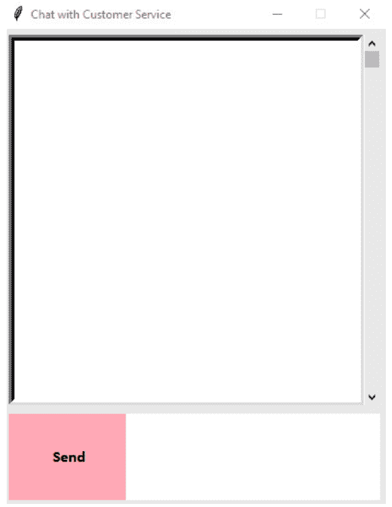

注意我们的组件——右侧的滚动条、粉色的**发送**按钮以及聊天机器人的标题。还要注意最大化按钮是灰色的。那是因为我们说过不希望窗口调整大小。

10. 此外，当我们点击**发送**按钮时，我们希望用户知道它是否被点击了。否则，如果你不确定，你可能会多次点击它。这就是为什么代码中更改了活动背景颜色。以下屏幕截图显示了按钮处于活动状态时的样子：


许多聊天机器人都有类似的功能，以避免代码出错。

一旦我们说了“你好”，机器人就会回应。在我们离开这个问题之前，让我们看看下面屏幕截图中与聊天机器人的快速对话：


如你所见，几行代码和一个文件就可以用来创建与聊天机器人的交互体验。

随意修改代码以添加一些特色，创建不同的 `intents.json` 文件，并使其更符合你的需求。现在，让我们看看我们可以用 Python 做的一些其他事情，比如网络爬虫。

## 问题 9 – 使用 Python 创建二维码

**快速响应（QR）**码是一种二维条形码，旨在封装可被智能手机或专用二维码扫描器快速读取的信息。想象一下，你遇到一张关于热门数字收藏品 *Pudgy Penguins* 的海报。


图 17.12 – Pudgy Penguin 数字收藏品的 JPEG 图像

**二维码的示例网址：** `https://pudgypenguins.com/`

与其记下或费力地输入一个长长的网址，你只需扫描海报上的二维码即可。这一操作会瞬间将你带到 Pudgy Penguins 的主页，架起了实体广告与数字收藏品世界之间的桥梁。现在，让我们探索如何使用 Python 来制作一个嵌入了 Pudgy Penguin 标志的二维码：

首先，你需要为此任务安装必要的包。你可以打开终端并运行 `pip install qrcode[pil]` 命令来生成二维码，以及 `pip install opencv-python` 来读取它们。

安装好包后，你通过导入所需的库来启动 Python 脚本。你使用 `import qrcode` 导入二维码库，`from PIL import Image` 用于图像处理功能，以及 `import cv2` 用于计算机视觉功能，主要是为了稍后读取二维码：

```
import qrcode
from PIL import Image
import cv2
```

接下来，你定义一个名为 `generate_qr_code` 的函数。该函数接受两个参数 – `data`，即你想要编码到二维码中的信息，以及 `file_name`，即你想要保存生成的二维码的文件名。在此函数内部，你指定二维码的属性，例如版本、纠错级别、方块大小和边框大小。然后，你将数据添加到二维码中，使其适配，从中创建图像，并保存该图像：

```
def generate_qr_code(data, file_name):
    qr = qrcode.QRCode(
        version=1,
        error_correction=qrcode.constants.ERROR_CORRECT_H,
        box_size=15,
        border=4,
    )
    qr.add_data(data)
    qr.make(fit=True)
    img = qr.make_image(fill_color="black", back_color="white")
    img.save(file_name)
```

生成基本二维码后，你可能想在其中嵌入一个标志。为此，你定义另一个名为 `embed_logo` 的函数。该函数接受二维码图像和标志图像的路径，将它们组合起来生成一个新的二维码图像，其中嵌入了标志：

```
def embed_logo(qr_path, logo_path, output_path):
    base = Image.open(qr_path)
    logo = Image.open(logo_path)
    base_width, base_height = base.size
    logo_width, logo_height = logo.size
    new_width = int(base_width / 4)
    new_height = int((new_width / logo_width) * logo_height)
    logo = logo.resize((new_width, new_height))
    x_offset = int((base_width - new_width) / 2)
    y_offset = int((base_height - new_height) / 2)
    base.paste(logo, (x_offset, y_offset), mask=logo)
    base.save(output_path)
```

现在，要从图像文件中读取二维码，你定义了第三个函数 `read_qr_code`。在此函数内部，你使用 OpenCV 读取二维码图像并解码，提取并显示其内容：

```
def read_qr_code(file_path):
    image = cv2.imread(file_path)
    qr_code_detector = cv2.QRCodeDetector()
    value, points, qr_code = qr_code_detector.detectAndDecode(image)
    if value:
        print(f"Decoded text: {value}")
    else:
        print("QR code not found")
```

最后，你应用所有这些函数来生成二维码、嵌入标志并读取二维码。你使用要编码的数据和保存二维码的文件名调用 `generate_qr_code`。然后，你调用 `embed_logo` 将标志嵌入到生成的二维码中，最后，你使用 `read_qr_code` 读取并显示二维码的内容：

```
### Generate QR code
data = "https://pudgypenguins.com/"
generate_qr_code(data, "advanced_qr.png")
### Embed logo
embed_logo("advanced_qr.png", "pudgy.PNG", "advanced_qr_with_logo.png")
### Read QR code
read_qr_code("advanced_qr_with_logo.png")
```

就是这样！通过遵循这些步骤，你可以生成一个二维码，通过嵌入标志对其进行个性化设置，然后读取它以检索其编码的数据。


图 17.13 – 没有和带有 Pudgy Penguin 标志的二维码

在这个例子中，我们介绍了在 Python 中生成二维码的基础知识，展示了如何有效地为各种目的创建它们，例如共享 URL、文本信息或 Wi-Fi 密码。通过一个实际的例子，我们演示了如何使用关键库，如 `qrcode`。

## 总结

在本章中，我们有机会在解决实际问题的同时，探索了 Python 在几个非常不同的应用中的使用。

在前面的章节中，我们学习了计算思维过程，以及分解、模式识别、模式概括和算法设计等要素，这些要素使得算法变得有意义。当我们处理客户的问题或只是出于爱好创建脚本时，我们必须经历必要的过程来定义我们用算法创建的内容。这个关键过程将确保我们正在设计尽可能最好的算法。

我们学习了如何从文件读取、上传文件、创建密码和解码器、使用算法根据用户输入编写故事，以及在给定一系列要访问的城市时制定最有效的旅行计划。此外，我们还创建了一个可以根据用户输入进行交互和适应的基本聊天机器人，探索了网络抓取，并创建了一个二维码。

在下一章中，我们将通过数据分析方面的额外应用问题，继续探索 Python 和计算思维，重点关注科学应用、房地产、股市分析等。

# 18

# 高级应用计算思维问题

在本章中，我们将继续在多个领域提供 Python 编程语言和计算思维应用的示例。我们将探索多个领域，例如几何镶嵌、创建房地产数据模型、创建语言检测、分析基因数据、分析股票、创建**卷积神经网络**（CNN）等。我们将运用我们目前所学的关于**计算思维**和 **Python** 编程语言的知识来完成以下任务：

- 创建镶嵌图案
- 分析生物数据
- 分析特定人群的数据
- 创建房地产数据模型
- 执行语言检测
- 分析基因数据
- 分析股票
- 创建 CNN 模型

阅读本章后，你将学会如何在处理数据时执行不同的分析，创建有助于分析现有数据的表格和图表，以及创建训练和测试模型以帮助根据现有的大型数据集预测结果。

## 技术要求

你需要安装最新版本的 Python 才能运行本章中的代码。

你需要为 Python 安装以下库和包：

- **NLTK**
- **PyCairo**
- **Pandas**
- **Matplotlib**
- **Seaborn**

你可以在此处找到本章使用的完整源代码：
[https://github.com/PacktPublishing/Applied-Computational-Thinking-with-Python-Second-](https://github.com/PacktPublishing/Applied-Computational-Thinking-with-Python-Second-)

## 问题 1 – 使用 Python 创建镶嵌图案

在本节中，我们将提供一个使用 Python 的 `pycairo` 库的示例。我们将创建一个镶嵌图案——更具体地说，是一个彭罗斯镶嵌的样本。由于这是一个直接的问题，我们将使用计算思维过程来定义参数，但不会严格遵循它。

首先，让我们谈谈使用 `pycairo pip install` 来添加必要的组件。`pycairo` 包是一个与 Python 配合使用的图形库。更多信息，您可以访问他们的网页：[https://cairographics.org/pycairo.](https://cairographics.org/pycairo.)

现在，让我们定义一些概念。**镶嵌**是一种使用不重叠的形状来创建图案的铺砌。镶嵌图案在几何课程中经常被探讨。在我们的示例中，我们将使用两个三角形创建一个**彭罗斯镶嵌**图案。我们还将定义我们的空间以及我们希望形状经历的细分次数。细分次数越多，定义空间中的图案就越小。让我们看一下算法。`ch18_tessellation.py` 文件包含了这里讨论的完整算法：

1.  我们要做的第一件事是导入必要的包和库：

```python
import math
import cmath
import cairo
```

2.  接下来，我们想定义我们的画布和细分次数。请注意，我们在示例中选择了 `number_subdivisions = 4`。我们选择 4 是为了在镶嵌图案的复杂性和简单性之间取得平衡。*图 18.1* 展示了此代码的示例，以及两个改变细分次数的额外示例：

```python
### Define the configuration of the image.
canvas_size = (500, 500)
number_subdivisions = 4
```

3.  对于镶嵌图案，我们需要定义**黄金比例**。

黄金比例也被称为黄金均值或神圣比例（以及其他名称）。该比例约为 1.618。例如，如果我们谈论一条被分成两部分的线段，那么较长部分的长度除以较短部分的长度，将等于线段总和除以较长部分的长度：A / B = (A + B) / A。对于镶嵌图案，我们需要定义这个黄金比例。

看一下以下代码片段：

```python
gr = (1 + math.sqrt(5)) / 2  # Golden Ratio
```

4.  现在，我们可以使用函数来定义当我们的三角形细分时会发生什么：

```python
def subdivide(triangles):
    result = []
    for color, A, B, C in triangles:
        if color == 0:
            P = A + (B - A) / gr
            result.extend([(0, C, P, B), (1, P, C, A)])
        else:
            Q = B + (A - B) / gr
            R = B + (C - B) / gr
            result += [(1, R, C, A), (1, Q, R, B), (0, R, Q, A)]
    return result
```

5.  在前面的代码中，我们定义了扩展初始三角形集合的函数。**细分**函数在图形和设计中用于使图案看起来更详细和更具吸引力。它通过将较大的三角形分解成较小的三角形来实现这一点，从而增加了三角形的数量和设计的复杂性。

该函数根据三角形的颜色属性执行不同的计算，使用黄金比例（**gr**）和现有三角形的顶点（**A**, **B**, **C**）创建新的点（**P**, **Q**, **R**）。然后，它通过以各种方式组合这些点来构建新的三角形，并将它们添加到 **result** 列表中。这种方法有效地将每个原始三角形划分为更小的三角形，增强了整体三角形图案的复杂性和细节。

6.  现在，让我们研究如何使用 Cairo 图形初始化一个居中且缩放的绘图画布。**setup_canvas** 函数使用 Cairo 图形初始化一个绘图画布。它创建一个图像表面作为绘图区域和一个用于绘图操作的上下文。然后，该函数将坐标系的原点移动到画布的中心，并根据计算出的 **wheel_radius** 缩放绘图上下文。此设置允许绘图操作在画布上居中并按比例缩放。最后，它返回表面和上下文以供进一步绘图：

```python
def setup_canvas(size):
    surface = cairo.ImageSurface(cairo.FORMAT_ARGB32, size[0], size[1])
    cr = cairo.Context(surface)
    cr.translate(size[0] / 2.0, size[1] / 2.0)
    wheel_radius = 1.2 * math.sqrt((size[0] / 2.0) ** 2 + (size[1] / 2.0) ** 2)
    cr.scale(wheel_radius, wheel_radius)
    return surface, cr
```

7.  现在，让我们探讨在 Python 中生成和可视化几何图案的细节。让我们深入了解两个关键函数 **create_initial_triangles** 和 **draw_triangles** 的功能，它们对于使用复数和 Cairo 图形库创建生动的圆形镶嵌图案至关重要。以下是代码片段：

```python
def create_initial_triangles():
    triangles = []
    for i in range(10):
        B = cmath.rect(1, (2 * i - 1) * math.pi / 10)
        C = cmath.rect(1, (2 * i + 1) * math.pi / 10)
        if i % 2 == 0:
            B, C = C, B
        triangles.append((0, 0j, B, C))
    return triangles

def draw_triangles(cr, triangles, color_code, r, g, b):
    for color, A, B, C in triangles:
        if color == color_code:
            cr.move_to(A.real, A.imag)
            cr.line_to(B.real, B.imag)
            cr.line_to(C.real, C.imag)
            cr.close_path()
            cr.set_source_rgb(r, g, b)
            cr.fill()
```

`create_initial_triangles` 函数使用复数形成一个圆形图案的三角形列表，迭代十次以计算顶点，并使用 `cmath.rect` 进行极坐标到复数的转换。它交替三角形的方向以实现对称性，并将它们存储为元组。相反，`draw_triangles` 使用 Cairo 上下文来渲染这些三角形，有选择地绘制和填充那些匹配特定颜色代码的三角形，并使用指定的 RGB 颜色，从而创建出多彩的图案。

8.  在下面的代码片段中，我们将探讨如何使用 Python 中的 Cairo 图形优雅地绘制和设置几何形状周围的边框。`draw_borders` 函数展示了一种细致的方法，为一系列三角形添加精致的圆角边框，增强了它们在画布上的视觉吸引力：

```python
def draw_borders(cr, triangles):
    color, A, B, C = triangles[0]
    cr.set_line_width(abs(B - A) / 10.0)
    cr.set_line_join(cairo.LINE_JOIN_ROUND)
    for color, A, B, C in triangles:
        cr.move_to(C.real, C.imag)
        cr.line_to(A.real, A.imag)
        cr.line_to(B.real, B.imag)
    cr.set_source_rgb(0.3, 0.5, 0.3)
    cr.stroke()
```

随着函数的结束，它应用了一种精心挑选的绿色阴影作为边框，增强了每个三角形的视觉区分度。通过执行 `stroke` 方法，这些精心绘制的边框被渲染到画布上，最终形成一幅引人注目且精致的几何艺术作品，展示了 Python 中精确图形编程的强大功能。

9.  此代码片段展示了在 Python 中创建动态几何图案的过程，利用了图形渲染的强大功能。它结合了三角形的生成、细分和着色，然后添加独特的边框，使用 Cairo 图形组合成一幅视觉上引人注目的图像：

```python
def save_image(surface, file_path):
    surface.write_to_png(file_path)

### Main Execution
triangles = create_initial_triangles()
for _ in range(number_subdivisions):
    triangles = subdivide(triangles)
surface, cr = setup_canvas(canvas_size)
draw_triangles(cr, triangles, 0, .2, .8, .8)  # teal triangles
draw_triangles(cr, triangles, 1, 0.7, 0, 0.7)  # purple triangles
draw_borders(cr, triangles)  # The Triangle borders
```

此代码的最后步骤将整个几何设计整合在一起。调用 `draw_triangles` 处理不同的颜色代码时，它会细致地用鲜艳的颜色填充三角形。之后，`draw_borders` 为每个形状添加了流畅、清晰的边缘。结果是一个和谐的色彩丰富、边框规整的几何艺术作品，展现了数学概念与图形编程的无缝融合。

10. 最后，我们希望算法能创建一个包含我们镶嵌图案的图像文件：

```
save_image(surface, 'C:\...\tessellation.png')
```

下图展示了使用我们算法的不同细分数量所产生的三种变体：


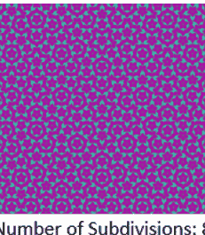

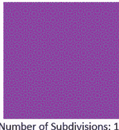

图 18.1：镶嵌图案示例

如你所见，细分数量越多，瓷砖图案就越小，以适应我们定义的画布尺寸。

在你尝试这个算法时，可以考虑改变画布大小、细分数量和颜色。如果想要额外的挑战，可以尝试将三角形图案改为其他多边形。

在本节中，我们深入探讨了使用 Python 的 Cairo 库创建镶嵌图案，特别是彭罗斯镶嵌。我们介绍了 Cairo，讨论了如何安装它，并探索了作为非重叠几何图案的镶嵌。这些知识对于图形可视化和创意 Python 项目非常宝贵，提供了艺术表达的机会，并增强了数学和设计技能。学习使用 Python 生成彭罗斯图案为复杂且视觉上引人入胜的设计提供了一个平台，使本节成为通往艺术和计算美学的大门。

## 问题 2 – 在生物数据分析中使用 Python

对于这个特定问题，我们将使用 `Breast_cancer_data.csv` 文件，该文件可以在 **Kaggle** 上找到（[https://www.kaggle.com/nsaravana/breast-cancer?select=breast-cancer.csv](https://www.kaggle.com/nsaravana/breast-cancer?select=breast-cancer.csv)）。该文件也已上传到本书的 GitHub 仓库。

在查看数据时，有时我们希望与当前拥有的数据进行比较，或者希望将其用于机器学习中的预测。在这种情况下，我们将研究如何使用数据集中两个特定列的值来呈现另一种类型的图表——**散点图**。

让我们假设你收到了这些数据，并且已经确定你的平均周长和平均纹理比列中的其他值是更好的预测指标。你现在的目标是创建一个算法，通过使用散点图比较这两列的值来分析它们。我们的目标是得到那个散点图。如需额外的分析和机器学习应用，请随时参阅*第 14 章，机器学习简介*和*第 16 章，在统计分析中使用计算思维和 Python*以获取更多帮助。

此问题的完整代码可以在 `ch18_BreastCancerSample.py` 文件中找到。现在，我们可以开始设计我们的算法：

1. 我们像往常一样从数据开始——即导入我们将使用的库。注意，我们在这里使用了两个显示库：**matplotlib** 和 **seaborn** 库。这是我们第一次使用 **seaborn**。我们使用 **seaborn** 是因为额外的工作，例如寻找回归线，可以通过这个库轻松处理：

```
#Import libraries needed
import pandas as pd
import matplotlib.pyplot as plt
import seaborn as sns
%matplotlib inline
```

2. 现在，我们要找到 `.csv` 文件。记住，你可以先建立目录。否则，请确保包含文件的完整位置。由于我们的目录不同，请确保在运行文件之前更改它：

```
#Get data set. Remember to check your directory and/or add the full location of the file.
dataset = pd.read_csv('C:\... \breast-cancer.csv')
dataset.head()
dataset.isnull().sum()
```

注意算法中的 `dataset.head()` 命令。如果我们只运行到该点的代码，那么我们将得到以下输出：

| id | diagnosis | radius_mean | texture_mean | perimeter_mean | area_mean | smoothness_mean | compactness_mean |
|---|---|---|---|---|---|---|---|
| 0 | 842302 | M | 17.99 | 10.38 | 122.80 | 1001.0 | 0.11840 | 0.27760 |
| 1 | 842517 | M | 20.57 | 17.77 | 132.90 | 1326.0 | 0.08474 | 0.07864 |
| 2 | 84300903 | M | 19.69 | 21.25 | 130.00 | 1203.0 | 0.10960 | 0.15990 |
| 3 | 84348301 | M | 11.42 | 20.38 | 77.58 | 386.1 | 0.14250 | 0.28390 |
| 4 | 84358402 | M | 20.29 | 14.34 | 135.10 | 1297.0 | 0.10030 | 0.13280 |

图 18.2：显示标题值的表格

`dataset.isnull().sum()` 命令帮助我们查看是否有空数据点或值。

3. 如果我们有很多空值点，可以在开始分析之前清理数据集。这些数据是干净的，从以下输出可以看出，如果我们运行程序直到 `dataset.isnull().sum()`：

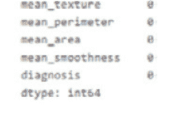

图 18.3：空值检查的输出

4. 由于没有缺失值，如前面的截图所示，我们将继续下一个代码片段，在那里我们将为诊断创建计数变量：

```
#Create count variable for diagnosis
count = dataset.diagnosis.value_counts()
count
```

在前面的代码片段中创建了 **count** 变量，这意味着我们可以使用诊断值（无论是恶性还是良性）创建一个条形图。

5. 以下代码片段创建该条形图并显示结果输出：

```
#Create bargraph of the diagnosis values
count.plot(kind = 'bar')
plt.title('Tumor distribution (malignant: 1, benign: 0)')
plt.xlabel('Diagnosis')
plt.ylabel('count')
plt.show()
```

查看下图，该图显示了使用诊断值的条形图。如你所见，条形图显示了**恶性**肿瘤与**良性**肿瘤的计数：

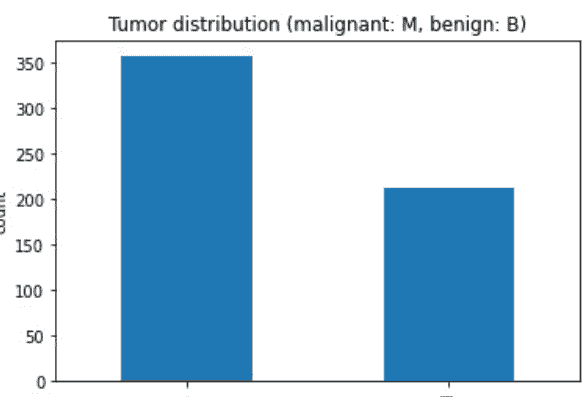

图 18.4：恶性与良性诊断条形图

现在我们有了这些信息和条形图，我们可以开始使用数据集中的值查看其他组合和比较。

6. 你可以运行不同的分析来查看哪些更相关，但目前，我们只使用平均周长和平均纹理来创建我们的散点图。以下代码片段展示了如何使用 **seaborn** 库创建它们：

```
y_target = dataset['diagnosis']
dataset.columns.values
dataset['target'] = dataset['diagnosis'].map({0:'B',1:'M'})
#Create scatterplot of mean perimeter and mean texture
sns.scatterplot(x = 'perimeter_mean', y = 'texture_mean', data = dataset, hue = 'diagnosis', palette = 'bright');
```

一旦我们创建了散点图，算法将返回以下输出，该输出显示了平均周长散点图与平均纹理散点图的比较：

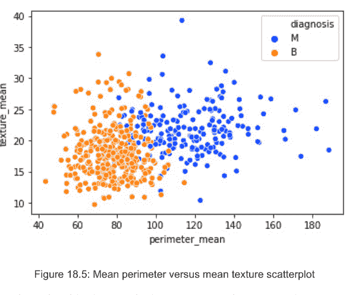

我们将在此暂停数据分析。但是，请注意，你可以将此示例进一步扩展。你可以在 Kaggle 上找到使用此特定数据集的多个应用和分析，以及一些开发人员和编码人员如何结合机器学习进行预测。生物信息学的世界很广阔，数据科学应用也在持续增长。Python 在这些问题中的使用因其易用性和适用的库而非常有帮助。

## 问题 3 – 使用 Python 分析特定人群的数据

在本节中，我们将这样陈述问题——年份是 2020 年，世界因 **SARS-COV-19** 病毒（也称为**冠状病毒**或 **COVID-19**）引起的流行病而不堪重负。数据广泛可用，我们试图查看特定地点发生的情况——特别是该地点的死亡人数如何增长。我们有*《纽约时报》* GitHub 仓库，其中包含 COVID-19 数据，并将下载每日更新的主数据。让我们看看我们需要做什么。

### 定义要分析和识别的特定人群

这个问题很宽泛。*太宽泛了！* 所以，首先，让我们只看一个地点一个月的数据。例如，让我们选择波多黎各和十月份。从主 `.csv` 文件中，我们只提取了波多黎各的特定数据并将其添加到我们的仓库中。同样，主数据可以在*《纽约时报》*的 `covid-19-data` 仓库中找到，你可以使用完整数据、特定州甚至特定县进行多种分析。

目前，我们将专注于为 2020 年 10 月波多黎各的死亡数据创建可视化。仅从数据来看，我们可以看到死亡人数正在上升：

| date | state | fips | cases | deaths |
|---|---|---|---|---|
| 10/1/2020 | Puerto Rico | 72 | 49067 | 665 |
| 10/2/2020 | Puerto Rico | 72 | 49747 | 673 |
| 10/3/2020 | Puerto Rico | 72 | 50375 | 681 |
| 10/4/2020 | Puerto Rico | 72 | 50675 | 686 |
| 10/5/2020 | Puerto Rico | 72 | 51305 | 695 |
| 10/6/2020 | Puerto Rico | 72 | 51737 | 696 |
| 10/7/2020 | Puerto Rico | 72 | 51768 | 705 |
| 10/8/2020 | Puerto Rico | 72 | 52294 | 715 |
| 10/9/2020 | Puerto Rico | 72 | 52892 | 720 |
| 10/10/2020 | Puerto Rico | 72 | 53364 | 728 |
| 10/11/2020 | Puerto Rico | 72 | 53671 | 730 |
| 10/12/2020 | Puerto Rico | 72 | 54234 | 735 |
| 10/13/2020 | Puerto Rico | 72 | 54540 | 738 |
| 10/14/2020 | Puerto Rico | 72 | 55516 | 742 |
| 10/15/2020 | Puerto Rico | 72 | 56085 | 743 |
| 10/16/2020 | Puerto Rico | 72 | 56412 | 758 |
| 10/17/2020 | Puerto Rico | 72 | 56650 | 761 |
| 10/18/2020 | Puerto Rico | 72 | 57293 | 766 |
| 10/19/2020 | Puerto Rico | 72 | 57950 | 768 |
| 10/20/2020 | Puerto Rico | 72 | 58643 | 769 |

图 18.6：2020 年 10 月前 20 天波多黎各的数据

如你所见，**死亡**人数一栏持续上升，**病例**数量也是如此，我们稍后会查看这些数据。

虽然以表格形式读取数据很有帮助，但如果我们想要呈现这些信息，可视化呈现至关重要，尤其是当我们想要识别趋势并影响政策变化时。那么，让我们看看如何为这个特定数据创建散点图。完整文件可在**ch18_CovidPR.py**中找到：

1.  与处理数据时一样，我们需要确保导入将要使用的库：

    ```python
    import pandas as pd
    import matplotlib.pyplot as plt
    ```

2.  接下来，我们需要访问我们的文件。请记住，有多种方法可以做到这一点。我们可以向Python提供完整的文件位置，或者指定目录然后提供文件名。在运行程序之前，请确保更新你计划使用的**.csv**文件的位置。请确保在运行程序之前更改你将使用的**.csv**文件的位置：

    ```python
    df = pd.read_csv('C:\...\us-PuertoRico.csv')
    ```

3.  确定文件后，我们将创建一个简单的散点图，使用日期作为*X轴*，死亡人数作为*Y轴*。以下代码片段中的接下来几个命令用于使图表更易于阅读，例如*Y轴*标签、*X刻度*标记的旋转以及图表的标题。*X刻度*标记是水平轴或*X轴*的分隔标记。你可以在*图18.6*中看到*X刻度*标记和标签：

    ```python
    plt.scatter(df['date'], df['deaths'])
    plt.xticks(rotation = 90)
    plt.title('Deaths per day during October 2020 due to COVID19 in Puerto Rico')
    plt.ylabel('Number of Deaths')
    fig.tight_layout()
    plt.show()
    plt.savefig('COVID_PR.png')
    ```

如前面的代码片段所示，我们还创建了一个图像文件，以便在需要时稍后使用。图表将出现在我们的屏幕上，如下图所示：

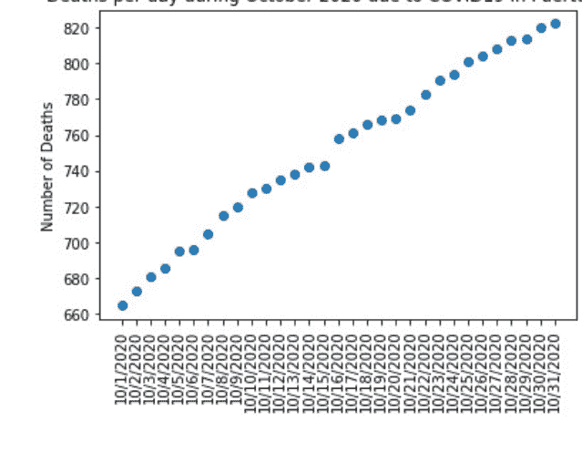

图18.7：2020年10月波多黎各因COVID-19导致的每日死亡人数

这是一个有用的图表，可以看到死亡人数正在稳步增加。我们还可以做更多事情，例如尝试确定回归，这是我们可以使用Python的`numpy`库实现的另一个功能。欢迎你尝试解决这个问题！

目前，我们将查看按日期统计的病例数。代码与之前相同，只是我们的Y轴和标题会有所不同。完整代码可在`ch18_CovidPR_2`文件中找到。由于代码非常相似，我们不会在此分享。然而，我们最终的图表如下所示：

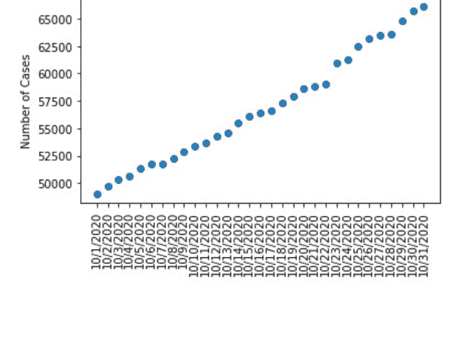

图18.8：2020年10月波多黎各因COVID-19导致的每日病例数

如你所见，波多黎各的病例数每天都在持续增加。我们可以对这两个图表做很多事情，包括分析它们的回归、通过查看其他月份的数据来验证额外的趋势等等。你现在知道了如何根据你的.csv文件创建简单的图表来显示数据；现在，探索和进一步分析掌握在你手中。在下一节中，我们将应对一个新的挑战。

## 问题4 – 使用Python创建住房数据模型

让我们看一个我们想要展示纽约布鲁克林住房市场趋势和信息的问题。该数据集包含2003年至2017年纽约市住房销售数据的信息。我们将使用的数据集已将其信息合并为可用格式，可在Kaggle上找到（https://www.kaggle.com/tianhwu/brooklynhomes2003to2017）。此外，.csv文件的副本可在本书的GitHub仓库中找到，名为`brooklyn_sales_map.csv`。

### 定义问题

对于这个特定问题，我们有一个大型数据文件。我们可以按社区查看信息，按年份查看销售价格，并将建造年份与社区进行比较，以找到趋势、历史等。我们可能仅在这个数据集上花费数小时、数天甚至数周。因此，让我们尝试集中精力于我们将用这个例子完成什么。为此，我们将创建两个可视化模型。第一个是按销售年份显示销售范围内住房百分比的水平条形图。第二个是显示按房屋销售社区划分的价格范围的条形图。

水平条形图可以帮助以更清晰的方式显示数据，以便我们可以看到房价范围以及是否存在显著变化。垂直条形图可以向我们展示按社区划分的相同价格范围，因此我们可以看到根据房屋销售的社区是否发生显著变化。

### 算法和数据的可视化表示

让我们看一下代码片段。完整文件可在本书的GitHub仓库中找到，名为`ch18_housingBrooklyn.py`。与往常一样，在尝试运行程序之前，不要忘记更新文件中的文件位置：

1.  对于这个特定程序，我们需要**pandas**和**matplotlib**库，因此我们需要导入它们：

    ```python
    import pandas as pd
    import matplotlib.pyplot as plt
    ```

2.  接下来，我们需要读取我们的文件。向Python提供完整的文件位置。这是你需要更新此代码以从你的机器运行它的地方：

    ```python
    df = pd.read_csv('C:\...\brooklyn_sales_map.csv')
    ```

3.  现在，我们将创建我们的**bins**。这些是我们的值范围，我们将在创建图表时调用它们。这可以在接下来的几行代码中的**df['price_range']**下看到：

    ```python
    bins = [-100000000,20000,40000,60000,80000,100000,1000000,10000000,500000000]
    ranges_prices = ['$0-$200k','$200k-$400k','$400k-$600k','$600k-$800k','$800k-$1mlln','$1mlln-$10mlln','$10mlln-$100mlln','$100mlln-$500mlln']
    df['price_range'] = pd.cut(df['sale_price'], bins = bins, labels = ranges_prices)
    ```

4.  现在，我们将定义一个函数，我们将转换一些数据。注意，我们对数据集中的每一年运行该函数，以找到我们的百分比总计，我们稍后将在**housing_df**中使用它：

    ```python
    def convert(year):
        return df[df['year_of_sale'] == year].groupby('price_range').size()
    percent_total = [x/sum(x)*100 for x in [convert(2003),convert(2004),convert(2005),convert(2006),convert(2007),convert(2008),convert(2009),convert(2010),convert(2011),convert(2012),convert(2013),convert(2014),convert(2015),convert(2016),convert(2017)]]
    year_names = list(range(2003,2018))
    housing_df = pd.DataFrame(percent_total, index = year_names)
    ax_two = housing_df.plot(kind = 'barh', stacked = True, width = 0.9, cmap = 'Spectral')
    plt.legend(bbox_to_anchor = (1.45, 1), loc='upper right')
    ax_two.set_xlabel('Percentages', fontname='Arial', fontsize = 12)
    ax_two.set_ylabel('Years', fontname='Arial', fontsize = 12)
    ax_two.set_title('Housing Sale ')
    ```

前面的代码片段帮助我们创建了两个模型中的第一个。这是一个水平条形图。我们标记了所有轴和图表，然后在前面代码片段中显示的下一行中，我们定义了将用于此图表的颜色映射——在本例中为'Spectral'。你可以尝试可用的颜色映射，以便于阅读。看看我们的第一个图表，如下所示：

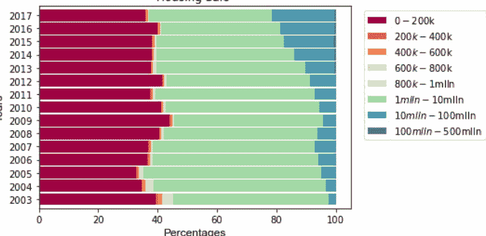

图18.9：按年份统计的布鲁克林住房销售

请注意，我们在前面的图中使用了百分比。这使我们能够显示每个价格范围内的销售比例，但它没有向我们显示每个价格范围内的实际销售数量。这两者是相当不同的。在这里，我们正在寻找趋势。高于1,000,000美元的销售百分比在**2008年至2009年**小幅下降后持续增加。在**2017年**，高于该价格点的销售百分比远高于**2003年**。

但那是总销售额。如果我们只看这个图表而不看数字，我们就不会知道2017年是否总共卖出了更少的房子。同样，这里需要注意的重要一点是，这个图表对于理解每个价格范围内的住房销售份额非常有帮助，但这就是这个图表给我们的全部。现在，让我们看看文件中的其余代码。

5.  在下面的代码片段中，我们正在创建第二个图表，该图表使用我们的信息生成一个垂直条形图，显示每个社区每个价格范围内的百分比：

    ```python
    df.groupby(['neighborhood','price_range']).size().unstack().plot.bar(stacked = True, cmap = 'rainbow')
    plt.legend(bbox_to_anchor = (1.45, 1), loc = 'upper right')
    plt.title('Pricing by Neighborhoods in Brooklyn from 2003 to 2017')
    plt.ylabel('Price Range')
    plt.xticks(fontsize = 6)
    ```

这个图表使用条形图向我们展示了每个社区的价格范围。让我们看看我们的第二个图表：

## 问题5 – 使用Python进行语言检测

如你所见，我们获得了一些比*图18.1*中更详细或更深入的重要信息。在这种情况下，数据是按社区提供的，并且细分了这些社区内的价格区间。

当我们查看大型数据集时，我们可以创建多个不同的模型，甚至使用它们来预测未来的值。查看`.csv`文件中可用的数据，并尝试使用其他数据创建一些不同的表示形式，例如商业与住宅销售、税务类别细分等。

在下一节中，我们将探索涉及机器学习中**自然语言处理（NLP）**的更高级Python代码。

在本节中，我们将深入探讨多项式朴素贝叶斯分类器，这是机器学习NLP中常用的一个便捷工具，尤其适用于语言检测等任务。

语言检测器，例如在Google Translate等工具中找到的那些，在弥合语言差距和实现全球通信方面发挥着至关重要的作用。这些系统依赖于朴素贝叶斯分类器，该分类器以其处理大型文本数据集的效率和处理语言复杂性的准确性而闻名。其简单性和速度使其成为实时语言检测和翻译的首选。

朴素贝叶斯算法的简单性和速度使其成为Google Translate等应用中实时语言检测和翻译的理想选择。

该分类器基于贝叶斯定理，并假设文档中的特征（单词）彼此独立。以下是其数学公式和组成部分的全面而简化的解释。

贝叶斯定理是朴素贝叶斯分类器的基础。该定理表达如下：

*图18.12*展示了贝叶斯定理的公式。这里，我们有以下几个方面：

- **后验概率：** $P(A|B)$ 是在给定数据 $B$ 的情况下，假设 $A$ 成立的概率。
- **似然度：** $P(B|A)$ 是在假设 $A$（文档属于某种语言）成立的情况下，观察到数据 $B$（文档中的特定单词）的概率。这是基于每种语言的训练文档中单词的频率计算得出的。
- **先验概率：** $P(A)$ 是假设 $A$ 成立的概率，与数据 $B$ 无关。在语言检测中，这是任何文档属于某种语言的概率，根据训练数据估算得出。
- **边缘概率：** $P(B)$ 是在所有类别中观察到数据 $B$ 的概率。这作为一个归一化因子，在实际实现中通常被省略，因为它对所有类别都是常数。

### 多项式事件模型的基础

在深入探讨多项式事件模型之前，掌握朴素贝叶斯分类器背后的基本概念至关重要。在上一节中，我们探讨了后验概率、似然度、先验概率和边缘概率等组成部分，这些构成了语言检测等任务中计算概率的基础。现在，让我们应用这些原则来理解多项式事件模型的内部工作原理：

- **多项式事件模型：** 多项式朴素贝叶斯中的*多项式*部分指的是特征（单词）的分布。它假设特征遵循多项式分布。在NLP中，这转化为文档中每个单词的频率。
- **独立性假设：** 朴素贝叶斯之所以被称为“朴素”，是因为它假设在一个类别内所有特征彼此独立。在语言检测中，这意味着假设某些单词的存在或频率与其他单词的存在或频率无关。
- **计算后验概率：** 对于语言检测，分类器计算文本文档属于每种语言的概率，然后选择概率最高的语言。给定文档 $d$（文本），计算类别 $c$（特定语言）的后验概率的公式如下：

$$P(c|d) \propto P(c) \times \prod_{i=1}^{n} P(w_i|c)$$

这里：

- $P(c|d)$ 是文档 $d$ 属于语言 $c$ 的概率。
- $P(c)$ 是语言 $c$ 的先验概率。
- $\prod_{i=1}^{n} P(w_i|c)$ 是文档中每个单词 $w_i$ 在给定语言 $c$ 下的概率的乘积。

- **训练分类器：** 要训练分类器，它必须从训练数据中学习概率（似然度和先验概率）。通常通过计算每个单词在每个类别的文档中出现的次数，然后应用平滑技术（如拉普拉斯平滑）来处理未见过单词的零频率问题。
- **预测：** 在预测期间，对于一个新文档，分类器使用学习到的概率计算每个类别的后验概率，并将文档分类到后验概率最高的类别中。

总之，语言检测中的多项式朴素贝叶斯分类器利用贝叶斯定理，假设特征独立性，并利用单词的频率来预测给定文本文档最可能的语言。

对于我们的问题，我们获得了一个包含两列的数据集：**Text** 和 **Language**。我们的目标是通过使用多项式朴素贝叶斯算法构建和评估一个文本分类模型，该模型可以确定给定文本片段的语言。以下是此过程中使用的Python代码的分解：

1. 像往常一样，首先，我们将导入必要的库：

```
ch18_languageDetection.py

import numpy as np
import pandas as pd
import matplotlib.pyplot as plt
from sklearn.model_selection import train_test_split
from sklearn.pipeline import Pipeline
from sklearn.naive_bayes import MultinomialNB
from sklearn.feature_extraction.text import CountVectorizer
from sklearn.metrics import confusion_matrix, classification_report
```

2. 然后，我们将通过定义一些变量来设置我们的*X*轴和*Y*轴：

```
#### Load your dataset
dataset_path = r'C:\ ..\ dataset.csv'
df = pd.read_csv(dataset_path)
x = df['Text']
y = df['language']
```

这里，数据集被加载到一个DataFrame **df**中。该数据集可能包含文本样本（**Text**）及其对应的语言（**language**）。**x** 和 **y** 分别存储特征和标签。

| Text | language |
|---|---|
| klement gottwaldi surnukeha palsameeriti ni... | Estonian |
| sebes joseph pereira thomas på eng the jes... | Swedish |
| ถนนจีรกรุณา วงศ์จีรนนท์ thanon charoen krung เขมต... | Thai |
| விசாகப்பட்டினம் தமிழ்ச்சங்கத்தை இந்துப் ... | Tamil |
| de spons behoort tot het geslacht haliclona... | Dutch |
| エノが行きがかりでバスに乗ってしまい、気分が悪くなった際に... | Japanese |
| tsutinalar ingilizce tsuutina kanadada albe... | Turkish |
| müller mox figuralis circulorum doct... | Latin |
| ...electric charge د زرجوبري یامات برقی یار | Urdu |

图18.13：文本和语言标签

图18.13展示了我们将用于此问题的**Text**和**language**标签。要预览数据集，请在控制台中输入`df.head()`。

3. 加载数据集后，我们希望进行数据准备：

```
#### Splitting the dataset into training and testing sets
X_train, X_test, y_train, y_test = train_test_split(X, y, test_size=0.2,
random_state=42)
```

如你所见，数据集被分为特征（x：文本数据）和标签（y：文本的语言）。它进一步使用`train_test_split`分为训练集和测试集，其中80%的数据用于训练，20%用于测试。这对于在一组数据上训练模型并在另一组数据上评估其性能至关重要。

4. 分割数据集后，我们希望创建管道，如下所示：

```
#### Create a pipeline
pipeline = Pipeline([
    ('vectorizer', CountVectorizer()),
    ('classifier', MultinomialNB())
])
```

这里，我们创建了一个包含两个步骤的流水线：`CountVectorizer` 和 `MultinomialNB`。前者将文本数据转换为词频计数矩阵，有效地实现了特征提取（词频统计）。`MultinomialNB` 是多项式朴素贝叶斯分类器。

5. 既然我们已经创建了流水线，现在来看看如何训练模型：

```
#### 训练模型
pipeline.fit(X_train, y_train)
```

`pipeline.fit(X_train, y_train)` 在训练数据上训练模型。名为 `pipeline` 的 `Pipeline` 对象包含两个步骤：文本向量化（`CountVectorizer`）和多项式朴素贝叶斯分类器（`MultinomialNB`）。

`fit` 方法调整分类器的参数，使其能够建模文本数据（`X_train`）与其对应标签（`y_train`，即语言）之间的关系。向量化器将文本数据转换为适合分类器的格式（词袋模型），分类器则从这些数据中学习。

6. 现在来看看预测部分：

```
#### 预测
y_pred = pipeline.predict(X_test)
```

训练完成后，使用 `pipeline.predict(X_test)` 来预测 `X_test` 中新的、未见过的文本数据的语言。

预测结果存储在 `y_pred` 中。流水线会自动对 `X_test` 应用与 `X_train` 相同的向量化处理，然后使用训练好的分类器来预测语言。

7. 现在，我们来评估模型：

```
#### 评估模型
print(classification_report(y_test, y_pred))
conf_mat = confusion_matrix(y_test, y_pred)
```

8. `classification_report(y_test, y_pred)` 生成一份报告，显示主要的分类指标，例如每种语言的精确率、召回率和 F1 分数。这些指标提供了模型在每个类别（语言）上的性能洞察。提醒一下，精确率衡量的是正向预测的准确性。召回率衡量的是识别所有实际正例的能力，而 F1 分数则平衡了精确率和召回率，用于整体模型评估。

混淆矩阵（`confusion_matrix(y_test, y_pred)`）是一个用于描述分类模型性能的表格。它显示了真实标签与预测标签的对比，让你能够看到模型在哪些地方出错了。

训练阶段是模型从数据中学习的过程，预测阶段是将这种学习应用于新数据的过程，而评估阶段则评估模型的表现如何。这个循环是监督机器学习任务的基础。

9. 这是混淆矩阵的分类报告：

```
#### 绘制混淆矩阵
plt.figure(figsize=(10,10))
plt.imshow(conf_mat, interpolation='nearest', cmap=plt.cm.Blues)
plt.title('混淆矩阵')
plt.colorbar()
tick_marks = np.arange(len(y.unique()))
plt.xticks(tick_marks, y.unique(), rotation=45)
plt.yticks(tick_marks, y.unique())
plt.tight_layout()
plt.ylabel('真实标签')
plt.xlabel('预测标签')
plt.show()
```

以下结果来自一个语言检测模型的分类报告：

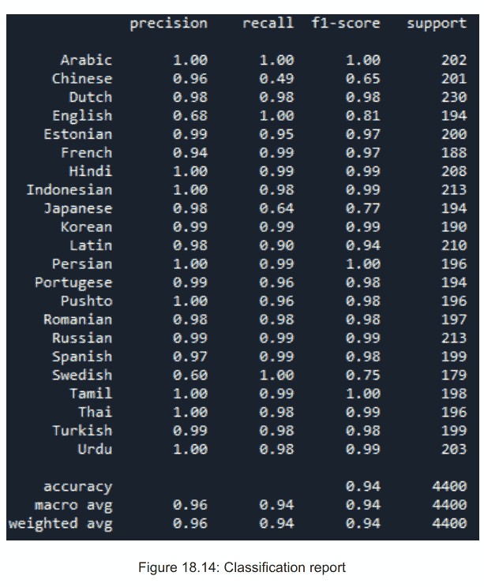

在*图 18.14*中，每一行代表模型经过训练能够识别的一种不同语言。该表格提供了每种语言的精确率、召回率、F1 分数和支持数，以及整个模型的汇总分数。让我们来分解一下。

阿拉伯语、中文、法语和土耳其语等语言的精确率和召回率均为 1.00，这意味着模型在测试集中完美地识别了所有这些语言的实例。它们的 F1 分数也是 1.00，反映了精确率和召回率之间的平衡。

日语和泰米尔语的 F1 分数明显较低——分别为 0.77 和 0.75。对于日语，精确率特别低（0.62），表明模型经常错误地将其他语言预测为日语。对于泰米尔语，虽然精确率是完美的，但召回率较低（0.60），表明模型遗漏了相当数量的泰米尔语实例。

**支持数**列显示了测试数据集中每种语言的实际出现次数。荷兰语、英语和韩语等语言的实例较多（分别为 230、204 和 190），而泰米尔语和瑞典语等其他语言的实例较少（分别为 179 和 178）。这可能表明数据集有些不平衡。

总而言之，该模型在大多数语言上表现优异，但在某些方面仍有改进空间，特别是日语和泰米尔语，它们的精确率或召回率较低。整体的高准确率和 F1 分数表明这是一个用于语言检测的稳健模型：

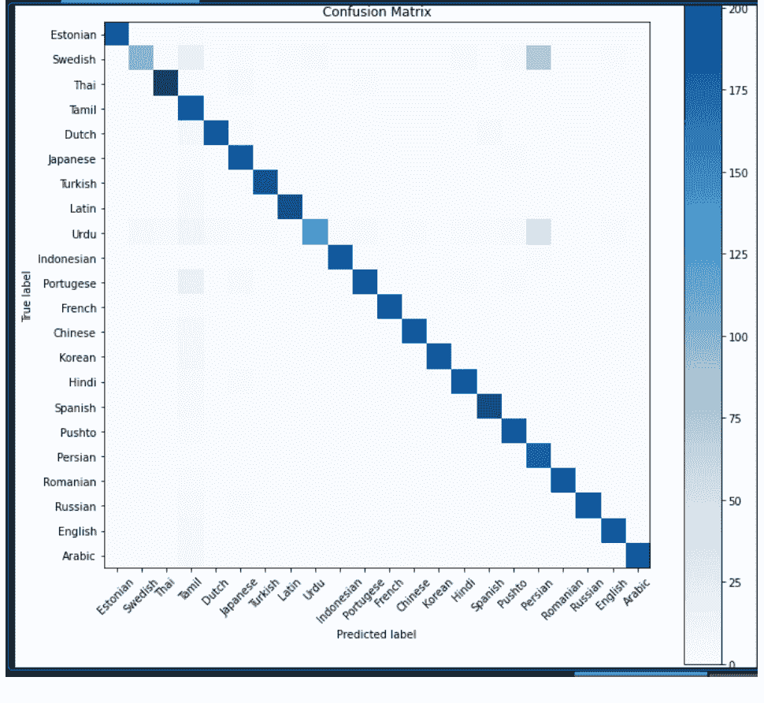

图 18.15：混淆矩阵

*图 18.15* 可视化了混淆矩阵，这是一个有用的工具，可以查看模型在预测每种语言方面的表现。在整个过程中，多项式朴素贝叶斯分类器扮演了关键角色。一旦文本数据被 `CountVectorizer` 转换为数值格式（词频计数），`MultinomialNB` 算法就会使用这些计数来计算每个语言类别的概率。它非常适合这类问题，因为它在处理表示频率的特征方面表现出色，而文本数据被分词为词频计数正是这种情况。

矩阵中的每个单元格代表来自真实类别（在 *Y* 轴上）并被预测为预测类别（在 *X* 轴上）的样本数量。较深的颜色通常代表较高的数字。对角线上的单元格代表正确的预测，而非对角线上的单元格则表示分类错误。

在提供的代码中，多项式朴素贝叶斯分类器是语言检测的理想选择，因为它对文本数据具有高效性和有效性。它擅长处理文本典型的高维稀疏数据，使其非常适合涉及词频分析的任务。此外，其概率性质提供了对预测确定性的洞察，这是语言检测的一个重要方面。该分类器与 `scikit-learn` 等库的简单实现增强了其可访问性和易用性。此外，其可扩展性和对无关特征的鲁棒性使其成为处理大型数据集或作为更复杂文本分类任务中基线模型的实用选择。

## 问题 6 – 使用 Python 分析遗传数据

现在让我们把注意力转向一个更大的数据集。你正在研究实验室小鼠，并获取**三体小鼠**和这些小鼠中蛋白质表达的数据。由于原始文件巨大，我们从 Kaggle 的公共领域文件中截取了部分数据。我们只关注小鼠的六种蛋白质表达，并且同样只关注研究中的三体（**唐氏综合症**）小鼠。完整文件可以在 Kaggle 网站上找到：[https://www.kaggle.com/ruslankl/mice-protein-expression](https://www.kaggle.com/ruslankl/mice-protein-expression)。截取的文件可以在本书的 GitHub 仓库中找到。

假设你不知道从哪里开始处理这些数据。*你到底应该看什么？* 嗯，这通常是我们数据科学中遇到的第一件事。我们并不总是能参与研究设计或数据收集过程。很多时候，我们收到大型数据文件，需要弄清楚要寻找什么，如何解决问题（无论我们认定的问题是什么），以及如何以最佳方式展示信息。

另外，提醒你在尝试运行此程序之前更改文件位置。这个非常简单的程序可以在 `ch18_pairplots.py` 文件中找到。让我们从算法开始：

1.  **seaborn** 库可以帮助我们入门。我们可以创建 **pairplot()**，它将使用直方图和散点图来关联 .csv 文件中的数值数据。这有点像一个奇妙的魔术。我们只需两行代码就能看到我们所看到的。看看生成*图 18.16*所需的两行代码（注意这里有四行代码，但我不计算用于导入库的两行）：

```
import seaborn as sns
import pandas as pd
df = pd.read_csv('C:\...\Data_Cortex_Nuclear.csv')
sns.pairplot(df, hue = 'Treatment')
```

运行此程序时请耐心等待。算法可能很简单，但它在后台执行的操作并不那么简单。看看下面的图，看看我们的配对图：

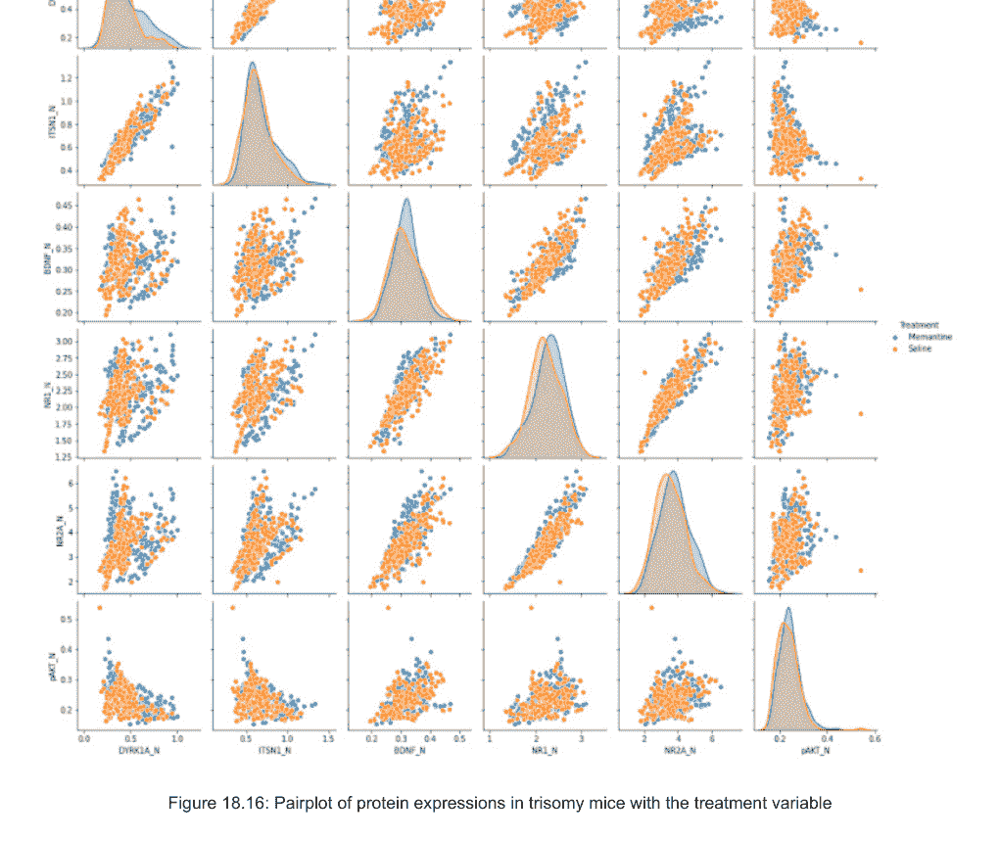

请注意，我们的数据根据处理方式（分别是注射美金刚或生理盐水）分为两种颜色。从图中可以看出，某些蛋白质的相关性似乎比其他蛋白质更高。让我们在此稍作停留。

2. 现在，假设我们的目标不是根据处理方式检查表达量，而是根据类别。我们可以运行代码，但首先，我们需要在算法中将色调更改为**类别**。结果如下：

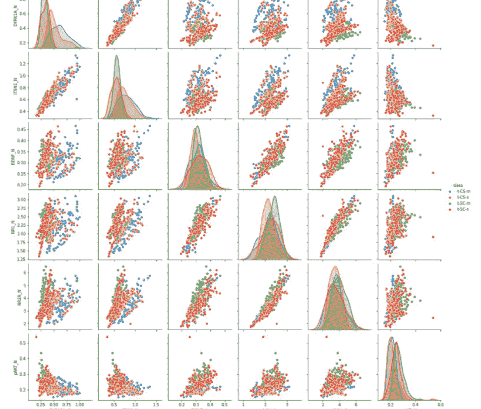

图 18.17：三体小鼠蛋白质表达的配对图，按类别变量着色

请注意，这些图极其相似。然而，图表的不同之处在于根据另一个特征识别每个点的位置。例如，在`类别`变量图中，我们有四种颜色，因为我们的特定数据集中有四类小鼠。

这些组包括 **t-CS-s**，代表通过电击刺激学习并注射生理盐水的小鼠；**t-CS-m**，代表通过电击刺激学习并注射美金刚的小鼠；**t-SC-s**，代表未通过电击刺激学习但注射生理盐水的小鼠；以及 **t-SC-m**，代表未通过电击刺激学习但注射美金刚的小鼠。

观察我们的相关性，我们可以看到许多蛋白质之间存在强烈的正相关，例如 **NR2A_N** 和 **BDNF_N**。如果这是我们的研究，我们需要考虑这种相关性是否相关、是否在我们的研究中重要，以及是否不显著。一旦我们查看了这些图，我们就可以选择进一步探索信息。

在查看此数据集时，另一种有帮助的图表类型是箱线图。我们可以使用箱线图来查看我们想要更仔细研究的蛋白质按类别划分的表达水平。让我们以 **NR2A_N** 蛋白质为例。使用 **seaborn** 箱线图，我们可以使用 **ch18_boxplot.py** 文件中的代码为这个特定蛋白质创建图表。一如既往，首先检查文件位置：

```
import pandas as pd
import scipy.stats as stats
import matplotlib.pyplot as plt
import seaborn as sns
df = pd.read_csv('C:\...\Data_Cortex_Nuclear.csv')
protein = df[['NR2A_N', 'class']].dropna()
sns.boxplot(x='class', y='NR2A_N', data = protein)
plt.show
```

在前面的代码中，我们确定了要比较的内容，在本例中是蛋白质和类别。现在，我们可以使用 **seaborn** 库创建箱线图，如下所示：

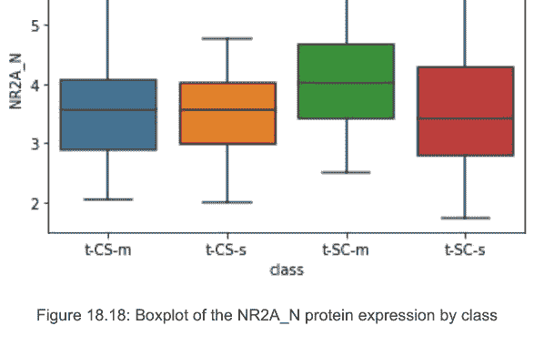

如您所见，我们三体小鼠的分布因类别而异，其中未受刺激学习且注射生理盐水的小鼠在该蛋白质的表达上显示出更宽的范围。

让我们尝试将该蛋白质更改为数据集中的另一个——即 **ITSN1_N** 蛋白质。下图显示了生成的箱线图：

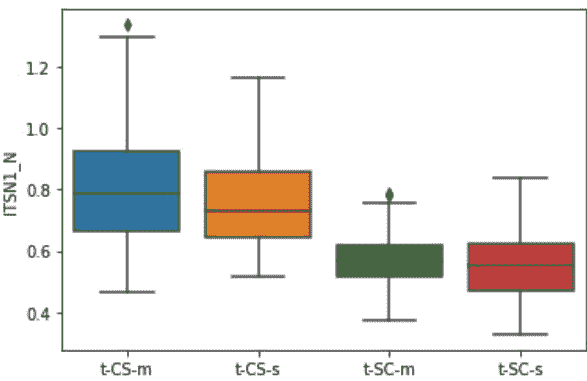

图 18.19：按类别划分的 ITSN1_N 蛋白质表达箱线图

在这个特定的箱线图中，我们可以在 **t-CS-m** 和 **t-SC-m** 类别中识别出异常值——即两个都注射了美金刚的小鼠类别。这可能提示我们去寻找更多关于美金刚注射与该特定蛋白质之间关系的信息。*如果我们观察非三体小鼠，在其他因素相同的情况下，该蛋白质的数据分布（范围）是否也会如此？* 这些是我们在查看此类数据集时会问自己的一些问题。

您可能还记得，计算思维过程很少是一条直线。如果我们在算法中确定了需要考虑的内容，我们不会只是把算法放在一边，认为它已经完成，所以不会改变它。我们会重新确定需要什么，对设计进行必要的更改，并再次创建我们的算法。当我们处理更大的数据集时，就会发生这种情况——我们查看一些初始可视化，可能创建几种不同类型的图表，运行一些统计分析，然后决定下一步如何处理数据。这只是 Python 可能性的一个缩影。

现在，让我们探索使用线性回归的 Python 示例。

## 问题 7 – 使用 Python 分析股票

是时候玩玩股票了。您可以通过 **Quandl** 访问大量数据，它允许出于教育目的使用免费 API。也有高级数据集可用。我们坚持教育用途，所以这应该足以满足我们的目的。

在这个问题中，我们将学习如何从 Quandl 拉取数据并查看 VZ 股票价格。**VZ** 是 **Verizon** 股票价格的代码。我们将使用 **quandl**（一个 Python 包，同时也是一个充满有用信息的网站）来预测价格。让我们看看如何获取我们想要的信息。完整的代码（不包括 API 密钥）可以在本书的 GitHub 仓库的 **ch18_stockAnalysis.py** 文件中找到：

1. 让我们看看如何导入数据。您需要自己的 API 才能执行此操作。如果您想检查另一只股票，例如 **AMZN**，您需要将 '**EOD/VZ**' 替换为 '**WIKI/AMZN**'，例如。**AMZN** 是 **Amazon** 股票的代码。但让我们看看我们的 **VZ** 数据集：

```
import quandl
import numpy as np
from sklearn.linear_model import LinearRegression
from sklearn.svm import SVR
from sklearn.model_selection import train_test_split
#Get data from Quandl. Note that you'll need your own API to substitute in the api_key below.
quandl.ApiConfig.api_key = '...'
VZ = quandl.get('EOD/VZ')
print(VZ.head())
```

当我们运行前面的代码时，我们会得到数据集中前五个值的表格。以下屏幕截图显示了我们的值表：

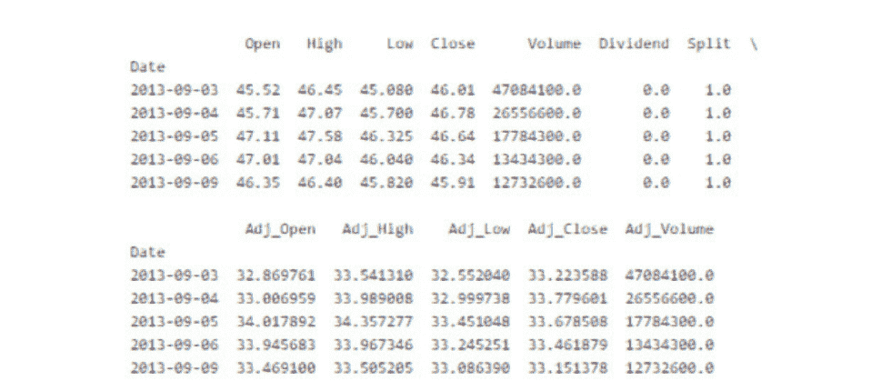

2. 现在，假设我们只想关注调整后的收盘价，以便进行预测。我们可以使用以下代码片段来完成：

```
#Grab the Adj_Close column
VZ = VZ[['Adj_Close']]
print(VZ.head())
```

运行前面的代码后，我们将得到调整后的表格：

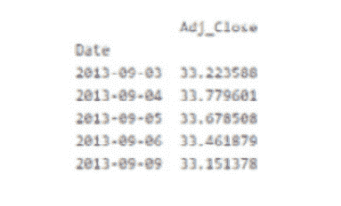

图 18.21：EOD/VZ 调整后收盘价表格

既然我们已经学会了如何拉取当前数据，我们将使用本书 GitHub 仓库中放置的数据集，以便我们可以复制结果。然后您可以尝试使用 Quandl API 对当前数据执行此操作。

让我们看看名为 `vz.csv` 的数据集。这包含了 VZ 从 1983 年到 2020 年 4 月的相同数据。*我们想从这个数据集中得到什么？* 我们想做一些预测。所以，让我们构建那个模型。

请注意，代码相当大，因此包含您所需一切（不包括*第 15 行*的文件位置，您需要添加）的文件位于 `ch18_predictionsModel.py` 中。让我们看看该文件中的一些代码片段：

1. 以下代码片段将为数据集中的现有数据创建一个图表。它从文件中选择 **Date** 列并将其设置为索引值。然后，它创建一个图形并添加图表和坐标轴的标签：

```
VZ["Date"]=pd.to_datetime(VZ.Date,format="%Y-%m-%d")
VZ.index=VZ['Date']
plt.figure(figsize=(16,8))
plt.plot(VZ["Close"],label='Close price history')
plt.title('Closing price over time', fontsize = 20)
plt.xlabel('Time', fontsize = 15)
plt.ylabel('Closing price', fontsize = 15)
plt.show()
```

我们还没有查看模型，因为我们还没有定义训练数据。我们只是查看股票价格从 **1983** 年到 **2020** 年的变化情况，如图所示。请注意，第一个刻度标签显示为 **1984**。可以看到我们的数据在 **1984** 年之前一点点开始。刻度线自 1980 年起每 4 年一个，如 *图 18.22* 所示：

### 18.22 VZ股票随时间变化的收盘价

请注意前面的图表，股票价格在任何方面都不是线性的。它们会上涨、下跌，然后再次上涨。一个预测模型需要大量数据，以便我们能做出尽可能最佳的预测。我们的数据集包含9,166行数据。这马上就会派上用场。

2. 让我们来看一下我们将要使用的另一段代码片段：

```python
VZ3=VZ2.values
train_data=VZ3[0:750,:]
valid_data=VZ3[750:,:]
VZ2.index=VZ2.Date
VZ2.drop("Date",axis=1,inplace=True)
scaler=MinMaxScaler(feature_range=(0,1))
scaled_data=scaler.fit_transform(VZ2)
x_train_data,y_train_data=[],[]
for i in range(60,len(train_data)):
    x_train_data.append(scaled_data[i-60:i,0])
    y_train_data.append(scaled_data[i,0])
x_train_data,y_train_data=np.array(x_train_data),np.array(y_train_data)
x_train_data=np.reshape(x_train_data,(x_train_data.shape[0],x_train_data.shape[1],1))
```

请注意代码行 **train_data=VZ3[0:750,:]** 中的值750。这意味着我只使用9,166行可能数据中的前750行来训练我的模型。这并不理想。

让我们看看下面的图表，它展示了我们运行这个预测模型时的结果。请注意，我们选择将原始信息复制到我们的图表中。Python会指出这是我们可能想要修复的一个问题。这取决于你。目前，将原始数据叠加在我们的图表上，为我们提供了很好的视觉对比：

### 18.23 收盘价预测

如你所见，这里用橙色显示的是我们复制的原始值。绿色线条显示了我们模型做出的预测。它们不算太糟，但本可以更精确。

3. 让我们看看当我们改用7,500行数据时会发生什么，这大约是可用数据的82%。需要说明的是，本书GitHub仓库中的文件使用的是7,500这个值，但你可以随意更改和调整它，以便测试模型的准确性。下图展示了我们的结果：

### 18.24 使用7,500行数据的预测模型

请注意，在这个模型中，真实线条和预测线条要接近得多。这是因为我们用来训练模型的数据越多，我们的预测就会越好。

在结束这个例子之前，请注意我们这里并没有涵盖整个代码文件。代码的某些部分已在本书的其他地方讨论过，因此我们专注于算法中那些新的、对算法解决方案至关重要的部分，因为该算法比较复杂。该代码文件的最后一部分使用了一个**长短期记忆（LSTM）**模型。LSTM模型是一种人工循环神经网络。我们在机器学习中使用这种模型来创建深度学习模型。

*我们的模型能预测股票价格吗？* 不能。否则，我们所有人应对市场都会更容易些。但模型可以擅长预测价格，以及价格是上涨还是下跌。

## 问题8 – 使用Python创建CNN

在本节中，我们将探讨一个涉及**人工智能（AI）**的问题。更具体地说，我们将专注于构建一个**CNN**。*但CNN到底是什么？* 嗯，CNN是一种**深度学习算法**，它以图像作为输入。它根据预定的特征来处理图像并分配重要性。

下图说明了CNN所涉及的过程：

创建CNN是为了简化我们对图像进行分类的方式，同时不牺牲我们希望从图像分析中获得的预测准确性。这就像我们应用一个滤镜。一旦应用了滤镜，我们就能看到特征。前面的图表展示了这个过程的简化示意图。

我们将深入探讨的问题是手写训练和分析。从计算思维过程来思考，我们试图做的是尽可能准确地分析手写体。为此，我们必须分析数百或数千张图像来创建和训练我们的模型。我们使用的图像越多，我们的模型就越准确。

对于我们的模型，我们将使用MNIST数据集，其中包含70,000张图像。

**MNIST**代表**修改后的国家标准与技术研究院**。它是机器学习和计算机视觉领域广泛使用的数据集。前60,000张图像用于训练，另外10,000张用于测试。完整代码可以在`ch18_CNN_mnist.py`文件中找到。我们将查看该代码中的一些片段，并进行一些调整以展示额外的组件。只要安装了所有必要的库和包，你就可以在本书的GitHub仓库中运行该文件而无需更改。让我们开始设计模型：

1. 首先，让我们看一段代码片段，它将上传数据集，然后显示数据集中的第一项：

```python
from keras.datasets import mnist
#Grab the testing and training data from existing dataset
(X_train, y_train), (X_test, y_test) = mnist.load_data()
import matplotlib.pyplot as plt
#Take a look at the first item in the dataset
plt.imshow(X_train[0], cmap='Greys')
```

这里，我们使用0作为训练集中的索引来查看第一张图像。`cmap`属性将使颜色映射为灰色。你可以根据需要进行调整。顺便提一下，对于那些有颜色辨别困难或有特定颜色需求的人来说，更改颜色映射可以显著改变图像的感知效果。让我们看看第一张图像：

如你所见，这是一个手写样本，很可能是数字**5**。我们可以用不同的索引再运行几次程序，看看数据集中的其他样本。下面的截图显示了其中一些样本及其对应的索引：

### 18.27 数据集中按索引显示的样本图像

我们使用的数据不是定量的，而是定性的。我们观察的是图像，因此需要一个能够分析这些图像的过程。为此，我们将使用**独热编码**，它用新的二进制变量替换整数编码的变量。

2. 现在我们已经了解了我们要处理的内容，让我们使用以下代码片段来重塑和编码我们的模型。提醒一下，完整代码可以在本书的GitHub仓库中找到，但某些组件会略有不同（例如，我们的文件不会测试数据集中的图像）：

```python
#Reshape the model
X_train = X_train.reshape(60000,28,28,1)
X_test = X_test.reshape(10000,28,28,1)
from keras.utils import to_categorical
#Use One-Hot encoding
y_train = to_categorical(y_train)
y_test = to_categorical(y_test)
y_train[0]
```

如你所见，我们将图像分成了训练集和测试集。然后，我们对它们进行了编码。

3. 一旦我们执行了独热编码，我们就可以创建我们的模型了：

```python
#Creating the model
from keras.models import Sequential
from keras.layers import Dense, Conv2D, Flatten
model = Sequential()
model.add(Conv2D(64, kernel_size=3, activation='relu', input_shape=(28,28,1)))
model.add(Conv2D(32, kernel_size=3, activation='relu'))
model.add(Flatten())
model.add(Dense(10, activation='softmax'))
#Compile the model
model.compile(optimizer='adam', loss='categorical_crossentropy', metrics=['accuracy'])
```

在前面的代码片段中，我们使用了`softmax`函数。`softmax`函数有时被称为归一化指数函数。我们用它来归一化输出。

4. 现在，让我们训练模型。我们将拟合模型，然后验证数据。看看这段代码片段：

```python
#train the model
model.fit(X_train, y_train, validation_data=(X_test, y_test), epochs=3)
```

这是训练和测试的一大优点——也就是说，当我们理解并实践它们时，我们意识到只需几行代码就能完成一些相当了不起的事情。

前面两行代码（第三行是注释）将产生一些很棒的效果，并允许我们的算法测试其他图像。

5.  现在，我们可以预测数据集中的图像了。我们将从最后四个开始，因为每个人都从相同的四个数字开始，所以这次我想从后往前开始。请注意，要耐心一些。这个算法需要处理数千张图像。在运行周期时，会有一个时钟告诉你处理信息还需要多长时间。对于这个特定的算法，只需要几分钟时间。让我们看看运行该预测所需的代码片段：

```
#Predict last 4 images
model.predict(X_test[9996:])
```

当我们运行这段代码时，会得到一个相当密集的数字数组。请看下面的截图。我们高亮了希望讨论的关键代码部分：

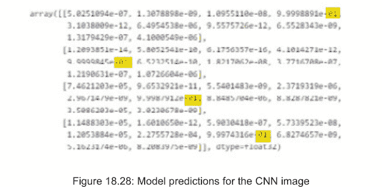

那么，我可以告诉你，预测的第一个数字是3。*我们怎么知道这个数字代表3呢？* 因为每个列表代表从0到9的数字。想象一下，将第一个列表替换为[0, 1, 2, 3, 4, 5, 6, 7, 8, 9]。如果我们把这看作索引，那么在数字末尾是**01**（在前面的截图中高亮显示）的数字位于索引3，也就是数字3。所以，我们的数字是3、4、5和6。

6.  *但是你信任这个模型吗？* 我们可以回到本次讨论开头的那个代码片段，并打印我们的结果。记得稍微修改代码以打印你的测试图像，而不是训练图像，如下面的代码片段所示：

```
plt.imshow(X_test[9996], cmap='Greys')
```

运行代码时，请记住你需要为每个索引运行它才能看到图像。下面的截图显示了测试图像每个相关索引的图像：

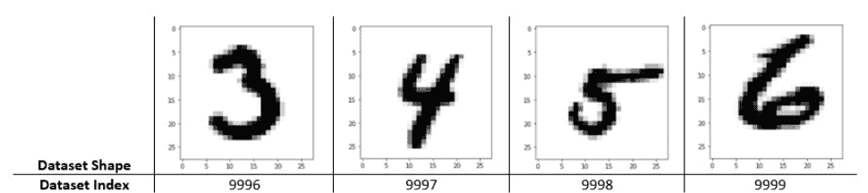

图18.29：测试数据验证图像

如你所见，我们的模型为这些索引中的每个手写数字图像都预测出了正确的值。

在结束本次讨论之前，重要的是要注意，这些模型目前在网站上被广泛用于验证访问者是人类还是机器人。一些网站会有**验证码**，有时会提供手写字母，用户必须识别这些字母才能继续操作。这些验证码也经常使用深度学习。卷积神经网络和这类模型的应用是无穷无尽的。

## 总结

在本章中，我们探讨了计算思维的更多主题，特别是在使用Python编程语言处理数据和深度学习方面。我们学习了如何创建配对图来确定数据集中变量之间的关系。我们还学习了如何生成各种类型的图表来直观地表示我们的数据集。然后，我们学习了如何使用Python创建电场线。简而言之，我们应用了前面章节所学的知识，并在解决应用问题的过程中扩展了我们的知识。

而这正是本书试图做到的——在真实问题的背景下展示各种各样的Python应用。*我们是否涵盖了Python能做的一切？* 这几乎是不可能的，因为Python的能力由于其易用性、易于学习以及由于其开源性质而不断添加的应用程序而持续增长。希望你能够使用一些新的脚本，了解一些你尚未探索的功能和能力，并享受探索这些场景的过程。

*我们是否能够说我们已经创造了完美的算法？* 我们，本书的作者，不这么认为。原因在于我们总是在思考改进的方法。我们总是质疑额外的应用。我们总是希望让它们更高效。而这正是计算思维帮助我们做到的。我们可以分析、设计、测试、回过头来检查我们是否实现了目标，然后进行优化、重新设计、执行测试并重复。

随着本章的结束，我们已经收集了下一步所需的基本知识和工具。现在，我们准备进一步进入复杂的技术领域。进入最后一章，[第19章](https://example.com)，将Python与亚马逊网络服务（AWS）集成，我们将探索广阔的**亚马逊网络服务（AWS）**世界以及使用PySpark进行自动化的动态能力。本章旨在增强我们对云计算的理解，并为我们提供有效使用PySpark在云端自动化和优化任务的实用知识。准备好迎接云计算和数据处理力量汇聚的一章，开启新的机遇视野。

## 19

## 将Python与亚马逊网络服务（AWS）集成

随着我们的进展，我们将继续使用Python和计算思维来解决问题。令人兴奋的是，我们还将探索AWS以增强我们的问题解决能力。可以将其视为将Python的可靠性与AWS的无限可能性相结合。这将扩展我们的工具包，使其在应对各种挑战时更具创造性和效率。请放心，我们将继续使用迄今为止学到的技能，同时利用AWS的巨大潜力。准备好迎接一段激动人心的发现和创新之旅吧！

在本章中，我们将概述AWS，指导你设置AWS账户，探索用于Python集成的核心AWS服务，研究**提取、转换、加载（ETL）**过程，并讨论安全性和最佳实践。

在本章中，我们将涵盖以下主题：

- AWS概述
- AWS设置
- AWS服务
- Python示例与AWS

## 技术要求

你需要最新版本的Python来运行本章中的代码。

你需要拥有`pip`（Python包管理器）和AWS账户凭证。

你可以在此处找到本章将使用的源代码：
https://github.com/PacktPublishing/Applied-Computational-Thinking-with-Python-Second-Edition/tree/main/Chapter19。

## 云计算中的AWS和Python——简要概述

AWS是世界领先的云计算平台。它提供了广泛的云服务，包括计算能力、存储、数据库、机器学习、分析等。AWS以其可扩展性、可靠性和成本效益而闻名，使其成为希望利用云进行各种目的的企业、初创公司和个人的首选。

### Python在AWS中的适用性

Python以其简单性和多功能性，成为基于云的应用程序的热门选择。在AWS中，Python被广泛用于脚本编写、自动化和构建云原生应用程序。我们将探讨Python的特性如何使其成为与AWS服务交互的理想语言，从自动化重复任务到处理海量数据。

### ETL过程——其在数据处理中的重要性

ETL过程在数据管理中至关重要，特别是在云计算和大数据分析的背景下。ETL涉及从各种来源提取数据，将其转换为适合分析的格式，并将其加载到数据存储中以供进一步使用。在本节中，我们将介绍ETL过程的概念，它们在云环境中处理和分析数据的重要性，以及Python如何在AWS中促进这些过程：

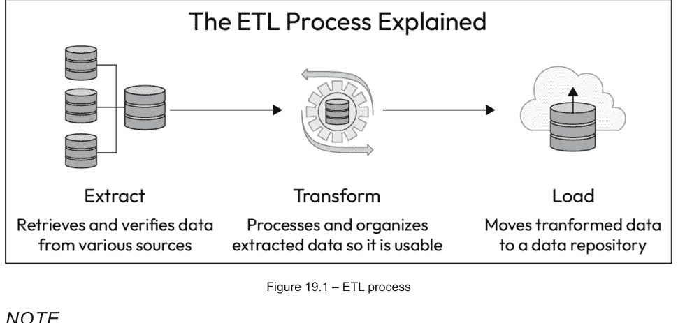

> **注意**
> 关于AWS中ETL过程的更多信息，请参阅[https://aws.amazon.com/what-is/etl/](https://aws.amazon.com/what-is/etl/)。

## AWS设置

为AWS和Python集成准备环境是至关重要的第一步。在本章中，我们将指导你创建AWS账户、设置安全性和配置Python开发环境。无论你是云计算新手还是经验丰富的开发者，我们将提供清晰的说明，确保你为接下来的激动人心的旅程做好准备。在本章结束时，你将能够有效地利用AWS和Python进行你的项目。让我们深入开始吧！

首先，我们将学习如何设置免费套餐账户。

### 创建新的 AWS 账户

要创建新的 AWS 账户，请按照以下步骤操作：

1.  访问 AWS 主页 [https://aws.amazon.com](https://aws.amazon.com)。
2.  在主页上点击 **创建 AWS 账户** 链接。
3.  选择 **商业** 或 **个人** 作为账户类型（需要注意的是，无论您选择哪种类型，所提供的功能和工具都是完全相同的）。

#### 免费套餐优惠

所有 AWS 账户都可以根据所使用的产品，探索 3 种不同类型的免费优惠。


**永久免费**
永不过期


**12 个月免费**
从首次注册日期开始计算


**试用**
从服务激活日期开始计算

#### 注册 AWS

##### 联系信息

您计划如何使用 AWS？

-   商业 - 用于您的工作、学校或组织
-   个人 - 用于您自己的项目

我们应该就哪个账户与您联系？

全名

电话号码

国家或地区

地址

城市

州、省或地区

邮政编码

我已阅读并同意 AWS 客户协议的条款。

继续（第 2 步，共 5 步）

图 19.2 – AWS 账户注册的联系信息

4.  提供 AWS 账户注册流程所需的联系信息。您需要包含以下内容：
    -   一个电子邮件（之前未用于注册过 AWS 账户）
    -   一个电话号码（用于验证目的，非常重要）
5.  查阅 **AWS 客户协议** 条款后，勾选复选框并点击 **创建账户**，然后点击 **继续**。
6.  提供信用卡或借记卡作为支付信息，并选择 **验证并添加**。此步骤用于验证。
7.  提供用于验证的电话号码或电子邮件，输入安全检查中显示的字符，并完成验证。
8.  选择支持计划。
9.  您将收到通知，表明您的账户已激活。

创建新的 AWS 账户是一个简单直接的过程，涉及几个基本步骤。按照这些步骤操作，您可以快速设置 AWS 账户，并获得 AWS 提供的强大云计算资源和服务的访问权限。一旦您的账户激活，您就可以开始您的云计算之旅，探索 AWS 提供的广阔可能性。现在，让我们来探索 AWS **身份和访问管理 (IAM)**。

### 理解 AWS 中的 IAM

IAM 是 AWS 中的一个关键功能，它提供了全面的工具来管理 AWS 生态系统中的用户、组和权限。它在确保对 AWS 服务和资源的安全访问控制方面发挥着至关重要的作用，使组织能够有效地管理身份、分配角色并控制用户与 AWS 环境的交互方式。IAM 对于维护云基础设施的安全性和完整性至关重要，尤其是在复杂和多用户环境中。

#### 为什么 IAM 很重要

AWS IAM 在确保您的 AWS 环境的安全性、灵活性和合规性方面起着至关重要的作用。以下是 IAM 至关重要的一些关键原因：

-   **安全性**：IAM 提供了一种安全的方式来控制对 AWS 服务和资源的访问，防止未经授权的访问。
-   **灵活性和控制**：它提供了灵活性，可以为不同的用户和组分配自定义的权限和角色，确保他们只拥有所需的访问权限。
-   **审计和合规性**：IAM 有助于跟踪 AWS 中的用户活动和更改，这对于审计跟踪和遵守各种法规至关重要。
-   **成本管理**：通过控制谁可以访问什么资源，IAM 还可以通过防止未经授权或意外使用 AWS 服务来帮助管理成本。
-   **集中管理**：IAM 允许对用户、组和权限进行集中管理，简化管理任务和策略管理。

#### 何时使用 IAM

AWS IAM 是一个有价值的工具，在各种场景下都值得考虑，以增强对 AWS 环境的控制和安全性。以下是 IAM 特别有用的一些关键情况：

-   **用户管理**：当您需要安全地控制个人和组对 AWS 服务和资源的访问时。
-   **基于角色的访问控制 (RBAC)**：根据组织内的角色分配不同级别的权限。
-   **合规性要求**：如果您的组织需要遵守要求特定访问控制和审计能力的监管标准。
-   **多用户环境**：适用于需要不同级别访问权限来访问 AWS 服务和资源的多用户组织。
-   **安全增强**：当您想要增强 AWS 环境的安全性时，尤其是在使用公共云基础设施时。

总之，IAM 是 AWS 的一个基本组成部分，它确保对服务和资源的访问进行安全高效的管理，促进合规性、安全性和运营效率。

> 注意

有关在 AWS 中设置 IAM 的详细指南，请参阅 AWS IAM 用户指南：https://docs.aws.amazon.com/IAM/latest/UserGuide/introduction.html#intro-accessing 并点击 PDF 链接。这份全面的资源提供了分步说明、最佳实践以及有关在 AWS 环境中有效管理 IAM 的额外见解。

### 获取您的 AWS 访问密钥 ID 和私有访问密钥

要获取您的 AWS 访问密钥 ID 和私有访问密钥，请按照以下步骤操作。请记住，这些密钥就像密码一样；您应该妥善保管，切勿公开分享：

1.  **登录 AWS 管理控制台**：访问 AWS 管理控制台，并使用您的账户凭据登录。
2.  **访问 IAM**：在控制台中，导航到 IAM 服务。您可以在 **服务** 菜单中找到 IAM，或者可以使用搜索栏。
3.  **创建新的 IAM 用户（可选）**：如果您还没有用于此目的的 IAM 用户，请创建一个：
    I.  在 IAM 仪表板中，转到 **用户**，然后选择 **添加用户**。
    II. 输入用户名。
    III. 选择 **编程访问** 作为访问类型。这将为 AWS API、CLI、SDK 和其他开发工具启用访问密钥 ID 和私有访问密钥。
    IV. 点击 **下一步：权限**。
4.  **为 IAM 用户设置权限**：为用户分配必要的权限。这可以通过将用户添加到具有所需权限的组、直接附加现有策略或创建自定义策略来完成。设置权限后，点击 **下一步：标签**（可选），然后点击 **下一步：审核**。
5.  **创建用户**：审核详细信息并点击 **创建用户**。
6.  **获取访问密钥 ID 和私有访问密钥**：
    I.  用户创建后，您将被定向到一个页面，显示访问密钥 ID 和一个显示私有访问密钥的选项。
    II. 点击私有访问密钥旁边的 **显示**，并记录访问密钥 ID 和私有访问密钥。务必在此步骤后立即复制私有访问密钥，因为它将不再显示。
    III. 如果您不想下载密钥文件，请确保安全存储这些凭据。
7.  **保护您的密钥**：将您的访问密钥 ID 和私有访问密钥存储在安全的位置。建议使用安全的密码管理器。这些密钥提供对您 AWS 账户的访问权限，应像密码一样受到保护。

遵循这些步骤并遵守安全最佳实践，可以帮助您保护 AWS 资源并保持对云环境的控制。

### 理解 AWS 定价和免费套餐

在云计算世界中，了解您所使用服务的定价结构至关重要。AWS 提供了多种服务来满足各种计算、存储和网络需求。虽然 AWS 的灵活性和可扩展性是不可否认的优势，但同样重要的是要了解 AWS 如何为这些服务收费，以避免意外成本。此外，AWS 为那些希望在不产生费用的情况下进行实验和学习的人提供了一个宝贵的资源——AWS 免费套餐。让我们更深入地了解这些概念：

-   **AWS 定价概览：**
    -   AWS 提供按需付费的定价模式。您只需为使用的资源付费，例如计算时间或数据存储。
    -   基于资源的定价意味着费用基于使用的资源数量或容量。例如，Amazon EC2 按小时或秒收费，Amazon S3 按存储的数据量收费。
    -   数据传输成本是需要考虑的重要因素，尤其是对于从 AWS 数据中心传出的数据。
    -   预留实例为固定实例类型和持续时间提供成本节约。
    -   竞价实例提供了以较低成本使用未使用的 EC2 容量的机会，但如果其他地方需要这些容量，可能会被终止。
    -   较大的组织可以从具有定制价格的企业协议中受益。
-   **利用 AWS 免费套餐：**
    -   这适用于新 AWS 客户在前 12 个月内，提供有限数量的免费 AWS 服务。
    -   它包括特定的使用量或资源容量，例如每月一定数量的 EC2 小时或 S3 存储空间。
    -   监控使用情况以保持在免费套餐限制内并避免产生费用至关重要。
    -   AWS 提供详细的计费和使用报告以供监控。
    -   它非常适合学习和实验，允许在不产生费用的情况下获得 AWS 服务的实践经验。

总之，了解 AWS 灵活的定价以及如何利用免费套餐是有效管理成本和探索 AWS 服务的关键。

> 注意

要了解更多关于免费套餐的信息，请访问 [https://aws.amazon.com/free/?all-free-tier.sort-by=item.additionalFields.SortRank&all-free-tier.sort-order=asc&awsf.Free%20Tier%20Types=*all&awsf.Free%20Tier%20Categories=*all](https://aws.amazon.com/free/?all-free-tier.sort-by=item.additionalFields.SortRank&all-free-tier.sort-order=asc&awsf.Free%20Tier%20Types=*all&awsf.Free%20Tier%20Categories=*all)。

## AWS 计算服务概述

在本节中，我们将探讨 AWS 提供的广泛服务，重点关注它们与 Python 的集成。AWS 提供了丰富的云服务生态系统，从计算能力到存储解决方案，每项服务都针对特定用例量身定制。理解这些服务及其应用对于在 Python 中开发高效、可扩展的基于云的应用程序至关重要。

使用正确的 AWS 服务可能会让人不知所措，因为选项太多了。可以把它想象成亚马逊云计算提供的不同服务菜单，根据它们能为你做什么进行分类：

- **计算**：可以把它想象成大脑，你可以租用亚马逊的计算机来运行你的应用或代码。以下服务提供计算能力：
    - Amazon **Elastic Compute Cloud** (EC2)
    - AWS Lambda（一个事件驱动的无服务器计算平台）
- **存储和内容分发**：这就像一个数字存储单元，用于保存文件和快速交付网站内容。以下服务可用于存储和分发内容：
    - Amazon **Simple Storage Service** (S3)
    - Amazon Glacier（一种低成本的云存储服务）
    - AWS Storage Gateway（一种混合存储服务）
    - Amazon CloudFront（一个**内容分发网络** (CDN)）
- **数据库**：这些服务就像你数据的高级文件系统，无论数据是结构化的（如电子表格）还是非结构化的（如文档集合）。
- **网络**：这些是管理互联网流量和建立安全连接的工具，有点像数据的公路和私人隧道。
- **管理和安全**：这些就像保安和办公室经理，帮助在云中保持一切顺利、安全地运行。
- **应用服务**：这些是构建和运行应用程序的专业助手，例如发送电子邮件或转换视频格式。
- **部署和管理**：可以把这些想象成施工队，帮助设置、组织和自动化技术基础设施。
- **分析**：这些工具帮助理解大量数据，类似于拥有一个超级智能系统来分析趋势和模式。
- **移动服务**：这些专注于移动应用需求，如用户登录和手机上的数据存储。
- **企业应用**：这些就像虚拟办公室，提供文档共享、桌面计算和电子邮件工具，但在云中。

简而言之，亚马逊提供各种工具和服务，帮助企业和开发者在互联网上构建、运行和管理他们的应用和数据，而无需购买和维护硬件。

### 计算服务

AWS 提供多种计算服务，其中 Amazon EC2 和 AWS Lambda 最为突出：

- **EC2**：EC2 提供可扩展的虚拟服务器。它允许用户在 AWS 基础设施上运行应用程序。EC2 实例可以根据 CPU、内存、存储和网络容量需求进行定制。Python 开发者可以使用 EC2 来托管应用程序、运行后端服务器或处理需要大量计算资源的任务。
- **AWS Lambda**：Lambda 是一种无服务器计算服务，使你无需配置或管理服务器即可运行代码。它非常适合需要响应 Web 或 API 请求或处理流数据或物联网数据的应用程序。使用 Lambda，你只需为消耗的计算时间付费，使其成为具有可变使用模式的应用程序的经济高效解决方案。

### 存储服务

AWS 的存储服务旨在提供可扩展、安全且高性能的存储解决方案。它们如下：

- **S3**：S3 是一种对象存储服务，提供可扩展性、数据可用性、安全性和性能。它通常用于存储和检索任意数量的数据，例如网站内容、备份和恢复、数据归档和大数据分析。
- **Elastic Block Store (EBS)**：EBS 为 EC2 实例提供块级存储卷。它适用于需要数据库、文件系统或访问原始块级存储的应用程序。
- **Glacier**：Glacier 是一种安全、持久且低成本的云存储服务，用于数据归档和长期备份。它是不经常访问但需要长期存储的数据的最佳选择。

### 数据库服务

AWS 提供一系列数据库服务以满足不同的应用需求：

- **Relational Database Service (RDS)**：RDS 使在云中设置、操作和扩展关系数据库变得更加容易。它提供经济高效且可调整的容量，同时自动执行耗时的管理任务，如硬件配置、数据库设置、打补丁和备份。RDS 支持多种数据库引擎，包括 MySQL、PostgreSQL、Oracle 和 SQL Server。
- **DynamoDB**：DynamoDB 是一种 NoSQL 数据库服务，提供快速且可预测的性能以及无缝的可扩展性。它适用于移动后端、Web 应用程序、游戏、物联网以及许多其他需要快速、灵活的 NoSQL 数据库的应用程序。

AWS 提供了广泛而多样的云服务，以满足云计算中的各种需求，特别是对于 Python 开发者。这些服务涵盖了从计算能力和存储到数据库和分析，为构建强大、可扩展且高效的基于云的应用程序提供了基本构建块。

AWS 与 Python 的集成为开发者提供了大量利用云能力的机会。无论是使用 EC2 和 Lambda 运行应用程序，在 S3 和 Glacier 中存储数据，还是使用 RDS 和 DynamoDB 管理数据库，AWS 都提供了一套全面的工具，使企业和开发者能够在数字空间中创新和成长。通过理解和有效利用这些服务，你可以充分发挥云计算的潜力，推动下一代互联网解决方案的发展。

## Python 中的 Boto3 和 AWS

Boto3 是 AWS 的 **软件开发工具包 (SDK)**，适用于 Python，使 Python 开发者能够编写利用 Amazon S3、Amazon EC2、Amazon DynamoDB 等服务的软件。它是一个与 AWS 服务交互的强大工具，提供高级的面向对象 API 以及对 AWS 服务的低级访问。

Boto3 中的计算思维包括以下步骤：

1. **分解**：Boto3 简化了复杂的云任务，使其易于管理。例如，自动化 Amazon EC2 实例管理变得简单直接。
2. **模式识别**：用户识别 AWS 服务中的常见模式，从而创建可重用的脚本和高效流程。
3. **抽象**：Boto3 抽象了 AWS 的复杂性，提供高级接口，以便更直观地与云服务交互。
4. **算法设计**：它非常适合创建自动化 AWS 任务的算法，从基本备份到复杂的资源扩展。

### 设置 Boto3

本节将引导你完成在 Python 环境中安装和配置 Boto3 的过程。无论你是构建基于云的应用程序还是自动化 AWS 服务，Boto3 都是不可或缺的工具。它的安装很简单，通常只需几个步骤，其配置涉及设置 Boto3 用于与 AWS 服务交互的凭据和默认设置。在本节结束时，你将拥有坚实的基础，开始构建你的 AWS 驱动的 Python 应用程序。

#### 安装

使用 `pip` 安装 Boto3：

```
pip install boto3
```

#### 配置 Boto3 的凭据

有几种方法可以配置 AWS 凭据以与 Boto3 一起使用。最常见的方法是通过凭据文件。请按照以下步骤操作：

1. 在你的主目录中创建一个名为 **.aws** 的文件夹，并在其中创建一个名为 **credentials**（无任何扩展名）的文件：
    - 在 Linux 或 macOS 上，路径将是 `~/.aws/credentials`

#### 在 Boto3 中使用凭证

一旦凭证文件设置完毕，Boto3 就能在 Python 中自动使用这些凭证进行 AWS 操作。

当你在 Python 脚本中实例化一个 Boto3 客户端或资源时，它默认会在 `.aws/credentials` 文件中查找凭证。

### 在 Python 中使用 Boto3

将 Boto3 导入你的 Python 脚本，并用它与 AWS 服务交互：

```python
import boto3
#### 示例：创建一个 S3 客户端
s3 = boto3.client('s3')
```

在上面的代码中，我们正在使用 Python 创建一个 S3 存储桶。

现在，我们需要测试我们的设置。这里，我们编写一个 Python 脚本来测试 Boto3 是否可以访问并与 AWS 服务交互，例如列出 S3 中的存储桶：

```python
for bucket in s3.list_buckets()['Buckets']:
    print(f'Bucket Name: {bucket["Name"]}')
```

让我们仔细看看这段代码：

- **s3.list_buckets()**：这个方法调用请求列出 AWS 账户中所有 S3 存储桶的列表。**list_buckets** 方法是 Boto3 中 S3 客户端的一部分，返回一个响应对象。
- **['Buckets']**：这部分代码访问响应字典中的 **'Buckets'** 键。与该键关联的值是一个列表，其中每个项目代表一个存储桶。
- **遍历存储桶**：**for bucket in** 循环遍历列表中的每个项目（存储桶）。
- **打印存储桶名称**：在循环内部，**print(f'Bucket Name: {bucket["Name"]}')** 打印每个存储桶的名称。**bucket["Name"]** 从存储桶信息中提取存储桶的名称。

此脚本的输出将是一个存储桶名称列表，每个名称前都有文本 **Bucket Name:**。

输出的每一行对应一个存储桶。示例如下：

```
Bucket Name: my-first-bucket
Bucket Name: my-second-bucket
Bucket Name: another-bucket
```

图 19.3 – 存储桶的输出

确切的输出取决于关联 AWS 账户中存在的 S3 存储桶的名称和数量。如果 AWS 账户中没有存储桶，或者凭证设置不正确，你可能看不到任何输出或可能收到错误消息。

### 使用 Boto3 的基本 Python 示例

欢迎来到使用 Boto3 的基本 Python 示例世界。在本节中，我们将探讨两个基本示例：使用 Python 中的 Boto3 将 CSV 文件上传到 AWS，以及使用 Python 代码进行 ETL 过程。让我们开始吧！

### 使用 Python 中的 Boto3 将 CSV 文件上传到 AWS

在这个 Python 示例中，我们将学习如何使用 Python 将 CSV 文件上传到 AWS S3 存储桶。利用 `boto3`（AWS 的 Python SDK），我们将设置 AWS 凭证、初始化一个 Boto3 会话并创建一个 S3 客户端。让我们在 Python 中导入以下库：

```python
#### ch19_UploadingCSV_Demo.py
import boto3
from botocore.exceptions import NoCredentialsError
```

`boto3` 是 AWS 的 Python SDK，它提供了一个易于使用的接口来与 AWS 服务交互。`NoCredentialsError` 从 `botocore.exceptions` 导入，用于处理找不到 AWS 凭证或凭证不正确的情况。

##### 设置 AWS 凭证

```python
aws_access_key_id = 'YOUR_ACCESS_KEY'
aws_secret_access_key = 'YOUR_SECRET_KEY'
```

这些是你的 AWS 凭证。Python 脚本使用这些凭证与 AWS 服务进行身份验证。需要注意的是，由于安全风险，不建议在脚本中硬编码凭证。相反，请使用环境变量或 AWS 配置文件。

现在，使用 Boto3 初始化一个会话：

```python
session = boto3.Session(
    aws_access_key_id=aws_access_key_id,
    aws_secret_access_key=aws_secret_access_key
)
```

这使用提供的凭证创建了一个与 AWS 的会话。

##### 创建 S3 客户端

```python
s3 = session.client('s3')
```

这一行使用会话信息创建了一个 S3 客户端。S3 客户端是你将用于与 S3 服务交互的工具。

定义文件上传函数并上传文件：

```python
def upload_to_aws(local_file, bucket, s3_file):
    try:
        s3.upload_file(local_file, bucket, s3_file)
        print("Upload Successful")
        return True
    except FileNotFoundError:
        print("The file was not found")
        return False
    except NoCredentialsError:
        print("Credentials not available")
        return False

uploaded = upload_to_aws('dataset.csv', 'your-bucket-name', 'dataset.csv')
```

这个 upload_to_aws 函数接受三个参数：本地文件路径 (local_file)、S3 存储桶名称 (bucket) 和 S3 存储桶中所需的文件名 (s3_file)。

在函数内部，使用 S3 客户端的 upload_file 方法来上传文件。如果上传成功，它会打印一条成功消息并返回 True。

如果找不到本地文件，脚本会捕获 FileNotFoundError 并打印相应的消息。

如果 AWS 凭证缺失或不正确，则会捕获 NoCredentialsError，并打印一条消息。

最后，使用本地文件的路径 (dataset.csv)、要上传文件的存储桶名称以及你希望文件在存储桶中具有的名称（在这种情况下也是 dataset.csv）调用 upload_to_aws 函数。

##### 用于 ETL 过程的 Python 代码

使用 Python 和 AWS 服务创建 ETL 过程涉及几个步骤。以下是使用 AWS 服务（如用于存储的 S3 和用于运行 Python 代码的 AWS Lambda）时，代码和过程可能的基本大纲。对于此示例，请使用我们之前 Python 编码示例中使用的任何 CSV 文件：

1. 开始之前，请确保你拥有一个 AWS 账户并已设置必要的资源，例如用于存储数据的 S3 存储桶。
2. 使用以下 Python 代码来概述 ETL 过程：

```python
import boto3
import pandas as pd

def lambda_handler(event, context):
    # 初始化 boto3 客户端
    s3_client = boto3.client('s3')
    # 提取：从 S3 下载文件
    s3_client.download_file('your-bucket-name', 'your-source-file.csv', '/tmp/source-file.csv')
    # 将数据加载到 Pandas DataFrame
    data = pd.read_csv('/tmp/source-file.csv')
    # 转换：在此处执行数据转换
    # 例如，你可能需要清理数据、聚合数据等。
    transformed_data = data  # 将此替换为你的实际转换逻辑
    # 将转换后的数据保存到新的 CSV 文件
    transformed_data.to_csv('/tmp/transformed-data.csv', index=False)
    # 加载：将转换后的文件上传回 S3
    s3_client.upload_file('/tmp/transformed-data.csv', 'your-bucket-name', 'your-destination-file.csv')
    return {
        'statusCode': 200,
        'body': 'ETL process completed successfully!'
    }
```

3. 此脚本旨在作为 AWS Lambda 函数部署。确保你包含 Lambda 函数访问 S3 所需的权限。你可能还需要根据数据大小和处理需求调整 Lambda 函数的内存和超时设置。你可以通过登录 AWS 管理控制台、转到 Lambda 服务、选择要修改的 Lambda 函数，然后单击函数名称下方的 **Configuration** 选项卡来执行此操作。

4. 要定期运行此 ETL 过程，你可以使用 AWS CloudWatch Events 根据计划（例如，每天、每小时等）触发 Lambda 函数。要使用 CloudWatch，请执行以下操作：

    A. 转到 AWS 管理控制台并导航到 CloudWatch 服务。
    B. 在 CloudWatch 中，转到 **Events** 下的 **Rules** 部分。
    C. 单击 **Create rule** 以设置新规则。
    D. 选择 **Schedule** 以按固定间隔触发事件。
    E. 对于 **Rate expression**，你可以指定一个简单的间隔（例如，每 1 小时、每天等）。示例为 **rate(1 hour)** 或 **rate(1 day)**。
    F. 在 **Targets** 部分，选择 **Lambda function** 作为目标。
    G. 选择你为 ETL 过程创建的 Lambda 函数。

5. 在 CloudWatch 中监控 Lambda 函数日志，以查找任何错误或问题。考虑为任何关键故障设置警报。要使用 AWS CloudWatch 为 AWS Lambda 函数中的关键故障设置警报，请登录 AWS 管理控制台并导航到 CloudWatch。创建一个新警报，选择相关的 Lambda 指标，例如 **Errors** 或 **Throttles**，并配置警报条件，例如当错误超过某个阈值时触发。通过 SNS 设置通知以进行电子邮件或短信提醒。请记住为警报设置有意义的名称并进行测试以确保其正常运行。此设置可帮助你随时了解 ETL 过程中的关键问题，从而提高响应时间并维护数据完整性。

## 总结

在本章中，我们学习了将作为 Python 与 AWS 集成基础指南的内容，这标志着进入云计算领域激动人心的旅程的开始

高级问题解决。通过将Python的稳健性和计算思维与AWS的强大功能相结合，我们扩展了工具包，使其在应对各种挑战时更加通用和高效。

在本章中，我们探讨了AWS的基础知识，从基本概述到设置AWS账户的实际步骤。我们深入研究了与Python协同工作的核心AWS服务，并提供了实际示例来展示这种集成。此外，我们还介绍了ETL流程，这是数据处理和操作中的一个关键组成部分，并讨论了安全措施和最佳实践，以确保安全高效的云计算环境。

我们衷心感谢您与我们一同开启这段学习之旅。我们希望本书能为您提供宝贵的见解和实用知识，助您在计算思维与Python的激动人心的交汇领域脱颖而出。您的好奇心和对学习的投入是您成功的动力，我们为您的努力喝彩。

## 延伸阅读

对于渴望继续学习之旅的人，以下建议和资源非常宝贵：

- *高级AWS教程和课程*：深入探索AWS服务，重点关注更复杂的功能和集成技术。Coursera、Udacity和AWS的培训计划等在线平台提供专业课程。
- *云计算Python*：探索专门关注使用Python进行云计算的书籍和在线资源。这包括了解如何编写与AWS服务无缝交互的Python脚本。
- *AWS认证*：考虑获取AWS认证，如AWS认证解决方案架构师或AWS认证开发者。这些认证提供结构化的学习路径，在业界备受推崇。
- *社区和论坛*：参与Stack Overflow、AWS论坛和Python论坛等在线社区。这些平台非常适合获取特定问题的答案、分享知识以及了解最新趋势和最佳实践。
- *实践项目*：通过参与实际项目来应用您的知识。这可能涉及为Web应用程序设置云基础设施、自动化数据管道，或使用AWS Lambda和Python创建无服务器应用程序。
- *关注AWS更新和Python版本*：AWS不断发展，添加新的服务和功能。紧跟这些变化以及Python的更新，将确保您的技能保持相关性和先进性。

遵循这些路径，您可以继续在本章奠定的基础上，提升Python和AWS技能，成为云计算领域熟练且富有创新精神的问题解决者。

谢谢！

## 索引

由于本电子书版本没有固定页码，以下页码仅供参考，基于本书的印刷版本。

### A

抽象数据类型 (ADTs) [22](https://example.com/22)

抽象 [29](https://example.com/29), [32](https://example.com/32), [88](https://example.com/88)

Adam优化算法 [270](https://example.com/270)

附加问题，计算思维 [36](https://example.com/36)

- 预算，规划 [36](https://example.com/36)
- 储蓄和利息 [37-39](https://example.com/37-39)

高级应用计算思维问题

- 算法和数据可视化表示 [354-357](https://example.com/354-357)
- Python，用于分析特定人群的数据 [350](https://example.com/350)
- Python，用于分析遗传数据 [365-369](https://example.com/365-369)
- Python，用于分析股票 [370-374](https://example.com/370-374)
- Python，用于创建CNN [374-379](https://example.com/374-379)
- Python，用于创建住房数据模型 [353](https://example.com/353), [354](https://example.com/354)
- Python，用于创建镶嵌图案 [342-346](https://example.com/342-346)
- Python，用于语言检测 [357](https://example.com/357), [358](https://example.com/358)
- Python，用于生物数据分析 [346-349](https://example.com/346-349)
- 特定问题，定义用于分析和识别人群 [350-353](https://example.com/350-353)

代数编码理论 [9](https://example.com/9)

算法 [41](https://example.com/41)

- 调试 [126-129](https://example.com/126-129)
- 定义 [41](https://example.com/41), [42](https://example.com/42)
- 设计 [46](https://example.com/46)
- 迭代，使用 [161](https://example.com/161), [163](https://example.com/163)

算法分析 [51](https://example.com/51)

- 州和首都 [52](https://example.com/52), [53](https://example.com/53)
- 终止或不终止 [54](https://example.com/54)

算法，特征 [42](https://example.com/42)

- 清晰且无歧义 [42](https://example.com/42)
- 可行 [45](https://example.com/45)
- 有限性 [44](https://example.com/44), [45](https://example.com/45)
- 输入和输出 [42](https://example.com/42), [43](https://example.com/43)
- 语言无关 [46](https://example.com/46)

算法设计 [9](https://example.com/9), [55](https://example.com/55), [88](https://example.com/88)

- 错误，识别 [122](https://example.com/122)

算法，问题 [46](https://example.com/46), [49-51](https://example.com/49-51)

- 数学算法 [47](https://example.com/47)
- Python算法 [47-49](https://example.com/47-49)

算法，设计问题

- 分解，使用Python功能 [202-208](https://example.com/202-208)
- 定义 [202](https://example.com/202)
- 泛化 [208-211](https://example.com/208-211)
- Python算法，规划 [208-211](https://example.com/208-211)
- Python，使用 [202](https://example.com/202)

算法解决方案

- 重新定义 [133](https://example.com/133), [134](https://example.com/134)
- 精炼 [133](https://example.com/133), [134](https://example.com/134)

Amazon CloudFront [388](https://example.com/388)

Amazon Elastic Compute Cloud (EC2) [388](https://example.com/388), [389](https://example.com/389)

Amazon Simple Storage Service (S3) [388](https://example.com/388), [389](https://example.com/389)

Amazon Web Services (AWS) [382](https://example.com/382)

- 账户，创建 [383](https://example.com/383), [384](https://example.com/384)
- IAM [384](https://example.com/384)
- 定价结构 [386](https://example.com/386)
- Python的适用性 [382](https://example.com/382)
- 设置 [382](https://example.com/382)

美国信息交换标准代码 (ASCII) [7](https://example.com/7)

模拟数据 [13](https://example.com/13)

模拟信号

- 振幅 [13](https://example.com/13)
- 频率 [13](https://example.com/13)
- 周期 [13](https://example.com/13)
- 相移 [14](https://example.com/14)

与运算符 [70](https://example.com/70)

异常检测 [259](https://example.com/259)

苹果公司 [20](https://example.com/20)

应用软件 [16-18](https://example.com/16-18)

数组 [23](https://example.com/23), [31](https://example.com/31), [234](https://example.com/234)

人工智能 (AI) [174](https://example.com/174), [250](https://example.com/250), [374](https://example.com/374)

人工学习 [42](https://example.com/42)

人工神经网络 (ANNs) [251](https://example.com/251), [270](https://example.com/270)

关联规则学习 [259](https://example.com/259)

自动机理论 [14](https://example.com/14)

AWS免费套餐 [386](https://example.com/386)

- 利用 [387](https://example.com/387)

AWS Lambda [389](https://example.com/389)

AWS定价概览 [386](https://example.com/386)

AWS服务

- 管理和安全 [388](https://example.com/388)
- 分析 [388](https://example.com/388)
- 应用服务 [388](https://example.com/388)
- 计算服务 [388](https://example.com/388), [389](https://example.com/389)
- 数据库服务 [388](https://example.com/388)-[390](https://example.com/390)
- 部署和管理 [388](https://example.com/388)
- 企业应用 [388](https://example.com/388)
- 移动服务 [388](https://example.com/388)
- 网络 [388](https://example.com/388)
- 概览 [387](https://example.com/387), [388](https://example.com/388)
- 存储服务 [388](https://example.com/388), [389](https://example.com/389)

### B

装袋分类器 [247](https://example.com/247)

平衡迭代规约和使用层次结构聚类 (BIRCH) [272](https://example.com/272)

条形图绘制 [241](https://example.com/241)

十进制

- 二进制，转换为 [5](https://example.com/5)
- 转换，为二进制 [6](https://example.com/6)

贝叶斯定理 [358](https://example.com/358)

- 似然 [358](https://example.com/358)
- 边际 [358](https://example.com/358)
- 后验 [358](https://example.com/358)
- 先验 [358](https://example.com/358)

大数据 [278](https://example.com/278)

二进制

- 十进制，转换为 [6](https://example.com/6)
- 转换，为十进制 [5](https://example.com/5)
- 二元交叉熵模型 [270](https://example.com/270)
- 二进制数据 [4](https://example.com/4)
- 二进制数字 (位) [4](https://example.com/4)
- 二进制系统
    - 学习 [4](https://example.com/4), [5](https://example.com/5)
- 生物信息学 [12](https://example.com/12)
- BIRCH算法 [272-274](https://example.com/272-274)
- 图书馆
    - 创建 [166](https://example.com/166), [167](https://example.com/167)
- 布尔逻辑 [68](https://example.com/68)
- 布尔运算符
    - 与运算符 [70](https://example.com/70)
    - 非运算符 [71](https://example.com/71), [72](https://example.com/72)
    - 或运算符 [70](https://example.com/70), [71](https://example.com/71)
- 布尔结构 [22](https://example.com/22)
- Boto3 [390](https://example.com/390)
    - 计算思维 [390](https://example.com/390)
    - 凭证，配置 [391](https://example.com/391)
    - 凭证，使用 [391](https://example.com/391)
    - 安装 [390](https://example.com/390)
    - Python示例 [392](https://example.com/392)
    - 设置 [390](https://example.com/390)
    - 使用，在AWS中 [390](https://example.com/390)
    - 使用，在Python中 [390-392](https://example.com/390-392)
- 箱线图 [297](https://example.com/297)

### C

- C++ [20](#)
- 凯撒密码 [177](#)
    - 构建 [178](#), [179](#)
- 驼峰命名法 [48](#)
- 验证码 [379](#)
- 字符结构 [22](#)
- 子类 [166](#)
- 巧克力蛋糕类比 [255-257](#)
- C语言 [20](#)
- 云计算
    - AWS [382](#)
    - Python [382](#)
- 聚类 [259](#)
- 卷积神经网络 [374](#)
- 编码理论 [2](#)
    - 密码学 [11](#)
    - 数据压缩 [9](#), [10](#)
    - 纠错 [11](#)
- 逗号分隔值文件 [279](#)
- 复杂指令集计算机 [19](#)
- 计算生物学 [12](#)
- 计算几何 [15](#)
- 计算数论 [16](#)
- 计算思维 [26-28](#), [305](#)
    - 要素 [28](#)
    - 科学方法 [26](#)
- 计算机架构 [18](#)
    - 指令集架构 [18](#)
    - 微架构 [18](#)
    - 系统设计 [18](#)
- 计算机科学 [4](#)
- 计算 [18](#)
    - 计算机架构 [18](#)
    - 编程语言 [20](#), [21](#)
- 条件语句
    - 使用 [192-195](#)
- 条件语句 [63](#), [186](#)
    - if [63](#), [64](#)
    - if-elif-else [63-66](#)
    - if-else [63-65](#)
- 确认语句 [198](#)
- 混淆矩阵模型 [270](#)
- 控制流
    - 定义 [185](#), [186](#)
    - 工具 [185](#), [186](#)
- 控制变量 [231](#)
- 冠状病毒 [350](#)
- 相关矩阵 [300](#)
- 小娜 [174](#)
- 密码学 [11](#), [320](#)
- C# [20](#)
- 网络安全
    - 使用Python [323-326](#)
- 每条指令周期数 [19](#)

### D

- 数据 [158](#)
    - 使用可视化进行分析 [294-304](#)
    - 在Python中处理 [159-161](#)
    - 预处理 [282](#)
    - 使用可视化进行处理 [294-304](#)
    - 使用可视化进行汇总 [294-304](#)
    - 转换 [293](#)
- 数据分析 [278](#)
    - 用途 [278](#)
    - 使用Python [238-242](#)
- 数据清洗 [283](#)
    - 处理噪声数据 [283](#), [290](#)
    - 处理数据类型 [288-290](#)
    - 处理重复数据 [286-288](#)
    - 处理缺失数据 [283-286](#)
    - 处理噪声数据 [290-292](#)
- 数据聚类 [271](#)
    - 使用BIRCH算法 [272-274](#)
    - 实现 [271](#), [272](#)
    - 使用K-means聚类算法 [274](#), [275](#)
- 数据收集，机器学习生命周期
    - 应用程序编程接口 [252](#)
    - CSV文件 [252](#)
    - 数据库 [253](#)
    - 网页数据提取 [252](#)
- 数据压缩 [9](#), [10](#)
- 数据库
    - 分析 [243](#)
    - 安装 [232](#), [233](#)
    - 使用Matplotlib [236-238](#)
    - 使用NumPy [234](#), [235](#)
    - 使用pandas [234](#), [235](#)
    - 绘图 [243](#)
    - 在Python中使用 [232](#)
- 数据缩减 [293](#), [294](#)
- 数据科学 [231](#)
- 数据存储，在pandas中
    - 数据框 [278](#)
    - 序列 [278](#)
- 数据结构 [12](#), [22](#), [23](#)
- 数据转换
    - 属性选择 [293](#)
    - 概念层次 [293](#)
    - 归一化 [293](#)
- 数据类型 [22](#)
    - 处理 [288-290](#)
- 调试 [82-85](#)
- 分解 [9](#), [28](#), [30](#), [55](#)
    - 问题 [30](#)
- 演绎推理 [58](#)
    - 应用 [62](#), [63](#)
- 深度学习算法 [374](#)
- 深度学习 [251](#), [259](#)
    - 人工神经网络架构 [260-262](#)
    - 数据分类 [262-266](#)
    - 关键方面 [259](#), [260](#)
    - 优化模型 [270](#)
    - 使用scikit-learn库 [267-269](#)
- 因变量 [231](#)
- 设计思维模型 [105](#)
    - 定义 [106](#)
    - 延迟 [117-119](#)
    - 共情 [106](#)
    - 构思 [106](#)
    - 营销调查场景 [107](#), [108](#)
    - 披萨订单问题 [113-117](#)
    - 原型 [106](#)
    - 测试 [106](#)
    - 工作流程 [107](#)
- 设计思维过程
    - 阶段 [27](#)
- 字典 [143](#)
    - 定义 [144-147](#)
    - 使用 [144-147](#)
    - 处理 [143](#)
- 数字信号 [13](#), [14](#)
- 降维 [259](#)
- 数据类型 [279](#)
- 重复数据
    - 处理 [286-288](#)
- 动态数组 [23](#)
- DynamoDB [389](#)

### E

- 弹性块存储 [389](#)
- else语句 [34](#)
- 纠错 [11](#)
- 纠错码 [11](#)
- 错误处理 [11](#)
- 错误矩阵 [270](#)
- 错误消息 [217](#)
- 错误 [75](#), [76](#), [82-85](#)
    - 在算法设计中识别 [122](#)
    - 标点符号错误 [218](#), [219](#)
    - 语法错误 [76-78](#)
    - 使用全局变量时的错误 [223](#), [224](#)
    - 使用局部变量时的错误 [223](#), [224](#)
    - 缩进错误 [219-222](#)
- ETL流程
    - 参考链接 [382](#)
    - 在数据处理中的重要性 [382](#)
- 偶数
    - 打印 [130-133](#)
- 实验数据
    - 定义 [230](#), [231](#)

### F

- 可行 [45](#)
- 文件 [158](#)
    - 在Python中处理 [158](#), [159](#)
- 有限性 [44](#)
- Flesch-Kincaid分数 [314](#)
- Flesch易读性公式 [314](#)
- for循环
    - 使用 [190-192](#)
- 形式语言理论 [15](#)
- f字符串 [197](#)
- 函数 [127](#), [195-199](#)
    - 使用 [153](#)
    - 处理 [155-157](#)
- 函数式API [267](#)
- Scikit-Learn库的功能
    - 分类 [247](#)
    - 聚类 [247](#)
    - 模型选择 [247](#)
    - 预处理 [247](#)
    - 回归 [247](#)

### G

- 可泛化 [231](#)
- 泛化 [32](#)
- generate_qr_code函数 [336](#)
- Glacier [389](#)
- 全局变量 [222](#)
    - 使用时的错误 [223](#), [224](#)
- 黄金比例 [343](#)
- 梯度下降模型 [270](#)
- 图形用户界面 [232](#)
- 猜谜游戏
    - 构建 [180-183](#)

### H

- 汉明码 [11](#)
- 哈希 [323](#)
- 超文本预处理器 [21](#)
- 假设 [63](#)

### I

- 身份和访问管理，在AWS中 [384](#)
    - 获取AWS访问密钥ID和秘密访问密钥 [385](#), [386](#)
    - 功能 [384](#)
    - 使用注意事项 [385](#)
- if-elif-else语句 [65](#), [66](#)
- if-elif语句 [34](#)
- if-else语句 [63-65](#)
- if语句 [63](#), [64](#), [186](#)
- 自变量 [231](#)
- 归纳推理 [58](#)
    - 应用 [59](#)
    - 问题解决 [59-62](#)
- 不可行 [45](#)
- 信息
    - 组织 [168](#), [169](#)
- 信息论 [13](#)
- 继承
    - 使用 [170](#), [171](#)
- 输入 [33](#), [174](#)
    - 定义 [174-177](#)
- 输入命令 [174](#)
- 输入设备
    - 操纵杆 [174](#)
    - 键盘 [174](#)
    - 麦克风 [174](#)
    - 鼠标 [174](#)
- input()函数 [174](#), [175](#)
- 输入 [42](#)
- 指令集架构 [19](#)
- 迭代 [158](#)
    - 在算法中使用 [161](#), [163](#)

### J

- Java [21](#)
- JavaScript [21](#)
- JSON编辑器
    - 参考链接 [327](#)
- Jupyter [265](#)

### K

- Kaggle
    - 参考链接 [346](#)
- Keras库 [267](#)
- Kivy [232](#)
- K-means聚类算法
    - 使用 [274](#), [275](#)
- K近邻分类器 [247](#)

### L

- 语言无关 [46](#)
- 库 [232](#)
- 线性判别分析 [247](#)
- 链表 [22](#)
- 列表 [143](#)
    - 定义 [147-152](#)
    - 使用 [147-152](#)
    - 处理 [143](#)
- 局部变量 [222](#)
    - 使用时的错误 [223](#), [224](#)
- 逻辑错误
    - 识别 [79-82](#)
- 逻辑运算符 [58](#)
- 逻辑推理 [58](#)
- 逻辑错误 [125](#), [126](#)
- 逻辑回归 [270](#)
- 长短期记忆模型 [374](#)
- 循环与数学问题 [169](#), [170](#)
- 损失函数 [270](#)

### M

- 机器学习 [42](#), [250](#)
    - 机器学习范畴 [250](#), [251](#)
- Makey Makey [20](#)
- 营销调查问题
    - 设计解决方案 [107](#), [108](#)
- Mastermind [181](#)
- 数学算法 [29](#)
    - 设计 [33-35](#)
- 数学内置函数，Python
    - abs()函数 [141](#)
    - eval()函数 [141](#)
    - max()函数 [142](#)
    - min()函数 [143](#)
    - sum()函数 [143](#)
- Matplotlib [140](#), [229](#)
    - 使用 [236-238](#)
- 最大值
    - 查找 [179](#), [180](#)
- 微码转换 [19](#)
- 微指令 [19](#)
- 最小-最大归一化 [293](#)
- 缺失数据
    - 处理 [283-286](#)
- 麻省理工学院媒体实验室 [20](#)
- 机器学习算法
    - 监督学习 [257](#), [258](#)
    - 类型 [257](#)
    - 无监督学习 [258](#), [259](#)
- 机器学习生命周期
    - 巧克力蛋糕类比 [255](#), [256](#)
    - 数据收集 [252](#)
    - 数据预处理 [253](#)
    - 探索性数据分析 [253](#)
    - 特征工程 [253](#)
    - 模型部署 [255](#)
    - 模型开发 [253](#)
    - 模型测试 [254](#)
    - 模型训练 [254](#)
    - 导航 [251](#)
    - 优化 [255](#)
    - 准备与问题定义 [252](#)
- MNIST数据集 [375](#)
- 模型子类化 [267](#)
- 取模运算符 [70](#)
- 多项式事件模型
    - 基础 [358](#)
    - 原理 [358](#), [359](#)
- 多项式朴素贝叶斯算法
    - 利用 [359-365](#)

### N

- 自然语言处理 [357](#)
- 嵌套if语句
    - 使用 [187-189](#)
- 嵌套语句 [67](#), [68](#)
- 噪声数据 [283](#)
    - 分箱方法 [290](#)
    - 聚类方法 [290](#)
    - 回归方法 [290](#)
    - 处理 [290-292](#)
- 非数字 [284](#), [297](#)
- 非运算符 [71](#), [72](#)
- NumPy [140](#), [229](#), [234](#), [278](#), [320](#)

### O

- 面向对象编程 [163](#)
    - 使用 [164-166](#)
- 独热编码 [376](#)
- 在线商店
    - 做出假设 [88](#)
    - 构建 [88](#)
    - 对成本进行更改 [93-95](#)
    - 考虑因素 [88](#)
    - 构建字典 [89-92](#)
    - 添加个性化 [95-97](#)
- 开源 [232](#)
- 操作系统 [239](#)
- 优化模型 [270](#)
    - Adam优化算法 [270](#)
    - 二元交叉熵模型 [270](#)
    - 混淆矩阵模型 [270](#)

### P

配对图 300

pandas 140, 229, 264, 278, 320

用法，确定 279

pandas DataFrames

使用 281, 282

pandas series

使用 279-281

父类 166

括号、指数、乘法/除法和加法/减法（PEMDAS） 46

奇偶校验位 11

模式 29

模式抽象 9

模式泛化 32, 37, 55

模式泛化 9

模式识别 9, 31, 55, 87

彭罗斯镶嵌 342

皮马印第安人糖尿病数据库数据集 262

pip 安装程序 232

披萨订单问题

解决方案，创建 113-117

pop 23

预测误差 270

素性测试 16

原始数据类型 22

- 布尔型 22
- 字节型 22
- 字符型 22
- 双精度浮点型 22
- 单精度浮点型 22
- 整型 22
- 长整型 22
- 短整型 22

打印语句 175

问题分析 97, 98

问题，计算思维

- 条件 28-30
- 模式 29

问题分解 87-91

- 算法，编写 91

问题，模式识别

- 泛化 31, 32
- 数学算法 31, 32

编程语言 20, 21

- C++ 20
- C语言 20
- C# 20
- 超文本预处理器（PHP） 21
- Java 21
- JavaScript 21
- Python 20
- Ruby 20
- Scratch 20
- 结构化查询语言（SQL） 21
- Swift编程语言 20

push 23

Pygame 232

Pyglet 232

PyQt 232

PySimpleGUI 232

Python 20, 140, 305

- 在AWS中的适用性 382
- 内置引用函数 140
- 聊天机器人，创建 326-332
- 数据，处理 160, 161
- 数据库，使用 232
- 数据选择 278
- 高效路径，寻找 315
- 特性 140
- 文件，处理 158, 159
- 历史演讲，分析 306-311
- 数学内置函数 141-143
- 故事，分解 312, 313
- 故事，定义 312, 313
- 故事，规划 312, 313
- 故事，编写 311
- 文本可读性，计算 314, 315
- 用于，创建快速响应（QR）码 335-338
- 用于，数据分析 238-242
- 用于，定义算法设计问题 202
- 用于，网络安全 323-326
- 变量 153, 154
- 网页抓取 333

Python 3.6 126

Python 3.7 126

Python算法

- 设计 212-215
- 规划，用于泛化算法设计问题 208-211
- 测试 212-215

Python调试器 126

Python示例，使用Boto3 392

- AWS凭证，设置 393
- CSV文件，上传到AWS 392
- Python代码，用于ETL过程 394, 395
- S3客户端，创建 393, 394

Python用于密码学

- 算法，设计 321-323
- 泛化 321
- 模式，识别 320
- 问题，定义 320
- 使用 320

Python功能

- 用于，分解算法设计问题 202-208

Python运算符 69

Python编程语言 121

Python变量 47

- 规则 47

PyTorch 232, 267

### Q

Quandl 370

队列 23

快速响应（QR）码 11, 335

- 创建，使用Python 335-338

### R

range()

- 使用 190-192

精简指令集计算机（RISC） 19

关系数据库服务（RDS） 389

可靠 231

Ruby 20

运行时错误 125

### S

盐值 323

SARS-COV-19病毒 350

散点图 347

scikit-learn 140

scikit-learn库 243

- 使用 247, 267-270

SciPy 140

SciPy库 243

- 使用 246, 247

Scratch 20

Seaborn 304

Seaborn库 243

- 使用 243-245

句子分词 308

sent_tokenize函数 308

集合 143

sha384 324

shake128 324

shake256 324

简单游戏问题

- 分析 98-104

正弦波 13

Siri 174

软件开发工具包（SDK） 390

解决方案

- 创建 112
- 设计 105-107
- 绘图 109
- 图表，创建 108-112
- 流程图 112

Spyder 264, 265

- Python变量浏览器 295

方波 13

栈 23

STEM 231

随机优化 270

结构化查询语言（SQL） 21

监督学习 257, 258

- 分类 258
- 反馈系统 258
- 标注数据，从...学习 257
- 预测建模 257
- 回归 258
- 用例 258

Swift编程语言 20

符号计算 15

语法错误 76-78, 122, 125

- 括号，使用 123-125
- 冒号，使用 122, 123
- 嵌套括号，使用 123-125

合成簇 271

系统软件 16, 17

- 操作系统 17

### T

TensorFlow 232

镶嵌 342

- 创建，使用Python 342

理论计算机科学 7, 8

- 算法 8, 9
- 自动机理论 15
- 计算生物学 12
- 计算几何 16
- 计算数论 16
- 数据结构 12
- 形式语言理论 15
- 信息论 13
- 符号计算 15

tkinter 232

回溯错误 128

旅行商问题（TSP） 315

- 算法，设计 316-320
- 定义 315
- 泛化 316
- 模式，识别 316

三角剖分 16

三体小鼠 365

真值表 62, 63

元组 143

### U

UiPath软件要求

- 参考链接 387

通用唯一标识符（UUID） 323

无监督学习 258

- 异常检测 259
- 关联规则学习 259
- 聚类 259
- 降维 259
- 模式发现和特征提取 259
- 未标注数据，处理 259

用户输入 174

### V

有效 231

变量浏览器 264

变量，Python 153, 154

- 组合 154, 155
- 使用 153

车辆路径问题（VRP） 316

Verizon (VZ) 370

可视化

- 用于，数据分析 294-304
- 用于，数据处理 294-304
- 用于，数据汇总 294-304

### W

网页抓取 333

- 容器，循环 335
- 数据，提取 335
- HTML内容，解析 334
- HTTP请求，发起 334
- 在Python中 333
- 引用容器，定位 334
- 所需库，导入 333
- URL，定义 334

while循环

- 使用 192-195

word_tokenize函数 308


[www.packtpub.com](http://www.packtpub.com)

订阅我们的在线数字图书馆，即可完全访问超过7,000本书籍和视频，以及行业领先的工具，帮助您规划个人发展并推进您的职业生涯。更多信息，请访问我们的网站。

## 为何订阅？

- 通过来自4,000多位行业专业人士的实用电子书和视频，减少学习时间，增加编码时间
- 通过专为您打造的技能计划提升您的学习效果
- 每月免费获得一本电子书或视频
- 完全可搜索，轻松获取重要信息
- 复制粘贴、打印和收藏内容

您知道吗？Packt为出版的每本书都提供电子书版本，提供PDF和ePub文件？您可以在[packtpub.com](http://packtpub.com)升级到电子书版本，作为印刷书客户，您有权享受电子书副本的折扣。详情请联系我们[customercare@packtpub.com](mailto:customercare@packtpub.com)。

在[www.packtpub.com](http://www.packtpub.com)，您还可以阅读一系列免费技术文章，注册各种免费通讯，并享受Packt书籍和电子书的独家折扣和优惠。

## 您可能喜欢的其他书籍

如果您喜欢这本书，您可能对Packt的这些其他书籍感兴趣：

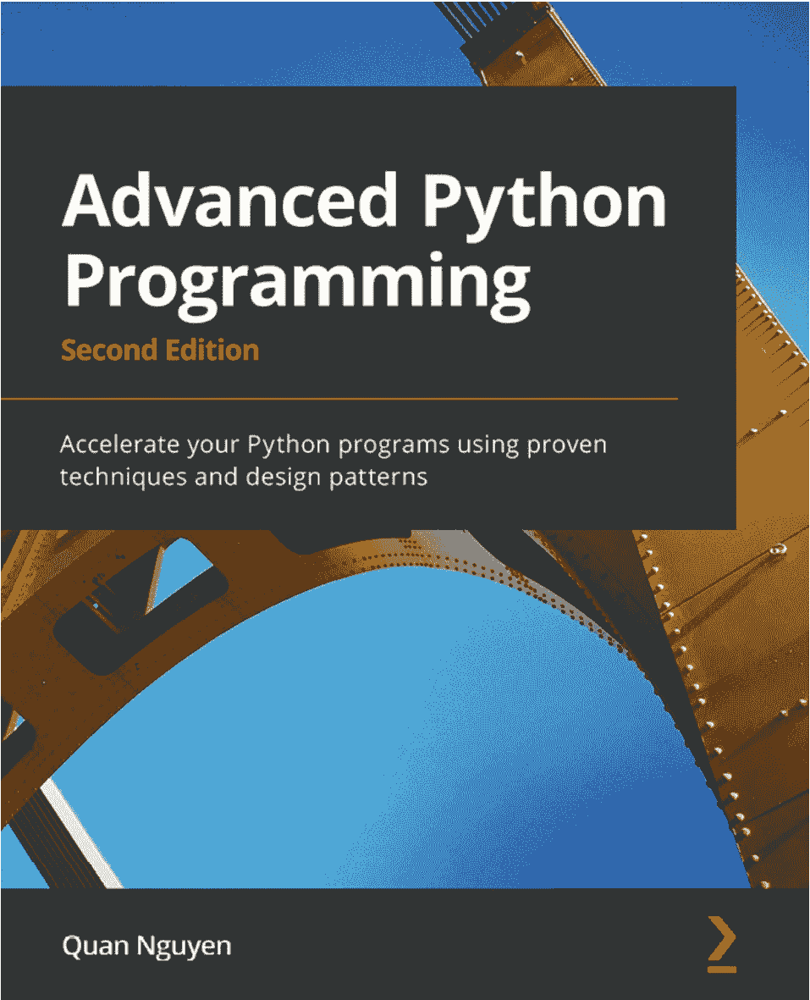

### 高级Python编程

第二版

使用经过验证的技术和设计模式加速您的Python程序

Quan Nguyen

### 高级Python编程 - 第二版

Quan Nguyen

ISBN: 978-1-80181-401-0

- 使用NumPy、pandas和Xarray编写高效的数值代码
- 使用Cython和Numba实现原生性能
- 使用分析器查找Python代码中的瓶颈
- 使用JAX优化您的机器学习模型
- 实现多线程、多进程和异步程序
- 解决并发编程中的常见问题，例如死锁
- 使用设计模式应对架构挑战

# Python 实战项目

打造你的 Python 作品集，开发可部署的应用程序

STEVEN F. LOTT

ISBN: 978-1-80324-676-5

-   探索应用程序的核心交付物，包括文档和测试用例
-   了解数据获取的方法，例如文件处理、RESTful API 和 SQL 查询
-   创建数据检查笔记本，以确定源数据的属性
-   编写应用程序来验证、清洗、转换和规范化源数据
-   使用基础的图形分析技术来可视化数据
-   构建基础的单变量和多变量统计分析工具
-   使用 JupyterLab 的发布工具从原始数据创建报告

## Packt 正在寻找像你一样的作者

如果你有兴趣成为 Packt 的作者，请访问 [authors.packtpub.com](http://authors.packtpub.com) 并立即申请。我们已经与成千上万像你一样的开发者和技术专家合作，帮助他们与全球技术社区分享他们的见解。你可以提交通用申请，申请我们正在招募作者的特定热门主题，或者提交你自己的想法。

## 分享你的想法

现在你已经完成了《Python 应用计算思维（第二版）》，我们很想听听你的想法！如果你是从亚马逊购买的这本书，请 [点击此处直接前往亚马逊的本书评论页面](https://www.amazon.com) 分享你的反馈，或者在你购买本书的网站上留下评论。

你的评论对我们和技术社区都很重要，它将帮助我们确保提供高质量的内容。

## 下载本书的免费 PDF 副本

感谢你购买本书！

你喜欢随时随地阅读，但无法随身携带纸质书吗？

你购买的电子书与你选择的设备不兼容吗？

别担心，现在每本 Packt 图书都附赠一本无 DRM 限制的免费 PDF 版本。

随时随地，在任何设备上阅读。从你喜爱的技术书籍中搜索、复制和粘贴代码，直接用于你的应用程序。

好处还不止于此，你还可以独家享受每日发送到你收件箱的折扣、新闻通讯和精彩的免费内容。

按照以下简单步骤获取福利：

1.  扫描二维码或访问下面的链接

[https://packt.link/free-ebook/9781837632305](https://packt.link/free-ebook/9781837632305)

2.  提交你的购买凭证

3.  就这样！我们将直接把你的免费 PDF 和其他福利发送到你的邮箱

# Python 应用计算思维

复杂现实问题的算法设计

SOFÍA DE JESÚS | DAYRENE MARTINEZ