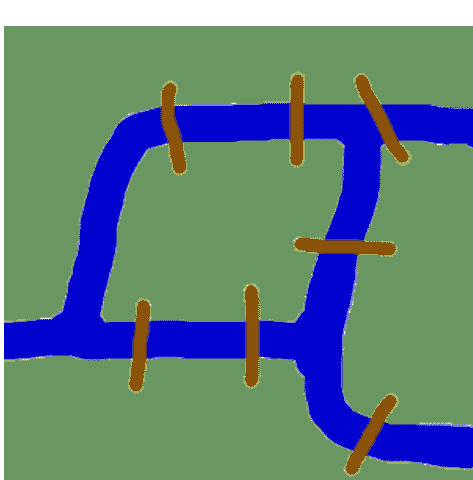
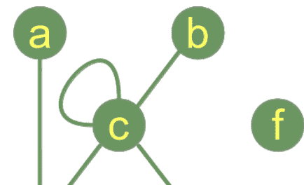
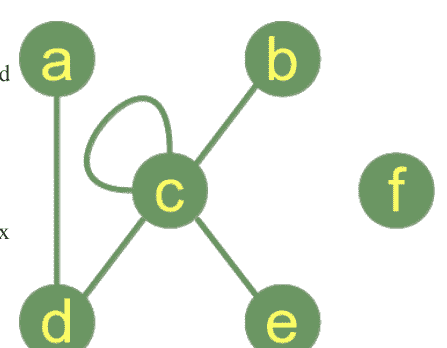
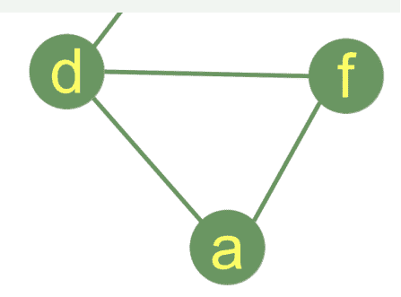
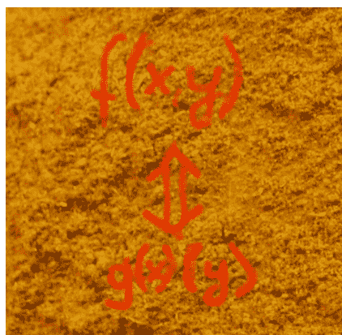
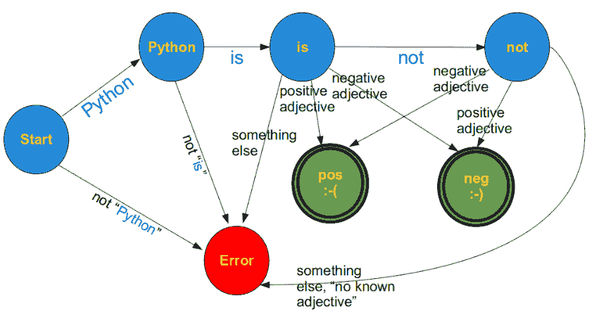
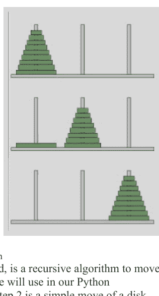
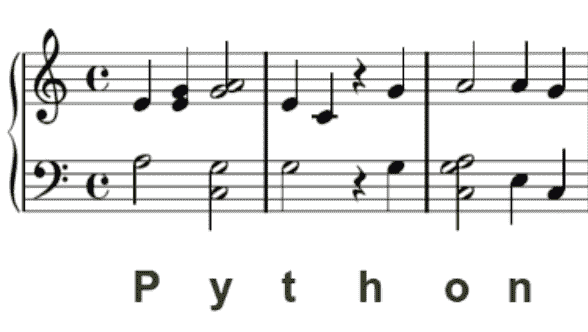

# 应用Python

作者
Bernd Klein


bodenseo

© 2021 Bernd Klein

版权所有。未经版权所有者书面许可，不得以任何方式复制或使用本书的任何部分。

更多信息，请联系：[bernd.klein@python-course.eu](mailto:bernd.klein@python-course.eu)

www.python-course.eu

## Python课程 应用Python编程 作者：Bernd Klein

- os模块 .............................................................................................................5
- 有限状态机（FSM） ....................................................................................34
- 图灵机 ........................................................................................................39
- 图灵机的形式化定义....................................................................40
- Python中的图灵机实现 ........................................................41
- 汉诺塔 ........................................................................................................58
- 猜数字游戏（Mastermind / Bulls and Cows） ..................................................................................65
- Python与JSON........................................................................................................73

## PYTHON与SHELL

### SHELL

Shell是一个经常被使用但也常被误解的术语。就像蛋壳（无论是鸡蛋还是蟒蛇蛋）或贝壳一样，计算机科学中的shell通常被视为一个软件，它为用户提供与其他软件或操作系统交互的接口。因此，shell可以是操作系统与其内核服务之间的接口。但网页浏览器或作为电子邮件客户端的程序也可以被视为shell。


理解了这一点，很明显shell可以是：

- 命令行界面（CLI）或
- 图形用户界面（GUI）

但在大多数情况下，shell一词被用作命令行界面（CLI）的同义词。在Linux和Unix下最著名且最常用的shell是Bourne-Shell、C-Shell或Bash shell。Bourne shell（sh）是仿照Multics shell设计的，是第一个Unix shell。大多数操作系统shell都可以在交互模式和批处理模式下使用。

### 系统编程与Python

系统编程（也称为系统软件编程）指的是为系统组件或系统软件进行编程的活动。系统编程为计算机硬件提供软件或服务，而应用程序编程则为用户提供工具或服务的软件。

“以系统为中心的编程”充当应用程序（即Python脚本或程序）与操作系统（例如Linux或Microsoft Windows）之间的抽象层。通过这样的抽象层，即使访问操作系统特定功能，也可以在Python中实现平台无关的应用程序。Python提供了各种与操作系统交互的模块，例如：

- os
- platform
- subprocess
- shutils
- glob
- sys

因此，Python非常适合系统编程，甚至是平台无关的系统编程。顺便说一句，这也是为什么Python被许多人错误地认为是脚本语言的原因之一。正确的说法是：Python是一种功能齐全的编程语言，可以轻松用作脚本语言。Python的一般优势在以系统为中心的编程中同样适用：

- 简单清晰
- 结构良好
- 高度灵活

## OS模块

os模块是与操作系统交互最重要的模块。os模块通过提供抽象方法，允许进行平台无关的编程。尽管如此，也可以使用`system()`和`exec()`函数族来包含与系统无关的程序部分。（注：`exec()`函数在我们的章节“Python中的Fork与Forking”中有详细介绍。）os模块提供了多种方法，例如访问文件系统。

平台无关的应用程序通常需要知道程序或脚本运行在哪个平台上。`os`模块提供了`os.name`命令，非常适合此目的：

```python
import os

print(os.name)

posix
```

输出当然取决于你运行的操作系统。从Python 3.8版本开始，注册了以下名称：`posix`、`nt`、`java`。

这些名称定义了以下操作系统：

- **posix**：类Unix操作系统，如Unix、Linux、BSD、Minix等。
- **nt**：Windows系统，如“Windows 10”、“Windows 8.1”、“Windows 8”、“Windows 7”等。
- **java**：Java操作系统。

大多数处理操作系统的Python脚本需要知道在文件系统中的位置。函数`os.getcwd()`返回一个表示当前工作目录的Unicode字符串。

```python
print(os.getcwd())

/home/bernd/Dropbox (Bodenseo)/notebooks/advanced_topics
```

你还需要在文件系统中移动的能力。为此，`os`模块提供了`chdir`函数。它有一个参数`path`，指定为字符串。调用时，它会将当前工作目录更改为指定的路径。

```python
os.chdir("/home/bernd/dropbox/websites/python-course.eu/cities")
print(os.getcwd())

/home/bernd/Dropbox (Bodenseo)/websites/python-course.eu/cities
```

到达所需目录后，你可能想要获取其内容。函数`listdir`返回一个包含该目录中文件名的列表。

```python
print(os.listdir())

['Freiburg.png', 'Stuttgart.png', 'Hamburg.png', 'Berlin.png', 'Basel.png', 'Nürnberg.png', 'Erlangen.png', 'index.html', 'Ulm.png', 'Singen.png', 'Bremen.png', 'Kassel.png', 'Frankfurt.png', 'Saarbrücken.png', 'Zürich.png', 'Konstanz.png', 'Hannover.png']
```

### 使用OS.SYSTEM()执行Shell脚本

在Python中，无法在不按回车键的情况下读取单个字符。另一方面，在Bash shell中这非常容易。Bash命令`read -n 1`等待输入一个键（任意键）。如果你导入os，使用`os.system()`和Bash shell可以轻松编写一个提供`getch()`的脚本。`getch()`只等待输入一个字符，无需回车：

```python
import os
def getch():
    os.system("bash -c \"read -n 1\"")

getch()
```

上面的脚本仅在Linux下有效。在Windows下，你需要导入模块`msvcrt`。原则上，我们只需要从该模块导入`getch()`。所以这是该问题的Windows解决方案：

```python
from msvcrt import getch
```

以下脚本实现了一个平台无关的解决方案：

```python
import os, platform
if platform.system() == "Windows":
    import msvcrt
def getch():
    if platform.system() == "Linux":
        os.system('bash -c "read -n 1"')
    else:
        msvcrt.getch()

print("Type a key!")
getch()
print("Okay")
```

Type a key!
Okay

前面的脚本存在一个问题。如果你想知道按下了哪个键，就不能使用`getch()`函数，因为`os.system()`不会返回调用的shell命令的结果。

我们在下面的脚本中展示如何使用`os.popen()`执行shell脚本并将这些脚本的输出返回到Python中：

```python
import os
dir = os.popen("ls").readlines()

print(dir)

['Basel.png\n', 'Berlin.png\n', 'Bremen.png\n', 'Erlangen.png\n', 'Frankfurt.png\n', 'Freiburg.png\n', 'Hamburg.png\n', 'Hannover.png\n', 'index.html\n', 'Kassel.png\n', 'Konstanz.png\n', 'Nürnberg.png\n', 'Saarbrücken.png\n', 'Singen.png\n', 'Stuttgart.png\n', 'Ulm.png\n', 'Zürich.png\n']
```

shell脚本的输出可以逐行读取，如下例所示：

```python
import os

command = " "
while (command != "exit"):
    command = input("Command: ")
    handle = os.popen(command)
    line = " "
    while line:
        line = handle.read()
        print(line)
    handle.close()

print("Ciao that's it!")
```

Basel.png
Berlin.png
Bremen.png
Erlangen.png
Frankfurt.png
Freiburg.png
Hamburg.png
Hannover.png
index.html
Kassel.png
Konstanz.png
Nürnberg.png
Saarbrücken.png
Singen.png
Stuttgart.png
Ulm.png
Zürich.png

Ciao，就是这样！

#### 子进程模块

子进程模块自 Python 2.4 起可用。可以使用 `subprocess` 模块创建生成进程，连接到它们的输入、输出和错误管道，并获取它们的返回码。创建 `subprocess` 模块是为了替代其他各种模块：

-   os.system
-   os.spawn*
-   os.popen*
-   popen2.*
-   commands.*

#### 使用子进程模块

与其使用 `os` 模块的 `system` 方法

```
os.system('Konstanz.png')
```

输出：32256

我们可以使用 `subprocess` 模块的 `Popen()` 命令。通过使用 `Popen()`，我们能够获取脚本的输出：

```
import subprocess
x = subprocess.Popen(['touch', 'xyz'])
print(x)
print(x.poll())
print(x.returncode)
```

输出：

```
<subprocess.Popen object at 0x7f92c5319290>
None
None
```

Shell 命令 `cp -r xyz abc` 可以通过以下方式使用 `subprocess` 模块的 `Popen()` 方法从 Python 发送到 shell：

```
p = subprocess.Popen(['cp','-r', "Zürich.png", "Zurich.png"])
```

无需转义 Shell 元字符，如 `$`、`>` 等。如果你想模拟 `os.system` 的行为，则必须将可选参数 `shell` 设置为 `True`，并且必须使用字符串而不是列表：

```
p = subprocess.Popen("cp -r xyz abc", shell=True)
```

正如我们上面提到的，也可以将 shell 命令或 shell 脚本的输出捕获到 Python 中。为此，我们必须将 `Popen()` 的可选参数 `stdout` 设置为 `subprocess.PIPE`：

```
process = subprocess.Popen(['ls','-l'], stdout=subprocess.PIPE)
directory_content = process.stdout.readlines()
print(directory_content)
```

输出：

```
[b'total 0\n', b'-rw-r--r-- 1 bernd bernd 0 Jan 23 08:32 abc\n', b'-rw-r--r-- 1 bernd bernd 0 Jan 23 08:07 Basel.png\n', b'-rw-r--r-- 1 bernd bernd 0 Jan 23 08:07 Berlin.png\n', b'-rw-r--r-- 1 bernd bernd 0 Jan 23 08:07 Bremen.png\n', b'-rw-r--r-- 1 bernd bernd 0 Jan 23 08:07 Erlangen.png\n', b'-rw-r--r-- 1 bernd bernd 0 Jan 23 08:07 Frankfurt.png\n', b'-rw-r--r-- 1 bernd bernd 0 Jan 23 08:07 Freiburg.png\n', b'-rw-r--r-- 1 bernd bernd 0 Jan 23 08:07 Hamburg.png\n', b'-rw-r--r-- 1 bernd bernd 0 Jan 23 08:07 Hannover.png\n', b'-rw-r--r-- 1 bernd bernd 0 Jan 23 08:05 index.html\n', b'-rw-r--r-- 1 bernd bernd 0 Jan 23 08:07 Kassel.png\n', b'-rw-r--r-- 1 bernd bernd 0 Jan 23 08:07 Konstanz.png\n', b'-rw-r--r-- 1 bernd bernd 0 Jan 23 08:07 N\xc3\xbcrnberg.png\n', b'-rw-r--r-- 1 bernd bernd 0 Jan 23 08:07 Saarbr\xc3\xbcken.png\n', b'-rw-r--r-- 1 bernd bernd 0 Jan 23 08:07 Singen.png\n', b'-rw-r--r-- 1 bernd bernd 0 Jan 23 08:07 Stuttgart.png\n', b'-rw-r--r-- 1 bernd bernd 0 Jan 23 08:07 Ulm.png\n', b'-rw-r--r-- 1 bernd bernd 0 Jan 23 08:28 xyz\n', b'-rw-r--r-- 1 bernd bernd 0 Jan 23 08:29 Zurich.png\n', b'-rw-r--r-- 1 bernd bernd 0 Jan 23 08:07 Z\xc3\xbcrich.png\n']
```

`b` 表示你拥有的是字节，这是一个二进制字节序列，而不是 Unicode 字符串。子进程输出的是字节，而不是字符。我们可以使用以下[列表推导式](https://www.pythonforbeginners.com/basics/list-comprehensions-in-python)将其转换为 unicode 字符串：

```
directory_content = [el.decode() for el in directory_content]
print(directory_content)
```

输出：

```
['total 0\n', '-rw-r--r-- 1 bernd bernd 0 Jan 23 08:32 abc\n', '-rw-r--r-- 1 bernd bernd 0 Jan 23 08:07 Basel.png\n', '-rw-r--r-- 1 bernd bernd 0 Jan 23 08:07 Berlin.png\n', '-rw-r--r-- 1 bernd bernd 0 Jan 23 08:07 Bremen.png\n', '-rw-r--r-- 1 bernd bernd 0 Jan 23 08:07 Erlangen.png\n', '-rw-r--r-- 1 bernd bernd 0 Jan 23 08:07 Frankfurt.png\n', '-rw-r--r-- 1 bernd bernd 0 Jan 23 08:07 Freiburg.png\n', '-rw-r--r-- 1 bernd bernd 0 Jan 23 08:07 Hamburg.png\n', '-rw-r--r-- 1 bernd bernd 0 Jan 23 08:07 Hannover.png\n', '-rw-r--r-- 1 bernd bernd 0 Jan 23 08:05 index.html\n', '-rw-r--r-- 1 bernd bernd 0 Jan 23 08:07 Kassel.png\n', '-rw-r--r-- 1 bernd bernd 0 Jan 23 08:07 Konstanz.png\n', '-rw-r--r-- 1 bernd bernd 0 Jan 23 08:07 Nürnberg.png\n', '-rw-r--r-- 1 bernd bernd 0 Jan 23 08:07 Saarbrücken.png\n', '-rw-r--r-- 1 bernd bernd 0 Jan 23 08:07 Singen.png\n', '-rw-r--r-- 1 bernd bernd 0 Jan 23 08:07 Stuttgart.png\n', '-rw-r--r-- 1 bernd bernd 0 Jan 23 08:07 Ulm.png\n', '-rw-r--r-- 1 bernd bernd 0 Jan 23 08:28 xyz\n', '-rw-r--r-- 1 bernd bernd 0 Jan 23 08:29 Zurich.png\n', '-rw-r--r-- 1 bernd bernd 0 Jan 23 08:07 Zürich.png\n']
```

#### 操作路径、文件和目录的函数

| 函数 | 描述 |
| :--- | :--- |
| getcwd() | 返回一个包含当前工作目录路径的字符串 |
| chdir(path) | 将当前工作目录更改为 `path`。Windows 下的示例：<br>python<br>>>> os.chdir("c:\Windows")<br>>>> os.getcwd()<br>'c:\Windows'<br><br>Linux 下的类似示例：<br>python<br>>>> import os<br>>>> os.getcwd()<br>'/home/homer'<br>>>> os.chdir("/home/lisa")<br>>>> os.getcwd()<br>'/home/lisa'<br>>>> |
| getcwdu() | 类似于 `getcwd()`，但输出为 unicode |
| listdir(path) | 一个包含由 `path` 定义的目录内容的列表，即子目录和文件名。<br>python<br>>>> os.listdir("/home/homer")<br>['.gnome2', '.pulse', '.gconf', '.gconfd', '.beagle', '.gnome2_private', '.gksu.lock', 'Public', '.ICEauthority', '.bash_history', '.compiz', '.gvfs', '.update-notifier', '.cache', 'Desktop', 'Videos', '.profile', '.config', '.esd_auth', '.viminfo', '.sudo_as_admin_successful', 'mbox', '.xsession-errors', '.bashrc', 'Music', '.dbus', '.local', '.gstreamer-0.10', 'Documents', '.gtk-bookmarks', 'Downloads', 'Pictures', '.pulse-cookie', '.nautilus', 'examples.desktop', 'Templates', '.bash_logout']<br>>>> |
| mkdir(path[, mode=0755]) | 创建一个名为 `path` 的目录，其数字模式为 `mode`（如果它尚不存在）。默认模式是 0777（八进制）。在某些系统上，`mode` 会被忽略。如果使用它，当前的 umask 值会首先被屏蔽掉。如果目录已存在，则会引发 `OSError`。如果父目录不存在，则不会创建它们。 |
| makedirs(name[, mode=511]) | 递归目录创建函数。类似于 `mkdir()`，但会创建包含叶目录所需的所有中间级目录。如果叶目录已存在或无法创建，则会引发错误异常。 |
| rename(old, new) | 将文件或目录 `old` 重命名为 `new`。如果 `new` 是一个目录，将引发错误。在 Unix 和 Linux 上，如果 `new` 存在且是一个文件，并且用户有权限这样做，它将被静默替换。 |
| renames(old, new) | 工作方式类似于 `rename()`，不同之处在于它会递归创建使 `new` 路径名所需的任何中间目录。 |
| rmdir(path) | 移除（删除）目录 `path`。`rmdir()` 仅在目录 `path` 为空时有效，否则会引发错误。要删除整个目录树，可以使用 `shutil.rmtree()`。 |

更多操作文件和目录的函数和方法可以在 `shutil` 模块中找到。除了其他可能性外，它还提供了使用 `shutil.copyfile(src,dst)` 复制文件和目录的可能性。

#### Python 中的图

##### 图论的起源

在我们开始 Python 中图的实际实现之前，在我们开始介绍处理图的 Python 模块之前，我们想探讨一下图论的起源。

起源将我们带回到 18 世纪的柯尼斯堡。柯尼斯堡当时是普鲁士的一座城市。普雷格尔河穿城而过，形成了两个岛屿。城市和岛屿由七座桥连接，如图所示。城市的居民被这样一个问题所困扰：是否可能在城镇中散步，访问城镇的每个区域，并且只穿过每座桥一次？每座桥都必须完全穿过，即不允许走到桥的一半然后转身，稍后从另一边穿过另一半。散步不需要从同一个地方开始和结束。莱昂哈德·欧拉在 1735 年通过证明这是不可能的解决了这个问题。

他发现，在每个陆地区域内选择路线是无关紧要的，唯一重要的是穿过桥梁的顺序（或序列）。他提出了问题的抽象，消除了不必要的事实，专注于陆地区域和连接它们的桥梁。这样，他奠定了图论的基础。如果我们把“陆地区域”看作一个顶点，把每座桥看作一条边，我们就把问题“简化”成了一个图。



##### 使用 Python 介绍图论

在我们开始讨论图的可能 Python 表示之前，我们想介绍一些关于图及其组成部分的一般定义。

数学和计算机科学中的“图”^1 由“节点”组成，也称为“顶点”。节点之间可能连接也可能不连接。在我们的插图中——这是图的图形表示，

-   节点“a”与节点“c”连接，但“a”与“b”不连接。两个节点之间的连接线称为边。如果节点之间的边是无向的，则该图称为无向图。如果一条边从一个顶点（节点）指向另一个顶点，则该图是

Python函数用于计算给定图的孤立节点：

```python
def find_isolated_nodes(graph):
    """ returns a set of isolated nodes. """
    isolated = set()
    for node in graph:
        if not graph[node]:
            isolated.add(node)
    return isolated
```

如果我们用这个函数处理我们的图，将返回一个包含"f"的列表：["f"]

#### 图作为Python类

在继续编写图的函数之前，我们先尝试实现一个Python图类。

如果你查看下面的类清单，你会看到在**init**方法中，我们使用了一个字典`self._graph_dict`来存储顶点及其对应的相邻顶点。



```python
""" A Python Class
A simple Python graph class, demonstrating the essential
facts and functionalities of graphs.
"""

class Graph(object):
    def __init__(self, graph_dict=None):
        """ initializes a graph object
            If no dictionary or None is given,
            an empty dictionary will be used
        """
        if graph_dict == None:
            graph_dict = {}
        self._graph_dict = graph_dict
```

```python
def edges(self, vertice):
    """ returns a list of all the edges of a vertice"""
    return self._graph_dict[vertice]

def all_vertices(self):
    """ returns the vertices of a graph as a set """
    return set(self._graph_dict.keys())

def all_edges(self):
    """ returns the edges of a graph """
    return self.__generate_edges()

def add_vertex(self, vertex):
    """ If the vertex "vertex" is not in
        self._graph_dict, a key "vertex" with an empty
        list as a value is added to the dictionary.
        Otherwise nothing has to be done.
    """
    if vertex not in self._graph_dict:
        self._graph_dict[vertex] = []

def add_edge(self, edge):
    """ assumes that edge is of type set, tuple or list;
        between two vertices can be multiple edges!
    """
    edge = set(edge)
    vertex1, vertex2 = tuple(edge)
    for x, y in [(vertex1, vertex2), (vertex2, vertex1)]:
        if x in self._graph_dict:
            self._graph_dict[x].add(y)
        else:
            self._graph_dict[x] = [y]

def __generate_edges(self):
    """ A static method generating the edges of the
        graph "graph". Edges are represented as sets
        with one (a loop back to the vertex) or two
        vertices
    """
    edges = []
    for vertex in self._graph_dict:
        for neighbour in self._graph_dict[vertex]:
            if {neighbour, vertex} not in edges:
                edges.append({vertex, neighbour})
    return edges
```

```python
def __iter__(self):
    self._iter_obj = iter(self._graph_dict)
    return self._iter_obj

def __next__(self):
    """ allows us to iterate over the vertices """
    return next(self._iter_obj)

def __str__(self):
    res = "vertices: "
    for k in self._graph_dict:
        res += str(k) + " "
    res += "\nedges: "
    for edge in self.__generate_edges():
        res += str(edge) + " "
    return res
```

我们想对我们的图进行一些操作。我们从遍历图开始。遍历意味着遍历顶点。

```python
g = { "a" : {"d"},
      "b" : {"c"},
      "c" : {"b", "c", "d", "e"},
      "d" : {"a", "c"},
      "e" : {"c"},
      "f" : {}
    }

graph = Graph(g)

for vertice in graph:
    print(f"Edges of vertice {vertice}: ", graph.edges(vertice))
```

Edges of vertice a: {'d'}
Edges of vertice b: {'c'}
Edges of vertice c: {'c', 'd', 'b', 'e'}
Edges of vertice d: {'c', 'a'}
Edges of vertice e: {'c'}
Edges of vertice f: {}

```python
graph.add_edge({"ab", "fg"})
graph.add_edge({"xyz", "bla"})
```

```python
print("")
print("Vertices of graph:")
print(graph.all_vertices())

print("Edges of graph:")
print(graph.all_edges())
```

Vertices of graph:
{'d', 'b', 'e', 'f', 'fg', 'c', 'bla', 'xyz', 'ab', 'a'}
Edges of graph:
[{'d', 'a'}, {'c', 'b'}, {'c'}, {'c', 'd'}, {'c', 'e'}, {'ab', 'fg'}, {'bla', 'xyz'}]

让我们计算图中所有顶点和所有边的列表：

```python
print("")
print("Vertices of graph:")
print(graph.all_vertices())

print("Edges of graph:")
print(graph.all_edges())
```

Vertices of graph:
{'d', 'b', 'e', 'f', 'fg', 'c', 'bla', 'xyz', 'ab', 'a'}
Edges of graph:
[{'d', 'a'}, {'c', 'b'}, {'c'}, {'c', 'd'}, {'c', 'e'}, {'ab', 'fg'}, {'bla', 'xyz'}]

我们向图中添加一个顶点和一条边：

```python
print("Add vertex:")
graph.add_vertex("z")

print("Add an edge:")
graph.add_edge({"a", "d"})

print("Vertices of graph:")
print(graph.all_vertices())

print("Edges of graph:")
print(graph.all_edges())
```

Add vertex:
Add an edge:
Vertices of graph:
{'d', 'b', 'e', 'f', 'fg', 'z', 'c', 'bla', 'xyz', 'ab', 'a'}
Edges of graph:
[{'d', 'a'}, {'c', 'b'}, {'c'}, {'c', 'd'}, {'c', 'e'}, {'ab', 'fg'}, {'bla', 'xyz'}]

```python
print('Adding an edge {"x","y"} with new vertices:')
graph.add_edge({"x","y"})
print("Vertices of graph:")
print(graph.all_vertices())
print("Edges of graph:")
print(graph.all_edges())
```

Adding an edge {"x","y"} with new vertices:
Vertices of graph:
{'d', 'b', 'e', 'f', 'fg', 'z', 'x', 'c', 'bla', 'xyz', 'ab', 'y', 'a'}
Edges of graph:
[{'d', 'a'}, {'c', 'b'}, {'c'}, {'c', 'd'}, {'c', 'e'}, {'ab', 'fg'}, {'bla', 'xyz'}, {'x', 'y'}]

#### 图中的路径

我们现在想找到从一个节点到另一个节点的最短路径。在讨论这个问题的Python代码之前，我们需要先介绍一些形式化定义。

**相邻顶点：**
当两个顶点都与同一条边相关联时，它们被称为相邻顶点。

**无向图中的路径：**
无向图中的路径是一个顶点序列 P = ( v1, v2, ..., vn ) ∈ V x V x ... x V，其中对于 1 ≤ i < n，vi 与 v_{i+1} 相邻。这样的路径 P 被称为从 v1 到 vn 的长度为 n 的路径。

**简单路径：**
没有重复顶点的路径被称为简单路径。

示例：
(a, c, e) 是我们图中的一条简单路径，(a,c,e,b) 也是。 (a,c,e,b,c,d) 是一条路径但不是简单路径，因为节点 c 出现了两次。

我们向 `Graph` 类添加一个 `find_path` 方法。它尝试找到从起始顶点到结束顶点的路径。我们还添加了一个 `find_all_paths` 方法，用于找到从起始顶点到结束顶点的所有路径：

```python
""" A Python Class
A simple Python graph class, demonstrating the essential
facts and functionalities of graphs.
"""

class Graph(object):

    def __init__(self, graph_dict=None):
        """ initializes a graph object
            If no dictionary or None is given,
            an empty dictionary will be used
        """
        if graph_dict == None:
            graph_dict = {}
        self._graph_dict = graph_dict

    def edges(self, vertice):
        """ returns a list of all the edges of a vertice"""
        return self._graph_dict[vertice]

    def all_vertices(self):
        """ returns the vertices of a graph as a set """
        return set(self._graph_dict.keys())

    def all_edges(self):
        """ returns the edges of a graph """
        return self.__generate_edges()

    def add_vertex(self, vertex):
        """ If the vertex "vertex" is not in
            self._graph_dict, a key "vertex" with an empty
            list as a value is added to the dictionary.
            Otherwise nothing has to be done.
        """
        if vertex not in self._graph_dict:
            self._graph_dict[vertex] = []

    def add_edge(self, edge):
        """ assumes that edge is of type set, tuple or list;
            between two vertices can be multiple edges!
        """
        edge = set(edge)
        vertex1, vertex2 = tuple(edge)
        for x, y in [(vertex1, vertex2), (vertex2, vertex1)]:
            if x in self._graph_dict:
                self._graph_dict[x].append(y)
            else:
                self._graph_dict[x] = [y]

    def __generate_edges(self):
        """ A static method generating the edges of the
            graph "graph". Edges are represented as sets
            with one (a loop back to the vertex) or two
            vertices
        """
        edges = []
        for vertex in self._graph_dict:
            for neighbour in self._graph_dict[vertex]:
                if {neighbour, vertex} not in edges:
                    edges.append({vertex, neighbour})
        return edges

    def __iter__(self):
        self._iter_obj = iter(self._graph_dict)
        return self._iter_obj

    def __next__(self):
        """ allows us to iterate over the vertices """
        return next(self._iter_obj)

    def __str__(self):
        res = "vertices: "
        for k in self._graph_dict:
            res += str(k) + " "
        res += "\nedges: "
        for edge in self.__generate_edges():
            res += str(edge) + " "
        return res

    def find_path(self, start_vertex, end_vertex, path=None):
        """ find a path from start_vertex to end_vertex
            in graph """
        if path == None:
            path = []
```

graph = self._graph_dict
path = path + [start_vertex]
if start_vertex == end_vertex:
    return path
if start_vertex not in graph:
    return None
for vertex in graph[start_vertex]:
    if vertex not in path:
        extended_path = self.find_path(vertex,
                                      end_vertex,
                                      path)
        if extended_path:
            return extended_path
return None

def find_all_paths(self, start_vertex, end_vertex, path=[]):
    """ find all paths from start_vertex to
        end_vertex in graph """
    graph = self._graph_dict
    path = path + [start_vertex]
    if start_vertex == end_vertex:
        return [path]
    if start_vertex not in graph:
        return []
    paths = []
    for vertex in graph[start_vertex]:
        if vertex not in path:
            extended_paths = self.find_all_paths(vertex,
                                                end_vertex,
                                                path)
            for p in extended_paths:
                paths.append(p)
    return paths

我们接下来检查 `find_path` 和 `find_all_paths` 方法的工作方式。

g = { "a" : {"d"},
      "b" : {"c"},
      "c" : {"b", "c", "d", "e"},
      "d" : {"a", "c"},
      "e" : {"c"},
      "f" : {}
    }

graph = Graph(g)

print("Vertices of graph:")
print(graph.all_vertices())

print("Edges of graph:")
print(graph.all_edges())

print('The path from vertex "a" to vertex "b":')
path = graph.find_path("a", "b")
print(path)

print('The path from vertex "a" to vertex "f":')
path = graph.find_path("a", "f")
print(path)

print('The path from vertex "c" to vertex "c":')
path = graph.find_path("c", "c")
print(path)

Vertices of graph:
{'d', 'b', 'e', 'f', 'c', 'a'}
Edges of graph:
[{'d', 'a'}, {'c', 'b'}, {'c'}, {'c', 'd'}, {'c', 'e'}]
The path from vertex "a" to vertex "b":
['a', 'd', 'c', 'b']
The path from vertex "a" to vertex "f":
None
The path from vertex "c" to vertex "c":
['c']

我们通过添加从 "a" 到 "f" 以及从 "f" 到 "d" 的边，稍微修改了示例图，以测试 `find_all_paths` 方法：

g = { "a" : {"d", "f"},
    "b" : {"c"},
    "c" : {"b", "c", "d", "e"},
    "d" : {"a", "c", "f"},
    "e" : {"c"},
    "f" : {"a", "d"}
}

graph = Graph(g)
print("Vertices of graph:")
print(graph.all_vertices())

print("Edges of graph:")
print(graph.all_edges())

print('All paths from vertex "a" to vertex "b":')
path = graph.find_all_paths("a", "b")
print(path)

print('All paths from vertex "a" to vertex "f":')
path = graph.find_all_paths("a", "f")
print(path)

print('All paths from vertex "c" to vertex "c":')
path = graph.find_all_paths("c", "c")
print(path)

Vertices of graph:
{'d', 'b', 'e', 'f', 'c', 'a'}
Edges of graph:
[{'d', 'a'}, {'f', 'a'}, {'c', 'b'}, {'c'}, {'c', 'd'}, {'c', 'e'}, {'d', 'f'}]
All paths from vertex "a" to vertex "b":
[['a', 'd', 'c', 'b'], ['a', 'f', 'd', 'c', 'b']]
All paths from vertex "a" to vertex "f":
[['a', 'd', 'f'], ['a', 'f']]
All paths from vertex "c" to vertex "c":
[['c']]

#### 度与度序列

图中顶点 v 的**度**是连接它的边的数量，其中环被计算两次。顶点 v 的度记为 deg(v)。图 G 的最大度记为 Δ(G)，最小度记为 δ(G)，分别是其顶点的最大度和最小度。



在右侧的图中，最大度是顶点 c 的 5，最小度是 0，即孤立顶点 f。

如果图中所有顶点的度都相同，则该图是正则图。

在正则图中，所有度都相同，因此我们可以谈论图的度。

度数和公式（握手引理）：

Σv ∈ vdeg(v) = 2 |E|

这意味着所有顶点的度数之和等于边数乘以 2。我们可以得出结论，具有奇数度的顶点数量必须是偶数。这个陈述被称为握手引理。"握手引理"这个名字源于一个流行的数学问题：在任何一群人中，与群体中奇数个人握手的人数是偶数。

无向图的**度序列**定义为其顶点度数的非递增序列。以下方法返回一个包含实例图度序列的元组：

我们现在将设计一个新的类 `Graph2`，它继承自我们之前定义的图 `Graph`，并为其添加以下方法：

- `vertex_degree`
- `find_isolated_vertices`
- `delta`
- `degree_sequence`

class Graph2(Graph) :

def vertex_degree(self, vertex):
    """ The degree of a vertex is the number of edges connecting
    it, i.e. the number of adjacent vertices. Loops are counted
    double, i.e. every occurence of vertex in the list
    of adjacent vertices. """
    degree = len(self._graph_dict[vertex])
    if vertex in self._graph_dict[vertex]:
        degree += 1
    return degree

def find_isolated_vertices(self):
    """ returns a list of isolated vertices. """
    graph = self._graph_dict
    isolated = []
    for vertex in graph:
        print(isolated, vertex)
        if not graph[vertex]:
            isolated += [vertex]
    return isolated

def Delta(self):
    """ the maximum degree of the vertices """
    max = 0
    for vertex in self._graph_dict:
        vertex_degree = self.vertex_degree(vertex)
        if vertex_degree > max:
            max = vertex_degree
    return max

def degree_sequence(self):
    """ calculates the degree sequence """
    seq = []
    for vertex in self._graph_dict:
        seq.append(self.vertex_degree(vertex))
    seq.sort(reverse=True)
    return tuple(seq)

g = { "a" : {"d", "f"},
      "b" : {"c"},
      "c" : {"b", "c", "d", "e"},
      "d" : {"a", "c"},
      "e" : {"c"},
      "f" : {"d"}
}

graph = Graph2(g)
graph.degree_sequence()

输出: (5, 2, 2, 1, 1, 1)

让我们看看另一个图：

g = { "a" : {"d", "f"},
     "b" : {"c"},
     "c" : {"b", "c", "d", "e"},
     "d" : {"a", "c", "f"},
     "e" : {"c"},
     "f" : {"a", "d"}
}

graph = Graph2(g)
graph.degree_sequence()

输出: (5, 3, 2, 2, 1, 1)



#### 柯里化

##### 基本思想

在数学和计算机科学中，柯里化是一种将接受多个参数的函数的求值分解为一系列单参数函数求值的技术。柯里化也用于理论计算机科学，因为它通常更容易将多参数模型转换为单参数模型。



##### 函数的组合

我们定义两个函数 f 和 g 的组合 h

$h(x) = g(f(x))$

在下面的 Python 示例中。

两个函数的组合是一个链式过程，其中内部函数的输出成为外部函数的输入。

def compose(g, f):
    def h(x):
        return g(f(x))
    return h

我们将在下一个示例中使用我们的 compose 函数。假设我们有一个温度计，它工作不准确。正确的温度可以通过对温度值应用 readjust 函数来计算。让我们进一步假设我们需要将温度值从摄氏度转换为华氏度。我们可以通过对两个函数应用 compose 来实现：

def celsius2fahrenheit(t):
    return 1.8 * t + 32

def readjust(t):
    return 0.9 * t - 0.5

convert = compose(readjust, celsius2fahrenheit)

print(convert(10), celsius2fahrenheit(10))

44.5 50.0

两个函数的组合通常不是可交换的，即 compose(celsius2fahrenheit, readjust) 与 compose(readjust, celsius2fahrenheit) 不同

convert2 = compose(celsius2fahrenheit, readjust)

print(convert2(10), celsius2fahrenheit(10))

47.3 50.0

`convert2` 不是我们问题的解决方案，因为它不是调整我们温度计的原始温度，而是调整转换后的华氏值！

##### 货币转换示例

在我们关于[魔法函数](Magic Functions)的章节中，我们有一个关于[货币转换](currency conversion)的练习。

##### 具有任意参数的 "COMPOSE"

我们刚刚定义的函数 `compose` 只能处理单参数函数。我们可以将函数 *compose* 泛化，使其能够处理所有可能的函数，并附带一个使用双参数函数的示例。

def compose(g, f):
    def h(*args, **kwargs):
        return g(f(*args, **kwargs))
    return h

def BMI(weight, height):
    return weight / height**2

def evaluate_BMI(bmi):
    if bmi < 15:
        return "Very severely underweight"
    elif bmi < 16:
        return "Severely underweight"
    elif bmi < 18.5:
        return "Underweight"
    elif bmi < 25:
        return "Normal (healthy weight)"
    elif bmi < 30:
        return "Overweight"
    elif bmi < 35:
        return "Obese Class I (Moderately obese)"
    elif bmi < 40:

#### 具有任意数量参数的柯里化函数

一个有趣的问题仍然存在：如何对一个具有任意且未知数量参数的函数进行柯里化？

我们可以使用嵌套函数来实现参数的“柯里化”（累积）。我们需要一种方式来告诉函数计算并返回值。如果函数被调用时带有参数，这些参数将被柯里化，正如我们之前所说。如果我们调用函数时不带任何参数呢？没错，这是一个绝佳的方式，可以告诉函数我们最终想要得到结果。我们也可以清空累积值的列表：

```python
def arimean(*args):
    return sum(args) / len(args)

def curry(func):
    # to keep the name of the curried function:
    curry.__curried_func_name__ = func.__name__
    f_args, f_kwargs = [], {}
    def f(*args, **kwargs):
        nonlocal f_args, f_kwargs
        if args or kwargs:
            f_args += args
            f_kwargs.update(kwargs)
            return f
        else:
            result = func(*f_args, *f_kwargs)
            f_args, f_kwargs = [], {}
            return result
    return f
```

```python
curried_arimean = curry(arimean)
curried_arimean(2)(5)(9)(4, 5)
### it will keep on currying:
curried_arimean(5, 9)
print(curried_arimean())

### calculating the arithmetic mean of 3, 4, and 7
print(curried_arimean(3)(4)(7)())

### calculating the arithmetic mean of 4, 3, and 7
print(curried_arimean(4)(3, 7)())
```

```
5.571428571428571
4.666666666666667
4.666666666666667
```

让我们将其与原始 arimean 函数的结果进行比较：

```python
print(arimean(2, 5, 9, 4, 5, 5, 9))
print(arimean(3, 4, 7))
print(arimean(4, 3, 7))
```

```
5.571428571428571
4.666666666666667
4.666666666666667
```

包含一些打印语句可能有助于理解发生了什么：

```python
def arimean(*args):
    return sum(args) / len(args)

def curry(func):
    # to keep the name of the curried function:
    curry.__curried_func_name__ = func.__name__
    f_args, f_kwargs = [], {}
    def f(*args, **kwargs):
        nonlocal f_args, f_kwargs
        if args or kwargs:
            print("Calling curried function with:")
            print("args: ", args, "kwargs: ", kwargs)
            f_args += args
            f_kwargs.update(kwargs)
            print("Currying the values:")
            print("f_args: ", f_args)
            print("f_kwargs:", f_kwargs)
            return f
        else:
            print("Calling " + curry.__curried_func_name__ + " with:")
            print(f_args, f_kwargs)
            result = func(*f_args, *f_kwargs)
            f_args, f_kwargs = [], {}
            return result
    return f
```

```python
curried_arimean = curry(arimean)
curried_arimean(2)(5)(9)(4, 5)
### it will keep on currying:
curried_arimean(5, 9)
print(curried_arimean())
```

```
Calling curried function with:
args: (2,) kwargs: {}
Currying the values:
f_args: [2]
f_kwargs: {}
Calling curried function with:
args: (5,) kwargs: {}
Currying the values:
f_args: [2, 5]
f_kwargs: {}
Calling curried function with:
args: (9,) kwargs: {}
Currying the values:
f_args: [2, 5, 9]
f_kwargs: {}
Calling curried function with:
args: (4, 5) kwargs: {}
Currying the values:
f_args: [2, 5, 9, 4, 5]
f_kwargs: {}
Calling curried function with:
args: (5, 9) kwargs: {}
Currying the values:
f_args: [2, 5, 9, 4, 5, 5, 9]
f_kwargs: {}
Calling arimean with:
[2, 5, 9, 4, 5, 5, 9] {}
5.571428571428571
```

#### 有限状态机（FSM）

“有限状态机”（缩写为 FSM），也称为“状态机”或“有限状态自动机”，是一种抽象机器，它由一组状态（包括初始状态和一个或多个终止状态）、一组输入事件、一组输出事件和一个状态转换函数组成。转换函数以当前状态和一个输入事件作为输入，并返回新的输出事件集和下一个（新的）状态。其中一些状态被用作“终止状态”。


FSM 的操作从一个特殊状态（称为起始状态）开始，根据输入通过转换进入不同的状态，并通常在终止或结束状态结束。一个标志着操作成功流程的状态被称为接受状态。

**数学模型：**
一个确定性有限状态机或接受器确定性有限状态机是一个五元组
(Σ, S, s0, δ, F)，
其中：
Σ 是输入字母表（一个有限的、非空的符号集合）。
S 是一个有限的、非空的状态集合。
s0 是初始状态，是 S 的一个元素。
δ 是状态转换函数：δ : S x Σ → S
（在非确定性有限状态机中，它将是 δ : S x Σ → ℘(S)，即 δ 将返回一个状态集合）。
(℘(S) 是 S 的幂集)
F 是终止状态集合，是 S 的一个（可能为空的）子集。

#### 一个简单的例子

我们希望用极其有限的词汇和语法来识别非常小的句子的含义。

这些句子应该以“Python is”开头，后面跟着

- 一个形容词，或者
- 单词“not”后跟一个形容词。例如：

  “Python is great” → 正面含义

  “Python is stupid” → 负面含义

  “Python is not ugly” → 正面含义



#### 用 Python 实现有限状态机

为了实现前面的例子，我们首先在 Python 中编写一个通用的有限状态机。

```python
class StateMachine:

    def __init__(self):
        self.handlers = {}
        self.startState = None
        self.endStates = []

    def add_state(self, name, handler, end_state=0):
        name = name.upper()
        self.handlers[name] = handler
        if end_state:
            self.endStates.append(name)

    def set_start(self, name):
        self.startState = name.upper()

    def run(self, cargo):
        try:
            handler = self.handlers[self.startState]
        except:
            raise InitializationError("must call .set_start() before .run()")
        if not self.endStates:
            raise InitializationError("at least one state must be an end_state")

        while True:
            (newState, cargo) = handler(cargo)
            if newState.upper() in self.endStates:
                print("reached ", newState)
                break
            else:
                handler = self.handlers[newState.upper()]
```

这个通用的 FSM 在下一个程序中使用：

```python
positive_adjectives = ["great","super", "fun", "entertaining", "easy"]
negative_adjectives = ["boring", "difficult", "ugly", "bad"]

def start_transitions(txt):
    splitted_txt = txt.split(None,1)
    word, txt = splitted_txt if len(splitted_txt) > 1 else (txt,"")
    if word == "Python":
        newState = "Python_state"
    else:
        newState = "error_state"
    return (newState, txt)

def python_state_transitions(txt):
    splitted_txt = txt.split(None,1)
    word, txt = splitted_txt if len(splitted_txt) > 1 else (txt,"")
    if word == "is":
        newState = "is_state"
    else:
        newState = "error_state"
    return (newState, txt)

def is_state_transitions(txt):
    splitted_txt = txt.split(None,1)
    word, txt = splitted_txt if len(splitted_txt) > 1 else (txt,"")
    if word == "not":
        newState = "not_state"
    elif word in positive_adjectives:
        newState = "pos_state"
    elif word in negative_adjectives:
        newState = "neg_state"
    else:
        newState = "error_state"
    return (newState, txt)

def not_state_transitions(txt):
    splitted_txt = txt.split(None,1)
    word, txt = splitted_txt if len(splitted_txt) > 1 else (txt,"")
    if word in positive_adjectives:
        newState = "neg_state"
    elif word in negative_adjectives:
        newState = "pos_state"
    else:
        newState = "error_state"
    return (newState, txt)

def neg_state(txt):
    print("Hallo")
    return ("neg_state", "")

m = StateMachine()
m.add_state("Start", start_transitions)
m.add_state("Python_state", python_state_transitions)
m.add_state("is_state", is_state_transitions)
m.add_state("not_state", not_state_transitions)
m.add_state("neg_state", None, end_state=1)
m.add_state("pos_state", None, end_state=1)
m.add_state("error_state", None, end_state=1)
m.set_start("Start")
m.run("Python is great")
m.run("Python is difficult")
m.run("Perl is ugly")
```

#### 图灵机


首先需要明确：图灵机并非一台机器。它是一个数学模型，由英国数学家艾伦·图灵于1936年提出。这是一个非常简单的计算机模型，却具备通用计算机的完整计算能力。图灵机在理论计算机科学中服务于两个核心需求：

1.  由图灵机定义的语言类别，即结构化或递归可枚举语言
2.  图灵机能够计算的函数类别，即部分递归函数

图灵机仅由几个组件构成：一条可顺序存储数据的磁带。磁带由顺序排列的字段组成，每个字段可容纳有限字母表中的一个字符。这条磁带没有边界，可以向两个方向无限延伸。在实际机器中，磁带必须足够大以容纳算法所需的所有数据。图灵机还包含一个可在磁带上双向移动的读写头。该读写头能够读取或写入其所在字段的一个字符。图灵机在每一时刻都处于某个特定状态，这些状态来自一个有限集合。图灵程序是一组转换规则，它根据给定状态和读写头下的字符，确定新的状态、需要写入读写头下字段的字符，以及读写头的移动方向（左移、右移或静止不动）。

#### 图灵机的形式化定义

确定性图灵机可定义为一个七元组

M = (Q, Σ, Γ, δ, b, q₀, qf)

其中

- Q 是一个有限非空状态集
- Γ 是一个有限非空的磁带字母表
- Σ 是输入符号集，且 Σ ⊂ Γ
- δ 是一个部分定义的函数，即转换函数：
  δ : (Q \ {qf}) x Γ → Q x Γ x {L,N,R}
- b ∈ Γ \ Σ 是空白符号
- q₀ ∈ Q 是初始状态
- qf ∈ Q 是接受状态或终止状态的集合

#### 示例：二进制补码函数

让我们定义一个图灵机，它对磁带上的二进制输入进行取反操作，例如输入"1100111"将被转换为"0011000"。
Σ = {0, 1}
Q = {init, final}
q₀ = init
qf = final

| 函数定义 | 描述 |
| :--- | :--- |
| δ(init,0) = (init, 1, R) | 若机器处于"init"状态且读写头读到0，则写入1，状态变为"init"（实际上状态不变），读写头向右移动一个字段。 |
| δ(init,1) = (init, 0, R) | 若机器处于"init"状态且读写头读到1，则写入0，状态变为"init"（实际上状态不变），读写头向右移动一个字段。 |
| δ(init,b) = (final, b, N) | 若读到空白符（"b"，表示输入字符串结束），则图灵机进入终止状态"final"并停止运行。 |

```python
def __setitem__(self, pos, char):
    self.__tape[pos] = char
```

```python
class TuringMachine(object):

    def __init__(self,
                 tape = "",
                 blank_symbol = " ",
                 initial_state = "",
                 final_states = None,
                 transition_function = None):
        self.__tape = Tape(tape)
        self.__head_position = 0
        self.__blank_symbol = blank_symbol
        self.__current_state = initial_state
        if transition_function == None:
            self.__transition_function = {}
        else:
            self.__transition_function = transition_function
        if final_states == None:
            self.__final_states = set()
        else:
            self.__final_states = set(final_states)

    def get_tape(self):
        return str(self.__tape)

    def step(self):
        char_under_head = self.__tape[self.__head_position]
        x = (self.__current_state, char_under_head)
        if x in self.__transition_function:
            y = self.__transition_function[x]
            self.__tape[self.__head_position] = y[1]
            if y[2] == "R":
                self.__head_position += 1
            elif y[2] == "L":
                self.__head_position -= 1
            self.__current_state = y[0]

    def final(self):
        if self.__current_state in self.__final_states:
            return True
        else:
            return False
```

使用TuringMachine类：

```python
initial_state = "init",
accepting_states = ["final"],
transition_function = {("init","0"):("init", "1", "R"),
                        ("init","1"):("init", "0", "R"),
                        ("init"," "):("final"," ", "N"),
                        }
final_states = {"final"}

t = TuringMachine("010011001 ",
                  initial_state = "init",
                  final_states = final_states,
                  transition_function=transition_function)

print("Input on Tape:\n" + t.get_tape())

while not t.final():
    t.step()

print("Result of the Turing machine calculation:")
print(t.get_tape())
```

磁带上的输入：
010011001
图灵机计算结果：
101100110

#### 土耳其语时间与钟表

#### 引言

本章Python教程将探讨土耳其语时间表达。你将学习如何用土耳其语报时，但更重要的是：我们将教会Python根据数字时间用土耳其语报时。土耳其语的语法、句子结构以及词汇与英语、波斯语等印欧语言，以及阿拉伯语、希伯来语等闪米特语言，乃至许多其他语言都存在巨大差异。因此，对于英语、德语、法语、意大利语等语言的使用者来说，用土耳其语报时也极其困难。幸运的是，存在严格的规则可供遵循。这些规则如此规整，以至于编写一个Python程序来完成这项任务变得轻而易举。


"Saat kaç?"在土耳其语中意为"现在几点了？"

我们程序的任务就是回答这个问题，给定时间是以"03:00"或"10:30"格式的字符串。

我们需要数字0到9对应的单词。我们使用一个Python列表来存储：

```python
digits_list = ["bir", "iki", "üç",
              "dört", "beş", "altı",
              "yedi", "sekiz", "dokuz"]
```

仅有数字是不够的。我们还需要十位数的单词。以下列表对应数字"十"、"二十"、"三十"、"四十"和"五十"。我们不需要更多：

```python
tens_list = ["on", "yirmi", "otuz", "kırk", "elli"]
```

#### 数字的口头表示

现在，我们需要一个函数将1到59之间的任何数字转换为土耳其语的口头表示。我们可以轻松定义这个函数，因为它比英语更有规律。希望你通过查看函数就能理解：

```python
def num2txt(min):
    digits = min % 10
    tens = min // 10
    if digits > 0:
        if tens:
            return tens_list[tens-1] + " " + digits_list[digits-1]
        else:
            return digits_list[digits-1]
    else:
        return tens_list[tens-1]

for number in range(60):
    print(number, num2txt(number), end=", ")
```

0 elli, 1 bir, 2 iki, 3 üç, 4 dört, 5 beş, 6 altı, 7 yedi, 8 sekiz, 9 dokuz, 10 on, 11 on bir, 12 on iki, 13 on üç, 14 on dört, 15 on beş, 16 on altı, 17 on yedi, 18 on sekiz, 19 on dokuz, 20 yirmi, 21 yirmi bir, 22 yirmi iki, 23 yirmi üç, 24 yirmi dört, 25 yirmi beş, 26 yirmi altı, 27 yirmi yedi, 28 yirmi sekiz, 29 yirmi dokuz, 30 otuz, 31 otuz bir, 32 otuz iki, 33 otuz üç, 34 otuz dört, 35 otuz beş, 36 otuz altı, 37 otuz yedi, 38 otuz sekiz, 39 otuz dokuz, 40 kırk, 41 kırk bir, 42 kırk iki, 43 kırk üç, 44 kırk dört, 45 kırk beş, 46 kırk altı, 47 kırk yedi, 48 kırk sekiz, 49 kırk dokuz, 50 elli, 51 elli bir, 52 elli iki, 53 elli üç, 54 elli dört, 55 elli beş, 56 elli altı, 57 elli yedi, 58 elli sekiz, 59 elli dokuz,

我们现在将开始实现`translate_time`函数。该函数将生成对问题"Saat kaç?"的回答。它接受`hours`和`minutes`作为参数。我们将只实现整点时间的函数，因为这是最简单的情况。

```python
def translate_time(hours, minutes=0):
    if minutes == 0:
        return "Saat " + num2txt(hours) + "."
    else:
        return "I still do not know how to say it!"

for hour in range(1, 13):
    print(hour, translate_time(hour))
```

1 一点钟。
2 两点钟。
3 三点钟。
4 四点钟。
5 五点钟。
6 六点钟。
7 七点钟。
8 八点钟。
9 九点钟。
10 十点钟。
11 十一点钟。
12 十二点钟。

很简单，不是吗？那“半点”怎么说呢？这和英语类似，如果你知道“buçuk”的意思是“一半”。我们扩展一下我们的函数：

```python
def translate_time(hours, minutes=0):
    if minutes == 0:
        return "Saat " + num2txt(hours) + "."
    elif minutes == 30:
        return "Saat " + num2txt(hours) + " buçuk."
    else:
        return "I still do not know how to say it!"

for hour in range(1, 13):
    print(hour, translate_time(hour, 30))
```

1 一点半。
2 两点半。
3 三点半。
4 四点半。
5 五点半。
6 六点半。
7 七点半。
8 八点半。
9 九点半。
10 十点半。
11 十一点半。
12 十二点半。

我们想继续学习土耳其语的时间表达，并教我们的Python程序说“一刻钟过”和“差一刻钟”。现在变得更复杂或更有趣了。我们的Python实现现在需要学习一些语法规则。Python程序现在必须学习如何生成土耳其语的与格和宾格。

#### 土耳其语与格

与格通过在单词（不一定是名词）末尾添加后缀`e`或`a`来构成。如果单词最后一个音节的元音是'a'、'ı'、'o'或'u'中的一个，则必须在单词末尾添加'a'。如果单词最后一个音节的元音是'e'、'i'、'ö'或'ü'中的一个，则必须在末尾添加'e'。还有一件重要的事情：土耳其语不喜欢元音相邻。因此，如果单词的最后一个字母是元音，我们将在'e'或'a'前面添加一个"y"。

现在我们准备好实现`dative`函数了。它将把与格后缀添加到给定的单词上。`dative`函数需要一个`last_vowel`函数，该函数返回两个值：

- 最后一个音节中的元音
- 一个布尔值`True`或`False`，表示单词是否以元音结尾

```python
def last_vowel(word):
    vowels = {'ı', 'a', 'e', 'i', 'o', 'u', 'ö', 'ü'}
    ends_with_vowel = True
    for char in word[::-1]:
        if char in vowels:
            return char, ends_with_vowel
        ends_with_vowel = False

def dative(word):
    lv, ends_with_vowel = last_vowel(word)
    if lv in {'i', 'e', 'ö', 'ü'}:
        ret_vowel = 'e'
    elif lv in {'a', 'ı', 'o', 'u'}:
        ret_vowel = 'a'
    if ends_with_vowel:
        return word + "y" + ret_vowel
    else:
        return word + ret_vowel
```

我们可以通过用`digits_list`中的数字调用`dative`函数来检查它：

```python
for word in digits_list:
    print(word, dative(word))
```

bir bire
iki ikiye
üç üçe
dört dörte
beş beşe
altı altıya
yedi yediye
sekiz sekize
dokuz dokuza

#### 土耳其语宾格

根据单词的最后一个元音，在单词后添加'-i'、'-ı'、'-u'或'-ü'。

| 最后一个元音 | 要添加的元音 |
| :--- | :--- |
| ı 或 a | ı |
| e 或 i | i |
| o 或 u | u |
| ö 或 ü | ü |

这可以很容易地实现为一个Python函数：

```python
def accusative(word):
    lv, ends_with_vowel = last_vowel(word)
    if lv in {'ı', 'a'}:
        ret_vowel = 'ı'
    elif lv in {'e', 'i'}:
        ret_vowel = 'i'
    elif lv in {'o', 'u'}:
        ret_vowel = 'u'
    elif lv in {'ö', 'ü'}:
        ret_vowel = 'ü'
    if ends_with_vowel:
        return word + "y" + ret_vowel
    else:
        return word + ret_vowel
```

让我们一起看看与格和宾格：

```python
print(f"{'word':<20s} {'dative':<20s} {'accusative':<20s}")
for word in digits_list:
    print(f"{word:<20s} {dative(word):<20s} {accusative(word):<20s}")
```

| 单词 | 与格 | 宾格 |
| :--- | :--- | :--- |
| bir | bire | biri |
| iki | ikiye | ikiiyi |
| üç | üçe | üçü |
| dört | dörte | dörtü |
| beş | beşe | beşi |
| altı | altıya | altıyı |
| yedi | yediye | yediyi |
| sekiz | sekize | sekizi |
| dokuz | dokuza | dokuzu |

现在，我们已经编程实现了进一步扩展`translate_time`函数所需的内容。我们现在将添加“差一刻钟”和“一刻钟过”的分支。“一刻钟”在土耳其语中是“çeyrek”。“to”和“past”通过在末尾添加“var”和“geçiyor”来翻译。小时数的口语形式在“var”的情况下必须使用与格，在“geçiyor”的情况下必须使用宾格形式。

```python
def translate_time(hours, minutes=0):
    if minutes == 0:
        return "Saat " + num2txt(hours) + "."
    elif minutes == 30:
        return "Saat " + num2txt(hours) + " buçuk."
    elif minutes == 15:
        return "Saat " + accusative(num2txt(hours)) + " çeyrek geçiyor."
    elif minutes == 45:
        if hours == 12:
            hours = 0
        return "Saat " + dative(num2txt(hours+1)) + " çeyrek var."
    else:
        return "I still do not know how to say it!"

for hour in range(1, 13):
    print(f"{hour:02d}:{15:02d} {translate_time(hour, 15):25s}")
    print(f"{hour:02d}:{45:02d} {translate_time(hour, 45):25s}")
```

01:15 一点一刻过。
01:45 差一刻两点。
02:15 两刻一刻过。
02:45 差一刻三点。
03:15 三刻一刻过。
03:45 差一刻四点。
04:15 四刻一刻过。
04:45 差一刻五点。
05:15 五刻一刻过。
05:45 差一刻六点。
06:15 六刻一刻过。
06:45 差一刻七点。
07:15 七刻一刻过。
07:45 差一刻八点。
08:15 八刻一刻过。
08:45 差一刻九点。
09:15 九刻一刻过。
09:45 差一刻十点。
10:15 十刻一刻过。
10:45 差一刻十一点。
11:15 十一刻一刻过。
11:45 差一刻十二点。
12:15 十二刻一刻过。
12:45 差一刻一点。

我们现在可以完成`translate_time`函数了。我们有两个分钟的分支。

```python
def translate_time(hours, minutes=0):
    if minutes == 0:
        return "Saat " + num2txt(hours) + "."
    elif minutes == 30:
        return "Saat " + num2txt(hours) + " buçuk."
    elif minutes == 15:
        return "Saat " + accusative(num2txt(hours)) + " çeyrek geçiyor."
    elif minutes == 45:
        if hours == 12:
            hours = 0
        return "Saat " + dative(num2txt(hours+1)) + " çeyrek var."
    elif minutes < 30:
        return "Saat " + accusative(num2txt(hours)) + " " + num2txt(minutes) + " geçiyor."
    elif minutes > 30:
        minutes = 60 - minutes
        if hours == 12:
            hours = 0
        hours = dative(num2txt(hours + 1))
        mins = num2txt(minutes)
        return "Saat " + hours + " " + mins + " var."

for hour in range(1, 13, 1):
    for min in range(1, 60, 9):
        print(f"{hour:02d}:{min:02d} {translate_time(hour, min):25s}")
```

01:01 一点一分过。
01:10 一点十分过。
01:19 一点十九分过。
01:28 一点二十八分过。
01:37 差二十三分两点。
01:46 差十四分两点。
01:55 差五分两点。
02:01 两分一分过。
02:10 两分十分过。
02:19 两分十九分过。
02:28 两分二十八分过。
02:37 差二十三分三点。
02:46 差十四分三点。
02:55 差五分三点。
03:01 三分一分过。
03:10 三分十分过。
03:19 三分十九分过。
03:28 三分二十八分过。
03:37 差二十三分四点。
03:46 差十四分四点。
03:55 差五分四点。
04:01 四分一分过。
04:10 四分十分过。
04:19 四分十九分过。
04:28 四分二十八分过。
04:37 差二十三分五点。
04:46 差十四分五点。
04:55 差五分五点。
05:01 五分一分过。
05:10 五分十分过。
05:19 五分十九分过。
05:28 五分二十八分过。
05:37 差二十三分六点。
05:46 差十四分六点。
05:55 差五分六点。
06:01 六分一分过。
06:10 六分十分过。
06:19 六分十九分过。
06:28 六分二十八分过。
06:37 差二十三分七点。
06:46 差十四分七点。
06:55 差五分七点。
07:01 七分一分过。
07:10 七分十分过。
07:19 七分十九分过。
07:28 七分二十八分过。

07:37 差二十三分八点。
07:46 差十四分八点。
07:55 差五分八点。
08:01 八点过一分。
08:10 八点过十分。
08:19 八点过十九分。
08:28 八点过二十八分。
08:37 差二十三分九点。
08:46 差十四分九点。
08:55 差五分九点。
09:01 九点过一分。
09:10 九点过十分。
09:19 九点过十九分。
09:28 九点过二十八分。
09:37 差二十三分十点。
09:46 差十四分十点。
09:55 差五分十点。
10:01 十点过一分。
10:10 十点过十分。
10:19 十点过十九分。
10:28 十点过二十八分。
10:37 差二十三分十一点。
10:46 差十四分十一点。
10:55 差五分十一点。
11:01 十一点过一分。
11:10 十一点过十分。
11:19 十一点过十九分。
11:28 十一点过二十八分。
11:37 差二十三分十二点。
11:46 差十四分十二点。
11:55 差五分十二点。
12:01 十二点过一分。
12:10 十二点过十分。
12:19 十二点过十九分。
12:28 十二点过二十八分。
12:37 差二十三分一点。
12:46 差十四分一点。
12:55 差五分一点。

```python
digits_list = ["bir", "iki", "üç",
               "dört", "beş", "altı",
               "yedi", "sekiz", "dokuz"]

tens_list = ["on", "yirmi", "otuz",  "kırk",  "elli"]

def num2txt(min):
    """ numbers are mapped into verbal representation """
    digits = min % 10
    tens = min // 10
    if digits > 0:
        if tens:
            return tens_list[tens-1] + " " + digits_list[digits-1]
        else:
            return digits_list[digits-1]
    else:
        return tens_list[tens-1]
```

```python
def last_vowel(word):
    """ returns a tuple 'vowel', 'ends_with_vowel'
        'vowel' is the last vowel of the word 'word'
        'ends_with_vowel' is True if the word ends with a vowel
        False otherwise
    """
    vowels = {'ı', 'a', 'e', 'i', 'o', 'u', 'ö', 'ü'}
    ends_with_vowel = True
    for char in word[::-1]:
        if char in vowels:
            return char, ends_with_vowel
        ends_with_vowel = False
```

```python
def dative(word):
    """  returns 'word' in dative form """
    lv, ends_with_vowel = last_vowel(word)
    if lv in {'ı', 'e', 'ö', 'ü'}:
        ret_vowel = 'e'
    elif lv in {'a', 'i', 'o', 'u'}:
        ret_vowel = 'a'
    if ends_with_vowel:
        return word + "y" + ret_vowel
    else:
        return word + ret_vowel
```

```python
def accusative(word):
    """ return 'word' in accusative form """
    lv, ends_with_vowel = last_vowel(word)
    if lv in {'ı', 'a'}:
        ret_vowel = 'ı'
    elif lv in {'e', 'i'}:
        ret_vowel = 'i'
    elif lv in {'o', 'u'}:
        ret_vowel = 'u'
    elif lv in {'ö', 'ü'}:
        ret_vowel = 'ü'
    if ends_with_vowel:
        return word + "y" + ret_vowel
    else:
        return word + ret_vowel
```

```python
def translate_time(hours, minutes=0):
    """ construes the verbal representation
        of the time 'hours':'minutes
    """
    if minutes == 0:
        return "Saat " + num2txt(hours) + "."
    elif minutes == 30:
        return "Saat " + num2txt(hours) + " buçuk."
    elif minutes == 15:
        return "Saat " + accusative(num2txt(hours)) + " çeyrek geçiyor."
    elif minutes == 45:
        if hours == 12:
            hours = 0
        return "Saat " + dative(num2txt(hours+1)) + " çeyrek var."
    elif minutes < 30:
        return "Saat " + accusative(num2txt(hours)) + " " + num2txt(minutes) + " geçiyor."
    elif minutes > 30:
        minutes = 60 - minutes
        if hours == 12:
            hours = 0
        hours = dative(num2txt(hours + 1))
        mins = num2txt(minutes)
        return "Saat " + hours + " " + mins + " var."
```

覆盖 turkish_time.py

让我们用一些时间测试之前的 Python 代码：

```python
from turkish_time import translate_time
for hour, min in [(12, 47), (1, 23), (16, 9)]:
    print(f"{hour:02d}:{min:02d} {translate_time(hour, min):25}")
```

12:47 Saat bire on üç var.
01:23 Saat biri yirmi üç geçiyor.
16:09 Saat on altıyı dokuz geçiyor.

我们在以下 Python 程序中实现了一个使用图形用户界面的时钟。这个时钟以口头形式显示当前时间。当然是土耳其语：

```python
import tkinter as tk
import datetime
from turkish_time import translate_time

def get_time():
    now = datetime.datetime.now()
    return now.hour, now.minute

def time_text_label(label):
    def new_time():
        now = datetime.datetime.now()
        res = translate_time(now.hour, now.minute)
        label.config(text=res)
        label.after(1000, new_time)
    new_time()

flag_img = "images/turkish_flag_clock_background.png"
root = tk.Tk()
root.option_add( "*font", "lucida 36 bold" )
root.title("Turkish Time")
flag_img = tk.PhotoImage(file=flag_img)
flag_img = flag_img.subsample(4, 4) # shrink image, divide by 4
flag_label = tk.Label(root, image=flag_img)
flag_label.pack(side=tk.LEFT)
label = tk.Label(root,
                 font = "Latin 18 bold italic",
                 fg="dark green")
label.pack(side=tk.RIGHT)
time_text_label(label)
button = tk.Button(root,
                   text='Stop',
                   font = "Latin 12 bold italic",
                   command=root.destroy)
button.pack(side=tk.RIGHT)
root.mainloop()
```

#### 汉诺塔

#### 引言

为什么我们要展示“汉诺塔”的 Python 实现？递归的“Hello World”是阶乘。这意味着，你几乎找不到任何一本关于编程语言的书籍或教程不涉及这个关于递归函数的入门示例。另一个是计算第 n 个斐波那契数。由于它们的简单性，两者都非常适合教程，但它们也可以很容易地用迭代方式编写。

如果你在理解递归方面有困难，我们建议你阅读我们教程中的“递归函数”章节。

“汉诺塔”则不同。递归解决方案几乎是程序员的必然选择，而这个游戏的迭代解决方案则难以找到和理解。因此，我们通过汉诺塔展示了一个递归的 Python 程序，它很难用迭代方式编程。

#### 起源

有一个关于一座寺庙或修道院的古老传说，里面有三根柱子。其中一根柱子上叠放着 64 个金盘。这些盘子大小不同，按照大小顺序从下到上叠放，即每个盘子都比它下面的那个稍小一些。如果传说关于寺庙，那么祭司们，或者如果关于修道院，那么僧侣们，必须将这叠盘子从一根柱子移动到另一根柱子。但必须遵守一条规则：一个大盘子永远不能放在一个小盘子上面。传说告诉，当他们完成工作时，寺庙将化为尘土，世界将终结。


但不要害怕，他们不太可能很快完成工作，因为根据规则移动塔需要 $2^{64} - 1$ 步，即 18,446,744,073,709,551,615 步。

但很可能没有古老的传说。这个传说和“汉诺塔”游戏是由法国数学家爱德华·卢卡斯在 1883 年构思的。

#### 游戏规则

游戏规则非常简单，但解决方案并不那么明显。“汉诺塔”游戏使用三根柱子。一些盘子按照从下到上递减的顺序叠放在一根柱子上，即最大的盘子在底部，最小的在顶部。这些盘子形成一个圆锥形的塔。

游戏的目标是将盘子塔从一根柱子移动到另一根柱子。

必须遵守以下规则：

-   一次只能移动一个盘子。
-   一次移动只能移动一根柱子最上面的盘子。
-   它可以被放在另一根柱子上，如果这根柱子是空的，或者这根柱子最上面的盘子比被移动的那个大。

#### 移动次数

移动一个有 n 个盘子的塔所需的移动次数可以计算为：$2^n - 1$

#### 尝试寻找解决方案

根据上面的公式，我们知道将一个大小为 3 的塔从最左边的柱子（我们称之为 SOURCE）移动到最右边的柱子（TARGET）需要 7 步。

中间的柱子（我们将称之为 AUX）用作临时存放盘子的辅助堆栈。

在我们研究右侧图像所示的3个圆盘的情况之前，我们先来看看规模为1（即只有一个圆盘）和规模为2的塔。只有一个圆盘的塔的解决方案很简单：我们将SOURCE塔上的那个圆盘移动到TARGET塔上，任务就完成了。

现在让我们看看规模为2的塔，即两个圆盘。移动第一个圆盘（即SOURCE堆栈顶部的圆盘）有两种可能性：我们可以将这个圆盘移动到TARGET或AUX。

- 所以让我们先将最小的圆盘从SOURCE移动到TARGET。现在有两个选择：我们可以再次移动这个圆盘，要么移回SOURCE柱，这显然没有意义；要么移动到AUX，这也没有意义，因为我们本可以第一步就把它移到那里。所以唯一有意义的移动是将另一个圆盘，即最大的圆盘，移动到AUX柱。现在，我们必须再次移动最小的圆盘，因为我们不想再把最大的圆盘移回SOURCE。我们可以将最小的圆盘移动到AUX。现在我们可以看到，我们已经将规模为2的塔移动到了AUX柱，但目标本应是TARGET柱。我们已经使用了最大移动次数，即2^2 - 1 = 3。
- 将最小的圆盘从SOURCE柱移动到TARGET作为第一步并未成功。所以，我们第一步将这个圆盘移动到AUX柱。之后，我们将第二个圆盘移动到TARGET。然后，我们将最小的圆盘从AUX移动到TARGET，我们就完成了任务！

我们在n=1和n=2的情况下看到，是否能够成功并以最少的移动次数解决这个谜题，取决于第一步。根据我们的公式，我们知道将一个规模为3的塔从SOURCE柱移动到目标柱所需的最小移动次数是7（2^3 - 1）。你可以在我们图像中展示的解决方案中看到，第一个圆盘必须从SOURCE柱移动到TARGET柱。如果你的第一步是将最小的圆盘移动到AUX，那么你将无法在少于9步内完成任务。


让我们将圆盘编号为D₁（最小）、D₂和D₃（最大），并将柱子命名为S（SOURCE柱）、A（AUX）、T（TARGET）。我们可以看到，我们在三步内将规模为2的塔（圆盘D₁和D₂）移动到A。现在我们可以将D₃移动到T，它最终就位于那里。最后三步将由D₂D₁组成的塔从A柱移动到T，将它们放置在D₃的顶部。



将一个规模为n（n > 1）的塔从S柱移动到T柱有一个通用规则：

- 将n - 1个圆盘Dₙ₋₁ ... D₁组成的塔从S移动到A。圆盘Dₙ单独留在S柱上。
- 将圆盘Dₙ移动到T。
- 将A柱上n - 1个圆盘Dₙ₋₁ ... D₁组成的塔移动到T，即这个塔将被放置在圆盘D₃的顶部。

我们刚刚定义的算法是一个递归算法，用于移动一个规模为n的塔。它实际上就是我们将在Python实现中用来解决汉诺塔问题的算法。步骤2是简单的圆盘移动。但为了完成步骤1和3，我们对规模为n-1的塔再次应用相同的算法。计算将在有限的步骤内完成，因为每次递归启动时，塔的规模都比调用函数中的塔小1。所以最终我们将得到一个规模为n = 1的塔，即一次简单的移动。

#### 递归Python程序

以下Python脚本包含一个递归函数“hanoi”，它实现了汉诺塔的递归解决方案：

```
def hanoi(n, source, helper, target):
    if n > 0:
        # move tower of size n - 1 to helper:
        hanoi(n - 1, source, target, helper)
        # move disk from source peg to target peg
        if source:
            target.append(source.pop())
        # move tower of size n-1 from helper to target
        hanoi(n - 1, helper, source, target)

source = [4,3,2,1]
target = []
helper = []
hanoi(len(source),source,helper,target)

print(source, helper, target)

[] [] [4, 3, 2, 1]
```

这个函数是我们前一子章节中解释内容的实现。首先，我们将一个规模为n-1的塔从`source`柱移动到`helper`柱。我们通过调用以下代码来实现：

```
hanoi(n - 1, source, target, helper)
```

之后，source柱上将只剩下最大的圆盘。我们通过以下语句将其移动到空的target柱：

```
if source:
    target.append(source.pop())
```

之后，我们必须将塔从“helper”移动到“target”，即放置在最大的圆盘顶部：

```
hanoi(n - 1, helper, source, target)
```

如果你想检查递归运行时发生了什么，我们建议使用以下Python程序。我们稍微修改了数据结构。我们不是将圆盘堆栈直接传递给函数，而是传递元组。每个元组由堆栈和堆栈的名称组成：

```
def hanoi(n, source, helper, target):
    print("hanoi( ", n, source, helper, target, " called")
    if n > 0:
        # move tower of size n - 1 to helper:
        hanoi(n - 1, source, target, helper)
        # move disk from source peg to target peg
        if source[0]:
            disk = source[0].pop()
            print("moving " + str(disk) + " from " + source[1] +
                  " to " + target[1])
            target[0].append(disk)
        # move tower of size n-1 from helper to target
        hanoi(n - 1, helper, source, target)

source = ([4,3,2,1], "source")
target = ([], "target")
helper = ([], "helper")
hanoi(len(source[0]),source,helper,target)

print(source, helper, target)
```

```
hanoi( 4 ([4, 3, 2, 1], 'source') ([], 'helper') ([], 'target') called
hanoi( 3 ([4, 3, 2, 1], 'source') ([], 'target') ([], 'helper') called
hanoi( 2 ([4, 3, 2, 1], 'source') ([], 'helper') ([], 'target') called
hanoi( 1 ([4, 3, 2, 1], 'source') ([], 'target') ([], 'helper') called
hanoi( 0 ([4, 3, 2, 1], 'source') ([], 'helper') ([], 'target') called
moving 1 from source to helper
hanoi( 0 ([], 'target') ([4, 3, 2], 'source') ([1], 'helper') called
moving 2 from source to target
hanoi( 1 ([1], 'helper') ([4, 3], 'source') ([2], 'target') called
hanoi( 0 ([1], 'helper') ([2], 'target') ([4, 3], 'source') called
moving 1 from helper to target
hanoi( 0 ([4, 3], 'source') ([], 'helper') ([2, 1], 'target') called
moving 3 from source to helper
hanoi( 2 ([2, 1], 'target') ([4], 'source') ([3], 'helper') called
hanoi( 1 ([2, 1], 'target') ([3], 'helper') ([4], 'source') called
hanoi( 0 ([2, 1], 'target') ([4], 'source') ([3], 'helper') called
moving 1 from target to source
hanoi( 0 ([3], 'helper') ([2], 'target') ([4, 1], 'source') called
moving 2 from target to helper
hanoi( 1 ([4, 1], 'source') ([], 'target') ([3, 2], 'helper') called
hanoi( 0 ([4, 1], 'source') ([3, 2], 'helper') ([], 'target') called
moving 1 from source to helper
hanoi( 0 ([], 'target') ([4], 'source') ([3, 2, 1], 'helper') called
moving 4 from source to target
hanoi( 3 ([3, 2, 1], 'helper') ([], 'source') ([4], 'target') called
hanoi( 2 ([3, 2, 1], 'helper') ([4], 'target') ([], 'source') called
hanoi( 1 ([3, 2, 1], 'helper') ([], 'source') ([4], 'target') called
hanoi( 0 ([3, 2, 1], 'helper') ([4], 'target') ([], 'source')  called
moving 1 from helper to target
hanoi( 0 ([], 'source') ([3, 2], 'helper') ([4, 1], 'target')  called
moving 2 from helper to source
hanoi( 1 ([4, 1], 'target') ([3], 'helper') ([2], 'source')  called
hanoi( 0 ([4, 1], 'target') ([2], 'source') ([3], 'helper')  called
moving 1 from target to source
hanoi( 0 ([3], 'helper') ([4], 'target') ([2, 1], 'source')  called
moving 3 from helper to target
hanoi( 2 ([2, 1], 'source') ([], 'helper') ([4, 3], 'target')  called
hanoi( 1 ([2, 1], 'source') ([4, 3], 'target') ([], 'helper')  called
hanoi( 0 ([2, 1], 'source') ([], 'helper') ([4, 3], 'target')  called
moving 1 from source to helper
hanoi( 0 ([4, 3], 'target') ([2], 'source') ([1], 'helper')  called
moving 2 from source to target
hanoi( 1 ([1], 'helper') ([], 'source') ([4, 3, 2], 'target')  called
hanoi( 0 ([1], 'helper') ([4, 3, 2], 'target') ([], 'source')  called
moving 1 from helper to target
hanoi( 0 ([], 'source') ([], 'helper') ([4, 3, 2, 1], 'target')  called
([], 'source') ([], 'helper') ([4, 3, 2, 1], 'target')
```

#### 猜数字游戏 / 公牛与母牛

#### 引言

在我们高级Python主题的这一章中，我们将介绍“公牛与母牛”游戏的实现。这个游戏，也被称为“母牛与公牛”或“猪与公牛”，是一款由两名玩家参与的古老密码破解游戏。该游戏可追溯至19世纪，可以用纸笔进行。公牛与母牛——也被称为母牛与公牛、猪与公牛或公牛与克里奥特——是1970年由莫迪凯·梅罗维茨发明的“珠玑妙算”游戏的灵感来源。游戏由两名玩家进行。“珠玑妙算”与“公牛与母牛”非常相似，其核心思想本质上是相同的，但“珠玑妙算”以盒装形式出售，包含一个解码板、用于编码的彩色棋子和用于反馈的棋子。“珠玑妙算”使用颜色作为底层编码信息，而“公牛与母牛”则使用数字。


#### 游戏规则

##### 公牛与母牛

我们先从“公牛与母牛”的规则开始：
这是一款由两名玩家参与的纸笔游戏。两名玩家在一张纸上写下一个4位数。数字必须各不相同，但有一个版本允许重复使用数字。每位玩家必须找出对手的密码。为此，玩家轮流尝试猜测对手的数字。对手需要对猜测进行评分：“公牛”是指位置正确的数字。例如，如果隐藏的密码是“4 3 2 5”，而猜测是“4 3 1 2”，那么在猜测“4 3 1 2”中就有两个公牛“4”和“3”。另一方面，“母牛”是指数字正确但位置错误的数字。前一个例子中的“2”就是一个母牛。


第一个揭示对方密码的玩家是游戏的赢家。

“公牛与母牛”的密码通常是4位数，但游戏也可以用3到6位数进行。

“公牛与母牛”有许多计算机实现。第一个是一个名为moo的程序，用PL/I编写。

##### 珠玑妙算

“珠玑妙算”本质上遵循与“公牛与母牛”相同的规则，但使用颜色代替数字。“珠玑妙算”是一款商业棋盘游戏，在解码板上进行，解码板一侧有一个挡板，隐藏着一排四个大孔，用于放置彩色棋子，即需要对手找出的密码。有8到12行每行四个孔用于猜测，这些孔是可见的。每行旁边有一组四个小孔，用于放置黑白评分棋子。

#### 实现

以下程序是一个Python实现（Python3），能够破解由四种位置和六种颜色组成的颜色密码，但这些数字是可扩展的。颜色密码不允许包含重复的颜色。我们需要从以下组合模块中获取`all_colours`函数，该模块可以保存为`combinatorics.py`：

```python
import random

def fac(n):
    if n == 0:
        return 1
    else:
        return (fac(n-1) * n)

def permutations(items):
    n = len(items)
    if n==0: yield []
    else:
        for i in range(len(items)):
            for cc in permutations(items[:i]+items[i+1:]):
                yield [items[i]]+cc

def k_permutations(items, n):
    if n==0: yield []
    else:
        for i in range(len(items)):
            for ss in k_permutations(items, n-1):
                if (not items[i] in ss):
                    yield [items[i]]+ss

def random_permutation(list):
    length = len(list);
    max = fac(length);
    index = random.randrange(0, max)
    i = 0
    for p in permutations(list):
        if i == index:
            return p
        i += 1

def all_colours(colours, positions):
    colours = random_permutation(colours)
    for s in k_permutations(colours, positions):
        yield(s)
```

如果你想了解更多关于排列的知识，可以参考我们关于“生成器和迭代器”的章节。函数`all_colours`本质上类似于`k_permutations`，但它以随机排列开始排列序列，因为我们想确保计算机每次新游戏都从一个全新的猜测开始。

用于猜测的颜色定义在分配给变量`colours`的列表中。可以在这个列表中放入不同的元素，例如：

```python
colours = ["a", "b", "c", "d", "e", "f"]
```

或者类似以下的赋值，这在颜色方面没有太大意义：

```python
colours = ["Paris blue", "London green", "Berlin black", "Vienna yellow", "Frankfurt red", "Hamburg brown"]
```

列表`guesses`必须为空。所有来自人类玩家的猜测及其评分都将保存在此列表中。在游戏中它可能看起来像这样：

```python
([['pink', 'green', 'blue', 'orange'], (1, 1)),
(['pink', 'blue', 'red', 'yellow'], (1, 2)),
(['pink', 'orange', 'yellow', 'red'], (0, 2))]
```

我们可以看到`guesses`是一个元组列表。每个元组包含一个颜色列表¹和一个包含人类玩家评分的二元组，例如(1, 2)，其中1是“公牛”或“珠玑妙算”术语中的“黑子”数量，2是['pink', 'blue', 'red', 'yellow']中的“母牛”（或“珠玑妙算”术语中的“白子”）数量。

我们使用生成器`all_colours()`来创建第一个猜测：

```python
number_of_positions = 4
permutation_iterator = all_colours(colours, number_of_positions)
current_colour_choices = next(permutation_iterator)
current_colour_choices
```

以下while循环向人类玩家展示猜测，评估答案并产生新的猜测。如果“黑子”（“母牛”）的数量（`new_guess[1][0]`）等于`number_of_positions`，或者如果`new_guess[1][0] == -1`（这意味着答案不一致），则while循环结束。

我们仔细看看函数`new_evaluation`。首先，它调用函数`get_evaluation()`，该函数返回“公牛”和“母牛”，或者在我们程序中的术语`rightly_positioned`和`permutated`的值。

```python
def get_evaluation():
    """ asks the human player for an evaluation """
    show_current_guess(new_guess[0])
    rightly_positioned = int(input("Blacks: "))
    permutated = int(input("Whites: "))
    return (rightly_positioned, permutated)
```

如果函数`get_evaluation()`返回的正确位置颜色数量等于`number_of_positions`，即4，则游戏结束：

```python
if rightly_positioned == number_of_positions:
    return(current_colour_choices, (rightly_positioned, permutated))
```

在下一个if语句中，我们检查人类的回答是否有意义。有些白子和黑子的组合是没有意义的，例如三个黑子和一个白子是没有意义的，这一点你很容易理解。函数`answer_correct()`用于检查输入是否有意义：

```python
def answer_ok(a):
    (rightly_positioned, permutated) = a
    if (rightly_positioned + permutated > number_of_positions) \
            or (rightly_positioned + permutated < len(colours) - number_of_positions):
        return False
    if rightly_positioned == 3 and permutated == 1:
        return False
    return True
```

函数`answer_ok()`应该是不言自明的。如果`answer_ok`返回False，`new_evaluation`将以黑子返回值-1退出，这反过来将结束主程序中的while循环：

```python
if not answer_ok((rightly_positioned, permutated)):
    print("Input Error: Sorry, the input makes no sense")
    return(current_colour_choices, (-1, permutated))
```

如果检查为True，猜测将被添加到之前的猜测中，并显示给用户：

```python
guesses.append((current_colour_choices, (rightly_positioned, permutated)))
view_guesses()
```

在此步骤之后，将创建一个新的猜测。如果可以创建新猜测，它将与之前猜测的黑白值一起显示，这些值在while循环中被检查。如果无法创建新猜测，黑子将返回-1：

```python
current_colour_choices = create_new_guess()
if not current_colour_choices:
    return(current_colour_choices, (-1, permutated))
return(current_colour_choices, (rightly_positioned, permutated))
```

以下代码是完整的程序，你可以保存并运行，但不要忘记使用Python3：

python
import random
from combinatorics import all_colours

def inconsistent(p, guesses):
    """ 该函数检查一个排列 p（即一个颜色列表，如 p = ['pink', 'yellow', 'green', 'red']）是否与之前的颜色猜测一致。每个先前的颜色排列猜测 s[0] 与 p 进行比较（check()）时，必须返回与相应评估（guesses 列表中的 guess[1]）相同数量的黑球（位置正确的颜色）和白球（颜色正确但位置错误）。"""
    for guess in guesses:
        res = check(guess[0], p)
        rightly_positioned, permutated = guess[1]
        if res != [rightly_positioned, permutated]:
            return True # 不一致
    return False # 即一致

def answer_ok(a):
    """ 检查人类玩家给出的评估是否有意义。例如，3个黑球和1个白球就没有意义。"""
    rightly_positioned, permutated = a
    if (rightly_positioned + permutated > number_of_positions) \
        or (rightly_positioned + permutated < len(colours) - number_of_positions):
        return False
    if rightly_positioned == 3 and permutated == 1:
        return False
    return True

def get_evaluation():
    """ 向人类玩家询问评估结果 """
    show_current_guess(new_guess[0])
    rightly_positioned = int(input("Blacks: "))
    permutated = int(input("Whites: "))
    return (rightly_positioned, permutated)

def new_evaluation(current_colour_choices):
    """ 此函数获取当前猜测的评估，检查该评估的一致性，将猜测与评估一起添加到猜测列表中，显示之前的猜测

## PYTHON 与 JSON

### 简介

JSON 代表 JavaScript 对象表示法。JSON 是一种开放标准的文件和数据交换格式。JSON 文件或 JSON 数据的内容是人类可读的。JSON 用于存储和交换数据。JSON 数据对象由属性-值对组成。JSON 的数据格式看起来与 Python 字典非常相似，但 JSON 是一种与语言无关的数据格式。JSON 语法源自 JavaScript 对象表示法语法，但 JSON 格式仅限于文本。JSON 文件名使用扩展名 .json。


### 序列化与反序列化

可以使用 `json` 模块中的 `dumps` 将 Python 字典对象序列化为 JSON 格式的字符串：

```python
import json

d = {"a": 3, "b": 3, "c": 12}

json.dumps(d)
Output: '{"a": 3, "b": 3, "c": 12}'
```

JSON 格式的字符串看起来完全像字符串格式的 Python 字典。在下面的例子中，我们可以看到一个区别："True" 和 "False" 被转换成了 "true" 和 "false"：

```python
d = {"a": True, "b": False, "c": True}

d_json = json.dumps(d)
d_json
Output: '{"a": true, "b": false, "c": true}'
```

我们可以将 json 字符串转换回 Python 字典：

```python
json.loads(d_json)
```

Output: {"(1, 'a')": ('white', 'rook'),
        "(1, 'b')": ('white', 'knight'),
        "(1, 'c')": ('white', 'bishop'),
        "(1, 'd')": ('white', 'queen'),
        "(1, 'e')": ('white', 'king')}

```python
board_json = json.dumps(board2)
board_json
```

Output: '{"(1, \'a\')": ["white", "rook"], "(1, \'b\')": ["white", "knight"], "(1, \'c\')": ["white", "bishop"], "(1, \'d\')": ["white", "queen"], "(1, \'e\')": ["white", "king"]}'

```python
board2 = dict((str(k[0])+k[1], val) for k, val in board.items())
board2
```

Output: {'1a': ('white', 'rook'),
         '1b': ('white', 'knight'),
         '1c': ('white', 'bishop'),
         '1d': ('white', 'queen'),
         '1e': ('white', 'king')}

```python
board_json = json.dumps(board2)
board_json
```

```python
board2 = dict((str(key[0])+key[1], value) for key, value in board.items())
board2
```

Output: {'1a': ('white', 'rook'),
         '1b': ('white', 'knight'),
         '1c': ('white', 'bishop'),
         '1d': ('white', 'queen'),
         '1e': ('white', 'king')}

```python
board_json = json.dumps(board2)
board_json
```

Output: '{"1a": ["white", "rook"], "1b": ["white", "knight"], "1c": ["white", "bishop"], "1d": ["white", "queen"], "1e": ["white", "king"]}'

```python
In []:
```

### 读取 JSON 文件

我们现在将读取一个 JSON 示例文件 `json_example.json`，该文件可以在我们的数据目录中找到。我们使用来自 json.org 的一个示例。

```python
json_ex = json.load(open("data/json_example.json"))
print(type(json_ex), json_ex)
```

Output: <class 'dict'> {'glossary': {'title': 'example glossary', 'GlossDiv': {'title': 'S', 'GlossList': {'GlossEntry': {'ID': 'SGML', 'SortAs': 'SGML', 'GlossTerm': 'Standard Generalized Markup Language', 'Acronym': 'SGML', 'Abbrev': 'ISO 8879:1986', 'GlossDef': {'para': 'A meta-markup language, used to create markup languages such as DocBook.', 'GlossSeeAlso': ['GML', 'XML']}, 'GlossSee': 'markup'}}}}}

如果你使用 jupyter-lab 或 jupyter-notebook，你可能已经对它使用的数据格式感到好奇。你可能已经猜到了：它是 JSON。让我们读取一个扩展名为 ".ipynb" 的笔记本文件：

```python
nb = json.load(open("data/example_notebook.ipynb"))
print(nb)
```

Output: {'cells': [{'cell_type': 'markdown', 'metadata': {}, 'source': ['# Titel\n', '\n', '## Introduction\n', '\n', 'This is some text\n', '\n', '- apples\n', '- pears\n', '- bananas']}, {'cell_type': 'markdown', 'metadata': {}, 'source': ['# some code\n', '\n', 'x = 3\n', 'y = 4\n', 'z = x + y\n']}], 'metadata': {'kernelspec': {'display_name': 'Python 3', 'language': 'python', 'name': 'python3'}, 'language_info': {'codemirror_mode': {'name': 'ipython', 'version': 3}, 'file_extension': '.py', 'mimetype': 'text/x-python', 'name': 'python', 'nbconvert_exporter': 'python', 'pygments_lexer': 'ipython3', 'version': '3.7.6'}}, 'nbformat': 4, 'nbformat_minor': 4}

```python
for key, value in nb.items():
    print(f"{key}:\n    {value}")
```

Output:
cells:
    [{'cell_type': 'markdown', 'metadata': {}, 'source': ['# Title\n', '\n', '## Introduction\n', '\n', 'This is some text\n', '\n', '- apples\n', '- pears\n', '- bananas']}, {'cell_type': 'markdown', 'metadata': {}, 'source': ['# some code\n', '\n', 'x = 3\n', 'y = 4\n', 'z = x + y\n']}]
metadata:
    {'kernelspec': {'display_name': 'Python 3', 'language': 'python', 'name': 'python3'}, 'language_info': {'codemirror_mode': {'name': 'ipython', 'version': 3}, 'file_extension': '.py', 'mimetype': 'text/x-python', 'name': 'python', 'nbconvert_exporter': 'python', 'pygments_lexer': 'ipython3', 'version': '3.7.6'}}
nbformat:
    4
nbformat_minor:
    4

```python
fh = open("data/disaster_mission.json")
data = json.load(fh)
print(list(data.keys()))
```

Output: ['Reference number', 'Country', 'Name', 'Function']

### 使用 Pandas 读取 JSON

我们也可以使用 Pandas 模块读取 JSON 文件。

```python
import pandas

data = pandas.read_json("data/disaster_mission.json")
data
```

Output:

| Reference number | Country | Name | Function |
| :--- | :--- | :--- | :--- |
| 0 | 1 | France | Thomas Durand | Medical Aid |
| 1 | 2 | France | Maxime Petit | Social Worker |
| 2 | 3 | France | Alexandre Petit | Medical Aid |
| 3 | 4 | Switzerland | Mélissa Meier | Social Worker |
| 4 | 5 | Switzerland | Daniel Schneider | Medical Aid |
| ... | ... | ... | ... | ... |
| 195 | 196 | Germany | Manfred Weber | Security Aid |
| 196 | 197 | France | Marie Dubois | Security Aid |
| 197 | 198 | France | Alexandre Dubois | Medical Aid |
| 198 | 199 | France | Nicolas Fontaine | Medical Aid |
| 199 | 200 | Switzerland | Laura Schmid | Medical Aid |

200 rows × 4 columns

### 使用 Pandas 写入 JSON 文件

我们也可以将数据写入 Pandas 文件：

```python
import pandas as pd
data.to_json("data/disaster_mission2.txt")
```

## 使用 Python 创建乐谱

### 简介

在我们 Python 课程的这一章中，我们提供了一个关于音乐刻谱的教程。我们使用 Python 为音乐刻谱程序 Lilypond 创建输入文件。我们的 Python 程序将把任意文本翻译成乐谱。字母表中的每个字符都将被我们的 Python 程序翻译成乐曲中的一个或多个音符。

### LILYPOND

Lilypond 标志 在我们开始 Python 实现的代码之前，我们必须提供一些关于 Lilypond 的信息。什么是 Lilypond？Lilypond 的制作者在 lilypond.org 上这样定义它：

> "LilyPond 是一个音乐刻谱程序，致力于制作尽可能高质量的乐谱。它将传统刻谱音乐的美学带入计算机打印输出。"

他们这样描述他们的目标："LilyPond 的诞生源于两位音乐家想要超越计算机打印乐谱那种毫无灵魂的外观。音乐家更喜欢阅读优美的音乐，那么为什么程序员不能编写软件来制作优雅的打印乐谱呢？

其结果是一个系统，它将音乐家从排版的细节中解放出来，让他们能够专注于创作音乐。LilyPond 与他们合作，以古典音乐刻谱的最佳传统制作出版级乐谱。"

一个让你开始使用 Lilypond 的简单示例：

```lilypond
%%writefile simple.ly
\version "2.12.3"
{
  c' e' g' a'
}
```

覆盖 simple.ly

```bash
! lilypond simple.ly
```

## 在 LilyPond 中使用 Python

我们编写一个程序，将任意文本字符串转换为一段可以在钢琴上演奏的音乐。为此，拉丁字母表的每个字符都被映射到四四拍中的两个四分音符，分别对应钢琴乐谱的左手和右手部分。



右侧的图片以字符串 "Python" 为例说明了这一点。我们使用五声音阶来确保结果听起来不会太差。

我们使用 Python 字典来实现这种映射：

```
char2notes = {
    ' ': ("a4 a4 ", "r2 "),
    'a': ("<c a>2 ", "<e' a'>2 "),
    'b': ("e2 ", "e'4 <e' g'> "),
    'c': ("g2 ", "d'4 e' "),
    'd': ("e2 ", "e'4 a' "),
    'e': ("<c g>2 ", "a'4 <a' c'> "),
    'f': ("a2 ", "<g' a'>4 c'' "),
    'g': ("a2 ", "<g' a'>4 a' "),
    'h': ("r4 g ", " r4 g' "),
    'i': ("<c e>2 ", "d'4 g' "),
    'j': ("a4 a ", "g'4 g' "),
    'k': ("a2 ", "<g' a'>4 g' "),
    'l': ("e4 g ", "a'4 a' "),
    'm': ("c4 e ", "a'4 g' "),
    'n': ("e4 c ", "a'4 g' "),
    'o': ("<c a g>2 ", "a'2 "),
    'p': ("a2 ", "e'4 <e' g'> "),
    'q': ("a2 ", "a'4 a' "),
    'r': ("g4 e ", "a'4 a' "),
    's': ("a2 ", "g'4 a' "),
    't': ("g2 ", "e'4 c' "),
    'u': ("<c e g>2 ", "<a' g'>2"),
    'v': ("e4 e ", "a'4 c' "),
    'w': ("e4 a ", "a'4 c' "),
    'x': ("r4 <c d> ", "g' a' "),
    'y': ("<c g>2 ", "<a' g'>2"),
    'z': ("<e a>2 ", "g'4 a' "),
    '\n': ("r1 r1 ", "r1 r1 "),
    ',': ("r2 ", "r2"),
    '.': ("<c e a>2 ", "<a c' e'>2")
}
```

字符串到音符的映射可以通过 Python 中一个简单的 for 循环来实现：

```
txt = "Love one another and you will be happy. It is as simple as that."

upper_staff = ""
lower_staff = ""
for i in txt.lower():
    (l, u) = char2notes[i]
    upper_staff += u
    lower_staff += l
```

以下代码序列将字符串 `upper_staff` 和 `lower_staff` 嵌入到 LilyPond 格式中，以便 LilyPond 可以处理：

```
staff = "{\n\new PianoStaff << \n"
staff += "  \new Staff { " + upper_staff + "}\n"
staff += "  \new Staff { \clef bass " + lower_staff + "}\n"
staff += ">> \midi {}\n}\n"

title = """\header {
  title = "Love One Another"
  composer = "Bernd Klein using Python"
  tagline = "Copyright: Bernd Klein"
}"""

open("piano_score.ly", "w").write(title + staff)
```

输出：1023

将代码整合在一起并保存为 `text_to_music.py`，我们可以通过以下命令在命令行中创建我们的钢琴乐谱：

```
!lilypond piano_score.ly
```

```
GNU LilyPond 2.20.0
Processing `piano_score.ly'
Parsing...
piano_score.ly:9:4: error: syntax error, unexpected \midi
>>
    \midi {}
piano_score.ly:5:2: error: errors found, ignoring music expression
}
{
piano_score.ly:1: warning: no \version statement found, please add
\version "2.20.0"

for future compatibility
fatal error: failed files: "piano_score.ly"
```

```
!evince piano_score.pdf
```

```
In[]:
```

## 音乐与斐波那契

### 斐波那契数列

斐波那契数列或斐波那契数——以比萨的莱昂纳多命名，他也被称为斐波那契——几个世纪以来不仅吸引了数学家。斐波那契提出了一个关于兔子及其繁殖的练习：起初有一对兔子（一雄一雌），凭空出现。它们需要一个月才能交配。在第二个月结束时，雌兔生下了一对新的兔子。每一对新生的兔子都是如此，即雌兔需要一个月才能交配，再过一个月她就会生下一对新的兔子。现在让我们假设每只雌兔在第一个月结束后每个月都会生下另一对兔子。请注意，这些“数学”兔子是不朽的。因此，各代的种群数量如下：

1, 1, 2, 3, 5, 8, 13, 21, ...

我们可以很容易地看出，每个新数字都是前两个数字的和。

我们很快就会接触到音乐，你可以跳过数学部分，但有一件事也值得一提。斐波那契数与黄金比例 $\varphi$ 密切相关：

$$\varphi = \frac{1 + \sqrt{5}}{2}$$

因为在这个数列中，最后一个数与倒数第二个数的商越来越接近 $\varphi$：

$$\lim_{n \to \infty} \frac{F_n}{F_{n-1}} = \varphi$$

（$F_n$ 代表第 n 个斐波那契数）

斐波那契数，通常与黄金比例一起呈现，是文化中一个流行的主题。

```
e? ~
<cs' d'' b''>8 [ <b d'' a''> ]
}
```

覆盖 simple_example.ly

```
!lilypond simple_example.ly
```

GNU LilyPond 2.20.0
Processing `simple_example.ly'
Parsing...
Interpreting music...
Preprocessing graphical objects...
Finding the ideal number of pages...
Fitting music on 1 page...
Drawing systems...
Layout output to `/tmp/lilypond-R5QDyE'...
Converting to `simple_example.pdf'...
Deleting `/tmp/lilypond-R5QDyE'...
Success: compilation successfully completed

你可以通过查看 pdf 文件 [simple_example.pdf](simple_example.pdf) 来查看结果。创建 PDF 的原始文件是 [simple_example.ly](simple_example.ly)。

### 斐波那契乐谱

### 斐波那契函数

为了创建我们的斐波那契乐谱，我们将使用以下斐波那契函数。你可以在我们的章节 [递归函数](Recursive Functions) 以及 [使用装饰器的记忆化](Memoization with Decorators) 和 [python3_generators.php](python3_generators.php) 章节中找到更多关于斐波那契函数的解释——对于理解本章来说可能不是必需的。

```
class FibonacciLike:

    def __init__(self, i1=0, i2=1):
        self.memo = {0:i1, 1:i2}

    def __call__(self, n):
        if n not in self.memo:
            self.memo[n] = self.__call__(n-1) + self.__call__(n-2)
```

“数字”元组。结果被转换为字符串并连接成字符串 'notes'。
字符串 'notes' 的长度是生成器对象将产生的第一个值。
之后，它将永远循环遍历音符，并每次返回接下来的 k 位数字。k 的值可以通过使用 send 和新的 k 值调用迭代器来更改。

示例：
notesgenerator(fib, 1, 1, 2, 3, 5, 8, k=2)
将 fib 应用于这些数字的结果是
1, 1, 1, 2, 5, 21
字符串连接得到
1112521
第一次调用时，它将产生 7，即字符串 notes 的长度。
之后，它将产生 11, 12, 52, 11, 11, 25, 21, 11, 12, ...

```
"""
func_values_as_strings = [str(func(x)) for x in numbers]
notes = "".join( func_values_as_strings)
pos = 0
n = len(notes)
rval = yield n
while True:
    new_pos = (pos + k) % n
    if pos + k < n:
        rval = yield notes[pos:new_pos]
    else:
        rval = yield notes[pos:] + notes[:new_pos]
    if rval:
        k = rval
    pos = new_pos
```

```
from itertools import cycle
note = notesgenerator(fib, 5, 8, 13, k=1)

print("length of the created 'notes' string", next(note))
for i in range(5):
```

```
print(next(note), end=", ")
print("We set k to 2:")
print(note.send(2))
for i in range(5):
    print(next(note), end=", ")
```

创建的 'notes' 字符串长度 6
5, 2, 1, 2, 3, 我们将 k 设置为 2：
35
21, 23, 35, 21, 23,

```
def create_variable_score(notes_gen,
                        upper,
                        lower,
                        beat_numbers,
                        number_of_notes=80):
    """ create_variable_score 创建我们乐谱的可变部分，
    即不包括标题。它由一段旋律和和弦伴奏组成。
    """

    counter = 0
    old_res = ""
    for beat in cycle(beat_numbers):
        res = notes_gen.send(beat)
        #print(res)
        seq = ""
        if beat == 1:
            upper += digits2notes[int(res[0])] + "4 "
        elif beat == 2:
            for i in range(beat):
                upper += digits2notes[int(res[i])] + "8 "
        elif beat == 3:
            upper += " \times 2/3 { "
            note = digits2notes[int(res[0])]
            upper += note + "8 "
            for i in range(1, beat):
                note = digits2notes[int(res[i])]
                upper += note + " "
            upper += "}"
        #elif beat == 4:
        #    for i in range(beat):
        #        upper += digits2notes[int(res[i])] + "16 "
        elif beat == 5:
```

upper += " \times 4/5 { "
note = digits2notes[int(res[0])]
upper += note + "16 "
for i in range(1, beat):
    note = digits2notes[int(res[i])]
    upper += note + " "
upper += "}"
elif beat == 8:
    upper += " \times 8/8 { "
    note = digits2notes[int(res[0])]
    upper += note + "32 "
    for i in range(1, beat):
        note = digits2notes[int(res[i])]
        upper += note + " "
    upper += "}"
if counter > number_of_notes:
    break

if old_res:
    accord = set()
    for i in range(len(old_res)):
        note = digits2notes[int(old_res[i])]
        accord.add(note)
    accord = " ".join(list(accord))
    lower += "<" + accord + ">"

else:
    lower += "r4 "

counter += 1

old_res = res

return upper + "}", lower + "}"
```

```
def create_score_header(key="e \major", time="5/4"):
    """ 这会创建乐谱的标题 """

    upper = r"""
\version "2.20.0"
upper = \fixed c' {
  \clef treble
  \key """ + key + r"""
  \time """ + time + r"""
"""
    lower = r"""
lower = \fixed c {
  \clef bass
  \key """ + key + r"""
  \time """ + time + r"""
"""
    return upper, lower
```

```
def create_score(upper,
                 lower,
                 number_seq):
    """ 创建乐谱，将所有部分组合成最终乐谱 """

    title = ",".join([str(x) for x in number_seq])
    score = upper + "\n" + lower + "\n" + r"""
\header {
  title = " """

score += title
score += r""" Fibonacci"
  composer = "Bernd Klein"
}

\score {
  \new PianoStaff \with { instrumentName = "Piano" }
  <<
    \new Staff = "upper" \upper
    \new Staff = "lower" \lower
  >>
  \layout { }
  \midi {\tempo 4 = 45 }
}
"""
    return score
```

```
from itertools import cycle
number_seq = (2021,)
x = notesgenerator(fib, *number_seq)

print(next(x))

upper, lower = create_score_header()
```

```
t = (1, 1, 2, 3, 5, 5, 3, 2, 1, 1, 2, 3, 5, 8, 8, 5, 3, 2, 1, 1)
### = (1, 1, 2, 3, 5, 8)
ng = notesgenerator(fib, *number_seq)
number_of_notes = next(ng)
print(f"音符数量: {number_of_notes}")
upper, lower = create_variable_score(ng,
                                    upper,
                                    lower,
                                    t,
                                    number_of_notes)

score = create_score(upper, lower, number_seq)

open("score.ly", "w").write(score)
```

423
音符数量: 423

输出: 13555

使用前面的代码，我们创建了文件 score.ly，这是我们乐谱的 lilypond 表示。要创建 PDF 版本和 midi 文件，我们需要在命令行中调用 lilypond：

```
lilypond score.ly
```

以下在 jupyter notebook 单元格中调用 `!lilypond score.ly` 是等效的：

```
!lilypond score.ly
```

```
GNU LilyPond 2.20.0
Processing `score.ly'
Parsing...
Interpreting music...[8][16][24][32][40][48][56][64][72][80]
Preprocessing graphical objects...
Interpreting music...
MIDI output to `score.midi'...
Finding the ideal number of pages...
Fitting music on 6 or 7 pages...
Drawing systems...
Layout output to `/tmp/lilypond-TcDnC5'...
Converting to `score.pdf'...
Deleting `/tmp/lilypond-TcDnC5'...
Success: compilation successfully completed
```

如果你无法自己创建，可以在这里下载：

- [score.pdf](score.pdf)
- [score.midi](score.midi)
- [score.mp3](score.mp3)

我们使用以下 Linux 命令创建了 mp3 文件：

```
timidity score.midi -Ow -o - | ffmpeg -i - -acodec libmp3lame -ab 64k score.mp3
```

程序 `timidity` 也可以通过在命令行调用它来收听 midi 文件：

```
timidity score.midi
```

### 来自斐波那契数的复调乐谱

虽然第一个乐谱是由和弦伴奏的旋律组成，但现在我们想创建一个左右手都有旋律的乐谱。

```
def create_polyphone_score(notes_gen,
                           upper,
                           lower,
                           beat_numbers,
                           number_of_notes=80):
    """ 这个函数类似于 create_variable_score，
    但它在左右手都创建旋律。"""

    counter = 0
    old_res = ""
    group = ""
    print(beat_numbers)
    for beat in cycle(beat_numbers):
        res = notes_gen.send(beat)
        #print(beat, res)
        seq = ""
        old_group = group
        if beat == 1:
            group = digits2notes[int(res[0])] + "4 "
            upper += group
        elif beat == 2:
            group = ""
            for i in range(beat):
                group += digits2notes[int(res[i])] + "8 "
            upper += group
        elif beat == 3:
            group = ""
            group += "\times 2/3 { "
            note = digits2notes[int(res[0])]
            group += note + "8 "
            for i in range(1, beat):
                note = digits2notes[int(res[i])]
                group += note + " "
            group += "}"
            upper += group
        #elif beat == 4:
        #    for i in range(beat):
        #        upper += digits2notes[int(res[i])] + "16 "
        elif beat == 5:
            group = ""
            group += "\times 4/5 { "
            note = digits2notes[int(res[0])]
            group += note + "16 "
            for i in range(1, beat):
                note = digits2notes[int(res[i])]
                group += note + " "
            group += "}"
            upper += group
        elif beat == 8:
            group = ""
            group += "{ "
            note = digits2notes[int(res[0])]
            group += note + "32 "
            for i in range(1, beat):
                note = digits2notes[int(res[i])]
                group += note + " "
            group += "}"
            upper += group
        elif beat == 13:
            group = ""
            group += "\times 4/13 { "
            note = digits2notes[int(res[0])]
            group += note + "16 "
            for i in range(1, beat):
                note = digits2notes[int(res[i])]
                group += note + " "
            group += "}"
            upper += group

        if old_group:
            lower += old_group
        else:
            lower += "r4 "

        counter += beat
        if counter > number_of_notes:
            break

        old_res = res
    return upper + "}", lower + "}"
```

```
from itertools import cycle

upper, lower = create_score_header()

t = (1, 1, 2, 3, 5, 5, 3, 2, 1, 1, 2, 3, 5, 8, 8, 5, 3, 2, 1, 1)
t = (1, 1, 2, 3, 5, 8, 13, 5, 1, 1)
ng = notesgenerator(fib, *number_seq)
number_of_notes = next(ng)
print(f"音符数量: {number_of_notes}")
upper, lower = create_polyphone_score(ng,
                                    upper,
                                    lower,
                                    t,
                                    number_of_notes*3)

score = create_score(upper, lower, number_seq)

open("score2.ly", "w").write(score)
```

音符数量: 423
(1, 1, 2, 3, 5, 8, 13, 5, 1, 1)

输出: 14497

```
!lilypond score2.ly
```

```
GNU LilyPond 2.20.0
Processing `score2.ly'
Parsing...
Interpreting music...[8][16][24][32][40][48][56][64][64]
Preprocessing graphical objects...
Interpreting music...
MIDI output to `score2.midi'...
Finding the ideal number of pages...
Fitting music on 4 or 5 pages...
Drawing systems...
Layout output to `/tmp/lilypond-jakQyo'...
Converting to `score2.pdf'...
Deleting `/tmp/lilypond-jakQyo'...
Success: compilation successfully completed
```

你可以下载之前创建的文件：

- [score2.pdf](score2.pdf)
- [score2.midi](score2.midi)
- [score2.mp3](score2.mp3)

### 来自斐波那契数的五声音阶乐谱

在下面的例子中，我们将使用五声音阶：

```
digits2notes = ["a,", "c", "d",
                "e", "g", "a'",
                "c'", "d'", "e'",
                "g'"]
```

```
from itertools import cycle
```

```
upper, lower = create_score_header(key="a \minor", time="4/4")
```

```
t = (1, 1, 2, 3, 5, 5, 3, 2, 1, 1, 2, 3, 5, 8, 8, 5, 3, 2, 1, 1)
t = (1, 1, 2, 3, 5, 8, 13, 5, 1, 1)
ng = notesgenerator(fib, *number_seq)
number_of_notes = next(ng)
```

```
print(f"音符数量: {number_of_notes}")
upper, lower = create_polyphone_score(ng,
                                    upper,
                                    lower,
                                    t,
                                    number_of_notes*3)
```

```
score = create_score(upper, lower, number_seq)

open("score3.ly", "w").write(score)
```

音符数量: 423
(1, 1, 2, 3, 5, 8, 13, 5, 1, 1)

输出: 11591

```
!lilypond score3.ly
```

```
GNU LilyPond 2.20.0
Processing `score3.ly'
Parsing...
Interpreting music...[8][16][24][32][40][48][56][64][72][80][80]
Preprocessing graphical objects...
Interpreting music...
MIDI output to `score3.midi'...
Finding the ideal number of pages...
Fitting music on 7 or 8 pages...
Drawing systems...
Layout output to `/tmp/lilypond-Lj1dnx'...
Converting to `score3.pdf'...
Deleting `/tmp/lilypond-Lj1dnx'...
Success: compilation successfully completed
```

你可以下载之前创建的文件：

- [score3.pdf](score3.pdf)
- [score3.midi](score3.midi)
- [score3.mp3](score3.mp3)

## 词云

### 简介

词云（Word Clouds）通常也被称为标签云，但我更喜欢“词云”这个术语。我认为这个术语更通用，也更容易被大多数人理解。“标签”一词主要用于标注文本，尤其是网站。这意味着找出描述或分类文本的最重要单词或术语。在网页开发的早期，人们必须为网站添加标签，以便搜索引擎更容易对其进行分类。垃圾信息制造者利用这一点，通过提供不正确甚至误导性的标签来操纵搜索引擎，从而使其网站排名更高。谷歌通过自动识别文本组件的重要性改变了这一状况。谷歌或多或少忽略了网站所有者为其页面分配的标签。我们使用的“词云”同样能自动找出最重要的单词。当然，我们采用的是简单的方法，即只计算出现次数并使用停用词。这不是找出单词“真正”重要性的正确方法，但正如我们将在下文中看到的，它能产生非常有趣的结果。


我们还没有定义什么是“词云”。它是文本数据的一种可视化表示。大小和颜色用于显示单词或术语在文本中的相对重要性。一个术语越大，其权重就越大。因此，大小反映了单词的频率，这可能与其重要性相对应。

本教程将演示如何使用 Python 创建你自己的词云。我们将使用 Python 模块 Numpy、Matplotlib、Pillow、Pandas 和 wordcloud。

wordcloud 模块并非大多数 Python 发行版的一部分。如果你使用 Anaconda，可以通过 shell 命令轻松安装它：

```
conda install -c conda-forge wordcloud
```

不幸的是，这对于我们在本教程中要做的所有事情来说还不够。因此，你将需要从 github 安装最新版本：

```
git clone https://github.com/amueller/word_cloud.git
cd word_cloud
pip install .
```

```
### 导入必要的模块：
import numpy as np
```

```
python
import pandas as pd
from wordcloud import WordCloud, STOPWORDS, ImageColorGenerator

import matplotlib.pyplot as plt
from PIL import Image
```

```
python
text = open("data/peace_and_love.txt").read()

wordcloud = WordCloud().generate(text)

### 显示生成的图像：
plt.imshow(wordcloud)
plt.axis("off")
plt.show()
```


我们将尝试 WordCloud 的众多参数。我们创建一个具有透明背景的方形图片。我们还通过将 `prefer_horizontal` 设置为 0.5（而不是默认的 0.9）来增加垂直方向单词的可能性：

```
python
wordcloud = WordCloud(width=500,
                     height=500,
                     prefer_horizontal=0.5,
                     background_color="rgba(255, 255, 255, 0)",
                     mode="RGBA").generate(text)

plt.imshow(wordcloud)
plt.axis("off")
plt.show()
wordcloud.to_file("img_dir/peace_and_love.png")
```


输出：<wordcloud.wordcloud.WordCloud at 0x7f59ebbc0670>

```
python
wordcloud = WordCloud().generate(text)

### 显示生成的图像：
plt.imshow(wordcloud)
plt.axis("off")
plt.show()
```


接下来我们将展示如何创建具有特殊形状的词云。我们将使用下图中鸽子的形状：

```
python
dove_mask = np.array(Image.open("img_dir/dove.png"))
#dove_mask[230:250, 240:250]
plt.imshow(dove_mask)
plt.axis("off")
plt.show()
```


在下面的例子中，我们将创建一个以先前加载的“和平鸽”为形状的词云。如果参数 `repeat` 设置为 `True`，单词和短语将被重复，直到达到 `max_words`（默认 200）或 `min_font_size`（默认 4）。

```
python
wordcloud = WordCloud(background_color="white",
                     mask=dove_mask,
                     contour_width=3,
                     repeat=True,
                     min_font_size=3,
                     contour_color='darkgreen')

#### 生成词云
wordcloud.generate(text)

#### 保存到文件
wordcloud.to_file("img_dir/dove_wordcloud.png")

#### 显示

plt.imshow(wordcloud)
plt.axis("off")
plt.show()
```


现在我们将使用一个带有圣诞气球的彩色蒙版来创建一个具有不同颜色区域的词云：

[balloons.png](balloons.png)

以下 Python 代码可用于创建彩色词云。我们使用 Matplotlib 可视化结果：

```
python
balloon_mask = np.array(Image.open("img_dir/balloons.png"))

image_colors = ImageColorGenerator(balloon_mask)

wc_balloons = WordCloud(stopwords=STOPWORDS,
                        background_color="white",
                        mode="RGBA",
                        max_words=1000,
                        #contour_width=3,
                        repeat=True,
                        mask=balloon_mask)

text = open("data/birthday_text.txt").read()
wc_balloons.generate(text)
wc_balloons.recolor(color_func = image_colors)

plt.imshow(wc_balloons)
plt.axis("off")
plt.show()
```


为了使效果更好，我们将这张图片与气球的原始图片叠加！

```
python
balloons_img = Image.fromarray(wc_balloons.to_array())
balloon_mask_img = Image.fromarray(balloon_mask)

new_img = Image.blend(balloons_img,
                      balloon_mask_img,
                      0.5)
new_img.save("balloons_with_text.png","PNG")
plt.imshow(new_img)
plt.axis("off")
plt.show()
```


### 练习

当我创建词云教程时，是12月23日。这解释了为什么练习与圣诞节有关。实际上，我将这些图片用作圣诞贺卡。因此，你将能够用 Python 创建你定制的圣诞和生日贺卡！

### 练习 1

使用 Python 创建一个圣诞树形状的词云。你可以使用以下黑白圣诞树作为模板：

xmas_tree.png

我们还提供了一篇充满圣诞相关词汇的文本：

Christmas Phrases

### 练习 2

这个练习也与圣诞节有关。这次，你可以使用以下图片：

第一张可用于创建词云：

christmas_tree_bulbs.jpg

第二张可以与词云叠加：

christmas_tree_bulbs.jpg

### 解答

#### 练习 1 解答

```
#### 加载圣诞树蒙版
xmas_tree_mask = np.array(Image.open("img_dir/xmas_tree.png"))

text = open("data/xmas.txt").read()

wc = WordCloud(background_color="white",
               max_words=1000,
               mask=xmas_tree_mask,
               repeat=True,
               stopwords=STOPWORDS,
               contour_width=7,
               contour_color='darkgreen')

#### 生成词云
wc.generate(text)

#### 保存到文件
wc.to_file("images/xmas_tree_wordcloud.png")

#### 显示
plt.figure(figsize=[20,10])
plt.imshow(wc, interpolation='bilinear')
plt.axis("off")
plt.show()
```


#### 练习 2 解答

```
#### 读取文本
text = open("data/xmas_jackie.txt").read()

tree_bulbs_img = np.array(Image.open("img_dir/christmas_tree_bulbs.jpg"))
wordcloud_bulbs = WordCloud(background_color="white",
                           mode="RGB",
                           repeat=True,
                           max_words=1000,
                           mask=tree_bulbs_img).generate(text)

#### 从图像创建着色
image_colors = ImageColorGenerator(tree_bulbs_img)
```

现在我们将词云图像与包含叶子的图片叠加：

```
tree_bulbs_img = Image.fromarray(wordcloud_bulbs.to_array())
tree_bulbs_leaves_img = np.array(Image.open("img_dir/christmas_tree_bulbs_leaves.jpg"))
tree_bulbs_leaves_img = Image.fromarray(tree_bulbs_leaves_img)

new_img = Image.blend(tree_bulbs_img,
                      tree_bulbs_leaves_img,
                      0.5)

#### 要保存新创建的图像，请取消注释以下行
new_img.save("images/christmas_tree_bulbs_wordcloud_jackie.png","PNG")

plt.figure(figsize=[15, 16])
plt.imshow(new_img)

plt.axis("off")
plt.show()
```

