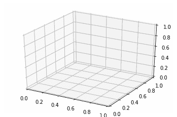
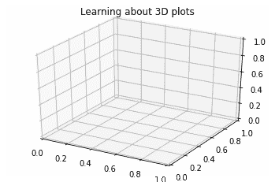
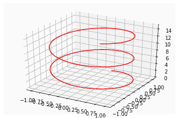
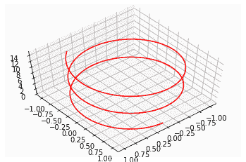
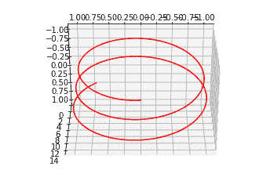
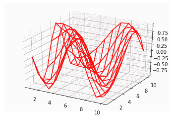
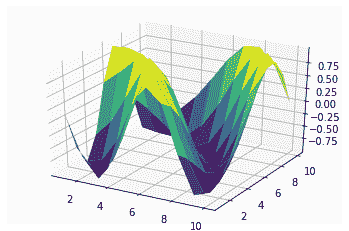

# 使用 Matplotlib 在 Python 中绘制三维图形

> 原文：<https://www.askpython.com/python-modules/matplotlib/3-dimensional-plots-in-python>

就像二维绘图一样，你也可以使用 matplotlib 在 Python 中创建三维绘图。在本教程中，我们将学习如何使用 matplotlib 绘制三维图。

## 如何用 Python 绘制三维图形？

我们将使用 **[mplot3d](https://matplotlib.org/mpl_toolkits/mplot3d/tutorial.html#surface-plots)** 工具包和 **[matpotlib 库](https://www.askpython.com/python-modules/matplotlib/python-matplotlib)。**mplot3d 工具包建立在 matplotlib 库的基础上，可以轻松创建三维绘图。

所以不要再拖延了，让我们开始吧！

### 1.导入必要的模块

首先，我们将导入 **matplotlib 和 mplot3d 工具包**。除了这两个，我们还将 [**导入 numpy**](https://www.askpython.com/python-modules/numpy/python-numpy-module) 来创建样本数据。下面给出了导入这三个组件的代码。

```py
from mpl_toolkits import mplot3d
import numpy as np
import matplotlib.pyplot as plt

```

### 2.创建三维轴

现在我们可以使用[导入的模块](https://www.askpython.com/python/python-import-statement)创建三维轴。

```py
from mpl_toolkits import mplot3d
import numpy as np
import matplotlib.pyplot as plt

#create 3d axes
fig = plt.figure()
ax = plt.axes(projection='3d')
plt.show()

```

输出:



Axes

现在我们有了轴，让我们试着画些东西。在绘图时，我们需要确保提供所有三个轴(x、y 和 z)的值。

在接下来的几节中，我们将学习如何使用*正弦函数(正弦和余弦)制作螺旋。*

在此之前，我们将学习如何为情节添加标题。

### 3.为情节添加标题

您可以使用 set_title()方法向绘图添加标题:

```py
ax.set_title('Learning about 3D plots') 

```

要查看上面的代码行，请运行以下命令:

```py
from mpl_toolkits import mplot3d
import numpy as np
import matplotlib.pyplot as plt

#create 3d axes
fig = plt.figure()
ax = plt.axes(projection='3d')

#set title
ax.set_title('Learning about 3D plots') 

plt.show()

```

输出:



Plot With Title

### 4.创建一个螺旋

为了创建一个螺旋，我们将沿着 x 轴使用**正弦函数**和沿着 y 轴使用**余弦函数。**

螺旋的数据点可以按如下方式生成:

```py
z = np.linspace(0, 15, 1000)
x = np.sin(z)
y = np.cos(z)

```

这里函数 [np.linespace](https://www.askpython.com/python-modules/numpy/numpy-linspace-python) 给出了 1000 个 0 到 15 之间的等距点。

完整的代码如下:

```py
from mpl_toolkits import mplot3d
import numpy as np
import matplotlib.pyplot as plt

#create 3d axes
fig = plt.figure()
ax = plt.axes(projection='3d')

#cordiates for spiral
z = np.linspace(0, 15, 1000)
x = np.sin(z)
y = np.cos(z)
ax.plot3D(x, y, z, 'red')

plt.show()

```

**输出:**



Spiral

### 5.改变视角

根据视角的不同，三维图看起来会有所不同。您可以使用 view_init()方法更改三维绘图的视角:

```py
ax.view_init(60, 50)

```

完整的代码如下所示:

```py
from mpl_toolkits import mplot3d
import numpy as np
import matplotlib.pyplot as plt

#create 3d axes
fig = plt.figure()
ax = plt.axes(projection='3d')

#cordiates for spiral
z = np.linspace(0, 15, 1000)
x = np.sin(z)
y = np.cos(z)
ax.plot3D(x, y, z, 'red')

ax.view_init(60, 50)
plt.show()

```

输出:



Changing Viewing Angle

这里我们提到两个参数，轴的仰角和角度(以度为单位)。

我们换个角度试试。

```py
from mpl_toolkits import mplot3d
import numpy as np
import matplotlib.pyplot as plt

#create 3d axes
fig = plt.figure()
ax = plt.axes(projection='3d')

#cordiates for spiral
z = np.linspace(0, 15, 1000)
x = np.sin(z)
y = np.cos(z)
ax.plot3D(x, y, z, 'red')

ax.view_init(120, 90)
plt.show()

```

输出:



Example 2

### 6.绘制线框

可使用 plot_wireframe()方法绘制三维线框，如下例所示:

```py
from mpl_toolkits import mplot3d
import numpy as np
import matplotlib.pyplot as plt

#create 3d axes
fig = plt.figure()
ax = plt.axes(projection='3d')

#function for Z values
def f(x, y): 
    return np.cos(np.sqrt(x ** 2 + y ** 2)) 

# x and y values
x = np.linspace(1, 10, 10) 
y = np.linspace(1, 10, 10) 

X, Y = np.meshgrid(x, y) 
Z = f(X, Y) 

ax = plt.axes(projection ='3d') 
ax.plot_wireframe(X, Y, Z, color ='red') 

plt.show()

```

输出:



Wireframe

这里函数 [np.meshgrid](https://numpy.org/doc/stable/reference/generated/numpy.meshgrid.html) 从坐标向量创建坐标矩阵。

同样，您也可以创建曲面图。让我们在下一节学习如何做到这一点。

### 7.创建曲面图

我们可以用与上面相同的数据创建一个表面图。要创建三维表面图，我们将使用 plot_surface()方法。

```py
from mpl_toolkits import mplot3d
import numpy as np
import matplotlib.pyplot as plt

#create 3d axes
fig = plt.figure()
ax = plt.axes(projection='3d')

#function for Z values
def f(x, y): 
    return np.cos(np.sqrt(x ** 2 + y ** 2)) 

# x and y values 
x = np.linspace(1, 10, 10) 
y = np.linspace(1, 10, 10) 

X, Y = np.meshgrid(x, y) 
Z = f(X, Y) 

ax = plt.axes(projection ='3d') 
ax.plot_surface(X, Y, Z, rstride=1, cstride=1,
                cmap='viridis')

plt.show()

```

输出:



Surface-plot

**在这里，以下自变量的含义如下:**

| *rstride* | 数组行步距(步长) |
| *cstride* | 数组列跨距(步长) |
| *营地* | 曲面片的颜色图。 |

## 结论

本教程是关于 Python 中的三维绘图。我们学习了如何绘制三维轴和数据点。要了解更多 mplot3d 下的三维形状，请参考他们的[官方文档。](https://matplotlib.org/mpl_toolkits/mplot3d/tutorial.html#surface-plots)