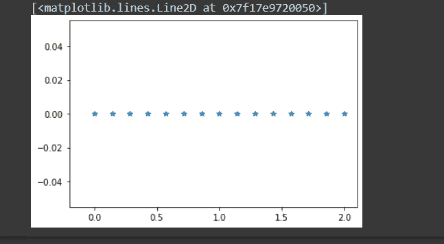
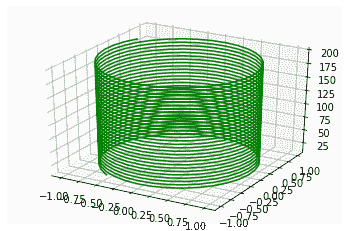
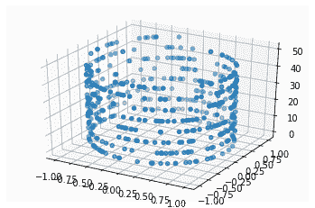
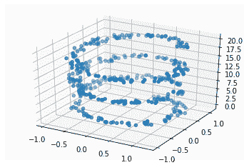
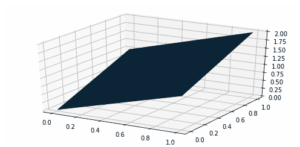
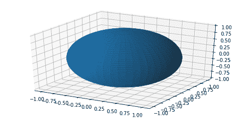

# Python 中的 3D 绘图:快速指南

> 原文：<https://www.askpython.com/python-modules/matplotlib/3d-plot-in-python>

我们将学习几种在 Python 中绘制 3D 图的方法及其适当的用法。我们将开发我们的 Google Colab 笔记本。我们进入正题。

## 绘图所需的方法

在开始我们的例子之前，让我们也理解一下方法。我们将进一步使用它们。

### numpy.linespace()

这个方法用于在我们需要的轴上绘制数值。`numpy.linespace()`的语法如下。

```py
numpy.linspace(start, stop, num = 50, endpoint = True, retstep = False, dtype = None)

```

该方法的参数是:

*   **开始:**我们坐标轴坐标的开始。
*   **停止:**坐标轴的终点。
*   **num:** 要绘制的点样本数
*   **restep:** 如果为真，返回(样本，步骤)。默认情况下，restep = False。(可选)
*   **dtype:** 输出数组的类型。(可选)

我们可以通过下面的例子更好地理解。

```py
import numpy as np
import pylab as p

# taking Start = 0, End = 2 and num=15 as parameters 
x1 = np.linspace(0, 2, 15, endpoint = True)
y1 = np.zeros(15) 

#taking x axis from -0.2 to 2.1 in our graph
p.xlim(-0.2, 2.1)

#plotting graph
p.plot(x1, y1, "*")

```

代码片段将给出如下结果。



`numpy.linespace()` method output

### numpy.mgrid(数码相机)

返回多维度`mesh grid`的 [NumPy 库](https://www.askpython.com/python-modules/numpy/python-numpy-arrays)的实例。一个`mesh grid`是一个具有相似值的 2d 数组。此方法调用 mesh grid 方法来初始化密集多维数组。输出数组的维数和数量等于索引维数。

numpy.mgrid 的语法如下。

```py
numpy.mgrid = <numpy.lib.index_tricks.nd_grid object>

```

在我们的代码片段中，我们可以更好地理解下面的例子。

```py
>>> import numpy as np
>>> new = np.mgrid[0:6, 0:4]
>>> print(new)
[[[0 0 0 0]
  [1 1 1 1]
  [2 2 2 2]
  [3 3 3 3]
  [4 4 4 4]
  [5 5 5 5]]

 [[0 1 2 3]
  [0 1 2 3]
  [0 1 2 3]
  [0 1 2 3]
  [0 1 2 3]
  [0 1 2 3]]]
>>> new2 = np.mgrid[0:3, 0:5]
>>> print(new2)
[[[0 0 0 0 0]
  [1 1 1 1 1]
  [2 2 2 2 2]]

 [[0 1 2 3 4]
  [0 1 2 3 4]
  [0 1 2 3 4]]]

```

让我们开始用不同的方法绘制 3D 模型。

## 使用. plot3D()方法绘制三维模型

用 python 绘制我们的第一个 3D 模型，我们将在 3D 图形中使用 Python 创建一个螺线管。让我们看看下面的代码片段。

```py
#importing required modules for 3D plotting
from mpl_toolkits import mplot3d
import numpy as np
import matplotlib.pyplot as plt

#creating our 3D space using projection=3D parameter
ax = plt.axes(projection='3d')

#using linespace() method to assign plotting range of z-axis
zline = np.linspace(10, 200, 1000)
#taking x-intercept and y-intercept values as sin(zvalue) and cos(zvalue) respectively for different zvalue as radian.  
xline = np.sin(zline)
yline = np.cos(zline)

#using plot3D() method by passing 3 axes values and plotting colour as "green" 
ax.plot3D(xline, yline, zline, 'green')

```

按照上面的代码片段，我们可以得到如下输出。



Example 1 Output

您可以通过更改参数值来尝试上面的代码片段。你可以得到各种其他的结果，也可以更好地理解。让我们看另一个 3D 模型的例子。

## 使用. scatter3D()方法绘制 3D 模型

绘制第二个 3D 模型。我们将使用 python 在 3D 图形中创建一个分散的点状螺线管。让我们看看下面的代码片段。

```py
#importing modules and creating a 3D as previous example 
from mpl_toolkits import mplot3d
import numpy as np
import matplotlib.pyplot as plt
ax = plt.axes(projection='3d')

a = 500
# Data for three-dimensional scattered points
zdata = 50 * np.random.random(a)
xdata = np.sin(zdata) + 0.0 * np.random.random(a)
ydata = np.cos(zdata) + 0.0 * np.random.random(a)

#using the scatter3D() method by passing 3 co-ordinates 
ax.scatter3D(xdata, ydata, zdata);

```

按照上面的代码片段，我们可以得到如下输出。



Example 2 Output

通过改变参数中相同代码片段的值，我们可以得到如下不同的图。

```py
# Data for three-dimensional scattered points
a = 400
zdata = 20 * np.random.random(a)
xdata = np.sin(zdata) + 0.3 * np.random.random(a)
ydata = np.cos(zdata) + 0.1 * np.random.random(a)
ax.scatter3D(xdata, ydata, zdata);

```



Example 2 Output After Changing Parameter Values

## 从元组列表绘制表面

在这个方法中，我们将为一些元组绘制曲面(将元组视为坐标)。

```py
import numpy as np
from matplotlib import pyplot as plt

ax = plt.axes(projection='3d')

# List of tuples
tuple_list = [(1, 0, 0), (0, 1, 0), (0, 0, 1)]

# Data points from the list of tuples
x, y, z = zip(tuple_list)
x, y = np.meshgrid(x, y)
Z = x ** 2 + y ** 2

# Surface plotting using .plot_surface() method
ax.plot_surface(x, y, Z)

plt.show()

```

按照上面的代码片段，我们可以得到如下输出。



Surface By Tuples

## 使用绘制 3D 模型。plot_surface()方法

在这个方法中，我们将使用 **plot_surface()** 在 Python 中绘制球体表面上的点。

```py
import matplotlib.pyplot as plt
import numpy as np

ax = plt.axes(projection='3d')

getting the values for spherical points 
u, v = np.mgrid[0:2 * np.pi:50j, 0:np.pi:50j]
x = np.cos(u) * np.sin(v)
y = np.sin(u) * np.sin(v)
z = np.cos(v)

#Plotting the surface using plot_surface() method
ax.plot_surface(x, y, z)
plt.show()

```

按照上面的代码片段，我们将得到如下输出。



Plot Surface Method

## 摘要

在本文中，我们介绍了如何使用 Python 绘制 3D 模型。我们绘制了一个螺线管、一个球体和一个法线平面。您可以使用不同的值作为参数来尝试相同的代码片段，以获得不同的输出。我们也可以学到更多。希望你一定喜欢它。