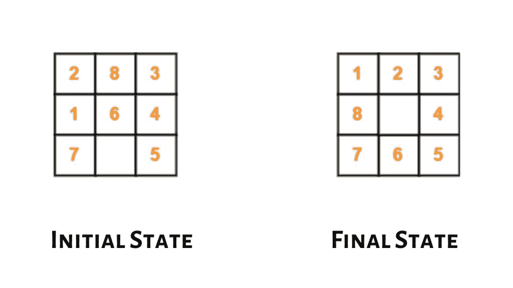

# A*算法——算法介绍(带 Python 实现)

> 原文：<https://www.askpython.com/python/examples/a-star-algorithm>

在本文中，让我们试着理解 A*算法的概念及其重要性。它是一种启发式搜索算法，主要用于确定几个选项中哪一个对达到特定目标状态最有效。

## 什么是 A*算法？

a*算法(读作 A-star)是“分支定界搜索算法”和“最佳搜索算法”与动态规划原理的结合。A*算法是众所周知的，因为它用于定位路径和图形遍历。这种算法被用在许多在线地图和游戏中。它使用通常用 f(X)表示的启发式或评估函数来确定搜索访问树中节点的顺序。节点 N 的启发式函数定义如下:

f(N) = g(N)+h(N)

函数 g 是从起始节点到当前节点 N 的成本的度量，即，它是沿着到当前节点的最佳路径应用的规则的成本的总和。函数 h 是从当前节点 N 到目标节点的附加成本的估计。这是利用问题领域知识的地方。一般来说，A*算法被称为或图/树搜索算法。

A*算法从起始节点开始逐步搜索所有路由，直到找到到达目标的最短路径。从给定的节点开始，该算法扩展具有最低 f(x)值的节点。它维护一组部分解决方案。扩展节点的未扩展叶节点存储在具有相应 f 值的队列中。该队列可以作为优先级队列来维护。

## 例子

让我们再次考虑一个 8 字谜的例子，并通过使用 A*算法来解决它。简单评估函数 f(x)定义如下:

```py
f(x) = g(x)+h(X), 
```

在哪里

*   h(X) =在给定状态 X 下，不在目标位置的瓷砖数量
*   g(X) =搜索树中节点 X 的深度

考虑到



Initial State

让我们试着借助 g(x)和 h(x)计算 f(x)的值，为这个问题开发一个搜索树。


Search Tree

## 用 Python 实现

```py
from copy import deepcopy
import numpy as np
import time

def bestsolution(state):
    bestsol = np.array([], int).reshape(-1, 9)
    count = len(state) - 1
    while count != -1:
        bestsol = np.insert(bestsol, 0, state[count]['puzzle'], 0)
        count = (state[count]['parent'])
    return bestsol.reshape(-1, 3, 3)

# checks for the uniqueness of the iteration(it).
def all(checkarray):
    set=[]
    for it in set:
        for checkarray in it:
            return 1
        else:
            return 0

# number of misplaced tiles 
def misplaced_tiles(puzzle,goal):
    mscost = np.sum(puzzle != goal) - 1
    return mscost if mscost > 0 else 0

def coordinates(puzzle):
    pos = np.array(range(9))
    for p, q in enumerate(puzzle):
        pos[q] = p
    return pos

# start of 8 puzzle evaluvation, using Misplaced tiles heuristics
def evaluvate_misplaced(puzzle, goal):
    steps = np.array([('up', [0, 1, 2], -3),('down', [6, 7, 8],  3),('left', [0, 3, 6], -1),('right', [2, 5, 8],  1)],
                dtype =  [('move',  str, 1),('position', list),('head', int)])

    dtstate = [('puzzle',  list),('parent', int),('gn',  int),('hn',  int)]

    costg = coordinates(goal)
    # initializing the parent, gn and hn, where hn is misplaced_tiles  function call  
    parent = -1
    gn = 0
    hn = misplaced_tiles(coordinates(puzzle), costg)
    state = np.array([(puzzle, parent, gn, hn)], dtstate)

   #priority queues with position as keys and fn as value.
    dtpriority = [('position', int),('fn', int)]

    priority = np.array([(0, hn)], dtpriority)

    while 1:
        priority = np.sort(priority, kind='mergesort', order=['fn', 'position'])      
        position, fn = priority[0]       
        # sort priority queue using merge sort,the first element is picked for exploring.                                          
        priority = np.delete(priority, 0, 0)                         
        puzzle, parent, gn, hn = state[position]
        puzzle = np.array(puzzle)

        blank = int(np.where(puzzle == 0)[0])   

        gn = gn + 1                             
        c = 1
        start_time = time.time()
        for s in steps:
            c = c + 1
            if blank not in s['position']:
                openstates = deepcopy(puzzle)         
                openstates[blank], openstates[blank + s['head']] = openstates[blank + s['head']], openstates[blank]

                if ~(np.all(list(state['puzzle']) == openstates, 1)).any():          
                    end_time = time.time()
                    if (( end_time - start_time ) > 2):
                        print(" The 8 puzzle is unsolvable \n")
                        break

                    hn = misplaced_tiles(coordinates(openstates), costg) 
                    # generate and add new state in the list                    
                    q = np.array([(openstates, position, gn, hn)], dtstate)         
                    state = np.append(state, q, 0)
                    # f(n) is the sum of cost to reach node
                    fn = gn + hn                                        

                    q = np.array([(len(state) - 1, fn)], dtpriority)
                    priority = np.append(priority, q, 0)

                    if np.array_equal(openstates, goal):                      
                        print(' The 8 puzzle is solvable \n')
                        return state, len(priority)

    return state, len(priority)

# initial state 
puzzle = []

puzzle.append(2)
puzzle.append(8)
puzzle.append(3)
puzzle.append(1)
puzzle.append(6)
puzzle.append(4)
puzzle.append(7)
puzzle.append(0)
puzzle.append(5)

#goal state       
goal = []

goal.append(1)
goal.append(2)
goal.append(3)
goal.append(8)
goal.append(0)
goal.append(4)
goal.append(7)
goal.append(6)
goal.append(5) 

state, visited = evaluvate_misplaced(puzzle, goal) 
bestpath = bestsolution(state)
print(str(bestpath).replace('[', ' ').replace(']', ''))
totalmoves = len(bestpath) - 1
print('\nSteps to reach goal:',totalmoves)
visit = len(state) - visited
print('Total nodes visited: ',visit, "\n")

```

## 输出:


Implementation

## A*的可受理性

对于任何一个图，如果从起始状态到目标状态的最优路径存在，那么搜索算法是可接受的。我们前面已经看到，如果试探函数“h”低估了从当前状态到目标状态的实际值，那么它必然给出最优解，因此被称为容许函数。因此，我们可以说，在 h 是一个可接受的启发函数的情况下，A*总是以最优路径终止。

## 限制

用于计算 h 的启发式技术的精度对执行 A*搜索(n)的速度有很大的影响。因此，具有复杂性的问题。

## 摘要

在本文中，我们学习了一种被称为 A*算法的最佳算法。这种搜索算法有助于解决许多常见的寻路问题，如 N 皇后问题、0-1 背包问题、旅行推销员问题等。这种算法以解决复杂问题而闻名，它也用于网络路由协议。它也有助于定义其他算法。它在人工智能领域有着广泛的应用。