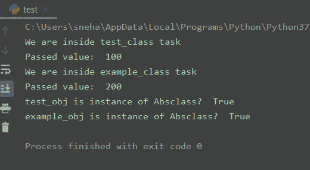

# 理解 Python 中的抽象

> 原文：<https://www.askpython.com/python/oops/abstraction-in-python>

## 导言

在今天的教程中，我们将讨论 Python 中面向对象编程方法的抽象概念。

如果你是第一次接触 **OOP** ，我们强烈推荐你阅读我们的[Python 中的面向对象编程](https://www.askpython.com/python/oops/object-oriented-programming-python)文章。

基本上，**抽象**关注于对用户隐藏过程或方法的内部实现。这样，用户知道他在做什么，但不知道工作是如何完成的。

让我们更深入地挖掘这个主题，以发现它在现实生活和编程中的重要性。

* * *

## Python 中的抽象是什么？

在面向对象编程中，[继承](https://www.askpython.com/python/oops/inheritance-in-python)、[多态](https://www.askpython.com/python/oops/polymorphism-in-python)和[封装](https://www.askpython.com/python/oops/encapsulation-in-python)齐头并进。但是**抽象**也是 OOP 的基本元素。

例如，人们并不认为汽车是由成千上万个独立零件组成的。相反，他们认为它是一个定义明确的对象，有自己独特的行为。这种抽象允许人们在不知道组成汽车的部件的复杂性的情况下使用汽车来驾驶。他们可以忽略发动机传动系统和制动系统如何工作的细节。相反，他们可以自由地将对象作为一个整体来使用。

管理**抽象**的一个强有力的方法是通过使用层次分类。这允许我们将复杂系统的语义分层，将它们分成更易管理的部分。从外面看，汽车是一个单一的物体。一旦进入车内，你会看到汽车由几个子系统组成:转向、刹车、音响系统、安全带等。反过来，这些子系统又由更小的单元组成。

关键是我们通过使用层次抽象来管理汽车(或任何其他复杂系统)的复杂性。

这也可以应用于使用 **OOP** 概念的计算机程序。这是面向对象编程的精髓。

* * *

## Python 中的抽象类和方法

要声明一个**抽象类**，我们首先需要导入`abc`模块。让我们看一个例子。

```py
from abc import ABC
class abs_class(ABC):
     #abstract methods

```

这里，`abs_class`是抽象类，在其中可以定义抽象方法或任何其他种类的方法。

作为一个属性，抽象类可以有任意数量的抽象方法与任意数量的其他方法共存。例如，我们可以在下面看到。

```py
from abc import ABC, abstractmethod
class abs_class(ABC):
    #normal method
    def method(self):
        #method definition
    @abstractmethod
    def Abs_method(self):
        #Abs_method definition

```

这里，`method()`是普通方法，而`Abs_method()`是从 **abc** 模块实现`@abstractmethod`的抽象方法。

* * *

## Python 抽象示例

现在我们知道了抽象类和方法，让我们看一个例子，它解释了 Python 中的**抽象。**

```py
from abc import ABC, abstractmethod
class Absclass(ABC):
    def print(self,x):
        print("Passed value: ", x)
    @abstractmethod
    def task(self):
        print("We are inside Absclass task")

class test_class(Absclass):
    def task(self):
        print("We are inside test_class task")

class example_class(Absclass):
    def task(self):
        print("We are inside example_class task")

#object of test_class created
test_obj = test_class()
test_obj.task()
test_obj.print(100)

#object of example_class created
example_obj = example_class()
example_obj.task()
example_obj.print(200)

print("test_obj is instance of Absclass? ", isinstance(test_obj, Absclass))
print("example_obj is instance of Absclass? ", isinstance(example_obj, Absclass))

```

**输出:**



Python Abstraction Example

这里，

`Absclass`是从 ABC 模块的 **ABC** 类继承而来的抽象类。它包含一个用户可见的抽象方法`task()`和一个`print()`方法。从这个抽象类继承的另外两个类是`test_class`和`example_class`。两者都有自己的`task()`方法(抽象方法的扩展)。

在用户从 **test_class** 和 **example_class** 两个类中创建对象并为它们调用`task()`方法后，两个类中`task()`方法的隐藏定义开始发挥作用。这些定义对用户来说是隐藏的。来自抽象类`Absclass`的抽象方法`task()`实际上从未被调用过。

但是当对 **test_obj** 和 **example_obj** 都调用`print()`方法时，就会调用 Absclass 的`print()`方法，因为它不是抽象方法。

**注意**:我们不能创建抽象类的实例。它引发了一个`Error`。

* * *

## 结论

所以今天在本教程中，我们理解了 Python 中**抽象的概念。**

对于任何进一步的相关问题，请随意使用下面的评论。

* * *

## 参考

*   [Python 中的面向对象编程](https://www.askpython.com/python/oops/object-oriented-programming-python)，
*   [Python 中的继承](https://www.askpython.com/python/oops/inheritance-in-python)，