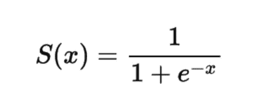

# Python 中的 4 个激活函数要知道！

> 原文：<https://www.askpython.com/python/examples/activation-functions-python>

读者朋友们，你们好！在本文中，我们将详细关注 **Python 激活函数**。

所以，让我们开始吧！！🙂

* * *

## 什么是激活函数？

在神经网络和卷积模型深度学习的世界中，Python 在数据建模和分析方面一直发挥着重要作用。

激活函数是数学基础模型，使我们能够控制神经网络模型的输出。也就是说，它帮助我们分析和估计对模型的实现做出贡献的神经元是被保留还是被移除(激发)。

一些突出的激活功能–

1.  **[ReLu 功能](https://www.askpython.com/python/examples/relu-function)**
2.  **[漏热路功能](https://www.askpython.com/python/examples/relu-function)**
3.  **[乙状结肠功能](https://www.askpython.com/python/examples/neural-networks)**
4.  **[Softmax 功能](https://www.askpython.com/python/examples/calculating-softmax)**
5.  **[线性函数](https://www.askpython.com/python/examples/linear-regression-from-scratch)** 等。

了解了激活函数之后，现在让我们在下一节看看上面的激活函数。

* * *

## 1.ReLu 函数

ReLu 函数是一种激活函数，它使我们能够即兴创作神经网络的卷积图。它根据模型结果检测神经网络的状态。

ReLu 函数声明当输入为负时，返回零。否则对于非负输入，它返回 1。

**举例**:

这里，我们使用 Python 中的 [max()函数](https://www.askpython.com/python/built-in-methods/python-max-method)实现了一个用户定义的函数来灌输 ReLu 条件。

```py
def ReLu(ar):
    return max(0.0,ar)
ar = 1.0
print(ReLu(ar))
ar1= -1.0
print(ReLu(ar1))

```

**输出—**

```py
1.0
0.0

```

* * *

## 2.泄漏 ReLu 函数

梯度分数，即传递给 ReLu 函数的非零输入的导数值，被发现为零。这基本上说明了权重没有被学习函数正确地更新。

为了克服 ReLu 函数的梯度问题，我们引入了泄漏 ReLu 函数。

Leaky ReLu 函数在传递给函数的负(非零)输入权重上附加一个小的线性分量(常数值)。这样，这些非零输入权重的梯度分数变成了非零值。

**举例**:

```py
def ReLu(x):
  if x>0 :
    return x
  else :
    return 0.001*x

x = -1.0
print(ReLu(x))

```

**输出** t:

```py
-0.001

```

* * *

## 3.Sigmoid 函数

sigmoid 激活函数简单地基于以下 Sigmoid 数学公式



**Sigmoid formula**

由于分母总是大于 1，因此该激活函数的输出总是在 0 和 1 之间。

**举例**:

```py
import numpy as np 
def sigmoid(num):
 return 1/(1 + np.exp(-num))
num = -1.0
print(sigmoid(num))

```

**输出**:

```py
0.2689414213699951

```

* * *

## 4.Softmax 函数

softmax 激活函数可以被称为一个数学模型，它接受一个数字数据变量向量作为输入，然后对数据进行归一化。

也就是说，[将](https://www.askpython.com/python/examples/normalize-data-in-python)(缩放数据值)归一化为概率分布，其中每个数据值的概率与向量中存在的每个值的比例成比例。

因此，所有数据值都将在 0–1 的范围内。此外，所有数据值的总和将等于 1，因为它们被解释为概率。

* * *

## 结论

到此，我们就结束了这个话题。如果你遇到任何问题，欢迎在下面评论。

更多与 Python 编程相关的帖子，请继续关注我们。

在那之前，学习愉快！！🙂