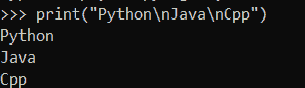
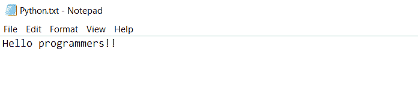
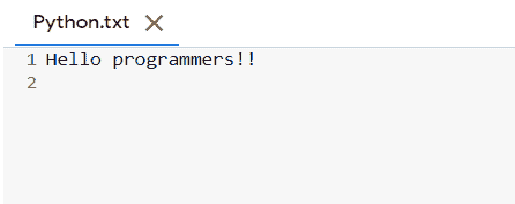

# 用 Python 添加换行符——6 种简单的方法！

> 原文：<https://www.askpython.com/python/examples/add-a-newline-character-in-python>

嘿伙计们！希望你们都过得好。在本文中，我们将揭示在 Python 中添加换行符(\n)到要打印的数据输出的不同方法。

所以，让我们开始吧！

* * *

## 技巧 1:在多行字符串中添加换行符

[Python 多行字符串](https://www.askpython.com/python/string/python-multiline-strings)提供了一种以对齐方式表示多个字符串的有效方式。换行符(\n)可以添加到多行字符串中，如下所示

**语法:**

```py
string = '''str1\nstr2....\nstrN'''

```

在多行字符串中，我们可以很容易地在想要显示在新行上的每个字符串前使用' \n '。

**举例:**

```py
str='''Hello all!! \nI am Pythoner \nWelcome to the AskPython Tutorial''' 
print(str)

```

**输出:**

```py
Hello all!! 
I am Pythoner 
Welcome to the AskPython Tutorial

```

* * *

## 技术 2:在 Python 列表中添加新行

[Python List](https://www.askpython.com/python/list/python-list) 可以认为是一个动态数组，在动态运行时将异构元素存储到其中。

[string.join()函数](https://www.askpython.com/python/string/python-string-join-method)可用于在列表元素中添加新行，如下所示

**语法:**

```py
'\n'.join(list)

```

**举例**:

```py
lst = ['Python','Java','Kotlin','Cpp']
print("List before adding newline character to it:",lst)
lst = '\n'.join(lst)
print("List after adding newline character to it:\n",lst)

```

**输出:**

```py
List before adding newline character to it: ['Python', 'Java', 'Kotlin', 'Cpp']
List after adding newline character to it:
 Python
Java
Kotlin
Cpp

```

* * *

## 技术 3:在控制台上显示换行符

在最开始的阶段，了解控制台上功能的执行是很重要的。要在控制台上添加换行符，请使用以下代码

```py
print("str1\nstr2")

```

**举例:**



**Python newline with console**

* * *

## 技巧 4:通过打印语句显示新行

换行符可以添加到 [print()函数](https://www.askpython.com/python/built-in-methods/python-print-function)中，以便在新的一行上显示字符串，如下所示

**语法:**

```py
print("str1\nstr2\n...\strN")

```

**举例:**

```py
print("Hello Folks! Let us start learning.")
print("Statement after adding newline through print() function....")
print("Hello Folks!\nLet us start learning.")

```

**输出:**

```py
Hello Folks! Let us start learning.
Statement after adding newline through print() function....
Hello Folks!
Let us start learning.

```

* * *

## 技巧 5:通过 Python f-string 添加一个换行符

[Python f-string](https://www.askpython.com/python/string/python-f-string) 也在控制台上以格式化的方式表示字符串语句。要通过 f 字符串添加换行符，请遵循以下语法:

```py
newline = '\n'
string = f"str1{newline}str2"

```

**举例:**

```py
newline = '\n'
str = f"Python{newline}Java{newline}Cpp"
print(str)

```

**输出:**

```py
Python
Java
Cpp

```

* * *

## 技巧 6:向文件中写入新的一行

可以使用以下语法将换行符追加到 [Python 文件](https://www.askpython.com/python/python-file-handling)中:

**语法:**

```py
file_object.write("\n")

```

**举例:**

这里，我们使用了 Python.txt 文件，其中包含如下所示的预定义内容



**Python Text-file**

```py
import os 
file = "/Python.txt" 
with open(file, 'a') as file: 
  file.write("\n")  

```

**输出:**

如下所示，新的一行被添加到文件内容中。



**Add newline To A Python File**

* * *

## 结论

到此，我们就结束了这个话题。如果你遇到任何问题，请随时在下面评论。

在那之前，学习愉快！！

* * *

## 参考

*   [给 Python 文件添加新行——Quora](https://www.quora.com/How-do-you-write-in-a-new-line-on-a-text-file-in-Python)